# Parent Section Magnitude-Probability Distributions

Only fault sections with at least one triggered aftershock are plotted. Sections are sorted by total supraseismogenic trigger rate (decreasing)

## Table Of Contents

* [Tank Canyon](#tank-canyon)
* [Garlock (Central)](#garlock-central)
* [Little Lake](#little-lake)
* [Owl Lake](#owl-lake)
* [Airport Lake](#airport-lake)
* [Panamint Valley](#panamint-valley)
* [Garlock (East)](#garlock-east)
* [Ash Hill](#ash-hill)
* [Hunter Mountain-Saline Valley](#hunter-mountain-saline-valley)
* [Blackwater](#blackwater)
* [McLean Lake](#mclean-lake)
* [Goldstone Lake](#goldstone-lake)
* [Garlock (West)](#garlock-west)
* [Gravel Hills-Harper Lk](#gravel-hills-harper-lk)
* [Coyote Canyon](#coyote-canyon)
* [Death Valley (So)](#death-valley-so)
* [Nelson Lake](#nelson-lake)
* [So Sierra Nevada](#so-sierra-nevada)
* [San Andreas (Mojave S)](#san-andreas-mojave-s)
* [Towne Pass](#towne-pass)
* [Bicycle Lake](#bicycle-lake)
* [San Andreas (Mojave N)](#san-andreas-mojave-n)
* [Lenwood-Lockhart-Old Woman Springs](#lenwood-lockhart-old-woman-springs)
* [Paradise](#paradise)
* [Garlic Springs](#garlic-springs)
* [San Andreas (San Bernardino N)](#san-andreas-san-bernardino-n)
* [Coyote Lake](#coyote-lake)
* [Death Valley (Black Mtns Frontal)](#death-valley-black-mtns-frontal)
* [Helendale-So Lockhart](#helendale-so-lockhart)
* [San Andreas (San Bernardino S)](#san-andreas-san-bernardino-s)
* [San Andreas (Big Bend)](#san-andreas-big-bend)
* [Cady](#cady)
* [Red Pass](#red-pass)
* [Elsinore (Glen Ivy) rev](#elsinore-glen-ivy-rev)
* [Death Valley (No)](#death-valley-no)
* [Scodie Lineament](#scodie-lineament)
* [Manix-Afton Hills](#manix-afton-hills)
* [San Andreas (San Gorgonio Pass-Garnet HIll)](#san-andreas-san-gorgonio-pass-garnet-hill)
* [Ludlow](#ludlow)
* [Baker](#baker)
* [San Andreas (Cholame) rev](#san-andreas-cholame-rev)
* [Sierra Nevada  (No Extension)](#sierra-nevada--no-extension)
* [San Andreas (Parkfield)](#san-andreas-parkfield)
* [White Wolf (Extension)](#white-wolf-extension)
* [San Andreas (Carrizo) rev](#san-andreas-carrizo-rev)
* [Calico-Hidalgo](#calico-hidalgo)
* [Cleghorn Lake](#cleghorn-lake)
* [Santa Ynez (West)](#santa-ynez-west)
* [San Andreas (Coachella) rev](#san-andreas-coachella-rev)
* [Cleghorn Pass](#cleghorn-pass)
* [San Andreas (Creeping Section) 2011 CFM](#san-andreas-creeping-section-2011-cfm)
* [Pisgah-Bullion Mtn-Mesquite Lk](#pisgah-bullion-mtn-mesquite-lk)
* [Ortigalita (North)](#ortigalita-north)
* [Bullion Mountains](#bullion-mountains)
* [Independence rev 2011](#independence-rev-2011)
* [San Jacinto (San Bernardino)](#san-jacinto-san-bernardino)
* [Pleito](#pleito)
* [Death Valley (Fish Lake Valley)](#death-valley-fish-lake-valley)
* [Big Pine (Central)](#big-pine-central)
* [Deep Springs](#deep-springs)
* [Lake Isabella (Seismicity)](#lake-isabella-seismicity)
* [Rose Canyon](#rose-canyon)
* [Whittier alt 1](#whittier-alt-1)
* [Santa Rosa Island](#santa-rosa-island)
* [San Jacinto (San Jacinto Valley) rev](#san-jacinto-san-jacinto-valley-rev)
* [San Jacinto (Lytle Creek connector)](#san-jacinto-lytle-creek-connector)
* [San Andreas (North Branch Mill Creek)](#san-andreas-north-branch-mill-creek)
* [Pinto Mtn](#pinto-mtn)
* [Great Valley 09 (Laguna Seca)](#great-valley-09-laguna-seca)
* [Owens Valley](#owens-valley)
* [Kern Canyon (South Kern) 2011](#kern-canyon-south-kern-2011)
* [Lost Hills](#lost-hills)
* [San Jacinto (Stepovers Combined)](#san-jacinto-stepovers-combined)
* [Kern Canyon (North Kern) 2011](#kern-canyon-north-kern-2011)
* [Cucamonga](#cucamonga)
* [Coronado Bank alt1](#coronado-bank-alt1)
* [Chino alt 1](#chino-alt-1)
* [Santa Cruz Island](#santa-cruz-island)
* [Palos Verdes](#palos-verdes)
* [San Jacinto (Anza) rev](#san-jacinto-anza-rev)
* [Santa Ynez (East)](#santa-ynez-east)
* [Calaveras (So) - Paicines extension 2011 CFM](#calaveras-so---paicines-extension-2011-cfm)
* [White Mountains](#white-mountains)
* [Sheephole](#sheephole)
* [Santa Ynez River](#santa-ynez-river)
* [Oceanic - West Huasna](#oceanic---west-huasna)
* [Oak Ridge (Onshore)](#oak-ridge-onshore)
* [Dry Mountain](#dry-mountain)
* [San Diego Trough north alt1](#san-diego-trough-north-alt1)
* [Big Pine (East)](#big-pine-east)
* [Ventura-Pitas Point](#ventura-pitas-point)
* [Hayward (So) 2011 CFM](#hayward-so-2011-cfm)
* [San Pedro Basin](#san-pedro-basin)
* [Blue Cut](#blue-cut)
* [Red Mountain](#red-mountain)
* [Mission Ridge-Arroyo Parida-Santa Ana](#mission-ridge-arroyo-parida-santa-ana)
* [Santa Cruz Catalina Ridge alt1](#santa-cruz-catalina-ridge-alt1)
* [Cleghorn](#cleghorn)
* [San Diego Trough south](#san-diego-trough-south)
* [Tin Mountain](#tin-mountain)
* [Camp Rock 2011](#camp-rock-2011)
* [San Clemente](#san-clemente)
* [Sierra Madre](#sierra-madre)
* [Gillem - Big Crack 2011 CFM](#gillem---big-crack-2011-cfm)
* [Brawley (Seismic Zone) alt 1](#brawley-seismic-zone-alt-1)
* [San Jacinto (Clark) rev](#san-jacinto-clark-rev)
* [Santa Susana East (connector)](#santa-susana-east-connector)
* [Emerson-Copper Mtn 2011](#emerson-copper-mtn-2011)
* [Rinconada 2011 CFM](#rinconada-2011-cfm)
* [North Frontal  (West)](#north-frontal--west)
* [Imperial](#imperial)
* [Hosgri (Extension)](#hosgri-extension)
* [Raymond](#raymond)
* [Simi-Santa Rosa](#simi-santa-rosa)
* [Santa Susana alt 1](#santa-susana-alt-1)
* [Mission Hills 2011](#mission-hills-2011)
* [San Juan](#san-juan)
* [San Jacinto (Coyote Creek)](#san-jacinto-coyote-creek)
* [Homestead Valley 2011](#homestead-valley-2011)
* [Holser alt 1](#holser-alt-1)
* [Los Alamos extension](#los-alamos-extension)
* [Channel Islands Thrust](#channel-islands-thrust)
* [Pine Mtn](#pine-mtn)
* [Channel Islands Western Deep Ramp](#channel-islands-western-deep-ramp)
* [San Gabriel (Extension)](#san-gabriel-extension)
* [San Jacinto (Borrego)](#san-jacinto-borrego)
* [Monterey Bay-Tularcitos](#monterey-bay-tularcitos)
* [Elysian Park (Upper)](#elysian-park-upper)
* [Calaveras (So) 2011 CFM](#calaveras-so-2011-cfm)
* [Ortigalita (South)](#ortigalita-south)
* [Kern Canyon (Lake Isabella) 2011](#kern-canyon-lake-isabella-2011)
* [Los Alamos 2011 CFM](#los-alamos-2011-cfm)
* [Sisar](#sisar)
* [Great Valley 05 Pittsburg - Kirby Hills alt1](#great-valley-05-pittsburg---kirby-hills-alt1)
* [Kickapoo](#kickapoo)
* [Round Valley](#round-valley)
* [South Klamath Lake West](#south-klamath-lake-west)
* [Hosgri](#hosgri)
* [Franklin 2011 CFM](#franklin-2011-cfm)
* [Surprise Valley 2011 CFM](#surprise-valley-2011-cfm)
* [Great Valley 08 (Quinto)](#great-valley-08-quinto)
* [Earthquake Valley (So Extension)](#earthquake-valley-so-extension)
* [Clamshell-Sawpit](#clamshell-sawpit)
* [Northridge](#northridge)
* [San Jose](#san-jose)
* [Johnson Valley (No) 2011 rev](#johnson-valley-no-2011-rev)
* [Carlsbad](#carlsbad)
* [Mission Creek](#mission-creek)
* [Elysian Park (Lower CFM)](#elysian-park-lower-cfm)
* [San Jacinto (Superstition Mtn)](#san-jacinto-superstition-mtn)
* [San Gabriel](#san-gabriel)
* [Newport-Inglewood (Offshore)](#newport-inglewood-offshore)
* [White Wolf](#white-wolf)
* [Malibu Coast (Extension) alt 1](#malibu-coast-extension-alt-1)
* [Oceanside alt1](#oceanside-alt1)
* [South Klamath Lake East](#south-klamath-lake-east)
* [Pitas Point (Lower West)](#pitas-point-lower-west)
* [San Andreas (Santa Cruz Mts) 2011 CFM](#san-andreas-santa-cruz-mts-2011-cfm)
* [Pitas Point (Lower)-Montalvo](#pitas-point-lower-montalvo)
* [Elsinore (Stepovers Combined)](#elsinore-stepovers-combined)
* [Cerro Prieto](#cerro-prieto)
* [Cedar Mtn-Mahogany Mtn](#cedar-mtn-mahogany-mtn)
* [Newport-Inglewood alt 1](#newport-inglewood-alt-1)
* [Carson Range (Genoa)](#carson-range-genoa)
* [Sierra Madre (San Fernando)](#sierra-madre-san-fernando)
* [Hector Mine](#hector-mine)
* [San Gregorio (North) 2011 CFM](#san-gregorio-north-2011-cfm)
* [Great Valley 06 (Midland) 2011 CFM alt1](#great-valley-06-midland-2011-cfm-alt1)
* [Antelope Valley 2011](#antelope-valley-2011)
* [Burnt Mtn](#burnt-mtn)
* [Earthquake Valley (No  Extension)](#earthquake-valley-no--extension)
* [Calaveras (No) 2011 CFM](#calaveras-no-2011-cfm)
* [San Cayetano](#san-cayetano)
* [Northridge Hills](#northridge-hills)

## Tank Canyon
*[(top)](#table-of-contents)*

| 1 Week | 1 Month | 1 Year | 10 Year |
|-----|-----|-----|-----|
| 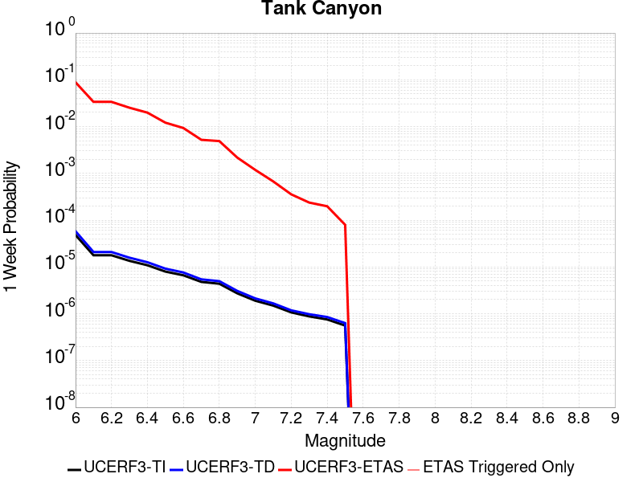 | 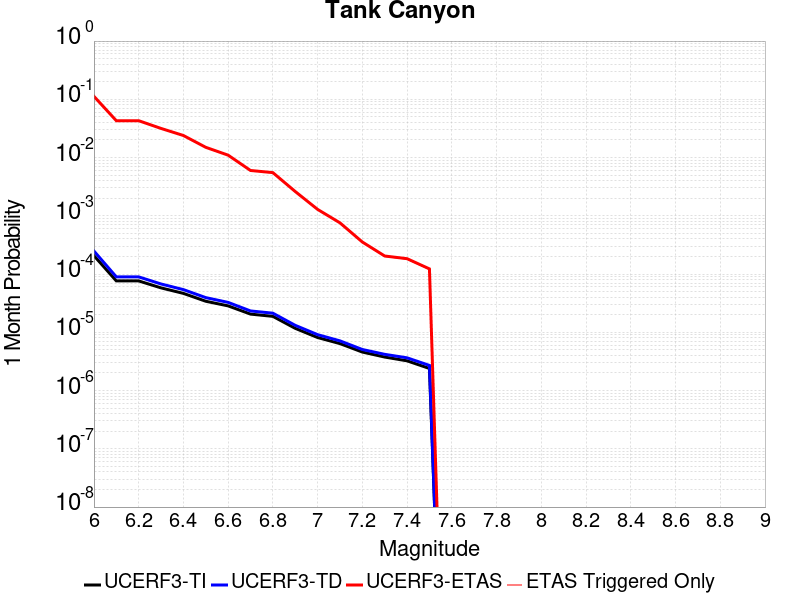 | 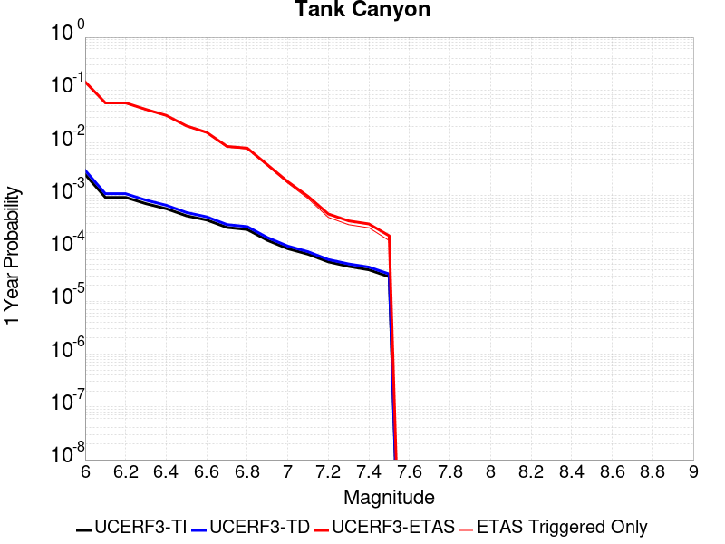 | 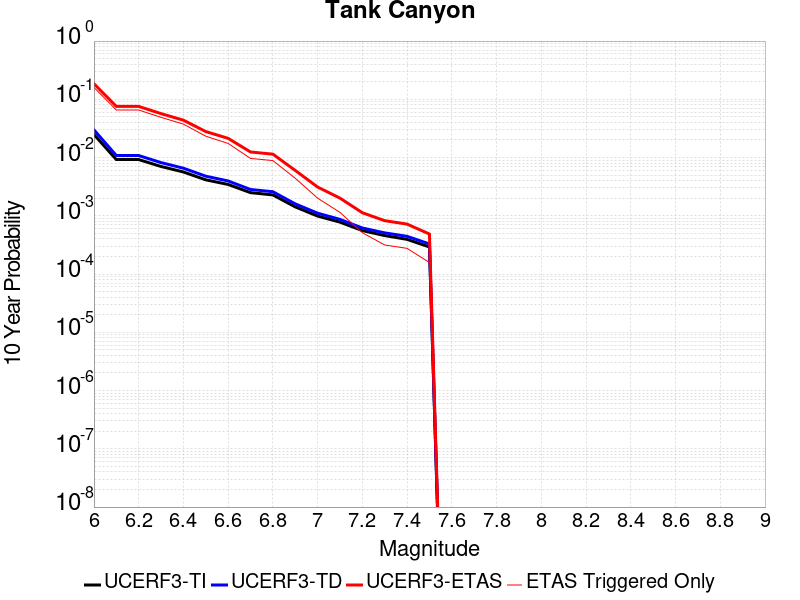 |

| Magnitude | 1 wk TI Prob | 1 wk TD Prob | 1 wk ETAS Prob | 1 wk ETAS/TD Gain | 1 wk ETAS Triggered Only | 1 mo TI Prob | 1 mo TD Prob | 1 mo ETAS Prob | 1 mo ETAS/TD Gain | 1 mo ETAS Triggered Only | 1 yr TI Prob | 1 yr TD Prob | 1 yr ETAS Prob | 1 yr ETAS/TD Gain | 1 yr ETAS Triggered Only | 10 yr TI Prob | 10 yr TD Prob | 10 yr ETAS Prob | 10 yr ETAS/TD Gain | 10 yr ETAS Triggered Only |
|-----|-----|-----|-----|-----|-----|-----|-----|-----|-----|-----|-----|-----|-----|-----|-----|-----|-----|-----|-----|-----|
| 6.0 | 4.8284557E-5 | 5.7964822E-5 | 0.08838329 | 1524.7745 | 0.08833044 | 2.0691741E-4 | 2.4840087E-4 | 0.11001283 | 442.88425 | 0.109791696 | 0.0025163088 | 0.0030207601 | 0.1433955 | 47.470005 | 0.14080006 | 0.02488006 | 0.029863637 | 0.18498288 | 6.194252 | 0.15989427 |
| 6.1 | 1.7796336E-5 | 2.0873314E-5 | 0.033750642 | 1616.9277 | 0.033730473 | 7.626778E-5 | 8.945422E-5 | 0.042495318 | 475.05103 | 0.04240966 | 9.281647E-4 | 0.0010885983 | 0.057166036 | 52.51344 | 0.056138553 | 0.009242975 | 0.010836744 | 0.075654484 | 6.981293 | 0.06552785 |
| 6.2 | 1.7796336E-5 | 2.0873314E-5 | 0.033750642 | 1616.9277 | 0.033730473 | 7.626778E-5 | 8.945422E-5 | 0.042495318 | 475.05103 | 0.04240966 | 9.281647E-4 | 0.0010885983 | 0.057166036 | 52.51344 | 0.056138553 | 0.009242975 | 0.010836744 | 0.075654484 | 6.981293 | 0.06552785 |
| 6.3 | 1.3515912E-5 | 1.5759564E-5 | 0.025303353 | 1605.587 | 0.025287991 | 5.792405E-5 | 6.753938E-5 | 0.031783875 | 470.5977 | 0.031718478 | 7.049971E-4 | 8.2200574E-4 | 0.042920873 | 52.21481 | 0.042133503 | 0.007027647 | 0.0081922645 | 0.05678881 | 6.932004 | 0.04899795 |
| 6.4 | 1.0870146E-5 | 1.2618021E-5 | 0.019856142 | 1573.6337 | 0.019843774 | 4.658551E-5 | 5.4076212E-5 | 0.024591174 | 454.7503 | 0.024538426 | 5.67031E-4 | 6.581969E-4 | 0.03302602 | 50.176506 | 0.03238914 | 0.005655863 | 0.0065644905 | 0.04383596 | 6.6777396 | 0.037517752 |
| 6.5 | 7.964826E-6 | 9.196094E-6 | 0.012120494 | 1318.0045 | 0.01211141 | 3.4134522E-5 | 3.9411298E-5 | 0.015187939 | 385.37018 | 0.015149124 | 4.1550855E-4 | 4.7973756E-4 | 0.020629447 | 43.001526 | 0.02015938 | 0.0041473247 | 0.004788321 | 0.027952867 | 5.8377175 | 0.023275997 |
| 6.6 | 6.6317E-6 | 7.6122988E-6 | 0.009317941 | 1224.064 | 0.009310399 | 2.8421264E-5 | 3.2623782E-5 | 0.011512445 | 352.88507 | 0.011480195 | 3.4597394E-4 | 3.9713128E-4 | 0.0154613685 | 38.93264 | 0.015070222 | 0.0034543579 | 0.003965368 | 0.02137279 | 5.389863 | 0.017476724 |
| 6.7 | 4.793663E-6 | 5.4307857E-6 | 0.0052129137 | 959.8821 | 0.0052075116 | 2.0544108E-5 | 2.3274613E-5 | 0.0063747126 | 273.89124 | 0.006351586 | 2.500958E-4 | 2.8333595E-4 | 0.0085262265 | 30.092287 | 0.008245226 | 0.0024981452 | 0.0028304397 | 0.012468539 | 4.40516 | 0.009665457 |
| 6.8 | 4.382823E-6 | 4.9692567E-6 | 0.00489685 | 985.42896 | 0.0048919045 | 1.8783392E-5 | 2.1296666E-5 | 0.005978247 | 280.71283 | 0.0059570773 | 2.286638E-4 | 2.5926033E-4 | 0.007871299 | 30.360601 | 0.007614013 | 0.0022842865 | 0.002590253 | 0.011443701 | 4.417986 | 0.00887644 |
| 6.9 | 2.729601E-6 | 3.0735416E-6 | 0.0021728633 | 706.95746 | 0.0021697965 | 1.1698237E-5 | 1.3172262E-5 | 0.002774695 | 210.6468 | 0.002761559 | 1.4241673E-4 | 1.6036171E-4 | 0.0037892573 | 23.629438 | 0.0036294777 | 0.001423255 | 0.0016026258 | 0.0060140393 | 3.752616 | 0.0044184946 |
| 7.0 | 1.8987357E-6 | 2.126939E-6 | 0.0011856498 | 557.44415 | 0.0011835253 | 8.137413E-6 | 9.115425E-6 | 0.0013504319 | 148.148 | 0.0013413287 | 9.90685E-5 | 1.1097535E-4 | 0.0018071734 | 16.284458 | 0.0016963863 | 9.902435E-4 | 0.0011092679 | 0.003119029 | 2.8117905 | 0.002011993 |
| 7.1 | 1.4928986E-6 | 1.6641272E-6 | 6.7232735E-4 | 404.012 | 6.7066436E-4 | 6.398121E-6 | 7.1319573E-6 | 8.355938E-4 | 117.16191 | 8.284677E-4 | 7.789434E-5 | 8.682871E-5 | 9.941193E-4 | 11.449201 | 9.073694E-4 | 7.786704E-4 | 8.6800574E-4 | 0.0020110873 | 2.3169053 | 0.0011440745 |
| 7.2 | 1.069082E-6 | 1.1828573E-6 | 3.5624002E-4 | 301.16907 | 3.550576E-4 | 4.581772E-6 | 5.0693816E-6 | 3.9957583E-4 | 78.82142 | 3.9450845E-4 | 5.5781646E-5 | 6.171851E-5 | 4.95651E-4 | 8.030833 | 4.339593E-4 | 5.576765E-4 | 6.170659E-4 | 0.0011296103 | 1.8306155 | 5.1286095E-4 |
| 7.3 | 8.776551E-7 | 9.770005E-7 | 2.3768183E-4 | 243.27708 | 2.3670506E-4 | 3.7613736E-6 | 4.1871413E-6 | 2.803419E-4 | 66.95306 | 2.7615592E-4 | 4.579376E-5 | 5.097777E-5 | 3.6656845E-4 | 7.1907506 | 3.1560674E-4 | 4.5784327E-4 | 5.097118E-4 | 8.251577E-4 | 1.6188711 | 3.1560674E-4 |
| 7.4 | 7.55721E-7 | 8.510244E-7 | 1.9810507E-4 | 232.78424 | 1.9725422E-4 | 3.2388E-6 | 3.6472454E-6 | 2.4035145E-4 | 65.899445 | 2.3670506E-4 | 3.9431678E-5 | 4.4404827E-5 | 3.2054848E-4 | 7.2187753 | 2.7615592E-4 | 3.942468E-4 | 4.440104E-4 | 7.2004367E-4 | 1.621682 | 2.7615592E-4 |
| 7.5 | 5.587665E-7 | 6.305619E-7 | 7.95322E-5 | 126.1291 | 7.8901685E-5 | 2.3947114E-6 | 2.702408E-6 | 1.2105462E-4 | 44.795094 | 1.1835253E-4 | 2.915522E-5 | 3.290182E-5 | 1.907E-4 | 5.7960324 | 1.5780337E-4 | 2.9151395E-4 | 3.290182E-4 | 4.8676966E-4 | 1.4794612 | 1.5780337E-4 |

## Garlock (Central)
*[(top)](#table-of-contents)*

| 1 Week | 1 Month | 1 Year | 10 Year |
|-----|-----|-----|-----|
| 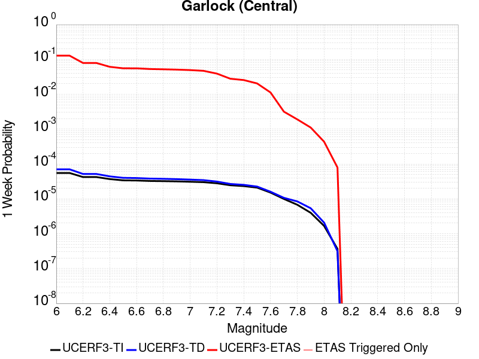 | 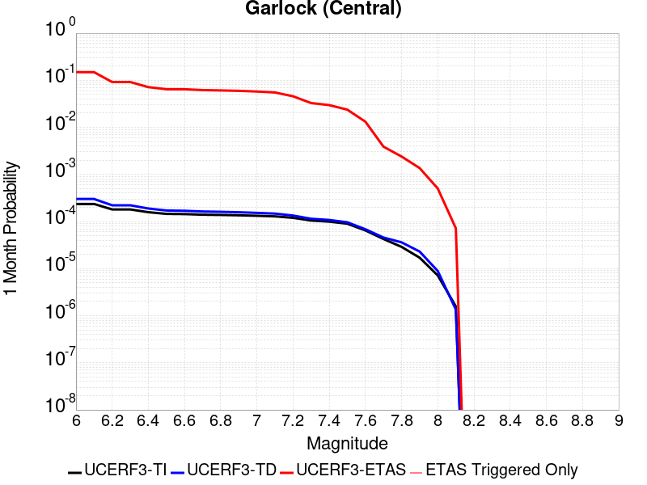 | 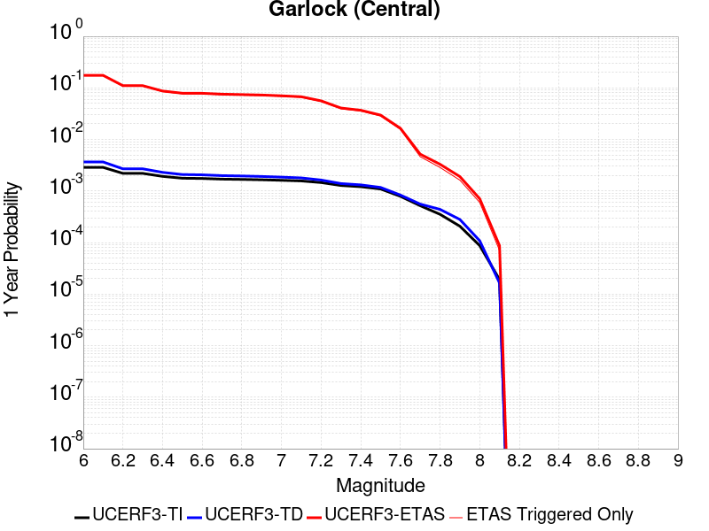 | 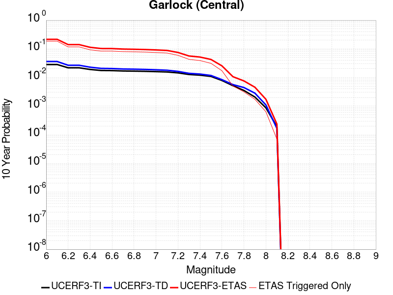 |

| Magnitude | 1 wk TI Prob | 1 wk TD Prob | 1 wk ETAS Prob | 1 wk ETAS/TD Gain | 1 wk ETAS Triggered Only | 1 mo TI Prob | 1 mo TD Prob | 1 mo ETAS Prob | 1 mo ETAS/TD Gain | 1 mo ETAS Triggered Only | 1 yr TI Prob | 1 yr TD Prob | 1 yr ETAS Prob | 1 yr ETAS/TD Gain | 1 yr ETAS Triggered Only | 10 yr TI Prob | 10 yr TD Prob | 10 yr ETAS Prob | 10 yr ETAS/TD Gain | 10 yr ETAS Triggered Only |
|-----|-----|-----|-----|-----|-----|-----|-----|-----|-----|-----|-----|-----|-----|-----|-----|-----|-----|-----|-----|-----|
| 6.0 | 5.5131142E-5 | 7.024681E-5 | 0.12803979 | 1822.7133 | 0.12797853 | 2.3625491E-4 | 3.010234E-4 | 0.14740838 | 489.6908 | 0.14715165 | 0.0028726095 | 0.0036588663 | 0.17405254 | 47.570072 | 0.1710194 | 0.028357591 | 0.036079824 | 0.2139723 | 5.930525 | 0.18455105 |
| 6.1 | 5.5131142E-5 | 7.024681E-5 | 0.12803979 | 1822.7133 | 0.12797853 | 2.3625491E-4 | 3.010234E-4 | 0.14740838 | 489.6908 | 0.14715165 | 0.0028726095 | 0.0036588663 | 0.17405254 | 47.570072 | 0.1710194 | 0.028357591 | 0.036079824 | 0.2139723 | 5.930525 | 0.18455105 |
| 6.2 | 4.216245E-5 | 5.1661493E-5 | 0.079028174 | 1529.7307 | 0.07898059 | 1.806837E-4 | 2.2138779E-4 | 0.09101713 | 411.12082 | 0.09081584 | 0.0021976046 | 0.0026920962 | 0.10982755 | 40.79629 | 0.10742465 | 0.021759989 | 0.026689773 | 0.13988681 | 5.241214 | 0.11630109 |
| 6.3 | 4.216245E-5 | 5.1661493E-5 | 0.079028174 | 1529.7307 | 0.07898059 | 1.806837E-4 | 2.2138779E-4 | 0.09101713 | 411.12082 | 0.09081584 | 0.0021976046 | 0.0026920962 | 0.10982755 | 40.79629 | 0.10742465 | 0.021759989 | 0.026689773 | 0.13988681 | 5.241214 | 0.11630109 |
| 6.4 | 3.6858168E-5 | 4.411054E-5 | 0.06126912 | 1388.9905 | 0.06122771 | 1.5795401E-4 | 1.8903162E-4 | 0.07118713 | 376.58847 | 0.07101152 | 0.0019213937 | 0.002299056 | 0.08656912 | 37.654205 | 0.08446426 | 0.019048655 | 0.02284894 | 0.11278477 | 4.9361053 | 0.09203882 |
| 6.5 | 3.39199E-5 | 4.0018083E-5 | 0.055584583 | 1388.9867 | 0.05554679 | 1.453629E-4 | 1.7149492E-4 | 0.064465344 | 375.90234 | 0.06430487 | 0.0017683565 | 0.002085973 | 0.07861844 | 37.689095 | 0.07669244 | 0.017543508 | 0.020759864 | 0.102427594 | 4.933924 | 0.08339909 |
| 6.6 | 3.3571985E-5 | 3.9472274E-5 | 0.05550517 | 1406.1813 | 0.05546789 | 1.4387199E-4 | 1.6915603E-4 | 0.06438427 | 380.62057 | 0.06422597 | 0.0017502342 | 0.0020575512 | 0.078395344 | 38.101288 | 0.076495185 | 0.017365133 | 0.020481179 | 0.101978935 | 4.9791536 | 0.08320183 |
| 6.7 | 3.2580007E-5 | 3.8088703E-5 | 0.053018555 | 1391.976 | 0.052982483 | 1.3962112E-4 | 1.632272E-4 | 0.061735943 | 378.22092 | 0.061582766 | 0.0016985617 | 0.0019855013 | 0.07537587 | 37.963142 | 0.07353637 | 0.016856372 | 0.019773813 | 0.09808208 | 4.960201 | 0.07988796 |
| 6.8 | 3.2185937E-5 | 3.7515918E-5 | 0.05207123 | 1387.9768 | 0.052035663 | 1.3793244E-4 | 1.6077272E-4 | 0.060629193 | 377.1112 | 0.060478143 | 0.0016780337 | 0.001955672 | 0.07389141 | 37.783127 | 0.07207669 | 0.016654192 | 0.019480614 | 0.096303694 | 4.943566 | 0.078349374 |
| 6.9 | 3.165394E-5 | 3.6720503E-5 | 0.05100534 | 1389.0153 | 0.05097049 | 1.3565269E-4 | 1.5736422E-4 | 0.05944265 | 377.73932 | 0.05929462 | 0.0016503202 | 0.001914247 | 0.07247483 | 37.86075 | 0.070695914 | 0.01638118 | 0.019073246 | 0.09438031 | 4.9483085 | 0.07677134 |
| 7.0 | 3.0903822E-5 | 3.5625766E-5 | 0.04946577 | 1388.483 | 0.04943191 | 1.3243823E-4 | 1.5267303E-4 | 0.057426553 | 376.14078 | 0.057282627 | 0.0016112428 | 0.0018572307 | 0.06994106 | 37.65879 | 0.06821051 | 0.015996104 | 0.018512413 | 0.09126826 | 4.9301114 | 0.074128136 |
| 7.1 | 3.0069863E-5 | 3.4392073E-5 | 0.04705818 | 1368.2858 | 0.047025405 | 1.2886449E-4 | 1.4738638E-4 | 0.05477875 | 371.66766 | 0.054639418 | 0.0015677959 | 0.0017929734 | 0.066967055 | 37.34972 | 0.065291144 | 0.01556781 | 0.017880075 | 0.087583154 | 4.8983665 | 0.07097207 |
| 7.2 | 2.7957109E-5 | 3.128145E-5 | 0.039125845 | 1250.7682 | 0.039095785 | 1.1981068E-4 | 1.340566E-4 | 0.045614783 | 340.2651 | 0.045486823 | 0.0014577188 | 0.0016309366 | 0.0560237 | 34.350628 | 0.054481614 | 0.014481937 | 0.016283695 | 0.074690394 | 4.586821 | 0.05937352 |
| 7.3 | 2.4519275E-5 | 2.6714795E-5 | 0.027917717 | 1045.0283 | 0.027891748 | 1.0507837E-4 | 1.1448703E-4 | 0.032815494 | 286.63065 | 0.03270475 | 0.0012785783 | 0.001393003 | 0.040749498 | 29.252983 | 0.039411392 | 0.012712469 | 0.013928054 | 0.056447253 | 4.052774 | 0.043119773 |
| 7.4 | 2.3225532E-5 | 2.51994E-5 | 0.025588702 | 1015.44885 | 0.025564147 | 9.95342E-5 | 1.0799304E-4 | 0.02981127 | 276.04807 | 0.029706486 | 0.0012111551 | 0.0013140367 | 0.037048932 | 28.19475 | 0.035781916 | 0.012045753 | 0.013145725 | 0.051844366 | 3.9438193 | 0.039214138 |
| 7.5 | 2.097765E-5 | 2.2483688E-5 | 0.020457562 | 909.8846 | 0.020435538 | 8.9901114E-5 | 9.635517E-5 | 0.023961816 | 248.6822 | 0.02386776 | 0.0010939965 | 0.0011725046 | 0.02989845 | 25.499641 | 0.028759666 | 0.010886264 | 0.011740365 | 0.042852532 | 3.650017 | 0.031481773 |
| 7.6 | 1.511254E-5 | 1.5991332E-5 | 0.0112593025 | 704.08777 | 0.0112434905 | 6.476642E-5 | 6.853253E-5 | 0.013441452 | 196.13245 | 0.013373836 | 7.882459E-4 | 8.3407195E-4 | 0.016640665 | 19.951117 | 0.015819788 | 0.007854558 | 0.008383559 | 0.025557285 | 3.0485008 | 0.017318921 |
| 7.7 | 9.934069E-6 | 1.0678794E-5 | 0.0031667126 | 296.54218 | 0.0031560676 | 4.2573887E-5 | 4.5765457E-5 | 0.0039117713 | 85.47432 | 0.0038661826 | 5.182138E-4 | 5.570524E-4 | 0.00517023 | 9.281407 | 0.0046157488 | 0.00517007 | 0.005627684 | 0.010609745 | 1.8852774 | 0.005010257 |
| 7.8 | 6.7562896E-6 | 8.428449E-6 | 0.001902053 | 225.67058 | 0.0018936405 | 2.8955206E-5 | 3.6121426E-5 | 0.0024030865 | 66.528015 | 0.0023670506 | 3.5247262E-4 | 4.3968976E-4 | 0.0032789016 | 7.4573073 | 0.0028404607 | 0.0035191406 | 0.004446654 | 0.0075494125 | 1.6977737 | 0.0031166167 |
| 7.9 | 3.975453E-6 | 5.37103E-6 | 0.0011099888 | 206.66217 | 0.0011046237 | 1.7037546E-5 | 2.3018498E-5 | 0.0013248664 | 57.556595 | 0.0013018779 | 2.0741238E-4 | 2.8021427E-4 | 0.0018183661 | 6.4891987 | 0.001538583 | 0.002072189 | 0.0028336283 | 0.0044858684 | 1.5830829 | 0.0016569354 |
| 8.0 | 1.6729537E-6 | 2.0775144E-6 | 4.360359E-4 | 209.88345 | 4.339593E-4 | 7.169782E-6 | 8.903603E-6 | 5.2176E-4 | 58.600998 | 5.1286095E-4 | 8.7288594E-5 | 1.0839601E-4 | 7.000945E-4 | 6.4586744 | 5.9176265E-4 | 8.7254314E-4 | 0.0010969337 | 0.001727455 | 1.5748032 | 6.312135E-4 |
| 8.1 | 3.6733252E-7 | 3.1489964E-7 | 7.921657E-5 | 251.5613 | 7.8901685E-5 | 1.5742813E-6 | 1.3495693E-6 | 8.025115E-5 | 59.464268 | 7.8901685E-5 | 1.9166706E-5 | 1.6430899E-5 | 9.533129E-5 | 5.8019524 | 7.8901685E-5 | 1.9165053E-4 | 1.6638759E-4 | 2.4527614E-4 | 1.4741253 | 7.8901685E-5 |

## Little Lake
*[(top)](#table-of-contents)*

| 1 Week | 1 Month | 1 Year | 10 Year |
|-----|-----|-----|-----|
| 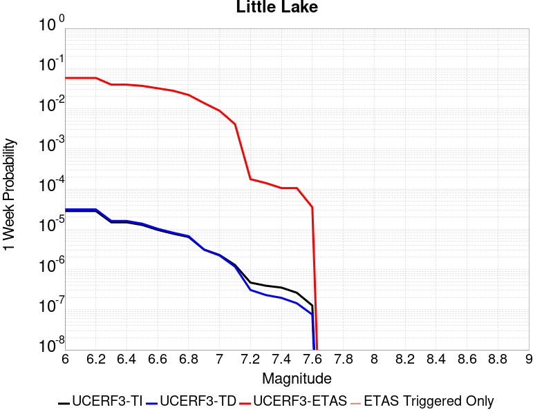 | 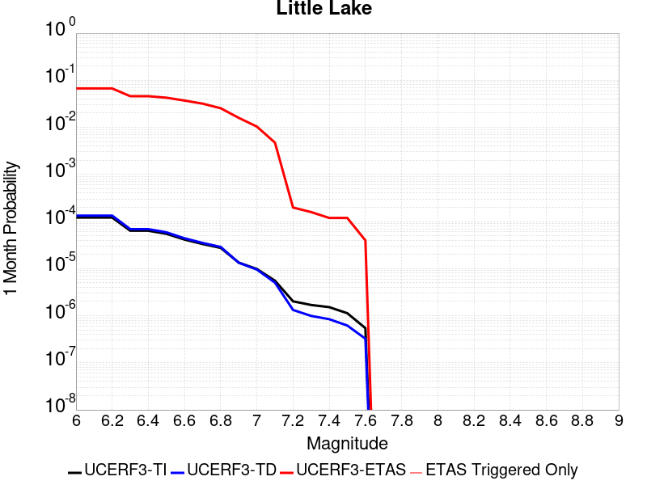 | 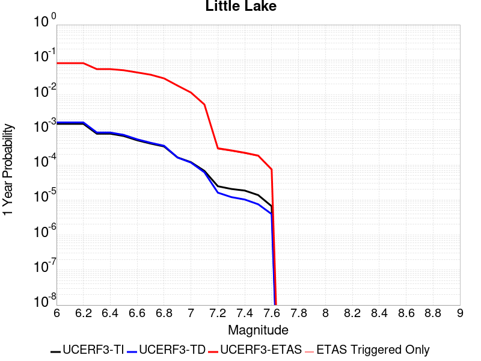 | 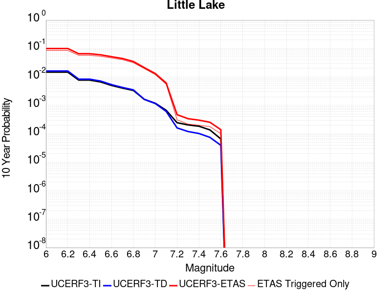 |

| Magnitude | 1 wk TI Prob | 1 wk TD Prob | 1 wk ETAS Prob | 1 wk ETAS/TD Gain | 1 wk ETAS Triggered Only | 1 mo TI Prob | 1 mo TD Prob | 1 mo ETAS Prob | 1 mo ETAS/TD Gain | 1 mo ETAS Triggered Only | 1 yr TI Prob | 1 yr TD Prob | 1 yr ETAS Prob | 1 yr ETAS/TD Gain | 1 yr ETAS Triggered Only | 10 yr TI Prob | 10 yr TD Prob | 10 yr ETAS Prob | 10 yr ETAS/TD Gain | 10 yr ETAS Triggered Only |
|-----|-----|-----|-----|-----|-----|-----|-----|-----|-----|-----|-----|-----|-----|-----|-----|-----|-----|-----|-----|-----|
| 6.0 | 2.8424427E-5 | 3.120572E-5 | 0.058179937 | 1864.3997 | 0.058150545 | 1.2181328E-4 | 1.337327E-4 | 0.06707286 | 501.54422 | 0.066948086 | 0.0014820677 | 0.0016271127 | 0.079730846 | 49.001427 | 0.07823102 | 0.014722223 | 0.016165402 | 0.09875969 | 6.109325 | 0.0839514 |
| 6.1 | 2.8424427E-5 | 3.120572E-5 | 0.058179937 | 1864.3997 | 0.058150545 | 1.2181328E-4 | 1.337327E-4 | 0.06707286 | 501.54422 | 0.066948086 | 0.0014820677 | 0.0016271127 | 0.079730846 | 49.001427 | 0.07823102 | 0.014722223 | 0.016165402 | 0.09875969 | 6.109325 | 0.0839514 |
| 6.2 | 2.8424427E-5 | 3.120572E-5 | 0.058179937 | 1864.3997 | 0.058150545 | 1.2181328E-4 | 1.337327E-4 | 0.06707286 | 501.54422 | 0.066948086 | 0.0014820677 | 0.0016271127 | 0.079730846 | 49.001427 | 0.07823102 | 0.014722223 | 0.016165402 | 0.09875969 | 6.109325 | 0.0839514 |
| 6.3 | 1.48860645E-5 | 1.6081389E-5 | 0.039900243 | 2481.144 | 0.039884802 | 6.379586E-5 | 6.8918576E-5 | 0.045868192 | 665.54175 | 0.04580243 | 7.7643775E-4 | 8.3878887E-4 | 0.05417101 | 64.58241 | 0.05337699 | 0.007737305 | 0.008359048 | 0.06469339 | 7.7393255 | 0.056809217 |
| 6.4 | 1.48860645E-5 | 1.6081389E-5 | 0.039900243 | 2481.144 | 0.039884802 | 6.379586E-5 | 6.8918576E-5 | 0.045868192 | 665.54175 | 0.04580243 | 7.7643775E-4 | 8.3878887E-4 | 0.05417101 | 64.58241 | 0.05337699 | 0.007737305 | 0.008359048 | 0.06469339 | 7.7393255 | 0.056809217 |
| 6.5 | 1.2797581E-5 | 1.3765565E-5 | 0.03717595 | 2700.6482 | 0.037162695 | 5.4845623E-5 | 5.899409E-5 | 0.04266339 | 723.1808 | 0.042606913 | 6.675408E-4 | 7.18042E-4 | 0.050232723 | 69.95792 | 0.04955026 | 0.006655392 | 0.00715977 | 0.05929289 | 8.281396 | 0.052509073 |
| 6.6 | 9.661896E-6 | 1.0289038E-5 | 0.032162398 | 3125.8896 | 0.032152437 | 4.1407468E-5 | 4.409522E-5 | 0.037086803 | 841.06177 | 0.037044343 | 5.040193E-4 | 5.367433E-4 | 0.043357365 | 80.77858 | 0.042843617 | 0.005028777 | 0.0053560743 | 0.05052079 | 9.432428 | 0.04540792 |
| 6.7 | 7.767871E-6 | 8.199687E-6 | 0.027860267 | 3397.7234 | 0.027852297 | 3.329045E-5 | 3.5141118E-5 | 0.031910304 | 908.0617 | 0.03187628 | 4.0523586E-4 | 4.2777284E-4 | 0.0372591 | 87.1002 | 0.03684709 | 0.004044977 | 0.004270846 | 0.04316038 | 10.105815 | 0.039056335 |
| 6.8 | 6.4235196E-6 | 6.7357446E-6 | 0.022256862 | 3304.2913 | 0.022250276 | 2.752908E-5 | 2.8867229E-5 | 0.025473928 | 882.4514 | 0.025445795 | 3.35115E-4 | 3.5141467E-4 | 0.029574217 | 84.15761 | 0.029233076 | 0.003346101 | 0.00350985 | 0.034173504 | 9.736457 | 0.030771658 |
| 6.9 | 3.1283696E-6 | 3.1121804E-6 | 0.014008118 | 4501.0625 | 0.01400505 | 1.3407229E-5 | 1.3337856E-5 | 0.015911816 | 1192.9814 | 0.01589869 | 1.6322079E-4 | 1.6237781E-4 | 0.018267374 | 112.49921 | 0.018107938 | 0.0016310095 | 0.00162274 | 0.02060719 | 12.699009 | 0.019015307 |
| 7.0 | 2.290603E-6 | 2.2286815E-6 | 0.009115353 | 4090.0205 | 0.009113145 | 9.816834E-6 | 9.551463E-6 | 0.010385024 | 1087.2705 | 0.010375572 | 1.19513395E-4 | 1.162839E-4 | 0.011674037 | 100.39255 | 0.011559097 | 0.0011944914 | 0.0011623327 | 0.013338475 | 11.475608 | 0.012190311 |
| 7.1 | 1.293693E-6 | 1.1776827E-6 | 0.004222413 | 3585.357 | 0.0042212405 | 5.5443866E-6 | 5.0472063E-6 | 0.004739125 | 938.96 | 0.0047341012 | 6.750081E-5 | 6.14487E-5 | 0.005229192 | 85.098495 | 0.005168061 | 6.7480316E-4 | 6.143856E-4 | 0.0060552573 | 9.855794 | 0.0054442165 |
| 7.2 | 4.715842E-7 | 3.0917857E-7 | 1.9756333E-4 | 638.99426 | 1.9725422E-4 | 2.0210737E-6 | 1.3250503E-6 | 1.9857901E-4 | 149.86525 | 1.9725422E-4 | 2.4606294E-5 | 1.6132375E-5 | 3.3173405E-4 | 20.56325 | 3.1560674E-4 | 2.460357E-4 | 1.6131258E-4 | 4.7686842E-4 | 2.9561763 | 3.1560674E-4 |
| 7.3 | 3.9430947E-7 | 2.3097488E-7 | 1.5803431E-4 | 684.2057 | 1.5780337E-4 | 1.6898966E-6 | 9.89892E-7 | 1.5879312E-4 | 160.4146 | 1.5780337E-4 | 2.0574296E-5 | 1.2051869E-5 | 2.8820444E-4 | 23.913673 | 2.7615592E-4 | 2.0572392E-4 | 1.20512224E-4 | 3.9663486E-4 | 3.2912416 | 2.7615592E-4 |
| 7.4 | 3.547123E-7 | 1.9679135E-7 | 1.185493E-4 | 602.41113 | 1.1835253E-4 | 1.5201948E-6 | 8.4339126E-7 | 1.1919582E-4 | 141.32922 | 1.1835253E-4 | 1.8508214E-5 | 1.0268241E-5 | 2.4697089E-4 | 24.051918 | 2.3670506E-4 | 1.8506673E-4 | 1.02677724E-4 | 3.393585E-4 | 3.3050838 | 2.3670506E-4 |
| 7.5 | 2.6354266E-7 | 1.4423138E-7 | 1.1849675E-4 | 821.5739 | 1.1835253E-4 | 1.129468E-6 | 6.181344E-7 | 1.18970594E-4 | 192.46721 | 1.1835253E-4 | 1.3751187E-5 | 7.5257603E-6 | 2.047785E-4 | 27.21034 | 1.9725422E-4 | 1.3750336E-4 | 7.5255106E-5 | 2.7249448E-4 | 3.6209433 | 1.9725422E-4 |
| 7.6 | 1.269913E-7 | 7.572556E-8 | 3.9526567E-5 | 521.97125 | 3.9450842E-5 | 5.4424834E-7 | 3.245381E-7 | 3.977537E-5 | 122.559944 | 3.9450842E-5 | 6.6262032E-6 | 3.9512443E-6 | 8.2852624E-5 | 20.968742 | 7.8901685E-5 | 6.626006E-5 | 3.9511775E-5 | 1.18410346E-4 | 2.996837 | 7.8901685E-5 |

## Owl Lake
*[(top)](#table-of-contents)*

| 1 Week | 1 Month | 1 Year | 10 Year |
|-----|-----|-----|-----|
| 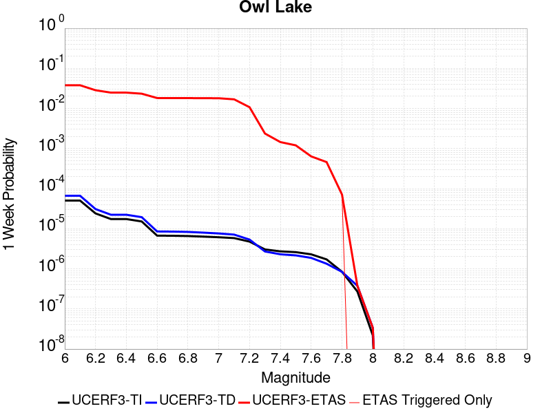 | 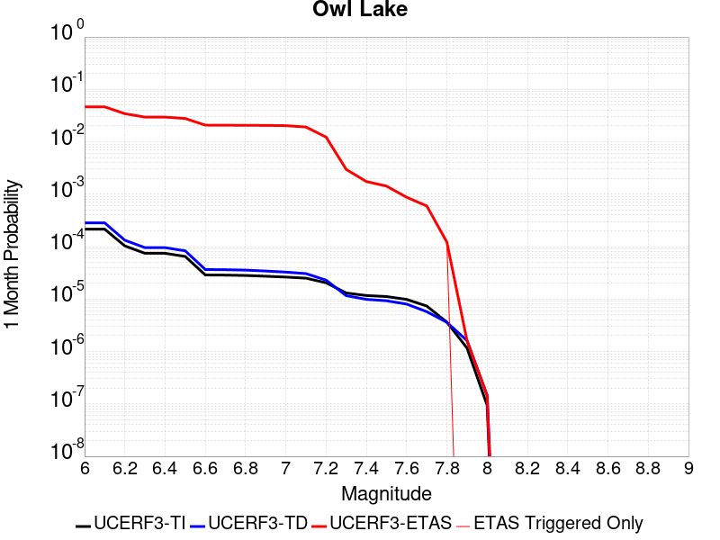 | 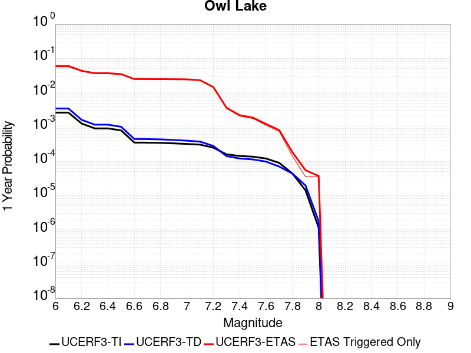 | 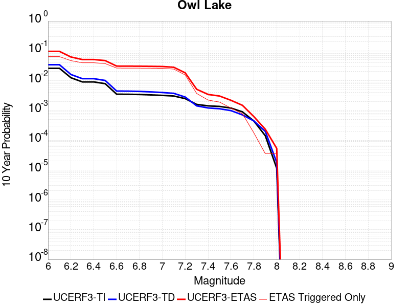 |

| Magnitude | 1 wk TI Prob | 1 wk TD Prob | 1 wk ETAS Prob | 1 wk ETAS/TD Gain | 1 wk ETAS Triggered Only | 1 mo TI Prob | 1 mo TD Prob | 1 mo ETAS Prob | 1 mo ETAS/TD Gain | 1 mo ETAS Triggered Only | 1 yr TI Prob | 1 yr TD Prob | 1 yr ETAS Prob | 1 yr ETAS/TD Gain | 1 yr ETAS Triggered Only | 10 yr TI Prob | 10 yr TD Prob | 10 yr ETAS Prob | 10 yr ETAS/TD Gain | 10 yr ETAS Triggered Only |
|-----|-----|-----|-----|-----|-----|-----|-----|-----|-----|-----|-----|-----|-----|-----|-----|-----|-----|-----|-----|-----|
| 6.0 | 5.0320643E-5 | 6.635816E-5 | 0.037660517 | 567.5341 | 0.037596654 | 2.1564208E-4 | 2.843674E-4 | 0.04642873 | 163.27023 | 0.046157487 | 0.0026222812 | 0.0034577388 | 0.06022778 | 17.418257 | 0.05696702 | 0.02591553 | 0.034140717 | 0.09590724 | 2.8091748 | 0.063949816 |
| 6.1 | 5.0320643E-5 | 6.635816E-5 | 0.037660517 | 567.5341 | 0.037596654 | 2.1564208E-4 | 2.843674E-4 | 0.04642873 | 163.27023 | 0.046157487 | 0.0026222812 | 0.0034577388 | 0.06022778 | 17.418257 | 0.05696702 | 0.02591553 | 0.034140717 | 0.09590724 | 2.8091748 | 0.063949816 |
| 6.2 | 2.4125871E-5 | 3.0981035E-5 | 0.028592508 | 922.9035 | 0.028562412 | 1.0339249E-4 | 1.3277028E-4 | 0.034411002 | 259.177 | 0.034282785 | 0.0012580766 | 0.001615439 | 0.043917198 | 27.185923 | 0.042370208 | 0.012509781 | 0.016070465 | 0.06257305 | 3.893668 | 0.04726211 |
| 6.3 | 1.7433485E-5 | 2.2355514E-5 | 0.024915282 | 1114.5028 | 0.024893483 | 7.471279E-5 | 9.580672E-5 | 0.029602211 | 308.97845 | 0.029509231 | 9.0924866E-4 | 0.0011659743 | 0.037339624 | 32.024395 | 0.036215875 | 0.009055373 | 0.011628896 | 0.05140081 | 4.420094 | 0.04023986 |
| 6.4 | 1.7433485E-5 | 2.2355514E-5 | 0.024915282 | 1114.5028 | 0.024893483 | 7.471279E-5 | 9.580672E-5 | 0.029602211 | 308.97845 | 0.029509231 | 9.0924866E-4 | 0.0011659743 | 0.037339624 | 32.024395 | 0.036215875 | 0.009055373 | 0.011628896 | 0.05140081 | 4.420094 | 0.04023986 |
| 6.5 | 1.5182742E-5 | 1.9429144E-5 | 0.023373876 | 1203.0316 | 0.0233549 | 6.506727E-5 | 8.326596E-5 | 0.027854348 | 334.52264 | 0.027773395 | 7.919061E-4 | 0.0010134429 | 0.03506443 | 34.599316 | 0.03408553 | 0.0078909 | 0.010118429 | 0.047373716 | 4.6819243 | 0.037636105 |
| 6.6 | 6.7271576E-6 | 8.547361E-6 | 0.01807688 | 2114.9077 | 0.018068487 | 2.8830356E-5 | 3.6631063E-5 | 0.020787016 | 567.4696 | 0.020751145 | 3.5095305E-4 | 4.458976E-4 | 0.025131114 | 56.36073 | 0.024696229 | 0.0035039932 | 0.004467813 | 0.030899609 | 6.9160485 | 0.026550418 |
| 6.7 | 6.682835E-6 | 8.479807E-6 | 0.017997913 | 2122.4436 | 0.017989585 | 2.8640408E-5 | 3.6341557E-5 | 0.020707833 | 569.8114 | 0.020672243 | 3.4864116E-4 | 4.4237426E-4 | 0.025048811 | 56.62357 | 0.024617327 | 0.003480947 | 0.0044327388 | 0.030786915 | 6.945348 | 0.026471516 |
| 6.8 | 6.5774975E-6 | 8.32628E-6 | 0.017997762 | 2161.5608 | 0.017989585 | 2.8188972E-5 | 3.5683603E-5 | 0.02062829 | 578.08875 | 0.020593341 | 3.4314668E-4 | 4.343669E-4 | 0.024962133 | 57.467854 | 0.024538426 | 0.0034261728 | 0.004352885 | 0.030630616 | 7.0368543 | 0.026392614 |
| 6.9 | 6.363419E-6 | 7.999454E-6 | 0.01791854 | 2239.9702 | 0.017910684 | 2.727151E-5 | 3.428296E-5 | 0.02054802 | 599.3654 | 0.02051444 | 3.3198006E-4 | 4.1732067E-4 | 0.024827203 | 59.49191 | 0.024420073 | 0.0033148455 | 0.0041828766 | 0.030347237 | 7.2551117 | 0.026274262 |
| 7.0 | 6.1342453E-6 | 7.6316555E-6 | 0.017839277 | 2337.537 | 0.017831782 | 2.6289357E-5 | 3.2706717E-5 | 0.020349227 | 622.1727 | 0.020317186 | 3.2002592E-4 | 3.9813702E-4 | 0.024532441 | 61.618088 | 0.024143917 | 0.0031956544 | 0.003991571 | 0.029885903 | 7.487254 | 0.025998106 |
| 7.1 | 5.842926E-6 | 7.142211E-6 | 0.016773632 | 2348.5208 | 0.01676661 | 2.504087E-5 | 3.0609146E-5 | 0.019124234 | 624.78815 | 0.019094208 | 3.0482994E-4 | 3.7260808E-4 | 0.023127263 | 62.068607 | 0.022763137 | 0.0030441214 | 0.0037370329 | 0.028183756 | 7.541747 | 0.024538426 |
| 7.2 | 4.77173E-6 | 5.358483E-6 | 0.010814832 | 2018.2637 | 0.010809531 | 2.045011E-5 | 2.2964748E-5 | 0.012291895 | 535.2506 | 0.012269213 | 2.4895166E-4 | 2.79564E-4 | 0.014793416 | 52.916027 | 0.014517911 | 0.0024867293 | 0.002808645 | 0.018426642 | 6.560687 | 0.015661985 |
| 7.3 | 3.0494948E-6 | 2.710463E-6 | 0.0024486561 | 903.4088 | 0.0024459523 | 1.3069198E-5 | 1.1616219E-5 | 0.0029703951 | 255.71101 | 0.0029588132 | 1.5910587E-4 | 1.4141845E-4 | 0.0037703828 | 26.66118 | 0.0036294777 | 0.0015899199 | 0.0014232415 | 0.0052839215 | 3.712597 | 0.0038661826 |
| 7.4 | 2.7263884E-6 | 2.3056762E-6 | 0.0014619835 | 634.08014 | 0.0014596812 | 1.1684469E-5 | 9.881433E-6 | 0.0017457014 | 176.66481 | 0.0017358372 | 1.4224913E-4 | 1.20299905E-4 | 0.0022898354 | 19.03439 | 0.0021697965 | 0.0014215811 | 0.0012112238 | 0.0035360043 | 2.919365 | 0.0023275998 |
| 7.5 | 2.6090431E-6 | 2.1656133E-6 | 0.0011856884 | 547.50696 | 0.0011835253 | 1.1181565E-5 | 9.281167E-6 | 0.0014294984 | 154.02141 | 0.0014202304 | 1.3612706E-4 | 1.1299244E-4 | 0.0019275262 | 17.058895 | 0.0018147388 | 0.001360437 | 0.0011379806 | 0.0031082781 | 2.731398 | 0.0019725421 |
| 7.6 | 2.3008756E-6 | 1.8727933E-6 | 6.3308515E-4 | 338.04324 | 6.312135E-4 | 9.860858E-6 | 8.0262325E-6 | 8.7593787E-4 | 109.13437 | 8.679186E-4 | 1.20049335E-4 | 9.7715085E-5 | 0.0012811248 | 13.110819 | 0.0011835253 | 0.001199845 | 9.849932E-4 | 0.0022461766 | 2.2803984 | 0.001262427 |
| 7.7 | 1.7184348E-6 | 1.3419171E-6 | 4.353006E-4 | 324.38712 | 4.339593E-4 | 7.3646997E-6 | 5.7510606E-6 | 5.975103E-4 | 103.89567 | 5.9176265E-4 | 8.966153E-5 | 7.0016955E-5 | 8.195305E-4 | 11.704743 | 7.4956607E-4 | 8.962536E-4 | 7.078345E-4 | 0.0014962929 | 2.113902 | 7.890169E-4 |
| 7.8 | 8.4612907E-7 | 8.4058576E-7 | 7.974221E-5 | 94.86504 | 7.8901685E-5 | 3.6262625E-6 | 3.6025056E-6 | 1.2195461E-4 | 33.85272 | 1.1835253E-4 | 4.4148852E-5 | 4.3859643E-5 | 2.016561E-4 | 4.5977597 | 1.5780337E-4 | 4.414008E-4 | 4.4398365E-4 | 6.411503E-4 | 1.4440854 | 1.9725422E-4 |
| 7.9 | 2.716738E-7 | 3.768106E-7 | 3.768106E-7 | 1.0 | 0.0 | 1.1643157E-6 | 1.6149015E-6 | 1.6149015E-6 | 1.0 | 0.0 | 1.4175452E-5 | 1.966126E-5 | 5.9111328E-5 | 3.0064874 | 3.9450842E-5 | 1.4174548E-4 | 1.9836679E-4 | 2.378098E-4 | 1.1988388 | 3.9450842E-5 |
| 8.0 | 2.1995428E-8 | 3.384878E-8 | 3.384878E-8 | 1.0 | 0.0 | 9.426611E-8 | 1.4506621E-7 | 1.4506621E-7 | 1.0 | 0.0 | 1.1476893E-6 | 1.7661803E-6 | 4.1216954E-5 | 23.336777 | 3.9450842E-5 | 1.14768345E-5 | 1.7963059E-5 | 5.7413195E-5 | 3.1961815 | 3.9450842E-5 |

## Airport Lake
*[(top)](#table-of-contents)*

| 1 Week | 1 Month | 1 Year | 10 Year |
|-----|-----|-----|-----|
|  | 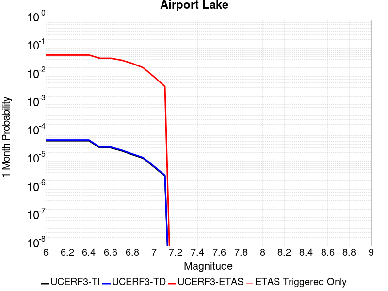 | 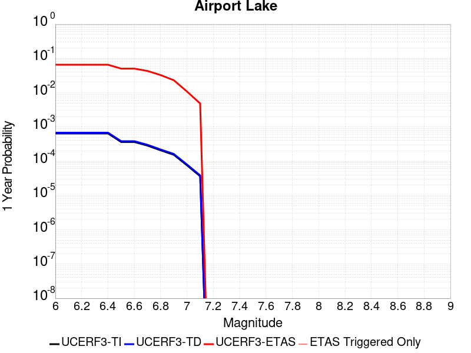 | 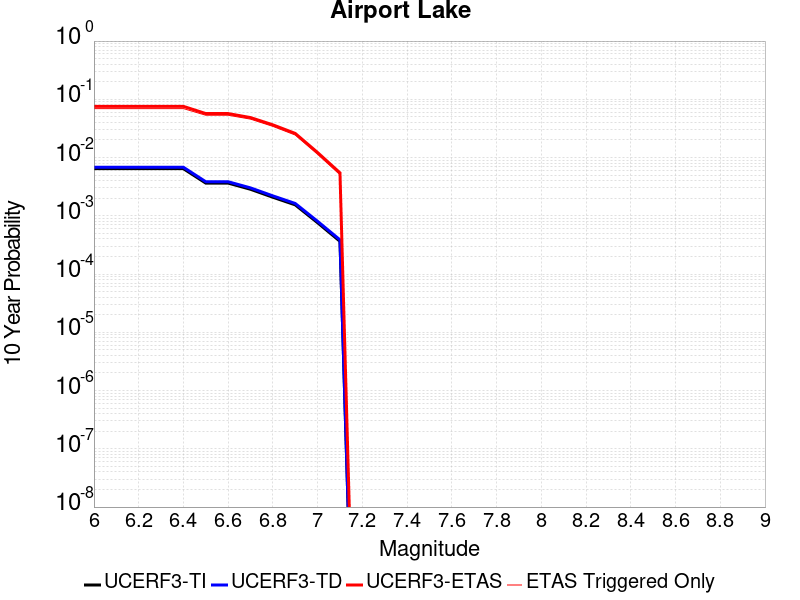 |

| Magnitude | 1 wk TI Prob | 1 wk TD Prob | 1 wk ETAS Prob | 1 wk ETAS/TD Gain | 1 wk ETAS Triggered Only | 1 mo TI Prob | 1 mo TD Prob | 1 mo ETAS Prob | 1 mo ETAS/TD Gain | 1 mo ETAS Triggered Only | 1 yr TI Prob | 1 yr TD Prob | 1 yr ETAS Prob | 1 yr ETAS/TD Gain | 1 yr ETAS Triggered Only | 10 yr TI Prob | 10 yr TD Prob | 10 yr ETAS Prob | 10 yr ETAS/TD Gain | 10 yr ETAS Triggered Only |
|-----|-----|-----|-----|-----|-----|-----|-----|-----|-----|-----|-----|-----|-----|-----|-----|-----|-----|-----|-----|-----|
| 6.0 | 1.2387061E-5 | 1.3103157E-5 | 0.05145633 | 3927.0178 | 0.0514439 | 5.3086325E-5 | 5.615534E-5 | 0.05804564 | 1033.662 | 0.05799274 | 6.461343E-4 | 6.8350515E-4 | 0.06620599 | 96.86246 | 0.0655673 | 0.0064425888 | 0.0068168393 | 0.07609046 | 11.162132 | 0.069749095 |
| 6.1 | 1.2387061E-5 | 1.3103157E-5 | 0.05145633 | 3927.0178 | 0.0514439 | 5.3086325E-5 | 5.615534E-5 | 0.05804564 | 1033.662 | 0.05799274 | 6.461343E-4 | 6.8350515E-4 | 0.06620599 | 96.86246 | 0.0655673 | 0.0064425888 | 0.0068168393 | 0.07609046 | 11.162132 | 0.069749095 |
| 6.2 | 1.2387061E-5 | 1.3103157E-5 | 0.05145633 | 3927.0178 | 0.0514439 | 5.3086325E-5 | 5.615534E-5 | 0.05804564 | 1033.662 | 0.05799274 | 6.461343E-4 | 6.8350515E-4 | 0.06620599 | 96.86246 | 0.0655673 | 0.0064425888 | 0.0068168393 | 0.07609046 | 11.162132 | 0.069749095 |
| 6.3 | 1.2387061E-5 | 1.3103157E-5 | 0.05145633 | 3927.0178 | 0.0514439 | 5.3086325E-5 | 5.615534E-5 | 0.05804564 | 1033.662 | 0.05799274 | 6.461343E-4 | 6.8350515E-4 | 0.06620599 | 96.86246 | 0.0655673 | 0.0064425888 | 0.0068168393 | 0.07609046 | 11.162132 | 0.069749095 |
| 6.4 | 1.2387061E-5 | 1.3103157E-5 | 0.05145633 | 3927.0178 | 0.0514439 | 5.3086325E-5 | 5.615534E-5 | 0.05804564 | 1033.662 | 0.05799274 | 6.461343E-4 | 6.8350515E-4 | 0.06620599 | 96.86246 | 0.0655673 | 0.0064425888 | 0.0068168393 | 0.07609046 | 11.162132 | 0.069749095 |
| 6.5 | 6.9922594E-6 | 7.384925E-6 | 0.039536837 | 5353.722 | 0.039529745 | 2.996648E-5 | 3.1649324E-5 | 0.044412445 | 1403.2667 | 0.0443822 | 3.6478083E-4 | 3.8526783E-4 | 0.05070515 | 131.61014 | 0.050339278 | 0.003641826 | 0.0038465366 | 0.05709681 | 14.843694 | 0.053455893 |
| 6.6 | 6.9922594E-6 | 7.384925E-6 | 0.039536837 | 5353.722 | 0.039529745 | 2.996648E-5 | 3.1649324E-5 | 0.044412445 | 1403.2667 | 0.0443822 | 3.6478083E-4 | 3.8526783E-4 | 0.05070515 | 131.61014 | 0.050339278 | 0.003641826 | 0.0038465366 | 0.05709681 | 14.843694 | 0.053455893 |
| 6.7 | 5.477277E-6 | 5.7860684E-6 | 0.033381008 | 5769.2036 | 0.033375416 | 2.3473833E-5 | 2.4797222E-5 | 0.03758107 | 1515.5354 | 0.037557203 | 2.8575645E-4 | 3.0186825E-4 | 0.04309311 | 142.7547 | 0.042804167 | 0.0028538927 | 0.003014966 | 0.048443314 | 16.067616 | 0.045565724 |
| 6.8 | 3.9950432E-6 | 4.2190873E-6 | 0.025607709 | 6069.4907 | 0.025603598 | 1.7121502E-5 | 1.8081691E-5 | 0.029053379 | 1606.7843 | 0.029035822 | 2.0843433E-4 | 2.2012512E-4 | 0.03279935 | 149.0032 | 0.032586396 | 0.0020823893 | 0.0021993418 | 0.036485452 | 16.58926 | 0.034361687 |
| 6.9 | 2.95695E-6 | 3.1230243E-6 | 0.018111004 | 5799.1875 | 0.018107938 | 1.2672582E-5 | 1.3384334E-5 | 0.020448647 | 1527.8047 | 0.020435538 | 1.5427776E-4 | 1.6294434E-4 | 0.023119595 | 141.88644 | 0.02296039 | 0.001541707 | 0.0016284712 | 0.025890617 | 15.898726 | 0.02430172 |
| 7.0 | 1.456072E-6 | 1.540812E-6 | 0.008601812 | 5582.6484 | 0.008600284 | 6.2402937E-6 | 6.603469E-6 | 0.009790348 | 1482.6068 | 0.009783809 | 7.597293E-5 | 8.039528E-5 | 0.01084961 | 134.95332 | 0.010770081 | 7.594696E-4 | 8.0376083E-4 | 0.012156472 | 15.124489 | 0.011361843 |
| 7.1 | 6.995192E-7 | 7.4089746E-7 | 0.0039063715 | 5272.4863 | 0.0039056335 | 2.997936E-6 | 3.1752747E-6 | 0.004421656 | 1392.527 | 0.0044184946 | 3.649926E-5 | 3.865897E-5 | 0.0047725774 | 123.45329 | 0.0047341012 | 3.6493264E-4 | 3.865897E-4 | 0.00539491 | 13.955132 | 0.005010257 |

## Panamint Valley
*[(top)](#table-of-contents)*

| 1 Week | 1 Month | 1 Year | 10 Year |
|-----|-----|-----|-----|
| 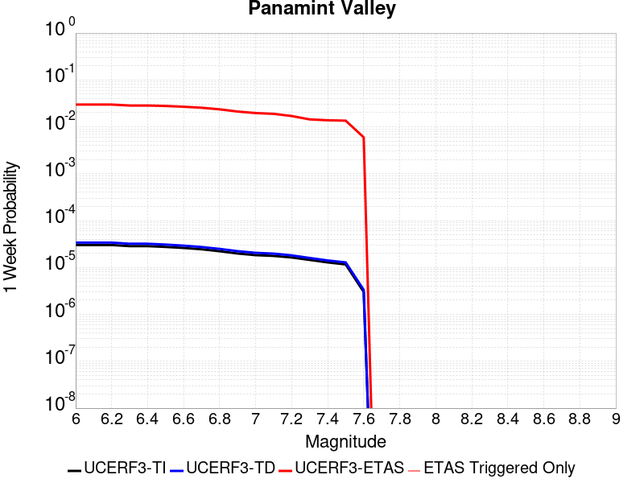 | 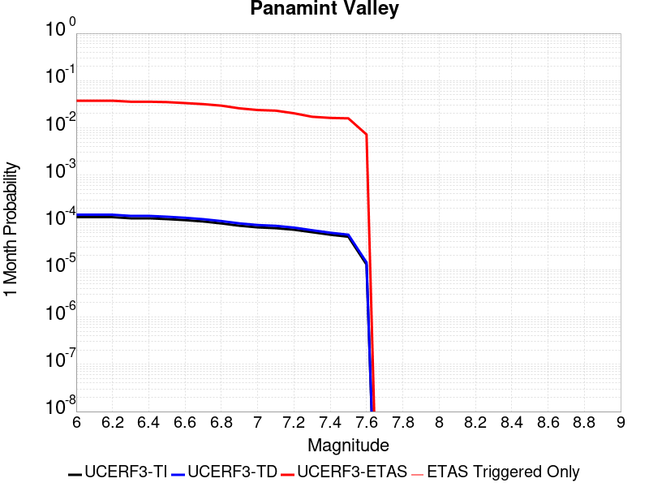 | 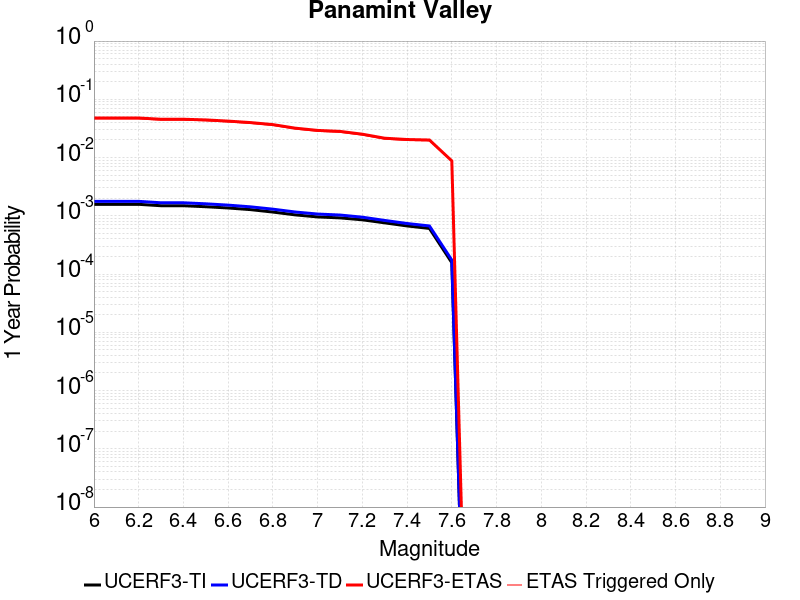 | 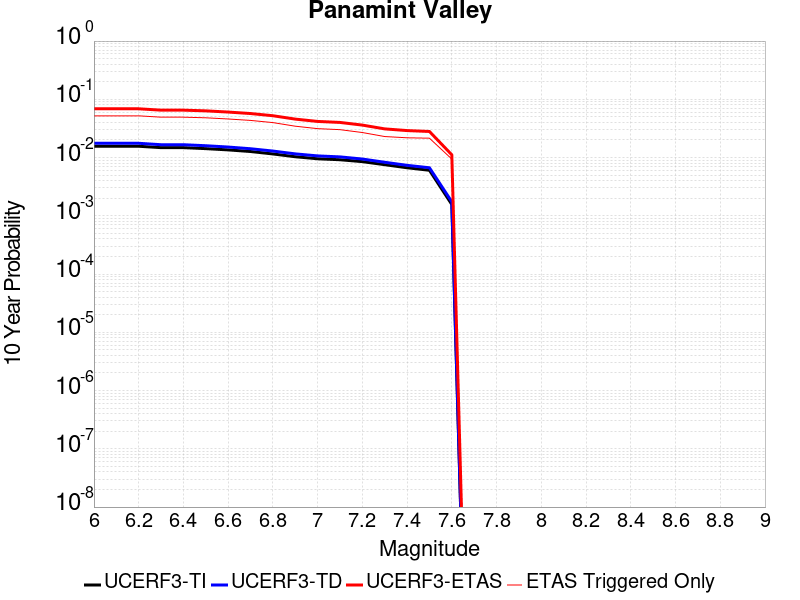 |

| Magnitude | 1 wk TI Prob | 1 wk TD Prob | 1 wk ETAS Prob | 1 wk ETAS/TD Gain | 1 wk ETAS Triggered Only | 1 mo TI Prob | 1 mo TD Prob | 1 mo ETAS Prob | 1 mo ETAS/TD Gain | 1 mo ETAS Triggered Only | 1 yr TI Prob | 1 yr TD Prob | 1 yr ETAS Prob | 1 yr ETAS/TD Gain | 1 yr ETAS Triggered Only | 10 yr TI Prob | 10 yr TD Prob | 10 yr ETAS Prob | 10 yr ETAS/TD Gain | 10 yr ETAS Triggered Only |
|-----|-----|-----|-----|-----|-----|-----|-----|-----|-----|-----|-----|-----|-----|-----|-----|-----|-----|-----|-----|-----|
| 6.0 | 3.0211835E-5 | 3.3984514E-5 | 0.030765148 | 905.26965 | 0.030732207 | 1.2947287E-4 | 1.4563995E-4 | 0.03734237 | 256.40198 | 0.037202146 | 0.0015751923 | 0.0017717537 | 0.0477687 | 26.961252 | 0.046078585 | 0.015640736 | 0.017583137 | 0.06874261 | 3.9095757 | 0.052075114 |
| 6.1 | 3.0211835E-5 | 3.3984514E-5 | 0.030765148 | 905.26965 | 0.030732207 | 1.2947287E-4 | 1.4563995E-4 | 0.03734237 | 256.40198 | 0.037202146 | 0.0015751923 | 0.0017717537 | 0.0477687 | 26.961252 | 0.046078585 | 0.015640736 | 0.017583137 | 0.06874261 | 3.9095757 | 0.052075114 |
| 6.2 | 3.0211835E-5 | 3.3984514E-5 | 0.030765148 | 905.26965 | 0.030732207 | 1.2947287E-4 | 1.4563995E-4 | 0.03734237 | 256.40198 | 0.037202146 | 0.0015751923 | 0.0017717537 | 0.0477687 | 26.961252 | 0.046078585 | 0.015640736 | 0.017583137 | 0.06874261 | 3.9095757 | 0.052075114 |
| 6.3 | 2.8573924E-5 | 3.210268E-5 | 0.02922479 | 910.3536 | 0.029193625 | 1.2245393E-4 | 1.3757581E-4 | 0.03548067 | 257.89902 | 0.035347957 | 0.001489857 | 0.0016737265 | 0.04546964 | 27.16671 | 0.04386934 | 0.01479908 | 0.016617801 | 0.06515067 | 3.9205348 | 0.049353007 |
| 6.4 | 2.8573924E-5 | 3.210268E-5 | 0.02922479 | 910.3536 | 0.029193625 | 1.2245393E-4 | 1.3757581E-4 | 0.03548067 | 257.89902 | 0.035347957 | 0.001489857 | 0.0016737265 | 0.04546964 | 27.16671 | 0.04386934 | 0.01479908 | 0.016617801 | 0.06515067 | 3.9205348 | 0.049353007 |
| 6.5 | 2.7468774E-5 | 3.0828433E-5 | 0.02859236 | 927.46716 | 0.028562412 | 1.1771801E-4 | 1.3211532E-4 | 0.03484427 | 263.74133 | 0.034716744 | 0.0014322745 | 0.0016073446 | 0.04430332 | 27.563051 | 0.042764716 | 0.014230782 | 0.015963677 | 0.06336419 | 3.9692733 | 0.048169482 |
| 6.6 | 2.6135967E-5 | 2.925248E-5 | 0.027407337 | 936.9235 | 0.027378885 | 1.1200648E-4 | 1.253619E-4 | 0.03322047 | 264.99655 | 0.03309926 | 0.0013628257 | 0.0015252391 | 0.042255193 | 27.703981 | 0.040792175 | 0.013544982 | 0.015154043 | 0.060417794 | 3.9869092 | 0.045960233 |
| 6.7 | 2.4498746E-5 | 2.7341335E-5 | 0.026182536 | 957.6173 | 0.02615591 | 1.04990395E-4 | 1.1717203E-4 | 0.03147692 | 268.6385 | 0.03136342 | 0.0012775084 | 0.0014256609 | 0.039874792 | 27.969336 | 0.038504023 | 0.012701893 | 0.014171274 | 0.05699112 | 4.0215945 | 0.04343538 |
| 6.8 | 2.2244329E-5 | 2.4935423E-5 | 0.0245233 | 983.4723 | 0.024498975 | 9.532935E-5 | 1.0686185E-4 | 0.02925792 | 273.79202 | 0.029154174 | 0.0011600169 | 0.0013002884 | 0.036799278 | 28.300861 | 0.03554521 | 0.011539802 | 0.0129325185 | 0.05226257 | 4.041175 | 0.03984535 |
| 6.9 | 1.9902658E-5 | 2.2290267E-5 | 0.021561971 | 967.3267 | 0.021540161 | 8.529431E-5 | 9.552632E-5 | 0.02553889 | 267.34924 | 0.025445795 | 0.0010379635 | 0.0011624309 | 0.03197713 | 27.508842 | 0.03085056 | 0.010331288 | 0.011568608 | 0.04572775 | 3.9527442 | 0.03455894 |
| 7.0 | 1.8353881E-5 | 2.0566185E-5 | 0.020100633 | 977.36316 | 0.020080479 | 7.865712E-5 | 8.813792E-5 | 0.02355932 | 267.30063 | 0.023473252 | 9.5722964E-4 | 0.0010725686 | 0.029249668 | 27.270674 | 0.028207354 | 0.009531168 | 0.010678849 | 0.041707344 | 3.905603 | 0.03136342 |
| 7.1 | 1.7667631E-5 | 1.9772613E-5 | 0.019389754 | 980.63696 | 0.019370364 | 7.571623E-5 | 8.473711E-5 | 0.022845946 | 269.60968 | 0.022763137 | 9.2145515E-4 | 0.0010312037 | 0.028145395 | 27.293732 | 0.02714218 | 0.009176437 | 0.010269073 | 0.040100005 | 3.9049294 | 0.030140445 |
| 7.2 | 1.6381597E-5 | 1.8158249E-5 | 0.017297314 | 952.5871 | 0.01727947 | 7.020495E-5 | 7.781885E-5 | 0.020235632 | 260.0351 | 0.02015938 | 8.544101E-4 | 9.4704994E-4 | 0.025186341 | 26.594522 | 0.02426227 | 0.008511325 | 0.009434792 | 0.03608642 | 3.824824 | 0.026905475 |
| 7.3 | 1.4520491E-5 | 1.5966476E-5 | 0.014651996 | 917.67255 | 0.014636263 | 6.222919E-5 | 6.842605E-5 | 0.017228369 | 251.78085 | 0.017161118 | 7.57377E-4 | 8.327849E-4 | 0.021487812 | 25.802353 | 0.020672243 | 0.0075480095 | 0.00829975 | 0.031069577 | 3.743435 | 0.02296039 |
| 7.4 | 1.2852287E-5 | 1.4145411E-5 | 0.013861196 | 979.9076 | 0.013847247 | 5.5080065E-5 | 6.062187E-5 | 0.016313385 | 269.10065 | 0.016253747 | 6.7039346E-4 | 7.378371E-4 | 0.020409284 | 27.66096 | 0.01968597 | 0.0066837464 | 0.0073567946 | 0.029051773 | 3.9489717 | 0.021855768 |
| 7.5 | 1.1637851E-5 | 1.2836797E-5 | 0.013583753 | 1058.1886 | 0.01357109 | 4.987555E-5 | 5.5013777E-5 | 0.015992278 | 290.6959 | 0.01593814 | 6.070656E-4 | 6.6960254E-4 | 0.020026997 | 29.908781 | 0.019370364 | 0.006054099 | 0.0066787465 | 0.028035859 | 4.1977725 | 0.02150071 |
| 7.6 | 3.0068115E-6 | 3.3330316E-6 | 0.006315447 | 1894.8057 | 0.006312135 | 1.2886271E-5 | 1.4284384E-5 | 0.007391487 | 517.4523 | 0.007377308 | 1.5687906E-4 | 1.7390578E-4 | 0.0087726945 | 50.4451 | 0.008600284 | 0.0015676835 | 0.0017391363 | 0.01115149 | 6.4120855 | 0.009428752 |

## Garlock (East)
*[(top)](#table-of-contents)*

| 1 Week | 1 Month | 1 Year | 10 Year |
|-----|-----|-----|-----|
| 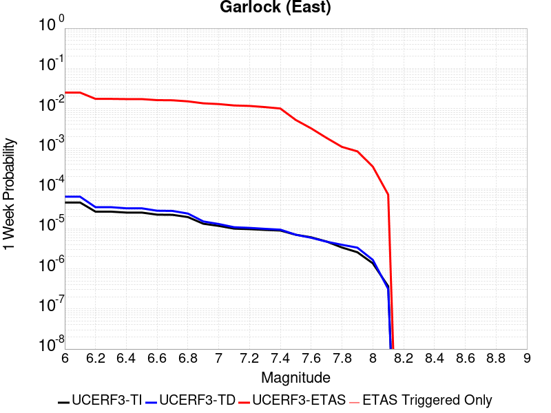 | 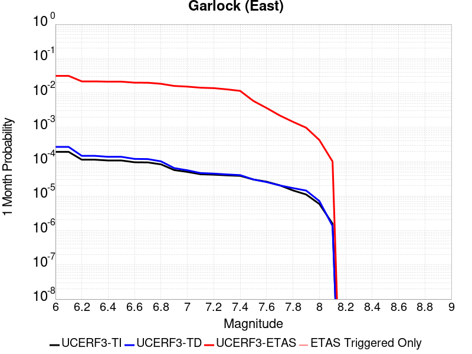 | 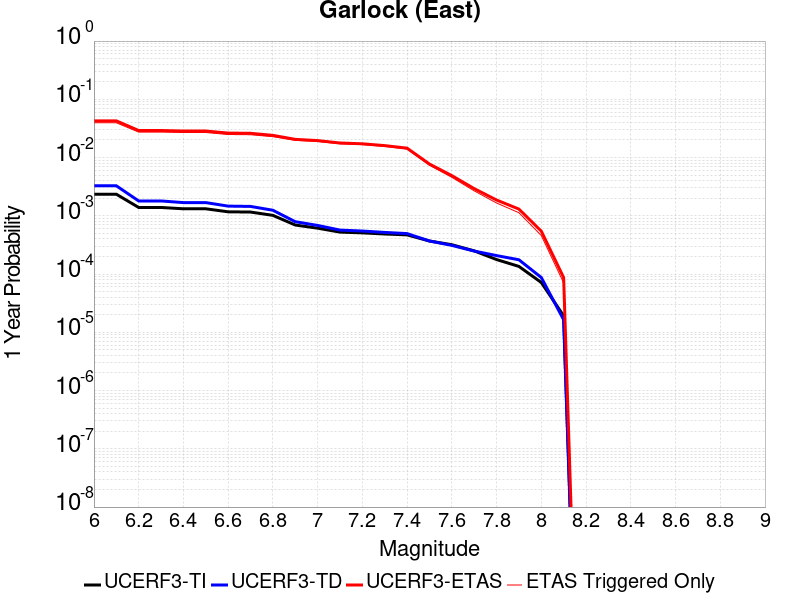 | 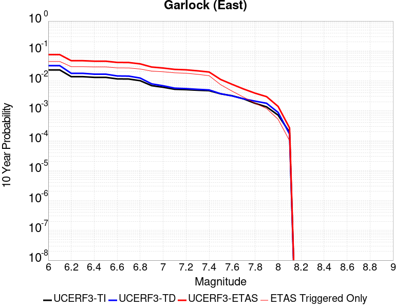 |

| Magnitude | 1 wk TI Prob | 1 wk TD Prob | 1 wk ETAS Prob | 1 wk ETAS/TD Gain | 1 wk ETAS Triggered Only | 1 mo TI Prob | 1 mo TD Prob | 1 mo ETAS Prob | 1 mo ETAS/TD Gain | 1 mo ETAS Triggered Only | 1 yr TI Prob | 1 yr TD Prob | 1 yr ETAS Prob | 1 yr ETAS/TD Gain | 1 yr ETAS Triggered Only | 10 yr TI Prob | 10 yr TD Prob | 10 yr ETAS Prob | 10 yr ETAS/TD Gain | 10 yr ETAS Triggered Only |
|-----|-----|-----|-----|-----|-----|-----|-----|-----|-----|-----|-----|-----|-----|-----|-----|-----|-----|-----|-----|-----|
| 6.0 | 4.5092507E-5 | 6.290325E-5 | 0.02448144 | 389.19196 | 0.024420073 | 1.9323928E-4 | 2.6956003E-4 | 0.030638522 | 113.661224 | 0.03037715 | 0.0023501497 | 0.0032774 | 0.042205732 | 12.87781 | 0.039056335 | 0.023254504 | 0.032351844 | 0.0752982 | 2.3274777 | 0.0443822 |
| 6.1 | 4.5092507E-5 | 6.290325E-5 | 0.02448144 | 389.19196 | 0.024420073 | 1.9323928E-4 | 2.6956003E-4 | 0.030638522 | 113.661224 | 0.03037715 | 0.0023501497 | 0.0032774 | 0.042205732 | 12.87781 | 0.039056335 | 0.023254504 | 0.032351844 | 0.0752982 | 2.3274777 | 0.0443822 |
| 6.2 | 2.6674514E-5 | 3.4509674E-5 | 0.017431732 | 505.12592 | 0.017397823 | 1.1431433E-4 | 1.4789042E-4 | 0.02188209 | 147.96153 | 0.021737415 | 0.0013908884 | 0.0017991117 | 0.02908936 | 16.168734 | 0.027339434 | 0.01382215 | 0.017890299 | 0.04799521 | 2.6827505 | 0.030653305 |
| 6.3 | 2.6674514E-5 | 3.4509674E-5 | 0.017431732 | 505.12592 | 0.017397823 | 1.1431433E-4 | 1.4789042E-4 | 0.02188209 | 147.96153 | 0.021737415 | 0.0013908884 | 0.0017991117 | 0.02908936 | 16.168734 | 0.027339434 | 0.01382215 | 0.017890299 | 0.04799521 | 2.6827505 | 0.030653305 |
| 6.4 | 2.5312667E-5 | 3.233893E-5 | 0.017232351 | 532.86707 | 0.017200569 | 1.0847834E-4 | 1.3858822E-4 | 0.021478537 | 154.98097 | 0.021342907 | 0.0013199237 | 0.0016860351 | 0.02846738 | 16.884214 | 0.026826574 | 0.013121112 | 0.016778335 | 0.04629671 | 2.7593148 | 0.030022092 |
| 6.5 | 2.5312667E-5 | 3.233893E-5 | 0.017232351 | 532.86707 | 0.017200569 | 1.0847834E-4 | 1.3858822E-4 | 0.021478537 | 154.98097 | 0.021342907 | 0.0013199237 | 0.0016860351 | 0.02846738 | 16.884214 | 0.026826574 | 0.013121112 | 0.016778335 | 0.04629671 | 2.7593148 | 0.030022092 |
| 6.6 | 2.246556E-5 | 2.8133776E-5 | 0.016123625 | 573.1056 | 0.016095944 | 9.627742E-5 | 1.20567885E-4 | 0.019804165 | 164.25739 | 0.01968597 | 0.0011715472 | 0.0014669491 | 0.026087556 | 17.783545 | 0.024656778 | 0.011653901 | 0.01461866 | 0.04194717 | 2.8694265 | 0.027733944 |
| 6.7 | 2.2241198E-5 | 2.7803519E-5 | 0.016004952 | 575.6448 | 0.015977591 | 9.531594E-5 | 1.1915263E-4 | 0.01968444 | 165.20357 | 0.019567618 | 0.0011598538 | 0.0014497414 | 0.0259132 | 17.87436 | 0.024498975 | 0.011538187 | 0.014448853 | 0.04162655 | 2.8809588 | 0.027576141 |
| 6.8 | 1.9528685E-5 | 2.389819E-5 | 0.014975411 | 626.63367 | 0.01495187 | 8.369167E-5 | 1.0241691E-4 | 0.018524075 | 180.8693 | 0.018423544 | 0.0010184698 | 0.0012462323 | 0.023862796 | 19.147953 | 0.022644784 | 0.010138147 | 0.012436427 | 0.037643686 | 3.026889 | 0.025524696 |
| 6.9 | 1.3318621E-5 | 1.5198884E-5 | 0.013388832 | 880.9088 | 0.013373836 | 5.7078556E-5 | 6.513648E-5 | 0.016081136 | 246.8837 | 0.016017042 | 6.9470983E-4 | 7.927538E-4 | 0.020463118 | 25.812702 | 0.01968597 | 0.0069254204 | 0.007939888 | 0.029465573 | 3.7110817 | 0.021697965 |
| 7.0 | 1.1760853E-5 | 1.31077895E-5 | 0.012834464 | 979.1479 | 0.012821524 | 5.0402683E-5 | 5.6175057E-5 | 0.015362243 | 273.4709 | 0.015306927 | 6.134799E-4 | 6.8372174E-4 | 0.019488908 | 28.504152 | 0.018818052 | 0.0061178906 | 0.00685652 | 0.027347842 | 3.9885893 | 0.020632792 |
| 7.1 | 1.0064758E-5 | 1.0902931E-5 | 0.011846027 | 1086.4994 | 0.011835253 | 4.3133965E-5 | 4.672603E-5 | 0.014011673 | 299.86868 | 0.013965599 | 5.2502943E-4 | 5.687444E-4 | 0.017680673 | 31.087204 | 0.017121667 | 0.005237907 | 0.0057129986 | 0.024227416 | 4.240753 | 0.018620798 |
| 7.2 | 9.768808E-6 | 1.0498807E-5 | 0.011490574 | 1094.4647 | 0.011480195 | 4.186565E-5 | 4.499413E-5 | 0.013654923 | 303.48233 | 0.013610541 | 5.095951E-4 | 5.4766936E-4 | 0.017147379 | 31.309729 | 0.016608806 | 0.0050842804 | 0.0055032647 | 0.023472315 | 4.265162 | 0.018068487 |
| 7.3 | 9.344516E-6 | 9.944468E-6 | 0.010740467 | 1080.0446 | 0.01073063 | 4.004731E-5 | 4.261847E-5 | 0.01266635 | 297.2033 | 0.01262427 | 4.8746695E-4 | 5.1875977E-4 | 0.015896607 | 30.643484 | 0.015385829 | 0.0048639905 | 0.0052149445 | 0.021972606 | 4.2133923 | 0.016845511 |
| 7.4 | 9.023491E-6 | 9.490661E-6 | 0.01002991 | 1056.8188 | 0.010020514 | 3.867153E-5 | 4.0673647E-5 | 0.0115993 | 285.17978 | 0.011559097 | 4.7072413E-4 | 4.950925E-4 | 0.014493208 | 29.273739 | 0.01400505 | 0.004697283 | 0.0049783974 | 0.020248376 | 4.067248 | 0.015346378 |
| 7.5 | 7.081253E-6 | 7.087672E-6 | 0.0053329137 | 752.4211 | 0.005325864 | 3.0347876E-5 | 3.0375388E-5 | 0.0062239696 | 204.90173 | 0.0061937827 | 3.6942272E-4 | 3.6975832E-4 | 0.0077837748 | 21.050978 | 0.0074167587 | 0.003688092 | 0.0037243143 | 0.01170301 | 3.1423259 | 0.008008521 |
| 7.6 | 6.116396E-6 | 5.959245E-6 | 0.0033198104 | 557.08575 | 0.0033138709 | 2.6212863E-5 | 2.5539372E-5 | 0.003931073 | 153.92209 | 0.0039056335 | 3.1909486E-4 | 3.1089774E-4 | 0.00496465 | 15.968756 | 0.0046551996 | 0.0031863707 | 0.0031357552 | 0.008248283 | 2.6303976 | 0.00512861 |
| 7.7 | 4.797145E-6 | 4.757281E-6 | 0.0018983888 | 399.0491 | 0.0018936405 | 2.055903E-5 | 2.0388188E-5 | 0.0022295904 | 109.356964 | 0.0022092473 | 2.5027743E-4 | 2.4819805E-4 | 0.0028907487 | 11.646943 | 0.0026432066 | 0.0024999576 | 0.0025093474 | 0.005382032 | 2.1447937 | 0.0028799116 |
| 7.8 | 3.4028885E-6 | 3.978462E-6 | 0.0011480484 | 288.5659 | 0.0011440745 | 1.4583726E-5 | 1.7050439E-5 | 0.0013583563 | 79.66694 | 0.0013413287 | 1.775424E-4 | 2.0756939E-4 | 0.0018247183 | 8.790883 | 0.0016174846 | 0.0017740062 | 0.0021012232 | 0.003833413 | 1.8243722 | 0.0017358372 |
| 7.9 | 2.5928412E-6 | 3.3724489E-6 | 8.7128807E-4 | 258.35474 | 8.679186E-4 | 1.1112129E-5 | 1.4453272E-5 | 9.612598E-4 | 66.50811 | 9.4682025E-4 | 1.3528178E-4 | 1.7595445E-4 | 0.0012409398 | 7.05262 | 0.0010651728 | 0.0013519945 | 0.0017812408 | 0.002962658 | 1.6632552 | 0.0011835253 |
| 8.0 | 1.3743648E-6 | 1.6734747E-6 | 3.9618125E-4 | 236.74171 | 3.9450845E-4 | 5.8901214E-6 | 7.1720146E-6 | 4.4112818E-4 | 61.50687 | 4.339593E-4 | 7.1709874E-5 | 8.731581E-5 | 5.606846E-4 | 6.421341 | 4.7341012E-4 | 7.1686733E-4 | 8.837234E-4 | 0.0013961311 | 1.5798283 | 5.1286095E-4 |
| 8.1 | 3.6733252E-7 | 3.1489964E-7 | 7.921657E-5 | 251.5613 | 7.8901685E-5 | 1.5742813E-6 | 1.3495693E-6 | 8.025115E-5 | 59.464268 | 7.8901685E-5 | 1.9166706E-5 | 1.6430899E-5 | 9.533129E-5 | 5.8019524 | 7.8901685E-5 | 1.9165053E-4 | 1.6638759E-4 | 2.4527614E-4 | 1.4741253 | 7.8901685E-5 |

## Ash Hill
*[(top)](#table-of-contents)*

| 1 Week | 1 Month | 1 Year | 10 Year |
|-----|-----|-----|-----|
| 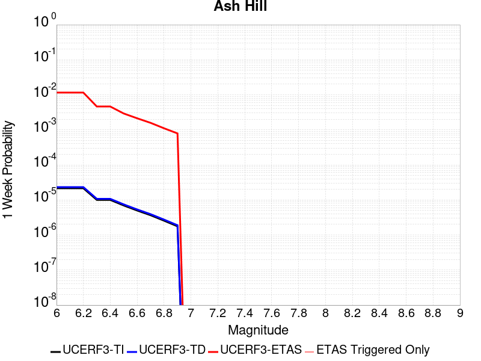 | 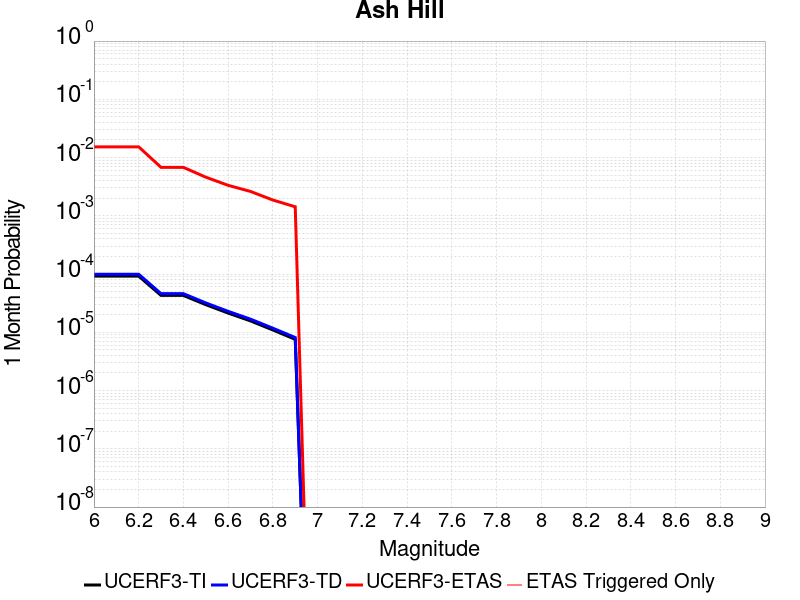 | 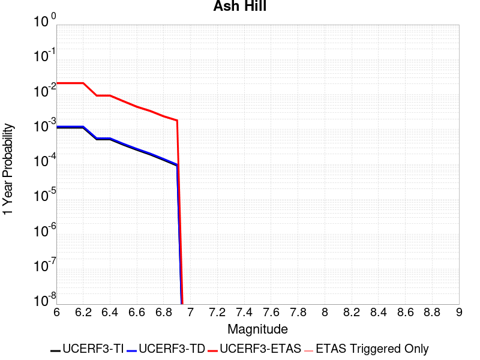 | 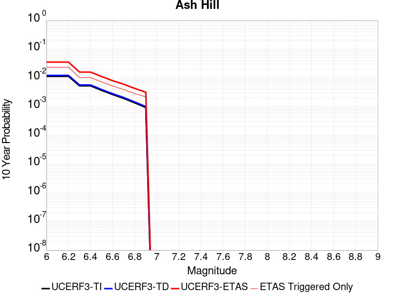 |

| Magnitude | 1 wk TI Prob | 1 wk TD Prob | 1 wk ETAS Prob | 1 wk ETAS/TD Gain | 1 wk ETAS Triggered Only | 1 mo TI Prob | 1 mo TD Prob | 1 mo ETAS Prob | 1 mo ETAS/TD Gain | 1 mo ETAS Triggered Only | 1 yr TI Prob | 1 yr TD Prob | 1 yr ETAS Prob | 1 yr ETAS/TD Gain | 1 yr ETAS Triggered Only | 10 yr TI Prob | 10 yr TD Prob | 10 yr ETAS Prob | 10 yr ETAS/TD Gain | 10 yr ETAS Triggered Only |
|-----|-----|-----|-----|-----|-----|-----|-----|-----|-----|-----|-----|-----|-----|-----|-----|-----|-----|-----|-----|-----|
| 6.0 | 2.1545662E-5 | 2.3194447E-5 | 0.011542574 | 497.64386 | 0.011519646 | 9.2335285E-5 | 9.940143E-5 | 0.015286467 | 153.78517 | 0.015188575 | 0.0011236023 | 0.0012096206 | 0.021699244 | 17.938885 | 0.02051444 | 0.011179381 | 0.012038348 | 0.03546288 | 2.9458258 | 0.023709957 |
| 6.1 | 2.1545662E-5 | 2.3194447E-5 | 0.011542574 | 497.64386 | 0.011519646 | 9.2335285E-5 | 9.940143E-5 | 0.015286467 | 153.78517 | 0.015188575 | 0.0011236023 | 0.0012096206 | 0.021699244 | 17.938885 | 0.02051444 | 0.011179381 | 0.012038348 | 0.03546288 | 2.9458258 | 0.023709957 |
| 6.2 | 2.1545662E-5 | 2.3194447E-5 | 0.011542574 | 497.64386 | 0.011519646 | 9.2335285E-5 | 9.940143E-5 | 0.015286467 | 153.78517 | 0.015188575 | 0.0011236023 | 0.0012096206 | 0.021699244 | 17.938885 | 0.02051444 | 0.011179381 | 0.012038348 | 0.03546288 | 2.9458258 | 0.023709957 |
| 6.3 | 1.0025529E-5 | 1.0746934E-5 | 0.004626446 | 430.48984 | 0.0046157488 | 4.2965847E-5 | 4.605755E-5 | 0.0067918412 | 147.46423 | 0.006746094 | 5.229836E-4 | 5.6061964E-4 | 0.009353226 | 16.68373 | 0.0087975385 | 0.005217545 | 0.0055933665 | 0.015753983 | 2.8165476 | 0.010217769 |
| 6.4 | 1.0025529E-5 | 1.0746934E-5 | 0.004626446 | 430.48984 | 0.0046157488 | 4.2965847E-5 | 4.605755E-5 | 0.0067918412 | 147.46423 | 0.006746094 | 5.229836E-4 | 5.6061964E-4 | 0.009353226 | 16.68373 | 0.0087975385 | 0.005217545 | 0.0055933665 | 0.015753983 | 2.8165476 | 0.010217769 |
| 6.5 | 6.9617327E-6 | 7.456634E-6 | 0.0029267974 | 392.5092 | 0.0029193624 | 2.9835655E-5 | 3.195666E-5 | 0.004608108 | 144.19868 | 0.004576298 | 3.6318856E-4 | 3.8901155E-4 | 0.0065803844 | 16.915653 | 0.0061937827 | 0.0036259557 | 0.0038841602 | 0.011193516 | 2.8818367 | 0.007337857 |
| 6.6 | 4.9919777E-6 | 5.3466883E-6 | 0.002135681 | 399.43994 | 0.0021303457 | 2.1394015E-5 | 2.2914215E-5 | 0.0033367092 | 145.61743 | 0.0033138709 | 2.60441E-4 | 2.7895154E-4 | 0.004617334 | 16.552458 | 0.004339593 | 0.0026013597 | 0.0027866727 | 0.008058354 | 2.8917477 | 0.0052864132 |
| 6.7 | 3.6630722E-6 | 3.924624E-6 | 0.0015819522 | 403.0838 | 0.0015780338 | 1.5698786E-5 | 1.681974E-5 | 0.0026205317 | 155.80096 | 0.0026037558 | 1.9111596E-4 | 2.0476682E-4 | 0.0035179593 | 17.180319 | 0.0033138709 | 0.0019095168 | 0.0020463446 | 0.0061014662 | 2.9816418 | 0.0040634368 |
| 6.8 | 2.5599613E-6 | 2.744925E-6 | 0.0011073655 | 403.42285 | 0.0011046237 | 1.0971216E-5 | 1.1763939E-5 | 0.0018659318 | 158.61453 | 0.0018541897 | 1.3356637E-4 | 1.4322149E-4 | 0.002470488 | 17.249422 | 0.0023275998 | 0.0013348613 | 0.0014317769 | 0.004386354 | 3.0635736 | 0.0029588132 |
| 6.9 | 1.7684905E-6 | 1.8968707E-6 | 7.9091225E-4 | 416.95633 | 7.890169E-4 | 7.579223E-6 | 8.129446E-6 | 0.0014283482 | 175.70058 | 0.0014202304 | 9.2273134E-5 | 9.8976E-5 | 0.0019529822 | 19.731874 | 0.0018541897 | 9.223483E-4 | 9.8976E-4 | 0.003315056 | 3.3493533 | 0.0023275998 |

## Hunter Mountain-Saline Valley
*[(top)](#table-of-contents)*

| 1 Week | 1 Month | 1 Year | 10 Year |
|-----|-----|-----|-----|
| 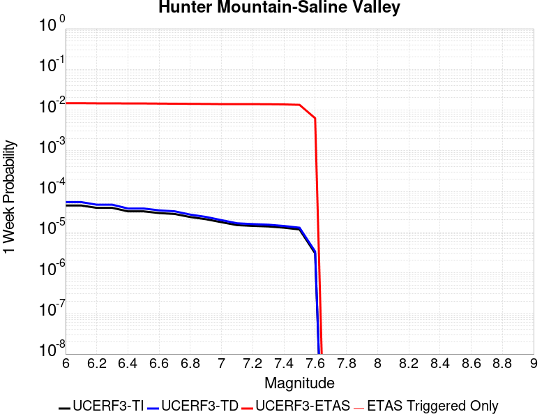 | 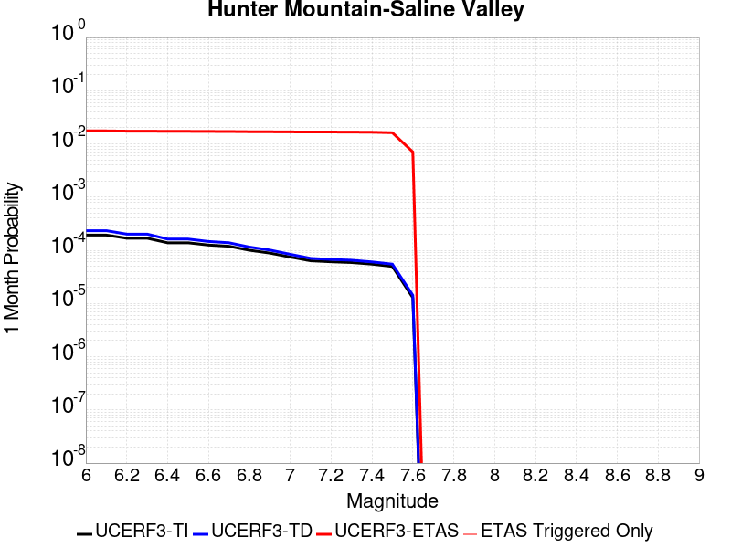 | 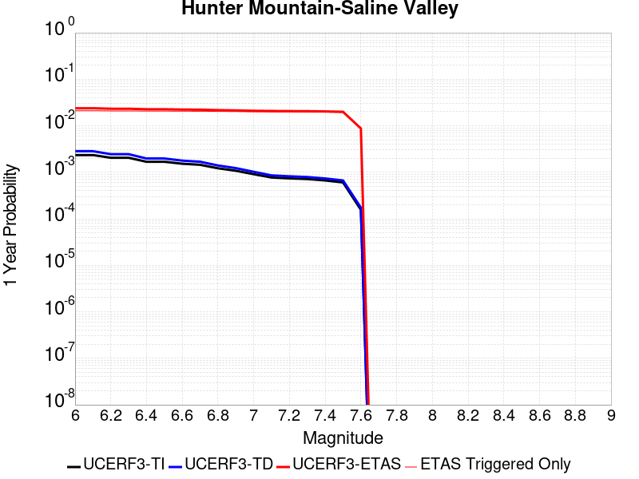 | 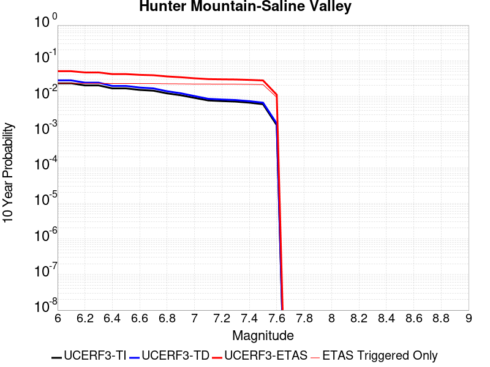 |

| Magnitude | 1 wk TI Prob | 1 wk TD Prob | 1 wk ETAS Prob | 1 wk ETAS/TD Gain | 1 wk ETAS Triggered Only | 1 mo TI Prob | 1 mo TD Prob | 1 mo ETAS Prob | 1 mo ETAS/TD Gain | 1 mo ETAS Triggered Only | 1 yr TI Prob | 1 yr TD Prob | 1 yr ETAS Prob | 1 yr ETAS/TD Gain | 1 yr ETAS Triggered Only | 10 yr TI Prob | 10 yr TD Prob | 10 yr ETAS Prob | 10 yr ETAS/TD Gain | 10 yr ETAS Triggered Only |
|-----|-----|-----|-----|-----|-----|-----|-----|-----|-----|-----|-----|-----|-----|-----|-----|-----|-----|-----|-----|-----|
| 6.0 | 4.5103672E-5 | 5.4570177E-5 | 0.014768932 | 270.64108 | 0.014715165 | 1.9328714E-4 | 2.3385242E-4 | 0.017509282 | 74.87321 | 0.01727947 | 0.002350731 | 0.0028435152 | 0.023850363 | 8.387633 | 0.021066751 | 0.023260195 | 0.028091887 | 0.050829045 | 1.8093853 | 0.02339435 |
| 6.1 | 4.5103672E-5 | 5.4570177E-5 | 0.014768932 | 270.64108 | 0.014715165 | 1.9328714E-4 | 2.3385242E-4 | 0.017509282 | 74.87321 | 0.01727947 | 0.002350731 | 0.0028435152 | 0.023850363 | 8.387633 | 0.021066751 | 0.023260195 | 0.028091887 | 0.050829045 | 1.8093853 | 0.02339435 |
| 6.2 | 3.9363465E-5 | 4.706337E-5 | 0.014643189 | 311.1377 | 0.014596812 | 1.6868966E-4 | 2.0168544E-4 | 0.017319899 | 85.8758 | 0.017121667 | 0.002051862 | 0.0024528175 | 0.023271125 | 9.487508 | 0.020869497 | 0.020330196 | 0.024273481 | 0.046907503 | 1.9324589 | 0.023197096 |
| 6.3 | 3.9363465E-5 | 4.706337E-5 | 0.014643189 | 311.1377 | 0.014596812 | 1.6868966E-4 | 2.0168544E-4 | 0.017319899 | 85.8758 | 0.017121667 | 0.002051862 | 0.0024528175 | 0.023271125 | 9.487508 | 0.020869497 | 0.020330196 | 0.024273481 | 0.046907503 | 1.9324589 | 0.023197096 |
| 6.4 | 3.2311684E-5 | 3.795099E-5 | 0.014515861 | 382.48965 | 0.01447846 | 1.384713E-4 | 1.6263737E-4 | 0.017163185 | 105.530396 | 0.017003315 | 0.0016845843 | 0.0019783843 | 0.022649102 | 11.448282 | 0.020711694 | 0.016718714 | 0.019616475 | 0.04216514 | 2.149476 | 0.022999842 |
| 6.5 | 3.2311684E-5 | 3.795099E-5 | 0.014515861 | 382.48965 | 0.01447846 | 1.384713E-4 | 1.6263737E-4 | 0.017163185 | 105.530396 | 0.017003315 | 0.0016845843 | 0.0019783843 | 0.022649102 | 11.448282 | 0.020711694 | 0.016718714 | 0.019616475 | 0.04216514 | 2.149476 | 0.022999842 |
| 6.6 | 2.9305844E-5 | 3.418183E-5 | 0.014393798 | 421.095 | 0.0143601075 | 1.2559042E-4 | 1.4648569E-4 | 0.017028974 | 116.250084 | 0.016884962 | 0.0015279909 | 0.001782067 | 0.022338709 | 12.53528 | 0.020593341 | 0.015175272 | 0.01768569 | 0.040201258 | 2.2730951 | 0.02292094 |
| 6.7 | 2.7826512E-5 | 3.2344276E-5 | 0.014352538 | 443.74274 | 0.014320657 | 1.19251024E-4 | 1.386113E-4 | 0.016981786 | 122.513725 | 0.016845511 | 0.0014509142 | 0.0016863465 | 0.022205574 | 13.167861 | 0.02055389 | 0.014414776 | 0.016743187 | 0.039202776 | 2.3414168 | 0.022842038 |
| 6.8 | 2.3389874E-5 | 2.6866714E-5 | 0.014228789 | 529.6066 | 0.014202304 | 1.0023846E-4 | 1.15138246E-4 | 0.01684037 | 146.26218 | 0.016727159 | 0.00121972 | 0.001400954 | 0.02172907 | 15.510196 | 0.020356636 | 0.01213047 | 0.013927434 | 0.03621793 | 2.6004744 | 0.022605333 |
| 6.9 | 2.069209E-5 | 2.3570032E-5 | 0.014146639 | 600.19604 | 0.014123403 | 8.867737E-5 | 1.01010715E-4 | 0.016747585 | 165.8001 | 0.016648257 | 0.0010791123 | 0.0012291478 | 0.021403152 | 17.413002 | 0.020198831 | 0.010738871 | 0.012228523 | 0.034401555 | 2.8132222 | 0.02244753 |
| 7.0 | 1.7462342E-5 | 1.9633546E-5 | 0.013984959 | 712.29913 | 0.013965599 | 7.483646E-5 | 8.414118E-5 | 0.016533758 | 196.5002 | 0.016451001 | 9.1075303E-4 | 0.0010239601 | 0.021005057 | 20.513552 | 0.020001577 | 0.009070295 | 0.0101960525 | 0.032180414 | 3.1561642 | 0.022210825 |
| 7.1 | 1.4807709E-5 | 1.6441749E-5 | 0.013981811 | 850.38464 | 0.013965599 | 6.3460066E-5 | 7.046283E-5 | 0.016520306 | 234.4542 | 0.016451001 | 7.723524E-4 | 8.575638E-4 | 0.020802572 | 24.257755 | 0.019962126 | 0.007696735 | 0.008545532 | 0.03052744 | 3.5723276 | 0.022171374 |
| 7.2 | 1.4180048E-5 | 1.5698337E-5 | 0.013981078 | 890.6089 | 0.013965599 | 6.077022E-5 | 6.727694E-5 | 0.016477725 | 244.9238 | 0.01641155 | 7.396263E-4 | 8.188051E-4 | 0.020685751 | 25.263336 | 0.019883225 | 0.0073716943 | 0.008160833 | 0.030073013 | 3.685042 | 0.022092473 |
| 7.3 | 1.3730402E-5 | 1.5172075E-5 | 0.013980559 | 921.4665 | 0.013965599 | 5.8843252E-5 | 6.502165E-5 | 0.016475506 | 253.38492 | 0.01641155 | 7.161811E-4 | 7.9136714E-4 | 0.020619439 | 26.055464 | 0.019843774 | 0.007138774 | 0.007888422 | 0.029767482 | 3.7735658 | 0.022053022 |
| 7.4 | 1.2810095E-5 | 1.4109277E-5 | 0.01382171 | 979.6186 | 0.013807796 | 5.489925E-5 | 6.0467017E-5 | 0.016273784 | 269.1349 | 0.016214296 | 6.681934E-4 | 7.359531E-4 | 0.020368015 | 27.675697 | 0.01964652 | 0.006661878 | 0.007338053 | 0.02899428 | 3.9512224 | 0.021816317 |
| 7.5 | 1.1595659E-5 | 1.2800664E-5 | 0.013544267 | 1058.091 | 0.013531639 | 4.9694736E-5 | 5.4858923E-5 | 0.015952677 | 290.7946 | 0.01589869 | 6.0486543E-4 | 6.6771836E-4 | 0.019985724 | 29.931368 | 0.019330913 | 0.006032217 | 0.0066599925 | 0.02797832 | 4.200954 | 0.02146126 |
| 7.6 | 2.997694E-6 | 3.3251579E-6 | 0.0063154395 | 1899.29 | 0.006312135 | 1.28471975E-5 | 1.425064E-5 | 0.0073914533 | 518.6752 | 0.007377308 | 1.564034E-4 | 1.73495E-4 | 0.008772287 | 50.562187 | 0.008600284 | 0.0015629337 | 0.001735031 | 0.011147424 | 6.424913 | 0.009428752 |

## Blackwater
*[(top)](#table-of-contents)*

| 1 Week | 1 Month | 1 Year | 10 Year |
|-----|-----|-----|-----|
| 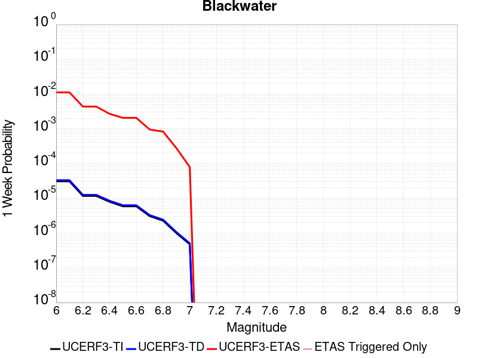 | 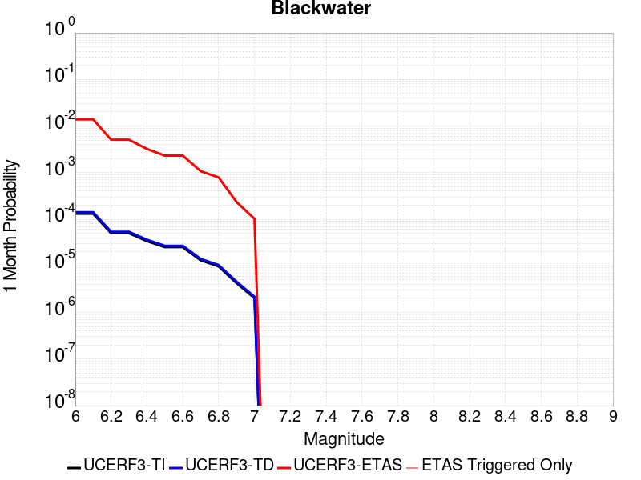 | 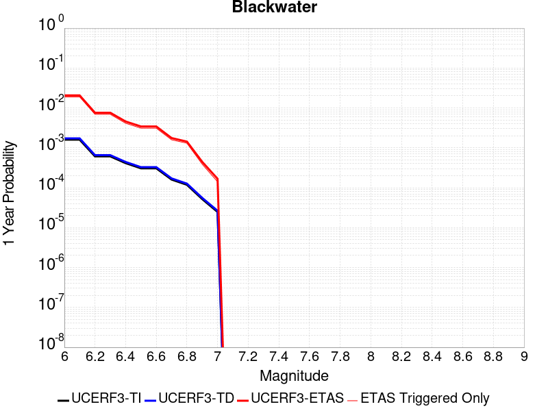 | 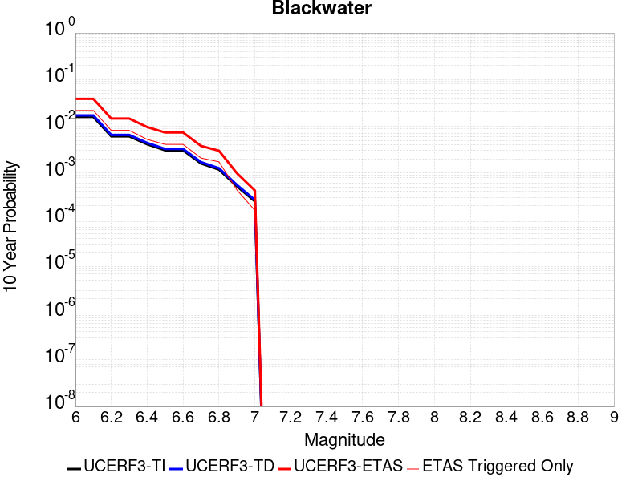 |

| Magnitude | 1 wk TI Prob | 1 wk TD Prob | 1 wk ETAS Prob | 1 wk ETAS/TD Gain | 1 wk ETAS Triggered Only | 1 mo TI Prob | 1 mo TD Prob | 1 mo ETAS Prob | 1 mo ETAS/TD Gain | 1 mo ETAS Triggered Only | 1 yr TI Prob | 1 yr TD Prob | 1 yr ETAS Prob | 1 yr ETAS/TD Gain | 1 yr ETAS Triggered Only | 10 yr TI Prob | 10 yr TD Prob | 10 yr ETAS Prob | 10 yr ETAS/TD Gain | 10 yr ETAS Triggered Only |
|-----|-----|-----|-----|-----|-----|-----|-----|-----|-----|-----|-----|-----|-----|-----|-----|-----|-----|-----|-----|-----|
| 6.0 | 3.0708583E-5 | 3.3095846E-5 | 0.011118416 | 335.94595 | 0.011085687 | 1.3160157E-4 | 1.4183241E-4 | 0.014223786 | 100.285866 | 0.014083952 | 0.0016010714 | 0.0017255784 | 0.020471776 | 11.863718 | 0.018778602 | 0.015895851 | 0.017135633 | 0.038578115 | 2.2513387 | 0.021816317 |
| 6.1 | 3.0708583E-5 | 3.3095846E-5 | 0.011118416 | 335.94595 | 0.011085687 | 1.3160157E-4 | 1.4183241E-4 | 0.014223786 | 100.285866 | 0.014083952 | 0.0016010714 | 0.0017255784 | 0.020471776 | 11.863718 | 0.018778602 | 0.015895851 | 0.017135633 | 0.038578115 | 2.2513387 | 0.021816317 |
| 6.2 | 1.1707779E-5 | 1.2545122E-5 | 0.0043520834 | 346.9144 | 0.004339593 | 5.017523E-5 | 5.3763757E-5 | 0.0052215466 | 97.12019 | 0.005168061 | 6.107122E-4 | 6.5438676E-4 | 0.0074749165 | 11.422781 | 0.006824996 | 0.006090366 | 0.0065255696 | 0.014638605 | 2.2432685 | 0.008166324 |
| 6.3 | 1.1707779E-5 | 1.2545122E-5 | 0.0043520834 | 346.9144 | 0.004339593 | 5.017523E-5 | 5.3763757E-5 | 0.0052215466 | 97.12019 | 0.005168061 | 6.107122E-4 | 6.5438676E-4 | 0.0074749165 | 11.422781 | 0.006824996 | 0.006090366 | 0.0065255696 | 0.014638605 | 2.2432685 | 0.008166324 |
| 6.4 | 7.929244E-6 | 8.480098E-6 | 0.0026911148 | 317.34476 | 0.0026826574 | 3.3982033E-5 | 3.6342793E-5 | 0.0031528461 | 86.753 | 0.0031166167 | 4.136527E-4 | 4.423877E-4 | 0.0045434604 | 10.270313 | 0.0041028876 | 0.0041288356 | 0.0044154758 | 0.009639271 | 2.183065 | 0.0052469624 |
| 6.5 | 5.8832115E-6 | 6.285991E-6 | 0.002057717 | 327.34967 | 0.0020514438 | 2.521352E-5 | 2.6939697E-5 | 0.002472826 | 91.79116 | 0.0024459523 | 3.0693135E-4 | 3.27944E-4 | 0.0034829765 | 10.620645 | 0.0031560676 | 0.0030650778 | 0.0032748538 | 0.007364305 | 2.2487433 | 0.0041028876 |
| 6.6 | 5.8832115E-6 | 6.285991E-6 | 0.002057717 | 327.34967 | 0.0020514438 | 2.521352E-5 | 2.6939697E-5 | 0.002472826 | 91.79116 | 0.0024459523 | 3.0693135E-4 | 3.27944E-4 | 0.0034829765 | 10.620645 | 0.0031560676 | 0.0030650778 | 0.0032748538 | 0.007364305 | 2.2487433 | 0.0041028876 |
| 6.7 | 3.0715053E-6 | 3.2814662E-6 | 9.500986E-4 | 289.5348 | 9.4682025E-4 | 1.3163528E-5 | 1.4063357E-5 | 0.0012370223 | 87.96067 | 0.0012229761 | 1.6025416E-4 | 1.7120909E-4 | 0.0017884168 | 10.445806 | 0.0016174846 | 0.0016013865 | 0.0017108864 | 0.0037982038 | 2.220021 | 0.0020908948 |
| 6.8 | 2.2722281E-6 | 2.4287538E-6 | 8.3089445E-4 | 342.10736 | 8.284677E-4 | 9.738084E-6 | 1.0408908E-5 | 0.0010361202 | 99.54168 | 0.0010257219 | 1.1855473E-4 | 1.26722E-4 | 0.0014678807 | 11.583471 | 0.0013413287 | 0.001184915 | 0.0012665876 | 0.003000226 | 2.3687475 | 0.0017358372 |
| 6.9 | 9.952399E-7 | 1.0653489E-6 | 2.7722097E-4 | 260.21613 | 2.7615592E-4 | 4.265307E-6 | 4.5657757E-6 | 3.201711E-4 | 70.12414 | 3.1560674E-4 | 5.1928873E-5 | 5.5587418E-5 | 4.895226E-4 | 8.806355 | 4.339593E-4 | 5.191674E-4 | 5.557858E-4 | 9.895038E-4 | 1.7803693 | 4.339593E-4 |
| 7.0 | 4.7385504E-7 | 5.0755597E-7 | 7.9409205E-5 | 156.45409 | 7.8901685E-5 | 2.0308057E-6 | 2.1752398E-6 | 1.2052752E-4 | 55.40884 | 1.1835253E-4 | 2.4724779E-5 | 2.6483543E-5 | 1.8428275E-4 | 6.958387 | 1.5780337E-4 | 2.4722028E-4 | 2.6483546E-4 | 4.2259702E-4 | 1.5956967 | 1.5780337E-4 |

## McLean Lake
*[(top)](#table-of-contents)*

| 1 Week | 1 Month | 1 Year | 10 Year |
|-----|-----|-----|-----|
| 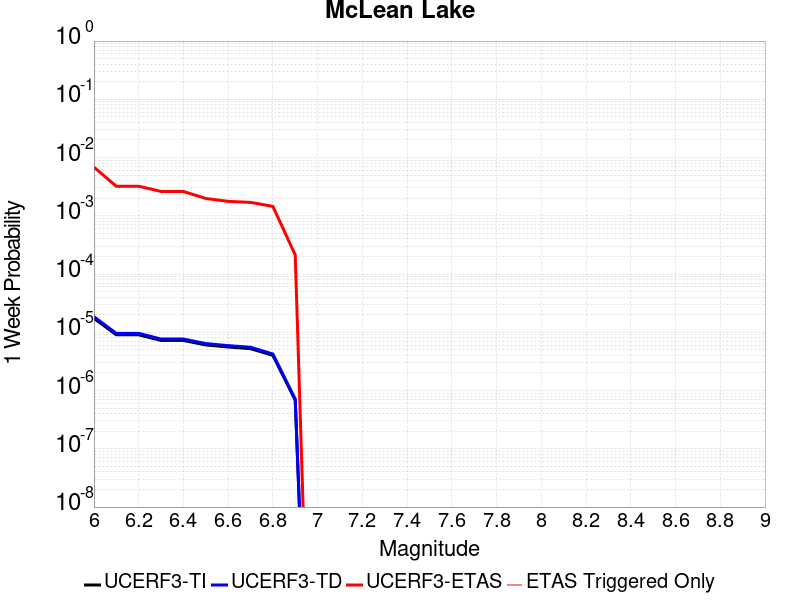 | 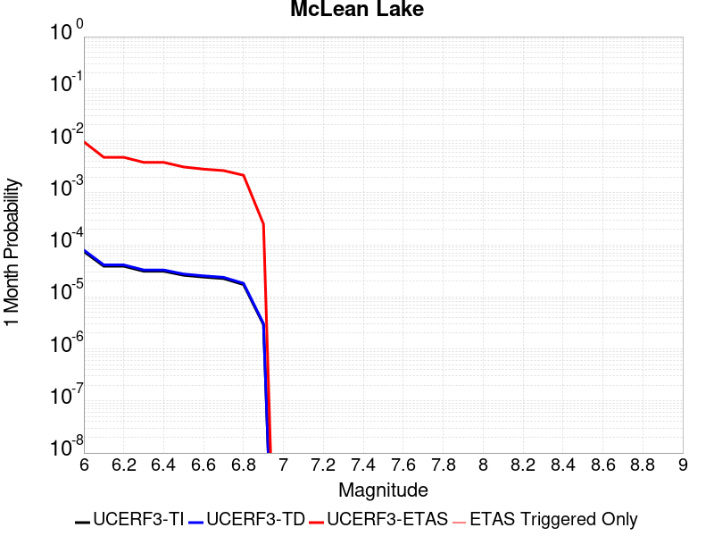 | 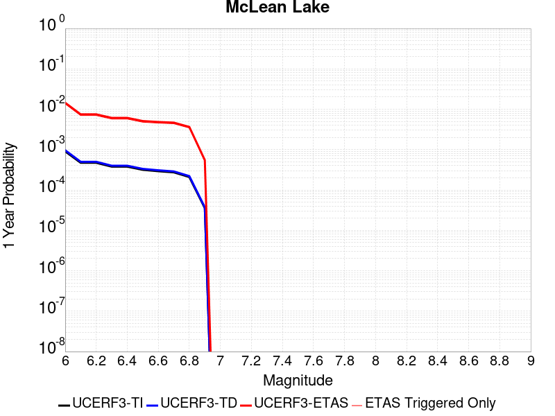 | 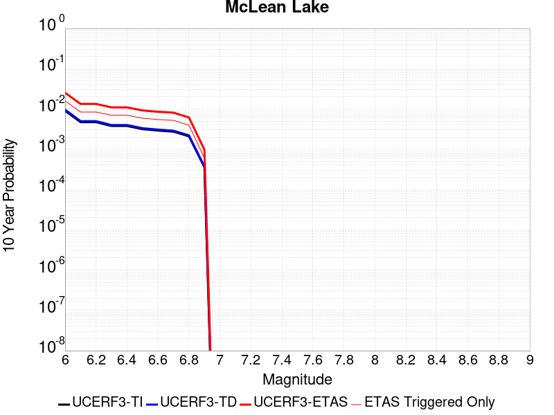 |

| Magnitude | 1 wk TI Prob | 1 wk TD Prob | 1 wk ETAS Prob | 1 wk ETAS/TD Gain | 1 wk ETAS Triggered Only | 1 mo TI Prob | 1 mo TD Prob | 1 mo ETAS Prob | 1 mo ETAS/TD Gain | 1 mo ETAS Triggered Only | 1 yr TI Prob | 1 yr TD Prob | 1 yr ETAS Prob | 1 yr ETAS/TD Gain | 1 yr ETAS Triggered Only | 10 yr TI Prob | 10 yr TD Prob | 10 yr ETAS Prob | 10 yr ETAS/TD Gain | 10 yr ETAS Triggered Only |
|-----|-----|-----|-----|-----|-----|-----|-----|-----|-----|-----|-----|-----|-----|-----|-----|-----|-----|-----|-----|-----|
| 6.0 | 1.7360222E-5 | 1.8501627E-5 | 0.0068828217 | 372.0117 | 0.0068644467 | 7.439883E-5 | 7.9290556E-5 | 0.009704533 | 122.39205 | 0.009626006 | 9.0542925E-4 | 9.6498354E-4 | 0.014483565 | 15.009131 | 0.013531639 | 0.009017491 | 0.0096127745 | 0.025397705 | 2.6420786 | 0.01593814 |
| 6.1 | 9.062689E-6 | 9.592193E-6 | 0.003126179 | 325.90866 | 0.0031166167 | 3.8839516E-5 | 4.1108804E-5 | 0.0046961172 | 114.23629 | 0.0046551996 | 4.727685E-4 | 5.003936E-4 | 0.007479699 | 14.947631 | 0.0069827996 | 0.0047176396 | 0.004993552 | 0.0131976055 | 2.6429296 | 0.008245226 |
| 6.2 | 9.062689E-6 | 9.592193E-6 | 0.003126179 | 325.90866 | 0.0031166167 | 3.8839516E-5 | 4.1108804E-5 | 0.0046961172 | 114.23629 | 0.0046551996 | 4.727685E-4 | 5.003936E-4 | 0.007479699 | 14.947631 | 0.0069827996 | 0.0047176396 | 0.004993552 | 0.0131976055 | 2.6429296 | 0.008245226 |
| 6.3 | 7.2575485E-6 | 7.66771E-6 | 0.0024930518 | 325.13644 | 0.002485403 | 3.110341E-5 | 3.2861237E-5 | 0.0037411188 | 113.84595 | 0.0037083793 | 3.786182E-4 | 4.0001926E-4 | 0.0061181034 | 15.294522 | 0.0057203723 | 0.0037797375 | 0.0039936965 | 0.010830729 | 2.7119558 | 0.0068644467 |
| 6.4 | 7.2575485E-6 | 7.66771E-6 | 0.0024930518 | 325.13644 | 0.002485403 | 3.110341E-5 | 3.2861237E-5 | 0.0037411188 | 113.84595 | 0.0037083793 | 3.786182E-4 | 4.0001926E-4 | 0.0061181034 | 15.294522 | 0.0057203723 | 0.0037797375 | 0.0039936965 | 0.010830729 | 2.7119558 | 0.0068644467 |
| 6.5 | 6.06582E-6 | 6.4038773E-6 | 0.0018211311 | 284.37946 | 0.0018147388 | 2.5996113E-5 | 2.7444936E-5 | 0.002986177 | 108.80612 | 0.0029588132 | 3.164567E-4 | 3.3409733E-4 | 0.0051060547 | 15.283134 | 0.004773552 | 0.0031600643 | 0.0033365893 | 0.009037875 | 2.7087169 | 0.0057203723 |
| 6.6 | 5.598744E-6 | 5.910262E-6 | 0.0017022865 | 288.02216 | 0.0016963863 | 2.3994397E-5 | 2.5329486E-5 | 0.0027868187 | 110.02271 | 0.002761559 | 2.9209262E-4 | 3.0834923E-4 | 0.0048437975 | 15.708803 | 0.004536847 | 0.0029170897 | 0.003079843 | 0.008507293 | 2.7622485 | 0.0054442165 |
| 6.7 | 5.246996E-6 | 5.539162E-6 | 0.0016624654 | 300.12943 | 0.0016569354 | 2.2486933E-5 | 2.3739085E-5 | 0.002627433 | 110.67962 | 0.0026037558 | 2.73744E-4 | 2.8899137E-4 | 0.0046667694 | 16.148474 | 0.004379044 | 0.0027340704 | 0.0028867796 | 0.008079258 | 2.7987096 | 0.0052075116 |
| 6.8 | 4.02324E-6 | 4.2469046E-6 | 0.0014244713 | 335.414 | 0.0014202304 | 1.7242342E-5 | 1.8200926E-5 | 0.0021090575 | 115.876396 | 0.0020908948 | 2.099053E-4 | 2.2157968E-4 | 0.0036530427 | 16.48636 | 0.0034322233 | 0.0020970714 | 0.002214172 | 0.0061898846 | 2.7955754 | 0.003984535 |
| 6.9 | 6.835972E-7 | 7.1399285E-7 | 2.3741889E-4 | 332.5228 | 2.3670506E-4 | 2.9296991E-6 | 3.0599674E-6 | 2.7921502E-4 | 91.24771 | 2.7615592E-4 | 3.56685E-5 | 3.7254784E-5 | 5.500967E-4 | 14.765799 | 5.1286095E-4 | 3.5662777E-4 | 3.7251666E-4 | 9.6405885E-4 | 2.587962 | 5.9176265E-4 |

## Goldstone Lake
*[(top)](#table-of-contents)*

| 1 Week | 1 Month | 1 Year | 10 Year |
|-----|-----|-----|-----|
| 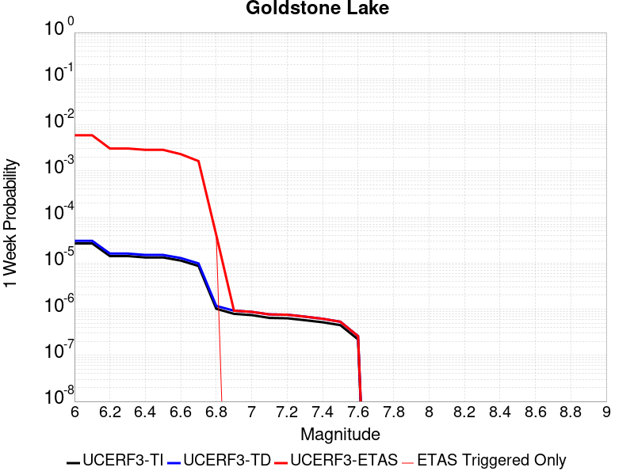 |  | 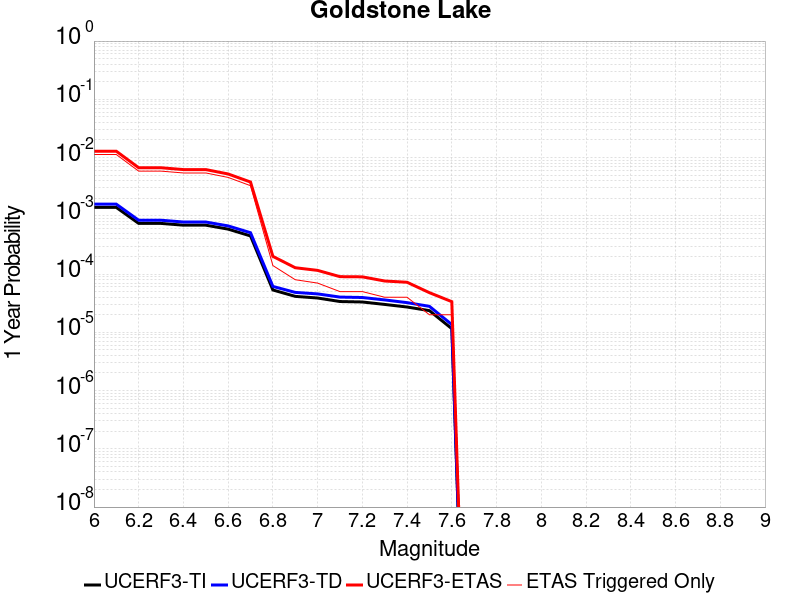 | 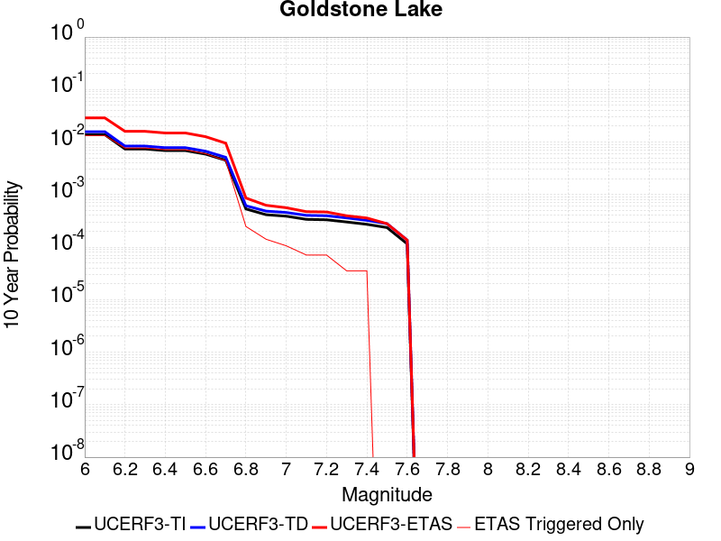 |

| Magnitude | 1 wk TI Prob | 1 wk TD Prob | 1 wk ETAS Prob | 1 wk ETAS/TD Gain | 1 wk ETAS Triggered Only | 1 mo TI Prob | 1 mo TD Prob | 1 mo ETAS Prob | 1 mo ETAS/TD Gain | 1 mo ETAS Triggered Only | 1 yr TI Prob | 1 yr TD Prob | 1 yr ETAS Prob | 1 yr ETAS/TD Gain | 1 yr ETAS Triggered Only | 10 yr TI Prob | 10 yr TD Prob | 10 yr ETAS Prob | 10 yr ETAS/TD Gain | 10 yr ETAS Triggered Only |
|-----|-----|-----|-----|-----|-----|-----|-----|-----|-----|-----|-----|-----|-----|-----|-----|-----|-----|-----|-----|-----|
| 6.0 | 2.671352E-5 | 3.037609E-5 | 0.0059083733 | 194.50737 | 0.0058781756 | 1.1448149E-4 | 1.3017785E-4 | 0.007940428 | 60.99677 | 0.007811267 | 0.001392921 | 0.0015839594 | 0.012967194 | 8.186569 | 0.011401294 | 0.013842222 | 0.015746197 | 0.029025935 | 1.8433616 | 0.013492188 |
| 6.1 | 2.671352E-5 | 3.037609E-5 | 0.0059083733 | 194.50737 | 0.0058781756 | 1.1448149E-4 | 1.3017785E-4 | 0.007940428 | 60.99677 | 0.007811267 | 0.001392921 | 0.0015839594 | 0.012967194 | 8.186569 | 0.011401294 | 0.013842222 | 0.015746197 | 0.029025935 | 1.8433616 | 0.013492188 |
| 6.2 | 1.4197047E-5 | 1.6096245E-5 | 0.0030537623 | 189.71893 | 0.003037715 | 6.0843064E-5 | 6.8982634E-5 | 0.0041715875 | 60.473007 | 0.0041028876 | 7.4051257E-4 | 8.3963864E-4 | 0.0070676384 | 8.417477 | 0.0062332335 | 0.007380498 | 0.0083743585 | 0.01604197 | 1.9156059 | 0.0077323653 |
| 6.3 | 1.4197047E-5 | 1.6096245E-5 | 0.0030537623 | 189.71893 | 0.003037715 | 6.0843064E-5 | 6.8982634E-5 | 0.0041715875 | 60.473007 | 0.0041028876 | 7.4051257E-4 | 8.3963864E-4 | 0.0070676384 | 8.417477 | 0.0062332335 | 0.007380498 | 0.0083743585 | 0.01604197 | 1.9156059 | 0.0077323653 |
| 6.4 | 1.3238931E-5 | 1.500846E-5 | 0.0028554266 | 190.25447 | 0.0028404607 | 5.6737044E-5 | 6.4320935E-5 | 0.00381191 | 59.26391 | 0.0037478302 | 6.9055456E-4 | 7.82924E-4 | 0.0065776575 | 8.4014 | 0.005799274 | 0.006884126 | 0.0078112837 | 0.014896109 | 1.9069989 | 0.007140603 |
| 6.5 | 1.3238931E-5 | 1.500846E-5 | 0.0028554266 | 190.25447 | 0.0028404607 | 5.6737044E-5 | 6.4320935E-5 | 0.00381191 | 59.26391 | 0.0037478302 | 6.9055456E-4 | 7.82924E-4 | 0.0065776575 | 8.4014 | 0.005799274 | 0.006884126 | 0.0078112837 | 0.014896109 | 1.9069989 | 0.007140603 |
| 6.6 | 1.1328278E-5 | 1.2855166E-5 | 0.0023009747 | 178.99223 | 0.002288149 | 4.8548856E-5 | 5.5092944E-5 | 0.003171538 | 57.567047 | 0.0031166167 | 5.90922E-4 | 6.7064585E-4 | 0.0055198455 | 8.230641 | 0.0048524537 | 0.0058935313 | 0.0066956086 | 0.012573613 | 1.8778895 | 0.0059176264 |
| 6.7 | 8.651175E-6 | 9.824565E-6 | 0.0016272933 | 165.63516 | 0.0016174846 | 3.707594E-5 | 4.2105108E-5 | 0.0022907085 | 54.40453 | 0.0022486981 | 4.5130608E-4 | 5.1259965E-4 | 0.004140217 | 8.076901 | 0.0036294777 | 0.0045039062 | 0.005123051 | 0.009361914 | 1.82741 | 0.0042606913 |
| 6.8 | 1.0215377E-6 | 1.1754702E-6 | 4.062627E-5 | 34.561714 | 3.9450842E-5 | 4.378012E-6 | 5.0377203E-6 | 1.2338966E-4 | 24.493153 | 1.1835253E-4 | 5.3300988E-5 | 6.1332634E-5 | 3.374716E-4 | 5.502317 | 2.7615592E-4 | 5.3288206E-4 | 6.1316835E-4 | 8.891549E-4 | 1.4500992 | 2.7615592E-4 |
| 6.9 | 7.9360774E-7 | 9.2833966E-7 | 9.2833966E-7 | 1.0 | 0.0 | 3.4011714E-6 | 3.9785928E-6 | 4.342928E-5 | 10.915739 | 3.9450842E-5 | 4.1408475E-5 | 4.843836E-5 | 2.062341E-4 | 4.2576604 | 1.5780337E-4 | 4.140076E-4 | 4.8428503E-4 | 6.42012E-4 | 1.3256904 | 1.5780337E-4 |
| 7.0 | 7.4382757E-7 | 8.7473285E-7 | 8.7473285E-7 | 1.0 | 0.0 | 3.1878285E-6 | 3.74885E-6 | 4.3199547E-5 | 11.523413 | 3.9450842E-5 | 3.8811122E-5 | 4.564136E-5 | 1.6398849E-4 | 3.59298 | 1.1835253E-4 | 3.8804344E-4 | 4.5632652E-4 | 5.7462504E-4 | 1.259241 | 1.1835253E-4 |
| 7.1 | 6.4709513E-7 | 7.7113E-7 | 7.7113E-7 | 1.0 | 0.0 | 2.773262E-6 | 3.3048389E-6 | 4.2755553E-5 | 12.937258 | 3.9450842E-5 | 3.376394E-5 | 4.0235733E-5 | 1.19134245E-4 | 2.9609067 | 7.8901685E-5 | 3.375881E-4 | 4.0229043E-4 | 4.8116036E-4 | 1.1960523 | 7.8901685E-5 |
| 7.2 | 6.356704E-7 | 7.5883594E-7 | 7.5883594E-7 | 1.0 | 0.0 | 2.7242988E-6 | 3.2521505E-6 | 4.2702868E-5 | 13.130655 | 3.9450842E-5 | 3.3167835E-5 | 3.959427E-5 | 1.1849283E-4 | 2.9926763 | 7.8901685E-5 | 3.3162883E-4 | 3.958781E-4 | 4.7474855E-4 | 1.1992291 | 7.8901685E-5 |
| 7.3 | 5.7695723E-7 | 6.8965653E-7 | 6.8965653E-7 | 1.0 | 0.0 | 2.4726714E-6 | 2.9556677E-6 | 4.2406395E-5 | 14.347484 | 3.9450842E-5 | 3.0104358E-5 | 3.5984718E-5 | 7.5434145E-5 | 2.0962827 | 3.9450842E-5 | 3.0100282E-4 | 3.5979465E-4 | 3.992313E-4 | 1.1096088 | 3.9450842E-5 |
| 7.4 | 5.209647E-7 | 6.193514E-7 | 6.193514E-7 | 1.0 | 0.0 | 2.232704E-6 | 2.6543607E-6 | 4.21051E-5 | 15.862615 | 3.9450842E-5 | 2.718283E-5 | 3.2316417E-5 | 7.1765986E-5 | 2.2207284 | 3.9450842E-5 | 2.7179506E-4 | 3.2312275E-4 | 3.6256085E-4 | 1.122053 | 3.9450842E-5 |
| 7.5 | 4.512955E-7 | 5.348885E-7 | 5.348885E-7 | 1.0 | 0.0 | 1.934122E-6 | 2.2923775E-6 | 2.2923775E-6 | 1.0 | 0.0 | 2.3547682E-5 | 2.7909393E-5 | 2.7909393E-5 | 1.0 | 0.0 | 2.3545188E-4 | 2.7906417E-4 | 2.7906417E-4 | 1.0 | 0.0 |
| 7.6 | 2.21172E-7 | 2.603961E-7 | 2.603961E-7 | 1.0 | 0.0 | 9.478797E-7 | 1.1159829E-6 | 1.1159829E-6 | 1.0 | 0.0 | 1.1540374E-5 | 1.3587036E-5 | 1.3587036E-5 | 1.0 | 0.0 | 1.1539775E-4 | 1.3586486E-4 | 1.3586486E-4 | 1.0 | 0.0 |

## Garlock (West)
*[(top)](#table-of-contents)*

| 1 Week | 1 Month | 1 Year | 10 Year |
|-----|-----|-----|-----|
| 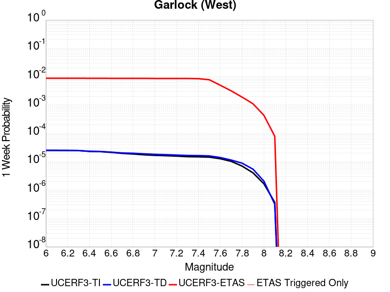 | 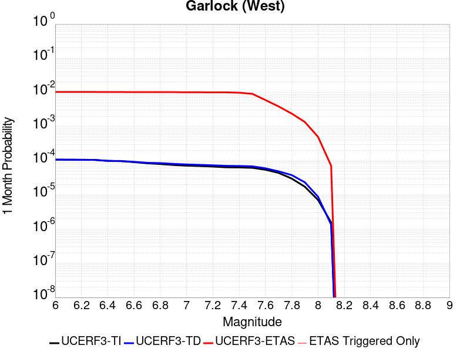 | 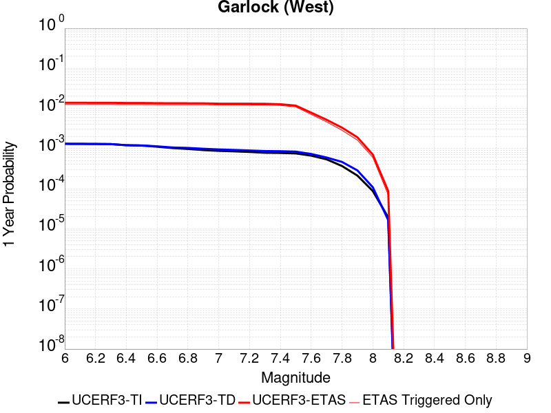 | 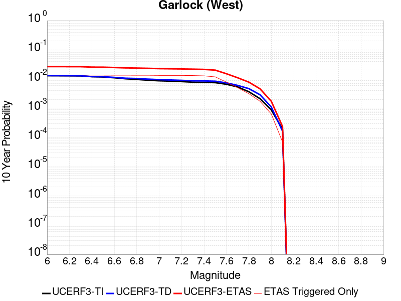 |

| Magnitude | 1 wk TI Prob | 1 wk TD Prob | 1 wk ETAS Prob | 1 wk ETAS/TD Gain | 1 wk ETAS Triggered Only | 1 mo TI Prob | 1 mo TD Prob | 1 mo ETAS Prob | 1 mo ETAS/TD Gain | 1 mo ETAS Triggered Only | 1 yr TI Prob | 1 yr TD Prob | 1 yr ETAS Prob | 1 yr ETAS/TD Gain | 1 yr ETAS Triggered Only | 10 yr TI Prob | 10 yr TD Prob | 10 yr ETAS Prob | 10 yr ETAS/TD Gain | 10 yr ETAS Triggered Only |
|-----|-----|-----|-----|-----|-----|-----|-----|-----|-----|-----|-----|-----|-----|-----|-----|-----|-----|-----|-----|-----|
| 6.0 | 2.5181727E-5 | 2.51973E-5 | 0.008822514 | 350.13727 | 0.0087975385 | 1.0791722E-4 | 1.0798398E-4 | 0.010521882 | 97.43929 | 0.010415023 | 0.0013131002 | 0.0013139155 | 0.0140791945 | 10.715449 | 0.012782074 | 0.013053683 | 0.013141977 | 0.026846174 | 2.0427806 | 0.013886698 |
| 6.1 | 2.5077732E-5 | 2.5098372E-5 | 0.008822416 | 351.51346 | 0.0087975385 | 1.0747157E-4 | 1.0756004E-4 | 0.010521463 | 97.81944 | 0.010415023 | 0.001307681 | 0.0013087603 | 0.014074105 | 10.753769 | 0.012782074 | 0.013000126 | 0.013091032 | 0.026795939 | 2.0468926 | 0.013886698 |
| 6.2 | 2.494612E-5 | 2.498005E-5 | 0.008822299 | 353.17377 | 0.0087975385 | 1.0690756E-4 | 1.0705298E-4 | 0.010520961 | 98.27807 | 0.010415023 | 0.0013008224 | 0.0013025942 | 0.014068018 | 10.8 | 0.012782074 | 0.012932341 | 0.013030097 | 0.02673585 | 2.0518534 | 0.013886698 |
| 6.3 | 2.4733758E-5 | 2.479942E-5 | 0.00882212 | 355.73895 | 0.0087975385 | 1.0599751E-4 | 1.06278916E-4 | 0.010520195 | 98.986664 | 0.010415023 | 0.0012897556 | 0.0012931811 | 0.014058725 | 10.871428 | 0.012782074 | 0.012822957 | 0.012937066 | 0.02664411 | 2.0595171 | 0.013886698 |
| 6.4 | 2.3237335E-5 | 2.317873E-5 | 0.008781063 | 378.84143 | 0.008758088 | 9.958477E-5 | 9.933365E-5 | 0.010473875 | 105.44136 | 0.010375572 | 0.0012117702 | 0.001208719 | 0.013896536 | 11.496912 | 0.012703172 | 0.012051838 | 0.012101916 | 0.02574261 | 2.1271517 | 0.013807796 |
| 6.5 | 2.2732203E-5 | 2.2993298E-5 | 0.008780879 | 381.88864 | 0.008758088 | 9.742009E-5 | 9.8539E-5 | 0.010473088 | 106.28369 | 0.010375572 | 0.0011854442 | 0.0011990548 | 0.013886995 | 11.581618 | 0.012703172 | 0.011791403 | 0.012006322 | 0.025648337 | 2.136236 | 0.013807796 |
| 6.6 | 2.1319436E-5 | 2.17735E-5 | 0.00874022 | 401.4155 | 0.008718637 | 9.136581E-5 | 9.331167E-5 | 0.010428469 | 111.75953 | 0.010336122 | 0.001111811 | 0.0011354799 | 0.013745415 | 12.10538 | 0.01262427 | 0.011062649 | 0.011377227 | 0.024910921 | 2.1895425 | 0.013689443 |
| 6.7 | 1.970802E-5 | 2.0393396E-5 | 0.008738852 | 428.51382 | 0.008718637 | 8.446021E-5 | 8.739735E-5 | 0.010422615 | 119.25551 | 0.010336122 | 0.001027818 | 0.001063545 | 0.013674389 | 12.857367 | 0.01262427 | 0.010230771 | 0.010664964 | 0.02420841 | 2.2699008 | 0.013689443 |
| 6.8 | 1.8744462E-5 | 1.9901045E-5 | 0.008738364 | 439.09073 | 0.008718637 | 8.033094E-5 | 8.5287415E-5 | 0.010420527 | 122.181305 | 0.010336122 | 9.775903E-4 | 0.0010378812 | 0.013649049 | 13.150877 | 0.01262427 | 0.009733009 | 0.01041075 | 0.023918636 | 2.297494 | 0.013649992 |
| 6.9 | 1.7559682E-5 | 1.8953415E-5 | 0.008737424 | 460.99475 | 0.008718637 | 7.5253614E-5 | 8.12264E-5 | 0.010416508 | 128.24043 | 0.010336122 | 9.158276E-4 | 9.884841E-4 | 0.013600276 | 13.7587185 | 0.01262427 | 0.0091206245 | 0.009921231 | 0.0234358 | 2.3621864 | 0.013649992 |
| 7.0 | 1.6794445E-5 | 1.8216237E-5 | 0.0086577935 | 475.27893 | 0.008639735 | 7.197421E-5 | 7.8067256E-5 | 0.010295038 | 131.87395 | 0.010217769 | 8.759337E-4 | 9.5005584E-4 | 0.013365265 | 14.067874 | 0.012427016 | 0.008724891 | 0.009540141 | 0.022864537 | 2.3966668 | 0.013452738 |
| 7.1 | 1.6337795E-5 | 1.7717046E-5 | 0.008657299 | 488.64236 | 0.008639735 | 7.0017246E-5 | 7.5927994E-5 | 0.010292921 | 135.56161 | 0.010217769 | 8.521265E-4 | 9.240326E-4 | 0.013339565 | 14.436251 | 0.012427016 | 0.008488664 | 0.009281996 | 0.022570781 | 2.4316733 | 0.013413287 |
| 7.2 | 1.5780008E-5 | 1.7165687E-5 | 0.008656752 | 504.30563 | 0.008639735 | 6.762685E-5 | 7.356516E-5 | 0.010290582 | 139.88391 | 0.010217769 | 8.2304585E-4 | 8.9528906E-4 | 0.013311179 | 14.868024 | 0.012427016 | 0.008200042 | 0.008996838 | 0.022289447 | 2.4774756 | 0.013413287 |
| 7.3 | 1.5058865E-5 | 1.6618762E-5 | 0.00865621 | 520.86975 | 0.008639735 | 6.45364E-5 | 7.122133E-5 | 0.010288262 | 144.45479 | 0.010217769 | 7.854473E-4 | 8.667759E-4 | 0.0132436035 | 15.279156 | 0.012387565 | 0.00782677 | 0.008713539 | 0.021931734 | 2.5169723 | 0.013334385 |
| 7.4 | 1.4887923E-5 | 1.6454731E-5 | 0.008498247 | 516.46216 | 0.008481932 | 6.380382E-5 | 7.051838E-5 | 0.01001143 | 141.96909 | 0.009941612 | 7.7653467E-4 | 8.582243E-4 | 0.012919822 | 15.054132 | 0.012071959 | 0.0077382675 | 0.008628399 | 0.021495735 | 2.4912775 | 0.012979328 |
| 7.5 | 1.4509299E-5 | 1.6046748E-5 | 0.0077877385 | 485.31567 | 0.007771816 | 6.218123E-5 | 6.876997E-5 | 0.009220736 | 134.08086 | 0.009152596 | 7.567935E-4 | 8.36954E-4 | 0.011873946 | 14.187095 | 0.011046236 | 0.0075422134 | 0.008416704 | 0.020230582 | 2.4036226 | 0.0119141545 |
| 7.6 | 1.2756717E-5 | 1.4050848E-5 | 0.004984787 | 354.76773 | 0.004970806 | 5.4670498E-5 | 6.0216535E-5 | 0.006095832 | 101.231865 | 0.0060359794 | 6.6541E-4 | 7.328904E-4 | 0.007986526 | 10.8973 | 0.0072589554 | 0.006634211 | 0.0073816874 | 0.015252774 | 2.066299 | 0.007929619 |
| 7.7 | 1.0328985E-5 | 1.1460557E-5 | 0.0031674919 | 276.38202 | 0.0031560676 | 4.4266326E-5 | 4.911575E-5 | 0.0039151087 | 79.711876 | 0.0038661826 | 5.388092E-4 | 5.978206E-4 | 0.00521081 | 8.716344 | 0.0046157488 | 0.0053750467 | 0.006038511 | 0.011018514 | 1.824707 | 0.005010257 |
| 7.8 | 7.0306583E-6 | 8.899601E-6 | 0.0019025232 | 213.77625 | 0.0018936405 | 3.0131043E-5 | 3.814059E-5 | 0.002405101 | 63.05883 | 0.0023670506 | 3.667837E-4 | 4.642629E-4 | 0.003303405 | 7.1153755 | 0.0028404607 | 0.003661789 | 0.0046952725 | 0.0077972556 | 1.660661 | 0.0031166167 |
| 7.9 | 4.060633E-6 | 5.4653938E-6 | 0.001110083 | 203.11125 | 0.0011046237 | 1.7402595E-5 | 2.3422906E-5 | 0.0013252703 | 56.580093 | 0.0013018779 | 2.11856E-4 | 2.851367E-4 | 0.0018232809 | 6.39441 | 0.001538583 | 0.0021165414 | 0.002884201 | 0.0045363577 | 1.5728298 | 0.0016569354 |
| 8.0 | 1.6729537E-6 | 2.0775144E-6 | 4.360359E-4 | 209.88345 | 4.339593E-4 | 7.169782E-6 | 8.903603E-6 | 5.2176E-4 | 58.600998 | 5.1286095E-4 | 8.7288594E-5 | 1.0839601E-4 | 7.000945E-4 | 6.4586744 | 5.9176265E-4 | 8.7254314E-4 | 0.0010969337 | 0.001727455 | 1.5748032 | 6.312135E-4 |
| 8.1 | 3.6733252E-7 | 3.1489964E-7 | 7.921657E-5 | 251.5613 | 7.8901685E-5 | 1.5742813E-6 | 1.3495693E-6 | 8.025115E-5 | 59.464268 | 7.8901685E-5 | 1.9166706E-5 | 1.6430899E-5 | 9.533129E-5 | 5.8019524 | 7.8901685E-5 | 1.9165053E-4 | 1.6638759E-4 | 2.4527614E-4 | 1.4741253 | 7.8901685E-5 |

## Gravel Hills-Harper Lk
*[(top)](#table-of-contents)*

| 1 Week | 1 Month | 1 Year | 10 Year |
|-----|-----|-----|-----|
| 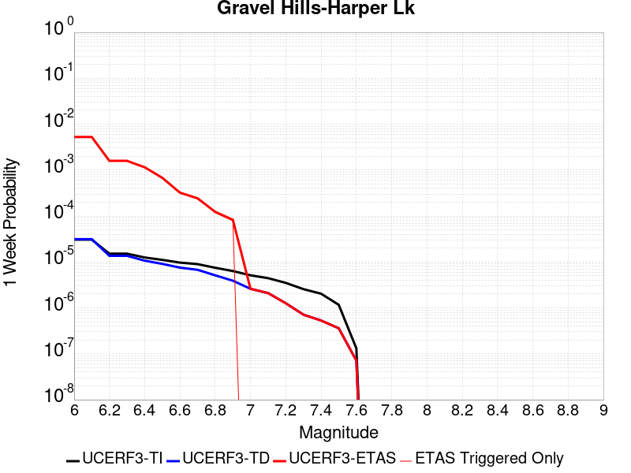 | 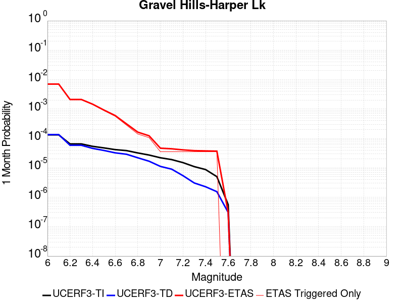 | 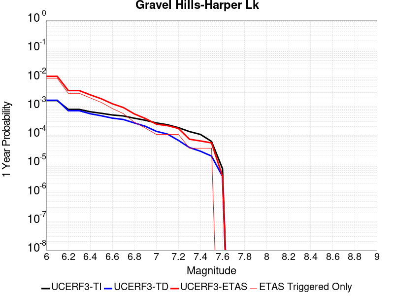 | 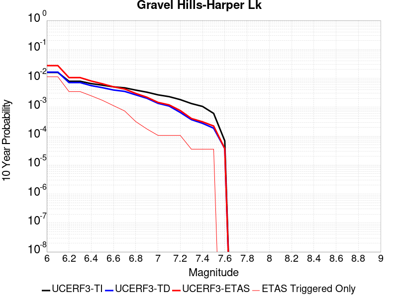 |

| Magnitude | 1 wk TI Prob | 1 wk TD Prob | 1 wk ETAS Prob | 1 wk ETAS/TD Gain | 1 wk ETAS Triggered Only | 1 mo TI Prob | 1 mo TD Prob | 1 mo ETAS Prob | 1 mo ETAS/TD Gain | 1 mo ETAS Triggered Only | 1 yr TI Prob | 1 yr TD Prob | 1 yr ETAS Prob | 1 yr ETAS/TD Gain | 1 yr ETAS Triggered Only | 10 yr TI Prob | 10 yr TD Prob | 10 yr ETAS Prob | 10 yr ETAS/TD Gain | 10 yr ETAS Triggered Only |
|-----|-----|-----|-----|-----|-----|-----|-----|-----|-----|-----|-----|-----|-----|-----|-----|-----|-----|-----|-----|-----|
| 6.0 | 3.0679566E-5 | 3.1464646E-5 | 0.005278262 | 167.75215 | 0.0052469624 | 1.3147724E-4 | 1.3484273E-4 | 0.0068800272 | 51.022602 | 0.006746094 | 0.0015995599 | 0.0016406906 | 0.011172131 | 6.8094077 | 0.009547104 | 0.015880952 | 0.01630734 | 0.027406285 | 1.6806105 | 0.011282941 |
| 6.1 | 3.0679566E-5 | 3.1464646E-5 | 0.005278262 | 167.75215 | 0.0052469624 | 1.3147724E-4 | 1.3484273E-4 | 0.0068800272 | 51.022602 | 0.006746094 | 0.0015995599 | 0.0016406906 | 0.011172131 | 6.8094077 | 0.009547104 | 0.015880952 | 0.01630734 | 0.027406285 | 1.6806105 | 0.011282941 |
| 6.2 | 1.514536E-5 | 1.3635206E-5 | 0.0015916475 | 116.73072 | 0.0015780338 | 6.490707E-5 | 5.843536E-5 | 0.0021097595 | 36.104156 | 0.0020514438 | 7.8995706E-4 | 7.1123015E-4 | 0.0036285163 | 5.101747 | 0.0029193624 | 0.007871548 | 0.0070907404 | 0.01061614 | 1.4971836 | 0.003550576 |
| 6.3 | 1.514536E-5 | 1.3635206E-5 | 0.0015916475 | 116.73072 | 0.0015780338 | 6.490707E-5 | 5.843536E-5 | 0.0021097595 | 36.104156 | 0.0020514438 | 7.8995706E-4 | 7.1123015E-4 | 0.0036285163 | 5.101747 | 0.0029193624 | 0.007871548 | 0.0070907404 | 0.01061614 | 1.4971836 | 0.003550576 |
| 6.4 | 1.2532521E-5 | 1.06896905E-5 | 0.001154752 | 108.024826 | 0.0011440745 | 5.37097E-5 | 4.581219E-5 | 0.0015054266 | 32.86083 | 0.0014596812 | 6.537194E-4 | 5.576265E-4 | 0.0026079265 | 4.676834 | 0.0020514438 | 0.0065179965 | 0.005562863 | 0.008112903 | 1.4584043 | 0.002564305 |
| 6.5 | 1.1094058E-5 | 9.083664E-6 | 6.797419E-4 | 74.83125 | 6.7066436E-4 | 4.7545094E-5 | 3.892943E-5 | 9.857129E-4 | 25.320507 | 9.4682025E-4 | 5.787078E-4 | 4.7386673E-4 | 0.0019328563 | 4.0789027 | 0.0014596812 | 0.0057720304 | 0.0047289706 | 0.0065351273 | 1.3819345 | 0.0018147388 |
| 6.6 | 9.688328E-6 | 7.5316952E-6 | 3.2313608E-4 | 42.9035 | 3.1560674E-4 | 4.1520743E-5 | 3.227831E-5 | 6.2402186E-4 | 19.332546 | 5.9176265E-4 | 5.053978E-4 | 3.9292008E-4 | 0.0012604976 | 3.2080255 | 8.679186E-4 | 0.0050424994 | 0.0039225104 | 0.005062097 | 1.2905248 | 0.0011440745 |
| 6.7 | 8.974824E-6 | 6.749413E-6 | 2.4345289E-4 | 36.07023 | 2.3670506E-4 | 3.8462964E-5 | 2.8925748E-5 | 3.4452337E-4 | 11.910613 | 3.1560674E-4 | 4.6818596E-4 | 3.5211627E-4 | 9.436706E-4 | 2.679997 | 5.9176265E-4 | 0.004672008 | 0.0035158044 | 0.004302047 | 1.223631 | 7.890169E-4 |
| 6.8 | 7.4780046E-6 | 5.1161933E-6 | 1.2346813E-4 | 24.13281 | 1.1835253E-4 | 3.20482E-5 | 2.1926366E-5 | 1.7972628E-4 | 8.196812 | 1.5780337E-4 | 3.9011694E-4 | 2.669222E-4 | 5.824447E-4 | 2.1820767 | 3.1560674E-4 | 0.0038943281 | 0.0026661542 | 0.0030202651 | 1.1328171 | 3.550576E-4 |
| 6.9 | 6.3409307E-6 | 3.9074966E-6 | 8.2808874E-5 | 21.192308 | 7.8901685E-5 | 2.7175134E-5 | 1.6746313E-5 | 1.3509687E-4 | 8.06726 | 1.1835253E-4 | 3.3080703E-4 | 2.0386827E-4 | 4.0108227E-4 | 1.9673599 | 1.9725422E-4 | 0.0033031502 | 0.0020369107 | 0.0022337632 | 1.0966426 | 1.9725422E-4 |
| 7.0 | 5.1239335E-6 | 2.6058565E-6 | 2.6058565E-6 | 1.0 | 0.0 | 2.195953E-5 | 1.116791E-5 | 5.0618313E-5 | 4.532479 | 3.9450842E-5 | 2.6732447E-4 | 1.3596108E-4 | 2.542975E-4 | 1.87037 | 1.1835253E-4 | 0.0026700313 | 0.0013588042 | 0.0014769959 | 1.0869821 | 1.1835253E-4 |
| 7.1 | 4.438899E-6 | 2.0984728E-6 | 2.0984728E-6 | 1.0 | 0.0 | 1.9023713E-5 | 8.993425E-6 | 4.8443915E-5 | 5.3865924 | 3.9450842E-5 | 2.315891E-4 | 1.0948967E-4 | 2.2782924E-4 | 2.0808287 | 1.1835253E-4 | 0.002313479 | 0.0010943791 | 0.0012126021 | 1.1080275 | 1.1835253E-4 |
| 7.2 | 3.50367E-6 | 1.2615716E-6 | 1.2615716E-6 | 1.0 | 0.0 | 1.5015643E-5 | 5.4067245E-6 | 4.4857356E-5 | 8.296586 | 3.9450842E-5 | 1.8280011E-4 | 6.582497E-5 | 1.8416971E-4 | 2.7978702 | 1.1835253E-4 | 0.0018264982 | 6.580629E-4 | 7.763376E-4 | 1.1797315 | 1.1835253E-4 |
| 7.3 | 2.561638E-6 | 7.1191585E-7 | 7.1191585E-7 | 1.0 | 0.0 | 1.0978401E-5 | 3.0510646E-6 | 4.250179E-5 | 13.930151 | 3.9450842E-5 | 1.3365384E-4 | 3.71461E-5 | 7.6595476E-5 | 2.062006 | 3.9450842E-5 | 0.0013357349 | 3.7140088E-4 | 4.1083706E-4 | 1.1061823 | 3.9450842E-5 |
| 7.4 | 2.0368864E-6 | 5.304837E-7 | 5.304837E-7 | 1.0 | 0.0 | 8.729483E-6 | 2.2734996E-6 | 4.1724255E-5 | 18.352434 | 3.9450842E-5 | 1.06276275E-4 | 2.7679513E-5 | 6.7129266E-5 | 2.425233 | 3.9450842E-5 | 0.0010622547 | 2.767612E-4 | 3.1620113E-4 | 1.1425053 | 3.9450842E-5 |
| 7.5 | 1.1681728E-6 | 3.6030585E-7 | 3.6030585E-7 | 1.0 | 0.0 | 5.0064455E-6 | 1.544167E-6 | 4.099495E-5 | 26.548262 | 3.9450842E-5 | 6.0951766E-5 | 1.8800076E-5 | 5.8250178E-5 | 3.0984013 | 3.9450842E-5 | 6.093505E-4 | 1.8798532E-4 | 2.2742875E-4 | 1.2098218 | 3.9450842E-5 |
| 7.6 | 1.3154387E-7 | 7.1197384E-8 | 7.1197384E-8 | 1.0 | 0.0 | 5.6375933E-7 | 3.051316E-7 | 3.051316E-7 | 1.0 | 0.0 | 6.863748E-6 | 3.7149728E-6 | 3.7149728E-6 | 1.0 | 0.0 | 6.863536E-5 | 3.7149264E-5 | 3.7149264E-5 | 1.0 | 0.0 |

## Coyote Canyon
*[(top)](#table-of-contents)*

| 1 Week | 1 Month | 1 Year | 10 Year |
|-----|-----|-----|-----|
| 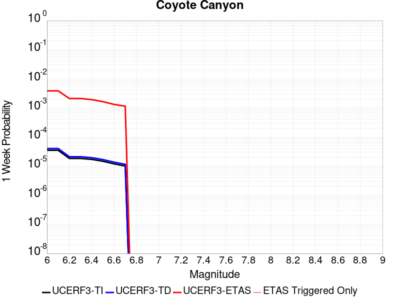 | 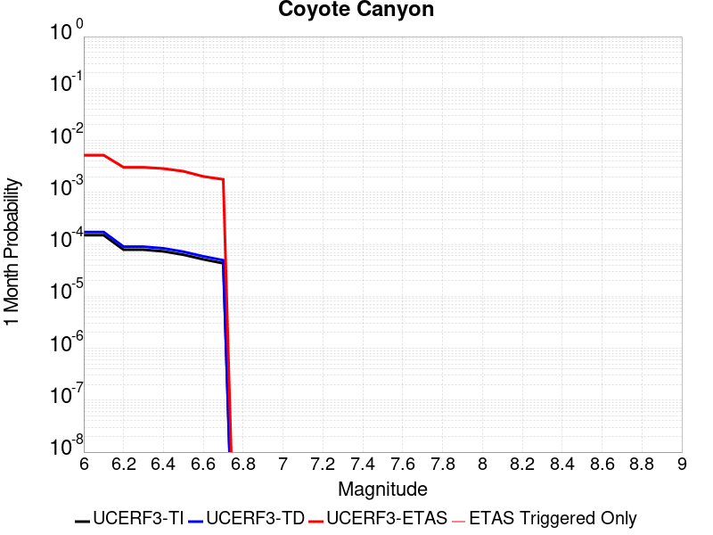 | 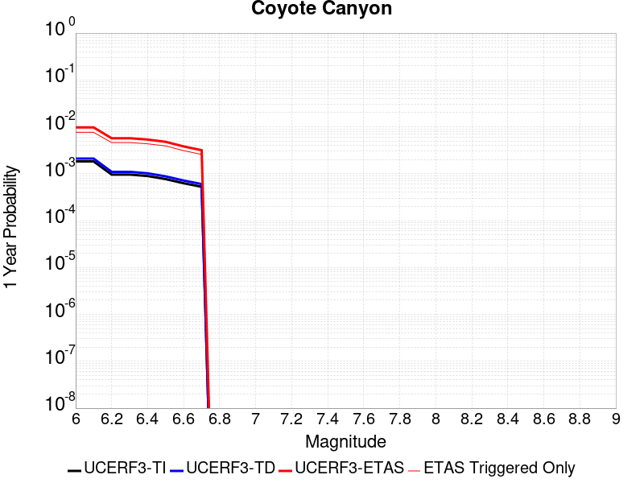 | 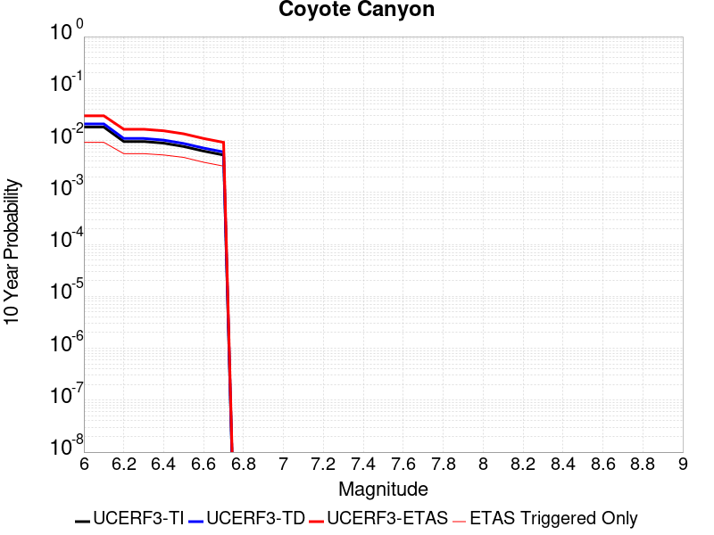 |

| Magnitude | 1 wk TI Prob | 1 wk TD Prob | 1 wk ETAS Prob | 1 wk ETAS/TD Gain | 1 wk ETAS Triggered Only | 1 mo TI Prob | 1 mo TD Prob | 1 mo ETAS Prob | 1 mo ETAS/TD Gain | 1 mo ETAS Triggered Only | 1 yr TI Prob | 1 yr TD Prob | 1 yr ETAS Prob | 1 yr ETAS/TD Gain | 1 yr ETAS Triggered Only | 10 yr TI Prob | 10 yr TD Prob | 10 yr ETAS Prob | 10 yr ETAS/TD Gain | 10 yr ETAS Triggered Only |
|-----|-----|-----|-----|-----|-----|-----|-----|-----|-----|-----|-----|-----|-----|-----|-----|-----|-----|-----|-----|-----|
| 6.0 | 3.5090034E-5 | 4.0364324E-5 | 0.0037880433 | 93.84632 | 0.0037478302 | 1.503772E-4 | 1.7297994E-4 | 0.0052218144 | 30.187399 | 0.005049708 | 0.0018293047 | 0.0021042528 | 0.009623508 | 4.5733614 | 0.007535111 | 0.018143194 | 0.020869201 | 0.029753534 | 1.4257151 | 0.009073694 |
| 6.1 | 3.5090034E-5 | 4.0364324E-5 | 0.0037880433 | 93.84632 | 0.0037478302 | 1.503772E-4 | 1.7297994E-4 | 0.0052218144 | 30.187399 | 0.005049708 | 0.0018293047 | 0.0021042528 | 0.009623508 | 4.5733614 | 0.007535111 | 0.018143194 | 0.020869201 | 0.029753534 | 1.4257151 | 0.009073694 |
| 6.2 | 1.841879E-5 | 2.1059794E-5 | 0.0021513605 | 102.15488 | 0.0021303457 | 7.8935285E-5 | 9.0253714E-5 | 0.0030488 | 33.780327 | 0.0029588132 | 9.606133E-4 | 0.001098387 | 0.005787881 | 5.269437 | 0.0046946504 | 0.0095647145 | 0.010939667 | 0.01655844 | 1.5136148 | 0.0056809215 |
| 6.3 | 1.841879E-5 | 2.1059794E-5 | 0.0021513605 | 102.15488 | 0.0021303457 | 7.8935285E-5 | 9.0253714E-5 | 0.0030488 | 33.780327 | 0.0029588132 | 9.606133E-4 | 0.001098387 | 0.005787881 | 5.269437 | 0.0046946504 | 0.0095647145 | 0.010939667 | 0.01655844 | 1.5136148 | 0.0056809215 |
| 6.4 | 1.712201E-5 | 1.9565212E-5 | 0.0019526187 | 99.800545 | 0.0019330913 | 7.337798E-5 | 8.3848776E-5 | 0.0028846238 | 34.402695 | 0.00280101 | 8.930107E-4 | 0.0010204813 | 0.005395056 | 5.286776 | 0.004379044 | 0.008894307 | 0.010167871 | 0.015439582 | 1.5184675 | 0.005325864 |
| 6.5 | 1.4744935E-5 | 1.6836972E-5 | 0.0016737445 | 99.40888 | 0.0016569354 | 6.3191044E-5 | 7.215698E-5 | 0.0025573808 | 35.441906 | 0.002485403 | 7.6907943E-4 | 8.7825063E-4 | 0.0048198705 | 5.488035 | 0.0039450843 | 0.007664232 | 0.008756994 | 0.013488744 | 1.5403395 | 0.004773552 |
| 6.6 | 1.2017839E-5 | 1.37240895E-5 | 0.0013550344 | 98.73401 | 0.0013413287 | 5.150401E-5 | 5.88167E-5 | 0.002031243 | 34.53514 | 0.0019725421 | 6.268809E-4 | 7.159466E-4 | 0.0038697545 | 5.4050884 | 0.0031560676 | 0.0062511545 | 0.0071450938 | 0.010983652 | 1.53723 | 0.0038661826 |
| 6.7 | 1.00956095E-5 | 1.1533517E-5 | 0.0011555948 | 100.19449 | 0.0011440745 | 4.326618E-5 | 4.942891E-5 | 0.0017851803 | 36.116116 | 0.0017358372 | 5.266384E-4 | 6.017178E-4 | 0.0031644797 | 5.259076 | 0.002564305 | 0.005253921 | 0.0060094125 | 0.009185728 | 1.5285567 | 0.0031955184 |

## Death Valley (So)
*[(top)](#table-of-contents)*

| 1 Week | 1 Month | 1 Year | 10 Year |
|-----|-----|-----|-----|
|  | 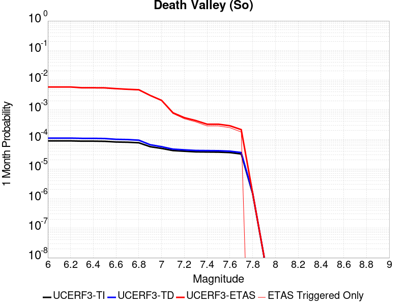 | 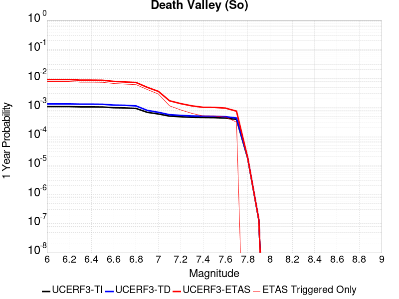 | 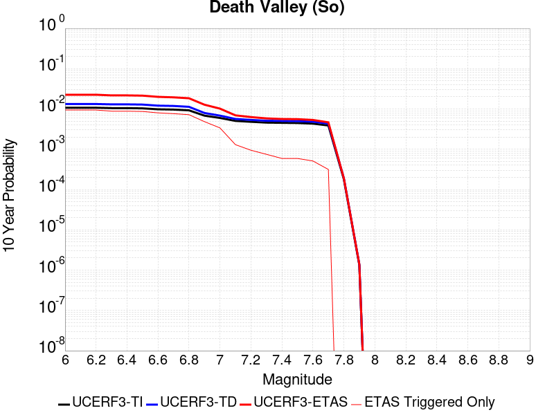 |

| Magnitude | 1 wk TI Prob | 1 wk TD Prob | 1 wk ETAS Prob | 1 wk ETAS/TD Gain | 1 wk ETAS Triggered Only | 1 mo TI Prob | 1 mo TD Prob | 1 mo ETAS Prob | 1 mo ETAS/TD Gain | 1 mo ETAS Triggered Only | 1 yr TI Prob | 1 yr TD Prob | 1 yr ETAS Prob | 1 yr ETAS/TD Gain | 1 yr ETAS Triggered Only | 10 yr TI Prob | 10 yr TD Prob | 10 yr ETAS Prob | 10 yr ETAS/TD Gain | 10 yr ETAS Triggered Only |
|-----|-----|-----|-----|-----|-----|-----|-----|-----|-----|-----|-----|-----|-----|-----|-----|-----|-----|-----|-----|-----|
| 6.0 | 2.0684236E-5 | 2.5617775E-5 | 0.0046412484 | 181.17296 | 0.0046157488 | 8.864371E-5 | 1.0978594E-4 | 0.0059478697 | 54.17697 | 0.005838725 | 0.0010787029 | 0.0013358411 | 0.00921547 | 6.898627 | 0.007890169 | 0.010734817 | 0.013281397 | 0.02258492 | 1.700493 | 0.009428752 |
| 6.1 | 2.0684236E-5 | 2.5617775E-5 | 0.0046412484 | 181.17296 | 0.0046157488 | 8.864371E-5 | 1.0978594E-4 | 0.0059478697 | 54.17697 | 0.005838725 | 0.0010787029 | 0.0013358411 | 0.00921547 | 6.898627 | 0.007890169 | 0.010734817 | 0.013281397 | 0.02258492 | 1.700493 | 0.009428752 |
| 6.2 | 2.0684236E-5 | 2.5617775E-5 | 0.0046412484 | 181.17296 | 0.0046157488 | 8.864371E-5 | 1.0978594E-4 | 0.0059478697 | 54.17697 | 0.005838725 | 0.0010787029 | 0.0013358411 | 0.00921547 | 6.898627 | 0.007890169 | 0.010734817 | 0.013281397 | 0.02258492 | 1.700493 | 0.009428752 |
| 6.3 | 2.0240292E-5 | 2.511786E-5 | 0.004246252 | 169.0531 | 0.0042212405 | 8.6741224E-5 | 1.07643624E-4 | 0.005551274 | 51.570858 | 0.0054442165 | 0.0010555626 | 0.00130979 | 0.008795633 | 6.7153 | 0.0074956603 | 0.010505628 | 0.013023956 | 0.021745853 | 1.6696811 | 0.008836989 |
| 6.4 | 2.0240292E-5 | 2.511786E-5 | 0.004246252 | 169.0531 | 0.0042212405 | 8.6741224E-5 | 1.07643624E-4 | 0.005551274 | 51.570858 | 0.0054442165 | 0.0010555626 | 0.00130979 | 0.008795633 | 6.7153 | 0.0074956603 | 0.010505628 | 0.013023956 | 0.021745853 | 1.6696811 | 0.008836989 |
| 6.5 | 1.9962767E-5 | 2.4807114E-5 | 0.004206493 | 169.56801 | 0.0041817897 | 8.55519E-5 | 1.0631196E-4 | 0.005510503 | 51.83333 | 0.0054047657 | 0.0010410968 | 0.0012935963 | 0.008700761 | 6.7260246 | 0.0074167587 | 0.010362327 | 0.012863902 | 0.02143144 | 1.6660138 | 0.008679186 |
| 6.6 | 1.8937297E-5 | 2.3310964E-5 | 0.0039288537 | 168.541 | 0.0039056335 | 8.115732E-5 | 9.990039E-5 | 0.005149104 | 51.54238 | 0.005049708 | 9.876423E-4 | 0.0012156231 | 0.007953517 | 6.5427485 | 0.006746094 | 0.009832645 | 0.012092789 | 0.020004464 | 1.6542474 | 0.008008521 |
| 6.7 | 1.8621096E-5 | 2.2911607E-5 | 0.0036917562 | 161.13039 | 0.0036689285 | 7.980225E-5 | 9.818898E-5 | 0.0049107196 | 50.012936 | 0.004813003 | 9.711593E-4 | 0.0011948098 | 0.007617614 | 6.3755875 | 0.0064304876 | 0.009669261 | 0.011886904 | 0.019449392 | 1.6362033 | 0.0076534636 |
| 6.8 | 1.7830353E-5 | 2.1805688E-5 | 0.0035328544 | 162.01526 | 0.0035111252 | 7.641356E-5 | 9.344968E-5 | 0.004708767 | 50.388264 | 0.0046157488 | 9.29938E-4 | 0.00113717 | 0.0072845034 | 6.405817 | 0.006154332 | 0.009260561 | 0.011316354 | 0.01845416 | 1.6307514 | 0.0072195046 |
| 6.9 | 1.3135183E-5 | 1.5303925E-5 | 0.0023034178 | 150.51158 | 0.002288149 | 5.6292425E-5 | 6.558664E-5 | 0.003063654 | 46.71156 | 0.0029982643 | 6.8514474E-4 | 7.982312E-4 | 0.004976683 | 6.2346377 | 0.0041817897 | 0.006830362 | 0.007954649 | 0.012768503 | 1.6051624 | 0.0048524537 |
| 7.0 | 1.1507512E-5 | 1.3154199E-5 | 0.0015122666 | 114.96455 | 0.0014991321 | 4.9316975E-5 | 5.6373956E-5 | 0.0020682537 | 36.688107 | 0.002011993 | 6.002687E-4 | 6.8614254E-4 | 0.003603502 | 5.2518272 | 0.0029193624 | 0.0059864987 | 0.0068409415 | 0.010210505 | 1.4925584 | 0.0033927725 |
| 7.1 | 9.715903E-6 | 1.0865278E-5 | 6.026215E-4 | 55.463055 | 5.9176265E-4 | 4.1638916E-5 | 4.656467E-5 | 7.566468E-4 | 16.249374 | 7.101152E-4 | 5.068359E-4 | 5.667817E-4 | 0.0017102077 | 3.0174012 | 0.0011440745 | 0.0050568148 | 0.0056538144 | 0.006948332 | 1.2289635 | 0.0013018779 |
| 7.2 | 9.233269E-6 | 1.02863105E-5 | 4.4424113E-4 | 43.187607 | 4.339593E-4 | 3.9570554E-5 | 4.4083466E-5 | 5.569218E-4 | 12.633349 | 5.1286095E-4 | 4.81665E-4 | 5.3658825E-4 | 0.0013646114 | 2.5431259 | 8.284677E-4 | 0.0048062233 | 0.0053533576 | 0.006295109 | 1.175918 | 9.4682025E-4 |
| 7.3 | 8.8041315E-6 | 9.808164E-6 | 3.2541182E-4 | 33.17765 | 3.1560674E-4 | 3.7731446E-5 | 4.2034335E-5 | 4.365262E-4 | 10.384992 | 3.9450845E-4 | 4.592835E-4 | 5.1165203E-4 | 0.0011425426 | 2.233046 | 6.312135E-4 | 0.0045833546 | 0.005105167 | 0.0058509065 | 1.1460754 | 7.4956607E-4 |
| 7.4 | 8.708749E-6 | 9.707175E-6 | 2.4640994E-4 | 25.38431 | 2.3670506E-4 | 3.7322676E-5 | 4.160154E-5 | 3.1774596E-4 | 7.6378417 | 2.7615592E-4 | 4.5430884E-4 | 5.0638523E-4 | 0.0010189865 | 2.0122752 | 5.1286095E-4 | 0.004533812 | 0.0050527398 | 0.005641512 | 1.1165254 | 5.9176265E-4 |
| 7.5 | 8.612678E-6 | 9.604817E-6 | 2.463076E-4 | 25.644175 | 2.3670506E-4 | 3.6910955E-5 | 4.1162875E-5 | 3.1730742E-4 | 7.7085824 | 2.7615592E-4 | 4.492982E-4 | 5.01047E-4 | 0.001013651 | 2.0230658 | 5.1286095E-4 | 0.004483909 | 0.0049995985 | 0.005588403 | 1.1177703 | 5.9176265E-4 |
| 7.6 | 8.319024E-6 | 9.283916E-6 | 2.0653631E-4 | 22.24668 | 1.9725422E-4 | 3.5652476E-5 | 3.978763E-5 | 2.7648328E-4 | 6.948976 | 2.3670506E-4 | 4.3398244E-4 | 4.8431093E-4 | 9.5749175E-4 | 1.9770187 | 4.7341012E-4 | 0.0043313587 | 0.0048329784 | 0.005343361 | 1.105604 | 5.1286095E-4 |
| 7.7 | 7.4718328E-6 | 8.34517E-6 | 1.6614723E-4 | 19.90939 | 1.5780337E-4 | 3.2021748E-5 | 3.5764548E-5 | 2.3301171E-4 | 6.515159 | 1.9725422E-4 | 3.8979502E-4 | 4.353504E-4 | 7.5081975E-4 | 1.7246332 | 3.1560674E-4 | 0.00389112 | 0.0043453807 | 0.004659616 | 1.0723147 | 3.1560674E-4 |
| 7.8 | 3.4586725E-7 | 3.6482615E-7 | 3.6482615E-7 | 1.0 | 0.0 | 1.4822873E-6 | 1.5635396E-6 | 1.5635396E-6 | 1.0 | 0.0 | 1.80467E-5 | 1.9035933E-5 | 1.9035933E-5 | 1.0 | 0.0 | 1.8045233E-4 | 1.9034347E-4 | 1.9034347E-4 | 1.0 | 0.0 |
| 7.9 | 2.5591178E-9 | 2.6696718E-9 | 2.6696718E-9 | 1.0 | 0.0 | 1.0967647E-8 | 1.14414505E-8 | 1.14414505E-8 | 1.0 | 0.0 | 1.335311E-7 | 1.3929966E-7 | 1.3929966E-7 | 1.0 | 0.0 | 1.3353102E-6 | 1.3929966E-6 | 1.3929966E-6 | 1.0 | 0.0 |

## Nelson Lake
*[(top)](#table-of-contents)*

| 1 Week | 1 Month | 1 Year | 10 Year |
|-----|-----|-----|-----|
| 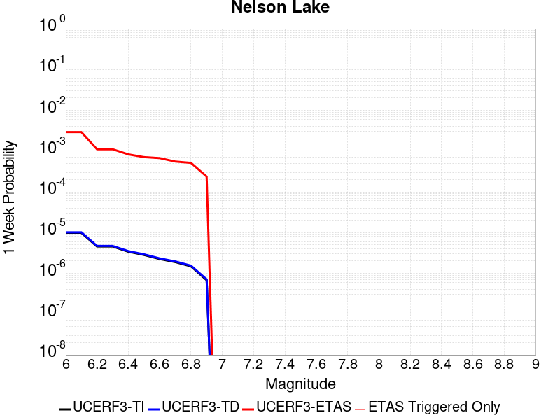 | 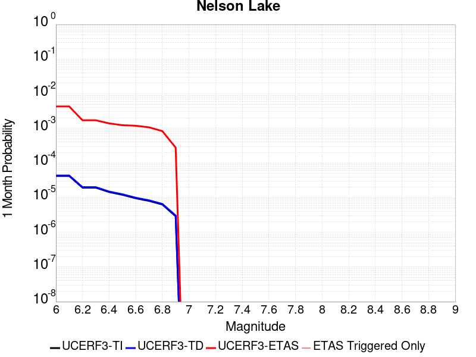 | 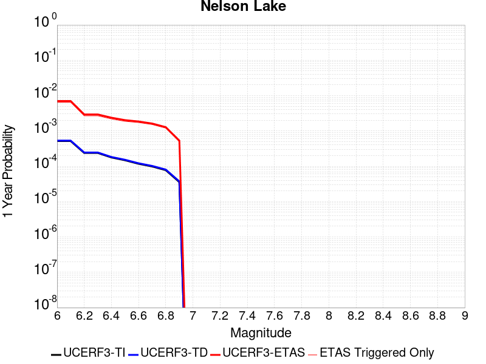 | 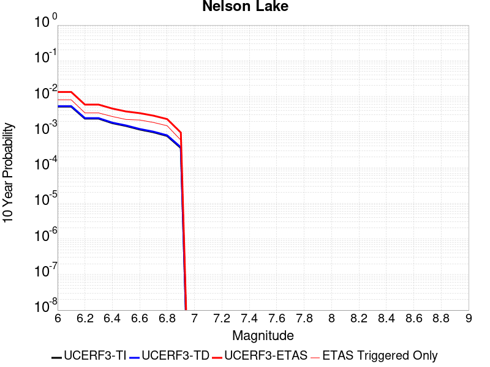 |

| Magnitude | 1 wk TI Prob | 1 wk TD Prob | 1 wk ETAS Prob | 1 wk ETAS/TD Gain | 1 wk ETAS Triggered Only | 1 mo TI Prob | 1 mo TD Prob | 1 mo ETAS Prob | 1 mo ETAS/TD Gain | 1 mo ETAS Triggered Only | 1 yr TI Prob | 1 yr TD Prob | 1 yr ETAS Prob | 1 yr ETAS/TD Gain | 1 yr ETAS Triggered Only | 10 yr TI Prob | 10 yr TD Prob | 10 yr ETAS Prob | 10 yr ETAS/TD Gain | 10 yr ETAS Triggered Only |
|-----|-----|-----|-----|-----|-----|-----|-----|-----|-----|-----|-----|-----|-----|-----|-----|-----|-----|-----|-----|-----|
| 6.0 | 9.913453E-6 | 1.0192255E-5 | 0.002929525 | 287.42657 | 0.0029193624 | 4.2485535E-5 | 4.3680422E-5 | 0.0043041855 | 98.53809 | 0.0042606913 | 5.1713863E-4 | 5.316897E-4 | 0.007116478 | 13.3846445 | 0.006588291 | 0.0051593683 | 0.005305204 | 0.013271239 | 2.5015512 | 0.008008521 |
| 6.1 | 9.913453E-6 | 1.0192255E-5 | 0.002929525 | 287.42657 | 0.0029193624 | 4.2485535E-5 | 4.3680422E-5 | 0.0043041855 | 98.53809 | 0.0042606913 | 5.1713863E-4 | 5.316897E-4 | 0.007116478 | 13.3846445 | 0.006588291 | 0.0051593683 | 0.005305204 | 0.013271239 | 2.5015512 | 0.008008521 |
| 6.2 | 4.5596407E-6 | 4.696313E-6 | 0.0011093147 | 236.20972 | 0.0011046237 | 1.954117E-5 | 2.0126909E-5 | 0.0017164791 | 85.2828 | 0.0016963863 | 2.3788778E-4 | 2.4501883E-4 | 0.0030453424 | 12.429014 | 0.00280101 | 0.0023763329 | 0.0024476128 | 0.0058714356 | 2.3988416 | 0.0034322233 |
| 6.3 | 4.5596407E-6 | 4.696313E-6 | 0.0011093147 | 236.20972 | 0.0011046237 | 1.954117E-5 | 2.0126909E-5 | 0.0017164791 | 85.2828 | 0.0016963863 | 2.3788778E-4 | 2.4501883E-4 | 0.0030453424 | 12.429014 | 0.00280101 | 0.0023763329 | 0.0024476128 | 0.0058714356 | 2.3988416 | 0.0034322233 |
| 6.4 | 3.4025713E-6 | 3.5098972E-6 | 8.319747E-4 | 237.03677 | 8.284677E-4 | 1.4582367E-5 | 1.5042335E-5 | 0.0013958011 | 92.79152 | 0.0013807795 | 1.7752586E-4 | 1.8312587E-4 | 0.0024708558 | 13.492663 | 0.002288149 | 0.001773841 | 0.0018298327 | 0.00454696 | 2.4849048 | 0.0027221083 |
| 6.5 | 2.8352947E-6 | 2.927856E-6 | 7.13041E-4 | 243.5369 | 7.101152E-4 | 1.2151207E-5 | 1.2547898E-5 | 0.0012355087 | 98.463394 | 0.0012229761 | 1.479309E-4 | 1.5276071E-4 | 0.0021250015 | 13.910656 | 0.0019725421 | 0.0014783246 | 0.0015266308 | 0.003771896 | 2.4707322 | 0.0022486981 |
| 6.6 | 2.251518E-6 | 2.3290677E-6 | 6.7299185E-4 | 288.95334 | 6.7066436E-4 | 9.649328E-6 | 9.981683E-6 | 0.0011934952 | 119.56853 | 0.0011835253 | 1.1747423E-4 | 1.2152085E-4 | 0.0020149313 | 16.580952 | 0.0018936405 | 0.0011741214 | 0.0012146058 | 0.0033817666 | 2.7842507 | 0.0021697965 |
| 6.7 | 1.8911853E-6 | 1.9591396E-6 | 5.542699E-4 | 282.91495 | 5.5231183E-4 | 8.105055E-6 | 8.39629E-6 | 0.0010735601 | 127.86126 | 0.0010651728 | 9.867457E-5 | 1.0222061E-4 | 0.0017589867 | 17.20775 | 0.0016569354 | 9.863076E-4 | 0.0010217935 | 0.0028740885 | 2.8127882 | 0.0018541897 |
| 6.8 | 1.4874814E-6 | 1.5438305E-6 | 5.1440403E-4 | 333.1998 | 5.1286095E-4 | 6.374905E-6 | 6.6164025E-6 | 8.3507865E-4 | 126.2134 | 8.284677E-4 | 7.76117E-5 | 8.055224E-5 | 0.0013823252 | 17.160604 | 0.0013018779 | 7.75846E-4 | 8.0528157E-4 | 0.0023032064 | 2.8601255 | 0.0014991321 |
| 6.9 | 6.835972E-7 | 7.1399285E-7 | 2.3741889E-4 | 332.5228 | 2.3670506E-4 | 2.9296991E-6 | 3.0599674E-6 | 2.7921502E-4 | 91.24771 | 2.7615592E-4 | 3.56685E-5 | 3.7254784E-5 | 5.500967E-4 | 14.765799 | 5.1286095E-4 | 3.5662777E-4 | 3.7251666E-4 | 9.6405885E-4 | 2.587962 | 5.9176265E-4 |

## So Sierra Nevada
*[(top)](#table-of-contents)*

| 1 Week | 1 Month | 1 Year | 10 Year |
|-----|-----|-----|-----|
| 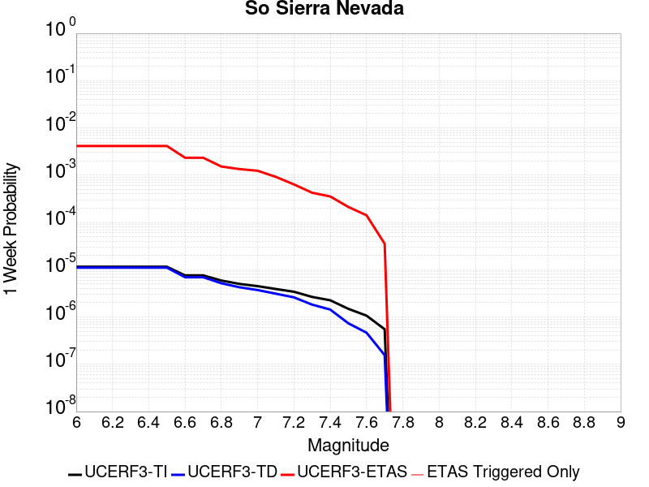 | 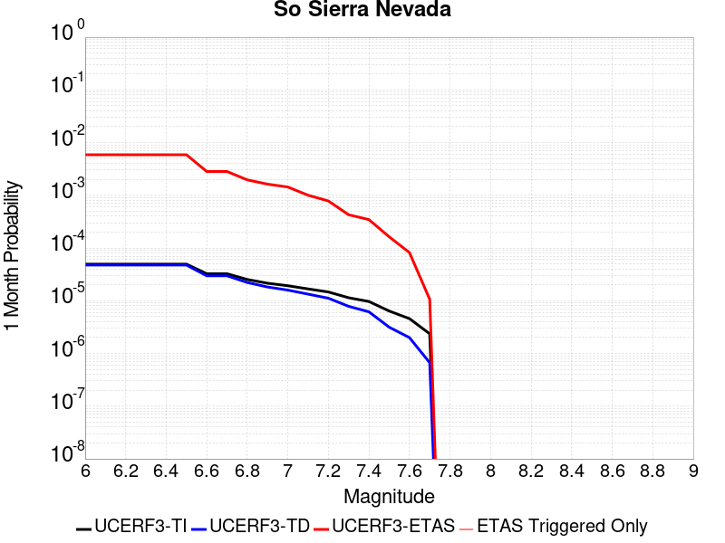 | 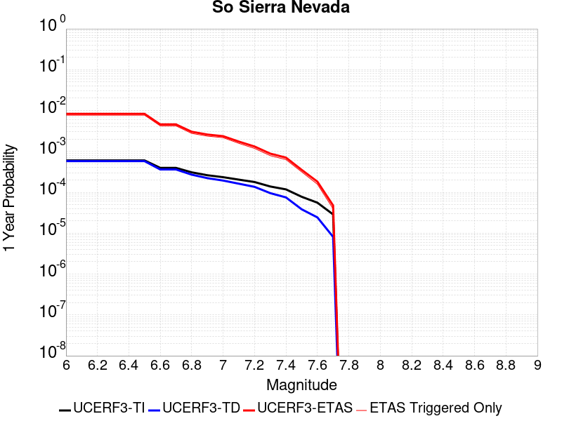 | 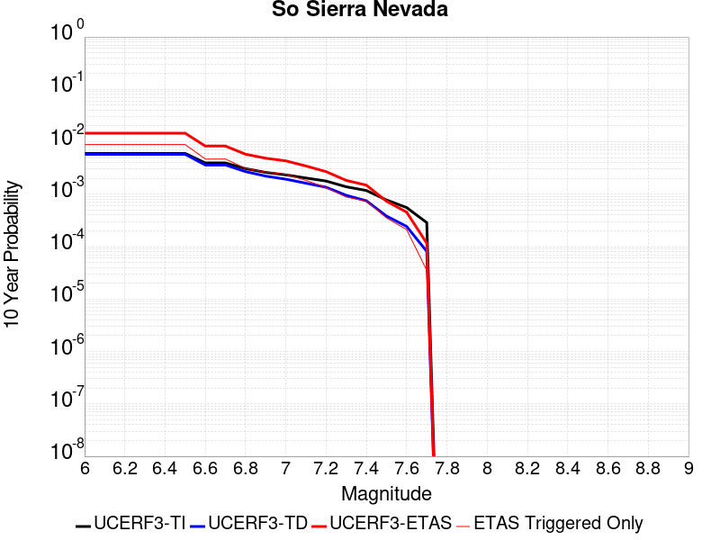 |

| Magnitude | 1 wk TI Prob | 1 wk TD Prob | 1 wk ETAS Prob | 1 wk ETAS/TD Gain | 1 wk ETAS Triggered Only | 1 mo TI Prob | 1 mo TD Prob | 1 mo ETAS Prob | 1 mo ETAS/TD Gain | 1 mo ETAS Triggered Only | 1 yr TI Prob | 1 yr TD Prob | 1 yr ETAS Prob | 1 yr ETAS/TD Gain | 1 yr ETAS Triggered Only | 10 yr TI Prob | 10 yr TD Prob | 10 yr ETAS Prob | 10 yr ETAS/TD Gain | 10 yr ETAS Triggered Only |
|-----|-----|-----|-----|-----|-----|-----|-----|-----|-----|-----|-----|-----|-----|-----|-----|-----|-----|-----|-----|-----|
| 6.0 | 1.15488665E-5 | 1.1079643E-5 | 0.0041533723 | 374.8652 | 0.004142339 | 4.9494203E-5 | 4.748339E-5 | 0.005964829 | 125.61928 | 0.0059176264 | 6.024253E-4 | 5.7796965E-4 | 0.008305866 | 14.370765 | 0.0077323653 | 0.006007948 | 0.005765934 | 0.014630416 | 2.5373888 | 0.008915891 |
| 6.1 | 1.15488665E-5 | 1.1079643E-5 | 0.0041533723 | 374.8652 | 0.004142339 | 4.9494203E-5 | 4.748339E-5 | 0.005964829 | 125.61928 | 0.0059176264 | 6.024253E-4 | 5.7796965E-4 | 0.008305866 | 14.370765 | 0.0077323653 | 0.006007948 | 0.005765934 | 0.014630416 | 2.5373888 | 0.008915891 |
| 6.2 | 1.15488665E-5 | 1.1079643E-5 | 0.0041533723 | 374.8652 | 0.004142339 | 4.9494203E-5 | 4.748339E-5 | 0.005964829 | 125.61928 | 0.0059176264 | 6.024253E-4 | 5.7796965E-4 | 0.008305866 | 14.370765 | 0.0077323653 | 0.006007948 | 0.005765934 | 0.014630416 | 2.5373888 | 0.008915891 |
| 6.3 | 1.15488665E-5 | 1.1079643E-5 | 0.0041533723 | 374.8652 | 0.004142339 | 4.9494203E-5 | 4.748339E-5 | 0.005964829 | 125.61928 | 0.0059176264 | 6.024253E-4 | 5.7796965E-4 | 0.008305866 | 14.370765 | 0.0077323653 | 0.006007948 | 0.005765934 | 0.014630416 | 2.5373888 | 0.008915891 |
| 6.4 | 1.15488665E-5 | 1.1079643E-5 | 0.0041533723 | 374.8652 | 0.004142339 | 4.9494203E-5 | 4.748339E-5 | 0.005964829 | 125.61928 | 0.0059176264 | 6.024253E-4 | 5.7796965E-4 | 0.008305866 | 14.370765 | 0.0077323653 | 0.006007948 | 0.005765934 | 0.014630416 | 2.5373888 | 0.008915891 |
| 6.5 | 1.15488665E-5 | 1.1079643E-5 | 0.0041533723 | 374.8652 | 0.004142339 | 4.9494203E-5 | 4.748339E-5 | 0.005964829 | 125.61928 | 0.0059176264 | 6.024253E-4 | 5.7796965E-4 | 0.008305866 | 14.370765 | 0.0077323653 | 0.006007948 | 0.005765934 | 0.014630416 | 2.5373888 | 0.008915891 |
| 6.6 | 7.587044E-6 | 6.935635E-6 | 0.0022950687 | 330.90967 | 0.002288149 | 3.2515498E-5 | 2.9723828E-5 | 0.0031856976 | 107.17656 | 0.0031560676 | 3.9580427E-4 | 3.6183043E-4 | 0.0045815436 | 12.662128 | 0.0042212405 | 0.003951 | 0.0036127048 | 0.008290395 | 2.2947888 | 0.0046946504 |
| 6.7 | 7.587044E-6 | 6.935635E-6 | 0.0022950687 | 330.90967 | 0.002288149 | 3.2515498E-5 | 2.9723828E-5 | 0.0031856976 | 107.17656 | 0.0031560676 | 3.9580427E-4 | 3.6183043E-4 | 0.0045815436 | 12.662128 | 0.0042212405 | 0.003951 | 0.0036127048 | 0.008290395 | 2.2947888 | 0.0046946504 |
| 6.8 | 5.9026956E-6 | 5.1793927E-6 | 0.0015043037 | 290.4402 | 0.0014991321 | 2.5297022E-5 | 2.2197215E-5 | 0.0020735955 | 93.41692 | 0.0020514438 | 3.0794772E-4 | 2.7021873E-4 | 0.0030310317 | 11.216955 | 0.002761559 | 0.0030752132 | 0.002699018 | 0.0057678786 | 2.1370285 | 0.003077166 |
| 6.9 | 5.0118915E-6 | 4.2524252E-6 | 0.0013455754 | 316.4254 | 0.0013413287 | 2.1479358E-5 | 1.8224557E-5 | 0.0018329304 | 100.57475 | 0.0018147388 | 2.614798E-4 | 2.2186211E-4 | 0.0025883876 | 11.66665 | 0.0023670506 | 0.0026117235 | 0.0022164788 | 0.0048538265 | 2.1898818 | 0.0026432066 |
| 7.0 | 4.4924795E-6 | 3.7139177E-6 | 0.0012266856 | 330.29422 | 0.0012229761 | 1.925334E-5 | 1.5916696E-5 | 0.0016728258 | 105.09881 | 0.0016569354 | 2.3438422E-4 | 1.9376918E-4 | 0.0023631451 | 12.195671 | 0.0021697965 | 0.0023413717 | 0.0019360651 | 0.004337908 | 2.2405794 | 0.0024065014 |
| 7.1 | 3.9118436E-6 | 3.1119775E-6 | 8.710279E-4 | 279.8953 | 8.679186E-4 | 1.6764936E-5 | 1.3336982E-5 | 0.0011573962 | 86.78097 | 0.0011440745 | 2.0409399E-4 | 1.6236622E-4 | 0.0017401438 | 10.717401 | 0.0015780338 | 0.0020390663 | 0.001622532 | 0.0033949395 | 2.0923715 | 0.001775288 |
| 7.2 | 3.4200818E-6 | 2.6054543E-6 | 5.943666E-4 | 228.12396 | 5.9176265E-4 | 1.4657411E-5 | 1.11661875E-5 | 8.3962467E-4 | 75.1935 | 8.284677E-4 | 1.7843937E-4 | 1.3594035E-4 | 0.0013193048 | 9.705027 | 0.0011835253 | 0.0017829615 | 0.0013586218 | 0.0026587308 | 1.9569323 | 0.0013018779 |
| 7.3 | 2.6593618E-6 | 1.8284203E-6 | 4.357869E-4 | 238.34067 | 4.339593E-4 | 1.13972155E-5 | 7.836065E-6 | 5.20693E-4 | 66.44828 | 5.1286095E-4 | 1.3875226E-4 | 9.540021E-5 | 8.8434183E-4 | 9.26981 | 7.890169E-4 | 0.0013866565 | 9.5362146E-4 | 0.0018207124 | 1.9092611 | 8.679186E-4 |
| 7.4 | 2.2577992E-6 | 1.436438E-6 | 3.5649352E-4 | 248.17885 | 3.550576E-4 | 9.676246E-6 | 6.15615E-6 | 4.0066216E-4 | 65.08324 | 3.9450845E-4 | 1.1780193E-4 | 7.49488E-5 | 7.06115E-4 | 9.421298 | 6.312135E-4 | 0.001177395 | 7.492603E-4 | 0.0014588435 | 1.9470448 | 7.101152E-4 |
| 7.5 | 1.489319E-6 | 7.353936E-7 | 1.9798947E-4 | 269.22925 | 1.9725422E-4 | 6.3827797E-6 | 3.1516831E-6 | 2.0040528E-4 | 63.58675 | 1.9725422E-4 | 7.770758E-5 | 3.8371072E-5 | 3.539657E-4 | 9.224807 | 3.1560674E-4 | 7.7680405E-4 | 3.836449E-4 | 6.991306E-4 | 1.8223377 | 3.1560674E-4 |
| 7.6 | 1.0680322E-6 | 4.6596554E-7 | 1.1881844E-4 | 254.99405 | 1.1835253E-4 | 4.577273E-6 | 1.9969937E-6 | 1.2034929E-4 | 60.265232 | 1.1835253E-4 | 5.5726876E-5 | 2.4313129E-5 | 1.8211266E-4 | 7.4903016 | 1.5780337E-4 | 5.5712904E-4 | 2.4310495E-4 | 4.0086996E-4 | 1.6489584 | 1.5780337E-4 |
| 7.7 | 5.509146E-7 | 1.5580486E-7 | 3.9606643E-5 | 254.20673 | 3.9450842E-5 | 2.3610605E-6 | 6.677349E-7 | 4.0118553E-5 | 60.081554 | 3.9450842E-5 | 2.8745531E-5 | 8.129644E-6 | 4.7580168E-5 | 5.8526754 | 3.9450842E-5 | 2.8741814E-4 | 8.1293576E-5 | 1.2074121E-4 | 1.4852492 | 3.9450842E-5 |

## San Andreas (Mojave S)
*[(top)](#table-of-contents)*

| 1 Week | 1 Month | 1 Year | 10 Year |
|-----|-----|-----|-----|
| 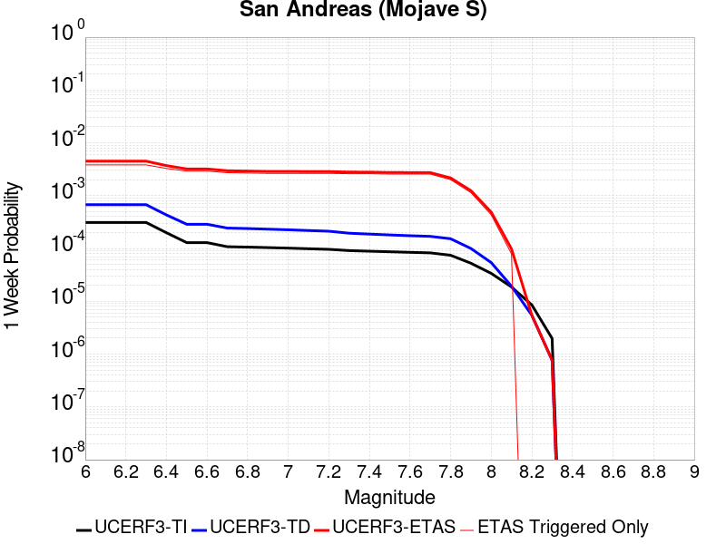 |  | 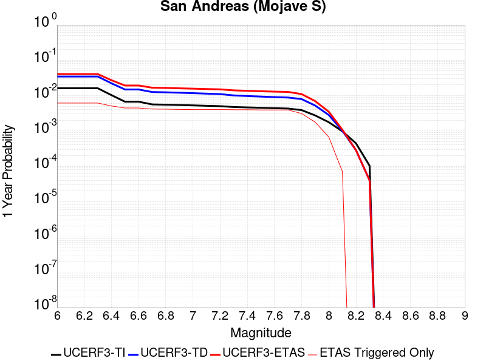 | 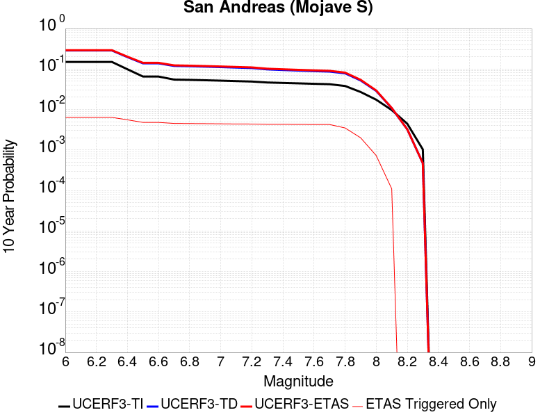 |

| Magnitude | 1 wk TI Prob | 1 wk TD Prob | 1 wk ETAS Prob | 1 wk ETAS/TD Gain | 1 wk ETAS Triggered Only | 1 mo TI Prob | 1 mo TD Prob | 1 mo ETAS Prob | 1 mo ETAS/TD Gain | 1 mo ETAS Triggered Only | 1 yr TI Prob | 1 yr TD Prob | 1 yr ETAS Prob | 1 yr ETAS/TD Gain | 1 yr ETAS Triggered Only | 10 yr TI Prob | 10 yr TD Prob | 10 yr ETAS Prob | 10 yr ETAS/TD Gain | 10 yr ETAS Triggered Only |
|-----|-----|-----|-----|-----|-----|-----|-----|-----|-----|-----|-----|-----|-----|-----|-----|-----|-----|-----|-----|-----|
| 6.0 | 3.1064058E-4 | 6.7460834E-4 | 0.004498759 | 6.6686974 | 0.0038267318 | 0.0013306376 | 0.0028881032 | 0.0077265427 | 2.6753001 | 0.0048524537 | 0.016080605 | 0.03462235 | 0.04060169 | 1.1727017 | 0.0061937827 | 0.1496549 | 0.28660452 | 0.29155788 | 1.0172828 | 0.006943349 |
| 6.1 | 3.1064058E-4 | 6.7460834E-4 | 0.004498759 | 6.6686974 | 0.0038267318 | 0.0013306376 | 0.0028881032 | 0.0077265427 | 2.6753001 | 0.0048524537 | 0.016080605 | 0.03462235 | 0.04060169 | 1.1727017 | 0.0061937827 | 0.1496549 | 0.28660452 | 0.29155788 | 1.0172828 | 0.006943349 |
| 6.2 | 3.1064058E-4 | 6.7460834E-4 | 0.004498759 | 6.6686974 | 0.0038267318 | 0.0013306376 | 0.0028881032 | 0.0077265427 | 2.6753001 | 0.0048524537 | 0.016080605 | 0.03462235 | 0.04060169 | 1.1727017 | 0.0061937827 | 0.1496549 | 0.28660452 | 0.29155788 | 1.0172828 | 0.006943349 |
| 6.3 | 3.1064058E-4 | 6.7460834E-4 | 0.004498759 | 6.6686974 | 0.0038267318 | 0.0013306376 | 0.0028881032 | 0.0077265427 | 2.6753001 | 0.0048524537 | 0.016080605 | 0.03462235 | 0.04060169 | 1.1727017 | 0.0061937827 | 0.1496549 | 0.28660452 | 0.29155788 | 1.0172828 | 0.006943349 |
| 6.4 | 1.9872203E-4 | 4.3179357E-4 | 0.0037047998 | 8.580026 | 0.00327442 | 8.5138786E-4 | 0.0018492596 | 0.0059445603 | 3.2145622 | 0.0041028876 | 0.010316478 | 0.02228844 | 0.027225597 | 1.2215121 | 0.005049708 | 0.098504856 | 0.19699748 | 0.20165431 | 1.0236391 | 0.005799274 |
| 6.5 | 1.291105E-4 | 2.875267E-4 | 0.0032060498 | 11.150442 | 0.0029193624 | 5.5321335E-4 | 0.0012316781 | 0.0048960876 | 3.9751358 | 0.0036689285 | 0.006714592 | 0.0148934 | 0.019246088 | 1.2922562 | 0.0044184946 | 0.065152965 | 0.13803436 | 0.14238703 | 1.0315332 | 0.005049708 |
| 6.6 | 1.291105E-4 | 2.875267E-4 | 0.0032060498 | 11.150442 | 0.0029193624 | 5.5321335E-4 | 0.0012316781 | 0.0048960876 | 3.9751358 | 0.0036689285 | 0.006714592 | 0.0148934 | 0.019246088 | 1.2922562 | 0.0044184946 | 0.065152965 | 0.13803436 | 0.14238703 | 1.0315332 | 0.005049708 |
| 6.7 | 1.08001186E-4 | 2.4333889E-4 | 0.0029647849 | 12.183769 | 0.0027221083 | 4.6278012E-4 | 0.0010424647 | 0.004392291 | 4.2133713 | 0.0033533217 | 0.0056198016 | 0.012618446 | 0.016669562 | 1.3210471 | 0.0041028876 | 0.054797906 | 0.119176775 | 0.12331193 | 1.0346977 | 0.0046946504 |
| 6.8 | 1.0624356E-4 | 2.3851555E-4 | 0.002920533 | 12.244623 | 0.0026826574 | 4.5525006E-4 | 0.0010218095 | 0.004332294 | 4.2398257 | 0.0033138709 | 0.0055285925 | 0.012369843 | 0.016383016 | 1.324432 | 0.0040634368 | 0.053930566 | 0.11712591 | 0.12120104 | 1.0347927 | 0.0046157488 |
| 6.9 | 1.0393785E-4 | 2.3221898E-4 | 0.0028748116 | 12.379745 | 0.0026432066 | 4.4537184E-4 | 9.948451E-4 | 0.004266008 | 4.2881126 | 0.00327442 | 0.0054089287 | 0.012045221 | 0.016020738 | 1.3300493 | 0.004023986 | 0.05279156 | 0.11442335 | 0.11847602 | 1.0354182 | 0.004576298 |
| 7.0 | 1.0155622E-4 | 2.2591476E-4 | 0.0028685243 | 12.697374 | 0.0026432066 | 4.3516833E-4 | 9.6784724E-4 | 0.004239098 | 4.379925 | 0.00327442 | 0.005285311 | 0.0117200995 | 0.015657935 | 1.33599 | 0.003984535 | 0.05161361 | 0.111683756 | 0.11571391 | 1.0360854 | 0.004536847 |
| 7.1 | 9.885595E-5 | 2.1879886E-4 | 0.0028614271 | 13.0778885 | 0.0026432066 | 4.2359953E-4 | 9.3737274E-4 | 0.0042087235 | 4.4899144 | 0.00327442 | 0.0051451353 | 0.011352993 | 0.0152922915 | 1.3469833 | 0.003984535 | 0.05027629 | 0.1085682 | 0.11257733 | 1.0369272 | 0.0044973963 |
| 7.2 | 9.6411415E-5 | 2.124288E-4 | 0.002855074 | 13.440145 | 0.0026432066 | 4.1312634E-4 | 9.1009185E-4 | 0.0041815317 | 4.5946264 | 0.00327442 | 0.005018219 | 0.011024255 | 0.014964865 | 1.3574489 | 0.003984535 | 0.049064007 | 0.105758004 | 0.10977976 | 1.038028 | 0.0044973963 |
| 7.3 | 9.1180635E-5 | 1.9471257E-4 | 0.0027979612 | 14.3697 | 0.0026037558 | 3.907156E-4 | 8.342157E-4 | 0.0040664864 | 4.874622 | 0.0032349692 | 0.004746591 | 0.01010939 | 0.014014591 | 1.3862945 | 0.0039450843 | 0.046464786 | 0.09795115 | 0.10197244 | 1.041054 | 0.0044579455 |
| 7.4 | 8.887388E-5 | 1.8719878E-4 | 0.002790467 | 14.906438 | 0.0026037558 | 3.8083247E-4 | 8.020339E-4 | 0.0040344084 | 5.030222 | 0.0032349692 | 0.0046267817 | 0.00972114 | 0.013627874 | 1.4018801 | 0.0039450843 | 0.045316286 | 0.09458615 | 0.098622434 | 1.0426731 | 0.0044579455 |
| 7.5 | 8.6750515E-5 | 1.8051457E-4 | 0.0027443566 | 15.202964 | 0.002564305 | 3.7173493E-4 | 7.7340455E-4 | 0.0039664516 | 5.1285596 | 0.0031955184 | 0.004516484 | 0.009375632 | 0.013205566 | 1.4084989 | 0.0038661826 | 0.04425787 | 0.091549896 | 0.09552804 | 1.0434532 | 0.004379044 |
| 7.6 | 8.453092E-5 | 1.7439072E-4 | 0.0027382483 | 15.701801 | 0.002564305 | 3.6222505E-4 | 7.471748E-4 | 0.0039403057 | 5.2736063 | 0.0031955184 | 0.0044011753 | 0.009058985 | 0.012890143 | 1.4229126 | 0.0038661826 | 0.04315024 | 0.08870898 | 0.092699565 | 1.044985 | 0.004379044 |
| 7.7 | 8.259102E-5 | 1.6961215E-4 | 0.002733482 | 16.116076 | 0.002564305 | 3.539135E-4 | 7.2670676E-4 | 0.0039199027 | 5.3940644 | 0.0031955184 | 0.004300386 | 0.008811831 | 0.0126439445 | 1.4348829 | 0.0038661826 | 0.042181134 | 0.08645982 | 0.090460256 | 1.0462693 | 0.004379044 |
| 7.8 | 7.444844E-5 | 1.5283503E-4 | 0.0021645206 | 14.162464 | 0.002011993 | 3.1902574E-4 | 6.548429E-4 | 0.0031780435 | 4.853139 | 0.002524854 | 0.0038772223 | 0.007943616 | 0.010996338 | 1.3842988 | 0.003077166 | 0.03810269 | 0.078290746 | 0.08152698 | 1.0413362 | 0.0035111252 |
| 7.9 | 5.2586525E-5 | 1.00064186E-4 | 0.0012440241 | 12.432262 | 0.0011440745 | 2.2535135E-4 | 4.2877605E-4 | 0.0017695297 | 4.126932 | 0.0013413287 | 0.0027402006 | 0.005207864 | 0.0068561705 | 1.3165034 | 0.0016569354 | 0.027066574 | 0.052200034 | 0.053957436 | 1.0336666 | 0.0018541897 |
| 8.0 | 3.379877E-5 | 5.4074168E-5 | 4.8800997E-4 | 9.024827 | 4.339593E-4 | 1.4484383E-4 | 2.3172585E-4 | 7.44468E-4 | 3.2127101 | 5.1286095E-4 | 0.0017620471 | 0.002817614 | 0.003447049 | 1.223393 | 6.312135E-4 | 0.017481409 | 0.028834904 | 0.029486228 | 1.0225881 | 6.7066436E-4 |
| 8.1 | 1.8668277E-5 | 1.9309397E-5 | 9.820956E-5 | 5.086102 | 7.8901685E-5 | 8.000444E-5 | 8.275194E-5 | 1.616471E-4 | 1.9533935 | 7.8901685E-5 | 9.736188E-4 | 0.0010070398 | 0.001085862 | 1.0782713 | 7.8901685E-5 | 0.009693642 | 0.010798888 | 0.010876938 | 1.0072275 | 7.8901685E-5 |
| 8.2 | 8.541571E-6 | 5.460819E-6 | 5.460819E-6 | 1.0 | 0.0 | 3.660622E-5 | 2.3403301E-5 | 2.3403301E-5 | 1.0 | 0.0 | 4.455896E-4 | 2.84898E-4 | 2.84898E-4 | 1.0 | 0.0 | 0.0044469717 | 0.0032408056 | 0.0032408056 | 1.0 | 0.0 |
| 8.3 | 1.983087E-6 | 7.6599065E-7 | 7.6599065E-7 | 1.0 | 0.0 | 8.498917E-6 | 3.282813E-6 | 3.282813E-6 | 1.0 | 0.0 | 1.034694E-4 | 3.9967534E-5 | 3.9967534E-5 | 1.0 | 0.0 | 0.0010342124 | 4.719687E-4 | 4.719687E-4 | 1.0 | 0.0 |

## Towne Pass
*[(top)](#table-of-contents)*

| 1 Week | 1 Month | 1 Year | 10 Year |
|-----|-----|-----|-----|
| 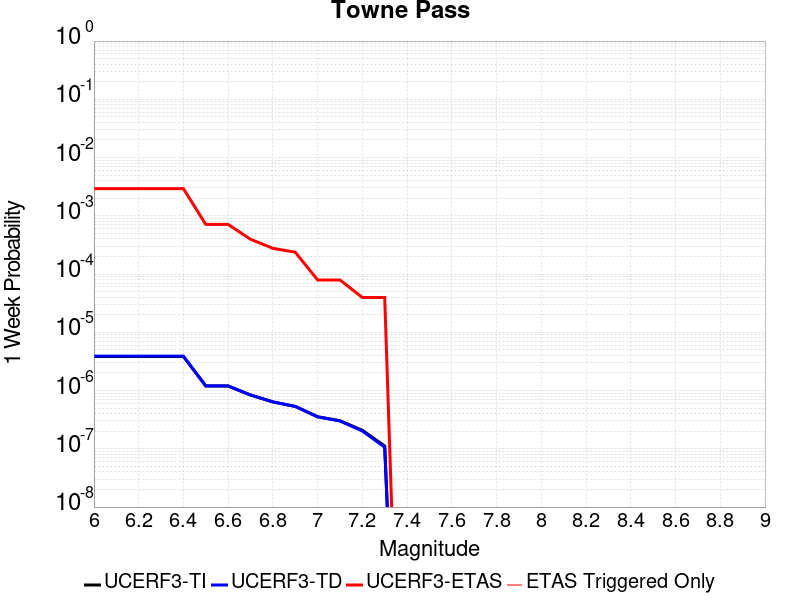 | 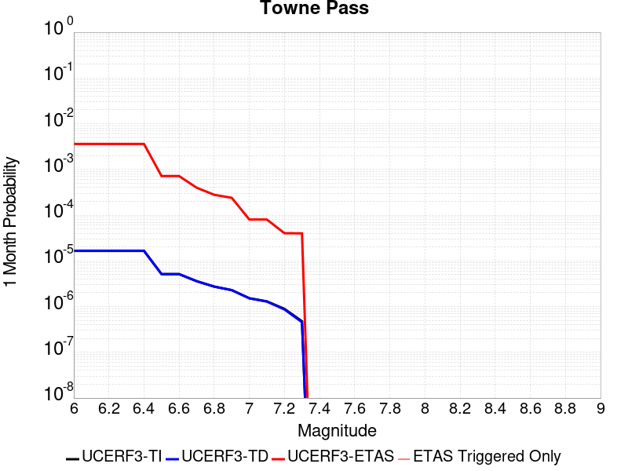 | 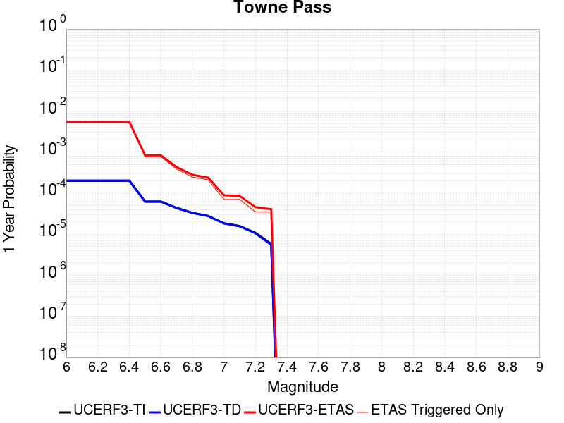 | 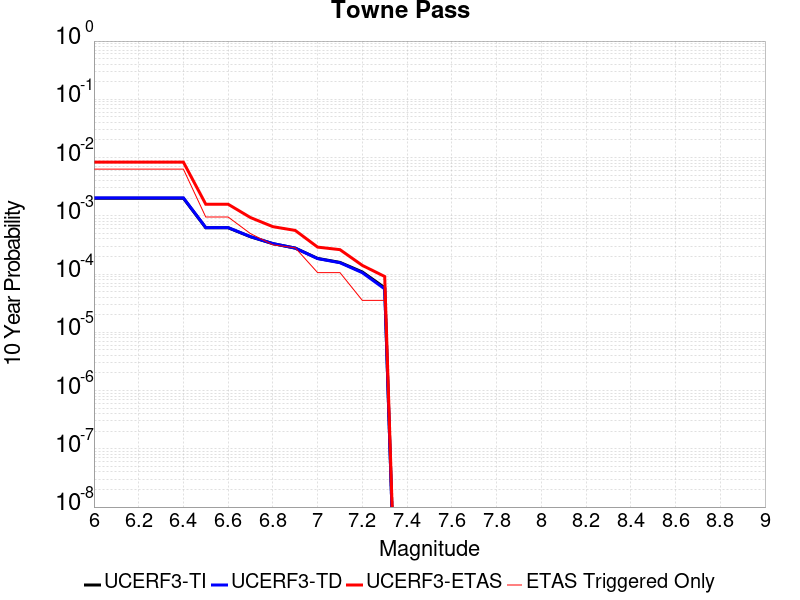 |

| Magnitude | 1 wk TI Prob | 1 wk TD Prob | 1 wk ETAS Prob | 1 wk ETAS/TD Gain | 1 wk ETAS Triggered Only | 1 mo TI Prob | 1 mo TD Prob | 1 mo ETAS Prob | 1 mo ETAS/TD Gain | 1 mo ETAS Triggered Only | 1 yr TI Prob | 1 yr TD Prob | 1 yr ETAS Prob | 1 yr ETAS/TD Gain | 1 yr ETAS Triggered Only | 10 yr TI Prob | 10 yr TD Prob | 10 yr ETAS Prob | 10 yr ETAS/TD Gain | 10 yr ETAS Triggered Only |
|-----|-----|-----|-----|-----|-----|-----|-----|-----|-----|-----|-----|-----|-----|-----|-----|-----|-----|-----|-----|-----|
| 6.0 | 3.849728E-6 | 3.8945414E-6 | 0.0029232455 | 750.60077 | 0.0029193624 | 1.649873E-5 | 1.669081E-5 | 0.0036066577 | 216.08644 | 0.0035900269 | 2.0085352E-4 | 2.0319603E-4 | 0.005409649 | 26.62281 | 0.0052075116 | 0.0020067208 | 0.0020305314 | 0.00832985 | 4.1023 | 0.006312135 |
| 6.1 | 3.849728E-6 | 3.8945414E-6 | 0.0029232455 | 750.60077 | 0.0029193624 | 1.649873E-5 | 1.669081E-5 | 0.0036066577 | 216.08644 | 0.0035900269 | 2.0085352E-4 | 2.0319603E-4 | 0.005409649 | 26.62281 | 0.0052075116 | 0.0020067208 | 0.0020305314 | 0.00832985 | 4.1023 | 0.006312135 |
| 6.2 | 3.849728E-6 | 3.8945414E-6 | 0.0029232455 | 750.60077 | 0.0029193624 | 1.649873E-5 | 1.669081E-5 | 0.0036066577 | 216.08644 | 0.0035900269 | 2.0085352E-4 | 2.0319603E-4 | 0.005409649 | 26.62281 | 0.0052075116 | 0.0020067208 | 0.0020305314 | 0.00832985 | 4.1023 | 0.006312135 |
| 6.3 | 3.849728E-6 | 3.8945414E-6 | 0.0029232455 | 750.60077 | 0.0029193624 | 1.649873E-5 | 1.669081E-5 | 0.0036066577 | 216.08644 | 0.0035900269 | 2.0085352E-4 | 2.0319603E-4 | 0.005409649 | 26.62281 | 0.0052075116 | 0.0020067208 | 0.0020305314 | 0.00832985 | 4.1023 | 0.006312135 |
| 6.4 | 3.849728E-6 | 3.8945414E-6 | 0.0029232455 | 750.60077 | 0.0029193624 | 1.649873E-5 | 1.669081E-5 | 0.0036066577 | 216.08644 | 0.0035900269 | 2.0085352E-4 | 2.0319603E-4 | 0.005409649 | 26.62281 | 0.0052075116 | 0.0020067208 | 0.0020305314 | 0.00832985 | 4.1023 | 0.006312135 |
| 6.5 | 1.1953545E-6 | 1.203052E-6 | 7.113174E-4 | 591.26074 | 7.101152E-4 | 5.1229376E-6 | 5.1559277E-6 | 7.1526744E-4 | 138.7272 | 7.101152E-4 | 6.236998E-5 | 6.277173E-5 | 8.9118746E-4 | 14.197274 | 8.284677E-4 | 6.235248E-4 | 6.275517E-4 | 0.0016526299 | 2.6334562 | 0.0010257219 |
| 6.6 | 1.1953545E-6 | 1.203052E-6 | 7.113174E-4 | 591.26074 | 7.101152E-4 | 5.1229376E-6 | 5.1559277E-6 | 7.1526744E-4 | 138.7272 | 7.101152E-4 | 6.236998E-5 | 6.277173E-5 | 8.9118746E-4 | 14.197274 | 8.284677E-4 | 6.235248E-4 | 6.275517E-4 | 0.0016526299 | 2.6334562 | 0.0010257219 |
| 6.7 | 8.375951E-7 | 8.4106705E-7 | 3.9534917E-4 | 470.05667 | 3.9450845E-4 | 3.5896885E-6 | 3.6045683E-6 | 3.981116E-4 | 110.446396 | 3.9450845E-4 | 4.370358E-5 | 4.3884793E-5 | 4.3837592E-4 | 9.989244 | 3.9450845E-4 | 4.3694986E-4 | 4.38767E-4 | 9.5140294E-4 | 2.1683557 | 5.1286095E-4 |
| 6.8 | 6.38041E-7 | 6.392156E-7 | 2.7679495E-4 | 433.0228 | 2.7615592E-4 | 2.7344586E-6 | 2.7394929E-6 | 2.7889464E-4 | 101.80521 | 2.7615592E-4 | 3.3291526E-5 | 3.3352855E-5 | 3.0949956E-4 | 9.279552 | 2.7615592E-4 | 3.3286537E-4 | 3.334823E-4 | 6.884215E-4 | 2.064342 | 3.550576E-4 |
| 6.9 | 5.3460053E-7 | 5.345333E-7 | 2.3723947E-4 | 443.82544 | 2.3670506E-4 | 2.2911431E-6 | 2.2908553E-6 | 2.3899537E-4 | 104.325836 | 2.3670506E-4 | 2.789431E-5 | 2.789084E-5 | 2.645893E-4 | 9.486603 | 2.3670506E-4 | 2.789081E-4 | 2.7887672E-4 | 5.9439545E-4 | 2.1313915 | 3.1560674E-4 |
| 7.0 | 3.557783E-7 | 3.5324226E-7 | 7.92549E-5 | 224.36417 | 7.8901685E-5 | 1.5247632E-6 | 1.5138945E-6 | 8.041546E-5 | 53.11827 | 7.8901685E-5 | 1.8563835E-5 | 1.843152E-5 | 9.733175E-5 | 5.2807236 | 7.8901685E-5 | 1.8562283E-4 | 1.8430075E-4 | 3.0263147E-4 | 1.6420523 | 1.1835253E-4 |
| 7.1 | 3.037942E-7 | 3.0002218E-7 | 7.920169E-5 | 263.9861 | 7.8901685E-5 | 1.3019744E-6 | 1.2858087E-6 | 8.01874E-5 | 62.36339 | 7.8901685E-5 | 1.5851423E-5 | 1.5654618E-5 | 9.455507E-5 | 6.040076 | 7.8901685E-5 | 1.5850292E-4 | 1.5653588E-4 | 2.748699E-4 | 1.7559545 | 1.1835253E-4 |
| 7.2 | 2.0808248E-7 | 2.0217689E-7 | 3.9653012E-5 | 196.1303 | 3.9450842E-5 | 8.917818E-7 | 8.6647213E-7 | 4.031728E-5 | 46.530388 | 3.9450842E-5 | 1.0857389E-5 | 1.0549252E-5 | 4.999968E-5 | 4.739642 | 3.9450842E-5 | 1.0856859E-4 | 1.0548797E-4 | 1.4493466E-4 | 1.3739449 | 3.9450842E-5 |
| 7.3 | 1.1162073E-7 | 1.0636894E-7 | 3.955721E-5 | 371.88687 | 3.9450842E-5 | 4.7837443E-7 | 4.558668E-7 | 3.9906692E-5 | 87.54025 | 3.9450842E-5 | 5.8241935E-6 | 5.550166E-6 | 4.500079E-5 | 8.108008 | 3.9450842E-5 | 5.8240406E-5 | 5.5500474E-5 | 9.494913E-5 | 1.7107805 | 3.9450842E-5 |

## Bicycle Lake
*[(top)](#table-of-contents)*

| 1 Week | 1 Month | 1 Year | 10 Year |
|-----|-----|-----|-----|
| 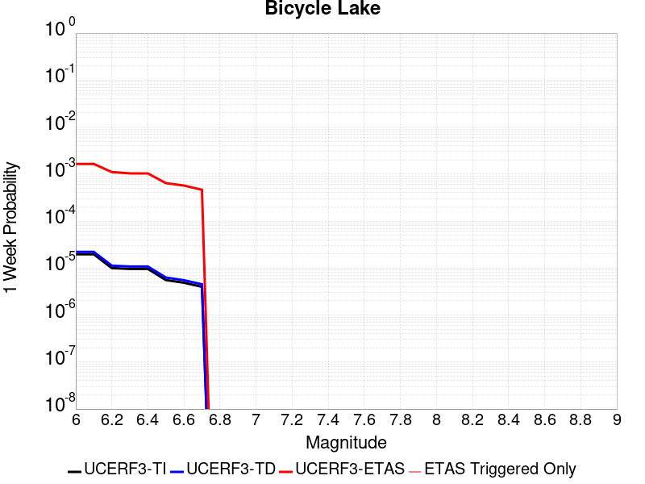 | 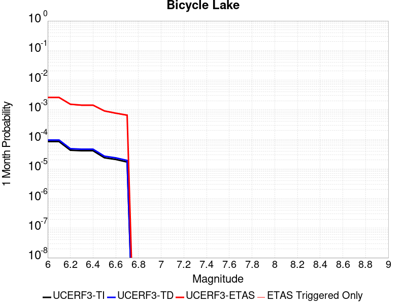 | 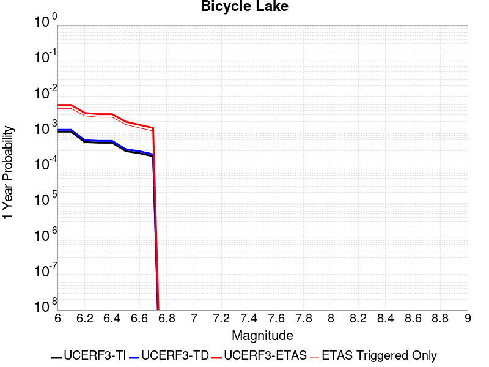 | 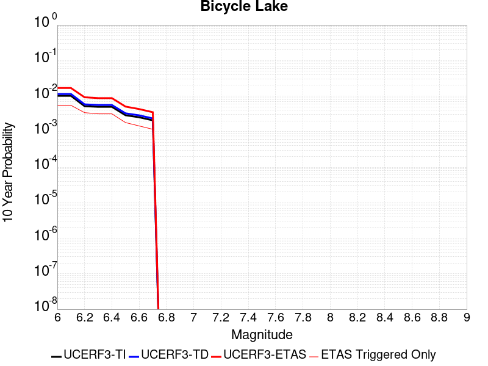 |

| Magnitude | 1 wk TI Prob | 1 wk TD Prob | 1 wk ETAS Prob | 1 wk ETAS/TD Gain | 1 wk ETAS Triggered Only | 1 mo TI Prob | 1 mo TD Prob | 1 mo ETAS Prob | 1 mo ETAS/TD Gain | 1 mo ETAS Triggered Only | 1 yr TI Prob | 1 yr TD Prob | 1 yr ETAS Prob | 1 yr ETAS/TD Gain | 1 yr ETAS Triggered Only | 10 yr TI Prob | 10 yr TD Prob | 10 yr ETAS Prob | 10 yr ETAS/TD Gain | 10 yr ETAS Triggered Only |
|-----|-----|-----|-----|-----|-----|-----|-----|-----|-----|-----|-----|-----|-----|-----|-----|-----|-----|-----|-----|-----|
| 6.0 | 1.9621975E-5 | 2.2097078E-5 | 0.0017184459 | 77.76801 | 0.0016963863 | 8.4091465E-5 | 9.4699084E-5 | 0.0026982082 | 28.492441 | 0.0026037558 | 0.0010233327 | 0.0011524865 | 0.0057235104 | 4.9662275 | 0.004576298 | 0.01018633 | 0.011478408 | 0.017016126 | 1.4824464 | 0.00560202 |
| 6.1 | 1.9621975E-5 | 2.2097078E-5 | 0.0017184459 | 77.76801 | 0.0016963863 | 8.4091465E-5 | 9.4699084E-5 | 0.0026982082 | 28.492441 | 0.0026037558 | 0.0010233327 | 0.0011524865 | 0.0057235104 | 4.9662275 | 0.004576298 | 0.01018633 | 0.011478408 | 0.017016126 | 1.4824464 | 0.00560202 |
| 6.2 | 9.9971285E-6 | 1.1255639E-5 | 0.0011158668 | 99.138466 | 0.0011046237 | 4.2844134E-5 | 4.8237856E-5 | 0.0015867465 | 32.89422 | 0.001538583 | 5.2150246E-4 | 5.871896E-4 | 0.0034259825 | 5.834542 | 0.0028404607 | 0.0052028033 | 0.005861487 | 0.009352031 | 1.595505 | 0.0035111252 |
| 6.3 | 9.589428E-6 | 1.0798346E-5 | 0.0010365092 | 95.98778 | 0.0010257219 | 4.10969E-5 | 4.62781E-5 | 0.0014664427 | 31.68762 | 0.0014202304 | 5.002399E-4 | 5.6334207E-4 | 0.0031656309 | 5.619376 | 0.0026037558 | 0.0049911533 | 0.0056242296 | 0.008880233 | 1.5789244 | 0.00327442 |
| 6.4 | 9.589428E-6 | 1.0798346E-5 | 0.0010365092 | 95.98778 | 0.0010257219 | 4.10969E-5 | 4.62781E-5 | 0.0014664427 | 31.68762 | 0.0014202304 | 5.002399E-4 | 5.6334207E-4 | 0.0031656309 | 5.619376 | 0.0026037558 | 0.0049911533 | 0.0056242296 | 0.008880233 | 1.5789244 | 0.00327442 |
| 6.5 | 5.557707E-6 | 6.2856016E-6 | 6.769457E-4 | 107.697845 | 6.7066436E-4 | 2.3818526E-5 | 2.6938165E-5 | 9.737329E-4 | 36.146965 | 9.4682025E-4 | 2.8995197E-4 | 3.2794967E-4 | 0.0019449039 | 5.930495 | 0.0016174846 | 0.0028957394 | 0.0032772934 | 0.0052040494 | 1.5879108 | 0.0019330913 |
| 6.6 | 4.8742945E-6 | 5.5132896E-6 | 5.972727E-4 | 108.33327 | 5.9176265E-4 | 2.0889667E-5 | 2.3628318E-5 | 8.1262656E-4 | 34.39206 | 7.890169E-4 | 2.54302E-4 | 2.87663E-4 | 0.0015891663 | 5.524403 | 0.0013018779 | 0.002540112 | 0.0028754752 | 0.004409634 | 1.5335323 | 0.001538583 |
| 6.7 | 3.991108E-6 | 4.5159104E-6 | 4.779239E-4 | 105.83113 | 4.7341012E-4 | 1.7104636E-5 | 1.9353902E-5 | 6.9000525E-4 | 35.652 | 6.7066436E-4 | 2.0822904E-4 | 2.3563375E-4 | 0.0013005555 | 5.5193944 | 0.0010651728 | 0.0020803404 | 0.0023563374 | 0.003576432 | 1.5177927 | 0.0012229761 |

## San Andreas (Mojave N)
*[(top)](#table-of-contents)*

| 1 Week | 1 Month | 1 Year | 10 Year |
|-----|-----|-----|-----|
| 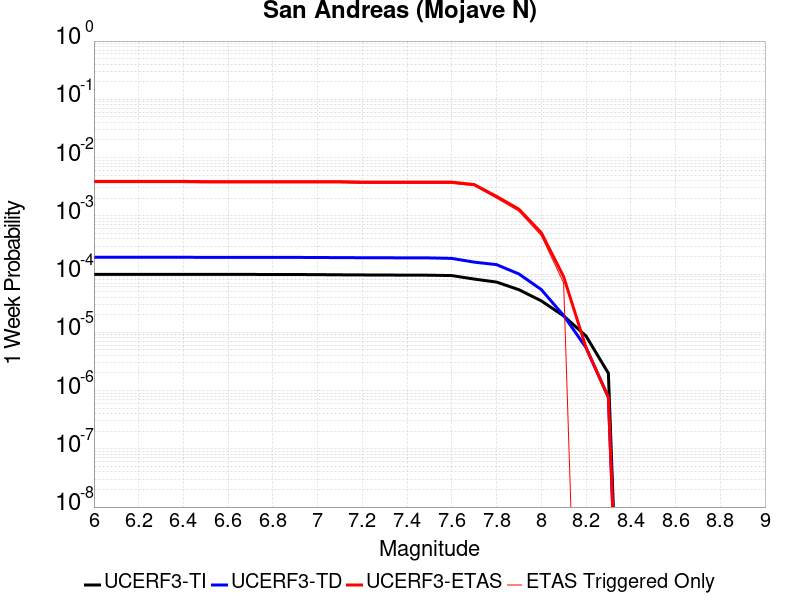 | 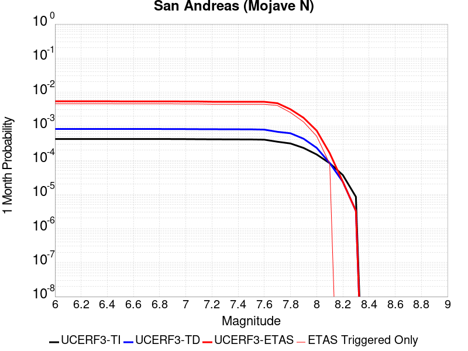 | 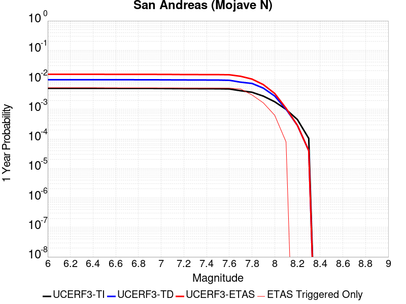 | 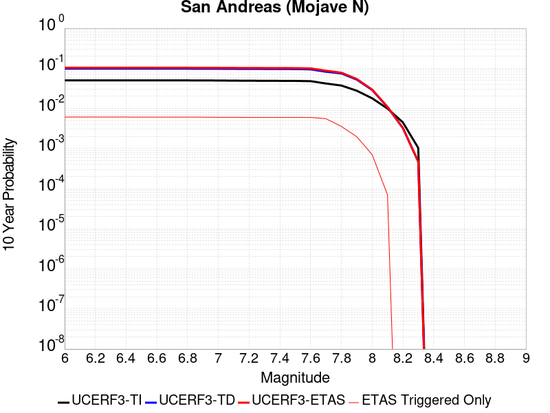 |

| Magnitude | 1 wk TI Prob | 1 wk TD Prob | 1 wk ETAS Prob | 1 wk ETAS/TD Gain | 1 wk ETAS Triggered Only | 1 mo TI Prob | 1 mo TD Prob | 1 mo ETAS Prob | 1 mo ETAS/TD Gain | 1 mo ETAS Triggered Only | 1 yr TI Prob | 1 yr TD Prob | 1 yr ETAS Prob | 1 yr ETAS/TD Gain | 1 yr ETAS Triggered Only | 10 yr TI Prob | 10 yr TD Prob | 10 yr ETAS Prob | 10 yr ETAS/TD Gain | 10 yr ETAS Triggered Only |
|-----|-----|-----|-----|-----|-----|-----|-----|-----|-----|-----|-----|-----|-----|-----|-----|-----|-----|-----|-----|-----|
| 6.0 | 9.877682E-5 | 1.9400702E-4 | 0.003901667 | 20.110958 | 0.0037083793 | 4.2326056E-4 | 8.311939E-4 | 0.005403688 | 6.5011163 | 0.004576298 | 0.0051410277 | 0.010072956 | 0.015423279 | 1.5311573 | 0.0054047657 | 0.05023708 | 0.09831428 | 0.10375683 | 1.0553588 | 0.0060359794 |
| 6.1 | 9.877682E-5 | 1.9400702E-4 | 0.003901667 | 20.110958 | 0.0037083793 | 4.2326056E-4 | 8.311939E-4 | 0.005403688 | 6.5011163 | 0.004576298 | 0.0051410277 | 0.010072956 | 0.015423279 | 1.5311573 | 0.0054047657 | 0.05023708 | 0.09831428 | 0.10375683 | 1.0553588 | 0.0060359794 |
| 6.2 | 9.877682E-5 | 1.9400702E-4 | 0.003901667 | 20.110958 | 0.0037083793 | 4.2326056E-4 | 8.311939E-4 | 0.005403688 | 6.5011163 | 0.004576298 | 0.0051410277 | 0.010072956 | 0.015423279 | 1.5311573 | 0.0054047657 | 0.05023708 | 0.09831428 | 0.10375683 | 1.0553588 | 0.0060359794 |
| 6.3 | 9.877682E-5 | 1.9400702E-4 | 0.003901667 | 20.110958 | 0.0037083793 | 4.2326056E-4 | 8.311939E-4 | 0.005403688 | 6.5011163 | 0.004576298 | 0.0051410277 | 0.010072956 | 0.015423279 | 1.5311573 | 0.0054047657 | 0.05023708 | 0.09831428 | 0.10375683 | 1.0553588 | 0.0060359794 |
| 6.4 | 9.877682E-5 | 1.9400702E-4 | 0.003901667 | 20.110958 | 0.0037083793 | 4.2326056E-4 | 8.311939E-4 | 0.005403688 | 6.5011163 | 0.004576298 | 0.0051410277 | 0.010072956 | 0.015423279 | 1.5311573 | 0.0054047657 | 0.05023708 | 0.09831428 | 0.10375683 | 1.0553588 | 0.0060359794 |
| 6.5 | 9.861474E-5 | 1.9374468E-4 | 0.0038619624 | 19.933256 | 0.0036689285 | 4.2256617E-4 | 8.300703E-4 | 0.0053631514 | 6.461081 | 0.004536847 | 0.0051326132 | 0.010059402 | 0.015370746 | 1.5279979 | 0.005365315 | 0.050156746 | 0.098192066 | 0.10359979 | 1.0550729 | 0.0059965285 |
| 6.6 | 9.861474E-5 | 1.9374468E-4 | 0.0038619624 | 19.933256 | 0.0036689285 | 4.2256617E-4 | 8.300703E-4 | 0.0053631514 | 6.461081 | 0.004536847 | 0.0051326132 | 0.010059402 | 0.015370746 | 1.5279979 | 0.005365315 | 0.050156746 | 0.098192066 | 0.10359979 | 1.0550729 | 0.0059965285 |
| 6.7 | 9.8552715E-5 | 1.9364421E-4 | 0.0038618622 | 19.94308 | 0.0036689285 | 4.223004E-4 | 8.2964E-4 | 0.005362723 | 6.463916 | 0.004536847 | 0.0051293927 | 0.010054212 | 0.015365583 | 1.5282732 | 0.005365315 | 0.050125998 | 0.098145254 | 0.10355325 | 1.055102 | 0.0059965285 |
| 6.8 | 9.8464974E-5 | 1.9349584E-4 | 0.0038617144 | 19.95761 | 0.0036689285 | 4.219245E-4 | 8.290045E-4 | 0.0053620907 | 6.4681077 | 0.004536847 | 0.0051248376 | 0.010046546 | 0.015357959 | 1.5286803 | 0.005365315 | 0.05008251 | 0.09807528 | 0.1034837 | 1.0551456 | 0.0059965285 |
| 6.9 | 9.825824E-5 | 1.9317595E-4 | 0.0038613956 | 19.98901 | 0.0036689285 | 4.2103877E-4 | 8.276344E-4 | 0.0053607267 | 6.4771676 | 0.004536847 | 0.0051141046 | 0.010030019 | 0.015341519 | 1.5295603 | 0.005365315 | 0.049980022 | 0.09792438 | 0.103333704 | 1.0552398 | 0.0059965285 |
| 7.0 | 9.781462E-5 | 1.924896E-4 | 0.0038607118 | 20.05673 | 0.0036689285 | 4.1913814E-4 | 8.246948E-4 | 0.0053183823 | 6.4489093 | 0.0044973963 | 0.005091073 | 0.009994558 | 0.015267192 | 1.5275505 | 0.005325864 | 0.04976007 | 0.09760077 | 0.102976434 | 1.055078 | 0.0059570773 |
| 7.1 | 9.7121134E-5 | 1.9150671E-4 | 0.0038597325 | 20.154554 | 0.0036689285 | 4.1616702E-4 | 8.204851E-4 | 0.0053141913 | 6.4768896 | 0.0044973963 | 0.005055068 | 0.009943774 | 0.015216679 | 1.530272 | 0.005325864 | 0.04941613 | 0.09713728 | 0.102515705 | 1.0553693 | 0.0059570773 |
| 7.2 | 9.663819E-5 | 1.9081456E-4 | 0.0037801564 | 19.810627 | 0.0035900269 | 4.1409794E-4 | 8.175206E-4 | 0.005232403 | 6.4003315 | 0.0044184946 | 0.0050299936 | 0.00990801 | 0.015102986 | 1.5243207 | 0.0052469624 | 0.049176537 | 0.09681055 | 0.102119654 | 1.0548402 | 0.0058781756 |
| 7.3 | 9.6277574E-5 | 1.9033969E-4 | 0.0037796833 | 19.857567 | 0.0035900269 | 4.125529E-4 | 8.154867E-4 | 0.005230378 | 6.413811 | 0.0044184946 | 0.0050112694 | 0.009883473 | 0.015078577 | 1.5256355 | 0.0052469624 | 0.04899759 | 0.09658401 | 0.101894446 | 1.0549825 | 0.0058781756 |
| 7.4 | 9.593308E-5 | 1.897375E-4 | 0.0037790833 | 19.917429 | 0.0035900269 | 4.1107697E-4 | 8.129075E-4 | 0.0052278102 | 6.4310026 | 0.0044184946 | 0.0049933824 | 0.009852355 | 0.015047623 | 1.5273122 | 0.0052469624 | 0.04882661 | 0.09630218 | 0.10161428 | 1.0551606 | 0.0058781756 |
| 7.5 | 9.561707E-5 | 1.8919831E-4 | 0.003778546 | 19.971352 | 0.0035900269 | 4.0972308E-4 | 8.1059814E-4 | 0.0052255113 | 6.446488 | 0.0044184946 | 0.0049769743 | 0.009824493 | 0.015019907 | 1.5288225 | 0.0052469624 | 0.048669744 | 0.09604836 | 0.10136195 | 1.0553219 | 0.0058781756 |
| 7.6 | 9.418194E-5 | 1.8572104E-4 | 0.0037750811 | 20.32662 | 0.0035900269 | 4.0357444E-4 | 7.957047E-4 | 0.0052106837 | 6.548514 | 0.0044184946 | 0.004902454 | 0.009644784 | 0.01484114 | 1.5387738 | 0.0052469624 | 0.047957025 | 0.094430685 | 0.09975378 | 1.0563704 | 0.0058781756 |
| 7.7 | 8.202141E-5 | 1.6021315E-4 | 0.0034341086 | 21.434624 | 0.00327442 | 3.51473E-4 | 6.8644714E-4 | 0.0047470946 | 6.9154553 | 0.0040634368 | 0.00427079 | 0.008325525 | 0.013176702 | 1.5826873 | 0.0048919045 | 0.04189639 | 0.08223219 | 0.08722872 | 1.0607612 | 0.0054442165 |
| 7.8 | 7.2859846E-5 | 1.4516473E-4 | 0.0021568658 | 14.858057 | 0.002011993 | 3.1221908E-4 | 6.219862E-4 | 0.0031452698 | 5.056816 | 0.002524854 | 0.003794643 | 0.0075464295 | 0.010600374 | 1.4046873 | 0.003077166 | 0.037304975 | 0.07472468 | 0.07797344 | 1.0434763 | 0.0035111252 |
| 7.9 | 5.3874453E-5 | 1.0045676E-4 | 0.0012444163 | 12.387582 | 0.0011440745 | 2.3087008E-4 | 4.3045796E-4 | 0.0017712093 | 4.114709 | 0.0013413287 | 0.0028072202 | 0.0052282433 | 0.0068765157 | 1.3152632 | 0.0016569354 | 0.02772022 | 0.05242443 | 0.054181416 | 1.0335146 | 0.0018541897 |
| 8.0 | 3.468538E-5 | 5.4260272E-5 | 4.88196E-4 | 8.997301 | 4.339593E-4 | 1.4864317E-4 | 2.325233E-4 | 7.4526505E-4 | 3.2051198 | 5.1286095E-4 | 0.0018082283 | 0.002827298 | 0.0034567267 | 1.2226256 | 6.312135E-4 | 0.017935853 | 0.028947512 | 0.029598761 | 1.0224977 | 6.7066436E-4 |
| 8.1 | 1.9152367E-5 | 1.940263E-5 | 9.8302786E-5 | 5.0664673 | 7.8901685E-5 | 8.207899E-5 | 8.3151484E-5 | 1.620466E-4 | 1.948812 | 7.8901685E-5 | 9.988535E-4 | 0.0010118998 | 0.0010907216 | 1.0778949 | 7.8901685E-5 | 0.009943757 | 0.01085625 | 0.010934295 | 1.0071889 | 7.8901685E-5 |
| 8.2 | 8.643924E-6 | 5.4748625E-6 | 5.4748625E-6 | 1.0 | 0.0 | 3.704486E-5 | 2.3463486E-5 | 2.3463486E-5 | 1.0 | 0.0 | 4.5092785E-4 | 2.8563058E-4 | 2.8563058E-4 | 1.0 | 0.0 | 0.0045001395 | 0.0032487072 | 0.0032487072 | 1.0 | 0.0 |
| 8.3 | 1.983087E-6 | 7.6599065E-7 | 7.6599065E-7 | 1.0 | 0.0 | 8.498917E-6 | 3.282813E-6 | 3.282813E-6 | 1.0 | 0.0 | 1.034694E-4 | 3.9967534E-5 | 3.9967534E-5 | 1.0 | 0.0 | 0.0010342124 | 4.719687E-4 | 4.719687E-4 | 1.0 | 0.0 |

## Lenwood-Lockhart-Old Woman Springs
*[(top)](#table-of-contents)*

| 1 Week | 1 Month | 1 Year | 10 Year |
|-----|-----|-----|-----|
| 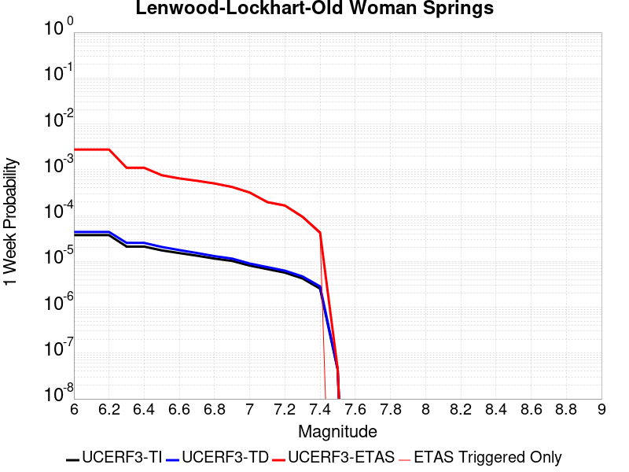 | 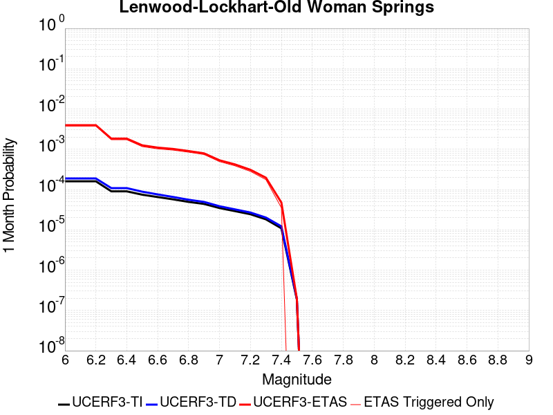 | 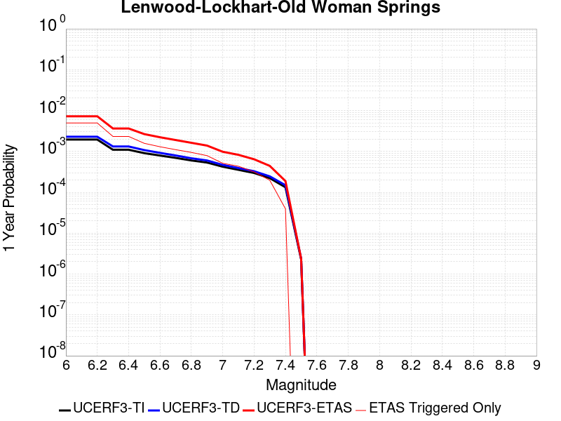 | 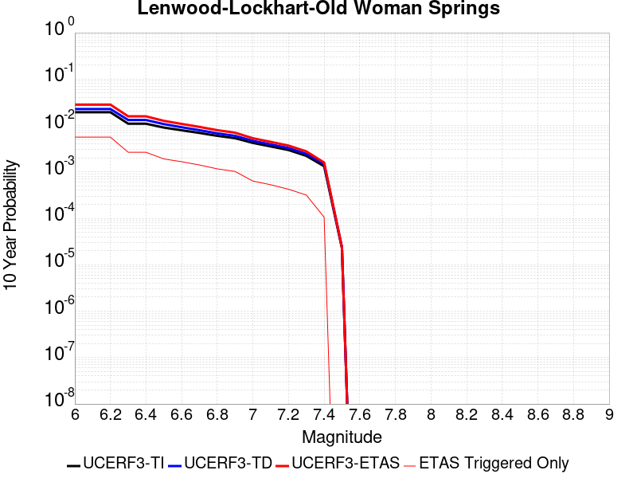 |

| Magnitude | 1 wk TI Prob | 1 wk TD Prob | 1 wk ETAS Prob | 1 wk ETAS/TD Gain | 1 wk ETAS Triggered Only | 1 mo TI Prob | 1 mo TD Prob | 1 mo ETAS Prob | 1 mo ETAS/TD Gain | 1 mo ETAS Triggered Only | 1 yr TI Prob | 1 yr TD Prob | 1 yr ETAS Prob | 1 yr ETAS/TD Gain | 1 yr ETAS Triggered Only | 10 yr TI Prob | 10 yr TD Prob | 10 yr ETAS Prob | 10 yr ETAS/TD Gain | 10 yr ETAS Triggered Only |
|-----|-----|-----|-----|-----|-----|-----|-----|-----|-----|-----|-----|-----|-----|-----|-----|-----|-----|-----|-----|-----|
| 6.0 | 3.744542E-5 | 4.396252E-5 | 0.003081544 | 70.094795 | 0.003037715 | 1.604705E-4 | 1.8839816E-4 | 0.004093296 | 21.726835 | 0.0039056335 | 0.0019519776 | 0.0022915069 | 0.0072509227 | 3.1642597 | 0.004970806 | 0.019349206 | 0.022696787 | 0.028287325 | 1.246314 | 0.0057203723 |
| 6.1 | 3.744542E-5 | 4.396252E-5 | 0.003081544 | 70.094795 | 0.003037715 | 1.604705E-4 | 1.8839816E-4 | 0.004093296 | 21.726835 | 0.0039056335 | 0.0019519776 | 0.0022915069 | 0.0072509227 | 3.1642597 | 0.004970806 | 0.019349206 | 0.022696787 | 0.028287325 | 1.246314 | 0.0057203723 |
| 6.2 | 3.744542E-5 | 4.396252E-5 | 0.003081544 | 70.094795 | 0.003037715 | 1.604705E-4 | 1.8839816E-4 | 0.004093296 | 21.726835 | 0.0039056335 | 0.0019519776 | 0.0022915069 | 0.0072509227 | 3.1642597 | 0.004970806 | 0.019349206 | 0.022696787 | 0.028287325 | 1.246314 | 0.0057203723 |
| 6.3 | 2.1079984E-5 | 2.5353434E-5 | 0.0014849977 | 58.571854 | 0.0014596812 | 9.0339665E-5 | 1.0865316E-4 | 0.0019626415 | 18.063362 | 0.0018541897 | 0.0010993304 | 0.0013220694 | 0.003646592 | 2.7582455 | 0.0023275998 | 0.010939079 | 0.0131442575 | 0.015791653 | 1.2014109 | 0.0026826574 |
| 6.4 | 2.1079984E-5 | 2.5353434E-5 | 0.0014849977 | 58.571854 | 0.0014596812 | 9.0339665E-5 | 1.0865316E-4 | 0.0019626415 | 18.063362 | 0.0018541897 | 0.0010993304 | 0.0013220694 | 0.003646592 | 2.7582455 | 0.0023275998 | 0.010939079 | 0.0131442575 | 0.015791653 | 1.2014109 | 0.0026826574 |
| 6.5 | 1.7397282E-5 | 2.066241E-5 | 9.2801306E-4 | 44.91311 | 9.073694E-4 | 7.455765E-5 | 8.8550245E-5 | 0.0013114181 | 14.8098755 | 0.0012229761 | 9.073613E-4 | 0.0010775778 | 0.002653911 | 2.4628487 | 0.0015780338 | 0.009036654 | 0.010724821 | 0.012598152 | 1.1746725 | 0.0018936405 |
| 6.6 | 1.52050325E-5 | 1.7679693E-5 | 8.066826E-4 | 45.627636 | 7.890169E-4 | 6.51628E-5 | 7.576796E-5 | 0.00114086 | 15.057288 | 0.0010651728 | 7.9306826E-4 | 9.220924E-4 | 0.00222277 | 2.4105716 | 0.0013018779 | 0.007902439 | 0.009183526 | 0.010786157 | 1.1745114 | 0.0016174846 |
| 6.7 | 1.332523E-5 | 1.5264002E-5 | 7.6481863E-4 | 50.106033 | 7.4956607E-4 | 5.7106878E-5 | 6.5415545E-5 | 0.0010516221 | 16.076027 | 9.862711E-4 | 6.950544E-4 | 7.961491E-4 | 0.0018998933 | 2.3863537 | 0.0011046237 | 0.006928845 | 0.007933599 | 0.009303424 | 1.1726612 | 0.0013807795 |
| 6.8 | 1.1525329E-5 | 1.3030979E-5 | 6.442363E-4 | 49.438824 | 6.312135E-4 | 4.9393333E-5 | 5.584588E-5 | 9.23716E-4 | 16.54045 | 8.679186E-4 | 6.011979E-4 | 6.797157E-4 | 0.0016258925 | 2.3920183 | 9.4682025E-4 | 0.00599574 | 0.006776819 | 0.007913141 | 1.1676776 | 0.0011440745 |
| 6.9 | 1.0253909E-5 | 1.15144385E-5 | 5.638199E-4 | 48.96634 | 5.5231183E-4 | 4.3944583E-5 | 4.9346683E-5 | 7.9887576E-4 | 16.189047 | 7.4956607E-4 | 5.3489394E-4 | 6.0063385E-4 | 0.0013891768 | 2.3128514 | 7.890169E-4 | 0.0053360825 | 0.0059904843 | 0.006970847 | 1.1636534 | 9.862711E-4 |
| 7.0 | 8.104563E-6 | 8.991279E-6 | 3.245952E-4 | 36.101116 | 3.1560674E-4 | 3.4733377E-5 | 3.8533497E-5 | 5.119254E-4 | 13.285205 | 4.7341012E-4 | 4.2279682E-4 | 4.6904673E-4 | 9.816672E-4 | 2.0928984 | 5.1286095E-4 | 0.0042199334 | 0.0046808156 | 0.0053090747 | 1.13422 | 6.312135E-4 |
| 7.1 | 6.7986157E-6 | 7.515816E-6 | 2.442191E-4 | 32.494026 | 2.3670506E-4 | 2.91366E-5 | 3.2210253E-5 | 4.2670598E-4 | 13.24752 | 3.9450845E-4 | 3.5468035E-4 | 3.920914E-4 | 8.2588056E-4 | 2.1063468 | 4.339593E-4 | 0.003541148 | 0.003914213 | 0.0044643627 | 1.1405519 | 5.5231183E-4 |
| 7.2 | 5.6893327E-6 | 6.2800136E-6 | 1.640824E-4 | 26.127714 | 1.5780337E-4 | 2.4382627E-5 | 2.6914078E-5 | 3.0306255E-4 | 11.260373 | 2.7615592E-4 | 2.9681803E-4 | 3.2763163E-4 | 6.43135E-4 | 1.962982 | 3.1560674E-4 | 0.002964219 | 0.0032716845 | 0.003704224 | 1.1322069 | 4.339593E-4 |
| 7.3 | 4.253348E-6 | 4.7069107E-6 | 4.415757E-5 | 9.3814335 | 3.9450842E-5 | 1.8228506E-5 | 2.0172329E-5 | 1.7797253E-4 | 8.822607 | 1.5780337E-4 | 2.2190946E-4 | 2.4557224E-4 | 4.4277802E-4 | 1.8030459 | 1.9725422E-4 | 0.00221688 | 0.0024531898 | 0.0027680222 | 1.128336 | 3.1560674E-4 |
| 7.4 | 2.5448119E-6 | 2.852045E-6 | 2.852045E-6 | 1.0 | 0.0 | 1.0906291E-5 | 1.2223002E-5 | 5.1673363E-5 | 4.227551 | 3.9450842E-5 | 1.3277601E-4 | 1.4880655E-4 | 1.882515E-4 | 1.2650756 | 3.9450842E-5 | 0.001326967 | 0.0014872311 | 0.0016054077 | 1.0794607 | 1.1835253E-4 |
| 7.5 | 4.3706837E-8 | 4.562909E-8 | 4.562909E-8 | 1.0 | 0.0 | 1.8731501E-7 | 1.9555324E-7 | 1.9555324E-7 | 1.0 | 0.0 | 2.2805577E-6 | 2.3808586E-6 | 2.3808586E-6 | 1.0 | 0.0 | 2.2805343E-5 | 2.3808387E-5 | 2.3808387E-5 | 1.0 | 0.0 |

## Paradise
*[(top)](#table-of-contents)*

| 1 Week | 1 Month | 1 Year | 10 Year |
|-----|-----|-----|-----|
| 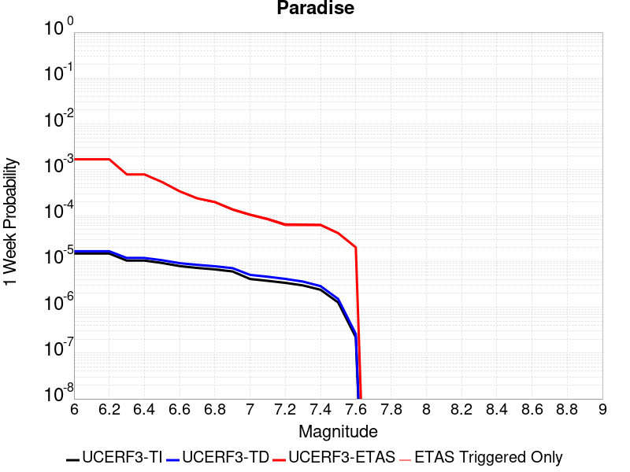 | 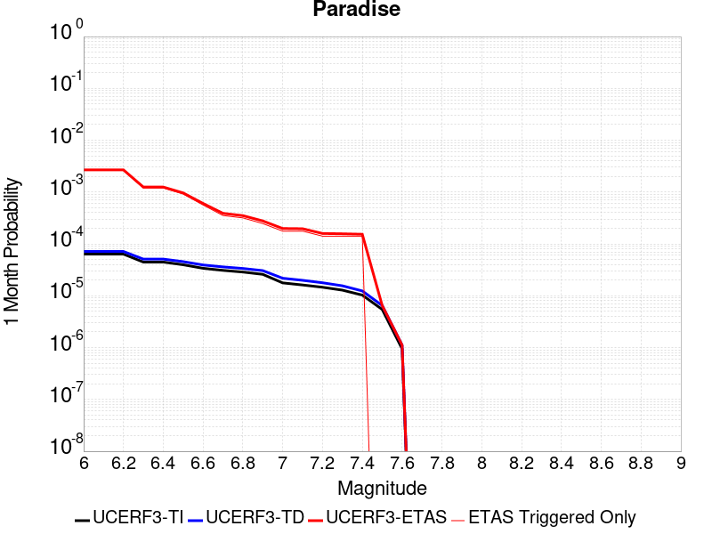 | 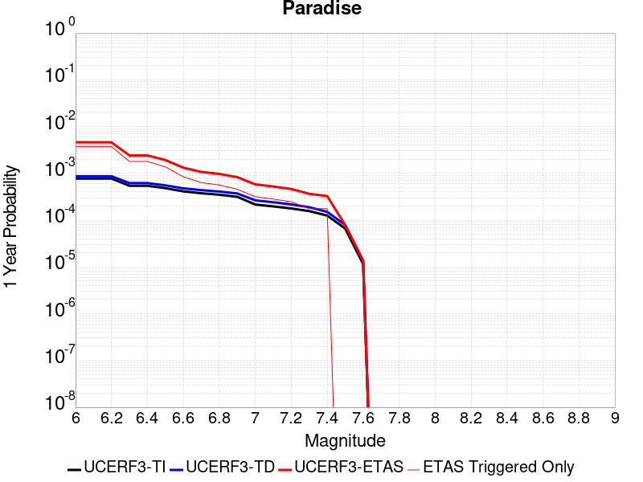 | 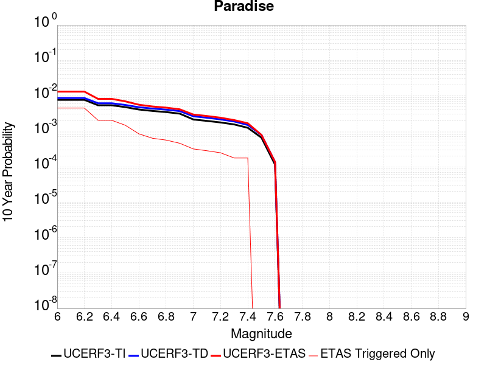 |

| Magnitude | 1 wk TI Prob | 1 wk TD Prob | 1 wk ETAS Prob | 1 wk ETAS/TD Gain | 1 wk ETAS Triggered Only | 1 mo TI Prob | 1 mo TD Prob | 1 mo ETAS Prob | 1 mo ETAS/TD Gain | 1 mo ETAS Triggered Only | 1 yr TI Prob | 1 yr TD Prob | 1 yr ETAS Prob | 1 yr ETAS/TD Gain | 1 yr ETAS Triggered Only | 10 yr TI Prob | 10 yr TD Prob | 10 yr ETAS Prob | 10 yr ETAS/TD Gain | 10 yr ETAS Triggered Only |
|-----|-----|-----|-----|-----|-----|-----|-----|-----|-----|-----|-----|-----|-----|-----|-----|-----|-----|-----|-----|-----|
| 6.0 | 1.4851273E-5 | 1.6694692E-5 | 0.001791953 | 107.3367 | 0.001775288 | 6.364676E-5 | 7.154685E-5 | 0.0027934604 | 39.043793 | 0.0027221083 | 7.7462377E-4 | 8.707584E-4 | 0.0046547414 | 5.3456182 | 0.003787281 | 0.0077192914 | 0.008675844 | 0.013095113 | 1.5093763 | 0.0044579455 |
| 6.1 | 1.4851273E-5 | 1.6694692E-5 | 0.001791953 | 107.3367 | 0.001775288 | 6.364676E-5 | 7.154685E-5 | 0.0027934604 | 39.043793 | 0.0027221083 | 7.7462377E-4 | 8.707584E-4 | 0.0046547414 | 5.3456182 | 0.003787281 | 0.0077192914 | 0.008675844 | 0.013095113 | 1.5093763 | 0.0044579455 |
| 6.2 | 1.4851273E-5 | 1.6694692E-5 | 0.001791953 | 107.3367 | 0.001775288 | 6.364676E-5 | 7.154685E-5 | 0.0027934604 | 39.043793 | 0.0027221083 | 7.7462377E-4 | 8.707584E-4 | 0.0046547414 | 5.3456182 | 0.003787281 | 0.0077192914 | 0.008675844 | 0.013095113 | 1.5093763 | 0.0044579455 |
| 6.3 | 1.0426831E-5 | 1.188862E-5 | 8.403465E-4 | 70.684944 | 8.284677E-4 | 4.4685654E-5 | 5.0950268E-5 | 0.0013133129 | 25.77637 | 0.001262427 | 5.43912E-4 | 6.201489E-4 | 0.0024731888 | 3.9880562 | 0.0018541897 | 0.0054258266 | 0.0061847917 | 0.008262754 | 1.3359795 | 0.0020908948 |
| 6.4 | 1.0426831E-5 | 1.188862E-5 | 8.403465E-4 | 70.684944 | 8.284677E-4 | 4.4685654E-5 | 5.0950268E-5 | 0.0013133129 | 25.77637 | 0.001262427 | 5.43912E-4 | 6.201489E-4 | 0.0024731888 | 3.9880562 | 0.0018541897 | 0.0054258266 | 0.0061847917 | 0.008262754 | 1.3359795 | 0.0020908948 |
| 6.5 | 9.25027E-6 | 1.06199595E-5 | 6.418268E-4 | 60.435894 | 6.312135E-4 | 3.964341E-5 | 4.551335E-5 | 0.0010317395 | 22.668945 | 9.862711E-4 | 4.8255164E-4 | 5.53989E-4 | 0.0019734327 | 3.5622234 | 0.0014202304 | 0.0048150513 | 0.0055265795 | 0.007017426 | 1.2697594 | 0.0014991321 |
| 6.6 | 7.904275E-6 | 9.159525E-6 | 3.6421386E-4 | 39.7634 | 3.550576E-4 | 3.3875025E-5 | 3.9254537E-5 | 6.30994E-4 | 16.07442 | 5.9176265E-4 | 4.1235037E-4 | 4.7782314E-4 | 0.001305895 | 2.733009 | 8.284677E-4 | 0.0041158604 | 0.0047683544 | 0.005592872 | 1.1729144 | 8.284677E-4 |
| 6.7 | 7.2061953E-6 | 8.407248E-6 | 2.4511034E-4 | 29.154642 | 2.3670506E-4 | 3.088333E-5 | 3.6030586E-5 | 4.3052481E-4 | 11.948871 | 3.9450845E-4 | 3.7593965E-4 | 4.3858777E-4 | 0.0010695244 | 2.438564 | 6.312135E-4 | 0.003753043 | 0.004377591 | 0.0050060414 | 1.1435608 | 6.312135E-4 |
| 6.8 | 6.6948724E-6 | 7.842166E-6 | 2.0509484E-4 | 26.152832 | 1.9725422E-4 | 2.8691995E-5 | 3.360887E-5 | 3.8865453E-4 | 11.564047 | 3.550576E-4 | 3.4926904E-4 | 4.0911473E-4 | 0.0010006353 | 2.445855 | 5.9176265E-4 | 0.003487206 | 0.0040839734 | 0.004673319 | 1.144307 | 5.9176265E-4 |
| 6.9 | 6.0421025E-6 | 7.130621E-6 | 1.6493288E-4 | 23.130226 | 1.5780337E-4 | 2.5894467E-5 | 3.0559466E-5 | 3.0670693E-4 | 10.036397 | 2.7615592E-4 | 3.1521954E-4 | 3.7200135E-4 | 8.4523536E-4 | 2.2721298 | 4.7341012E-4 | 0.0031477278 | 0.0037141247 | 0.0041857767 | 1.1269886 | 4.7341012E-4 |
| 7.0 | 4.134091E-6 | 5.0803087E-6 | 1.2343224E-4 | 24.296207 | 1.1835253E-4 | 1.7717413E-5 | 2.177258E-5 | 2.190225E-4 | 10.059557 | 1.9725422E-4 | 2.1568815E-4 | 2.6505045E-4 | 6.200139E-4 | 2.3392298 | 3.550576E-4 | 0.0021547892 | 0.0026474963 | 0.003001614 | 1.1337557 | 3.550576E-4 |
| 7.1 | 3.7674888E-6 | 4.6318696E-6 | 1.2298385E-4 | 26.551666 | 1.1835253E-4 | 1.6146281E-5 | 1.9850726E-5 | 2.1710103E-4 | 10.93668 | 1.9725422E-4 | 1.9656324E-4 | 2.4165731E-4 | 5.5718777E-4 | 2.3056939 | 3.1560674E-4 | 0.0019638946 | 0.002414096 | 0.0027289407 | 1.1304194 | 3.1560674E-4 |
| 7.2 | 3.4065345E-6 | 4.156723E-6 | 8.305808E-5 | 19.981625 | 7.8901685E-5 | 1.4599351E-5 | 1.7814415E-5 | 1.7561499E-4 | 9.858027 | 1.5780337E-4 | 1.777326E-4 | 2.1687041E-4 | 4.9296644E-4 | 2.2730923 | 2.7615592E-4 | 0.0017759053 | 0.002166736 | 0.0024422933 | 1.1271764 | 2.7615592E-4 |
| 7.3 | 2.9934936E-6 | 3.6293168E-6 | 8.253072E-5 | 22.740015 | 7.8901685E-5 | 1.2829195E-5 | 1.555413E-5 | 1.7335506E-4 | 11.145275 | 1.5780337E-4 | 1.5618425E-4 | 1.8935655E-4 | 3.8657343E-4 | 2.0415106 | 1.9725422E-4 | 0.0015607453 | 0.0018920974 | 0.0020889784 | 1.1040543 | 1.9725422E-4 |
| 7.4 | 2.4049796E-6 | 2.8889842E-6 | 8.1790444E-5 | 28.311144 | 7.8901685E-5 | 1.0307015E-5 | 1.238131E-5 | 1.7018273E-4 | 13.7451315 | 1.5780337E-4 | 1.2548068E-4 | 1.5073347E-4 | 3.4795795E-4 | 2.308432 | 1.9725422E-4 | 0.0012540985 | 0.0015064536 | 0.0017034108 | 1.1307422 | 1.9725422E-4 |
| 7.5 | 1.2710091E-6 | 1.5134682E-6 | 1.5134682E-6 | 1.0 | 0.0 | 5.44717E-6 | 6.4862834E-6 | 6.4862834E-6 | 1.0 | 0.0 | 6.631728E-5 | 7.8968886E-5 | 7.8968886E-5 | 1.0 | 0.0 | 6.6297496E-4 | 7.8953087E-4 | 7.8953087E-4 | 1.0 | 0.0 |
| 7.6 | 2.21172E-7 | 2.603961E-7 | 2.603961E-7 | 1.0 | 0.0 | 9.478797E-7 | 1.1159829E-6 | 1.1159829E-6 | 1.0 | 0.0 | 1.1540374E-5 | 1.3587036E-5 | 1.3587036E-5 | 1.0 | 0.0 | 1.1539775E-4 | 1.3586486E-4 | 1.3586486E-4 | 1.0 | 0.0 |

## Garlic Springs
*[(top)](#table-of-contents)*

| 1 Week | 1 Month | 1 Year | 10 Year |
|-----|-----|-----|-----|
| 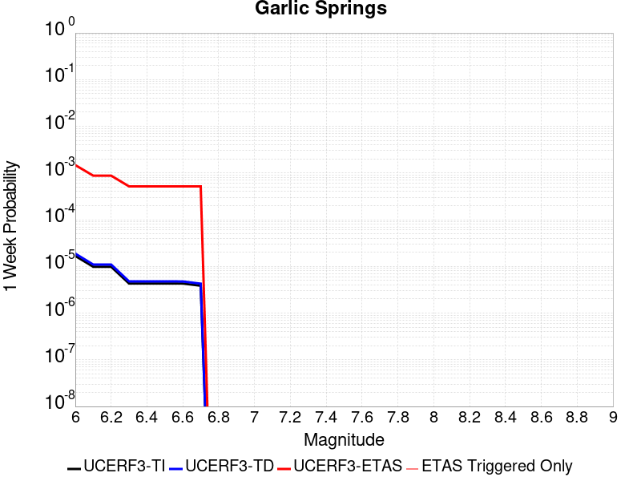 | 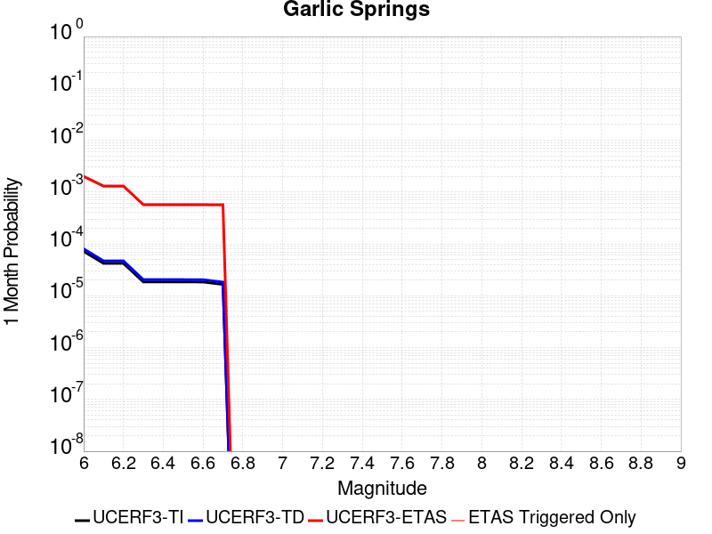 | 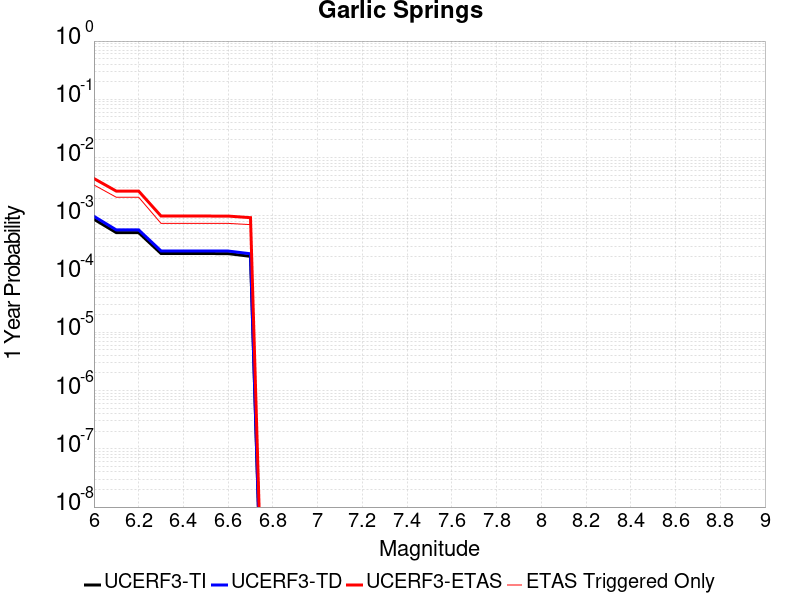 | 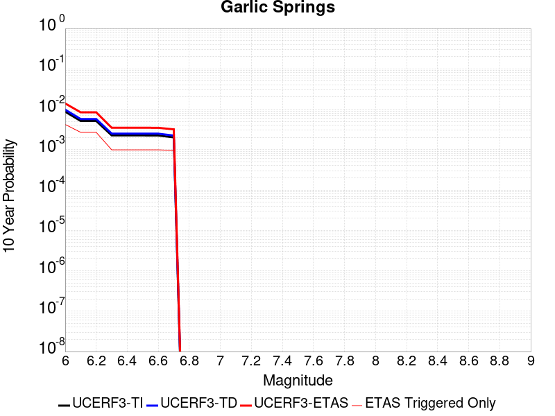 |

| Magnitude | 1 wk TI Prob | 1 wk TD Prob | 1 wk ETAS Prob | 1 wk ETAS/TD Gain | 1 wk ETAS Triggered Only | 1 mo TI Prob | 1 mo TD Prob | 1 mo ETAS Prob | 1 mo ETAS/TD Gain | 1 mo ETAS Triggered Only | 1 yr TI Prob | 1 yr TD Prob | 1 yr ETAS Prob | 1 yr ETAS/TD Gain | 1 yr ETAS Triggered Only | 10 yr TI Prob | 10 yr TD Prob | 10 yr ETAS Prob | 10 yr ETAS/TD Gain | 10 yr ETAS Triggered Only |
|-----|-----|-----|-----|-----|-----|-----|-----|-----|-----|-----|-----|-----|-----|-----|-----|-----|-----|-----|-----|-----|
| 6.0 | 1.6760017E-5 | 1.8776833E-5 | 0.0014784307 | 78.73696 | 0.0014596812 | 7.182667E-5 | 8.0470316E-5 | 0.002013406 | 25.020481 | 0.0019330913 | 8.7413884E-4 | 9.794032E-4 | 0.0045265015 | 4.621694 | 0.003550576 | 0.008707083 | 0.009762413 | 0.0140596405 | 1.4401809 | 0.004339593 |
| 6.1 | 9.852767E-6 | 1.09735865E-5 | 8.7888265E-4 | 80.09074 | 8.679186E-4 | 4.222546E-5 | 4.702921E-5 | 0.0013093968 | 27.842203 | 0.001262427 | 5.139737E-4 | 5.7250116E-4 | 0.0028199118 | 4.9256 | 0.0022486981 | 0.005127866 | 0.005717221 | 0.008541442 | 1.4939849 | 0.0028404607 |
| 6.2 | 9.852767E-6 | 1.09735865E-5 | 8.7888265E-4 | 80.09074 | 8.679186E-4 | 4.222546E-5 | 4.702921E-5 | 0.0013093968 | 27.842203 | 0.001262427 | 5.139737E-4 | 5.7250116E-4 | 0.0028199118 | 4.9256 | 0.0022486981 | 0.005127866 | 0.005717221 | 0.008541442 | 1.4939849 | 0.0028404607 |
| 6.3 | 4.3167724E-6 | 4.7780286E-6 | 5.1763654E-4 | 108.336845 | 5.1286095E-4 | 1.8500323E-5 | 2.0477235E-5 | 5.7277776E-4 | 27.971441 | 5.5231183E-4 | 2.2521814E-4 | 2.4930484E-4 | 0.0010775661 | 4.322283 | 8.284677E-4 | 0.0022499003 | 0.00249251 | 0.0035550278 | 1.4262843 | 0.0010651728 |
| 6.4 | 4.3167724E-6 | 4.7780286E-6 | 5.1763654E-4 | 108.336845 | 5.1286095E-4 | 1.8500323E-5 | 2.0477235E-5 | 5.7277776E-4 | 27.971441 | 5.5231183E-4 | 2.2521814E-4 | 2.4930484E-4 | 0.0010775661 | 4.322283 | 8.284677E-4 | 0.0022499003 | 0.00249251 | 0.0035550278 | 1.4262843 | 0.0010651728 |
| 6.5 | 4.3167724E-6 | 4.7780286E-6 | 5.1763654E-4 | 108.336845 | 5.1286095E-4 | 1.8500323E-5 | 2.0477235E-5 | 5.7277776E-4 | 27.971441 | 5.5231183E-4 | 2.2521814E-4 | 2.4930484E-4 | 0.0010775661 | 4.322283 | 8.284677E-4 | 0.0022499003 | 0.00249251 | 0.0035550278 | 1.4262843 | 0.0010651728 |
| 6.6 | 4.301311E-6 | 4.760897E-6 | 5.176194E-4 | 108.72309 | 5.1286095E-4 | 1.8434059E-5 | 2.0403815E-5 | 5.7270436E-4 | 28.068495 | 5.5231183E-4 | 2.2441156E-4 | 2.4841115E-4 | 0.001076673 | 4.334238 | 8.284677E-4 | 0.0022418506 | 0.002483593 | 0.0035461204 | 1.4278187 | 0.0010651728 |
| 6.7 | 3.8599724E-6 | 4.27106E-6 | 5.1712984E-4 | 121.07764 | 5.1286095E-4 | 1.6542634E-5 | 1.8304541E-5 | 5.7060627E-4 | 31.172932 | 5.5231183E-4 | 2.0138794E-4 | 2.228578E-4 | 0.0010116989 | 4.539661 | 7.890169E-4 | 0.0020120554 | 0.002228578 | 0.003252014 | 1.4592328 | 0.0010257219 |

## San Andreas (San Bernardino N)
*[(top)](#table-of-contents)*

| 1 Week | 1 Month | 1 Year | 10 Year |
|-----|-----|-----|-----|
| 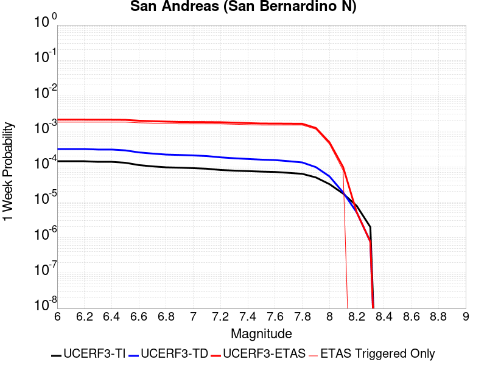 | 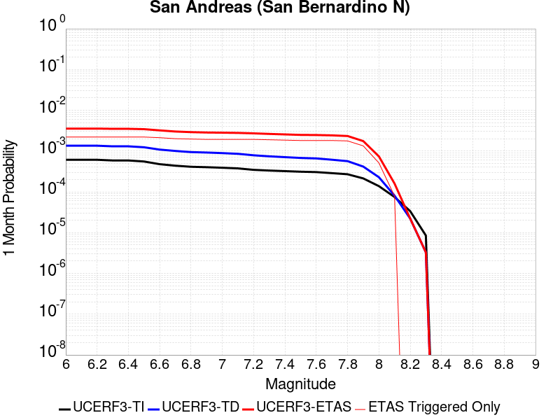 | 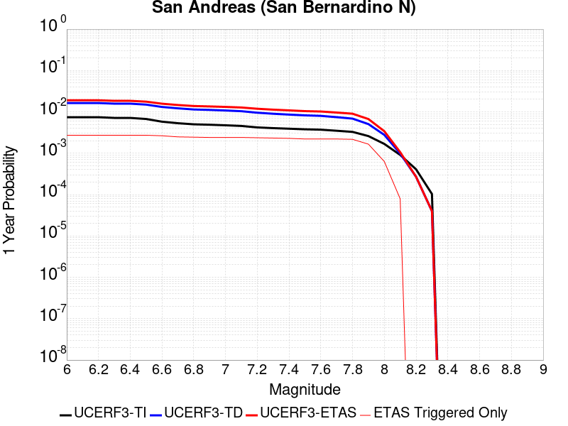 | 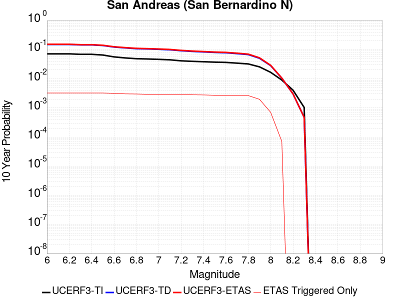 |

| Magnitude | 1 wk TI Prob | 1 wk TD Prob | 1 wk ETAS Prob | 1 wk ETAS/TD Gain | 1 wk ETAS Triggered Only | 1 mo TI Prob | 1 mo TD Prob | 1 mo ETAS Prob | 1 mo ETAS/TD Gain | 1 mo ETAS Triggered Only | 1 yr TI Prob | 1 yr TD Prob | 1 yr ETAS Prob | 1 yr ETAS/TD Gain | 1 yr ETAS Triggered Only | 10 yr TI Prob | 10 yr TD Prob | 10 yr ETAS Prob | 10 yr ETAS/TD Gain | 10 yr ETAS Triggered Only |
|-----|-----|-----|-----|-----|-----|-----|-----|-----|-----|-----|-----|-----|-----|-----|-----|-----|-----|-----|-----|-----|
| 6.0 | 1.4273766E-4 | 3.1606483E-4 | 0.0021302302 | 6.7398515 | 0.0018147388 | 6.115894E-4 | 0.0013538664 | 0.0035601226 | 2.6295967 | 0.0022092473 | 0.0074207084 | 0.016360244 | 0.019037817 | 1.1636635 | 0.0027221083 | 0.07177748 | 0.15026689 | 0.15291518 | 1.0176239 | 0.0031166167 |
| 6.1 | 1.4273766E-4 | 3.1606483E-4 | 0.0021302302 | 6.7398515 | 0.0018147388 | 6.115894E-4 | 0.0013538664 | 0.0035601226 | 2.6295967 | 0.0022092473 | 0.0074207084 | 0.016360244 | 0.019037817 | 1.1636635 | 0.0027221083 | 0.07177748 | 0.15026689 | 0.15291518 | 1.0176239 | 0.0031166167 |
| 6.2 | 1.4273766E-4 | 3.1606483E-4 | 0.0021302302 | 6.7398515 | 0.0018147388 | 6.115894E-4 | 0.0013538664 | 0.0035601226 | 2.6295967 | 0.0022092473 | 0.0074207084 | 0.016360244 | 0.019037817 | 1.1636635 | 0.0027221083 | 0.07177748 | 0.15026689 | 0.15291518 | 1.0176239 | 0.0031166167 |
| 6.3 | 1.3730655E-4 | 3.0511338E-4 | 0.0021192986 | 6.9459376 | 0.0018147388 | 5.883239E-4 | 0.0013069791 | 0.003513339 | 2.688137 | 0.0022092473 | 0.0071393442 | 0.015797773 | 0.018476877 | 1.1695875 | 0.0027221083 | 0.06914291 | 0.14556676 | 0.1482297 | 1.0182936 | 0.0031166167 |
| 6.4 | 1.3730655E-4 | 3.0511338E-4 | 0.0021192986 | 6.9459376 | 0.0018147388 | 5.883239E-4 | 0.0013069791 | 0.003513339 | 2.688137 | 0.0022092473 | 0.0071393442 | 0.015797773 | 0.018476877 | 1.1695875 | 0.0027221083 | 0.06914291 | 0.14556676 | 0.1482297 | 1.0182936 | 0.0031166167 |
| 6.5 | 1.2942807E-4 | 2.8925808E-4 | 0.002103472 | 7.271956 | 0.0018147388 | 5.545738E-4 | 0.0012390936 | 0.0034456034 | 2.780745 | 0.0022092473 | 0.0067310524 | 0.01498286 | 0.017664183 | 1.1789594 | 0.0027221083 | 0.06530788 | 0.13870941 | 0.14139374 | 1.0193521 | 0.0031166167 |
| 6.6 | 1.1125901E-4 | 2.536472E-4 | 0.001989044 | 7.8417745 | 0.0017358372 | 4.767372E-4 | 0.0010866089 | 0.0032146396 | 2.9584148 | 0.0021303457 | 0.005788839 | 0.013149847 | 0.015758296 | 1.1983634 | 0.0026432066 | 0.056403454 | 0.122999296 | 0.12566337 | 1.0216593 | 0.003037715 |
| 6.7 | 1.02209575E-4 | 2.3499702E-4 | 0.0019309847 | 8.21706 | 0.0016963863 | 4.3796748E-4 | 0.0010067427 | 0.0030167103 | 2.9965055 | 0.002011993 | 0.0053192247 | 0.012188629 | 0.014643739 | 1.2014263 | 0.002485403 | 0.051936906 | 0.114790924 | 0.117340244 | 1.0222085 | 0.0028799116 |
| 6.8 | 9.610582E-5 | 2.2025521E-4 | 0.0018768257 | 8.521141 | 0.0016569354 | 4.1181705E-4 | 9.436101E-4 | 0.002914291 | 3.0884483 | 0.0019725421 | 0.0050023515 | 0.011428202 | 0.013846201 | 1.2115818 | 0.0024459523 | 0.048912346 | 0.1081929 | 0.11072604 | 1.0234132 | 0.0028404607 |
| 6.9 | 9.3877505E-5 | 2.1481077E-4 | 0.001831948 | 8.528193 | 0.0016174846 | 4.0227012E-4 | 9.2029345E-4 | 0.0028516059 | 3.0985832 | 0.0019330913 | 0.0048866454 | 0.011147255 | 0.013526931 | 1.2134764 | 0.0024065014 | 0.04780577 | 0.10578323 | 0.10828794 | 1.0236777 | 0.00280101 |
| 7.0 | 9.1019785E-5 | 2.0808022E-4 | 0.0018252282 | 8.771752 | 0.0016174846 | 3.900265E-4 | 8.914682E-4 | 0.0028228364 | 3.1665025 | 0.0019330913 | 0.0047382377 | 0.010799837 | 0.013180349 | 1.2204211 | 0.0024065014 | 0.046384744 | 0.102753714 | 0.105266914 | 1.0244584 | 0.00280101 |
| 7.1 | 8.771155E-5 | 1.9982594E-4 | 0.0018169873 | 9.09285 | 0.0016174846 | 3.758525E-4 | 8.5611636E-4 | 0.0027875528 | 3.2560441 | 0.0019330913 | 0.0045664064 | 0.0103736 | 0.012755137 | 1.2295768 | 0.0024065014 | 0.044737056 | 0.09906527 | 0.10155325 | 1.0251147 | 0.002761559 |
| 7.2 | 8.0830236E-5 | 1.8388197E-4 | 0.0018010691 | 9.794702 | 0.0016174846 | 3.4636928E-4 | 7.8782777E-4 | 0.0027193963 | 3.4517648 | 0.0019330913 | 0.0042088944 | 0.009549725 | 0.01189417 | 1.2454988 | 0.0023670506 | 0.041300658 | 0.09179615 | 0.09426838 | 1.0269318 | 0.0027221083 |
| 7.3 | 7.7668235E-5 | 1.7331762E-4 | 0.001751078 | 10.103289 | 0.0015780338 | 3.328214E-4 | 7.425784E-4 | 0.0026348128 | 3.5481946 | 0.0018936405 | 0.0040445733 | 0.009003494 | 0.011310137 | 1.2561942 | 0.0023275998 | 0.03971748 | 0.08706327 | 0.08951236 | 1.02813 | 0.0026826574 |
| 7.4 | 7.520177E-5 | 1.6551897E-4 | 0.0017038472 | 10.293969 | 0.001538583 | 3.2225347E-4 | 7.0917426E-4 | 0.002562049 | 3.6127214 | 0.0018541897 | 0.0039163795 | 0.008600081 | 0.010868552 | 1.2637732 | 0.002288149 | 0.038480744 | 0.08351955 | 0.085942 | 1.0290046 | 0.0026432066 |
| 7.5 | 7.274697E-5 | 1.5839566E-4 | 0.0016572903 | 10.462978 | 0.0014991321 | 3.1173544E-4 | 6.78662E-4 | 0.0024921692 | 3.6721804 | 0.0018147388 | 0.003788775 | 0.008231463 | 0.010422525 | 1.2661813 | 0.0022092473 | 0.03724827 | 0.08023631 | 0.082594864 | 1.0293951 | 0.002564305 |
| 7.6 | 7.1185845E-5 | 1.540943E-4 | 0.0016529954 | 10.727167 | 0.0014991321 | 3.0504653E-4 | 6.6023704E-4 | 0.0024737779 | 3.7468023 | 0.0018147388 | 0.0037076178 | 0.008008812 | 0.010200365 | 1.2736428 | 0.0022092473 | 0.036463667 | 0.07822598 | 0.08058969 | 1.0302165 | 0.002564305 |
| 7.7 | 6.709961E-5 | 1.4318313E-4 | 0.0016421005 | 11.4685335 | 0.0014991321 | 2.8753807E-4 | 6.1349774E-4 | 0.0024271233 | 3.9562058 | 0.0018147388 | 0.003495157 | 0.0074437927 | 0.009636595 | 1.2945813 | 0.0022092473 | 0.034406938 | 0.07305469 | 0.07543167 | 1.0325369 | 0.002564305 |
| 7.8 | 6.300812E-5 | 1.3202413E-4 | 0.0016309583 | 12.353487 | 0.0014991321 | 2.7000686E-4 | 5.65695E-4 | 0.0023399787 | 4.136467 | 0.001775288 | 0.0032823787 | 0.006865616 | 0.009020516 | 1.3138683 | 0.0021697965 | 0.032343175 | 0.06771354 | 0.07006743 | 1.0347624 | 0.002524854 |
| 7.9 | 4.983037E-5 | 9.723488E-5 | 0.0012411982 | 12.764947 | 0.0011440745 | 2.1354125E-4 | 4.1665437E-4 | 0.0017574242 | 4.2179427 | 0.0013413287 | 0.0025967648 | 0.0050609782 | 0.006709528 | 1.3257374 | 0.0016569354 | 0.025666296 | 0.05064886 | 0.05240914 | 1.0347545 | 0.0018541897 |
| 8.0 | 3.2211527E-5 | 5.3304586E-5 | 4.8724073E-4 | 9.140691 | 4.339593E-4 | 1.380421E-4 | 2.2842824E-4 | 7.4117206E-4 | 3.2446604 | 5.1286095E-4 | 0.0016793669 | 0.0027775685 | 0.003407029 | 1.2266227 | 6.312135E-4 | 0.016667323 | 0.028361378 | 0.029013023 | 1.0229764 | 6.7066436E-4 |
| 8.1 | 1.743376E-5 | 1.8824427E-5 | 9.772463E-5 | 5.191374 | 7.8901685E-5 | 7.471398E-5 | 8.067362E-5 | 1.5956894E-4 | 1.9779569 | 7.8901685E-5 | 9.0926304E-4 | 9.817594E-4 | 0.0010605836 | 1.0802888 | 7.8901685E-5 | 0.009055517 | 0.010484105 | 0.01056218 | 1.0074469 | 7.8901685E-5 |
| 8.2 | 7.831616E-6 | 5.1551065E-6 | 5.1551065E-6 | 1.0 | 0.0 | 3.3563636E-5 | 2.2093127E-5 | 2.2093127E-5 | 1.0 | 0.0 | 4.0856065E-4 | 2.6895068E-4 | 2.6895068E-4 | 1.0 | 0.0 | 0.004078103 | 0.0030418145 | 0.0030418145 | 1.0 | 0.0 |
| 8.3 | 1.983087E-6 | 7.6599065E-7 | 7.6599065E-7 | 1.0 | 0.0 | 8.498917E-6 | 3.282813E-6 | 3.282813E-6 | 1.0 | 0.0 | 1.034694E-4 | 3.9967534E-5 | 3.9967534E-5 | 1.0 | 0.0 | 0.0010342124 | 4.719687E-4 | 4.719687E-4 | 1.0 | 0.0 |

## Coyote Lake
*[(top)](#table-of-contents)*

| 1 Week | 1 Month | 1 Year | 10 Year |
|-----|-----|-----|-----|
| 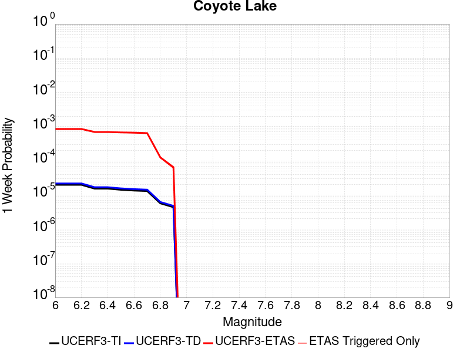 | 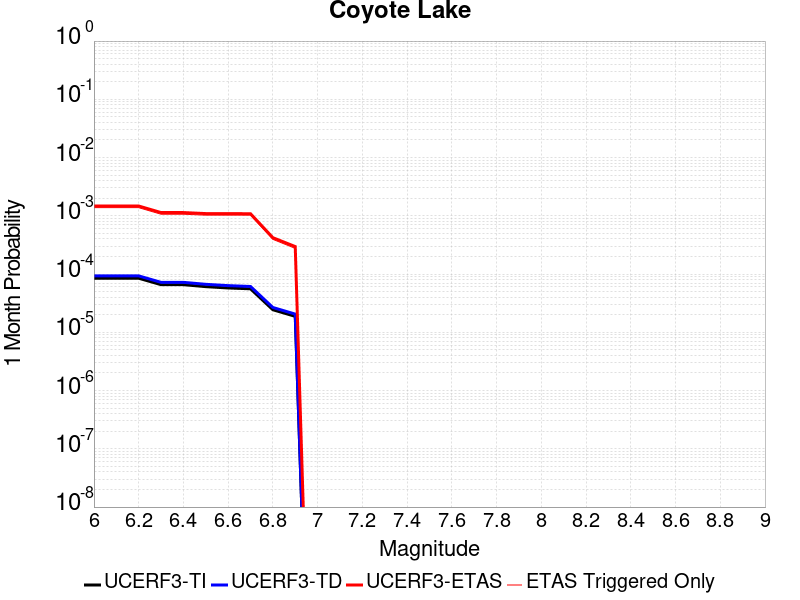 | 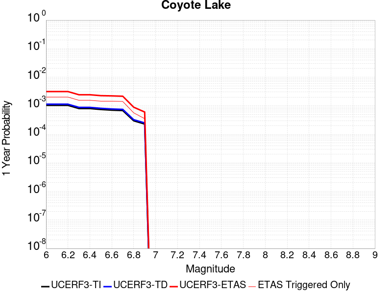 | 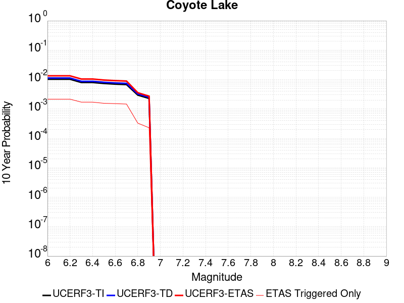 |

| Magnitude | 1 wk TI Prob | 1 wk TD Prob | 1 wk ETAS Prob | 1 wk ETAS/TD Gain | 1 wk ETAS Triggered Only | 1 mo TI Prob | 1 mo TD Prob | 1 mo ETAS Prob | 1 mo ETAS/TD Gain | 1 mo ETAS Triggered Only | 1 yr TI Prob | 1 yr TD Prob | 1 yr ETAS Prob | 1 yr ETAS/TD Gain | 1 yr ETAS Triggered Only | 10 yr TI Prob | 10 yr TD Prob | 10 yr ETAS Prob | 10 yr ETAS/TD Gain | 10 yr ETAS Triggered Only |
|-----|-----|-----|-----|-----|-----|-----|-----|-----|-----|-----|-----|-----|-----|-----|-----|-----|-----|-----|-----|-----|
| 6.0 | 1.980352E-5 | 2.1706745E-5 | 0.0010868565 | 50.06999 | 0.0010651728 | 8.486947E-5 | 9.302599E-5 | 0.0014736771 | 15.841562 | 0.0013807795 | 0.0010327959 | 0.0011320751 | 0.0032206029 | 2.8448668 | 0.0020908948 | 0.010280091 | 0.011270258 | 0.013766657 | 1.2215033 | 0.002524854 |
| 6.1 | 1.980352E-5 | 2.1706745E-5 | 0.0010868565 | 50.06999 | 0.0010651728 | 8.486947E-5 | 9.302599E-5 | 0.0014736771 | 15.841562 | 0.0013807795 | 0.0010327959 | 0.0011320751 | 0.0032206029 | 2.8448668 | 0.0020908948 | 0.010280091 | 0.011270258 | 0.013766657 | 1.2215033 | 0.002524854 |
| 6.2 | 1.980352E-5 | 2.1706745E-5 | 0.0010868565 | 50.06999 | 0.0010651728 | 8.486947E-5 | 9.302599E-5 | 0.0014736771 | 15.841562 | 0.0013807795 | 0.0010327959 | 0.0011320751 | 0.0032206029 | 2.8448668 | 0.0020908948 | 0.010280091 | 0.011270258 | 0.013766657 | 1.2215033 | 0.002524854 |
| 6.3 | 1.5344787E-5 | 1.682067E-5 | 9.2417485E-4 | 54.94281 | 9.073694E-4 | 6.576172E-5 | 7.2086936E-5 | 0.0011371829 | 15.77516 | 0.0010651728 | 8.003548E-4 | 8.773662E-4 | 0.0024934318 | 2.841951 | 0.0016174846 | 0.007974784 | 0.00874507 | 0.010700362 | 1.223588 | 0.0019725421 |
| 6.4 | 1.5344787E-5 | 1.682067E-5 | 9.2417485E-4 | 54.94281 | 9.073694E-4 | 6.576172E-5 | 7.2086936E-5 | 0.0011371829 | 15.77516 | 0.0010651728 | 8.003548E-4 | 8.773662E-4 | 0.0024934318 | 2.841951 | 0.0016174846 | 0.007974784 | 0.00874507 | 0.010700362 | 1.223588 | 0.0019725421 |
| 6.5 | 1.4189697E-5 | 1.5557987E-5 | 8.834631E-4 | 56.78518 | 8.679186E-4 | 6.081157E-5 | 6.6675726E-5 | 0.0010923293 | 16.382713 | 0.0010257219 | 7.401293E-4 | 8.115349E-4 | 0.0023094504 | 2.8457808 | 0.0014991321 | 0.0073766913 | 0.008091656 | 0.00989171 | 1.2224581 | 0.0018147388 |
| 6.6 | 1.3469301E-5 | 1.4771577E-5 | 8.826773E-4 | 59.755116 | 8.679186E-4 | 5.7724297E-5 | 6.330556E-5 | 0.0010889625 | 17.201689 | 0.0010257219 | 7.025667E-4 | 7.7053264E-4 | 0.0022685097 | 2.9440799 | 0.0014991321 | 0.0070034964 | 0.0076845144 | 0.009485308 | 1.2343405 | 0.0018147388 |
| 6.7 | 1.3027966E-5 | 1.4281745E-5 | 8.821879E-4 | 61.770317 | 8.679186E-4 | 5.5832945E-5 | 6.120638E-5 | 0.0010868656 | 17.75739 | 0.0010257219 | 6.7955407E-4 | 7.4499263E-4 | 0.0022035865 | 2.9578633 | 0.0014596812 | 0.006774798 | 0.0074308286 | 0.009192925 | 1.2371331 | 0.001775288 |
| 6.8 | 5.695434E-6 | 6.2244176E-6 | 2.823786E-4 | 45.36627 | 2.7615592E-4 | 2.4408775E-5 | 2.6675973E-5 | 4.211739E-4 | 15.788511 | 3.9450845E-4 | 2.971363E-4 | 3.2476155E-4 | 8.3745597E-4 | 2.5786796 | 5.1286095E-4 | 0.0029673933 | 0.0032458105 | 0.0037570067 | 1.1574942 | 5.1286095E-4 |
| 6.9 | 4.385688E-6 | 4.7930553E-6 | 2.0204633E-4 | 42.153973 | 1.9725422E-4 | 1.879567E-5 | 2.0541665E-5 | 2.966919E-4 | 14.443419 | 2.7615592E-4 | 2.2881327E-4 | 2.5009477E-4 | 6.050636E-4 | 2.419337 | 3.550576E-4 | 0.002285778 | 0.0025009478 | 0.0028551174 | 1.1416142 | 3.550576E-4 |

## Death Valley (Black Mtns Frontal)
*[(top)](#table-of-contents)*

| 1 Week | 1 Month | 1 Year | 10 Year |
|-----|-----|-----|-----|
| 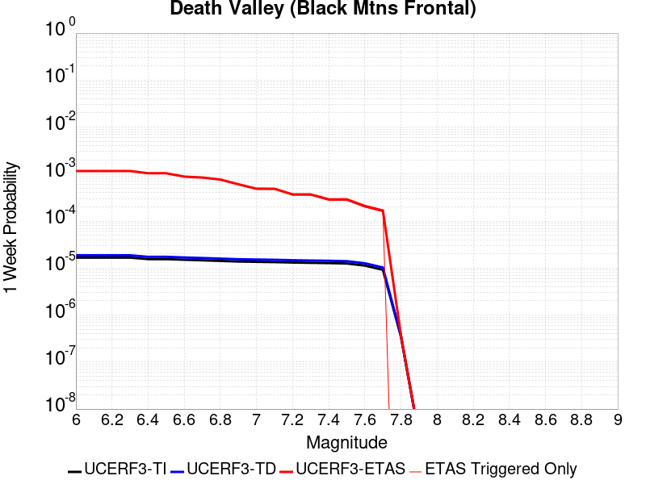 | 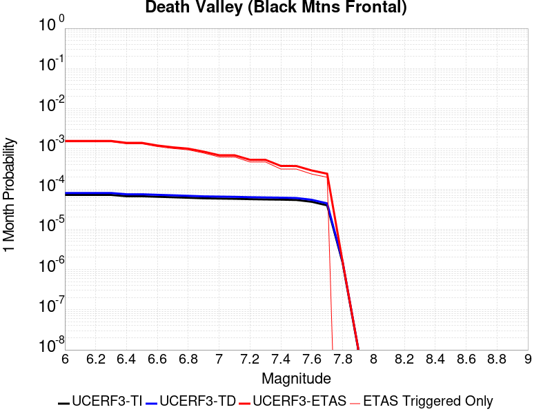 | 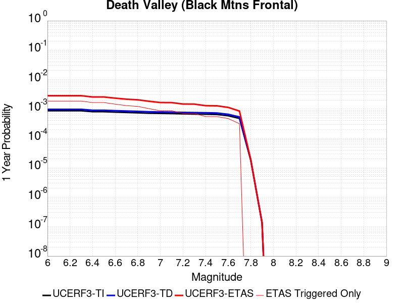 | 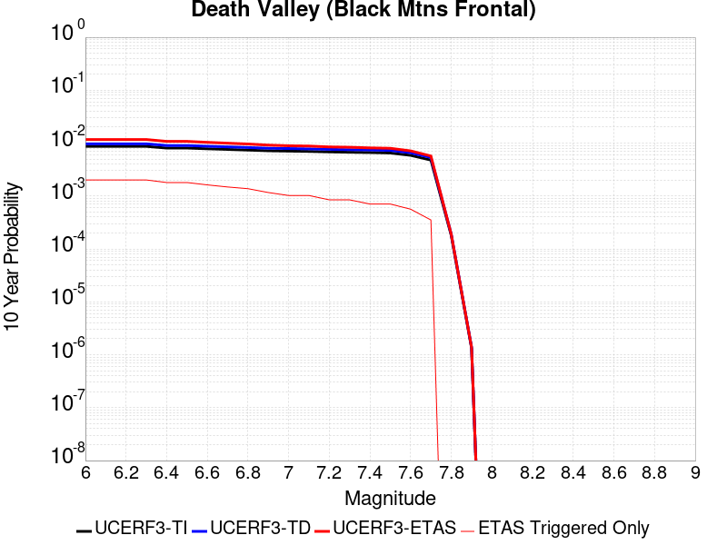 |

| Magnitude | 1 wk TI Prob | 1 wk TD Prob | 1 wk ETAS Prob | 1 wk ETAS/TD Gain | 1 wk ETAS Triggered Only | 1 mo TI Prob | 1 mo TD Prob | 1 mo ETAS Prob | 1 mo ETAS/TD Gain | 1 mo ETAS Triggered Only | 1 yr TI Prob | 1 yr TD Prob | 1 yr ETAS Prob | 1 yr ETAS/TD Gain | 1 yr ETAS Triggered Only | 10 yr TI Prob | 10 yr TD Prob | 10 yr ETAS Prob | 10 yr ETAS/TD Gain | 10 yr ETAS Triggered Only |
|-----|-----|-----|-----|-----|-----|-----|-----|-----|-----|-----|-----|-----|-----|-----|-----|-----|-----|-----|-----|-----|
| 6.0 | 1.6707214E-5 | 1.867027E-5 | 0.0011627234 | 62.276737 | 0.0011440745 | 7.160038E-5 | 8.001302E-5 | 0.0015790252 | 19.734602 | 0.0014991321 | 8.71386E-4 | 9.737309E-4 | 0.0028261151 | 2.9023576 | 0.0018541897 | 0.00867977 | 0.009695496 | 0.011687983 | 1.2055063 | 0.002011993 |
| 6.1 | 1.6707214E-5 | 1.867027E-5 | 0.0011627234 | 62.276737 | 0.0011440745 | 7.160038E-5 | 8.001302E-5 | 0.0015790252 | 19.734602 | 0.0014991321 | 8.71386E-4 | 9.737309E-4 | 0.0028261151 | 2.9023576 | 0.0018541897 | 0.00867977 | 0.009695496 | 0.011687983 | 1.2055063 | 0.002011993 |
| 6.2 | 1.6707214E-5 | 1.867027E-5 | 0.0011627234 | 62.276737 | 0.0011440745 | 7.160038E-5 | 8.001302E-5 | 0.0015790252 | 19.734602 | 0.0014991321 | 8.71386E-4 | 9.737309E-4 | 0.0028261151 | 2.9023576 | 0.0018541897 | 0.00867977 | 0.009695496 | 0.011687983 | 1.2055063 | 0.002011993 |
| 6.3 | 1.6707214E-5 | 1.867027E-5 | 0.0011627234 | 62.276737 | 0.0011440745 | 7.160038E-5 | 8.001302E-5 | 0.0015790252 | 19.734602 | 0.0014991321 | 8.71386E-4 | 9.737309E-4 | 0.0028261151 | 2.9023576 | 0.0018541897 | 0.00867977 | 0.009695496 | 0.011687983 | 1.2055063 | 0.002011993 |
| 6.4 | 1.5515609E-5 | 1.7338214E-5 | 0.0010430424 | 60.158585 | 0.0010257219 | 6.649377E-5 | 7.4304546E-5 | 0.0014155336 | 19.05043 | 0.0013413287 | 8.0926094E-4 | 9.042885E-4 | 0.0025597257 | 2.8306515 | 0.0016569354 | 0.008063202 | 0.009006773 | 0.010766071 | 1.1953306 | 0.001775288 |
| 6.5 | 1.5515609E-5 | 1.7338214E-5 | 0.0010430424 | 60.158585 | 0.0010257219 | 6.649377E-5 | 7.4304546E-5 | 0.0014155336 | 19.05043 | 0.0013413287 | 8.0926094E-4 | 9.042885E-4 | 0.0025597257 | 2.8306515 | 0.0016569354 | 0.008063202 | 0.009006773 | 0.010766071 | 1.1953306 | 0.001775288 |
| 6.6 | 1.5041828E-5 | 1.6809145E-5 | 8.8471314E-4 | 52.632847 | 8.679186E-4 | 6.4463384E-5 | 7.203723E-5 | 0.0012160293 | 16.880566 | 0.0011440745 | 7.8455906E-4 | 8.767063E-4 | 0.002335108 | 2.6635005 | 0.0014596812 | 0.00781795 | 0.008733132 | 0.010297385 | 1.179117 | 0.0015780338 |
| 6.7 | 1.4634985E-5 | 1.6356016E-5 | 8.448102E-4 | 51.65134 | 8.284677E-4 | 6.271985E-5 | 7.009536E-5 | 0.0010957454 | 15.63221 | 0.0010257219 | 7.6334673E-4 | 8.5308263E-4 | 0.00215385 | 2.5247846 | 0.0013018779 | 0.007607299 | 0.008498715 | 0.009906876 | 1.1656909 | 0.0014202304 |
| 6.8 | 1.4209158E-5 | 1.5882048E-5 | 7.654362E-4 | 48.195057 | 7.4956607E-4 | 6.089497E-5 | 6.8064175E-5 | 0.00101482 | 14.909753 | 9.4682025E-4 | 7.4114406E-4 | 8.2837185E-4 | 0.002050335 | 2.4751384 | 0.0012229761 | 0.007386771 | 0.008253456 | 0.009583714 | 1.1611758 | 0.0013413287 |
| 6.9 | 1.3780098E-5 | 1.5404594E-5 | 6.071581E-4 | 39.414097 | 5.9176265E-4 | 5.9056227E-5 | 6.6018045E-5 | 8.549828E-4 | 12.950745 | 7.890169E-4 | 7.1877235E-4 | 8.0347876E-4 | 0.0018283766 | 2.2755754 | 0.0010257219 | 0.0071645193 | 0.008006332 | 0.009102113 | 1.1368641 | 0.0011046237 |
| 7.0 | 1.3585064E-5 | 1.5188155E-5 | 4.885911E-4 | 32.16922 | 4.7341012E-4 | 5.8220405E-5 | 6.50905E-5 | 6.962629E-4 | 10.696844 | 6.312135E-4 | 7.086029E-4 | 7.9219416E-4 | 0.0016594252 | 2.0947204 | 8.679186E-4 | 0.007063476 | 0.007894293 | 0.008833639 | 1.1189904 | 9.4682025E-4 |
| 7.1 | 1.3398601E-5 | 1.49813395E-5 | 4.883844E-4 | 32.599514 | 4.7341012E-4 | 5.742131E-5 | 6.420419E-5 | 6.953772E-4 | 10.830713 | 6.312135E-4 | 6.9888023E-4 | 7.8141113E-4 | 0.0016486516 | 2.1098387 | 8.679186E-4 | 0.0069668638 | 0.007787224 | 0.008726671 | 1.1206396 | 9.4682025E-4 |
| 7.2 | 1.3126312E-5 | 1.4679561E-5 | 3.6973195E-4 | 25.186853 | 3.550576E-4 | 5.6254412E-5 | 6.291092E-5 | 5.362913E-4 | 8.524613 | 4.7341012E-4 | 6.846822E-4 | 7.6567667E-4 | 0.0014752481 | 1.9267247 | 7.101152E-4 | 0.006825765 | 0.00763097 | 0.008413966 | 1.1026076 | 7.890169E-4 |
| 7.3 | 1.2922429E-5 | 1.4453788E-5 | 3.6950625E-4 | 25.564665 | 3.550576E-4 | 5.5380664E-5 | 6.194336E-5 | 5.3532416E-4 | 8.642155 | 4.7341012E-4 | 6.74051E-4 | 7.53905E-4 | 0.0014634848 | 1.941206 | 7.101152E-4 | 0.006720101 | 0.007514055 | 0.008297143 | 1.1042165 | 7.890169E-4 |
| 7.4 | 1.2768878E-5 | 1.4283772E-5 | 2.9043574E-4 | 20.333267 | 2.7615592E-4 | 5.4722615E-5 | 6.1214756E-5 | 3.768022E-4 | 6.155414 | 3.1560674E-4 | 6.660441E-4 | 7.4504025E-4 | 0.0012969406 | 1.7407658 | 5.5231183E-4 | 0.0066405144 | 0.0074260035 | 0.00805253 | 1.0843692 | 6.312135E-4 |
| 7.5 | 1.2521929E-5 | 1.40120155E-5 | 2.9016405E-4 | 20.708231 | 2.7615592E-4 | 5.366431E-5 | 6.005014E-5 | 3.7563793E-4 | 6.255405 | 3.1560674E-4 | 6.531671E-4 | 7.3087064E-4 | 0.0012827788 | 1.7551379 | 5.5231183E-4 | 0.006512506 | 0.0072852457 | 0.007911861 | 1.0860115 | 6.312135E-4 |
| 7.6 | 1.1301089E-5 | 1.2648149E-5 | 2.0989988E-4 | 16.595304 | 1.9725422E-4 | 4.8432343E-5 | 5.4205255E-5 | 2.908975E-4 | 5.366592 | 2.3670506E-4 | 5.895042E-4 | 6.5975444E-4 | 0.0011328523 | 1.7170817 | 4.7341012E-4 | 0.0058794282 | 0.00657851 | 0.0070879976 | 1.0774472 | 5.1286095E-4 |
| 7.7 | 9.189108E-6 | 1.0283358E-5 | 1.6808511E-4 | 16.345352 | 1.5780337E-4 | 3.93813E-5 | 4.407082E-5 | 2.4131635E-4 | 5.4756494 | 1.9725422E-4 | 4.7936183E-4 | 5.3643517E-4 | 8.518726E-4 | 1.5880253 | 3.1560674E-4 | 0.004783291 | 0.005351914 | 0.0056658317 | 1.0586553 | 3.1560674E-4 |
| 7.8 | 3.4586725E-7 | 3.6482615E-7 | 3.6482615E-7 | 1.0 | 0.0 | 1.4822873E-6 | 1.5635396E-6 | 1.5635396E-6 | 1.0 | 0.0 | 1.80467E-5 | 1.9035933E-5 | 1.9035933E-5 | 1.0 | 0.0 | 1.8045233E-4 | 1.9034347E-4 | 1.9034347E-4 | 1.0 | 0.0 |
| 7.9 | 2.5591178E-9 | 2.6696718E-9 | 2.6696718E-9 | 1.0 | 0.0 | 1.0967647E-8 | 1.14414505E-8 | 1.14414505E-8 | 1.0 | 0.0 | 1.335311E-7 | 1.3929966E-7 | 1.3929966E-7 | 1.0 | 0.0 | 1.3353102E-6 | 1.3929966E-6 | 1.3929966E-6 | 1.0 | 0.0 |

## Helendale-So Lockhart
*[(top)](#table-of-contents)*

| 1 Week | 1 Month | 1 Year | 10 Year |
|-----|-----|-----|-----|
| 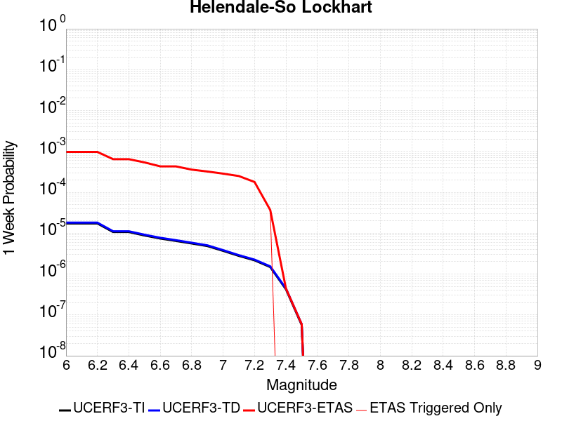 | 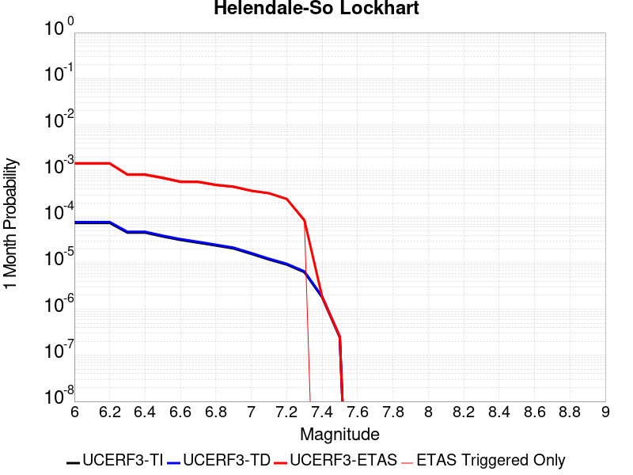 | 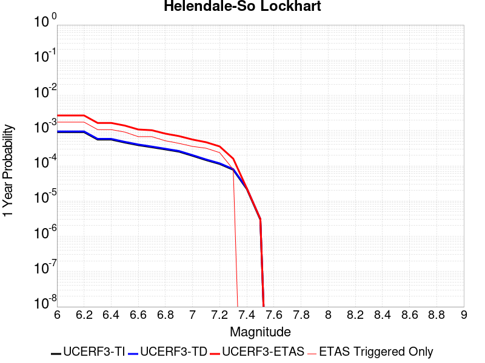 | 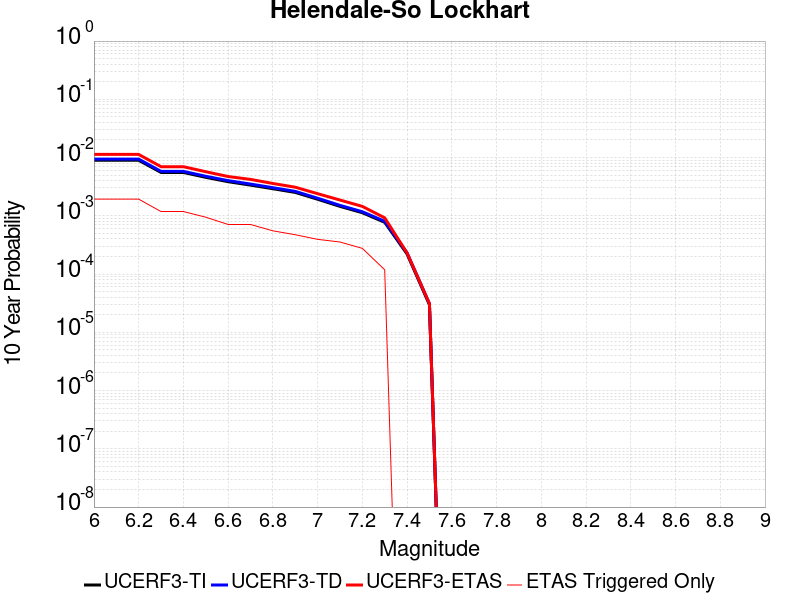 |

| Magnitude | 1 wk TI Prob | 1 wk TD Prob | 1 wk ETAS Prob | 1 wk ETAS/TD Gain | 1 wk ETAS Triggered Only | 1 mo TI Prob | 1 mo TD Prob | 1 mo ETAS Prob | 1 mo ETAS/TD Gain | 1 mo ETAS Triggered Only | 1 yr TI Prob | 1 yr TD Prob | 1 yr ETAS Prob | 1 yr ETAS/TD Gain | 1 yr ETAS Triggered Only | 10 yr TI Prob | 10 yr TD Prob | 10 yr ETAS Prob | 10 yr ETAS/TD Gain | 10 yr ETAS Triggered Only |
|-----|-----|-----|-----|-----|-----|-----|-----|-----|-----|-----|-----|-----|-----|-----|-----|-----|-----|-----|-----|-----|
| 6.0 | 1.7296055E-5 | 1.8103729E-5 | 0.0010832573 | 59.836136 | 0.0010651728 | 7.412385E-5 | 7.7585224E-5 | 0.0014582577 | 18.795559 | 0.0013807795 | 9.0208417E-4 | 9.4421144E-4 | 0.0026784097 | 2.836663 | 0.0017358372 | 0.008984311 | 0.009404116 | 0.011319029 | 1.203625 | 0.0019330913 |
| 6.1 | 1.7296055E-5 | 1.8103729E-5 | 0.0010832573 | 59.836136 | 0.0010651728 | 7.412385E-5 | 7.7585224E-5 | 0.0014582577 | 18.795559 | 0.0013807795 | 9.0208417E-4 | 9.4421144E-4 | 0.0026784097 | 2.836663 | 0.0017358372 | 0.008984311 | 0.009404116 | 0.011319029 | 1.203625 | 0.0019330913 |
| 6.2 | 1.7296055E-5 | 1.8103729E-5 | 0.0010832573 | 59.836136 | 0.0010651728 | 7.412385E-5 | 7.7585224E-5 | 0.0014582577 | 18.795559 | 0.0013807795 | 9.0208417E-4 | 9.4421144E-4 | 0.0026784097 | 2.836663 | 0.0017358372 | 0.008984311 | 0.009404116 | 0.011319029 | 1.203625 | 0.0019330913 |
| 6.3 | 1.0669118E-5 | 1.1135425E-5 | 7.212427E-4 | 64.77011 | 7.101152E-4 | 4.5723988E-5 | 4.772239E-5 | 8.367016E-4 | 17.532684 | 7.890169E-4 | 5.5654737E-4 | 5.80868E-4 | 0.0016454221 | 2.8326952 | 0.0010651728 | 0.0055515557 | 0.0057937936 | 0.006970462 | 1.2030911 | 0.0011835253 |
| 6.4 | 1.0669118E-5 | 1.1135425E-5 | 7.212427E-4 | 64.77011 | 7.101152E-4 | 4.5723988E-5 | 4.772239E-5 | 8.367016E-4 | 17.532684 | 7.890169E-4 | 5.5654737E-4 | 5.80868E-4 | 0.0016454221 | 2.8326952 | 0.0010651728 | 0.0055515557 | 0.0057937936 | 0.006970462 | 1.2030911 | 0.0011835253 |
| 6.5 | 8.790038E-6 | 9.170197E-6 | 6.0092745E-4 | 65.53049 | 5.9176265E-4 | 3.767105E-5 | 3.930026E-5 | 7.0993823E-4 | 18.064466 | 6.7066436E-4 | 4.585485E-4 | 4.7837716E-4 | 0.0013853125 | 2.8958583 | 9.073694E-4 | 0.0045760344 | 0.004773638 | 0.0057159388 | 1.1973968 | 9.4682025E-4 |
| 6.6 | 7.396949E-6 | 7.715537E-6 | 4.8112203E-4 | 62.357555 | 4.7341012E-4 | 3.1700827E-5 | 3.3066175E-5 | 5.8535975E-4 | 17.702675 | 5.5231183E-4 | 3.858892E-4 | 4.025073E-4 | 0.0010729018 | 2.665546 | 6.7066436E-4 | 0.003852198 | 0.00401789 | 0.0047251517 | 1.1760283 | 7.101152E-4 |
| 6.7 | 6.4600285E-6 | 6.738031E-6 | 4.8014498E-4 | 71.25894 | 4.7341012E-4 | 2.7685543E-5 | 2.887696E-5 | 5.811728E-4 | 20.125832 | 5.5231183E-4 | 3.3701936E-4 | 3.5152107E-4 | 0.0010219497 | 2.9072218 | 6.7066436E-4 | 0.0033650869 | 0.003509732 | 0.004217355 | 1.2016174 | 7.101152E-4 |
| 6.8 | 5.600104E-6 | 5.836009E-6 | 4.0034216E-4 | 68.59861 | 3.9450845E-4 | 2.4000226E-5 | 2.5011232E-5 | 4.984095E-4 | 19.927427 | 4.7341012E-4 | 2.9216358E-4 | 3.044698E-4 | 8.171746E-4 | 2.6839268 | 5.1286095E-4 | 0.0029177975 | 0.003040588 | 0.0035912206 | 1.181094 | 5.5231183E-4 |
| 6.9 | 4.839122E-6 | 5.0395092E-6 | 3.6009532E-4 | 71.454445 | 3.550576E-4 | 2.0738931E-5 | 2.159772E-5 | 4.5554765E-4 | 21.092394 | 4.339593E-4 | 2.5246723E-4 | 2.6292098E-4 | 6.967662E-4 | 2.6500971 | 4.339593E-4 | 0.002521806 | 0.002626147 | 0.0030983137 | 1.1797945 | 4.7341012E-4 |
| 7.0 | 3.6937633E-6 | 3.845208E-6 | 3.1945074E-4 | 83.07762 | 3.1560674E-4 | 1.5830317E-5 | 1.647936E-5 | 3.7153112E-4 | 22.545238 | 3.550576E-4 | 1.9271708E-4 | 2.0061806E-4 | 5.556044E-4 | 2.7694638 | 3.550576E-4 | 0.0019255003 | 0.002004401 | 0.0023981186 | 1.1964266 | 3.9450845E-4 |
| 7.1 | 2.7858857E-6 | 2.8978538E-6 | 2.7905297E-4 | 96.296425 | 2.7615592E-4 | 1.1939455E-5 | 1.2419316E-5 | 3.2802214E-4 | 26.412256 | 3.1560674E-4 | 1.4535317E-4 | 1.511949E-4 | 4.6675393E-4 | 3.0871012 | 3.1560674E-4 | 0.0014525814 | 0.0015109418 | 0.0018654629 | 1.2346358 | 3.550576E-4 |
| 7.2 | 2.1672065E-6 | 2.2540128E-6 | 1.9950779E-4 | 88.51227 | 1.9725422E-4 | 9.2879945E-6 | 9.66002E-6 | 2.463628E-4 | 25.503342 | 2.3670506E-4 | 1.1307546E-4 | 1.1760458E-4 | 3.542818E-4 | 3.0124831 | 2.3670506E-4 | 0.0011301794 | 0.0011754417 | 0.001451273 | 1.2346618 | 2.7615592E-4 |
| 7.3 | 1.4823496E-6 | 1.5422102E-6 | 4.0992993E-5 | 26.580679 | 3.9450842E-5 | 6.3529114E-6 | 6.6094562E-6 | 8.551063E-5 | 12.937618 | 7.8901685E-5 | 7.734395E-5 | 8.046731E-5 | 1.5936265E-4 | 1.9804645 | 7.8901685E-5 | 7.731704E-4 | 8.0439687E-4 | 9.2265423E-4 | 1.1470137 | 1.1835253E-4 |
| 7.4 | 4.2321457E-7 | 4.4108765E-7 | 4.4108765E-7 | 1.0 | 0.0 | 1.8137755E-6 | 1.8903745E-6 | 1.8903745E-6 | 1.0 | 0.0 | 2.2082493E-5 | 2.3015113E-5 | 2.3015113E-5 | 1.0 | 0.0 | 2.2080299E-4 | 2.3013182E-4 | 2.3013182E-4 | 1.0 | 0.0 |
| 7.5 | 5.6942316E-8 | 5.9415648E-8 | 5.9415648E-8 | 1.0 | 0.0 | 2.440385E-7 | 2.5463845E-7 | 2.5463845E-7 | 1.0 | 0.0 | 2.9711643E-6 | 3.1002196E-6 | 3.1002196E-6 | 1.0 | 0.0 | 2.9711247E-5 | 3.1001844E-5 | 3.1001844E-5 | 1.0 | 0.0 |

## San Andreas (San Bernardino S)
*[(top)](#table-of-contents)*

| 1 Week | 1 Month | 1 Year | 10 Year |
|-----|-----|-----|-----|
| 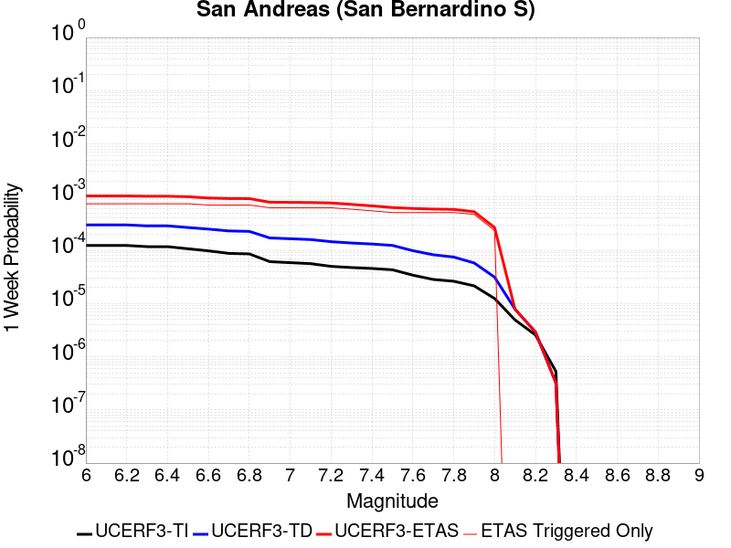 | 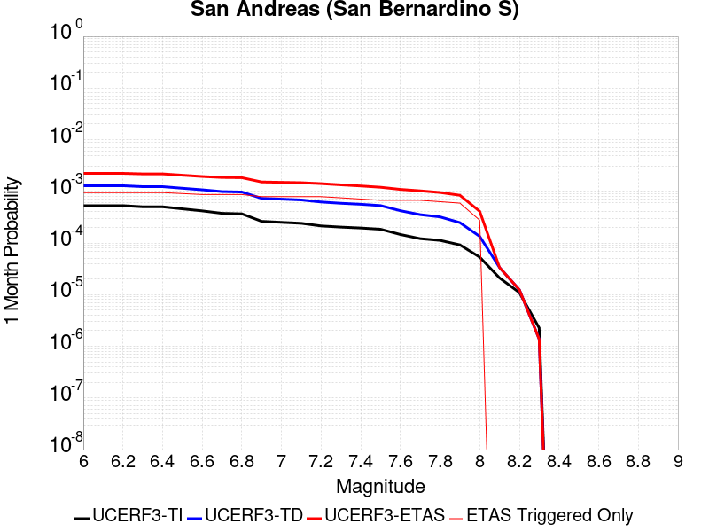 | 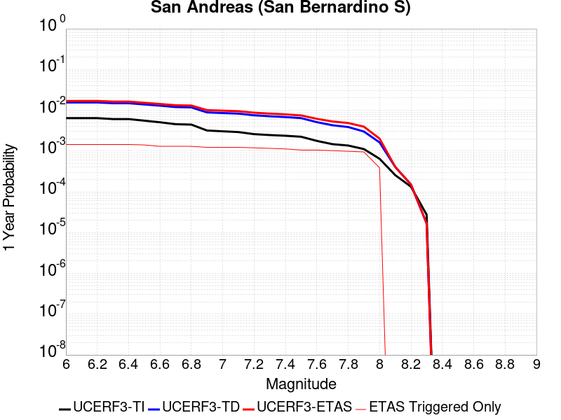 | 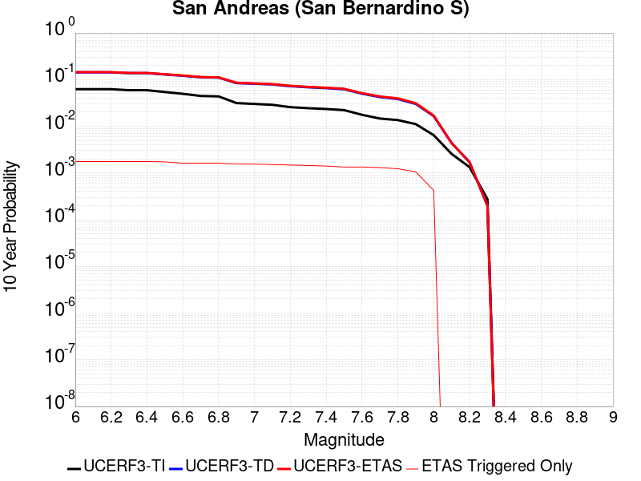 |

| Magnitude | 1 wk TI Prob | 1 wk TD Prob | 1 wk ETAS Prob | 1 wk ETAS/TD Gain | 1 wk ETAS Triggered Only | 1 mo TI Prob | 1 mo TD Prob | 1 mo ETAS Prob | 1 mo ETAS/TD Gain | 1 mo ETAS Triggered Only | 1 yr TI Prob | 1 yr TD Prob | 1 yr ETAS Prob | 1 yr ETAS/TD Gain | 1 yr ETAS Triggered Only | 10 yr TI Prob | 10 yr TD Prob | 10 yr ETAS Prob | 10 yr ETAS/TD Gain | 10 yr ETAS Triggered Only |
|-----|-----|-----|-----|-----|-----|-----|-----|-----|-----|-----|-----|-----|-----|-----|-----|-----|-----|-----|-----|-----|
| 6.0 | 1.2336002E-4 | 3.0004102E-4 | 0.0010493821 | 3.4974623 | 7.4956607E-4 | 5.2857865E-4 | 0.0012852824 | 0.002230886 | 1.7357163 | 9.4682025E-4 | 0.006416472 | 0.015540994 | 0.016861478 | 1.0849677 | 0.0013413287 | 0.06234337 | 0.14283717 | 0.14425744 | 1.0099432 | 0.0016569354 |
| 6.1 | 1.2336002E-4 | 3.0004102E-4 | 0.0010493821 | 3.4974623 | 7.4956607E-4 | 5.2857865E-4 | 0.0012852824 | 0.002230886 | 1.7357163 | 9.4682025E-4 | 0.006416472 | 0.015540994 | 0.016861478 | 1.0849677 | 0.0013413287 | 0.06234337 | 0.14283717 | 0.14425744 | 1.0099432 | 0.0016569354 |
| 6.2 | 1.2336002E-4 | 3.0004102E-4 | 0.0010493821 | 3.4974623 | 7.4956607E-4 | 5.2857865E-4 | 0.0012852824 | 0.002230886 | 1.7357163 | 9.4682025E-4 | 0.006416472 | 0.015540994 | 0.016861478 | 1.0849677 | 0.0013413287 | 0.06234337 | 0.14283717 | 0.14425744 | 1.0099432 | 0.0016569354 |
| 6.3 | 1.1712257E-4 | 2.8792414E-4 | 0.0010372744 | 3.602596 | 7.4956607E-4 | 5.018573E-4 | 0.0012334028 | 0.0021790552 | 1.766702 | 9.4682025E-4 | 0.006093008 | 0.014918125 | 0.016239444 | 1.0885713 | 0.0013413287 | 0.059286322 | 0.13754563 | 0.13897467 | 1.0103894 | 0.0016569354 |
| 6.4 | 1.1712257E-4 | 2.8792414E-4 | 0.0010372744 | 3.602596 | 7.4956607E-4 | 5.018573E-4 | 0.0012334028 | 0.0021790552 | 1.766702 | 9.4682025E-4 | 0.006093008 | 0.014918125 | 0.016239444 | 1.0885713 | 0.0013413287 | 0.059286322 | 0.13754563 | 0.13897467 | 1.0103894 | 0.0016569354 |
| 6.5 | 1.0689076E-4 | 2.680528E-4 | 0.0010174179 | 3.7955878 | 7.4956607E-4 | 4.5802278E-4 | 0.0011483167 | 0.002054644 | 1.7892661 | 9.073694E-4 | 0.0055621783 | 0.01389575 | 0.015179537 | 1.0923871 | 0.0013018779 | 0.05425003 | 0.12879294 | 0.13020211 | 1.0109413 | 0.0016174846 |
| 6.6 | 9.7648895E-5 | 2.50501E-4 | 9.6043834E-4 | 3.8340697 | 7.101152E-4 | 4.1842813E-4 | 0.0010731576 | 0.0019401448 | 1.8078842 | 8.679186E-4 | 0.005082469 | 0.012991785 | 0.014198873 | 1.0929116 | 0.0012229761 | 0.049677886 | 0.12095292 | 0.1223054 | 1.011182 | 0.001538583 |
| 6.7 | 8.757013E-5 | 2.3120902E-4 | 9.4116E-4 | 4.0706024 | 7.101152E-4 | 3.7524657E-4 | 9.905418E-4 | 0.0018576006 | 1.875338 | 8.679186E-4 | 0.00455906 | 0.011997245 | 0.013205549 | 1.1007152 | 0.0012229761 | 0.04466656 | 0.11226123 | 0.11362709 | 1.0121669 | 0.001538583 |
| 6.8 | 8.562978E-5 | 2.2680782E-4 | 9.3676196E-4 | 4.1302013 | 7.101152E-4 | 3.6693315E-4 | 9.7169366E-4 | 0.0018387688 | 1.892334 | 8.679186E-4 | 0.004458263 | 0.011770263 | 0.012978845 | 1.1026809 | 0.0012229761 | 0.043698758 | 0.11027153 | 0.11164045 | 1.0124141 | 0.001538583 |
| 6.9 | 6.124075E-5 | 1.7065753E-4 | 8.017633E-4 | 4.6980834 | 6.312135E-4 | 2.6243398E-4 | 7.311852E-4 | 0.0015196252 | 2.078304 | 7.890169E-4 | 0.0031904527 | 0.008866051 | 0.009999982 | 1.1278958 | 0.0011440745 | 0.031450346 | 0.08418263 | 0.08551943 | 1.0158798 | 0.0014596812 |
| 7.0 | 5.8598747E-5 | 1.649477E-4 | 7.960571E-4 | 4.826118 | 6.312135E-4 | 2.5111332E-4 | 7.06728E-4 | 0.0014951873 | 2.1156473 | 7.890169E-4 | 0.0030530186 | 0.008570663 | 0.009704932 | 1.1323432 | 0.0011440745 | 0.03011414 | 0.081500374 | 0.08284109 | 1.0164504 | 0.0014596812 |
| 7.1 | 5.613814E-5 | 1.5913323E-4 | 7.902463E-4 | 4.9659414 | 6.312135E-4 | 2.4056983E-4 | 6.818221E-4 | 0.001470301 | 2.1564293 | 7.890169E-4 | 0.0029250039 | 0.008269769 | 0.009404382 | 1.1372001 | 0.0011440745 | 0.028868021 | 0.07879931 | 0.08010763 | 1.0166031 | 0.0014202304 |
| 7.2 | 4.991222E-5 | 1.4519796E-4 | 7.763198E-4 | 5.3466306 | 6.312135E-4 | 2.1389198E-4 | 6.2212895E-4 | 0.001410655 | 2.267464 | 7.890169E-4 | 0.002601025 | 0.007548217 | 0.008644503 | 1.1452377 | 0.0011046237 | 0.025707912 | 0.07225321 | 0.07353422 | 1.0177295 | 0.0013807795 |
| 7.3 | 4.7410045E-5 | 1.3714004E-4 | 7.2882156E-4 | 5.314433 | 5.9176265E-4 | 2.0317009E-4 | 5.8761094E-4 | 0.0013367365 | 2.2748666 | 7.4956607E-4 | 0.0024707897 | 0.0071307817 | 0.0081883585 | 1.1483115 | 0.0010651728 | 0.024434982 | 0.06853558 | 0.06978498 | 1.01823 | 0.0013413287 |
| 7.4 | 4.5556746E-5 | 1.3121912E-4 | 6.8345846E-4 | 5.208528 | 5.5231183E-4 | 1.952286E-4 | 5.622468E-4 | 0.0012719627 | 2.2622855 | 7.101152E-4 | 0.002374317 | 0.0068239477 | 0.00784267 | 1.1492864 | 0.0010257219 | 0.023491086 | 0.065788016 | 0.06700424 | 1.0184871 | 0.0013018779 |
| 7.5 | 4.3084514E-5 | 1.2357246E-4 | 6.363701E-4 | 5.149772 | 5.1286095E-4 | 1.8463485E-4 | 5.2948913E-4 | 0.0011997983 | 2.2659547 | 6.7066436E-4 | 0.0022456115 | 0.0064275465 | 0.007368281 | 1.1463598 | 9.4682025E-4 | 0.022230545 | 0.062188786 | 0.06333571 | 1.0184425 | 0.0012229761 |
| 7.6 | 3.408608E-5 | 9.83552E-5 | 6.111657E-4 | 6.213863 | 5.1286095E-4 | 1.4607502E-4 | 4.214543E-4 | 0.001091836 | 2.590639 | 6.7066436E-4 | 0.0017770125 | 0.0051191594 | 0.0060611325 | 1.1840094 | 9.4682025E-4 | 0.017628696 | 0.050020292 | 0.051182095 | 1.0232266 | 0.0012229761 |
| 7.7 | 2.8315713E-5 | 8.248679E-5 | 5.9530546E-4 | 7.216979 | 5.1286095E-4 | 1.2134742E-4 | 3.5346695E-4 | 0.0010238943 | 2.8967185 | 6.7066436E-4 | 0.0014764034 | 0.0042949775 | 0.00519845 | 1.2103555 | 9.073694E-4 | 0.01466633 | 0.0422714 | 0.0434049 | 1.0268147 | 0.0011835253 |
| 7.8 | 2.6222975E-5 | 7.463088E-5 | 5.874536E-4 | 7.8714547 | 5.1286095E-4 | 1.1237934E-4 | 3.1980744E-4 | 9.5081906E-4 | 2.9730988 | 6.312135E-4 | 0.0013673597 | 0.0038867102 | 0.0047512553 | 1.2224363 | 8.679186E-4 | 0.013589768 | 0.03843674 | 0.03953684 | 1.0286211 | 0.0011440745 |
| 7.9 | 2.1469694E-5 | 5.787864E-5 | 5.312614E-4 | 9.1788845 | 4.7341012E-4 | 9.200973E-5 | 2.4802773E-4 | 8.3964365E-4 | 3.385281 | 5.9176265E-4 | 0.0011196428 | 0.0030155594 | 0.0038415287 | 1.2739025 | 8.284677E-4 | 0.011140184 | 0.030152109 | 0.031070381 | 1.0304546 | 9.4682025E-4 |
| 8.0 | 1.2420249E-5 | 3.131896E-5 | 2.6801662E-4 | 8.557648 | 2.3670506E-4 | 5.322855E-5 | 1.342172E-4 | 4.1033604E-4 | 3.0572536 | 2.7615592E-4 | 6.478649E-4 | 0.0016328706 | 0.0019873485 | 1.2170887 | 3.550576E-4 | 0.0064597935 | 0.016522504 | 0.016910493 | 1.0234826 | 3.9450845E-4 |
| 8.1 | 4.9197724E-6 | 7.822348E-6 | 7.822348E-6 | 1.0 | 0.0 | 2.1084568E-5 | 3.352392E-5 | 3.352392E-5 | 1.0 | 0.0 | 2.566744E-4 | 4.0807744E-4 | 4.0807744E-4 | 1.0 | 0.0 | 0.002563781 | 0.0043843705 | 0.0043843705 | 1.0 | 0.0 |
| 8.2 | 2.5634774E-6 | 2.9067196E-6 | 2.9067196E-6 | 1.0 | 0.0 | 1.0986286E-5 | 1.2457311E-5 | 1.2457311E-5 | 1.0 | 0.0 | 1.3374983E-4 | 1.5165724E-4 | 1.5165724E-4 | 1.0 | 0.0 | 0.0013366934 | 0.0017049741 | 0.0017049741 | 1.0 | 0.0 |
| 8.3 | 5.2850464E-7 | 3.2088764E-7 | 3.2088764E-7 | 1.0 | 0.0 | 2.2650179E-6 | 1.375232E-6 | 1.375232E-6 | 1.0 | 0.0 | 2.7576245E-5 | 1.6743334E-5 | 1.6743334E-5 | 1.0 | 0.0 | 2.7572823E-4 | 1.9870348E-4 | 1.9870348E-4 | 1.0 | 0.0 |

## San Andreas (Big Bend)
*[(top)](#table-of-contents)*

| 1 Week | 1 Month | 1 Year | 10 Year |
|-----|-----|-----|-----|
| 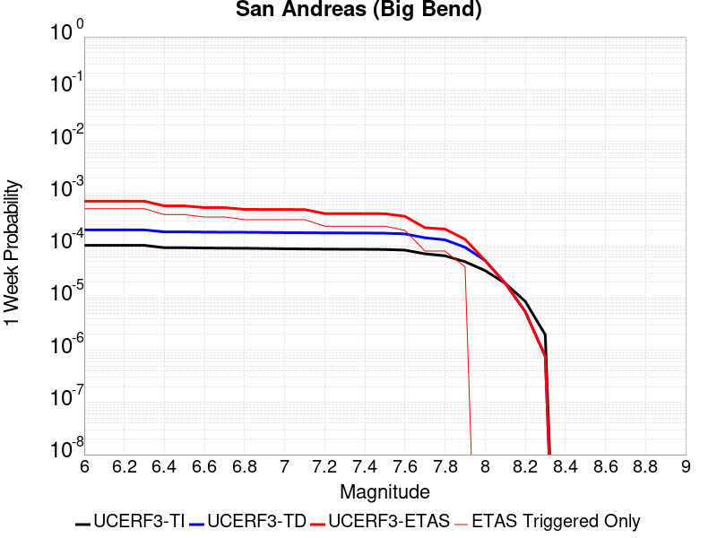 | 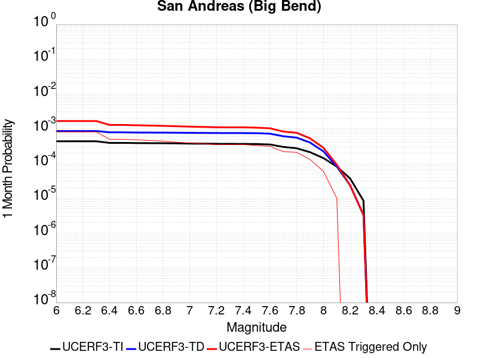 | 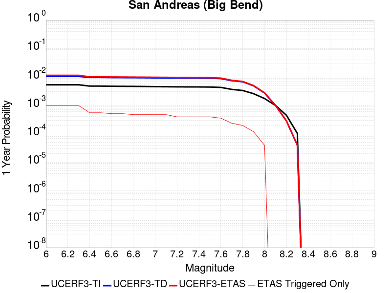 | 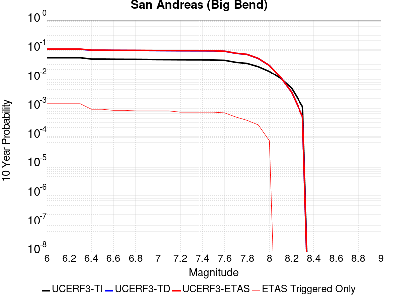 |

| Magnitude | 1 wk TI Prob | 1 wk TD Prob | 1 wk ETAS Prob | 1 wk ETAS/TD Gain | 1 wk ETAS Triggered Only | 1 mo TI Prob | 1 mo TD Prob | 1 mo ETAS Prob | 1 mo ETAS/TD Gain | 1 mo ETAS Triggered Only | 1 yr TI Prob | 1 yr TD Prob | 1 yr ETAS Prob | 1 yr ETAS/TD Gain | 1 yr ETAS Triggered Only | 10 yr TI Prob | 10 yr TD Prob | 10 yr ETAS Prob | 10 yr ETAS/TD Gain | 10 yr ETAS Triggered Only |
|-----|-----|-----|-----|-----|-----|-----|-----|-----|-----|-----|-----|-----|-----|-----|-----|-----|-----|-----|-----|-----|
| 6.0 | 1.0179969E-4 | 2.0072258E-4 | 7.1348064E-4 | 3.5545607 | 5.1286095E-4 | 4.362114E-4 | 8.599571E-4 | 0.0016088785 | 1.8708824 | 7.4956607E-4 | 0.0052979486 | 0.010419999 | 0.011395993 | 1.0936655 | 9.862711E-4 | 0.051734097 | 0.10144902 | 0.10258338 | 1.0111815 | 0.001262427 |
| 6.1 | 1.0179969E-4 | 2.0072258E-4 | 7.1348064E-4 | 3.5545607 | 5.1286095E-4 | 4.362114E-4 | 8.599571E-4 | 0.0016088785 | 1.8708824 | 7.4956607E-4 | 0.0052979486 | 0.010419999 | 0.011395993 | 1.0936655 | 9.862711E-4 | 0.051734097 | 0.10144902 | 0.10258338 | 1.0111815 | 0.001262427 |
| 6.2 | 1.0179969E-4 | 2.0072258E-4 | 7.1348064E-4 | 3.5545607 | 5.1286095E-4 | 4.362114E-4 | 8.599571E-4 | 0.0016088785 | 1.8708824 | 7.4956607E-4 | 0.0052979486 | 0.010419999 | 0.011395993 | 1.0936655 | 9.862711E-4 | 0.051734097 | 0.10144902 | 0.10258338 | 1.0111815 | 0.001262427 |
| 6.3 | 1.0179969E-4 | 2.0072258E-4 | 7.1348064E-4 | 3.5545607 | 5.1286095E-4 | 4.362114E-4 | 8.599571E-4 | 0.0016088785 | 1.8708824 | 7.4956607E-4 | 0.0052979486 | 0.010419999 | 0.011395993 | 1.0936655 | 9.862711E-4 | 0.051734097 | 0.10144902 | 0.10258338 | 1.0111815 | 0.001262427 |
| 6.4 | 9.1639464E-5 | 1.8429532E-4 | 5.7873107E-4 | 3.1402373 | 3.9450845E-4 | 3.9268145E-4 | 7.895982E-4 | 0.0012626345 | 1.5990849 | 4.7341012E-4 | 0.0047704205 | 0.009571102 | 0.010118128 | 1.0571538 | 5.5231183E-4 | 0.046693064 | 0.09377527 | 0.0944903 | 1.0076249 | 7.890169E-4 |
| 6.5 | 9.1639464E-5 | 1.8429532E-4 | 5.7873107E-4 | 3.1402373 | 3.9450845E-4 | 3.9268145E-4 | 7.895982E-4 | 0.0012626345 | 1.5990849 | 4.7341012E-4 | 0.0047704205 | 0.009571102 | 0.010118128 | 1.0571538 | 5.5231183E-4 | 0.046693064 | 0.09377527 | 0.0944903 | 1.0076249 | 7.890169E-4 |
| 6.6 | 9.042622E-5 | 1.823659E-4 | 5.3735875E-4 | 2.9465966 | 3.550576E-4 | 3.8748336E-4 | 7.8133424E-4 | 0.0012149545 | 1.5549741 | 4.339593E-4 | 0.0047074095 | 0.009471365 | 0.009979369 | 1.0536357 | 5.1286095E-4 | 0.046089325 | 0.092869274 | 0.09354923 | 1.0073216 | 7.4956607E-4 |
| 6.7 | 8.9836685E-5 | 1.8150927E-4 | 5.365024E-4 | 2.9557853 | 3.550576E-4 | 3.8495753E-4 | 7.776651E-4 | 0.001211287 | 1.5575945 | 4.339593E-4 | 0.00467679 | 0.00942708 | 0.009935106 | 1.0538901 | 5.1286095E-4 | 0.045795817 | 0.09246355 | 0.093143806 | 1.007357 | 7.4956607E-4 |
| 6.8 | 8.9471854E-5 | 1.8097709E-4 | 4.965267E-4 | 2.743589 | 3.1560674E-4 | 3.8339442E-4 | 7.7538576E-4 | 0.0011695883 | 1.5083954 | 3.9450845E-4 | 0.004657841 | 0.009399569 | 0.009868529 | 1.0498917 | 4.7341012E-4 | 0.04561414 | 0.092210755 | 0.092855394 | 1.0069909 | 7.101152E-4 |
| 6.9 | 8.858234E-5 | 1.7979681E-4 | 4.9534685E-4 | 2.7550366 | 3.1560674E-4 | 3.7958333E-4 | 7.703304E-4 | 0.001164535 | 1.5117344 | 3.9450845E-4 | 0.004611638 | 0.009338548 | 0.009807538 | 1.0502207 | 4.7341012E-4 | 0.04517103 | 0.09165087 | 0.09229591 | 1.0070379 | 7.101152E-4 |
| 7.0 | 8.7433385E-5 | 1.7818481E-4 | 4.937353E-4 | 2.770917 | 3.1560674E-4 | 3.746607E-4 | 7.634259E-4 | 0.0011576331 | 1.5163661 | 3.9450845E-4 | 0.004551957 | 0.009255203 | 0.009724231 | 1.0506773 | 4.7341012E-4 | 0.044598386 | 0.09088532 | 0.09153089 | 1.0071032 | 7.101152E-4 |
| 7.1 | 8.684964E-5 | 1.7730435E-4 | 4.9285515E-4 | 2.7797127 | 3.1560674E-4 | 3.7215967E-4 | 7.596547E-4 | 0.0011538634 | 1.5189315 | 3.9450845E-4 | 0.0045216335 | 0.009209678 | 0.009678728 | 1.0509301 | 4.7341012E-4 | 0.04430731 | 0.09046686 | 0.09111273 | 1.0071393 | 7.101152E-4 |
| 7.2 | 8.606521E-5 | 1.762105E-4 | 4.1287387E-4 | 2.3430717 | 2.3670506E-4 | 3.6879873E-4 | 7.549695E-4 | 0.001070338 | 1.4177234 | 3.1560674E-4 | 0.0044808835 | 0.0091531165 | 0.009544014 | 1.0427065 | 3.9450845E-4 | 0.043916024 | 0.089947365 | 0.090521805 | 1.0063864 | 6.312135E-4 |
| 7.3 | 8.568266E-5 | 1.7563057E-4 | 4.1229406E-4 | 2.3475075 | 2.3670506E-4 | 3.6715972E-4 | 7.524855E-4 | 0.0010678547 | 1.4191035 | 3.1560674E-4 | 0.0044610105 | 0.009123127 | 0.009514037 | 1.0428481 | 3.9450845E-4 | 0.043725148 | 0.08966853 | 0.09024314 | 1.0064082 | 6.312135E-4 |
| 7.4 | 8.5432206E-5 | 1.7525644E-4 | 4.1192002E-4 | 2.3503845 | 2.3670506E-4 | 3.6608664E-4 | 7.50883E-4 | 0.0010662528 | 1.4199985 | 3.1560674E-4 | 0.004447999 | 0.009103781 | 0.009494698 | 1.04294 | 3.9450845E-4 | 0.043600157 | 0.08948871 | 0.09006344 | 1.0064224 | 6.312135E-4 |
| 7.5 | 8.4791965E-5 | 1.7394972E-4 | 4.1061363E-4 | 2.3605304 | 2.3670506E-4 | 3.633435E-4 | 7.4528606E-4 | 0.0010606576 | 1.4231551 | 3.1560674E-4 | 0.0044147377 | 0.009036204 | 0.009427148 | 1.0432642 | 3.9450845E-4 | 0.043280575 | 0.088866346 | 0.08944146 | 1.0064718 | 6.312135E-4 |
| 7.6 | 8.241105E-5 | 1.6840403E-4 | 3.6562505E-4 | 2.171118 | 1.9725422E-4 | 3.531424E-4 | 7.215321E-4 | 9.974887E-4 | 1.3824593 | 2.7615592E-4 | 0.0042910352 | 0.008749358 | 0.00910131 | 1.040226 | 3.550576E-4 | 0.042091176 | 0.086243294 | 0.08678402 | 1.0062698 | 5.9176265E-4 |
| 7.7 | 7.00432E-5 | 1.42045E-4 | 2.2093549E-4 | 1.5553907 | 7.8901685E-5 | 3.001506E-4 | 6.0862233E-4 | 7.6632964E-4 | 1.2591219 | 1.5780337E-4 | 0.0036482112 | 0.0073848404 | 0.0076197973 | 1.0318161 | 2.3670506E-4 | 0.035888977 | 0.07351733 | 0.07388283 | 1.0049717 | 3.9450845E-4 |
| 7.8 | 6.415362E-5 | 1.2968935E-4 | 2.085808E-4 | 1.608311 | 7.8901685E-5 | 2.749151E-4 | 5.556931E-4 | 6.7397987E-4 | 1.2128634 | 1.1835253E-4 | 0.0033419547 | 0.0067446055 | 0.0069405297 | 1.0290489 | 1.9725422E-4 | 0.03292141 | 0.06725231 | 0.06754669 | 1.0043772 | 3.1560674E-4 |
| 7.9 | 4.939911E-5 | 9.3411545E-5 | 1.328587E-4 | 1.4222943 | 3.9450842E-5 | 2.116933E-4 | 4.0027377E-4 | 4.3970882E-4 | 1.0985202 | 3.9450842E-5 | 0.0025743195 | 0.004862453 | 0.00498023 | 1.0242218 | 1.1835253E-4 | 0.025447013 | 0.048914436 | 0.049102042 | 1.0038354 | 1.9725422E-4 |
| 8.0 | 3.344983E-5 | 5.222685E-5 | 5.222685E-5 | 1.0 | 0.0 | 1.4334853E-4 | 2.2381016E-4 | 2.2381016E-4 | 1.0 | 0.0 | 0.0017438711 | 0.0027214854 | 0.002760829 | 1.0144566 | 3.9450842E-5 | 0.017302496 | 0.027922187 | 0.027960537 | 1.0013734 | 3.9450842E-5 |
| 8.1 | 1.9104898E-5 | 1.9173063E-5 | 1.9173063E-5 | 1.0 | 0.0 | 8.1875565E-5 | 8.216769E-5 | 8.216769E-5 | 1.0 | 0.0 | 9.963791E-4 | 9.999331E-4 | 9.999331E-4 | 1.0 | 0.0 | 0.009919235 | 0.010749801 | 0.010749801 | 1.0 | 0.0 |
| 8.2 | 8.643924E-6 | 5.4748625E-6 | 5.4748625E-6 | 1.0 | 0.0 | 3.704486E-5 | 2.3463486E-5 | 2.3463486E-5 | 1.0 | 0.0 | 4.5092785E-4 | 2.8563058E-4 | 2.8563058E-4 | 1.0 | 0.0 | 0.0045001395 | 0.0032487072 | 0.0032487072 | 1.0 | 0.0 |
| 8.3 | 1.983087E-6 | 7.6599065E-7 | 7.6599065E-7 | 1.0 | 0.0 | 8.498917E-6 | 3.282813E-6 | 3.282813E-6 | 1.0 | 0.0 | 1.034694E-4 | 3.9967534E-5 | 3.9967534E-5 | 1.0 | 0.0 | 0.0010342124 | 4.719687E-4 | 4.719687E-4 | 1.0 | 0.0 |

## Cady
*[(top)](#table-of-contents)*

| 1 Week | 1 Month | 1 Year | 10 Year |
|-----|-----|-----|-----|
| 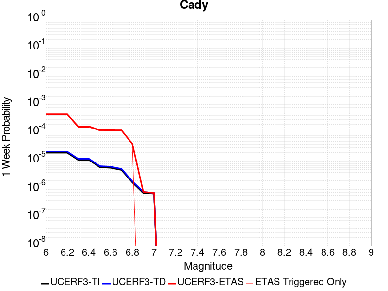 | 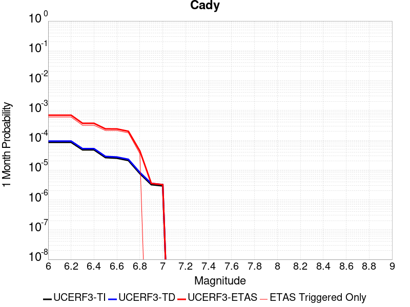 | 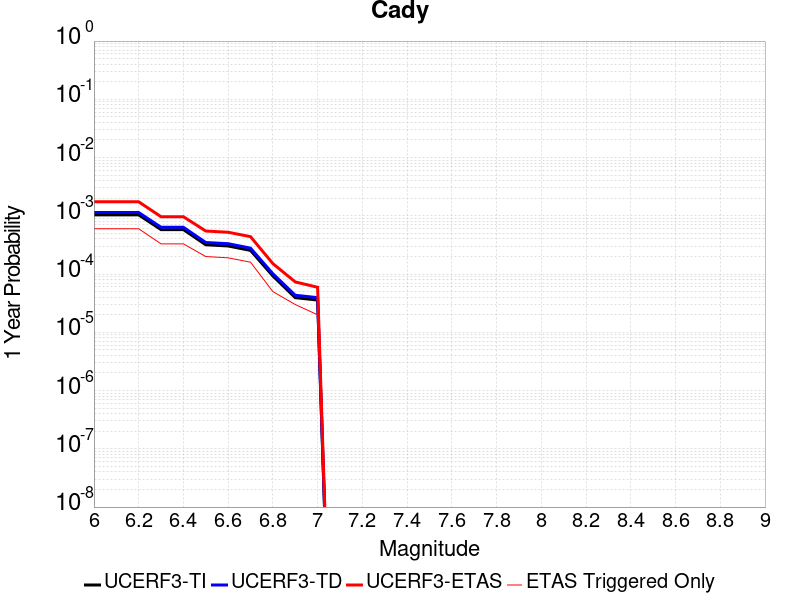 | 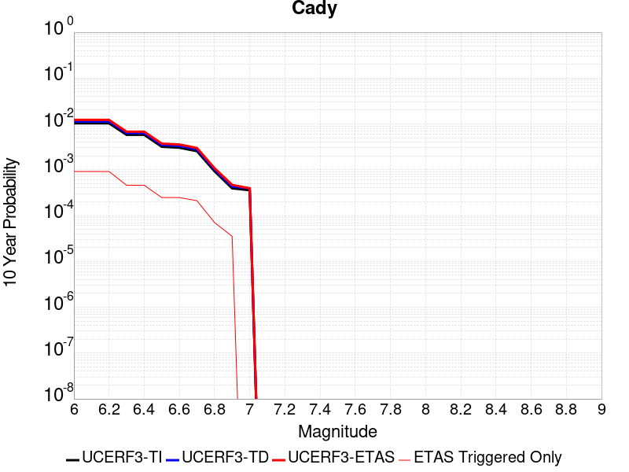 |

| Magnitude | 1 wk TI Prob | 1 wk TD Prob | 1 wk ETAS Prob | 1 wk ETAS/TD Gain | 1 wk ETAS Triggered Only | 1 mo TI Prob | 1 mo TD Prob | 1 mo ETAS Prob | 1 mo ETAS/TD Gain | 1 mo ETAS Triggered Only | 1 yr TI Prob | 1 yr TD Prob | 1 yr ETAS Prob | 1 yr ETAS/TD Gain | 1 yr ETAS Triggered Only | 10 yr TI Prob | 10 yr TD Prob | 10 yr ETAS Prob | 10 yr ETAS/TD Gain | 10 yr ETAS Triggered Only |
|-----|-----|-----|-----|-----|-----|-----|-----|-----|-----|-----|-----|-----|-----|-----|-----|-----|-----|-----|-----|-----|
| 6.0 | 1.9892565E-5 | 2.1858728E-5 | 4.5580853E-4 | 20.852472 | 4.339593E-4 | 8.525106E-5 | 9.3677416E-5 | 7.642789E-4 | 8.158626 | 6.7066436E-4 | 0.0010374374 | 0.0011400167 | 0.00196754 | 1.725887 | 8.284677E-4 | 0.010326075 | 0.011350701 | 0.01236478 | 1.0893407 | 0.0010257219 |
| 6.1 | 1.9892565E-5 | 2.1858728E-5 | 4.5580853E-4 | 20.852472 | 4.339593E-4 | 8.525106E-5 | 9.3677416E-5 | 7.642789E-4 | 8.158626 | 6.7066436E-4 | 0.0010374374 | 0.0011400167 | 0.00196754 | 1.725887 | 8.284677E-4 | 0.010326075 | 0.011350701 | 0.01236478 | 1.0893407 | 0.0010257219 |
| 6.2 | 1.9892565E-5 | 2.1858728E-5 | 4.5580853E-4 | 20.852472 | 4.339593E-4 | 8.525106E-5 | 9.3677416E-5 | 7.642789E-4 | 8.158626 | 6.7066436E-4 | 0.0010374374 | 0.0011400167 | 0.00196754 | 1.725887 | 8.284677E-4 | 0.010326075 | 0.011350701 | 0.01236478 | 1.0893407 | 0.0010257219 |
| 6.3 | 1.1117327E-5 | 1.2176583E-5 | 1.6997804E-4 | 13.959419 | 1.5780337E-4 | 4.764482E-5 | 5.2184492E-5 | 4.0722356E-4 | 7.803536 | 3.550576E-4 | 5.7992124E-4 | 6.351925E-4 | 0.0010294503 | 1.6206903 | 3.9450845E-4 | 0.0057841022 | 0.0063368753 | 0.0068464866 | 1.0804199 | 5.1286095E-4 |
| 6.4 | 1.1117327E-5 | 1.2176583E-5 | 1.6997804E-4 | 13.959419 | 1.5780337E-4 | 4.764482E-5 | 5.2184492E-5 | 4.0722356E-4 | 7.803536 | 3.550576E-4 | 5.7992124E-4 | 6.351925E-4 | 0.0010294503 | 1.6206903 | 3.9450845E-4 | 0.0057841022 | 0.0063368753 | 0.0068464866 | 1.0804199 | 5.1286095E-4 |
| 6.5 | 6.103093E-6 | 6.672021E-6 | 1.2502377E-4 | 18.738516 | 1.1835253E-4 | 2.615585E-5 | 2.8594131E-5 | 2.6529242E-4 | 9.277863 | 2.3670506E-4 | 3.1840094E-4 | 3.480905E-4 | 6.2415027E-4 | 1.793069 | 2.7615592E-4 | 0.0031794512 | 0.0034766865 | 0.0037518824 | 1.0791546 | 2.7615592E-4 |
| 6.6 | 5.817237E-6 | 6.3656585E-6 | 1.2471744E-4 | 19.592228 | 1.1835253E-4 | 2.4930776E-5 | 2.728118E-5 | 2.6397977E-4 | 9.67626 | 2.3670506E-4 | 3.034899E-4 | 3.3211018E-4 | 6.0817436E-4 | 1.8312428 | 2.7615592E-4 | 0.0030307577 | 0.0033173605 | 0.0035926003 | 1.0829695 | 2.7615592E-4 |
| 6.7 | 4.8846314E-6 | 5.3405684E-6 | 1.2369247E-4 | 23.16092 | 1.1835253E-4 | 2.0933967E-5 | 2.2888014E-5 | 2.2013772E-4 | 9.618034 | 1.9725422E-4 | 2.5484123E-4 | 2.7863772E-4 | 5.1527686E-4 | 1.8492717 | 2.3670506E-4 | 0.0025454918 | 0.0027840391 | 0.0030200852 | 1.0847855 | 2.3670506E-4 |
| 6.8 | 1.7788773E-6 | 1.9399079E-6 | 4.1390675E-5 | 21.336412 | 3.9450842E-5 | 7.6237375E-6 | 8.313874E-6 | 4.776439E-5 | 5.7451425 | 3.9450842E-5 | 9.281505E-5 | 1.01218284E-4 | 1.80112E-4 | 1.7794412 | 7.8901685E-5 | 9.2776294E-4 | 0.0010118765 | 0.0010906983 | 1.0778967 | 7.8901685E-5 |
| 6.9 | 7.5455404E-7 | 8.297092E-7 | 8.297092E-7 | 1.0 | 0.0 | 3.233799E-6 | 3.5558937E-6 | 3.5558937E-6 | 1.0 | 0.0 | 3.937079E-5 | 4.3292483E-5 | 8.2741615E-5 | 1.9112238 | 3.9450842E-5 | 3.9363815E-4 | 4.3287344E-4 | 4.723072E-4 | 1.0910977 | 3.9450842E-5 |
| 7.0 | 6.8578805E-7 | 7.541816E-7 | 7.541816E-7 | 1.0 | 0.0 | 2.9390883E-6 | 3.2322048E-6 | 3.2322048E-6 | 1.0 | 0.0 | 3.578281E-5 | 3.9351715E-5 | 3.9351715E-5 | 1.0 | 0.0 | 3.577705E-4 | 3.9347992E-4 | 3.9347992E-4 | 1.0 | 0.0 |

## Red Pass
*[(top)](#table-of-contents)*

| 1 Week | 1 Month | 1 Year | 10 Year |
|-----|-----|-----|-----|
| 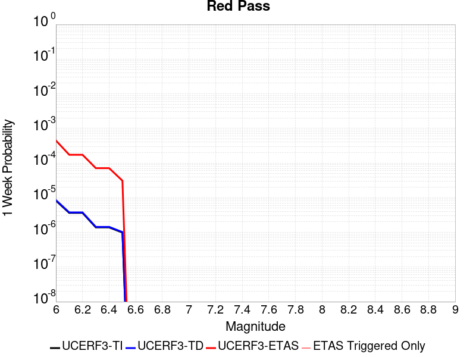 | 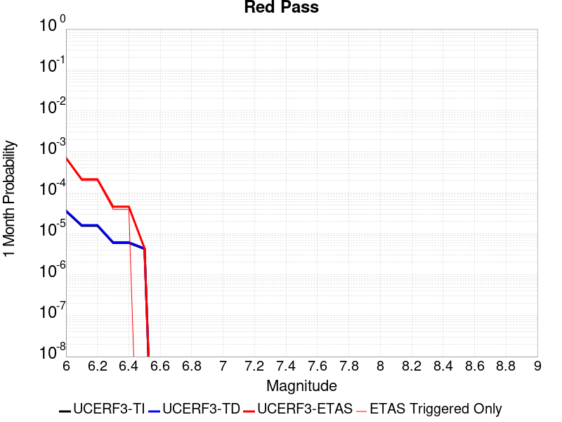 | 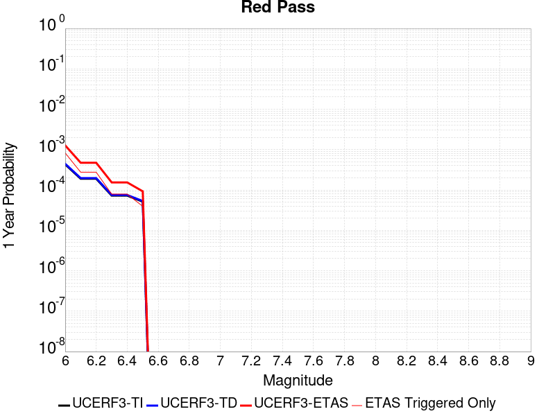 | 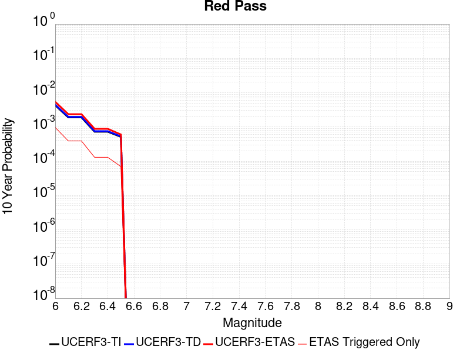 |

| Magnitude | 1 wk TI Prob | 1 wk TD Prob | 1 wk ETAS Prob | 1 wk ETAS/TD Gain | 1 wk ETAS Triggered Only | 1 mo TI Prob | 1 mo TD Prob | 1 mo ETAS Prob | 1 mo ETAS/TD Gain | 1 mo ETAS Triggered Only | 1 yr TI Prob | 1 yr TD Prob | 1 yr ETAS Prob | 1 yr ETAS/TD Gain | 1 yr ETAS Triggered Only | 10 yr TI Prob | 10 yr TD Prob | 10 yr ETAS Prob | 10 yr ETAS/TD Gain | 10 yr ETAS Triggered Only |
|-----|-----|-----|-----|-----|-----|-----|-----|-----|-----|-----|-----|-----|-----|-----|-----|-----|-----|-----|-----|-----|
| 6.0 | 8.258278E-6 | 8.551265E-6 | 4.4250683E-4 | 51.74753 | 4.339593E-4 | 3.539214E-5 | 3.6647863E-5 | 7.0728763E-4 | 19.299559 | 6.7066436E-4 | 4.308141E-4 | 4.4611428E-4 | 0.0012742124 | 2.8562467 | 8.284677E-4 | 0.0042997985 | 0.004453945 | 0.005435823 | 1.2204514 | 9.862711E-4 |
| 6.1 | 3.649988E-6 | 3.7753161E-6 | 8.267671E-5 | 21.89928 | 7.8901685E-5 | 1.5642712E-5 | 1.6179853E-5 | 2.1343089E-4 | 13.191152 | 1.9725422E-4 | 1.9043336E-4 | 1.9697666E-4 | 4.7307817E-4 | 2.4016967 | 2.7615592E-4 | 0.0019027026 | 0.001968488 | 0.0022834735 | 1.1600139 | 3.1560674E-4 |
| 6.2 | 3.649988E-6 | 3.7753161E-6 | 8.267671E-5 | 21.89928 | 7.8901685E-5 | 1.5642712E-5 | 1.6179853E-5 | 2.1343089E-4 | 13.191152 | 1.9725422E-4 | 1.9043336E-4 | 1.9697666E-4 | 4.7307817E-4 | 2.4016967 | 2.7615592E-4 | 0.0019027026 | 0.001968488 | 0.0022834735 | 1.1600139 | 3.1560674E-4 |
| 6.3 | 1.3924937E-6 | 1.4411166E-6 | 4.0891904E-5 | 28.375153 | 3.9450842E-5 | 5.9678164E-6 | 6.1762075E-6 | 4.562681E-5 | 7.387512 | 3.9450842E-5 | 7.265574E-5 | 7.519415E-5 | 1.540899E-4 | 2.0492272 | 7.8901685E-5 | 7.263199E-4 | 7.518258E-4 | 8.3066814E-4 | 1.1048678 | 7.8901685E-5 |
| 6.4 | 1.3924937E-6 | 1.4411166E-6 | 4.0891904E-5 | 28.375153 | 3.9450842E-5 | 5.9678164E-6 | 6.1762075E-6 | 4.562681E-5 | 7.387512 | 3.9450842E-5 | 7.265574E-5 | 7.519415E-5 | 1.540899E-4 | 2.0492272 | 7.8901685E-5 | 7.263199E-4 | 7.518258E-4 | 8.3066814E-4 | 1.1048678 | 7.8901685E-5 |
| 6.5 | 9.876812E-7 | 1.0221912E-6 | 1.0221912E-6 | 1.0 | 0.0 | 4.2329125E-6 | 4.3808195E-6 | 4.3808195E-6 | 1.0 | 0.0 | 5.153449E-5 | 5.3336476E-5 | 9.2785216E-5 | 1.7396203 | 3.9450842E-5 | 5.1522546E-4 | 5.333648E-4 | 5.727946E-4 | 1.0739266 | 3.9450842E-5 |

## Elsinore (Glen Ivy) rev
*[(top)](#table-of-contents)*

| 1 Week | 1 Month | 1 Year | 10 Year |
|-----|-----|-----|-----|
| 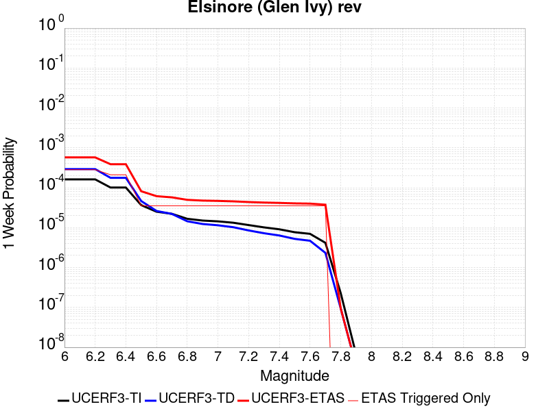 | 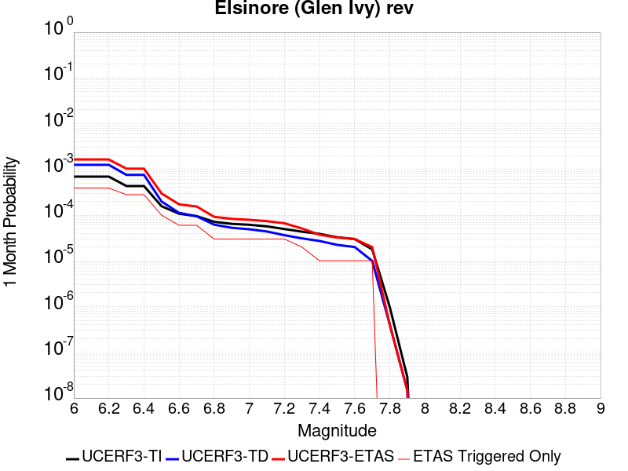 | 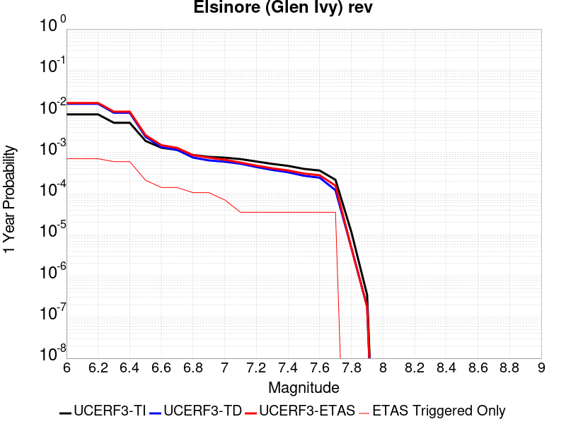 | 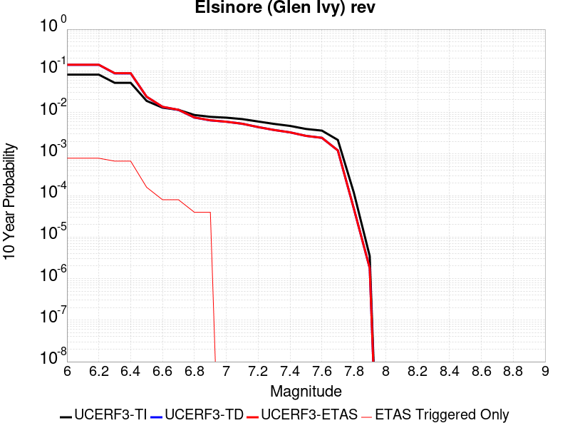 |

| Magnitude | 1 wk TI Prob | 1 wk TD Prob | 1 wk ETAS Prob | 1 wk ETAS/TD Gain | 1 wk ETAS Triggered Only | 1 mo TI Prob | 1 mo TD Prob | 1 mo ETAS Prob | 1 mo ETAS/TD Gain | 1 mo ETAS Triggered Only | 1 yr TI Prob | 1 yr TD Prob | 1 yr ETAS Prob | 1 yr ETAS/TD Gain | 1 yr ETAS Triggered Only | 10 yr TI Prob | 10 yr TD Prob | 10 yr ETAS Prob | 10 yr ETAS/TD Gain | 10 yr ETAS Triggered Only |
|-----|-----|-----|-----|-----|-----|-----|-----|-----|-----|-----|-----|-----|-----|-----|-----|-----|-----|-----|-----|-----|
| 6.0 | 1.6204086E-4 | 2.9360707E-4 | 5.6968187E-4 | 1.9402868 | 2.7615592E-4 | 6.94276E-4 | 0.0012578638 | 0.0017306785 | 1.3758869 | 4.7341012E-4 | 0.008420097 | 0.015234485 | 0.015894933 | 1.0433521 | 6.7066436E-4 | 0.081081145 | 0.13969168 | 0.14037047 | 1.0048592 | 7.890169E-4 |
| 6.1 | 1.6204086E-4 | 2.9360707E-4 | 5.6968187E-4 | 1.9402868 | 2.7615592E-4 | 6.94276E-4 | 0.0012578638 | 0.0017306785 | 1.3758869 | 4.7341012E-4 | 0.008420097 | 0.015234485 | 0.015894933 | 1.0433521 | 6.7066436E-4 | 0.081081145 | 0.13969168 | 0.14037047 | 1.0048592 | 7.890169E-4 |
| 6.2 | 1.6204086E-4 | 2.9360707E-4 | 5.6968187E-4 | 1.9402868 | 2.7615592E-4 | 6.94276E-4 | 0.0012578638 | 0.0017306785 | 1.3758869 | 4.7341012E-4 | 0.008420097 | 0.015234485 | 0.015894933 | 1.0433521 | 6.7066436E-4 | 0.081081145 | 0.13969168 | 0.14037047 | 1.0048592 | 7.890169E-4 |
| 6.3 | 1.0111737E-4 | 1.7703383E-4 | 3.742531E-4 | 2.1140203 | 1.9725422E-4 | 4.332882E-4 | 7.5861247E-4 | 0.0011134007 | 1.4676805 | 3.550576E-4 | 0.005262531 | 0.009217682 | 0.009764903 | 1.0593665 | 5.5231183E-4 | 0.0513964 | 0.0870191 | 0.087631404 | 1.0070364 | 6.7066436E-4 |
| 6.4 | 1.0111737E-4 | 1.7703383E-4 | 3.742531E-4 | 2.1140203 | 1.9725422E-4 | 4.332882E-4 | 7.5861247E-4 | 0.0011134007 | 1.4676805 | 3.550576E-4 | 0.005262531 | 0.009217682 | 0.009764903 | 1.0593665 | 5.5231183E-4 | 0.0513964 | 0.0870191 | 0.087631404 | 1.0070364 | 6.7066436E-4 |
| 6.5 | 3.6624708E-5 | 4.6391084E-5 | 4.6391084E-5 | 1.0 | 0.0 | 1.569536E-4 | 1.9880582E-4 | 2.3824883E-4 | 1.1983997 | 3.9450842E-5 | 0.001909235 | 0.0024181372 | 0.0025755588 | 1.0651004 | 1.5780337E-4 | 0.01892915 | 0.023739954 | 0.023894012 | 1.0064894 | 1.5780337E-4 |
| 6.6 | 2.5051324E-5 | 2.614772E-5 | 2.614772E-5 | 1.0 | 0.0 | 1.073584E-4 | 1.12057096E-4 | 1.12057096E-4 | 1.0 | 0.0 | 0.0013063047 | 0.0013634858 | 0.0014422799 | 1.0577887 | 7.8901685E-5 | 0.012986525 | 0.013564618 | 0.01364245 | 1.0057378 | 7.8901685E-5 |
| 6.7 | 2.2189772E-5 | 2.2072849E-5 | 2.2072849E-5 | 1.0 | 0.0 | 9.509556E-5 | 9.4594696E-5 | 9.4594696E-5 | 1.0 | 0.0 | 0.0011571734 | 0.0011511183 | 0.0012299292 | 1.0684646 | 7.8901685E-5 | 0.011511663 | 0.011465415 | 0.011543413 | 1.0068028 | 7.8901685E-5 |
| 6.8 | 1.6654378E-5 | 1.4437705E-5 | 1.4437705E-5 | 1.0 | 0.0 | 7.137396E-5 | 6.187444E-5 | 6.187444E-5 | 1.0 | 0.0 | 8.686314E-4 | 7.530661E-4 | 7.9248723E-4 | 1.0523475 | 3.9450842E-5 | 0.008652439 | 0.00751048 | 0.0075496347 | 1.0052134 | 3.9450842E-5 |
| 6.9 | 1.5042909E-5 | 1.2332022E-5 | 1.2332022E-5 | 1.0 | 0.0 | 6.446802E-5 | 5.285047E-5 | 5.285047E-5 | 1.0 | 0.0 | 7.8461546E-4 | 6.4326765E-4 | 6.8269315E-4 | 1.0612893 | 3.9450842E-5 | 0.007818509 | 0.00641828 | 0.006457478 | 1.0061072 | 3.9450842E-5 |
| 7.0 | 1.4361385E-5 | 1.1451324E-5 | 1.1451324E-5 | 1.0 | 0.0 | 6.154734E-5 | 4.9076196E-5 | 4.9076196E-5 | 1.0 | 0.0 | 7.490812E-4 | 5.973418E-4 | 5.973418E-4 | 1.0 | 0.0 | 0.007465612 | 0.0059613534 | 0.0059613534 | 1.0 | 0.0 |
| 7.1 | 1.3265571E-5 | 1.0244926E-5 | 1.0244926E-5 | 1.0 | 0.0 | 5.6851208E-5 | 4.39061E-5 | 4.39061E-5 | 1.0 | 0.0 | 6.919436E-4 | 5.344282E-4 | 5.344282E-4 | 1.0 | 0.0 | 0.006897931 | 0.0053347866 | 0.0053347866 | 1.0 | 0.0 |
| 7.2 | 1.1596403E-5 | 8.505067E-6 | 8.505067E-6 | 1.0 | 0.0 | 4.9697923E-5 | 3.6449786E-5 | 3.6449786E-5 | 1.0 | 0.0 | 6.049042E-4 | 4.436875E-4 | 4.436875E-4 | 1.0 | 0.0 | 0.006032603 | 0.0044294316 | 0.0044294316 | 1.0 | 0.0 |
| 7.3 | 1.0150827E-5 | 7.2387597E-6 | 7.2387597E-6 | 1.0 | 0.0 | 4.3502816E-5 | 3.1022897E-5 | 3.1022897E-5 | 1.0 | 0.0 | 5.2951806E-4 | 3.7763975E-4 | 3.7763975E-4 | 1.0 | 0.0 | 0.005282581 | 0.0037703665 | 0.0037703665 | 1.0 | 0.0 |
| 7.4 | 9.080705E-6 | 6.352519E-6 | 6.352519E-6 | 1.0 | 0.0 | 3.8916725E-5 | 2.7224805E-5 | 2.7224805E-5 | 1.0 | 0.0 | 4.7370812E-4 | 3.3141294E-4 | 3.3141294E-4 | 1.0 | 0.0 | 0.004726996 | 0.0033093381 | 0.0033093381 | 1.0 | 0.0 |
| 7.5 | 7.671649E-6 | 5.2256332E-6 | 5.2256332E-6 | 1.0 | 0.0 | 3.287808E-5 | 2.2395385E-5 | 2.2395385E-5 | 1.0 | 0.0 | 4.0021708E-4 | 2.7263095E-4 | 2.7263095E-4 | 1.0 | 0.0 | 0.0039949706 | 0.00272309 | 0.00272309 | 1.0 | 0.0 |
| 7.6 | 6.990086E-6 | 4.687545E-6 | 4.687545E-6 | 1.0 | 0.0 | 2.9957167E-5 | 2.008933E-5 | 2.008933E-5 | 1.0 | 0.0 | 3.6466747E-4 | 2.445613E-4 | 2.445613E-4 | 1.0 | 0.0 | 0.0036406964 | 0.002443038 | 0.002443038 | 1.0 | 0.0 |
| 7.7 | 4.163505E-6 | 2.3295343E-6 | 2.3295343E-6 | 1.0 | 0.0 | 1.7843471E-5 | 9.983683E-6 | 9.983683E-6 | 1.0 | 0.0 | 2.172226E-4 | 1.21545316E-4 | 1.21545316E-4 | 1.0 | 0.0 | 0.0021701038 | 0.0012148614 | 0.0012148614 | 1.0 | 0.0 |
| 7.8 | 2.2692414E-7 | 9.3854695E-8 | 9.3854695E-8 | 1.0 | 0.0 | 9.725317E-7 | 4.0223435E-7 | 4.0223435E-7 | 1.0 | 0.0 | 1.1840509E-5 | 4.8971956E-6 | 4.8971956E-6 | 1.0 | 0.0 | 1.1839878E-4 | 4.8971204E-5 | 4.8971204E-5 | 1.0 | 0.0 |
| 7.9 | 6.676829E-9 | 3.439853E-9 | 3.439853E-9 | 1.0 | 0.0 | 2.861498E-8 | 1.4742227E-8 | 1.4742227E-8 | 1.0 | 0.0 | 3.4838732E-7 | 1.7948659E-7 | 1.7948659E-7 | 1.0 | 0.0 | 3.4838679E-6 | 1.7948646E-6 | 1.7948646E-6 | 1.0 | 0.0 |

## Death Valley (No)
*[(top)](#table-of-contents)*

| 1 Week | 1 Month | 1 Year | 10 Year |
|-----|-----|-----|-----|
| 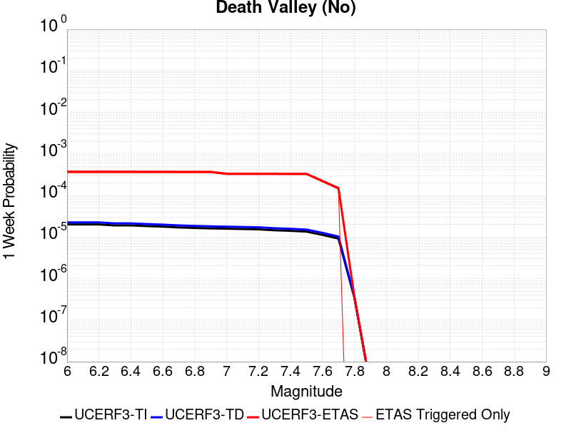 | 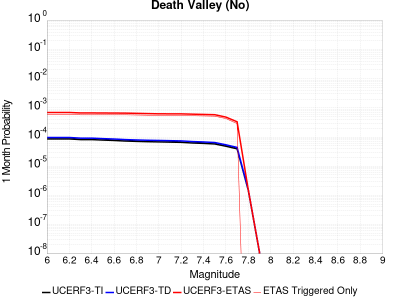 | 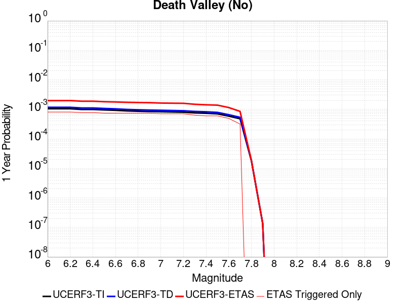 |  |

| Magnitude | 1 wk TI Prob | 1 wk TD Prob | 1 wk ETAS Prob | 1 wk ETAS/TD Gain | 1 wk ETAS Triggered Only | 1 mo TI Prob | 1 mo TD Prob | 1 mo ETAS Prob | 1 mo ETAS/TD Gain | 1 mo ETAS Triggered Only | 1 yr TI Prob | 1 yr TD Prob | 1 yr ETAS Prob | 1 yr ETAS/TD Gain | 1 yr ETAS Triggered Only | 10 yr TI Prob | 10 yr TD Prob | 10 yr ETAS Prob | 10 yr ETAS/TD Gain | 10 yr ETAS Triggered Only |
|-----|-----|-----|-----|-----|-----|-----|-----|-----|-----|-----|-----|-----|-----|-----|-----|-----|-----|-----|-----|-----|
| 6.0 | 2.0074807E-5 | 2.2500084E-5 | 3.3809972E-4 | 15.026599 | 3.1560674E-4 | 8.603206E-5 | 9.642541E-5 | 5.3034286E-4 | 5.5000324 | 4.339593E-4 | 0.001046937 | 0.0011733545 | 0.0019220411 | 1.6380736 | 7.4956607E-4 | 0.010420183 | 0.011672506 | 0.0124913035 | 1.0701475 | 8.284677E-4 |
| 6.1 | 2.0074807E-5 | 2.2500084E-5 | 3.3809972E-4 | 15.026599 | 3.1560674E-4 | 8.603206E-5 | 9.642541E-5 | 5.3034286E-4 | 5.5000324 | 4.339593E-4 | 0.001046937 | 0.0011733545 | 0.0019220411 | 1.6380736 | 7.4956607E-4 | 0.010420183 | 0.011672506 | 0.0124913035 | 1.0701475 | 8.284677E-4 |
| 6.2 | 2.0074807E-5 | 2.2500084E-5 | 3.3809972E-4 | 15.026599 | 3.1560674E-4 | 8.603206E-5 | 9.642541E-5 | 5.3034286E-4 | 5.5000324 | 4.339593E-4 | 0.001046937 | 0.0011733545 | 0.0019220411 | 1.6380736 | 7.4956607E-4 | 0.010420183 | 0.011672506 | 0.0124913035 | 1.0701475 | 8.284677E-4 |
| 6.3 | 1.9050609E-5 | 2.1336948E-5 | 3.3693697E-4 | 15.791245 | 3.1560674E-4 | 8.164292E-5 | 9.1440896E-5 | 5.253605E-4 | 5.745356 | 4.339593E-4 | 9.935491E-4 | 0.001112731 | 0.0018614631 | 1.6728778 | 7.4956607E-4 | 0.009891188 | 0.011072419 | 0.011891713 | 1.0739942 | 8.284677E-4 |
| 6.4 | 1.9050609E-5 | 2.1336948E-5 | 3.3693697E-4 | 15.791245 | 3.1560674E-4 | 8.164292E-5 | 9.1440896E-5 | 5.253605E-4 | 5.745356 | 4.339593E-4 | 9.935491E-4 | 0.001112731 | 0.0018614631 | 1.6728778 | 7.4956607E-4 | 0.009891188 | 0.011072419 | 0.011891713 | 1.0739942 | 8.284677E-4 |
| 6.5 | 1.8367004E-5 | 2.0561009E-5 | 3.3616126E-4 | 16.349455 | 3.1560674E-4 | 7.8713354E-5 | 8.811567E-5 | 5.220367E-4 | 5.9244485 | 4.339593E-4 | 9.5791375E-4 | 0.0010722869 | 0.0017816406 | 1.6615336 | 7.101152E-4 | 0.009537951 | 0.0106719155 | 0.011452512 | 1.0731449 | 7.890169E-4 |
| 6.6 | 1.779439E-5 | 1.9910927E-5 | 3.355114E-4 | 16.850616 | 3.1560674E-4 | 7.625944E-5 | 8.53298E-5 | 5.1925203E-4 | 6.0852375 | 4.339593E-4 | 9.280632E-4 | 0.0010384015 | 0.0017477793 | 1.6831441 | 7.101152E-4 | 0.009241969 | 0.010336253 | 0.011117114 | 1.0755459 | 7.890169E-4 |
| 6.7 | 1.7025437E-5 | 1.9043426E-5 | 3.3464417E-4 | 17.572687 | 3.1560674E-4 | 7.296412E-5 | 8.161216E-5 | 5.1553606E-4 | 6.316902 | 4.339593E-4 | 8.87976E-4 | 9.931813E-4 | 0.0017025912 | 1.7142804 | 7.101152E-4 | 0.008844362 | 0.009888145 | 0.01066936 | 1.0790052 | 7.890169E-4 |
| 6.8 | 1.6545107E-5 | 1.8512545E-5 | 3.3411346E-4 | 18.047949 | 3.1560674E-4 | 7.090568E-5 | 7.93371E-5 | 5.1326194E-4 | 6.4693813 | 4.339593E-4 | 8.629347E-4 | 9.655073E-4 | 0.0016749369 | 1.7347739 | 7.101152E-4 | 0.008595915 | 0.009613829 | 0.0103952605 | 1.081282 | 7.890169E-4 |
| 6.9 | 1.615478E-5 | 1.8087594E-5 | 3.3368863E-4 | 18.44848 | 3.1560674E-4 | 6.9232934E-5 | 7.751599E-5 | 5.114416E-4 | 6.5978856 | 4.339593E-4 | 8.4258494E-4 | 9.433546E-4 | 0.0016528 | 1.7520452 | 7.101152E-4 | 0.008393973 | 0.009394196 | 0.0101758 | 1.0832008 | 7.890169E-4 |
| 7.0 | 1.5894311E-5 | 1.780555E-5 | 2.9395655E-4 | 16.509266 | 2.7615592E-4 | 6.81167E-5 | 7.6307304E-5 | 4.7078563E-4 | 6.1696014 | 3.9450845E-4 | 8.2900526E-4 | 9.286515E-4 | 0.0015986931 | 1.721521 | 6.7066436E-4 | 0.008259195 | 0.009248397 | 0.009991031 | 1.0802987 | 7.4956607E-4 |
| 7.1 | 1.5602263E-5 | 1.7483504E-5 | 2.936346E-4 | 16.79495 | 2.7615592E-4 | 6.6865134E-5 | 7.492718E-5 | 4.6940608E-4 | 6.26483 | 3.9450845E-4 | 8.137789E-4 | 9.118627E-4 | 0.0015819155 | 1.7348176 | 6.7066436E-4 | 0.008108052 | 0.009081894 | 0.009824652 | 1.0817845 | 7.4956607E-4 |
| 7.2 | 1.5323829E-5 | 1.717063E-5 | 2.933218E-4 | 17.082762 | 2.7615592E-4 | 6.56719E-5 | 7.358637E-5 | 4.680658E-4 | 6.3607674 | 3.9450845E-4 | 7.99262E-4 | 8.9555193E-4 | 0.0015656156 | 1.7482132 | 6.7066436E-4 | 0.007963934 | 0.008920107 | 0.009662987 | 1.0832815 | 7.4956607E-4 |
| 7.3 | 1.4556212E-5 | 1.6302456E-5 | 2.9245386E-4 | 17.939253 | 2.7615592E-4 | 6.238227E-5 | 6.9865826E-5 | 4.248986E-4 | 6.0816374 | 3.550576E-4 | 7.592395E-4 | 8.5029035E-4 | 0.0014415499 | 1.6953619 | 5.9176265E-4 | 0.0075665074 | 0.008471014 | 0.009135998 | 1.078501 | 6.7066436E-4 |
| 7.4 | 1.411725E-5 | 1.580796E-5 | 2.919595E-4 | 18.469145 | 2.7615592E-4 | 6.0501097E-5 | 6.7746674E-5 | 3.8333205E-4 | 5.658315 | 3.1560674E-4 | 7.363519E-4 | 8.245094E-4 | 0.0013763659 | 1.6693149 | 5.5231183E-4 | 0.0073391674 | 0.008215138 | 0.008841166 | 1.0762042 | 6.312135E-4 |
| 7.5 | 1.3503312E-5 | 1.5126289E-5 | 2.9127803E-4 | 19.25641 | 2.7615592E-4 | 5.7870053E-5 | 6.482538E-5 | 3.8041166E-4 | 5.8682523 | 3.1560674E-4 | 7.043401E-4 | 7.8896893E-4 | 0.001340845 | 1.6994902 | 5.5231183E-4 | 0.007021119 | 0.007862304 | 0.008488555 | 1.0796523 | 6.312135E-4 |
| 7.6 | 1.1279839E-5 | 1.2626327E-5 | 2.0987805E-4 | 16.622257 | 1.9725422E-4 | 4.834127E-5 | 5.4111737E-5 | 2.90804E-4 | 5.374139 | 2.3670506E-4 | 5.88396E-4 | 6.5861654E-4 | 0.0011317149 | 1.7183213 | 4.7341012E-4 | 0.005868405 | 0.006567199 | 0.0070766914 | 1.0775815 | 5.1286095E-4 |
| 7.7 | 9.189108E-6 | 1.0283358E-5 | 1.6808511E-4 | 16.345352 | 1.5780337E-4 | 3.93813E-5 | 4.407082E-5 | 2.4131635E-4 | 5.4756494 | 1.9725422E-4 | 4.7936183E-4 | 5.3643517E-4 | 8.518726E-4 | 1.5880253 | 3.1560674E-4 | 0.004783291 | 0.005351914 | 0.0056658317 | 1.0586553 | 3.1560674E-4 |
| 7.8 | 3.4586725E-7 | 3.6482615E-7 | 3.6482615E-7 | 1.0 | 0.0 | 1.4822873E-6 | 1.5635396E-6 | 1.5635396E-6 | 1.0 | 0.0 | 1.80467E-5 | 1.9035933E-5 | 1.9035933E-5 | 1.0 | 0.0 | 1.8045233E-4 | 1.9034347E-4 | 1.9034347E-4 | 1.0 | 0.0 |
| 7.9 | 2.5591178E-9 | 2.6696718E-9 | 2.6696718E-9 | 1.0 | 0.0 | 1.0967647E-8 | 1.14414505E-8 | 1.14414505E-8 | 1.0 | 0.0 | 1.335311E-7 | 1.3929966E-7 | 1.3929966E-7 | 1.0 | 0.0 | 1.3353102E-6 | 1.3929966E-6 | 1.3929966E-6 | 1.0 | 0.0 |

## Scodie Lineament
*[(top)](#table-of-contents)*

| 1 Week | 1 Month | 1 Year | 10 Year |
|-----|-----|-----|-----|
| 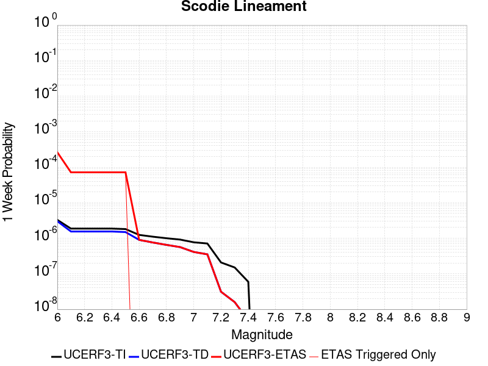 | 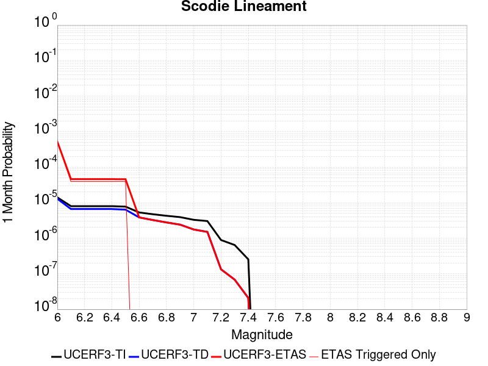 | 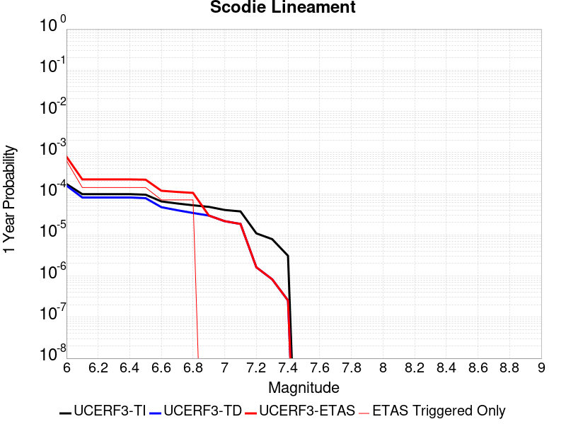 | 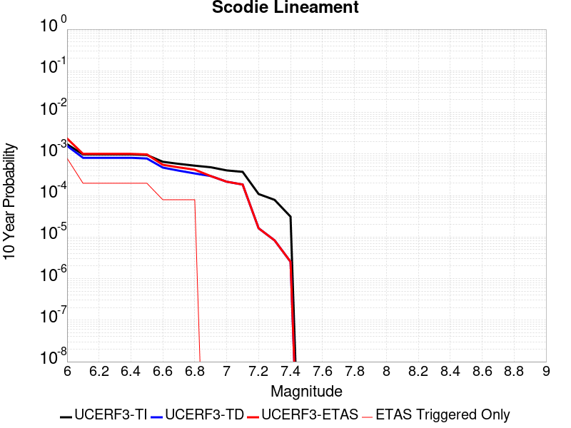 |

| Magnitude | 1 wk TI Prob | 1 wk TD Prob | 1 wk ETAS Prob | 1 wk ETAS/TD Gain | 1 wk ETAS Triggered Only | 1 mo TI Prob | 1 mo TD Prob | 1 mo ETAS Prob | 1 mo ETAS/TD Gain | 1 mo ETAS Triggered Only | 1 yr TI Prob | 1 yr TD Prob | 1 yr ETAS Prob | 1 yr ETAS/TD Gain | 1 yr ETAS Triggered Only | 10 yr TI Prob | 10 yr TD Prob | 10 yr ETAS Prob | 10 yr ETAS/TD Gain | 10 yr ETAS Triggered Only |
|-----|-----|-----|-----|-----|-----|-----|-----|-----|-----|-----|-----|-----|-----|-----|-----|-----|-----|-----|-----|-----|
| 6.0 | 3.2919327E-6 | 3.0133422E-6 | 5.158728E-4 | 171.19621 | 5.1286095E-4 | 1.4108206E-5 | 1.2914278E-5 | 5.257686E-4 | 40.712196 | 5.1286095E-4 | 1.7175387E-4 | 1.5722317E-4 | 8.277821E-4 | 5.265013 | 6.7066436E-4 | 0.0017162118 | 0.0015714309 | 0.002359208 | 1.5013119 | 7.890169E-4 |
| 6.1 | 1.8663811E-6 | 1.5490499E-6 | 4.0999832E-5 | 26.467728 | 3.9450842E-5 | 7.998751E-6 | 6.6387715E-6 | 4.6089353E-5 | 6.9424524 | 3.9450842E-5 | 9.738045E-5 | 8.082454E-5 | 1.9916751E-4 | 2.464196 | 1.1835253E-4 | 9.7337784E-4 | 8.080003E-4 | 0.0010050951 | 1.2439291 | 1.9725422E-4 |
| 6.2 | 1.8663811E-6 | 1.5490499E-6 | 4.0999832E-5 | 26.467728 | 3.9450842E-5 | 7.998751E-6 | 6.6387715E-6 | 4.6089353E-5 | 6.9424524 | 3.9450842E-5 | 9.738045E-5 | 8.082454E-5 | 1.9916751E-4 | 2.464196 | 1.1835253E-4 | 9.7337784E-4 | 8.080003E-4 | 0.0010050951 | 1.2439291 | 1.9725422E-4 |
| 6.3 | 1.8663811E-6 | 1.5490499E-6 | 4.0999832E-5 | 26.467728 | 3.9450842E-5 | 7.998751E-6 | 6.6387715E-6 | 4.6089353E-5 | 6.9424524 | 3.9450842E-5 | 9.738045E-5 | 8.082454E-5 | 1.9916751E-4 | 2.464196 | 1.1835253E-4 | 9.7337784E-4 | 8.080003E-4 | 0.0010050951 | 1.2439291 | 1.9725422E-4 |
| 6.4 | 1.8663811E-6 | 1.5490499E-6 | 4.0999832E-5 | 26.467728 | 3.9450842E-5 | 7.998751E-6 | 6.6387715E-6 | 4.6089353E-5 | 6.9424524 | 3.9450842E-5 | 9.738045E-5 | 8.082454E-5 | 1.9916751E-4 | 2.464196 | 1.1835253E-4 | 9.7337784E-4 | 8.080003E-4 | 0.0010050951 | 1.2439291 | 1.9725422E-4 |
| 6.5 | 1.8106311E-6 | 1.4909839E-6 | 4.094177E-5 | 27.459564 | 3.9450842E-5 | 7.759824E-6 | 6.3899183E-6 | 4.5840512E-5 | 7.1738806 | 3.9450842E-5 | 9.447177E-5 | 7.7794975E-5 | 1.961383E-4 | 2.5212207 | 1.1835253E-4 | 9.4431615E-4 | 7.7772606E-4 | 9.7482686E-4 | 1.2534322 | 1.9725422E-4 |
| 6.6 | 1.2414679E-6 | 8.997558E-7 | 8.997558E-7 | 1.0 | 0.0 | 5.320566E-6 | 3.856091E-6 | 3.856091E-6 | 1.0 | 0.0 | 6.477596E-5 | 4.6946985E-5 | 1.2584496E-4 | 2.6805763 | 7.8901685E-5 | 6.475708E-4 | 4.693793E-4 | 5.48244E-4 | 1.168019 | 7.8901685E-5 |
| 6.7 | 1.1062215E-6 | 7.594311E-7 | 7.594311E-7 | 1.0 | 0.0 | 4.7409408E-6 | 3.2547011E-6 | 3.2547011E-6 | 1.0 | 0.0 | 5.7719422E-5 | 3.9625334E-5 | 1.185239E-4 | 2.991114 | 7.8901685E-5 | 5.770443E-4 | 3.961897E-4 | 4.750601E-4 | 1.1990724 | 7.8901685E-5 |
| 6.8 | 1.0006736E-6 | 6.500397E-7 | 6.500397E-7 | 1.0 | 0.0 | 4.288594E-6 | 2.7858816E-6 | 2.7858816E-6 | 1.0 | 0.0 | 5.221238E-5 | 3.3917644E-5 | 1.12816655E-4 | 3.3261938 | 7.8901685E-5 | 5.220012E-4 | 3.3913075E-4 | 4.180057E-4 | 1.2325797 | 7.8901685E-5 |
| 6.9 | 9.167364E-7 | 5.631625E-7 | 5.631625E-7 | 1.0 | 0.0 | 3.9288643E-6 | 2.4135516E-6 | 2.4135516E-6 | 1.0 | 0.0 | 4.7832873E-5 | 2.9384651E-5 | 2.9384651E-5 | 1.0 | 0.0 | 4.782258E-4 | 2.9381333E-4 | 2.9381333E-4 | 1.0 | 0.0 |
| 7.0 | 7.6987664E-7 | 4.113383E-7 | 4.113383E-7 | 1.0 | 0.0 | 3.2994672E-6 | 1.7628774E-6 | 1.7628774E-6 | 1.0 | 0.0 | 4.0170275E-5 | 2.1462862E-5 | 2.1462862E-5 | 1.0 | 0.0 | 4.0163012E-4 | 2.1461173E-4 | 2.1461173E-4 | 1.0 | 0.0 |
| 7.1 | 7.1038727E-7 | 3.5211494E-7 | 3.5211494E-7 | 1.0 | 0.0 | 3.0445133E-6 | 1.5090633E-6 | 1.5090633E-6 | 1.0 | 0.0 | 3.706632E-5 | 1.8372726E-5 | 1.8372726E-5 | 1.0 | 0.0 | 3.7060137E-4 | 1.8371557E-4 | 1.8371557E-4 | 1.0 | 0.0 |
| 7.2 | 2.0799602E-7 | 3.1186854E-8 | 3.1186854E-8 | 1.0 | 0.0 | 8.914113E-7 | 1.3365793E-7 | 1.3365793E-7 | 1.0 | 0.0 | 1.0852878E-5 | 1.6272843E-6 | 1.6272843E-6 | 1.0 | 0.0 | 1.08523476E-4 | 1.627273E-5 | 1.627273E-5 | 1.0 | 0.0 |
| 7.3 | 1.5048182E-7 | 1.5945696E-8 | 1.5945696E-8 | 1.0 | 0.0 | 6.449219E-7 | 6.83387E-8 | 6.83387E-8 | 1.0 | 0.0 | 7.851896E-6 | 8.320234E-7 | 8.320234E-7 | 1.0 | 0.0 | 7.851618E-5 | 8.320206E-6 | 8.320206E-6 | 1.0 | 0.0 |
| 7.4 | 5.9334678E-8 | 4.8683537E-9 | 4.8683537E-9 | 1.0 | 0.0 | 2.5429145E-7 | 2.0864372E-8 | 2.0864372E-8 | 1.0 | 0.0 | 3.095994E-6 | 2.5402372E-7 | 2.5402372E-7 | 1.0 | 0.0 | 3.095951E-5 | 2.5402353E-6 | 2.5402353E-6 | 1.0 | 0.0 |

## Manix-Afton Hills
*[(top)](#table-of-contents)*

| 1 Week | 1 Month | 1 Year | 10 Year |
|-----|-----|-----|-----|
| 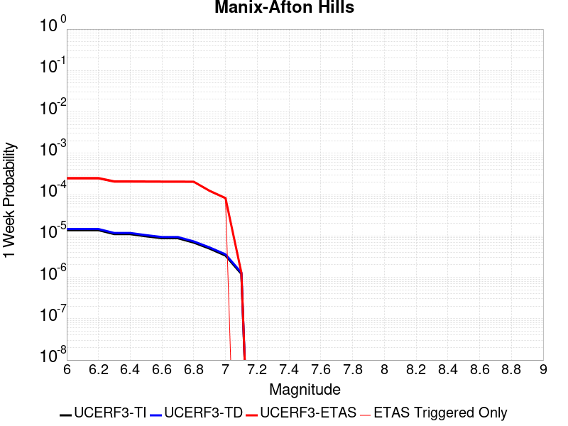 | 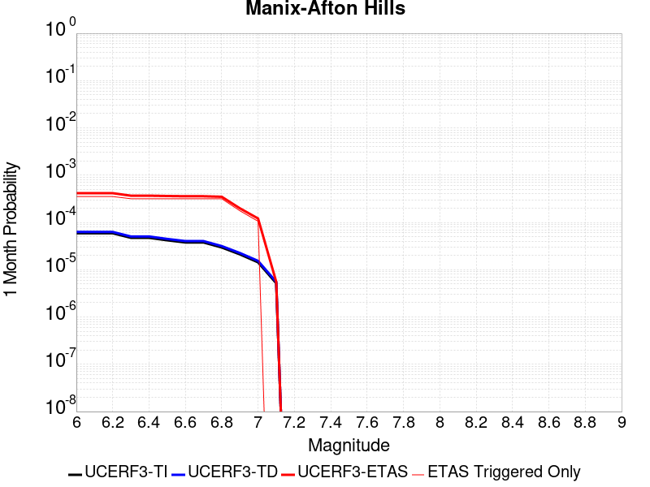 | 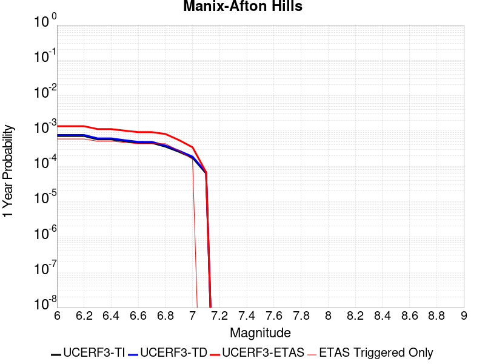 | 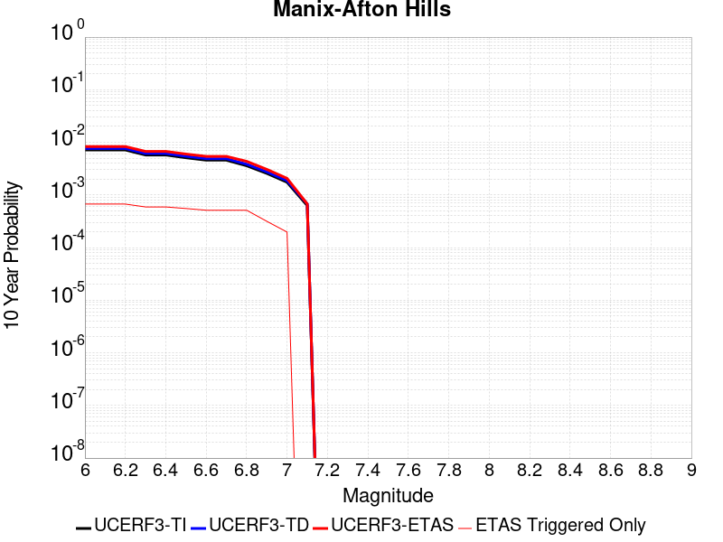 |

| Magnitude | 1 wk TI Prob | 1 wk TD Prob | 1 wk ETAS Prob | 1 wk ETAS/TD Gain | 1 wk ETAS Triggered Only | 1 mo TI Prob | 1 mo TD Prob | 1 mo ETAS Prob | 1 mo ETAS/TD Gain | 1 mo ETAS Triggered Only | 1 yr TI Prob | 1 yr TD Prob | 1 yr ETAS Prob | 1 yr ETAS/TD Gain | 1 yr ETAS Triggered Only | 10 yr TI Prob | 10 yr TD Prob | 10 yr ETAS Prob | 10 yr ETAS/TD Gain | 10 yr ETAS Triggered Only |
|-----|-----|-----|-----|-----|-----|-----|-----|-----|-----|-----|-----|-----|-----|-----|-----|-----|-----|-----|-----|-----|
| 6.0 | 1.3783202E-5 | 1.47110895E-5 | 2.5141268E-4 | 17.09001 | 2.3670506E-4 | 5.906953E-5 | 6.30461E-5 | 4.5752968E-4 | 7.2570653 | 3.9450845E-4 | 7.189342E-4 | 7.6733343E-4 | 0.001358642 | 1.7706019 | 5.9176265E-4 | 0.0071661277 | 0.007648596 | 0.008314131 | 1.087014 | 6.7066436E-4 |
| 6.1 | 1.3783202E-5 | 1.47110895E-5 | 2.5141268E-4 | 17.09001 | 2.3670506E-4 | 5.906953E-5 | 6.30461E-5 | 4.5752968E-4 | 7.2570653 | 3.9450845E-4 | 7.189342E-4 | 7.6733343E-4 | 0.001358642 | 1.7706019 | 5.9176265E-4 | 0.0071661277 | 0.007648596 | 0.008314131 | 1.087014 | 6.7066436E-4 |
| 6.2 | 1.3783202E-5 | 1.47110895E-5 | 2.5141268E-4 | 17.09001 | 2.3670506E-4 | 5.906953E-5 | 6.30461E-5 | 4.5752968E-4 | 7.2570653 | 3.9450845E-4 | 7.189342E-4 | 7.6733343E-4 | 0.001358642 | 1.7706019 | 5.9176265E-4 | 0.0071661277 | 0.007648596 | 0.008314131 | 1.087014 | 6.7066436E-4 |
| 6.3 | 1.10494875E-5 | 1.1793136E-5 | 2.0904503E-4 | 17.725992 | 1.9725422E-4 | 4.7354086E-5 | 5.054109E-5 | 4.0558074E-4 | 8.024773 | 3.550576E-4 | 5.763835E-4 | 6.151744E-4 | 0.0011277199 | 1.833171 | 5.1286095E-4 | 0.005748908 | 0.0061357557 | 0.0067238873 | 1.0958532 | 5.9176265E-4 |
| 6.4 | 1.10494875E-5 | 1.1793136E-5 | 2.0904503E-4 | 17.725992 | 1.9725422E-4 | 4.7354086E-5 | 5.054109E-5 | 4.0558074E-4 | 8.024773 | 3.550576E-4 | 5.763835E-4 | 6.151744E-4 | 0.0011277199 | 1.833171 | 5.1286095E-4 | 0.005748908 | 0.0061357557 | 0.0067238873 | 1.0958532 | 5.9176265E-4 |
| 6.5 | 9.788949E-6 | 1.045432E-5 | 2.0770649E-4 | 19.868006 | 1.9725422E-4 | 4.1951964E-5 | 4.480351E-5 | 3.998452E-4 | 8.924417 | 3.550576E-4 | 5.1064545E-4 | 5.453555E-4 | 0.0010185074 | 1.8676028 | 4.7341012E-4 | 0.0050947363 | 0.0054410985 | 0.005990405 | 1.1009551 | 5.5231183E-4 |
| 6.6 | 8.810006E-6 | 9.4136285E-6 | 2.06666E-4 | 21.953915 | 1.9725422E-4 | 3.775662E-5 | 4.0343548E-5 | 3.9538683E-4 | 9.800497 | 3.550576E-4 | 4.5958988E-4 | 4.9108086E-4 | 9.2482707E-4 | 1.883248 | 4.339593E-4 | 0.0045864056 | 0.004900839 | 0.0054111867 | 1.1041347 | 5.1286095E-4 |
| 6.7 | 8.80128E-6 | 9.404108E-6 | 2.0665648E-4 | 21.975128 | 1.9725422E-4 | 3.7719226E-5 | 4.0302748E-5 | 3.9534603E-4 | 9.809406 | 3.550576E-4 | 4.591348E-4 | 4.9058435E-4 | 9.243307E-4 | 1.8841423 | 4.339593E-4 | 0.004581874 | 0.0048958957 | 0.005406246 | 1.1042404 | 5.1286095E-4 |
| 6.8 | 6.8994877E-6 | 7.380076E-6 | 2.0463284E-4 | 27.727741 | 1.9725422E-4 | 2.9568899E-5 | 3.162856E-5 | 3.8667492E-4 | 12.225499 | 3.550576E-4 | 3.5994186E-4 | 3.8501783E-4 | 8.1881E-4 | 2.1266809 | 4.339593E-4 | 0.003593594 | 0.0038443129 | 0.0043552024 | 1.1328949 | 5.1286095E-4 |
| 6.9 | 4.9328037E-6 | 5.2709615E-6 | 1.2362287E-4 | 23.453571 | 1.1835253E-4 | 2.1140417E-5 | 2.2589675E-5 | 2.1983944E-4 | 9.731855 | 1.9725422E-4 | 2.5735417E-4 | 2.7500073E-4 | 5.510807E-4 | 2.0039246 | 2.7615592E-4 | 0.0025705635 | 0.0027472095 | 0.0030619493 | 1.114567 | 3.1560674E-4 |
| 7.0 | 3.347973E-6 | 3.59003E-6 | 8.249144E-5 | 22.977924 | 7.8901685E-5 | 1.4348378E-5 | 1.5385775E-5 | 1.3373648E-4 | 8.692216 | 1.1835253E-4 | 1.746775E-4 | 1.8730981E-4 | 3.4508362E-4 | 1.8423147 | 1.5780337E-4 | 0.0017454025 | 0.0018719219 | 0.002068807 | 1.105178 | 1.9725422E-4 |
| 7.1 | 1.2073567E-6 | 1.293482E-6 | 1.293482E-6 | 1.0 | 0.0 | 5.1743755E-6 | 5.543492E-6 | 5.543492E-6 | 1.0 | 0.0 | 6.29962E-5 | 6.749156E-5 | 6.749156E-5 | 1.0 | 0.0 | 6.297835E-4 | 6.7487074E-4 | 6.7487074E-4 | 1.0 | 0.0 |

## San Andreas (San Gorgonio Pass-Garnet HIll)
*[(top)](#table-of-contents)*

| 1 Week | 1 Month | 1 Year | 10 Year |
|-----|-----|-----|-----|
| 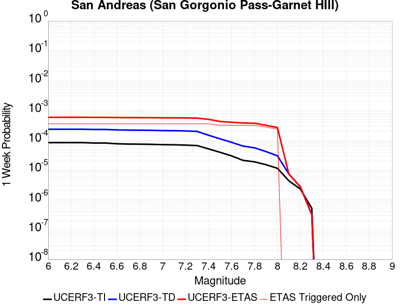 | 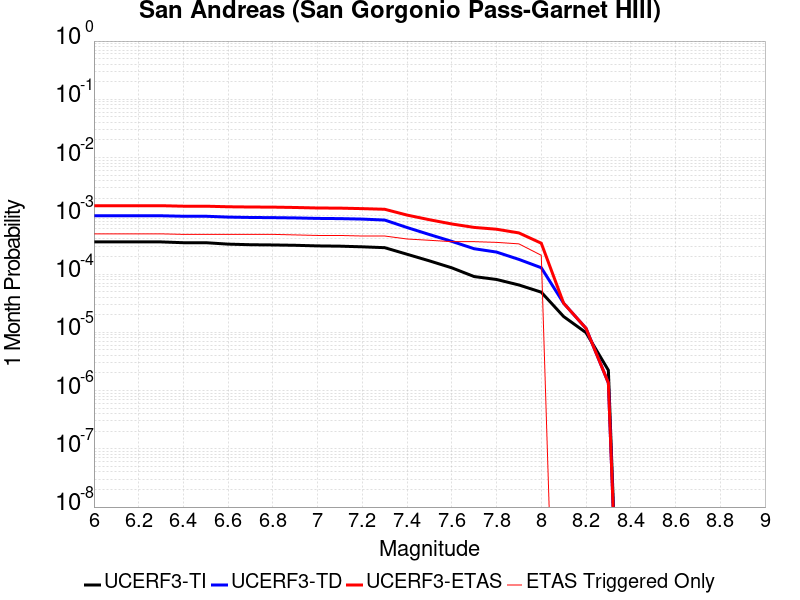 | 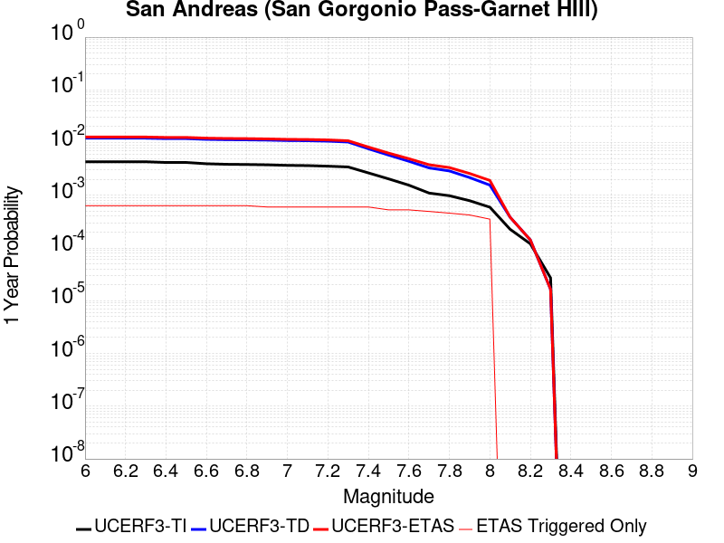 | 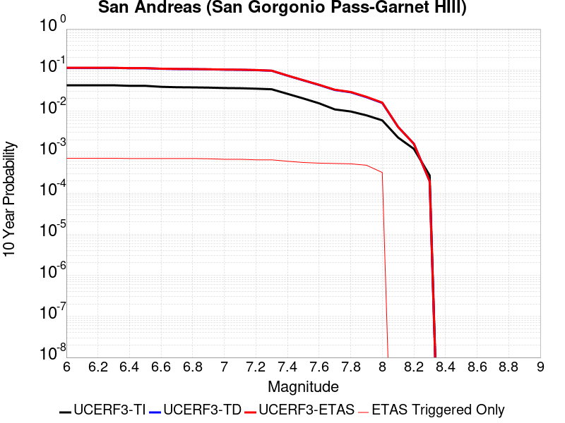 |

| Magnitude | 1 wk TI Prob | 1 wk TD Prob | 1 wk ETAS Prob | 1 wk ETAS/TD Gain | 1 wk ETAS Triggered Only | 1 mo TI Prob | 1 mo TD Prob | 1 mo ETAS Prob | 1 mo ETAS/TD Gain | 1 mo ETAS Triggered Only | 1 yr TI Prob | 1 yr TD Prob | 1 yr ETAS Prob | 1 yr ETAS/TD Gain | 1 yr ETAS Triggered Only | 10 yr TI Prob | 10 yr TD Prob | 10 yr ETAS Prob | 10 yr ETAS/TD Gain | 10 yr ETAS Triggered Only |
|-----|-----|-----|-----|-----|-----|-----|-----|-----|-----|-----|-----|-----|-----|-----|-----|-----|-----|-----|-----|-----|
| 6.0 | 8.31567E-5 | 2.3382473E-4 | 5.887993E-4 | 2.5181224 | 3.550576E-4 | 3.5633717E-4 | 0.0010017233 | 0.0014746593 | 1.4721223 | 4.7341012E-4 | 0.004329778 | 0.012127888 | 0.012712474 | 1.0482018 | 5.9176265E-4 | 0.042463828 | 0.11257892 | 0.11317408 | 1.0052866 | 6.7066436E-4 |
| 6.1 | 8.31567E-5 | 2.3382473E-4 | 5.887993E-4 | 2.5181224 | 3.550576E-4 | 3.5633717E-4 | 0.0010017233 | 0.0014746593 | 1.4721223 | 4.7341012E-4 | 0.004329778 | 0.012127888 | 0.012712474 | 1.0482018 | 5.9176265E-4 | 0.042463828 | 0.11257892 | 0.11317408 | 1.0052866 | 6.7066436E-4 |
| 6.2 | 8.31567E-5 | 2.3382473E-4 | 5.887993E-4 | 2.5181224 | 3.550576E-4 | 3.5633717E-4 | 0.0010017233 | 0.0014746593 | 1.4721223 | 4.7341012E-4 | 0.004329778 | 0.012127888 | 0.012712474 | 1.0482018 | 5.9176265E-4 | 0.042463828 | 0.11257892 | 0.11317408 | 1.0052866 | 6.7066436E-4 |
| 6.3 | 8.31567E-5 | 2.3382473E-4 | 5.887993E-4 | 2.5181224 | 3.550576E-4 | 3.5633717E-4 | 0.0010017233 | 0.0014746593 | 1.4721223 | 4.7341012E-4 | 0.004329778 | 0.012127888 | 0.012712474 | 1.0482018 | 5.9176265E-4 | 0.042463828 | 0.11257892 | 0.11317408 | 1.0052866 | 6.7066436E-4 |
| 6.4 | 8.059055E-5 | 2.2940808E-4 | 5.8438425E-4 | 2.5473568 | 3.550576E-4 | 3.4534236E-4 | 9.828096E-4 | 0.0014557544 | 1.4812173 | 4.7341012E-4 | 0.0041964394 | 0.011900152 | 0.012484873 | 1.0491356 | 5.9176265E-4 | 0.041180745 | 0.11056015 | 0.111156665 | 1.0053954 | 6.7066436E-4 |
| 6.5 | 8.059055E-5 | 2.2940808E-4 | 5.8438425E-4 | 2.5473568 | 3.550576E-4 | 3.4534236E-4 | 9.828096E-4 | 0.0014557544 | 1.4812173 | 4.7341012E-4 | 0.0041964394 | 0.011900152 | 0.012484873 | 1.0491356 | 5.9176265E-4 | 0.041180745 | 0.11056015 | 0.111156665 | 1.0053954 | 6.7066436E-4 |
| 6.6 | 7.619237E-5 | 2.218517E-4 | 5.768305E-4 | 2.6000726 | 3.550576E-4 | 3.2649786E-4 | 9.5044886E-4 | 0.0014234091 | 1.4976177 | 4.7341012E-4 | 0.0039678677 | 0.01151087 | 0.012095821 | 1.0508173 | 5.9176265E-4 | 0.03897764 | 0.10709683 | 0.10769567 | 1.0055915 | 6.7066436E-4 |
| 6.7 | 7.440636E-5 | 2.1860997E-4 | 5.7358993E-4 | 2.623805 | 3.550576E-4 | 3.188454E-4 | 9.3656575E-4 | 0.0014095325 | 1.5050012 | 4.7341012E-4 | 0.0038750346 | 0.011343609 | 0.011928658 | 1.0515753 | 5.9176265E-4 | 0.038081564 | 0.105605274 | 0.10620511 | 1.00568 | 6.7066436E-4 |
| 6.8 | 7.3735864E-5 | 2.1708169E-4 | 5.720622E-4 | 2.6352394 | 3.550576E-4 | 3.1597257E-4 | 9.3002064E-4 | 0.0014029904 | 1.5085584 | 4.7341012E-4 | 0.0038401815 | 0.011264749 | 0.011849846 | 1.0519404 | 5.9176265E-4 | 0.03774495 | 0.10490683 | 0.105507135 | 1.0057223 | 6.7066436E-4 |
| 6.9 | 7.27575E-5 | 2.1477141E-4 | 5.6975277E-4 | 2.6528332 | 3.550576E-4 | 3.117806E-4 | 9.201265E-4 | 0.0013536864 | 1.471196 | 4.339593E-4 | 0.003789323 | 0.011145527 | 0.011691682 | 1.0490023 | 5.5231183E-4 | 0.037253562 | 0.103854746 | 0.1044204 | 1.0054467 | 6.312135E-4 |
| 7.0 | 7.102591E-5 | 2.1061185E-4 | 5.6559464E-4 | 2.6854837 | 3.550576E-4 | 3.0436125E-4 | 9.023122E-4 | 0.0013358799 | 1.4805075 | 4.339593E-4 | 0.003699303 | 0.010930831 | 0.011477105 | 1.0499756 | 5.5231183E-4 | 0.03638325 | 0.10195695 | 0.1025238 | 1.0055598 | 6.312135E-4 |
| 7.1 | 7.028513E-5 | 2.0896831E-4 | 5.6395173E-4 | 2.6987426 | 3.550576E-4 | 3.0118722E-4 | 8.9527335E-4 | 0.0013288441 | 1.4842887 | 4.339593E-4 | 0.0036607897 | 0.010845989 | 0.01139231 | 1.0503708 | 5.5231183E-4 | 0.036010686 | 0.101199985 | 0.101767324 | 1.005606 | 6.312135E-4 |
| 7.2 | 6.8498244E-5 | 2.0504706E-4 | 5.6003185E-4 | 2.7312357 | 3.550576E-4 | 2.9353087E-4 | 8.784794E-4 | 0.0013120575 | 1.4935552 | 4.339593E-4 | 0.003567883 | 0.010643536 | 0.011189969 | 1.0513395 | 5.5231183E-4 | 0.035111405 | 0.09939202 | 0.0999605 | 1.0057195 | 6.312135E-4 |
| 7.3 | 6.622592E-5 | 1.9732013E-4 | 5.5230764E-4 | 2.7990437 | 3.550576E-4 | 2.8379448E-4 | 8.453858E-4 | 0.0012789782 | 1.512893 | 4.339593E-4 | 0.0034497243 | 0.0102444785 | 0.010791132 | 1.0533608 | 5.5231183E-4 | 0.033966612 | 0.095888525 | 0.09645922 | 1.0059515 | 6.312135E-4 |
| 7.4 | 5.1050705E-5 | 1.4689034E-4 | 5.018958E-4 | 3.416806 | 3.550576E-4 | 2.1877038E-4 | 6.29379E-4 | 0.0010630651 | 1.68907 | 4.339593E-4 | 0.002660276 | 0.0076359594 | 0.008184054 | 1.071778 | 5.5231183E-4 | 0.02628654 | 0.07286301 | 0.07344823 | 1.0080318 | 6.312135E-4 |
| 7.5 | 3.9302922E-5 | 1.1129847E-4 | 4.268701E-4 | 3.8353636 | 3.1560674E-4 | 1.6843023E-4 | 4.7690657E-4 | 8.7122683E-4 | 1.8268293 | 3.9450845E-4 | 0.0020487092 | 0.005790949 | 0.0062616174 | 1.0812767 | 4.7341012E-4 | 0.020299247 | 0.05600951 | 0.05653089 | 1.0093087 | 5.5231183E-4 |
| 7.6 | 2.9851626E-5 | 8.4949745E-5 | 4.0052968E-4 | 4.7149014 | 3.1560674E-4 | 1.2792926E-4 | 3.6401965E-4 | 7.5838447E-4 | 2.0833614 | 3.9450845E-4 | 0.0015564259 | 0.0044229585 | 0.0048942748 | 1.1065613 | 4.7341012E-4 | 0.0154556995 | 0.04319374 | 0.043722194 | 1.0122346 | 5.5231183E-4 |
| 7.7 | 2.1135214E-5 | 6.3529005E-5 | 3.791157E-4 | 5.9676003 | 3.1560674E-4 | 9.0576345E-5 | 2.7223877E-4 | 6.666398E-4 | 2.4487321 | 3.9450845E-4 | 0.0011022091 | 0.0033094748 | 0.003741998 | 1.1306924 | 4.339593E-4 | 0.010967582 | 0.032582592 | 0.033078745 | 1.0152274 | 5.1286095E-4 |
| 7.8 | 1.883379E-5 | 5.564028E-5 | 3.712295E-4 | 6.6719556 | 3.1560674E-4 | 8.0713755E-5 | 2.3843657E-4 | 5.934095E-4 | 2.4887521 | 3.550576E-4 | 9.822468E-4 | 0.0028991038 | 0.0032924686 | 1.135685 | 3.9450845E-4 | 0.0097791655 | 0.028695205 | 0.02915503 | 1.0160245 | 4.7341012E-4 |
| 7.9 | 1.5156185E-5 | 4.1658426E-5 | 3.1780283E-4 | 7.628777 | 2.7615592E-4 | 6.495346E-5 | 1.785239E-4 | 4.940743E-4 | 2.7675529 | 3.1560674E-4 | 7.9052144E-4 | 0.0021713632 | 0.0025256497 | 1.1631632 | 3.550576E-4 | 0.007877152 | 0.021759422 | 0.022145348 | 1.017736 | 3.9450845E-4 |
| 8.0 | 1.1405907E-5 | 2.9974231E-5 | 2.666722E-4 | 8.896715 | 2.3670506E-4 | 4.8881542E-5 | 1.2845467E-4 | 4.045751E-4 | 3.1495554 | 2.7615592E-4 | 5.9497025E-4 | 0.0015628147 | 0.0018779282 | 1.201632 | 3.1560674E-4 | 0.005933798 | 0.015772851 | 0.016122308 | 1.0221556 | 3.550576E-4 |
| 8.1 | 4.3511436E-6 | 7.369219E-6 | 7.369219E-6 | 1.0 | 0.0 | 1.8647626E-5 | 3.1581985E-5 | 3.1581985E-5 | 1.0 | 0.0 | 2.2701119E-4 | 3.8444297E-4 | 3.8444297E-4 | 1.0 | 0.0 | 0.0022677942 | 0.0041163345 | 0.0041163345 | 1.0 | 0.0 |
| 8.2 | 2.3042528E-6 | 2.7329415E-6 | 2.7329415E-6 | 1.0 | 0.0 | 9.875332E-6 | 1.1712554E-5 | 1.1712554E-5 | 1.0 | 0.0 | 1.2022553E-4 | 1.4259106E-4 | 1.4259106E-4 | 1.0 | 0.0 | 0.0012016051 | 0.0015979785 | 0.0015979785 | 1.0 | 0.0 |
| 8.3 | 5.202968E-7 | 3.1598344E-7 | 3.1598344E-7 | 1.0 | 0.0 | 2.2298414E-6 | 1.3542141E-6 | 1.3542141E-6 | 1.0 | 0.0 | 2.714798E-5 | 1.6487444E-5 | 1.6487444E-5 | 1.0 | 0.0 | 2.7144665E-4 | 1.9563142E-4 | 1.9563142E-4 | 1.0 | 0.0 |

## Ludlow
*[(top)](#table-of-contents)*

| 1 Week | 1 Month | 1 Year | 10 Year |
|-----|-----|-----|-----|
| 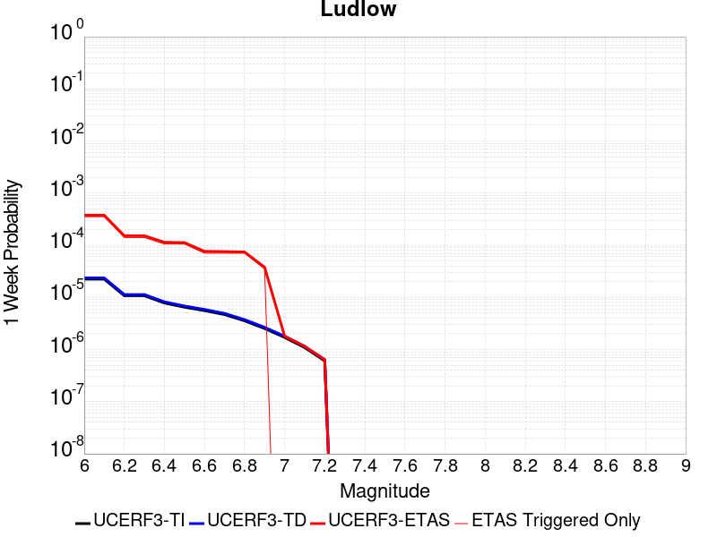 | 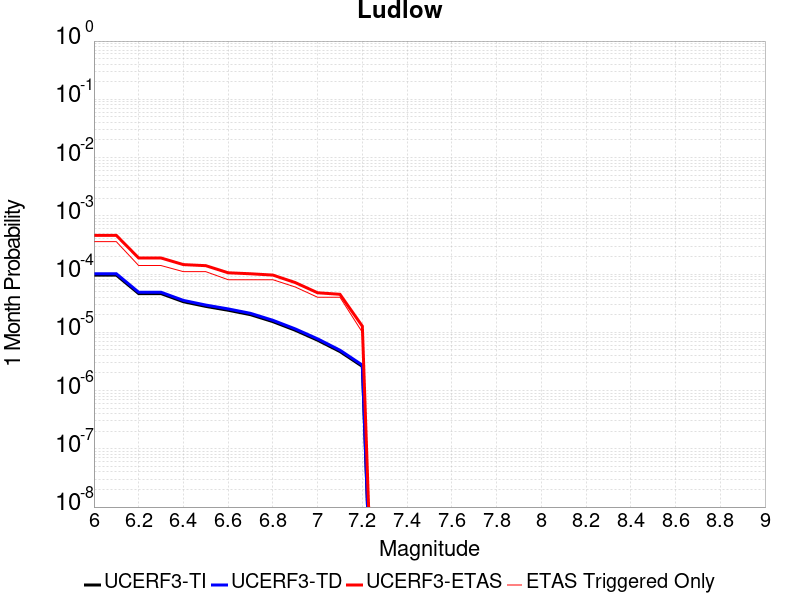 |  | 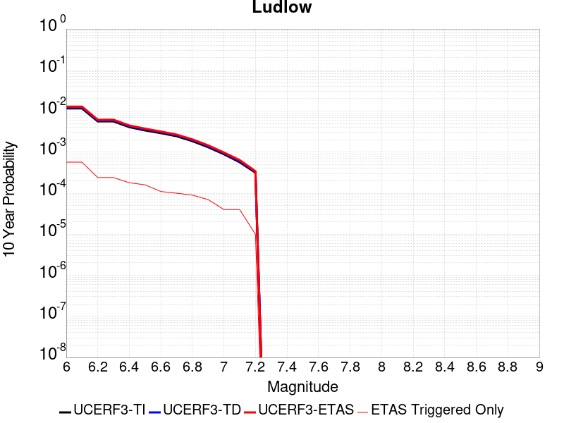 |

| Magnitude | 1 wk TI Prob | 1 wk TD Prob | 1 wk ETAS Prob | 1 wk ETAS/TD Gain | 1 wk ETAS Triggered Only | 1 mo TI Prob | 1 mo TD Prob | 1 mo ETAS Prob | 1 mo ETAS/TD Gain | 1 mo ETAS Triggered Only | 1 yr TI Prob | 1 yr TD Prob | 1 yr ETAS Prob | 1 yr ETAS/TD Gain | 1 yr ETAS Triggered Only | 10 yr TI Prob | 10 yr TD Prob | 10 yr ETAS Prob | 10 yr ETAS/TD Gain | 10 yr ETAS Triggered Only |
|-----|-----|-----|-----|-----|-----|-----|-----|-----|-----|-----|-----|-----|-----|-----|-----|-----|-----|-----|-----|-----|
| 6.0 | 2.2407607E-5 | 2.3657254E-5 | 3.7870646E-4 | 16.008049 | 3.550576E-4 | 9.602906E-5 | 1.0138454E-4 | 6.141935E-4 | 6.058059 | 5.1286095E-4 | 0.0011685267 | 0.001233702 | 0.0018641367 | 1.5110106 | 6.312135E-4 | 0.011624013 | 0.012273042 | 0.012935475 | 1.0539746 | 6.7066436E-4 |
| 6.1 | 2.2407607E-5 | 2.3657254E-5 | 3.7870646E-4 | 16.008049 | 3.550576E-4 | 9.602906E-5 | 1.0138454E-4 | 6.141935E-4 | 6.058059 | 5.1286095E-4 | 0.0011685267 | 0.001233702 | 0.0018641367 | 1.5110106 | 6.312135E-4 | 0.011624013 | 0.012273042 | 0.012935475 | 1.0539746 | 6.7066436E-4 |
| 6.2 | 1.0781252E-5 | 1.1365663E-5 | 1.6916725E-4 | 14.884063 | 1.5780337E-4 | 4.620455E-5 | 4.8709102E-5 | 2.459537E-4 | 5.049441 | 1.9725422E-4 | 5.623952E-4 | 5.9287593E-4 | 7.9001323E-4 | 1.3325101 | 1.9725422E-4 | 0.00560974 | 0.0059133614 | 0.0061486666 | 1.0397922 | 2.3670506E-4 |
| 6.3 | 1.0781252E-5 | 1.1365663E-5 | 1.6916725E-4 | 14.884063 | 1.5780337E-4 | 4.620455E-5 | 4.8709102E-5 | 2.459537E-4 | 5.049441 | 1.9725422E-4 | 5.623952E-4 | 5.9287593E-4 | 7.9001323E-4 | 1.3325101 | 1.9725422E-4 | 0.00560974 | 0.0059133614 | 0.0061486666 | 1.0397922 | 2.3670506E-4 |
| 6.4 | 7.814439E-6 | 8.237729E-6 | 1.265893E-4 | 15.367013 | 1.1835253E-4 | 3.3490025E-5 | 3.530408E-5 | 1.9310189E-4 | 5.469676 | 1.5780337E-4 | 4.0766477E-4 | 4.2974384E-4 | 5.874794E-4 | 1.3670455 | 1.5780337E-4 | 0.0040691774 | 0.0042892746 | 0.0044856826 | 1.0457906 | 1.9725422E-4 |
| 6.5 | 6.4986366E-6 | 6.85092E-6 | 1.2520264E-4 | 18.275305 | 1.1835253E-4 | 2.7851002E-5 | 2.9360759E-5 | 1.871595E-4 | 6.374478 | 1.5780337E-4 | 3.390332E-4 | 3.5740953E-4 | 5.151565E-4 | 1.441362 | 1.5780337E-4 | 0.003385164 | 0.0035684432 | 0.0037256835 | 1.0440642 | 1.5780337E-4 |
| 6.6 | 5.582177E-6 | 5.8860055E-6 | 8.478723E-5 | 14.404884 | 7.8901685E-5 | 2.3923398E-5 | 2.5225498E-5 | 1.4357505E-4 | 5.6916633 | 1.1835253E-4 | 2.9122844E-4 | 3.0707786E-4 | 4.2539407E-4 | 1.3852971 | 1.1835253E-4 | 0.0029084706 | 0.003066609 | 0.0031845984 | 1.0384756 | 1.1835253E-4 |
| 6.7 | 4.6858763E-6 | 4.940427E-6 | 8.3841725E-5 | 16.970541 | 7.8901685E-5 | 2.0082172E-5 | 2.1173091E-5 | 1.3952312E-4 | 6.5896435 | 1.1835253E-4 | 2.4447302E-4 | 2.5775246E-4 | 3.7607446E-4 | 1.4590529 | 1.1835253E-4 | 0.0024420423 | 0.0025745912 | 0.0026926391 | 1.0458511 | 1.1835253E-4 |
| 6.8 | 3.5584908E-6 | 3.7520183E-6 | 8.265341E-5 | 22.029053 | 7.8901685E-5 | 1.5250586E-5 | 1.6079981E-5 | 1.3443061E-4 | 8.360122 | 1.1835253E-4 | 1.8566006E-4 | 1.957566E-4 | 3.1408598E-4 | 1.6044719 | 1.1835253E-4 | 0.0018550502 | 0.0019558826 | 0.0020740037 | 1.0603927 | 1.1835253E-4 |
| 6.9 | 2.532834E-6 | 2.6710034E-6 | 4.212174E-5 | 15.770007 | 3.9450842E-5 | 1.0854958E-5 | 1.1447109E-5 | 9.0347894E-5 | 7.8926387 | 7.8901685E-5 | 1.3215111E-4 | 1.3935992E-4 | 2.1825061E-4 | 1.5660931 | 7.8901685E-5 | 0.0013207254 | 0.0013927529 | 0.0014715446 | 1.0565727 | 7.8901685E-5 |
| 7.0 | 1.7083285E-6 | 1.8019439E-6 | 1.8019439E-6 | 1.0 | 0.0 | 7.3213873E-6 | 7.722595E-6 | 4.7173133E-5 | 6.1084566 | 3.9450842E-5 | 8.913424E-5 | 9.40187E-5 | 1.3346583E-4 | 1.4195669 | 3.9450842E-5 | 8.9098496E-4 | 9.3980576E-4 | 9.792196E-4 | 1.0419382 | 3.9450842E-5 |
| 7.1 | 1.0905424E-6 | 1.1497619E-6 | 1.1497619E-6 | 1.0 | 0.0 | 4.6737446E-6 | 4.9275427E-6 | 4.4378194E-5 | 9.006151 | 3.9450842E-5 | 5.6901354E-5 | 5.999128E-5 | 9.9439756E-5 | 1.6575702 | 3.9450842E-5 | 5.6886784E-4 | 5.997606E-4 | 6.391878E-4 | 1.0657382 | 3.9450842E-5 |
| 7.2 | 6.06668E-7 | 6.387277E-7 | 6.387277E-7 | 1.0 | 0.0 | 2.600003E-6 | 2.7374022E-6 | 2.7374022E-6 | 1.0 | 0.0 | 3.1654577E-5 | 3.3327433E-5 | 3.3327433E-5 | 1.0 | 0.0 | 3.1650066E-4 | 3.3323118E-4 | 3.3323118E-4 | 1.0 | 0.0 |

## Baker
*[(top)](#table-of-contents)*

| 1 Week | 1 Month | 1 Year | 10 Year |
|-----|-----|-----|-----|
| 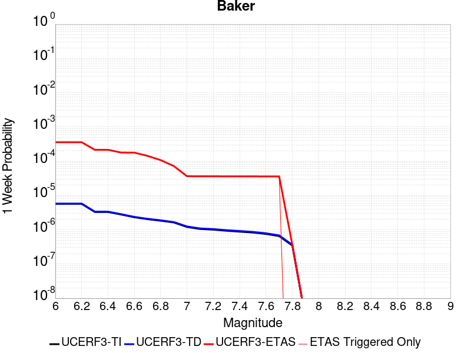 | 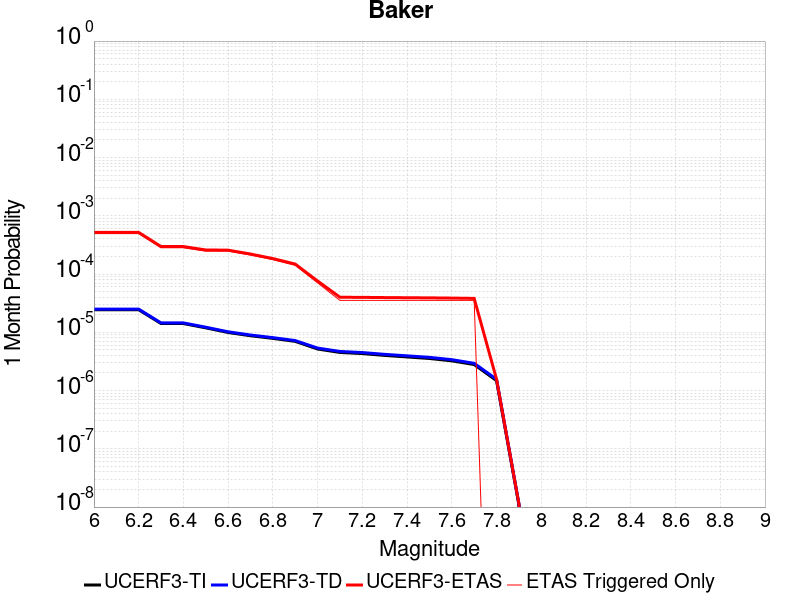 | 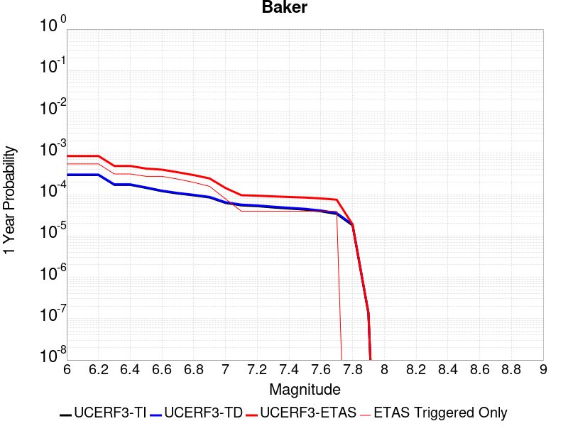 | 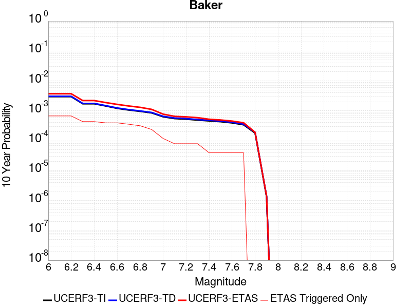 |

| Magnitude | 1 wk TI Prob | 1 wk TD Prob | 1 wk ETAS Prob | 1 wk ETAS/TD Gain | 1 wk ETAS Triggered Only | 1 mo TI Prob | 1 mo TD Prob | 1 mo ETAS Prob | 1 mo ETAS/TD Gain | 1 mo ETAS Triggered Only | 1 yr TI Prob | 1 yr TD Prob | 1 yr ETAS Prob | 1 yr ETAS/TD Gain | 1 yr ETAS Triggered Only | 10 yr TI Prob | 10 yr TD Prob | 10 yr ETAS Prob | 10 yr ETAS/TD Gain | 10 yr ETAS Triggered Only |
|-----|-----|-----|-----|-----|-----|-----|-----|-----|-----|-----|-----|-----|-----|-----|-----|-----|-----|-----|-----|-----|
| 6.0 | 5.695525E-6 | 5.8348373E-6 | 4.0034097E-4 | 68.6122 | 3.9450845E-4 | 2.4409164E-5 | 2.5006228E-5 | 5.378544E-4 | 21.508818 | 5.1286095E-4 | 2.9714106E-4 | 3.044123E-4 | 8.56556E-4 | 2.8138022 | 5.5231183E-4 | 0.0029674405 | 0.0030403486 | 0.003708974 | 1.2199173 | 6.7066436E-4 |
| 6.1 | 5.695525E-6 | 5.8348373E-6 | 4.0034097E-4 | 68.6122 | 3.9450845E-4 | 2.4409164E-5 | 2.5006228E-5 | 5.378544E-4 | 21.508818 | 5.1286095E-4 | 2.9714106E-4 | 3.044123E-4 | 8.56556E-4 | 2.8138022 | 5.5231183E-4 | 0.0029674405 | 0.0030403486 | 0.003708974 | 1.2199173 | 6.7066436E-4 |
| 6.2 | 5.695525E-6 | 5.8348373E-6 | 4.0034097E-4 | 68.6122 | 3.9450845E-4 | 2.4409164E-5 | 2.5006228E-5 | 5.378544E-4 | 21.508818 | 5.1286095E-4 | 2.9714106E-4 | 3.044123E-4 | 8.56556E-4 | 2.8138022 | 5.5231183E-4 | 0.0029674405 | 0.0030403486 | 0.003708974 | 1.2199173 | 6.7066436E-4 |
| 6.3 | 3.2995713E-6 | 3.383667E-6 | 2.4008793E-4 | 70.95495 | 2.3670506E-4 | 1.4140943E-5 | 1.4501353E-5 | 2.9065326E-4 | 20.043182 | 2.7615592E-4 | 1.7215237E-4 | 1.7654014E-4 | 4.920912E-4 | 2.7874181 | 3.1560674E-4 | 0.0017201907 | 0.001764046 | 0.0021972398 | 1.2455683 | 4.339593E-4 |
| 6.4 | 3.2995713E-6 | 3.383667E-6 | 2.4008793E-4 | 70.95495 | 2.3670506E-4 | 1.4140943E-5 | 1.4501353E-5 | 2.9065326E-4 | 20.043182 | 2.7615592E-4 | 1.7215237E-4 | 1.7654014E-4 | 4.920912E-4 | 2.7874181 | 3.1560674E-4 | 0.0017201907 | 0.001764046 | 0.0021972398 | 1.2455683 | 4.339593E-4 |
| 6.5 | 2.782202E-6 | 2.8558404E-6 | 2.001095E-4 | 70.07027 | 1.9725422E-4 | 1.1923668E-5 | 1.223926E-5 | 2.4894142E-4 | 20.33958 | 2.3670506E-4 | 1.4516099E-4 | 1.4900314E-4 | 4.251179E-4 | 2.8530803 | 2.7615592E-4 | 0.001450662 | 0.0014890651 | 0.001882986 | 1.2645425 | 3.9450845E-4 |
| 6.6 | 2.3163404E-6 | 2.38092E-6 | 1.9963467E-4 | 83.8477 | 1.9725422E-4 | 9.927136E-6 | 1.0203904E-5 | 2.4690657E-4 | 24.197264 | 2.3670506E-4 | 1.20856166E-4 | 1.2422565E-4 | 4.0034726E-4 | 3.2227423 | 2.7615592E-4 | 0.0012079047 | 0.0012415823 | 0.0016356009 | 1.3173519 | 3.9450845E-4 |
| 6.7 | 2.037056E-6 | 2.0965003E-6 | 1.5989954E-4 | 76.269745 | 1.5780337E-4 | 8.7302105E-6 | 8.984972E-6 | 2.0623743E-4 | 22.953596 | 1.9725422E-4 | 1.0628513E-4 | 1.093867E-4 | 3.4606588E-4 | 3.1636922 | 2.3670506E-4 | 0.0010623431 | 0.0010933448 | 0.0014480142 | 1.3243893 | 3.550576E-4 |
| 6.8 | 1.8356744E-6 | 1.8915287E-6 | 1.20243836E-4 | 63.56966 | 1.1835253E-4 | 7.867153E-6 | 8.106527E-6 | 1.6590863E-4 | 20.466055 | 1.5780337E-4 | 9.577837E-5 | 9.869264E-5 | 2.959274E-4 | 2.9984748 | 1.9725422E-4 | 9.57371E-4 | 9.86502E-4 | 0.0013017975 | 1.3196095 | 3.1560674E-4 |
| 6.9 | 1.6310546E-6 | 1.6832072E-6 | 8.058476E-5 | 47.875725 | 7.8901685E-5 | 6.9902153E-6 | 7.213726E-6 | 1.255654E-4 | 17.406456 | 1.1835253E-4 | 8.510255E-5 | 8.782368E-5 | 2.456132E-4 | 2.7966623 | 1.5780337E-4 | 8.5069967E-4 | 8.7790104E-4 | 0.0011143984 | 1.2693894 | 2.3670506E-4 |
| 7.0 | 1.2058036E-6 | 1.2508665E-6 | 4.0701663E-5 | 32.538773 | 3.9450842E-5 | 5.1677193E-6 | 5.3608455E-6 | 8.426211E-5 | 15.718063 | 7.8901685E-5 | 6.291517E-5 | 6.5266366E-5 | 1.441629E-4 | 2.2088392 | 7.8901685E-5 | 6.289736E-4 | 6.524743E-4 | 7.707496E-4 | 1.181272 | 1.1835253E-4 |
| 7.1 | 1.052382E-6 | 1.0951609E-6 | 4.054596E-5 | 37.02284 | 3.9450842E-5 | 4.5102006E-6 | 4.693538E-6 | 4.41442E-5 | 9.4053135 | 3.9450842E-5 | 5.491031E-5 | 5.7142337E-5 | 9.659093E-5 | 1.6903566 | 3.9450842E-5 | 5.4896745E-4 | 5.7127734E-4 | 6.5013394E-4 | 1.1380357 | 7.8901685E-5 |
| 7.2 | 1.0067454E-6 | 1.0487711E-6 | 4.0499574E-5 | 38.61622 | 3.9450842E-5 | 4.3146156E-6 | 4.4947255E-6 | 4.394539E-5 | 9.777102 | 3.9450842E-5 | 5.252918E-5 | 5.4721917E-5 | 9.41706E-5 | 1.7208937 | 3.9450842E-5 | 5.251676E-4 | 5.470853E-4 | 6.259438E-4 | 1.144143 | 7.8901685E-5 |
| 7.3 | 9.3596316E-7 | 9.767723E-7 | 4.0427578E-5 | 41.388947 | 3.9450842E-5 | 4.0112645E-6 | 4.1861604E-6 | 4.363684E-5 | 10.424072 | 3.9450842E-5 | 4.8836053E-5 | 5.096532E-5 | 9.0414156E-5 | 1.7740328 | 3.9450842E-5 | 4.8825322E-4 | 5.095371E-4 | 5.883986E-4 | 1.1547709 | 7.8901685E-5 |
| 7.4 | 8.8117395E-7 | 9.2076635E-7 | 4.0371575E-5 | 43.845623 | 3.9450842E-5 | 3.7764542E-6 | 3.9461356E-6 | 4.3396823E-5 | 10.997297 | 3.9450842E-5 | 4.5977362E-5 | 4.8043148E-5 | 8.7492095E-5 | 1.821115 | 3.9450842E-5 | 4.596785E-4 | 4.8032837E-4 | 5.1976024E-4 | 1.0820936 | 3.9450842E-5 |
| 7.5 | 8.292386E-7 | 8.6745956E-7 | 4.031827E-5 | 46.478558 | 3.9450842E-5 | 3.5538749E-6 | 3.7176785E-6 | 4.3168377E-5 | 11.611649 | 3.9450842E-5 | 4.326757E-5 | 4.5261804E-5 | 8.471086E-5 | 1.871575 | 3.9450842E-5 | 4.3259145E-4 | 4.5252658E-4 | 4.9195957E-4 | 1.0871396 | 3.9450842E-5 |
| 7.6 | 7.553842E-7 | 7.9144706E-7 | 4.024226E-5 | 50.84643 | 3.9450842E-5 | 3.2373566E-6 | 3.3919116E-6 | 4.284262E-5 | 12.630819 | 3.9450842E-5 | 3.9414106E-5 | 4.129575E-5 | 8.074496E-5 | 1.9552852 | 3.9450842E-5 | 3.9407116E-4 | 4.1288146E-4 | 4.5231602E-4 | 1.0955106 | 3.9450842E-5 |
| 7.7 | 6.5285366E-7 | 6.852797E-7 | 4.0136096E-5 | 58.568928 | 3.9450842E-5 | 2.797941E-6 | 2.9369096E-6 | 4.2387637E-5 | 14.4327345 | 3.9450842E-5 | 3.40644E-5 | 3.5756293E-5 | 7.520573E-5 | 2.1032865 | 3.9450842E-5 | 3.405918E-4 | 3.5750607E-4 | 3.969428E-4 | 1.1103107 | 3.9450842E-5 |
| 7.8 | 3.4586725E-7 | 3.6482615E-7 | 3.6482615E-7 | 1.0 | 0.0 | 1.4822873E-6 | 1.5635396E-6 | 1.5635396E-6 | 1.0 | 0.0 | 1.80467E-5 | 1.9035933E-5 | 1.9035933E-5 | 1.0 | 0.0 | 1.8045233E-4 | 1.9034347E-4 | 1.9034347E-4 | 1.0 | 0.0 |
| 7.9 | 2.5591178E-9 | 2.6696718E-9 | 2.6696718E-9 | 1.0 | 0.0 | 1.0967647E-8 | 1.14414505E-8 | 1.14414505E-8 | 1.0 | 0.0 | 1.335311E-7 | 1.3929966E-7 | 1.3929966E-7 | 1.0 | 0.0 | 1.3353102E-6 | 1.3929966E-6 | 1.3929966E-6 | 1.0 | 0.0 |

## San Andreas (Cholame) rev
*[(top)](#table-of-contents)*

| 1 Week | 1 Month | 1 Year | 10 Year |
|-----|-----|-----|-----|
| 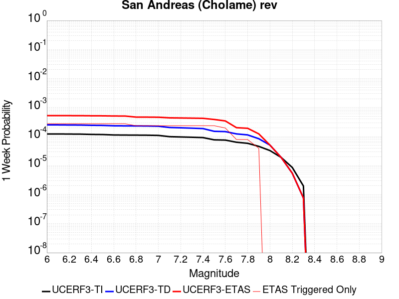 | 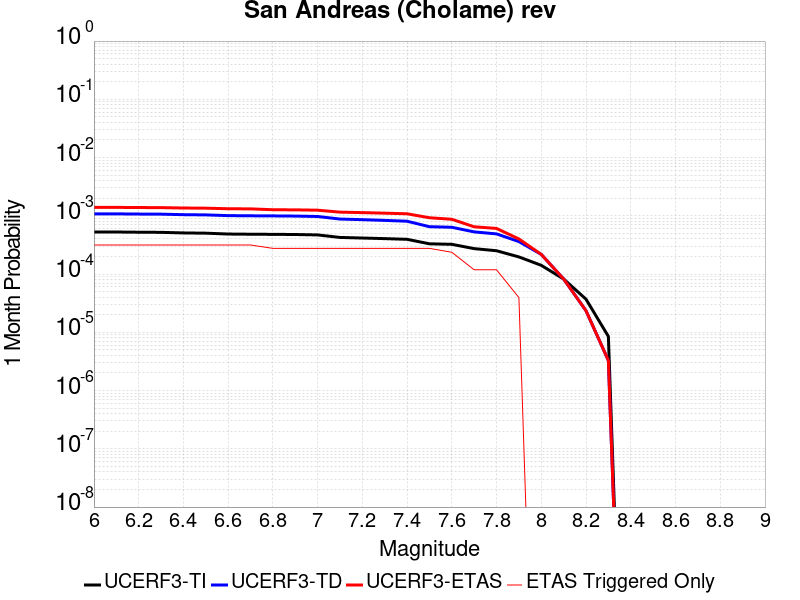 | 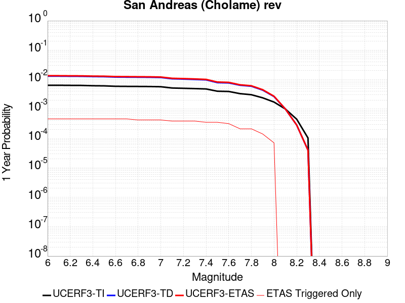 | 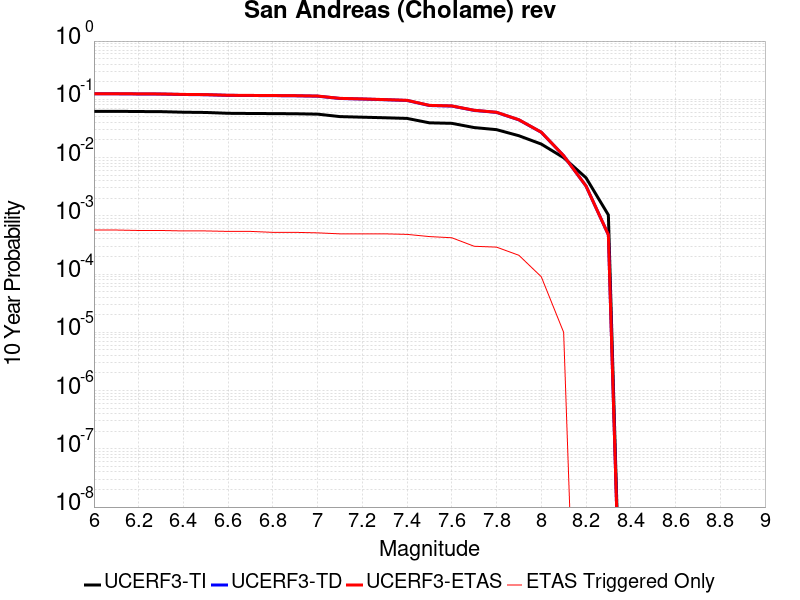 |

| Magnitude | 1 wk TI Prob | 1 wk TD Prob | 1 wk ETAS Prob | 1 wk ETAS/TD Gain | 1 wk ETAS Triggered Only | 1 mo TI Prob | 1 mo TD Prob | 1 mo ETAS Prob | 1 mo ETAS/TD Gain | 1 mo ETAS Triggered Only | 1 yr TI Prob | 1 yr TD Prob | 1 yr ETAS Prob | 1 yr ETAS/TD Gain | 1 yr ETAS Triggered Only | 10 yr TI Prob | 10 yr TD Prob | 10 yr ETAS Prob | 10 yr ETAS/TD Gain | 10 yr ETAS Triggered Only |
|-----|-----|-----|-----|-----|-----|-----|-----|-----|-----|-----|-----|-----|-----|-----|-----|-----|-----|-----|-----|-----|
| 6.0 | 1.2302514E-4 | 2.5204287E-4 | 5.2812917E-4 | 2.0953941 | 2.7615592E-4 | 5.27144E-4 | 0.0010797381 | 0.0013950042 | 1.2919837 | 3.1560674E-4 | 0.0063991086 | 0.0130670825 | 0.013456436 | 1.0297965 | 3.9450845E-4 | 0.06217949 | 0.12439073 | 0.12494343 | 1.0044433 | 6.312135E-4 |
| 6.1 | 1.2302514E-4 | 2.5204287E-4 | 5.2812917E-4 | 2.0953941 | 2.7615592E-4 | 5.27144E-4 | 0.0010797381 | 0.0013950042 | 1.2919837 | 3.1560674E-4 | 0.0063991086 | 0.0130670825 | 0.013456436 | 1.0297965 | 3.9450845E-4 | 0.06217949 | 0.12439073 | 0.12494343 | 1.0044433 | 6.312135E-4 |
| 6.2 | 1.2203569E-4 | 2.5021084E-4 | 5.2629766E-4 | 2.1034167 | 2.7615592E-4 | 5.2290526E-4 | 0.0010718931 | 0.0013871616 | 1.294123 | 3.1560674E-4 | 0.006347804 | 0.01297271 | 0.0133621 | 1.0300162 | 3.9450845E-4 | 0.061695136 | 0.12357691 | 0.124130115 | 1.0044767 | 6.312135E-4 |
| 6.3 | 1.2142645E-4 | 2.4907055E-4 | 5.2515767E-4 | 2.1084695 | 2.7615592E-4 | 5.202953E-4 | 0.0010670102 | 0.0013822803 | 1.2954705 | 3.1560674E-4 | 0.006316212 | 0.012913967 | 0.01330338 | 1.0301545 | 3.9450845E-4 | 0.06139677 | 0.12307103 | 0.12362456 | 1.0044976 | 6.312135E-4 |
| 6.4 | 1.1865206E-4 | 2.44126E-4 | 5.202145E-4 | 2.1309261 | 2.7615592E-4 | 5.0840975E-4 | 0.0010458364 | 0.001361113 | 1.301459 | 3.1560674E-4 | 0.006172335 | 0.012659196 | 0.01304871 | 1.0307692 | 3.9450845E-4 | 0.060036868 | 0.1208638 | 0.12141873 | 1.0045913 | 6.312135E-4 |
| 6.5 | 1.17443946E-4 | 2.4205919E-4 | 5.1814824E-4 | 2.140585 | 2.7615592E-4 | 5.032341E-4 | 0.0010369857 | 0.0013522651 | 1.3040346 | 3.1560674E-4 | 0.006109677 | 0.012552682 | 0.012942239 | 1.0310338 | 3.9450845E-4 | 0.059444077 | 0.11993805 | 0.12049356 | 1.0046316 | 6.312135E-4 |
| 6.6 | 1.13579066E-4 | 2.3514954E-4 | 5.112405E-4 | 2.174108 | 2.7615592E-4 | 4.866766E-4 | 0.001007396 | 0.0013226848 | 1.3129741 | 3.1560674E-4 | 0.0059092017 | 0.012196515 | 0.012586212 | 1.0319515 | 3.9450845E-4 | 0.057545185 | 0.11685214 | 0.117374755 | 1.0044725 | 5.9176265E-4 |
| 6.7 | 1.1271412E-4 | 2.3359268E-4 | 5.096841E-4 | 2.181935 | 2.7615592E-4 | 4.829711E-4 | 0.0010007289 | 0.0013160198 | 1.3150612 | 3.1560674E-4 | 0.005864331 | 0.012116249 | 0.012505977 | 1.0321658 | 3.9450845E-4 | 0.057119697 | 0.116155714 | 0.11667874 | 1.0045028 | 5.9176265E-4 |
| 6.8 | 1.1217975E-4 | 2.3247694E-4 | 4.69127E-4 | 2.0179505 | 2.3670506E-4 | 4.8068175E-4 | 9.959509E-4 | 0.0012718317 | 1.2770025 | 2.7615592E-4 | 0.005836608 | 0.012058721 | 0.012409497 | 1.029089 | 3.550576E-4 | 0.056856725 | 0.11565396 | 0.1161424 | 1.0042232 | 5.5231183E-4 |
| 6.9 | 1.1146753E-4 | 2.3096445E-4 | 4.6761485E-4 | 2.0246181 | 2.3670506E-4 | 4.7763053E-4 | 9.894737E-4 | 0.0012653563 | 1.2788175 | 2.7615592E-4 | 0.0057996577 | 0.011980731 | 0.012331535 | 1.0292807 | 3.550576E-4 | 0.056506127 | 0.11497439 | 0.1154632 | 1.0042515 | 5.5231183E-4 |
| 7.0 | 1.0965793E-4 | 2.2719789E-4 | 4.6384917E-4 | 2.0416086 | 2.3670506E-4 | 4.698779E-4 | 9.733434E-4 | 0.0012492305 | 1.2834427 | 2.7615592E-4 | 0.005705768 | 0.011786487 | 0.01213736 | 1.0297691 | 3.550576E-4 | 0.055614736 | 0.11327597 | 0.11376572 | 1.0043235 | 5.5231183E-4 |
| 7.1 | 9.927982E-5 | 2.0538924E-4 | 4.4204568E-4 | 2.152234 | 2.3670506E-4 | 4.2541555E-4 | 8.7994366E-4 | 0.0011558565 | 1.3135575 | 2.7615592E-4 | 0.0051671406 | 0.010660981 | 0.011012253 | 1.0329493 | 3.550576E-4 | 0.05048634 | 0.1033706 | 0.10386582 | 1.0047907 | 5.5231183E-4 |
| 7.2 | 9.696786E-5 | 2.0043184E-4 | 4.3708947E-4 | 2.1807387 | 2.3670506E-4 | 4.1551032E-4 | 8.5871184E-4 | 0.0011346306 | 1.3213171 | 2.7615592E-4 | 0.00504711 | 0.010404981 | 0.010756344 | 1.0337688 | 3.550576E-4 | 0.04934009 | 0.1011086 | 0.10160507 | 1.0049102 | 5.5231183E-4 |
| 7.3 | 9.4727984E-5 | 1.9472468E-4 | 4.3138367E-4 | 2.2153516 | 2.3670506E-4 | 4.0591392E-4 | 8.3426846E-4 | 0.001110194 | 1.3307395 | 2.7615592E-4 | 0.0049308087 | 0.010110183 | 0.010461651 | 1.0347638 | 3.550576E-4 | 0.048228268 | 0.09847952 | 0.09897744 | 1.005056 | 5.5231183E-4 |
| 7.4 | 9.220358E-5 | 1.8843076E-4 | 4.2509122E-4 | 2.2559545 | 2.3670506E-4 | 3.9509835E-4 | 8.073114E-4 | 0.0010832443 | 1.3417925 | 2.7615592E-4 | 0.004799717 | 0.009784967 | 0.01013655 | 1.035931 | 3.550576E-4 | 0.046973653 | 0.095557496 | 0.096057035 | 1.0052276 | 5.5231183E-4 |
| 7.5 | 7.71631E-5 | 1.5177966E-4 | 3.884488E-4 | 2.5592942 | 2.3670506E-4 | 3.306571E-4 | 6.503223E-4 | 9.262986E-4 | 1.4243685 | 2.7615592E-4 | 0.0040183207 | 0.007889002 | 0.008241258 | 1.0446516 | 3.550576E-4 | 0.03946433 | 0.07828531 | 0.07879438 | 1.0065027 | 5.5231183E-4 |
| 7.6 | 7.5634416E-5 | 1.483744E-4 | 3.4559934E-4 | 2.3292384 | 1.9725422E-4 | 3.241072E-4 | 6.3573546E-4 | 8.7229005E-4 | 1.372096 | 2.3670506E-4 | 0.0039388672 | 0.0077126776 | 0.00802585 | 1.040605 | 3.1560674E-4 | 0.038697794 | 0.07664872 | 0.07712227 | 1.0061781 | 5.1286095E-4 |
| 7.7 | 6.3783E-5 | 1.235872E-4 | 2.0247915E-4 | 1.6383504 | 7.8901685E-5 | 2.7332708E-4 | 5.29552E-4 | 6.4784184E-4 | 1.2233772 | 1.1835253E-4 | 0.0033226798 | 0.0064282627 | 0.006624249 | 1.0304883 | 1.9725422E-4 | 0.032734364 | 0.06454029 | 0.06483553 | 1.0045744 | 3.1560674E-4 |
| 7.8 | 5.863422E-5 | 1.1416107E-4 | 1.9305375E-4 | 1.6910646 | 7.8901685E-5 | 2.512653E-4 | 4.8917E-4 | 6.074647E-4 | 1.2418272 | 1.1835253E-4 | 0.003054864 | 0.0059394026 | 0.006135485 | 1.0330138 | 1.9725422E-4 | 0.030132094 | 0.059659187 | 0.059918866 | 1.0043527 | 2.7615592E-4 |
| 7.9 | 4.595283E-5 | 8.426331E-5 | 1.2371084E-4 | 1.4681458 | 3.9450842E-5 | 1.9692584E-4 | 3.610785E-4 | 4.005151E-4 | 1.109219 | 3.9450842E-5 | 0.0023949358 | 0.0043872762 | 0.0045051095 | 1.026858 | 1.1835253E-4 | 0.023692891 | 0.044362005 | 0.04455051 | 1.0042492 | 1.9725422E-4 |
| 8.0 | 3.2950178E-5 | 5.0772942E-5 | 5.0772942E-5 | 1.0 | 0.0 | 1.412074E-4 | 2.1758018E-4 | 2.1758018E-4 | 1.0 | 0.0 | 0.0017178444 | 0.0026458222 | 0.0026851688 | 1.0148711 | 3.9450842E-5 | 0.017046256 | 0.027180137 | 0.027218515 | 1.001412 | 3.9450842E-5 |
| 8.1 | 1.9177472E-5 | 1.9185145E-5 | 1.9185145E-5 | 1.0 | 0.0 | 8.218658E-5 | 8.221946E-5 | 8.221946E-5 | 1.0 | 0.0 | 0.0010001622 | 0.0010005629 | 0.0010005629 | 1.0 | 0.0 | 0.009956728 | 0.010758142 | 0.010758142 | 1.0 | 0.0 |
| 8.2 | 8.643924E-6 | 5.4748625E-6 | 5.4748625E-6 | 1.0 | 0.0 | 3.704486E-5 | 2.3463486E-5 | 2.3463486E-5 | 1.0 | 0.0 | 4.5092785E-4 | 2.8563058E-4 | 2.8563058E-4 | 1.0 | 0.0 | 0.0045001395 | 0.0032487072 | 0.0032487072 | 1.0 | 0.0 |
| 8.3 | 1.983087E-6 | 7.6599065E-7 | 7.6599065E-7 | 1.0 | 0.0 | 8.498917E-6 | 3.282813E-6 | 3.282813E-6 | 1.0 | 0.0 | 1.034694E-4 | 3.9967534E-5 | 3.9967534E-5 | 1.0 | 0.0 | 0.0010342124 | 4.719687E-4 | 4.719687E-4 | 1.0 | 0.0 |

## Sierra Nevada  (No Extension)
*[(top)](#table-of-contents)*

| 1 Week | 1 Month | 1 Year | 10 Year |
|-----|-----|-----|-----|
| 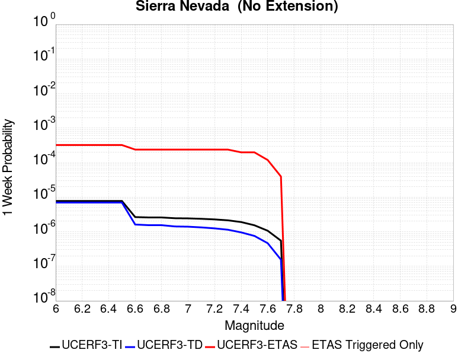 | 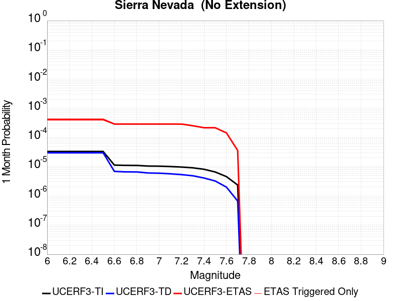 | 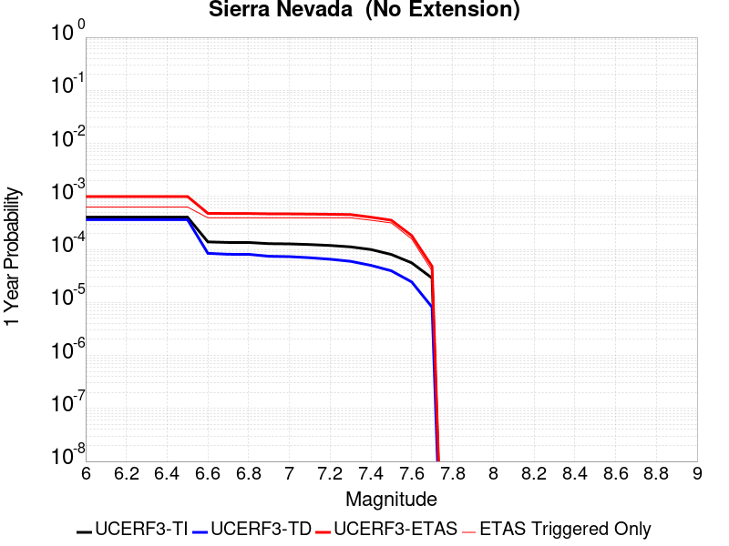 | 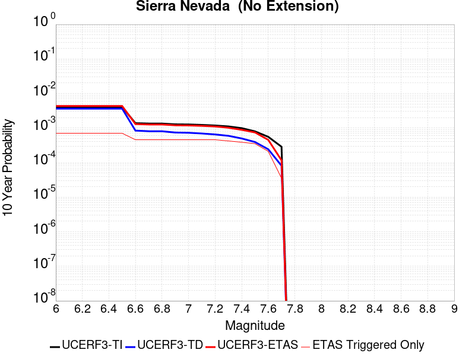 |

| Magnitude | 1 wk TI Prob | 1 wk TD Prob | 1 wk ETAS Prob | 1 wk ETAS/TD Gain | 1 wk ETAS Triggered Only | 1 mo TI Prob | 1 mo TD Prob | 1 mo ETAS Prob | 1 mo ETAS/TD Gain | 1 mo ETAS Triggered Only | 1 yr TI Prob | 1 yr TD Prob | 1 yr ETAS Prob | 1 yr ETAS/TD Gain | 1 yr ETAS Triggered Only | 10 yr TI Prob | 10 yr TD Prob | 10 yr ETAS Prob | 10 yr ETAS/TD Gain | 10 yr ETAS Triggered Only |
|-----|-----|-----|-----|-----|-----|-----|-----|-----|-----|-----|-----|-----|-----|-----|-----|-----|-----|-----|-----|-----|
| 6.0 | 7.7690465E-6 | 6.976322E-6 | 3.2258086E-4 | 46.23939 | 3.1560674E-4 | 3.329549E-5 | 2.9898381E-5 | 3.8494536E-4 | 12.875124 | 3.550576E-4 | 4.0529718E-4 | 3.6398784E-4 | 9.949716E-4 | 2.7335298 | 6.312135E-4 | 0.004045588 | 0.0036374326 | 0.00426635 | 1.1729015 | 6.312135E-4 |
| 6.1 | 7.7690465E-6 | 6.976322E-6 | 3.2258086E-4 | 46.23939 | 3.1560674E-4 | 3.329549E-5 | 2.9898381E-5 | 3.8494536E-4 | 12.875124 | 3.550576E-4 | 4.0529718E-4 | 3.6398784E-4 | 9.949716E-4 | 2.7335298 | 6.312135E-4 | 0.004045588 | 0.0036374326 | 0.00426635 | 1.1729015 | 6.312135E-4 |
| 6.2 | 7.7690465E-6 | 6.976322E-6 | 3.2258086E-4 | 46.23939 | 3.1560674E-4 | 3.329549E-5 | 2.9898381E-5 | 3.8494536E-4 | 12.875124 | 3.550576E-4 | 4.0529718E-4 | 3.6398784E-4 | 9.949716E-4 | 2.7335298 | 6.312135E-4 | 0.004045588 | 0.0036374326 | 0.00426635 | 1.1729015 | 6.312135E-4 |
| 6.3 | 7.7690465E-6 | 6.976322E-6 | 3.2258086E-4 | 46.23939 | 3.1560674E-4 | 3.329549E-5 | 2.9898381E-5 | 3.8494536E-4 | 12.875124 | 3.550576E-4 | 4.0529718E-4 | 3.6398784E-4 | 9.949716E-4 | 2.7335298 | 6.312135E-4 | 0.004045588 | 0.0036374326 | 0.00426635 | 1.1729015 | 6.312135E-4 |
| 6.4 | 7.7690465E-6 | 6.976322E-6 | 3.2258086E-4 | 46.23939 | 3.1560674E-4 | 3.329549E-5 | 2.9898381E-5 | 3.8494536E-4 | 12.875124 | 3.550576E-4 | 4.0529718E-4 | 3.6398784E-4 | 9.949716E-4 | 2.7335298 | 6.312135E-4 | 0.004045588 | 0.0036374326 | 0.00426635 | 1.1729015 | 6.312135E-4 |
| 6.5 | 7.7690465E-6 | 6.976322E-6 | 3.2258086E-4 | 46.23939 | 3.1560674E-4 | 3.329549E-5 | 2.9898381E-5 | 3.8494536E-4 | 12.875124 | 3.550576E-4 | 4.0529718E-4 | 3.6398784E-4 | 9.949716E-4 | 2.7335298 | 6.312135E-4 | 0.004045588 | 0.0036374326 | 0.00426635 | 1.1729015 | 6.312135E-4 |
| 6.6 | 2.653E-6 | 1.614854E-6 | 2.3831954E-4 | 147.57962 | 2.3670506E-4 | 1.136995E-5 | 6.9207845E-6 | 2.436242E-4 | 35.20182 | 2.3670506E-4 | 1.3842035E-4 | 8.425733E-5 | 4.7873255E-4 | 5.681791 | 3.9450845E-4 | 0.0013833415 | 8.422573E-4 | 0.0012364334 | 1.4679997 | 3.9450845E-4 |
| 6.7 | 2.5902466E-6 | 1.5501876E-6 | 2.3825488E-4 | 153.69423 | 2.3670506E-4 | 1.11010095E-5 | 6.643644E-6 | 2.4334714E-4 | 36.628563 | 2.3670506E-4 | 1.351464E-4 | 8.0883394E-5 | 4.7535994E-4 | 5.8771014 | 3.9450845E-4 | 0.0013506424 | 8.0854254E-4 | 0.001202732 | 1.487531 | 3.9450845E-4 |
| 6.8 | 2.5853892E-6 | 1.5469877E-6 | 2.3825168E-4 | 154.01007 | 2.3670506E-4 | 1.1080193E-5 | 6.629931E-6 | 2.4333343E-4 | 36.702255 | 2.3670506E-4 | 1.34893E-4 | 8.071645E-5 | 4.7519305E-4 | 5.88719 | 3.9450845E-4 | 0.0013481114 | 8.068743E-4 | 0.0012010644 | 1.4885397 | 3.9450845E-4 |
| 6.9 | 2.458257E-6 | 1.4220619E-6 | 2.3812678E-4 | 167.45177 | 2.3670506E-4 | 1.0535345E-5 | 6.094537E-6 | 2.4279817E-4 | 39.838654 | 2.3670506E-4 | 1.2826028E-4 | 7.4198484E-5 | 4.6867767E-4 | 6.31654 | 3.9450845E-4 | 0.0012818627 | 7.4173906E-4 | 0.0011359549 | 1.5314751 | 3.9450845E-4 |
| 7.0 | 2.4341468E-6 | 1.3990258E-6 | 2.3810376E-4 | 170.19254 | 2.3670506E-4 | 1.0432016E-5 | 5.9958115E-6 | 2.4269946E-4 | 40.47817 | 2.3670506E-4 | 1.270024E-4 | 7.2996576E-5 | 4.6747623E-4 | 6.404084 | 3.9450845E-4 | 0.0012692984 | 7.297279E-4 | 0.0011239485 | 1.5402296 | 3.9450845E-4 |
| 7.1 | 2.3652476E-6 | 1.3339754E-6 | 2.3803873E-4 | 178.44312 | 2.3670506E-4 | 1.0136736E-5 | 5.717025E-6 | 2.4242073E-4 | 42.4033 | 2.3670506E-4 | 1.2340778E-4 | 6.9602575E-5 | 4.6408357E-4 | 6.6676207 | 3.9450845E-4 | 0.0012333926 | 6.9580943E-4 | 0.0010900433 | 1.5665832 | 3.9450845E-4 |
| 7.2 | 2.272158E-6 | 1.2502821E-6 | 2.3795506E-4 | 190.32109 | 2.3670506E-4 | 9.737784E-6 | 5.3583412E-6 | 2.4206213E-4 | 45.174828 | 2.3670506E-4 | 1.1855107E-4 | 6.5235865E-5 | 4.5971858E-4 | 7.047022 | 3.9450845E-4 | 0.0011848784 | 6.5216864E-4 | 0.0010464198 | 1.6045233 | 3.9450845E-4 |
| 7.3 | 2.1382127E-6 | 1.1419703E-6 | 2.3784676E-4 | 208.27754 | 2.3670506E-4 | 9.163737E-6 | 4.8941492E-6 | 2.4159806E-4 | 49.36467 | 2.3670506E-4 | 1.1156279E-4 | 5.958465E-5 | 4.5406958E-4 | 7.62058 | 3.9450845E-4 | 0.001115068 | 5.956879E-4 | 9.899613E-4 | 1.6618792 | 3.9450845E-4 |
| 7.4 | 1.9048055E-6 | 9.575242E-7 | 1.9821155E-4 | 207.00421 | 1.9725422E-4 | 8.163426E-6 | 4.1036687E-6 | 2.0135708E-4 | 49.067574 | 1.9725422E-4 | 9.9385186E-5 | 4.996103E-5 | 4.050009E-4 | 8.106336 | 3.550576E-4 | 9.934074E-4 | 4.994987E-4 | 8.543789E-4 | 1.7104728 | 3.550576E-4 |
| 7.5 | 1.5373403E-6 | 7.560042E-7 | 1.9801008E-4 | 261.91663 | 1.9725422E-4 | 6.5885843E-6 | 3.2400142E-6 | 2.004936E-4 | 61.88047 | 1.9725422E-4 | 8.021306E-5 | 3.9446462E-5 | 3.5504077E-4 | 9.000573 | 3.1560674E-4 | 8.0184115E-4 | 3.943951E-4 | 7.0987735E-4 | 1.7999144 | 3.1560674E-4 |
| 7.6 | 1.0680322E-6 | 4.6596554E-7 | 1.1881844E-4 | 254.99405 | 1.1835253E-4 | 4.577273E-6 | 1.9969937E-6 | 1.2034929E-4 | 60.265232 | 1.1835253E-4 | 5.5726876E-5 | 2.4313129E-5 | 1.8211266E-4 | 7.4903016 | 1.5780337E-4 | 5.5712904E-4 | 2.4310495E-4 | 4.0086996E-4 | 1.6489584 | 1.5780337E-4 |
| 7.7 | 5.509146E-7 | 1.5580486E-7 | 3.9606643E-5 | 254.20673 | 3.9450842E-5 | 2.3610605E-6 | 6.677349E-7 | 4.0118553E-5 | 60.081554 | 3.9450842E-5 | 2.8745531E-5 | 8.129644E-6 | 4.7580168E-5 | 5.8526754 | 3.9450842E-5 | 2.8741814E-4 | 8.1293576E-5 | 1.2074121E-4 | 1.4852492 | 3.9450842E-5 |

## San Andreas (Parkfield)
*[(top)](#table-of-contents)*

| 1 Week | 1 Month | 1 Year | 10 Year |
|-----|-----|-----|-----|
| 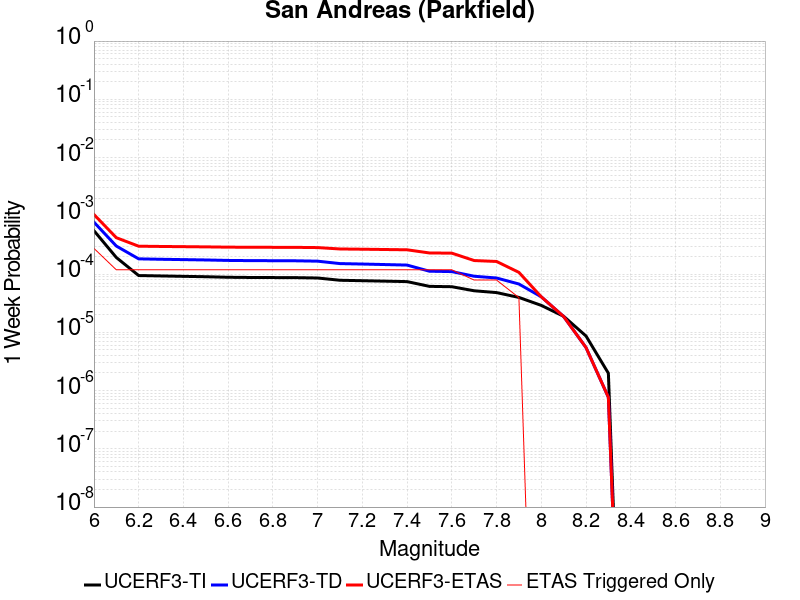 | 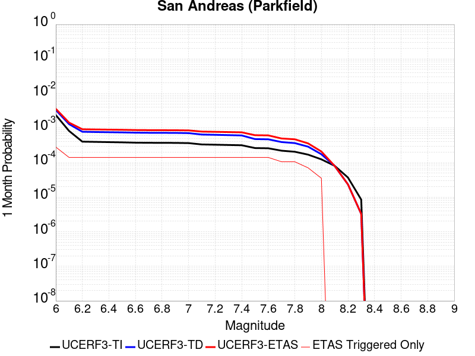 | 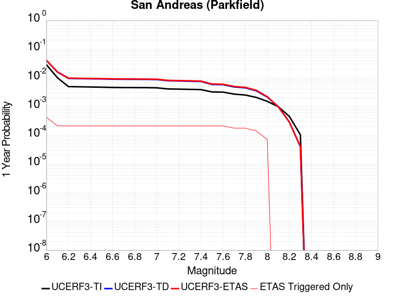 | 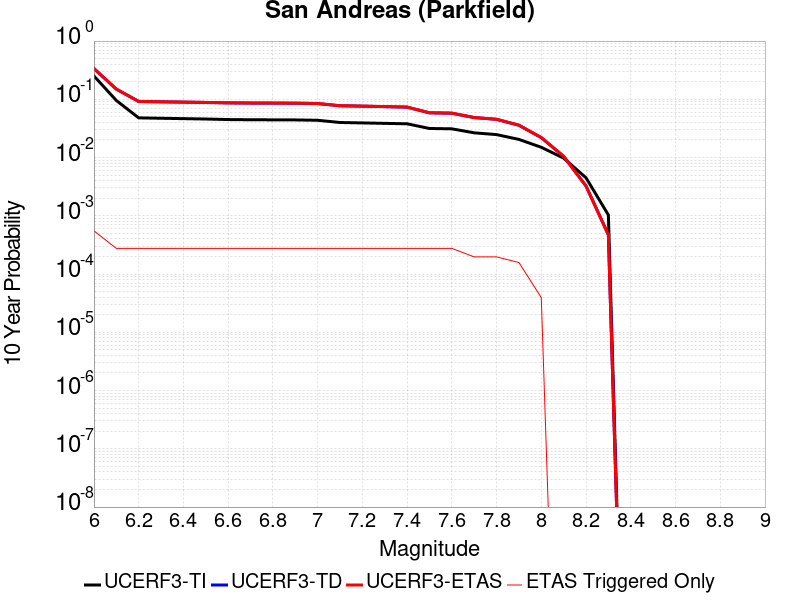 |

| Magnitude | 1 wk TI Prob | 1 wk TD Prob | 1 wk ETAS Prob | 1 wk ETAS/TD Gain | 1 wk ETAS Triggered Only | 1 mo TI Prob | 1 mo TD Prob | 1 mo ETAS Prob | 1 mo ETAS/TD Gain | 1 mo ETAS Triggered Only | 1 yr TI Prob | 1 yr TD Prob | 1 yr ETAS Prob | 1 yr ETAS/TD Gain | 1 yr ETAS Triggered Only | 10 yr TI Prob | 10 yr TD Prob | 10 yr ETAS Prob | 10 yr ETAS/TD Gain | 10 yr ETAS Triggered Only |
|-----|-----|-----|-----|-----|-----|-----|-----|-----|-----|-----|-----|-----|-----|-----|-----|-----|-----|-----|-----|-----|
| 6.0 | 5.556969E-4 | 7.7782426E-4 | 0.0010537653 | 1.3547603 | 2.7615592E-4 | 0.0023793848 | 0.0033298214 | 0.0036050577 | 1.082658 | 2.7615592E-4 | 0.028586963 | 0.040191233 | 0.04060775 | 1.0103635 | 4.339593E-4 | 0.25176284 | 0.33716413 | 0.33753023 | 1.0010858 | 5.5231183E-4 |
| 6.1 | 1.925858E-4 | 3.0276453E-4 | 4.2108123E-4 | 1.3907878 | 1.1835253E-4 | 8.2510663E-4 | 0.0012970108 | 0.0014152098 | 1.0911319 | 1.1835253E-4 | 0.0099994885 | 0.015778083 | 0.015972225 | 1.0123045 | 1.9725422E-4 | 0.095613256 | 0.1497237 | 0.14995849 | 1.0015683 | 2.7615592E-4 |
| 6.2 | 9.4306815E-5 | 1.8242796E-4 | 3.007589E-4 | 1.6486448 | 1.1835253E-4 | 4.0410945E-4 | 7.816011E-4 | 8.998611E-4 | 1.1513048 | 1.1835253E-4 | 0.0049089384 | 0.009474681 | 0.009670066 | 1.0206218 | 1.9725422E-4 | 0.048019063 | 0.09185409 | 0.092104875 | 1.0027303 | 2.7615592E-4 |
| 6.3 | 9.283051E-5 | 1.7939322E-4 | 2.977245E-4 | 1.6596197 | 1.1835253E-4 | 3.9778434E-4 | 7.686027E-4 | 8.8686426E-4 | 1.1538657 | 1.1835253E-4 | 0.0048322747 | 0.009317789 | 0.009513205 | 1.0209724 | 1.9725422E-4 | 0.047285385 | 0.09050704 | 0.0907582 | 1.0027751 | 2.7615592E-4 |
| 6.4 | 9.138826E-5 | 1.770153E-4 | 2.953469E-4 | 1.6684822 | 1.1835253E-4 | 3.916052E-4 | 7.5841765E-4 | 8.766804E-4 | 1.1559336 | 1.1835253E-4 | 0.0047573745 | 0.00919484 | 0.009390281 | 1.0212555 | 1.9725422E-4 | 0.046568092 | 0.08940927 | 0.08966074 | 1.0028125 | 2.7615592E-4 |
| 6.5 | 9.000255E-5 | 1.7459576E-4 | 2.9292764E-4 | 1.6777476 | 1.1835253E-4 | 3.8566816E-4 | 7.480541E-4 | 8.663181E-4 | 1.1580955 | 1.1835253E-4 | 0.0046854047 | 0.009069731 | 0.009265197 | 1.0215514 | 1.9725422E-4 | 0.045878403 | 0.088295065 | 0.088546835 | 1.0028515 | 2.7615592E-4 |
| 6.6 | 8.8109264E-5 | 1.7140752E-4 | 2.8973978E-4 | 1.6903563 | 1.1835253E-4 | 3.7755648E-4 | 7.3439797E-4 | 8.526636E-4 | 1.1610374 | 1.1835253E-4 | 0.0045870654 | 0.008904854 | 0.0091003515 | 1.021954 | 1.9725422E-4 | 0.04493529 | 0.0868267 | 0.08707887 | 1.0029044 | 2.7615592E-4 |
| 6.7 | 8.738073E-5 | 1.7007832E-4 | 2.8841072E-4 | 1.6957524 | 1.1835253E-4 | 3.7443507E-4 | 7.287046E-4 | 8.4697094E-4 | 1.1622967 | 1.1835253E-4 | 0.0045492216 | 0.008836143 | 0.009031654 | 1.0221263 | 1.9725422E-4 | 0.04457213 | 0.08622707 | 0.08647941 | 1.0029265 | 2.7615592E-4 |
| 6.8 | 8.710195E-5 | 1.6953335E-4 | 2.878658E-4 | 1.6979893 | 1.1835253E-4 | 3.7324068E-4 | 7.263703E-4 | 8.446369E-4 | 1.1628186 | 1.1835253E-4 | 0.0045347405 | 0.008807961 | 0.009003478 | 1.0221977 | 1.9725422E-4 | 0.04443313 | 0.08597467 | 0.08622708 | 1.0029359 | 2.7615592E-4 |
| 6.9 | 8.6801556E-5 | 1.689429E-4 | 2.8727544E-4 | 1.7004292 | 1.1835253E-4 | 3.7195362E-4 | 7.2384125E-4 | 8.421081E-4 | 1.1633879 | 1.1835253E-4 | 0.0045191357 | 0.008777418 | 0.008972941 | 1.0222757 | 1.9725422E-4 | 0.044283327 | 0.085700735 | 0.08595322 | 1.0029461 | 2.7615592E-4 |
| 7.0 | 8.5571606E-5 | 1.6647128E-4 | 2.8480412E-4 | 1.7108303 | 1.1835253E-4 | 3.6668387E-4 | 7.132544E-4 | 8.315225E-4 | 1.1658148 | 1.1835253E-4 | 0.004455241 | 0.008649553 | 0.008845101 | 1.0226079 | 1.9725422E-4 | 0.043669727 | 0.08454914 | 0.08480195 | 1.00299 | 2.7615592E-4 |
| 7.1 | 7.82589E-5 | 1.5128135E-4 | 2.69616E-4 | 1.7822156 | 1.1835253E-4 | 3.3535215E-4 | 6.481883E-4 | 7.664641E-4 | 1.1824714 | 1.1835253E-4 | 0.0040752706 | 0.007863307 | 0.00805901 | 1.0248882 | 1.9725422E-4 | 0.040013418 | 0.07746111 | 0.07771587 | 1.003289 | 2.7615592E-4 |
| 7.2 | 7.690929E-5 | 1.4865391E-4 | 2.6698885E-4 | 1.7960433 | 1.1835253E-4 | 3.2956956E-4 | 6.369334E-4 | 7.552105E-4 | 1.1856978 | 1.1835253E-4 | 0.004005129 | 0.007727258 | 0.007922987 | 1.0253298 | 1.9725422E-4 | 0.0393371 | 0.07623427 | 0.076489374 | 1.0033463 | 2.7615592E-4 |
| 7.3 | 7.5543794E-5 | 1.4561978E-4 | 2.6395507E-4 | 1.8126321 | 1.1835253E-4 | 3.2371894E-4 | 6.2393624E-4 | 7.422149E-4 | 1.1895685 | 1.1835253E-4 | 0.003934157 | 0.007570127 | 0.0077658882 | 1.0258597 | 1.9725422E-4 | 0.038652334 | 0.074797355 | 0.07505285 | 1.003416 | 2.7615592E-4 |
| 7.4 | 7.4214564E-5 | 1.4262961E-4 | 2.6096526E-4 | 1.829671 | 1.1835253E-4 | 3.1802364E-4 | 6.111273E-4 | 7.294075E-4 | 1.1935443 | 1.1835253E-4 | 0.003865065 | 0.00741525 | 0.0076110414 | 1.0264039 | 1.9725422E-4 | 0.03798529 | 0.07337123 | 0.07362713 | 1.0034877 | 2.7615592E-4 |
| 7.5 | 6.149578E-5 | 1.11907226E-4 | 2.3024651E-4 | 2.0574768 | 1.1835253E-4 | 2.6352672E-4 | 4.7951436E-4 | 5.9781014E-4 | 1.2466991 | 1.1835253E-4 | 0.0032037178 | 0.0058224914 | 0.006018597 | 1.0336807 | 1.9725422E-4 | 0.03157923 | 0.058557566 | 0.05881755 | 1.0044398 | 2.7615592E-4 |
| 7.6 | 6.0643448E-5 | 1.10193796E-4 | 2.2853329E-4 | 2.0739214 | 1.1835253E-4 | 2.598746E-4 | 4.7217376E-4 | 5.904704E-4 | 1.2505362 | 1.1835253E-4 | 0.0031593828 | 0.0057335934 | 0.005929717 | 1.034206 | 1.9725422E-4 | 0.031148417 | 0.057718582 | 0.057978798 | 1.0045084 | 2.7615592E-4 |
| 7.7 | 5.1652263E-5 | 9.174698E-5 | 1.7064143E-4 | 1.8599133 | 7.8901685E-5 | 2.2134806E-4 | 3.931421E-4 | 4.720128E-4 | 1.2006161 | 7.8901685E-5 | 0.002691582 | 0.0047760103 | 0.00493306 | 1.032883 | 1.5780337E-4 | 0.026592141 | 0.04853623 | 0.04872391 | 1.0038668 | 1.9725422E-4 |
| 7.8 | 4.8090482E-5 | 8.559635E-5 | 1.6449128E-4 | 1.9217091 | 7.8901685E-5 | 2.060858E-4 | 3.6678996E-4 | 4.456627E-4 | 1.2150352 | 7.8901685E-5 | 0.0025062072 | 0.0044565317 | 0.004613632 | 1.0352516 | 1.5780337E-4 | 0.024781305 | 0.04530245 | 0.045490768 | 1.004157 | 1.9725422E-4 |
| 7.9 | 3.970278E-5 | 6.750426E-5 | 1.0695244E-4 | 1.5843806 | 3.9450842E-5 | 1.7014367E-4 | 2.892719E-4 | 3.2871132E-4 | 1.1363404 | 3.9450842E-5 | 0.002069531 | 0.0035162016 | 0.003634138 | 1.0335408 | 1.1835253E-4 | 0.020503636 | 0.035881363 | 0.036033504 | 1.0042402 | 1.5780337E-4 |
| 8.0 | 2.8982335E-5 | 4.069796E-5 | 4.069796E-5 | 1.0 | 0.0 | 1.2420409E-4 | 1.7440817E-4 | 1.7440817E-4 | 1.0 | 0.0 | 0.0015111357 | 0.0021213528 | 0.0021607198 | 1.0185575 | 3.9450842E-5 | 0.015009012 | 0.022010697 | 0.022049278 | 1.0017529 | 3.9450842E-5 |
| 8.1 | 1.8836186E-5 | 1.8681134E-5 | 1.8681134E-5 | 1.0 | 0.0 | 8.0724014E-5 | 8.005955E-5 | 8.005955E-5 | 1.0 | 0.0 | 9.823717E-4 | 9.742898E-4 | 9.742898E-4 | 1.0 | 0.0 | 0.009780403 | 0.010488115 | 0.010488115 | 1.0 | 0.0 |
| 8.2 | 8.643924E-6 | 5.4748625E-6 | 5.4748625E-6 | 1.0 | 0.0 | 3.704486E-5 | 2.3463486E-5 | 2.3463486E-5 | 1.0 | 0.0 | 4.5092785E-4 | 2.8563058E-4 | 2.8563058E-4 | 1.0 | 0.0 | 0.0045001395 | 0.0032487072 | 0.0032487072 | 1.0 | 0.0 |
| 8.3 | 1.983087E-6 | 7.6599065E-7 | 7.6599065E-7 | 1.0 | 0.0 | 8.498917E-6 | 3.282813E-6 | 3.282813E-6 | 1.0 | 0.0 | 1.034694E-4 | 3.9967534E-5 | 3.9967534E-5 | 1.0 | 0.0 | 0.0010342124 | 4.719687E-4 | 4.719687E-4 | 1.0 | 0.0 |

## White Wolf (Extension)
*[(top)](#table-of-contents)*

| 1 Week | 1 Month | 1 Year | 10 Year |
|-----|-----|-----|-----|
| 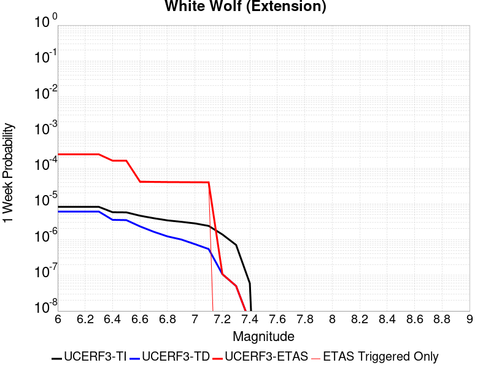 | 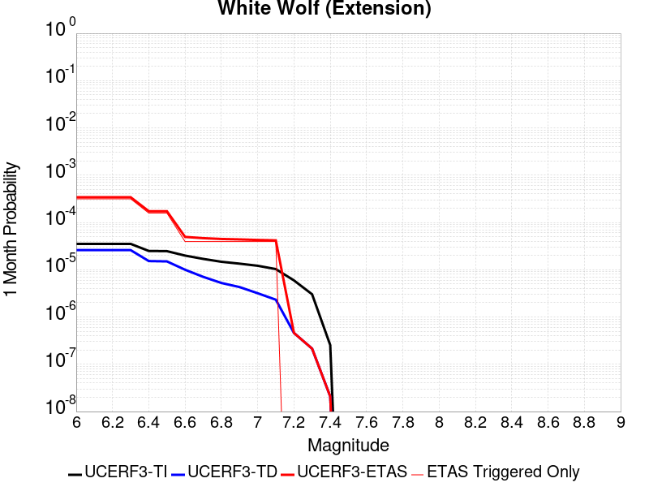 | 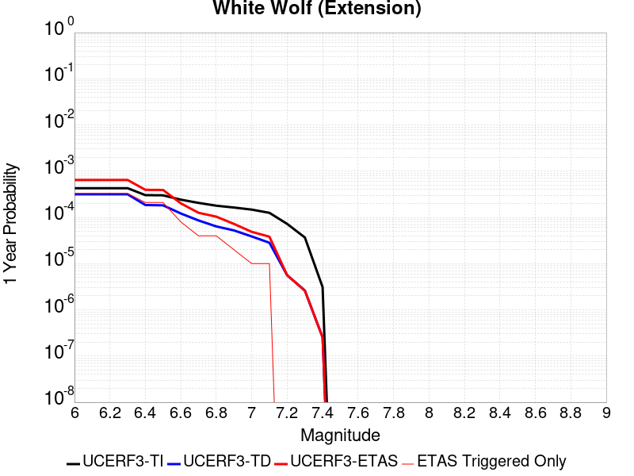 | 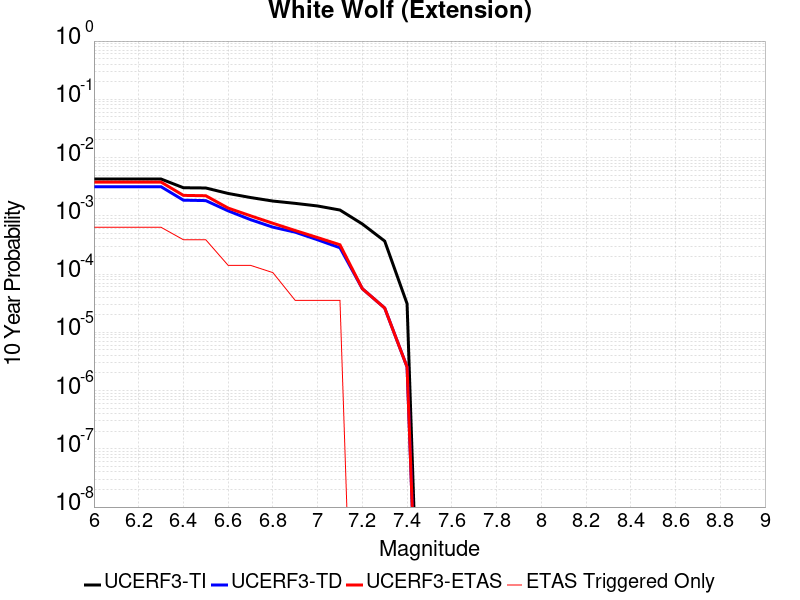 |

| Magnitude | 1 wk TI Prob | 1 wk TD Prob | 1 wk ETAS Prob | 1 wk ETAS/TD Gain | 1 wk ETAS Triggered Only | 1 mo TI Prob | 1 mo TD Prob | 1 mo ETAS Prob | 1 mo ETAS/TD Gain | 1 mo ETAS Triggered Only | 1 yr TI Prob | 1 yr TD Prob | 1 yr ETAS Prob | 1 yr ETAS/TD Gain | 1 yr ETAS Triggered Only | 10 yr TI Prob | 10 yr TD Prob | 10 yr ETAS Prob | 10 yr ETAS/TD Gain | 10 yr ETAS Triggered Only |
|-----|-----|-----|-----|-----|-----|-----|-----|-----|-----|-----|-----|-----|-----|-----|-----|-----|-----|-----|-----|-----|
| 6.0 | 8.222555E-6 | 6.0666657E-6 | 2.427703E-4 | 40.01709 | 2.3670506E-4 | 3.5239045E-5 | 2.5999774E-5 | 3.4159832E-4 | 13.138512 | 3.1560674E-4 | 4.289509E-4 | 3.1650788E-4 | 7.897682E-4 | 2.495256 | 4.7341012E-4 | 0.0042812387 | 0.003161223 | 0.0037904412 | 1.1990426 | 6.312135E-4 |
| 6.1 | 8.222555E-6 | 6.0666657E-6 | 2.427703E-4 | 40.01709 | 2.3670506E-4 | 3.5239045E-5 | 2.5999774E-5 | 3.4159832E-4 | 13.138512 | 3.1560674E-4 | 4.289509E-4 | 3.1650788E-4 | 7.897682E-4 | 2.495256 | 4.7341012E-4 | 0.0042812387 | 0.003161223 | 0.0037904412 | 1.1990426 | 6.312135E-4 |
| 6.2 | 8.222555E-6 | 6.0666657E-6 | 2.427703E-4 | 40.01709 | 2.3670506E-4 | 3.5239045E-5 | 2.5999774E-5 | 3.4159832E-4 | 13.138512 | 3.1560674E-4 | 4.289509E-4 | 3.1650788E-4 | 7.897682E-4 | 2.495256 | 4.7341012E-4 | 0.0042812387 | 0.003161223 | 0.0037904412 | 1.1990426 | 6.312135E-4 |
| 6.3 | 8.222555E-6 | 6.0666657E-6 | 2.427703E-4 | 40.01709 | 2.3670506E-4 | 3.5239045E-5 | 2.5999774E-5 | 3.4159832E-4 | 13.138512 | 3.1560674E-4 | 4.289509E-4 | 3.1650788E-4 | 7.897682E-4 | 2.495256 | 4.7341012E-4 | 0.0042812387 | 0.003161223 | 0.0037904412 | 1.1990426 | 6.312135E-4 |
| 6.4 | 5.821773E-6 | 3.5571766E-6 | 1.6135999E-4 | 45.361816 | 1.5780337E-4 | 2.4950215E-5 | 1.5244959E-5 | 1.7304593E-4 | 11.351027 | 1.5780337E-4 | 3.0372653E-4 | 1.8559267E-4 | 4.222538E-4 | 2.2751644 | 2.3670506E-4 | 0.0030331176 | 0.001854485 | 0.002208884 | 1.1911038 | 3.550576E-4 |
| 6.5 | 5.766023E-6 | 3.4991106E-6 | 1.6130194E-4 | 46.09798 | 1.5780337E-4 | 2.4711293E-5 | 1.4996108E-5 | 1.7279712E-4 | 11.522798 | 1.5780337E-4 | 3.0081844E-4 | 1.8256342E-4 | 4.1922528E-4 | 2.2963269 | 2.3670506E-4 | 0.0030041158 | 0.0018242426 | 0.0021786524 | 1.1942779 | 3.550576E-4 |
| 6.6 | 4.643576E-6 | 2.332624E-6 | 4.1783376E-5 | 17.912605 | 3.9450842E-5 | 1.9900888E-5 | 9.996925E-6 | 4.9447375E-5 | 4.9462585 | 3.9450842E-5 | 2.4226638E-4 | 1.2170619E-4 | 2.4004432E-4 | 1.9723263 | 1.1835253E-4 | 0.0024200242 | 0.0012164378 | 0.0013740492 | 1.129568 | 1.5780337E-4 |
| 6.7 | 3.9529173E-6 | 1.6483477E-6 | 4.1099127E-5 | 24.933529 | 3.9450842E-5 | 1.6940963E-5 | 7.0643296E-6 | 4.6514895E-5 | 6.584474 | 3.9450842E-5 | 2.0623671E-4 | 8.6005006E-5 | 2.0434737E-4 | 2.3759937 | 1.1835253E-4 | 0.002060454 | 8.597357E-4 | 0.0010174034 | 1.1833909 | 1.5780337E-4 |
| 6.8 | 3.4377522E-6 | 1.2245237E-6 | 4.067532E-5 | 33.21726 | 3.9450842E-5 | 1.473314E-5 | 5.2479486E-6 | 4.4698587E-5 | 8.517344 | 3.9450842E-5 | 1.7936122E-4 | 6.3891996E-5 | 1.8223697E-4 | 2.852266 | 1.1835253E-4 | 0.0017921652 | 6.387454E-4 | 7.570223E-4 | 1.1851708 | 1.1835253E-4 |
| 6.9 | 3.1367306E-6 | 1.0033783E-6 | 4.0454182E-5 | 40.317974 | 3.9450842E-5 | 1.3443062E-5 | 4.3001864E-6 | 4.375086E-5 | 10.174178 | 3.9450842E-5 | 1.63657E-4 | 5.235359E-5 | 9.1802365E-5 | 1.7535067 | 3.9450842E-5 | 0.0016353652 | 5.2342017E-4 | 5.628504E-4 | 1.0753318 | 3.9450842E-5 |
| 7.0 | 2.8298145E-6 | 7.4286646E-7 | 4.019368E-5 | 54.1062 | 3.9450842E-5 | 1.2127721E-5 | 3.1837099E-6 | 4.2634427E-5 | 13.39143 | 3.9450842E-5 | 1.47645E-4 | 3.8761027E-5 | 7.8210345E-5 | 2.0177572 | 3.9450842E-5 | 0.0014754693 | 3.8754768E-4 | 4.2698323E-4 | 1.1017567 | 3.9450842E-5 |
| 7.1 | 2.4091064E-6 | 5.4227525E-7 | 3.9993098E-5 | 73.75056 | 3.9450842E-5 | 1.03247E-5 | 2.3240348E-6 | 4.1774787E-5 | 17.975113 | 3.9450842E-5 | 1.2569598E-4 | 2.8294799E-5 | 6.774453E-5 | 2.3942397 | 3.9450842E-5 | 0.001256249 | 2.8291598E-4 | 3.2235569E-4 | 1.1394042 | 3.9450842E-5 |
| 7.2 | 1.3875518E-6 | 1.0743063E-7 | 1.0743063E-7 | 1.0 | 0.0 | 5.9466374E-6 | 4.6041689E-7 | 4.6041689E-7 | 1.0 | 0.0 | 7.23979E-5 | 5.6055624E-6 | 5.6055624E-6 | 1.0 | 0.0 | 7.2374323E-4 | 5.6054323E-5 | 5.6054323E-5 | 1.0 | 0.0 |
| 7.3 | 7.056077E-7 | 5.002034E-8 | 5.002034E-8 | 1.0 | 0.0 | 3.0240296E-6 | 2.1437286E-7 | 2.1437286E-7 | 1.0 | 0.0 | 3.681694E-5 | 2.609987E-6 | 2.609987E-6 | 1.0 | 0.0 | 3.681084E-4 | 2.609961E-5 | 2.609961E-5 | 1.0 | 0.0 |
| 7.4 | 5.9334678E-8 | 4.8683537E-9 | 4.8683537E-9 | 1.0 | 0.0 | 2.5429145E-7 | 2.0864372E-8 | 2.0864372E-8 | 1.0 | 0.0 | 3.095994E-6 | 2.5402372E-7 | 2.5402372E-7 | 1.0 | 0.0 | 3.095951E-5 | 2.5402353E-6 | 2.5402353E-6 | 1.0 | 0.0 |

## San Andreas (Carrizo) rev
*[(top)](#table-of-contents)*

| 1 Week | 1 Month | 1 Year | 10 Year |
|-----|-----|-----|-----|
| 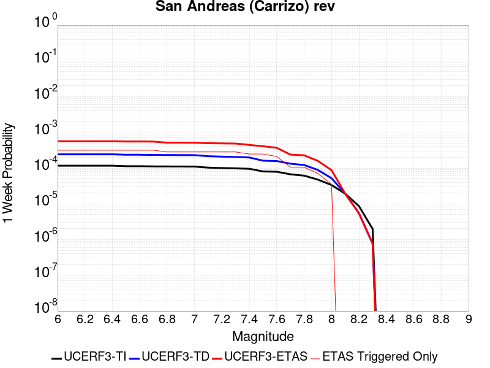 | 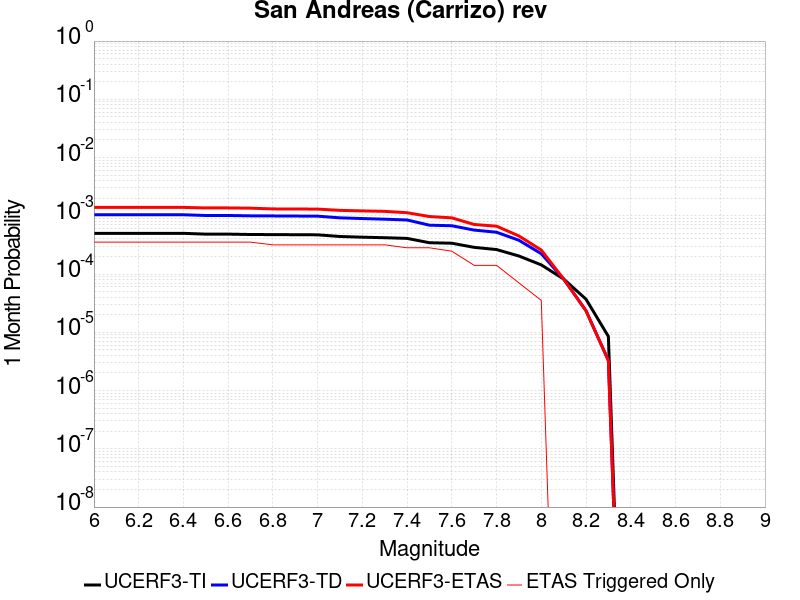 | 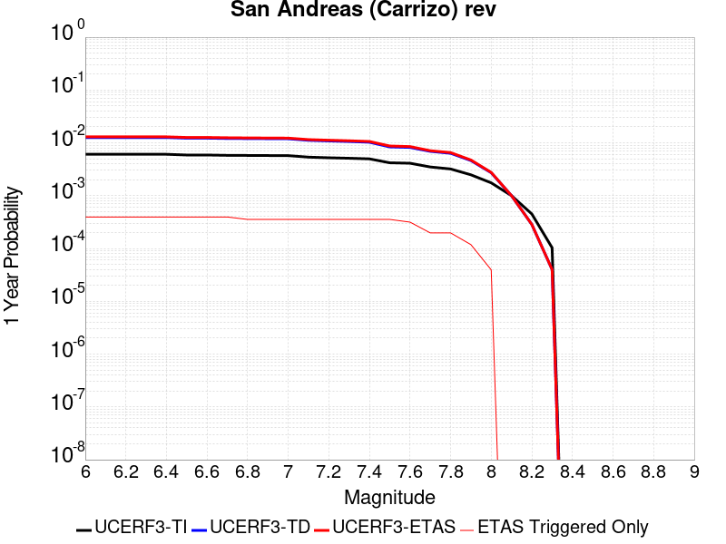 | 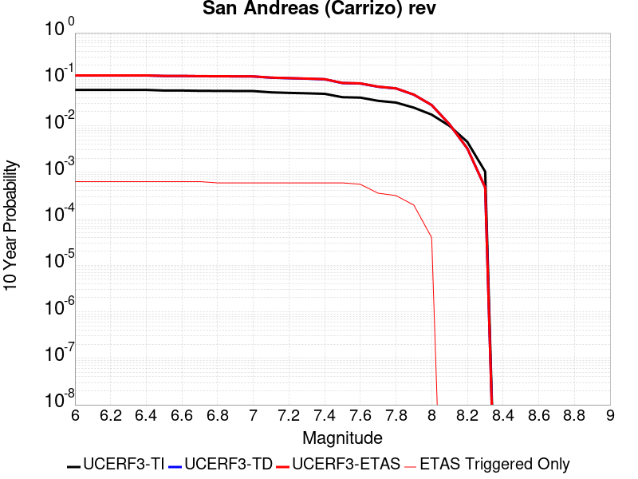 |

| Magnitude | 1 wk TI Prob | 1 wk TD Prob | 1 wk ETAS Prob | 1 wk ETAS/TD Gain | 1 wk ETAS Triggered Only | 1 mo TI Prob | 1 mo TD Prob | 1 mo ETAS Prob | 1 mo ETAS/TD Gain | 1 mo ETAS Triggered Only | 1 yr TI Prob | 1 yr TD Prob | 1 yr ETAS Prob | 1 yr ETAS/TD Gain | 1 yr ETAS Triggered Only | 10 yr TI Prob | 10 yr TD Prob | 10 yr ETAS Prob | 10 yr ETAS/TD Gain | 10 yr ETAS Triggered Only |
|-----|-----|-----|-----|-----|-----|-----|-----|-----|-----|-----|-----|-----|-----|-----|-----|-----|-----|-----|-----|-----|
| 6.0 | 1.1674632E-4 | 2.432302E-4 | 5.19319E-4 | 2.1350923 | 2.7615592E-4 | 5.002454E-4 | 0.0010420004 | 0.0013572782 | 1.3025699 | 3.1560674E-4 | 0.006073493 | 0.012613042 | 0.013002574 | 1.0308833 | 3.9450845E-4 | 0.0591016 | 0.12061418 | 0.12116926 | 1.0046021 | 6.312135E-4 |
| 6.1 | 1.1674632E-4 | 2.432302E-4 | 5.19319E-4 | 2.1350923 | 2.7615592E-4 | 5.002454E-4 | 0.0010420004 | 0.0013572782 | 1.3025699 | 3.1560674E-4 | 0.006073493 | 0.012613042 | 0.013002574 | 1.0308833 | 3.9450845E-4 | 0.0591016 | 0.12061418 | 0.12116926 | 1.0046021 | 6.312135E-4 |
| 6.2 | 1.1674632E-4 | 2.432302E-4 | 5.19319E-4 | 2.1350923 | 2.7615592E-4 | 5.002454E-4 | 0.0010420004 | 0.0013572782 | 1.3025699 | 3.1560674E-4 | 0.006073493 | 0.012613042 | 0.013002574 | 1.0308833 | 3.9450845E-4 | 0.0591016 | 0.12061418 | 0.12116926 | 1.0046021 | 6.312135E-4 |
| 6.3 | 1.1674632E-4 | 2.432302E-4 | 5.19319E-4 | 2.1350923 | 2.7615592E-4 | 5.002454E-4 | 0.0010420004 | 0.0013572782 | 1.3025699 | 3.1560674E-4 | 0.006073493 | 0.012613042 | 0.013002574 | 1.0308833 | 3.9450845E-4 | 0.0591016 | 0.12061418 | 0.12116926 | 1.0046021 | 6.312135E-4 |
| 6.4 | 1.1674632E-4 | 2.432302E-4 | 5.19319E-4 | 2.1350923 | 2.7615592E-4 | 5.002454E-4 | 0.0010420004 | 0.0013572782 | 1.3025699 | 3.1560674E-4 | 0.006073493 | 0.012613042 | 0.013002574 | 1.0308833 | 3.9450845E-4 | 0.0591016 | 0.12061418 | 0.12116926 | 1.0046021 | 6.312135E-4 |
| 6.5 | 1.13136164E-4 | 2.3643032E-4 | 5.1252096E-4 | 2.1677463 | 2.7615592E-4 | 4.847792E-4 | 0.0010128808 | 0.001328168 | 1.3112775 | 3.1560674E-4 | 0.0058862255 | 0.012262545 | 0.012652215 | 1.0317773 | 3.9450845E-4 | 0.057327334 | 0.117585555 | 0.118142545 | 1.0047369 | 6.312135E-4 |
| 6.6 | 1.13136164E-4 | 2.3643032E-4 | 5.1252096E-4 | 2.1677463 | 2.7615592E-4 | 4.847792E-4 | 0.0010128808 | 0.001328168 | 1.3112775 | 3.1560674E-4 | 0.0058862255 | 0.012262545 | 0.012652215 | 1.0317773 | 3.9450845E-4 | 0.057327334 | 0.117585555 | 0.118142545 | 1.0047369 | 6.312135E-4 |
| 6.7 | 1.1149675E-4 | 2.3334254E-4 | 5.0943403E-4 | 2.1832025 | 2.7615592E-4 | 4.777557E-4 | 9.996577E-4 | 0.0013149489 | 1.3153992 | 3.1560674E-4 | 0.0058011734 | 0.012103349 | 0.012493082 | 1.0322005 | 3.9450845E-4 | 0.05652051 | 0.1162071 | 0.11676496 | 1.0048006 | 6.312135E-4 |
| 6.8 | 1.1103589E-4 | 2.3236412E-4 | 4.690142E-4 | 2.018445 | 2.3670506E-4 | 4.7578133E-4 | 9.954676E-4 | 0.0012713487 | 1.277137 | 2.7615592E-4 | 0.005777263 | 0.012052901 | 0.01240368 | 1.0291032 | 3.550576E-4 | 0.056293584 | 0.1157674 | 0.11629065 | 1.0045199 | 5.9176265E-4 |
| 6.9 | 1.1053259E-4 | 2.3128795E-4 | 4.6793828E-4 | 2.0231848 | 2.3670506E-4 | 4.7362508E-4 | 9.90859E-4 | 0.0012667413 | 1.2784274 | 2.7615592E-4 | 0.0057511497 | 0.01199741 | 0.012348209 | 1.0292394 | 3.550576E-4 | 0.05604569 | 0.11528359 | 0.11580714 | 1.0045414 | 5.9176265E-4 |
| 7.0 | 1.1005377E-4 | 2.3029637E-4 | 4.6694692E-4 | 2.0275912 | 2.3670506E-4 | 4.7157376E-4 | 9.866126E-4 | 0.0012624961 | 1.279627 | 2.7615592E-4 | 0.0057263062 | 0.011946279 | 0.012297095 | 1.0293661 | 3.550576E-4 | 0.055809796 | 0.11483591 | 0.115359716 | 1.0045613 | 5.9176265E-4 |
| 7.1 | 1.0308142E-4 | 2.1539345E-4 | 4.5204753E-4 | 2.098706 | 2.3670506E-4 | 4.417027E-4 | 9.227892E-4 | 0.0011986903 | 1.2989861 | 2.7615592E-4 | 0.0053644776 | 0.011177397 | 0.011528486 | 1.0314106 | 3.550576E-4 | 0.052368138 | 0.108092256 | 0.108620055 | 1.0048828 | 5.9176265E-4 |
| 7.2 | 1.0027479E-4 | 2.094724E-4 | 4.461279E-4 | 2.1297693 | 2.3670506E-4 | 4.296783E-4 | 8.9743105E-4 | 0.0011733391 | 1.3074421 | 2.7615592E-4 | 0.0052187922 | 0.010871782 | 0.01122298 | 1.0323036 | 3.550576E-4 | 0.050979212 | 0.10539625 | 0.10592564 | 1.0050229 | 5.9176265E-4 |
| 7.3 | 9.816942E-5 | 2.0422463E-4 | 4.4088135E-4 | 2.1588058 | 2.3670506E-4 | 4.2065824E-4 | 8.7495585E-4 | 0.0011508701 | 1.3153465 | 2.7615592E-4 | 0.005109493 | 0.010600842 | 0.010952136 | 1.0331383 | 3.550576E-4 | 0.049935985 | 0.102979995 | 0.10351082 | 1.0051546 | 5.9176265E-4 |
| 7.4 | 9.5634205E-5 | 1.9791997E-4 | 4.345782E-4 | 2.1957269 | 2.3670506E-4 | 4.0979648E-4 | 8.479536E-4 | 0.0011238754 | 1.3253973 | 2.7615592E-4 | 0.0049778637 | 0.010275229 | 0.010626638 | 1.0341997 | 3.550576E-4 | 0.048678253 | 0.10006632 | 0.100598864 | 1.005322 | 5.9176265E-4 |
| 7.5 | 8.052417E-5 | 1.611261E-4 | 3.9779302E-4 | 2.4688306 | 2.3670506E-4 | 3.4505792E-4 | 6.903579E-4 | 9.6632313E-4 | 1.3997424 | 2.7615592E-4 | 0.0041929903 | 0.008372796 | 0.00872488 | 1.0420511 | 3.550576E-4 | 0.04114753 | 0.08281049 | 0.08335325 | 1.0065542 | 5.9176265E-4 |
| 7.6 | 7.897024E-5 | 1.5765853E-4 | 3.5488166E-4 | 2.250951 | 1.9725422E-4 | 3.384E-4 | 6.755046E-4 | 9.120498E-4 | 1.3501755 | 2.3670506E-4 | 0.0041122385 | 0.008193332 | 0.008506353 | 1.0382043 | 3.1560674E-4 | 0.040369697 | 0.08115171 | 0.0816592 | 1.0062536 | 5.5231183E-4 |
| 7.7 | 6.707427E-5 | 1.3276102E-4 | 2.1165224E-4 | 1.5942347 | 7.8901685E-5 | 2.8742946E-4 | 5.688518E-4 | 6.87137E-4 | 1.2079368 | 1.1835253E-4 | 0.003493839 | 0.00690381 | 0.0070997025 | 1.0283746 | 1.9725422E-4 | 0.034394164 | 0.069048055 | 0.0693786 | 1.0047871 | 3.550576E-4 |
| 7.8 | 6.147705E-5 | 1.2197486E-4 | 2.0086693E-4 | 1.6467896 | 7.8901685E-5 | 2.6344648E-4 | 5.226447E-4 | 6.409354E-4 | 1.226331 | 1.1835253E-4 | 0.0032027436 | 0.006344659 | 0.0065406617 | 1.0308926 | 1.9725422E-4 | 0.031569764 | 0.06351457 | 0.063810125 | 1.0046535 | 3.1560674E-4 |
| 7.9 | 4.7636717E-5 | 8.87977E-5 | 1.2824504E-4 | 1.4442383 | 3.9450842E-5 | 2.0414138E-4 | 3.8050607E-4 | 4.199419E-4 | 1.1036404 | 3.9450842E-5 | 0.0024825884 | 0.0046228287 | 0.004740634 | 1.0254834 | 1.1835253E-4 | 0.024550365 | 0.046628095 | 0.04681615 | 1.0040331 | 1.9725422E-4 |
| 8.0 | 3.3554235E-5 | 5.2136907E-5 | 5.2136907E-5 | 1.0 | 0.0 | 1.4379594E-4 | 2.2342477E-4 | 2.2342477E-4 | 1.0 | 0.0 | 0.0017493097 | 0.002716805 | 0.0027561488 | 1.0144815 | 3.9450842E-5 | 0.017356034 | 0.027880952 | 0.027919304 | 1.0013756 | 3.9450842E-5 |
| 8.1 | 1.9175432E-5 | 1.9184976E-5 | 1.9184976E-5 | 1.0 | 0.0 | 8.217783E-5 | 8.2218736E-5 | 8.2218736E-5 | 1.0 | 0.0 | 0.0010000558 | 0.0010005541 | 0.0010005541 | 1.0 | 0.0 | 0.009955673 | 0.0107580265 | 0.0107580265 | 1.0 | 0.0 |
| 8.2 | 8.643924E-6 | 5.4748625E-6 | 5.4748625E-6 | 1.0 | 0.0 | 3.704486E-5 | 2.3463486E-5 | 2.3463486E-5 | 1.0 | 0.0 | 4.5092785E-4 | 2.8563058E-4 | 2.8563058E-4 | 1.0 | 0.0 | 0.0045001395 | 0.0032487072 | 0.0032487072 | 1.0 | 0.0 |
| 8.3 | 1.983087E-6 | 7.6599065E-7 | 7.6599065E-7 | 1.0 | 0.0 | 8.498917E-6 | 3.282813E-6 | 3.282813E-6 | 1.0 | 0.0 | 1.034694E-4 | 3.9967534E-5 | 3.9967534E-5 | 1.0 | 0.0 | 0.0010342124 | 4.719687E-4 | 4.719687E-4 | 1.0 | 0.0 |

## Calico-Hidalgo
*[(top)](#table-of-contents)*

| 1 Week | 1 Month | 1 Year | 10 Year |
|-----|-----|-----|-----|
| 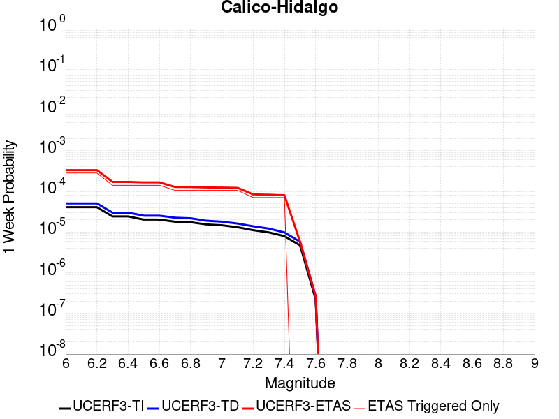 | 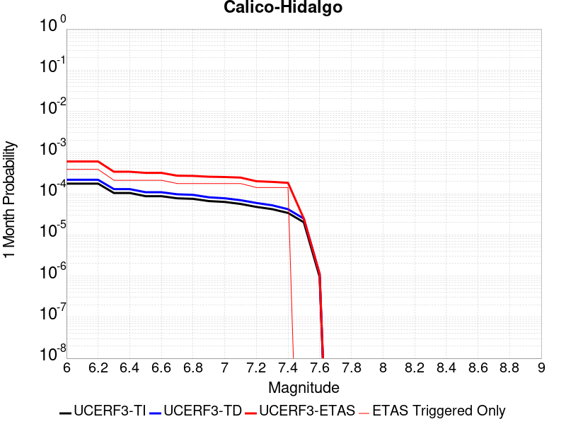 | 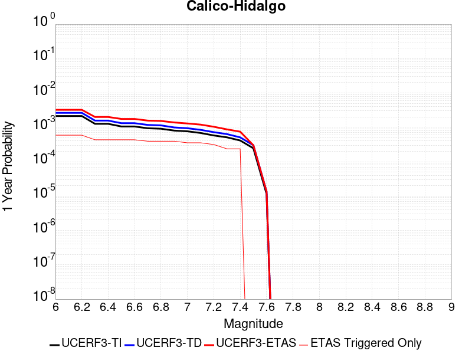 | 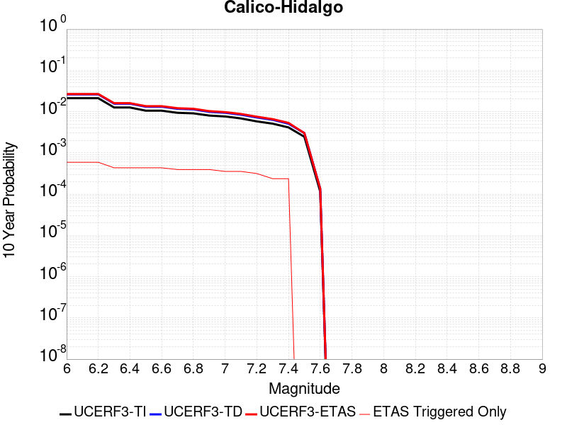 |

| Magnitude | 1 wk TI Prob | 1 wk TD Prob | 1 wk ETAS Prob | 1 wk ETAS/TD Gain | 1 wk ETAS Triggered Only | 1 mo TI Prob | 1 mo TD Prob | 1 mo ETAS Prob | 1 mo ETAS/TD Gain | 1 mo ETAS Triggered Only | 1 yr TI Prob | 1 yr TD Prob | 1 yr ETAS Prob | 1 yr ETAS/TD Gain | 1 yr ETAS Triggered Only | 10 yr TI Prob | 10 yr TD Prob | 10 yr ETAS Prob | 10 yr ETAS/TD Gain | 10 yr ETAS Triggered Only |
|-----|-----|-----|-----|-----|-----|-----|-----|-----|-----|-----|-----|-----|-----|-----|-----|-----|-----|-----|-----|-----|
| 6.0 | 4.0906612E-5 | 5.0703686E-5 | 3.268456E-4 | 6.44619 | 2.7615592E-4 | 1.7530227E-4 | 2.172857E-4 | 5.722662E-4 | 2.6337037 | 3.550576E-4 | 0.0021322158 | 0.002642648 | 0.003232847 | 1.2233361 | 5.9176265E-4 | 0.02111873 | 0.026152607 | 0.026728893 | 1.0220355 | 5.9176265E-4 |
| 6.1 | 4.0906612E-5 | 5.0703686E-5 | 3.268456E-4 | 6.44619 | 2.7615592E-4 | 1.7530227E-4 | 2.172857E-4 | 5.722662E-4 | 2.6337037 | 3.550576E-4 | 0.0021322158 | 0.002642648 | 0.003232847 | 1.2233361 | 5.9176265E-4 | 0.02111873 | 0.026152607 | 0.026728893 | 1.0220355 | 5.9176265E-4 |
| 6.2 | 4.0906612E-5 | 5.0703686E-5 | 3.268456E-4 | 6.44619 | 2.7615592E-4 | 1.7530227E-4 | 2.172857E-4 | 5.722662E-4 | 2.6337037 | 3.550576E-4 | 0.0021322158 | 0.002642648 | 0.003232847 | 1.2233361 | 5.9176265E-4 | 0.02111873 | 0.026152607 | 0.026728893 | 1.0220355 | 5.9176265E-4 |
| 6.3 | 2.4242801E-5 | 3.0090669E-5 | 1.878893E-4 | 6.2441053 | 1.5780337E-4 | 1.0389358E-4 | 1.2895382E-4 | 3.6562837E-4 | 2.8353434 | 2.3670506E-4 | 0.0012641704 | 0.0015689151 | 0.0020021936 | 1.2761644 | 4.339593E-4 | 0.01257003 | 0.01558206 | 0.016009258 | 1.027416 | 4.339593E-4 |
| 6.4 | 2.4242801E-5 | 3.0090669E-5 | 1.878893E-4 | 6.2441053 | 1.5780337E-4 | 1.0389358E-4 | 1.2895382E-4 | 3.6562837E-4 | 2.8353434 | 2.3670506E-4 | 0.0012641704 | 0.0015689151 | 0.0020021936 | 1.2761644 | 4.339593E-4 | 0.01257003 | 0.01558206 | 0.016009258 | 1.027416 | 4.339593E-4 |
| 6.5 | 2.0286952E-5 | 2.5315738E-5 | 1.8311512E-4 | 7.2332525 | 1.5780337E-4 | 8.694118E-5 | 1.0849161E-4 | 3.45171E-4 | 3.1815457 | 2.3670506E-4 | 0.0010579949 | 0.001320102 | 0.0017534884 | 1.3282976 | 4.339593E-4 | 0.010529719 | 0.013124538 | 0.013552802 | 1.0326308 | 4.339593E-4 |
| 6.6 | 2.0269223E-5 | 2.5296687E-5 | 1.8309607E-4 | 7.2379465 | 1.5780337E-4 | 8.6865206E-5 | 1.08409964E-4 | 3.4508936E-4 | 3.1831887 | 2.3670506E-4 | 0.0010570707 | 0.0013191093 | 0.0017524961 | 1.3285451 | 4.339593E-4 | 0.010520565 | 0.013114728 | 0.013542996 | 1.0326555 | 4.339593E-4 |
| 6.7 | 1.799852E-5 | 2.25406E-5 | 1.4089046E-4 | 6.2505198 | 1.1835253E-4 | 7.713423E-5 | 9.659908E-5 | 2.9383425E-4 | 3.0417914 | 1.9725422E-4 | 9.3870464E-4 | 0.0011754738 | 0.0015695185 | 1.335222 | 3.9450845E-4 | 0.009347493 | 0.011694173 | 0.012084069 | 1.0333409 | 3.9450845E-4 |
| 6.8 | 1.7458793E-5 | 2.184212E-5 | 1.4019207E-4 | 6.4184275 | 1.1835253E-4 | 7.4821255E-5 | 9.3605806E-5 | 2.9084156E-4 | 3.1070888 | 1.9725422E-4 | 9.10568E-4 | 0.0011390693 | 0.0015331284 | 1.3459482 | 3.9450845E-4 | 0.009068459 | 0.011333893 | 0.01172393 | 1.0344133 | 3.9450845E-4 |
| 6.9 | 1.542884E-5 | 1.9025927E-5 | 1.373762E-4 | 7.220474 | 1.1835253E-4 | 6.612192E-5 | 8.153721E-5 | 2.7877535E-4 | 3.4189954 | 1.9725422E-4 | 8.04737E-4 | 9.922766E-4 | 0.0013863936 | 1.3971846 | 3.9450845E-4 | 0.008018291 | 0.009879857 | 0.010270468 | 1.0395361 | 3.9450845E-4 |
| 7.0 | 1.468253E-5 | 1.8030598E-5 | 1.36381E-4 | 7.563864 | 1.1835253E-4 | 6.292361E-5 | 7.7271776E-5 | 2.7451076E-4 | 3.5525358 | 1.9725422E-4 | 7.658257E-4 | 9.4039086E-4 | 0.0012951145 | 1.3772088 | 3.550576E-4 | 0.0076319184 | 0.009365481 | 0.009717214 | 1.0375563 | 3.550576E-4 |
| 7.1 | 1.3139281E-5 | 1.6200942E-5 | 1.3455156E-4 | 8.305168 | 1.1835253E-4 | 5.6309986E-5 | 6.943083E-5 | 2.6667136E-4 | 3.8408203 | 1.9725422E-4 | 6.853584E-4 | 8.4500515E-4 | 0.0011997627 | 1.4198289 | 3.550576E-4 | 0.0068324856 | 0.0084192185 | 0.008771286 | 1.0418172 | 3.550576E-4 |
| 7.2 | 1.1127404E-5 | 1.3866597E-5 | 9.276719E-5 | 6.6899753 | 7.8901685E-5 | 4.7688E-5 | 5.942698E-5 | 2.1722098E-4 | 3.6552584 | 1.5780337E-4 | 5.8044674E-4 | 7.232942E-4 | 0.0010386728 | 1.4360307 | 3.1560674E-4 | 0.0057893298 | 0.0072105085 | 0.00752384 | 1.0434548 | 3.1560674E-4 |
| 7.3 | 9.808154E-6 | 1.2176215E-5 | 9.1076945E-5 | 7.479906 | 7.8901685E-5 | 4.2034266E-5 | 5.2182797E-5 | 2.0997794E-4 | 4.023892 | 1.5780337E-4 | 5.11647E-4 | 6.3515105E-4 | 8.7170576E-4 | 1.3724385 | 2.3670506E-4 | 0.0051047057 | 0.006334433 | 0.006569639 | 1.0371313 | 2.3670506E-4 |
| 7.4 | 7.942452E-6 | 9.792144E-6 | 8.869306E-5 | 9.057573 | 7.8901685E-5 | 3.4038632E-5 | 4.1965708E-5 | 1.9976246E-4 | 4.7601357 | 1.5780337E-4 | 4.1434157E-4 | 5.1082217E-4 | 7.4740633E-4 | 1.4631438 | 2.3670506E-4 | 0.0041356985 | 0.005097421 | 0.00533292 | 1.0461996 | 2.3670506E-4 |
| 7.5 | 4.7121216E-6 | 5.772836E-6 | 5.772836E-6 | 1.0 | 0.0 | 2.019465E-5 | 2.4740535E-5 | 2.4740535E-5 | 1.0 | 0.0 | 2.4584212E-4 | 3.0118204E-4 | 3.0118204E-4 | 1.0 | 0.0 | 0.0024557032 | 0.0030084911 | 0.0030084911 | 1.0 | 0.0 |
| 7.6 | 2.21172E-7 | 2.603961E-7 | 2.603961E-7 | 1.0 | 0.0 | 9.478797E-7 | 1.1159829E-6 | 1.1159829E-6 | 1.0 | 0.0 | 1.1540374E-5 | 1.3587036E-5 | 1.3587036E-5 | 1.0 | 0.0 | 1.1539775E-4 | 1.3586486E-4 | 1.3586486E-4 | 1.0 | 0.0 |

## Cleghorn Lake
*[(top)](#table-of-contents)*

| 1 Week | 1 Month | 1 Year | 10 Year |
|-----|-----|-----|-----|
| 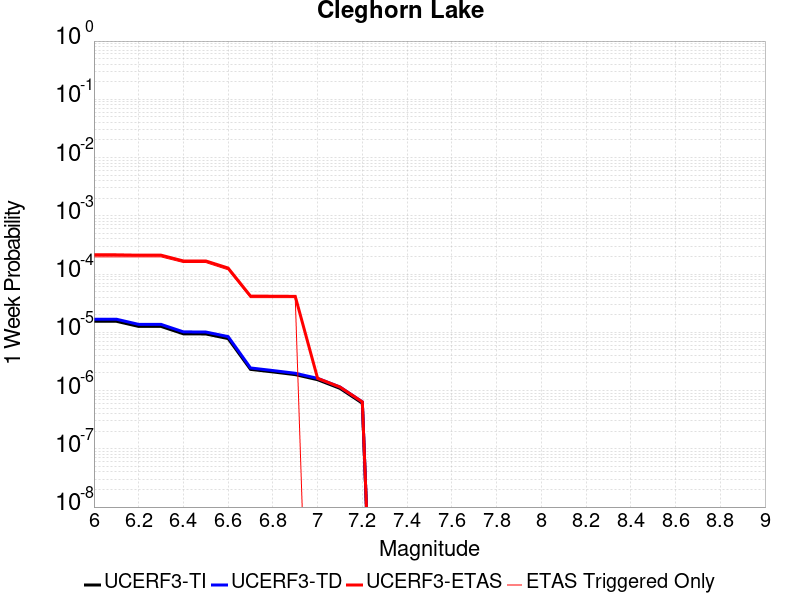 | 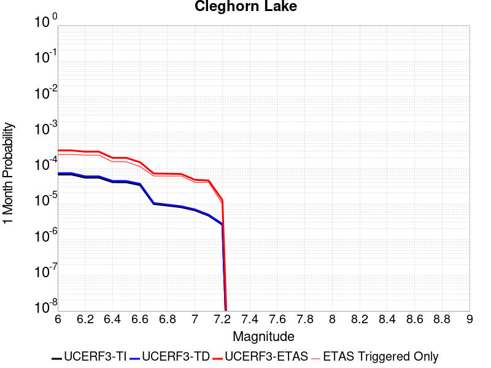 | 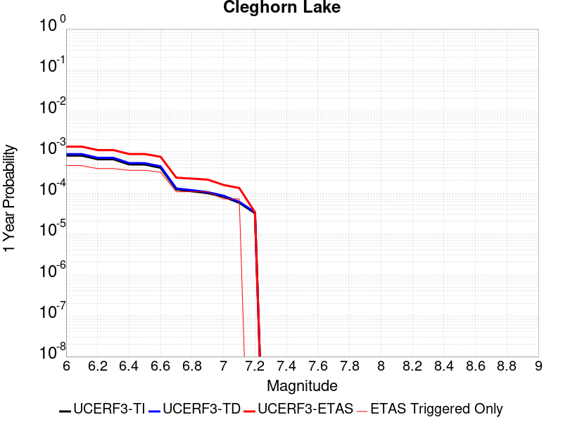 | 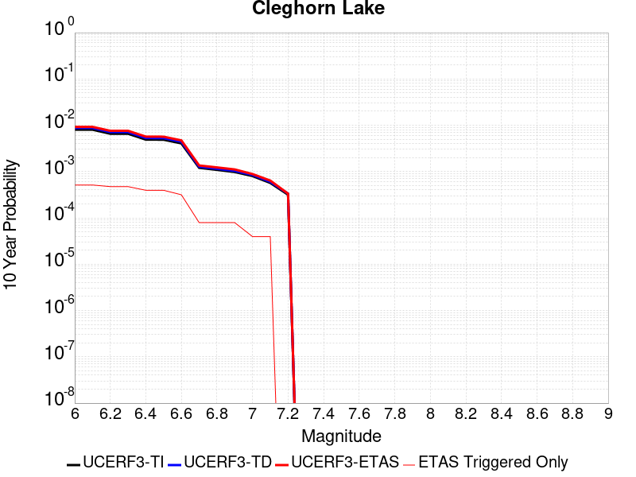 |

| Magnitude | 1 wk TI Prob | 1 wk TD Prob | 1 wk ETAS Prob | 1 wk ETAS/TD Gain | 1 wk ETAS Triggered Only | 1 mo TI Prob | 1 mo TD Prob | 1 mo ETAS Prob | 1 mo ETAS/TD Gain | 1 mo ETAS Triggered Only | 1 yr TI Prob | 1 yr TD Prob | 1 yr ETAS Prob | 1 yr ETAS/TD Gain | 1 yr ETAS Triggered Only | 10 yr TI Prob | 10 yr TD Prob | 10 yr ETAS Prob | 10 yr ETAS/TD Gain | 10 yr ETAS Triggered Only |
|-----|-----|-----|-----|-----|-----|-----|-----|-----|-----|-----|-----|-----|-----|-----|-----|-----|-----|-----|-----|-----|
| 6.0 | 1.5467183E-5 | 1.6794203E-5 | 2.1404511E-4 | 12.745177 | 1.9725422E-4 | 6.6286244E-5 | 7.197348E-5 | 3.4810952E-4 | 4.8366356 | 2.7615592E-4 | 8.067362E-4 | 8.759797E-4 | 0.0013489751 | 1.5399616 | 4.7341012E-4 | 0.008038137 | 0.008730696 | 0.0092390785 | 1.0582294 | 5.1286095E-4 |
| 6.1 | 1.5467183E-5 | 1.6794203E-5 | 2.1404511E-4 | 12.745177 | 1.9725422E-4 | 6.6286244E-5 | 7.197348E-5 | 3.4810952E-4 | 4.8366356 | 2.7615592E-4 | 8.067362E-4 | 8.759797E-4 | 0.0013489751 | 1.5399616 | 4.7341012E-4 | 0.008038137 | 0.008730696 | 0.0092390785 | 1.0582294 | 5.1286095E-4 |
| 6.2 | 1.2624631E-5 | 1.3681544E-5 | 2.1093307E-4 | 15.417343 | 1.9725422E-4 | 5.410444E-5 | 5.863415E-5 | 3.3477385E-4 | 5.7095375 | 2.7615592E-4 | 6.585225E-4 | 7.1368564E-4 | 0.0011079125 | 1.5523818 | 3.9450845E-4 | 0.0065657445 | 0.0071187317 | 0.0075887716 | 1.0660286 | 4.7341012E-4 |
| 6.3 | 1.2624631E-5 | 1.3681544E-5 | 2.1093307E-4 | 15.417343 | 1.9725422E-4 | 5.410444E-5 | 5.863415E-5 | 3.3477385E-4 | 5.7095375 | 2.7615592E-4 | 6.585225E-4 | 7.1368564E-4 | 0.0011079125 | 1.5523818 | 3.9450845E-4 | 0.0065657445 | 0.0071187317 | 0.0075887716 | 1.0660286 | 4.7341012E-4 |
| 6.4 | 9.417684E-6 | 1.0170118E-5 | 1.6797188E-4 | 16.516218 | 1.5780337E-4 | 4.036088E-5 | 4.3585722E-5 | 2.8028048E-4 | 6.4305573 | 2.3670506E-4 | 4.912829E-4 | 5.3056807E-4 | 8.8543724E-4 | 1.6688477 | 3.550576E-4 | 0.004901982 | 0.005297049 | 0.005689468 | 1.0740825 | 3.9450845E-4 |
| 6.5 | 9.368219E-6 | 1.0117545E-5 | 1.6791932E-4 | 16.596846 | 1.5780337E-4 | 4.014889E-5 | 4.3360415E-5 | 2.8005522E-4 | 6.458776 | 2.3670506E-4 | 4.8870314E-4 | 5.2782625E-4 | 8.826965E-4 | 1.6723238 | 3.550576E-4 | 0.004876298 | 0.0052697617 | 0.0056621907 | 1.0744681 | 3.9450845E-4 |
| 6.6 | 7.803798E-6 | 8.441831E-6 | 1.2679337E-4 | 15.019652 | 1.1835253E-4 | 3.3444423E-5 | 3.6179E-5 | 2.3342608E-4 | 6.4519773 | 1.9725422E-4 | 4.0710976E-4 | 4.4043022E-4 | 7.5589796E-4 | 1.7162719 | 3.1560674E-4 | 0.0040636472 | 0.0043994905 | 0.0047137085 | 1.0714215 | 3.1560674E-4 |
| 6.7 | 2.3108669E-6 | 2.4438336E-6 | 4.1894582E-5 | 17.142977 | 3.9450842E-5 | 9.903678E-6 | 1.0473532E-5 | 8.937439E-5 | 8.533358 | 7.8901685E-5 | 1.205706E-4 | 1.2750797E-4 | 2.063996E-4 | 1.6187192 | 7.8901685E-5 | 0.001205052 | 0.0012743667 | 0.0013531679 | 1.0618355 | 7.8901685E-5 |
| 6.8 | 2.0882828E-6 | 2.2062823E-6 | 4.165704E-5 | 18.881102 | 3.9450842E-5 | 8.949753E-6 | 9.455462E-6 | 8.8356406E-5 | 9.344483 | 7.8901685E-5 | 1.08957785E-4 | 1.1511434E-4 | 1.9400695E-4 | 1.6853412 | 7.8901685E-5 | 0.0010890438 | 0.0011505639 | 0.0012293748 | 1.0684977 | 7.8901685E-5 |
| 6.9 | 1.876935E-6 | 1.981051E-6 | 4.1431816E-5 | 20.914059 | 3.9450842E-5 | 8.043982E-6 | 8.490192E-6 | 8.7391214E-5 | 10.293197 | 7.8901685E-5 | 9.7931086E-5 | 1.03363345E-4 | 1.8225687E-4 | 1.7632642 | 7.8901685E-5 | 9.788794E-4 | 0.0010331686 | 0.0011119888 | 1.0762898 | 7.8901685E-5 |
| 7.0 | 1.5357559E-6 | 1.6202807E-6 | 1.6202807E-6 | 1.0 | 0.0 | 6.5817944E-6 | 6.9440425E-6 | 4.6394613E-5 | 6.681211 | 3.9450842E-5 | 8.01304E-5 | 8.454057E-5 | 1.2398807E-4 | 1.4666104 | 3.9450842E-5 | 8.010151E-4 | 8.450965E-4 | 8.8451395E-4 | 1.0466427 | 3.9450842E-5 |
| 7.1 | 1.0905424E-6 | 1.1497619E-6 | 1.1497619E-6 | 1.0 | 0.0 | 4.6737446E-6 | 4.9275427E-6 | 4.4378194E-5 | 9.006151 | 3.9450842E-5 | 5.6901354E-5 | 5.999128E-5 | 9.9439756E-5 | 1.6575702 | 3.9450842E-5 | 5.6886784E-4 | 5.997606E-4 | 6.391878E-4 | 1.0657382 | 3.9450842E-5 |
| 7.2 | 6.06668E-7 | 6.387277E-7 | 6.387277E-7 | 1.0 | 0.0 | 2.600003E-6 | 2.7374022E-6 | 2.7374022E-6 | 1.0 | 0.0 | 3.1654577E-5 | 3.3327433E-5 | 3.3327433E-5 | 1.0 | 0.0 | 3.1650066E-4 | 3.3323118E-4 | 3.3323118E-4 | 1.0 | 0.0 |

## Santa Ynez (West)
*[(top)](#table-of-contents)*

| 1 Week | 1 Month | 1 Year | 10 Year |
|-----|-----|-----|-----|
|  | 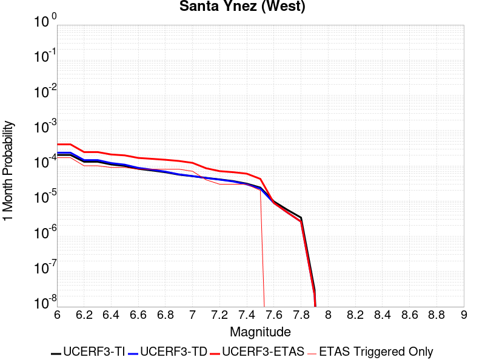 | 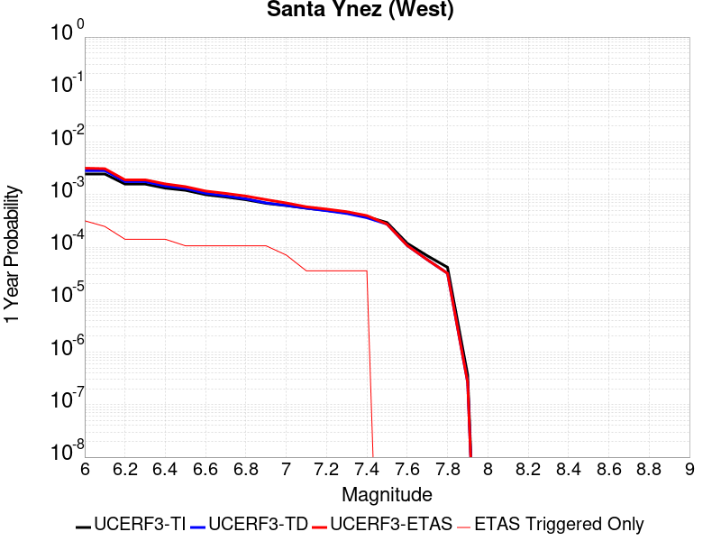 | 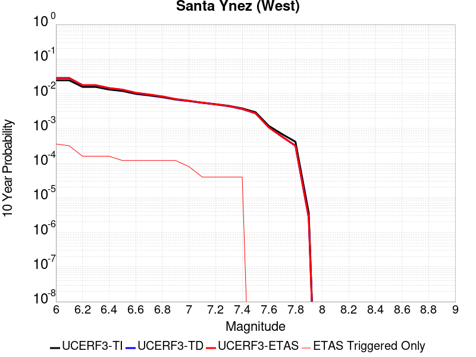 |

| Magnitude | 1 wk TI Prob | 1 wk TD Prob | 1 wk ETAS Prob | 1 wk ETAS/TD Gain | 1 wk ETAS Triggered Only | 1 mo TI Prob | 1 mo TD Prob | 1 mo ETAS Prob | 1 mo ETAS/TD Gain | 1 mo ETAS Triggered Only | 1 yr TI Prob | 1 yr TD Prob | 1 yr ETAS Prob | 1 yr ETAS/TD Gain | 1 yr ETAS Triggered Only | 10 yr TI Prob | 10 yr TD Prob | 10 yr ETAS Prob | 10 yr ETAS/TD Gain | 10 yr ETAS Triggered Only |
|-----|-----|-----|-----|-----|-----|-----|-----|-----|-----|-----|-----|-----|-----|-----|-----|-----|-----|-----|-----|-----|
| 6.0 | 4.7352758E-5 | 5.4972126E-5 | 1.7331816E-4 | 3.152837 | 1.1835253E-4 | 2.0292461E-4 | 2.3557522E-4 | 4.3278298E-4 | 1.8371328 | 1.9725422E-4 | 0.0024678076 | 0.0028645284 | 0.003179231 | 1.109862 | 3.1560674E-4 | 0.024405818 | 0.028304417 | 0.028649425 | 1.0121891 | 3.550576E-4 |
| 6.1 | 4.7352758E-5 | 5.4972126E-5 | 1.7331816E-4 | 3.152837 | 1.1835253E-4 | 2.0292461E-4 | 2.3557522E-4 | 4.3278298E-4 | 1.8371328 | 1.9725422E-4 | 0.0024678076 | 0.0028645284 | 0.0031398933 | 1.0961292 | 2.7615592E-4 | 0.024405818 | 0.028304417 | 0.02861109 | 1.0108348 | 3.1560674E-4 |
| 6.2 | 3.0415853E-5 | 3.392511E-5 | 7.337461E-5 | 2.1628408 | 3.9450842E-5 | 1.3034715E-4 | 1.4538545E-4 | 2.6372078E-4 | 1.8139421 | 1.1835253E-4 | 0.0015858212 | 0.0017686661 | 0.0019261903 | 1.0890639 | 1.5780337E-4 | 0.015745522 | 0.017549807 | 0.01770484 | 1.0088339 | 1.5780337E-4 |
| 6.3 | 3.0415853E-5 | 3.392511E-5 | 7.337461E-5 | 2.1628408 | 3.9450842E-5 | 1.3034715E-4 | 1.4538545E-4 | 2.6372078E-4 | 1.8139421 | 1.1835253E-4 | 0.0015858212 | 0.0017686661 | 0.0019261903 | 1.0890639 | 1.5780337E-4 | 0.015745522 | 0.017549807 | 0.01770484 | 1.0088339 | 1.5780337E-4 |
| 6.4 | 2.5452082E-5 | 2.7912422E-5 | 6.736217E-5 | 2.41334 | 3.9450842E-5 | 1.09075794E-4 | 1.196193E-4 | 2.3795768E-4 | 1.9892917 | 1.1835253E-4 | 0.0013271887 | 0.0014554089 | 0.0016129825 | 1.1082677 | 1.5780337E-4 | 0.013192902 | 0.014460951 | 0.014616473 | 1.0107546 | 1.5780337E-4 |
| 6.5 | 2.3143784E-5 | 2.5128256E-5 | 6.457811E-5 | 2.5699399 | 3.9450842E-5 | 9.9183875E-5 | 1.0768817E-4 | 2.2602796E-4 | 2.0989118 | 1.1835253E-4 | 0.0012068948 | 0.0013103267 | 0.0014285241 | 1.0902046 | 1.1835253E-4 | 0.012003611 | 0.01302768 | 0.01314449 | 1.0089663 | 1.1835253E-4 |
| 6.6 | 1.9118515E-5 | 2.035434E-5 | 5.980438E-5 | 2.9381635 | 3.9450842E-5 | 8.193392E-5 | 8.7230015E-5 | 2.0557223E-4 | 2.3566685 | 1.1835253E-4 | 9.97089E-4 | 0.001061516 | 0.0011797429 | 1.1113756 | 1.1835253E-4 | 0.00992627 | 0.010565365 | 0.010682467 | 1.0110836 | 1.1835253E-4 |
| 6.7 | 1.722807E-5 | 1.8146347E-5 | 5.7596477E-5 | 3.1739984 | 3.9450842E-5 | 7.3832496E-5 | 7.776777E-5 | 1.961111E-4 | 2.5217528 | 1.1835253E-4 | 8.985399E-4 | 9.464169E-4 | 0.0010646575 | 1.1249349 | 1.1835253E-4 | 0.008949154 | 0.0094245095 | 0.009541747 | 1.0124396 | 1.1835253E-4 |
| 6.8 | 1.5317364E-5 | 1.5926486E-5 | 5.5376702E-5 | 3.4770195 | 3.9450842E-5 | 6.56442E-5 | 6.82546E-5 | 1.8659906E-4 | 2.7338676 | 1.1835253E-4 | 7.98925E-4 | 8.306873E-4 | 9.489415E-4 | 1.1423571 | 1.1835253E-4 | 0.007960589 | 0.00827631 | 0.008393683 | 1.0141819 | 1.1835253E-4 |
| 6.9 | 1.3071226E-5 | 1.3329624E-5 | 5.2779942E-5 | 3.9595973 | 3.9450842E-5 | 5.6018336E-5 | 5.7125722E-5 | 1.7547149E-4 | 3.0716722 | 1.1835253E-4 | 6.8180985E-4 | 6.9528597E-4 | 8.135562E-4 | 1.1701031 | 1.1835253E-4 | 0.0067972173 | 0.006931367 | 0.0070488993 | 1.0169566 | 1.1835253E-4 |
| 7.0 | 1.1836986E-5 | 1.19327815E-5 | 1.19327815E-5 | 1.0 | 0.0 | 5.0728955E-5 | 5.11395E-5 | 1.3003715E-4 | 2.5427928 | 7.8901685E-5 | 6.1745E-4 | 6.2244723E-4 | 7.012998E-4 | 1.1266816 | 7.8901685E-5 | 0.006157372 | 0.006207231 | 0.006285643 | 1.0126324 | 7.8901685E-5 |
| 7.1 | 1.0597169E-5 | 1.0542201E-5 | 1.0542201E-5 | 1.0 | 0.0 | 4.541565E-5 | 4.5180084E-5 | 8.4629144E-5 | 1.8731515 | 3.9450842E-5 | 5.5279525E-4 | 5.4992986E-4 | 5.8935897E-4 | 1.0716985 | 3.9450842E-5 | 0.0055142213 | 0.005485821 | 0.0055250553 | 1.007152 | 3.9450842E-5 |
| 7.2 | 9.59113E-6 | 9.459144E-6 | 9.459144E-6 | 1.0 | 0.0 | 4.11042E-5 | 4.0538565E-5 | 7.998781E-5 | 1.9731288 | 3.9450842E-5 | 5.0032866E-4 | 4.934463E-4 | 5.328777E-4 | 1.0799102 | 3.9450842E-5 | 0.004992037 | 0.0049236254 | 0.004962882 | 1.0079731 | 3.9450842E-5 |
| 7.3 | 8.586084E-6 | 8.379583E-6 | 8.379583E-6 | 1.0 | 0.0 | 3.679698E-5 | 3.5912013E-5 | 7.536144E-5 | 2.0985024 | 3.9450842E-5 | 4.4791115E-4 | 4.3714207E-4 | 4.7657566E-4 | 1.0902077 | 3.9450842E-5 | 0.004470094 | 0.004362933 | 0.004402212 | 1.0090028 | 3.9450842E-5 |
| 7.4 | 7.2622997E-6 | 6.9515427E-6 | 6.9515427E-6 | 1.0 | 0.0 | 3.112377E-5 | 2.979199E-5 | 6.924166E-5 | 2.3241704 | 3.9450842E-5 | 3.78866E-4 | 3.626581E-4 | 4.0209462E-4 | 1.1087431 | 3.9450842E-5 | 0.0037822074 | 0.0036207628 | 0.003660071 | 1.0108563 | 3.9450842E-5 |
| 7.5 | 5.627296E-6 | 5.251588E-6 | 5.251588E-6 | 1.0 | 0.0 | 2.411676E-5 | 2.2506614E-5 | 2.2506614E-5 | 1.0 | 0.0 | 2.9358198E-4 | 2.739843E-4 | 2.739843E-4 | 1.0 | 0.0 | 0.0029319443 | 0.002736537 | 0.002736537 | 1.0 | 0.0 |
| 7.6 | 2.265244E-6 | 2.0608625E-6 | 2.0608625E-6 | 1.0 | 0.0 | 9.708152E-6 | 8.832238E-6 | 8.832238E-6 | 1.0 | 0.0 | 1.18190335E-4 | 1.0752728E-4 | 1.0752728E-4 | 1.0 | 0.0 | 0.001181275 | 0.0010747612 | 0.0010747612 | 1.0 | 0.0 |
| 7.7 | 1.3099874E-6 | 1.1016252E-6 | 1.1016252E-6 | 1.0 | 0.0 | 5.61422E-6 | 4.7212425E-6 | 4.7212425E-6 | 1.0 | 0.0 | 6.8350986E-5 | 5.7479636E-5 | 5.7479636E-5 | 1.0 | 0.0 | 6.832996E-4 | 5.7465007E-4 | 5.7465007E-4 | 1.0 | 0.0 |
| 7.8 | 7.903951E-7 | 6.0711415E-7 | 6.0711415E-7 | 1.0 | 0.0 | 3.3874032E-6 | 2.6019152E-6 | 2.6019152E-6 | 1.0 | 0.0 | 4.1240855E-5 | 3.167787E-5 | 3.167787E-5 | 1.0 | 0.0 | 4.12332E-4 | 3.167349E-4 | 3.167349E-4 | 1.0 | 0.0 |
| 7.9 | 7.0753297E-9 | 5.0899476E-9 | 5.0899476E-9 | 1.0 | 0.0 | 3.032284E-8 | 2.181406E-8 | 2.181406E-8 | 1.0 | 0.0 | 3.6918053E-7 | 2.6558615E-7 | 2.6558615E-7 | 1.0 | 0.0 | 3.691799E-6 | 2.6558594E-6 | 2.6558594E-6 | 1.0 | 0.0 |

## San Andreas (Coachella) rev
*[(top)](#table-of-contents)*

| 1 Week | 1 Month | 1 Year | 10 Year |
|-----|-----|-----|-----|
| 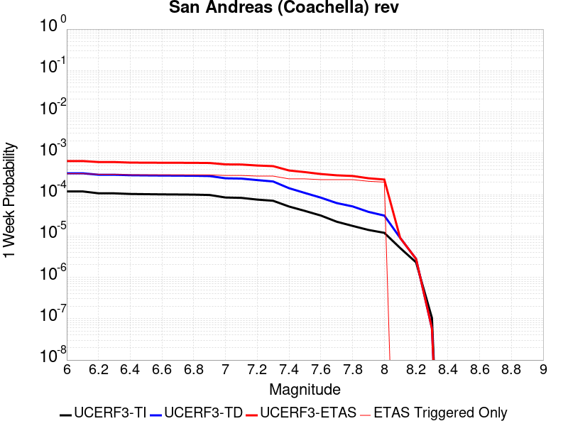 | 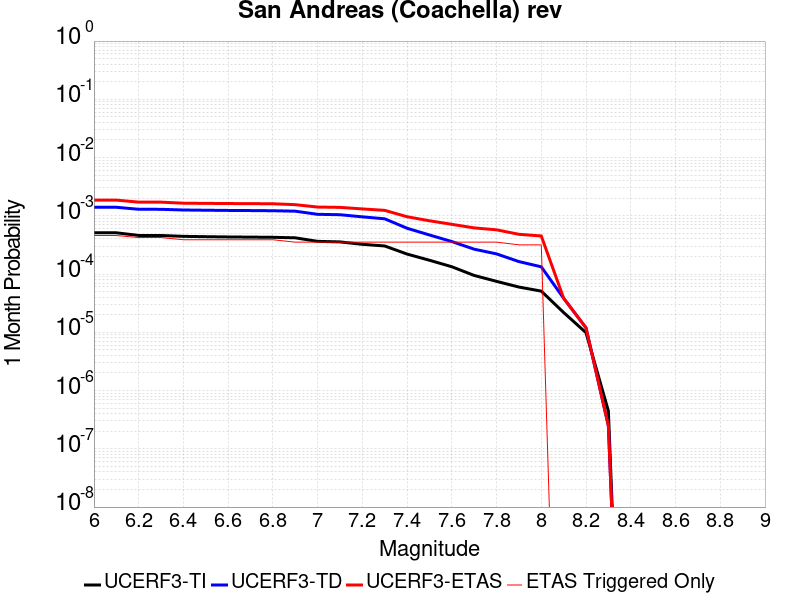 | 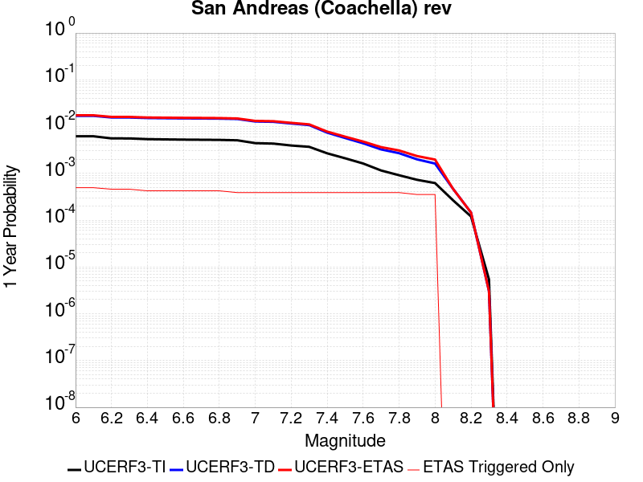 | 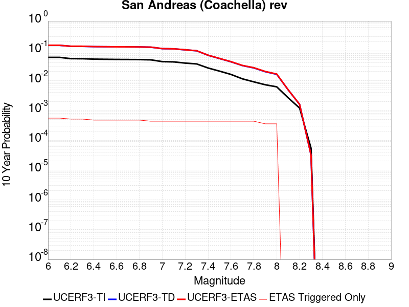 |

| Magnitude | 1 wk TI Prob | 1 wk TD Prob | 1 wk ETAS Prob | 1 wk ETAS/TD Gain | 1 wk ETAS Triggered Only | 1 mo TI Prob | 1 mo TD Prob | 1 mo ETAS Prob | 1 mo ETAS/TD Gain | 1 mo ETAS Triggered Only | 1 yr TI Prob | 1 yr TD Prob | 1 yr ETAS Prob | 1 yr ETAS/TD Gain | 1 yr ETAS Triggered Only | 10 yr TI Prob | 10 yr TD Prob | 10 yr ETAS Prob | 10 yr ETAS/TD Gain | 10 yr ETAS Triggered Only |
|-----|-----|-----|-----|-----|-----|-----|-----|-----|-----|-----|-----|-----|-----|-----|-----|-----|-----|-----|-----|-----|
| 6.0 | 1.1925945E-4 | 3.2729402E-4 | 6.822354E-4 | 2.0844727 | 3.550576E-4 | 5.110118E-4 | 0.0014019393 | 0.0018746858 | 1.3372089 | 4.7341012E-4 | 0.0062038354 | 0.016936364 | 0.017401757 | 1.0274789 | 4.7341012E-4 | 0.060334753 | 0.15265316 | 0.15312116 | 1.0030658 | 5.5231183E-4 |
| 6.1 | 1.1925945E-4 | 3.2729402E-4 | 6.822354E-4 | 2.0844727 | 3.550576E-4 | 5.110118E-4 | 0.0014019393 | 0.0018746858 | 1.3372089 | 4.7341012E-4 | 0.0062038354 | 0.016936364 | 0.017401757 | 1.0274789 | 4.7341012E-4 | 0.060334753 | 0.15265316 | 0.15312116 | 1.0030658 | 5.5231183E-4 |
| 6.2 | 1.07432395E-4 | 3.0230157E-4 | 6.178129E-4 | 2.0436974 | 3.1560674E-4 | 4.603433E-4 | 0.0012949388 | 0.0017283362 | 1.3346856 | 4.339593E-4 | 0.005590286 | 0.015653009 | 0.016080175 | 1.0272897 | 4.339593E-4 | 0.05451731 | 0.14182423 | 0.14226437 | 1.0031033 | 5.1286095E-4 |
| 6.3 | 1.0718766E-4 | 3.0175463E-4 | 6.172661E-4 | 2.0455897 | 3.1560674E-4 | 4.592948E-4 | 0.0012925972 | 0.0017259954 | 1.3352927 | 4.339593E-4 | 0.005577586 | 0.015624908 | 0.016052086 | 1.0273396 | 4.339593E-4 | 0.054396555 | 0.14159249 | 0.14203274 | 1.0031092 | 5.1286095E-4 |
| 6.4 | 1.0355944E-4 | 2.9383553E-4 | 5.699103E-4 | 1.9395554 | 2.7615592E-4 | 4.4375064E-4 | 0.0012586913 | 0.0016527032 | 1.313033 | 3.9450845E-4 | 0.0053892885 | 0.015217941 | 0.015606446 | 1.0255294 | 3.9450845E-4 | 0.052604496 | 0.13815255 | 0.13856056 | 1.0029533 | 4.7341012E-4 |
| 6.5 | 1.0227914E-4 | 2.9102986E-4 | 5.671054E-4 | 1.9486158 | 2.7615592E-4 | 4.382655E-4 | 0.0012466786 | 0.0016406953 | 1.316053 | 3.9450845E-4 | 0.0053228354 | 0.01507372 | 0.015462282 | 1.0257775 | 3.9450845E-4 | 0.051971316 | 0.13693172 | 0.1373403 | 1.0029838 | 4.7341012E-4 |
| 6.6 | 1.0116757E-4 | 2.8868738E-4 | 5.6476356E-4 | 1.9563154 | 2.7615592E-4 | 4.3350324E-4 | 0.0012366489 | 0.0016306695 | 1.3186196 | 3.9450845E-4 | 0.0052651367 | 0.01495329 | 0.015341899 | 1.0259882 | 3.9450845E-4 | 0.051421247 | 0.1359099 | 0.13631897 | 1.0030098 | 4.7341012E-4 |
| 6.7 | 1.0050676E-4 | 2.8727303E-4 | 5.633496E-4 | 1.9610251 | 2.7615592E-4 | 4.3067214E-4 | 0.0012305931 | 0.0016246161 | 1.3201895 | 3.9450845E-4 | 0.005230834 | 0.014880571 | 0.015269208 | 1.0261171 | 3.9450845E-4 | 0.051094085 | 0.13529462 | 0.13570398 | 1.0030257 | 4.7341012E-4 |
| 6.8 | 9.976819E-5 | 2.853096E-4 | 5.613867E-4 | 1.9676405 | 2.7615592E-4 | 4.2750788E-4 | 0.0012221863 | 0.0016162125 | 1.3223946 | 3.9450845E-4 | 0.0051924936 | 0.0147796115 | 0.015168289 | 1.0262983 | 3.9450845E-4 | 0.050728295 | 0.13444631 | 0.13485608 | 1.0030478 | 4.7341012E-4 |
| 6.9 | 9.77719E-5 | 2.8027873E-4 | 5.5635726E-4 | 1.9850141 | 2.7615592E-4 | 4.1895514E-4 | 0.0012006456 | 0.0015552768 | 1.2953672 | 3.550576E-4 | 0.0050888555 | 0.014520878 | 0.01487078 | 1.0240965 | 3.550576E-4 | 0.049738888 | 0.1322748 | 0.13265137 | 1.0028468 | 4.339593E-4 |
| 7.0 | 8.500761E-5 | 2.4762485E-4 | 5.2371237E-4 | 2.1149428 | 2.7615592E-4 | 3.6426744E-4 | 0.001060821 | 0.0014155019 | 1.3343457 | 3.550576E-4 | 0.0044259406 | 0.012839786 | 0.013190284 | 1.0272979 | 3.550576E-4 | 0.04338823 | 0.11813272 | 0.11851542 | 1.0032395 | 4.339593E-4 |
| 7.1 | 8.319876E-5 | 2.4365232E-4 | 5.197409E-4 | 2.1331253 | 2.7615592E-4 | 3.5651738E-4 | 0.0010438096 | 0.0013984966 | 1.3398005 | 3.550576E-4 | 0.004331963 | 0.012635092 | 0.012985664 | 1.0277458 | 3.550576E-4 | 0.042484846 | 0.116353 | 0.116736464 | 1.0032957 | 4.339593E-4 |
| 7.2 | 7.563917E-5 | 2.2413683E-4 | 5.002309E-4 | 2.23181 | 2.7615592E-4 | 3.2412758E-4 | 9.602359E-4 | 0.0013149525 | 1.3694057 | 3.550576E-4 | 0.0039391145 | 0.011628893 | 0.011979822 | 1.0301774 | 3.550576E-4 | 0.03870018 | 0.10775925 | 0.108146444 | 1.0035932 | 4.339593E-4 |
| 7.3 | 7.082985E-5 | 2.0729867E-4 | 4.8339734E-4 | 2.3318882 | 2.7615592E-4 | 3.0352117E-4 | 8.881233E-4 | 0.0012428656 | 1.3994291 | 3.550576E-4 | 0.0036891096 | 0.010759917 | 0.011111154 | 1.0326431 | 3.550576E-4 | 0.03628465 | 0.100282 | 0.10067244 | 1.0038934 | 4.339593E-4 |
| 7.4 | 5.146215E-5 | 1.4273795E-4 | 4.1885444E-4 | 2.9344296 | 2.7615592E-4 | 2.2053342E-4 | 6.115915E-4 | 9.664319E-4 | 1.580192 | 3.550576E-4 | 0.0026816884 | 0.0074208933 | 0.007773316 | 1.0474906 | 3.550576E-4 | 0.02649557 | 0.070849575 | 0.07125279 | 1.0056912 | 4.339593E-4 |
| 7.5 | 4.0285166E-5 | 1.09416E-4 | 3.855417E-4 | 3.5236318 | 2.7615592E-4 | 1.7263928E-4 | 4.6884175E-4 | 8.237329E-4 | 1.7569529 | 3.550576E-4 | 0.002099857 | 0.0056932783 | 0.0060463143 | 1.0620093 | 3.550576E-4 | 0.020801254 | 0.055011146 | 0.055421233 | 1.0074546 | 4.339593E-4 |
| 7.6 | 3.1168736E-5 | 8.4389096E-5 | 3.605217E-4 | 4.272136 | 2.7615592E-4 | 1.3357346E-4 | 3.6161754E-4 | 7.165467E-4 | 1.9815043 | 3.550576E-4 | 0.0016250437 | 0.0043938323 | 0.0047473297 | 1.0804532 | 3.550576E-4 | 0.016132116 | 0.04281005 | 0.04322543 | 1.0097029 | 4.339593E-4 |
| 7.7 | 2.2100989E-5 | 6.238755E-5 | 3.3852624E-4 | 5.4261823 | 2.7615592E-4 | 9.4715084E-5 | 2.6734784E-4 | 6.2231056E-4 | 2.3277185 | 3.550576E-4 | 0.001152546 | 0.0032501083 | 0.003604012 | 1.1088898 | 3.550576E-4 | 0.011465867 | 0.0319002 | 0.032320317 | 1.0131696 | 4.339593E-4 |
| 7.8 | 1.7484861E-5 | 5.179572E-5 | 3.2793733E-4 | 6.33136 | 2.7615592E-4 | 7.493296E-5 | 2.2196278E-4 | 5.769416E-4 | 2.5992718 | 3.550576E-4 | 9.1192697E-4 | 0.0026990508 | 0.00305315 | 1.131194 | 3.550576E-4 | 0.009081938 | 0.026640115 | 0.027062515 | 1.0158558 | 4.339593E-4 |
| 7.9 | 1.3967285E-5 | 3.822255E-5 | 2.7491857E-4 | 7.192575 | 2.3670506E-4 | 5.985842E-5 | 1.6380067E-4 | 4.7935572E-4 | 2.926458 | 3.1560674E-4 | 7.2853256E-4 | 0.00199245 | 0.002307428 | 1.1580857 | 3.1560674E-4 | 0.0072614877 | 0.019909438 | 0.020257425 | 1.0174786 | 3.550576E-4 |
| 8.0 | 1.1887396E-5 | 3.106521E-5 | 2.6776292E-4 | 8.619382 | 2.3670506E-4 | 5.094499E-5 | 1.3312983E-4 | 4.4869457E-4 | 3.3703535 | 3.1560674E-4 | 6.200787E-4 | 0.0016196516 | 0.0019347471 | 1.1945453 | 3.1560674E-4 | 0.006183513 | 0.016279267 | 0.016628545 | 1.0214554 | 3.550576E-4 |
| 8.1 | 5.100864E-6 | 8.973418E-6 | 8.973418E-6 | 1.0 | 0.0 | 2.1860664E-5 | 3.8456936E-5 | 3.8456936E-5 | 1.0 | 0.0 | 2.6612106E-4 | 4.6811273E-4 | 4.6811273E-4 | 1.0 | 0.0 | 0.002658026 | 0.004917731 | 0.004917731 | 1.0 | 0.0 |
| 8.2 | 2.3004484E-6 | 2.7864487E-6 | 2.7864487E-6 | 1.0 | 0.0 | 9.859027E-6 | 1.1941868E-5 | 1.1941868E-5 | 1.0 | 0.0 | 1.2002704E-4 | 1.4538258E-4 | 1.4538258E-4 | 1.0 | 0.0 | 0.0011996223 | 0.0015973912 | 0.0015973912 | 1.0 | 0.0 |
| 8.3 | 1.0424446E-7 | 5.8161504E-8 | 5.8161504E-8 | 1.0 | 0.0 | 4.4676187E-7 | 2.4926356E-7 | 2.4926356E-7 | 1.0 | 0.0 | 5.439312E-6 | 3.03478E-6 | 3.03478E-6 | 1.0 | 0.0 | 5.4391792E-5 | 3.190716E-5 | 3.190716E-5 | 1.0 | 0.0 |

## Cleghorn Pass
*[(top)](#table-of-contents)*

| 1 Week | 1 Month | 1 Year | 10 Year |
|-----|-----|-----|-----|
| 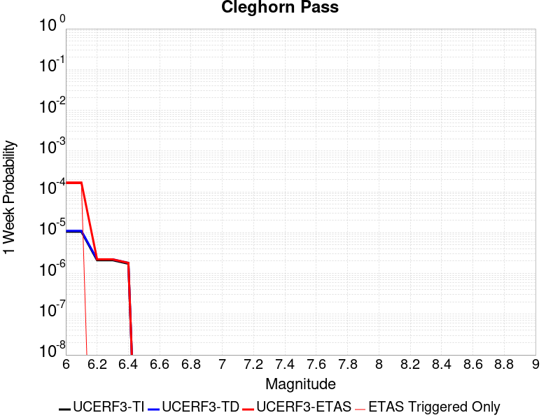 | 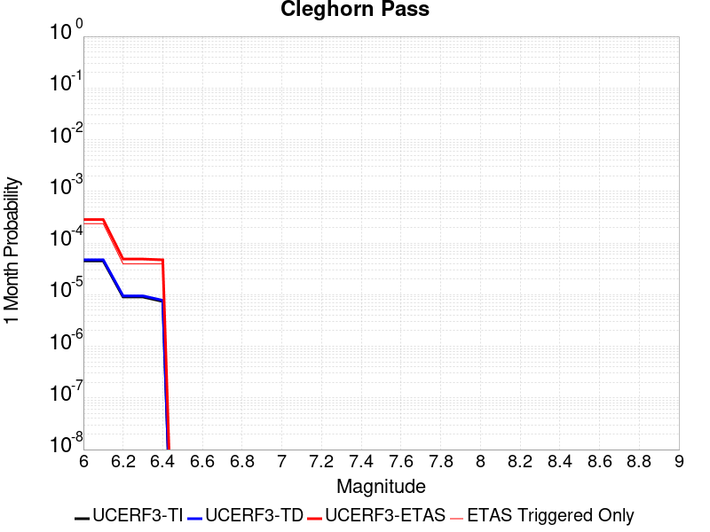 | 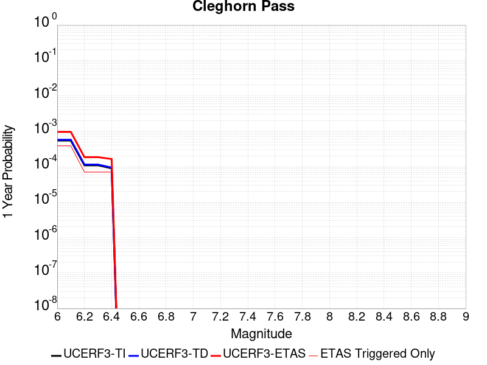 | 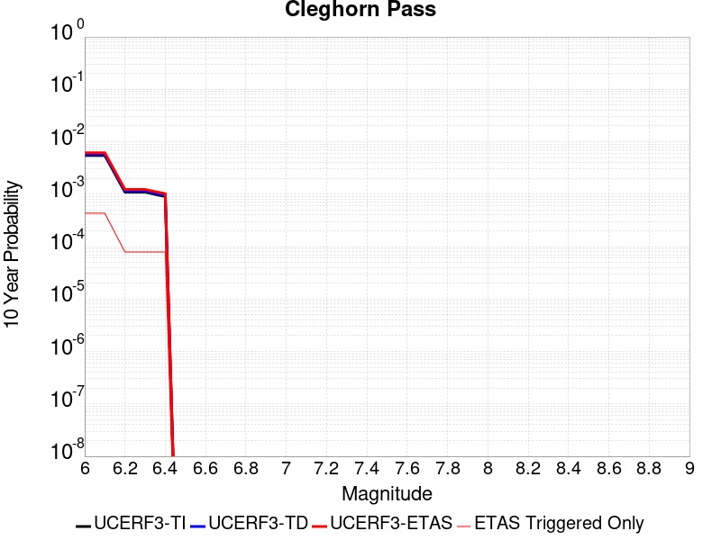 |

| Magnitude | 1 wk TI Prob | 1 wk TD Prob | 1 wk ETAS Prob | 1 wk ETAS/TD Gain | 1 wk ETAS Triggered Only | 1 mo TI Prob | 1 mo TD Prob | 1 mo ETAS Prob | 1 mo ETAS/TD Gain | 1 mo ETAS Triggered Only | 1 yr TI Prob | 1 yr TD Prob | 1 yr ETAS Prob | 1 yr ETAS/TD Gain | 1 yr ETAS Triggered Only | 10 yr TI Prob | 10 yr TD Prob | 10 yr ETAS Prob | 10 yr ETAS/TD Gain | 10 yr ETAS Triggered Only |
|-----|-----|-----|-----|-----|-----|-----|-----|-----|-----|-----|-----|-----|-----|-----|-----|-----|-----|-----|-----|-----|
| 6.0 | 1.0522846E-5 | 1.1040642E-5 | 1.6884228E-4 | 15.292795 | 1.5780337E-4 | 4.509713E-5 | 4.7316473E-5 | 2.8401034E-4 | 6.0023565 | 2.3670506E-4 | 5.4891926E-4 | 5.759784E-4 | 0.0010096878 | 1.7529957 | 4.339593E-4 | 0.0054756533 | 0.005750022 | 0.006181486 | 1.0750369 | 4.339593E-4 |
| 6.1 | 1.0522846E-5 | 1.1040642E-5 | 1.6884228E-4 | 15.292795 | 1.5780337E-4 | 4.509713E-5 | 4.7316473E-5 | 2.8401034E-4 | 6.0023565 | 2.3670506E-4 | 5.4891926E-4 | 5.759784E-4 | 0.0010096878 | 1.7529957 | 4.339593E-4 | 0.0054756533 | 0.005750022 | 0.006181486 | 1.0750369 | 4.339593E-4 |
| 6.2 | 2.1045846E-6 | 2.2082024E-6 | 2.2082024E-6 | 1.0 | 0.0 | 9.019617E-6 | 9.463714E-6 | 4.8914186E-5 | 5.1686034 | 3.9450842E-5 | 1.098083E-4 | 1.1521882E-4 | 1.9411142E-4 | 1.6847197 | 7.8901685E-5 | 0.0010975406 | 0.0011520023 | 0.0012308131 | 1.0684121 | 7.8901685E-5 |
| 6.3 | 2.1045846E-6 | 2.2082024E-6 | 2.2082024E-6 | 1.0 | 0.0 | 9.019617E-6 | 9.463714E-6 | 4.8914186E-5 | 5.1686034 | 3.9450842E-5 | 1.098083E-4 | 1.1521882E-4 | 1.9411142E-4 | 1.6847197 | 7.8901685E-5 | 0.0010975406 | 0.0011520023 | 0.0012308131 | 1.0684121 | 7.8901685E-5 |
| 6.4 | 1.7259927E-6 | 1.810877E-6 | 1.810877E-6 | 1.0 | 0.0 | 7.3970905E-6 | 7.760902E-6 | 4.721144E-5 | 6.0832415 | 3.9450842E-5 | 9.005586E-5 | 9.4488976E-5 | 1.7338322E-4 | 1.834957 | 7.8901685E-5 | 9.001937E-4 | 9.448898E-4 | 0.0010237169 | 1.0834247 | 7.8901685E-5 |

## San Andreas (Creeping Section) 2011 CFM
*[(top)](#table-of-contents)*

| 1 Week | 1 Month | 1 Year | 10 Year |
|-----|-----|-----|-----|
| 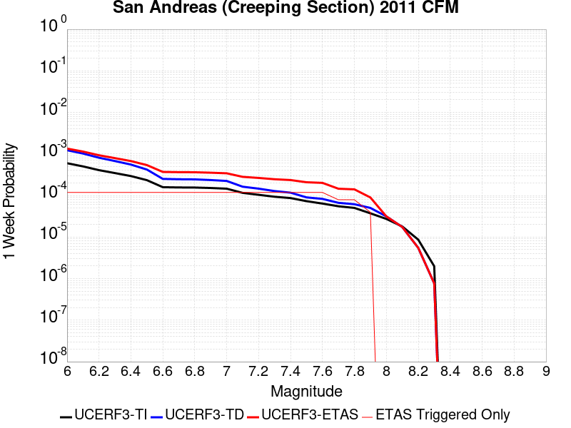 | 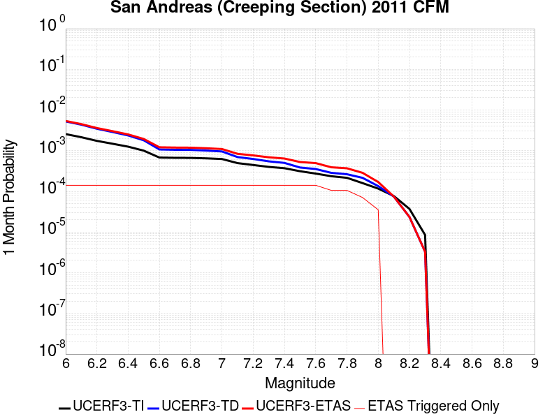 | 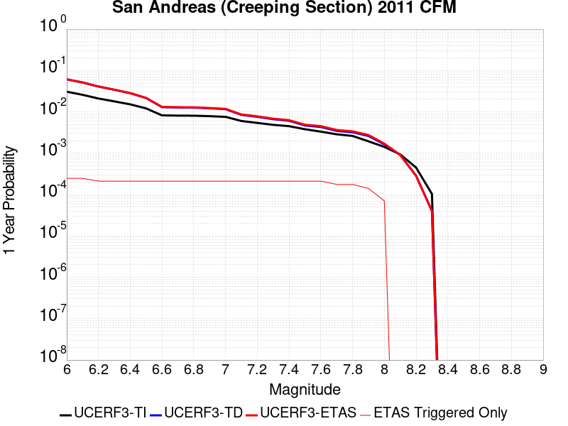 | 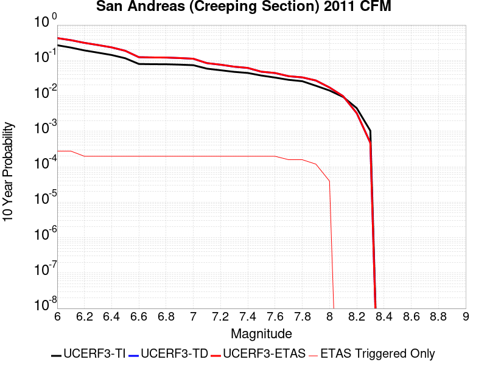 |

| Magnitude | 1 wk TI Prob | 1 wk TD Prob | 1 wk ETAS Prob | 1 wk ETAS/TD Gain | 1 wk ETAS Triggered Only | 1 mo TI Prob | 1 mo TD Prob | 1 mo ETAS Prob | 1 mo ETAS/TD Gain | 1 mo ETAS Triggered Only | 1 yr TI Prob | 1 yr TD Prob | 1 yr ETAS Prob | 1 yr ETAS/TD Gain | 1 yr ETAS Triggered Only | 10 yr TI Prob | 10 yr TD Prob | 10 yr ETAS Prob | 10 yr ETAS/TD Gain | 10 yr ETAS Triggered Only |
|-----|-----|-----|-----|-----|-----|-----|-----|-----|-----|-----|-----|-----|-----|-----|-----|-----|-----|-----|-----|-----|
| 6.0 | 5.986481E-4 | 0.001228691 | 0.0013468981 | 1.0962057 | 1.1835253E-4 | 0.0025631124 | 0.005246795 | 0.0053645265 | 1.0224388 | 1.1835253E-4 | 0.030762846 | 0.061203245 | 0.061425466 | 1.0036309 | 2.3670506E-4 | 0.26835477 | 0.425928 | 0.42608654 | 1.0003722 | 2.7615592E-4 |
| 6.1 | 5.015945E-4 | 0.0010230356 | 0.001141267 | 1.1155692 | 1.1835253E-4 | 0.00214792 | 0.004369436 | 0.004487271 | 1.0269681 | 1.1835253E-4 | 0.025839351 | 0.051246606 | 0.05147118 | 1.0043823 | 2.3670506E-4 | 0.23032776 | 0.37284943 | 0.37302265 | 1.0004646 | 2.7615592E-4 |
| 6.2 | 4.073338E-4 | 8.1157376E-4 | 9.298302E-4 | 1.1457125 | 1.1835253E-4 | 0.0017445484 | 0.0034683137 | 0.0035862557 | 1.0340056 | 1.1835253E-4 | 0.021034058 | 0.04093177 | 0.04112095 | 1.0046219 | 1.9725422E-4 | 0.19150782 | 0.31302592 | 0.31316143 | 1.0004328 | 1.9725422E-4 |
| 6.3 | 3.464099E-4 | 6.7455834E-4 | 7.92831E-4 | 1.1753335 | 1.1835253E-4 | 0.0014837692 | 0.0028832308 | 0.0030012422 | 1.0409303 | 1.1835253E-4 | 0.017915873 | 0.034187846 | 0.034378357 | 1.0055724 | 1.9725422E-4 | 0.16538359 | 0.27130842 | 0.27145216 | 1.0005298 | 1.9725422E-4 |
| 6.4 | 2.935057E-4 | 5.5516965E-4 | 6.7345647E-4 | 1.2130643 | 1.1835253E-4 | 0.0012572751 | 0.0023727308 | 0.0024908027 | 1.0497619 | 1.1835253E-4 | 0.015200248 | 0.02826279 | 0.02845447 | 1.006782 | 1.9725422E-4 | 0.14201577 | 0.23297668 | 0.23312797 | 1.0006495 | 1.9725422E-4 |
| 6.5 | 2.3409708E-4 | 4.2132285E-4 | 5.3962553E-4 | 1.2807887 | 1.1835253E-4 | 0.0010028875 | 0.0018017791 | 0.0019199185 | 1.0655681 | 1.1835253E-4 | 0.012141965 | 0.021586355 | 0.021779351 | 1.0089407 | 1.9725422E-4 | 0.11499573 | 0.1868149 | 0.18697532 | 1.0008587 | 1.9725422E-4 |
| 6.6 | 1.5842178E-4 | 2.5068692E-4 | 3.6900977E-4 | 1.4719945 | 1.1835253E-4 | 6.7877385E-4 | 0.0010739256 | 0.001192151 | 1.1100872 | 1.1835253E-4 | 0.0082328 | 0.012995283 | 0.013189974 | 1.0149816 | 1.9725422E-4 | 0.07934396 | 0.12313759 | 0.12331056 | 1.0014046 | 1.9725422E-4 |
| 6.7 | 1.5616413E-4 | 2.4605254E-4 | 3.6437594E-4 | 1.4808868 | 1.1835253E-4 | 6.691031E-4 | 0.0010540807 | 0.0011723085 | 1.112162 | 1.1835253E-4 | 0.0081159435 | 0.012757154 | 0.012951892 | 1.015265 | 1.9725422E-4 | 0.0782586 | 0.12116472 | 0.12133807 | 1.0014307 | 1.9725422E-4 |
| 6.8 | 1.5538467E-4 | 2.442914E-4 | 3.6261504E-4 | 1.4843544 | 1.1835253E-4 | 6.6576427E-4 | 0.001046539 | 0.0011647678 | 1.1129711 | 1.1835253E-4 | 0.008075596 | 0.012666538 | 0.012861294 | 1.0153756 | 1.9725422E-4 | 0.07788358 | 0.12039561 | 0.12056911 | 1.0014411 | 1.9725422E-4 |
| 6.9 | 1.5153569E-4 | 2.3538464E-4 | 3.537093E-4 | 1.5026865 | 1.1835253E-4 | 6.49277E-4 | 0.0010084033 | 0.0011266365 | 1.1172479 | 1.1835253E-4 | 0.007876333 | 0.012208726 | 0.012403572 | 1.0159596 | 1.9725422E-4 | 0.07602952 | 0.11646574 | 0.116640024 | 1.0014964 | 1.9725422E-4 |
| 7.0 | 1.4588932E-4 | 2.2395732E-4 | 3.4228334E-4 | 1.5283419 | 1.1835253E-4 | 6.250901E-4 | 9.59466E-4 | 0.001077705 | 1.1232342 | 1.1835253E-4 | 0.0075839474 | 0.011619428 | 0.01181439 | 1.016779 | 1.9725422E-4 | 0.073302895 | 0.11131206 | 0.11148736 | 1.0015749 | 1.9725422E-4 |
| 7.1 | 1.1565079E-4 | 1.6281323E-4 | 2.811465E-4 | 1.7268038 | 1.1835253E-4 | 4.955521E-4 | 6.9758523E-4 | 8.1585516E-4 | 1.169542 | 1.1835253E-4 | 0.006016669 | 0.008460228 | 0.0086558135 | 1.0231183 | 1.9725422E-4 | 0.058563538 | 0.08366478 | 0.08384553 | 1.0021604 | 1.9725422E-4 |
| 7.2 | 1.0393792E-4 | 1.4615392E-4 | 2.6448915E-4 | 1.8096617 | 1.1835253E-4 | 4.4537216E-4 | 6.262243E-4 | 7.4450276E-4 | 1.1888754 | 1.1835253E-4 | 0.005408933 | 0.0075977976 | 0.007793553 | 1.0257648 | 1.9725422E-4 | 0.052791595 | 0.07561503 | 0.07579737 | 1.0024114 | 1.9725422E-4 |
| 7.3 | 9.332884E-5 | 1.2780601E-4 | 2.461434E-4 | 1.9259143 | 1.1835253E-4 | 3.999194E-4 | 5.4762565E-4 | 6.659134E-4 | 1.216001 | 1.1835253E-4 | 0.0048581534 | 0.0066470946 | 0.0068430374 | 1.029478 | 1.9725422E-4 | 0.047533102 | 0.06647954 | 0.06666368 | 1.00277 | 1.9725422E-4 |
| 7.4 | 8.670252E-5 | 1.1702972E-4 | 2.353684E-4 | 2.011185 | 1.1835253E-4 | 3.715293E-4 | 5.014601E-4 | 6.1975326E-4 | 1.2358975 | 1.1835253E-4 | 0.004513991 | 0.0060883067 | 0.00628436 | 1.0322016 | 1.9725422E-4 | 0.044233937 | 0.061148684 | 0.061333876 | 1.0030285 | 1.9725422E-4 |
| 7.5 | 7.3036405E-5 | 9.005699E-5 | 2.0839885E-4 | 2.3140776 | 1.1835253E-4 | 3.129756E-4 | 3.859015E-4 | 5.042084E-4 | 1.3065727 | 1.1835253E-4 | 0.0038038217 | 0.0046882504 | 0.0048845797 | 1.0418769 | 1.9725422E-4 | 0.03739367 | 0.047875606 | 0.048063416 | 1.0039229 | 1.9725422E-4 |
| 7.6 | 6.3935775E-5 | 8.280209E-5 | 2.0114482E-4 | 2.429224 | 1.1835253E-4 | 2.7398168E-4 | 3.5481792E-4 | 4.7312846E-4 | 1.3334402 | 1.1835253E-4 | 0.0033306254 | 0.00431137 | 0.004507774 | 1.0455549 | 1.9725422E-4 | 0.032811474 | 0.043990135 | 0.044178713 | 1.0042868 | 1.9725422E-4 |
| 7.7 | 5.5050095E-5 | 6.661729E-5 | 1.4551372E-4 | 2.1843235 | 7.8901685E-5 | 2.3590765E-4 | 2.8547147E-4 | 3.6435062E-4 | 1.2763119 | 7.8901685E-5 | 0.0028683927 | 0.0034700802 | 0.003627336 | 1.0453176 | 1.5780337E-4 | 0.0283165 | 0.03579509 | 0.03594724 | 1.0042508 | 1.5780337E-4 |
| 7.8 | 5.027131E-5 | 6.1627725E-5 | 1.4052454E-4 | 2.2802165 | 7.8901685E-5 | 2.1543067E-4 | 2.640921E-4 | 3.4297293E-4 | 1.2986869 | 7.8901685E-5 | 0.0026197135 | 0.003210584 | 0.0033678806 | 1.0489932 | 1.5780337E-4 | 0.025890453 | 0.03312572 | 0.033278298 | 1.004606 | 1.5780337E-4 |
| 7.9 | 3.7271806E-5 | 5.0224386E-5 | 8.9673245E-5 | 1.7854524 | 3.9450842E-5 | 1.5972654E-4 | 2.1522962E-4 | 2.5467196E-4 | 1.1832571 | 3.9450842E-5 | 0.0019429359 | 0.0026172737 | 0.0027353165 | 1.0451014 | 1.1835253E-4 | 0.019260362 | 0.027066687 | 0.027181836 | 1.0042542 | 1.1835253E-4 |
| 8.0 | 2.7310243E-5 | 3.1428404E-5 | 3.1428404E-5 | 1.0 | 0.0 | 1.17038646E-4 | 1.3468621E-4 | 1.3468621E-4 | 1.0 | 0.0 | 0.0014240141 | 0.0016385721 | 0.0016779583 | 1.0240369 | 3.9450842E-5 | 0.014149235 | 0.01721387 | 0.01725264 | 1.0022523 | 3.9450842E-5 |
| 8.1 | 1.7940547E-5 | 1.7400796E-5 | 1.7400796E-5 | 1.0 | 0.0 | 7.688579E-5 | 7.457271E-5 | 7.457271E-5 | 1.0 | 0.0 | 9.3568244E-4 | 9.075451E-4 | 9.075451E-4 | 1.0 | 0.0 | 0.009317525 | 0.009799073 | 0.009799073 | 1.0 | 0.0 |
| 8.2 | 8.643924E-6 | 5.4748625E-6 | 5.4748625E-6 | 1.0 | 0.0 | 3.704486E-5 | 2.3463486E-5 | 2.3463486E-5 | 1.0 | 0.0 | 4.5092785E-4 | 2.8563058E-4 | 2.8563058E-4 | 1.0 | 0.0 | 0.0045001395 | 0.0032487072 | 0.0032487072 | 1.0 | 0.0 |
| 8.3 | 1.983087E-6 | 7.6599065E-7 | 7.6599065E-7 | 1.0 | 0.0 | 8.498917E-6 | 3.282813E-6 | 3.282813E-6 | 1.0 | 0.0 | 1.034694E-4 | 3.9967534E-5 | 3.9967534E-5 | 1.0 | 0.0 | 0.0010342124 | 4.719687E-4 | 4.719687E-4 | 1.0 | 0.0 |

## Pisgah-Bullion Mtn-Mesquite Lk
*[(top)](#table-of-contents)*

| 1 Week | 1 Month | 1 Year | 10 Year |
|-----|-----|-----|-----|
| 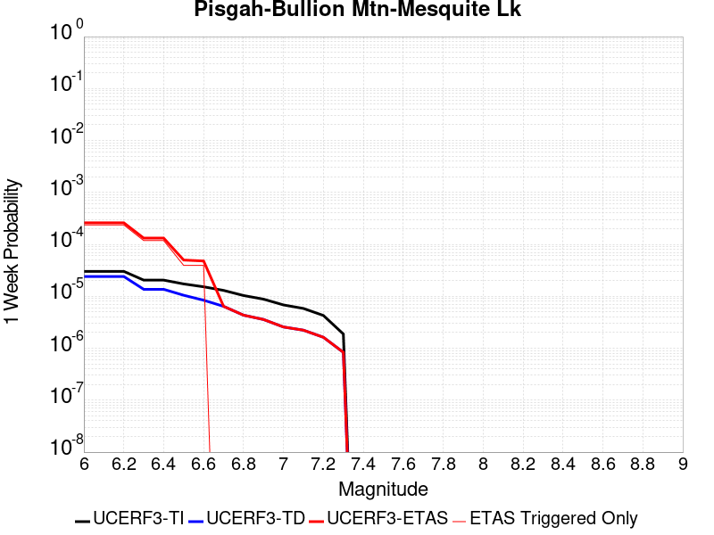 | 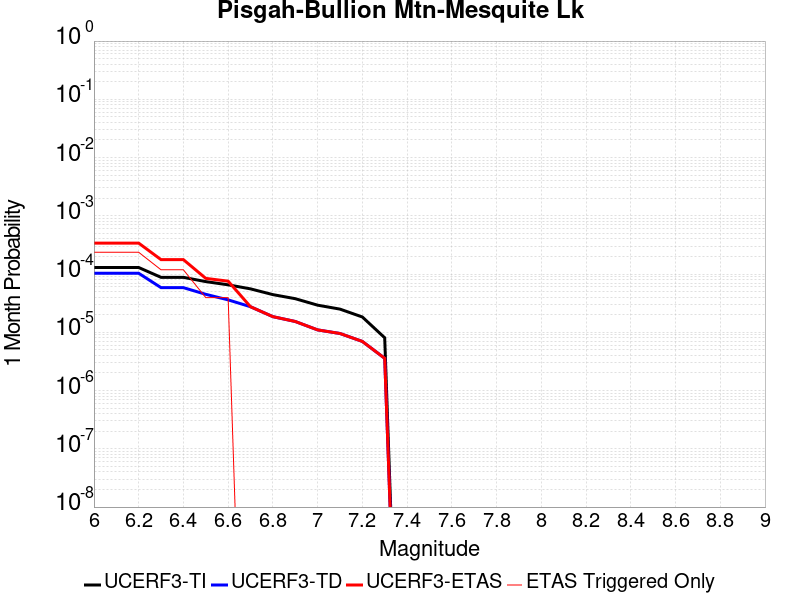 | 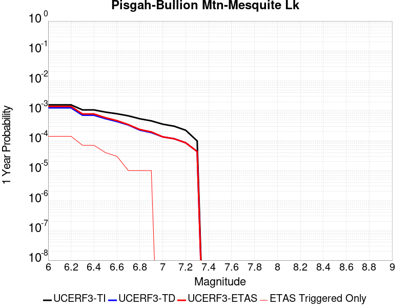 | 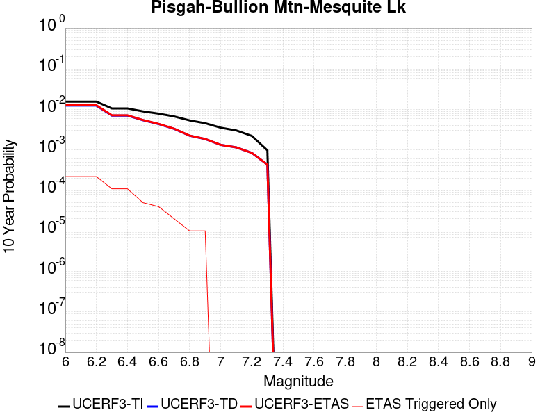 |

| Magnitude | 1 wk TI Prob | 1 wk TD Prob | 1 wk ETAS Prob | 1 wk ETAS/TD Gain | 1 wk ETAS Triggered Only | 1 mo TI Prob | 1 mo TD Prob | 1 mo ETAS Prob | 1 mo ETAS/TD Gain | 1 mo ETAS Triggered Only | 1 yr TI Prob | 1 yr TD Prob | 1 yr ETAS Prob | 1 yr ETAS/TD Gain | 1 yr ETAS Triggered Only | 10 yr TI Prob | 10 yr TD Prob | 10 yr ETAS Prob | 10 yr ETAS/TD Gain | 10 yr ETAS Triggered Only |
|-----|-----|-----|-----|-----|-----|-----|-----|-----|-----|-----|-----|-----|-----|-----|-----|-----|-----|-----|-----|-----|
| 6.0 | 3.0240792E-5 | 2.4091114E-5 | 2.607905E-4 | 10.825172 | 2.3670506E-4 | 1.2959696E-4 | 1.03244114E-4 | 3.3992474E-4 | 3.292437 | 2.3670506E-4 | 0.0015767008 | 0.0012563728 | 0.001571583 | 1.2508891 | 3.1560674E-4 | 0.015655609 | 0.012502721 | 0.012892297 | 1.0311593 | 3.9450845E-4 |
| 6.1 | 3.0240792E-5 | 2.4091114E-5 | 2.607905E-4 | 10.825172 | 2.3670506E-4 | 1.2959696E-4 | 1.03244114E-4 | 3.3992474E-4 | 3.292437 | 2.3670506E-4 | 0.0015767008 | 0.0012563728 | 0.001571583 | 1.2508891 | 3.1560674E-4 | 0.015655609 | 0.012502721 | 0.012892297 | 1.0311593 | 3.9450845E-4 |
| 6.2 | 3.0240792E-5 | 2.4091114E-5 | 2.607905E-4 | 10.825172 | 2.3670506E-4 | 1.2959696E-4 | 1.03244114E-4 | 3.3992474E-4 | 3.292437 | 2.3670506E-4 | 0.0015767008 | 0.0012563728 | 0.001571583 | 1.2508891 | 3.1560674E-4 | 0.015655609 | 0.012502721 | 0.012892297 | 1.0311593 | 3.9450845E-4 |
| 6.3 | 2.0498217E-5 | 1.36380695E-5 | 1.3198899E-4 | 9.677982 | 1.1835253E-4 | 8.784654E-5 | 5.844765E-5 | 1.7679327E-4 | 3.024814 | 1.1835253E-4 | 0.0010690069 | 7.1138405E-4 | 8.690752E-4 | 1.221668 | 1.5780337E-4 | 0.01063879 | 0.0070926943 | 0.0072493786 | 1.0220909 | 1.5780337E-4 |
| 6.4 | 2.0498217E-5 | 1.36380695E-5 | 1.3198899E-4 | 9.677982 | 1.1835253E-4 | 8.784654E-5 | 5.844765E-5 | 1.7679327E-4 | 3.024814 | 1.1835253E-4 | 0.0010690069 | 7.1138405E-4 | 8.690752E-4 | 1.221668 | 1.5780337E-4 | 0.01063879 | 0.0070926943 | 0.0072493786 | 1.0220909 | 1.5780337E-4 |
| 6.5 | 1.7316182E-5 | 1.0477042E-5 | 4.9927472E-5 | 4.7654166 | 3.9450842E-5 | 7.42101E-5 | 4.4900895E-5 | 8.4349966E-5 | 1.8785809 | 3.9450842E-5 | 9.0313336E-4 | 5.465413E-4 | 6.253998E-4 | 1.1442865 | 7.8901685E-5 | 0.008994718 | 0.0054529672 | 0.0055314386 | 1.0143906 | 7.8901685E-5 |
| 6.6 | 1.5251077E-5 | 8.414273E-6 | 4.7864785E-5 | 5.6885233 | 3.9450842E-5 | 6.536012E-5 | 3.6060712E-5 | 7.5510136E-5 | 2.0939724 | 3.9450842E-5 | 7.9546886E-4 | 4.3895794E-4 | 5.17825E-4 | 1.1796688 | 7.8901685E-5 | 0.007926274 | 0.0043816264 | 0.0044601825 | 1.0179285 | 7.8901685E-5 |
| 6.7 | 1.2997425E-5 | 6.4114965E-6 | 6.4114965E-6 | 1.0 | 0.0 | 5.570206E-5 | 2.7477578E-5 | 2.7477578E-5 | 1.0 | 0.0 | 6.7796157E-4 | 3.3449283E-4 | 3.7393047E-4 | 1.1179029 | 3.9450842E-5 | 0.0067589693 | 0.0033403537 | 0.0033796728 | 1.011771 | 3.9450842E-5 |
| 6.8 | 1.035386E-5 | 4.3332193E-6 | 4.3332193E-6 | 1.0 | 0.0 | 4.437293E-5 | 1.8570812E-5 | 1.8570812E-5 | 1.0 | 0.0 | 5.401065E-4 | 2.2607706E-4 | 2.65519E-4 | 1.1744623 | 3.9450842E-5 | 0.0053879567 | 0.0022585576 | 0.0022979192 | 1.0174278 | 3.9450842E-5 |
| 6.9 | 8.816252E-6 | 3.580638E-6 | 3.580638E-6 | 1.0 | 0.0 | 3.778339E-5 | 1.5345504E-5 | 1.5345504E-5 | 1.0 | 0.0 | 4.5991567E-4 | 1.8681608E-4 | 2.2625955E-4 | 1.2111354 | 3.9450842E-5 | 0.00458965 | 0.0018666488 | 0.0019060259 | 1.0210952 | 3.9450842E-5 |
| 7.0 | 6.8232207E-6 | 2.5675843E-6 | 2.5675843E-6 | 1.0 | 0.0 | 2.9242048E-5 | 1.1003888E-5 | 1.1003888E-5 | 1.0 | 0.0 | 3.5596377E-4 | 1.3396442E-4 | 1.3396442E-4 | 1.0 | 0.0 | 0.0035539411 | 0.0013388677 | 0.0013388677 | 1.0 | 0.0 |
| 7.1 | 5.837013E-6 | 2.22738E-6 | 2.22738E-6 | 1.0 | 0.0 | 2.501553E-5 | 9.545881E-6 | 9.545881E-6 | 1.0 | 0.0 | 3.045215E-4 | 1.16215204E-4 | 1.16215204E-4 | 1.0 | 0.0 | 0.0030410455 | 0.0011615733 | 0.0011615733 | 1.0 | 0.0 |
| 7.2 | 4.278052E-6 | 1.6275711E-6 | 1.6275711E-6 | 1.0 | 0.0 | 1.833438E-5 | 6.9752873E-6 | 6.9752873E-6 | 1.0 | 0.0 | 2.231982E-4 | 8.492105E-5 | 8.492105E-5 | 1.0 | 0.0 | 0.0022297418 | 8.489092E-4 | 8.489092E-4 | 1.0 | 0.0 |
| 7.3 | 1.8803692E-6 | 8.344926E-7 | 8.344926E-7 | 1.0 | 0.0 | 8.0587E-6 | 3.5763926E-6 | 3.5763926E-6 | 1.0 | 0.0 | 9.811026E-5 | 4.354186E-5 | 4.354186E-5 | 1.0 | 0.0 | 9.806695E-4 | 4.3534773E-4 | 4.3534773E-4 | 1.0 | 0.0 |

## Ortigalita (North)
*[(top)](#table-of-contents)*

| 1 Week | 1 Month | 1 Year | 10 Year |
|-----|-----|-----|-----|
| 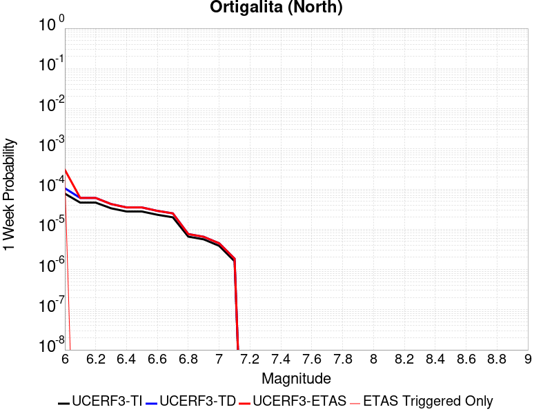 | 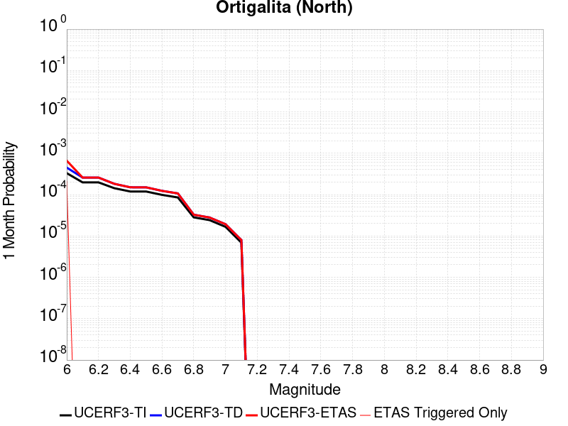 | 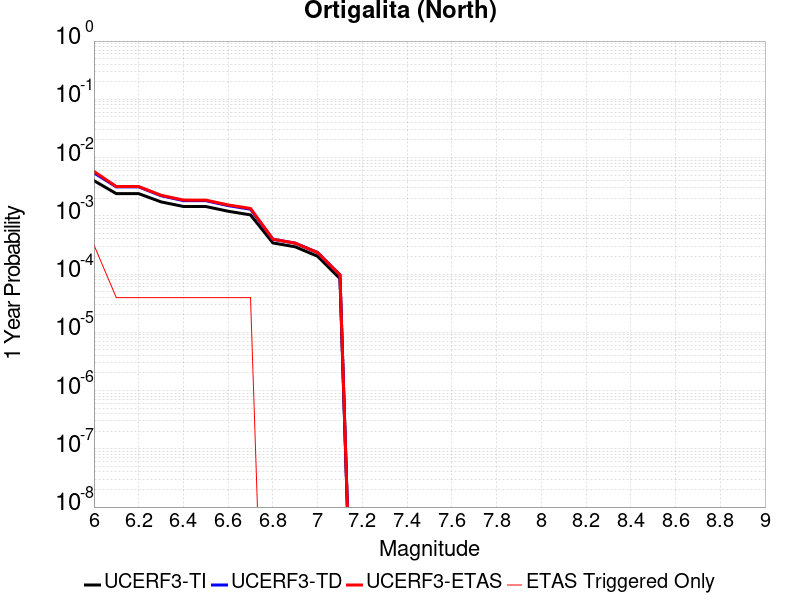 | 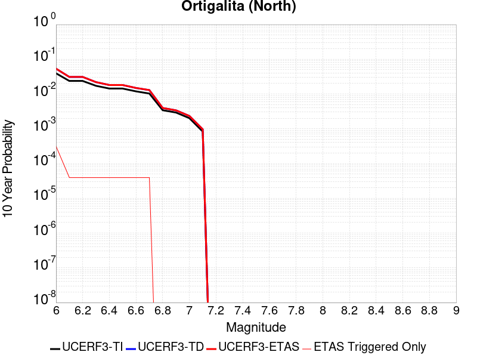 |

| Magnitude | 1 wk TI Prob | 1 wk TD Prob | 1 wk ETAS Prob | 1 wk ETAS/TD Gain | 1 wk ETAS Triggered Only | 1 mo TI Prob | 1 mo TD Prob | 1 mo ETAS Prob | 1 mo ETAS/TD Gain | 1 mo ETAS Triggered Only | 1 yr TI Prob | 1 yr TD Prob | 1 yr ETAS Prob | 1 yr ETAS/TD Gain | 1 yr ETAS Triggered Only | 10 yr TI Prob | 10 yr TD Prob | 10 yr ETAS Prob | 10 yr ETAS/TD Gain | 10 yr ETAS Triggered Only |
|-----|-----|-----|-----|-----|-----|-----|-----|-----|-----|-----|-----|-----|-----|-----|-----|-----|-----|-----|-----|-----|
| 6.0 | 7.711876E-5 | 1.05064966E-4 | 3.0229846E-4 | 2.8772528 | 1.9725422E-4 | 3.3046713E-4 | 4.502116E-4 | 6.868101E-4 | 1.5255274 | 2.3670506E-4 | 0.004016016 | 0.0054681194 | 0.0057820007 | 1.057402 | 3.1560674E-4 | 0.039442103 | 0.053454787 | 0.053753525 | 1.0055885 | 3.1560674E-4 |
| 6.1 | 4.607858E-5 | 6.0239203E-5 | 6.0239203E-5 | 1.0 | 0.0 | 1.9746469E-4 | 2.5814527E-4 | 2.5814527E-4 | 1.0 | 0.0 | 0.0024014818 | 0.0031387596 | 0.0031780866 | 1.0125295 | 3.9450842E-5 | 0.023756953 | 0.030975068 | 0.031013297 | 1.0012342 | 3.9450842E-5 |
| 6.2 | 4.607858E-5 | 6.0239203E-5 | 6.0239203E-5 | 1.0 | 0.0 | 1.9746469E-4 | 2.5814527E-4 | 2.5814527E-4 | 1.0 | 0.0 | 0.0024014818 | 0.0031387596 | 0.0031780866 | 1.0125295 | 3.9450842E-5 | 0.023756953 | 0.030975068 | 0.031013297 | 1.0012342 | 3.9450842E-5 |
| 6.3 | 3.327423E-5 | 4.2475127E-5 | 4.2475127E-5 | 1.0 | 0.0 | 1.4259605E-4 | 1.8202531E-4 | 1.8202531E-4 | 1.0 | 0.0 | 0.0017347244 | 0.002214197 | 0.0022535606 | 1.0177778 | 3.9450842E-5 | 0.017212452 | 0.021945644 | 0.021984229 | 1.0017582 | 3.9450842E-5 |
| 6.4 | 2.7732503E-5 | 3.4998593E-5 | 3.4998593E-5 | 1.0 | 0.0 | 1.1884817E-4 | 1.4998685E-4 | 1.4998685E-4 | 1.0 | 0.0 | 0.001446016 | 0.0018248095 | 0.0018641884 | 1.0215797 | 3.9450842E-5 | 0.014366428 | 0.018121224 | 0.01815996 | 1.0021375 | 3.9450842E-5 |
| 6.5 | 2.7689714E-5 | 3.4948407E-5 | 3.4948407E-5 | 1.0 | 0.0 | 1.186648E-4 | 1.497718E-4 | 1.497718E-4 | 1.0 | 0.0 | 0.0014437864 | 0.0018221956 | 0.0018615745 | 1.0216107 | 3.9450842E-5 | 0.014344421 | 0.01809551 | 0.018134248 | 1.0021406 | 3.9450842E-5 |
| 6.6 | 2.2976905E-5 | 2.8718265E-5 | 2.8718265E-5 | 1.0 | 0.0 | 9.846873E-5 | 1.230739E-4 | 1.230739E-4 | 1.0 | 0.0 | 0.0011981975 | 0.0014976363 | 0.0015370281 | 1.0263026 | 3.9450842E-5 | 0.011917574 | 0.014898697 | 0.01493756 | 1.0026085 | 3.9450842E-5 |
| 6.7 | 1.9871539E-5 | 2.4904411E-5 | 2.4904411E-5 | 1.0 | 0.0 | 8.516096E-5 | 1.0673023E-4 | 1.0673023E-4 | 1.0 | 0.0 | 0.0010363415 | 0.0012989145 | 0.0013383141 | 1.0303327 | 3.9450842E-5 | 0.010315218 | 0.012936919 | 0.012975859 | 1.00301 | 3.9450842E-5 |
| 6.8 | 6.5640475E-6 | 7.6054926E-6 | 7.6054926E-6 | 1.0 | 0.0 | 2.813133E-5 | 3.2594577E-5 | 3.2594577E-5 | 1.0 | 0.0 | 3.424451E-4 | 3.9676955E-4 | 3.9676955E-4 | 1.0 | 0.0 | 0.0034191788 | 0.003960899 | 0.003960899 | 1.0 | 0.0 |
| 6.9 | 5.6219683E-6 | 6.5018376E-6 | 6.5018376E-6 | 1.0 | 0.0 | 2.4093928E-5 | 2.7864735E-5 | 2.7864735E-5 | 1.0 | 0.0 | 2.933041E-4 | 3.3920293E-4 | 3.3920293E-4 | 1.0 | 0.0 | 0.0029291727 | 0.003387109 | 0.003387109 | 1.0 | 0.0 |
| 7.0 | 3.875591E-6 | 4.4847548E-6 | 4.4847548E-6 | 1.0 | 0.0 | 1.6609569E-5 | 1.9220248E-5 | 1.9220248E-5 | 1.0 | 0.0 | 2.0220275E-4 | 2.339835E-4 | 2.339835E-4 | 1.0 | 0.0 | 0.0020201886 | 0.0023375798 | 0.0023375798 | 1.0 | 0.0 |
| 7.1 | 1.6017933E-6 | 1.8570418E-6 | 1.8570418E-6 | 1.0 | 0.0 | 6.8648105E-6 | 7.958732E-6 | 7.958732E-6 | 1.0 | 0.0 | 8.357586E-5 | 9.689432E-5 | 9.689432E-5 | 1.0 | 0.0 | 8.3544437E-4 | 9.686254E-4 | 9.686254E-4 | 1.0 | 0.0 |

## Bullion Mountains
*[(top)](#table-of-contents)*

| 1 Week | 1 Month | 1 Year | 10 Year |
|-----|-----|-----|-----|
| 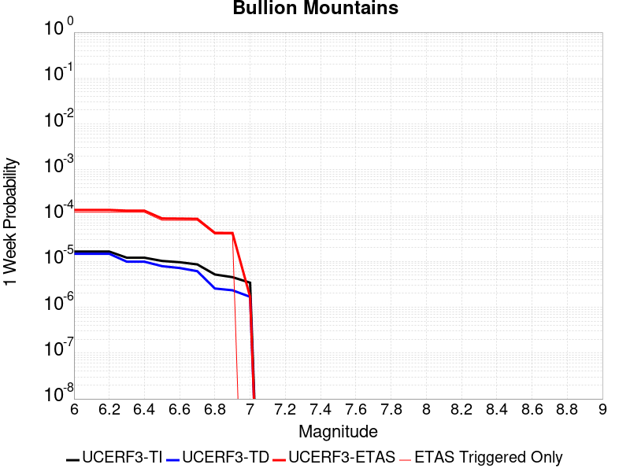 | 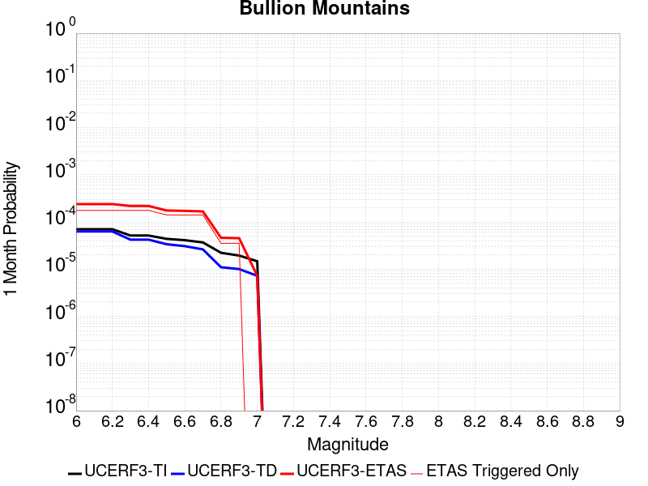 | 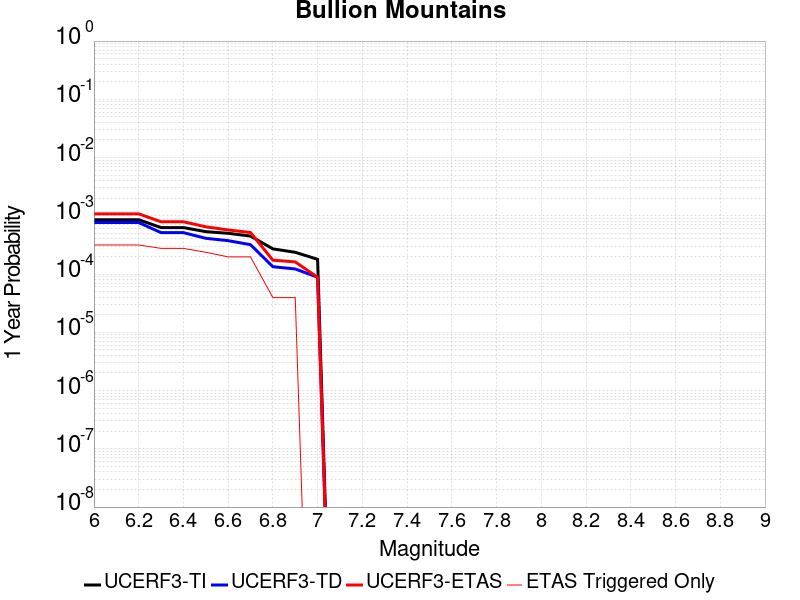 | 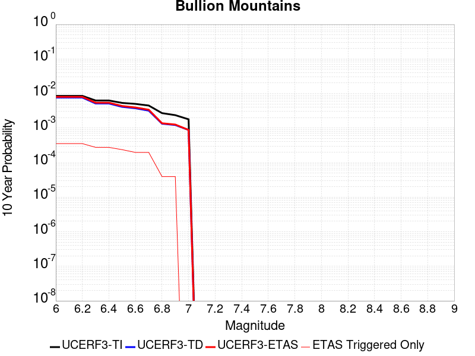 |

| Magnitude | 1 wk TI Prob | 1 wk TD Prob | 1 wk ETAS Prob | 1 wk ETAS/TD Gain | 1 wk ETAS Triggered Only | 1 mo TI Prob | 1 mo TD Prob | 1 mo ETAS Prob | 1 mo ETAS/TD Gain | 1 mo ETAS Triggered Only | 1 yr TI Prob | 1 yr TD Prob | 1 yr ETAS Prob | 1 yr ETAS/TD Gain | 1 yr ETAS Triggered Only | 10 yr TI Prob | 10 yr TD Prob | 10 yr ETAS Prob | 10 yr ETAS/TD Gain | 10 yr ETAS Triggered Only |
|-----|-----|-----|-----|-----|-----|-----|-----|-----|-----|-----|-----|-----|-----|-----|-----|-----|-----|-----|-----|-----|
| 6.0 | 1.6420427E-5 | 1.4692089E-5 | 1.3304288E-4 | 9.055409 | 1.1835253E-4 | 7.037136E-5 | 6.296479E-5 | 2.602066E-4 | 4.1325727 | 1.9725422E-4 | 8.5643446E-4 | 7.663651E-4 | 0.00108173 | 1.4115074 | 3.1560674E-4 | 0.008531413 | 0.007641016 | 0.007993361 | 1.0461123 | 3.550576E-4 |
| 6.1 | 1.6420427E-5 | 1.4692089E-5 | 1.3304288E-4 | 9.055409 | 1.1835253E-4 | 7.037136E-5 | 6.296479E-5 | 2.602066E-4 | 4.1325727 | 1.9725422E-4 | 8.5643446E-4 | 7.663651E-4 | 0.00108173 | 1.4115074 | 3.1560674E-4 | 0.008531413 | 0.007641016 | 0.007993361 | 1.0461123 | 3.550576E-4 |
| 6.2 | 1.6420427E-5 | 1.4692089E-5 | 1.3304288E-4 | 9.055409 | 1.1835253E-4 | 7.037136E-5 | 6.296479E-5 | 2.602066E-4 | 4.1325727 | 1.9725422E-4 | 8.5643446E-4 | 7.663651E-4 | 0.00108173 | 1.4115074 | 3.1560674E-4 | 0.008531413 | 0.007641016 | 0.007993361 | 1.0461123 | 3.550576E-4 |
| 6.3 | 1.2046778E-5 | 9.862335E-6 | 1.282137E-4 | 13.0003395 | 1.1835253E-4 | 5.1628023E-5 | 4.2266598E-5 | 2.3951248E-4 | 5.6667085 | 1.9725422E-4 | 6.283899E-4 | 5.144975E-4 | 7.905113E-4 | 1.5364727 | 2.7615592E-4 | 0.0062661595 | 0.005135345 | 0.0054100826 | 1.0534993 | 2.7615592E-4 |
| 6.4 | 1.2046778E-5 | 9.862335E-6 | 1.282137E-4 | 13.0003395 | 1.1835253E-4 | 5.1628023E-5 | 4.2266598E-5 | 2.3951248E-4 | 5.6667085 | 1.9725422E-4 | 6.283899E-4 | 5.144975E-4 | 7.905113E-4 | 1.5364727 | 2.7615592E-4 | 0.0062661595 | 0.005135345 | 0.0054100826 | 1.0534993 | 2.7615592E-4 |
| 6.5 | 1.0244343E-5 | 7.879458E-6 | 8.678053E-5 | 11.0135145 | 7.8901685E-5 | 4.390359E-5 | 3.3768785E-5 | 1.9156684E-4 | 5.672897 | 1.5780337E-4 | 5.343951E-4 | 4.110781E-4 | 6.4768584E-4 | 1.5755786 | 2.3670506E-4 | 0.005331118 | 0.004105208 | 0.0043409416 | 1.057423 | 2.3670506E-4 |
| 6.6 | 9.605408E-6 | 7.1774966E-6 | 8.607862E-5 | 11.992847 | 7.8901685E-5 | 4.1165385E-5 | 3.076045E-5 | 1.8855897E-4 | 6.1299157 | 1.5780337E-4 | 5.010733E-4 | 3.744645E-4 | 5.7164486E-4 | 1.5265663 | 1.9725422E-4 | 0.00499945 | 0.003740332 | 0.0039368486 | 1.0525398 | 1.9725422E-4 |
| 6.7 | 8.60418E-6 | 6.1240044E-6 | 8.502521E-5 | 13.883924 | 7.8901685E-5 | 3.687454E-5 | 2.624558E-5 | 1.8404481E-4 | 7.012412 | 1.5780337E-4 | 4.48855E-4 | 3.1951256E-4 | 5.1670376E-4 | 1.6171626 | 1.9725422E-4 | 0.004479495 | 0.0031924439 | 0.0033890682 | 1.0615906 | 1.9725422E-4 |
| 6.8 | 5.187994E-6 | 2.5631666E-6 | 4.201391E-5 | 16.391407 | 3.9450842E-5 | 2.223407E-5 | 1.0984976E-5 | 5.043539E-5 | 4.5913057 | 3.9450842E-5 | 2.7066618E-4 | 1.3373788E-4 | 1.7318343E-4 | 1.2949469 | 3.9450842E-5 | 0.0027033675 | 0.0013369655 | 0.0013763636 | 1.0294683 | 3.9450842E-5 |
| 6.9 | 4.5302368E-6 | 2.3443165E-6 | 4.179507E-5 | 17.828253 | 3.9450842E-5 | 1.9415156E-5 | 1.0047055E-5 | 4.9497503E-5 | 4.9265685 | 3.9450842E-5 | 2.3635388E-4 | 1.2232E-4 | 1.6176602E-4 | 1.3224822 | 3.9450842E-5 | 0.0023610266 | 0.0012229157 | 0.0012623183 | 1.0322202 | 3.9450842E-5 |
| 7.0 | 3.431668E-6 | 1.6882402E-6 | 1.6882402E-6 | 1.0 | 0.0 | 1.4707065E-5 | 7.235315E-6 | 7.235315E-6 | 1.0 | 0.0 | 1.7904381E-4 | 8.808996E-5 | 8.808996E-5 | 1.0 | 0.0 | 0.0017889962 | 8.808996E-4 | 8.808996E-4 | 1.0 | 0.0 |

## Independence rev 2011
*[(top)](#table-of-contents)*

| 1 Week | 1 Month | 1 Year | 10 Year |
|-----|-----|-----|-----|
| 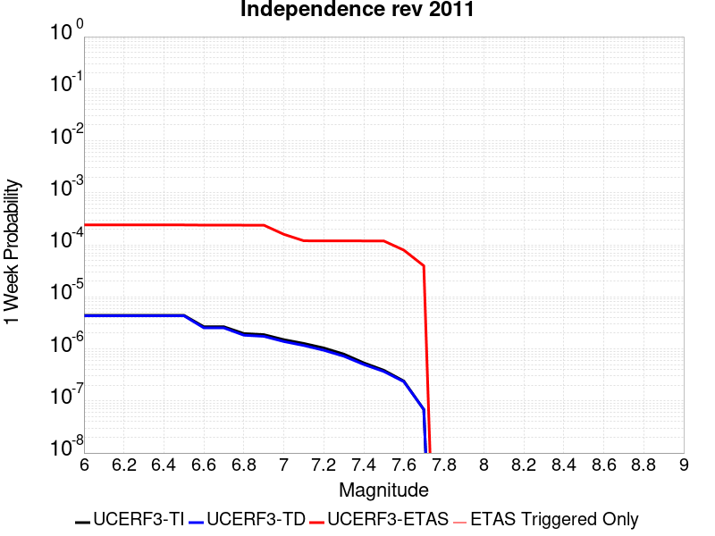 | 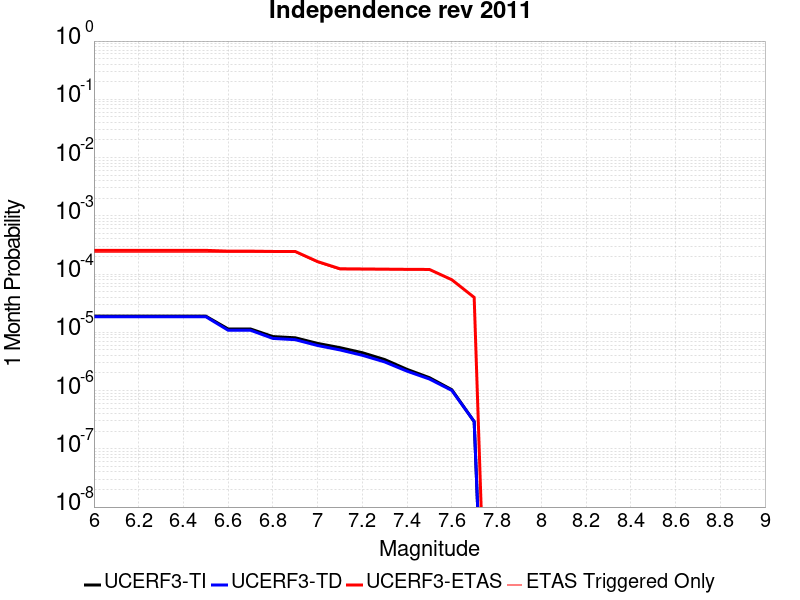 | 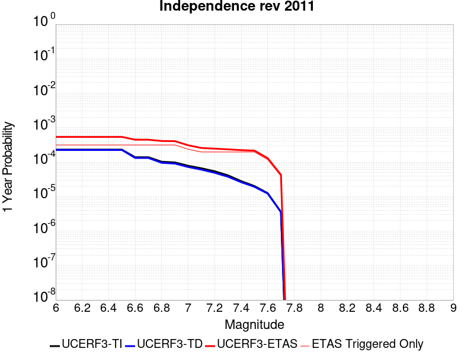 | 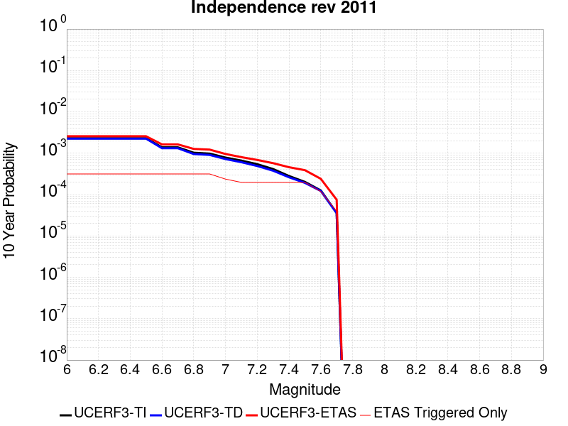 |

| Magnitude | 1 wk TI Prob | 1 wk TD Prob | 1 wk ETAS Prob | 1 wk ETAS/TD Gain | 1 wk ETAS Triggered Only | 1 mo TI Prob | 1 mo TD Prob | 1 mo ETAS Prob | 1 mo ETAS/TD Gain | 1 mo ETAS Triggered Only | 1 yr TI Prob | 1 yr TD Prob | 1 yr ETAS Prob | 1 yr ETAS/TD Gain | 1 yr ETAS Triggered Only | 10 yr TI Prob | 10 yr TD Prob | 10 yr ETAS Prob | 10 yr ETAS/TD Gain | 10 yr ETAS Triggered Only |
|-----|-----|-----|-----|-----|-----|-----|-----|-----|-----|-----|-----|-----|-----|-----|-----|-----|-----|-----|-----|-----|
| 6.0 | 4.422171E-6 | 4.326227E-6 | 2.4103027E-4 | 55.713737 | 2.3670506E-4 | 1.8952025E-5 | 1.8540857E-5 | 2.5524152E-4 | 13.766436 | 2.3670506E-4 | 2.3071647E-4 | 2.2571455E-4 | 5.4125005E-4 | 2.3979406 | 3.1560674E-4 | 0.0023047708 | 0.0022551466 | 0.0025700415 | 1.1396339 | 3.1560674E-4 |
| 6.1 | 4.422171E-6 | 4.326227E-6 | 2.4103027E-4 | 55.713737 | 2.3670506E-4 | 1.8952025E-5 | 1.8540857E-5 | 2.5524152E-4 | 13.766436 | 2.3670506E-4 | 2.3071647E-4 | 2.2571455E-4 | 5.4125005E-4 | 2.3979406 | 3.1560674E-4 | 0.0023047708 | 0.0022551466 | 0.0025700415 | 1.1396339 | 3.1560674E-4 |
| 6.2 | 4.422171E-6 | 4.326227E-6 | 2.4103027E-4 | 55.713737 | 2.3670506E-4 | 1.8952025E-5 | 1.8540857E-5 | 2.5524152E-4 | 13.766436 | 2.3670506E-4 | 2.3071647E-4 | 2.2571455E-4 | 5.4125005E-4 | 2.3979406 | 3.1560674E-4 | 0.0023047708 | 0.0022551466 | 0.0025700415 | 1.1396339 | 3.1560674E-4 |
| 6.3 | 4.422171E-6 | 4.326227E-6 | 2.4103027E-4 | 55.713737 | 2.3670506E-4 | 1.8952025E-5 | 1.8540857E-5 | 2.5524152E-4 | 13.766436 | 2.3670506E-4 | 2.3071647E-4 | 2.2571455E-4 | 5.4125005E-4 | 2.3979406 | 3.1560674E-4 | 0.0023047708 | 0.0022551466 | 0.0025700415 | 1.1396339 | 3.1560674E-4 |
| 6.4 | 4.422171E-6 | 4.326227E-6 | 2.4103027E-4 | 55.713737 | 2.3670506E-4 | 1.8952025E-5 | 1.8540857E-5 | 2.5524152E-4 | 13.766436 | 2.3670506E-4 | 2.3071647E-4 | 2.2571455E-4 | 5.4125005E-4 | 2.3979406 | 3.1560674E-4 | 0.0023047708 | 0.0022551466 | 0.0025700415 | 1.1396339 | 3.1560674E-4 |
| 6.5 | 4.422171E-6 | 4.326227E-6 | 2.4103027E-4 | 55.713737 | 2.3670506E-4 | 1.8952025E-5 | 1.8540857E-5 | 2.5524152E-4 | 13.766436 | 2.3670506E-4 | 2.3071647E-4 | 2.2571455E-4 | 5.4125005E-4 | 2.3979406 | 3.1560674E-4 | 0.0023047708 | 0.0022551466 | 0.0025700415 | 1.1396339 | 3.1560674E-4 |
| 6.6 | 2.663744E-6 | 2.5319862E-6 | 2.3923645E-4 | 94.48569 | 2.3670506E-4 | 1.1415996E-5 | 1.0851327E-5 | 2.4755383E-4 | 22.81323 | 2.3670506E-4 | 1.3898089E-4 | 1.3210738E-4 | 4.4767244E-4 | 3.3887012 | 3.1560674E-4 | 0.0013889399 | 0.0013203367 | 0.0016355268 | 1.2387195 | 3.1560674E-4 |
| 6.7 | 2.663744E-6 | 2.5319862E-6 | 2.3923645E-4 | 94.48569 | 2.3670506E-4 | 1.1415996E-5 | 1.0851327E-5 | 2.4755383E-4 | 22.81323 | 2.3670506E-4 | 1.3898089E-4 | 1.3210738E-4 | 4.4767244E-4 | 3.3887012 | 3.1560674E-4 | 0.0013889399 | 0.0013203367 | 0.0016355268 | 1.2387195 | 3.1560674E-4 |
| 6.8 | 1.9716529E-6 | 1.8322585E-6 | 2.3853689E-4 | 130.18736 | 2.3670506E-4 | 8.449913E-6 | 7.852514E-6 | 2.4455573E-4 | 31.143623 | 2.3670506E-4 | 1.0287284E-4 | 9.5600284E-5 | 4.1117688E-4 | 4.3010006 | 3.1560674E-4 | 0.0010282523 | 9.556045E-4 | 0.0012709097 | 1.3299537 | 3.1560674E-4 |
| 6.9 | 1.8788617E-6 | 1.7429993E-6 | 2.3844765E-4 | 136.80307 | 2.3670506E-4 | 8.0522395E-6 | 7.4699765E-6 | 2.4417328E-4 | 32.68729 | 2.3670506E-4 | 9.80316E-5 | 9.0943286E-5 | 4.0652134E-4 | 4.470053 | 3.1560674E-4 | 9.798837E-4 | 9.0907275E-4 | 0.0012243926 | 1.3468587 | 3.1560674E-4 |
| 7.0 | 1.5045488E-6 | 1.3849503E-6 | 1.5918812E-4 | 114.94138 | 1.5780337E-4 | 6.44805E-6 | 5.9354884E-6 | 1.6373793E-4 | 27.58626 | 1.5780337E-4 | 7.8502184E-5 | 7.226223E-5 | 3.089502E-4 | 4.2754035 | 2.3670506E-4 | 7.8474457E-4 | 7.2239246E-4 | 9.589265E-4 | 1.3274316 | 2.3670506E-4 |
| 7.1 | 1.272341E-6 | 1.1625096E-6 | 1.195149E-4 | 102.80766 | 1.1835253E-4 | 5.4528787E-6 | 4.982175E-6 | 1.2333412E-4 | 24.755075 | 1.1835253E-4 | 6.6386776E-5 | 6.0656326E-5 | 2.578986E-4 | 4.2518005 | 1.9725422E-4 | 6.636695E-4 | 6.064009E-4 | 8.035355E-4 | 1.3250896 | 1.9725422E-4 |
| 7.2 | 1.0416892E-6 | 9.4098806E-7 | 1.1929341E-4 | 126.77463 | 1.1835253E-4 | 4.464375E-6 | 4.0328E-6 | 1.2238485E-4 | 30.347366 | 1.1835253E-4 | 5.4352407E-5 | 4.909825E-5 | 2.463428E-4 | 5.0173435 | 1.9725422E-4 | 5.4339116E-4 | 4.9087586E-4 | 6.880333E-4 | 1.4016441 | 1.9725422E-4 |
| 7.3 | 7.9450155E-7 | 7.235002E-7 | 1.1907595E-4 | 164.58316 | 1.1835253E-4 | 3.4050022E-6 | 3.1007114E-6 | 1.21452875E-4 | 39.169357 | 1.1835253E-4 | 4.1455114E-5 | 3.775052E-5 | 2.349973E-4 | 6.2250085 | 1.9725422E-4 | 4.144738E-4 | 3.7744216E-4 | 5.7462195E-4 | 1.5224105 | 1.9725422E-4 |
| 7.4 | 5.3893444E-7 | 5.019512E-7 | 1.1885443E-4 | 236.7848 | 1.1835253E-4 | 2.309717E-6 | 2.1512178E-6 | 1.2050349E-4 | 56.01641 | 1.1835253E-4 | 2.8120441E-5 | 2.6190766E-5 | 2.2343983E-4 | 8.531244 | 1.9725422E-4 | 2.8116882E-4 | 2.6187726E-4 | 4.590798E-4 | 1.7530344 | 1.9725422E-4 |
| 7.5 | 3.8852085E-7 | 3.682554E-7 | 1.18720745E-4 | 322.387 | 1.1835253E-4 | 1.6650882E-6 | 1.5782365E-6 | 1.19930584E-4 | 75.99025 | 1.1835253E-4 | 2.027226E-5 | 1.9214862E-5 | 2.164653E-4 | 11.265514 | 1.9725422E-4 | 2.0270412E-4 | 1.9213221E-4 | 3.8934854E-4 | 2.0264616 | 1.9725422E-4 |
| 7.6 | 2.414929E-7 | 2.345755E-7 | 7.913625E-5 | 337.35938 | 7.8901685E-5 | 1.0349692E-6 | 1.0053232E-6 | 7.990693E-5 | 79.483826 | 7.8901685E-5 | 1.2600677E-5 | 1.2239742E-5 | 1.3059082E-4 | 10.66941 | 1.1835253E-4 | 1.2599962E-4 | 1.223908E-4 | 2.4072886E-4 | 1.9668868 | 1.1835253E-4 |
| 7.7 | 6.8298014E-8 | 6.85897E-8 | 3.9519433E-5 | 576.1716 | 3.9450842E-5 | 2.9270575E-7 | 2.9395582E-7 | 3.9744788E-5 | 135.20668 | 3.9450842E-5 | 3.5636867E-6 | 3.5789067E-6 | 4.302961E-5 | 12.023116 | 3.9450842E-5 | 3.5636294E-5 | 3.5788536E-5 | 7.523797E-5 | 2.1022923 | 3.9450842E-5 |

## San Jacinto (San Bernardino)
*[(top)](#table-of-contents)*

| 1 Week | 1 Month | 1 Year | 10 Year |
|-----|-----|-----|-----|
| 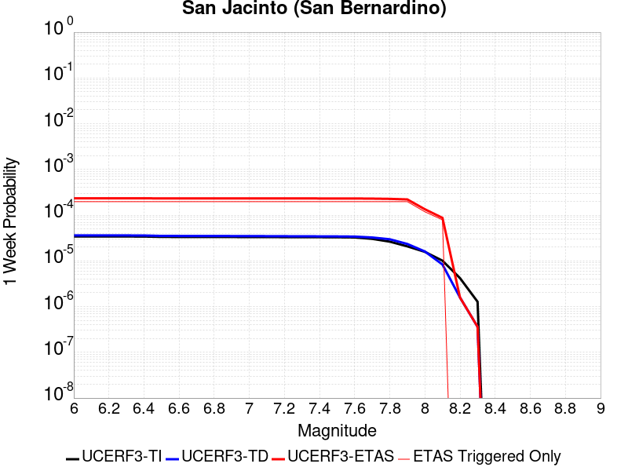 | 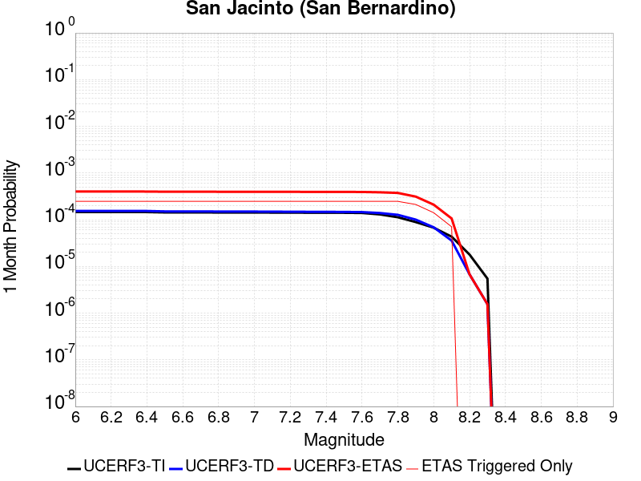 | 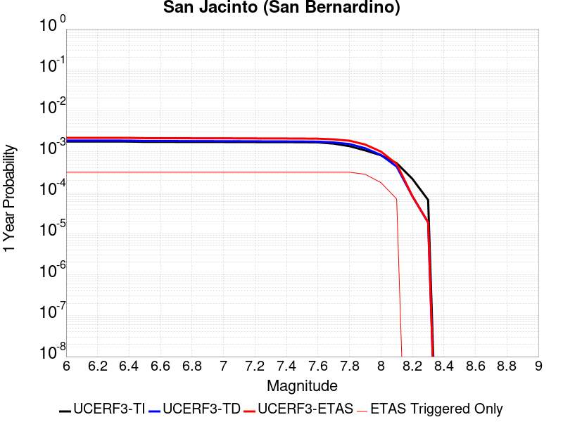 |  |

| Magnitude | 1 wk TI Prob | 1 wk TD Prob | 1 wk ETAS Prob | 1 wk ETAS/TD Gain | 1 wk ETAS Triggered Only | 1 mo TI Prob | 1 mo TD Prob | 1 mo ETAS Prob | 1 mo ETAS/TD Gain | 1 mo ETAS Triggered Only | 1 yr TI Prob | 1 yr TD Prob | 1 yr ETAS Prob | 1 yr ETAS/TD Gain | 1 yr ETAS Triggered Only | 10 yr TI Prob | 10 yr TD Prob | 10 yr ETAS Prob | 10 yr ETAS/TD Gain | 10 yr ETAS Triggered Only |
|-----|-----|-----|-----|-----|-----|-----|-----|-----|-----|-----|-----|-----|-----|-----|-----|-----|-----|-----|-----|-----|
| 6.0 | 3.409352E-5 | 3.5986508E-5 | 2.3323363E-4 | 6.4811406 | 1.9725422E-4 | 1.461069E-4 | 1.542188E-4 | 3.9088735E-4 | 2.5346286 | 2.3670506E-4 | 0.0017774 | 0.0018759987 | 0.0021910134 | 1.1679184 | 3.1560674E-4 | 0.01763251 | 0.019349935 | 0.019698123 | 1.0179943 | 3.550576E-4 |
| 6.1 | 3.409352E-5 | 3.5986508E-5 | 2.3323363E-4 | 6.4811406 | 1.9725422E-4 | 1.461069E-4 | 1.542188E-4 | 3.9088735E-4 | 2.5346286 | 2.3670506E-4 | 0.0017774 | 0.0018759987 | 0.0021910134 | 1.1679184 | 3.1560674E-4 | 0.01763251 | 0.019349935 | 0.019698123 | 1.0179943 | 3.550576E-4 |
| 6.2 | 3.409352E-5 | 3.5986508E-5 | 2.3323363E-4 | 6.4811406 | 1.9725422E-4 | 1.461069E-4 | 1.542188E-4 | 3.9088735E-4 | 2.5346286 | 2.3670506E-4 | 0.0017774 | 0.0018759987 | 0.0021910134 | 1.1679184 | 3.1560674E-4 | 0.01763251 | 0.019349935 | 0.019698123 | 1.0179943 | 3.550576E-4 |
| 6.3 | 3.409352E-5 | 3.5986508E-5 | 2.3323363E-4 | 6.4811406 | 1.9725422E-4 | 1.461069E-4 | 1.542188E-4 | 3.9088735E-4 | 2.5346286 | 2.3670506E-4 | 0.0017774 | 0.0018759987 | 0.0021910134 | 1.1679184 | 3.1560674E-4 | 0.01763251 | 0.019349935 | 0.019698123 | 1.0179943 | 3.550576E-4 |
| 6.4 | 3.400795E-5 | 3.5879173E-5 | 2.3312631E-4 | 6.497539 | 1.9725422E-4 | 1.4574021E-4 | 1.5375883E-4 | 3.904275E-4 | 2.53922 | 2.3670506E-4 | 0.0017729428 | 0.0018704084 | 0.0021854248 | 1.1684211 | 3.1560674E-4 | 0.017588645 | 0.019295016 | 0.019643223 | 1.0180465 | 3.550576E-4 |
| 6.5 | 3.341482E-5 | 3.5139812E-5 | 2.323871E-4 | 6.6132145 | 1.9725422E-4 | 1.4319851E-4 | 1.5059051E-4 | 3.8725993E-4 | 2.5716093 | 2.3670506E-4 | 0.0017420477 | 0.0018318989 | 0.0021469276 | 1.1719683 | 3.1560674E-4 | 0.017284546 | 0.018916558 | 0.0192649 | 1.0184146 | 3.550576E-4 |
| 6.6 | 3.3364955E-5 | 3.5077028E-5 | 2.3232434E-4 | 6.6232615 | 1.9725422E-4 | 1.4298483E-4 | 1.5032147E-4 | 3.8699096E-4 | 2.5744224 | 2.3670506E-4 | 0.0017394501 | 0.001828629 | 0.0021436587 | 1.1722764 | 3.1560674E-4 | 0.017258976 | 0.018884424 | 0.019232776 | 1.0184466 | 3.550576E-4 |
| 6.7 | 3.335922E-5 | 3.5066805E-5 | 2.3231411E-4 | 6.6249013 | 1.9725422E-4 | 1.4296026E-4 | 1.5027766E-4 | 3.8694715E-4 | 2.5748816 | 2.3670506E-4 | 0.0017391514 | 0.0018280965 | 0.0021431262 | 1.1723267 | 3.1560674E-4 | 0.017256035 | 0.018879214 | 0.01922757 | 1.0184517 | 3.550576E-4 |
| 6.8 | 3.327683E-5 | 3.496087E-5 | 2.322082E-4 | 6.641946 | 1.9725422E-4 | 1.4260718E-4 | 1.498237E-4 | 3.864933E-4 | 2.579654 | 2.3670506E-4 | 0.0017348597 | 0.0018225788 | 0.0021376105 | 1.1728493 | 3.1560674E-4 | 0.017213784 | 0.018824987 | 0.01917336 | 1.0185059 | 3.550576E-4 |
| 6.9 | 3.3235785E-5 | 3.4901823E-5 | 2.3214916E-4 | 6.6514907 | 1.9725422E-4 | 1.4243131E-4 | 1.4957068E-4 | 3.8624034E-4 | 2.5823267 | 2.3670506E-4 | 0.0017327217 | 0.0018195034 | 0.002134536 | 1.1731421 | 3.1560674E-4 | 0.017192734 | 0.018794855 | 0.01914324 | 1.0185362 | 3.550576E-4 |
| 7.0 | 3.3197095E-5 | 3.4841752E-5 | 2.320891E-4 | 6.661235 | 1.9725422E-4 | 1.422655E-4 | 1.4931326E-4 | 3.8598297E-4 | 2.5850549 | 2.3670506E-4 | 0.0017307063 | 0.0018163746 | 0.002131408 | 1.1734408 | 3.1560674E-4 | 0.017172894 | 0.018764233 | 0.019112628 | 1.018567 | 3.550576E-4 |
| 7.1 | 3.3129716E-5 | 3.4721965E-5 | 2.3196933E-4 | 6.6807666 | 1.9725422E-4 | 1.4197677E-4 | 1.4879994E-4 | 3.854698E-4 | 2.5905237 | 2.3670506E-4 | 0.0017271966 | 0.0018101353 | 0.0021251708 | 1.1740397 | 3.1560674E-4 | 0.017138338 | 0.018703312 | 0.019051729 | 1.0186286 | 3.550576E-4 |
| 7.2 | 3.3034008E-5 | 3.458941E-5 | 2.318368E-4 | 6.702537 | 1.9725422E-4 | 1.4156665E-4 | 1.4823192E-4 | 3.849019E-4 | 2.5966196 | 2.3670506E-4 | 0.0017222111 | 0.0018032312 | 0.0021182687 | 1.1747073 | 3.1560674E-4 | 0.017089253 | 0.018635705 | 0.018984146 | 1.0186975 | 3.550576E-4 |
| 7.3 | 3.2956614E-5 | 3.445717E-5 | 2.3170459E-4 | 6.7244234 | 1.9725422E-4 | 1.4123498E-4 | 1.4766524E-4 | 3.8433535E-4 | 2.6027477 | 2.3670506E-4 | 0.0017181796 | 0.0017963431 | 0.002111383 | 1.1753784 | 3.1560674E-4 | 0.017049557 | 0.018568452 | 0.018916918 | 1.0187665 | 3.550576E-4 |
| 7.4 | 3.2915937E-5 | 3.4378863E-5 | 2.316263E-4 | 6.737462 | 1.9725422E-4 | 1.4106068E-4 | 1.4732967E-4 | 3.8399987E-4 | 2.6063986 | 2.3670506E-4 | 0.0017160608 | 0.0017922645 | 0.0021073057 | 1.1757783 | 3.1560674E-4 | 0.017028693 | 0.018528719 | 0.018877197 | 1.0188075 | 3.550576E-4 |
| 7.5 | 3.281791E-5 | 3.4243778E-5 | 2.3149124E-4 | 6.760096 | 1.9725422E-4 | 1.406406E-4 | 1.4675081E-4 | 3.8342114E-4 | 2.6127362 | 2.3670506E-4 | 0.0017109542 | 0.0017852283 | 0.0021002716 | 1.1764723 | 3.1560674E-4 | 0.016978411 | 0.018459605 | 0.01880811 | 1.0188793 | 3.550576E-4 |
| 7.6 | 3.2521442E-5 | 3.396873E-5 | 2.3121625E-4 | 6.8067384 | 1.9725422E-4 | 1.3937015E-4 | 1.4557215E-4 | 3.8224275E-4 | 2.6257958 | 2.3670506E-4 | 0.0016955109 | 0.0017709016 | 0.0020859495 | 1.1779025 | 3.1560674E-4 | 0.016826328 | 0.018317232 | 0.018665787 | 1.0190288 | 3.550576E-4 |
| 7.7 | 3.0287873E-5 | 3.245276E-5 | 2.2970058E-4 | 7.0779977 | 1.9725422E-4 | 1.297987E-4 | 1.3907586E-4 | 3.75748E-4 | 2.7017486 | 2.3670506E-4 | 0.0015791537 | 0.0016919347 | 0.0020070074 | 1.1862204 | 3.1560674E-4 | 0.01567979 | 0.01752809 | 0.017876925 | 1.0199014 | 3.550576E-4 |
| 7.8 | 2.6316151E-5 | 2.9663592E-5 | 2.2691196E-4 | 7.649511 | 1.9725422E-4 | 1.1277862E-4 | 1.2712348E-4 | 3.6379846E-4 | 2.8617723 | 2.3670506E-4 | 0.0013722149 | 0.0015466306 | 0.0018617492 | 1.2037452 | 3.1560674E-4 | 0.013637724 | 0.016069634 | 0.016418986 | 1.0217398 | 3.550576E-4 |
| 7.9 | 2.0761147E-5 | 2.34181E-5 | 2.206677E-4 | 9.422955 | 1.9725422E-4 | 8.897331E-5 | 1.0035944E-4 | 2.9759386E-4 | 2.9652803 | 1.9725422E-4 | 0.0010827117 | 0.0012211921 | 0.0014970107 | 1.2258602 | 2.7615592E-4 | 0.010774517 | 0.012793174 | 0.013104743 | 1.0243543 | 3.1560674E-4 |
| 8.0 | 1.5738568E-5 | 1.6033575E-5 | 1.3438422E-4 | 8.381425 | 1.1835253E-4 | 6.744926E-5 | 6.871352E-5 | 1.8705791E-4 | 2.722287 | 1.1835253E-4 | 8.2088535E-4 | 8.3626667E-4 | 9.939381E-4 | 1.188542 | 1.5780337E-4 | 0.008178596 | 0.008865921 | 0.009022325 | 1.0176411 | 1.5780337E-4 |
| 8.1 | 1.0105832E-5 | 8.3304985E-6 | 8.723153E-5 | 10.471346 | 7.8901685E-5 | 4.3309992E-5 | 3.570165E-5 | 1.1460052E-4 | 3.2099502 | 7.8901685E-5 | 5.2717153E-4 | 4.345814E-4 | 5.134488E-4 | 1.181479 | 7.8901685E-5 | 0.005259227 | 0.004677232 | 0.0047557647 | 1.0167904 | 7.8901685E-5 |
| 8.2 | 4.189207E-6 | 1.5784357E-6 | 1.5784357E-6 | 1.0 | 0.0 | 1.7953622E-5 | 6.7647065E-6 | 6.7647065E-6 | 1.0 | 0.0 | 2.1856341E-4 | 8.235722E-5 | 8.235722E-5 | 1.0 | 0.0 | 0.0021834858 | 9.565867E-4 | 9.565867E-4 | 1.0 | 0.0 |
| 8.3 | 1.2758221E-6 | 3.6149942E-7 | 3.6149942E-7 | 1.0 | 0.0 | 5.4677976E-6 | 1.5492824E-6 | 1.5492824E-6 | 1.0 | 0.0 | 6.65684E-5 | 1.8862354E-5 | 1.8862354E-5 | 1.0 | 0.0 | 6.6548464E-4 | 2.2751294E-4 | 2.2751294E-4 | 1.0 | 0.0 |

## Pleito
*[(top)](#table-of-contents)*

| 1 Week | 1 Month | 1 Year | 10 Year |
|-----|-----|-----|-----|
| 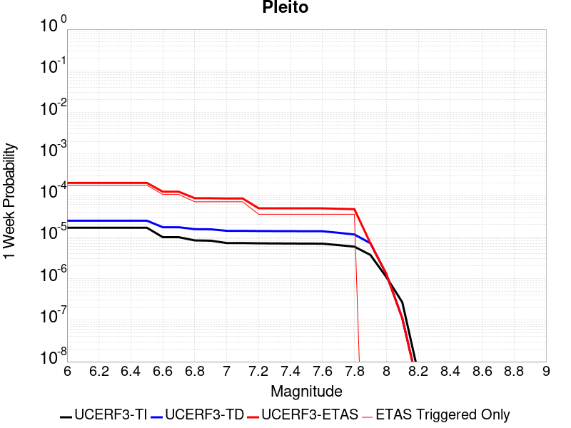 | 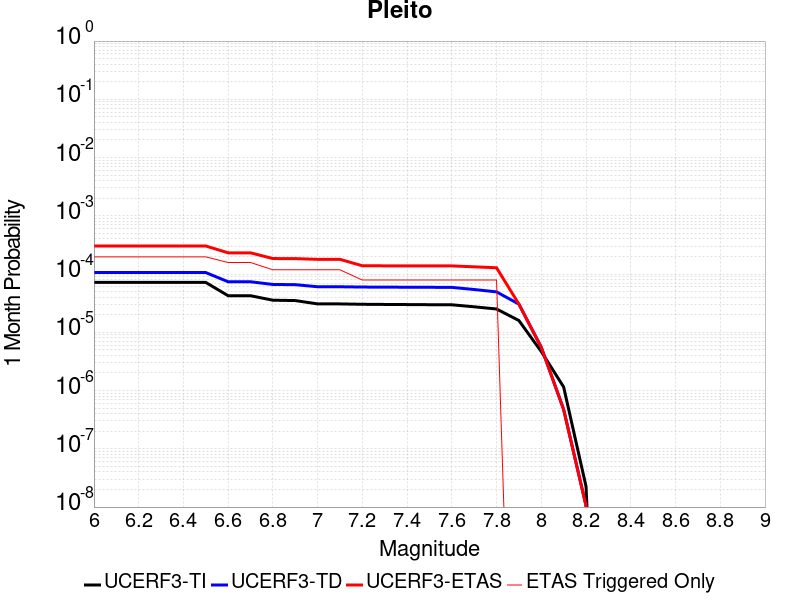 | 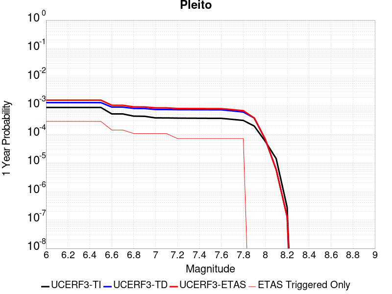 | 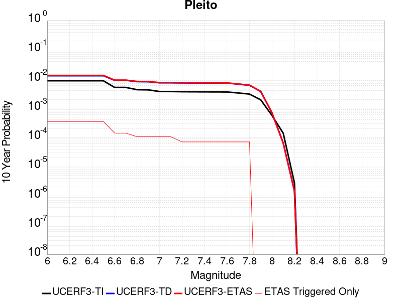 |

| Magnitude | 1 wk TI Prob | 1 wk TD Prob | 1 wk ETAS Prob | 1 wk ETAS/TD Gain | 1 wk ETAS Triggered Only | 1 mo TI Prob | 1 mo TD Prob | 1 mo ETAS Prob | 1 mo ETAS/TD Gain | 1 mo ETAS Triggered Only | 1 yr TI Prob | 1 yr TD Prob | 1 yr ETAS Prob | 1 yr ETAS/TD Gain | 1 yr ETAS Triggered Only | 10 yr TI Prob | 10 yr TD Prob | 10 yr ETAS Prob | 10 yr ETAS/TD Gain | 10 yr ETAS Triggered Only |
|-----|-----|-----|-----|-----|-----|-----|-----|-----|-----|-----|-----|-----|-----|-----|-----|-----|-----|-----|-----|-----|
| 6.0 | 1.6763008E-5 | 2.4763838E-5 | 1.8256331E-4 | 7.3721733 | 1.5780337E-4 | 7.183948E-5 | 1.0612683E-4 | 3.033601E-4 | 2.8584678 | 1.9725422E-4 | 8.742947E-4 | 0.0012914003 | 0.0015671996 | 1.2135661 | 2.7615592E-4 | 0.00870863 | 0.0129538905 | 0.013304348 | 1.0270543 | 3.550576E-4 |
| 6.1 | 1.6763008E-5 | 2.4763838E-5 | 1.8256331E-4 | 7.3721733 | 1.5780337E-4 | 7.183948E-5 | 1.0612683E-4 | 3.033601E-4 | 2.8584678 | 1.9725422E-4 | 8.742947E-4 | 0.0012914003 | 0.0015671996 | 1.2135661 | 2.7615592E-4 | 0.00870863 | 0.0129538905 | 0.013304348 | 1.0270543 | 3.550576E-4 |
| 6.2 | 1.6763008E-5 | 2.4763838E-5 | 1.8256331E-4 | 7.3721733 | 1.5780337E-4 | 7.183948E-5 | 1.0612683E-4 | 3.033601E-4 | 2.8584678 | 1.9725422E-4 | 8.742947E-4 | 0.0012914003 | 0.0015671996 | 1.2135661 | 2.7615592E-4 | 0.00870863 | 0.0129538905 | 0.013304348 | 1.0270543 | 3.550576E-4 |
| 6.3 | 1.6763008E-5 | 2.4763838E-5 | 1.8256331E-4 | 7.3721733 | 1.5780337E-4 | 7.183948E-5 | 1.0612683E-4 | 3.033601E-4 | 2.8584678 | 1.9725422E-4 | 8.742947E-4 | 0.0012914003 | 0.0015671996 | 1.2135661 | 2.7615592E-4 | 0.00870863 | 0.0129538905 | 0.013304348 | 1.0270543 | 3.550576E-4 |
| 6.4 | 1.6763008E-5 | 2.4763838E-5 | 1.8256331E-4 | 7.3721733 | 1.5780337E-4 | 7.183948E-5 | 1.0612683E-4 | 3.033601E-4 | 2.8584678 | 1.9725422E-4 | 8.742947E-4 | 0.0012914003 | 0.0015671996 | 1.2135661 | 2.7615592E-4 | 0.00870863 | 0.0129538905 | 0.013304348 | 1.0270543 | 3.550576E-4 |
| 6.5 | 1.6763008E-5 | 2.4763838E-5 | 1.8256331E-4 | 7.3721733 | 1.5780337E-4 | 7.183948E-5 | 1.0612683E-4 | 3.033601E-4 | 2.8584678 | 1.9725422E-4 | 8.742947E-4 | 0.0012914003 | 0.0015671996 | 1.2135661 | 2.7615592E-4 | 0.00870863 | 0.0129538905 | 0.013304348 | 1.0270543 | 3.550576E-4 |
| 6.6 | 9.910213E-6 | 1.7214623E-5 | 1.3556512E-4 | 7.8749976 | 1.1835253E-4 | 4.247165E-5 | 7.377489E-5 | 2.3156662E-4 | 3.138827 | 1.5780337E-4 | 5.169696E-4 | 8.978429E-4 | 0.0010555045 | 1.1756005 | 1.5780337E-4 | 0.0051576863 | 0.009050702 | 0.009207077 | 1.0172777 | 1.5780337E-4 |
| 6.7 | 9.910213E-6 | 1.7214623E-5 | 1.3556512E-4 | 7.8749976 | 1.1835253E-4 | 4.247165E-5 | 7.377489E-5 | 2.3156662E-4 | 3.138827 | 1.5780337E-4 | 5.169696E-4 | 8.978429E-4 | 0.0010555045 | 1.1756005 | 1.5780337E-4 | 0.0051576863 | 0.009050702 | 0.009207077 | 1.0172777 | 1.5780337E-4 |
| 6.8 | 8.300162E-6 | 1.5474232E-5 | 9.43747E-5 | 6.0988293 | 7.8901685E-5 | 3.557164E-5 | 6.631646E-5 | 1.8466114E-4 | 2.7845447 | 1.1835253E-4 | 4.3299864E-4 | 8.071053E-4 | 9.253623E-4 | 1.1465199 | 1.1835253E-4 | 0.004321559 | 0.008150139 | 0.0082675265 | 1.0144032 | 1.1835253E-4 |
| 6.9 | 8.183114E-6 | 1.5345448E-5 | 9.424592E-5 | 6.141621 | 7.8901685E-5 | 3.5070017E-5 | 6.576455E-5 | 1.841093E-4 | 2.799522 | 1.1835253E-4 | 4.2689382E-4 | 8.003907E-4 | 9.1864855E-4 | 1.1477501 | 1.1835253E-4 | 0.0042607468 | 0.008083483 | 0.008200879 | 1.0145229 | 1.1835253E-4 |
| 7.0 | 7.1748823E-6 | 1.413244E-5 | 9.303301E-5 | 6.582941 | 7.8901685E-5 | 3.0749135E-5 | 6.0566195E-5 | 1.7891156E-4 | 2.9539838 | 1.1835253E-4 | 3.743064E-4 | 7.371445E-4 | 8.554098E-4 | 1.1604371 | 1.1835253E-4 | 0.0037367654 | 0.007454939 | 0.007572409 | 1.0157573 | 1.1835253E-4 |
| 7.1 | 7.1671807E-6 | 1.412281E-5 | 9.302339E-5 | 6.5867476 | 7.8901685E-5 | 3.0716128E-5 | 6.052493E-5 | 1.788703E-4 | 2.955316 | 1.1835253E-4 | 3.7390468E-4 | 7.366424E-4 | 8.5490773E-4 | 1.1605465 | 1.1835253E-4 | 0.0037327618 | 0.0074499524 | 0.007567423 | 1.015768 | 1.1835253E-4 |
| 7.2 | 7.0649667E-6 | 1.39701015E-5 | 5.3420394E-5 | 3.8239088 | 3.9450842E-5 | 3.0278077E-5 | 5.9870494E-5 | 1.3876746E-4 | 2.3177938 | 7.8901685E-5 | 3.6857324E-4 | 7.2868E-4 | 8.075242E-4 | 1.1082014 | 7.8901685E-5 | 0.0036796255 | 0.0073707094 | 0.0074490295 | 1.0106258 | 7.8901685E-5 |
| 7.3 | 7.02082E-6 | 1.3913556E-5 | 5.3363852E-5 | 3.8353853 | 3.9450842E-5 | 3.008888E-5 | 5.9628168E-5 | 1.3852515E-4 | 2.3231494 | 7.8901685E-5 | 3.6627054E-4 | 7.2573166E-4 | 8.045761E-4 | 1.1086413 | 7.8901685E-5 | 0.0036566744 | 0.007341209 | 0.0074195312 | 1.0106689 | 7.8901685E-5 |
| 7.4 | 6.987146E-6 | 1.3873118E-5 | 5.3323416E-5 | 3.8436503 | 3.9450842E-5 | 2.9944567E-5 | 5.945487E-5 | 1.3835187E-4 | 2.3270066 | 7.8901685E-5 | 3.6451413E-4 | 7.2362315E-4 | 8.0246775E-4 | 1.1089581 | 7.8901685E-5 | 0.0036391679 | 0.007320144 | 0.0073984684 | 1.0106997 | 7.8901685E-5 |
| 7.5 | 6.9494554E-6 | 1.3830024E-5 | 5.3280324E-5 | 3.8525112 | 3.9450842E-5 | 2.9783041E-5 | 5.9270187E-5 | 1.381672E-4 | 2.3311415 | 7.8901685E-5 | 3.625482E-4 | 7.2137616E-4 | 8.002209E-4 | 1.1092978 | 7.8901685E-5 | 0.0036195726 | 0.0072977724 | 0.0073760985 | 1.0107329 | 7.8901685E-5 |
| 7.6 | 6.92694E-6 | 1.3789138E-5 | 5.3239437E-5 | 3.8609693 | 3.9450842E-5 | 2.9686547E-5 | 5.909497E-5 | 1.37992E-4 | 2.3350887 | 7.8901685E-5 | 3.6137376E-4 | 7.1924424E-4 | 7.980892E-4 | 1.1096219 | 7.8901685E-5 | 0.0036078666 | 0.0072765257 | 0.007354853 | 1.0107644 | 7.8901685E-5 |
| 7.7 | 6.395867E-6 | 1.2668219E-5 | 5.2118565E-5 | 4.114119 | 3.9450842E-5 | 2.741057E-5 | 5.429124E-5 | 1.3318865E-4 | 2.4532254 | 7.8901685E-5 | 3.336726E-4 | 6.6079566E-4 | 7.396452E-4 | 1.1193252 | 7.8901685E-5 | 0.0033317201 | 0.0066951844 | 0.006773558 | 1.011706 | 7.8901685E-5 |
| 7.8 | 5.8664327E-6 | 1.153586E-5 | 5.0986248E-5 | 4.4198046 | 3.9450842E-5 | 2.5141611E-5 | 4.9438466E-5 | 1.2833625E-4 | 2.5958786 | 7.8901685E-5 | 3.060561E-4 | 6.017473E-4 | 6.806015E-4 | 1.1310421 | 7.8901685E-5 | 0.0030563495 | 0.0061006667 | 0.006179087 | 1.0128543 | 7.8901685E-5 |
| 7.9 | 3.7167474E-6 | 7.1140853E-6 | 7.1140853E-6 | 1.0 | 0.0 | 1.592882E-5 | 3.0488582E-5 | 3.0488582E-5 | 1.0 | 0.0 | 1.9391612E-4 | 3.7113542E-4 | 3.7113542E-4 | 1.0 | 0.0 | 0.0019374699 | 0.0037674906 | 0.0037674906 | 1.0 | 0.0 |
| 8.0 | 1.0903841E-6 | 1.2879392E-6 | 1.2879392E-6 | 1.0 | 0.0 | 4.6730665E-6 | 5.5197274E-6 | 5.5197274E-6 | 1.0 | 0.0 | 5.68931E-5 | 6.720063E-5 | 6.720063E-5 | 1.0 | 0.0 | 5.6878536E-4 | 6.941948E-4 | 6.941948E-4 | 1.0 | 0.0 |
| 8.1 | 2.6894583E-7 | 1.1060341E-7 | 1.1060341E-7 | 1.0 | 0.0 | 1.1526245E-6 | 4.740145E-7 | 4.740145E-7 | 1.0 | 0.0 | 1.4033113E-5 | 5.7711113E-6 | 5.7711113E-6 | 1.0 | 0.0 | 1.4032227E-4 | 6.456908E-5 | 6.456908E-5 | 1.0 | 0.0 |
| 8.2 | 5.2967013E-9 | 2.4578228E-9 | 2.4578228E-9 | 1.0 | 0.0 | 2.2700148E-8 | 1.0533527E-8 | 1.0533527E-8 | 1.0 | 0.0 | 2.7637427E-7 | 1.2824569E-7 | 1.2824569E-7 | 1.0 | 0.0 | 2.7637393E-6 | 1.4592787E-6 | 1.4592787E-6 | 1.0 | 0.0 |

## Death Valley (Fish Lake Valley)
*[(top)](#table-of-contents)*

| 1 Week | 1 Month | 1 Year | 10 Year |
|-----|-----|-----|-----|
| 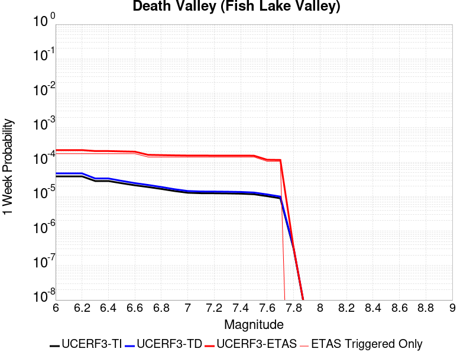 | 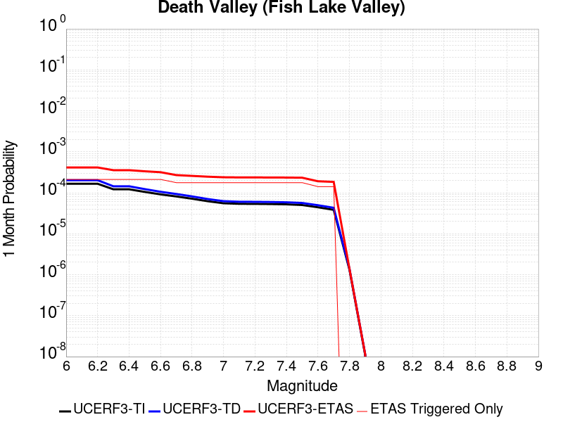 | 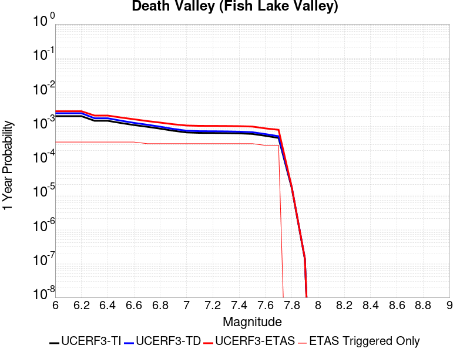 |  |

| Magnitude | 1 wk TI Prob | 1 wk TD Prob | 1 wk ETAS Prob | 1 wk ETAS/TD Gain | 1 wk ETAS Triggered Only | 1 mo TI Prob | 1 mo TD Prob | 1 mo ETAS Prob | 1 mo ETAS/TD Gain | 1 mo ETAS Triggered Only | 1 yr TI Prob | 1 yr TD Prob | 1 yr ETAS Prob | 1 yr ETAS/TD Gain | 1 yr ETAS Triggered Only | 10 yr TI Prob | 10 yr TD Prob | 10 yr ETAS Prob | 10 yr ETAS/TD Gain | 10 yr ETAS Triggered Only |
|-----|-----|-----|-----|-----|-----|-----|-----|-----|-----|-----|-----|-----|-----|-----|-----|-----|-----|-----|-----|-----|
| 6.0 | 3.872328E-5 | 4.7267473E-5 | 2.0506339E-4 | 4.3383617 | 1.5780337E-4 | 1.6594635E-4 | 2.0256084E-4 | 3.997751E-4 | 1.973605 | 1.9725422E-4 | 0.0020185246 | 0.002463534 | 0.0027783632 | 1.1277958 | 3.1560674E-4 | 0.02000288 | 0.024388181 | 0.024696091 | 1.0126253 | 3.1560674E-4 |
| 6.1 | 3.872328E-5 | 4.7267473E-5 | 2.0506339E-4 | 4.3383617 | 1.5780337E-4 | 1.6594635E-4 | 2.0256084E-4 | 3.997751E-4 | 1.973605 | 1.9725422E-4 | 0.0020185246 | 0.002463534 | 0.0027783632 | 1.1277958 | 3.1560674E-4 | 0.02000288 | 0.024388181 | 0.024696091 | 1.0126253 | 3.1560674E-4 |
| 6.2 | 3.872328E-5 | 4.7267473E-5 | 2.0506339E-4 | 4.3383617 | 1.5780337E-4 | 1.6594635E-4 | 2.0256084E-4 | 3.997751E-4 | 1.973605 | 1.9725422E-4 | 0.0020185246 | 0.002463534 | 0.0027783632 | 1.1277958 | 3.1560674E-4 | 0.02000288 | 0.024388181 | 0.024696091 | 1.0126253 | 3.1560674E-4 |
| 6.3 | 2.8356371E-5 | 3.3609853E-5 | 1.9140792E-4 | 5.694995 | 1.5780337E-4 | 1.2152165E-4 | 1.4403471E-4 | 3.4126051E-4 | 2.3692937 | 1.9725422E-4 | 0.0014785219 | 0.0017522911 | 0.0020673447 | 1.1797953 | 3.1560674E-4 | 0.014687235 | 0.017391782 | 0.0177019 | 1.0178313 | 3.1560674E-4 |
| 6.4 | 2.8356371E-5 | 3.3609853E-5 | 1.9140792E-4 | 5.694995 | 1.5780337E-4 | 1.2152165E-4 | 1.4403471E-4 | 3.4126051E-4 | 2.3692937 | 1.9725422E-4 | 0.0014785219 | 0.0017522911 | 0.0020673447 | 1.1797953 | 3.1560674E-4 | 0.014687235 | 0.017391782 | 0.0177019 | 1.0178313 | 3.1560674E-4 |
| 6.5 | 2.4448687E-5 | 2.8607552E-5 | 1.8640641E-4 | 6.515986 | 1.5780337E-4 | 1.0477588E-4 | 1.2259831E-4 | 3.1982837E-4 | 2.6087499 | 1.9725422E-4 | 0.0012748998 | 0.0014916632 | 0.0018067991 | 1.2112648 | 3.1560674E-4 | 0.012676105 | 0.014821377 | 0.015132305 | 1.0209785 | 3.1560674E-4 |
| 6.6 | 2.1298161E-5 | 2.4660083E-5 | 1.8245957E-4 | 7.398984 | 1.5780337E-4 | 9.127464E-5 | 1.0568198E-4 | 3.0291534E-4 | 2.8662913 | 1.9725422E-4 | 0.0011107022 | 0.0012859525 | 0.0016011534 | 1.2451109 | 3.1560674E-4 | 0.011051672 | 0.012788526 | 0.013100096 | 1.0243633 | 3.1560674E-4 |
| 6.7 | 1.8959729E-5 | 2.1781025E-5 | 1.7958097E-4 | 8.244835 | 1.5780337E-4 | 8.125345E-5 | 9.334405E-5 | 2.9057986E-4 | 3.112998 | 1.9725422E-4 | 9.888117E-4 | 0.001135897 | 0.0014511452 | 1.2775325 | 3.1560674E-4 | 0.009844234 | 0.01130357 | 0.011615609 | 1.0276054 | 3.1560674E-4 |
| 6.8 | 1.6691629E-5 | 1.9018353E-5 | 1.7681872E-4 | 9.297269 | 1.5780337E-4 | 7.153359E-5 | 8.150477E-5 | 2.7874293E-4 | 3.4199584 | 1.9725422E-4 | 8.7057345E-4 | 9.918857E-4 | 0.0013071793 | 1.317873 | 3.1560674E-4 | 0.008671708 | 0.009876343 | 0.010188833 | 1.0316402 | 3.1560674E-4 |
| 6.9 | 1.450505E-5 | 1.638954E-5 | 1.7419033E-4 | 10.62814 | 1.5780337E-4 | 6.216302E-5 | 7.0239046E-5 | 2.6747942E-4 | 3.80813 | 1.9725422E-4 | 7.5657194E-4 | 8.5483363E-4 | 0.0011701706 | 1.368887 | 3.1560674E-4 | 0.007540013 | 0.008516385 | 0.008829305 | 1.0367432 | 3.1560674E-4 |
| 7.0 | 1.2940855E-5 | 1.4537972E-5 | 1.7233906E-4 | 11.854408 | 1.5780337E-4 | 5.545963E-5 | 6.230414E-5 | 2.5954607E-4 | 4.165792 | 1.9725422E-4 | 6.750118E-4 | 7.5829466E-4 | 0.0010736621 | 1.4158903 | 3.1560674E-4 | 0.006729651 | 0.0075576897 | 0.007870912 | 1.0414441 | 3.1560674E-4 |
| 7.1 | 1.2544658E-5 | 1.4078208E-5 | 1.7187936E-4 | 12.208896 | 1.5780337E-4 | 5.3761712E-5 | 6.0333812E-5 | 2.5757615E-4 | 4.2691836 | 1.9725422E-4 | 6.5435225E-4 | 7.343222E-4 | 0.0010496972 | 1.4294777 | 3.1560674E-4 | 0.006524288 | 0.007319551 | 0.0076328474 | 1.0428027 | 3.1560674E-4 |
| 7.2 | 1.2489416E-5 | 1.4015674E-5 | 1.7181684E-4 | 12.258906 | 1.5780337E-4 | 5.3524967E-5 | 6.0065824E-5 | 2.573082E-4 | 4.2837706 | 1.9725422E-4 | 6.514716E-4 | 7.310616E-4 | 0.0010464377 | 1.4313946 | 3.1560674E-4 | 0.006495651 | 0.0072871596 | 0.0076004667 | 1.0429944 | 3.1560674E-4 |
| 7.3 | 1.2368307E-5 | 1.3879812E-5 | 1.71681E-4 | 12.369115 | 1.5780337E-4 | 5.3005948E-5 | 5.9483587E-5 | 2.5672608E-4 | 4.3159146 | 1.9725422E-4 | 6.451563E-4 | 7.2397763E-4 | 0.0010393559 | 1.4356188 | 3.1560674E-4 | 0.0064328653 | 0.007216782 | 0.007530111 | 1.0434167 | 3.1560674E-4 |
| 7.4 | 1.2161707E-5 | 1.36478675E-5 | 1.714491E-4 | 12.562335 | 1.5780337E-4 | 5.212056E-5 | 5.8489582E-5 | 2.5573227E-4 | 4.37227 | 1.9725422E-4 | 6.3438306E-4 | 7.118836E-4 | 0.0010272657 | 1.4430248 | 3.1560674E-4 | 0.006325751 | 0.0070966207 | 0.0074099875 | 1.0441573 | 3.1560674E-4 |
| 7.5 | 1.1707948E-5 | 1.3145515E-5 | 1.7094682E-4 | 13.004193 | 1.5780337E-4 | 5.0175953E-5 | 5.6336736E-5 | 2.5357984E-4 | 4.5011454 | 1.9725422E-4 | 6.10721E-4 | 6.856895E-4 | 0.0010010798 | 1.4599609 | 3.1560674E-4 | 0.0060904534 | 0.006836321 | 0.0071497704 | 1.0458505 | 3.1560674E-4 |
| 7.6 | 1.0319538E-5 | 1.1579622E-5 | 1.2993079E-4 | 11.220641 | 1.1835253E-4 | 4.4225842E-5 | 4.9626036E-5 | 2.0742159E-4 | 4.1796927 | 1.5780337E-4 | 5.383166E-4 | 6.040347E-4 | 8.800238E-4 | 1.4569094 | 2.7615592E-4 | 0.0053701443 | 0.0060244603 | 0.0062989527 | 1.045563 | 2.7615592E-4 |
| 7.7 | 8.937764E-6 | 1.0022779E-5 | 1.2837413E-4 | 12.808236 | 1.1835253E-4 | 3.830414E-5 | 4.295409E-5 | 2.0075068E-4 | 4.6736107 | 1.5780337E-4 | 4.6625308E-4 | 5.228456E-4 | 7.9885713E-4 | 1.5279026 | 2.7615592E-4 | 0.0046527605 | 0.005216664 | 0.0054913796 | 1.0526611 | 2.7615592E-4 |
| 7.8 | 3.108007E-7 | 3.284654E-7 | 3.284654E-7 | 1.0 | 0.0 | 1.3320023E-6 | 1.407708E-6 | 1.407708E-6 | 1.0 | 0.0 | 1.6217007E-5 | 1.7138715E-5 | 1.7138715E-5 | 1.0 | 0.0 | 1.6215823E-4 | 1.7137431E-4 | 1.7137431E-4 | 1.0 | 0.0 |
| 7.9 | 2.5591178E-9 | 2.6696718E-9 | 2.6696718E-9 | 1.0 | 0.0 | 1.0967647E-8 | 1.14414505E-8 | 1.14414505E-8 | 1.0 | 0.0 | 1.335311E-7 | 1.3929966E-7 | 1.3929966E-7 | 1.0 | 0.0 | 1.3353102E-6 | 1.3929966E-6 | 1.3929966E-6 | 1.0 | 0.0 |

## Big Pine (Central)
*[(top)](#table-of-contents)*

| 1 Week | 1 Month | 1 Year | 10 Year |
|-----|-----|-----|-----|
| 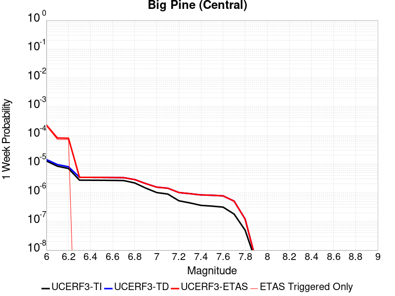 | 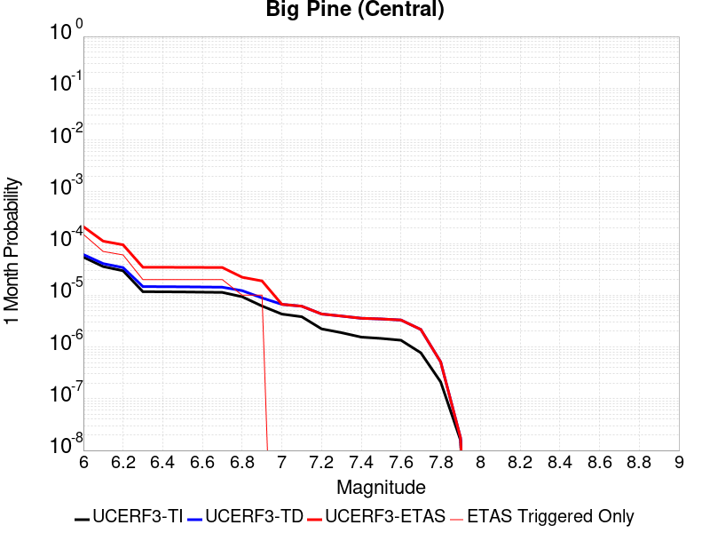 | 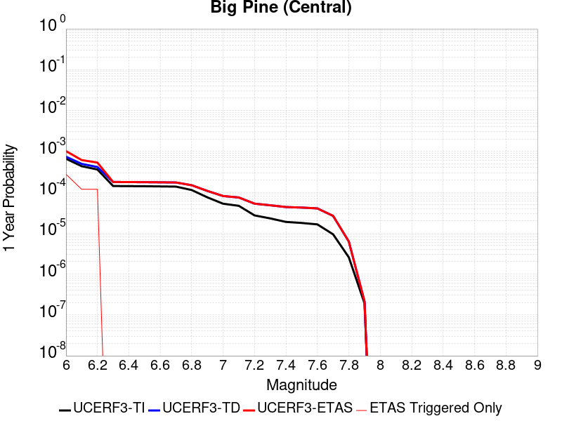 | 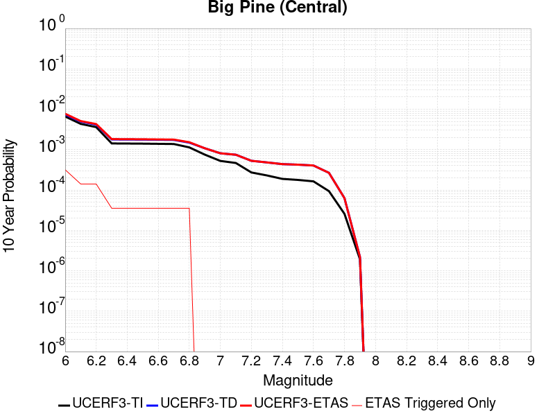 |

| Magnitude | 1 wk TI Prob | 1 wk TD Prob | 1 wk ETAS Prob | 1 wk ETAS/TD Gain | 1 wk ETAS Triggered Only | 1 mo TI Prob | 1 mo TD Prob | 1 mo ETAS Prob | 1 mo ETAS/TD Gain | 1 mo ETAS Triggered Only | 1 yr TI Prob | 1 yr TD Prob | 1 yr ETAS Prob | 1 yr ETAS/TD Gain | 1 yr ETAS Triggered Only | 10 yr TI Prob | 10 yr TD Prob | 10 yr ETAS Prob | 10 yr ETAS/TD Gain | 10 yr ETAS Triggered Only |
|-----|-----|-----|-----|-----|-----|-----|-----|-----|-----|-----|-----|-----|-----|-----|-----|-----|-----|-----|-----|-----|
| 6.0 | 1.2706755E-5 | 1.4250529E-5 | 2.1150195E-4 | 14.841691 | 1.9725422E-4 | 5.4456385E-5 | 6.107247E-5 | 2.5831466E-4 | 4.2296414 | 1.9725422E-4 | 6.628048E-4 | 7.433402E-4 | 0.0010192909 | 1.3712306 | 2.7615592E-4 | 0.006608314 | 0.0074135666 | 0.0077268337 | 1.0422559 | 3.1560674E-4 |
| 6.1 | 8.342579E-6 | 9.510762E-6 | 8.8411696E-5 | 9.295964 | 7.8901685E-5 | 3.5753423E-5 | 4.0759893E-5 | 1.1965836E-4 | 2.935689 | 7.8901685E-5 | 4.3521097E-4 | 4.961604E-4 | 6.144542E-4 | 1.2384185 | 1.1835253E-4 | 0.0043435963 | 0.0049540824 | 0.005111104 | 1.0316954 | 1.5780337E-4 |
| 6.2 | 6.923899E-6 | 7.967147E-6 | 8.6868204E-5 | 10.903301 | 7.8901685E-5 | 2.9673516E-5 | 3.4144578E-5 | 1.1304357E-4 | 3.3107326 | 7.8901685E-5 | 3.6121515E-4 | 4.156502E-4 | 5.3395354E-4 | 1.2846223 | 1.1835253E-4 | 0.003606286 | 0.0041520367 | 0.004309185 | 1.0378485 | 1.5780337E-4 |
| 6.3 | 2.728396E-6 | 3.4242908E-6 | 3.4242908E-6 | 1.0 | 0.0 | 1.1693074E-5 | 1.4675454E-5 | 1.4675454E-5 | 1.0 | 0.0 | 1.4235388E-4 | 1.7865987E-4 | 1.7865987E-4 | 1.0 | 0.0 | 0.0014226272 | 0.0017866704 | 0.0018260508 | 1.0220412 | 3.9450842E-5 |
| 6.4 | 2.7136944E-6 | 3.408584E-6 | 3.408584E-6 | 1.0 | 0.0 | 1.1630066E-5 | 1.4608141E-5 | 1.4608141E-5 | 1.0 | 0.0 | 1.4158686E-4 | 1.7784047E-4 | 1.7784047E-4 | 1.0 | 0.0 | 0.0014149669 | 0.0017784894 | 0.0018178702 | 1.0221428 | 3.9450842E-5 |
| 6.5 | 2.6971882E-6 | 3.3909291E-6 | 3.3909291E-6 | 1.0 | 0.0 | 1.1559327E-5 | 1.45324775E-5 | 1.45324775E-5 | 1.0 | 0.0 | 1.4072572E-4 | 1.7691942E-4 | 1.7691942E-4 | 1.0 | 0.0 | 0.0014063664 | 0.0017692937 | 0.0018086748 | 1.022258 | 3.9450842E-5 |
| 6.6 | 2.669092E-6 | 3.3609497E-6 | 3.3609497E-6 | 1.0 | 0.0 | 1.1438916E-5 | 1.4403995E-5 | 1.4403995E-5 | 1.0 | 0.0 | 1.3925991E-4 | 1.753554E-4 | 1.753554E-4 | 1.0 | 0.0 | 0.0013917267 | 0.0017536782 | 0.0017930599 | 1.0224566 | 3.9450842E-5 |
| 6.7 | 2.6408059E-6 | 3.3309752E-6 | 3.3309752E-6 | 1.0 | 0.0 | 1.1317691E-5 | 1.4275535E-5 | 1.4275535E-5 | 1.0 | 0.0 | 1.3778417E-4 | 1.7379165E-4 | 1.7379165E-4 | 1.0 | 0.0 | 0.0013769877 | 0.0017380653 | 0.0017774475 | 1.0226587 | 3.9450842E-5 |
| 6.8 | 2.1786943E-6 | 2.8544325E-6 | 2.8544325E-6 | 1.0 | 0.0 | 9.337228E-6 | 1.2233229E-5 | 1.2233229E-5 | 1.0 | 0.0 | 1.1367482E-4 | 1.4893012E-4 | 1.4893012E-4 | 1.0 | 0.0 | 0.0011361669 | 0.0014897975 | 0.0015291895 | 1.0264412 | 3.9450842E-5 |
| 6.9 | 1.4411696E-6 | 2.068499E-6 | 2.068499E-6 | 1.0 | 0.0 | 6.1764263E-6 | 8.864968E-6 | 8.864968E-6 | 1.0 | 0.0 | 7.51954E-5 | 1.079259E-4 | 1.079259E-4 | 1.0 | 0.0 | 7.5169955E-4 | 0.0010801847 | 0.0010801847 | 1.0 | 0.0 |
| 7.0 | 1.0073411E-6 | 1.554261E-6 | 1.554261E-6 | 1.0 | 0.0 | 4.317169E-6 | 6.6611024E-6 | 6.6611024E-6 | 1.0 | 0.0 | 5.2560266E-5 | 8.1096056E-5 | 8.1096056E-5 | 1.0 | 0.0 | 5.2547833E-4 | 8.1210316E-4 | 8.1210316E-4 | 1.0 | 0.0 |
| 7.1 | 8.947104E-7 | 1.4302494E-6 | 1.4302494E-6 | 1.0 | 0.0 | 3.834468E-6 | 6.129627E-6 | 6.129627E-6 | 1.0 | 0.0 | 4.6683643E-5 | 7.46258E-5 | 7.46258E-5 | 1.0 | 0.0 | 4.6673836E-4 | 7.474457E-4 | 7.474457E-4 | 1.0 | 0.0 |
| 7.2 | 5.215166E-7 | 1.0111678E-6 | 1.0111678E-6 | 1.0 | 0.0 | 2.2350691E-6 | 4.3335694E-6 | 4.3335694E-6 | 1.0 | 0.0 | 2.7211627E-5 | 5.2759973E-5 | 5.2759973E-5 | 1.0 | 0.0 | 2.7208295E-4 | 5.2890263E-4 | 5.2890263E-4 | 1.0 | 0.0 |
| 7.3 | 4.4024807E-7 | 9.219589E-7 | 9.219589E-7 | 1.0 | 0.0 | 1.8867761E-6 | 3.9512465E-6 | 3.9512465E-6 | 1.0 | 0.0 | 2.2971257E-5 | 4.810541E-5 | 4.810541E-5 | 1.0 | 0.0 | 2.2968883E-4 | 4.8237795E-4 | 4.8237795E-4 | 1.0 | 0.0 |
| 7.4 | 3.6130905E-7 | 8.358523E-7 | 8.358523E-7 | 1.0 | 0.0 | 1.5484665E-6 | 3.5822195E-6 | 3.5822195E-6 | 1.0 | 0.0 | 1.8852415E-5 | 4.3612687E-5 | 4.3612687E-5 | 1.0 | 0.0 | 1.8850817E-4 | 4.374597E-4 | 4.374597E-4 | 1.0 | 0.0 |
| 7.5 | 3.408184E-7 | 8.108147E-7 | 8.108147E-7 | 1.0 | 0.0 | 1.4606494E-6 | 3.4749157E-6 | 3.4749157E-6 | 1.0 | 0.0 | 1.7783263E-5 | 4.2306317E-5 | 4.2306317E-5 | 1.0 | 0.0 | 1.778184E-4 | 4.2437963E-4 | 4.2437963E-4 | 1.0 | 0.0 |
| 7.6 | 3.1428627E-7 | 7.7316E-7 | 7.7316E-7 | 1.0 | 0.0 | 1.3469405E-6 | 3.3135389E-6 | 3.3135389E-6 | 1.0 | 0.0 | 1.6398877E-5 | 4.0341627E-5 | 4.0341627E-5 | 1.0 | 0.0 | 1.6397667E-4 | 4.0471106E-4 | 4.0471106E-4 | 1.0 | 0.0 |
| 7.7 | 1.7972785E-7 | 5.077752E-7 | 5.077752E-7 | 1.0 | 0.0 | 7.70262E-7 | 2.1761778E-6 | 2.1761778E-6 | 1.0 | 0.0 | 9.377899E-6 | 2.6494654E-5 | 2.6494654E-5 | 1.0 | 0.0 | 9.377503E-5 | 2.662899E-4 | 2.662899E-4 | 1.0 | 0.0 |
| 7.8 | 4.9230927E-8 | 1.198079E-7 | 1.198079E-7 | 1.0 | 0.0 | 2.1098968E-7 | 5.134623E-7 | 5.134623E-7 | 1.0 | 0.0 | 2.5687964E-6 | 6.2513873E-6 | 6.2513873E-6 | 1.0 | 0.0 | 2.5687666E-5 | 6.295415E-5 | 6.295415E-5 | 1.0 | 0.0 |
| 7.9 | 3.6805972E-9 | 4.105293E-9 | 4.105293E-9 | 1.0 | 0.0 | 1.5773987E-8 | 1.7594115E-8 | 1.7594115E-8 | 1.0 | 0.0 | 1.9204828E-7 | 2.1420831E-7 | 2.1420831E-7 | 1.0 | 0.0 | 1.920481E-6 | 2.1900614E-6 | 2.1900614E-6 | 1.0 | 0.0 |

## Deep Springs
*[(top)](#table-of-contents)*

| 1 Week | 1 Month | 1 Year | 10 Year |
|-----|-----|-----|-----|
| 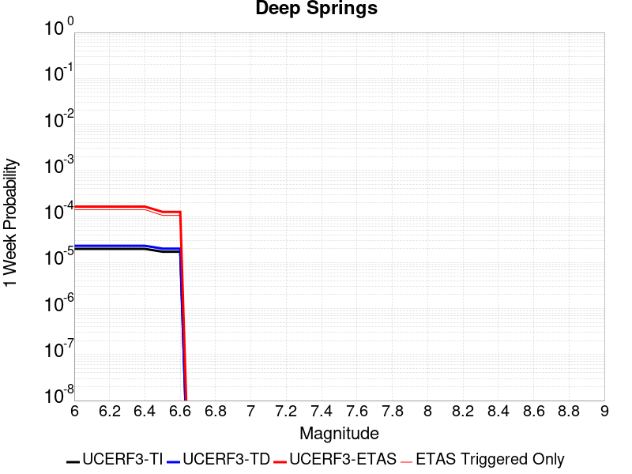 | 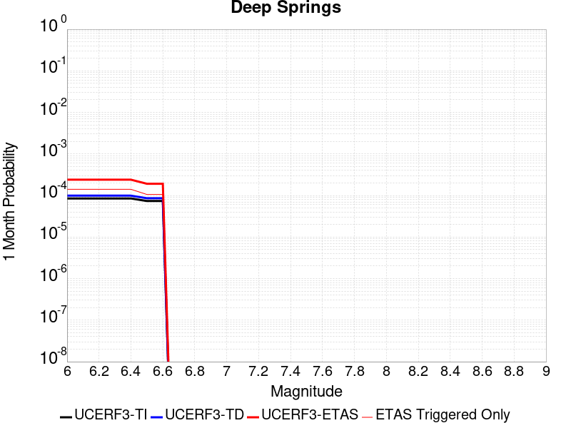 | 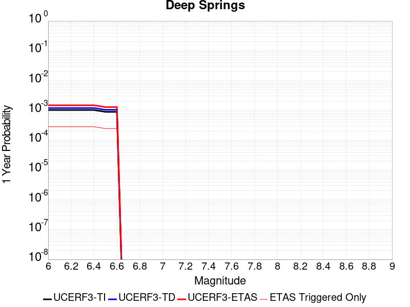 | 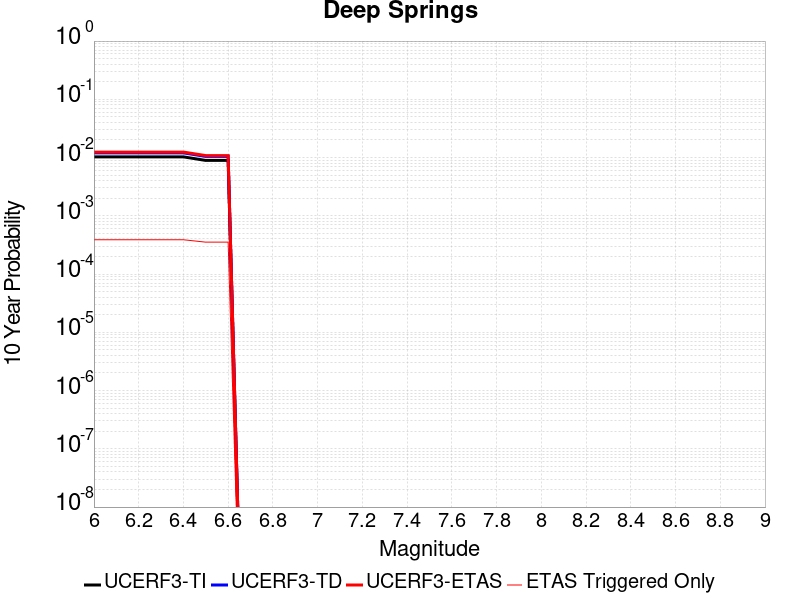 |

| Magnitude | 1 wk TI Prob | 1 wk TD Prob | 1 wk ETAS Prob | 1 wk ETAS/TD Gain | 1 wk ETAS Triggered Only | 1 mo TI Prob | 1 mo TD Prob | 1 mo ETAS Prob | 1 mo ETAS/TD Gain | 1 mo ETAS Triggered Only | 1 yr TI Prob | 1 yr TD Prob | 1 yr ETAS Prob | 1 yr ETAS/TD Gain | 1 yr ETAS Triggered Only | 10 yr TI Prob | 10 yr TD Prob | 10 yr ETAS Prob | 10 yr ETAS/TD Gain | 10 yr ETAS Triggered Only |
|-----|-----|-----|-----|-----|-----|-----|-----|-----|-----|-----|-----|-----|-----|-----|-----|-----|-----|-----|-----|-----|
| 6.0 | 1.9810619E-5 | 2.311252E-5 | 1.8091225E-4 | 7.827457 | 1.5780337E-4 | 8.489989E-5 | 9.905276E-5 | 2.5684052E-4 | 2.5929668 | 1.5780337E-4 | 0.001033166 | 0.0012058079 | 0.0014816308 | 1.2287453 | 2.7615592E-4 | 0.010283757 | 0.012042425 | 0.0123542305 | 1.0258923 | 3.1560674E-4 |
| 6.1 | 1.9810619E-5 | 2.311252E-5 | 1.8091225E-4 | 7.827457 | 1.5780337E-4 | 8.489989E-5 | 9.905276E-5 | 2.5684052E-4 | 2.5929668 | 1.5780337E-4 | 0.001033166 | 0.0012058079 | 0.0014816308 | 1.2287453 | 2.7615592E-4 | 0.010283757 | 0.012042425 | 0.0123542305 | 1.0258923 | 3.1560674E-4 |
| 6.2 | 1.9810619E-5 | 2.311252E-5 | 1.8091225E-4 | 7.827457 | 1.5780337E-4 | 8.489989E-5 | 9.905276E-5 | 2.5684052E-4 | 2.5929668 | 1.5780337E-4 | 0.001033166 | 0.0012058079 | 0.0014816308 | 1.2287453 | 2.7615592E-4 | 0.010283757 | 0.012042425 | 0.0123542305 | 1.0258923 | 3.1560674E-4 |
| 6.3 | 1.9810619E-5 | 2.311252E-5 | 1.8091225E-4 | 7.827457 | 1.5780337E-4 | 8.489989E-5 | 9.905276E-5 | 2.5684052E-4 | 2.5929668 | 1.5780337E-4 | 0.001033166 | 0.0012058079 | 0.0014816308 | 1.2287453 | 2.7615592E-4 | 0.010283757 | 0.012042425 | 0.0123542305 | 1.0258923 | 3.1560674E-4 |
| 6.4 | 1.9810619E-5 | 2.311252E-5 | 1.8091225E-4 | 7.827457 | 1.5780337E-4 | 8.489989E-5 | 9.905276E-5 | 2.5684052E-4 | 2.5929668 | 1.5780337E-4 | 0.001033166 | 0.0012058079 | 0.0014816308 | 1.2287453 | 2.7615592E-4 | 0.010283757 | 0.012042425 | 0.0123542305 | 1.0258923 | 3.1560674E-4 |
| 6.5 | 1.7190405E-5 | 2.0050555E-5 | 1.3840072E-4 | 6.9025874 | 1.1835253E-4 | 7.367108E-5 | 8.593095E-5 | 2.0427331E-4 | 2.3771796 | 1.1835253E-4 | 8.9657627E-4 | 0.0010462094 | 0.0012826668 | 1.2260135 | 2.3670506E-4 | 0.008929676 | 0.010462056 | 0.010735323 | 1.0261198 | 2.7615592E-4 |
| 6.6 | 1.7190405E-5 | 2.0050555E-5 | 1.3840072E-4 | 6.9025874 | 1.1835253E-4 | 7.367108E-5 | 8.593095E-5 | 2.0427331E-4 | 2.3771796 | 1.1835253E-4 | 8.9657627E-4 | 0.0010462094 | 0.0012826668 | 1.2260135 | 2.3670506E-4 | 0.008929676 | 0.010462056 | 0.010735323 | 1.0261198 | 2.7615592E-4 |

## Lake Isabella (Seismicity)
*[(top)](#table-of-contents)*

| 1 Week | 1 Month | 1 Year | 10 Year |
|-----|-----|-----|-----|
| 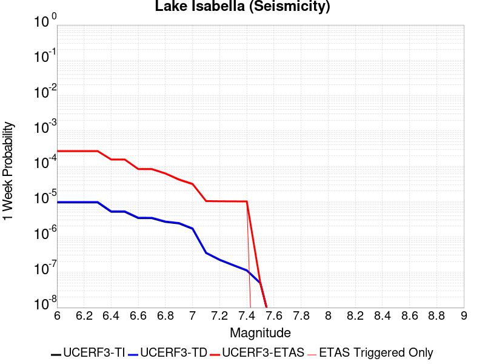 | 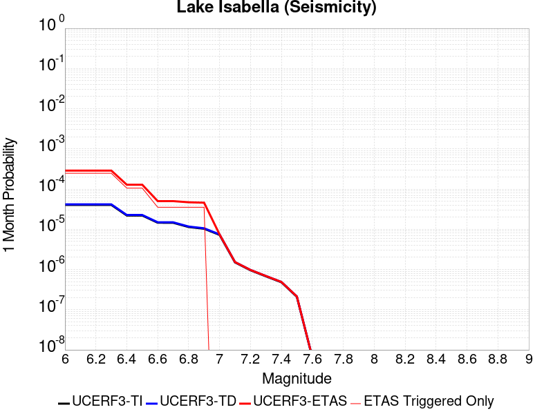 | 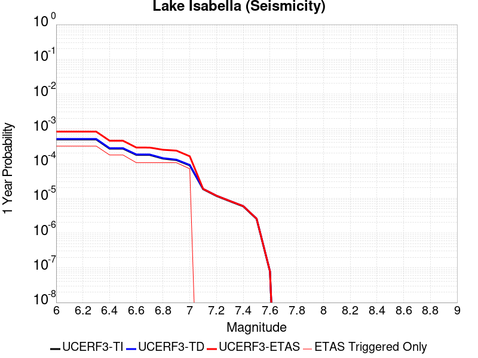 | 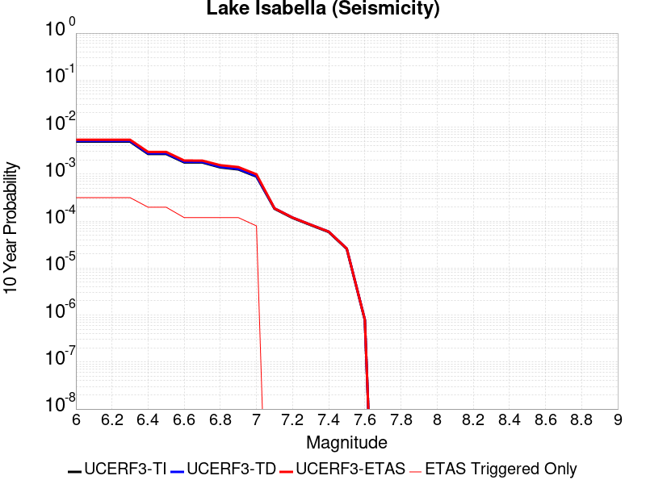 |

| Magnitude | 1 wk TI Prob | 1 wk TD Prob | 1 wk ETAS Prob | 1 wk ETAS/TD Gain | 1 wk ETAS Triggered Only | 1 mo TI Prob | 1 mo TD Prob | 1 mo ETAS Prob | 1 mo ETAS/TD Gain | 1 mo ETAS Triggered Only | 1 yr TI Prob | 1 yr TD Prob | 1 yr ETAS Prob | 1 yr ETAS/TD Gain | 1 yr ETAS Triggered Only | 10 yr TI Prob | 10 yr TD Prob | 10 yr ETAS Prob | 10 yr ETAS/TD Gain | 10 yr ETAS Triggered Only |
|-----|-----|-----|-----|-----|-----|-----|-----|-----|-----|-----|-----|-----|-----|-----|-----|-----|-----|-----|-----|-----|
| 6.0 | 9.431637E-6 | 9.741651E-6 | 1.2809303E-4 | 13.149006 | 1.1835253E-4 | 4.0420677E-5 | 4.1749343E-5 | 2.7844452E-4 | 6.669435 | 2.3670506E-4 | 4.920106E-4 | 5.0819275E-4 | 8.236391E-4 | 1.6207219 | 3.1560674E-4 | 0.004909227 | 0.005071599 | 0.005385605 | 1.0619146 | 3.1560674E-4 |
| 6.1 | 9.431637E-6 | 9.741651E-6 | 1.2809303E-4 | 13.149006 | 1.1835253E-4 | 4.0420677E-5 | 4.1749343E-5 | 2.7844452E-4 | 6.669435 | 2.3670506E-4 | 4.920106E-4 | 5.0819275E-4 | 8.236391E-4 | 1.6207219 | 3.1560674E-4 | 0.004909227 | 0.005071599 | 0.005385605 | 1.0619146 | 3.1560674E-4 |
| 6.2 | 9.431637E-6 | 9.741651E-6 | 1.2809303E-4 | 13.149006 | 1.1835253E-4 | 4.0420677E-5 | 4.1749343E-5 | 2.7844452E-4 | 6.669435 | 2.3670506E-4 | 4.920106E-4 | 5.0819275E-4 | 8.236391E-4 | 1.6207219 | 3.1560674E-4 | 0.004909227 | 0.005071599 | 0.005385605 | 1.0619146 | 3.1560674E-4 |
| 6.3 | 9.431637E-6 | 9.741651E-6 | 1.2809303E-4 | 13.149006 | 1.1835253E-4 | 4.0420677E-5 | 4.1749343E-5 | 2.7844452E-4 | 6.669435 | 2.3670506E-4 | 4.920106E-4 | 5.0819275E-4 | 8.236391E-4 | 1.6207219 | 3.1560674E-4 | 0.004909227 | 0.005071599 | 0.005385605 | 1.0619146 | 3.1560674E-4 |
| 6.4 | 5.144063E-6 | 5.3000763E-6 | 8.420135E-5 | 15.886818 | 7.8901685E-5 | 2.2045799E-5 | 2.2714434E-5 | 1.4106427E-4 | 6.2103367 | 1.1835253E-4 | 2.6837454E-4 | 2.765166E-4 | 4.7371627E-4 | 1.7131568 | 1.9725422E-4 | 0.0026805066 | 0.0027620657 | 0.002958775 | 1.0712183 | 1.9725422E-4 |
| 6.5 | 5.144063E-6 | 5.3000763E-6 | 8.420135E-5 | 15.886818 | 7.8901685E-5 | 2.2045799E-5 | 2.2714434E-5 | 1.4106427E-4 | 6.2103367 | 1.1835253E-4 | 2.6837454E-4 | 2.765166E-4 | 4.7371627E-4 | 1.7131568 | 1.9725422E-4 | 0.0026805066 | 0.0027620657 | 0.002958775 | 1.0712183 | 1.9725422E-4 |
| 6.6 | 3.4009804E-6 | 3.498786E-6 | 3.498786E-6 | 1.0 | 0.0 | 1.4575549E-5 | 1.4994721E-5 | 5.4444972E-5 | 3.6309428 | 3.9450842E-5 | 1.7744285E-4 | 1.8254704E-4 | 3.0087796E-4 | 1.6482216 | 1.1835253E-4 | 0.0017730123 | 0.0018241286 | 0.0019422652 | 1.0647633 | 1.1835253E-4 |
| 6.7 | 3.3880428E-6 | 3.4856528E-6 | 3.4856528E-6 | 1.0 | 0.0 | 1.4520103E-5 | 1.4938435E-5 | 5.438869E-5 | 3.6408558 | 3.9450842E-5 | 1.767679E-4 | 1.8186188E-4 | 3.0019289E-4 | 1.6506642 | 1.1835253E-4 | 0.0017662736 | 0.0018172882 | 0.0019354257 | 1.0650076 | 1.1835253E-4 |
| 6.8 | 2.6582E-6 | 2.7337003E-6 | 2.7337003E-6 | 1.0 | 0.0 | 1.1392236E-5 | 1.1715813E-5 | 5.1166196E-5 | 4.3672767 | 3.9450842E-5 | 1.3869164E-4 | 1.4263204E-4 | 2.6096767E-4 | 1.829657 | 1.1835253E-4 | 0.0013860512 | 0.0014255369 | 0.0015437207 | 1.0829048 | 1.1835253E-4 |
| 6.9 | 2.406011E-6 | 2.4743288E-6 | 2.4743288E-6 | 1.0 | 0.0 | 1.0311434E-5 | 1.0604231E-5 | 5.0054656E-5 | 4.7202535 | 3.9450842E-5 | 1.2553448E-4 | 1.2910018E-4 | 2.4743745E-4 | 1.9166312 | 1.1835253E-4 | 0.0012546359 | 0.0012903814 | 0.0014085813 | 1.0916007 | 1.1835253E-4 |
| 7.0 | 1.6953097E-6 | 1.7429371E-6 | 1.7429371E-6 | 1.0 | 0.0 | 7.265593E-6 | 7.469715E-6 | 7.469715E-6 | 1.0 | 0.0 | 8.8455E-5 | 9.094104E-5 | 1.6983555E-4 | 1.8675348 | 7.8901685E-5 | 8.84198E-4 | 9.09141E-4 | 9.879709E-4 | 1.0867082 | 7.8901685E-5 |
| 7.1 | 3.5013824E-7 | 3.5714822E-7 | 3.5714822E-7 | 1.0 | 0.0 | 1.5005916E-6 | 1.5306344E-6 | 1.5306344E-6 | 1.0 | 0.0 | 1.826955E-5 | 1.8635317E-5 | 1.8635317E-5 | 1.0 | 0.0 | 1.8268047E-4 | 1.863378E-4 | 1.863378E-4 | 1.0 | 0.0 |
| 7.2 | 2.2321095E-7 | 2.2750574E-7 | 2.2750574E-7 | 1.0 | 0.0 | 9.56618E-7 | 9.750242E-7 | 9.750242E-7 | 1.0 | 0.0 | 1.1646762E-5 | 1.1870856E-5 | 1.1870856E-5 | 1.0 | 0.0 | 1.1646151E-4 | 1.1870232E-4 | 1.1870232E-4 | 1.0 | 0.0 |
| 7.3 | 1.5760406E-7 | 1.6060922E-7 | 1.6060922E-7 | 1.0 | 0.0 | 6.7544585E-7 | 6.8832503E-7 | 6.8832503E-7 | 1.0 | 0.0 | 8.223522E-6 | 8.380326E-6 | 8.380326E-6 | 1.0 | 0.0 | 8.2232174E-5 | 8.3800165E-5 | 8.3800165E-5 | 1.0 | 0.0 |
| 7.4 | 1.1216497E-7 | 1.1431706E-7 | 1.1431706E-7 | 1.0 | 0.0 | 4.8070694E-7 | 4.899302E-7 | 4.899302E-7 | 1.0 | 0.0 | 5.852591E-6 | 5.964884E-6 | 5.964884E-6 | 1.0 | 0.0 | 5.8524372E-5 | 5.9647282E-5 | 5.9647282E-5 | 1.0 | 0.0 |
| 7.5 | 4.885185E-8 | 4.9787737E-8 | 4.9787737E-8 | 1.0 | 0.0 | 2.0936506E-7 | 2.13376E-7 | 2.13376E-7 | 1.0 | 0.0 | 2.5490165E-6 | 2.59785E-6 | 2.59785E-6 | 1.0 | 0.0 | 2.5489873E-5 | 2.5978214E-5 | 2.5978214E-5 | 1.0 | 0.0 |
| 7.6 | 1.504641E-9 | 1.5317903E-9 | 1.5317903E-9 | 1.0 | 0.0 | 6.4484613E-9 | 6.5648154E-9 | 6.5648154E-9 | 1.0 | 0.0 | 7.851001E-8 | 7.992663E-8 | 7.992663E-8 | 1.0 | 0.0 | 7.8509987E-7 | 7.992663E-7 | 7.992663E-7 | 1.0 | 0.0 |

## Rose Canyon
*[(top)](#table-of-contents)*

| 1 Week | 1 Month | 1 Year | 10 Year |
|-----|-----|-----|-----|
| 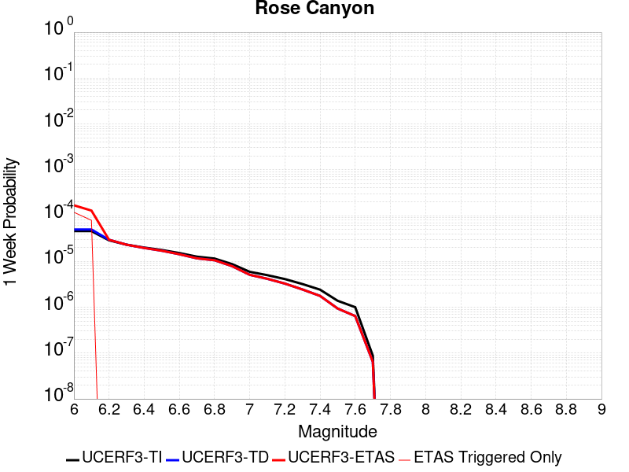 | 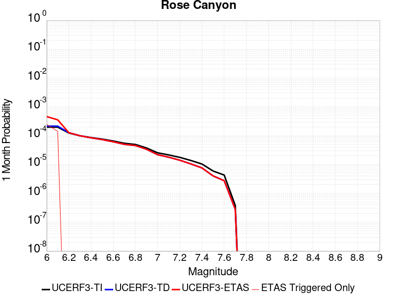 | 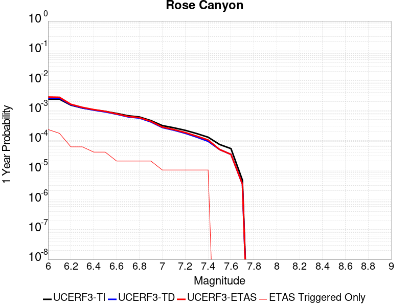 | 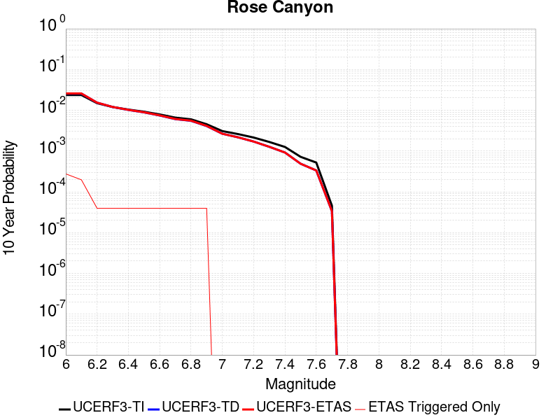 |

| Magnitude | 1 wk TI Prob | 1 wk TD Prob | 1 wk ETAS Prob | 1 wk ETAS/TD Gain | 1 wk ETAS Triggered Only | 1 mo TI Prob | 1 mo TD Prob | 1 mo ETAS Prob | 1 mo ETAS/TD Gain | 1 mo ETAS Triggered Only | 1 yr TI Prob | 1 yr TD Prob | 1 yr ETAS Prob | 1 yr ETAS/TD Gain | 1 yr ETAS Triggered Only | 10 yr TI Prob | 10 yr TD Prob | 10 yr ETAS Prob | 10 yr ETAS/TD Gain | 10 yr ETAS Triggered Only |
|-----|-----|-----|-----|-----|-----|-----|-----|-----|-----|-----|-----|-----|-----|-----|-----|-----|-----|-----|-----|-----|
| 6.0 | 4.5923203E-5 | 4.9714225E-5 | 1.6806087E-4 | 3.380539 | 1.1835253E-4 | 1.9679888E-4 | 2.1304491E-4 | 4.102571E-4 | 1.9256836 | 1.9725422E-4 | 0.0023933933 | 0.0025909345 | 0.0028663748 | 1.1063093 | 2.7615592E-4 | 0.023677798 | 0.02563999 | 0.025909066 | 1.0104944 | 2.7615592E-4 |
| 6.1 | 4.5923203E-5 | 4.9714225E-5 | 1.28612E-4 | 2.587026 | 7.8901685E-5 | 1.9679888E-4 | 2.1304491E-4 | 3.3137223E-4 | 1.5554101 | 1.1835253E-4 | 0.0023933933 | 0.0025909345 | 0.0027876776 | 1.0759352 | 1.9725422E-4 | 0.023677798 | 0.02563999 | 0.025832187 | 1.007496 | 1.9725422E-4 |
| 6.2 | 2.8844734E-5 | 2.9668723E-5 | 2.9668723E-5 | 1.0 | 0.0 | 1.2361443E-4 | 1.2714567E-4 | 1.2714567E-4 | 1.0 | 0.0 | 0.0015039665 | 0.0015468939 | 0.0015862837 | 1.0254638 | 3.9450842E-5 | 0.0149382865 | 0.015374276 | 0.01541312 | 1.0025265 | 3.9450842E-5 |
| 6.3 | 2.3171577E-5 | 2.3161238E-5 | 2.3161238E-5 | 1.0 | 0.0 | 9.9302975E-5 | 9.9258745E-5 | 9.9258745E-5 | 1.0 | 0.0 | 0.0012083431 | 0.0012078186 | 0.0012472218 | 1.0326234 | 3.9450842E-5 | 0.012017938 | 0.012022437 | 0.012061413 | 1.003242 | 3.9450842E-5 |
| 6.4 | 2.0066604E-5 | 1.9667024E-5 | 1.9667024E-5 | 1.0 | 0.0 | 8.599689E-5 | 8.4284584E-5 | 8.4284584E-5 | 1.0 | 0.0 | 0.0010465092 | 0.0010256917 | 0.001065102 | 1.0384232 | 3.9450842E-5 | 0.010415946 | 0.010217559 | 0.010256606 | 1.0038216 | 3.9450842E-5 |
| 6.5 | 1.776989E-5 | 1.7113807E-5 | 1.7113807E-5 | 1.0 | 0.0 | 7.615444E-5 | 7.334287E-5 | 7.334287E-5 | 1.0 | 0.0 | 9.267859E-4 | 8.925905E-4 | 9.3200617E-4 | 1.0441587 | 3.9450842E-5 | 0.009229303 | 0.008896211 | 0.008935311 | 1.0043951 | 3.9450842E-5 |
| 6.6 | 1.5227364E-5 | 1.433926E-5 | 1.433926E-5 | 1.0 | 0.0 | 6.52585E-5 | 6.1452556E-5 | 6.1452556E-5 | 1.0 | 0.0 | 7.942326E-4 | 7.479332E-4 | 7.8735454E-4 | 1.0527071 | 3.9450842E-5 | 0.007914 | 0.007458359 | 0.007497516 | 1.00525 | 3.9450842E-5 |
| 6.7 | 1.2703898E-5 | 1.1673274E-5 | 1.1673274E-5 | 1.0 | 0.0 | 5.4444143E-5 | 5.0027378E-5 | 5.0027378E-5 | 1.0 | 0.0 | 6.626558E-4 | 6.089174E-4 | 6.4834417E-4 | 1.064749 | 3.9450842E-5 | 0.006606833 | 0.0060750856 | 0.006114297 | 1.0064545 | 3.9450842E-5 |
| 6.8 | 1.1554917E-5 | 1.0609337E-5 | 1.0609337E-5 | 1.0 | 0.0 | 4.9520135E-5 | 4.546782E-5 | 4.546782E-5 | 1.0 | 0.0 | 6.0274085E-4 | 5.5343413E-4 | 5.928631E-4 | 1.0712442 | 3.9450842E-5 | 0.0060110865 | 0.0055225673 | 0.0055618 | 1.0071042 | 3.9450842E-5 |
| 6.9 | 8.732078E-6 | 7.881357E-6 | 7.881357E-6 | 1.0 | 0.0 | 3.7422655E-5 | 3.3776825E-5 | 3.3776825E-5 | 1.0 | 0.0 | 4.5552556E-4 | 4.111582E-4 | 4.505928E-4 | 1.095911 | 3.9450842E-5 | 0.0045459294 | 0.0041048084 | 0.004144097 | 1.0095714 | 3.9450842E-5 |
| 7.0 | 5.9337494E-6 | 5.1074853E-6 | 5.1074853E-6 | 1.0 | 0.0 | 2.5430107E-5 | 2.188904E-5 | 2.188904E-5 | 1.0 | 0.0 | 3.0956755E-4 | 2.664666E-4 | 2.664666E-4 | 1.0 | 0.0 | 0.0030913667 | 0.0026614866 | 0.0026614866 | 1.0 | 0.0 |
| 7.1 | 5.013409E-6 | 4.1773833E-6 | 4.1773833E-6 | 1.0 | 0.0 | 2.1485863E-5 | 1.7902948E-5 | 1.7902948E-5 | 1.0 | 0.0 | 2.6155898E-4 | 2.179467E-4 | 2.179467E-4 | 1.0 | 0.0 | 0.0026125133 | 0.0021773411 | 0.0021773411 | 1.0 | 0.0 |
| 7.2 | 4.120763E-6 | 3.2821383E-6 | 3.2821383E-6 | 1.0 | 0.0 | 1.7660293E-5 | 1.4066231E-5 | 1.4066231E-5 | 1.0 | 0.0 | 2.1499286E-4 | 1.7124301E-4 | 1.7124301E-4 | 1.0 | 0.0 | 0.0021478499 | 0.00171112 | 0.00171112 | 1.0 | 0.0 |
| 7.3 | 3.2081239E-6 | 2.4405372E-6 | 2.4405372E-6 | 1.0 | 0.0 | 1.374903E-5 | 1.0459404E-5 | 1.0459404E-5 | 1.0 | 0.0 | 1.6738157E-4 | 1.2733586E-4 | 1.2733586E-4 | 1.0 | 0.0 | 0.0016725556 | 0.001272636 | 0.001272636 | 1.0 | 0.0 |
| 7.4 | 2.4194755E-6 | 1.7680634E-6 | 1.7680634E-6 | 1.0 | 0.0 | 1.0369139E-5 | 7.577393E-6 | 7.577393E-6 | 1.0 | 0.0 | 1.2623696E-4 | 9.2250906E-5 | 9.2250906E-5 | 1.0 | 0.0 | 0.0012616527 | 9.2213147E-4 | 9.2213147E-4 | 1.0 | 0.0 |
| 7.5 | 1.3842889E-6 | 9.3786275E-7 | 9.3786275E-7 | 1.0 | 0.0 | 5.9326535E-6 | 4.019406E-6 | 4.019406E-6 | 1.0 | 0.0 | 7.222766E-5 | 4.8935202E-5 | 4.8935202E-5 | 1.0 | 0.0 | 7.220419E-4 | 4.892478E-4 | 4.892478E-4 | 1.0 | 0.0 |
| 7.6 | 1.0021575E-6 | 6.411463E-7 | 6.411463E-7 | 1.0 | 0.0 | 4.2949537E-6 | 2.7477672E-6 | 2.7477672E-6 | 1.0 | 0.0 | 5.2289808E-5 | 3.3453573E-5 | 3.3453573E-5 | 1.0 | 0.0 | 5.2277505E-4 | 3.344875E-4 | 3.344875E-4 | 1.0 | 0.0 |
| 7.7 | 8.7620116E-8 | 6.4492404E-8 | 6.4492404E-8 | 1.0 | 0.0 | 3.7551473E-7 | 2.76396E-7 | 2.76396E-7 | 1.0 | 0.0 | 4.5718825E-6 | 3.3651165E-6 | 3.3651165E-6 | 1.0 | 0.0 | 4.5717883E-5 | 3.3650686E-5 | 3.3650686E-5 | 1.0 | 0.0 |

## Whittier alt 1
*[(top)](#table-of-contents)*

| 1 Week | 1 Month | 1 Year | 10 Year |
|-----|-----|-----|-----|
| 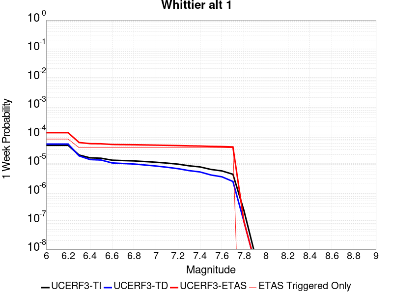 | 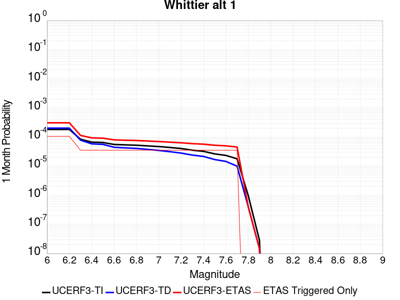 | 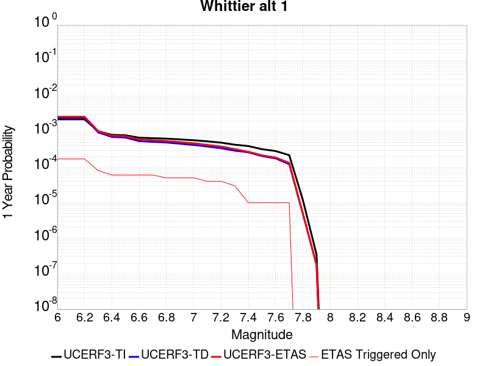 |  |

| Magnitude | 1 wk TI Prob | 1 wk TD Prob | 1 wk ETAS Prob | 1 wk ETAS/TD Gain | 1 wk ETAS Triggered Only | 1 mo TI Prob | 1 mo TD Prob | 1 mo ETAS Prob | 1 mo ETAS/TD Gain | 1 mo ETAS Triggered Only | 1 yr TI Prob | 1 yr TD Prob | 1 yr ETAS Prob | 1 yr ETAS/TD Gain | 1 yr ETAS Triggered Only | 10 yr TI Prob | 10 yr TD Prob | 10 yr ETAS Prob | 10 yr ETAS/TD Gain | 10 yr ETAS Triggered Only |
|-----|-----|-----|-----|-----|-----|-----|-----|-----|-----|-----|-----|-----|-----|-----|-----|-----|-----|-----|-----|-----|
| 6.0 | 4.2554693E-5 | 4.725218E-5 | 8.670116E-5 | 1.8348606 | 3.9450842E-5 | 1.8236451E-4 | 2.0249544E-4 | 2.8138116E-4 | 1.3895679 | 7.8901685E-5 | 0.002218027 | 0.0024629154 | 0.00262033 | 1.063914 | 1.5780337E-4 | 0.02196019 | 0.024390234 | 0.024659654 | 1.0110463 | 2.7615592E-4 |
| 6.1 | 4.2554693E-5 | 4.725218E-5 | 8.670116E-5 | 1.8348606 | 3.9450842E-5 | 1.8236451E-4 | 2.0249544E-4 | 2.8138116E-4 | 1.3895679 | 7.8901685E-5 | 0.002218027 | 0.0024629154 | 0.00262033 | 1.063914 | 1.5780337E-4 | 0.02196019 | 0.024390234 | 0.024659654 | 1.0110463 | 2.7615592E-4 |
| 6.2 | 4.2554693E-5 | 4.725218E-5 | 8.670116E-5 | 1.8348606 | 3.9450842E-5 | 1.8236451E-4 | 2.0249544E-4 | 2.8138116E-4 | 1.3895679 | 7.8901685E-5 | 0.002218027 | 0.0024629154 | 0.00262033 | 1.063914 | 1.5780337E-4 | 0.02196019 | 0.024390234 | 0.024659654 | 1.0110463 | 2.7615592E-4 |
| 6.3 | 1.9617712E-5 | 1.8268593E-5 | 1.8268593E-5 | 1.0 | 0.0 | 8.40732E-5 | 7.829172E-5 | 7.829172E-5 | 1.0 | 0.0 | 0.0010231105 | 9.52804E-4 | 9.52804E-4 | 1.0 | 0.0 | 0.01018413 | 0.009490474 | 0.009490474 | 1.0 | 0.0 |
| 6.4 | 1.5611336E-5 | 1.3604271E-5 | 1.3604271E-5 | 1.0 | 0.0 | 6.690401E-5 | 5.8302747E-5 | 5.8302747E-5 | 1.0 | 0.0 | 8.142519E-4 | 7.0961076E-4 | 7.0961076E-4 | 1.0 | 0.0 | 0.008112748 | 0.0070754145 | 0.0070754145 | 1.0 | 0.0 |
| 6.5 | 1.5150166E-5 | 1.3100925E-5 | 1.3100925E-5 | 1.0 | 0.0 | 6.492767E-5 | 5.6145647E-5 | 5.6145647E-5 | 1.0 | 0.0 | 7.9020765E-4 | 6.8336475E-4 | 6.8336475E-4 | 1.0 | 0.0 | 0.007874036 | 0.0068145846 | 0.0068145846 | 1.0 | 0.0 |
| 6.6 | 1.295588E-5 | 1.0380725E-5 | 1.0380725E-5 | 1.0 | 0.0 | 5.552402E-5 | 4.4488075E-5 | 4.4488075E-5 | 1.0 | 0.0 | 6.7579525E-4 | 5.4150965E-4 | 5.4150965E-4 | 1.0 | 0.0 | 0.006737438 | 0.0054033357 | 0.0054033357 | 1.0 | 0.0 |
| 6.7 | 1.2542085E-5 | 9.899369E-6 | 9.899369E-6 | 1.0 | 0.0 | 5.3750682E-5 | 4.242519E-5 | 4.242519E-5 | 1.0 | 0.0 | 6.542181E-4 | 5.164061E-4 | 5.164061E-4 | 1.0 | 0.0 | 0.006522954 | 0.0051534795 | 0.0051534795 | 1.0 | 0.0 |
| 6.8 | 1.2195878E-5 | 9.495415E-6 | 9.495415E-6 | 1.0 | 0.0 | 5.2267E-5 | 4.069401E-5 | 4.069401E-5 | 1.0 | 0.0 | 6.36165E-4 | 4.9533875E-4 | 4.9533875E-4 | 1.0 | 0.0 | 0.0063434686 | 0.004943688 | 0.004943688 | 1.0 | 0.0 |
| 6.9 | 1.1580298E-5 | 8.772933E-6 | 8.772933E-6 | 1.0 | 0.0 | 4.9628903E-5 | 3.7597754E-5 | 3.7597754E-5 | 1.0 | 0.0 | 6.040644E-4 | 4.5765814E-4 | 4.5765814E-4 | 1.0 | 0.0 | 0.00602425 | 0.0045684157 | 0.0045684157 | 1.0 | 0.0 |
| 7.0 | 1.0964795E-5 | 8.083994E-6 | 8.083994E-6 | 1.0 | 0.0 | 4.6991136E-5 | 3.4645236E-5 | 3.4645236E-5 | 1.0 | 0.0 | 5.7196687E-4 | 4.2172565E-4 | 4.2172565E-4 | 1.0 | 0.0 | 0.0057049696 | 0.004210462 | 0.004210462 | 1.0 | 0.0 |
| 7.1 | 1.0230601E-5 | 7.3266697E-6 | 7.3266697E-6 | 1.0 | 0.0 | 4.3844695E-5 | 3.1399642E-5 | 3.1399642E-5 | 1.0 | 0.0 | 5.336784E-4 | 3.8222488E-4 | 3.8222488E-4 | 1.0 | 0.0 | 0.005323986 | 0.0038168381 | 0.0038168381 | 1.0 | 0.0 |
| 7.2 | 9.40865E-6 | 6.543289E-6 | 6.543289E-6 | 1.0 | 0.0 | 4.032216E-5 | 2.8042374E-5 | 2.8042374E-5 | 1.0 | 0.0 | 4.908117E-4 | 3.4136363E-4 | 3.4136363E-4 | 1.0 | 0.0 | 0.0048972913 | 0.003409485 | 0.003409485 | 1.0 | 0.0 |
| 7.3 | 8.237384E-6 | 5.5977525E-6 | 5.5977525E-6 | 1.0 | 0.0 | 3.5302593E-5 | 2.3990153E-5 | 2.3990153E-5 | 1.0 | 0.0 | 4.2972428E-4 | 2.92042E-4 | 2.92042E-4 | 1.0 | 0.0 | 0.0042889426 | 0.002916903 | 0.002916903 | 1.0 | 0.0 |
| 7.4 | 7.5316966E-6 | 5.027819E-6 | 5.027819E-6 | 1.0 | 0.0 | 3.2278298E-5 | 2.1547625E-5 | 2.1547625E-5 | 1.0 | 0.0 | 3.9291743E-4 | 2.6231175E-4 | 2.6231175E-4 | 1.0 | 0.0 | 0.0039222343 | 0.0026201333 | 0.0026201333 | 1.0 | 0.0 |
| 7.5 | 6.149649E-6 | 3.933841E-6 | 3.933841E-6 | 1.0 | 0.0 | 2.6355372E-5 | 1.6859214E-5 | 1.6859214E-5 | 1.0 | 0.0 | 3.208294E-4 | 2.052425E-4 | 2.052425E-4 | 1.0 | 0.0 | 0.003203666 | 0.0020506186 | 0.0020506186 | 1.0 | 0.0 |
| 7.6 | 5.457711E-6 | 3.3953788E-6 | 3.3953788E-6 | 1.0 | 0.0 | 2.338998E-5 | 1.4551547E-5 | 1.4551547E-5 | 1.0 | 0.0 | 2.8473578E-4 | 1.771515E-4 | 1.771515E-4 | 1.0 | 0.0 | 0.0028437122 | 0.0017701836 | 0.0017701836 | 1.0 | 0.0 |
| 7.7 | 4.1676276E-6 | 2.3331952E-6 | 2.3331952E-6 | 1.0 | 0.0 | 1.7861139E-5 | 9.999374E-6 | 9.999374E-6 | 1.0 | 0.0 | 2.1743766E-4 | 1.2173632E-4 | 1.2173632E-4 | 1.0 | 0.0 | 0.0021722503 | 0.0012167693 | 0.0012167693 | 1.0 | 0.0 |
| 7.8 | 2.2692414E-7 | 9.3854695E-8 | 9.3854695E-8 | 1.0 | 0.0 | 9.725317E-7 | 4.0223435E-7 | 4.0223435E-7 | 1.0 | 0.0 | 1.1840509E-5 | 4.8971956E-6 | 4.8971956E-6 | 1.0 | 0.0 | 1.1839878E-4 | 4.8971204E-5 | 4.8971204E-5 | 1.0 | 0.0 |
| 7.9 | 6.676829E-9 | 3.439853E-9 | 3.439853E-9 | 1.0 | 0.0 | 2.861498E-8 | 1.4742227E-8 | 1.4742227E-8 | 1.0 | 0.0 | 3.4838732E-7 | 1.7948659E-7 | 1.7948659E-7 | 1.0 | 0.0 | 3.4838679E-6 | 1.7948646E-6 | 1.7948646E-6 | 1.0 | 0.0 |

## Santa Rosa Island
*[(top)](#table-of-contents)*

| 1 Week | 1 Month | 1 Year | 10 Year |
|-----|-----|-----|-----|
|  | 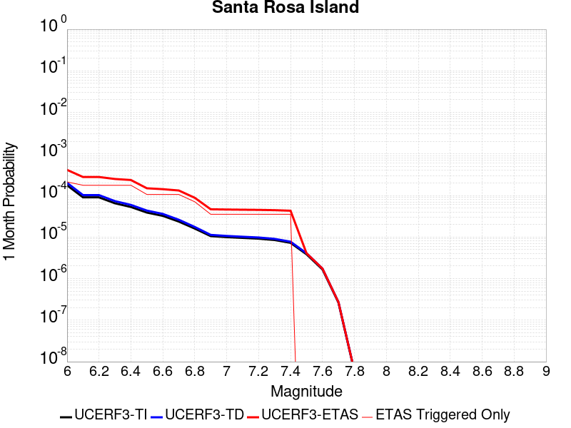 | 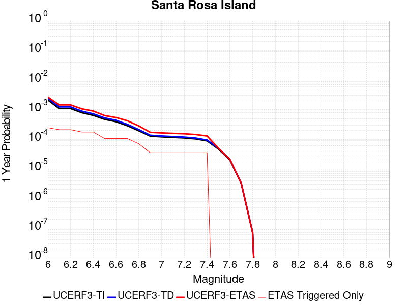 | 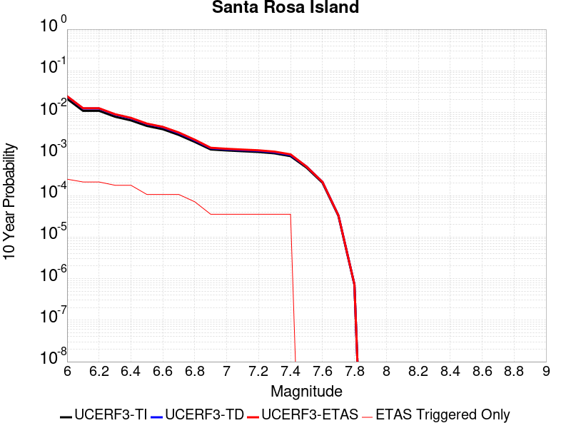 |

| Magnitude | 1 wk TI Prob | 1 wk TD Prob | 1 wk ETAS Prob | 1 wk ETAS/TD Gain | 1 wk ETAS Triggered Only | 1 mo TI Prob | 1 mo TD Prob | 1 mo ETAS Prob | 1 mo ETAS/TD Gain | 1 mo ETAS Triggered Only | 1 yr TI Prob | 1 yr TD Prob | 1 yr ETAS Prob | 1 yr ETAS/TD Gain | 1 yr ETAS Triggered Only | 10 yr TI Prob | 10 yr TD Prob | 10 yr ETAS Prob | 10 yr ETAS/TD Gain | 10 yr ETAS Triggered Only |
|-----|-----|-----|-----|-----|-----|-----|-----|-----|-----|-----|-----|-----|-----|-----|-----|-----|-----|-----|-----|-----|
| 6.0 | 4.1143165E-5 | 4.7091133E-5 | 2.4433606E-4 | 5.188579 | 1.9725422E-4 | 1.7631594E-4 | 2.0180465E-4 | 4.3846195E-4 | 2.172705 | 2.3670506E-4 | 0.002144533 | 0.0024544 | 0.002729878 | 1.1122385 | 2.7615592E-4 | 0.021239553 | 0.024293551 | 0.024562998 | 1.0110914 | 2.7615592E-4 |
| 6.1 | 2.1061249E-5 | 2.3864959E-5 | 2.2111447E-4 | 9.265236 | 1.9725422E-4 | 9.0259375E-5 | 1.0227455E-4 | 2.995086E-4 | 2.9284763 | 1.9725422E-4 | 0.0010983539 | 0.0012445104 | 0.0014809208 | 1.1899626 | 2.3670506E-4 | 0.01092941 | 0.012378449 | 0.012612224 | 1.0188856 | 2.3670506E-4 |
| 6.2 | 2.1061249E-5 | 2.3864959E-5 | 2.2111447E-4 | 9.265236 | 1.9725422E-4 | 9.0259375E-5 | 1.0227455E-4 | 2.995086E-4 | 2.9284763 | 1.9725422E-4 | 0.0010983539 | 0.0012445104 | 0.0014809208 | 1.1899626 | 2.3670506E-4 | 0.01092941 | 0.012378449 | 0.012612224 | 1.0188856 | 2.3670506E-4 |
| 6.3 | 1.5158236E-5 | 1.7074419E-5 | 2.1432528E-4 | 12.55242 | 1.9725422E-4 | 6.496225E-5 | 7.3174095E-5 | 2.7041388E-4 | 3.6954865 | 1.9725422E-4 | 7.906284E-4 | 8.905424E-4 | 0.001087621 | 1.2213017 | 1.9725422E-4 | 0.007878214 | 0.008870989 | 0.009066494 | 1.0220386 | 1.9725422E-4 |
| 6.4 | 1.2341918E-5 | 1.3852917E-5 | 2.111044E-4 | 15.238986 | 1.9725422E-4 | 5.2892858E-5 | 5.9368336E-5 | 2.5661086E-4 | 4.322352 | 1.9725422E-4 | 6.437803E-4 | 7.225779E-4 | 9.196896E-4 | 1.2727895 | 1.9725422E-4 | 0.006419184 | 0.007203121 | 0.0073989546 | 1.0271873 | 1.9725422E-4 |
| 6.5 | 9.061158E-6 | 1.0117031E-5 | 1.2846837E-4 | 12.698228 | 1.1835253E-4 | 3.883296E-5 | 4.3358013E-5 | 1.6170541E-4 | 3.7295394 | 1.1835253E-4 | 4.726887E-4 | 5.277613E-4 | 6.4605137E-4 | 1.2241355 | 1.1835253E-4 | 0.004716845 | 0.0052656173 | 0.0053833467 | 1.0223582 | 1.1835253E-4 |
| 6.6 | 7.5461685E-6 | 8.400733E-6 | 1.2675227E-4 | 15.088239 | 1.1835253E-4 | 3.2340322E-5 | 3.600267E-5 | 1.5435094E-4 | 4.287208 | 1.1835253E-4 | 3.936723E-4 | 4.3824865E-4 | 5.5654935E-4 | 1.2699395 | 1.1835253E-4 | 0.003929756 | 0.0043742736 | 0.0044921087 | 1.0269382 | 1.1835253E-4 |
| 6.7 | 5.5023775E-6 | 6.087381E-6 | 1.2443919E-4 | 20.442158 | 1.1835253E-4 | 2.3581404E-5 | 2.6088532E-5 | 1.4443797E-4 | 5.5364547 | 1.1835253E-4 | 2.8706578E-4 | 3.1758484E-4 | 4.3589977E-4 | 1.372546 | 1.1835253E-4 | 0.0028669522 | 0.0031716314 | 0.0032896085 | 1.0371976 | 1.1835253E-4 |
| 6.8 | 3.7351679E-6 | 4.0831405E-6 | 8.298451E-5 | 20.323696 | 7.8901685E-5 | 1.6007763E-5 | 1.749907E-5 | 9.639938E-5 | 5.5088286 | 7.8901685E-5 | 1.948771E-4 | 2.1303284E-4 | 2.919177E-4 | 1.3702945 | 7.8901685E-5 | 0.0019470629 | 0.0021285315 | 0.0022072652 | 1.0369897 | 7.8901685E-5 |
| 6.9 | 2.456366E-6 | 2.6292705E-6 | 4.208001E-5 | 16.004444 | 3.9450842E-5 | 1.0527241E-5 | 1.1268254E-5 | 5.0718652E-5 | 4.5010214 | 3.9450842E-5 | 1.2816161E-4 | 1.3718237E-4 | 1.7662781E-4 | 1.2875401 | 3.9450842E-5 | 0.0012808773 | 0.0013709799 | 0.0014103766 | 1.0287362 | 3.9450842E-5 |
| 7.0 | 2.3245157E-6 | 2.4827782E-6 | 4.1933523E-5 | 16.889757 | 3.9450842E-5 | 9.962172E-6 | 1.0640435E-5 | 5.009086E-5 | 4.707595 | 3.9450842E-5 | 1.2128269E-4 | 1.2953962E-4 | 1.6898535E-4 | 1.3045071 | 3.9450842E-5 | 0.0012121652 | 0.0012946434 | 0.0013340431 | 1.0304329 | 3.9450842E-5 |
| 7.1 | 2.2248344E-6 | 2.37325E-6 | 4.1824E-5 | 17.62309 | 3.9450842E-5 | 9.53497E-6 | 1.0171032E-5 | 4.9621474E-5 | 4.878706 | 3.9450842E-5 | 1.1608207E-4 | 1.2382529E-4 | 1.6327125E-4 | 1.3185614 | 3.9450842E-5 | 0.0011602144 | 0.001237565 | 0.001276967 | 1.0318383 | 3.9450842E-5 |
| 7.2 | 2.1350402E-6 | 2.276154E-6 | 4.1726908E-5 | 18.3322 | 3.9450842E-5 | 9.150141E-6 | 9.754909E-6 | 4.920537E-5 | 5.0441647 | 3.9450842E-5 | 1.1139726E-4 | 1.1875956E-4 | 1.5820572E-4 | 1.3321514 | 3.9450842E-5 | 0.0011134144 | 0.0011869629 | 0.0012263668 | 1.0331974 | 3.9450842E-5 |
| 7.3 | 1.9793572E-6 | 2.108719E-6 | 4.155948E-5 | 19.7084 | 3.9450842E-5 | 8.482932E-6 | 9.037336E-6 | 4.8487826E-5 | 5.3652782 | 3.9450842E-5 | 1.032748E-4 | 1.10024026E-4 | 1.4947054E-4 | 1.3585262 | 3.9450842E-5 | 0.0010322682 | 0.0010996973 | 0.0011391048 | 1.0358348 | 3.9450842E-5 |
| 7.4 | 1.6951194E-6 | 1.8045733E-6 | 4.1255345E-5 | 22.861551 | 3.9450842E-5 | 7.264777E-6 | 7.733863E-6 | 4.7184403E-5 | 6.1010137 | 3.9450842E-5 | 8.844508E-5 | 9.415573E-5 | 1.3360287E-4 | 1.4189563 | 3.9450842E-5 | 8.840988E-4 | 9.4116E-4 | 9.805737E-4 | 1.0418777 | 3.9450842E-5 |
| 7.5 | 8.987207E-7 | 9.5122147E-7 | 9.5122147E-7 | 1.0 | 0.0 | 3.8516546E-6 | 4.076657E-6 | 4.076657E-6 | 1.0 | 0.0 | 4.6892885E-5 | 4.963218E-5 | 4.963218E-5 | 1.0 | 0.0 | 4.688299E-4 | 4.9621216E-4 | 4.9621216E-4 | 1.0 | 0.0 |
| 7.6 | 3.8783037E-7 | 4.052932E-7 | 4.052932E-7 | 1.0 | 0.0 | 1.6621291E-6 | 1.7369698E-6 | 1.7369698E-6 | 1.0 | 0.0 | 2.0236233E-5 | 2.1147409E-5 | 2.1147409E-5 | 1.0 | 0.0 | 2.023439E-4 | 2.1145462E-4 | 2.1145462E-4 | 1.0 | 0.0 |
| 7.7 | 6.181804E-8 | 6.339035E-8 | 6.339035E-8 | 1.0 | 0.0 | 2.6493444E-7 | 2.7167292E-7 | 2.7167292E-7 | 1.0 | 0.0 | 3.225572E-6 | 3.3076128E-6 | 3.3076128E-6 | 1.0 | 0.0 | 3.225525E-5 | 3.307564E-5 | 3.307564E-5 | 1.0 | 0.0 |
| 7.8 | 1.3704449E-9 | 1.3964153E-9 | 1.3964153E-9 | 1.0 | 0.0 | 5.873335E-9 | 5.984637E-9 | 5.984637E-9 | 1.0 | 0.0 | 7.1507856E-8 | 7.286295E-8 | 7.286295E-8 | 1.0 | 0.0 | 7.1507833E-7 | 7.286294E-7 | 7.286294E-7 | 1.0 | 0.0 |

## San Jacinto (San Jacinto Valley) rev
*[(top)](#table-of-contents)*

| 1 Week | 1 Month | 1 Year | 10 Year |
|-----|-----|-----|-----|
| 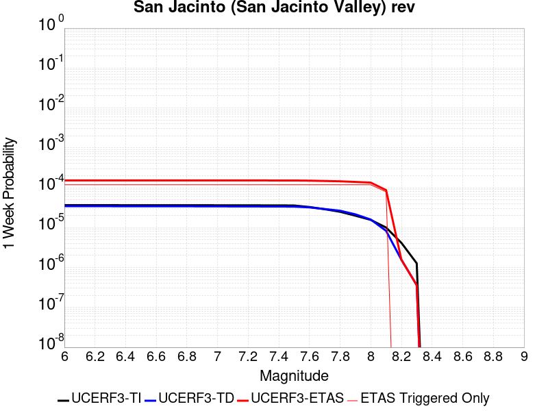 | 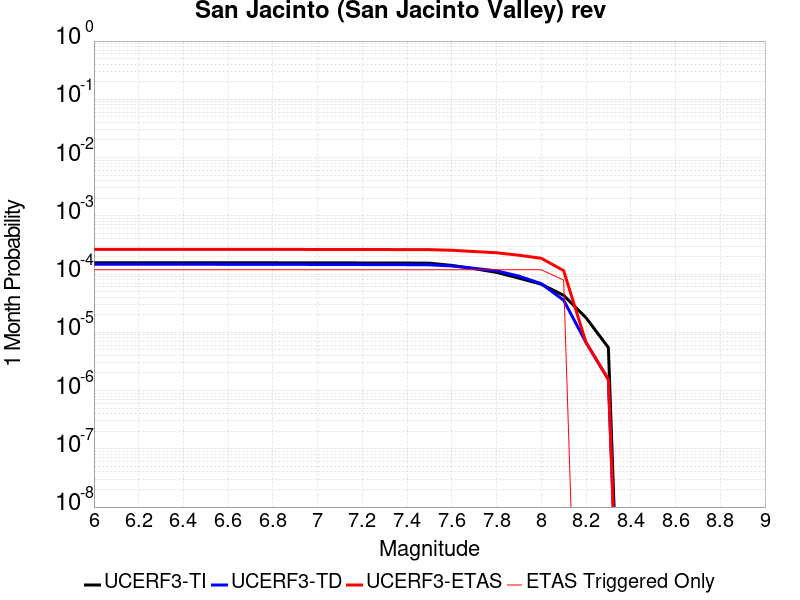 | 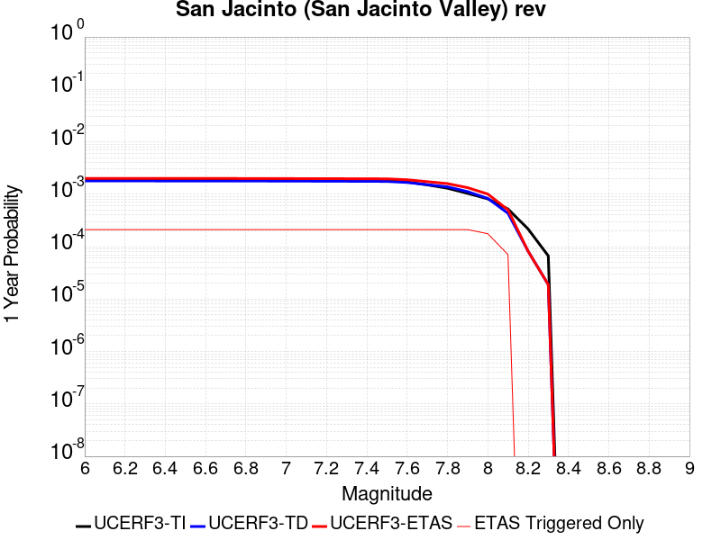 | 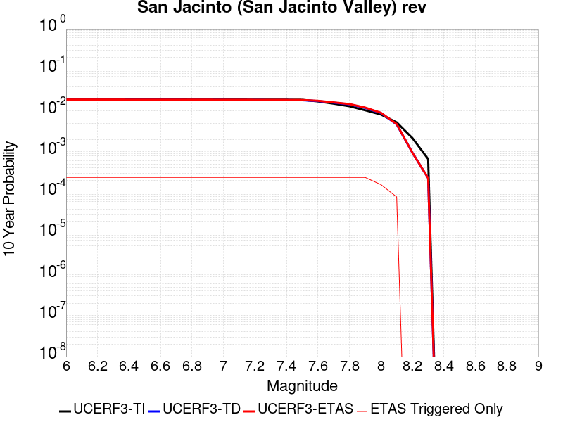 |

| Magnitude | 1 wk TI Prob | 1 wk TD Prob | 1 wk ETAS Prob | 1 wk ETAS/TD Gain | 1 wk ETAS Triggered Only | 1 mo TI Prob | 1 mo TD Prob | 1 mo ETAS Prob | 1 mo ETAS/TD Gain | 1 mo ETAS Triggered Only | 1 yr TI Prob | 1 yr TD Prob | 1 yr ETAS Prob | 1 yr ETAS/TD Gain | 1 yr ETAS Triggered Only | 10 yr TI Prob | 10 yr TD Prob | 10 yr ETAS Prob | 10 yr ETAS/TD Gain | 10 yr ETAS Triggered Only |
|-----|-----|-----|-----|-----|-----|-----|-----|-----|-----|-----|-----|-----|-----|-----|-----|-----|-----|-----|-----|-----|
| 6.0 | 3.652694E-5 | 3.4402394E-5 | 1.5275086E-4 | 4.440123 | 1.1835253E-4 | 1.5653463E-4 | 1.474305E-4 | 2.657656E-4 | 1.80265 | 1.1835253E-4 | 0.0019041431 | 0.00179349 | 0.0019903905 | 1.1097862 | 1.9725422E-4 | 0.018879099 | 0.018526595 | 0.018758915 | 1.0125397 | 2.3670506E-4 |
| 6.1 | 3.652694E-5 | 3.4402394E-5 | 1.5275086E-4 | 4.440123 | 1.1835253E-4 | 1.5653463E-4 | 1.474305E-4 | 2.657656E-4 | 1.80265 | 1.1835253E-4 | 0.0019041431 | 0.00179349 | 0.0019903905 | 1.1097862 | 1.9725422E-4 | 0.018879099 | 0.018526595 | 0.018758915 | 1.0125397 | 2.3670506E-4 |
| 6.2 | 3.652694E-5 | 3.4402394E-5 | 1.5275086E-4 | 4.440123 | 1.1835253E-4 | 1.5653463E-4 | 1.474305E-4 | 2.657656E-4 | 1.80265 | 1.1835253E-4 | 0.0019041431 | 0.00179349 | 0.0019903905 | 1.1097862 | 1.9725422E-4 | 0.018879099 | 0.018526595 | 0.018758915 | 1.0125397 | 2.3670506E-4 |
| 6.3 | 3.652694E-5 | 3.4402394E-5 | 1.5275086E-4 | 4.440123 | 1.1835253E-4 | 1.5653463E-4 | 1.474305E-4 | 2.657656E-4 | 1.80265 | 1.1835253E-4 | 0.0019041431 | 0.00179349 | 0.0019903905 | 1.1097862 | 1.9725422E-4 | 0.018879099 | 0.018526595 | 0.018758915 | 1.0125397 | 2.3670506E-4 |
| 6.4 | 3.646941E-5 | 3.432397E-5 | 1.5267244E-4 | 4.4479833 | 1.1835253E-4 | 1.5628811E-4 | 1.4709444E-4 | 2.6542955E-4 | 1.804484 | 1.1835253E-4 | 0.0019011468 | 0.0017894056 | 0.0019863069 | 1.1100372 | 1.9725422E-4 | 0.018849645 | 0.018486476 | 0.018718805 | 1.0125675 | 2.3670506E-4 |
| 6.5 | 3.646941E-5 | 3.432397E-5 | 1.5267244E-4 | 4.4479833 | 1.1835253E-4 | 1.5628811E-4 | 1.4709444E-4 | 2.6542955E-4 | 1.804484 | 1.1835253E-4 | 0.0019011468 | 0.0017894056 | 0.0019863069 | 1.1100372 | 1.9725422E-4 | 0.018849645 | 0.018486476 | 0.018718805 | 1.0125675 | 2.3670506E-4 |
| 6.6 | 3.6442503E-5 | 3.4287354E-5 | 1.5263582E-4 | 4.4516654 | 1.1835253E-4 | 1.561728E-4 | 1.4693754E-4 | 2.6527268E-4 | 1.8053432 | 1.1835253E-4 | 0.0018997455 | 0.0017874985 | 0.0019844002 | 1.1101549 | 1.9725422E-4 | 0.018835869 | 0.018467745 | 0.018700078 | 1.0125805 | 2.3670506E-4 |
| 6.7 | 3.6432113E-5 | 3.4272925E-5 | 1.526214E-4 | 4.4531183 | 1.1835253E-4 | 1.5612828E-4 | 1.4687571E-4 | 2.6521087E-4 | 1.8056822 | 1.1835253E-4 | 0.0018992044 | 0.0017867472 | 0.001983649 | 1.1102012 | 1.9725422E-4 | 0.018830549 | 0.018460369 | 0.018692704 | 1.0125856 | 2.3670506E-4 |
| 6.8 | 3.6409598E-5 | 3.424198E-5 | 1.5259047E-4 | 4.456239 | 1.1835253E-4 | 1.560318E-4 | 1.4674311E-4 | 2.6507827E-4 | 1.8064104 | 1.1835253E-4 | 0.0018980318 | 0.0017851355 | 0.0019820374 | 1.1103009 | 1.9725422E-4 | 0.018819023 | 0.018444523 | 0.018676862 | 1.0125966 | 2.3670506E-4 |
| 6.9 | 3.638078E-5 | 3.4202407E-5 | 1.5255089E-4 | 4.4602385 | 1.1835253E-4 | 1.5590832E-4 | 1.4657351E-4 | 2.649087E-4 | 1.8073436 | 1.1835253E-4 | 0.0018965311 | 0.001783074 | 0.0019799767 | 1.1104287 | 1.9725422E-4 | 0.018804269 | 0.018424258 | 0.0186566 | 1.0126108 | 2.3670506E-4 |
| 7.0 | 3.6294874E-5 | 3.408442E-5 | 1.5243291E-4 | 4.472217 | 1.1835253E-4 | 1.5554018E-4 | 1.4606792E-4 | 2.6440318E-4 | 1.8101385 | 1.1835253E-4 | 0.0018920569 | 0.001776929 | 0.0019738327 | 1.1108112 | 1.9725422E-4 | 0.018760284 | 0.018363839 | 0.018596198 | 1.012653 | 2.3670506E-4 |
| 7.1 | 3.6260717E-5 | 3.4040702E-5 | 1.5238921E-4 | 4.4766765 | 1.1835253E-4 | 1.5539382E-4 | 1.4588058E-4 | 2.6421584E-4 | 1.811179 | 1.1835253E-4 | 0.001890278 | 0.0017746518 | 0.001971556 | 1.1109537 | 1.9725422E-4 | 0.018742796 | 0.018341439 | 0.018573804 | 1.0126687 | 2.3670506E-4 |
| 7.2 | 3.6210204E-5 | 3.397492E-5 | 1.5232344E-4 | 4.483408 | 1.1835253E-4 | 1.5517735E-4 | 1.455987E-4 | 2.63934E-4 | 1.8127497 | 1.1835253E-4 | 0.001887647 | 0.0017712255 | 0.0019681302 | 1.1111687 | 1.9725422E-4 | 0.01871693 | 0.01830772 | 0.01854009 | 1.0126926 | 2.3670506E-4 |
| 7.3 | 3.6119454E-5 | 3.386321E-5 | 1.5221174E-4 | 4.4949 | 1.1835253E-4 | 1.5478847E-4 | 1.4511998E-4 | 2.6345532E-4 | 1.8154312 | 1.1835253E-4 | 0.0018829206 | 0.0017654065 | 0.0019623125 | 1.1115358 | 1.9725422E-4 | 0.018670462 | 0.018250274 | 0.018482657 | 1.0127332 | 2.3670506E-4 |
| 7.4 | 3.607848E-5 | 3.381071E-5 | 1.5215923E-4 | 4.500327 | 1.1835253E-4 | 1.5461289E-4 | 1.44895E-4 | 2.6323038E-4 | 1.8166975 | 1.1835253E-4 | 0.0018807866 | 0.0017626719 | 0.0019595784 | 1.1117091 | 1.9725422E-4 | 0.018649481 | 0.018223269 | 0.01845566 | 1.0127524 | 2.3670506E-4 |
| 7.5 | 3.5856774E-5 | 3.3620483E-5 | 1.5196904E-4 | 4.5201325 | 1.1835253E-4 | 1.5366284E-4 | 1.4407984E-4 | 2.6241533E-4 | 1.8213189 | 1.1835253E-4 | 0.0018692396 | 0.0017527633 | 0.0019496718 | 1.1123418 | 1.9725422E-4 | 0.018535944 | 0.018124366 | 0.018356781 | 1.0128233 | 2.3670506E-4 |
| 7.6 | 3.286655E-5 | 3.2143445E-5 | 1.5049218E-4 | 4.681893 | 1.1835253E-4 | 1.4084904E-4 | 1.3775036E-4 | 2.5608658E-4 | 1.8590629 | 1.1835253E-4 | 0.001713488 | 0.0016758227 | 0.0018727463 | 1.1175086 | 1.9725422E-4 | 0.017003361 | 0.017344031 | 0.017576631 | 1.0134109 | 2.3670506E-4 |
| 7.7 | 2.8882527E-5 | 2.9236293E-5 | 1.4758536E-4 | 5.048019 | 1.1835253E-4 | 1.237764E-4 | 1.2529238E-4 | 2.436301E-4 | 1.9444923 | 1.1835253E-4 | 0.0015059357 | 0.0015243685 | 0.0017213221 | 1.1292033 | 1.9725422E-4 | 0.014957713 | 0.015830461 | 0.016063418 | 1.0147158 | 2.3670506E-4 |
| 7.8 | 2.4950225E-5 | 2.6527203E-5 | 1.448766E-4 | 5.461435 | 1.1835253E-4 | 1.0692515E-4 | 1.1368306E-4 | 2.3202214E-4 | 2.040956 | 1.1835253E-4 | 0.0013010362 | 0.0013832134 | 0.0015801948 | 1.1424085 | 1.9725422E-4 | 0.012934455 | 0.014411755 | 0.014645048 | 1.0161878 | 2.3670506E-4 |
| 7.9 | 1.9881603E-5 | 2.1507445E-5 | 1.3985744E-4 | 6.502745 | 1.1835253E-4 | 8.520408E-5 | 9.217151E-5 | 2.1051314E-4 | 2.2839284 | 1.1835253E-4 | 0.001036866 | 0.0011216112 | 0.0013186443 | 1.1756696 | 1.9725422E-4 | 0.010320415 | 0.011777027 | 0.012010944 | 1.0198622 | 2.3670506E-4 |
| 8.0 | 1.563292E-5 | 1.5937347E-5 | 1.34288E-4 | 8.425995 | 1.1835253E-4 | 6.6996516E-5 | 6.8301124E-5 | 1.8664557E-4 | 2.7326865 | 1.1835253E-4 | 8.153773E-4 | 8.3124964E-4 | 9.889218E-4 | 1.1896809 | 1.5780337E-4 | 0.00812392 | 0.008810506 | 0.008966919 | 1.017753 | 1.5780337E-4 |
| 8.1 | 1.0045313E-5 | 8.301802E-6 | 8.720284E-5 | 10.504085 | 7.8901685E-5 | 4.305063E-5 | 3.5578672E-5 | 1.1447755E-4 | 3.2175894 | 7.8901685E-5 | 5.2401534E-4 | 4.3308473E-4 | 5.1195227E-4 | 1.1821064 | 7.8901685E-5 | 0.0052278144 | 0.0046591135 | 0.0047376477 | 1.016856 | 7.8901685E-5 |
| 8.2 | 4.1554413E-6 | 1.5655598E-6 | 1.5655598E-6 | 1.0 | 0.0 | 1.7808914E-5 | 6.709525E-6 | 6.709525E-6 | 1.0 | 0.0 | 2.1680194E-4 | 8.168544E-5 | 8.168544E-5 | 1.0 | 0.0 | 0.0021659054 | 9.482903E-4 | 9.482903E-4 | 1.0 | 0.0 |
| 8.3 | 1.2758221E-6 | 3.6149942E-7 | 3.6149942E-7 | 1.0 | 0.0 | 5.4677976E-6 | 1.5492824E-6 | 1.5492824E-6 | 1.0 | 0.0 | 6.65684E-5 | 1.8862354E-5 | 1.8862354E-5 | 1.0 | 0.0 | 6.6548464E-4 | 2.2751294E-4 | 2.2751294E-4 | 1.0 | 0.0 |

## San Jacinto (Lytle Creek connector)
*[(top)](#table-of-contents)*

| 1 Week | 1 Month | 1 Year | 10 Year |
|-----|-----|-----|-----|
| 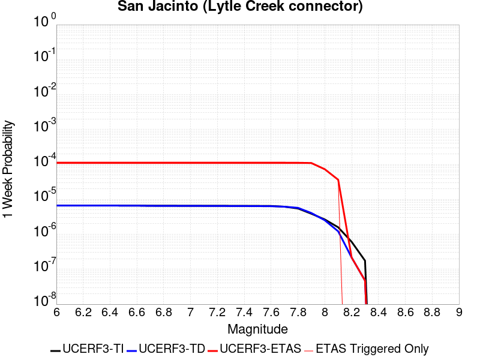 | 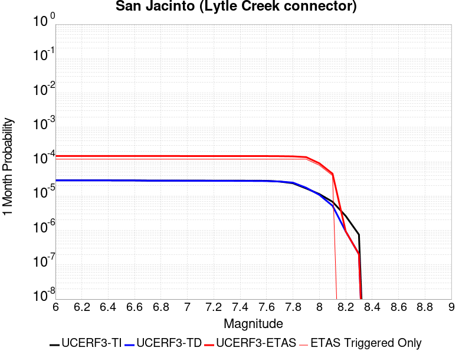 | 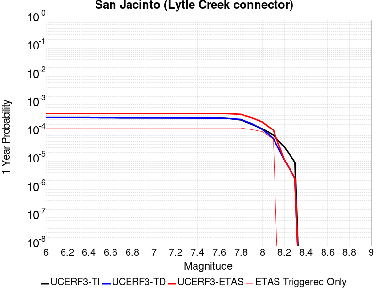 | 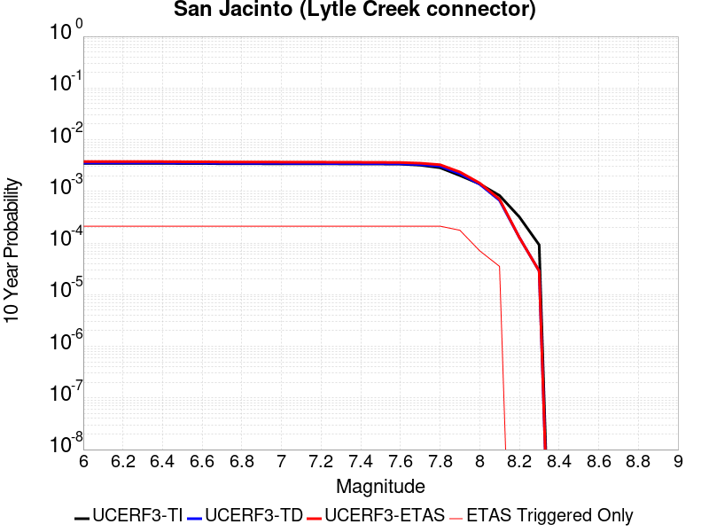 |

| Magnitude | 1 wk TI Prob | 1 wk TD Prob | 1 wk ETAS Prob | 1 wk ETAS/TD Gain | 1 wk ETAS Triggered Only | 1 mo TI Prob | 1 mo TD Prob | 1 mo ETAS Prob | 1 mo ETAS/TD Gain | 1 mo ETAS Triggered Only | 1 yr TI Prob | 1 yr TD Prob | 1 yr ETAS Prob | 1 yr ETAS/TD Gain | 1 yr ETAS Triggered Only | 10 yr TI Prob | 10 yr TD Prob | 10 yr ETAS Prob | 10 yr ETAS/TD Gain | 10 yr ETAS Triggered Only |
|-----|-----|-----|-----|-----|-----|-----|-----|-----|-----|-----|-----|-----|-----|-----|-----|-----|-----|-----|-----|-----|
| 6.0 | 6.693995E-6 | 6.660216E-6 | 1.2501197E-4 | 18.769955 | 1.1835253E-4 | 2.8688235E-5 | 2.854347E-5 | 1.4689262E-4 | 5.1462774 | 1.1835253E-4 | 3.492233E-4 | 3.4746144E-4 | 5.446471E-4 | 1.5675038 | 1.9725422E-4 | 0.00348675 | 0.0035493854 | 0.0037852502 | 1.0664524 | 2.3670506E-4 |
| 6.1 | 6.693995E-6 | 6.660216E-6 | 1.2501197E-4 | 18.769955 | 1.1835253E-4 | 2.8688235E-5 | 2.854347E-5 | 1.4689262E-4 | 5.1462774 | 1.1835253E-4 | 3.492233E-4 | 3.4746144E-4 | 5.446471E-4 | 1.5675038 | 1.9725422E-4 | 0.00348675 | 0.0035493854 | 0.0037852502 | 1.0664524 | 2.3670506E-4 |
| 6.2 | 6.693995E-6 | 6.660216E-6 | 1.2501197E-4 | 18.769955 | 1.1835253E-4 | 2.8688235E-5 | 2.854347E-5 | 1.4689262E-4 | 5.1462774 | 1.1835253E-4 | 3.492233E-4 | 3.4746144E-4 | 5.446471E-4 | 1.5675038 | 1.9725422E-4 | 0.00348675 | 0.0035493854 | 0.0037852502 | 1.0664524 | 2.3670506E-4 |
| 6.3 | 6.693995E-6 | 6.660216E-6 | 1.2501197E-4 | 18.769955 | 1.1835253E-4 | 2.8688235E-5 | 2.854347E-5 | 1.4689262E-4 | 5.1462774 | 1.1835253E-4 | 3.492233E-4 | 3.4746144E-4 | 5.446471E-4 | 1.5675038 | 1.9725422E-4 | 0.00348675 | 0.0035493854 | 0.0037852502 | 1.0664524 | 2.3670506E-4 |
| 6.4 | 6.693995E-6 | 6.660216E-6 | 1.2501197E-4 | 18.769955 | 1.1835253E-4 | 2.8688235E-5 | 2.854347E-5 | 1.4689262E-4 | 5.1462774 | 1.1835253E-4 | 3.492233E-4 | 3.4746144E-4 | 5.446471E-4 | 1.5675038 | 1.9725422E-4 | 0.00348675 | 0.0035493854 | 0.0037852502 | 1.0664524 | 2.3670506E-4 |
| 6.5 | 6.6561875E-6 | 6.6204343E-6 | 1.2497218E-4 | 18.876736 | 1.1835253E-4 | 2.8526205E-5 | 2.837298E-5 | 1.4672216E-4 | 5.1711926 | 1.1835253E-4 | 3.472512E-4 | 3.4538636E-4 | 5.4257247E-4 | 1.5709145 | 1.9725422E-4 | 0.0034670907 | 0.003528701 | 0.0037645707 | 1.0668433 | 2.3670506E-4 |
| 6.6 | 6.6561875E-6 | 6.6204343E-6 | 1.2497218E-4 | 18.876736 | 1.1835253E-4 | 2.8526205E-5 | 2.837298E-5 | 1.4672216E-4 | 5.1711926 | 1.1835253E-4 | 3.472512E-4 | 3.4538636E-4 | 5.4257247E-4 | 1.5709145 | 1.9725422E-4 | 0.0034670907 | 0.003528701 | 0.0037645707 | 1.0668433 | 2.3670506E-4 |
| 6.7 | 6.5802237E-6 | 6.539611E-6 | 1.2489138E-4 | 19.097675 | 1.1835253E-4 | 2.8200653E-5 | 2.8026603E-5 | 1.4637582E-4 | 5.2227454 | 1.1835253E-4 | 3.4328885E-4 | 3.4117055E-4 | 5.383575E-4 | 1.5779717 | 1.9725422E-4 | 0.0034275902 | 0.0034866752 | 0.003722555 | 1.0676517 | 2.3670506E-4 |
| 6.8 | 6.575632E-6 | 6.5341005E-6 | 1.2488586E-4 | 19.112938 | 1.1835253E-4 | 2.8180975E-5 | 2.8002989E-5 | 1.463522E-4 | 5.226307 | 1.1835253E-4 | 3.4304935E-4 | 3.4088313E-4 | 5.380701E-4 | 1.5784593 | 1.9725422E-4 | 0.0034252026 | 0.00348381 | 0.0037196905 | 1.0677077 | 2.3670506E-4 |
| 6.9 | 6.570433E-6 | 6.525495E-6 | 1.2487726E-4 | 19.136826 | 1.1835253E-4 | 2.8158694E-5 | 2.7966107E-5 | 1.4631533E-4 | 5.2318807 | 1.1835253E-4 | 3.4277816E-4 | 3.4043423E-4 | 5.376213E-4 | 1.5792222 | 1.9725422E-4 | 0.0034224992 | 0.0034793352 | 0.0037152166 | 1.067795 | 2.3670506E-4 |
| 7.0 | 6.5643826E-6 | 6.515616E-6 | 1.2486738E-4 | 19.164324 | 1.1835253E-4 | 2.8132765E-5 | 2.792377E-5 | 1.46273E-4 | 5.238297 | 1.1835253E-4 | 3.424626E-4 | 3.3991894E-4 | 5.371061E-4 | 1.5801005 | 1.9725422E-4 | 0.0034193532 | 0.0034741985 | 0.003710081 | 1.0678955 | 2.3670506E-4 |
| 7.1 | 6.557402E-6 | 6.5043278E-6 | 1.2485609E-4 | 19.195848 | 1.1835253E-4 | 2.8102848E-5 | 2.7875392E-5 | 1.4622463E-4 | 5.2456527 | 1.1835253E-4 | 3.4209844E-4 | 3.3933012E-4 | 5.365174E-4 | 1.5811075 | 1.9725422E-4 | 0.0034157229 | 0.0034683298 | 0.003704214 | 1.0680108 | 2.3670506E-4 |
| 7.2 | 6.546394E-6 | 6.4862943E-6 | 1.2483806E-4 | 19.246437 | 1.1835253E-4 | 2.8055672E-5 | 2.7798109E-5 | 1.4614736E-4 | 5.257457 | 1.1835253E-4 | 3.4152428E-4 | 3.3838948E-4 | 5.3557695E-4 | 1.5827234 | 1.9725422E-4 | 0.0034099987 | 0.0034589572 | 0.0036948435 | 1.0681958 | 2.3670506E-4 |
| 7.3 | 6.5364216E-6 | 6.4670803E-6 | 1.2481885E-4 | 19.30065 | 1.1835253E-4 | 2.8012933E-5 | 2.7715765E-5 | 1.4606502E-4 | 5.270106 | 1.1835253E-4 | 3.4100408E-4 | 3.3738726E-4 | 5.345749E-4 | 1.584455 | 1.9725422E-4 | 0.003404813 | 0.0034489788 | 0.0036848674 | 1.0683938 | 2.3670506E-4 |
| 7.4 | 6.5269523E-6 | 6.4481674E-6 | 1.2479993E-4 | 19.354326 | 1.1835253E-4 | 2.7972354E-5 | 2.7634711E-5 | 1.4598397E-4 | 5.2826304 | 1.1835253E-4 | 3.4051016E-4 | 3.3640073E-4 | 5.335886E-4 | 1.5861695 | 1.9725422E-4 | 0.0033998888 | 0.003439161 | 0.003675052 | 1.0685897 | 2.3670506E-4 |
| 7.5 | 6.5111835E-6 | 6.424442E-6 | 1.2477621E-4 | 19.42211 | 1.1835253E-4 | 2.7904773E-5 | 2.7533031E-5 | 1.4588231E-4 | 5.2984467 | 1.1835253E-4 | 3.3968766E-4 | 3.3516317E-4 | 5.3235126E-4 | 1.5883347 | 1.9725422E-4 | 0.0033916887 | 0.003426834 | 0.003662728 | 1.0688373 | 2.3670506E-4 |
| 7.6 | 6.4768806E-6 | 6.383551E-6 | 1.2473532E-4 | 19.540115 | 1.1835253E-4 | 2.7757764E-5 | 2.735779E-5 | 1.4570709E-4 | 5.3259816 | 1.1835253E-4 | 3.3789838E-4 | 3.3303024E-4 | 5.3021876E-4 | 1.592104 | 1.9725422E-4 | 0.0033738504 | 0.0034055663 | 0.0036414652 | 1.0692686 | 2.3670506E-4 |
| 7.7 | 6.1655364E-6 | 6.1760365E-6 | 1.2452784E-4 | 20.163067 | 1.1835253E-4 | 2.642346E-5 | 2.646846E-5 | 1.4481787E-4 | 5.471337 | 1.1835253E-4 | 3.2165812E-4 | 3.2220592E-4 | 5.1939656E-4 | 1.612002 | 1.9725422E-4 | 0.0032119295 | 0.0032971818 | 0.0035331063 | 1.0715535 | 2.3670506E-4 |
| 7.8 | 5.5043524E-6 | 5.737097E-6 | 1.2408895E-4 | 21.629223 | 1.1835253E-4 | 2.3589868E-5 | 2.4587327E-5 | 1.4293694E-4 | 5.81344 | 1.1835253E-4 | 2.871688E-4 | 2.9930964E-4 | 4.965048E-4 | 1.6588334 | 1.9725422E-4 | 0.0028679797 | 0.0030672832 | 0.0033032624 | 1.0769342 | 2.3670506E-4 |
| 7.9 | 3.889249E-6 | 4.076761E-6 | 1.2242881E-4 | 30.030903 | 1.1835253E-4 | 1.6668104E-5 | 1.7471715E-5 | 1.3582218E-4 | 7.773832 | 1.1835253E-4 | 2.0291525E-4 | 2.1269741E-4 | 3.7046723E-4 | 1.741757 | 1.5780337E-4 | 0.0020273007 | 0.0021943315 | 0.0023911528 | 1.0896953 | 1.9725422E-4 |
| 8.0 | 2.668535E-6 | 2.5315155E-6 | 8.1433005E-5 | 32.16769 | 7.8901685E-5 | 1.1436528E-5 | 1.0849307E-5 | 8.975014E-5 | 8.27243 | 7.8901685E-5 | 1.3923083E-4 | 1.3208234E-4 | 2.109736E-4 | 1.5972886 | 7.8901685E-5 | 0.0013914363 | 0.0013757964 | 0.0014545894 | 1.0572709 | 7.8901685E-5 |
| 8.1 | 1.5911459E-6 | 1.218661E-6 | 4.0669456E-5 | 33.372246 | 3.9450842E-5 | 6.8191785E-6 | 5.2228224E-6 | 4.467346E-5 | 8.553509 | 3.9450842E-5 | 8.3020335E-5 | 6.3586034E-5 | 1.0303437E-4 | 1.6203932 | 3.9450842E-5 | 8.298933E-4 | 6.6932244E-4 | 7.087469E-4 | 1.058902 | 3.9450842E-5 |
| 8.2 | 6.1294963E-7 | 2.1812275E-7 | 2.1812275E-7 | 1.0 | 0.0 | 2.6269242E-6 | 9.3481145E-7 | 9.3481145E-7 | 1.0 | 0.0 | 3.1982334E-5 | 1.138127E-5 | 1.138127E-5 | 1.0 | 0.0 | 3.1977732E-4 | 1.2784546E-4 | 1.2784546E-4 | 1.0 | 0.0 |
| 8.3 | 1.762871E-7 | 4.7546838E-8 | 4.7546838E-8 | 1.0 | 0.0 | 7.5551594E-7 | 2.0377215E-7 | 2.0377215E-7 | 1.0 | 0.0 | 9.1983675E-6 | 2.480923E-6 | 2.480923E-6 | 1.0 | 0.0 | 9.197987E-5 | 2.868753E-5 | 2.868753E-5 | 1.0 | 0.0 |

## San Andreas (North Branch Mill Creek)
*[(top)](#table-of-contents)*

| 1 Week | 1 Month | 1 Year | 10 Year |
|-----|-----|-----|-----|
| 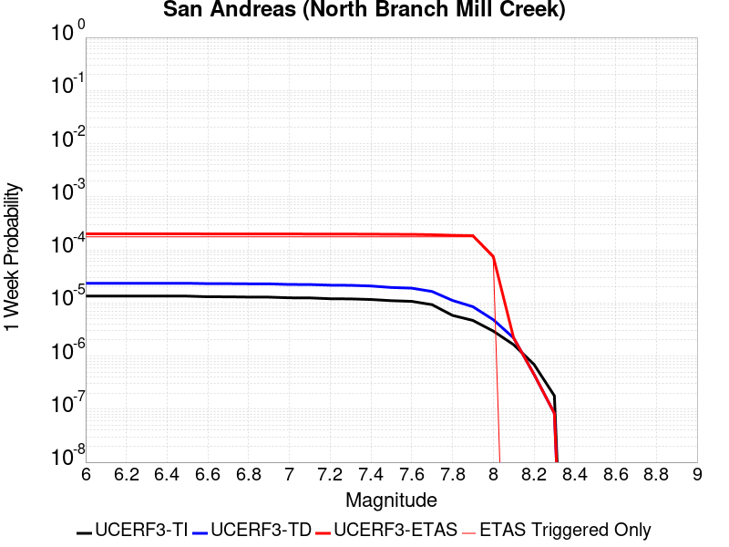 | 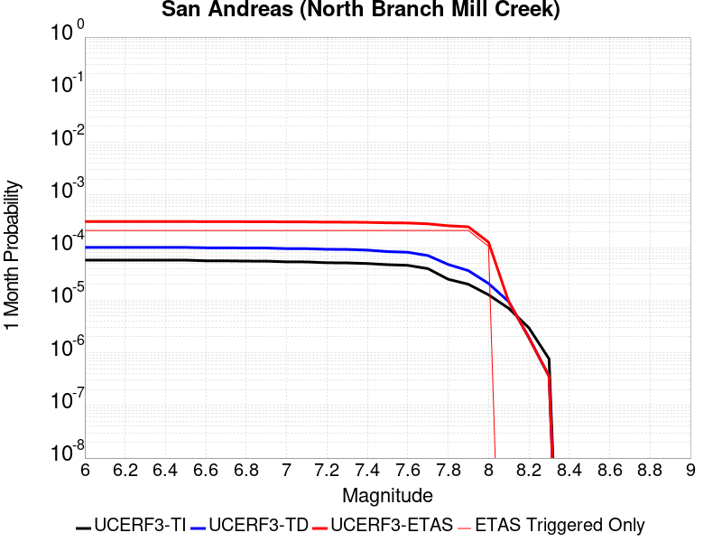 | 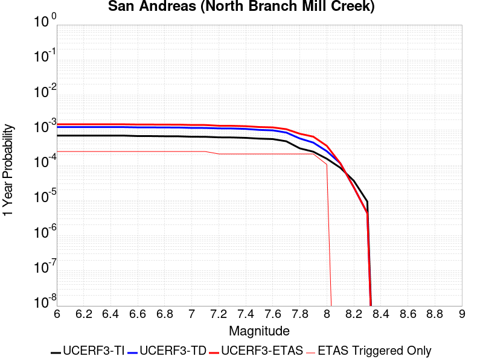 | 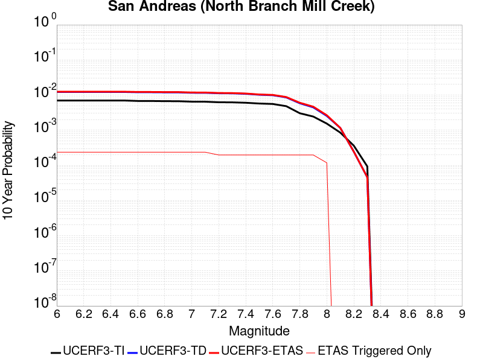 |

| Magnitude | 1 wk TI Prob | 1 wk TD Prob | 1 wk ETAS Prob | 1 wk ETAS/TD Gain | 1 wk ETAS Triggered Only | 1 mo TI Prob | 1 mo TD Prob | 1 mo ETAS Prob | 1 mo ETAS/TD Gain | 1 mo ETAS Triggered Only | 1 yr TI Prob | 1 yr TD Prob | 1 yr ETAS Prob | 1 yr ETAS/TD Gain | 1 yr ETAS Triggered Only | 10 yr TI Prob | 10 yr TD Prob | 10 yr ETAS Prob | 10 yr ETAS/TD Gain | 10 yr ETAS Triggered Only |
|-----|-----|-----|-----|-----|-----|-----|-----|-----|-----|-----|-----|-----|-----|-----|-----|-----|-----|-----|-----|-----|
| 6.0 | 1.3461156E-5 | 2.3499893E-5 | 1.8129956E-4 | 7.71491 | 1.5780337E-4 | 5.7689394E-5 | 1.00709956E-4 | 2.9794432E-4 | 2.9584396 | 1.9725422E-4 | 7.02142E-4 | 0.0012254574 | 0.0014618724 | 1.1929199 | 2.3670506E-4 | 0.0069992766 | 0.01222957 | 0.01246338 | 1.0191184 | 2.3670506E-4 |
| 6.1 | 1.3461156E-5 | 2.3499893E-5 | 1.8129956E-4 | 7.71491 | 1.5780337E-4 | 5.7689394E-5 | 1.00709956E-4 | 2.9794432E-4 | 2.9584396 | 1.9725422E-4 | 7.02142E-4 | 0.0012254574 | 0.0014618724 | 1.1929199 | 2.3670506E-4 | 0.0069992766 | 0.01222957 | 0.01246338 | 1.0191184 | 2.3670506E-4 |
| 6.2 | 1.3461156E-5 | 2.3499893E-5 | 1.8129956E-4 | 7.71491 | 1.5780337E-4 | 5.7689394E-5 | 1.00709956E-4 | 2.9794432E-4 | 2.9584396 | 1.9725422E-4 | 7.02142E-4 | 0.0012254574 | 0.0014618724 | 1.1929199 | 2.3670506E-4 | 0.0069992766 | 0.01222957 | 0.01246338 | 1.0191184 | 2.3670506E-4 |
| 6.3 | 1.3461156E-5 | 2.3499893E-5 | 1.8129956E-4 | 7.71491 | 1.5780337E-4 | 5.7689394E-5 | 1.00709956E-4 | 2.9794432E-4 | 2.9584396 | 1.9725422E-4 | 7.02142E-4 | 0.0012254574 | 0.0014618724 | 1.1929199 | 2.3670506E-4 | 0.0069992766 | 0.01222957 | 0.01246338 | 1.0191184 | 2.3670506E-4 |
| 6.4 | 1.3461156E-5 | 2.3499893E-5 | 1.8129956E-4 | 7.71491 | 1.5780337E-4 | 5.7689394E-5 | 1.00709956E-4 | 2.9794432E-4 | 2.9584396 | 1.9725422E-4 | 7.02142E-4 | 0.0012254574 | 0.0014618724 | 1.1929199 | 2.3670506E-4 | 0.0069992766 | 0.01222957 | 0.01246338 | 1.0191184 | 2.3670506E-4 |
| 6.5 | 1.3450706E-5 | 2.3488852E-5 | 1.8128852E-4 | 7.718066 | 1.5780337E-4 | 5.764461E-5 | 1.0066265E-4 | 2.97897E-4 | 2.9593601 | 1.9725422E-4 | 7.0159714E-4 | 0.001224882 | 0.0014612972 | 1.1930106 | 2.3670506E-4 | 0.006993862 | 0.01222388 | 0.012457691 | 1.0191275 | 2.3670506E-4 |
| 6.6 | 1.3074523E-5 | 2.3103135E-5 | 1.8090286E-4 | 7.83023 | 1.5780337E-4 | 5.6032466E-5 | 9.9009696E-5 | 2.962444E-4 | 2.9920745 | 1.9725422E-4 | 6.8198174E-4 | 0.0012047797 | 0.0014411996 | 1.196235 | 2.3670506E-4 | 0.006798926 | 0.012025044 | 0.012258903 | 1.0194477 | 2.3670506E-4 |
| 6.7 | 1.3050216E-5 | 2.3078432E-5 | 1.8087817E-4 | 7.8375416 | 1.5780337E-4 | 5.59283E-5 | 9.890384E-5 | 2.9613855E-4 | 2.994207 | 1.9725422E-4 | 6.8071426E-4 | 0.0012034923 | 0.0014399125 | 1.1964451 | 2.3670506E-4 | 0.0067863287 | 0.012012309 | 0.012246171 | 1.0194685 | 2.3670506E-4 |
| 6.8 | 1.29049395E-5 | 2.292684E-5 | 1.807266E-4 | 7.882752 | 1.5780337E-4 | 5.530571E-5 | 9.825421E-5 | 2.9548904E-4 | 3.0073934 | 1.9725422E-4 | 6.73139E-4 | 0.0011955918 | 0.0014320138 | 1.1977448 | 2.3670506E-4 | 0.0067110364 | 0.011934154 | 0.012168034 | 1.0195975 | 2.3670506E-4 |
| 6.9 | 1.2867369E-5 | 2.2886245E-5 | 1.8068601E-4 | 7.894961 | 1.5780337E-4 | 5.51447E-5 | 9.8080236E-5 | 2.953151E-4 | 3.0109544 | 1.9725422E-4 | 6.711799E-4 | 0.0011934759 | 0.0014298985 | 1.1980958 | 2.3670506E-4 | 0.006691564 | 0.011913223 | 0.012147109 | 1.0196323 | 2.3670506E-4 |
| 7.0 | 1.2495996E-5 | 2.2286325E-5 | 1.8008618E-4 | 8.080569 | 1.5780337E-4 | 5.3553173E-5 | 9.550934E-5 | 2.9274472E-4 | 3.06509 | 1.9725422E-4 | 6.518148E-4 | 0.0011622087 | 0.0013986387 | 1.2034316 | 2.3670506E-4 | 0.0064990623 | 0.0116038285 | 0.011837787 | 1.0201622 | 2.3670506E-4 |
| 7.1 | 1.2452067E-5 | 2.2231397E-5 | 1.8003126E-4 | 8.098063 | 1.5780337E-4 | 5.3364907E-5 | 9.527396E-5 | 2.925094E-4 | 3.0701923 | 1.9725422E-4 | 6.4952404E-4 | 0.0011593461 | 0.0013957766 | 1.2039346 | 2.3670506E-4 | 0.0064762887 | 0.0115755 | 0.011809465 | 1.020212 | 2.3670506E-4 |
| 7.2 | 1.2002777E-5 | 2.1609963E-5 | 1.7940994E-4 | 8.302186 | 1.5780337E-4 | 5.143946E-5 | 9.2610855E-5 | 2.8984682E-4 | 3.1297283 | 1.9725422E-4 | 6.2609545E-4 | 0.0011269567 | 0.0013239885 | 1.1748354 | 1.9725422E-4 | 0.006243344 | 0.011254923 | 0.011449957 | 1.0173287 | 1.9725422E-4 |
| 7.3 | 1.1923425E-5 | 2.1479793E-5 | 1.7927978E-4 | 8.346439 | 1.5780337E-4 | 5.109939E-5 | 9.205302E-5 | 2.8928908E-4 | 3.1426353 | 1.9725422E-4 | 6.219575E-4 | 0.001120172 | 0.0013172053 | 1.1758956 | 1.9725422E-4 | 0.0062021962 | 0.011187789 | 0.011382836 | 1.017434 | 1.9725422E-4 |
| 7.4 | 1.16105175E-5 | 2.0853771E-5 | 1.7865386E-4 | 8.56698 | 1.5780337E-4 | 4.975841E-5 | 8.937026E-5 | 2.8660687E-4 | 3.20696 | 1.9725422E-4 | 6.0564023E-4 | 0.0010875424 | 0.0012845821 | 1.1811789 | 1.9725422E-4 | 0.006039923 | 0.010865397 | 0.011060508 | 1.0179571 | 1.9725422E-4 |
| 7.5 | 1.1037265E-5 | 1.9553907E-5 | 1.773542E-4 | 9.070013 | 1.5780337E-4 | 4.7301706E-5 | 8.379978E-5 | 2.8103747E-4 | 3.353678 | 1.9725422E-4 | 5.757461E-4 | 0.0010197869 | 0.00121684 | 1.1932297 | 1.9725422E-4 | 0.005742567 | 0.010194898 | 0.010390141 | 1.0191511 | 1.9725422E-4 |
| 7.6 | 1.0720915E-5 | 1.899582E-5 | 1.767962E-4 | 9.307111 | 1.5780337E-4 | 4.5945973E-5 | 8.140812E-5 | 2.786463E-4 | 3.4228315 | 1.9725422E-4 | 5.592486E-4 | 9.906954E-4 | 0.0011877542 | 1.1989095 | 1.9725422E-4 | 0.005578433 | 0.009906623 | 0.010101922 | 1.0197141 | 1.9725422E-4 |
| 7.7 | 9.276279E-6 | 1.6441649E-5 | 1.7424244E-4 | 10.597625 | 1.5780337E-4 | 3.9754876E-5 | 7.0462316E-5 | 2.6770265E-4 | 3.7992313 | 1.9725422E-4 | 4.839081E-4 | 8.575427E-4 | 0.0010546277 | 1.2298254 | 1.9725422E-4 | 0.0048285574 | 0.008586041 | 0.008781602 | 1.0227766 | 1.9725422E-4 |
| 7.8 | 5.8346777E-6 | 1.1155013E-5 | 1.6895663E-4 | 15.146251 | 1.5780337E-4 | 2.5005522E-5 | 4.7806327E-5 | 2.450511E-4 | 5.125914 | 1.9725422E-4 | 3.043997E-4 | 5.818867E-4 | 7.7902613E-4 | 1.3387935 | 1.9725422E-4 | 0.0030398308 | 0.0058469265 | 0.006043027 | 1.0335392 | 1.9725422E-4 |
| 7.9 | 4.690204E-6 | 8.509093E-6 | 1.6631113E-4 | 19.545105 | 1.5780337E-4 | 2.0100719E-5 | 3.6467034E-5 | 2.3371406E-4 | 6.408913 | 1.9725422E-4 | 2.4469878E-4 | 4.4389578E-4 | 6.4106245E-4 | 1.4441733 | 1.9725422E-4 | 0.002444295 | 0.0044707474 | 0.0046671196 | 1.0439239 | 1.9725422E-4 |
| 8.0 | 2.9570454E-6 | 4.846947E-6 | 8.374825E-5 | 17.278559 | 7.8901685E-5 | 1.267299E-5 | 2.0772464E-5 | 1.3912254E-4 | 6.69745 | 1.1835253E-4 | 1.5428272E-4 | 2.5287544E-4 | 3.7119802E-4 | 1.4679086 | 1.1835253E-4 | 0.0015417566 | 0.002549644 | 0.002667695 | 1.0463009 | 1.1835253E-4 |
| 8.1 | 1.6376824E-6 | 2.1968929E-6 | 2.1968929E-6 | 1.0 | 0.0 | 7.01862E-6 | 9.41522E-6 | 9.41522E-6 | 1.0 | 0.0 | 8.544835E-5 | 1.14624294E-4 | 1.14624294E-4 | 1.0 | 0.0 | 8.54155E-4 | 0.0011606582 | 0.0011606582 | 1.0 | 0.0 |
| 8.2 | 6.9631557E-7 | 4.5360213E-7 | 4.5360213E-7 | 1.0 | 0.0 | 2.984206E-6 | 1.9440076E-6 | 1.9440076E-6 | 1.0 | 0.0 | 3.63321E-5 | 2.3668037E-5 | 2.3668037E-5 | 1.0 | 0.0 | 3.6326164E-4 | 2.451564E-4 | 2.451564E-4 | 1.0 | 0.0 |
| 8.3 | 1.7876137E-7 | 8.360375E-8 | 8.360375E-8 | 1.0 | 0.0 | 7.661199E-7 | 3.5830175E-7 | 3.5830175E-7 | 1.0 | 0.0 | 9.32747E-6 | 4.3623154E-6 | 4.3623154E-6 | 1.0 | 0.0 | 9.3270784E-5 | 4.5817014E-5 | 4.5817014E-5 | 1.0 | 0.0 |

## Pinto Mtn
*[(top)](#table-of-contents)*

| 1 Week | 1 Month | 1 Year | 10 Year |
|-----|-----|-----|-----|
| 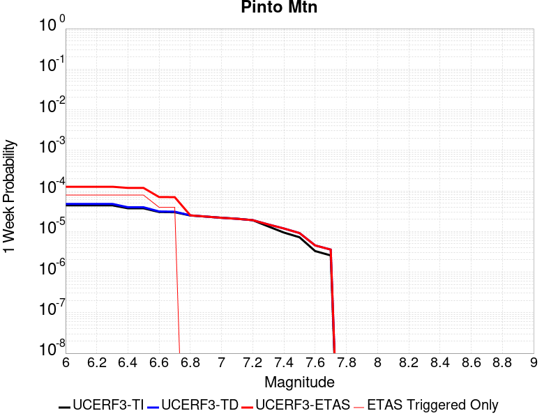 | 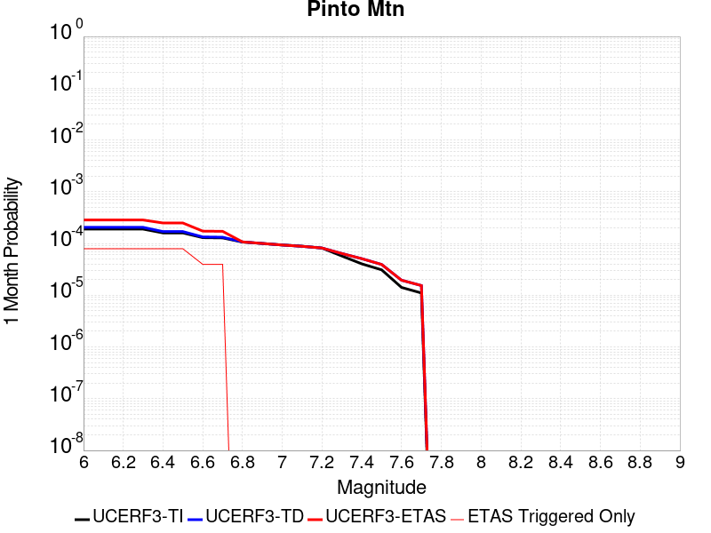 | 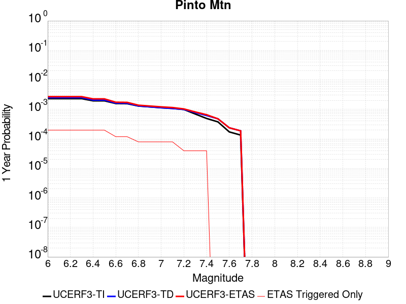 | 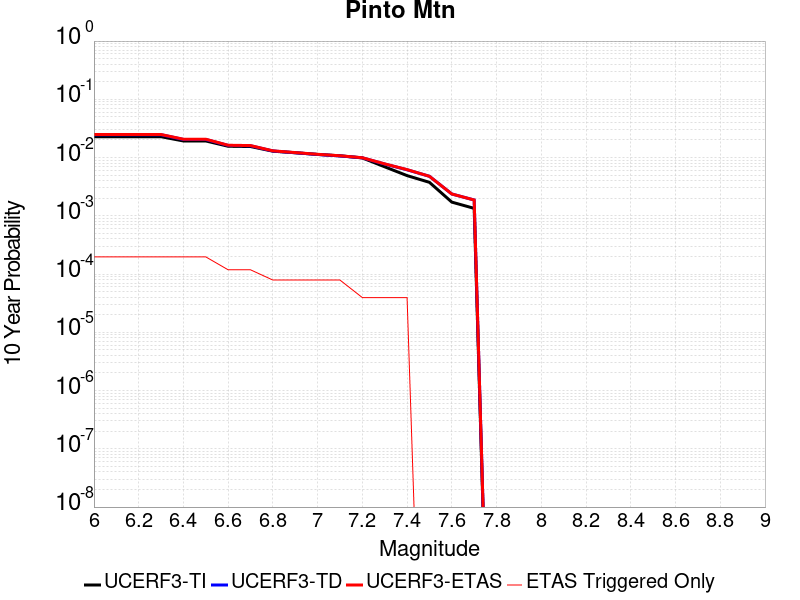 |

| Magnitude | 1 wk TI Prob | 1 wk TD Prob | 1 wk ETAS Prob | 1 wk ETAS/TD Gain | 1 wk ETAS Triggered Only | 1 mo TI Prob | 1 mo TD Prob | 1 mo ETAS Prob | 1 mo ETAS/TD Gain | 1 mo ETAS Triggered Only | 1 yr TI Prob | 1 yr TD Prob | 1 yr ETAS Prob | 1 yr ETAS/TD Gain | 1 yr ETAS Triggered Only | 10 yr TI Prob | 10 yr TD Prob | 10 yr ETAS Prob | 10 yr ETAS/TD Gain | 10 yr ETAS Triggered Only |
|-----|-----|-----|-----|-----|-----|-----|-----|-----|-----|-----|-----|-----|-----|-----|-----|-----|-----|-----|-----|-----|
| 6.0 | 4.4194956E-5 | 4.785362E-5 | 1.2675153E-4 | 2.6487346 | 7.8901685E-5 | 1.893932E-4 | 2.0507174E-4 | 2.8395726E-4 | 1.3846728 | 7.8901685E-5 | 0.0023034236 | 0.0024940541 | 0.0026908165 | 1.0788926 | 1.9725422E-4 | 0.022796938 | 0.024678145 | 0.024870532 | 1.0077958 | 1.9725422E-4 |
| 6.1 | 4.4194956E-5 | 4.785362E-5 | 1.2675153E-4 | 2.6487346 | 7.8901685E-5 | 1.893932E-4 | 2.0507174E-4 | 2.8395726E-4 | 1.3846728 | 7.8901685E-5 | 0.0023034236 | 0.0024940541 | 0.0026908165 | 1.0788926 | 1.9725422E-4 | 0.022796938 | 0.024678145 | 0.024870532 | 1.0077958 | 1.9725422E-4 |
| 6.2 | 4.4194956E-5 | 4.785362E-5 | 1.2675153E-4 | 2.6487346 | 7.8901685E-5 | 1.893932E-4 | 2.0507174E-4 | 2.8395726E-4 | 1.3846728 | 7.8901685E-5 | 0.0023034236 | 0.0024940541 | 0.0026908165 | 1.0788926 | 1.9725422E-4 | 0.022796938 | 0.024678145 | 0.024870532 | 1.0077958 | 1.9725422E-4 |
| 6.3 | 4.4194956E-5 | 4.785362E-5 | 1.2675153E-4 | 2.6487346 | 7.8901685E-5 | 1.893932E-4 | 2.0507174E-4 | 2.8395726E-4 | 1.3846728 | 7.8901685E-5 | 0.0023034236 | 0.0024940541 | 0.0026908165 | 1.0788926 | 1.9725422E-4 | 0.022796938 | 0.024678145 | 0.024870532 | 1.0077958 | 1.9725422E-4 |
| 6.4 | 3.729929E-5 | 3.9603186E-5 | 1.18501746E-4 | 2.9922278 | 7.8901685E-5 | 1.5984432E-4 | 1.6971743E-4 | 2.4860573E-4 | 1.4648215 | 7.8901685E-5 | 0.0019443673 | 0.002064445 | 0.002261292 | 1.0953511 | 1.9725422E-4 | 0.019274427 | 0.02046269 | 0.020655908 | 1.0094424 | 1.9725422E-4 |
| 6.5 | 3.729929E-5 | 3.9603186E-5 | 1.18501746E-4 | 2.9922278 | 7.8901685E-5 | 1.5984432E-4 | 1.6971743E-4 | 2.4860573E-4 | 1.4648215 | 7.8901685E-5 | 0.0019443673 | 0.002064445 | 0.002261292 | 1.0953511 | 1.9725422E-4 | 0.019274427 | 0.02046269 | 0.020655908 | 1.0094424 | 1.9725422E-4 |
| 6.6 | 3.0204548E-5 | 3.1205298E-5 | 7.065491E-5 | 2.264196 | 3.9450842E-5 | 1.2944164E-4 | 1.3373033E-4 | 1.731759E-4 | 1.2949635 | 3.9450842E-5 | 0.0015748127 | 0.0016269855 | 0.0017451454 | 1.072625 | 1.1835253E-4 | 0.015636992 | 0.01615461 | 0.01627105 | 1.0072079 | 1.1835253E-4 |
| 6.7 | 2.9857754E-5 | 3.081468E-5 | 7.026431E-5 | 2.280222 | 3.9450842E-5 | 1.2795553E-4 | 1.3205643E-4 | 1.7150206E-4 | 1.2987028 | 3.9450842E-5 | 0.0015567453 | 0.001606636 | 0.0017247983 | 1.0735464 | 1.1835253E-4 | 0.015458848 | 0.01595405 | 0.016070513 | 1.0073 | 1.1835253E-4 |
| 6.8 | 2.4819734E-5 | 2.5009364E-5 | 2.5009364E-5 | 1.0 | 0.0 | 1.0636595E-4 | 1.07178705E-4 | 1.07178705E-4 | 1.0 | 0.0 | 0.0012942362 | 0.0013041412 | 0.00138294 | 1.060422 | 7.8901685E-5 | 0.012867244 | 0.0129672475 | 0.013045126 | 1.0060058 | 7.8901685E-5 |
| 6.9 | 2.331124E-5 | 2.3337643E-5 | 2.3337643E-5 | 1.0 | 0.0 | 9.990149E-5 | 1.00014746E-4 | 1.00014746E-4 | 1.0 | 0.0 | 0.001215622 | 0.0012170197 | 0.0012958254 | 1.0647529 | 7.8901685E-5 | 0.012089936 | 0.012105742 | 0.012183688 | 1.0064389 | 7.8901685E-5 |
| 7.0 | 2.1818534E-5 | 2.1760772E-5 | 2.1760772E-5 | 1.0 | 0.0 | 9.3504656E-5 | 9.325723E-5 | 9.325723E-5 | 1.0 | 0.0 | 0.0011378246 | 0.0011348352 | 0.0012136473 | 1.0694481 | 7.8901685E-5 | 0.011320163 | 0.011292503 | 0.0113705145 | 1.0069082 | 7.8901685E-5 |
| 7.1 | 2.066081E-5 | 2.0540418E-5 | 2.0540418E-5 | 1.0 | 0.0 | 8.854332E-5 | 8.8027504E-5 | 8.8027504E-5 | 1.0 | 0.0 | 0.0010774818 | 0.0010712275 | 0.0011500446 | 1.0735765 | 7.8901685E-5 | 0.010722724 | 0.010662688 | 0.010740749 | 1.0073209 | 7.8901685E-5 |
| 7.2 | 1.8990233E-5 | 1.9053701E-5 | 1.9053701E-5 | 1.0 | 0.0 | 8.138417E-5 | 8.1656275E-5 | 8.1656275E-5 | 1.0 | 0.0 | 9.904018E-4 | 9.937311E-4 | 0.0010331427 | 1.0396602 | 3.9450842E-5 | 0.009859995 | 0.009894874 | 0.009933935 | 1.0039475 | 3.9450842E-5 |
| 7.3 | 1.3335872E-5 | 1.4906372E-5 | 1.4906372E-5 | 1.0 | 0.0 | 5.7152483E-5 | 6.388296E-5 | 6.388296E-5 | 1.0 | 0.0 | 6.956093E-4 | 7.775102E-4 | 8.169304E-4 | 1.0507005 | 3.9450842E-5 | 0.006934359 | 0.0077491994 | 0.0077883443 | 1.0050515 | 3.9450842E-5 |
| 7.4 | 9.414066E-6 | 1.186061E-5 | 1.186061E-5 | 1.0 | 0.0 | 4.0345374E-5 | 5.0830247E-5 | 5.0830247E-5 | 1.0 | 0.0 | 4.910942E-4 | 6.1869196E-4 | 6.581184E-4 | 1.0637255 | 3.9450842E-5 | 0.0049001034 | 0.006170644 | 0.0062098512 | 1.0063539 | 3.9450842E-5 |
| 7.5 | 7.2101157E-6 | 9.157893E-6 | 9.157893E-6 | 1.0 | 0.0 | 3.090013E-5 | 3.924757E-5 | 3.924757E-5 | 1.0 | 0.0 | 3.7614413E-4 | 4.7774217E-4 | 4.7774217E-4 | 1.0 | 0.0 | 0.0037550807 | 0.004767927 | 0.004767927 | 1.0 | 0.0 |
| 7.6 | 3.296375E-6 | 4.5453176E-6 | 4.5453176E-6 | 1.0 | 0.0 | 1.4127245E-5 | 1.9479796E-5 | 1.9479796E-5 | 1.0 | 0.0 | 1.7198564E-4 | 2.3714209E-4 | 2.3714209E-4 | 1.0 | 0.0 | 0.0017185259 | 0.0023690276 | 0.0023690276 | 1.0 | 0.0 |
| 7.7 | 2.5741092E-6 | 3.584251E-6 | 3.584251E-6 | 1.0 | 0.0 | 1.103185E-5 | 1.5360993E-5 | 1.5360993E-5 | 1.0 | 0.0 | 1.3430449E-4 | 1.8700535E-4 | 1.8700535E-4 | 1.0 | 0.0 | 0.0013422335 | 0.0018686098 | 0.0018686098 | 1.0 | 0.0 |

## Great Valley 09 (Laguna Seca)
*[(top)](#table-of-contents)*

| 1 Week | 1 Month | 1 Year | 10 Year |
|-----|-----|-----|-----|
| 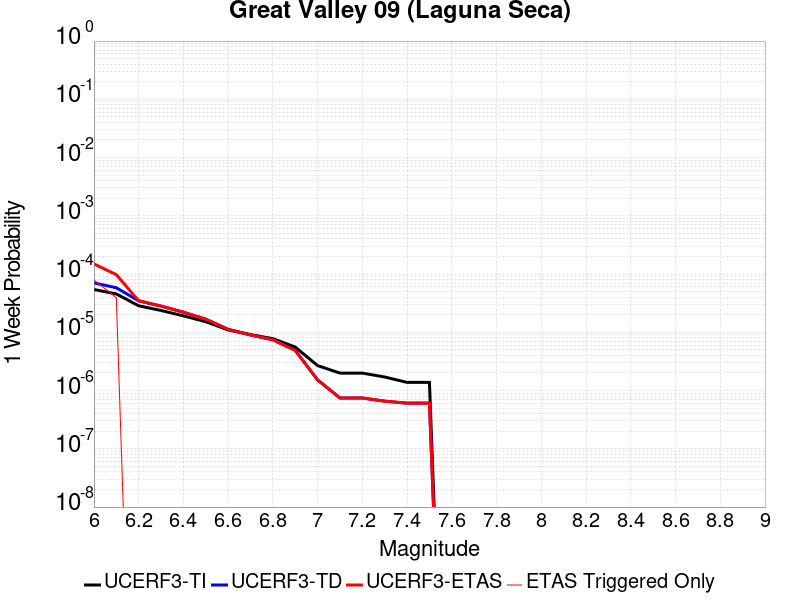 | 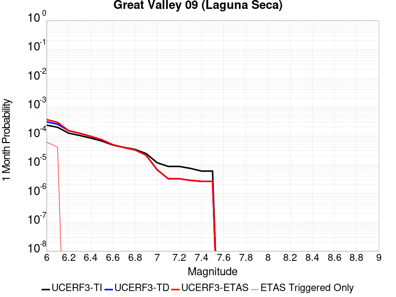 | 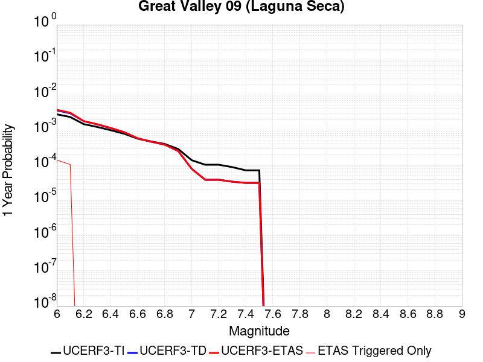 | 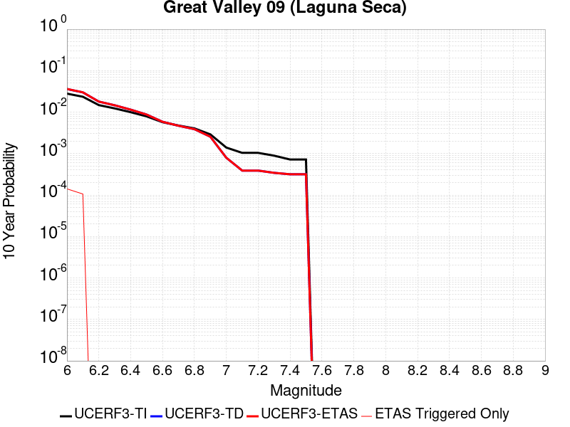 |

| Magnitude | 1 wk TI Prob | 1 wk TD Prob | 1 wk ETAS Prob | 1 wk ETAS/TD Gain | 1 wk ETAS Triggered Only | 1 mo TI Prob | 1 mo TD Prob | 1 mo ETAS Prob | 1 mo ETAS/TD Gain | 1 mo ETAS Triggered Only | 1 yr TI Prob | 1 yr TD Prob | 1 yr ETAS Prob | 1 yr ETAS/TD Gain | 1 yr ETAS Triggered Only | 10 yr TI Prob | 10 yr TD Prob | 10 yr ETAS Prob | 10 yr ETAS/TD Gain | 10 yr ETAS Triggered Only |
|-----|-----|-----|-----|-----|-----|-----|-----|-----|-----|-----|-----|-----|-----|-----|-----|-----|-----|-----|-----|-----|
| 6.0 | 5.4353277E-5 | 7.05022E-5 | 1.4939833E-4 | 2.119059 | 7.8901685E-5 | 2.3292181E-4 | 3.0211566E-4 | 4.2043245E-4 | 1.3916274 | 1.1835253E-4 | 0.0028321352 | 0.0036721937 | 0.0038294178 | 1.0428147 | 1.5780337E-4 | 0.02796312 | 0.03611547 | 0.036267575 | 1.0042117 | 1.5780337E-4 |
| 6.1 | 4.5578287E-5 | 5.822118E-5 | 9.766973E-5 | 1.6775635 | 3.9450842E-5 | 1.953209E-4 | 2.4949326E-4 | 3.2837526E-4 | 1.3161689 | 7.8901685E-5 | 0.0023754383 | 0.003033432 | 0.0031514256 | 1.0388978 | 1.1835253E-4 | 0.023502063 | 0.029919548 | 0.030034358 | 1.0038373 | 1.1835253E-4 |
| 6.2 | 2.8536782E-5 | 3.4737273E-5 | 3.4737273E-5 | 1.0 | 0.0 | 1.2229476E-4 | 1.4886224E-4 | 1.4886224E-4 | 1.0 | 0.0 | 0.0014879217 | 0.001810813 | 0.001810813 | 1.0 | 0.0 | 0.014779986 | 0.017958116 | 0.017958116 | 1.0 | 0.0 |
| 6.3 | 2.3698774E-5 | 2.8213295E-5 | 2.8213295E-5 | 1.0 | 0.0 | 1.01562226E-4 | 1.20905075E-4 | 1.20905075E-4 | 1.0 | 0.0 | 0.0012358186 | 0.0014710218 | 0.0014710218 | 1.0 | 0.0 | 0.012289686 | 0.014611342 | 0.014611342 | 1.0 | 0.0 |
| 6.4 | 1.9191197E-5 | 2.2123184E-5 | 2.2123184E-5 | 1.0 | 0.0 | 8.2245395E-5 | 9.4806666E-5 | 9.4806666E-5 | 1.0 | 0.0 | 0.0010008777 | 0.0011536429 | 0.0011536429 | 1.0 | 0.0 | 0.009963818 | 0.011476948 | 0.011476948 | 1.0 | 0.0 |
| 6.5 | 1.5203241E-5 | 1.6802203E-5 | 1.6802203E-5 | 1.0 | 0.0 | 6.5155116E-5 | 7.200386E-5 | 7.200386E-5 | 1.0 | 0.0 | 7.9297484E-4 | 8.7626575E-4 | 8.7626575E-4 | 1.0 | 0.0 | 0.007901512 | 0.0087295165 | 0.0087295165 | 1.0 | 0.0 |
| 6.6 | 1.0984925E-5 | 1.1242595E-5 | 1.1242595E-5 | 1.0 | 0.0 | 4.70774E-5 | 4.8181686E-5 | 4.8181686E-5 | 1.0 | 0.0 | 5.730166E-4 | 5.8645656E-4 | 5.8645656E-4 | 1.0 | 0.0 | 0.005715413 | 0.0058494853 | 0.0058494853 | 1.0 | 0.0 |
| 6.7 | 9.134616E-6 | 9.019894E-6 | 9.019894E-6 | 1.0 | 0.0 | 3.9147766E-5 | 3.865613E-5 | 3.865613E-5 | 1.0 | 0.0 | 4.7651984E-4 | 4.7053912E-4 | 4.7053912E-4 | 1.0 | 0.0 | 0.004754993 | 0.0046956735 | 0.0046956735 | 1.0 | 0.0 |
| 6.8 | 7.785589E-6 | 7.4519444E-6 | 7.4519444E-6 | 1.0 | 0.0 | 3.3366385E-5 | 3.1936524E-5 | 3.1936524E-5 | 1.0 | 0.0 | 4.0616E-4 | 3.8875983E-4 | 3.8875983E-4 | 1.0 | 0.0 | 0.0040541845 | 0.0038810016 | 0.0038810016 | 1.0 | 0.0 |
| 6.9 | 5.579095E-6 | 4.898492E-6 | 4.898492E-6 | 1.0 | 0.0 | 2.3910188E-5 | 2.0993377E-5 | 2.0993377E-5 | 1.0 | 0.0 | 2.9106764E-4 | 2.5556577E-4 | 2.5556577E-4 | 1.0 | 0.0 | 0.002906867 | 0.002552856 | 0.002552856 | 1.0 | 0.0 |
| 7.0 | 2.6816688E-6 | 1.5216126E-6 | 1.5216126E-6 | 1.0 | 0.0 | 1.1492816E-5 | 6.521181E-6 | 6.521181E-6 | 1.0 | 0.0 | 1.3991605E-4 | 7.939258E-5 | 7.939258E-5 | 1.0 | 0.0 | 0.0013982799 | 7.9365086E-4 | 7.9365086E-4 | 1.0 | 0.0 |
| 7.1 | 1.9951021E-6 | 7.453827E-7 | 7.453827E-7 | 1.0 | 0.0 | 8.55041E-6 | 3.1944935E-6 | 3.1944935E-6 | 1.0 | 0.0 | 1.0409627E-4 | 3.8892307E-5 | 3.8892307E-5 | 1.0 | 0.0 | 0.0010404752 | 3.8885913E-4 | 3.8885913E-4 | 1.0 | 0.0 |
| 7.2 | 1.9951021E-6 | 7.453827E-7 | 7.453827E-7 | 1.0 | 0.0 | 8.55041E-6 | 3.1944935E-6 | 3.1944935E-6 | 1.0 | 0.0 | 1.0409627E-4 | 3.8892307E-5 | 3.8892307E-5 | 1.0 | 0.0 | 0.0010404752 | 3.8885913E-4 | 3.8885913E-4 | 1.0 | 0.0 |
| 7.3 | 1.7087556E-6 | 6.578881E-7 | 6.578881E-7 | 1.0 | 0.0 | 7.3232177E-6 | 2.8195177E-6 | 2.8195177E-6 | 1.0 | 0.0 | 8.915652E-5 | 3.4327128E-5 | 3.4327128E-5 | 1.0 | 0.0 | 8.9120766E-4 | 3.432223E-4 | 3.432223E-4 | 1.0 | 0.0 |
| 7.4 | 1.3804846E-6 | 6.073852E-7 | 6.073852E-7 | 1.0 | 0.0 | 5.916349E-6 | 2.6030768E-6 | 2.6030768E-6 | 1.0 | 0.0 | 7.2029165E-5 | 3.169204E-5 | 3.169204E-5 | 1.0 | 0.0 | 7.200583E-4 | 3.1687922E-4 | 3.1687922E-4 | 1.0 | 0.0 |
| 7.5 | 1.3804846E-6 | 6.073852E-7 | 6.073852E-7 | 1.0 | 0.0 | 5.916349E-6 | 2.6030768E-6 | 2.6030768E-6 | 1.0 | 0.0 | 7.2029165E-5 | 3.169204E-5 | 3.169204E-5 | 1.0 | 0.0 | 7.200583E-4 | 3.1687922E-4 | 3.1687922E-4 | 1.0 | 0.0 |

## Owens Valley
*[(top)](#table-of-contents)*

| 1 Week | 1 Month | 1 Year | 10 Year |
|-----|-----|-----|-----|
| 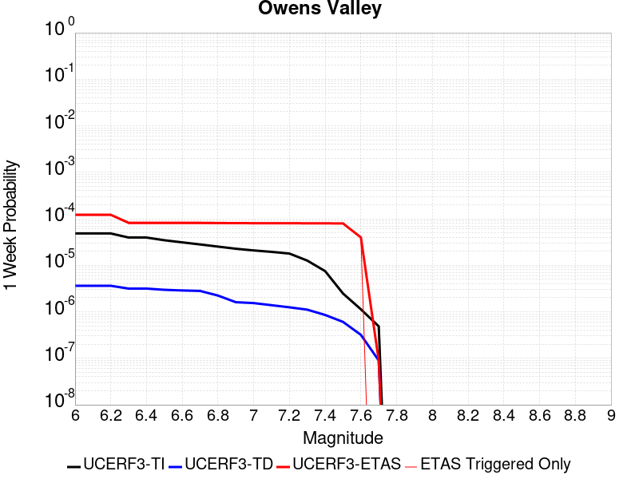 |  | 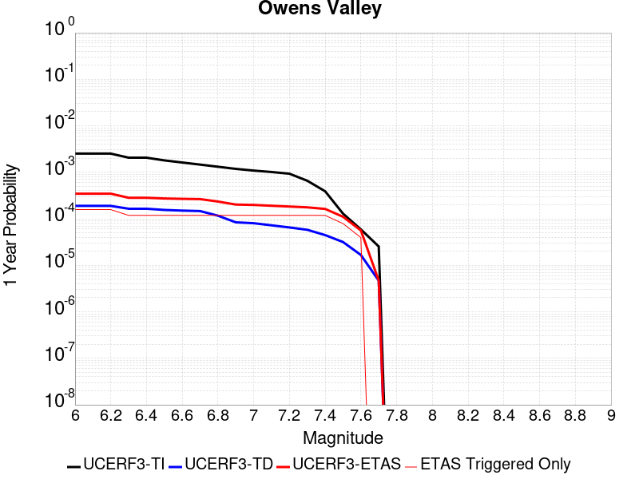 | 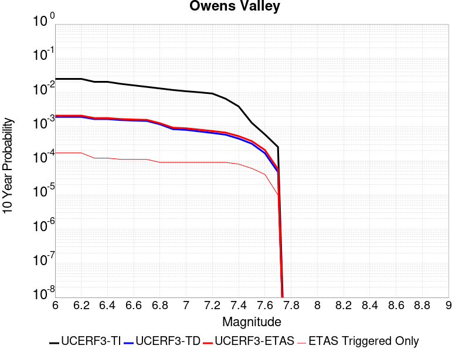 |

| Magnitude | 1 wk TI Prob | 1 wk TD Prob | 1 wk ETAS Prob | 1 wk ETAS/TD Gain | 1 wk ETAS Triggered Only | 1 mo TI Prob | 1 mo TD Prob | 1 mo ETAS Prob | 1 mo ETAS/TD Gain | 1 mo ETAS Triggered Only | 1 yr TI Prob | 1 yr TD Prob | 1 yr ETAS Prob | 1 yr ETAS/TD Gain | 1 yr ETAS Triggered Only | 10 yr TI Prob | 10 yr TD Prob | 10 yr ETAS Prob | 10 yr ETAS/TD Gain | 10 yr ETAS Triggered Only |
|-----|-----|-----|-----|-----|-----|-----|-----|-----|-----|-----|-----|-----|-----|-----|-----|-----|-----|-----|-----|-----|
| 6.0 | 4.83821E-5 | 3.626567E-6 | 1.2197867E-4 | 33.63475 | 1.1835253E-4 | 2.0733538E-4 | 1.5542342E-5 | 1.3389303E-4 | 8.614727 | 1.1835253E-4 | 0.002521386 | 1.8921259E-4 | 3.469861E-4 | 1.8338426 | 1.5780337E-4 | 0.024929691 | 0.001925011 | 0.0021218855 | 1.1022719 | 1.9725422E-4 |
| 6.1 | 4.83821E-5 | 3.626567E-6 | 1.2197867E-4 | 33.63475 | 1.1835253E-4 | 2.0733538E-4 | 1.5542342E-5 | 1.3389303E-4 | 8.614727 | 1.1835253E-4 | 0.002521386 | 1.8921259E-4 | 3.469861E-4 | 1.8338426 | 1.5780337E-4 | 0.024929691 | 0.001925011 | 0.0021218855 | 1.1022719 | 1.9725422E-4 |
| 6.2 | 4.83821E-5 | 3.626567E-6 | 1.2197867E-4 | 33.63475 | 1.1835253E-4 | 2.0733538E-4 | 1.5542342E-5 | 1.3389303E-4 | 8.614727 | 1.1835253E-4 | 0.002521386 | 1.8921259E-4 | 3.469861E-4 | 1.8338426 | 1.5780337E-4 | 0.024929691 | 0.001925011 | 0.0021218855 | 1.1022719 | 1.9725422E-4 |
| 6.3 | 3.953008E-5 | 3.1553948E-6 | 8.205683E-5 | 26.00525 | 7.8901685E-5 | 1.6940363E-4 | 1.3523055E-5 | 9.2423674E-5 | 6.8345265 | 7.8901685E-5 | 0.002060538 | 1.6463149E-4 | 2.8296452E-4 | 1.7187753 | 1.1835253E-4 | 0.020415364 | 0.0016592 | 0.001777356 | 1.0712128 | 1.1835253E-4 |
| 6.4 | 3.953008E-5 | 3.1553948E-6 | 8.205683E-5 | 26.00525 | 7.8901685E-5 | 1.6940363E-4 | 1.3523055E-5 | 9.2423674E-5 | 6.8345265 | 7.8901685E-5 | 0.002060538 | 1.6463149E-4 | 2.8296452E-4 | 1.7187753 | 1.1835253E-4 | 0.020415364 | 0.0016592 | 0.001777356 | 1.0712128 | 1.1835253E-4 |
| 6.5 | 3.457342E-5 | 2.9715961E-6 | 8.187305E-5 | 27.551876 | 7.8901685E-5 | 1.4816338E-4 | 1.2735354E-5 | 9.163604E-5 | 7.1954055 | 7.8901685E-5 | 0.0018023965 | 1.550426E-4 | 2.733768E-4 | 1.7632365 | 1.1835253E-4 | 0.017878477 | 0.001555719 | 0.0016738874 | 1.0759574 | 1.1835253E-4 |
| 6.6 | 3.1127765E-5 | 2.8744932E-6 | 8.177596E-5 | 28.448824 | 7.8901685E-5 | 1.3339789E-4 | 1.2319203E-5 | 9.121992E-5 | 7.4046936 | 7.8901685E-5 | 0.0016229092 | 1.4997667E-4 | 2.6831144E-4 | 1.7890214 | 1.1835253E-4 | 0.016111081 | 0.0015012559 | 0.0016194307 | 1.0787174 | 1.1835253E-4 |
| 6.7 | 2.806885E-5 | 2.8104134E-6 | 8.171188E-5 | 29.074684 | 7.8901685E-5 | 1.2028952E-4 | 1.20445775E-5 | 9.0945316E-5 | 7.5507274 | 7.8901685E-5 | 0.001463541 | 1.4663354E-4 | 2.6496872E-4 | 1.807013 | 1.1835253E-4 | 0.014539397 | 0.0014657511 | 0.0015839301 | 1.080627 | 1.1835253E-4 |
| 6.8 | 2.524524E-5 | 2.2353688E-6 | 8.113688E-5 | 36.296867 | 7.8901685E-5 | 1.0818939E-4 | 9.580118E-6 | 8.848105E-5 | 9.235904 | 7.8901685E-5 | 0.0013164099 | 1.16632E-4 | 2.3497072E-4 | 2.0146334 | 1.1835253E-4 | 0.01308639 | 0.0011659812 | 0.0012841957 | 1.1013863 | 1.1835253E-4 |
| 6.9 | 2.2704568E-5 | 1.6081682E-6 | 8.050973E-5 | 50.063004 | 7.8901685E-5 | 9.730166E-5 | 6.8921313E-6 | 8.5793276E-5 | 12.448004 | 7.8901685E-5 | 0.0011840039 | 8.390849E-5 | 2.0225109E-4 | 2.410377 | 1.1835253E-4 | 0.011777153 | 8.3897985E-4 | 9.572331E-4 | 1.1409489 | 1.1835253E-4 |
| 7.0 | 2.0871712E-5 | 1.5395453E-6 | 8.044111E-5 | 52.249916 | 7.8901685E-5 | 8.944713E-5 | 6.598035E-6 | 8.54992E-5 | 12.958283 | 7.8901685E-5 | 0.0010884746 | 8.032813E-5 | 1.9867116E-4 | 2.4732451 | 1.1835253E-4 | 0.010831586 | 8.0316263E-4 | 9.214201E-4 | 1.1472398 | 1.1835253E-4 |
| 7.1 | 1.944928E-5 | 1.3864178E-6 | 8.0287995E-5 | 57.910393 | 7.8901685E-5 | 8.335139E-5 | 5.941777E-6 | 8.4843E-5 | 14.279061 | 7.8901685E-5 | 0.0010143308 | 7.233874E-5 | 1.9068271E-4 | 2.6359694 | 1.1835253E-4 | 0.010097133 | 7.2330976E-4 | 8.4157666E-4 | 1.1635079 | 1.1835253E-4 |
| 7.2 | 1.7876306E-5 | 1.2489141E-6 | 8.01505E-5 | 64.176155 | 7.8901685E-5 | 7.6610486E-5 | 5.352478E-6 | 8.425374E-5 | 15.741072 | 7.8901685E-5 | 9.3233347E-4 | 6.516448E-5 | 1.835093E-4 | 2.816094 | 1.1835253E-4 | 0.009284316 | 6.5159105E-4 | 7.6986646E-4 | 1.1815178 | 1.1835253E-4 |
| 7.3 | 1.2618672E-5 | 1.1115209E-6 | 8.0013124E-5 | 71.98526 | 7.8901685E-5 | 5.40789E-5 | 4.763652E-6 | 8.366496E-5 | 17.563198 | 7.8901685E-5 | 6.582117E-4 | 5.799593E-5 | 1.763416E-4 | 3.0405858 | 1.1835253E-4 | 0.0065626553 | 5.7994033E-4 | 6.9822423E-4 | 1.2039587 | 1.1835253E-4 |
| 7.4 | 7.4874442E-6 | 8.5486437E-7 | 7.9756486E-5 | 93.29723 | 7.8901685E-5 | 3.208865E-5 | 3.6636993E-6 | 8.25651E-5 | 22.535992 | 7.8901685E-5 | 3.906093E-4 | 4.4604632E-5 | 1.6295188E-4 | 3.6532502 | 1.1835253E-4 | 0.003899234 | 4.4604883E-4 | 5.643486E-4 | 1.2652171 | 1.1835253E-4 |
| 7.5 | 2.4734156E-6 | 6.068616E-7 | 7.95085E-5 | 131.01588 | 7.8901685E-5 | 1.060031E-5 | 2.6008327E-6 | 8.1502316E-5 | 31.337008 | 7.8901685E-5 | 1.2905113E-4 | 3.166468E-5 | 1.1056387E-4 | 3.4917095 | 7.8901685E-5 | 0.0012897621 | 3.1660203E-4 | 3.9547874E-4 | 1.2491353 | 7.8901685E-5 |
| 7.6 | 1.1328841E-6 | 3.196531E-7 | 3.9770486E-5 | 124.41764 | 3.9450842E-5 | 4.8552088E-6 | 1.3699412E-6 | 4.082073E-5 | 29.797434 | 3.9450842E-5 | 5.9110564E-5 | 1.6678909E-5 | 5.6129094E-5 | 3.365274 | 3.9450842E-5 | 5.9094845E-4 | 1.6677675E-4 | 2.0622101E-4 | 1.2365093 | 3.9450842E-5 |
| 7.7 | 4.8613185E-7 | 8.964689E-8 | 8.964689E-8 | 1.0 | 0.0 | 2.0834207E-6 | 3.8420092E-7 | 3.8420092E-7 | 1.0 | 0.0 | 2.536535E-5 | 4.6776368E-6 | 4.6776368E-6 | 1.0 | 0.0 | 2.5362454E-4 | 4.677545E-5 | 4.677545E-5 | 1.0 | 0.0 |

## Kern Canyon (South Kern) 2011
*[(top)](#table-of-contents)*

| 1 Week | 1 Month | 1 Year | 10 Year |
|-----|-----|-----|-----|
| 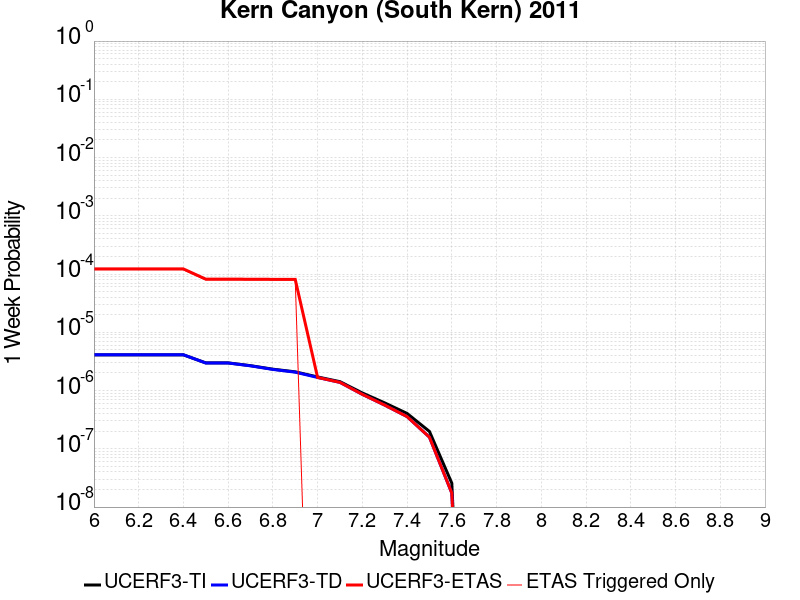 | 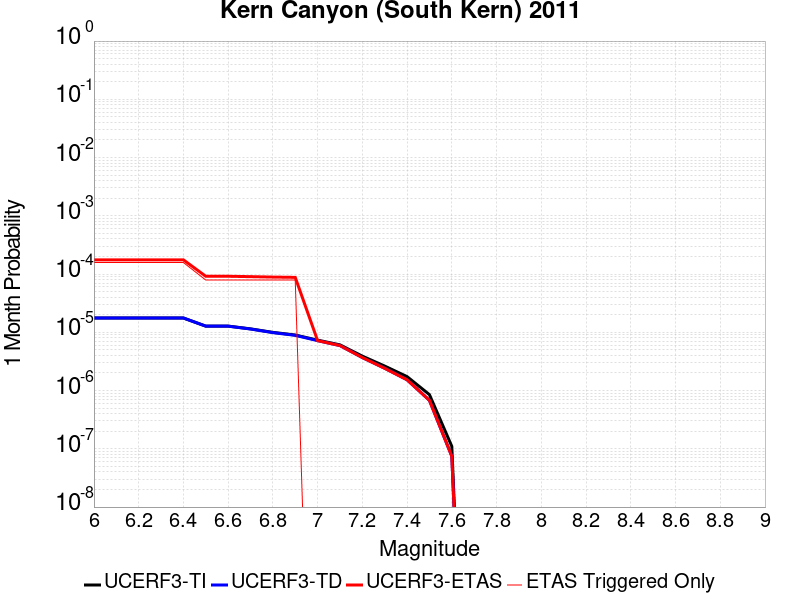 | 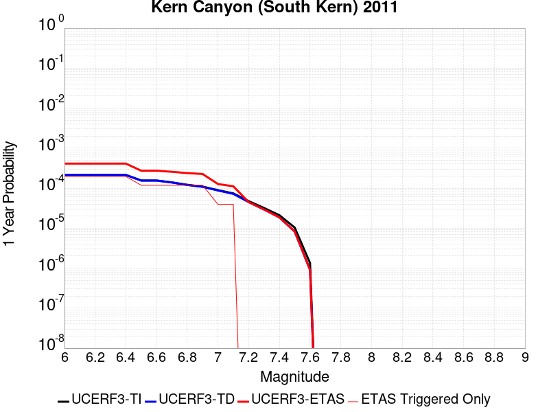 | 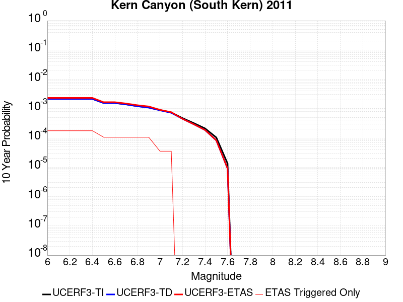 |

| Magnitude | 1 wk TI Prob | 1 wk TD Prob | 1 wk ETAS Prob | 1 wk ETAS/TD Gain | 1 wk ETAS Triggered Only | 1 mo TI Prob | 1 mo TD Prob | 1 mo ETAS Prob | 1 mo ETAS/TD Gain | 1 mo ETAS Triggered Only | 1 yr TI Prob | 1 yr TD Prob | 1 yr ETAS Prob | 1 yr ETAS/TD Gain | 1 yr ETAS Triggered Only | 10 yr TI Prob | 10 yr TD Prob | 10 yr ETAS Prob | 10 yr ETAS/TD Gain | 10 yr ETAS Triggered Only |
|-----|-----|-----|-----|-----|-----|-----|-----|-----|-----|-----|-----|-----|-----|-----|-----|-----|-----|-----|-----|-----|
| 6.0 | 4.105075E-6 | 4.1137264E-6 | 1.2246578E-4 | 29.770033 | 1.1835253E-4 | 1.7593058E-5 | 1.763014E-5 | 1.7543073E-4 | 9.950615 | 1.5780337E-4 | 2.1417443E-4 | 2.1462646E-4 | 4.1183835E-4 | 1.918861 | 1.9725422E-4 | 0.0021396813 | 0.0021442557 | 0.002341087 | 1.0917947 | 1.9725422E-4 |
| 6.1 | 4.105075E-6 | 4.1137264E-6 | 1.2246578E-4 | 29.770033 | 1.1835253E-4 | 1.7593058E-5 | 1.763014E-5 | 1.7543073E-4 | 9.950615 | 1.5780337E-4 | 2.1417443E-4 | 2.1462646E-4 | 4.1183835E-4 | 1.918861 | 1.9725422E-4 | 0.0021396813 | 0.0021442557 | 0.002341087 | 1.0917947 | 1.9725422E-4 |
| 6.2 | 4.105075E-6 | 4.1137264E-6 | 1.2246578E-4 | 29.770033 | 1.1835253E-4 | 1.7593058E-5 | 1.763014E-5 | 1.7543073E-4 | 9.950615 | 1.5780337E-4 | 2.1417443E-4 | 2.1462646E-4 | 4.1183835E-4 | 1.918861 | 1.9725422E-4 | 0.0021396813 | 0.0021442557 | 0.002341087 | 1.0917947 | 1.9725422E-4 |
| 6.3 | 4.105075E-6 | 4.1137264E-6 | 1.2246578E-4 | 29.770033 | 1.1835253E-4 | 1.7593058E-5 | 1.763014E-5 | 1.7543073E-4 | 9.950615 | 1.5780337E-4 | 2.1417443E-4 | 2.1462646E-4 | 4.1183835E-4 | 1.918861 | 1.9725422E-4 | 0.0021396813 | 0.0021442557 | 0.002341087 | 1.0917947 | 1.9725422E-4 |
| 6.4 | 4.105075E-6 | 4.1137264E-6 | 1.2246578E-4 | 29.770033 | 1.1835253E-4 | 1.7593058E-5 | 1.763014E-5 | 1.7543073E-4 | 9.950615 | 1.5780337E-4 | 2.1417443E-4 | 2.1462646E-4 | 4.1183835E-4 | 1.918861 | 1.9725422E-4 | 0.0021396813 | 0.0021442557 | 0.002341087 | 1.0917947 | 1.9725422E-4 |
| 6.5 | 2.9849807E-6 | 2.9731548E-6 | 8.187461E-5 | 27.537958 | 7.8901685E-5 | 1.2792712E-5 | 1.274203E-5 | 9.1642716E-5 | 7.1921597 | 7.8901685E-5 | 1.5574014E-4 | 1.5512333E-4 | 2.734575E-4 | 1.7628393 | 1.1835253E-4 | 0.0015563103 | 0.0015501656 | 0.0016683347 | 1.0762299 | 1.1835253E-4 |
| 6.6 | 2.9849807E-6 | 2.9731548E-6 | 8.187461E-5 | 27.537958 | 7.8901685E-5 | 1.2792712E-5 | 1.274203E-5 | 9.1642716E-5 | 7.1921597 | 7.8901685E-5 | 1.5574014E-4 | 1.5512333E-4 | 2.734575E-4 | 1.7628393 | 1.1835253E-4 | 0.0015563103 | 0.0015501656 | 0.0016683347 | 1.0762299 | 1.1835253E-4 |
| 6.7 | 2.6756725E-6 | 2.6582206E-6 | 8.15597E-5 | 30.682064 | 7.8901685E-5 | 1.1467117E-5 | 1.1392325E-5 | 9.029311E-5 | 7.925784 | 7.8901685E-5 | 1.396032E-4 | 1.3869285E-4 | 2.5702897E-4 | 1.8532244 | 1.1835253E-4 | 0.0013951553 | 0.0013860738 | 0.0015042623 | 1.0852685 | 1.1835253E-4 |
| 6.8 | 2.3283721E-6 | 2.3047787E-6 | 8.1206286E-5 | 35.233875 | 7.8901685E-5 | 9.9787E-6 | 9.877586E-6 | 8.87785E-5 | 8.987873 | 7.8901685E-5 | 1.214839E-4 | 1.20253055E-4 | 2.3859135E-4 | 1.9840773 | 1.1835253E-4 | 0.001214175 | 0.0012018873 | 0.0013200976 | 1.0983539 | 1.1835253E-4 |
| 6.9 | 2.0972677E-6 | 2.0696411E-6 | 8.0971164E-5 | 39.123287 | 7.8901685E-5 | 8.988259E-6 | 8.869861E-6 | 8.777085E-5 | 9.895404 | 7.8901685E-5 | 1.0942656E-4 | 1.0798526E-4 | 2.26325E-4 | 2.0958881 | 1.1835253E-4 | 0.0010937268 | 0.0010793337 | 0.0011975585 | 1.109535 | 1.1835253E-4 |
| 7.0 | 1.7132242E-6 | 1.6787036E-6 | 1.6787036E-6 | 1.0 | 0.0 | 7.3423685E-6 | 7.194424E-6 | 7.194424E-6 | 1.0 | 0.0 | 8.938967E-5 | 8.758863E-5 | 1.2703602E-4 | 1.4503711 | 3.9450842E-5 | 8.935372E-4 | 8.7554497E-4 | 9.149613E-4 | 1.0450191 | 3.9450842E-5 |
| 7.1 | 1.4215541E-6 | 1.3815752E-6 | 1.3815752E-6 | 1.0 | 0.0 | 6.0923603E-6 | 5.9210233E-6 | 5.9210233E-6 | 1.0 | 0.0 | 7.417196E-5 | 7.20861E-5 | 1.115341E-4 | 1.5472345 | 3.9450842E-5 | 7.414721E-4 | 7.206299E-4 | 7.600523E-4 | 1.0547055 | 3.9450842E-5 |
| 7.2 | 9.097853E-7 | 8.6037755E-7 | 8.6037755E-7 | 1.0 | 0.0 | 3.899074E-6 | 3.6873273E-6 | 3.6873273E-6 | 1.0 | 0.0 | 4.7470192E-5 | 4.4892295E-5 | 4.4892295E-5 | 1.0 | 0.0 | 4.7460053E-4 | 4.4883334E-4 | 4.4883334E-4 | 1.0 | 0.0 |
| 7.3 | 6.144169E-7 | 5.628206E-7 | 5.628206E-7 | 1.0 | 0.0 | 2.6332125E-6 | 2.4120861E-6 | 2.4120861E-6 | 1.0 | 0.0 | 3.205889E-5 | 2.9366758E-5 | 2.9366758E-5 | 1.0 | 0.0 | 3.2054266E-4 | 2.936293E-4 | 2.936293E-4 | 1.0 | 0.0 |
| 7.4 | 4.049844E-7 | 3.5728314E-7 | 3.5728314E-7 | 1.0 | 0.0 | 1.7356463E-6 | 1.5312125E-6 | 1.5312125E-6 | 1.0 | 0.0 | 2.1131287E-5 | 1.8642357E-5 | 1.8642357E-5 | 1.0 | 0.0 | 2.1129279E-4 | 1.8640817E-4 | 1.8640817E-4 | 1.0 | 0.0 |
| 7.5 | 1.9871162E-7 | 1.583044E-7 | 1.583044E-7 | 1.0 | 0.0 | 8.5162094E-7 | 6.7844724E-7 | 6.7844724E-7 | 1.0 | 0.0 | 1.0368436E-5 | 8.260065E-6 | 8.260065E-6 | 1.0 | 0.0 | 1.0367952E-4 | 8.259767E-5 | 8.259767E-5 | 1.0 | 0.0 |
| 7.6 | 2.572245E-8 | 1.7352555E-8 | 1.7352555E-8 | 1.0 | 0.0 | 1.10239064E-7 | 7.436809E-8 | 7.436809E-8 | 1.0 | 0.0 | 1.3421597E-6 | 9.054312E-7 | 9.054312E-7 | 1.0 | 0.0 | 1.3421517E-5 | 9.05428E-6 | 9.05428E-6 | 1.0 | 0.0 |

## Lost Hills
*[(top)](#table-of-contents)*

| 1 Week | 1 Month | 1 Year | 10 Year |
|-----|-----|-----|-----|
|  |  | 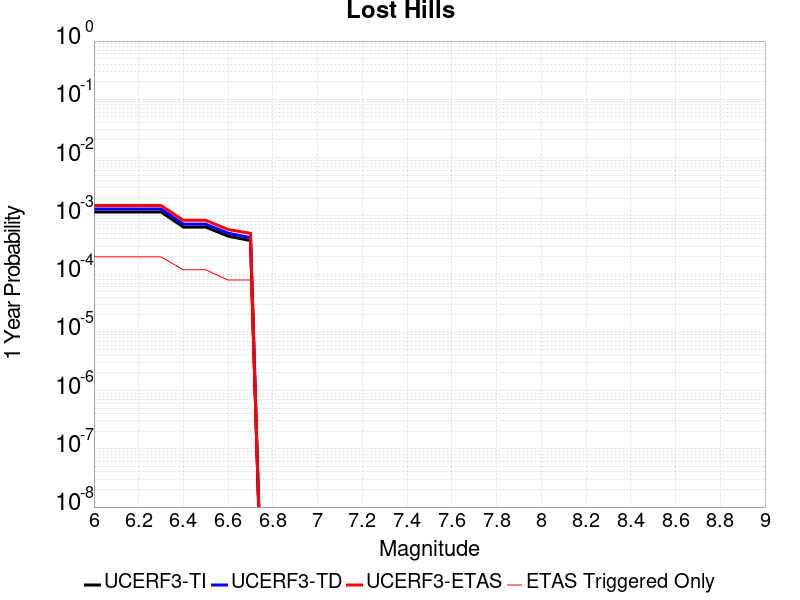 | 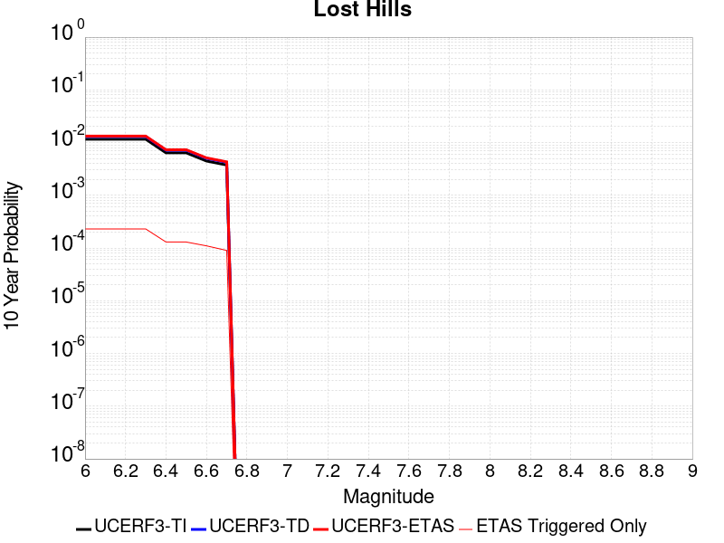 |

| Magnitude | 1 wk TI Prob | 1 wk TD Prob | 1 wk ETAS Prob | 1 wk ETAS/TD Gain | 1 wk ETAS Triggered Only | 1 mo TI Prob | 1 mo TD Prob | 1 mo ETAS Prob | 1 mo ETAS/TD Gain | 1 mo ETAS Triggered Only | 1 yr TI Prob | 1 yr TD Prob | 1 yr ETAS Prob | 1 yr ETAS/TD Gain | 1 yr ETAS Triggered Only | 10 yr TI Prob | 10 yr TD Prob | 10 yr ETAS Prob | 10 yr ETAS/TD Gain | 10 yr ETAS Triggered Only |
|-----|-----|-----|-----|-----|-----|-----|-----|-----|-----|-----|-----|-----|-----|-----|-----|-----|-----|-----|-----|-----|
| 6.0 | 2.233523E-5 | 2.5106583E-5 | 1.4345614E-4 | 5.713886 | 1.1835253E-4 | 9.571891E-5 | 1.0759615E-4 | 2.2593595E-4 | 2.0998516 | 1.1835253E-4 | 0.0011647546 | 0.001309364 | 0.00150636 | 1.1504517 | 1.9725422E-4 | 0.011586686 | 0.013033091 | 0.013227774 | 1.0149376 | 1.9725422E-4 |
| 6.1 | 2.233523E-5 | 2.5106583E-5 | 1.4345614E-4 | 5.713886 | 1.1835253E-4 | 9.571891E-5 | 1.0759615E-4 | 2.2593595E-4 | 2.0998516 | 1.1835253E-4 | 0.0011647546 | 0.001309364 | 0.00150636 | 1.1504517 | 1.9725422E-4 | 0.011586686 | 0.013033091 | 0.013227774 | 1.0149376 | 1.9725422E-4 |
| 6.2 | 2.233523E-5 | 2.5106583E-5 | 1.4345614E-4 | 5.713886 | 1.1835253E-4 | 9.571891E-5 | 1.0759615E-4 | 2.2593595E-4 | 2.0998516 | 1.1835253E-4 | 0.0011647546 | 0.001309364 | 0.00150636 | 1.1504517 | 1.9725422E-4 | 0.011586686 | 0.013033091 | 0.013227774 | 1.0149376 | 1.9725422E-4 |
| 6.3 | 2.233523E-5 | 2.5106583E-5 | 1.4345614E-4 | 5.713886 | 1.1835253E-4 | 9.571891E-5 | 1.0759615E-4 | 2.2593595E-4 | 2.0998516 | 1.1835253E-4 | 0.0011647546 | 0.001309364 | 0.00150636 | 1.1504517 | 1.9725422E-4 | 0.011586686 | 0.013033091 | 0.013227774 | 1.0149376 | 1.9725422E-4 |
| 6.4 | 1.2288092E-5 | 1.3781108E-5 | 5.3231408E-5 | 3.8626366 | 3.9450842E-5 | 5.2662188E-5 | 5.906108E-5 | 9.85096E-5 | 1.6679274 | 3.9450842E-5 | 6.409735E-4 | 7.189252E-4 | 8.371927E-4 | 1.164506 | 1.1835253E-4 | 0.006391279 | 0.0071752006 | 0.007292704 | 1.0163763 | 1.1835253E-4 |
| 6.5 | 1.2288092E-5 | 1.3781108E-5 | 5.3231408E-5 | 3.8626366 | 3.9450842E-5 | 5.2662188E-5 | 5.906108E-5 | 9.85096E-5 | 1.6679274 | 3.9450842E-5 | 6.409735E-4 | 7.189252E-4 | 8.371927E-4 | 1.164506 | 1.1835253E-4 | 0.006391279 | 0.0071752006 | 0.007292704 | 1.0163763 | 1.1835253E-4 |
| 6.6 | 8.58281E-6 | 9.63377E-6 | 4.9084236E-5 | 5.0950184 | 3.9450842E-5 | 3.6782953E-5 | 4.12874E-5 | 8.0736616E-5 | 1.9554783 | 3.9450842E-5 | 4.4774043E-4 | 5.026414E-4 | 5.815034E-4 | 1.1568952 | 7.8901685E-5 | 0.0044683935 | 0.005023205 | 0.0051017106 | 1.0156286 | 7.8901685E-5 |
| 6.7 | 7.205685E-6 | 8.088302E-6 | 4.7538826E-5 | 5.8774796 | 3.9450842E-5 | 3.088114E-5 | 3.466415E-5 | 7.4113625E-5 | 2.1380482 | 3.9450842E-5 | 3.7591302E-4 | 4.2203604E-4 | 5.009044E-4 | 1.1868759 | 7.8901685E-5 | 0.0037527776 | 0.0042203604 | 0.004298929 | 1.0186166 | 7.8901685E-5 |

## San Jacinto (Stepovers Combined)
*[(top)](#table-of-contents)*

| 1 Week | 1 Month | 1 Year | 10 Year |
|-----|-----|-----|-----|
| 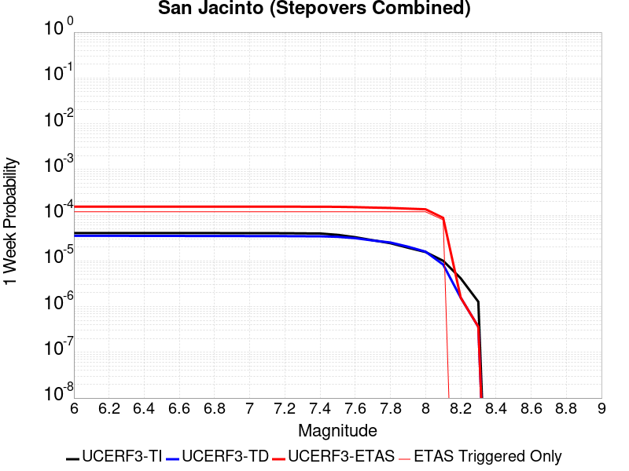 | 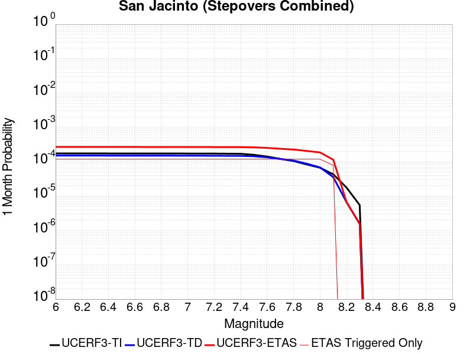 | 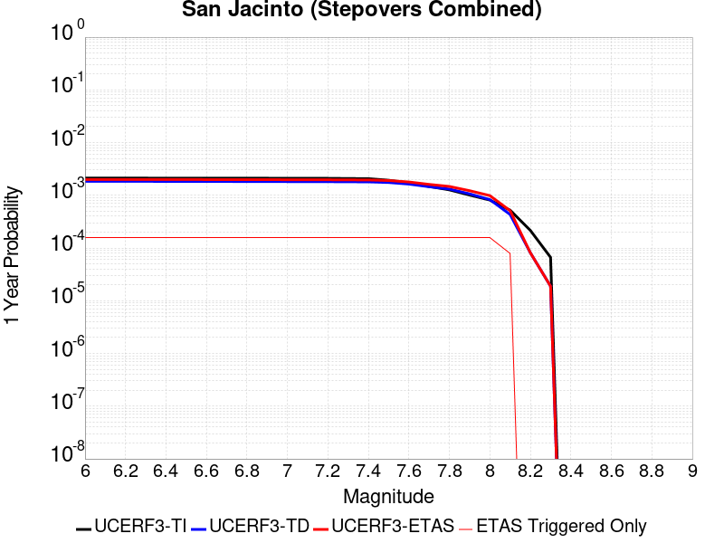 | 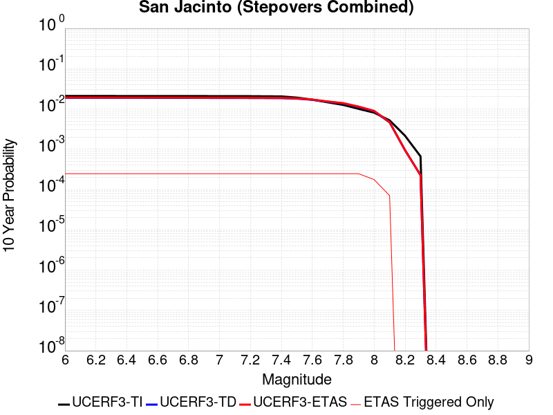 |

| Magnitude | 1 wk TI Prob | 1 wk TD Prob | 1 wk ETAS Prob | 1 wk ETAS/TD Gain | 1 wk ETAS Triggered Only | 1 mo TI Prob | 1 mo TD Prob | 1 mo ETAS Prob | 1 mo ETAS/TD Gain | 1 mo ETAS Triggered Only | 1 yr TI Prob | 1 yr TD Prob | 1 yr ETAS Prob | 1 yr ETAS/TD Gain | 1 yr ETAS Triggered Only | 10 yr TI Prob | 10 yr TD Prob | 10 yr ETAS Prob | 10 yr ETAS/TD Gain | 10 yr ETAS Triggered Only |
|-----|-----|-----|-----|-----|-----|-----|-----|-----|-----|-----|-----|-----|-----|-----|-----|-----|-----|-----|-----|-----|
| 6.0 | 4.0667746E-5 | 3.5272755E-5 | 1.5362112E-4 | 4.355234 | 1.1835253E-4 | 1.742787E-4 | 1.5116022E-4 | 2.6949486E-4 | 1.7828425 | 1.1835253E-4 | 0.0021197782 | 0.0018388226 | 0.0019963358 | 1.0856599 | 1.5780337E-4 | 0.020996714 | 0.018986892 | 0.0191804 | 1.0101917 | 1.9725422E-4 |
| 6.1 | 4.0667746E-5 | 3.5272755E-5 | 1.5362112E-4 | 4.355234 | 1.1835253E-4 | 1.742787E-4 | 1.5116022E-4 | 2.6949486E-4 | 1.7828425 | 1.1835253E-4 | 0.0021197782 | 0.0018388226 | 0.0019963358 | 1.0856599 | 1.5780337E-4 | 0.020996714 | 0.018986892 | 0.0191804 | 1.0101917 | 1.9725422E-4 |
| 6.2 | 4.0667746E-5 | 3.5272755E-5 | 1.5362112E-4 | 4.355234 | 1.1835253E-4 | 1.742787E-4 | 1.5116022E-4 | 2.6949486E-4 | 1.7828425 | 1.1835253E-4 | 0.0021197782 | 0.0018388226 | 0.0019963358 | 1.0856599 | 1.5780337E-4 | 0.020996714 | 0.018986892 | 0.0191804 | 1.0101917 | 1.9725422E-4 |
| 6.3 | 4.0667746E-5 | 3.5272755E-5 | 1.5362112E-4 | 4.355234 | 1.1835253E-4 | 1.742787E-4 | 1.5116022E-4 | 2.6949486E-4 | 1.7828425 | 1.1835253E-4 | 0.0021197782 | 0.0018388226 | 0.0019963358 | 1.0856599 | 1.5780337E-4 | 0.020996714 | 0.018986892 | 0.0191804 | 1.0101917 | 1.9725422E-4 |
| 6.4 | 4.0577226E-5 | 3.5144654E-5 | 1.5349303E-4 | 4.3674645 | 1.1835253E-4 | 1.738908E-4 | 1.5061127E-4 | 2.68946E-4 | 1.7856963 | 1.1835253E-4 | 0.0021150648 | 0.0018321523 | 0.0019896666 | 1.0859723 | 1.5780337E-4 | 0.020950472 | 0.018921461 | 0.019114982 | 1.0102277 | 1.9725422E-4 |
| 6.5 | 4.0577226E-5 | 3.5144654E-5 | 1.5349303E-4 | 4.3674645 | 1.1835253E-4 | 1.738908E-4 | 1.5061127E-4 | 2.68946E-4 | 1.7856963 | 1.1835253E-4 | 0.0021150648 | 0.0018321523 | 0.0019896666 | 1.0859723 | 1.5780337E-4 | 0.020950472 | 0.018921461 | 0.019114982 | 1.0102277 | 1.9725422E-4 |
| 6.6 | 4.053861E-5 | 3.509E-5 | 1.5343838E-4 | 4.3727093 | 1.1835253E-4 | 1.7372532E-4 | 1.5037706E-4 | 2.687118E-4 | 1.7869201 | 1.1835253E-4 | 0.0021130538 | 0.0018293057 | 0.0019868203 | 1.0861063 | 1.5780337E-4 | 0.020930743 | 0.018893538 | 0.019087067 | 1.010243 | 1.9725422E-4 |
| 6.7 | 4.0516545E-5 | 3.5059067E-5 | 1.5340745E-4 | 4.375685 | 1.1835253E-4 | 1.7363077E-4 | 1.5024451E-4 | 2.6857926E-4 | 1.7876145 | 1.1835253E-4 | 0.002111905 | 0.001827695 | 0.00198521 | 1.0861824 | 1.5780337E-4 | 0.020919468 | 0.018877735 | 0.019071266 | 1.0102518 | 1.9725422E-4 |
| 6.8 | 4.049434E-5 | 3.5030633E-5 | 1.5337902E-4 | 4.3784256 | 1.1835253E-4 | 1.7353562E-4 | 1.5012265E-4 | 2.6845743E-4 | 1.7882539 | 1.1835253E-4 | 0.0021107488 | 0.0018262138 | 0.001983729 | 1.0862523 | 1.5780337E-4 | 0.020908125 | 0.018863149 | 0.019056682 | 1.0102599 | 1.9725422E-4 |
| 6.9 | 4.046386E-5 | 3.499319E-5 | 1.5334158E-4 | 4.3820405 | 1.1835253E-4 | 1.73405E-4 | 1.4996222E-4 | 2.68297E-4 | 1.7890973 | 1.1835253E-4 | 0.0021091616 | 0.0018242638 | 0.0019817792 | 1.0863447 | 1.5780337E-4 | 0.020892553 | 0.01884392 | 0.019037457 | 1.0102706 | 1.9725422E-4 |
| 7.0 | 4.036382E-5 | 3.487376E-5 | 1.5322216E-4 | 4.3936234 | 1.1835253E-4 | 1.7297632E-4 | 1.4945042E-4 | 2.6778528E-4 | 1.7918 | 1.1835253E-4 | 0.0021039525 | 0.0018180435 | 0.00197556 | 1.0866406 | 1.5780337E-4 | 0.02084144 | 0.018782536 | 0.018976085 | 1.0103047 | 1.9725422E-4 |
| 7.1 | 4.0343282E-5 | 3.4852223E-5 | 1.5320063E-4 | 4.3957205 | 1.1835253E-4 | 1.7288832E-4 | 1.4935812E-4 | 2.67693E-4 | 1.7922894 | 1.1835253E-4 | 0.002102883 | 0.0018169218 | 0.0019744385 | 1.0866942 | 1.5780337E-4 | 0.020830948 | 0.018771412 | 0.018964965 | 1.010311 | 1.9725422E-4 |
| 7.2 | 4.0257353E-5 | 3.4756722E-5 | 1.5310514E-4 | 4.405051 | 1.1835253E-4 | 1.725201E-4 | 1.489489E-4 | 2.672838E-4 | 1.7944665 | 1.1835253E-4 | 0.0020984085 | 0.0018119477 | 0.001969465 | 1.0869327 | 1.5780337E-4 | 0.020787042 | 0.018722152 | 0.018915713 | 1.0103387 | 1.9725422E-4 |
| 7.3 | 3.9940667E-5 | 3.4584376E-5 | 1.5293281E-4 | 4.4220204 | 1.1835253E-4 | 1.7116306E-4 | 1.4821035E-4 | 2.6654534E-4 | 1.7984259 | 1.1835253E-4 | 0.0020819185 | 0.0018029709 | 0.0019604897 | 1.0873662 | 1.5780337E-4 | 0.020625217 | 0.018630784 | 0.018824363 | 1.0103903 | 1.9725422E-4 |
| 7.4 | 3.9721202E-5 | 3.4469766E-5 | 1.5281822E-4 | 4.4333987 | 1.1835253E-4 | 1.7022261E-4 | 1.4771923E-4 | 2.6605427E-4 | 1.801081 | 1.1835253E-4 | 0.0020704903 | 0.0017970012 | 0.001954521 | 1.0876571 | 1.5780337E-4 | 0.020513052 | 0.018569905 | 0.018763497 | 1.010425 | 1.9725422E-4 |
| 7.5 | 3.7036873E-5 | 3.3537188E-5 | 1.5188575E-4 | 4.528876 | 1.1835253E-4 | 1.5871979E-4 | 1.437229E-4 | 2.6205843E-4 | 1.8233589 | 1.1835253E-4 | 0.0019307006 | 0.0017484248 | 0.0019059522 | 1.0900968 | 1.5780337E-4 | 0.019140124 | 0.018071463 | 0.018265154 | 1.010718 | 1.9725422E-4 |
| 7.6 | 3.2940967E-5 | 3.1317984E-5 | 1.4966681E-4 | 4.778941 | 1.1835253E-4 | 1.4116794E-4 | 1.3421304E-4 | 2.5254968E-4 | 1.8817075 | 1.1835253E-4 | 0.0017173645 | 0.0016328214 | 0.0017903671 | 1.0964868 | 1.5780337E-4 | 0.01704153 | 0.016904354 | 0.017098274 | 1.0114716 | 1.9725422E-4 |
| 7.7 | 2.8236149E-5 | 2.7883889E-5 | 1.4623313E-4 | 5.244359 | 1.1835253E-4 | 1.2100645E-4 | 1.19496915E-4 | 2.3783531E-4 | 1.990305 | 1.1835253E-4 | 0.0014722579 | 0.001453905 | 0.001611479 | 1.1083798 | 1.5780337E-4 | 0.014625421 | 0.015115095 | 0.015309368 | 1.0128529 | 1.9725422E-4 |
| 7.8 | 2.4329287E-5 | 2.5207537E-5 | 1.4355709E-4 | 5.6950064 | 1.1835253E-4 | 1.042642E-4 | 1.0802783E-4 | 2.2636759E-4 | 2.0954561 | 1.1835253E-4 | 0.0012686774 | 0.0013144462 | 0.0014720421 | 1.1198953 | 1.5780337E-4 | 0.012614589 | 0.013712396 | 0.0139069455 | 1.0141878 | 1.9725422E-4 |
| 7.9 | 1.9370926E-5 | 2.0421452E-5 | 1.3877157E-4 | 6.795382 | 1.1835253E-4 | 8.301561E-5 | 8.7517576E-5 | 2.0585975E-4 | 2.3522103 | 1.1835253E-4 | 0.0010102465 | 0.0010650064 | 0.0012226417 | 1.1480135 | 1.5780337E-4 | 0.0100566605 | 0.011199483 | 0.011394528 | 1.0174155 | 1.9725422E-4 |
| 8.0 | 1.5583017E-5 | 1.588647E-5 | 1.3423713E-4 | 8.449778 | 1.1835253E-4 | 6.6782646E-5 | 6.808309E-5 | 1.8642757E-4 | 2.738236 | 1.1835253E-4 | 8.127754E-4 | 8.285971E-4 | 9.862697E-4 | 1.1902887 | 1.5780337E-4 | 0.008098091 | 0.008781809 | 0.008938227 | 1.0178115 | 1.5780337E-4 |
| 8.1 | 1.0024873E-5 | 8.292404E-6 | 8.719344E-5 | 10.514856 | 7.8901685E-5 | 4.2963035E-5 | 3.5538393E-5 | 1.1443728E-4 | 3.2201028 | 7.8901685E-5 | 5.229494E-4 | 4.3259456E-4 | 5.114621E-4 | 1.1823128 | 7.8901685E-5 | 0.0052172043 | 0.0046534105 | 0.004731945 | 1.0168768 | 7.8901685E-5 |
| 8.2 | 4.142796E-6 | 1.5610041E-6 | 1.5610041E-6 | 1.0 | 0.0 | 1.775472E-5 | 6.69E-6 | 6.69E-6 | 1.0 | 0.0 | 2.1614227E-4 | 8.144774E-5 | 8.144774E-5 | 1.0 | 0.0 | 0.0021593217 | 9.454649E-4 | 9.454649E-4 | 1.0 | 0.0 |
| 8.3 | 1.2750878E-6 | 3.612133E-7 | 3.612133E-7 | 1.0 | 0.0 | 5.4646503E-6 | 1.548056E-6 | 1.548056E-6 | 1.0 | 0.0 | 6.653009E-5 | 1.8847424E-5 | 1.8847424E-5 | 1.0 | 0.0 | 6.6510175E-4 | 2.2734253E-4 | 2.2734253E-4 | 1.0 | 0.0 |

## Kern Canyon (North Kern) 2011
*[(top)](#table-of-contents)*

| 1 Week | 1 Month | 1 Year | 10 Year |
|-----|-----|-----|-----|
| 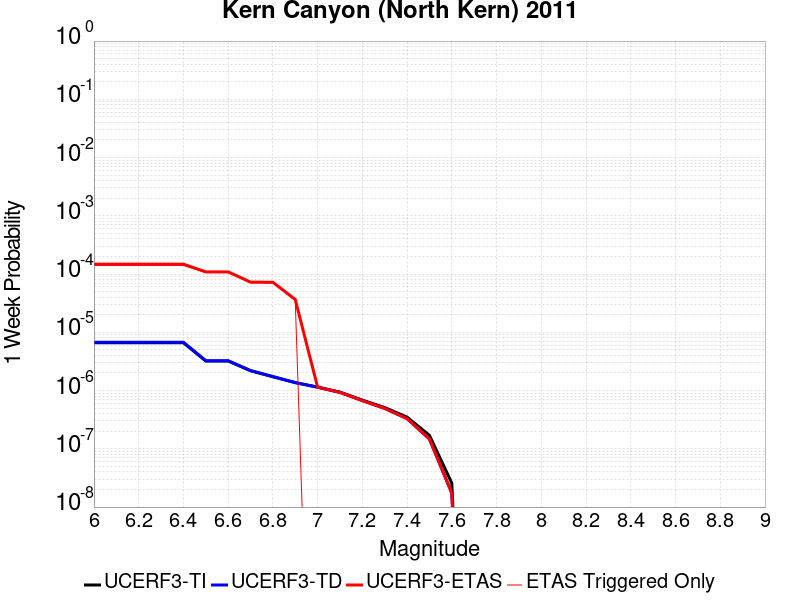 | 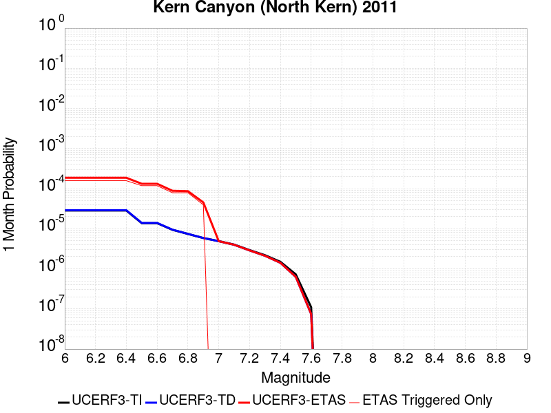 | 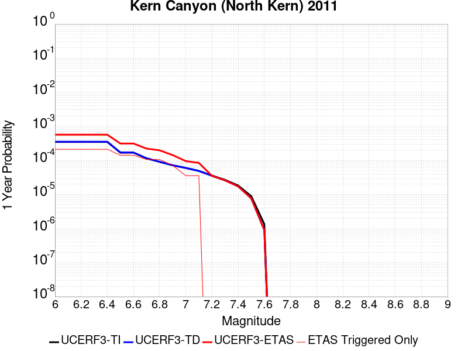 | 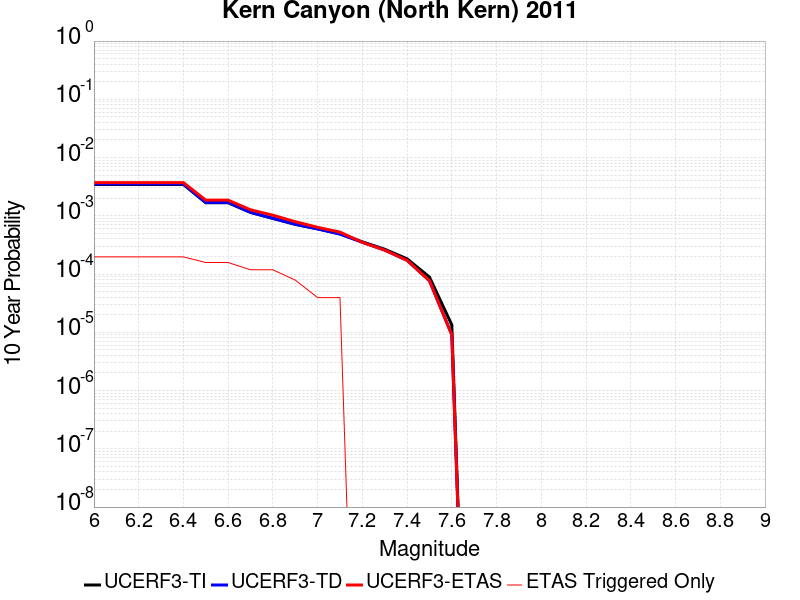 |

| Magnitude | 1 wk TI Prob | 1 wk TD Prob | 1 wk ETAS Prob | 1 wk ETAS/TD Gain | 1 wk ETAS Triggered Only | 1 mo TI Prob | 1 mo TD Prob | 1 mo ETAS Prob | 1 mo ETAS/TD Gain | 1 mo ETAS Triggered Only | 1 yr TI Prob | 1 yr TD Prob | 1 yr ETAS Prob | 1 yr ETAS/TD Gain | 1 yr ETAS Triggered Only | 10 yr TI Prob | 10 yr TD Prob | 10 yr ETAS Prob | 10 yr ETAS/TD Gain | 10 yr ETAS Triggered Only |
|-----|-----|-----|-----|-----|-----|-----|-----|-----|-----|-----|-----|-----|-----|-----|-----|-----|-----|-----|-----|-----|
| 6.0 | 6.6264497E-6 | 6.75733E-6 | 1.2510906E-4 | 18.51457 | 1.1835253E-4 | 2.8398761E-5 | 2.895971E-5 | 1.8675852E-4 | 6.4489083 | 1.5780337E-4 | 3.4570007E-4 | 3.5253543E-4 | 5.4972013E-4 | 1.559333 | 1.9725422E-4 | 0.0034516277 | 0.0035205502 | 0.00371711 | 1.0558321 | 1.9725422E-4 |
| 6.1 | 6.6264497E-6 | 6.75733E-6 | 1.2510906E-4 | 18.51457 | 1.1835253E-4 | 2.8398761E-5 | 2.895971E-5 | 1.8675852E-4 | 6.4489083 | 1.5780337E-4 | 3.4570007E-4 | 3.5253543E-4 | 5.4972013E-4 | 1.559333 | 1.9725422E-4 | 0.0034516277 | 0.0035205502 | 0.00371711 | 1.0558321 | 1.9725422E-4 |
| 6.2 | 6.6264497E-6 | 6.75733E-6 | 1.2510906E-4 | 18.51457 | 1.1835253E-4 | 2.8398761E-5 | 2.895971E-5 | 1.8675852E-4 | 6.4489083 | 1.5780337E-4 | 3.4570007E-4 | 3.5253543E-4 | 5.4972013E-4 | 1.559333 | 1.9725422E-4 | 0.0034516277 | 0.0035205502 | 0.00371711 | 1.0558321 | 1.9725422E-4 |
| 6.3 | 6.6264497E-6 | 6.75733E-6 | 1.2510906E-4 | 18.51457 | 1.1835253E-4 | 2.8398761E-5 | 2.895971E-5 | 1.8675852E-4 | 6.4489083 | 1.5780337E-4 | 3.4570007E-4 | 3.5253543E-4 | 5.4972013E-4 | 1.559333 | 1.9725422E-4 | 0.0034516277 | 0.0035205502 | 0.00371711 | 1.0558321 | 1.9725422E-4 |
| 6.4 | 6.6264497E-6 | 6.75733E-6 | 1.2510906E-4 | 18.51457 | 1.1835253E-4 | 2.8398761E-5 | 2.895971E-5 | 1.8675852E-4 | 6.4489083 | 1.5780337E-4 | 3.4570007E-4 | 3.5253543E-4 | 5.4972013E-4 | 1.559333 | 1.9725422E-4 | 0.0034516277 | 0.0035205502 | 0.00371711 | 1.0558321 | 1.9725422E-4 |
| 6.5 | 3.2162225E-6 | 3.2570915E-6 | 1.21609235E-4 | 37.336758 | 1.1835253E-4 | 1.3783738E-5 | 1.3958893E-5 | 1.3230977E-4 | 9.478529 | 1.1835253E-4 | 1.6780409E-4 | 1.6993708E-4 | 3.2771364E-4 | 1.928441 | 1.5780337E-4 | 0.0016767744 | 0.001698151 | 0.0018556864 | 1.0927688 | 1.5780337E-4 |
| 6.6 | 3.2162225E-6 | 3.2570915E-6 | 1.21609235E-4 | 37.336758 | 1.1835253E-4 | 1.3783738E-5 | 1.3958893E-5 | 1.3230977E-4 | 9.478529 | 1.1835253E-4 | 1.6780409E-4 | 1.6993708E-4 | 3.2771364E-4 | 1.928441 | 1.5780337E-4 | 0.0016767744 | 0.001698151 | 0.0018556864 | 1.0927688 | 1.5780337E-4 |
| 6.7 | 2.1908265E-6 | 2.2071222E-6 | 8.1108636E-5 | 36.748596 | 7.8901685E-5 | 9.389223E-6 | 9.459061E-6 | 8.836E-5 | 9.341308 | 7.8901685E-5 | 1.1430779E-4 | 1.1515819E-4 | 2.3349709E-4 | 2.0276203 | 1.1835253E-4 | 0.0011424901 | 0.0011510046 | 0.0012692208 | 1.102707 | 1.1835253E-4 |
| 6.8 | 1.7303895E-6 | 1.7365529E-6 | 8.063811E-5 | 46.435734 | 7.8901685E-5 | 7.415934E-6 | 7.4423488E-6 | 8.634345E-5 | 11.60164 | 7.8901685E-5 | 9.028525E-5 | 9.0606925E-5 | 2.0894874E-4 | 2.306101 | 1.1835253E-4 | 9.024858E-4 | 9.057096E-4 | 0.001023955 | 1.1305555 | 1.1835253E-4 |
| 6.9 | 1.3700314E-6 | 1.3688622E-6 | 4.0819654E-5 | 29.820133 | 3.9450842E-5 | 5.87155E-6 | 5.8665396E-6 | 4.5317152E-5 | 7.7246823 | 3.9450842E-5 | 7.148377E-5 | 7.142282E-5 | 1.5031887E-4 | 2.1046336 | 7.8901685E-5 | 7.146078E-4 | 7.140032E-4 | 7.928486E-4 | 1.1104271 | 7.8901685E-5 |
| 7.0 | 1.1467797E-6 | 1.1413804E-6 | 1.1413804E-6 | 1.0 | 0.0 | 4.9147607E-6 | 4.8916213E-6 | 4.8916213E-6 | 1.0 | 0.0 | 5.983557E-5 | 5.9553895E-5 | 9.900239E-5 | 1.6623999 | 3.9450842E-5 | 5.981946E-4 | 5.953825E-4 | 6.3480984E-4 | 1.0662218 | 3.9450842E-5 |
| 7.1 | 9.3952065E-7 | 9.3026904E-7 | 9.3026904E-7 | 1.0 | 0.0 | 4.026511E-6 | 3.9868614E-6 | 3.9868614E-6 | 1.0 | 0.0 | 4.9021666E-5 | 4.8538972E-5 | 8.79879E-5 | 1.8127269 | 3.9450842E-5 | 4.901085E-4 | 4.8528548E-4 | 5.247172E-4 | 1.0812546 | 3.9450842E-5 |
| 7.2 | 6.858055E-7 | 6.7193E-7 | 6.7193E-7 | 1.0 | 0.0 | 2.939163E-6 | 2.879697E-6 | 2.879697E-6 | 1.0 | 0.0 | 3.5783723E-5 | 3.5059755E-5 | 3.5059755E-5 | 1.0 | 0.0 | 3.5777962E-4 | 3.5054312E-4 | 3.5054312E-4 | 1.0 | 0.0 |
| 7.3 | 5.1101983E-7 | 4.9393E-7 | 4.9393E-7 | 1.0 | 0.0 | 2.1900833E-6 | 2.116841E-6 | 2.116841E-6 | 1.0 | 0.0 | 2.6663936E-5 | 2.5772239E-5 | 2.5772239E-5 | 1.0 | 0.0 | 2.6660739E-4 | 2.57693E-4 | 2.57693E-4 | 1.0 | 0.0 |
| 7.4 | 3.4999414E-7 | 3.2995905E-7 | 3.2995905E-7 | 1.0 | 0.0 | 1.499974E-6 | 1.4141094E-6 | 1.4141094E-6 | 1.0 | 0.0 | 1.8262032E-5 | 1.721665E-5 | 1.721665E-5 | 1.0 | 0.0 | 1.826053E-4 | 1.7215339E-4 | 1.7215339E-4 | 1.0 | 0.0 |
| 7.5 | 1.7021522E-7 | 1.4750044E-7 | 1.4750044E-7 | 1.0 | 0.0 | 7.2949354E-7 | 6.321446E-7 | 6.321446E-7 | 1.0 | 0.0 | 8.881548E-6 | 7.696334E-6 | 7.696334E-6 | 1.0 | 0.0 | 8.8811925E-5 | 7.696076E-5 | 7.696076E-5 | 1.0 | 0.0 |
| 7.6 | 2.572245E-8 | 1.7352555E-8 | 1.7352555E-8 | 1.0 | 0.0 | 1.10239064E-7 | 7.436809E-8 | 7.436809E-8 | 1.0 | 0.0 | 1.3421597E-6 | 9.054312E-7 | 9.054312E-7 | 1.0 | 0.0 | 1.3421517E-5 | 9.05428E-6 | 9.05428E-6 | 1.0 | 0.0 |

## Cucamonga
*[(top)](#table-of-contents)*

| 1 Week | 1 Month | 1 Year | 10 Year |
|-----|-----|-----|-----|
| 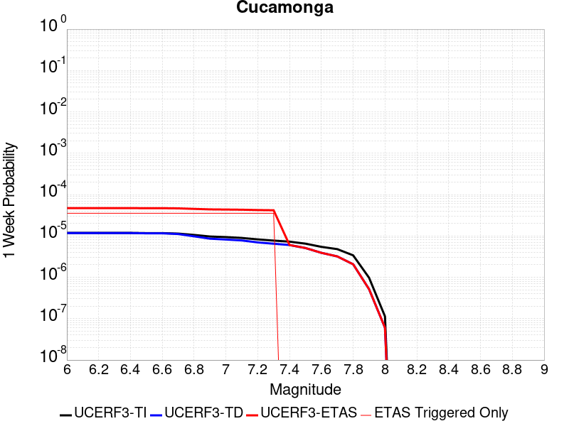 | 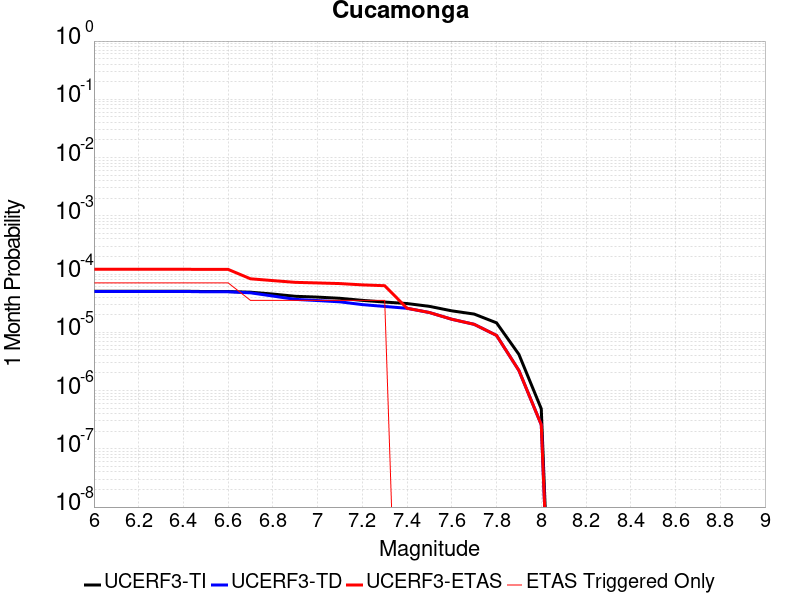 | 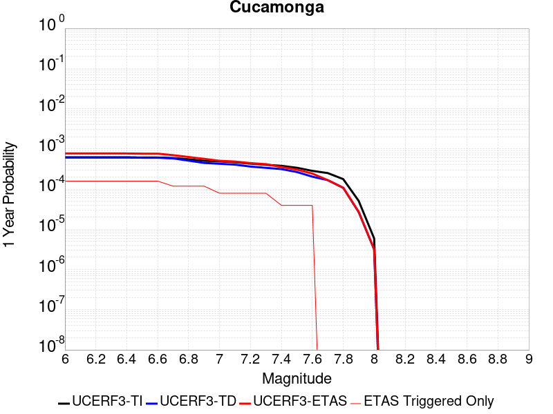 | 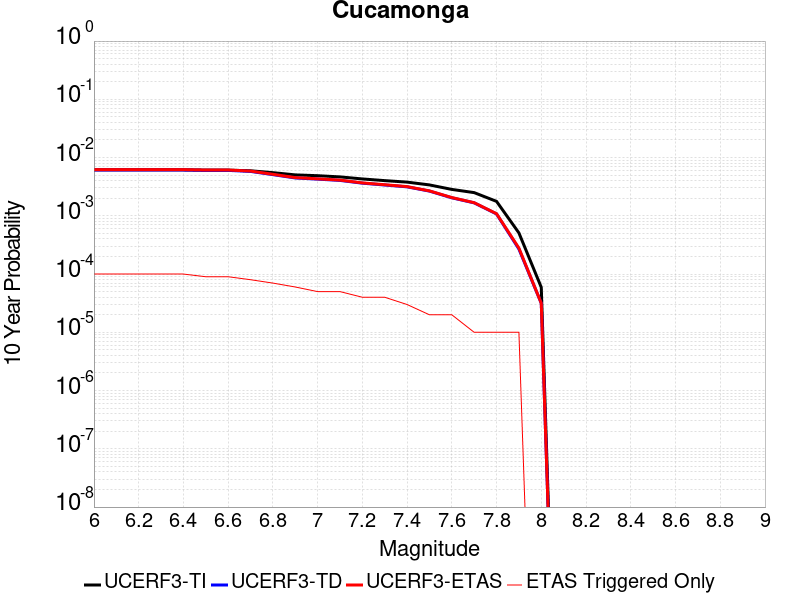 |

| Magnitude | 1 wk TI Prob | 1 wk TD Prob | 1 wk ETAS Prob | 1 wk ETAS/TD Gain | 1 wk ETAS Triggered Only | 1 mo TI Prob | 1 mo TD Prob | 1 mo ETAS Prob | 1 mo ETAS/TD Gain | 1 mo ETAS Triggered Only | 1 yr TI Prob | 1 yr TD Prob | 1 yr ETAS Prob | 1 yr ETAS/TD Gain | 1 yr ETAS Triggered Only | 10 yr TI Prob | 10 yr TD Prob | 10 yr ETAS Prob | 10 yr ETAS/TD Gain | 10 yr ETAS Triggered Only |
|-----|-----|-----|-----|-----|-----|-----|-----|-----|-----|-----|-----|-----|-----|-----|-----|-----|-----|-----|-----|-----|
| 6.0 | 1.1848348E-5 | 1.1737008E-5 | 5.1187388E-5 | 4.3611956 | 3.9450842E-5 | 5.0777642E-5 | 5.030051E-5 | 1.2919823E-4 | 2.5685272 | 7.8901685E-5 | 6.180424E-4 | 6.1223935E-4 | 7.699461E-4 | 1.25759 | 1.5780337E-4 | 0.0061632637 | 0.0061067017 | 0.0063027516 | 1.032104 | 1.9725422E-4 |
| 6.1 | 1.1848348E-5 | 1.1737008E-5 | 5.1187388E-5 | 4.3611956 | 3.9450842E-5 | 5.0777642E-5 | 5.030051E-5 | 1.2919823E-4 | 2.5685272 | 7.8901685E-5 | 6.180424E-4 | 6.1223935E-4 | 7.699461E-4 | 1.25759 | 1.5780337E-4 | 0.0061632637 | 0.0061067017 | 0.0063027516 | 1.032104 | 1.9725422E-4 |
| 6.2 | 1.1848348E-5 | 1.1737008E-5 | 5.1187388E-5 | 4.3611956 | 3.9450842E-5 | 5.0777642E-5 | 5.030051E-5 | 1.2919823E-4 | 2.5685272 | 7.8901685E-5 | 6.180424E-4 | 6.1223935E-4 | 7.699461E-4 | 1.25759 | 1.5780337E-4 | 0.0061632637 | 0.0061067017 | 0.0063027516 | 1.032104 | 1.9725422E-4 |
| 6.3 | 1.1848348E-5 | 1.1737008E-5 | 5.1187388E-5 | 4.3611956 | 3.9450842E-5 | 5.0777642E-5 | 5.030051E-5 | 1.2919823E-4 | 2.5685272 | 7.8901685E-5 | 6.180424E-4 | 6.1223935E-4 | 7.699461E-4 | 1.25759 | 1.5780337E-4 | 0.0061632637 | 0.0061067017 | 0.0063027516 | 1.032104 | 1.9725422E-4 |
| 6.4 | 1.1848348E-5 | 1.1737008E-5 | 5.1187388E-5 | 4.3611956 | 3.9450842E-5 | 5.0777642E-5 | 5.030051E-5 | 1.2919823E-4 | 2.5685272 | 7.8901685E-5 | 6.180424E-4 | 6.1223935E-4 | 7.699461E-4 | 1.25759 | 1.5780337E-4 | 0.0061632637 | 0.0061067017 | 0.0063027516 | 1.032104 | 1.9725422E-4 |
| 6.5 | 1.16988695E-5 | 1.15760395E-5 | 5.1026425E-5 | 4.4079347 | 3.9450842E-5 | 5.013705E-5 | 4.9610666E-5 | 1.2850844E-4 | 2.590339 | 7.8901685E-5 | 6.102476E-4 | 6.0384517E-4 | 7.6155324E-4 | 1.261173 | 1.5780337E-4 | 0.006085745 | 0.006023216 | 0.0062192823 | 1.0325518 | 1.9725422E-4 |
| 6.6 | 1.16988695E-5 | 1.15760395E-5 | 5.1026425E-5 | 4.4079347 | 3.9450842E-5 | 5.013705E-5 | 4.9610666E-5 | 1.2850844E-4 | 2.590339 | 7.8901685E-5 | 6.102476E-4 | 6.0384517E-4 | 7.6155324E-4 | 1.261173 | 1.5780337E-4 | 0.006085745 | 0.006023216 | 0.0062192823 | 1.0325518 | 1.9725422E-4 |
| 6.7 | 1.1397107E-5 | 1.11149475E-5 | 5.0565355E-5 | 4.549311 | 3.9450842E-5 | 4.884383E-5 | 4.7634636E-5 | 8.70836E-5 | 1.8281572 | 3.9450842E-5 | 5.9451134E-4 | 5.797998E-4 | 6.980838E-4 | 1.2040082 | 1.1835253E-4 | 0.005929234 | 0.0057840226 | 0.005940913 | 1.0271249 | 1.5780337E-4 |
| 6.8 | 1.058387E-5 | 9.784992E-6 | 4.923545E-5 | 5.0317316 | 3.9450842E-5 | 4.5358654E-5 | 4.193501E-5 | 8.13842E-5 | 1.9407221 | 3.9450842E-5 | 5.521017E-4 | 5.1044027E-4 | 6.287324E-4 | 1.2317452 | 1.1835253E-4 | 0.00550732 | 0.0050936877 | 0.0052506872 | 1.0308224 | 1.5780337E-4 |
| 6.9 | 9.690046E-6 | 8.57948E-6 | 4.8029986E-5 | 5.5982394 | 3.9450842E-5 | 4.1528107E-5 | 3.6768684E-5 | 7.621808E-5 | 2.0729074 | 3.9450842E-5 | 5.054874E-4 | 4.475672E-4 | 5.6586677E-4 | 1.2643169 | 1.1835253E-4 | 0.005043391 | 0.004467594 | 0.0046246923 | 1.035164 | 1.5780337E-4 |
| 7.0 | 9.381461E-6 | 8.187101E-6 | 4.7637623E-5 | 5.818619 | 3.9450842E-5 | 4.020564E-5 | 3.5087105E-5 | 7.453657E-5 | 2.1243293 | 3.9450842E-5 | 4.893937E-4 | 4.2710215E-4 | 5.0597015E-4 | 1.1846584 | 7.8901685E-5 | 0.0048831734 | 0.0042637475 | 0.004381595 | 1.0276395 | 1.1835253E-4 |
| 7.1 | 8.946492E-6 | 7.781886E-6 | 4.7232425E-5 | 6.0695343 | 3.9450842E-5 | 3.8341543E-5 | 3.3350516E-5 | 7.2800045E-5 | 2.182876 | 3.9450842E-5 | 4.667083E-4 | 4.0596718E-4 | 4.8483684E-4 | 1.194276 | 7.8901685E-5 | 0.0046572937 | 0.004053192 | 0.004171065 | 1.0290815 | 1.1835253E-4 |
| 7.2 | 8.251016E-6 | 6.9752796E-6 | 4.642585E-5 | 6.655769 | 3.9450842E-5 | 3.5361016E-5 | 2.9893714E-5 | 6.9343376E-5 | 2.3196642 | 3.9450842E-5 | 4.3043532E-4 | 3.6389544E-4 | 4.4276842E-4 | 1.2167462 | 7.8901685E-5 | 0.0042960253 | 0.0036339292 | 0.0037518516 | 1.0324504 | 1.1835253E-4 |
| 7.3 | 7.717881E-6 | 6.4863502E-6 | 4.593694E-5 | 7.0820932 | 3.9450842E-5 | 3.3076216E-5 | 2.7798349E-5 | 6.72481E-5 | 2.4191399 | 3.9450842E-5 | 4.026285E-4 | 3.3839257E-4 | 4.1726755E-4 | 1.2330872 | 7.8901685E-5 | 0.004018998 | 0.00337971 | 0.0034976625 | 1.0349002 | 1.1835253E-4 |
| 7.4 | 7.275623E-6 | 6.031997E-6 | 6.031997E-6 | 1.0 | 0.0 | 3.118087E-5 | 2.585116E-5 | 2.585116E-5 | 1.0 | 0.0 | 3.7956095E-4 | 3.1469265E-4 | 3.5413107E-4 | 1.1253237 | 3.9450842E-5 | 0.0037891332 | 0.0031434062 | 0.00322206 | 1.0250218 | 7.8901685E-5 |
| 7.5 | 6.5109502E-6 | 5.1006014E-6 | 5.1006014E-6 | 1.0 | 0.0 | 2.7903774E-5 | 2.1859538E-5 | 2.1859538E-5 | 1.0 | 0.0 | 3.3967546E-4 | 2.661075E-4 | 3.0554784E-4 | 1.1482121 | 3.9450842E-5 | 0.0033915674 | 0.002658813 | 0.002737505 | 1.0295967 | 7.8901685E-5 |
| 7.6 | 5.4495326E-6 | 3.90857E-6 | 3.90857E-6 | 1.0 | 0.0 | 2.335493E-5 | 1.6750908E-5 | 1.6750908E-5 | 1.0 | 0.0 | 2.8430918E-4 | 2.0392328E-4 | 2.4336607E-4 | 1.1934198 | 3.9450842E-5 | 0.0028394572 | 0.002038282 | 0.002117023 | 1.038631 | 7.8901685E-5 |
| 7.7 | 4.7997164E-6 | 3.2002547E-6 | 3.2002547E-6 | 1.0 | 0.0 | 2.057005E-5 | 1.3715306E-5 | 1.3715306E-5 | 1.0 | 0.0 | 2.504116E-4 | 1.6697108E-4 | 1.6697108E-4 | 1.0 | 0.0 | 0.002501296 | 0.0016693877 | 0.0017087726 | 1.0235925 | 3.9450842E-5 |
| 7.8 | 3.3941733E-6 | 2.0641899E-6 | 2.0641899E-6 | 1.0 | 0.0 | 1.4546376E-5 | 8.846498E-6 | 8.846498E-6 | 1.0 | 0.0 | 1.7708774E-4 | 1.07700806E-4 | 1.07700806E-4 | 1.0 | 0.0 | 0.0017694668 | 0.001076723 | 0.0011161313 | 1.0366002 | 3.9450842E-5 |
| 7.9 | 9.750552E-7 | 5.155946E-7 | 5.155946E-7 | 1.0 | 0.0 | 4.178801E-6 | 2.2096892E-6 | 2.2096892E-6 | 1.0 | 0.0 | 5.0875715E-5 | 2.690264E-5 | 2.690264E-5 | 1.0 | 0.0 | 5.086407E-4 | 2.6899425E-4 | 3.0843448E-4 | 1.1466211 | 3.9450842E-5 |
| 8.0 | 1.133857E-7 | 6.053707E-8 | 6.053707E-8 | 1.0 | 0.0 | 4.8593864E-7 | 2.5944456E-7 | 2.5944456E-7 | 1.0 | 0.0 | 5.9162867E-6 | 3.158733E-6 | 3.158733E-6 | 1.0 | 0.0 | 5.916129E-5 | 3.1586897E-5 | 3.1586897E-5 | 1.0 | 0.0 |

## Coronado Bank alt1
*[(top)](#table-of-contents)*

| 1 Week | 1 Month | 1 Year | 10 Year |
|-----|-----|-----|-----|
| 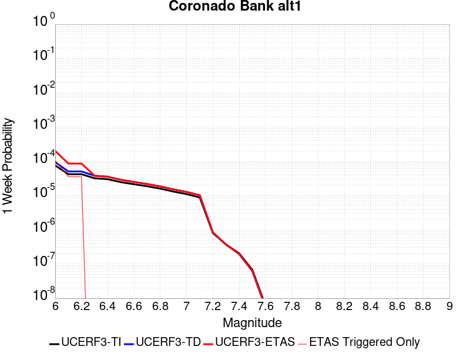 | 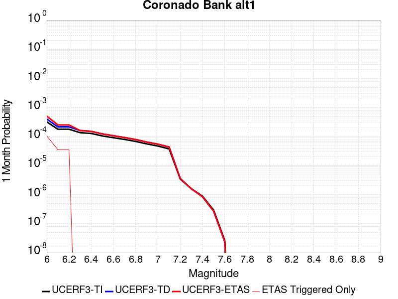 | 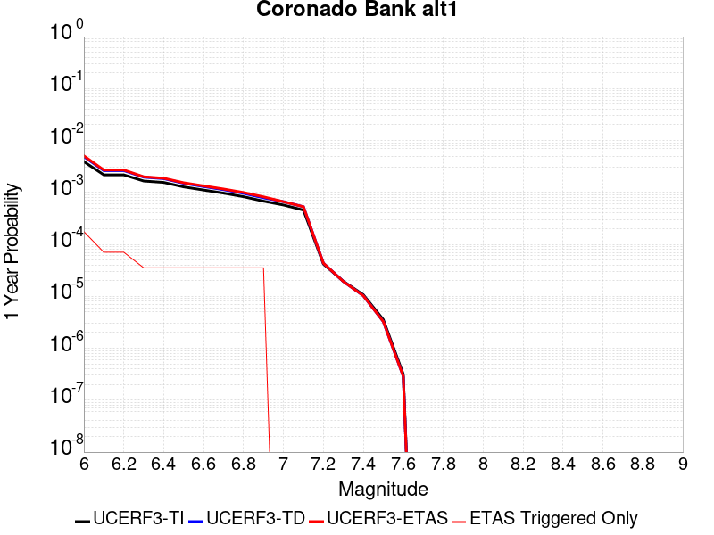 |  |

| Magnitude | 1 wk TI Prob | 1 wk TD Prob | 1 wk ETAS Prob | 1 wk ETAS/TD Gain | 1 wk ETAS Triggered Only | 1 mo TI Prob | 1 mo TD Prob | 1 mo ETAS Prob | 1 mo ETAS/TD Gain | 1 mo ETAS Triggered Only | 1 yr TI Prob | 1 yr TD Prob | 1 yr ETAS Prob | 1 yr ETAS/TD Gain | 1 yr ETAS Triggered Only | 10 yr TI Prob | 10 yr TD Prob | 10 yr ETAS Prob | 10 yr ETAS/TD Gain | 10 yr ETAS Triggered Only |
|-----|-----|-----|-----|-----|-----|-----|-----|-----|-----|-----|-----|-----|-----|-----|-----|-----|-----|-----|-----|-----|
| 6.0 | 7.533492E-5 | 9.394913E-5 | 2.1229054E-4 | 2.2596328 | 1.1835253E-4 | 3.22824E-4 | 4.0258127E-4 | 5.2088615E-4 | 1.2938658 | 1.1835253E-4 | 0.0039233007 | 0.0048909658 | 0.005087255 | 1.0401331 | 1.9725422E-4 | 0.03854755 | 0.04790356 | 0.048091367 | 1.0039204 | 1.9725422E-4 |
| 6.1 | 4.1807285E-5 | 5.049283E-5 | 8.9941685E-5 | 1.7812763 | 3.9450842E-5 | 1.7916178E-4 | 2.1638049E-4 | 2.558228E-4 | 1.1822822 | 3.9450842E-5 | 0.0021791123 | 0.0026313474 | 0.0027100416 | 1.0299064 | 7.8901685E-5 | 0.021578677 | 0.026011046 | 0.026087897 | 1.0029545 | 7.8901685E-5 |
| 6.2 | 4.1807285E-5 | 5.049283E-5 | 8.9941685E-5 | 1.7812763 | 3.9450842E-5 | 1.7916178E-4 | 2.1638049E-4 | 2.558228E-4 | 1.1822822 | 3.9450842E-5 | 0.0021791123 | 0.0026313474 | 0.0027100416 | 1.0299064 | 7.8901685E-5 | 0.021578677 | 0.026011046 | 0.026087897 | 1.0029545 | 7.8901685E-5 |
| 6.3 | 3.1793104E-5 | 3.7711117E-5 | 3.7711117E-5 | 1.0 | 0.0 | 1.3624904E-4 | 1.6160926E-4 | 1.6160926E-4 | 1.0 | 0.0 | 0.0016575698 | 0.001965848 | 0.0020052213 | 1.0200287 | 3.9450842E-5 | 0.016452603 | 0.019488465 | 0.019527147 | 1.0019848 | 3.9450842E-5 |
| 6.4 | 2.9878007E-5 | 3.5335794E-5 | 3.5335794E-5 | 1.0 | 0.0 | 1.2804232E-4 | 1.5143053E-4 | 1.5143053E-4 | 1.0 | 0.0 | 0.0015578003 | 0.0018421387 | 0.0018815169 | 1.0213764 | 3.9450842E-5 | 0.015469253 | 0.01827244 | 0.01831117 | 1.0021195 | 3.9450842E-5 |
| 6.5 | 2.4512565E-5 | 2.8764043E-5 | 2.8764043E-5 | 1.0 | 0.0 | 1.0504962E-4 | 1.2326881E-4 | 1.2326881E-4 | 1.0 | 0.0 | 0.0012782287 | 0.0014997921 | 0.0015391838 | 1.0262648 | 3.9450842E-5 | 0.012709012 | 0.014899683 | 0.014938546 | 1.0026083 | 3.9450842E-5 |
| 6.6 | 2.1317413E-5 | 2.490667E-5 | 2.490667E-5 | 1.0 | 0.0 | 9.135714E-5 | 1.0673863E-4 | 1.0673863E-4 | 1.0 | 0.0 | 0.0011117056 | 0.0012987906 | 0.0013381902 | 1.0303357 | 3.9450842E-5 | 0.011061605 | 0.012914404 | 0.012953346 | 1.0030154 | 3.9450842E-5 |
| 6.7 | 1.8585655E-5 | 2.163488E-5 | 2.163488E-5 | 1.0 | 0.0 | 7.9650374E-5 | 9.271773E-5 | 9.271773E-5 | 1.0 | 0.0 | 9.6931186E-4 | 0.0011282742 | 0.0011676806 | 1.0349262 | 3.9450842E-5 | 0.0096509475 | 0.011227623 | 0.01126663 | 1.0034742 | 3.9450842E-5 |
| 6.8 | 1.5862879E-5 | 1.8419474E-5 | 1.8419474E-5 | 1.0 | 0.0 | 6.798199E-5 | 7.893833E-5 | 7.893833E-5 | 1.0 | 0.0 | 8.273665E-4 | 9.6066965E-4 | 0.0010000826 | 1.0410266 | 3.9450842E-5 | 0.008242928 | 0.00956715 | 0.009606224 | 1.0040841 | 3.9450842E-5 |
| 6.9 | 1.3021509E-5 | 1.5095265E-5 | 1.5095265E-5 | 1.0 | 0.0 | 5.5805274E-5 | 6.469249E-5 | 6.469249E-5 | 1.0 | 0.0 | 6.792174E-4 | 7.8736455E-4 | 8.267843E-4 | 1.0500655 | 3.9450842E-5 | 0.006771452 | 0.007847573 | 0.007886713 | 1.0049877 | 3.9450842E-5 |
| 7.0 | 1.0974371E-5 | 1.2720104E-5 | 1.2720104E-5 | 1.0 | 0.0 | 4.7032172E-5 | 5.451369E-5 | 5.451369E-5 | 1.0 | 0.0 | 5.7246623E-4 | 6.6351966E-4 | 6.6351966E-4 | 1.0 | 0.0 | 0.0057099373 | 0.006617135 | 0.006617135 | 1.0 | 0.0 |
| 7.1 | 8.766221E-6 | 1.01638325E-5 | 1.01638325E-5 | 1.0 | 0.0 | 3.7568978E-5 | 4.355865E-5 | 4.355865E-5 | 1.0 | 0.0 | 4.573063E-4 | 5.3021475E-4 | 5.3021475E-4 | 1.0 | 0.0 | 0.0045636636 | 0.0052911965 | 0.0052911965 | 1.0 | 0.0 |
| 7.2 | 8.026024E-7 | 8.331765E-7 | 8.331765E-7 | 1.0 | 0.0 | 3.43972E-6 | 3.5707515E-6 | 3.5707515E-6 | 1.0 | 0.0 | 4.1877785E-5 | 4.3473043E-5 | 4.3473043E-5 | 1.0 | 0.0 | 4.1869894E-4 | 4.3464647E-4 | 4.3464647E-4 | 1.0 | 0.0 |
| 7.3 | 3.7293114E-7 | 3.7000953E-7 | 3.7000953E-7 | 1.0 | 0.0 | 1.5982754E-6 | 1.5857541E-6 | 1.5857541E-6 | 1.0 | 0.0 | 1.9458828E-5 | 1.9306386E-5 | 1.9306386E-5 | 1.0 | 0.0 | 1.9457124E-4 | 1.9304715E-4 | 1.9304715E-4 | 1.0 | 0.0 |
| 7.4 | 2.0557036E-7 | 1.9674363E-7 | 1.9674363E-7 | 1.0 | 0.0 | 8.810155E-7 | 8.431867E-7 | 8.431867E-7 | 1.0 | 0.0 | 1.0726311E-5 | 1.026575E-5 | 1.026575E-5 | 1.0 | 0.0 | 1.0725793E-4 | 1.0265279E-4 | 1.0265279E-4 | 1.0 | 0.0 |
| 7.5 | 6.845446E-8 | 6.279369E-8 | 6.279369E-8 | 1.0 | 0.0 | 2.9337625E-7 | 2.691158E-7 | 2.691158E-7 | 1.0 | 0.0 | 3.5718497E-6 | 3.2764797E-6 | 3.2764797E-6 | 1.0 | 0.0 | 3.5717923E-5 | 3.2764325E-5 | 3.2764325E-5 | 1.0 | 0.0 |
| 7.6 | 6.0975145E-9 | 5.53185E-9 | 5.53185E-9 | 1.0 | 0.0 | 2.6132206E-8 | 2.370793E-8 | 2.370793E-8 | 1.0 | 0.0 | 3.1815955E-7 | 2.88644E-7 | 2.88644E-7 | 1.0 | 0.0 | 3.181591E-6 | 2.8864374E-6 | 2.8864374E-6 | 1.0 | 0.0 |

## Chino alt 1
*[(top)](#table-of-contents)*

| 1 Week | 1 Month | 1 Year | 10 Year |
|-----|-----|-----|-----|
| 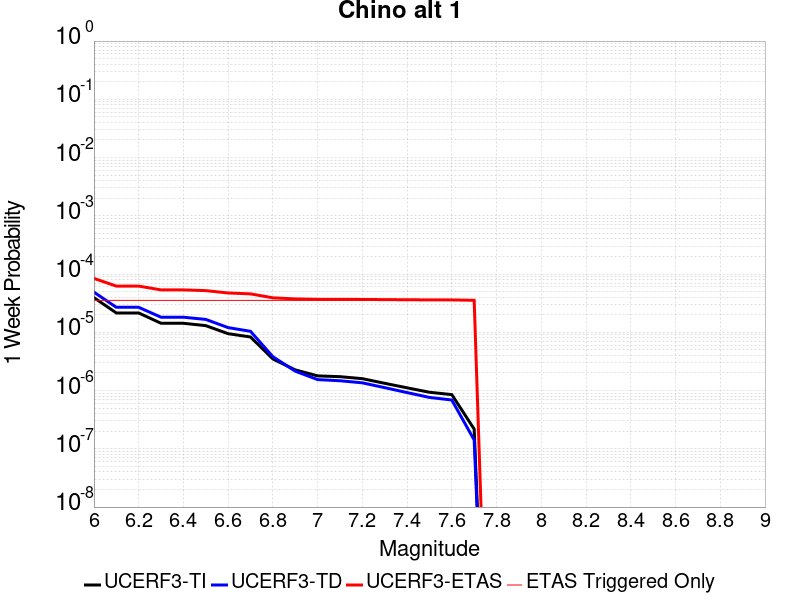 | 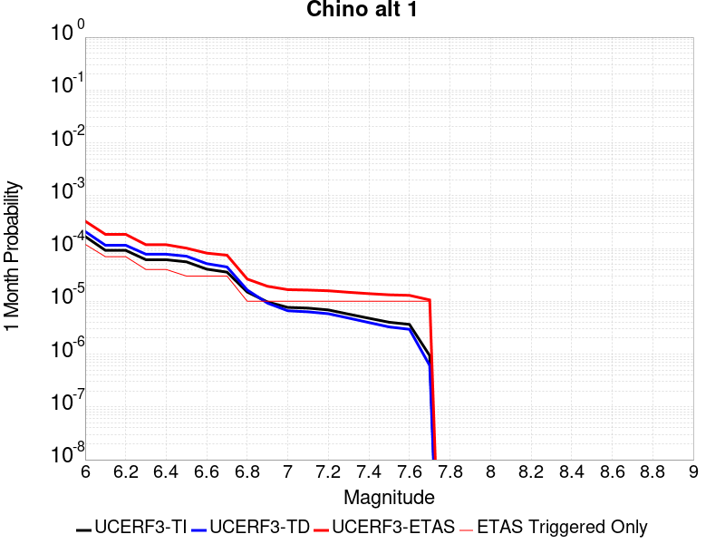 | 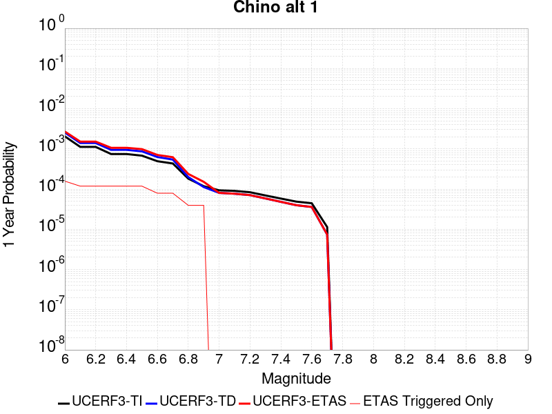 | 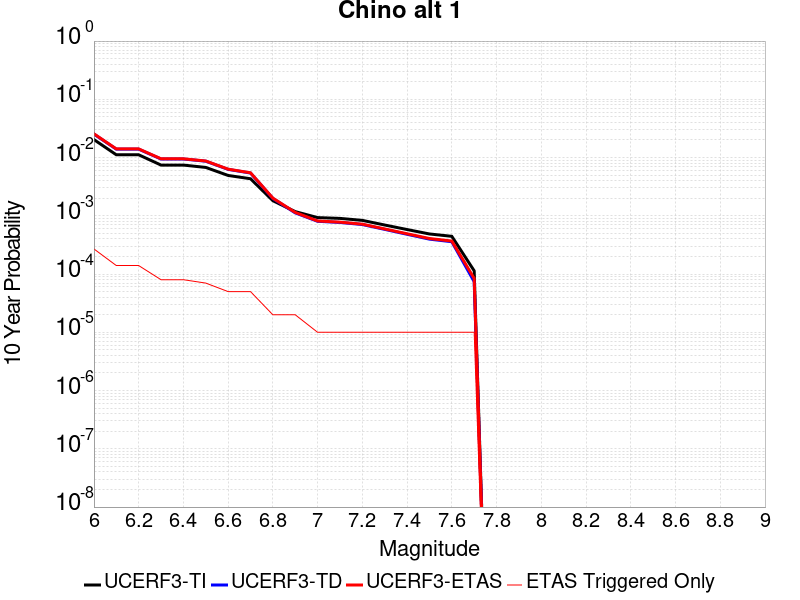 |

| Magnitude | 1 wk TI Prob | 1 wk TD Prob | 1 wk ETAS Prob | 1 wk ETAS/TD Gain | 1 wk ETAS Triggered Only | 1 mo TI Prob | 1 mo TD Prob | 1 mo ETAS Prob | 1 mo ETAS/TD Gain | 1 mo ETAS Triggered Only | 1 yr TI Prob | 1 yr TD Prob | 1 yr ETAS Prob | 1 yr ETAS/TD Gain | 1 yr ETAS Triggered Only | 10 yr TI Prob | 10 yr TD Prob | 10 yr ETAS Prob | 10 yr ETAS/TD Gain | 10 yr ETAS Triggered Only |
|-----|-----|-----|-----|-----|-----|-----|-----|-----|-----|-----|-----|-----|-----|-----|-----|-----|-----|-----|-----|-----|
| 6.0 | 3.939946E-5 | 4.8948554E-5 | 4.8948554E-5 | 1.0 | 0.0 | 1.6884391E-4 | 2.097656E-4 | 2.097656E-4 | 1.0 | 0.0 | 0.0020537362 | 0.0025513945 | 0.0027087955 | 1.061692 | 1.5780337E-4 | 0.020348595 | 0.025277847 | 0.025470115 | 1.0076061 | 1.9725422E-4 |
| 6.1 | 2.1505624E-5 | 2.6879026E-5 | 2.6879026E-5 | 1.0 | 0.0 | 9.2163704E-5 | 1.1519137E-4 | 1.1519137E-4 | 1.0 | 0.0 | 0.0011215154 | 0.001401664 | 0.0015198506 | 1.0843188 | 1.1835253E-4 | 0.011158722 | 0.013945141 | 0.014061843 | 1.0083686 | 1.1835253E-4 |
| 6.2 | 2.1505624E-5 | 2.6879026E-5 | 2.6879026E-5 | 1.0 | 0.0 | 9.2163704E-5 | 1.1519137E-4 | 1.1519137E-4 | 1.0 | 0.0 | 0.0011215154 | 0.001401664 | 0.0015198506 | 1.0843188 | 1.1835253E-4 | 0.011158722 | 0.013945141 | 0.014061843 | 1.0083686 | 1.1835253E-4 |
| 6.3 | 1.4290785E-5 | 1.8165128E-5 | 1.8165128E-5 | 1.0 | 0.0 | 6.1244784E-5 | 7.784848E-5 | 7.784848E-5 | 1.0 | 0.0 | 7.454001E-4 | 9.4743853E-4 | 0.0010656789 | 1.1248001 | 1.1835253E-4 | 0.007429048 | 0.0094444575 | 0.009561692 | 1.012413 | 1.1835253E-4 |
| 6.4 | 1.4290785E-5 | 1.8165128E-5 | 1.8165128E-5 | 1.0 | 0.0 | 6.1244784E-5 | 7.784848E-5 | 7.784848E-5 | 1.0 | 0.0 | 7.454001E-4 | 9.4743853E-4 | 0.0010656789 | 1.1248001 | 1.1835253E-4 | 0.007429048 | 0.0094444575 | 0.009561692 | 1.012413 | 1.1835253E-4 |
| 6.5 | 1.3017944E-5 | 1.6652088E-5 | 1.6652088E-5 | 1.0 | 0.0 | 5.5789995E-5 | 7.136439E-5 | 7.136439E-5 | 1.0 | 0.0 | 6.790315E-4 | 8.685589E-4 | 9.868086E-4 | 1.1361448 | 1.1835253E-4 | 0.0067696036 | 0.008661949 | 0.008779276 | 1.0135452 | 1.1835253E-4 |
| 6.6 | 9.470016E-6 | 1.2039424E-5 | 1.2039424E-5 | 1.0 | 0.0 | 4.058515E-5 | 5.1596704E-5 | 5.1596704E-5 | 1.0 | 0.0 | 4.940122E-4 | 6.280428E-4 | 7.068949E-4 | 1.1255522 | 7.8901685E-5 | 0.004929154 | 0.0062718987 | 0.0063503054 | 1.0125012 | 7.8901685E-5 |
| 6.7 | 8.314155E-6 | 1.0407736E-5 | 1.0407736E-5 | 1.0 | 0.0 | 3.5631605E-5 | 4.4604003E-5 | 4.4604003E-5 | 1.0 | 0.0 | 4.3372845E-4 | 5.429507E-4 | 6.218095E-4 | 1.1452413 | 7.8901685E-5 | 0.004328829 | 0.005425775 | 0.0055042487 | 1.0144631 | 7.8901685E-5 |
| 6.8 | 3.4856364E-6 | 3.8133708E-6 | 3.8133708E-6 | 1.0 | 0.0 | 1.4938357E-5 | 1.6342927E-5 | 1.6342927E-5 | 1.0 | 0.0 | 1.8185932E-4 | 1.9895904E-4 | 2.3840203E-4 | 1.1982468 | 3.9450842E-5 | 0.0018171056 | 0.0019894864 | 0.0020288588 | 1.0197902 | 3.9450842E-5 |
| 6.9 | 2.2645952E-6 | 2.1529022E-6 | 2.1529022E-6 | 1.0 | 0.0 | 9.705372E-6 | 9.226692E-6 | 9.226692E-6 | 1.0 | 0.0 | 1.18156495E-4 | 1.123294E-4 | 1.517758E-4 | 1.3511673 | 3.9450842E-5 | 0.0011809369 | 0.0011233423 | 0.0011627488 | 1.0350797 | 3.9450842E-5 |
| 7.0 | 1.7864003E-6 | 1.5430785E-6 | 1.5430785E-6 | 1.0 | 0.0 | 7.655979E-6 | 6.613177E-6 | 6.613177E-6 | 1.0 | 0.0 | 9.3207556E-5 | 8.051251E-5 | 8.051251E-5 | 1.0 | 0.0 | 9.316847E-4 | 8.0528046E-4 | 8.0528046E-4 | 1.0 | 0.0 |
| 7.1 | 1.7315456E-6 | 1.4733511E-6 | 1.4733511E-6 | 1.0 | 0.0 | 7.420889E-6 | 6.3143466E-6 | 6.3143466E-6 | 1.0 | 0.0 | 9.034557E-5 | 7.6874516E-5 | 7.6874516E-5 | 1.0 | 0.0 | 9.0308854E-4 | 7.6891703E-4 | 7.6891703E-4 | 1.0 | 0.0 |
| 7.2 | 1.6008337E-6 | 1.3574215E-6 | 1.3574215E-6 | 1.0 | 0.0 | 6.860698E-6 | 5.817508E-6 | 5.817508E-6 | 1.0 | 0.0 | 8.352579E-5 | 7.082591E-5 | 7.082591E-5 | 1.0 | 0.0 | 8.34944E-4 | 7.0845755E-4 | 7.0845755E-4 | 1.0 | 0.0 |
| 7.3 | 1.3320939E-6 | 1.121782E-6 | 1.121782E-6 | 1.0 | 0.0 | 5.7089615E-6 | 4.807629E-6 | 4.807629E-6 | 1.0 | 0.0 | 6.9504385E-5 | 5.8531357E-5 | 5.8531357E-5 | 1.0 | 0.0 | 6.9482654E-4 | 5.8530393E-4 | 5.8530393E-4 | 1.0 | 0.0 |
| 7.4 | 1.114294E-6 | 9.237111E-7 | 9.237111E-7 | 1.0 | 0.0 | 4.775537E-6 | 3.958756E-6 | 3.958756E-6 | 1.0 | 0.0 | 5.8140613E-5 | 4.8196827E-5 | 4.8196827E-5 | 1.0 | 0.0 | 5.81254E-4 | 4.8188053E-4 | 4.8188053E-4 | 1.0 | 0.0 |
| 7.5 | 9.354081E-7 | 7.6234323E-7 | 7.6234323E-7 | 1.0 | 0.0 | 4.0088858E-6 | 3.2671815E-6 | 3.2671815E-6 | 1.0 | 0.0 | 4.8807087E-5 | 3.9777242E-5 | 3.9777242E-5 | 1.0 | 0.0 | 4.879637E-4 | 3.977046E-4 | 3.977046E-4 | 1.0 | 0.0 |
| 7.6 | 8.521771E-7 | 6.88071E-7 | 6.88071E-7 | 1.0 | 0.0 | 3.6521824E-6 | 2.9488726E-6 | 2.9488726E-6 | 1.0 | 0.0 | 4.4464414E-5 | 3.5901965E-5 | 3.5901965E-5 | 1.0 | 0.0 | 4.4455516E-4 | 3.589648E-4 | 3.589648E-4 | 1.0 | 0.0 |
| 7.7 | 2.1803626E-7 | 1.418649E-7 | 1.418649E-7 | 1.0 | 0.0 | 9.344408E-7 | 6.079923E-7 | 6.079923E-7 | 1.0 | 0.0 | 1.1376757E-5 | 7.4022914E-6 | 7.4022914E-6 | 1.0 | 0.0 | 1.13761744E-4 | 7.402141E-5 | 7.402141E-5 | 1.0 | 0.0 |

## Santa Cruz Island
*[(top)](#table-of-contents)*

| 1 Week | 1 Month | 1 Year | 10 Year |
|-----|-----|-----|-----|
| 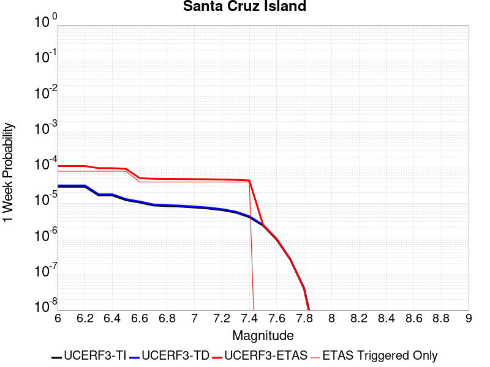 | 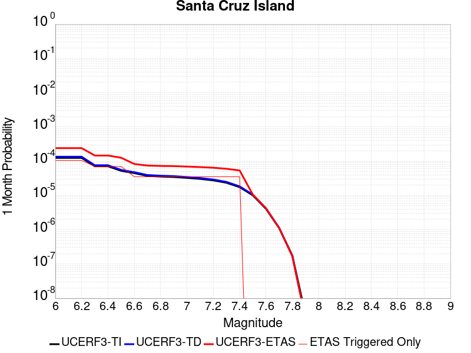 | 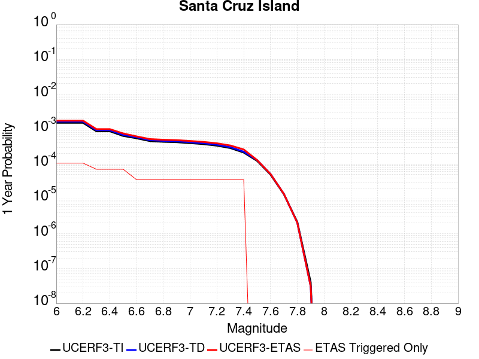 | 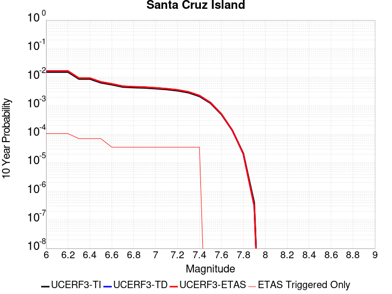 |

| Magnitude | 1 wk TI Prob | 1 wk TD Prob | 1 wk ETAS Prob | 1 wk ETAS/TD Gain | 1 wk ETAS Triggered Only | 1 mo TI Prob | 1 mo TD Prob | 1 mo ETAS Prob | 1 mo ETAS/TD Gain | 1 mo ETAS Triggered Only | 1 yr TI Prob | 1 yr TD Prob | 1 yr ETAS Prob | 1 yr ETAS/TD Gain | 1 yr ETAS Triggered Only | 10 yr TI Prob | 10 yr TD Prob | 10 yr ETAS Prob | 10 yr ETAS/TD Gain | 10 yr ETAS Triggered Only |
|-----|-----|-----|-----|-----|-----|-----|-----|-----|-----|-----|-----|-----|-----|-----|-----|-----|-----|-----|-----|-----|
| 6.0 | 2.9164563E-5 | 3.1599742E-5 | 1.1049894E-4 | 3.4968302 | 7.8901685E-5 | 1.2498499E-4 | 1.3542121E-4 | 2.5375772E-4 | 1.8738402 | 1.1835253E-4 | 0.0015206301 | 0.0016476426 | 0.0017658 | 1.0717131 | 1.1835253E-4 | 0.015102667 | 0.016368 | 0.016484415 | 1.0071124 | 1.1835253E-4 |
| 6.1 | 2.9164563E-5 | 3.1599742E-5 | 1.1049894E-4 | 3.4968302 | 7.8901685E-5 | 1.2498499E-4 | 1.3542121E-4 | 2.5375772E-4 | 1.8738402 | 1.1835253E-4 | 0.0015206301 | 0.0016476426 | 0.0017658 | 1.0717131 | 1.1835253E-4 | 0.015102667 | 0.016368 | 0.016484415 | 1.0071124 | 1.1835253E-4 |
| 6.2 | 2.9164563E-5 | 3.1599742E-5 | 1.1049894E-4 | 3.4968302 | 7.8901685E-5 | 1.2498499E-4 | 1.3542121E-4 | 2.5375772E-4 | 1.8738402 | 1.1835253E-4 | 0.0015206301 | 0.0016476426 | 0.0017658 | 1.0717131 | 1.1835253E-4 | 0.015102667 | 0.016368 | 0.016484415 | 1.0071124 | 1.1835253E-4 |
| 6.3 | 1.6635553E-5 | 1.780436E-5 | 9.670464E-5 | 5.431515 | 7.8901685E-5 | 7.1293274E-5 | 7.630226E-5 | 1.5519794E-4 | 2.0339885 | 7.8901685E-5 | 8.6765E-4 | 9.2860236E-4 | 0.0010074308 | 1.0848893 | 7.8901685E-5 | 0.008642701 | 0.009249094 | 0.009327265 | 1.0084518 | 7.8901685E-5 |
| 6.4 | 1.6635553E-5 | 1.780436E-5 | 9.670464E-5 | 5.431515 | 7.8901685E-5 | 7.1293274E-5 | 7.630226E-5 | 1.5519794E-4 | 2.0339885 | 7.8901685E-5 | 8.6765E-4 | 9.2860236E-4 | 0.0010074308 | 1.0848893 | 7.8901685E-5 | 0.008642701 | 0.009249094 | 0.009327265 | 1.0084518 | 7.8901685E-5 |
| 6.5 | 1.2238748E-5 | 1.3042995E-5 | 9.194366E-5 | 7.0492744 | 7.8901685E-5 | 5.2450723E-5 | 5.5897377E-5 | 1.3479465E-4 | 2.4114666 | 7.8901685E-5 | 6.3840044E-4 | 6.8034173E-4 | 7.591898E-4 | 1.1158947 | 7.8901685E-5 | 0.0063656955 | 0.0067829876 | 0.006861354 | 1.0115534 | 7.8901685E-5 |
| 6.6 | 1.0489767E-5 | 1.1156636E-5 | 5.060704E-5 | 4.5360484 | 3.9450842E-5 | 4.495537E-5 | 4.781329E-5 | 8.726225E-5 | 1.8250626 | 3.9450842E-5 | 5.4719415E-4 | 5.819735E-4 | 6.214014E-4 | 1.0677485 | 3.9450842E-5 | 0.005458487 | 0.0058047357 | 0.0058439574 | 1.0067569 | 3.9450842E-5 |
| 6.7 | 8.699222E-6 | 9.236782E-6 | 4.8687263E-5 | 5.27102 | 3.9450842E-5 | 3.7281847E-5 | 3.958561E-5 | 7.903489E-5 | 1.9965562 | 3.9450842E-5 | 4.5381195E-4 | 4.8184878E-4 | 5.212806E-4 | 1.0818344 | 3.9450842E-5 | 0.0045288634 | 0.004808108 | 0.004847369 | 1.0081656 | 3.9450842E-5 |
| 6.8 | 8.307732E-6 | 8.8169045E-6 | 4.82674E-5 | 5.474416 | 3.9450842E-5 | 3.560408E-5 | 3.7786187E-5 | 7.723554E-5 | 2.0440152 | 3.9450842E-5 | 4.3339343E-4 | 4.5995016E-4 | 4.9938285E-4 | 1.0857326 | 3.9450842E-5 | 0.004325492 | 0.0045900354 | 0.004629305 | 1.0085554 | 3.9450842E-5 |
| 6.9 | 8.073121E-6 | 8.564939E-6 | 4.8015445E-5 | 5.606046 | 3.9450842E-5 | 3.459863E-5 | 3.6706366E-5 | 7.615576E-5 | 2.074729 | 3.9450842E-5 | 4.2115687E-4 | 4.468088E-4 | 4.86242E-4 | 1.0882553 | 3.9450842E-5 | 0.004203596 | 0.004459156 | 0.004498431 | 1.0088077 | 3.9450842E-5 |
| 7.0 | 7.617019E-6 | 8.074664E-6 | 4.752519E-5 | 5.8857174 | 3.9450842E-5 | 3.264396E-5 | 3.4605247E-5 | 7.4054726E-5 | 2.1399856 | 3.9450842E-5 | 3.9736772E-4 | 4.212378E-4 | 4.6067205E-4 | 1.093615 | 3.9450842E-5 | 0.003966579 | 0.0042044413 | 0.004243726 | 1.0093437 | 3.9450842E-5 |
| 7.1 | 7.1224836E-6 | 7.545788E-6 | 4.6996334E-5 | 6.2281547 | 3.9450842E-5 | 3.052457E-5 | 3.2338692E-5 | 7.178826E-5 | 2.2198875 | 3.9450842E-5 | 3.715733E-4 | 3.936528E-4 | 4.330881E-4 | 1.1001779 | 3.9450842E-5 | 0.003709526 | 0.003929598 | 0.0039688936 | 1.01 | 3.9450842E-5 |
| 7.2 | 6.441115E-6 | 6.8273835E-6 | 4.6277957E-5 | 6.7782865 | 3.9450842E-5 | 2.7604487E-5 | 2.9259887E-5 | 6.8709574E-5 | 2.3482516 | 3.9450842E-5 | 3.360328E-4 | 3.5618112E-4 | 3.956179E-4 | 1.1107212 | 3.9450842E-5 | 0.0033552512 | 0.003556131 | 0.0035954416 | 1.0110543 | 3.9450842E-5 |
| 7.3 | 5.494274E-6 | 5.8199944E-6 | 4.5270608E-5 | 7.778463 | 3.9450842E-5 | 2.3546674E-5 | 2.4942596E-5 | 6.439246E-5 | 2.5816262 | 3.9450842E-5 | 2.8664304E-4 | 3.0363398E-4 | 3.4307284E-4 | 1.1298895 | 3.9450842E-5 | 0.002862736 | 0.0030322142 | 0.0030715456 | 1.0129712 | 3.9450842E-5 |
| 7.4 | 4.0802624E-6 | 4.312256E-6 | 4.376293E-5 | 10.1484995 | 3.9450842E-5 | 1.7486722E-5 | 1.8480967E-5 | 5.7931084E-5 | 3.1346347 | 3.9450842E-5 | 2.1288003E-4 | 2.2498262E-4 | 2.644246E-4 | 1.1753112 | 3.9450842E-5 | 0.0021267622 | 0.0022475575 | 0.0022869196 | 1.0175133 | 3.9450842E-5 |
| 7.5 | 2.3584746E-6 | 2.4753094E-6 | 2.4753094E-6 | 1.0 | 0.0 | 1.0107709E-5 | 1.0608426E-5 | 1.0608426E-5 | 1.0 | 0.0 | 1.2305441E-4 | 1.2915E-4 | 1.2915E-4 | 1.0 | 0.0 | 0.0012298629 | 0.0012907543 | 0.0012907543 | 1.0 | 0.0 |
| 7.6 | 9.4981914E-7 | 9.86093E-7 | 9.86093E-7 | 1.0 | 0.0 | 4.0706473E-6 | 4.2261063E-6 | 4.2261063E-6 | 1.0 | 0.0 | 4.9559E-5 | 5.145164E-5 | 5.145164E-5 | 1.0 | 0.0 | 4.954795E-4 | 5.1439856E-4 | 5.1439856E-4 | 1.0 | 0.0 |
| 7.7 | 2.6013532E-7 | 2.6416603E-7 | 2.6416603E-7 | 1.0 | 0.0 | 1.1148652E-6 | 1.1321397E-6 | 1.1321397E-6 | 1.0 | 0.0 | 1.3573399E-5 | 1.3783714E-5 | 1.3783714E-5 | 1.0 | 0.0 | 1.357257E-4 | 1.3782867E-4 | 1.3782867E-4 | 1.0 | 0.0 |
| 7.8 | 4.1522263E-8 | 3.965679E-8 | 3.965679E-8 | 1.0 | 0.0 | 1.7795254E-7 | 1.6995766E-7 | 1.6995766E-7 | 1.0 | 0.0 | 2.16657E-6 | 2.0692328E-6 | 2.0692328E-6 | 1.0 | 0.0 | 2.1665488E-5 | 2.0692156E-5 | 2.0692156E-5 | 1.0 | 0.0 |
| 7.9 | 7.7242046E-10 | 5.9468175E-10 | 5.9468175E-10 | 1.0 | 0.0 | 3.3103735E-9 | 2.5486364E-9 | 2.5486364E-9 | 1.0 | 0.0 | 4.0303796E-8 | 3.1029646E-8 | 3.1029646E-8 | 1.0 | 0.0 | 4.030379E-7 | 3.1029643E-7 | 3.1029643E-7 | 1.0 | 0.0 |

## Palos Verdes
*[(top)](#table-of-contents)*

| 1 Week | 1 Month | 1 Year | 10 Year |
|-----|-----|-----|-----|
| 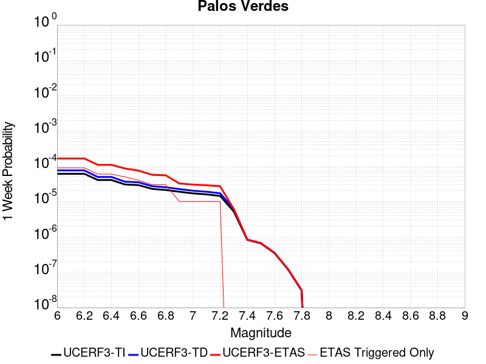 | 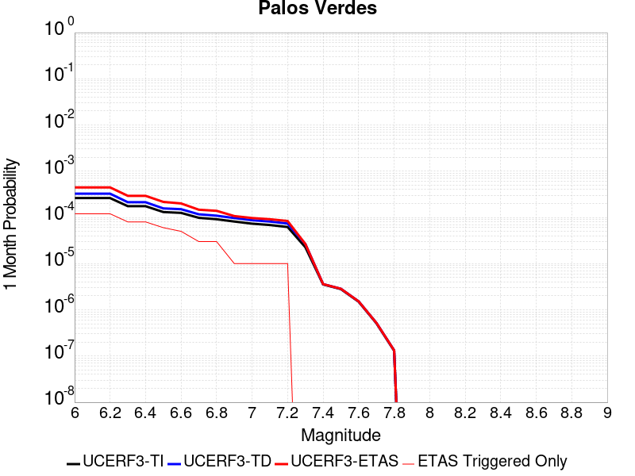 | 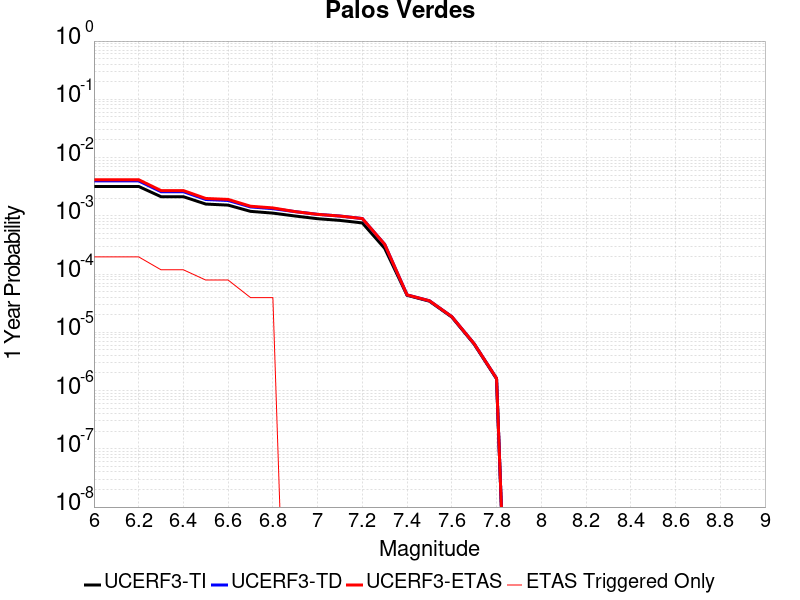 | 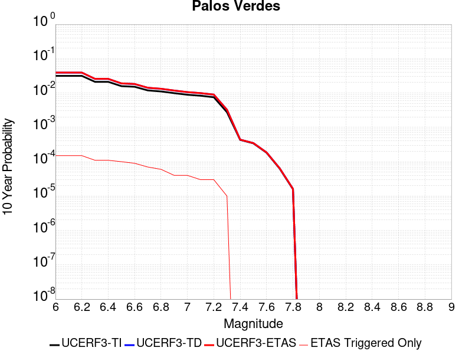 |

| Magnitude | 1 wk TI Prob | 1 wk TD Prob | 1 wk ETAS Prob | 1 wk ETAS/TD Gain | 1 wk ETAS Triggered Only | 1 mo TI Prob | 1 mo TD Prob | 1 mo ETAS Prob | 1 mo ETAS/TD Gain | 1 mo ETAS Triggered Only | 1 yr TI Prob | 1 yr TD Prob | 1 yr ETAS Prob | 1 yr ETAS/TD Gain | 1 yr ETAS Triggered Only | 10 yr TI Prob | 10 yr TD Prob | 10 yr ETAS Prob | 10 yr ETAS/TD Gain | 10 yr ETAS Triggered Only |
|-----|-----|-----|-----|-----|-----|-----|-----|-----|-----|-----|-----|-----|-----|-----|-----|-----|-----|-----|-----|-----|
| 6.0 | 6.126063E-5 | 7.622612E-5 | 1.9456963E-4 | 2.5525322 | 1.1835253E-4 | 2.6251914E-4 | 3.2664582E-4 | 5.238356E-4 | 1.6036807 | 1.9725422E-4 | 0.0031914865 | 0.003970174 | 0.0041666455 | 1.0494868 | 1.9725422E-4 | 0.031460393 | 0.039048895 | 0.03923845 | 1.0048542 | 1.9725422E-4 |
| 6.1 | 6.126063E-5 | 7.622612E-5 | 1.9456963E-4 | 2.5525322 | 1.1835253E-4 | 2.6251914E-4 | 3.2664582E-4 | 5.238356E-4 | 1.6036807 | 1.9725422E-4 | 0.0031914865 | 0.003970174 | 0.0041666455 | 1.0494868 | 1.9725422E-4 | 0.031460393 | 0.039048895 | 0.03923845 | 1.0048542 | 1.9725422E-4 |
| 6.2 | 6.126063E-5 | 7.622612E-5 | 1.9456963E-4 | 2.5525322 | 1.1835253E-4 | 2.6251914E-4 | 3.2664582E-4 | 5.238356E-4 | 1.6036807 | 1.9725422E-4 | 0.0031914865 | 0.003970174 | 0.0041666455 | 1.0494868 | 1.9725422E-4 | 0.031460393 | 0.039048895 | 0.03923845 | 1.0048542 | 1.9725422E-4 |
| 6.3 | 4.0838047E-5 | 4.9749437E-5 | 1.286472E-4 | 2.5859027 | 7.8901685E-5 | 1.7500846E-4 | 2.1319572E-4 | 3.31523E-4 | 1.5550172 | 1.1835253E-4 | 0.0021286458 | 0.0025927818 | 0.0027108274 | 1.0455285 | 1.1835253E-4 | 0.021083709 | 0.025646681 | 0.025761997 | 1.0044963 | 1.1835253E-4 |
| 6.4 | 4.0838047E-5 | 4.9749437E-5 | 1.286472E-4 | 2.5859027 | 7.8901685E-5 | 1.7500846E-4 | 2.1319572E-4 | 3.31523E-4 | 1.5550172 | 1.1835253E-4 | 0.0021286458 | 0.0025927818 | 0.0027108274 | 1.0455285 | 1.1835253E-4 | 0.021083709 | 0.025646681 | 0.025761997 | 1.0044963 | 1.1835253E-4 |
| 6.5 | 3.0512005E-5 | 3.656162E-5 | 7.601103E-5 | 2.0789838 | 3.9450842E-5 | 1.3075917E-4 | 1.5668393E-4 | 2.3557326E-4 | 1.5034934 | 7.8901685E-5 | 0.0015908304 | 0.0019060767 | 0.001984828 | 1.0413159 | 7.8901685E-5 | 0.015794903 | 0.018909154 | 0.018986564 | 1.0040938 | 7.8901685E-5 |
| 6.6 | 2.9255087E-5 | 3.515442E-5 | 7.460388E-5 | 2.1221764 | 3.9450842E-5 | 1.2537291E-4 | 1.5065377E-4 | 2.2954356E-4 | 1.5236497 | 7.8901685E-5 | 0.0015253464 | 0.0018327828 | 0.0019115399 | 1.0429713 | 7.8901685E-5 | 0.015149189 | 0.018188225 | 0.018265693 | 1.0042591 | 7.8901685E-5 |
| 6.7 | 2.287198E-5 | 2.7248278E-5 | 6.669805E-5 | 2.4477894 | 3.9450842E-5 | 9.801909E-5 | 1.16773626E-4 | 1.5621986E-4 | 1.3378009 | 3.9450842E-5 | 0.001192729 | 0.0014208833 | 0.0014602782 | 1.0277256 | 3.9450842E-5 | 0.011863477 | 0.014127217 | 0.014166111 | 1.0027531 | 3.9450842E-5 |
| 6.8 | 2.1325764E-5 | 2.5431877E-5 | 6.4881715E-5 | 2.5511966 | 3.9450842E-5 | 9.139293E-5 | 1.0898971E-4 | 1.4843626E-4 | 1.361929 | 3.9450842E-5 | 0.001112141 | 0.0013262323 | 0.0013656308 | 1.0297071 | 3.9450842E-5 | 0.011065915 | 0.013192211 | 0.0132311415 | 1.002951 | 3.9450842E-5 |
| 6.9 | 1.9009392E-5 | 2.2613547E-5 | 2.2613547E-5 | 1.0 | 0.0 | 8.1466285E-5 | 9.6912096E-5 | 9.6912096E-5 | 1.0 | 0.0 | 9.914007E-4 | 0.0011793535 | 0.0011793535 | 1.0 | 0.0 | 0.009869894 | 0.011739632 | 0.011739632 | 1.0 | 0.0 |
| 7.0 | 1.7098473E-5 | 2.0319356E-5 | 2.0319356E-5 | 1.0 | 0.0 | 7.3277115E-5 | 8.708052E-5 | 8.708052E-5 | 1.0 | 0.0 | 8.917837E-4 | 0.001059775 | 0.001059775 | 1.0 | 0.0 | 0.008882134 | 0.010555646 | 0.010555646 | 1.0 | 0.0 |
| 7.1 | 1.5982785E-5 | 1.899476E-5 | 1.899476E-5 | 1.0 | 0.0 | 6.849585E-5 | 8.1404054E-5 | 8.1404054E-5 | 1.0 | 0.0 | 8.336179E-4 | 9.907284E-4 | 9.907284E-4 | 1.0 | 0.0 | 0.008304977 | 0.009871479 | 0.009871479 | 1.0 | 0.0 |
| 7.2 | 1.4468002E-5 | 1.7197237E-5 | 1.7197237E-5 | 1.0 | 0.0 | 6.200425E-5 | 7.370083E-5 | 7.370083E-5 | 1.0 | 0.0 | 7.546402E-4 | 8.970222E-4 | 8.970222E-4 | 1.0 | 0.0 | 0.007520827 | 0.008942284 | 0.008942284 | 1.0 | 0.0 |
| 7.3 | 5.288233E-6 | 6.2036747E-6 | 6.2036747E-6 | 1.0 | 0.0 | 2.2663658E-5 | 2.6587102E-5 | 2.6587102E-5 | 1.0 | 0.0 | 2.7589512E-4 | 3.236848E-4 | 3.236848E-4 | 1.0 | 0.0 | 0.0027555283 | 0.0032355562 | 0.0032355562 | 1.0 | 0.0 |
| 7.4 | 8.279556E-7 | 8.408347E-7 | 8.408347E-7 | 1.0 | 0.0 | 3.5483763E-6 | 3.6035726E-6 | 3.6035726E-6 | 1.0 | 0.0 | 4.3200624E-5 | 4.3872686E-5 | 4.3872686E-5 | 1.0 | 0.0 | 4.3192226E-4 | 4.3864746E-4 | 4.3864746E-4 | 1.0 | 0.0 |
| 7.5 | 6.559831E-7 | 6.667229E-7 | 6.667229E-7 | 1.0 | 0.0 | 2.8113532E-6 | 2.857381E-6 | 2.857381E-6 | 1.0 | 0.0 | 3.4227687E-5 | 3.4788125E-5 | 3.4788125E-5 | 1.0 | 0.0 | 3.4222414E-4 | 3.4783344E-4 | 3.4783344E-4 | 1.0 | 0.0 |
| 7.6 | 3.5018968E-7 | 3.5620027E-7 | 3.5620027E-7 | 1.0 | 0.0 | 1.500812E-6 | 1.526572E-6 | 1.526572E-6 | 1.0 | 0.0 | 1.8272232E-5 | 1.8585903E-5 | 1.8585903E-5 | 1.0 | 0.0 | 1.8270731E-4 | 1.8584808E-4 | 1.8584808E-4 | 1.0 | 0.0 |
| 7.7 | 1.1986104E-7 | 1.2198376E-7 | 1.2198376E-7 | 1.0 | 0.0 | 5.1369005E-7 | 5.2278745E-7 | 5.2278745E-7 | 1.0 | 0.0 | 6.2541585E-6 | 6.364919E-6 | 6.364919E-6 | 1.0 | 0.0 | 6.2539824E-5 | 6.364741E-5 | 6.364741E-5 | 1.0 | 0.0 |
| 7.8 | 3.0445005E-8 | 3.1027582E-8 | 3.1027582E-8 | 1.0 | 0.0 | 1.3047858E-7 | 1.3297536E-7 | 1.3297536E-7 | 1.0 | 0.0 | 1.5885756E-6 | 1.6189739E-6 | 1.6189739E-6 | 1.0 | 0.0 | 1.5885644E-5 | 1.6189642E-5 | 1.6189642E-5 | 1.0 | 0.0 |

## San Jacinto (Anza) rev
*[(top)](#table-of-contents)*

| 1 Week | 1 Month | 1 Year | 10 Year |
|-----|-----|-----|-----|
| 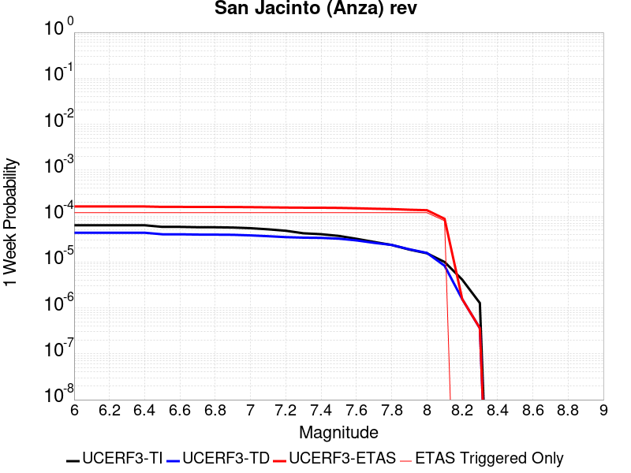 | 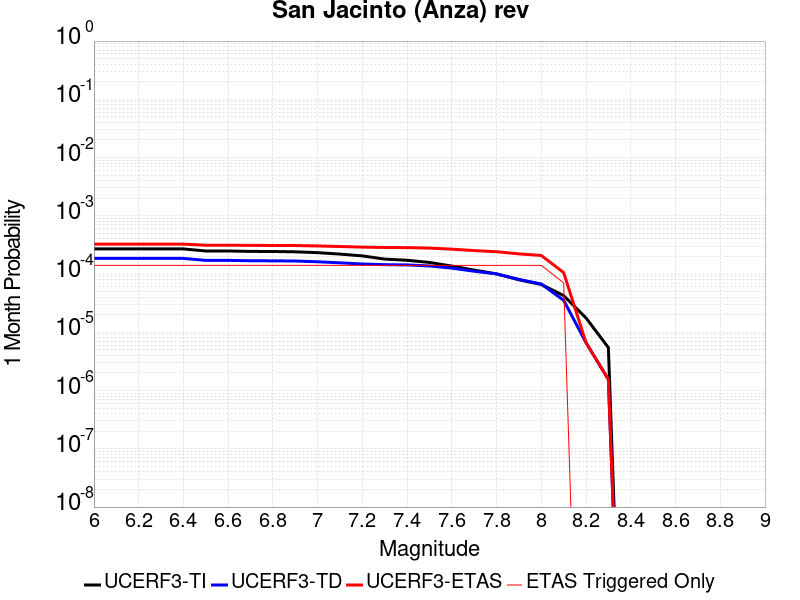 | 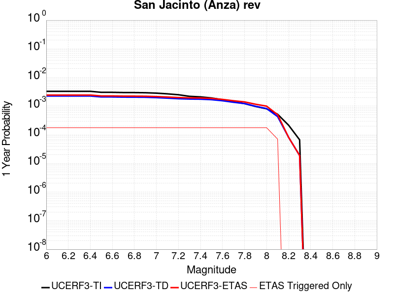 | 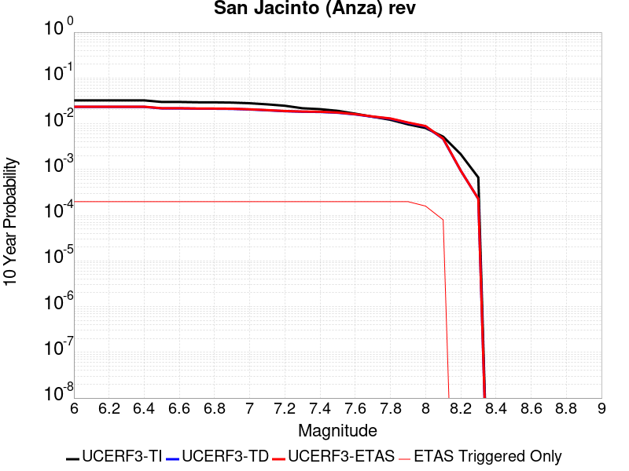 |

| Magnitude | 1 wk TI Prob | 1 wk TD Prob | 1 wk ETAS Prob | 1 wk ETAS/TD Gain | 1 wk ETAS Triggered Only | 1 mo TI Prob | 1 mo TD Prob | 1 mo ETAS Prob | 1 mo ETAS/TD Gain | 1 mo ETAS Triggered Only | 1 yr TI Prob | 1 yr TD Prob | 1 yr ETAS Prob | 1 yr ETAS/TD Gain | 1 yr ETAS Triggered Only | 10 yr TI Prob | 10 yr TD Prob | 10 yr ETAS Prob | 10 yr ETAS/TD Gain | 10 yr ETAS Triggered Only |
|-----|-----|-----|-----|-----|-----|-----|-----|-----|-----|-----|-----|-----|-----|-----|-----|-----|-----|-----|-----|-----|
| 6.0 | 6.3015636E-5 | 4.3302647E-5 | 1.6165005E-4 | 3.7330294 | 1.1835253E-4 | 2.7003905E-4 | 1.8556965E-4 | 3.0390022E-4 | 1.6376612 | 1.1835253E-4 | 0.0032827691 | 0.0022569813 | 0.0024144284 | 1.0697601 | 1.5780337E-4 | 0.032346968 | 0.023296192 | 0.023488851 | 1.00827 | 1.9725422E-4 |
| 6.1 | 6.3015636E-5 | 4.3302647E-5 | 1.6165005E-4 | 3.7330294 | 1.1835253E-4 | 2.7003905E-4 | 1.8556965E-4 | 3.0390022E-4 | 1.6376612 | 1.1835253E-4 | 0.0032827691 | 0.0022569813 | 0.0024144284 | 1.0697601 | 1.5780337E-4 | 0.032346968 | 0.023296192 | 0.023488851 | 1.00827 | 1.9725422E-4 |
| 6.2 | 6.3015636E-5 | 4.3302647E-5 | 1.6165005E-4 | 3.7330294 | 1.1835253E-4 | 2.7003905E-4 | 1.8556965E-4 | 3.0390022E-4 | 1.6376612 | 1.1835253E-4 | 0.0032827691 | 0.0022569813 | 0.0024144284 | 1.0697601 | 1.5780337E-4 | 0.032346968 | 0.023296192 | 0.023488851 | 1.00827 | 1.9725422E-4 |
| 6.3 | 6.3015636E-5 | 4.3302647E-5 | 1.6165005E-4 | 3.7330294 | 1.1835253E-4 | 2.7003905E-4 | 1.8556965E-4 | 3.0390022E-4 | 1.6376612 | 1.1835253E-4 | 0.0032827691 | 0.0022569813 | 0.0024144284 | 1.0697601 | 1.5780337E-4 | 0.032346968 | 0.023296192 | 0.023488851 | 1.00827 | 1.9725422E-4 |
| 6.4 | 6.3015636E-5 | 4.3302647E-5 | 1.6165005E-4 | 3.7330294 | 1.1835253E-4 | 2.7003905E-4 | 1.8556965E-4 | 3.0390022E-4 | 1.6376612 | 1.1835253E-4 | 0.0032827691 | 0.0022569813 | 0.0024144284 | 1.0697601 | 1.5780337E-4 | 0.032346968 | 0.023296192 | 0.023488851 | 1.00827 | 1.9725422E-4 |
| 6.5 | 5.811017E-5 | 4.0082516E-5 | 1.5843031E-4 | 3.9526038 | 1.1835253E-4 | 2.4901982E-4 | 1.7177092E-4 | 2.9010314E-4 | 1.6888955 | 1.1835253E-4 | 0.0030276014 | 0.002089311 | 0.0022467845 | 1.0753711 | 1.5780337E-4 | 0.02986684 | 0.021593736 | 0.021786733 | 1.0089375 | 1.9725422E-4 |
| 6.6 | 5.811017E-5 | 4.0082516E-5 | 1.5843031E-4 | 3.9526038 | 1.1835253E-4 | 2.4901982E-4 | 1.7177092E-4 | 2.9010314E-4 | 1.6888955 | 1.1835253E-4 | 0.0030276014 | 0.002089311 | 0.0022467845 | 1.0753711 | 1.5780337E-4 | 0.02986684 | 0.021593736 | 0.021786733 | 1.0089375 | 1.9725422E-4 |
| 6.7 | 5.712442E-5 | 3.9505223E-5 | 1.5785308E-4 | 3.995752 | 1.1835253E-4 | 2.4479596E-4 | 1.6929714E-4 | 2.8762963E-4 | 1.6989633 | 1.1835253E-4 | 0.0029763177 | 0.0020592497 | 0.0022167282 | 1.0764737 | 1.5780337E-4 | 0.029367693 | 0.021285562 | 0.021478618 | 1.0090698 | 1.9725422E-4 |
| 6.8 | 5.6967532E-5 | 3.9361643E-5 | 1.5770952E-4 | 4.00668 | 1.1835253E-4 | 2.4412372E-4 | 1.6868189E-4 | 2.8701444E-4 | 1.7015132 | 1.1835253E-4 | 0.0029681553 | 0.002051773 | 0.0022092527 | 1.0767529 | 1.5780337E-4 | 0.029288229 | 0.021210281 | 0.021403352 | 1.0091027 | 1.9725422E-4 |
| 6.9 | 5.6211324E-5 | 3.9066435E-5 | 1.5741434E-4 | 4.0294013 | 1.1835253E-4 | 2.4088343E-4 | 1.6741687E-4 | 2.857496E-4 | 1.7068148 | 1.1835253E-4 | 0.0029288116 | 0.0020364004 | 0.0021938824 | 1.0773336 | 1.5780337E-4 | 0.028905109 | 0.021049714 | 0.021242816 | 1.0091736 | 1.9725422E-4 |
| 7.0 | 5.4383527E-5 | 3.792697E-5 | 1.5627501E-4 | 4.120419 | 1.1835253E-4 | 2.3305144E-4 | 1.6253405E-4 | 2.8086736E-4 | 1.7280524 | 1.1835253E-4 | 0.0028337094 | 0.001977061 | 0.0021345525 | 1.0796593 | 1.5780337E-4 | 0.027978465 | 0.020440677 | 0.020633899 | 1.0094528 | 1.9725422E-4 |
| 7.1 | 5.1393665E-5 | 3.6389913E-5 | 1.5473814E-4 | 4.2522264 | 1.1835253E-4 | 2.2023996E-4 | 1.5594746E-4 | 2.7428154E-4 | 1.7588073 | 1.1835253E-4 | 0.0026781242 | 0.0018970112 | 0.0020545153 | 1.0830275 | 1.5780337E-4 | 0.026460782 | 0.019614287 | 0.019807672 | 1.0098594 | 1.9725422E-4 |
| 7.2 | 4.785222E-5 | 3.4741795E-5 | 1.5309022E-4 | 4.406514 | 1.1835253E-4 | 2.0506482E-4 | 1.4888494E-4 | 2.6721985E-4 | 1.7948078 | 1.1835253E-4 | 0.0024938055 | 0.0018111705 | 0.001968688 | 1.0869701 | 1.5780337E-4 | 0.024660049 | 0.018728992 | 0.01892255 | 1.0103347 | 1.9725422E-4 |
| 7.3 | 4.2143256E-5 | 3.383628E-5 | 1.521848E-4 | 4.4976816 | 1.1835253E-4 | 1.8060145E-4 | 1.4500458E-4 | 2.6333996E-4 | 1.8160802 | 1.1835253E-4 | 0.002196605 | 0.0017640047 | 0.0019215296 | 1.0892997 | 1.5780337E-4 | 0.02175019 | 0.01823724 | 0.018430898 | 1.0106188 | 1.9725422E-4 |
| 7.4 | 4.0264713E-5 | 3.347446E-5 | 1.5182303E-4 | 4.535488 | 1.1835253E-4 | 1.7255165E-4 | 1.4345412E-4 | 2.6178968E-4 | 1.8249018 | 1.1835253E-4 | 0.002098792 | 0.0017451581 | 0.0019026861 | 1.0902658 | 1.5780337E-4 | 0.020790804 | 0.018041821 | 0.018235516 | 1.0107359 | 1.9725422E-4 |
| 7.5 | 3.694492E-5 | 3.218847E-5 | 1.5053719E-4 | 4.676743 | 1.1835253E-4 | 1.5832575E-4 | 1.379433E-4 | 2.562795E-4 | 1.8578613 | 1.1835253E-4 | 0.0019259118 | 0.001678169 | 0.0018357076 | 1.0938753 | 1.5780337E-4 | 0.01909306 | 0.01735827 | 0.0175521 | 1.0111665 | 1.9725422E-4 |
| 7.6 | 3.200565E-5 | 2.9504106E-5 | 1.4785315E-4 | 5.0112734 | 1.1835253E-4 | 1.3715986E-4 | 1.2644005E-4 | 2.4477762E-4 | 1.9359183 | 1.1835253E-4 | 0.001668642 | 0.0015383229 | 0.0016958835 | 1.1024237 | 1.5780337E-4 | 0.01656168 | 0.0159463 | 0.016140409 | 1.0121727 | 1.9725422E-4 |
| 7.7 | 2.731642E-5 | 2.6092788E-5 | 1.4444224E-4 | 5.5357146 | 1.1835253E-4 | 1.1706512E-4 | 1.1182144E-4 | 2.3016075E-4 | 2.058288 | 1.1835253E-4 | 0.001424336 | 0.0013605768 | 0.0015181656 | 1.1158249 | 1.5780337E-4 | 0.014152412 | 0.014167004 | 0.014361464 | 1.0137262 | 1.9725422E-4 |
| 7.8 | 2.3466424E-5 | 2.3504817E-5 | 1.4185457E-4 | 6.035127 | 1.1835253E-4 | 1.0056651E-4 | 1.0073105E-4 | 2.1907166E-4 | 2.1748176 | 1.1835253E-4 | 0.0012237094 | 0.0012257113 | 0.0013833214 | 1.1285865 | 1.5780337E-4 | 0.012169928 | 0.012808893 | 0.01300362 | 1.0152025 | 1.9725422E-4 |
| 7.9 | 1.8611925E-5 | 1.8908117E-5 | 1.3725841E-4 | 7.259232 | 1.1835253E-4 | 7.9762955E-5 | 8.1032274E-5 | 1.9937522E-4 | 2.460442 | 1.1835253E-4 | 9.7068126E-4 | 9.861222E-4 | 0.00114377 | 1.1598663 | 1.5780337E-4 | 0.0096645225 | 0.010393824 | 0.010589029 | 1.0187807 | 1.9725422E-4 |
| 8.0 | 1.5460775E-5 | 1.5740965E-5 | 1.3409164E-4 | 8.518641 | 1.1835253E-4 | 6.6258784E-5 | 6.7459536E-5 | 1.8580408E-4 | 2.7543042 | 1.1835253E-4 | 8.0640207E-4 | 8.21011E-4 | 9.786849E-4 | 1.1920483 | 1.5780337E-4 | 0.008034821 | 0.0087028835 | 0.008859314 | 1.0179745 | 1.5780337E-4 |
| 8.1 | 9.983884E-6 | 8.269952E-6 | 8.7170985E-5 | 10.5406885 | 7.8901685E-5 | 4.2787375E-5 | 3.544217E-5 | 1.1434106E-4 | 3.2261302 | 7.8901685E-5 | 5.2081177E-4 | 4.314235E-4 | 5.1029114E-4 | 1.1828079 | 7.8901685E-5 | 0.0051959283 | 0.004640022 | 0.0047185575 | 1.0169257 | 7.8901685E-5 |
| 8.2 | 4.1226E-6 | 1.5529788E-6 | 1.5529788E-6 | 1.0 | 0.0 | 1.7668166E-5 | 6.6556063E-6 | 6.6556063E-6 | 1.0 | 0.0 | 2.1508869E-4 | 8.102902E-5 | 8.102902E-5 | 1.0 | 0.0 | 0.0021488064 | 9.4050163E-4 | 9.4050163E-4 | 1.0 | 0.0 |
| 8.3 | 1.2750878E-6 | 3.612133E-7 | 3.612133E-7 | 1.0 | 0.0 | 5.4646503E-6 | 1.548056E-6 | 1.548056E-6 | 1.0 | 0.0 | 6.653009E-5 | 1.8847424E-5 | 1.8847424E-5 | 1.0 | 0.0 | 6.6510175E-4 | 2.2734253E-4 | 2.2734253E-4 | 1.0 | 0.0 |

## Santa Ynez (East)
*[(top)](#table-of-contents)*

| 1 Week | 1 Month | 1 Year | 10 Year |
|-----|-----|-----|-----|
| 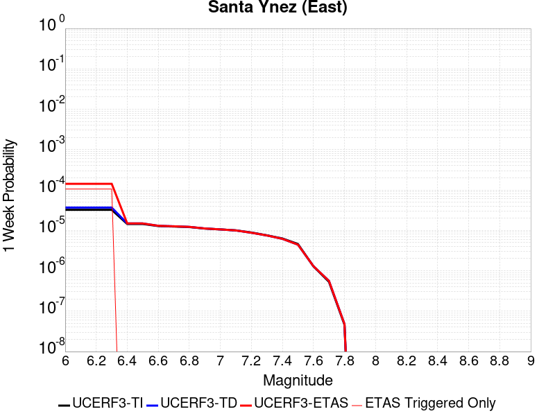 | 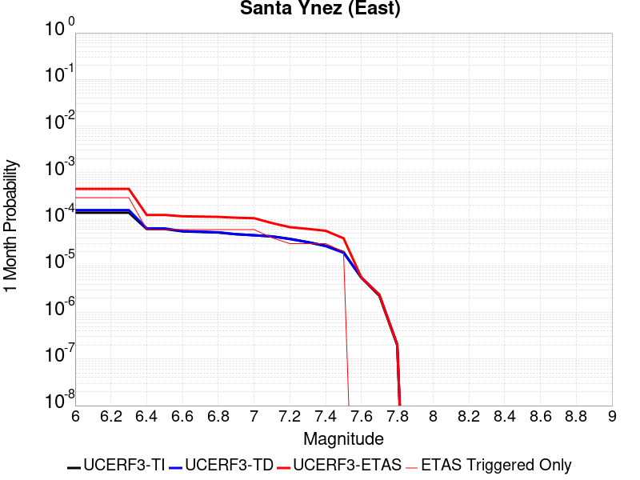 | 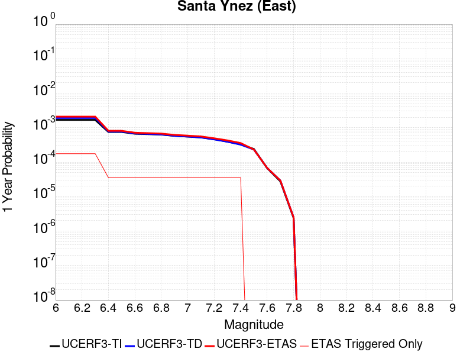 | 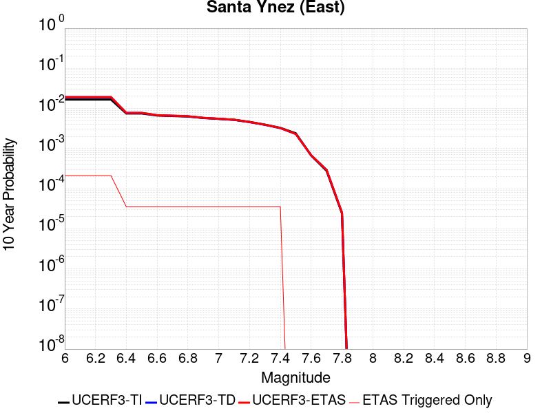 |

| Magnitude | 1 wk TI Prob | 1 wk TD Prob | 1 wk ETAS Prob | 1 wk ETAS/TD Gain | 1 wk ETAS Triggered Only | 1 mo TI Prob | 1 mo TD Prob | 1 mo ETAS Prob | 1 mo ETAS/TD Gain | 1 mo ETAS Triggered Only | 1 yr TI Prob | 1 yr TD Prob | 1 yr ETAS Prob | 1 yr ETAS/TD Gain | 1 yr ETAS Triggered Only | 10 yr TI Prob | 10 yr TD Prob | 10 yr ETAS Prob | 10 yr ETAS/TD Gain | 10 yr ETAS Triggered Only |
|-----|-----|-----|-----|-----|-----|-----|-----|-----|-----|-----|-----|-----|-----|-----|-----|-----|-----|-----|-----|-----|
| 6.0 | 3.2269712E-5 | 3.67505E-5 | 1.15649294E-4 | 3.1468763 | 7.8901685E-5 | 1.3829143E-4 | 1.5749598E-4 | 3.152745E-4 | 2.001794 | 1.5780337E-4 | 0.0016823979 | 0.0019164166 | 0.0020739175 | 1.0821851 | 1.5780337E-4 | 0.016697178 | 0.019056441 | 0.019249937 | 1.0101538 | 1.9725422E-4 |
| 6.1 | 3.2269712E-5 | 3.67505E-5 | 1.15649294E-4 | 3.1468763 | 7.8901685E-5 | 1.3829143E-4 | 1.5749598E-4 | 3.152745E-4 | 2.001794 | 1.5780337E-4 | 0.0016823979 | 0.0019164166 | 0.0020739175 | 1.0821851 | 1.5780337E-4 | 0.016697178 | 0.019056441 | 0.019249937 | 1.0101538 | 1.9725422E-4 |
| 6.2 | 3.2269712E-5 | 3.67505E-5 | 1.15649294E-4 | 3.1468763 | 7.8901685E-5 | 1.3829143E-4 | 1.5749598E-4 | 3.152745E-4 | 2.001794 | 1.5780337E-4 | 0.0016823979 | 0.0019164166 | 0.0020739175 | 1.0821851 | 1.5780337E-4 | 0.016697178 | 0.019056441 | 0.019249937 | 1.0101538 | 1.9725422E-4 |
| 6.3 | 3.2269712E-5 | 3.67505E-5 | 1.15649294E-4 | 3.1468763 | 7.8901685E-5 | 1.3829143E-4 | 1.5749598E-4 | 3.152745E-4 | 2.001794 | 1.5780337E-4 | 0.0016823979 | 0.0019164166 | 0.0020739175 | 1.0821851 | 1.5780337E-4 | 0.016697178 | 0.019056441 | 0.019249937 | 1.0101538 | 1.9725422E-4 |
| 6.4 | 1.4404779E-5 | 1.4849382E-5 | 1.4849382E-5 | 1.0 | 0.0 | 6.1733306E-5 | 6.363868E-5 | 1.0308702E-4 | 1.6198797 | 3.9450842E-5 | 7.513438E-4 | 7.745306E-4 | 8.139509E-4 | 1.0508957 | 3.9450842E-5 | 0.0074880854 | 0.007718862 | 0.0077580083 | 1.0050715 | 3.9450842E-5 |
| 6.5 | 1.4404779E-5 | 1.4849382E-5 | 1.4849382E-5 | 1.0 | 0.0 | 6.1733306E-5 | 6.363868E-5 | 1.0308702E-4 | 1.6198797 | 3.9450842E-5 | 7.513438E-4 | 7.745306E-4 | 8.139509E-4 | 1.0508957 | 3.9450842E-5 | 0.0074880854 | 0.007718862 | 0.0077580083 | 1.0050715 | 3.9450842E-5 |
| 6.6 | 1.280208E-5 | 1.3011947E-5 | 1.3011947E-5 | 1.0 | 0.0 | 5.4864904E-5 | 5.5764307E-5 | 9.521295E-5 | 1.7074175 | 3.9450842E-5 | 6.6777546E-4 | 6.787207E-4 | 7.1814476E-4 | 1.0580858 | 3.9450842E-5 | 0.006657724 | 0.0067666885 | 0.0068058725 | 1.0057907 | 3.9450842E-5 |
| 6.7 | 1.2457027E-5 | 1.2628468E-5 | 1.2628468E-5 | 1.0 | 0.0 | 5.3386164E-5 | 5.412089E-5 | 9.35696E-5 | 1.7288998 | 3.9450842E-5 | 6.497827E-4 | 6.587243E-4 | 6.9814915E-4 | 1.0598503 | 3.9450842E-5 | 0.00647886 | 0.006567915 | 0.006607107 | 1.0059671 | 3.9450842E-5 |
| 6.8 | 1.2095134E-5 | 1.2230915E-5 | 1.2230915E-5 | 1.0 | 0.0 | 5.1835254E-5 | 5.241716E-5 | 9.1865935E-5 | 1.7525928 | 3.9450842E-5 | 6.309115E-4 | 6.379937E-4 | 6.7741936E-4 | 1.0617963 | 3.9450842E-5 | 0.0062912325 | 0.006361809 | 0.006401009 | 1.0061617 | 3.9450842E-5 |
| 6.9 | 1.1104036E-5 | 1.1157347E-5 | 1.1157347E-5 | 1.0 | 0.0 | 4.758786E-5 | 4.781633E-5 | 8.726529E-5 | 1.8250101 | 3.9450842E-5 | 5.7922816E-4 | 5.820096E-4 | 6.214375E-4 | 1.0677444 | 3.9450842E-5 | 0.005777207 | 0.0058049993 | 0.005844221 | 1.0067565 | 3.9450842E-5 |
| 7.0 | 1.0577444E-5 | 1.058168E-5 | 1.058168E-5 | 1.0 | 0.0 | 4.5331115E-5 | 4.5349276E-5 | 8.479833E-5 | 1.8698938 | 3.9450842E-5 | 5.5176654E-4 | 5.519888E-4 | 5.9141783E-4 | 1.0714309 | 3.9450842E-5 | 0.0055039856 | 0.0055063153 | 0.005545549 | 1.0071253 | 3.9450842E-5 |
| 7.1 | 1.0021775E-5 | 9.980988E-6 | 9.980988E-6 | 1.0 | 0.0 | 4.294976E-5 | 4.2774966E-5 | 8.222412E-5 | 1.9222487 | 3.9450842E-5 | 5.2278786E-4 | 5.2066194E-4 | 5.600923E-4 | 1.0757312 | 3.9450842E-5 | 0.0052155964 | 0.0051945536 | 0.0052337996 | 1.0075552 | 3.9450842E-5 |
| 7.2 | 8.874109E-6 | 8.748793E-6 | 8.748793E-6 | 1.0 | 0.0 | 3.8031343E-5 | 3.7494297E-5 | 7.694366E-5 | 2.052143 | 3.9450842E-5 | 4.629332E-4 | 4.5639853E-4 | 4.9583137E-4 | 1.0864 | 3.9450842E-5 | 0.0046197 | 0.0045547304 | 0.0045940015 | 1.008622 | 3.9450842E-5 |
| 7.3 | 7.5504267E-6 | 7.5051175E-6 | 7.5051175E-6 | 1.0 | 0.0 | 3.235857E-5 | 3.21644E-5 | 7.161398E-5 | 2.2264981 | 3.9450842E-5 | 3.9389438E-4 | 3.915322E-4 | 4.309676E-4 | 1.1007206 | 3.9450842E-5 | 0.0039319694 | 0.003908531 | 0.0039478275 | 1.0100541 | 3.9450842E-5 |
| 7.4 | 6.309394E-6 | 6.1831556E-6 | 6.1831556E-6 | 1.0 | 0.0 | 2.703998E-5 | 2.6498974E-5 | 6.594877E-5 | 2.4887292 | 3.9450842E-5 | 3.2916202E-4 | 3.225782E-4 | 3.6201632E-4 | 1.1222591 | 3.9450842E-5 | 0.003286749 | 0.003221197 | 0.0032605208 | 1.0122079 | 3.9450842E-5 |
| 7.5 | 4.6103073E-6 | 4.4408903E-6 | 4.4408903E-6 | 1.0 | 0.0 | 1.975831E-5 | 1.9032252E-5 | 1.9032252E-5 | 1.0 | 0.0 | 2.4053088E-4 | 2.3169373E-4 | 2.3169373E-4 | 1.0 | 0.0 | 0.002402707 | 0.002314591 | 0.002314591 | 1.0 | 0.0 |
| 7.6 | 1.2858658E-6 | 1.3008173E-6 | 1.3008173E-6 | 1.0 | 0.0 | 5.5108417E-6 | 5.5749197E-6 | 5.5749197E-6 | 1.0 | 0.0 | 6.7092435E-5 | 6.78726E-5 | 6.78726E-5 | 1.0 | 0.0 | 6.707218E-4 | 6.785256E-4 | 6.785256E-4 | 1.0 | 0.0 |
| 7.7 | 5.3302307E-7 | 5.612138E-7 | 5.612138E-7 | 1.0 | 0.0 | 2.2843826E-6 | 2.4052001E-6 | 2.4052001E-6 | 1.0 | 0.0 | 2.7812002E-5 | 2.9282954E-5 | 2.9282954E-5 | 1.0 | 0.0 | 2.7808524E-4 | 2.9279452E-4 | 2.9279452E-4 | 1.0 | 0.0 |
| 7.8 | 4.613933E-8 | 4.80301E-8 | 4.80301E-8 | 1.0 | 0.0 | 1.9773998E-7 | 2.0584326E-7 | 2.0584326E-7 | 1.0 | 0.0 | 2.4074816E-6 | 2.5061388E-6 | 2.5061388E-6 | 1.0 | 0.0 | 2.4074554E-5 | 2.5061116E-5 | 2.5061116E-5 | 1.0 | 0.0 |

## Calaveras (So) - Paicines extension 2011 CFM
*[(top)](#table-of-contents)*

| 1 Week | 1 Month | 1 Year | 10 Year |
|-----|-----|-----|-----|
| 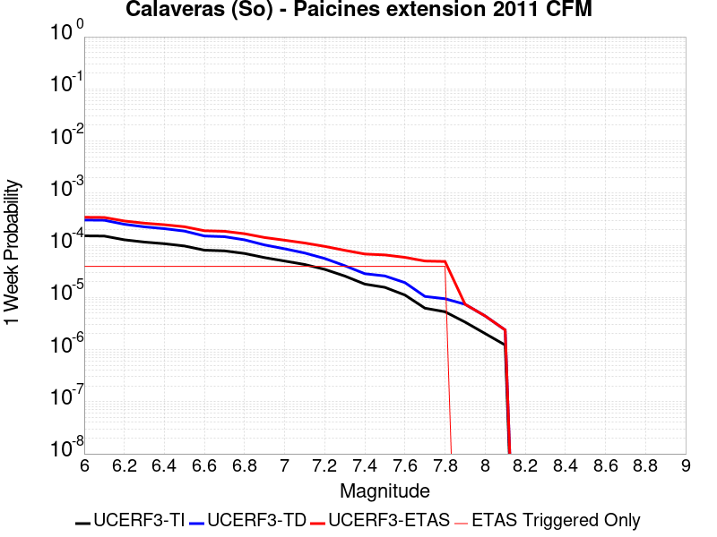 | 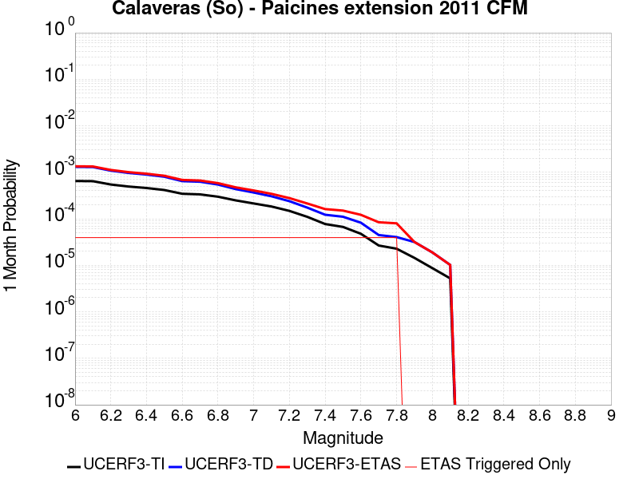 | 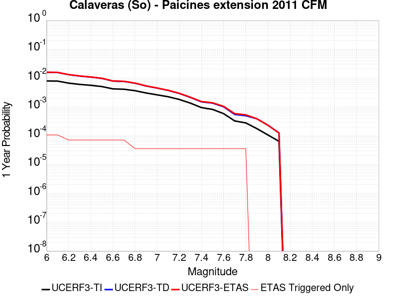 | 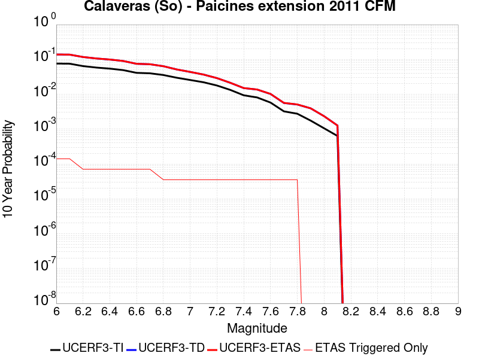 |

| Magnitude | 1 wk TI Prob | 1 wk TD Prob | 1 wk ETAS Prob | 1 wk ETAS/TD Gain | 1 wk ETAS Triggered Only | 1 mo TI Prob | 1 mo TD Prob | 1 mo ETAS Prob | 1 mo ETAS/TD Gain | 1 mo ETAS Triggered Only | 1 yr TI Prob | 1 yr TD Prob | 1 yr ETAS Prob | 1 yr ETAS/TD Gain | 1 yr ETAS Triggered Only | 10 yr TI Prob | 10 yr TD Prob | 10 yr ETAS Prob | 10 yr ETAS/TD Gain | 10 yr ETAS Triggered Only |
|-----|-----|-----|-----|-----|-----|-----|-----|-----|-----|-----|-----|-----|-----|-----|-----|-----|-----|-----|-----|-----|
| 6.0 | 1.5183659E-4 | 3.0533716E-4 | 3.4477594E-4 | 1.1291648 | 3.9450842E-5 | 6.5056595E-4 | 0.0013069661 | 0.0013463654 | 1.0301456 | 3.9450842E-5 | 0.007891912 | 0.01569571 | 0.015812205 | 1.0074221 | 1.1835253E-4 | 0.076174594 | 0.13848671 | 0.13862267 | 1.0009817 | 1.5780337E-4 |
| 6.1 | 1.5024997E-4 | 3.0227835E-4 | 3.4171727E-4 | 1.1304722 | 3.9450842E-5 | 6.437695E-4 | 0.00129387 | 0.0013332699 | 1.0304512 | 3.9450842E-5 | 0.0078097614 | 0.015539104 | 0.015655618 | 1.007498 | 1.1835253E-4 | 0.075409345 | 0.13715632 | 0.13729249 | 1.0009928 | 1.5780337E-4 |
| 6.2 | 1.2743923E-4 | 2.5306802E-4 | 2.925089E-4 | 1.1558509 | 3.9450842E-5 | 5.460538E-4 | 0.0010841049 | 0.001123513 | 1.0363508 | 3.9450842E-5 | 0.0066279583 | 0.013046704 | 0.013124576 | 1.0059687 | 7.8901685E-5 | 0.064337276 | 0.11725405 | 0.1173237 | 1.000594 | 7.8901685E-5 |
| 6.3 | 1.1525114E-4 | 2.2595265E-4 | 2.6539457E-4 | 1.1745584 | 3.9450842E-5 | 4.9383997E-4 | 9.6799526E-4 | 0.0010074079 | 1.0407157 | 3.9450842E-5 | 0.0059959386 | 0.011667927 | 0.011745908 | 1.0066833 | 7.8901685E-5 | 0.058367174 | 0.10637007 | 0.10644058 | 1.0006629 | 7.8901685E-5 |
| 6.4 | 1.07200925E-4 | 2.0836305E-4 | 2.4780567E-4 | 1.1892976 | 3.9450842E-5 | 4.5935164E-4 | 8.926636E-4 | 9.320792E-4 | 1.0441551 | 3.9450842E-5 | 0.0055782744 | 0.010772766 | 0.010850817 | 1.0072453 | 7.8901685E-5 | 0.0544031 | 0.09919256 | 0.09926364 | 1.0007166 | 7.8901685E-5 |
| 6.5 | 9.69631E-5 | 1.8729115E-4 | 2.2673461E-4 | 1.2105997 | 3.9450842E-5 | 4.1548995E-4 | 8.024135E-4 | 8.4183266E-4 | 1.0491258 | 3.9450842E-5 | 0.0050468626 | 0.009694662 | 0.009772799 | 1.0080597 | 7.8901685E-5 | 0.04933773 | 0.090084255 | 0.09015605 | 1.0007969 | 7.8901685E-5 |
| 6.6 | 8.0552316E-5 | 1.5070537E-4 | 1.9015027E-4 | 1.2617352 | 3.9450842E-5 | 3.4517853E-4 | 6.456994E-4 | 6.851247E-4 | 1.0610584 | 3.9450842E-5 | 0.0041944524 | 0.007826256 | 0.00790454 | 1.0100027 | 7.8901685E-5 | 0.04116161 | 0.074854024 | 0.07492702 | 1.0009751 | 7.8901685E-5 |
| 6.7 | 7.815757E-5 | 1.4610609E-4 | 1.8555117E-4 | 1.2699757 | 3.9450842E-5 | 3.34918E-4 | 6.260017E-4 | 6.654278E-4 | 1.0629809 | 3.9450842E-5 | 0.004070005 | 0.0075890915 | 0.0076673944 | 1.0103178 | 7.8901685E-5 | 0.039962657 | 0.072703585 | 0.07277675 | 1.0010064 | 7.8901685E-5 |
| 6.8 | 6.965264E-5 | 1.2721405E-4 | 1.6665987E-4 | 1.3100744 | 3.9450842E-5 | 2.9847719E-4 | 5.450839E-4 | 5.8451324E-4 | 1.0723363 | 3.9450842E-5 | 0.0036279052 | 0.00661342 | 0.0066526094 | 1.0059258 | 3.9450842E-5 | 0.03569247 | 0.06379891 | 0.063835844 | 1.0005789 | 3.9450842E-5 |
| 6.9 | 5.8000453E-5 | 1.01435086E-4 | 1.4088192E-4 | 1.3888875 | 3.9450842E-5 | 2.4854968E-4 | 4.3464993E-4 | 4.7408362E-4 | 1.0907252 | 3.9450842E-5 | 0.0030218933 | 0.0052791284 | 0.005318371 | 1.0074335 | 3.9450842E-5 | 0.029811295 | 0.051501602 | 0.051539022 | 1.0007266 | 3.9450842E-5 |
| 7.0 | 4.9865852E-5 | 8.567692E-5 | 1.2512438E-4 | 1.4604211 | 3.9450842E-5 | 2.1369329E-4 | 3.671356E-4 | 4.0657195E-4 | 1.1074164 | 3.9450842E-5 | 0.0025986114 | 0.0044608037 | 0.0045000785 | 1.0088044 | 3.9450842E-5 | 0.025684336 | 0.043781694 | 0.043819416 | 1.0008616 | 3.9450842E-5 |
| 7.1 | 4.283875E-5 | 7.112159E-5 | 1.1056963E-4 | 1.5546563 | 3.9450842E-5 | 1.8358172E-4 | 3.047715E-4 | 3.4421033E-4 | 1.1294045 | 3.9450842E-5 | 0.0022328163 | 0.003704336 | 0.0037436408 | 1.0106105 | 3.9450842E-5 | 0.022105146 | 0.03673583 | 0.03677383 | 1.0010345 | 3.9450842E-5 |
| 7.2 | 3.450115E-5 | 5.5776054E-5 | 9.52247E-5 | 1.7072685 | 3.9450842E-5 | 1.478537E-4 | 2.390185E-4 | 2.7845992E-4 | 1.165014 | 3.9450842E-5 | 0.0017986323 | 0.0029061958 | 0.002945532 | 1.0135353 | 3.9450842E-5 | 0.017841442 | 0.029079199 | 0.029117502 | 1.0013173 | 3.9450842E-5 |
| 7.3 | 2.5709045E-5 | 4.0588155E-5 | 8.00374E-5 | 1.9719398 | 3.9450842E-5 | 1.1017697E-4 | 1.7393773E-4 | 2.1338172E-4 | 1.2267708 | 3.9450842E-5 | 0.0013405791 | 0.002115652 | 0.0021550194 | 1.0186077 | 3.9450842E-5 | 0.013325208 | 0.021297242 | 0.021335853 | 1.0018129 | 3.9450842E-5 |
| 7.4 | 1.8003093E-5 | 2.8509934E-5 | 6.7959656E-5 | 2.3837183 | 3.9450842E-5 | 7.715383E-5 | 1.2217973E-4 | 1.6162575E-4 | 1.3228525 | 3.9450842E-5 | 9.3894306E-4 | 0.0014865254 | 0.0015259177 | 1.0264995 | 3.9450842E-5 | 0.009349857 | 0.015052196 | 0.015091053 | 1.0025815 | 3.9450842E-5 |
| 7.5 | 1.5595824E-5 | 2.5822499E-5 | 6.5272325E-5 | 2.5277307 | 3.9450842E-5 | 6.683753E-5 | 1.1066317E-4 | 1.5010964E-4 | 1.3564553 | 3.9450842E-5 | 8.134431E-4 | 0.0013464936 | 0.0013858913 | 1.0292594 | 3.9450842E-5 | 0.008104719 | 0.01365213 | 0.013691043 | 1.0028503 | 3.9450842E-5 |
| 7.6 | 1.1110309E-5 | 1.9222098E-5 | 5.8672184E-5 | 3.05233 | 3.9450842E-5 | 4.761474E-5 | 8.2377825E-5 | 1.2182542E-4 | 1.4788618 | 3.9450842E-5 | 5.795553E-4 | 0.0010024898 | 0.0010419012 | 1.0393134 | 3.9450842E-5 | 0.0057804612 | 0.010203943 | 0.010242991 | 1.0038267 | 3.9450842E-5 |
| 7.7 | 6.2140443E-6 | 1.0437076E-5 | 4.988751E-5 | 4.7798357 | 3.9450842E-5 | 2.6631347E-5 | 4.4729557E-5 | 8.417864E-5 | 1.8819466 | 3.9450842E-5 | 3.241884E-4 | 5.444464E-4 | 5.8387575E-4 | 1.0724211 | 3.9450842E-5 | 0.0032371588 | 0.005619835 | 0.0056590643 | 1.0069804 | 3.9450842E-5 |
| 7.8 | 5.305533E-6 | 9.433038E-6 | 4.888351E-5 | 5.18216 | 3.9450842E-5 | 2.27378E-5 | 4.042668E-5 | 7.987593E-5 | 1.9758222 | 3.9450842E-5 | 2.7679754E-4 | 4.920837E-4 | 5.3151516E-4 | 1.0801315 | 3.9450842E-5 | 0.0027645302 | 0.005074324 | 0.005113575 | 1.0077351 | 3.9450842E-5 |
| 7.9 | 3.363505E-6 | 7.3848937E-6 | 7.3848937E-6 | 1.0 | 0.0 | 1.4414942E-5 | 3.164916E-5 | 3.164916E-5 | 1.0 | 0.0 | 1.7548777E-4 | 3.8526047E-4 | 3.8526047E-4 | 1.0 | 0.0 | 0.0017534926 | 0.003948527 | 0.003948527 | 1.0 | 0.0 |
| 8.0 | 2.0271132E-6 | 4.413104E-6 | 4.413104E-6 | 1.0 | 0.0 | 8.687599E-6 | 1.8913164E-5 | 1.8913164E-5 | 1.0 | 0.0 | 1.05766376E-4 | 2.302435E-4 | 2.302435E-4 | 1.0 | 0.0 | 0.0010571606 | 0.002351099 | 0.002351099 | 1.0 | 0.0 |
| 8.1 | 1.2206116E-6 | 2.3751331E-6 | 2.3751331E-6 | 1.0 | 0.0 | 5.2311816E-6 | 1.0179103E-5 | 1.0179103E-5 | 1.0 | 0.0 | 6.3687774E-5 | 1.2392356E-4 | 1.2392356E-4 | 1.0 | 0.0 | 6.366953E-4 | 0.0012705477 | 0.0012705477 | 1.0 | 0.0 |

## White Mountains
*[(top)](#table-of-contents)*

| 1 Week | 1 Month | 1 Year | 10 Year |
|-----|-----|-----|-----|
| 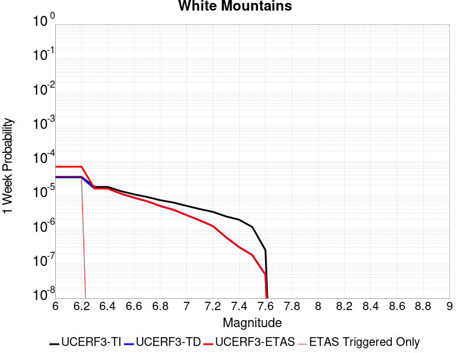 | 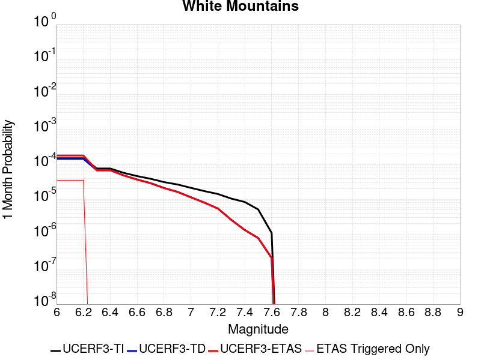 | 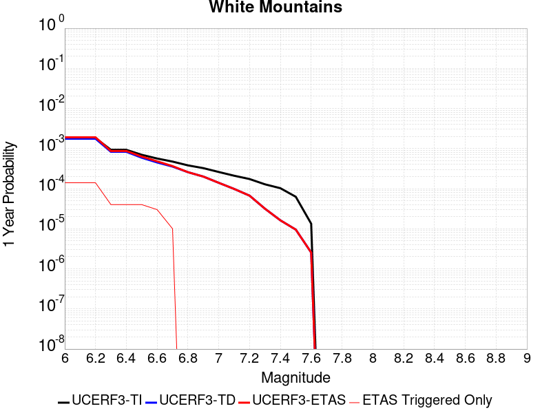 | 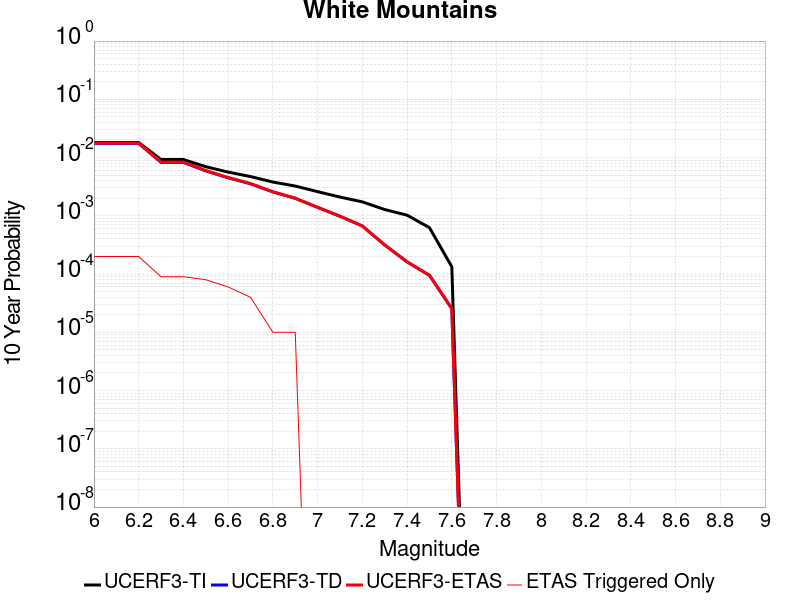 |

| Magnitude | 1 wk TI Prob | 1 wk TD Prob | 1 wk ETAS Prob | 1 wk ETAS/TD Gain | 1 wk ETAS Triggered Only | 1 mo TI Prob | 1 mo TD Prob | 1 mo ETAS Prob | 1 mo ETAS/TD Gain | 1 mo ETAS Triggered Only | 1 yr TI Prob | 1 yr TD Prob | 1 yr ETAS Prob | 1 yr ETAS/TD Gain | 1 yr ETAS Triggered Only | 10 yr TI Prob | 10 yr TD Prob | 10 yr ETAS Prob | 10 yr ETAS/TD Gain | 10 yr ETAS Triggered Only |
|-----|-----|-----|-----|-----|-----|-----|-----|-----|-----|-----|-----|-----|-----|-----|-----|-----|-----|-----|-----|-----|
| 6.0 | 3.503579E-5 | 3.378405E-5 | 7.323356E-5 | 2.1676962 | 3.9450842E-5 | 1.5014476E-4 | 1.4478143E-4 | 1.8422656E-4 | 1.272446 | 3.9450842E-5 | 0.0018264796 | 0.0017614096 | 0.0018401722 | 1.0447158 | 7.8901685E-5 | 0.018115403 | 0.017486818 | 0.017603101 | 1.0066497 | 1.1835253E-4 |
| 6.1 | 3.503579E-5 | 3.378405E-5 | 7.323356E-5 | 2.1676962 | 3.9450842E-5 | 1.5014476E-4 | 1.4478143E-4 | 1.8422656E-4 | 1.272446 | 3.9450842E-5 | 0.0018264796 | 0.0017614096 | 0.0018401722 | 1.0447158 | 7.8901685E-5 | 0.018115403 | 0.017486818 | 0.017603101 | 1.0066497 | 1.1835253E-4 |
| 6.2 | 3.503579E-5 | 3.378405E-5 | 7.323356E-5 | 2.1676962 | 3.9450842E-5 | 1.5014476E-4 | 1.4478143E-4 | 1.8422656E-4 | 1.272446 | 3.9450842E-5 | 0.0018264796 | 0.0017614096 | 0.0018401722 | 1.0447158 | 7.8901685E-5 | 0.018115403 | 0.017486818 | 0.017603101 | 1.0066497 | 1.1835253E-4 |
| 6.3 | 1.7818425E-5 | 1.5916074E-5 | 1.5916074E-5 | 1.0 | 0.0 | 7.636245E-5 | 6.821004E-5 | 6.821004E-5 | 1.0 | 0.0 | 9.293162E-4 | 8.301551E-4 | 8.301551E-4 | 1.0 | 0.0 | 0.009254395 | 0.008271999 | 0.0083502475 | 1.0094595 | 7.8901685E-5 |
| 6.4 | 1.7818425E-5 | 1.5916074E-5 | 1.5916074E-5 | 1.0 | 0.0 | 7.636245E-5 | 6.821004E-5 | 6.821004E-5 | 1.0 | 0.0 | 9.293162E-4 | 8.301551E-4 | 8.301551E-4 | 1.0 | 0.0 | 0.009254395 | 0.008271999 | 0.0083502475 | 1.0094595 | 7.8901685E-5 |
| 6.5 | 1.3397557E-5 | 1.13362685E-5 | 1.13362685E-5 | 1.0 | 0.0 | 5.741684E-5 | 4.858314E-5 | 4.858314E-5 | 1.0 | 0.0 | 6.988258E-4 | 5.913462E-4 | 5.913462E-4 | 1.0 | 0.0 | 0.006966323 | 0.005898432 | 0.0059768683 | 1.0132978 | 7.8901685E-5 |
| 6.6 | 1.0818695E-5 | 8.625366E-6 | 8.625366E-6 | 1.0 | 0.0 | 4.6365014E-5 | 3.6965357E-5 | 3.6965357E-5 | 1.0 | 0.0 | 5.6434784E-4 | 4.4996463E-4 | 4.4996463E-4 | 1.0 | 0.0 | 0.005629168 | 0.004490972 | 0.004530246 | 1.0087451 | 3.9450842E-5 |
| 6.7 | 9.067908E-6 | 6.802442E-6 | 6.802442E-6 | 1.0 | 0.0 | 3.8861883E-5 | 2.9153016E-5 | 2.9153016E-5 | 1.0 | 0.0 | 4.7304068E-4 | 3.5488335E-4 | 3.5488335E-4 | 1.0 | 0.0 | 0.00472035 | 0.0035434833 | 0.0035827945 | 1.0110939 | 3.9450842E-5 |
| 6.8 | 7.295947E-6 | 4.936391E-6 | 4.936391E-6 | 1.0 | 0.0 | 3.126797E-5 | 2.1155796E-5 | 2.1155796E-5 | 1.0 | 0.0 | 3.8062103E-4 | 2.575425E-4 | 2.575425E-4 | 1.0 | 0.0 | 0.0037996976 | 0.0025725532 | 0.0025725532 | 1.0 | 0.0 |
| 6.9 | 6.2243444E-6 | 3.832213E-6 | 3.832213E-6 | 1.0 | 0.0 | 2.6675489E-5 | 1.642367E-5 | 1.642367E-5 | 1.0 | 0.0 | 3.2472567E-4 | 1.9994036E-4 | 1.9994036E-4 | 1.0 | 0.0 | 0.0032425157 | 0.0019976576 | 0.0019976576 | 1.0 | 0.0 |
| 7.0 | 4.9878413E-6 | 2.6795342E-6 | 2.6795342E-6 | 1.0 | 0.0 | 2.1376287E-5 | 1.14836685E-5 | 1.14836685E-5 | 1.0 | 0.0 | 2.602252E-4 | 1.3980496E-4 | 1.3980496E-4 | 1.0 | 0.0 | 0.002599207 | 0.0013971963 | 0.0013971963 | 1.0 | 0.0 |
| 7.1 | 4.0252844E-6 | 1.8857575E-6 | 1.8857575E-6 | 1.0 | 0.0 | 1.7251105E-5 | 8.081794E-6 | 8.081794E-6 | 1.0 | 0.0 | 2.1001195E-4 | 9.8391516E-5 | 9.8391516E-5 | 1.0 | 0.0 | 0.0020981359 | 9.834924E-4 | 9.834924E-4 | 1.0 | 0.0 |
| 7.2 | 3.3284066E-6 | 1.281964E-6 | 1.281964E-6 | 1.0 | 0.0 | 1.4264522E-5 | 5.494121E-6 | 5.494121E-6 | 1.0 | 0.0 | 1.736567E-4 | 6.688897E-5 | 6.688897E-5 | 1.0 | 0.0 | 0.0017352107 | 6.6869846E-4 | 6.6869846E-4 | 1.0 | 0.0 |
| 7.3 | 2.458226E-6 | 6.05722E-7 | 6.05722E-7 | 1.0 | 0.0 | 1.0535211E-5 | 2.5959491E-6 | 2.5959491E-6 | 1.0 | 0.0 | 1.2825865E-4 | 3.1605257E-5 | 3.1605257E-5 | 1.0 | 0.0 | 0.0012818464 | 3.160114E-4 | 3.160114E-4 | 1.0 | 0.0 |
| 7.4 | 1.965953E-6 | 3.1089303E-7 | 3.1089303E-7 | 1.0 | 0.0 | 8.425486E-6 | 1.332398E-6 | 1.332398E-6 | 1.0 | 0.0 | 1.0257547E-4 | 1.6221828E-5 | 1.6221828E-5 | 1.0 | 0.0 | 0.0010252813 | 1.6220656E-4 | 1.6220656E-4 | 1.0 | 0.0 |
| 7.5 | 1.2014192E-6 | 1.8244253E-7 | 1.8244253E-7 | 1.0 | 0.0 | 5.148929E-6 | 7.8189635E-7 | 7.8189635E-7 | 1.0 | 0.0 | 6.2686406E-5 | 9.519547E-6 | 9.519547E-6 | 1.0 | 0.0 | 6.266873E-4 | 9.519148E-5 | 9.519148E-5 | 1.0 | 0.0 |
| 7.6 | 2.5612175E-7 | 4.8946475E-8 | 4.8946475E-8 | 1.0 | 0.0 | 1.0976642E-6 | 2.0977059E-7 | 2.0977059E-7 | 1.0 | 0.0 | 1.3363979E-5 | 2.5539543E-6 | 2.5539543E-6 | 1.0 | 0.0 | 1.3363175E-4 | 2.5539286E-5 | 2.5539286E-5 | 1.0 | 0.0 |

## Sheephole
*[(top)](#table-of-contents)*

| 1 Week | 1 Month | 1 Year | 10 Year |
|-----|-----|-----|-----|
| 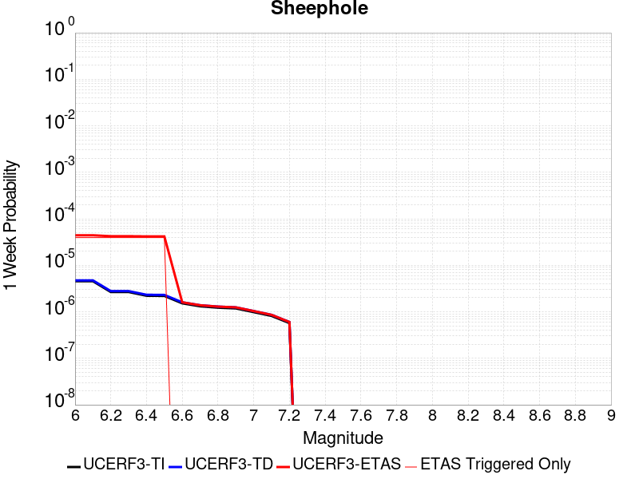 | 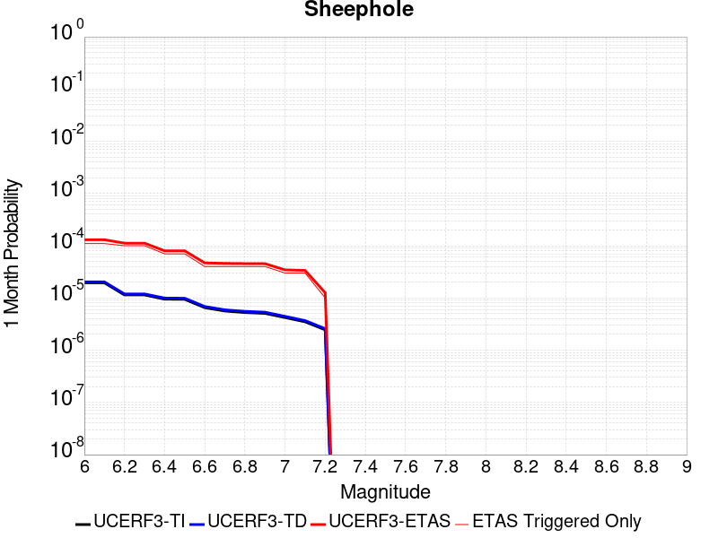 | 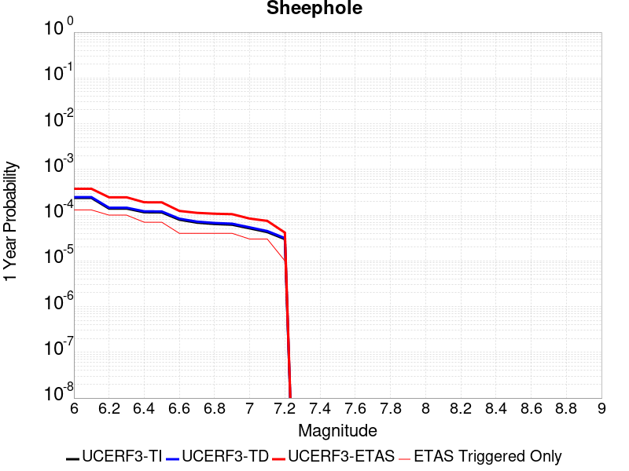 | 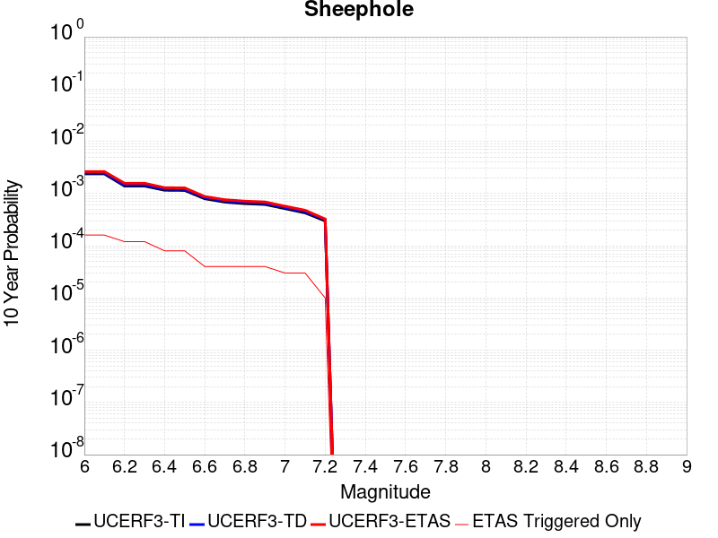 |

| Magnitude | 1 wk TI Prob | 1 wk TD Prob | 1 wk ETAS Prob | 1 wk ETAS/TD Gain | 1 wk ETAS Triggered Only | 1 mo TI Prob | 1 mo TD Prob | 1 mo ETAS Prob | 1 mo ETAS/TD Gain | 1 mo ETAS Triggered Only | 1 yr TI Prob | 1 yr TD Prob | 1 yr ETAS Prob | 1 yr ETAS/TD Gain | 1 yr ETAS Triggered Only | 10 yr TI Prob | 10 yr TD Prob | 10 yr ETAS Prob | 10 yr ETAS/TD Gain | 10 yr ETAS Triggered Only |
|-----|-----|-----|-----|-----|-----|-----|-----|-----|-----|-----|-----|-----|-----|-----|-----|-----|-----|-----|-----|-----|
| 6.0 | 4.5579695E-6 | 4.7412627E-6 | 4.419192E-5 | 9.320707 | 3.9450842E-5 | 1.9534009E-5 | 2.031957E-5 | 9.921966E-5 | 4.8829603 | 7.8901685E-5 | 2.3780059E-4 | 2.473682E-4 | 3.262504E-4 | 1.3188857 | 7.8901685E-5 | 0.0023754628 | 0.002471473 | 0.0026288866 | 1.0636921 | 1.5780337E-4 |
| 6.1 | 4.5579695E-6 | 4.7412627E-6 | 4.419192E-5 | 9.320707 | 3.9450842E-5 | 1.9534009E-5 | 2.031957E-5 | 9.921966E-5 | 4.8829603 | 7.8901685E-5 | 2.3780059E-4 | 2.473682E-4 | 3.262504E-4 | 1.3188857 | 7.8901685E-5 | 0.0023754628 | 0.002471473 | 0.0026288866 | 1.0636921 | 1.5780337E-4 |
| 6.2 | 2.6677674E-6 | 2.7873941E-6 | 4.2238127E-5 | 15.153267 | 3.9450842E-5 | 1.1433239E-5 | 1.1945926E-5 | 9.0846675E-5 | 7.604824 | 7.8901685E-5 | 1.3919079E-4 | 1.4543302E-4 | 2.2432324E-4 | 1.5424504 | 7.8901685E-5 | 0.0013910364 | 0.0014534844 | 0.0016110584 | 1.1084112 | 1.5780337E-4 |
| 6.3 | 2.6677674E-6 | 2.7873941E-6 | 4.2238127E-5 | 15.153267 | 3.9450842E-5 | 1.1433239E-5 | 1.1945926E-5 | 9.0846675E-5 | 7.604824 | 7.8901685E-5 | 1.3919079E-4 | 1.4543302E-4 | 2.2432324E-4 | 1.5424504 | 7.8901685E-5 | 0.0013910364 | 0.0014534844 | 0.0016110584 | 1.1084112 | 1.5780337E-4 |
| 6.4 | 2.2159759E-6 | 2.3228788E-6 | 4.177363E-5 | 17.98356 | 3.9450842E-5 | 9.497005E-6 | 9.955161E-6 | 8.885606E-5 | 8.925628 | 7.8901685E-5 | 1.156199E-4 | 1.2119815E-4 | 2.0009028E-4 | 1.650935 | 7.8901685E-5 | 0.0011555976 | 0.0012113999 | 0.0013296091 | 1.0975807 | 1.1835253E-4 |
| 6.5 | 2.1986082E-6 | 2.304759E-6 | 4.1755513E-5 | 18.117085 | 3.9450842E-5 | 9.4225725E-6 | 9.877506E-6 | 8.877841E-5 | 8.987939 | 7.8901685E-5 | 1.1471378E-4 | 1.2025281E-4 | 1.9914501E-4 | 1.656053 | 7.8901685E-5 | 0.0011465458 | 0.0012019566 | 0.001320167 | 1.0983483 | 1.1835253E-4 |
| 6.6 | 1.5232331E-6 | 1.6018919E-6 | 1.6018919E-6 | 1.0 | 0.0 | 6.5281256E-6 | 6.865234E-6 | 4.6315807E-5 | 6.7464285 | 3.9450842E-5 | 7.947703E-5 | 8.35812E-5 | 1.2302875E-4 | 1.4719667 | 3.9450842E-5 | 7.9448614E-4 | 8.3551643E-4 | 8.749343E-4 | 1.0471779 | 3.9450842E-5 |
| 6.7 | 1.3137362E-6 | 1.382819E-6 | 1.382819E-6 | 1.0 | 0.0 | 5.6302856E-6 | 5.926355E-6 | 4.5376964E-5 | 7.656809 | 3.9450842E-5 | 6.854657E-5 | 7.215112E-5 | 1.1159912E-4 | 1.5467414 | 3.9450842E-5 | 6.8525434E-4 | 7.212908E-4 | 7.6071324E-4 | 1.0546553 | 3.9450842E-5 |
| 6.8 | 1.2275751E-6 | 1.2922847E-6 | 1.2922847E-6 | 1.0 | 0.0 | 5.2610258E-6 | 5.5383516E-6 | 4.4988978E-5 | 8.123171 | 3.9450842E-5 | 6.4051106E-5 | 6.7427485E-5 | 1.0687567E-4 | 1.585046 | 3.9450842E-5 | 6.4032647E-4 | 6.740836E-4 | 7.135078E-4 | 1.0584857 | 3.9450842E-5 |
| 6.9 | 1.1837088E-6 | 1.246102E-6 | 1.246102E-6 | 1.0 | 0.0 | 5.0730278E-6 | 5.340427E-6 | 4.479106E-5 | 8.387168 | 3.9450842E-5 | 6.176237E-5 | 6.501789E-5 | 1.0446617E-4 | 1.6067296 | 3.9450842E-5 | 6.17452E-4 | 6.5000186E-4 | 6.894271E-4 | 1.0606539 | 3.9450842E-5 |
| 7.0 | 9.849371E-7 | 1.0366288E-6 | 1.0366288E-6 | 1.0 | 0.0 | 4.2211523E-6 | 4.442688E-6 | 4.3893357E-5 | 9.87991 | 3.9450842E-5 | 5.1391315E-5 | 5.4088487E-5 | 9.353719E-5 | 1.7293366 | 3.9450842E-5 | 5.137943E-4 | 5.407633E-4 | 5.801928E-4 | 1.0729146 | 3.9450842E-5 |
| 7.1 | 8.1643645E-7 | 8.591669E-7 | 8.591669E-7 | 1.0 | 0.0 | 3.4990085E-6 | 3.682139E-6 | 4.3132837E-5 | 11.71407 | 3.9450842E-5 | 4.2599597E-5 | 4.482921E-5 | 8.427828E-5 | 1.8799859 | 3.9450842E-5 | 4.259143E-4 | 4.4821028E-4 | 4.8764347E-4 | 1.0879792 | 3.9450842E-5 |
| 7.2 | 5.7295756E-7 | 6.029502E-7 | 6.029502E-7 | 1.0 | 0.0 | 2.45553E-6 | 2.58407E-6 | 2.58407E-6 | 1.0 | 0.0 | 2.9895667E-5 | 3.1460666E-5 | 3.1460666E-5 | 1.0 | 0.0 | 2.9891645E-4 | 3.145688E-4 | 3.145688E-4 | 1.0 | 0.0 |

## Santa Ynez River
*[(top)](#table-of-contents)*

| 1 Week | 1 Month | 1 Year | 10 Year |
|-----|-----|-----|-----|
| 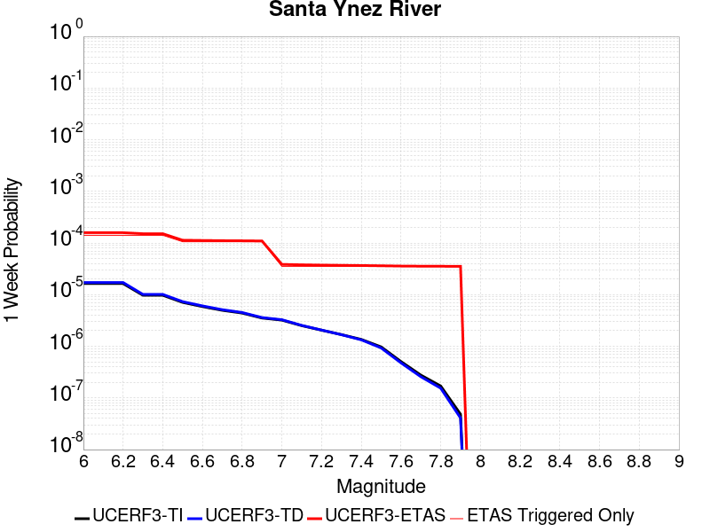 | 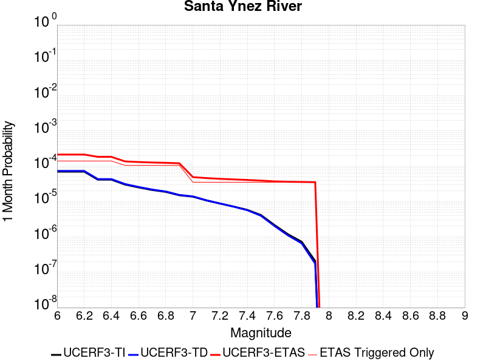 | 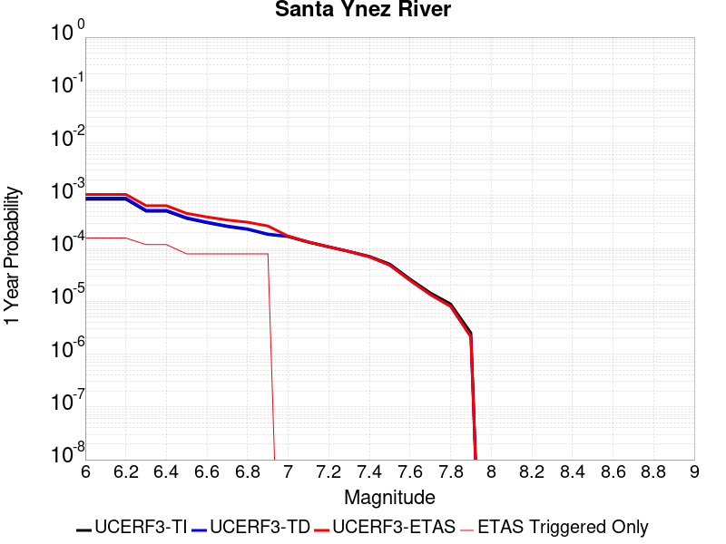 | 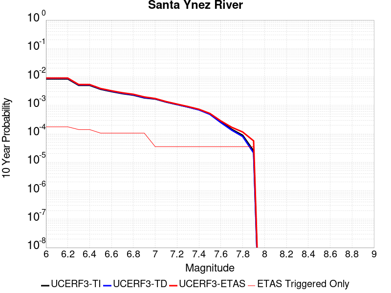 |

| Magnitude | 1 wk TI Prob | 1 wk TD Prob | 1 wk ETAS Prob | 1 wk ETAS/TD Gain | 1 wk ETAS Triggered Only | 1 mo TI Prob | 1 mo TD Prob | 1 mo ETAS Prob | 1 mo ETAS/TD Gain | 1 mo ETAS Triggered Only | 1 yr TI Prob | 1 yr TD Prob | 1 yr ETAS Prob | 1 yr ETAS/TD Gain | 1 yr ETAS Triggered Only | 10 yr TI Prob | 10 yr TD Prob | 10 yr ETAS Prob | 10 yr ETAS/TD Gain | 10 yr ETAS Triggered Only |
|-----|-----|-----|-----|-----|-----|-----|-----|-----|-----|-----|-----|-----|-----|-----|-----|-----|-----|-----|-----|-----|
| 6.0 | 1.6396456E-5 | 1.7209435E-5 | 1.3555994E-4 | 7.87707 | 1.1835253E-4 | 7.026863E-5 | 7.375284E-5 | 1.9209665E-4 | 2.6046 | 1.1835253E-4 | 8.551848E-4 | 8.976064E-4 | 0.0010552682 | 1.1756468 | 1.5780337E-4 | 0.0085190125 | 0.008943358 | 0.00909975 | 1.0174869 | 1.5780337E-4 |
| 6.1 | 1.6396456E-5 | 1.7209435E-5 | 1.3555994E-4 | 7.87707 | 1.1835253E-4 | 7.026863E-5 | 7.375284E-5 | 1.9209665E-4 | 2.6046 | 1.1835253E-4 | 8.551848E-4 | 8.976064E-4 | 0.0010552682 | 1.1756468 | 1.5780337E-4 | 0.0085190125 | 0.008943358 | 0.00909975 | 1.0174869 | 1.5780337E-4 |
| 6.2 | 1.6396456E-5 | 1.7209435E-5 | 1.3555994E-4 | 7.87707 | 1.1835253E-4 | 7.026863E-5 | 7.375284E-5 | 1.9209665E-4 | 2.6046 | 1.1835253E-4 | 8.551848E-4 | 8.976064E-4 | 0.0010552682 | 1.1756468 | 1.5780337E-4 | 0.0085190125 | 0.008943358 | 0.00909975 | 1.0174869 | 1.5780337E-4 |
| 6.3 | 9.736976E-6 | 1.012233E-5 | 1.2847366E-4 | 12.692103 | 1.1835253E-4 | 4.172923E-5 | 4.338072E-5 | 1.6172812E-4 | 3.7281103 | 1.1835253E-4 | 5.0793495E-4 | 5.280373E-4 | 6.4632733E-4 | 1.2240183 | 1.1835253E-4 | 0.005067755 | 0.005268332 | 0.005386061 | 1.0223465 | 1.1835253E-4 |
| 6.4 | 9.736976E-6 | 1.012233E-5 | 1.2847366E-4 | 12.692103 | 1.1835253E-4 | 4.172923E-5 | 4.338072E-5 | 1.6172812E-4 | 3.7281103 | 1.1835253E-4 | 5.0793495E-4 | 5.280373E-4 | 6.4632733E-4 | 1.2240183 | 1.1835253E-4 | 0.005067755 | 0.005268332 | 0.005386061 | 1.0223465 | 1.1835253E-4 |
| 6.5 | 7.081964E-6 | 7.3298966E-6 | 8.6231004E-5 | 11.764287 | 7.8901685E-5 | 3.035092E-5 | 3.1413474E-5 | 1.10312685E-4 | 3.511636 | 7.8901685E-5 | 3.694598E-4 | 3.8239348E-4 | 4.61265E-4 | 1.2062575 | 7.8901685E-5 | 0.0036884616 | 0.0038175168 | 0.0038961172 | 1.0205895 | 7.8901685E-5 |
| 6.6 | 5.873247E-6 | 6.059743E-6 | 8.496096E-5 | 14.020554 | 7.8901685E-5 | 2.5170815E-5 | 2.5970074E-5 | 1.04869716E-4 | 4.0380983 | 7.8901685E-5 | 3.064116E-4 | 3.1614062E-4 | 3.9501736E-4 | 1.249499 | 7.8901685E-5 | 0.0030598943 | 0.0031569963 | 0.0032356489 | 1.0249138 | 7.8901685E-5 |
| 6.7 | 4.973277E-6 | 5.115901E-6 | 8.4017185E-5 | 16.422754 | 7.8901685E-5 | 2.1313872E-5 | 2.1925109E-5 | 1.0082507E-4 | 4.598612 | 7.8901685E-5 | 2.5946548E-4 | 2.66906E-4 | 3.457866E-4 | 1.2955371 | 7.8901685E-5 | 0.0025916274 | 0.0026659032 | 0.0027445946 | 1.0295177 | 7.8901685E-5 |
| 6.8 | 4.396492E-6 | 4.5109778E-6 | 8.341231E-5 | 18.490961 | 7.8901685E-5 | 1.884197E-5 | 1.9332621E-5 | 9.8232784E-5 | 5.0811934 | 7.8901685E-5 | 2.2937685E-4 | 2.3534958E-4 | 3.142327E-4 | 1.3351742 | 7.8901685E-5 | 0.0022914023 | 0.0023510386 | 0.002429755 | 1.0334815 | 7.8901685E-5 |
| 6.9 | 3.5255632E-6 | 3.6013332E-6 | 8.250274E-5 | 22.908943 | 7.8901685E-5 | 1.5109469E-5 | 1.5434196E-5 | 9.433467E-5 | 6.112056 | 7.8901685E-5 | 1.8394225E-4 | 1.8789528E-4 | 2.6678215E-4 | 1.4198449 | 7.8901685E-5 | 0.0018379007 | 0.0018773803 | 0.0019561339 | 1.0419487 | 7.8901685E-5 |
| 7.0 | 3.211603E-6 | 3.273654E-6 | 3.273654E-6 | 1.0 | 0.0 | 1.376394E-5 | 1.4029872E-5 | 1.4029872E-5 | 1.0 | 0.0 | 1.6756308E-4 | 1.7080043E-4 | 1.7080043E-4 | 1.0 | 0.0 | 0.0016743679 | 0.0017067058 | 0.0017067058 | 1.0 | 0.0 |
| 7.1 | 2.5094619E-6 | 2.5409204E-6 | 2.5409204E-6 | 1.0 | 0.0 | 1.0754793E-5 | 1.0889614E-5 | 1.0889614E-5 | 1.0 | 0.0 | 1.3093173E-4 | 1.3257304E-4 | 1.3257304E-4 | 1.0 | 0.0 | 0.0013085462 | 0.0013249456 | 0.0013249456 | 1.0 | 0.0 |
| 7.2 | 2.0515774E-6 | 2.0619375E-6 | 2.0619375E-6 | 1.0 | 0.0 | 8.792445E-6 | 8.836846E-6 | 8.836846E-6 | 1.0 | 0.0 | 1.0704277E-4 | 1.0758333E-4 | 1.0758333E-4 | 1.0 | 0.0 | 0.0010699122 | 0.0010753168 | 0.0010753168 | 1.0 | 0.0 |
| 7.3 | 1.6845745E-6 | 1.6773907E-6 | 1.6773907E-6 | 1.0 | 0.0 | 7.219585E-6 | 7.1887976E-6 | 7.1887976E-6 | 1.0 | 0.0 | 8.78949E-5 | 8.752012E-5 | 8.752012E-5 | 1.0 | 0.0 | 8.7860145E-4 | 8.7485946E-4 | 8.7485946E-4 | 1.0 | 0.0 |
| 7.4 | 1.3600285E-6 | 1.3333357E-6 | 1.3333357E-6 | 1.0 | 0.0 | 5.82868E-6 | 5.714284E-6 | 5.714284E-6 | 1.0 | 0.0 | 7.096187E-5 | 6.956921E-5 | 6.956921E-5 | 1.0 | 0.0 | 7.0939213E-4 | 6.954765E-4 | 6.954765E-4 | 1.0 | 0.0 |
| 7.5 | 9.735342E-7 | 9.290103E-7 | 9.290103E-7 | 1.0 | 0.0 | 4.172283E-6 | 3.9814668E-6 | 3.9814668E-6 | 1.0 | 0.0 | 5.079636E-5 | 4.8473295E-5 | 4.8473295E-5 | 1.0 | 0.0 | 5.0784746E-4 | 4.8462892E-4 | 4.8462892E-4 | 1.0 | 0.0 |
| 7.6 | 5.067187E-7 | 4.77857E-7 | 4.77857E-7 | 1.0 | 0.0 | 2.1716498E-6 | 2.047957E-6 | 2.047957E-6 | 1.0 | 0.0 | 2.6439517E-5 | 2.4933597E-5 | 2.4933597E-5 | 1.0 | 0.0 | 2.643637E-4 | 2.4930874E-4 | 2.4930874E-4 | 1.0 | 0.0 |
| 7.7 | 2.769089E-7 | 2.5759124E-7 | 2.5759124E-7 | 1.0 | 0.0 | 1.1867519E-6 | 1.1039621E-6 | 1.1039621E-6 | 1.0 | 0.0 | 1.4448608E-5 | 1.34406555E-5 | 1.34406555E-5 | 1.0 | 0.0 | 1.444767E-4 | 1.3439846E-4 | 1.3439846E-4 | 1.0 | 0.0 |
| 7.8 | 1.7044663E-7 | 1.5449015E-7 | 1.5449015E-7 | 1.0 | 0.0 | 7.3048534E-7 | 6.621005E-7 | 6.621005E-7 | 1.0 | 0.0 | 8.893623E-6 | 8.061043E-6 | 8.061043E-6 | 1.0 | 0.0 | 8.893267E-5 | 8.060753E-5 | 8.060753E-5 | 1.0 | 0.0 |
| 7.9 | 4.8344287E-8 | 4.0910923E-8 | 4.0910923E-8 | 1.0 | 0.0 | 2.0718979E-7 | 1.7533252E-7 | 1.7533252E-7 | 1.0 | 0.0 | 2.5225327E-6 | 2.1346711E-6 | 2.1346711E-6 | 1.0 | 0.0 | 2.5225041E-5 | 2.1346512E-5 | 2.1346512E-5 | 1.0 | 0.0 |

## Oceanic - West Huasna
*[(top)](#table-of-contents)*

| 1 Week | 1 Month | 1 Year | 10 Year |
|-----|-----|-----|-----|
|  | 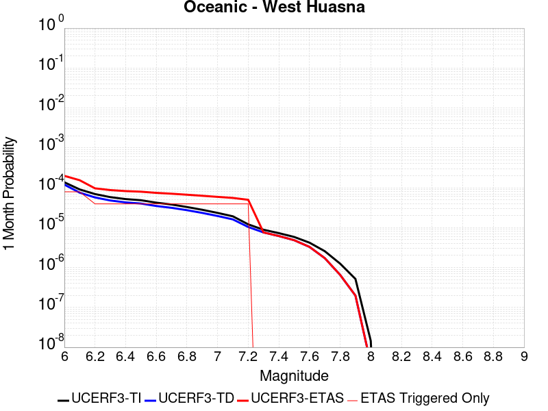 | 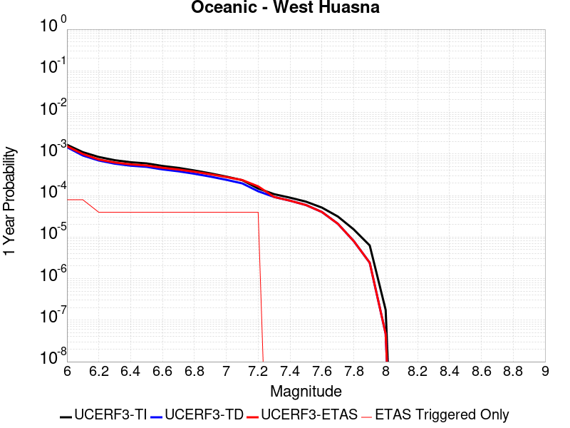 | 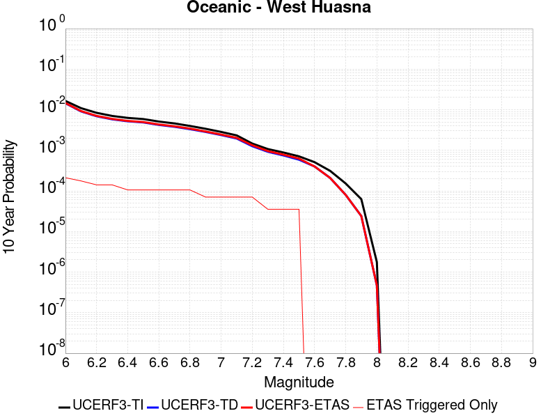 |

| Magnitude | 1 wk TI Prob | 1 wk TD Prob | 1 wk ETAS Prob | 1 wk ETAS/TD Gain | 1 wk ETAS Triggered Only | 1 mo TI Prob | 1 mo TD Prob | 1 mo ETAS Prob | 1 mo ETAS/TD Gain | 1 mo ETAS Triggered Only | 1 yr TI Prob | 1 yr TD Prob | 1 yr ETAS Prob | 1 yr ETAS/TD Gain | 1 yr ETAS Triggered Only | 10 yr TI Prob | 10 yr TD Prob | 10 yr ETAS Prob | 10 yr ETAS/TD Gain | 10 yr ETAS Triggered Only |
|-----|-----|-----|-----|-----|-----|-----|-----|-----|-----|-----|-----|-----|-----|-----|-----|-----|-----|-----|-----|-----|
| 6.0 | 3.195567E-5 | 2.7926868E-5 | 1.0682635E-4 | 3.8252177 | 7.8901685E-5 | 1.3694567E-4 | 1.1968133E-4 | 1.9857357E-4 | 1.6591859 | 7.8901685E-5 | 0.0016660384 | 0.0014561893 | 0.0015349762 | 1.0541048 | 7.8901685E-5 | 0.016536033 | 0.014471028 | 0.014626548 | 1.010747 | 1.5780337E-4 |
| 6.1 | 2.1156782E-5 | 1.7573486E-5 | 9.6473785E-5 | 5.4897356 | 7.8901685E-5 | 9.066878E-5 | 7.531282E-5 | 1.5420857E-4 | 2.047574 | 7.8901685E-5 | 0.0011033333 | 9.165572E-4 | 9.953866E-4 | 1.0860059 | 7.8901685E-5 | 0.010978713 | 0.009128777 | 0.009246049 | 1.0128465 | 1.1835253E-4 |
| 6.2 | 1.6195117E-5 | 1.3327152E-5 | 5.2777472E-5 | 3.960146 | 3.9450842E-5 | 6.9405796E-5 | 5.7115132E-5 | 9.656372E-5 | 1.6906854 | 3.9450842E-5 | 8.44688E-4 | 6.9515745E-4 | 7.345809E-4 | 1.0567116 | 3.9450842E-5 | 0.008414844 | 0.006930123 | 0.007008478 | 1.0113064 | 7.8901685E-5 |
| 6.3 | 1.3559345E-5 | 1.1179142E-5 | 5.0629547E-5 | 4.528929 | 3.9450842E-5 | 5.811018E-5 | 4.7909736E-5 | 8.735869E-5 | 1.8234016 | 3.9450842E-5 | 7.072618E-4 | 5.831459E-4 | 6.225737E-4 | 1.0676123 | 3.9450842E-5 | 0.0070501505 | 0.0058162753 | 0.0058947178 | 1.0134867 | 7.8901685E-5 |
| 6.4 | 1.2120619E-5 | 1.0000977E-5 | 4.9451428E-5 | 4.944659 | 3.9450842E-5 | 5.1944477E-5 | 4.2860633E-5 | 8.230979E-5 | 1.9204053 | 3.9450842E-5 | 6.322405E-4 | 5.2170374E-4 | 5.61134E-4 | 1.0755798 | 3.9450842E-5 | 0.006304447 | 0.0052048573 | 0.0052833483 | 1.0150803 | 7.8901685E-5 |
| 6.5 | 1.13511915E-5 | 9.3674735E-6 | 4.8817947E-5 | 5.2114315 | 3.9450842E-5 | 4.8647056E-5 | 4.01457E-5 | 7.959496E-5 | 1.9826522 | 3.9450842E-5 | 5.9211696E-4 | 4.886647E-4 | 5.280963E-4 | 1.0806925 | 3.9450842E-5 | 0.0059054173 | 0.0048759608 | 0.004954478 | 1.0161029 | 7.8901685E-5 |
| 6.6 | 9.850605E-6 | 8.135418E-6 | 4.758594E-5 | 5.8492312 | 3.9450842E-5 | 4.2216197E-5 | 3.4865614E-5 | 7.431508E-5 | 2.131472 | 3.9450842E-5 | 5.1386096E-4 | 4.2440637E-4 | 4.6384046E-4 | 1.0929159 | 3.9450842E-5 | 0.0051267436 | 0.004235991 | 0.0043145586 | 1.0185477 | 7.8901685E-5 |
| 6.7 | 8.8558645E-6 | 7.318433E-6 | 4.676899E-5 | 6.3905745 | 3.9450842E-5 | 3.7953152E-5 | 3.1364336E-5 | 7.081394E-5 | 2.2577856 | 3.9450842E-5 | 4.6198163E-4 | 3.8179406E-4 | 4.2122984E-4 | 1.1032907 | 3.9450842E-5 | 0.004610224 | 0.0038114067 | 0.0038900077 | 1.0206226 | 7.8901685E-5 |
| 6.8 | 7.67136E-6 | 6.391756E-6 | 4.584235E-5 | 7.1721053 | 3.9450842E-5 | 3.2876844E-5 | 2.7392953E-5 | 6.684272E-5 | 2.4401429 | 3.9450842E-5 | 4.0020206E-4 | 3.3345833E-4 | 3.72896E-4 | 1.1182687 | 3.9450842E-5 | 0.003994821 | 0.0033296007 | 0.0034082397 | 1.0236181 | 7.8901685E-5 |
| 6.9 | 6.534529E-6 | 5.4583297E-6 | 4.490896E-5 | 8.227601 | 3.9450842E-5 | 2.8004823E-5 | 2.3392633E-5 | 6.2842555E-5 | 2.686425 | 3.9450842E-5 | 3.4090536E-4 | 2.847682E-4 | 3.2420782E-4 | 1.1384972 | 3.9450842E-5 | 0.0034038287 | 0.0028440498 | 0.0028833884 | 1.0138319 | 3.9450842E-5 |
| 7.0 | 5.460525E-6 | 4.5699517E-6 | 4.4020617E-5 | 9.632622 | 3.9450842E-5 | 2.3402039E-5 | 1.958536E-5 | 5.9035432E-5 | 3.0142632 | 3.9450842E-5 | 2.8488258E-4 | 2.3842578E-4 | 2.7786722E-4 | 1.1654243 | 3.9450842E-5 | 0.0028451765 | 0.0023817138 | 0.0024210706 | 1.0165246 | 3.9450842E-5 |
| 7.1 | 4.4825083E-6 | 3.7524428E-6 | 4.3203137E-5 | 11.513337 | 3.9450842E-5 | 1.9210609E-5 | 1.60818E-5 | 5.5532008E-5 | 3.4530966 | 3.9450842E-5 | 2.3386406E-4 | 1.9577841E-4 | 2.3522154E-4 | 1.2014682 | 3.9450842E-5 | 0.002336181 | 0.0019560715 | 0.001995445 | 1.020129 | 3.9450842E-5 |
| 7.2 | 2.821708E-6 | 2.4249334E-6 | 4.1875683E-5 | 17.268797 | 3.9450842E-5 | 1.2092979E-5 | 1.039253E-5 | 4.9842965E-5 | 4.796037 | 3.9450842E-5 | 1.4722206E-4 | 1.2652173E-4 | 1.6596758E-4 | 1.3117714 | 3.9450842E-5 | 0.0014712457 | 0.0012644994 | 0.0013039003 | 1.0311593 | 3.9450842E-5 |
| 7.3 | 2.0644757E-6 | 1.7687412E-6 | 1.7687412E-6 | 1.0 | 0.0 | 8.847723E-6 | 7.5802973E-6 | 7.5802973E-6 | 1.0 | 0.0 | 1.0771569E-4 | 9.228622E-5 | 9.228622E-5 | 1.0 | 0.0 | 0.001076635 | 9.2248066E-4 | 9.2248066E-4 | 1.0 | 0.0 |
| 7.4 | 1.6980367E-6 | 1.4379892E-6 | 1.4379892E-6 | 1.0 | 0.0 | 7.27728E-6 | 6.162796E-6 | 6.162796E-6 | 1.0 | 0.0 | 8.8597284E-5 | 7.5029464E-5 | 7.5029464E-5 | 1.0 | 0.0 | 8.8561967E-4 | 7.500429E-4 | 7.500429E-4 | 1.0 | 0.0 |
| 7.5 | 1.3637683E-6 | 1.1302635E-6 | 1.1302635E-6 | 1.0 | 0.0 | 5.844708E-6 | 4.8439774E-6 | 4.8439774E-6 | 1.0 | 0.0 | 7.1156996E-5 | 5.897383E-5 | 5.897383E-5 | 1.0 | 0.0 | 7.1134215E-4 | 5.895833E-4 | 5.895833E-4 | 1.0 | 0.0 |
| 7.6 | 9.802994E-7 | 7.677247E-7 | 7.677247E-7 | 1.0 | 0.0 | 4.2012766E-6 | 3.2902446E-6 | 3.2902446E-6 | 1.0 | 0.0 | 5.1149345E-5 | 4.0057992E-5 | 4.0057992E-5 | 1.0 | 0.0 | 5.113757E-4 | 4.0050913E-4 | 4.0050913E-4 | 1.0 | 0.0 |
| 7.7 | 5.986191E-7 | 4.0050548E-7 | 4.0050548E-7 | 1.0 | 0.0 | 2.5655079E-6 | 1.7164509E-6 | 1.7164509E-6 | 1.0 | 0.0 | 3.1234613E-5 | 2.089759E-5 | 2.089759E-5 | 1.0 | 0.0 | 3.123022E-4 | 2.089576E-4 | 2.089576E-4 | 1.0 | 0.0 |
| 7.8 | 2.9189815E-7 | 1.5285792E-7 | 1.5285792E-7 | 1.0 | 0.0 | 1.2509914E-6 | 6.5510517E-7 | 6.5510517E-7 | 1.0 | 0.0 | 1.5230714E-5 | 7.9758765E-6 | 7.9758765E-6 | 1.0 | 0.0 | 1.522967E-4 | 7.9757214E-5 | 7.9757214E-5 | 1.0 | 0.0 |
| 7.9 | 1.2057845E-7 | 4.621248E-8 | 4.621248E-8 | 1.0 | 0.0 | 5.1676466E-7 | 1.9805347E-7 | 1.9805347E-7 | 1.0 | 0.0 | 6.2915915E-6 | 2.4112983E-6 | 2.4112983E-6 | 1.0 | 0.0 | 6.2914136E-5 | 2.4114026E-5 | 2.4114026E-5 | 1.0 | 0.0 |
| 8.0 | 3.3806387E-9 | 9.011393E-10 | 9.011393E-10 | 1.0 | 0.0 | 1.4488451E-8 | 3.8620254E-9 | 3.8620254E-9 | 1.0 | 0.0 | 1.7639688E-7 | 4.702016E-8 | 4.702016E-8 | 1.0 | 0.0 | 1.7639674E-6 | 4.7129527E-7 | 4.7129527E-7 | 1.0 | 0.0 |

## Oak Ridge (Onshore)
*[(top)](#table-of-contents)*

| 1 Week | 1 Month | 1 Year | 10 Year |
|-----|-----|-----|-----|
| 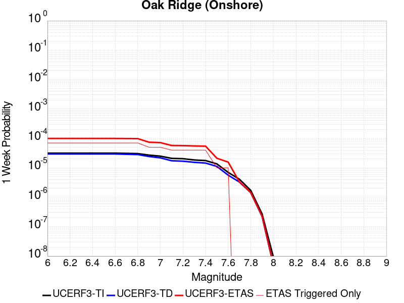 | 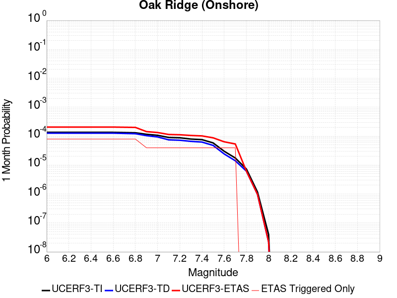 | 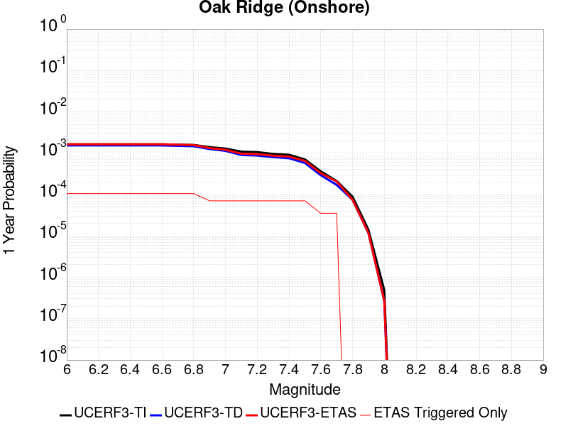 | 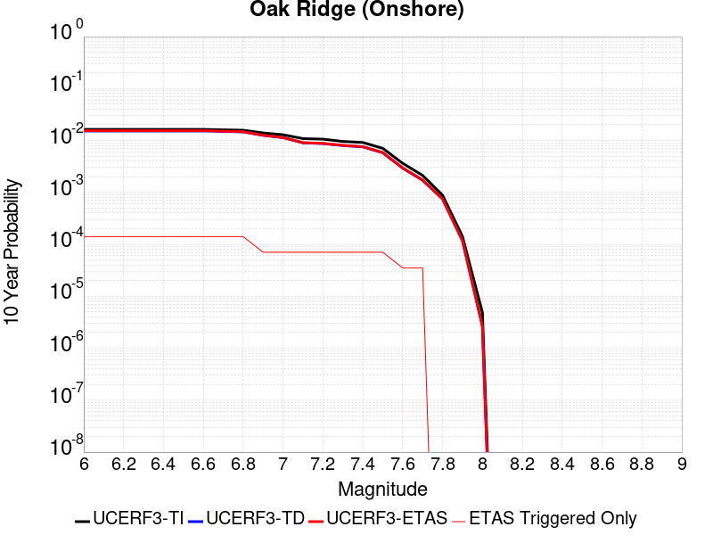 |

| Magnitude | 1 wk TI Prob | 1 wk TD Prob | 1 wk ETAS Prob | 1 wk ETAS/TD Gain | 1 wk ETAS Triggered Only | 1 mo TI Prob | 1 mo TD Prob | 1 mo ETAS Prob | 1 mo ETAS/TD Gain | 1 mo ETAS Triggered Only | 1 yr TI Prob | 1 yr TD Prob | 1 yr ETAS Prob | 1 yr ETAS/TD Gain | 1 yr ETAS Triggered Only | 10 yr TI Prob | 10 yr TD Prob | 10 yr ETAS Prob | 10 yr ETAS/TD Gain | 10 yr ETAS Triggered Only |
|-----|-----|-----|-----|-----|-----|-----|-----|-----|-----|-----|-----|-----|-----|-----|-----|-----|-----|-----|-----|-----|
| 6.0 | 3.155064E-5 | 2.9525974E-5 | 6.8975656E-5 | 2.3361008 | 3.9450842E-5 | 1.3521002E-4 | 1.2653397E-4 | 2.0542568E-4 | 1.6234825 | 7.8901685E-5 | 0.001644939 | 0.0015395004 | 0.0016576707 | 1.0767589 | 1.1835253E-4 | 0.01632816 | 0.015292859 | 0.015448249 | 1.0101609 | 1.5780337E-4 |
| 6.1 | 3.155064E-5 | 2.9525974E-5 | 6.8975656E-5 | 2.3361008 | 3.9450842E-5 | 1.3521002E-4 | 1.2653397E-4 | 2.0542568E-4 | 1.6234825 | 7.8901685E-5 | 0.001644939 | 0.0015395004 | 0.0016576707 | 1.0767589 | 1.1835253E-4 | 0.01632816 | 0.015292859 | 0.015448249 | 1.0101609 | 1.5780337E-4 |
| 6.2 | 3.155064E-5 | 2.9525974E-5 | 6.8975656E-5 | 2.3361008 | 3.9450842E-5 | 1.3521002E-4 | 1.2653397E-4 | 2.0542568E-4 | 1.6234825 | 7.8901685E-5 | 0.001644939 | 0.0015395004 | 0.0016576707 | 1.0767589 | 1.1835253E-4 | 0.01632816 | 0.015292859 | 0.015448249 | 1.0101609 | 1.5780337E-4 |
| 6.3 | 3.155064E-5 | 2.9525974E-5 | 6.8975656E-5 | 2.3361008 | 3.9450842E-5 | 1.3521002E-4 | 1.2653397E-4 | 2.0542568E-4 | 1.6234825 | 7.8901685E-5 | 0.001644939 | 0.0015395004 | 0.0016576707 | 1.0767589 | 1.1835253E-4 | 0.01632816 | 0.015292859 | 0.015448249 | 1.0101609 | 1.5780337E-4 |
| 6.4 | 3.155064E-5 | 2.9525974E-5 | 6.8975656E-5 | 2.3361008 | 3.9450842E-5 | 1.3521002E-4 | 1.2653397E-4 | 2.0542568E-4 | 1.6234825 | 7.8901685E-5 | 0.001644939 | 0.0015395004 | 0.0016576707 | 1.0767589 | 1.1835253E-4 | 0.01632816 | 0.015292859 | 0.015448249 | 1.0101609 | 1.5780337E-4 |
| 6.5 | 3.155064E-5 | 2.9525974E-5 | 6.8975656E-5 | 2.3361008 | 3.9450842E-5 | 1.3521002E-4 | 1.2653397E-4 | 2.0542568E-4 | 1.6234825 | 7.8901685E-5 | 0.001644939 | 0.0015395004 | 0.0016576707 | 1.0767589 | 1.1835253E-4 | 0.01632816 | 0.015292859 | 0.015448249 | 1.0101609 | 1.5780337E-4 |
| 6.6 | 3.155064E-5 | 2.9525974E-5 | 6.8975656E-5 | 2.3361008 | 3.9450842E-5 | 1.3521002E-4 | 1.2653397E-4 | 2.0542568E-4 | 1.6234825 | 7.8901685E-5 | 0.001644939 | 0.0015395004 | 0.0016576707 | 1.0767589 | 1.1835253E-4 | 0.01632816 | 0.015292859 | 0.015448249 | 1.0101609 | 1.5780337E-4 |
| 6.7 | 3.098897E-5 | 2.8864175E-5 | 6.831388E-5 | 2.366736 | 3.9450842E-5 | 1.328031E-4 | 1.2369796E-4 | 2.0258989E-4 | 1.6377788 | 7.8901685E-5 | 0.0016156785 | 0.0015050198 | 0.0016231942 | 1.0785202 | 1.1835253E-4 | 0.016039822 | 0.014952714 | 0.015108158 | 1.0103956 | 1.5780337E-4 |
| 6.8 | 3.0449872E-5 | 2.8239372E-5 | 6.76891E-5 | 2.3969762 | 3.9450842E-5 | 1.3049292E-4 | 1.2102048E-4 | 1.9991261E-4 | 1.6518909 | 7.8901685E-5 | 0.0015875935 | 0.0014724657 | 0.0015906439 | 1.0802587 | 1.1835253E-4 | 0.015762992 | 0.014631462 | 0.014786956 | 1.0106274 | 1.5780337E-4 |
| 6.9 | 2.697928E-5 | 2.4219773E-5 | 2.4219773E-5 | 1.0 | 0.0 | 1.15620365E-4 | 1.0379502E-4 | 1.4324176E-4 | 1.3800447 | 3.9450842E-5 | 0.0014067689 | 0.0012629933 | 0.0013417953 | 1.0623931 | 7.8901685E-5 | 0.0139789665 | 0.01256087 | 0.01263878 | 1.0062027 | 7.8901685E-5 |
| 7.0 | 2.4893961E-5 | 2.1862043E-5 | 2.1862043E-5 | 1.0 | 0.0 | 1.0668404E-4 | 9.3691204E-5 | 1.3313835E-4 | 1.4210336 | 3.9450842E-5 | 0.0012981043 | 0.0011401111 | 0.0012189229 | 1.0691264 | 7.8901685E-5 | 0.012905477 | 0.011344905 | 0.011422912 | 1.0068759 | 7.8901685E-5 |
| 7.1 | 2.0945363E-5 | 1.7354487E-5 | 1.7354487E-5 | 1.0 | 0.0 | 8.976275E-5 | 7.437428E-5 | 1.1382219E-4 | 1.5303972 | 3.9450842E-5 | 0.0010923136 | 9.051354E-4 | 9.839657E-4 | 1.0870923 | 7.8901685E-5 | 0.0108696 | 0.009015423 | 0.009093613 | 1.008673 | 7.8901685E-5 |
| 7.2 | 2.0439404E-5 | 1.6809423E-5 | 1.6809423E-5 | 1.0 | 0.0 | 8.7594504E-5 | 7.203843E-5 | 1.1148643E-4 | 1.5475967 | 3.9450842E-5 | 0.0010659413 | 8.767196E-4 | 9.555521E-4 | 1.0899175 | 7.8901685E-5 | 0.010608427 | 0.008733526 | 0.008811738 | 1.0089555 | 7.8901685E-5 |
| 7.3 | 1.8463334E-5 | 1.5381811E-5 | 1.5381811E-5 | 1.0 | 0.0 | 7.912617E-5 | 6.59204E-5 | 1.0536865E-4 | 1.5984224 | 3.9450842E-5 | 9.6293533E-4 | 8.0228975E-4 | 8.8112813E-4 | 1.0982667 | 7.8901685E-5 | 0.009587734 | 0.007994797 | 0.008073068 | 1.0097902 | 7.8901685E-5 |
| 7.4 | 1.763139E-5 | 1.451684E-5 | 1.451684E-5 | 1.0 | 0.0 | 7.556091E-5 | 6.221356E-5 | 1.0166196E-4 | 1.6340802 | 3.9450842E-5 | 9.1956573E-4 | 7.571909E-4 | 8.3603285E-4 | 1.1041243 | 7.8901685E-5 | 0.009157699 | 0.007546914 | 0.00762522 | 1.010376 | 7.8901685E-5 |
| 7.5 | 1.3594944E-5 | 1.1163356E-5 | 1.1163356E-5 | 1.0 | 0.0 | 5.8262744E-5 | 4.784209E-5 | 8.7291046E-5 | 1.8245659 | 3.9450842E-5 | 7.0911803E-4 | 5.8232434E-4 | 6.6118006E-4 | 1.1354156 | 7.8901685E-5 | 0.007068595 | 0.0058082556 | 0.005886699 | 1.0135055 | 7.8901685E-5 |
| 7.6 | 6.9889534E-6 | 5.6367144E-6 | 5.6367144E-6 | 1.0 | 0.0 | 2.9952313E-5 | 2.4157125E-5 | 6.360702E-5 | 2.633054 | 3.9450842E-5 | 3.646084E-4 | 2.9407372E-4 | 3.3351296E-4 | 1.1341134 | 3.9450842E-5 | 0.0036401073 | 0.0029368899 | 0.0029762248 | 1.0133934 | 3.9450842E-5 |
| 7.7 | 4.0824193E-6 | 3.2832586E-6 | 3.2832586E-6 | 1.0 | 0.0 | 1.7495966E-5 | 1.4071033E-5 | 5.3521322E-5 | 3.8036528 | 3.9450842E-5 | 2.1299256E-4 | 1.713015E-4 | 2.1074558E-4 | 1.2302612 | 3.9450842E-5 | 0.0021278851 | 0.0017117079 | 0.0017510912 | 1.0230082 | 3.9450842E-5 |
| 7.8 | 1.7023609E-6 | 1.4370495E-6 | 1.4370495E-6 | 1.0 | 0.0 | 7.295812E-6 | 6.1587693E-6 | 6.1587693E-6 | 1.0 | 0.0 | 8.882289E-5 | 7.498047E-5 | 7.498047E-5 | 1.0 | 0.0 | 8.8787393E-4 | 7.495545E-4 | 7.495545E-4 | 1.0 | 0.0 |
| 7.9 | 2.721225E-7 | 2.2616497E-7 | 2.2616497E-7 | 1.0 | 0.0 | 1.1662388E-6 | 9.692781E-7 | 9.692781E-7 | 1.0 | 0.0 | 1.4198865E-5 | 1.1800899E-5 | 1.1800899E-5 | 1.0 | 0.0 | 1.4197957E-4 | 1.1800301E-4 | 1.1800301E-4 | 1.0 | 0.0 |
| 8.0 | 9.364255E-9 | 5.1206666E-9 | 5.1206666E-9 | 1.0 | 0.0 | 4.0132523E-8 | 2.1945715E-8 | 2.1945715E-8 | 1.0 | 0.0 | 4.8861335E-7 | 2.6718905E-7 | 2.6718905E-7 | 1.0 | 0.0 | 4.8861225E-6 | 2.6718876E-6 | 2.6718876E-6 | 1.0 | 0.0 |

## Dry Mountain
*[(top)](#table-of-contents)*

| 1 Week | 1 Month | 1 Year | 10 Year |
|-----|-----|-----|-----|
| 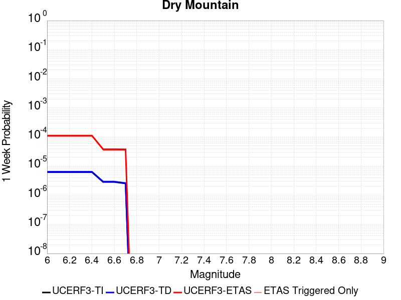 | 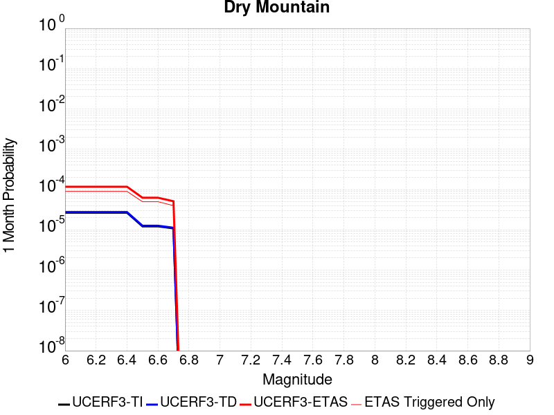 | 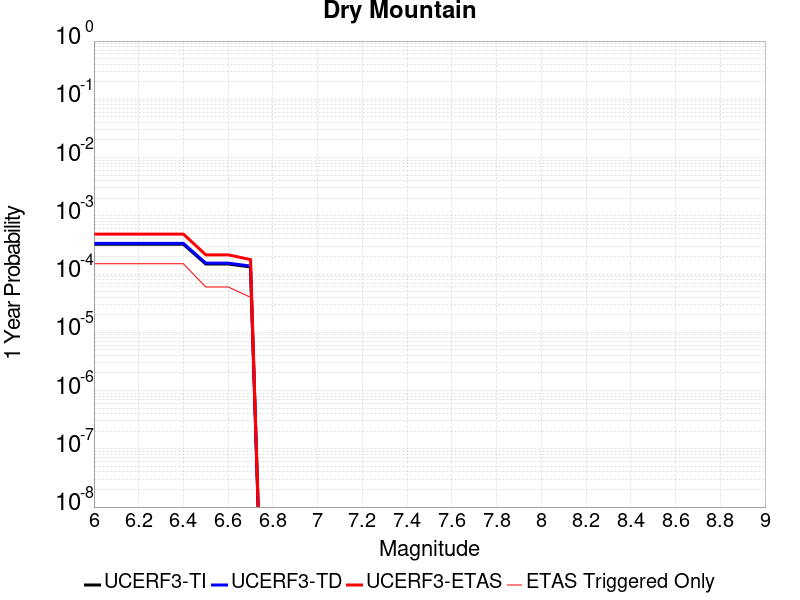 | 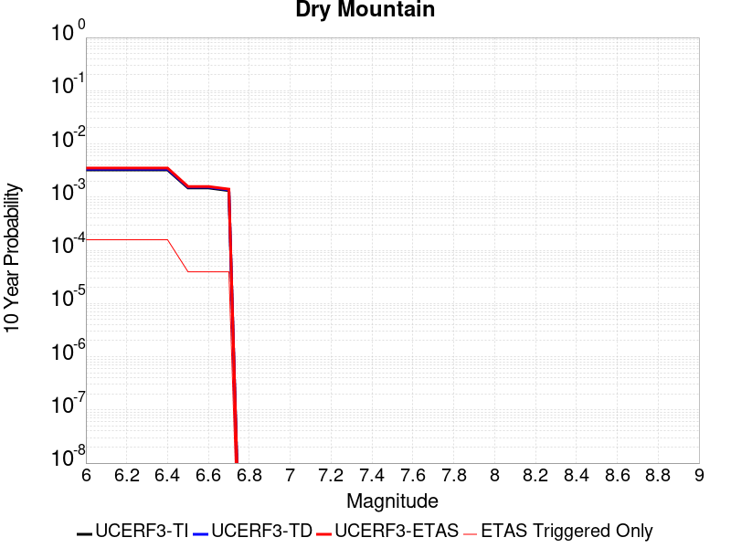 |

| Magnitude | 1 wk TI Prob | 1 wk TD Prob | 1 wk ETAS Prob | 1 wk ETAS/TD Gain | 1 wk ETAS Triggered Only | 1 mo TI Prob | 1 mo TD Prob | 1 mo ETAS Prob | 1 mo ETAS/TD Gain | 1 mo ETAS Triggered Only | 1 yr TI Prob | 1 yr TD Prob | 1 yr ETAS Prob | 1 yr ETAS/TD Gain | 1 yr ETAS Triggered Only | 10 yr TI Prob | 10 yr TD Prob | 10 yr ETAS Prob | 10 yr ETAS/TD Gain | 10 yr ETAS Triggered Only |
|-----|-----|-----|-----|-----|-----|-----|-----|-----|-----|-----|-----|-----|-----|-----|-----|-----|-----|-----|-----|-----|
| 6.0 | 6.222801E-6 | 6.439381E-6 | 1.2479116E-4 | 19.37937 | 1.1835253E-4 | 2.6668875E-5 | 2.7597147E-5 | 1.4594641E-4 | 5.2884603 | 1.1835253E-4 | 3.2464517E-4 | 3.3595937E-4 | 4.9370975E-4 | 1.4695519 | 1.5780337E-4 | 0.0032417132 | 0.0033560768 | 0.0035133506 | 1.0468624 | 1.5780337E-4 |
| 6.1 | 6.222801E-6 | 6.439381E-6 | 1.2479116E-4 | 19.37937 | 1.1835253E-4 | 2.6668875E-5 | 2.7597147E-5 | 1.4594641E-4 | 5.2884603 | 1.1835253E-4 | 3.2464517E-4 | 3.3595937E-4 | 4.9370975E-4 | 1.4695519 | 1.5780337E-4 | 0.0032417132 | 0.0033560768 | 0.0035133506 | 1.0468624 | 1.5780337E-4 |
| 6.2 | 6.222801E-6 | 6.439381E-6 | 1.2479116E-4 | 19.37937 | 1.1835253E-4 | 2.6668875E-5 | 2.7597147E-5 | 1.4594641E-4 | 5.2884603 | 1.1835253E-4 | 3.2464517E-4 | 3.3595937E-4 | 4.9370975E-4 | 1.4695519 | 1.5780337E-4 | 0.0032417132 | 0.0033560768 | 0.0035133506 | 1.0468624 | 1.5780337E-4 |
| 6.3 | 6.222801E-6 | 6.439381E-6 | 1.2479116E-4 | 19.37937 | 1.1835253E-4 | 2.6668875E-5 | 2.7597147E-5 | 1.4594641E-4 | 5.2884603 | 1.1835253E-4 | 3.2464517E-4 | 3.3595937E-4 | 4.9370975E-4 | 1.4695519 | 1.5780337E-4 | 0.0032417132 | 0.0033560768 | 0.0035133506 | 1.0468624 | 1.5780337E-4 |
| 6.4 | 6.222801E-6 | 6.439381E-6 | 1.2479116E-4 | 19.37937 | 1.1835253E-4 | 2.6668875E-5 | 2.7597147E-5 | 1.4594641E-4 | 5.2884603 | 1.1835253E-4 | 3.2464517E-4 | 3.3595937E-4 | 4.9370975E-4 | 1.4695519 | 1.5780337E-4 | 0.0032417132 | 0.0033560768 | 0.0035133506 | 1.0468624 | 1.5780337E-4 |
| 6.5 | 2.8528623E-6 | 2.9521684E-6 | 4.2402895E-5 | 14.363305 | 3.9450842E-5 | 1.22264955E-5 | 1.2652138E-5 | 5.210248E-5 | 4.1180773 | 3.9450842E-5 | 1.4884741E-4 | 1.540376E-4 | 1.9348237E-4 | 1.2560724 | 3.9450842E-5 | 0.0014874774 | 0.0015401616 | 0.0015795517 | 1.0255753 | 3.9450842E-5 |
| 6.6 | 2.8528623E-6 | 2.9521684E-6 | 4.2402895E-5 | 14.363305 | 3.9450842E-5 | 1.22264955E-5 | 1.2652138E-5 | 5.210248E-5 | 4.1180773 | 3.9450842E-5 | 1.4884741E-4 | 1.540376E-4 | 1.9348237E-4 | 1.2560724 | 3.9450842E-5 | 0.0014874774 | 0.0015401616 | 0.0015795517 | 1.0255753 | 3.9450842E-5 |
| 6.7 | 2.541E-6 | 2.6293578E-6 | 4.2080097E-5 | 16.003944 | 3.9450842E-5 | 1.0889954E-5 | 1.1268677E-5 | 5.0719078E-5 | 4.5008903 | 3.9450842E-5 | 1.3257713E-4 | 1.3719614E-4 | 1.7664157E-4 | 1.2875112 | 3.9450842E-5 | 0.0013249806 | 0.0013719613 | 0.0014113581 | 1.0287156 | 3.9450842E-5 |

## San Diego Trough north alt1
*[(top)](#table-of-contents)*

| 1 Week | 1 Month | 1 Year | 10 Year |
|-----|-----|-----|-----|
| 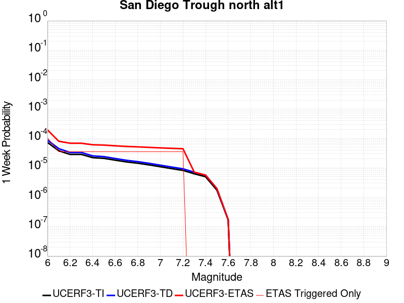 | 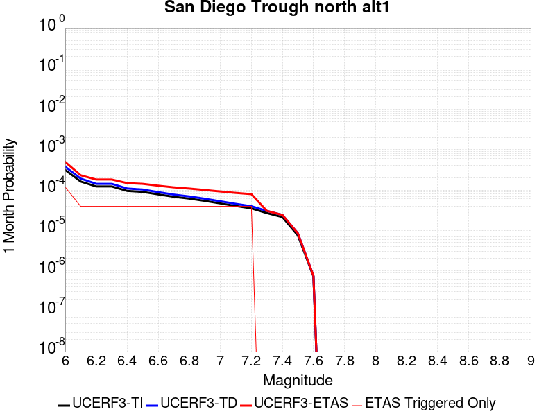 | 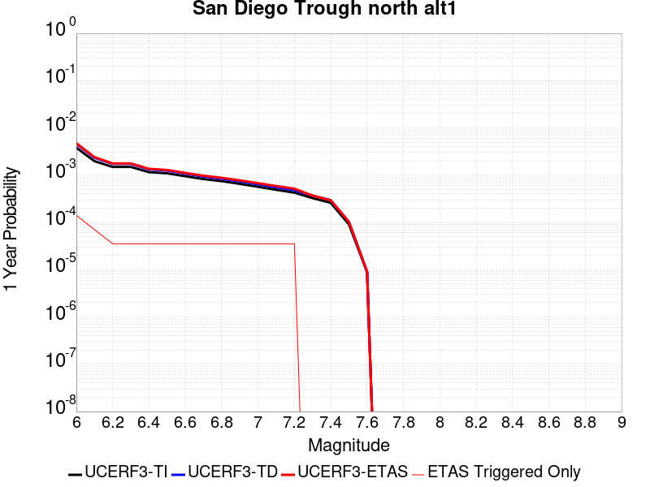 | 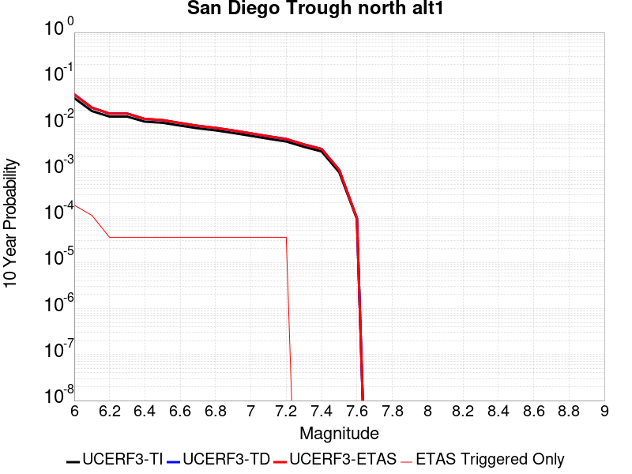 |

| Magnitude | 1 wk TI Prob | 1 wk TD Prob | 1 wk ETAS Prob | 1 wk ETAS/TD Gain | 1 wk ETAS Triggered Only | 1 mo TI Prob | 1 mo TD Prob | 1 mo ETAS Prob | 1 mo ETAS/TD Gain | 1 mo ETAS Triggered Only | 1 yr TI Prob | 1 yr TD Prob | 1 yr ETAS Prob | 1 yr ETAS/TD Gain | 1 yr ETAS Triggered Only | 10 yr TI Prob | 10 yr TD Prob | 10 yr ETAS Prob | 10 yr ETAS/TD Gain | 10 yr ETAS Triggered Only |
|-----|-----|-----|-----|-----|-----|-----|-----|-----|-----|-----|-----|-----|-----|-----|-----|-----|-----|-----|-----|-----|
| 6.0 | 7.329252E-5 | 8.821093E-5 | 2.0655303E-4 | 2.3415809 | 1.1835253E-4 | 3.14073E-4 | 3.7799572E-4 | 4.963035E-4 | 1.3129871 | 1.1835253E-4 | 0.0038171355 | 0.004593027 | 0.0047501056 | 1.0341994 | 1.5780337E-4 | 0.03752231 | 0.045044992 | 0.045195688 | 1.0033455 | 1.5780337E-4 |
| 6.1 | 3.7940346E-5 | 4.4885E-5 | 8.4334075E-5 | 1.8788921 | 3.9450842E-5 | 1.6259136E-4 | 1.9235066E-4 | 2.3179392E-4 | 1.205059 | 3.9450842E-5 | 0.0019777524 | 0.0023394432 | 0.0024181602 | 1.0336478 | 7.8901685E-5 | 0.019602431 | 0.023156688 | 0.023233762 | 1.0033284 | 7.8901685E-5 |
| 6.2 | 2.8645263E-5 | 3.329678E-5 | 7.274631E-5 | 2.1847851 | 3.9450842E-5 | 1.2275964E-4 | 1.4269284E-4 | 1.8213806E-4 | 1.2764344 | 3.9450842E-5 | 0.0014935739 | 0.0017359189 | 0.0017753013 | 1.0226867 | 3.9450842E-5 | 0.0148357535 | 0.017226247 | 0.017265018 | 1.0022507 | 3.9450842E-5 |
| 6.3 | 2.8645263E-5 | 3.329678E-5 | 7.274631E-5 | 2.1847851 | 3.9450842E-5 | 1.2275964E-4 | 1.4269284E-4 | 1.8213806E-4 | 1.2764344 | 3.9450842E-5 | 0.0014935739 | 0.0017359189 | 0.0017753013 | 1.0226867 | 3.9450842E-5 | 0.0148357535 | 0.017226247 | 0.017265018 | 1.0022507 | 3.9450842E-5 |
| 6.4 | 2.2204576E-5 | 2.5448318E-5 | 6.489816E-5 | 2.5501945 | 3.9450842E-5 | 9.5159E-5 | 1.0905972E-4 | 1.4850627E-4 | 1.3616967 | 3.9450842E-5 | 0.001157945 | 0.0013270034 | 0.0013664018 | 1.0296898 | 3.9450842E-5 | 0.011519298 | 0.013191955 | 0.013230885 | 1.002951 | 3.9450842E-5 |
| 6.5 | 2.1004838E-5 | 2.4024694E-5 | 6.347459E-5 | 2.6420562 | 3.9450842E-5 | 9.0017624E-5 | 1.0295896E-4 | 1.4240574E-4 | 1.3831311 | 3.9450842E-5 | 0.0010954136 | 0.0012528138 | 0.0012922153 | 1.0314504 | 3.9450842E-5 | 0.010900296 | 0.012458589 | 0.012497548 | 1.0031271 | 3.9450842E-5 |
| 6.6 | 1.820557E-5 | 2.0704787E-5 | 6.0154813E-5 | 2.9053578 | 3.9450842E-5 | 7.802154E-5 | 8.873181E-5 | 1.2817915E-4 | 1.4445683 | 3.9450842E-5 | 9.4949827E-4 | 0.0010797799 | 0.0011191881 | 1.0364965 | 3.9450842E-5 | 0.009454516 | 0.010746004 | 0.010785031 | 1.0036317 | 3.9450842E-5 |
| 6.7 | 1.5884485E-5 | 1.7983646E-5 | 5.7433783E-5 | 3.1936672 | 3.9450842E-5 | 6.807459E-5 | 7.707051E-5 | 1.1651831E-4 | 1.5118405 | 3.9450842E-5 | 8.284929E-4 | 9.3793223E-4 | 9.773461E-4 | 1.0420221 | 3.9450842E-5 | 0.008254109 | 0.009340104 | 0.009379186 | 1.0041844 | 3.9450842E-5 |
| 6.8 | 1.4331171E-5 | 1.6201066E-5 | 5.565127E-5 | 3.4350379 | 3.9450842E-5 | 6.141786E-5 | 6.94313E-5 | 1.088794E-4 | 1.5681603 | 3.9450842E-5 | 7.4750587E-4 | 8.450002E-4 | 8.8441774E-4 | 1.0466479 | 3.9450842E-5 | 0.0074499645 | 0.008418139 | 0.008457257 | 1.004647 | 3.9450842E-5 |
| 6.9 | 1.2574203E-5 | 1.4205835E-5 | 5.365612E-5 | 3.7770479 | 3.9450842E-5 | 5.3888325E-5 | 6.0880735E-5 | 1.00329176E-4 | 1.6479627 | 3.9450842E-5 | 6.558929E-4 | 7.409723E-4 | 7.803939E-4 | 1.0532025 | 3.9450842E-5 | 0.0065396037 | 0.007385203 | 0.007424363 | 1.0053024 | 3.9450842E-5 |
| 7.0 | 1.0883844E-5 | 1.2289262E-5 | 5.1739622E-5 | 4.210149 | 3.9450842E-5 | 4.664421E-5 | 5.2667205E-5 | 9.211597E-5 | 1.7490195 | 3.9450842E-5 | 5.677453E-4 | 6.4103556E-4 | 6.804611E-4 | 1.0615029 | 3.9450842E-5 | 0.00566297 | 0.006391993 | 0.006431191 | 1.0061325 | 3.9450842E-5 |
| 7.1 | 9.393088E-6 | 1.060702E-5 | 5.0057446E-5 | 4.719275 | 3.9450842E-5 | 4.025547E-5 | 4.545787E-5 | 8.490692E-5 | 1.8678156 | 3.9450842E-5 | 4.900001E-4 | 5.533098E-4 | 5.927388E-4 | 1.0712603 | 3.9450842E-5 | 0.0048892107 | 0.005519418 | 0.005558651 | 1.0071082 | 3.9450842E-5 |
| 7.2 | 8.190791E-6 | 9.258625E-6 | 4.8709106E-5 | 5.2609434 | 3.9450842E-5 | 3.510292E-5 | 3.9679224E-5 | 7.9128506E-5 | 1.9942049 | 3.9450842E-5 | 4.2729423E-4 | 4.8298817E-4 | 5.224199E-4 | 1.0816413 | 3.9450842E-5 | 0.0042647356 | 0.004819465 | 0.0048587252 | 1.0081463 | 3.9450842E-5 |
| 7.3 | 6.268162E-6 | 7.089716E-6 | 7.089716E-6 | 1.0 | 0.0 | 2.6863276E-5 | 3.0384144E-5 | 3.0384144E-5 | 1.0 | 0.0 | 3.2701128E-4 | 3.6986457E-4 | 3.6986457E-4 | 1.0 | 0.0 | 0.003265305 | 0.003692536 | 0.003692536 | 1.0 | 0.0 |
| 7.4 | 4.985186E-6 | 5.6426816E-6 | 5.6426816E-6 | 1.0 | 0.0 | 2.1364907E-5 | 2.4182698E-5 | 2.4182698E-5 | 1.0 | 0.0 | 2.600867E-4 | 2.9438498E-4 | 2.9438498E-4 | 1.0 | 0.0 | 0.002597825 | 0.0029399914 | 0.0029399914 | 1.0 | 0.0 |
| 7.5 | 1.7489613E-6 | 1.969678E-6 | 1.969678E-6 | 1.0 | 0.0 | 7.495527E-6 | 8.4414505E-6 | 8.4414505E-6 | 1.0 | 0.0 | 9.125422E-5 | 1.02770035E-4 | 1.02770035E-4 | 1.0 | 0.0 | 9.1216754E-4 | 0.0010272472 | 0.0010272472 | 1.0 | 0.0 |
| 7.6 | 1.6988751E-7 | 1.7533823E-7 | 1.7533823E-7 | 1.0 | 0.0 | 7.2808916E-7 | 7.5144936E-7 | 7.5144936E-7 | 1.0 | 0.0 | 8.864449E-6 | 9.14886E-6 | 9.14886E-6 | 1.0 | 0.0 | 8.8640954E-5 | 9.1485024E-5 | 9.1485024E-5 | 1.0 | 0.0 |

## Big Pine (East)
*[(top)](#table-of-contents)*

| 1 Week | 1 Month | 1 Year | 10 Year |
|-----|-----|-----|-----|
| 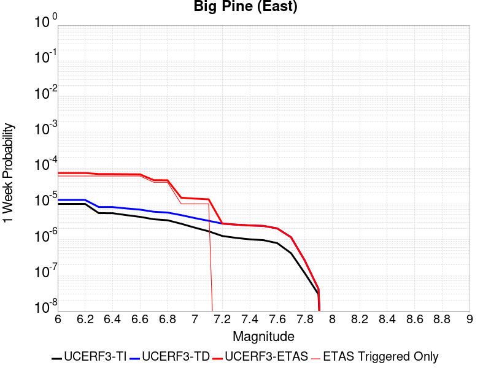 | 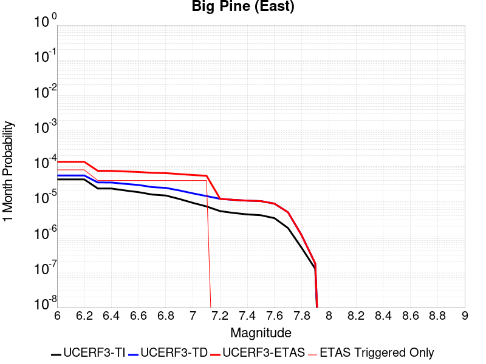 | 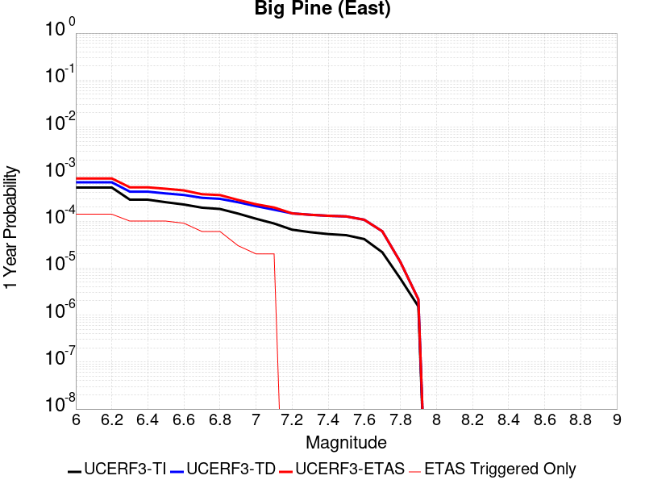 | 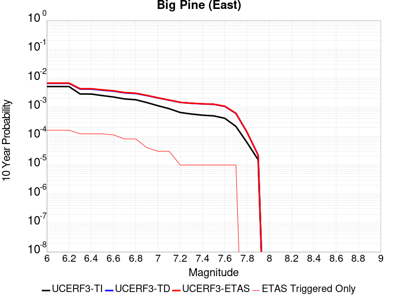 |

| Magnitude | 1 wk TI Prob | 1 wk TD Prob | 1 wk ETAS Prob | 1 wk ETAS/TD Gain | 1 wk ETAS Triggered Only | 1 mo TI Prob | 1 mo TD Prob | 1 mo ETAS Prob | 1 mo ETAS/TD Gain | 1 mo ETAS Triggered Only | 1 yr TI Prob | 1 yr TD Prob | 1 yr ETAS Prob | 1 yr ETAS/TD Gain | 1 yr ETAS Triggered Only | 10 yr TI Prob | 10 yr TD Prob | 10 yr ETAS Prob | 10 yr ETAS/TD Gain | 10 yr ETAS Triggered Only |
|-----|-----|-----|-----|-----|-----|-----|-----|-----|-----|-----|-----|-----|-----|-----|-----|-----|-----|-----|-----|-----|
| 6.0 | 9.916913E-6 | 1.2816984E-5 | 5.226732E-5 | 4.0779734 | 3.9450842E-5 | 4.250036E-5 | 5.49289E-5 | 1.3382625E-4 | 2.4363542 | 7.8901685E-5 | 5.173191E-4 | 6.685763E-4 | 8.2627416E-4 | 1.2358712 | 1.5780337E-4 | 0.0051611643 | 0.006670441 | 0.006827192 | 1.0234993 | 1.5780337E-4 |
| 6.1 | 9.916913E-6 | 1.2816984E-5 | 5.226732E-5 | 4.0779734 | 3.9450842E-5 | 4.250036E-5 | 5.49289E-5 | 1.3382625E-4 | 2.4363542 | 7.8901685E-5 | 5.173191E-4 | 6.685763E-4 | 8.2627416E-4 | 1.2358712 | 1.5780337E-4 | 0.0051611643 | 0.006670441 | 0.006827192 | 1.0234993 | 1.5780337E-4 |
| 6.2 | 9.916913E-6 | 1.2816984E-5 | 5.226732E-5 | 4.0779734 | 3.9450842E-5 | 4.250036E-5 | 5.49289E-5 | 1.3382625E-4 | 2.4363542 | 7.8901685E-5 | 5.173191E-4 | 6.685763E-4 | 8.2627416E-4 | 1.2358712 | 1.5780337E-4 | 0.0051611643 | 0.006670441 | 0.006827192 | 1.0234993 | 1.5780337E-4 |
| 6.3 | 5.479711E-6 | 8.112951E-6 | 4.7563477E-5 | 5.86266 | 3.9450842E-5 | 2.3484265E-5 | 3.4769346E-5 | 7.421882E-5 | 2.134605 | 3.9450842E-5 | 2.858834E-4 | 4.2323777E-4 | 4.6267192E-4 | 1.0931726 | 3.9450842E-5 | 0.0028551589 | 0.004227244 | 0.0042665275 | 1.0092931 | 3.9450842E-5 |
| 6.4 | 5.465009E-6 | 8.097245E-6 | 4.754777E-5 | 5.8720922 | 3.9450842E-5 | 2.3421257E-5 | 3.4702036E-5 | 7.415151E-5 | 2.1368058 | 3.9450842E-5 | 2.851165E-4 | 4.2241855E-4 | 4.6185273E-4 | 1.0933534 | 3.9450842E-5 | 0.0028475097 | 0.0042190826 | 0.0042583672 | 1.0093111 | 3.9450842E-5 |
| 6.5 | 4.826767E-6 | 7.422301E-6 | 4.6872854E-5 | 6.3151374 | 3.9450842E-5 | 2.068598E-5 | 3.180949E-5 | 7.125908E-5 | 2.240183 | 3.9450842E-5 | 2.518227E-4 | 3.872145E-4 | 4.2665008E-4 | 1.1018442 | 3.9450842E-5 | 0.0025153751 | 0.003868283 | 0.0039075813 | 1.0101591 | 3.9450842E-5 |
| 6.6 | 4.3146847E-6 | 6.8822374E-6 | 4.633281E-5 | 6.7322307 | 3.9450842E-5 | 1.8491375E-5 | 2.9494982E-5 | 6.894466E-5 | 2.3375049 | 3.9450842E-5 | 2.2510924E-4 | 3.590447E-4 | 3.9848138E-4 | 1.1098378 | 3.9450842E-5 | 0.0022488134 | 0.0035874986 | 0.0036268078 | 1.0109574 | 3.9450842E-5 |
| 6.7 | 3.6968106E-6 | 5.9954727E-6 | 4.544608E-5 | 7.580066 | 3.9450842E-5 | 1.5843378E-5 | 2.5694639E-5 | 6.514447E-5 | 2.5353332 | 3.9450842E-5 | 1.9287605E-4 | 3.1278885E-4 | 3.5222736E-4 | 1.1260867 | 3.9450842E-5 | 0.0019270873 | 0.0031262483 | 0.0031655757 | 1.0125798 | 3.9450842E-5 |
| 6.8 | 3.4671132E-6 | 5.702177E-6 | 4.5152796E-5 | 7.9185185 | 3.9450842E-5 | 1.4858972E-5 | 2.4437682E-5 | 6.3887564E-5 | 2.6143053 | 3.9450842E-5 | 1.8089297E-4 | 2.974896E-4 | 3.369287E-4 | 1.132573 | 3.9450842E-5 | 0.0018074579 | 0.002973667 | 0.0030130008 | 1.0132272 | 3.9450842E-5 |
| 6.9 | 2.7686972E-6 | 4.825223E-6 | 4.4275876E-5 | 9.175923 | 3.9450842E-5 | 1.1865792E-5 | 2.0679368E-5 | 6.0129398E-5 | 2.9076998 | 3.9450842E-5 | 1.4445644E-4 | 2.5174298E-4 | 2.9118388E-4 | 1.1566714 | 3.9450842E-5 | 0.0014436257 | 0.0025172636 | 0.0025566153 | 1.0156326 | 3.9450842E-5 |
| 7.0 | 2.1472624E-6 | 3.9850406E-6 | 4.3435728E-5 | 10.899695 | 3.9450842E-5 | 9.20252E-6 | 1.7078637E-5 | 5.6528806E-5 | 3.3099134 | 3.9450842E-5 | 1.12034926E-4 | 2.079131E-4 | 2.4735573E-4 | 1.1897074 | 3.9450842E-5 | 0.0011197845 | 0.0020798394 | 0.002119208 | 1.0189288 | 3.9450842E-5 |
| 7.1 | 1.7018335E-6 | 3.344876E-6 | 4.279559E-5 | 12.794373 | 3.9450842E-5 | 7.293552E-6 | 1.4335106E-5 | 5.3785385E-5 | 3.7520046 | 3.9450842E-5 | 8.879537E-5 | 1.7451629E-4 | 2.1396026E-4 | 1.2260188 | 3.9450842E-5 | 8.87599E-4 | 0.0017464145 | 0.0017857964 | 1.0225502 | 3.9450842E-5 |
| 7.2 | 1.25603E-6 | 2.794484E-6 | 2.794484E-6 | 1.0 | 0.0 | 5.3829745E-6 | 1.1976307E-5 | 1.1976307E-5 | 1.0 | 0.0 | 6.553574E-5 | 1.4580201E-4 | 1.4580201E-4 | 1.0 | 0.0 | 6.551642E-4 | 0.001459661 | 0.001459661 | 1.0 | 0.0 |
| 7.3 | 1.112297E-6 | 2.610332E-6 | 2.610332E-6 | 1.0 | 0.0 | 4.7669787E-6 | 1.118709E-5 | 1.118709E-5 | 1.0 | 0.0 | 5.803642E-5 | 1.3619453E-4 | 1.3619453E-4 | 1.0 | 0.0 | 5.802127E-4 | 0.0013635408 | 0.0013635408 | 1.0 | 0.0 |
| 7.4 | 1.0137181E-6 | 2.4834917E-6 | 2.4834917E-6 | 1.0 | 0.0 | 4.3444993E-6 | 1.0643494E-5 | 1.0643494E-5 | 1.0 | 0.0 | 5.2892992E-5 | 1.2957705E-4 | 1.2957705E-4 | 1.0 | 0.0 | 5.288041E-4 | 0.0012972289 | 0.0012972289 | 1.0 | 0.0 |
| 7.5 | 9.598608E-7 | 2.4071483E-6 | 2.4071483E-6 | 1.0 | 0.0 | 4.1136827E-6 | 1.031631E-5 | 1.031631E-5 | 1.0 | 0.0 | 5.0082934E-5 | 1.2559404E-4 | 1.2559404E-4 | 1.0 | 0.0 | 5.007165E-4 | 0.0012572526 | 0.0012572526 | 1.0 | 0.0 |
| 7.6 | 7.929459E-7 | 2.0448588E-6 | 2.0448588E-6 | 1.0 | 0.0 | 3.3983351E-6 | 8.763653E-6 | 8.763653E-6 | 1.0 | 0.0 | 4.1373947E-5 | 1.06692416E-4 | 1.06692416E-4 | 1.0 | 0.0 | 4.1366243E-4 | 0.0010685222 | 0.0010685222 | 1.0 | 0.0 |
| 7.7 | 4.155788E-7 | 1.1605589E-6 | 1.1605589E-6 | 1.0 | 0.0 | 1.7810507E-6 | 4.9738146E-6 | 4.9738146E-6 | 1.0 | 0.0 | 2.1684076E-5 | 6.0554554E-5 | 6.0554554E-5 | 1.0 | 0.0 | 2.1681961E-4 | 6.0857297E-4 | 6.0857297E-4 | 1.0 | 0.0 |
| 7.8 | 1.14666925E-7 | 2.592015E-7 | 2.592015E-7 | 1.0 | 0.0 | 4.914296E-7 | 1.1108631E-6 | 1.1108631E-6 | 1.0 | 0.0 | 5.9831386E-6 | 1.3524678E-5 | 1.3524678E-5 | 1.0 | 0.0 | 5.9829777E-5 | 1.3634123E-4 | 1.3634123E-4 | 1.0 | 0.0 |
| 7.9 | 2.9231824E-8 | 4.1463963E-8 | 4.1463963E-8 | 1.0 | 0.0 | 1.2527924E-7 | 1.7770269E-7 | 1.7770269E-7 | 1.0 | 0.0 | 1.5252737E-6 | 2.1635283E-6 | 2.1635283E-6 | 1.0 | 0.0 | 1.5252632E-5 | 2.1967755E-5 | 2.1967755E-5 | 1.0 | 0.0 |

## Ventura-Pitas Point
*[(top)](#table-of-contents)*

| 1 Week | 1 Month | 1 Year | 10 Year |
|-----|-----|-----|-----|
| 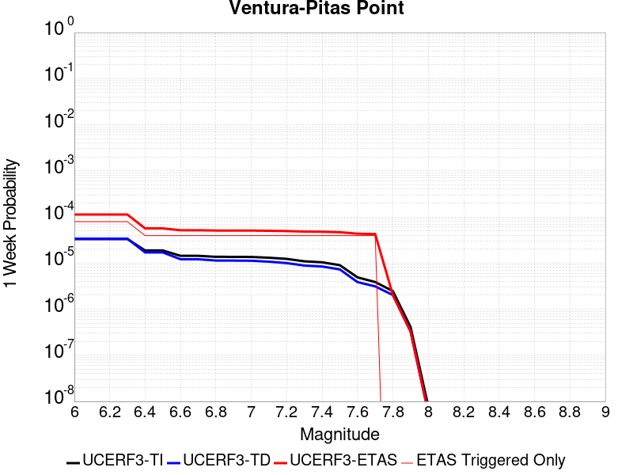 | 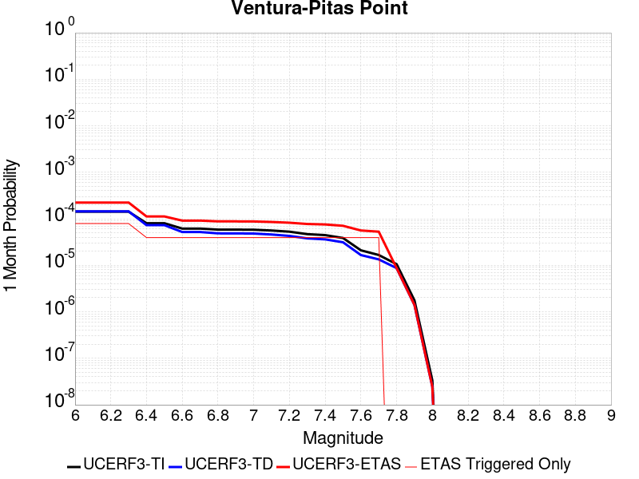 | 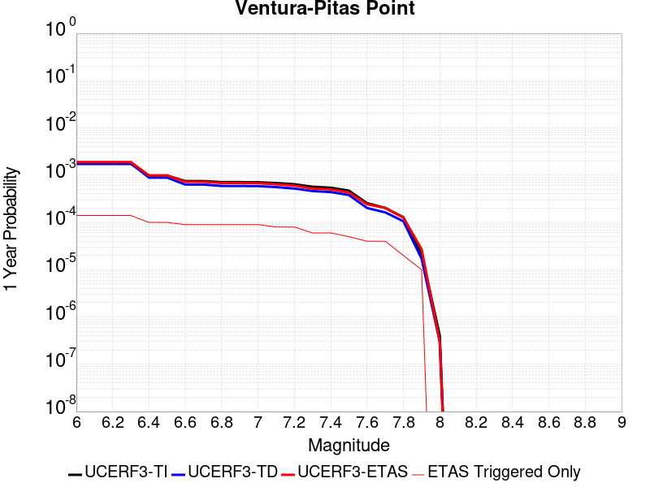 | 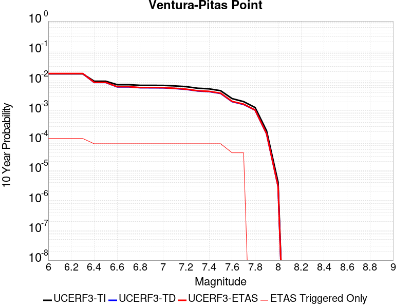 |

| Magnitude | 1 wk TI Prob | 1 wk TD Prob | 1 wk ETAS Prob | 1 wk ETAS/TD Gain | 1 wk ETAS Triggered Only | 1 mo TI Prob | 1 mo TD Prob | 1 mo ETAS Prob | 1 mo ETAS/TD Gain | 1 mo ETAS Triggered Only | 1 yr TI Prob | 1 yr TD Prob | 1 yr ETAS Prob | 1 yr ETAS/TD Gain | 1 yr ETAS Triggered Only | 10 yr TI Prob | 10 yr TD Prob | 10 yr ETAS Prob | 10 yr ETAS/TD Gain | 10 yr ETAS Triggered Only |
|-----|-----|-----|-----|-----|-----|-----|-----|-----|-----|-----|-----|-----|-----|-----|-----|-----|-----|-----|-----|-----|
| 6.0 | 3.3179622E-5 | 3.3735185E-5 | 1.1263421E-4 | 3.3387756 | 7.8901685E-5 | 1.4219063E-4 | 1.445728E-4 | 2.2346308E-4 | 1.5456786 | 7.8901685E-5 | 0.0017297962 | 0.0017590096 | 0.001877154 | 1.0671653 | 1.1835253E-4 | 0.017163932 | 0.0174764 | 0.017592685 | 1.0066538 | 1.1835253E-4 |
| 6.1 | 3.3179622E-5 | 3.3735185E-5 | 1.1263421E-4 | 3.3387756 | 7.8901685E-5 | 1.4219063E-4 | 1.445728E-4 | 2.2346308E-4 | 1.5456786 | 7.8901685E-5 | 0.0017297962 | 0.0017590096 | 0.001877154 | 1.0671653 | 1.1835253E-4 | 0.017163932 | 0.0174764 | 0.017592685 | 1.0066538 | 1.1835253E-4 |
| 6.2 | 3.3179622E-5 | 3.3735185E-5 | 1.1263421E-4 | 3.3387756 | 7.8901685E-5 | 1.4219063E-4 | 1.445728E-4 | 2.2346308E-4 | 1.5456786 | 7.8901685E-5 | 0.0017297962 | 0.0017590096 | 0.001877154 | 1.0671653 | 1.1835253E-4 | 0.017163932 | 0.0174764 | 0.017592685 | 1.0066538 | 1.1835253E-4 |
| 6.3 | 3.3179622E-5 | 3.3735185E-5 | 1.1263421E-4 | 3.3387756 | 7.8901685E-5 | 1.4219063E-4 | 1.445728E-4 | 2.2346308E-4 | 1.5456786 | 7.8901685E-5 | 0.0017297962 | 0.0017590096 | 0.001877154 | 1.0671653 | 1.1835253E-4 | 0.017163932 | 0.0174764 | 0.017592685 | 1.0066538 | 1.1835253E-4 |
| 6.4 | 1.8754668E-5 | 1.701961E-5 | 5.6469784E-5 | 3.3179245 | 3.9450842E-5 | 8.037467E-5 | 7.293928E-5 | 1.1238724E-4 | 1.540833 | 3.9450842E-5 | 9.781223E-4 | 8.8769704E-4 | 9.6652866E-4 | 1.0888047 | 7.8901685E-5 | 0.009738282 | 0.008843848 | 0.008922052 | 1.0088427 | 7.8901685E-5 |
| 6.5 | 1.8754668E-5 | 1.701961E-5 | 5.6469784E-5 | 3.3179245 | 3.9450842E-5 | 8.037467E-5 | 7.293928E-5 | 1.1238724E-4 | 1.540833 | 3.9450842E-5 | 9.781223E-4 | 8.8769704E-4 | 9.6652866E-4 | 1.0888047 | 7.8901685E-5 | 0.009738282 | 0.008843848 | 0.008922052 | 1.0088427 | 7.8901685E-5 |
| 6.6 | 1.4361558E-5 | 1.2122275E-5 | 5.1572642E-5 | 4.2543697 | 3.9450842E-5 | 6.154808E-5 | 5.1951585E-5 | 9.1400376E-5 | 1.7593377 | 3.9450842E-5 | 7.490902E-4 | 6.3232926E-4 | 7.111811E-4 | 1.1247005 | 7.8901685E-5 | 0.0074657016 | 0.0063055577 | 0.0063839615 | 1.0124341 | 7.8901685E-5 |
| 6.7 | 1.4361558E-5 | 1.2122275E-5 | 5.1572642E-5 | 4.2543697 | 3.9450842E-5 | 6.154808E-5 | 5.1951585E-5 | 9.1400376E-5 | 1.7593377 | 3.9450842E-5 | 7.490902E-4 | 6.3232926E-4 | 7.111811E-4 | 1.1247005 | 7.8901685E-5 | 0.0074657016 | 0.0063055577 | 0.0063839615 | 1.0124341 | 7.8901685E-5 |
| 6.8 | 1.3663846E-5 | 1.13444175E-5 | 5.0794813E-5 | 4.477516 | 3.9450842E-5 | 5.8558027E-5 | 4.861804E-5 | 8.806696E-5 | 1.8114052 | 3.9450842E-5 | 7.127108E-4 | 5.917658E-4 | 6.7062076E-4 | 1.1332537 | 7.8901685E-5 | 0.007104293 | 0.005902116 | 0.005980552 | 1.0132895 | 7.8901685E-5 |
| 6.9 | 1.3644157E-5 | 1.1322519E-5 | 5.0772916E-5 | 4.4842424 | 3.9450842E-5 | 5.8473648E-5 | 4.8524187E-5 | 8.7973116E-5 | 1.8129746 | 3.9450842E-5 | 7.116841E-4 | 5.9062376E-4 | 6.6947885E-4 | 1.1335115 | 7.8901685E-5 | 0.007094092 | 0.0058907564 | 0.0059691933 | 1.0133152 | 7.8901685E-5 |
| 7.0 | 1.3568845E-5 | 1.1242086E-5 | 5.0692484E-5 | 4.509171 | 3.9450842E-5 | 5.8150898E-5 | 4.817949E-5 | 8.762843E-5 | 1.8187913 | 3.9450842E-5 | 7.077572E-4 | 5.864293E-4 | 6.6528475E-4 | 1.134467 | 7.8901685E-5 | 0.007055073 | 0.0058490336 | 0.005927474 | 1.0134108 | 7.8901685E-5 |
| 7.1 | 1.306572E-5 | 1.072054E-5 | 5.0170962E-5 | 4.6798916 | 3.9450842E-5 | 5.599474E-5 | 4.5944373E-5 | 8.53934E-5 | 1.858626 | 3.9450842E-5 | 6.815227E-4 | 5.5923103E-4 | 6.3808856E-4 | 1.1410108 | 7.8901685E-5 | 0.0067943637 | 0.0055784425 | 0.0056569036 | 1.0140651 | 7.8901685E-5 |
| 7.2 | 1.232604E-5 | 9.995143E-6 | 4.9445593E-5 | 4.946962 | 3.9450842E-5 | 5.2824813E-5 | 4.2835632E-5 | 8.228479E-5 | 1.9209424 | 3.9450842E-5 | 6.429523E-4 | 5.214008E-4 | 6.002614E-4 | 1.1512475 | 7.8901685E-5 | 0.0064109527 | 0.005201967 | 0.005280458 | 1.0150888 | 7.8901685E-5 |
| 7.3 | 1.0917261E-5 | 8.84384E-6 | 4.8294336E-5 | 5.460788 | 3.9450842E-5 | 4.678742E-5 | 3.790163E-5 | 7.735098E-5 | 2.0408351 | 3.9450842E-5 | 5.69488E-4 | 4.6135622E-4 | 5.402215E-4 | 1.1709423 | 7.8901685E-5 | 0.0056803077 | 0.00460415 | 0.0046826885 | 1.0170581 | 7.8901685E-5 |
| 7.4 | 1.039959E-5 | 8.423562E-6 | 4.7874073E-5 | 5.6833525 | 3.9450842E-5 | 4.456891E-5 | 3.610049E-5 | 7.5549906E-5 | 2.092767 | 3.9450842E-5 | 5.424914E-4 | 4.3943635E-4 | 5.1830336E-4 | 1.1794732 | 7.8901685E-5 | 0.0054116896 | 0.004385836 | 0.0044643916 | 1.0179112 | 7.8901685E-5 |
| 7.5 | 9.015877E-6 | 7.2975445E-6 | 4.67481E-5 | 6.406004 | 3.9450842E-5 | 3.86389E-5 | 3.1274823E-5 | 7.072443E-5 | 2.2613854 | 3.9450842E-5 | 4.7032707E-4 | 3.8070587E-4 | 4.595775E-4 | 1.2071722 | 7.8901685E-5 | 0.004693329 | 0.0038006818 | 0.0038792836 | 1.020681 | 7.8901685E-5 |
| 7.6 | 4.900162E-6 | 3.8741155E-6 | 4.3324806E-5 | 11.183147 | 3.9450842E-5 | 2.1000526E-5 | 1.6603248E-5 | 5.6053435E-5 | 3.3760526 | 3.9450842E-5 | 2.556514E-4 | 2.0212591E-4 | 2.4156879E-4 | 1.1951401 | 3.9450842E-5 | 0.0025535747 | 0.0020194345 | 0.0020588057 | 1.0194961 | 3.9450842E-5 |
| 7.7 | 3.8850626E-6 | 3.1267302E-6 | 4.2577452E-5 | 13.617245 | 3.9450842E-5 | 1.6650163E-5 | 1.3400205E-5 | 5.285052E-5 | 3.9440086 | 3.9450842E-5 | 2.0269687E-4 | 1.6313537E-4 | 2.0257977E-4 | 1.2417895 | 3.9450842E-5 | 0.002025121 | 0.0016301654 | 0.001669552 | 1.0241611 | 3.9450842E-5 |
| 7.8 | 2.4654719E-6 | 2.029875E-6 | 2.029875E-6 | 1.0 | 0.0 | 1.0566265E-5 | 8.699436E-6 | 8.699436E-6 | 1.0 | 0.0 | 1.2863669E-4 | 1.0591053E-4 | 1.0591053E-4 | 1.0 | 0.0 | 0.0012856225 | 0.0010586053 | 0.0010586053 | 1.0 | 0.0 |
| 7.9 | 4.095894E-7 | 3.2764765E-7 | 3.2764765E-7 | 1.0 | 0.0 | 1.7553821E-6 | 1.4042034E-6 | 1.4042034E-6 | 1.0 | 0.0 | 2.1371567E-5 | 1.7096047E-5 | 1.7096047E-5 | 1.0 | 0.0 | 2.1369511E-4 | 1.7094762E-4 | 1.7094762E-4 | 1.0 | 0.0 |
| 8.0 | 7.791402E-9 | 5.683497E-9 | 5.683497E-9 | 1.0 | 0.0 | 3.3391725E-8 | 2.4357844E-8 | 2.4357844E-8 | 1.0 | 0.0 | 4.0654416E-7 | 2.9655675E-7 | 2.9655675E-7 | 1.0 | 0.0 | 4.065434E-6 | 2.9655655E-6 | 2.9655655E-6 | 1.0 | 0.0 |

## Hayward (So) 2011 CFM
*[(top)](#table-of-contents)*

| 1 Week | 1 Month | 1 Year | 10 Year |
|-----|-----|-----|-----|
| 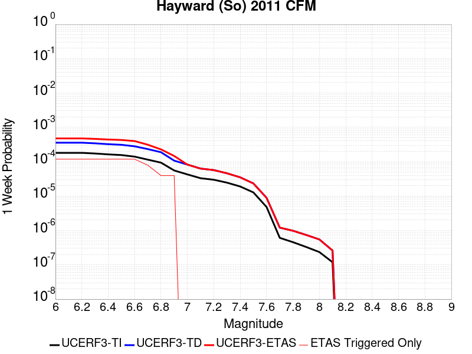 | 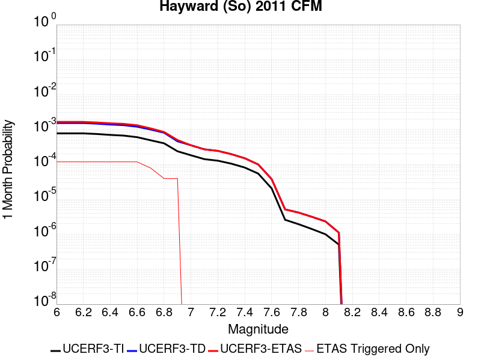 | 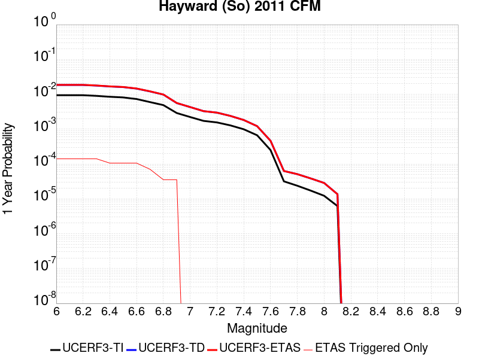 | 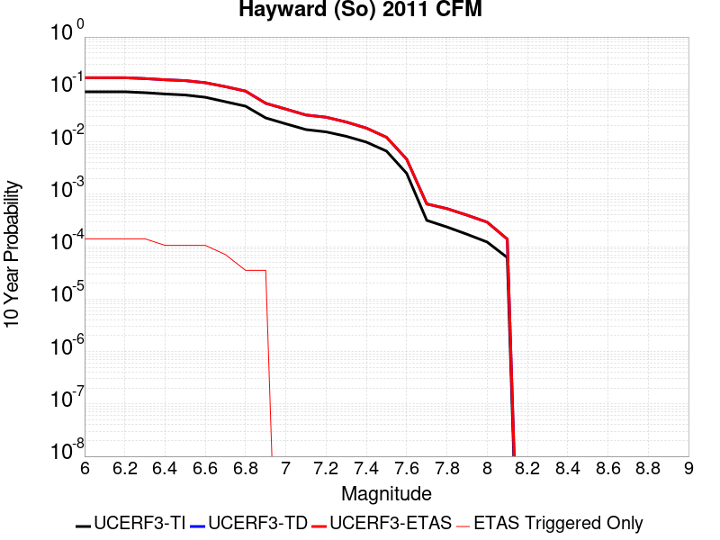 |

| Magnitude | 1 wk TI Prob | 1 wk TD Prob | 1 wk ETAS Prob | 1 wk ETAS/TD Gain | 1 wk ETAS Triggered Only | 1 mo TI Prob | 1 mo TD Prob | 1 mo ETAS Prob | 1 mo ETAS/TD Gain | 1 mo ETAS Triggered Only | 1 yr TI Prob | 1 yr TD Prob | 1 yr ETAS Prob | 1 yr ETAS/TD Gain | 1 yr ETAS Triggered Only | 10 yr TI Prob | 10 yr TD Prob | 10 yr ETAS Prob | 10 yr ETAS/TD Gain | 10 yr ETAS Triggered Only |
|-----|-----|-----|-----|-----|-----|-----|-----|-----|-----|-----|-----|-----|-----|-----|-----|-----|-----|-----|-----|-----|
| 6.0 | 1.8091932E-4 | 3.570541E-4 | 4.7536436E-4 | 1.3313512 | 1.1835253E-4 | 7.751381E-4 | 0.0015293444 | 0.0016475158 | 1.0772694 | 1.1835253E-4 | 0.00939654 | 0.018463207 | 0.018618098 | 1.0083891 | 1.5780337E-4 | 0.090090066 | 0.16673161 | 0.1668631 | 1.0007887 | 1.5780337E-4 |
| 6.1 | 1.8091932E-4 | 3.570541E-4 | 4.7536436E-4 | 1.3313512 | 1.1835253E-4 | 7.751381E-4 | 0.0015293444 | 0.0016475158 | 1.0772694 | 1.1835253E-4 | 0.00939654 | 0.018463207 | 0.018618098 | 1.0083891 | 1.5780337E-4 | 0.090090066 | 0.16673161 | 0.1668631 | 1.0007887 | 1.5780337E-4 |
| 6.2 | 1.8091932E-4 | 3.570541E-4 | 4.7536436E-4 | 1.3313512 | 1.1835253E-4 | 7.751381E-4 | 0.0015293444 | 0.0016475158 | 1.0772694 | 1.1835253E-4 | 0.00939654 | 0.018463207 | 0.018618098 | 1.0083891 | 1.5780337E-4 | 0.090090066 | 0.16673161 | 0.1668631 | 1.0007887 | 1.5780337E-4 |
| 6.3 | 1.7322872E-4 | 3.426234E-4 | 4.6093538E-4 | 1.345312 | 1.1835253E-4 | 7.4219756E-4 | 0.0014675693 | 0.0015857482 | 1.080527 | 1.1835253E-4 | 0.0089988755 | 0.017723544 | 0.017878551 | 1.0087458 | 1.5780337E-4 | 0.08643075 | 0.16066726 | 0.1607997 | 1.0008243 | 1.5780337E-4 |
| 6.4 | 1.6334097E-4 | 3.234411E-4 | 4.4175534E-4 | 1.3657985 | 1.1835253E-4 | 6.998449E-4 | 0.0013854484 | 0.001503637 | 1.0853071 | 1.1835253E-4 | 0.008487372 | 0.016739385 | 0.016855756 | 1.0069519 | 1.1835253E-4 | 0.081704415 | 0.15255594 | 0.15265624 | 1.0006574 | 1.1835253E-4 |
| 6.5 | 1.5600289E-4 | 3.1018828E-4 | 4.2850408E-4 | 1.3814323 | 1.1835253E-4 | 6.684125E-4 | 0.0013287093 | 0.0014469046 | 1.0889549 | 1.1835253E-4 | 0.008107598 | 0.016058935 | 0.016175386 | 1.0072515 | 1.1835253E-4 | 0.078181036 | 0.14683272 | 0.14693369 | 1.0006877 | 1.1835253E-4 |
| 6.6 | 1.4046066E-4 | 2.8032906E-4 | 3.986484E-4 | 1.4220731 | 1.1835253E-4 | 6.018354E-4 | 0.0012008639 | 0.0013190743 | 1.0984378 | 1.1835253E-4 | 0.0073027555 | 0.014524006 | 0.01464064 | 1.0080304 | 1.1835253E-4 | 0.07067384 | 0.13391982 | 0.13402233 | 1.0007654 | 1.1835253E-4 |
| 6.7 | 1.14696966E-4 | 2.3271477E-4 | 3.115981E-4 | 1.3389701 | 7.8901685E-5 | 4.914658E-4 | 9.969729E-4 | 0.0010757959 | 1.0790623 | 7.8901685E-5 | 0.0059671924 | 0.012071652 | 0.012149602 | 1.0064572 | 7.8901685E-5 | 0.058094822 | 0.11274672 | 0.11281673 | 1.000621 | 7.8901685E-5 |
| 6.8 | 9.3874296E-5 | 1.8861453E-4 | 2.2805794E-4 | 1.2091217 | 3.9450842E-5 | 4.0225635E-4 | 8.0810126E-4 | 8.4752025E-4 | 1.0487797 | 3.9450842E-5 | 0.0048864787 | 0.009794984 | 0.009834048 | 1.0039883 | 3.9450842E-5 | 0.047804173 | 0.09259856 | 0.09263436 | 1.0003866 | 3.9450842E-5 |
| 6.9 | 5.551852E-5 | 1.072948E-4 | 1.4674141E-4 | 1.367647 | 3.9450842E-5 | 2.3791482E-4 | 4.5975443E-4 | 4.9918715E-4 | 1.085769 | 3.9450842E-5 | 0.0028927654 | 0.0055832625 | 0.005622493 | 1.0070264 | 3.9450842E-5 | 0.028553981 | 0.054245494 | 0.054282803 | 1.0006878 | 3.9450842E-5 |
| 7.0 | 4.2662363E-5 | 8.2464416E-5 | 8.2464416E-5 | 1.0 | 0.0 | 1.8282588E-4 | 3.5337146E-4 | 3.5337146E-4 | 1.0 | 0.0 | 0.0022236328 | 0.0042938837 | 0.0042938837 | 1.0 | 0.0 | 0.022015138 | 0.042064495 | 0.042064495 | 1.0 | 0.0 |
| 7.1 | 3.305886E-5 | 6.3019055E-5 | 6.3019055E-5 | 1.0 | 0.0 | 1.4167312E-4 | 2.700538E-4 | 2.700538E-4 | 1.0 | 0.0 | 0.0017235056 | 0.0032829668 | 0.0032829668 | 1.0 | 0.0 | 0.017101998 | 0.032452874 | 0.032452874 | 1.0 | 0.0 |
| 7.2 | 2.9856887E-5 | 5.7013647E-5 | 5.7013647E-5 | 1.0 | 0.0 | 1.2795182E-4 | 2.4432142E-4 | 2.4432142E-4 | 1.0 | 0.0 | 0.0015567001 | 0.0029705726 | 0.0029705726 | 1.0 | 0.0 | 0.015458403 | 0.029453589 | 0.029453589 | 1.0 | 0.0 |
| 7.3 | 2.4559737E-5 | 4.599088E-5 | 4.599088E-5 | 1.0 | 0.0 | 1.0525176E-4 | 1.9708896E-4 | 1.9708896E-4 | 1.0 | 0.0 | 0.0012806869 | 0.0023969305 | 0.0023969305 | 1.0 | 0.0 | 0.012733313 | 0.023857482 | 0.023857482 | 1.0 | 0.0 |
| 7.4 | 1.9002231E-5 | 3.5049303E-5 | 3.5049303E-5 | 1.0 | 0.0 | 8.143559E-5 | 1.502027E-4 | 1.502027E-4 | 1.0 | 0.0 | 9.910273E-4 | 0.0018271938 | 0.0018271938 | 1.0 | 0.0 | 0.009866194 | 0.018258283 | 0.018258283 | 1.0 | 0.0 |
| 7.5 | 1.2783333E-5 | 2.3330069E-5 | 2.3330069E-5 | 1.0 | 0.0 | 5.4784563E-5 | 9.998221E-5 | 9.998221E-5 | 1.0 | 0.0 | 6.667979E-4 | 0.0012166094 | 0.0012166094 | 1.0 | 0.0 | 0.006648007 | 0.012209582 | 0.012209582 | 1.0 | 0.0 |
| 7.6 | 4.8149627E-6 | 8.887544E-6 | 8.887544E-6 | 1.0 | 0.0 | 2.063539E-5 | 3.8088925E-5 | 3.8088925E-5 | 1.0 | 0.0 | 2.5120692E-4 | 4.636352E-4 | 4.636352E-4 | 1.0 | 0.0 | 0.0025092314 | 0.0046812436 | 0.0046812436 | 1.0 | 0.0 |
| 7.7 | 6.0838227E-7 | 1.2056693E-6 | 1.2056693E-6 | 1.0 | 0.0 | 2.6073499E-6 | 5.1671436E-6 | 5.1671436E-6 | 1.0 | 0.0 | 3.174402E-5 | 6.290816E-5 | 6.290816E-5 | 1.0 | 0.0 | 3.1739488E-4 | 6.5293367E-4 | 6.5293367E-4 | 1.0 | 0.0 |
| 7.8 | 4.5542808E-7 | 9.792182E-7 | 9.792182E-7 | 1.0 | 0.0 | 1.9518332E-6 | 4.1966427E-6 | 4.1966427E-6 | 1.0 | 0.0 | 2.376331E-5 | 5.1092928E-5 | 5.1092928E-5 | 1.0 | 0.0 | 2.3760769E-4 | 5.321372E-4 | 5.321372E-4 | 1.0 | 0.0 |
| 7.9 | 3.3016747E-7 | 7.386335E-7 | 7.386335E-7 | 1.0 | 0.0 | 1.4150027E-6 | 3.1655684E-6 | 3.1655684E-6 | 1.0 | 0.0 | 1.7227521E-5 | 3.8540114E-5 | 3.8540114E-5 | 1.0 | 0.0 | 1.7226185E-4 | 3.9930744E-4 | 3.9930744E-4 | 1.0 | 0.0 |
| 8.0 | 2.347038E-7 | 5.4714894E-7 | 5.4714894E-7 | 1.0 | 0.0 | 1.0058731E-6 | 2.344922E-6 | 2.344922E-6 | 1.0 | 0.0 | 1.2246436E-5 | 2.8549053E-5 | 2.8549053E-5 | 1.0 | 0.0 | 1.2245761E-4 | 2.9355253E-4 | 2.9355253E-4 | 1.0 | 0.0 |
| 8.1 | 1.18822804E-7 | 2.6058973E-7 | 2.6058973E-7 | 1.0 | 0.0 | 5.092405E-7 | 1.1168127E-6 | 1.1168127E-6 | 1.0 | 0.0 | 6.1999854E-6 | 1.359711E-5 | 1.359711E-5 | 1.0 | 0.0 | 6.199812E-5 | 1.3917852E-4 | 1.3917852E-4 | 1.0 | 0.0 |

## San Pedro Basin
*[(top)](#table-of-contents)*

| 1 Week | 1 Month | 1 Year | 10 Year |
|-----|-----|-----|-----|
| 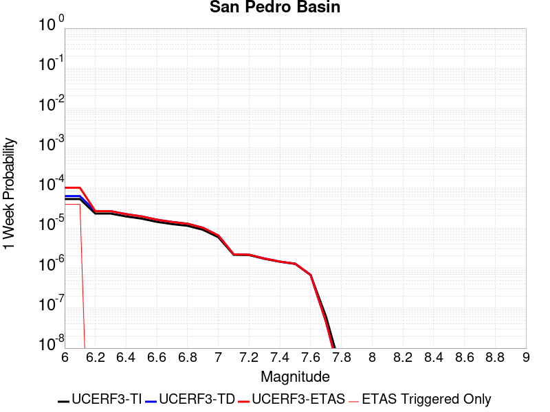 | 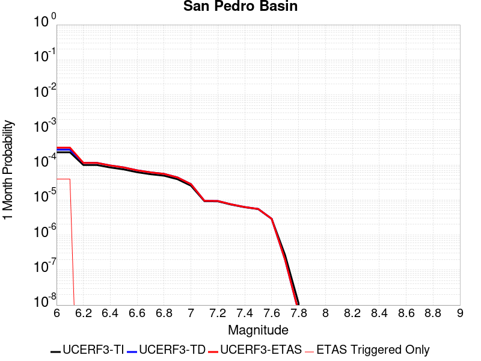 | 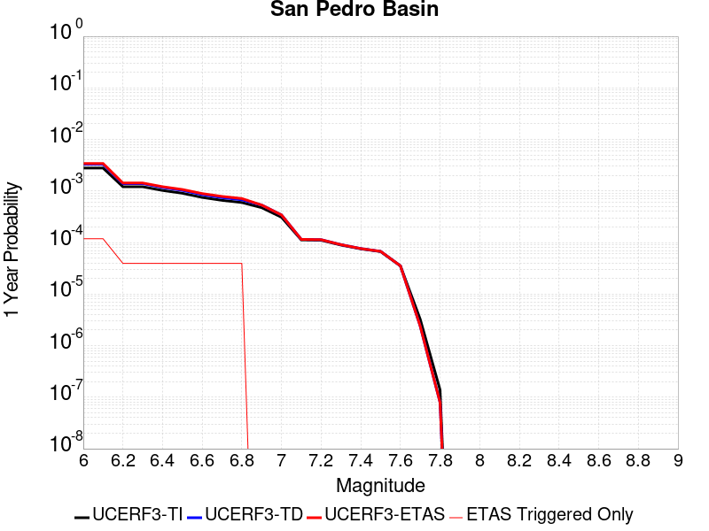 |  |

| Magnitude | 1 wk TI Prob | 1 wk TD Prob | 1 wk ETAS Prob | 1 wk ETAS/TD Gain | 1 wk ETAS Triggered Only | 1 mo TI Prob | 1 mo TD Prob | 1 mo ETAS Prob | 1 mo ETAS/TD Gain | 1 mo ETAS Triggered Only | 1 yr TI Prob | 1 yr TD Prob | 1 yr ETAS Prob | 1 yr ETAS/TD Gain | 1 yr ETAS Triggered Only | 10 yr TI Prob | 10 yr TD Prob | 10 yr ETAS Prob | 10 yr ETAS/TD Gain | 10 yr ETAS Triggered Only |
|-----|-----|-----|-----|-----|-----|-----|-----|-----|-----|-----|-----|-----|-----|-----|-----|-----|-----|-----|-----|-----|
| 6.0 | 5.3449043E-5 | 6.336954E-5 | 1.0281788E-4 | 1.6225127 | 3.9450842E-5 | 2.2904722E-4 | 2.715589E-4 | 3.1099905E-4 | 1.145236 | 3.9450842E-5 | 0.0027850836 | 0.0033018254 | 0.0034197872 | 1.0357262 | 1.1835253E-4 | 0.027504366 | 0.03258945 | 0.032742113 | 1.0046843 | 1.5780337E-4 |
| 6.1 | 5.3449043E-5 | 6.336954E-5 | 1.0281788E-4 | 1.6225127 | 3.9450842E-5 | 2.2904722E-4 | 2.715589E-4 | 3.1099905E-4 | 1.145236 | 3.9450842E-5 | 0.0027850836 | 0.0033018254 | 0.0034197872 | 1.0357262 | 1.1835253E-4 | 0.027504366 | 0.03258945 | 0.032742113 | 1.0046843 | 1.5780337E-4 |
| 6.2 | 2.3189454E-5 | 2.6642796E-5 | 2.6642796E-5 | 1.0 | 0.0 | 9.9379584E-5 | 1.14178685E-4 | 1.14178685E-4 | 1.0 | 0.0 | 0.0012092749 | 0.0013892864 | 0.0014286825 | 1.028357 | 3.9450842E-5 | 0.012027155 | 0.013810883 | 0.013888695 | 1.0056341 | 7.8901685E-5 |
| 6.3 | 2.3189454E-5 | 2.6642796E-5 | 2.6642796E-5 | 1.0 | 0.0 | 9.9379584E-5 | 1.14178685E-4 | 1.14178685E-4 | 1.0 | 0.0 | 0.0012092749 | 0.0013892864 | 0.0014286825 | 1.028357 | 3.9450842E-5 | 0.012027155 | 0.013810883 | 0.013888695 | 1.0056341 | 7.8901685E-5 |
| 6.4 | 1.966056E-5 | 2.2463413E-5 | 2.2463413E-5 | 1.0 | 0.0 | 8.425682E-5 | 9.626844E-5 | 9.626844E-5 | 1.0 | 0.0 | 0.001025344 | 0.0011714783 | 0.0012108829 | 1.0336367 | 3.9450842E-5 | 0.010206259 | 0.011657117 | 0.011735098 | 1.0066897 | 7.8901685E-5 |
| 6.5 | 1.7342953E-5 | 1.9745148E-5 | 1.9745148E-5 | 1.0 | 0.0 | 7.4324824E-5 | 8.4619525E-5 | 8.4619525E-5 | 1.0 | 0.0 | 9.04529E-4 | 0.0010297928 | 0.001069203 | 1.03827 | 3.9450842E-5 | 0.009008561 | 0.010253931 | 0.010332024 | 1.0076159 | 7.8901685E-5 |
| 6.6 | 1.439804E-5 | 1.6322716E-5 | 1.6322716E-5 | 1.0 | 0.0 | 6.170443E-5 | 6.99528E-5 | 6.99528E-5 | 1.0 | 0.0 | 7.509924E-4 | 8.513747E-4 | 8.9079194E-4 | 1.0462984 | 3.9450842E-5 | 0.0074845953 | 0.008484332 | 0.008562565 | 1.0092208 | 7.8901685E-5 |
| 6.7 | 1.2634884E-5 | 1.4285297E-5 | 1.4285297E-5 | 1.0 | 0.0 | 5.414838E-5 | 6.1221435E-5 | 6.1221435E-5 | 1.0 | 0.0 | 6.590571E-4 | 7.4514654E-4 | 7.84568E-4 | 1.0529042 | 3.9450842E-5 | 0.006571059 | 0.007429501 | 0.007507817 | 1.0105412 | 7.8901685E-5 |
| 6.8 | 1.146091E-5 | 1.2933192E-5 | 1.2933192E-5 | 1.0 | 0.0 | 4.911726E-5 | 5.5426954E-5 | 5.5426954E-5 | 1.0 | 0.0 | 5.9783855E-4 | 6.7464396E-4 | 7.140682E-4 | 1.0584371 | 3.9450842E-5 | 0.0059623276 | 0.006728899 | 0.00680727 | 1.0116469 | 7.8901685E-5 |
| 6.9 | 9.109035E-6 | 1.0235011E-5 | 1.0235011E-5 | 1.0 | 0.0 | 3.9038136E-5 | 4.3863754E-5 | 4.3863754E-5 | 1.0 | 0.0 | 4.7518566E-4 | 5.3393835E-4 | 5.3393835E-4 | 1.0 | 0.0 | 0.0047417083 | 0.005329309 | 0.0053685494 | 1.0073632 | 3.9450842E-5 |
| 7.0 | 5.9351028E-6 | 6.583964E-6 | 6.583964E-6 | 1.0 | 0.0 | 2.5435906E-5 | 2.8216817E-5 | 2.8216817E-5 | 1.0 | 0.0 | 3.0963816E-4 | 3.435092E-4 | 3.435092E-4 | 1.0 | 0.0 | 0.0030920706 | 0.0034320992 | 0.0034320992 | 1.0 | 0.0 |
| 7.1 | 2.1557585E-6 | 2.209648E-6 | 2.209648E-6 | 1.0 | 0.0 | 9.238933E-6 | 9.469887E-6 | 9.469887E-6 | 1.0 | 0.0 | 1.1247819E-4 | 1.1528993E-4 | 1.1528993E-4 | 1.0 | 0.0 | 0.0011242128 | 0.0011523166 | 0.0011523166 | 1.0 | 0.0 |
| 7.2 | 2.1251979E-6 | 2.1779945E-6 | 2.1779945E-6 | 1.0 | 0.0 | 9.107958E-6 | 9.334229E-6 | 9.334229E-6 | 1.0 | 0.0 | 1.1088375E-4 | 1.1363847E-4 | 1.1363847E-4 | 1.0 | 0.0 | 0.0011082845 | 0.0011358189 | 0.0011358189 | 1.0 | 0.0 |
| 7.3 | 1.7145798E-6 | 1.7442874E-6 | 1.7442874E-6 | 1.0 | 0.0 | 7.3481783E-6 | 7.4754967E-6 | 7.4754967E-6 | 1.0 | 0.0 | 8.94604E-5 | 9.1010465E-5 | 9.1010465E-5 | 1.0 | 0.0 | 8.9424395E-4 | 9.0974104E-4 | 9.0974104E-4 | 1.0 | 0.0 |
| 7.4 | 1.4467993E-6 | 1.4641868E-6 | 1.4641868E-6 | 1.0 | 0.0 | 6.200554E-6 | 6.2750714E-6 | 6.2750714E-6 | 1.0 | 0.0 | 7.548913E-5 | 7.639639E-5 | 7.639639E-5 | 1.0 | 0.0 | 7.546349E-4 | 7.6370855E-4 | 7.6370855E-4 | 1.0 | 0.0 |
| 7.5 | 1.2803735E-6 | 1.2931497E-6 | 1.2931497E-6 | 1.0 | 0.0 | 5.487303E-6 | 5.5420587E-6 | 5.5420587E-6 | 1.0 | 0.0 | 6.680587E-5 | 6.7472545E-5 | 6.7472545E-5 | 1.0 | 0.0 | 6.678579E-4 | 6.7452766E-4 | 6.7452766E-4 | 1.0 | 0.0 |
| 7.6 | 6.755009E-7 | 6.769465E-7 | 6.769465E-7 | 1.0 | 0.0 | 2.8950008E-6 | 2.9011965E-6 | 2.9011965E-6 | 1.0 | 0.0 | 3.5246063E-5 | 3.5321555E-5 | 3.5321555E-5 | 1.0 | 0.0 | 3.5240475E-4 | 3.5316512E-4 | 3.5316512E-4 | 1.0 | 0.0 |
| 7.7 | 6.211885E-8 | 4.569953E-8 | 4.569953E-8 | 1.0 | 0.0 | 2.6622362E-7 | 1.9585512E-7 | 1.9585512E-7 | 1.0 | 0.0 | 3.2412677E-6 | 2.3845337E-6 | 2.3845337E-6 | 1.0 | 0.0 | 3.2412205E-5 | 2.3845101E-5 | 2.3845101E-5 | 1.0 | 0.0 |
| 7.8 | 2.6580573E-9 | 1.5138163E-9 | 1.5138163E-9 | 1.0 | 0.0 | 1.1391674E-8 | 6.487784E-9 | 6.487784E-9 | 1.0 | 0.0 | 1.3869362E-7 | 7.898877E-8 | 7.898877E-8 | 1.0 | 0.0 | 1.3869354E-6 | 7.898877E-7 | 7.898877E-7 | 1.0 | 0.0 |

## Blue Cut
*[(top)](#table-of-contents)*

| 1 Week | 1 Month | 1 Year | 10 Year |
|-----|-----|-----|-----|
| 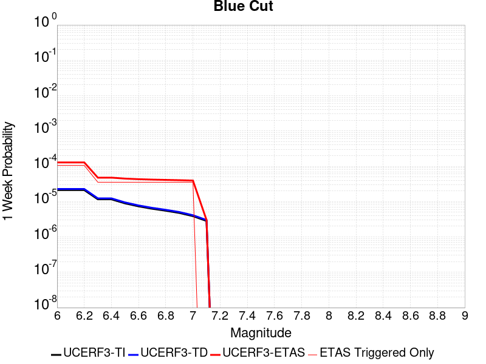 | 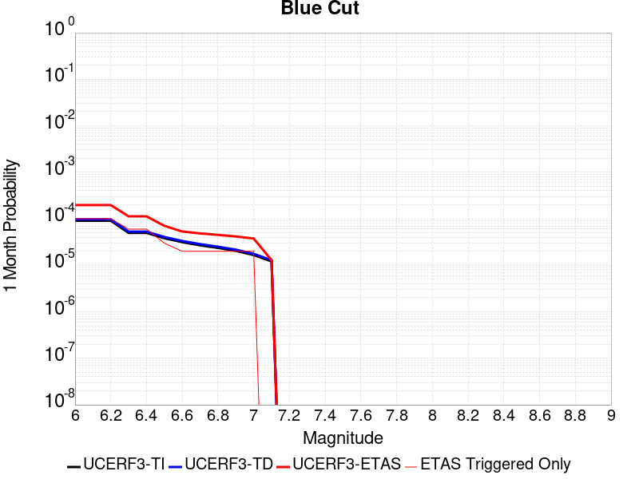 | 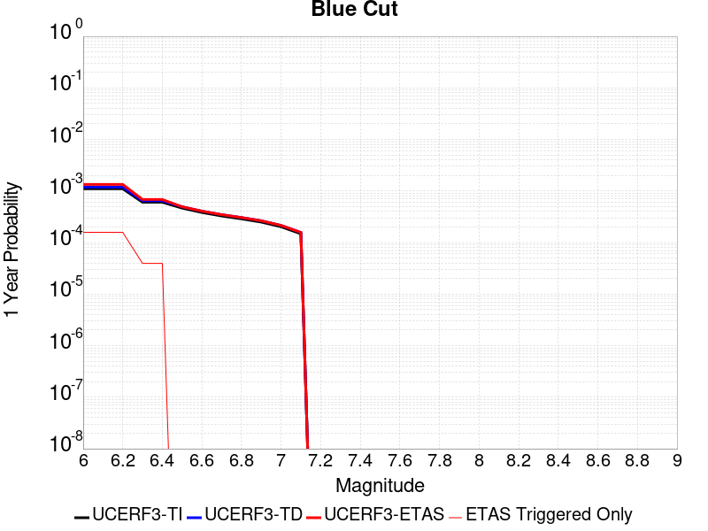 | 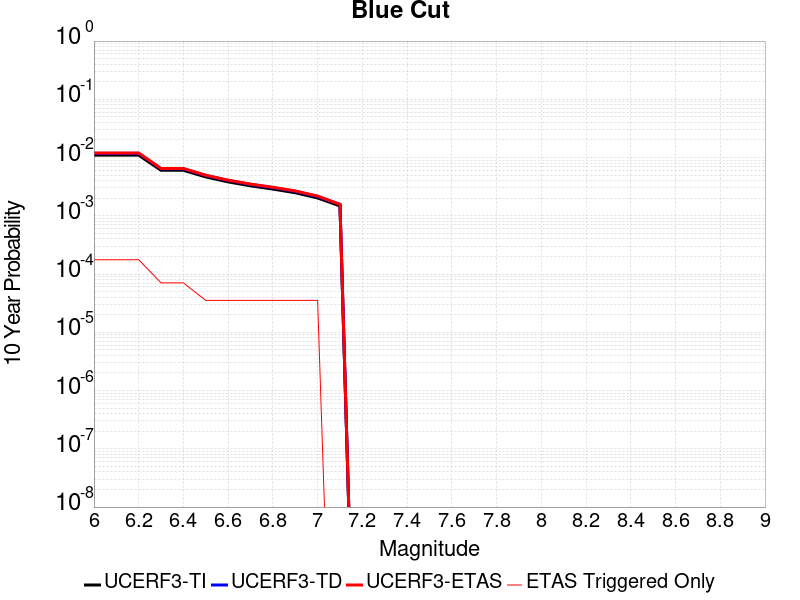 |

| Magnitude | 1 wk TI Prob | 1 wk TD Prob | 1 wk ETAS Prob | 1 wk ETAS/TD Gain | 1 wk ETAS Triggered Only | 1 mo TI Prob | 1 mo TD Prob | 1 mo ETAS Prob | 1 mo ETAS/TD Gain | 1 mo ETAS Triggered Only | 1 yr TI Prob | 1 yr TD Prob | 1 yr ETAS Prob | 1 yr ETAS/TD Gain | 1 yr ETAS Triggered Only | 10 yr TI Prob | 10 yr TD Prob | 10 yr ETAS Prob | 10 yr ETAS/TD Gain | 10 yr ETAS Triggered Only |
|-----|-----|-----|-----|-----|-----|-----|-----|-----|-----|-----|-----|-----|-----|-----|-----|-----|-----|-----|-----|-----|
| 6.0 | 2.1227985E-5 | 2.2719574E-5 | 1.0161947E-4 | 4.4727716 | 7.8901685E-5 | 9.097391E-5 | 9.73663E-5 | 2.157073E-4 | 2.2154207 | 1.1835253E-4 | 0.0011070445 | 0.0011848481 | 0.0013424645 | 1.1330267 | 1.5780337E-4 | 0.011015458 | 0.011791152 | 0.011947094 | 1.0132254 | 1.5780337E-4 |
| 6.1 | 2.1227985E-5 | 2.2719574E-5 | 1.0161947E-4 | 4.4727716 | 7.8901685E-5 | 9.097391E-5 | 9.73663E-5 | 2.157073E-4 | 2.2154207 | 1.1835253E-4 | 0.0011070445 | 0.0011848481 | 0.0013424645 | 1.1330267 | 1.5780337E-4 | 0.011015458 | 0.011791152 | 0.011947094 | 1.0132254 | 1.5780337E-4 |
| 6.2 | 2.1227985E-5 | 2.2719574E-5 | 1.0161947E-4 | 4.4727716 | 7.8901685E-5 | 9.097391E-5 | 9.73663E-5 | 2.157073E-4 | 2.2154207 | 1.1835253E-4 | 0.0011070445 | 0.0011848481 | 0.0013424645 | 1.1330267 | 1.5780337E-4 | 0.011015458 | 0.011791152 | 0.011947094 | 1.0132254 | 1.5780337E-4 |
| 6.3 | 1.1613981E-5 | 1.2353542E-5 | 1.2353542E-5 | 1.0 | 0.0 | 4.9773254E-5 | 5.2942745E-5 | 9.23915E-5 | 1.745121 | 3.9450842E-5 | 6.0582085E-4 | 6.443998E-4 | 6.838252E-4 | 1.0611817 | 3.9450842E-5 | 0.0060417196 | 0.0064265593 | 0.0064657563 | 1.0060992 | 3.9450842E-5 |
| 6.4 | 1.1613981E-5 | 1.2353542E-5 | 1.2353542E-5 | 1.0 | 0.0 | 4.9773254E-5 | 5.2942745E-5 | 9.23915E-5 | 1.745121 | 3.9450842E-5 | 6.0582085E-4 | 6.443998E-4 | 6.838252E-4 | 1.0611817 | 3.9450842E-5 | 0.0060417196 | 0.0064265593 | 0.0064657563 | 1.0060992 | 3.9450842E-5 |
| 6.5 | 8.931326E-6 | 9.4816E-6 | 9.4816E-6 | 1.0 | 0.0 | 3.8276554E-5 | 4.0634844E-5 | 4.0634844E-5 | 1.0 | 0.0 | 4.6591737E-4 | 4.946261E-4 | 4.946261E-4 | 1.0 | 0.0 | 0.0046494175 | 0.004936161 | 0.004936161 | 1.0 | 0.0 |
| 6.6 | 7.345353E-6 | 7.79028E-6 | 7.79028E-6 | 1.0 | 0.0 | 3.1479703E-5 | 3.338653E-5 | 3.338653E-5 | 1.0 | 0.0 | 3.83198E-4 | 4.064132E-4 | 4.064132E-4 | 1.0 | 0.0 | 0.0038253788 | 0.0040574907 | 0.0040574907 | 1.0 | 0.0 |
| 6.7 | 6.2775666E-6 | 6.655149E-6 | 6.655149E-6 | 1.0 | 0.0 | 2.690358E-5 | 2.8521798E-5 | 2.8521798E-5 | 1.0 | 0.0 | 3.2750185E-4 | 3.472051E-4 | 3.472051E-4 | 1.0 | 0.0 | 0.0032701963 | 0.003467367 | 0.003467367 | 1.0 | 0.0 |
| 6.8 | 5.5234095E-6 | 5.8551113E-6 | 5.8551113E-6 | 1.0 | 0.0 | 2.367154E-5 | 2.5093133E-5 | 2.5093133E-5 | 1.0 | 0.0 | 2.8816288E-4 | 3.0547334E-4 | 3.0547334E-4 | 1.0 | 0.0 | 0.002877895 | 0.0030512505 | 0.0030512505 | 1.0 | 0.0 |
| 6.9 | 4.7780054E-6 | 5.0654203E-6 | 5.0654203E-6 | 1.0 | 0.0 | 2.0477004E-5 | 2.1708804E-5 | 2.1708804E-5 | 1.0 | 0.0 | 2.4927902E-4 | 2.642797E-4 | 2.642797E-4 | 1.0 | 0.0 | 0.0024899957 | 0.002640346 | 0.002640346 | 1.0 | 0.0 |
| 7.0 | 3.883171E-6 | 4.118487E-6 | 4.118487E-6 | 1.0 | 0.0 | 1.6642054E-5 | 1.7650578E-5 | 1.7650578E-5 | 1.0 | 0.0 | 2.0259817E-4 | 2.1488148E-4 | 2.1488148E-4 | 1.0 | 0.0 | 0.0020241356 | 0.0021474129 | 0.0021474129 | 1.0 | 0.0 |
| 7.1 | 2.8358215E-6 | 3.0097158E-6 | 3.0097158E-6 | 1.0 | 0.0 | 1.2153464E-5 | 1.2898756E-5 | 1.2898756E-5 | 1.0 | 0.0 | 1.4795837E-4 | 1.5703762E-4 | 1.5703762E-4 | 1.0 | 0.0 | 0.001478599 | 0.0015699116 | 0.0015699116 | 1.0 | 0.0 |

## Red Mountain
*[(top)](#table-of-contents)*

| 1 Week | 1 Month | 1 Year | 10 Year |
|-----|-----|-----|-----|
| 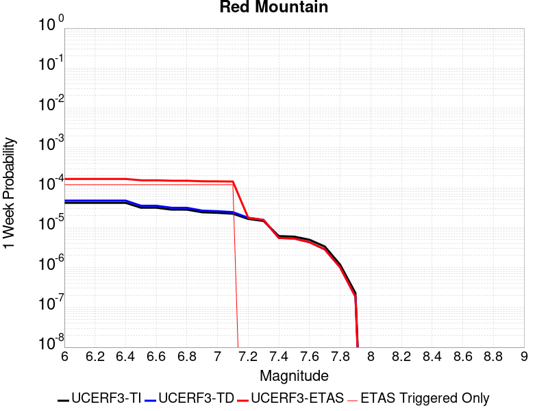 | 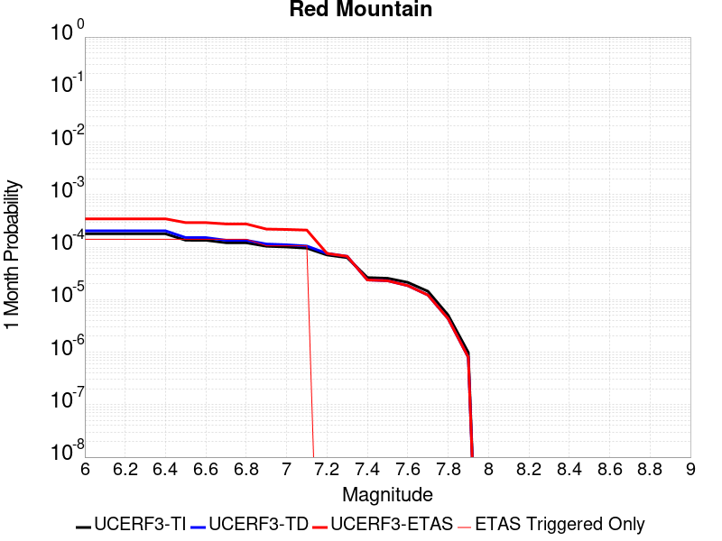 | 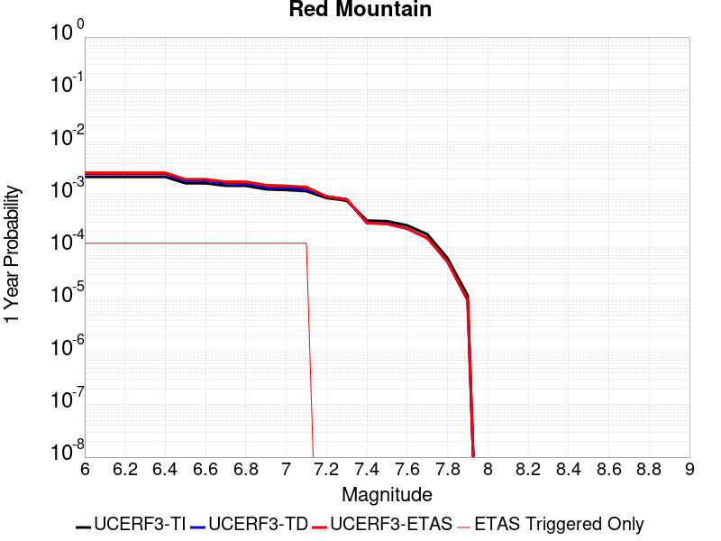 | 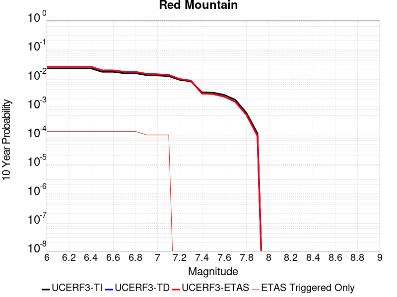 |

| Magnitude | 1 wk TI Prob | 1 wk TD Prob | 1 wk ETAS Prob | 1 wk ETAS/TD Gain | 1 wk ETAS Triggered Only | 1 mo TI Prob | 1 mo TD Prob | 1 mo ETAS Prob | 1 mo ETAS/TD Gain | 1 mo ETAS Triggered Only | 1 yr TI Prob | 1 yr TD Prob | 1 yr ETAS Prob | 1 yr ETAS/TD Gain | 1 yr ETAS Triggered Only | 10 yr TI Prob | 10 yr TD Prob | 10 yr ETAS Prob | 10 yr ETAS/TD Gain | 10 yr ETAS Triggered Only |
|-----|-----|-----|-----|-----|-----|-----|-----|-----|-----|-----|-----|-----|-----|-----|-----|-----|-----|-----|-----|-----|
| 6.0 | 4.1810763E-5 | 4.7589947E-5 | 1.6593684E-4 | 3.4868047 | 1.1835253E-4 | 1.7917668E-4 | 2.039419E-4 | 3.222703E-4 | 1.5802064 | 1.1835253E-4 | 0.0021792934 | 0.0024803306 | 0.0025983895 | 1.0475981 | 1.1835253E-4 | 0.021580452 | 0.024544092 | 0.024659539 | 1.0047036 | 1.1835253E-4 |
| 6.1 | 4.1810763E-5 | 4.7589947E-5 | 1.6593684E-4 | 3.4868047 | 1.1835253E-4 | 1.7917668E-4 | 2.039419E-4 | 3.222703E-4 | 1.5802064 | 1.1835253E-4 | 0.0021792934 | 0.0024803306 | 0.0025983895 | 1.0475981 | 1.1835253E-4 | 0.021580452 | 0.024544092 | 0.024659539 | 1.0047036 | 1.1835253E-4 |
| 6.2 | 4.1810763E-5 | 4.7589947E-5 | 1.6593684E-4 | 3.4868047 | 1.1835253E-4 | 1.7917668E-4 | 2.039419E-4 | 3.222703E-4 | 1.5802064 | 1.1835253E-4 | 0.0021792934 | 0.0024803306 | 0.0025983895 | 1.0475981 | 1.1835253E-4 | 0.021580452 | 0.024544092 | 0.024659539 | 1.0047036 | 1.1835253E-4 |
| 6.3 | 4.1810763E-5 | 4.7589947E-5 | 1.6593684E-4 | 3.4868047 | 1.1835253E-4 | 1.7917668E-4 | 2.039419E-4 | 3.222703E-4 | 1.5802064 | 1.1835253E-4 | 0.0021792934 | 0.0024803306 | 0.0025983895 | 1.0475981 | 1.1835253E-4 | 0.021580452 | 0.024544092 | 0.024659539 | 1.0047036 | 1.1835253E-4 |
| 6.4 | 4.1810763E-5 | 4.7589947E-5 | 1.6593684E-4 | 3.4868047 | 1.1835253E-4 | 1.7917668E-4 | 2.039419E-4 | 3.222703E-4 | 1.5802064 | 1.1835253E-4 | 0.0021792934 | 0.0024803306 | 0.0025983895 | 1.0475981 | 1.1835253E-4 | 0.021580452 | 0.024544092 | 0.024659539 | 1.0047036 | 1.1835253E-4 |
| 6.5 | 3.154503E-5 | 3.5359728E-5 | 1.5370808E-4 | 4.3469815 | 1.1835253E-4 | 1.3518598E-4 | 1.5153342E-4 | 2.69868E-4 | 1.7809142 | 1.1835253E-4 | 0.0016446467 | 0.0018434501 | 0.0019615844 | 1.0640833 | 1.1835253E-4 | 0.01632528 | 0.018291233 | 0.018407421 | 1.0063521 | 1.1835253E-4 |
| 6.6 | 3.1535834E-5 | 3.534911E-5 | 1.5369746E-4 | 4.3479867 | 1.1835253E-4 | 1.3514658E-4 | 1.5148791E-4 | 2.698225E-4 | 1.7811488 | 1.1835253E-4 | 0.0016441676 | 0.001842897 | 0.0019610315 | 1.0641025 | 1.1835253E-4 | 0.01632056 | 0.018285794 | 0.018401982 | 1.006354 | 1.1835253E-4 |
| 6.7 | 2.8267326E-5 | 3.146934E-5 | 1.4981815E-4 | 4.7607656 | 1.1835253E-4 | 1.2114006E-4 | 1.348621E-4 | 2.5319867E-4 | 1.8774635 | 1.1835253E-4 | 0.0014738824 | 0.0016407946 | 0.0017589529 | 1.0720129 | 1.1835253E-4 | 0.014641452 | 0.016295563 | 0.016411988 | 1.0071446 | 1.1835253E-4 |
| 6.8 | 2.8212884E-5 | 3.1407224E-5 | 1.4975604E-4 | 4.7682037 | 1.1835253E-4 | 1.20906756E-4 | 1.3459593E-4 | 2.5293254E-4 | 1.879199 | 1.1835253E-4 | 0.0014710457 | 0.0016375587 | 0.0017557174 | 1.0721554 | 1.1835253E-4 | 0.014613459 | 0.01626368 | 0.016380107 | 1.0071588 | 1.1835253E-4 |
| 6.9 | 2.4227871E-5 | 2.6706979E-5 | 1.4505634E-4 | 5.4314027 | 1.1835253E-4 | 1.03829596E-4 | 1.14453884E-4 | 2.3279287E-4 | 2.0339446 | 1.1835253E-4 | 0.0012633923 | 0.0013926612 | 0.0015108489 | 1.0848646 | 1.1835253E-4 | 0.012562336 | 0.013847026 | 0.013963739 | 1.0084288 | 1.1835253E-4 |
| 7.0 | 2.348524E-5 | 2.5835763E-5 | 1.4418524E-4 | 5.580839 | 1.1835253E-4 | 1.0064714E-4 | 1.1072042E-4 | 2.2905985E-4 | 2.068813 | 1.1835253E-4 | 0.0012246901 | 0.0013472632 | 0.0014654563 | 1.0877283 | 1.1835253E-4 | 0.012179627 | 0.01339859 | 0.013515356 | 1.0087149 | 1.1835253E-4 |
| 7.1 | 2.2311642E-5 | 2.4462828E-5 | 1.4281247E-4 | 5.8379374 | 1.1835253E-4 | 9.561782E-5 | 1.048369E-4 | 2.2317703E-4 | 2.128802 | 1.1835253E-4 | 0.0011635252 | 0.0012757168 | 0.0013939183 | 1.0926551 | 1.1835253E-4 | 0.01157452 | 0.012691451 | 0.0128083015 | 1.009207 | 1.1835253E-4 |
| 7.2 | 1.6533986E-5 | 1.7670347E-5 | 1.7670347E-5 | 1.0 | 0.0 | 7.085802E-5 | 7.572822E-5 | 7.572822E-5 | 1.0 | 0.0 | 8.623549E-4 | 9.216645E-4 | 9.216645E-4 | 1.0 | 0.0 | 0.008590161 | 0.009184699 | 0.009184699 | 1.0 | 0.0 |
| 7.3 | 1.4703092E-5 | 1.555952E-5 | 1.555952E-5 | 1.0 | 0.0 | 6.301173E-5 | 6.66823E-5 | 6.66823E-5 | 1.0 | 0.0 | 7.668978E-4 | 8.1161625E-4 | 8.1161625E-4 | 1.0 | 0.0 | 0.0076425658 | 0.008092596 | 0.008092596 | 1.0 | 0.0 |
| 7.4 | 6.1331984E-6 | 5.528872E-6 | 5.528872E-6 | 1.0 | 0.0 | 2.6284872E-5 | 2.3694953E-5 | 2.3694953E-5 | 1.0 | 0.0 | 3.199713E-4 | 2.8844838E-4 | 2.8844838E-4 | 1.0 | 0.0 | 0.0031951098 | 0.0028807942 | 0.0028807942 | 1.0 | 0.0 |
| 7.5 | 5.954766E-6 | 5.3385015E-6 | 5.3385015E-6 | 1.0 | 0.0 | 2.5520176E-5 | 2.2879094E-5 | 2.2879094E-5 | 1.0 | 0.0 | 3.1066386E-4 | 2.785179E-4 | 2.785179E-4 | 1.0 | 0.0 | 0.003102299 | 0.0027817423 | 0.0027817423 | 1.0 | 0.0 |
| 7.6 | 4.9726646E-6 | 4.315295E-6 | 4.315295E-6 | 1.0 | 0.0 | 2.1311245E-5 | 1.8493993E-5 | 1.8493993E-5 | 1.0 | 0.0 | 2.5943352E-4 | 2.2514143E-4 | 2.2514143E-4 | 1.0 | 0.0 | 0.0025913084 | 0.002249168 | 0.002249168 | 1.0 | 0.0 |
| 7.7 | 3.3613894E-6 | 2.8526642E-6 | 2.8526642E-6 | 1.0 | 0.0 | 1.4405875E-5 | 1.2225649E-5 | 1.2225649E-5 | 1.0 | 0.0 | 1.7537741E-4 | 1.4883737E-4 | 1.4883737E-4 | 1.0 | 0.0 | 0.0017523908 | 0.0014874031 | 0.0014874031 | 1.0 | 0.0 |
| 7.8 | 1.1828961E-6 | 1.0122756E-6 | 1.0122756E-6 | 1.0 | 0.0 | 5.069545E-6 | 4.338317E-6 | 4.338317E-6 | 1.0 | 0.0 | 6.171996E-5 | 5.281776E-5 | 5.281776E-5 | 1.0 | 0.0 | 6.170282E-4 | 5.2805495E-4 | 5.2805495E-4 | 1.0 | 0.0 |
| 7.9 | 2.2967266E-7 | 1.8618952E-7 | 1.8618952E-7 | 1.0 | 0.0 | 9.843111E-7 | 7.9795484E-7 | 7.9795484E-7 | 1.0 | 0.0 | 1.19839215E-5 | 9.7150605E-6 | 9.7150605E-6 | 1.0 | 0.0 | 1.1983275E-4 | 9.714664E-5 | 9.714664E-5 | 1.0 | 0.0 |

## Mission Ridge-Arroyo Parida-Santa Ana
*[(top)](#table-of-contents)*

| 1 Week | 1 Month | 1 Year | 10 Year |
|-----|-----|-----|-----|
| 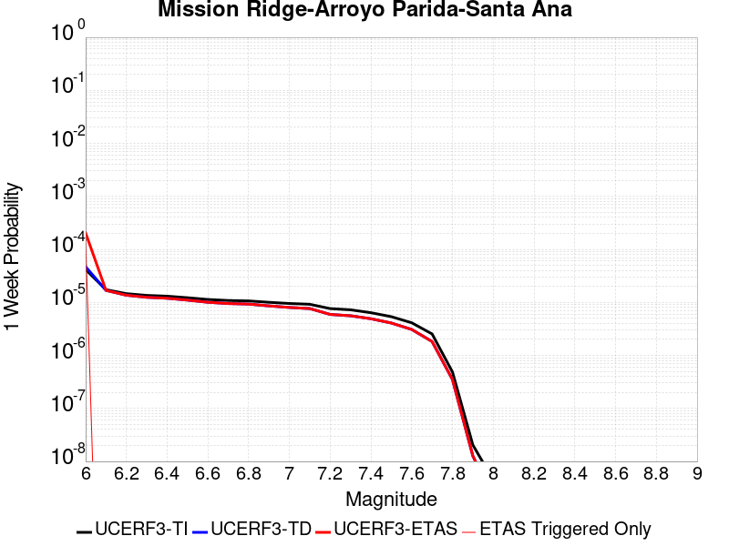 | 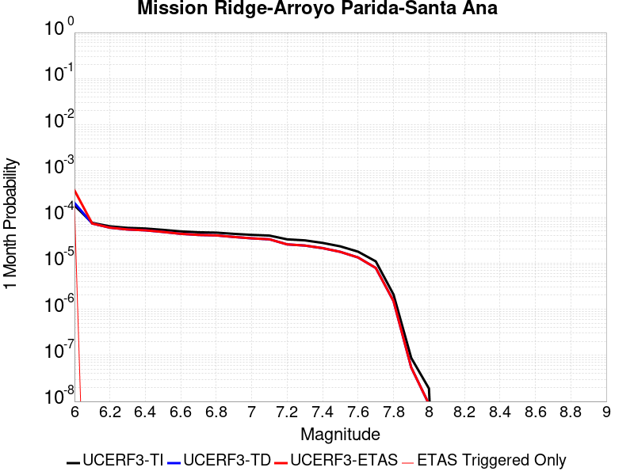 | 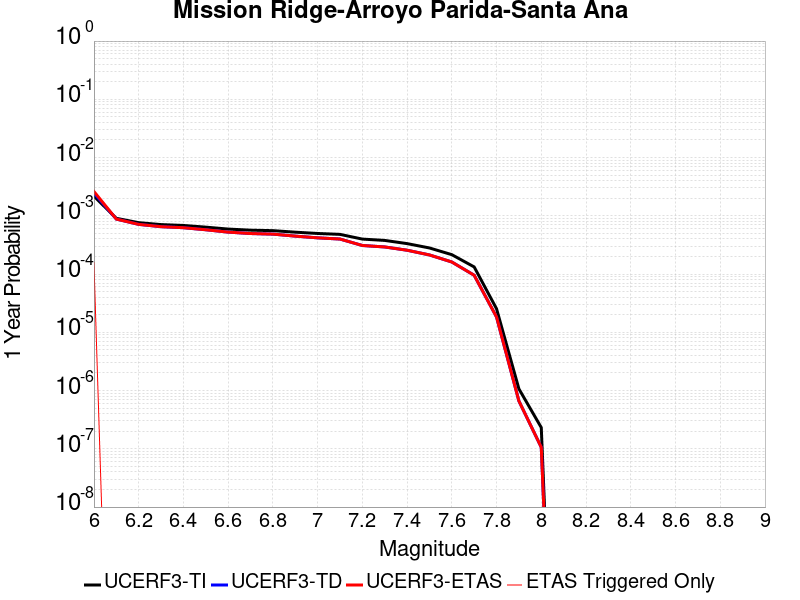 | 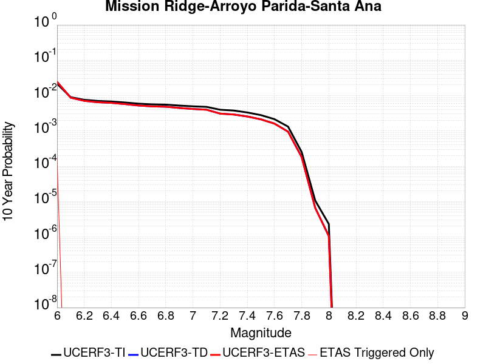 |

| Magnitude | 1 wk TI Prob | 1 wk TD Prob | 1 wk ETAS Prob | 1 wk ETAS/TD Gain | 1 wk ETAS Triggered Only | 1 mo TI Prob | 1 mo TD Prob | 1 mo ETAS Prob | 1 mo ETAS/TD Gain | 1 mo ETAS Triggered Only | 1 yr TI Prob | 1 yr TD Prob | 1 yr ETAS Prob | 1 yr ETAS/TD Gain | 1 yr ETAS Triggered Only | 10 yr TI Prob | 10 yr TD Prob | 10 yr ETAS Prob | 10 yr ETAS/TD Gain | 10 yr ETAS Triggered Only |
|-----|-----|-----|-----|-----|-----|-----|-----|-----|-----|-----|-----|-----|-----|-----|-----|-----|-----|-----|-----|-----|
| 6.0 | 4.169034E-5 | 4.7138263E-5 | 2.049342E-4 | 4.3475127 | 1.5780337E-4 | 1.7866064E-4 | 2.0201034E-4 | 3.5978184E-4 | 1.781007 | 1.5780337E-4 | 0.0021730233 | 0.00245745 | 0.0026148655 | 1.0640565 | 1.5780337E-4 | 0.021518968 | 0.024384614 | 0.02453857 | 1.0063137 | 1.5780337E-4 |
| 6.1 | 1.73813E-5 | 1.6854226E-5 | 1.6854226E-5 | 1.0 | 0.0 | 7.4489166E-5 | 7.223046E-5 | 7.223046E-5 | 1.0 | 0.0 | 9.065282E-4 | 8.790618E-4 | 8.790618E-4 | 1.0 | 0.0 | 0.009028391 | 0.008756988 | 0.008756988 | 1.0 | 0.0 |
| 6.2 | 1.4622182E-5 | 1.367329E-5 | 1.367329E-5 | 1.0 | 0.0 | 6.2664985E-5 | 5.8598518E-5 | 5.8598518E-5 | 1.0 | 0.0 | 7.6267915E-4 | 7.132073E-4 | 7.132073E-4 | 1.0 | 0.0 | 0.007600669 | 0.007109627 | 0.007109627 | 1.0 | 0.0 |
| 6.3 | 1.3552434E-5 | 1.2482201E-5 | 1.2482201E-5 | 1.0 | 0.0 | 5.8080568E-5 | 5.3494066E-5 | 5.3494066E-5 | 1.0 | 0.0 | 7.069015E-4 | 6.510988E-4 | 6.510988E-4 | 1.0 | 0.0 | 0.00704657 | 0.006492275 | 0.006492275 | 1.0 | 0.0 |
| 6.4 | 1.30977305E-5 | 1.1979156E-5 | 1.1979156E-5 | 1.0 | 0.0 | 5.613192E-5 | 5.1338247E-5 | 5.1338247E-5 | 1.0 | 0.0 | 6.831918E-4 | 6.248669E-4 | 6.248669E-4 | 1.0 | 0.0 | 0.006810953 | 0.0062314444 | 0.0062314444 | 1.0 | 0.0 |
| 6.5 | 1.225205E-5 | 1.1048803E-5 | 1.1048803E-5 | 1.0 | 0.0 | 5.2507727E-5 | 4.7351168E-5 | 4.7351168E-5 | 1.0 | 0.0 | 6.3909404E-4 | 5.7635066E-4 | 5.7635066E-4 | 1.0 | 0.0 | 0.006372592 | 0.005748869 | 0.005748869 | 1.0 | 0.0 |
| 6.6 | 1.1352241E-5 | 1.0063535E-5 | 1.0063535E-5 | 1.0 | 0.0 | 4.8651553E-5 | 4.3128734E-5 | 4.3128734E-5 | 1.0 | 0.0 | 5.921717E-4 | 5.2496797E-4 | 5.2496797E-4 | 1.0 | 0.0 | 0.0059059616 | 0.0052375244 | 0.0052375244 | 1.0 | 0.0 |
| 6.7 | 1.0864116E-5 | 9.517027E-6 | 9.517027E-6 | 1.0 | 0.0 | 4.6559664E-5 | 4.0786632E-5 | 4.0786632E-5 | 1.0 | 0.0 | 5.667165E-4 | 4.964661E-4 | 4.964661E-4 | 1.0 | 0.0 | 0.005652734 | 0.004953804 | 0.004953804 | 1.0 | 0.0 |
| 6.8 | 1.0666365E-5 | 9.299779E-6 | 9.299779E-6 | 1.0 | 0.0 | 4.571219E-5 | 3.9855597E-5 | 3.9855597E-5 | 1.0 | 0.0 | 5.564038E-4 | 4.8513585E-4 | 4.8513585E-4 | 1.0 | 0.0 | 0.005550127 | 0.0048410003 | 0.0048410003 | 1.0 | 0.0 |
| 6.9 | 1.0038665E-5 | 8.592046E-6 | 8.592046E-6 | 1.0 | 0.0 | 4.302214E-5 | 3.682254E-5 | 3.682254E-5 | 1.0 | 0.0 | 5.236687E-4 | 4.4822405E-4 | 4.4822405E-4 | 1.0 | 0.0 | 0.005224364 | 0.004473411 | 0.004473411 | 1.0 | 0.0 |
| 7.0 | 9.5379955E-6 | 8.025073E-6 | 8.025073E-6 | 1.0 | 0.0 | 4.0876483E-5 | 3.4392728E-5 | 3.4392728E-5 | 1.0 | 0.0 | 4.975576E-4 | 4.1865272E-4 | 4.1865272E-4 | 1.0 | 0.0 | 0.00496445 | 0.0041788397 | 0.0041788397 | 1.0 | 0.0 |
| 7.1 | 9.207389E-6 | 7.652375E-6 | 7.652375E-6 | 1.0 | 0.0 | 3.945964E-5 | 3.279549E-5 | 3.279549E-5 | 1.0 | 0.0 | 4.803152E-4 | 3.9921363E-4 | 3.9921363E-4 | 1.0 | 0.0 | 0.004792784 | 0.003985161 | 0.003985161 | 1.0 | 0.0 |
| 7.2 | 7.638091E-6 | 5.9311183E-6 | 5.9311183E-6 | 1.0 | 0.0 | 3.2734264E-5 | 2.541883E-5 | 2.541883E-5 | 1.0 | 0.0 | 3.984668E-4 | 3.0943064E-4 | 3.0943064E-4 | 1.0 | 0.0 | 0.0039775306 | 0.0030900547 | 0.0030900547 | 1.0 | 0.0 |
| 7.3 | 7.2500147E-6 | 5.5961527E-6 | 5.5961527E-6 | 1.0 | 0.0 | 3.1071122E-5 | 2.3983293E-5 | 2.3983293E-5 | 1.0 | 0.0 | 3.7822526E-4 | 2.9195778E-4 | 2.9195778E-4 | 1.0 | 0.0 | 0.0037758215 | 0.0029157975 | 0.0029157975 | 1.0 | 0.0 |
| 7.4 | 6.3899715E-6 | 4.9184964E-6 | 4.9184964E-6 | 1.0 | 0.0 | 2.7385306E-5 | 2.10791E-5 | 2.10791E-5 | 1.0 | 0.0 | 3.3336508E-4 | 2.5660804E-4 | 2.5660804E-4 | 1.0 | 0.0 | 0.0033286542 | 0.0025631618 | 0.0025631618 | 1.0 | 0.0 |
| 7.5 | 5.379025E-6 | 4.0838527E-6 | 4.0838527E-6 | 1.0 | 0.0 | 2.305276E-5 | 1.7502109E-5 | 1.7502109E-5 | 1.0 | 0.0 | 2.806312E-4 | 2.1306744E-4 | 2.1306744E-4 | 1.0 | 0.0 | 0.0028027708 | 0.002128643 | 0.002128643 | 1.0 | 0.0 |
| 7.6 | 4.1270696E-6 | 3.0883439E-6 | 3.0883439E-6 | 1.0 | 0.0 | 1.768732E-5 | 1.3235693E-5 | 1.3235693E-5 | 1.0 | 0.0 | 2.1532185E-4 | 1.6113273E-4 | 1.6113273E-4 | 1.0 | 0.0 | 0.0021511333 | 0.001610167 | 0.001610167 | 1.0 | 0.0 |
| 7.7 | 2.5406805E-6 | 1.8282013E-6 | 1.8282013E-6 | 1.0 | 0.0 | 1.0888585E-5 | 7.835125E-6 | 7.835125E-6 | 1.0 | 0.0 | 1.3256045E-4 | 9.538854E-5 | 9.538854E-5 | 1.0 | 0.0 | 0.0013248142 | 9.534821E-4 | 9.534821E-4 | 1.0 | 0.0 |
| 7.8 | 4.8608285E-7 | 3.5098864E-7 | 3.5098864E-7 | 1.0 | 0.0 | 2.0832106E-6 | 1.5042363E-6 | 1.5042363E-6 | 1.0 | 0.0 | 2.5362791E-5 | 1.8313924E-5 | 1.8313924E-5 | 1.0 | 0.0 | 2.5359896E-4 | 1.8312426E-4 | 1.8312426E-4 | 1.0 | 0.0 |
| 7.9 | 2.0472514E-8 | 1.2688783E-8 | 1.2688783E-8 | 1.0 | 0.0 | 8.7739345E-8 | 5.43805E-8 | 5.43805E-8 | 1.0 | 0.0 | 1.068226E-6 | 6.6208236E-7 | 6.6208236E-7 | 1.0 | 0.0 | 1.0682209E-5 | 6.620805E-6 | 6.620805E-6 | 1.0 | 0.0 |
| 8.0 | 4.443582E-9 | 2.0321211E-9 | 2.0321211E-9 | 1.0 | 0.0 | 1.9043922E-8 | 8.70909E-9 | 8.70909E-9 | 1.0 | 0.0 | 2.3185973E-7 | 1.0603316E-7 | 1.0603316E-7 | 1.0 | 0.0 | 2.3185949E-6 | 1.0603312E-6 | 1.0603312E-6 | 1.0 | 0.0 |

## Santa Cruz Catalina Ridge alt1
*[(top)](#table-of-contents)*

| 1 Week | 1 Month | 1 Year | 10 Year |
|-----|-----|-----|-----|
| 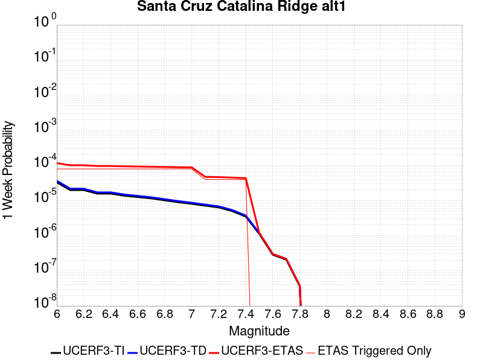 | 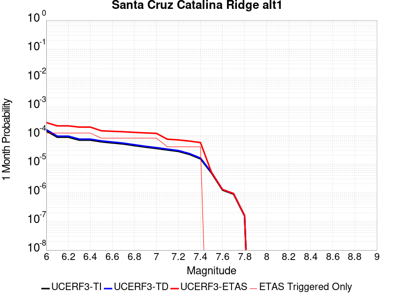 | 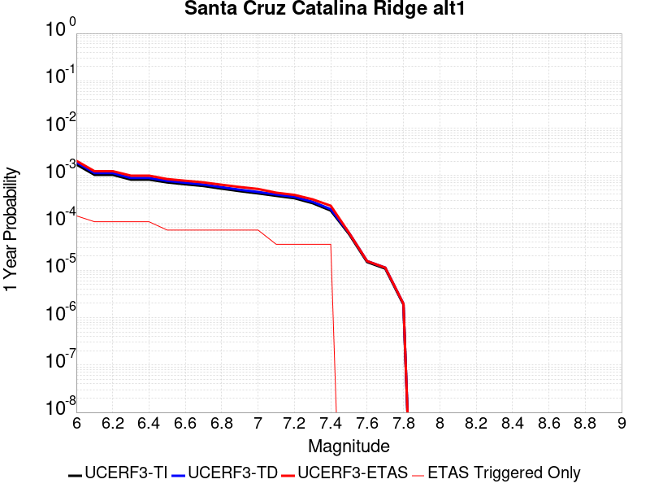 | 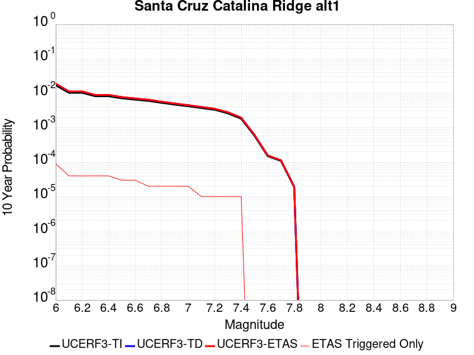 |

| Magnitude | 1 wk TI Prob | 1 wk TD Prob | 1 wk ETAS Prob | 1 wk ETAS/TD Gain | 1 wk ETAS Triggered Only | 1 mo TI Prob | 1 mo TD Prob | 1 mo ETAS Prob | 1 mo ETAS/TD Gain | 1 mo ETAS Triggered Only | 1 yr TI Prob | 1 yr TD Prob | 1 yr ETAS Prob | 1 yr ETAS/TD Gain | 1 yr ETAS Triggered Only | 10 yr TI Prob | 10 yr TD Prob | 10 yr ETAS Prob | 10 yr ETAS/TD Gain | 10 yr ETAS Triggered Only |
|-----|-----|-----|-----|-----|-----|-----|-----|-----|-----|-----|-----|-----|-----|-----|-----|-----|-----|-----|-----|-----|
| 6.0 | 3.2833184E-5 | 3.65584E-5 | 1.154572E-4 | 3.158158 | 7.8901685E-5 | 1.4070606E-4 | 1.5667039E-4 | 2.7500436E-4 | 1.7553054 | 1.1835253E-4 | 0.00171175 | 0.0019059596 | 0.0020240864 | 1.0619776 | 1.1835253E-4 | 0.016986247 | 0.018913029 | 0.019029144 | 1.0061394 | 1.1835253E-4 |
| 6.1 | 1.9835548E-5 | 2.1659505E-5 | 1.0055948E-4 | 4.6427417 | 7.8901685E-5 | 8.500672E-5 | 9.282326E-5 | 2.111648E-4 | 2.2749126 | 1.1835253E-4 | 0.0010344655 | 0.0011295575 | 0.0012477763 | 1.1046594 | 1.1835253E-4 | 0.010296632 | 0.011240295 | 0.011357318 | 1.0104109 | 1.1835253E-4 |
| 6.2 | 1.9835548E-5 | 2.1659505E-5 | 1.0055948E-4 | 4.6427417 | 7.8901685E-5 | 8.500672E-5 | 9.282326E-5 | 2.111648E-4 | 2.2749126 | 1.1835253E-4 | 0.0010344655 | 0.0011295575 | 0.0012477763 | 1.1046594 | 1.1835253E-4 | 0.010296632 | 0.011240295 | 0.011357318 | 1.0104109 | 1.1835253E-4 |
| 6.3 | 1.5728183E-5 | 1.703395E-5 | 9.5934294E-5 | 5.6319466 | 7.8901685E-5 | 6.7404755E-5 | 7.300063E-5 | 1.9134453E-4 | 2.6211352 | 1.1835253E-4 | 8.2034385E-4 | 8.884264E-4 | 0.0010066738 | 1.1330975 | 1.1835253E-4 | 0.008173222 | 0.008849427 | 0.008966732 | 1.0132557 | 1.1835253E-4 |
| 6.4 | 1.5728183E-5 | 1.703395E-5 | 9.5934294E-5 | 5.6319466 | 7.8901685E-5 | 6.7404755E-5 | 7.300063E-5 | 1.9134453E-4 | 2.6211352 | 1.1835253E-4 | 8.2034385E-4 | 8.884264E-4 | 0.0010066738 | 1.1330975 | 1.1835253E-4 | 0.008173222 | 0.008849427 | 0.008966732 | 1.0132557 | 1.1835253E-4 |
| 6.5 | 1.3707734E-5 | 1.4794522E-5 | 9.3695046E-5 | 6.3330903 | 7.8901685E-5 | 5.8746107E-5 | 6.3403575E-5 | 1.4230025E-4 | 2.244357 | 7.8901685E-5 | 7.1499916E-4 | 7.716686E-4 | 8.5050944E-4 | 1.1021693 | 7.8901685E-5 | 0.0071270303 | 0.0076902895 | 0.0077685844 | 1.010181 | 7.8901685E-5 |
| 6.6 | 1.2539813E-5 | 1.3510219E-5 | 9.241084E-5 | 6.84007 | 7.8901685E-5 | 5.3740947E-5 | 5.789967E-5 | 1.3679679E-4 | 2.3626523 | 7.8901685E-5 | 6.540996E-4 | 7.0470315E-4 | 7.835493E-4 | 1.1118855 | 7.8901685E-5 | 0.0065217763 | 0.0070249885 | 0.007103336 | 1.0111526 | 7.8901685E-5 |
| 6.7 | 1.1504083E-5 | 1.2377375E-5 | 9.127809E-5 | 7.374592 | 7.8901685E-5 | 4.930228E-5 | 5.3044827E-5 | 1.3194233E-4 | 2.487374 | 7.8901685E-5 | 6.0008996E-4 | 6.456314E-4 | 7.244821E-4 | 1.1221297 | 7.8901685E-5 | 0.005984721 | 0.006437786 | 0.0065161795 | 1.0121771 | 7.8901685E-5 |
| 6.8 | 1.012739E-5 | 1.0877071E-5 | 8.97779E-5 | 8.253867 | 7.8901685E-5 | 4.340238E-5 | 4.6615194E-5 | 1.2551321E-4 | 2.6925385 | 7.8901685E-5 | 5.282958E-4 | 5.673937E-4 | 6.462506E-4 | 1.138981 | 7.8901685E-5 | 0.0052704164 | 0.0056596193 | 0.005738075 | 1.0138623 | 7.8901685E-5 |
| 6.9 | 8.9607865E-6 | 9.609117E-6 | 8.8510045E-5 | 9.211049 | 7.8901685E-5 | 3.8402806E-5 | 4.1181287E-5 | 1.2007973E-4 | 2.915881 | 7.8901685E-5 | 4.6745385E-4 | 5.012679E-4 | 5.8013E-4 | 1.1573254 | 7.8901685E-5 | 0.0046647177 | 0.005001492 | 0.0050799986 | 1.0156968 | 7.8901685E-5 |
| 7.0 | 8.046829E-6 | 8.619746E-6 | 8.7520755E-5 | 10.153519 | 7.8901685E-5 | 3.4485955E-5 | 3.694125E-5 | 1.1584003E-4 | 3.1357906 | 7.8901685E-5 | 4.1978562E-4 | 4.496677E-4 | 5.2853394E-4 | 1.1753877 | 7.8901685E-5 | 0.004189935 | 0.0044876686 | 0.0045662164 | 1.017503 | 7.8901685E-5 |
| 7.1 | 7.136131E-6 | 7.637656E-6 | 4.70882E-5 | 6.1652684 | 3.9450842E-5 | 3.0583058E-5 | 3.2732405E-5 | 7.218196E-5 | 2.205214 | 3.9450842E-5 | 3.7228514E-4 | 3.9844486E-4 | 4.3788E-4 | 1.0989726 | 3.9450842E-5 | 0.0037166206 | 0.003977381 | 0.004016675 | 1.0098794 | 3.9450842E-5 |
| 7.2 | 6.362014E-6 | 6.8049585E-6 | 4.6255533E-5 | 6.797328 | 3.9450842E-5 | 2.726549E-5 | 2.9163786E-5 | 6.861348E-5 | 2.3526945 | 3.9450842E-5 | 3.3190678E-4 | 3.550119E-4 | 3.9444873E-4 | 1.111086 | 3.9450842E-5 | 0.0033141149 | 0.003544516 | 0.003583827 | 1.0110906 | 3.9450842E-5 |
| 7.3 | 5.004101E-6 | 5.351715E-6 | 4.480235E-5 | 8.371587 | 3.9450842E-5 | 2.1445969E-5 | 2.2935723E-5 | 6.238566E-5 | 2.7200217 | 3.9450842E-5 | 2.6107338E-4 | 2.792072E-4 | 3.18647E-4 | 1.1412565 | 3.9450842E-5 | 0.002607669 | 0.0027886187 | 0.0028279594 | 1.0141076 | 3.9450842E-5 |
| 7.4 | 3.4901443E-6 | 3.7320526E-6 | 4.318275E-5 | 11.570778 | 3.9450842E-5 | 1.4957676E-5 | 1.5994416E-5 | 5.5444627E-5 | 3.4664993 | 3.9450842E-5 | 1.8209449E-4 | 1.9471499E-4 | 2.3415814E-4 | 1.2025687 | 3.9450842E-5 | 0.0018194534 | 0.0019454823 | 0.0019848566 | 1.0202388 | 3.9450842E-5 |
| 7.5 | 1.1215045E-6 | 1.189387E-6 | 1.189387E-6 | 1.0 | 0.0 | 4.806439E-6 | 5.097363E-6 | 5.097363E-6 | 1.0 | 0.0 | 5.851682E-5 | 6.205866E-5 | 6.205866E-5 | 1.0 | 0.0 | 5.850142E-4 | 6.2041637E-4 | 6.2041637E-4 | 1.0 | 0.0 |
| 7.6 | 2.8599047E-7 | 2.9951994E-7 | 2.9951994E-7 | 1.0 | 0.0 | 1.2256729E-6 | 1.2836562E-6 | 1.2836562E-6 | 1.0 | 0.0 | 1.4922465E-5 | 1.5628404E-5 | 1.5628404E-5 | 1.0 | 0.0 | 1.4921463E-4 | 1.5627318E-4 | 1.5627318E-4 | 1.0 | 0.0 |
| 7.7 | 2.0781519E-7 | 2.1744323E-7 | 2.1744323E-7 | 1.0 | 0.0 | 8.906362E-7 | 9.3189925E-7 | 9.3189925E-7 | 1.0 | 0.0 | 1.08434415E-5 | 1.13458145E-5 | 1.13458145E-5 | 1.0 | 0.0 | 1.0842913E-4 | 1.1345245E-4 | 1.1345245E-4 | 1.0 | 0.0 |
| 7.8 | 3.614776E-8 | 3.764102E-8 | 3.764102E-8 | 1.0 | 0.0 | 1.5491896E-7 | 1.6131864E-7 | 1.6131864E-7 | 1.0 | 0.0 | 1.8861368E-6 | 1.9640527E-6 | 1.9640527E-6 | 1.0 | 0.0 | 1.8861208E-5 | 1.9640367E-5 | 1.9640367E-5 | 1.0 | 0.0 |

## Cleghorn
*[(top)](#table-of-contents)*

| 1 Week | 1 Month | 1 Year | 10 Year |
|-----|-----|-----|-----|
| 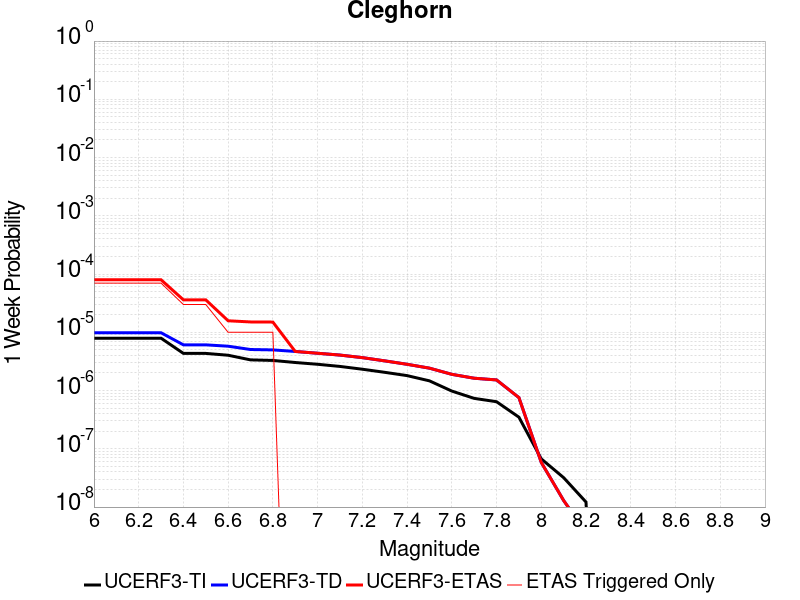 | 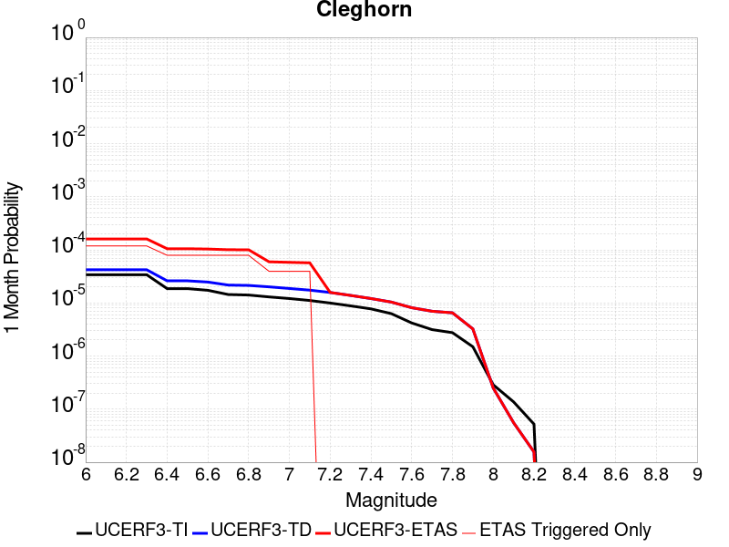 | 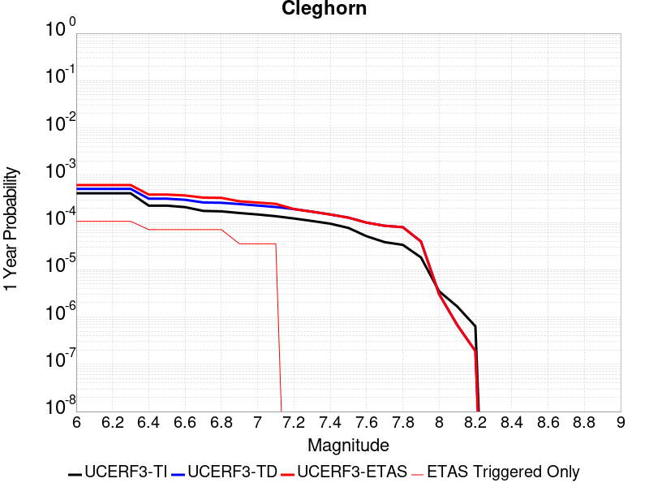 | 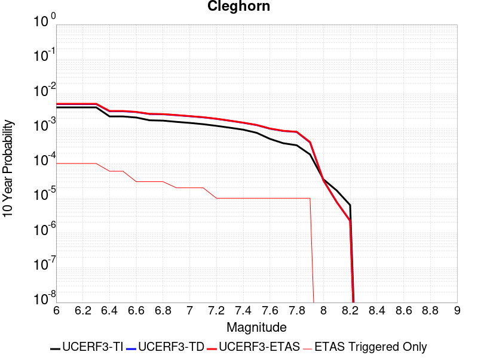 |

| Magnitude | 1 wk TI Prob | 1 wk TD Prob | 1 wk ETAS Prob | 1 wk ETAS/TD Gain | 1 wk ETAS Triggered Only | 1 mo TI Prob | 1 mo TD Prob | 1 mo ETAS Prob | 1 mo ETAS/TD Gain | 1 mo ETAS Triggered Only | 1 yr TI Prob | 1 yr TD Prob | 1 yr ETAS Prob | 1 yr ETAS/TD Gain | 1 yr ETAS Triggered Only | 10 yr TI Prob | 10 yr TD Prob | 10 yr ETAS Prob | 10 yr ETAS/TD Gain | 10 yr ETAS Triggered Only |
|-----|-----|-----|-----|-----|-----|-----|-----|-----|-----|-----|-----|-----|-----|-----|-----|-----|-----|-----|-----|-----|
| 6.0 | 7.9267165E-6 | 9.831582E-6 | 8.873249E-5 | 9.02525 | 7.8901685E-5 | 3.39712E-5 | 4.2134732E-5 | 1.6048228E-4 | 3.8087883 | 1.1835253E-4 | 4.1352084E-4 | 5.128803E-4 | 6.311721E-4 | 1.2306422 | 1.1835253E-4 | 0.004127522 | 0.0051320773 | 0.005249822 | 1.022943 | 1.1835253E-4 |
| 6.1 | 7.9267165E-6 | 9.831582E-6 | 8.873249E-5 | 9.02525 | 7.8901685E-5 | 3.39712E-5 | 4.2134732E-5 | 1.6048228E-4 | 3.8087883 | 1.1835253E-4 | 4.1352084E-4 | 5.128803E-4 | 6.311721E-4 | 1.2306422 | 1.1835253E-4 | 0.004127522 | 0.0051320773 | 0.005249822 | 1.022943 | 1.1835253E-4 |
| 6.2 | 7.9267165E-6 | 9.831582E-6 | 8.873249E-5 | 9.02525 | 7.8901685E-5 | 3.39712E-5 | 4.2134732E-5 | 1.6048228E-4 | 3.8087883 | 1.1835253E-4 | 4.1352084E-4 | 5.128803E-4 | 6.311721E-4 | 1.2306422 | 1.1835253E-4 | 0.004127522 | 0.0051320773 | 0.005249822 | 1.022943 | 1.1835253E-4 |
| 6.3 | 7.9267165E-6 | 9.831582E-6 | 8.873249E-5 | 9.02525 | 7.8901685E-5 | 3.39712E-5 | 4.2134732E-5 | 1.6048228E-4 | 3.8087883 | 1.1835253E-4 | 4.1352084E-4 | 5.128803E-4 | 6.311721E-4 | 1.2306422 | 1.1835253E-4 | 0.004127522 | 0.0051320773 | 0.005249822 | 1.022943 | 1.1835253E-4 |
| 6.4 | 4.3445207E-6 | 6.0914435E-6 | 4.554205E-5 | 7.4763966 | 3.9450842E-5 | 1.8619241E-5 | 2.610593E-5 | 1.0500556E-4 | 4.0222874 | 7.8901685E-5 | 2.2666567E-4 | 3.1779436E-4 | 3.9667098E-4 | 1.2482002 | 7.8901685E-5 | 0.0022643462 | 0.0031875873 | 0.0032662374 | 1.0246739 | 7.8901685E-5 |
| 6.5 | 4.3445207E-6 | 6.0914435E-6 | 4.554205E-5 | 7.4763966 | 3.9450842E-5 | 1.8619241E-5 | 2.610593E-5 | 1.0500556E-4 | 4.0222874 | 7.8901685E-5 | 2.2666567E-4 | 3.1779436E-4 | 3.9667098E-4 | 1.2482002 | 7.8901685E-5 | 0.0022643462 | 0.0031875873 | 0.0032662374 | 1.0246739 | 7.8901685E-5 |
| 6.6 | 4.040109E-6 | 5.773851E-6 | 4.5224468E-5 | 7.832635 | 3.9450842E-5 | 1.7314638E-5 | 2.4744846E-5 | 1.0364458E-4 | 4.188532 | 7.8901685E-5 | 2.1078532E-4 | 3.012278E-4 | 3.8010572E-4 | 1.2618548 | 7.8901685E-5 | 0.002105855 | 0.003022377 | 0.0031010401 | 1.026027 | 7.8901685E-5 |
| 6.7 | 3.3632055E-6 | 5.067348E-6 | 4.4517994E-5 | 8.785264 | 3.9450842E-5 | 1.4413658E-5 | 2.1717027E-5 | 1.00617E-4 | 4.633093 | 7.8901685E-5 | 1.7547216E-4 | 2.6437303E-4 | 3.4325387E-4 | 1.2983694 | 7.8901685E-5 | 0.0017533366 | 0.0026547113 | 0.0027334034 | 1.0296425 | 7.8901685E-5 |
| 6.8 | 3.2902772E-6 | 4.9892556E-6 | 4.4439905E-5 | 8.907121 | 3.9450842E-5 | 1.4101111E-5 | 2.1382351E-5 | 1.00282356E-4 | 4.689959 | 7.8901685E-5 | 1.716675E-4 | 2.6029933E-4 | 3.391805E-4 | 1.3030401 | 7.8901685E-5 | 0.0017153495 | 0.0026140702 | 0.0026927656 | 1.0301045 | 7.8901685E-5 |
| 6.9 | 3.031547E-6 | 4.6910186E-6 | 4.6910186E-6 | 1.0 | 0.0 | 1.299228E-5 | 2.0104211E-5 | 5.9554262E-5 | 2.962278 | 3.9450842E-5 | 1.5816953E-4 | 2.4474156E-4 | 2.8418275E-4 | 1.1611544 | 3.9450842E-5 | 0.00158057 | 0.0024588439 | 0.0024981976 | 1.016005 | 3.9450842E-5 |
| 7.0 | 2.8259715E-6 | 4.3705895E-6 | 4.3705895E-6 | 1.0 | 0.0 | 1.211125E-5 | 1.8730963E-5 | 5.818107E-5 | 3.106144 | 3.9450842E-5 | 1.4744449E-4 | 2.2802586E-4 | 2.674677E-4 | 1.1729709 | 3.9450842E-5 | 0.001473467 | 0.0022920412 | 0.0023314015 | 1.0171727 | 3.9450842E-5 |
| 7.1 | 2.5962665E-6 | 4.0658106E-6 | 4.0658106E-6 | 1.0 | 0.0 | 1.1126809E-5 | 1.7424789E-5 | 5.6874946E-5 | 3.264025 | 3.9450842E-5 | 1.3546048E-4 | 2.1212637E-4 | 2.5156882E-4 | 1.1859386 | 3.9450842E-5 | 0.0013537793 | 0.002133366 | 0.0021727327 | 1.0184529 | 3.9450842E-5 |
| 7.2 | 2.3247253E-6 | 3.6763672E-6 | 3.6763672E-6 | 1.0 | 0.0 | 9.96307E-6 | 1.5755764E-5 | 1.5755764E-5 | 1.0 | 0.0 | 1.21293626E-4 | 1.9180974E-4 | 1.9180974E-4 | 1.0 | 0.0 | 0.0012122744 | 0.0019305905 | 0.0019305905 | 1.0 | 0.0 |
| 7.3 | 2.056928E-6 | 3.2350938E-6 | 3.2350938E-6 | 1.0 | 0.0 | 8.815376E-6 | 1.3864615E-5 | 1.3864615E-5 | 1.0 | 0.0 | 1.0732192E-4 | 1.6878877E-4 | 1.6878877E-4 | 1.0 | 0.0 | 0.001072701 | 0.0017008206 | 0.0017008206 | 1.0 | 0.0 |
| 7.4 | 1.8055999E-6 | 2.8255042E-6 | 2.8255042E-6 | 1.0 | 0.0 | 7.738263E-6 | 1.2109249E-5 | 1.2109249E-5 | 1.0 | 0.0 | 9.4209274E-5 | 1.4742027E-4 | 1.4742027E-4 | 1.0 | 0.0 | 9.4169343E-4 | 0.0014875771 | 0.0014875771 | 1.0 | 0.0 |
| 7.5 | 1.4683443E-6 | 2.4247483E-6 | 2.4247483E-6 | 1.0 | 0.0 | 6.292889E-6 | 1.0391738E-5 | 1.0391738E-5 | 1.0 | 0.0 | 7.661323E-5 | 1.2651215E-4 | 1.2651215E-4 | 1.0 | 0.0 | 7.658682E-4 | 0.0012787961 | 0.0012787961 | 1.0 | 0.0 |
| 7.6 | 9.804088E-7 | 1.900266E-6 | 1.900266E-6 | 1.0 | 0.0 | 4.201745E-6 | 8.143972E-6 | 8.143972E-6 | 1.0 | 0.0 | 5.1155046E-5 | 9.91484E-5 | 9.91484E-5 | 1.0 | 0.0 | 5.114327E-4 | 0.001005471 | 0.001005471 | 1.0 | 0.0 |
| 7.7 | 7.3434086E-7 | 1.6284146E-6 | 1.6284146E-6 | 1.0 | 0.0 | 3.1471714E-6 | 6.978901E-6 | 6.978901E-6 | 1.0 | 0.0 | 3.831614E-5 | 8.4964835E-5 | 8.4964835E-5 | 1.0 | 0.0 | 3.8309532E-4 | 8.6378685E-4 | 8.6378685E-4 | 1.0 | 0.0 |
| 7.8 | 6.434184E-7 | 1.5220047E-6 | 1.5220047E-6 | 1.0 | 0.0 | 2.7575045E-6 | 6.5228614E-6 | 6.5228614E-6 | 1.0 | 0.0 | 3.35721E-5 | 7.941297E-5 | 7.941297E-5 | 1.0 | 0.0 | 3.3567028E-4 | 8.079678E-4 | 8.079678E-4 | 1.0 | 0.0 |
| 7.9 | 3.4943926E-7 | 7.574459E-7 | 7.574459E-7 | 1.0 | 0.0 | 1.497596E-6 | 3.2461926E-6 | 3.2461926E-6 | 1.0 | 0.0 | 1.8233079E-5 | 3.952169E-5 | 3.952169E-5 | 1.0 | 0.0 | 1.8231584E-4 | 4.040099E-4 | 4.040099E-4 | 1.0 | 0.0 |
| 8.0 | 6.717524E-8 | 5.838828E-8 | 5.838828E-8 | 1.0 | 0.0 | 2.8789387E-7 | 2.5023547E-7 | 2.5023547E-7 | 1.0 | 0.0 | 3.505102E-6 | 3.0466126E-6 | 3.0466126E-6 | 1.0 | 0.0 | 3.5050467E-5 | 3.273506E-5 | 3.273506E-5 | 1.0 | 0.0 |
| 8.1 | 3.1984914E-8 | 1.2956093E-8 | 1.2956093E-8 | 1.0 | 0.0 | 1.370782E-7 | 5.552611E-8 | 5.552611E-8 | 1.0 | 0.0 | 1.6689258E-6 | 6.760302E-7 | 6.760302E-7 | 1.0 | 0.0 | 1.6689133E-5 | 7.74454E-6 | 7.74454E-6 | 1.0 | 0.0 |
| 8.2 | 1.21887656E-8 | 3.6495305E-9 | 3.6495305E-9 | 1.0 | 0.0 | 5.2237567E-8 | 1.5640845E-8 | 1.5640845E-8 | 1.0 | 0.0 | 6.359922E-7 | 1.9042727E-7 | 1.9042727E-7 | 1.0 | 0.0 | 6.3599036E-6 | 2.2470974E-6 | 2.2470974E-6 | 1.0 | 0.0 |

## San Diego Trough south
*[(top)](#table-of-contents)*

| 1 Week | 1 Month | 1 Year | 10 Year |
|-----|-----|-----|-----|
| 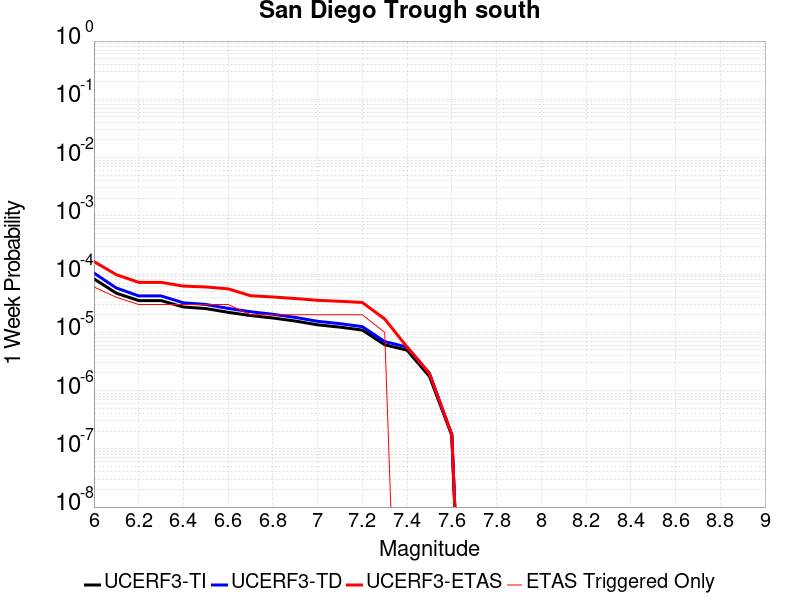 | 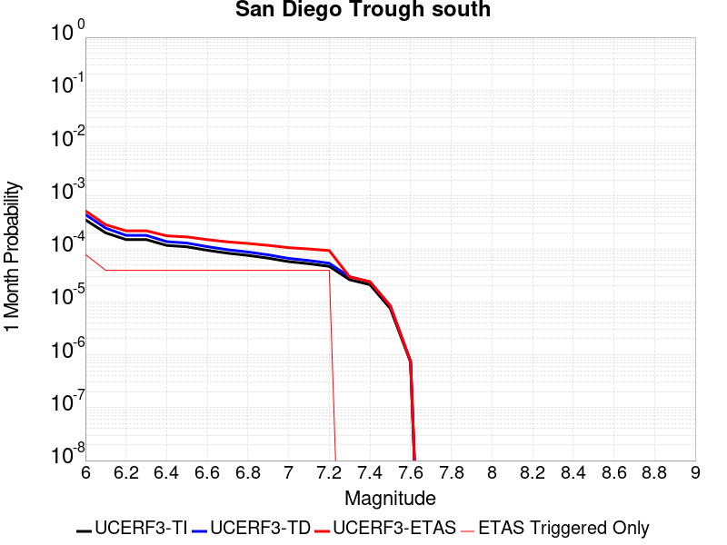 | 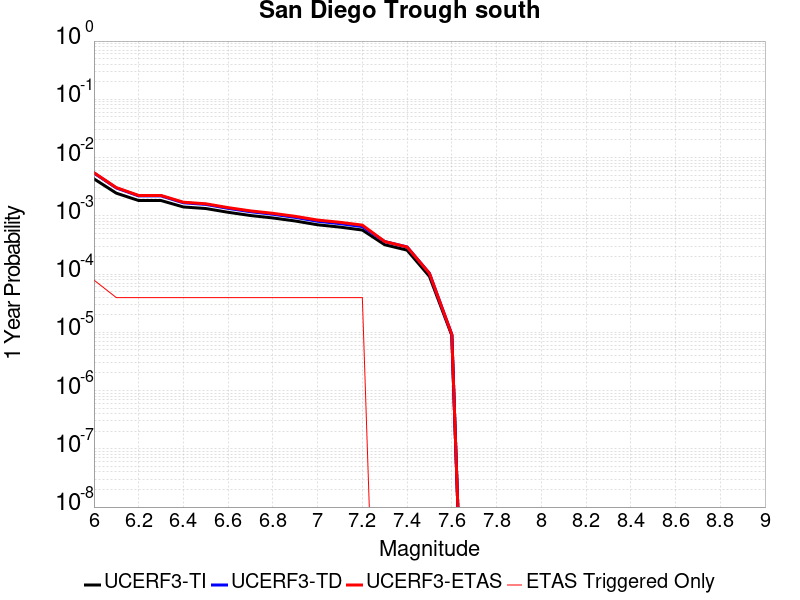 | 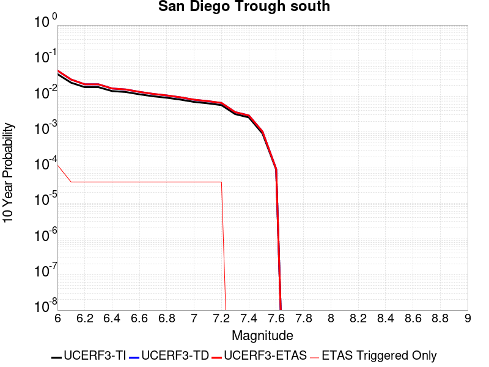 |

| Magnitude | 1 wk TI Prob | 1 wk TD Prob | 1 wk ETAS Prob | 1 wk ETAS/TD Gain | 1 wk ETAS Triggered Only | 1 mo TI Prob | 1 mo TD Prob | 1 mo ETAS Prob | 1 mo ETAS/TD Gain | 1 mo ETAS Triggered Only | 1 yr TI Prob | 1 yr TD Prob | 1 yr ETAS Prob | 1 yr ETAS/TD Gain | 1 yr ETAS Triggered Only | 10 yr TI Prob | 10 yr TD Prob | 10 yr ETAS Prob | 10 yr ETAS/TD Gain | 10 yr ETAS Triggered Only |
|-----|-----|-----|-----|-----|-----|-----|-----|-----|-----|-----|-----|-----|-----|-----|-----|-----|-----|-----|-----|-----|
| 6.0 | 8.279495E-5 | 1.04241306E-4 | 1.8313478E-4 | 1.756835 | 7.8901685E-5 | 3.5478722E-4 | 4.4667677E-4 | 5.2554323E-4 | 1.1765627 | 7.8901685E-5 | 0.004310982 | 0.0054256152 | 0.005504089 | 1.0144635 | 7.8901685E-5 | 0.042283054 | 0.05299221 | 0.05310429 | 1.002115 | 1.1835253E-4 |
| 6.1 | 4.6961468E-5 | 5.772944E-5 | 9.717801E-5 | 1.6833353 | 3.9450842E-5 | 2.0124791E-4 | 2.473894E-4 | 2.868305E-4 | 1.1594292 | 3.9450842E-5 | 0.00244744 | 0.0030079768 | 0.003047309 | 1.013076 | 3.9450842E-5 | 0.024206603 | 0.029679462 | 0.029717742 | 1.0012897 | 3.9450842E-5 |
| 6.2 | 3.5079658E-5 | 4.214154E-5 | 8.159072E-5 | 1.9361116 | 3.9450842E-5 | 1.5033272E-4 | 1.8059435E-4 | 2.2003807E-4 | 1.2184106 | 3.9450842E-5 | 0.0018287642 | 0.0021965632 | 0.0022359274 | 1.0179209 | 3.9450842E-5 | 0.018137876 | 0.021751117 | 0.021789711 | 1.0017743 | 3.9450842E-5 |
| 6.3 | 3.5079658E-5 | 4.214154E-5 | 8.159072E-5 | 1.9361116 | 3.9450842E-5 | 1.5033272E-4 | 1.8059435E-4 | 2.2003807E-4 | 1.2184106 | 3.9450842E-5 | 0.0018287642 | 0.0021965632 | 0.0022359274 | 1.0179209 | 3.9450842E-5 | 0.018137876 | 0.021751117 | 0.021789711 | 1.0017743 | 3.9450842E-5 |
| 6.4 | 2.7196904E-5 | 3.2087162E-5 | 7.153674E-5 | 2.2294505 | 3.9450842E-5 | 1.16552954E-4 | 1.3750927E-4 | 1.7695468E-4 | 1.2868564 | 3.9450842E-5 | 0.0014181085 | 0.0016729041 | 0.0017122889 | 1.0235428 | 3.9450842E-5 | 0.014090929 | 0.016604643 | 0.016643438 | 1.0023364 | 3.9450842E-5 |
| 6.5 | 2.5584688E-5 | 3.010164E-5 | 6.955129E-5 | 2.3105483 | 3.9450842E-5 | 1.0964406E-4 | 1.2900073E-4 | 1.684465E-4 | 1.3057793 | 3.9450842E-5 | 0.0013340989 | 0.0015694655 | 0.0016088544 | 1.025097 | 3.9450842E-5 | 0.013261181 | 0.015585314 | 0.01562415 | 1.0024918 | 3.9450842E-5 |
| 6.6 | 2.2034688E-5 | 2.5742738E-5 | 6.5192566E-5 | 2.5324643 | 3.9450842E-5 | 9.443096E-5 | 1.1032141E-4 | 1.497679E-4 | 1.3575597 | 3.9450842E-5 | 0.0011490905 | 0.0013423424 | 0.0013817402 | 1.0293502 | 3.9450842E-5 | 0.011431668 | 0.013343317 | 0.013382242 | 1.0029172 | 3.9450842E-5 |
| 6.7 | 1.9394853E-5 | 2.254176E-5 | 6.199172E-5 | 2.7500832 | 3.9450842E-5 | 8.311815E-5 | 9.6603995E-5 | 1.3605104E-4 | 1.4083375 | 3.9450842E-5 | 0.0010114936 | 0.0011755243 | 0.0012149288 | 1.0335208 | 3.9450842E-5 | 0.01006902 | 0.011693766 | 0.011732755 | 1.0033342 | 3.9450842E-5 |
| 6.8 | 1.7615313E-5 | 2.0403182E-5 | 5.985322E-5 | 2.933524 | 3.9450842E-5 | 7.549201E-5 | 8.74393E-5 | 1.268867E-4 | 1.4511403 | 3.9450842E-5 | 9.1872766E-4 | 0.0010640579 | 0.0011034668 | 1.0370364 | 3.9450842E-5 | 0.009149387 | 0.010590198 | 0.010629231 | 1.0036857 | 3.9450842E-5 |
| 6.9 | 1.5621423E-5 | 1.8026114E-5 | 5.747625E-5 | 3.188499 | 3.9450842E-5 | 6.6947236E-5 | 7.725251E-5 | 1.1670031E-4 | 1.5106345 | 3.9450842E-5 | 8.147778E-4 | 9.40147E-4 | 9.795608E-4 | 1.0419229 | 3.9450842E-5 | 0.008117969 | 0.009362142 | 0.009401224 | 1.0041745 | 3.9450842E-5 |
| 7.0 | 1.3444376E-5 | 1.544809E-5 | 5.4898323E-5 | 3.553729 | 3.9450842E-5 | 5.7617483E-5 | 6.620443E-5 | 1.0565266E-4 | 1.5958549 | 3.9450842E-5 | 7.0126704E-4 | 8.057436E-4 | 8.4516266E-4 | 1.0489225 | 3.9450842E-5 | 0.006990582 | 0.008028555 | 0.008067689 | 1.0048743 | 3.9450842E-5 |
| 7.1 | 1.2268361E-5 | 1.407303E-5 | 5.352332E-5 | 3.8032548 | 3.9450842E-5 | 5.2577634E-5 | 6.0311606E-5 | 9.976007E-5 | 1.6540775 | 3.9450842E-5 | 6.399447E-4 | 7.3404907E-4 | 7.7347097E-4 | 1.0537047 | 3.9450842E-5 | 0.0063810493 | 0.0073165493 | 0.0073557114 | 1.0053525 | 3.9450842E-5 |
| 7.2 | 1.0922655E-5 | 1.2513563E-5 | 5.1963914E-5 | 4.1526074 | 3.9450842E-5 | 4.681054E-5 | 5.3628468E-5 | 9.307719E-5 | 1.7355931 | 3.9450842E-5 | 5.697693E-4 | 6.5273355E-4 | 6.921586E-4 | 1.0604 | 3.9450842E-5 | 0.0056831064 | 0.0065084435 | 0.0065476377 | 1.006022 | 3.9450842E-5 |
| 7.3 | 6.1106753E-6 | 6.928925E-6 | 6.928925E-6 | 1.0 | 0.0 | 2.6188345E-5 | 2.9695057E-5 | 2.9695057E-5 | 1.0 | 0.0 | 3.1879646E-4 | 3.6147775E-4 | 3.6147775E-4 | 1.0 | 0.0 | 0.0031833951 | 0.003608943 | 0.003608943 | 1.0 | 0.0 |
| 7.4 | 4.933187E-6 | 5.5895525E-6 | 5.5895525E-6 | 1.0 | 0.0 | 2.114206E-5 | 2.3955008E-5 | 2.3955008E-5 | 1.0 | 0.0 | 2.5737417E-4 | 2.9161357E-4 | 2.9161357E-4 | 1.0 | 0.0 | 0.002570763 | 0.0029123505 | 0.0029123505 | 1.0 | 0.0 |
| 7.5 | 1.7489613E-6 | 1.969678E-6 | 1.969678E-6 | 1.0 | 0.0 | 7.495527E-6 | 8.4414505E-6 | 8.4414505E-6 | 1.0 | 0.0 | 9.125422E-5 | 1.02770035E-4 | 1.02770035E-4 | 1.0 | 0.0 | 9.1216754E-4 | 0.0010272472 | 0.0010272472 | 1.0 | 0.0 |
| 7.6 | 1.6988751E-7 | 1.7533823E-7 | 1.7533823E-7 | 1.0 | 0.0 | 7.2808916E-7 | 7.5144936E-7 | 7.5144936E-7 | 1.0 | 0.0 | 8.864449E-6 | 9.14886E-6 | 9.14886E-6 | 1.0 | 0.0 | 8.8640954E-5 | 9.1485024E-5 | 9.1485024E-5 | 1.0 | 0.0 |

## Tin Mountain
*[(top)](#table-of-contents)*

| 1 Week | 1 Month | 1 Year | 10 Year |
|-----|-----|-----|-----|
| 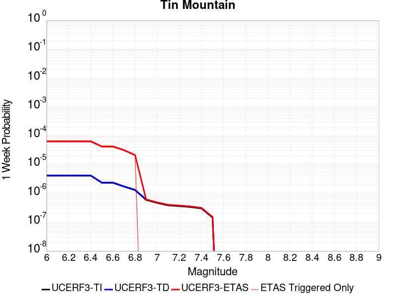 | 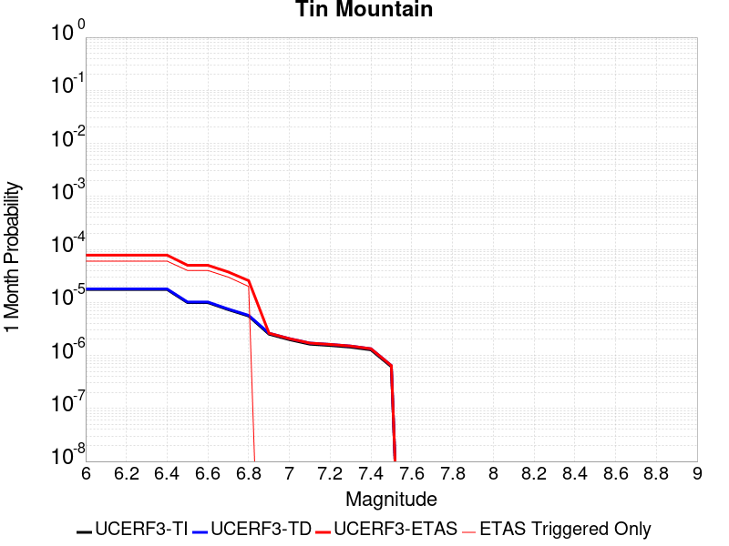 | 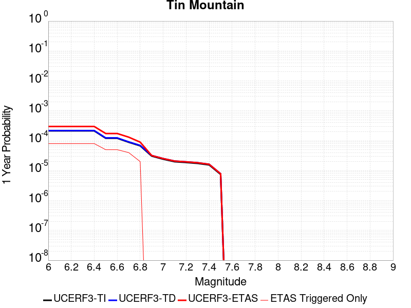 | 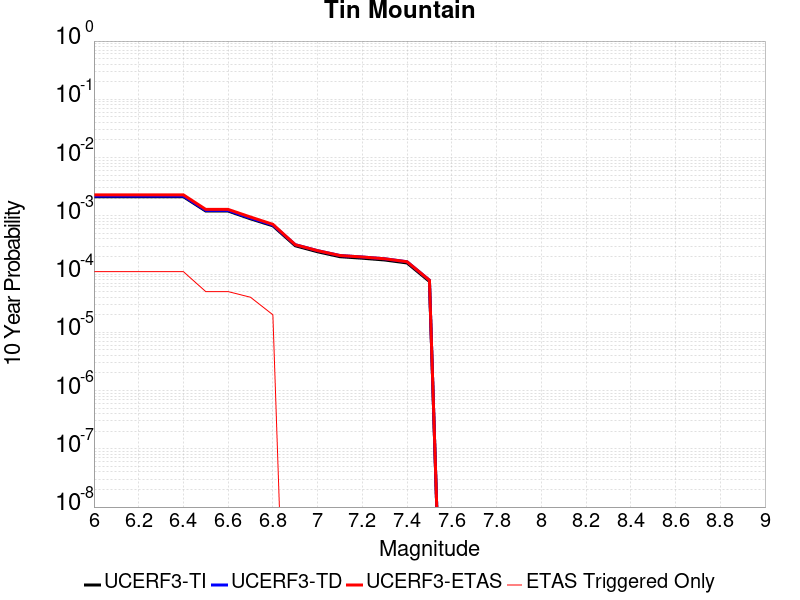 |

| Magnitude | 1 wk TI Prob | 1 wk TD Prob | 1 wk ETAS Prob | 1 wk ETAS/TD Gain | 1 wk ETAS Triggered Only | 1 mo TI Prob | 1 mo TD Prob | 1 mo ETAS Prob | 1 mo ETAS/TD Gain | 1 mo ETAS Triggered Only | 1 yr TI Prob | 1 yr TD Prob | 1 yr ETAS Prob | 1 yr ETAS/TD Gain | 1 yr ETAS Triggered Only | 10 yr TI Prob | 10 yr TD Prob | 10 yr ETAS Prob | 10 yr ETAS/TD Gain | 10 yr ETAS Triggered Only |
|-----|-----|-----|-----|-----|-----|-----|-----|-----|-----|-----|-----|-----|-----|-----|-----|-----|-----|-----|-----|-----|
| 6.0 | 4.083776E-6 | 4.1815365E-6 | 8.3082894E-5 | 19.868986 | 7.8901685E-5 | 1.750178E-5 | 1.792077E-5 | 9.6821044E-5 | 5.402728 | 7.8901685E-5 | 2.1306332E-4 | 2.1816725E-4 | 3.3649395E-4 | 1.542367 | 1.1835253E-4 | 0.0021285915 | 0.0021798965 | 0.002297991 | 1.0541744 | 1.1835253E-4 |
| 6.1 | 4.083776E-6 | 4.1815365E-6 | 8.3082894E-5 | 19.868986 | 7.8901685E-5 | 1.750178E-5 | 1.792077E-5 | 9.6821044E-5 | 5.402728 | 7.8901685E-5 | 2.1306332E-4 | 2.1816725E-4 | 3.3649395E-4 | 1.542367 | 1.1835253E-4 | 0.0021285915 | 0.0021798965 | 0.002297991 | 1.0541744 | 1.1835253E-4 |
| 6.2 | 4.083776E-6 | 4.1815365E-6 | 8.3082894E-5 | 19.868986 | 7.8901685E-5 | 1.750178E-5 | 1.792077E-5 | 9.6821044E-5 | 5.402728 | 7.8901685E-5 | 2.1306332E-4 | 2.1816725E-4 | 3.3649395E-4 | 1.542367 | 1.1835253E-4 | 0.0021285915 | 0.0021798965 | 0.002297991 | 1.0541744 | 1.1835253E-4 |
| 6.3 | 4.083776E-6 | 4.1815365E-6 | 8.3082894E-5 | 19.868986 | 7.8901685E-5 | 1.750178E-5 | 1.792077E-5 | 9.6821044E-5 | 5.402728 | 7.8901685E-5 | 2.1306332E-4 | 2.1816725E-4 | 3.3649395E-4 | 1.542367 | 1.1835253E-4 | 0.0021285915 | 0.0021798965 | 0.002297991 | 1.0541744 | 1.1835253E-4 |
| 6.4 | 4.083776E-6 | 4.1815365E-6 | 8.3082894E-5 | 19.868986 | 7.8901685E-5 | 1.750178E-5 | 1.792077E-5 | 9.6821044E-5 | 5.402728 | 7.8901685E-5 | 2.1306332E-4 | 2.1816725E-4 | 3.3649395E-4 | 1.542367 | 1.1835253E-4 | 0.0021285915 | 0.0021798965 | 0.002297991 | 1.0541744 | 1.1835253E-4 |
| 6.5 | 2.3143427E-6 | 2.3731573E-6 | 8.127466E-5 | 34.247482 | 7.8901685E-5 | 9.9185745E-6 | 1.0170638E-5 | 8.9071524E-5 | 8.757712 | 7.8901685E-5 | 1.2075195E-4 | 1.2382126E-4 | 2.4215913E-4 | 1.9557154 | 1.1835253E-4 | 0.0012068636 | 0.0012375986 | 0.0013558047 | 1.0955124 | 1.1835253E-4 |
| 6.6 | 2.3143427E-6 | 2.3731573E-6 | 8.127466E-5 | 34.247482 | 7.8901685E-5 | 9.9185745E-6 | 1.0170638E-5 | 8.9071524E-5 | 8.757712 | 7.8901685E-5 | 1.2075195E-4 | 1.2382126E-4 | 2.4215913E-4 | 1.9557154 | 1.1835253E-4 | 0.0012068636 | 0.0012375986 | 0.0013558047 | 1.0955124 | 1.1835253E-4 |
| 6.7 | 1.7029532E-6 | 1.7497915E-6 | 8.065134E-5 | 46.091972 | 7.8901685E-5 | 7.2983503E-6 | 7.499088E-6 | 8.6400185E-5 | 11.521426 | 7.8901685E-5 | 8.885379E-5 | 9.1298105E-5 | 2.0963984E-4 | 2.2962122 | 1.1835253E-4 | 8.881827E-4 | 9.1265864E-4 | 0.0010309031 | 1.1295605 | 1.1835253E-4 |
| 6.8 | 1.2914646E-6 | 1.3299378E-6 | 4.078073E-5 | 30.663635 | 3.9450842E-5 | 5.534837E-6 | 5.6997237E-6 | 4.5150344E-5 | 7.921497 | 3.9450842E-5 | 6.738455E-5 | 6.939237E-5 | 1.08840475E-4 | 1.5684791 | 3.9450842E-5 | 6.736412E-4 | 6.9375033E-4 | 7.331738E-4 | 1.0568266 | 3.9450842E-5 |
| 6.9 | 5.8708974E-7 | 6.1169936E-7 | 6.1169936E-7 | 1.0 | 0.0 | 2.5160964E-6 | 2.6215664E-6 | 2.6215664E-6 | 1.0 | 0.0 | 3.0633044E-5 | 3.1917145E-5 | 3.1917145E-5 | 1.0 | 0.0 | 3.0628822E-4 | 3.191297E-4 | 3.191297E-4 | 1.0 | 0.0 |
| 7.0 | 4.6248786E-7 | 4.832015E-7 | 4.832015E-7 | 1.0 | 0.0 | 1.9820893E-6 | 2.0708624E-6 | 2.0708624E-6 | 1.0 | 0.0 | 2.413167E-5 | 2.5212494E-5 | 2.5212494E-5 | 1.0 | 0.0 | 2.412905E-4 | 2.5210003E-4 | 2.5210003E-4 | 1.0 | 0.0 |
| 7.1 | 3.804606E-7 | 3.987147E-7 | 3.987147E-7 | 1.0 | 0.0 | 1.6305444E-6 | 1.7087764E-6 | 1.7087764E-6 | 1.0 | 0.0 | 1.9851697E-5 | 2.0804187E-5 | 2.0804187E-5 | 1.0 | 0.0 | 1.9849923E-4 | 2.0802575E-4 | 2.0802575E-4 | 1.0 | 0.0 |
| 7.2 | 3.5864858E-7 | 3.7616863E-7 | 3.7616863E-7 | 1.0 | 0.0 | 1.5370645E-6 | 1.6121504E-6 | 1.6121504E-6 | 1.0 | 0.0 | 1.87136E-5 | 1.9627789E-5 | 1.9627789E-5 | 1.0 | 0.0 | 1.8712023E-4 | 1.9626386E-4 | 1.9626386E-4 | 1.0 | 0.0 |
| 7.3 | 3.342063E-7 | 3.506347E-7 | 3.506347E-7 | 1.0 | 0.0 | 1.4323119E-6 | 1.5027196E-6 | 1.5027196E-6 | 1.0 | 0.0 | 1.7438259E-5 | 1.829549E-5 | 1.829549E-5 | 1.0 | 0.0 | 1.743689E-4 | 1.8294314E-4 | 1.8294314E-4 | 1.0 | 0.0 |
| 7.4 | 2.971242E-7 | 3.1165817E-7 | 3.1165817E-7 | 1.0 | 0.0 | 1.2733886E-6 | 1.3356774E-6 | 1.3356774E-6 | 1.0 | 0.0 | 1.5503398E-5 | 1.6261785E-5 | 1.6261785E-5 | 1.0 | 0.0 | 1.5502315E-4 | 1.6260923E-4 | 1.6260923E-4 | 1.0 | 0.0 |
| 7.5 | 1.4326713E-7 | 1.5012525E-7 | 1.5012525E-7 | 1.0 | 0.0 | 6.140018E-7 | 6.433939E-7 | 6.433939E-7 | 1.0 | 0.0 | 7.4754466E-6 | 7.8333205E-6 | 7.8333205E-6 | 1.0 | 0.0 | 7.475195E-5 | 7.833321E-5 | 7.833321E-5 | 1.0 | 0.0 |

## Camp Rock 2011
*[(top)](#table-of-contents)*

| 1 Week | 1 Month | 1 Year | 10 Year |
|-----|-----|-----|-----|
| 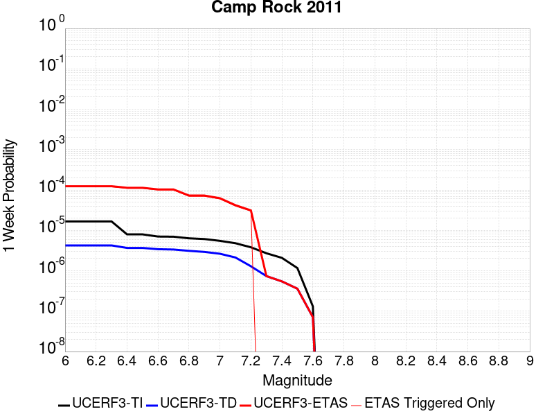 | 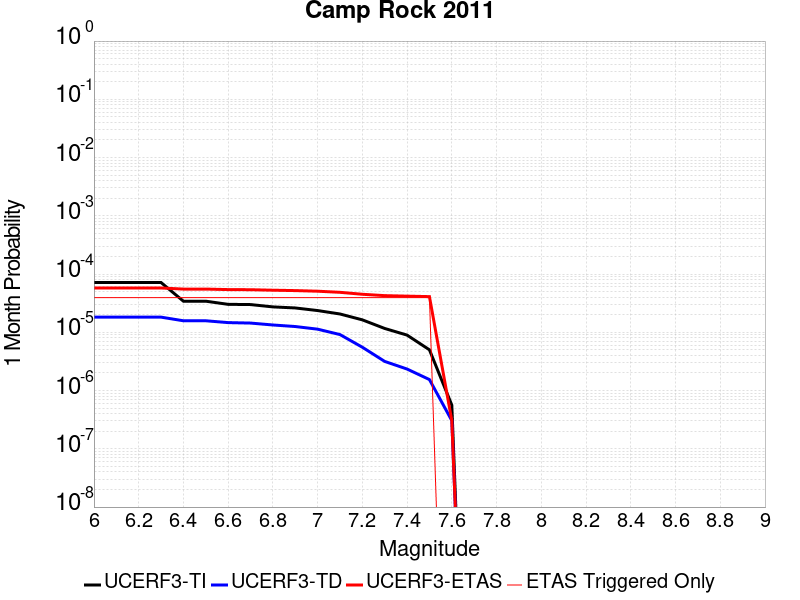 | 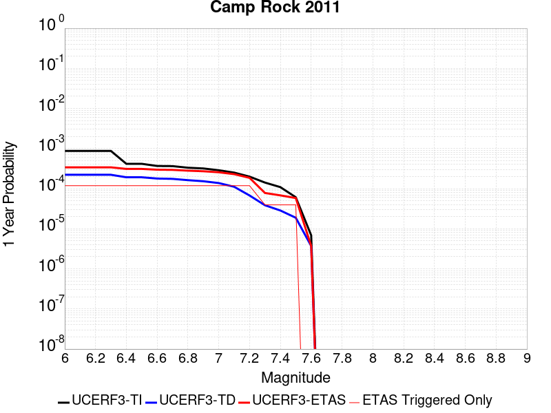 | 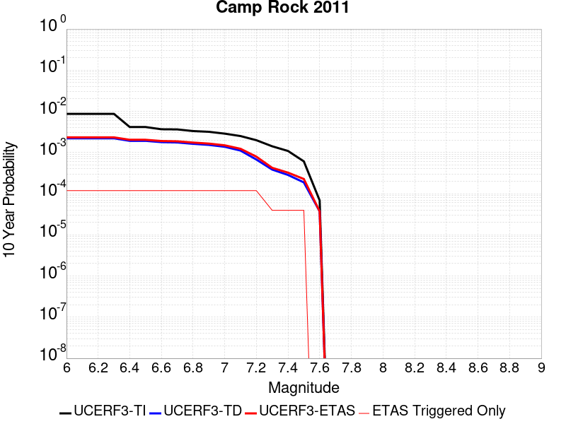 |

| Magnitude | 1 wk TI Prob | 1 wk TD Prob | 1 wk ETAS Prob | 1 wk ETAS/TD Gain | 1 wk ETAS Triggered Only | 1 mo TI Prob | 1 mo TD Prob | 1 mo ETAS Prob | 1 mo ETAS/TD Gain | 1 mo ETAS Triggered Only | 1 yr TI Prob | 1 yr TD Prob | 1 yr ETAS Prob | 1 yr ETAS/TD Gain | 1 yr ETAS Triggered Only | 10 yr TI Prob | 10 yr TD Prob | 10 yr ETAS Prob | 10 yr ETAS/TD Gain | 10 yr ETAS Triggered Only |
|-----|-----|-----|-----|-----|-----|-----|-----|-----|-----|-----|-----|-----|-----|-----|-----|-----|-----|-----|-----|-----|
| 6.0 | 1.6710783E-5 | 4.25026E-6 | 4.25026E-6 | 1.0 | 0.0 | 7.161568E-5 | 1.8215276E-5 | 5.7665402E-5 | 3.1657715 | 3.9450842E-5 | 8.7157206E-4 | 2.2174895E-4 | 3.4007523E-4 | 1.5336047 | 1.1835253E-4 | 0.008681616 | 0.0022153298 | 0.00233342 | 1.053306 | 1.1835253E-4 |
| 6.1 | 1.6710783E-5 | 4.25026E-6 | 4.25026E-6 | 1.0 | 0.0 | 7.161568E-5 | 1.8215276E-5 | 5.7665402E-5 | 3.1657715 | 3.9450842E-5 | 8.7157206E-4 | 2.2174895E-4 | 3.4007523E-4 | 1.5336047 | 1.1835253E-4 | 0.008681616 | 0.0022153298 | 0.00233342 | 1.053306 | 1.1835253E-4 |
| 6.2 | 1.6710783E-5 | 4.25026E-6 | 4.25026E-6 | 1.0 | 0.0 | 7.161568E-5 | 1.8215276E-5 | 5.7665402E-5 | 3.1657715 | 3.9450842E-5 | 8.7157206E-4 | 2.2174895E-4 | 3.4007523E-4 | 1.5336047 | 1.1835253E-4 | 0.008681616 | 0.0022153298 | 0.00233342 | 1.053306 | 1.1835253E-4 |
| 6.3 | 1.6710783E-5 | 4.25026E-6 | 4.25026E-6 | 1.0 | 0.0 | 7.161568E-5 | 1.8215276E-5 | 5.7665402E-5 | 3.1657715 | 3.9450842E-5 | 8.7157206E-4 | 2.2174895E-4 | 3.4007523E-4 | 1.5336047 | 1.1835253E-4 | 0.008681616 | 0.0022153298 | 0.00233342 | 1.053306 | 1.1835253E-4 |
| 6.4 | 7.982846E-6 | 3.6820884E-6 | 3.6820884E-6 | 1.0 | 0.0 | 3.421175E-5 | 1.5780286E-5 | 5.5230506E-5 | 3.4999688 | 3.9450842E-5 | 4.1644843E-4 | 1.9210839E-4 | 3.104382E-4 | 1.6159533 | 1.1835253E-4 | 0.0041566887 | 0.001919458 | 0.0020375834 | 1.061541 | 1.1835253E-4 |
| 6.5 | 7.982846E-6 | 3.6820884E-6 | 3.6820884E-6 | 1.0 | 0.0 | 3.421175E-5 | 1.5780286E-5 | 5.5230506E-5 | 3.4999688 | 3.9450842E-5 | 4.1644843E-4 | 1.9210839E-4 | 3.104382E-4 | 1.6159533 | 1.1835253E-4 | 0.0041566887 | 0.001919458 | 0.0020375834 | 1.061541 | 1.1835253E-4 |
| 6.6 | 7.048869E-6 | 3.4243571E-6 | 3.4243571E-6 | 1.0 | 0.0 | 3.0209088E-5 | 1.4675736E-5 | 5.4126E-5 | 3.6881287 | 3.9450842E-5 | 3.677336E-4 | 1.7866275E-4 | 2.9699414E-4 | 1.662317 | 1.1835253E-4 | 0.0036712566 | 0.0017852228 | 0.001903364 | 1.0661774 | 1.1835253E-4 |
| 6.7 | 6.987307E-6 | 3.3623348E-6 | 3.3623348E-6 | 1.0 | 0.0 | 2.9945259E-5 | 1.4409929E-5 | 5.3860203E-5 | 3.737715 | 3.9450842E-5 | 3.6452254E-4 | 1.7542706E-4 | 2.9375884E-4 | 1.6745354 | 1.1835253E-4 | 0.0036392517 | 0.001752917 | 0.001871062 | 1.0673991 | 1.1835253E-4 |
| 6.8 | 6.3737602E-6 | 3.1179077E-6 | 3.1179077E-6 | 1.0 | 0.0 | 2.731583E-5 | 1.3362394E-5 | 5.2812713E-5 | 3.952339 | 3.9450842E-5 | 3.3251947E-4 | 1.626753E-4 | 2.8100857E-4 | 1.7274201 | 1.1835253E-4 | 0.0033202237 | 0.0016255907 | 0.0017437509 | 1.0726875 | 1.1835253E-4 |
| 6.9 | 6.112211E-6 | 2.9331156E-6 | 2.9331156E-6 | 1.0 | 0.0 | 2.6194928E-5 | 1.2570436E-5 | 5.2020783E-5 | 4.138344 | 3.9450842E-5 | 3.1887658E-4 | 1.5303459E-4 | 2.71369E-4 | 1.7732527 | 1.1835253E-4 | 0.003184194 | 0.0015293199 | 0.0016474914 | 1.0772706 | 1.1835253E-4 |
| 7.0 | 5.5140117E-6 | 2.641923E-6 | 2.641923E-6 | 1.0 | 0.0 | 2.3631264E-5 | 1.132248E-5 | 5.0772876E-5 | 4.4842544 | 3.9450842E-5 | 2.8767265E-4 | 1.3784273E-4 | 2.5617893E-4 | 1.8584872 | 1.1835253E-4 | 0.0028730053 | 0.0013775975 | 0.001495787 | 1.085794 | 1.1835253E-4 |
| 7.1 | 4.8151105E-6 | 2.1342705E-6 | 2.1342705E-6 | 1.0 | 0.0 | 2.0636026E-5 | 9.146843E-6 | 4.8597325E-5 | 5.313017 | 3.9450842E-5 | 2.5121463E-4 | 1.1135734E-4 | 2.2969668E-4 | 2.0626993 | 1.1835253E-4 | 0.0025093083 | 0.0011130372 | 0.001231258 | 1.1062146 | 1.1835253E-4 |
| 7.2 | 3.818335E-6 | 1.2937425E-6 | 1.2937425E-6 | 1.0 | 0.0 | 1.6364189E-5 | 5.5445994E-6 | 4.4995224E-5 | 8.115145 | 3.9450842E-5 | 1.9921579E-4 | 6.750349E-5 | 1.8584802E-4 | 2.753162 | 1.1835253E-4 | 0.0019903728 | 6.748381E-4 | 7.9311075E-4 | 1.1752608 | 1.1835253E-4 |
| 7.3 | 2.7166698E-6 | 7.3835776E-7 | 7.3835776E-7 | 1.0 | 0.0 | 1.1642818E-5 | 3.1643867E-6 | 4.2615105E-5 | 13.467098 | 3.9450842E-5 | 1.4174209E-4 | 3.8525748E-5 | 7.797507E-5 | 2.023973 | 3.9450842E-5 | 0.0014165172 | 3.851927E-4 | 4.2462835E-4 | 1.102379 | 3.9450842E-5 |
| 7.4 | 2.0893426E-6 | 5.4618386E-7 | 5.4618386E-7 | 1.0 | 0.0 | 8.954295E-6 | 2.3407858E-6 | 4.1791536E-5 | 17.853636 | 3.9450842E-5 | 1.0901308E-4 | 2.84987E-5 | 6.794842E-5 | 2.3842638 | 3.9450842E-5 | 0.0010895962 | 2.84951E-4 | 3.243906E-4 | 1.1384084 | 3.9450842E-5 |
| 7.5 | 1.1681728E-6 | 3.6030585E-7 | 3.6030585E-7 | 1.0 | 0.0 | 5.0064455E-6 | 1.544167E-6 | 4.099495E-5 | 26.548262 | 3.9450842E-5 | 6.0951766E-5 | 1.8800076E-5 | 5.8250178E-5 | 3.0984013 | 3.9450842E-5 | 6.093505E-4 | 1.8798532E-4 | 2.2742875E-4 | 1.2098218 | 3.9450842E-5 |
| 7.6 | 1.3154387E-7 | 7.1197384E-8 | 7.1197384E-8 | 1.0 | 0.0 | 5.6375933E-7 | 3.051316E-7 | 3.051316E-7 | 1.0 | 0.0 | 6.863748E-6 | 3.7149728E-6 | 3.7149728E-6 | 1.0 | 0.0 | 6.863536E-5 | 3.7149264E-5 | 3.7149264E-5 | 1.0 | 0.0 |

## San Clemente
*[(top)](#table-of-contents)*

| 1 Week | 1 Month | 1 Year | 10 Year |
|-----|-----|-----|-----|
|  | 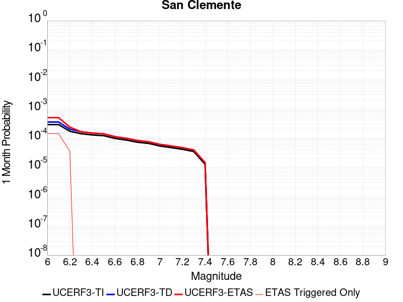 | 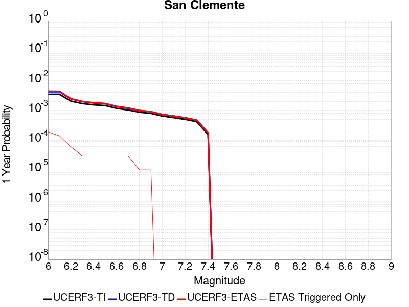 | 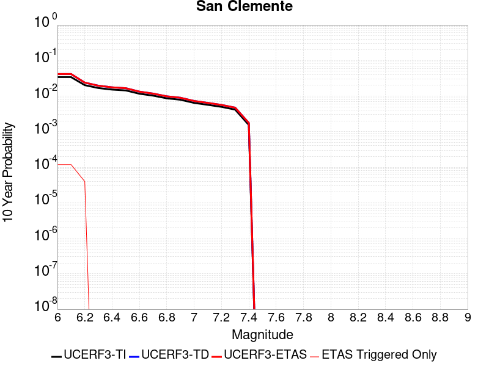 |

| Magnitude | 1 wk TI Prob | 1 wk TD Prob | 1 wk ETAS Prob | 1 wk ETAS/TD Gain | 1 wk ETAS Triggered Only | 1 mo TI Prob | 1 mo TD Prob | 1 mo ETAS Prob | 1 mo ETAS/TD Gain | 1 mo ETAS Triggered Only | 1 yr TI Prob | 1 yr TD Prob | 1 yr ETAS Prob | 1 yr ETAS/TD Gain | 1 yr ETAS Triggered Only | 10 yr TI Prob | 10 yr TD Prob | 10 yr ETAS Prob | 10 yr ETAS/TD Gain | 10 yr ETAS Triggered Only |
|-----|-----|-----|-----|-----|-----|-----|-----|-----|-----|-----|-----|-----|-----|-----|-----|-----|-----|-----|-----|-----|
| 6.0 | 6.681379E-5 | 8.163422E-5 | 1.9997709E-4 | 2.4496722 | 1.1835253E-4 | 2.8631336E-4 | 3.498173E-4 | 4.6812845E-4 | 1.3382083 | 1.1835253E-4 | 0.003480294 | 0.0042512873 | 0.004369137 | 1.0277208 | 1.1835253E-4 | 0.03426291 | 0.041755714 | 0.041869123 | 1.0027161 | 1.1835253E-4 |
| 6.1 | 6.681379E-5 | 8.163422E-5 | 1.9997709E-4 | 2.4496722 | 1.1835253E-4 | 2.8631336E-4 | 3.498173E-4 | 4.6812845E-4 | 1.3382083 | 1.1835253E-4 | 0.003480294 | 0.0042512873 | 0.004369137 | 1.0277208 | 1.1835253E-4 | 0.03426291 | 0.041755714 | 0.041869123 | 1.0027161 | 1.1835253E-4 |
| 6.2 | 3.9400576E-5 | 4.6451984E-5 | 8.5900996E-5 | 1.8492428 | 3.9450842E-5 | 1.6884868E-4 | 1.9906509E-4 | 2.3850809E-4 | 1.1981412 | 3.9450842E-5 | 0.0020537945 | 0.002420985 | 0.00246034 | 1.016256 | 3.9450842E-5 | 0.020349167 | 0.02395286 | 0.023991367 | 1.0016075 | 3.9450842E-5 |
| 6.3 | 3.2590255E-5 | 3.7929087E-5 | 3.7929087E-5 | 1.0 | 0.0 | 1.3966505E-4 | 1.6254328E-4 | 1.6254328E-4 | 1.0 | 0.0 | 0.0016990956 | 0.0019771985 | 0.0019771985 | 1.0 | 0.0 | 0.01686163 | 0.019599866 | 0.019599866 | 1.0 | 0.0 |
| 6.4 | 2.9454652E-5 | 3.4097775E-5 | 3.4097775E-5 | 1.0 | 0.0 | 1.2622811E-4 | 1.4612528E-4 | 1.4612528E-4 | 1.0 | 0.0 | 0.0015357438 | 0.0017776482 | 0.0017776482 | 1.0 | 0.0 | 0.015251739 | 0.017637458 | 0.017637458 | 1.0 | 0.0 |
| 6.5 | 2.790836E-5 | 3.2247463E-5 | 3.2247463E-5 | 1.0 | 0.0 | 1.1960178E-4 | 1.3819622E-4 | 1.3819622E-4 | 1.0 | 0.0 | 0.001455179 | 0.0016812651 | 0.0016812651 | 1.0 | 0.0 | 0.014456868 | 0.016688475 | 0.016688475 | 1.0 | 0.0 |
| 6.6 | 2.2492153E-5 | 2.5762707E-5 | 2.5762707E-5 | 1.0 | 0.0 | 9.639138E-5 | 1.1040701E-4 | 1.1040701E-4 | 1.0 | 0.0 | 0.0011729331 | 0.0013433908 | 0.0013433908 | 1.0 | 0.0 | 0.011667615 | 0.013354415 | 0.013354415 | 1.0 | 0.0 |
| 6.7 | 1.9862755E-5 | 2.2666423E-5 | 2.2666423E-5 | 1.0 | 0.0 | 8.512331E-5 | 9.713826E-5 | 9.713826E-5 | 1.0 | 0.0 | 0.0010358836 | 0.0011820279 | 0.0011820279 | 1.0 | 0.0 | 0.010310682 | 0.011758701 | 0.011758701 | 1.0 | 0.0 |
| 6.8 | 1.6697575E-5 | 1.897771E-5 | 1.897771E-5 | 1.0 | 0.0 | 7.155907E-5 | 8.133056E-5 | 8.133056E-5 | 1.0 | 0.0 | 8.7088346E-4 | 9.897591E-4 | 9.897591E-4 | 1.0 | 0.0 | 0.008674784 | 0.0098545365 | 0.0098545365 | 1.0 | 0.0 |
| 6.9 | 1.5218415E-5 | 1.72694E-5 | 1.72694E-5 | 1.0 | 0.0 | 6.522015E-5 | 7.4009666E-5 | 7.4009666E-5 | 1.0 | 0.0 | 7.93766E-4 | 9.00704E-4 | 9.00704E-4 | 1.0 | 0.0 | 0.007909367 | 0.008971481 | 0.008971481 | 1.0 | 0.0 |
| 7.0 | 1.2392958E-5 | 1.4033016E-5 | 1.4033016E-5 | 1.0 | 0.0 | 5.3111595E-5 | 6.014015E-5 | 6.014015E-5 | 1.0 | 0.0 | 6.4644177E-4 | 7.319679E-4 | 7.319679E-4 | 1.0 | 0.0 | 0.0064456454 | 0.0072963564 | 0.0072963564 | 1.0 | 0.0 |
| 7.1 | 1.0934128E-5 | 1.2375138E-5 | 1.2375138E-5 | 1.0 | 0.0 | 4.6859706E-5 | 5.303527E-5 | 5.303527E-5 | 1.0 | 0.0 | 5.7036756E-4 | 6.455204E-4 | 6.455204E-4 | 1.0 | 0.0 | 0.0056890585 | 0.0064371997 | 0.0064371997 | 1.0 | 0.0 |
| 7.2 | 9.5798805E-6 | 1.0844935E-5 | 1.0844935E-5 | 1.0 | 0.0 | 4.1055984E-5 | 4.6477508E-5 | 4.6477508E-5 | 1.0 | 0.0 | 4.9974193E-4 | 5.657239E-4 | 5.657239E-4 | 1.0 | 0.0 | 0.0049861963 | 0.0056435615 | 0.0056435615 | 1.0 | 0.0 |
| 7.3 | 8.0167365E-6 | 9.083918E-6 | 9.083918E-6 | 1.0 | 0.0 | 3.4356988E-5 | 3.8930535E-5 | 3.8930535E-5 | 1.0 | 0.0 | 4.1821605E-4 | 4.7388324E-4 | 4.7388324E-4 | 1.0 | 0.0 | 0.0041742986 | 0.0047294297 | 0.0047294297 | 1.0 | 0.0 |
| 7.4 | 2.9581017E-6 | 3.3623792E-6 | 3.3623792E-6 | 1.0 | 0.0 | 1.2677518E-5 | 1.4410146E-5 | 1.4410146E-5 | 1.0 | 0.0 | 1.5433785E-4 | 1.7543444E-4 | 1.7543444E-4 | 1.0 | 0.0 | 0.001542307 | 0.0017534546 | 0.0017534546 | 1.0 | 0.0 |

## Sierra Madre
*[(top)](#table-of-contents)*

| 1 Week | 1 Month | 1 Year | 10 Year |
|-----|-----|-----|-----|
|  |  |  | 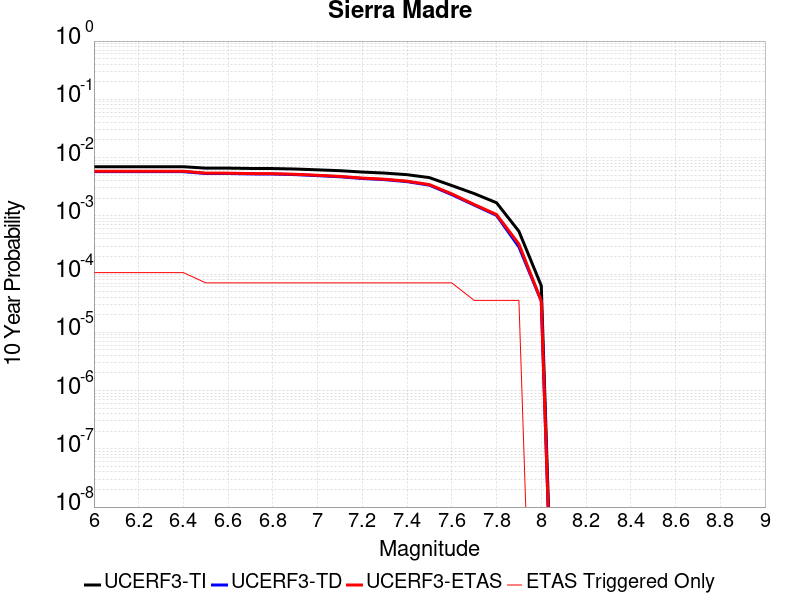 |

| Magnitude | 1 wk TI Prob | 1 wk TD Prob | 1 wk ETAS Prob | 1 wk ETAS/TD Gain | 1 wk ETAS Triggered Only | 1 mo TI Prob | 1 mo TD Prob | 1 mo ETAS Prob | 1 mo ETAS/TD Gain | 1 mo ETAS Triggered Only | 1 yr TI Prob | 1 yr TD Prob | 1 yr ETAS Prob | 1 yr ETAS/TD Gain | 1 yr ETAS Triggered Only | 10 yr TI Prob | 10 yr TD Prob | 10 yr ETAS Prob | 10 yr ETAS/TD Gain | 10 yr ETAS Triggered Only |
|-----|-----|-----|-----|-----|-----|-----|-----|-----|-----|-----|-----|-----|-----|-----|-----|-----|-----|-----|-----|-----|
| 6.0 | 1.3379373E-5 | 1.10007395E-5 | 1.10007395E-5 | 1.0 | 0.0 | 5.7338908E-5 | 4.7145186E-5 | 4.7145186E-5 | 1.0 | 0.0 | 6.978776E-4 | 5.738429E-4 | 6.526993E-4 | 1.1374182 | 7.8901685E-5 | 0.0069569005 | 0.0057239756 | 0.005841651 | 1.0205582 | 1.1835253E-4 |
| 6.1 | 1.3379373E-5 | 1.10007395E-5 | 1.10007395E-5 | 1.0 | 0.0 | 5.7338908E-5 | 4.7145186E-5 | 4.7145186E-5 | 1.0 | 0.0 | 6.978776E-4 | 5.738429E-4 | 6.526993E-4 | 1.1374182 | 7.8901685E-5 | 0.0069569005 | 0.0057239756 | 0.005841651 | 1.0205582 | 1.1835253E-4 |
| 6.2 | 1.3379373E-5 | 1.10007395E-5 | 1.10007395E-5 | 1.0 | 0.0 | 5.7338908E-5 | 4.7145186E-5 | 4.7145186E-5 | 1.0 | 0.0 | 6.978776E-4 | 5.738429E-4 | 6.526993E-4 | 1.1374182 | 7.8901685E-5 | 0.0069569005 | 0.0057239756 | 0.005841651 | 1.0205582 | 1.1835253E-4 |
| 6.3 | 1.3379373E-5 | 1.10007395E-5 | 1.10007395E-5 | 1.0 | 0.0 | 5.7338908E-5 | 4.7145186E-5 | 4.7145186E-5 | 1.0 | 0.0 | 6.978776E-4 | 5.738429E-4 | 6.526993E-4 | 1.1374182 | 7.8901685E-5 | 0.0069569005 | 0.0057239756 | 0.005841651 | 1.0205582 | 1.1835253E-4 |
| 6.4 | 1.3379373E-5 | 1.10007395E-5 | 1.10007395E-5 | 1.0 | 0.0 | 5.7338908E-5 | 4.7145186E-5 | 4.7145186E-5 | 1.0 | 0.0 | 6.978776E-4 | 5.738429E-4 | 6.526993E-4 | 1.1374182 | 7.8901685E-5 | 0.0069569005 | 0.0057239756 | 0.005841651 | 1.0205582 | 1.1835253E-4 |
| 6.5 | 1.26563245E-5 | 1.0230196E-5 | 1.0230196E-5 | 1.0 | 0.0 | 5.4240263E-5 | 4.3842967E-5 | 4.3842967E-5 | 1.0 | 0.0 | 6.601751E-4 | 5.336584E-4 | 5.7308824E-4 | 1.0738858 | 3.9450842E-5 | 0.006582173 | 0.0053240913 | 0.005402573 | 1.0147408 | 7.8901685E-5 |
| 6.6 | 1.26563245E-5 | 1.0230196E-5 | 1.0230196E-5 | 1.0 | 0.0 | 5.4240263E-5 | 4.3842967E-5 | 4.3842967E-5 | 1.0 | 0.0 | 6.601751E-4 | 5.336584E-4 | 5.7308824E-4 | 1.0738858 | 3.9450842E-5 | 0.006582173 | 0.0053240913 | 0.005402573 | 1.0147408 | 7.8901685E-5 |
| 6.7 | 1.2502474E-5 | 1.006634E-5 | 1.006634E-5 | 1.0 | 0.0 | 5.3580934E-5 | 4.314075E-5 | 4.314075E-5 | 1.0 | 0.0 | 6.521526E-4 | 5.251131E-4 | 5.6454324E-4 | 1.0750889 | 3.9450842E-5 | 0.0065024206 | 0.0052390425 | 0.0053175306 | 1.0149814 | 7.8901685E-5 |
| 6.8 | 1.2454966E-5 | 1.0018625E-5 | 1.0018625E-5 | 1.0 | 0.0 | 5.3377335E-5 | 4.2936266E-5 | 4.2936266E-5 | 1.0 | 0.0 | 6.4967526E-4 | 5.226247E-4 | 5.620549E-4 | 1.0754465 | 3.9450842E-5 | 0.006477792 | 0.0052142753 | 0.005292766 | 1.0150529 | 7.8901685E-5 |
| 6.9 | 1.2225574E-5 | 9.792602E-6 | 9.792602E-6 | 1.0 | 0.0 | 5.2394265E-5 | 4.1967625E-5 | 4.1967625E-5 | 1.0 | 0.0 | 6.3771347E-4 | 5.108371E-4 | 5.502678E-4 | 1.0771884 | 3.9450842E-5 | 0.006358865 | 0.0050969445 | 0.0051754443 | 1.0154012 | 7.8901685E-5 |
| 7.0 | 1.182946E-5 | 9.399144E-6 | 9.399144E-6 | 1.0 | 0.0 | 5.06967E-5 | 4.0281426E-5 | 4.0281426E-5 | 1.0 | 0.0 | 6.1705755E-4 | 4.9031706E-4 | 5.2974856E-4 | 1.0804204 | 3.9450842E-5 | 0.006153469 | 0.004892664 | 0.0049711796 | 1.0160476 | 7.8901685E-5 |
| 7.1 | 1.14369095E-5 | 8.986159E-6 | 8.986159E-6 | 1.0 | 0.0 | 4.9014405E-5 | 3.8511545E-5 | 3.8511545E-5 | 1.0 | 0.0 | 5.9658696E-4 | 4.687782E-4 | 5.0821056E-4 | 1.0841173 | 3.9450842E-5 | 0.005949879 | 0.004678199 | 0.004756732 | 1.0167869 | 7.8901685E-5 |
| 7.2 | 1.0836419E-5 | 8.3995565E-6 | 8.3995565E-6 | 1.0 | 0.0 | 4.644097E-5 | 3.5997607E-5 | 3.5997607E-5 | 1.0 | 0.0 | 5.652721E-4 | 4.3818366E-4 | 4.7761723E-4 | 1.0899932 | 3.9450842E-5 | 0.0056383642 | 0.004373494 | 0.0044520507 | 1.017962 | 7.8901685E-5 |
| 7.3 | 1.0403439E-5 | 8.02082E-6 | 8.02082E-6 | 1.0 | 0.0 | 4.4585406E-5 | 3.4374494E-5 | 3.4374494E-5 | 1.0 | 0.0 | 5.426921E-4 | 4.1843E-4 | 4.5786434E-4 | 1.0942435 | 3.9450842E-5 | 0.005413687 | 0.004176717 | 0.004255289 | 1.018812 | 7.8901685E-5 |
| 7.4 | 9.768864E-6 | 7.414448E-6 | 7.414448E-6 | 1.0 | 0.0 | 4.186589E-5 | 3.1775824E-5 | 3.1775824E-5 | 1.0 | 0.0 | 5.09598E-4 | 3.868029E-4 | 4.2623846E-4 | 1.1019527 | 3.9450842E-5 | 0.0050843097 | 0.0038615882 | 0.003940185 | 1.0203536 | 7.8901685E-5 |
| 7.5 | 8.687089E-6 | 6.4501564E-6 | 6.4501564E-6 | 1.0 | 0.0 | 3.722985E-5 | 2.764324E-5 | 2.764324E-5 | 1.0 | 0.0 | 4.5317915E-4 | 3.3650533E-4 | 3.759429E-4 | 1.1171975 | 3.9450842E-5 | 0.004522561 | 0.0033602451 | 0.0034388818 | 1.023402 | 7.8901685E-5 |
| 7.6 | 6.3506063E-6 | 4.4303215E-6 | 4.4303215E-6 | 1.0 | 0.0 | 2.72166E-5 | 1.8986955E-5 | 1.8986955E-5 | 1.0 | 0.0 | 3.3131172E-4 | 2.3114192E-4 | 2.7058367E-4 | 1.1706386 | 3.9450842E-5 | 0.003308182 | 0.0023092402 | 0.0023879595 | 1.034089 | 7.8901685E-5 |
| 7.7 | 4.62223E-6 | 2.932967E-6 | 2.932967E-6 | 1.0 | 0.0 | 1.9809406E-5 | 1.2569798E-5 | 1.2569798E-5 | 1.0 | 0.0 | 2.4115283E-4 | 1.5302657E-4 | 1.5302657E-4 | 1.0 | 0.0 | 0.0024089129 | 0.001529413 | 0.0015688036 | 1.0257553 | 3.9450842E-5 |
| 7.8 | 3.2145008E-6 | 1.9494332E-6 | 1.9494332E-6 | 1.0 | 0.0 | 1.3776359E-5 | 8.3546865E-6 | 8.3546865E-6 | 1.0 | 0.0 | 1.6771426E-4 | 1.0171358E-4 | 1.0171358E-4 | 1.0 | 0.0 | 0.0016758774 | 0.0010168145 | 0.0010562253 | 1.038759 | 3.9450842E-5 |
| 7.9 | 1.0391769E-6 | 5.6026335E-7 | 5.6026335E-7 | 1.0 | 0.0 | 4.4536077E-6 | 2.4011265E-6 | 2.4011265E-6 | 1.0 | 0.0 | 5.4221324E-5 | 2.9233326E-5 | 2.9233326E-5 | 1.0 | 0.0 | 5.4208096E-4 | 2.9229524E-4 | 3.3173454E-4 | 1.1349298 | 3.9450842E-5 |
| 8.0 | 1.210983E-7 | 6.613821E-8 | 6.613821E-8 | 1.0 | 0.0 | 5.1899264E-7 | 2.8344945E-7 | 2.8344945E-7 | 1.0 | 0.0 | 6.3187167E-6 | 3.4509917E-6 | 3.4509917E-6 | 1.0 | 0.0 | 6.318537E-5 | 3.45094E-5 | 3.45094E-5 | 1.0 | 0.0 |

## Gillem - Big Crack 2011 CFM
*[(top)](#table-of-contents)*

| 1 Week | 1 Month | 1 Year | 10 Year |
|-----|-----|-----|-----|
| 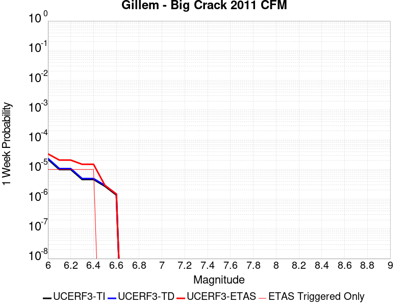 | 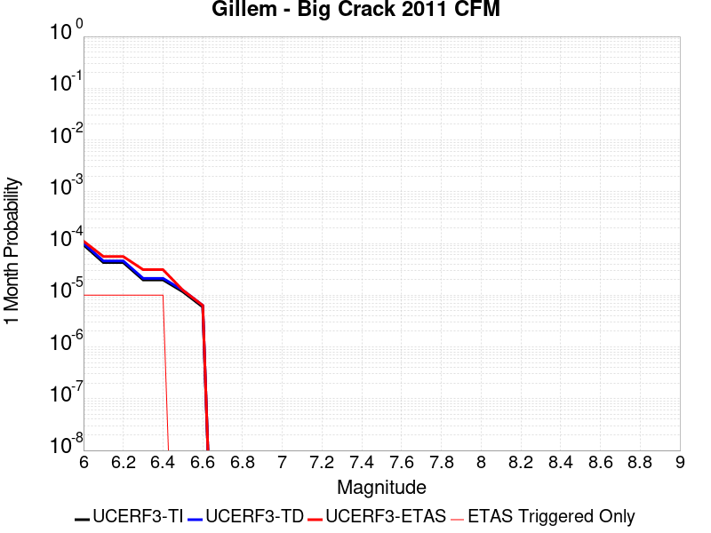 | 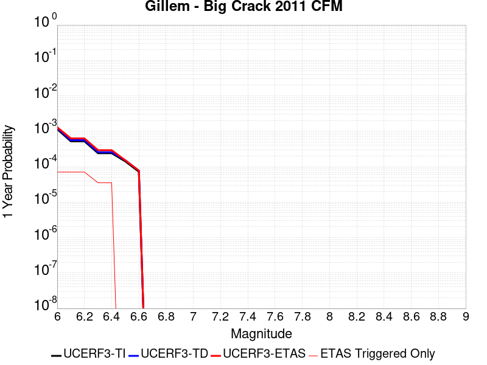 | 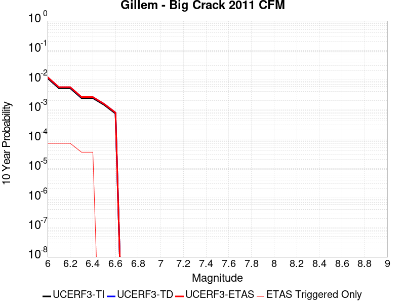 |

| Magnitude | 1 wk TI Prob | 1 wk TD Prob | 1 wk ETAS Prob | 1 wk ETAS/TD Gain | 1 wk ETAS Triggered Only | 1 mo TI Prob | 1 mo TD Prob | 1 mo ETAS Prob | 1 mo ETAS/TD Gain | 1 mo ETAS Triggered Only | 1 yr TI Prob | 1 yr TD Prob | 1 yr ETAS Prob | 1 yr ETAS/TD Gain | 1 yr ETAS Triggered Only | 10 yr TI Prob | 10 yr TD Prob | 10 yr ETAS Prob | 10 yr ETAS/TD Gain | 10 yr ETAS Triggered Only |
|-----|-----|-----|-----|-----|-----|-----|-----|-----|-----|-----|-----|-----|-----|-----|-----|-----|-----|-----|-----|-----|
| 6.0 | 2.196852E-5 | 2.3604485E-5 | 6.30544E-5 | 2.6712887 | 3.9450842E-5 | 9.4147406E-5 | 1.01158665E-4 | 1.4060551E-4 | 1.3899503 | 3.9450842E-5 | 0.0011456419 | 0.0012309998 | 0.0013098044 | 1.0640167 | 7.8901685E-5 | 0.011397537 | 0.012250669 | 0.012328604 | 1.0063617 | 7.8901685E-5 |
| 6.1 | 9.992795E-6 | 1.071189E-5 | 5.016231E-5 | 4.6828628 | 3.9450842E-5 | 4.2825563E-5 | 4.5907396E-5 | 8.535643E-5 | 1.8593177 | 3.9450842E-5 | 5.2127644E-4 | 5.587975E-4 | 6.3765515E-4 | 1.1411202 | 7.8901685E-5 | 0.0052005537 | 0.0055757347 | 0.0056541963 | 1.0140721 | 7.8901685E-5 |
| 6.2 | 9.992795E-6 | 1.071189E-5 | 5.016231E-5 | 4.6828628 | 3.9450842E-5 | 4.2825563E-5 | 4.5907396E-5 | 8.535643E-5 | 1.8593177 | 3.9450842E-5 | 5.2127644E-4 | 5.587975E-4 | 6.3765515E-4 | 1.1411202 | 7.8901685E-5 | 0.0052005537 | 0.0055757347 | 0.0056541963 | 1.0140721 | 7.8901685E-5 |
| 6.3 | 4.6127884E-6 | 4.942657E-6 | 4.4393306E-5 | 8.981668 | 3.9450842E-5 | 1.9768944E-5 | 2.1182668E-5 | 6.0632676E-5 | 2.862372 | 3.9450842E-5 | 2.406603E-4 | 2.5787292E-4 | 2.973136E-4 | 1.1529461 | 3.9450842E-5 | 0.0024039985 | 0.0025761751 | 0.0026155242 | 1.0152743 | 3.9450842E-5 |
| 6.4 | 4.6127884E-6 | 4.942657E-6 | 4.4393306E-5 | 8.981668 | 3.9450842E-5 | 1.9768944E-5 | 2.1182668E-5 | 6.0632676E-5 | 2.862372 | 3.9450842E-5 | 2.406603E-4 | 2.5787292E-4 | 2.973136E-4 | 1.1529461 | 3.9450842E-5 | 0.0024039985 | 0.0025761751 | 0.0026155242 | 1.0152743 | 3.9450842E-5 |
| 6.5 | 2.716712E-6 | 2.9111113E-6 | 2.9111113E-6 | 1.0 | 0.0 | 1.1643E-5 | 1.24761455E-5 | 1.24761455E-5 | 1.0 | 0.0 | 1.417443E-4 | 1.5188892E-4 | 1.5188892E-4 | 1.0 | 0.0 | 0.0014165393 | 0.001518089 | 0.001518089 | 1.0 | 0.0 |
| 6.6 | 1.3818255E-6 | 1.4820689E-6 | 1.4820689E-6 | 1.0 | 0.0 | 5.922096E-6 | 6.3517155E-6 | 6.3517155E-6 | 1.0 | 0.0 | 7.209913E-5 | 7.7330624E-5 | 7.7330624E-5 | 1.0 | 0.0 | 7.2075747E-4 | 7.7315804E-4 | 7.7315804E-4 | 1.0 | 0.0 |

## Brawley (Seismic Zone) alt 1
*[(top)](#table-of-contents)*

| 1 Week | 1 Month | 1 Year | 10 Year |
|-----|-----|-----|-----|
| 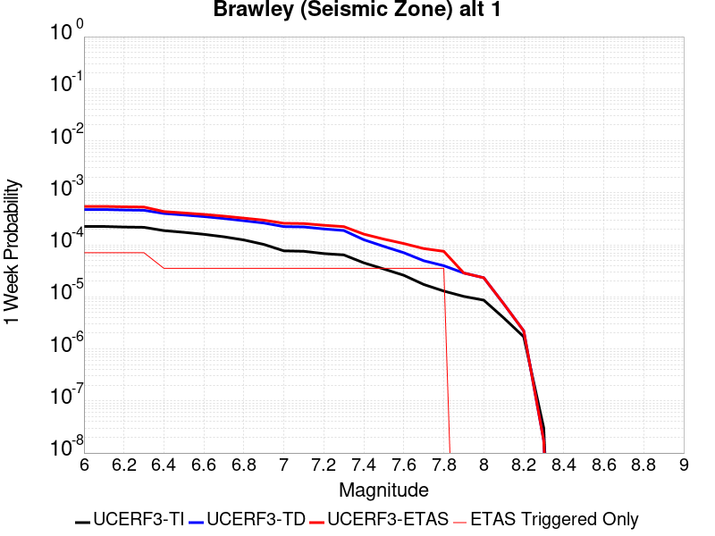 | 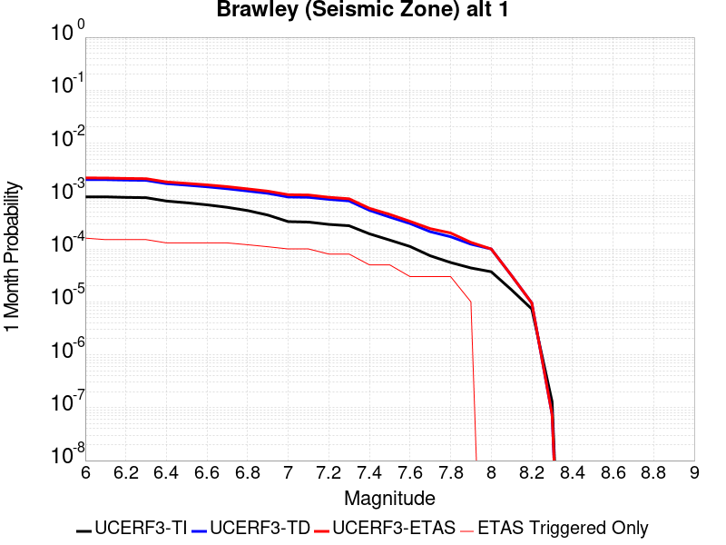 | 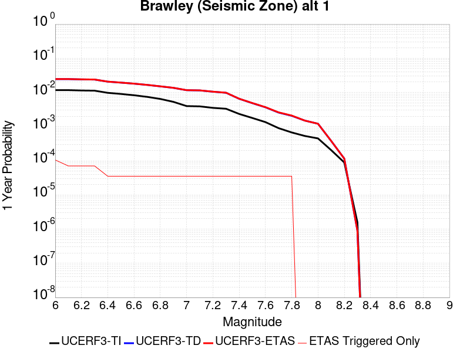 |  |

| Magnitude | 1 wk TI Prob | 1 wk TD Prob | 1 wk ETAS Prob | 1 wk ETAS/TD Gain | 1 wk ETAS Triggered Only | 1 mo TI Prob | 1 mo TD Prob | 1 mo ETAS Prob | 1 mo ETAS/TD Gain | 1 mo ETAS Triggered Only | 1 yr TI Prob | 1 yr TD Prob | 1 yr ETAS Prob | 1 yr ETAS/TD Gain | 1 yr ETAS Triggered Only | 10 yr TI Prob | 10 yr TD Prob | 10 yr ETAS Prob | 10 yr ETAS/TD Gain | 10 yr ETAS Triggered Only |
|-----|-----|-----|-----|-----|-----|-----|-----|-----|-----|-----|-----|-----|-----|-----|-----|-----|-----|-----|-----|-----|
| 6.0 | 2.2521618E-4 | 4.7632487E-4 | 5.55189E-4 | 1.1655679 | 7.8901685E-5 | 9.6485513E-4 | 0.0020398323 | 0.002118573 | 1.0386015 | 7.8901685E-5 | 0.011683988 | 0.024546238 | 0.024623202 | 1.0031356 | 7.8901685E-5 | 0.11088423 | 0.21350002 | 0.21359311 | 1.000436 | 1.1835253E-4 |
| 6.1 | 2.2521618E-4 | 4.7632487E-4 | 5.55189E-4 | 1.1655679 | 7.8901685E-5 | 9.6485513E-4 | 0.0020398323 | 0.002118573 | 1.0386015 | 7.8901685E-5 | 0.011683988 | 0.024546238 | 0.024623202 | 1.0031356 | 7.8901685E-5 | 0.11088423 | 0.21350002 | 0.21359311 | 1.000436 | 1.1835253E-4 |
| 6.2 | 2.198148E-4 | 4.6717093E-4 | 5.4603576E-4 | 1.1688136 | 7.8901685E-5 | 9.417233E-4 | 0.0020006616 | 0.0020794054 | 1.0393589 | 7.8901685E-5 | 0.011405343 | 0.024080504 | 0.024157504 | 1.0031977 | 7.8901685E-5 | 0.10837428 | 0.20993657 | 0.21003008 | 1.0004454 | 1.1835253E-4 |
| 6.3 | 2.1704129E-4 | 4.615278E-4 | 5.4039306E-4 | 1.1708788 | 7.8901685E-5 | 9.298453E-4 | 0.0019765133 | 0.0020552592 | 1.0398407 | 7.8901685E-5 | 0.011262234 | 0.02379366 | 0.023870686 | 1.0032371 | 7.8901685E-5 | 0.107082725 | 0.20782755 | 0.2079213 | 1.0004511 | 1.1835253E-4 |
| 6.4 | 1.876142E-4 | 4.00449E-4 | 4.3988405E-4 | 1.0984771 | 3.9450842E-5 | 8.038131E-4 | 0.0017150956 | 0.0017544788 | 1.0229627 | 3.9450842E-5 | 0.00974259 | 0.020680401 | 0.020719036 | 1.0018682 | 3.9450842E-5 | 0.093263686 | 0.18457815 | 0.1846425 | 1.0003486 | 7.8901685E-5 |
| 6.5 | 1.7390939E-4 | 3.7477075E-4 | 4.1420682E-4 | 1.1052271 | 3.9450842E-5 | 7.45113E-4 | 0.0016051838 | 0.0016445714 | 1.0245377 | 3.9450842E-5 | 0.009034078 | 0.019368723 | 0.01940741 | 1.0019974 | 3.9450842E-5 | 0.086755216 | 0.17440031 | 0.17446546 | 1.0003735 | 7.8901685E-5 |
| 6.6 | 1.591791E-4 | 3.4891962E-4 | 3.883567E-4 | 1.1130263 | 3.9450842E-5 | 6.8201777E-4 | 0.0014945229 | 0.0015339148 | 1.0263575 | 3.9450842E-5 | 0.008271996 | 0.018045569 | 0.018084308 | 1.0021467 | 3.9450842E-5 | 0.07970774 | 0.16380852 | 0.1638745 | 1.0004028 | 7.8901685E-5 |
| 6.7 | 1.4268003E-4 | 3.20582E-4 | 3.600202E-4 | 1.1230206 | 3.9450842E-5 | 6.1134255E-4 | 0.0013732077 | 0.0014126044 | 1.0286895 | 3.9450842E-5 | 0.007417723 | 0.016592601 | 0.016631398 | 1.0023382 | 3.9450842E-5 | 0.07174956 | 0.15193306 | 0.15199998 | 1.0004404 | 7.8901685E-5 |
| 6.8 | 1.239713E-4 | 2.9053655E-4 | 3.2997594E-4 | 1.1357467 | 3.9450842E-5 | 5.3119735E-4 | 0.0012445687 | 0.0012839704 | 1.031659 | 3.9450842E-5 | 0.0064481674 | 0.015048777 | 0.015087634 | 1.0025821 | 3.9450842E-5 | 0.06264243 | 0.13837762 | 0.13844562 | 1.0004913 | 7.8901685E-5 |
| 6.9 | 1.0180238E-4 | 2.625439E-4 | 3.019844E-4 | 1.1502243 | 3.9450842E-5 | 4.3622297E-4 | 0.0011247073 | 0.0011641138 | 1.035037 | 3.9450842E-5 | 0.005298089 | 0.013608336 | 0.01364725 | 1.0028596 | 3.9450842E-5 | 0.05173543 | 0.124961674 | 0.12503071 | 1.0005525 | 7.8901685E-5 |
| 7.0 | 7.6619996E-5 | 2.23993E-4 | 2.63435E-4 | 1.176086 | 3.9450842E-5 | 3.283301E-4 | 9.5962E-4 | 9.99033E-4 | 1.0410714 | 3.9450842E-5 | 0.0039900932 | 0.011621496 | 0.011660488 | 1.0033551 | 3.9450842E-5 | 0.039192066 | 0.107266866 | 0.1073373 | 1.0006566 | 7.8901685E-5 |
| 7.1 | 7.5127435E-5 | 2.2082464E-4 | 2.6026677E-4 | 1.178613 | 3.9450842E-5 | 3.2193496E-4 | 9.4605127E-4 | 9.854648E-4 | 1.0416611 | 3.9450842E-5 | 0.0039125155 | 0.011458045 | 0.011497043 | 1.0034037 | 3.9450842E-5 | 0.038443442 | 0.10583085 | 0.1059014 | 1.0006666 | 7.8901685E-5 |
| 7.2 | 6.788582E-5 | 2.0210193E-4 | 2.4154481E-4 | 1.1951632 | 3.9450842E-5 | 2.9090676E-4 | 8.6586666E-4 | 9.052834E-4 | 1.0455228 | 3.9450842E-5 | 0.0035360386 | 0.0104916105 | 0.010530648 | 1.0037208 | 3.9450842E-5 | 0.034803 | 0.09750131 | 0.09757252 | 1.0007303 | 7.8901685E-5 |
| 7.3 | 6.399602E-5 | 1.8841137E-4 | 2.2785479E-4 | 1.2093472 | 3.9450842E-5 | 2.7423984E-4 | 8.072303E-4 | 8.466493E-4 | 1.0488324 | 3.9450842E-5 | 0.0033337586 | 0.009784332 | 0.009823396 | 1.0039926 | 3.9450842E-5 | 0.03284188 | 0.09139617 | 0.09146786 | 1.0007844 | 7.8901685E-5 |
| 7.4 | 4.506759E-5 | 1.2529209E-4 | 1.6473798E-4 | 1.3148315 | 3.9450842E-5 | 1.9313251E-4 | 5.368565E-4 | 5.762861E-4 | 1.0734454 | 3.9450842E-5 | 0.0023488526 | 0.0065168133 | 0.006556007 | 1.0060142 | 3.9450842E-5 | 0.023241805 | 0.062363707 | 0.062437687 | 1.0011863 | 7.8901685E-5 |
| 7.5 | 3.43289E-5 | 9.33541E-5 | 1.3280126E-4 | 1.4225541 | 3.9450842E-5 | 1.4711556E-4 | 4.00028E-4 | 4.3946304E-4 | 1.0985807 | 3.9450842E-5 | 0.0017896603 | 0.0048595266 | 0.0048987856 | 1.0080788 | 3.9450842E-5 | 0.01775316 | 0.04705519 | 0.04713038 | 1.0015979 | 7.8901685E-5 |
| 7.6 | 2.5980507E-5 | 7.053101E-5 | 1.09979075E-4 | 1.5593009 | 3.9450842E-5 | 1.1134028E-4 | 3.0224086E-4 | 3.4167978E-4 | 1.1304884 | 3.9450842E-5 | 0.001354725 | 0.003673598 | 0.0037129037 | 1.0106995 | 3.9450842E-5 | 0.013464959 | 0.035840835 | 0.03591691 | 1.0021225 | 7.8901685E-5 |
| 7.7 | 1.7292105E-5 | 4.9407296E-5 | 8.885619E-5 | 1.7984427 | 3.9450842E-5 | 7.4106916E-5 | 2.117284E-4 | 2.511709E-4 | 1.1862881 | 3.9450842E-5 | 9.018782E-4 | 0.0025747516 | 0.002614101 | 1.0152828 | 3.9450842E-5 | 0.008982267 | 0.025290398 | 0.025367305 | 1.0030409 | 7.8901685E-5 |
| 7.8 | 1.2927471E-5 | 3.9693266E-5 | 7.914255E-5 | 1.9938531 | 3.9450842E-5 | 5.5402274E-5 | 1.7010293E-4 | 2.0954706E-4 | 1.2318839 | 3.9450842E-5 | 6.743139E-4 | 0.0020690386 | 0.002108408 | 1.0190278 | 3.9450842E-5 | 0.0067227143 | 0.020431727 | 0.020509018 | 1.0037829 | 7.8901685E-5 |
| 7.9 | 1.0200774E-5 | 2.874569E-5 | 2.874569E-5 | 1.0 | 0.0 | 4.371687E-5 | 1.2319001E-4 | 1.2319001E-4 | 1.0 | 0.0 | 5.321229E-4 | 0.0014988075 | 0.0014988075 | 1.0 | 0.0 | 0.005308505 | 0.014991644 | 0.014991644 | 1.0 | 0.0 |
| 8.0 | 8.650396E-6 | 2.3277367E-5 | 2.3277367E-5 | 1.0 | 0.0 | 3.70726E-5 | 9.975634E-5 | 9.975634E-5 | 1.0 | 0.0 | 4.5126543E-4 | 0.0012138576 | 0.0012138576 | 1.0 | 0.0 | 0.0045035016 | 0.012211097 | 0.012211097 | 1.0 | 0.0 |
| 8.1 | 3.9368224E-6 | 7.3279825E-6 | 7.3279825E-6 | 1.0 | 0.0 | 1.6871985E-5 | 3.140526E-5 | 3.140526E-5 | 1.0 | 0.0 | 2.0539707E-4 | 3.8229208E-4 | 3.8229208E-4 | 1.0 | 0.0 | 0.0020520731 | 0.004001185 | 0.004001185 | 1.0 | 0.0 |
| 8.2 | 1.7101195E-6 | 2.217876E-6 | 2.217876E-6 | 1.0 | 0.0 | 7.329063E-6 | 9.505149E-6 | 9.505149E-6 | 1.0 | 0.0 | 8.922769E-5 | 1.1571907E-4 | 1.1571907E-4 | 1.0 | 0.0 | 8.9191867E-4 | 0.0012666774 | 0.0012666774 | 1.0 | 0.0 |
| 8.3 | 3.0346666E-8 | 1.721586E-8 | 1.721586E-8 | 1.0 | 0.0 | 1.3005713E-7 | 7.378226E-8 | 7.378226E-8 | 1.0 | 0.0 | 1.5834444E-6 | 8.9829894E-7 | 8.9829894E-7 | 1.0 | 0.0 | 1.5834332E-5 | 9.367729E-6 | 9.367729E-6 | 1.0 | 0.0 |

## San Jacinto (Clark) rev
*[(top)](#table-of-contents)*

| 1 Week | 1 Month | 1 Year | 10 Year |
|-----|-----|-----|-----|
| 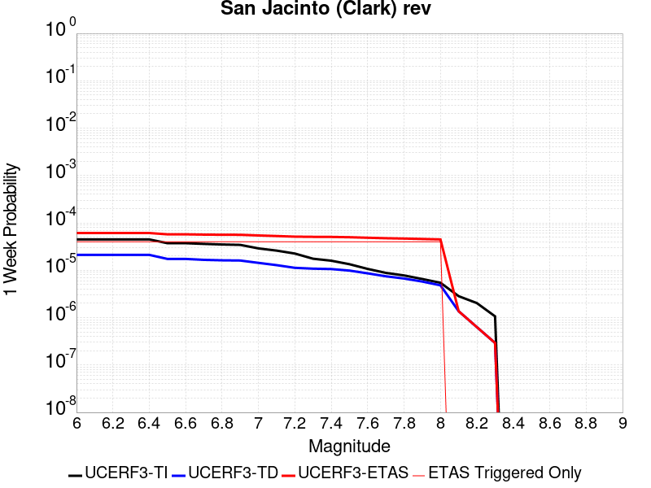 | 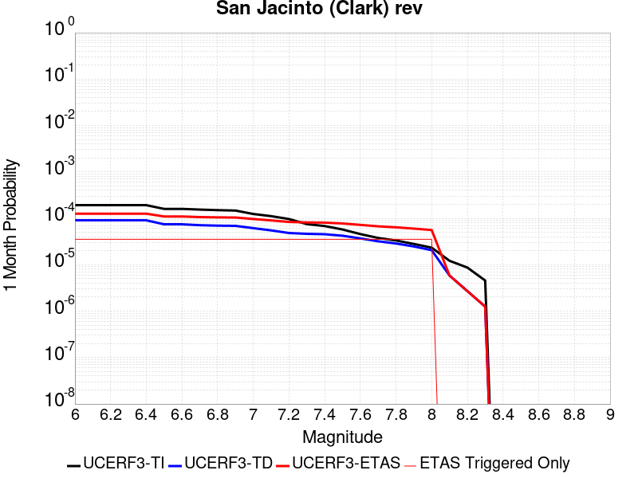 | 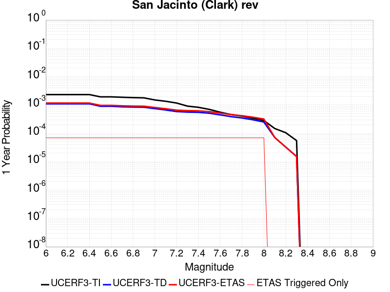 | 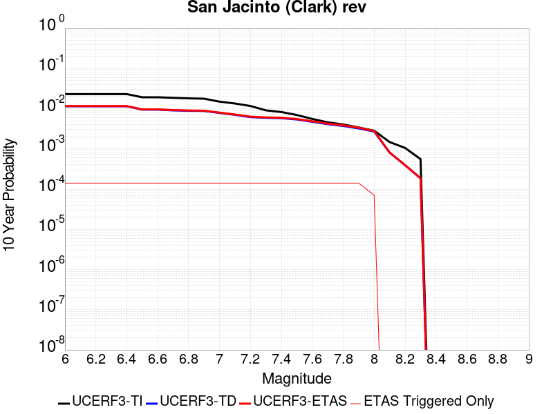 |

| Magnitude | 1 wk TI Prob | 1 wk TD Prob | 1 wk ETAS Prob | 1 wk ETAS/TD Gain | 1 wk ETAS Triggered Only | 1 mo TI Prob | 1 mo TD Prob | 1 mo ETAS Prob | 1 mo ETAS/TD Gain | 1 mo ETAS Triggered Only | 1 yr TI Prob | 1 yr TD Prob | 1 yr ETAS Prob | 1 yr ETAS/TD Gain | 1 yr ETAS Triggered Only | 10 yr TI Prob | 10 yr TD Prob | 10 yr ETAS Prob | 10 yr ETAS/TD Gain | 10 yr ETAS Triggered Only |
|-----|-----|-----|-----|-----|-----|-----|-----|-----|-----|-----|-----|-----|-----|-----|-----|-----|-----|-----|-----|-----|
| 6.0 | 4.482615E-5 | 2.1154196E-5 | 6.0604205E-5 | 2.864879 | 3.9450842E-5 | 1.9209793E-4 | 9.065773E-5 | 1.30105E-4 | 1.435123 | 3.9450842E-5 | 0.0023362834 | 0.0011032083 | 0.001182023 | 1.0714413 | 7.8901685E-5 | 0.02311874 | 0.011503847 | 0.011620838 | 1.0101697 | 1.1835253E-4 |
| 6.1 | 4.482615E-5 | 2.1154196E-5 | 6.0604205E-5 | 2.864879 | 3.9450842E-5 | 1.9209793E-4 | 9.065773E-5 | 1.30105E-4 | 1.435123 | 3.9450842E-5 | 0.0023362834 | 0.0011032083 | 0.001182023 | 1.0714413 | 7.8901685E-5 | 0.02311874 | 0.011503847 | 0.011620838 | 1.0101697 | 1.1835253E-4 |
| 6.2 | 4.482615E-5 | 2.1154196E-5 | 6.0604205E-5 | 2.864879 | 3.9450842E-5 | 1.9209793E-4 | 9.065773E-5 | 1.30105E-4 | 1.435123 | 3.9450842E-5 | 0.0023362834 | 0.0011032083 | 0.001182023 | 1.0714413 | 7.8901685E-5 | 0.02311874 | 0.011503847 | 0.011620838 | 1.0101697 | 1.1835253E-4 |
| 6.3 | 4.482615E-5 | 2.1154196E-5 | 6.0604205E-5 | 2.864879 | 3.9450842E-5 | 1.9209793E-4 | 9.065773E-5 | 1.30105E-4 | 1.435123 | 3.9450842E-5 | 0.0023362834 | 0.0011032083 | 0.001182023 | 1.0714413 | 7.8901685E-5 | 0.02311874 | 0.011503847 | 0.011620838 | 1.0101697 | 1.1835253E-4 |
| 6.4 | 4.482615E-5 | 2.1154196E-5 | 6.0604205E-5 | 2.864879 | 3.9450842E-5 | 1.9209793E-4 | 9.065773E-5 | 1.30105E-4 | 1.435123 | 3.9450842E-5 | 0.0023362834 | 0.0011032083 | 0.001182023 | 1.0714413 | 7.8901685E-5 | 0.02311874 | 0.011503847 | 0.011620838 | 1.0101697 | 1.1835253E-4 |
| 6.5 | 3.7294863E-5 | 1.7356087E-5 | 5.6806246E-5 | 3.272987 | 3.9450842E-5 | 1.5982533E-4 | 7.438113E-5 | 1.13829046E-4 | 1.5303483 | 3.9450842E-5 | 0.0019441366 | 9.052186E-4 | 9.840488E-4 | 1.0870842 | 7.8901685E-5 | 0.01927216 | 0.0094941035 | 0.009611332 | 1.0123476 | 1.1835253E-4 |
| 6.6 | 3.7294863E-5 | 1.7356087E-5 | 5.6806246E-5 | 3.272987 | 3.9450842E-5 | 1.5982533E-4 | 7.438113E-5 | 1.13829046E-4 | 1.5303483 | 3.9450842E-5 | 0.0019441366 | 9.052186E-4 | 9.840488E-4 | 1.0870842 | 7.8901685E-5 | 0.01927216 | 0.0094941035 | 0.009611332 | 1.0123476 | 1.1835253E-4 |
| 6.7 | 3.6039248E-5 | 1.6604314E-5 | 5.60545E-5 | 3.3759 | 3.9450842E-5 | 1.5444479E-4 | 7.1159426E-5 | 1.1060746E-4 | 1.5543613 | 3.9450842E-5 | 0.0018787434 | 8.6602574E-4 | 9.448591E-4 | 1.0910289 | 7.8901685E-5 | 0.01862939 | 0.009096047 | 0.009213323 | 1.0128931 | 1.1835253E-4 |
| 6.8 | 3.5031844E-5 | 1.6232942E-5 | 5.5683144E-5 | 3.4302561 | 3.9450842E-5 | 1.5012783E-4 | 6.956792E-5 | 1.09016015E-4 | 1.5670444 | 3.9450842E-5 | 0.0018262739 | 8.4666436E-4 | 9.2549925E-4 | 1.0931123 | 7.8901685E-5 | 0.01811338 | 0.008895969 | 0.009013269 | 1.0131857 | 1.1835253E-4 |
| 6.9 | 3.435112E-5 | 1.6063195E-5 | 5.5513407E-5 | 3.455938 | 3.9450842E-5 | 1.4721078E-4 | 6.884047E-5 | 1.08288594E-4 | 1.5730369 | 3.9450842E-5 | 0.0017908178 | 8.3781447E-4 | 9.1665005E-4 | 1.0940967 | 7.8901685E-5 | 0.017764548 | 0.008804181 | 0.008921491 | 1.0133244 | 1.1835253E-4 |
| 7.0 | 2.8959772E-5 | 1.4336745E-5 | 5.3787026E-5 | 3.7516901 | 3.9450842E-5 | 1.241074E-4 | 6.144176E-5 | 1.0089018E-4 | 1.6420457 | 3.9450842E-5 | 0.0015099603 | 7.477995E-4 | 8.266422E-4 | 1.1054329 | 7.8901685E-5 | 0.014997416 | 0.007868037 | 0.007985458 | 1.0149238 | 1.1835253E-4 |
| 7.1 | 2.6002877E-5 | 1.2829002E-5 | 5.227934E-5 | 4.0750904 | 3.9450842E-5 | 1.11436144E-4 | 5.498029E-5 | 9.4428964E-5 | 1.7175058 | 3.9450842E-5 | 0.0013558907 | 6.691816E-4 | 7.4803043E-4 | 1.1178288 | 7.8901685E-5 | 0.013476475 | 0.0070465137 | 0.0071640327 | 1.0166775 | 1.1835253E-4 |
| 7.2 | 2.2544838E-5 | 1.1262543E-5 | 5.0712944E-5 | 4.5027966 | 3.9450842E-5 | 9.661716E-5 | 4.8267157E-5 | 8.77161E-5 | 1.817304 | 3.9450842E-5 | 0.001175679 | 5.874956E-4 | 6.66351E-4 | 1.1342229 | 7.8901685E-5 | 0.011694785 | 0.0061927503 | 0.00631037 | 1.0189931 | 1.1835253E-4 |
| 7.3 | 1.75334E-5 | 1.0811715E-5 | 5.0262133E-5 | 4.6488585 | 3.9450842E-5 | 7.514098E-5 | 4.6335106E-5 | 8.578412E-5 | 1.8513851 | 3.9450842E-5 | 9.144575E-4 | 5.6398526E-4 | 6.4284244E-4 | 1.1398214 | 7.8901685E-5 | 0.009107036 | 0.0059337732 | 0.0060514235 | 1.0198272 | 1.1835253E-4 |
| 7.4 | 1.5924552E-5 | 1.0611516E-5 | 5.0061943E-5 | 4.717699 | 3.9450842E-5 | 6.82463E-5 | 4.547714E-5 | 8.492619E-5 | 1.8674479 | 3.9450842E-5 | 8.305819E-4 | 5.535449E-4 | 6.324029E-4 | 1.14246 | 7.8901685E-5 | 0.008274844 | 0.0058210334 | 0.005938697 | 1.0202135 | 1.1835253E-4 |
| 7.5 | 1.3428931E-5 | 9.8519E-6 | 4.9302354E-5 | 5.00435 | 3.9450842E-5 | 5.7551293E-5 | 4.2221753E-5 | 8.167093E-5 | 1.9343331 | 3.9450842E-5 | 7.004617E-4 | 5.1392964E-4 | 5.927908E-4 | 1.1534474 | 7.8901685E-5 | 0.006982579 | 0.0054066023 | 0.005524315 | 1.021772 | 1.1835253E-4 |
| 7.6 | 1.0688787E-5 | 8.614839E-6 | 4.8065343E-5 | 5.579366 | 3.9450842E-5 | 4.5808283E-5 | 3.692022E-5 | 7.636961E-5 | 2.0685036 | 3.9450842E-5 | 5.5757316E-4 | 4.4941145E-4 | 5.282777E-4 | 1.1754878 | 7.8901685E-5 | 0.005561762 | 0.0047416524 | 0.0048594438 | 1.0248418 | 1.1835253E-4 |
| 7.7 | 8.81236E-6 | 7.4680274E-6 | 4.6918576E-5 | 6.282593 | 3.9450842E-5 | 3.776671E-5 | 3.2005442E-5 | 7.1455026E-5 | 2.23259 | 3.9450842E-5 | 4.597127E-4 | 3.8959677E-4 | 4.684677E-4 | 1.2024425 | 7.8901685E-5 | 0.0045876284 | 0.0041346536 | 0.0042525167 | 1.0285062 | 1.1835253E-4 |
| 7.8 | 7.780431E-6 | 6.696579E-6 | 4.6147157E-5 | 6.8911543 | 3.9450842E-5 | 3.3344273E-5 | 2.8699309E-5 | 6.814902E-5 | 2.3745875 | 3.9450842E-5 | 4.0589093E-4 | 3.4935825E-4 | 4.2823236E-4 | 1.2257686 | 7.8901685E-5 | 0.0040515037 | 0.0037227906 | 0.0038407026 | 1.031673 | 1.1835253E-4 |
| 7.9 | 6.5437994E-6 | 5.780382E-6 | 4.5230998E-5 | 7.8249154 | 3.9450842E-5 | 2.8044553E-5 | 2.477283E-5 | 6.4222695E-5 | 2.5924652 | 3.9450842E-5 | 3.4138895E-4 | 3.0156763E-4 | 3.8044553E-4 | 1.2615596 | 7.8901685E-5 | 0.0034086495 | 0.0032344845 | 0.0033524542 | 1.0364724 | 1.1835253E-4 |
| 8.0 | 5.4488164E-6 | 4.8133406E-6 | 4.4263994E-5 | 9.196107 | 3.9450842E-5 | 2.3351862E-5 | 2.062844E-5 | 6.007847E-5 | 2.9124098 | 3.9450842E-5 | 2.8427184E-4 | 2.5112246E-4 | 3.3000435E-4 | 1.3141172 | 7.8901685E-5 | 0.0028390845 | 0.002710839 | 0.0027895267 | 1.0290271 | 7.8901685E-5 |
| 8.1 | 2.8397242E-6 | 1.3670389E-6 | 1.3670389E-6 | 1.0 | 0.0 | 1.217019E-5 | 5.858725E-6 | 5.858725E-6 | 1.0 | 0.0 | 1.4816198E-4 | 7.132765E-5 | 7.132765E-5 | 1.0 | 0.0 | 0.0014806325 | 8.115382E-4 | 8.115382E-4 | 1.0 | 0.0 |
| 8.2 | 2.030244E-6 | 6.318974E-7 | 6.318974E-7 | 1.0 | 0.0 | 8.701017E-6 | 2.708129E-6 | 2.708129E-6 | 1.0 | 0.0 | 1.05929736E-4 | 3.2970976E-5 | 3.2970976E-5 | 1.0 | 0.0 | 0.0010587925 | 3.9486602E-4 | 3.9486602E-4 | 1.0 | 0.0 |
| 8.3 | 1.0659804E-6 | 2.9250086E-7 | 2.9250086E-7 | 1.0 | 0.0 | 4.568479E-6 | 1.2535745E-6 | 1.2535745E-6 | 1.0 | 0.0 | 5.5619817E-5 | 1.5262167E-5 | 1.5262167E-5 | 1.0 | 0.0 | 5.5605895E-4 | 1.8566217E-4 | 1.8566217E-4 | 1.0 | 0.0 |

## Santa Susana East (connector)
*[(top)](#table-of-contents)*

| 1 Week | 1 Month | 1 Year | 10 Year |
|-----|-----|-----|-----|
| 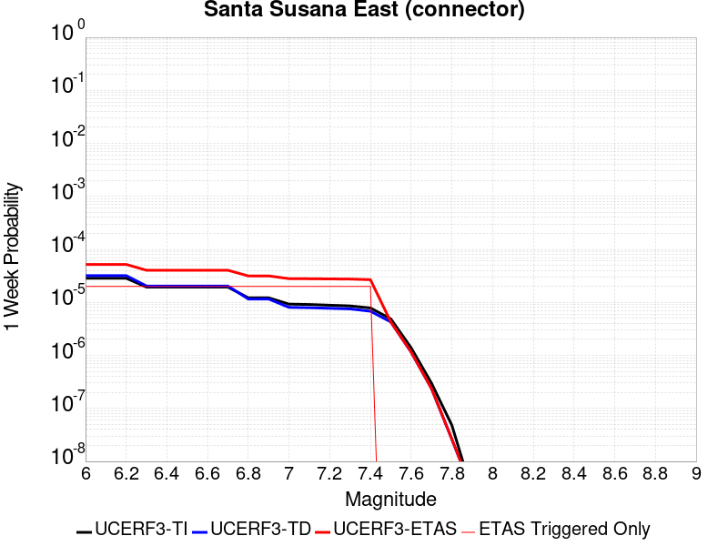 | 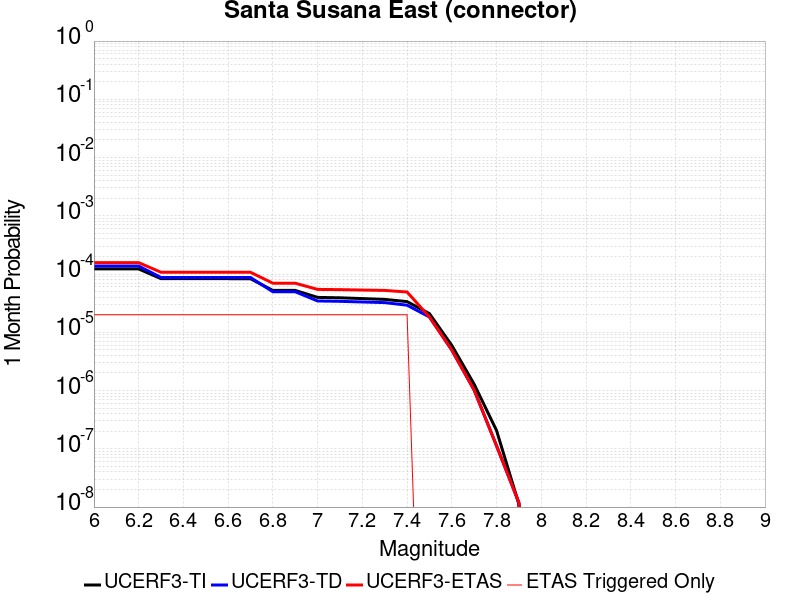 | 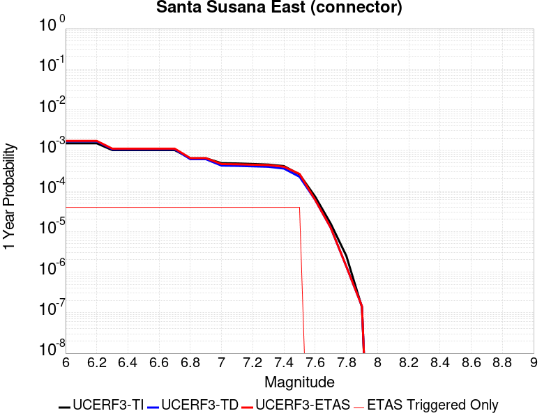 | 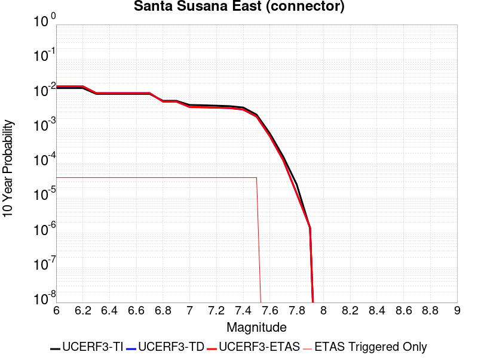 |

| Magnitude | 1 wk TI Prob | 1 wk TD Prob | 1 wk ETAS Prob | 1 wk ETAS/TD Gain | 1 wk ETAS Triggered Only | 1 mo TI Prob | 1 mo TD Prob | 1 mo ETAS Prob | 1 mo ETAS/TD Gain | 1 mo ETAS Triggered Only | 1 yr TI Prob | 1 yr TD Prob | 1 yr ETAS Prob | 1 yr ETAS/TD Gain | 1 yr ETAS Triggered Only | 10 yr TI Prob | 10 yr TD Prob | 10 yr ETAS Prob | 10 yr ETAS/TD Gain | 10 yr ETAS Triggered Only |
|-----|-----|-----|-----|-----|-----|-----|-----|-----|-----|-----|-----|-----|-----|-----|-----|-----|-----|-----|-----|-----|
| 6.0 | 2.858397E-5 | 3.202091E-5 | 3.202091E-5 | 1.0 | 0.0 | 1.2249697E-4 | 1.3722685E-4 | 1.3722685E-4 | 1.0 | 0.0 | 0.0014903803 | 0.0016697381 | 0.001709123 | 1.0235875 | 3.9450842E-5 | 0.014804244 | 0.016599052 | 0.016637849 | 1.0023372 | 3.9450842E-5 |
| 6.1 | 2.858397E-5 | 3.202091E-5 | 3.202091E-5 | 1.0 | 0.0 | 1.2249697E-4 | 1.3722685E-4 | 1.3722685E-4 | 1.0 | 0.0 | 0.0014903803 | 0.0016697381 | 0.001709123 | 1.0235875 | 3.9450842E-5 | 0.014804244 | 0.016599052 | 0.016637849 | 1.0023372 | 3.9450842E-5 |
| 6.2 | 2.858397E-5 | 3.202091E-5 | 3.202091E-5 | 1.0 | 0.0 | 1.2249697E-4 | 1.3722685E-4 | 1.3722685E-4 | 1.0 | 0.0 | 0.0014903803 | 0.0016697381 | 0.001709123 | 1.0235875 | 3.9450842E-5 | 0.014804244 | 0.016599052 | 0.016637849 | 1.0023372 | 3.9450842E-5 |
| 6.3 | 1.943582E-5 | 2.036718E-5 | 2.036718E-5 | 1.0 | 0.0 | 8.329371E-5 | 8.7285625E-5 | 8.7285625E-5 | 1.0 | 0.0 | 0.001013629 | 0.0010622967 | 0.0011017056 | 1.0370978 | 3.9450842E-5 | 0.010090181 | 0.010583619 | 0.010622652 | 1.0036881 | 3.9450842E-5 |
| 6.4 | 1.943582E-5 | 2.036718E-5 | 2.036718E-5 | 1.0 | 0.0 | 8.329371E-5 | 8.7285625E-5 | 8.7285625E-5 | 1.0 | 0.0 | 0.001013629 | 0.0010622967 | 0.0011017056 | 1.0370978 | 3.9450842E-5 | 0.010090181 | 0.010583619 | 0.010622652 | 1.0036881 | 3.9450842E-5 |
| 6.5 | 1.943582E-5 | 2.036718E-5 | 2.036718E-5 | 1.0 | 0.0 | 8.329371E-5 | 8.7285625E-5 | 8.7285625E-5 | 1.0 | 0.0 | 0.001013629 | 0.0010622967 | 0.0011017056 | 1.0370978 | 3.9450842E-5 | 0.010090181 | 0.010583619 | 0.010622652 | 1.0036881 | 3.9450842E-5 |
| 6.6 | 1.943582E-5 | 2.036718E-5 | 2.036718E-5 | 1.0 | 0.0 | 8.329371E-5 | 8.7285625E-5 | 8.7285625E-5 | 1.0 | 0.0 | 0.001013629 | 0.0010622967 | 0.0011017056 | 1.0370978 | 3.9450842E-5 | 0.010090181 | 0.010583619 | 0.010622652 | 1.0036881 | 3.9450842E-5 |
| 6.7 | 1.9404439E-5 | 2.03546E-5 | 2.03546E-5 | 1.0 | 0.0 | 8.3159226E-5 | 8.723172E-5 | 8.723172E-5 | 1.0 | 0.0 | 0.0010119933 | 0.0010616409 | 0.00110105 | 1.0371208 | 3.9450842E-5 | 0.010073971 | 0.010577125 | 0.010616158 | 1.0036904 | 3.9450842E-5 |
| 6.8 | 1.2217526E-5 | 1.1592998E-5 | 1.1592998E-5 | 1.0 | 0.0 | 5.2359774E-5 | 4.9683425E-5 | 4.9683425E-5 | 1.0 | 0.0 | 6.372938E-4 | 6.0474465E-4 | 6.441716E-4 | 1.065196 | 3.9450842E-5 | 0.0063546924 | 0.006033037 | 0.0060722497 | 1.0064996 | 3.9450842E-5 |
| 6.9 | 1.2217526E-5 | 1.1592998E-5 | 1.1592998E-5 | 1.0 | 0.0 | 5.2359774E-5 | 4.9683425E-5 | 4.9683425E-5 | 1.0 | 0.0 | 6.372938E-4 | 6.0474465E-4 | 6.441716E-4 | 1.065196 | 3.9450842E-5 | 0.0063546924 | 0.006033037 | 0.0060722497 | 1.0064996 | 3.9450842E-5 |
| 7.0 | 9.276017E-6 | 8.059113E-6 | 8.059113E-6 | 1.0 | 0.0 | 3.9753755E-5 | 3.4538618E-5 | 3.4538618E-5 | 1.0 | 0.0 | 4.8389446E-4 | 4.2042998E-4 | 4.5986424E-4 | 1.0937951 | 3.9450842E-5 | 0.0048284214 | 0.0041970722 | 0.0042363573 | 1.0093602 | 3.9450842E-5 |
| 7.1 | 9.130355E-6 | 7.942286E-6 | 7.942286E-6 | 1.0 | 0.0 | 3.9129503E-5 | 3.4037945E-5 | 3.4037945E-5 | 1.0 | 0.0 | 4.7629757E-4 | 4.1433662E-4 | 4.5377112E-4 | 1.095175 | 3.9450842E-5 | 0.00475278 | 0.004136367 | 0.0041756546 | 1.0094981 | 3.9450842E-5 |
| 7.2 | 8.851015E-6 | 7.741445E-6 | 7.741445E-6 | 1.0 | 0.0 | 3.7932372E-5 | 3.317722E-5 | 3.317722E-5 | 1.0 | 0.0 | 4.6172875E-4 | 4.038612E-4 | 4.432961E-4 | 1.0976447 | 3.9450842E-5 | 0.0046077054 | 0.0040319953 | 0.0040712873 | 1.009745 | 3.9450842E-5 |
| 7.3 | 8.573006E-6 | 7.550166E-6 | 7.550166E-6 | 1.0 | 0.0 | 3.6740938E-5 | 3.2357475E-5 | 3.2357475E-5 | 1.0 | 0.0 | 4.472291E-4 | 3.9388443E-4 | 4.3331974E-4 | 1.100119 | 3.9450842E-5 | 0.004463301 | 0.0039325804 | 0.003971876 | 1.0099924 | 3.9450842E-5 |
| 7.4 | 7.852282E-6 | 6.817687E-6 | 6.817687E-6 | 1.0 | 0.0 | 3.36522E-5 | 2.9218349E-5 | 2.9218349E-5 | 1.0 | 0.0 | 4.096385E-4 | 3.5567835E-4 | 3.9511514E-4 | 1.1108778 | 3.9450842E-5 | 0.0040888423 | 0.0035517553 | 0.003591066 | 1.011068 | 3.9450842E-5 |
| 7.5 | 4.8869324E-6 | 4.279055E-6 | 4.279055E-6 | 1.0 | 0.0 | 2.0943828E-5 | 1.8338687E-5 | 1.8338687E-5 | 1.0 | 0.0 | 2.5496128E-4 | 2.232523E-4 | 2.6269435E-4 | 1.1766702 | 3.9450842E-5 | 0.0025466895 | 0.0022304445 | 0.0022698073 | 1.017648 | 3.9450842E-5 |
| 7.6 | 1.3894544E-6 | 1.1568179E-6 | 1.1568179E-6 | 1.0 | 0.0 | 5.954791E-6 | 4.957783E-6 | 4.957783E-6 | 1.0 | 0.0 | 7.249717E-5 | 6.0359558E-5 | 6.0359558E-5 | 1.0 | 0.0 | 7.247352E-4 | 6.0345343E-4 | 6.0345343E-4 | 1.0 | 0.0 |
| 7.7 | 2.9924632E-7 | 2.371928E-7 | 2.371928E-7 | 1.0 | 0.0 | 1.2824837E-6 | 1.0165402E-6 | 1.0165402E-6 | 1.0 | 0.0 | 1.5614127E-5 | 1.2376314E-5 | 1.2376314E-5 | 1.0 | 0.0 | 1.5613029E-4 | 1.2375697E-4 | 1.2375697E-4 | 1.0 | 0.0 |
| 7.8 | 4.8188564E-8 | 2.6323061E-8 | 2.6323061E-8 | 1.0 | 0.0 | 2.065224E-7 | 1.1281311E-7 | 1.1281311E-7 | 1.0 | 0.0 | 2.5144072E-6 | 1.3734989E-6 | 1.3734989E-6 | 1.0 | 0.0 | 2.5143789E-5 | 1.3734912E-5 | 1.3734912E-5 | 1.0 | 0.0 |
| 7.9 | 2.6127251E-9 | 2.7681102E-9 | 2.7681102E-9 | 1.0 | 0.0 | 1.1197393E-8 | 1.186333E-8 | 1.186333E-8 | 1.0 | 0.0 | 1.3632825E-7 | 1.4443603E-7 | 1.4443603E-7 | 1.0 | 0.0 | 1.3632817E-6 | 1.4443604E-6 | 1.4443604E-6 | 1.0 | 0.0 |

## Emerson-Copper Mtn 2011
*[(top)](#table-of-contents)*

| 1 Week | 1 Month | 1 Year | 10 Year |
|-----|-----|-----|-----|
| 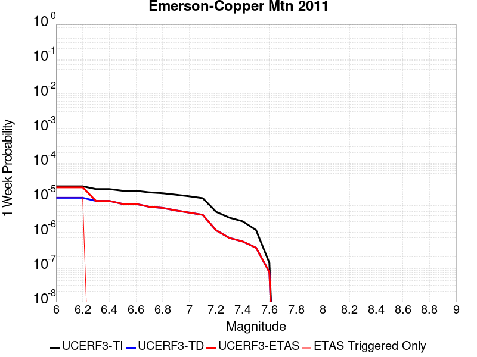 | 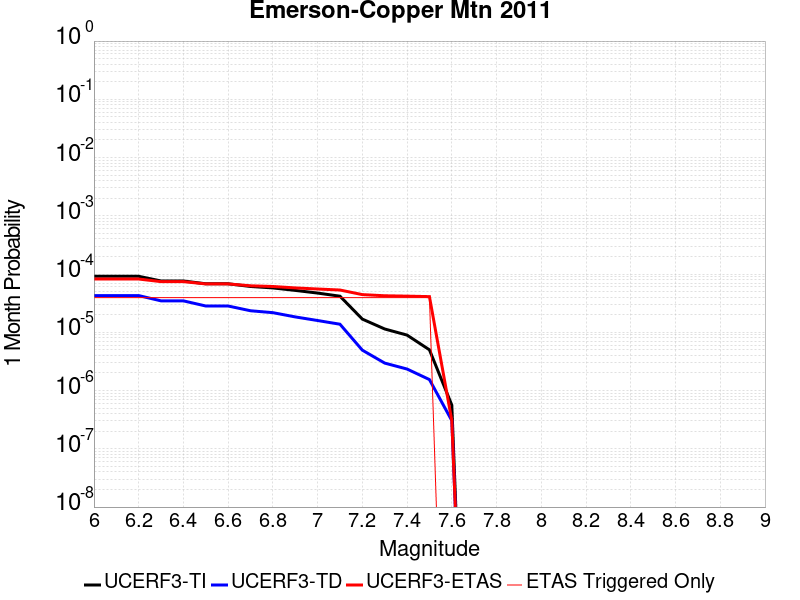 | 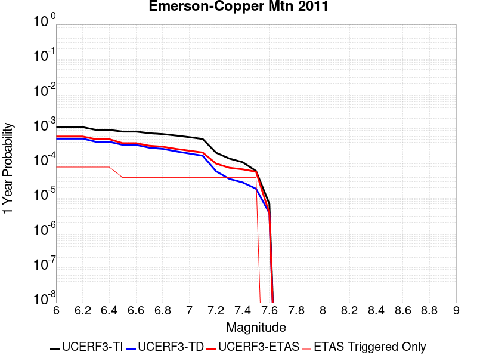 | 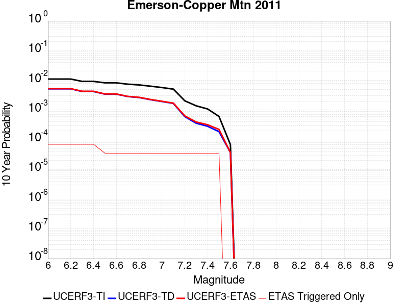 |

| Magnitude | 1 wk TI Prob | 1 wk TD Prob | 1 wk ETAS Prob | 1 wk ETAS/TD Gain | 1 wk ETAS Triggered Only | 1 mo TI Prob | 1 mo TD Prob | 1 mo ETAS Prob | 1 mo ETAS/TD Gain | 1 mo ETAS Triggered Only | 1 yr TI Prob | 1 yr TD Prob | 1 yr ETAS Prob | 1 yr ETAS/TD Gain | 1 yr ETAS Triggered Only | 10 yr TI Prob | 10 yr TD Prob | 10 yr ETAS Prob | 10 yr ETAS/TD Gain | 10 yr ETAS Triggered Only |
|-----|-----|-----|-----|-----|-----|-----|-----|-----|-----|-----|-----|-----|-----|-----|-----|-----|-----|-----|-----|-----|
| 6.0 | 2.1364202E-5 | 9.968114E-6 | 9.968114E-6 | 1.0 | 0.0 | 9.1557646E-5 | 4.2719836E-5 | 8.2169E-5 | 1.9234389 | 3.9450842E-5 | 0.0011141442 | 5.199986E-4 | 5.988593E-4 | 1.1516556 | 7.8901685E-5 | 0.011085749 | 0.005188688 | 0.0052671805 | 1.0151275 | 7.8901685E-5 |
| 6.1 | 2.1364202E-5 | 9.968114E-6 | 9.968114E-6 | 1.0 | 0.0 | 9.1557646E-5 | 4.2719836E-5 | 8.2169E-5 | 1.9234389 | 3.9450842E-5 | 0.0011141442 | 5.199986E-4 | 5.988593E-4 | 1.1516556 | 7.8901685E-5 | 0.011085749 | 0.005188688 | 0.0052671805 | 1.0151275 | 7.8901685E-5 |
| 6.2 | 2.1364202E-5 | 9.968114E-6 | 9.968114E-6 | 1.0 | 0.0 | 9.1557646E-5 | 4.2719836E-5 | 8.2169E-5 | 1.9234389 | 3.9450842E-5 | 0.0011141442 | 5.199986E-4 | 5.988593E-4 | 1.1516556 | 7.8901685E-5 | 0.011085749 | 0.005188688 | 0.0052671805 | 1.0151275 | 7.8901685E-5 |
| 6.3 | 1.7751237E-5 | 8.089227E-6 | 8.089227E-6 | 1.0 | 0.0 | 7.607452E-5 | 3.466769E-5 | 7.411717E-5 | 2.137932 | 3.9450842E-5 | 9.258136E-4 | 4.2200365E-4 | 5.0087203E-4 | 1.1868904 | 7.8901685E-5 | 0.00921966 | 0.0042126453 | 0.0042912145 | 1.0186508 | 7.8901685E-5 |
| 6.4 | 1.7751237E-5 | 8.089227E-6 | 8.089227E-6 | 1.0 | 0.0 | 7.607452E-5 | 3.466769E-5 | 7.411717E-5 | 2.137932 | 3.9450842E-5 | 9.258136E-4 | 4.2200365E-4 | 5.0087203E-4 | 1.1868904 | 7.8901685E-5 | 0.00921966 | 0.0042126453 | 0.0042912145 | 1.0186508 | 7.8901685E-5 |
| 6.5 | 1.5886664E-5 | 6.603819E-6 | 6.603819E-6 | 1.0 | 0.0 | 6.808392E-5 | 2.8301802E-5 | 6.775153E-5 | 2.3938947 | 3.9450842E-5 | 8.286065E-4 | 3.4452465E-4 | 3.839619E-4 | 1.1144686 | 3.9450842E-5 | 0.008255237 | 0.0034403696 | 0.0034796847 | 1.0114276 | 3.9450842E-5 |
| 6.6 | 1.5886664E-5 | 6.603819E-6 | 6.603819E-6 | 1.0 | 0.0 | 6.808392E-5 | 2.8301802E-5 | 6.775153E-5 | 2.3938947 | 3.9450842E-5 | 8.286065E-4 | 3.4452465E-4 | 3.839619E-4 | 1.1144686 | 3.9450842E-5 | 0.008255237 | 0.0034403696 | 0.0034796847 | 1.0114276 | 3.9450842E-5 |
| 6.7 | 1.428471E-5 | 5.470403E-6 | 5.470403E-6 | 1.0 | 0.0 | 6.121875E-5 | 2.3444394E-5 | 6.2894316E-5 | 2.6827016 | 3.9450842E-5 | 7.450834E-4 | 2.8540206E-4 | 3.2484165E-4 | 1.1381896 | 3.9450842E-5 | 0.007425902 | 0.0028507432 | 0.0028900816 | 1.0137993 | 3.9450842E-5 |
| 6.8 | 1.3490684E-5 | 5.073699E-6 | 5.073699E-6 | 1.0 | 0.0 | 5.7815934E-5 | 2.1744265E-5 | 6.119425E-5 | 2.814271 | 3.9450842E-5 | 7.0368167E-4 | 2.6470813E-4 | 3.0414853E-4 | 1.1489958 | 3.9450842E-5 | 0.007014576 | 0.002644309 | 0.0026836556 | 1.0148797 | 3.9450842E-5 |
| 6.9 | 1.2235421E-5 | 4.289677E-6 | 4.289677E-6 | 1.0 | 0.0 | 5.2436466E-5 | 1.838422E-5 | 5.783434E-5 | 3.1458685 | 3.9450842E-5 | 6.38227E-4 | 2.238085E-4 | 2.6325052E-4 | 1.176231 | 3.9450842E-5 | 0.0063639707 | 0.0022361854 | 0.002275548 | 1.0176026 | 3.9450842E-5 |
| 7.0 | 1.1009851E-5 | 3.7189886E-6 | 3.7189886E-6 | 1.0 | 0.0 | 4.7184225E-5 | 1.5938444E-5 | 5.538866E-5 | 3.475161 | 3.9450842E-5 | 5.743165E-4 | 1.9403672E-4 | 2.334799E-4 | 1.203277 | 3.9450842E-5 | 0.005728345 | 0.0019390108 | 0.0019783853 | 1.0203065 | 3.9450842E-5 |
| 7.1 | 9.726373E-6 | 3.2117953E-6 | 3.2117953E-6 | 1.0 | 0.0 | 4.168379E-5 | 1.3764783E-5 | 5.3215084E-5 | 3.8660314 | 3.9450842E-5 | 5.07382E-4 | 1.6757673E-4 | 2.0702096E-4 | 1.2353802 | 3.9450842E-5 | 0.0050622504 | 0.0016748349 | 0.0017142196 | 1.0235156 | 3.9450842E-5 |
| 7.2 | 3.9335127E-6 | 1.1524792E-6 | 1.1524792E-6 | 1.0 | 0.0 | 1.6857803E-5 | 4.9391874E-6 | 4.4389835E-5 | 8.987275 | 3.9450842E-5 | 2.0522442E-4 | 6.0133007E-5 | 9.958148E-5 | 1.6560203 | 3.9450842E-5 | 0.00205035 | 6.011733E-4 | 6.4060045E-4 | 1.0655836 | 3.9450842E-5 |
| 7.3 | 2.661632E-6 | 6.911505E-7 | 6.911505E-7 | 1.0 | 0.0 | 1.14069435E-5 | 2.9620703E-6 | 4.2412797E-5 | 14.318633 | 3.9450842E-5 | 1.3887069E-4 | 3.6062618E-5 | 7.551204E-5 | 2.0939145 | 3.9450842E-5 | 0.0013878393 | 3.605687E-4 | 4.0000532E-4 | 1.1093733 | 3.9450842E-5 |
| 7.4 | 2.0893426E-6 | 5.4618386E-7 | 5.4618386E-7 | 1.0 | 0.0 | 8.954295E-6 | 2.3407858E-6 | 4.1791536E-5 | 17.853636 | 3.9450842E-5 | 1.0901308E-4 | 2.84987E-5 | 6.794842E-5 | 2.3842638 | 3.9450842E-5 | 0.0010895962 | 2.84951E-4 | 3.243906E-4 | 1.1384084 | 3.9450842E-5 |
| 7.5 | 1.1681728E-6 | 3.6030585E-7 | 3.6030585E-7 | 1.0 | 0.0 | 5.0064455E-6 | 1.544167E-6 | 4.099495E-5 | 26.548262 | 3.9450842E-5 | 6.0951766E-5 | 1.8800076E-5 | 5.8250178E-5 | 3.0984013 | 3.9450842E-5 | 6.093505E-4 | 1.8798532E-4 | 2.2742875E-4 | 1.2098218 | 3.9450842E-5 |
| 7.6 | 1.3154387E-7 | 7.1197384E-8 | 7.1197384E-8 | 1.0 | 0.0 | 5.6375933E-7 | 3.051316E-7 | 3.051316E-7 | 1.0 | 0.0 | 6.863748E-6 | 3.7149728E-6 | 3.7149728E-6 | 1.0 | 0.0 | 6.863536E-5 | 3.7149264E-5 | 3.7149264E-5 | 1.0 | 0.0 |

## Rinconada 2011 CFM
*[(top)](#table-of-contents)*

| 1 Week | 1 Month | 1 Year | 10 Year |
|-----|-----|-----|-----|
| 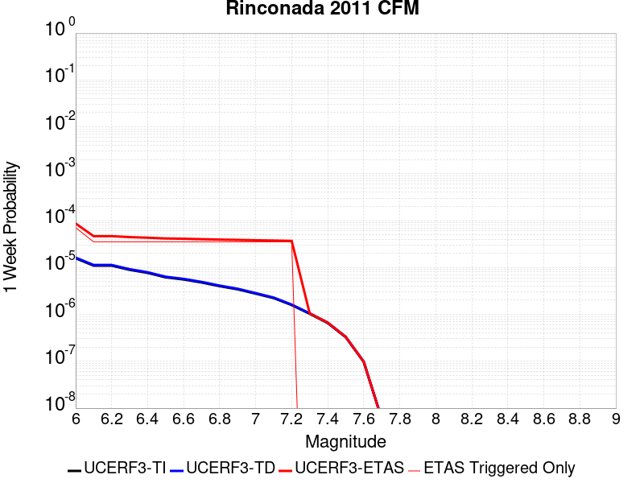 | 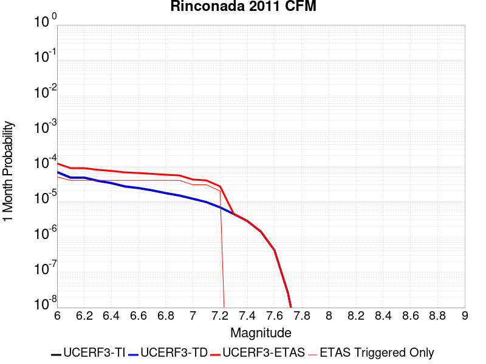 | 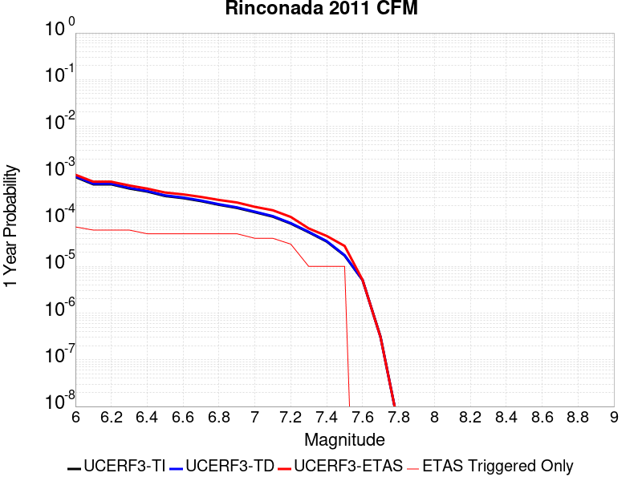 | 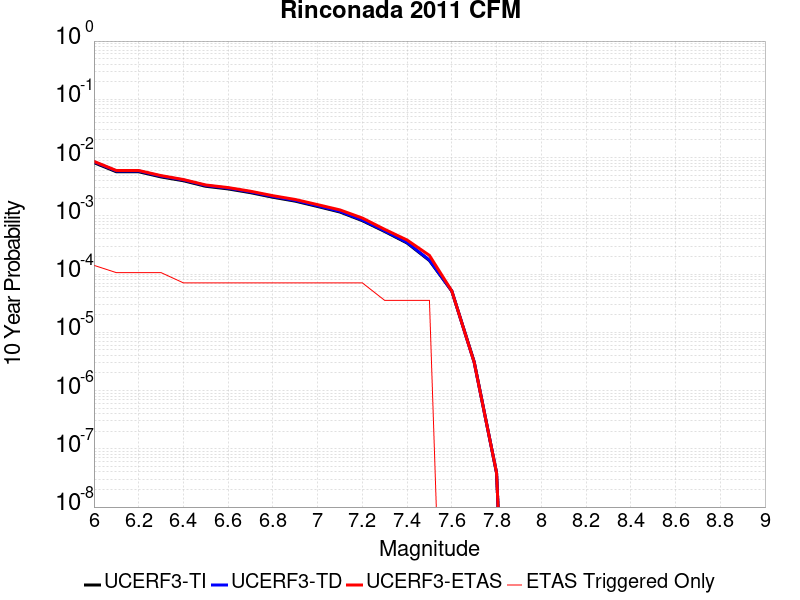 |

| Magnitude | 1 wk TI Prob | 1 wk TD Prob | 1 wk ETAS Prob | 1 wk ETAS/TD Gain | 1 wk ETAS Triggered Only | 1 mo TI Prob | 1 mo TD Prob | 1 mo ETAS Prob | 1 mo ETAS/TD Gain | 1 mo ETAS Triggered Only | 1 yr TI Prob | 1 yr TD Prob | 1 yr ETAS Prob | 1 yr ETAS/TD Gain | 1 yr ETAS Triggered Only | 10 yr TI Prob | 10 yr TD Prob | 10 yr ETAS Prob | 10 yr ETAS/TD Gain | 10 yr ETAS Triggered Only |
|-----|-----|-----|-----|-----|-----|-----|-----|-----|-----|-----|-----|-----|-----|-----|-----|-----|-----|-----|-----|-----|
| 6.0 | 1.5752368E-5 | 1.6274716E-5 | 5.572492E-5 | 3.424018 | 3.9450842E-5 | 6.75084E-5 | 6.974694E-5 | 1.09195025E-4 | 1.565589 | 3.9450842E-5 | 8.2160486E-4 | 8.488412E-4 | 9.276759E-4 | 1.0928733 | 7.8901685E-5 | 0.008185739 | 0.00845637 | 0.008534605 | 1.0092516 | 7.8901685E-5 |
| 6.1 | 1.0966133E-5 | 1.1323029E-5 | 5.0773426E-5 | 4.484085 | 3.9450842E-5 | 4.6996865E-5 | 4.852637E-5 | 8.79753E-5 | 1.812938 | 3.9450842E-5 | 5.720366E-4 | 5.906491E-4 | 6.6950417E-4 | 1.1335058 | 7.8901685E-5 | 0.0057056635 | 0.0058908886 | 0.0059693255 | 1.013315 | 7.8901685E-5 |
| 6.2 | 1.0966133E-5 | 1.1323029E-5 | 5.0773426E-5 | 4.484085 | 3.9450842E-5 | 4.6996865E-5 | 4.852637E-5 | 8.79753E-5 | 1.812938 | 3.9450842E-5 | 5.720366E-4 | 5.906491E-4 | 6.6950417E-4 | 1.1335058 | 7.8901685E-5 | 0.0057056635 | 0.0058908886 | 0.0059693255 | 1.013315 | 7.8901685E-5 |
| 6.3 | 8.926149E-6 | 9.212771E-6 | 4.8663253E-5 | 5.282151 | 3.9450842E-5 | 3.8254362E-5 | 3.948271E-5 | 7.8932E-5 | 1.9991535 | 3.9450842E-5 | 4.6564735E-4 | 4.805963E-4 | 5.594601E-4 | 1.1640956 | 7.8901685E-5 | 0.0046467283 | 0.0047956146 | 0.0048741377 | 1.016374 | 7.8901685E-5 |
| 6.4 | 7.676955E-6 | 7.920191E-6 | 4.7370722E-5 | 5.9810076 | 3.9450842E-5 | 3.290082E-5 | 3.3943234E-5 | 7.339274E-5 | 2.16222 | 3.9450842E-5 | 4.0049385E-4 | 4.1318068E-4 | 4.5261523E-4 | 1.0954413 | 3.9450842E-5 | 0.0039977287 | 0.004124151 | 0.0041634394 | 1.0095264 | 3.9450842E-5 |
| 6.5 | 6.1671026E-6 | 6.3589546E-6 | 4.580955E-5 | 7.2039433 | 3.9450842E-5 | 2.6430173E-5 | 2.725238E-5 | 6.6702145E-5 | 2.4475715 | 3.9450842E-5 | 3.2173982E-4 | 3.317473E-4 | 3.7118504E-4 | 1.118879 | 3.9450842E-5 | 0.003212744 | 0.0033125326 | 0.0033518525 | 1.0118701 | 3.9450842E-5 |
| 6.6 | 5.553456E-6 | 5.7248126E-6 | 4.517543E-5 | 7.8911633 | 3.9450842E-5 | 2.3800309E-5 | 2.453468E-5 | 6.398456E-5 | 2.607923 | 3.9450842E-5 | 2.897302E-4 | 2.9866883E-4 | 3.381079E-4 | 1.1320494 | 3.9450842E-5 | 0.0028935277 | 0.002982683 | 0.0030220163 | 1.0131872 | 3.9450842E-5 |
| 6.7 | 4.787857E-6 | 4.9333094E-6 | 4.438396E-5 | 8.996792 | 3.9450842E-5 | 2.0519226E-5 | 2.1142583E-5 | 6.0592592E-5 | 2.865903 | 3.9450842E-5 | 2.4979294E-4 | 2.573806E-4 | 2.968213E-4 | 1.1532388 | 3.9450842E-5 | 0.0024951235 | 0.0025708308 | 0.0026101803 | 1.0153061 | 3.9450842E-5 |
| 6.8 | 3.9955166E-6 | 4.1134763E-6 | 4.356416E-5 | 10.590594 | 3.9450842E-5 | 1.7123532E-5 | 1.7629065E-5 | 5.7079214E-5 | 3.2377903 | 3.9450842E-5 | 2.0845905E-4 | 2.1461274E-4 | 2.540551E-4 | 1.183784 | 3.9450842E-5 | 0.002082636 | 0.0021440585 | 0.0021834248 | 1.0183606 | 3.9450842E-5 |
| 6.9 | 3.4250072E-6 | 3.5224464E-6 | 4.297315E-5 | 12.199803 | 3.9450842E-5 | 1.46785205E-5 | 1.5096111E-5 | 5.454636E-5 | 3.6132722 | 3.9450842E-5 | 1.7869633E-4 | 1.8377967E-4 | 2.2322327E-4 | 1.2146244 | 3.9450842E-5 | 0.001785527 | 0.0018362794 | 0.0018756578 | 1.0214447 | 3.9450842E-5 |
| 7.0 | 2.7712713E-6 | 2.8467E-6 | 4.2297434E-5 | 14.858409 | 3.9450842E-5 | 1.1876823E-5 | 1.2200086E-5 | 5.1650448E-5 | 4.2336135 | 3.9450842E-5 | 1.4459073E-4 | 1.4852593E-4 | 1.8797092E-4 | 1.2655764 | 3.9450842E-5 | 0.0014449668 | 0.0014842682 | 0.0015236605 | 1.0265399 | 3.9450842E-5 |
| 7.1 | 2.227358E-6 | 2.2856984E-6 | 4.1736454E-5 | 18.259825 | 3.9450842E-5 | 9.545785E-6 | 9.795814E-6 | 4.924627E-5 | 5.0272775 | 3.9450842E-5 | 1.16213734E-4 | 1.19257515E-4 | 1.5870365E-4 | 1.3307644 | 3.9450842E-5 | 0.0011615298 | 0.0011919362 | 0.00123134 | 1.0330586 | 3.9450842E-5 |
| 7.2 | 1.581796E-6 | 1.6209011E-6 | 4.1071682E-5 | 25.338795 | 3.9450842E-5 | 6.779108E-6 | 6.9467005E-6 | 4.6397272E-5 | 6.679037 | 3.9450842E-5 | 8.253252E-5 | 8.457281E-5 | 1.2402031E-4 | 1.4664326 | 3.9450842E-5 | 8.250187E-4 | 8.454067E-4 | 8.848242E-4 | 1.0466255 | 3.9450842E-5 |
| 7.3 | 1.0306567E-6 | 1.0546477E-6 | 1.0546477E-6 | 1.0 | 0.0 | 4.4170924E-6 | 4.519911E-6 | 4.519911E-6 | 1.0 | 0.0 | 5.3776774E-5 | 5.5028526E-5 | 5.5028526E-5 | 1.0 | 0.0 | 5.376376E-4 | 5.5014924E-4 | 5.5014924E-4 | 1.0 | 0.0 |
| 7.4 | 6.535541E-7 | 6.682742E-7 | 6.682742E-7 | 1.0 | 0.0 | 2.800943E-6 | 2.864029E-6 | 2.864029E-6 | 1.0 | 0.0 | 3.4100947E-5 | 3.4868997E-5 | 3.4868997E-5 | 1.0 | 0.0 | 3.4095717E-4 | 3.4863537E-4 | 3.4863537E-4 | 1.0 | 0.0 |
| 7.5 | 3.2656962E-7 | 3.3316687E-7 | 3.3316687E-7 | 1.0 | 0.0 | 1.3995833E-6 | 1.4278572E-6 | 1.4278572E-6 | 1.0 | 0.0 | 1.7039794E-5 | 1.7384024E-5 | 1.7384024E-5 | 1.0 | 0.0 | 1.7038487E-4 | 1.7382667E-4 | 1.7382667E-4 | 1.0 | 0.0 |
| 7.6 | 9.754343E-8 | 9.82099E-8 | 9.82099E-8 | 1.0 | 0.0 | 4.180432E-7 | 4.208995E-7 | 4.208995E-7 | 1.0 | 0.0 | 5.089664E-6 | 5.1244397E-6 | 5.1244397E-6 | 1.0 | 0.0 | 5.0895473E-5 | 5.1243223E-5 | 5.1243223E-5 | 1.0 | 0.0 |
| 7.7 | 6.0001453E-9 | 5.8490435E-9 | 5.8490435E-9 | 1.0 | 0.0 | 2.5714908E-8 | 2.506733E-8 | 2.506733E-8 | 1.0 | 0.0 | 3.1307894E-7 | 3.051947E-7 | 3.051947E-7 | 1.0 | 0.0 | 3.1307852E-6 | 3.051943E-6 | 3.051943E-6 | 1.0 | 0.0 |
| 7.8 | 7.400003E-11 | 7.4654505E-11 | 7.4654505E-11 | 1.0 | 0.0 | 3.171432E-10 | 3.1994773E-10 | 3.1994773E-10 | 1.0 | 0.0 | 3.861218E-9 | 3.895363E-9 | 3.895363E-9 | 1.0 | 0.0 | 3.861218E-8 | 3.895363E-8 | 3.895363E-8 | 1.0 | 0.0 |

## North Frontal  (West)
*[(top)](#table-of-contents)*

| 1 Week | 1 Month | 1 Year | 10 Year |
|-----|-----|-----|-----|
| 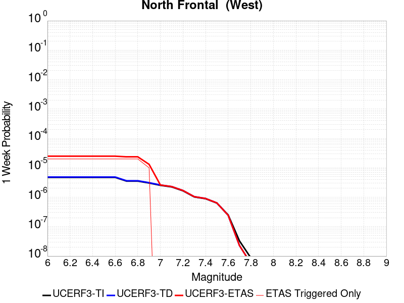 | 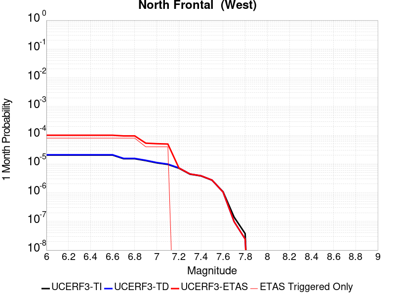 | 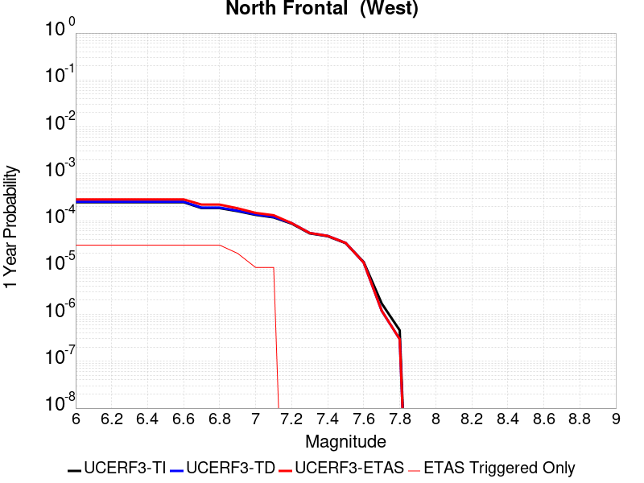 | 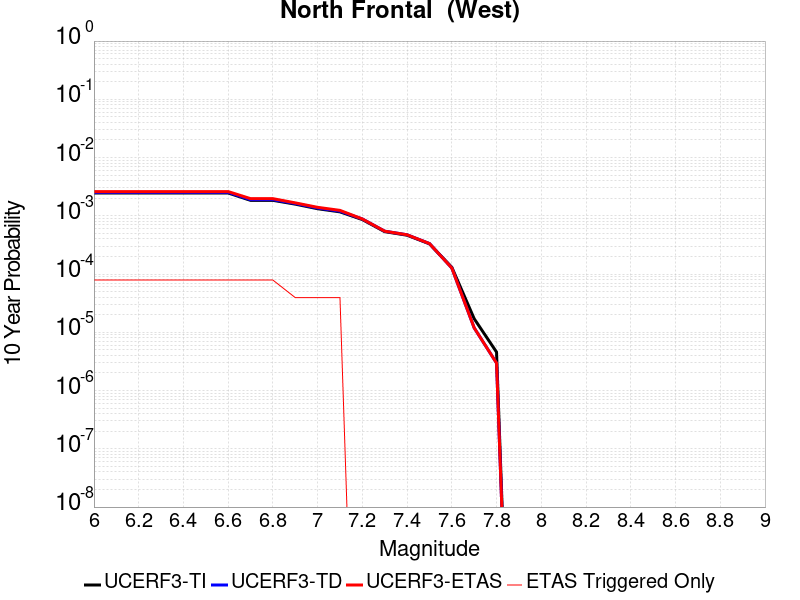 |

| Magnitude | 1 wk TI Prob | 1 wk TD Prob | 1 wk ETAS Prob | 1 wk ETAS/TD Gain | 1 wk ETAS Triggered Only | 1 mo TI Prob | 1 mo TD Prob | 1 mo ETAS Prob | 1 mo ETAS/TD Gain | 1 mo ETAS Triggered Only | 1 yr TI Prob | 1 yr TD Prob | 1 yr ETAS Prob | 1 yr ETAS/TD Gain | 1 yr ETAS Triggered Only | 10 yr TI Prob | 10 yr TD Prob | 10 yr ETAS Prob | 10 yr ETAS/TD Gain | 10 yr ETAS Triggered Only |
|-----|-----|-----|-----|-----|-----|-----|-----|-----|-----|-----|-----|-----|-----|-----|-----|-----|-----|-----|-----|-----|
| 6.0 | 4.7316266E-6 | 4.8526726E-6 | 4.4303324E-5 | 9.129675 | 3.9450842E-5 | 2.0278241E-5 | 2.0797012E-5 | 9.9697056E-5 | 4.7938166 | 7.8901685E-5 | 2.4685962E-4 | 2.5317568E-4 | 3.320574E-4 | 1.3115691 | 7.8901685E-5 | 0.0024658558 | 0.0025290183 | 0.0026077207 | 1.0311196 | 7.8901685E-5 |
| 6.1 | 4.7316266E-6 | 4.8526726E-6 | 4.4303324E-5 | 9.129675 | 3.9450842E-5 | 2.0278241E-5 | 2.0797012E-5 | 9.9697056E-5 | 4.7938166 | 7.8901685E-5 | 2.4685962E-4 | 2.5317568E-4 | 3.320574E-4 | 1.3115691 | 7.8901685E-5 | 0.0024658558 | 0.0025290183 | 0.0026077207 | 1.0311196 | 7.8901685E-5 |
| 6.2 | 4.7316266E-6 | 4.8526726E-6 | 4.4303324E-5 | 9.129675 | 3.9450842E-5 | 2.0278241E-5 | 2.0797012E-5 | 9.9697056E-5 | 4.7938166 | 7.8901685E-5 | 2.4685962E-4 | 2.5317568E-4 | 3.320574E-4 | 1.3115691 | 7.8901685E-5 | 0.0024658558 | 0.0025290183 | 0.0026077207 | 1.0311196 | 7.8901685E-5 |
| 6.3 | 4.7316266E-6 | 4.8526726E-6 | 4.4303324E-5 | 9.129675 | 3.9450842E-5 | 2.0278241E-5 | 2.0797012E-5 | 9.9697056E-5 | 4.7938166 | 7.8901685E-5 | 2.4685962E-4 | 2.5317568E-4 | 3.320574E-4 | 1.3115691 | 7.8901685E-5 | 0.0024658558 | 0.0025290183 | 0.0026077207 | 1.0311196 | 7.8901685E-5 |
| 6.4 | 4.7316266E-6 | 4.8526726E-6 | 4.4303324E-5 | 9.129675 | 3.9450842E-5 | 2.0278241E-5 | 2.0797012E-5 | 9.9697056E-5 | 4.7938166 | 7.8901685E-5 | 2.4685962E-4 | 2.5317568E-4 | 3.320574E-4 | 1.3115691 | 7.8901685E-5 | 0.0024658558 | 0.0025290183 | 0.0026077207 | 1.0311196 | 7.8901685E-5 |
| 6.5 | 4.7316266E-6 | 4.8526726E-6 | 4.4303324E-5 | 9.129675 | 3.9450842E-5 | 2.0278241E-5 | 2.0797012E-5 | 9.9697056E-5 | 4.7938166 | 7.8901685E-5 | 2.4685962E-4 | 2.5317568E-4 | 3.320574E-4 | 1.3115691 | 7.8901685E-5 | 0.0024658558 | 0.0025290183 | 0.0026077207 | 1.0311196 | 7.8901685E-5 |
| 6.6 | 4.7316266E-6 | 4.8526726E-6 | 4.4303324E-5 | 9.129675 | 3.9450842E-5 | 2.0278241E-5 | 2.0797012E-5 | 9.9697056E-5 | 4.7938166 | 7.8901685E-5 | 2.4685962E-4 | 2.5317568E-4 | 3.320574E-4 | 1.3115691 | 7.8901685E-5 | 0.0024658558 | 0.0025290183 | 0.0026077207 | 1.0311196 | 7.8901685E-5 |
| 6.7 | 3.5382777E-6 | 3.6308859E-6 | 4.3081585E-5 | 11.86531 | 3.9450842E-5 | 1.516396E-5 | 1.5560852E-5 | 9.446131E-5 | 6.070446 | 7.8901685E-5 | 1.8460557E-4 | 1.8943768E-4 | 2.6832442E-4 | 1.4164258 | 7.8901685E-5 | 0.0018445229 | 0.0018928389 | 0.0019715913 | 1.0416054 | 7.8901685E-5 |
| 6.8 | 3.5382777E-6 | 3.6308859E-6 | 4.3081585E-5 | 11.86531 | 3.9450842E-5 | 1.516396E-5 | 1.5560852E-5 | 9.446131E-5 | 6.070446 | 7.8901685E-5 | 1.8460557E-4 | 1.8943768E-4 | 2.6832442E-4 | 1.4164258 | 7.8901685E-5 | 0.0018445229 | 0.0018928389 | 0.0019715913 | 1.0416054 | 7.8901685E-5 |
| 6.9 | 3.0428037E-6 | 3.1227605E-6 | 3.1227605E-6 | 1.0 | 0.0 | 1.30405215E-5 | 1.33831945E-5 | 5.283351E-5 | 3.9477503 | 3.9450842E-5 | 1.5875678E-4 | 1.6292889E-4 | 2.0237331E-4 | 1.242096 | 3.9450842E-5 | 0.0015864341 | 0.0016281615 | 0.0016675482 | 1.0241909 | 3.9450842E-5 |
| 7.0 | 2.538778E-6 | 2.6060904E-6 | 2.6060904E-6 | 1.0 | 0.0 | 1.0880432E-5 | 1.1168913E-5 | 5.0619317E-5 | 4.532161 | 3.9450842E-5 | 1.324612E-4 | 1.3597352E-4 | 1.7541899E-4 | 1.2900968 | 3.9450842E-5 | 0.0013238228 | 0.0013589499 | 0.0013983471 | 1.028991 | 3.9450842E-5 |
| 7.1 | 2.2418935E-6 | 2.3012074E-6 | 2.3012074E-6 | 1.0 | 0.0 | 9.60808E-6 | 9.862282E-6 | 4.9312737E-5 | 5.0001345 | 3.9450842E-5 | 1.1697209E-4 | 1.2006712E-4 | 1.5951322E-4 | 1.3285338 | 3.9450842E-5 | 0.0011691054 | 0.0012000664 | 0.0012394699 | 1.0328344 | 3.9450842E-5 |
| 7.2 | 1.6526745E-6 | 1.6924851E-6 | 1.6924851E-6 | 1.0 | 0.0 | 7.082872E-6 | 7.253489E-6 | 7.253489E-6 | 1.0 | 0.0 | 8.623055E-5 | 8.8307905E-5 | 8.8307905E-5 | 1.0 | 0.0 | 8.61971E-4 | 8.827532E-4 | 8.827532E-4 | 1.0 | 0.0 |
| 7.3 | 1.0246019E-6 | 1.0442261E-6 | 1.0442261E-6 | 1.0 | 0.0 | 4.391144E-6 | 4.4752474E-6 | 4.4752474E-6 | 1.0 | 0.0 | 5.3460866E-5 | 5.448489E-5 | 5.448489E-5 | 1.0 | 0.0 | 5.344801E-4 | 5.4472685E-4 | 5.4472685E-4 | 1.0 | 0.0 |
| 7.4 | 8.9045164E-7 | 9.0565584E-7 | 9.0565584E-7 | 1.0 | 0.0 | 3.8162157E-6 | 3.8813773E-6 | 3.8813773E-6 | 1.0 | 0.0 | 4.646144E-5 | 4.7254853E-5 | 4.7254853E-5 | 1.0 | 0.0 | 4.6451724E-4 | 4.7245892E-4 | 4.7245892E-4 | 1.0 | 0.0 |
| 7.5 | 6.3357E-7 | 6.4027006E-7 | 6.4027006E-7 | 1.0 | 0.0 | 2.7152971E-6 | 2.744012E-6 | 2.744012E-6 | 1.0 | 0.0 | 3.305824E-5 | 3.34079E-5 | 3.34079E-5 | 1.0 | 0.0 | 3.3053322E-4 | 3.3403534E-4 | 3.3403534E-4 | 1.0 | 0.0 |
| 7.6 | 2.5087024E-7 | 2.4361097E-7 | 2.4361097E-7 | 1.0 | 0.0 | 1.0751578E-6 | 1.0440467E-6 | 1.0440467E-6 | 1.0 | 0.0 | 1.3089967E-5 | 1.2711216E-5 | 1.2711216E-5 | 1.0 | 0.0 | 1.3089196E-4 | 1.2710695E-4 | 1.2710695E-4 | 1.0 | 0.0 |
| 7.7 | 3.282987E-8 | 2.2874195E-8 | 2.2874195E-8 | 1.0 | 0.0 | 1.4069944E-7 | 9.803227E-8 | 9.803227E-8 | 1.0 | 0.0 | 1.7130144E-6 | 1.1935423E-6 | 1.1935423E-6 | 1.0 | 0.0 | 1.7130013E-5 | 1.1935367E-5 | 1.1935367E-5 | 1.0 | 0.0 |
| 7.8 | 8.77499E-9 | 5.6815956E-9 | 5.6815956E-9 | 1.0 | 0.0 | 3.7607098E-8 | 2.4349696E-8 | 2.4349696E-8 | 1.0 | 0.0 | 4.578663E-7 | 2.9645753E-7 | 2.9645753E-7 | 1.0 | 0.0 | 4.5786537E-6 | 2.9645726E-6 | 2.9645726E-6 | 1.0 | 0.0 |

## Imperial
*[(top)](#table-of-contents)*

| 1 Week | 1 Month | 1 Year | 10 Year |
|-----|-----|-----|-----|
| 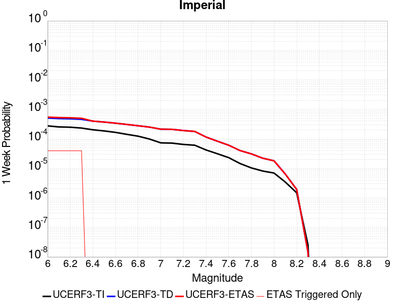 | 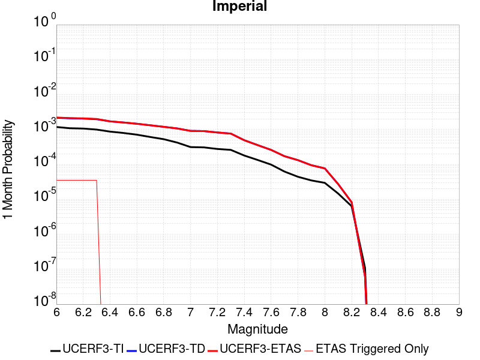 | 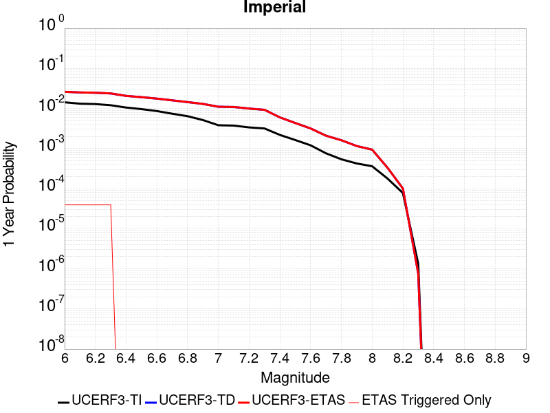 |  |

| Magnitude | 1 wk TI Prob | 1 wk TD Prob | 1 wk ETAS Prob | 1 wk ETAS/TD Gain | 1 wk ETAS Triggered Only | 1 mo TI Prob | 1 mo TD Prob | 1 mo ETAS Prob | 1 mo ETAS/TD Gain | 1 mo ETAS Triggered Only | 1 yr TI Prob | 1 yr TD Prob | 1 yr ETAS Prob | 1 yr ETAS/TD Gain | 1 yr ETAS Triggered Only | 10 yr TI Prob | 10 yr TD Prob | 10 yr ETAS Prob | 10 yr ETAS/TD Gain | 10 yr ETAS Triggered Only |
|-----|-----|-----|-----|-----|-----|-----|-----|-----|-----|-----|-----|-----|-----|-----|-----|-----|-----|-----|-----|-----|
| 6.0 | 2.7496446E-4 | 5.0552754E-4 | 5.4495846E-4 | 1.0779995 | 3.9450842E-5 | 0.0011778869 | 0.002164787 | 0.0022041525 | 1.0181844 | 3.9450842E-5 | 0.0142467655 | 0.026038699 | 0.026077121 | 1.0014757 | 3.9450842E-5 | 0.13367249 | 0.2280438 | 0.2281047 | 1.0002671 | 7.8901685E-5 |
| 6.1 | 2.5356023E-4 | 4.8656776E-4 | 5.259994E-4 | 1.0810404 | 3.9450842E-5 | 0.001086234 | 0.0020836622 | 0.0021230308 | 1.018894 | 3.9450842E-5 | 0.013144928 | 0.025071215 | 0.025109677 | 1.0015341 | 3.9450842E-5 | 0.123940155 | 0.21947981 | 0.2195414 | 1.0002806 | 7.8901685E-5 |
| 6.2 | 2.4820742E-4 | 4.7752203E-4 | 5.1695405E-4 | 1.0825763 | 3.9450842E-5 | 0.0010633124 | 0.0020449557 | 0.002084326 | 1.0192523 | 3.9450842E-5 | 0.01286919 | 0.024611235 | 0.024649715 | 1.0015635 | 3.9450842E-5 | 0.12148927 | 0.21598552 | 0.21604739 | 1.0002865 | 7.8901685E-5 |
| 6.3 | 2.3205351E-4 | 4.5890483E-4 | 4.9833755E-4 | 1.085928 | 3.9450842E-5 | 9.94136E-4 | 0.0019652895 | 0.0020046628 | 1.0200343 | 3.9450842E-5 | 0.012036599 | 0.02366133 | 0.023699848 | 1.0016278 | 3.9450842E-5 | 0.11405133 | 0.20793462 | 0.20799711 | 1.0003005 | 7.8901685E-5 |
| 6.4 | 2.0304754E-4 | 3.987652E-4 | 3.987652E-4 | 1.0 | 0.0 | 8.6991355E-4 | 0.0017078889 | 0.0017078889 | 1.0 | 0.0 | 0.010539869 | 0.020595672 | 0.020595672 | 1.0 | 0.0 | 0.100537635 | 0.1850669 | 0.18509905 | 1.0001737 | 3.9450842E-5 |
| 6.5 | 1.854992E-4 | 3.6988858E-4 | 3.6988858E-4 | 1.0 | 0.0 | 7.9475436E-4 | 0.0015842861 | 0.0015842861 | 1.0 | 0.0 | 0.009633281 | 0.01911948 | 0.01911948 | 1.0 | 0.0 | 0.0922623 | 0.173298 | 0.17333062 | 1.0001882 | 3.9450842E-5 |
| 6.6 | 1.6586106E-4 | 3.403506E-4 | 3.403506E-4 | 1.0 | 0.0 | 7.106394E-4 | 0.0014578402 | 0.0014578402 | 1.0 | 0.0 | 0.008617763 | 0.01760642 | 0.01760642 | 1.0 | 0.0 | 0.08291132 | 0.16077545 | 0.16080855 | 1.0002059 | 3.9450842E-5 |
| 6.7 | 1.4224656E-4 | 3.076692E-4 | 3.076692E-4 | 1.0 | 0.0 | 6.094856E-4 | 0.001317924 | 0.001317924 | 1.0 | 0.0 | 0.0073952693 | 0.015929576 | 0.015929576 | 1.0 | 0.0 | 0.07153955 | 0.14648417 | 0.14651783 | 1.0002298 | 3.9450842E-5 |
| 6.8 | 1.2317259E-4 | 2.779122E-4 | 2.779122E-4 | 1.0 | 0.0 | 5.2777573E-4 | 0.0011905148 | 0.0011905148 | 1.0 | 0.0 | 0.0064067547 | 0.0143995695 | 0.0143995695 | 1.0 | 0.0 | 0.06225166 | 0.13293684 | 0.13297103 | 1.0002573 | 3.9450842E-5 |
| 6.9 | 9.859898E-5 | 2.5014306E-4 | 2.5014306E-4 | 1.0 | 0.0 | 4.2249862E-4 | 0.0010716055 | 0.0010716055 | 1.0 | 0.0 | 0.0051317946 | 0.012969712 | 0.012969712 | 1.0 | 0.0 | 0.05014893 | 0.11940631 | 0.119441055 | 1.000291 | 3.9450842E-5 |
| 7.0 | 7.3191884E-5 | 2.1266776E-4 | 2.1266776E-4 | 1.0 | 0.0 | 3.136418E-4 | 9.1111806E-4 | 9.1111806E-4 | 1.0 | 0.0 | 0.003811904 | 0.011037128 | 0.011037128 | 1.0 | 0.0 | 0.037471764 | 0.10206493 | 0.10210035 | 1.000347 | 3.9450842E-5 |
| 7.1 | 7.1760296E-5 | 2.0968143E-4 | 2.0968143E-4 | 1.0 | 0.0 | 3.0750787E-4 | 8.983284E-4 | 8.983284E-4 | 1.0 | 0.0 | 0.003737482 | 0.010882978 | 0.010882978 | 1.0 | 0.0 | 0.03675245 | 0.10070146 | 0.10073693 | 1.0003523 | 3.9450842E-5 |
| 7.2 | 6.46614E-5 | 1.9136685E-4 | 1.9136685E-4 | 1.0 | 0.0 | 2.7709085E-4 | 8.1988896E-4 | 8.1988896E-4 | 1.0 | 0.0 | 0.0033683628 | 0.0099370815 | 0.0099370815 | 1.0 | 0.0 | 0.033177625 | 0.09250898 | 0.09254478 | 1.000387 | 3.9450842E-5 |
| 7.3 | 6.088115E-5 | 1.78084E-4 | 1.78084E-4 | 1.0 | 0.0 | 2.6089314E-4 | 7.6299673E-4 | 7.6299673E-4 | 1.0 | 0.0 | 0.0031717476 | 0.009250494 | 0.009250494 | 1.0 | 0.0 | 0.031268585 | 0.08655989 | 0.08659593 | 1.0004163 | 3.9450842E-5 |
| 7.4 | 4.199346E-5 | 1.1510366E-4 | 1.1510366E-4 | 1.0 | 0.0 | 1.7995955E-4 | 4.9320905E-4 | 4.9320905E-4 | 1.0 | 0.0 | 0.0021888057 | 0.0059884563 | 0.0059884563 | 1.0 | 0.0 | 0.02167372 | 0.057439793 | 0.05747698 | 1.0006474 | 3.9450842E-5 |
| 7.5 | 3.130448E-5 | 8.33328E-5 | 8.33328E-5 | 1.0 | 0.0 | 1.3415517E-4 | 3.57092E-4 | 3.57092E-4 | 1.0 | 0.0 | 0.0016321153 | 0.004338988 | 0.004338988 | 1.0 | 0.0 | 0.016201803 | 0.04213201 | 0.0421698 | 1.0008969 | 3.9450842E-5 |
| 7.6 | 2.3074248E-5 | 6.0844646E-5 | 6.0844646E-5 | 1.0 | 0.0 | 9.888588E-5 | 2.6073685E-4 | 2.6073685E-4 | 1.0 | 0.0 | 0.0012032706 | 0.0031698733 | 0.0031698733 | 1.0 | 0.0 | 0.011967761 | 0.031026395 | 0.031064622 | 1.001232 | 3.9450842E-5 |
| 7.7 | 1.45864815E-5 | 4.0124698E-5 | 4.0124698E-5 | 1.0 | 0.0 | 6.2511994E-5 | 1.7195169E-4 | 1.7195169E-4 | 1.0 | 0.0 | 7.608177E-4 | 0.0020915072 | 0.0020915072 | 1.0 | 0.0 | 0.007582182 | 0.020627763 | 0.0206664 | 1.001873 | 3.9450842E-5 |
| 7.8 | 1.0352979E-5 | 3.0960902E-5 | 3.0960902E-5 | 1.0 | 0.0 | 4.4369157E-5 | 1.3268284E-4 | 1.3268284E-4 | 1.0 | 0.0 | 5.400606E-4 | 0.0016142189 | 0.0016142189 | 1.0 | 0.0 | 0.0053875 | 0.016016833 | 0.016055651 | 1.0024236 | 3.9450842E-5 |
| 7.9 | 8.137906E-6 | 2.2149103E-5 | 2.2149103E-5 | 1.0 | 0.0 | 3.4876273E-5 | 9.492128E-5 | 9.492128E-5 | 1.0 | 0.0 | 4.2453592E-4 | 0.0011550548 | 0.0011550548 | 1.0 | 0.0 | 0.004237258 | 0.011617903 | 0.011617903 | 1.0 | 0.0 |
| 8.0 | 6.93792E-6 | 1.8008766E-5 | 1.8008766E-5 | 1.0 | 0.0 | 2.9733603E-5 | 7.717814E-5 | 7.717814E-5 | 1.0 | 0.0 | 3.6194647E-4 | 9.3923963E-4 | 9.3923963E-4 | 1.0 | 0.0 | 0.0036135751 | 0.00950155 | 0.00950155 | 1.0 | 0.0 |
| 8.1 | 3.4286315E-6 | 6.379872E-6 | 6.379872E-6 | 1.0 | 0.0 | 1.4694053E-5 | 2.7342023E-5 | 2.7342023E-5 | 1.0 | 0.0 | 1.7888541E-4 | 3.328384E-4 | 3.328384E-4 | 1.0 | 0.0 | 0.0017874148 | 0.003486031 | 0.003486031 | 1.0 | 0.0 |
| 8.2 | 1.4906886E-6 | 1.9366646E-6 | 1.9366646E-6 | 1.0 | 0.0 | 6.3886496E-6 | 8.299965E-6 | 8.299965E-6 | 1.0 | 0.0 | 7.7779034E-5 | 1.0104742E-4 | 1.0104742E-4 | 1.0 | 0.0 | 7.775182E-4 | 0.0011075331 | 0.0011075331 | 1.0 | 0.0 |
| 8.3 | 2.5758007E-8 | 1.4500102E-8 | 1.4500102E-8 | 1.0 | 0.0 | 1.10391454E-7 | 6.214329E-8 | 6.214329E-8 | 1.0 | 0.0 | 1.3440151E-6 | 7.565946E-7 | 7.565946E-7 | 1.0 | 0.0 | 1.344007E-5 | 7.887763E-6 | 7.887763E-6 | 1.0 | 0.0 |

## Hosgri (Extension)
*[(top)](#table-of-contents)*

| 1 Week | 1 Month | 1 Year | 10 Year |
|-----|-----|-----|-----|
| 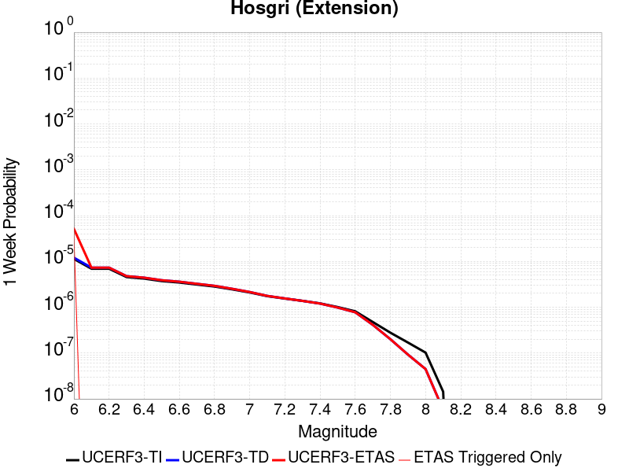 | 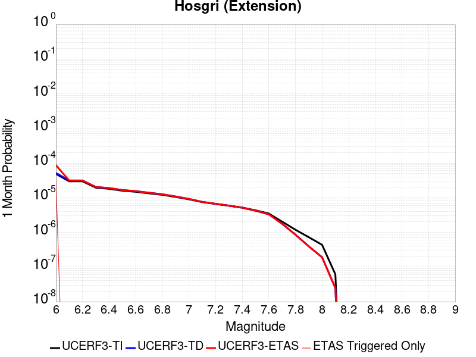 | 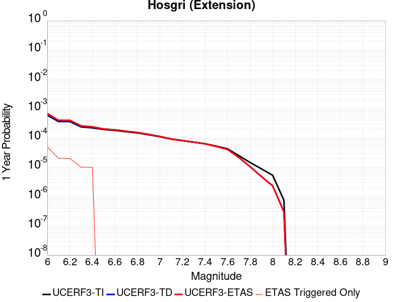 | 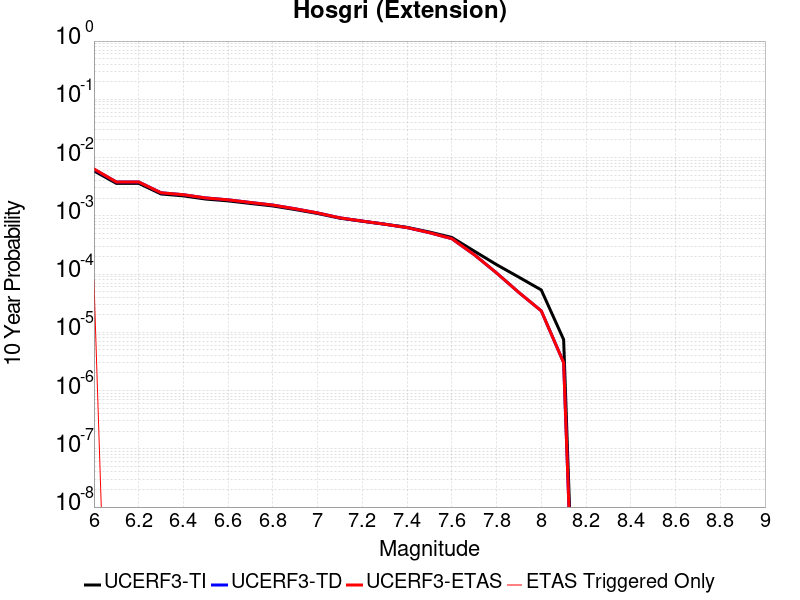 |

| Magnitude | 1 wk TI Prob | 1 wk TD Prob | 1 wk ETAS Prob | 1 wk ETAS/TD Gain | 1 wk ETAS Triggered Only | 1 mo TI Prob | 1 mo TD Prob | 1 mo ETAS Prob | 1 mo ETAS/TD Gain | 1 mo ETAS Triggered Only | 1 yr TI Prob | 1 yr TD Prob | 1 yr ETAS Prob | 1 yr ETAS/TD Gain | 1 yr ETAS Triggered Only | 10 yr TI Prob | 10 yr TD Prob | 10 yr ETAS Prob | 10 yr ETAS/TD Gain | 10 yr ETAS Triggered Only |
|-----|-----|-----|-----|-----|-----|-----|-----|-----|-----|-----|-----|-----|-----|-----|-----|-----|-----|-----|-----|-----|
| 6.0 | 1.1369135E-5 | 1.2083072E-5 | 5.153344E-5 | 4.264929 | 3.9450842E-5 | 4.8723956E-5 | 5.1783692E-5 | 9.12325E-5 | 1.7617997 | 3.9450842E-5 | 5.9305265E-4 | 6.3030684E-4 | 7.091588E-4 | 1.1251009 | 7.8901685E-5 | 0.005914725 | 0.0062874397 | 0.0063658454 | 1.0124702 | 7.8901685E-5 |
| 6.1 | 6.934979E-6 | 7.324555E-6 | 7.324555E-6 | 1.0 | 0.0 | 2.9721E-5 | 3.1390595E-5 | 3.1390595E-5 | 1.0 | 0.0 | 3.617931E-4 | 3.8211764E-4 | 3.8211764E-4 | 1.0 | 0.0 | 0.0036120464 | 0.0038150186 | 0.0038150186 | 1.0 | 0.0 |
| 6.2 | 6.934979E-6 | 7.324555E-6 | 7.324555E-6 | 1.0 | 0.0 | 2.9721E-5 | 3.1390595E-5 | 3.1390595E-5 | 1.0 | 0.0 | 3.617931E-4 | 3.8211764E-4 | 3.8211764E-4 | 1.0 | 0.0 | 0.0036120464 | 0.0038150186 | 0.0038150186 | 1.0 | 0.0 |
| 6.3 | 4.5484676E-6 | 4.76933E-6 | 4.76933E-6 | 1.0 | 0.0 | 1.9493287E-5 | 2.043983E-5 | 2.043983E-5 | 1.0 | 0.0 | 2.3730492E-4 | 2.4882692E-4 | 2.4882692E-4 | 1.0 | 0.0 | 0.0023705168 | 0.0024855258 | 0.0024855258 | 1.0 | 0.0 |
| 6.4 | 4.218095E-6 | 4.4168614E-6 | 4.4168614E-6 | 1.0 | 0.0 | 1.8077424E-5 | 1.8929271E-5 | 1.8929271E-5 | 1.0 | 0.0 | 2.2007042E-4 | 2.3043984E-4 | 2.3043984E-4 | 1.0 | 0.0 | 0.002198526 | 0.0023020422 | 0.0023020422 | 1.0 | 0.0 |
| 6.5 | 3.717374E-6 | 3.8838775E-6 | 3.8838775E-6 | 1.0 | 0.0 | 1.5931506E-5 | 1.6645085E-5 | 1.6645085E-5 | 1.0 | 0.0 | 1.9394881E-4 | 2.0263524E-4 | 2.0263524E-4 | 1.0 | 0.0 | 0.0019377962 | 0.0020245234 | 0.0020245234 | 1.0 | 0.0 |
| 6.6 | 3.4605036E-6 | 3.608306E-6 | 3.608306E-6 | 1.0 | 0.0 | 1.4830645E-5 | 1.5464078E-5 | 1.5464078E-5 | 1.0 | 0.0 | 1.8054814E-4 | 1.8825903E-4 | 1.8825903E-4 | 1.0 | 0.0 | 0.0018040152 | 0.0018810101 | 0.0018810101 | 1.0 | 0.0 |
| 6.7 | 3.123439E-6 | 3.2465687E-6 | 3.2465687E-6 | 1.0 | 0.0 | 1.33860985E-5 | 1.3913792E-5 | 1.3913792E-5 | 1.0 | 0.0 | 1.6296357E-4 | 1.6938736E-4 | 1.6938736E-4 | 1.0 | 0.0 | 0.001628441 | 0.0016925934 | 0.0016925934 | 1.0 | 0.0 |
| 6.8 | 2.8290783E-6 | 2.9305404E-6 | 2.9305404E-6 | 1.0 | 0.0 | 1.2124565E-5 | 1.2559399E-5 | 1.2559399E-5 | 1.0 | 0.0 | 1.4760658E-4 | 1.5290003E-4 | 1.5290003E-4 | 1.0 | 0.0 | 0.0014750857 | 0.001527957 | 0.001527957 | 1.0 | 0.0 |
| 6.9 | 2.454112E-6 | 2.5283196E-6 | 2.5283196E-6 | 1.0 | 0.0 | 1.0517581E-5 | 1.0835611E-5 | 1.0835611E-5 | 1.0 | 0.0 | 1.2804402E-4 | 1.3191563E-4 | 1.3191563E-4 | 1.0 | 0.0 | 0.0012797028 | 0.0013183793 | 0.0013183793 | 1.0 | 0.0 |
| 7.0 | 2.1008145E-6 | 2.1498704E-6 | 2.1498704E-6 | 1.0 | 0.0 | 9.003459E-6 | 9.213698E-6 | 9.213698E-6 | 1.0 | 0.0 | 1.096116E-4 | 1.1217103E-4 | 1.1217103E-4 | 1.0 | 0.0 | 0.0010955755 | 0.0011211479 | 0.0011211479 | 1.0 | 0.0 |
| 7.1 | 1.744384E-6 | 1.7686352E-6 | 1.7686352E-6 | 1.0 | 0.0 | 7.47591E-6 | 7.5798434E-6 | 7.5798434E-6 | 1.0 | 0.0 | 9.1015405E-5 | 9.22807E-5 | 9.22807E-5 | 1.0 | 0.0 | 9.097813E-4 | 9.2242553E-4 | 9.2242553E-4 | 1.0 | 0.0 |
| 7.2 | 1.5456587E-6 | 1.5562882E-6 | 1.5562882E-6 | 1.0 | 0.0 | 6.6242346E-6 | 6.66979E-6 | 6.66979E-6 | 1.0 | 0.0 | 8.064707E-5 | 8.120168E-5 | 8.120168E-5 | 1.0 | 0.0 | 8.0617814E-4 | 8.117213E-4 | 8.117213E-4 | 1.0 | 0.0 |
| 7.3 | 1.3775123E-6 | 1.3766082E-6 | 1.3766082E-6 | 1.0 | 0.0 | 5.9036106E-6 | 5.899736E-6 | 5.899736E-6 | 1.0 | 0.0 | 7.187409E-5 | 7.182693E-5 | 7.182693E-5 | 1.0 | 0.0 | 7.185085E-4 | 7.180382E-4 | 7.180382E-4 | 1.0 | 0.0 |
| 7.4 | 1.214491E-6 | 1.2023461E-6 | 1.2023461E-6 | 1.0 | 0.0 | 5.2049513E-6 | 5.1529014E-6 | 5.1529014E-6 | 1.0 | 0.0 | 6.336844E-5 | 6.2734776E-5 | 6.2734776E-5 | 1.0 | 0.0 | 6.335037E-4 | 6.271715E-4 | 6.271715E-4 | 1.0 | 0.0 |
| 7.5 | 1.0101123E-6 | 9.842246E-7 | 9.842246E-7 | 1.0 | 0.0 | 4.3290456E-6 | 4.2180986E-6 | 4.2180986E-6 | 1.0 | 0.0 | 5.2704854E-5 | 5.1354145E-5 | 5.1354145E-5 | 1.0 | 0.0 | 5.2692357E-4 | 5.1342335E-4 | 5.1342335E-4 | 1.0 | 0.0 |
| 7.6 | 8.1558215E-7 | 7.765966E-7 | 7.765966E-7 | 1.0 | 0.0 | 3.4953473E-6 | 3.328267E-6 | 3.328267E-6 | 1.0 | 0.0 | 4.255502E-5 | 4.0520903E-5 | 4.0520903E-5 | 1.0 | 0.0 | 4.2546875E-4 | 4.0513556E-4 | 4.0513556E-4 | 1.0 | 0.0 |
| 7.7 | 4.757816E-7 | 4.1308888E-7 | 4.1308888E-7 | 1.0 | 0.0 | 2.0390623E-6 | 1.7703798E-6 | 1.7703798E-6 | 1.0 | 0.0 | 2.4825302E-5 | 2.155416E-5 | 2.155416E-5 | 1.0 | 0.0 | 2.482253E-4 | 2.1552083E-4 | 2.1552083E-4 | 1.0 | 0.0 |
| 7.8 | 2.782787E-7 | 2.0047722E-7 | 2.0047722E-7 | 1.0 | 0.0 | 1.1926223E-6 | 8.5918776E-7 | 8.5918776E-7 | 1.0 | 0.0 | 1.452008E-5 | 1.04605615E-5 | 1.04605615E-5 | 1.0 | 0.0 | 1.4519131E-4 | 1.04600724E-4 | 1.04600724E-4 | 1.0 | 0.0 |
| 7.9 | 1.6948086E-7 | 9.244227E-8 | 9.244227E-8 | 1.0 | 0.0 | 7.2634634E-7 | 3.961811E-7 | 3.961811E-7 | 1.0 | 0.0 | 8.843231E-6 | 4.8234942E-6 | 4.8234942E-6 | 1.0 | 0.0 | 8.842879E-5 | 4.8233902E-5 | 4.8233902E-5 | 1.0 | 0.0 |
| 8.0 | 1.0225492E-7 | 4.4738776E-8 | 4.4738776E-8 | 1.0 | 0.0 | 4.382353E-7 | 1.917376E-7 | 1.917376E-7 | 1.0 | 0.0 | 5.335502E-6 | 2.3344028E-6 | 2.3344028E-6 | 1.0 | 0.0 | 5.335374E-5 | 2.3343786E-5 | 2.3343786E-5 | 1.0 | 0.0 |
| 8.1 | 1.43711345E-8 | 5.787707E-9 | 5.787707E-9 | 1.0 | 0.0 | 6.1590576E-8 | 2.480446E-8 | 2.480446E-8 | 1.0 | 0.0 | 7.4986497E-7 | 3.0199428E-7 | 3.0199428E-7 | 1.0 | 0.0 | 7.4986247E-6 | 3.0199392E-6 | 3.0199392E-6 | 1.0 | 0.0 |

## Raymond
*[(top)](#table-of-contents)*

| 1 Week | 1 Month | 1 Year | 10 Year |
|-----|-----|-----|-----|
| 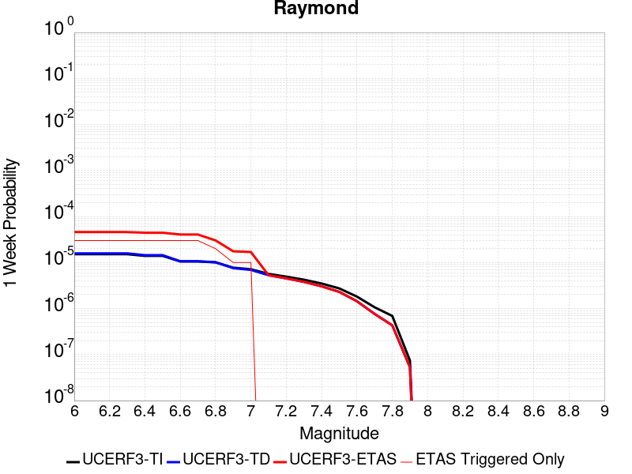 | 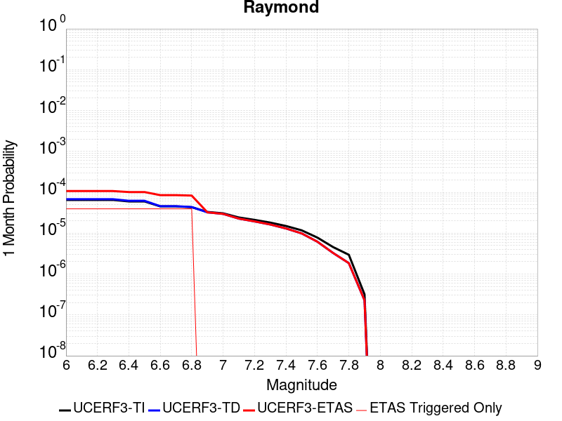 | 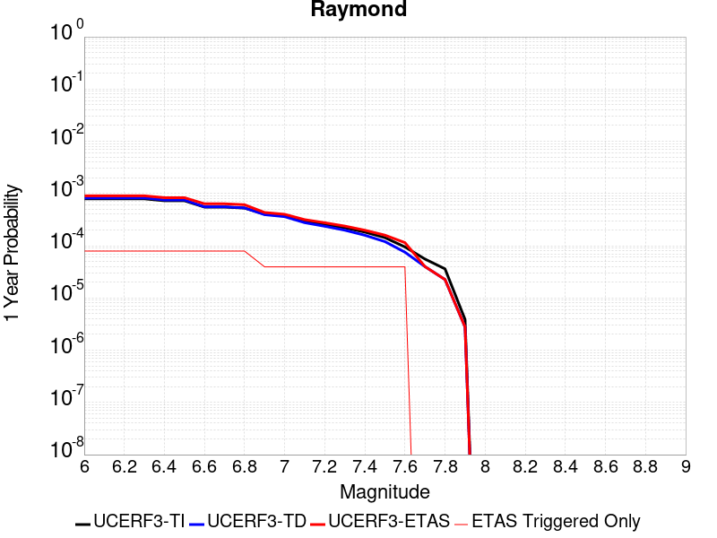 | 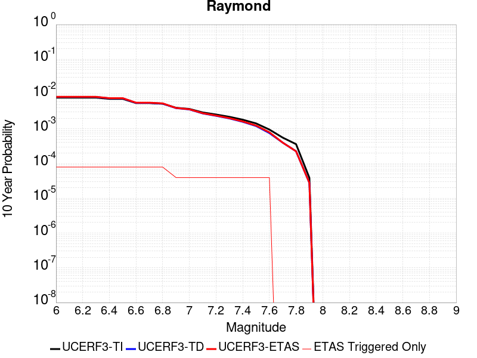 |

| Magnitude | 1 wk TI Prob | 1 wk TD Prob | 1 wk ETAS Prob | 1 wk ETAS/TD Gain | 1 wk ETAS Triggered Only | 1 mo TI Prob | 1 mo TD Prob | 1 mo ETAS Prob | 1 mo ETAS/TD Gain | 1 mo ETAS Triggered Only | 1 yr TI Prob | 1 yr TD Prob | 1 yr ETAS Prob | 1 yr ETAS/TD Gain | 1 yr ETAS Triggered Only | 10 yr TI Prob | 10 yr TD Prob | 10 yr ETAS Prob | 10 yr ETAS/TD Gain | 10 yr ETAS Triggered Only |
|-----|-----|-----|-----|-----|-----|-----|-----|-----|-----|-----|-----|-----|-----|-----|-----|-----|-----|-----|-----|-----|
| 6.0 | 1.5157413E-5 | 1.5810128E-5 | 5.526035E-5 | 3.49525 | 3.9450842E-5 | 6.4958724E-5 | 6.7756075E-5 | 1.0720424E-4 | 1.5822086 | 3.9450842E-5 | 7.905855E-4 | 8.2464307E-4 | 9.034797E-4 | 1.095601 | 7.8901685E-5 | 0.007877788 | 0.008218348 | 0.0082966015 | 1.0095217 | 7.8901685E-5 |
| 6.1 | 1.5157413E-5 | 1.5810128E-5 | 5.526035E-5 | 3.49525 | 3.9450842E-5 | 6.4958724E-5 | 6.7756075E-5 | 1.0720424E-4 | 1.5822086 | 3.9450842E-5 | 7.905855E-4 | 8.2464307E-4 | 9.034797E-4 | 1.095601 | 7.8901685E-5 | 0.007877788 | 0.008218348 | 0.0082966015 | 1.0095217 | 7.8901685E-5 |
| 6.2 | 1.5157413E-5 | 1.5810128E-5 | 5.526035E-5 | 3.49525 | 3.9450842E-5 | 6.4958724E-5 | 6.7756075E-5 | 1.0720424E-4 | 1.5822086 | 3.9450842E-5 | 7.905855E-4 | 8.2464307E-4 | 9.034797E-4 | 1.095601 | 7.8901685E-5 | 0.007877788 | 0.008218348 | 0.0082966015 | 1.0095217 | 7.8901685E-5 |
| 6.3 | 1.5157413E-5 | 1.5810128E-5 | 5.526035E-5 | 3.49525 | 3.9450842E-5 | 6.4958724E-5 | 6.7756075E-5 | 1.0720424E-4 | 1.5822086 | 3.9450842E-5 | 7.905855E-4 | 8.2464307E-4 | 9.034797E-4 | 1.095601 | 7.8901685E-5 | 0.007877788 | 0.008218348 | 0.0082966015 | 1.0095217 | 7.8901685E-5 |
| 6.4 | 1.3941944E-5 | 1.445469E-5 | 5.3904965E-5 | 3.7292368 | 3.9450842E-5 | 5.9749822E-5 | 6.1947336E-5 | 1.0139574E-4 | 1.6368054 | 3.9450842E-5 | 7.2721124E-4 | 7.5397117E-4 | 8.328133E-4 | 1.1045692 | 7.8901685E-5 | 0.007248361 | 0.0075164647 | 0.0075947735 | 1.0104183 | 7.8901685E-5 |
| 6.5 | 1.3941944E-5 | 1.445469E-5 | 5.3904965E-5 | 3.7292368 | 3.9450842E-5 | 5.9749822E-5 | 6.1947336E-5 | 1.0139574E-4 | 1.6368054 | 3.9450842E-5 | 7.2721124E-4 | 7.5397117E-4 | 8.328133E-4 | 1.1045692 | 7.8901685E-5 | 0.007248361 | 0.0075164647 | 0.0075947735 | 1.0104183 | 7.8901685E-5 |
| 6.6 | 1.0542609E-5 | 1.0671113E-5 | 5.0121536E-5 | 4.696936 | 3.9450842E-5 | 4.5181827E-5 | 4.573257E-5 | 8.518161E-5 | 1.8626027 | 3.9450842E-5 | 5.499499E-4 | 5.5665727E-4 | 6.35515E-4 | 1.1416631 | 7.8901685E-5 | 0.005485909 | 0.00555319 | 0.0056316536 | 1.0141294 | 7.8901685E-5 |
| 6.7 | 1.0542609E-5 | 1.0671113E-5 | 5.0121536E-5 | 4.696936 | 3.9450842E-5 | 4.5181827E-5 | 4.573257E-5 | 8.518161E-5 | 1.8626027 | 3.9450842E-5 | 5.499499E-4 | 5.5665727E-4 | 6.35515E-4 | 1.1416631 | 7.8901685E-5 | 0.005485909 | 0.00555319 | 0.0056316536 | 1.0141294 | 7.8901685E-5 |
| 6.8 | 1.0079132E-5 | 1.0176646E-5 | 4.9627088E-5 | 4.8765664 | 3.9450842E-5 | 4.3195567E-5 | 4.3613498E-5 | 8.306262E-5 | 1.9045163 | 3.9450842E-5 | 5.257791E-4 | 5.3087034E-4 | 6.0973014E-4 | 1.1485481 | 7.8901685E-5 | 0.0052453685 | 0.005296571 | 0.005375055 | 1.0148178 | 7.8901685E-5 |
| 6.9 | 7.721598E-6 | 7.5489047E-6 | 7.5489047E-6 | 1.0 | 0.0 | 3.3092143E-5 | 3.2352054E-5 | 3.2352054E-5 | 1.0 | 0.0 | 4.0282236E-4 | 3.9381627E-4 | 4.3325158E-4 | 1.1001363 | 3.9450842E-5 | 0.0040209293 | 0.0039313175 | 0.0039706132 | 1.0099956 | 3.9450842E-5 |
| 7.0 | 7.137566E-6 | 6.9113057E-6 | 6.9113057E-6 | 1.0 | 0.0 | 3.058921E-5 | 2.961955E-5 | 2.961955E-5 | 1.0 | 0.0 | 3.7236E-4 | 3.6055944E-4 | 3.9999606E-4 | 1.1093762 | 3.9450842E-5 | 0.0037173668 | 0.0035998628 | 0.0036391716 | 1.0109196 | 3.9450842E-5 |
| 7.1 | 5.654976E-6 | 5.29954E-6 | 5.29954E-6 | 1.0 | 0.0 | 2.4235387E-5 | 2.2712118E-5 | 2.2712118E-5 | 1.0 | 0.0 | 2.9502588E-4 | 2.7648517E-4 | 3.159251E-4 | 1.1426476 | 3.9450842E-5 | 0.0029463451 | 0.002761443 | 0.0028007848 | 1.0142468 | 3.9450842E-5 |
| 7.2 | 4.9358455E-6 | 4.5266574E-6 | 4.5266574E-6 | 1.0 | 0.0 | 2.1153453E-5 | 1.9399817E-5 | 1.9399817E-5 | 1.0 | 0.0 | 2.5751285E-4 | 2.3616731E-4 | 2.7560885E-4 | 1.1670067 | 3.9450842E-5 | 0.0025721465 | 0.0023591854 | 0.0023985433 | 1.0166827 | 3.9450842E-5 |
| 7.3 | 4.2368597E-6 | 3.8056164E-6 | 3.8056164E-6 | 1.0 | 0.0 | 1.8157843E-5 | 1.6309683E-5 | 1.6309683E-5 | 1.0 | 0.0 | 2.2104931E-4 | 1.9855241E-4 | 2.3799542E-4 | 1.1986529 | 3.9450842E-5 | 0.0022082955 | 0.0019837688 | 0.0020231414 | 1.0198474 | 3.9450842E-5 |
| 7.4 | 3.4999923E-6 | 3.043744E-6 | 3.043744E-6 | 1.0 | 0.0 | 1.49998805E-5 | 1.3044552E-5 | 1.3044552E-5 | 1.0 | 0.0 | 1.8260824E-4 | 1.5880594E-4 | 1.9825052E-4 | 1.2483823 | 3.9450842E-5 | 0.0018245826 | 0.0015869403 | 0.0016263284 | 1.0248202 | 3.9450842E-5 |
| 7.5 | 2.738017E-6 | 2.3020468E-6 | 2.3020468E-6 | 1.0 | 0.0 | 1.1734306E-5 | 9.865878E-6 | 9.865878E-6 | 1.0 | 0.0 | 1.428558E-4 | 1.2011051E-4 | 1.5955661E-4 | 1.3284152 | 3.9450842E-5 | 0.0014276401 | 0.0012004703 | 0.0012398738 | 1.0328233 | 3.9450842E-5 |
| 7.6 | 1.8186392E-6 | 1.442312E-6 | 1.442312E-6 | 1.0 | 0.0 | 7.794145E-6 | 6.181323E-6 | 6.181323E-6 | 1.0 | 0.0 | 9.488958E-5 | 7.5255055E-5 | 1.14702925E-4 | 1.5241891 | 3.9450842E-5 | 9.4849075E-4 | 7.523072E-4 | 7.917284E-4 | 1.0524004 | 3.9450842E-5 |
| 7.7 | 1.0660348E-6 | 7.6438056E-7 | 7.6438056E-7 | 1.0 | 0.0 | 4.5687125E-6 | 3.2759126E-6 | 3.2759126E-6 | 1.0 | 0.0 | 5.5622655E-5 | 3.9883522E-5 | 3.9883522E-5 | 1.0 | 0.0 | 5.5608735E-4 | 3.9877277E-4 | 3.9877277E-4 | 1.0 | 0.0 |
| 7.8 | 6.913602E-7 | 4.3204133E-7 | 4.3204133E-7 | 1.0 | 0.0 | 2.962969E-6 | 1.8516045E-6 | 1.8516045E-6 | 1.0 | 0.0 | 3.607355E-5 | 2.2543056E-5 | 2.2543056E-5 | 1.0 | 0.0 | 3.6067693E-4 | 2.2541556E-4 | 2.2541556E-4 | 1.0 | 0.0 |
| 7.9 | 7.425201E-8 | 5.3222113E-8 | 5.3222113E-8 | 1.0 | 0.0 | 3.1822285E-7 | 2.2809476E-7 | 2.2809476E-7 | 1.0 | 0.0 | 3.874356E-6 | 2.7770516E-6 | 2.7770516E-6 | 1.0 | 0.0 | 3.8742884E-5 | 2.7770298E-5 | 2.7770298E-5 | 1.0 | 0.0 |

## Simi-Santa Rosa
*[(top)](#table-of-contents)*

| 1 Week | 1 Month | 1 Year | 10 Year |
|-----|-----|-----|-----|
| 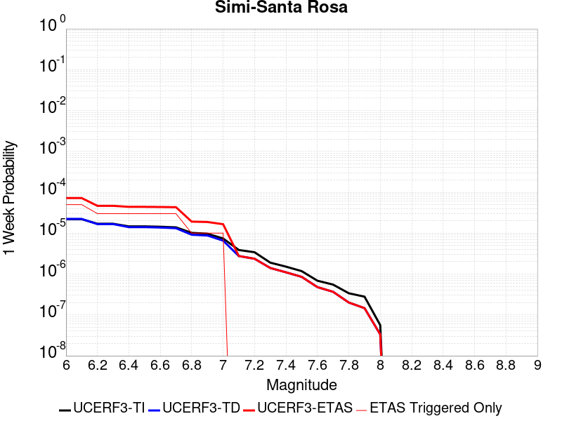 | 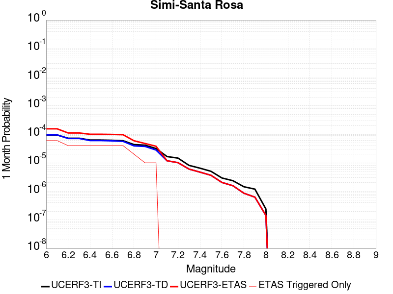 | 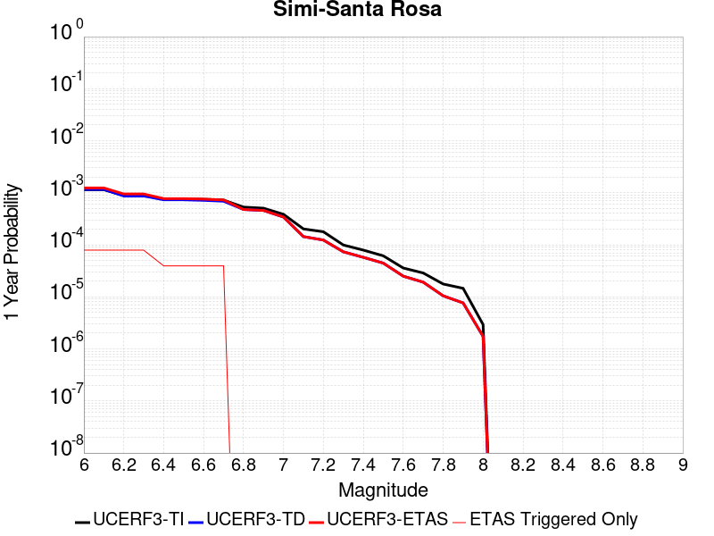 | 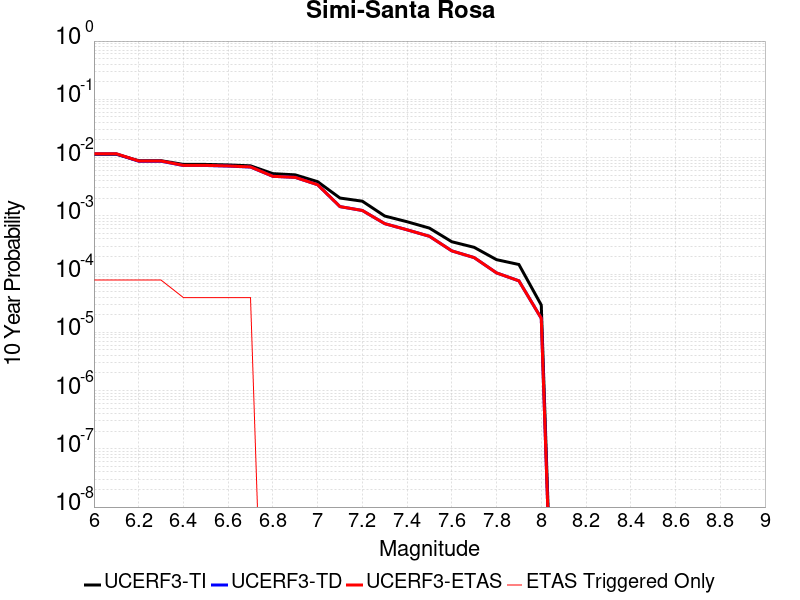 |

| Magnitude | 1 wk TI Prob | 1 wk TD Prob | 1 wk ETAS Prob | 1 wk ETAS/TD Gain | 1 wk ETAS Triggered Only | 1 mo TI Prob | 1 mo TD Prob | 1 mo ETAS Prob | 1 mo ETAS/TD Gain | 1 mo ETAS Triggered Only | 1 yr TI Prob | 1 yr TD Prob | 1 yr ETAS Prob | 1 yr ETAS/TD Gain | 1 yr ETAS Triggered Only | 10 yr TI Prob | 10 yr TD Prob | 10 yr ETAS Prob | 10 yr ETAS/TD Gain | 10 yr ETAS Triggered Only |
|-----|-----|-----|-----|-----|-----|-----|-----|-----|-----|-----|-----|-----|-----|-----|-----|-----|-----|-----|-----|-----|
| 6.0 | 2.198912E-5 | 2.2275442E-5 | 2.2275442E-5 | 1.0 | 0.0 | 9.4235686E-5 | 9.5462936E-5 | 9.5462936E-5 | 1.0 | 0.0 | 0.0011467156 | 0.0011616853 | 0.0012404954 | 1.0678412 | 7.8901685E-5 | 0.011408163 | 0.011560575 | 0.011638565 | 1.0067462 | 7.8901685E-5 |
| 6.1 | 2.198912E-5 | 2.2275442E-5 | 2.2275442E-5 | 1.0 | 0.0 | 9.4235686E-5 | 9.5462936E-5 | 9.5462936E-5 | 1.0 | 0.0 | 0.0011467156 | 0.0011616853 | 0.0012404954 | 1.0678412 | 7.8901685E-5 | 0.011408163 | 0.011560575 | 0.011638565 | 1.0067462 | 7.8901685E-5 |
| 6.2 | 1.69983E-5 | 1.6668559E-5 | 1.6668559E-5 | 1.0 | 0.0 | 7.284782E-5 | 7.143489E-5 | 7.143489E-5 | 1.0 | 0.0 | 8.865613E-4 | 8.6940196E-4 | 9.4823504E-4 | 1.0906751 | 7.8901685E-5 | 0.008830327 | 0.008662928 | 0.008741146 | 1.009029 | 7.8901685E-5 |
| 6.3 | 1.69983E-5 | 1.6668559E-5 | 1.6668559E-5 | 1.0 | 0.0 | 7.284782E-5 | 7.143489E-5 | 7.143489E-5 | 1.0 | 0.0 | 8.865613E-4 | 8.6940196E-4 | 9.4823504E-4 | 1.0906751 | 7.8901685E-5 | 0.008830327 | 0.008662928 | 0.008741146 | 1.009029 | 7.8901685E-5 |
| 6.4 | 1.4666188E-5 | 1.4052543E-5 | 1.4052543E-5 | 1.0 | 0.0 | 6.285358E-5 | 6.0223934E-5 | 6.0223934E-5 | 1.0 | 0.0 | 7.6497364E-4 | 7.3300465E-4 | 7.7242655E-4 | 1.0537813 | 3.9450842E-5 | 0.0076234564 | 0.007308344 | 0.0073475065 | 1.0053586 | 3.9450842E-5 |
| 6.5 | 1.4666188E-5 | 1.4052543E-5 | 1.4052543E-5 | 1.0 | 0.0 | 6.285358E-5 | 6.0223934E-5 | 6.0223934E-5 | 1.0 | 0.0 | 7.6497364E-4 | 7.3300465E-4 | 7.7242655E-4 | 1.0537813 | 3.9450842E-5 | 0.0076234564 | 0.007308344 | 0.0073475065 | 1.0053586 | 3.9450842E-5 |
| 6.6 | 1.4377586E-5 | 1.3729583E-5 | 1.3729583E-5 | 1.0 | 0.0 | 6.1616774E-5 | 5.883988E-5 | 5.883988E-5 | 1.0 | 0.0 | 7.4992597E-4 | 7.1616494E-4 | 7.5558753E-4 | 1.0550468 | 3.9450842E-5 | 0.007474003 | 0.0071410383 | 0.0071802074 | 1.005485 | 3.9450842E-5 |
| 6.7 | 1.3881404E-5 | 1.320755E-5 | 1.320755E-5 | 1.0 | 0.0 | 5.9490372E-5 | 5.66027E-5 | 5.66027E-5 | 1.0 | 0.0 | 7.240546E-4 | 6.8894465E-4 | 7.2836835E-4 | 1.0572233 | 3.9450842E-5 | 0.007217 | 0.006870538 | 0.006909718 | 1.0057026 | 3.9450842E-5 |
| 6.8 | 1.0176516E-5 | 9.154151E-6 | 9.154151E-6 | 1.0 | 0.0 | 4.3612912E-5 | 3.9231574E-5 | 3.9231574E-5 | 1.0 | 0.0 | 5.308578E-4 | 4.7755634E-4 | 4.7755634E-4 | 1.0 | 0.0 | 0.0052959146 | 0.004766934 | 0.004766934 | 1.0 | 0.0 |
| 6.9 | 9.699797E-6 | 8.774719E-6 | 8.774719E-6 | 1.0 | 0.0 | 4.15699E-5 | 3.7605492E-5 | 3.7605492E-5 | 1.0 | 0.0 | 5.05996E-4 | 4.577671E-4 | 4.577671E-4 | 1.0 | 0.0 | 0.005048454 | 0.0045698597 | 0.0045698597 | 1.0 | 0.0 |
| 7.0 | 7.4049476E-6 | 6.559333E-6 | 6.559333E-6 | 1.0 | 0.0 | 3.1735104E-5 | 2.8111197E-5 | 2.8111197E-5 | 1.0 | 0.0 | 3.8630638E-4 | 3.422127E-4 | 3.422127E-4 | 1.0 | 0.0 | 0.0038563553 | 0.0034180996 | 0.0034180996 | 1.0 | 0.0 |
| 7.1 | 3.873439E-6 | 2.7595095E-6 | 2.7595095E-6 | 1.0 | 0.0 | 1.6600346E-5 | 1.1826417E-5 | 1.1826417E-5 | 1.0 | 0.0 | 2.0209046E-4 | 1.4397735E-4 | 1.4397735E-4 | 1.0 | 0.0 | 0.0020190678 | 0.0014388643 | 0.0014388643 | 1.0 | 0.0 |
| 7.2 | 3.417706E-6 | 2.3676484E-6 | 2.3676484E-6 | 1.0 | 0.0 | 1.4647229E-5 | 1.0147027E-5 | 1.0147027E-5 | 1.0 | 0.0 | 1.7831543E-4 | 1.2353327E-4 | 1.2353327E-4 | 1.0 | 0.0 | 0.0017817242 | 0.0012346683 | 0.0012346683 | 1.0 | 0.0 |
| 7.3 | 1.90225E-6 | 1.4073753E-6 | 1.4073753E-6 | 1.0 | 0.0 | 8.152474E-6 | 6.0315947E-6 | 6.0315947E-6 | 1.0 | 0.0 | 9.9251854E-5 | 7.343221E-5 | 7.343221E-5 | 1.0 | 0.0 | 9.920754E-4 | 7.340817E-4 | 7.340817E-4 | 1.0 | 0.0 |
| 7.4 | 1.5170556E-6 | 1.1024773E-6 | 1.1024773E-6 | 1.0 | 0.0 | 6.5016507E-6 | 4.724894E-6 | 4.724894E-6 | 1.0 | 0.0 | 7.915472E-5 | 5.7524077E-5 | 5.7524077E-5 | 1.0 | 0.0 | 7.9126534E-4 | 5.7509297E-4 | 5.7509297E-4 | 1.0 | 0.0 |
| 7.5 | 1.178732E-6 | 8.535102E-7 | 8.535102E-7 | 1.0 | 0.0 | 5.0516987E-6 | 3.6578958E-6 | 3.6578958E-6 | 1.0 | 0.0 | 6.1502695E-5 | 4.453398E-5 | 4.453398E-5 | 1.0 | 0.0 | 6.148568E-4 | 4.452515E-4 | 4.452515E-4 | 1.0 | 0.0 |
| 7.6 | 6.8722386E-7 | 4.793198E-7 | 4.793198E-7 | 1.0 | 0.0 | 2.9452417E-6 | 2.054226E-6 | 2.054226E-6 | 1.0 | 0.0 | 3.5857727E-5 | 2.5009915E-5 | 2.5009915E-5 | 1.0 | 0.0 | 3.5851944E-4 | 2.5007114E-4 | 2.5007114E-4 | 1.0 | 0.0 |
| 7.7 | 5.5126515E-7 | 3.6731157E-7 | 3.6731157E-7 | 1.0 | 0.0 | 2.3625628E-6 | 1.5741915E-6 | 1.5741915E-6 | 1.0 | 0.0 | 2.8763823E-5 | 1.9165615E-5 | 1.9165615E-5 | 1.0 | 0.0 | 2.87601E-4 | 1.9163972E-4 | 1.9163972E-4 | 1.0 | 0.0 |
| 7.8 | 3.3860243E-7 | 2.0075942E-7 | 2.0075942E-7 | 1.0 | 0.0 | 1.4511525E-6 | 8.6039717E-7 | 8.6039717E-7 | 1.0 | 0.0 | 1.7667637E-5 | 1.0475286E-5 | 1.0475286E-5 | 1.0 | 0.0 | 1.7666233E-4 | 1.04747975E-4 | 1.04747975E-4 | 1.0 | 0.0 |
| 7.9 | 2.7955386E-7 | 1.4649108E-7 | 1.4649108E-7 | 1.0 | 0.0 | 1.1980875E-6 | 6.278188E-7 | 6.278188E-7 | 1.0 | 0.0 | 1.4586617E-5 | 7.643667E-6 | 7.643667E-6 | 1.0 | 0.0 | 1.458566E-4 | 7.643409E-5 | 7.643409E-5 | 1.0 | 0.0 |
| 8.0 | 5.6259015E-8 | 3.3355324E-8 | 3.3355324E-8 | 1.0 | 0.0 | 2.4111003E-7 | 1.4295138E-7 | 1.4295138E-7 | 1.0 | 0.0 | 2.9355108E-6 | 1.7404317E-6 | 1.7404317E-6 | 1.0 | 0.0 | 2.935472E-5 | 1.7404194E-5 | 1.7404194E-5 | 1.0 | 0.0 |

## Santa Susana alt 1
*[(top)](#table-of-contents)*

| 1 Week | 1 Month | 1 Year | 10 Year |
|-----|-----|-----|-----|
| 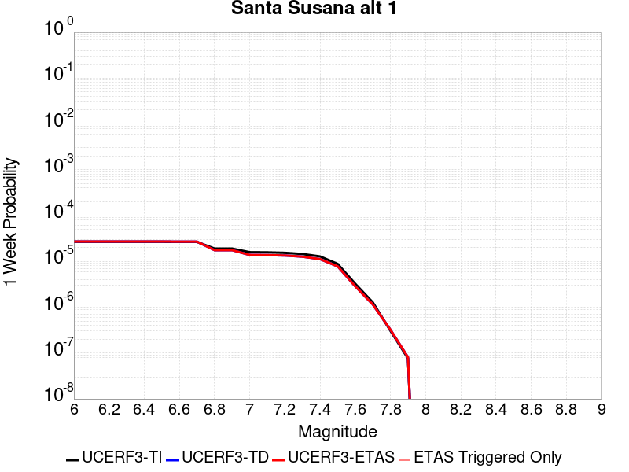 | 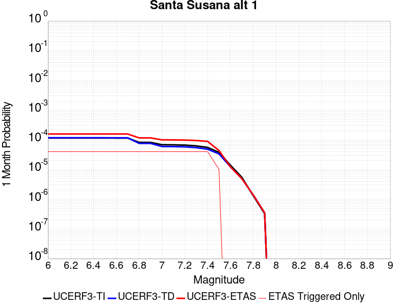 | 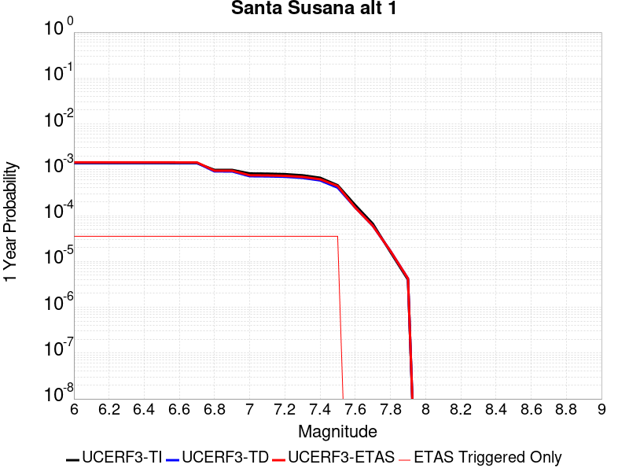 | 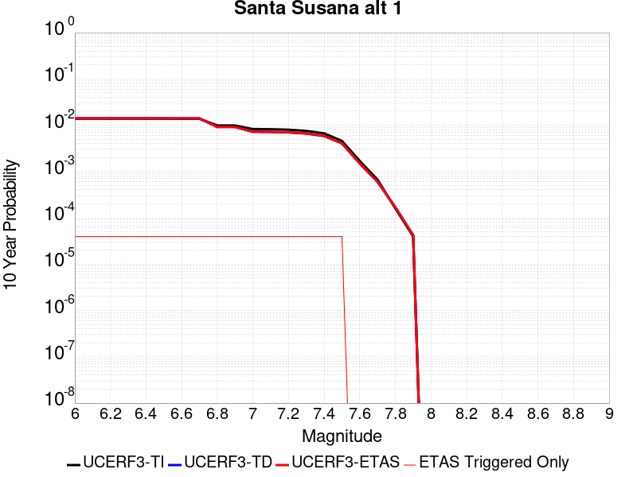 |

| Magnitude | 1 wk TI Prob | 1 wk TD Prob | 1 wk ETAS Prob | 1 wk ETAS/TD Gain | 1 wk ETAS Triggered Only | 1 mo TI Prob | 1 mo TD Prob | 1 mo ETAS Prob | 1 mo ETAS/TD Gain | 1 mo ETAS Triggered Only | 1 yr TI Prob | 1 yr TD Prob | 1 yr ETAS Prob | 1 yr ETAS/TD Gain | 1 yr ETAS Triggered Only | 10 yr TI Prob | 10 yr TD Prob | 10 yr ETAS Prob | 10 yr ETAS/TD Gain | 10 yr ETAS Triggered Only |
|-----|-----|-----|-----|-----|-----|-----|-----|-----|-----|-----|-----|-----|-----|-----|-----|-----|-----|-----|-----|-----|
| 6.0 | 2.674877E-5 | 2.7198023E-5 | 2.7198023E-5 | 1.0 | 0.0 | 1.1463255E-4 | 1.1655839E-4 | 1.1655839E-4 | 1.0 | 0.0 | 0.0013947578 | 0.0014182882 | 0.001457683 | 1.0277764 | 3.9450842E-5 | 0.013860362 | 0.014104128 | 0.014143022 | 1.0027577 | 3.9450842E-5 |
| 6.1 | 2.674877E-5 | 2.7198023E-5 | 2.7198023E-5 | 1.0 | 0.0 | 1.1463255E-4 | 1.1655839E-4 | 1.1655839E-4 | 1.0 | 0.0 | 0.0013947578 | 0.0014182882 | 0.001457683 | 1.0277764 | 3.9450842E-5 | 0.013860362 | 0.014104128 | 0.014143022 | 1.0027577 | 3.9450842E-5 |
| 6.2 | 2.674877E-5 | 2.7198023E-5 | 2.7198023E-5 | 1.0 | 0.0 | 1.1463255E-4 | 1.1655839E-4 | 1.1655839E-4 | 1.0 | 0.0 | 0.0013947578 | 0.0014182882 | 0.001457683 | 1.0277764 | 3.9450842E-5 | 0.013860362 | 0.014104128 | 0.014143022 | 1.0027577 | 3.9450842E-5 |
| 6.3 | 2.674877E-5 | 2.7198023E-5 | 2.7198023E-5 | 1.0 | 0.0 | 1.1463255E-4 | 1.1655839E-4 | 1.1655839E-4 | 1.0 | 0.0 | 0.0013947578 | 0.0014182882 | 0.001457683 | 1.0277764 | 3.9450842E-5 | 0.013860362 | 0.014104128 | 0.014143022 | 1.0027577 | 3.9450842E-5 |
| 6.4 | 2.674877E-5 | 2.7198023E-5 | 2.7198023E-5 | 1.0 | 0.0 | 1.1463255E-4 | 1.1655839E-4 | 1.1655839E-4 | 1.0 | 0.0 | 0.0013947578 | 0.0014182882 | 0.001457683 | 1.0277764 | 3.9450842E-5 | 0.013860362 | 0.014104128 | 0.014143022 | 1.0027577 | 3.9450842E-5 |
| 6.5 | 2.674877E-5 | 2.7198023E-5 | 2.7198023E-5 | 1.0 | 0.0 | 1.1463255E-4 | 1.1655839E-4 | 1.1655839E-4 | 1.0 | 0.0 | 0.0013947578 | 0.0014182882 | 0.001457683 | 1.0277764 | 3.9450842E-5 | 0.013860362 | 0.014104128 | 0.014143022 | 1.0027577 | 3.9450842E-5 |
| 6.6 | 2.6647976E-5 | 2.7074359E-5 | 2.7074359E-5 | 1.0 | 0.0 | 1.14200615E-4 | 1.1602845E-4 | 1.1602845E-4 | 1.0 | 0.0 | 0.0013895056 | 0.0014118447 | 0.0014512399 | 1.0279033 | 3.9450842E-5 | 0.013808494 | 0.014040513 | 0.01407941 | 1.0027703 | 3.9450842E-5 |
| 6.7 | 2.6647976E-5 | 2.7074359E-5 | 2.7074359E-5 | 1.0 | 0.0 | 1.14200615E-4 | 1.1602845E-4 | 1.1602845E-4 | 1.0 | 0.0 | 0.0013895056 | 0.0014118447 | 0.0014512399 | 1.0279033 | 3.9450842E-5 | 0.013808494 | 0.014040513 | 0.01407941 | 1.0027703 | 3.9450842E-5 |
| 6.8 | 1.9073179E-5 | 1.7637283E-5 | 1.7637283E-5 | 1.0 | 0.0 | 8.1739636E-5 | 7.558627E-5 | 7.558627E-5 | 1.0 | 0.0 | 9.947256E-4 | 9.198925E-4 | 9.59307E-4 | 1.0428469 | 3.9450842E-5 | 0.009902848 | 0.009163101 | 0.009202191 | 1.0042659 | 3.9450842E-5 |
| 6.9 | 1.9041876E-5 | 1.7619415E-5 | 1.7619415E-5 | 1.0 | 0.0 | 8.160549E-5 | 7.55097E-5 | 7.55097E-5 | 1.0 | 0.0 | 9.930939E-4 | 9.1896096E-4 | 9.583756E-4 | 1.0428904 | 3.9450842E-5 | 0.0098866755 | 0.0091538625 | 0.009192952 | 1.0042703 | 3.9450842E-5 |
| 7.0 | 1.5917482E-5 | 1.3863864E-5 | 1.3863864E-5 | 1.0 | 0.0 | 6.8215995E-5 | 5.9415237E-5 | 5.9415237E-5 | 1.0 | 0.0 | 8.302132E-4 | 7.231451E-4 | 7.625674E-4 | 1.0545151 | 3.9450842E-5 | 0.008271185 | 0.0072088144 | 0.0072479807 | 1.0054331 | 3.9450842E-5 |
| 7.1 | 1.577788E-5 | 1.3743872E-5 | 1.3743872E-5 | 1.0 | 0.0 | 6.761774E-5 | 5.8901005E-5 | 5.8901005E-5 | 1.0 | 0.0 | 8.2293496E-4 | 7.1688846E-4 | 7.56311E-4 | 1.0549912 | 3.9450842E-5 | 0.008198941 | 0.007146652 | 0.007185821 | 1.0054808 | 3.9450842E-5 |
| 7.2 | 1.5416446E-5 | 1.3469944E-5 | 1.3469944E-5 | 1.0 | 0.0 | 6.606882E-5 | 5.772708E-5 | 5.772708E-5 | 1.0 | 0.0 | 8.0409093E-4 | 7.026052E-4 | 7.4202835E-4 | 1.0561099 | 3.9450842E-5 | 0.008011877 | 0.0070047234 | 0.007043898 | 1.0055926 | 3.9450842E-5 |
| 7.3 | 1.4534083E-5 | 1.2717879E-5 | 1.2717879E-5 | 1.0 | 0.0 | 6.228744E-5 | 5.4504082E-5 | 5.4504082E-5 | 1.0 | 0.0 | 7.580857E-4 | 6.633896E-4 | 7.0281426E-4 | 1.0594292 | 3.9450842E-5 | 0.007555048 | 0.0066149444 | 0.0066541345 | 1.0059245 | 3.9450842E-5 |
| 7.4 | 1.2858995E-5 | 1.1229652E-5 | 1.1229652E-5 | 1.0 | 0.0 | 5.5108816E-5 | 4.8126214E-5 | 4.8126214E-5 | 1.0 | 0.0 | 6.7074323E-4 | 5.857831E-4 | 6.252108E-4 | 1.0673077 | 3.9450842E-5 | 0.0066872234 | 0.005843165 | 0.005882385 | 1.0067122 | 3.9450842E-5 |
| 7.5 | 8.827668E-6 | 7.805457E-6 | 7.805457E-6 | 1.0 | 0.0 | 3.7832317E-5 | 3.3451546E-5 | 3.3451546E-5 | 1.0 | 0.0 | 4.605111E-4 | 4.071989E-4 | 4.4663367E-4 | 1.0968441 | 3.9450842E-5 | 0.0045955796 | 0.0040647765 | 0.004104067 | 1.0096661 | 3.9450842E-5 |
| 7.6 | 3.2533426E-6 | 2.871988E-6 | 2.871988E-6 | 1.0 | 0.0 | 1.3942822E-5 | 1.2308465E-5 | 1.2308465E-5 | 1.0 | 0.0 | 1.6974064E-4 | 1.4984563E-4 | 1.4984563E-4 | 1.0 | 0.0 | 0.0016961104 | 0.0014974826 | 0.0014974826 | 1.0 | 0.0 |
| 7.7 | 1.2751709E-6 | 1.1491089E-6 | 1.1491089E-6 | 1.0 | 0.0 | 5.4650063E-6 | 4.9247437E-6 | 4.9247437E-6 | 1.0 | 0.0 | 6.653442E-5 | 5.9957198E-5 | 5.9957198E-5 | 1.0 | 0.0 | 6.6514505E-4 | 5.994191E-4 | 5.994191E-4 | 1.0 | 0.0 |
| 7.8 | 3.067544E-7 | 3.2400436E-7 | 3.2400436E-7 | 1.0 | 0.0 | 1.3146611E-6 | 1.3885895E-6 | 1.3885895E-6 | 1.0 | 0.0 | 1.600588E-5 | 1.6905957E-5 | 1.6905957E-5 | 1.0 | 0.0 | 1.6004729E-4 | 1.6904772E-4 | 1.6904772E-4 | 1.0 | 0.0 |
| 7.9 | 7.622999E-8 | 8.087964E-8 | 8.087964E-8 | 1.0 | 0.0 | 3.2669993E-7 | 3.4662696E-7 | 3.4662696E-7 | 1.0 | 0.0 | 3.977564E-6 | 4.2201773E-6 | 4.2201773E-6 | 1.0 | 0.0 | 3.977493E-5 | 4.220118E-5 | 4.220118E-5 | 1.0 | 0.0 |

## Mission Hills 2011
*[(top)](#table-of-contents)*

| 1 Week | 1 Month | 1 Year | 10 Year |
|-----|-----|-----|-----|
| 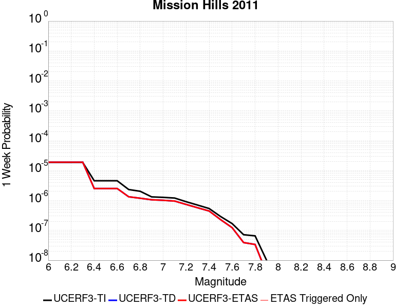 | 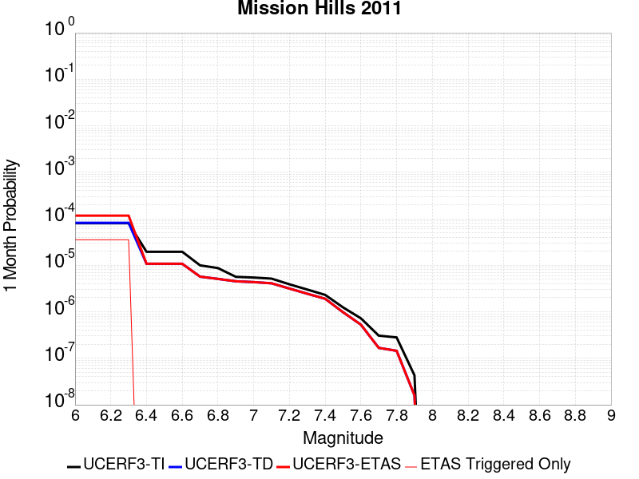 | 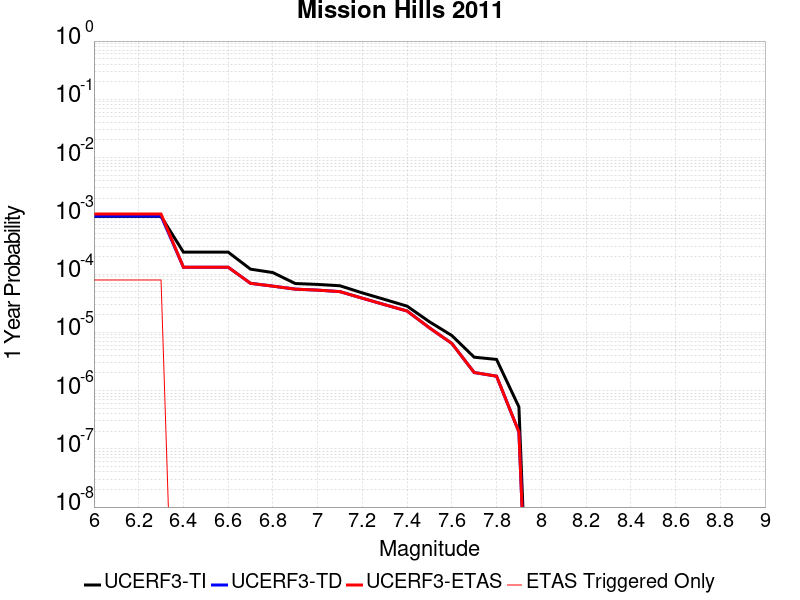 | 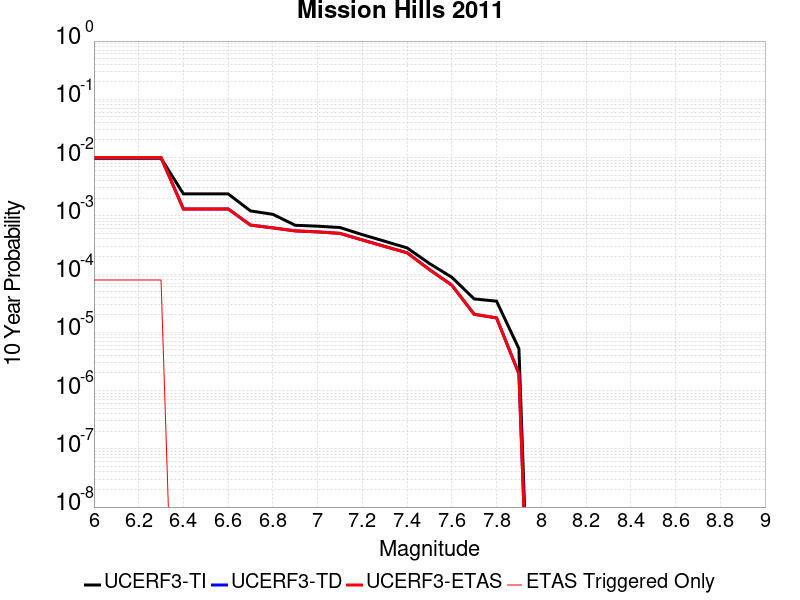 |

| Magnitude | 1 wk TI Prob | 1 wk TD Prob | 1 wk ETAS Prob | 1 wk ETAS/TD Gain | 1 wk ETAS Triggered Only | 1 mo TI Prob | 1 mo TD Prob | 1 mo ETAS Prob | 1 mo ETAS/TD Gain | 1 mo ETAS Triggered Only | 1 yr TI Prob | 1 yr TD Prob | 1 yr ETAS Prob | 1 yr ETAS/TD Gain | 1 yr ETAS Triggered Only | 10 yr TI Prob | 10 yr TD Prob | 10 yr ETAS Prob | 10 yr ETAS/TD Gain | 10 yr ETAS Triggered Only |
|-----|-----|-----|-----|-----|-----|-----|-----|-----|-----|-----|-----|-----|-----|-----|-----|-----|-----|-----|-----|-----|
| 6.0 | 1.8765717E-5 | 1.9054645E-5 | 1.9054645E-5 | 1.0 | 0.0 | 8.0422025E-5 | 8.166215E-5 | 1.2110977E-4 | 1.4830588 | 3.9450842E-5 | 9.786983E-4 | 9.941267E-4 | 0.0010729498 | 1.079289 | 7.8901685E-5 | 0.009743992 | 0.009930461 | 0.010008579 | 1.0078665 | 7.8901685E-5 |
| 6.1 | 1.8765717E-5 | 1.9054645E-5 | 1.9054645E-5 | 1.0 | 0.0 | 8.0422025E-5 | 8.166215E-5 | 1.2110977E-4 | 1.4830588 | 3.9450842E-5 | 9.786983E-4 | 9.941267E-4 | 0.0010729498 | 1.079289 | 7.8901685E-5 | 0.009743992 | 0.009930461 | 0.010008579 | 1.0078665 | 7.8901685E-5 |
| 6.2 | 1.8765717E-5 | 1.9054645E-5 | 1.9054645E-5 | 1.0 | 0.0 | 8.0422025E-5 | 8.166215E-5 | 1.2110977E-4 | 1.4830588 | 3.9450842E-5 | 9.786983E-4 | 9.941267E-4 | 0.0010729498 | 1.079289 | 7.8901685E-5 | 0.009743992 | 0.009930461 | 0.010008579 | 1.0078665 | 7.8901685E-5 |
| 6.3 | 1.8765717E-5 | 1.9054645E-5 | 1.9054645E-5 | 1.0 | 0.0 | 8.0422025E-5 | 8.166215E-5 | 1.2110977E-4 | 1.4830588 | 3.9450842E-5 | 9.786983E-4 | 9.941267E-4 | 0.0010729498 | 1.079289 | 7.8901685E-5 | 0.009743992 | 0.009930461 | 0.010008579 | 1.0078665 | 7.8901685E-5 |
| 6.4 | 4.566357E-6 | 2.5148488E-6 | 2.5148488E-6 | 1.0 | 0.0 | 1.9569954E-5 | 1.0777889E-5 | 1.0777889E-5 | 1.0 | 0.0 | 2.3823815E-4 | 1.3121472E-4 | 1.3121472E-4 | 1.0 | 0.0 | 0.002379829 | 0.0013115506 | 0.0013115506 | 1.0 | 0.0 |
| 6.5 | 4.566357E-6 | 2.5148488E-6 | 2.5148488E-6 | 1.0 | 0.0 | 1.9569954E-5 | 1.0777889E-5 | 1.0777889E-5 | 1.0 | 0.0 | 2.3823815E-4 | 1.3121472E-4 | 1.3121472E-4 | 1.0 | 0.0 | 0.002379829 | 0.0013115506 | 0.0013115506 | 1.0 | 0.0 |
| 6.6 | 4.566357E-6 | 2.5148488E-6 | 2.5148488E-6 | 1.0 | 0.0 | 1.9569954E-5 | 1.0777889E-5 | 1.0777889E-5 | 1.0 | 0.0 | 2.3823815E-4 | 1.3121472E-4 | 1.3121472E-4 | 1.0 | 0.0 | 0.002379829 | 0.0013115506 | 0.0013115506 | 1.0 | 0.0 |
| 6.7 | 2.3266773E-6 | 1.3296187E-6 | 1.3296187E-6 | 1.0 | 0.0 | 9.971435E-6 | 5.698354E-6 | 5.698354E-6 | 1.0 | 0.0 | 1.2139547E-4 | 6.937531E-5 | 6.937531E-5 | 1.0 | 0.0 | 0.0012132917 | 6.9354265E-4 | 6.9354265E-4 | 1.0 | 0.0 |
| 6.8 | 2.032735E-6 | 1.1894115E-6 | 1.1894115E-6 | 1.0 | 0.0 | 8.711692E-6 | 5.097468E-6 | 5.097468E-6 | 1.0 | 0.0 | 1.06059684E-4 | 6.205996E-5 | 6.205996E-5 | 1.0 | 0.0 | 0.0010600908 | 6.2043115E-4 | 6.2043115E-4 | 1.0 | 0.0 |
| 6.9 | 1.3186259E-6 | 1.0561778E-6 | 1.0561778E-6 | 1.0 | 0.0 | 5.6512413E-6 | 4.5264687E-6 | 4.5264687E-6 | 1.0 | 0.0 | 6.8801695E-5 | 5.5108394E-5 | 5.5108394E-5 | 1.0 | 0.0 | 6.8780396E-4 | 5.5095024E-4 | 5.5095024E-4 | 1.0 | 0.0 |
| 7.0 | 1.2726016E-6 | 1.0159088E-6 | 1.0159088E-6 | 1.0 | 0.0 | 5.4539955E-6 | 4.3538876E-6 | 4.3538876E-6 | 1.0 | 0.0 | 6.6400375E-5 | 5.300732E-5 | 5.300732E-5 | 1.0 | 0.0 | 6.6380535E-4 | 5.299496E-4 | 5.299496E-4 | 1.0 | 0.0 |
| 7.1 | 1.2063913E-6 | 9.570072E-7 | 9.570072E-7 | 1.0 | 0.0 | 5.170238E-6 | 4.101453E-6 | 4.101453E-6 | 1.0 | 0.0 | 6.294583E-5 | 4.9934075E-5 | 4.9934075E-5 | 1.0 | 0.0 | 6.2928005E-4 | 4.992311E-4 | 4.992311E-4 | 1.0 | 0.0 |
| 7.2 | 9.105806E-7 | 7.3765557E-7 | 7.3765557E-7 | 1.0 | 0.0 | 3.9024826E-6 | 3.1613772E-6 | 3.1613772E-6 | 1.0 | 0.0 | 4.7511687E-5 | 3.8489103E-5 | 3.8489103E-5 | 1.0 | 0.0 | 4.7501532E-4 | 3.8482592E-4 | 3.8482592E-4 | 1.0 | 0.0 |
| 7.3 | 7.020432E-7 | 5.710089E-7 | 5.710089E-7 | 1.0 | 0.0 | 3.0087533E-6 | 2.447179E-6 | 2.447179E-6 | 1.0 | 0.0 | 3.6630954E-5 | 2.979401E-5 | 2.979401E-5 | 1.0 | 0.0 | 3.6624918E-4 | 2.9790145E-4 | 2.9790145E-4 | 1.0 | 0.0 |
| 7.4 | 5.3900635E-7 | 4.4480825E-7 | 4.4480825E-7 | 1.0 | 0.0 | 2.3100251E-6 | 1.9063198E-6 | 1.9063198E-6 | 1.0 | 0.0 | 2.8124194E-5 | 2.3209208E-5 | 2.3209208E-5 | 1.0 | 0.0 | 2.8120633E-4 | 2.3206905E-4 | 2.3206905E-4 | 1.0 | 0.0 |
| 7.5 | 2.907075E-7 | 2.2875415E-7 | 2.2875415E-7 | 1.0 | 0.0 | 1.2458887E-6 | 9.803746E-7 | 9.803746E-7 | 1.0 | 0.0 | 1.5168589E-5 | 1.1935997E-5 | 1.1935997E-5 | 1.0 | 0.0 | 1.5167553E-4 | 1.1935373E-4 | 1.1935373E-4 | 1.0 | 0.0 |
| 7.6 | 1.6903675E-7 | 1.2353402E-7 | 1.2353402E-7 | 1.0 | 0.0 | 7.2444305E-7 | 5.294314E-7 | 5.294314E-7 | 1.0 | 0.0 | 8.820059E-6 | 6.4458095E-6 | 6.4458095E-6 | 1.0 | 0.0 | 8.8197085E-5 | 6.445635E-5 | 6.445635E-5 | 1.0 | 0.0 |
| 7.7 | 7.168073E-8 | 3.9135116E-8 | 3.9135116E-8 | 1.0 | 0.0 | 3.072031E-7 | 1.6772192E-7 | 1.6772192E-7 | 1.0 | 0.0 | 3.7401915E-6 | 2.0420127E-6 | 2.0420127E-6 | 1.0 | 0.0 | 3.7401285E-5 | 2.041995E-5 | 2.041995E-5 | 1.0 | 0.0 |
| 7.8 | 6.564101E-8 | 3.3835356E-8 | 3.3835356E-8 | 1.0 | 0.0 | 2.813186E-7 | 1.4500866E-7 | 1.4500866E-7 | 1.0 | 0.0 | 3.4250486E-6 | 1.7654792E-6 | 1.7654792E-6 | 1.0 | 0.0 | 3.424996E-5 | 1.7654662E-5 | 1.7654662E-5 | 1.0 | 0.0 |
| 7.9 | 1.0029074E-8 | 3.7292542E-9 | 3.7292542E-9 | 1.0 | 0.0 | 4.2981743E-8 | 1.5982518E-8 | 1.5982518E-8 | 1.0 | 0.0 | 5.2330256E-7 | 1.9458714E-7 | 1.9458714E-7 | 1.0 | 0.0 | 5.2330133E-6 | 1.945871E-6 | 1.945871E-6 | 1.0 | 0.0 |

## San Juan
*[(top)](#table-of-contents)*

| 1 Week | 1 Month | 1 Year | 10 Year |
|-----|-----|-----|-----|
| 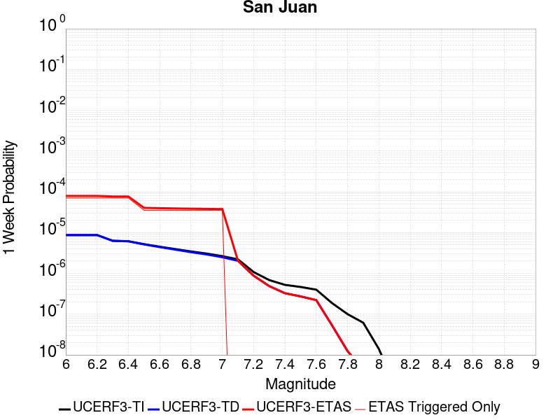 | 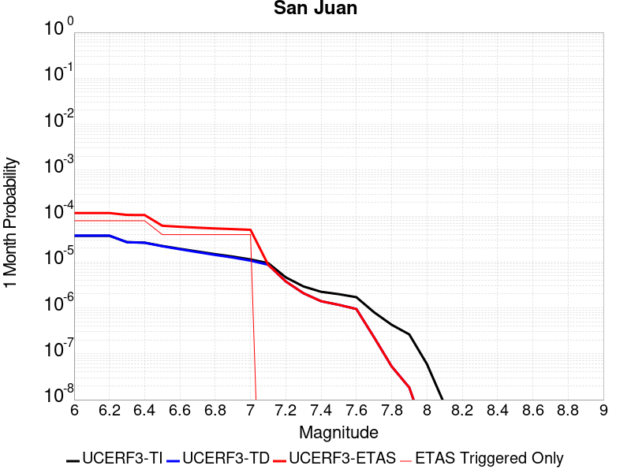 | 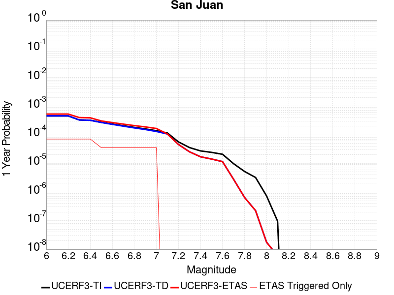 | 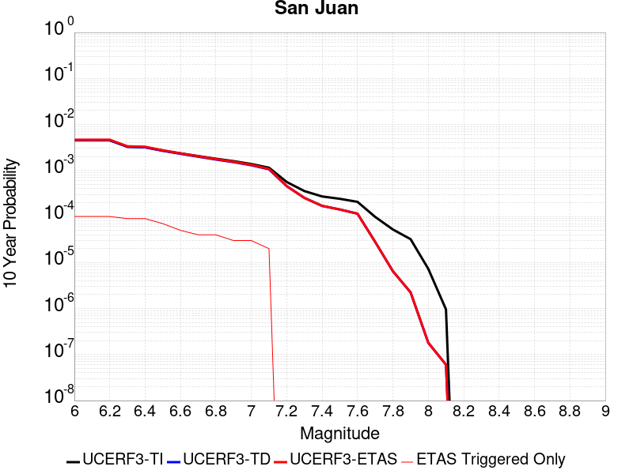 |

| Magnitude | 1 wk TI Prob | 1 wk TD Prob | 1 wk ETAS Prob | 1 wk ETAS/TD Gain | 1 wk ETAS Triggered Only | 1 mo TI Prob | 1 mo TD Prob | 1 mo ETAS Prob | 1 mo ETAS/TD Gain | 1 mo ETAS Triggered Only | 1 yr TI Prob | 1 yr TD Prob | 1 yr ETAS Prob | 1 yr ETAS/TD Gain | 1 yr ETAS Triggered Only | 10 yr TI Prob | 10 yr TD Prob | 10 yr ETAS Prob | 10 yr ETAS/TD Gain | 10 yr ETAS Triggered Only |
|-----|-----|-----|-----|-----|-----|-----|-----|-----|-----|-----|-----|-----|-----|-----|-----|-----|-----|-----|-----|-----|
| 6.0 | 8.682808E-6 | 8.7491635E-6 | 8.765016E-5 | 10.018119 | 7.8901685E-5 | 3.72115E-5 | 3.74959E-5 | 1.16394636E-4 | 3.104196 | 7.8901685E-5 | 4.5295584E-4 | 4.564218E-4 | 5.352875E-4 | 1.1727912 | 7.8901685E-5 | 0.004520337 | 0.004555385 | 0.0046339273 | 1.0172416 | 7.8901685E-5 |
| 6.1 | 8.682808E-6 | 8.7491635E-6 | 8.765016E-5 | 10.018119 | 7.8901685E-5 | 3.72115E-5 | 3.74959E-5 | 1.16394636E-4 | 3.104196 | 7.8901685E-5 | 4.5295584E-4 | 4.564218E-4 | 5.352875E-4 | 1.1727912 | 7.8901685E-5 | 0.004520337 | 0.004555385 | 0.0046339273 | 1.0172416 | 7.8901685E-5 |
| 6.2 | 8.682808E-6 | 8.7491635E-6 | 8.765016E-5 | 10.018119 | 7.8901685E-5 | 3.72115E-5 | 3.74959E-5 | 1.16394636E-4 | 3.104196 | 7.8901685E-5 | 4.5295584E-4 | 4.564218E-4 | 5.352875E-4 | 1.1727912 | 7.8901685E-5 | 0.004520337 | 0.004555385 | 0.0046339273 | 1.0172416 | 7.8901685E-5 |
| 6.3 | 6.3054235E-6 | 6.2825848E-6 | 8.5183776E-5 | 13.558715 | 7.8901685E-5 | 2.7022963E-5 | 2.6925094E-5 | 1.05824656E-4 | 3.9303358 | 7.8901685E-5 | 3.2895492E-4 | 3.2776513E-4 | 4.0664093E-4 | 1.2406474 | 7.8901685E-5 | 0.003284684 | 0.003273017 | 0.0033516604 | 1.0240278 | 7.8901685E-5 |
| 6.4 | 6.1490473E-6 | 6.1144656E-6 | 8.501567E-5 | 13.904023 | 7.8901685E-5 | 2.6352795E-5 | 2.6204598E-5 | 1.0510422E-4 | 4.0109076 | 7.8901685E-5 | 3.2079802E-4 | 3.1899565E-4 | 3.9787215E-4 | 1.2472652 | 7.8901685E-5 | 0.0032033534 | 0.0031855737 | 0.0032642242 | 1.0246896 | 7.8901685E-5 |
| 6.5 | 5.204848E-6 | 5.137233E-6 | 4.4587876E-5 | 8.679356 | 3.9450842E-5 | 2.23063E-5 | 2.2016533E-5 | 6.146651E-5 | 2.791834 | 3.9450842E-5 | 2.7154534E-4 | 2.6801927E-4 | 3.0745956E-4 | 1.1471546 | 3.9450842E-5 | 0.0027121378 | 0.0026771144 | 0.0027164596 | 1.0146968 | 3.9450842E-5 |
| 6.6 | 4.5179986E-6 | 4.4150297E-6 | 4.38657E-5 | 9.935538 | 3.9450842E-5 | 1.9362706E-5 | 1.8921424E-5 | 5.8371523E-5 | 3.0849433 | 3.9450842E-5 | 2.3571544E-4 | 2.3034477E-4 | 2.6978654E-4 | 1.1712292 | 3.9450842E-5 | 0.0023546559 | 0.0023011973 | 0.0023405573 | 1.0171041 | 3.9450842E-5 |
| 6.7 | 3.9442616E-6 | 3.819828E-6 | 4.327052E-5 | 11.327871 | 3.9450842E-5 | 1.6903869E-5 | 1.6370592E-5 | 5.582079E-5 | 3.409821 | 3.9450842E-5 | 2.0578515E-4 | 1.992944E-4 | 2.3873738E-4 | 1.1979132 | 3.9450842E-5 | 0.002055947 | 0.0019912818 | 0.0020306539 | 1.0197723 | 3.9450842E-5 |
| 6.8 | 3.4536245E-6 | 3.3163353E-6 | 4.276705E-5 | 12.895876 | 3.9450842E-5 | 1.4801163E-5 | 1.4212792E-5 | 5.3663076E-5 | 3.7756886 | 3.9450842E-5 | 1.8018926E-4 | 1.7302761E-4 | 2.1247163E-4 | 1.2279637 | 3.9450842E-5 | 0.0018004322 | 0.0017290477 | 0.0017684303 | 1.0227771 | 3.9450842E-5 |
| 6.9 | 3.059865E-6 | 2.9120315E-6 | 4.236276E-5 | 14.547494 | 3.9450842E-5 | 1.3113641E-5 | 1.2480078E-5 | 5.193043E-5 | 4.161066 | 3.9450842E-5 | 1.596469E-4 | 1.5193493E-4 | 1.9137978E-4 | 1.2596167 | 3.9450842E-5 | 0.0015953224 | 0.0015184252 | 0.0015578162 | 1.025942 | 3.9450842E-5 |
| 7.0 | 2.6504351E-6 | 2.4920002E-6 | 4.1942745E-5 | 16.830956 | 3.9450842E-5 | 1.1358958E-5 | 1.0679961E-5 | 5.0130384E-5 | 4.6938734 | 3.9450842E-5 | 1.3828653E-4 | 1.300213E-4 | 1.6946702E-4 | 1.3033788 | 3.9450842E-5 | 0.0013820052 | 0.0012995641 | 0.0013389637 | 1.0303175 | 3.9450842E-5 |
| 7.1 | 2.2039317E-6 | 2.0338296E-6 | 2.0338296E-6 | 1.0 | 0.0 | 9.445387E-6 | 8.716386E-6 | 8.716386E-6 | 1.0 | 0.0 | 1.1499152E-4 | 1.0611736E-4 | 1.0611736E-4 | 1.0 | 0.0 | 0.0011493203 | 0.0010607769 | 0.0010607769 | 1.0 | 0.0 |
| 7.2 | 1.0786707E-6 | 8.7701903E-7 | 8.7701903E-7 | 1.0 | 0.0 | 4.622866E-6 | 3.7586476E-6 | 3.7586476E-6 | 1.0 | 0.0 | 5.628194E-5 | 4.5760586E-5 | 4.5760586E-5 | 1.0 | 0.0 | 5.6267687E-4 | 4.5757066E-4 | 4.5757066E-4 | 1.0 | 0.0 |
| 7.3 | 6.846433E-7 | 4.868805E-7 | 4.868805E-7 | 1.0 | 0.0 | 2.9341822E-6 | 2.086629E-6 | 2.086629E-6 | 1.0 | 0.0 | 3.5723086E-5 | 2.5404412E-5 | 2.5404412E-5 | 1.0 | 0.0 | 3.571734E-4 | 2.540486E-4 | 2.540486E-4 | 1.0 | 0.0 |
| 7.4 | 5.23043E-7 | 3.2628162E-7 | 3.2628162E-7 | 1.0 | 0.0 | 2.2416111E-6 | 1.398349E-6 | 1.398349E-6 | 1.0 | 0.0 | 2.7291273E-5 | 1.7024766E-5 | 1.7024766E-5 | 1.0 | 0.0 | 2.7287923E-4 | 1.7026656E-4 | 1.7026656E-4 | 1.0 | 0.0 |
| 7.5 | 4.648444E-7 | 2.7234944E-7 | 2.7234944E-7 | 1.0 | 0.0 | 1.9921886E-6 | 1.1672114E-6 | 1.1672114E-6 | 1.0 | 0.0 | 2.4254627E-5 | 1.42107065E-5 | 1.42107065E-5 | 1.0 | 0.0 | 2.425198E-4 | 1.421276E-4 | 1.421276E-4 | 1.0 | 0.0 |
| 7.6 | 3.9906567E-7 | 2.2083314E-7 | 2.2083314E-7 | 1.0 | 0.0 | 1.7102802E-6 | 9.464274E-7 | 9.464274E-7 | 1.0 | 0.0 | 2.0822463E-5 | 1.1522693E-5 | 1.1522693E-5 | 1.0 | 0.0 | 2.0820512E-4 | 1.15245566E-4 | 1.15245566E-4 | 1.0 | 0.0 |
| 7.7 | 1.8784601E-7 | 5.3666906E-8 | 5.3666906E-8 | 1.0 | 0.0 | 8.0505407E-7 | 2.30001E-7 | 2.30001E-7 | 1.0 | 0.0 | 9.80149E-6 | 2.8002585E-6 | 2.8002585E-6 | 1.0 | 0.0 | 9.801057E-5 | 2.8011282E-5 | 2.8011282E-5 | 1.0 | 0.0 |
| 7.8 | 1.00154914E-7 | 1.2415832E-8 | 1.2415832E-8 | 1.0 | 0.0 | 4.2923529E-7 | 5.3210716E-8 | 5.3210716E-8 | 1.0 | 0.0 | 5.225927E-6 | 6.4784024E-7 | 6.4784024E-7 | 1.0 | 0.0 | 5.225804E-5 | 6.484273E-6 | 6.484273E-6 | 1.0 | 0.0 |
| 7.9 | 6.171429E-8 | 4.2966155E-9 | 4.2966155E-9 | 1.0 | 0.0 | 2.6448978E-7 | 1.8414067E-8 | 1.8414067E-8 | 1.0 | 0.0 | 3.2201583E-6 | 2.2419121E-7 | 2.2419121E-7 | 1.0 | 0.0 | 3.2201115E-5 | 2.2472002E-6 | 2.2472002E-6 | 1.0 | 0.0 |
| 8.0 | 1.3974572E-8 | 3.3788217E-10 | 3.3788217E-10 | 1.0 | 0.0 | 5.989102E-8 | 1.448067E-9 | 1.448067E-9 | 1.0 | 0.0 | 7.2917294E-7 | 1.763022E-8 | 1.763022E-8 | 1.0 | 0.0 | 7.2917055E-6 | 1.8060365E-7 | 1.8060365E-7 | 1.0 | 0.0 |
| 8.1 | 1.8403477E-9 | 1.1302803E-10 | 1.1302803E-10 | 1.0 | 0.0 | 7.887204E-9 | 4.844063E-10 | 4.844063E-10 | 1.0 | 0.0 | 9.602671E-8 | 5.8976446E-9 | 5.8976446E-9 | 1.0 | 0.0 | 9.602667E-7 | 6.021993E-8 | 6.021993E-8 | 1.0 | 0.0 |

## San Jacinto (Coyote Creek)
*[(top)](#table-of-contents)*

| 1 Week | 1 Month | 1 Year | 10 Year |
|-----|-----|-----|-----|
| 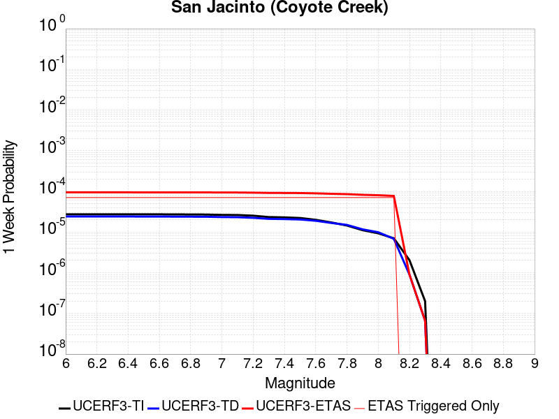 |  | 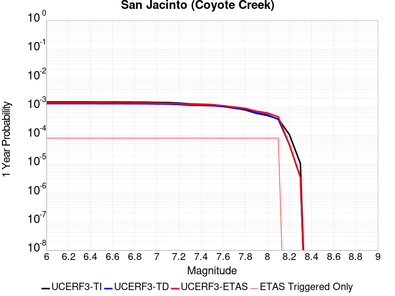 | 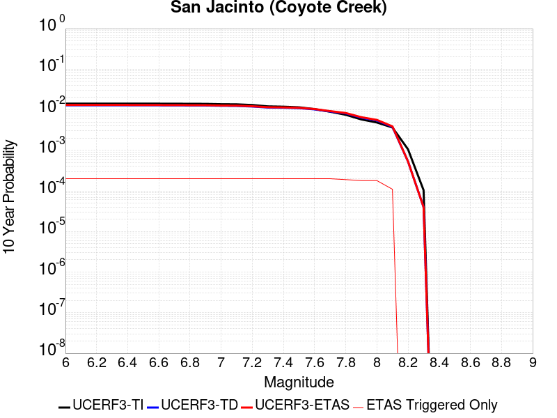 |

| Magnitude | 1 wk TI Prob | 1 wk TD Prob | 1 wk ETAS Prob | 1 wk ETAS/TD Gain | 1 wk ETAS Triggered Only | 1 mo TI Prob | 1 mo TD Prob | 1 mo ETAS Prob | 1 mo ETAS/TD Gain | 1 mo ETAS Triggered Only | 1 yr TI Prob | 1 yr TD Prob | 1 yr ETAS Prob | 1 yr ETAS/TD Gain | 1 yr ETAS Triggered Only | 10 yr TI Prob | 10 yr TD Prob | 10 yr ETAS Prob | 10 yr ETAS/TD Gain | 10 yr ETAS Triggered Only |
|-----|-----|-----|-----|-----|-----|-----|-----|-----|-----|-----|-----|-----|-----|-----|-----|-----|-----|-----|-----|-----|
| 6.0 | 2.7374346E-5 | 2.4145214E-5 | 1.03045E-4 | 4.2677193 | 7.8901685E-5 | 1.1731335E-4 | 1.034754E-4 | 1.8236892E-4 | 1.7624375 | 7.8901685E-5 | 0.0014273542 | 0.0012590875 | 0.0013378898 | 1.0625869 | 7.8901685E-5 | 0.01418221 | 0.012928318 | 0.013006199 | 1.0060241 | 7.8901685E-5 |
| 6.1 | 2.7374346E-5 | 2.4145214E-5 | 1.03045E-4 | 4.2677193 | 7.8901685E-5 | 1.1731335E-4 | 1.034754E-4 | 1.8236892E-4 | 1.7624375 | 7.8901685E-5 | 0.0014273542 | 0.0012590875 | 0.0013378898 | 1.0625869 | 7.8901685E-5 | 0.01418221 | 0.012928318 | 0.013006199 | 1.0060241 | 7.8901685E-5 |
| 6.2 | 2.7374346E-5 | 2.4145214E-5 | 1.03045E-4 | 4.2677193 | 7.8901685E-5 | 1.1731335E-4 | 1.034754E-4 | 1.8236892E-4 | 1.7624375 | 7.8901685E-5 | 0.0014273542 | 0.0012590875 | 0.0013378898 | 1.0625869 | 7.8901685E-5 | 0.01418221 | 0.012928318 | 0.013006199 | 1.0060241 | 7.8901685E-5 |
| 6.3 | 2.7374346E-5 | 2.4145214E-5 | 1.03045E-4 | 4.2677193 | 7.8901685E-5 | 1.1731335E-4 | 1.034754E-4 | 1.8236892E-4 | 1.7624375 | 7.8901685E-5 | 0.0014273542 | 0.0012590875 | 0.0013378898 | 1.0625869 | 7.8901685E-5 | 0.01418221 | 0.012928318 | 0.013006199 | 1.0060241 | 7.8901685E-5 |
| 6.4 | 2.7374346E-5 | 2.4145214E-5 | 1.03045E-4 | 4.2677193 | 7.8901685E-5 | 1.1731335E-4 | 1.034754E-4 | 1.8236892E-4 | 1.7624375 | 7.8901685E-5 | 0.0014273542 | 0.0012590875 | 0.0013378898 | 1.0625869 | 7.8901685E-5 | 0.01418221 | 0.012928318 | 0.013006199 | 1.0060241 | 7.8901685E-5 |
| 6.5 | 2.7282445E-5 | 2.4031293E-5 | 1.0293109E-4 | 4.2832108 | 7.8901685E-5 | 1.16919524E-4 | 1.029872E-4 | 1.8188077E-4 | 1.7660521 | 7.8901685E-5 | 0.0014225657 | 0.0012531505 | 0.0013319533 | 1.0628837 | 7.8901685E-5 | 0.014134934 | 0.012869646 | 0.012947532 | 1.0060519 | 7.8901685E-5 |
| 6.6 | 2.7282445E-5 | 2.4031293E-5 | 1.0293109E-4 | 4.2832108 | 7.8901685E-5 | 1.16919524E-4 | 1.029872E-4 | 1.8188077E-4 | 1.7660521 | 7.8901685E-5 | 0.0014225657 | 0.0012531505 | 0.0013319533 | 1.0628837 | 7.8901685E-5 | 0.014134934 | 0.012869646 | 0.012947532 | 1.0060519 | 7.8901685E-5 |
| 6.7 | 2.7216198E-5 | 2.3956412E-5 | 1.0285621E-4 | 4.293473 | 7.8901685E-5 | 1.1663563E-4 | 1.02666316E-4 | 1.8155991E-4 | 1.7684467 | 7.8901685E-5 | 0.0014191137 | 0.0012492483 | 0.0013280514 | 1.0630804 | 7.8901685E-5 | 0.014100855 | 0.0128310565 | 0.012908946 | 1.0060704 | 7.8901685E-5 |
| 6.8 | 2.7078617E-5 | 2.387363E-5 | 1.0277343E-4 | 4.3048935 | 7.8901685E-5 | 1.1604605E-4 | 1.0231156E-4 | 1.8120518E-4 | 1.7711115 | 7.8901685E-5 | 0.001411945 | 0.0012449342 | 0.0013237376 | 1.0632993 | 7.8901685E-5 | 0.014030075 | 0.012788199 | 0.012866092 | 1.006091 | 7.8901685E-5 |
| 6.9 | 2.6982952E-5 | 2.3793142E-5 | 1.0269295E-4 | 4.316074 | 7.8901685E-5 | 1.15636096E-4 | 1.0196664E-4 | 1.8086028E-4 | 1.7737201 | 7.8901685E-5 | 0.0014069602 | 0.0012407395 | 0.0013195432 | 1.0635135 | 7.8901685E-5 | 0.013980856 | 0.012746515 | 0.012824411 | 1.0061111 | 7.8901685E-5 |
| 7.0 | 2.6449972E-5 | 2.3370165E-5 | 1.0227001E-4 | 4.376093 | 7.8901685E-5 | 1.1335209E-4 | 1.00154015E-4 | 1.790478E-4 | 1.7877246 | 7.8901685E-5 | 0.001379188 | 0.0012186957 | 0.0012975011 | 1.0646639 | 7.8901685E-5 | 0.0137065975 | 0.0125278765 | 0.01260579 | 1.0062191 | 7.8901685E-5 |
| 7.1 | 2.6257849E-5 | 2.3196202E-5 | 1.0209606E-4 | 4.401413 | 7.8901685E-5 | 1.1252879E-4 | 9.940852E-5 | 1.7830236E-4 | 1.7936326 | 7.8901685E-5 | 0.0013691769 | 0.0012096294 | 0.0012884355 | 1.0651491 | 7.8901685E-5 | 0.013607717 | 0.012437741 | 0.012515661 | 1.0062648 | 7.8901685E-5 |
| 7.2 | 2.5270041E-5 | 2.2390966E-5 | 1.0129089E-4 | 4.523739 | 7.8901685E-5 | 1.0829568E-4 | 9.595777E-5 | 1.7485188E-4 | 1.8221754 | 7.8901685E-5 | 0.0013177024 | 0.0011676621 | 0.0012464717 | 1.0674934 | 7.8901685E-5 | 0.013099162 | 0.012018777 | 0.012096731 | 1.0064859 | 7.8901685E-5 |
| 7.3 | 2.339701E-5 | 2.1122814E-5 | 1.0002284E-4 | 4.7352986 | 7.8901685E-5 | 1.0026905E-4 | 9.0523215E-5 | 1.6941776E-4 | 1.8715394 | 7.8901685E-5 | 0.001220092 | 0.0011015651 | 0.0011803798 | 1.071548 | 7.8901685E-5 | 0.012134149 | 0.011357696 | 0.0114357015 | 1.0068681 | 7.8901685E-5 |
| 7.4 | 2.296333E-5 | 2.0853171E-5 | 9.975321E-5 | 4.7835994 | 7.8901685E-5 | 9.841056E-5 | 8.936768E-5 | 1.6826231E-4 | 1.8828095 | 7.8901685E-5 | 0.0011974899 | 0.0010875105 | 0.0011663263 | 1.0724736 | 7.8901685E-5 | 0.011910575 | 0.01121681 | 0.011294826 | 1.0069554 | 7.8901685E-5 |
| 7.5 | 2.2188895E-5 | 2.0376096E-5 | 9.927618E-5 | 4.8721886 | 7.8901685E-5 | 9.50918E-5 | 8.732321E-5 | 1.6621801E-4 | 1.9034803 | 7.8901685E-5 | 0.0011571277 | 0.0010626436 | 0.0011414614 | 1.0741714 | 7.8901685E-5 | 0.011511209 | 0.010966429 | 0.011044465 | 1.007116 | 7.8901685E-5 |
| 7.6 | 2.0013189E-5 | 1.8962366E-5 | 9.786256E-5 | 5.1608834 | 7.8901685E-5 | 8.5767984E-5 | 8.1264756E-5 | 1.6016004E-4 | 1.9708425 | 7.8901685E-5 | 0.001043725 | 9.889511E-4 | 0.0010677747 | 1.0797043 | 7.8901685E-5 | 0.010388365 | 0.010224434 | 0.010302529 | 1.0076381 | 7.8901685E-5 |
| 7.7 | 1.7230794E-5 | 1.674371E-5 | 9.564408E-5 | 5.7122393 | 7.8901685E-5 | 7.384417E-5 | 7.175679E-5 | 1.5065282E-4 | 2.099492 | 7.8901685E-5 | 8.986819E-4 | 8.7328954E-4 | 9.521223E-4 | 1.0902711 | 7.8901685E-5 | 0.008950562 | 0.009062956 | 0.0091411425 | 1.008627 | 7.8901685E-5 |
| 7.8 | 1.4478809E-5 | 1.4990978E-5 | 9.389148E-5 | 6.2631993 | 7.8901685E-5 | 6.205057E-5 | 6.424547E-5 | 1.431421E-4 | 2.2280495 | 7.8901685E-5 | 7.552038E-4 | 7.819085E-4 | 8.607485E-4 | 1.1008302 | 7.8901685E-5 | 0.0075264242 | 0.008141387 | 0.008219646 | 1.0096126 | 7.8901685E-5 |
| 7.9 | 1.1114467E-5 | 1.1645102E-5 | 9.054587E-5 | 7.775447 | 7.8901685E-5 | 4.7632562E-5 | 4.990663E-5 | 1.2880439E-4 | 2.5809073 | 7.8901685E-5 | 5.797721E-4 | 6.074444E-4 | 6.862981E-4 | 1.1298124 | 7.8901685E-5 | 0.0057826187 | 0.0063803247 | 0.006458723 | 1.0122875 | 7.8901685E-5 |
| 8.0 | 9.327402E-6 | 9.899186E-6 | 8.8800094E-5 | 8.970444 | 7.8901685E-5 | 3.9973966E-5 | 4.2424395E-5 | 1.2132274E-4 | 2.8597398 | 7.8901685E-5 | 4.8657437E-4 | 5.1639514E-4 | 5.952561E-4 | 1.1527144 | 7.8901685E-5 | 0.0048551033 | 0.0054499684 | 0.0055284402 | 1.0143986 | 7.8901685E-5 |
| 8.1 | 7.0235833E-6 | 6.827495E-6 | 8.572864E-5 | 12.556383 | 7.8901685E-5 | 3.0100724E-5 | 2.9260367E-5 | 1.08159744E-4 | 3.696459 | 7.8901685E-5 | 3.664147E-4 | 3.5618723E-4 | 4.3506082E-4 | 1.2214385 | 7.8901685E-5 | 0.003658111 | 0.0037876023 | 0.0038662052 | 1.0207527 | 7.8901685E-5 |
| 8.2 | 2.0358202E-6 | 8.994527E-7 | 8.994527E-7 | 1.0 | 0.0 | 8.724915E-6 | 3.854792E-6 | 3.854792E-6 | 1.0 | 0.0 | 1.06220665E-4 | 4.69311E-5 | 4.69311E-5 | 1.0 | 0.0 | 0.001061699 | 5.3254166E-4 | 5.3254166E-4 | 1.0 | 0.0 |
| 8.3 | 2.0051264E-7 | 6.617272E-8 | 6.617272E-8 | 1.0 | 0.0 | 8.5933965E-7 | 2.8359733E-7 | 2.8359733E-7 | 1.0 | 0.0 | 1.046241E-5 | 3.4527925E-6 | 3.4527925E-6 | 1.0 | 0.0 | 1.0461917E-4 | 4.01389E-5 | 4.01389E-5 | 1.0 | 0.0 |

## Homestead Valley 2011
*[(top)](#table-of-contents)*

| 1 Week | 1 Month | 1 Year | 10 Year |
|-----|-----|-----|-----|
| 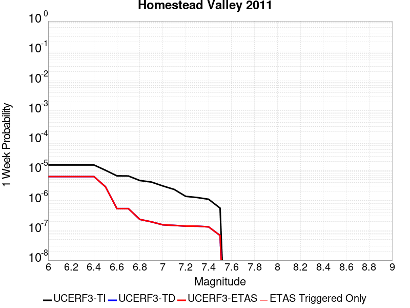 | 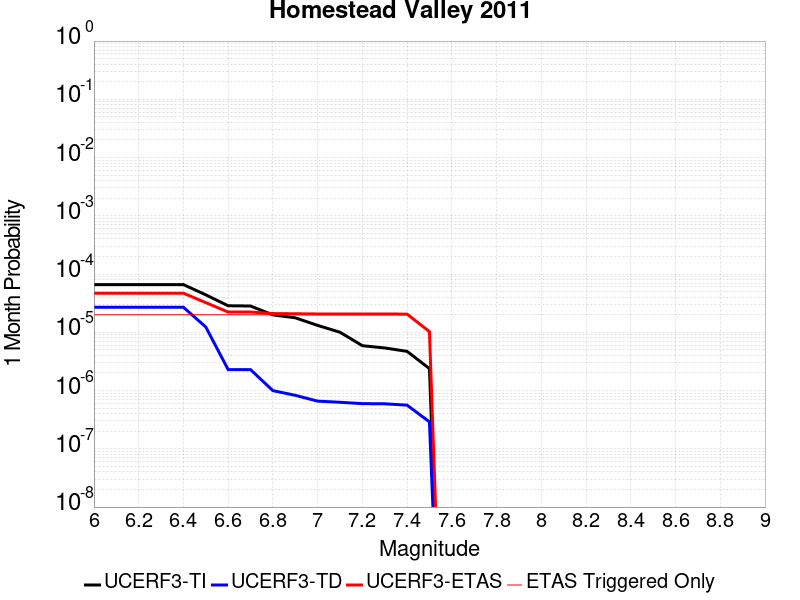 | 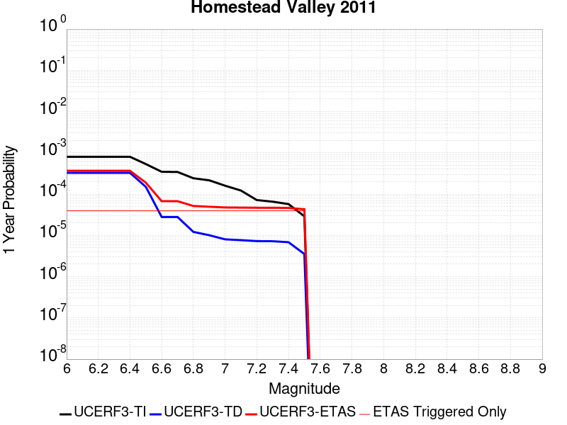 | 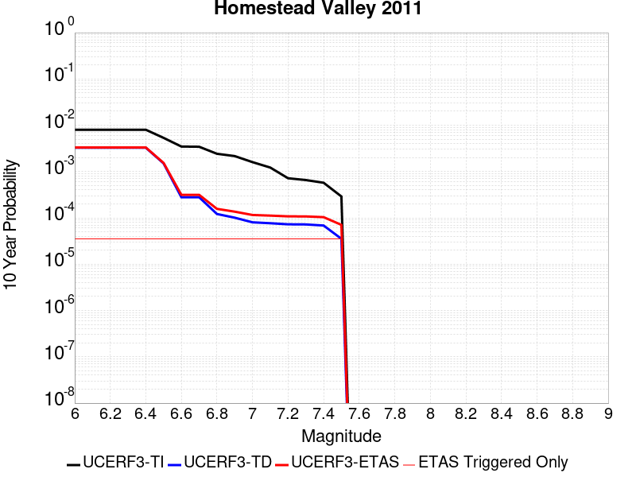 |

| Magnitude | 1 wk TI Prob | 1 wk TD Prob | 1 wk ETAS Prob | 1 wk ETAS/TD Gain | 1 wk ETAS Triggered Only | 1 mo TI Prob | 1 mo TD Prob | 1 mo ETAS Prob | 1 mo ETAS/TD Gain | 1 mo ETAS Triggered Only | 1 yr TI Prob | 1 yr TD Prob | 1 yr ETAS Prob | 1 yr ETAS/TD Gain | 1 yr ETAS Triggered Only | 10 yr TI Prob | 10 yr TD Prob | 10 yr ETAS Prob | 10 yr ETAS/TD Gain | 10 yr ETAS Triggered Only |
|-----|-----|-----|-----|-----|-----|-----|-----|-----|-----|-----|-----|-----|-----|-----|-----|-----|-----|-----|-----|-----|
| 6.0 | 1.539795E-5 | 6.286606E-6 | 6.286606E-6 | 1.0 | 0.0 | 6.5989545E-5 | 2.6942436E-5 | 6.639222E-5 | 2.4642248 | 3.9450842E-5 | 8.0312655E-4 | 3.279954E-4 | 3.674333E-4 | 1.1202393 | 3.9450842E-5 | 0.008002302 | 0.0032771337 | 0.0033164553 | 1.0119988 | 3.9450842E-5 |
| 6.1 | 1.539795E-5 | 6.286606E-6 | 6.286606E-6 | 1.0 | 0.0 | 6.5989545E-5 | 2.6942436E-5 | 6.639222E-5 | 2.4642248 | 3.9450842E-5 | 8.0312655E-4 | 3.279954E-4 | 3.674333E-4 | 1.1202393 | 3.9450842E-5 | 0.008002302 | 0.0032771337 | 0.0033164553 | 1.0119988 | 3.9450842E-5 |
| 6.2 | 1.539795E-5 | 6.286606E-6 | 6.286606E-6 | 1.0 | 0.0 | 6.5989545E-5 | 2.6942436E-5 | 6.639222E-5 | 2.4642248 | 3.9450842E-5 | 8.0312655E-4 | 3.279954E-4 | 3.674333E-4 | 1.1202393 | 3.9450842E-5 | 0.008002302 | 0.0032771337 | 0.0033164553 | 1.0119988 | 3.9450842E-5 |
| 6.3 | 1.539795E-5 | 6.286606E-6 | 6.286606E-6 | 1.0 | 0.0 | 6.5989545E-5 | 2.6942436E-5 | 6.639222E-5 | 2.4642248 | 3.9450842E-5 | 8.0312655E-4 | 3.279954E-4 | 3.674333E-4 | 1.1202393 | 3.9450842E-5 | 0.008002302 | 0.0032771337 | 0.0033164553 | 1.0119988 | 3.9450842E-5 |
| 6.4 | 1.539795E-5 | 6.286606E-6 | 6.286606E-6 | 1.0 | 0.0 | 6.5989545E-5 | 2.6942436E-5 | 6.639222E-5 | 2.4642248 | 3.9450842E-5 | 8.0312655E-4 | 3.279954E-4 | 3.674333E-4 | 1.1202393 | 3.9450842E-5 | 0.008002302 | 0.0032771337 | 0.0033164553 | 1.0119988 | 3.9450842E-5 |
| 6.5 | 1.0265258E-5 | 2.8788488E-6 | 2.8788488E-6 | 1.0 | 0.0 | 4.3993223E-5 | 1.2337905E-5 | 5.178826E-5 | 4.1974926 | 3.9450842E-5 | 5.3548586E-4 | 1.5021059E-4 | 1.896555E-4 | 1.2625974 | 3.9450842E-5 | 0.005341973 | 0.0015017724 | 0.0015411641 | 1.0262301 | 3.9450842E-5 |
| 6.6 | 6.664671E-6 | 5.348204E-7 | 5.348204E-7 | 1.0 | 0.0 | 2.8562565E-5 | 2.2920863E-6 | 4.174284E-5 | 18.211723 | 3.9450842E-5 | 3.476937E-4 | 2.7905911E-5 | 6.735566E-5 | 2.4136698 | 3.9450842E-5 | 0.003471502 | 2.790357E-4 | 3.1847553E-4 | 1.1413434 | 3.9450842E-5 |
| 6.7 | 6.5954046E-6 | 5.348204E-7 | 5.348204E-7 | 1.0 | 0.0 | 2.8265715E-5 | 2.2920863E-6 | 4.174284E-5 | 18.211723 | 3.9450842E-5 | 3.4408073E-4 | 2.7905911E-5 | 6.735566E-5 | 2.4136698 | 3.9450842E-5 | 0.0034354846 | 2.790357E-4 | 3.1847553E-4 | 1.1413434 | 3.9450842E-5 |
| 6.8 | 4.648189E-6 | 2.3265572E-7 | 2.3265572E-7 | 1.0 | 0.0 | 1.9920659E-5 | 9.970956E-7 | 4.04479E-5 | 40.56572 | 3.9450842E-5 | 2.4250703E-4 | 1.2139576E-5 | 5.158994E-5 | 4.2497315 | 3.9450842E-5 | 0.0024224254 | 1.2138961E-4 | 1.6083567E-4 | 1.3249542 | 3.9450842E-5 |
| 6.9 | 4.1428534E-6 | 1.9344557E-7 | 1.9344557E-7 | 1.0 | 0.0 | 1.7754966E-5 | 8.290522E-7 | 4.0279865E-5 | 48.585438 | 3.9450842E-5 | 2.1614527E-4 | 1.0093667E-5 | 4.9544113E-5 | 4.9084353 | 3.9450842E-5 | 0.0021593515 | 1.0093238E-4 | 1.4037924E-4 | 1.3908247 | 3.9450842E-5 |
| 7.0 | 3.0673707E-6 | 1.5367603E-7 | 1.5367603E-7 | 1.0 | 0.0 | 1.3145808E-5 | 6.586114E-7 | 4.010943E-5 | 60.899994 | 3.9450842E-5 | 1.6003846E-4 | 8.0185655E-6 | 4.7469093E-5 | 5.9198985 | 3.9450842E-5 | 0.0015992324 | 8.0182865E-5 | 1.19630546E-4 | 1.4919715 | 3.9450842E-5 |
| 7.1 | 2.340854E-6 | 1.468766E-7 | 1.468766E-7 | 1.0 | 0.0 | 1.0032193E-5 | 6.29471E-7 | 4.008029E-5 | 63.672974 | 3.9450842E-5 | 1.221351E-4 | 7.663783E-6 | 4.7114325E-5 | 6.147659 | 3.9450842E-5 | 0.00122068 | 7.663529E-5 | 1.1608311E-4 | 1.5147475 | 3.9450842E-5 |
| 7.2 | 1.3754182E-6 | 1.3922634E-7 | 1.3922634E-7 | 1.0 | 0.0 | 5.8946357E-6 | 5.966842E-7 | 4.0047504E-5 | 67.11675 | 3.9450842E-5 | 7.176483E-5 | 7.2646067E-6 | 4.6715166E-5 | 6.4305153 | 3.9450842E-5 | 7.174166E-4 | 7.264379E-5 | 1.1209176E-4 | 1.5430331 | 3.9450842E-5 |
| 7.3 | 1.2573237E-6 | 1.3827146E-7 | 1.3827146E-7 | 1.0 | 0.0 | 5.388519E-6 | 5.9259185E-7 | 4.004341E-5 | 67.57335 | 3.9450842E-5 | 6.560324E-5 | 7.2147827E-6 | 4.6665344E-5 | 6.4680176 | 3.9450842E-5 | 6.558388E-4 | 7.214558E-5 | 1.11593574E-4 | 1.5467833 | 3.9450842E-5 |
| 7.4 | 1.0994207E-6 | 1.3106106E-7 | 1.3106106E-7 | 1.0 | 0.0 | 4.7117946E-6 | 5.616901E-7 | 4.0012514E-5 | 71.235916 | 3.9450842E-5 | 5.736459E-5 | 6.8385566E-6 | 4.628913E-5 | 6.768845 | 3.9450842E-5 | 5.734978E-4 | 6.838355E-5 | 1.078317E-4 | 1.576866 | 3.9450842E-5 |
| 7.5 | 5.5569126E-7 | 6.772991E-8 | 6.772991E-8 | 1.0 | 0.0 | 2.3815317E-6 | 2.90271E-7 | 3.9741102E-5 | 136.91035 | 3.9450842E-5 | 2.8994764E-5 | 3.5340445E-6 | 4.298475E-5 | 12.163048 | 3.9450842E-5 | 2.899098E-4 | 3.5339945E-5 | 7.4789394E-5 | 2.116285 | 3.9450842E-5 |

## Holser alt 1
*[(top)](#table-of-contents)*

| 1 Week | 1 Month | 1 Year | 10 Year |
|-----|-----|-----|-----|
| 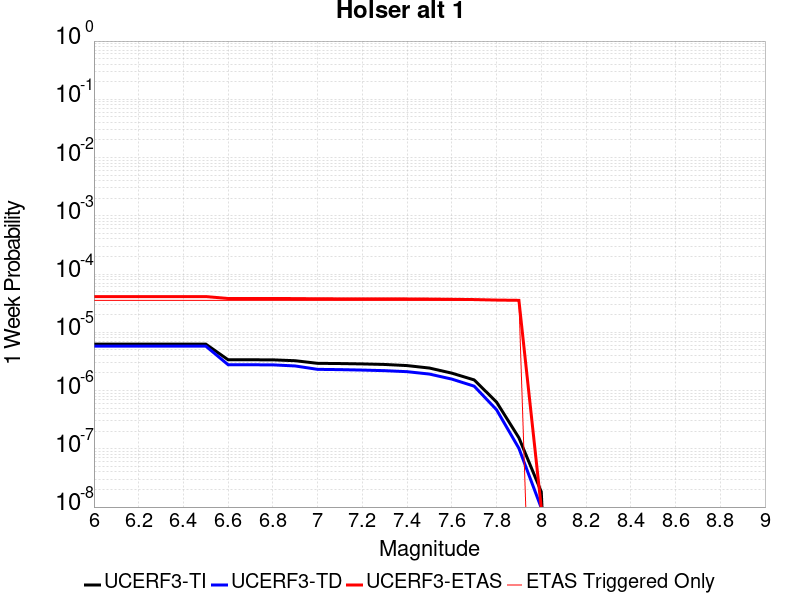 | 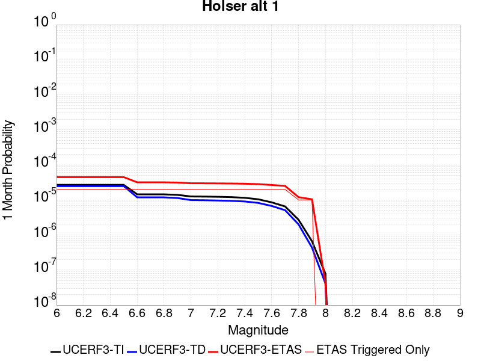 | 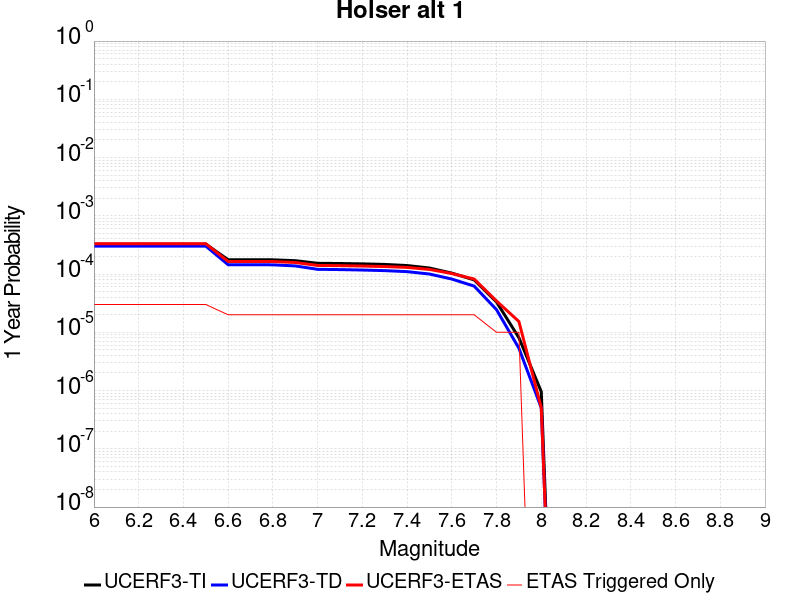 | 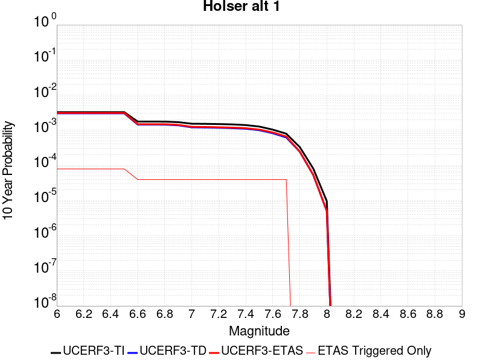 |

| Magnitude | 1 wk TI Prob | 1 wk TD Prob | 1 wk ETAS Prob | 1 wk ETAS/TD Gain | 1 wk ETAS Triggered Only | 1 mo TI Prob | 1 mo TD Prob | 1 mo ETAS Prob | 1 mo ETAS/TD Gain | 1 mo ETAS Triggered Only | 1 yr TI Prob | 1 yr TD Prob | 1 yr ETAS Prob | 1 yr ETAS/TD Gain | 1 yr ETAS Triggered Only | 10 yr TI Prob | 10 yr TD Prob | 10 yr ETAS Prob | 10 yr ETAS/TD Gain | 10 yr ETAS Triggered Only |
|-----|-----|-----|-----|-----|-----|-----|-----|-----|-----|-----|-----|-----|-----|-----|-----|-----|-----|-----|-----|-----|
| 6.0 | 6.2746653E-6 | 5.789965E-6 | 5.789965E-6 | 1.0 | 0.0 | 2.6891146E-5 | 2.4813964E-5 | 6.426383E-5 | 2.5898252 | 3.9450842E-5 | 3.273505E-4 | 3.020797E-4 | 3.8095753E-4 | 1.261116 | 7.8901685E-5 | 0.0032686873 | 0.0030178234 | 0.0030964871 | 1.0260663 | 7.8901685E-5 |
| 6.1 | 6.2746653E-6 | 5.789965E-6 | 5.789965E-6 | 1.0 | 0.0 | 2.6891146E-5 | 2.4813964E-5 | 6.426383E-5 | 2.5898252 | 3.9450842E-5 | 3.273505E-4 | 3.020797E-4 | 3.8095753E-4 | 1.261116 | 7.8901685E-5 | 0.0032686873 | 0.0030178234 | 0.0030964871 | 1.0260663 | 7.8901685E-5 |
| 6.2 | 6.2746653E-6 | 5.789965E-6 | 5.789965E-6 | 1.0 | 0.0 | 2.6891146E-5 | 2.4813964E-5 | 6.426383E-5 | 2.5898252 | 3.9450842E-5 | 3.273505E-4 | 3.020797E-4 | 3.8095753E-4 | 1.261116 | 7.8901685E-5 | 0.0032686873 | 0.0030178234 | 0.0030964871 | 1.0260663 | 7.8901685E-5 |
| 6.3 | 6.2746653E-6 | 5.789965E-6 | 5.789965E-6 | 1.0 | 0.0 | 2.6891146E-5 | 2.4813964E-5 | 6.426383E-5 | 2.5898252 | 3.9450842E-5 | 3.273505E-4 | 3.020797E-4 | 3.8095753E-4 | 1.261116 | 7.8901685E-5 | 0.0032686873 | 0.0030178234 | 0.0030964871 | 1.0260663 | 7.8901685E-5 |
| 6.4 | 6.2746653E-6 | 5.789965E-6 | 5.789965E-6 | 1.0 | 0.0 | 2.6891146E-5 | 2.4813964E-5 | 6.426383E-5 | 2.5898252 | 3.9450842E-5 | 3.273505E-4 | 3.020797E-4 | 3.8095753E-4 | 1.261116 | 7.8901685E-5 | 0.0032686873 | 0.0030178234 | 0.0030964871 | 1.0260663 | 7.8901685E-5 |
| 6.5 | 6.2746653E-6 | 5.789965E-6 | 5.789965E-6 | 1.0 | 0.0 | 2.6891146E-5 | 2.4813964E-5 | 6.426383E-5 | 2.5898252 | 3.9450842E-5 | 3.273505E-4 | 3.020797E-4 | 3.8095753E-4 | 1.261116 | 7.8901685E-5 | 0.0032686873 | 0.0030178234 | 0.0030964871 | 1.0260663 | 7.8901685E-5 |
| 6.6 | 3.375825E-6 | 2.7711897E-6 | 2.7711897E-6 | 1.0 | 0.0 | 1.4467741E-5 | 1.1876474E-5 | 5.132685E-5 | 4.3217244 | 3.9450842E-5 | 1.761305E-4 | 1.4458665E-4 | 1.8403179E-4 | 1.2728132 | 3.9450842E-5 | 0.0017599097 | 0.0014449427 | 0.0014843366 | 1.0272633 | 3.9450842E-5 |
| 6.7 | 3.375825E-6 | 2.7711897E-6 | 2.7711897E-6 | 1.0 | 0.0 | 1.4467741E-5 | 1.1876474E-5 | 5.132685E-5 | 4.3217244 | 3.9450842E-5 | 1.761305E-4 | 1.4458665E-4 | 1.8403179E-4 | 1.2728132 | 3.9450842E-5 | 0.0017599097 | 0.0014449427 | 0.0014843366 | 1.0272633 | 3.9450842E-5 |
| 6.8 | 3.366533E-6 | 2.7615893E-6 | 2.7615893E-6 | 1.0 | 0.0 | 1.4427919E-5 | 1.183533E-5 | 5.1285708E-5 | 4.3332725 | 3.9450842E-5 | 1.7564575E-4 | 1.4408577E-4 | 1.8353094E-4 | 1.2737616 | 3.9450842E-5 | 0.0017550698 | 0.0014399405 | 0.0014793345 | 1.027358 | 3.9450842E-5 |
| 6.9 | 3.253174E-6 | 2.6438113E-6 | 2.6438113E-6 | 1.0 | 0.0 | 1.39421E-5 | 1.1330571E-5 | 5.0780967E-5 | 4.4817657 | 3.9450842E-5 | 1.6973184E-4 | 1.3794114E-4 | 1.7738654E-4 | 1.2859582 | 3.9450842E-5 | 0.0016960226 | 0.001378571 | 0.0014179675 | 1.0285778 | 3.9450842E-5 |
| 7.0 | 2.9336593E-6 | 2.311799E-6 | 2.311799E-6 | 1.0 | 0.0 | 1.2572766E-5 | 9.907673E-6 | 4.935813E-5 | 4.981808 | 3.9450842E-5 | 1.5306266E-4 | 1.2061927E-4 | 1.6006535E-4 | 1.3270297 | 3.9450842E-5 | 0.0015295728 | 0.0012055405 | 0.0012449438 | 1.0326852 | 3.9450842E-5 |
| 7.1 | 2.9087812E-6 | 2.2876513E-6 | 2.2876513E-6 | 1.0 | 0.0 | 1.2466146E-5 | 9.804184E-6 | 4.9254642E-5 | 5.023839 | 3.9450842E-5 | 1.5176475E-4 | 1.19359414E-4 | 1.5880555E-4 | 1.330482 | 3.9450842E-5 | 0.0015166114 | 0.0011929555 | 0.0012323593 | 1.0330304 | 3.9450842E-5 |
| 7.2 | 2.8674524E-6 | 2.2475429E-6 | 2.2475429E-6 | 1.0 | 0.0 | 1.2289024E-5 | 9.63229E-6 | 4.9082755E-5 | 5.0956473 | 3.9450842E-5 | 1.4960859E-4 | 1.1726685E-4 | 1.5671307E-4 | 1.33638 | 3.9450842E-5 | 0.0014950791 | 0.001172052 | 0.0012114566 | 1.0336202 | 3.9450842E-5 |
| 7.3 | 2.8057775E-6 | 2.1954324E-6 | 2.1954324E-6 | 1.0 | 0.0 | 1.2024705E-5 | 9.408962E-6 | 4.8859434E-5 | 5.192861 | 3.9450842E-5 | 1.4639096E-4 | 1.14548115E-4 | 1.5399444E-4 | 1.3443646 | 3.9450842E-5 | 0.0014629456 | 0.001144893 | 0.0011842987 | 1.0344187 | 3.9450842E-5 |
| 7.4 | 2.683666E-6 | 2.1092305E-6 | 2.1092305E-6 | 1.0 | 0.0 | 1.1501375E-5 | 9.039529E-6 | 4.8490016E-5 | 5.3642197 | 3.9450842E-5 | 1.4002025E-4 | 1.1005072E-4 | 1.4949722E-4 | 1.3584393 | 3.9450842E-5 | 0.0013993206 | 0.0010999644 | 0.0011393719 | 1.0358261 | 3.9450842E-5 |
| 7.5 | 2.434495E-6 | 1.9195363E-6 | 1.9195363E-6 | 1.0 | 0.0 | 1.0433508E-5 | 8.226558E-6 | 4.7677077E-5 | 5.7955074 | 3.9450842E-5 | 1.2702055E-4 | 1.0015376E-4 | 1.3960066E-4 | 1.3938633 | 3.9450842E-5 | 0.0012694797 | 0.0010010883 | 0.0010404995 | 1.0393685 | 3.9450842E-5 |
| 7.6 | 1.9914562E-6 | 1.5731459E-6 | 1.5731459E-6 | 1.0 | 0.0 | 8.534785E-6 | 6.742037E-6 | 4.6192614E-5 | 6.8514333 | 3.9450842E-5 | 1.03906044E-4 | 8.208122E-5 | 1.2152883E-4 | 1.4805924 | 3.9450842E-5 | 0.0010385747 | 8.205106E-4 | 8.599291E-4 | 1.0480413 | 3.9450842E-5 |
| 7.7 | 1.5229501E-6 | 1.1896061E-6 | 1.1896061E-6 | 1.0 | 0.0 | 6.526913E-6 | 5.098302E-6 | 4.4548946E-5 | 8.737996 | 3.9450842E-5 | 7.946226E-5 | 6.2070074E-5 | 1.0151847E-4 | 1.6355461 | 3.9450842E-5 | 7.943385E-4 | 6.2052865E-4 | 6.59955E-4 | 1.0635368 | 3.9450842E-5 |
| 7.8 | 6.3489426E-7 | 4.687806E-7 | 4.687806E-7 | 1.0 | 0.0 | 2.7209726E-6 | 2.009058E-6 | 2.009058E-6 | 1.0 | 0.0 | 3.312734E-5 | 2.4460009E-5 | 2.4460009E-5 | 1.0 | 0.0 | 3.31224E-4 | 2.4457334E-4 | 2.4457334E-4 | 1.0 | 0.0 |
| 7.9 | 1.5459432E-7 | 1.0193758E-7 | 1.0193758E-7 | 1.0 | 0.0 | 6.6254694E-7 | 4.3687527E-7 | 4.3687527E-7 | 1.0 | 0.0 | 8.066479E-6 | 5.3189433E-6 | 5.3189433E-6 | 1.0 | 0.0 | 8.066186E-5 | 5.3188178E-5 | 5.3188178E-5 | 1.0 | 0.0 |
| 8.0 | 1.8307812E-8 | 9.690293E-9 | 9.690293E-9 | 1.0 | 0.0 | 7.846205E-8 | 4.152983E-8 | 4.152983E-8 | 1.0 | 0.0 | 9.55275E-7 | 5.0562556E-7 | 5.0562556E-7 | 1.0 | 0.0 | 9.552709E-6 | 5.0562444E-6 | 5.0562444E-6 | 1.0 | 0.0 |

## Los Alamos extension
*[(top)](#table-of-contents)*

| 1 Week | 1 Month | 1 Year | 10 Year |
|-----|-----|-----|-----|
| 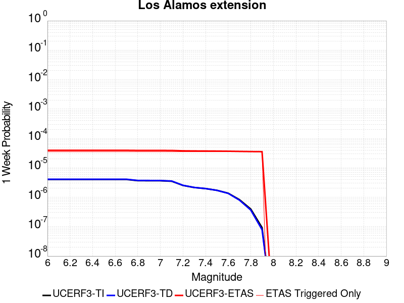 | 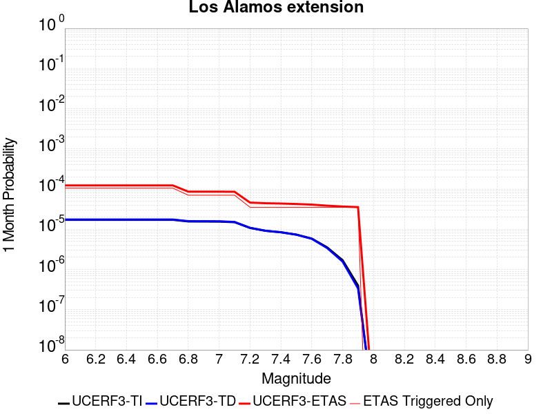 | 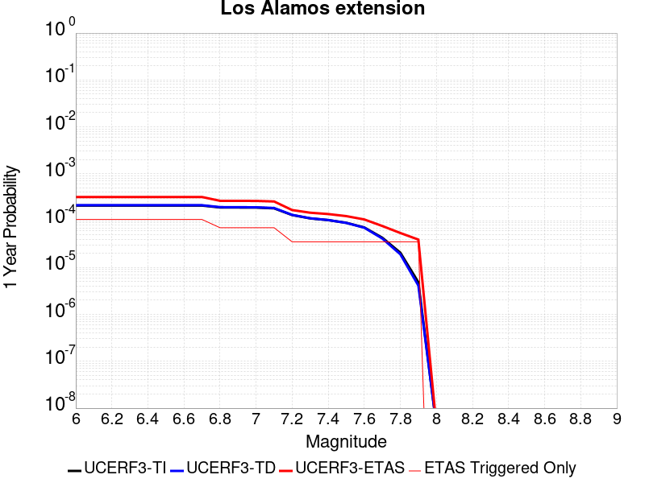 | 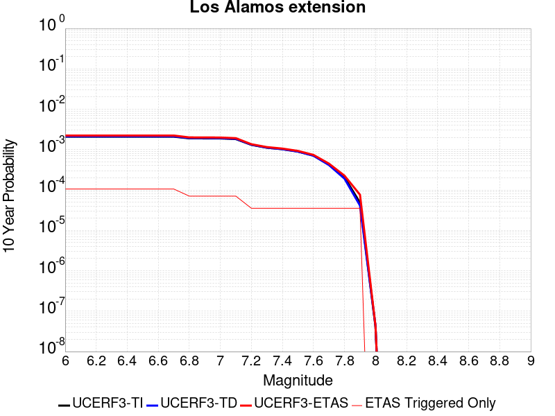 |

| Magnitude | 1 wk TI Prob | 1 wk TD Prob | 1 wk ETAS Prob | 1 wk ETAS/TD Gain | 1 wk ETAS Triggered Only | 1 mo TI Prob | 1 mo TD Prob | 1 mo ETAS Prob | 1 mo ETAS/TD Gain | 1 mo ETAS Triggered Only | 1 yr TI Prob | 1 yr TD Prob | 1 yr ETAS Prob | 1 yr ETAS/TD Gain | 1 yr ETAS Triggered Only | 10 yr TI Prob | 10 yr TD Prob | 10 yr ETAS Prob | 10 yr ETAS/TD Gain | 10 yr ETAS Triggered Only |
|-----|-----|-----|-----|-----|-----|-----|-----|-----|-----|-----|-----|-----|-----|-----|-----|-----|-----|-----|-----|-----|
| 6.0 | 4.0146506E-6 | 4.0861596E-6 | 4.0861596E-6 | 1.0 | 0.0 | 1.7205533E-5 | 1.7512002E-5 | 9.641231E-5 | 5.505499 | 7.8901685E-5 | 2.0945723E-4 | 2.1318886E-4 | 2.9207373E-4 | 1.3700234 | 7.8901685E-5 | 0.0020925992 | 0.0021299527 | 0.0022086862 | 1.036965 | 7.8901685E-5 |
| 6.1 | 4.0146506E-6 | 4.0861596E-6 | 4.0861596E-6 | 1.0 | 0.0 | 1.7205533E-5 | 1.7512002E-5 | 9.641231E-5 | 5.505499 | 7.8901685E-5 | 2.0945723E-4 | 2.1318886E-4 | 2.9207373E-4 | 1.3700234 | 7.8901685E-5 | 0.0020925992 | 0.0021299527 | 0.0022086862 | 1.036965 | 7.8901685E-5 |
| 6.2 | 4.0146506E-6 | 4.0861596E-6 | 4.0861596E-6 | 1.0 | 0.0 | 1.7205533E-5 | 1.7512002E-5 | 9.641231E-5 | 5.505499 | 7.8901685E-5 | 2.0945723E-4 | 2.1318886E-4 | 2.9207373E-4 | 1.3700234 | 7.8901685E-5 | 0.0020925992 | 0.0021299527 | 0.0022086862 | 1.036965 | 7.8901685E-5 |
| 6.3 | 4.0146506E-6 | 4.0861596E-6 | 4.0861596E-6 | 1.0 | 0.0 | 1.7205533E-5 | 1.7512002E-5 | 9.641231E-5 | 5.505499 | 7.8901685E-5 | 2.0945723E-4 | 2.1318886E-4 | 2.9207373E-4 | 1.3700234 | 7.8901685E-5 | 0.0020925992 | 0.0021299527 | 0.0022086862 | 1.036965 | 7.8901685E-5 |
| 6.4 | 4.0146506E-6 | 4.0861596E-6 | 4.0861596E-6 | 1.0 | 0.0 | 1.7205533E-5 | 1.7512002E-5 | 9.641231E-5 | 5.505499 | 7.8901685E-5 | 2.0945723E-4 | 2.1318886E-4 | 2.9207373E-4 | 1.3700234 | 7.8901685E-5 | 0.0020925992 | 0.0021299527 | 0.0022086862 | 1.036965 | 7.8901685E-5 |
| 6.5 | 4.0146506E-6 | 4.0861596E-6 | 4.0861596E-6 | 1.0 | 0.0 | 1.7205533E-5 | 1.7512002E-5 | 9.641231E-5 | 5.505499 | 7.8901685E-5 | 2.0945723E-4 | 2.1318886E-4 | 2.9207373E-4 | 1.3700234 | 7.8901685E-5 | 0.0020925992 | 0.0021299527 | 0.0022086862 | 1.036965 | 7.8901685E-5 |
| 6.6 | 4.0146506E-6 | 4.0861596E-6 | 4.0861596E-6 | 1.0 | 0.0 | 1.7205533E-5 | 1.7512002E-5 | 9.641231E-5 | 5.505499 | 7.8901685E-5 | 2.0945723E-4 | 2.1318886E-4 | 2.9207373E-4 | 1.3700234 | 7.8901685E-5 | 0.0020925992 | 0.0021299527 | 0.0022086862 | 1.036965 | 7.8901685E-5 |
| 6.7 | 4.0146506E-6 | 4.0861596E-6 | 4.0861596E-6 | 1.0 | 0.0 | 1.7205533E-5 | 1.7512002E-5 | 9.641231E-5 | 5.505499 | 7.8901685E-5 | 2.0945723E-4 | 2.1318886E-4 | 2.9207373E-4 | 1.3700234 | 7.8901685E-5 | 0.0020925992 | 0.0021299527 | 0.0022086862 | 1.036965 | 7.8901685E-5 |
| 6.8 | 3.6584688E-6 | 3.7188588E-6 | 3.7188588E-6 | 1.0 | 0.0 | 1.5679057E-5 | 1.5937874E-5 | 5.538809E-5 | 3.4752495 | 3.9450842E-5 | 1.9087581E-4 | 1.9402728E-4 | 2.3347048E-4 | 1.2032868 | 3.9450842E-5 | 0.0019071194 | 0.0019386712 | 0.0019780456 | 1.0203099 | 3.9450842E-5 |
| 6.9 | 3.644631E-6 | 3.7045688E-6 | 3.7045688E-6 | 1.0 | 0.0 | 1.5619753E-5 | 1.5876632E-5 | 5.532685E-5 | 3.4847977 | 3.9450842E-5 | 1.901539E-4 | 1.9328178E-4 | 2.3272501E-4 | 1.204071 | 3.9450842E-5 | 0.0018999127 | 0.0019312293 | 0.0019706038 | 1.0203884 | 3.9450842E-5 |
| 7.0 | 3.6318522E-6 | 3.6913295E-6 | 3.6913295E-6 | 1.0 | 0.0 | 1.5564989E-5 | 1.5819893E-5 | 5.5270113E-5 | 3.4937098 | 3.9450842E-5 | 1.8948725E-4 | 1.925911E-4 | 2.3203435E-4 | 1.2048031 | 3.9450842E-5 | 0.0018932576 | 0.0019243343 | 0.0019637092 | 1.0204616 | 3.9450842E-5 |
| 7.1 | 3.5001724E-6 | 3.5554E-6 | 3.5554E-6 | 1.0 | 0.0 | 1.5000653E-5 | 1.5237345E-5 | 5.468759E-5 | 3.5890496 | 3.9450842E-5 | 1.8261763E-4 | 1.854998E-4 | 2.2494333E-4 | 1.2126338 | 3.9450842E-5 | 0.0018246764 | 0.0018535402 | 0.0018929179 | 1.0212446 | 3.9450842E-5 |
| 7.2 | 2.5204702E-6 | 2.5436943E-6 | 2.5436943E-6 | 1.0 | 0.0 | 1.080197E-5 | 1.0901502E-5 | 1.0901502E-5 | 1.0 | 0.0 | 1.3150605E-4 | 1.3271775E-4 | 1.3271775E-4 | 1.0 | 0.0 | 0.0013142825 | 0.0013263905 | 0.0013263905 | 1.0 | 0.0 |
| 7.3 | 2.1399692E-6 | 2.1501316E-6 | 2.1501316E-6 | 1.0 | 0.0 | 9.1712645E-6 | 9.2148175E-6 | 9.2148175E-6 | 1.0 | 0.0 | 1.1165442E-4 | 1.1218466E-4 | 1.1218466E-4 | 1.0 | 0.0 | 0.0011159834 | 0.0011212835 | 0.0011212835 | 1.0 | 0.0 |
| 7.4 | 1.9660122E-6 | 1.9702363E-6 | 1.9702363E-6 | 1.0 | 0.0 | 8.42574E-6 | 8.4438425E-6 | 8.4438425E-6 | 1.0 | 0.0 | 1.0257855E-4 | 1.0279897E-4 | 1.0279897E-4 | 1.0 | 0.0 | 0.0010253121 | 0.0010275173 | 0.0010275173 | 1.0 | 0.0 |
| 7.5 | 1.7204633E-6 | 1.7150983E-6 | 1.7150983E-6 | 1.0 | 0.0 | 7.373393E-6 | 7.3504007E-6 | 7.3504007E-6 | 1.0 | 0.0 | 8.976737E-5 | 8.948748E-5 | 8.948748E-5 | 1.0 | 0.0 | 8.9731114E-4 | 8.9451746E-4 | 8.9451746E-4 | 1.0 | 0.0 |
| 7.6 | 1.3717638E-6 | 1.3535827E-6 | 1.3535827E-6 | 1.0 | 0.0 | 5.878974E-6 | 5.8010555E-6 | 5.8010555E-6 | 1.0 | 0.0 | 7.157416E-5 | 7.062559E-5 | 7.062559E-5 | 1.0 | 0.0 | 7.1551115E-4 | 7.060341E-4 | 7.060341E-4 | 1.0 | 0.0 |
| 7.7 | 8.272564E-7 | 7.957636E-7 | 7.957636E-7 | 1.0 | 0.0 | 3.5453797E-6 | 3.410411E-6 | 3.410411E-6 | 1.0 | 0.0 | 4.3164142E-5 | 4.1520965E-5 | 4.1520965E-5 | 1.0 | 0.0 | 4.315576E-4 | 4.1513226E-4 | 4.1513226E-4 | 1.0 | 0.0 |
| 7.8 | 3.9708277E-7 | 3.6719027E-7 | 3.6719027E-7 | 1.0 | 0.0 | 1.7017821E-6 | 1.5736716E-6 | 1.5736716E-6 | 1.0 | 0.0 | 2.0719E-5 | 1.9159284E-5 | 1.9159284E-5 | 1.0 | 0.0 | 2.071707E-4 | 1.9157639E-4 | 1.9157639E-4 | 1.0 | 0.0 |
| 7.9 | 9.292528E-8 | 7.889087E-8 | 7.889087E-8 | 1.0 | 0.0 | 3.9825116E-7 | 3.381037E-7 | 3.381037E-7 | 1.0 | 0.0 | 4.848697E-6 | 4.116405E-6 | 4.116405E-6 | 1.0 | 0.0 | 4.8485912E-5 | 4.1163294E-5 | 4.1163294E-5 | 1.0 | 0.0 |
| 8.0 | 7.880441E-11 | 8.2353124E-11 | 8.2353124E-11 | 1.0 | 0.0 | 3.3773329E-10 | 3.52942E-10 | 3.52942E-10 | 1.0 | 0.0 | 4.1119033E-9 | 4.2970694E-9 | 4.2970694E-9 | 1.0 | 0.0 | 4.1119034E-8 | 4.2970694E-8 | 4.2970694E-8 | 1.0 | 0.0 |

## Channel Islands Thrust
*[(top)](#table-of-contents)*

| 1 Week | 1 Month | 1 Year | 10 Year |
|-----|-----|-----|-----|
| 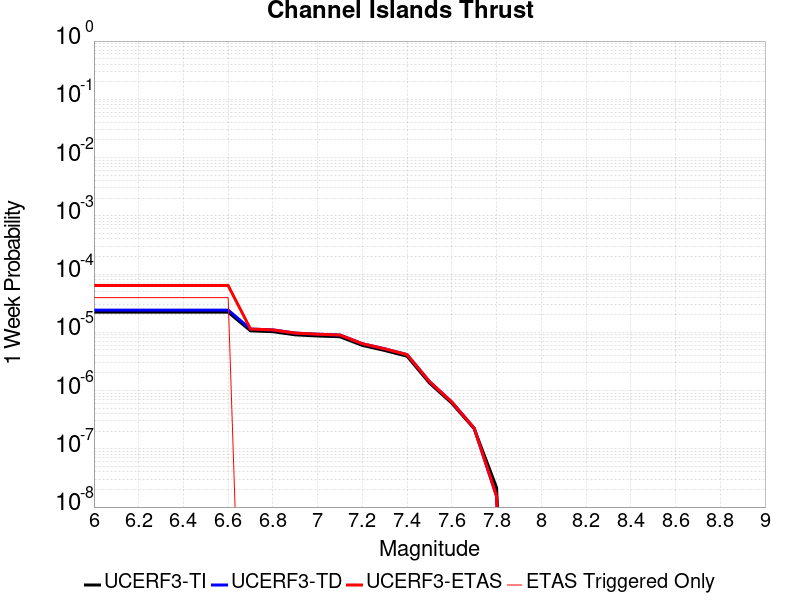 | 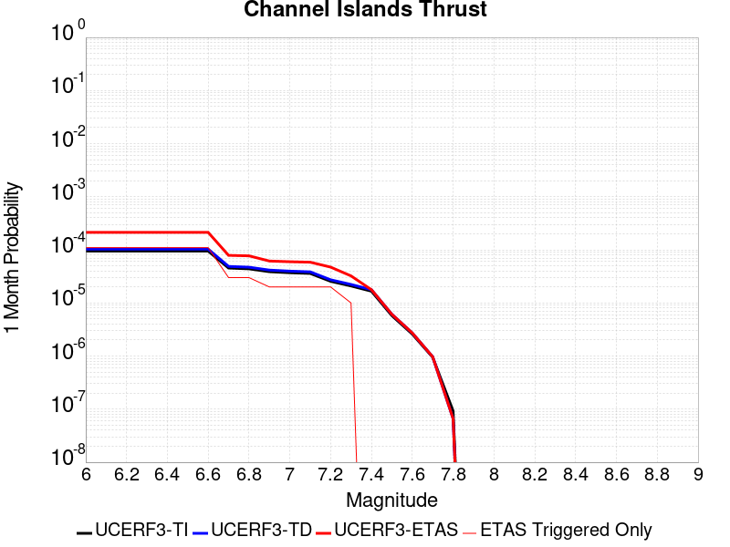 | 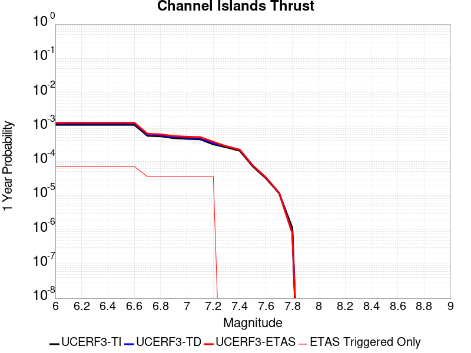 | 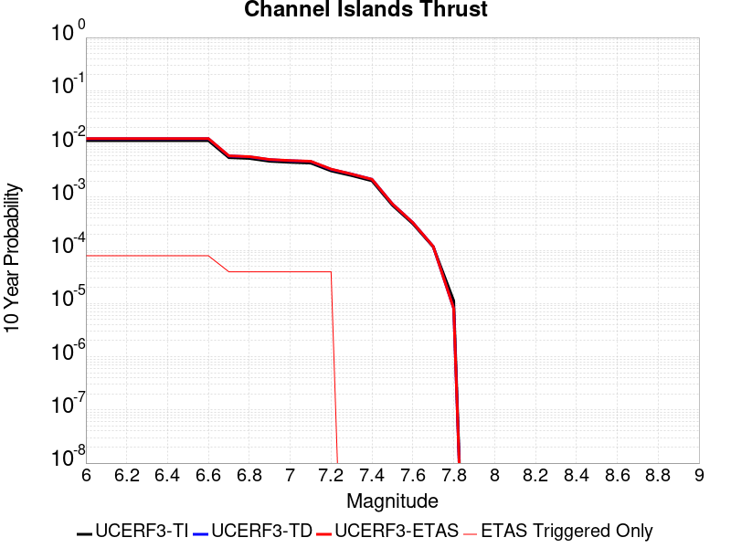 |

| Magnitude | 1 wk TI Prob | 1 wk TD Prob | 1 wk ETAS Prob | 1 wk ETAS/TD Gain | 1 wk ETAS Triggered Only | 1 mo TI Prob | 1 mo TD Prob | 1 mo ETAS Prob | 1 mo ETAS/TD Gain | 1 mo ETAS Triggered Only | 1 yr TI Prob | 1 yr TD Prob | 1 yr ETAS Prob | 1 yr ETAS/TD Gain | 1 yr ETAS Triggered Only | 10 yr TI Prob | 10 yr TD Prob | 10 yr ETAS Prob | 10 yr ETAS/TD Gain | 10 yr ETAS Triggered Only |
|-----|-----|-----|-----|-----|-----|-----|-----|-----|-----|-----|-----|-----|-----|-----|-----|-----|-----|-----|-----|-----|
| 6.0 | 2.2156251E-5 | 2.4092022E-5 | 6.354191E-5 | 2.6374671 | 3.9450842E-5 | 9.495191E-5 | 1.03248036E-4 | 1.8214158E-4 | 1.7641166 | 7.8901685E-5 | 0.0011554264 | 0.0012564264 | 0.001335229 | 1.0627196 | 7.8901685E-5 | 0.011494373 | 0.0125038205 | 0.012581736 | 1.0062313 | 7.8901685E-5 |
| 6.1 | 2.2156251E-5 | 2.4092022E-5 | 6.354191E-5 | 2.6374671 | 3.9450842E-5 | 9.495191E-5 | 1.03248036E-4 | 1.8214158E-4 | 1.7641166 | 7.8901685E-5 | 0.0011554264 | 0.0012564264 | 0.001335229 | 1.0627196 | 7.8901685E-5 | 0.011494373 | 0.0125038205 | 0.012581736 | 1.0062313 | 7.8901685E-5 |
| 6.2 | 2.2156251E-5 | 2.4092022E-5 | 6.354191E-5 | 2.6374671 | 3.9450842E-5 | 9.495191E-5 | 1.03248036E-4 | 1.8214158E-4 | 1.7641166 | 7.8901685E-5 | 0.0011554264 | 0.0012564264 | 0.001335229 | 1.0627196 | 7.8901685E-5 | 0.011494373 | 0.0125038205 | 0.012581736 | 1.0062313 | 7.8901685E-5 |
| 6.3 | 2.2156251E-5 | 2.4092022E-5 | 6.354191E-5 | 2.6374671 | 3.9450842E-5 | 9.495191E-5 | 1.03248036E-4 | 1.8214158E-4 | 1.7641166 | 7.8901685E-5 | 0.0011554264 | 0.0012564264 | 0.001335229 | 1.0627196 | 7.8901685E-5 | 0.011494373 | 0.0125038205 | 0.012581736 | 1.0062313 | 7.8901685E-5 |
| 6.4 | 2.2156251E-5 | 2.4092022E-5 | 6.354191E-5 | 2.6374671 | 3.9450842E-5 | 9.495191E-5 | 1.03248036E-4 | 1.8214158E-4 | 1.7641166 | 7.8901685E-5 | 0.0011554264 | 0.0012564264 | 0.001335229 | 1.0627196 | 7.8901685E-5 | 0.011494373 | 0.0125038205 | 0.012581736 | 1.0062313 | 7.8901685E-5 |
| 6.5 | 2.2156251E-5 | 2.4092022E-5 | 6.354191E-5 | 2.6374671 | 3.9450842E-5 | 9.495191E-5 | 1.03248036E-4 | 1.8214158E-4 | 1.7641166 | 7.8901685E-5 | 0.0011554264 | 0.0012564264 | 0.001335229 | 1.0627196 | 7.8901685E-5 | 0.011494373 | 0.0125038205 | 0.012581736 | 1.0062313 | 7.8901685E-5 |
| 6.6 | 2.2156251E-5 | 2.4092022E-5 | 6.354191E-5 | 2.6374671 | 3.9450842E-5 | 9.495191E-5 | 1.03248036E-4 | 1.8214158E-4 | 1.7641166 | 7.8901685E-5 | 0.0011554264 | 0.0012564264 | 0.001335229 | 1.0627196 | 7.8901685E-5 | 0.011494373 | 0.0125038205 | 0.012581736 | 1.0062313 | 7.8901685E-5 |
| 6.7 | 1.0601296E-5 | 1.1379544E-5 | 1.1379544E-5 | 1.0 | 0.0 | 4.5433335E-5 | 4.876859E-5 | 8.821751E-5 | 1.8089002 | 3.9450842E-5 | 5.5301044E-4 | 5.936007E-4 | 6.330281E-4 | 1.0664208 | 3.9450842E-5 | 0.005516363 | 0.005920653 | 0.0059598708 | 1.0066239 | 3.9450842E-5 |
| 6.8 | 1.0246747E-5 | 1.0996669E-5 | 1.0996669E-5 | 1.0 | 0.0 | 4.391389E-5 | 4.7127756E-5 | 8.657674E-5 | 1.8370647 | 3.9450842E-5 | 5.345204E-4 | 5.7363417E-4 | 6.1306235E-4 | 1.068734 | 3.9450842E-5 | 0.0053323656 | 0.005722025 | 0.00576125 | 1.0068551 | 3.9450842E-5 |
| 6.9 | 9.049551E-6 | 9.699645E-6 | 9.699645E-6 | 1.0 | 0.0 | 3.878322E-5 | 4.1569267E-5 | 8.101847E-5 | 1.9489993 | 3.9450842E-5 | 4.7208337E-4 | 5.059924E-4 | 5.4542325E-4 | 1.0779278 | 3.9450842E-5 | 0.0047108172 | 0.0050488203 | 0.005088072 | 1.0077745 | 3.9450842E-5 |
| 7.0 | 8.6542195E-6 | 9.274603E-6 | 9.274603E-6 | 1.0 | 0.0 | 3.7088983E-5 | 3.9747716E-5 | 7.9196994E-5 | 1.9924916 | 3.9450842E-5 | 4.5146482E-4 | 4.8382508E-4 | 5.2325684E-4 | 1.0815 | 3.9450842E-5 | 0.004505487 | 0.004828129 | 0.0048673893 | 1.0081316 | 3.9450842E-5 |
| 7.1 | 8.391028E-6 | 8.992924E-6 | 8.992924E-6 | 1.0 | 0.0 | 3.5961057E-5 | 3.854056E-5 | 7.7989884E-5 | 2.0235794 | 3.9450842E-5 | 4.3773788E-4 | 4.6913436E-4 | 5.085667E-4 | 1.0840534 | 3.9450842E-5 | 0.004368766 | 0.0046818503 | 0.0047211163 | 1.0083869 | 3.9450842E-5 |
| 7.2 | 5.965188E-6 | 6.3716952E-6 | 6.3716952E-6 | 1.0 | 0.0 | 2.556484E-5 | 2.7306982E-5 | 6.675675E-5 | 2.4446769 | 3.9450842E-5 | 3.1120746E-4 | 3.3241234E-4 | 3.7185007E-4 | 1.118641 | 3.9450842E-5 | 0.00310772 | 0.0033192092 | 0.0033585292 | 1.0118462 | 3.9450842E-5 |
| 7.3 | 4.877518E-6 | 5.2060063E-6 | 5.2060063E-6 | 1.0 | 0.0 | 2.0903482E-5 | 2.2311267E-5 | 2.2311267E-5 | 1.0 | 0.0 | 2.5447016E-4 | 2.716063E-4 | 2.716063E-4 | 1.0 | 0.0 | 0.0025417898 | 0.0027127895 | 0.0027127895 | 1.0 | 0.0 |
| 7.4 | 3.8829853E-6 | 4.141863E-6 | 4.141863E-6 | 1.0 | 0.0 | 1.664126E-5 | 1.7750723E-5 | 1.7750723E-5 | 1.0 | 0.0 | 2.0258849E-4 | 2.1609402E-4 | 2.1609402E-4 | 1.0 | 0.0 | 0.002024039 | 0.0021588807 | 0.0021588807 | 1.0 | 0.0 |
| 7.5 | 1.3489616E-6 | 1.4277903E-6 | 1.4277903E-6 | 1.0 | 0.0 | 5.7812517E-6 | 6.119087E-6 | 6.119087E-6 | 1.0 | 0.0 | 7.038446E-5 | 7.449738E-5 | 7.449738E-5 | 1.0 | 0.0 | 7.036218E-4 | 7.44728E-4 | 7.44728E-4 | 1.0 | 0.0 |
| 7.6 | 6.058192E-7 | 6.353778E-7 | 6.353778E-7 | 1.0 | 0.0 | 2.5963652E-6 | 2.7230449E-6 | 2.7230449E-6 | 1.0 | 0.0 | 3.161029E-5 | 3.3152584E-5 | 3.3152584E-5 | 1.0 | 0.0 | 3.1605794E-4 | 3.31478E-4 | 3.31478E-4 | 1.0 | 0.0 |
| 7.7 | 2.2170494E-7 | 2.2607902E-7 | 2.2607902E-7 | 1.0 | 0.0 | 9.5016367E-7 | 9.689098E-7 | 9.689098E-7 | 1.0 | 0.0 | 1.1568181E-5 | 1.1796425E-5 | 1.1796425E-5 | 1.0 | 0.0 | 1.1567579E-4 | 1.1795909E-4 | 1.1795909E-4 | 1.0 | 0.0 |
| 7.8 | 2.1613102E-8 | 1.5466682E-8 | 1.5466682E-8 | 1.0 | 0.0 | 9.262757E-8 | 6.628578E-8 | 6.628578E-8 | 1.0 | 0.0 | 1.1277401E-6 | 8.070291E-7 | 8.070291E-7 | 1.0 | 0.0 | 1.1277344E-5 | 8.070269E-6 | 8.070269E-6 | 1.0 | 0.0 |

## Pine Mtn
*[(top)](#table-of-contents)*

| 1 Week | 1 Month | 1 Year | 10 Year |
|-----|-----|-----|-----|
| 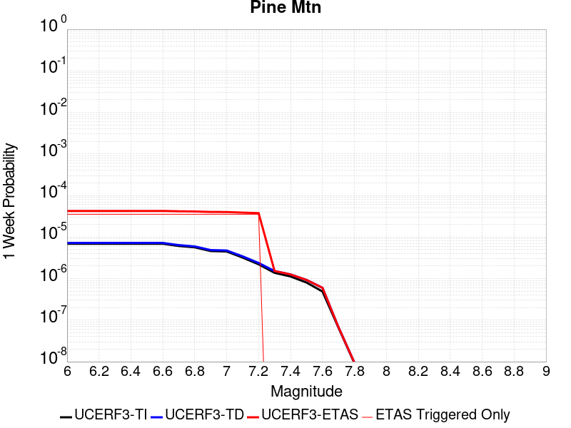 | 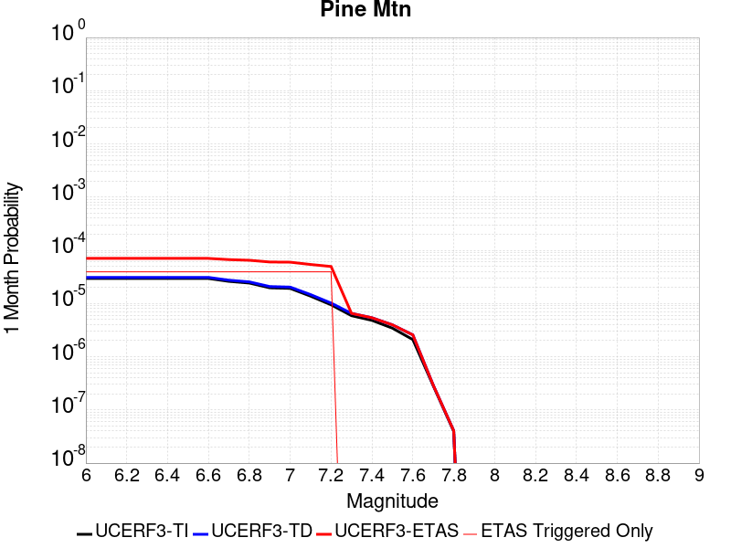 | 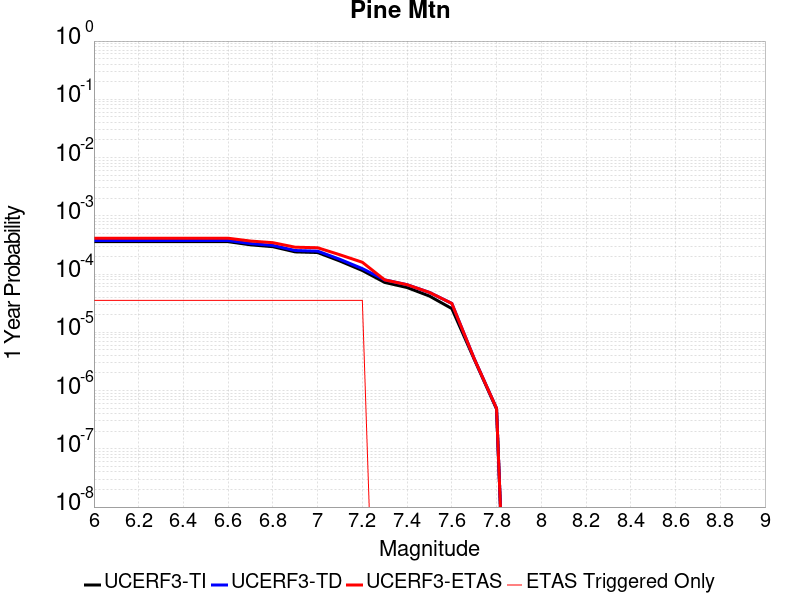 | 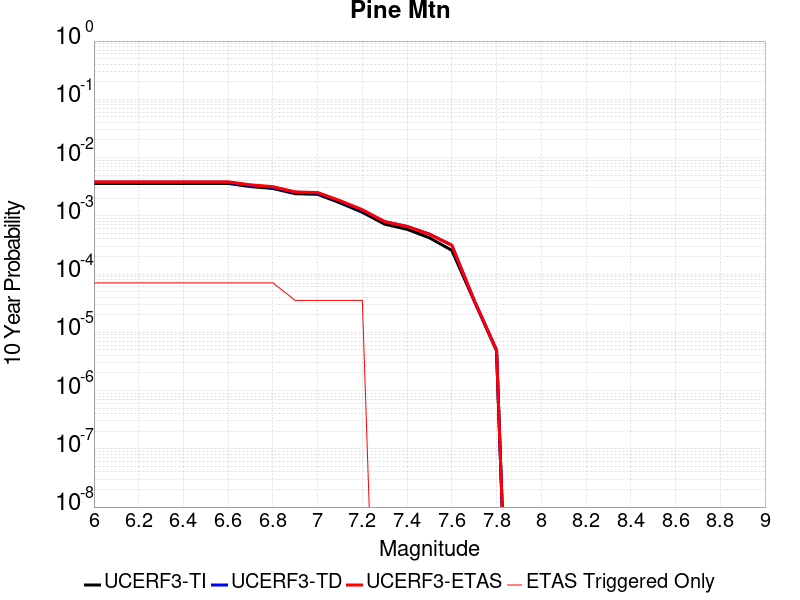 |

| Magnitude | 1 wk TI Prob | 1 wk TD Prob | 1 wk ETAS Prob | 1 wk ETAS/TD Gain | 1 wk ETAS Triggered Only | 1 mo TI Prob | 1 mo TD Prob | 1 mo ETAS Prob | 1 mo ETAS/TD Gain | 1 mo ETAS Triggered Only | 1 yr TI Prob | 1 yr TD Prob | 1 yr ETAS Prob | 1 yr ETAS/TD Gain | 1 yr ETAS Triggered Only | 10 yr TI Prob | 10 yr TD Prob | 10 yr ETAS Prob | 10 yr ETAS/TD Gain | 10 yr ETAS Triggered Only |
|-----|-----|-----|-----|-----|-----|-----|-----|-----|-----|-----|-----|-----|-----|-----|-----|-----|-----|-----|-----|-----|
| 6.0 | 6.894797E-6 | 7.225461E-6 | 4.667602E-5 | 6.4599366 | 3.9450842E-5 | 2.9548795E-5 | 3.096591E-5 | 7.041553E-5 | 2.2739694 | 3.9450842E-5 | 3.596972E-4 | 3.7694772E-4 | 4.163837E-4 | 1.1046193 | 3.9450842E-5 | 0.0035911554 | 0.003763381 | 0.0038419857 | 1.0208868 | 7.8901685E-5 |
| 6.1 | 6.894797E-6 | 7.225461E-6 | 4.667602E-5 | 6.4599366 | 3.9450842E-5 | 2.9548795E-5 | 3.096591E-5 | 7.041553E-5 | 2.2739694 | 3.9450842E-5 | 3.596972E-4 | 3.7694772E-4 | 4.163837E-4 | 1.1046193 | 3.9450842E-5 | 0.0035911554 | 0.003763381 | 0.0038419857 | 1.0208868 | 7.8901685E-5 |
| 6.2 | 6.894797E-6 | 7.225461E-6 | 4.667602E-5 | 6.4599366 | 3.9450842E-5 | 2.9548795E-5 | 3.096591E-5 | 7.041553E-5 | 2.2739694 | 3.9450842E-5 | 3.596972E-4 | 3.7694772E-4 | 4.163837E-4 | 1.1046193 | 3.9450842E-5 | 0.0035911554 | 0.003763381 | 0.0038419857 | 1.0208868 | 7.8901685E-5 |
| 6.3 | 6.894797E-6 | 7.225461E-6 | 4.667602E-5 | 6.4599366 | 3.9450842E-5 | 2.9548795E-5 | 3.096591E-5 | 7.041553E-5 | 2.2739694 | 3.9450842E-5 | 3.596972E-4 | 3.7694772E-4 | 4.163837E-4 | 1.1046193 | 3.9450842E-5 | 0.0035911554 | 0.003763381 | 0.0038419857 | 1.0208868 | 7.8901685E-5 |
| 6.4 | 6.894797E-6 | 7.225461E-6 | 4.667602E-5 | 6.4599366 | 3.9450842E-5 | 2.9548795E-5 | 3.096591E-5 | 7.041553E-5 | 2.2739694 | 3.9450842E-5 | 3.596972E-4 | 3.7694772E-4 | 4.163837E-4 | 1.1046193 | 3.9450842E-5 | 0.0035911554 | 0.003763381 | 0.0038419857 | 1.0208868 | 7.8901685E-5 |
| 6.5 | 6.894797E-6 | 7.225461E-6 | 4.667602E-5 | 6.4599366 | 3.9450842E-5 | 2.9548795E-5 | 3.096591E-5 | 7.041553E-5 | 2.2739694 | 3.9450842E-5 | 3.596972E-4 | 3.7694772E-4 | 4.163837E-4 | 1.1046193 | 3.9450842E-5 | 0.0035911554 | 0.003763381 | 0.0038419857 | 1.0208868 | 7.8901685E-5 |
| 6.6 | 6.894797E-6 | 7.225461E-6 | 4.667602E-5 | 6.4599366 | 3.9450842E-5 | 2.9548795E-5 | 3.096591E-5 | 7.041553E-5 | 2.2739694 | 3.9450842E-5 | 3.596972E-4 | 3.7694772E-4 | 4.163837E-4 | 1.1046193 | 3.9450842E-5 | 0.0035911554 | 0.003763381 | 0.0038419857 | 1.0208868 | 7.8901685E-5 |
| 6.7 | 6.0867933E-6 | 6.3971133E-6 | 4.5847704E-5 | 7.1669364 | 3.9450842E-5 | 2.6085996E-5 | 2.7415923E-5 | 6.686569E-5 | 2.438936 | 3.9450842E-5 | 3.1755073E-4 | 3.3373994E-4 | 3.731776E-4 | 1.1181688 | 3.9450842E-5 | 0.0031709734 | 0.0033326065 | 0.003411245 | 1.0235968 | 7.8901685E-5 |
| 6.8 | 5.6530425E-6 | 5.9505956E-6 | 4.5401204E-5 | 7.629691 | 3.9450842E-5 | 2.42271E-5 | 2.5502315E-5 | 6.495215E-5 | 2.546912 | 3.9450842E-5 | 2.94925E-4 | 3.104485E-4 | 3.498871E-4 | 1.1270375 | 3.9450842E-5 | 0.002945339 | 0.0031003528 | 0.00317901 | 1.0253704 | 7.8901685E-5 |
| 6.9 | 4.6015225E-6 | 4.863834E-6 | 4.4314485E-5 | 9.111019 | 3.9450842E-5 | 1.9720663E-5 | 2.0844845E-5 | 6.0294868E-5 | 2.8925552 | 3.9450842E-5 | 2.4007261E-4 | 2.5375787E-4 | 2.931987E-4 | 1.155427 | 3.9450842E-5 | 0.0023981342 | 0.0025348254 | 0.0025741763 | 1.015524 | 3.9450842E-5 |
| 7.0 | 4.4875965E-6 | 4.747473E-6 | 4.419813E-5 | 9.309822 | 3.9450842E-5 | 1.9232413E-5 | 2.0346162E-5 | 5.9796203E-5 | 2.9389427 | 3.9450842E-5 | 2.3412947E-4 | 2.4768783E-4 | 2.871289E-4 | 1.159237 | 3.9450842E-5 | 0.0023388295 | 0.0024742614 | 0.0025136147 | 1.015905 | 3.9450842E-5 |
| 7.1 | 3.203907E-6 | 3.4294096E-6 | 4.2880118E-5 | 12.503645 | 3.9450842E-5 | 1.3730958E-5 | 1.4697391E-5 | 5.4147655E-5 | 3.6841679 | 3.9450842E-5 | 1.6716159E-4 | 1.789267E-4 | 2.183705E-4 | 1.2204466 | 3.9450842E-5 | 0.0016703589 | 0.0017878925 | 0.0018272728 | 1.0220261 | 3.9450842E-5 |
| 7.2 | 2.2060601E-6 | 2.3784817E-6 | 4.1829233E-5 | 17.586527 | 3.9450842E-5 | 9.4545085E-6 | 1.0193455E-5 | 4.96439E-5 | 4.870174 | 3.9450842E-5 | 1.15102564E-4 | 1.240987E-4 | 1.6354465E-4 | 1.3178595 | 3.9450842E-5 | 0.0011504296 | 0.0012403389 | 0.0012797408 | 1.031767 | 3.9450842E-5 |
| 7.3 | 1.3765207E-6 | 1.5216481E-6 | 1.5216481E-6 | 1.0 | 0.0 | 5.899361E-6 | 6.521333E-6 | 6.521333E-6 | 1.0 | 0.0 | 7.182235E-5 | 7.939443E-5 | 7.939443E-5 | 1.0 | 0.0 | 7.1799144E-4 | 7.936697E-4 | 7.936697E-4 | 1.0 | 0.0 |
| 7.4 | 1.1245983E-6 | 1.2587075E-6 | 1.2587075E-6 | 1.0 | 0.0 | 4.819698E-6 | 5.39445E-6 | 5.39445E-6 | 1.0 | 0.0 | 5.8678244E-5 | 6.567554E-5 | 6.567554E-5 | 1.0 | 0.0 | 5.866275E-4 | 6.5656955E-4 | 6.5656955E-4 | 1.0 | 0.0 |
| 7.5 | 8.031682E-7 | 9.276951E-7 | 9.276951E-7 | 1.0 | 0.0 | 3.4421448E-6 | 3.9758306E-6 | 3.9758306E-6 | 1.0 | 0.0 | 4.1907308E-5 | 4.840473E-5 | 4.840473E-5 | 1.0 | 0.0 | 4.1899405E-4 | 4.8394862E-4 | 4.8394862E-4 | 1.0 | 0.0 |
| 7.6 | 4.8953444E-7 | 6.003009E-7 | 6.003009E-7 | 1.0 | 0.0 | 2.098003E-6 | 2.5727159E-6 | 2.5727159E-6 | 1.0 | 0.0 | 2.5542888E-5 | 3.1322415E-5 | 3.1322415E-5 | 1.0 | 0.0 | 2.5539953E-4 | 3.1318486E-4 | 3.1318486E-4 | 1.0 | 0.0 |
| 7.7 | 6.634529E-8 | 6.788826E-8 | 6.788826E-8 | 1.0 | 0.0 | 2.843369E-7 | 2.9094966E-7 | 2.9094966E-7 | 1.0 | 0.0 | 3.4617963E-6 | 3.5423066E-6 | 3.5423066E-6 | 1.0 | 0.0 | 3.4617424E-5 | 3.542255E-5 | 3.542255E-5 | 1.0 | 0.0 |
| 7.8 | 9.235578E-9 | 9.488566E-9 | 9.488566E-9 | 1.0 | 0.0 | 3.9581046E-8 | 4.0665284E-8 | 4.0665284E-8 | 1.0 | 0.0 | 4.818991E-7 | 4.950997E-7 | 4.950997E-7 | 1.0 | 0.0 | 4.8189804E-6 | 4.950988E-6 | 4.950988E-6 | 1.0 | 0.0 |

## Channel Islands Western Deep Ramp
*[(top)](#table-of-contents)*

| 1 Week | 1 Month | 1 Year | 10 Year |
|-----|-----|-----|-----|
| 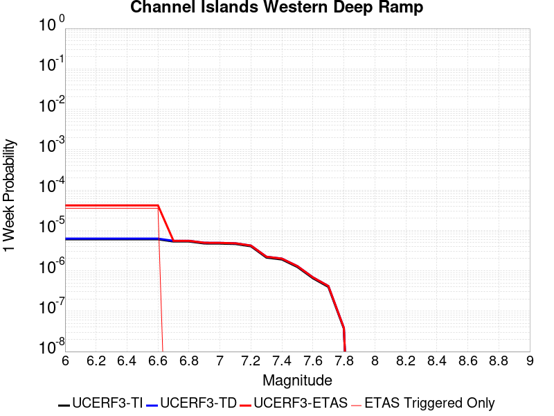 | 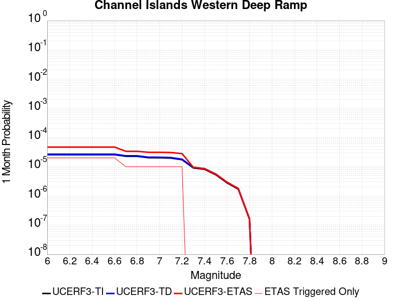 | 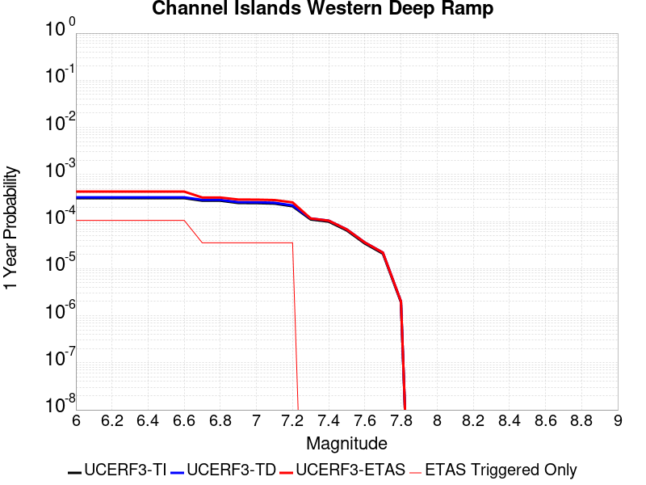 | 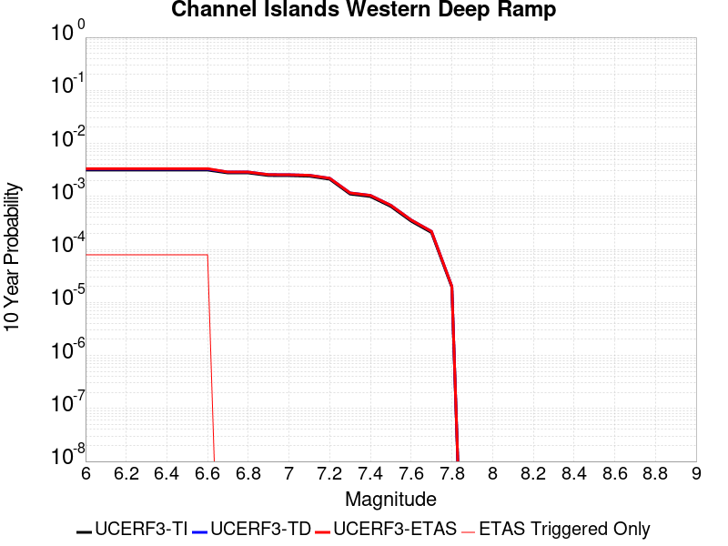 |

| Magnitude | 1 wk TI Prob | 1 wk TD Prob | 1 wk ETAS Prob | 1 wk ETAS/TD Gain | 1 wk ETAS Triggered Only | 1 mo TI Prob | 1 mo TD Prob | 1 mo ETAS Prob | 1 mo ETAS/TD Gain | 1 mo ETAS Triggered Only | 1 yr TI Prob | 1 yr TD Prob | 1 yr ETAS Prob | 1 yr ETAS/TD Gain | 1 yr ETAS Triggered Only | 10 yr TI Prob | 10 yr TD Prob | 10 yr ETAS Prob | 10 yr ETAS/TD Gain | 10 yr ETAS Triggered Only |
|-----|-----|-----|-----|-----|-----|-----|-----|-----|-----|-----|-----|-----|-----|-----|-----|-----|-----|-----|-----|-----|
| 6.0 | 6.0213506E-6 | 6.2548684E-6 | 4.5705467E-5 | 7.307183 | 3.9450842E-5 | 2.5805533E-5 | 2.6806329E-5 | 6.6256114E-5 | 2.4716594 | 3.9450842E-5 | 3.1413708E-4 | 3.2632265E-4 | 4.0519857E-4 | 1.2417115 | 7.8901685E-5 | 0.0031369338 | 0.0032588763 | 0.0033375209 | 1.0241324 | 7.8901685E-5 |
| 6.1 | 6.0213506E-6 | 6.2548684E-6 | 4.5705467E-5 | 7.307183 | 3.9450842E-5 | 2.5805533E-5 | 2.6806329E-5 | 6.6256114E-5 | 2.4716594 | 3.9450842E-5 | 3.1413708E-4 | 3.2632265E-4 | 4.0519857E-4 | 1.2417115 | 7.8901685E-5 | 0.0031369338 | 0.0032588763 | 0.0033375209 | 1.0241324 | 7.8901685E-5 |
| 6.2 | 6.0213506E-6 | 6.2548684E-6 | 4.5705467E-5 | 7.307183 | 3.9450842E-5 | 2.5805533E-5 | 2.6806329E-5 | 6.6256114E-5 | 2.4716594 | 3.9450842E-5 | 3.1413708E-4 | 3.2632265E-4 | 4.0519857E-4 | 1.2417115 | 7.8901685E-5 | 0.0031369338 | 0.0032588763 | 0.0033375209 | 1.0241324 | 7.8901685E-5 |
| 6.3 | 6.0213506E-6 | 6.2548684E-6 | 4.5705467E-5 | 7.307183 | 3.9450842E-5 | 2.5805533E-5 | 2.6806329E-5 | 6.6256114E-5 | 2.4716594 | 3.9450842E-5 | 3.1413708E-4 | 3.2632265E-4 | 4.0519857E-4 | 1.2417115 | 7.8901685E-5 | 0.0031369338 | 0.0032588763 | 0.0033375209 | 1.0241324 | 7.8901685E-5 |
| 6.4 | 6.0213506E-6 | 6.2548684E-6 | 4.5705467E-5 | 7.307183 | 3.9450842E-5 | 2.5805533E-5 | 2.6806329E-5 | 6.6256114E-5 | 2.4716594 | 3.9450842E-5 | 3.1413708E-4 | 3.2632265E-4 | 4.0519857E-4 | 1.2417115 | 7.8901685E-5 | 0.0031369338 | 0.0032588763 | 0.0033375209 | 1.0241324 | 7.8901685E-5 |
| 6.5 | 6.0213506E-6 | 6.2548684E-6 | 4.5705467E-5 | 7.307183 | 3.9450842E-5 | 2.5805533E-5 | 2.6806329E-5 | 6.6256114E-5 | 2.4716594 | 3.9450842E-5 | 3.1413708E-4 | 3.2632265E-4 | 4.0519857E-4 | 1.2417115 | 7.8901685E-5 | 0.0031369338 | 0.0032588763 | 0.0033375209 | 1.0241324 | 7.8901685E-5 |
| 6.6 | 6.0213506E-6 | 6.2548684E-6 | 4.5705467E-5 | 7.307183 | 3.9450842E-5 | 2.5805533E-5 | 2.6806329E-5 | 6.6256114E-5 | 2.4716594 | 3.9450842E-5 | 3.1413708E-4 | 3.2632265E-4 | 4.0519857E-4 | 1.2417115 | 7.8901685E-5 | 0.0031369338 | 0.0032588763 | 0.0033375209 | 1.0241324 | 7.8901685E-5 |
| 6.7 | 5.313309E-6 | 5.5252403E-6 | 5.5252403E-6 | 1.0 | 0.0 | 2.2771126E-5 | 2.367941E-5 | 2.367941E-5 | 1.0 | 0.0 | 2.772032E-4 | 2.8826276E-4 | 2.8826276E-4 | 1.0 | 0.0 | 0.0027685766 | 0.0028792918 | 0.0028792918 | 1.0 | 0.0 |
| 6.8 | 5.313309E-6 | 5.5252403E-6 | 5.5252403E-6 | 1.0 | 0.0 | 2.2771126E-5 | 2.367941E-5 | 2.367941E-5 | 1.0 | 0.0 | 2.772032E-4 | 2.8826276E-4 | 2.8826276E-4 | 1.0 | 0.0 | 0.0027685766 | 0.0028792918 | 0.0028792918 | 1.0 | 0.0 |
| 6.9 | 4.744377E-6 | 4.9394303E-6 | 4.9394303E-6 | 1.0 | 0.0 | 2.0332885E-5 | 2.1168837E-5 | 2.1168837E-5 | 1.0 | 0.0 | 2.4752476E-4 | 2.5770385E-4 | 2.5770385E-4 | 1.0 | 0.0 | 0.0024724922 | 0.0025744175 | 0.0025744175 | 1.0 | 0.0 |
| 7.0 | 4.722209E-6 | 4.9164732E-6 | 4.9164732E-6 | 1.0 | 0.0 | 2.0237881E-5 | 2.107045E-5 | 2.107045E-5 | 1.0 | 0.0 | 2.4636835E-4 | 2.5650626E-4 | 2.5650626E-4 | 1.0 | 0.0 | 0.002460954 | 0.0025624693 | 0.0025624693 | 1.0 | 0.0 |
| 7.1 | 4.611174E-6 | 4.801409E-6 | 4.801409E-6 | 1.0 | 0.0 | 1.9762025E-5 | 2.0577325E-5 | 2.0577325E-5 | 1.0 | 0.0 | 2.4057609E-4 | 2.5050386E-4 | 2.5050386E-4 | 1.0 | 0.0 | 0.002403158 | 0.002502582 | 0.002502582 | 1.0 | 0.0 |
| 7.2 | 4.043994E-6 | 4.2120264E-6 | 4.2120264E-6 | 1.0 | 0.0 | 1.7331287E-5 | 1.8051438E-5 | 1.8051438E-5 | 1.0 | 0.0 | 2.10988E-4 | 2.1975765E-4 | 2.1975765E-4 | 1.0 | 0.0 | 0.002107878 | 0.0021957543 | 0.0021957543 | 1.0 | 0.0 |
| 7.3 | 2.1233036E-6 | 2.2297875E-6 | 2.2297875E-6 | 1.0 | 0.0 | 9.099841E-6 | 9.556197E-6 | 9.556197E-6 | 1.0 | 0.0 | 1.1078493E-4 | 1.1634055E-4 | 1.1634055E-4 | 1.0 | 0.0 | 0.0011072971 | 0.001162802 | 0.001162802 | 1.0 | 0.0 |
| 7.4 | 1.9051884E-6 | 2.0014973E-6 | 2.0014973E-6 | 1.0 | 0.0 | 8.165067E-6 | 8.577817E-6 | 8.577817E-6 | 1.0 | 0.0 | 9.940516E-5 | 1.0442998E-4 | 1.0442998E-4 | 1.0 | 0.0 | 9.93607E-4 | 0.0010438144 | 0.0010438144 | 1.0 | 0.0 |
| 7.5 | 1.2408497E-6 | 1.3038839E-6 | 1.3038839E-6 | 1.0 | 0.0 | 5.317916E-6 | 5.588062E-6 | 5.588062E-6 | 1.0 | 0.0 | 6.4743705E-5 | 6.8032554E-5 | 6.8032554E-5 | 1.0 | 0.0 | 6.4724847E-4 | 6.8011944E-4 | 6.8011944E-4 | 1.0 | 0.0 |
| 7.6 | 6.5440025E-7 | 6.886718E-7 | 6.886718E-7 | 1.0 | 0.0 | 2.8045695E-6 | 2.9514472E-6 | 2.9514472E-6 | 1.0 | 0.0 | 3.4145098E-5 | 3.593329E-5 | 3.593329E-5 | 1.0 | 0.0 | 3.4139853E-4 | 3.5927625E-4 | 3.5927625E-4 | 1.0 | 0.0 |
| 7.7 | 3.985963E-7 | 4.1930787E-7 | 4.1930787E-7 | 1.0 | 0.0 | 1.7082689E-6 | 1.7970326E-6 | 1.7970326E-6 | 1.0 | 0.0 | 2.0797976E-5 | 2.1878664E-5 | 2.1878664E-5 | 1.0 | 0.0 | 2.0796029E-4 | 2.1876628E-4 | 2.1876628E-4 | 1.0 | 0.0 |
| 7.8 | 3.706329E-8 | 3.8591796E-8 | 3.8591796E-8 | 1.0 | 0.0 | 1.5884267E-7 | 1.653934E-7 | 1.653934E-7 | 1.0 | 0.0 | 1.9339077E-6 | 2.0136629E-6 | 2.0136629E-6 | 1.0 | 0.0 | 1.933891E-5 | 2.0136458E-5 | 2.0136458E-5 | 1.0 | 0.0 |

## San Gabriel (Extension)
*[(top)](#table-of-contents)*

| 1 Week | 1 Month | 1 Year | 10 Year |
|-----|-----|-----|-----|
| 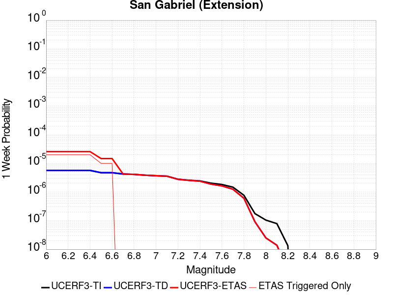 | 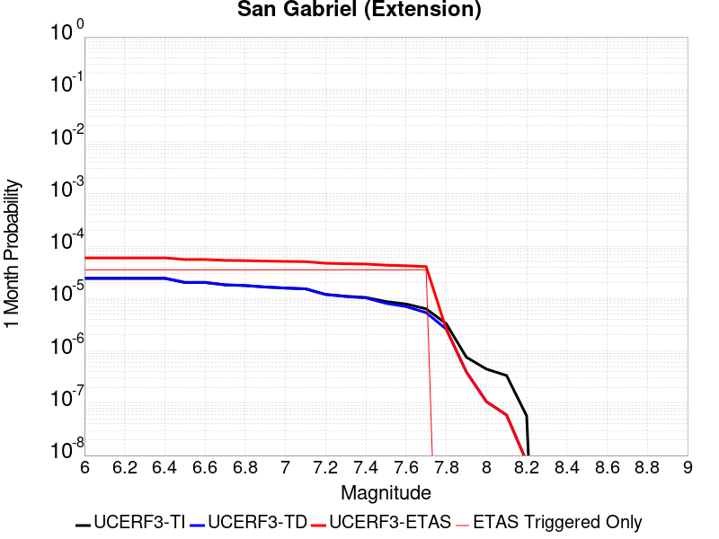 | 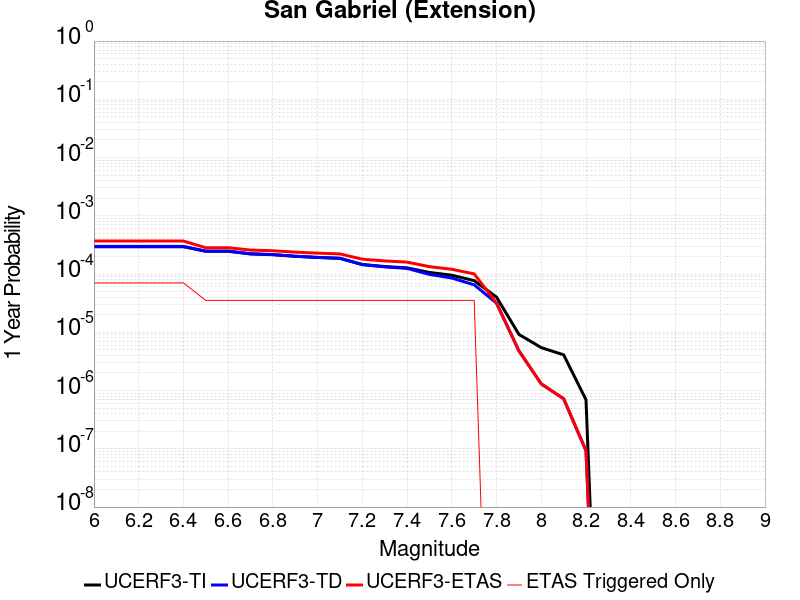 | 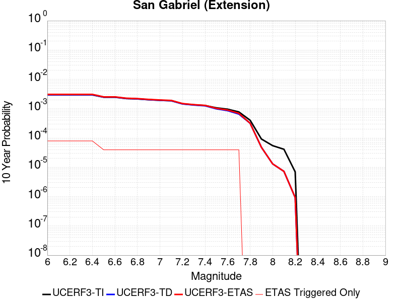 |

| Magnitude | 1 wk TI Prob | 1 wk TD Prob | 1 wk ETAS Prob | 1 wk ETAS/TD Gain | 1 wk ETAS Triggered Only | 1 mo TI Prob | 1 mo TD Prob | 1 mo ETAS Prob | 1 mo ETAS/TD Gain | 1 mo ETAS Triggered Only | 1 yr TI Prob | 1 yr TD Prob | 1 yr ETAS Prob | 1 yr ETAS/TD Gain | 1 yr ETAS Triggered Only | 10 yr TI Prob | 10 yr TD Prob | 10 yr ETAS Prob | 10 yr ETAS/TD Gain | 10 yr ETAS Triggered Only |
|-----|-----|-----|-----|-----|-----|-----|-----|-----|-----|-----|-----|-----|-----|-----|-----|-----|-----|-----|-----|-----|
| 6.0 | 5.6486106E-6 | 5.7168304E-6 | 5.7168304E-6 | 1.0 | 0.0 | 2.4208108E-5 | 2.450048E-5 | 6.3950356E-5 | 2.6101677 | 3.9450842E-5 | 2.9469383E-4 | 2.9825376E-4 | 3.7713192E-4 | 1.2644666 | 7.8901685E-5 | 0.0029430336 | 0.0029786653 | 0.0030573318 | 1.02641 | 7.8901685E-5 |
| 6.1 | 5.6486106E-6 | 5.7168304E-6 | 5.7168304E-6 | 1.0 | 0.0 | 2.4208108E-5 | 2.450048E-5 | 6.3950356E-5 | 2.6101677 | 3.9450842E-5 | 2.9469383E-4 | 2.9825376E-4 | 3.7713192E-4 | 1.2644666 | 7.8901685E-5 | 0.0029430336 | 0.0029786653 | 0.0030573318 | 1.02641 | 7.8901685E-5 |
| 6.2 | 5.6486106E-6 | 5.7168304E-6 | 5.7168304E-6 | 1.0 | 0.0 | 2.4208108E-5 | 2.450048E-5 | 6.3950356E-5 | 2.6101677 | 3.9450842E-5 | 2.9469383E-4 | 2.9825376E-4 | 3.7713192E-4 | 1.2644666 | 7.8901685E-5 | 0.0029430336 | 0.0029786653 | 0.0030573318 | 1.02641 | 7.8901685E-5 |
| 6.3 | 5.6486106E-6 | 5.7168304E-6 | 5.7168304E-6 | 1.0 | 0.0 | 2.4208108E-5 | 2.450048E-5 | 6.3950356E-5 | 2.6101677 | 3.9450842E-5 | 2.9469383E-4 | 2.9825376E-4 | 3.7713192E-4 | 1.2644666 | 7.8901685E-5 | 0.0029430336 | 0.0029786653 | 0.0030573318 | 1.02641 | 7.8901685E-5 |
| 6.4 | 5.6486106E-6 | 5.7168304E-6 | 5.7168304E-6 | 1.0 | 0.0 | 2.4208108E-5 | 2.450048E-5 | 6.3950356E-5 | 2.6101677 | 3.9450842E-5 | 2.9469383E-4 | 2.9825376E-4 | 3.7713192E-4 | 1.2644666 | 7.8901685E-5 | 0.0029430336 | 0.0029786653 | 0.0030573318 | 1.02641 | 7.8901685E-5 |
| 6.5 | 4.7134554E-6 | 4.7542544E-6 | 4.7542544E-6 | 1.0 | 0.0 | 2.0200367E-5 | 2.0375222E-5 | 5.9825263E-5 | 2.9361773 | 3.9450842E-5 | 2.459117E-4 | 2.4804095E-4 | 2.87482E-4 | 1.1590103 | 3.9450842E-5 | 0.0024563975 | 0.002477729 | 0.0025170823 | 1.0158827 | 3.9450842E-5 |
| 6.6 | 4.7134554E-6 | 4.7542544E-6 | 4.7542544E-6 | 1.0 | 0.0 | 2.0200367E-5 | 2.0375222E-5 | 5.9825263E-5 | 2.9361773 | 3.9450842E-5 | 2.459117E-4 | 2.4804095E-4 | 2.87482E-4 | 1.1590103 | 3.9450842E-5 | 0.0024563975 | 0.002477729 | 0.0025170823 | 1.0158827 | 3.9450842E-5 |
| 6.7 | 4.2468837E-6 | 4.2740717E-6 | 4.2740717E-6 | 1.0 | 0.0 | 1.8200803E-5 | 1.8317325E-5 | 5.7767447E-5 | 3.1537054 | 3.9450842E-5 | 2.2157225E-4 | 2.2299135E-4 | 2.624334E-4 | 1.176877 | 3.9450842E-5 | 0.0022135144 | 0.0022277518 | 0.0022671148 | 1.0176693 | 3.9450842E-5 |
| 6.8 | 4.1180615E-6 | 4.1414614E-6 | 4.1414614E-6 | 1.0 | 0.0 | 1.7648716E-5 | 1.7749004E-5 | 5.7199148E-5 | 3.2226682 | 3.9450842E-5 | 2.1485193E-4 | 2.160734E-4 | 2.555157E-4 | 1.1825413 | 3.9450842E-5 | 0.0021464431 | 0.0021587082 | 0.002198074 | 1.0182358 | 3.9450842E-5 |
| 6.9 | 3.863861E-6 | 3.8797766E-6 | 3.8797766E-6 | 1.0 | 0.0 | 1.65593E-5 | 1.6627511E-5 | 5.60777E-5 | 3.372585 | 3.9450842E-5 | 2.0159081E-4 | 2.0242184E-4 | 2.4186469E-4 | 1.1948547 | 3.9450842E-5 | 0.0020140803 | 0.002022446 | 0.002061817 | 1.019467 | 3.9450842E-5 |
| 7.0 | 3.6947372E-6 | 3.705676E-6 | 3.705676E-6 | 1.0 | 0.0 | 1.5834492E-5 | 1.5881375E-5 | 5.533159E-5 | 3.4840555 | 3.9450842E-5 | 1.9276788E-4 | 1.9333926E-4 | 2.3278248E-4 | 1.2040104 | 3.9450842E-5 | 0.0019260074 | 0.0019317807 | 0.0019711554 | 1.0203825 | 3.9450842E-5 |
| 7.1 | 3.5686835E-6 | 3.5728963E-6 | 3.5728963E-6 | 1.0 | 0.0 | 1.5294268E-5 | 1.5312327E-5 | 5.4762568E-5 | 3.5763714 | 3.9450842E-5 | 1.861918E-4 | 1.8641229E-4 | 2.2585578E-4 | 1.2115928 | 3.9450842E-5 | 0.0018603588 | 0.0018626289 | 0.0019020062 | 1.0211407 | 3.9450842E-5 |
| 7.2 | 2.8023446E-6 | 2.7767885E-6 | 2.7767885E-6 | 1.0 | 0.0 | 1.2009994E-5 | 1.1900468E-5 | 5.1350842E-5 | 4.315027 | 3.9450842E-5 | 1.4621185E-4 | 1.4487868E-4 | 1.8432381E-4 | 1.2722632 | 3.9450842E-5 | 0.001461157 | 0.0014478569 | 0.0014872507 | 1.0272083 | 3.9450842E-5 |
| 7.3 | 2.5843012E-6 | 2.5459642E-6 | 2.5459642E-6 | 1.0 | 0.0 | 1.1075529E-5 | 1.0911231E-5 | 5.0361643E-5 | 4.6155787 | 3.9450842E-5 | 1.3483623E-4 | 1.3283623E-4 | 1.7228184E-4 | 1.2969491 | 3.9450842E-5 | 0.0013475444 | 0.0013275818 | 0.0013669803 | 1.0296769 | 3.9450842E-5 |
| 7.4 | 2.4464468E-6 | 2.396665E-6 | 2.396665E-6 | 1.0 | 0.0 | 1.04847295E-5 | 1.0271382E-5 | 4.972182E-5 | 4.8408113 | 3.9450842E-5 | 1.276441E-4 | 1.25047E-4 | 1.644929E-4 | 1.3154486 | 3.9450842E-5 | 0.0012757082 | 0.0012497796 | 0.0012891812 | 1.0315268 | 3.9450842E-5 |
| 7.5 | 2.0420266E-6 | 1.8910426E-6 | 1.8910426E-6 | 1.0 | 0.0 | 8.751514E-6 | 8.104444E-6 | 4.7554968E-5 | 5.867765 | 3.9450842E-5 | 1.0654447E-4 | 9.8667166E-5 | 1.3811412E-4 | 1.3997982 | 3.9450842E-5 | 0.001064934 | 9.862408E-4 | 0.0010256527 | 1.0399618 | 3.9450842E-5 |
| 7.6 | 1.8326596E-6 | 1.6398341E-6 | 1.6398341E-6 | 1.0 | 0.0 | 7.854232E-6 | 7.0278415E-6 | 4.647841E-5 | 6.6134686 | 3.9450842E-5 | 9.562107E-5 | 8.5560634E-5 | 1.250081E-4 | 1.4610469 | 3.9450842E-5 | 9.5579936E-4 | 8.5528276E-4 | 8.946999E-4 | 1.0460867 | 3.9450842E-5 |
| 7.7 | 1.4786998E-6 | 1.2523838E-6 | 1.2523838E-6 | 1.0 | 0.0 | 6.3372695E-6 | 5.367348E-6 | 4.481798E-5 | 8.350117 | 3.9450842E-5 | 7.715353E-5 | 6.534551E-5 | 1.0479378E-4 | 1.6036875 | 3.9450842E-5 | 7.7126746E-4 | 6.532707E-4 | 6.926957E-4 | 1.0603503 | 3.9450842E-5 |
| 7.8 | 7.6975533E-7 | 6.0693884E-7 | 6.0693884E-7 | 1.0 | 0.0 | 3.2989474E-6 | 2.601164E-6 | 2.601164E-6 | 1.0 | 0.0 | 4.0163945E-5 | 3.166871E-5 | 3.166871E-5 | 1.0 | 0.0 | 4.0156685E-4 | 3.1664805E-4 | 3.1664805E-4 | 1.0 | 0.0 |
| 7.9 | 1.7645915E-7 | 9.213256E-8 | 9.213256E-8 | 1.0 | 0.0 | 7.562533E-7 | 3.9485377E-7 | 3.9485377E-7 | 1.0 | 0.0 | 9.207345E-6 | 4.807334E-6 | 4.807334E-6 | 1.0 | 0.0 | 9.206964E-5 | 4.807699E-5 | 4.807699E-5 | 1.0 | 0.0 |
| 8.0 | 1.0463461E-7 | 2.4949307E-8 | 2.4949307E-8 | 1.0 | 0.0 | 4.4843398E-7 | 1.0692559E-7 | 1.0692559E-7 | 1.0 | 0.0 | 5.45967E-6 | 1.3018183E-6 | 1.3018183E-6 | 1.0 | 0.0 | 5.459536E-5 | 1.3022789E-5 | 1.3022789E-5 | 1.0 | 0.0 |
| 8.1 | 7.875717E-8 | 1.3866874E-8 | 1.3866874E-8 | 1.0 | 0.0 | 3.3753068E-7 | 5.942946E-8 | 5.942946E-8 | 1.0 | 0.0 | 4.109428E-6 | 7.235534E-7 | 7.235534E-7 | 1.0 | 0.0 | 4.109352E-5 | 7.2401926E-6 | 7.2401926E-6 | 1.0 | 0.0 |
| 8.2 | 1.33163E-8 | 1.7733891E-9 | 1.7733891E-9 | 1.0 | 0.0 | 5.7069855E-8 | 7.600239E-9 | 7.600239E-9 | 1.0 | 0.0 | 6.9482525E-7 | 9.25329E-8 | 9.25329E-8 | 1.0 | 0.0 | 6.9482307E-6 | 9.272953E-7 | 9.272953E-7 | 1.0 | 0.0 |

## San Jacinto (Borrego)
*[(top)](#table-of-contents)*

| 1 Week | 1 Month | 1 Year | 10 Year |
|-----|-----|-----|-----|
| 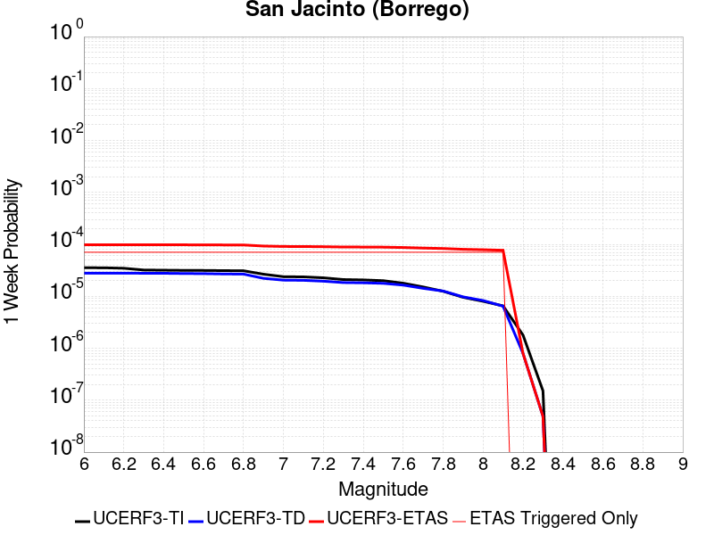 |  | 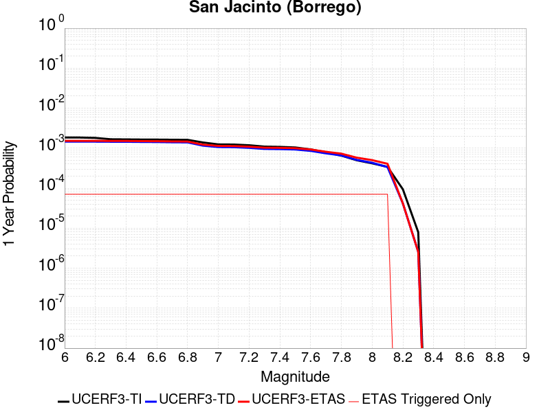 |  |

| Magnitude | 1 wk TI Prob | 1 wk TD Prob | 1 wk ETAS Prob | 1 wk ETAS/TD Gain | 1 wk ETAS Triggered Only | 1 mo TI Prob | 1 mo TD Prob | 1 mo ETAS Prob | 1 mo ETAS/TD Gain | 1 mo ETAS Triggered Only | 1 yr TI Prob | 1 yr TD Prob | 1 yr ETAS Prob | 1 yr ETAS/TD Gain | 1 yr ETAS Triggered Only | 10 yr TI Prob | 10 yr TD Prob | 10 yr ETAS Prob | 10 yr ETAS/TD Gain | 10 yr ETAS Triggered Only |
|-----|-----|-----|-----|-----|-----|-----|-----|-----|-----|-----|-----|-----|-----|-----|-----|-----|-----|-----|-----|-----|
| 6.0 | 3.543992E-5 | 2.7926513E-5 | 1.06825995E-4 | 3.8252537 | 7.8901685E-5 | 1.5187653E-4 | 1.1967963E-4 | 1.9857187E-4 | 1.6591953 | 7.8901685E-5 | 0.0018475284 | 0.0014561379 | 0.0015349246 | 1.0541067 | 7.8901685E-5 | 0.018322436 | 0.014869647 | 0.014947376 | 1.0052273 | 7.8901685E-5 |
| 6.1 | 3.542281E-5 | 2.7926513E-5 | 1.06825995E-4 | 3.8252537 | 7.8901685E-5 | 1.5180321E-4 | 1.1967963E-4 | 1.9857187E-4 | 1.6591953 | 7.8901685E-5 | 0.0018466372 | 0.0014561379 | 0.0015349246 | 1.0541067 | 7.8901685E-5 | 0.018313672 | 0.014869647 | 0.014947376 | 1.0052273 | 7.8901685E-5 |
| 6.2 | 3.4688688E-5 | 2.7926511E-5 | 1.06825995E-4 | 3.8252537 | 7.8901685E-5 | 1.4865733E-4 | 1.1967963E-4 | 1.9857187E-4 | 1.6591953 | 7.8901685E-5 | 0.0018084005 | 0.0014561379 | 0.0015349246 | 1.0541067 | 7.8901685E-5 | 0.017937548 | 0.014869647 | 0.014947375 | 1.0052273 | 7.8901685E-5 |
| 6.3 | 3.2087122E-5 | 2.7771865E-5 | 1.0667136E-4 | 3.8409867 | 7.8901685E-5 | 1.3750899E-4 | 1.1901691E-4 | 1.979092E-4 | 1.6628662 | 7.8901685E-5 | 0.0016728862 | 0.00144808 | 0.0015268674 | 1.0544082 | 7.8901685E-5 | 0.016603488 | 0.014790683 | 0.014868418 | 1.0052557 | 7.8901685E-5 |
| 6.4 | 3.1828724E-5 | 2.7738852E-5 | 1.0663835E-4 | 3.844368 | 7.8901685E-5 | 1.364017E-4 | 1.1887544E-4 | 1.9776775E-4 | 1.6636553 | 7.8901685E-5 | 0.0016594254 | 0.0014463598 | 0.0015251474 | 1.054473 | 7.8901685E-5 | 0.016470885 | 0.014773762 | 0.0148514975 | 1.0052618 | 7.8901685E-5 |
| 6.5 | 3.1563577E-5 | 2.747857E-5 | 1.0637809E-4 | 3.871311 | 7.8901685E-5 | 1.3526545E-4 | 1.1776006E-4 | 1.9665246E-4 | 1.6699419 | 7.8901685E-5 | 0.0016456128 | 0.0014327979 | 0.0015115866 | 1.0549893 | 7.8901685E-5 | 0.0163348 | 0.014640348 | 0.014718094 | 1.0053104 | 7.8901685E-5 |
| 6.6 | 3.1467625E-5 | 2.7322796E-5 | 1.0622233E-4 | 3.8876815 | 7.8901685E-5 | 1.3485427E-4 | 1.1709251E-4 | 1.9598496E-4 | 1.6737617 | 7.8901685E-5 | 0.0016406142 | 0.0014246812 | 0.0015034705 | 1.0553031 | 7.8901685E-5 | 0.016285548 | 0.014560594 | 0.014638348 | 1.00534 | 7.8901685E-5 |
| 6.7 | 3.1223695E-5 | 2.6940816E-5 | 1.0584038E-4 | 3.9286256 | 7.8901685E-5 | 1.3380898E-4 | 1.15455594E-4 | 1.9434818E-4 | 1.6833154 | 7.8901685E-5 | 0.0016279068 | 0.0014047775 | 0.0014835685 | 1.0560877 | 7.8901685E-5 | 0.01616033 | 0.014364966 | 0.014442734 | 1.0054138 | 7.8901685E-5 |
| 6.8 | 3.1015585E-5 | 2.6761822E-5 | 1.056614E-4 | 3.9482138 | 7.8901685E-5 | 1.3291716E-4 | 1.1468855E-4 | 1.9358119E-4 | 1.6878859 | 7.8901685E-5 | 0.001617065 | 0.0013954508 | 0.0014742424 | 1.0564631 | 7.8901685E-5 | 0.016053487 | 0.014272246 | 0.014350021 | 1.0054494 | 7.8901685E-5 |
| 6.9 | 2.6641965E-5 | 2.2184247E-5 | 1.0108419E-4 | 4.5565753 | 7.8901685E-5 | 1.1417485E-4 | 9.50719E-5 | 1.7396608E-4 | 1.8298371 | 7.8901685E-5 | 0.0013891924 | 0.0011568897 | 0.0012357001 | 1.0681226 | 7.8901685E-5 | 0.0138054015 | 0.011882438 | 0.011960403 | 1.0065613 | 7.8901685E-5 |
| 7.0 | 2.3854353E-5 | 2.0479023E-5 | 9.9379096E-5 | 4.8527265 | 7.8901685E-5 | 1.02228936E-4 | 8.77643E-5 | 1.6665907E-4 | 1.8989391 | 7.8901685E-5 | 0.0012439266 | 0.0010680092 | 0.0011468267 | 1.0737984 | 7.8901685E-5 | 0.012369866 | 0.0109828 | 0.011060836 | 1.0071052 | 7.8901685E-5 |
| 7.1 | 2.3672901E-5 | 2.031551E-5 | 9.92156E-5 | 4.883736 | 7.8901685E-5 | 1.0145135E-4 | 8.7063585E-5 | 1.6595841E-4 | 1.9061748 | 7.8901685E-5 | 0.0012344702 | 0.0010594862 | 0.0011383044 | 1.0743928 | 7.8901685E-5 | 0.0122763505 | 0.010897976 | 0.010976018 | 1.0071611 | 7.8901685E-5 |
| 7.2 | 2.2717244E-5 | 1.9542893E-5 | 9.844304E-5 | 5.037281 | 7.8901685E-5 | 9.735599E-5 | 8.375258E-5 | 1.6264766E-4 | 1.9420018 | 7.8901685E-5 | 0.0011846646 | 0.001019213 | 0.0010980342 | 1.0773355 | 7.8901685E-5 | 0.01178369 | 0.010495341 | 0.010573415 | 1.0074389 | 7.8901685E-5 |
| 7.3 | 2.1016205E-5 | 1.8384526E-5 | 9.728476E-5 | 5.2916656 | 7.8901685E-5 | 9.006634E-5 | 7.878846E-5 | 1.5768393E-4 | 2.0013583 | 7.8901685E-5 | 0.001096006 | 9.5882936E-4 | 0.0010376554 | 1.0822107 | 7.8901685E-5 | 0.010906163 | 0.009890967 | 0.009969088 | 1.0078982 | 7.8901685E-5 |
| 7.4 | 2.0683625E-5 | 1.8187047E-5 | 9.70873E-5 | 5.3382664 | 7.8901685E-5 | 8.86411E-5 | 7.794217E-5 | 1.568377E-4 | 2.0122318 | 7.8901685E-5 | 0.001078671 | 9.485349E-4 | 0.0010273617 | 1.0831038 | 7.8901685E-5 | 0.010734501 | 0.009787692 | 0.009865821 | 1.0079824 | 7.8901685E-5 |
| 7.5 | 1.9993966E-5 | 1.7782075E-5 | 9.668236E-5 | 5.437069 | 7.8901685E-5 | 8.568561E-5 | 7.620667E-5 | 1.5510235E-4 | 2.0352857 | 7.8901685E-5 | 0.001042723 | 9.2742336E-4 | 0.0010062519 | 1.0849973 | 7.8901685E-5 | 0.010378438 | 0.009574614 | 0.009652761 | 1.0081618 | 7.8901685E-5 |
| 7.6 | 1.788966E-5 | 1.6435291E-5 | 9.533568E-5 | 5.800669 | 7.8901685E-5 | 7.666772E-5 | 7.043507E-5 | 1.493312E-4 | 2.1201258 | 7.8901685E-5 | 9.3302975E-4 | 8.572113E-4 | 9.3604537E-4 | 1.0919657 | 7.8901685E-5 | 0.00929122 | 0.008866487 | 0.008944688 | 1.0088199 | 7.8901685E-5 |
| 7.7 | 1.5125781E-5 | 1.4237377E-5 | 9.313794E-5 | 6.5417905 | 7.8901685E-5 | 6.4823165E-5 | 6.1015908E-5 | 1.3991278E-4 | 2.293054 | 7.8901685E-5 | 7.889362E-4 | 7.426163E-4 | 8.214594E-4 | 1.1061693 | 7.8901685E-5 | 0.007861412 | 0.0077142045 | 0.0077924975 | 1.0101492 | 7.8901685E-5 |
| 7.8 | 1.250089E-5 | 1.26304985E-5 | 9.153119E-5 | 7.246839 | 7.8901685E-5 | 5.3574146E-5 | 5.412959E-5 | 1.33027E-4 | 2.4575655 | 7.8901685E-5 | 6.5207E-4 | 6.588291E-4 | 7.376788E-4 | 1.1196816 | 7.8901685E-5 | 0.006501599 | 0.0068677636 | 0.0069461237 | 1.0114098 | 7.8901685E-5 |
| 7.9 | 9.561E-6 | 9.754616E-6 | 8.8655535E-5 | 9.0885725 | 7.8901685E-5 | 4.0975072E-5 | 4.1804833E-5 | 1.20703226E-4 | 2.887303 | 7.8901685E-5 | 4.987573E-4 | 5.088555E-4 | 5.8771705E-4 | 1.1549783 | 7.8901685E-5 | 0.0049763937 | 0.0053523467 | 0.005430826 | 1.0146626 | 7.8901685E-5 |
| 8.0 | 8.01699E-6 | 8.293488E-6 | 8.719452E-5 | 10.513614 | 7.8901685E-5 | 3.4358076E-5 | 3.554304E-5 | 1.1444192E-4 | 3.2198126 | 7.8901685E-5 | 4.1822926E-4 | 4.3265108E-4 | 5.115186E-4 | 1.182289 | 7.8901685E-5 | 0.0041744304 | 0.004573375 | 0.0046519157 | 1.0171735 | 7.8901685E-5 |
| 8.1 | 6.541947E-6 | 6.4622354E-6 | 8.536341E-5 | 13.209579 | 7.8901685E-5 | 2.8036617E-5 | 2.7695003E-5 | 1.065945E-4 | 3.8488715 | 7.8901685E-5 | 3.4129233E-4 | 3.37135E-4 | 4.160101E-4 | 1.2339569 | 7.8901685E-5 | 0.0034076865 | 0.0035806994 | 0.0036593187 | 1.0219563 | 7.8901685E-5 |
| 8.2 | 1.7968189E-6 | 7.9713476E-7 | 7.9713476E-7 | 1.0 | 0.0 | 7.70063E-6 | 3.4162877E-6 | 3.4162877E-6 | 1.0 | 0.0 | 9.3751136E-5 | 4.159253E-5 | 4.159253E-5 | 1.0 | 0.0 | 9.371159E-4 | 4.712058E-4 | 4.712058E-4 | 1.0 | 0.0 |
| 8.3 | 1.5167889E-7 | 4.897714E-8 | 4.897714E-8 | 1.0 | 0.0 | 6.500522E-7 | 2.09902E-7 | 2.09902E-7 | 1.0 | 0.0 | 7.9143565E-6 | 2.5555544E-6 | 2.5555544E-6 | 1.0 | 0.0 | 7.914075E-5 | 2.969505E-5 | 2.969505E-5 | 1.0 | 0.0 |

## Monterey Bay-Tularcitos
*[(top)](#table-of-contents)*

| 1 Week | 1 Month | 1 Year | 10 Year |
|-----|-----|-----|-----|
| 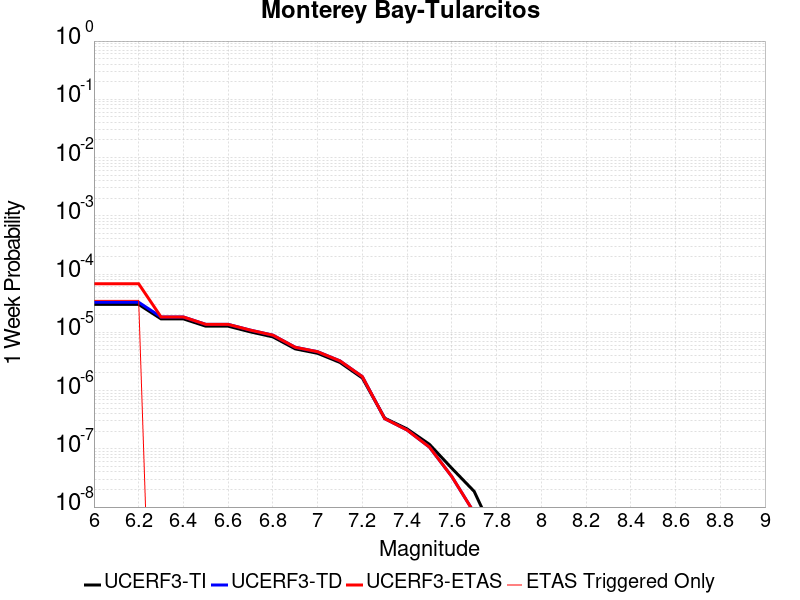 | 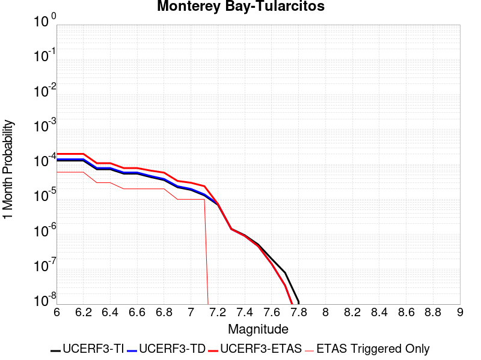 | 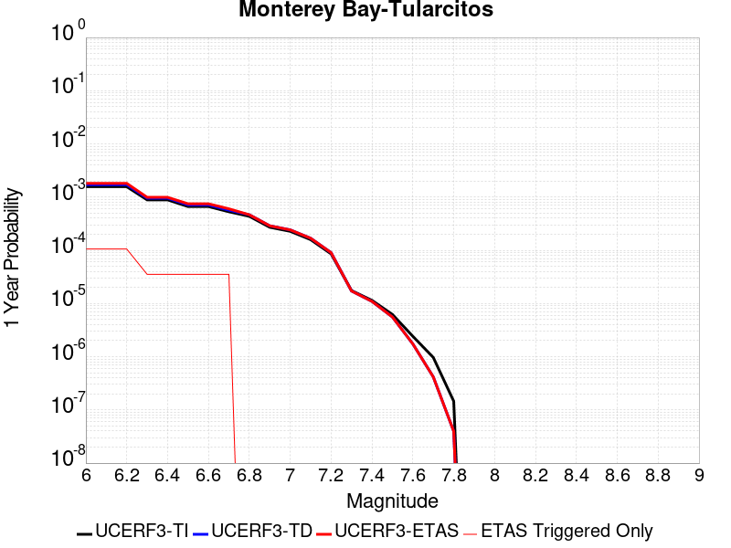 | 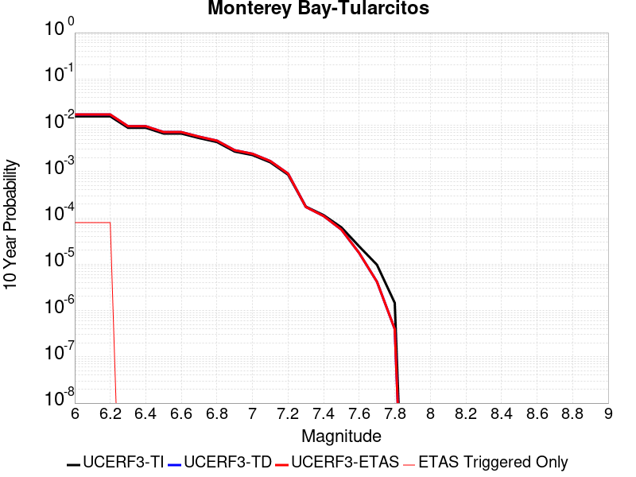 |

| Magnitude | 1 wk TI Prob | 1 wk TD Prob | 1 wk ETAS Prob | 1 wk ETAS/TD Gain | 1 wk ETAS Triggered Only | 1 mo TI Prob | 1 mo TD Prob | 1 mo ETAS Prob | 1 mo ETAS/TD Gain | 1 mo ETAS Triggered Only | 1 yr TI Prob | 1 yr TD Prob | 1 yr ETAS Prob | 1 yr ETAS/TD Gain | 1 yr ETAS Triggered Only | 10 yr TI Prob | 10 yr TD Prob | 10 yr ETAS Prob | 10 yr ETAS/TD Gain | 10 yr ETAS Triggered Only |
|-----|-----|-----|-----|-----|-----|-----|-----|-----|-----|-----|-----|-----|-----|-----|-----|-----|-----|-----|-----|-----|
| 6.0 | 3.0131365E-5 | 3.279877E-5 | 7.2248324E-5 | 2.2027752 | 3.9450842E-5 | 1.2912804E-4 | 1.4055918E-4 | 1.8000448E-4 | 1.2806313 | 3.9450842E-5 | 0.001571 | 0.0017100703 | 0.001788837 | 1.0460606 | 7.8901685E-5 | 0.015599402 | 0.016979916 | 0.017057478 | 1.0045679 | 7.8901685E-5 |
| 6.1 | 3.0131365E-5 | 3.279877E-5 | 7.2248324E-5 | 2.2027752 | 3.9450842E-5 | 1.2912804E-4 | 1.4055918E-4 | 1.8000448E-4 | 1.2806313 | 3.9450842E-5 | 0.001571 | 0.0017100703 | 0.001788837 | 1.0460606 | 7.8901685E-5 | 0.015599402 | 0.016979916 | 0.017057478 | 1.0045679 | 7.8901685E-5 |
| 6.2 | 3.0131365E-5 | 3.279877E-5 | 7.2248324E-5 | 2.2027752 | 3.9450842E-5 | 1.2912804E-4 | 1.4055918E-4 | 1.8000448E-4 | 1.2806313 | 3.9450842E-5 | 0.001571 | 0.0017100703 | 0.001788837 | 1.0460606 | 7.8901685E-5 | 0.015599402 | 0.016979916 | 0.017057478 | 1.0045679 | 7.8901685E-5 |
| 6.3 | 1.6998249E-5 | 1.8330798E-5 | 1.8330798E-5 | 1.0 | 0.0 | 7.28476E-5 | 7.85583E-5 | 7.85583E-5 | 1.0 | 0.0 | 8.865586E-4 | 9.5604634E-4 | 9.5604634E-4 | 1.0 | 0.0 | 0.0088303005 | 0.009521258 | 0.009521258 | 1.0 | 0.0 |
| 6.4 | 1.6998249E-5 | 1.8330798E-5 | 1.8330798E-5 | 1.0 | 0.0 | 7.28476E-5 | 7.85583E-5 | 7.85583E-5 | 1.0 | 0.0 | 8.865586E-4 | 9.5604634E-4 | 9.5604634E-4 | 1.0 | 0.0 | 0.0088303005 | 0.009521258 | 0.009521258 | 1.0 | 0.0 |
| 6.5 | 1.27470785E-5 | 1.3693312E-5 | 1.3693312E-5 | 1.0 | 0.0 | 5.4629192E-5 | 5.8684363E-5 | 5.8684363E-5 | 1.0 | 0.0 | 6.649074E-4 | 7.1425823E-4 | 7.1425823E-4 | 1.0 | 0.0 | 0.0066292146 | 0.007120678 | 0.007120678 | 1.0 | 0.0 |
| 6.6 | 1.2739422E-5 | 1.36854E-5 | 1.36854E-5 | 1.0 | 0.0 | 5.4596385E-5 | 5.8650454E-5 | 5.8650454E-5 | 1.0 | 0.0 | 6.645082E-4 | 7.1384566E-4 | 7.1384566E-4 | 1.0 | 0.0 | 0.0066252467 | 0.007116579 | 0.007116579 | 1.0 | 0.0 |
| 6.7 | 1.0160109E-5 | 1.0885755E-5 | 1.0885755E-5 | 1.0 | 0.0 | 4.35426E-5 | 4.665244E-5 | 4.665244E-5 | 1.0 | 0.0 | 5.300022E-4 | 5.6785246E-4 | 5.6785246E-4 | 1.0 | 0.0 | 0.005287399 | 0.0056647263 | 0.0056647263 | 1.0 | 0.0 |
| 6.8 | 8.349859E-6 | 8.932587E-6 | 8.932587E-6 | 1.0 | 0.0 | 3.578462E-5 | 3.8281985E-5 | 3.8281985E-5 | 1.0 | 0.0 | 4.3559066E-4 | 4.6598914E-4 | 4.6598914E-4 | 1.0 | 0.0 | 0.004347378 | 0.004650685 | 0.004650685 | 1.0 | 0.0 |
| 6.9 | 5.193639E-6 | 5.53643E-6 | 5.53643E-6 | 1.0 | 0.0 | 2.2258262E-5 | 2.372736E-5 | 2.372736E-5 | 1.0 | 0.0 | 2.7096065E-4 | 2.8884556E-4 | 2.8884556E-4 | 1.0 | 0.0 | 0.0027063051 | 0.0028850222 | 0.0028850222 | 1.0 | 0.0 |
| 7.0 | 4.359381E-6 | 4.643366E-6 | 4.643366E-6 | 1.0 | 0.0 | 1.8682927E-5 | 1.9900004E-5 | 1.9900004E-5 | 1.0 | 0.0 | 2.274409E-4 | 2.422586E-4 | 2.422586E-4 | 1.0 | 0.0 | 0.0022720827 | 0.002420238 | 0.002420238 | 1.0 | 0.0 |
| 7.1 | 3.0398533E-6 | 3.2310427E-6 | 3.2310427E-6 | 1.0 | 0.0 | 1.3027877E-5 | 1.3847267E-5 | 1.3847267E-5 | 1.0 | 0.0 | 1.5860285E-4 | 1.6858005E-4 | 1.6858005E-4 | 1.0 | 0.0 | 0.001584897 | 0.0016847793 | 0.0016847793 | 1.0 | 0.0 |
| 7.2 | 1.642335E-6 | 1.7333153E-6 | 1.7333153E-6 | 1.0 | 0.0 | 7.0385595E-6 | 7.428485E-6 | 7.428485E-6 | 1.0 | 0.0 | 8.569109E-5 | 9.044012E-5 | 9.044012E-5 | 1.0 | 0.0 | 8.5658056E-4 | 9.042358E-4 | 9.042358E-4 | 1.0 | 0.0 |
| 7.3 | 3.356842E-7 | 3.2952389E-7 | 3.2952389E-7 | 1.0 | 0.0 | 1.4386458E-6 | 1.4122444E-6 | 1.4122444E-6 | 1.0 | 0.0 | 1.7515373E-5 | 1.7193941E-5 | 1.7193941E-5 | 1.0 | 0.0 | 1.7513991E-4 | 1.719262E-4 | 1.719262E-4 | 1.0 | 0.0 |
| 7.4 | 2.1973483E-7 | 2.1006413E-7 | 2.1006413E-7 | 1.0 | 0.0 | 9.417204E-7 | 9.0027453E-7 | 9.0027453E-7 | 1.0 | 0.0 | 1.1465385E-5 | 1.0960787E-5 | 1.0960787E-5 | 1.0 | 0.0 | 1.1464794E-4 | 1.096025E-4 | 1.096025E-4 | 1.0 | 0.0 |
| 7.5 | 1.1944135E-7 | 1.0696043E-7 | 1.0696043E-7 | 1.0 | 0.0 | 5.118914E-7 | 4.5840173E-7 | 4.5840173E-7 | 1.0 | 0.0 | 6.23226E-6 | 5.581027E-6 | 5.581027E-6 | 1.0 | 0.0 | 6.2320854E-5 | 5.5808883E-5 | 5.5808883E-5 | 1.0 | 0.0 |
| 7.6 | 4.636058E-8 | 3.336489E-8 | 3.336489E-8 | 1.0 | 0.0 | 1.9868818E-7 | 1.4299238E-7 | 1.4299238E-7 | 1.0 | 0.0 | 2.419026E-6 | 1.7409308E-6 | 1.7409308E-6 | 1.0 | 0.0 | 2.4189996E-5 | 1.7409173E-5 | 1.7409173E-5 | 1.0 | 0.0 |
| 7.7 | 1.8588572E-8 | 8.003744E-9 | 8.003744E-9 | 1.0 | 0.0 | 7.9665305E-8 | 3.430176E-8 | 3.430176E-8 | 1.0 | 0.0 | 9.699246E-7 | 4.1762385E-7 | 4.1762385E-7 | 1.0 | 0.0 | 9.699204E-6 | 4.176231E-6 | 4.176231E-6 | 1.0 | 0.0 |
| 7.8 | 2.7960154E-9 | 7.6099427E-10 | 7.6099427E-10 | 1.0 | 0.0 | 1.1982923E-8 | 3.2614043E-9 | 3.2614043E-9 | 1.0 | 0.0 | 1.4589209E-7 | 3.9707597E-8 | 3.9707597E-8 | 1.0 | 0.0 | 1.4589199E-6 | 3.9707595E-7 | 3.9707595E-7 | 1.0 | 0.0 |

## Elysian Park (Upper)
*[(top)](#table-of-contents)*

| 1 Week | 1 Month | 1 Year | 10 Year |
|-----|-----|-----|-----|
| 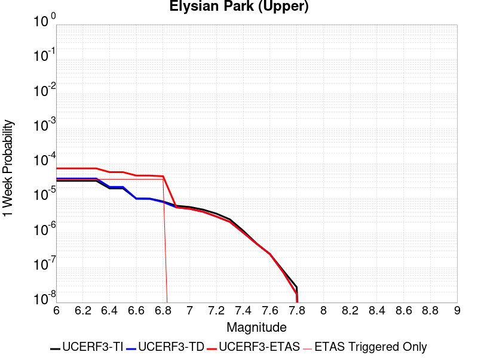 | 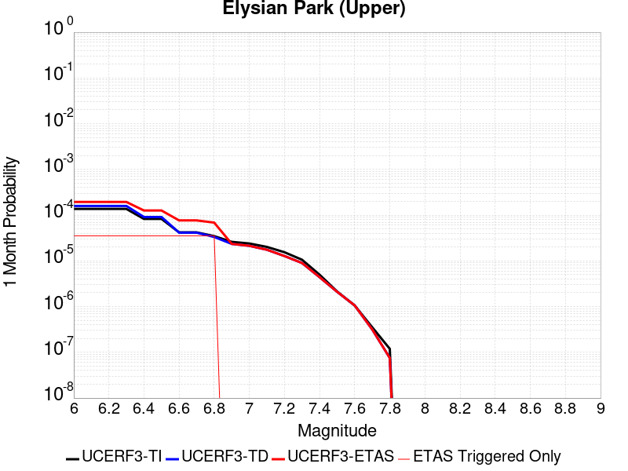 | 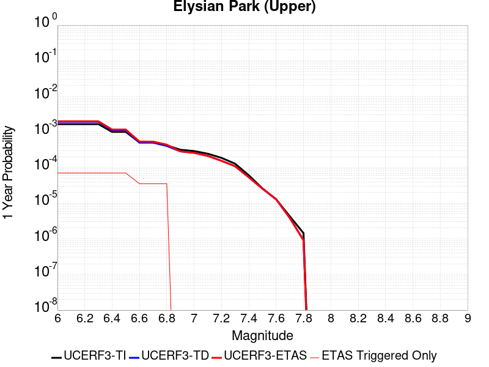 | 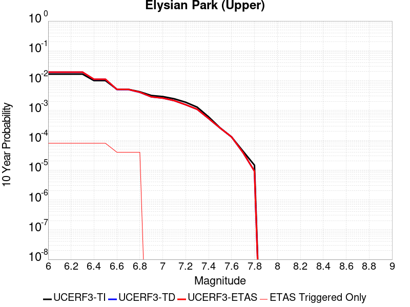 |

| Magnitude | 1 wk TI Prob | 1 wk TD Prob | 1 wk ETAS Prob | 1 wk ETAS/TD Gain | 1 wk ETAS Triggered Only | 1 mo TI Prob | 1 mo TD Prob | 1 mo ETAS Prob | 1 mo ETAS/TD Gain | 1 mo ETAS Triggered Only | 1 yr TI Prob | 1 yr TD Prob | 1 yr ETAS Prob | 1 yr ETAS/TD Gain | 1 yr ETAS Triggered Only | 10 yr TI Prob | 10 yr TD Prob | 10 yr ETAS Prob | 10 yr ETAS/TD Gain | 10 yr ETAS Triggered Only |
|-----|-----|-----|-----|-----|-----|-----|-----|-----|-----|-----|-----|-----|-----|-----|-----|-----|-----|-----|-----|-----|
| 6.0 | 3.1876025E-5 | 3.7035516E-5 | 7.6484896E-5 | 2.0651772 | 3.9450842E-5 | 1.3660437E-4 | 1.587167E-4 | 1.9816129E-4 | 1.2485219 | 3.9450842E-5 | 0.0016618895 | 0.0019311075 | 0.0020098567 | 1.0407794 | 7.8901685E-5 | 0.016495159 | 0.019189782 | 0.019267172 | 1.0040327 | 7.8901685E-5 |
| 6.1 | 3.1876025E-5 | 3.7035516E-5 | 7.6484896E-5 | 2.0651772 | 3.9450842E-5 | 1.3660437E-4 | 1.587167E-4 | 1.9816129E-4 | 1.2485219 | 3.9450842E-5 | 0.0016618895 | 0.0019311075 | 0.0020098567 | 1.0407794 | 7.8901685E-5 | 0.016495159 | 0.019189782 | 0.019267172 | 1.0040327 | 7.8901685E-5 |
| 6.2 | 3.1876025E-5 | 3.7035516E-5 | 7.6484896E-5 | 2.0651772 | 3.9450842E-5 | 1.3660437E-4 | 1.587167E-4 | 1.9816129E-4 | 1.2485219 | 3.9450842E-5 | 0.0016618895 | 0.0019311075 | 0.0020098567 | 1.0407794 | 7.8901685E-5 | 0.016495159 | 0.019189782 | 0.019267172 | 1.0040327 | 7.8901685E-5 |
| 6.3 | 3.1876025E-5 | 3.7035516E-5 | 7.6484896E-5 | 2.0651772 | 3.9450842E-5 | 1.3660437E-4 | 1.587167E-4 | 1.9816129E-4 | 1.2485219 | 3.9450842E-5 | 0.0016618895 | 0.0019311075 | 0.0020098567 | 1.0407794 | 7.8901685E-5 | 0.016495159 | 0.019189782 | 0.019267172 | 1.0040327 | 7.8901685E-5 |
| 6.4 | 1.9273462E-5 | 2.1202266E-5 | 6.0652274E-5 | 2.8606505 | 3.9450842E-5 | 8.259794E-5 | 9.086466E-5 | 1.3031192E-4 | 1.434132 | 3.9450842E-5 | 0.001005166 | 0.0011058892 | 0.0011847037 | 1.071268 | 7.8901685E-5 | 0.010006315 | 0.011020724 | 0.0110987555 | 1.0070804 | 7.8901685E-5 |
| 6.5 | 1.9273462E-5 | 2.1202266E-5 | 6.0652274E-5 | 2.8606505 | 3.9450842E-5 | 8.259794E-5 | 9.086466E-5 | 1.3031192E-4 | 1.434132 | 3.9450842E-5 | 0.001005166 | 0.0011058892 | 0.0011847037 | 1.071268 | 7.8901685E-5 | 0.010006315 | 0.011020724 | 0.0110987555 | 1.0070804 | 7.8901685E-5 |
| 6.6 | 9.813258E-6 | 9.665599E-6 | 4.911606E-5 | 5.0815334 | 3.9450842E-5 | 4.205614E-5 | 4.1423376E-5 | 8.087259E-5 | 1.9523417 | 3.9450842E-5 | 5.119132E-4 | 5.0422014E-4 | 5.436511E-4 | 1.0782019 | 3.9450842E-5 | 0.005107356 | 0.0050314846 | 0.005070737 | 1.0078013 | 3.9450842E-5 |
| 6.7 | 9.801478E-6 | 9.653168E-6 | 4.910363E-5 | 5.086789 | 3.9450842E-5 | 4.2005657E-5 | 4.1370105E-5 | 8.0819314E-5 | 1.9535681 | 3.9450842E-5 | 5.112989E-4 | 5.035719E-4 | 5.4300285E-4 | 1.0783026 | 3.9450842E-5 | 0.0051012407 | 0.0050250315 | 0.005064284 | 1.0078114 | 3.9450842E-5 |
| 6.8 | 8.102489E-6 | 7.773004E-6 | 4.722354E-5 | 6.075327 | 3.9450842E-5 | 3.4724493E-5 | 3.3312477E-5 | 7.2762006E-5 | 2.1842268 | 3.9450842E-5 | 4.2268867E-4 | 4.055089E-4 | 4.4494375E-4 | 1.0972478 | 3.9450842E-5 | 0.004218856 | 0.0040481836 | 0.0040874747 | 1.0097059 | 3.9450842E-5 |
| 6.9 | 6.08275E-6 | 5.4814514E-6 | 5.4814514E-6 | 1.0 | 0.0 | 2.6068668E-5 | 2.3491726E-5 | 2.3491726E-5 | 1.0 | 0.0 | 3.173398E-4 | 2.85975E-4 | 2.85975E-4 | 1.0 | 0.0 | 0.0031688702 | 0.0028561477 | 0.0028561477 | 1.0 | 0.0 |
| 7.0 | 5.5995934E-6 | 4.98278E-6 | 4.98278E-6 | 1.0 | 0.0 | 2.3998036E-5 | 2.13546E-5 | 2.13546E-5 | 1.0 | 0.0 | 2.9213692E-4 | 2.599619E-4 | 2.599619E-4 | 1.0 | 0.0 | 0.0029175316 | 0.0025966454 | 0.0025966454 | 1.0 | 0.0 |
| 7.1 | 4.709881E-6 | 4.0874015E-6 | 4.0874015E-6 | 1.0 | 0.0 | 2.0185047E-5 | 1.7517319E-5 | 1.7517319E-5 | 1.0 | 0.0 | 2.4572524E-4 | 2.132529E-4 | 2.132529E-4 | 1.0 | 0.0 | 0.002454537 | 0.002130524 | 0.002130524 | 1.0 | 0.0 |
| 7.2 | 3.6063436E-6 | 2.9779544E-6 | 2.9779544E-6 | 1.0 | 0.0 | 1.5455667E-5 | 1.27626E-5 | 1.27626E-5 | 1.0 | 0.0 | 1.881565E-4 | 1.5537368E-4 | 1.5537368E-4 | 1.0 | 0.0 | 0.0018799726 | 0.0015526618 | 0.0015526618 | 1.0 | 0.0 |
| 7.3 | 2.471135E-6 | 2.0954615E-6 | 2.0954615E-6 | 1.0 | 0.0 | 1.0590536E-5 | 8.980519E-6 | 8.980519E-6 | 1.0 | 0.0 | 1.2893214E-4 | 1.093324E-4 | 1.093324E-4 | 1.0 | 0.0 | 0.0012885736 | 0.0010927934 | 0.0010927934 | 1.0 | 0.0 |
| 7.4 | 1.163943E-6 | 1.0275091E-6 | 1.0275091E-6 | 1.0 | 0.0 | 4.988318E-6 | 4.4036033E-6 | 4.4036033E-6 | 1.0 | 0.0 | 6.0731076E-5 | 5.3612584E-5 | 5.3612584E-5 | 1.0 | 0.0 | 6.071448E-4 | 5.359995E-4 | 5.359995E-4 | 1.0 | 0.0 |
| 7.5 | 4.99459E-7 | 4.917604E-7 | 4.917604E-7 | 1.0 | 0.0 | 2.140537E-6 | 2.1075427E-6 | 2.1075427E-6 | 1.0 | 0.0 | 2.6060725E-5 | 2.5659048E-5 | 2.5659048E-5 | 1.0 | 0.0 | 2.605767E-4 | 2.5656243E-4 | 2.5656243E-4 | 1.0 | 0.0 |
| 7.6 | 2.4667852E-7 | 2.4778336E-7 | 2.4778336E-7 | 1.0 | 0.0 | 1.0571932E-6 | 1.0619283E-6 | 1.0619283E-6 | 1.0 | 0.0 | 1.2871251E-5 | 1.2928905E-5 | 1.2928905E-5 | 1.0 | 0.0 | 1.2870505E-4 | 1.2928189E-4 | 1.2928189E-4 | 1.0 | 0.0 |
| 7.7 | 8.2312795E-8 | 7.3864456E-8 | 7.3864456E-8 | 1.0 | 0.0 | 3.527691E-7 | 3.165619E-7 | 3.165619E-7 | 1.0 | 0.0 | 4.294955E-6 | 3.8541357E-6 | 3.8541357E-6 | 1.0 | 0.0 | 4.2948723E-5 | 3.8540802E-5 | 3.8540802E-5 | 1.0 | 0.0 |
| 7.8 | 2.7819295E-8 | 1.7566023E-8 | 1.7566023E-8 | 1.0 | 0.0 | 1.1922555E-7 | 7.5282955E-8 | 7.5282955E-8 | 1.0 | 0.0 | 1.45157E-6 | 9.165697E-7 | 9.165697E-7 | 1.0 | 0.0 | 1.45156055E-5 | 9.165675E-6 | 9.165675E-6 | 1.0 | 0.0 |

## Calaveras (So) 2011 CFM
*[(top)](#table-of-contents)*

| 1 Week | 1 Month | 1 Year | 10 Year |
|-----|-----|-----|-----|
| 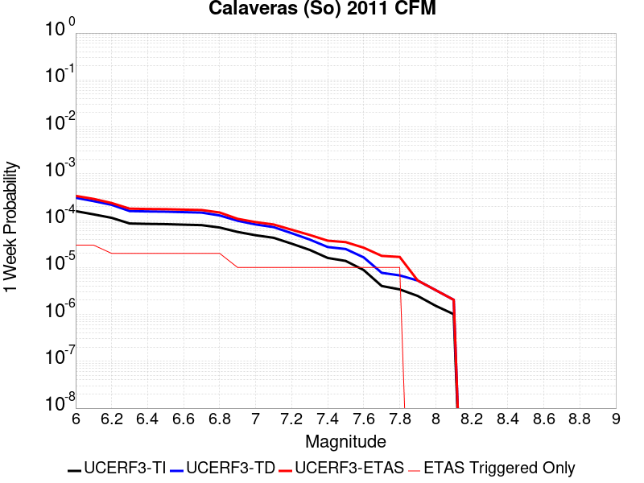 | 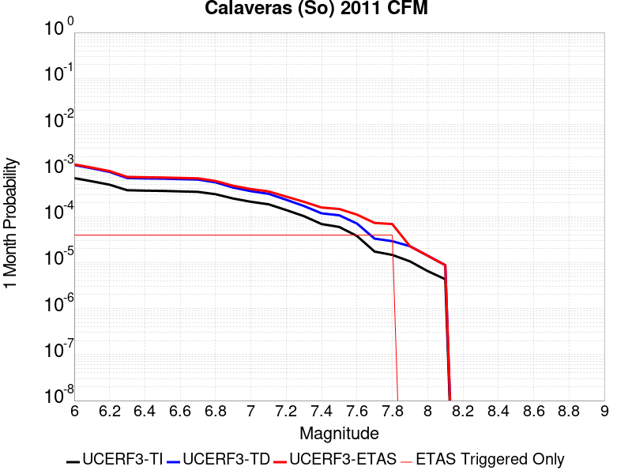 | 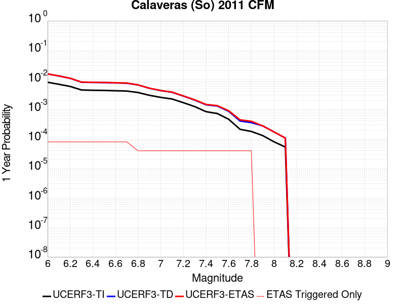 | 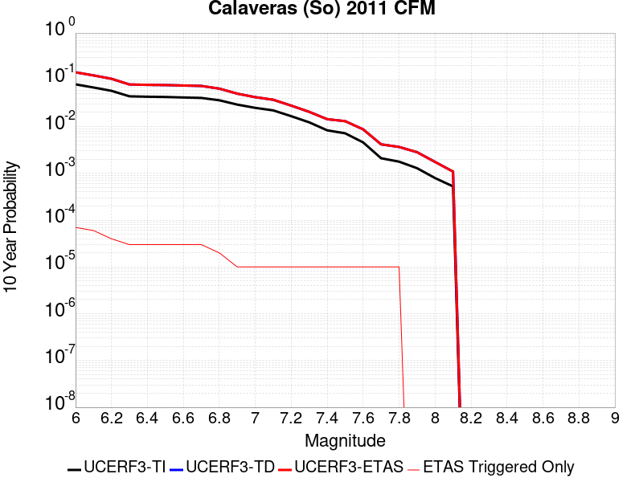 |

| Magnitude | 1 wk TI Prob | 1 wk TD Prob | 1 wk ETAS Prob | 1 wk ETAS/TD Gain | 1 wk ETAS Triggered Only | 1 mo TI Prob | 1 mo TD Prob | 1 mo ETAS Prob | 1 mo ETAS/TD Gain | 1 mo ETAS Triggered Only | 1 yr TI Prob | 1 yr TD Prob | 1 yr ETAS Prob | 1 yr ETAS/TD Gain | 1 yr ETAS Triggered Only | 10 yr TI Prob | 10 yr TD Prob | 10 yr ETAS Prob | 10 yr ETAS/TD Gain | 10 yr ETAS Triggered Only |
|-----|-----|-----|-----|-----|-----|-----|-----|-----|-----|-----|-----|-----|-----|-----|-----|-----|-----|-----|-----|-----|
| 6.0 | 1.5950744E-4 | 3.071188E-4 | 3.4655753E-4 | 1.1284152 | 3.9450842E-5 | 6.834242E-4 | 0.0013155643 | 0.0013549633 | 1.0299484 | 3.9450842E-5 | 0.00828899 | 0.01585904 | 0.01593669 | 1.0048963 | 7.8901685E-5 | 0.079865426 | 0.14440064 | 0.14446816 | 1.0004675 | 7.8901685E-5 |
| 6.1 | 1.3584697E-4 | 2.6036944E-4 | 2.9981E-4 | 1.1514792 | 3.9450842E-5 | 5.8207137E-4 | 0.0011153965 | 0.0011548033 | 1.0353299 | 3.9450842E-5 | 0.007063716 | 0.013462106 | 0.013539946 | 1.0057821 | 7.8901685E-5 | 0.06843361 | 0.12402854 | 0.12409766 | 1.0005573 | 7.8901685E-5 |
| 6.2 | 1.14676266E-4 | 2.1726108E-4 | 2.5670335E-4 | 1.1815432 | 3.9450842E-5 | 4.9137714E-4 | 9.307893E-4 | 9.7020343E-4 | 1.0423448 | 3.9450842E-5 | 0.0059661185 | 0.011245592 | 0.011323606 | 1.0069374 | 7.8901685E-5 | 0.058084648 | 0.105019294 | 0.10508991 | 1.0006725 | 7.8901685E-5 |
| 6.3 | 8.691518E-5 | 1.5987165E-4 | 1.9931619E-4 | 1.2467263 | 3.9450842E-5 | 3.7244044E-4 | 6.8496726E-4 | 7.243911E-4 | 1.0575558 | 3.9450842E-5 | 0.004525038 | 0.008300893 | 0.00837914 | 1.0094264 | 7.8901685E-5 | 0.044339992 | 0.0793347 | 0.07940734 | 1.0009156 | 7.8901685E-5 |
| 6.4 | 8.50982E-5 | 1.5693568E-4 | 1.9638034E-4 | 1.2513428 | 3.9450842E-5 | 3.646556E-4 | 6.7239115E-4 | 7.1181543E-4 | 1.058633 | 3.9450842E-5 | 0.0044306475 | 0.008148931 | 0.008227189 | 1.0096035 | 7.8901685E-5 | 0.04343345 | 0.077940844 | 0.0780136 | 1.0009334 | 7.8901685E-5 |
| 6.5 | 8.4062965E-5 | 1.5518135E-4 | 1.9462607E-4 | 1.2541847 | 3.9450842E-5 | 3.602201E-4 | 6.648764E-4 | 7.04301E-4 | 1.0592961 | 3.9450842E-5 | 0.004376863 | 0.008058134 | 0.008136399 | 1.0097127 | 7.8901685E-5 | 0.042916555 | 0.077112116 | 0.07718493 | 1.0009443 | 7.8901685E-5 |
| 6.6 | 8.194716E-5 | 1.5154095E-4 | 1.9098581E-4 | 1.2602918 | 3.9450842E-5 | 3.5115483E-4 | 6.492825E-4 | 6.8870775E-4 | 1.0607213 | 3.9450842E-5 | 0.0042669317 | 0.007869979 | 0.00794826 | 1.0099467 | 7.8901685E-5 | 0.04185927 | 0.07539739 | 0.07547034 | 1.0009676 | 7.8901685E-5 |
| 6.7 | 8.012326E-5 | 1.4821833E-4 | 1.8766332E-4 | 1.2661277 | 3.9450842E-5 | 3.433402E-4 | 6.350497E-4 | 6.744755E-4 | 1.062083 | 3.9450842E-5 | 0.004172157 | 0.007698474 | 0.0077767684 | 1.0101701 | 7.8901685E-5 | 0.040946912 | 0.073839515 | 0.07391259 | 1.0009897 | 7.8901685E-5 |
| 6.8 | 7.119773E-5 | 1.2880519E-4 | 1.6825095E-4 | 1.3062435 | 3.9450842E-5 | 3.0509746E-4 | 5.519001E-4 | 5.913292E-4 | 1.0714424 | 3.9450842E-5 | 0.0037082357 | 0.0066958875 | 0.0067350743 | 1.0058523 | 3.9450842E-5 | 0.036469642 | 0.06468402 | 0.064720914 | 1.0005704 | 3.9450842E-5 |
| 6.9 | 5.7343088E-5 | 9.9189E-5 | 1.3863594E-4 | 1.3976946 | 3.9450842E-5 | 2.4573295E-4 | 4.2502693E-4 | 4.64461E-4 | 1.0927802 | 3.9450842E-5 | 0.0029876942 | 0.0051625078 | 0.005201755 | 1.0076023 | 3.9450842E-5 | 0.02947844 | 0.050509132 | 0.05054659 | 1.0007416 | 3.9450842E-5 |
| 7.0 | 4.8746577E-5 | 8.284751E-5 | 1.2229508E-4 | 1.4761468 | 3.9450842E-5 | 2.0889717E-4 | 3.550128E-4 | 3.9444963E-4 | 1.1110857 | 3.9450842E-5 | 0.0025403565 | 0.004313781 | 0.0043530613 | 1.0091058 | 3.9450842E-5 | 0.025115121 | 0.04248505 | 0.042522825 | 1.0008892 | 3.9450842E-5 |
| 7.1 | 4.2998014E-5 | 7.264914E-5 | 1.1209712E-4 | 1.5429931 | 3.9450842E-5 | 1.8426418E-4 | 3.1131663E-4 | 3.507552E-4 | 1.1266831 | 3.9450842E-5 | 0.002241108 | 0.0037837527 | 0.0038230543 | 1.010387 | 3.9450842E-5 | 0.022186412 | 0.037423246 | 0.037461217 | 1.0010147 | 3.9450842E-5 |
| 7.2 | 3.221292E-5 | 5.390566E-5 | 9.335438E-5 | 1.7318103 | 3.9450842E-5 | 1.3804805E-4 | 2.3100396E-4 | 2.704457E-4 | 1.1707405 | 3.9450842E-5 | 0.0016794393 | 0.0028088738 | 0.0028482138 | 1.0140057 | 3.9450842E-5 | 0.016668037 | 0.028035998 | 0.028074343 | 1.0013677 | 3.9450842E-5 |
| 7.3 | 2.3756531E-5 | 3.9471706E-5 | 7.8920995E-5 | 1.999432 | 3.9450842E-5 | 1.0180973E-4 | 1.6915359E-4 | 2.0859776E-4 | 1.2331855 | 3.9450842E-5 | 0.0012388286 | 0.0020575167 | 0.0020968863 | 1.0191345 | 3.9450842E-5 | 0.012319452 | 0.02064345 | 0.020682087 | 1.0018716 | 3.9450842E-5 |
| 7.4 | 1.5997684E-5 | 2.734085E-5 | 6.679061E-5 | 2.4428873 | 3.9450842E-5 | 6.8559704E-5 | 1.1716982E-4 | 1.5661604E-4 | 1.3366586 | 3.9450842E-5 | 8.343947E-4 | 0.0014256114 | 0.0014650061 | 1.0276334 | 3.9450842E-5 | 0.008312687 | 0.014376549 | 0.014415433 | 1.0027046 | 3.9450842E-5 |
| 7.5 | 1.3814293E-5 | 2.4782603E-5 | 6.423247E-5 | 2.5918372 | 3.9450842E-5 | 5.9202768E-5 | 1.0620684E-4 | 1.456535E-4 | 1.3714135 | 3.9450842E-5 | 7.205553E-4 | 0.0012923037 | 0.0013317035 | 1.0304881 | 3.9450842E-5 | 0.007182234 | 0.013055766 | 0.013094702 | 1.0029823 | 3.9450842E-5 |
| 7.6 | 8.817309E-6 | 1.6429829E-5 | 5.5880024E-5 | 3.4011323 | 3.9450842E-5 | 3.7787922E-5 | 7.041166E-5 | 1.0985973E-4 | 1.5602491 | 3.9450842E-5 | 4.5997082E-4 | 8.5692614E-4 | 8.963432E-4 | 1.0459982 | 3.9450842E-5 | 0.004590199 | 0.008719863 | 0.008758971 | 1.0044848 | 3.9450842E-5 |
| 7.7 | 4.0352206E-6 | 7.706877E-6 | 4.7157417E-5 | 6.118875 | 3.9450842E-5 | 1.7293689E-5 | 3.3029053E-5 | 7.247859E-5 | 2.194389 | 3.9450842E-5 | 2.1053031E-4 | 4.020546E-4 | 4.414896E-4 | 1.0980836 | 3.9450842E-5 | 0.0021033096 | 0.0041649863 | 0.0042042728 | 1.0094326 | 3.9450842E-5 |
| 7.8 | 3.413169E-6 | 6.7868646E-6 | 4.623744E-5 | 6.8127837 | 3.9450842E-5 | 1.4627784E-5 | 2.9086239E-5 | 6.8535934E-5 | 2.356301 | 3.9450842E-5 | 1.7807873E-4 | 3.5406748E-4 | 3.9350436E-4 | 1.1113824 | 3.9450842E-5 | 0.0017793609 | 0.0036663096 | 0.0037056159 | 1.010721 | 3.9450842E-5 |
| 7.9 | 2.4740732E-6 | 5.278809E-6 | 5.278809E-6 | 1.0 | 0.0 | 1.06031275E-5 | 2.2623271E-5 | 2.2623271E-5 | 1.0 | 0.0 | 1.2908543E-4 | 2.7540355E-4 | 2.7540355E-4 | 1.0 | 0.0 | 0.0012901047 | 0.002834638 | 0.002834638 | 1.0 | 0.0 |
| 8.0 | 1.5231818E-6 | 3.2887135E-6 | 3.2887135E-6 | 1.0 | 0.0 | 6.527906E-6 | 1.409441E-5 | 1.409441E-5 | 1.0 | 0.0 | 7.9474354E-5 | 1.7158597E-4 | 1.7158597E-4 | 1.0 | 0.0 | 7.944594E-4 | 0.001756374 | 0.001756374 | 1.0 | 0.0 |
| 8.1 | 1.0104524E-6 | 2.0456548E-6 | 2.0456548E-6 | 1.0 | 0.0 | 4.330503E-6 | 8.767062E-6 | 8.767062E-6 | 1.0 | 0.0 | 5.2722597E-5 | 1.06733794E-4 | 1.06733794E-4 | 1.0 | 0.0 | 5.271009E-4 | 0.0010929212 | 0.0010929212 | 1.0 | 0.0 |

## Ortigalita (South)
*[(top)](#table-of-contents)*

| 1 Week | 1 Month | 1 Year | 10 Year |
|-----|-----|-----|-----|
| 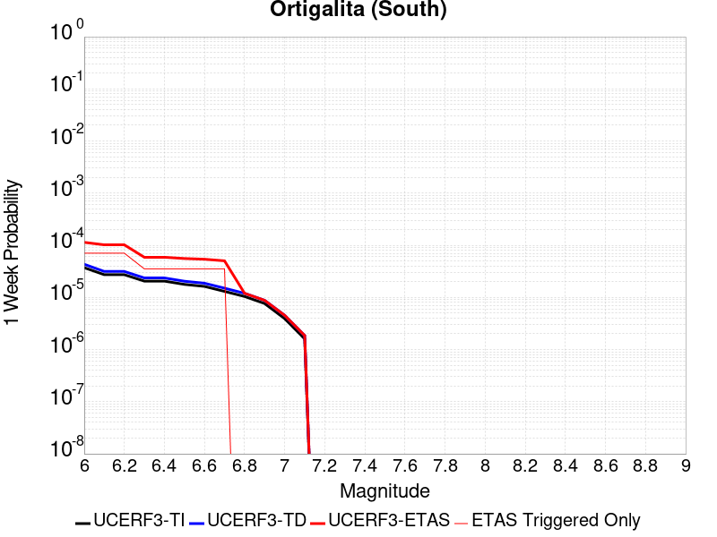 | 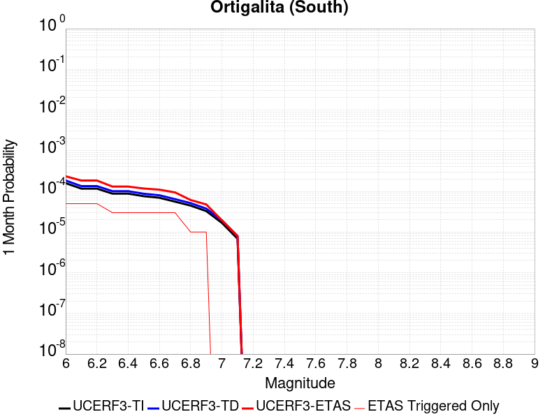 | 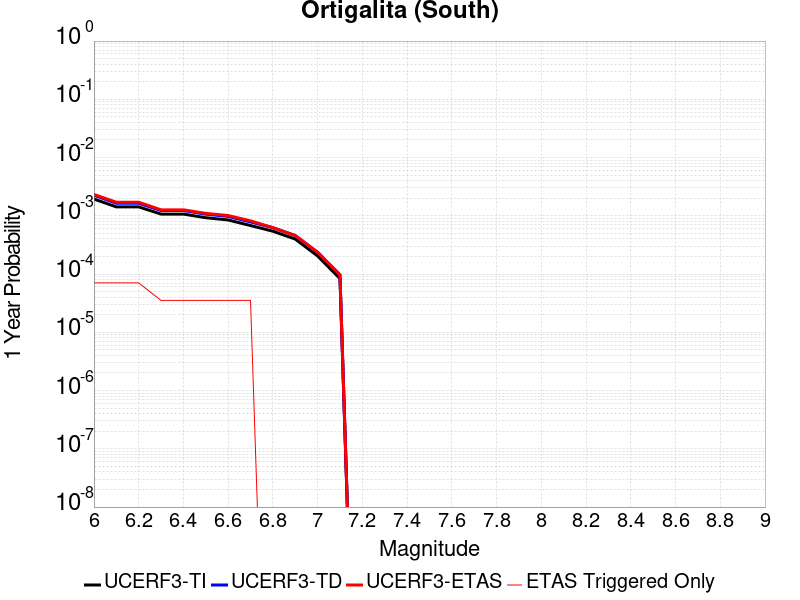 | 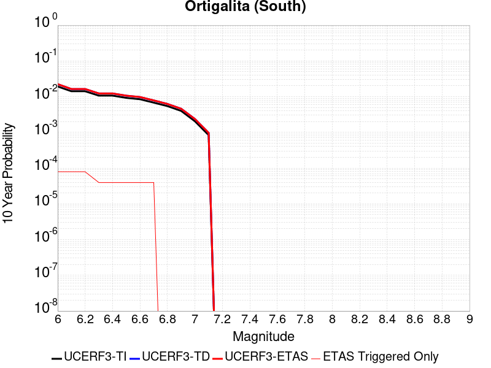 |

| Magnitude | 1 wk TI Prob | 1 wk TD Prob | 1 wk ETAS Prob | 1 wk ETAS/TD Gain | 1 wk ETAS Triggered Only | 1 mo TI Prob | 1 mo TD Prob | 1 mo ETAS Prob | 1 mo ETAS/TD Gain | 1 mo ETAS Triggered Only | 1 yr TI Prob | 1 yr TD Prob | 1 yr ETAS Prob | 1 yr ETAS/TD Gain | 1 yr ETAS Triggered Only | 10 yr TI Prob | 10 yr TD Prob | 10 yr ETAS Prob | 10 yr ETAS/TD Gain | 10 yr ETAS Triggered Only |
|-----|-----|-----|-----|-----|-----|-----|-----|-----|-----|-----|-----|-----|-----|-----|-----|-----|-----|-----|-----|-----|
| 6.0 | 3.72394E-5 | 4.325562E-5 | 1.221539E-4 | 2.8240006 | 7.8901685E-5 | 1.5958765E-4 | 1.8536893E-4 | 2.64256E-4 | 1.4255679 | 7.8901685E-5 | 0.0019412481 | 0.0022546875 | 0.0023334112 | 1.0349156 | 7.8901685E-5 | 0.019243775 | 0.022334497 | 0.022411635 | 1.0034539 | 7.8901685E-5 |
| 6.1 | 2.7299884E-5 | 3.149204E-5 | 1.10391244E-4 | 3.5053697 | 7.8901685E-5 | 1.16994255E-4 | 1.3495922E-4 | 2.1385026E-4 | 1.5845547 | 7.8901685E-5 | 0.0014234743 | 0.0016419457 | 0.0017207179 | 1.0479748 | 7.8901685E-5 | 0.014143906 | 0.01630407 | 0.016381685 | 1.0047605 | 7.8901685E-5 |
| 6.2 | 2.7299884E-5 | 3.149204E-5 | 1.10391244E-4 | 3.5053697 | 7.8901685E-5 | 1.16994255E-4 | 1.3495922E-4 | 2.1385026E-4 | 1.5845547 | 7.8901685E-5 | 0.0014234743 | 0.0016419457 | 0.0017207179 | 1.0479748 | 7.8901685E-5 | 0.014143906 | 0.01630407 | 0.016381685 | 1.0047605 | 7.8901685E-5 |
| 6.3 | 2.0546433E-5 | 2.363145E-5 | 6.308136E-5 | 2.6693819 | 3.9450842E-5 | 8.805317E-5 | 1.0127382E-4 | 1.4072067E-4 | 1.3895068 | 3.9450842E-5 | 0.00107152 | 0.0012323303 | 0.0012717325 | 1.0319737 | 3.9450842E-5 | 0.010663681 | 0.01225703 | 0.012295998 | 1.0031792 | 3.9450842E-5 |
| 6.4 | 2.0546433E-5 | 2.363145E-5 | 6.308136E-5 | 2.6693819 | 3.9450842E-5 | 8.805317E-5 | 1.0127382E-4 | 1.4072067E-4 | 1.3895068 | 3.9450842E-5 | 0.00107152 | 0.0012323303 | 0.0012717325 | 1.0319737 | 3.9450842E-5 | 0.010663681 | 0.01225703 | 0.012295998 | 1.0031792 | 3.9450842E-5 |
| 6.5 | 1.7779594E-5 | 2.0446974E-5 | 5.989701E-5 | 2.9293828 | 3.9450842E-5 | 7.619603E-5 | 8.762702E-5 | 1.2707441E-4 | 1.4501737 | 3.9450842E-5 | 9.272918E-4 | 0.0010663504 | 0.0011057592 | 1.0369567 | 3.9450842E-5 | 0.009234319 | 0.010613803 | 0.0106528355 | 1.0036775 | 3.9450842E-5 |
| 6.6 | 1.6272212E-5 | 1.8714967E-5 | 5.8165075E-5 | 3.1079443 | 3.9450842E-5 | 6.973618E-5 | 8.0204605E-5 | 1.19652286E-4 | 1.4918381 | 3.9450842E-5 | 8.487073E-4 | 9.760658E-4 | 0.0010154782 | 1.0403788 | 3.9450842E-5 | 0.008454733 | 0.009719091 | 0.009758158 | 1.0040196 | 3.9450842E-5 |
| 6.7 | 1.3051484E-5 | 1.5038758E-5 | 5.448901E-5 | 3.6232386 | 3.9450842E-5 | 5.593373E-5 | 6.445028E-5 | 1.0389858E-4 | 1.6120734 | 3.9450842E-5 | 6.807804E-4 | 7.844092E-4 | 8.238291E-4 | 1.0502542 | 3.9450842E-5 | 0.006786986 | 0.007817388 | 0.00785653 | 1.0050071 | 3.9450842E-5 |
| 6.8 | 1.04277415E-5 | 1.1987235E-5 | 1.1987235E-5 | 1.0 | 0.0 | 4.4689557E-5 | 5.1372896E-5 | 5.1372896E-5 | 1.0 | 0.0 | 5.439595E-4 | 6.2529295E-4 | 6.2529295E-4 | 1.0 | 0.0 | 0.0054262993 | 0.00623609 | 0.00623609 | 1.0 | 0.0 |
| 6.9 | 7.639968E-6 | 8.791503E-6 | 8.791503E-6 | 1.0 | 0.0 | 3.274231E-5 | 3.767736E-5 | 3.767736E-5 | 1.0 | 0.0 | 3.9856473E-4 | 4.586312E-4 | 4.586312E-4 | 1.0 | 0.0 | 0.003978506 | 0.004577433 | 0.004577433 | 1.0 | 0.0 |
| 7.0 | 3.919831E-6 | 4.5334014E-6 | 4.5334014E-6 | 1.0 | 0.0 | 1.679917E-5 | 1.942873E-5 | 1.942873E-5 | 1.0 | 0.0 | 2.045107E-4 | 2.3652123E-4 | 2.3652123E-4 | 1.0 | 0.0 | 0.0020432258 | 0.0023629034 | 0.0023629034 | 1.0 | 0.0 |
| 7.1 | 1.6017933E-6 | 1.8570418E-6 | 1.8570418E-6 | 1.0 | 0.0 | 6.8648105E-6 | 7.958732E-6 | 7.958732E-6 | 1.0 | 0.0 | 8.357586E-5 | 9.689432E-5 | 9.689432E-5 | 1.0 | 0.0 | 8.3544437E-4 | 9.686254E-4 | 9.686254E-4 | 1.0 | 0.0 |

## Kern Canyon (Lake Isabella) 2011
*[(top)](#table-of-contents)*

| 1 Week | 1 Month | 1 Year | 10 Year |
|-----|-----|-----|-----|
| 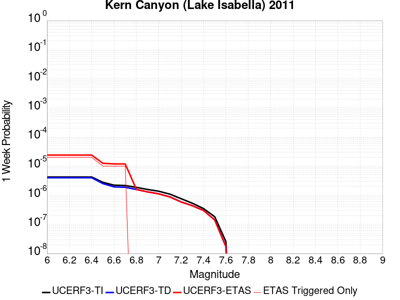 |  | 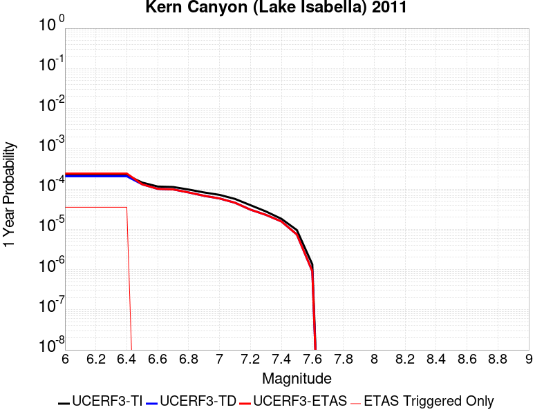 | 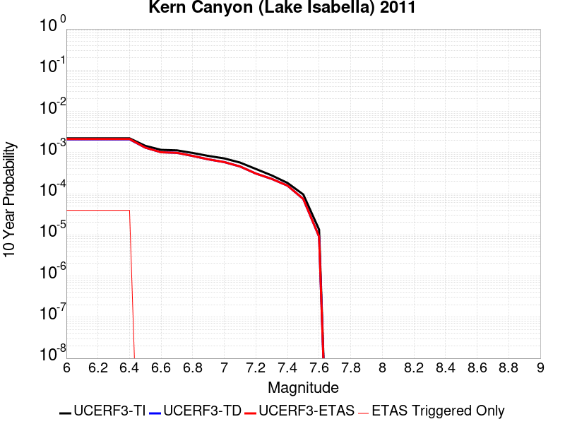 |

| Magnitude | 1 wk TI Prob | 1 wk TD Prob | 1 wk ETAS Prob | 1 wk ETAS/TD Gain | 1 wk ETAS Triggered Only | 1 mo TI Prob | 1 mo TD Prob | 1 mo ETAS Prob | 1 mo ETAS/TD Gain | 1 mo ETAS Triggered Only | 1 yr TI Prob | 1 yr TD Prob | 1 yr ETAS Prob | 1 yr ETAS/TD Gain | 1 yr ETAS Triggered Only | 10 yr TI Prob | 10 yr TD Prob | 10 yr ETAS Prob | 10 yr ETAS/TD Gain | 10 yr ETAS Triggered Only |
|-----|-----|-----|-----|-----|-----|-----|-----|-----|-----|-----|-----|-----|-----|-----|-----|-----|-----|-----|-----|-----|
| 6.0 | 4.2387383E-6 | 4.001639E-6 | 4.001639E-6 | 1.0 | 0.0 | 1.8165894E-5 | 1.7149778E-5 | 1.7149778E-5 | 1.0 | 0.0 | 2.2114732E-4 | 2.087804E-4 | 2.4822302E-4 | 1.1889191 | 3.9450842E-5 | 0.0022092736 | 0.0020860266 | 0.002125395 | 1.0188725 | 3.9450842E-5 |
| 6.1 | 4.2387383E-6 | 4.001639E-6 | 4.001639E-6 | 1.0 | 0.0 | 1.8165894E-5 | 1.7149778E-5 | 1.7149778E-5 | 1.0 | 0.0 | 2.2114732E-4 | 2.087804E-4 | 2.4822302E-4 | 1.1889191 | 3.9450842E-5 | 0.0022092736 | 0.0020860266 | 0.002125395 | 1.0188725 | 3.9450842E-5 |
| 6.2 | 4.2387383E-6 | 4.001639E-6 | 4.001639E-6 | 1.0 | 0.0 | 1.8165894E-5 | 1.7149778E-5 | 1.7149778E-5 | 1.0 | 0.0 | 2.2114732E-4 | 2.087804E-4 | 2.4822302E-4 | 1.1889191 | 3.9450842E-5 | 0.0022092736 | 0.0020860266 | 0.002125395 | 1.0188725 | 3.9450842E-5 |
| 6.3 | 4.2387383E-6 | 4.001639E-6 | 4.001639E-6 | 1.0 | 0.0 | 1.8165894E-5 | 1.7149778E-5 | 1.7149778E-5 | 1.0 | 0.0 | 2.2114732E-4 | 2.087804E-4 | 2.4822302E-4 | 1.1889191 | 3.9450842E-5 | 0.0022092736 | 0.0020860266 | 0.002125395 | 1.0188725 | 3.9450842E-5 |
| 6.4 | 4.2387383E-6 | 4.001639E-6 | 4.001639E-6 | 1.0 | 0.0 | 1.8165894E-5 | 1.7149778E-5 | 1.7149778E-5 | 1.0 | 0.0 | 2.2114732E-4 | 2.087804E-4 | 2.4822302E-4 | 1.1889191 | 3.9450842E-5 | 0.0022092736 | 0.0020860266 | 0.002125395 | 1.0188725 | 3.9450842E-5 |
| 6.5 | 2.7857532E-6 | 2.517867E-6 | 2.517867E-6 | 1.0 | 0.0 | 1.1938888E-5 | 1.0790815E-5 | 1.0790815E-5 | 1.0 | 0.0 | 1.4534626E-4 | 1.3137059E-4 | 1.3137059E-4 | 1.0 | 0.0 | 0.0014525123 | 0.001312962 | 0.001312962 | 1.0 | 0.0 |
| 6.6 | 2.2233348E-6 | 1.9441236E-6 | 1.9441236E-6 | 1.0 | 0.0 | 9.528543E-6 | 8.331932E-6 | 8.331932E-6 | 1.0 | 0.0 | 1.1600384E-4 | 1.01436635E-4 | 1.01436635E-4 | 1.0 | 0.0 | 0.001159433 | 0.001013912 | 0.001013912 | 1.0 | 0.0 |
| 6.7 | 2.1635126E-6 | 1.8835036E-6 | 1.8835036E-6 | 1.0 | 0.0 | 9.272164E-6 | 8.072134E-6 | 8.072134E-6 | 1.0 | 0.0 | 1.1288274E-4 | 9.827388E-5 | 9.827388E-5 | 1.0 | 0.0 | 0.0011282542 | 9.823124E-4 | 9.823124E-4 | 1.0 | 0.0 |
| 6.8 | 1.8685711E-6 | 1.5831425E-6 | 1.5831425E-6 | 1.0 | 0.0 | 8.008137E-6 | 6.784879E-6 | 6.784879E-6 | 1.0 | 0.0 | 9.74947E-5 | 8.260282E-5 | 8.260282E-5 | 1.0 | 0.0 | 9.745194E-4 | 8.2572614E-4 | 8.2572614E-4 | 1.0 | 0.0 |
| 6.9 | 1.5815071E-6 | 1.3064928E-6 | 1.3064928E-6 | 1.0 | 0.0 | 6.77787E-6 | 5.599243E-6 | 5.599243E-6 | 1.0 | 0.0 | 8.251744E-5 | 6.816868E-5 | 6.816868E-5 | 1.0 | 0.0 | 8.248681E-4 | 6.8148033E-4 | 6.8148033E-4 | 1.0 | 0.0 |
| 7.0 | 1.3772564E-6 | 1.1210718E-6 | 1.1210718E-6 | 1.0 | 0.0 | 5.9025137E-6 | 4.8045845E-6 | 4.8045845E-6 | 1.0 | 0.0 | 7.186073E-5 | 5.8494268E-5 | 5.8494268E-5 | 1.0 | 0.0 | 7.18375E-4 | 5.847908E-4 | 5.847908E-4 | 1.0 | 0.0 |
| 7.1 | 1.0916998E-6 | 8.763777E-7 | 8.763777E-7 | 1.0 | 0.0 | 4.678705E-6 | 3.7558991E-6 | 3.7558991E-6 | 1.0 | 0.0 | 5.6961744E-5 | 4.5727127E-5 | 4.5727127E-5 | 1.0 | 0.0 | 5.6947145E-4 | 4.571785E-4 | 4.571785E-4 | 1.0 | 0.0 |
| 7.2 | 7.6277024E-7 | 5.901454E-7 | 5.901454E-7 | 1.0 | 0.0 | 3.2690114E-6 | 2.5291922E-6 | 2.5291922E-6 | 1.0 | 0.0 | 3.9799485E-5 | 3.0792486E-5 | 3.0792486E-5 | 1.0 | 0.0 | 3.9792358E-4 | 3.0788282E-4 | 3.0788282E-4 | 1.0 | 0.0 |
| 7.3 | 5.3265916E-7 | 4.3824414E-7 | 4.3824414E-7 | 1.0 | 0.0 | 2.282823E-6 | 1.878188E-6 | 1.878188E-6 | 1.0 | 0.0 | 2.7793016E-5 | 2.2866701E-5 | 2.2866701E-5 | 1.0 | 0.0 | 2.778954E-4 | 2.2864387E-4 | 2.2864387E-4 | 1.0 | 0.0 |
| 7.4 | 3.4946007E-7 | 3.006571E-7 | 3.006571E-7 | 1.0 | 0.0 | 1.497685E-6 | 1.2885298E-6 | 1.2885298E-6 | 1.0 | 0.0 | 1.8234163E-5 | 1.568774E-5 | 1.568774E-5 | 1.0 | 0.0 | 1.8232666E-4 | 1.5686655E-4 | 1.5686655E-4 | 1.0 | 0.0 |
| 7.5 | 1.8317026E-7 | 1.4244812E-7 | 1.4244812E-7 | 1.0 | 0.0 | 7.850152E-7 | 6.104918E-7 | 6.104918E-7 | 1.0 | 0.0 | 9.557518E-6 | 7.432713E-6 | 7.432713E-6 | 1.0 | 0.0 | 9.5571064E-5 | 7.432472E-5 | 7.432472E-5 | 1.0 | 0.0 |
| 7.6 | 2.572245E-8 | 1.7352555E-8 | 1.7352555E-8 | 1.0 | 0.0 | 1.10239064E-7 | 7.436809E-8 | 7.436809E-8 | 1.0 | 0.0 | 1.3421597E-6 | 9.054312E-7 | 9.054312E-7 | 1.0 | 0.0 | 1.3421517E-5 | 9.05428E-6 | 9.05428E-6 | 1.0 | 0.0 |

## Los Alamos 2011 CFM
*[(top)](#table-of-contents)*

| 1 Week | 1 Month | 1 Year | 10 Year |
|-----|-----|-----|-----|
| 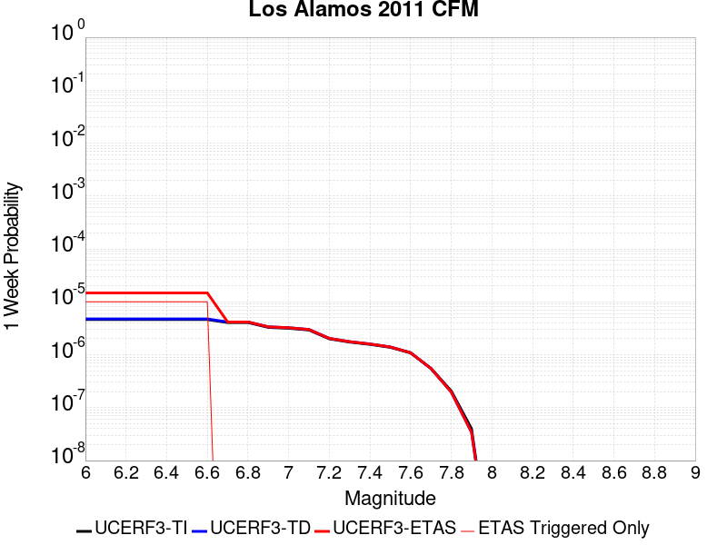 | 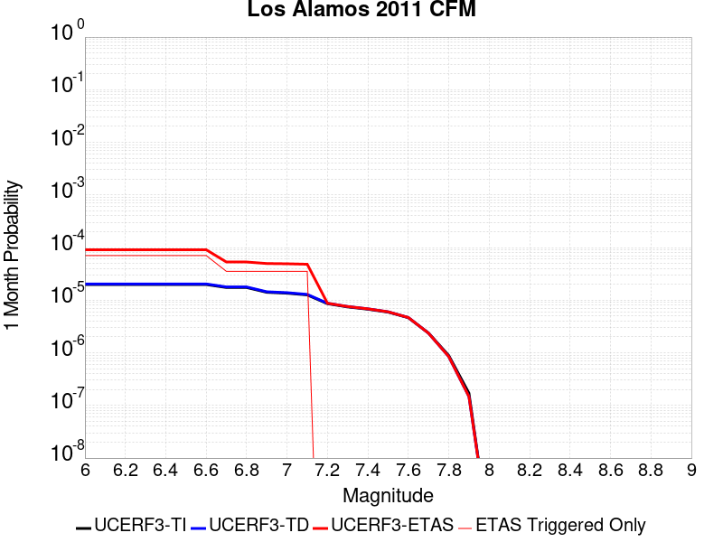 | 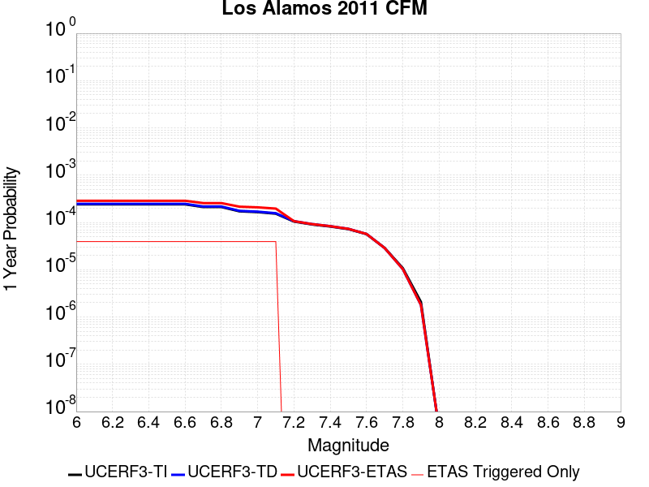 | 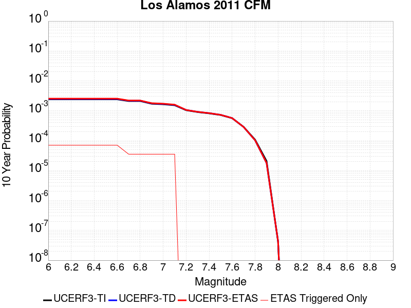 |

| Magnitude | 1 wk TI Prob | 1 wk TD Prob | 1 wk ETAS Prob | 1 wk ETAS/TD Gain | 1 wk ETAS Triggered Only | 1 mo TI Prob | 1 mo TD Prob | 1 mo ETAS Prob | 1 mo ETAS/TD Gain | 1 mo ETAS Triggered Only | 1 yr TI Prob | 1 yr TD Prob | 1 yr ETAS Prob | 1 yr ETAS/TD Gain | 1 yr ETAS Triggered Only | 10 yr TI Prob | 10 yr TD Prob | 10 yr ETAS Prob | 10 yr ETAS/TD Gain | 10 yr ETAS Triggered Only |
|-----|-----|-----|-----|-----|-----|-----|-----|-----|-----|-----|-----|-----|-----|-----|-----|-----|-----|-----|-----|-----|
| 6.0 | 4.6284417E-6 | 4.751731E-6 | 4.751731E-6 | 1.0 | 0.0 | 1.9836029E-5 | 2.0364414E-5 | 5.9814454E-5 | 2.9372048 | 3.9450842E-5 | 2.4147688E-4 | 2.4791027E-4 | 2.8735134E-4 | 1.1590941 | 3.9450842E-5 | 0.0024121467 | 0.0024765113 | 0.0025158646 | 1.0158906 | 3.9450842E-5 |
| 6.1 | 4.6284417E-6 | 4.751731E-6 | 4.751731E-6 | 1.0 | 0.0 | 1.9836029E-5 | 2.0364414E-5 | 5.9814454E-5 | 2.9372048 | 3.9450842E-5 | 2.4147688E-4 | 2.4791027E-4 | 2.8735134E-4 | 1.1590941 | 3.9450842E-5 | 0.0024121467 | 0.0024765113 | 0.0025158646 | 1.0158906 | 3.9450842E-5 |
| 6.2 | 4.6284417E-6 | 4.751731E-6 | 4.751731E-6 | 1.0 | 0.0 | 1.9836029E-5 | 2.0364414E-5 | 5.9814454E-5 | 2.9372048 | 3.9450842E-5 | 2.4147688E-4 | 2.4791027E-4 | 2.8735134E-4 | 1.1590941 | 3.9450842E-5 | 0.0024121467 | 0.0024765113 | 0.0025158646 | 1.0158906 | 3.9450842E-5 |
| 6.3 | 4.6284417E-6 | 4.751731E-6 | 4.751731E-6 | 1.0 | 0.0 | 1.9836029E-5 | 2.0364414E-5 | 5.9814454E-5 | 2.9372048 | 3.9450842E-5 | 2.4147688E-4 | 2.4791027E-4 | 2.8735134E-4 | 1.1590941 | 3.9450842E-5 | 0.0024121467 | 0.0024765113 | 0.0025158646 | 1.0158906 | 3.9450842E-5 |
| 6.4 | 4.6284417E-6 | 4.751731E-6 | 4.751731E-6 | 1.0 | 0.0 | 1.9836029E-5 | 2.0364414E-5 | 5.9814454E-5 | 2.9372048 | 3.9450842E-5 | 2.4147688E-4 | 2.4791027E-4 | 2.8735134E-4 | 1.1590941 | 3.9450842E-5 | 0.0024121467 | 0.0024765113 | 0.0025158646 | 1.0158906 | 3.9450842E-5 |
| 6.5 | 4.6284417E-6 | 4.751731E-6 | 4.751731E-6 | 1.0 | 0.0 | 1.9836029E-5 | 2.0364414E-5 | 5.9814454E-5 | 2.9372048 | 3.9450842E-5 | 2.4147688E-4 | 2.4791027E-4 | 2.8735134E-4 | 1.1590941 | 3.9450842E-5 | 0.0024121467 | 0.0024765113 | 0.0025158646 | 1.0158906 | 3.9450842E-5 |
| 6.6 | 4.6284417E-6 | 4.751731E-6 | 4.751731E-6 | 1.0 | 0.0 | 1.9836029E-5 | 2.0364414E-5 | 5.9814454E-5 | 2.9372048 | 3.9450842E-5 | 2.4147688E-4 | 2.4791027E-4 | 2.8735134E-4 | 1.1590941 | 3.9450842E-5 | 0.0024121467 | 0.0024765113 | 0.0025158646 | 1.0158906 | 3.9450842E-5 |
| 6.7 | 4.062321E-6 | 4.166349E-6 | 4.166349E-6 | 1.0 | 0.0 | 1.7409831E-5 | 1.7855667E-5 | 5.7305806E-5 | 3.2093904 | 3.9450842E-5 | 2.1194408E-4 | 2.1737257E-4 | 2.5681485E-4 | 1.1814501 | 3.9450842E-5 | 0.0021174205 | 0.0021717492 | 0.0022111144 | 1.018126 | 3.9450842E-5 |
| 6.8 | 4.062321E-6 | 4.166349E-6 | 4.166349E-6 | 1.0 | 0.0 | 1.7409831E-5 | 1.7855667E-5 | 5.7305806E-5 | 3.2093904 | 3.9450842E-5 | 2.1194408E-4 | 2.1737257E-4 | 2.5681485E-4 | 1.1814501 | 3.9450842E-5 | 0.0021174205 | 0.0021717492 | 0.0022111144 | 1.018126 | 3.9450842E-5 |
| 6.9 | 3.2936077E-6 | 3.372958E-6 | 3.372958E-6 | 1.0 | 0.0 | 1.4115385E-5 | 1.4455459E-5 | 5.3905733E-5 | 3.7290916 | 3.9450842E-5 | 1.7184127E-4 | 1.7598194E-4 | 2.1542584E-4 | 1.2241361 | 3.9450842E-5 | 0.0017170844 | 0.0017585184 | 0.0017978998 | 1.0223947 | 3.9450842E-5 |
| 7.0 | 3.1687898E-6 | 3.2448156E-6 | 3.2448156E-6 | 1.0 | 0.0 | 1.3580457E-5 | 1.3906283E-5 | 5.335658E-5 | 3.8368683 | 3.9450842E-5 | 1.6532952E-4 | 1.6929678E-4 | 2.0874094E-4 | 1.2329882 | 3.9450842E-5 | 0.0016520657 | 0.0016917696 | 0.0017311537 | 1.0232798 | 3.9450842E-5 |
| 7.1 | 2.9379228E-6 | 3.0073259E-6 | 3.0073259E-6 | 1.0 | 0.0 | 1.25910365E-5 | 1.288848E-5 | 5.2338815E-5 | 4.060899 | 3.9450842E-5 | 1.5328509E-4 | 1.5690686E-4 | 1.9635151E-4 | 1.251389 | 3.9450842E-5 | 0.001531794 | 0.0015680499 | 0.0016074389 | 1.0251198 | 3.9450842E-5 |
| 7.2 | 2.0020686E-6 | 2.0416298E-6 | 2.0416298E-6 | 1.0 | 0.0 | 8.580266E-6 | 8.749813E-6 | 8.749813E-6 | 1.0 | 0.0 | 1.0445973E-4 | 1.0652381E-4 | 1.0652381E-4 | 1.0 | 0.0 | 0.0010441064 | 0.001064732 | 0.001064732 | 1.0 | 0.0 |
| 7.3 | 1.7364243E-6 | 1.7678802E-6 | 1.7678802E-6 | 1.0 | 0.0 | 7.441797E-6 | 7.576608E-6 | 7.576608E-6 | 1.0 | 0.0 | 9.0600115E-5 | 9.2241324E-5 | 9.2241324E-5 | 1.0 | 0.0 | 9.0563187E-4 | 9.2203356E-4 | 9.2203356E-4 | 1.0 | 0.0 |
| 7.4 | 1.5718434E-6 | 1.5983177E-6 | 1.5983177E-6 | 1.0 | 0.0 | 6.7364545E-6 | 6.849915E-6 | 6.849915E-6 | 1.0 | 0.0 | 8.201325E-5 | 8.339455E-5 | 8.339455E-5 | 1.0 | 0.0 | 8.198299E-4 | 8.3363557E-4 | 8.3363557E-4 | 1.0 | 0.0 |
| 7.5 | 1.3841119E-6 | 1.4042793E-6 | 1.4042793E-6 | 1.0 | 0.0 | 5.9318945E-6 | 6.0183256E-6 | 6.0183256E-6 | 1.0 | 0.0 | 7.221842E-5 | 7.327068E-5 | 7.327068E-5 | 1.0 | 0.0 | 7.2194956E-4 | 7.324681E-4 | 7.324681E-4 | 1.0 | 0.0 |
| 7.6 | 1.0843726E-6 | 1.093442E-6 | 1.093442E-6 | 1.0 | 0.0 | 4.647303E-6 | 4.6861724E-6 | 4.6861724E-6 | 1.0 | 0.0 | 5.6579443E-5 | 5.705268E-5 | 5.705268E-5 | 1.0 | 0.0 | 5.656504E-4 | 5.703829E-4 | 5.703829E-4 | 1.0 | 0.0 |
| 7.7 | 5.544814E-7 | 5.5018705E-7 | 5.5018705E-7 | 1.0 | 0.0 | 2.3763469E-6 | 2.3579425E-6 | 2.3579425E-6 | 1.0 | 0.0 | 2.8931638E-5 | 2.8707573E-5 | 2.8707573E-5 | 1.0 | 0.0 | 2.8927872E-4 | 2.870388E-4 | 2.870388E-4 | 1.0 | 0.0 |
| 7.8 | 2.0707465E-7 | 1.977846E-7 | 1.977846E-7 | 1.0 | 0.0 | 8.874625E-7 | 8.4764804E-7 | 8.4764804E-7 | 1.0 | 0.0 | 1.08048025E-5 | 1.0320066E-5 | 1.0320066E-5 | 1.0 | 0.0 | 1.0804277E-4 | 1.0319592E-4 | 1.0319592E-4 | 1.0 | 0.0 |
| 7.9 | 3.9821284E-8 | 3.433109E-8 | 3.433109E-8 | 1.0 | 0.0 | 1.7066264E-7 | 1.4713324E-7 | 1.4713324E-7 | 1.0 | 0.0 | 2.0778157E-6 | 1.7913457E-6 | 1.7913457E-6 | 1.0 | 0.0 | 2.0777963E-5 | 1.7913319E-5 | 1.7913319E-5 | 1.0 | 0.0 |
| 8.0 | 7.880441E-11 | 8.2353124E-11 | 8.2353124E-11 | 1.0 | 0.0 | 3.3773329E-10 | 3.52942E-10 | 3.52942E-10 | 1.0 | 0.0 | 4.1119033E-9 | 4.2970694E-9 | 4.2970694E-9 | 1.0 | 0.0 | 4.1119034E-8 | 4.2970694E-8 | 4.2970694E-8 | 1.0 | 0.0 |

## Sisar
*[(top)](#table-of-contents)*

| 1 Week | 1 Month | 1 Year | 10 Year |
|-----|-----|-----|-----|
| 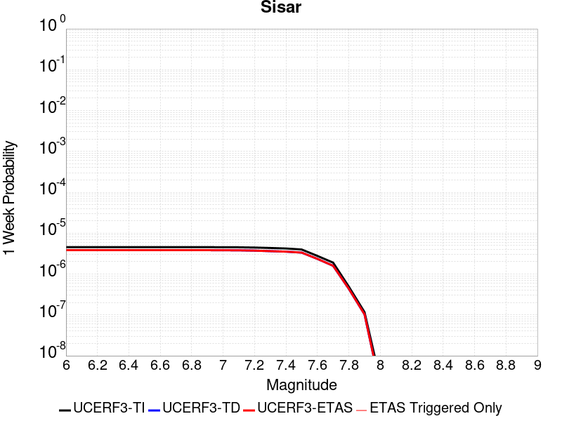 | 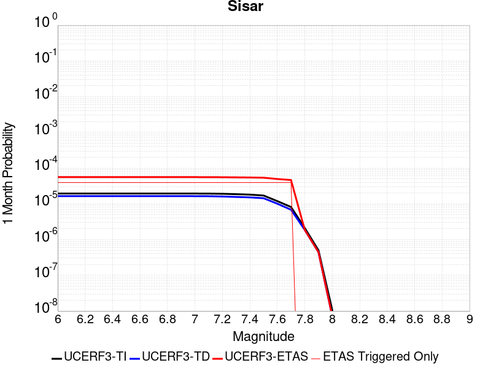 | 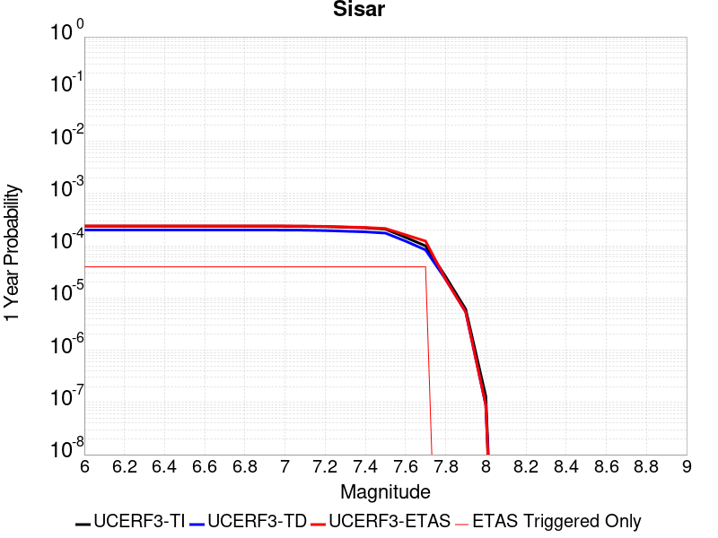 | 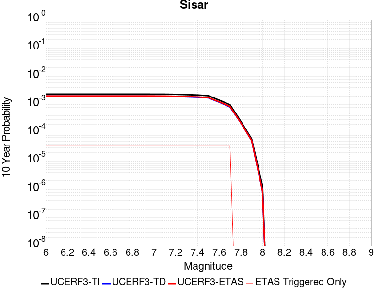 |

| Magnitude | 1 wk TI Prob | 1 wk TD Prob | 1 wk ETAS Prob | 1 wk ETAS/TD Gain | 1 wk ETAS Triggered Only | 1 mo TI Prob | 1 mo TD Prob | 1 mo ETAS Prob | 1 mo ETAS/TD Gain | 1 mo ETAS Triggered Only | 1 yr TI Prob | 1 yr TD Prob | 1 yr ETAS Prob | 1 yr ETAS/TD Gain | 1 yr ETAS Triggered Only | 10 yr TI Prob | 10 yr TD Prob | 10 yr ETAS Prob | 10 yr ETAS/TD Gain | 10 yr ETAS Triggered Only |
|-----|-----|-----|-----|-----|-----|-----|-----|-----|-----|-----|-----|-----|-----|-----|-----|-----|-----|-----|-----|-----|
| 6.0 | 4.544193E-6 | 3.839576E-6 | 3.839576E-6 | 1.0 | 0.0 | 1.9474966E-5 | 1.6455224E-5 | 5.590542E-5 | 3.3974266 | 3.9450842E-5 | 2.3708193E-4 | 2.0032428E-4 | 2.3976722E-4 | 1.1968955 | 3.9450842E-5 | 0.0023682916 | 0.002001471 | 0.0020408428 | 1.0196714 | 3.9450842E-5 |
| 6.1 | 4.544193E-6 | 3.839576E-6 | 3.839576E-6 | 1.0 | 0.0 | 1.9474966E-5 | 1.6455224E-5 | 5.590542E-5 | 3.3974266 | 3.9450842E-5 | 2.3708193E-4 | 2.0032428E-4 | 2.3976722E-4 | 1.1968955 | 3.9450842E-5 | 0.0023682916 | 0.002001471 | 0.0020408428 | 1.0196714 | 3.9450842E-5 |
| 6.2 | 4.544193E-6 | 3.839576E-6 | 3.839576E-6 | 1.0 | 0.0 | 1.9474966E-5 | 1.6455224E-5 | 5.590542E-5 | 3.3974266 | 3.9450842E-5 | 2.3708193E-4 | 2.0032428E-4 | 2.3976722E-4 | 1.1968955 | 3.9450842E-5 | 0.0023682916 | 0.002001471 | 0.0020408428 | 1.0196714 | 3.9450842E-5 |
| 6.3 | 4.544193E-6 | 3.839576E-6 | 3.839576E-6 | 1.0 | 0.0 | 1.9474966E-5 | 1.6455224E-5 | 5.590542E-5 | 3.3974266 | 3.9450842E-5 | 2.3708193E-4 | 2.0032428E-4 | 2.3976722E-4 | 1.1968955 | 3.9450842E-5 | 0.0023682916 | 0.002001471 | 0.0020408428 | 1.0196714 | 3.9450842E-5 |
| 6.4 | 4.544193E-6 | 3.839576E-6 | 3.839576E-6 | 1.0 | 0.0 | 1.9474966E-5 | 1.6455224E-5 | 5.590542E-5 | 3.3974266 | 3.9450842E-5 | 2.3708193E-4 | 2.0032428E-4 | 2.3976722E-4 | 1.1968955 | 3.9450842E-5 | 0.0023682916 | 0.002001471 | 0.0020408428 | 1.0196714 | 3.9450842E-5 |
| 6.5 | 4.544193E-6 | 3.839576E-6 | 3.839576E-6 | 1.0 | 0.0 | 1.9474966E-5 | 1.6455224E-5 | 5.590542E-5 | 3.3974266 | 3.9450842E-5 | 2.3708193E-4 | 2.0032428E-4 | 2.3976722E-4 | 1.1968955 | 3.9450842E-5 | 0.0023682916 | 0.002001471 | 0.0020408428 | 1.0196714 | 3.9450842E-5 |
| 6.6 | 4.544193E-6 | 3.839576E-6 | 3.839576E-6 | 1.0 | 0.0 | 1.9474966E-5 | 1.6455224E-5 | 5.590542E-5 | 3.3974266 | 3.9450842E-5 | 2.3708193E-4 | 2.0032428E-4 | 2.3976722E-4 | 1.1968955 | 3.9450842E-5 | 0.0023682916 | 0.002001471 | 0.0020408428 | 1.0196714 | 3.9450842E-5 |
| 6.7 | 4.544193E-6 | 3.839576E-6 | 3.839576E-6 | 1.0 | 0.0 | 1.9474966E-5 | 1.6455224E-5 | 5.590542E-5 | 3.3974266 | 3.9450842E-5 | 2.3708193E-4 | 2.0032428E-4 | 2.3976722E-4 | 1.1968955 | 3.9450842E-5 | 0.0023682916 | 0.002001471 | 0.0020408428 | 1.0196714 | 3.9450842E-5 |
| 6.8 | 4.544193E-6 | 3.839576E-6 | 3.839576E-6 | 1.0 | 0.0 | 1.9474966E-5 | 1.6455224E-5 | 5.590542E-5 | 3.3974266 | 3.9450842E-5 | 2.3708193E-4 | 2.0032428E-4 | 2.3976722E-4 | 1.1968955 | 3.9450842E-5 | 0.0023682916 | 0.002001471 | 0.0020408428 | 1.0196714 | 3.9450842E-5 |
| 6.9 | 4.542225E-6 | 3.8375383E-6 | 3.8375383E-6 | 1.0 | 0.0 | 1.9466532E-5 | 1.6446491E-5 | 5.5896686E-5 | 3.3987 | 3.9450842E-5 | 2.3697925E-4 | 2.0021795E-4 | 2.396609E-4 | 1.197 | 3.9450842E-5 | 0.002367267 | 0.0020004094 | 0.0020397813 | 1.0196819 | 3.9450842E-5 |
| 7.0 | 4.5278484E-6 | 3.822602E-6 | 3.822602E-6 | 1.0 | 0.0 | 1.940492E-5 | 1.638248E-5 | 5.583268E-5 | 3.4080725 | 3.9450842E-5 | 2.3622929E-4 | 1.9943877E-4 | 2.3888175E-4 | 1.1977699 | 3.9450842E-5 | 0.0023597833 | 0.0019926317 | 0.0020320038 | 1.0197589 | 3.9450842E-5 |
| 7.1 | 4.5132488E-6 | 3.8073897E-6 | 3.8073897E-6 | 1.0 | 0.0 | 1.9342351E-5 | 1.6317284E-5 | 5.5767483E-5 | 3.417694 | 3.9450842E-5 | 2.3546767E-4 | 1.9864515E-4 | 2.3808816E-4 | 1.1985601 | 3.9450842E-5 | 0.0023521832 | 0.0019847096 | 0.0020240822 | 1.019838 | 3.9450842E-5 |
| 7.2 | 4.448859E-6 | 3.7398502E-6 | 3.7398502E-6 | 1.0 | 0.0 | 1.9066398E-5 | 1.6027832E-5 | 5.5478045E-5 | 3.4613566 | 3.9450842E-5 | 2.3210866E-4 | 1.9512173E-4 | 2.3456487E-4 | 1.2021464 | 3.9450842E-5 | 0.0023186638 | 0.0019495375 | 0.0019889115 | 1.0201966 | 3.9450842E-5 |
| 7.3 | 4.3424366E-6 | 3.6336846E-6 | 3.6336846E-6 | 1.0 | 0.0 | 1.861031E-5 | 1.5572843E-5 | 5.5023072E-5 | 3.5332708 | 3.9450842E-5 | 2.2655698E-4 | 1.895832E-4 | 2.2902657E-4 | 1.2080531 | 3.9450842E-5 | 0.0022632615 | 0.0018942481 | 0.0019336243 | 1.0207872 | 3.9450842E-5 |
| 7.4 | 4.218641E-6 | 3.5330384E-6 | 3.5330384E-6 | 1.0 | 0.0 | 1.8079765E-5 | 1.5141507E-5 | 5.4591754E-5 | 3.6054373 | 3.9450842E-5 | 2.2009891E-4 | 1.8433259E-4 | 2.2377617E-4 | 1.2139804 | 3.9450842E-5 | 0.0021988105 | 0.0018418302 | 0.0018812084 | 1.02138 | 3.9450842E-5 |
| 7.5 | 3.983779E-6 | 3.3478068E-6 | 3.3478068E-6 | 1.0 | 0.0 | 1.7073227E-5 | 1.4347666E-5 | 5.3797943E-5 | 3.7495954 | 3.9450842E-5 | 2.0784672E-4 | 1.7466917E-4 | 2.1411313E-4 | 1.2258209 | 3.9450842E-5 | 0.0020765243 | 0.0017453518 | 0.0017847338 | 1.0225639 | 3.9450842E-5 |
| 7.6 | 2.777393E-6 | 2.35225E-6 | 2.35225E-6 | 1.0 | 0.0 | 1.1903058E-5 | 1.0081033E-5 | 4.9531478E-5 | 4.913334 | 3.9450842E-5 | 1.449101E-4 | 1.2272975E-4 | 1.6217574E-4 | 1.3214054 | 3.9450842E-5 | 0.0014481564 | 0.0012266274 | 0.0012660298 | 1.0321226 | 3.9450842E-5 |
| 7.7 | 1.9028433E-6 | 1.593867E-6 | 1.593867E-6 | 1.0 | 0.0 | 8.155017E-6 | 6.8308404E-6 | 4.6281417E-5 | 6.7753615 | 3.9450842E-5 | 9.928281E-5 | 8.3162355E-5 | 1.2260993E-4 | 1.474344 | 3.9450842E-5 | 9.923846E-4 | 8.313171E-4 | 8.7073515E-4 | 1.0474163 | 3.9450842E-5 |
| 7.8 | 4.9095956E-7 | 4.3583708E-7 | 4.3583708E-7 | 1.0 | 0.0 | 2.1041105E-6 | 1.8678718E-6 | 1.8678718E-6 | 1.0 | 0.0 | 2.5617246E-5 | 2.2741104E-5 | 2.2741104E-5 | 1.0 | 0.0 | 2.5614293E-4 | 2.2738794E-4 | 2.2738794E-4 | 1.0 | 0.0 |
| 7.9 | 1.16657894E-7 | 1.0335569E-7 | 1.0335569E-7 | 1.0 | 0.0 | 4.999623E-7 | 4.4295288E-7 | 4.4295288E-7 | 1.0 | 0.0 | 6.087024E-6 | 5.3929384E-6 | 5.3929384E-6 | 1.0 | 0.0 | 6.0868573E-5 | 5.3928103E-5 | 5.3928103E-5 | 1.0 | 0.0 |
| 8.0 | 2.5100346E-9 | 1.7067566E-9 | 1.7067566E-9 | 1.0 | 0.0 | 1.0757291E-8 | 7.3146724E-9 | 7.3146724E-9 | 1.0 | 0.0 | 1.3097001E-7 | 8.905613E-8 | 8.905613E-8 | 1.0 | 0.0 | 1.3096993E-6 | 8.9056095E-7 | 8.9056095E-7 | 1.0 | 0.0 |

## Great Valley 05 Pittsburg - Kirby Hills alt1
*[(top)](#table-of-contents)*

| 1 Week | 1 Month | 1 Year | 10 Year |
|-----|-----|-----|-----|
| 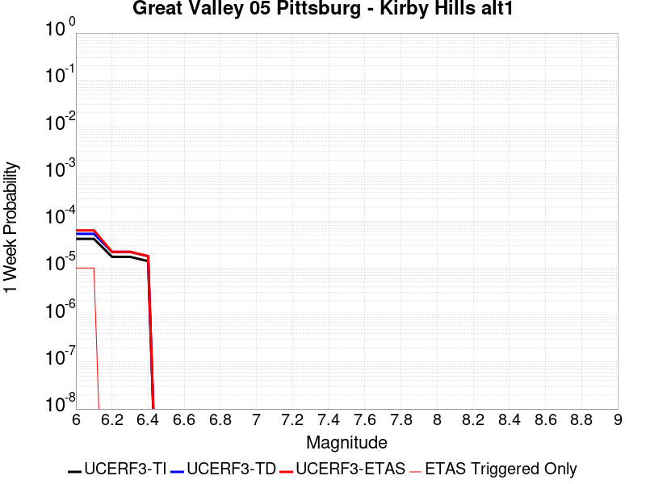 | 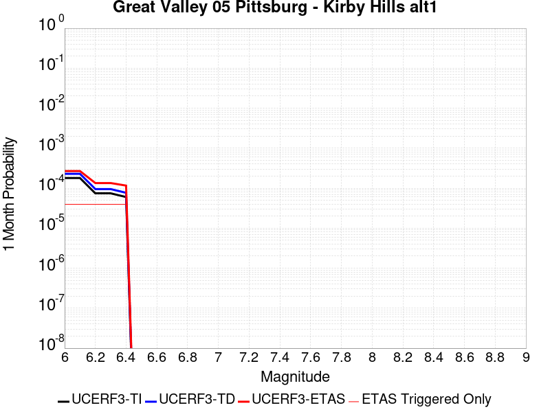 | 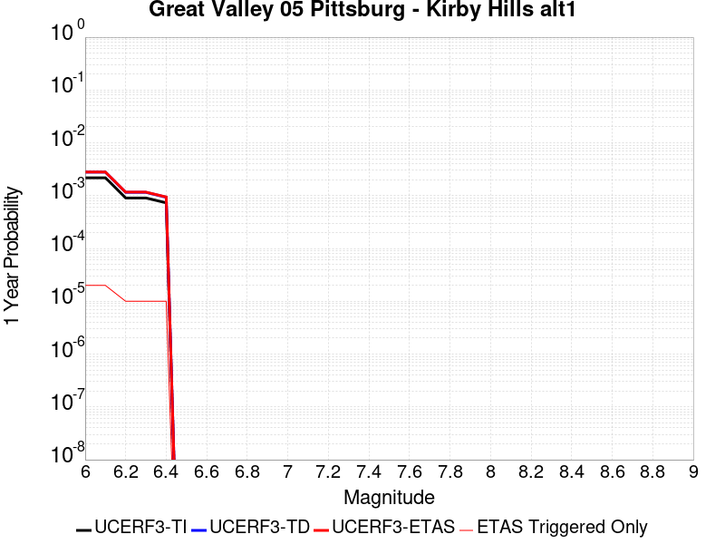 | 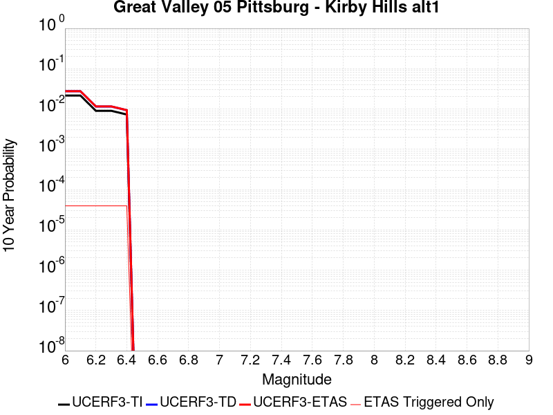 |

| Magnitude | 1 wk TI Prob | 1 wk TD Prob | 1 wk ETAS Prob | 1 wk ETAS/TD Gain | 1 wk ETAS Triggered Only | 1 mo TI Prob | 1 mo TD Prob | 1 mo ETAS Prob | 1 mo ETAS/TD Gain | 1 mo ETAS Triggered Only | 1 yr TI Prob | 1 yr TD Prob | 1 yr ETAS Prob | 1 yr ETAS/TD Gain | 1 yr ETAS Triggered Only | 10 yr TI Prob | 10 yr TD Prob | 10 yr ETAS Prob | 10 yr ETAS/TD Gain | 10 yr ETAS Triggered Only |
|-----|-----|-----|-----|-----|-----|-----|-----|-----|-----|-----|-----|-----|-----|-----|-----|-----|-----|-----|-----|-----|
| 6.0 | 4.187212E-5 | 5.3442072E-5 | 5.3442072E-5 | 1.0 | 0.0 | 1.794396E-4 | 2.290231E-4 | 2.684649E-4 | 1.1722176 | 3.9450842E-5 | 0.002182488 | 0.0027857882 | 0.002825129 | 1.014122 | 3.9450842E-5 | 0.021611776 | 0.02760304 | 0.0276414 | 1.0013897 | 3.9450842E-5 |
| 6.1 | 4.187212E-5 | 5.3442072E-5 | 5.3442072E-5 | 1.0 | 0.0 | 1.794396E-4 | 2.290231E-4 | 2.684649E-4 | 1.1722176 | 3.9450842E-5 | 0.002182488 | 0.0027857882 | 0.002825129 | 1.014122 | 3.9450842E-5 | 0.021611776 | 0.02760304 | 0.0276414 | 1.0013897 | 3.9450842E-5 |
| 6.2 | 1.7353306E-5 | 2.2154374E-5 | 2.2154374E-5 | 1.0 | 0.0 | 7.436919E-5 | 9.494618E-5 | 1.3439328E-4 | 1.415468 | 3.9450842E-5 | 9.050688E-4 | 0.0011557543 | 0.0011951595 | 1.0340948 | 3.9450842E-5 | 0.009013915 | 0.011535114 | 0.011574109 | 1.0033807 | 3.9450842E-5 |
| 6.3 | 1.7353306E-5 | 2.2154374E-5 | 2.2154374E-5 | 1.0 | 0.0 | 7.436919E-5 | 9.494618E-5 | 1.3439328E-4 | 1.415468 | 3.9450842E-5 | 9.050688E-4 | 0.0011557543 | 0.0011951595 | 1.0340948 | 3.9450842E-5 | 0.009013915 | 0.011535114 | 0.011574109 | 1.0033807 | 3.9450842E-5 |
| 6.4 | 1.4028824E-5 | 1.7900597E-5 | 1.7900597E-5 | 1.0 | 0.0 | 6.0122147E-5 | 7.671684E-5 | 1.1616466E-4 | 1.5142002 | 3.9450842E-5 | 7.3174125E-4 | 9.340275E-4 | 9.734415E-4 | 1.042198 | 3.9450842E-5 | 0.0072933645 | 0.009338138 | 0.00937722 | 1.0041852 | 3.9450842E-5 |

## Kickapoo
*[(top)](#table-of-contents)*

| 1 Week | 1 Month | 1 Year | 10 Year |
|-----|-----|-----|-----|
| 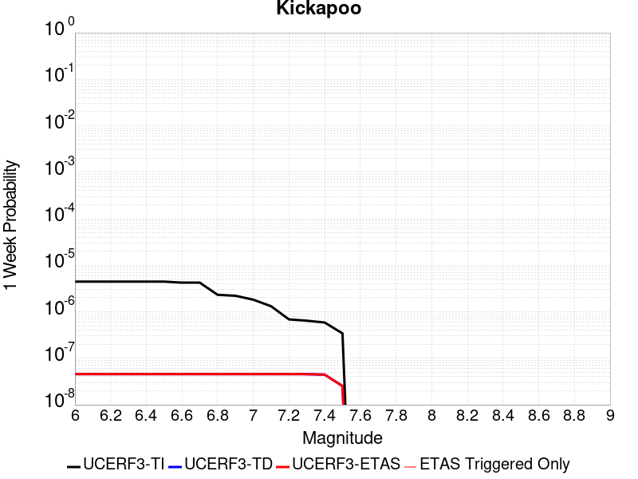 | 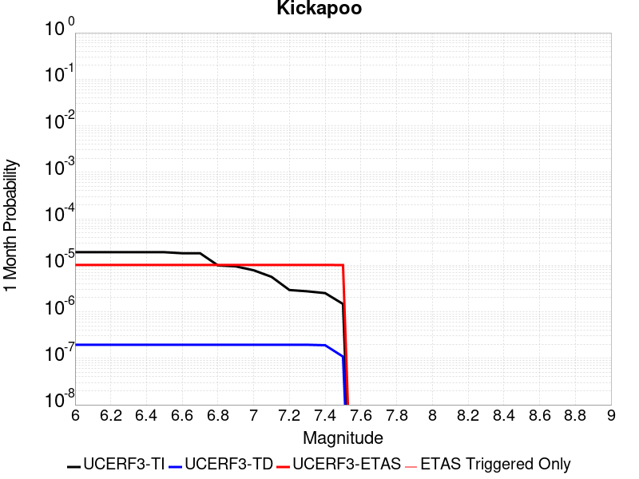 | 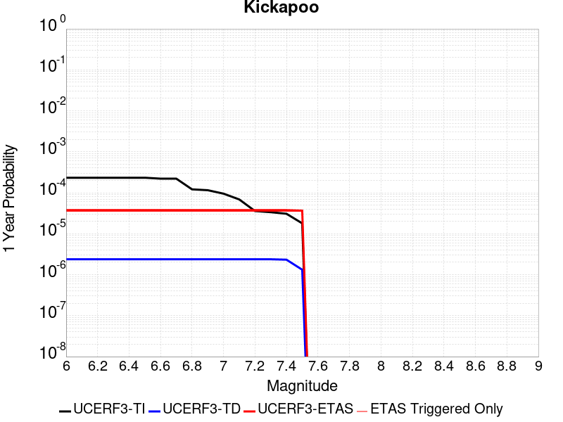 | 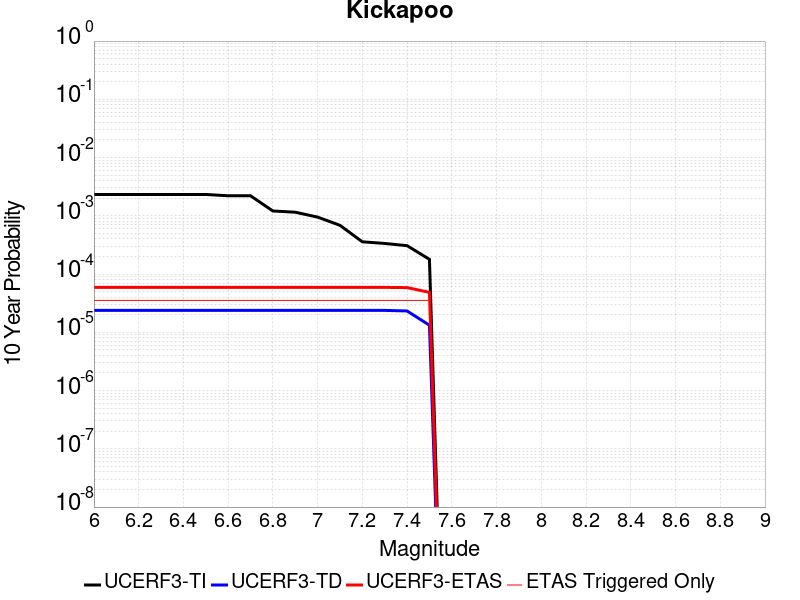 |

| Magnitude | 1 wk TI Prob | 1 wk TD Prob | 1 wk ETAS Prob | 1 wk ETAS/TD Gain | 1 wk ETAS Triggered Only | 1 mo TI Prob | 1 mo TD Prob | 1 mo ETAS Prob | 1 mo ETAS/TD Gain | 1 mo ETAS Triggered Only | 1 yr TI Prob | 1 yr TD Prob | 1 yr ETAS Prob | 1 yr ETAS/TD Gain | 1 yr ETAS Triggered Only | 10 yr TI Prob | 10 yr TD Prob | 10 yr ETAS Prob | 10 yr ETAS/TD Gain | 10 yr ETAS Triggered Only |
|-----|-----|-----|-----|-----|-----|-----|-----|-----|-----|-----|-----|-----|-----|-----|-----|-----|-----|-----|-----|-----|
| 6.0 | 4.4610633E-6 | 4.559828E-8 | 4.559828E-8 | 1.0 | 0.0 | 1.9118703E-5 | 1.954212E-7 | 3.9646256E-5 | 202.87595 | 3.9450842E-5 | 2.3274534E-4 | 2.3792506E-6 | 4.183E-5 | 17.581165 | 3.9450842E-5 | 0.0023250172 | 2.379228E-5 | 6.324219E-5 | 2.6580968 | 3.9450842E-5 |
| 6.1 | 4.4610633E-6 | 4.559828E-8 | 4.559828E-8 | 1.0 | 0.0 | 1.9118703E-5 | 1.954212E-7 | 3.9646256E-5 | 202.87595 | 3.9450842E-5 | 2.3274534E-4 | 2.3792506E-6 | 4.183E-5 | 17.581165 | 3.9450842E-5 | 0.0023250172 | 2.379228E-5 | 6.324219E-5 | 2.6580968 | 3.9450842E-5 |
| 6.2 | 4.4610633E-6 | 4.559828E-8 | 4.559828E-8 | 1.0 | 0.0 | 1.9118703E-5 | 1.954212E-7 | 3.9646256E-5 | 202.87595 | 3.9450842E-5 | 2.3274534E-4 | 2.3792506E-6 | 4.183E-5 | 17.581165 | 3.9450842E-5 | 0.0023250172 | 2.379228E-5 | 6.324219E-5 | 2.6580968 | 3.9450842E-5 |
| 6.3 | 4.4610633E-6 | 4.559828E-8 | 4.559828E-8 | 1.0 | 0.0 | 1.9118703E-5 | 1.954212E-7 | 3.9646256E-5 | 202.87595 | 3.9450842E-5 | 2.3274534E-4 | 2.3792506E-6 | 4.183E-5 | 17.581165 | 3.9450842E-5 | 0.0023250172 | 2.379228E-5 | 6.324219E-5 | 2.6580968 | 3.9450842E-5 |
| 6.4 | 4.4610633E-6 | 4.559828E-8 | 4.559828E-8 | 1.0 | 0.0 | 1.9118703E-5 | 1.954212E-7 | 3.9646256E-5 | 202.87595 | 3.9450842E-5 | 2.3274534E-4 | 2.3792506E-6 | 4.183E-5 | 17.581165 | 3.9450842E-5 | 0.0023250172 | 2.379228E-5 | 6.324219E-5 | 2.6580968 | 3.9450842E-5 |
| 6.5 | 4.4610633E-6 | 4.559828E-8 | 4.559828E-8 | 1.0 | 0.0 | 1.9118703E-5 | 1.954212E-7 | 3.9646256E-5 | 202.87595 | 3.9450842E-5 | 2.3274534E-4 | 2.3792506E-6 | 4.183E-5 | 17.581165 | 3.9450842E-5 | 0.0023250172 | 2.379228E-5 | 6.324219E-5 | 2.6580968 | 3.9450842E-5 |
| 6.6 | 4.236531E-6 | 4.559828E-8 | 4.559828E-8 | 1.0 | 0.0 | 1.8156434E-5 | 1.954212E-7 | 3.9646256E-5 | 202.87595 | 3.9450842E-5 | 2.2103215E-4 | 2.3792506E-6 | 4.183E-5 | 17.581165 | 3.9450842E-5 | 0.0022081244 | 2.379228E-5 | 6.324219E-5 | 2.6580968 | 3.9450842E-5 |
| 6.7 | 4.236531E-6 | 4.559828E-8 | 4.559828E-8 | 1.0 | 0.0 | 1.8156434E-5 | 1.954212E-7 | 3.9646256E-5 | 202.87595 | 3.9450842E-5 | 2.2103215E-4 | 2.3792506E-6 | 4.183E-5 | 17.581165 | 3.9450842E-5 | 0.0022081244 | 2.379228E-5 | 6.324219E-5 | 2.6580968 | 3.9450842E-5 |
| 6.8 | 2.3202913E-6 | 4.559828E-8 | 4.559828E-8 | 1.0 | 0.0 | 9.944068E-6 | 1.954212E-7 | 3.9646256E-5 | 202.87595 | 3.9450842E-5 | 1.210623E-4 | 2.3792506E-6 | 4.183E-5 | 17.581165 | 3.9450842E-5 | 0.0012099637 | 2.379228E-5 | 6.324219E-5 | 2.6580968 | 3.9450842E-5 |
| 6.9 | 2.2111808E-6 | 4.559828E-8 | 4.559828E-8 | 1.0 | 0.0 | 9.4764555E-6 | 1.954212E-7 | 3.9646256E-5 | 202.87595 | 3.9450842E-5 | 1.1536973E-4 | 2.3792506E-6 | 4.183E-5 | 17.581165 | 3.9450842E-5 | 0.0011530985 | 2.379228E-5 | 6.324219E-5 | 2.6580968 | 3.9450842E-5 |
| 7.0 | 1.8222031E-6 | 4.559828E-8 | 4.559828E-8 | 1.0 | 0.0 | 7.809419E-6 | 1.954212E-7 | 3.9646256E-5 | 202.87595 | 3.9450842E-5 | 9.507552E-5 | 2.3792506E-6 | 4.183E-5 | 17.581165 | 3.9450842E-5 | 9.5034856E-4 | 2.379228E-5 | 6.324219E-5 | 2.6580968 | 3.9450842E-5 |
| 7.1 | 1.3163254E-6 | 4.559828E-8 | 4.559828E-8 | 1.0 | 0.0 | 5.6413824E-6 | 1.954212E-7 | 3.9646256E-5 | 202.87595 | 3.9450842E-5 | 6.868167E-5 | 2.3792506E-6 | 4.183E-5 | 17.581165 | 3.9450842E-5 | 6.866045E-4 | 2.379228E-5 | 6.324219E-5 | 2.6580968 | 3.9450842E-5 |
| 7.2 | 6.8603634E-7 | 4.5597357E-8 | 4.5597357E-8 | 1.0 | 0.0 | 2.9401524E-6 | 1.9541724E-7 | 3.9646253E-5 | 202.88002 | 3.9450842E-5 | 3.579577E-5 | 2.3792024E-6 | 4.1829953E-5 | 17.581501 | 3.9450842E-5 | 3.5790002E-4 | 2.37918E-5 | 6.324171E-5 | 2.6581304 | 3.9450842E-5 |
| 7.3 | 6.4299127E-7 | 4.5581142E-8 | 4.5581142E-8 | 1.0 | 0.0 | 2.755674E-6 | 1.9534774E-7 | 3.9646184E-5 | 202.95184 | 3.9450842E-5 | 3.3549815E-5 | 2.3783564E-6 | 4.1829106E-5 | 17.5874 | 3.9450842E-5 | 3.354475E-4 | 2.3783337E-5 | 6.3233245E-5 | 2.6587203 | 3.9450842E-5 |
| 7.4 | 5.8856347E-7 | 4.4556977E-8 | 4.4556977E-8 | 1.0 | 0.0 | 2.5224124E-6 | 1.9095846E-7 | 3.9641796E-5 | 207.59381 | 3.9450842E-5 | 3.070994E-5 | 2.3249172E-6 | 4.177567E-5 | 17.96867 | 3.9450842E-5 | 3.0705697E-4 | 2.3248956E-5 | 6.2698884E-5 | 2.6968472 | 3.9450842E-5 |
| 7.5 | 3.435626E-7 | 2.5357679E-8 | 2.5357679E-8 | 1.0 | 0.0 | 1.4724103E-6 | 1.0867576E-7 | 3.9559516E-5 | 364.01413 | 3.9450842E-5 | 1.7926448E-5 | 1.3231268E-6 | 4.0773917E-5 | 30.816336 | 3.9450842E-5 | 1.7925001E-4 | 1.3231205E-5 | 5.2681527E-5 | 3.9816122 | 3.9450842E-5 |

## Round Valley
*[(top)](#table-of-contents)*

| 1 Week | 1 Month | 1 Year | 10 Year |
|-----|-----|-----|-----|
| 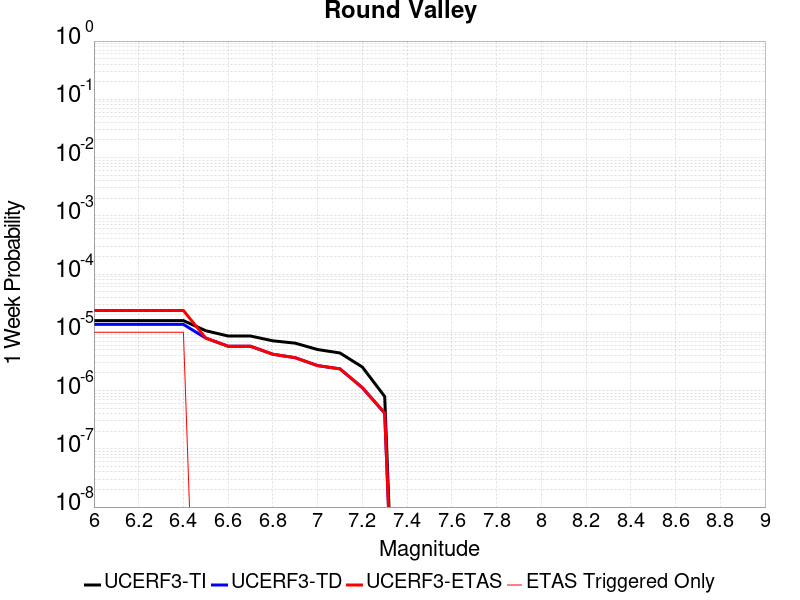 | 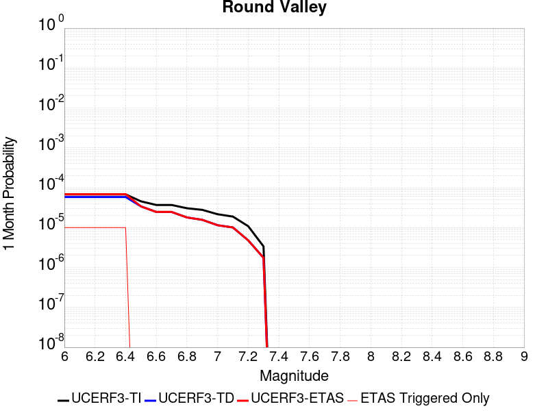 | 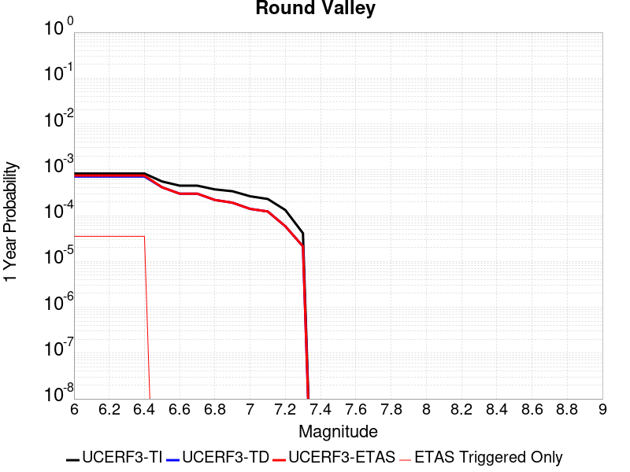 | 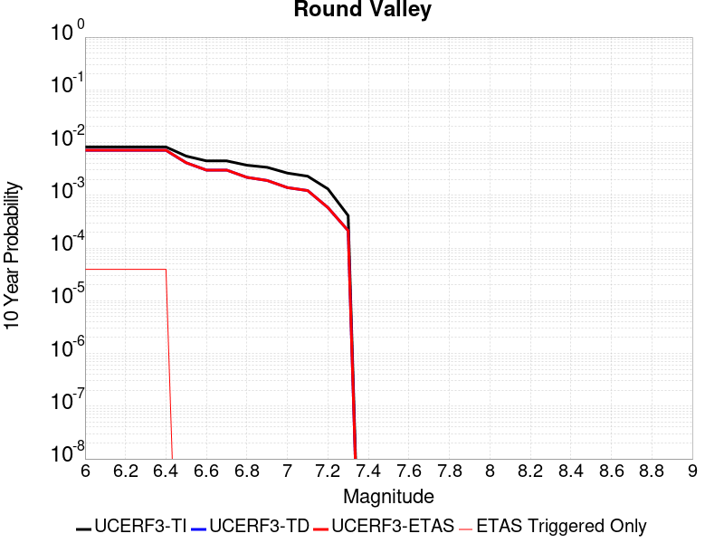 |

| Magnitude | 1 wk TI Prob | 1 wk TD Prob | 1 wk ETAS Prob | 1 wk ETAS/TD Gain | 1 wk ETAS Triggered Only | 1 mo TI Prob | 1 mo TD Prob | 1 mo ETAS Prob | 1 mo ETAS/TD Gain | 1 mo ETAS Triggered Only | 1 yr TI Prob | 1 yr TD Prob | 1 yr ETAS Prob | 1 yr ETAS/TD Gain | 1 yr ETAS Triggered Only | 10 yr TI Prob | 10 yr TD Prob | 10 yr ETAS Prob | 10 yr ETAS/TD Gain | 10 yr ETAS Triggered Only |
|-----|-----|-----|-----|-----|-----|-----|-----|-----|-----|-----|-----|-----|-----|-----|-----|-----|-----|-----|-----|-----|
| 6.0 | 1.588152E-5 | 1.3670716E-5 | 1.3670716E-5 | 1.0 | 0.0 | 6.806188E-5 | 5.8587688E-5 | 5.8587688E-5 | 1.0 | 0.0 | 8.283384E-4 | 7.13111E-4 | 7.525337E-4 | 1.0552827 | 3.9450842E-5 | 0.008252576 | 0.0071121147 | 0.007151285 | 1.0055076 | 3.9450842E-5 |
| 6.1 | 1.588152E-5 | 1.3670716E-5 | 1.3670716E-5 | 1.0 | 0.0 | 6.806188E-5 | 5.8587688E-5 | 5.8587688E-5 | 1.0 | 0.0 | 8.283384E-4 | 7.13111E-4 | 7.525337E-4 | 1.0552827 | 3.9450842E-5 | 0.008252576 | 0.0071121147 | 0.007151285 | 1.0055076 | 3.9450842E-5 |
| 6.2 | 1.588152E-5 | 1.3670716E-5 | 1.3670716E-5 | 1.0 | 0.0 | 6.806188E-5 | 5.8587688E-5 | 5.8587688E-5 | 1.0 | 0.0 | 8.283384E-4 | 7.13111E-4 | 7.525337E-4 | 1.0552827 | 3.9450842E-5 | 0.008252576 | 0.0071121147 | 0.007151285 | 1.0055076 | 3.9450842E-5 |
| 6.3 | 1.588152E-5 | 1.3670716E-5 | 1.3670716E-5 | 1.0 | 0.0 | 6.806188E-5 | 5.8587688E-5 | 5.8587688E-5 | 1.0 | 0.0 | 8.283384E-4 | 7.13111E-4 | 7.525337E-4 | 1.0552827 | 3.9450842E-5 | 0.008252576 | 0.0071121147 | 0.007151285 | 1.0055076 | 3.9450842E-5 |
| 6.4 | 1.588152E-5 | 1.3670716E-5 | 1.3670716E-5 | 1.0 | 0.0 | 6.806188E-5 | 5.8587688E-5 | 5.8587688E-5 | 1.0 | 0.0 | 8.283384E-4 | 7.13111E-4 | 7.525337E-4 | 1.0552827 | 3.9450842E-5 | 0.008252576 | 0.0071121147 | 0.007151285 | 1.0055076 | 3.9450842E-5 |
| 6.5 | 1.0646776E-5 | 7.953037E-6 | 7.953037E-6 | 1.0 | 0.0 | 4.5628243E-5 | 3.408405E-5 | 3.408405E-5 | 1.0 | 0.0 | 5.553823E-4 | 4.1490266E-4 | 4.1490266E-4 | 1.0 | 0.0 | 0.005539963 | 0.0041421093 | 0.0041421093 | 1.0 | 0.0 |
| 6.6 | 8.632956E-6 | 5.768742E-6 | 5.768742E-6 | 1.0 | 0.0 | 3.6997862E-5 | 2.4722967E-5 | 2.4722967E-5 | 1.0 | 0.0 | 4.5035584E-4 | 3.009644E-4 | 3.009644E-4 | 1.0 | 0.0 | 0.0044944426 | 0.003005946 | 0.003005946 | 1.0 | 0.0 |
| 6.7 | 8.632956E-6 | 5.768742E-6 | 5.768742E-6 | 1.0 | 0.0 | 3.6997862E-5 | 2.4722967E-5 | 2.4722967E-5 | 1.0 | 0.0 | 4.5035584E-4 | 3.009644E-4 | 3.009644E-4 | 1.0 | 0.0 | 0.0044944426 | 0.003005946 | 0.003005946 | 1.0 | 0.0 |
| 6.8 | 7.143895E-6 | 4.2018346E-6 | 4.2018346E-6 | 1.0 | 0.0 | 3.0616335E-5 | 1.8007748E-5 | 1.8007748E-5 | 1.0 | 0.0 | 3.726901E-4 | 2.1922393E-4 | 2.1922393E-4 | 1.0 | 0.0 | 0.0037206567 | 0.0021902416 | 0.0021902416 | 1.0 | 0.0 |
| 6.9 | 6.5120694E-6 | 3.6644687E-6 | 3.6644687E-6 | 1.0 | 0.0 | 2.790857E-5 | 1.570478E-5 | 1.570478E-5 | 1.0 | 0.0 | 3.3973387E-4 | 1.9119044E-4 | 1.9119044E-4 | 1.0 | 0.0 | 0.0033921495 | 0.0019104085 | 0.0019104085 | 1.0 | 0.0 |
| 7.0 | 5.0614435E-6 | 2.6836676E-6 | 2.6836676E-6 | 1.0 | 0.0 | 2.169172E-5 | 1.1501388E-5 | 1.1501388E-5 | 1.0 | 0.0 | 2.6406467E-4 | 1.4002144E-4 | 1.4002144E-4 | 1.0 | 0.0 | 0.0026375111 | 0.0013994334 | 0.0013994334 | 1.0 | 0.0 |
| 7.1 | 4.41728E-6 | 2.3575074E-6 | 2.3575074E-6 | 1.0 | 0.0 | 1.8931061E-5 | 1.0103569E-5 | 1.0103569E-5 | 1.0 | 0.0 | 2.304613E-4 | 1.23005E-4 | 1.23005E-4 | 1.0 | 0.0 | 0.0023022245 | 0.0012294657 | 0.0012294657 | 1.0 | 0.0 |
| 7.2 | 2.535495E-6 | 1.1208391E-6 | 1.1208391E-6 | 1.0 | 0.0 | 1.0866362E-5 | 4.8035904E-6 | 4.8035904E-6 | 1.0 | 0.0 | 1.3228992E-4 | 5.8482667E-5 | 5.8482667E-5 | 1.0 | 0.0 | 0.0013221119 | 5.84724E-4 | 5.84724E-4 | 1.0 | 0.0 |
| 7.3 | 7.900015E-7 | 4.0889498E-7 | 4.0889498E-7 | 1.0 | 0.0 | 3.3857161E-6 | 1.752407E-6 | 1.752407E-6 | 1.0 | 0.0 | 4.1220315E-5 | 2.1335554E-5 | 2.1335554E-5 | 1.0 | 0.0 | 4.121267E-4 | 2.1335555E-4 | 2.1335555E-4 | 1.0 | 0.0 |

## South Klamath Lake West
*[(top)](#table-of-contents)*

| 1 Week | 1 Month | 1 Year | 10 Year |
|-----|-----|-----|-----|
|  | 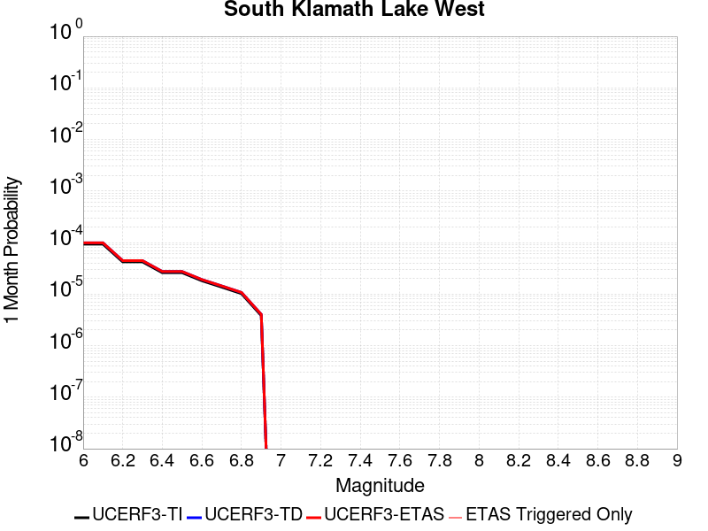 | 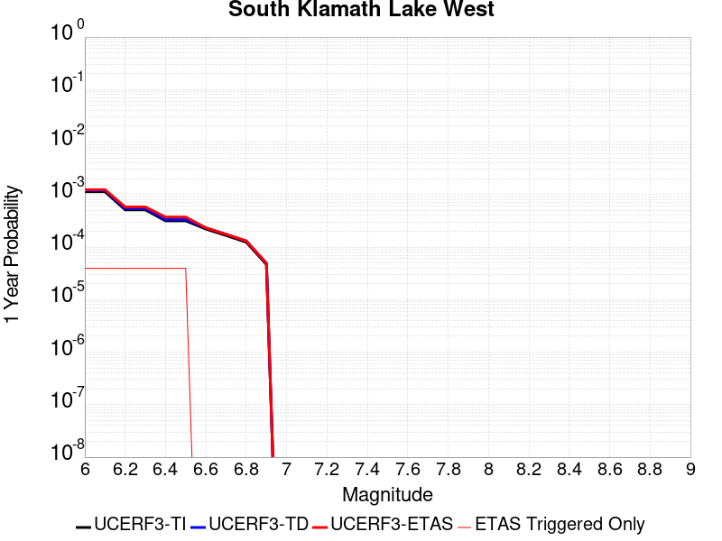 |  |

| Magnitude | 1 wk TI Prob | 1 wk TD Prob | 1 wk ETAS Prob | 1 wk ETAS/TD Gain | 1 wk ETAS Triggered Only | 1 mo TI Prob | 1 mo TD Prob | 1 mo ETAS Prob | 1 mo ETAS/TD Gain | 1 mo ETAS Triggered Only | 1 yr TI Prob | 1 yr TD Prob | 1 yr ETAS Prob | 1 yr ETAS/TD Gain | 1 yr ETAS Triggered Only | 10 yr TI Prob | 10 yr TD Prob | 10 yr ETAS Prob | 10 yr ETAS/TD Gain | 10 yr ETAS Triggered Only |
|-----|-----|-----|-----|-----|-----|-----|-----|-----|-----|-----|-----|-----|-----|-----|-----|-----|-----|-----|-----|-----|
| 6.0 | 2.174025E-5 | 2.3042025E-5 | 2.3042025E-5 | 1.0 | 0.0 | 9.3169176E-5 | 9.874817E-5 | 9.874817E-5 | 1.0 | 0.0 | 0.0011337444 | 0.0012016617 | 0.0012410651 | 1.0327908 | 3.9450842E-5 | 0.011279777 | 0.0119582405 | 0.011997219 | 1.0032597 | 3.9450842E-5 |
| 6.1 | 2.174025E-5 | 2.3042025E-5 | 2.3042025E-5 | 1.0 | 0.0 | 9.3169176E-5 | 9.874817E-5 | 9.874817E-5 | 1.0 | 0.0 | 0.0011337444 | 0.0012016617 | 0.0012410651 | 1.0327908 | 3.9450842E-5 | 0.011279777 | 0.0119582405 | 0.011997219 | 1.0032597 | 3.9450842E-5 |
| 6.2 | 9.834929E-6 | 1.0393841E-5 | 1.0393841E-5 | 1.0 | 0.0 | 4.2149015E-5 | 4.4544326E-5 | 4.4544326E-5 | 1.0 | 0.0 | 5.1304343E-4 | 5.422012E-4 | 5.816307E-4 | 1.0727211 | 3.9450842E-5 | 0.0051186057 | 0.0054096854 | 0.005448923 | 1.0072532 | 3.9450842E-5 |
| 6.3 | 9.834929E-6 | 1.0393841E-5 | 1.0393841E-5 | 1.0 | 0.0 | 4.2149015E-5 | 4.4544326E-5 | 4.4544326E-5 | 1.0 | 0.0 | 5.1304343E-4 | 5.422012E-4 | 5.816307E-4 | 1.0727211 | 3.9450842E-5 | 0.0051186057 | 0.0054096854 | 0.005448923 | 1.0072532 | 3.9450842E-5 |
| 6.4 | 6.066321E-6 | 6.40043E-6 | 6.40043E-6 | 1.0 | 0.0 | 2.5998259E-5 | 2.743014E-5 | 2.743014E-5 | 1.0 | 0.0 | 3.1648282E-4 | 3.3391351E-4 | 3.7335118E-4 | 1.1181074 | 3.9450842E-5 | 0.0031603249 | 0.0033343881 | 0.0033737074 | 1.0117921 | 3.9450842E-5 |
| 6.5 | 6.066321E-6 | 6.40043E-6 | 6.40043E-6 | 1.0 | 0.0 | 2.5998259E-5 | 2.743014E-5 | 2.743014E-5 | 1.0 | 0.0 | 3.1648282E-4 | 3.3391351E-4 | 3.7335118E-4 | 1.1181074 | 3.9450842E-5 | 0.0031603249 | 0.0033343881 | 0.0033737074 | 1.0117921 | 3.9450842E-5 |
| 6.6 | 4.2321803E-6 | 4.461291E-6 | 4.461291E-6 | 1.0 | 0.0 | 1.8137789E-5 | 1.9119685E-5 | 1.9119685E-5 | 1.0 | 0.0 | 2.208052E-4 | 2.3275832E-4 | 2.3275832E-4 | 1.0 | 0.0 | 0.0022058594 | 0.0023252473 | 0.0023252473 | 1.0 | 0.0 |
| 6.7 | 3.186646E-6 | 3.360305E-6 | 3.360305E-6 | 1.0 | 0.0 | 1.3656982E-5 | 1.4401232E-5 | 1.4401232E-5 | 1.0 | 0.0 | 1.6626107E-4 | 1.7532158E-4 | 1.7532158E-4 | 1.0 | 0.0 | 0.0016613674 | 0.0017518997 | 0.0017518997 | 1.0 | 0.0 |
| 6.8 | 2.380121E-6 | 2.510907E-6 | 2.510907E-6 | 1.0 | 0.0 | 1.0200479E-5 | 1.07609885E-5 | 1.07609885E-5 | 1.0 | 0.0 | 1.2418375E-4 | 1.3100762E-4 | 1.3100762E-4 | 1.0 | 0.0 | 0.0012411437 | 0.0013093497 | 0.0013093497 | 1.0 | 0.0 |
| 6.9 | 8.928287E-7 | 9.4302504E-7 | 9.4302504E-7 | 1.0 | 0.0 | 3.826403E-6 | 4.0415307E-6 | 4.0415307E-6 | 1.0 | 0.0 | 4.658546E-5 | 4.9204747E-5 | 4.9204747E-5 | 1.0 | 0.0 | 4.6575698E-4 | 4.9196015E-4 | 4.9196015E-4 | 1.0 | 0.0 |

## Hosgri
*[(top)](#table-of-contents)*

| 1 Week | 1 Month | 1 Year | 10 Year |
|-----|-----|-----|-----|
| 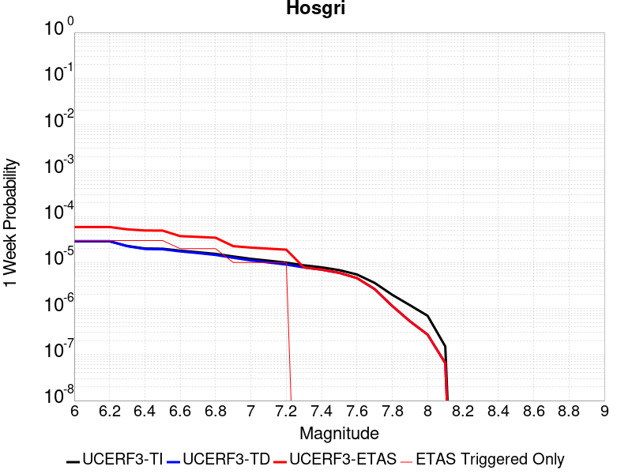 | 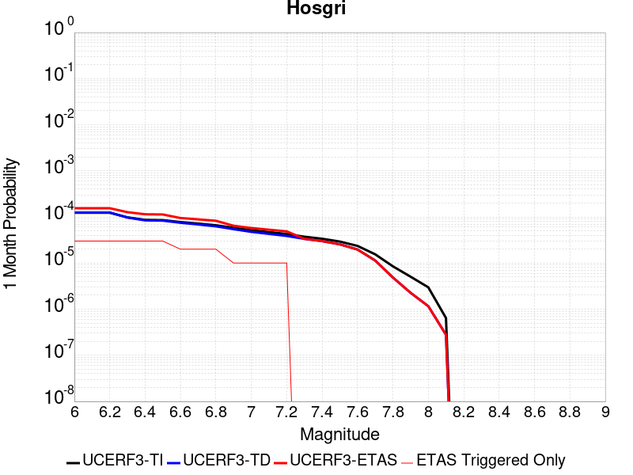 | 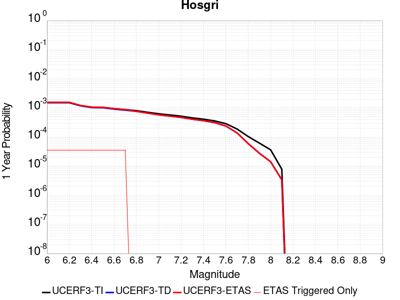 | 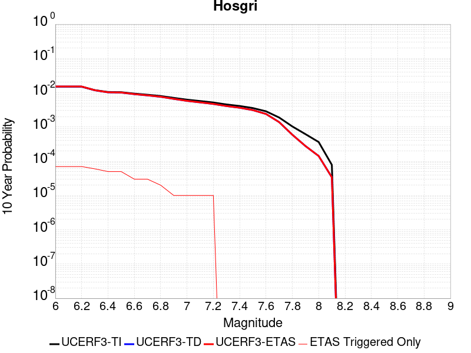 |

| Magnitude | 1 wk TI Prob | 1 wk TD Prob | 1 wk ETAS Prob | 1 wk ETAS/TD Gain | 1 wk ETAS Triggered Only | 1 mo TI Prob | 1 mo TD Prob | 1 mo ETAS Prob | 1 mo ETAS/TD Gain | 1 mo ETAS Triggered Only | 1 yr TI Prob | 1 yr TD Prob | 1 yr ETAS Prob | 1 yr ETAS/TD Gain | 1 yr ETAS Triggered Only | 10 yr TI Prob | 10 yr TD Prob | 10 yr ETAS Prob | 10 yr ETAS/TD Gain | 10 yr ETAS Triggered Only |
|-----|-----|-----|-----|-----|-----|-----|-----|-----|-----|-----|-----|-----|-----|-----|-----|-----|-----|-----|-----|-----|
| 6.0 | 2.883978E-5 | 2.9128416E-5 | 2.9128416E-5 | 1.0 | 0.0 | 1.235932E-4 | 1.2483024E-4 | 1.2483024E-4 | 1.0 | 0.0 | 0.0015037085 | 0.001518776 | 0.0015581669 | 1.025936 | 3.9450842E-5 | 0.01493574 | 0.01508774 | 0.015126595 | 1.0025753 | 3.9450842E-5 |
| 6.1 | 2.883978E-5 | 2.9128416E-5 | 2.9128416E-5 | 1.0 | 0.0 | 1.235932E-4 | 1.2483024E-4 | 1.2483024E-4 | 1.0 | 0.0 | 0.0015037085 | 0.001518776 | 0.0015581669 | 1.025936 | 3.9450842E-5 | 0.01493574 | 0.01508774 | 0.015126595 | 1.0025753 | 3.9450842E-5 |
| 6.2 | 2.883978E-5 | 2.9128416E-5 | 2.9128416E-5 | 1.0 | 0.0 | 1.235932E-4 | 1.2483024E-4 | 1.2483024E-4 | 1.0 | 0.0 | 0.0015037085 | 0.001518776 | 0.0015581669 | 1.025936 | 3.9450842E-5 | 0.01493574 | 0.01508774 | 0.015126595 | 1.0025753 | 3.9450842E-5 |
| 6.3 | 2.2914428E-5 | 2.2641969E-5 | 2.2641969E-5 | 1.0 | 0.0 | 9.8200995E-5 | 9.703343E-5 | 9.703343E-5 | 1.0 | 0.0 | 0.0011949413 | 0.0011807467 | 0.001220151 | 1.0333723 | 3.9450842E-5 | 0.011885363 | 0.011746133 | 0.011785121 | 1.0033191 | 3.9450842E-5 |
| 6.4 | 2.0195741E-5 | 1.969656E-5 | 1.969656E-5 | 1.0 | 0.0 | 8.65503E-5 | 8.4411105E-5 | 8.4411105E-5 | 1.0 | 0.0 | 0.0010532405 | 0.0010272227 | 0.001066633 | 1.0383658 | 3.9450842E-5 | 0.010482626 | 0.010225792 | 0.01026484 | 1.0038185 | 3.9450842E-5 |
| 6.5 | 1.9924333E-5 | 1.940898E-5 | 1.940898E-5 | 1.0 | 0.0 | 8.53872E-5 | 8.3178704E-5 | 8.3178704E-5 | 1.0 | 0.0 | 0.0010390934 | 0.0010122322 | 0.001051643 | 1.0389347 | 3.9450842E-5 | 0.010342481 | 0.010077253 | 0.010116306 | 1.0038754 | 3.9450842E-5 |
| 6.6 | 1.809694E-5 | 1.74583E-5 | 1.74583E-5 | 1.0 | 0.0 | 7.7556004E-5 | 7.4819145E-5 | 7.4819145E-5 | 1.0 | 0.0 | 9.438353E-4 | 9.105437E-4 | 9.499587E-4 | 1.0432873 | 3.9450842E-5 | 0.009398366 | 0.009069073 | 0.009108166 | 1.0043106 | 3.9450842E-5 |
| 6.7 | 1.675989E-5 | 1.6042764E-5 | 1.6042764E-5 | 1.0 | 0.0 | 7.182612E-5 | 6.87529E-5 | 6.87529E-5 | 1.0 | 0.0 | 8.7413215E-4 | 8.3674624E-4 | 8.7616406E-4 | 1.0471084 | 3.9450842E-5 | 0.008707017 | 0.0083368635 | 0.008375986 | 1.0046927 | 3.9450842E-5 |
| 6.8 | 1.5401129E-5 | 1.4614083E-5 | 1.4614083E-5 | 1.0 | 0.0 | 6.6003166E-5 | 6.2630286E-5 | 6.2630286E-5 | 1.0 | 0.0 | 8.032922E-4 | 7.622578E-4 | 7.622578E-4 | 1.0 | 0.0 | 0.008003947 | 0.007597296 | 0.007597296 | 1.0 | 0.0 |
| 6.9 | 1.356559E-5 | 1.2689968E-5 | 1.2689968E-5 | 1.0 | 0.0 | 5.8136946E-5 | 5.4384444E-5 | 5.4384444E-5 | 1.0 | 0.0 | 7.0758746E-4 | 6.619299E-4 | 6.619299E-4 | 1.0 | 0.0 | 0.007053386 | 0.006600388 | 0.006600388 | 1.0 | 0.0 |
| 7.0 | 1.2030819E-5 | 1.1095962E-5 | 1.1095962E-5 | 1.0 | 0.0 | 5.155963E-5 | 4.7553254E-5 | 4.7553254E-5 | 1.0 | 0.0 | 6.275577E-4 | 5.7880714E-4 | 5.7880714E-4 | 1.0 | 0.0 | 0.006257884 | 0.005773757 | 0.005773757 | 1.0 | 0.0 |
| 7.1 | 1.0972698E-5 | 1.0022179E-5 | 1.0022179E-5 | 1.0 | 0.0 | 4.7025E-5 | 4.2951488E-5 | 4.2951488E-5 | 1.0 | 0.0 | 5.72379E-4 | 5.22809E-4 | 5.22809E-4 | 1.0 | 0.0 | 0.0057090693 | 0.005216542 | 0.005216542 | 1.0 | 0.0 |
| 7.2 | 9.961926E-6 | 9.034746E-6 | 9.034746E-6 | 1.0 | 0.0 | 4.2693267E-5 | 3.8719765E-5 | 3.8719765E-5 | 1.0 | 0.0 | 5.1966653E-4 | 4.713112E-4 | 4.713112E-4 | 1.0 | 0.0 | 0.00518453 | 0.0047038626 | 0.0047038626 | 1.0 | 0.0 |
| 7.3 | 8.700929E-6 | 7.8281E-6 | 7.8281E-6 | 1.0 | 0.0 | 3.7289166E-5 | 3.354857E-5 | 3.354857E-5 | 1.0 | 0.0 | 4.53901E-4 | 4.0837732E-4 | 4.0837732E-4 | 1.0 | 0.0 | 0.00452975 | 0.004077008 | 0.004077008 | 1.0 | 0.0 |
| 7.4 | 7.866285E-6 | 6.998739E-6 | 6.998739E-6 | 1.0 | 0.0 | 3.3712215E-5 | 2.9994251E-5 | 2.9994251E-5 | 1.0 | 0.0 | 4.103689E-4 | 3.6511885E-4 | 3.6511885E-4 | 1.0 | 0.0 | 0.004096119 | 0.0036459267 | 0.0036459267 | 1.0 | 0.0 |
| 7.5 | 6.8381305E-6 | 5.9596955E-6 | 5.9596955E-6 | 1.0 | 0.0 | 2.9305946E-5 | 2.5541302E-5 | 2.5541302E-5 | 1.0 | 0.0 | 3.5674145E-4 | 3.10921E-4 | 3.10921E-4 | 1.0 | 0.0 | 0.0035616932 | 0.0031055948 | 0.0031055948 | 1.0 | 0.0 |
| 7.6 | 5.503376E-6 | 4.5952443E-6 | 4.5952443E-6 | 1.0 | 0.0 | 2.3585684E-5 | 1.9693754E-5 | 1.9693754E-5 | 1.0 | 0.0 | 2.8711787E-4 | 2.397451E-4 | 2.397451E-4 | 1.0 | 0.0 | 0.002867472 | 0.0023955975 | 0.0023955975 | 1.0 | 0.0 |
| 7.7 | 3.6144982E-6 | 2.6522112E-6 | 2.6522112E-6 | 1.0 | 0.0 | 1.5490614E-5 | 1.1366569E-5 | 1.1366569E-5 | 1.0 | 0.0 | 1.8858191E-4 | 1.383792E-4 | 1.383792E-4 | 1.0 | 0.0 | 0.0018842196 | 0.0013836613 | 0.0013836613 | 1.0 | 0.0 |
| 7.8 | 1.9853494E-6 | 1.1361129E-6 | 1.1361129E-6 | 1.0 | 0.0 | 8.508612E-6 | 4.8690463E-6 | 4.8690463E-6 | 1.0 | 0.0 | 1.0358743E-4 | 5.9279027E-5 | 5.9279027E-5 | 1.0 | 0.0 | 0.0010353916 | 5.9336185E-4 | 5.9336185E-4 | 1.0 | 0.0 |
| 7.9 | 1.1818757E-6 | 5.2951856E-7 | 5.2951856E-7 | 1.0 | 0.0 | 5.0651715E-6 | 2.2693632E-6 | 2.2693632E-6 | 1.0 | 0.0 | 6.1666724E-5 | 2.7629147E-5 | 2.7629147E-5 | 1.0 | 0.0 | 6.1649614E-4 | 2.7694515E-4 | 2.7694515E-4 | 1.0 | 0.0 |
| 8.0 | 6.962958E-7 | 2.7139782E-7 | 2.7139782E-7 | 1.0 | 0.0 | 2.9841215E-6 | 1.163133E-6 | 1.163133E-6 | 1.0 | 0.0 | 3.6331072E-5 | 1.4161053E-5 | 1.4161053E-5 | 1.0 | 0.0 | 3.6325134E-4 | 1.4217179E-4 | 1.4217179E-4 | 1.0 | 0.0 |
| 8.1 | 1.5033264E-7 | 6.527624E-8 | 6.527624E-8 | 1.0 | 0.0 | 6.442826E-7 | 2.7975528E-7 | 2.7975528E-7 | 1.0 | 0.0 | 7.844113E-6 | 3.4060151E-6 | 3.4060151E-6 | 1.0 | 0.0 | 7.843835E-5 | 3.407693E-5 | 3.407693E-5 | 1.0 | 0.0 |

## Franklin 2011 CFM
*[(top)](#table-of-contents)*

| 1 Week | 1 Month | 1 Year | 10 Year |
|-----|-----|-----|-----|
| 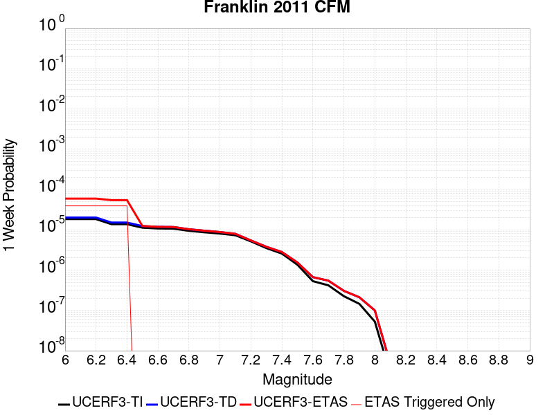 | 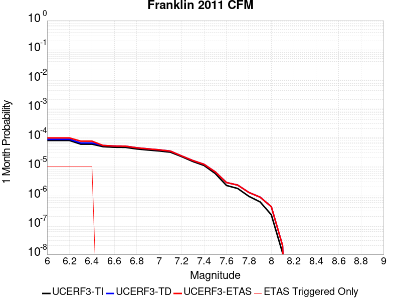 | 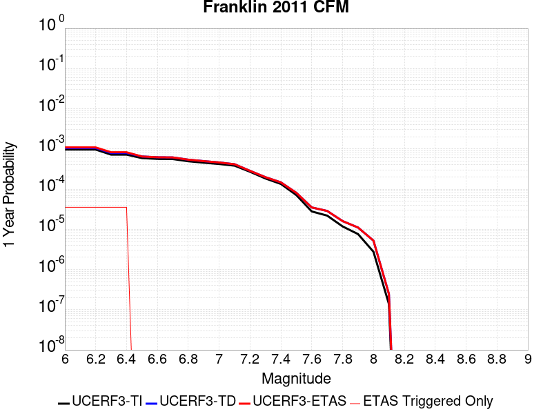 | 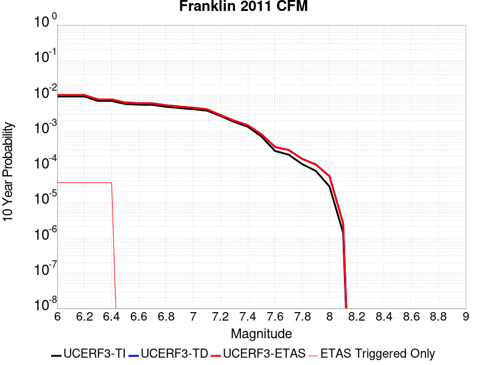 |

| Magnitude | 1 wk TI Prob | 1 wk TD Prob | 1 wk ETAS Prob | 1 wk ETAS/TD Gain | 1 wk ETAS Triggered Only | 1 mo TI Prob | 1 mo TD Prob | 1 mo ETAS Prob | 1 mo ETAS/TD Gain | 1 mo ETAS Triggered Only | 1 yr TI Prob | 1 yr TD Prob | 1 yr ETAS Prob | 1 yr ETAS/TD Gain | 1 yr ETAS Triggered Only | 10 yr TI Prob | 10 yr TD Prob | 10 yr ETAS Prob | 10 yr ETAS/TD Gain | 10 yr ETAS Triggered Only |
|-----|-----|-----|-----|-----|-----|-----|-----|-----|-----|-----|-----|-----|-----|-----|-----|-----|-----|-----|-----|-----|
| 6.0 | 1.845602E-5 | 2.021262E-5 | 5.9662667E-5 | 2.9517531 | 3.9450842E-5 | 7.9094825E-5 | 8.66228E-5 | 1.2607023E-4 | 1.4553931 | 3.9450842E-5 | 9.6255407E-4 | 0.0010541513 | 0.0010935606 | 1.0373849 | 3.9450842E-5 | 0.009583955 | 0.0105088325 | 0.010547868 | 1.0037146 | 3.9450842E-5 |
| 6.1 | 1.845602E-5 | 2.021262E-5 | 5.9662667E-5 | 2.9517531 | 3.9450842E-5 | 7.9094825E-5 | 8.66228E-5 | 1.2607023E-4 | 1.4553931 | 3.9450842E-5 | 9.6255407E-4 | 0.0010541513 | 0.0010935606 | 1.0373849 | 3.9450842E-5 | 0.009583955 | 0.0105088325 | 0.010547868 | 1.0037146 | 3.9450842E-5 |
| 6.2 | 1.845602E-5 | 2.021262E-5 | 5.9662667E-5 | 2.9517531 | 3.9450842E-5 | 7.9094825E-5 | 8.66228E-5 | 1.2607023E-4 | 1.4553931 | 3.9450842E-5 | 9.6255407E-4 | 0.0010541513 | 0.0010935606 | 1.0373849 | 3.9450842E-5 | 0.009583955 | 0.0105088325 | 0.010547868 | 1.0037146 | 3.9450842E-5 |
| 6.3 | 1.3813506E-5 | 1.5154827E-5 | 5.4605072E-5 | 3.6031473 | 3.9450842E-5 | 5.9199396E-5 | 6.4947686E-5 | 1.0439597E-4 | 1.6073855 | 3.9450842E-5 | 7.205143E-4 | 7.9045893E-4 | 8.2987855E-4 | 1.0498693 | 3.9450842E-5 | 0.007181826 | 0.007891679 | 0.007930819 | 1.0049596 | 3.9450842E-5 |
| 6.4 | 1.3813506E-5 | 1.5154827E-5 | 5.4605072E-5 | 3.6031473 | 3.9450842E-5 | 5.9199396E-5 | 6.4947686E-5 | 1.0439597E-4 | 1.6073855 | 3.9450842E-5 | 7.205143E-4 | 7.9045893E-4 | 8.2987855E-4 | 1.0498693 | 3.9450842E-5 | 0.007181826 | 0.007891679 | 0.007930819 | 1.0049596 | 3.9450842E-5 |
| 6.5 | 1.1308949E-5 | 1.24178005E-5 | 1.24178005E-5 | 1.0 | 0.0 | 4.8466023E-5 | 5.3218067E-5 | 5.3218067E-5 | 1.0 | 0.0 | 5.899141E-4 | 6.4773945E-4 | 6.4773945E-4 | 1.0 | 0.0 | 0.0058835056 | 0.006473166 | 0.006473166 | 1.0 | 0.0 |
| 6.6 | 1.0813164E-5 | 1.1876023E-5 | 1.1876023E-5 | 1.0 | 0.0 | 4.6341313E-5 | 5.089626E-5 | 5.089626E-5 | 1.0 | 0.0 | 5.640594E-4 | 6.1948766E-4 | 6.1948766E-4 | 1.0 | 0.0 | 0.005626298 | 0.006192243 | 0.006192243 | 1.0 | 0.0 |
| 6.7 | 1.0706348E-5 | 1.1757787E-5 | 1.1757787E-5 | 1.0 | 0.0 | 4.5883542E-5 | 5.0389554E-5 | 5.0389554E-5 | 1.0 | 0.0 | 5.5848894E-4 | 6.13322E-4 | 6.13322E-4 | 1.0 | 0.0 | 0.005570874 | 0.0061309286 | 0.0061309286 | 1.0 | 0.0 |
| 6.8 | 9.443655E-6 | 1.0349109E-5 | 1.0349109E-5 | 1.0 | 0.0 | 4.0472176E-5 | 4.435258E-5 | 4.435258E-5 | 1.0 | 0.0 | 4.9263734E-4 | 5.398602E-4 | 5.398602E-4 | 1.0 | 0.0 | 0.0049154665 | 0.005400073 | 0.005400073 | 1.0 | 0.0 |
| 6.9 | 8.7001645E-6 | 9.522179E-6 | 9.522179E-6 | 1.0 | 0.0 | 3.728589E-5 | 4.0808707E-5 | 4.0808707E-5 | 1.0 | 0.0 | 4.538611E-4 | 4.96734E-4 | 4.96734E-4 | 1.0 | 0.0 | 0.0045293528 | 0.0049708076 | 0.0049708076 | 1.0 | 0.0 |
| 7.0 | 8.074731E-6 | 8.815796E-6 | 8.815796E-6 | 1.0 | 0.0 | 3.460553E-5 | 3.7781443E-5 | 3.7781443E-5 | 1.0 | 0.0 | 4.212409E-4 | 4.5989305E-4 | 4.5989305E-4 | 1.0 | 0.0 | 0.004204433 | 0.0046039694 | 0.0046039694 | 1.0 | 0.0 |
| 7.1 | 7.3370957E-6 | 7.96167E-6 | 7.96167E-6 | 1.0 | 0.0 | 3.1444317E-5 | 3.4121003E-5 | 3.4121003E-5 | 1.0 | 0.0 | 3.8276732E-4 | 4.1534504E-4 | 4.1534504E-4 | 1.0 | 0.0 | 0.0038210868 | 0.0041600848 | 0.0041600848 | 1.0 | 0.0 |
| 7.2 | 5.1750103E-6 | 5.45711E-6 | 5.45711E-6 | 1.0 | 0.0 | 2.2178427E-5 | 2.3387407E-5 | 2.3387407E-5 | 1.0 | 0.0 | 2.699889E-4 | 2.847048E-4 | 2.847048E-4 | 1.0 | 0.0 | 0.002696611 | 0.0028573172 | 0.0028573172 | 1.0 | 0.0 |
| 7.3 | 3.5221371E-6 | 3.7960522E-6 | 3.7960522E-6 | 1.0 | 0.0 | 1.5094786E-5 | 1.6268694E-5 | 1.6268694E-5 | 1.0 | 0.0 | 1.8376352E-4 | 1.9805344E-4 | 1.9805344E-4 | 1.0 | 0.0 | 0.0018361164 | 0.001992203 | 0.001992203 | 1.0 | 0.0 |
| 7.4 | 2.5749775E-6 | 2.818195E-6 | 2.818195E-6 | 1.0 | 0.0 | 1.1035571E-5 | 1.2077923E-5 | 1.2077923E-5 | 1.0 | 0.0 | 1.343498E-4 | 1.4703887E-4 | 1.4703887E-4 | 1.0 | 0.0 | 0.001342686 | 0.0014816395 | 0.0014816395 | 1.0 | 0.0 |
| 7.5 | 1.3642131E-6 | 1.5497415E-6 | 1.5497415E-6 | 1.0 | 0.0 | 5.8466144E-6 | 6.6417324E-6 | 6.6417324E-6 | 1.0 | 0.0 | 7.1180206E-5 | 8.086011E-5 | 8.086011E-5 | 1.0 | 0.0 | 7.115741E-4 | 8.1911724E-4 | 8.1911724E-4 | 1.0 | 0.0 |
| 7.6 | 5.329124E-7 | 6.70109E-7 | 6.70109E-7 | 1.0 | 0.0 | 2.2839083E-6 | 2.8718923E-6 | 2.8718923E-6 | 1.0 | 0.0 | 2.7806227E-5 | 3.4964734E-5 | 3.4964734E-5 | 1.0 | 0.0 | 2.780275E-4 | 3.5998525E-4 | 3.5998525E-4 | 1.0 | 0.0 |
| 7.7 | 4.199127E-7 | 5.486773E-7 | 5.486773E-7 | 1.0 | 0.0 | 1.7996247E-6 | 2.351472E-6 | 2.351472E-6 | 1.0 | 0.0 | 2.191021E-5 | 2.8628798E-5 | 2.8628798E-5 | 1.0 | 0.0 | 2.190805E-4 | 2.9645552E-4 | 2.9645552E-4 | 1.0 | 0.0 |
| 7.8 | 2.2586491E-7 | 3.066155E-7 | 3.066155E-7 | 1.0 | 0.0 | 9.67992E-7 | 1.3140657E-6 | 1.3140657E-6 | 1.0 | 0.0 | 1.178524E-5 | 1.5998634E-5 | 1.5998634E-5 | 1.0 | 0.0 | 1.17846146E-4 | 1.6628981E-4 | 1.6628981E-4 | 1.0 | 0.0 |
| 7.9 | 1.4568845E-7 | 2.1202585E-7 | 2.1202585E-7 | 1.0 | 0.0 | 6.243789E-7 | 9.086819E-7 | 9.086819E-7 | 1.0 | 0.0 | 7.601787E-6 | 1.1063146E-5 | 1.1063146E-5 | 1.0 | 0.0 | 7.601527E-5 | 1.1508061E-4 | 1.1508061E-4 | 1.0 | 0.0 |
| 8.0 | 5.2868224E-8 | 9.996793E-8 | 9.996793E-8 | 1.0 | 0.0 | 2.2657808E-7 | 4.2843388E-7 | 4.2843388E-7 | 1.0 | 0.0 | 2.7585847E-6 | 5.21617E-6 | 5.21617E-6 | 1.0 | 0.0 | 2.7585504E-5 | 5.4014814E-5 | 5.4014814E-5 | 1.0 | 0.0 |
| 8.1 | 2.654434E-9 | 4.7226045E-9 | 4.7226045E-9 | 1.0 | 0.0 | 1.1376145E-8 | 2.0239735E-8 | 2.0239735E-8 | 1.0 | 0.0 | 1.3850456E-7 | 2.4641872E-7 | 2.4641872E-7 | 1.0 | 0.0 | 1.3850448E-6 | 2.5336271E-6 | 2.5336271E-6 | 1.0 | 0.0 |

## Surprise Valley 2011 CFM
*[(top)](#table-of-contents)*

| 1 Week | 1 Month | 1 Year | 10 Year |
|-----|-----|-----|-----|
| 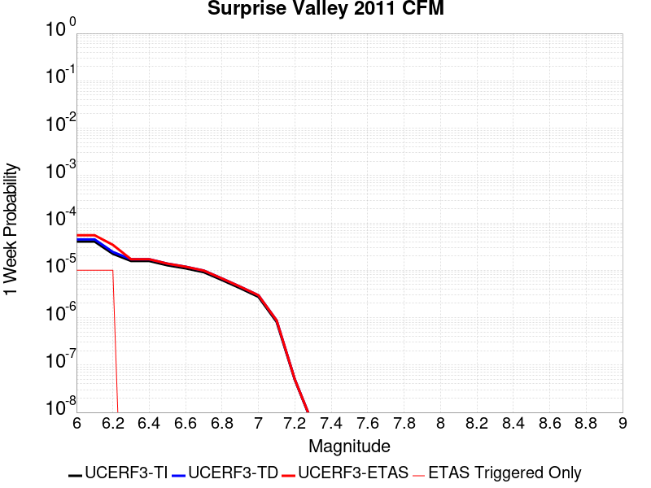 | 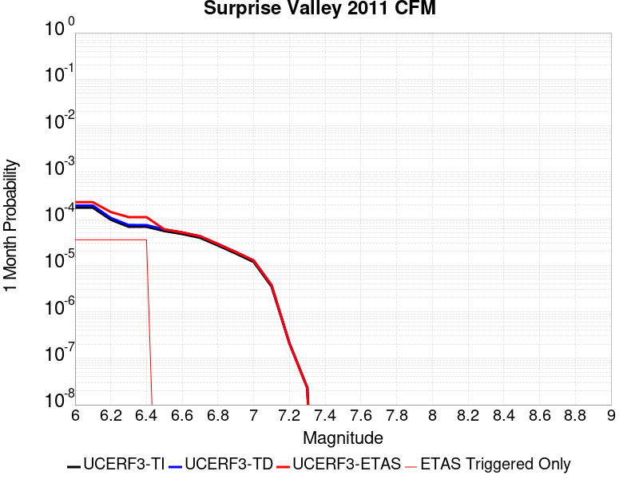 | 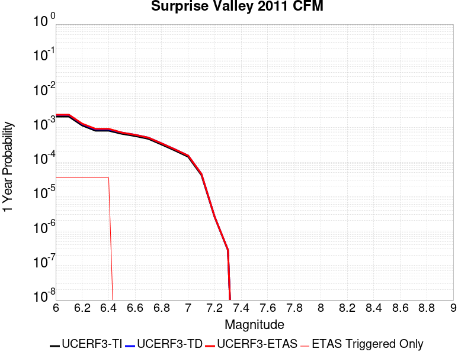 | 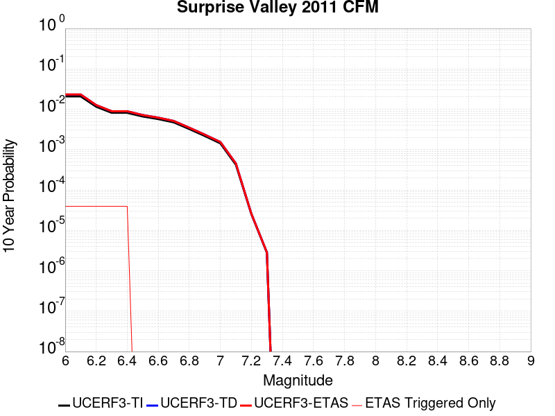 |

| Magnitude | 1 wk TI Prob | 1 wk TD Prob | 1 wk ETAS Prob | 1 wk ETAS/TD Gain | 1 wk ETAS Triggered Only | 1 mo TI Prob | 1 mo TD Prob | 1 mo ETAS Prob | 1 mo ETAS/TD Gain | 1 mo ETAS Triggered Only | 1 yr TI Prob | 1 yr TD Prob | 1 yr ETAS Prob | 1 yr ETAS/TD Gain | 1 yr ETAS Triggered Only | 10 yr TI Prob | 10 yr TD Prob | 10 yr ETAS Prob | 10 yr ETAS/TD Gain | 10 yr ETAS Triggered Only |
|-----|-----|-----|-----|-----|-----|-----|-----|-----|-----|-----|-----|-----|-----|-----|-----|-----|-----|-----|-----|-----|
| 6.0 | 4.0396248E-5 | 4.485131E-5 | 4.485131E-5 | 1.0 | 0.0 | 1.7311527E-4 | 1.9220692E-4 | 2.3165018E-4 | 1.2052125 | 3.9450842E-5 | 0.002105641 | 0.0023378176 | 0.0023771762 | 1.0168356 | 3.9450842E-5 | 0.020858008 | 0.023153966 | 0.023192503 | 1.0016644 | 3.9450842E-5 |
| 6.1 | 4.0396248E-5 | 4.485131E-5 | 4.485131E-5 | 1.0 | 0.0 | 1.7311527E-4 | 1.9220692E-4 | 2.3165018E-4 | 1.2052125 | 3.9450842E-5 | 0.002105641 | 0.0023378176 | 0.0023771762 | 1.0168356 | 3.9450842E-5 | 0.020858008 | 0.023153966 | 0.023192503 | 1.0016644 | 3.9450842E-5 |
| 6.2 | 2.2295266E-5 | 2.440125E-5 | 2.440125E-5 | 1.0 | 0.0 | 9.554764E-5 | 1.0457276E-4 | 1.4401948E-4 | 1.3772179 | 3.9450842E-5 | 0.0011626717 | 0.0012724606 | 0.0013118612 | 1.0309641 | 3.9450842E-5 | 0.011566074 | 0.012654981 | 0.012693932 | 1.003078 | 3.9450842E-5 |
| 6.3 | 1.572643E-5 | 1.7096807E-5 | 1.7096807E-5 | 1.0 | 0.0 | 6.7397246E-5 | 7.327003E-5 | 1.12717986E-4 | 1.5383914 | 3.9450842E-5 | 8.202525E-4 | 8.91708E-4 | 9.311237E-4 | 1.0442024 | 3.9450842E-5 | 0.008172315 | 0.008882407 | 0.008921507 | 1.004402 | 3.9450842E-5 |
| 6.4 | 1.5714395E-5 | 1.7084629E-5 | 1.7084629E-5 | 1.0 | 0.0 | 6.734567E-5 | 7.3217845E-5 | 1.12665795E-4 | 1.5387752 | 3.9450842E-5 | 8.1962504E-4 | 8.9107314E-4 | 9.304888E-4 | 1.0442339 | 3.9450842E-5 | 0.008166086 | 0.008876109 | 0.008915209 | 1.0044051 | 3.9450842E-5 |
| 6.5 | 1.2733495E-5 | 1.38016E-5 | 1.38016E-5 | 1.0 | 0.0 | 5.457098E-5 | 5.9148413E-5 | 5.9148413E-5 | 1.0 | 0.0 | 6.641992E-4 | 7.1990065E-4 | 7.1990065E-4 | 1.0 | 0.0 | 0.0066221743 | 0.0071763797 | 0.0071763797 | 1.0 | 0.0 |
| 6.6 | 1.0983784E-5 | 1.1886554E-5 | 1.1886554E-5 | 1.0 | 0.0 | 4.7072506E-5 | 5.094141E-5 | 5.094141E-5 | 1.0 | 0.0 | 5.7295704E-4 | 6.200405E-4 | 6.200405E-4 | 1.0 | 0.0 | 0.0057148207 | 0.0061836545 | 0.0061836545 | 1.0 | 0.0 |
| 6.7 | 9.104806E-6 | 9.839491E-6 | 9.839491E-6 | 1.0 | 0.0 | 3.902001E-5 | 4.2168587E-5 | 4.2168587E-5 | 1.0 | 0.0 | 4.7496508E-4 | 5.132855E-4 | 5.132855E-4 | 1.0 | 0.0 | 0.004739512 | 0.005121397 | 0.005121397 | 1.0 | 0.0 |
| 6.8 | 6.2162403E-6 | 6.7041337E-6 | 6.7041337E-6 | 1.0 | 0.0 | 2.6640759E-5 | 2.8731698E-5 | 2.8731698E-5 | 1.0 | 0.0 | 3.2430296E-4 | 3.497545E-4 | 3.497545E-4 | 1.0 | 0.0 | 0.003238301 | 0.0034922638 | 0.0034922638 | 1.0 | 0.0 |
| 6.9 | 4.1792696E-6 | 4.50323E-6 | 4.50323E-6 | 1.0 | 0.0 | 1.7911032E-5 | 1.9299423E-5 | 1.9299423E-5 | 1.0 | 0.0 | 2.1804498E-4 | 2.3494668E-4 | 2.3494668E-4 | 1.0 | 0.0 | 0.0021783116 | 0.0023471361 | 0.0023471361 | 1.0 | 0.0 |
| 7.0 | 2.7478413E-6 | 2.9622424E-6 | 2.9622424E-6 | 1.0 | 0.0 | 1.177641E-5 | 1.269527E-5 | 1.269527E-5 | 1.0 | 0.0 | 1.4336836E-4 | 1.545552E-4 | 1.545552E-4 | 1.0 | 0.0 | 0.001432759 | 0.0015445995 | 0.0015445995 | 1.0 | 0.0 |
| 7.1 | 8.128648E-7 | 8.724922E-7 | 8.724922E-7 | 1.0 | 0.0 | 3.4837017E-6 | 3.7392501E-6 | 3.7392501E-6 | 1.0 | 0.0 | 4.2413245E-5 | 4.552502E-5 | 4.552502E-5 | 1.0 | 0.0 | 4.2405148E-4 | 4.5521575E-4 | 4.5521575E-4 | 1.0 | 0.0 |
| 7.2 | 4.8641045E-8 | 4.9402068E-8 | 4.9402068E-8 | 1.0 | 0.0 | 2.084616E-7 | 2.1172312E-7 | 2.1172312E-7 | 1.0 | 0.0 | 2.538017E-6 | 2.577726E-6 | 2.577726E-6 | 1.0 | 0.0 | 2.537988E-5 | 2.5776973E-5 | 2.5776973E-5 | 1.0 | 0.0 |
| 7.3 | 5.3911844E-9 | 5.4758145E-9 | 5.4758145E-9 | 1.0 | 0.0 | 2.3105075E-8 | 2.3467775E-8 | 2.3467775E-8 | 1.0 | 0.0 | 2.8130427E-7 | 2.8572015E-7 | 2.8572015E-7 | 1.0 | 0.0 | 2.8130391E-6 | 2.8571992E-6 | 2.8571992E-6 | 1.0 | 0.0 |

## Great Valley 08 (Quinto)
*[(top)](#table-of-contents)*

| 1 Week | 1 Month | 1 Year | 10 Year |
|-----|-----|-----|-----|
|  |  | 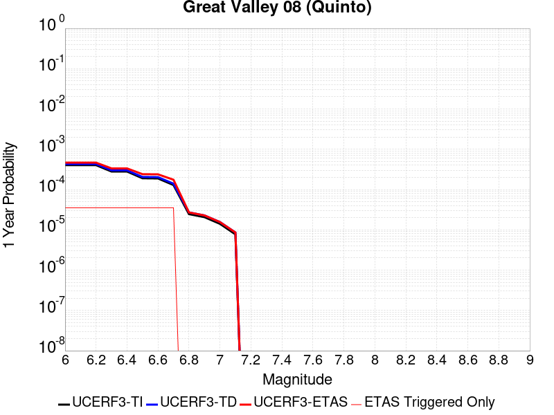 |  |

| Magnitude | 1 wk TI Prob | 1 wk TD Prob | 1 wk ETAS Prob | 1 wk ETAS/TD Gain | 1 wk ETAS Triggered Only | 1 mo TI Prob | 1 mo TD Prob | 1 mo ETAS Prob | 1 mo ETAS/TD Gain | 1 mo ETAS Triggered Only | 1 yr TI Prob | 1 yr TD Prob | 1 yr ETAS Prob | 1 yr ETAS/TD Gain | 1 yr ETAS Triggered Only | 10 yr TI Prob | 10 yr TD Prob | 10 yr ETAS Prob | 10 yr ETAS/TD Gain | 10 yr ETAS Triggered Only |
|-----|-----|-----|-----|-----|-----|-----|-----|-----|-----|-----|-----|-----|-----|-----|-----|-----|-----|-----|-----|-----|
| 6.0 | 7.737697E-6 | 8.253038E-6 | 8.253038E-6 | 1.0 | 0.0 | 3.3161137E-5 | 3.536979E-5 | 3.536979E-5 | 1.0 | 0.0 | 4.0366207E-4 | 4.3056096E-4 | 4.6999482E-4 | 1.0915872 | 3.9450842E-5 | 0.004029296 | 0.0042991205 | 0.004338402 | 1.009137 | 3.9450842E-5 |
| 6.1 | 7.737697E-6 | 8.253038E-6 | 8.253038E-6 | 1.0 | 0.0 | 3.3161137E-5 | 3.536979E-5 | 3.536979E-5 | 1.0 | 0.0 | 4.0366207E-4 | 4.3056096E-4 | 4.6999482E-4 | 1.0915872 | 3.9450842E-5 | 0.004029296 | 0.0042991205 | 0.004338402 | 1.009137 | 3.9450842E-5 |
| 6.2 | 7.737697E-6 | 8.253038E-6 | 8.253038E-6 | 1.0 | 0.0 | 3.3161137E-5 | 3.536979E-5 | 3.536979E-5 | 1.0 | 0.0 | 4.0366207E-4 | 4.3056096E-4 | 4.6999482E-4 | 1.0915872 | 3.9450842E-5 | 0.004029296 | 0.0042991205 | 0.004338402 | 1.009137 | 3.9450842E-5 |
| 6.3 | 5.374012E-6 | 5.7505736E-6 | 5.7505736E-6 | 1.0 | 0.0 | 2.3031276E-5 | 2.4645145E-5 | 2.4645145E-5 | 1.0 | 0.0 | 2.803697E-4 | 3.0002446E-4 | 3.3946347E-4 | 1.1314527 | 3.9450842E-5 | 0.0028001624 | 0.0029972875 | 0.00303662 | 1.0131227 | 3.9450842E-5 |
| 6.4 | 5.374012E-6 | 5.7505736E-6 | 5.7505736E-6 | 1.0 | 0.0 | 2.3031276E-5 | 2.4645145E-5 | 2.4645145E-5 | 1.0 | 0.0 | 2.803697E-4 | 3.0002446E-4 | 3.3946347E-4 | 1.1314527 | 3.9450842E-5 | 0.0028001624 | 0.0029972875 | 0.00303662 | 1.0131227 | 3.9450842E-5 |
| 6.5 | 3.65427E-6 | 3.941324E-6 | 3.941324E-6 | 1.0 | 0.0 | 1.5661062E-5 | 1.689132E-5 | 1.689132E-5 | 1.0 | 0.0 | 1.9065675E-4 | 2.0563944E-4 | 2.450822E-4 | 1.1918052 | 3.9450842E-5 | 0.0019049325 | 0.0020551833 | 0.002094553 | 1.0191563 | 3.9450842E-5 |
| 6.6 | 3.6143538E-6 | 3.8985104E-6 | 3.8985104E-6 | 1.0 | 0.0 | 1.5489995E-5 | 1.6707834E-5 | 1.6707834E-5 | 1.0 | 0.0 | 1.8857437E-4 | 2.0340596E-4 | 2.4284878E-4 | 1.1939118 | 3.9450842E-5 | 0.0018841444 | 0.0020328893 | 0.00207226 | 1.0193669 | 3.9450842E-5 |
| 6.7 | 2.4821015E-6 | 2.6857067E-6 | 2.6857067E-6 | 1.0 | 0.0 | 1.0637535E-5 | 1.1510153E-5 | 1.1510153E-5 | 1.0 | 0.0 | 1.2950429E-4 | 1.4013276E-4 | 1.7957807E-4 | 1.2814853 | 3.9450842E-5 | 0.0012942884 | 0.0014009989 | 0.0014403944 | 1.0281197 | 3.9450842E-5 |
| 6.8 | 4.7110538E-7 | 5.193021E-7 | 5.193021E-7 | 1.0 | 0.0 | 2.0190216E-6 | 2.2255786E-6 | 2.2255786E-6 | 1.0 | 0.0 | 2.458131E-5 | 2.70961E-5 | 2.70961E-5 | 1.0 | 0.0 | 2.457859E-4 | 2.7092977E-4 | 2.7092977E-4 | 1.0 | 0.0 |
| 6.9 | 3.958685E-7 | 4.3703452E-7 | 4.3703452E-7 | 1.0 | 0.0 | 1.6965782E-6 | 1.8730038E-6 | 1.8730038E-6 | 1.0 | 0.0 | 2.0655643E-5 | 2.28036E-5 | 2.28036E-5 | 1.0 | 0.0 | 2.0653724E-4 | 2.2801422E-4 | 2.2801422E-4 | 1.0 | 0.0 |
| 7.0 | 2.70294E-7 | 2.9920008E-7 | 2.9920008E-7 | 1.0 | 0.0 | 1.1584025E-6 | 1.2822856E-6 | 1.2822856E-6 | 1.0 | 0.0 | 1.4103458E-5 | 1.5611728E-5 | 1.5611728E-5 | 1.0 | 0.0 | 1.4102564E-4 | 1.5610759E-4 | 1.5610759E-4 | 1.0 | 0.0 |
| 7.1 | 1.4828602E-7 | 1.6469107E-7 | 1.6469107E-7 | 1.0 | 0.0 | 6.3551136E-7 | 7.058187E-7 | 7.058187E-7 | 1.0 | 0.0 | 7.737323E-6 | 8.593317E-6 | 8.593317E-6 | 1.0 | 0.0 | 7.737054E-5 | 8.593065E-5 | 8.593065E-5 | 1.0 | 0.0 |

## Earthquake Valley (So Extension)
*[(top)](#table-of-contents)*

| 1 Week | 1 Month | 1 Year | 10 Year |
|-----|-----|-----|-----|
|  | 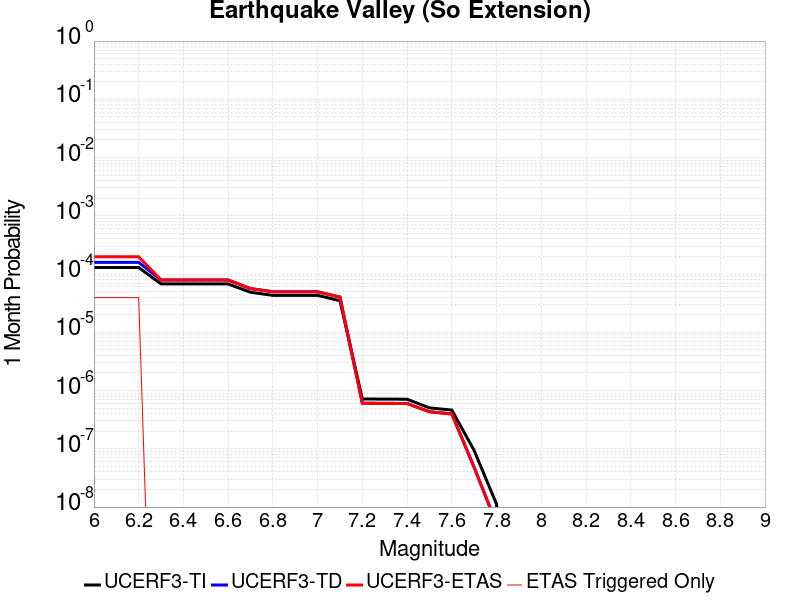 | 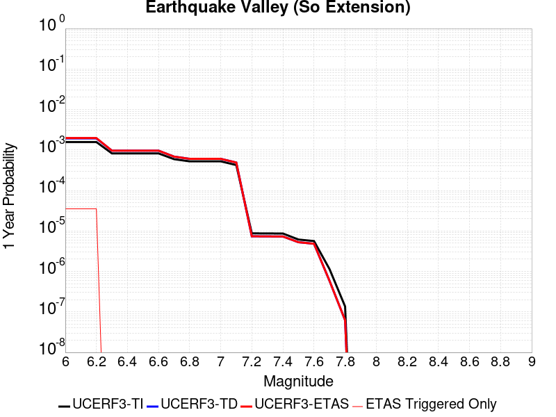 | 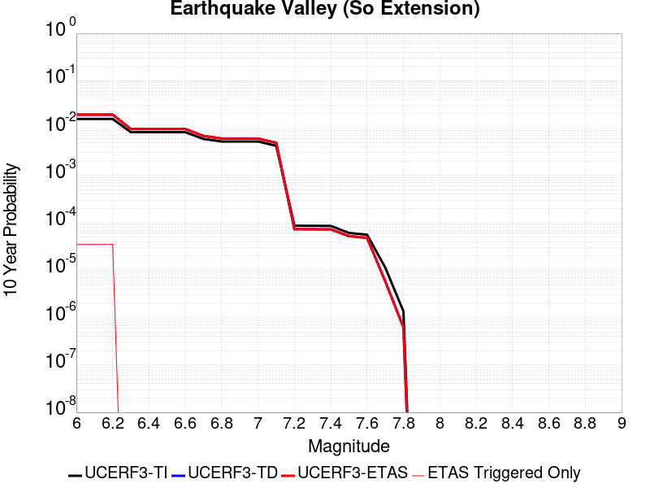 |

| Magnitude | 1 wk TI Prob | 1 wk TD Prob | 1 wk ETAS Prob | 1 wk ETAS/TD Gain | 1 wk ETAS Triggered Only | 1 mo TI Prob | 1 mo TD Prob | 1 mo ETAS Prob | 1 mo ETAS/TD Gain | 1 mo ETAS Triggered Only | 1 yr TI Prob | 1 yr TD Prob | 1 yr ETAS Prob | 1 yr ETAS/TD Gain | 1 yr ETAS Triggered Only | 10 yr TI Prob | 10 yr TD Prob | 10 yr ETAS Prob | 10 yr ETAS/TD Gain | 10 yr ETAS Triggered Only |
|-----|-----|-----|-----|-----|-----|-----|-----|-----|-----|-----|-----|-----|-----|-----|-----|-----|-----|-----|-----|-----|
| 6.0 | 3.0194888E-5 | 3.7072114E-5 | 3.7072114E-5 | 1.0 | 0.0 | 1.2940024E-4 | 1.5887388E-4 | 1.9831845E-4 | 1.248276 | 3.9450842E-5 | 0.0015743093 | 0.0019331174 | 0.001972492 | 1.0203685 | 3.9450842E-5 | 0.01563203 | 0.019213019 | 0.019251712 | 1.0020139 | 3.9450842E-5 |
| 6.1 | 3.0194888E-5 | 3.7072114E-5 | 3.7072114E-5 | 1.0 | 0.0 | 1.2940024E-4 | 1.5887388E-4 | 1.9831845E-4 | 1.248276 | 3.9450842E-5 | 0.0015743093 | 0.0019331174 | 0.001972492 | 1.0203685 | 3.9450842E-5 | 0.01563203 | 0.019213019 | 0.019251712 | 1.0020139 | 3.9450842E-5 |
| 6.2 | 3.0194888E-5 | 3.7072114E-5 | 3.7072114E-5 | 1.0 | 0.0 | 1.2940024E-4 | 1.5887388E-4 | 1.9831845E-4 | 1.248276 | 3.9450842E-5 | 0.0015743093 | 0.0019331174 | 0.001972492 | 1.0203685 | 3.9450842E-5 | 0.01563203 | 0.019213019 | 0.019251712 | 1.0020139 | 3.9450842E-5 |
| 6.3 | 1.5795305E-5 | 1.844658E-5 | 1.844658E-5 | 1.0 | 0.0 | 6.769241E-5 | 7.9055004E-5 | 7.9055004E-5 | 1.0 | 0.0 | 8.238434E-4 | 9.6218096E-4 | 9.6218096E-4 | 1.0 | 0.0 | 0.008207959 | 0.009591061 | 0.009591061 | 1.0 | 0.0 |
| 6.4 | 1.5795305E-5 | 1.844658E-5 | 1.844658E-5 | 1.0 | 0.0 | 6.769241E-5 | 7.9055004E-5 | 7.9055004E-5 | 1.0 | 0.0 | 8.238434E-4 | 9.6218096E-4 | 9.6218096E-4 | 1.0 | 0.0 | 0.008207959 | 0.009591061 | 0.009591061 | 1.0 | 0.0 |
| 6.5 | 1.5795305E-5 | 1.844658E-5 | 1.844658E-5 | 1.0 | 0.0 | 6.769241E-5 | 7.9055004E-5 | 7.9055004E-5 | 1.0 | 0.0 | 8.238434E-4 | 9.6218096E-4 | 9.6218096E-4 | 1.0 | 0.0 | 0.008207959 | 0.009591061 | 0.009591061 | 1.0 | 0.0 |
| 6.6 | 1.5795305E-5 | 1.844658E-5 | 1.844658E-5 | 1.0 | 0.0 | 6.769241E-5 | 7.9055004E-5 | 7.9055004E-5 | 1.0 | 0.0 | 8.238434E-4 | 9.6218096E-4 | 9.6218096E-4 | 1.0 | 0.0 | 0.008207959 | 0.009591061 | 0.009591061 | 1.0 | 0.0 |
| 6.7 | 1.1363076E-5 | 1.3138294E-5 | 1.3138294E-5 | 1.0 | 0.0 | 4.8697988E-5 | 5.6306188E-5 | 5.6306188E-5 | 1.0 | 0.0 | 5.927367E-4 | 6.8538834E-4 | 6.8538834E-4 | 1.0 | 0.0 | 0.0059115817 | 0.0068402183 | 0.0068402183 | 1.0 | 0.0 |
| 6.8 | 1.0049611E-5 | 1.1594334E-5 | 1.1594334E-5 | 1.0 | 0.0 | 4.306905E-5 | 4.9689468E-5 | 4.9689468E-5 | 1.0 | 0.0 | 5.242395E-4 | 6.048745E-4 | 6.048745E-4 | 1.0 | 0.0 | 0.0052300454 | 0.006039458 | 0.006039458 | 1.0 | 0.0 |
| 6.9 | 1.0049611E-5 | 1.1594334E-5 | 1.1594334E-5 | 1.0 | 0.0 | 4.306905E-5 | 4.9689468E-5 | 4.9689468E-5 | 1.0 | 0.0 | 5.242395E-4 | 6.048745E-4 | 6.048745E-4 | 1.0 | 0.0 | 0.0052300454 | 0.006039458 | 0.006039458 | 1.0 | 0.0 |
| 7.0 | 1.0049611E-5 | 1.1594334E-5 | 1.1594334E-5 | 1.0 | 0.0 | 4.306905E-5 | 4.9689468E-5 | 4.9689468E-5 | 1.0 | 0.0 | 5.242395E-4 | 6.048745E-4 | 6.048745E-4 | 1.0 | 0.0 | 0.0052300454 | 0.006039458 | 0.006039458 | 1.0 | 0.0 |
| 7.1 | 8.140254E-6 | 9.383458E-6 | 9.383458E-6 | 1.0 | 0.0 | 3.4886336E-5 | 4.0214578E-5 | 4.0214578E-5 | 1.0 | 0.0 | 4.2465836E-4 | 4.8956956E-4 | 4.8956956E-4 | 1.0 | 0.0 | 0.0042384774 | 0.0048914864 | 0.0048914864 | 1.0 | 0.0 |
| 7.2 | 1.673835E-7 | 1.4154125E-7 | 1.4154125E-7 | 1.0 | 0.0 | 7.173577E-7 | 6.066052E-7 | 6.066052E-7 | 1.0 | 0.0 | 8.733795E-6 | 7.385397E-6 | 7.385397E-6 | 1.0 | 0.0 | 8.733451E-5 | 7.385187E-5 | 7.385187E-5 | 1.0 | 0.0 |
| 7.3 | 1.6632116E-7 | 1.4052354E-7 | 1.4052354E-7 | 1.0 | 0.0 | 7.1280476E-7 | 6.0224363E-7 | 6.0224363E-7 | 1.0 | 0.0 | 8.678364E-6 | 7.332295E-6 | 7.332295E-6 | 1.0 | 0.0 | 8.6780245E-5 | 7.332089E-5 | 7.332089E-5 | 1.0 | 0.0 |
| 7.4 | 1.6569169E-7 | 1.3996983E-7 | 1.3996983E-7 | 1.0 | 0.0 | 7.1010703E-7 | 5.9987053E-7 | 5.9987053E-7 | 1.0 | 0.0 | 8.645519E-6 | 7.303403E-6 | 7.303403E-6 | 1.0 | 0.0 | 8.645182E-5 | 7.303199E-5 | 7.303199E-5 | 1.0 | 0.0 |
| 7.5 | 1.1764555E-7 | 1.0095917E-7 | 1.0095917E-7 | 1.0 | 0.0 | 5.041951E-7 | 4.326821E-7 | 4.326821E-7 | 1.0 | 0.0 | 6.138558E-6 | 5.267894E-6 | 5.267894E-6 | 1.0 | 0.0 | 6.1383886E-5 | 5.2677904E-5 | 5.2677904E-5 | 1.0 | 0.0 |
| 7.6 | 1.07927605E-7 | 9.260736E-8 | 9.260736E-8 | 1.0 | 0.0 | 4.6254678E-7 | 3.9688865E-7 | 3.9688865E-7 | 1.0 | 0.0 | 5.6314925E-6 | 4.832111E-6 | 4.832111E-6 | 1.0 | 0.0 | 5.63135E-5 | 4.8320264E-5 | 4.8320264E-5 | 1.0 | 0.0 |
| 7.7 | 2.1826905E-8 | 1.1180516E-8 | 1.1180516E-8 | 1.0 | 0.0 | 9.3543875E-8 | 4.7916494E-8 | 4.7916494E-8 | 1.0 | 0.0 | 1.1388961E-6 | 5.833832E-7 | 5.833832E-7 | 1.0 | 0.0 | 1.1388902E-5 | 5.8338223E-6 | 5.8338223E-6 | 1.0 | 0.0 |
| 7.8 | 2.6169649E-9 | 1.1969472E-9 | 1.1969472E-9 | 1.0 | 0.0 | 1.1215564E-8 | 5.1297735E-9 | 5.1297735E-9 | 1.0 | 0.0 | 1.3654947E-7 | 6.2454994E-8 | 6.2454994E-8 | 1.0 | 0.0 | 1.365494E-6 | 6.245499E-7 | 6.245499E-7 | 1.0 | 0.0 |

## Clamshell-Sawpit
*[(top)](#table-of-contents)*

| 1 Week | 1 Month | 1 Year | 10 Year |
|-----|-----|-----|-----|
|  | 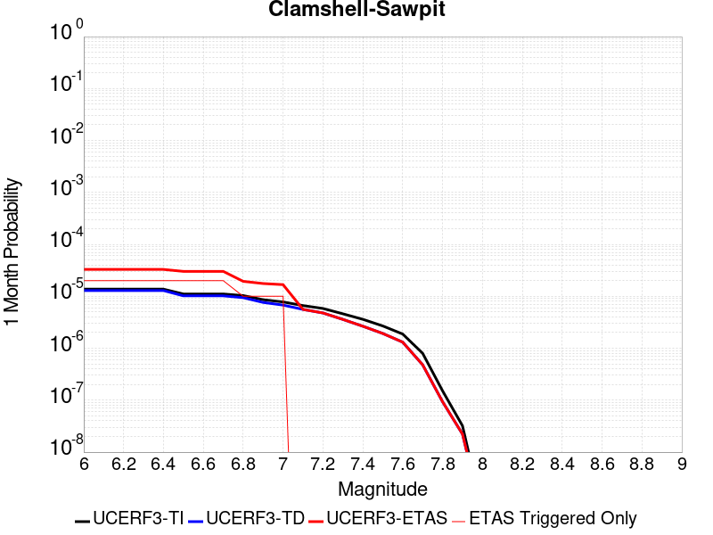 | 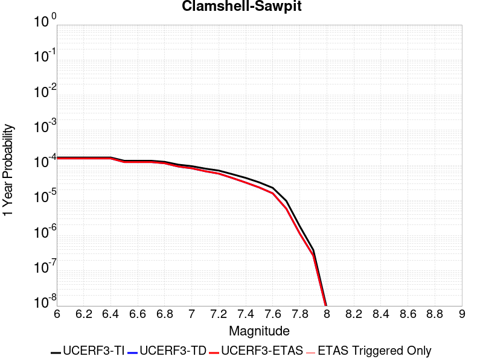 | 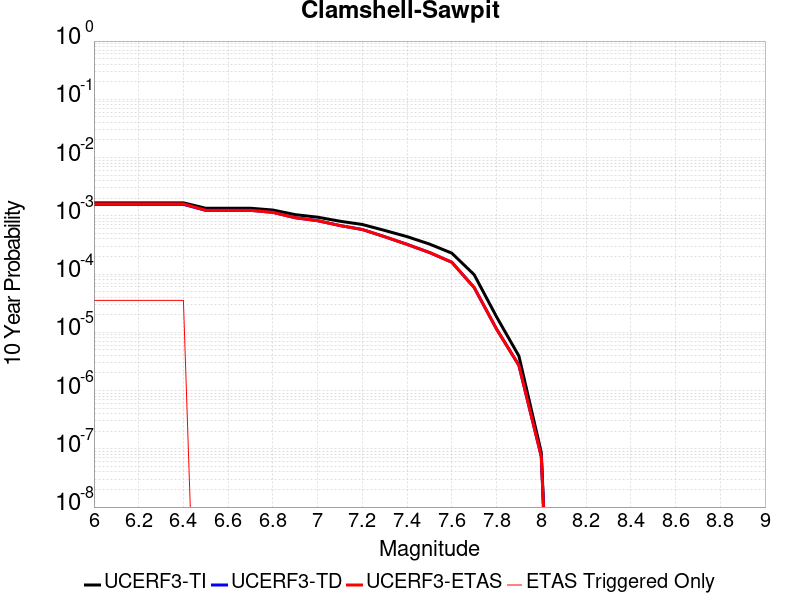 |

| Magnitude | 1 wk TI Prob | 1 wk TD Prob | 1 wk ETAS Prob | 1 wk ETAS/TD Gain | 1 wk ETAS Triggered Only | 1 mo TI Prob | 1 mo TD Prob | 1 mo ETAS Prob | 1 mo ETAS/TD Gain | 1 mo ETAS Triggered Only | 1 yr TI Prob | 1 yr TD Prob | 1 yr ETAS Prob | 1 yr ETAS/TD Gain | 1 yr ETAS Triggered Only | 10 yr TI Prob | 10 yr TD Prob | 10 yr ETAS Prob | 10 yr ETAS/TD Gain | 10 yr ETAS Triggered Only |
|-----|-----|-----|-----|-----|-----|-----|-----|-----|-----|-----|-----|-----|-----|-----|-----|-----|-----|-----|-----|-----|
| 6.0 | 3.202998E-6 | 3.0127644E-6 | 3.0127644E-6 | 1.0 | 0.0 | 1.3727062E-5 | 1.2911788E-5 | 1.2911788E-5 | 1.0 | 0.0 | 1.6711417E-4 | 1.5719049E-4 | 1.5719049E-4 | 1.0 | 0.0 | 0.0016698855 | 0.0015708724 | 0.0016102612 | 1.0250745 | 3.9450842E-5 |
| 6.1 | 3.202998E-6 | 3.0127644E-6 | 3.0127644E-6 | 1.0 | 0.0 | 1.3727062E-5 | 1.2911788E-5 | 1.2911788E-5 | 1.0 | 0.0 | 1.6711417E-4 | 1.5719049E-4 | 1.5719049E-4 | 1.0 | 0.0 | 0.0016698855 | 0.0015708724 | 0.0016102612 | 1.0250745 | 3.9450842E-5 |
| 6.2 | 3.202998E-6 | 3.0127644E-6 | 3.0127644E-6 | 1.0 | 0.0 | 1.3727062E-5 | 1.2911788E-5 | 1.2911788E-5 | 1.0 | 0.0 | 1.6711417E-4 | 1.5719049E-4 | 1.5719049E-4 | 1.0 | 0.0 | 0.0016698855 | 0.0015708724 | 0.0016102612 | 1.0250745 | 3.9450842E-5 |
| 6.3 | 3.202998E-6 | 3.0127644E-6 | 3.0127644E-6 | 1.0 | 0.0 | 1.3727062E-5 | 1.2911788E-5 | 1.2911788E-5 | 1.0 | 0.0 | 1.6711417E-4 | 1.5719049E-4 | 1.5719049E-4 | 1.0 | 0.0 | 0.0016698855 | 0.0015708724 | 0.0016102612 | 1.0250745 | 3.9450842E-5 |
| 6.4 | 3.202998E-6 | 3.0127644E-6 | 3.0127644E-6 | 1.0 | 0.0 | 1.3727062E-5 | 1.2911788E-5 | 1.2911788E-5 | 1.0 | 0.0 | 1.6711417E-4 | 1.5719049E-4 | 1.5719049E-4 | 1.0 | 0.0 | 0.0016698855 | 0.0015708724 | 0.0016102612 | 1.0250745 | 3.9450842E-5 |
| 6.5 | 2.5862723E-6 | 2.380775E-6 | 2.380775E-6 | 1.0 | 0.0 | 1.1083977E-5 | 1.0203283E-5 | 1.0203283E-5 | 1.0 | 0.0 | 1.3493907E-4 | 1.2421819E-4 | 1.2421819E-4 | 1.0 | 0.0 | 0.0013485716 | 0.0012415178 | 0.0012415178 | 1.0 | 0.0 |
| 6.6 | 2.5862723E-6 | 2.380775E-6 | 2.380775E-6 | 1.0 | 0.0 | 1.1083977E-5 | 1.0203283E-5 | 1.0203283E-5 | 1.0 | 0.0 | 1.3493907E-4 | 1.2421819E-4 | 1.2421819E-4 | 1.0 | 0.0 | 0.0013485716 | 0.0012415178 | 0.0012415178 | 1.0 | 0.0 |
| 6.7 | 2.5862723E-6 | 2.380775E-6 | 2.380775E-6 | 1.0 | 0.0 | 1.1083977E-5 | 1.0203283E-5 | 1.0203283E-5 | 1.0 | 0.0 | 1.3493907E-4 | 1.2421819E-4 | 1.2421819E-4 | 1.0 | 0.0 | 0.0013485716 | 0.0012415178 | 0.0012415178 | 1.0 | 0.0 |
| 6.8 | 2.4098806E-6 | 2.1977307E-6 | 2.1977307E-6 | 1.0 | 0.0 | 1.0328019E-5 | 9.4188135E-6 | 9.4188135E-6 | 1.0 | 0.0 | 1.2573638E-4 | 1.1466829E-4 | 1.1466829E-4 | 1.0 | 0.0 | 0.0012566525 | 0.0011461178 | 0.0011461178 | 1.0 | 0.0 |
| 6.9 | 2.0073985E-6 | 1.7784248E-6 | 1.7784248E-6 | 1.0 | 0.0 | 8.603109E-6 | 7.621799E-6 | 7.621799E-6 | 1.0 | 0.0 | 1.0473781E-4 | 9.279157E-5 | 9.279157E-5 | 1.0 | 0.0 | 0.0010468846 | 9.275401E-4 | 9.275401E-4 | 1.0 | 0.0 |
| 7.0 | 1.8166766E-6 | 1.5807095E-6 | 1.5807095E-6 | 1.0 | 0.0 | 7.785734E-6 | 6.7744522E-6 | 6.7744522E-6 | 1.0 | 0.0 | 9.478718E-5 | 8.247593E-5 | 8.247593E-5 | 1.0 | 0.0 | 9.4746763E-4 | 8.244633E-4 | 8.244633E-4 | 1.0 | 0.0 |
| 7.1 | 1.5471421E-6 | 1.3052961E-6 | 1.3052961E-6 | 1.0 | 0.0 | 6.6305925E-6 | 5.5941146E-6 | 5.5941146E-6 | 1.0 | 0.0 | 8.072447E-5 | 6.8106274E-5 | 6.8106274E-5 | 1.0 | 0.0 | 8.0695155E-4 | 6.808595E-4 | 6.808595E-4 | 1.0 | 0.0 |
| 7.2 | 1.3608037E-6 | 1.1153443E-6 | 1.1153443E-6 | 1.0 | 0.0 | 5.8320024E-6 | 4.7800386E-6 | 4.7800386E-6 | 1.0 | 0.0 | 7.1002316E-5 | 5.8195463E-5 | 5.8195463E-5 | 1.0 | 0.0 | 7.097964E-4 | 5.818069E-4 | 5.818069E-4 | 1.0 | 0.0 |
| 7.3 | 1.0749634E-6 | 8.384254E-7 | 8.384254E-7 | 1.0 | 0.0 | 4.6069777E-6 | 3.593247E-6 | 3.593247E-6 | 1.0 | 0.0 | 5.608851E-5 | 4.374693E-5 | 4.374693E-5 | 1.0 | 0.0 | 5.6074356E-4 | 4.37386E-4 | 4.37386E-4 | 1.0 | 0.0 |
| 7.4 | 8.416856E-7 | 6.200048E-7 | 6.200048E-7 | 1.0 | 0.0 | 3.607219E-6 | 2.6571608E-6 | 2.6571608E-6 | 1.0 | 0.0 | 4.3917007E-5 | 3.2350472E-5 | 3.2350472E-5 | 1.0 | 0.0 | 4.390833E-4 | 3.2345962E-4 | 3.2345962E-4 | 1.0 | 0.0 |
| 7.5 | 6.2779594E-7 | 4.496886E-7 | 4.496886E-7 | 1.0 | 0.0 | 2.6905511E-6 | 1.9272356E-6 | 1.9272356E-6 | 1.0 | 0.0 | 3.275697E-5 | 2.346386E-5 | 2.346386E-5 | 1.0 | 0.0 | 3.275214E-4 | 2.346157E-4 | 2.346157E-4 | 1.0 | 0.0 |
| 7.6 | 4.3822078E-7 | 3.0595405E-7 | 3.0595405E-7 | 1.0 | 0.0 | 1.8780877E-6 | 1.311231E-6 | 1.311231E-6 | 1.0 | 0.0 | 2.2865479E-5 | 1.5964137E-5 | 1.5964137E-5 | 1.0 | 0.0 | 2.2863125E-4 | 1.5963144E-4 | 1.5963144E-4 | 1.0 | 0.0 |
| 7.7 | 1.8704569E-7 | 1.12379205E-7 | 1.12379205E-7 | 1.0 | 0.0 | 8.0162414E-7 | 4.816251E-7 | 4.816251E-7 | 1.0 | 0.0 | 9.75973E-6 | 5.86377E-6 | 5.86377E-6 | 1.0 | 0.0 | 9.7593016E-5 | 5.863622E-5 | 5.863622E-5 | 1.0 | 0.0 |
| 7.8 | 3.5378733E-8 | 2.1838144E-8 | 2.1838144E-8 | 1.0 | 0.0 | 1.5162313E-7 | 9.359204E-8 | 9.359204E-8 | 1.0 | 0.0 | 1.84601E-6 | 1.1394826E-6 | 1.1394826E-6 | 1.0 | 0.0 | 1.8459947E-5 | 1.139477E-5 | 1.139477E-5 | 1.0 | 0.0 |
| 7.9 | 7.504945E-9 | 5.1920326E-9 | 5.1920326E-9 | 1.0 | 0.0 | 3.2164053E-8 | 2.225157E-8 | 2.225157E-8 | 1.0 | 0.0 | 3.9159727E-7 | 2.7091284E-7 | 2.7091284E-7 | 1.0 | 0.0 | 3.915966E-6 | 2.7091257E-6 | 2.7091257E-6 | 1.0 | 0.0 |
| 8.0 | 1.6554036E-10 | 1.4180768E-10 | 1.4180768E-10 | 1.0 | 0.0 | 7.0945894E-10 | 6.077475E-10 | 6.077475E-10 | 1.0 | 0.0 | 8.637662E-9 | 7.3993256E-9 | 7.3993256E-9 | 1.0 | 0.0 | 8.6376616E-8 | 7.3993256E-8 | 7.3993256E-8 | 1.0 | 0.0 |

## Northridge
*[(top)](#table-of-contents)*

| 1 Week | 1 Month | 1 Year | 10 Year |
|-----|-----|-----|-----|
| 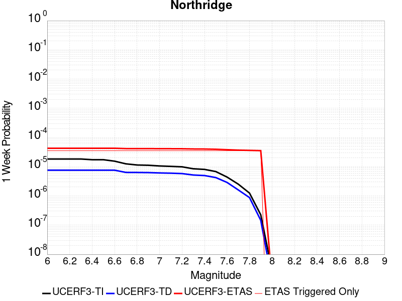 | 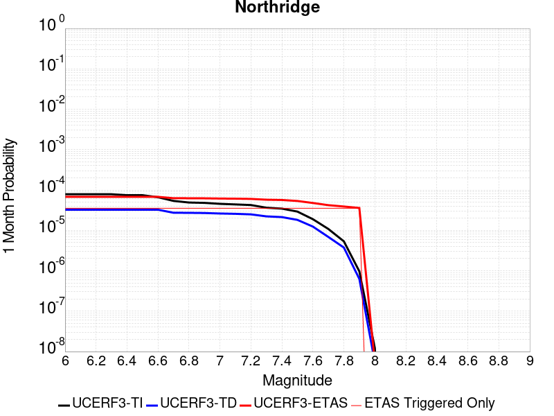 | 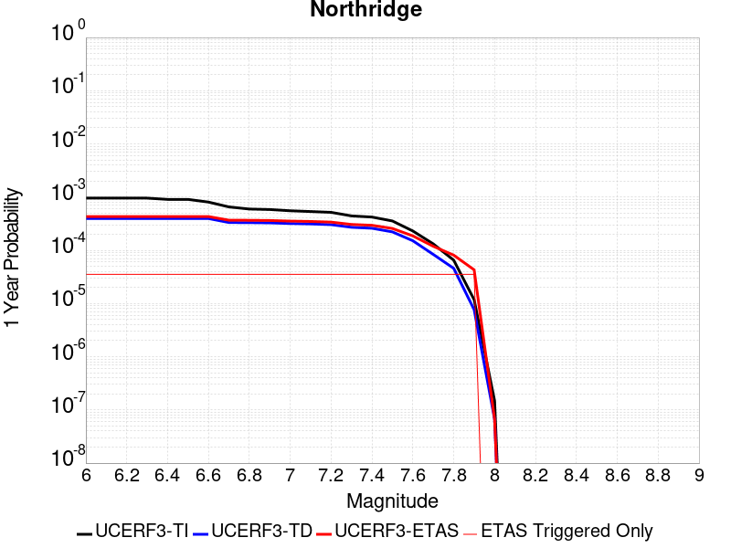 | 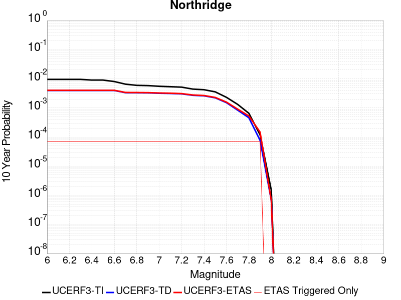 |

| Magnitude | 1 wk TI Prob | 1 wk TD Prob | 1 wk ETAS Prob | 1 wk ETAS/TD Gain | 1 wk ETAS Triggered Only | 1 mo TI Prob | 1 mo TD Prob | 1 mo ETAS Prob | 1 mo ETAS/TD Gain | 1 mo ETAS Triggered Only | 1 yr TI Prob | 1 yr TD Prob | 1 yr ETAS Prob | 1 yr ETAS/TD Gain | 1 yr ETAS Triggered Only | 10 yr TI Prob | 10 yr TD Prob | 10 yr ETAS Prob | 10 yr ETAS/TD Gain | 10 yr ETAS Triggered Only |
|-----|-----|-----|-----|-----|-----|-----|-----|-----|-----|-----|-----|-----|-----|-----|-----|-----|-----|-----|-----|-----|
| 6.0 | 1.8340852E-5 | 7.5880193E-6 | 7.5880193E-6 | 1.0 | 0.0 | 7.860128E-5 | 3.251969E-5 | 3.251969E-5 | 1.0 | 0.0 | 9.565505E-4 | 3.958575E-4 | 3.958575E-4 | 1.0 | 0.0 | 0.009524435 | 0.003951746 | 0.003991041 | 1.0099437 | 3.9450842E-5 |
| 6.1 | 1.8340852E-5 | 7.5880193E-6 | 7.5880193E-6 | 1.0 | 0.0 | 7.860128E-5 | 3.251969E-5 | 3.251969E-5 | 1.0 | 0.0 | 9.565505E-4 | 3.958575E-4 | 3.958575E-4 | 1.0 | 0.0 | 0.009524435 | 0.003951746 | 0.003991041 | 1.0099437 | 3.9450842E-5 |
| 6.2 | 1.8340852E-5 | 7.5880193E-6 | 7.5880193E-6 | 1.0 | 0.0 | 7.860128E-5 | 3.251969E-5 | 3.251969E-5 | 1.0 | 0.0 | 9.565505E-4 | 3.958575E-4 | 3.958575E-4 | 1.0 | 0.0 | 0.009524435 | 0.003951746 | 0.003991041 | 1.0099437 | 3.9450842E-5 |
| 6.3 | 1.8340852E-5 | 7.5880193E-6 | 7.5880193E-6 | 1.0 | 0.0 | 7.860128E-5 | 3.251969E-5 | 3.251969E-5 | 1.0 | 0.0 | 9.565505E-4 | 3.958575E-4 | 3.958575E-4 | 1.0 | 0.0 | 0.009524435 | 0.003951746 | 0.003991041 | 1.0099437 | 3.9450842E-5 |
| 6.4 | 1.7361892E-5 | 7.5880193E-6 | 7.5880193E-6 | 1.0 | 0.0 | 7.440598E-5 | 3.251969E-5 | 3.251969E-5 | 1.0 | 0.0 | 9.055163E-4 | 3.958575E-4 | 3.958575E-4 | 1.0 | 0.0 | 0.009018354 | 0.003951746 | 0.003991041 | 1.0099437 | 3.9450842E-5 |
| 6.5 | 1.7361892E-5 | 7.5880193E-6 | 7.5880193E-6 | 1.0 | 0.0 | 7.440598E-5 | 3.251969E-5 | 3.251969E-5 | 1.0 | 0.0 | 9.055163E-4 | 3.958575E-4 | 3.958575E-4 | 1.0 | 0.0 | 0.009018354 | 0.003951746 | 0.003991041 | 1.0099437 | 3.9450842E-5 |
| 6.6 | 1.5458201E-5 | 7.5880193E-6 | 7.5880193E-6 | 1.0 | 0.0 | 6.624775E-5 | 3.251969E-5 | 3.251969E-5 | 1.0 | 0.0 | 8.0626784E-4 | 3.958575E-4 | 3.958575E-4 | 1.0 | 0.0 | 0.008033488 | 0.003951746 | 0.003991041 | 1.0099437 | 3.9450842E-5 |
| 6.7 | 1.2538368E-5 | 6.381603E-6 | 6.381603E-6 | 1.0 | 0.0 | 5.3734755E-5 | 2.7349442E-5 | 2.7349442E-5 | 1.0 | 0.0 | 6.5402425E-4 | 3.3292902E-4 | 3.3292902E-4 | 1.0 | 0.0 | 0.0065210275 | 0.0033243506 | 0.0033636703 | 1.0118278 | 3.9450842E-5 |
| 6.8 | 1.1438097E-5 | 6.3502566E-6 | 6.3502566E-6 | 1.0 | 0.0 | 4.9019498E-5 | 2.7215105E-5 | 2.7215105E-5 | 1.0 | 0.0 | 5.9664896E-4 | 3.3129397E-4 | 3.3129397E-4 | 1.0 | 0.0 | 0.005950495 | 0.0033080487 | 0.003347369 | 1.0118862 | 3.9450842E-5 |
| 6.9 | 1.1204891E-5 | 6.2867084E-6 | 6.2867084E-6 | 1.0 | 0.0 | 4.8020076E-5 | 2.694276E-5 | 2.694276E-5 | 1.0 | 0.0 | 5.8448757E-4 | 3.2797916E-4 | 3.2797916E-4 | 1.0 | 0.0 | 0.0058295266 | 0.0032749989 | 0.0033143205 | 1.0120066 | 3.9450842E-5 |
| 7.0 | 1.061046E-5 | 6.115359E-6 | 6.115359E-6 | 1.0 | 0.0 | 4.5472607E-5 | 2.6208421E-5 | 2.6208421E-5 | 1.0 | 0.0 | 5.534883E-4 | 3.1904122E-4 | 3.1904122E-4 | 1.0 | 0.0 | 0.0055211177 | 0.0031858785 | 0.0032252036 | 1.0123435 | 3.9450842E-5 |
| 7.1 | 1.0266979E-5 | 6.004274E-6 | 6.004274E-6 | 1.0 | 0.0 | 4.40006E-5 | 2.5732352E-5 | 2.5732352E-5 | 1.0 | 0.0 | 5.355756E-4 | 3.1324677E-4 | 3.1324677E-4 | 1.0 | 0.0 | 0.0053428668 | 0.003128098 | 0.0031674257 | 1.0125723 | 3.9450842E-5 |
| 7.2 | 9.91273E-6 | 5.819984E-6 | 5.819984E-6 | 1.0 | 0.0 | 4.248244E-5 | 2.4942554E-5 | 2.4942554E-5 | 1.0 | 0.0 | 5.171009E-4 | 3.036337E-4 | 3.036337E-4 | 1.0 | 0.0 | 0.0051589934 | 0.0030322333 | 0.0030715645 | 1.012971 | 3.9450842E-5 |
| 7.3 | 8.4959265E-6 | 5.193062E-6 | 5.193062E-6 | 1.0 | 0.0 | 3.6410605E-5 | 2.225579E-5 | 2.225579E-5 | 1.0 | 0.0 | 4.4320893E-4 | 2.709308E-4 | 2.709308E-4 | 1.0 | 0.0 | 0.00442326 | 0.0027060313 | 0.0027453755 | 1.0145394 | 3.9450842E-5 |
| 7.4 | 8.0847185E-6 | 4.9819355E-6 | 4.9819355E-6 | 1.0 | 0.0 | 3.4648332E-5 | 2.135098E-5 | 2.135098E-5 | 1.0 | 0.0 | 4.2176177E-4 | 2.599174E-4 | 2.599174E-4 | 1.0 | 0.0 | 0.0042096223 | 0.00259616 | 0.0026355083 | 1.0151564 | 3.9450842E-5 |
| 7.5 | 6.8220684E-6 | 4.2533075E-6 | 4.2533075E-6 | 1.0 | 0.0 | 2.9237108E-5 | 1.8228335E-5 | 1.8228335E-5 | 1.0 | 0.0 | 3.5590364E-4 | 2.2190758E-4 | 2.2190758E-4 | 1.0 | 0.0 | 0.0035533418 | 0.002216881 | 0.0022562442 | 1.0177562 | 3.9450842E-5 |
| 7.6 | 4.4224143E-6 | 2.8999582E-6 | 2.8999582E-6 | 1.0 | 0.0 | 1.8953066E-5 | 1.2428334E-5 | 1.2428334E-5 | 1.0 | 0.0 | 2.3072914E-4 | 1.5130457E-4 | 1.5130457E-4 | 1.0 | 0.0 | 0.0023048974 | 0.0015120271 | 0.0015514183 | 1.0260519 | 3.9450842E-5 |
| 7.7 | 2.5297056E-6 | 1.6045905E-6 | 1.6045905E-6 | 1.0 | 0.0 | 1.0841551E-5 | 6.8767986E-6 | 6.8767986E-6 | 1.0 | 0.0 | 1.319879E-4 | 8.3721854E-5 | 8.3721854E-5 | 1.0 | 0.0 | 0.0013190953 | 8.369078E-4 | 8.7632565E-4 | 1.0470994 | 3.9450842E-5 |
| 7.8 | 1.2508156E-6 | 8.780076E-7 | 8.780076E-7 | 1.0 | 0.0 | 5.3606273E-6 | 3.7628845E-6 | 3.7628845E-6 | 1.0 | 0.0 | 6.526368E-5 | 4.581217E-5 | 4.581217E-5 | 1.0 | 0.0 | 6.524452E-4 | 4.5802852E-4 | 4.974613E-4 | 1.0860924 | 3.9450842E-5 |
| 7.9 | 2.262199E-7 | 1.4664671E-7 | 1.4664671E-7 | 1.0 | 0.0 | 9.695135E-7 | 6.284858E-7 | 6.284858E-7 | 1.0 | 0.0 | 1.1803763E-5 | 7.651788E-6 | 7.651788E-6 | 1.0 | 0.0 | 1.1803136E-4 | 7.651533E-5 | 1.1596315E-4 | 1.5155545 | 3.9450842E-5 |
| 8.0 | 2.865362E-9 | 1.2753101E-9 | 1.2753101E-9 | 1.0 | 0.0 | 1.2280123E-8 | 5.4656146E-9 | 5.4656146E-9 | 1.0 | 0.0 | 1.4951048E-7 | 6.654386E-8 | 6.654386E-8 | 1.0 | 0.0 | 1.4951038E-6 | 6.654386E-7 | 6.654386E-7 | 1.0 | 0.0 |

## San Jose
*[(top)](#table-of-contents)*

| 1 Week | 1 Month | 1 Year | 10 Year |
|-----|-----|-----|-----|
| 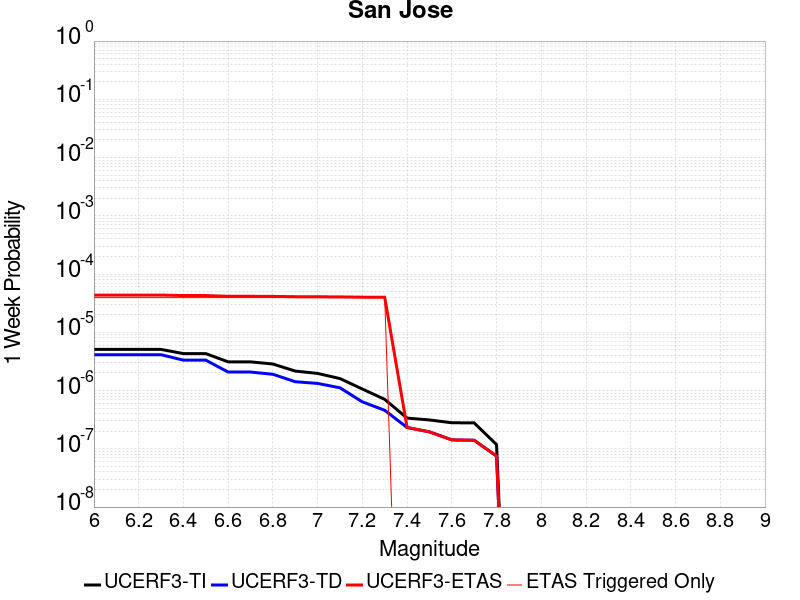 | 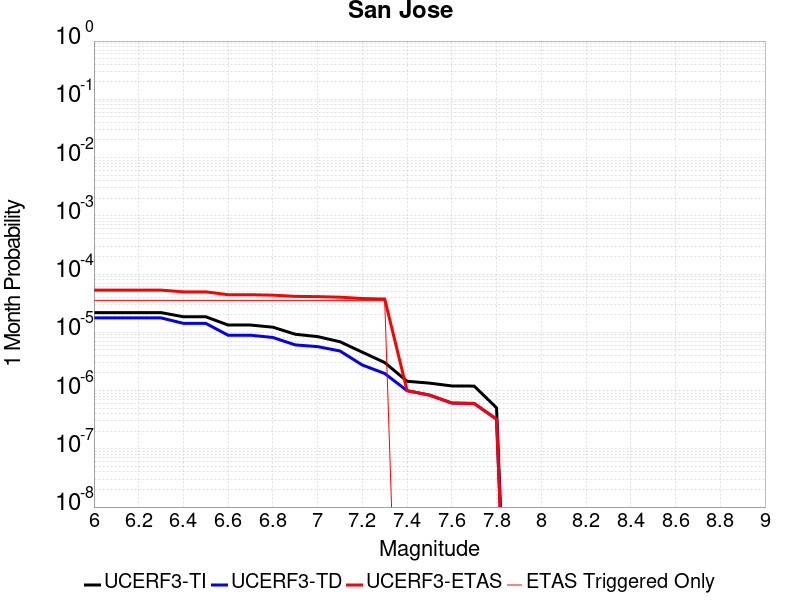 |  | 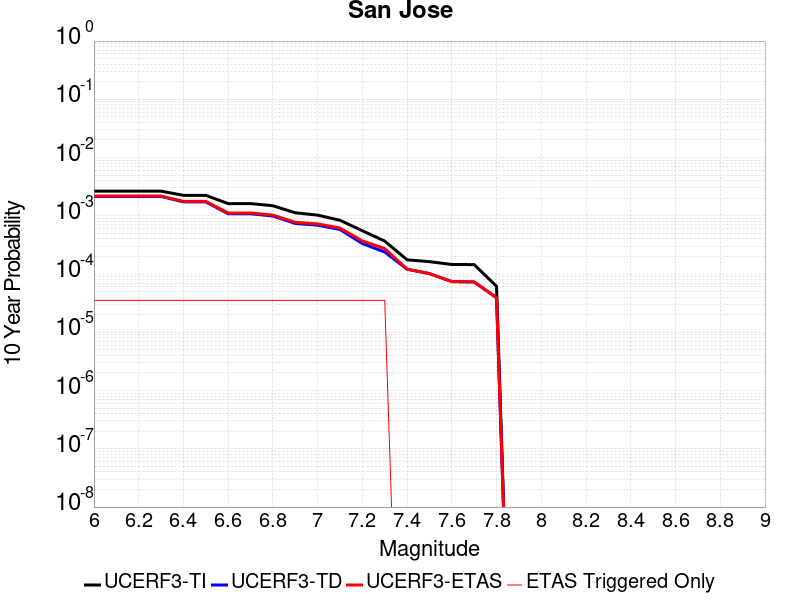 |

| Magnitude | 1 wk TI Prob | 1 wk TD Prob | 1 wk ETAS Prob | 1 wk ETAS/TD Gain | 1 wk ETAS Triggered Only | 1 mo TI Prob | 1 mo TD Prob | 1 mo ETAS Prob | 1 mo ETAS/TD Gain | 1 mo ETAS Triggered Only | 1 yr TI Prob | 1 yr TD Prob | 1 yr ETAS Prob | 1 yr ETAS/TD Gain | 1 yr ETAS Triggered Only | 10 yr TI Prob | 10 yr TD Prob | 10 yr ETAS Prob | 10 yr ETAS/TD Gain | 10 yr ETAS Triggered Only |
|-----|-----|-----|-----|-----|-----|-----|-----|-----|-----|-----|-----|-----|-----|-----|-----|-----|-----|-----|-----|-----|
| 6.0 | 5.0851277E-6 | 4.1256726E-6 | 4.3576354E-5 | 10.5622425 | 3.9450842E-5 | 2.1793223E-5 | 1.768135E-5 | 5.7131496E-5 | 3.2311728 | 3.9450842E-5 | 2.653002E-4 | 2.152518E-4 | 2.5469414E-4 | 1.1832381 | 3.9450842E-5 | 0.0026498367 | 0.0021507242 | 0.00219009 | 1.0183036 | 3.9450842E-5 |
| 6.1 | 5.0851277E-6 | 4.1256726E-6 | 4.3576354E-5 | 10.5622425 | 3.9450842E-5 | 2.1793223E-5 | 1.768135E-5 | 5.7131496E-5 | 3.2311728 | 3.9450842E-5 | 2.653002E-4 | 2.152518E-4 | 2.5469414E-4 | 1.1832381 | 3.9450842E-5 | 0.0026498367 | 0.0021507242 | 0.00219009 | 1.0183036 | 3.9450842E-5 |
| 6.2 | 5.0851277E-6 | 4.1256726E-6 | 4.3576354E-5 | 10.5622425 | 3.9450842E-5 | 2.1793223E-5 | 1.768135E-5 | 5.7131496E-5 | 3.2311728 | 3.9450842E-5 | 2.653002E-4 | 2.152518E-4 | 2.5469414E-4 | 1.1832381 | 3.9450842E-5 | 0.0026498367 | 0.0021507242 | 0.00219009 | 1.0183036 | 3.9450842E-5 |
| 6.3 | 5.0851277E-6 | 4.1256726E-6 | 4.3576354E-5 | 10.5622425 | 3.9450842E-5 | 2.1793223E-5 | 1.768135E-5 | 5.7131496E-5 | 3.2311728 | 3.9450842E-5 | 2.653002E-4 | 2.152518E-4 | 2.5469414E-4 | 1.1832381 | 3.9450842E-5 | 0.0026498367 | 0.0021507242 | 0.00219009 | 1.0183036 | 3.9450842E-5 |
| 6.4 | 4.3115124E-6 | 3.3237832E-6 | 4.2774496E-5 | 12.86922 | 3.9450842E-5 | 1.8477778E-5 | 1.424472E-5 | 5.3695003E-5 | 3.769467 | 3.9450842E-5 | 2.2494372E-4 | 1.7341787E-4 | 2.1286188E-4 | 1.2274506 | 3.9450842E-5 | 0.0022471617 | 0.0017330751 | 0.0017724576 | 1.022724 | 3.9450842E-5 |
| 6.5 | 4.3115124E-6 | 3.3237832E-6 | 4.2774496E-5 | 12.86922 | 3.9450842E-5 | 1.8477778E-5 | 1.424472E-5 | 5.3695003E-5 | 3.769467 | 3.9450842E-5 | 2.2494372E-4 | 1.7341787E-4 | 2.1286188E-4 | 1.2274506 | 3.9450842E-5 | 0.0022471617 | 0.0017330751 | 0.0017724576 | 1.022724 | 3.9450842E-5 |
| 6.6 | 3.110396E-6 | 2.0799866E-6 | 4.1530748E-5 | 19.966835 | 3.9450842E-5 | 1.33302E-5 | 8.9141995E-6 | 4.836469E-5 | 5.4255786 | 3.9450842E-5 | 1.622831E-4 | 1.0852526E-4 | 1.4797182E-4 | 1.3634782 | 3.9450842E-5 | 0.0016216465 | 0.0010847825 | 0.0011241906 | 1.0363281 | 3.9450842E-5 |
| 6.7 | 3.110396E-6 | 2.0799866E-6 | 4.1530748E-5 | 19.966835 | 3.9450842E-5 | 1.33302E-5 | 8.9141995E-6 | 4.836469E-5 | 5.4255786 | 3.9450842E-5 | 1.622831E-4 | 1.0852526E-4 | 1.4797182E-4 | 1.3634782 | 3.9450842E-5 | 0.0016216465 | 0.0010847825 | 0.0011241906 | 1.0363281 | 3.9450842E-5 |
| 6.8 | 2.856651E-6 | 1.902435E-6 | 4.1353203E-5 | 21.736986 | 3.9450842E-5 | 1.2242733E-5 | 8.153269E-6 | 4.7603793E-5 | 5.838614 | 3.9450842E-5 | 1.4904508E-4 | 9.926178E-5 | 1.3870871E-4 | 1.397403 | 3.9450842E-5 | 0.0014894515 | 9.922314E-4 | 0.0010316431 | 1.0397203 | 3.9450842E-5 |
| 6.9 | 2.1618725E-6 | 1.4186642E-6 | 4.0869454E-5 | 28.808405 | 3.9450842E-5 | 9.265135E-6 | 6.0799757E-6 | 4.553058E-5 | 7.488612 | 3.9450842E-5 | 1.12797185E-4 | 7.402128E-5 | 1.134692E-4 | 1.5329268 | 3.9450842E-5 | 0.0011273995 | 7.4000744E-4 | 7.7942904E-4 | 1.053272 | 3.9450842E-5 |
| 7.0 | 1.9684312E-6 | 1.3256331E-6 | 4.0776424E-5 | 30.759962 | 3.9450842E-5 | 8.436106E-6 | 5.681273E-6 | 4.5131892E-5 | 7.9439754 | 3.9450842E-5 | 1.02704755E-4 | 6.9167385E-5 | 1.086155E-4 | 1.5703282 | 3.9450842E-5 | 0.001026573 | 6.914992E-4 | 7.309228E-4 | 1.0570117 | 3.9450842E-5 |
| 7.1 | 1.6070337E-6 | 1.1155087E-6 | 4.056631E-5 | 36.36575 | 3.9450842E-5 | 6.887269E-6 | 4.780743E-6 | 4.4231398E-5 | 9.251993 | 3.9450842E-5 | 8.384928E-5 | 5.8204052E-5 | 9.76526E-5 | 1.6777629 | 3.9450842E-5 | 8.3817646E-4 | 5.819267E-4 | 6.213546E-4 | 1.067754 | 3.9450842E-5 |
| 7.2 | 1.0631658E-6 | 6.4037624E-7 | 4.0091196E-5 | 62.605686 | 3.9450842E-5 | 4.556417E-6 | 2.7444669E-6 | 4.2195203E-5 | 15.374644 | 3.9450842E-5 | 5.5472963E-5 | 3.3413387E-5 | 7.286291E-5 | 2.1806505 | 3.9450842E-5 | 5.545912E-4 | 3.3411747E-4 | 3.7355514E-4 | 1.1180353 | 3.9450842E-5 |
| 7.3 | 7.060711E-7 | 4.5824706E-7 | 3.9909075E-5 | 87.09074 | 3.9450842E-5 | 3.0260155E-6 | 1.9639147E-6 | 4.141468E-5 | 21.087822 | 3.9450842E-5 | 3.6841117E-5 | 2.3910407E-5 | 6.3360305E-5 | 2.649905 | 3.9450842E-5 | 3.6835007E-4 | 2.3911172E-4 | 2.785531E-4 | 1.1649498 | 3.9450842E-5 |
| 7.4 | 3.3677085E-7 | 2.3233133E-7 | 2.3233133E-7 | 1.0 | 0.0 | 1.4433028E-6 | 9.957054E-7 | 9.957054E-7 | 1.0 | 0.0 | 1.757207E-5 | 1.21226485E-5 | 1.21226485E-5 | 1.0 | 0.0 | 1.7570681E-4 | 1.2125263E-4 | 1.2125263E-4 | 1.0 | 0.0 |
| 7.5 | 3.129161E-7 | 1.9530925E-7 | 1.9530925E-7 | 1.0 | 0.0 | 1.3410682E-6 | 8.370394E-7 | 8.370394E-7 | 1.0 | 0.0 | 1.6327383E-5 | 1.0190909E-5 | 1.0190909E-5 | 1.0 | 0.0 | 1.6326184E-4 | 1.0193714E-4 | 1.0193714E-4 | 1.0 | 0.0 |
| 7.6 | 2.8008668E-7 | 1.4242323E-7 | 1.4242323E-7 | 1.0 | 0.0 | 1.2003709E-6 | 6.1038514E-7 | 6.1038514E-7 | 1.0 | 0.0 | 1.46144175E-5 | 7.4314153E-6 | 7.4314153E-6 | 1.0 | 0.0 | 1.4613457E-4 | 7.434427E-5 | 7.434427E-5 | 1.0 | 0.0 |
| 7.7 | 2.7852005E-7 | 1.4016913E-7 | 1.4016913E-7 | 1.0 | 0.0 | 1.1936568E-6 | 6.007248E-7 | 6.007248E-7 | 1.0 | 0.0 | 1.4532674E-5 | 7.3138012E-6 | 7.3138012E-6 | 1.0 | 0.0 | 1.4531724E-4 | 7.316821E-5 | 7.316821E-5 | 1.0 | 0.0 |
| 7.8 | 1.1810797E-7 | 7.5190094E-8 | 7.5190094E-8 | 1.0 | 0.0 | 5.0617695E-7 | 3.222432E-7 | 3.222432E-7 | 1.0 | 0.0 | 6.1626865E-6 | 3.9233046E-6 | 3.9233046E-6 | 1.0 | 0.0 | 6.162516E-5 | 3.9250725E-5 | 3.9250725E-5 | 1.0 | 0.0 |

## Johnson Valley (No) 2011 rev
*[(top)](#table-of-contents)*

| 1 Week | 1 Month | 1 Year | 10 Year |
|-----|-----|-----|-----|
|  | 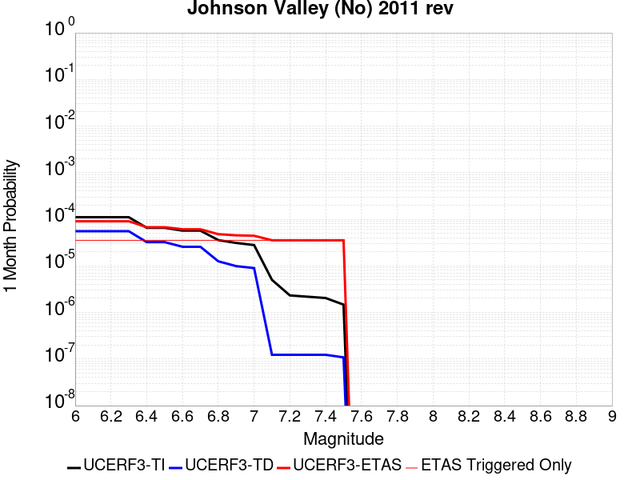 | 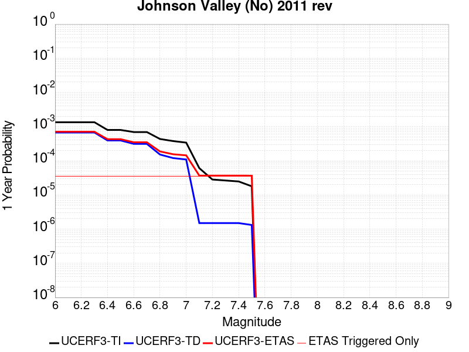 | 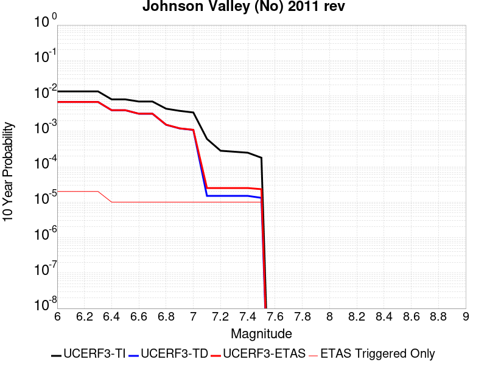 |

| Magnitude | 1 wk TI Prob | 1 wk TD Prob | 1 wk ETAS Prob | 1 wk ETAS/TD Gain | 1 wk ETAS Triggered Only | 1 mo TI Prob | 1 mo TD Prob | 1 mo ETAS Prob | 1 mo ETAS/TD Gain | 1 mo ETAS Triggered Only | 1 yr TI Prob | 1 yr TD Prob | 1 yr ETAS Prob | 1 yr ETAS/TD Gain | 1 yr ETAS Triggered Only | 10 yr TI Prob | 10 yr TD Prob | 10 yr ETAS Prob | 10 yr ETAS/TD Gain | 10 yr ETAS Triggered Only |
|-----|-----|-----|-----|-----|-----|-----|-----|-----|-----|-----|-----|-----|-----|-----|-----|-----|-----|-----|-----|-----|
| 6.0 | 2.577707E-5 | 1.2900938E-5 | 1.2900938E-5 | 1.0 | 0.0 | 1.1046848E-4 | 5.5288787E-5 | 9.473745E-5 | 1.713502 | 3.9450842E-5 | 0.0013441239 | 6.7297276E-4 | 7.1239704E-4 | 1.0585823 | 3.9450842E-5 | 0.013360229 | 0.006713257 | 0.006752443 | 1.0058371 | 3.9450842E-5 |
| 6.1 | 2.577707E-5 | 1.2900938E-5 | 1.2900938E-5 | 1.0 | 0.0 | 1.1046848E-4 | 5.5288787E-5 | 9.473745E-5 | 1.713502 | 3.9450842E-5 | 0.0013441239 | 6.7297276E-4 | 7.1239704E-4 | 1.0585823 | 3.9450842E-5 | 0.013360229 | 0.006713257 | 0.006752443 | 1.0058371 | 3.9450842E-5 |
| 6.2 | 2.577707E-5 | 1.2900938E-5 | 1.2900938E-5 | 1.0 | 0.0 | 1.1046848E-4 | 5.5288787E-5 | 9.473745E-5 | 1.713502 | 3.9450842E-5 | 0.0013441239 | 6.7297276E-4 | 7.1239704E-4 | 1.0585823 | 3.9450842E-5 | 0.013360229 | 0.006713257 | 0.006752443 | 1.0058371 | 3.9450842E-5 |
| 6.3 | 2.577707E-5 | 1.2900938E-5 | 1.2900938E-5 | 1.0 | 0.0 | 1.1046848E-4 | 5.5288787E-5 | 9.473745E-5 | 1.713502 | 3.9450842E-5 | 0.0013441239 | 6.7297276E-4 | 7.1239704E-4 | 1.0585823 | 3.9450842E-5 | 0.013360229 | 0.006713257 | 0.006752443 | 1.0058371 | 3.9450842E-5 |
| 6.4 | 1.5296591E-5 | 7.536742E-6 | 7.536742E-6 | 1.0 | 0.0 | 6.555518E-5 | 3.2300028E-5 | 7.17496E-5 | 2.2213478 | 3.9450842E-5 | 7.97842E-4 | 3.9320064E-4 | 4.3263598E-4 | 1.1002932 | 3.9450842E-5 | 0.007949836 | 0.0039268904 | 0.0039661867 | 1.0100069 | 3.9450842E-5 |
| 6.5 | 1.5296591E-5 | 7.536742E-6 | 7.536742E-6 | 1.0 | 0.0 | 6.555518E-5 | 3.2300028E-5 | 7.17496E-5 | 2.2213478 | 3.9450842E-5 | 7.97842E-4 | 3.9320064E-4 | 4.3263598E-4 | 1.1002932 | 3.9450842E-5 | 0.007949836 | 0.0039268904 | 0.0039661867 | 1.0100069 | 3.9450842E-5 |
| 6.6 | 1.3289383E-5 | 5.9917306E-6 | 5.9917306E-6 | 1.0 | 0.0 | 5.6953253E-5 | 2.5678688E-5 | 6.512852E-5 | 2.5362868 | 3.9450842E-5 | 6.9318525E-4 | 3.1261015E-4 | 3.5204866E-4 | 1.1261587 | 3.9450842E-5 | 0.0069102696 | 0.0031233684 | 0.003162696 | 1.0125914 | 3.9450842E-5 |
| 6.7 | 1.3289383E-5 | 5.9917306E-6 | 5.9917306E-6 | 1.0 | 0.0 | 5.6953253E-5 | 2.5678688E-5 | 6.512852E-5 | 2.5362868 | 3.9450842E-5 | 6.9318525E-4 | 3.1261015E-4 | 3.5204866E-4 | 1.1261587 | 3.9450842E-5 | 0.0069102696 | 0.0031233684 | 0.003162696 | 1.0125914 | 3.9450842E-5 |
| 6.8 | 8.330789E-6 | 2.9211888E-6 | 2.9211888E-6 | 1.0 | 0.0 | 3.570289E-5 | 1.2519352E-5 | 5.1969702E-5 | 4.1511493 | 3.9450842E-5 | 4.34596E-4 | 1.5241816E-4 | 1.9186299E-4 | 1.2587935 | 3.9450842E-5 | 0.0043374705 | 0.0015236961 | 0.0015630869 | 1.0258521 | 3.9450842E-5 |
| 6.9 | 7.2359003E-6 | 2.3013247E-6 | 2.3013247E-6 | 1.0 | 0.0 | 3.1010633E-5 | 9.8628125E-6 | 4.931327E-5 | 4.9999194 | 3.9450842E-5 | 3.7748902E-4 | 1.2007845E-4 | 1.5952457E-4 | 1.3285028 | 3.9450842E-5 | 0.0037684843 | 0.0012006586 | 0.0012400621 | 1.0328182 | 3.9450842E-5 |
| 7.0 | 6.5149957E-6 | 2.088482E-6 | 2.088482E-6 | 1.0 | 0.0 | 2.792111E-5 | 8.950637E-6 | 4.840113E-5 | 5.4075627 | 3.9450842E-5 | 3.398865E-4 | 1.0897385E-4 | 1.484204E-4 | 1.3619817 | 3.9450842E-5 | 0.003393671 | 0.0010897239 | 0.0011291318 | 1.0361632 | 3.9450842E-5 |
| 7.1 | 1.1662233E-6 | 2.8802024E-8 | 2.8802024E-8 | 1.0 | 0.0 | 4.9980904E-6 | 1.2343725E-7 | 3.9574275E-5 | 320.60242 | 3.9450842E-5 | 6.0850052E-5 | 1.5028476E-6 | 4.0953633E-5 | 27.25069 | 3.9450842E-5 | 6.083339E-4 | 1.50283895E-5 | 5.447864E-5 | 3.6250484 | 3.9450842E-5 |
| 7.2 | 5.413881E-7 | 2.8802024E-8 | 2.8802024E-8 | 1.0 | 0.0 | 2.3202326E-6 | 1.2343725E-7 | 3.9574275E-5 | 320.60242 | 3.9450842E-5 | 2.8248465E-5 | 1.5028476E-6 | 4.0953633E-5 | 27.25069 | 3.9450842E-5 | 2.8244875E-4 | 1.50283895E-5 | 5.447864E-5 | 3.6250484 | 3.9450842E-5 |
| 7.3 | 5.076821E-7 | 2.8802024E-8 | 2.8802024E-8 | 1.0 | 0.0 | 2.1757785E-6 | 1.2343723E-7 | 3.9574275E-5 | 320.60242 | 3.9450842E-5 | 2.648978E-5 | 1.5028475E-6 | 4.0953633E-5 | 27.25069 | 3.9450842E-5 | 2.6486625E-4 | 1.50283895E-5 | 5.447864E-5 | 3.6250484 | 3.9450842E-5 |
| 7.4 | 4.7568687E-7 | 2.8783948E-8 | 2.8783948E-8 | 1.0 | 0.0 | 2.0386565E-6 | 1.2335977E-7 | 3.95742E-5 | 320.80313 | 3.9450842E-5 | 2.482036E-5 | 1.5019043E-6 | 4.095269E-5 | 27.267176 | 3.9450842E-5 | 2.4817587E-4 | 1.5018958E-5 | 5.446921E-5 | 3.6266968 | 3.9450842E-5 |
| 7.5 | 3.435626E-7 | 2.5357679E-8 | 2.5357679E-8 | 1.0 | 0.0 | 1.4724103E-6 | 1.0867576E-7 | 3.9559516E-5 | 364.01413 | 3.9450842E-5 | 1.7926448E-5 | 1.3231268E-6 | 4.0773917E-5 | 30.816336 | 3.9450842E-5 | 1.7925001E-4 | 1.3231205E-5 | 5.2681527E-5 | 3.9816122 | 3.9450842E-5 |

## Carlsbad
*[(top)](#table-of-contents)*

| 1 Week | 1 Month | 1 Year | 10 Year |
|-----|-----|-----|-----|
|  |  | 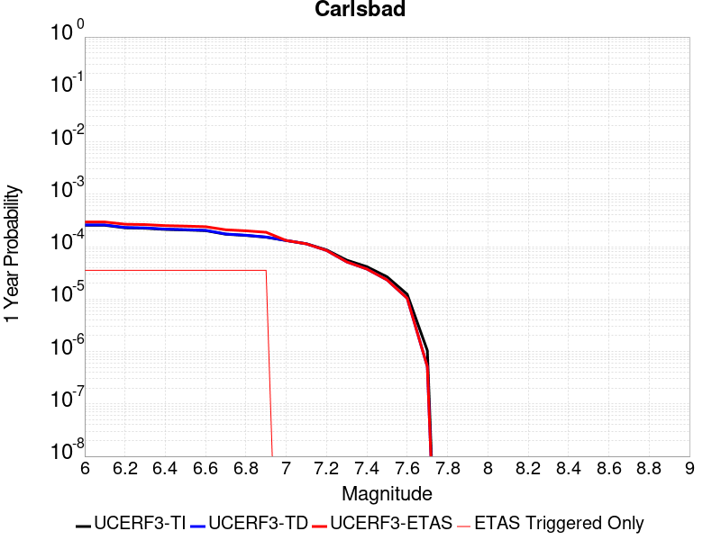 | 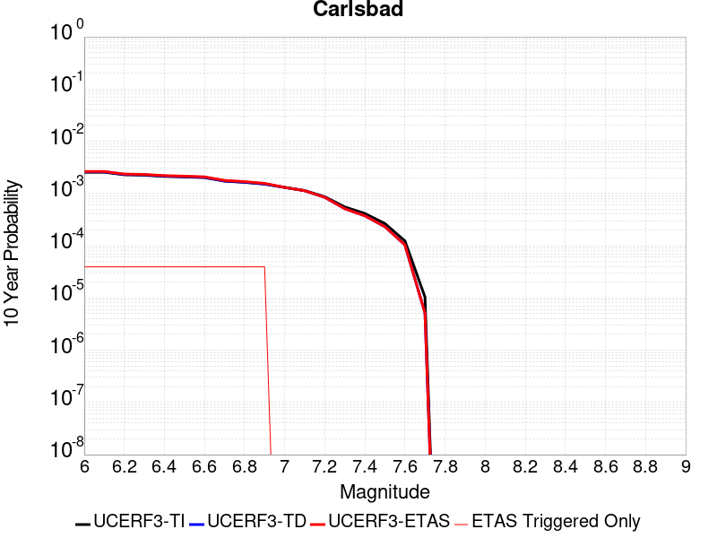 |

| Magnitude | 1 wk TI Prob | 1 wk TD Prob | 1 wk ETAS Prob | 1 wk ETAS/TD Gain | 1 wk ETAS Triggered Only | 1 mo TI Prob | 1 mo TD Prob | 1 mo ETAS Prob | 1 mo ETAS/TD Gain | 1 mo ETAS Triggered Only | 1 yr TI Prob | 1 yr TD Prob | 1 yr ETAS Prob | 1 yr ETAS/TD Gain | 1 yr ETAS Triggered Only | 10 yr TI Prob | 10 yr TD Prob | 10 yr ETAS Prob | 10 yr ETAS/TD Gain | 10 yr ETAS Triggered Only |
|-----|-----|-----|-----|-----|-----|-----|-----|-----|-----|-----|-----|-----|-----|-----|-----|-----|-----|-----|-----|-----|
| 6.0 | 4.9038536E-6 | 4.9872565E-6 | 4.9872565E-6 | 1.0 | 0.0 | 2.1016345E-5 | 2.1373784E-5 | 2.1373784E-5 | 1.0 | 0.0 | 2.5584397E-4 | 2.601952E-4 | 2.9963578E-4 | 1.1515807 | 3.9450842E-5 | 0.002555496 | 0.0025989525 | 0.0026383009 | 1.01514 | 3.9450842E-5 |
| 6.1 | 4.9038536E-6 | 4.9872565E-6 | 4.9872565E-6 | 1.0 | 0.0 | 2.1016345E-5 | 2.1373784E-5 | 2.1373784E-5 | 1.0 | 0.0 | 2.5584397E-4 | 2.601952E-4 | 2.9963578E-4 | 1.1515807 | 3.9450842E-5 | 0.002555496 | 0.0025989525 | 0.0026383009 | 1.01514 | 3.9450842E-5 |
| 6.2 | 4.3820614E-6 | 4.4547687E-6 | 4.4547687E-6 | 1.0 | 0.0 | 1.8780129E-5 | 1.9091729E-5 | 1.9091729E-5 | 1.0 | 0.0 | 2.2862408E-4 | 2.3241735E-4 | 2.7185903E-4 | 1.1697019 | 3.9450842E-5 | 0.00228389 | 0.0023217786 | 0.002361138 | 1.0169522 | 3.9450842E-5 |
| 6.3 | 4.302872E-6 | 4.373006E-6 | 4.373006E-6 | 1.0 | 0.0 | 1.8440749E-5 | 1.8741322E-5 | 1.8741322E-5 | 1.0 | 0.0 | 2.24493E-4 | 2.2815206E-4 | 2.675939E-4 | 1.1728753 | 3.9450842E-5 | 0.0022426634 | 0.0022792136 | 0.0023185746 | 1.0172695 | 3.9450842E-5 |
| 6.4 | 4.0835243E-6 | 4.1476546E-6 | 4.1476546E-6 | 1.0 | 0.0 | 1.75007E-5 | 1.7775543E-5 | 1.7775543E-5 | 1.0 | 0.0 | 2.1305021E-4 | 2.1639607E-4 | 2.558384E-4 | 1.1822691 | 3.9450842E-5 | 0.0021284607 | 0.0021618877 | 0.0022012533 | 1.0182089 | 3.9450842E-5 |
| 6.5 | 3.987806E-6 | 4.0488867E-6 | 4.0488867E-6 | 1.0 | 0.0 | 1.7090486E-5 | 1.7352257E-5 | 1.7352257E-5 | 1.0 | 0.0 | 2.080568E-4 | 2.1124359E-4 | 2.506861E-4 | 1.1867157 | 3.9450842E-5 | 0.002078621 | 0.0021104617 | 0.0021498294 | 1.0186535 | 3.9450842E-5 |
| 6.6 | 3.8707576E-6 | 3.927488E-6 | 3.927488E-6 | 1.0 | 0.0 | 1.6588854E-5 | 1.6831984E-5 | 1.6831984E-5 | 1.0 | 0.0 | 2.0195059E-4 | 2.0491047E-4 | 2.4435323E-4 | 1.1924877 | 3.9450842E-5 | 0.0020176715 | 0.0020472489 | 0.002086619 | 1.0192307 | 3.9450842E-5 |
| 6.7 | 3.3093434E-6 | 3.3423917E-6 | 3.3423917E-6 | 1.0 | 0.0 | 1.4182823E-5 | 1.4324457E-5 | 1.4324457E-5 | 1.0 | 0.0 | 1.7266218E-4 | 1.7438637E-4 | 2.1383032E-4 | 1.2261872 | 3.9450842E-5 | 0.001725281 | 0.0017425013 | 0.0017818834 | 1.0226009 | 3.9450842E-5 |
| 6.8 | 3.136983E-6 | 3.1664536E-6 | 3.1664536E-6 | 1.0 | 0.0 | 1.3444143E-5 | 1.3570445E-5 | 1.3570445E-5 | 1.0 | 0.0 | 1.6367015E-4 | 1.6520769E-4 | 2.0465201E-4 | 1.238756 | 3.9450842E-5 | 0.0016354966 | 0.0016508545 | 0.0016902401 | 1.0238578 | 3.9450842E-5 |
| 6.9 | 2.9056644E-6 | 2.9267585E-6 | 2.9267585E-6 | 1.0 | 0.0 | 1.2452788E-5 | 1.2543191E-5 | 1.2543191E-5 | 1.0 | 0.0 | 1.5160214E-4 | 1.5270269E-4 | 1.9214752E-4 | 1.2583113 | 3.9450842E-5 | 0.0015149876 | 0.001525983 | 0.0015653736 | 1.0258133 | 3.9450842E-5 |
| 7.0 | 2.5071035E-6 | 2.5113977E-6 | 2.5113977E-6 | 1.0 | 0.0 | 1.0744685E-5 | 1.07630885E-5 | 1.07630885E-5 | 1.0 | 0.0 | 1.308087E-4 | 1.3103275E-4 | 1.3103275E-4 | 1.0 | 0.0 | 0.0013073172 | 0.0013095582 | 0.0013095582 | 1.0 | 0.0 |
| 7.1 | 2.1786877E-6 | 2.1678832E-6 | 2.1678832E-6 | 1.0 | 0.0 | 9.3372E-6 | 9.290896E-6 | 9.290896E-6 | 1.0 | 0.0 | 1.13674476E-4 | 1.1311081E-4 | 1.1311081E-4 | 1.0 | 0.0 | 0.0011361635 | 0.0011305353 | 0.0011305353 | 1.0 | 0.0 |
| 7.2 | 1.6628418E-6 | 1.6213872E-6 | 1.6213872E-6 | 1.0 | 0.0 | 7.1264453E-6 | 6.948784E-6 | 6.948784E-6 | 1.0 | 0.0 | 8.676102E-5 | 8.4598185E-5 | 8.4598185E-5 | 1.0 | 0.0 | 8.672715E-4 | 8.45662E-4 | 8.45662E-4 | 1.0 | 0.0 |
| 7.3 | 1.0595926E-6 | 9.816804E-7 | 9.816804E-7 | 1.0 | 0.0 | 4.541103E-6 | 4.2071947E-6 | 4.2071947E-6 | 1.0 | 0.0 | 5.5286528E-5 | 5.1221403E-5 | 5.1221403E-5 | 1.0 | 0.0 | 5.527277E-4 | 5.1209686E-4 | 5.1209686E-4 | 1.0 | 0.0 |
| 7.4 | 7.956623E-7 | 7.1737975E-7 | 7.1737975E-7 | 1.0 | 0.0 | 3.4099767E-6 | 3.074481E-6 | 3.074481E-6 | 1.0 | 0.0 | 4.1515676E-5 | 3.743117E-5 | 3.743117E-5 | 1.0 | 0.0 | 4.150792E-4 | 3.7424936E-4 | 3.7424936E-4 | 1.0 | 0.0 |
| 7.5 | 5.1043804E-7 | 4.4483627E-7 | 4.4483627E-7 | 1.0 | 0.0 | 2.1875896E-6 | 1.9064398E-6 | 1.9064398E-6 | 1.0 | 0.0 | 2.663358E-5 | 2.3210663E-5 | 2.3210663E-5 | 1.0 | 0.0 | 2.6630386E-4 | 2.3208297E-4 | 2.3208297E-4 | 1.0 | 0.0 |
| 7.6 | 2.3723294E-7 | 1.989569E-7 | 1.989569E-7 | 1.0 | 0.0 | 1.0167122E-6 | 8.5267214E-7 | 8.5267214E-7 | 1.0 | 0.0 | 1.2378401E-5 | 1.0381237E-5 | 1.0381237E-5 | 1.0 | 0.0 | 1.237771E-4 | 1.038078E-4 | 1.038078E-4 | 1.0 | 0.0 |
| 7.7 | 1.9992152E-8 | 9.8601785E-9 | 9.8601785E-9 | 1.0 | 0.0 | 8.568065E-8 | 4.225791E-8 | 4.225791E-8 | 1.0 | 0.0 | 1.0431614E-6 | 5.1449E-7 | 5.1449E-7 | 1.0 | 0.0 | 1.0431565E-5 | 5.1449E-6 | 5.1449E-6 | 1.0 | 0.0 |

## Mission Creek
*[(top)](#table-of-contents)*

| 1 Week | 1 Month | 1 Year | 10 Year |
|-----|-----|-----|-----|
| 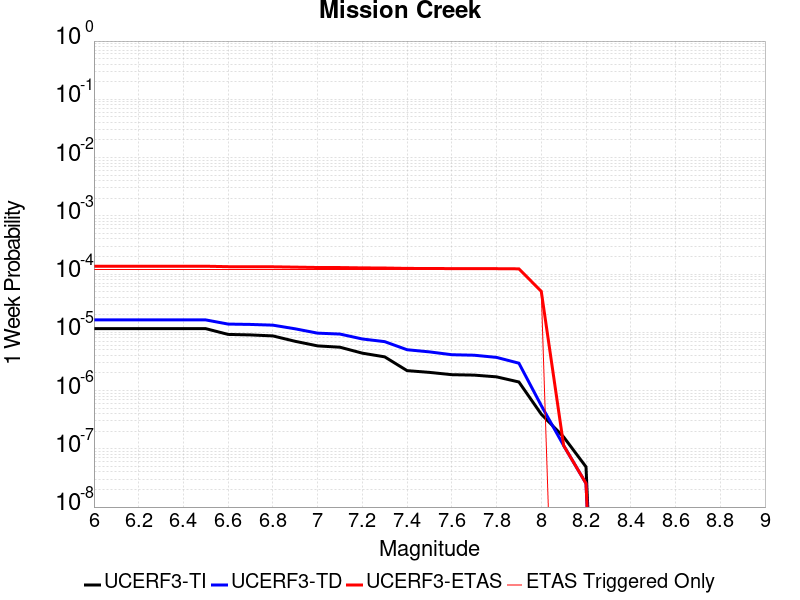 | 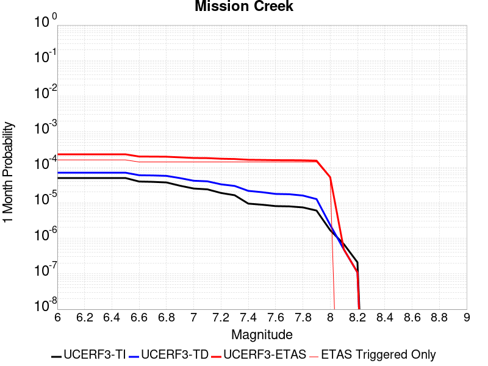 | 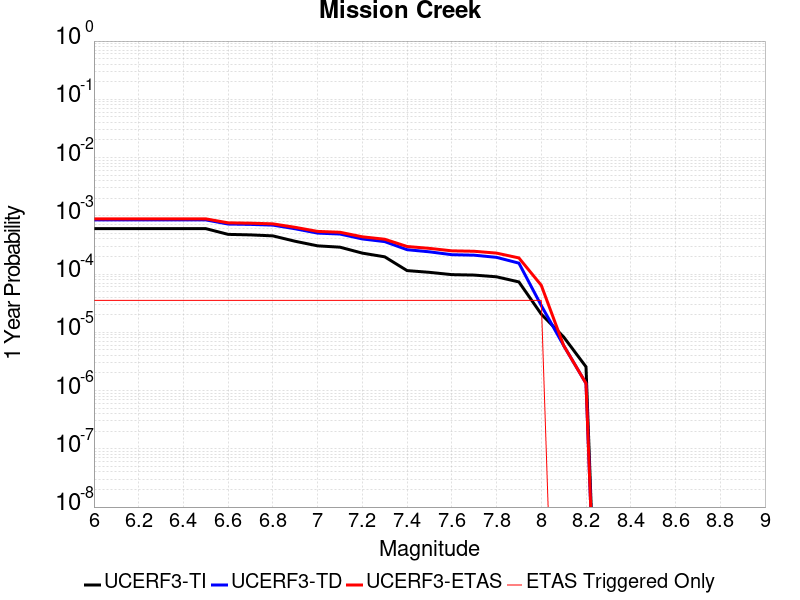 | 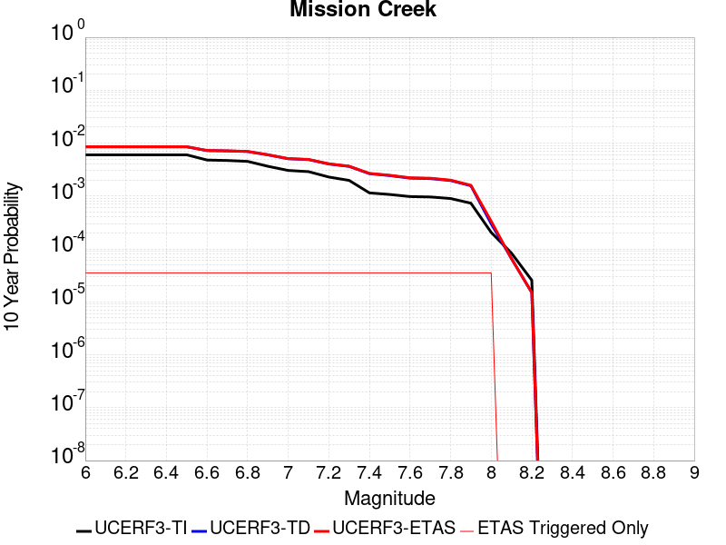 |

| Magnitude | 1 wk TI Prob | 1 wk TD Prob | 1 wk ETAS Prob | 1 wk ETAS/TD Gain | 1 wk ETAS Triggered Only | 1 mo TI Prob | 1 mo TD Prob | 1 mo ETAS Prob | 1 mo ETAS/TD Gain | 1 mo ETAS Triggered Only | 1 yr TI Prob | 1 yr TD Prob | 1 yr ETAS Prob | 1 yr ETAS/TD Gain | 1 yr ETAS Triggered Only | 10 yr TI Prob | 10 yr TD Prob | 10 yr ETAS Prob | 10 yr ETAS/TD Gain | 10 yr ETAS Triggered Only |
|-----|-----|-----|-----|-----|-----|-----|-----|-----|-----|-----|-----|-----|-----|-----|-----|-----|-----|-----|-----|-----|
| 6.0 | 1.1549387E-5 | 1.632237E-5 | 1.632237E-5 | 1.0 | 0.0 | 4.9496433E-5 | 6.9951224E-5 | 6.9951224E-5 | 1.0 | 0.0 | 6.0245243E-4 | 8.513384E-4 | 8.907556E-4 | 1.0463003 | 3.9450842E-5 | 0.006008218 | 0.008509998 | 0.008549113 | 1.0045964 | 3.9450842E-5 |
| 6.1 | 1.1549387E-5 | 1.632237E-5 | 1.632237E-5 | 1.0 | 0.0 | 4.9496433E-5 | 6.9951224E-5 | 6.9951224E-5 | 1.0 | 0.0 | 6.0245243E-4 | 8.513384E-4 | 8.907556E-4 | 1.0463003 | 3.9450842E-5 | 0.006008218 | 0.008509998 | 0.008549113 | 1.0045964 | 3.9450842E-5 |
| 6.2 | 1.1549387E-5 | 1.632237E-5 | 1.632237E-5 | 1.0 | 0.0 | 4.9496433E-5 | 6.9951224E-5 | 6.9951224E-5 | 1.0 | 0.0 | 6.0245243E-4 | 8.513384E-4 | 8.907556E-4 | 1.0463003 | 3.9450842E-5 | 0.006008218 | 0.008509998 | 0.008549113 | 1.0045964 | 3.9450842E-5 |
| 6.3 | 1.1549387E-5 | 1.632237E-5 | 1.632237E-5 | 1.0 | 0.0 | 4.9496433E-5 | 6.9951224E-5 | 6.9951224E-5 | 1.0 | 0.0 | 6.0245243E-4 | 8.513384E-4 | 8.907556E-4 | 1.0463003 | 3.9450842E-5 | 0.006008218 | 0.008509998 | 0.008549113 | 1.0045964 | 3.9450842E-5 |
| 6.4 | 1.1549387E-5 | 1.632237E-5 | 1.632237E-5 | 1.0 | 0.0 | 4.9496433E-5 | 6.9951224E-5 | 6.9951224E-5 | 1.0 | 0.0 | 6.0245243E-4 | 8.513384E-4 | 8.907556E-4 | 1.0463003 | 3.9450842E-5 | 0.006008218 | 0.008509998 | 0.008549113 | 1.0045964 | 3.9450842E-5 |
| 6.5 | 1.1549387E-5 | 1.632237E-5 | 1.632237E-5 | 1.0 | 0.0 | 4.9496433E-5 | 6.9951224E-5 | 6.9951224E-5 | 1.0 | 0.0 | 6.0245243E-4 | 8.513384E-4 | 8.907556E-4 | 1.0463003 | 3.9450842E-5 | 0.006008218 | 0.008509998 | 0.008549113 | 1.0045964 | 3.9450842E-5 |
| 6.6 | 9.202681E-6 | 1.3845646E-5 | 1.3845646E-5 | 1.0 | 0.0 | 3.9439463E-5 | 5.9337188E-5 | 5.9337188E-5 | 1.0 | 0.0 | 4.800697E-4 | 7.221998E-4 | 7.6162216E-4 | 1.0545865 | 3.9450842E-5 | 0.004790339 | 0.0072271815 | 0.0072663473 | 1.0054193 | 3.9450842E-5 |
| 6.7 | 9.019164E-6 | 1.3651316E-5 | 1.3651316E-5 | 1.0 | 0.0 | 3.8652986E-5 | 5.8504378E-5 | 5.8504378E-5 | 1.0 | 0.0 | 4.7049852E-4 | 7.12067E-4 | 7.514898E-4 | 1.0553638 | 3.9450842E-5 | 0.004695036 | 0.007126506 | 0.0071656755 | 1.0054964 | 3.9450842E-5 |
| 6.8 | 8.673558E-6 | 1.3273427E-5 | 1.3273427E-5 | 1.0 | 0.0 | 3.717186E-5 | 5.6884925E-5 | 5.6884925E-5 | 1.0 | 0.0 | 4.524734E-4 | 6.923627E-4 | 7.3178625E-4 | 1.0569406 | 3.9450842E-5 | 0.0045155324 | 0.006930694 | 0.0069698715 | 1.0056528 | 3.9450842E-5 |
| 6.9 | 7.002255E-6 | 1.1477657E-5 | 1.1477657E-5 | 1.0 | 0.0 | 3.000932E-5 | 4.9189068E-5 | 4.9189068E-5 | 1.0 | 0.0 | 3.653022E-4 | 5.9871917E-4 | 6.381464E-4 | 1.0658526 | 3.9450842E-5 | 0.0036470229 | 0.005999517 | 0.0060387314 | 1.0065362 | 3.9450842E-5 |
| 7.0 | 5.84644E-6 | 9.67498E-6 | 9.67498E-6 | 1.0 | 0.0 | 2.5055931E-5 | 4.1463565E-5 | 4.1463565E-5 | 1.0 | 0.0 | 3.0501327E-4 | 5.047066E-4 | 5.441375E-4 | 1.0781264 | 3.9450842E-5 | 0.0030459496 | 0.0050638523 | 0.0051031034 | 1.0077512 | 3.9450842E-5 |
| 7.1 | 5.54703E-6 | 9.329456E-6 | 9.329456E-6 | 1.0 | 0.0 | 2.377277E-5 | 3.9982795E-5 | 3.9982795E-5 | 1.0 | 0.0 | 2.8939504E-4 | 4.8668624E-4 | 5.261179E-4 | 1.0810207 | 3.9450842E-5 | 0.0028901845 | 0.004884446 | 0.0049237045 | 1.0080373 | 3.9450842E-5 |
| 7.2 | 4.384709E-6 | 7.68157E-6 | 7.68157E-6 | 1.0 | 0.0 | 1.8791474E-5 | 3.2920623E-5 | 3.2920623E-5 | 1.0 | 0.0 | 2.2876218E-4 | 4.0073853E-4 | 4.4017355E-4 | 1.098406 | 3.9450842E-5 | 0.0022852682 | 0.004028366 | 0.0040676575 | 1.0097538 | 3.9450842E-5 |
| 7.3 | 3.7888456E-6 | 6.915452E-6 | 6.915452E-6 | 1.0 | 0.0 | 1.623781E-5 | 2.9637333E-5 | 2.9637333E-5 | 1.0 | 0.0 | 1.9767738E-4 | 3.6077813E-4 | 4.0021475E-4 | 1.1093099 | 3.9450842E-5 | 0.0019750162 | 0.0036301152 | 0.0036694228 | 1.0108283 | 3.9450842E-5 |
| 7.4 | 2.1982462E-6 | 5.0237763E-6 | 5.0237763E-6 | 1.0 | 0.0 | 9.421021E-6 | 2.1530293E-5 | 2.1530293E-5 | 1.0 | 0.0 | 1.1469489E-4 | 2.621E-4 | 3.0154048E-4 | 1.1504788 | 3.9450842E-5 | 0.0011463572 | 0.0026458844 | 0.002685231 | 1.0148708 | 3.9450842E-5 |
| 7.5 | 2.051923E-6 | 4.615016E-6 | 4.615016E-6 | 1.0 | 0.0 | 8.793926E-6 | 1.9778492E-5 | 1.9778492E-5 | 1.0 | 0.0 | 1.0706078E-4 | 2.4077666E-4 | 2.80218E-4 | 1.1638088 | 3.9450842E-5 | 0.0010700922 | 0.0024335422 | 0.0024728968 | 1.0161718 | 3.9450842E-5 |
| 7.6 | 1.8733427E-6 | 4.1233748E-6 | 4.1233748E-6 | 1.0 | 0.0 | 8.028587E-6 | 1.7671488E-5 | 1.7671488E-5 | 1.0 | 0.0 | 9.774366E-5 | 2.151292E-4 | 2.5457155E-4 | 1.1833427 | 3.9450842E-5 | 9.770069E-4 | 0.0021780801 | 0.002217445 | 1.0180732 | 3.9450842E-5 |
| 7.7 | 1.8411953E-6 | 4.0430496E-6 | 4.0430496E-6 | 1.0 | 0.0 | 7.890813E-6 | 1.732724E-5 | 1.732724E-5 | 1.0 | 0.0 | 9.606641E-5 | 2.1093882E-4 | 2.5038133E-4 | 1.1869856 | 3.9450842E-5 | 9.6024893E-4 | 0.0021363653 | 0.0021757318 | 1.0184269 | 3.9450842E-5 |
| 7.8 | 1.7194251E-6 | 3.7104276E-6 | 3.7104276E-6 | 1.0 | 0.0 | 7.368944E-6 | 1.5901736E-5 | 1.5901736E-5 | 1.0 | 0.0 | 8.97132E-5 | 1.9358651E-4 | 2.3302971E-4 | 1.2037498 | 3.9450842E-5 | 8.967699E-4 | 0.0019623525 | 0.0020017258 | 1.0200644 | 3.9450842E-5 |
| 7.9 | 1.4035052E-6 | 2.9500632E-6 | 2.9500632E-6 | 1.0 | 0.0 | 6.0150082E-6 | 1.2643067E-5 | 1.2643067E-5 | 1.0 | 0.0 | 7.3230265E-5 | 1.5391852E-4 | 1.933633E-4 | 1.2562704 | 3.9450842E-5 | 7.3206134E-4 | 0.0015631086 | 0.0016024979 | 1.0251993 | 3.9450842E-5 |
| 8.0 | 3.9318823E-7 | 5.528522E-7 | 5.528522E-7 | 1.0 | 0.0 | 1.6850913E-6 | 2.3693647E-6 | 2.3693647E-6 | 1.0 | 0.0 | 2.0515794E-5 | 2.8846638E-5 | 6.8296344E-5 | 2.3675668 | 3.9450842E-5 | 2.0513899E-4 | 2.9899E-4 | 3.3842903E-4 | 1.1319076 | 3.9450842E-5 |
| 8.1 | 1.596793E-7 | 1.1380002E-7 | 1.1380002E-7 | 1.0 | 0.0 | 6.8433974E-7 | 4.877143E-7 | 4.877143E-7 | 1.0 | 0.0 | 8.331805E-6 | 5.937906E-6 | 5.937906E-6 | 1.0 | 0.0 | 8.331492E-5 | 6.549966E-5 | 6.549966E-5 | 1.0 | 0.0 |
| 8.2 | 4.9003038E-8 | 2.5444924E-8 | 2.5444924E-8 | 1.0 | 0.0 | 2.10013E-7 | 1.0904967E-7 | 1.0904967E-7 | 1.0 | 0.0 | 2.5569052E-6 | 1.327679E-6 | 1.327679E-6 | 1.0 | 0.0 | 2.556876E-5 | 1.495635E-5 | 1.495635E-5 | 1.0 | 0.0 |

## Elysian Park (Lower CFM)
*[(top)](#table-of-contents)*

| 1 Week | 1 Month | 1 Year | 10 Year |
|-----|-----|-----|-----|
| 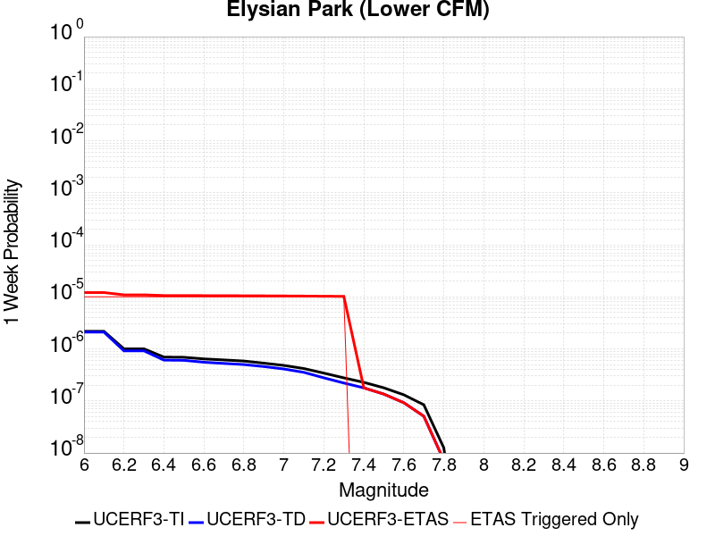 | 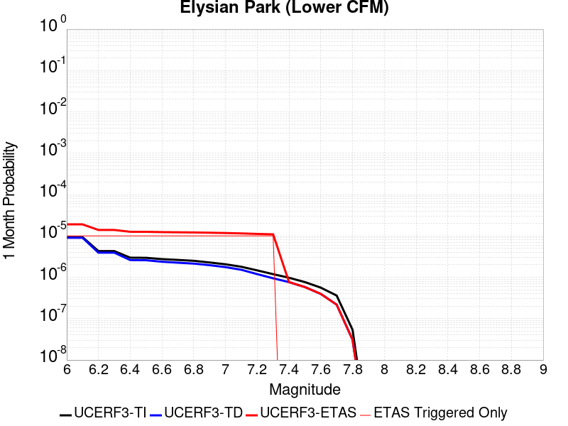 |  | 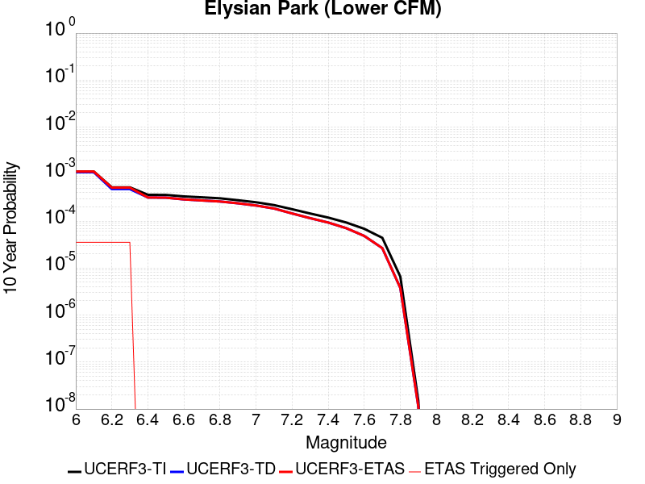 |

| Magnitude | 1 wk TI Prob | 1 wk TD Prob | 1 wk ETAS Prob | 1 wk ETAS/TD Gain | 1 wk ETAS Triggered Only | 1 mo TI Prob | 1 mo TD Prob | 1 mo ETAS Prob | 1 mo ETAS/TD Gain | 1 mo ETAS Triggered Only | 1 yr TI Prob | 1 yr TD Prob | 1 yr ETAS Prob | 1 yr ETAS/TD Gain | 1 yr ETAS Triggered Only | 10 yr TI Prob | 10 yr TD Prob | 10 yr ETAS Prob | 10 yr ETAS/TD Gain | 10 yr ETAS Triggered Only |
|-----|-----|-----|-----|-----|-----|-----|-----|-----|-----|-----|-----|-----|-----|-----|-----|-----|-----|-----|-----|-----|
| 6.0 | 2.1766498E-6 | 2.10379E-6 | 2.10379E-6 | 1.0 | 0.0 | 9.328466E-6 | 9.016219E-6 | 9.016219E-6 | 1.0 | 0.0 | 1.1356815E-4 | 1.09768385E-4 | 1.09768385E-4 | 1.0 | 0.0 | 0.0011351013 | 0.0010972836 | 0.0011366911 | 1.0359137 | 3.9450842E-5 |
| 6.1 | 2.1766498E-6 | 2.10379E-6 | 2.10379E-6 | 1.0 | 0.0 | 9.328466E-6 | 9.016219E-6 | 9.016219E-6 | 1.0 | 0.0 | 1.1356815E-4 | 1.09768385E-4 | 1.09768385E-4 | 1.0 | 0.0 | 0.0011351013 | 0.0010972836 | 0.0011366911 | 1.0359137 | 3.9450842E-5 |
| 6.2 | 1.0031182E-6 | 9.1862177E-7 | 9.1862177E-7 | 1.0 | 0.0 | 4.299071E-6 | 3.9369447E-6 | 3.9369447E-6 | 1.0 | 0.0 | 5.2339932E-5 | 4.793135E-5 | 4.793135E-5 | 1.0 | 0.0 | 5.2327604E-4 | 4.7921992E-4 | 5.1865185E-4 | 1.0822836 | 3.9450842E-5 |
| 6.3 | 1.0031182E-6 | 9.1862177E-7 | 9.1862177E-7 | 1.0 | 0.0 | 4.299071E-6 | 3.9369447E-6 | 3.9369447E-6 | 1.0 | 0.0 | 5.2339932E-5 | 4.793135E-5 | 4.793135E-5 | 1.0 | 0.0 | 5.2327604E-4 | 4.7921992E-4 | 5.1865185E-4 | 1.0822836 | 3.9450842E-5 |
| 6.4 | 6.9606244E-7 | 6.091946E-7 | 6.091946E-7 | 1.0 | 0.0 | 2.9831212E-6 | 2.6108314E-6 | 2.6108314E-6 | 1.0 | 0.0 | 3.6318896E-5 | 3.178641E-5 | 3.178641E-5 | 1.0 | 0.0 | 3.6312963E-4 | 3.178189E-4 | 3.178189E-4 | 1.0 | 0.0 |
| 6.5 | 6.901879E-7 | 6.03263E-7 | 6.03263E-7 | 1.0 | 0.0 | 2.9579448E-6 | 2.5854101E-6 | 2.5854101E-6 | 1.0 | 0.0 | 3.6012385E-5 | 3.1476917E-5 | 3.1476917E-5 | 1.0 | 0.0 | 3.600655E-4 | 3.147248E-4 | 3.147248E-4 | 1.0 | 0.0 |
| 6.6 | 6.4198554E-7 | 5.5466126E-7 | 5.5466126E-7 | 1.0 | 0.0 | 2.7513638E-6 | 2.3771174E-6 | 2.3771174E-6 | 1.0 | 0.0 | 3.3497337E-5 | 2.8941022E-5 | 2.8941022E-5 | 1.0 | 0.0 | 3.349229E-4 | 2.893727E-4 | 2.893727E-4 | 1.0 | 0.0 |
| 6.7 | 6.138733E-7 | 5.26342E-7 | 5.26342E-7 | 1.0 | 0.0 | 2.6308828E-6 | 2.2557495E-6 | 2.2557495E-6 | 1.0 | 0.0 | 3.203053E-5 | 2.7463404E-5 | 2.7463404E-5 | 1.0 | 0.0 | 3.2025913E-4 | 2.7460023E-4 | 2.7460023E-4 | 1.0 | 0.0 |
| 6.8 | 5.84778E-7 | 5.00294E-7 | 5.00294E-7 | 1.0 | 0.0 | 2.506189E-6 | 2.1441151E-6 | 2.1441151E-6 | 1.0 | 0.0 | 3.0512423E-5 | 2.6104291E-5 | 2.6104291E-5 | 1.0 | 0.0 | 3.0508233E-4 | 2.6101235E-4 | 2.6101235E-4 | 1.0 | 0.0 |
| 6.9 | 5.322785E-7 | 4.5800772E-7 | 4.5800772E-7 | 1.0 | 0.0 | 2.2811914E-6 | 1.9628887E-6 | 1.9628887E-6 | 1.0 | 0.0 | 2.7773152E-5 | 2.3897908E-5 | 2.3897908E-5 | 1.0 | 0.0 | 2.7769682E-4 | 2.389535E-4 | 2.389535E-4 | 1.0 | 0.0 |
| 7.0 | 4.8147206E-7 | 4.1124116E-7 | 4.1124116E-7 | 1.0 | 0.0 | 2.06345E-6 | 1.7624608E-6 | 1.7624608E-6 | 1.0 | 0.0 | 2.5122214E-5 | 2.145775E-5 | 2.145775E-5 | 1.0 | 0.0 | 2.5119373E-4 | 2.1455686E-4 | 2.1455686E-4 | 1.0 | 0.0 |
| 7.1 | 4.1932955E-7 | 3.5455713E-7 | 3.5455713E-7 | 1.0 | 0.0 | 1.7971255E-6 | 1.5195296E-6 | 1.5195296E-6 | 1.0 | 0.0 | 2.1879783E-5 | 1.8500115E-5 | 1.8500115E-5 | 1.0 | 0.0 | 2.1877629E-4 | 1.8498581E-4 | 1.8498581E-4 | 1.0 | 0.0 |
| 7.2 | 3.426051E-7 | 2.7810324E-7 | 2.7810324E-7 | 1.0 | 0.0 | 1.4683067E-6 | 1.1918704E-6 | 1.1918704E-6 | 1.0 | 0.0 | 1.7876488E-5 | 1.4510925E-5 | 1.4510925E-5 | 1.0 | 0.0 | 1.787505E-4 | 1.4509981E-4 | 1.4509981E-4 | 1.0 | 0.0 |
| 7.3 | 2.7771645E-7 | 2.209654E-7 | 2.209654E-7 | 1.0 | 0.0 | 1.1902127E-6 | 9.469942E-7 | 9.469942E-7 | 1.0 | 0.0 | 1.4490744E-5 | 1.1529593E-5 | 1.1529593E-5 | 1.0 | 0.0 | 1.4489799E-4 | 1.1528997E-4 | 1.1528997E-4 | 1.0 | 0.0 |
| 7.4 | 2.2756493E-7 | 1.7839815E-7 | 1.7839815E-7 | 1.0 | 0.0 | 9.752779E-7 | 7.6456325E-7 | 7.6456325E-7 | 1.0 | 0.0 | 1.1873944E-5 | 9.308518E-6 | 9.308518E-6 | 1.0 | 0.0 | 1.18733085E-4 | 9.30813E-5 | 9.30813E-5 | 1.0 | 0.0 |
| 7.5 | 1.7874558E-7 | 1.3542729E-7 | 1.3542729E-7 | 1.0 | 0.0 | 7.660522E-7 | 5.804025E-7 | 5.804025E-7 | 1.0 | 0.0 | 9.326646E-6 | 7.0663777E-6 | 7.0663777E-6 | 1.0 | 0.0 | 9.326255E-5 | 7.066155E-5 | 7.066155E-5 | 1.0 | 0.0 |
| 7.6 | 1.3124549E-7 | 9.250854E-8 | 9.250854E-8 | 1.0 | 0.0 | 5.624805E-7 | 3.964651E-7 | 3.964651E-7 | 1.0 | 0.0 | 6.8481786E-6 | 4.826952E-6 | 4.826952E-6 | 1.0 | 0.0 | 6.8479676E-5 | 4.8268485E-5 | 4.8268485E-5 | 1.0 | 0.0 |
| 7.7 | 8.439993E-8 | 5.090022E-8 | 5.090022E-8 | 1.0 | 0.0 | 3.6171392E-7 | 2.1814377E-7 | 2.1814377E-7 | 1.0 | 0.0 | 4.403858E-6 | 2.6558973E-6 | 2.6558973E-6 | 1.0 | 0.0 | 4.4037708E-5 | 2.655867E-5 | 2.655867E-5 | 1.0 | 0.0 |
| 7.8 | 1.2591407E-8 | 7.227629E-9 | 7.227629E-9 | 1.0 | 0.0 | 5.3963173E-8 | 3.0975556E-8 | 3.0975556E-8 | 1.0 | 0.0 | 6.570014E-7 | 3.7712732E-7 | 3.7712732E-7 | 1.0 | 0.0 | 6.5699946E-6 | 3.771267E-6 | 3.771267E-6 | 1.0 | 0.0 |
| 7.9 | 2.8324232E-11 | 2.1406099E-11 | 2.1406099E-11 | 1.0 | 0.0 | 1.2138957E-10 | 9.174017E-11 | 9.174017E-11 | 1.0 | 0.0 | 1.4779177E-9 | 1.1169362E-9 | 1.1169362E-9 | 1.0 | 0.0 | 1.4779177E-8 | 1.1169361E-8 | 1.1169361E-8 | 1.0 | 0.0 |

## San Jacinto (Superstition Mtn)
*[(top)](#table-of-contents)*

| 1 Week | 1 Month | 1 Year | 10 Year |
|-----|-----|-----|-----|
|  | 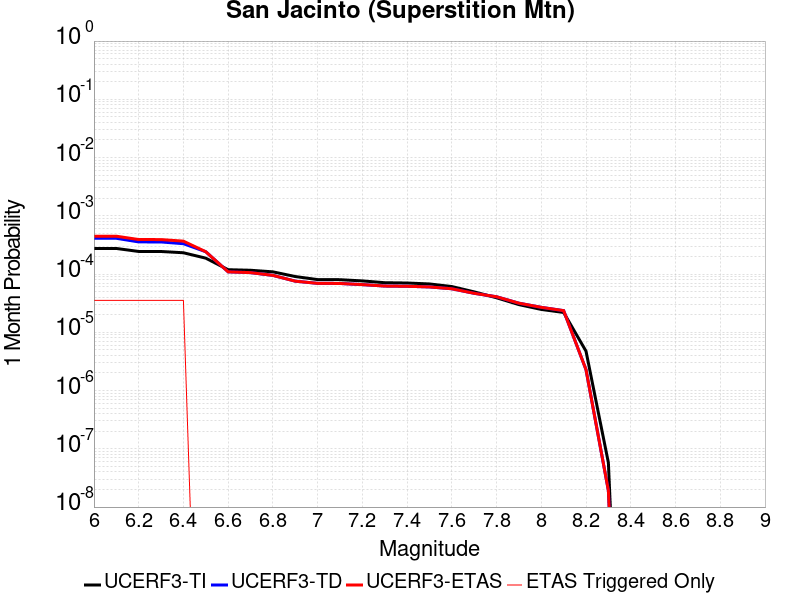 | 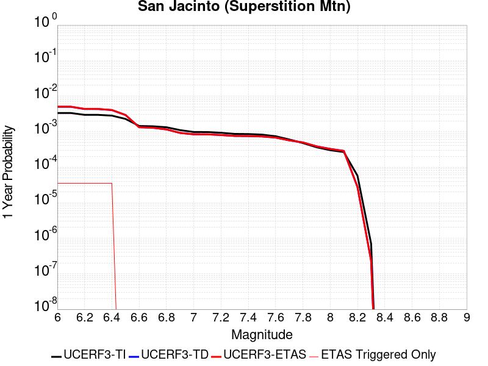 | 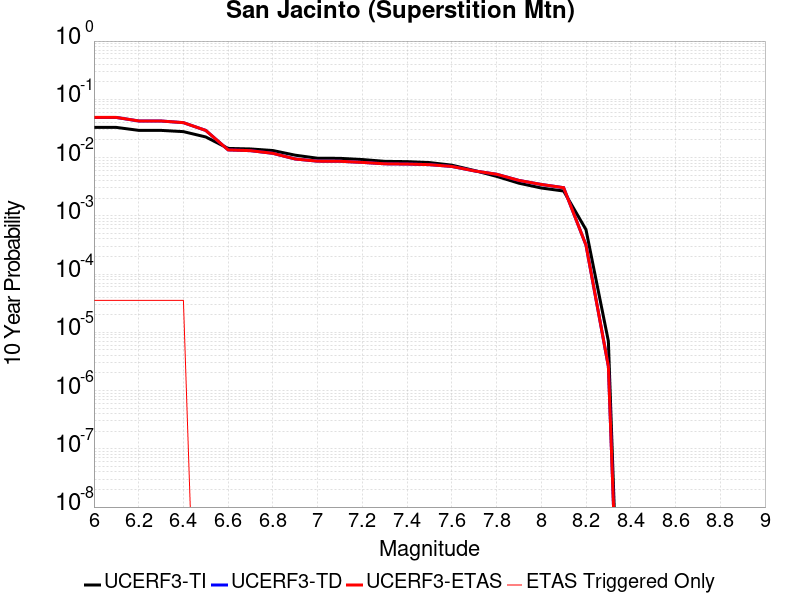 |

| Magnitude | 1 wk TI Prob | 1 wk TD Prob | 1 wk ETAS Prob | 1 wk ETAS/TD Gain | 1 wk ETAS Triggered Only | 1 mo TI Prob | 1 mo TD Prob | 1 mo ETAS Prob | 1 mo ETAS/TD Gain | 1 mo ETAS Triggered Only | 1 yr TI Prob | 1 yr TD Prob | 1 yr ETAS Prob | 1 yr ETAS/TD Gain | 1 yr ETAS Triggered Only | 10 yr TI Prob | 10 yr TD Prob | 10 yr ETAS Prob | 10 yr ETAS/TD Gain | 10 yr ETAS Triggered Only |
|-----|-----|-----|-----|-----|-----|-----|-----|-----|-----|-----|-----|-----|-----|-----|-----|-----|-----|-----|-----|-----|
| 6.0 | 6.4193904E-5 | 9.599367E-5 | 9.599367E-5 | 1.0 | 0.0 | 2.7508775E-4 | 4.1134638E-4 | 4.50781E-4 | 1.0958672 | 3.9450842E-5 | 0.0033440501 | 0.0049980893 | 0.005037343 | 1.0078537 | 3.9450842E-5 | 0.03294174 | 0.048823986 | 0.04886151 | 1.0007685 | 3.9450842E-5 |
| 6.1 | 6.4193904E-5 | 9.599367E-5 | 9.599367E-5 | 1.0 | 0.0 | 2.7508775E-4 | 4.1134638E-4 | 4.50781E-4 | 1.0958672 | 3.9450842E-5 | 0.0033440501 | 0.0049980893 | 0.005037343 | 1.0078537 | 3.9450842E-5 | 0.03294174 | 0.048823986 | 0.04886151 | 1.0007685 | 3.9450842E-5 |
| 6.2 | 5.7023593E-5 | 8.3144434E-5 | 8.3144434E-5 | 1.0 | 0.0 | 2.4436394E-4 | 3.5629404E-4 | 3.957308E-4 | 1.1106861 | 3.9450842E-5 | 0.002971072 | 0.0043308944 | 0.0043701744 | 1.0090697 | 3.9450842E-5 | 0.029316625 | 0.04250403 | 0.042541806 | 1.0008887 | 3.9450842E-5 |
| 6.3 | 5.6940098E-5 | 8.298979E-5 | 8.298979E-5 | 1.0 | 0.0 | 2.4400617E-4 | 3.5563146E-4 | 3.950683E-4 | 1.1108924 | 3.9450842E-5 | 0.002966728 | 0.00432286 | 0.0043621403 | 1.0090866 | 3.9450842E-5 | 0.029274331 | 0.042427283 | 0.04246506 | 1.0008904 | 3.9450842E-5 |
| 6.4 | 5.4171585E-5 | 7.7483564E-5 | 7.7483564E-5 | 1.0 | 0.0 | 2.3214328E-4 | 3.3203943E-4 | 3.714772E-4 | 1.1187743 | 3.9450842E-5 | 0.0028226813 | 0.0040367353 | 0.004076027 | 1.0097336 | 3.9450842E-5 | 0.02787096 | 0.03971653 | 0.039754417 | 1.0009539 | 3.9450842E-5 |
| 6.5 | 4.375144E-5 | 5.642133E-5 | 5.642133E-5 | 1.0 | 0.0 | 1.874927E-4 | 2.4178992E-4 | 2.4178992E-4 | 1.0 | 0.0 | 0.0022803338 | 0.002940994 | 0.002940994 | 1.0 | 0.0 | 0.022570757 | 0.029236801 | 0.029236801 | 1.0 | 0.0 |
| 6.6 | 2.772192E-5 | 2.5488358E-5 | 2.5488358E-5 | 1.0 | 0.0 | 1.1880282E-4 | 1.09231354E-4 | 1.09231354E-4 | 1.0 | 0.0 | 0.0014454646 | 0.0013290998 | 0.0013290998 | 1.0 | 0.0 | 0.014360986 | 0.01354049 | 0.01354049 | 1.0 | 0.0 |
| 6.7 | 2.7124124E-5 | 2.4699386E-5 | 2.4699386E-5 | 1.0 | 0.0 | 1.1624106E-4 | 1.05850326E-4 | 1.05850326E-4 | 1.0 | 0.0 | 0.0014143161 | 0.001287985 | 0.001287985 | 1.0 | 0.0 | 0.014053487 | 0.013133943 | 0.013133943 | 1.0 | 0.0 |
| 6.8 | 2.5475807E-5 | 2.216446E-5 | 2.216446E-5 | 1.0 | 0.0 | 1.0917746E-4 | 9.4987154E-5 | 9.4987154E-5 | 1.0 | 0.0 | 0.001328425 | 0.001155867 | 0.001155867 | 1.0 | 0.0 | 0.0132051185 | 0.011822182 | 0.011822182 | 1.0 | 0.0 |
| 6.9 | 2.1162023E-5 | 1.7626244E-5 | 1.7626244E-5 | 1.0 | 0.0 | 9.069123E-5 | 7.5538876E-5 | 7.5538876E-5 | 1.0 | 0.0 | 0.0011036064 | 9.193016E-4 | 9.193016E-4 | 1.0 | 0.0 | 0.010981417 | 0.00944688 | 0.00944688 | 1.0 | 0.0 |
| 7.0 | 1.8754288E-5 | 1.6161559E-5 | 1.6161559E-5 | 1.0 | 0.0 | 8.037304E-5 | 6.9261994E-5 | 6.9261994E-5 | 1.0 | 0.0 | 9.781026E-4 | 8.4294105E-4 | 8.4294105E-4 | 1.0 | 0.0 | 0.009738087 | 0.008670042 | 0.008670042 | 1.0 | 0.0 |
| 7.1 | 1.8678527E-5 | 1.6086702E-5 | 1.6086702E-5 | 1.0 | 0.0 | 8.0048376E-5 | 6.89412E-5 | 6.89412E-5 | 1.0 | 0.0 | 9.7415317E-4 | 8.3903834E-4 | 8.3903834E-4 | 1.0 | 0.0 | 0.009698939 | 0.008630998 | 0.008630998 | 1.0 | 0.0 |
| 7.2 | 1.7804578E-5 | 1.5381282E-5 | 1.5381282E-5 | 1.0 | 0.0 | 7.6303106E-5 | 6.5918124E-5 | 6.5918124E-5 | 1.0 | 0.0 | 9.285943E-4 | 8.022599E-4 | 8.022599E-4 | 1.0 | 0.0 | 0.009247236 | 0.008262311 | 0.008262311 | 1.0 | 0.0 |
| 7.3 | 1.6583685E-5 | 1.4530388E-5 | 1.4530388E-5 | 1.0 | 0.0 | 7.1070994E-5 | 6.227162E-5 | 6.227162E-5 | 1.0 | 0.0 | 8.649459E-4 | 7.5789524E-4 | 7.5789524E-4 | 1.0 | 0.0 | 0.00861587 | 0.007817623 | 0.007817623 | 1.0 | 0.0 |
| 7.4 | 1.6387552E-5 | 1.4395274E-5 | 1.4395274E-5 | 1.0 | 0.0 | 7.023047E-5 | 6.169258E-5 | 6.169258E-5 | 1.0 | 0.0 | 8.5472054E-4 | 7.5085036E-4 | 7.5085036E-4 | 1.0 | 0.0 | 0.008514405 | 0.0077470057 | 0.0077470057 | 1.0 | 0.0 |
| 7.5 | 1.5790754E-5 | 1.4035962E-5 | 1.4035962E-5 | 1.0 | 0.0 | 6.767291E-5 | 6.0152746E-5 | 6.0152746E-5 | 1.0 | 0.0 | 8.236062E-4 | 7.321156E-4 | 7.321156E-4 | 1.0 | 0.0 | 0.008205604 | 0.007557569 | 0.007557569 | 1.0 | 0.0 |
| 7.6 | 1.4248672E-5 | 1.3054932E-5 | 1.3054932E-5 | 1.0 | 0.0 | 6.106431E-5 | 5.594852E-5 | 5.594852E-5 | 1.0 | 0.0 | 7.432043E-4 | 6.8096205E-4 | 6.8096205E-4 | 1.0 | 0.0 | 0.007407237 | 0.0070401574 | 0.0070401574 | 1.0 | 0.0 |
| 7.7 | 1.15449975E-5 | 1.090368E-5 | 1.090368E-5 | 1.0 | 0.0 | 4.947762E-5 | 4.6729223E-5 | 4.6729223E-5 | 1.0 | 0.0 | 6.022235E-4 | 5.687805E-4 | 5.687805E-4 | 1.0 | 0.0 | 0.006005941 | 0.0059101824 | 0.0059101824 | 1.0 | 0.0 |
| 7.8 | 9.1391985E-6 | 9.514299E-6 | 9.514299E-6 | 1.0 | 0.0 | 3.9167408E-5 | 4.0774932E-5 | 4.0774932E-5 | 1.0 | 0.0 | 4.767588E-4 | 4.963223E-4 | 4.963223E-4 | 1.0 | 0.0 | 0.0047573727 | 0.0051766867 | 0.0051766867 | 1.0 | 0.0 |
| 7.9 | 6.973017E-6 | 7.3821784E-6 | 7.3821784E-6 | 1.0 | 0.0 | 2.9884017E-5 | 3.1637526E-5 | 3.1637526E-5 | 1.0 | 0.0 | 3.6377716E-4 | 3.8511935E-4 | 3.8511935E-4 | 1.0 | 0.0 | 0.0036318225 | 0.0040517948 | 0.0040517948 | 1.0 | 0.0 |
| 8.0 | 5.7638235E-6 | 6.259972E-6 | 6.259972E-6 | 1.0 | 0.0 | 2.4701867E-5 | 2.6828178E-5 | 2.6828178E-5 | 1.0 | 0.0 | 3.0070372E-4 | 3.2658462E-4 | 3.2658462E-4 | 1.0 | 0.0 | 0.0030029714 | 0.0034534496 | 0.0034534496 | 1.0 | 0.0 |
| 8.1 | 5.1124434E-6 | 5.4956718E-6 | 5.4956718E-6 | 1.0 | 0.0 | 2.1910288E-5 | 2.355267E-5 | 2.355267E-5 | 1.0 | 0.0 | 2.6672508E-4 | 2.867165E-4 | 2.867165E-4 | 1.0 | 0.0 | 0.0026640517 | 0.003040336 | 0.003040336 | 1.0 | 0.0 |
| 8.2 | 1.1075938E-6 | 5.336568E-7 | 5.336568E-7 | 1.0 | 0.0 | 4.7468216E-6 | 2.2870988E-6 | 2.2870988E-6 | 1.0 | 0.0 | 5.779102E-5 | 2.7845093E-5 | 2.7845093E-5 | 1.0 | 0.0 | 5.777599E-4 | 3.1346595E-4 | 3.1346595E-4 | 1.0 | 0.0 |
| 8.3 | 1.3584393E-8 | 4.473836E-9 | 4.473836E-9 | 1.0 | 0.0 | 5.8218827E-8 | 1.9173582E-8 | 1.9173582E-8 | 1.0 | 0.0 | 7.0881396E-7 | 2.3343837E-7 | 2.3343837E-7 | 1.0 | 0.0 | 7.0881174E-6 | 2.6163038E-6 | 2.6163038E-6 | 1.0 | 0.0 |

## San Gabriel
*[(top)](#table-of-contents)*

| 1 Week | 1 Month | 1 Year | 10 Year |
|-----|-----|-----|-----|
| 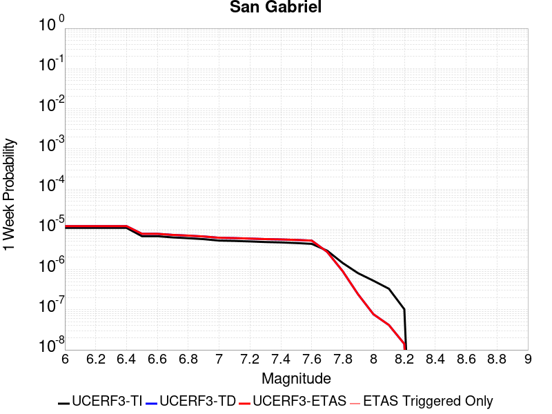 | 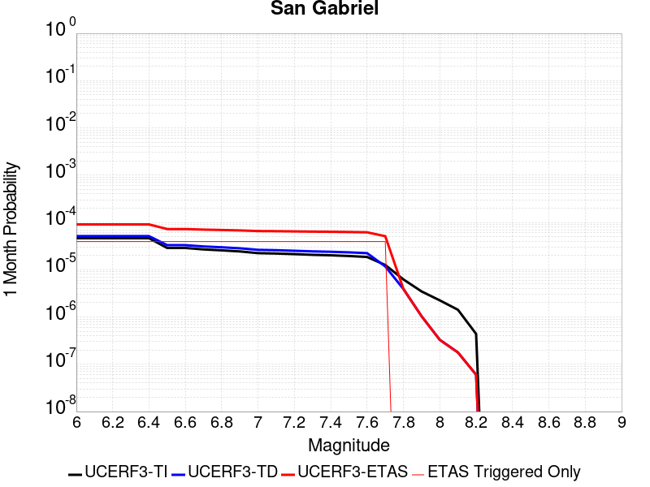 | 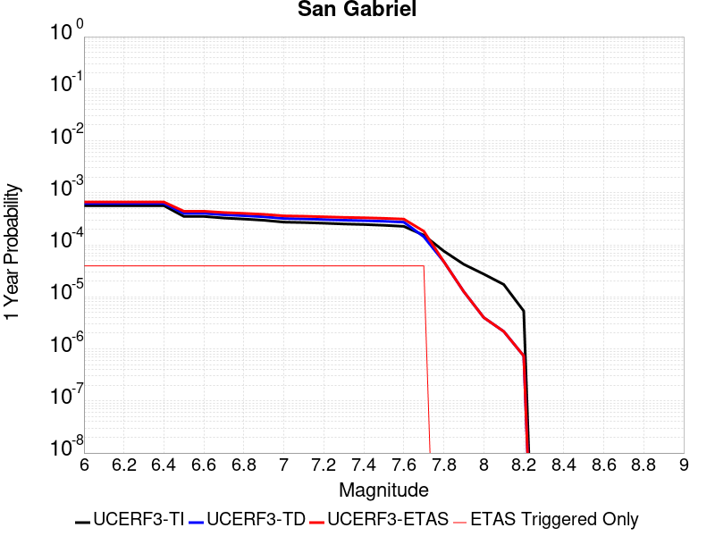 | 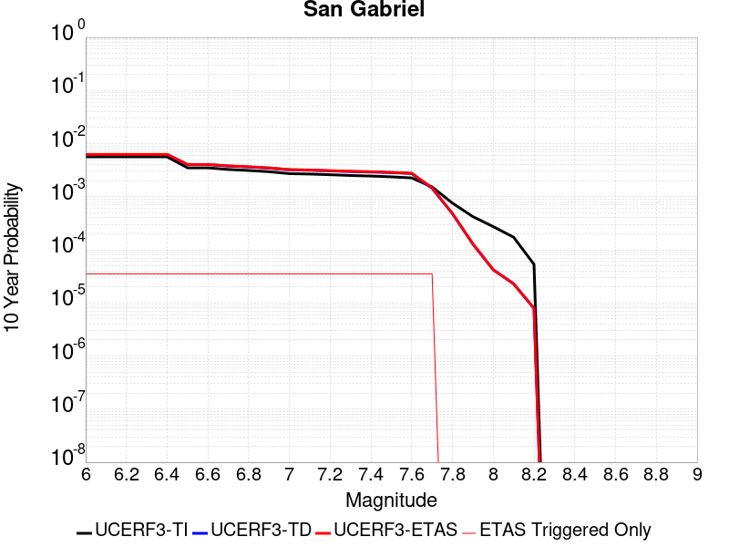 |

| Magnitude | 1 wk TI Prob | 1 wk TD Prob | 1 wk ETAS Prob | 1 wk ETAS/TD Gain | 1 wk ETAS Triggered Only | 1 mo TI Prob | 1 mo TD Prob | 1 mo ETAS Prob | 1 mo ETAS/TD Gain | 1 mo ETAS Triggered Only | 1 yr TI Prob | 1 yr TD Prob | 1 yr ETAS Prob | 1 yr ETAS/TD Gain | 1 yr ETAS Triggered Only | 10 yr TI Prob | 10 yr TD Prob | 10 yr ETAS Prob | 10 yr ETAS/TD Gain | 10 yr ETAS Triggered Only |
|-----|-----|-----|-----|-----|-----|-----|-----|-----|-----|-----|-----|-----|-----|-----|-----|-----|-----|-----|-----|-----|
| 6.0 | 1.083775E-5 | 1.19851875E-5 | 1.19851875E-5 | 1.0 | 0.0 | 4.6446676E-5 | 5.1364143E-5 | 9.081296E-5 | 1.7680225 | 3.9450842E-5 | 5.653415E-4 | 6.251903E-4 | 6.6461647E-4 | 1.0630627 | 3.9450842E-5 | 0.0056390543 | 0.006246409 | 0.0062856134 | 1.0062764 | 3.9450842E-5 |
| 6.1 | 1.083775E-5 | 1.19851875E-5 | 1.19851875E-5 | 1.0 | 0.0 | 4.6446676E-5 | 5.1364143E-5 | 9.081296E-5 | 1.7680225 | 3.9450842E-5 | 5.653415E-4 | 6.251903E-4 | 6.6461647E-4 | 1.0630627 | 3.9450842E-5 | 0.0056390543 | 0.006246409 | 0.0062856134 | 1.0062764 | 3.9450842E-5 |
| 6.2 | 1.083775E-5 | 1.19851875E-5 | 1.19851875E-5 | 1.0 | 0.0 | 4.6446676E-5 | 5.1364143E-5 | 9.081296E-5 | 1.7680225 | 3.9450842E-5 | 5.653415E-4 | 6.251903E-4 | 6.6461647E-4 | 1.0630627 | 3.9450842E-5 | 0.0056390543 | 0.006246409 | 0.0062856134 | 1.0062764 | 3.9450842E-5 |
| 6.3 | 1.083775E-5 | 1.19851875E-5 | 1.19851875E-5 | 1.0 | 0.0 | 4.6446676E-5 | 5.1364143E-5 | 9.081296E-5 | 1.7680225 | 3.9450842E-5 | 5.653415E-4 | 6.251903E-4 | 6.6461647E-4 | 1.0630627 | 3.9450842E-5 | 0.0056390543 | 0.006246409 | 0.0062856134 | 1.0062764 | 3.9450842E-5 |
| 6.4 | 1.083775E-5 | 1.19851875E-5 | 1.19851875E-5 | 1.0 | 0.0 | 4.6446676E-5 | 5.1364143E-5 | 9.081296E-5 | 1.7680225 | 3.9450842E-5 | 5.653415E-4 | 6.251903E-4 | 6.6461647E-4 | 1.0630627 | 3.9450842E-5 | 0.0056390543 | 0.006246409 | 0.0062856134 | 1.0062764 | 3.9450842E-5 |
| 6.5 | 6.7317824E-6 | 7.716944E-6 | 7.716944E-6 | 1.0 | 0.0 | 2.8850178E-5 | 3.3072207E-5 | 7.252175E-5 | 2.1928306 | 3.9450842E-5 | 3.511943E-4 | 4.0258077E-4 | 4.4201573E-4 | 1.0979553 | 3.9450842E-5 | 0.003506398 | 0.0040296097 | 0.0040689013 | 1.0097508 | 3.9450842E-5 |
| 6.6 | 6.7317824E-6 | 7.716944E-6 | 7.716944E-6 | 1.0 | 0.0 | 2.8850178E-5 | 3.3072207E-5 | 7.252175E-5 | 2.1928306 | 3.9450842E-5 | 3.511943E-4 | 4.0258077E-4 | 4.4201573E-4 | 1.0979553 | 3.9450842E-5 | 0.003506398 | 0.0040296097 | 0.0040689013 | 1.0097508 | 3.9450842E-5 |
| 6.7 | 6.274881E-6 | 7.2458647E-6 | 7.2458647E-6 | 1.0 | 0.0 | 2.6892068E-5 | 3.1053343E-5 | 7.050296E-5 | 2.2703824 | 3.9450842E-5 | 3.2736175E-4 | 3.780098E-4 | 4.1744576E-4 | 1.1043252 | 3.9450842E-5 | 0.0032687993 | 0.0037847564 | 0.003824058 | 1.0103842 | 3.9450842E-5 |
| 6.8 | 5.996209E-6 | 6.958585E-6 | 6.958585E-6 | 1.0 | 0.0 | 2.5697784E-5 | 2.9822171E-5 | 6.927184E-5 | 2.3228302 | 3.9450842E-5 | 3.128256E-4 | 3.6302538E-4 | 4.024619E-4 | 1.1086329 | 3.9450842E-5 | 0.003123856 | 0.0036354093 | 0.0036747167 | 1.0108124 | 3.9450842E-5 |
| 6.9 | 5.686331E-6 | 6.6236316E-6 | 6.6236316E-6 | 1.0 | 0.0 | 2.4369761E-5 | 2.8386688E-5 | 6.7836416E-5 | 2.3897262 | 3.9450842E-5 | 2.9666146E-4 | 3.4555403E-4 | 3.8499123E-4 | 1.1141275 | 3.9450842E-5 | 0.0029626573 | 0.0034612515 | 0.0035005657 | 1.0113584 | 3.9450842E-5 |
| 7.0 | 5.2329838E-6 | 6.147514E-6 | 6.147514E-6 | 1.0 | 0.0 | 2.242688E-5 | 2.6346226E-5 | 6.579603E-5 | 2.4973607 | 3.9450842E-5 | 2.7301308E-4 | 3.2071886E-4 | 3.6015705E-4 | 1.1229681 | 3.9450842E-5 | 0.002726779 | 0.0032136322 | 0.003252956 | 1.0122366 | 3.9450842E-5 |
| 7.1 | 5.135671E-6 | 6.03764E-6 | 6.03764E-6 | 1.0 | 0.0 | 2.2009834E-5 | 2.5875348E-5 | 6.532517E-5 | 2.5246103 | 3.9450842E-5 | 2.6793676E-4 | 3.1498758E-4 | 3.54426E-4 | 1.1252062 | 3.9450842E-5 | 0.0026761394 | 0.0031564834 | 0.0031958097 | 1.0124589 | 3.9450842E-5 |
| 7.2 | 4.989062E-6 | 5.87102E-6 | 5.87102E-6 | 1.0 | 0.0 | 2.1381518E-5 | 2.5161276E-5 | 6.461113E-5 | 2.5678794 | 3.9450842E-5 | 2.6028889E-4 | 3.0629625E-4 | 3.45735E-4 | 1.1287602 | 3.9450842E-5 | 0.0025998424 | 0.003069813 | 0.0031091426 | 1.0128118 | 3.9450842E-5 |
| 7.3 | 4.8219395E-6 | 5.702574E-6 | 5.702574E-6 | 1.0 | 0.0 | 2.0665291E-5 | 2.443938E-5 | 6.388926E-5 | 2.6141932 | 3.9450842E-5 | 2.5157086E-4 | 2.9750957E-4 | 3.3694867E-4 | 1.1325642 | 3.9450842E-5 | 0.0025128627 | 0.0029821852 | 0.0030215185 | 1.0131894 | 3.9450842E-5 |
| 7.4 | 4.7118383E-6 | 5.5911332E-6 | 5.5911332E-6 | 1.0 | 0.0 | 2.0193436E-5 | 2.3961782E-5 | 6.341168E-5 | 2.6463675 | 3.9450842E-5 | 2.4582737E-4 | 2.916964E-4 | 3.3113573E-4 | 1.1352068 | 3.9450842E-5 | 0.002455556 | 0.0029242067 | 0.0029635422 | 1.0134517 | 3.9450842E-5 |
| 7.5 | 4.5506545E-6 | 5.4365014E-6 | 5.4365014E-6 | 1.0 | 0.0 | 1.9502659E-5 | 2.3299088E-5 | 6.2749015E-5 | 2.693196 | 3.9450842E-5 | 2.37419E-4 | 2.8363022E-4 | 3.2306986E-4 | 1.1390531 | 3.9450842E-5 | 0.002371655 | 0.002843753 | 0.0028830916 | 1.0138334 | 3.9450842E-5 |
| 7.6 | 4.343636E-6 | 5.2293817E-6 | 5.2293817E-6 | 1.0 | 0.0 | 1.861545E-5 | 2.2411448E-5 | 6.186141E-5 | 2.7602594 | 3.9450842E-5 | 2.2661954E-4 | 2.7282597E-4 | 3.1226603E-4 | 1.1445613 | 3.9450842E-5 | 0.0022638857 | 0.0027359722 | 0.0027753152 | 1.0143799 | 3.9450842E-5 |
| 7.7 | 2.936235E-6 | 2.7440458E-6 | 2.7440458E-6 | 1.0 | 0.0 | 1.2583803E-5 | 1.1760143E-5 | 5.1210525E-5 | 4.3545833 | 3.9450842E-5 | 1.5319703E-4 | 1.4317037E-4 | 1.8261556E-4 | 1.2755123 | 3.9450842E-5 | 0.0015309147 | 0.0014380751 | 0.0014774691 | 1.0273937 | 3.9450842E-5 |
| 7.8 | 1.4541639E-6 | 9.1237047E-7 | 9.1237047E-7 | 1.0 | 0.0 | 6.232116E-6 | 3.9101533E-6 | 3.9101533E-6 | 1.0 | 0.0 | 7.587337E-5 | 4.7605077E-5 | 4.7605077E-5 | 1.0 | 0.0 | 7.584747E-4 | 4.8085177E-4 | 4.8085177E-4 | 1.0 | 0.0 |
| 7.9 | 8.098958E-7 | 2.41753E-7 | 2.41753E-7 | 1.0 | 0.0 | 3.4709774E-6 | 1.0360839E-6 | 1.0360839E-6 | 1.0 | 0.0 | 4.225833E-5 | 1.2614248E-5 | 1.2614248E-5 | 1.0 | 0.0 | 4.2250296E-4 | 1.2921814E-4 | 1.2921814E-4 | 1.0 | 0.0 |
| 8.0 | 5.2473234E-7 | 7.6792055E-8 | 7.6792055E-8 | 1.0 | 0.0 | 2.248851E-6 | 3.2910876E-7 | 3.2910876E-7 | 1.0 | 0.0 | 2.7379416E-5 | 4.0068917E-6 | 4.0068917E-6 | 1.0 | 0.0 | 2.7376044E-4 | 4.21918E-5 | 4.21918E-5 | 1.0 | 0.0 |
| 8.1 | 3.3162388E-7 | 4.1496126E-8 | 4.1496126E-8 | 1.0 | 0.0 | 1.4212444E-6 | 1.7784053E-7 | 1.7784053E-7 | 1.0 | 0.0 | 1.7303513E-5 | 2.1652063E-6 | 2.1652063E-6 | 1.0 | 0.0 | 1.7302166E-4 | 2.2965523E-5 | 2.2965523E-5 | 1.0 | 0.0 |
| 8.2 | 1.0235345E-7 | 1.4043474E-8 | 1.4043474E-8 | 1.0 | 0.0 | 4.3865757E-7 | 6.0186316E-8 | 6.0186316E-8 | 1.0 | 0.0 | 5.340643E-6 | 7.327681E-7 | 7.327681E-7 | 1.0 | 0.0 | 5.3405143E-5 | 7.9273705E-6 | 7.9273705E-6 | 1.0 | 0.0 |

## Newport-Inglewood (Offshore)
*[(top)](#table-of-contents)*

| 1 Week | 1 Month | 1 Year | 10 Year |
|-----|-----|-----|-----|
|  | 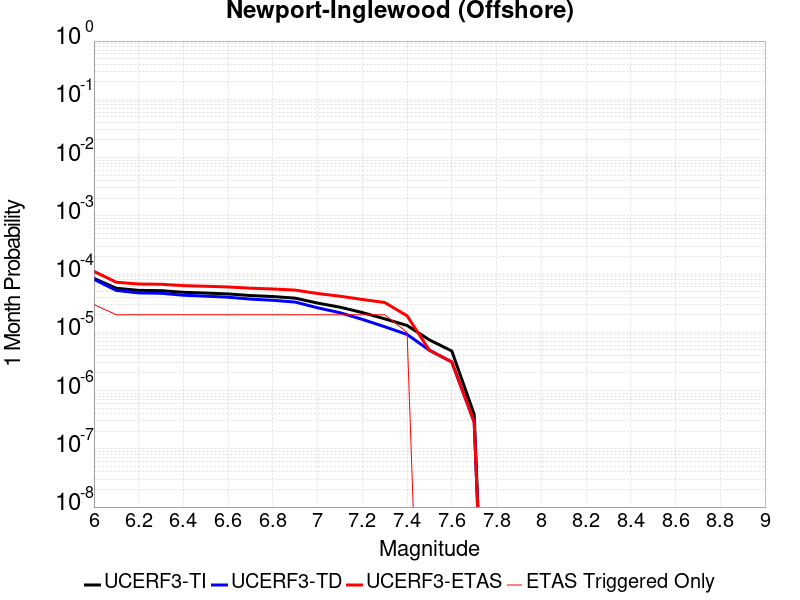 | 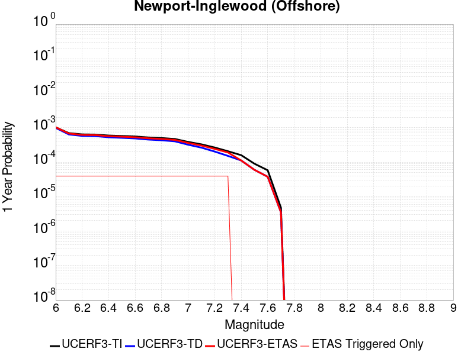 | 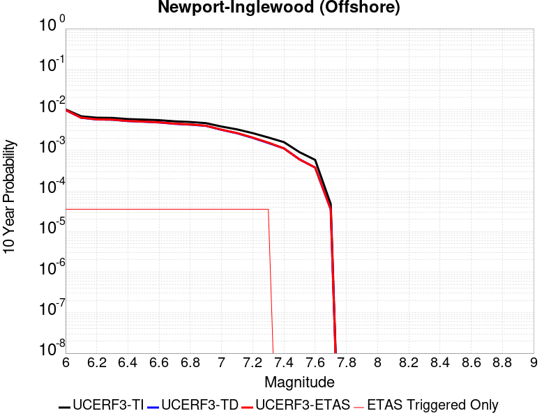 |

| Magnitude | 1 wk TI Prob | 1 wk TD Prob | 1 wk ETAS Prob | 1 wk ETAS/TD Gain | 1 wk ETAS Triggered Only | 1 mo TI Prob | 1 mo TD Prob | 1 mo ETAS Prob | 1 mo ETAS/TD Gain | 1 mo ETAS Triggered Only | 1 yr TI Prob | 1 yr TD Prob | 1 yr ETAS Prob | 1 yr ETAS/TD Gain | 1 yr ETAS Triggered Only | 10 yr TI Prob | 10 yr TD Prob | 10 yr ETAS Prob | 10 yr ETAS/TD Gain | 10 yr ETAS Triggered Only |
|-----|-----|-----|-----|-----|-----|-----|-----|-----|-----|-----|-----|-----|-----|-----|-----|-----|-----|-----|-----|-----|
| 6.0 | 1.9626508E-5 | 1.8965357E-5 | 5.841545E-5 | 3.0801136 | 3.9450842E-5 | 8.411089E-5 | 8.1277634E-5 | 1.2072527E-4 | 1.4853443 | 3.9450842E-5 | 0.001023569 | 9.891186E-4 | 0.0010285304 | 1.0398453 | 3.9450842E-5 | 0.010188672 | 0.009848503 | 0.009887566 | 1.0039663 | 3.9450842E-5 |
| 6.1 | 1.331886E-5 | 1.2218092E-5 | 5.1668456E-5 | 4.228848 | 3.9450842E-5 | 5.707958E-5 | 5.2362207E-5 | 9.181099E-5 | 1.7533827 | 3.9450842E-5 | 6.947222E-4 | 6.3732493E-4 | 6.767506E-4 | 1.0618613 | 3.9450842E-5 | 0.006925544 | 0.006355149 | 0.006394349 | 1.0061682 | 3.9450842E-5 |
| 6.2 | 1.2250852E-5 | 1.1076029E-5 | 5.0526436E-5 | 4.5617824 | 3.9450842E-5 | 5.2502597E-5 | 4.7467838E-5 | 8.691681E-5 | 1.8310673 | 3.9450842E-5 | 6.3903164E-4 | 5.777687E-4 | 6.171967E-4 | 1.068242 | 3.9450842E-5 | 0.006371971 | 0.0057627866 | 0.00580201 | 1.0068064 | 3.9450842E-5 |
| 6.3 | 1.2106258E-5 | 1.0918891E-5 | 5.0369305E-5 | 4.6130424 | 3.9450842E-5 | 5.1882926E-5 | 4.6794412E-5 | 8.624341E-5 | 1.843028 | 3.9450842E-5 | 6.3149154E-4 | 5.69574E-4 | 6.0900237E-4 | 1.0692244 | 3.9450842E-5 | 0.0062970007 | 0.005681259 | 0.005720486 | 1.0069046 | 3.9450842E-5 |
| 6.4 | 1.1348758E-5 | 1.0109362E-5 | 4.9559807E-5 | 4.9023676 | 3.9450842E-5 | 4.8636626E-5 | 4.3325123E-5 | 8.2774255E-5 | 1.9105372 | 3.9450842E-5 | 5.919901E-4 | 5.273565E-4 | 5.667865E-4 | 1.0747693 | 3.9450842E-5 | 0.005904155 | 0.0052611465 | 0.0053003896 | 1.007459 | 3.9450842E-5 |
| 6.5 | 1.100837E-5 | 9.7433895E-6 | 4.9193848E-5 | 5.0489464 | 3.9450842E-5 | 4.7177873E-5 | 4.1756717E-5 | 8.1205915E-5 | 1.944739 | 3.9450842E-5 | 5.7423924E-4 | 5.082702E-4 | 5.47701E-4 | 1.0775784 | 3.9450842E-5 | 0.005727576 | 0.0050711688 | 0.0051104194 | 1.00774 | 3.9450842E-5 |
| 6.6 | 1.0634696E-5 | 9.345544E-6 | 4.879602E-5 | 5.2213144 | 3.9450842E-5 | 4.557647E-5 | 4.0051716E-5 | 7.9500984E-5 | 1.984958 | 3.9450842E-5 | 5.5475225E-4 | 4.8752132E-4 | 5.269529E-4 | 1.0808818 | 3.9450842E-5 | 0.0055336943 | 0.0048646047 | 0.0049038636 | 1.0080703 | 3.9450842E-5 |
| 6.7 | 9.9780855E-6 | 8.667911E-6 | 4.8118414E-5 | 5.5513277 | 3.9450842E-5 | 4.276252E-5 | 3.7147664E-5 | 7.659704E-5 | 2.0619612 | 3.9450842E-5 | 5.205093E-4 | 4.5217964E-4 | 4.9161265E-4 | 1.0872065 | 3.9450842E-5 | 0.0051929182 | 0.004512675 | 0.0045519476 | 1.0087028 | 3.9450842E-5 |
| 6.8 | 9.59546E-6 | 8.27295E-6 | 4.7723468E-5 | 5.7686152 | 3.9450842E-5 | 4.1122752E-5 | 3.5455025E-5 | 7.490447E-5 | 2.1126616 | 3.9450842E-5 | 5.0055445E-4 | 4.315801E-4 | 4.7101392E-4 | 1.0913708 | 3.9450842E-5 | 0.004994285 | 0.004307495 | 0.0043467763 | 1.0091192 | 3.9450842E-5 |
| 6.9 | 9.000614E-6 | 7.70684E-6 | 4.715738E-5 | 6.1188993 | 3.9450842E-5 | 3.857349E-5 | 3.30289E-5 | 7.247844E-5 | 2.1943946 | 3.9450842E-5 | 4.6953102E-4 | 4.0205332E-4 | 4.414883E-4 | 1.098084 | 3.9450842E-5 | 0.004685402 | 0.0040133307 | 0.004052623 | 1.0097905 | 3.9450842E-5 |
| 7.0 | 7.4070194E-6 | 6.148904E-6 | 4.5599507E-5 | 7.4158754 | 3.9450842E-5 | 3.1743984E-5 | 2.635218E-5 | 6.5801985E-5 | 2.4970224 | 3.9450842E-5 | 3.8641447E-4 | 3.207907E-4 | 3.602289E-4 | 1.1229405 | 3.9450842E-5 | 0.0038574322 | 0.0032032963 | 0.0032426207 | 1.0122763 | 3.9450842E-5 |
| 7.1 | 6.299615E-6 | 5.0565927E-6 | 4.4507236E-5 | 8.801824 | 3.9450842E-5 | 2.699807E-5 | 2.1670932E-5 | 6.1120925E-5 | 2.8204103 | 3.9450842E-5 | 3.2865192E-4 | 2.638118E-4 | 3.0325222E-4 | 1.1495022 | 3.9450842E-5 | 0.003281663 | 0.002635001 | 0.0026743477 | 1.0149324 | 3.9450842E-5 |
| 7.2 | 5.096653E-6 | 3.892769E-6 | 4.3343458E-5 | 11.134352 | 3.9450842E-5 | 2.1842614E-5 | 1.668319E-5 | 5.6133376E-5 | 3.364667 | 3.9450842E-5 | 2.6590136E-4 | 2.0309901E-4 | 2.4254184E-4 | 1.1942049 | 3.9450842E-5 | 0.0026558342 | 0.0020291451 | 0.0020685159 | 1.0194026 | 3.9450842E-5 |
| 7.3 | 3.9753018E-6 | 2.9099103E-6 | 4.236064E-5 | 14.55737 | 3.9450842E-5 | 1.7036897E-5 | 1.2470985E-5 | 5.1921335E-5 | 4.163371 | 3.9450842E-5 | 2.0740448E-4 | 1.5182374E-4 | 1.912686E-4 | 1.2598069 | 3.9450842E-5 | 0.00207211 | 0.0015172083 | 0.0015565993 | 1.0259628 | 3.9450842E-5 |
| 7.4 | 3.0568392E-6 | 2.1449955E-6 | 2.1449955E-6 | 1.0 | 0.0 | 1.3100675E-5 | 9.192806E-6 | 9.192806E-6 | 1.0 | 0.0 | 1.5948903E-4 | 1.1191672E-4 | 1.1191672E-4 | 1.0 | 0.0 | 0.0015937461 | 0.0011186098 | 0.0011186098 | 1.0 | 0.0 |
| 7.5 | 1.7279019E-6 | 1.1469883E-6 | 1.1469883E-6 | 1.0 | 0.0 | 7.405273E-6 | 4.915655E-6 | 4.915655E-6 | 1.0 | 0.0 | 9.015547E-5 | 5.9846494E-5 | 5.9846494E-5 | 1.0 | 0.0 | 9.01189E-4 | 5.9830764E-4 | 5.9830764E-4 | 1.0 | 0.0 |
| 7.6 | 1.1156416E-6 | 7.223012E-7 | 7.223012E-7 | 1.0 | 0.0 | 4.7813123E-6 | 3.095573E-6 | 3.095573E-6 | 1.0 | 0.0 | 5.821092E-5 | 3.7687976E-5 | 3.7687976E-5 | 1.0 | 0.0 | 5.8195676E-4 | 3.7681818E-4 | 3.7681818E-4 | 1.0 | 0.0 |
| 7.7 | 9.117973E-8 | 6.734145E-8 | 6.734145E-8 | 1.0 | 0.0 | 3.907702E-7 | 2.886062E-7 | 2.886062E-7 | 1.0 | 0.0 | 4.757617E-6 | 3.513775E-6 | 3.513775E-6 | 1.0 | 0.0 | 4.7575148E-5 | 3.5137225E-5 | 3.5137225E-5 | 1.0 | 0.0 |

## White Wolf
*[(top)](#table-of-contents)*

| 1 Week | 1 Month | 1 Year | 10 Year |
|-----|-----|-----|-----|
| 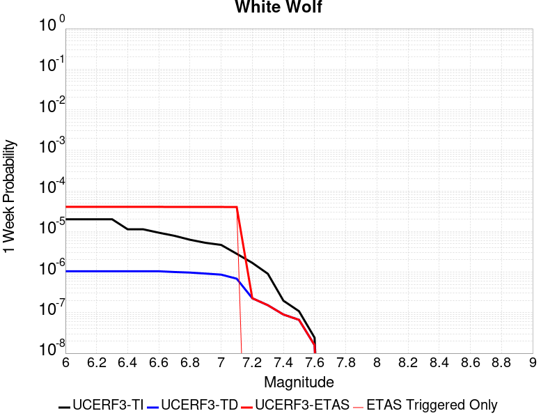 | 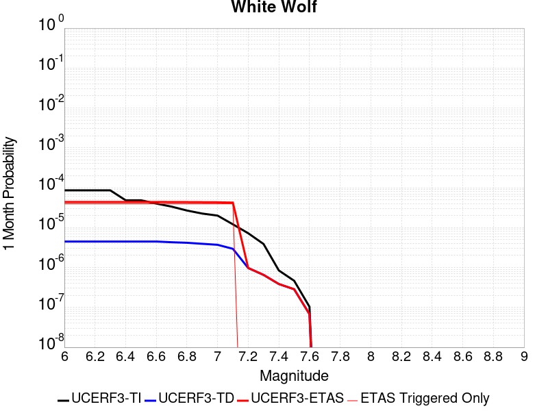 | 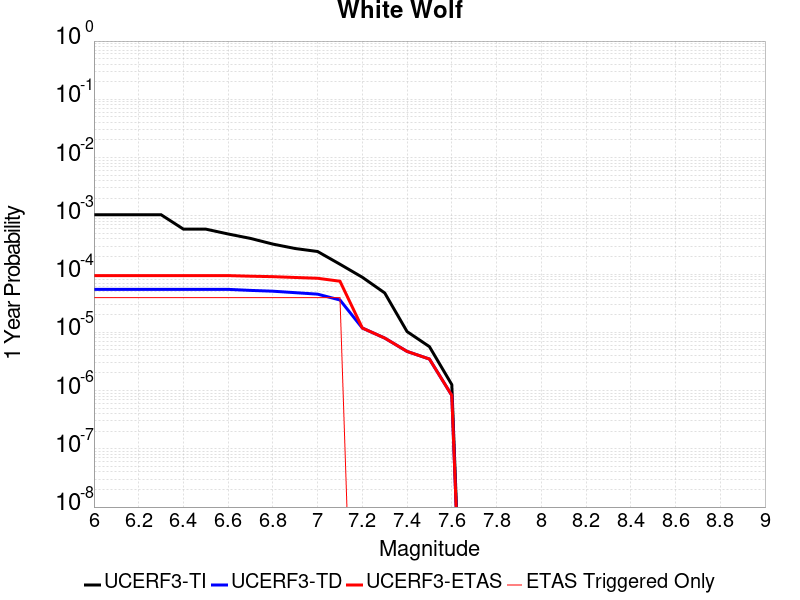 | 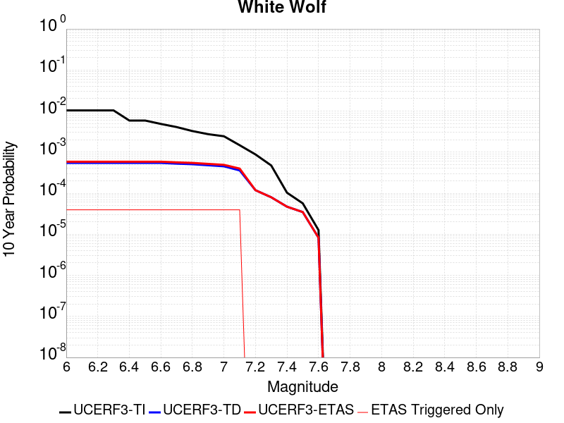 |

| Magnitude | 1 wk TI Prob | 1 wk TD Prob | 1 wk ETAS Prob | 1 wk ETAS/TD Gain | 1 wk ETAS Triggered Only | 1 mo TI Prob | 1 mo TD Prob | 1 mo ETAS Prob | 1 mo ETAS/TD Gain | 1 mo ETAS Triggered Only | 1 yr TI Prob | 1 yr TD Prob | 1 yr ETAS Prob | 1 yr ETAS/TD Gain | 1 yr ETAS Triggered Only | 10 yr TI Prob | 10 yr TD Prob | 10 yr ETAS Prob | 10 yr ETAS/TD Gain | 10 yr ETAS Triggered Only |
|-----|-----|-----|-----|-----|-----|-----|-----|-----|-----|-----|-----|-----|-----|-----|-----|-----|-----|-----|-----|-----|
| 6.0 | 2.0037822E-5 | 1.0469162E-6 | 4.0497718E-5 | 38.68287 | 3.9450842E-5 | 8.587355E-5 | 4.486776E-6 | 4.393744E-5 | 9.792653 | 3.9450842E-5 | 0.001045009 | 5.4625183E-5 | 9.407387E-5 | 1.7221704 | 3.9450842E-5 | 0.010401085 | 5.461226E-4 | 5.855519E-4 | 1.0721986 | 3.9450842E-5 |
| 6.1 | 2.0037822E-5 | 1.0469162E-6 | 4.0497718E-5 | 38.68287 | 3.9450842E-5 | 8.587355E-5 | 4.486776E-6 | 4.393744E-5 | 9.792653 | 3.9450842E-5 | 0.001045009 | 5.4625183E-5 | 9.407387E-5 | 1.7221704 | 3.9450842E-5 | 0.010401085 | 5.461226E-4 | 5.855519E-4 | 1.0721986 | 3.9450842E-5 |
| 6.2 | 2.0037822E-5 | 1.0469162E-6 | 4.0497718E-5 | 38.68287 | 3.9450842E-5 | 8.587355E-5 | 4.486776E-6 | 4.393744E-5 | 9.792653 | 3.9450842E-5 | 0.001045009 | 5.4625183E-5 | 9.407387E-5 | 1.7221704 | 3.9450842E-5 | 0.010401085 | 5.461226E-4 | 5.855519E-4 | 1.0721986 | 3.9450842E-5 |
| 6.3 | 2.0037822E-5 | 1.0469162E-6 | 4.0497718E-5 | 38.68287 | 3.9450842E-5 | 8.587355E-5 | 4.486776E-6 | 4.393744E-5 | 9.792653 | 3.9450842E-5 | 0.001045009 | 5.4625183E-5 | 9.407387E-5 | 1.7221704 | 3.9450842E-5 | 0.010401085 | 5.461226E-4 | 5.855519E-4 | 1.0721986 | 3.9450842E-5 |
| 6.4 | 1.132487E-5 | 1.0469162E-6 | 4.0497718E-5 | 38.68287 | 3.9450842E-5 | 4.8534253E-5 | 4.486776E-6 | 4.393744E-5 | 9.792653 | 3.9450842E-5 | 5.907443E-4 | 5.4625183E-5 | 9.407387E-5 | 1.7221704 | 3.9450842E-5 | 0.005891764 | 5.461226E-4 | 5.855519E-4 | 1.0721986 | 3.9450842E-5 |
| 6.5 | 1.132487E-5 | 1.0469162E-6 | 4.0497718E-5 | 38.68287 | 3.9450842E-5 | 4.8534253E-5 | 4.486776E-6 | 4.393744E-5 | 9.792653 | 3.9450842E-5 | 5.907443E-4 | 5.4625183E-5 | 9.407387E-5 | 1.7221704 | 3.9450842E-5 | 0.005891764 | 5.461226E-4 | 5.855519E-4 | 1.0721986 | 3.9450842E-5 |
| 6.6 | 9.347473E-6 | 1.0469162E-6 | 4.0497718E-5 | 38.68287 | 3.9450842E-5 | 4.0059982E-5 | 4.486776E-6 | 4.393744E-5 | 9.792653 | 3.9450842E-5 | 4.8762115E-4 | 5.4625183E-5 | 9.407387E-5 | 1.7221704 | 3.9450842E-5 | 0.0048655253 | 5.461226E-4 | 5.855519E-4 | 1.0721986 | 3.9450842E-5 |
| 6.7 | 7.842647E-6 | 1.0048342E-6 | 4.0455638E-5 | 40.26101 | 3.9450842E-5 | 3.361091E-5 | 4.3064256E-6 | 4.37571E-5 | 10.160887 | 3.9450842E-5 | 4.0913603E-4 | 5.2429517E-5 | 9.18783E-5 | 1.7524154 | 3.9450842E-5 | 0.004083836 | 5.2417646E-4 | 5.636066E-4 | 1.0752231 | 3.9450842E-5 |
| 6.8 | 6.26597E-6 | 9.734822E-7 | 4.042429E-5 | 41.52545 | 3.9450842E-5 | 2.685388E-5 | 4.17206E-6 | 4.362274E-5 | 10.455923 | 3.9450842E-5 | 3.2689696E-4 | 5.0793697E-5 | 9.024254E-5 | 1.7766483 | 3.9450842E-5 | 0.003264165 | 5.078258E-4 | 5.472566E-4 | 1.0776464 | 3.9450842E-5 |
| 6.9 | 5.258436E-6 | 9.183254E-7 | 4.0369134E-5 | 43.95951 | 3.9450842E-5 | 2.2535958E-5 | 3.9356746E-6 | 4.3386364E-5 | 11.0238695 | 3.9450842E-5 | 2.7434074E-4 | 4.7915833E-5 | 8.736479E-5 | 1.8232969 | 3.9450842E-5 | 0.0027400232 | 4.790598E-4 | 5.184917E-4 | 1.0823112 | 3.9450842E-5 |
| 7.0 | 4.675028E-6 | 8.6611794E-7 | 4.031693E-5 | 46.549004 | 3.9450842E-5 | 2.003568E-5 | 3.7119291E-6 | 4.316263E-5 | 11.628085 | 3.9450842E-5 | 2.4390711E-4 | 4.5191846E-5 | 8.464091E-5 | 1.8729243 | 3.9450842E-5 | 0.0024363957 | 4.518313E-4 | 4.912643E-4 | 1.0872737 | 3.9450842E-5 |
| 7.1 | 2.8270078E-6 | 6.8741696E-7 | 4.0138235E-5 | 58.38994 | 3.9450842E-5 | 1.2115692E-5 | 2.9460696E-6 | 4.2396798E-5 | 14.390969 | 3.9450842E-5 | 1.4749856E-4 | 3.5867848E-5 | 7.531728E-5 | 2.099855 | 3.9450842E-5 | 0.001474007 | 3.586247E-4 | 3.9806138E-4 | 1.1099665 | 3.9450842E-5 |
| 7.2 | 1.6881406E-6 | 2.2706382E-7 | 2.2706382E-7 | 1.0 | 0.0 | 7.2348685E-6 | 9.731303E-7 | 9.731303E-7 | 1.0 | 0.0 | 8.808096E-5 | 1.1847799E-5 | 1.1847799E-5 | 1.0 | 0.0 | 8.8046055E-4 | 1.1847183E-4 | 1.1847183E-4 | 1.0 | 0.0 |
| 7.3 | 9.086107E-7 | 1.5266386E-7 | 1.5266386E-7 | 1.0 | 0.0 | 3.8940398E-6 | 6.5427355E-7 | 6.5427355E-7 | 1.0 | 0.0 | 4.7408903E-5 | 7.965752E-6 | 7.965752E-6 | 1.0 | 0.0 | 4.739879E-4 | 7.965475E-5 | 7.965475E-5 | 1.0 | 0.0 |
| 7.4 | 1.9717383E-7 | 9.003913E-8 | 9.003913E-8 | 1.0 | 0.0 | 8.450304E-7 | 3.8588192E-7 | 3.8588192E-7 | 1.0 | 0.0 | 1.0288197E-5 | 4.6981027E-6 | 4.6981027E-6 | 1.0 | 0.0 | 1.028772E-4 | 4.6980065E-5 | 4.6980065E-5 | 1.0 | 0.0 |
| 7.5 | 1.086975E-7 | 6.6597195E-8 | 6.6597195E-8 | 1.0 | 0.0 | 4.6584634E-7 | 2.8541652E-7 | 2.8541652E-7 | 1.0 | 0.0 | 5.6716644E-6 | 3.474941E-6 | 3.474941E-6 | 1.0 | 0.0 | 5.6715195E-5 | 3.474889E-5 | 3.474889E-5 | 1.0 | 0.0 |
| 7.6 | 2.4217808E-8 | 1.5820765E-8 | 1.5820765E-8 | 1.0 | 0.0 | 1.03790605E-7 | 6.780328E-8 | 6.780328E-8 | 1.0 | 0.0 | 1.2636499E-6 | 8.255046E-7 | 8.255046E-7 | 1.0 | 0.0 | 1.2636427E-5 | 8.2550205E-6 | 8.2550205E-6 | 1.0 | 0.0 |

## Malibu Coast (Extension) alt 1
*[(top)](#table-of-contents)*

| 1 Week | 1 Month | 1 Year | 10 Year |
|-----|-----|-----|-----|
| 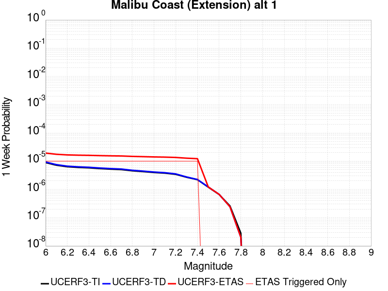 | 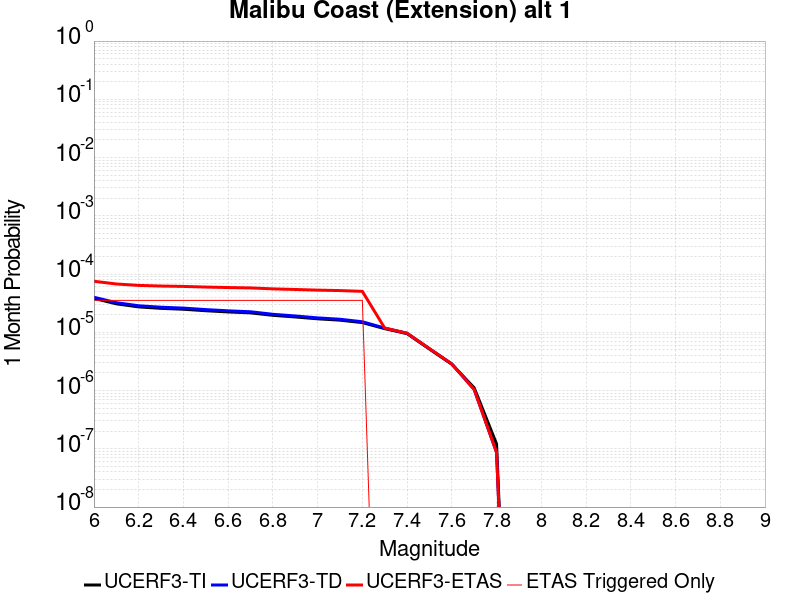 | 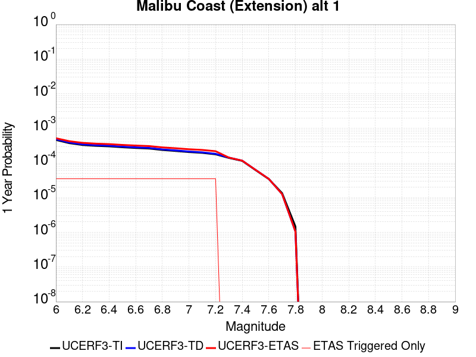 | 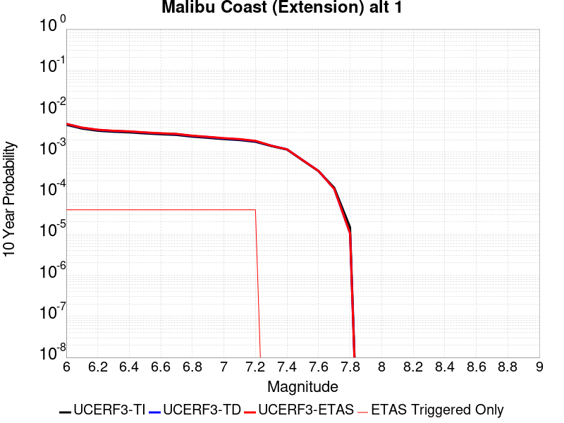 |

| Magnitude | 1 wk TI Prob | 1 wk TD Prob | 1 wk ETAS Prob | 1 wk ETAS/TD Gain | 1 wk ETAS Triggered Only | 1 mo TI Prob | 1 mo TD Prob | 1 mo ETAS Prob | 1 mo ETAS/TD Gain | 1 mo ETAS Triggered Only | 1 yr TI Prob | 1 yr TD Prob | 1 yr ETAS Prob | 1 yr ETAS/TD Gain | 1 yr ETAS Triggered Only | 10 yr TI Prob | 10 yr TD Prob | 10 yr ETAS Prob | 10 yr ETAS/TD Gain | 10 yr ETAS Triggered Only |
|-----|-----|-----|-----|-----|-----|-----|-----|-----|-----|-----|-----|-----|-----|-----|-----|-----|-----|-----|-----|-----|
| 6.0 | 8.930738E-6 | 9.329276E-6 | 9.329276E-6 | 1.0 | 0.0 | 3.827403E-5 | 3.998201E-5 | 7.943127E-5 | 1.9866755 | 3.9450842E-5 | 4.6588664E-4 | 4.8667393E-4 | 5.261056E-4 | 1.0810227 | 3.9450842E-5 | 0.0046491115 | 0.004856264 | 0.004895523 | 1.0080843 | 3.9450842E-5 |
| 6.1 | 7.199952E-6 | 7.5302964E-6 | 7.5302964E-6 | 1.0 | 0.0 | 3.0856572E-5 | 3.2272303E-5 | 7.172187E-5 | 2.222397 | 3.9450842E-5 | 3.75614E-4 | 3.9284505E-4 | 4.3228042E-4 | 1.100384 | 3.9450842E-5 | 0.0037497976 | 0.003921572 | 0.0039608683 | 1.0100205 | 3.9450842E-5 |
| 6.2 | 6.3721413E-6 | 6.6667917E-6 | 6.6667917E-6 | 1.0 | 0.0 | 2.7308892E-5 | 2.8571652E-5 | 6.802137E-5 | 2.3807292 | 3.9450842E-5 | 3.3243504E-4 | 3.4780471E-4 | 3.8724183E-4 | 1.1133887 | 3.9450842E-5 | 0.0033193815 | 0.0034726437 | 0.0035119576 | 1.0113211 | 3.9450842E-5 |
| 6.3 | 6.016345E-6 | 6.295158E-6 | 6.295158E-6 | 1.0 | 0.0 | 2.578408E-5 | 2.6978973E-5 | 6.642875E-5 | 2.4622416 | 3.9450842E-5 | 3.1387596E-4 | 3.2841982E-4 | 3.678577E-4 | 1.1200838 | 3.9450842E-5 | 0.00313433 | 0.0032793807 | 0.003318702 | 1.0119905 | 3.9450842E-5 |
| 6.4 | 5.8104883E-6 | 6.0795446E-6 | 6.0795446E-6 | 1.0 | 0.0 | 2.4901856E-5 | 2.6054933E-5 | 6.550475E-5 | 2.5141017 | 3.9450842E-5 | 3.031379E-4 | 3.1717293E-4 | 3.5661127E-4 | 1.1243433 | 3.9450842E-5 | 0.0030272473 | 0.0031672374 | 0.0032065632 | 1.0124165 | 3.9450842E-5 |
| 6.5 | 5.476925E-6 | 5.7275133E-6 | 5.7275133E-6 | 1.0 | 0.0 | 2.3472323E-5 | 2.4546256E-5 | 6.399613E-5 | 2.6071646 | 3.9450842E-5 | 2.8573806E-4 | 2.9880996E-4 | 3.3824902E-4 | 1.1319871 | 3.9450842E-5 | 0.0028537093 | 0.002984114 | 0.003023447 | 1.0131809 | 3.9450842E-5 |
| 6.6 | 5.222387E-6 | 5.45858E-6 | 5.45858E-6 | 1.0 | 0.0 | 2.2381464E-5 | 2.3393704E-5 | 6.2843625E-5 | 2.6863477 | 3.9450842E-5 | 2.7246025E-4 | 2.8478142E-4 | 3.2422104E-4 | 1.1384908 | 3.9450842E-5 | 0.0027212645 | 0.0028441956 | 0.0028835342 | 1.0138313 | 3.9450842E-5 |
| 6.7 | 5.0337076E-6 | 5.259103E-6 | 5.259103E-6 | 1.0 | 0.0 | 2.1572854E-5 | 2.253882E-5 | 6.198877E-5 | 2.7503114 | 3.9450842E-5 | 2.6261783E-4 | 2.7437587E-4 | 3.138159E-4 | 1.1437445 | 3.9450842E-5 | 0.002623077 | 0.002740401 | 0.0027797439 | 1.0143566 | 3.9450842E-5 |
| 6.8 | 4.5675624E-6 | 4.7587164E-6 | 4.7587164E-6 | 1.0 | 0.0 | 1.9575122E-5 | 2.039434E-5 | 5.984438E-5 | 2.9343622 | 3.9450842E-5 | 2.3830103E-4 | 2.48273E-4 | 2.8771404E-4 | 1.1588616 | 3.9450842E-5 | 0.0023804565 | 0.002479976 | 0.0025193288 | 1.0158683 | 3.9450842E-5 |
| 6.9 | 4.2802412E-6 | 4.4520207E-6 | 4.4520207E-6 | 1.0 | 0.0 | 1.8343762E-5 | 1.907995E-5 | 5.853004E-5 | 3.0676203 | 3.9450842E-5 | 2.2331243E-4 | 2.3227377E-4 | 2.7171546E-4 | 1.1698068 | 3.9450842E-5 | 0.0022308815 | 0.0023203269 | 0.0023596862 | 1.0169629 | 3.9450842E-5 |
| 7.0 | 3.9794063E-6 | 4.130099E-6 | 4.130099E-6 | 1.0 | 0.0 | 1.7054486E-5 | 1.7700306E-5 | 5.715045E-5 | 3.2287834 | 3.9450842E-5 | 2.0761859E-4 | 2.1548003E-4 | 2.5492237E-4 | 1.1830441 | 3.9450842E-5 | 0.0020742472 | 0.0021527244 | 0.0021920905 | 1.0182866 | 3.9450842E-5 |
| 7.1 | 3.7730424E-6 | 3.911217E-6 | 3.911217E-6 | 1.0 | 0.0 | 1.6170083E-5 | 1.6762251E-5 | 5.6212433E-5 | 3.3535132 | 3.9450842E-5 | 1.9685295E-4 | 2.0406142E-4 | 2.4350421E-4 | 1.1932888 | 3.9450842E-5 | 0.0019667868 | 0.0020387534 | 0.0020781236 | 1.0193111 | 3.9450842E-5 |
| 7.2 | 3.424985E-6 | 3.541337E-6 | 3.541337E-6 | 1.0 | 0.0 | 1.4678424E-5 | 1.5177071E-5 | 5.4627315E-5 | 3.5993319 | 3.9450842E-5 | 1.7869516E-4 | 1.8476529E-4 | 2.2420884E-4 | 1.2134793 | 3.9450842E-5 | 0.0017855153 | 0.0018461287 | 0.0018855068 | 1.02133 | 3.9450842E-5 |
| 7.3 | 2.6966375E-6 | 2.7596534E-6 | 2.7596534E-6 | 1.0 | 0.0 | 1.15569665E-5 | 1.1827032E-5 | 1.1827032E-5 | 1.0 | 0.0 | 1.4069698E-4 | 1.4398464E-4 | 1.4398464E-4 | 1.0 | 0.0 | 0.0014060794 | 0.0014389176 | 0.0014389176 | 1.0 | 0.0 |
| 7.4 | 2.215957E-6 | 2.249378E-6 | 2.249378E-6 | 1.0 | 0.0 | 9.496924E-6 | 9.640156E-6 | 9.640156E-6 | 1.0 | 0.0 | 1.1561892E-4 | 1.17362615E-4 | 1.17362615E-4 | 1.0 | 0.0 | 0.0011555878 | 0.0011730101 | 0.0011730101 | 1.0 | 0.0 |
| 7.5 | 1.2040218E-6 | 1.2219067E-6 | 1.2219067E-6 | 1.0 | 0.0 | 5.160083E-6 | 5.2367322E-6 | 5.2367322E-6 | 1.0 | 0.0 | 6.2822204E-5 | 6.375537E-5 | 6.375537E-5 | 1.0 | 0.0 | 6.280445E-4 | 6.3737266E-4 | 6.3737266E-4 | 1.0 | 0.0 |
| 7.6 | 6.6157446E-7 | 6.678975E-7 | 6.678975E-7 | 1.0 | 0.0 | 2.835316E-6 | 2.8624147E-6 | 2.8624147E-6 | 1.0 | 0.0 | 3.4519428E-5 | 3.484936E-5 | 3.484936E-5 | 1.0 | 0.0 | 3.4514067E-4 | 3.4844046E-4 | 3.4844046E-4 | 1.0 | 0.0 |
| 7.7 | 2.6012302E-7 | 2.4357593E-7 | 2.4357593E-7 | 1.0 | 0.0 | 1.1148124E-6 | 1.0438964E-6 | 1.0438964E-6 | 1.0 | 0.0 | 1.3572758E-5 | 1.2709375E-5 | 1.2709375E-5 | 1.0 | 0.0 | 1.3571928E-4 | 1.2708755E-4 | 1.2708755E-4 | 1.0 | 0.0 |
| 7.8 | 2.8323132E-8 | 2.0266649E-8 | 2.0266649E-8 | 1.0 | 0.0 | 1.2138484E-7 | 8.685707E-8 | 8.685707E-8 | 1.0 | 0.0 | 1.4778595E-6 | 1.0574844E-6 | 1.0574844E-6 | 1.0 | 0.0 | 1.4778497E-5 | 1.0574801E-5 | 1.0574801E-5 | 1.0 | 0.0 |

## Oceanside alt1
*[(top)](#table-of-contents)*

| 1 Week | 1 Month | 1 Year | 10 Year |
|-----|-----|-----|-----|
| 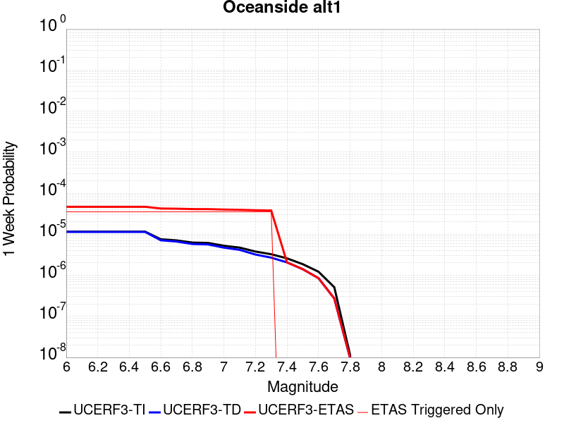 | 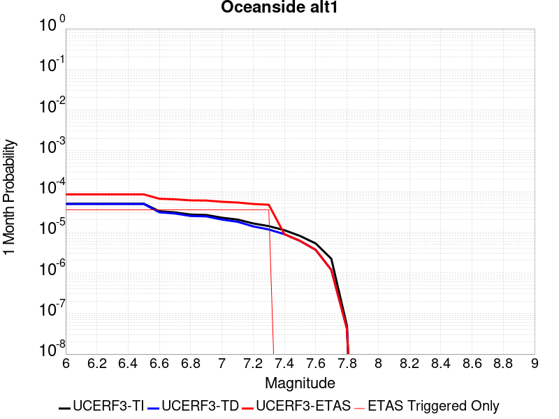 | 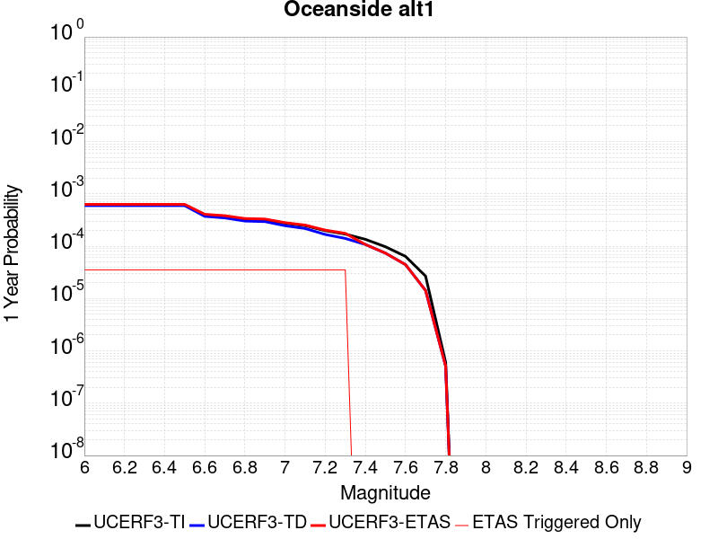 | 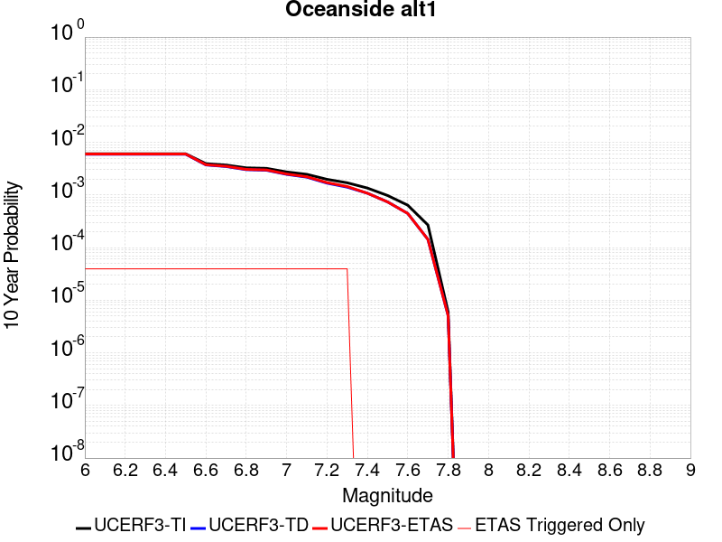 |

| Magnitude | 1 wk TI Prob | 1 wk TD Prob | 1 wk ETAS Prob | 1 wk ETAS/TD Gain | 1 wk ETAS Triggered Only | 1 mo TI Prob | 1 mo TD Prob | 1 mo ETAS Prob | 1 mo ETAS/TD Gain | 1 mo ETAS Triggered Only | 1 yr TI Prob | 1 yr TD Prob | 1 yr ETAS Prob | 1 yr ETAS/TD Gain | 1 yr ETAS Triggered Only | 10 yr TI Prob | 10 yr TD Prob | 10 yr ETAS Prob | 10 yr ETAS/TD Gain | 10 yr ETAS Triggered Only |
|-----|-----|-----|-----|-----|-----|-----|-----|-----|-----|-----|-----|-----|-----|-----|-----|-----|-----|-----|-----|-----|
| 6.0 | 1.1617542E-5 | 1.1423493E-5 | 5.0873885E-5 | 4.4534445 | 3.9450842E-5 | 4.9788516E-5 | 4.8956997E-5 | 8.840591E-5 | 1.8057871 | 3.9450842E-5 | 6.060066E-4 | 5.9590454E-4 | 6.3533185E-4 | 1.0661639 | 3.9450842E-5 | 0.0060435664 | 0.005944664 | 0.0059838807 | 1.0065969 | 3.9450842E-5 |
| 6.1 | 1.1617542E-5 | 1.1423493E-5 | 5.0873885E-5 | 4.4534445 | 3.9450842E-5 | 4.9788516E-5 | 4.8956997E-5 | 8.840591E-5 | 1.8057871 | 3.9450842E-5 | 6.060066E-4 | 5.9590454E-4 | 6.3533185E-4 | 1.0661639 | 3.9450842E-5 | 0.0060435664 | 0.005944664 | 0.0059838807 | 1.0065969 | 3.9450842E-5 |
| 6.2 | 1.1617542E-5 | 1.1423493E-5 | 5.0873885E-5 | 4.4534445 | 3.9450842E-5 | 4.9788516E-5 | 4.8956997E-5 | 8.840591E-5 | 1.8057871 | 3.9450842E-5 | 6.060066E-4 | 5.9590454E-4 | 6.3533185E-4 | 1.0661639 | 3.9450842E-5 | 0.0060435664 | 0.005944664 | 0.0059838807 | 1.0065969 | 3.9450842E-5 |
| 6.3 | 1.1617542E-5 | 1.1423493E-5 | 5.0873885E-5 | 4.4534445 | 3.9450842E-5 | 4.9788516E-5 | 4.8956997E-5 | 8.840591E-5 | 1.8057871 | 3.9450842E-5 | 6.060066E-4 | 5.9590454E-4 | 6.3533185E-4 | 1.0661639 | 3.9450842E-5 | 0.0060435664 | 0.005944664 | 0.0059838807 | 1.0065969 | 3.9450842E-5 |
| 6.4 | 1.1617542E-5 | 1.1423493E-5 | 5.0873885E-5 | 4.4534445 | 3.9450842E-5 | 4.9788516E-5 | 4.8956997E-5 | 8.840591E-5 | 1.8057871 | 3.9450842E-5 | 6.060066E-4 | 5.9590454E-4 | 6.3533185E-4 | 1.0661639 | 3.9450842E-5 | 0.0060435664 | 0.005944664 | 0.0059838807 | 1.0065969 | 3.9450842E-5 |
| 6.5 | 1.1617542E-5 | 1.1423493E-5 | 5.0873885E-5 | 4.4534445 | 3.9450842E-5 | 4.9788516E-5 | 4.8956997E-5 | 8.840591E-5 | 1.8057871 | 3.9450842E-5 | 6.060066E-4 | 5.9590454E-4 | 6.3533185E-4 | 1.0661639 | 3.9450842E-5 | 0.0060435664 | 0.005944664 | 0.0059838807 | 1.0065969 | 3.9450842E-5 |
| 6.6 | 7.561768E-6 | 7.1336153E-6 | 4.6584177E-5 | 6.530234 | 3.9450842E-5 | 3.2407173E-5 | 3.0572286E-5 | 7.0021924E-5 | 2.2903726 | 3.9450842E-5 | 3.9448592E-4 | 3.7215507E-4 | 4.1159123E-4 | 1.105967 | 3.9450842E-5 | 0.0039378637 | 0.00371543 | 0.0037547343 | 1.0105786 | 3.9450842E-5 |
| 6.7 | 7.1042605E-6 | 6.6556854E-6 | 4.6106266E-5 | 6.9273505 | 3.9450842E-5 | 3.0446476E-5 | 2.8524059E-5 | 6.797378E-5 | 2.383033 | 3.9450842E-5 | 3.706228E-4 | 3.472259E-4 | 3.8666304E-4 | 1.1135777 | 3.9450842E-5 | 0.0037000529 | 0.003466917 | 0.0035062311 | 1.0113398 | 3.9450842E-5 |
| 6.8 | 6.285554E-6 | 5.799706E-6 | 4.5250323E-5 | 7.8021755 | 3.9450842E-5 | 2.693781E-5 | 2.4855648E-5 | 6.430551E-5 | 2.587159 | 3.9450842E-5 | 3.2791847E-4 | 3.0257605E-4 | 3.4201494E-4 | 1.1303438 | 3.9450842E-5 | 0.0032743502 | 0.0030216982 | 0.0030610298 | 1.0130163 | 3.9450842E-5 |
| 6.9 | 6.148883E-6 | 5.6565445E-6 | 4.5107165E-5 | 7.9743323 | 3.9450842E-5 | 2.635209E-5 | 2.424211E-5 | 6.3692E-5 | 2.6273289 | 3.9450842E-5 | 3.2078946E-4 | 2.9510827E-4 | 3.3454748E-4 | 1.1336432 | 3.9450842E-5 | 0.003203268 | 0.0029472208 | 0.0029865555 | 1.0133463 | 3.9450842E-5 |
| 7.0 | 5.253857E-6 | 4.722404E-6 | 4.4173063E-5 | 9.353935 | 3.9450842E-5 | 2.2516335E-5 | 2.0238718E-5 | 5.9688766E-5 | 2.9492364 | 3.9450842E-5 | 2.7410188E-4 | 2.4637886E-4 | 2.8581996E-4 | 1.1600833 | 3.9450842E-5 | 0.0027376404 | 0.0024610884 | 0.002500442 | 1.0159904 | 3.9450842E-5 |
| 7.1 | 4.730754E-6 | 4.17851E-6 | 4.362919E-5 | 10.441327 | 3.9450842E-5 | 2.0274503E-5 | 1.7907778E-5 | 5.7357916E-5 | 3.202961 | 3.9450842E-5 | 2.468141E-4 | 2.1800565E-4 | 2.574479E-4 | 1.180923 | 3.9450842E-5 | 0.0024654015 | 0.0021779444 | 0.0022173093 | 1.0180744 | 3.9450842E-5 |
| 7.2 | 3.7998386E-6 | 3.214026E-6 | 4.2664742E-5 | 13.274549 | 3.9450842E-5 | 1.6284921E-5 | 1.37743245E-5 | 5.3224627E-5 | 3.864046 | 3.9450842E-5 | 1.9825088E-4 | 1.6768962E-4 | 2.0713385E-4 | 1.2352216 | 3.9450842E-5 | 0.001980741 | 0.001675643 | 0.0017150278 | 1.0235043 | 3.9450842E-5 |
| 7.3 | 3.2656465E-6 | 2.698376E-6 | 4.2149113E-5 | 15.620178 | 3.9450842E-5 | 1.3995553E-5 | 1.1564418E-5 | 5.1014806E-5 | 4.41136 | 3.9450842E-5 | 1.7038253E-4 | 1.407878E-4 | 1.802331E-4 | 1.2801754 | 3.9450842E-5 | 0.0017025196 | 0.0014069972 | 0.0014463925 | 1.0279996 | 3.9450842E-5 |
| 7.4 | 2.593703E-6 | 2.0680277E-6 | 2.0680277E-6 | 1.0 | 0.0 | 1.1115822E-5 | 8.862946E-6 | 8.862946E-6 | 1.0 | 0.0 | 1.3532673E-4 | 1.0790111E-4 | 1.0790111E-4 | 1.0 | 0.0 | 0.0013524436 | 0.0010784961 | 0.0010784961 | 1.0 | 0.0 |
| 7.5 | 1.8715585E-6 | 1.4137177E-6 | 1.4137177E-6 | 1.0 | 0.0 | 8.020941E-6 | 6.0587763E-6 | 6.0587763E-6 | 1.0 | 0.0 | 9.7650576E-5 | 7.376316E-5 | 7.376316E-5 | 1.0 | 0.0 | 9.7607676E-4 | 7.3739287E-4 | 7.3739287E-4 | 1.0 | 0.0 |
| 7.6 | 1.2246786E-6 | 8.5268175E-7 | 8.5268175E-7 | 1.0 | 0.0 | 5.248612E-6 | 3.6543456E-6 | 3.6543456E-6 | 1.0 | 0.0 | 6.389998E-5 | 4.4490793E-5 | 4.4490793E-5 | 1.0 | 0.0 | 6.3881604E-4 | 4.4482335E-4 | 4.4482335E-4 | 1.0 | 0.0 |
| 7.7 | 5.140719E-7 | 2.734703E-7 | 2.734703E-7 | 1.0 | 0.0 | 2.2031636E-6 | 1.1720151E-6 | 1.1720151E-6 | 1.0 | 0.0 | 2.6823185E-5 | 1.4269205E-5 | 1.4269205E-5 | 1.0 | 0.0 | 2.6819948E-4 | 1.4268424E-4 | 1.4268424E-4 | 1.0 | 0.0 |
| 7.8 | 1.16056995E-8 | 9.782373E-9 | 9.782373E-9 | 1.0 | 0.0 | 4.9738713E-8 | 4.1924455E-8 | 4.1924455E-8 | 1.0 | 0.0 | 6.0556863E-7 | 5.1043025E-7 | 5.1043025E-7 | 1.0 | 0.0 | 6.05567E-6 | 5.1043025E-6 | 5.1043025E-6 | 1.0 | 0.0 |

## South Klamath Lake East
*[(top)](#table-of-contents)*

| 1 Week | 1 Month | 1 Year | 10 Year |
|-----|-----|-----|-----|
|  | 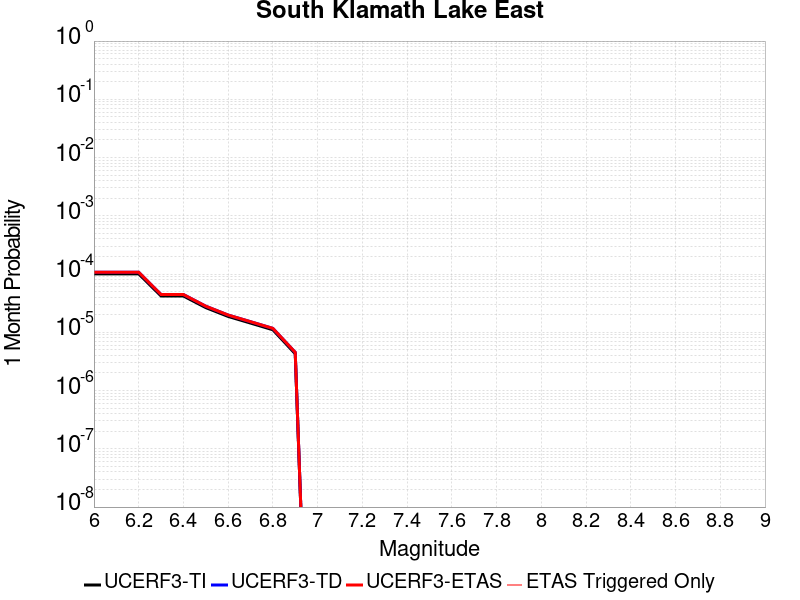 | 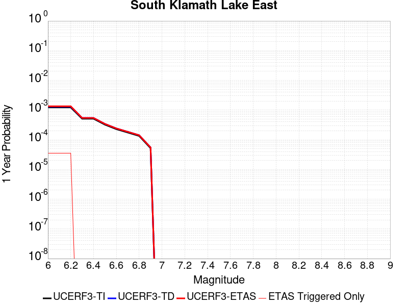 | 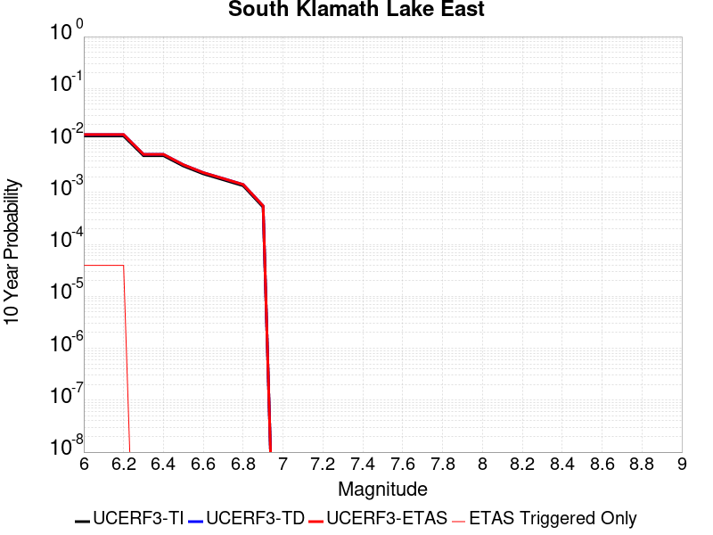 |

| Magnitude | 1 wk TI Prob | 1 wk TD Prob | 1 wk ETAS Prob | 1 wk ETAS/TD Gain | 1 wk ETAS Triggered Only | 1 mo TI Prob | 1 mo TD Prob | 1 mo ETAS Prob | 1 mo ETAS/TD Gain | 1 mo ETAS Triggered Only | 1 yr TI Prob | 1 yr TD Prob | 1 yr ETAS Prob | 1 yr ETAS/TD Gain | 1 yr ETAS Triggered Only | 10 yr TI Prob | 10 yr TD Prob | 10 yr ETAS Prob | 10 yr ETAS/TD Gain | 10 yr ETAS Triggered Only |
|-----|-----|-----|-----|-----|-----|-----|-----|-----|-----|-----|-----|-----|-----|-----|-----|-----|-----|-----|-----|-----|
| 6.0 | 2.3539369E-5 | 2.5047308E-5 | 2.5047308E-5 | 1.0 | 0.0 | 1.0087911E-4 | 1.0734166E-4 | 1.0734166E-4 | 1.0 | 0.0 | 0.0012275111 | 0.0013061843 | 0.0013455837 | 1.0301636 | 3.9450842E-5 | 0.012207527 | 0.012993417 | 0.013032355 | 1.0029968 | 3.9450842E-5 |
| 6.1 | 2.3539369E-5 | 2.5047308E-5 | 2.5047308E-5 | 1.0 | 0.0 | 1.0087911E-4 | 1.0734166E-4 | 1.0734166E-4 | 1.0 | 0.0 | 0.0012275111 | 0.0013061843 | 0.0013455837 | 1.0301636 | 3.9450842E-5 | 0.012207527 | 0.012993417 | 0.013032355 | 1.0029968 | 3.9450842E-5 |
| 6.2 | 2.3539369E-5 | 2.5047308E-5 | 2.5047308E-5 | 1.0 | 0.0 | 1.0087911E-4 | 1.0734166E-4 | 1.0734166E-4 | 1.0 | 0.0 | 0.0012275111 | 0.0013061843 | 0.0013455837 | 1.0301636 | 3.9450842E-5 | 0.012207527 | 0.012993417 | 0.013032355 | 1.0029968 | 3.9450842E-5 |
| 6.3 | 9.807823E-6 | 1.0396044E-5 | 1.0396044E-5 | 1.0 | 0.0 | 4.2032847E-5 | 4.455376E-5 | 4.455376E-5 | 1.0 | 0.0 | 5.1162974E-4 | 5.4231536E-4 | 5.4231536E-4 | 1.0 | 0.0 | 0.005104534 | 0.005410756 | 0.005410756 | 1.0 | 0.0 |
| 6.4 | 9.807823E-6 | 1.0396044E-5 | 1.0396044E-5 | 1.0 | 0.0 | 4.2032847E-5 | 4.455376E-5 | 4.455376E-5 | 1.0 | 0.0 | 5.1162974E-4 | 5.4231536E-4 | 5.4231536E-4 | 1.0 | 0.0 | 0.005104534 | 0.005410756 | 0.005410756 | 1.0 | 0.0 |
| 6.5 | 6.191981E-6 | 6.5508398E-6 | 6.5508398E-6 | 1.0 | 0.0 | 2.653679E-5 | 2.8074743E-5 | 2.8074743E-5 | 1.0 | 0.0 | 3.2303753E-4 | 3.4175918E-4 | 3.4175918E-4 | 1.0 | 0.0 | 0.0032256835 | 0.003412614 | 0.003412614 | 1.0 | 0.0 |
| 6.6 | 4.3693776E-6 | 4.6165574E-6 | 4.6165574E-6 | 1.0 | 0.0 | 1.8725768E-5 | 1.9785102E-5 | 1.9785102E-5 | 1.0 | 0.0 | 2.2796239E-4 | 2.4085813E-4 | 2.4085813E-4 | 1.0 | 0.0 | 0.0022772867 | 0.0024060833 | 0.0024060833 | 1.0 | 0.0 |
| 6.7 | 3.360834E-6 | 3.5512403E-6 | 3.5512403E-6 | 1.0 | 0.0 | 1.4403494E-5 | 1.5219517E-5 | 1.5219517E-5 | 1.0 | 0.0 | 1.7534842E-4 | 1.8528267E-4 | 1.8528267E-4 | 1.0 | 0.0 | 0.0017521014 | 0.0018513618 | 0.0018513618 | 1.0 | 0.0 |
| 6.8 | 2.57873E-6 | 2.7251708E-6 | 2.7251708E-6 | 1.0 | 0.0 | 1.1051653E-5 | 1.1679254E-5 | 1.1679254E-5 | 1.0 | 0.0 | 1.3454557E-4 | 1.4218627E-4 | 1.4218627E-4 | 1.0 | 0.0 | 0.0013446413 | 0.0014210136 | 0.0014210136 | 1.0 | 0.0 |
| 6.9 | 9.987825E-7 | 1.0566213E-6 | 1.0566213E-6 | 1.0 | 0.0 | 4.2804895E-6 | 4.528371E-6 | 4.528371E-6 | 1.0 | 0.0 | 5.211371E-5 | 5.5131848E-5 | 5.5131848E-5 | 1.0 | 0.0 | 5.210149E-4 | 5.5121386E-4 | 5.5121386E-4 | 1.0 | 0.0 |

## Pitas Point (Lower West)
*[(top)](#table-of-contents)*

| 1 Week | 1 Month | 1 Year | 10 Year |
|-----|-----|-----|-----|
| 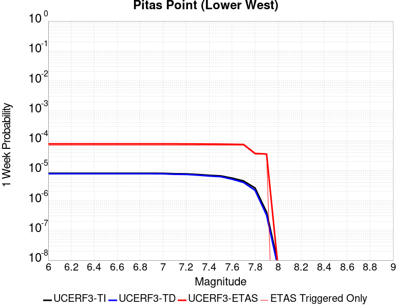 | 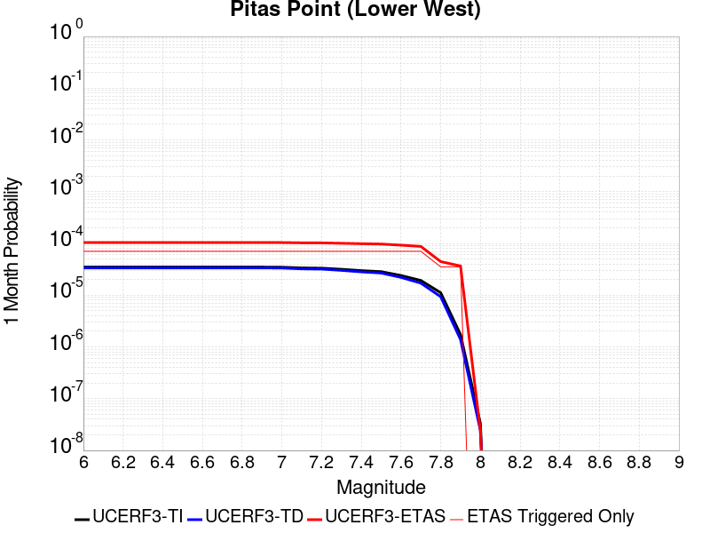 |  | 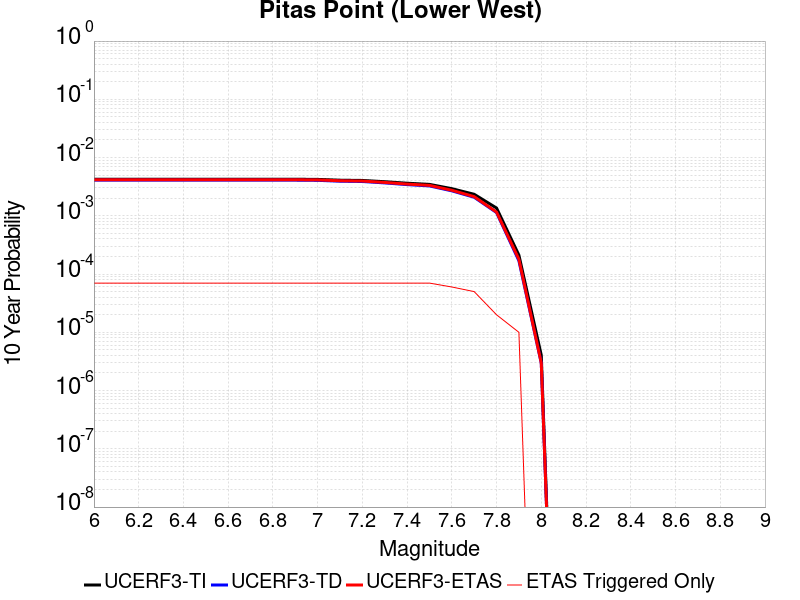 |

| Magnitude | 1 wk TI Prob | 1 wk TD Prob | 1 wk ETAS Prob | 1 wk ETAS/TD Gain | 1 wk ETAS Triggered Only | 1 mo TI Prob | 1 mo TD Prob | 1 mo ETAS Prob | 1 mo ETAS/TD Gain | 1 mo ETAS Triggered Only | 1 yr TI Prob | 1 yr TD Prob | 1 yr ETAS Prob | 1 yr ETAS/TD Gain | 1 yr ETAS Triggered Only | 10 yr TI Prob | 10 yr TD Prob | 10 yr ETAS Prob | 10 yr ETAS/TD Gain | 10 yr ETAS Triggered Only |
|-----|-----|-----|-----|-----|-----|-----|-----|-----|-----|-----|-----|-----|-----|-----|-----|-----|-----|-----|-----|-----|
| 6.0 | 8.151497E-6 | 7.855762E-6 | 4.7306297E-5 | 6.0218596 | 3.9450842E-5 | 3.493452E-5 | 3.3667122E-5 | 7.311664E-5 | 2.171752 | 3.9450842E-5 | 4.252448E-4 | 4.0982084E-4 | 4.4925555E-4 | 1.0962242 | 3.9450842E-5 | 0.0042443196 | 0.0040907315 | 0.004130021 | 1.0096045 | 3.9450842E-5 |
| 6.1 | 8.151497E-6 | 7.855762E-6 | 4.7306297E-5 | 6.0218596 | 3.9450842E-5 | 3.493452E-5 | 3.3667122E-5 | 7.311664E-5 | 2.171752 | 3.9450842E-5 | 4.252448E-4 | 4.0982084E-4 | 4.4925555E-4 | 1.0962242 | 3.9450842E-5 | 0.0042443196 | 0.0040907315 | 0.004130021 | 1.0096045 | 3.9450842E-5 |
| 6.2 | 8.151497E-6 | 7.855762E-6 | 4.7306297E-5 | 6.0218596 | 3.9450842E-5 | 3.493452E-5 | 3.3667122E-5 | 7.311664E-5 | 2.171752 | 3.9450842E-5 | 4.252448E-4 | 4.0982084E-4 | 4.4925555E-4 | 1.0962242 | 3.9450842E-5 | 0.0042443196 | 0.0040907315 | 0.004130021 | 1.0096045 | 3.9450842E-5 |
| 6.3 | 8.151497E-6 | 7.855762E-6 | 4.7306297E-5 | 6.0218596 | 3.9450842E-5 | 3.493452E-5 | 3.3667122E-5 | 7.311664E-5 | 2.171752 | 3.9450842E-5 | 4.252448E-4 | 4.0982084E-4 | 4.4925555E-4 | 1.0962242 | 3.9450842E-5 | 0.0042443196 | 0.0040907315 | 0.004130021 | 1.0096045 | 3.9450842E-5 |
| 6.4 | 8.151497E-6 | 7.855762E-6 | 4.7306297E-5 | 6.0218596 | 3.9450842E-5 | 3.493452E-5 | 3.3667122E-5 | 7.311664E-5 | 2.171752 | 3.9450842E-5 | 4.252448E-4 | 4.0982084E-4 | 4.4925555E-4 | 1.0962242 | 3.9450842E-5 | 0.0042443196 | 0.0040907315 | 0.004130021 | 1.0096045 | 3.9450842E-5 |
| 6.5 | 8.151497E-6 | 7.855762E-6 | 4.7306297E-5 | 6.0218596 | 3.9450842E-5 | 3.493452E-5 | 3.3667122E-5 | 7.311664E-5 | 2.171752 | 3.9450842E-5 | 4.252448E-4 | 4.0982084E-4 | 4.4925555E-4 | 1.0962242 | 3.9450842E-5 | 0.0042443196 | 0.0040907315 | 0.004130021 | 1.0096045 | 3.9450842E-5 |
| 6.6 | 8.151497E-6 | 7.855762E-6 | 4.7306297E-5 | 6.0218596 | 3.9450842E-5 | 3.493452E-5 | 3.3667122E-5 | 7.311664E-5 | 2.171752 | 3.9450842E-5 | 4.252448E-4 | 4.0982084E-4 | 4.4925555E-4 | 1.0962242 | 3.9450842E-5 | 0.0042443196 | 0.0040907315 | 0.004130021 | 1.0096045 | 3.9450842E-5 |
| 6.7 | 8.151497E-6 | 7.855762E-6 | 4.7306297E-5 | 6.0218596 | 3.9450842E-5 | 3.493452E-5 | 3.3667122E-5 | 7.311664E-5 | 2.171752 | 3.9450842E-5 | 4.252448E-4 | 4.0982084E-4 | 4.4925555E-4 | 1.0962242 | 3.9450842E-5 | 0.0042443196 | 0.0040907315 | 0.004130021 | 1.0096045 | 3.9450842E-5 |
| 6.8 | 8.151497E-6 | 7.855762E-6 | 4.7306297E-5 | 6.0218596 | 3.9450842E-5 | 3.493452E-5 | 3.3667122E-5 | 7.311664E-5 | 2.171752 | 3.9450842E-5 | 4.252448E-4 | 4.0982084E-4 | 4.4925555E-4 | 1.0962242 | 3.9450842E-5 | 0.0042443196 | 0.0040907315 | 0.004130021 | 1.0096045 | 3.9450842E-5 |
| 6.9 | 8.151497E-6 | 7.855762E-6 | 4.7306297E-5 | 6.0218596 | 3.9450842E-5 | 3.493452E-5 | 3.3667122E-5 | 7.311664E-5 | 2.171752 | 3.9450842E-5 | 4.252448E-4 | 4.0982084E-4 | 4.4925555E-4 | 1.0962242 | 3.9450842E-5 | 0.0042443196 | 0.0040907315 | 0.004130021 | 1.0096045 | 3.9450842E-5 |
| 7.0 | 8.103535E-6 | 7.805192E-6 | 4.725573E-5 | 6.0543966 | 3.9450842E-5 | 3.4728975E-5 | 3.3450397E-5 | 7.289992E-5 | 2.179344 | 3.9450842E-5 | 4.2274324E-4 | 4.0718322E-4 | 4.46618E-4 | 1.0968478 | 3.9450842E-5 | 0.0042193993 | 0.004064452 | 0.0041037425 | 1.0096669 | 3.9450842E-5 |
| 7.1 | 7.853298E-6 | 7.540883E-6 | 4.699143E-5 | 6.2315555 | 3.9450842E-5 | 3.3656554E-5 | 3.2317676E-5 | 7.1767245E-5 | 2.220681 | 3.9450842E-5 | 4.096915E-4 | 3.9339735E-4 | 4.3283266E-4 | 1.100243 | 3.9450842E-5 | 0.00408937 | 0.0039270855 | 0.0039663813 | 1.0100064 | 3.9450842E-5 |
| 7.2 | 7.771102E-6 | 7.453165E-6 | 4.6903715E-5 | 6.293127 | 3.9450842E-5 | 3.33043E-5 | 3.194175E-5 | 7.139133E-5 | 2.2350478 | 3.9450842E-5 | 4.0540437E-4 | 3.8882208E-4 | 4.282576E-4 | 1.101423 | 3.9450842E-5 | 0.0040466557 | 0.0038814936 | 0.003920791 | 1.0101243 | 3.9450842E-5 |
| 7.3 | 7.3945344E-6 | 7.0492697E-6 | 4.6499834E-5 | 6.596405 | 3.9450842E-5 | 3.1690477E-5 | 3.021081E-5 | 6.966046E-5 | 2.3058126 | 3.9450842E-5 | 3.8576324E-4 | 3.6775516E-4 | 4.071915E-4 | 1.1072353 | 3.9450842E-5 | 0.0038509427 | 0.0036715334 | 0.0037108394 | 1.0107056 | 3.9450842E-5 |
| 7.4 | 6.964645E-6 | 6.5901186E-6 | 4.6040703E-5 | 6.986324 | 3.9450842E-5 | 2.9848137E-5 | 2.8243063E-5 | 6.7692796E-5 | 2.3967936 | 3.9450842E-5 | 3.6334046E-4 | 3.4380553E-4 | 3.832428E-4 | 1.1147081 | 3.9450842E-5 | 0.0036274698 | 0.0034327896 | 0.003472105 | 1.0114529 | 3.9450842E-5 |
| 7.5 | 6.6525035E-6 | 6.259157E-6 | 4.5709756E-5 | 7.302861 | 3.9450842E-5 | 2.851042E-5 | 2.6824686E-5 | 6.627447E-5 | 2.4706523 | 3.9450842E-5 | 3.4705905E-4 | 3.265421E-4 | 3.6598006E-4 | 1.1207745 | 3.9450842E-5 | 0.0034651754 | 0.0032606742 | 0.0032999965 | 1.0120596 | 3.9450842E-5 |
| 7.6 | 5.613338E-6 | 5.151386E-6 | 4.4602028E-5 | 8.6582575 | 3.9450842E-5 | 2.405694E-5 | 2.2077185E-5 | 6.152716E-5 | 2.7869115 | 3.9450842E-5 | 2.928539E-4 | 2.6875688E-4 | 3.081971E-4 | 1.1467507 | 3.9450842E-5 | 0.0029246826 | 0.0026843501 | 0.002723695 | 1.0146571 | 3.9450842E-5 |
| 7.7 | 4.494704E-6 | 3.996911E-6 | 4.34476E-5 | 10.870294 | 3.9450842E-5 | 1.9262876E-5 | 1.7129507E-5 | 5.6579676E-5 | 3.3030534 | 3.9450842E-5 | 2.3450027E-4 | 2.0853203E-4 | 2.4797465E-4 | 1.1891441 | 3.9450842E-5 | 0.0023425296 | 0.0020833875 | 0.0021227563 | 1.0188965 | 3.9450842E-5 |
| 7.8 | 2.6075882E-6 | 2.1836374E-6 | 2.1836374E-6 | 1.0 | 0.0 | 1.117533E-5 | 9.358413E-6 | 9.358413E-6 | 1.0 | 0.0 | 1.3605114E-4 | 1.1393277E-4 | 1.1393277E-4 | 1.0 | 0.0 | 0.0013596788 | 0.0011387484 | 0.0011387484 | 1.0 | 0.0 |
| 7.9 | 4.045984E-7 | 3.242375E-7 | 3.242375E-7 | 1.0 | 0.0 | 1.733992E-6 | 1.3895885E-6 | 1.3895885E-6 | 1.0 | 0.0 | 2.1111147E-5 | 1.6918111E-5 | 1.6918111E-5 | 1.0 | 0.0 | 2.1109142E-4 | 1.6916855E-4 | 1.6916855E-4 | 1.0 | 0.0 |
| 8.0 | 7.791402E-9 | 5.683497E-9 | 5.683497E-9 | 1.0 | 0.0 | 3.3391725E-8 | 2.4357844E-8 | 2.4357844E-8 | 1.0 | 0.0 | 4.0654416E-7 | 2.9655675E-7 | 2.9655675E-7 | 1.0 | 0.0 | 4.065434E-6 | 2.9655655E-6 | 2.9655655E-6 | 1.0 | 0.0 |

## San Andreas (Santa Cruz Mts) 2011 CFM
*[(top)](#table-of-contents)*

| 1 Week | 1 Month | 1 Year | 10 Year |
|-----|-----|-----|-----|
|  |  | 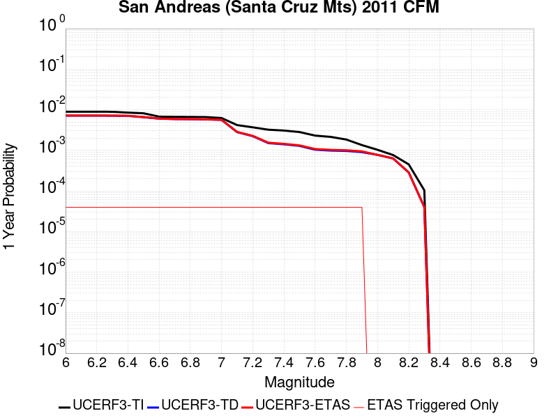 | 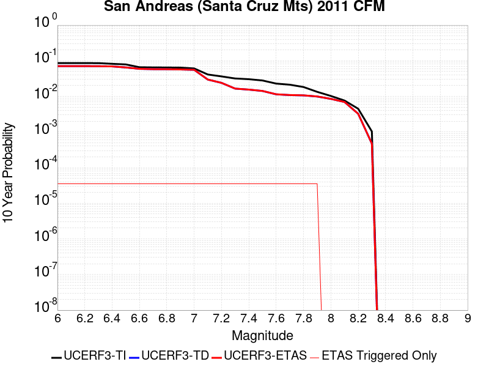 |

| Magnitude | 1 wk TI Prob | 1 wk TD Prob | 1 wk ETAS Prob | 1 wk ETAS/TD Gain | 1 wk ETAS Triggered Only | 1 mo TI Prob | 1 mo TD Prob | 1 mo ETAS Prob | 1 mo ETAS/TD Gain | 1 mo ETAS Triggered Only | 1 yr TI Prob | 1 yr TD Prob | 1 yr ETAS Prob | 1 yr ETAS/TD Gain | 1 yr ETAS Triggered Only | 10 yr TI Prob | 10 yr TD Prob | 10 yr ETAS Prob | 10 yr ETAS/TD Gain | 10 yr ETAS Triggered Only |
|-----|-----|-----|-----|-----|-----|-----|-----|-----|-----|-----|-----|-----|-----|-----|-----|-----|-----|-----|-----|-----|
| 6.0 | 1.7221631E-4 | 1.3793171E-4 | 1.3793171E-4 | 1.0 | 0.0 | 7.378611E-4 | 5.9100403E-4 | 5.9100403E-4 | 1.0 | 0.0 | 0.008946515 | 0.007172124 | 0.0072112917 | 1.0054611 | 3.9450842E-5 | 0.08594794 | 0.0705551 | 0.07059176 | 1.0005198 | 3.9450842E-5 |
| 6.1 | 1.7221631E-4 | 1.3793171E-4 | 1.3793171E-4 | 1.0 | 0.0 | 7.378611E-4 | 5.9100403E-4 | 5.9100403E-4 | 1.0 | 0.0 | 0.008946515 | 0.007172124 | 0.0072112917 | 1.0054611 | 3.9450842E-5 | 0.08594794 | 0.0705551 | 0.07059176 | 1.0005198 | 3.9450842E-5 |
| 6.2 | 1.7221631E-4 | 1.3793171E-4 | 1.3793171E-4 | 1.0 | 0.0 | 7.378611E-4 | 5.9100403E-4 | 5.9100403E-4 | 1.0 | 0.0 | 0.008946515 | 0.007172124 | 0.0072112917 | 1.0054611 | 3.9450842E-5 | 0.08594794 | 0.0705551 | 0.07059176 | 1.0005198 | 3.9450842E-5 |
| 6.3 | 1.716926E-4 | 1.3712609E-4 | 1.3712609E-4 | 1.0 | 0.0 | 7.3561794E-4 | 5.875529E-4 | 5.875529E-4 | 1.0 | 0.0 | 0.008919428 | 0.0071303817 | 0.007169551 | 1.0054933 | 3.9450842E-5 | 0.08569809 | 0.070167266 | 0.07020395 | 1.0005227 | 3.9450842E-5 |
| 6.4 | 1.6392978E-4 | 1.3588481E-4 | 1.3588481E-4 | 1.0 | 0.0 | 7.02367E-4 | 5.822355E-4 | 5.822355E-4 | 1.0 | 0.0 | 0.008517839 | 0.007066063 | 0.007105235 | 1.0055437 | 3.9450842E-5 | 0.08198654 | 0.06940135 | 0.06943806 | 1.000529 | 3.9450842E-5 |
| 6.5 | 1.5742714E-4 | 1.2648388E-4 | 1.2648388E-4 | 1.0 | 0.0 | 6.745133E-4 | 5.4196286E-4 | 5.4196286E-4 | 1.0 | 0.0 | 0.00818132 | 0.0065787593 | 0.0066179503 | 1.0059572 | 3.9450842E-5 | 0.078865945 | 0.06486309 | 0.06489999 | 1.0005687 | 3.9450842E-5 |
| 6.6 | 1.3038084E-4 | 1.1588213E-4 | 1.1588213E-4 | 1.0 | 0.0 | 5.5865536E-4 | 4.9654447E-4 | 4.9654447E-4 | 1.0 | 0.0 | 0.006780438 | 0.0060289134 | 0.0060681263 | 1.0065042 | 3.9450842E-5 | 0.0657725 | 0.05932738 | 0.05936449 | 1.0006255 | 3.9450842E-5 |
| 6.7 | 1.2867592E-4 | 1.1314701E-4 | 1.1314701E-4 | 1.0 | 0.0 | 5.5135164E-4 | 4.8482692E-4 | 4.8482692E-4 | 1.0 | 0.0 | 0.0066920654 | 0.00588703 | 0.005926249 | 1.0066619 | 3.9450842E-5 | 0.06494093 | 0.058038417 | 0.058075577 | 1.0006403 | 3.9450842E-5 |
| 6.8 | 1.2801298E-4 | 1.1252261E-4 | 1.1252261E-4 | 1.0 | 0.0 | 5.485117E-4 | 4.8215193E-4 | 4.8215193E-4 | 1.0 | 0.0 | 0.0066577005 | 0.0058546383 | 0.005893858 | 1.006699 | 3.9450842E-5 | 0.06461738 | 0.057752274 | 0.057789445 | 1.0006436 | 3.9450842E-5 |
| 6.9 | 1.269149E-4 | 1.1094465E-4 | 1.1094465E-4 | 1.0 | 0.0 | 5.4380763E-4 | 4.7539172E-4 | 4.7539172E-4 | 1.0 | 0.0 | 0.006600777 | 0.005772772 | 0.005811995 | 1.0067945 | 3.9450842E-5 | 0.06408122 | 0.0570241 | 0.0570613 | 1.0006524 | 3.9450842E-5 |
| 7.0 | 1.2030331E-4 | 1.0824504E-4 | 1.0824504E-4 | 1.0 | 0.0 | 5.154837E-4 | 4.638261E-4 | 4.638261E-4 | 1.0 | 0.0 | 0.006257969 | 0.0056326967 | 0.005671925 | 1.0069644 | 3.9450842E-5 | 0.06084648 | 0.055696685 | 0.05573394 | 1.0006689 | 3.9450842E-5 |
| 7.1 | 8.049617E-5 | 5.3926604E-5 | 5.3926604E-5 | 1.0 | 0.0 | 3.4493793E-4 | 2.3109373E-4 | 2.3109373E-4 | 1.0 | 0.0 | 0.0041915346 | 0.0028099709 | 0.0028493109 | 1.0140002 | 3.9450842E-5 | 0.041133516 | 0.029618956 | 0.02965724 | 1.0012925 | 3.9450842E-5 |
| 7.2 | 7.093979E-5 | 4.2937932E-5 | 4.2937932E-5 | 1.0 | 0.0 | 3.0399222E-4 | 1.8400686E-4 | 1.8400686E-4 | 1.0 | 0.0 | 0.0036948253 | 0.0022380045 | 0.002277367 | 1.0175883 | 3.9450842E-5 | 0.03633994 | 0.023941692 | 0.023980197 | 1.0016084 | 3.9450842E-5 |
| 7.3 | 6.193693E-5 | 2.8894141E-5 | 2.8894141E-5 | 1.0 | 0.0 | 2.6541698E-4 | 1.2382616E-4 | 1.2382616E-4 | 1.0 | 0.0 | 0.0032266637 | 0.0015065427 | 0.0015459341 | 1.0261469 | 3.9450842E-5 | 0.031802133 | 0.016499156 | 0.016537957 | 1.0023516 | 3.9450842E-5 |
| 7.4 | 5.906492E-5 | 2.702346E-5 | 2.702346E-5 | 1.0 | 0.0 | 2.5311083E-4 | 1.1580969E-4 | 1.1580969E-4 | 1.0 | 0.0 | 0.0030772698 | 0.0014090725 | 0.0014484677 | 1.0279583 | 3.9450842E-5 | 0.030350044 | 0.015471023 | 0.015509862 | 1.0025105 | 3.9450842E-5 |
| 7.5 | 5.424296E-5 | 2.4678277E-5 | 2.4678277E-5 | 1.0 | 0.0 | 2.324491E-4 | 1.05759755E-4 | 1.05759755E-4 | 1.0 | 0.0 | 0.002826395 | 0.0012868657 | 0.0013262657 | 1.0306171 | 3.9450842E-5 | 0.027907165 | 0.014163188 | 0.01420208 | 1.002746 | 3.9450842E-5 |
| 7.6 | 4.43084E-5 | 1.990431E-5 | 1.990431E-5 | 1.0 | 0.0 | 1.8987931E-4 | 8.53014E-5 | 8.53014E-5 | 1.0 | 0.0 | 0.0023093296 | 0.0010380499 | 0.0010774599 | 1.0379653 | 3.9450842E-5 | 0.022854783 | 0.011412679 | 0.01145168 | 1.0034173 | 3.9450842E-5 |
| 7.7 | 4.118098E-5 | 1.8936442E-5 | 1.8936442E-5 | 1.0 | 0.0 | 1.7647797E-4 | 8.115366E-5 | 8.115366E-5 | 1.0 | 0.0 | 0.002146502 | 9.875982E-4 | 0.00102701 | 1.0399069 | 3.9450842E-5 | 0.021258866 | 0.010870468 | 0.01090949 | 1.0035897 | 3.9450842E-5 |
| 7.8 | 3.5408906E-5 | 1.856446E-5 | 1.856446E-5 | 1.0 | 0.0 | 1.5174363E-4 | 7.955955E-5 | 7.955955E-5 | 1.0 | 0.0 | 0.0018459131 | 9.682073E-4 | 0.0010076199 | 1.0407069 | 3.9450842E-5 | 0.018306552 | 0.010652021 | 0.01069105 | 1.0036641 | 3.9450842E-5 |
| 7.9 | 2.5860836E-5 | 1.7315993E-5 | 1.7315993E-5 | 1.0 | 0.0 | 1.10827445E-4 | 7.420929E-5 | 7.420929E-5 | 1.0 | 0.0 | 0.001348489 | 9.031238E-4 | 9.425391E-4 | 1.0436432 | 3.9450842E-5 | 0.013403354 | 0.009907599 | 0.009946659 | 1.0039424 | 3.9450842E-5 |
| 8.0 | 1.9777332E-5 | 1.4839596E-5 | 1.4839596E-5 | 1.0 | 0.0 | 8.4757245E-5 | 6.3596715E-5 | 6.3596715E-5 | 1.0 | 0.0 | 0.0010314309 | 7.740152E-4 | 7.740152E-4 | 1.0 | 0.0 | 0.010266567 | 0.008508967 | 0.008508967 | 1.0 | 0.0 |
| 8.1 | 1.468494E-5 | 1.2107374E-5 | 1.2107374E-5 | 1.0 | 0.0 | 6.293394E-5 | 5.1887713E-5 | 5.1887713E-5 | 1.0 | 0.0 | 7.6595135E-4 | 6.3155E-4 | 6.3155E-4 | 1.0 | 0.0 | 0.0076331664 | 0.006969149 | 0.006969149 | 1.0 | 0.0 |
| 8.2 | 8.63836E-6 | 5.469061E-6 | 5.469061E-6 | 1.0 | 0.0 | 3.7021015E-5 | 2.3438623E-5 | 2.3438623E-5 | 1.0 | 0.0 | 4.5063766E-4 | 2.8532793E-4 | 2.8532793E-4 | 1.0 | 0.0 | 0.004497249 | 0.00324569 | 0.00324569 | 1.0 | 0.0 |
| 8.3 | 1.983087E-6 | 7.6599065E-7 | 7.6599065E-7 | 1.0 | 0.0 | 8.498917E-6 | 3.282813E-6 | 3.282813E-6 | 1.0 | 0.0 | 1.034694E-4 | 3.9967534E-5 | 3.9967534E-5 | 1.0 | 0.0 | 0.0010342124 | 4.719687E-4 | 4.719687E-4 | 1.0 | 0.0 |

## Pitas Point (Lower)-Montalvo
*[(top)](#table-of-contents)*

| 1 Week | 1 Month | 1 Year | 10 Year |
|-----|-----|-----|-----|
| 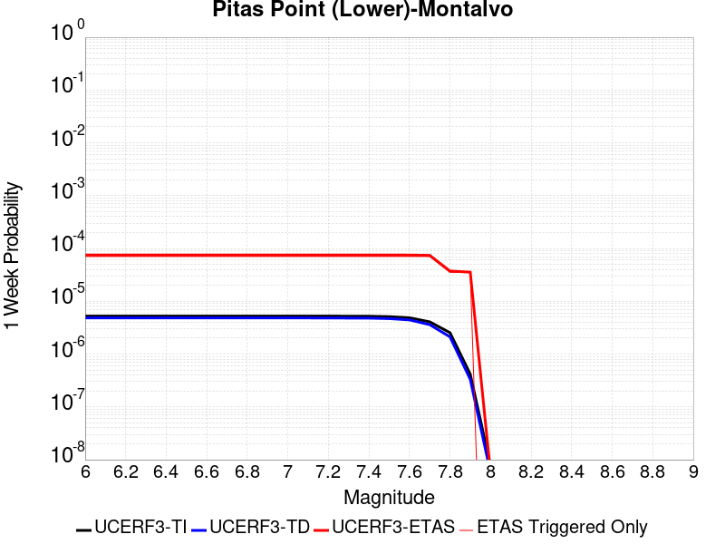 | 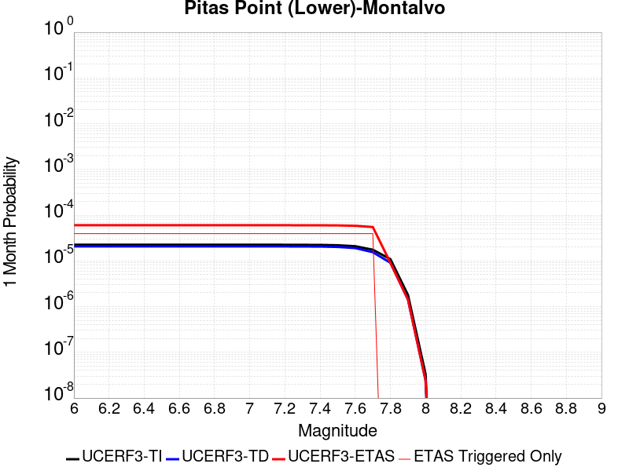 | 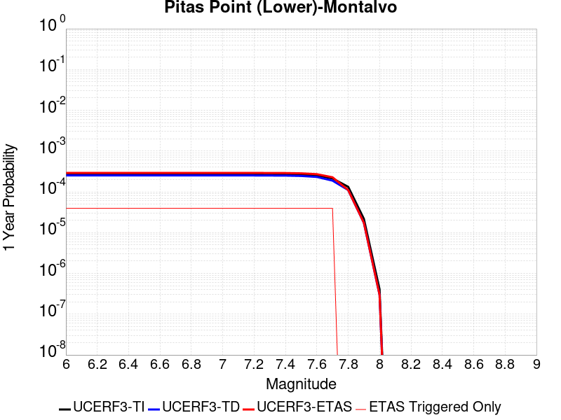 | 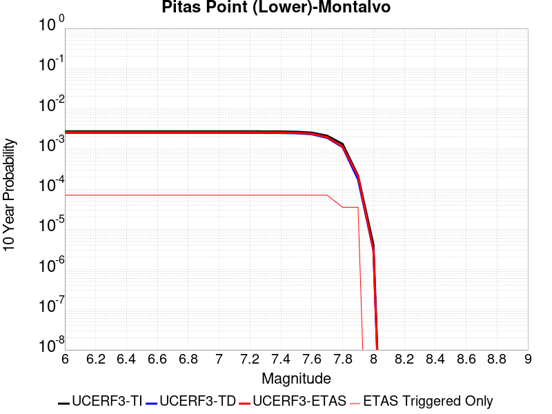 |

| Magnitude | 1 wk TI Prob | 1 wk TD Prob | 1 wk ETAS Prob | 1 wk ETAS/TD Gain | 1 wk ETAS Triggered Only | 1 mo TI Prob | 1 mo TD Prob | 1 mo ETAS Prob | 1 mo ETAS/TD Gain | 1 mo ETAS Triggered Only | 1 yr TI Prob | 1 yr TD Prob | 1 yr ETAS Prob | 1 yr ETAS/TD Gain | 1 yr ETAS Triggered Only | 10 yr TI Prob | 10 yr TD Prob | 10 yr ETAS Prob | 10 yr ETAS/TD Gain | 10 yr ETAS Triggered Only |
|-----|-----|-----|-----|-----|-----|-----|-----|-----|-----|-----|-----|-----|-----|-----|-----|-----|-----|-----|-----|-----|
| 6.0 | 5.2543637E-6 | 4.8378706E-6 | 4.4288525E-5 | 9.15455 | 3.9450842E-5 | 2.2518509E-5 | 2.0733567E-5 | 6.0183593E-5 | 2.9027128 | 3.9450842E-5 | 2.7412834E-4 | 2.5240227E-4 | 2.9184314E-4 | 1.156262 | 3.9450842E-5 | 0.0027379042 | 0.0025211885 | 0.0025605399 | 1.0156083 | 3.9450842E-5 |
| 6.1 | 5.2543637E-6 | 4.8378706E-6 | 4.4288525E-5 | 9.15455 | 3.9450842E-5 | 2.2518509E-5 | 2.0733567E-5 | 6.0183593E-5 | 2.9027128 | 3.9450842E-5 | 2.7412834E-4 | 2.5240227E-4 | 2.9184314E-4 | 1.156262 | 3.9450842E-5 | 0.0027379042 | 0.0025211885 | 0.0025605399 | 1.0156083 | 3.9450842E-5 |
| 6.2 | 5.2543637E-6 | 4.8378706E-6 | 4.4288525E-5 | 9.15455 | 3.9450842E-5 | 2.2518509E-5 | 2.0733567E-5 | 6.0183593E-5 | 2.9027128 | 3.9450842E-5 | 2.7412834E-4 | 2.5240227E-4 | 2.9184314E-4 | 1.156262 | 3.9450842E-5 | 0.0027379042 | 0.0025211885 | 0.0025605399 | 1.0156083 | 3.9450842E-5 |
| 6.3 | 5.2543637E-6 | 4.8378706E-6 | 4.4288525E-5 | 9.15455 | 3.9450842E-5 | 2.2518509E-5 | 2.0733567E-5 | 6.0183593E-5 | 2.9027128 | 3.9450842E-5 | 2.7412834E-4 | 2.5240227E-4 | 2.9184314E-4 | 1.156262 | 3.9450842E-5 | 0.0027379042 | 0.0025211885 | 0.0025605399 | 1.0156083 | 3.9450842E-5 |
| 6.4 | 5.2543637E-6 | 4.8378706E-6 | 4.4288525E-5 | 9.15455 | 3.9450842E-5 | 2.2518509E-5 | 2.0733567E-5 | 6.0183593E-5 | 2.9027128 | 3.9450842E-5 | 2.7412834E-4 | 2.5240227E-4 | 2.9184314E-4 | 1.156262 | 3.9450842E-5 | 0.0027379042 | 0.0025211885 | 0.0025605399 | 1.0156083 | 3.9450842E-5 |
| 6.5 | 5.2543637E-6 | 4.8378706E-6 | 4.4288525E-5 | 9.15455 | 3.9450842E-5 | 2.2518509E-5 | 2.0733567E-5 | 6.0183593E-5 | 2.9027128 | 3.9450842E-5 | 2.7412834E-4 | 2.5240227E-4 | 2.9184314E-4 | 1.156262 | 3.9450842E-5 | 0.0027379042 | 0.0025211885 | 0.0025605399 | 1.0156083 | 3.9450842E-5 |
| 6.6 | 5.2543637E-6 | 4.8378706E-6 | 4.4288525E-5 | 9.15455 | 3.9450842E-5 | 2.2518509E-5 | 2.0733567E-5 | 6.0183593E-5 | 2.9027128 | 3.9450842E-5 | 2.7412834E-4 | 2.5240227E-4 | 2.9184314E-4 | 1.156262 | 3.9450842E-5 | 0.0027379042 | 0.0025211885 | 0.0025605399 | 1.0156083 | 3.9450842E-5 |
| 6.7 | 5.2543637E-6 | 4.8378706E-6 | 4.4288525E-5 | 9.15455 | 3.9450842E-5 | 2.2518509E-5 | 2.0733567E-5 | 6.0183593E-5 | 2.9027128 | 3.9450842E-5 | 2.7412834E-4 | 2.5240227E-4 | 2.9184314E-4 | 1.156262 | 3.9450842E-5 | 0.0027379042 | 0.0025211885 | 0.0025605399 | 1.0156083 | 3.9450842E-5 |
| 6.8 | 5.2543637E-6 | 4.8378706E-6 | 4.4288525E-5 | 9.15455 | 3.9450842E-5 | 2.2518509E-5 | 2.0733567E-5 | 6.0183593E-5 | 2.9027128 | 3.9450842E-5 | 2.7412834E-4 | 2.5240227E-4 | 2.9184314E-4 | 1.156262 | 3.9450842E-5 | 0.0027379042 | 0.0025211885 | 0.0025605399 | 1.0156083 | 3.9450842E-5 |
| 6.9 | 5.2543637E-6 | 4.8378706E-6 | 4.4288525E-5 | 9.15455 | 3.9450842E-5 | 2.2518509E-5 | 2.0733567E-5 | 6.0183593E-5 | 2.9027128 | 3.9450842E-5 | 2.7412834E-4 | 2.5240227E-4 | 2.9184314E-4 | 1.156262 | 3.9450842E-5 | 0.0027379042 | 0.0025211885 | 0.0025605399 | 1.0156083 | 3.9450842E-5 |
| 7.0 | 5.2543637E-6 | 4.8378706E-6 | 4.4288525E-5 | 9.15455 | 3.9450842E-5 | 2.2518509E-5 | 2.0733567E-5 | 6.0183593E-5 | 2.9027128 | 3.9450842E-5 | 2.7412834E-4 | 2.5240227E-4 | 2.9184314E-4 | 1.156262 | 3.9450842E-5 | 0.0027379042 | 0.0025211885 | 0.0025605399 | 1.0156083 | 3.9450842E-5 |
| 7.1 | 5.2543637E-6 | 4.8378706E-6 | 4.4288525E-5 | 9.15455 | 3.9450842E-5 | 2.2518509E-5 | 2.0733567E-5 | 6.0183593E-5 | 2.9027128 | 3.9450842E-5 | 2.7412834E-4 | 2.5240227E-4 | 2.9184314E-4 | 1.156262 | 3.9450842E-5 | 0.0027379042 | 0.0025211885 | 0.0025605399 | 1.0156083 | 3.9450842E-5 |
| 7.2 | 5.2458695E-6 | 4.8290244E-6 | 4.4279677E-5 | 9.169488 | 3.9450842E-5 | 2.2482105E-5 | 2.0695656E-5 | 6.0145685E-5 | 2.9061985 | 3.9450842E-5 | 2.7368523E-4 | 2.519408E-4 | 2.913817E-4 | 1.1565483 | 3.9450842E-5 | 0.0027334841 | 0.0025165842 | 0.0025559356 | 1.0156369 | 3.9450842E-5 |
| 7.3 | 5.22665E-6 | 4.8089414E-6 | 4.4259596E-5 | 9.203605 | 3.9450842E-5 | 2.2399736E-5 | 2.0609588E-5 | 6.005962E-5 | 2.914159 | 3.9450842E-5 | 2.7268266E-4 | 2.5089315E-4 | 2.903341E-4 | 1.1572021 | 3.9450842E-5 | 0.002723483 | 0.0025061315 | 0.0025454834 | 1.0157022 | 3.9450842E-5 |
| 7.4 | 5.210642E-6 | 4.792154E-6 | 4.424281E-5 | 9.232343 | 3.9450842E-5 | 2.233113E-5 | 2.0537642E-5 | 5.9987677E-5 | 2.9208648 | 3.9450842E-5 | 2.718476E-4 | 2.5001742E-4 | 2.894584E-4 | 1.157753 | 3.9450842E-5 | 0.002715153 | 0.0024973939 | 0.0025367462 | 1.0157573 | 3.9450842E-5 |
| 7.5 | 5.1226016E-6 | 4.7000403E-6 | 4.41507E-5 | 9.393684 | 3.9450842E-5 | 2.1953823E-5 | 2.0142877E-5 | 5.9592927E-5 | 2.958511 | 3.9450842E-5 | 2.67255E-4 | 2.4521223E-4 | 2.8465342E-4 | 1.160845 | 3.9450842E-5 | 0.0026693381 | 0.0024494485 | 0.0024888027 | 1.0160666 | 3.9450842E-5 |
| 7.6 | 4.8796987E-6 | 4.4449403E-6 | 4.389561E-5 | 9.87541 | 3.9450842E-5 | 2.0912828E-5 | 1.9049607E-5 | 5.84997E-5 | 3.0709138 | 3.9450842E-5 | 2.5458392E-4 | 2.3190459E-4 | 2.7134627E-4 | 1.1700772 | 3.9450842E-5 | 0.0025429246 | 0.0023166565 | 0.0023560158 | 1.0169897 | 3.9450842E-5 |
| 7.7 | 4.0834398E-6 | 3.6091124E-6 | 4.3059816E-5 | 11.93086 | 3.9450842E-5 | 1.7500339E-5 | 1.5467534E-5 | 5.4917768E-5 | 3.5505188 | 3.9450842E-5 | 2.1304579E-4 | 1.8830119E-4 | 2.277446E-4 | 1.2094698 | 3.9450842E-5 | 0.0021284167 | 0.00188144 | 0.0019208167 | 1.020929 | 3.9450842E-5 |
| 7.8 | 2.5445438E-6 | 2.121228E-6 | 2.121228E-6 | 1.0 | 0.0 | 1.0905142E-5 | 9.090945E-6 | 9.090945E-6 | 1.0 | 0.0 | 1.3276201E-4 | 1.1067669E-4 | 1.1067669E-4 | 1.0 | 0.0 | 0.0013268272 | 0.0011062203 | 0.0011062203 | 1.0 | 0.0 |
| 7.9 | 4.1677114E-7 | 3.3293693E-7 | 3.3293693E-7 | 1.0 | 0.0 | 1.7861609E-6 | 1.4268718E-6 | 1.4268718E-6 | 1.0 | 0.0 | 2.1746291E-5 | 1.737203E-5 | 1.737203E-5 | 1.0 | 0.0 | 2.1744163E-4 | 1.7370703E-4 | 1.7370703E-4 | 1.0 | 0.0 |
| 8.0 | 7.791402E-9 | 5.683497E-9 | 5.683497E-9 | 1.0 | 0.0 | 3.3391725E-8 | 2.4357844E-8 | 2.4357844E-8 | 1.0 | 0.0 | 4.0654416E-7 | 2.9655675E-7 | 2.9655675E-7 | 1.0 | 0.0 | 4.065434E-6 | 2.9655655E-6 | 2.9655655E-6 | 1.0 | 0.0 |

## Elsinore (Stepovers Combined)
*[(top)](#table-of-contents)*

| 1 Week | 1 Month | 1 Year | 10 Year |
|-----|-----|-----|-----|
| 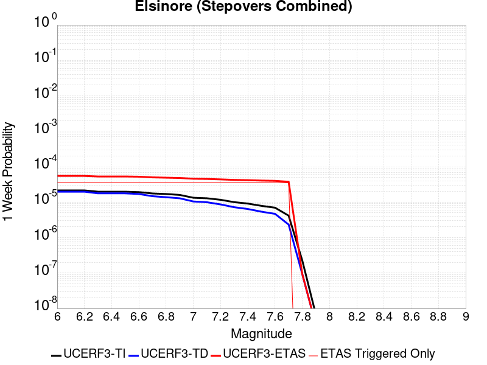 | 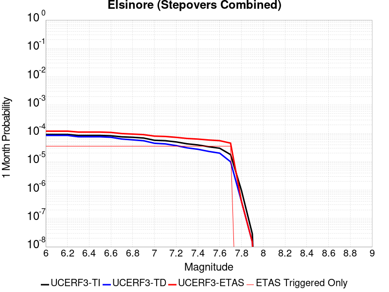 | 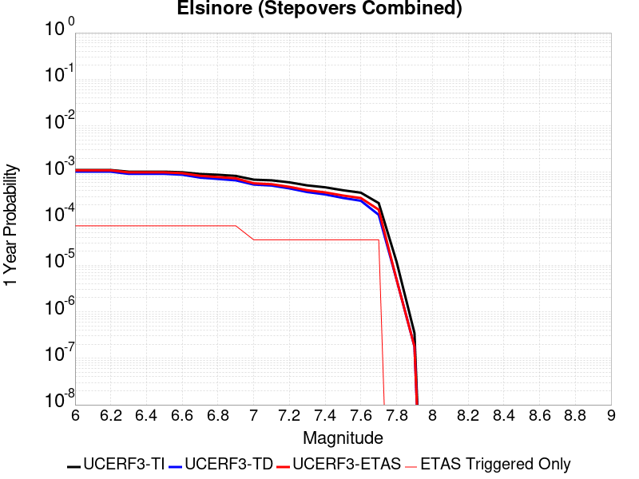 | 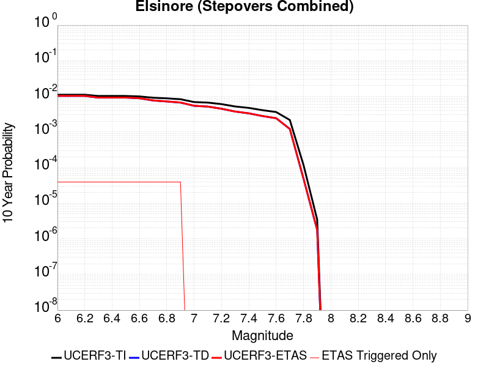 |

| Magnitude | 1 wk TI Prob | 1 wk TD Prob | 1 wk ETAS Prob | 1 wk ETAS/TD Gain | 1 wk ETAS Triggered Only | 1 mo TI Prob | 1 mo TD Prob | 1 mo ETAS Prob | 1 mo ETAS/TD Gain | 1 mo ETAS Triggered Only | 1 yr TI Prob | 1 yr TD Prob | 1 yr ETAS Prob | 1 yr ETAS/TD Gain | 1 yr ETAS Triggered Only | 10 yr TI Prob | 10 yr TD Prob | 10 yr ETAS Prob | 10 yr ETAS/TD Gain | 10 yr ETAS Triggered Only |
|-----|-----|-----|-----|-----|-----|-----|-----|-----|-----|-----|-----|-----|-----|-----|-----|-----|-----|-----|-----|-----|
| 6.0 | 2.144392E-5 | 1.9760193E-5 | 1.9760193E-5 | 1.0 | 0.0 | 9.189928E-5 | 8.468392E-5 | 8.468392E-5 | 1.0 | 0.0 | 0.0011182994 | 0.0010305607 | 0.0010699709 | 1.0382415 | 3.9450842E-5 | 0.011126885 | 0.010264917 | 0.010303963 | 1.0038038 | 3.9450842E-5 |
| 6.1 | 2.144392E-5 | 1.9760193E-5 | 1.9760193E-5 | 1.0 | 0.0 | 9.189928E-5 | 8.468392E-5 | 8.468392E-5 | 1.0 | 0.0 | 0.0011182994 | 0.0010305607 | 0.0010699709 | 1.0382415 | 3.9450842E-5 | 0.011126885 | 0.010264917 | 0.010303963 | 1.0038038 | 3.9450842E-5 |
| 6.2 | 2.144392E-5 | 1.9760193E-5 | 1.9760193E-5 | 1.0 | 0.0 | 9.189928E-5 | 8.468392E-5 | 8.468392E-5 | 1.0 | 0.0 | 0.0011182994 | 0.0010305607 | 0.0010699709 | 1.0382415 | 3.9450842E-5 | 0.011126885 | 0.010264917 | 0.010303963 | 1.0038038 | 3.9450842E-5 |
| 6.3 | 1.9751555E-5 | 1.7741453E-5 | 1.7741453E-5 | 1.0 | 0.0 | 8.4646774E-5 | 7.603267E-5 | 7.603267E-5 | 1.0 | 0.0 | 0.0010300872 | 9.253213E-4 | 9.6473563E-4 | 1.0425953 | 3.9450842E-5 | 0.010253254 | 0.009221276 | 0.009260364 | 1.0042388 | 3.9450842E-5 |
| 6.4 | 1.9751555E-5 | 1.7741453E-5 | 1.7741453E-5 | 1.0 | 0.0 | 8.4646774E-5 | 7.603267E-5 | 7.603267E-5 | 1.0 | 0.0 | 0.0010300872 | 9.253213E-4 | 9.6473563E-4 | 1.0425953 | 3.9450842E-5 | 0.010253254 | 0.009221276 | 0.009260364 | 1.0042388 | 3.9450842E-5 |
| 6.5 | 1.9751555E-5 | 1.7741453E-5 | 1.7741453E-5 | 1.0 | 0.0 | 8.4646774E-5 | 7.603267E-5 | 7.603267E-5 | 1.0 | 0.0 | 0.0010300872 | 9.253213E-4 | 9.6473563E-4 | 1.0425953 | 3.9450842E-5 | 0.010253254 | 0.009221276 | 0.009260364 | 1.0042388 | 3.9450842E-5 |
| 6.6 | 1.9188685E-5 | 1.7003393E-5 | 1.7003393E-5 | 1.0 | 0.0 | 8.2234634E-5 | 7.286974E-5 | 7.286974E-5 | 1.0 | 0.0 | 0.0010007467 | 8.868442E-4 | 9.2626E-4 | 1.044445 | 3.9450842E-5 | 0.00996252 | 0.0088398475 | 0.008878949 | 1.0044234 | 3.9450842E-5 |
| 6.7 | 1.7608272E-5 | 1.4732616E-5 | 1.4732616E-5 | 1.0 | 0.0 | 7.546184E-5 | 6.3138315E-5 | 6.3138315E-5 | 1.0 | 0.0 | 9.183606E-4 | 7.684476E-4 | 8.0786814E-4 | 1.0512989 | 3.9450842E-5 | 0.009145746 | 0.00766491 | 0.0077040587 | 1.0051075 | 3.9450842E-5 |
| 6.8 | 1.697165E-5 | 1.3783365E-5 | 1.3783365E-5 | 1.0 | 0.0 | 7.273361E-5 | 5.9070277E-5 | 5.9070277E-5 | 1.0 | 0.0 | 8.8517193E-4 | 7.18952E-4 | 7.5837446E-4 | 1.0548333 | 3.9450842E-5 | 0.008816543 | 0.007172675 | 0.007211843 | 1.0054607 | 3.9450842E-5 |
| 6.9 | 1.600365E-5 | 1.2846671E-5 | 1.2846671E-5 | 1.0 | 0.0 | 6.858527E-5 | 5.5056043E-5 | 5.5056043E-5 | 1.0 | 0.0 | 8.347058E-4 | 6.7010894E-4 | 7.0953334E-4 | 1.0588329 | 3.9450842E-5 | 0.008315775 | 0.0066867657 | 0.006725953 | 1.0058604 | 3.9450842E-5 |
| 7.0 | 1.3314581E-5 | 1.0447548E-5 | 1.0447548E-5 | 1.0 | 0.0 | 5.7061243E-5 | 4.4774453E-5 | 4.4774453E-5 | 1.0 | 0.0 | 6.944992E-4 | 5.449953E-4 | 5.449953E-4 | 1.0 | 0.0 | 0.006923327 | 0.0054405155 | 0.0054405155 | 1.0 | 0.0 |
| 7.1 | 1.2865345E-5 | 9.937536E-6 | 9.937536E-6 | 1.0 | 0.0 | 5.5136024E-5 | 4.258876E-5 | 4.258876E-5 | 1.0 | 0.0 | 6.710743E-4 | 5.183973E-4 | 5.183973E-4 | 1.0 | 0.0 | 0.0066905143 | 0.0051752133 | 0.0051752133 | 1.0 | 0.0 |
| 7.2 | 1.1650051E-5 | 8.633809E-6 | 8.633809E-6 | 1.0 | 0.0 | 4.9927836E-5 | 3.7001522E-5 | 3.7001522E-5 | 1.0 | 0.0 | 6.0770183E-4 | 4.504022E-4 | 4.504022E-4 | 1.0 | 0.0 | 0.0060604266 | 0.0044963174 | 0.0044963174 | 1.0 | 0.0 |
| 7.3 | 1.0008533E-5 | 7.2010425E-6 | 7.2010425E-6 | 1.0 | 0.0 | 4.2893007E-5 | 3.0861254E-5 | 3.0861254E-5 | 1.0 | 0.0 | 5.220972E-4 | 3.7567242E-4 | 3.7567242E-4 | 1.0 | 0.0 | 0.005208723 | 0.003750761 | 0.003750761 | 1.0 | 0.0 |
| 7.4 | 9.116759E-6 | 6.410068E-6 | 6.410068E-6 | 1.0 | 0.0 | 3.907124E-5 | 2.747144E-5 | 2.747144E-5 | 1.0 | 0.0 | 4.7558855E-4 | 3.3441483E-4 | 3.3441483E-4 | 1.0 | 0.0 | 0.00474572 | 0.0033392678 | 0.0033392678 | 1.0 | 0.0 |
| 7.5 | 7.870524E-6 | 5.3825365E-6 | 5.3825365E-6 | 1.0 | 0.0 | 3.3730383E-5 | 2.3067816E-5 | 2.3067816E-5 | 1.0 | 0.0 | 4.1059E-4 | 2.8081573E-4 | 2.8081573E-4 | 1.0 | 0.0 | 0.0040983222 | 0.0028047354 | 0.0028047354 | 1.0 | 0.0 |
| 7.6 | 6.9774537E-6 | 4.6776067E-6 | 4.6776067E-6 | 1.0 | 0.0 | 2.990303E-5 | 2.0046738E-5 | 2.0046738E-5 | 1.0 | 0.0 | 3.640086E-4 | 2.4404288E-4 | 2.4404288E-4 | 1.0 | 0.0 | 0.003634129 | 0.0024378651 | 0.0024378651 | 1.0 | 0.0 |
| 7.7 | 4.1616954E-6 | 2.32834E-6 | 2.32834E-6 | 1.0 | 0.0 | 1.7835715E-5 | 9.978567E-6 | 9.978567E-6 | 1.0 | 0.0 | 2.171282E-4 | 1.2148302E-4 | 1.2148302E-4 | 1.0 | 0.0 | 0.0021691616 | 0.0012142392 | 0.0012142392 | 1.0 | 0.0 |
| 7.8 | 2.2692414E-7 | 9.3854695E-8 | 9.3854695E-8 | 1.0 | 0.0 | 9.725317E-7 | 4.0223435E-7 | 4.0223435E-7 | 1.0 | 0.0 | 1.1840509E-5 | 4.8971956E-6 | 4.8971956E-6 | 1.0 | 0.0 | 1.1839878E-4 | 4.8971204E-5 | 4.8971204E-5 | 1.0 | 0.0 |
| 7.9 | 6.676829E-9 | 3.439853E-9 | 3.439853E-9 | 1.0 | 0.0 | 2.861498E-8 | 1.4742227E-8 | 1.4742227E-8 | 1.0 | 0.0 | 3.4838732E-7 | 1.7948659E-7 | 1.7948659E-7 | 1.0 | 0.0 | 3.4838679E-6 | 1.7948646E-6 | 1.7948646E-6 | 1.0 | 0.0 |

## Cerro Prieto
*[(top)](#table-of-contents)*

| 1 Week | 1 Month | 1 Year | 10 Year |
|-----|-----|-----|-----|
| 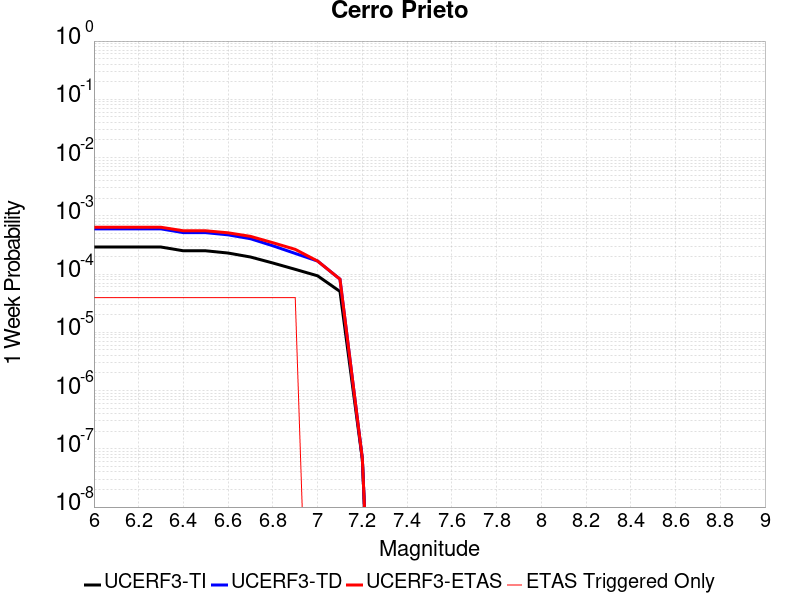 | 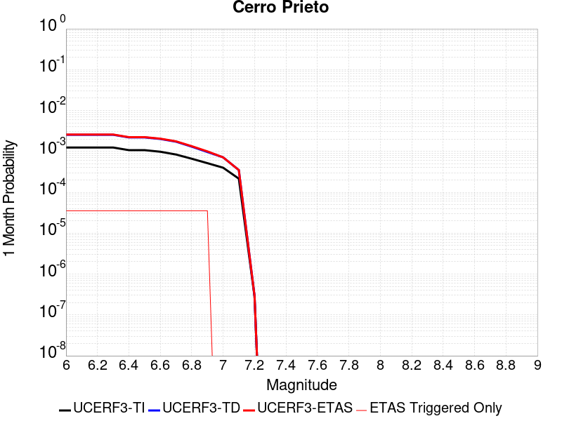 | 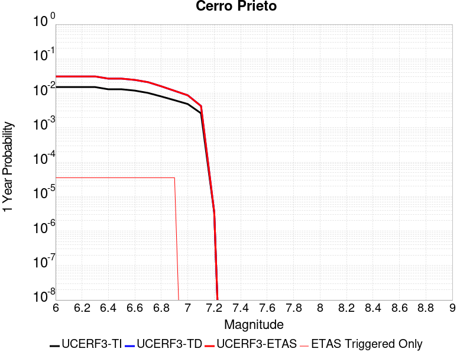 | 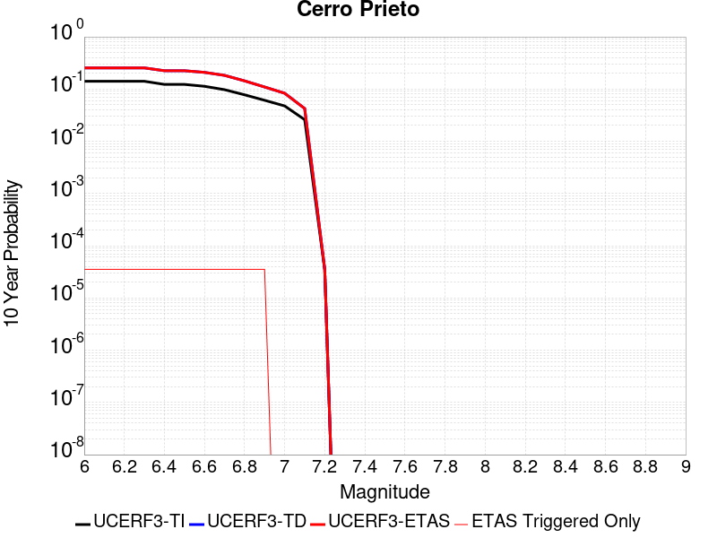 |

| Magnitude | 1 wk TI Prob | 1 wk TD Prob | 1 wk ETAS Prob | 1 wk ETAS/TD Gain | 1 wk ETAS Triggered Only | 1 mo TI Prob | 1 mo TD Prob | 1 mo ETAS Prob | 1 mo ETAS/TD Gain | 1 mo ETAS Triggered Only | 1 yr TI Prob | 1 yr TD Prob | 1 yr ETAS Prob | 1 yr ETAS/TD Gain | 1 yr ETAS Triggered Only | 10 yr TI Prob | 10 yr TD Prob | 10 yr ETAS Prob | 10 yr ETAS/TD Gain | 10 yr ETAS Triggered Only |
|-----|-----|-----|-----|-----|-----|-----|-----|-----|-----|-----|-----|-----|-----|-----|-----|-----|-----|-----|-----|-----|
| 6.0 | 2.9101528E-4 | 5.964804E-4 | 6.359077E-4 | 1.0660999 | 3.9450842E-5 | 0.0012466122 | 0.002554082 | 0.0025934323 | 1.0154067 | 3.9450842E-5 | 0.015072231 | 0.03064807 | 0.030686311 | 1.0012478 | 3.9450842E-5 | 0.14089979 | 0.25397858 | 0.254008 | 1.0001159 | 3.9450842E-5 |
| 6.1 | 2.9101528E-4 | 5.964804E-4 | 6.359077E-4 | 1.0660999 | 3.9450842E-5 | 0.0012466122 | 0.002554082 | 0.0025934323 | 1.0154067 | 3.9450842E-5 | 0.015072231 | 0.03064807 | 0.030686311 | 1.0012478 | 3.9450842E-5 | 0.14089979 | 0.25397858 | 0.254008 | 1.0001159 | 3.9450842E-5 |
| 6.2 | 2.9101528E-4 | 5.964804E-4 | 6.359077E-4 | 1.0660999 | 3.9450842E-5 | 0.0012466122 | 0.002554082 | 0.0025934323 | 1.0154067 | 3.9450842E-5 | 0.015072231 | 0.03064807 | 0.030686311 | 1.0012478 | 3.9450842E-5 | 0.14089979 | 0.25397858 | 0.254008 | 1.0001159 | 3.9450842E-5 |
| 6.3 | 2.9101528E-4 | 5.964804E-4 | 6.359077E-4 | 1.0660999 | 3.9450842E-5 | 0.0012466122 | 0.002554082 | 0.0025934323 | 1.0154067 | 3.9450842E-5 | 0.015072231 | 0.03064807 | 0.030686311 | 1.0012478 | 3.9450842E-5 | 0.14089979 | 0.25397858 | 0.254008 | 1.0001159 | 3.9450842E-5 |
| 6.4 | 2.508648E-4 | 5.1397446E-4 | 5.53405E-4 | 1.076717 | 3.9450842E-5 | 0.0010746918 | 0.0022010866 | 0.0022404506 | 1.0178839 | 3.9450842E-5 | 0.013006088 | 0.026471792 | 0.026510198 | 1.0014509 | 3.9450842E-5 | 0.12270685 | 0.22440416 | 0.22443475 | 1.0001364 | 3.9450842E-5 |
| 6.5 | 2.508648E-4 | 5.1397446E-4 | 5.53405E-4 | 1.076717 | 3.9450842E-5 | 0.0010746918 | 0.0022010866 | 0.0022404506 | 1.0178839 | 3.9450842E-5 | 0.013006088 | 0.026471792 | 0.026510198 | 1.0014509 | 3.9450842E-5 | 0.12270685 | 0.22440416 | 0.22443475 | 1.0001364 | 3.9450842E-5 |
| 6.6 | 2.294914E-4 | 4.7116808E-4 | 5.1060034E-4 | 1.0836904 | 3.9450842E-5 | 9.831638E-4 | 0.0020179166 | 0.0020572878 | 1.0195109 | 3.9450842E-5 | 0.011904482 | 0.02429866 | 0.024337152 | 1.0015842 | 3.9450842E-5 | 0.11286586 | 0.20858558 | 0.2086168 | 1.0001497 | 3.9450842E-5 |
| 6.7 | 1.9621674E-4 | 4.0419117E-4 | 4.4362608E-4 | 1.0975649 | 3.9450842E-5 | 8.4065786E-4 | 0.0017312564 | 0.0017706389 | 1.022748 | 3.9450842E-5 | 0.010187071 | 0.020884845 | 0.020923471 | 1.0018495 | 3.9450842E-5 | 0.09732539 | 0.18290249 | 0.18293472 | 1.0001762 | 3.9450842E-5 |
| 6.8 | 1.5476145E-4 | 3.056516E-4 | 3.4509038E-4 | 1.1290318 | 3.9450842E-5 | 6.6309475E-4 | 0.00130938 | 0.0013487792 | 1.03009 | 3.9450842E-5 | 0.008043335 | 0.015836509 | 0.015875334 | 1.0024517 | 3.9450842E-5 | 0.07758363 | 0.14336355 | 0.14339735 | 1.0002357 | 3.9450842E-5 |
| 6.9 | 1.20509176E-4 | 2.2582515E-4 | 2.652671E-4 | 1.174657 | 3.9450842E-5 | 5.1636563E-4 | 9.6752634E-4 | 0.001006939 | 1.0407355 | 3.9450842E-5 | 0.006268645 | 0.011726342 | 0.01176533 | 1.0033249 | 3.9450842E-5 | 0.060947374 | 0.109451205 | 0.109486334 | 1.000321 | 3.9450842E-5 |
| 7.0 | 9.3269155E-5 | 1.6716642E-4 | 1.6716642E-4 | 1.0 | 0.0 | 3.9966372E-4 | 7.162739E-4 | 7.162739E-4 | 1.0 | 0.0 | 0.0048550544 | 0.008693418 | 0.008693418 | 1.0 | 0.0 | 0.04750344 | 0.08315912 | 0.08315912 | 1.0 | 0.0 |
| 7.1 | 5.029709E-5 | 8.1718936E-5 | 8.1718936E-5 | 1.0 | 0.0 | 2.1554115E-4 | 3.5019626E-4 | 3.5019626E-4 | 1.0 | 0.0 | 0.0026210553 | 0.0042587193 | 0.0042587193 | 1.0 | 0.0 | 0.025903556 | 0.042365108 | 0.042365108 | 1.0 | 0.0 |
| 7.2 | 6.5445185E-8 | 6.814903E-8 | 6.814903E-8 | 1.0 | 0.0 | 2.8047933E-7 | 2.9206726E-7 | 2.9206726E-7 | 1.0 | 0.0 | 3.4148304E-6 | 3.555919E-6 | 3.555919E-6 | 1.0 | 0.0 | 3.414778E-5 | 3.5559187E-5 | 3.5559187E-5 | 1.0 | 0.0 |

## Cedar Mtn-Mahogany Mtn
*[(top)](#table-of-contents)*

| 1 Week | 1 Month | 1 Year | 10 Year |
|-----|-----|-----|-----|
|  |  | 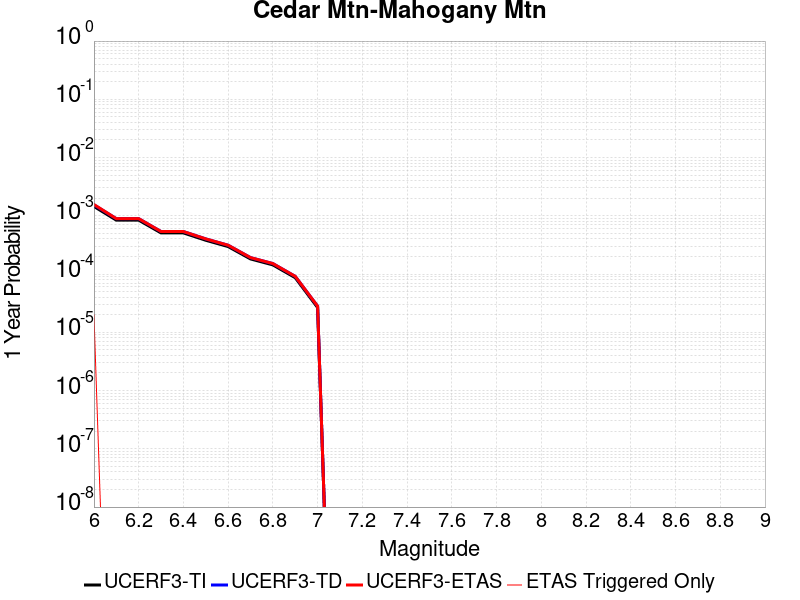 | 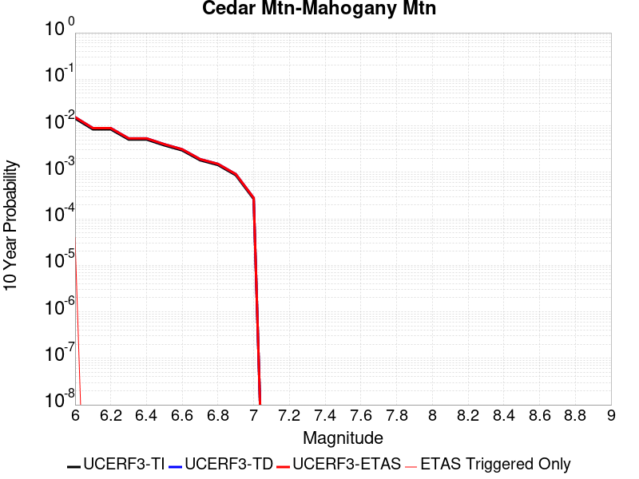 |

| Magnitude | 1 wk TI Prob | 1 wk TD Prob | 1 wk ETAS Prob | 1 wk ETAS/TD Gain | 1 wk ETAS Triggered Only | 1 mo TI Prob | 1 mo TD Prob | 1 mo ETAS Prob | 1 mo ETAS/TD Gain | 1 mo ETAS Triggered Only | 1 yr TI Prob | 1 yr TD Prob | 1 yr ETAS Prob | 1 yr ETAS/TD Gain | 1 yr ETAS Triggered Only | 10 yr TI Prob | 10 yr TD Prob | 10 yr ETAS Prob | 10 yr ETAS/TD Gain | 10 yr ETAS Triggered Only |
|-----|-----|-----|-----|-----|-----|-----|-----|-----|-----|-----|-----|-----|-----|-----|-----|-----|-----|-----|-----|-----|
| 6.0 | 2.7763876E-5 | 2.9588866E-5 | 2.9588866E-5 | 1.0 | 0.0 | 1.1898261E-4 | 1.2680366E-4 | 1.2680366E-4 | 1.0 | 0.0 | 0.0014476506 | 0.0015428112 | 0.0015428112 | 1.0 | 0.0 | 0.0143825635 | 0.015328225 | 0.015367071 | 1.0025343 | 3.9450842E-5 |
| 6.1 | 1.6162443E-5 | 1.7142966E-5 | 1.7142966E-5 | 1.0 | 0.0 | 6.926578E-5 | 7.346788E-5 | 7.346788E-5 | 1.0 | 0.0 | 8.4298453E-4 | 8.941221E-4 | 8.941221E-4 | 1.0 | 0.0 | 0.008397939 | 0.008907059 | 0.008907059 | 1.0 | 0.0 |
| 6.2 | 1.6162443E-5 | 1.7142966E-5 | 1.7142966E-5 | 1.0 | 0.0 | 6.926578E-5 | 7.346788E-5 | 7.346788E-5 | 1.0 | 0.0 | 8.4298453E-4 | 8.941221E-4 | 8.941221E-4 | 1.0 | 0.0 | 0.008397939 | 0.008907059 | 0.008907059 | 1.0 | 0.0 |
| 6.3 | 9.746053E-6 | 1.0303152E-5 | 1.0303152E-5 | 1.0 | 0.0 | 4.1768133E-5 | 4.415564E-5 | 4.415564E-5 | 1.0 | 0.0 | 5.0840835E-4 | 5.3746643E-4 | 5.3746643E-4 | 1.0 | 0.0 | 0.0050724675 | 0.005362084 | 0.005362084 | 1.0 | 0.0 |
| 6.4 | 9.746053E-6 | 1.0303152E-5 | 1.0303152E-5 | 1.0 | 0.0 | 4.1768133E-5 | 4.415564E-5 | 4.415564E-5 | 1.0 | 0.0 | 5.0840835E-4 | 5.3746643E-4 | 5.3746643E-4 | 1.0 | 0.0 | 0.0050724675 | 0.005362084 | 0.005362084 | 1.0 | 0.0 |
| 6.5 | 7.290083E-6 | 7.695325E-6 | 7.695325E-6 | 1.0 | 0.0 | 3.124284E-5 | 3.297956E-5 | 3.297956E-5 | 1.0 | 0.0 | 3.8031515E-4 | 4.014543E-4 | 4.014543E-4 | 1.0 | 0.0 | 0.0037966494 | 0.004007511 | 0.004007511 | 1.0 | 0.0 |
| 6.6 | 5.67907E-6 | 5.9891527E-6 | 5.9891527E-6 | 1.0 | 0.0 | 2.4338644E-5 | 2.5667552E-5 | 2.5667552E-5 | 1.0 | 0.0 | 2.962827E-4 | 3.12459E-4 | 3.12459E-4 | 1.0 | 0.0 | 0.0029588798 | 0.003120333 | 0.003120333 | 1.0 | 0.0 |
| 6.7 | 3.4853963E-6 | 3.672631E-6 | 3.672631E-6 | 1.0 | 0.0 | 1.4937327E-5 | 1.5739755E-5 | 1.5739755E-5 | 1.0 | 0.0 | 1.8184677E-4 | 1.916153E-4 | 1.916153E-4 | 1.0 | 0.0 | 0.0018169804 | 0.0019145629 | 0.0019145629 | 1.0 | 0.0 |
| 6.8 | 2.7535168E-6 | 2.9015764E-6 | 2.9015764E-6 | 1.0 | 0.0 | 1.1800733E-5 | 1.2435271E-5 | 1.2435271E-5 | 1.0 | 0.0 | 1.4366445E-4 | 1.5138938E-4 | 1.5138938E-4 | 1.0 | 0.0 | 0.0014357162 | 0.0015129098 | 0.0015129098 | 1.0 | 0.0 |
| 6.9 | 1.6594106E-6 | 1.7496985E-6 | 1.7496985E-6 | 1.0 | 0.0 | 7.1117406E-6 | 7.4986883E-6 | 7.4986883E-6 | 1.0 | 0.0 | 8.6582E-5 | 9.129302E-5 | 9.129302E-5 | 1.0 | 0.0 | 8.654827E-4 | 9.125856E-4 | 9.125856E-4 | 1.0 | 0.0 |
| 7.0 | 5.10215E-7 | 5.389254E-7 | 5.389254E-7 | 1.0 | 0.0 | 2.186634E-6 | 2.3096788E-6 | 2.3096788E-6 | 1.0 | 0.0 | 2.6621943E-5 | 2.8120105E-5 | 2.8120105E-5 | 1.0 | 0.0 | 2.6618753E-4 | 2.81178E-4 | 2.81178E-4 | 1.0 | 0.0 |

## Newport-Inglewood alt 1
*[(top)](#table-of-contents)*

| 1 Week | 1 Month | 1 Year | 10 Year |
|-----|-----|-----|-----|
| 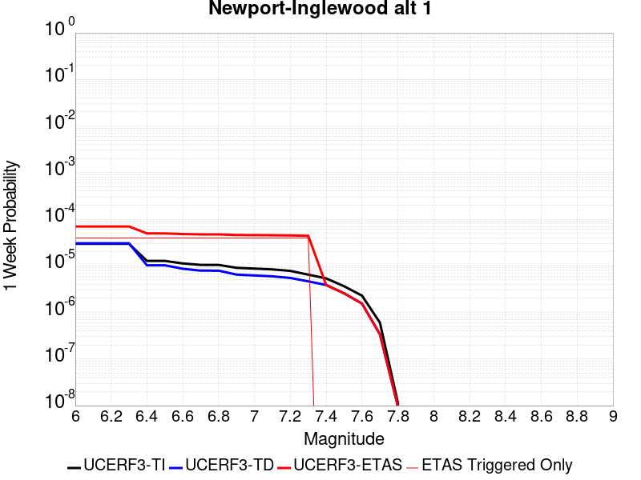 | 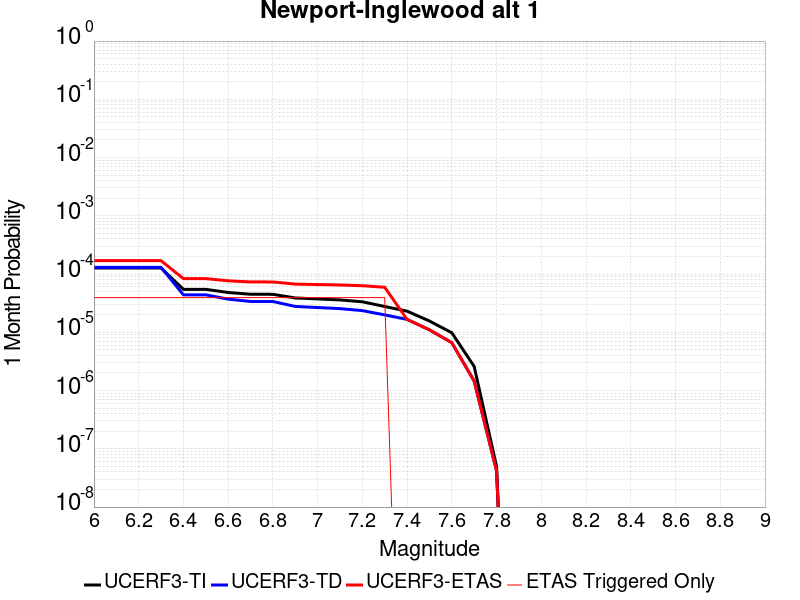 | 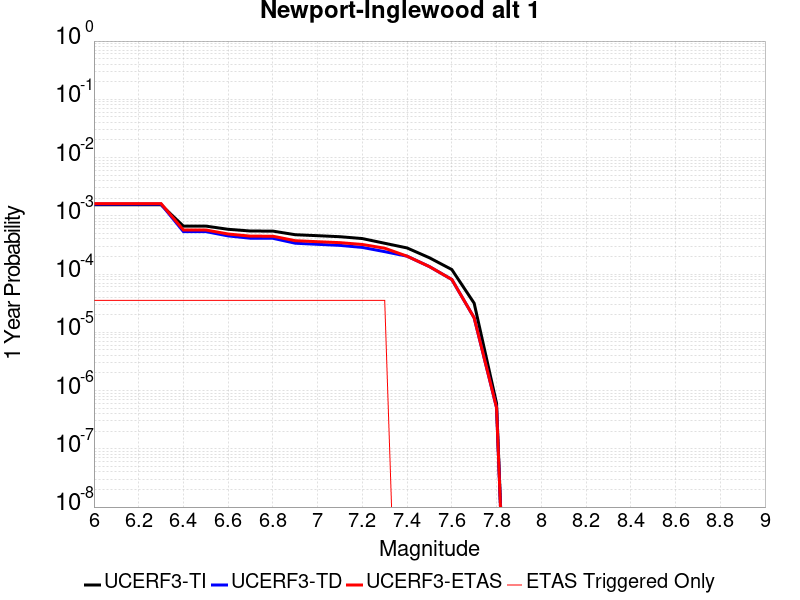 | 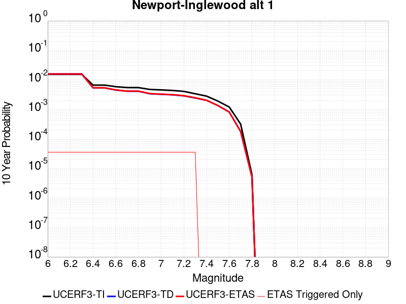 |

| Magnitude | 1 wk TI Prob | 1 wk TD Prob | 1 wk ETAS Prob | 1 wk ETAS/TD Gain | 1 wk ETAS Triggered Only | 1 mo TI Prob | 1 mo TD Prob | 1 mo ETAS Prob | 1 mo ETAS/TD Gain | 1 mo ETAS Triggered Only | 1 yr TI Prob | 1 yr TD Prob | 1 yr ETAS Prob | 1 yr ETAS/TD Gain | 1 yr ETAS Triggered Only | 10 yr TI Prob | 10 yr TD Prob | 10 yr ETAS Prob | 10 yr ETAS/TD Gain | 10 yr ETAS Triggered Only |
|-----|-----|-----|-----|-----|-----|-----|-----|-----|-----|-----|-----|-----|-----|-----|-----|-----|-----|-----|-----|-----|
| 6.0 | 2.9668912E-5 | 3.0404817E-5 | 6.985446E-5 | 2.29748 | 3.9450842E-5 | 1.2714628E-4 | 1.303026E-4 | 1.697483E-4 | 1.3027239 | 3.9450842E-5 | 0.0015469068 | 0.0015857625 | 0.0016251508 | 1.0248387 | 3.9450842E-5 | 0.015361829 | 0.015792042 | 0.01583087 | 1.0024587 | 3.9450842E-5 |
| 6.1 | 2.9668912E-5 | 3.0404817E-5 | 6.985446E-5 | 2.29748 | 3.9450842E-5 | 1.2714628E-4 | 1.303026E-4 | 1.697483E-4 | 1.3027239 | 3.9450842E-5 | 0.0015469068 | 0.0015857625 | 0.0016251508 | 1.0248387 | 3.9450842E-5 | 0.015361829 | 0.015792042 | 0.01583087 | 1.0024587 | 3.9450842E-5 |
| 6.2 | 2.9668912E-5 | 3.0404817E-5 | 6.985446E-5 | 2.29748 | 3.9450842E-5 | 1.2714628E-4 | 1.303026E-4 | 1.697483E-4 | 1.3027239 | 3.9450842E-5 | 0.0015469068 | 0.0015857625 | 0.0016251508 | 1.0248387 | 3.9450842E-5 | 0.015361829 | 0.015792042 | 0.01583087 | 1.0024587 | 3.9450842E-5 |
| 6.3 | 2.9668912E-5 | 3.0404817E-5 | 6.985446E-5 | 2.29748 | 3.9450842E-5 | 1.2714628E-4 | 1.303026E-4 | 1.697483E-4 | 1.3027239 | 3.9450842E-5 | 0.0015469068 | 0.0015857625 | 0.0016251508 | 1.0248387 | 3.9450842E-5 | 0.015361829 | 0.015792042 | 0.01583087 | 1.0024587 | 3.9450842E-5 |
| 6.4 | 1.275942E-5 | 1.0272503E-5 | 4.972294E-5 | 4.840392 | 3.9450842E-5 | 5.4682085E-5 | 4.402429E-5 | 8.34734E-5 | 1.896076 | 3.9450842E-5 | 6.65551E-4 | 5.358681E-4 | 5.752978E-4 | 1.073581 | 3.9450842E-5 | 0.0066356123 | 0.005346184 | 0.005385424 | 1.0073398 | 3.9450842E-5 |
| 6.5 | 1.275942E-5 | 1.0272503E-5 | 4.972294E-5 | 4.840392 | 3.9450842E-5 | 5.4682085E-5 | 4.402429E-5 | 8.34734E-5 | 1.896076 | 3.9450842E-5 | 6.65551E-4 | 5.358681E-4 | 5.752978E-4 | 1.073581 | 3.9450842E-5 | 0.0066356123 | 0.005346184 | 0.005385424 | 1.0073398 | 3.9450842E-5 |
| 6.6 | 1.1255358E-5 | 8.661884E-6 | 4.8112386E-5 | 5.5544944 | 3.9450842E-5 | 4.8236358E-5 | 3.712184E-5 | 7.657122E-5 | 2.0627 | 3.9450842E-5 | 5.871194E-4 | 4.518664E-4 | 4.912994E-4 | 1.087267 | 3.9450842E-5 | 0.005855706 | 0.004509653 | 0.004548926 | 1.0087086 | 3.9450842E-5 |
| 6.7 | 1.0504745E-5 | 7.8997955E-6 | 4.7350328E-5 | 5.9938674 | 3.9450842E-5 | 4.5019555E-5 | 3.3855835E-5 | 7.3305346E-5 | 2.1652205 | 3.9450842E-5 | 5.4797524E-4 | 4.1211807E-4 | 4.5155265E-4 | 1.0956876 | 3.9450842E-5 | 0.0054662596 | 0.004113668 | 0.0041529564 | 1.0095507 | 3.9450842E-5 |
| 6.8 | 1.0476007E-5 | 7.881176E-6 | 4.733171E-5 | 6.0056653 | 3.9450842E-5 | 4.4896402E-5 | 3.3776043E-5 | 7.322555E-5 | 2.1679733 | 3.9450842E-5 | 5.464766E-4 | 4.1114696E-4 | 4.5058157E-4 | 1.0959136 | 3.9450842E-5 | 0.005451347 | 0.0041039926 | 0.004143282 | 1.0095733 | 3.9450842E-5 |
| 6.9 | 9.076797E-6 | 6.4896312E-6 | 4.5940218E-5 | 7.0790186 | 3.9450842E-5 | 3.889998E-5 | 2.781241E-5 | 6.726216E-5 | 2.4184225 | 3.9450842E-5 | 4.7350433E-4 | 3.385638E-4 | 3.780013E-4 | 1.1164846 | 3.9450842E-5 | 0.004724967 | 0.0033805177 | 0.0034198351 | 1.0116307 | 3.9450842E-5 |
| 7.0 | 8.73795E-6 | 6.2120125E-6 | 4.566261E-5 | 7.3506956 | 3.9450842E-5 | 3.7447822E-5 | 2.6622642E-5 | 6.607243E-5 | 2.4818137 | 3.9450842E-5 | 4.5583185E-4 | 3.2408274E-4 | 3.6352078E-4 | 1.1216913 | 3.9450842E-5 | 0.0045489795 | 0.0032361327 | 0.003275456 | 1.0121512 | 3.9450842E-5 |
| 7.1 | 8.391299E-6 | 5.95579E-6 | 4.54064E-5 | 7.623909 | 3.9450842E-5 | 3.5962214E-5 | 2.5524565E-5 | 6.49744E-5 | 2.5455635 | 3.9450842E-5 | 4.37752E-4 | 3.1071753E-4 | 3.5015613E-4 | 1.1269275 | 3.9450842E-5 | 0.004368907 | 0.0031028606 | 0.003142189 | 1.0126749 | 3.9450842E-5 |
| 7.2 | 7.796882E-6 | 5.4965344E-6 | 4.4947163E-5 | 8.177364 | 3.9450842E-5 | 3.341478E-5 | 2.3556364E-5 | 6.300628E-5 | 2.6747031 | 3.9450842E-5 | 4.06749E-4 | 2.867612E-4 | 3.2620074E-4 | 1.1375344 | 3.9450842E-5 | 0.0040600533 | 0.0028639357 | 0.0029032736 | 1.0137357 | 3.9450842E-5 |
| 7.3 | 6.4738833E-6 | 4.6478162E-6 | 4.4098477E-5 | 9.487999 | 3.9450842E-5 | 2.774492E-5 | 1.9919062E-5 | 5.936912E-5 | 2.9805179 | 3.9450842E-5 | 3.3774204E-4 | 2.4248775E-4 | 2.81929E-4 | 1.1626526 | 3.9450842E-5 | 0.0033722918 | 0.0024222482 | 0.0024616034 | 1.0162474 | 3.9450842E-5 |
| 7.4 | 5.382145E-6 | 3.8857597E-6 | 3.8857597E-6 | 1.0 | 0.0 | 2.3066134E-5 | 1.665315E-5 | 1.665315E-5 | 1.0 | 0.0 | 2.8079396E-4 | 2.0273338E-4 | 2.0273338E-4 | 1.0 | 0.0 | 0.0028043943 | 0.0020254988 | 0.0020254988 | 1.0 | 0.0 |
| 7.5 | 3.648244E-6 | 2.5737843E-6 | 2.5737843E-6 | 1.0 | 0.0 | 1.5635238E-5 | 1.1030458E-5 | 1.1030458E-5 | 1.0 | 0.0 | 1.9034238E-4 | 1.3428765E-4 | 1.3428765E-4 | 1.0 | 0.0 | 0.0019017943 | 0.0013420755 | 0.0013420755 | 1.0 | 0.0 |
| 7.6 | 2.2906888E-6 | 1.5479842E-6 | 1.5479842E-6 | 1.0 | 0.0 | 9.817201E-6 | 6.634202E-6 | 6.634202E-6 | 1.0 | 0.0 | 1.1951787E-4 | 8.076848E-5 | 8.076848E-5 | 1.0 | 0.0 | 0.0011945361 | 8.07398E-4 | 8.07398E-4 | 1.0 | 0.0 |
| 7.7 | 6.0479874E-7 | 3.397512E-7 | 3.397512E-7 | 1.0 | 0.0 | 2.5919921E-6 | 1.4560758E-6 | 1.4560758E-6 | 1.0 | 0.0 | 3.1557047E-5 | 1.7727592E-5 | 1.7727592E-5 | 1.0 | 0.0 | 3.1552566E-4 | 1.7726317E-4 | 1.7726317E-4 | 1.0 | 0.0 |
| 7.8 | 1.16056995E-8 | 9.782373E-9 | 9.782373E-9 | 1.0 | 0.0 | 4.9738713E-8 | 4.1924455E-8 | 4.1924455E-8 | 1.0 | 0.0 | 6.0556863E-7 | 5.1043025E-7 | 5.1043025E-7 | 1.0 | 0.0 | 6.05567E-6 | 5.1043025E-6 | 5.1043025E-6 | 1.0 | 0.0 |

## Carson Range (Genoa)
*[(top)](#table-of-contents)*

| 1 Week | 1 Month | 1 Year | 10 Year |
|-----|-----|-----|-----|
| 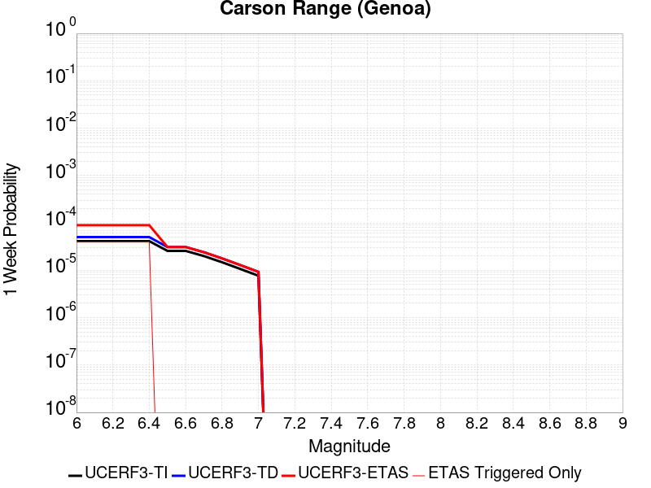 | 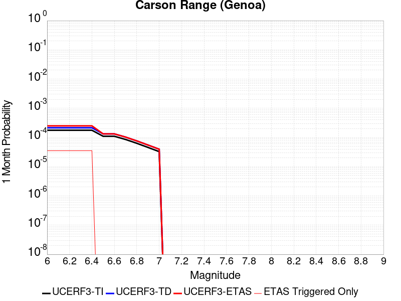 | 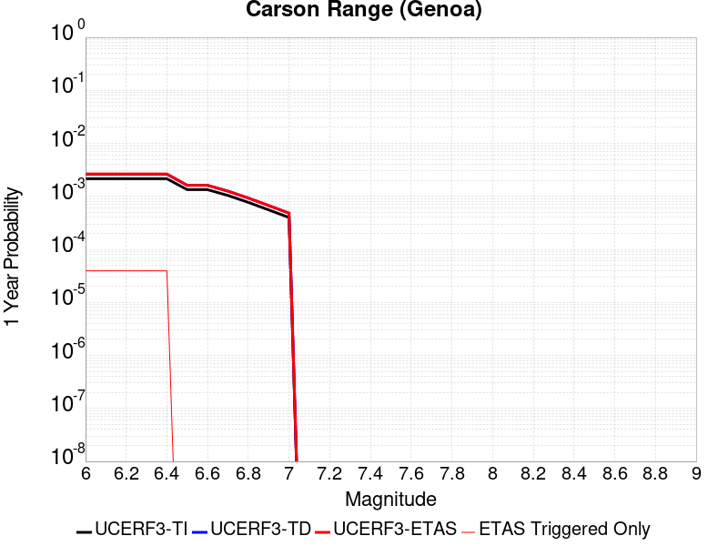 | 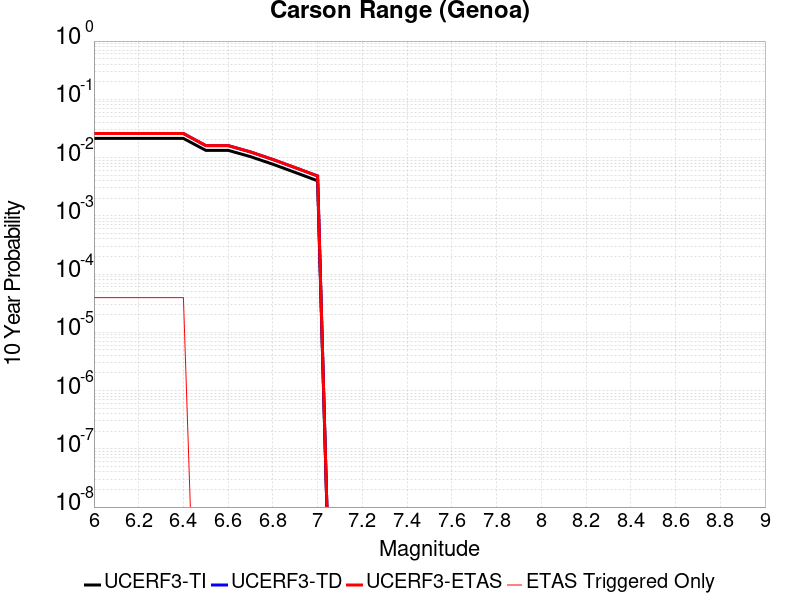 |

| Magnitude | 1 wk TI Prob | 1 wk TD Prob | 1 wk ETAS Prob | 1 wk ETAS/TD Gain | 1 wk ETAS Triggered Only | 1 mo TI Prob | 1 mo TD Prob | 1 mo ETAS Prob | 1 mo ETAS/TD Gain | 1 mo ETAS Triggered Only | 1 yr TI Prob | 1 yr TD Prob | 1 yr ETAS Prob | 1 yr ETAS/TD Gain | 1 yr ETAS Triggered Only | 10 yr TI Prob | 10 yr TD Prob | 10 yr ETAS Prob | 10 yr ETAS/TD Gain | 10 yr ETAS Triggered Only |
|-----|-----|-----|-----|-----|-----|-----|-----|-----|-----|-----|-----|-----|-----|-----|-----|-----|-----|-----|-----|-----|
| 6.0 | 4.1268457E-5 | 5.0146893E-5 | 8.959576E-5 | 1.7866662 | 3.9450842E-5 | 1.7685282E-4 | 2.148998E-4 | 2.5434216E-4 | 1.1835384 | 3.9450842E-5 | 0.0021510567 | 0.0026136558 | 0.0026530034 | 1.0150547 | 3.9450842E-5 | 0.02130354 | 0.025868816 | 0.025907246 | 1.0014856 | 3.9450842E-5 |
| 6.1 | 4.1268457E-5 | 5.0146893E-5 | 8.959576E-5 | 1.7866662 | 3.9450842E-5 | 1.7685282E-4 | 2.148998E-4 | 2.5434216E-4 | 1.1835384 | 3.9450842E-5 | 0.0021510567 | 0.0026136558 | 0.0026530034 | 1.0150547 | 3.9450842E-5 | 0.02130354 | 0.025868816 | 0.025907246 | 1.0014856 | 3.9450842E-5 |
| 6.2 | 4.1268457E-5 | 5.0146893E-5 | 8.959576E-5 | 1.7866662 | 3.9450842E-5 | 1.7685282E-4 | 2.148998E-4 | 2.5434216E-4 | 1.1835384 | 3.9450842E-5 | 0.0021510567 | 0.0026136558 | 0.0026530034 | 1.0150547 | 3.9450842E-5 | 0.02130354 | 0.025868816 | 0.025907246 | 1.0014856 | 3.9450842E-5 |
| 6.3 | 4.1268457E-5 | 5.0146893E-5 | 8.959576E-5 | 1.7866662 | 3.9450842E-5 | 1.7685282E-4 | 2.148998E-4 | 2.5434216E-4 | 1.1835384 | 3.9450842E-5 | 0.0021510567 | 0.0026136558 | 0.0026530034 | 1.0150547 | 3.9450842E-5 | 0.02130354 | 0.025868816 | 0.025907246 | 1.0014856 | 3.9450842E-5 |
| 6.4 | 4.1268457E-5 | 5.0146893E-5 | 8.959576E-5 | 1.7866662 | 3.9450842E-5 | 1.7685282E-4 | 2.148998E-4 | 2.5434216E-4 | 1.1835384 | 3.9450842E-5 | 0.0021510567 | 0.0026136558 | 0.0026530034 | 1.0150547 | 3.9450842E-5 | 0.02130354 | 0.025868816 | 0.025907246 | 1.0014856 | 3.9450842E-5 |
| 6.5 | 2.5677185E-5 | 3.0978295E-5 | 3.0978295E-5 | 1.0 | 0.0 | 1.1004044E-4 | 1.3275839E-4 | 1.3275839E-4 | 1.0 | 0.0 | 0.0013389189 | 0.0016153135 | 0.0016153135 | 1.0 | 0.0 | 0.0133088045 | 0.016053649 | 0.016053649 | 1.0 | 0.0 |
| 6.6 | 2.5677185E-5 | 3.0978295E-5 | 3.0978295E-5 | 1.0 | 0.0 | 1.1004044E-4 | 1.3275839E-4 | 1.3275839E-4 | 1.0 | 0.0 | 0.0013389189 | 0.0016153135 | 0.0016153135 | 1.0 | 0.0 | 0.0133088045 | 0.016053649 | 0.016053649 | 1.0 | 0.0 |
| 6.7 | 1.9969408E-5 | 2.406347E-5 | 2.406347E-5 | 1.0 | 0.0 | 8.558037E-5 | 1.0312595E-4 | 1.0312595E-4 | 1.0 | 0.0 | 0.0010414429 | 0.0012549888 | 0.0012549888 | 1.0 | 0.0 | 0.010365757 | 0.012494174 | 0.012494174 | 1.0 | 0.0 |
| 6.8 | 1.4783156E-5 | 1.7817569E-5 | 1.7817569E-5 | 1.0 | 0.0 | 6.335485E-5 | 7.635951E-5 | 7.635951E-5 | 1.0 | 0.0 | 7.710722E-4 | 9.294106E-4 | 9.294106E-4 | 1.0 | 0.0 | 0.0076840227 | 0.009268024 | 0.009268024 | 1.0 | 0.0 |
| 6.9 | 1.06660555E-5 | 1.2877026E-5 | 1.2877026E-5 | 1.0 | 0.0 | 4.5710865E-5 | 5.5186738E-5 | 5.5186738E-5 | 1.0 | 0.0 | 5.5638765E-4 | 6.718066E-4 | 6.718066E-4 | 1.0 | 0.0 | 0.005549967 | 0.006709056 | 0.006709056 | 1.0 | 0.0 |
| 7.0 | 7.664838E-6 | 9.258307E-6 | 9.258307E-6 | 1.0 | 0.0 | 3.2848893E-5 | 3.9678456E-5 | 3.9678456E-5 | 1.0 | 0.0 | 3.998619E-4 | 4.830852E-4 | 4.830852E-4 | 1.0 | 0.0 | 0.0039914316 | 0.00483085 | 0.00483085 | 1.0 | 0.0 |

## Sierra Madre (San Fernando)
*[(top)](#table-of-contents)*

| 1 Week | 1 Month | 1 Year | 10 Year |
|-----|-----|-----|-----|
| 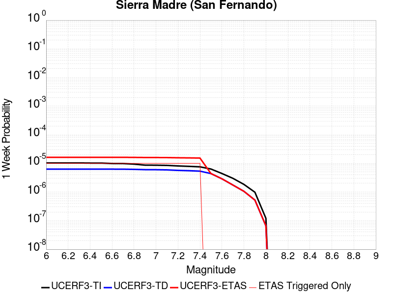 | 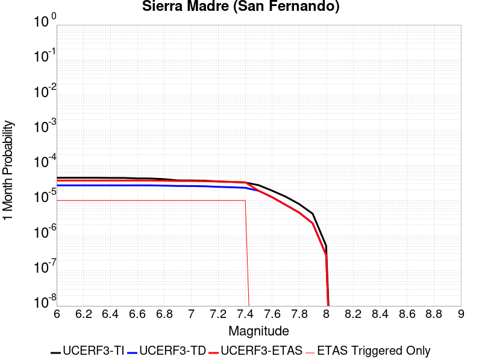 | 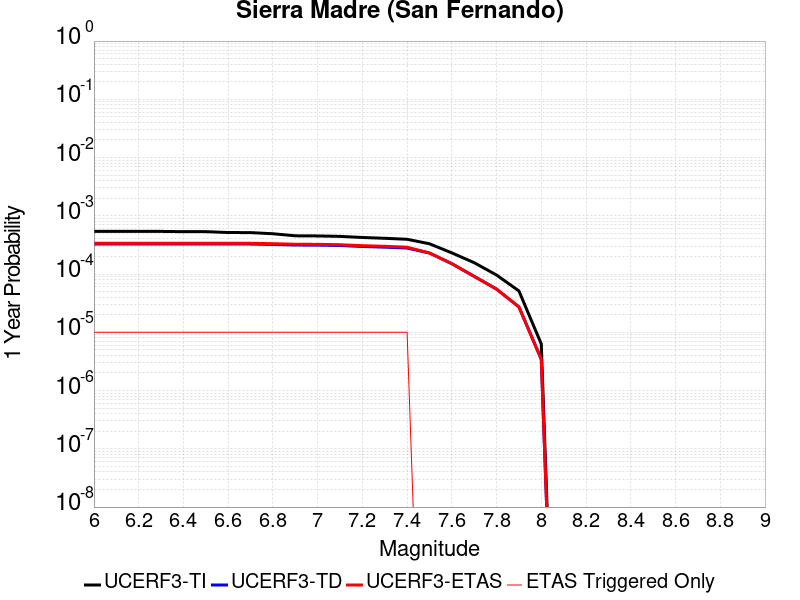 |  |

| Magnitude | 1 wk TI Prob | 1 wk TD Prob | 1 wk ETAS Prob | 1 wk ETAS/TD Gain | 1 wk ETAS Triggered Only | 1 mo TI Prob | 1 mo TD Prob | 1 mo ETAS Prob | 1 mo ETAS/TD Gain | 1 mo ETAS Triggered Only | 1 yr TI Prob | 1 yr TD Prob | 1 yr ETAS Prob | 1 yr ETAS/TD Gain | 1 yr ETAS Triggered Only | 10 yr TI Prob | 10 yr TD Prob | 10 yr ETAS Prob | 10 yr ETAS/TD Gain | 10 yr ETAS Triggered Only |
|-----|-----|-----|-----|-----|-----|-----|-----|-----|-----|-----|-----|-----|-----|-----|-----|-----|-----|-----|-----|-----|
| 6.0 | 1.0346413E-5 | 6.2872605E-6 | 6.2872605E-6 | 1.0 | 0.0 | 4.4341014E-5 | 2.694513E-5 | 2.694513E-5 | 1.0 | 0.0 | 5.3971814E-4 | 3.280087E-4 | 3.280087E-4 | 1.0 | 0.0 | 0.0053840918 | 0.0032753581 | 0.0033146797 | 1.0120053 | 3.9450842E-5 |
| 6.1 | 1.0346413E-5 | 6.2872605E-6 | 6.2872605E-6 | 1.0 | 0.0 | 4.4341014E-5 | 2.694513E-5 | 2.694513E-5 | 1.0 | 0.0 | 5.3971814E-4 | 3.280087E-4 | 3.280087E-4 | 1.0 | 0.0 | 0.0053840918 | 0.0032753581 | 0.0033146797 | 1.0120053 | 3.9450842E-5 |
| 6.2 | 1.0346413E-5 | 6.2872605E-6 | 6.2872605E-6 | 1.0 | 0.0 | 4.4341014E-5 | 2.694513E-5 | 2.694513E-5 | 1.0 | 0.0 | 5.3971814E-4 | 3.280087E-4 | 3.280087E-4 | 1.0 | 0.0 | 0.0053840918 | 0.0032753581 | 0.0033146797 | 1.0120053 | 3.9450842E-5 |
| 6.3 | 1.0346413E-5 | 6.2872605E-6 | 6.2872605E-6 | 1.0 | 0.0 | 4.4341014E-5 | 2.694513E-5 | 2.694513E-5 | 1.0 | 0.0 | 5.3971814E-4 | 3.280087E-4 | 3.280087E-4 | 1.0 | 0.0 | 0.0053840918 | 0.0032753581 | 0.0033146797 | 1.0120053 | 3.9450842E-5 |
| 6.4 | 1.0249558E-5 | 6.2872605E-6 | 6.2872605E-6 | 1.0 | 0.0 | 4.392594E-5 | 2.694513E-5 | 2.694513E-5 | 1.0 | 0.0 | 5.3466705E-4 | 3.280087E-4 | 3.280087E-4 | 1.0 | 0.0 | 0.0053338245 | 0.0032753581 | 0.0033146797 | 1.0120053 | 3.9450842E-5 |
| 6.5 | 1.0249558E-5 | 6.2872605E-6 | 6.2872605E-6 | 1.0 | 0.0 | 4.392594E-5 | 2.694513E-5 | 2.694513E-5 | 1.0 | 0.0 | 5.3466705E-4 | 3.280087E-4 | 3.280087E-4 | 1.0 | 0.0 | 0.0053338245 | 0.0032753581 | 0.0033146797 | 1.0120053 | 3.9450842E-5 |
| 6.6 | 9.9035515E-6 | 6.2872605E-6 | 6.2872605E-6 | 1.0 | 0.0 | 4.2443102E-5 | 2.694513E-5 | 2.694513E-5 | 1.0 | 0.0 | 5.166222E-4 | 3.280087E-4 | 3.280087E-4 | 1.0 | 0.0 | 0.0051542283 | 0.0032753581 | 0.0033146797 | 1.0120053 | 3.9450842E-5 |
| 6.7 | 9.87217E-6 | 6.2746817E-6 | 6.2746817E-6 | 1.0 | 0.0 | 4.2308613E-5 | 2.689122E-5 | 2.689122E-5 | 1.0 | 0.0 | 5.149856E-4 | 3.2735255E-4 | 3.2735255E-4 | 1.0 | 0.0 | 0.005137938 | 0.0032688158 | 0.0033081379 | 1.0120294 | 3.9450842E-5 |
| 6.8 | 9.4359175E-6 | 6.1786586E-6 | 6.1786586E-6 | 1.0 | 0.0 | 4.043902E-5 | 2.6479704E-5 | 2.6479704E-5 | 1.0 | 0.0 | 4.9223384E-4 | 3.2234378E-4 | 3.2234378E-4 | 1.0 | 0.0 | 0.0049114493 | 0.0032188739 | 0.0032581978 | 1.0122167 | 3.9450842E-5 |
| 6.9 | 8.700447E-6 | 6.039922E-6 | 6.039922E-6 | 1.0 | 0.0 | 3.72871E-5 | 2.5885129E-5 | 2.5885129E-5 | 1.0 | 0.0 | 4.5387587E-4 | 3.1510694E-4 | 3.1510694E-4 | 1.0 | 0.0 | 0.0045295 | 0.003146711 | 0.0031860378 | 1.0124977 | 3.9450842E-5 |
| 7.0 | 8.648878E-6 | 6.0148373E-6 | 6.0148373E-6 | 1.0 | 0.0 | 3.7066096E-5 | 2.5777625E-5 | 2.5777625E-5 | 1.0 | 0.0 | 4.5118626E-4 | 3.1379846E-4 | 3.1379846E-4 | 1.0 | 0.0 | 0.004502713 | 0.003133663 | 0.0031729904 | 1.0125499 | 3.9450842E-5 |
| 7.1 | 8.505786E-6 | 5.9244676E-6 | 5.9244676E-6 | 1.0 | 0.0 | 3.645286E-5 | 2.5390334E-5 | 2.5390334E-5 | 1.0 | 0.0 | 4.437232E-4 | 3.0908454E-4 | 3.0908454E-4 | 1.0 | 0.0 | 0.0044283825 | 0.0030866556 | 0.0031259847 | 1.0127417 | 3.9450842E-5 |
| 7.2 | 8.139752E-6 | 5.6987624E-6 | 5.6987624E-6 | 1.0 | 0.0 | 3.4884186E-5 | 2.4423045E-5 | 2.4423045E-5 | 1.0 | 0.0 | 4.246322E-4 | 2.9731105E-4 | 2.9731105E-4 | 1.0 | 0.0 | 0.004238217 | 0.0029692391 | 0.0030085726 | 1.013247 | 3.9450842E-5 |
| 7.3 | 7.8816E-6 | 5.552077E-6 | 5.552077E-6 | 1.0 | 0.0 | 3.3777847E-5 | 2.3794404E-5 | 2.3794404E-5 | 1.0 | 0.0 | 4.111677E-4 | 2.896594E-4 | 2.896594E-4 | 1.0 | 0.0 | 0.004104078 | 0.0028929242 | 0.002932261 | 1.0135976 | 3.9450842E-5 |
| 7.4 | 7.5810603E-6 | 5.3563126E-6 | 5.3563126E-6 | 1.0 | 0.0 | 3.2489854E-5 | 2.2955428E-5 | 2.2955428E-5 | 1.0 | 0.0 | 3.9549218E-4 | 2.7944756E-4 | 2.7944756E-4 | 1.0 | 0.0 | 0.0039478904 | 0.0027910667 | 0.0028304073 | 1.0140952 | 3.9450842E-5 |
| 7.5 | 6.349153E-6 | 4.407576E-6 | 4.407576E-6 | 1.0 | 0.0 | 2.7210372E-5 | 1.888948E-5 | 1.888948E-5 | 1.0 | 0.0 | 3.312359E-4 | 2.2995596E-4 | 2.2995596E-4 | 1.0 | 0.0 | 0.0033074263 | 0.0022972622 | 0.0023366222 | 1.0171335 | 3.9450842E-5 |
| 7.6 | 4.430576E-6 | 2.8905868E-6 | 2.8905868E-6 | 1.0 | 0.0 | 1.8988047E-5 | 1.2388171E-5 | 1.2388171E-5 | 1.0 | 0.0 | 2.3115493E-4 | 1.5081577E-4 | 1.5081577E-4 | 1.0 | 0.0 | 0.0023091463 | 0.0015071568 | 0.0015465482 | 1.0261363 | 3.9450842E-5 |
| 7.7 | 3.005066E-6 | 1.7510115E-6 | 1.7510115E-6 | 1.0 | 0.0 | 1.2878791E-5 | 7.504313E-6 | 7.504313E-6 | 1.0 | 0.0 | 1.56788E-4 | 9.1361195E-5 | 9.1361195E-5 | 1.0 | 0.0 | 0.0015667742 | 9.132375E-4 | 9.526523E-4 | 1.0431595 | 3.9450842E-5 |
| 7.8 | 1.8459098E-6 | 1.0582091E-6 | 1.0582091E-6 | 1.0 | 0.0 | 7.911018E-6 | 4.535174E-6 | 4.535174E-6 | 1.0 | 0.0 | 9.631238E-5 | 5.5214347E-5 | 5.5214347E-5 | 1.0 | 0.0 | 9.627065E-4 | 5.5200676E-4 | 5.914358E-4 | 1.0714285 | 3.9450842E-5 |
| 7.9 | 9.839262E-7 | 5.23421E-7 | 5.23421E-7 | 1.0 | 0.0 | 4.2168194E-6 | 2.2432312E-6 | 2.2432312E-6 | 1.0 | 0.0 | 5.1338568E-5 | 2.7310998E-5 | 2.7310998E-5 | 1.0 | 0.0 | 5.132671E-4 | 2.730767E-4 | 3.125168E-4 | 1.1444285 | 3.9450842E-5 |
| 8.0 | 1.210983E-7 | 6.613821E-8 | 6.613821E-8 | 1.0 | 0.0 | 5.1899264E-7 | 2.8344945E-7 | 2.8344945E-7 | 1.0 | 0.0 | 6.3187167E-6 | 3.4509917E-6 | 3.4509917E-6 | 1.0 | 0.0 | 6.318537E-5 | 3.45094E-5 | 3.45094E-5 | 1.0 | 0.0 |

## Hector Mine
*[(top)](#table-of-contents)*

| 1 Week | 1 Month | 1 Year | 10 Year |
|-----|-----|-----|-----|
| 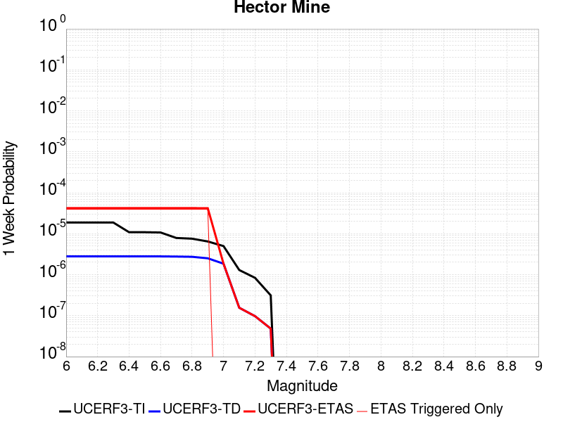 | 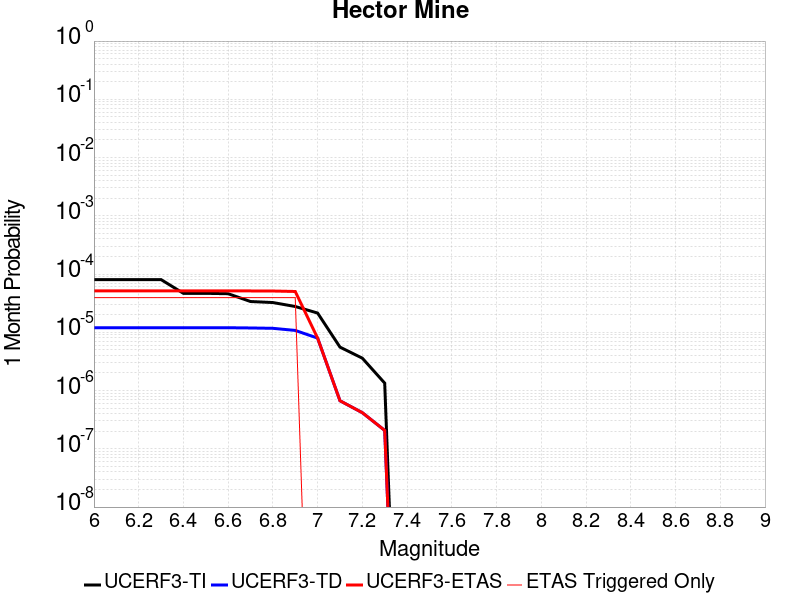 | 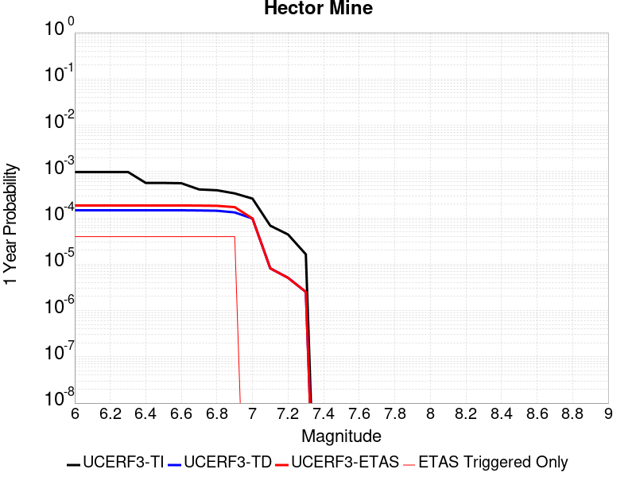 | 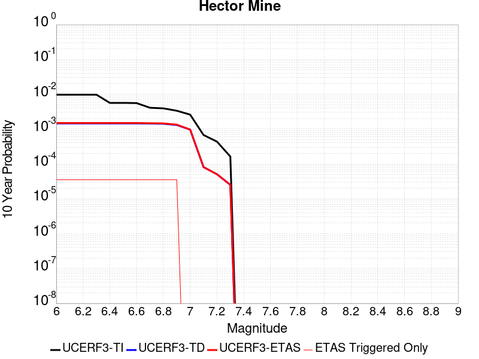 |

| Magnitude | 1 wk TI Prob | 1 wk TD Prob | 1 wk ETAS Prob | 1 wk ETAS/TD Gain | 1 wk ETAS Triggered Only | 1 mo TI Prob | 1 mo TD Prob | 1 mo ETAS Prob | 1 mo ETAS/TD Gain | 1 mo ETAS Triggered Only | 1 yr TI Prob | 1 yr TD Prob | 1 yr ETAS Prob | 1 yr ETAS/TD Gain | 1 yr ETAS Triggered Only | 10 yr TI Prob | 10 yr TD Prob | 10 yr ETAS Prob | 10 yr ETAS/TD Gain | 10 yr ETAS Triggered Only |
|-----|-----|-----|-----|-----|-----|-----|-----|-----|-----|-----|-----|-----|-----|-----|-----|-----|-----|-----|-----|-----|
| 6.0 | 1.8760093E-5 | 2.7963818E-6 | 4.2247117E-5 | 15.107779 | 3.9450842E-5 | 8.039792E-5 | 1.1984461E-5 | 5.1434832E-5 | 4.291794 | 3.9450842E-5 | 9.78405E-4 | 1.4590504E-4 | 1.8535013E-4 | 1.2703477 | 3.9450842E-5 | 0.009741086 | 0.0014584847 | 0.001497878 | 1.0270097 | 3.9450842E-5 |
| 6.1 | 1.8760093E-5 | 2.7963818E-6 | 4.2247117E-5 | 15.107779 | 3.9450842E-5 | 8.039792E-5 | 1.1984461E-5 | 5.1434832E-5 | 4.291794 | 3.9450842E-5 | 9.78405E-4 | 1.4590504E-4 | 1.8535013E-4 | 1.2703477 | 3.9450842E-5 | 0.009741086 | 0.0014584847 | 0.001497878 | 1.0270097 | 3.9450842E-5 |
| 6.2 | 1.8760093E-5 | 2.7963818E-6 | 4.2247117E-5 | 15.107779 | 3.9450842E-5 | 8.039792E-5 | 1.1984461E-5 | 5.1434832E-5 | 4.291794 | 3.9450842E-5 | 9.78405E-4 | 1.4590504E-4 | 1.8535013E-4 | 1.2703477 | 3.9450842E-5 | 0.009741086 | 0.0014584847 | 0.001497878 | 1.0270097 | 3.9450842E-5 |
| 6.3 | 1.8760093E-5 | 2.7963818E-6 | 4.2247117E-5 | 15.107779 | 3.9450842E-5 | 8.039792E-5 | 1.1984461E-5 | 5.1434832E-5 | 4.291794 | 3.9450842E-5 | 9.78405E-4 | 1.4590504E-4 | 1.8535013E-4 | 1.2703477 | 3.9450842E-5 | 0.009741086 | 0.0014584847 | 0.001497878 | 1.0270097 | 3.9450842E-5 |
| 6.4 | 1.0888055E-5 | 2.7963818E-6 | 4.2247117E-5 | 15.107779 | 3.9450842E-5 | 4.666226E-5 | 1.1984461E-5 | 5.1434832E-5 | 4.291794 | 3.9450842E-5 | 5.679649E-4 | 1.4590504E-4 | 1.8535013E-4 | 1.2703477 | 3.9450842E-5 | 0.0056651547 | 0.0014584847 | 0.001497878 | 1.0270097 | 3.9450842E-5 |
| 6.5 | 1.0888055E-5 | 2.7963818E-6 | 4.2247117E-5 | 15.107779 | 3.9450842E-5 | 4.666226E-5 | 1.1984461E-5 | 5.1434832E-5 | 4.291794 | 3.9450842E-5 | 5.679649E-4 | 1.4590504E-4 | 1.8535013E-4 | 1.2703477 | 3.9450842E-5 | 0.0056651547 | 0.0014584847 | 0.001497878 | 1.0270097 | 3.9450842E-5 |
| 6.6 | 1.0730738E-5 | 2.7963818E-6 | 4.2247117E-5 | 15.107779 | 3.9450842E-5 | 4.5988065E-5 | 1.1984461E-5 | 5.1434832E-5 | 4.291794 | 3.9450842E-5 | 5.5976084E-4 | 1.4590504E-4 | 1.8535013E-4 | 1.2703477 | 3.9450842E-5 | 0.0055835294 | 0.0014584847 | 0.001497878 | 1.0270097 | 3.9450842E-5 |
| 6.7 | 7.881326E-6 | 2.7710626E-6 | 4.2221796E-5 | 15.236682 | 3.9450842E-5 | 3.3776672E-5 | 1.1875951E-5 | 5.1326326E-5 | 4.3218713 | 3.9450842E-5 | 4.111534E-4 | 1.445841E-4 | 1.8402924E-4 | 1.272818 | 3.9450842E-5 | 0.0041039353 | 0.0014452925 | 0.0014846863 | 1.0272566 | 3.9450842E-5 |
| 6.8 | 7.5683483E-6 | 2.7328138E-6 | 4.218355E-5 | 15.435941 | 3.9450842E-5 | 3.2435375E-5 | 1.1712029E-5 | 5.116241E-5 | 4.3683643 | 3.9450842E-5 | 3.9482914E-4 | 1.4258861E-4 | 1.8203384E-4 | 1.2766365 | 3.9450842E-5 | 0.0039412836 | 0.0014253634 | 0.001464758 | 1.0276383 | 3.9450842E-5 |
| 6.9 | 6.473048E-6 | 2.5138945E-6 | 4.196464E-5 | 16.693079 | 3.9450842E-5 | 2.7741338E-5 | 1.07738115E-5 | 5.0224233E-5 | 4.6616955 | 3.9450842E-5 | 3.3769844E-4 | 1.3116724E-4 | 1.7061291E-4 | 1.3007281 | 3.9450842E-5 | 0.0033718573 | 0.0013112876 | 0.0013506868 | 1.0300461 | 3.9450842E-5 |
| 7.0 | 4.9959954E-6 | 1.8565124E-6 | 1.8565124E-6 | 1.0 | 0.0 | 2.1411232E-5 | 7.956478E-6 | 7.956478E-6 | 1.0 | 0.0 | 2.6065056E-4 | 9.686937E-5 | 9.686937E-5 | 1.0 | 0.0 | 0.0026034506 | 9.6862105E-4 | 9.6862105E-4 | 1.0 | 0.0 |
| 7.1 | 1.2997541E-6 | 1.5602147E-7 | 1.5602147E-7 | 1.0 | 0.0 | 5.5703626E-6 | 6.686633E-7 | 6.686633E-7 | 1.0 | 0.0 | 6.7817055E-5 | 8.140949E-6 | 8.140949E-6 | 1.0 | 0.0 | 6.779636E-4 | 8.1406906E-5 | 8.1406906E-5 | 1.0 | 0.0 |
| 7.2 | 8.392699E-7 | 9.727592E-8 | 9.727592E-8 | 1.0 | 0.0 | 3.596866E-6 | 4.1689677E-7 | 4.1689677E-7 | 1.0 | 0.0 | 4.3790962E-5 | 5.0757085E-6 | 5.0757085E-6 | 1.0 | 0.0 | 4.3782333E-4 | 5.0756116E-5 | 5.0756116E-5 | 1.0 | 0.0 |
| 7.3 | 3.13015E-7 | 4.829262E-8 | 4.829262E-8 | 1.0 | 0.0 | 1.3414921E-6 | 2.0696835E-7 | 2.0696835E-7 | 1.0 | 0.0 | 1.6332544E-5 | 2.5198376E-6 | 2.5198376E-6 | 1.0 | 0.0 | 1.6331344E-4 | 2.5198176E-5 | 2.5198176E-5 | 1.0 | 0.0 |

## San Gregorio (North) 2011 CFM
*[(top)](#table-of-contents)*

| 1 Week | 1 Month | 1 Year | 10 Year |
|-----|-----|-----|-----|
| 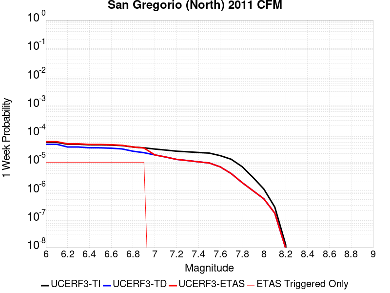 |  | 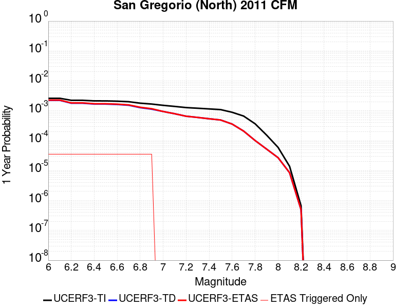 | 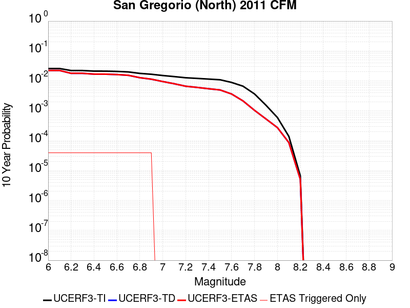 |

| Magnitude | 1 wk TI Prob | 1 wk TD Prob | 1 wk ETAS Prob | 1 wk ETAS/TD Gain | 1 wk ETAS Triggered Only | 1 mo TI Prob | 1 mo TD Prob | 1 mo ETAS Prob | 1 mo ETAS/TD Gain | 1 mo ETAS Triggered Only | 1 yr TI Prob | 1 yr TD Prob | 1 yr ETAS Prob | 1 yr ETAS/TD Gain | 1 yr ETAS Triggered Only | 10 yr TI Prob | 10 yr TD Prob | 10 yr ETAS Prob | 10 yr ETAS/TD Gain | 10 yr ETAS Triggered Only |
|-----|-----|-----|-----|-----|-----|-----|-----|-----|-----|-----|-----|-----|-----|-----|-----|-----|-----|-----|-----|-----|
| 6.0 | 5.0283932E-5 | 4.3057815E-5 | 4.3057815E-5 | 1.0 | 0.0 | 2.1548476E-4 | 1.8452053E-4 | 1.8452053E-4 | 1.0 | 0.0 | 0.0026203706 | 0.002244237 | 0.0022835995 | 1.0175393 | 3.9450842E-5 | 0.02589687 | 0.022293162 | 0.022331733 | 1.0017302 | 3.9450842E-5 |
| 6.1 | 5.0283932E-5 | 4.3057815E-5 | 4.3057815E-5 | 1.0 | 0.0 | 2.1548476E-4 | 1.8452053E-4 | 1.8452053E-4 | 1.0 | 0.0 | 0.0026203706 | 0.002244237 | 0.0022835995 | 1.0175393 | 3.9450842E-5 | 0.02589687 | 0.022293162 | 0.022331733 | 1.0017302 | 3.9450842E-5 |
| 6.2 | 4.2998647E-5 | 3.4441564E-5 | 3.4441564E-5 | 1.0 | 0.0 | 1.842669E-4 | 1.475984E-4 | 1.475984E-4 | 1.0 | 0.0 | 0.0022411412 | 0.00179554 | 0.00183492 | 1.0219321 | 3.9450842E-5 | 0.022186736 | 0.017886506 | 0.017925251 | 1.0021662 | 3.9450842E-5 |
| 6.3 | 4.2998647E-5 | 3.4441564E-5 | 3.4441564E-5 | 1.0 | 0.0 | 1.842669E-4 | 1.475984E-4 | 1.475984E-4 | 1.0 | 0.0 | 0.0022411412 | 0.00179554 | 0.00183492 | 1.0219321 | 3.9450842E-5 | 0.022186736 | 0.017886506 | 0.017925251 | 1.0021662 | 3.9450842E-5 |
| 6.4 | 4.1101295E-5 | 3.2326872E-5 | 3.2326872E-5 | 1.0 | 0.0 | 1.7613651E-4 | 1.3853642E-4 | 1.3853642E-4 | 1.0 | 0.0 | 0.0021423528 | 0.0016853869 | 0.0017247712 | 1.0233681 | 3.9450842E-5 | 0.02121817 | 0.016801886 | 0.016840674 | 1.0023086 | 3.9450842E-5 |
| 6.5 | 4.1032585E-5 | 3.2244905E-5 | 3.2244905E-5 | 1.0 | 0.0 | 1.7584208E-4 | 1.3818518E-4 | 1.3818518E-4 | 1.0 | 0.0 | 0.0021387753 | 0.0016811171 | 0.0017205016 | 1.0234276 | 3.9450842E-5 | 0.021183075 | 0.016759839 | 0.016798628 | 1.0023144 | 3.9450842E-5 |
| 6.6 | 4.011629E-5 | 3.1266558E-5 | 3.1266558E-5 | 1.0 | 0.0 | 1.7191563E-4 | 1.339927E-4 | 1.339927E-4 | 1.0 | 0.0 | 0.0020910634 | 0.0016301516 | 0.0016695381 | 1.0241612 | 3.9450842E-5 | 0.020714961 | 0.01625741 | 0.016296221 | 1.0023872 | 3.9450842E-5 |
| 6.7 | 3.8583938E-5 | 2.9453593E-5 | 2.9453593E-5 | 1.0 | 0.0 | 1.6534925E-4 | 1.2622366E-4 | 1.2622366E-4 | 1.0 | 0.0 | 0.0020112682 | 0.0015357039 | 0.0015750942 | 1.0256497 | 3.9450842E-5 | 0.019931622 | 0.015325955 | 0.015364801 | 1.0025346 | 3.9450842E-5 |
| 6.8 | 3.44341E-5 | 2.4450854E-5 | 2.4450854E-5 | 1.0 | 0.0 | 1.4756636E-4 | 1.0478523E-4 | 1.0478523E-4 | 1.0 | 0.0 | 0.0017951399 | 0.0012750238 | 0.0013144243 | 1.0309018 | 3.9450842E-5 | 0.017807078 | 0.012751131 | 0.012790079 | 1.0030545 | 3.9450842E-5 |
| 6.9 | 3.221199E-5 | 2.1778029E-5 | 2.1778029E-5 | 1.0 | 0.0 | 1.3804408E-4 | 9.333112E-5 | 9.333112E-5 | 1.0 | 0.0 | 0.0016793909 | 0.0011357224 | 0.0011751284 | 1.0346969 | 3.9450842E-5 | 0.01666756 | 0.011372583 | 0.011411585 | 1.0034295 | 3.9450842E-5 |
| 7.0 | 2.9186718E-5 | 1.8146875E-5 | 1.8146875E-5 | 1.0 | 0.0 | 1.2507994E-4 | 7.7770026E-5 | 7.7770026E-5 | 1.0 | 0.0 | 0.0015217843 | 9.464431E-4 | 9.464431E-4 | 1.0 | 0.0 | 0.015114053 | 0.009496798 | 0.009496798 | 1.0 | 0.0 |
| 7.1 | 2.6840138E-5 | 1.5284508E-5 | 1.5284508E-5 | 1.0 | 0.0 | 1.1502409E-4 | 6.55034E-5 | 6.55034E-5 | 1.0 | 0.0 | 0.0013995186 | 7.9721404E-4 | 7.9721404E-4 | 1.0 | 0.0 | 0.013907375 | 0.008015723 | 0.008015723 | 1.0 | 0.0 |
| 7.2 | 2.453002E-5 | 1.2606672E-5 | 1.2606672E-5 | 1.0 | 0.0 | 1.05124425E-4 | 5.4027478E-5 | 5.4027478E-5 | 1.0 | 0.0 | 0.0012791384 | 6.575866E-4 | 6.575866E-4 | 1.0 | 0.0 | 0.012718005 | 0.00662763 | 0.00662763 | 1.0 | 0.0 |
| 7.3 | 2.3330727E-5 | 1.1488677E-5 | 1.1488677E-5 | 1.0 | 0.0 | 9.9985E-5 | 4.923626E-5 | 4.923626E-5 | 1.0 | 0.0 | 0.0012166376 | 5.9928704E-4 | 5.9928704E-4 | 1.0 | 0.0 | 0.012099981 | 0.006046564 | 0.006046564 | 1.0 | 0.0 |
| 7.4 | 2.2136466E-5 | 1.0368981E-5 | 1.0368981E-5 | 1.0 | 0.0 | 9.486712E-5 | 4.4437733E-5 | 4.4437733E-5 | 1.0 | 0.0 | 0.0011543952 | 5.4089533E-4 | 5.4089533E-4 | 1.0 | 0.0 | 0.011484168 | 0.005464249 | 0.005464249 | 1.0 | 0.0 |
| 7.5 | 2.0994974E-5 | 9.427217E-6 | 9.427217E-6 | 1.0 | 0.0 | 8.997535E-5 | 4.0401734E-5 | 4.0401734E-5 | 1.0 | 0.0 | 0.0010948994 | 4.9178035E-4 | 4.9178035E-4 | 1.0 | 0.0 | 0.010895205 | 0.004973358 | 0.004973358 | 1.0 | 0.0 |
| 7.6 | 1.7091823E-5 | 6.893766E-6 | 6.893766E-6 | 1.0 | 0.0 | 7.3248615E-5 | 2.9544377E-5 | 2.9544377E-5 | 1.0 | 0.0 | 8.9143694E-4 | 3.596435E-4 | 3.596435E-4 | 1.0 | 0.0 | 0.008878695 | 0.0036482841 | 0.0036482841 | 1.0 | 0.0 |
| 7.7 | 1.2772179E-5 | 4.0208706E-6 | 4.0208706E-6 | 1.0 | 0.0 | 5.473676E-5 | 1.7232189E-5 | 1.7232189E-5 | 1.0 | 0.0 | 6.6621625E-4 | 2.0978172E-4 | 2.0978172E-4 | 1.0 | 0.0 | 0.006642225 | 0.002136922 | 0.002136922 | 1.0 | 0.0 |
| 7.8 | 7.041923E-6 | 1.940626E-6 | 1.940626E-6 | 1.0 | 0.0 | 3.017932E-5 | 8.316942E-6 | 8.316942E-6 | 1.0 | 0.0 | 3.6737128E-4 | 1.0125406E-4 | 1.0125406E-4 | 1.0 | 0.0 | 0.0036676454 | 0.0010379003 | 0.0010379003 | 1.0 | 0.0 |
| 7.9 | 2.946768E-6 | 1.0033551E-6 | 1.0033551E-6 | 1.0 | 0.0 | 1.2628945E-5 | 4.300086E-6 | 4.300086E-6 | 1.0 | 0.0 | 1.5374656E-4 | 5.235229E-5 | 5.235229E-5 | 1.0 | 0.0 | 0.0015364023 | 5.3400313E-4 | 5.3400313E-4 | 1.0 | 0.0 |
| 8.0 | 1.1433375E-6 | 5.18146E-7 | 5.18146E-7 | 1.0 | 0.0 | 4.9000087E-6 | 2.2206239E-6 | 2.2206239E-6 | 1.0 | 0.0 | 5.965597E-5 | 2.703576E-5 | 2.703576E-5 | 1.0 | 0.0 | 5.963996E-4 | 2.7398416E-4 | 2.7398416E-4 | 1.0 | 0.0 |
| 8.1 | 2.6675295E-7 | 1.62899E-7 | 1.62899E-7 | 1.0 | 0.0 | 1.1432264E-6 | 6.9813836E-7 | 6.9813836E-7 | 1.0 | 0.0 | 1.3918692E-5 | 8.499802E-6 | 8.499802E-6 | 1.0 | 0.0 | 1.391782E-4 | 8.63795E-5 | 8.63795E-5 | 1.0 | 0.0 |
| 8.2 | 1.2704569E-8 | 9.431393E-9 | 9.431393E-9 | 1.0 | 0.0 | 5.444815E-8 | 4.042026E-8 | 4.042026E-8 | 1.0 | 0.0 | 6.629061E-7 | 4.9211656E-7 | 4.9211656E-7 | 1.0 | 0.0 | 6.629041E-6 | 5.1121438E-6 | 5.1121438E-6 | 1.0 | 0.0 |

## Great Valley 06 (Midland) 2011 CFM alt1
*[(top)](#table-of-contents)*

| 1 Week | 1 Month | 1 Year | 10 Year |
|-----|-----|-----|-----|
| 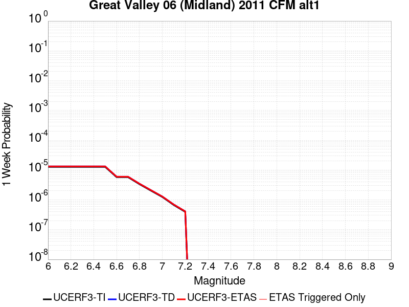 | 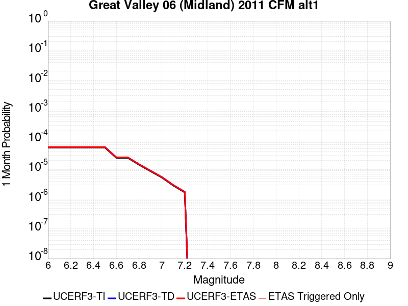 | 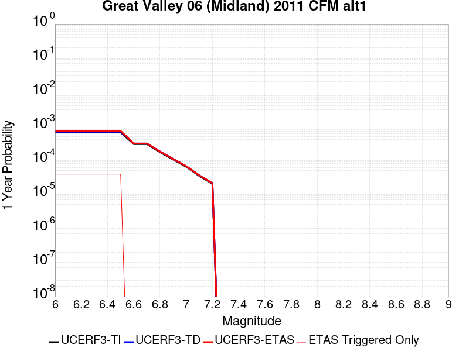 | 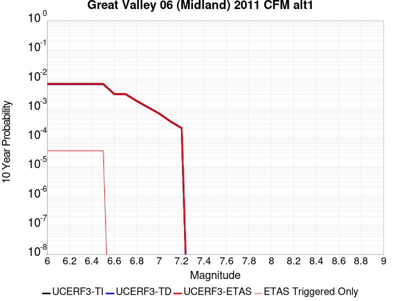 |

| Magnitude | 1 wk TI Prob | 1 wk TD Prob | 1 wk ETAS Prob | 1 wk ETAS/TD Gain | 1 wk ETAS Triggered Only | 1 mo TI Prob | 1 mo TD Prob | 1 mo ETAS Prob | 1 mo ETAS/TD Gain | 1 mo ETAS Triggered Only | 1 yr TI Prob | 1 yr TD Prob | 1 yr ETAS Prob | 1 yr ETAS/TD Gain | 1 yr ETAS Triggered Only | 10 yr TI Prob | 10 yr TD Prob | 10 yr ETAS Prob | 10 yr ETAS/TD Gain | 10 yr ETAS Triggered Only |
|-----|-----|-----|-----|-----|-----|-----|-----|-----|-----|-----|-----|-----|-----|-----|-----|-----|-----|-----|-----|-----|
| 6.0 | 1.2712525E-5 | 1.3210576E-5 | 1.3210576E-5 | 1.0 | 0.0 | 5.4481112E-5 | 5.6615667E-5 | 5.6615667E-5 | 1.0 | 0.0 | 6.6310563E-4 | 6.8910315E-4 | 7.285268E-4 | 1.0572101 | 3.9450842E-5 | 0.0066113044 | 0.006872179 | 0.006911359 | 1.0057012 | 3.9450842E-5 |
| 6.1 | 1.2712525E-5 | 1.3210576E-5 | 1.3210576E-5 | 1.0 | 0.0 | 5.4481112E-5 | 5.6615667E-5 | 5.6615667E-5 | 1.0 | 0.0 | 6.6310563E-4 | 6.8910315E-4 | 7.285268E-4 | 1.0572101 | 3.9450842E-5 | 0.0066113044 | 0.006872179 | 0.006911359 | 1.0057012 | 3.9450842E-5 |
| 6.2 | 1.2712525E-5 | 1.3210576E-5 | 1.3210576E-5 | 1.0 | 0.0 | 5.4481112E-5 | 5.6615667E-5 | 5.6615667E-5 | 1.0 | 0.0 | 6.6310563E-4 | 6.8910315E-4 | 7.285268E-4 | 1.0572101 | 3.9450842E-5 | 0.0066113044 | 0.006872179 | 0.006911359 | 1.0057012 | 3.9450842E-5 |
| 6.3 | 1.2712525E-5 | 1.3210576E-5 | 1.3210576E-5 | 1.0 | 0.0 | 5.4481112E-5 | 5.6615667E-5 | 5.6615667E-5 | 1.0 | 0.0 | 6.6310563E-4 | 6.8910315E-4 | 7.285268E-4 | 1.0572101 | 3.9450842E-5 | 0.0066113044 | 0.006872179 | 0.006911359 | 1.0057012 | 3.9450842E-5 |
| 6.4 | 1.2712525E-5 | 1.3210576E-5 | 1.3210576E-5 | 1.0 | 0.0 | 5.4481112E-5 | 5.6615667E-5 | 5.6615667E-5 | 1.0 | 0.0 | 6.6310563E-4 | 6.8910315E-4 | 7.285268E-4 | 1.0572101 | 3.9450842E-5 | 0.0066113044 | 0.006872179 | 0.006911359 | 1.0057012 | 3.9450842E-5 |
| 6.5 | 1.2712525E-5 | 1.3210576E-5 | 1.3210576E-5 | 1.0 | 0.0 | 5.4481112E-5 | 5.6615667E-5 | 5.6615667E-5 | 1.0 | 0.0 | 6.6310563E-4 | 6.8910315E-4 | 7.285268E-4 | 1.0572101 | 3.9450842E-5 | 0.0066113044 | 0.006872179 | 0.006911359 | 1.0057012 | 3.9450842E-5 |
| 6.6 | 5.7574384E-6 | 5.9706463E-6 | 5.9706463E-6 | 1.0 | 0.0 | 2.4674504E-5 | 2.5588255E-5 | 2.5588255E-5 | 1.0 | 0.0 | 3.0037065E-4 | 3.1149638E-4 | 3.1149638E-4 | 1.0 | 0.0 | 0.0029996498 | 0.0031109843 | 0.0031109843 | 1.0 | 0.0 |
| 6.7 | 5.7574384E-6 | 5.9706463E-6 | 5.9706463E-6 | 1.0 | 0.0 | 2.4674504E-5 | 2.5588255E-5 | 2.5588255E-5 | 1.0 | 0.0 | 3.0037065E-4 | 3.1149638E-4 | 3.1149638E-4 | 1.0 | 0.0 | 0.0029996498 | 0.0031109843 | 0.0031109843 | 1.0 | 0.0 |
| 6.8 | 3.3474828E-6 | 3.4693849E-6 | 3.4693849E-6 | 1.0 | 0.0 | 1.4346277E-5 | 1.4868716E-5 | 1.4868716E-5 | 1.0 | 0.0 | 1.7465191E-4 | 1.8101306E-4 | 1.8101306E-4 | 1.0 | 0.0 | 0.0017451472 | 0.0018088033 | 0.0018088033 | 1.0 | 0.0 |
| 6.9 | 2.035106E-6 | 2.1090357E-6 | 2.1090357E-6 | 1.0 | 0.0 | 8.721853E-6 | 9.038697E-6 | 9.038697E-6 | 1.0 | 0.0 | 1.0618339E-4 | 1.10041314E-4 | 1.10041314E-4 | 1.0 | 0.0 | 0.0010613267 | 0.0010999405 | 0.0010999405 | 1.0 | 0.0 |
| 7.0 | 1.2424716E-6 | 1.2878762E-6 | 1.2878762E-6 | 1.0 | 0.0 | 5.3248673E-6 | 5.51946E-6 | 5.51946E-6 | 1.0 | 0.0 | 6.482833E-5 | 6.7197805E-5 | 6.7197805E-5 | 1.0 | 0.0 | 6.480942E-4 | 6.718192E-4 | 6.718192E-4 | 1.0 | 0.0 |
| 7.1 | 6.6904556E-7 | 6.939035E-7 | 6.939035E-7 | 1.0 | 0.0 | 2.867335E-6 | 2.97387E-6 | 2.97387E-6 | 1.0 | 0.0 | 3.4909244E-5 | 3.6206526E-5 | 3.6206526E-5 | 1.0 | 0.0 | 3.490376E-4 | 3.6203177E-4 | 3.6203177E-4 | 1.0 | 0.0 |
| 7.2 | 3.948168E-7 | 4.095705E-7 | 4.095705E-7 | 1.0 | 0.0 | 1.6920709E-6 | 1.7553022E-6 | 1.7553022E-6 | 1.0 | 0.0 | 2.0600768E-5 | 2.1370803E-5 | 2.1370803E-5 | 1.0 | 0.0 | 2.0598859E-4 | 2.1370803E-4 | 2.1370803E-4 | 1.0 | 0.0 |

## Antelope Valley 2011
*[(top)](#table-of-contents)*

| 1 Week | 1 Month | 1 Year | 10 Year |
|-----|-----|-----|-----|
| 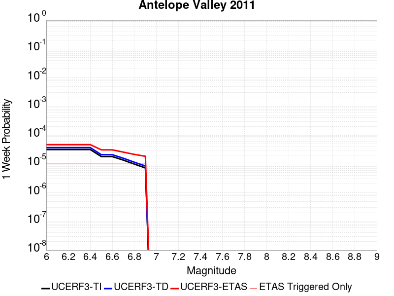 | 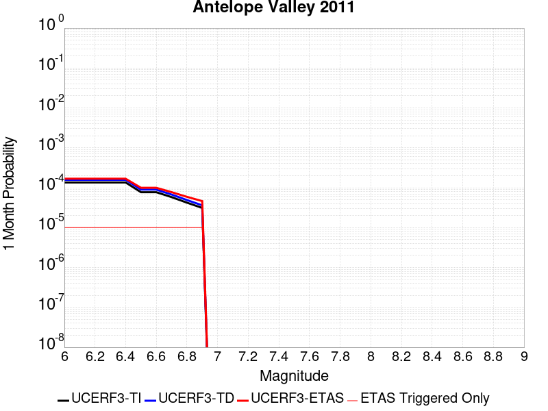 | 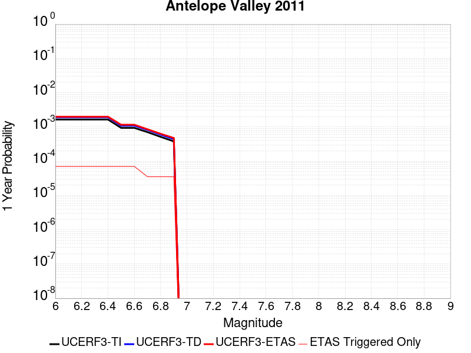 | 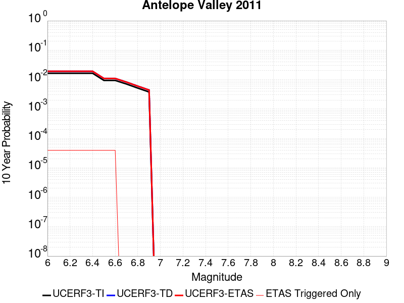 |

| Magnitude | 1 wk TI Prob | 1 wk TD Prob | 1 wk ETAS Prob | 1 wk ETAS/TD Gain | 1 wk ETAS Triggered Only | 1 mo TI Prob | 1 mo TD Prob | 1 mo ETAS Prob | 1 mo ETAS/TD Gain | 1 mo ETAS Triggered Only | 1 yr TI Prob | 1 yr TD Prob | 1 yr ETAS Prob | 1 yr ETAS/TD Gain | 1 yr ETAS Triggered Only | 10 yr TI Prob | 10 yr TD Prob | 10 yr ETAS Prob | 10 yr ETAS/TD Gain | 10 yr ETAS Triggered Only |
|-----|-----|-----|-----|-----|-----|-----|-----|-----|-----|-----|-----|-----|-----|-----|-----|-----|-----|-----|-----|-----|
| 6.0 | 3.1646934E-5 | 3.6904403E-5 | 3.6904403E-5 | 1.0 | 0.0 | 1.3562266E-4 | 1.5815363E-4 | 1.5815363E-4 | 1.0 | 0.0 | 0.0016499552 | 0.0019240845 | 0.0019634594 | 1.0204643 | 3.9450842E-5 | 0.016377583 | 0.019100651 | 0.019139348 | 1.002026 | 3.9450842E-5 |
| 6.1 | 3.1646934E-5 | 3.6904403E-5 | 3.6904403E-5 | 1.0 | 0.0 | 1.3562266E-4 | 1.5815363E-4 | 1.5815363E-4 | 1.0 | 0.0 | 0.0016499552 | 0.0019240845 | 0.0019634594 | 1.0204643 | 3.9450842E-5 | 0.016377583 | 0.019100651 | 0.019139348 | 1.002026 | 3.9450842E-5 |
| 6.2 | 3.1646934E-5 | 3.6904403E-5 | 3.6904403E-5 | 1.0 | 0.0 | 1.3562266E-4 | 1.5815363E-4 | 1.5815363E-4 | 1.0 | 0.0 | 0.0016499552 | 0.0019240845 | 0.0019634594 | 1.0204643 | 3.9450842E-5 | 0.016377583 | 0.019100651 | 0.019139348 | 1.002026 | 3.9450842E-5 |
| 6.3 | 3.1646934E-5 | 3.6904403E-5 | 3.6904403E-5 | 1.0 | 0.0 | 1.3562266E-4 | 1.5815363E-4 | 1.5815363E-4 | 1.0 | 0.0 | 0.0016499552 | 0.0019240845 | 0.0019634594 | 1.0204643 | 3.9450842E-5 | 0.016377583 | 0.019100651 | 0.019139348 | 1.002026 | 3.9450842E-5 |
| 6.4 | 3.1646934E-5 | 3.6904403E-5 | 3.6904403E-5 | 1.0 | 0.0 | 1.3562266E-4 | 1.5815363E-4 | 1.5815363E-4 | 1.0 | 0.0 | 0.0016499552 | 0.0019240845 | 0.0019634594 | 1.0204643 | 3.9450842E-5 | 0.016377583 | 0.019100651 | 0.019139348 | 1.002026 | 3.9450842E-5 |
| 6.5 | 1.8034107E-5 | 2.0940959E-5 | 2.0940959E-5 | 1.0 | 0.0 | 7.7286735E-5 | 8.974457E-5 | 8.974457E-5 | 1.0 | 0.0 | 9.405598E-4 | 0.0010922146 | 0.0011316224 | 1.0360806 | 3.9450842E-5 | 0.009365888 | 0.010880542 | 0.0109195635 | 1.0035864 | 3.9450842E-5 |
| 6.6 | 1.8034107E-5 | 2.0940959E-5 | 2.0940959E-5 | 1.0 | 0.0 | 7.7286735E-5 | 8.974457E-5 | 8.974457E-5 | 1.0 | 0.0 | 9.405598E-4 | 0.0010922146 | 0.0011316224 | 1.0360806 | 3.9450842E-5 | 0.009365888 | 0.010880542 | 0.0109195635 | 1.0035864 | 3.9450842E-5 |
| 6.7 | 1.3567667E-5 | 1.5749509E-5 | 1.5749509E-5 | 1.0 | 0.0 | 5.814585E-5 | 6.749675E-5 | 6.749675E-5 | 1.0 | 0.0 | 7.076958E-4 | 8.2156935E-4 | 8.2156935E-4 | 1.0 | 0.0 | 0.007054463 | 0.008195754 | 0.008195754 | 1.0 | 0.0 |
| 6.8 | 9.867387E-6 | 1.1467935E-5 | 1.1467935E-5 | 1.0 | 0.0 | 4.2288117E-5 | 4.91479E-5 | 4.91479E-5 | 1.0 | 0.0 | 5.1473617E-4 | 5.9830636E-4 | 5.9830636E-4 | 1.0 | 0.0 | 0.005135455 | 0.005976268 | 0.005976268 | 1.0 | 0.0 |
| 6.9 | 7.273233E-6 | 8.454864E-6 | 8.454864E-6 | 1.0 | 0.0 | 3.1170628E-5 | 3.623513E-5 | 3.623513E-5 | 1.0 | 0.0 | 3.794363E-4 | 4.411627E-4 | 4.411627E-4 | 1.0 | 0.0 | 0.0037878908 | 0.004411627 | 0.004411627 | 1.0 | 0.0 |

## Burnt Mtn
*[(top)](#table-of-contents)*

| 1 Week | 1 Month | 1 Year | 10 Year |
|-----|-----|-----|-----|
| 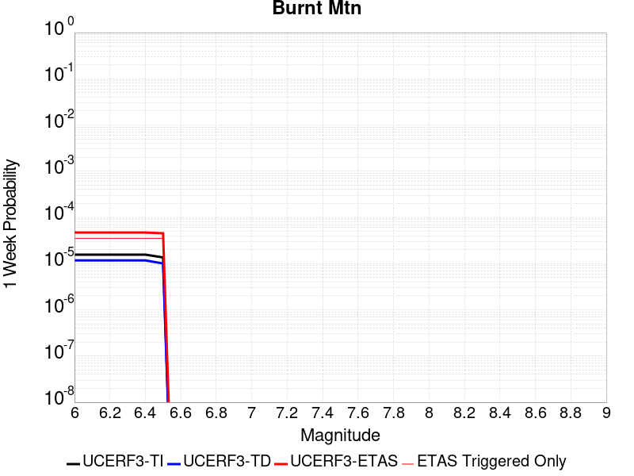 | 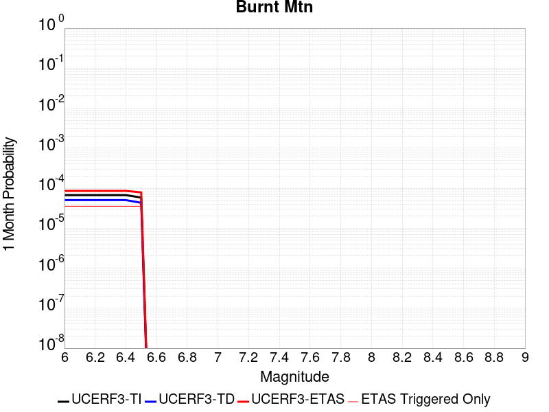 | 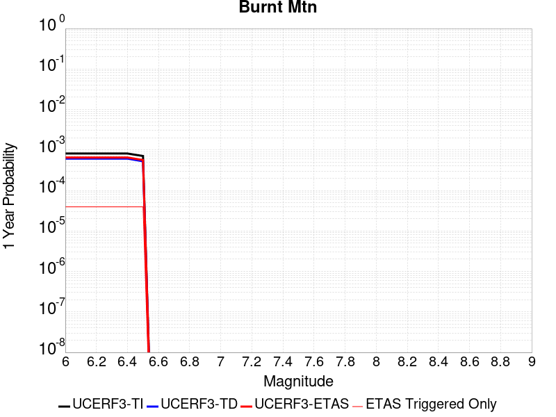 | 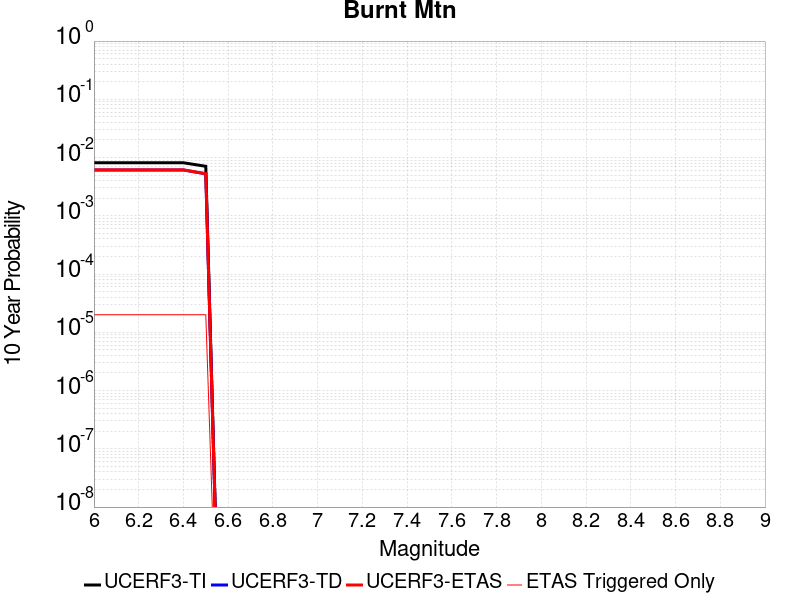 |

| Magnitude | 1 wk TI Prob | 1 wk TD Prob | 1 wk ETAS Prob | 1 wk ETAS/TD Gain | 1 wk ETAS Triggered Only | 1 mo TI Prob | 1 mo TD Prob | 1 mo ETAS Prob | 1 mo ETAS/TD Gain | 1 mo ETAS Triggered Only | 1 yr TI Prob | 1 yr TD Prob | 1 yr ETAS Prob | 1 yr ETAS/TD Gain | 1 yr ETAS Triggered Only | 10 yr TI Prob | 10 yr TD Prob | 10 yr ETAS Prob | 10 yr ETAS/TD Gain | 10 yr ETAS Triggered Only |
|-----|-----|-----|-----|-----|-----|-----|-----|-----|-----|-----|-----|-----|-----|-----|-----|-----|-----|-----|-----|-----|
| 6.0 | 1.5673151E-5 | 1.1749407E-5 | 5.119979E-5 | 4.3576484 | 3.9450842E-5 | 6.716892E-5 | 5.0354356E-5 | 8.9803216E-5 | 1.7834249 | 3.9450842E-5 | 8.1747473E-4 | 6.1302073E-4 | 6.524474E-4 | 1.0643153 | 3.9450842E-5 | 0.008144741 | 0.006125938 | 0.0061651473 | 1.0064005 | 3.9450842E-5 |
| 6.1 | 1.5673151E-5 | 1.1749407E-5 | 5.119979E-5 | 4.3576484 | 3.9450842E-5 | 6.716892E-5 | 5.0354356E-5 | 8.9803216E-5 | 1.7834249 | 3.9450842E-5 | 8.1747473E-4 | 6.1302073E-4 | 6.524474E-4 | 1.0643153 | 3.9450842E-5 | 0.008144741 | 0.006125938 | 0.0061651473 | 1.0064005 | 3.9450842E-5 |
| 6.2 | 1.5673151E-5 | 1.1749407E-5 | 5.119979E-5 | 4.3576484 | 3.9450842E-5 | 6.716892E-5 | 5.0354356E-5 | 8.9803216E-5 | 1.7834249 | 3.9450842E-5 | 8.1747473E-4 | 6.1302073E-4 | 6.524474E-4 | 1.0643153 | 3.9450842E-5 | 0.008144741 | 0.006125938 | 0.0061651473 | 1.0064005 | 3.9450842E-5 |
| 6.3 | 1.5673151E-5 | 1.1749407E-5 | 5.119979E-5 | 4.3576484 | 3.9450842E-5 | 6.716892E-5 | 5.0354356E-5 | 8.9803216E-5 | 1.7834249 | 3.9450842E-5 | 8.1747473E-4 | 6.1302073E-4 | 6.524474E-4 | 1.0643153 | 3.9450842E-5 | 0.008144741 | 0.006125938 | 0.0061651473 | 1.0064005 | 3.9450842E-5 |
| 6.4 | 1.5673151E-5 | 1.1749407E-5 | 5.119979E-5 | 4.3576484 | 3.9450842E-5 | 6.716892E-5 | 5.0354356E-5 | 8.9803216E-5 | 1.7834249 | 3.9450842E-5 | 8.1747473E-4 | 6.1302073E-4 | 6.524474E-4 | 1.0643153 | 3.9450842E-5 | 0.008144741 | 0.006125938 | 0.0061651473 | 1.0064005 | 3.9450842E-5 |
| 6.5 | 1.36191375E-5 | 1.0078299E-5 | 4.9528746E-5 | 4.9143953 | 3.9450842E-5 | 5.8366426E-5 | 4.3192707E-5 | 8.264185E-5 | 1.9133286 | 3.9450842E-5 | 7.103795E-4 | 5.2587123E-4 | 5.6530134E-4 | 1.0749805 | 3.9450842E-5 | 0.0070811296 | 0.0052587125 | 0.0052979556 | 1.0074625 | 3.9450842E-5 |

## Earthquake Valley (No  Extension)
*[(top)](#table-of-contents)*

| 1 Week | 1 Month | 1 Year | 10 Year |
|-----|-----|-----|-----|
|  |  | 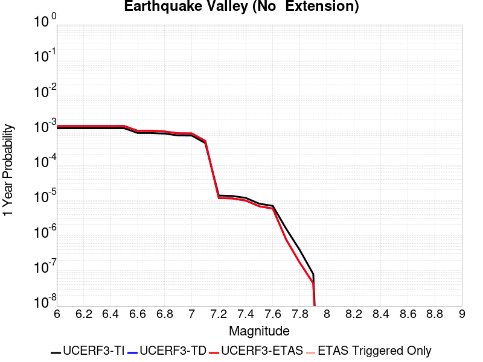 | 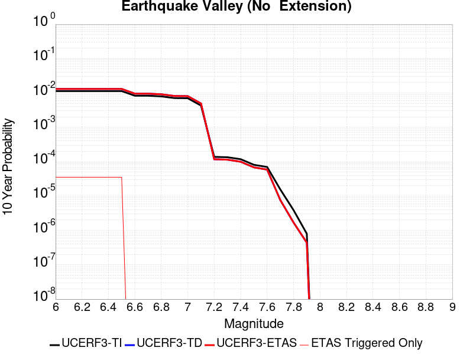 |

| Magnitude | 1 wk TI Prob | 1 wk TD Prob | 1 wk ETAS Prob | 1 wk ETAS/TD Gain | 1 wk ETAS Triggered Only | 1 mo TI Prob | 1 mo TD Prob | 1 mo ETAS Prob | 1 mo ETAS/TD Gain | 1 mo ETAS Triggered Only | 1 yr TI Prob | 1 yr TD Prob | 1 yr ETAS Prob | 1 yr ETAS/TD Gain | 1 yr ETAS Triggered Only | 10 yr TI Prob | 10 yr TD Prob | 10 yr ETAS Prob | 10 yr ETAS/TD Gain | 10 yr ETAS Triggered Only |
|-----|-----|-----|-----|-----|-----|-----|-----|-----|-----|-----|-----|-----|-----|-----|-----|-----|-----|-----|-----|-----|
| 6.0 | 2.1859703E-5 | 2.5198362E-5 | 2.5198362E-5 | 1.0 | 0.0 | 9.3681076E-5 | 1.07989326E-4 | 1.07989326E-4 | 1.0 | 0.0 | 0.0011399703 | 0.001314122 | 0.001314122 | 1.0 | 0.0 | 0.011341401 | 0.013077871 | 0.013116806 | 1.0029771 | 3.9450842E-5 |
| 6.1 | 2.1859703E-5 | 2.5198362E-5 | 2.5198362E-5 | 1.0 | 0.0 | 9.3681076E-5 | 1.07989326E-4 | 1.07989326E-4 | 1.0 | 0.0 | 0.0011399703 | 0.001314122 | 0.001314122 | 1.0 | 0.0 | 0.011341401 | 0.013077871 | 0.013116806 | 1.0029771 | 3.9450842E-5 |
| 6.2 | 2.1859703E-5 | 2.5198362E-5 | 2.5198362E-5 | 1.0 | 0.0 | 9.3681076E-5 | 1.07989326E-4 | 1.07989326E-4 | 1.0 | 0.0 | 0.0011399703 | 0.001314122 | 0.001314122 | 1.0 | 0.0 | 0.011341401 | 0.013077871 | 0.013116806 | 1.0029771 | 3.9450842E-5 |
| 6.3 | 2.1859703E-5 | 2.5198362E-5 | 2.5198362E-5 | 1.0 | 0.0 | 9.3681076E-5 | 1.07989326E-4 | 1.07989326E-4 | 1.0 | 0.0 | 0.0011399703 | 0.001314122 | 0.001314122 | 1.0 | 0.0 | 0.011341401 | 0.013077871 | 0.013116806 | 1.0029771 | 3.9450842E-5 |
| 6.4 | 2.1859703E-5 | 2.5198362E-5 | 2.5198362E-5 | 1.0 | 0.0 | 9.3681076E-5 | 1.07989326E-4 | 1.07989326E-4 | 1.0 | 0.0 | 0.0011399703 | 0.001314122 | 0.001314122 | 1.0 | 0.0 | 0.011341401 | 0.013077871 | 0.013116806 | 1.0029771 | 3.9450842E-5 |
| 6.5 | 2.1859703E-5 | 2.5198362E-5 | 2.5198362E-5 | 1.0 | 0.0 | 9.3681076E-5 | 1.07989326E-4 | 1.07989326E-4 | 1.0 | 0.0 | 0.0011399703 | 0.001314122 | 0.001314122 | 1.0 | 0.0 | 0.011341401 | 0.013077871 | 0.013116806 | 1.0029771 | 3.9450842E-5 |
| 6.6 | 1.597E-5 | 1.8356275E-5 | 1.8356275E-5 | 1.0 | 0.0 | 6.8441055E-5 | 7.866787E-5 | 7.866787E-5 | 1.0 | 0.0 | 8.329513E-4 | 9.574478E-4 | 9.574478E-4 | 1.0 | 0.0 | 0.008298361 | 0.009541836 | 0.009541836 | 1.0 | 0.0 |
| 6.7 | 1.597E-5 | 1.8356275E-5 | 1.8356275E-5 | 1.0 | 0.0 | 6.8441055E-5 | 7.866787E-5 | 7.866787E-5 | 1.0 | 0.0 | 8.329513E-4 | 9.574478E-4 | 9.574478E-4 | 1.0 | 0.0 | 0.008298361 | 0.009541836 | 0.009541836 | 1.0 | 0.0 |
| 6.8 | 1.5315149E-5 | 1.7602091E-5 | 1.7602091E-5 | 1.0 | 0.0 | 6.5634704E-5 | 7.543584E-5 | 7.543584E-5 | 1.0 | 0.0 | 7.988095E-4 | 9.181311E-4 | 9.181311E-4 | 1.0 | 0.0 | 0.007959441 | 0.009151919 | 0.009151919 | 1.0 | 0.0 |
| 6.9 | 1.3634728E-5 | 1.5675821E-5 | 1.5675821E-5 | 1.0 | 0.0 | 5.8433237E-5 | 6.718082E-5 | 6.718082E-5 | 1.0 | 0.0 | 7.1119244E-4 | 8.177017E-4 | 8.177017E-4 | 1.0 | 0.0 | 0.007089207 | 0.008155 | 0.008155 | 1.0 | 0.0 |
| 7.0 | 1.3496271E-5 | 1.5517853E-5 | 1.5517853E-5 | 1.0 | 0.0 | 5.783988E-5 | 6.650385E-5 | 6.650385E-5 | 1.0 | 0.0 | 7.03973E-4 | 8.094657E-4 | 8.094657E-4 | 1.0 | 0.0 | 0.007017471 | 0.0080732405 | 0.0080732405 | 1.0 | 0.0 |
| 7.1 | 8.242798E-6 | 9.4726E-6 | 9.4726E-6 | 1.0 | 0.0 | 3.53258E-5 | 4.0596606E-5 | 4.0596606E-5 | 1.0 | 0.0 | 4.300067E-4 | 4.9421866E-4 | 4.9421866E-4 | 1.0 | 0.0 | 0.004291756 | 0.0049377717 | 0.0049377717 | 1.0 | 0.0 |
| 7.2 | 2.6506527E-7 | 2.2560312E-7 | 2.2560312E-7 | 1.0 | 0.0 | 1.1359936E-6 | 9.668702E-7 | 9.668702E-7 | 1.0 | 0.0 | 1.3830633E-5 | 1.17715845E-5 | 1.17715845E-5 | 1.0 | 0.0 | 1.3829772E-4 | 1.1771003E-4 | 1.1771003E-4 | 1.0 | 0.0 |
| 7.3 | 2.5810488E-7 | 2.1955442E-7 | 2.1955442E-7 | 1.0 | 0.0 | 1.1061633E-6 | 9.409472E-7 | 9.409472E-7 | 1.0 | 0.0 | 1.3467455E-5 | 1.1455976E-5 | 1.1455976E-5 | 1.0 | 0.0 | 1.3466639E-4 | 1.1455427E-4 | 1.1455427E-4 | 1.0 | 0.0 |
| 7.4 | 2.2676066E-7 | 1.9110601E-7 | 1.9110601E-7 | 1.0 | 0.0 | 9.71831E-7 | 8.190255E-7 | 8.190255E-7 | 1.0 | 0.0 | 1.1831979E-5 | 9.9715935E-6 | 9.9715935E-6 | 1.0 | 0.0 | 1.1831349E-4 | 9.9711855E-5 | 9.9711855E-5 | 1.0 | 0.0 |
| 7.5 | 1.5553917E-7 | 1.3112096E-7 | 1.3112096E-7 | 1.0 | 0.0 | 6.6659624E-7 | 5.619469E-7 | 5.619469E-7 | 1.0 | 0.0 | 8.115779E-6 | 6.8416834E-6 | 6.8416834E-6 | 1.0 | 0.0 | 8.115482E-5 | 6.841495E-5 | 6.841495E-5 | 1.0 | 0.0 |
| 7.6 | 1.3448629E-7 | 1.1288419E-7 | 1.1288419E-7 | 1.0 | 0.0 | 5.7636964E-7 | 4.837893E-7 | 4.837893E-7 | 1.0 | 0.0 | 7.017278E-6 | 5.890121E-6 | 5.890121E-6 | 1.0 | 0.0 | 7.0170565E-5 | 5.889986E-5 | 5.889986E-5 | 1.0 | 0.0 |
| 7.7 | 2.9719402E-8 | 1.458206E-8 | 1.458206E-8 | 1.0 | 0.0 | 1.2736886E-7 | 6.249454E-8 | 6.249454E-8 | 1.0 | 0.0 | 1.5507147E-6 | 7.608708E-7 | 7.608708E-7 | 1.0 | 0.0 | 1.550704E-5 | 7.6086876E-6 | 7.6086876E-6 | 1.0 | 0.0 |
| 7.8 | 7.4390196E-9 | 3.2502152E-9 | 3.2502152E-9 | 1.0 | 0.0 | 3.1881513E-8 | 1.3929493E-8 | 1.3929493E-8 | 1.0 | 0.0 | 3.8815733E-7 | 1.6959156E-7 | 1.6959156E-7 | 1.0 | 0.0 | 3.8815665E-6 | 1.6959145E-6 | 1.6959145E-6 | 1.0 | 0.0 |
| 7.9 | 1.5373532E-9 | 8.440161E-10 | 8.440161E-10 | 1.0 | 0.0 | 6.5886567E-9 | 3.6172119E-9 | 3.6172119E-9 | 1.0 | 0.0 | 8.021689E-8 | 4.4039556E-8 | 4.4039556E-8 | 1.0 | 0.0 | 8.0216864E-7 | 4.4039552E-7 | 4.4039552E-7 | 1.0 | 0.0 |

## Calaveras (No) 2011 CFM
*[(top)](#table-of-contents)*

| 1 Week | 1 Month | 1 Year | 10 Year |
|-----|-----|-----|-----|
| 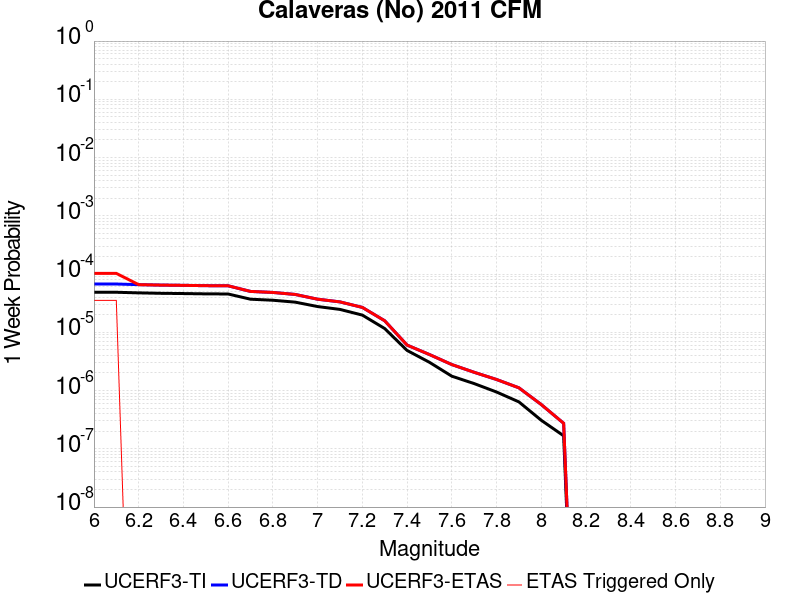 | 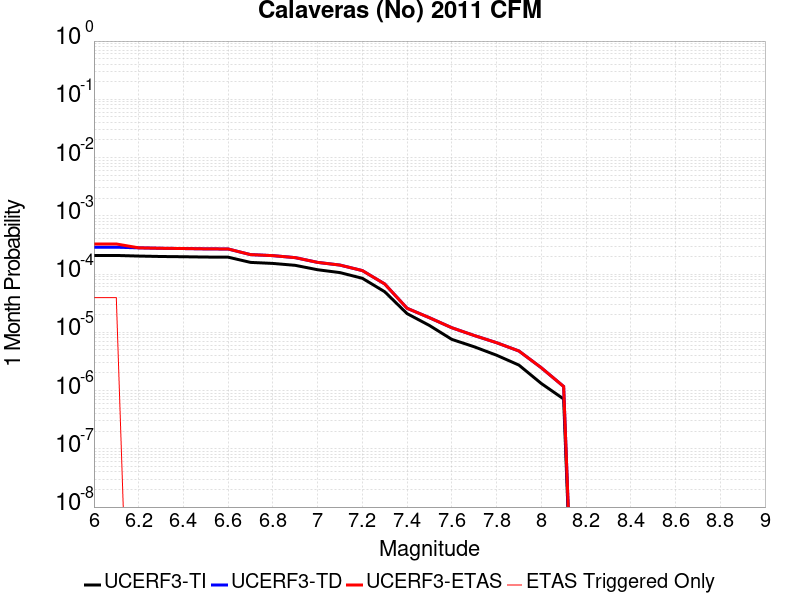 | 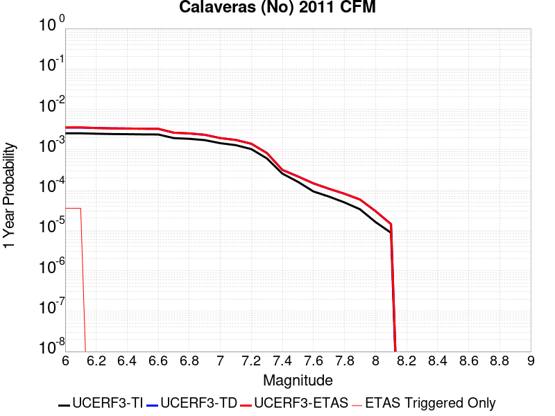 | 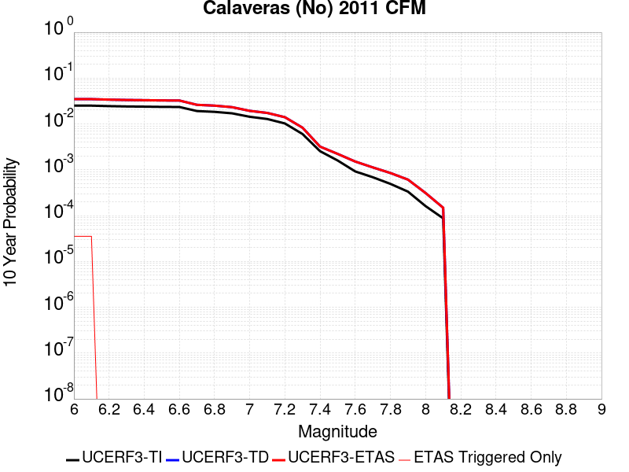 |

| Magnitude | 1 wk TI Prob | 1 wk TD Prob | 1 wk ETAS Prob | 1 wk ETAS/TD Gain | 1 wk ETAS Triggered Only | 1 mo TI Prob | 1 mo TD Prob | 1 mo ETAS Prob | 1 mo ETAS/TD Gain | 1 mo ETAS Triggered Only | 1 yr TI Prob | 1 yr TD Prob | 1 yr ETAS Prob | 1 yr ETAS/TD Gain | 1 yr ETAS Triggered Only | 10 yr TI Prob | 10 yr TD Prob | 10 yr ETAS Prob | 10 yr ETAS/TD Gain | 10 yr ETAS Triggered Only |
|-----|-----|-----|-----|-----|-----|-----|-----|-----|-----|-----|-----|-----|-----|-----|-----|-----|-----|-----|-----|-----|
| 6.0 | 4.8694856E-5 | 6.747121E-5 | 1.0691939E-4 | 1.584667 | 3.9450842E-5 | 2.0867554E-4 | 2.8913133E-4 | 3.2857078E-4 | 1.1364067 | 3.9450842E-5 | 0.0025376645 | 0.003514627 | 0.003553939 | 1.0111853 | 3.9450842E-5 | 0.02508881 | 0.034771245 | 0.03480932 | 1.0010952 | 3.9450842E-5 |
| 6.1 | 4.8694856E-5 | 6.747121E-5 | 1.0691939E-4 | 1.584667 | 3.9450842E-5 | 2.0867554E-4 | 2.8913133E-4 | 3.2857078E-4 | 1.1364067 | 3.9450842E-5 | 0.0025376645 | 0.003514627 | 0.003553939 | 1.0111853 | 3.9450842E-5 | 0.02508881 | 0.034771245 | 0.03480932 | 1.0010952 | 3.9450842E-5 |
| 6.2 | 4.7541962E-5 | 6.580218E-5 | 6.580218E-5 | 1.0 | 0.0 | 2.0373536E-4 | 2.8197994E-4 | 2.8197994E-4 | 1.0 | 0.0 | 0.0024776561 | 0.003427859 | 0.003427859 | 1.0 | 0.0 | 0.024502134 | 0.033932675 | 0.033932675 | 1.0 | 0.0 |
| 6.3 | 4.6717287E-5 | 6.4635555E-5 | 6.4635555E-5 | 1.0 | 0.0 | 2.0020158E-4 | 2.7698115E-4 | 2.7698115E-4 | 1.0 | 0.0 | 0.0024347296 | 0.0033672103 | 0.0033672103 | 1.0 | 0.0 | 0.024082264 | 0.033345193 | 0.033345193 | 1.0 | 0.0 |
| 6.4 | 4.6276386E-5 | 6.399742E-5 | 6.399742E-5 | 1.0 | 0.0 | 1.983123E-4 | 2.7424688E-4 | 2.7424688E-4 | 1.0 | 0.0 | 0.0024117786 | 0.0033340224 | 0.0033340224 | 1.0 | 0.0 | 0.02385771 | 0.033024073 | 0.033024073 | 1.0 | 0.0 |
| 6.5 | 4.5720994E-5 | 6.319881E-5 | 6.319881E-5 | 1.0 | 0.0 | 1.9593239E-4 | 2.70825E-4 | 2.70825E-4 | 1.0 | 0.0 | 0.002382867 | 0.0032924965 | 0.0032924965 | 1.0 | 0.0 | 0.023574775 | 0.032622032 | 0.032622032 | 1.0 | 0.0 |
| 6.6 | 4.549134E-5 | 6.28519E-5 | 6.28519E-5 | 1.0 | 0.0 | 1.949483E-4 | 2.6933852E-4 | 2.6933852E-4 | 1.0 | 0.0 | 0.0023709119 | 0.0032744533 | 0.0032744533 | 1.0 | 0.0 | 0.023457756 | 0.032447387 | 0.032447387 | 1.0 | 0.0 |
| 6.7 | 3.701047E-5 | 5.0359427E-5 | 5.0359427E-5 | 1.0 | 0.0 | 1.5860666E-4 | 2.1580851E-4 | 2.1580851E-4 | 1.0 | 0.0 | 0.0019293258 | 0.002624346 | 0.002624346 | 1.0 | 0.0 | 0.019126613 | 0.026125323 | 0.026125323 | 1.0 | 0.0 |
| 6.8 | 3.5523568E-5 | 4.8341022E-5 | 4.8341022E-5 | 1.0 | 0.0 | 1.5223498E-4 | 2.071596E-4 | 2.071596E-4 | 1.0 | 0.0 | 0.0018518851 | 0.0025192937 | 0.0025192937 | 1.0 | 0.0 | 0.018365284 | 0.025097553 | 0.025097553 | 1.0 | 0.0 |
| 6.9 | 3.2946147E-5 | 4.466269E-5 | 4.466269E-5 | 1.0 | 0.0 | 1.4119013E-4 | 1.9139773E-4 | 1.9139773E-4 | 1.0 | 0.0 | 0.0017176344 | 0.0023278191 | 0.0023278191 | 1.0 | 0.0 | 0.017044188 | 0.023219598 | 0.023219598 | 1.0 | 0.0 |
| 7.0 | 2.7682381E-5 | 3.702223E-5 | 3.702223E-5 | 1.0 | 0.0 | 1.1863338E-4 | 1.5865723E-4 | 1.5865723E-4 | 1.0 | 0.0 | 0.0014434044 | 0.0019299705 | 0.0019299705 | 1.0 | 0.0 | 0.01434065 | 0.01931092 | 0.01931092 | 1.0 | 0.0 |
| 7.1 | 2.471967E-5 | 3.328669E-5 | 3.328669E-5 | 1.0 | 0.0 | 1.05937135E-4 | 1.4264962E-4 | 1.4264962E-4 | 1.0 | 0.0 | 0.0012890215 | 0.0017354045 | 0.0017354045 | 1.0 | 0.0 | 0.0128157 | 0.017385952 | 0.017385952 | 1.0 | 0.0 |
| 7.2 | 1.9748062E-5 | 2.6774684E-5 | 2.6774684E-5 | 1.0 | 0.0 | 8.463181E-5 | 1.1474373E-4 | 1.1474373E-4 | 1.0 | 0.0 | 0.0010299052 | 0.0013961331 | 0.0013961331 | 1.0 | 0.0 | 0.01025145 | 0.014030739 | 0.014030739 | 1.0 | 0.0 |
| 7.3 | 1.1603734E-5 | 1.5783844E-5 | 1.5783844E-5 | 1.0 | 0.0 | 4.9729337E-5 | 6.764337E-5 | 6.764337E-5 | 1.0 | 0.0 | 6.052865E-4 | 8.232611E-4 | 8.232611E-4 | 1.0 | 0.0 | 0.0060364045 | 0.008308666 | 0.008308666 | 1.0 | 0.0 |
| 7.4 | 4.885381E-6 | 6.0349853E-6 | 6.0349853E-6 | 1.0 | 0.0 | 2.0937177E-5 | 2.5863968E-5 | 2.5863968E-5 | 1.0 | 0.0 | 2.5488032E-4 | 3.148485E-4 | 3.148485E-4 | 1.0 | 0.0 | 0.0025458818 | 0.0032010598 | 0.0032010598 | 1.0 | 0.0 |
| 7.5 | 3.0571264E-6 | 4.155299E-6 | 4.155299E-6 | 1.0 | 0.0 | 1.3101904E-5 | 1.7808303E-5 | 1.7808303E-5 | 1.0 | 0.0 | 1.5950401E-4 | 2.1679462E-4 | 2.1679462E-4 | 1.0 | 0.0 | 0.0015938957 | 0.002221121 | 0.002221121 | 1.0 | 0.0 |
| 7.6 | 1.764948E-6 | 2.7955498E-6 | 2.7955498E-6 | 1.0 | 0.0 | 7.564041E-6 | 1.1980874E-5 | 1.1980874E-5 | 1.0 | 0.0 | 9.208831E-5 | 1.4585744E-4 | 1.4585744E-4 | 1.0 | 0.0 | 9.205016E-4 | 0.0015123509 | 0.0015123509 | 1.0 | 0.0 |
| 7.7 | 1.3173734E-6 | 2.058471E-6 | 2.058471E-6 | 1.0 | 0.0 | 5.645874E-6 | 8.8219895E-6 | 8.8219895E-6 | 1.0 | 0.0 | 6.873634E-5 | 1.0740245E-4 | 1.0740245E-4 | 1.0 | 0.0 | 6.8715087E-4 | 0.0011261401 | 0.0011261401 | 1.0 | 0.0 |
| 7.8 | 9.4429885E-7 | 1.5489635E-6 | 1.5489635E-6 | 1.0 | 0.0 | 4.0469886E-6 | 6.638398E-6 | 6.638398E-6 | 1.0 | 0.0 | 4.9270973E-5 | 8.081952E-5 | 8.081952E-5 | 1.0 | 0.0 | 4.926005E-4 | 8.5014524E-4 | 8.5014524E-4 | 1.0 | 0.0 |
| 7.9 | 6.388233E-7 | 1.1148749E-6 | 1.1148749E-6 | 1.0 | 0.0 | 2.7378112E-6 | 4.7780263E-6 | 4.7780263E-6 | 1.0 | 0.0 | 3.3332344E-5 | 5.817093E-5 | 5.817093E-5 | 1.0 | 0.0 | 3.3327343E-4 | 6.0963054E-4 | 6.0963054E-4 | 1.0 | 0.0 |
| 8.0 | 3.087986E-7 | 5.7543696E-7 | 5.7543696E-7 | 1.0 | 0.0 | 1.323422E-6 | 2.466156E-6 | 2.466156E-6 | 1.0 | 0.0 | 1.6112543E-5 | 3.002504E-5 | 3.002504E-5 | 1.0 | 0.0 | 1.6111376E-4 | 3.110302E-4 | 3.110302E-4 | 1.0 | 0.0 |
| 8.1 | 1.6725647E-7 | 2.7410047E-7 | 2.7410047E-7 | 1.0 | 0.0 | 7.168133E-7 | 1.1747159E-6 | 1.1747159E-6 | 1.0 | 0.0 | 8.7271665E-6 | 1.4302073E-5 | 1.4302073E-5 | 1.0 | 0.0 | 8.726824E-5 | 1.48486E-4 | 1.48486E-4 | 1.0 | 0.0 |

## San Cayetano
*[(top)](#table-of-contents)*

| 1 Week | 1 Month | 1 Year | 10 Year |
|-----|-----|-----|-----|
| 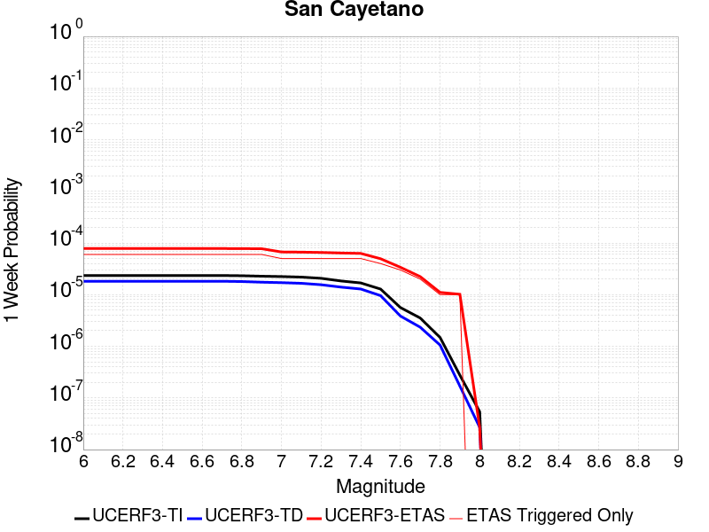 | 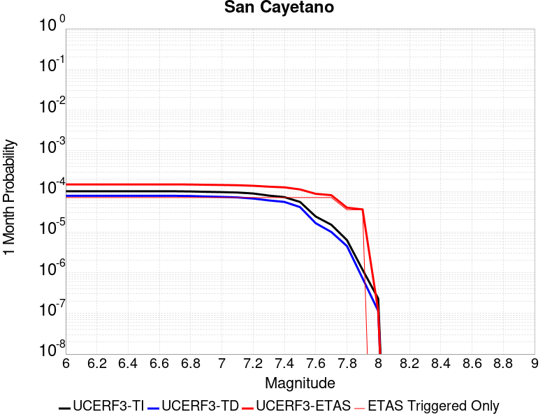 | 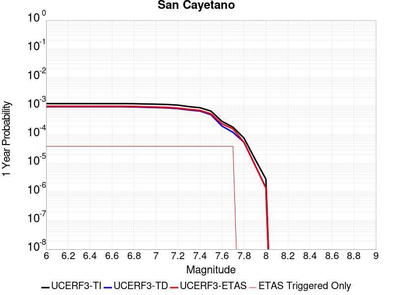 | 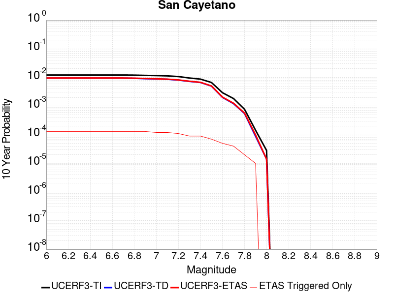 |

| Magnitude | 1 wk TI Prob | 1 wk TD Prob | 1 wk ETAS Prob | 1 wk ETAS/TD Gain | 1 wk ETAS Triggered Only | 1 mo TI Prob | 1 mo TD Prob | 1 mo ETAS Prob | 1 mo ETAS/TD Gain | 1 mo ETAS Triggered Only | 1 yr TI Prob | 1 yr TD Prob | 1 yr ETAS Prob | 1 yr ETAS/TD Gain | 1 yr ETAS Triggered Only | 10 yr TI Prob | 10 yr TD Prob | 10 yr ETAS Prob | 10 yr ETAS/TD Gain | 10 yr ETAS Triggered Only |
|-----|-----|-----|-----|-----|-----|-----|-----|-----|-----|-----|-----|-----|-----|-----|-----|-----|-----|-----|-----|-----|
| 6.0 | 2.3476267E-5 | 1.816928E-5 | 5.7619407E-5 | 3.1712544 | 3.9450842E-5 | 1.0060869E-4 | 7.786603E-5 | 1.1731381E-4 | 1.5066108 | 3.9450842E-5 | 0.0012242225 | 9.476103E-4 | 9.870238E-4 | 1.0415925 | 3.9450842E-5 | 0.012175002 | 0.009436584 | 0.009475662 | 1.0041412 | 3.9450842E-5 |
| 6.1 | 2.3476267E-5 | 1.816928E-5 | 5.7619407E-5 | 3.1712544 | 3.9450842E-5 | 1.0060869E-4 | 7.786603E-5 | 1.1731381E-4 | 1.5066108 | 3.9450842E-5 | 0.0012242225 | 9.476103E-4 | 9.870238E-4 | 1.0415925 | 3.9450842E-5 | 0.012175002 | 0.009436584 | 0.009475662 | 1.0041412 | 3.9450842E-5 |
| 6.2 | 2.3476267E-5 | 1.816928E-5 | 5.7619407E-5 | 3.1712544 | 3.9450842E-5 | 1.0060869E-4 | 7.786603E-5 | 1.1731381E-4 | 1.5066108 | 3.9450842E-5 | 0.0012242225 | 9.476103E-4 | 9.870238E-4 | 1.0415925 | 3.9450842E-5 | 0.012175002 | 0.009436584 | 0.009475662 | 1.0041412 | 3.9450842E-5 |
| 6.3 | 2.3476267E-5 | 1.816928E-5 | 5.7619407E-5 | 3.1712544 | 3.9450842E-5 | 1.0060869E-4 | 7.786603E-5 | 1.1731381E-4 | 1.5066108 | 3.9450842E-5 | 0.0012242225 | 9.476103E-4 | 9.870238E-4 | 1.0415925 | 3.9450842E-5 | 0.012175002 | 0.009436584 | 0.009475662 | 1.0041412 | 3.9450842E-5 |
| 6.4 | 2.3476267E-5 | 1.816928E-5 | 5.7619407E-5 | 3.1712544 | 3.9450842E-5 | 1.0060869E-4 | 7.786603E-5 | 1.1731381E-4 | 1.5066108 | 3.9450842E-5 | 0.0012242225 | 9.476103E-4 | 9.870238E-4 | 1.0415925 | 3.9450842E-5 | 0.012175002 | 0.009436584 | 0.009475662 | 1.0041412 | 3.9450842E-5 |
| 6.5 | 2.3476267E-5 | 1.816928E-5 | 5.7619407E-5 | 3.1712544 | 3.9450842E-5 | 1.0060869E-4 | 7.786603E-5 | 1.1731381E-4 | 1.5066108 | 3.9450842E-5 | 0.0012242225 | 9.476103E-4 | 9.870238E-4 | 1.0415925 | 3.9450842E-5 | 0.012175002 | 0.009436584 | 0.009475662 | 1.0041412 | 3.9450842E-5 |
| 6.6 | 2.3476267E-5 | 1.816928E-5 | 5.7619407E-5 | 3.1712544 | 3.9450842E-5 | 1.0060869E-4 | 7.786603E-5 | 1.1731381E-4 | 1.5066108 | 3.9450842E-5 | 0.0012242225 | 9.476103E-4 | 9.870238E-4 | 1.0415925 | 3.9450842E-5 | 0.012175002 | 0.009436584 | 0.009475662 | 1.0041412 | 3.9450842E-5 |
| 6.7 | 2.3476267E-5 | 1.816928E-5 | 5.7619407E-5 | 3.1712544 | 3.9450842E-5 | 1.0060869E-4 | 7.786603E-5 | 1.1731381E-4 | 1.5066108 | 3.9450842E-5 | 0.0012242225 | 9.476103E-4 | 9.870238E-4 | 1.0415925 | 3.9450842E-5 | 0.012175002 | 0.009436584 | 0.009475662 | 1.0041412 | 3.9450842E-5 |
| 6.8 | 2.3241924E-5 | 1.7936987E-5 | 5.7387126E-5 | 3.1993737 | 3.9450842E-5 | 9.960445E-5 | 7.687056E-5 | 1.1631837E-4 | 1.5131719 | 3.9450842E-5 | 0.0012120095 | 9.3550084E-4 | 9.7491476E-4 | 1.0421314 | 3.9450842E-5 | 0.012054204 | 0.009316482 | 0.0093555655 | 1.0041951 | 3.9450842E-5 |
| 6.9 | 2.2761007E-5 | 1.7432423E-5 | 5.688258E-5 | 3.2630334 | 3.9450842E-5 | 9.7543525E-5 | 7.470827E-5 | 1.14156166E-4 | 1.5280259 | 3.9450842E-5 | 0.0011869454 | 9.09197E-4 | 9.48612E-4 | 1.0433514 | 3.9450842E-5 | 0.011806256 | 0.009055603 | 0.0090946965 | 1.004317 | 3.9450842E-5 |
| 7.0 | 2.240283E-5 | 1.7066168E-5 | 5.651634E-5 | 3.311601 | 3.9450842E-5 | 9.600859E-5 | 7.313869E-5 | 1.1258665E-4 | 1.5393583 | 3.9450842E-5 | 0.0011682777 | 8.9010317E-4 | 9.2951895E-4 | 1.0442822 | 3.9450842E-5 | 0.011621549 | 0.008866196 | 0.008905296 | 1.0044101 | 3.9450842E-5 |
| 7.1 | 2.1871154E-5 | 1.6586018E-5 | 5.603621E-5 | 3.378521 | 3.9450842E-5 | 9.373015E-5 | 7.108101E-5 | 1.1052906E-4 | 1.5549729 | 3.9450842E-5 | 0.0011405671 | 8.6507114E-4 | 9.0448785E-4 | 1.0455648 | 3.9450842E-5 | 0.011347309 | 0.008617838 | 0.008656949 | 1.0045384 | 3.9450842E-5 |
| 7.2 | 2.0714133E-5 | 1.5564561E-5 | 5.5014792E-5 | 3.5346189 | 3.9450842E-5 | 8.8771834E-5 | 6.670357E-5 | 1.0615178E-4 | 1.5913959 | 3.9450842E-5 | 0.0010802611 | 8.1181666E-4 | 8.5123547E-4 | 1.0485563 | 3.9450842E-5 | 0.010750249 | 0.008089285 | 0.008128417 | 1.0048375 | 3.9450842E-5 |
| 7.3 | 1.8408395E-5 | 1.3996864E-5 | 5.344716E-5 | 3.818509 | 3.9450842E-5 | 7.8890735E-5 | 5.99852E-5 | 9.943368E-5 | 1.6576369 | 3.9450842E-5 | 9.600714E-4 | 7.300781E-4 | 7.6950016E-4 | 1.053997 | 3.9450842E-5 | 0.009559342 | 0.0072775153 | 0.007316679 | 1.0053815 | 3.9450842E-5 |
| 7.4 | 1.6856795E-5 | 1.28500815E-5 | 5.230042E-5 | 4.070046 | 3.9450842E-5 | 7.2241404E-5 | 5.5070628E-5 | 9.45193E-5 | 1.7163287 | 3.9450842E-5 | 8.7918417E-4 | 6.7028153E-4 | 7.097059E-4 | 1.0588176 | 3.9450842E-5 | 0.00875714 | 0.0066832784 | 0.0067224656 | 1.0058634 | 3.9450842E-5 |
| 7.5 | 1.2822778E-5 | 9.577542E-6 | 4.9028007E-5 | 5.1190596 | 3.9450842E-5 | 5.495361E-5 | 4.1045972E-5 | 8.04952E-5 | 1.9610986 | 3.9450842E-5 | 6.688548E-4 | 4.996217E-4 | 5.390528E-4 | 1.078922 | 3.9450842E-5 | 0.006668452 | 0.0049851555 | 0.00502441 | 1.0078743 | 3.9450842E-5 |
| 7.6 | 5.6272684E-6 | 3.854903E-6 | 4.3305594E-5 | 11.2339 | 3.9450842E-5 | 2.4116642E-5 | 1.652091E-5 | 5.59711E-5 | 3.3878949 | 3.9450842E-5 | 2.9358055E-4 | 2.0112359E-4 | 2.4056651E-4 | 1.1961128 | 3.9450842E-5 | 0.0029319301 | 0.0020094267 | 0.0020487981 | 1.0195935 | 3.9450842E-5 |
| 7.7 | 3.5261346E-6 | 2.3407013E-6 | 4.1791453E-5 | 17.854244 | 3.9450842E-5 | 1.5111918E-5 | 1.0031539E-5 | 4.9481987E-5 | 4.932642 | 3.9450842E-5 | 1.8397206E-4 | 1.2212721E-4 | 1.6157323E-4 | 1.3229913 | 3.9450842E-5 | 0.0018381984 | 0.0012206084 | 0.001260011 | 1.0322812 | 3.9450842E-5 |
| 7.8 | 1.4826929E-6 | 1.056428E-6 | 1.056428E-6 | 1.0 | 0.0 | 6.354383E-6 | 4.5275406E-6 | 4.5275406E-6 | 1.0 | 0.0 | 7.736187E-5 | 5.5121433E-5 | 5.5121433E-5 | 1.0 | 0.0 | 7.733494E-4 | 5.5107963E-4 | 5.5107963E-4 | 1.0 | 0.0 |
| 7.9 | 2.7568166E-7 | 1.6978244E-7 | 1.6978244E-7 | 1.0 | 0.0 | 1.1814923E-6 | 7.2763885E-7 | 7.2763885E-7 | 1.0 | 0.0 | 1.4384574E-5 | 8.858967E-6 | 8.858967E-6 | 1.0 | 0.0 | 1.4383643E-4 | 8.8586174E-5 | 8.8586174E-5 | 1.0 | 0.0 |
| 8.0 | 5.407832E-8 | 2.6887697E-8 | 2.6887697E-8 | 1.0 | 0.0 | 2.3176422E-7 | 1.15232986E-7 | 1.15232986E-7 | 1.0 | 0.0 | 2.8217257E-6 | 1.4029607E-6 | 1.4029607E-6 | 1.0 | 0.0 | 2.8216898E-5 | 1.4029522E-5 | 1.4029522E-5 | 1.0 | 0.0 |

## Northridge Hills
*[(top)](#table-of-contents)*

| 1 Week | 1 Month | 1 Year | 10 Year |
|-----|-----|-----|-----|
|  | 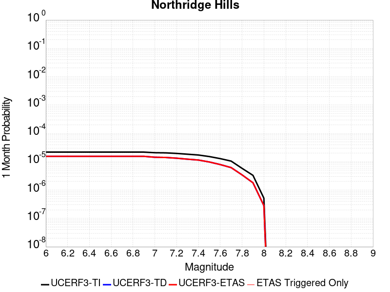 | 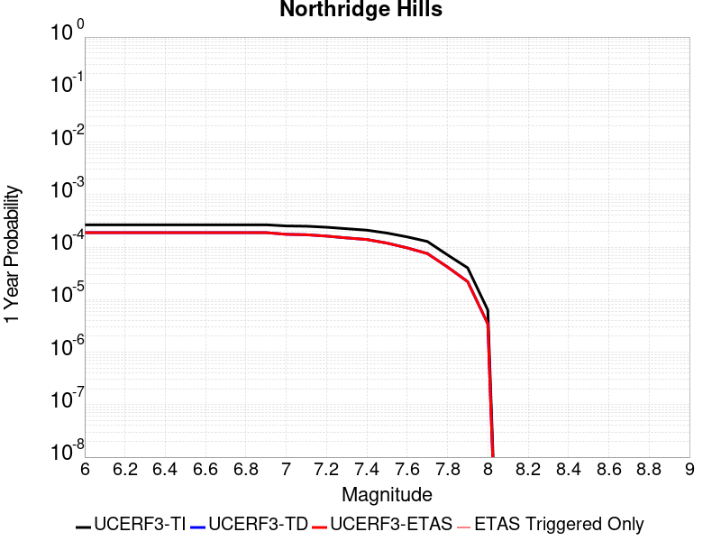 | 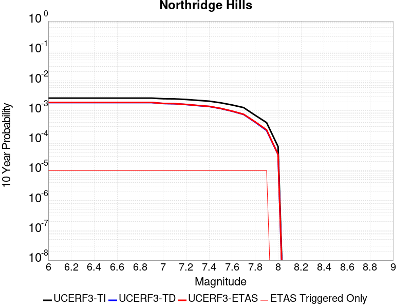 |

| Magnitude | 1 wk TI Prob | 1 wk TD Prob | 1 wk ETAS Prob | 1 wk ETAS/TD Gain | 1 wk ETAS Triggered Only | 1 mo TI Prob | 1 mo TD Prob | 1 mo ETAS Prob | 1 mo ETAS/TD Gain | 1 mo ETAS Triggered Only | 1 yr TI Prob | 1 yr TD Prob | 1 yr ETAS Prob | 1 yr ETAS/TD Gain | 1 yr ETAS Triggered Only | 10 yr TI Prob | 10 yr TD Prob | 10 yr ETAS Prob | 10 yr ETAS/TD Gain | 10 yr ETAS Triggered Only |
|-----|-----|-----|-----|-----|-----|-----|-----|-----|-----|-----|-----|-----|-----|-----|-----|-----|-----|-----|-----|-----|
| 6.0 | 5.095982E-6 | 3.6152098E-6 | 3.6152098E-6 | 1.0 | 0.0 | 2.183974E-5 | 1.5493664E-5 | 1.5493664E-5 | 1.0 | 0.0 | 2.658664E-4 | 1.8861916E-4 | 1.8861916E-4 | 1.0 | 0.0 | 0.0026554854 | 0.001884603 | 0.0019239796 | 1.0208938 | 3.9450842E-5 |
| 6.1 | 5.095982E-6 | 3.6152098E-6 | 3.6152098E-6 | 1.0 | 0.0 | 2.183974E-5 | 1.5493664E-5 | 1.5493664E-5 | 1.0 | 0.0 | 2.658664E-4 | 1.8861916E-4 | 1.8861916E-4 | 1.0 | 0.0 | 0.0026554854 | 0.001884603 | 0.0019239796 | 1.0208938 | 3.9450842E-5 |
| 6.2 | 5.095982E-6 | 3.6152098E-6 | 3.6152098E-6 | 1.0 | 0.0 | 2.183974E-5 | 1.5493664E-5 | 1.5493664E-5 | 1.0 | 0.0 | 2.658664E-4 | 1.8861916E-4 | 1.8861916E-4 | 1.0 | 0.0 | 0.0026554854 | 0.001884603 | 0.0019239796 | 1.0208938 | 3.9450842E-5 |
| 6.3 | 5.095982E-6 | 3.6152098E-6 | 3.6152098E-6 | 1.0 | 0.0 | 2.183974E-5 | 1.5493664E-5 | 1.5493664E-5 | 1.0 | 0.0 | 2.658664E-4 | 1.8861916E-4 | 1.8861916E-4 | 1.0 | 0.0 | 0.0026554854 | 0.001884603 | 0.0019239796 | 1.0208938 | 3.9450842E-5 |
| 6.4 | 5.095982E-6 | 3.6152098E-6 | 3.6152098E-6 | 1.0 | 0.0 | 2.183974E-5 | 1.5493664E-5 | 1.5493664E-5 | 1.0 | 0.0 | 2.658664E-4 | 1.8861916E-4 | 1.8861916E-4 | 1.0 | 0.0 | 0.0026554854 | 0.001884603 | 0.0019239796 | 1.0208938 | 3.9450842E-5 |
| 6.5 | 5.095982E-6 | 3.6152098E-6 | 3.6152098E-6 | 1.0 | 0.0 | 2.183974E-5 | 1.5493664E-5 | 1.5493664E-5 | 1.0 | 0.0 | 2.658664E-4 | 1.8861916E-4 | 1.8861916E-4 | 1.0 | 0.0 | 0.0026554854 | 0.001884603 | 0.0019239796 | 1.0208938 | 3.9450842E-5 |
| 6.6 | 5.095982E-6 | 3.6152098E-6 | 3.6152098E-6 | 1.0 | 0.0 | 2.183974E-5 | 1.5493664E-5 | 1.5493664E-5 | 1.0 | 0.0 | 2.658664E-4 | 1.8861916E-4 | 1.8861916E-4 | 1.0 | 0.0 | 0.0026554854 | 0.001884603 | 0.0019239796 | 1.0208938 | 3.9450842E-5 |
| 6.7 | 5.095982E-6 | 3.6152098E-6 | 3.6152098E-6 | 1.0 | 0.0 | 2.183974E-5 | 1.5493664E-5 | 1.5493664E-5 | 1.0 | 0.0 | 2.658664E-4 | 1.8861916E-4 | 1.8861916E-4 | 1.0 | 0.0 | 0.0026554854 | 0.001884603 | 0.0019239796 | 1.0208938 | 3.9450842E-5 |
| 6.8 | 5.095982E-6 | 3.6152098E-6 | 3.6152098E-6 | 1.0 | 0.0 | 2.183974E-5 | 1.5493664E-5 | 1.5493664E-5 | 1.0 | 0.0 | 2.658664E-4 | 1.8861916E-4 | 1.8861916E-4 | 1.0 | 0.0 | 0.0026554854 | 0.001884603 | 0.0019239796 | 1.0208938 | 3.9450842E-5 |
| 6.9 | 5.0942654E-6 | 3.6134247E-6 | 3.6134247E-6 | 1.0 | 0.0 | 2.1832384E-5 | 1.5486015E-5 | 1.5486015E-5 | 1.0 | 0.0 | 2.6577685E-4 | 1.8852603E-4 | 1.8852603E-4 | 1.0 | 0.0 | 0.002654592 | 0.0018836735 | 0.0019230499 | 1.0209041 | 3.9450842E-5 |
| 7.0 | 4.851143E-6 | 3.3587396E-6 | 3.3587396E-6 | 1.0 | 0.0 | 2.0790447E-5 | 1.4394519E-5 | 1.4394519E-5 | 1.0 | 0.0 | 2.5309427E-4 | 1.7523921E-4 | 1.7523921E-4 | 1.0 | 0.0 | 0.0025280623 | 0.0017510147 | 0.0017903965 | 1.0224909 | 3.9450842E-5 |
| 7.1 | 4.7910607E-6 | 3.2970208E-6 | 3.2970208E-6 | 1.0 | 0.0 | 2.0532956E-5 | 1.4130013E-5 | 1.4130013E-5 | 1.0 | 0.0 | 2.4996005E-4 | 1.7201937E-4 | 1.7201937E-4 | 1.0 | 0.0 | 0.0024967908 | 0.0017188663 | 0.0017582492 | 1.0229123 | 3.9450842E-5 |
| 7.2 | 4.580079E-6 | 3.1067987E-6 | 3.1067987E-6 | 1.0 | 0.0 | 1.9628762E-5 | 1.3314784E-5 | 1.3314784E-5 | 1.0 | 0.0 | 2.3895396E-4 | 1.6209547E-4 | 1.6209547E-4 | 1.0 | 0.0 | 0.0023869718 | 0.0016197758 | 0.0016591628 | 1.0243163 | 3.9450842E-5 |
| 7.3 | 4.290062E-6 | 2.8682275E-6 | 2.8682275E-6 | 1.0 | 0.0 | 1.838585E-5 | 1.2292346E-5 | 1.2292346E-5 | 1.0 | 0.0 | 2.2382473E-4 | 1.4964906E-4 | 1.4964906E-4 | 1.0 | 0.0 | 0.0022359942 | 0.0014954859 | 0.0015348777 | 1.0263405 | 3.9450842E-5 |
| 7.4 | 4.0259683E-6 | 2.673904E-6 | 2.673904E-6 | 1.0 | 0.0 | 1.7254037E-5 | 1.1459538E-5 | 1.1459538E-5 | 1.0 | 0.0 | 2.1004764E-4 | 1.3951097E-4 | 1.3951097E-4 | 1.0 | 0.0 | 0.002098492 | 0.0013942367 | 0.0014336326 | 1.0282562 | 3.9450842E-5 |
| 7.5 | 3.5477108E-6 | 2.285216E-6 | 2.285216E-6 | 1.0 | 0.0 | 1.5204386E-5 | 9.793746E-6 | 9.793746E-6 | 1.0 | 0.0 | 1.8509767E-4 | 1.1923235E-4 | 1.1923235E-4 | 1.0 | 0.0 | 0.0018494357 | 0.0011916853 | 0.0012310891 | 1.0330657 | 3.9450842E-5 |
| 7.6 | 2.9990608E-6 | 1.8528339E-6 | 1.8528339E-6 | 1.0 | 0.0 | 1.2853055E-5 | 7.940693E-6 | 7.940693E-6 | 1.0 | 0.0 | 1.564747E-4 | 9.667365E-5 | 9.667365E-5 | 1.0 | 0.0 | 0.0015636457 | 9.663168E-4 | 0.0010057295 | 1.0407865 | 3.9450842E-5 |
| 7.7 | 2.4542855E-6 | 1.4461344E-6 | 1.4461344E-6 | 1.0 | 0.0 | 1.05183235E-5 | 6.197704E-6 | 6.197704E-6 | 1.0 | 0.0 | 1.2805307E-4 | 7.545444E-5 | 7.545444E-5 | 1.0 | 0.0 | 0.001279793 | 7.5428875E-4 | 7.937099E-4 | 1.0522625 | 3.9450842E-5 |
| 7.8 | 1.3623128E-6 | 8.016168E-7 | 8.016168E-7 | 1.0 | 0.0 | 5.8384703E-6 | 3.4354962E-6 | 3.4354962E-6 | 1.0 | 0.0 | 7.108106E-5 | 4.1826366E-5 | 4.1826366E-5 | 1.0 | 0.0 | 7.1058323E-4 | 4.1818514E-4 | 4.576195E-4 | 1.0942987 | 3.9450842E-5 |
| 7.9 | 7.716622E-7 | 4.218757E-7 | 4.218757E-7 | 1.0 | 0.0 | 3.3071194E-6 | 1.8080375E-6 | 1.8080375E-6 | 1.0 | 0.0 | 4.0263436E-5 | 2.2012635E-5 | 2.2012635E-5 | 1.0 | 0.0 | 4.0256142E-4 | 2.2010466E-4 | 2.5954682E-4 | 1.1791973 | 3.9450842E-5 |
| 8.0 | 1.2117711E-7 | 6.6220565E-8 | 6.6220565E-8 | 1.0 | 0.0 | 5.1933034E-7 | 2.838024E-7 | 2.838024E-7 | 1.0 | 0.0 | 6.3228285E-6 | 3.4552888E-6 | 3.4552888E-6 | 1.0 | 0.0 | 6.3226486E-5 | 3.455237E-5 | 3.455237E-5 | 1.0 | 0.0 |

