# ComCat M7.1 (ci38457511), Mainshock Log10(k)=-2.3, ShakeMap Surfaces, Log10(k)=-3.03, p=1.15, c=0.002 Results

|   | ComCat M7.1 (ci38457511), Mainshock Log10(k)=-2.3, ShakeMap Surfaces, Log10(k)=-3.03, p=1.15, c=0.002 |
|-----|-----|
| Num Simulations | 7300 (incomplete) |
| Start Time | 2019/07/06 03:19:54 UTC |
| Start Time Epoch Milliseconds | 1562383194040 |
| Duration | 10 Years |
| Includes Spontaneous? | false |
| Trigger Ruptures | 269 Trigger Ruptures |
|   | First: M3.98 at 2019/07/04 17:02:55 UTC |
|   | Last: M7.1 at 2019/07/06 03:19:53 UTC |
|   | Largest: M7.1 at 2019/07/06 03:19:53 UTC |
| Historical Ruptures | *(none)* |
| Config Generated With | u3etas_comcat_event_config_builder.sh --event-id ci38457511 --num-simulations 100000 --days-before 7 --mag-complete 3.5 --etas-k -3.03 --etas-p 1.15 --etas-c 0.002 --mainshock-etas-k -2.3 --finite-surf-shakemap --finite-surf-shakemap-min-mag 5 --hpc-site USC_HPC --nodes 36 --hours 24 --queue scec |

## Table Of Contents

* [Probabilities Summary Table](#probabilities-summary-table)
* [Magnitude Number Distribution](#magnitude-number-distribution)
  * [10 Year Magnitude Number Distribution](#10-year-magnitude-number-distribution)
  * [1 Year Magnitude Number Distribution](#1-year-magnitude-number-distribution)
  * [1 Month Magnitude Number Distribution](#1-month-magnitude-number-distribution)
  * [1 Week Magnitude Number Distribution](#1-week-magnitude-number-distribution)
  * [1 Day Magnitude Number Distribution](#1-day-magnitude-number-distribution)
  * [1 Hour Magnitude Number Distribution](#1-hour-magnitude-number-distribution)
* [Hazard Change Over Time](#hazard-change-over-time)
  * [M&ge;5.0 Hazard Change Over Time](#m50-hazard-change-over-time)
  * [M&ge;6.0 Hazard Change Over Time](#m60-hazard-change-over-time)
  * [M&ge;7.0 Hazard Change Over Time](#m70-hazard-change-over-time)
  * [M&ge;8.0 Hazard Change Over Time](#m80-hazard-change-over-time)
* [Trigger Rupture Fault Map](#trigger-rupture-fault-map)
* [Trigger Rupture Depth Map](#trigger-rupture-depth-map)
* [Fault Distances To Triggers](#fault-distances-to-triggers)
* [Individual Simulated Catalog Maps](#individual-simulated-catalog-maps)
* [ComCat Data Comparisons](#comcat-data-comparisons)
  * [ComCat Magnitude-Number Distributions](#comcat-magnitude-number-distributions)
  * [ComCat Cumulative Number Vs Time](#comcat-cumulative-number-vs-time)
  * [ComCat Cumulative Number Simulation Percentiles](#comcat-cumulative-number-simulation-percentiles)
  * [ComCat Mean Spatial Distribution](#comcat-mean-spatial-distribution)
  * [ComCat Depth Distribution](#comcat-depth-distribution)
* [Section Participation](#section-participation)
  * [Section Participation Plots](#section-participation-plots)
  * [Supra-Seismogenic Parent Sections Table](#supra-seismogenic-parent-sections-table)
  * [M≥6.5 Parent Sections Table](#m65-parent-sections-table)
  * [M≥7 Parent Sections Table](#m7-parent-sections-table)
  * [M≥7.5 Parent Sections Table](#m75-parent-sections-table)
  * [M≥8 Parent Sections Table](#m8-parent-sections-table)
  * [Fault Magnitude-Probability Distributions](#fault-magnitude-probability-distributions)
* [Gridded Nucleation](#gridded-nucleation)
* [JSON Input File](#json-input-file)

## Probabilities Summary Table
*[(top)](#table-of-contents)*

| Magnitude | 1 Hour Prob | 1 Day Prob | 1 Week Prob | 1 Month Prob | 1 Year Prob | 10 Year Prob |
|-----|-----|-----|-----|-----|-----|-----|
| **M&ge;4** | 1.000 (100.00%) | 1.000 (100.00%) | 1.000 (100.00%) | 1.000 (100.00%) | 1.000 (100.00%) | 1.000 (100.00%) |
| **M&ge;4.5** | 1.000 (100.00%) | 1.000 (100.00%) | 1.000 (100.00%) | 1.000 (100.00%) | 1.000 (100.00%) | 1.000 (100.00%) |
| **M&ge;5** | 0.981 (98.08%) | 0.998 (99.82%) | 0.999 (99.92%) | 1.000 (99.96%) | 1.000 (99.99%) | 1.000 (99.99%) |
| **M&ge;5.5** | 0.687 (68.74%) | 0.860 (85.99%) | 0.905 (90.51%) | 0.924 (92.36%) | 0.943 (94.32%) | 0.954 (95.38%) |
| **M&ge;6** | 0.262 (26.22%) | 0.398 (39.81%) | 0.456 (45.64%) | 0.487 (48.68%) | 0.527 (52.73%) | 0.552 (55.23%) |
| **M&ge;6.5** | 0.065 (6.55%) | 0.105 (10.47%) | 0.122 (12.15%) | 0.132 (13.19%) | 0.147 (14.66%) | 0.154 (15.42%) |
| **M&ge;7** | 0.023 (2.26%) | 0.040 (3.97%) | 0.047 (4.74%) | 0.051 (5.14%) | 0.057 (5.70%) | 0.060 (5.96%) |
| **M&ge;7.1** | 0.019 (1.90%) | 0.034 (3.36%) | 0.039 (3.95%) | 0.043 (4.26%) | 0.048 (4.75%) | 0.050 (4.97%) |
| **M&ge;7.5** | 6.03E-3 (0.60%) | 0.012 (1.21%) | 0.014 (1.41%) | 0.016 (1.56%) | 0.018 (1.77%) | 0.019 (1.88%) |
| **M&ge;8** | 1.37E-4 (0.01%) | 2.74E-4 (0.03%) | 2.74E-4 (0.03%) | 2.74E-4 (0.03%) | 4.11E-4 (0.04%) | 4.11E-4 (0.04%) |

## Magnitude Number Distribution
*[(top)](#table-of-contents)*

### 10 Year Magnitude Number Distribution
*[(top)](#table-of-contents)*

**Legend**
* **Mean** (thick black line): mean expected number across all 7300 catalogs
* **2.5%,97.5%** (thin black lines): expected number percentiles across all 7300 catalogs
* **Median** (thin blue line): median expected number across all 7300 catalogs
* **Mode** (thin cyan line): modal expected number across all 7300 catalogs
* **10 yr Probability** (thin red line): 10 year probability calculated as the fraction of catalogs with at least 1 occurrence
* **10 yr Supraseismogenic Probability** (thin dashed red line): same as above, but only for supraseismogenic ruptures on explicitly modeled UCERF3 faults
* **95% Conf** (light red shaded region): binomial 95% confidence bounds on probability
* **Primary** (thin green line): mean expected number from primary triggered aftershocks only (no secondary, tertiary, etc...) across all 7300 catalogs


| Mag | Mean | 2.5 %ile | 97.5 %ile | Median | Mode | 10 yr Probability | 10 yr Supra-Seis Prob | Primary Aftershocks Mean |
|-----|-----|-----|-----|-----|-----|-----|-----|-----|
| **M&ge;2.5** | 3576.226 | 3280.000 | 4887.000 | 3478.000 | 3486.000 | 1.000 (100.00%) | 0.244 (24.44%) | 3031.572 |
| **M&ge;2.6** | 2840.546 | 2598.000 | 3888.000 | 2766.000 | 2743.000 | 1.000 (100.00%) | 0.244 (24.44%) | 2408.036 |
| **M&ge;2.7** | 2255.983 | 2053.000 | 3082.000 | 2197.000 | 2156.000 | 1.000 (100.00%) | 0.244 (24.44%) | 1912.499 |
| **M&ge;2.8** | 1791.481 | 1622.000 | 2454.000 | 1746.000 | 1754.000 | 1.000 (100.00%) | 0.244 (24.44%) | 1518.779 |
| **M&ge;2.9** | 1422.722 | 1282.000 | 1941.000 | 1387.000 | 1394.000 | 1.000 (100.00%) | 0.244 (24.44%) | 1206.207 |
| **M&ge;3** | 1130.000 | 1014.000 | 1545.000 | 1102.000 | 1080.000 | 1.000 (100.00%) | 0.244 (24.44%) | 958.131 |
| **M&ge;3.1** | 897.354 | 799.000 | 1221.000 | 876.000 | 855.000 | 1.000 (100.00%) | 0.244 (24.44%) | 760.769 |
| **M&ge;3.2** | 712.820 | 629.000 | 967.000 | 696.000 | 703.000 | 1.000 (100.00%) | 0.244 (24.44%) | 604.283 |
| **M&ge;3.3** | 566.074 | 494.000 | 771.000 | 553.000 | 548.000 | 1.000 (100.00%) | 0.244 (24.44%) | 479.963 |
| **M&ge;3.4** | 449.390 | 389.000 | 610.000 | 440.000 | 428.000 | 1.000 (100.00%) | 0.244 (24.44%) | 381.029 |
| **M&ge;3.5** | 356.794 | 305.000 | 490.000 | 349.000 | 347.000 | 1.000 (100.00%) | 0.244 (24.44%) | 302.554 |
| **M&ge;3.6** | 283.167 | 239.000 | 391.000 | 277.000 | 266.000 | 1.000 (100.00%) | 0.244 (24.44%) | 240.088 |
| **M&ge;3.7** | 224.775 | 186.000 | 309.000 | 220.000 | 216.000 | 1.000 (100.00%) | 0.244 (24.44%) | 190.582 |
| **M&ge;3.8** | 178.523 | 145.000 | 244.000 | 175.000 | 170.000 | 1.000 (100.00%) | 0.244 (24.44%) | 151.386 |
| **M&ge;3.9** | 141.618 | 112.000 | 194.000 | 139.000 | 137.000 | 1.000 (100.00%) | 0.244 (24.44%) | 120.102 |
| **M&ge;4** | 112.406 | 87.000 | 156.000 | 110.000 | 112.000 | 1.000 (100.00%) | 0.244 (24.44%) | 95.335 |
| **M&ge;4.1** | 89.214 | 67.000 | 126.000 | 87.000 | 88.000 | 1.000 (100.00%) | 0.244 (24.44%) | 75.662 |
| **M&ge;4.2** | 70.729 | 52.000 | 99.000 | 69.000 | 69.000 | 1.000 (100.00%) | 0.244 (24.44%) | 60.029 |
| **M&ge;4.3** | 56.096 | 40.000 | 80.000 | 55.000 | 53.000 | 1.000 (100.00%) | 0.244 (24.44%) | 47.609 |
| **M&ge;4.4** | 44.443 | 30.000 | 65.000 | 44.000 | 41.000 | 1.000 (100.00%) | 0.244 (24.44%) | 37.740 |
| **M&ge;4.5** | 35.233 | 23.000 | 53.000 | 35.000 | 33.000 | 1.000 (100.00%) | 0.244 (24.44%) | 29.918 |
| **M&ge;4.6** | 27.911 | 17.000 | 42.000 | 27.000 | 26.000 | 1.000 (100.00%) | 0.244 (24.44%) | 23.716 |
| **M&ge;4.7** | 22.079 | 13.000 | 34.000 | 22.000 | 21.000 | 1.000 (100.00%) | 0.244 (24.44%) | 18.771 |
| **M&ge;4.8** | 17.444 | 9.000 | 28.000 | 17.000 | 16.000 | 1.000 (100.00%) | 0.244 (24.44%) | 14.838 |
| **M&ge;4.9** | 13.777 | 7.000 | 23.000 | 13.000 | 12.000 | 1.000 (99.99%) | 0.244 (24.44%) | 11.728 |
| **M&ge;5** | 10.911 | 4.000 | 19.000 | 11.000 | 10.000 | 1.000 (99.99%) | 0.244 (24.44%) | 9.283 |
| **M&ge;5.1** | 8.581 | 3.000 | 16.000 | 8.000 | 7.000 | 1.000 (99.97%) | 0.244 (24.44%) | 7.308 |
| **M&ge;5.2** | 6.755 | 2.000 | 13.000 | 6.000 | 6.000 | 0.998 (99.81%) | 0.244 (24.44%) | 5.759 |
| **M&ge;5.3** | 5.296 | 1.000 | 11.000 | 5.000 | 5.000 | 0.992 (99.21%) | 0.244 (24.44%) | 4.515 |
| **M&ge;5.4** | 4.152 | 1.000 | 9.000 | 4.000 | 3.000 | 0.982 (98.25%) | 0.244 (24.44%) | 3.537 |
| **M&ge;5.5** | 3.213 | 0.000 | 7.000 | 3.000 | 3.000 | 0.954 (95.38%) | 0.244 (24.44%) | 2.738 |
| **M&ge;5.6** | 2.505 | 0.000 | 6.000 | 2.000 | 2.000 | 0.909 (90.95%) | 0.244 (24.44%) | 2.130 |
| **M&ge;5.7** | 1.928 | 0.000 | 5.000 | 2.000 | 1.000 | 0.848 (84.82%) | 0.244 (24.44%) | 1.634 |
| **M&ge;5.8** | 1.461 | 0.000 | 4.000 | 1.000 | 1.000 | 0.757 (75.74%) | 0.244 (24.44%) | 1.242 |
| **M&ge;5.9** | 1.089 | 0.000 | 4.000 | 1.000 | 0.000 | 0.647 (64.73%) | 0.244 (24.44%) | 0.925 |
| **M&ge;6** | 0.830 | 0.000 | 3.000 | 1.000 | 0.000 | 0.552 (55.23%) | 0.244 (24.42%) | 0.704 |
| **M&ge;6.1** | 0.606 | 0.000 | 3.000 | 0.000 | 0.000 | 0.445 (44.49%) | 0.216 (21.63%) | 0.513 |
| **M&ge;6.2** | 0.388 | 0.000 | 2.000 | 0.000 | 0.000 | 0.316 (31.63%) | 0.167 (16.74%) | 0.330 |
| **M&ge;6.3** | 0.290 | 0.000 | 2.000 | 0.000 | 0.000 | 0.247 (24.71%) | 0.139 (13.95%) | 0.248 |
| **M&ge;6.4** | 0.218 | 0.000 | 1.000 | 0.000 | 0.000 | 0.191 (19.05%) | 0.118 (11.85%) | 0.186 |
| **M&ge;6.5** | 0.173 | 0.000 | 1.000 | 0.000 | 0.000 | 0.154 (15.42%) | 0.105 (10.49%) | 0.149 |
| **M&ge;6.6** | 0.148 | 0.000 | 1.000 | 0.000 | 0.000 | 0.136 (13.58%) | 0.100 (10.03%) | 0.130 |
| **M&ge;6.7** | 0.124 | 0.000 | 1.000 | 0.000 | 0.000 | 0.115 (11.49%) | 0.089 (8.93%) | 0.110 |
| **M&ge;6.8** | 0.102 | 0.000 | 1.000 | 0.000 | 0.000 | 0.096 (9.62%) | 0.077 (7.66%) | 0.091 |
| **M&ge;6.9** | 0.081 | 0.000 | 1.000 | 0.000 | 0.000 | 0.077 (7.74%) | 0.065 (6.55%) | 0.072 |
| **M&ge;7** | 0.061 | 0.000 | 1.000 | 0.000 | 0.000 | 0.060 (5.96%) | 0.052 (5.15%) | 0.055 |
| **M&ge;7.1** | 0.051 | 0.000 | 1.000 | 0.000 | 0.000 | 0.050 (4.97%) | 0.045 (4.52%) | 0.045 |
| **M&ge;7.2** | 0.041 | 0.000 | 1.000 | 0.000 | 0.000 | 0.040 (4.03%) | 0.038 (3.77%) | 0.036 |
| **M&ge;7.3** | 0.027 | 0.000 | 1.000 | 0.000 | 0.000 | 0.027 (2.73%) | 0.026 (2.64%) | 0.025 |
| **M&ge;7.4** | 0.025 | 0.000 | 0.000 | 0.000 | 0.000 | 0.025 (2.49%) | 0.025 (2.45%) | 0.022 |
| **M&ge;7.5** | 0.019 | 0.000 | 0.000 | 0.000 | 0.000 | 0.019 (1.88%) | 0.019 (1.86%) | 0.017 |
| **M&ge;7.6** | 0.011 | 0.000 | 0.000 | 0.000 | 0.000 | 0.011 (1.08%) | 0.011 (1.08%) | 9.32E-3 |
| **M&ge;7.7** | 3.70E-3 | 0.000 | 0.000 | 0.000 | 0.000 | 3.70E-3 (0.37%) | 3.70E-3 (0.37%) | 3.01E-3 |
| **M&ge;7.8** | 2.47E-3 | 0.000 | 0.000 | 0.000 | 0.000 | 2.47E-3 (0.25%) | 2.47E-3 (0.25%) | 2.19E-3 |
| **M&ge;7.9** | 1.78E-3 | 0.000 | 0.000 | 0.000 | 0.000 | 1.78E-3 (0.18%) | 1.78E-3 (0.18%) | 1.51E-3 |
| **M&ge;8** | 4.11E-4 | 0.000 | 0.000 | 0.000 | 0.000 | 4.11E-4 (0.04%) | 4.11E-4 (0.04%) | 4.11E-4 |
| **M&ge;8.1** | 1.37E-4 | 0.000 | 0.000 | 0.000 | 0.000 | 1.37E-4 (0.01%) | 1.37E-4 (0.01%) | 1.37E-4 |
| **M&ge;8.2** | 0.000 | 0.000 | 0.000 | 0.000 | 0.000 | 0.000 (0.00%) | 0.000 (0.00%) | 0.000 |
| **M&ge;8.3** | 0.000 | 0.000 | 0.000 | 0.000 | 0.000 | 0.000 (0.00%) | 0.000 (0.00%) | 0.000 |
| **M&ge;8.4** | 0.000 | 0.000 | 0.000 | 0.000 | 0.000 | 0.000 (0.00%) | 0.000 (0.00%) | 0.000 |
| **M&ge;8.5** | 0.000 | 0.000 | 0.000 | 0.000 | 0.000 | 0.000 (0.00%) | 0.000 (0.00%) | 0.000 |
| **M&ge;8.6** | 0.000 | 0.000 | 0.000 | 0.000 | 0.000 | 0.000 (0.00%) | 0.000 (0.00%) | 0.000 |
| **M&ge;8.7** | 0.000 | 0.000 | 0.000 | 0.000 | 0.000 | 0.000 (0.00%) | 0.000 (0.00%) | 0.000 |
| **M&ge;8.8** | 0.000 | 0.000 | 0.000 | 0.000 | 0.000 | 0.000 (0.00%) | 0.000 (0.00%) | 0.000 |
| **M&ge;8.9** | 0.000 | 0.000 | 0.000 | 0.000 | 0.000 | 0.000 (0.00%) | 0.000 (0.00%) | 0.000 |
| **M&ge;9** | 0.000 | 0.000 | 0.000 | 0.000 | 0.000 | 0.000 (0.00%) | 0.000 (0.00%) | 0.000 |

### 1 Year Magnitude Number Distribution
*[(top)](#table-of-contents)*

**Legend**
* **Mean** (thick black line): mean expected number across all 7300 catalogs
* **2.5%,97.5%** (thin black lines): expected number percentiles across all 7300 catalogs
* **Median** (thin blue line): median expected number across all 7300 catalogs
* **Mode** (thin cyan line): modal expected number across all 7300 catalogs
* **1 yr Probability** (thin red line): 1 year probability calculated as the fraction of catalogs with at least 1 occurrence
* **1 yr Supraseismogenic Probability** (thin dashed red line): same as above, but only for supraseismogenic ruptures on explicitly modeled UCERF3 faults
* **95% Conf** (light red shaded region): binomial 95% confidence bounds on probability
* **Primary** (thin green line): mean expected number from primary triggered aftershocks only (no secondary, tertiary, etc...) across all 7300 catalogs


| Mag | Mean | 2.5 %ile | 97.5 %ile | Median | Mode | 1 yr Probability | 1 yr Supra-Seis Prob | Primary Aftershocks Mean |
|-----|-----|-----|-----|-----|-----|-----|-----|-----|
| **M&ge;2.5** | 3345.817 | 3074.000 | 4478.000 | 3258.000 | 3270.000 | 1.000 (100.00%) | 0.232 (23.21%) | 2863.169 |
| **M&ge;2.6** | 2657.571 | 2433.000 | 3550.000 | 2590.000 | 2554.000 | 1.000 (100.00%) | 0.232 (23.21%) | 2274.321 |
| **M&ge;2.7** | 2110.646 | 1922.000 | 2829.000 | 2058.000 | 2022.000 | 1.000 (100.00%) | 0.232 (23.21%) | 1806.253 |
| **M&ge;2.8** | 1676.093 | 1519.000 | 2260.000 | 1635.000 | 1623.000 | 1.000 (100.00%) | 0.232 (23.21%) | 1434.396 |
| **M&ge;2.9** | 1331.063 | 1201.000 | 1772.000 | 1299.000 | 1285.000 | 1.000 (100.00%) | 0.232 (23.21%) | 1139.159 |
| **M&ge;3** | 1057.216 | 948.000 | 1409.000 | 1033.000 | 1009.000 | 1.000 (100.00%) | 0.232 (23.21%) | 904.869 |
| **M&ge;3.1** | 839.508 | 747.000 | 1122.000 | 820.000 | 804.000 | 1.000 (100.00%) | 0.232 (23.21%) | 718.465 |
| **M&ge;3.2** | 666.916 | 589.000 | 894.000 | 652.000 | 637.000 | 1.000 (100.00%) | 0.232 (23.21%) | 570.710 |
| **M&ge;3.3** | 529.681 | 463.000 | 712.000 | 519.000 | 510.000 | 1.000 (100.00%) | 0.232 (23.21%) | 453.333 |
| **M&ge;3.4** | 420.476 | 364.000 | 562.000 | 412.000 | 404.000 | 1.000 (100.00%) | 0.232 (23.21%) | 359.872 |
| **M&ge;3.5** | 333.845 | 285.000 | 451.000 | 327.000 | 317.000 | 1.000 (100.00%) | 0.232 (23.21%) | 285.770 |
| **M&ge;3.6** | 264.944 | 223.000 | 357.000 | 259.000 | 259.000 | 1.000 (100.00%) | 0.232 (23.21%) | 226.751 |
| **M&ge;3.7** | 210.274 | 174.000 | 284.000 | 206.000 | 200.000 | 1.000 (100.00%) | 0.232 (23.21%) | 179.962 |
| **M&ge;3.8** | 167.028 | 135.000 | 227.000 | 164.000 | 162.000 | 1.000 (100.00%) | 0.232 (23.21%) | 142.975 |
| **M&ge;3.9** | 132.524 | 105.000 | 181.000 | 130.000 | 131.000 | 1.000 (100.00%) | 0.232 (23.21%) | 113.444 |
| **M&ge;4** | 105.180 | 81.000 | 144.000 | 103.000 | 103.000 | 1.000 (100.00%) | 0.232 (23.21%) | 90.045 |
| **M&ge;4.1** | 83.486 | 63.000 | 117.000 | 82.000 | 79.000 | 1.000 (100.00%) | 0.232 (23.21%) | 71.472 |
| **M&ge;4.2** | 66.187 | 48.000 | 92.000 | 65.000 | 65.000 | 1.000 (100.00%) | 0.232 (23.21%) | 56.708 |
| **M&ge;4.3** | 52.494 | 37.000 | 75.000 | 52.000 | 52.000 | 1.000 (100.00%) | 0.232 (23.21%) | 44.978 |
| **M&ge;4.4** | 41.577 | 28.000 | 61.000 | 41.000 | 39.000 | 1.000 (100.00%) | 0.232 (23.21%) | 35.642 |
| **M&ge;4.5** | 32.968 | 21.000 | 49.000 | 32.000 | 31.000 | 1.000 (100.00%) | 0.232 (23.21%) | 28.262 |
| **M&ge;4.6** | 26.115 | 16.000 | 40.000 | 26.000 | 25.000 | 1.000 (100.00%) | 0.232 (23.21%) | 22.402 |
| **M&ge;4.7** | 20.656 | 12.000 | 32.000 | 20.000 | 20.000 | 1.000 (100.00%) | 0.232 (23.21%) | 17.728 |
| **M&ge;4.8** | 16.314 | 8.000 | 27.000 | 16.000 | 16.000 | 1.000 (100.00%) | 0.232 (23.21%) | 14.014 |
| **M&ge;4.9** | 12.878 | 6.000 | 22.000 | 13.000 | 12.000 | 1.000 (99.99%) | 0.232 (23.21%) | 11.069 |
| **M&ge;5** | 10.207 | 4.000 | 18.000 | 10.000 | 9.000 | 1.000 (99.99%) | 0.232 (23.21%) | 8.767 |
| **M&ge;5.1** | 8.021 | 3.000 | 15.000 | 8.000 | 7.000 | 0.999 (99.95%) | 0.232 (23.21%) | 6.893 |
| **M&ge;5.2** | 6.312 | 2.000 | 12.000 | 6.000 | 6.000 | 0.997 (99.71%) | 0.232 (23.21%) | 5.431 |
| **M&ge;5.3** | 4.942 | 1.000 | 10.000 | 5.000 | 4.000 | 0.989 (98.95%) | 0.232 (23.21%) | 4.254 |
| **M&ge;5.4** | 3.877 | 1.000 | 9.000 | 4.000 | 3.000 | 0.976 (97.63%) | 0.232 (23.21%) | 3.334 |
| **M&ge;5.5** | 2.997 | 0.000 | 7.000 | 3.000 | 2.000 | 0.943 (94.32%) | 0.232 (23.21%) | 2.579 |
| **M&ge;5.6** | 2.338 | 0.000 | 6.000 | 2.000 | 2.000 | 0.894 (89.36%) | 0.232 (23.21%) | 2.007 |
| **M&ge;5.7** | 1.802 | 0.000 | 5.000 | 2.000 | 1.000 | 0.829 (82.88%) | 0.232 (23.21%) | 1.542 |
| **M&ge;5.8** | 1.364 | 0.000 | 4.000 | 1.000 | 1.000 | 0.734 (73.44%) | 0.232 (23.21%) | 1.171 |
| **M&ge;5.9** | 1.017 | 0.000 | 3.000 | 1.000 | 0.000 | 0.623 (62.27%) | 0.232 (23.21%) | 0.872 |
| **M&ge;6** | 0.774 | 0.000 | 3.000 | 1.000 | 0.000 | 0.527 (52.73%) | 0.232 (23.19%) | 0.662 |
| **M&ge;6.1** | 0.565 | 0.000 | 2.000 | 0.000 | 0.000 | 0.424 (42.36%) | 0.205 (20.55%) | 0.484 |
| **M&ge;6.2** | 0.362 | 0.000 | 2.000 | 0.000 | 0.000 | 0.300 (29.97%) | 0.159 (15.86%) | 0.311 |
| **M&ge;6.3** | 0.272 | 0.000 | 2.000 | 0.000 | 0.000 | 0.235 (23.45%) | 0.133 (13.32%) | 0.235 |
| **M&ge;6.4** | 0.205 | 0.000 | 1.000 | 0.000 | 0.000 | 0.182 (18.15%) | 0.113 (11.27%) | 0.177 |
| **M&ge;6.5** | 0.163 | 0.000 | 1.000 | 0.000 | 0.000 | 0.147 (14.66%) | 0.100 (10.03%) | 0.142 |
| **M&ge;6.6** | 0.141 | 0.000 | 1.000 | 0.000 | 0.000 | 0.129 (12.93%) | 0.096 (9.60%) | 0.124 |
| **M&ge;6.7** | 0.117 | 0.000 | 1.000 | 0.000 | 0.000 | 0.109 (10.95%) | 0.085 (8.53%) | 0.104 |
| **M&ge;6.8** | 0.097 | 0.000 | 1.000 | 0.000 | 0.000 | 0.092 (9.21%) | 0.073 (7.33%) | 0.087 |
| **M&ge;6.9** | 0.077 | 0.000 | 1.000 | 0.000 | 0.000 | 0.074 (7.41%) | 0.063 (6.27%) | 0.069 |
| **M&ge;7** | 0.058 | 0.000 | 1.000 | 0.000 | 0.000 | 0.057 (5.70%) | 0.049 (4.95%) | 0.052 |
| **M&ge;7.1** | 0.048 | 0.000 | 1.000 | 0.000 | 0.000 | 0.048 (4.75%) | 0.043 (4.33%) | 0.043 |
| **M&ge;7.2** | 0.038 | 0.000 | 1.000 | 0.000 | 0.000 | 0.038 (3.81%) | 0.036 (3.58%) | 0.034 |
| **M&ge;7.3** | 0.026 | 0.000 | 1.000 | 0.000 | 0.000 | 0.026 (2.58%) | 0.025 (2.49%) | 0.023 |
| **M&ge;7.4** | 0.024 | 0.000 | 0.000 | 0.000 | 0.000 | 0.024 (2.38%) | 0.023 (2.34%) | 0.022 |
| **M&ge;7.5** | 0.018 | 0.000 | 0.000 | 0.000 | 0.000 | 0.018 (1.77%) | 0.018 (1.75%) | 0.016 |
| **M&ge;7.6** | 0.010 | 0.000 | 0.000 | 0.000 | 0.000 | 0.010 (1.03%) | 0.010 (1.03%) | 8.77E-3 |
| **M&ge;7.7** | 3.56E-3 | 0.000 | 0.000 | 0.000 | 0.000 | 3.56E-3 (0.36%) | 3.56E-3 (0.36%) | 2.88E-3 |
| **M&ge;7.8** | 2.33E-3 | 0.000 | 0.000 | 0.000 | 0.000 | 2.33E-3 (0.23%) | 2.33E-3 (0.23%) | 2.05E-3 |
| **M&ge;7.9** | 1.64E-3 | 0.000 | 0.000 | 0.000 | 0.000 | 1.64E-3 (0.16%) | 1.64E-3 (0.16%) | 1.37E-3 |
| **M&ge;8** | 4.11E-4 | 0.000 | 0.000 | 0.000 | 0.000 | 4.11E-4 (0.04%) | 4.11E-4 (0.04%) | 4.11E-4 |
| **M&ge;8.1** | 1.37E-4 | 0.000 | 0.000 | 0.000 | 0.000 | 1.37E-4 (0.01%) | 1.37E-4 (0.01%) | 1.37E-4 |
| **M&ge;8.2** | 0.000 | 0.000 | 0.000 | 0.000 | 0.000 | 0.000 (0.00%) | 0.000 (0.00%) | 0.000 |
| **M&ge;8.3** | 0.000 | 0.000 | 0.000 | 0.000 | 0.000 | 0.000 (0.00%) | 0.000 (0.00%) | 0.000 |
| **M&ge;8.4** | 0.000 | 0.000 | 0.000 | 0.000 | 0.000 | 0.000 (0.00%) | 0.000 (0.00%) | 0.000 |
| **M&ge;8.5** | 0.000 | 0.000 | 0.000 | 0.000 | 0.000 | 0.000 (0.00%) | 0.000 (0.00%) | 0.000 |
| **M&ge;8.6** | 0.000 | 0.000 | 0.000 | 0.000 | 0.000 | 0.000 (0.00%) | 0.000 (0.00%) | 0.000 |
| **M&ge;8.7** | 0.000 | 0.000 | 0.000 | 0.000 | 0.000 | 0.000 (0.00%) | 0.000 (0.00%) | 0.000 |
| **M&ge;8.8** | 0.000 | 0.000 | 0.000 | 0.000 | 0.000 | 0.000 (0.00%) | 0.000 (0.00%) | 0.000 |
| **M&ge;8.9** | 0.000 | 0.000 | 0.000 | 0.000 | 0.000 | 0.000 (0.00%) | 0.000 (0.00%) | 0.000 |
| **M&ge;9** | 0.000 | 0.000 | 0.000 | 0.000 | 0.000 | 0.000 (0.00%) | 0.000 (0.00%) | 0.000 |

### 1 Month Magnitude Number Distribution
*[(top)](#table-of-contents)*

**Legend**
* **Mean** (thick black line): mean expected number across all 7300 catalogs
* **2.5%,97.5%** (thin black lines): expected number percentiles across all 7300 catalogs
* **Median** (thin blue line): median expected number across all 7300 catalogs
* **Mode** (thin cyan line): modal expected number across all 7300 catalogs
* **1 mo Probability** (thin red line): 1 month probability calculated as the fraction of catalogs with at least 1 occurrence
* **1 mo Supraseismogenic Probability** (thin dashed red line): same as above, but only for supraseismogenic ruptures on explicitly modeled UCERF3 faults
* **95% Conf** (light red shaded region): binomial 95% confidence bounds on probability
* **Primary** (thin green line): mean expected number from primary triggered aftershocks only (no secondary, tertiary, etc...) across all 7300 catalogs


| Mag | Mean | 2.5 %ile | 97.5 %ile | Median | Mode | 1 mo Probability | 1 mo Supra-Seis Prob | Primary Aftershocks Mean |
|-----|-----|-----|-----|-----|-----|-----|-----|-----|
| **M&ge;2.5** | 2992.943 | 2760.000 | 3848.000 | 2922.000 | 2910.000 | 1.000 (100.00%) | 0.209 (20.92%) | 2600.997 |
| **M&ge;2.6** | 2377.243 | 2184.000 | 3068.000 | 2322.000 | 2315.000 | 1.000 (100.00%) | 0.209 (20.92%) | 2066.005 |
| **M&ge;2.7** | 1887.997 | 1725.000 | 2444.000 | 1846.000 | 1859.000 | 1.000 (100.00%) | 0.209 (20.92%) | 1640.742 |
| **M&ge;2.8** | 1499.282 | 1364.000 | 1938.000 | 1466.000 | 1437.000 | 1.000 (100.00%) | 0.209 (20.92%) | 1302.883 |
| **M&ge;2.9** | 1190.602 | 1077.000 | 1537.000 | 1165.000 | 1164.000 | 1.000 (100.00%) | 0.209 (20.92%) | 1034.693 |
| **M&ge;3** | 945.704 | 849.000 | 1227.000 | 926.000 | 917.000 | 1.000 (100.00%) | 0.209 (20.92%) | 821.931 |
| **M&ge;3.1** | 750.988 | 670.000 | 980.000 | 735.000 | 728.000 | 1.000 (100.00%) | 0.209 (20.92%) | 652.624 |
| **M&ge;3.2** | 596.563 | 527.000 | 782.000 | 584.000 | 579.000 | 1.000 (100.00%) | 0.209 (20.92%) | 518.403 |
| **M&ge;3.3** | 473.719 | 414.000 | 622.000 | 465.000 | 457.000 | 1.000 (100.00%) | 0.209 (20.92%) | 411.699 |
| **M&ge;3.4** | 376.077 | 326.000 | 494.000 | 369.000 | 362.000 | 1.000 (100.00%) | 0.209 (20.92%) | 326.836 |
| **M&ge;3.5** | 298.538 | 254.000 | 392.000 | 293.000 | 288.000 | 1.000 (100.00%) | 0.209 (20.92%) | 259.504 |
| **M&ge;3.6** | 236.937 | 199.000 | 313.000 | 233.000 | 229.000 | 1.000 (100.00%) | 0.209 (20.92%) | 205.918 |
| **M&ge;3.7** | 188.040 | 154.000 | 249.000 | 185.000 | 177.000 | 1.000 (100.00%) | 0.209 (20.92%) | 163.403 |
| **M&ge;3.8** | 149.369 | 120.000 | 198.000 | 147.000 | 146.000 | 1.000 (100.00%) | 0.209 (20.92%) | 129.817 |
| **M&ge;3.9** | 118.532 | 93.000 | 157.000 | 117.000 | 113.000 | 1.000 (100.00%) | 0.209 (20.92%) | 103.028 |
| **M&ge;4** | 94.076 | 72.000 | 127.000 | 92.000 | 92.000 | 1.000 (100.00%) | 0.209 (20.92%) | 81.769 |
| **M&ge;4.1** | 74.693 | 55.000 | 103.000 | 73.000 | 72.000 | 1.000 (100.00%) | 0.209 (20.92%) | 64.915 |
| **M&ge;4.2** | 59.212 | 42.000 | 82.000 | 58.000 | 58.000 | 1.000 (100.00%) | 0.209 (20.92%) | 51.513 |
| **M&ge;4.3** | 46.944 | 32.000 | 66.000 | 46.000 | 46.000 | 1.000 (100.00%) | 0.209 (20.92%) | 40.843 |
| **M&ge;4.4** | 37.169 | 25.000 | 54.000 | 37.000 | 38.000 | 1.000 (100.00%) | 0.209 (20.92%) | 32.349 |
| **M&ge;4.5** | 29.486 | 19.000 | 44.000 | 29.000 | 29.000 | 1.000 (100.00%) | 0.209 (20.92%) | 25.668 |
| **M&ge;4.6** | 23.344 | 14.000 | 36.000 | 23.000 | 23.000 | 1.000 (100.00%) | 0.209 (20.92%) | 20.337 |
| **M&ge;4.7** | 18.471 | 10.000 | 29.000 | 18.000 | 17.000 | 1.000 (100.00%) | 0.209 (20.92%) | 16.099 |
| **M&ge;4.8** | 14.586 | 7.000 | 24.000 | 14.000 | 14.000 | 1.000 (100.00%) | 0.209 (20.92%) | 12.723 |
| **M&ge;4.9** | 11.512 | 5.000 | 20.000 | 11.000 | 11.000 | 1.000 (99.99%) | 0.209 (20.92%) | 10.049 |
| **M&ge;5** | 9.130 | 3.000 | 16.000 | 9.000 | 8.000 | 1.000 (99.96%) | 0.209 (20.92%) | 7.967 |
| **M&ge;5.1** | 7.171 | 2.000 | 14.000 | 7.000 | 7.000 | 0.999 (99.89%) | 0.209 (20.92%) | 6.261 |
| **M&ge;5.2** | 5.643 | 1.000 | 11.000 | 5.000 | 5.000 | 0.995 (99.49%) | 0.209 (20.92%) | 4.934 |
| **M&ge;5.3** | 4.428 | 1.000 | 9.000 | 4.000 | 4.000 | 0.984 (98.37%) | 0.209 (20.92%) | 3.876 |
| **M&ge;5.4** | 3.469 | 0.000 | 8.000 | 3.000 | 3.000 | 0.965 (96.51%) | 0.209 (20.92%) | 3.034 |
| **M&ge;5.5** | 2.685 | 0.000 | 7.000 | 2.000 | 2.000 | 0.924 (92.36%) | 0.209 (20.92%) | 2.350 |
| **M&ge;5.6** | 2.094 | 0.000 | 6.000 | 2.000 | 2.000 | 0.866 (86.60%) | 0.209 (20.92%) | 1.830 |
| **M&ge;5.7** | 1.610 | 0.000 | 5.000 | 1.000 | 1.000 | 0.792 (79.18%) | 0.209 (20.92%) | 1.404 |
| **M&ge;5.8** | 1.219 | 0.000 | 4.000 | 1.000 | 1.000 | 0.695 (69.49%) | 0.209 (20.92%) | 1.067 |
| **M&ge;5.9** | 0.909 | 0.000 | 3.000 | 1.000 | 0.000 | 0.582 (58.19%) | 0.209 (20.92%) | 0.794 |
| **M&ge;6** | 0.689 | 0.000 | 3.000 | 0.000 | 0.000 | 0.487 (48.68%) | 0.209 (20.90%) | 0.602 |
| **M&ge;6.1** | 0.504 | 0.000 | 2.000 | 0.000 | 0.000 | 0.389 (38.86%) | 0.185 (18.55%) | 0.440 |
| **M&ge;6.2** | 0.323 | 0.000 | 2.000 | 0.000 | 0.000 | 0.272 (27.18%) | 0.142 (14.25%) | 0.284 |
| **M&ge;6.3** | 0.243 | 0.000 | 2.000 | 0.000 | 0.000 | 0.213 (21.30%) | 0.120 (11.99%) | 0.214 |
| **M&ge;6.4** | 0.183 | 0.000 | 1.000 | 0.000 | 0.000 | 0.164 (16.38%) | 0.102 (10.19%) | 0.161 |
| **M&ge;6.5** | 0.146 | 0.000 | 1.000 | 0.000 | 0.000 | 0.132 (13.19%) | 0.091 (9.14%) | 0.129 |
| **M&ge;6.6** | 0.126 | 0.000 | 1.000 | 0.000 | 0.000 | 0.116 (11.63%) | 0.088 (8.77%) | 0.113 |
| **M&ge;6.7** | 0.106 | 0.000 | 1.000 | 0.000 | 0.000 | 0.099 (9.93%) | 0.078 (7.77%) | 0.096 |
| **M&ge;6.8** | 0.088 | 0.000 | 1.000 | 0.000 | 0.000 | 0.083 (8.34%) | 0.067 (6.66%) | 0.080 |
| **M&ge;6.9** | 0.069 | 0.000 | 1.000 | 0.000 | 0.000 | 0.066 (6.63%) | 0.056 (5.64%) | 0.063 |
| **M&ge;7** | 0.053 | 0.000 | 1.000 | 0.000 | 0.000 | 0.051 (5.14%) | 0.045 (4.48%) | 0.048 |
| **M&ge;7.1** | 0.043 | 0.000 | 1.000 | 0.000 | 0.000 | 0.043 (4.26%) | 0.039 (3.92%) | 0.039 |
| **M&ge;7.2** | 0.035 | 0.000 | 1.000 | 0.000 | 0.000 | 0.034 (3.42%) | 0.032 (3.22%) | 0.032 |
| **M&ge;7.3** | 0.023 | 0.000 | 0.000 | 0.000 | 0.000 | 0.023 (2.33%) | 0.023 (2.26%) | 0.021 |
| **M&ge;7.4** | 0.022 | 0.000 | 0.000 | 0.000 | 0.000 | 0.022 (2.15%) | 0.021 (2.12%) | 0.020 |
| **M&ge;7.5** | 0.016 | 0.000 | 0.000 | 0.000 | 0.000 | 0.016 (1.56%) | 0.015 (1.55%) | 0.014 |
| **M&ge;7.6** | 8.77E-3 | 0.000 | 0.000 | 0.000 | 0.000 | 8.77E-3 (0.88%) | 8.77E-3 (0.88%) | 7.67E-3 |
| **M&ge;7.7** | 3.01E-3 | 0.000 | 0.000 | 0.000 | 0.000 | 3.01E-3 (0.30%) | 3.01E-3 (0.30%) | 2.33E-3 |
| **M&ge;7.8** | 1.78E-3 | 0.000 | 0.000 | 0.000 | 0.000 | 1.78E-3 (0.18%) | 1.78E-3 (0.18%) | 1.51E-3 |
| **M&ge;7.9** | 1.37E-3 | 0.000 | 0.000 | 0.000 | 0.000 | 1.37E-3 (0.14%) | 1.37E-3 (0.14%) | 1.10E-3 |
| **M&ge;8** | 2.74E-4 | 0.000 | 0.000 | 0.000 | 0.000 | 2.74E-4 (0.03%) | 2.74E-4 (0.03%) | 2.74E-4 |
| **M&ge;8.1** | 1.37E-4 | 0.000 | 0.000 | 0.000 | 0.000 | 1.37E-4 (0.01%) | 1.37E-4 (0.01%) | 1.37E-4 |
| **M&ge;8.2** | 0.000 | 0.000 | 0.000 | 0.000 | 0.000 | 0.000 (0.00%) | 0.000 (0.00%) | 0.000 |
| **M&ge;8.3** | 0.000 | 0.000 | 0.000 | 0.000 | 0.000 | 0.000 (0.00%) | 0.000 (0.00%) | 0.000 |
| **M&ge;8.4** | 0.000 | 0.000 | 0.000 | 0.000 | 0.000 | 0.000 (0.00%) | 0.000 (0.00%) | 0.000 |
| **M&ge;8.5** | 0.000 | 0.000 | 0.000 | 0.000 | 0.000 | 0.000 (0.00%) | 0.000 (0.00%) | 0.000 |
| **M&ge;8.6** | 0.000 | 0.000 | 0.000 | 0.000 | 0.000 | 0.000 (0.00%) | 0.000 (0.00%) | 0.000 |
| **M&ge;8.7** | 0.000 | 0.000 | 0.000 | 0.000 | 0.000 | 0.000 (0.00%) | 0.000 (0.00%) | 0.000 |
| **M&ge;8.8** | 0.000 | 0.000 | 0.000 | 0.000 | 0.000 | 0.000 (0.00%) | 0.000 (0.00%) | 0.000 |
| **M&ge;8.9** | 0.000 | 0.000 | 0.000 | 0.000 | 0.000 | 0.000 (0.00%) | 0.000 (0.00%) | 0.000 |
| **M&ge;9** | 0.000 | 0.000 | 0.000 | 0.000 | 0.000 | 0.000 (0.00%) | 0.000 (0.00%) | 0.000 |

### 1 Week Magnitude Number Distribution
*[(top)](#table-of-contents)*

**Legend**
* **Mean** (thick black line): mean expected number across all 7300 catalogs
* **2.5%,97.5%** (thin black lines): expected number percentiles across all 7300 catalogs
* **Median** (thin blue line): median expected number across all 7300 catalogs
* **Mode** (thin cyan line): modal expected number across all 7300 catalogs
* **1 wk Probability** (thin red line): 1 week probability calculated as the fraction of catalogs with at least 1 occurrence
* **1 wk Supraseismogenic Probability** (thin dashed red line): same as above, but only for supraseismogenic ruptures on explicitly modeled UCERF3 faults
* **95% Conf** (light red shaded region): binomial 95% confidence bounds on probability
* **Primary** (thin green line): mean expected number from primary triggered aftershocks only (no secondary, tertiary, etc...) across all 7300 catalogs


| Mag | Mean | 2.5 %ile | 97.5 %ile | Median | Mode | 1 wk Probability | 1 wk Supra-Seis Prob | Primary Aftershocks Mean |
|-----|-----|-----|-----|-----|-----|-----|-----|-----|
| **M&ge;2.5** | 2726.567 | 2521.000 | 3413.000 | 2666.000 | 2662.000 | 1.000 (100.00%) | 0.193 (19.30%) | 2397.296 |
| **M&ge;2.6** | 2165.688 | 1993.000 | 2720.000 | 2119.000 | 2115.000 | 1.000 (100.00%) | 0.193 (19.30%) | 1904.229 |
| **M&ge;2.7** | 1719.823 | 1575.000 | 2159.000 | 1685.000 | 1666.000 | 1.000 (100.00%) | 0.193 (19.30%) | 1512.149 |
| **M&ge;2.8** | 1365.799 | 1243.000 | 1716.000 | 1338.000 | 1336.000 | 1.000 (100.00%) | 0.193 (19.30%) | 1200.872 |
| **M&ge;2.9** | 1084.732 | 982.000 | 1376.000 | 1064.000 | 1056.000 | 1.000 (100.00%) | 0.193 (19.30%) | 953.754 |
| **M&ge;3** | 861.628 | 774.000 | 1095.000 | 845.000 | 830.000 | 1.000 (100.00%) | 0.193 (19.30%) | 757.671 |
| **M&ge;3.1** | 684.267 | 611.000 | 870.000 | 672.000 | 661.000 | 1.000 (100.00%) | 0.193 (19.30%) | 601.665 |
| **M&ge;3.2** | 543.556 | 479.000 | 701.000 | 534.000 | 520.000 | 1.000 (100.00%) | 0.193 (19.30%) | 477.906 |
| **M&ge;3.3** | 431.641 | 377.000 | 556.000 | 424.000 | 414.000 | 1.000 (100.00%) | 0.193 (19.30%) | 379.552 |
| **M&ge;3.4** | 342.642 | 296.000 | 444.000 | 337.000 | 339.000 | 1.000 (100.00%) | 0.193 (19.30%) | 301.286 |
| **M&ge;3.5** | 272.003 | 232.000 | 352.000 | 268.000 | 261.000 | 1.000 (100.00%) | 0.193 (19.30%) | 239.207 |
| **M&ge;3.6** | 215.921 | 181.000 | 281.000 | 212.000 | 213.000 | 1.000 (100.00%) | 0.193 (19.30%) | 189.860 |
| **M&ge;3.7** | 171.389 | 140.000 | 223.000 | 169.000 | 164.000 | 1.000 (100.00%) | 0.193 (19.30%) | 150.688 |
| **M&ge;3.8** | 136.093 | 109.000 | 179.000 | 134.000 | 129.000 | 1.000 (100.00%) | 0.193 (19.30%) | 119.682 |
| **M&ge;3.9** | 108.009 | 84.000 | 142.000 | 106.000 | 104.000 | 1.000 (100.00%) | 0.193 (19.30%) | 94.999 |
| **M&ge;4** | 85.749 | 65.000 | 115.000 | 84.000 | 85.000 | 1.000 (100.00%) | 0.193 (19.30%) | 75.405 |
| **M&ge;4.1** | 68.061 | 50.000 | 93.000 | 67.000 | 64.000 | 1.000 (100.00%) | 0.193 (19.30%) | 59.855 |
| **M&ge;4.2** | 53.960 | 38.000 | 75.000 | 53.000 | 52.000 | 1.000 (100.00%) | 0.193 (19.30%) | 47.503 |
| **M&ge;4.3** | 42.778 | 29.000 | 61.000 | 42.000 | 41.000 | 1.000 (100.00%) | 0.193 (19.30%) | 37.664 |
| **M&ge;4.4** | 33.881 | 22.000 | 50.000 | 33.000 | 34.000 | 1.000 (100.00%) | 0.193 (19.30%) | 29.842 |
| **M&ge;4.5** | 26.875 | 17.000 | 40.000 | 26.000 | 27.000 | 1.000 (100.00%) | 0.193 (19.30%) | 23.683 |
| **M&ge;4.6** | 21.286 | 12.000 | 33.000 | 21.000 | 22.000 | 1.000 (100.00%) | 0.193 (19.30%) | 18.771 |
| **M&ge;4.7** | 16.846 | 9.000 | 27.000 | 16.000 | 16.000 | 1.000 (100.00%) | 0.193 (19.30%) | 14.861 |
| **M&ge;4.8** | 13.304 | 6.000 | 22.000 | 13.000 | 13.000 | 1.000 (100.00%) | 0.193 (19.30%) | 11.745 |
| **M&ge;4.9** | 10.499 | 4.000 | 18.000 | 10.000 | 10.000 | 1.000 (99.99%) | 0.193 (19.30%) | 9.280 |
| **M&ge;5** | 8.324 | 3.000 | 15.000 | 8.000 | 8.000 | 0.999 (99.92%) | 0.193 (19.30%) | 7.356 |
| **M&ge;5.1** | 6.537 | 2.000 | 13.000 | 6.000 | 6.000 | 0.998 (99.82%) | 0.193 (19.30%) | 5.780 |
| **M&ge;5.2** | 5.143 | 1.000 | 11.000 | 5.000 | 5.000 | 0.992 (99.18%) | 0.193 (19.30%) | 4.552 |
| **M&ge;5.3** | 4.034 | 1.000 | 9.000 | 4.000 | 3.000 | 0.979 (97.89%) | 0.193 (19.30%) | 3.576 |
| **M&ge;5.4** | 3.159 | 0.000 | 7.000 | 3.000 | 3.000 | 0.955 (95.48%) | 0.193 (19.30%) | 2.797 |
| **M&ge;5.5** | 2.446 | 0.000 | 6.000 | 2.000 | 2.000 | 0.905 (90.51%) | 0.193 (19.30%) | 2.167 |
| **M&ge;5.6** | 1.908 | 0.000 | 5.000 | 2.000 | 1.000 | 0.841 (84.14%) | 0.193 (19.30%) | 1.687 |
| **M&ge;5.7** | 1.466 | 0.000 | 4.000 | 1.000 | 1.000 | 0.761 (76.10%) | 0.193 (19.30%) | 1.294 |
| **M&ge;5.8** | 1.113 | 0.000 | 4.000 | 1.000 | 1.000 | 0.664 (66.41%) | 0.193 (19.30%) | 0.987 |
| **M&ge;5.9** | 0.831 | 0.000 | 3.000 | 1.000 | 0.000 | 0.551 (55.11%) | 0.193 (19.30%) | 0.734 |
| **M&ge;6** | 0.629 | 0.000 | 3.000 | 0.000 | 0.000 | 0.456 (45.64%) | 0.193 (19.29%) | 0.556 |
| **M&ge;6.1** | 0.460 | 0.000 | 2.000 | 0.000 | 0.000 | 0.362 (36.21%) | 0.172 (17.18%) | 0.407 |
| **M&ge;6.2** | 0.295 | 0.000 | 2.000 | 0.000 | 0.000 | 0.252 (25.18%) | 0.133 (13.26%) | 0.262 |
| **M&ge;6.3** | 0.222 | 0.000 | 1.000 | 0.000 | 0.000 | 0.196 (19.64%) | 0.112 (11.18%) | 0.198 |
| **M&ge;6.4** | 0.167 | 0.000 | 1.000 | 0.000 | 0.000 | 0.151 (15.12%) | 0.096 (9.58%) | 0.148 |
| **M&ge;6.5** | 0.133 | 0.000 | 1.000 | 0.000 | 0.000 | 0.122 (12.15%) | 0.085 (8.53%) | 0.118 |
| **M&ge;6.6** | 0.115 | 0.000 | 1.000 | 0.000 | 0.000 | 0.107 (10.68%) | 0.082 (8.19%) | 0.104 |
| **M&ge;6.7** | 0.097 | 0.000 | 1.000 | 0.000 | 0.000 | 0.092 (9.15%) | 0.073 (7.26%) | 0.088 |
| **M&ge;6.8** | 0.080 | 0.000 | 1.000 | 0.000 | 0.000 | 0.076 (7.63%) | 0.062 (6.21%) | 0.073 |
| **M&ge;6.9** | 0.063 | 0.000 | 1.000 | 0.000 | 0.000 | 0.061 (6.11%) | 0.053 (5.29%) | 0.058 |
| **M&ge;7** | 0.048 | 0.000 | 1.000 | 0.000 | 0.000 | 0.047 (4.74%) | 0.042 (4.21%) | 0.044 |
| **M&ge;7.1** | 0.040 | 0.000 | 1.000 | 0.000 | 0.000 | 0.039 (3.95%) | 0.037 (3.68%) | 0.037 |
| **M&ge;7.2** | 0.032 | 0.000 | 1.000 | 0.000 | 0.000 | 0.032 (3.21%) | 0.030 (3.04%) | 0.029 |
| **M&ge;7.3** | 0.021 | 0.000 | 0.000 | 0.000 | 0.000 | 0.021 (2.14%) | 0.021 (2.11%) | 0.019 |
| **M&ge;7.4** | 0.020 | 0.000 | 0.000 | 0.000 | 0.000 | 0.020 (1.99%) | 0.020 (1.97%) | 0.018 |
| **M&ge;7.5** | 0.014 | 0.000 | 0.000 | 0.000 | 0.000 | 0.014 (1.41%) | 0.014 (1.41%) | 0.013 |
| **M&ge;7.6** | 7.81E-3 | 0.000 | 0.000 | 0.000 | 0.000 | 7.81E-3 (0.78%) | 7.81E-3 (0.78%) | 6.71E-3 |
| **M&ge;7.7** | 2.74E-3 | 0.000 | 0.000 | 0.000 | 0.000 | 2.74E-3 (0.27%) | 2.74E-3 (0.27%) | 2.05E-3 |
| **M&ge;7.8** | 1.51E-3 | 0.000 | 0.000 | 0.000 | 0.000 | 1.51E-3 (0.15%) | 1.51E-3 (0.15%) | 1.23E-3 |
| **M&ge;7.9** | 1.10E-3 | 0.000 | 0.000 | 0.000 | 0.000 | 1.10E-3 (0.11%) | 1.10E-3 (0.11%) | 8.22E-4 |
| **M&ge;8** | 2.74E-4 | 0.000 | 0.000 | 0.000 | 0.000 | 2.74E-4 (0.03%) | 2.74E-4 (0.03%) | 2.74E-4 |
| **M&ge;8.1** | 1.37E-4 | 0.000 | 0.000 | 0.000 | 0.000 | 1.37E-4 (0.01%) | 1.37E-4 (0.01%) | 1.37E-4 |
| **M&ge;8.2** | 0.000 | 0.000 | 0.000 | 0.000 | 0.000 | 0.000 (0.00%) | 0.000 (0.00%) | 0.000 |
| **M&ge;8.3** | 0.000 | 0.000 | 0.000 | 0.000 | 0.000 | 0.000 (0.00%) | 0.000 (0.00%) | 0.000 |
| **M&ge;8.4** | 0.000 | 0.000 | 0.000 | 0.000 | 0.000 | 0.000 (0.00%) | 0.000 (0.00%) | 0.000 |
| **M&ge;8.5** | 0.000 | 0.000 | 0.000 | 0.000 | 0.000 | 0.000 (0.00%) | 0.000 (0.00%) | 0.000 |
| **M&ge;8.6** | 0.000 | 0.000 | 0.000 | 0.000 | 0.000 | 0.000 (0.00%) | 0.000 (0.00%) | 0.000 |
| **M&ge;8.7** | 0.000 | 0.000 | 0.000 | 0.000 | 0.000 | 0.000 (0.00%) | 0.000 (0.00%) | 0.000 |
| **M&ge;8.8** | 0.000 | 0.000 | 0.000 | 0.000 | 0.000 | 0.000 (0.00%) | 0.000 (0.00%) | 0.000 |
| **M&ge;8.9** | 0.000 | 0.000 | 0.000 | 0.000 | 0.000 | 0.000 (0.00%) | 0.000 (0.00%) | 0.000 |
| **M&ge;9** | 0.000 | 0.000 | 0.000 | 0.000 | 0.000 | 0.000 (0.00%) | 0.000 (0.00%) | 0.000 |

### 1 Day Magnitude Number Distribution
*[(top)](#table-of-contents)*

**Legend**
* **Mean** (thick black line): mean expected number across all 7300 catalogs
* **2.5%,97.5%** (thin black lines): expected number percentiles across all 7300 catalogs
* **Median** (thin blue line): median expected number across all 7300 catalogs
* **Mode** (thin cyan line): modal expected number across all 7300 catalogs
* **1 d Probability** (thin red line): 1 day probability calculated as the fraction of catalogs with at least 1 occurrence
* **1 d Supraseismogenic Probability** (thin dashed red line): same as above, but only for supraseismogenic ruptures on explicitly modeled UCERF3 faults
* **95% Conf** (light red shaded region): binomial 95% confidence bounds on probability
* **Primary** (thin green line): mean expected number from primary triggered aftershocks only (no secondary, tertiary, etc...) across all 7300 catalogs


| Mag | Mean | 2.5 %ile | 97.5 %ile | Median | Mode | 1 d Probability | 1 d Supra-Seis Prob | Primary Aftershocks Mean |
|-----|-----|-----|-----|-----|-----|-----|-----|-----|
| **M&ge;2.5** | 2284.884 | 2117.000 | 2794.000 | 2243.000 | 2223.000 | 1.000 (100.00%) | 0.168 (16.79%) | 2050.182 |
| **M&ge;2.6** | 1814.853 | 1673.000 | 2219.000 | 1783.000 | 1777.000 | 1.000 (100.00%) | 0.168 (16.79%) | 1628.448 |
| **M&ge;2.7** | 1441.114 | 1321.000 | 1777.000 | 1417.000 | 1428.000 | 1.000 (100.00%) | 0.168 (16.79%) | 1293.078 |
| **M&ge;2.8** | 1144.549 | 1043.000 | 1407.000 | 1125.000 | 1113.000 | 1.000 (100.00%) | 0.168 (16.79%) | 1026.968 |
| **M&ge;2.9** | 909.012 | 823.000 | 1116.000 | 895.000 | 891.000 | 1.000 (100.00%) | 0.168 (16.79%) | 815.639 |
| **M&ge;3** | 722.189 | 648.000 | 891.000 | 711.000 | 717.000 | 1.000 (100.00%) | 0.168 (16.79%) | 648.039 |
| **M&ge;3.1** | 573.467 | 510.000 | 708.000 | 565.000 | 564.000 | 1.000 (100.00%) | 0.168 (16.79%) | 514.569 |
| **M&ge;3.2** | 455.638 | 400.000 | 561.000 | 449.000 | 436.000 | 1.000 (100.00%) | 0.168 (16.79%) | 408.798 |
| **M&ge;3.3** | 361.816 | 314.000 | 449.000 | 356.000 | 355.000 | 1.000 (100.00%) | 0.168 (16.79%) | 324.649 |
| **M&ge;3.4** | 287.219 | 247.000 | 360.000 | 283.000 | 284.000 | 1.000 (100.00%) | 0.168 (16.79%) | 257.695 |
| **M&ge;3.5** | 227.943 | 192.000 | 289.000 | 225.000 | 217.000 | 1.000 (100.00%) | 0.168 (16.79%) | 204.535 |
| **M&ge;3.6** | 180.959 | 150.000 | 229.000 | 178.000 | 178.000 | 1.000 (100.00%) | 0.168 (16.79%) | 162.363 |
| **M&ge;3.7** | 143.606 | 116.000 | 184.000 | 142.000 | 144.000 | 1.000 (100.00%) | 0.168 (16.79%) | 128.852 |
| **M&ge;3.8** | 114.037 | 90.000 | 148.000 | 113.000 | 111.000 | 1.000 (100.00%) | 0.168 (16.79%) | 102.333 |
| **M&ge;3.9** | 90.527 | 69.000 | 118.000 | 90.000 | 91.000 | 1.000 (100.00%) | 0.168 (16.79%) | 81.231 |
| **M&ge;4** | 71.907 | 53.000 | 96.000 | 71.000 | 69.000 | 1.000 (100.00%) | 0.168 (16.79%) | 64.497 |
| **M&ge;4.1** | 57.104 | 41.000 | 78.000 | 56.000 | 55.000 | 1.000 (100.00%) | 0.168 (16.79%) | 51.211 |
| **M&ge;4.2** | 45.279 | 31.000 | 63.000 | 45.000 | 44.000 | 1.000 (100.00%) | 0.168 (16.79%) | 40.645 |
| **M&ge;4.3** | 35.895 | 24.000 | 52.000 | 35.000 | 34.000 | 1.000 (100.00%) | 0.168 (16.79%) | 32.232 |
| **M&ge;4.4** | 28.448 | 18.000 | 42.000 | 28.000 | 28.000 | 1.000 (100.00%) | 0.168 (16.79%) | 25.554 |
| **M&ge;4.5** | 22.574 | 13.000 | 35.000 | 22.000 | 23.000 | 1.000 (100.00%) | 0.168 (16.79%) | 20.282 |
| **M&ge;4.6** | 17.881 | 10.000 | 28.000 | 18.000 | 17.000 | 1.000 (100.00%) | 0.168 (16.79%) | 16.071 |
| **M&ge;4.7** | 14.144 | 7.000 | 23.000 | 14.000 | 13.000 | 1.000 (100.00%) | 0.168 (16.79%) | 12.719 |
| **M&ge;4.8** | 11.168 | 5.000 | 19.000 | 11.000 | 10.000 | 1.000 (100.00%) | 0.168 (16.79%) | 10.053 |
| **M&ge;4.9** | 8.805 | 3.000 | 16.000 | 9.000 | 8.000 | 1.000 (99.97%) | 0.168 (16.79%) | 7.933 |
| **M&ge;5** | 6.977 | 2.000 | 13.000 | 7.000 | 6.000 | 0.998 (99.82%) | 0.168 (16.79%) | 6.284 |
| **M&ge;5.1** | 5.483 | 1.000 | 11.000 | 5.000 | 5.000 | 0.995 (99.47%) | 0.168 (16.79%) | 4.940 |
| **M&ge;5.2** | 4.317 | 1.000 | 9.000 | 4.000 | 4.000 | 0.982 (98.22%) | 0.168 (16.79%) | 3.896 |
| **M&ge;5.3** | 3.386 | 0.000 | 8.000 | 3.000 | 3.000 | 0.960 (95.99%) | 0.168 (16.79%) | 3.057 |
| **M&ge;5.4** | 2.645 | 0.000 | 7.000 | 2.000 | 2.000 | 0.922 (92.18%) | 0.168 (16.79%) | 2.386 |
| **M&ge;5.5** | 2.052 | 0.000 | 5.000 | 2.000 | 2.000 | 0.860 (85.99%) | 0.168 (16.79%) | 1.851 |
| **M&ge;5.6** | 1.597 | 0.000 | 5.000 | 1.000 | 1.000 | 0.782 (78.25%) | 0.168 (16.79%) | 1.440 |
| **M&ge;5.7** | 1.226 | 0.000 | 4.000 | 1.000 | 1.000 | 0.695 (69.49%) | 0.168 (16.79%) | 1.103 |
| **M&ge;5.8** | 0.935 | 0.000 | 3.000 | 1.000 | 0.000 | 0.598 (59.75%) | 0.168 (16.79%) | 0.843 |
| **M&ge;5.9** | 0.697 | 0.000 | 3.000 | 0.000 | 0.000 | 0.489 (48.86%) | 0.168 (16.79%) | 0.627 |
| **M&ge;6** | 0.526 | 0.000 | 2.000 | 0.000 | 0.000 | 0.398 (39.81%) | 0.168 (16.78%) | 0.474 |
| **M&ge;6.1** | 0.385 | 0.000 | 2.000 | 0.000 | 0.000 | 0.313 (31.26%) | 0.148 (14.84%) | 0.347 |
| **M&ge;6.2** | 0.248 | 0.000 | 2.000 | 0.000 | 0.000 | 0.216 (21.64%) | 0.114 (11.36%) | 0.223 |
| **M&ge;6.3** | 0.187 | 0.000 | 1.000 | 0.000 | 0.000 | 0.168 (16.82%) | 0.096 (9.63%) | 0.169 |
| **M&ge;6.4** | 0.140 | 0.000 | 1.000 | 0.000 | 0.000 | 0.128 (12.85%) | 0.082 (8.23%) | 0.127 |
| **M&ge;6.5** | 0.114 | 0.000 | 1.000 | 0.000 | 0.000 | 0.105 (10.47%) | 0.074 (7.41%) | 0.103 |
| **M&ge;6.6** | 0.098 | 0.000 | 1.000 | 0.000 | 0.000 | 0.092 (9.16%) | 0.071 (7.10%) | 0.089 |
| **M&ge;6.7** | 0.082 | 0.000 | 1.000 | 0.000 | 0.000 | 0.078 (7.81%) | 0.063 (6.26%) | 0.076 |
| **M&ge;6.8** | 0.067 | 0.000 | 1.000 | 0.000 | 0.000 | 0.065 (6.47%) | 0.054 (5.36%) | 0.063 |
| **M&ge;6.9** | 0.053 | 0.000 | 1.000 | 0.000 | 0.000 | 0.051 (5.12%) | 0.045 (4.51%) | 0.049 |
| **M&ge;7** | 0.041 | 0.000 | 1.000 | 0.000 | 0.000 | 0.040 (3.97%) | 0.035 (3.55%) | 0.038 |
| **M&ge;7.1** | 0.034 | 0.000 | 1.000 | 0.000 | 0.000 | 0.034 (3.36%) | 0.031 (3.12%) | 0.032 |
| **M&ge;7.2** | 0.028 | 0.000 | 1.000 | 0.000 | 0.000 | 0.028 (2.77%) | 0.026 (2.63%) | 0.026 |
| **M&ge;7.3** | 0.019 | 0.000 | 0.000 | 0.000 | 0.000 | 0.019 (1.86%) | 0.018 (1.84%) | 0.017 |
| **M&ge;7.4** | 0.017 | 0.000 | 0.000 | 0.000 | 0.000 | 0.017 (1.73%) | 0.017 (1.71%) | 0.016 |
| **M&ge;7.5** | 0.012 | 0.000 | 0.000 | 0.000 | 0.000 | 0.012 (1.21%) | 0.012 (1.21%) | 0.011 |
| **M&ge;7.6** | 6.30E-3 | 0.000 | 0.000 | 0.000 | 0.000 | 6.30E-3 (0.63%) | 6.30E-3 (0.63%) | 5.89E-3 |
| **M&ge;7.7** | 2.19E-3 | 0.000 | 0.000 | 0.000 | 0.000 | 2.19E-3 (0.22%) | 2.19E-3 (0.22%) | 1.78E-3 |
| **M&ge;7.8** | 1.23E-3 | 0.000 | 0.000 | 0.000 | 0.000 | 1.23E-3 (0.12%) | 1.23E-3 (0.12%) | 1.10E-3 |
| **M&ge;7.9** | 8.22E-4 | 0.000 | 0.000 | 0.000 | 0.000 | 8.22E-4 (0.08%) | 8.22E-4 (0.08%) | 6.85E-4 |
| **M&ge;8** | 2.74E-4 | 0.000 | 0.000 | 0.000 | 0.000 | 2.74E-4 (0.03%) | 2.74E-4 (0.03%) | 2.74E-4 |
| **M&ge;8.1** | 1.37E-4 | 0.000 | 0.000 | 0.000 | 0.000 | 1.37E-4 (0.01%) | 1.37E-4 (0.01%) | 1.37E-4 |
| **M&ge;8.2** | 0.000 | 0.000 | 0.000 | 0.000 | 0.000 | 0.000 (0.00%) | 0.000 (0.00%) | 0.000 |
| **M&ge;8.3** | 0.000 | 0.000 | 0.000 | 0.000 | 0.000 | 0.000 (0.00%) | 0.000 (0.00%) | 0.000 |
| **M&ge;8.4** | 0.000 | 0.000 | 0.000 | 0.000 | 0.000 | 0.000 (0.00%) | 0.000 (0.00%) | 0.000 |
| **M&ge;8.5** | 0.000 | 0.000 | 0.000 | 0.000 | 0.000 | 0.000 (0.00%) | 0.000 (0.00%) | 0.000 |
| **M&ge;8.6** | 0.000 | 0.000 | 0.000 | 0.000 | 0.000 | 0.000 (0.00%) | 0.000 (0.00%) | 0.000 |
| **M&ge;8.7** | 0.000 | 0.000 | 0.000 | 0.000 | 0.000 | 0.000 (0.00%) | 0.000 (0.00%) | 0.000 |
| **M&ge;8.8** | 0.000 | 0.000 | 0.000 | 0.000 | 0.000 | 0.000 (0.00%) | 0.000 (0.00%) | 0.000 |
| **M&ge;8.9** | 0.000 | 0.000 | 0.000 | 0.000 | 0.000 | 0.000 (0.00%) | 0.000 (0.00%) | 0.000 |
| **M&ge;9** | 0.000 | 0.000 | 0.000 | 0.000 | 0.000 | 0.000 (0.00%) | 0.000 (0.00%) | 0.000 |

### 1 Hour Magnitude Number Distribution
*[(top)](#table-of-contents)*

**Legend**
* **Mean** (thick black line): mean expected number across all 7300 catalogs
* **2.5%,97.5%** (thin black lines): expected number percentiles across all 7300 catalogs
* **Median** (thin blue line): median expected number across all 7300 catalogs
* **Mode** (thin cyan line): modal expected number across all 7300 catalogs
* **1 hr Probability** (thin red line): 1 hour probability calculated as the fraction of catalogs with at least 1 occurrence
* **1 hr Supraseismogenic Probability** (thin dashed red line): same as above, but only for supraseismogenic ruptures on explicitly modeled UCERF3 faults
* **95% Conf** (light red shaded region): binomial 95% confidence bounds on probability
* **Primary** (thin green line): mean expected number from primary triggered aftershocks only (no secondary, tertiary, etc...) across all 7300 catalogs


| Mag | Mean | 2.5 %ile | 97.5 %ile | Median | Mode | 1 hr Probability | 1 hr Supra-Seis Prob | Primary Aftershocks Mean |
|-----|-----|-----|-----|-----|-----|-----|-----|-----|
| **M&ge;2.5** | 1322.993 | 1230.000 | 1499.000 | 1310.000 | 1309.000 | 1.000 (100.00%) | 0.105 (10.47%) | 1247.427 |
| **M&ge;2.6** | 1050.905 | 971.000 | 1194.000 | 1042.000 | 1038.000 | 1.000 (100.00%) | 0.105 (10.47%) | 990.889 |
| **M&ge;2.7** | 834.383 | 765.000 | 950.000 | 827.000 | 829.000 | 1.000 (100.00%) | 0.105 (10.47%) | 786.726 |
| **M&ge;2.8** | 662.726 | 603.000 | 758.000 | 658.000 | 664.000 | 1.000 (100.00%) | 0.105 (10.47%) | 624.863 |
| **M&ge;2.9** | 526.357 | 474.000 | 601.000 | 522.000 | 519.000 | 1.000 (100.00%) | 0.105 (10.47%) | 496.278 |
| **M&ge;3** | 418.213 | 372.000 | 482.000 | 415.000 | 411.000 | 1.000 (100.00%) | 0.105 (10.47%) | 394.316 |
| **M&ge;3.1** | 332.098 | 291.000 | 385.000 | 330.000 | 327.000 | 1.000 (100.00%) | 0.105 (10.47%) | 313.098 |
| **M&ge;3.2** | 263.852 | 228.000 | 308.000 | 262.000 | 258.000 | 1.000 (100.00%) | 0.105 (10.47%) | 248.742 |
| **M&ge;3.3** | 209.504 | 178.000 | 248.000 | 208.000 | 211.000 | 1.000 (100.00%) | 0.105 (10.47%) | 197.521 |
| **M&ge;3.4** | 166.239 | 139.000 | 199.000 | 165.000 | 168.000 | 1.000 (100.00%) | 0.105 (10.47%) | 156.724 |
| **M&ge;3.5** | 131.903 | 108.000 | 160.000 | 131.000 | 130.000 | 1.000 (100.00%) | 0.105 (10.47%) | 124.344 |
| **M&ge;3.6** | 104.624 | 83.000 | 129.000 | 104.000 | 103.000 | 1.000 (100.00%) | 0.105 (10.47%) | 98.634 |
| **M&ge;3.7** | 82.983 | 64.000 | 105.000 | 82.000 | 83.000 | 1.000 (100.00%) | 0.105 (10.47%) | 78.234 |
| **M&ge;3.8** | 65.922 | 49.000 | 85.000 | 65.000 | 63.000 | 1.000 (100.00%) | 0.105 (10.47%) | 62.161 |
| **M&ge;3.9** | 52.341 | 38.000 | 69.000 | 52.000 | 51.000 | 1.000 (100.00%) | 0.105 (10.47%) | 49.347 |
| **M&ge;4** | 41.575 | 29.000 | 56.000 | 41.000 | 43.000 | 1.000 (100.00%) | 0.105 (10.47%) | 39.198 |
| **M&ge;4.1** | 32.996 | 22.000 | 46.000 | 33.000 | 33.000 | 1.000 (100.00%) | 0.105 (10.47%) | 31.100 |
| **M&ge;4.2** | 26.172 | 16.000 | 38.000 | 26.000 | 24.000 | 1.000 (100.00%) | 0.105 (10.47%) | 24.684 |
| **M&ge;4.3** | 20.753 | 12.000 | 31.000 | 21.000 | 22.000 | 1.000 (100.00%) | 0.105 (10.47%) | 19.574 |
| **M&ge;4.4** | 16.454 | 9.000 | 25.000 | 16.000 | 17.000 | 1.000 (100.00%) | 0.105 (10.47%) | 15.518 |
| **M&ge;4.5** | 13.077 | 6.000 | 21.000 | 13.000 | 13.000 | 1.000 (100.00%) | 0.105 (10.47%) | 12.336 |
| **M&ge;4.6** | 10.363 | 4.000 | 17.000 | 10.000 | 10.000 | 1.000 (100.00%) | 0.105 (10.47%) | 9.773 |
| **M&ge;4.7** | 8.224 | 3.000 | 15.000 | 8.000 | 8.000 | 1.000 (99.96%) | 0.105 (10.47%) | 7.760 |
| **M&ge;4.8** | 6.505 | 2.000 | 12.000 | 6.000 | 6.000 | 0.998 (99.85%) | 0.105 (10.47%) | 6.140 |
| **M&ge;4.9** | 5.131 | 1.000 | 10.000 | 5.000 | 4.000 | 0.993 (99.33%) | 0.105 (10.47%) | 4.850 |
| **M&ge;5** | 4.073 | 1.000 | 9.000 | 4.000 | 4.000 | 0.981 (98.08%) | 0.105 (10.47%) | 3.851 |
| **M&ge;5.1** | 3.209 | 0.000 | 7.000 | 3.000 | 3.000 | 0.953 (95.32%) | 0.105 (10.47%) | 3.035 |
| **M&ge;5.2** | 2.532 | 0.000 | 6.000 | 2.000 | 2.000 | 0.914 (91.36%) | 0.105 (10.47%) | 2.397 |
| **M&ge;5.3** | 1.991 | 0.000 | 5.000 | 2.000 | 1.000 | 0.856 (85.63%) | 0.105 (10.47%) | 1.885 |
| **M&ge;5.4** | 1.553 | 0.000 | 4.000 | 1.000 | 1.000 | 0.779 (77.95%) | 0.105 (10.47%) | 1.469 |
| **M&ge;5.5** | 1.200 | 0.000 | 4.000 | 1.000 | 1.000 | 0.687 (68.74%) | 0.105 (10.47%) | 1.134 |
| **M&ge;5.6** | 0.934 | 0.000 | 3.000 | 1.000 | 0.000 | 0.597 (59.71%) | 0.105 (10.47%) | 0.883 |
| **M&ge;5.7** | 0.719 | 0.000 | 3.000 | 1.000 | 0.000 | 0.505 (50.52%) | 0.105 (10.47%) | 0.679 |
| **M&ge;5.8** | 0.552 | 0.000 | 2.000 | 0.000 | 0.000 | 0.420 (42.00%) | 0.105 (10.47%) | 0.522 |
| **M&ge;5.9** | 0.412 | 0.000 | 2.000 | 0.000 | 0.000 | 0.331 (33.11%) | 0.105 (10.47%) | 0.389 |
| **M&ge;6** | 0.309 | 0.000 | 2.000 | 0.000 | 0.000 | 0.262 (26.22%) | 0.105 (10.45%) | 0.292 |
| **M&ge;6.1** | 0.225 | 0.000 | 1.000 | 0.000 | 0.000 | 0.199 (19.89%) | 0.093 (9.26%) | 0.213 |
| **M&ge;6.2** | 0.146 | 0.000 | 1.000 | 0.000 | 0.000 | 0.135 (13.53%) | 0.069 (6.93%) | 0.138 |
| **M&ge;6.3** | 0.110 | 0.000 | 1.000 | 0.000 | 0.000 | 0.104 (10.42%) | 0.059 (5.90%) | 0.105 |
| **M&ge;6.4** | 0.084 | 0.000 | 1.000 | 0.000 | 0.000 | 0.081 (8.07%) | 0.051 (5.05%) | 0.080 |
| **M&ge;6.5** | 0.068 | 0.000 | 1.000 | 0.000 | 0.000 | 0.065 (6.55%) | 0.045 (4.51%) | 0.064 |
| **M&ge;6.6** | 0.058 | 0.000 | 1.000 | 0.000 | 0.000 | 0.057 (5.67%) | 0.043 (4.29%) | 0.055 |
| **M&ge;6.7** | 0.048 | 0.000 | 1.000 | 0.000 | 0.000 | 0.047 (4.70%) | 0.037 (3.70%) | 0.046 |
| **M&ge;6.8** | 0.039 | 0.000 | 1.000 | 0.000 | 0.000 | 0.038 (3.85%) | 0.031 (3.11%) | 0.037 |
| **M&ge;6.9** | 0.031 | 0.000 | 1.000 | 0.000 | 0.000 | 0.030 (3.04%) | 0.026 (2.63%) | 0.029 |
| **M&ge;7** | 0.023 | 0.000 | 0.000 | 0.000 | 0.000 | 0.023 (2.26%) | 0.020 (2.00%) | 0.022 |
| **M&ge;7.1** | 0.019 | 0.000 | 0.000 | 0.000 | 0.000 | 0.019 (1.90%) | 0.017 (1.74%) | 0.018 |
| **M&ge;7.2** | 0.015 | 0.000 | 0.000 | 0.000 | 0.000 | 0.015 (1.49%) | 0.014 (1.41%) | 0.014 |
| **M&ge;7.3** | 9.04E-3 | 0.000 | 0.000 | 0.000 | 0.000 | 9.04E-3 (0.90%) | 8.90E-3 (0.89%) | 8.77E-3 |
| **M&ge;7.4** | 8.63E-3 | 0.000 | 0.000 | 0.000 | 0.000 | 8.63E-3 (0.86%) | 8.49E-3 (0.85%) | 8.36E-3 |
| **M&ge;7.5** | 6.03E-3 | 0.000 | 0.000 | 0.000 | 0.000 | 6.03E-3 (0.60%) | 6.03E-3 (0.60%) | 5.89E-3 |
| **M&ge;7.6** | 3.15E-3 | 0.000 | 0.000 | 0.000 | 0.000 | 3.15E-3 (0.32%) | 3.15E-3 (0.32%) | 3.01E-3 |
| **M&ge;7.7** | 1.10E-3 | 0.000 | 0.000 | 0.000 | 0.000 | 1.10E-3 (0.11%) | 1.10E-3 (0.11%) | 9.59E-4 |
| **M&ge;7.8** | 6.85E-4 | 0.000 | 0.000 | 0.000 | 0.000 | 6.85E-4 (0.07%) | 6.85E-4 (0.07%) | 6.85E-4 |
| **M&ge;7.9** | 2.74E-4 | 0.000 | 0.000 | 0.000 | 0.000 | 2.74E-4 (0.03%) | 2.74E-4 (0.03%) | 2.74E-4 |
| **M&ge;8** | 1.37E-4 | 0.000 | 0.000 | 0.000 | 0.000 | 1.37E-4 (0.01%) | 1.37E-4 (0.01%) | 1.37E-4 |
| **M&ge;8.1** | 0.000 | 0.000 | 0.000 | 0.000 | 0.000 | 0.000 (0.00%) | 0.000 (0.00%) | 0.000 |
| **M&ge;8.2** | 0.000 | 0.000 | 0.000 | 0.000 | 0.000 | 0.000 (0.00%) | 0.000 (0.00%) | 0.000 |
| **M&ge;8.3** | 0.000 | 0.000 | 0.000 | 0.000 | 0.000 | 0.000 (0.00%) | 0.000 (0.00%) | 0.000 |
| **M&ge;8.4** | 0.000 | 0.000 | 0.000 | 0.000 | 0.000 | 0.000 (0.00%) | 0.000 (0.00%) | 0.000 |
| **M&ge;8.5** | 0.000 | 0.000 | 0.000 | 0.000 | 0.000 | 0.000 (0.00%) | 0.000 (0.00%) | 0.000 |
| **M&ge;8.6** | 0.000 | 0.000 | 0.000 | 0.000 | 0.000 | 0.000 (0.00%) | 0.000 (0.00%) | 0.000 |
| **M&ge;8.7** | 0.000 | 0.000 | 0.000 | 0.000 | 0.000 | 0.000 (0.00%) | 0.000 (0.00%) | 0.000 |
| **M&ge;8.8** | 0.000 | 0.000 | 0.000 | 0.000 | 0.000 | 0.000 (0.00%) | 0.000 (0.00%) | 0.000 |
| **M&ge;8.9** | 0.000 | 0.000 | 0.000 | 0.000 | 0.000 | 0.000 (0.00%) | 0.000 (0.00%) | 0.000 |
| **M&ge;9** | 0.000 | 0.000 | 0.000 | 0.000 | 0.000 | 0.000 (0.00%) | 0.000 (0.00%) | 0.000 |


## Hazard Change Over Time
*[(top)](#table-of-contents)*

These plots show how the probability of ruptures of various magnitudes within 100km of any scenario rupture changes over time

### M&ge;5.0 Hazard Change Over Time
*[(top)](#table-of-contents)*


| Forecast Duration | UCERF3-ETAS [95% Conf] | UCERF3-ETAS Triggered Only | UCERF3-TD | UCERF3-ETAS/TD Gain | UCERF3-TI |
|-----|-----|-----|-----|-----|-----|
| 1 Hour | 0.981 [0.977 - 0.984] | 0.981 | 7.14E-5 | 13737.35 | 7.09E-5 |
| 1 Day | 0.998 [0.997 - 0.999] | 0.998 | 1.71E-3 | 583.18 | 1.70E-3 |
| 1 Week | 0.999 [0.998 - 1.000] | 0.999 | 0.012 | 83.82 | 0.012 |
| 1 Month | 1.000 [0.999 - 1.000] | 1.000 | 0.050 | 19.95 | 0.050 |
| 1 Year | 1.000 [1.000 - 1.000] | 1.000 | 0.465 | 2.15 | 0.463 |
| 10 Years | 1.000 [1.000 - 1.000] | 1.000 | 0.998 | 1 | 0.998 |
| 30 Years | 1.000 [1.000 - 1.000] \* | \* | 1.000 | 1 \* | 1.000 |
| 100 Years | 1.000 [1.000 - 1.000] \* | \* | 1.000 | 1 \* | 1.000 |

\* *forecast duration is longer than simulation length, only ETAS ruptures from the first 10 years are included*
### M&ge;6.0 Hazard Change Over Time
*[(top)](#table-of-contents)*


| Forecast Duration | UCERF3-ETAS [95% Conf] | UCERF3-ETAS Triggered Only | UCERF3-TD | UCERF3-ETAS/TD Gain | UCERF3-TI |
|-----|-----|-----|-----|-----|-----|
| 1 Hour | 0.261 [0.251 - 0.271] | 0.261 | 7.85E-6 | 33171.92 | 7.36E-6 |
| 1 Day | 0.395 [0.384 - 0.407] | 0.395 | 1.88E-4 | 2097.25 | 1.77E-4 |
| 1 Week | 0.454 [0.443 - 0.466] | 0.453 | 1.32E-3 | 344.28 | 1.23E-3 |
| 1 Month | 0.486 [0.475 - 0.498] | 0.483 | 5.64E-3 | 86.24 | 5.28E-3 |
| 1 Year | 0.556 [0.545 - 0.566] | 0.524 | 0.067 | 8.35 | 0.062 |
| 10 Years | 0.774 [0.768 - 0.779] | 0.549 | 0.498 | 1.55 | 0.475 |
| 30 Years | 0.943 [0.942 - 0.945] \* | \* | 0.874 | 1.08 \* | 0.855 |
| 100 Years | 1.000 [1.000 - 1.000] \* | \* | 0.999 | 1 \* | 0.998 |

\* *forecast duration is longer than simulation length, only ETAS ruptures from the first 10 years are included*
### M&ge;7.0 Hazard Change Over Time
*[(top)](#table-of-contents)*


| Forecast Duration | UCERF3-ETAS [95% Conf] | UCERF3-ETAS Triggered Only | UCERF3-TD | UCERF3-ETAS/TD Gain | UCERF3-TI |
|-----|-----|-----|-----|-----|-----|
| 1 Hour | 0.023 [0.019 - 0.026] | 0.023 | 7.16E-7 | 31574.94 | 6.48E-7 |
| 1 Day | 0.039 [0.035 - 0.044] | 0.039 | 1.72E-5 | 2289.29 | 1.55E-5 |
| 1 Week | 0.047 [0.042 - 0.052] | 0.047 | 1.20E-4 | 389.39 | 1.09E-4 |
| 1 Month | 0.051 [0.046 - 0.057] | 0.051 | 5.15E-4 | 99.31 | 4.66E-4 |
| 1 Year | 0.062 [0.057 - 0.068] | 0.056 | 6.26E-3 | 9.94 | 5.66E-3 |
| 10 Years | 0.116 [0.111 - 0.122] | 0.059 | 0.061 | 1.91 | 0.055 |
| 30 Years | 0.223 [0.218 - 0.227] \* | \* | 0.174 | 1.28 \* | 0.157 |
| 100 Years | 0.515 [0.512 - 0.518] \* | \* | 0.485 | 1.06 \* | 0.433 |

\* *forecast duration is longer than simulation length, only ETAS ruptures from the first 10 years are included*
### M&ge;8.0 Hazard Change Over Time
*[(top)](#table-of-contents)*


| Forecast Duration | UCERF3-ETAS [95% Conf] | UCERF3-ETAS Triggered Only | UCERF3-TD | UCERF3-ETAS/TD Gain | UCERF3-TI |
|-----|-----|-----|-----|-----|-----|
| 1 Hour | 1.37E-4 [7.16E-6 - 8.89E-4] | 1.37E-4 | 1.24E-8 | 11078.5 | 1.06E-8 |
| 1 Day | 2.74E-4 [4.78E-5 - 1.10E-3] | 2.74E-4 | 2.97E-7 | 924.13 | 2.54E-7 |
| 1 Week | 2.76E-4 [4.95E-5 - 1.11E-3] | 2.74E-4 | 2.08E-6 | 132.87 | 1.78E-6 |
| 1 Month | 2.83E-4 [5.64E-5 - 1.11E-3] | 2.74E-4 | 8.90E-6 | 31.77 | 7.63E-6 |
| 1 Year | 5.19E-4 [2.15E-4 - 1.42E-3] | 4.11E-4 | 1.08E-4 | 4.79 | 9.29E-5 |
| 10 Years | 1.51E-3 [1.20E-3 - 2.40E-3] | 4.11E-4 | 1.10E-3 | 1.37 | 9.29E-4 |
| 30 Years | 3.91E-3 [3.61E-3 - 4.81E-3] \* | \* | 3.50E-3 | 1.12 \* | 2.78E-3 |
| 100 Years | 0.014 [0.014 - 0.015] \* | \* | 0.014 | 1.03 \* | 9.25E-3 |

\* *forecast duration is longer than simulation length, only ETAS ruptures from the first 10 years are included*

## Trigger Rupture Fault Map
*[(top)](#table-of-contents)*


## Trigger Rupture Depth Map
*[(top)](#table-of-contents)*


## Fault Distances To Triggers
*[(top)](#table-of-contents)*

| Section Name | Strike, Dip, Rake | # Hypos In Poly | Max Mag w/ Hypo In Poly | # Surfs In Poly | Max Mag w/ Surf In Poly | Min Dist To Any (km) | Min Poly Dist To Any (km) | Min Dist To Largest (km) | Min Poly Dist To Largest (km) | Min Hypo Dist To Largest (km) | Min Hypo Poly Dist To Largest (km) |
|-----|-----|-----|-----|-----|-----|-----|-----|-----|-----|-----|-----|
| Airport Lake | 359, 50, -90 | 90 | 7.1 | 90 | 7.1 | 0.036 | 0.000 | 0.036 | 0.000 | 5.612 | 0.000 |
| Little Lake | 327, 90, 180 | 16 | 3.75 | 17 | 7.1 | 2.268 | 0.000 | 11.284 | 0.000 | 13.471 | 1.469 |
| Garlock (Central) | 71, 90, 0 | 2 | 3.21 | 3 | 7.1 | 5.600 | 0.000 | 5.600 | 0.000 | 22.766 | 10.797 |
| So Sierra Nevada | 2, 50, -90 | 1 | 2.75 | 1 | 2.75 | 1.410 | 0.000 | 4.248 | 4.233 | 16.191 | 15.188 |
| Tank Canyon | 189, 50, -90 | 0 |  | 0 |  | 9.015 | 9.011 | 9.015 | 9.011 | 17.039 | 16.895 |
| Blackwater | 323, 90, 180 | 0 |  | 0 |  | 14.394 | 8.726 | 14.394 | 8.726 | 29.622 | 27.613 |
| Scodie Lineament | 221, 68, 0 | 0 |  | 0 |  | 16.722 | 15.781 | 28.750 | 27.702 | 36.559 | 32.668 |

## Individual Simulated Catalog Maps
*[(top)](#table-of-contents)*

These are map plots of individual catalogs from the simulations, selected as the closest catalog to each of the given percentiles in terms of total number of events.

| Duration | p0.0 %-ile | p25.0 %-ile | p50.0 %-ile | p75.0 %-ile | p90.0 %-ile | p95.0 %-ile | p97.5 %-ile | p98.0 %-ile | p99.0 %-ile | p99.5 %-ile | p99.9 %-ile | p100.0 %-ile |
|-----|-----|-----|-----|-----|-----|-----|-----|-----|-----|-----|-----|-----|
| **1 Week** |  | 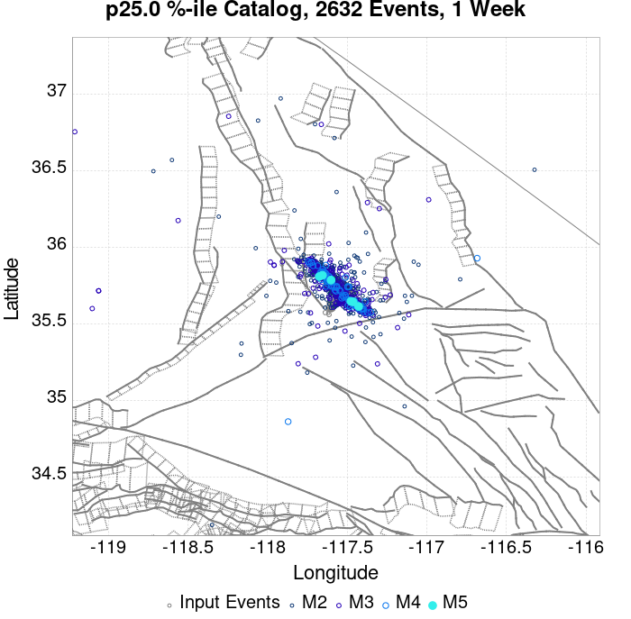 |  |  |  |  |  |  |  |  | 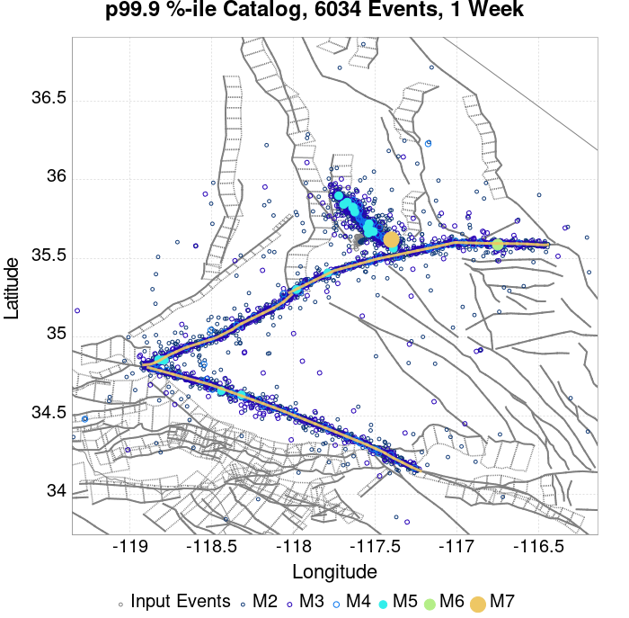 |  |
| **1 Month** |  | 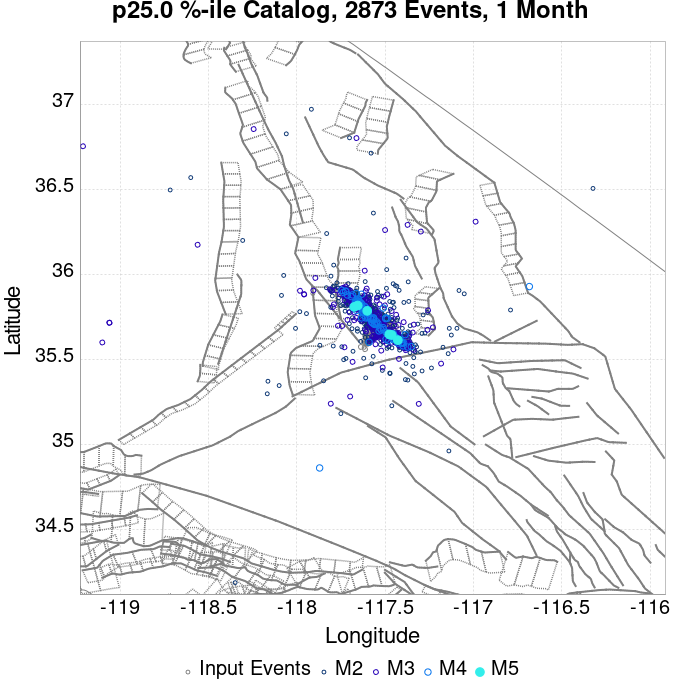 |  |  |  |  |  |  |  | 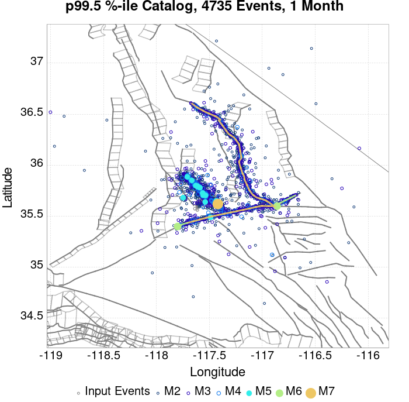 |  |  |
| **1 Year** |  |  |  |  | 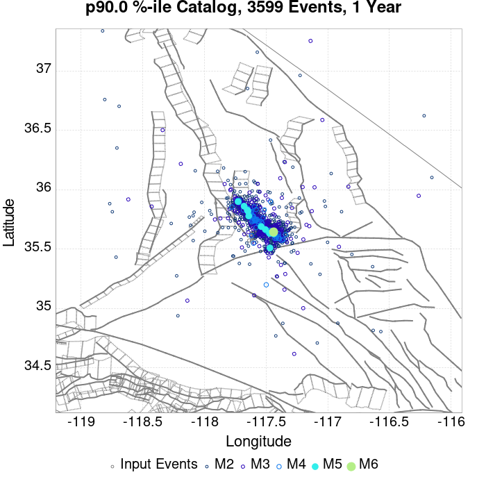 | 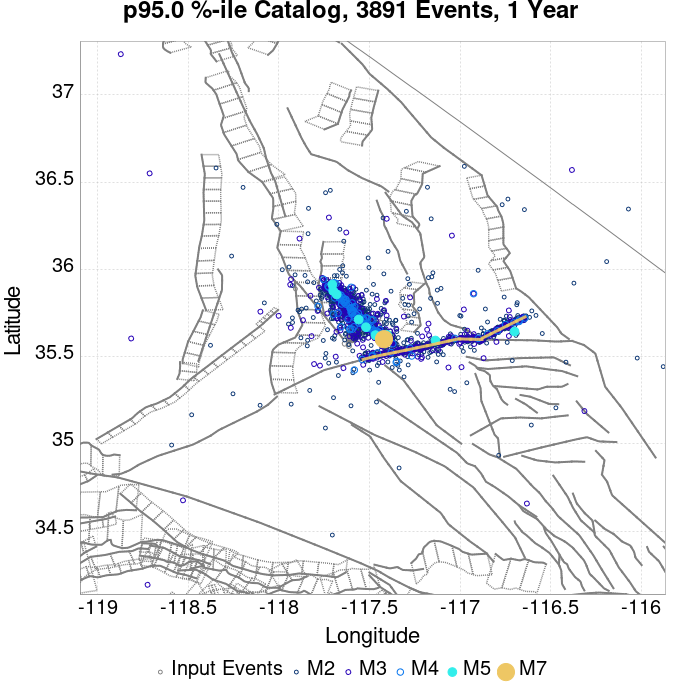 | 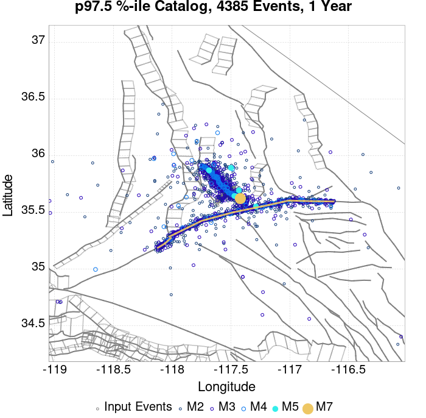 | 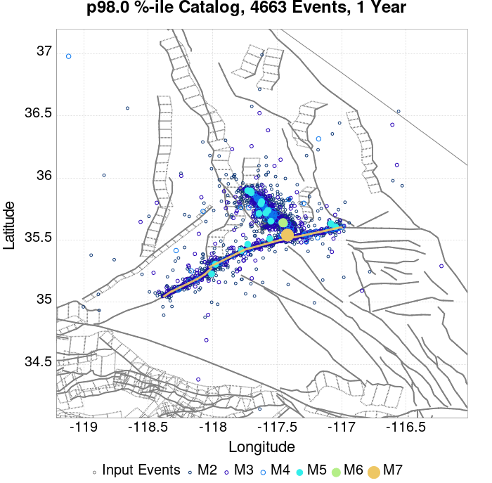 |  | 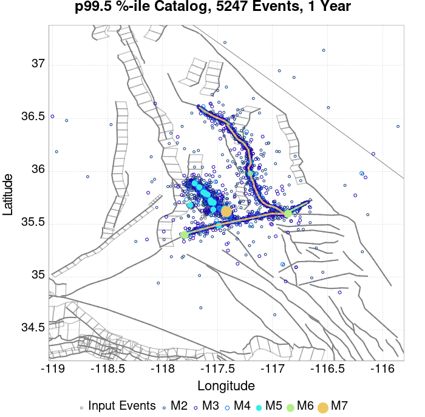 |  | 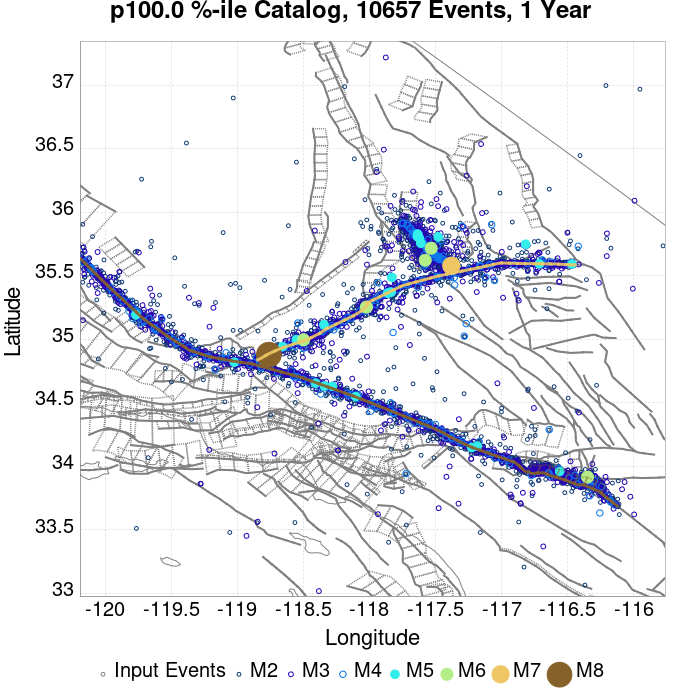 |
| **10 Year** |  | 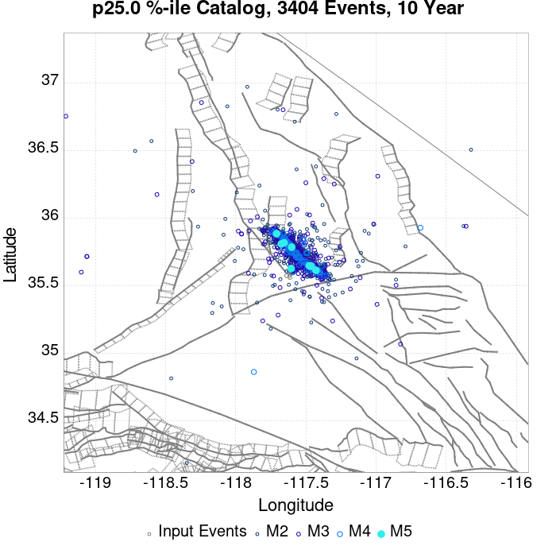 |  |  |  |  |  |  |  | 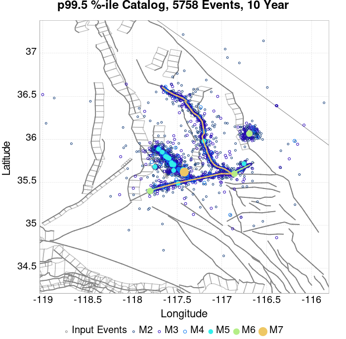 |  |  |

## ComCat Data Comparisons
*[(top)](#table-of-contents)*

These plots compare simulated sequences with data from ComCat. All plots only consider events with hypocenters inside the ComCat region defined in the JSON input file, and consider ruptures above Mc=3.5

Last updated at 2019/08/31 03:43:08 UTC, 8 wk after the simulation start time

### ComCat Magnitude-Number Distributions
*[(top)](#table-of-contents)*

| Incremental MND | Cumulative MND |
|-----|-----|
|  |  |

### ComCat Cumulative Number Vs Time
*[(top)](#table-of-contents)*

| M&ge;3.5 | M&ge;4 | M&ge;5 | M&ge;6 | M&ge;7 |
|-----|-----|-----|-----|-----|
|  | 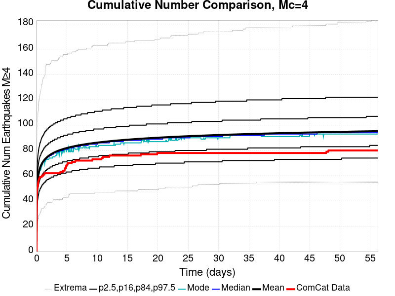 |  |  |  |

### ComCat Cumulative Number Simulation Percentiles
*[(top)](#table-of-contents)*


### ComCat Mean Spatial Distribution
*[(top)](#table-of-contents)*

|  | 1 Day | 1 Week | 1 Month | 8 Week |
|-----|-----|-----|-----|-----|
| **M≥3.5** |  |  |  |  |
| **M≥4** | 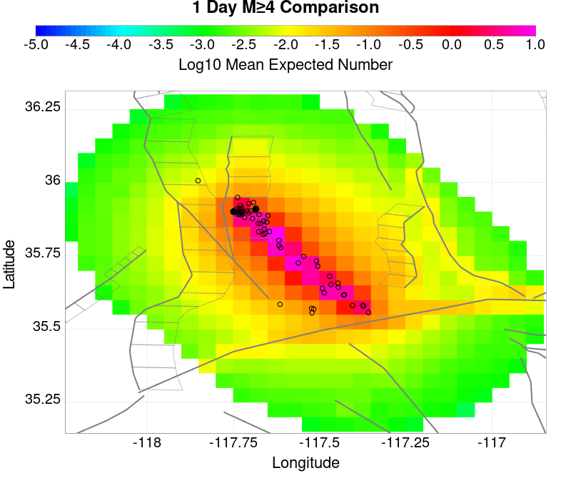 |  |  |  |
| **M≥5** |  | 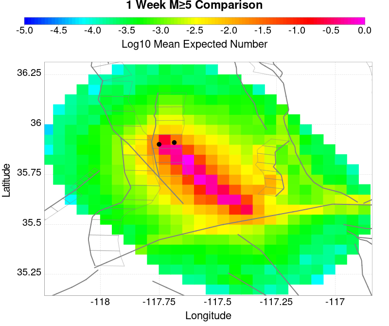 |  |  |
| **M≥6** |  |  |  | 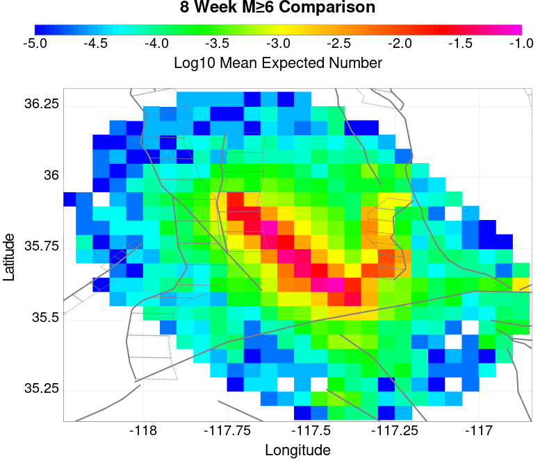 |
| **M≥7** |  |  |  | 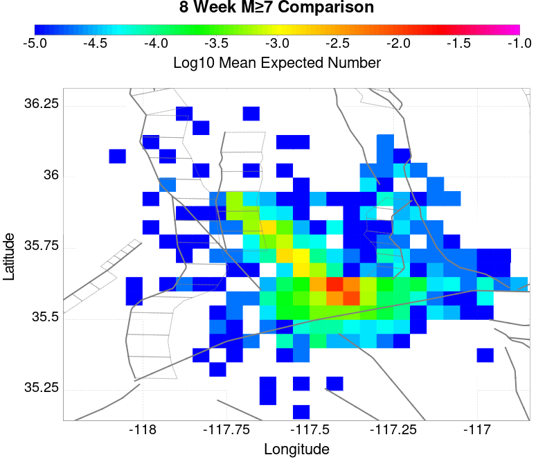 |
| **M≥8** |  |  |  | 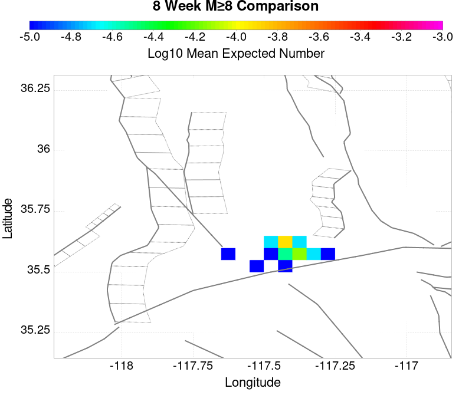 |

### ComCat Depth Distribution
*[(top)](#table-of-contents)*

| M&ge;3.5 | M&ge;4 | M&ge;5 | M&ge;6 | M&ge;7 | M&ge;8 |
|-----|-----|-----|-----|-----|-----|
|  | 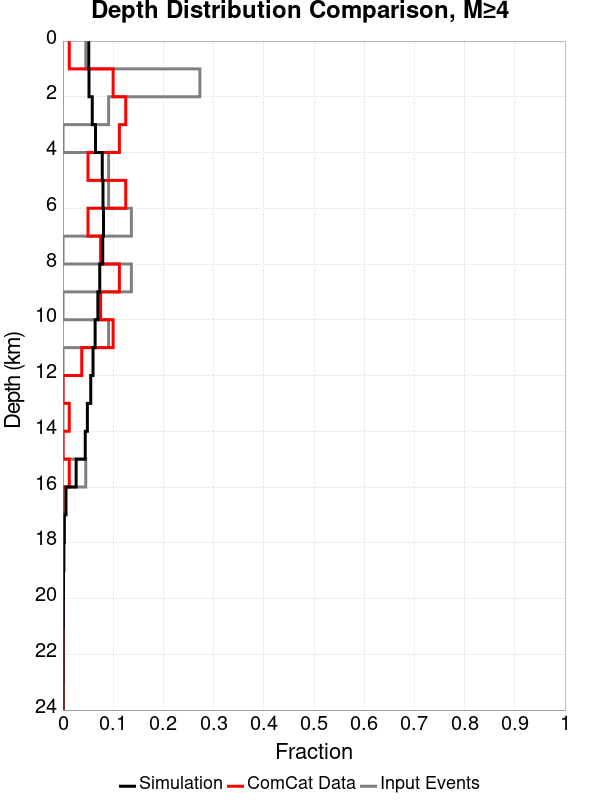 | 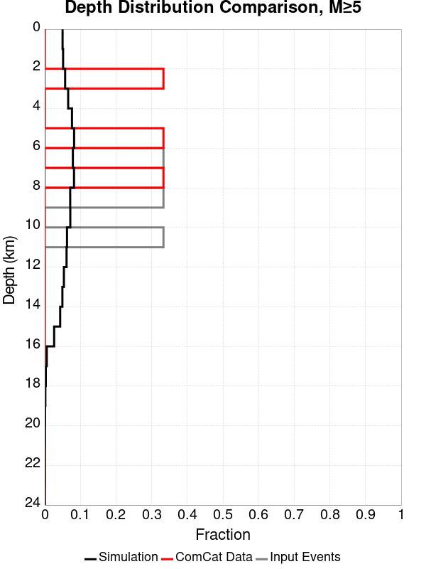 |  |  |  |

## Section Participation
*[(top)](#table-of-contents)*

### Section Participation Plots
*[(top)](#table-of-contents)*

| Min Mag | 1 yr Triggered Ruptures (no spontaneous) | 10 yr Triggered Ruptures (no spontaneous) | 10 yr Triggered Ruptures (primary aftershocks only) |
|-----|-----|-----|-----|
| **All Supra. Seis.** |  |  |  |
| **M&ge;6.5** | 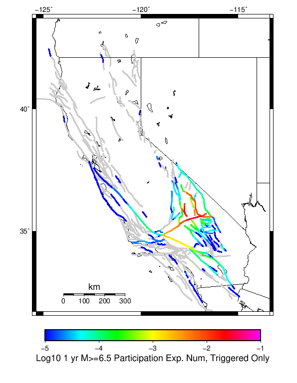 |  |  |
| **M&ge;7** |  |  |  |
| **M&ge;7.5** |  |  |  |
| **M&ge;8** |  |  |  |

### Supra-Seismogenic Parent Sections Table
*[(top)](#table-of-contents)*

*First 10 of 72 with matching ruptures shown*

| Parent Name | Triggered 10 Year Mean Count | Triggered 1 Day Prob | Triggered 1 Week Prob | Triggered 1 Month Prob | Triggered 1 Year Prob | Triggered 10 Year Prob | Triggered 10 Year Primary Mean Count |
|-----|-----|-----|-----|-----|-----|-----|-----|
| Garlock (Central) | 0.11958904 | 0.08054794 | 0.09315068 | 0.10054795 | 0.11136986 | 0.11726028 | 0.10767123 |
| Tank Canyon | 0.05630137 | 0.035342466 | 0.040958904 | 0.04493151 | 0.051232878 | 0.054931507 | 0.043561645 |
| Little Lake | 0.05328767 | 0.03479452 | 0.040547945 | 0.04369863 | 0.048767123 | 0.05219178 | 0.046712328 |
| Airport Lake | 0.048356164 | 0.030684931 | 0.036986303 | 0.04027397 | 0.045342464 | 0.04808219 | 0.04369863 |
| Owl Lake | 0.02 | 0.013150685 | 0.015616438 | 0.016712328 | 0.018767124 | 0.019726027 | 0.013835616 |
| Panamint Valley | 0.019726027 | 0.013287671 | 0.015753424 | 0.016712328 | 0.018493151 | 0.01958904 | 0.016575342 |
| Garlock (East) | 0.01630137 | 0.011506849 | 0.013013699 | 0.014109589 | 0.015068493 | 0.015753424 | 0.013287671 |
| Hunter Mountain-Saline Valley | 0.010684932 | 0.006849315 | 0.008219178 | 0.008493151 | 0.01 | 0.010684932 | 0.009315069 |
| Garlock (West) | 0.00890411 | 0.0060273972 | 0.006849315 | 0.007808219 | 0.008356164 | 0.00890411 | 0.008082191 |
| Blackwater | 0.0060273972 | 0.004109589 | 0.0047945203 | 0.0052054795 | 0.0057534245 | 0.0060273972 | 0.004520548 |

### M≥6.5 Parent Sections Table
*[(top)](#table-of-contents)*

*First 10 of 57 with matching ruptures shown*

| Parent Name | Triggered 10 Year Mean Count | Triggered 1 Day Prob | Triggered 1 Week Prob | Triggered 1 Month Prob | Triggered 1 Year Prob | Triggered 10 Year Prob | Triggered 10 Year Primary Mean Count |
|-----|-----|-----|-----|-----|-----|-----|-----|
| Garlock (Central) | 0.048356164 | 0.033424657 | 0.039452054 | 0.04191781 | 0.04589041 | 0.047945205 | 0.04342466 |
| Airport Lake | 0.036164384 | 0.024109589 | 0.027945206 | 0.030410958 | 0.03410959 | 0.036164384 | 0.033561643 |
| Little Lake | 0.030410958 | 0.02109589 | 0.023835616 | 0.025479453 | 0.028630137 | 0.030136986 | 0.027945206 |
| Panamint Valley | 0.019315068 | 0.012876713 | 0.015342466 | 0.01630137 | 0.018082192 | 0.019178081 | 0.01630137 |
| Owl Lake | 0.016164383 | 0.011232877 | 0.013424657 | 0.013972603 | 0.015342466 | 0.016164383 | 0.012876713 |
| Garlock (East) | 0.014246576 | 0.010136986 | 0.011369863 | 0.012465754 | 0.013424657 | 0.013972603 | 0.0120547945 |
| Hunter Mountain-Saline Valley | 0.010547945 | 0.006849315 | 0.008219178 | 0.008493151 | 0.01 | 0.010547945 | 0.009315069 |
| Garlock (West) | 0.00890411 | 0.0060273972 | 0.006849315 | 0.007808219 | 0.008356164 | 0.00890411 | 0.008082191 |
| Tank Canyon | 0.006849315 | 0.005068493 | 0.005479452 | 0.0061643836 | 0.00630137 | 0.006849315 | 0.005890411 |
| San Andreas (Mojave N) | 0.0038356164 | 0.0023287672 | 0.002739726 | 0.003150685 | 0.00369863 | 0.0038356164 | 0.0034246575 |

### M≥7 Parent Sections Table
*[(top)](#table-of-contents)*

*First 10 of 43 with matching ruptures shown*

| Parent Name | Triggered 10 Year Mean Count | Triggered 1 Day Prob | Triggered 1 Week Prob | Triggered 1 Month Prob | Triggered 1 Year Prob | Triggered 10 Year Prob | Triggered 10 Year Primary Mean Count |
|-----|-----|-----|-----|-----|-----|-----|-----|
| Garlock (Central) | 0.043561645 | 0.03 | 0.035342466 | 0.03739726 | 0.041232876 | 0.043287672 | 0.03917808 |
| Panamint Valley | 0.01479452 | 0.010136986 | 0.012191781 | 0.01260274 | 0.014109589 | 0.01479452 | 0.013150685 |
| Owl Lake | 0.014109589 | 0.010136986 | 0.011917808 | 0.012191781 | 0.013287671 | 0.014109589 | 0.012465754 |
| Garlock (East) | 0.013287671 | 0.009589041 | 0.010821918 | 0.011917808 | 0.012739726 | 0.013150685 | 0.011917808 |
| Hunter Mountain-Saline Valley | 0.010547945 | 0.006849315 | 0.008219178 | 0.008493151 | 0.01 | 0.010547945 | 0.009315069 |
| Garlock (West) | 0.00890411 | 0.0060273972 | 0.006849315 | 0.007808219 | 0.008356164 | 0.00890411 | 0.008082191 |
| Little Lake | 0.0061643836 | 0.0039726025 | 0.0047945203 | 0.005479452 | 0.0061643836 | 0.0061643836 | 0.005890411 |
| Airport Lake | 0.005479452 | 0.003561644 | 0.0043835617 | 0.0049315067 | 0.005479452 | 0.005479452 | 0.005342466 |
| San Andreas (Mojave N) | 0.0038356164 | 0.0023287672 | 0.002739726 | 0.003150685 | 0.00369863 | 0.0038356164 | 0.0034246575 |
| San Andreas (Mojave S) | 0.0032876711 | 0.001780822 | 0.0023287672 | 0.0026027397 | 0.003150685 | 0.0032876711 | 0.0028767122 |

### M≥7.5 Parent Sections Table
*[(top)](#table-of-contents)*

*First 10 of 31 with matching ruptures shown*

| Parent Name | Triggered 10 Year Mean Count | Triggered 1 Day Prob | Triggered 1 Week Prob | Triggered 1 Month Prob | Triggered 1 Year Prob | Triggered 10 Year Prob | Triggered 10 Year Primary Mean Count |
|-----|-----|-----|-----|-----|-----|-----|-----|
| Garlock (Central) | 0.018082192 | 0.011780822 | 0.01369863 | 0.0149315065 | 0.016986301 | 0.018082192 | 0.01630137 |
| Hunter Mountain-Saline Valley | 0.010410959 | 0.0067123286 | 0.008082191 | 0.008356164 | 0.009863013 | 0.010410959 | 0.009178082 |
| Panamint Valley | 0.010410959 | 0.0067123286 | 0.008082191 | 0.008356164 | 0.009863013 | 0.010410959 | 0.009178082 |
| Garlock (West) | 0.007671233 | 0.005068493 | 0.0056164386 | 0.0065753423 | 0.007123288 | 0.007671233 | 0.007123288 |
| Garlock (East) | 0.005479452 | 0.003561644 | 0.004109589 | 0.0049315067 | 0.005342466 | 0.005479452 | 0.005068493 |
| San Andreas (Mojave N) | 0.0038356164 | 0.0023287672 | 0.002739726 | 0.003150685 | 0.00369863 | 0.0038356164 | 0.0034246575 |
| San Andreas (Mojave S) | 0.003150685 | 0.001780822 | 0.0021917808 | 0.0024657534 | 0.0030136986 | 0.003150685 | 0.002739726 |
| San Andreas (San Bernardino N) | 0.0019178082 | 9.589041E-4 | 0.0012328767 | 0.0015068493 | 0.001780822 | 0.0019178082 | 0.0015068493 |
| Owl Lake | 0.001369863 | 0.0010958904 | 0.0010958904 | 0.0010958904 | 0.0010958904 | 0.001369863 | 0.0012328767 |
| San Andreas (San Bernardino S) | 6.849315E-4 | 4.109589E-4 | 4.109589E-4 | 4.109589E-4 | 5.479452E-4 | 6.849315E-4 | 5.479452E-4 |

### M≥8 Parent Sections Table
*[(top)](#table-of-contents)*

*First 10 of 16 with matching ruptures shown*

| Parent Name | Triggered 10 Year Mean Count | Triggered 1 Day Prob | Triggered 1 Week Prob | Triggered 1 Month Prob | Triggered 1 Year Prob | Triggered 10 Year Prob | Triggered 10 Year Primary Mean Count |
|-----|-----|-----|-----|-----|-----|-----|-----|
| Garlock (Central) | 4.109589E-4 | 2.739726E-4 | 2.739726E-4 | 2.739726E-4 | 4.109589E-4 | 4.109589E-4 | 4.109589E-4 |
| Garlock (East) | 4.109589E-4 | 2.739726E-4 | 2.739726E-4 | 2.739726E-4 | 4.109589E-4 | 4.109589E-4 | 4.109589E-4 |
| Garlock (West) | 4.109589E-4 | 2.739726E-4 | 2.739726E-4 | 2.739726E-4 | 4.109589E-4 | 4.109589E-4 | 4.109589E-4 |
| San Andreas (Mojave N) | 4.109589E-4 | 2.739726E-4 | 2.739726E-4 | 2.739726E-4 | 4.109589E-4 | 4.109589E-4 | 4.109589E-4 |
| San Andreas (Mojave S) | 4.109589E-4 | 2.739726E-4 | 2.739726E-4 | 2.739726E-4 | 4.109589E-4 | 4.109589E-4 | 4.109589E-4 |
| San Andreas (San Bernardino N) | 4.109589E-4 | 2.739726E-4 | 2.739726E-4 | 2.739726E-4 | 4.109589E-4 | 4.109589E-4 | 4.109589E-4 |
| San Andreas (North Branch Mill Creek) | 1.369863E-4 | 0.0 | 0.0 | 0.0 | 1.369863E-4 | 1.369863E-4 | 1.369863E-4 |
| San Andreas (San Bernardino S) | 1.369863E-4 | 1.369863E-4 | 1.369863E-4 | 1.369863E-4 | 1.369863E-4 | 1.369863E-4 | 1.369863E-4 |
| San Andreas (San Gorgonio Pass-Garnet HIll) | 1.369863E-4 | 1.369863E-4 | 1.369863E-4 | 1.369863E-4 | 1.369863E-4 | 1.369863E-4 | 1.369863E-4 |
| San Jacinto (Anza) rev | 1.369863E-4 | 1.369863E-4 | 1.369863E-4 | 1.369863E-4 | 1.369863E-4 | 1.369863E-4 | 1.369863E-4 |

### Fault Magnitude-Probability Distributions
*[(top)](#table-of-contents)*

The first 5 sections (sorted by trigger rate) are plotted below. All fault MPDs are available [here](plots/parent_sect_mpds/README.md)

| 1 Week | 1 Month | 1 Year | 10 Year |
|-----|-----|-----|-----|
|  |  |  |  |
|  |  |  |  |
|  | 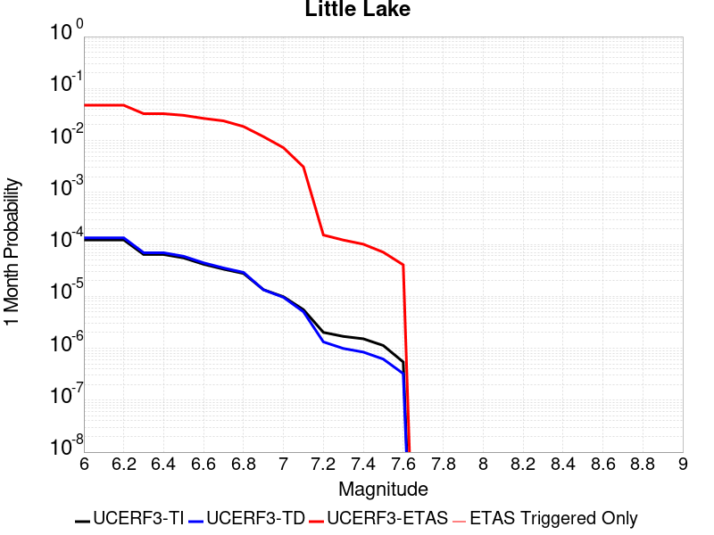 |  | 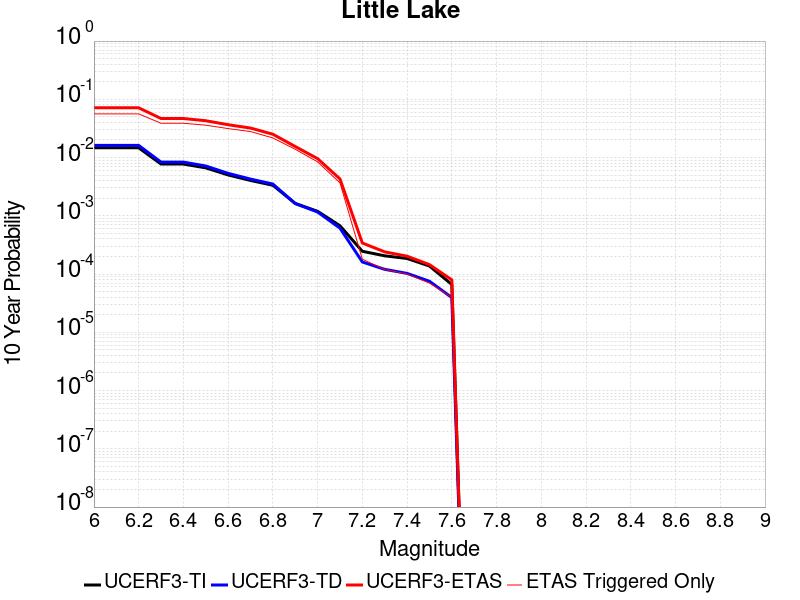 |
|  |  |  |  |
|  |  | 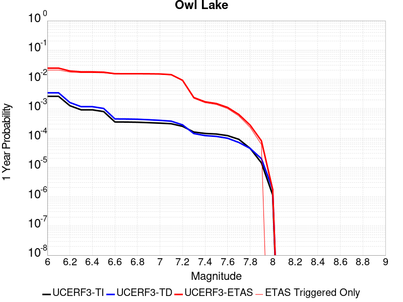 | 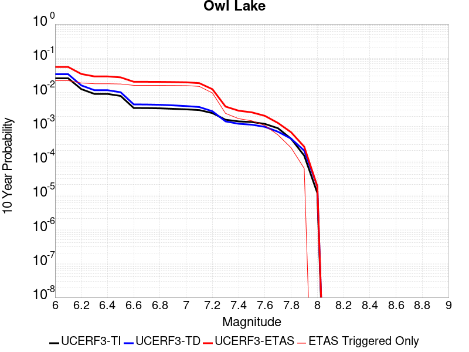 |

## Gridded Nucleation
*[(top)](#table-of-contents)*

| Min Mag | Triggered Ruptures (no spontaneous) | Triggered Ruptures (primary aftershocks only) |
|-----|-----|-----|
| **M&ge;2.5** |  |  |
| **M&ge;5** | 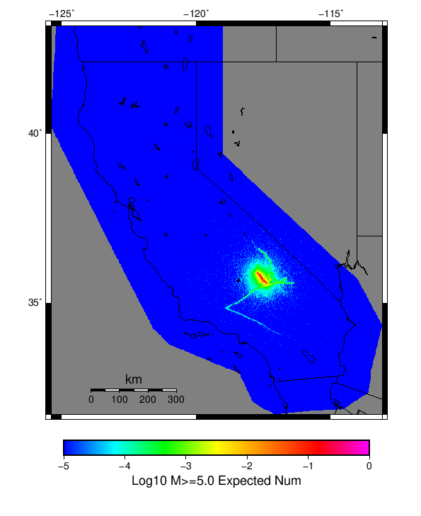 |  |
| **M&ge;6** |  |  |
| **M&ge;7** |  | 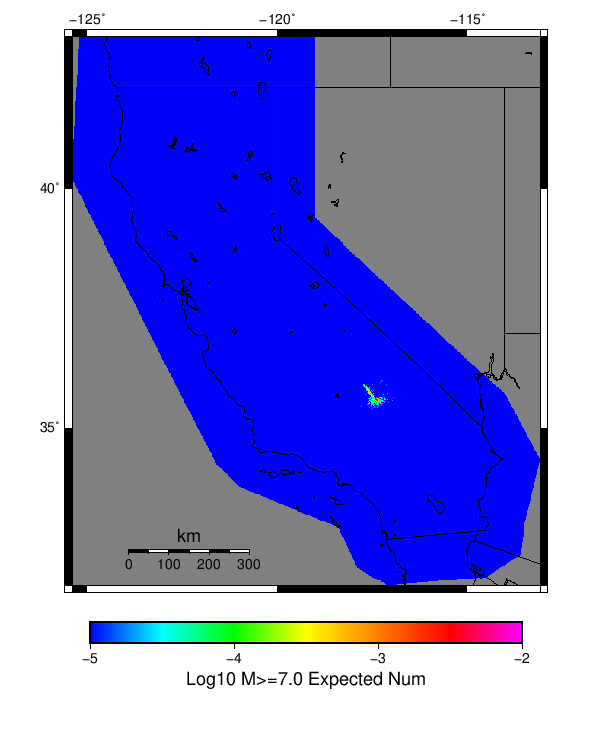 |


## JSON Input File
*[(top)](#table-of-contents)*

```
{
  "numSimulations": 100000,
  "duration": 10.0,
  "startTimeMillis": 1562383194040,
  "includeSpontaneous": false,
  "randomSeed": 1567206851379,
  "binaryOutput": true,
  "binaryOutputFilters": [
    {
      "prefix": "results_complete",
      "descendantsOnly": false
    },
    {
      "prefix": "results_m5_preserve_chain",
      "minMag": 5.0,
      "preserveChainBelowMag": true,
      "descendantsOnly": false
    }
  ],
  "forceRecalc": false,
  "simulationName": "ComCat M7.1 (ci38457511), Mainshock Log10(k)\u003d-2.3, ShakeMap Surfaces, Log10(k)\u003d-3.03, p\u003d1.15, c\u003d0.002",
  "numRetries": 3,
  "outputDir": "${ETAS_SIM_DIR}/2019_08_30-ComCatM7p1_ci38457511_MainshockLog10_k_2p3_ShakeMapSurfaces_Log10_k_3p03_p1p15_c0p002-noSpont-full_td-scale1.14-modParams",
  "triggerRuptures": [
    {
      "occurrenceTimeMillis": 1562259775340,
      "comcatEventID": "ci38443095",
      "mag": 3.98,
      "latitude": 35.708,
      "longitude": -117.5036667,
      "depth": 10.58
    },
    {
      "occurrenceTimeMillis": 1562261629000,
      "comcatEventID": "ci38443183",
      "mag": 6.4,
      "latitude": 35.7053333,
      "longitude": -117.5038333,
      "depth": 10.5,
      "ruptureSurfaces": [
        {
          "outline": [
            {
              "latitude": 35.6051534466,
              "longitude": -117.5905380735,
              "depth": 0.0
            },
            {
              "latitude": 35.6173144101,
              "longitude": -117.57249634649999,
              "depth": 0.0
            },
            {
              "latitude": 35.6173135736,
              "longitude": -117.5726723708,
              "depth": 0.0
            },
            {
              "latitude": 35.61731357360001,
              "longitude": -117.5726723708,
              "depth": 15.0
            },
            {
              "latitude": 35.6173144101,
              "longitude": -117.57249634649999,
              "depth": 15.0
            },
            {
              "latitude": 35.6051534466,
              "longitude": -117.5905380735,
              "depth": 15.0
            },
            {
              "latitude": 35.6051534466,
              "longitude": -117.5905380735,
              "depth": 0.0
            }
          ]
        },
        {
          "outline": [
            {
              "latitude": 35.6338128629,
              "longitude": -117.54831678310002,
              "depth": 0.0
            },
            {
              "latitude": 35.6413274733,
              "longitude": -117.5393878708,
              "depth": 0.0
            },
            {
              "latitude": 35.664283512,
              "longitude": -117.51611643970001,
              "depth": 0.0
            },
            {
              "latitude": 35.664283512000004,
              "longitude": -117.51611643970001,
              "depth": 15.0
            },
            {
              "latitude": 35.641327473299995,
              "longitude": -117.5393878708,
              "depth": 15.0
            },
            {
              "latitude": 35.63381286290001,
              "longitude": -117.54831678310002,
              "depth": 15.0
            },
            {
              "latitude": 35.6338128629,
              "longitude": -117.54831678310002,
              "depth": 0.0
            }
          ]
        },
        {
          "outline": [
            {
              "latitude": 35.6322100797,
              "longitude": -117.55305954249998,
              "depth": 0.0
            },
            {
              "latitude": 35.6196274701,
              "longitude": -117.56969626549999,
              "depth": 0.0
            },
            {
              "latitude": 35.6196274701,
              "longitude": -117.56969626549999,
              "depth": 15.0
            },
            {
              "latitude": 35.6322100797,
              "longitude": -117.55305954249998,
              "depth": 15.0
            },
            {
              "latitude": 35.6322100797,
              "longitude": -117.55305954249998,
              "depth": 0.0
            }
          ]
        }
      ]
    },
    {
      "occurrenceTimeMillis": 1562261701660,
      "comcatEventID": "ci38443191",
      "mag": 4.49,
      "latitude": 35.644,
      "longitude": -117.56716670000002,
      "depth": 4.64
    },
    {
      "occurrenceTimeMillis": 1562261746340,
      "comcatEventID": "ci37222356",
      "mag": 3.63,
      "latitude": 35.6936667,
      "longitude": -117.437,
      "depth": 7.65
    },
    {
      "occurrenceTimeMillis": 1562261752170,
      "comcatEventID": "ci37218988",
      "mag": 4.28,
      "latitude": 35.687,
      "longitude": -117.50616670000001,
      "depth": 1.6
    },
    {
      "occurrenceTimeMillis": 1562261818950,
      "comcatEventID": "ci37222380",
      "mag": 3.41,
      "latitude": 35.7258333,
      "longitude": -117.55933330000002,
      "depth": 5.3
    },
    {
      "occurrenceTimeMillis": 1562261821140,
      "comcatEventID": "ci37222372",
      "mag": 3.66,
      "latitude": 35.7105,
      "longitude": -117.4773333,
      "depth": 1.57
    },
    {
      "occurrenceTimeMillis": 1562261834850,
      "comcatEventID": "ci37222364",
      "mag": 3.97,
      "latitude": 35.6655,
      "longitude": -117.516,
      "depth": 1.64
    },
    {
      "occurrenceTimeMillis": 1562261845640,
      "comcatEventID": "ci37218996",
      "mag": 4.01,
      "latitude": 35.6758333,
      "longitude": -117.45750000000001,
      "depth": 15.82
    },
    {
      "occurrenceTimeMillis": 1562261875500,
      "comcatEventID": "ci38443199",
      "mag": 3.86,
      "latitude": 35.7456667,
      "longitude": -117.5516667,
      "depth": 8.29
    },
    {
      "occurrenceTimeMillis": 1562261901450,
      "comcatEventID": "ci37421941",
      "mag": 3.73,
      "latitude": 35.714,
      "longitude": -117.476,
      "depth": 1.74
    },
    {
      "occurrenceTimeMillis": 1562261927500,
      "comcatEventID": "us70004a0n",
      "mag": 3.5,
      "latitude": 35.6215,
      "longitude": -117.5782,
      "depth": 9.7
    },
    {
      "occurrenceTimeMillis": 1562261927760,
      "comcatEventID": "ci37222396",
      "mag": 3.5,
      "latitude": 35.6235,
      "longitude": -117.596,
      "depth": 8.55
    },
    {
      "occurrenceTimeMillis": 1562261973310,
      "comcatEventID": "ci37222404",
      "mag": 3.11,
      "latitude": 35.5743333,
      "longitude": -117.63666670000002,
      "depth": 6.85
    },
    {
      "occurrenceTimeMillis": 1562261975360,
      "comcatEventID": "ci38443215",
      "mag": 3.69,
      "latitude": 35.6873333,
      "longitude": -117.4935,
      "depth": 10.86
    },
    {
      "occurrenceTimeMillis": 1562262002250,
      "comcatEventID": "ci38443223",
      "mag": 3.8,
      "latitude": 35.7253333,
      "longitude": -117.57083329999999,
      "depth": 6.63
    },
    {
      "occurrenceTimeMillis": 1562262018520,
      "comcatEventID": "ci38443231",
      "mag": 4.13,
      "latitude": 35.707,
      "longitude": -117.5101667,
      "depth": 8.66
    },
    {
      "occurrenceTimeMillis": 1562262034900,
      "comcatEventID": "ci37222508",
      "mag": 3.54,
      "latitude": 35.6948333,
      "longitude": -117.50183330000002,
      "depth": 2.04
    },
    {
      "occurrenceTimeMillis": 1562262046140,
      "comcatEventID": "ci37222516",
      "mag": 3.42,
      "latitude": 35.7298333,
      "longitude": -117.55483330000001,
      "depth": 7.72
    },
    {
      "occurrenceTimeMillis": 1562262080850,
      "comcatEventID": "ci37421957",
      "mag": 3.3,
      "latitude": 35.7266667,
      "longitude": -117.5288333,
      "depth": 1.97
    },
    {
      "occurrenceTimeMillis": 1562262174130,
      "comcatEventID": "ci38443239",
      "mag": 3.22,
      "latitude": 35.7301667,
      "longitude": -117.55866669999999,
      "depth": 7.84
    },
    {
      "occurrenceTimeMillis": 1562262209200,
      "comcatEventID": "us70004a0z",
      "mag": 3.6,
      "latitude": 35.6783,
      "longitude": -117.5488,
      "depth": 5.15
    },
    {
      "occurrenceTimeMillis": 1562262264020,
      "comcatEventID": "ci37421981",
      "mag": 2.77,
      "latitude": 35.7478333,
      "longitude": -117.54000000000002,
      "depth": 9.4
    },
    {
      "occurrenceTimeMillis": 1562262272820,
      "comcatEventID": "ci38443255",
      "mag": 3.86,
      "latitude": 35.6875,
      "longitude": -117.5071667,
      "depth": 1.54
    },
    {
      "occurrenceTimeMillis": 1562262305780,
      "comcatEventID": "ci37421997",
      "mag": 3.03,
      "latitude": 35.6976667,
      "longitude": -117.48649999999999,
      "depth": 2.24
    },
    {
      "occurrenceTimeMillis": 1562262323950,
      "comcatEventID": "ci37421989",
      "mag": 3.03,
      "latitude": 35.7151667,
      "longitude": -117.5473333,
      "depth": 7.21
    },
    {
      "occurrenceTimeMillis": 1562262328630,
      "comcatEventID": "ci37222524",
      "mag": 3.21,
      "latitude": 35.7348333,
      "longitude": -117.53683330000001,
      "depth": 10.34
    },
    {
      "occurrenceTimeMillis": 1562262363710,
      "comcatEventID": "ci38443263",
      "mag": 2.96,
      "latitude": 35.6431667,
      "longitude": -117.6101667,
      "depth": 10.14
    },
    {
      "occurrenceTimeMillis": 1562262380320,
      "comcatEventID": "ci37222532",
      "mag": 2.56,
      "latitude": 35.6563333,
      "longitude": -117.5325,
      "depth": 1.52
    },
    {
      "occurrenceTimeMillis": 1562262409960,
      "comcatEventID": "ci38443271",
      "mag": 3.07,
      "latitude": 35.6385,
      "longitude": -117.6108333,
      "depth": 10.97
    },
    {
      "occurrenceTimeMillis": 1562262437810,
      "comcatEventID": "ci38443279",
      "mag": 3.5,
      "latitude": 35.7455,
      "longitude": -117.5465,
      "depth": 7.11
    },
    {
      "occurrenceTimeMillis": 1562262460970,
      "comcatEventID": "ci37222548",
      "mag": 3.11,
      "latitude": 35.726,
      "longitude": -117.55849999999998,
      "depth": 3.58
    },
    {
      "occurrenceTimeMillis": 1562262474970,
      "comcatEventID": "ci37222556",
      "mag": 3.4,
      "latitude": 35.7286667,
      "longitude": -117.56066670000001,
      "depth": 5.25
    },
    {
      "occurrenceTimeMillis": 1562262483160,
      "comcatEventID": "ci37222564",
      "mag": 3.27,
      "latitude": 35.6365,
      "longitude": -117.55183330000001,
      "depth": 6.62
    },
    {
      "occurrenceTimeMillis": 1562262495680,
      "comcatEventID": "ci37222572",
      "mag": 3.11,
      "latitude": 35.7053333,
      "longitude": -117.5245,
      "depth": 5.52
    },
    {
      "occurrenceTimeMillis": 1562262504150,
      "comcatEventID": "ci37222580",
      "mag": 2.96,
      "latitude": 35.6593333,
      "longitude": -117.52633330000002,
      "depth": 2.68
    },
    {
      "occurrenceTimeMillis": 1562262575190,
      "comcatEventID": "ci37222596",
      "mag": 2.52,
      "latitude": 35.7335,
      "longitude": -117.50683330000001,
      "depth": 3.91
    },
    {
      "occurrenceTimeMillis": 1562262578950,
      "comcatEventID": "ci37222668",
      "mag": 2.57,
      "latitude": 35.687,
      "longitude": -117.49066670000002,
      "depth": 10.66
    },
    {
      "occurrenceTimeMillis": 1562262648290,
      "comcatEventID": "ci37222692",
      "mag": 2.73,
      "latitude": 35.738,
      "longitude": -117.52933329999999,
      "depth": 7.72
    },
    {
      "occurrenceTimeMillis": 1562262648960,
      "comcatEventID": "ci38443303",
      "mag": 2.79,
      "latitude": 35.678,
      "longitude": -117.49916670000002,
      "depth": 1.14
    },
    {
      "occurrenceTimeMillis": 1562262706650,
      "comcatEventID": "ci38443287",
      "mag": 3.46,
      "latitude": 35.674,
      "longitude": -117.52349999999998,
      "depth": 5.3
    },
    {
      "occurrenceTimeMillis": 1562262761700,
      "comcatEventID": "ci38443295",
      "mag": 2.92,
      "latitude": 35.7218333,
      "longitude": -117.5251667,
      "depth": 7.04
    },
    {
      "occurrenceTimeMillis": 1562262899560,
      "comcatEventID": "ci38443327",
      "mag": 2.53,
      "latitude": 35.6391667,
      "longitude": -117.5628333,
      "depth": 10.48
    },
    {
      "occurrenceTimeMillis": 1562262930800,
      "comcatEventID": "ci37222876",
      "mag": 2.57,
      "latitude": 35.6705,
      "longitude": -117.5221667,
      "depth": 3.91
    },
    {
      "occurrenceTimeMillis": 1562263051460,
      "comcatEventID": "ci38443311",
      "mag": 2.95,
      "latitude": 35.6595,
      "longitude": -117.5223333,
      "depth": 2.3
    },
    {
      "occurrenceTimeMillis": 1562263063060,
      "comcatEventID": "ci37222932",
      "mag": 2.78,
      "latitude": 35.6725,
      "longitude": -117.4743333,
      "depth": 8.76
    },
    {
      "occurrenceTimeMillis": 1562263082640,
      "comcatEventID": "ci38443319",
      "mag": 3.33,
      "latitude": 35.702,
      "longitude": -117.50833330000002,
      "depth": 4.77
    },
    {
      "occurrenceTimeMillis": 1562263240190,
      "comcatEventID": "ci38443335",
      "mag": 2.67,
      "latitude": 35.6303333,
      "longitude": -117.569,
      "depth": 1.64
    },
    {
      "occurrenceTimeMillis": 1562263261190,
      "comcatEventID": "ci37223148",
      "mag": 2.59,
      "latitude": 35.6733333,
      "longitude": -117.5118333,
      "depth": 1.49
    },
    {
      "occurrenceTimeMillis": 1562263283180,
      "comcatEventID": "ci37422005",
      "mag": 3.53,
      "latitude": 35.6876667,
      "longitude": -117.50849999999998,
      "depth": 1.26
    },
    {
      "occurrenceTimeMillis": 1562263291230,
      "comcatEventID": "ci37223156",
      "mag": 3.42,
      "latitude": 35.5978333,
      "longitude": -117.5905,
      "depth": 6.79
    },
    {
      "occurrenceTimeMillis": 1562263374110,
      "comcatEventID": "ci38443351",
      "mag": 2.53,
      "latitude": 35.6066667,
      "longitude": -117.58216670000002,
      "depth": 5.8
    },
    {
      "occurrenceTimeMillis": 1562263398590,
      "comcatEventID": "ci38443359",
      "mag": 2.85,
      "latitude": 35.7478333,
      "longitude": -117.5425,
      "depth": 6.85
    },
    {
      "occurrenceTimeMillis": 1562263541830,
      "comcatEventID": "ci38443375",
      "mag": 2.76,
      "latitude": 35.7153333,
      "longitude": -117.5295,
      "depth": 4.54
    },
    {
      "occurrenceTimeMillis": 1562263555910,
      "comcatEventID": "ci37223228",
      "mag": 2.61,
      "latitude": 35.7266667,
      "longitude": -117.5165,
      "depth": 8.96
    },
    {
      "occurrenceTimeMillis": 1562263576110,
      "comcatEventID": "ci38443383",
      "mag": 3.79,
      "latitude": 35.6606667,
      "longitude": -117.523,
      "depth": 2.14
    },
    {
      "occurrenceTimeMillis": 1562263611050,
      "comcatEventID": "ci37223236",
      "mag": 2.6,
      "latitude": 35.6931667,
      "longitude": -117.46200000000002,
      "depth": 11.56
    },
    {
      "occurrenceTimeMillis": 1562263629270,
      "comcatEventID": "ci38443391",
      "mag": 3.51,
      "latitude": 35.5991667,
      "longitude": -117.6101667,
      "depth": 2.12
    },
    {
      "occurrenceTimeMillis": 1562263630910,
      "comcatEventID": "ci37223244",
      "mag": 3.49,
      "latitude": 35.6508333,
      "longitude": -117.54200000000002,
      "depth": 2.77
    },
    {
      "occurrenceTimeMillis": 1562263670810,
      "comcatEventID": "ci37223252",
      "mag": 2.55,
      "latitude": 35.72950000000001,
      "longitude": -117.533,
      "depth": 7.25
    },
    {
      "occurrenceTimeMillis": 1562263713160,
      "comcatEventID": "ci38443407",
      "mag": 3.38,
      "latitude": 35.6678333,
      "longitude": -117.50616670000001,
      "depth": 2.27
    },
    {
      "occurrenceTimeMillis": 1562263725070,
      "comcatEventID": "ci37223308",
      "mag": 3.55,
      "latitude": 35.7108333,
      "longitude": -117.47683329999998,
      "depth": 1.17
    },
    {
      "occurrenceTimeMillis": 1562263832710,
      "comcatEventID": "ci38443415",
      "mag": 3.46,
      "latitude": 35.6598333,
      "longitude": -117.53483330000002,
      "depth": 10.25
    },
    {
      "occurrenceTimeMillis": 1562263882870,
      "comcatEventID": "ci38443423",
      "mag": 2.69,
      "latitude": 35.6003333,
      "longitude": -117.5951667,
      "depth": 7.33
    },
    {
      "occurrenceTimeMillis": 1562263972070,
      "comcatEventID": "ci38443431",
      "mag": 3.44,
      "latitude": 35.6703333,
      "longitude": -117.5605,
      "depth": 6.91
    },
    {
      "occurrenceTimeMillis": 1562264025530,
      "comcatEventID": "ci37223380",
      "mag": 2.89,
      "latitude": 35.7003333,
      "longitude": -117.4873333,
      "depth": 10.98
    },
    {
      "occurrenceTimeMillis": 1562264031400,
      "comcatEventID": "ci38443439",
      "mag": 3.5,
      "latitude": 35.7081667,
      "longitude": -117.485,
      "depth": 6.44
    },
    {
      "occurrenceTimeMillis": 1562264104970,
      "comcatEventID": "ci38443447",
      "mag": 2.75,
      "latitude": 35.6103333,
      "longitude": -117.59500000000001,
      "depth": 4.94
    },
    {
      "occurrenceTimeMillis": 1562264112820,
      "comcatEventID": "ci37420701",
      "mag": 3.23,
      "latitude": 35.6691667,
      "longitude": -117.5203333,
      "depth": 1.84
    },
    {
      "occurrenceTimeMillis": 1562264193730,
      "comcatEventID": "ci38443463",
      "mag": 2.94,
      "latitude": 35.7251667,
      "longitude": -117.53350000000002,
      "depth": 6.74
    },
    {
      "occurrenceTimeMillis": 1562264235320,
      "comcatEventID": "ci38443471",
      "mag": 2.87,
      "latitude": 35.7185,
      "longitude": -117.5336667,
      "depth": 4.94
    },
    {
      "occurrenceTimeMillis": 1562264325720,
      "comcatEventID": "ci38443487",
      "mag": 3.38,
      "latitude": 35.638,
      "longitude": -117.611,
      "depth": 9.43
    },
    {
      "occurrenceTimeMillis": 1562264332070,
      "comcatEventID": "ci37223676",
      "mag": 2.98,
      "latitude": 35.6123333,
      "longitude": -117.624,
      "depth": 0.0
    },
    {
      "occurrenceTimeMillis": 1562264348090,
      "comcatEventID": "ci37223684",
      "mag": 2.6,
      "latitude": 35.7236667,
      "longitude": -117.50849999999998,
      "depth": 11.57
    },
    {
      "occurrenceTimeMillis": 1562264485340,
      "comcatEventID": "ci38443495",
      "mag": 2.61,
      "latitude": 35.67883330000001,
      "longitude": -117.51533330000001,
      "depth": 2.91
    },
    {
      "occurrenceTimeMillis": 1562264763750,
      "comcatEventID": "ci38443519",
      "mag": 3.13,
      "latitude": 35.6638333,
      "longitude": -117.5245,
      "depth": 2.53
    },
    {
      "occurrenceTimeMillis": 1562264846770,
      "comcatEventID": "ci38443527",
      "mag": 3.29,
      "latitude": 35.6748333,
      "longitude": -117.51433329999999,
      "depth": 2.68
    },
    {
      "occurrenceTimeMillis": 1562264879440,
      "comcatEventID": "ci38443535",
      "mag": 4.23,
      "latitude": 35.745,
      "longitude": -117.55216669999999,
      "depth": 6.64
    },
    {
      "occurrenceTimeMillis": 1562264923640,
      "comcatEventID": "ci38443543",
      "mag": 3.75,
      "latitude": 35.6661667,
      "longitude": -117.5656667,
      "depth": 7.14
    },
    {
      "occurrenceTimeMillis": 1562265289010,
      "comcatEventID": "ci37224604",
      "mag": 2.59,
      "latitude": 35.6895,
      "longitude": -117.4883333,
      "depth": 0.63
    },
    {
      "occurrenceTimeMillis": 1562265344040,
      "comcatEventID": "ci38443575",
      "mag": 2.5,
      "latitude": 35.7215,
      "longitude": -117.56550000000001,
      "depth": 0.16
    },
    {
      "occurrenceTimeMillis": 1562265451500,
      "comcatEventID": "ci38443591",
      "mag": 2.64,
      "latitude": 35.72,
      "longitude": -117.5723333,
      "depth": 1.34
    },
    {
      "occurrenceTimeMillis": 1562265525650,
      "comcatEventID": "ci38443599",
      "mag": 2.69,
      "latitude": 35.7046661,
      "longitude": -117.49666600000002,
      "depth": 3.96
    },
    {
      "occurrenceTimeMillis": 1562265584440,
      "comcatEventID": "ci38443607",
      "mag": 4.59,
      "latitude": 35.6013333,
      "longitude": -117.59700000000001,
      "depth": 2.81
    },
    {
      "occurrenceTimeMillis": 1562265656740,
      "comcatEventID": "ci37224612",
      "mag": 3.05,
      "latitude": 35.652,
      "longitude": -117.53683330000001,
      "depth": 2.03
    },
    {
      "occurrenceTimeMillis": 1562265674270,
      "comcatEventID": "ci38443615",
      "mag": 3.07,
      "latitude": 35.6763333,
      "longitude": -117.5115,
      "depth": 2.13
    },
    {
      "occurrenceTimeMillis": 1562265865000,
      "comcatEventID": "ci38443631",
      "mag": 3.09,
      "latitude": 35.719,
      "longitude": -117.55866669999999,
      "depth": 2.06
    },
    {
      "occurrenceTimeMillis": 1562266026590,
      "comcatEventID": "ci38443647",
      "mag": 4.34,
      "latitude": 35.6758333,
      "longitude": -117.48533330000001,
      "depth": 8.53
    },
    {
      "occurrenceTimeMillis": 1562266042600,
      "comcatEventID": "ci37421213",
      "mag": 4.02,
      "latitude": 35.6755,
      "longitude": -117.472,
      "depth": 10.27
    },
    {
      "occurrenceTimeMillis": 1562266207160,
      "comcatEventID": "ci38443663",
      "mag": 2.73,
      "latitude": 35.641,
      "longitude": -117.56266670000001,
      "depth": 8.95
    },
    {
      "occurrenceTimeMillis": 1562266215910,
      "comcatEventID": "ci38443671",
      "mag": 3.7,
      "latitude": 35.682,
      "longitude": -117.4961667,
      "depth": 1.26
    },
    {
      "occurrenceTimeMillis": 1562266333530,
      "comcatEventID": "ci38443679",
      "mag": 2.78,
      "latitude": 35.6543333,
      "longitude": -117.53983330000001,
      "depth": 0.88
    },
    {
      "occurrenceTimeMillis": 1562266376130,
      "comcatEventID": "ci38443687",
      "mag": 2.93,
      "latitude": 35.741,
      "longitude": -117.561,
      "depth": 0.23
    },
    {
      "occurrenceTimeMillis": 1562266407670,
      "comcatEventID": "ci38443695",
      "mag": 3.36,
      "latitude": 35.7285,
      "longitude": -117.5605,
      "depth": 7.87
    },
    {
      "occurrenceTimeMillis": 1562266453990,
      "comcatEventID": "ci38443703",
      "mag": 4.07,
      "latitude": 35.5975,
      "longitude": -117.5996667,
      "depth": 5.33
    },
    {
      "occurrenceTimeMillis": 1562266527680,
      "comcatEventID": "ci38443711",
      "mag": 3.03,
      "latitude": 35.6753333,
      "longitude": -117.4795,
      "depth": 10.71
    },
    {
      "occurrenceTimeMillis": 1562266566420,
      "comcatEventID": "ci38443719",
      "mag": 4.58,
      "latitude": 35.716,
      "longitude": -117.56000000000002,
      "depth": 1.92
    },
    {
      "occurrenceTimeMillis": 1562266582030,
      "comcatEventID": "ci37420717",
      "mag": 4.21,
      "latitude": 35.7086667,
      "longitude": -117.55416669999998,
      "depth": 1.16
    },
    {
      "occurrenceTimeMillis": 1562266687790,
      "comcatEventID": "ci38443727",
      "mag": 2.85,
      "latitude": 35.7266667,
      "longitude": -117.56516670000002,
      "depth": 0.09
    },
    {
      "occurrenceTimeMillis": 1562266809670,
      "comcatEventID": "ci38443751",
      "mag": 3.22,
      "latitude": 35.7111667,
      "longitude": -117.55133329999998,
      "depth": 1.99
    },
    {
      "occurrenceTimeMillis": 1562266870800,
      "comcatEventID": "ci38443759",
      "mag": 3.03,
      "latitude": 35.7086667,
      "longitude": -117.5565,
      "depth": 2.15
    },
    {
      "occurrenceTimeMillis": 1562266944640,
      "comcatEventID": "ci38443775",
      "mag": 2.56,
      "latitude": 35.645,
      "longitude": -117.5373333,
      "depth": 0.01
    },
    {
      "occurrenceTimeMillis": 1562267419820,
      "comcatEventID": "ci38443823",
      "mag": 3.29,
      "latitude": 35.694,
      "longitude": -117.4901667,
      "depth": 1.58
    },
    {
      "occurrenceTimeMillis": 1562267699490,
      "comcatEventID": "ci38443831",
      "mag": 3.0,
      "latitude": 35.6548333,
      "longitude": -117.53883330000001,
      "depth": 2.42
    },
    {
      "occurrenceTimeMillis": 1562267766200,
      "comcatEventID": "ci38443839",
      "mag": 2.5,
      "latitude": 35.721,
      "longitude": -117.56650000000002,
      "depth": 0.12
    },
    {
      "occurrenceTimeMillis": 1562267871360,
      "comcatEventID": "ci38443855",
      "mag": 2.98,
      "latitude": 35.6951667,
      "longitude": -117.50966670000001,
      "depth": 1.46
    },
    {
      "occurrenceTimeMillis": 1562267878140,
      "comcatEventID": "ci37224620",
      "mag": 3.26,
      "latitude": 35.6268333,
      "longitude": -117.601,
      "depth": 10.4
    },
    {
      "occurrenceTimeMillis": 1562268051750,
      "comcatEventID": "ci38443863",
      "mag": 2.8,
      "latitude": 35.6389999,
      "longitude": -117.5526657,
      "depth": 1.11
    },
    {
      "occurrenceTimeMillis": 1562268092090,
      "comcatEventID": "ci38443871",
      "mag": 4.5,
      "latitude": 35.6715,
      "longitude": -117.4788333,
      "depth": 5.16
    },
    {
      "occurrenceTimeMillis": 1562268380340,
      "comcatEventID": "ci38443879",
      "mag": 2.69,
      "latitude": 35.7086667,
      "longitude": -117.48333330000001,
      "depth": 1.39
    },
    {
      "occurrenceTimeMillis": 1562268438340,
      "comcatEventID": "ci38443895",
      "mag": 2.81,
      "latitude": 35.6696667,
      "longitude": -117.47999999999999,
      "depth": 6.24
    },
    {
      "occurrenceTimeMillis": 1562269189760,
      "comcatEventID": "ci38443983",
      "mag": 2.63,
      "latitude": 35.683,
      "longitude": -117.5195,
      "depth": 5.84
    },
    {
      "occurrenceTimeMillis": 1562269229180,
      "comcatEventID": "ci38443991",
      "mag": 2.65,
      "latitude": 35.6556667,
      "longitude": -117.5158333,
      "depth": 1.76
    },
    {
      "occurrenceTimeMillis": 1562269744980,
      "comcatEventID": "ci38444047",
      "mag": 3.26,
      "latitude": 35.683,
      "longitude": -117.4895,
      "depth": 1.04
    },
    {
      "occurrenceTimeMillis": 1562269876980,
      "comcatEventID": "ci38444063",
      "mag": 3.35,
      "latitude": 35.71,
      "longitude": -117.5561667,
      "depth": 2.09
    },
    {
      "occurrenceTimeMillis": 1562269933070,
      "comcatEventID": "ci38444071",
      "mag": 2.86,
      "latitude": 35.6101667,
      "longitude": -117.5861667,
      "depth": 6.38
    },
    {
      "occurrenceTimeMillis": 1562270160500,
      "comcatEventID": "ci38444103",
      "mag": 4.16,
      "latitude": 35.6623333,
      "longitude": -117.524,
      "depth": 1.49
    },
    {
      "occurrenceTimeMillis": 1562270280220,
      "comcatEventID": "ci38444119",
      "mag": 2.65,
      "latitude": 35.7131667,
      "longitude": -117.5561667,
      "depth": 0.16
    },
    {
      "occurrenceTimeMillis": 1562270492930,
      "comcatEventID": "ci38444135",
      "mag": 2.5,
      "latitude": 35.678,
      "longitude": -117.589,
      "depth": 7.89
    },
    {
      "occurrenceTimeMillis": 1562270655500,
      "comcatEventID": "ci38444143",
      "mag": 2.56,
      "latitude": 35.7048333,
      "longitude": -117.48683330000001,
      "depth": 1.23
    },
    {
      "occurrenceTimeMillis": 1562270768250,
      "comcatEventID": "ci38444159",
      "mag": 3.39,
      "latitude": 35.6991667,
      "longitude": -117.48916669999998,
      "depth": 10.27
    },
    {
      "occurrenceTimeMillis": 1562271091460,
      "comcatEventID": "ci38444191",
      "mag": 2.61,
      "latitude": 35.683,
      "longitude": -117.50483330000002,
      "depth": 1.69
    },
    {
      "occurrenceTimeMillis": 1562271290340,
      "comcatEventID": "ci38444215",
      "mag": 3.99,
      "latitude": 35.6991667,
      "longitude": -117.5125,
      "depth": 5.75
    },
    {
      "occurrenceTimeMillis": 1562271456830,
      "comcatEventID": "ci38444231",
      "mag": 3.09,
      "latitude": 35.7,
      "longitude": -117.4836667,
      "depth": 1.25
    },
    {
      "occurrenceTimeMillis": 1562271789930,
      "comcatEventID": "ci38444263",
      "mag": 3.43,
      "latitude": 35.6408333,
      "longitude": -117.59733329999999,
      "depth": 10.39
    },
    {
      "occurrenceTimeMillis": 1562271838650,
      "comcatEventID": "ci38444271",
      "mag": 2.53,
      "latitude": 35.6583333,
      "longitude": -117.56233329999999,
      "depth": 4.39
    },
    {
      "occurrenceTimeMillis": 1562272472100,
      "comcatEventID": "ci38444311",
      "mag": 2.61,
      "latitude": 35.640667,
      "longitude": -117.5833359,
      "depth": 8.68
    },
    {
      "occurrenceTimeMillis": 1562273126710,
      "comcatEventID": "ci38444407",
      "mag": 3.1,
      "latitude": 35.70283330000001,
      "longitude": -117.4775,
      "depth": 1.31
    },
    {
      "occurrenceTimeMillis": 1562273725070,
      "comcatEventID": "ci38444487",
      "mag": 3.4,
      "latitude": 35.7116667,
      "longitude": -117.4808333,
      "depth": 2.39
    },
    {
      "occurrenceTimeMillis": 1562273832360,
      "comcatEventID": "ci38444503",
      "mag": 2.54,
      "latitude": 35.6585,
      "longitude": -117.53199999999998,
      "depth": 8.73
    },
    {
      "occurrenceTimeMillis": 1562274175820,
      "comcatEventID": "ci38444543",
      "mag": 3.47,
      "latitude": 35.69,
      "longitude": -117.4831667,
      "depth": 7.89
    },
    {
      "occurrenceTimeMillis": 1562274428600,
      "comcatEventID": "ci38444559",
      "mag": 2.52,
      "latitude": 35.5995,
      "longitude": -117.59783330000002,
      "depth": 4.74
    },
    {
      "occurrenceTimeMillis": 1562275395050,
      "comcatEventID": "ci38444687",
      "mag": 2.8,
      "latitude": 35.6951667,
      "longitude": -117.4893333,
      "depth": 1.65
    },
    {
      "occurrenceTimeMillis": 1562275595000,
      "comcatEventID": "ci38444719",
      "mag": 2.98,
      "latitude": 35.6748333,
      "longitude": -117.5253333,
      "depth": 9.41
    },
    {
      "occurrenceTimeMillis": 1562275966060,
      "comcatEventID": "ci38444783",
      "mag": 2.62,
      "latitude": 35.725,
      "longitude": -117.56916670000001,
      "depth": 2.03
    },
    {
      "occurrenceTimeMillis": 1562276014350,
      "comcatEventID": "ci38444791",
      "mag": 3.15,
      "latitude": 35.617,
      "longitude": -117.58983330000001,
      "depth": 7.45
    },
    {
      "occurrenceTimeMillis": 1562276433420,
      "comcatEventID": "ci38444823",
      "mag": 3.44,
      "latitude": 35.67016670000001,
      "longitude": -117.51816670000001,
      "depth": 1.78
    },
    {
      "occurrenceTimeMillis": 1562276519830,
      "comcatEventID": "ci38444847",
      "mag": 2.74,
      "latitude": 35.7193333,
      "longitude": -117.53216670000002,
      "depth": 2.19
    },
    {
      "occurrenceTimeMillis": 1562276794030,
      "comcatEventID": "ci38444895",
      "mag": 2.5,
      "latitude": 35.7011667,
      "longitude": -117.47866669999999,
      "depth": 0.93
    },
    {
      "occurrenceTimeMillis": 1562276824370,
      "comcatEventID": "ci38444903",
      "mag": 3.25,
      "latitude": 35.6335,
      "longitude": -117.606,
      "depth": 9.67
    },
    {
      "occurrenceTimeMillis": 1562277755060,
      "comcatEventID": "ci38445015",
      "mag": 3.44,
      "latitude": 35.6768333,
      "longitude": -117.5128333,
      "depth": 2.88
    },
    {
      "occurrenceTimeMillis": 1562277922533,
      "comcatEventID": "us70004ach",
      "mag": 3.3,
      "latitude": 35.7232,
      "longitude": -117.4508,
      "depth": 9.45
    },
    {
      "occurrenceTimeMillis": 1562278328280,
      "comcatEventID": "ci38445087",
      "mag": 4.47,
      "latitude": 35.7443333,
      "longitude": -117.56633329999998,
      "depth": 1.97
    },
    {
      "occurrenceTimeMillis": 1562279346560,
      "comcatEventID": "ci38445183",
      "mag": 2.51,
      "latitude": 35.7038333,
      "longitude": -117.49499999999999,
      "depth": 9.8
    },
    {
      "occurrenceTimeMillis": 1562279407880,
      "comcatEventID": "ci38445199",
      "mag": 2.62,
      "latitude": 35.7008333,
      "longitude": -117.4893333,
      "depth": 1.85
    },
    {
      "occurrenceTimeMillis": 1562280141780,
      "comcatEventID": "ci38445295",
      "mag": 3.23,
      "latitude": 35.7221667,
      "longitude": -117.52349999999998,
      "depth": 4.41
    },
    {
      "occurrenceTimeMillis": 1562281630780,
      "comcatEventID": "ci38445463",
      "mag": 2.59,
      "latitude": 35.7041667,
      "longitude": -117.4886667,
      "depth": 1.92
    },
    {
      "occurrenceTimeMillis": 1562281960400,
      "comcatEventID": "ci38445495",
      "mag": 3.53,
      "latitude": 35.6731667,
      "longitude": -117.4713333,
      "depth": 9.01
    },
    {
      "occurrenceTimeMillis": 1562281984910,
      "comcatEventID": "ci38445503",
      "mag": 3.06,
      "latitude": 35.7470016,
      "longitude": -117.5784988,
      "depth": 2.13
    },
    {
      "occurrenceTimeMillis": 1562283240630,
      "comcatEventID": "ci37420973",
      "mag": 3.82,
      "latitude": 35.6623333,
      "longitude": -117.5245,
      "depth": 2.61
    },
    {
      "occurrenceTimeMillis": 1562283242380,
      "comcatEventID": "ci38445703",
      "mag": 4.04,
      "latitude": 35.6011667,
      "longitude": -117.61066670000001,
      "depth": 4.75
    },
    {
      "occurrenceTimeMillis": 1562283753710,
      "comcatEventID": "ci38445751",
      "mag": 3.72,
      "latitude": 35.7470016,
      "longitude": -117.5681686,
      "depth": 2.42
    },
    {
      "occurrenceTimeMillis": 1562284476440,
      "comcatEventID": "ci38445839",
      "mag": 3.33,
      "latitude": 35.6571655,
      "longitude": -117.52183530000002,
      "depth": 1.67
    },
    {
      "occurrenceTimeMillis": 1562285645640,
      "comcatEventID": "ci38445935",
      "mag": 2.76,
      "latitude": 35.6458333,
      "longitude": -117.54716670000002,
      "depth": 0.29
    },
    {
      "occurrenceTimeMillis": 1562285881410,
      "comcatEventID": "ci38445975",
      "mag": 4.04,
      "latitude": 35.7718333,
      "longitude": -117.61783330000002,
      "depth": 2.59
    },
    {
      "occurrenceTimeMillis": 1562286529030,
      "comcatEventID": "ci38446031",
      "mag": 2.8,
      "latitude": 35.7215,
      "longitude": -117.5465,
      "depth": 7.03
    },
    {
      "occurrenceTimeMillis": 1562286726670,
      "comcatEventID": "ci38446071",
      "mag": 4.02,
      "latitude": 35.7033333,
      "longitude": -117.4828333,
      "depth": 1.0
    },
    {
      "occurrenceTimeMillis": 1562286799610,
      "comcatEventID": "ci38446079",
      "mag": 2.66,
      "latitude": 35.7436676,
      "longitude": -117.55566409999999,
      "depth": 5.42
    },
    {
      "occurrenceTimeMillis": 1562287539420,
      "comcatEventID": "ci38446159",
      "mag": 3.95,
      "latitude": 35.6910019,
      "longitude": -117.50966640000001,
      "depth": 3.68
    },
    {
      "occurrenceTimeMillis": 1562287780920,
      "comcatEventID": "ci38446175",
      "mag": 2.52,
      "latitude": 35.7096667,
      "longitude": -117.47866669999999,
      "depth": 1.91
    },
    {
      "occurrenceTimeMillis": 1562288933460,
      "comcatEventID": "ci38446343",
      "mag": 2.99,
      "latitude": 35.7254982,
      "longitude": -117.55117030000001,
      "depth": 1.29
    },
    {
      "occurrenceTimeMillis": 1562289493410,
      "comcatEventID": "ci38446391",
      "mag": 3.12,
      "latitude": 35.6580009,
      "longitude": -117.52216339999998,
      "depth": 1.38
    },
    {
      "occurrenceTimeMillis": 1562291154030,
      "comcatEventID": "ci38446527",
      "mag": 2.55,
      "latitude": 35.5946655,
      "longitude": -117.5978317,
      "depth": 4.1
    },
    {
      "occurrenceTimeMillis": 1562291887280,
      "comcatEventID": "ci38446615",
      "mag": 2.68,
      "latitude": 35.7118333,
      "longitude": -117.46816670000001,
      "depth": 0.68
    },
    {
      "occurrenceTimeMillis": 1562292100910,
      "comcatEventID": "ci38446639",
      "mag": 3.21,
      "latitude": 35.7734985,
      "longitude": -117.6149979,
      "depth": 0.22
    },
    {
      "occurrenceTimeMillis": 1562292119010,
      "comcatEventID": "ci38446647",
      "mag": 3.98,
      "latitude": 35.6401667,
      "longitude": -117.5461667,
      "depth": 11.3
    },
    {
      "occurrenceTimeMillis": 1562292319160,
      "comcatEventID": "ci38446671",
      "mag": 3.34,
      "latitude": 35.6558342,
      "longitude": -117.5234985,
      "depth": 1.57
    },
    {
      "occurrenceTimeMillis": 1562292831940,
      "comcatEventID": "ci38446767",
      "mag": 2.65,
      "latitude": 35.6405,
      "longitude": -117.55783329999998,
      "depth": 10.3
    },
    {
      "occurrenceTimeMillis": 1562293181860,
      "comcatEventID": "ci38446807",
      "mag": 3.25,
      "latitude": 35.7746658,
      "longitude": -117.6169968,
      "depth": 2.35
    },
    {
      "occurrenceTimeMillis": 1562293435650,
      "comcatEventID": "ci38446831",
      "mag": 2.8,
      "latitude": 35.7128333,
      "longitude": -117.4743333,
      "depth": 0.81
    },
    {
      "occurrenceTimeMillis": 1562295589610,
      "comcatEventID": "ci38447047",
      "mag": 2.81,
      "latitude": 35.661,
      "longitude": -117.519,
      "depth": 0.21
    },
    {
      "occurrenceTimeMillis": 1562295673270,
      "comcatEventID": "ci38447055",
      "mag": 2.72,
      "latitude": 35.744,
      "longitude": -117.5648333,
      "depth": 5.49
    },
    {
      "occurrenceTimeMillis": 1562296518720,
      "comcatEventID": "ci38447143",
      "mag": 3.27,
      "latitude": 35.6286659,
      "longitude": -117.5633316,
      "depth": 3.95
    },
    {
      "occurrenceTimeMillis": 1562296793710,
      "comcatEventID": "ci38447191",
      "mag": 3.32,
      "latitude": 35.6426659,
      "longitude": -117.529335,
      "depth": 0.61
    },
    {
      "occurrenceTimeMillis": 1562296893030,
      "comcatEventID": "ci38447207",
      "mag": 2.53,
      "latitude": 35.7783333,
      "longitude": -117.6173333,
      "depth": 1.76
    },
    {
      "occurrenceTimeMillis": 1562297120610,
      "comcatEventID": "ci38447231",
      "mag": 2.54,
      "latitude": 35.6911667,
      "longitude": -117.5123333,
      "depth": 4.17
    },
    {
      "occurrenceTimeMillis": 1562298372730,
      "comcatEventID": "ci38447383",
      "mag": 2.56,
      "latitude": 35.698,
      "longitude": -117.48033330000001,
      "depth": 1.34
    },
    {
      "occurrenceTimeMillis": 1562298414390,
      "comcatEventID": "ci38447391",
      "mag": 3.07,
      "latitude": 35.6823349,
      "longitude": -117.5,
      "depth": 0.59
    },
    {
      "occurrenceTimeMillis": 1562298613940,
      "comcatEventID": "ci38447407",
      "mag": 2.52,
      "latitude": 35.7093333,
      "longitude": -117.4758333,
      "depth": 0.41
    },
    {
      "occurrenceTimeMillis": 1562299898470,
      "comcatEventID": "ci38447591",
      "mag": 3.53,
      "latitude": 35.7226677,
      "longitude": -117.55300139999999,
      "depth": 1.02
    },
    {
      "occurrenceTimeMillis": 1562299981170,
      "comcatEventID": "ci38447599",
      "mag": 2.62,
      "latitude": 35.6773333,
      "longitude": -117.551,
      "depth": 7.07
    },
    {
      "occurrenceTimeMillis": 1562300085340,
      "comcatEventID": "ci38447623",
      "mag": 3.48,
      "latitude": 35.6983337,
      "longitude": -117.481163,
      "depth": 1.26
    },
    {
      "occurrenceTimeMillis": 1562301184910,
      "comcatEventID": "ci38447727",
      "mag": 2.54,
      "latitude": 35.6588333,
      "longitude": -117.51783330000002,
      "depth": 2.08
    },
    {
      "occurrenceTimeMillis": 1562302565260,
      "comcatEventID": "ci38447911",
      "mag": 2.52,
      "latitude": 35.6596667,
      "longitude": -117.54183330000001,
      "depth": 7.89
    },
    {
      "occurrenceTimeMillis": 1562302899770,
      "comcatEventID": "ci38447927",
      "mag": 2.61,
      "latitude": 35.5718333,
      "longitude": -117.6181667,
      "depth": 4.86
    },
    {
      "occurrenceTimeMillis": 1562303437620,
      "comcatEventID": "ci38447999",
      "mag": 3.19,
      "latitude": 35.7073326,
      "longitude": -117.47533420000002,
      "depth": 6.11
    },
    {
      "occurrenceTimeMillis": 1562303905370,
      "comcatEventID": "ci38448031",
      "mag": 3.45,
      "latitude": 35.7700005,
      "longitude": -117.61250310000001,
      "depth": 2.34
    },
    {
      "occurrenceTimeMillis": 1562304556070,
      "comcatEventID": "ci38448071",
      "mag": 2.64,
      "latitude": 35.636,
      "longitude": -117.58783330000001,
      "depth": 6.71
    },
    {
      "occurrenceTimeMillis": 1562305212140,
      "comcatEventID": "ci38448143",
      "mag": 2.82,
      "latitude": 35.6776667,
      "longitude": -117.51066670000002,
      "depth": 2.02
    },
    {
      "occurrenceTimeMillis": 1562305958100,
      "comcatEventID": "ci38448183",
      "mag": 2.5,
      "latitude": 35.70283330000001,
      "longitude": -117.4845,
      "depth": 0.25
    },
    {
      "occurrenceTimeMillis": 1562306963130,
      "comcatEventID": "ci38448295",
      "mag": 3.65,
      "latitude": 35.6223335,
      "longitude": -117.57333369999999,
      "depth": 6.19
    },
    {
      "occurrenceTimeMillis": 1562308842510,
      "comcatEventID": "ci38448487",
      "mag": 3.2,
      "latitude": 35.7036667,
      "longitude": -117.50849909999998,
      "depth": 2.33
    },
    {
      "occurrenceTimeMillis": 1562309940440,
      "comcatEventID": "ci38448591",
      "mag": 2.64,
      "latitude": 35.7166667,
      "longitude": -117.54133330000002,
      "depth": 0.35
    },
    {
      "occurrenceTimeMillis": 1562309973610,
      "comcatEventID": "ci38448599",
      "mag": 2.58,
      "latitude": 35.6706667,
      "longitude": -117.4831667,
      "depth": 6.7
    },
    {
      "occurrenceTimeMillis": 1562310142290,
      "comcatEventID": "ci38448631",
      "mag": 3.17,
      "latitude": 35.7268333,
      "longitude": -117.56416320000001,
      "depth": 1.54
    },
    {
      "occurrenceTimeMillis": 1562311657020,
      "comcatEventID": "ci38448791",
      "mag": 3.72,
      "latitude": 35.75,
      "longitude": -117.56416320000001,
      "depth": 3.38
    },
    {
      "occurrenceTimeMillis": 1562312353540,
      "comcatEventID": "ci38448863",
      "mag": 3.46,
      "latitude": 35.68600080000001,
      "longitude": -117.4801636,
      "depth": 9.49
    },
    {
      "occurrenceTimeMillis": 1562313643330,
      "comcatEventID": "ci38449015",
      "mag": 2.9,
      "latitude": 35.7501667,
      "longitude": -117.56216670000002,
      "depth": 7.07
    },
    {
      "occurrenceTimeMillis": 1562314864840,
      "comcatEventID": "ci38449191",
      "mag": 3.46,
      "latitude": 35.6011658,
      "longitude": -117.6039963,
      "depth": 4.2
    },
    {
      "occurrenceTimeMillis": 1562316409740,
      "comcatEventID": "ci38449335",
      "mag": 3.09,
      "latitude": 35.6926651,
      "longitude": -117.49099730000002,
      "depth": 7.04
    },
    {
      "occurrenceTimeMillis": 1562316842500,
      "comcatEventID": "ci38449351",
      "mag": 3.55,
      "latitude": 35.7039986,
      "longitude": -117.50250240000001,
      "depth": 7.27
    },
    {
      "occurrenceTimeMillis": 1562317880610,
      "comcatEventID": "ci38449503",
      "mag": 2.9,
      "latitude": 35.6663333,
      "longitude": -117.52766670000001,
      "depth": 6.61
    },
    {
      "occurrenceTimeMillis": 1562319989260,
      "comcatEventID": "ci38449719",
      "mag": 3.51,
      "latitude": 35.6479988,
      "longitude": -117.54533390000002,
      "depth": 3.76
    },
    {
      "occurrenceTimeMillis": 1562321794490,
      "comcatEventID": "ci38449919",
      "mag": 3.1,
      "latitude": 35.663166,
      "longitude": -117.50299840000001,
      "depth": 6.09
    },
    {
      "occurrenceTimeMillis": 1562322437720,
      "comcatEventID": "ci38449999",
      "mag": 2.53,
      "latitude": 35.7246667,
      "longitude": -117.5358333,
      "depth": 6.6
    },
    {
      "occurrenceTimeMillis": 1562322796080,
      "comcatEventID": "ci38450047",
      "mag": 2.75,
      "latitude": 35.68050000000001,
      "longitude": -117.4775,
      "depth": 0.83
    },
    {
      "occurrenceTimeMillis": 1562324246570,
      "comcatEventID": "ci38450215",
      "mag": 2.89,
      "latitude": 35.7433333,
      "longitude": -117.54933329999999,
      "depth": 10.81
    },
    {
      "occurrenceTimeMillis": 1562324378860,
      "comcatEventID": "ci38450223",
      "mag": 3.54,
      "latitude": 35.6041679,
      "longitude": -117.5926666,
      "depth": 1.97
    },
    {
      "occurrenceTimeMillis": 1562324873040,
      "comcatEventID": "ci38450263",
      "mag": 5.36,
      "latitude": 35.7603333,
      "longitude": -117.57500000000002,
      "depth": 6.95
    },
    {
      "occurrenceTimeMillis": 1562325009580,
      "comcatEventID": "ci38450271",
      "mag": 3.44,
      "latitude": 35.746666,
      "longitude": -117.59333039999999,
      "depth": 6.49
    },
    {
      "occurrenceTimeMillis": 1562325091820,
      "comcatEventID": "ci38450279",
      "mag": 2.96,
      "latitude": 35.7498333,
      "longitude": -117.56949999999999,
      "depth": 4.28
    },
    {
      "occurrenceTimeMillis": 1562325139080,
      "comcatEventID": "ci38450287",
      "mag": 2.93,
      "latitude": 35.7505,
      "longitude": -117.5688333,
      "depth": 3.62
    },
    {
      "occurrenceTimeMillis": 1562325439580,
      "comcatEventID": "ci38450295",
      "mag": 2.55,
      "latitude": 35.777,
      "longitude": -117.56699999999998,
      "depth": 4.93
    },
    {
      "occurrenceTimeMillis": 1562325624920,
      "comcatEventID": "ci38450319",
      "mag": 2.56,
      "latitude": 35.7588333,
      "longitude": -117.57466670000001,
      "depth": 7.08
    },
    {
      "occurrenceTimeMillis": 1562325908730,
      "comcatEventID": "ci38450367",
      "mag": 2.6,
      "latitude": 35.6436667,
      "longitude": -117.5891667,
      "depth": 8.26
    },
    {
      "occurrenceTimeMillis": 1562326154790,
      "comcatEventID": "ci38450415",
      "mag": 3.05,
      "latitude": 35.7718315,
      "longitude": -117.5686646,
      "depth": 3.75
    },
    {
      "occurrenceTimeMillis": 1562326291390,
      "comcatEventID": "ci38450447",
      "mag": 2.52,
      "latitude": 35.758,
      "longitude": -117.58216670000002,
      "depth": 7.12
    },
    {
      "occurrenceTimeMillis": 1562326563920,
      "comcatEventID": "ci38450511",
      "mag": 3.19,
      "latitude": 35.7631667,
      "longitude": -117.5838333,
      "depth": 7.91
    },
    {
      "occurrenceTimeMillis": 1562327510810,
      "comcatEventID": "ci38450631",
      "mag": 2.72,
      "latitude": 35.6008333,
      "longitude": -117.60383329999999,
      "depth": 4.64
    },
    {
      "occurrenceTimeMillis": 1562327929210,
      "comcatEventID": "ci38450663",
      "mag": 2.88,
      "latitude": 35.648,
      "longitude": -117.585,
      "depth": 6.77
    },
    {
      "occurrenceTimeMillis": 1562329437990,
      "comcatEventID": "ci38450935",
      "mag": 3.26,
      "latitude": 35.7228317,
      "longitude": -117.52850340000002,
      "depth": 3.14
    },
    {
      "occurrenceTimeMillis": 1562330310020,
      "comcatEventID": "ci38451079",
      "mag": 4.09,
      "latitude": 35.7716667,
      "longitude": -117.57066670000002,
      "depth": 6.82
    },
    {
      "occurrenceTimeMillis": 1562331000450,
      "comcatEventID": "ci38451175",
      "mag": 2.65,
      "latitude": 35.758,
      "longitude": -117.57366670000002,
      "depth": 6.92
    },
    {
      "occurrenceTimeMillis": 1562331304830,
      "comcatEventID": "ci38451239",
      "mag": 3.65,
      "latitude": 35.7508316,
      "longitude": -117.5633316,
      "depth": 6.9
    },
    {
      "occurrenceTimeMillis": 1562332343380,
      "comcatEventID": "ci38451383",
      "mag": 2.75,
      "latitude": 35.7586667,
      "longitude": -117.5676667,
      "depth": 5.07
    },
    {
      "occurrenceTimeMillis": 1562334063040,
      "comcatEventID": "ci38451623",
      "mag": 2.75,
      "latitude": 35.7051667,
      "longitude": -117.5111667,
      "depth": 6.82
    },
    {
      "occurrenceTimeMillis": 1562334453490,
      "comcatEventID": "ci38451671",
      "mag": 2.61,
      "latitude": 35.7465,
      "longitude": -117.5656667,
      "depth": 3.19
    },
    {
      "occurrenceTimeMillis": 1562334941070,
      "comcatEventID": "ci38451727",
      "mag": 2.63,
      "latitude": 35.7153333,
      "longitude": -117.5081667,
      "depth": 9.68
    },
    {
      "occurrenceTimeMillis": 1562335307420,
      "comcatEventID": "ci38451775",
      "mag": 2.53,
      "latitude": 35.7918333,
      "longitude": -117.61550000000001,
      "depth": 1.03
    },
    {
      "occurrenceTimeMillis": 1562337573410,
      "comcatEventID": "ci38452095",
      "mag": 3.94,
      "latitude": 35.7428322,
      "longitude": -117.56749730000001,
      "depth": 2.33
    },
    {
      "occurrenceTimeMillis": 1562337629890,
      "comcatEventID": "ci38452103",
      "mag": 3.21,
      "latitude": 35.5613327,
      "longitude": -117.6133347,
      "depth": 3.28
    },
    {
      "occurrenceTimeMillis": 1562338809210,
      "comcatEventID": "ci38452247",
      "mag": 2.78,
      "latitude": 35.6818333,
      "longitude": -117.59733329999999,
      "depth": 0.27
    },
    {
      "occurrenceTimeMillis": 1562339017620,
      "comcatEventID": "ci38452271",
      "mag": 2.76,
      "latitude": 35.663000000000004,
      "longitude": -117.5275,
      "depth": 2.81
    },
    {
      "occurrenceTimeMillis": 1562339537840,
      "comcatEventID": "ci38452367",
      "mag": 2.57,
      "latitude": 35.7438316,
      "longitude": -117.5596695,
      "depth": 1.17
    },
    {
      "occurrenceTimeMillis": 1562339943630,
      "comcatEventID": "ci38452431",
      "mag": 2.55,
      "latitude": 35.7223333,
      "longitude": -117.551,
      "depth": 0.33
    },
    {
      "occurrenceTimeMillis": 1562341563870,
      "comcatEventID": "ci38452607",
      "mag": 2.98,
      "latitude": 35.6993332,
      "longitude": -117.48300170000002,
      "depth": 1.21
    },
    {
      "occurrenceTimeMillis": 1562346156530,
      "comcatEventID": "ci38453279",
      "mag": 3.84,
      "latitude": 35.6175003,
      "longitude": -117.5821686,
      "depth": 9.91
    },
    {
      "occurrenceTimeMillis": 1562349432530,
      "comcatEventID": "ci38453711",
      "mag": 2.51,
      "latitude": 35.7163333,
      "longitude": -117.47483329999999,
      "depth": 1.51
    },
    {
      "occurrenceTimeMillis": 1562349596220,
      "comcatEventID": "ci38453719",
      "mag": 3.42,
      "latitude": 35.7924995,
      "longitude": -117.6153336,
      "depth": 3.33
    },
    {
      "occurrenceTimeMillis": 1562350192590,
      "comcatEventID": "ci38453815",
      "mag": 2.71,
      "latitude": 35.6693333,
      "longitude": -117.5243333,
      "depth": 2.25
    },
    {
      "occurrenceTimeMillis": 1562352030950,
      "comcatEventID": "ci38454007",
      "mag": 2.6,
      "latitude": 35.7251667,
      "longitude": -117.56066670000001,
      "depth": 2.79
    },
    {
      "occurrenceTimeMillis": 1562356776960,
      "comcatEventID": "ci38454567",
      "mag": 2.74,
      "latitude": 35.7391667,
      "longitude": -117.5648333,
      "depth": 2.68
    },
    {
      "occurrenceTimeMillis": 1562359878730,
      "comcatEventID": "ci38454919",
      "mag": 2.74,
      "latitude": 35.6678333,
      "longitude": -117.51833329999998,
      "depth": 4.44
    },
    {
      "occurrenceTimeMillis": 1562359898360,
      "comcatEventID": "ci38454927",
      "mag": 2.64,
      "latitude": 35.6696667,
      "longitude": -117.51499999999999,
      "depth": 2.7
    },
    {
      "occurrenceTimeMillis": 1562361217630,
      "comcatEventID": "ci38455103",
      "mag": 2.82,
      "latitude": 35.7436667,
      "longitude": -117.551,
      "depth": 6.78
    },
    {
      "occurrenceTimeMillis": 1562361451180,
      "comcatEventID": "ci38455135",
      "mag": 2.83,
      "latitude": 35.717,
      "longitude": -117.52466670000001,
      "depth": 4.96
    },
    {
      "occurrenceTimeMillis": 1562362226100,
      "comcatEventID": "ci38455199",
      "mag": 2.77,
      "latitude": 35.6113333,
      "longitude": -117.59233330000002,
      "depth": 7.55
    },
    {
      "occurrenceTimeMillis": 1562364310410,
      "comcatEventID": "ci38455447",
      "mag": 2.83,
      "latitude": 35.6968333,
      "longitude": -117.51066670000002,
      "depth": 2.59
    },
    {
      "occurrenceTimeMillis": 1562364448340,
      "comcatEventID": "ci38455463",
      "mag": 2.8,
      "latitude": 35.6841667,
      "longitude": -117.49983330000002,
      "depth": 6.8
    },
    {
      "occurrenceTimeMillis": 1562364622690,
      "comcatEventID": "ci38455487",
      "mag": 2.57,
      "latitude": 35.7351667,
      "longitude": -117.5451667,
      "depth": 4.51
    },
    {
      "occurrenceTimeMillis": 1562366303380,
      "comcatEventID": "ci38455679",
      "mag": 3.03,
      "latitude": 35.7750015,
      "longitude": -117.6006699,
      "depth": 2.38
    },
    {
      "occurrenceTimeMillis": 1562367667890,
      "comcatEventID": "ci38455855",
      "mag": 2.51,
      "latitude": 35.683,
      "longitude": -117.50616670000001,
      "depth": 0.73
    },
    {
      "occurrenceTimeMillis": 1562368051440,
      "comcatEventID": "ci38455903",
      "mag": 2.63,
      "latitude": 35.7975,
      "longitude": -117.611,
      "depth": 4.21
    },
    {
      "occurrenceTimeMillis": 1562371859260,
      "comcatEventID": "ci38456327",
      "mag": 2.58,
      "latitude": 35.7625,
      "longitude": -117.5686667,
      "depth": 4.19
    },
    {
      "occurrenceTimeMillis": 1562371982560,
      "comcatEventID": "ci38456351",
      "mag": 3.46,
      "latitude": 35.7248344,
      "longitude": -117.55516819999998,
      "depth": 2.11
    },
    {
      "occurrenceTimeMillis": 1562372032500,
      "comcatEventID": "ci38456359",
      "mag": 2.78,
      "latitude": 35.7443333,
      "longitude": -117.5468333,
      "depth": 10.57
    },
    {
      "occurrenceTimeMillis": 1562372081700,
      "comcatEventID": "ci38456367",
      "mag": 2.8,
      "latitude": 35.771,
      "longitude": -117.60016669999999,
      "depth": 2.52
    },
    {
      "occurrenceTimeMillis": 1562372139190,
      "comcatEventID": "ci38456375",
      "mag": 2.97,
      "latitude": 35.7733345,
      "longitude": -117.60250090000001,
      "depth": 2.91
    },
    {
      "occurrenceTimeMillis": 1562372337740,
      "comcatEventID": "ci38456391",
      "mag": 2.68,
      "latitude": 35.7708333,
      "longitude": -117.6183333,
      "depth": 2.46
    },
    {
      "occurrenceTimeMillis": 1562372410300,
      "comcatEventID": "ci38456407",
      "mag": 2.75,
      "latitude": 35.88850000000001,
      "longitude": -117.9086667,
      "depth": 1.93
    },
    {
      "occurrenceTimeMillis": 1562374285720,
      "comcatEventID": "ci38456615",
      "mag": 3.63,
      "latitude": 35.7471657,
      "longitude": -117.58049770000001,
      "depth": 4.9
    },
    {
      "occurrenceTimeMillis": 1562374285720,
      "comcatEventID": "us70004bkq",
      "mag": 3.8,
      "latitude": 35.7472,
      "longitude": -117.5805,
      "depth": 4.9
    },
    {
      "occurrenceTimeMillis": 1562374313780,
      "comcatEventID": "ci38456623",
      "mag": 3.01,
      "latitude": 35.68650050000001,
      "longitude": -117.4781647,
      "depth": 6.98
    },
    {
      "occurrenceTimeMillis": 1562378010760,
      "comcatEventID": "ci38457015",
      "mag": 2.8,
      "latitude": 35.716,
      "longitude": -117.53350000000002,
      "depth": 4.66
    },
    {
      "occurrenceTimeMillis": 1562379072280,
      "comcatEventID": "ci38457103",
      "mag": 2.53,
      "latitude": 35.6246667,
      "longitude": -117.59700000000001,
      "depth": 7.04
    },
    {
      "occurrenceTimeMillis": 1562380934090,
      "comcatEventID": "ci38457263",
      "mag": 2.63,
      "latitude": 35.5985,
      "longitude": -117.5873333,
      "depth": 4.32
    },
    {
      "occurrenceTimeMillis": 1562381713060,
      "comcatEventID": "ci38457343",
      "mag": 2.81,
      "latitude": 35.7715,
      "longitude": -117.6006667,
      "depth": 2.2
    },
    {
      "occurrenceTimeMillis": 1562382992480,
      "comcatEventID": "ci38457487",
      "mag": 4.97,
      "latitude": 35.7253333,
      "longitude": -117.55350000000001,
      "depth": 0.88
    },
    {
      "occurrenceTimeMillis": 1562383193040,
      "comcatEventID": "ci38457511",
      "etas_log10_k": -2.3,
      "mag": 7.1,
      "latitude": 35.7695,
      "longitude": -117.59933329999998,
      "depth": 8.0,
      "ruptureSurfaces": [
        {
          "outline": [
            {
              "latitude": 35.5741994328,
              "longitude": -117.3707820945,
              "depth": 0.0
            },
            {
              "latitude": 35.5927834531,
              "longitude": -117.3980967662,
              "depth": 0.0
            },
            {
              "latitude": 35.6086552686,
              "longitude": -117.4139780258,
              "depth": 0.0
            },
            {
              "latitude": 35.6267094027,
              "longitude": -117.43324028070002,
              "depth": 0.0
            },
            {
              "latitude": 35.6351681094,
              "longitude": -117.4477484172,
              "depth": 0.0
            },
            {
              "latitude": 35.635168109400006,
              "longitude": -117.4477484172,
              "depth": 15.0
            },
            {
              "latitude": 35.626709402699994,
              "longitude": -117.43324028070002,
              "depth": 15.0
            },
            {
              "latitude": 35.6086552686,
              "longitude": -117.4139780258,
              "depth": 15.0
            },
            {
              "latitude": 35.5927834531,
              "longitude": -117.3980967662,
              "depth": 15.0
            },
            {
              "latitude": 35.5741994328,
              "longitude": -117.3707820945,
              "depth": 15.0
            },
            {
              "latitude": 35.5741994328,
              "longitude": -117.3707820945,
              "depth": 0.0
            }
          ]
        },
        {
          "outline": [
            {
              "latitude": 35.647137561,
              "longitude": -117.4768565955,
              "depth": 0.0
            },
            {
              "latitude": 35.673709514,
              "longitude": -117.5140293653,
              "depth": 0.0
            },
            {
              "latitude": 35.6880708728,
              "longitude": -117.5367830318,
              "depth": 0.0
            },
            {
              "latitude": 35.6993482891,
              "longitude": -117.5525668245,
              "depth": 0.0
            },
            {
              "latitude": 35.704447509,
              "longitude": -117.55821244250001,
              "depth": 0.0
            },
            {
              "latitude": 35.7161200315,
              "longitude": -117.5672718341,
              "depth": 0.0
            },
            {
              "latitude": 35.7330783349,
              "longitude": -117.58086191600002,
              "depth": 0.0
            },
            {
              "latitude": 35.7354491409,
              "longitude": -117.58267516459999,
              "depth": 0.0
            },
            {
              "latitude": 35.7354491409,
              "longitude": -117.58267516459999,
              "depth": 15.0
            },
            {
              "latitude": 35.7330783349,
              "longitude": -117.58086191600002,
              "depth": 15.0
            },
            {
              "latitude": 35.71612003150001,
              "longitude": -117.5672718341,
              "depth": 15.0
            },
            {
              "latitude": 35.704447509,
              "longitude": -117.55821244250001,
              "depth": 15.0
            },
            {
              "latitude": 35.6993482891,
              "longitude": -117.5525668245,
              "depth": 15.0
            },
            {
              "latitude": 35.688070872800004,
              "longitude": -117.5367830318,
              "depth": 15.0
            },
            {
              "latitude": 35.67370951400001,
              "longitude": -117.5140293653,
              "depth": 15.0
            },
            {
              "latitude": 35.647137561,
              "longitude": -117.4768565955,
              "depth": 15.0
            },
            {
              "latitude": 35.647137561,
              "longitude": -117.4768565955,
              "depth": 0.0
            }
          ]
        },
        {
          "outline": [
            {
              "latitude": 35.7418554538,
              "longitude": -117.5827218422,
              "depth": 0.0
            },
            {
              "latitude": 35.7509546198,
              "longitude": -117.5935664401,
              "depth": 0.0
            },
            {
              "latitude": 35.7646489192,
              "longitude": -117.60040573370001,
              "depth": 0.0
            },
            {
              "latitude": 35.7697604433,
              "longitude": -117.6031393515,
              "depth": 0.0
            },
            {
              "latitude": 35.7752470078,
              "longitude": -117.60407924519998,
              "depth": 0.0
            },
            {
              "latitude": 35.7834586784,
              "longitude": -117.60908341670002,
              "depth": 0.0
            },
            {
              "latitude": 35.7933139887,
              "longitude": -117.6147752736,
              "depth": 0.0
            },
            {
              "latitude": 35.8055577086,
              "longitude": -117.6186895241,
              "depth": 0.0
            },
            {
              "latitude": 35.8154125005,
              "longitude": -117.6243841784,
              "depth": 0.0
            },
            {
              "latitude": 35.8216122107,
              "longitude": -117.6289276417,
              "depth": 0.0
            },
            {
              "latitude": 35.8321616032,
              "longitude": -117.641598301,
              "depth": 0.0
            },
            {
              "latitude": 35.83216160320001,
              "longitude": -117.641598301,
              "depth": 15.0
            },
            {
              "latitude": 35.8216122107,
              "longitude": -117.6289276417,
              "depth": 15.0
            },
            {
              "latitude": 35.8154125005,
              "longitude": -117.6243841784,
              "depth": 15.0
            },
            {
              "latitude": 35.805557708600006,
              "longitude": -117.6186895241,
              "depth": 15.0
            },
            {
              "latitude": 35.79331398870001,
              "longitude": -117.6147752736,
              "depth": 15.0
            },
            {
              "latitude": 35.7834586784,
              "longitude": -117.60908341670002,
              "depth": 15.0
            },
            {
              "latitude": 35.775247007800004,
              "longitude": -117.60407924519998,
              "depth": 15.0
            },
            {
              "latitude": 35.7697604433,
              "longitude": -117.6031393515,
              "depth": 15.0
            },
            {
              "latitude": 35.7646489192,
              "longitude": -117.60040573370001,
              "depth": 15.0
            },
            {
              "latitude": 35.7509546198,
              "longitude": -117.5935664401,
              "depth": 15.0
            },
            {
              "latitude": 35.7418554538,
              "longitude": -117.5827218422,
              "depth": 15.0
            },
            {
              "latitude": 35.7418554538,
              "longitude": -117.5827218422,
              "depth": 0.0
            }
          ]
        },
        {
          "outline": [
            {
              "latitude": 35.7384369101,
              "longitude": -117.57034875190001,
              "depth": 0.0
            },
            {
              "latitude": 35.7177223566,
              "longitude": -117.53720628230002,
              "depth": 0.0
            },
            {
              "latitude": 35.71772235660001,
              "longitude": -117.53720628230002,
              "depth": 15.0
            },
            {
              "latitude": 35.738436910100006,
              "longitude": -117.57034875190001,
              "depth": 15.0
            },
            {
              "latitude": 35.7384369101,
              "longitude": -117.57034875190001,
              "depth": 0.0
            }
          ]
        },
        {
          "outline": [
            {
              "latitude": 35.7177223566,
              "longitude": -117.53720628230002,
              "depth": 0.0
            },
            {
              "latitude": 35.713000104,
              "longitude": -117.5288702531,
              "depth": 0.0
            },
            {
              "latitude": 35.71300010400001,
              "longitude": -117.5288702531,
              "depth": 15.0
            },
            {
              "latitude": 35.71772235660001,
              "longitude": -117.53720628230002,
              "depth": 15.0
            },
            {
              "latitude": 35.7177223566,
              "longitude": -117.53720628230002,
              "depth": 0.0
            }
          ]
        },
        {
          "outline": [
            {
              "latitude": 35.8359812017,
              "longitude": -117.64612477370001,
              "depth": 0.0
            },
            {
              "latitude": 35.8556005117,
              "longitude": -117.67326487160001,
              "depth": 0.0
            },
            {
              "latitude": 35.866886145,
              "longitude": -117.6843790855,
              "depth": 0.0
            },
            {
              "latitude": 35.877966777,
              "longitude": -117.6990931394,
              "depth": 0.0
            },
            {
              "latitude": 35.8848651931,
              "longitude": -117.70882546279998,
              "depth": 0.0
            },
            {
              "latitude": 35.884865193100005,
              "longitude": -117.70882546279998,
              "depth": 15.0
            },
            {
              "latitude": 35.877966777,
              "longitude": -117.6990931394,
              "depth": 15.0
            },
            {
              "latitude": 35.86688614500001,
              "longitude": -117.6843790855,
              "depth": 15.0
            },
            {
              "latitude": 35.8556005117,
              "longitude": -117.67326487160001,
              "depth": 15.0
            },
            {
              "latitude": 35.8359812017,
              "longitude": -117.64612477370001,
              "depth": 15.0
            },
            {
              "latitude": 35.8359812017,
              "longitude": -117.64612477370001,
              "depth": 0.0
            }
          ]
        },
        {
          "outline": [
            {
              "latitude": 35.6351681094,
              "longitude": -117.4477484172,
              "depth": 0.0
            },
            {
              "latitude": 35.6389256615,
              "longitude": -117.4569297655,
              "depth": 0.0
            },
            {
              "latitude": 35.638925661500004,
              "longitude": -117.4569297655,
              "depth": 15.0
            },
            {
              "latitude": 35.635168109400006,
              "longitude": -117.4477484172,
              "depth": 15.0
            },
            {
              "latitude": 35.6351681094,
              "longitude": -117.4477484172,
              "depth": 0.0
            }
          ]
        },
        {
          "outline": [
            {
              "latitude": 35.647137561,
              "longitude": -117.4768565955,
              "depth": 0.0
            },
            {
              "latitude": 35.6380730813,
              "longitude": -117.4587892553,
              "depth": 0.0
            },
            {
              "latitude": 35.63807308130001,
              "longitude": -117.4587892553,
              "depth": 15.0
            },
            {
              "latitude": 35.647137561,
              "longitude": -117.4768565955,
              "depth": 15.0
            },
            {
              "latitude": 35.647137561,
              "longitude": -117.4768565955,
              "depth": 0.0
            }
          ]
        },
        {
          "outline": [
            {
              "latitude": 35.8848651931,
              "longitude": -117.70882546279998,
              "depth": 0.0
            },
            {
              "latitude": 35.8987339619,
              "longitude": -117.7196478662,
              "depth": 0.0
            },
            {
              "latitude": 35.9077349249,
              "longitude": -117.7360785775,
              "depth": 0.0
            },
            {
              "latitude": 35.9077349249,
              "longitude": -117.7360785775,
              "depth": 15.0
            },
            {
              "latitude": 35.898733961900014,
              "longitude": -117.7196478662,
              "depth": 15.0
            },
            {
              "latitude": 35.884865193100005,
              "longitude": -117.70882546279998,
              "depth": 15.0
            },
            {
              "latitude": 35.8848651931,
              "longitude": -117.70882546279998,
              "depth": 0.0
            }
          ]
        },
        {
          "outline": [
            {
              "latitude": 35.8546704445,
              "longitude": -117.67197777680002,
              "depth": 0.0
            },
            {
              "latitude": 35.8319985864,
              "longitude": -117.6536593135,
              "depth": 0.0
            },
            {
              "latitude": 35.8109309566,
              "longitude": -117.6423698921,
              "depth": 0.0
            },
            {
              "latitude": 35.8109309566,
              "longitude": -117.6423698921,
              "depth": 15.0
            },
            {
              "latitude": 35.8319985864,
              "longitude": -117.6536593135,
              "depth": 15.0
            },
            {
              "latitude": 35.8546704445,
              "longitude": -117.67197777680002,
              "depth": 15.0
            },
            {
              "latitude": 35.8546704445,
              "longitude": -117.67197777680002,
              "depth": 0.0
            }
          ]
        },
        {
          "outline": [
            {
              "latitude": 35.808357073,
              "longitude": -117.6398788604,
              "depth": 0.0
            },
            {
              "latitude": 35.7969461225,
              "longitude": -117.62320338910001,
              "depth": 0.0
            },
            {
              "latitude": 35.79694612250001,
              "longitude": -117.62320338910001,
              "depth": 15.0
            },
            {
              "latitude": 35.808357073,
              "longitude": -117.6398788604,
              "depth": 15.0
            },
            {
              "latitude": 35.808357073,
              "longitude": -117.6398788604,
              "depth": 0.0
            }
          ]
        }
      ]
    }
  ],
  "cacheDir": "${ETAS_LAUNCHER}/inputs/cache_fm3p1_ba",
  "fssFile": "${ETAS_LAUNCHER}/inputs/2013_05_10-ucerf3p3-production-10runs_COMPOUND_SOL_FM3_1_SpatSeisU3_MEAN_BRANCH_AVG_SOL.zip",
  "probModel": "FULL_TD",
  "applySubSeisForSupraNucl": true,
  "totRateScaleFactor": 1.14,
  "gridSeisCorr": true,
  "timeIndependentERF": false,
  "griddedOnly": false,
  "imposeGR": false,
  "includeIndirectTriggering": true,
  "gridSeisDiscr": 0.1,
  "catalogCompletenessModel": "RELAXED",
  "etas_p": 1.15,
  "etas_c": 0.002,
  "etas_log10_k": -3.03,
  "configCommand": "u3etas_comcat_event_config_builder.sh --event-id ci38457511 --num-simulations 100000 --days-before 7 --mag-complete 3.5 --etas-k -3.03 --etas-p 1.15 --etas-c 0.002 --mainshock-etas-k -2.3 --finite-surf-shakemap --finite-surf-shakemap-min-mag 5 --hpc-site USC_HPC --nodes 36 --hours 24 --queue scec",
  "configTime": 1567206851379,
  "comcatMetadata": {
    "region": {
      "border": [
        {
          "latitude": 35.15123745324938,
          "longitude": -117.46198765392752
        },
        {
          "latitude": 35.170513097218205,
          "longitude": -117.55046477274733
        },
        {
          "latitude": 35.201997575622634,
          "longitude": -117.63356287896195
        },
        {
          "latitude": 35.24474776584818,
          "longitude": -117.70878534540662
        },
        {
          "latitude": 35.29030244291857,
          "longitude": -117.7650027179687
        },
        {
          "latitude": 35.28979894832488,
          "longitude": -117.7657059692625
        },
        {
          "latitude": 35.599352334844,
          "longitude": -118.10406638799292
        },
        {
          "latitude": 35.59991798729306,
          "longitude": -118.1032787187642
        },
        {
          "latitude": 35.59991798729306,
          "longitude": -118.10327871876426
        },
        {
          "latitude": 35.6081394160588,
          "longitude": -118.11346457171017
        },
        {
          "latitude": 35.66926981044508,
          "longitude": -118.1666275188854
        },
        {
          "latitude": 35.73695892585081,
          "longitude": -118.20599267135113
        },
        {
          "latitude": 35.80916411728616,
          "longitude": -118.23033589945786
        },
        {
          "latitude": 35.8837008101987,
          "longitude": -118.23887921717626
        },
        {
          "latitude": 35.95830771861983,
          "longitude": -118.2313189434723
        },
        {
          "latitude": 36.030715089420035,
          "longitude": -118.20784020820832
        },
        {
          "latitude": 36.09871396695588,
          "longitude": -118.16911673663371
        },
        {
          "latitude": 36.16022434972565,
          "longitude": -118.11629525880562
        },
        {
          "latitude": 36.21336005220017,
          "longitude": -118.05096440373305
        },
        {
          "latitude": 36.25648810437343,
          "longitude": -117.97510853634732
        },
        {
          "latitude": 36.28828062939993,
          "longitude": -117.8910476483114
        },
        {
          "latitude": 36.307757341513756,
          "longitude": -117.8013650783672
        },
        {
          "latitude": 36.31431710102649,
          "longitude": -117.70882546279998
        },
        {
          "latitude": 36.307757341513756,
          "longitude": -117.61628584723277
        },
        {
          "latitude": 36.28828062939993,
          "longitude": -117.52660327728856
        },
        {
          "latitude": 36.25648810437343,
          "longitude": -117.44254238925264
        },
        {
          "latitude": 36.21336005220017,
          "longitude": -117.36668652186691
        },
        {
          "latitude": 36.16849978031224,
          "longitude": -117.31153038795429
        },
        {
          "latitude": 36.1690738860583,
          "longitude": -117.3107309475365
        },
        {
          "latitude": 35.857302712860964,
          "longitude": -116.9730504737608
        },
        {
          "latitude": 35.85679179423907,
          "longitude": -116.9737640944955
        },
        {
          "latitude": 35.849566414597014,
          "longitude": -116.96491461360324
        },
        {
          "latitude": 35.78805819220281,
          "longitude": -116.9122967694479
        },
        {
          "latitude": 35.72006106557635,
          "longitude": -116.87372034968973
        },
        {
          "latitude": 35.64765482528862,
          "longitude": -116.85032807444419
        },
        {
          "latitude": 35.57304829206068,
          "longitude": -116.8427916482061
        },
        {
          "latitude": 35.49851117585832,
          "longitude": -116.8512961557198
        },
        {
          "latitude": 35.42630481575459,
          "longitude": -116.87553976530553
        },
        {
          "latitude": 35.35861392859174,
          "longitude": -116.91474809853695
        },
        {
          "latitude": 35.29748137319737,
          "longitude": -116.96770221389164
        },
        {
          "latitude": 35.24474776584818,
          "longitude": -117.03277884359336
        },
        {
          "latitude": 35.201997575622634,
          "longitude": -117.10800131003803
        },
        {
          "latitude": 35.170513097218205,
          "longitude": -117.19109941625265
        },
        {
          "latitude": 35.15123745324938,
          "longitude": -117.27957653507247
        },
        {
          "latitude": 35.14474752487352,
          "longitude": -117.3707820945
        }
      ]
    },
    "eventID": "ci38457511",
    "minDepth": -10.0,
    "maxDepth": 24.0,
    "minMag": 2.5,
    "startTime": 1561778393040,
    "endTime": 1562383193041,
    "magComplete": 3.5
  }
}
```

