# Parent Section Magnitude-Probability Distributions

Only fault sections with at least one triggered aftershock are plotted. Sections are sorted by total supraseismogenic trigger rate (decreasing)

## Table Of Contents

* [Garlock (Central)](#garlock-central)
* [Little Lake](#little-lake)
* [Tank Canyon](#tank-canyon)
* [Airport Lake](#airport-lake)
* [Owl Lake](#owl-lake)
* [Panamint Valley](#panamint-valley)
* [Garlock (East)](#garlock-east)
* [Hunter Mountain-Saline Valley](#hunter-mountain-saline-valley)
* [Garlock (West)](#garlock-west)
* [Blackwater](#blackwater)
* [Ash Hill](#ash-hill)
* [San Andreas (Mojave N)](#san-andreas-mojave-n)
* [San Andreas (Mojave S)](#san-andreas-mojave-s)
* [Gravel Hills-Harper Lk](#gravel-hills-harper-lk)
* [So Sierra Nevada](#so-sierra-nevada)
* [San Andreas (San Bernardino N)](#san-andreas-san-bernardino-n)
* [Goldstone Lake](#goldstone-lake)
* [McLean Lake](#mclean-lake)
* [Lenwood-Lockhart-Old Woman Springs](#lenwood-lockhart-old-woman-springs)
* [Coyote Canyon](#coyote-canyon)
* [Death Valley (So)](#death-valley-so)
* [San Andreas (San Bernardino S)](#san-andreas-san-bernardino-s)
* [Towne Pass](#towne-pass)
* [Paradise](#paradise)
* [Nelson Lake](#nelson-lake)
* [Helendale-So Lockhart](#helendale-so-lockhart)
* [Garlic Springs](#garlic-springs)
* [Bicycle Lake](#bicycle-lake)
* [Death Valley (Black Mtns Frontal)](#death-valley-black-mtns-frontal)
* [San Andreas (San Gorgonio Pass-Garnet HIll)](#san-andreas-san-gorgonio-pass-garnet-hill)
* [San Jacinto (San Bernardino)](#san-jacinto-san-bernardino)
* [Scodie Lineament](#scodie-lineament)
* [Lake Isabella (Seismicity)](#lake-isabella-seismicity)
* [San Andreas (Coachella) rev](#san-andreas-coachella-rev)
* [Manix-Afton Hills](#manix-afton-hills)
* [San Andreas (North Branch Mill Creek)](#san-andreas-north-branch-mill-creek)
* [Sierra Nevada  (No Extension)](#sierra-nevada--no-extension)
* [Coyote Lake](#coyote-lake)
* [Cleghorn Lake](#cleghorn-lake)
* [Red Pass](#red-pass)
* [San Jacinto (San Jacinto Valley) rev](#san-jacinto-san-jacinto-valley-rev)
* [Elsinore (Glen Ivy) rev](#elsinore-glen-ivy-rev)
* [San Jacinto (Stepovers Combined)](#san-jacinto-stepovers-combined)
* [San Andreas (Big Bend)](#san-andreas-big-bend)
* [San Andreas (Carrizo) rev](#san-andreas-carrizo-rev)
* [White Wolf (Extension)](#white-wolf-extension)
* [Death Valley (No)](#death-valley-no)
* [San Andreas (Cholame) rev](#san-andreas-cholame-rev)
* [San Jacinto (Anza) rev](#san-jacinto-anza-rev)
* [Mission Creek](#mission-creek)
* [Cady](#cady)
* [Calico-Hidalgo](#calico-hidalgo)
* [San Andreas (Parkfield)](#san-andreas-parkfield)
* [Owens Valley](#owens-valley)
* [San Jacinto (Coyote Creek)](#san-jacinto-coyote-creek)
* [Death Valley (Fish Lake Valley)](#death-valley-fish-lake-valley)
* [Kern Canyon (North Kern) 2011](#kern-canyon-north-kern-2011)
* [Santa Ynez (East)](#santa-ynez-east)
* [Santa Ynez (West)](#santa-ynez-west)
* [Brawley (Seismic Zone) alt 1](#brawley-seismic-zone-alt-1)
* [White Mountains](#white-mountains)
* [San Andreas (Creeping Section) 2011 CFM](#san-andreas-creeping-section-2011-cfm)
* [Independence rev 2011](#independence-rev-2011)
* [San Jacinto (Lytle Creek connector)](#san-jacinto-lytle-creek-connector)
* [San Jacinto (Borrego)](#san-jacinto-borrego)
* [Chino alt 1](#chino-alt-1)
* [Imperial](#imperial)
* [Deep Springs](#deep-springs)
* [Santa Rosa Island](#santa-rosa-island)
* [Ludlow](#ludlow)
* [Rose Canyon](#rose-canyon)
* [Camp Rock 2011](#camp-rock-2011)
* [Hosgri](#hosgri)
* [Great Valley 07 (Orestimba)](#great-valley-07-orestimba)
* [Dry Mountain](#dry-mountain)
* [Bullion Mountains](#bullion-mountains)
* [San Pedro Basin](#san-pedro-basin)
* [Baker](#baker)
* [Lost Hills](#lost-hills)
* [Kern Canyon (South Kern) 2011](#kern-canyon-south-kern-2011)
* [Oceanic - West Huasna](#oceanic---west-huasna)
* [Cleghorn Pass](#cleghorn-pass)
* [Whittier alt 1](#whittier-alt-1)
* [San Clemente](#san-clemente)
* [Pinto Mtn](#pinto-mtn)
* [Elysian Park (Upper)](#elysian-park-upper)
* [Red Mountain](#red-mountain)
* [Sheephole](#sheephole)
* [Coronado Bank alt1](#coronado-bank-alt1)
* [Santa Cruz Island](#santa-cruz-island)
* [Pleito](#pleito)
* [Mono Lake 2011 CFM](#mono-lake-2011-cfm)
* [Palos Verdes](#palos-verdes)
* [Pisgah-Bullion Mtn-Mesquite Lk](#pisgah-bullion-mtn-mesquite-lk)
* [San Jacinto (Clark) rev](#san-jacinto-clark-rev)
* [Pine Mtn](#pine-mtn)
* [San Diego Trough north alt1](#san-diego-trough-north-alt1)
* [Channel Islands Western Deep Ramp](#channel-islands-western-deep-ramp)
* [Honey Lake 2011 CFM](#honey-lake-2011-cfm)
* [Cleghorn](#cleghorn)
* [Big Pine (Central)](#big-pine-central)
* [Oceanside alt1](#oceanside-alt1)
* [Emerson-Copper Mtn 2011](#emerson-copper-mtn-2011)
* [Blue Cut](#blue-cut)
* [Davis Creek](#davis-creek)
* [Santa Cruz Catalina Ridge alt1](#santa-cruz-catalina-ridge-alt1)
* [Hunting Creek - Berryessa 2011 CFM](#hunting-creek---berryessa-2011-cfm)
* [Kern Canyon (Lake Isabella) 2011](#kern-canyon-lake-isabella-2011)
* [Tin Mountain](#tin-mountain)
* [Great Valley 09 (Laguna Seca)](#great-valley-09-laguna-seca)
* [Anaheim](#anaheim)
* [Mission Ridge-Arroyo Parida-Santa Ana](#mission-ridge-arroyo-parida-santa-ana)
* [Hosgri (Extension)](#hosgri-extension)
* [Goose Lake 2011 CFM](#goose-lake-2011-cfm)
* [Robinson Creek](#robinson-creek)
* [West Tahoe](#west-tahoe)
* [Santa Ynez River](#santa-ynez-river)
* [Elsinore (Temecula) rev](#elsinore-temecula-rev)
* [Carlsbad](#carlsbad)
* [Last Chance](#last-chance)
* [San Gregorio (South) 2011 CFM](#san-gregorio-south-2011-cfm)
* [Reliz 2011 CFM](#reliz-2011-cfm)
* [San Jacinto (Superstition Mtn)](#san-jacinto-superstition-mtn)
* [San Andreas (Offshore) 2011 CFM](#san-andreas-offshore-2011-cfm)
* [Great Valley 04b Gordon Valley](#great-valley-04b-gordon-valley)
* [Big Pine (East)](#big-pine-east)
* [Ozena](#ozena)
* [North Frontal  (West)](#north-frontal--west)
* [San Cayetano](#san-cayetano)
* [Maacama 2011 CFM](#maacama-2011-cfm)
* [Redondo Canyon alt 1](#redondo-canyon-alt-1)
* [Pittville 2011 CFM](#pittville-2011-cfm)
* [Las Positas](#las-positas)
* [Simi-Santa Rosa](#simi-santa-rosa)
* [Elsinore (Julian)](#elsinore-julian)
* [Cerro Prieto](#cerro-prieto)
* [Yorba Linda](#yorba-linda)
* [Great Valley 05 Pittsburg - Kirby Hills alt1](#great-valley-05-pittsburg---kirby-hills-alt1)
* [San Gregorio (North) 2011 CFM](#san-gregorio-north-2011-cfm)
* [Ortigalita (North)](#ortigalita-north)
* [Elsinore (Coyote Mountains)](#elsinore-coyote-mountains)
* [Del Valle](#del-valle)
* [Cedar Mtn-Mahogany Mtn](#cedar-mtn-mahogany-mtn)
* [San Juan](#san-juan)
* [Los Osos 2011](#los-osos-2011)
* [Eaton Roughs 2011 CFM](#eaton-roughs-2011-cfm)
* [Swain Ravine - Spenceville](#swain-ravine---spenceville)
* [Earthquake Valley (No  Extension)](#earthquake-valley-no--extension)
* [Likely 2011 CFM](#likely-2011-cfm)
* [Raymond](#raymond)
* [Calaveras (So) 2011 CFM](#calaveras-so-2011-cfm)
* [Elsinore (Stepovers Combined)](#elsinore-stepovers-combined)
* [San Gabriel](#san-gabriel)
* [Fitzhugh Creek](#fitzhugh-creek)
* [Rinconada 2011 CFM](#rinconada-2011-cfm)
* [Almanor 2011 CFM](#almanor-2011-cfm)
* [San Andreas (Santa Cruz Mts) 2011 CFM](#san-andreas-santa-cruz-mts-2011-cfm)
* [Hartley Springs 2011 CFM](#hartley-springs-2011-cfm)
* [Big Lagoon - Bald Mtn 2011 CFM](#big-lagoon---bald-mtn-2011-cfm)
* [San Andreas (Peninsula) 2011 CFM](#san-andreas-peninsula-2011-cfm)
* [Ventura-Pitas Point](#ventura-pitas-point)
* [Green Valley 2011 CFM](#green-valley-2011-cfm)
* [Hunting Creek - Bartlett Springs connector 2011](#hunting-creek---bartlett-springs-connector-2011)

## Garlock (Central)
*[(top)](#table-of-contents)*

| 1 Week | 1 Month | 1 Year | 10 Year |
|-----|-----|-----|-----|
|  |  |  |  |

| Magnitude | 1 wk TI Prob | 1 wk TD Prob | 1 wk ETAS Prob | 1 wk ETAS/TD Gain | 1 wk ETAS Triggered Only | 1 mo TI Prob | 1 mo TD Prob | 1 mo ETAS Prob | 1 mo ETAS/TD Gain | 1 mo ETAS Triggered Only | 1 yr TI Prob | 1 yr TD Prob | 1 yr ETAS Prob | 1 yr ETAS/TD Gain | 1 yr ETAS Triggered Only | 10 yr TI Prob | 10 yr TD Prob | 10 yr ETAS Prob | 10 yr ETAS/TD Gain | 10 yr ETAS Triggered Only |
|-----|-----|-----|-----|-----|-----|-----|-----|-----|-----|-----|-----|-----|-----|-----|-----|-----|-----|-----|-----|-----|
| 6.0 | 5.5131142E-5 | 7.024681E-5 | 0.092903726 | 1322.533 | 0.09284 | 2.3625491E-4 | 3.010234E-4 | 0.10149056 | 337.15173 | 0.10122 | 0.0028726095 | 0.0036588663 | 0.115099624 | 31.457727 | 0.11185 | 0.028357591 | 0.036079824 | 0.15034293 | 4.1669526 | 0.11854 |
| 6.1 | 5.5131142E-5 | 7.024681E-5 | 0.092903726 | 1322.533 | 0.09284 | 2.3625491E-4 | 3.010234E-4 | 0.10149056 | 337.15173 | 0.10122 | 0.0028726095 | 0.0036588663 | 0.115099624 | 31.457727 | 0.11185 | 0.028357591 | 0.036079824 | 0.15034293 | 4.1669526 | 0.11854 |
| 6.2 | 4.216245E-5 | 5.1661493E-5 | 0.054838832 | 1061.503 | 0.05479 | 1.806837E-4 | 2.2138779E-4 | 0.060338076 | 272.54474 | 0.06013 | 0.0021976046 | 0.0026920962 | 0.06898315 | 25.624327 | 0.06647 | 0.021759989 | 0.026689773 | 0.09542494 | 3.5753372 | 0.07062 |
| 6.3 | 4.216245E-5 | 5.1661493E-5 | 0.054838832 | 1061.503 | 0.05479 | 1.806837E-4 | 2.2138779E-4 | 0.060338076 | 272.54474 | 0.06013 | 0.0021976046 | 0.0026920962 | 0.06898315 | 25.624327 | 0.06647 | 0.021759989 | 0.026689773 | 0.09542494 | 3.5753372 | 0.07062 |
| 6.4 | 3.6858168E-5 | 4.411054E-5 | 0.04199226 | 951.9779 | 0.04195 | 1.5795401E-4 | 1.8903162E-4 | 0.04620033 | 244.40532 | 0.04602 | 0.0019213937 | 0.002299056 | 0.05286254 | 22.99315 | 0.05068 | 0.019048655 | 0.02284894 | 0.07563464 | 3.3102036 | 0.05402 |
| 6.5 | 3.39199E-5 | 4.0018083E-5 | 0.03746852 | 936.28973 | 0.03743 | 1.453629E-4 | 1.7149492E-4 | 0.041334435 | 241.02425 | 0.04117 | 0.0017683565 | 0.002085973 | 0.047231603 | 22.64248 | 0.04524 | 0.017543508 | 0.020759864 | 0.06808654 | 3.27972 | 0.04833 |
| 6.6 | 3.3571985E-5 | 3.9472274E-5 | 0.037447996 | 948.7165 | 0.03741 | 1.4387199E-4 | 1.6915603E-4 | 0.041312195 | 244.22537 | 0.04115 | 0.0017502342 | 0.0020575512 | 0.04718451 | 22.932364 | 0.04522 | 0.017365133 | 0.020481179 | 0.06780174 | 3.310441 | 0.04831 |
| 6.7 | 3.2580007E-5 | 3.8088703E-5 | 0.03594672 | 943.76337 | 0.03591 | 1.3962112E-4 | 1.632272E-4 | 0.03966678 | 243.01573 | 0.03951 | 0.0016985617 | 0.0019855013 | 0.045369193 | 22.850246 | 0.04347 | 0.016856372 | 0.019773813 | 0.06529552 | 3.3021207 | 0.04644 |
| 6.8 | 3.2185937E-5 | 3.7515918E-5 | 0.035186198 | 937.90045 | 0.03515 | 1.3793244E-4 | 1.6077272E-4 | 0.038894545 | 241.92253 | 0.03874 | 0.0016780337 | 0.001955672 | 0.044522263 | 22.76571 | 0.04265 | 0.016654192 | 0.019480614 | 0.0642021 | 3.295692 | 0.04561 |
| 6.9 | 3.165394E-5 | 3.6720503E-5 | 0.03436546 | 935.86566 | 0.03433 | 1.3565269E-4 | 1.5736422E-4 | 0.03799141 | 241.42343 | 0.03784 | 0.0016503202 | 0.001914247 | 0.04350448 | 22.726679 | 0.04167 | 0.01638118 | 0.019073246 | 0.06276372 | 3.290668 | 0.04454 |
| 7.0 | 3.0903822E-5 | 3.5625766E-5 | 0.033444434 | 938.771 | 0.03341 | 1.3243823E-4 | 1.5267303E-4 | 0.03695705 | 242.06667 | 0.03681 | 0.0016112428 | 0.0018572307 | 0.042371847 | 22.814531 | 0.04059 | 0.015996104 | 0.018512413 | 0.06111879 | 3.3015032 | 0.04341 |
| 7.1 | 3.0069863E-5 | 3.4392073E-5 | 0.031683303 | 921.2386 | 0.03165 | 1.2886449E-4 | 1.4738638E-4 | 0.03504224 | 237.75768 | 0.0349 | 0.0015677959 | 0.0017929734 | 0.040193997 | 22.41751 | 0.03847 | 0.01556781 | 0.017880075 | 0.05831395 | 3.261393 | 0.04117 |
| 7.2 | 2.7957109E-5 | 3.128145E-5 | 0.026170464 | 836.6128 | 0.02614 | 1.1981068E-4 | 1.340566E-4 | 0.029020183 | 216.47711 | 0.02889 | 0.0014577188 | 0.0016309366 | 0.03347891 | 20.527412 | 0.0319 | 0.014481937 | 0.016283695 | 0.049907118 | 3.0648522 | 0.03418 |
| 7.3 | 2.4519275E-5 | 2.6714795E-5 | 0.01855622 | 694.6046 | 0.01853 | 1.0507837E-4 | 1.1448703E-4 | 0.020462157 | 178.72903 | 0.02035 | 0.0012785783 | 0.001393003 | 0.02371187 | 17.022123 | 0.02235 | 0.012712469 | 0.013928054 | 0.0375642 | 2.697017 | 0.02397 |
| 7.4 | 2.3225532E-5 | 2.51994E-5 | 0.016924774 | 671.634 | 0.0169 | 9.95342E-5 | 1.0799304E-4 | 0.018595995 | 172.19624 | 0.01849 | 0.0012111551 | 0.0013140367 | 0.021597348 | 16.43588 | 0.02031 | 0.012045753 | 0.013145725 | 0.034629542 | 2.6342816 | 0.02177 |
| 7.5 | 2.097765E-5 | 2.2483688E-5 | 0.013122189 | 583.63153 | 0.0131 | 8.9901114E-5 | 9.635517E-5 | 0.014494968 | 150.4327 | 0.0144 | 0.0010939965 | 0.0011725046 | 0.017033886 | 14.527776 | 0.01588 | 0.010886264 | 0.011740365 | 0.028560543 | 2.4326794 | 0.01702 |
| 7.6 | 1.511254E-5 | 1.5991332E-5 | 0.0070158793 | 438.73013 | 0.007 | 6.476642E-5 | 6.853253E-5 | 0.007808002 | 113.931335 | 0.00774 | 7.882459E-4 | 8.3407195E-4 | 0.009406916 | 11.278302 | 0.00858 | 0.007854558 | 0.008383559 | 0.017546095 | 2.0929172 | 0.00924 |
| 7.7 | 9.934069E-6 | 1.0678794E-5 | 0.0022006554 | 206.07716 | 0.00219 | 4.2573887E-5 | 4.5765457E-5 | 0.0024656546 | 53.87589 | 0.00242 | 5.182138E-4 | 5.570524E-4 | 0.0031655985 | 5.6827664 | 0.00261 | 0.00517007 | 0.005627684 | 0.008362208 | 1.4859058 | 0.00275 |
| 7.8 | 6.7562896E-6 | 8.428449E-6 | 0.0015284156 | 181.34009 | 0.00152 | 2.8955206E-5 | 3.6121426E-5 | 0.0017160608 | 47.508114 | 0.00168 | 3.5247262E-4 | 4.3968976E-4 | 0.0022289027 | 5.069262 | 0.00179 | 0.0035191406 | 0.004446654 | 0.0063282503 | 1.4231486 | 0.00189 |
| 7.9 | 3.975453E-6 | 5.37103E-6 | 0.0010053656 | 187.18301 | 0.001 | 1.7037546E-5 | 2.3018498E-5 | 0.0011329929 | 49.220974 | 0.00111 | 2.0741238E-4 | 2.8021427E-4 | 0.0014398892 | 5.1385293 | 0.00116 | 0.002072189 | 0.0028336283 | 0.0040501715 | 1.4293234 | 0.00122 |
| 8.0 | 1.6729537E-6 | 2.0775144E-6 | 3.1207688E-4 | 150.21646 | 3.1E-4 | 7.169782E-6 | 8.903603E-6 | 3.4890056E-4 | 39.186447 | 3.4E-4 | 8.7288594E-5 | 1.0839601E-4 | 4.5835806E-4 | 4.2285514 | 3.5E-4 | 8.7254314E-4 | 0.0010969337 | 0.0014665279 | 1.3369339 | 3.7E-4 |
| 8.1 | 3.6733252E-7 | 3.1489964E-7 | 7.0314876E-5 | 223.29297 | 7.0E-5 | 1.5742813E-6 | 1.3495693E-6 | 7.1349474E-5 | 52.86833 | 7.0E-5 | 1.9166706E-5 | 1.6430899E-5 | 8.642975E-5 | 5.260196 | 7.0E-5 | 1.9165053E-4 | 1.6638759E-4 | 2.463743E-4 | 1.480725 | 8.0E-5 |

## Little Lake
*[(top)](#table-of-contents)*

| 1 Week | 1 Month | 1 Year | 10 Year |
|-----|-----|-----|-----|
|  |  |  |  |

| Magnitude | 1 wk TI Prob | 1 wk TD Prob | 1 wk ETAS Prob | 1 wk ETAS/TD Gain | 1 wk ETAS Triggered Only | 1 mo TI Prob | 1 mo TD Prob | 1 mo ETAS Prob | 1 mo ETAS/TD Gain | 1 mo ETAS Triggered Only | 1 yr TI Prob | 1 yr TD Prob | 1 yr ETAS Prob | 1 yr ETAS/TD Gain | 1 yr ETAS Triggered Only | 10 yr TI Prob | 10 yr TD Prob | 10 yr ETAS Prob | 10 yr ETAS/TD Gain | 10 yr ETAS Triggered Only |
|-----|-----|-----|-----|-----|-----|-----|-----|-----|-----|-----|-----|-----|-----|-----|-----|-----|-----|-----|-----|-----|
| 6.0 | 2.8424427E-5 | 3.120572E-5 | 0.043639846 | 1398.4565 | 0.04361 | 1.2181328E-4 | 1.337327E-4 | 0.047657378 | 356.3629 | 0.04753 | 0.0014820677 | 0.0016271127 | 0.054530893 | 33.5139 | 0.05299 | 0.014722223 | 0.016165402 | 0.071496256 | 4.4227953 | 0.05624 |
| 6.1 | 2.8424427E-5 | 3.120572E-5 | 0.043639846 | 1398.4565 | 0.04361 | 1.2181328E-4 | 1.337327E-4 | 0.047657378 | 356.3629 | 0.04753 | 0.0014820677 | 0.0016271127 | 0.054530893 | 33.5139 | 0.05299 | 0.014722223 | 0.016165402 | 0.071496256 | 4.4227953 | 0.05624 |
| 6.2 | 2.8424427E-5 | 3.120572E-5 | 0.043639846 | 1398.4565 | 0.04361 | 1.2181328E-4 | 1.337327E-4 | 0.047657378 | 356.3629 | 0.04753 | 0.0014820677 | 0.0016271127 | 0.054530893 | 33.5139 | 0.05299 | 0.014722223 | 0.016165402 | 0.071496256 | 4.4227953 | 0.05624 |
| 6.3 | 1.48860645E-5 | 1.6081389E-5 | 0.030095598 | 1871.4551 | 0.03008 | 6.379586E-5 | 6.8918576E-5 | 0.032776665 | 475.58533 | 0.03271 | 7.7643775E-4 | 8.3878887E-4 | 0.037388105 | 44.573917 | 0.03658 | 0.007737305 | 0.008359048 | 0.04683472 | 5.602877 | 0.0388 |
| 6.4 | 1.48860645E-5 | 1.6081389E-5 | 0.030095598 | 1871.4551 | 0.03008 | 6.379586E-5 | 6.8918576E-5 | 0.032776665 | 475.58533 | 0.03271 | 7.7643775E-4 | 8.3878887E-4 | 0.037388105 | 44.573917 | 0.03658 | 0.007737305 | 0.008359048 | 0.04683472 | 5.602877 | 0.0388 |
| 6.5 | 1.2797581E-5 | 1.3765565E-5 | 0.02798338 | 2032.8538 | 0.02797 | 5.4845623E-5 | 5.899409E-5 | 0.030487198 | 516.78394 | 0.03043 | 6.675408E-4 | 7.18042E-4 | 0.03470362 | 48.330906 | 0.03401 | 0.006655392 | 0.00715977 | 0.042882163 | 5.989321 | 0.03598 |
| 6.6 | 9.661896E-6 | 1.0289038E-5 | 0.024380038 | 2369.5159 | 0.02437 | 4.1407468E-5 | 4.409522E-5 | 0.026622923 | 603.7598 | 0.02658 | 5.040193E-4 | 5.367433E-4 | 0.030210808 | 56.28539 | 0.02969 | 0.005028777 | 0.0053560743 | 0.03662768 | 6.8385305 | 0.03144 |
| 6.7 | 7.767871E-6 | 8.199687E-6 | 0.021848021 | 2664.4946 | 0.02184 | 3.329045E-5 | 3.5141118E-5 | 0.023854304 | 678.8146 | 0.02382 | 4.0523586E-4 | 4.2777284E-4 | 0.026906442 | 62.8989 | 0.02649 | 0.004044977 | 0.004270846 | 0.032111432 | 7.518752 | 0.02796 |
| 6.8 | 6.4235196E-6 | 6.7357446E-6 | 0.016996622 | 2523.3472 | 0.01699 | 2.752908E-5 | 2.8867229E-5 | 0.018558333 | 642.8858 | 0.01853 | 3.35115E-4 | 3.5141467E-4 | 0.0208742 | 59.400482 | 0.02053 | 0.003346101 | 0.00350985 | 0.025143651 | 7.1637397 | 0.02171 |
| 6.9 | 3.1283696E-6 | 3.1121804E-6 | 0.010783079 | 3464.7986 | 0.01078 | 1.3407229E-5 | 1.3337856E-5 | 0.01184318 | 887.93726 | 0.01183 | 1.6322079E-4 | 1.6237781E-4 | 0.013260251 | 81.66295 | 0.0131 | 0.0016310095 | 0.00162274 | 0.015470233 | 9.533402 | 0.01387 |
| 7.0 | 2.290603E-6 | 2.2286815E-6 | 0.006572214 | 2948.9246 | 0.00657 | 9.816834E-6 | 9.551463E-6 | 0.007259482 | 760.03876 | 0.00725 | 1.19513395E-4 | 1.162839E-4 | 0.008115354 | 69.78914 | 0.008 | 0.0011944914 | 0.0011623327 | 0.009582534 | 8.244226 | 0.00843 |
| 7.1 | 1.293693E-6 | 1.1776827E-6 | 0.0027311745 | 2319.109 | 0.00273 | 5.5443866E-6 | 5.0472063E-6 | 0.0031050316 | 615.1981 | 0.0031 | 6.750081E-5 | 6.14487E-5 | 0.0035012374 | 56.978218 | 0.00344 | 6.7480316E-4 | 6.143856E-4 | 0.0042921244 | 6.986044 | 0.00368 |
| 7.2 | 4.715842E-7 | 3.0917857E-7 | 1.3030914E-4 | 421.46884 | 1.3E-4 | 2.0210737E-6 | 1.3250503E-6 | 1.5132486E-4 | 114.203094 | 1.5E-4 | 2.4606294E-5 | 1.6132375E-5 | 1.8612963E-4 | 11.537646 | 1.7E-4 | 2.460357E-4 | 1.6131258E-4 | 3.4128354E-4 | 2.1156662 | 1.8E-4 |
| 7.3 | 3.9430947E-7 | 2.3097488E-7 | 1.0023095E-4 | 433.94742 | 1.0E-4 | 1.6898966E-6 | 9.89892E-7 | 1.20989775E-4 | 122.225235 | 1.2E-4 | 2.0574296E-5 | 1.2051869E-5 | 1.3205042E-4 | 10.956842 | 1.2E-4 | 2.0572392E-4 | 1.20512224E-4 | 2.4049776E-4 | 1.9956297 | 1.2E-4 |
| 7.4 | 3.547123E-7 | 1.9679135E-7 | 8.0196776E-5 | 407.52185 | 8.0E-5 | 1.5201948E-6 | 8.4339126E-7 | 1.0084331E-4 | 119.56883 | 1.0E-4 | 1.8508214E-5 | 1.0268241E-5 | 1.1026721E-4 | 10.738667 | 1.0E-4 | 1.8506673E-4 | 1.02677724E-4 | 2.0266746E-4 | 1.973821 | 1.0E-4 |
| 7.5 | 2.6354266E-7 | 1.4423138E-7 | 6.0144223E-5 | 416.99817 | 6.0E-5 | 1.129468E-6 | 6.181344E-7 | 7.0618094E-5 | 114.24392 | 7.0E-5 | 1.3751187E-5 | 7.5257603E-6 | 7.7525234E-5 | 10.301315 | 7.0E-5 | 1.3750336E-4 | 7.5255106E-5 | 1.4524984E-4 | 1.9300994 | 7.0E-5 |
| 7.6 | 1.269913E-7 | 7.572556E-8 | 3.0075724E-5 | 397.1674 | 3.0E-5 | 5.4424834E-7 | 3.245381E-7 | 4.0324525E-5 | 124.25206 | 4.0E-5 | 6.6262032E-6 | 3.9512443E-6 | 4.3951088E-5 | 11.123353 | 4.0E-5 | 6.626006E-5 | 3.9511775E-5 | 7.9510195E-5 | 2.0123165 | 4.0E-5 |

## Tank Canyon
*[(top)](#table-of-contents)*

| 1 Week | 1 Month | 1 Year | 10 Year |
|-----|-----|-----|-----|
|  |  |  |  |

| Magnitude | 1 wk TI Prob | 1 wk TD Prob | 1 wk ETAS Prob | 1 wk ETAS/TD Gain | 1 wk ETAS Triggered Only | 1 mo TI Prob | 1 mo TD Prob | 1 mo ETAS Prob | 1 mo ETAS/TD Gain | 1 mo ETAS Triggered Only | 1 yr TI Prob | 1 yr TD Prob | 1 yr ETAS Prob | 1 yr ETAS/TD Gain | 1 yr ETAS Triggered Only | 10 yr TI Prob | 10 yr TD Prob | 10 yr ETAS Prob | 10 yr ETAS/TD Gain | 10 yr ETAS Triggered Only |
|-----|-----|-----|-----|-----|-----|-----|-----|-----|-----|-----|-----|-----|-----|-----|-----|-----|-----|-----|-----|-----|
| 6.0 | 4.8284557E-5 | 5.7964822E-5 | 0.039745662 | 685.6859 | 0.03969 | 2.0691741E-4 | 2.4840087E-4 | 0.0437076 | 175.95592 | 0.04347 | 0.0025163088 | 0.0030207601 | 0.051832862 | 17.15888 | 0.04896 | 0.02488006 | 0.029863637 | 0.081028625 | 2.7132874 | 0.05274 |
| 6.1 | 1.7796336E-5 | 2.0873314E-5 | 0.012580611 | 602.71265 | 0.01256 | 7.626778E-5 | 8.945422E-5 | 0.013988211 | 156.37285 | 0.0139 | 9.281647E-4 | 0.0010885983 | 0.016931333 | 15.553335 | 0.01586 | 0.009242975 | 0.010836744 | 0.027810786 | 2.5663414 | 0.01716 |
| 6.2 | 1.7796336E-5 | 2.0873314E-5 | 0.012580611 | 602.71265 | 0.01256 | 7.626778E-5 | 8.945422E-5 | 0.013988211 | 156.37285 | 0.0139 | 9.281647E-4 | 0.0010885983 | 0.016931333 | 15.553335 | 0.01586 | 0.009242975 | 0.010836744 | 0.027810786 | 2.5663414 | 0.01716 |
| 6.3 | 1.3515912E-5 | 1.5759564E-5 | 0.009035617 | 573.3418 | 0.00902 | 5.792405E-5 | 6.753938E-5 | 0.0101368595 | 150.08813 | 0.01007 | 7.049971E-4 | 8.2200574E-4 | 0.0122925695 | 14.954359 | 0.01148 | 0.007027647 | 0.0081922645 | 0.02055019 | 2.508487 | 0.01246 |
| 6.4 | 1.0870146E-5 | 1.2618021E-5 | 0.006762533 | 535.94244 | 0.00675 | 4.658551E-5 | 5.4076212E-5 | 0.007623667 | 140.98004 | 0.00757 | 5.67031E-4 | 6.581969E-4 | 0.00920257 | 13.981483 | 0.00855 | 0.005655863 | 0.0065644905 | 0.01582331 | 2.4104397 | 0.00932 |
| 6.5 | 7.964826E-6 | 9.196094E-6 | 0.0044391556 | 482.72183 | 0.00443 | 3.4134522E-5 | 3.9411298E-5 | 0.0050292145 | 127.60845 | 0.00499 | 4.1550855E-4 | 4.7973756E-4 | 0.006057061 | 12.625779 | 0.00558 | 0.0041473247 | 0.004788321 | 0.01084916 | 2.2657545 | 0.00609 |
| 6.6 | 6.6317E-6 | 7.6122988E-6 | 0.0032975872 | 433.19205 | 0.00329 | 2.8421264E-5 | 3.2623782E-5 | 0.0037325032 | 114.4105 | 0.0037 | 3.4597394E-4 | 3.9713128E-4 | 0.0045054993 | 11.345113 | 0.00411 | 0.0034543579 | 0.003965368 | 0.008457484 | 2.132837 | 0.00451 |
| 6.7 | 4.793663E-6 | 5.4307857E-6 | 0.0017854212 | 328.75928 | 0.00178 | 2.0544108E-5 | 2.3274613E-5 | 0.002023228 | 86.928535 | 0.002 | 2.500958E-4 | 2.8333595E-4 | 0.0024527211 | 8.656583 | 0.00217 | 0.0024981452 | 0.0028304397 | 0.0051937317 | 1.8349557 | 0.00237 |
| 6.8 | 4.382823E-6 | 4.9692567E-6 | 0.0016349611 | 329.01523 | 0.00163 | 1.8783392E-5 | 2.1296666E-5 | 0.0018612575 | 87.39666 | 0.00184 | 2.286638E-4 | 2.5926033E-4 | 0.0022587418 | 8.712255 | 0.002 | 0.0022842865 | 0.002590253 | 0.0047646062 | 1.8394367 | 0.00218 |
| 6.9 | 2.729601E-6 | 3.0735416E-6 | 8.030711E-4 | 261.28525 | 8.0E-4 | 1.1698237E-5 | 1.3172262E-5 | 8.9316064E-4 | 67.806175 | 8.8E-4 | 1.4241673E-4 | 1.6036171E-4 | 0.0011102094 | 6.923157 | 9.5E-4 | 0.001423255 | 0.0016026258 | 0.002640959 | 1.647895 | 0.00104 |
| 7.0 | 1.8987357E-6 | 2.126939E-6 | 4.0212608E-4 | 189.0633 | 4.0E-4 | 8.137413E-6 | 9.115425E-6 | 4.291116E-4 | 47.075325 | 4.2E-4 | 9.90685E-5 | 1.1097535E-4 | 5.609254E-4 | 5.0545044 | 4.5E-4 | 9.902435E-4 | 0.0011092679 | 0.0016087133 | 1.4502478 | 5.0E-4 |
| 7.1 | 1.4928986E-6 | 1.6641272E-6 | 2.4166373E-4 | 145.2195 | 2.4E-4 | 6.398121E-6 | 7.1319573E-6 | 2.671301E-4 | 37.455368 | 2.6E-4 | 7.789434E-5 | 8.682871E-5 | 3.668044E-4 | 4.2244596 | 2.8E-4 | 7.786704E-4 | 8.6800574E-4 | 0.001187728 | 1.3683412 | 3.2E-4 |
| 7.2 | 1.069082E-6 | 1.1828573E-6 | 1.0118274E-4 | 85.540955 | 1.0E-4 | 4.581772E-6 | 5.0693816E-6 | 1.0506887E-4 | 20.726173 | 1.0E-4 | 5.5781646E-5 | 6.171851E-5 | 1.6171233E-4 | 2.6201596 | 1.0E-4 | 5.576765E-4 | 6.170659E-4 | 7.26998E-4 | 1.1781529 | 1.1E-4 |
| 7.3 | 8.776551E-7 | 9.770005E-7 | 5.0976952E-5 | 52.177 | 5.0E-5 | 3.7613736E-6 | 4.1871413E-6 | 5.418693E-5 | 12.941272 | 5.0E-5 | 4.579376E-5 | 5.097777E-5 | 1.0097522E-4 | 1.9807696 | 5.0E-5 | 4.5784327E-4 | 5.097118E-4 | 5.596863E-4 | 1.0980446 | 5.0E-5 |
| 7.4 | 7.55721E-7 | 8.510244E-7 | 5.085098E-5 | 59.75267 | 5.0E-5 | 3.2388E-6 | 3.6472454E-6 | 5.364706E-5 | 14.708926 | 5.0E-5 | 3.9431678E-5 | 4.4404827E-5 | 9.44026E-5 | 2.1259537 | 5.0E-5 | 3.942468E-4 | 4.440104E-4 | 4.9398816E-4 | 1.11256 | 5.0E-5 |
| 7.5 | 5.587665E-7 | 6.305619E-7 | 3.0630545E-5 | 48.576584 | 3.0E-5 | 2.3947114E-6 | 2.702408E-6 | 3.2702326E-5 | 12.10118 | 3.0E-5 | 2.915522E-5 | 3.290182E-5 | 6.290083E-5 | 1.9117737 | 3.0E-5 | 2.9151395E-4 | 3.290182E-4 | 3.5900832E-4 | 1.0911504 | 3.0E-5 |

## Airport Lake
*[(top)](#table-of-contents)*

| 1 Week | 1 Month | 1 Year | 10 Year |
|-----|-----|-----|-----|
|  |  |  |  |

| Magnitude | 1 wk TI Prob | 1 wk TD Prob | 1 wk ETAS Prob | 1 wk ETAS/TD Gain | 1 wk ETAS Triggered Only | 1 mo TI Prob | 1 mo TD Prob | 1 mo ETAS Prob | 1 mo ETAS/TD Gain | 1 mo ETAS Triggered Only | 1 yr TI Prob | 1 yr TD Prob | 1 yr ETAS Prob | 1 yr ETAS/TD Gain | 1 yr ETAS Triggered Only | 10 yr TI Prob | 10 yr TD Prob | 10 yr ETAS Prob | 10 yr ETAS/TD Gain | 10 yr ETAS Triggered Only |
|-----|-----|-----|-----|-----|-----|-----|-----|-----|-----|-----|-----|-----|-----|-----|-----|-----|-----|-----|-----|-----|
| 6.0 | 1.2387061E-5 | 1.3103157E-5 | 0.042082552 | 3211.6345 | 0.04207 | 5.3086325E-5 | 5.615534E-5 | 0.046063572 | 820.2884 | 0.04601 | 6.461343E-4 | 6.8350515E-4 | 0.05172859 | 75.68134 | 0.05108 | 0.0064425888 | 0.0068168393 | 0.06048846 | 8.873387 | 0.05404 |
| 6.1 | 1.2387061E-5 | 1.3103157E-5 | 0.042082552 | 3211.6345 | 0.04207 | 5.3086325E-5 | 5.615534E-5 | 0.046063572 | 820.2884 | 0.04601 | 6.461343E-4 | 6.8350515E-4 | 0.05172859 | 75.68134 | 0.05108 | 0.0064425888 | 0.0068168393 | 0.06048846 | 8.873387 | 0.05404 |
| 6.2 | 1.2387061E-5 | 1.3103157E-5 | 0.042082552 | 3211.6345 | 0.04207 | 5.3086325E-5 | 5.615534E-5 | 0.046063572 | 820.2884 | 0.04601 | 6.461343E-4 | 6.8350515E-4 | 0.05172859 | 75.68134 | 0.05108 | 0.0064425888 | 0.0068168393 | 0.06048846 | 8.873387 | 0.05404 |
| 6.3 | 1.2387061E-5 | 1.3103157E-5 | 0.042082552 | 3211.6345 | 0.04207 | 5.3086325E-5 | 5.615534E-5 | 0.046063572 | 820.2884 | 0.04601 | 6.461343E-4 | 6.8350515E-4 | 0.05172859 | 75.68134 | 0.05108 | 0.0064425888 | 0.0068168393 | 0.06048846 | 8.873387 | 0.05404 |
| 6.4 | 1.2387061E-5 | 1.3103157E-5 | 0.042082552 | 3211.6345 | 0.04207 | 5.3086325E-5 | 5.615534E-5 | 0.046063572 | 820.2884 | 0.04601 | 6.461343E-4 | 6.8350515E-4 | 0.05172859 | 75.68134 | 0.05108 | 0.0064425888 | 0.0068168393 | 0.06048846 | 8.873387 | 0.05404 |
| 6.5 | 6.9922594E-6 | 7.384925E-6 | 0.031797152 | 4305.6836 | 0.03179 | 2.996648E-5 | 3.1649324E-5 | 0.034810547 | 1099.8828 | 0.03478 | 3.6478083E-4 | 3.8526783E-4 | 0.039110344 | 101.51469 | 0.03874 | 0.003641826 | 0.0038465366 | 0.04470875 | 11.623118 | 0.04102 |
| 6.6 | 6.9922594E-6 | 7.384925E-6 | 0.031797152 | 4305.6836 | 0.03179 | 2.996648E-5 | 3.1649324E-5 | 0.034810547 | 1099.8828 | 0.03478 | 3.6478083E-4 | 3.8526783E-4 | 0.039110344 | 101.51469 | 0.03874 | 0.003641826 | 0.0038465366 | 0.04470875 | 11.623118 | 0.04102 |
| 6.7 | 5.477277E-6 | 5.7860684E-6 | 0.027355628 | 4727.8438 | 0.02735 | 2.3473833E-5 | 2.4797222E-5 | 0.029974055 | 1208.7666 | 0.02995 | 2.8575645E-4 | 3.0186825E-4 | 0.033551827 | 111.147255 | 0.03326 | 0.0028538927 | 0.003014966 | 0.038029082 | 12.613437 | 0.03512 |
| 6.8 | 3.9950432E-6 | 4.2190873E-6 | 0.020804131 | 4930.9556 | 0.0208 | 1.7121502E-5 | 1.8081691E-5 | 0.02275767 | 1258.6029 | 0.02274 | 2.0843433E-4 | 2.2012512E-4 | 0.025394583 | 115.36431 | 0.02518 | 0.0020823893 | 0.0021993418 | 0.02878075 | 13.086075 | 0.02664 |
| 6.9 | 2.95695E-6 | 3.1230243E-6 | 0.014823076 | 4746.3853 | 0.01482 | 1.2672582E-5 | 1.3384334E-5 | 0.016303167 | 1218.0782 | 0.01629 | 1.5427776E-4 | 1.6294434E-4 | 0.018210003 | 111.75597 | 0.01805 | 0.001541707 | 0.0016284712 | 0.020667417 | 12.6913 | 0.01907 |
| 7.0 | 1.456072E-6 | 1.540812E-6 | 0.006281531 | 4076.7668 | 0.00628 | 6.2402937E-6 | 6.603469E-6 | 0.0069365576 | 1050.4415 | 0.00693 | 7.597293E-5 | 8.039528E-5 | 0.0077297804 | 96.147194 | 0.00765 | 7.594696E-4 | 8.0376083E-4 | 0.008867274 | 11.03223 | 0.00807 |
| 7.1 | 6.995192E-7 | 7.4089746E-7 | 0.002560739 | 3456.2666 | 0.00256 | 2.997936E-6 | 3.1752747E-6 | 0.002913166 | 917.45325 | 0.00291 | 3.649926E-5 | 3.865897E-5 | 0.003268534 | 84.54788 | 0.00323 | 3.6493264E-4 | 3.865897E-4 | 0.003845252 | 9.946597 | 0.00346 |

## Owl Lake
*[(top)](#table-of-contents)*

| 1 Week | 1 Month | 1 Year | 10 Year |
|-----|-----|-----|-----|
|  | 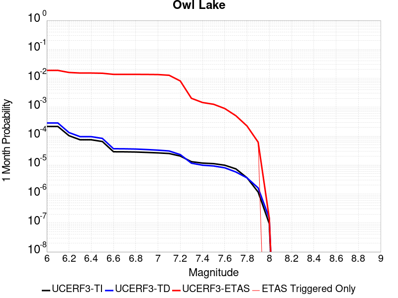 |  |  |

| Magnitude | 1 wk TI Prob | 1 wk TD Prob | 1 wk ETAS Prob | 1 wk ETAS/TD Gain | 1 wk ETAS Triggered Only | 1 mo TI Prob | 1 mo TD Prob | 1 mo ETAS Prob | 1 mo ETAS/TD Gain | 1 mo ETAS Triggered Only | 1 yr TI Prob | 1 yr TD Prob | 1 yr ETAS Prob | 1 yr ETAS/TD Gain | 1 yr ETAS Triggered Only | 10 yr TI Prob | 10 yr TD Prob | 10 yr ETAS Prob | 10 yr ETAS/TD Gain | 10 yr ETAS Triggered Only |
|-----|-----|-----|-----|-----|-----|-----|-----|-----|-----|-----|-----|-----|-----|-----|-----|-----|-----|-----|-----|-----|
| 6.0 | 5.0320643E-5 | 6.635816E-5 | 0.016355278 | 246.46974 | 0.01629 | 2.1564208E-4 | 2.843674E-4 | 0.018709127 | 65.7921 | 0.01843 | 0.0026222812 | 0.0034577388 | 0.024056267 | 6.9572253 | 0.02067 | 0.02591553 | 0.034140717 | 0.05560211 | 1.6286157 | 0.02222 |
| 6.1 | 5.0320643E-5 | 6.635816E-5 | 0.016355278 | 246.46974 | 0.01629 | 2.1564208E-4 | 2.843674E-4 | 0.018709127 | 65.7921 | 0.01843 | 0.0026222812 | 0.0034577388 | 0.024056267 | 6.9572253 | 0.02067 | 0.02591553 | 0.034140717 | 0.05560211 | 1.6286157 | 0.02222 |
| 6.2 | 2.4125871E-5 | 3.0981035E-5 | 0.014070546 | 454.1664 | 0.01404 | 1.0339249E-4 | 1.3277028E-4 | 0.015850684 | 119.38427 | 0.01572 | 0.0012580766 | 0.001615439 | 0.01919699 | 11.883451 | 0.01761 | 0.012509781 | 0.016070465 | 0.03469625 | 2.1590073 | 0.01893 |
| 6.3 | 1.7433485E-5 | 2.2355514E-5 | 0.0134620555 | 602.18054 | 0.01344 | 7.471279E-5 | 9.580672E-5 | 0.015154364 | 158.17642 | 0.01506 | 9.0924866E-4 | 0.0011659743 | 0.017956374 | 15.400317 | 0.01681 | 0.009055373 | 0.011628896 | 0.029409692 | 2.5290184 | 0.01799 |
| 6.4 | 1.7433485E-5 | 2.2355514E-5 | 0.0134620555 | 602.18054 | 0.01344 | 7.471279E-5 | 9.580672E-5 | 0.015154364 | 158.17642 | 0.01506 | 9.0924866E-4 | 0.0011659743 | 0.017956374 | 15.400317 | 0.01681 | 0.009055373 | 0.011628896 | 0.029409692 | 2.5290184 | 0.01799 |
| 6.5 | 1.5182742E-5 | 1.9429144E-5 | 0.013229173 | 680.8932 | 0.01321 | 6.506727E-5 | 8.326596E-5 | 0.014882034 | 178.7289 | 0.0148 | 7.919061E-4 | 0.0010134429 | 0.017506711 | 17.274492 | 0.01651 | 0.0078909 | 0.010118429 | 0.027599737 | 2.7276702 | 0.01766 |
| 6.6 | 6.7271576E-6 | 8.547361E-6 | 0.012228443 | 1430.6688 | 0.01222 | 2.8830356E-5 | 3.6631063E-5 | 0.013626133 | 371.983 | 0.01359 | 3.5095305E-4 | 4.458976E-4 | 0.015529169 | 34.82676 | 0.01509 | 0.0035039932 | 0.004467813 | 0.020525746 | 4.5941377 | 0.01613 |
| 6.7 | 6.682835E-6 | 8.479807E-6 | 0.012218377 | 1440.879 | 0.01221 | 2.8640408E-5 | 3.6341557E-5 | 0.0136158485 | 374.66333 | 0.01358 | 3.4864116E-4 | 4.4237426E-4 | 0.015515704 | 35.0737 | 0.01508 | 0.003480947 | 0.0044327388 | 0.020481283 | 4.6204576 | 0.01612 |
| 6.8 | 6.5774975E-6 | 8.32628E-6 | 0.012218225 | 1467.4288 | 0.01221 | 2.8188972E-5 | 3.5683603E-5 | 0.013615199 | 381.55338 | 0.01358 | 3.4314668E-4 | 4.343669E-4 | 0.015497821 | 35.679104 | 0.01507 | 0.0034261728 | 0.004352885 | 0.02039276 | 4.684884 | 0.01611 |
| 6.9 | 6.363419E-6 | 7.999454E-6 | 0.0121479025 | 1518.5913 | 0.01214 | 2.727151E-5 | 3.428296E-5 | 0.01354382 | 395.05984 | 0.01351 | 3.3198006E-4 | 4.1732067E-4 | 0.015391069 | 36.88068 | 0.01498 | 0.0033148455 | 0.0041828766 | 0.020135866 | 4.81388 | 0.01602 |
| 7.0 | 6.1342453E-6 | 7.6316555E-6 | 0.01202754 | 1576.0066 | 0.01202 | 2.6289357E-5 | 3.2706717E-5 | 0.013402269 | 409.77118 | 0.01337 | 3.2002592E-4 | 3.9813702E-4 | 0.015212237 | 38.208546 | 0.01482 | 0.0031956544 | 0.003991571 | 0.019788265 | 4.9575133 | 0.01586 |
| 7.1 | 5.842926E-6 | 7.142211E-6 | 0.011377061 | 1592.9326 | 0.01137 | 2.504087E-5 | 3.0609146E-5 | 0.012670223 | 413.9358 | 0.01264 | 3.0482994E-4 | 3.7260808E-4 | 0.01439738 | 38.639477 | 0.01403 | 0.0030441214 | 0.0037370329 | 0.01869094 | 5.0015454 | 0.01501 |
| 7.2 | 4.77173E-6 | 5.358483E-6 | 0.00714532 | 1333.4595 | 0.00714 | 2.045011E-5 | 2.2964748E-5 | 0.0080727795 | 351.5292 | 0.00805 | 2.4895166E-4 | 2.79564E-4 | 0.009257054 | 33.112465 | 0.00898 | 0.0024867293 | 0.002808645 | 0.012431541 | 4.4261703 | 0.00965 |
| 7.3 | 3.0494948E-6 | 2.710463E-6 | 0.0017727057 | 654.0232 | 0.00177 | 1.3069198E-5 | 1.1616219E-5 | 0.0020315927 | 174.89278 | 0.00202 | 1.5910587E-4 | 1.4141845E-4 | 0.0023911002 | 16.90798 | 0.00225 | 0.0015899199 | 0.0014232415 | 0.0038597686 | 2.7119565 | 0.00244 |
| 7.4 | 2.7263884E-6 | 2.3056762E-6 | 0.0012723027 | 551.8133 | 0.00127 | 1.1684469E-5 | 9.881433E-6 | 0.0014498672 | 146.72641 | 0.00144 | 1.4224913E-4 | 1.20299905E-4 | 0.0017101086 | 14.215378 | 0.00159 | 0.0014215811 | 0.0012112238 | 0.0029191526 | 2.4100852 | 0.00171 |
| 7.5 | 2.6090431E-6 | 2.1656133E-6 | 0.0010821633 | 499.7029 | 0.00108 | 1.1181565E-5 | 9.281167E-6 | 0.0012592695 | 135.68008 | 0.00125 | 1.3612706E-4 | 1.1299244E-4 | 0.0014928365 | 13.211826 | 0.00138 | 0.001360437 | 0.0011379806 | 0.0026162965 | 2.2990694 | 0.00148 |
| 7.6 | 2.3008756E-6 | 1.8727933E-6 | 8.018713E-4 | 428.1686 | 8.0E-4 | 9.860858E-6 | 8.0262325E-6 | 8.9801906E-4 | 111.8855 | 8.9E-4 | 1.20049335E-4 | 9.7715085E-5 | 0.0010976173 | 11.232834 | 0.001 | 0.001199845 | 9.849932E-4 | 0.0020639293 | 2.0953743 | 0.00108 |
| 7.7 | 1.7184348E-6 | 1.3419171E-6 | 4.7134128E-4 | 351.24472 | 4.7E-4 | 7.3646997E-6 | 5.7510606E-6 | 5.057482E-4 | 87.93998 | 5.0E-4 | 8.966153E-5 | 7.0016955E-5 | 6.2997773E-4 | 8.997502 | 5.6E-4 | 8.962536E-4 | 7.078345E-4 | 0.001277431 | 1.804703 | 5.7E-4 |
| 7.8 | 8.4612907E-7 | 8.4058576E-7 | 2.1084042E-4 | 250.82558 | 2.1E-4 | 3.6262625E-6 | 3.6025056E-6 | 2.2360172E-4 | 62.068386 | 2.2E-4 | 4.4148852E-5 | 4.3859643E-5 | 2.7384955E-4 | 6.2437706 | 2.3E-4 | 4.414008E-4 | 4.4398365E-4 | 6.838771E-4 | 1.5403205 | 2.4E-4 |
| 7.9 | 2.716738E-7 | 3.768106E-7 | 6.0376788E-5 | 160.23114 | 6.0E-5 | 1.1643157E-6 | 1.6149015E-6 | 6.16148E-5 | 38.153908 | 6.0E-5 | 1.4175452E-5 | 1.966126E-5 | 7.966008E-5 | 4.0516267 | 6.0E-5 | 1.4174548E-4 | 1.9836679E-4 | 2.5835488E-4 | 1.30241 | 6.0E-5 |
| 8.0 | 2.1995428E-8 | 3.384878E-8 | 3.384878E-8 | 1.0 | 0.0 | 9.426611E-8 | 1.4506621E-7 | 1.4506621E-7 | 1.0 | 0.0 | 1.1476893E-6 | 1.7661803E-6 | 1.7661803E-6 | 1.0 | 0.0 | 1.14768345E-5 | 1.7963059E-5 | 1.7963059E-5 | 1.0 | 0.0 |

## Panamint Valley
*[(top)](#table-of-contents)*

| 1 Week | 1 Month | 1 Year | 10 Year |
|-----|-----|-----|-----|
|  |  |  |  |

| Magnitude | 1 wk TI Prob | 1 wk TD Prob | 1 wk ETAS Prob | 1 wk ETAS/TD Gain | 1 wk ETAS Triggered Only | 1 mo TI Prob | 1 mo TD Prob | 1 mo ETAS Prob | 1 mo ETAS/TD Gain | 1 mo ETAS Triggered Only | 1 yr TI Prob | 1 yr TD Prob | 1 yr ETAS Prob | 1 yr ETAS/TD Gain | 1 yr ETAS Triggered Only | 10 yr TI Prob | 10 yr TD Prob | 10 yr ETAS Prob | 10 yr ETAS/TD Gain | 10 yr ETAS Triggered Only |
|-----|-----|-----|-----|-----|-----|-----|-----|-----|-----|-----|-----|-----|-----|-----|-----|-----|-----|-----|-----|-----|
| 6.0 | 3.0211835E-5 | 3.3984514E-5 | 0.014713486 | 432.94678 | 0.01468 | 1.2947287E-4 | 1.4563995E-4 | 0.01627329 | 111.73645 | 0.01613 | 0.0015751923 | 0.0017717537 | 0.019669985 | 11.101987 | 0.01793 | 0.015640736 | 0.017583137 | 0.03641607 | 2.071079 | 0.01917 |
| 6.1 | 3.0211835E-5 | 3.3984514E-5 | 0.014713486 | 432.94678 | 0.01468 | 1.2947287E-4 | 1.4563995E-4 | 0.01627329 | 111.73645 | 0.01613 | 0.0015751923 | 0.0017717537 | 0.019669985 | 11.101987 | 0.01793 | 0.015640736 | 0.017583137 | 0.03641607 | 2.071079 | 0.01917 |
| 6.2 | 3.0211835E-5 | 3.3984514E-5 | 0.014713486 | 432.94678 | 0.01468 | 1.2947287E-4 | 1.4563995E-4 | 0.01627329 | 111.73645 | 0.01613 | 0.0015751923 | 0.0017717537 | 0.019669985 | 11.101987 | 0.01793 | 0.015640736 | 0.017583137 | 0.03641607 | 2.071079 | 0.01917 |
| 6.3 | 2.8573924E-5 | 3.210268E-5 | 0.014461639 | 450.48074 | 0.01443 | 1.2245393E-4 | 1.3757581E-4 | 0.015975397 | 116.120674 | 0.01584 | 0.001489857 | 0.0016737265 | 0.019224303 | 11.485929 | 0.01758 | 0.01479908 | 0.016617801 | 0.035105385 | 2.1125169 | 0.0188 |
| 6.4 | 2.8573924E-5 | 3.210268E-5 | 0.014461639 | 450.48074 | 0.01443 | 1.2245393E-4 | 1.3757581E-4 | 0.015975397 | 116.120674 | 0.01584 | 0.001489857 | 0.0016737265 | 0.019224303 | 11.485929 | 0.01758 | 0.01479908 | 0.016617801 | 0.035105385 | 2.1125169 | 0.0188 |
| 6.5 | 2.7468774E-5 | 3.0828433E-5 | 0.01425039 | 462.24826 | 0.01422 | 1.1771801E-4 | 1.3211532E-4 | 0.015750052 | 119.214424 | 0.01562 | 0.0014322745 | 0.0016073446 | 0.018949425 | 11.789273 | 0.01737 | 0.014230782 | 0.015963677 | 0.03424707 | 2.1453123 | 0.01858 |
| 6.6 | 2.6135967E-5 | 2.925248E-5 | 0.014078842 | 481.2871 | 0.01405 | 1.1200648E-4 | 1.253619E-4 | 0.015553428 | 124.06822 | 0.01543 | 0.0013628257 | 0.0015252391 | 0.018599158 | 12.194258 | 0.0171 | 0.013544982 | 0.015154043 | 0.03315703 | 2.1879988 | 0.01828 |
| 6.7 | 2.4498746E-5 | 2.7341335E-5 | 0.013786965 | 504.25354 | 0.01376 | 1.04990395E-4 | 1.1717203E-4 | 0.0152154025 | 129.85526 | 0.0151 | 0.0012775084 | 0.0014256609 | 0.018121824 | 12.711173 | 0.01672 | 0.012701893 | 0.014171274 | 0.031778175 | 2.242436 | 0.01786 |
| 6.8 | 2.2244329E-5 | 2.4935423E-5 | 0.013314604 | 533.9634 | 0.01329 | 9.532935E-5 | 1.0686185E-4 | 0.014675305 | 137.3297 | 0.01457 | 0.0011600169 | 0.0013002884 | 0.017379353 | 13.365769 | 0.0161 | 0.011539802 | 0.0129325185 | 0.029900208 | 2.3120174 | 0.01719 |
| 6.9 | 1.9902658E-5 | 2.2290267E-5 | 0.012452013 | 558.63007 | 0.01243 | 8.529431E-5 | 9.552632E-5 | 0.013654231 | 142.93684 | 0.01356 | 0.0010379635 | 0.0011624309 | 0.016144995 | 13.888992 | 0.015 | 0.010331288 | 0.011568608 | 0.027373625 | 2.3661988 | 0.01599 |
| 7.0 | 1.8353881E-5 | 2.0566185E-5 | 0.011900322 | 578.6353 | 0.01188 | 7.865712E-5 | 8.813792E-5 | 0.013016998 | 147.68896 | 0.01293 | 9.5722964E-4 | 0.0010725686 | 0.0153772095 | 14.336807 | 0.01432 | 0.009531168 | 0.010678849 | 0.025765996 | 2.4128065 | 0.01525 |
| 7.1 | 1.7667631E-5 | 1.9772613E-5 | 0.011469546 | 580.0724 | 0.01145 | 7.571623E-5 | 8.473711E-5 | 0.012583678 | 148.50255 | 0.0125 | 9.2145515E-4 | 0.0010312037 | 0.014876911 | 14.426744 | 0.01386 | 0.009176437 | 0.010269073 | 0.024877502 | 2.4225655 | 0.01476 |
| 7.2 | 1.6381597E-5 | 1.8158249E-5 | 0.010197974 | 561.6165 | 0.01018 | 7.020495E-5 | 7.781885E-5 | 0.011156957 | 143.37088 | 0.01108 | 8.544101E-4 | 9.4704994E-4 | 0.0132753635 | 14.017596 | 0.01234 | 0.008511325 | 0.009434792 | 0.022431007 | 2.3774776 | 0.01312 |
| 7.3 | 1.4520491E-5 | 1.5966476E-5 | 0.008525831 | 533.9833 | 0.00851 | 6.222919E-5 | 6.842605E-5 | 0.009327793 | 136.31932 | 0.00926 | 7.57377E-4 | 8.327849E-4 | 0.011124208 | 13.357839 | 0.0103 | 0.0075480095 | 0.00829975 | 0.01918862 | 2.3119514 | 0.01098 |
| 7.4 | 1.2852287E-5 | 1.4145411E-5 | 0.008294028 | 586.3406 | 0.00828 | 5.5080065E-5 | 6.062187E-5 | 0.009080075 | 149.78217 | 0.00902 | 6.7039346E-4 | 7.378371E-4 | 0.010770429 | 14.597299 | 0.01004 | 0.0066837464 | 0.0073567946 | 0.01799793 | 2.4464364 | 0.01072 |
| 7.5 | 1.1637851E-5 | 1.2836797E-5 | 0.008212731 | 639.7804 | 0.0082 | 4.987555E-5 | 5.5013777E-5 | 0.008994522 | 163.49582 | 0.00894 | 6.070656E-4 | 6.6960254E-4 | 0.0106229335 | 15.864535 | 0.00996 | 0.006054099 | 0.0066787465 | 0.01723775 | 2.580986 | 0.01063 |
| 7.6 | 3.0068115E-6 | 3.3330316E-6 | 0.003603321 | 1081.0942 | 0.0036 | 1.2886271E-5 | 1.4284384E-5 | 0.003954228 | 276.82175 | 0.00394 | 1.5687906E-4 | 1.7390578E-4 | 0.0046431283 | 26.699104 | 0.00447 | 0.0015676835 | 0.0017391363 | 0.0065307883 | 3.7551906 | 0.0048 |

## Garlock (East)
*[(top)](#table-of-contents)*

| 1 Week | 1 Month | 1 Year | 10 Year |
|-----|-----|-----|-----|
|  |  | 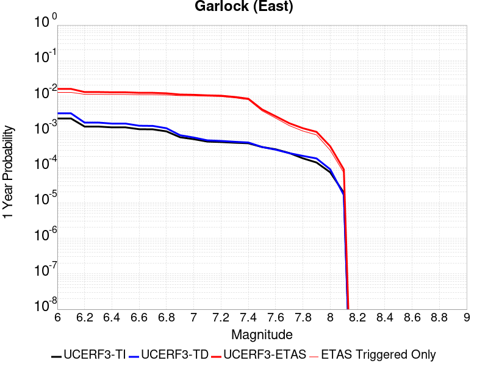 |  |

| Magnitude | 1 wk TI Prob | 1 wk TD Prob | 1 wk ETAS Prob | 1 wk ETAS/TD Gain | 1 wk ETAS Triggered Only | 1 mo TI Prob | 1 mo TD Prob | 1 mo ETAS Prob | 1 mo ETAS/TD Gain | 1 mo ETAS Triggered Only | 1 yr TI Prob | 1 yr TD Prob | 1 yr ETAS Prob | 1 yr ETAS/TD Gain | 1 yr ETAS Triggered Only | 10 yr TI Prob | 10 yr TD Prob | 10 yr ETAS Prob | 10 yr ETAS/TD Gain | 10 yr ETAS Triggered Only |
|-----|-----|-----|-----|-----|-----|-----|-----|-----|-----|-----|-----|-----|-----|-----|-----|-----|-----|-----|-----|-----|
| 6.0 | 4.5092507E-5 | 6.290325E-5 | 0.01045225 | 166.16391 | 0.01039 | 1.9323928E-4 | 2.6956003E-4 | 0.011746465 | 43.57644 | 0.01148 | 0.0023501497 | 0.0032774 | 0.015965678 | 4.8714466 | 0.01273 | 0.023254504 | 0.032351844 | 0.045686036 | 1.4121617 | 0.01378 |
| 6.1 | 4.5092507E-5 | 6.290325E-5 | 0.01045225 | 166.16391 | 0.01039 | 1.9323928E-4 | 2.6956003E-4 | 0.011746465 | 43.57644 | 0.01148 | 0.0023501497 | 0.0032774 | 0.015965678 | 4.8714466 | 0.01273 | 0.023254504 | 0.032351844 | 0.045686036 | 1.4121617 | 0.01378 |
| 6.2 | 2.6674514E-5 | 3.4509674E-5 | 0.009364188 | 271.34964 | 0.00933 | 1.1431433E-4 | 1.4789042E-4 | 0.010446367 | 70.635864 | 0.0103 | 0.0013908884 | 0.0017991117 | 0.013018889 | 7.2362876 | 0.01124 | 0.01382215 | 0.017890299 | 0.029842574 | 1.6680869 | 0.01217 |
| 6.3 | 2.6674514E-5 | 3.4509674E-5 | 0.009364188 | 271.34964 | 0.00933 | 1.1431433E-4 | 1.4789042E-4 | 0.010446367 | 70.635864 | 0.0103 | 0.0013908884 | 0.0017991117 | 0.013018889 | 7.2362876 | 0.01124 | 0.01382215 | 0.017890299 | 0.029842574 | 1.6680869 | 0.01217 |
| 6.4 | 2.5312667E-5 | 3.233893E-5 | 0.009292039 | 287.33292 | 0.00926 | 1.0847834E-4 | 1.3858822E-4 | 0.010357172 | 74.73342 | 0.01022 | 0.0013199237 | 0.0016860351 | 0.012817236 | 7.6019983 | 0.01115 | 0.013121112 | 0.016778335 | 0.028626157 | 1.706138 | 0.01205 |
| 6.5 | 2.5312667E-5 | 3.233893E-5 | 0.009292039 | 287.33292 | 0.00926 | 1.0847834E-4 | 1.3858822E-4 | 0.010357172 | 74.73342 | 0.01022 | 0.0013199237 | 0.0016860351 | 0.012817236 | 7.6019983 | 0.01115 | 0.013121112 | 0.016778335 | 0.028626157 | 1.706138 | 0.01205 |
| 6.6 | 2.246556E-5 | 2.8133776E-5 | 0.009137877 | 324.80096 | 0.00911 | 9.627742E-5 | 1.20567885E-4 | 0.010159357 | 84.26255 | 0.01004 | 0.0011715472 | 0.0014669491 | 0.0123909 | 8.446714 | 0.01094 | 0.011653901 | 0.01461866 | 0.026275722 | 1.7974097 | 0.01183 |
| 6.7 | 2.2241198E-5 | 2.7803519E-5 | 0.00913755 | 328.64725 | 0.00911 | 9.531594E-5 | 1.1915263E-4 | 0.010157957 | 85.25163 | 0.01004 | 0.0011598538 | 0.0014497414 | 0.012373881 | 8.5352335 | 0.01094 | 0.011538187 | 0.014448853 | 0.026107924 | 1.80692 | 0.01183 |
| 6.8 | 1.9528685E-5 | 2.389819E-5 | 0.008983684 | 375.91483 | 0.00896 | 8.369167E-5 | 1.0241691E-4 | 0.009971406 | 97.36094 | 0.00987 | 0.0010184698 | 0.0012462323 | 0.011982835 | 9.615251 | 0.01075 | 0.010138147 | 0.012436427 | 0.023911916 | 1.9227319 | 0.01162 |
| 6.9 | 1.3318621E-5 | 1.5198884E-5 | 0.008625068 | 567.48035 | 0.00861 | 5.7078556E-5 | 6.513648E-5 | 0.009544519 | 146.53108 | 0.00948 | 6.9470983E-4 | 7.927538E-4 | 0.011084588 | 13.982384 | 0.0103 | 0.0069254204 | 0.007939888 | 0.018971596 | 2.3894036 | 0.01112 |
| 7.0 | 1.1760853E-5 | 1.31077895E-5 | 0.008582995 | 654.80115 | 0.00857 | 5.0402683E-5 | 5.6175057E-5 | 0.009465646 | 168.50266 | 0.00941 | 6.134799E-4 | 6.8372174E-4 | 0.010896734 | 15.937382 | 0.01022 | 0.0061178906 | 0.00685652 | 0.017810892 | 2.5976577 | 0.01103 |
| 7.1 | 1.0064758E-5 | 1.0902931E-5 | 0.008340812 | 765.0065 | 0.00833 | 4.3133965E-5 | 4.672603E-5 | 0.009196298 | 196.81319 | 0.00915 | 5.2502943E-4 | 5.687444E-4 | 0.010503091 | 18.467155 | 0.00994 | 0.005237907 | 0.0057129986 | 0.016361812 | 2.8639622 | 0.01071 |
| 7.2 | 9.768808E-6 | 1.0498807E-5 | 0.008170413 | 778.223 | 0.00816 | 4.186565E-5 | 4.499413E-5 | 0.009004591 | 200.12813 | 0.00896 | 5.095951E-4 | 5.4766936E-4 | 0.010272341 | 18.756464 | 0.00973 | 0.0050842804 | 0.0055032647 | 0.015945481 | 2.8974583 | 0.0105 |
| 7.3 | 9.344516E-6 | 9.944468E-6 | 0.0075598694 | 760.20856 | 0.00755 | 4.004731E-5 | 4.261847E-5 | 0.008312266 | 195.03905 | 0.00827 | 4.8746695E-4 | 5.1875977E-4 | 0.009474112 | 18.263002 | 0.00896 | 0.0048639905 | 0.0052149445 | 0.014804672 | 2.8388937 | 0.00964 |
| 7.4 | 9.023491E-6 | 9.490661E-6 | 0.0067494265 | 711.1651 | 0.00674 | 3.867153E-5 | 4.0673647E-5 | 0.007390375 | 181.69934 | 0.00735 | 4.7072413E-4 | 4.950925E-4 | 0.008451152 | 17.069845 | 0.00796 | 0.004697283 | 0.0049783974 | 0.013495782 | 2.7108688 | 0.00856 |
| 7.5 | 7.081253E-6 | 7.087672E-6 | 0.0032570646 | 459.5394 | 0.00325 | 3.0347876E-5 | 3.0375388E-5 | 0.0036102666 | 118.854996 | 0.00358 | 3.6942272E-4 | 3.6975832E-4 | 0.0042383275 | 11.462426 | 0.00387 | 0.003688092 | 0.0037243143 | 0.007878784 | 2.1154993 | 0.00417 |
| 7.6 | 6.116396E-6 | 5.959245E-6 | 0.002055947 | 345.00128 | 0.00205 | 2.6212863E-5 | 2.5539372E-5 | 0.0022854817 | 89.48856 | 0.00226 | 3.1909486E-4 | 3.1089774E-4 | 0.0027201485 | 8.749335 | 0.00241 | 0.0031863707 | 0.0031357552 | 0.0057176338 | 1.8233674 | 0.00259 |
| 7.7 | 4.797145E-6 | 4.757281E-6 | 0.0012847512 | 270.05997 | 0.00128 | 2.055903E-5 | 2.0388188E-5 | 0.0014203596 | 69.66581 | 0.0014 | 2.5027743E-4 | 2.4819805E-4 | 0.0017278307 | 6.9615 | 0.00148 | 0.0024999576 | 0.0025093474 | 0.0040454827 | 1.6121655 | 0.00154 |
| 7.8 | 3.4028885E-6 | 3.978462E-6 | 9.139748E-4 | 229.73071 | 9.1E-4 | 1.4583726E-5 | 1.7050439E-5 | 0.0010070335 | 59.06203 | 9.9E-4 | 1.775424E-4 | 2.0756939E-4 | 0.0012473535 | 6.0093327 | 0.00104 | 0.0017740062 | 0.0021012232 | 0.0031589959 | 1.5034081 | 0.00106 |
| 7.9 | 2.5928412E-6 | 3.3724489E-6 | 7.2337E-4 | 214.49399 | 7.2E-4 | 1.1112129E-5 | 1.4453272E-5 | 7.94442E-4 | 54.966236 | 7.8E-4 | 1.3528178E-4 | 1.7595445E-4 | 9.858119E-4 | 5.602654 | 8.1E-4 | 0.0013519945 | 0.0017812408 | 0.0026097624 | 1.4651374 | 8.3E-4 |
| 8.0 | 1.3743648E-6 | 1.6734747E-6 | 2.7167302E-4 | 162.34068 | 2.7E-4 | 5.8901214E-6 | 7.1720146E-6 | 2.9716993E-4 | 41.43465 | 2.9E-4 | 7.1709874E-5 | 8.731581E-5 | 3.8728962E-4 | 4.435504 | 3.0E-4 | 7.1686733E-4 | 8.837234E-4 | 0.0012034406 | 1.3617842 | 3.2E-4 |
| 8.1 | 3.6733252E-7 | 3.1489964E-7 | 7.0314876E-5 | 223.29297 | 7.0E-5 | 1.5742813E-6 | 1.3495693E-6 | 7.1349474E-5 | 52.86833 | 7.0E-5 | 1.9166706E-5 | 1.6430899E-5 | 8.642975E-5 | 5.260196 | 7.0E-5 | 1.9165053E-4 | 1.6638759E-4 | 2.463743E-4 | 1.480725 | 8.0E-5 |

## Hunter Mountain-Saline Valley
*[(top)](#table-of-contents)*

| 1 Week | 1 Month | 1 Year | 10 Year |
|-----|-----|-----|-----|
|  |  |  |  |

| Magnitude | 1 wk TI Prob | 1 wk TD Prob | 1 wk ETAS Prob | 1 wk ETAS/TD Gain | 1 wk ETAS Triggered Only | 1 mo TI Prob | 1 mo TD Prob | 1 mo ETAS Prob | 1 mo ETAS/TD Gain | 1 mo ETAS Triggered Only | 1 yr TI Prob | 1 yr TD Prob | 1 yr ETAS Prob | 1 yr ETAS/TD Gain | 1 yr ETAS Triggered Only | 10 yr TI Prob | 10 yr TD Prob | 10 yr ETAS Prob | 10 yr ETAS/TD Gain | 10 yr ETAS Triggered Only |
|-----|-----|-----|-----|-----|-----|-----|-----|-----|-----|-----|-----|-----|-----|-----|-----|-----|-----|-----|-----|-----|
| 6.0 | 4.5103672E-5 | 5.4570177E-5 | 0.00849411 | 155.6548 | 0.00844 | 1.9328714E-4 | 2.3385242E-4 | 0.009431701 | 40.33185 | 0.0092 | 0.002350731 | 0.0028435152 | 0.01306437 | 4.5944433 | 0.01025 | 0.023260195 | 0.028091887 | 0.038744 | 1.3791882 | 0.01096 |
| 6.1 | 4.5103672E-5 | 5.4570177E-5 | 0.00849411 | 155.6548 | 0.00844 | 1.9328714E-4 | 2.3385242E-4 | 0.009431701 | 40.33185 | 0.0092 | 0.002350731 | 0.0028435152 | 0.01306437 | 4.5944433 | 0.01025 | 0.023260195 | 0.028091887 | 0.038744 | 1.3791882 | 0.01096 |
| 6.2 | 3.9363465E-5 | 4.706337E-5 | 0.0084666675 | 179.89929 | 0.00842 | 1.6868966E-4 | 2.0168544E-4 | 0.009369836 | 46.457672 | 0.00917 | 0.002051862 | 0.0024528175 | 0.01264775 | 5.156417 | 0.01022 | 0.020330196 | 0.024273481 | 0.03493817 | 1.4393556 | 0.01093 |
| 6.3 | 3.9363465E-5 | 4.706337E-5 | 0.0084666675 | 179.89929 | 0.00842 | 1.6868966E-4 | 2.0168544E-4 | 0.009369836 | 46.457672 | 0.00917 | 0.002051862 | 0.0024528175 | 0.01264775 | 5.156417 | 0.01022 | 0.020330196 | 0.024273481 | 0.03493817 | 1.4393556 | 0.01093 |
| 6.4 | 3.2311684E-5 | 3.795099E-5 | 0.008427633 | 222.06621 | 0.00839 | 1.384713E-4 | 1.6263737E-4 | 0.009301151 | 57.189507 | 0.00914 | 0.0016845843 | 0.0019783843 | 0.012148225 | 6.1404777 | 0.01019 | 0.016718714 | 0.019616475 | 0.030292852 | 1.5442556 | 0.01089 |
| 6.5 | 3.2311684E-5 | 3.795099E-5 | 0.008427633 | 222.06621 | 0.00839 | 1.384713E-4 | 1.6263737E-4 | 0.009301151 | 57.189507 | 0.00914 | 0.0016845843 | 0.0019783843 | 0.012148225 | 6.1404777 | 0.01019 | 0.016718714 | 0.019616475 | 0.030292852 | 1.5442556 | 0.01089 |
| 6.6 | 2.9305844E-5 | 3.418183E-5 | 0.008413895 | 246.1511 | 0.00838 | 1.2559042E-4 | 1.4648569E-4 | 0.009275149 | 63.317776 | 0.00913 | 0.0015279909 | 0.001782067 | 0.011943925 | 6.7022877 | 0.01018 | 0.015175272 | 0.01768569 | 0.028373271 | 1.6043066 | 0.01088 |
| 6.7 | 2.7826512E-5 | 3.2344276E-5 | 0.008412073 | 260.0792 | 0.00838 | 1.19251024E-4 | 1.386113E-4 | 0.009267346 | 66.85851 | 0.00913 | 0.0014509142 | 0.0016863465 | 0.011839196 | 7.0206194 | 0.01017 | 0.014414776 | 0.016743187 | 0.027421355 | 1.6377621 | 0.01086 |
| 6.8 | 2.3389874E-5 | 2.6866714E-5 | 0.0083666425 | 311.41293 | 0.00834 | 1.0023846E-4 | 1.15138246E-4 | 0.0092040915 | 79.93948 | 0.00909 | 0.00121972 | 0.001400954 | 0.011516762 | 8.220657 | 0.01013 | 0.01213047 | 0.013927434 | 0.02459674 | 1.7660639 | 0.01082 |
| 6.9 | 2.069209E-5 | 2.3570032E-5 | 0.008333374 | 353.55804 | 0.00831 | 8.867737E-5 | 1.01010715E-4 | 0.009160096 | 90.684395 | 0.00906 | 0.0010791123 | 0.0012291478 | 0.011306746 | 9.19885 | 0.01009 | 0.010738871 | 0.012228523 | 0.0228767 | 1.8707656 | 0.01078 |
| 7.0 | 1.7462342E-5 | 1.9633546E-5 | 0.0083094705 | 423.22824 | 0.00829 | 7.483646E-5 | 8.414118E-5 | 0.009113382 | 108.31059 | 0.00903 | 9.1075303E-4 | 0.0010239601 | 0.011073659 | 10.814542 | 0.01006 | 0.009070295 | 0.0101960525 | 0.020836445 | 2.0435796 | 0.01075 |
| 7.1 | 1.4807709E-5 | 1.6441749E-5 | 0.008286306 | 503.97955 | 0.00827 | 6.3460066E-5 | 7.046283E-5 | 0.009079828 | 128.85982 | 0.00901 | 7.723524E-4 | 8.575638E-4 | 0.010888954 | 12.697544 | 0.01004 | 0.007696735 | 0.008545532 | 0.019173924 | 2.2437367 | 0.01072 |
| 7.2 | 1.4180048E-5 | 1.5698337E-5 | 0.008265569 | 526.52515 | 0.00825 | 6.077022E-5 | 6.727694E-5 | 0.009056672 | 134.61778 | 0.00899 | 7.396263E-4 | 8.188051E-4 | 0.010830601 | 13.227324 | 0.01002 | 0.0073716943 | 0.008160833 | 0.018773513 | 2.3004405 | 0.0107 |
| 7.3 | 1.3730402E-5 | 1.5172075E-5 | 0.008245047 | 543.43567 | 0.00823 | 5.8843252E-5 | 6.502165E-5 | 0.009034438 | 138.94508 | 0.00897 | 7.161811E-4 | 7.9136714E-4 | 0.0107834535 | 13.62636 | 0.01 | 0.007138774 | 0.007888422 | 0.018484175 | 2.3432028 | 0.01068 |
| 7.4 | 1.2810095E-5 | 1.4109277E-5 | 0.008233993 | 583.58716 | 0.00822 | 5.489925E-5 | 6.0467017E-5 | 0.009009926 | 149.00563 | 0.00895 | 6.681934E-4 | 7.359531E-4 | 0.010698616 | 14.537089 | 0.00997 | 0.006661878 | 0.007338053 | 0.017909903 | 2.4406886 | 0.01065 |
| 7.5 | 1.1595659E-5 | 1.2800664E-5 | 0.008152696 | 636.89636 | 0.00814 | 4.9694736E-5 | 5.4858923E-5 | 0.0089243725 | 162.67859 | 0.00887 | 6.0486543E-4 | 6.6771836E-4 | 0.010551115 | 15.8017435 | 0.00989 | 0.006032217 | 0.0066599925 | 0.017149663 | 2.5750275 | 0.01056 |
| 7.6 | 2.997694E-6 | 3.3251579E-6 | 0.0035933133 | 1080.6444 | 0.00359 | 1.28471975E-5 | 1.425064E-5 | 0.0039441944 | 276.77316 | 0.00393 | 1.564034E-4 | 1.73495E-4 | 0.004632721 | 26.702332 | 0.00446 | 0.0015629337 | 0.001735031 | 0.00651672 | 3.7559676 | 0.00479 |

## Garlock (West)
*[(top)](#table-of-contents)*

| 1 Week | 1 Month | 1 Year | 10 Year |
|-----|-----|-----|-----|
|  |  |  |  |

| Magnitude | 1 wk TI Prob | 1 wk TD Prob | 1 wk ETAS Prob | 1 wk ETAS/TD Gain | 1 wk ETAS Triggered Only | 1 mo TI Prob | 1 mo TD Prob | 1 mo ETAS Prob | 1 mo ETAS/TD Gain | 1 mo ETAS Triggered Only | 1 yr TI Prob | 1 yr TD Prob | 1 yr ETAS Prob | 1 yr ETAS/TD Gain | 1 yr ETAS Triggered Only | 10 yr TI Prob | 10 yr TD Prob | 10 yr ETAS Prob | 10 yr ETAS/TD Gain | 10 yr ETAS Triggered Only |
|-----|-----|-----|-----|-----|-----|-----|-----|-----|-----|-----|-----|-----|-----|-----|-----|-----|-----|-----|-----|-----|
| 6.0 | 2.5181727E-5 | 2.51973E-5 | 0.0060050464 | 238.32103 | 0.00598 | 1.0791722E-4 | 1.0798398E-4 | 0.0067772637 | 62.761753 | 0.00667 | 0.0013131002 | 0.0013139155 | 0.008504455 | 6.4726048 | 0.0072 | 0.013053683 | 0.013141977 | 0.020790126 | 1.5819634 | 0.00775 |
| 6.1 | 2.5077732E-5 | 2.5098372E-5 | 0.006004948 | 239.25648 | 0.00598 | 1.0747157E-4 | 1.0756004E-4 | 0.0067768428 | 63.00521 | 0.00667 | 0.001307681 | 0.0013087603 | 0.008499337 | 6.4941897 | 0.0072 | 0.013000126 | 0.013091032 | 0.020739578 | 1.5842583 | 0.00775 |
| 6.2 | 2.494612E-5 | 2.498005E-5 | 0.006004831 | 240.38506 | 0.00598 | 1.0690756E-4 | 1.0705298E-4 | 0.006776339 | 63.298927 | 0.00667 | 0.0013008224 | 0.0013025942 | 0.008493216 | 6.5202312 | 0.0072 | 0.012932341 | 0.013030097 | 0.020679114 | 1.5870268 | 0.00775 |
| 6.3 | 2.4733758E-5 | 2.479942E-5 | 0.006004651 | 242.1287 | 0.00598 | 1.0599751E-4 | 1.06278916E-4 | 0.00677557 | 63.75272 | 0.00667 | 0.0012897556 | 0.0012931811 | 0.00848387 | 6.5604653 | 0.0072 | 0.012822957 | 0.012937066 | 0.020586804 | 1.591304 | 0.00775 |
| 6.4 | 2.3237335E-5 | 2.317873E-5 | 0.0059930403 | 258.55774 | 0.00597 | 9.958477E-5 | 9.933365E-5 | 0.006758672 | 68.04011 | 0.00666 | 0.0012117702 | 0.001208719 | 0.008390028 | 6.941256 | 0.00719 | 0.012051838 | 0.012101916 | 0.019748246 | 1.6318282 | 0.00774 |
| 6.5 | 2.2732203E-5 | 2.2993298E-5 | 0.005992856 | 260.63492 | 0.00597 | 9.742009E-5 | 9.8539E-5 | 0.006757883 | 68.580795 | 0.00666 | 0.0011854442 | 0.0011990548 | 0.008380434 | 6.9891996 | 0.00719 | 0.011791403 | 0.012006322 | 0.019653393 | 1.6369203 | 0.00774 |
| 6.6 | 2.1319436E-5 | 2.17735E-5 | 0.0059916433 | 275.18054 | 0.00597 | 9.136581E-5 | 9.331167E-5 | 0.0067526903 | 72.36705 | 0.00666 | 0.001111811 | 0.0011354799 | 0.008317316 | 7.324935 | 0.00719 | 0.011062649 | 0.011377227 | 0.019029167 | 1.6725664 | 0.00774 |
| 6.7 | 1.970802E-5 | 2.0393396E-5 | 0.0059902715 | 293.73587 | 0.00597 | 8.446021E-5 | 8.739735E-5 | 0.006746815 | 77.19702 | 0.00666 | 0.001027818 | 0.001063545 | 0.008245898 | 7.7532196 | 0.00719 | 0.010230771 | 0.010664964 | 0.018322418 | 1.7180008 | 0.00774 |
| 6.8 | 1.8744462E-5 | 1.9901045E-5 | 0.0059797824 | 300.4758 | 0.00596 | 8.033094E-5 | 8.5287415E-5 | 0.0067347204 | 78.965 | 0.00665 | 9.775903E-4 | 0.0010378812 | 0.008210429 | 7.9107594 | 0.00718 | 0.009733009 | 0.01041075 | 0.018060276 | 1.7347717 | 0.00773 |
| 6.9 | 1.7559682E-5 | 1.8953415E-5 | 0.005968841 | 314.92166 | 0.00595 | 7.5253614E-5 | 8.12264E-5 | 0.0067206873 | 82.74018 | 0.00664 | 9.158276E-4 | 9.884841E-4 | 0.008151397 | 8.246361 | 0.00717 | 0.0091206245 | 0.009921231 | 0.01756464 | 1.7704092 | 0.00772 |
| 7.0 | 1.6794445E-5 | 1.8216237E-5 | 0.0059381085 | 325.97888 | 0.00592 | 7.197421E-5 | 7.8067256E-5 | 0.0066875513 | 85.66397 | 0.00661 | 8.759337E-4 | 9.5005584E-4 | 0.008083273 | 8.508208 | 0.00714 | 0.008724891 | 0.009540141 | 0.017156776 | 1.7983778 | 0.00769 |
| 7.1 | 1.6337795E-5 | 1.7717046E-5 | 0.005907613 | 333.44232 | 0.00589 | 7.0017246E-5 | 7.5927994E-5 | 0.0066554286 | 87.65448 | 0.00658 | 8.521265E-4 | 9.240326E-4 | 0.008017472 | 8.676612 | 0.0071 | 0.008488664 | 0.009281996 | 0.016860988 | 1.8165262 | 0.00765 |
| 7.2 | 1.5780008E-5 | 1.7165687E-5 | 0.005887065 | 342.9554 | 0.00587 | 6.762685E-5 | 7.356516E-5 | 0.0066330824 | 90.166084 | 0.00656 | 8.2304585E-4 | 8.9528906E-4 | 0.00795896 | 8.889821 | 0.00707 | 0.008200042 | 0.008996838 | 0.016548282 | 1.8393443 | 0.00762 |
| 7.3 | 1.5058865E-5 | 1.6618762E-5 | 0.005846522 | 351.8025 | 0.00583 | 6.45364E-5 | 7.122133E-5 | 0.006580758 | 92.3987 | 0.00651 | 7.854473E-4 | 8.667759E-4 | 0.007880691 | 9.091959 | 0.00702 | 0.00782677 | 0.008713539 | 0.016207663 | 1.8600554 | 0.00756 |
| 7.4 | 1.4887923E-5 | 1.6454731E-5 | 0.0057263607 | 348.00693 | 0.00571 | 6.380382E-5 | 7.051838E-5 | 0.006420071 | 91.0411 | 0.00635 | 7.7653467E-4 | 8.582243E-4 | 0.0077023455 | 8.974747 | 0.00685 | 0.0077382675 | 0.008628399 | 0.015934808 | 1.8467861 | 0.00737 |
| 7.5 | 1.4509299E-5 | 1.6046748E-5 | 0.005165964 | 321.93216 | 0.00515 | 6.218123E-5 | 6.876997E-5 | 0.005838373 | 84.897125 | 0.00577 | 7.567935E-4 | 8.36954E-4 | 0.007081723 | 8.461306 | 0.00625 | 0.0075422134 | 0.008416704 | 0.0150900595 | 1.7928704 | 0.00673 |
| 7.6 | 1.2756717E-5 | 1.4050848E-5 | 0.003424003 | 243.68657 | 0.00341 | 5.4670498E-5 | 6.0216535E-5 | 0.0038799865 | 64.43391 | 0.00382 | 6.6541E-4 | 7.328904E-4 | 0.0048598633 | 6.631092 | 0.00413 | 0.006634211 | 0.0073816874 | 0.011808765 | 1.5997379 | 0.00446 |
| 7.7 | 1.0328985E-5 | 1.1460557E-5 | 0.0022014354 | 192.088 | 0.00219 | 4.4266326E-5 | 4.911575E-5 | 0.002468997 | 50.268944 | 0.00242 | 5.388092E-4 | 5.978206E-4 | 0.0032062603 | 5.3632483 | 0.00261 | 0.0053750467 | 0.006038511 | 0.008771906 | 1.4526602 | 0.00275 |
| 7.8 | 7.0306583E-6 | 8.899601E-6 | 0.001528886 | 171.79265 | 0.00152 | 3.0131043E-5 | 3.814059E-5 | 0.0017180765 | 45.04588 | 0.00168 | 3.667837E-4 | 4.642629E-4 | 0.0022534318 | 4.853784 | 0.00179 | 0.003661789 | 0.0046952725 | 0.0065763984 | 1.4006425 | 0.00189 |
| 7.9 | 4.060633E-6 | 5.4653938E-6 | 0.0010054599 | 183.96843 | 0.001 | 1.7402595E-5 | 2.3422906E-5 | 0.0011333969 | 48.388397 | 0.00111 | 2.11856E-4 | 2.851367E-4 | 0.0014448059 | 5.0670643 | 0.00116 | 0.0021165414 | 0.002884201 | 0.004100682 | 1.4217741 | 0.00122 |
| 8.0 | 1.6729537E-6 | 2.0775144E-6 | 3.1207688E-4 | 150.21646 | 3.1E-4 | 7.169782E-6 | 8.903603E-6 | 3.4890056E-4 | 39.186447 | 3.4E-4 | 8.7288594E-5 | 1.0839601E-4 | 4.5835806E-4 | 4.2285514 | 3.5E-4 | 8.7254314E-4 | 0.0010969337 | 0.0014665279 | 1.3369339 | 3.7E-4 |
| 8.1 | 3.6733252E-7 | 3.1489964E-7 | 7.0314876E-5 | 223.29297 | 7.0E-5 | 1.5742813E-6 | 1.3495693E-6 | 7.1349474E-5 | 52.86833 | 7.0E-5 | 1.9166706E-5 | 1.6430899E-5 | 8.642975E-5 | 5.260196 | 7.0E-5 | 1.9165053E-4 | 1.6638759E-4 | 2.463743E-4 | 1.480725 | 8.0E-5 |

## Blackwater
*[(top)](#table-of-contents)*

| 1 Week | 1 Month | 1 Year | 10 Year |
|-----|-----|-----|-----|
|  |  |  |  |

| Magnitude | 1 wk TI Prob | 1 wk TD Prob | 1 wk ETAS Prob | 1 wk ETAS/TD Gain | 1 wk ETAS Triggered Only | 1 mo TI Prob | 1 mo TD Prob | 1 mo ETAS Prob | 1 mo ETAS/TD Gain | 1 mo ETAS Triggered Only | 1 yr TI Prob | 1 yr TD Prob | 1 yr ETAS Prob | 1 yr ETAS/TD Gain | 1 yr ETAS Triggered Only | 10 yr TI Prob | 10 yr TD Prob | 10 yr ETAS Prob | 10 yr ETAS/TD Gain | 10 yr ETAS Triggered Only |
|-----|-----|-----|-----|-----|-----|-----|-----|-----|-----|-----|-----|-----|-----|-----|-----|-----|-----|-----|-----|-----|
| 6.0 | 3.0708583E-5 | 3.3095846E-5 | 0.0034229837 | 103.42638 | 0.00339 | 1.3160157E-4 | 1.4183241E-4 | 0.0039412933 | 27.788383 | 0.0038 | 0.0016010714 | 0.0017255784 | 0.006117986 | 3.5454695 | 0.0044 | 0.015895851 | 0.017135633 | 0.021922182 | 1.2793331 | 0.00487 |
| 6.1 | 3.0708583E-5 | 3.3095846E-5 | 0.0034229837 | 103.42638 | 0.00339 | 1.3160157E-4 | 1.4183241E-4 | 0.0039412933 | 27.788383 | 0.0038 | 0.0016010714 | 0.0017255784 | 0.006117986 | 3.5454695 | 0.0044 | 0.015895851 | 0.017135633 | 0.021922182 | 1.2793331 | 0.00487 |
| 6.2 | 1.1707779E-5 | 1.2545122E-5 | 0.0013225287 | 105.421745 | 0.00131 | 5.017523E-5 | 5.3763757E-5 | 0.0015236847 | 28.34037 | 0.00147 | 6.107122E-4 | 6.5438676E-4 | 0.0023532743 | 3.596152 | 0.0017 | 0.006090366 | 0.0065255696 | 0.008393302 | 1.2862175 | 0.00188 |
| 6.3 | 1.1707779E-5 | 1.2545122E-5 | 0.0013225287 | 105.421745 | 0.00131 | 5.017523E-5 | 5.3763757E-5 | 0.0015236847 | 28.34037 | 0.00147 | 6.107122E-4 | 6.5438676E-4 | 0.0023532743 | 3.596152 | 0.0017 | 0.006090366 | 0.0065255696 | 0.008393302 | 1.2862175 | 0.00188 |
| 6.4 | 7.929244E-6 | 8.480098E-6 | 8.48473E-4 | 100.05462 | 8.4E-4 | 3.3982033E-5 | 3.6342793E-5 | 0.0010063075 | 27.689327 | 9.7E-4 | 4.136527E-4 | 4.423877E-4 | 0.0015518967 | 3.5080013 | 0.00111 | 0.0041288356 | 0.0044154758 | 0.005630089 | 1.2750809 | 0.00122 |
| 6.5 | 5.8832115E-6 | 6.285991E-6 | 6.7628175E-4 | 107.58555 | 6.7E-4 | 2.521352E-5 | 2.6939697E-5 | 8.0691866E-4 | 29.952774 | 7.8E-4 | 3.0693135E-4 | 3.27944E-4 | 0.0011976587 | 3.652022 | 8.7E-4 | 0.0030650778 | 0.0032748538 | 0.004241677 | 1.2952265 | 9.7E-4 |
| 6.6 | 5.8832115E-6 | 6.285991E-6 | 6.7628175E-4 | 107.58555 | 6.7E-4 | 2.521352E-5 | 2.6939697E-5 | 8.0691866E-4 | 29.952774 | 7.8E-4 | 3.0693135E-4 | 3.27944E-4 | 0.0011976587 | 3.652022 | 8.7E-4 | 0.0030650778 | 0.0032748538 | 0.004241677 | 1.2952265 | 9.7E-4 |
| 6.7 | 3.0715053E-6 | 3.2814662E-6 | 2.2328075E-4 | 68.042984 | 2.2E-4 | 1.3163528E-5 | 1.4063357E-5 | 2.8405956E-4 | 20.198559 | 2.7E-4 | 1.6025416E-4 | 1.7120909E-4 | 4.7115772E-4 | 2.7519433 | 3.0E-4 | 0.0016013865 | 0.0017108864 | 0.0020403217 | 1.1925524 | 3.3E-4 |
| 6.8 | 2.2722281E-6 | 2.4287538E-6 | 1.8242831E-4 | 75.11191 | 1.8E-4 | 9.738084E-6 | 1.0408908E-5 | 2.3040661E-4 | 22.135523 | 2.2E-4 | 1.1855473E-4 | 1.26722E-4 | 3.666916E-4 | 2.8936694 | 2.4E-4 | 0.001184915 | 0.0012665876 | 0.0015262583 | 1.205016 | 2.6E-4 |
| 6.9 | 9.952399E-7 | 1.0653489E-6 | 6.1065286E-5 | 57.31952 | 6.0E-5 | 4.265307E-6 | 4.5657757E-6 | 8.4565414E-5 | 18.521587 | 8.0E-5 | 5.1928873E-5 | 5.5587418E-5 | 1.3558297E-4 | 2.4390945 | 8.0E-5 | 5.191674E-4 | 5.557858E-4 | 6.457357E-4 | 1.161843 | 9.0E-5 |
| 7.0 | 4.7385504E-7 | 5.0755597E-7 | 3.0507541E-5 | 60.106754 | 3.0E-5 | 2.0308057E-6 | 2.1752398E-6 | 4.2175154E-5 | 19.388737 | 4.0E-5 | 2.4724779E-5 | 2.6483543E-5 | 6.6482484E-5 | 2.5103319 | 4.0E-5 | 2.4722028E-4 | 2.6483546E-4 | 3.148222E-4 | 1.1887465 | 5.0E-5 |

## Ash Hill
*[(top)](#table-of-contents)*

| 1 Week | 1 Month | 1 Year | 10 Year |
|-----|-----|-----|-----|
|  |  |  |  |

| Magnitude | 1 wk TI Prob | 1 wk TD Prob | 1 wk ETAS Prob | 1 wk ETAS/TD Gain | 1 wk ETAS Triggered Only | 1 mo TI Prob | 1 mo TD Prob | 1 mo ETAS Prob | 1 mo ETAS/TD Gain | 1 mo ETAS Triggered Only | 1 yr TI Prob | 1 yr TD Prob | 1 yr ETAS Prob | 1 yr ETAS/TD Gain | 1 yr ETAS Triggered Only | 10 yr TI Prob | 10 yr TD Prob | 10 yr ETAS Prob | 10 yr ETAS/TD Gain | 10 yr ETAS Triggered Only |
|-----|-----|-----|-----|-----|-----|-----|-----|-----|-----|-----|-----|-----|-----|-----|-----|-----|-----|-----|-----|-----|
| 6.0 | 2.1545662E-5 | 2.3194447E-5 | 0.0027731308 | 119.56011 | 0.00275 | 9.2335285E-5 | 9.940143E-5 | 0.0031690963 | 31.881796 | 0.00307 | 0.0011236023 | 0.0012096206 | 0.0047053867 | 3.8899693 | 0.0035 | 0.011179381 | 0.012038348 | 0.015812362 | 1.3134992 | 0.00382 |
| 6.1 | 2.1545662E-5 | 2.3194447E-5 | 0.0027731308 | 119.56011 | 0.00275 | 9.2335285E-5 | 9.940143E-5 | 0.0031690963 | 31.881796 | 0.00307 | 0.0011236023 | 0.0012096206 | 0.0047053867 | 3.8899693 | 0.0035 | 0.011179381 | 0.012038348 | 0.015812362 | 1.3134992 | 0.00382 |
| 6.2 | 2.1545662E-5 | 2.3194447E-5 | 0.0027731308 | 119.56011 | 0.00275 | 9.2335285E-5 | 9.940143E-5 | 0.0031690963 | 31.881796 | 0.00307 | 0.0011236023 | 0.0012096206 | 0.0047053867 | 3.8899693 | 0.0035 | 0.011179381 | 0.012038348 | 0.015812362 | 1.3134992 | 0.00382 |
| 6.3 | 1.0025529E-5 | 1.0746934E-5 | 0.0010607357 | 98.70123 | 0.00105 | 4.2965847E-5 | 4.605755E-5 | 0.0011860051 | 25.750502 | 0.00114 | 5.229836E-4 | 5.6061964E-4 | 0.0018698853 | 3.33539 | 0.00131 | 0.005217545 | 0.0055933665 | 0.006985536 | 1.2488965 | 0.0014 |
| 6.4 | 1.0025529E-5 | 1.0746934E-5 | 0.0010607357 | 98.70123 | 0.00105 | 4.2965847E-5 | 4.605755E-5 | 0.0011860051 | 25.750502 | 0.00114 | 5.229836E-4 | 5.6061964E-4 | 0.0018698853 | 3.33539 | 0.00131 | 0.005217545 | 0.0055933665 | 0.006985536 | 1.2488965 | 0.0014 |
| 6.5 | 6.9617327E-6 | 7.456634E-6 | 7.5745105E-4 | 101.580826 | 7.5E-4 | 2.9835655E-5 | 3.195666E-5 | 8.419308E-4 | 26.346018 | 8.1E-4 | 3.6318856E-4 | 3.8901155E-4 | 0.0013186497 | 3.3897445 | 9.3E-4 | 0.0036259557 | 0.0038841602 | 0.0048503927 | 1.2487622 | 9.7E-4 |
| 6.6 | 4.9919777E-6 | 5.3466883E-6 | 5.853436E-4 | 109.47778 | 5.8E-4 | 2.1394015E-5 | 2.2914215E-5 | 6.429E-4 | 28.05682 | 6.2E-4 | 2.60441E-4 | 2.7895154E-4 | 9.6875906E-4 | 3.4728577 | 6.9E-4 | 0.0026013597 | 0.0027866727 | 0.0035046663 | 1.2576526 | 7.2E-4 |
| 6.7 | 3.6630722E-6 | 3.924624E-6 | 4.939227E-4 | 125.85224 | 4.9E-4 | 1.5698786E-5 | 1.681974E-5 | 5.36811E-4 | 31.915535 | 5.2E-4 | 1.9111596E-4 | 2.0476682E-4 | 7.9464604E-4 | 3.880736 | 5.9E-4 | 0.0019095168 | 0.0020463446 | 0.0026451168 | 1.2926058 | 6.0E-4 |
| 6.8 | 2.5599613E-6 | 2.744925E-6 | 3.827439E-4 | 139.43692 | 3.8E-4 | 1.0971216E-5 | 1.1763939E-5 | 4.2175912E-4 | 35.85186 | 4.1E-4 | 1.3356637E-4 | 1.4322149E-4 | 6.0315564E-4 | 4.2113485 | 4.6E-4 | 0.0013348613 | 0.0014317769 | 0.001901104 | 1.3277935 | 4.7E-4 |
| 6.9 | 1.7684905E-6 | 1.8968707E-6 | 3.118963E-4 | 164.42674 | 3.1E-4 | 7.579223E-6 | 8.129446E-6 | 3.3812676E-4 | 41.592842 | 3.3E-4 | 9.2273134E-5 | 9.8976E-5 | 4.789384E-4 | 4.8389344 | 3.8E-4 | 9.223483E-4 | 9.8976E-4 | 0.0013793741 | 1.3936449 | 3.9E-4 |

## San Andreas (Mojave N)
*[(top)](#table-of-contents)*

| 1 Week | 1 Month | 1 Year | 10 Year |
|-----|-----|-----|-----|
|  |  | 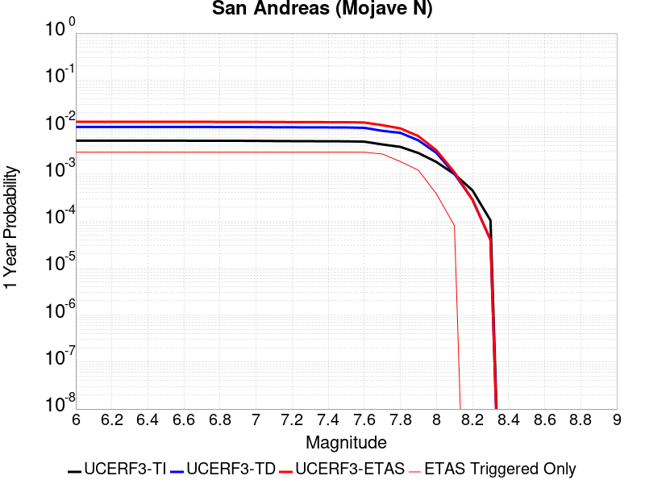 |  |

| Magnitude | 1 wk TI Prob | 1 wk TD Prob | 1 wk ETAS Prob | 1 wk ETAS/TD Gain | 1 wk ETAS Triggered Only | 1 mo TI Prob | 1 mo TD Prob | 1 mo ETAS Prob | 1 mo ETAS/TD Gain | 1 mo ETAS Triggered Only | 1 yr TI Prob | 1 yr TD Prob | 1 yr ETAS Prob | 1 yr ETAS/TD Gain | 1 yr ETAS Triggered Only | 10 yr TI Prob | 10 yr TD Prob | 10 yr ETAS Prob | 10 yr ETAS/TD Gain | 10 yr ETAS Triggered Only |
|-----|-----|-----|-----|-----|-----|-----|-----|-----|-----|-----|-----|-----|-----|-----|-----|-----|-----|-----|-----|-----|
| 6.0 | 9.877682E-5 | 1.9400702E-4 | 0.0026035395 | 13.419821 | 0.00241 | 4.2326056E-4 | 8.311939E-4 | 0.0035289496 | 4.2456393 | 0.0027 | 0.0051410277 | 0.010072956 | 0.012953644 | 1.2859824 | 0.00291 | 0.05023708 | 0.09831428 | 0.10110048 | 1.0283399 | 0.00309 |
| 6.1 | 9.877682E-5 | 1.9400702E-4 | 0.0026035395 | 13.419821 | 0.00241 | 4.2326056E-4 | 8.311939E-4 | 0.0035289496 | 4.2456393 | 0.0027 | 0.0051410277 | 0.010072956 | 0.012953644 | 1.2859824 | 0.00291 | 0.05023708 | 0.09831428 | 0.10110048 | 1.0283399 | 0.00309 |
| 6.2 | 9.877682E-5 | 1.9400702E-4 | 0.0026035395 | 13.419821 | 0.00241 | 4.2326056E-4 | 8.311939E-4 | 0.0035289496 | 4.2456393 | 0.0027 | 0.0051410277 | 0.010072956 | 0.012953644 | 1.2859824 | 0.00291 | 0.05023708 | 0.09831428 | 0.10110048 | 1.0283399 | 0.00309 |
| 6.3 | 9.877682E-5 | 1.9400702E-4 | 0.0026035395 | 13.419821 | 0.00241 | 4.2326056E-4 | 8.311939E-4 | 0.0035289496 | 4.2456393 | 0.0027 | 0.0051410277 | 0.010072956 | 0.012953644 | 1.2859824 | 0.00291 | 0.05023708 | 0.09831428 | 0.10110048 | 1.0283399 | 0.00309 |
| 6.4 | 9.877682E-5 | 1.9400702E-4 | 0.0026035395 | 13.419821 | 0.00241 | 4.2326056E-4 | 8.311939E-4 | 0.0035289496 | 4.2456393 | 0.0027 | 0.0051410277 | 0.010072956 | 0.012953644 | 1.2859824 | 0.00291 | 0.05023708 | 0.09831428 | 0.10110048 | 1.0283399 | 0.00309 |
| 6.5 | 9.861474E-5 | 1.9374468E-4 | 0.0026032778 | 13.436641 | 0.00241 | 4.2256617E-4 | 8.300703E-4 | 0.0035278292 | 4.2500367 | 0.0027 | 0.0051326132 | 0.010059402 | 0.01294013 | 1.2863716 | 0.00291 | 0.050156746 | 0.098192066 | 0.10097866 | 1.028379 | 0.00309 |
| 6.6 | 9.861474E-5 | 1.9374468E-4 | 0.0026032778 | 13.436641 | 0.00241 | 4.2256617E-4 | 8.300703E-4 | 0.0035278292 | 4.2500367 | 0.0027 | 0.0051326132 | 0.010059402 | 0.01294013 | 1.2863716 | 0.00291 | 0.050156746 | 0.098192066 | 0.10097866 | 1.028379 | 0.00309 |
| 6.7 | 9.8552715E-5 | 1.9364421E-4 | 0.0026031774 | 13.443095 | 0.00241 | 4.223004E-4 | 8.2964E-4 | 0.0035274 | 4.251724 | 0.0027 | 0.0051293927 | 0.010054212 | 0.012934954 | 1.286521 | 0.00291 | 0.050125998 | 0.098145254 | 0.10093199 | 1.028394 | 0.00309 |
| 6.8 | 9.8464974E-5 | 1.9349584E-4 | 0.0026030296 | 13.452638 | 0.00241 | 4.219245E-4 | 8.290045E-4 | 0.0035267663 | 4.254218 | 0.0027 | 0.0051248376 | 0.010046546 | 0.0129273115 | 1.2867417 | 0.00291 | 0.05008251 | 0.09807528 | 0.10086223 | 1.0284164 | 0.00309 |
| 6.9 | 9.825824E-5 | 1.9317595E-4 | 0.0026027104 | 13.473264 | 0.00241 | 4.2103877E-4 | 8.276344E-4 | 0.0035253998 | 4.25961 | 0.0027 | 0.0051141046 | 0.010030019 | 0.012910832 | 1.287219 | 0.00291 | 0.049980022 | 0.09792438 | 0.10071179 | 1.0284649 | 0.00309 |
| 7.0 | 9.781462E-5 | 1.924896E-4 | 0.0026020256 | 13.517747 | 0.00241 | 4.1913814E-4 | 8.246948E-4 | 0.003522468 | 4.2712383 | 0.0027 | 0.005091073 | 0.009994558 | 0.012875474 | 1.2882484 | 0.00291 | 0.04976007 | 0.09760077 | 0.10038919 | 1.0285696 | 0.00309 |
| 7.1 | 9.7121134E-5 | 1.9150671E-4 | 0.0026010452 | 13.582005 | 0.00241 | 4.1616702E-4 | 8.204851E-4 | 0.0035182699 | 4.2880363 | 0.0027 | 0.005055068 | 0.009943774 | 0.012824838 | 1.2897354 | 0.00291 | 0.04941613 | 0.09713728 | 0.09992713 | 1.0287206 | 0.00309 |
| 7.2 | 9.663819E-5 | 1.9081456E-4 | 0.0026003546 | 13.627653 | 0.00241 | 4.1409794E-4 | 8.175206E-4 | 0.0035153134 | 4.299969 | 0.0027 | 0.0050299936 | 0.00990801 | 0.012789179 | 1.2907917 | 0.00291 | 0.049176537 | 0.09681055 | 0.0996014 | 1.028828 | 0.00309 |
| 7.3 | 9.6277574E-5 | 1.9033969E-4 | 0.002599881 | 13.659163 | 0.00241 | 4.125529E-4 | 8.154867E-4 | 0.003513285 | 4.308206 | 0.0027 | 0.0050112694 | 0.009883473 | 0.012764712 | 1.291521 | 0.00291 | 0.04899759 | 0.09658401 | 0.09937556 | 1.0289029 | 0.00309 |
| 7.4 | 9.593308E-5 | 1.897375E-4 | 0.0025992803 | 13.699348 | 0.00241 | 4.1107697E-4 | 8.129075E-4 | 0.0035107126 | 4.3187113 | 0.0027 | 0.0049933824 | 0.009852355 | 0.012733685 | 1.2924508 | 0.00291 | 0.04882661 | 0.09630218 | 0.099094614 | 1.0289965 | 0.00309 |
| 7.5 | 9.561707E-5 | 1.8919831E-4 | 0.0025987423 | 13.735547 | 0.00241 | 4.0972308E-4 | 8.1059814E-4 | 0.0035084095 | 4.3281736 | 0.0027 | 0.0049769743 | 0.009824493 | 0.0127059035 | 1.2932885 | 0.00291 | 0.048669744 | 0.09604836 | 0.09884157 | 1.0290813 | 0.00309 |
| 7.6 | 9.418194E-5 | 1.8572104E-4 | 0.0025952735 | 13.974041 | 0.00241 | 4.0357444E-4 | 7.957047E-4 | 0.0034935563 | 4.3905187 | 0.0027 | 0.004902454 | 0.009644784 | 0.012526718 | 1.2988075 | 0.00291 | 0.047957025 | 0.094430685 | 0.09722889 | 1.0296324 | 0.00309 |
| 7.7 | 8.202141E-5 | 1.6021315E-4 | 0.002419851 | 15.103948 | 0.00226 | 3.51473E-4 | 6.8644714E-4 | 0.0031747378 | 4.624883 | 0.00249 | 0.00427079 | 0.008325525 | 0.010983212 | 1.3192216 | 0.00268 | 0.04189639 | 0.08223219 | 0.08482948 | 1.0315847 | 0.00283 |
| 7.8 | 7.2859846E-5 | 1.4516473E-4 | 0.0017249354 | 11.882607 | 0.00158 | 3.1221908E-4 | 6.219862E-4 | 0.002360904 | 3.7957497 | 0.00174 | 0.003794643 | 0.0075464295 | 0.009382469 | 1.243299 | 0.00185 | 0.037304975 | 0.07472468 | 0.07652897 | 1.0241458 | 0.00195 |
| 7.9 | 5.3874453E-5 | 1.0045676E-4 | 0.0011503513 | 11.451208 | 0.00105 | 2.3087008E-4 | 4.3045796E-4 | 0.0015899587 | 3.6936445 | 0.00116 | 0.0028072202 | 0.0052282433 | 0.0064319167 | 1.2302253 | 0.00121 | 0.02772022 | 0.05242443 | 0.05362785 | 1.0229553 | 0.00127 |
| 8.0 | 3.468538E-5 | 5.4260272E-5 | 3.9424183E-4 | 7.2657547 | 3.4E-4 | 1.4864317E-4 | 2.325233E-4 | 6.0243724E-4 | 2.5908685 | 3.7E-4 | 0.0018082283 | 0.002827298 | 0.0032062235 | 1.1340239 | 3.8E-4 | 0.017935853 | 0.028947512 | 0.029335933 | 1.0134181 | 4.0E-4 |
| 8.1 | 1.9152367E-5 | 1.940263E-5 | 9.940108E-5 | 5.123072 | 8.0E-5 | 8.207899E-5 | 8.3151484E-5 | 1.6314482E-4 | 1.9620194 | 8.0E-5 | 9.988535E-4 | 0.0010118998 | 0.0010918188 | 1.0789793 | 8.0E-5 | 0.009943757 | 0.01085625 | 0.010945274 | 1.0082002 | 9.0E-5 |
| 8.2 | 8.643924E-6 | 5.4748625E-6 | 5.4748625E-6 | 1.0 | 0.0 | 3.704486E-5 | 2.3463486E-5 | 2.3463486E-5 | 1.0 | 0.0 | 4.5092785E-4 | 2.8563058E-4 | 2.8563058E-4 | 1.0 | 0.0 | 0.0045001395 | 0.0032487072 | 0.0032487072 | 1.0 | 0.0 |
| 8.3 | 1.983087E-6 | 7.6599065E-7 | 7.6599065E-7 | 1.0 | 0.0 | 8.498917E-6 | 3.282813E-6 | 3.282813E-6 | 1.0 | 0.0 | 1.034694E-4 | 3.9967534E-5 | 3.9967534E-5 | 1.0 | 0.0 | 0.0010342124 | 4.719687E-4 | 4.719687E-4 | 1.0 | 0.0 |

## San Andreas (Mojave S)
*[(top)](#table-of-contents)*

| 1 Week | 1 Month | 1 Year | 10 Year |
|-----|-----|-----|-----|
|  | 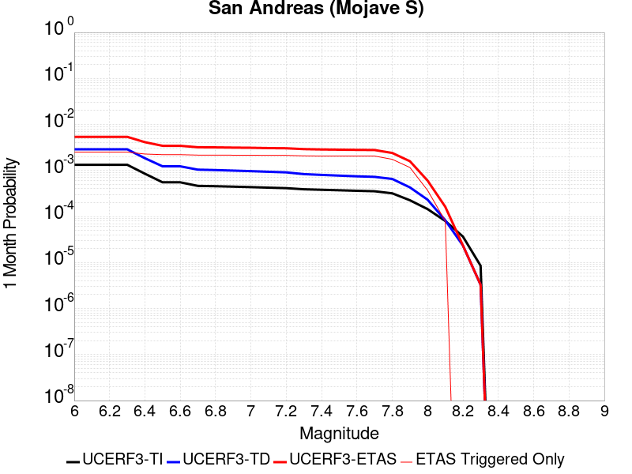 |  |  |

| Magnitude | 1 wk TI Prob | 1 wk TD Prob | 1 wk ETAS Prob | 1 wk ETAS/TD Gain | 1 wk ETAS Triggered Only | 1 mo TI Prob | 1 mo TD Prob | 1 mo ETAS Prob | 1 mo ETAS/TD Gain | 1 mo ETAS Triggered Only | 1 yr TI Prob | 1 yr TD Prob | 1 yr ETAS Prob | 1 yr ETAS/TD Gain | 1 yr ETAS Triggered Only | 10 yr TI Prob | 10 yr TD Prob | 10 yr ETAS Prob | 10 yr ETAS/TD Gain | 10 yr ETAS Triggered Only |
|-----|-----|-----|-----|-----|-----|-----|-----|-----|-----|-----|-----|-----|-----|-----|-----|-----|-----|-----|-----|-----|
| 6.0 | 3.1064058E-4 | 6.7460834E-4 | 0.0029330838 | 4.347832 | 0.00226 | 0.0013306376 | 0.0028881032 | 0.005390854 | 1.8665725 | 0.00251 | 0.016080605 | 0.03462235 | 0.037228867 | 1.0752844 | 0.0027 | 0.1496549 | 0.28660452 | 0.2886377 | 1.007094 | 0.00285 |
| 6.1 | 3.1064058E-4 | 6.7460834E-4 | 0.0029330838 | 4.347832 | 0.00226 | 0.0013306376 | 0.0028881032 | 0.005390854 | 1.8665725 | 0.00251 | 0.016080605 | 0.03462235 | 0.037228867 | 1.0752844 | 0.0027 | 0.1496549 | 0.28660452 | 0.2886377 | 1.007094 | 0.00285 |
| 6.2 | 3.1064058E-4 | 6.7460834E-4 | 0.0029330838 | 4.347832 | 0.00226 | 0.0013306376 | 0.0028881032 | 0.005390854 | 1.8665725 | 0.00251 | 0.016080605 | 0.03462235 | 0.037228867 | 1.0752844 | 0.0027 | 0.1496549 | 0.28660452 | 0.2886377 | 1.007094 | 0.00285 |
| 6.3 | 3.1064058E-4 | 6.7460834E-4 | 0.0029330838 | 4.347832 | 0.00226 | 0.0013306376 | 0.0028881032 | 0.005390854 | 1.8665725 | 0.00251 | 0.016080605 | 0.03462235 | 0.037228867 | 1.0752844 | 0.0027 | 0.1496549 | 0.28660452 | 0.2886377 | 1.007094 | 0.00285 |
| 6.4 | 1.9872203E-4 | 4.3179357E-4 | 0.0024709126 | 5.72244 | 0.00204 | 8.5138786E-4 | 0.0018492596 | 0.0041250433 | 2.230646 | 0.00228 | 0.010316478 | 0.02228844 | 0.02466428 | 1.1065952 | 0.00243 | 0.098504856 | 0.19699748 | 0.19905317 | 1.0104351 | 0.00256 |
| 6.5 | 1.291105E-4 | 2.875267E-4 | 0.0022769545 | 7.9191065 | 0.00199 | 5.5321335E-4 | 0.0012316781 | 0.003438956 | 2.79209 | 0.00221 | 0.006714592 | 0.0148934 | 0.01721825 | 1.1560994 | 0.00236 | 0.065152965 | 0.13803436 | 0.14017203 | 1.0154866 | 0.00248 |
| 6.6 | 1.291105E-4 | 2.875267E-4 | 0.0022769545 | 7.9191065 | 0.00199 | 5.5321335E-4 | 0.0012316781 | 0.003438956 | 2.79209 | 0.00221 | 0.006714592 | 0.0148934 | 0.01721825 | 1.1560994 | 0.00236 | 0.065152965 | 0.13803436 | 0.14017203 | 1.0154866 | 0.00248 |
| 6.7 | 1.08001186E-4 | 2.4333889E-4 | 0.002182867 | 8.970481 | 0.00194 | 4.6278012E-4 | 0.0010424647 | 0.003200213 | 3.0698526 | 0.00216 | 0.0056198016 | 0.012618446 | 0.014899298 | 1.1807554 | 0.00231 | 0.054797906 | 0.119176775 | 0.12131718 | 1.0179598 | 0.00243 |
| 6.8 | 1.0624356E-4 | 2.3851555E-4 | 0.002178053 | 9.131701 | 0.00194 | 4.5525006E-4 | 0.0010218095 | 0.0031796026 | 3.1117368 | 0.00216 | 0.0055285925 | 0.012369843 | 0.014651269 | 1.1844345 | 0.00231 | 0.053930566 | 0.11712591 | 0.1192713 | 1.0183169 | 0.00243 |
| 6.9 | 1.0393785E-4 | 2.3221898E-4 | 0.0021617708 | 9.309191 | 0.00193 | 4.4537184E-4 | 9.948451E-4 | 0.0031427061 | 3.1589904 | 0.00215 | 0.0054089287 | 0.012045221 | 0.014317517 | 1.1886472 | 0.0023 | 0.05279156 | 0.11442335 | 0.11656645 | 1.0187296 | 0.00242 |
| 7.0 | 1.0155622E-4 | 2.2591476E-4 | 0.0021554788 | 9.541116 | 0.00193 | 4.3516833E-4 | 9.6784724E-4 | 0.0031157664 | 3.219275 | 0.00215 | 0.005285311 | 0.0117200995 | 0.013993143 | 1.1939441 | 0.0023 | 0.05161361 | 0.111683756 | 0.11383348 | 1.0192484 | 0.00242 |
| 7.1 | 9.885595E-5 | 2.1879886E-4 | 0.002128381 | 9.727569 | 0.00191 | 4.2359953E-4 | 9.3737274E-4 | 0.003065376 | 3.2701786 | 0.00213 | 0.0051451353 | 0.011352993 | 0.013607108 | 1.1985481 | 0.00228 | 0.05027629 | 0.1085682 | 0.11070764 | 1.0197059 | 0.0024 |
| 7.2 | 9.6411415E-5 | 2.124288E-4 | 0.0021220231 | 9.989338 | 0.00191 | 4.1312634E-4 | 9.1009185E-4 | 0.0030381533 | 3.338293 | 0.00213 | 0.005018219 | 0.011024255 | 0.01327912 | 1.2045367 | 0.00228 | 0.049064007 | 0.105758004 | 0.10790418 | 1.0202934 | 0.0024 |
| 7.3 | 9.1180635E-5 | 1.9471257E-4 | 0.0020643484 | 10.60203 | 0.00187 | 3.907156E-4 | 8.342157E-4 | 0.0029124806 | 3.4912798 | 0.00208 | 0.004746591 | 0.01010939 | 0.012316845 | 1.218357 | 0.00223 | 0.046464786 | 0.09795115 | 0.10007097 | 1.0216415 | 0.00235 |
| 7.4 | 8.887388E-5 | 1.8719878E-4 | 0.0020368525 | 10.8806925 | 0.00185 | 3.8083247E-4 | 8.020339E-4 | 0.0028603817 | 3.56641 | 0.00206 | 0.0046267817 | 0.00972114 | 0.0118997535 | 1.224111 | 0.0022 | 0.045316286 | 0.09458615 | 0.096686706 | 1.0222079 | 0.00232 |
| 7.5 | 8.6750515E-5 | 1.8051457E-4 | 0.0020301805 | 11.246631 | 0.00185 | 3.7173493E-4 | 7.7340455E-4 | 0.0028318113 | 3.6614878 | 0.00206 | 0.004516484 | 0.009375632 | 0.011555006 | 1.2324508 | 0.0022 | 0.04425787 | 0.091549896 | 0.0936575 | 1.0230213 | 0.00232 |
| 7.6 | 8.453092E-5 | 1.7439072E-4 | 0.002024068 | 11.606513 | 0.00185 | 3.6222505E-4 | 7.471748E-4 | 0.0028056356 | 3.7549922 | 0.00206 | 0.0044011753 | 0.009058985 | 0.011239055 | 1.2406528 | 0.0022 | 0.04315024 | 0.08870898 | 0.09082318 | 1.0238329 | 0.00232 |
| 7.7 | 8.259102E-5 | 1.6961215E-4 | 0.0020192983 | 11.905388 | 0.00185 | 3.539135E-4 | 7.2670676E-4 | 0.0027852098 | 3.832646 | 0.00206 | 0.004300386 | 0.008811831 | 0.010992444 | 1.2474644 | 0.0022 | 0.042181134 | 0.08645982 | 0.08857924 | 1.0245132 | 0.00232 |
| 7.8 | 7.444844E-5 | 1.5283503E-4 | 0.0017325935 | 11.336365 | 0.00158 | 3.1902574E-4 | 6.548429E-4 | 0.002403697 | 3.670647 | 0.00175 | 0.0038772223 | 0.007943616 | 0.009788841 | 1.2322903 | 0.00186 | 0.03810269 | 0.078290746 | 0.080097295 | 1.0230749 | 0.00196 |
| 7.9 | 5.2586525E-5 | 1.00064186E-4 | 0.0011499592 | 11.492215 | 0.00105 | 2.2535135E-4 | 4.2877605E-4 | 0.0015882787 | 3.704215 | 0.00116 | 0.0027402006 | 0.005207864 | 0.006411562 | 1.231131 | 0.00121 | 0.027066574 | 0.052200034 | 0.05340374 | 1.0230595 | 0.00127 |
| 8.0 | 3.379877E-5 | 5.4074168E-5 | 3.940558E-4 | 7.2873206 | 3.4E-4 | 1.4484383E-4 | 2.3172585E-4 | 6.016401E-4 | 2.5963445 | 3.7E-4 | 0.0017620471 | 0.002817614 | 0.0031965433 | 1.1344858 | 3.8E-4 | 0.017481409 | 0.028834904 | 0.02922337 | 1.0134721 | 4.0E-4 |
| 8.1 | 1.8668277E-5 | 1.9309397E-5 | 9.930785E-5 | 5.1429806 | 8.0E-5 | 8.000444E-5 | 8.275194E-5 | 1.6274532E-4 | 1.9666648 | 8.0E-5 | 9.736188E-4 | 0.0010070398 | 0.0010869593 | 1.0793607 | 8.0E-5 | 0.009693642 | 0.010798888 | 0.010887916 | 1.0082442 | 9.0E-5 |
| 8.2 | 8.541571E-6 | 5.460819E-6 | 5.460819E-6 | 1.0 | 0.0 | 3.660622E-5 | 2.3403301E-5 | 2.3403301E-5 | 1.0 | 0.0 | 4.455896E-4 | 2.84898E-4 | 2.84898E-4 | 1.0 | 0.0 | 0.0044469717 | 0.0032408056 | 0.0032408056 | 1.0 | 0.0 |
| 8.3 | 1.983087E-6 | 7.6599065E-7 | 7.6599065E-7 | 1.0 | 0.0 | 8.498917E-6 | 3.282813E-6 | 3.282813E-6 | 1.0 | 0.0 | 1.034694E-4 | 3.9967534E-5 | 3.9967534E-5 | 1.0 | 0.0 | 0.0010342124 | 4.719687E-4 | 4.719687E-4 | 1.0 | 0.0 |

## Gravel Hills-Harper Lk
*[(top)](#table-of-contents)*

| 1 Week | 1 Month | 1 Year | 10 Year |
|-----|-----|-----|-----|
|  |  |  |  |

| Magnitude | 1 wk TI Prob | 1 wk TD Prob | 1 wk ETAS Prob | 1 wk ETAS/TD Gain | 1 wk ETAS Triggered Only | 1 mo TI Prob | 1 mo TD Prob | 1 mo ETAS Prob | 1 mo ETAS/TD Gain | 1 mo ETAS Triggered Only | 1 yr TI Prob | 1 yr TD Prob | 1 yr ETAS Prob | 1 yr ETAS/TD Gain | 1 yr ETAS Triggered Only | 10 yr TI Prob | 10 yr TD Prob | 10 yr ETAS Prob | 10 yr ETAS/TD Gain | 10 yr ETAS Triggered Only |
|-----|-----|-----|-----|-----|-----|-----|-----|-----|-----|-----|-----|-----|-----|-----|-----|-----|-----|-----|-----|-----|
| 6.0 | 3.0679566E-5 | 3.1464646E-5 | 0.0019714036 | 62.65456 | 0.00194 | 1.3147724E-4 | 1.3484273E-4 | 0.0022545569 | 16.719898 | 0.00212 | 0.0015995599 | 0.0016406906 | 0.004066704 | 2.4786537 | 0.00243 | 0.015880952 | 0.01630734 | 0.01892396 | 1.1604568 | 0.00266 |
| 6.1 | 3.0679566E-5 | 3.1464646E-5 | 0.0019714036 | 62.65456 | 0.00194 | 1.3147724E-4 | 1.3484273E-4 | 0.0022545569 | 16.719898 | 0.00212 | 0.0015995599 | 0.0016406906 | 0.004066704 | 2.4786537 | 0.00243 | 0.015880952 | 0.01630734 | 0.01892396 | 1.1604568 | 0.00266 |
| 6.2 | 1.514536E-5 | 1.3635206E-5 | 6.2362687E-4 | 45.73652 | 6.1E-4 | 6.490707E-5 | 5.843536E-5 | 7.383956E-4 | 12.63611 | 6.8E-4 | 7.8995706E-4 | 7.1123015E-4 | 0.0014706895 | 2.0678113 | 7.6E-4 | 0.007871548 | 0.0070907404 | 0.007954571 | 1.1218252 | 8.7E-4 |
| 6.3 | 1.514536E-5 | 1.3635206E-5 | 6.2362687E-4 | 45.73652 | 6.1E-4 | 6.490707E-5 | 5.843536E-5 | 7.383956E-4 | 12.63611 | 6.8E-4 | 7.8995706E-4 | 7.1123015E-4 | 0.0014706895 | 2.0678113 | 7.6E-4 | 0.007871548 | 0.0070907404 | 0.007954571 | 1.1218252 | 8.7E-4 |
| 6.4 | 1.2532521E-5 | 1.06896905E-5 | 3.8068573E-4 | 35.61242 | 3.7E-4 | 5.37097E-5 | 4.581219E-5 | 4.4579388E-4 | 9.730901 | 4.0E-4 | 6.537194E-4 | 5.576265E-4 | 0.0010373588 | 1.8603113 | 4.8E-4 | 0.0065179965 | 0.005562863 | 0.0061098034 | 1.09832 | 5.5E-4 |
| 6.5 | 1.1094058E-5 | 9.083664E-6 | 2.690813E-4 | 29.622553 | 2.6E-4 | 4.7545094E-5 | 3.892943E-5 | 3.089189E-4 | 7.935357 | 2.7E-4 | 5.787078E-4 | 4.7386673E-4 | 8.0371037E-4 | 1.6960683 | 3.3E-4 | 0.0057720304 | 0.0047289706 | 0.0050972207 | 1.0778711 | 3.7E-4 |
| 6.6 | 9.688328E-6 | 7.5316952E-6 | 1.7753041E-4 | 23.57111 | 1.7E-4 | 4.1520743E-5 | 3.227831E-5 | 2.0227281E-4 | 6.266525 | 1.7E-4 | 5.053978E-4 | 3.9292008E-4 | 6.028376E-4 | 1.5342498 | 2.1E-4 | 0.0050424994 | 0.0039225104 | 0.0041615693 | 1.0609453 | 2.4E-4 |
| 6.7 | 8.974824E-6 | 6.749413E-6 | 1.3674854E-4 | 20.260805 | 1.3E-4 | 3.8462964E-5 | 2.8925748E-5 | 1.5892199E-4 | 5.494136 | 1.3E-4 | 4.6818596E-4 | 3.5211627E-4 | 5.020634E-4 | 1.4258456 | 1.5E-4 | 0.004672008 | 0.0035158044 | 0.0036852069 | 1.0481831 | 1.7E-4 |
| 6.8 | 7.4780046E-6 | 5.1161933E-6 | 9.5115734E-5 | 18.591114 | 9.0E-5 | 3.20482E-5 | 2.1926366E-5 | 1.1192439E-4 | 5.1045575 | 9.0E-5 | 3.9011694E-4 | 2.669222E-4 | 3.7689283E-4 | 1.411995 | 1.1E-4 | 0.0038943281 | 0.0026661542 | 0.0027858343 | 1.0448886 | 1.2E-4 |
| 6.9 | 6.3409307E-6 | 3.9074966E-6 | 5.39073E-5 | 13.795866 | 5.0E-5 | 2.7175134E-5 | 1.6746313E-5 | 6.674547E-5 | 3.9856818 | 5.0E-5 | 3.3080703E-4 | 2.0386827E-4 | 2.73854E-4 | 1.343289 | 7.0E-5 | 0.0033031502 | 0.0020369107 | 0.0021167477 | 1.0391952 | 8.0E-5 |
| 7.0 | 5.1239335E-6 | 2.6058565E-6 | 5.2605727E-5 | 20.1875 | 5.0E-5 | 2.195953E-5 | 1.116791E-5 | 6.116735E-5 | 5.4770637 | 5.0E-5 | 2.6732447E-4 | 1.3596108E-4 | 1.9595292E-4 | 1.4412428 | 6.0E-5 | 0.0026700313 | 0.0013588042 | 0.0014187227 | 1.0440965 | 6.0E-5 |
| 7.1 | 4.438899E-6 | 2.0984728E-6 | 5.2098367E-5 | 24.826801 | 5.0E-5 | 1.9023713E-5 | 8.993425E-6 | 5.8992977E-5 | 6.559567 | 5.0E-5 | 2.315891E-4 | 1.0948967E-4 | 1.694831E-4 | 1.5479369 | 6.0E-5 | 0.002313479 | 0.0010943791 | 0.0011543134 | 1.0547656 | 6.0E-5 |
| 7.2 | 3.50367E-6 | 1.2615716E-6 | 4.1261523E-5 | 32.706444 | 4.0E-5 | 1.5015643E-5 | 5.4067245E-6 | 4.540651E-5 | 8.398154 | 4.0E-5 | 1.8280011E-4 | 6.582497E-5 | 1.1582168E-4 | 1.7595402 | 5.0E-5 | 0.0018264982 | 6.580629E-4 | 7.0803E-4 | 1.0759306 | 5.0E-5 |
| 7.3 | 2.561638E-6 | 7.1191585E-7 | 2.0711901E-5 | 29.093187 | 2.0E-5 | 1.0978401E-5 | 3.0510646E-6 | 2.3051003E-5 | 7.555069 | 2.0E-5 | 1.3365384E-4 | 3.71461E-5 | 5.7145353E-5 | 1.5383946 | 2.0E-5 | 0.0013357349 | 3.7140088E-4 | 3.9139346E-4 | 1.0538301 | 2.0E-5 |
| 7.4 | 2.0368864E-6 | 5.304837E-7 | 2.0530473E-5 | 38.70142 | 2.0E-5 | 8.729483E-6 | 2.2734996E-6 | 2.2273454E-5 | 9.79699 | 2.0E-5 | 1.06276275E-4 | 2.7679513E-5 | 4.767896E-5 | 1.7225361 | 2.0E-5 | 0.0010622547 | 2.767612E-4 | 2.9675566E-4 | 1.0722445 | 2.0E-5 |
| 7.5 | 1.1681728E-6 | 3.6030585E-7 | 1.0360302E-5 | 28.754189 | 1.0E-5 | 5.0064455E-6 | 1.544167E-6 | 1.1544152E-5 | 7.475973 | 1.0E-5 | 6.0951766E-5 | 1.8800076E-5 | 2.8799888E-5 | 1.5319028 | 1.0E-5 | 6.093505E-4 | 1.8798532E-4 | 1.9798345E-4 | 1.0531856 | 1.0E-5 |
| 7.6 | 1.3154387E-7 | 7.1197384E-8 | 7.1197384E-8 | 1.0 | 0.0 | 5.6375933E-7 | 3.051316E-7 | 3.051316E-7 | 1.0 | 0.0 | 6.863748E-6 | 3.7149728E-6 | 3.7149728E-6 | 1.0 | 0.0 | 6.863536E-5 | 3.7149264E-5 | 3.7149264E-5 | 1.0 | 0.0 |

## So Sierra Nevada
*[(top)](#table-of-contents)*

| 1 Week | 1 Month | 1 Year | 10 Year |
|-----|-----|-----|-----|
|  |  |  |  |

| Magnitude | 1 wk TI Prob | 1 wk TD Prob | 1 wk ETAS Prob | 1 wk ETAS/TD Gain | 1 wk ETAS Triggered Only | 1 mo TI Prob | 1 mo TD Prob | 1 mo ETAS Prob | 1 mo ETAS/TD Gain | 1 mo ETAS Triggered Only | 1 yr TI Prob | 1 yr TD Prob | 1 yr ETAS Prob | 1 yr ETAS/TD Gain | 1 yr ETAS Triggered Only | 10 yr TI Prob | 10 yr TD Prob | 10 yr ETAS Prob | 10 yr ETAS/TD Gain | 10 yr ETAS Triggered Only |
|-----|-----|-----|-----|-----|-----|-----|-----|-----|-----|-----|-----|-----|-----|-----|-----|-----|-----|-----|-----|-----|
| 6.0 | 1.15488665E-5 | 1.1079643E-5 | 0.001331065 | 120.1361 | 0.00132 | 4.9494203E-5 | 4.748339E-5 | 0.001507414 | 31.746134 | 0.00146 | 6.024253E-4 | 5.7796965E-4 | 0.0021970333 | 3.8012953 | 0.00162 | 0.006007948 | 0.005765934 | 0.007476017 | 1.2965838 | 0.00172 |
| 6.1 | 1.15488665E-5 | 1.1079643E-5 | 0.001331065 | 120.1361 | 0.00132 | 4.9494203E-5 | 4.748339E-5 | 0.001507414 | 31.746134 | 0.00146 | 6.024253E-4 | 5.7796965E-4 | 0.0021970333 | 3.8012953 | 0.00162 | 0.006007948 | 0.005765934 | 0.007476017 | 1.2965838 | 0.00172 |
| 6.2 | 1.15488665E-5 | 1.1079643E-5 | 0.001331065 | 120.1361 | 0.00132 | 4.9494203E-5 | 4.748339E-5 | 0.001507414 | 31.746134 | 0.00146 | 6.024253E-4 | 5.7796965E-4 | 0.0021970333 | 3.8012953 | 0.00162 | 0.006007948 | 0.005765934 | 0.007476017 | 1.2965838 | 0.00172 |
| 6.3 | 1.15488665E-5 | 1.1079643E-5 | 0.001331065 | 120.1361 | 0.00132 | 4.9494203E-5 | 4.748339E-5 | 0.001507414 | 31.746134 | 0.00146 | 6.024253E-4 | 5.7796965E-4 | 0.0021970333 | 3.8012953 | 0.00162 | 0.006007948 | 0.005765934 | 0.007476017 | 1.2965838 | 0.00172 |
| 6.4 | 1.15488665E-5 | 1.1079643E-5 | 0.001331065 | 120.1361 | 0.00132 | 4.9494203E-5 | 4.748339E-5 | 0.001507414 | 31.746134 | 0.00146 | 6.024253E-4 | 5.7796965E-4 | 0.0021970333 | 3.8012953 | 0.00162 | 0.006007948 | 0.005765934 | 0.007476017 | 1.2965838 | 0.00172 |
| 6.5 | 1.15488665E-5 | 1.1079643E-5 | 0.001331065 | 120.1361 | 0.00132 | 4.9494203E-5 | 4.748339E-5 | 0.001507414 | 31.746134 | 0.00146 | 6.024253E-4 | 5.7796965E-4 | 0.0021970333 | 3.8012953 | 0.00162 | 0.006007948 | 0.005765934 | 0.007476017 | 1.2965838 | 0.00172 |
| 6.6 | 7.587044E-6 | 6.935635E-6 | 8.6692965E-4 | 124.99644 | 8.6E-4 | 3.2515498E-5 | 2.9723828E-5 | 9.4969646E-4 | 31.950678 | 9.2E-4 | 3.9580427E-4 | 3.6183043E-4 | 0.0013614686 | 3.7627254 | 0.001 | 0.003951 | 0.0036127048 | 0.0046788394 | 1.295107 | 0.00107 |
| 6.7 | 7.587044E-6 | 6.935635E-6 | 8.6692965E-4 | 124.99644 | 8.6E-4 | 3.2515498E-5 | 2.9723828E-5 | 9.4969646E-4 | 31.950678 | 9.2E-4 | 3.9580427E-4 | 3.6183043E-4 | 0.0013614686 | 3.7627254 | 0.001 | 0.003951 | 0.0036127048 | 0.0046788394 | 1.295107 | 0.00107 |
| 6.8 | 5.9026956E-6 | 5.1793927E-6 | 6.55176E-4 | 126.49669 | 6.5E-4 | 2.5297022E-5 | 2.2197215E-5 | 7.121819E-4 | 32.08429 | 6.9E-4 | 3.0794772E-4 | 2.7021873E-4 | 0.0010300134 | 3.8117762 | 7.6E-4 | 0.0030752132 | 0.002699018 | 0.0035068318 | 1.2992991 | 8.1E-4 |
| 6.9 | 5.0118915E-6 | 4.2524252E-6 | 5.542501E-4 | 130.3374 | 5.5E-4 | 2.1479358E-5 | 1.8224557E-5 | 6.082138E-4 | 33.37331 | 5.9E-4 | 2.614798E-4 | 2.2186211E-4 | 8.617201E-4 | 3.8840346 | 6.4E-4 | 0.0026117235 | 0.0022164788 | 0.0029049495 | 1.3106146 | 6.9E-4 |
| 7.0 | 4.4924795E-6 | 3.7139177E-6 | 4.7371216E-4 | 127.55053 | 4.7E-4 | 1.925334E-5 | 1.5916696E-5 | 5.259086E-4 | 33.041313 | 5.1E-4 | 2.3438422E-4 | 1.9376918E-4 | 7.536607E-4 | 3.8894765 | 5.6E-4 | 0.0023413717 | 0.0019360651 | 0.002544884 | 1.3144621 | 6.1E-4 |
| 7.1 | 3.9118436E-6 | 3.1119775E-6 | 3.3311095E-4 | 107.041565 | 3.3E-4 | 1.6764936E-5 | 1.3336982E-5 | 3.7333218E-4 | 27.992254 | 3.6E-4 | 2.0409399E-4 | 1.6236622E-4 | 5.6230125E-4 | 3.4631665 | 4.0E-4 | 0.0020390663 | 0.001622532 | 0.0020718018 | 1.2768943 | 4.5E-4 |
| 7.2 | 3.4200818E-6 | 2.6054543E-6 | 2.7260475E-4 | 104.628494 | 2.7E-4 | 1.4657411E-5 | 1.11661875E-5 | 3.1116285E-4 | 27.866524 | 3.0E-4 | 1.7843937E-4 | 1.3594035E-4 | 4.7589414E-4 | 3.5007567 | 3.4E-4 | 0.0017829615 | 0.0013586218 | 0.0017381054 | 1.2793152 | 3.8E-4 |
| 7.3 | 2.6593618E-6 | 1.8284203E-6 | 1.6182812E-4 | 88.50707 | 1.6E-4 | 1.13972155E-5 | 7.836065E-6 | 1.9783458E-4 | 25.246674 | 1.9E-4 | 1.3875226E-4 | 9.540021E-5 | 2.9538112E-4 | 3.0962315 | 2.0E-4 | 0.0013866565 | 9.5362146E-4 | 0.0011534308 | 1.2095268 | 2.0E-4 |
| 7.4 | 2.2577992E-6 | 1.436438E-6 | 1.3143625E-4 | 91.50151 | 1.3E-4 | 9.676246E-6 | 6.15615E-6 | 1.6615517E-4 | 26.99011 | 1.6E-4 | 1.1780193E-4 | 7.49488E-5 | 2.4493606E-4 | 3.2680452 | 1.7E-4 | 0.001177395 | 7.492603E-4 | 9.191329E-4 | 1.2267205 | 1.7E-4 |
| 7.5 | 1.489319E-6 | 7.353936E-7 | 7.073534E-5 | 96.18705 | 7.0E-5 | 6.3827797E-6 | 3.1516831E-6 | 8.315143E-5 | 26.383183 | 8.0E-5 | 7.770758E-5 | 3.8371072E-5 | 1.2836761E-4 | 3.345427 | 9.0E-5 | 7.7680405E-4 | 3.836449E-4 | 4.7361036E-4 | 1.234502 | 9.0E-5 |
| 7.6 | 1.0680322E-6 | 4.6596554E-7 | 4.0465948E-5 | 86.843216 | 4.0E-5 | 4.577273E-6 | 1.9969937E-6 | 5.1996893E-5 | 26.037586 | 5.0E-5 | 5.5726876E-5 | 2.4313129E-5 | 8.431167E-5 | 3.4677424 | 6.0E-5 | 5.5712904E-4 | 2.4310495E-4 | 3.0309038E-4 | 1.246747 | 6.0E-5 |
| 7.7 | 5.509146E-7 | 1.5580486E-7 | 1.01558035E-5 | 65.18284 | 1.0E-5 | 2.3610605E-6 | 6.677349E-7 | 1.0667728E-5 | 15.975992 | 1.0E-5 | 2.8745531E-5 | 8.129644E-6 | 1.8129562E-5 | 2.2300563 | 1.0E-5 | 2.8741814E-4 | 8.1293576E-5 | 9.1292764E-5 | 1.123001 | 1.0E-5 |

## San Andreas (San Bernardino N)
*[(top)](#table-of-contents)*

| 1 Week | 1 Month | 1 Year | 10 Year |
|-----|-----|-----|-----|
|  |  |  |  |

| Magnitude | 1 wk TI Prob | 1 wk TD Prob | 1 wk ETAS Prob | 1 wk ETAS/TD Gain | 1 wk ETAS Triggered Only | 1 mo TI Prob | 1 mo TD Prob | 1 mo ETAS Prob | 1 mo ETAS/TD Gain | 1 mo ETAS Triggered Only | 1 yr TI Prob | 1 yr TD Prob | 1 yr ETAS Prob | 1 yr ETAS/TD Gain | 1 yr ETAS Triggered Only | 10 yr TI Prob | 10 yr TD Prob | 10 yr ETAS Prob | 10 yr ETAS/TD Gain | 10 yr ETAS Triggered Only |
|-----|-----|-----|-----|-----|-----|-----|-----|-----|-----|-----|-----|-----|-----|-----|-----|-----|-----|-----|-----|-----|
| 6.0 | 1.4273766E-4 | 3.1606483E-4 | 0.0015856634 | 5.016893 | 0.00127 | 6.115894E-4 | 0.0013538664 | 0.0027619575 | 2.0400517 | 0.00141 | 0.0074207084 | 0.016360244 | 0.017825866 | 1.0895845 | 0.00149 | 0.07177748 | 0.15026689 | 0.15160097 | 1.0088781 | 0.00157 |
| 6.1 | 1.4273766E-4 | 3.1606483E-4 | 0.0015856634 | 5.016893 | 0.00127 | 6.115894E-4 | 0.0013538664 | 0.0027619575 | 2.0400517 | 0.00141 | 0.0074207084 | 0.016360244 | 0.017825866 | 1.0895845 | 0.00149 | 0.07177748 | 0.15026689 | 0.15160097 | 1.0088781 | 0.00157 |
| 6.2 | 1.4273766E-4 | 3.1606483E-4 | 0.0015856634 | 5.016893 | 0.00127 | 6.115894E-4 | 0.0013538664 | 0.0027619575 | 2.0400517 | 0.00141 | 0.0074207084 | 0.016360244 | 0.017825866 | 1.0895845 | 0.00149 | 0.07177748 | 0.15026689 | 0.15160097 | 1.0088781 | 0.00157 |
| 6.3 | 1.3730655E-4 | 3.0511338E-4 | 0.0015647289 | 5.128352 | 0.00126 | 5.883239E-4 | 0.0013069791 | 0.0027051494 | 2.0697725 | 0.0014 | 0.0071393442 | 0.015797773 | 0.017254392 | 1.0922041 | 0.00148 | 0.06914291 | 0.14556676 | 0.14689969 | 1.0091567 | 0.00156 |
| 6.4 | 1.3730655E-4 | 3.0511338E-4 | 0.0015647289 | 5.128352 | 0.00126 | 5.883239E-4 | 0.0013069791 | 0.0027051494 | 2.0697725 | 0.0014 | 0.0071393442 | 0.015797773 | 0.017254392 | 1.0922041 | 0.00148 | 0.06914291 | 0.14556676 | 0.14689969 | 1.0091567 | 0.00156 |
| 6.5 | 1.2942807E-4 | 2.8925808E-4 | 0.0015488936 | 5.3547115 | 0.00126 | 5.545738E-4 | 0.0012390936 | 0.0026373588 | 2.128458 | 0.0014 | 0.0067310524 | 0.01498286 | 0.016440686 | 1.0972996 | 0.00148 | 0.06530788 | 0.13870941 | 0.14005303 | 1.0096866 | 0.00156 |
| 6.6 | 1.1125901E-4 | 2.536472E-4 | 0.0015033302 | 5.926855 | 0.00125 | 4.767372E-4 | 0.0010866089 | 0.0024750985 | 2.2778192 | 0.00139 | 0.005788839 | 0.013149847 | 0.014600517 | 1.1103184 | 0.00147 | 0.056403454 | 0.122999296 | 0.12435865 | 1.0110517 | 0.00155 |
| 6.7 | 1.02209575E-4 | 2.3499702E-4 | 0.0014747056 | 6.275423 | 0.00124 | 4.3796748E-4 | 0.0010067427 | 0.0023853534 | 2.3693774 | 0.00138 | 0.0053192247 | 0.012188629 | 0.013630834 | 1.1183238 | 0.00146 | 0.051936906 | 0.114790924 | 0.11615414 | 1.0118757 | 0.00154 |
| 6.8 | 9.610582E-5 | 2.2025521E-4 | 0.0014599821 | 6.628593 | 0.00124 | 4.1181705E-4 | 9.436101E-4 | 0.002322308 | 2.4610884 | 0.00138 | 0.0050023515 | 0.011428202 | 0.012871516 | 1.1262941 | 0.00146 | 0.048912346 | 0.1081929 | 0.109566286 | 1.0126939 | 0.00154 |
| 6.9 | 9.3877505E-5 | 2.1481077E-4 | 0.0014545444 | 6.771282 | 0.00124 | 4.0227012E-4 | 9.2029345E-4 | 0.0022990233 | 2.4981418 | 0.00138 | 0.0048866454 | 0.011147255 | 0.01259098 | 1.129514 | 0.00146 | 0.04780577 | 0.10578323 | 0.10716032 | 1.0130181 | 0.00154 |
| 7.0 | 9.1019785E-5 | 2.0808022E-4 | 0.0014478222 | 6.958 | 0.00124 | 3.900265E-4 | 8.914682E-4 | 0.002270238 | 2.546628 | 0.00138 | 0.0047382377 | 0.010799837 | 0.012244069 | 1.1337272 | 0.00146 | 0.046384744 | 0.102753714 | 0.104135476 | 1.0134473 | 0.00154 |
| 7.1 | 8.771155E-5 | 1.9982594E-4 | 0.0014195822 | 7.104093 | 0.00122 | 3.758525E-4 | 8.5611636E-4 | 0.0022149521 | 2.587209 | 0.00136 | 0.0045664064 | 0.0103736 | 0.011798661 | 1.1373739 | 0.00144 | 0.044737056 | 0.09906527 | 0.10043468 | 1.0138234 | 0.00152 |
| 7.2 | 8.0830236E-5 | 1.8388197E-4 | 0.0014036576 | 7.6334705 | 0.00122 | 3.4636928E-4 | 7.8782777E-4 | 0.0021467563 | 2.7249057 | 0.00136 | 0.0042088944 | 0.009549725 | 0.010975973 | 1.1493497 | 0.00144 | 0.041300658 | 0.09179615 | 0.09317662 | 1.0150384 | 0.00152 |
| 7.3 | 7.7668235E-5 | 1.7331762E-4 | 0.0013831079 | 7.980192 | 0.00121 | 3.328214E-4 | 7.425784E-4 | 0.0020915759 | 2.8166397 | 0.00135 | 0.0040445733 | 0.009003494 | 0.010420619 | 1.1573973 | 0.00143 | 0.03971748 | 0.08706327 | 0.0884418 | 1.0158337 | 0.00151 |
| 7.4 | 7.520177E-5 | 1.6551897E-4 | 0.001355322 | 8.188318 | 0.00119 | 3.2225347E-4 | 7.0917426E-4 | 0.0020382311 | 2.8740907 | 0.00133 | 0.0039163795 | 0.008600081 | 0.009988042 | 1.1613891 | 0.0014 | 0.038480744 | 0.08351955 | 0.08487594 | 1.0162404 | 0.00148 |
| 7.5 | 7.274697E-5 | 1.5839566E-4 | 0.0013482071 | 8.511642 | 0.00119 | 3.1173544E-4 | 6.78662E-4 | 0.0020077594 | 2.9584086 | 0.00133 | 0.003788775 | 0.008231463 | 0.009619939 | 1.1686791 | 0.0014 | 0.03724827 | 0.08023631 | 0.08159756 | 1.0169655 | 0.00148 |
| 7.6 | 7.1185845E-5 | 1.540943E-4 | 0.0013439109 | 8.721354 | 0.00119 | 3.0504653E-4 | 6.6023704E-4 | 0.001989359 | 3.013098 | 0.00133 | 0.0037076178 | 0.008008812 | 0.009397599 | 1.1734074 | 0.0014 | 0.036463667 | 0.07822598 | 0.0795902 | 1.0174396 | 0.00148 |
| 7.7 | 6.709961E-5 | 1.4318313E-4 | 0.0013330127 | 9.309845 | 0.00119 | 2.8753807E-4 | 6.1349774E-4 | 0.0019426817 | 3.1665673 | 0.00133 | 0.003495157 | 0.0074437927 | 0.008833371 | 1.1866761 | 0.0014 | 0.034406938 | 0.07305469 | 0.07442658 | 1.0187788 | 0.00148 |
| 7.8 | 6.300812E-5 | 1.3202413E-4 | 0.0013118683 | 9.936581 | 0.00118 | 2.7000686E-4 | 5.65695E-4 | 0.0018849483 | 3.3320928 | 0.00132 | 0.0032823787 | 0.006865616 | 0.008246073 | 1.2010682 | 0.00139 | 0.032343175 | 0.06771354 | 0.069083996 | 1.0202391 | 0.00147 |
| 7.9 | 4.983037E-5 | 9.723488E-5 | 0.0011471328 | 11.7975445 | 0.00105 | 2.1354125E-4 | 4.1665437E-4 | 0.001576171 | 3.782922 | 0.00116 | 0.0025967648 | 0.0050609782 | 0.006264854 | 1.2378743 | 0.00121 | 0.025666296 | 0.05064886 | 0.051854536 | 1.0238045 | 0.00127 |
| 8.0 | 3.2211527E-5 | 5.3304586E-5 | 3.9328646E-4 | 7.378098 | 3.4E-4 | 1.380421E-4 | 2.2842824E-4 | 5.9834373E-4 | 2.6193948 | 3.7E-4 | 0.0016793669 | 0.0027775685 | 0.0031565132 | 1.1364303 | 3.8E-4 | 0.016667323 | 0.028361378 | 0.028750034 | 1.0137037 | 4.0E-4 |
| 8.1 | 1.743376E-5 | 1.8824427E-5 | 9.882292E-5 | 5.2497177 | 8.0E-5 | 7.471398E-5 | 8.067362E-5 | 1.6066717E-4 | 1.99157 | 8.0E-5 | 9.0926304E-4 | 9.817594E-4 | 0.0010616808 | 1.0814064 | 8.0E-5 | 0.009055517 | 0.010484105 | 0.010573162 | 1.0084944 | 9.0E-5 |
| 8.2 | 7.831616E-6 | 5.1551065E-6 | 5.1551065E-6 | 1.0 | 0.0 | 3.3563636E-5 | 2.2093127E-5 | 2.2093127E-5 | 1.0 | 0.0 | 4.0856065E-4 | 2.6895068E-4 | 2.6895068E-4 | 1.0 | 0.0 | 0.004078103 | 0.0030418145 | 0.0030418145 | 1.0 | 0.0 |
| 8.3 | 1.983087E-6 | 7.6599065E-7 | 7.6599065E-7 | 1.0 | 0.0 | 8.498917E-6 | 3.282813E-6 | 3.282813E-6 | 1.0 | 0.0 | 1.034694E-4 | 3.9967534E-5 | 3.9967534E-5 | 1.0 | 0.0 | 0.0010342124 | 4.719687E-4 | 4.719687E-4 | 1.0 | 0.0 |

## Goldstone Lake
*[(top)](#table-of-contents)*

| 1 Week | 1 Month | 1 Year | 10 Year |
|-----|-----|-----|-----|
|  |  |  |  |

| Magnitude | 1 wk TI Prob | 1 wk TD Prob | 1 wk ETAS Prob | 1 wk ETAS/TD Gain | 1 wk ETAS Triggered Only | 1 mo TI Prob | 1 mo TD Prob | 1 mo ETAS Prob | 1 mo ETAS/TD Gain | 1 mo ETAS Triggered Only | 1 yr TI Prob | 1 yr TD Prob | 1 yr ETAS Prob | 1 yr ETAS/TD Gain | 1 yr ETAS Triggered Only | 10 yr TI Prob | 10 yr TD Prob | 10 yr ETAS Prob | 10 yr ETAS/TD Gain | 10 yr ETAS Triggered Only |
|-----|-----|-----|-----|-----|-----|-----|-----|-----|-----|-----|-----|-----|-----|-----|-----|-----|-----|-----|-----|-----|
| 6.0 | 2.671352E-5 | 3.037609E-5 | 0.0010403454 | 34.248825 | 0.00101 | 1.1448149E-4 | 1.3017785E-4 | 0.0013100243 | 10.063342 | 0.00118 | 0.001392921 | 0.0015839594 | 0.0030316627 | 1.9139775 | 0.00145 | 0.013842222 | 0.015746197 | 0.017281633 | 1.0975115 | 0.00156 |
| 6.1 | 2.671352E-5 | 3.037609E-5 | 0.0010403454 | 34.248825 | 0.00101 | 1.1448149E-4 | 1.3017785E-4 | 0.0013100243 | 10.063342 | 0.00118 | 0.001392921 | 0.0015839594 | 0.0030316627 | 1.9139775 | 0.00145 | 0.013842222 | 0.015746197 | 0.017281633 | 1.0975115 | 0.00156 |
| 6.2 | 1.4197047E-5 | 1.6096245E-5 | 5.160882E-4 | 32.062645 | 5.0E-4 | 6.0843064E-5 | 6.8982634E-5 | 6.3894334E-4 | 9.262379 | 5.7E-4 | 7.4051257E-4 | 8.3963864E-4 | 0.0015490425 | 1.8448919 | 7.1E-4 | 0.007380498 | 0.0083743585 | 0.009157743 | 1.0935456 | 7.9E-4 |
| 6.3 | 1.4197047E-5 | 1.6096245E-5 | 5.160882E-4 | 32.062645 | 5.0E-4 | 6.0843064E-5 | 6.8982634E-5 | 6.3894334E-4 | 9.262379 | 5.7E-4 | 7.4051257E-4 | 8.3963864E-4 | 0.0015490425 | 1.8448919 | 7.1E-4 | 0.007380498 | 0.0083743585 | 0.009157743 | 1.0935456 | 7.9E-4 |
| 6.4 | 1.3238931E-5 | 1.500846E-5 | 4.9500127E-4 | 32.981483 | 4.8E-4 | 5.6737044E-5 | 6.4320935E-5 | 6.042862E-4 | 9.39486 | 5.4E-4 | 6.9055456E-4 | 7.82924E-4 | 0.0014523994 | 1.8550963 | 6.7E-4 | 0.006884126 | 0.0078112837 | 0.008535582 | 1.0927246 | 7.3E-4 |
| 6.5 | 1.3238931E-5 | 1.500846E-5 | 4.9500127E-4 | 32.981483 | 4.8E-4 | 5.6737044E-5 | 6.4320935E-5 | 6.042862E-4 | 9.39486 | 5.4E-4 | 6.9055456E-4 | 7.82924E-4 | 0.0014523994 | 1.8550963 | 6.7E-4 | 0.006884126 | 0.0078112837 | 0.008535582 | 1.0927246 | 7.3E-4 |
| 6.6 | 1.1328278E-5 | 1.2855166E-5 | 3.9285028E-4 | 30.559721 | 3.8E-4 | 4.8548856E-5 | 5.5092944E-5 | 4.6507036E-4 | 8.44156 | 4.1E-4 | 5.90922E-4 | 6.7064585E-4 | 0.0012002904 | 1.789753 | 5.3E-4 | 0.0058935313 | 0.0066956086 | 0.0072816582 | 1.0875275 | 5.9E-4 |
| 6.7 | 8.651175E-6 | 9.824565E-6 | 2.5982212E-4 | 26.44617 | 2.5E-4 | 3.707594E-5 | 4.2105108E-5 | 3.1209373E-4 | 7.412254 | 2.7E-4 | 4.5130608E-4 | 5.1259965E-4 | 8.5242535E-4 | 1.6629457 | 3.4E-4 | 0.0045039062 | 0.005123051 | 0.005511053 | 1.0757365 | 3.9E-4 |
| 6.8 | 1.0215377E-6 | 1.1754702E-6 | 1.1754702E-6 | 1.0 | 0.0 | 4.378012E-6 | 5.0377203E-6 | 5.0377203E-6 | 1.0 | 0.0 | 5.3300988E-5 | 6.1332634E-5 | 6.1332634E-5 | 1.0 | 0.0 | 5.3288206E-4 | 6.1316835E-4 | 6.1316835E-4 | 1.0 | 0.0 |
| 6.9 | 7.9360774E-7 | 9.2833966E-7 | 9.2833966E-7 | 1.0 | 0.0 | 3.4011714E-6 | 3.9785928E-6 | 3.9785928E-6 | 1.0 | 0.0 | 4.1408475E-5 | 4.843836E-5 | 4.843836E-5 | 1.0 | 0.0 | 4.140076E-4 | 4.8428503E-4 | 4.8428503E-4 | 1.0 | 0.0 |
| 7.0 | 7.4382757E-7 | 8.7473285E-7 | 8.7473285E-7 | 1.0 | 0.0 | 3.1878285E-6 | 3.74885E-6 | 3.74885E-6 | 1.0 | 0.0 | 3.8811122E-5 | 4.564136E-5 | 4.564136E-5 | 1.0 | 0.0 | 3.8804344E-4 | 4.5632652E-4 | 4.5632652E-4 | 1.0 | 0.0 |
| 7.1 | 6.4709513E-7 | 7.7113E-7 | 7.7113E-7 | 1.0 | 0.0 | 2.773262E-6 | 3.3048389E-6 | 3.3048389E-6 | 1.0 | 0.0 | 3.376394E-5 | 4.0235733E-5 | 4.0235733E-5 | 1.0 | 0.0 | 3.375881E-4 | 4.0229043E-4 | 4.0229043E-4 | 1.0 | 0.0 |
| 7.2 | 6.356704E-7 | 7.5883594E-7 | 7.5883594E-7 | 1.0 | 0.0 | 2.7242988E-6 | 3.2521505E-6 | 3.2521505E-6 | 1.0 | 0.0 | 3.3167835E-5 | 3.959427E-5 | 3.959427E-5 | 1.0 | 0.0 | 3.3162883E-4 | 3.958781E-4 | 3.958781E-4 | 1.0 | 0.0 |
| 7.3 | 5.7695723E-7 | 6.8965653E-7 | 6.8965653E-7 | 1.0 | 0.0 | 2.4726714E-6 | 2.9556677E-6 | 2.9556677E-6 | 1.0 | 0.0 | 3.0104358E-5 | 3.5984718E-5 | 3.5984718E-5 | 1.0 | 0.0 | 3.0100282E-4 | 3.5979465E-4 | 3.5979465E-4 | 1.0 | 0.0 |
| 7.4 | 5.209647E-7 | 6.193514E-7 | 6.193514E-7 | 1.0 | 0.0 | 2.232704E-6 | 2.6543607E-6 | 2.6543607E-6 | 1.0 | 0.0 | 2.718283E-5 | 3.2316417E-5 | 3.2316417E-5 | 1.0 | 0.0 | 2.7179506E-4 | 3.2312275E-4 | 3.2312275E-4 | 1.0 | 0.0 |
| 7.5 | 4.512955E-7 | 5.348885E-7 | 5.348885E-7 | 1.0 | 0.0 | 1.934122E-6 | 2.2923775E-6 | 2.2923775E-6 | 1.0 | 0.0 | 2.3547682E-5 | 2.7909393E-5 | 2.7909393E-5 | 1.0 | 0.0 | 2.3545188E-4 | 2.7906417E-4 | 2.7906417E-4 | 1.0 | 0.0 |
| 7.6 | 2.21172E-7 | 2.603961E-7 | 2.603961E-7 | 1.0 | 0.0 | 9.478797E-7 | 1.1159829E-6 | 1.1159829E-6 | 1.0 | 0.0 | 1.1540374E-5 | 1.3587036E-5 | 1.3587036E-5 | 1.0 | 0.0 | 1.1539775E-4 | 1.3586486E-4 | 1.3586486E-4 | 1.0 | 0.0 |

## McLean Lake
*[(top)](#table-of-contents)*

| 1 Week | 1 Month | 1 Year | 10 Year |
|-----|-----|-----|-----|
|  |  |  |  |

| Magnitude | 1 wk TI Prob | 1 wk TD Prob | 1 wk ETAS Prob | 1 wk ETAS/TD Gain | 1 wk ETAS Triggered Only | 1 mo TI Prob | 1 mo TD Prob | 1 mo ETAS Prob | 1 mo ETAS/TD Gain | 1 mo ETAS Triggered Only | 1 yr TI Prob | 1 yr TD Prob | 1 yr ETAS Prob | 1 yr ETAS/TD Gain | 1 yr ETAS Triggered Only | 10 yr TI Prob | 10 yr TD Prob | 10 yr ETAS Prob | 10 yr ETAS/TD Gain | 10 yr ETAS Triggered Only |
|-----|-----|-----|-----|-----|-----|-----|-----|-----|-----|-----|-----|-----|-----|-----|-----|-----|-----|-----|-----|-----|
| 6.0 | 1.7360222E-5 | 1.8501627E-5 | 8.7848573E-4 | 47.481537 | 8.6E-4 | 7.439883E-5 | 7.9290556E-5 | 0.001119208 | 14.115276 | 0.00104 | 9.0542925E-4 | 9.6498354E-4 | 0.0022437484 | 2.3251674 | 0.00128 | 0.009017491 | 0.0096127745 | 0.010969605 | 1.1411487 | 0.00137 |
| 6.1 | 9.062689E-6 | 9.592193E-6 | 3.1958922E-4 | 33.31764 | 3.1E-4 | 3.8839516E-5 | 4.1108804E-5 | 4.4109236E-4 | 10.729876 | 4.0E-4 | 4.727685E-4 | 5.003936E-4 | 0.0010101384 | 2.0186877 | 5.1E-4 | 0.0047176396 | 0.004993552 | 0.005570655 | 1.1155698 | 5.8E-4 |
| 6.2 | 9.062689E-6 | 9.592193E-6 | 3.1958922E-4 | 33.31764 | 3.1E-4 | 3.8839516E-5 | 4.1108804E-5 | 4.4109236E-4 | 10.729876 | 4.0E-4 | 4.727685E-4 | 5.003936E-4 | 0.0010101384 | 2.0186877 | 5.1E-4 | 0.0047176396 | 0.004993552 | 0.005570655 | 1.1155698 | 5.8E-4 |
| 6.3 | 7.2575485E-6 | 7.66771E-6 | 2.4766586E-4 | 32.29985 | 2.4E-4 | 3.110341E-5 | 3.2861237E-5 | 3.3285137E-4 | 10.128997 | 3.0E-4 | 3.786182E-4 | 4.0001926E-4 | 8.0985524E-4 | 2.0245407 | 4.1E-4 | 0.0037797375 | 0.0039936965 | 0.0044518597 | 1.1147215 | 4.6E-4 |
| 6.4 | 7.2575485E-6 | 7.66771E-6 | 2.4766586E-4 | 32.29985 | 2.4E-4 | 3.110341E-5 | 3.2861237E-5 | 3.3285137E-4 | 10.128997 | 3.0E-4 | 3.786182E-4 | 4.0001926E-4 | 8.0985524E-4 | 2.0245407 | 4.1E-4 | 0.0037797375 | 0.0039936965 | 0.0044518597 | 1.1147215 | 4.6E-4 |
| 6.5 | 6.06582E-6 | 6.4038773E-6 | 2.1640254E-4 | 33.792423 | 2.1E-4 | 2.5996113E-5 | 2.7444936E-5 | 2.9743754E-4 | 10.83761 | 2.7E-4 | 3.164567E-4 | 3.3409733E-4 | 7.139704E-4 | 2.1370132 | 3.8E-4 | 0.0031600643 | 0.0033365893 | 0.0037551878 | 1.125457 | 4.2E-4 |
| 6.6 | 5.598744E-6 | 5.910262E-6 | 1.9590915E-4 | 33.147285 | 1.9E-4 | 2.3994397E-5 | 2.5329486E-5 | 2.7532317E-4 | 10.86967 | 2.5E-4 | 2.9209262E-4 | 3.0834923E-4 | 6.682382E-4 | 2.1671474 | 3.6E-4 | 0.0029170897 | 0.003079843 | 0.003468642 | 1.1262398 | 3.9E-4 |
| 6.7 | 5.246996E-6 | 5.539162E-6 | 1.9553812E-4 | 35.301025 | 1.9E-4 | 2.2486933E-5 | 2.3739085E-5 | 2.7373314E-4 | 11.530906 | 2.5E-4 | 2.73744E-4 | 2.8899137E-4 | 6.4888736E-4 | 2.2453518 | 3.6E-4 | 0.0027340704 | 0.0028867796 | 0.0032756538 | 1.1347086 | 3.9E-4 |
| 6.8 | 4.02324E-6 | 4.2469046E-6 | 1.1424644E-4 | 26.901108 | 1.1E-4 | 1.7242342E-5 | 1.8200926E-5 | 1.4819855E-4 | 8.142364 | 1.3E-4 | 2.099053E-4 | 2.2157968E-4 | 4.4153095E-4 | 1.9926507 | 2.2E-4 | 0.0020970714 | 0.002214172 | 0.0024536406 | 1.1081526 | 2.4E-4 |
| 6.9 | 6.835972E-7 | 7.1399285E-7 | 3.071397E-5 | 43.0172 | 3.0E-5 | 2.9296991E-6 | 3.0599674E-6 | 3.3059874E-5 | 10.803996 | 3.0E-5 | 3.56685E-5 | 3.7254784E-5 | 9.725255E-5 | 2.6104712 | 6.0E-5 | 3.5662777E-4 | 3.7251666E-4 | 4.324943E-4 | 1.1610066 | 6.0E-5 |

## Lenwood-Lockhart-Old Woman Springs
*[(top)](#table-of-contents)*

| 1 Week | 1 Month | 1 Year | 10 Year |
|-----|-----|-----|-----|
|  |  |  |  |

| Magnitude | 1 wk TI Prob | 1 wk TD Prob | 1 wk ETAS Prob | 1 wk ETAS/TD Gain | 1 wk ETAS Triggered Only | 1 mo TI Prob | 1 mo TD Prob | 1 mo ETAS Prob | 1 mo ETAS/TD Gain | 1 mo ETAS Triggered Only | 1 yr TI Prob | 1 yr TD Prob | 1 yr ETAS Prob | 1 yr ETAS/TD Gain | 1 yr ETAS Triggered Only | 10 yr TI Prob | 10 yr TD Prob | 10 yr ETAS Prob | 10 yr ETAS/TD Gain | 10 yr ETAS Triggered Only |
|-----|-----|-----|-----|-----|-----|-----|-----|-----|-----|-----|-----|-----|-----|-----|-----|-----|-----|-----|-----|-----|
| 6.0 | 3.744542E-5 | 4.396252E-5 | 0.0010239194 | 23.290735 | 9.8E-4 | 1.604705E-4 | 1.8839816E-4 | 0.0012481984 | 6.625322 | 0.00106 | 0.0019519776 | 0.0022915069 | 0.0035286653 | 1.5398886 | 0.00124 | 0.019349206 | 0.022696787 | 0.023977054 | 1.0564075 | 0.00131 |
| 6.1 | 3.744542E-5 | 4.396252E-5 | 0.0010239194 | 23.290735 | 9.8E-4 | 1.604705E-4 | 1.8839816E-4 | 0.0012481984 | 6.625322 | 0.00106 | 0.0019519776 | 0.0022915069 | 0.0035286653 | 1.5398886 | 0.00124 | 0.019349206 | 0.022696787 | 0.023977054 | 1.0564075 | 0.00131 |
| 6.2 | 3.744542E-5 | 4.396252E-5 | 0.0010239194 | 23.290735 | 9.8E-4 | 1.604705E-4 | 1.8839816E-4 | 0.0012481984 | 6.625322 | 0.00106 | 0.0019519776 | 0.0022915069 | 0.0035286653 | 1.5398886 | 0.00124 | 0.019349206 | 0.022696787 | 0.023977054 | 1.0564075 | 0.00131 |
| 6.3 | 2.1079984E-5 | 2.5353434E-5 | 5.253407E-4 | 20.720694 | 5.0E-4 | 9.0339665E-5 | 1.0865316E-4 | 6.2859664E-4 | 5.785351 | 5.2E-4 | 0.0010993304 | 0.0013220694 | 0.0019013026 | 1.4381262 | 5.8E-4 | 0.010939079 | 0.0131442575 | 0.013746239 | 1.0457981 | 6.1E-4 |
| 6.4 | 2.1079984E-5 | 2.5353434E-5 | 5.253407E-4 | 20.720694 | 5.0E-4 | 9.0339665E-5 | 1.0865316E-4 | 6.2859664E-4 | 5.785351 | 5.2E-4 | 0.0010993304 | 0.0013220694 | 0.0019013026 | 1.4381262 | 5.8E-4 | 0.010939079 | 0.0131442575 | 0.013746239 | 1.0457981 | 6.1E-4 |
| 6.5 | 1.7397282E-5 | 2.066241E-5 | 3.7065518E-4 | 17.938623 | 3.5E-4 | 7.455765E-5 | 8.8550245E-5 | 4.585175E-4 | 5.1780486 | 3.7E-4 | 9.073613E-4 | 0.0010775778 | 0.0014771468 | 1.3708029 | 4.0E-4 | 0.009036654 | 0.010724821 | 0.011140317 | 1.0387415 | 4.2E-4 |
| 6.6 | 1.52050325E-5 | 1.7679693E-5 | 3.0767458E-4 | 17.402708 | 2.9E-4 | 6.51628E-5 | 7.576796E-5 | 3.7574524E-4 | 4.9591575 | 3.0E-4 | 7.9306826E-4 | 9.220924E-4 | 0.0012517881 | 1.3575517 | 3.3E-4 | 0.007902439 | 0.009183526 | 0.009520404 | 1.0366828 | 3.4E-4 |
| 6.7 | 1.332523E-5 | 1.5264002E-5 | 2.5526033E-4 | 16.723028 | 2.4E-4 | 5.7106878E-5 | 6.5415545E-5 | 3.153992E-4 | 4.8214717 | 2.5E-4 | 6.950544E-4 | 7.961491E-4 | 0.0010659342 | 1.3388624 | 2.7E-4 | 0.006928845 | 0.007933599 | 0.008211377 | 1.035013 | 2.8E-4 |
| 6.8 | 1.1525329E-5 | 1.3030979E-5 | 2.030285E-4 | 15.580449 | 1.9E-4 | 4.9393333E-5 | 5.584588E-5 | 2.5583472E-4 | 4.5810847 | 2.0E-4 | 6.011979E-4 | 6.797157E-4 | 8.995662E-4 | 1.3234447 | 2.2E-4 | 0.00599574 | 0.006776819 | 0.0070052603 | 1.0337092 | 2.3E-4 |
| 6.9 | 1.0253909E-5 | 1.15144385E-5 | 1.715126E-4 | 14.895437 | 1.6E-4 | 4.3944583E-5 | 4.9346683E-5 | 2.193383E-4 | 4.444844 | 1.7E-4 | 5.3489394E-4 | 6.0063385E-4 | 7.9051976E-4 | 1.3161424 | 1.9E-4 | 0.0053360825 | 0.0059904843 | 0.0061892862 | 1.0331863 | 2.0E-4 |
| 7.0 | 8.104563E-6 | 8.991279E-6 | 9.899047E-5 | 11.009609 | 9.0E-5 | 3.4733377E-5 | 3.8533497E-5 | 1.3852965E-4 | 3.5950446 | 1.0E-4 | 4.2279682E-4 | 4.6904673E-4 | 5.6899985E-4 | 1.2130984 | 1.0E-4 | 0.0042199334 | 0.0046808156 | 0.004790301 | 1.0233902 | 1.1E-4 |
| 7.1 | 6.7986157E-6 | 7.515816E-6 | 5.751544E-5 | 7.652588 | 5.0E-5 | 2.91366E-5 | 3.2210253E-5 | 9.220832E-5 | 2.862701 | 6.0E-5 | 3.5468035E-4 | 3.920914E-4 | 4.5206788E-4 | 1.1529655 | 6.0E-5 | 0.003541148 | 0.003914213 | 0.0039839386 | 1.0178136 | 7.0E-5 |
| 7.2 | 5.6893327E-6 | 6.2800136E-6 | 4.627976E-5 | 7.369373 | 4.0E-5 | 2.4382627E-5 | 2.6914078E-5 | 6.6913E-5 | 2.486171 | 4.0E-5 | 2.9681803E-4 | 3.2763163E-4 | 3.6761852E-4 | 1.1220484 | 4.0E-5 | 0.002964219 | 0.0032716845 | 0.003321521 | 1.0152327 | 5.0E-5 |
| 7.3 | 4.253348E-6 | 4.7069107E-6 | 2.4706816E-5 | 5.2490516 | 2.0E-5 | 1.8228506E-5 | 2.0172329E-5 | 4.0171926E-5 | 1.9914372 | 2.0E-5 | 2.2190946E-4 | 2.4557224E-4 | 2.6556733E-4 | 1.0814224 | 2.0E-5 | 0.00221688 | 0.0024531898 | 0.0024731406 | 1.0081327 | 2.0E-5 |
| 7.4 | 2.5448119E-6 | 2.852045E-6 | 1.2852017E-5 | 4.506246 | 1.0E-5 | 1.0906291E-5 | 1.2223002E-5 | 2.222288E-5 | 1.8181196 | 1.0E-5 | 1.3277601E-4 | 1.4880655E-4 | 1.5880505E-4 | 1.0671914 | 1.0E-5 | 0.001326967 | 0.0014872311 | 0.0014972163 | 1.0067139 | 1.0E-5 |
| 7.5 | 4.3706837E-8 | 4.562909E-8 | 4.562909E-8 | 1.0 | 0.0 | 1.8731501E-7 | 1.9555324E-7 | 1.9555324E-7 | 1.0 | 0.0 | 2.2805577E-6 | 2.3808586E-6 | 2.3808586E-6 | 1.0 | 0.0 | 2.2805343E-5 | 2.3808387E-5 | 2.3808387E-5 | 1.0 | 0.0 |

## Coyote Canyon
*[(top)](#table-of-contents)*

| 1 Week | 1 Month | 1 Year | 10 Year |
|-----|-----|-----|-----|
|  |  |  |  |

| Magnitude | 1 wk TI Prob | 1 wk TD Prob | 1 wk ETAS Prob | 1 wk ETAS/TD Gain | 1 wk ETAS Triggered Only | 1 mo TI Prob | 1 mo TD Prob | 1 mo ETAS Prob | 1 mo ETAS/TD Gain | 1 mo ETAS Triggered Only | 1 yr TI Prob | 1 yr TD Prob | 1 yr ETAS Prob | 1 yr ETAS/TD Gain | 1 yr ETAS Triggered Only | 10 yr TI Prob | 10 yr TD Prob | 10 yr ETAS Prob | 10 yr ETAS/TD Gain | 10 yr ETAS Triggered Only |
|-----|-----|-----|-----|-----|-----|-----|-----|-----|-----|-----|-----|-----|-----|-----|-----|-----|-----|-----|-----|-----|
| 6.0 | 3.5090034E-5 | 4.0364324E-5 | 6.903381E-4 | 17.10268 | 6.5E-4 | 1.503772E-4 | 1.7297994E-4 | 9.1285195E-4 | 5.2772126 | 7.4E-4 | 0.0018293047 | 0.0021042528 | 0.0028826115 | 1.369898 | 7.8E-4 | 0.018143194 | 0.020869201 | 0.02168188 | 1.0389415 | 8.3E-4 |
| 6.1 | 3.5090034E-5 | 4.0364324E-5 | 6.903381E-4 | 17.10268 | 6.5E-4 | 1.503772E-4 | 1.7297994E-4 | 9.1285195E-4 | 5.2772126 | 7.4E-4 | 0.0018293047 | 0.0021042528 | 0.0028826115 | 1.369898 | 7.8E-4 | 0.018143194 | 0.020869201 | 0.02168188 | 1.0389415 | 8.3E-4 |
| 6.2 | 1.841879E-5 | 2.1059794E-5 | 2.910541E-4 | 13.820369 | 2.7E-4 | 7.8935285E-5 | 9.0253714E-5 | 4.3022304E-4 | 4.766818 | 3.4E-4 | 9.606133E-4 | 0.001098387 | 0.0014579915 | 1.3273933 | 3.6E-4 | 0.0095647145 | 0.010939667 | 0.0113254 | 1.0352601 | 3.9E-4 |
| 6.3 | 1.841879E-5 | 2.1059794E-5 | 2.910541E-4 | 13.820369 | 2.7E-4 | 7.8935285E-5 | 9.0253714E-5 | 4.3022304E-4 | 4.766818 | 3.4E-4 | 9.606133E-4 | 0.001098387 | 0.0014579915 | 1.3273933 | 3.6E-4 | 0.0095647145 | 0.010939667 | 0.0113254 | 1.0352601 | 3.9E-4 |
| 6.4 | 1.712201E-5 | 1.9565212E-5 | 2.6956032E-4 | 13.777532 | 2.5E-4 | 7.337798E-5 | 8.3848776E-5 | 3.938228E-4 | 4.696822 | 3.1E-4 | 8.930107E-4 | 0.0010204813 | 0.0013501445 | 1.3230468 | 3.3E-4 | 0.008894307 | 0.010167871 | 0.0105242105 | 1.0350456 | 3.6E-4 |
| 6.5 | 1.4744935E-5 | 1.6836972E-5 | 2.2683344E-4 | 13.472342 | 2.1E-4 | 6.3191044E-5 | 7.215698E-5 | 3.421375E-4 | 4.741572 | 2.7E-4 | 7.6907943E-4 | 8.7825063E-4 | 0.001167996 | 1.3299118 | 2.9E-4 | 0.007664232 | 0.008756994 | 0.0090741925 | 1.0362222 | 3.2E-4 |
| 6.6 | 1.2017839E-5 | 1.37240895E-5 | 1.6372203E-4 | 11.929537 | 1.5E-4 | 5.150401E-5 | 5.88167E-5 | 2.6880435E-4 | 4.5702047 | 2.1E-4 | 6.268809E-4 | 7.159466E-4 | 9.357891E-4 | 1.3070655 | 2.2E-4 | 0.0062511545 | 0.0071450938 | 0.0073933075 | 1.034739 | 2.5E-4 |
| 6.7 | 1.00956095E-5 | 1.1533517E-5 | 1.6153179E-4 | 14.005424 | 1.5E-4 | 4.326618E-5 | 4.942891E-5 | 2.5941854E-4 | 5.248316 | 2.1E-4 | 5.266384E-4 | 6.017178E-4 | 8.215854E-4 | 1.3654 | 2.2E-4 | 0.005253921 | 0.0060094125 | 0.0062479703 | 1.0396973 | 2.4E-4 |

## Death Valley (So)
*[(top)](#table-of-contents)*

| 1 Week | 1 Month | 1 Year | 10 Year |
|-----|-----|-----|-----|
|  |  |  |  |

| Magnitude | 1 wk TI Prob | 1 wk TD Prob | 1 wk ETAS Prob | 1 wk ETAS/TD Gain | 1 wk ETAS Triggered Only | 1 mo TI Prob | 1 mo TD Prob | 1 mo ETAS Prob | 1 mo ETAS/TD Gain | 1 mo ETAS Triggered Only | 1 yr TI Prob | 1 yr TD Prob | 1 yr ETAS Prob | 1 yr ETAS/TD Gain | 1 yr ETAS Triggered Only | 10 yr TI Prob | 10 yr TD Prob | 10 yr ETAS Prob | 10 yr ETAS/TD Gain | 10 yr ETAS Triggered Only |
|-----|-----|-----|-----|-----|-----|-----|-----|-----|-----|-----|-----|-----|-----|-----|-----|-----|-----|-----|-----|-----|
| 6.0 | 2.0684236E-5 | 2.5617775E-5 | 5.156052E-4 | 20.126854 | 4.9E-4 | 8.864371E-5 | 1.0978594E-4 | 7.19719E-4 | 6.555657 | 6.1E-4 | 0.0010787029 | 0.0013358411 | 0.0020548794 | 1.5382662 | 7.2E-4 | 0.010734817 | 0.013281397 | 0.014060904 | 1.0586917 | 7.9E-4 |
| 6.1 | 2.0684236E-5 | 2.5617775E-5 | 5.156052E-4 | 20.126854 | 4.9E-4 | 8.864371E-5 | 1.0978594E-4 | 7.19719E-4 | 6.555657 | 6.1E-4 | 0.0010787029 | 0.0013358411 | 0.0020548794 | 1.5382662 | 7.2E-4 | 0.010734817 | 0.013281397 | 0.014060904 | 1.0586917 | 7.9E-4 |
| 6.2 | 2.0684236E-5 | 2.5617775E-5 | 5.156052E-4 | 20.126854 | 4.9E-4 | 8.864371E-5 | 1.0978594E-4 | 7.19719E-4 | 6.555657 | 6.1E-4 | 0.0010787029 | 0.0013358411 | 0.0020548794 | 1.5382662 | 7.2E-4 | 0.010734817 | 0.013281397 | 0.014060904 | 1.0586917 | 7.9E-4 |
| 6.3 | 2.0240292E-5 | 2.511786E-5 | 5.1510555E-4 | 20.507542 | 4.9E-4 | 8.6741224E-5 | 1.07643624E-4 | 7.07579E-4 | 6.573348 | 6.0E-4 | 0.0010555626 | 0.00130979 | 0.002008873 | 1.5337368 | 7.0E-4 | 0.010505628 | 0.013023956 | 0.013783928 | 1.0583519 | 7.7E-4 |
| 6.4 | 2.0240292E-5 | 2.511786E-5 | 5.1510555E-4 | 20.507542 | 4.9E-4 | 8.6741224E-5 | 1.07643624E-4 | 7.07579E-4 | 6.573348 | 6.0E-4 | 0.0010555626 | 0.00130979 | 0.002008873 | 1.5337368 | 7.0E-4 | 0.010505628 | 0.013023956 | 0.013783928 | 1.0583519 | 7.7E-4 |
| 6.5 | 1.9962767E-5 | 2.4807114E-5 | 4.9479544E-4 | 19.94571 | 4.7E-4 | 8.55519E-5 | 1.0631196E-4 | 6.862503E-4 | 6.455062 | 5.8E-4 | 0.0010410968 | 0.0012935963 | 0.0019727168 | 1.5249863 | 6.8E-4 | 0.010362327 | 0.012863902 | 0.013594383 | 1.0567853 | 7.4E-4 |
| 6.6 | 1.8937297E-5 | 2.3310964E-5 | 4.8330025E-4 | 20.732742 | 4.6E-4 | 8.115732E-5 | 9.990039E-5 | 6.6984346E-4 | 6.7051134 | 5.7E-4 | 9.876423E-4 | 0.0012156231 | 0.0018848086 | 1.5504876 | 6.7E-4 | 0.009832645 | 0.012092789 | 0.012813961 | 1.0596366 | 7.3E-4 |
| 6.7 | 1.8621096E-5 | 2.2911607E-5 | 4.729013E-4 | 20.640251 | 4.5E-4 | 7.980225E-5 | 9.818898E-5 | 6.58134E-4 | 6.7027273 | 5.6E-4 | 9.711593E-4 | 0.0011948098 | 0.0018540212 | 1.5517292 | 6.6E-4 | 0.009669261 | 0.011886904 | 0.012598345 | 1.0598508 | 7.2E-4 |
| 6.8 | 1.7830353E-5 | 2.1805688E-5 | 4.3179674E-4 | 19.802023 | 4.1E-4 | 7.641356E-5 | 9.344968E-5 | 6.1340106E-4 | 6.563972 | 5.2E-4 | 9.29938E-4 | 0.00113717 | 0.001756465 | 1.5445931 | 6.2E-4 | 0.009260561 | 0.011316354 | 0.011988659 | 1.05941 | 6.8E-4 |
| 6.9 | 1.3135183E-5 | 1.5303925E-5 | 2.9529963E-4 | 19.295681 | 2.8E-4 | 5.6292425E-5 | 6.558664E-5 | 4.3556237E-4 | 6.641023 | 3.7E-4 | 6.8514474E-4 | 7.982312E-4 | 0.001217896 | 1.5257434 | 4.2E-4 | 0.006830362 | 0.007954649 | 0.00842091 | 1.058615 | 4.7E-4 |
| 7.0 | 1.1507512E-5 | 1.3154199E-5 | 2.7315077E-4 | 20.765291 | 2.6E-4 | 4.9316975E-5 | 5.6373956E-5 | 3.7635592E-4 | 6.67606 | 3.2E-4 | 6.002687E-4 | 6.8614254E-4 | 0.0010359024 | 1.5097481 | 3.5E-4 | 0.0059864987 | 0.0068409415 | 0.007218342 | 1.0551679 | 3.8E-4 |
| 7.1 | 9.715903E-6 | 1.0865278E-5 | 1.2086408E-4 | 11.123883 | 1.1E-4 | 4.1638916E-5 | 4.656467E-5 | 1.7655862E-4 | 3.791686 | 1.3E-4 | 5.068359E-4 | 5.667817E-4 | 7.26691E-4 | 1.2821356 | 1.6E-4 | 0.0050568148 | 0.0056538144 | 0.0058228537 | 1.0298982 | 1.7E-4 |
| 7.2 | 9.233269E-6 | 1.02863105E-5 | 1.10285284E-4 | 10.721559 | 1.0E-4 | 3.9570554E-5 | 4.4083466E-5 | 1.5407862E-4 | 3.4951565 | 1.1E-4 | 4.81665E-4 | 5.3658825E-4 | 6.665185E-4 | 1.2421414 | 1.3E-4 | 0.0048062233 | 0.0053533576 | 0.0054826615 | 1.0241538 | 1.3E-4 |
| 7.3 | 8.8041315E-6 | 9.808164E-6 | 9.980728E-5 | 10.17594 | 9.0E-5 | 3.7731446E-5 | 4.2034335E-5 | 1.3203055E-4 | 3.1410167 | 9.0E-5 | 4.592835E-4 | 5.1165203E-4 | 6.2159577E-4 | 1.2148799 | 1.1E-4 | 0.0045833546 | 0.005105167 | 0.0052146055 | 1.0214368 | 1.1E-4 |
| 7.4 | 8.708749E-6 | 9.707175E-6 | 9.97063E-5 | 10.271402 | 9.0E-5 | 3.7322676E-5 | 4.160154E-5 | 1.315978E-4 | 3.1632915 | 9.0E-5 | 4.5430884E-4 | 5.0638523E-4 | 6.063346E-4 | 1.1973782 | 1.0E-4 | 0.004533812 | 0.0050527398 | 0.0051522343 | 1.0196912 | 1.0E-4 |
| 7.5 | 8.612678E-6 | 9.604817E-6 | 9.960395E-5 | 10.370208 | 9.0E-5 | 3.6910955E-5 | 4.1162875E-5 | 1.3115918E-4 | 3.186346 | 9.0E-5 | 4.492982E-4 | 5.01047E-4 | 6.009969E-4 | 1.1994821 | 1.0E-4 | 0.004483909 | 0.0049995985 | 0.0050990987 | 1.0199016 | 1.0E-4 |
| 7.6 | 8.319024E-6 | 9.283916E-6 | 9.928308E-5 | 10.694095 | 9.0E-5 | 3.5652476E-5 | 3.978763E-5 | 1.2978405E-4 | 3.2619195 | 9.0E-5 | 4.3398244E-4 | 4.8431093E-4 | 5.842625E-4 | 1.2063789 | 1.0E-4 | 0.0043313587 | 0.0048329784 | 0.004932495 | 1.0205911 | 1.0E-4 |
| 7.7 | 7.4718328E-6 | 8.34517E-6 | 7.834459E-5 | 9.388016 | 7.0E-5 | 3.2021748E-5 | 3.5764548E-5 | 1.0576204E-4 | 2.9571755 | 7.0E-5 | 3.8979502E-4 | 4.353504E-4 | 5.1531557E-4 | 1.18368 | 8.0E-5 | 0.00389112 | 0.0043453807 | 0.004425033 | 1.0183303 | 8.0E-5 |
| 7.8 | 3.4586725E-7 | 3.6482615E-7 | 3.6482615E-7 | 1.0 | 0.0 | 1.4822873E-6 | 1.5635396E-6 | 1.5635396E-6 | 1.0 | 0.0 | 1.80467E-5 | 1.9035933E-5 | 2.9035744E-5 | 1.5253123 | 1.0E-5 | 1.8045233E-4 | 1.9034347E-4 | 2.0034157E-4 | 1.0525266 | 1.0E-5 |
| 7.9 | 2.5591178E-9 | 2.6696718E-9 | 2.6696718E-9 | 1.0 | 0.0 | 1.0967647E-8 | 1.14414505E-8 | 1.14414505E-8 | 1.0 | 0.0 | 1.335311E-7 | 1.3929966E-7 | 1.3929966E-7 | 1.0 | 0.0 | 1.3353102E-6 | 1.3929966E-6 | 1.3929966E-6 | 1.0 | 0.0 |

## San Andreas (San Bernardino S)
*[(top)](#table-of-contents)*

| 1 Week | 1 Month | 1 Year | 10 Year |
|-----|-----|-----|-----|
|  |  |  |  |

| Magnitude | 1 wk TI Prob | 1 wk TD Prob | 1 wk ETAS Prob | 1 wk ETAS/TD Gain | 1 wk ETAS Triggered Only | 1 mo TI Prob | 1 mo TD Prob | 1 mo ETAS Prob | 1 mo ETAS/TD Gain | 1 mo ETAS Triggered Only | 1 yr TI Prob | 1 yr TD Prob | 1 yr ETAS Prob | 1 yr ETAS/TD Gain | 1 yr ETAS Triggered Only | 10 yr TI Prob | 10 yr TD Prob | 10 yr ETAS Prob | 10 yr ETAS/TD Gain | 10 yr ETAS Triggered Only |
|-----|-----|-----|-----|-----|-----|-----|-----|-----|-----|-----|-----|-----|-----|-----|-----|-----|-----|-----|-----|-----|
| 6.0 | 1.2336002E-4 | 3.0004102E-4 | 8.39879E-4 | 2.799214 | 5.4E-4 | 5.2857865E-4 | 0.0012852824 | 0.0018845113 | 1.4662235 | 6.0E-4 | 0.006416472 | 0.015540994 | 0.016180892 | 1.0411749 | 6.5E-4 | 0.06234337 | 0.14283717 | 0.14344576 | 1.0042607 | 7.1E-4 |
| 6.1 | 1.2336002E-4 | 3.0004102E-4 | 8.39879E-4 | 2.799214 | 5.4E-4 | 5.2857865E-4 | 0.0012852824 | 0.0018845113 | 1.4662235 | 6.0E-4 | 0.006416472 | 0.015540994 | 0.016180892 | 1.0411749 | 6.5E-4 | 0.06234337 | 0.14283717 | 0.14344576 | 1.0042607 | 7.1E-4 |
| 6.2 | 1.2336002E-4 | 3.0004102E-4 | 8.39879E-4 | 2.799214 | 5.4E-4 | 5.2857865E-4 | 0.0012852824 | 0.0018845113 | 1.4662235 | 6.0E-4 | 0.006416472 | 0.015540994 | 0.016180892 | 1.0411749 | 6.5E-4 | 0.06234337 | 0.14283717 | 0.14344576 | 1.0042607 | 7.1E-4 |
| 6.3 | 1.1712257E-4 | 2.8792414E-4 | 8.2776864E-4 | 2.874954 | 5.4E-4 | 5.018573E-4 | 0.0012334028 | 0.0018326627 | 1.4858592 | 6.0E-4 | 0.006093008 | 0.014918125 | 0.0155485775 | 1.0422609 | 6.4E-4 | 0.059286322 | 0.13754563 | 0.13814935 | 1.0043892 | 7.0E-4 |
| 6.4 | 1.1712257E-4 | 2.8792414E-4 | 8.2776864E-4 | 2.874954 | 5.4E-4 | 5.018573E-4 | 0.0012334028 | 0.0018326627 | 1.4858592 | 6.0E-4 | 0.006093008 | 0.014918125 | 0.0155485775 | 1.0422609 | 6.4E-4 | 0.059286322 | 0.13754563 | 0.13814935 | 1.0043892 | 7.0E-4 |
| 6.5 | 1.0689076E-4 | 2.680528E-4 | 7.9791073E-4 | 2.9766924 | 5.3E-4 | 4.5802278E-4 | 0.0011483167 | 0.0017376392 | 1.5132055 | 5.9E-4 | 0.0055621783 | 0.01389575 | 0.014516996 | 1.0447077 | 6.3E-4 | 0.05425003 | 0.12879294 | 0.12939408 | 1.0046674 | 6.9E-4 |
| 6.6 | 9.7648895E-5 | 2.50501E-4 | 7.803682E-4 | 3.1152298 | 5.3E-4 | 4.1842813E-4 | 0.0010731576 | 0.0016625245 | 1.5491894 | 5.9E-4 | 0.005082469 | 0.012991785 | 0.0136136 | 1.0478622 | 6.3E-4 | 0.049677886 | 0.12095292 | 0.121559456 | 1.0050147 | 6.9E-4 |
| 6.7 | 8.757013E-5 | 2.3120902E-4 | 7.6108647E-4 | 3.291768 | 5.3E-4 | 3.7524657E-4 | 9.905418E-4 | 0.0015799574 | 1.5950437 | 5.9E-4 | 0.00455906 | 0.011997245 | 0.012619687 | 1.051882 | 6.3E-4 | 0.04466656 | 0.11226123 | 0.11287377 | 1.0054563 | 6.9E-4 |
| 6.8 | 8.562978E-5 | 2.2680782E-4 | 7.566876E-4 | 3.33625 | 5.3E-4 | 3.6693315E-4 | 9.7169366E-4 | 0.0015611204 | 1.6065973 | 5.9E-4 | 0.004458263 | 0.011770263 | 0.012392848 | 1.0528947 | 6.3E-4 | 0.043698758 | 0.11027153 | 0.11088544 | 1.0055673 | 6.9E-4 |
| 6.9 | 6.124075E-5 | 1.7065753E-4 | 6.9056876E-4 | 4.0465183 | 5.2E-4 | 2.6243398E-4 | 7.311852E-4 | 0.0013107611 | 1.7926527 | 5.8E-4 | 0.0031904527 | 0.008866051 | 0.009480554 | 1.0693097 | 6.2E-4 | 0.031450346 | 0.08418263 | 0.084805384 | 1.0073977 | 6.8E-4 |
| 7.0 | 5.8598747E-5 | 1.649477E-4 | 6.848619E-4 | 4.151994 | 5.2E-4 | 2.5111332E-4 | 7.06728E-4 | 0.0012863182 | 1.8201034 | 5.8E-4 | 0.0030530186 | 0.008570663 | 0.00918535 | 1.0717198 | 6.2E-4 | 0.03011414 | 0.081500374 | 0.08212495 | 1.0076635 | 6.8E-4 |
| 7.1 | 5.613814E-5 | 1.5913323E-4 | 6.7905046E-4 | 4.2671824 | 5.2E-4 | 2.4056983E-4 | 6.818221E-4 | 0.0012614266 | 1.8500818 | 5.8E-4 | 0.0029250039 | 0.008269769 | 0.008874724 | 1.0731527 | 6.1E-4 | 0.028868021 | 0.07879931 | 0.07941651 | 1.0078326 | 6.7E-4 |
| 7.2 | 4.991222E-5 | 1.4519796E-4 | 6.6512247E-4 | 4.5807977 | 5.2E-4 | 2.1389198E-4 | 6.2212895E-4 | 0.001201768 | 1.9317026 | 5.8E-4 | 0.002601025 | 0.007548217 | 0.008153613 | 1.0802038 | 6.1E-4 | 0.025707912 | 0.07225321 | 0.0728748 | 1.008603 | 6.7E-4 |
| 7.3 | 4.7410045E-5 | 1.3714004E-4 | 6.470701E-4 | 4.7183166 | 5.1E-4 | 2.0317009E-4 | 5.8761094E-4 | 0.001157276 | 1.9694595 | 5.7E-4 | 0.0024707897 | 0.0071307817 | 0.007726503 | 1.0835422 | 6.0E-4 | 0.024434982 | 0.06853558 | 0.06915034 | 1.00897 | 6.6E-4 |
| 7.4 | 4.5556746E-5 | 1.3121912E-4 | 6.311535E-4 | 4.8099203 | 5.0E-4 | 1.952286E-4 | 5.622468E-4 | 0.001121932 | 1.9954439 | 5.6E-4 | 0.002374317 | 0.0068239477 | 0.0073999898 | 1.0844148 | 5.8E-4 | 0.023491086 | 0.065788016 | 0.06638591 | 1.0090882 | 6.4E-4 |
| 7.5 | 4.3084514E-5 | 1.2357246E-4 | 6.235107E-4 | 5.0457087 | 5.0E-4 | 1.8463485E-4 | 5.2948913E-4 | 0.0010891926 | 2.0570633 | 5.6E-4 | 0.0022456115 | 0.0064275465 | 0.0070038186 | 1.0896566 | 5.8E-4 | 0.022230545 | 0.062188786 | 0.062788986 | 1.0096513 | 6.4E-4 |
| 7.6 | 3.408608E-5 | 9.83552E-5 | 5.98306E-4 | 6.0831156 | 5.0E-4 | 1.4607502E-4 | 4.214543E-4 | 9.812183E-4 | 2.3281724 | 5.6E-4 | 0.0017770125 | 0.0051191594 | 0.00569619 | 1.1127199 | 5.8E-4 | 0.017628696 | 0.050020292 | 0.05062828 | 1.0121548 | 6.4E-4 |
| 7.7 | 2.8315713E-5 | 8.248679E-5 | 5.8244553E-4 | 7.0610766 | 5.0E-4 | 1.2134742E-4 | 3.5346695E-4 | 9.13269E-4 | 2.5837464 | 5.6E-4 | 0.0014764034 | 0.0042949775 | 0.0048724865 | 1.1344614 | 5.8E-4 | 0.01466633 | 0.0422714 | 0.04288435 | 1.0145003 | 6.4E-4 |
| 7.8 | 2.6222975E-5 | 7.463088E-5 | 5.645943E-4 | 7.565157 | 4.9E-4 | 1.1237934E-4 | 3.1980744E-4 | 8.6963153E-4 | 2.719235 | 5.5E-4 | 0.0013673597 | 0.0038867102 | 0.004454495 | 1.1460836 | 5.7E-4 | 0.013589768 | 0.03843674 | 0.039042525 | 1.0157605 | 6.3E-4 |
| 7.9 | 2.1469694E-5 | 5.787864E-5 | 5.2785146E-4 | 9.119969 | 4.7E-4 | 9.200973E-5 | 2.4802773E-4 | 7.778963E-4 | 3.1363277 | 5.3E-4 | 0.0011196428 | 0.0030155594 | 0.0035639007 | 1.1818374 | 5.5E-4 | 0.011140184 | 0.030152109 | 0.030734017 | 1.0192991 | 6.0E-4 |
| 8.0 | 1.2420249E-5 | 3.131896E-5 | 2.1131332E-4 | 6.7471375 | 1.8E-4 | 5.322855E-5 | 1.342172E-4 | 3.4418903E-4 | 2.564418 | 2.1E-4 | 6.478649E-4 | 0.0016328706 | 0.0018425278 | 1.1283978 | 2.1E-4 | 0.0064597935 | 0.016522504 | 0.01673887 | 1.0130951 | 2.2E-4 |
| 8.1 | 4.9197724E-6 | 7.822348E-6 | 1.782227E-5 | 2.2783785 | 1.0E-5 | 2.1084568E-5 | 3.352392E-5 | 4.3523585E-5 | 1.2982844 | 1.0E-5 | 2.566744E-4 | 4.0807744E-4 | 4.1807335E-4 | 1.0244951 | 1.0E-5 | 0.002563781 | 0.0043843705 | 0.0043943264 | 1.0022708 | 1.0E-5 |
| 8.2 | 2.5634774E-6 | 2.9067196E-6 | 2.9067196E-6 | 1.0 | 0.0 | 1.0986286E-5 | 1.2457311E-5 | 1.2457311E-5 | 1.0 | 0.0 | 1.3374983E-4 | 1.5165724E-4 | 1.5165724E-4 | 1.0 | 0.0 | 0.0013366934 | 0.0017049741 | 0.0017049741 | 1.0 | 0.0 |
| 8.3 | 5.2850464E-7 | 3.2088764E-7 | 3.2088764E-7 | 1.0 | 0.0 | 2.2650179E-6 | 1.375232E-6 | 1.375232E-6 | 1.0 | 0.0 | 2.7576245E-5 | 1.6743334E-5 | 1.6743334E-5 | 1.0 | 0.0 | 2.7572823E-4 | 1.9870348E-4 | 1.9870348E-4 | 1.0 | 0.0 |

## Towne Pass
*[(top)](#table-of-contents)*

| 1 Week | 1 Month | 1 Year | 10 Year |
|-----|-----|-----|-----|
|  |  |  |  |

| Magnitude | 1 wk TI Prob | 1 wk TD Prob | 1 wk ETAS Prob | 1 wk ETAS/TD Gain | 1 wk ETAS Triggered Only | 1 mo TI Prob | 1 mo TD Prob | 1 mo ETAS Prob | 1 mo ETAS/TD Gain | 1 mo ETAS Triggered Only | 1 yr TI Prob | 1 yr TD Prob | 1 yr ETAS Prob | 1 yr ETAS/TD Gain | 1 yr ETAS Triggered Only | 10 yr TI Prob | 10 yr TD Prob | 10 yr ETAS Prob | 10 yr ETAS/TD Gain | 10 yr ETAS Triggered Only |
|-----|-----|-----|-----|-----|-----|-----|-----|-----|-----|-----|-----|-----|-----|-----|-----|-----|-----|-----|-----|-----|
| 6.0 | 3.849728E-6 | 3.8945414E-6 | 3.4389322E-4 | 88.30134 | 3.4E-4 | 1.649873E-5 | 1.669081E-5 | 3.8668464E-4 | 23.167519 | 3.7E-4 | 2.0085352E-4 | 2.0319603E-4 | 6.830985E-4 | 3.3617709 | 4.8E-4 | 0.0020067208 | 0.0020305314 | 0.0025794148 | 1.270315 | 5.5E-4 |
| 6.1 | 3.849728E-6 | 3.8945414E-6 | 3.4389322E-4 | 88.30134 | 3.4E-4 | 1.649873E-5 | 1.669081E-5 | 3.8668464E-4 | 23.167519 | 3.7E-4 | 2.0085352E-4 | 2.0319603E-4 | 6.830985E-4 | 3.3617709 | 4.8E-4 | 0.0020067208 | 0.0020305314 | 0.0025794148 | 1.270315 | 5.5E-4 |
| 6.2 | 3.849728E-6 | 3.8945414E-6 | 3.4389322E-4 | 88.30134 | 3.4E-4 | 1.649873E-5 | 1.669081E-5 | 3.8668464E-4 | 23.167519 | 3.7E-4 | 2.0085352E-4 | 2.0319603E-4 | 6.830985E-4 | 3.3617709 | 4.8E-4 | 0.0020067208 | 0.0020305314 | 0.0025794148 | 1.270315 | 5.5E-4 |
| 6.3 | 3.849728E-6 | 3.8945414E-6 | 3.4389322E-4 | 88.30134 | 3.4E-4 | 1.649873E-5 | 1.669081E-5 | 3.8668464E-4 | 23.167519 | 3.7E-4 | 2.0085352E-4 | 2.0319603E-4 | 6.830985E-4 | 3.3617709 | 4.8E-4 | 0.0020067208 | 0.0020305314 | 0.0025794148 | 1.270315 | 5.5E-4 |
| 6.4 | 3.849728E-6 | 3.8945414E-6 | 3.4389322E-4 | 88.30134 | 3.4E-4 | 1.649873E-5 | 1.669081E-5 | 3.8668464E-4 | 23.167519 | 3.7E-4 | 2.0085352E-4 | 2.0319603E-4 | 6.830985E-4 | 3.3617709 | 4.8E-4 | 0.0020067208 | 0.0020305314 | 0.0025794148 | 1.270315 | 5.5E-4 |
| 6.5 | 1.1953545E-6 | 1.203052E-6 | 1.0120293E-4 | 84.121826 | 1.0E-4 | 5.1229376E-6 | 5.1559277E-6 | 1.0515541E-4 | 20.395052 | 1.0E-4 | 6.236998E-5 | 6.277173E-5 | 1.827642E-4 | 2.9115686 | 1.2E-4 | 6.235248E-4 | 6.275517E-4 | 7.5747014E-4 | 1.2070242 | 1.3E-4 |
| 6.6 | 1.1953545E-6 | 1.203052E-6 | 1.0120293E-4 | 84.121826 | 1.0E-4 | 5.1229376E-6 | 5.1559277E-6 | 1.0515541E-4 | 20.395052 | 1.0E-4 | 6.236998E-5 | 6.277173E-5 | 1.827642E-4 | 2.9115686 | 1.2E-4 | 6.235248E-4 | 6.275517E-4 | 7.5747014E-4 | 1.2070242 | 1.3E-4 |
| 6.7 | 8.375951E-7 | 8.4106705E-7 | 6.0841016E-5 | 72.33789 | 6.0E-5 | 3.5896885E-6 | 3.6045683E-6 | 6.3604355E-5 | 17.645483 | 6.0E-5 | 4.370358E-5 | 4.3884793E-5 | 1.13881724E-4 | 2.5950155 | 7.0E-5 | 4.3694986E-4 | 4.38767E-4 | 5.187319E-4 | 1.1822491 | 8.0E-5 |
| 6.8 | 6.38041E-7 | 6.392156E-7 | 4.0639192E-5 | 63.576653 | 4.0E-5 | 2.7344586E-6 | 2.7394929E-6 | 4.2739382E-5 | 15.601202 | 4.0E-5 | 3.3291526E-5 | 3.3352855E-5 | 8.335119E-5 | 2.499072 | 5.0E-5 | 3.3286537E-4 | 3.334823E-4 | 3.9346228E-4 | 1.1798596 | 6.0E-5 |
| 6.9 | 5.3460053E-7 | 5.345333E-7 | 3.0534517E-5 | 57.123695 | 3.0E-5 | 2.2911431E-6 | 2.2908553E-6 | 3.2290787E-5 | 14.095516 | 3.0E-5 | 2.789431E-5 | 2.789084E-5 | 5.7890004E-5 | 2.075592 | 3.0E-5 | 2.789081E-4 | 2.7887672E-4 | 3.1886555E-4 | 1.1433926 | 4.0E-5 |
| 7.0 | 3.557783E-7 | 3.5324226E-7 | 2.0353235E-5 | 57.618347 | 2.0E-5 | 1.5247632E-6 | 1.5138945E-6 | 2.1513864E-5 | 14.210939 | 2.0E-5 | 1.8563835E-5 | 1.843152E-5 | 3.843115E-5 | 2.0850778 | 2.0E-5 | 1.8562283E-4 | 1.8430075E-4 | 2.1429521E-4 | 1.1627474 | 3.0E-5 |
| 7.1 | 3.037942E-7 | 3.0002218E-7 | 2.0300016E-5 | 67.66172 | 2.0E-5 | 1.3019744E-6 | 1.2858087E-6 | 2.1285783E-5 | 16.554392 | 2.0E-5 | 1.5851423E-5 | 1.5654618E-5 | 3.5654302E-5 | 2.2775583 | 2.0E-5 | 1.5850292E-4 | 1.5653588E-4 | 1.865312E-4 | 1.1916194 | 3.0E-5 |
| 7.2 | 2.0808248E-7 | 2.0217689E-7 | 1.0202175E-5 | 50.461628 | 1.0E-5 | 8.917818E-7 | 8.6647213E-7 | 1.08664635E-5 | 12.541042 | 1.0E-5 | 1.0857389E-5 | 1.0549252E-5 | 2.0549147E-5 | 1.9479245 | 1.0E-5 | 1.0856859E-4 | 1.0548797E-4 | 1.2548587E-4 | 1.1895751 | 2.0E-5 |
| 7.3 | 1.1162073E-7 | 1.0636894E-7 | 1.0106368E-5 | 95.0124 | 1.0E-5 | 4.7837443E-7 | 4.558668E-7 | 1.0455862E-5 | 22.936222 | 1.0E-5 | 5.8241935E-6 | 5.550166E-6 | 1.5550111E-5 | 2.8017378 | 1.0E-5 | 5.8240406E-5 | 5.5500474E-5 | 6.5499924E-5 | 1.1801686 | 1.0E-5 |

## Paradise
*[(top)](#table-of-contents)*

| 1 Week | 1 Month | 1 Year | 10 Year |
|-----|-----|-----|-----|
|  |  |  |  |

| Magnitude | 1 wk TI Prob | 1 wk TD Prob | 1 wk ETAS Prob | 1 wk ETAS/TD Gain | 1 wk ETAS Triggered Only | 1 mo TI Prob | 1 mo TD Prob | 1 mo ETAS Prob | 1 mo ETAS/TD Gain | 1 mo ETAS Triggered Only | 1 yr TI Prob | 1 yr TD Prob | 1 yr ETAS Prob | 1 yr ETAS/TD Gain | 1 yr ETAS Triggered Only | 10 yr TI Prob | 10 yr TD Prob | 10 yr ETAS Prob | 10 yr ETAS/TD Gain | 10 yr ETAS Triggered Only |
|-----|-----|-----|-----|-----|-----|-----|-----|-----|-----|-----|-----|-----|-----|-----|-----|-----|-----|-----|-----|-----|
| 6.0 | 1.4851273E-5 | 1.6694692E-5 | 4.2668785E-4 | 25.558294 | 4.1E-4 | 6.364676E-5 | 7.154685E-5 | 5.215147E-4 | 7.2891355 | 4.5E-4 | 7.7462377E-4 | 8.707584E-4 | 0.0013803142 | 1.5851864 | 5.1E-4 | 0.0077192914 | 0.008675844 | 0.009221072 | 1.0628444 | 5.5E-4 |
| 6.1 | 1.4851273E-5 | 1.6694692E-5 | 4.2668785E-4 | 25.558294 | 4.1E-4 | 6.364676E-5 | 7.154685E-5 | 5.215147E-4 | 7.2891355 | 4.5E-4 | 7.7462377E-4 | 8.707584E-4 | 0.0013803142 | 1.5851864 | 5.1E-4 | 0.0077192914 | 0.008675844 | 0.009221072 | 1.0628444 | 5.5E-4 |
| 6.2 | 1.4851273E-5 | 1.6694692E-5 | 4.2668785E-4 | 25.558294 | 4.1E-4 | 6.364676E-5 | 7.154685E-5 | 5.215147E-4 | 7.2891355 | 4.5E-4 | 7.7462377E-4 | 8.707584E-4 | 0.0013803142 | 1.5851864 | 5.1E-4 | 0.0077192914 | 0.008675844 | 0.009221072 | 1.0628444 | 5.5E-4 |
| 6.3 | 1.0426831E-5 | 1.188862E-5 | 1.818866E-4 | 15.299218 | 1.7E-4 | 4.4685654E-5 | 5.0950268E-5 | 2.5094007E-4 | 4.9251966 | 2.0E-4 | 5.43912E-4 | 6.201489E-4 | 8.4001245E-4 | 1.3545336 | 2.2E-4 | 0.0054258266 | 0.0061847917 | 0.006423307 | 1.0385649 | 2.4E-4 |
| 6.4 | 1.0426831E-5 | 1.188862E-5 | 1.818866E-4 | 15.299218 | 1.7E-4 | 4.4685654E-5 | 5.0950268E-5 | 2.5094007E-4 | 4.9251966 | 2.0E-4 | 5.43912E-4 | 6.201489E-4 | 8.4001245E-4 | 1.3545336 | 2.2E-4 | 0.0054258266 | 0.0061847917 | 0.006423307 | 1.0385649 | 2.4E-4 |
| 6.5 | 9.25027E-6 | 1.06199595E-5 | 1.7061827E-4 | 16.065811 | 1.6E-4 | 3.964341E-5 | 4.551335E-5 | 2.355047E-4 | 5.1744094 | 1.9E-4 | 4.8255164E-4 | 5.53989E-4 | 7.638727E-4 | 1.3788589 | 2.1E-4 | 0.0048150513 | 0.0055265795 | 0.005755308 | 1.0413871 | 2.3E-4 |
| 6.6 | 7.904275E-6 | 9.159525E-6 | 1.1915852E-4 | 13.009246 | 1.1E-4 | 3.3875025E-5 | 3.9254537E-5 | 1.4925022E-4 | 3.8021138 | 1.1E-4 | 4.1235037E-4 | 4.7782314E-4 | 6.0776103E-4 | 1.2719373 | 1.3E-4 | 0.0041158604 | 0.0047683544 | 0.0048977346 | 1.0271331 | 1.3E-4 |
| 6.7 | 7.2061953E-6 | 8.407248E-6 | 6.840674E-5 | 8.136639 | 6.0E-5 | 3.088333E-5 | 3.6030586E-5 | 9.602842E-5 | 2.665192 | 6.0E-5 | 3.7593965E-4 | 4.3858777E-4 | 5.085571E-4 | 1.1595331 | 7.0E-5 | 0.003753043 | 0.004377591 | 0.0044472846 | 1.0159205 | 7.0E-5 |
| 6.8 | 6.6948724E-6 | 7.842166E-6 | 5.7841775E-5 | 7.3757396 | 5.0E-5 | 2.8691995E-5 | 3.360887E-5 | 8.360719E-5 | 2.4876525 | 5.0E-5 | 3.4926904E-4 | 4.0911473E-4 | 4.6909018E-4 | 1.1465981 | 6.0E-5 | 0.003487206 | 0.0040839734 | 0.004143728 | 1.0146316 | 6.0E-5 |
| 6.9 | 6.0421025E-6 | 7.130621E-6 | 5.7130263E-5 | 8.011962 | 5.0E-5 | 2.5894467E-5 | 3.0559466E-5 | 8.055794E-5 | 2.6361043 | 5.0E-5 | 3.1521954E-4 | 3.7200135E-4 | 4.3197905E-4 | 1.1612297 | 6.0E-5 | 0.0031477278 | 0.0037141247 | 0.0037739018 | 1.0160946 | 6.0E-5 |
| 7.0 | 4.134091E-6 | 5.0803087E-6 | 3.5080157E-5 | 6.9051228 | 3.0E-5 | 1.7717413E-5 | 2.177258E-5 | 5.1771927E-5 | 2.3778498 | 3.0E-5 | 2.1568815E-4 | 2.6505045E-4 | 2.950425E-4 | 1.113156 | 3.0E-5 | 0.0021547892 | 0.0026474963 | 0.002677417 | 1.0113015 | 3.0E-5 |
| 7.1 | 3.7674888E-6 | 4.6318696E-6 | 2.4631776E-5 | 5.317891 | 2.0E-5 | 1.6146281E-5 | 1.9850726E-5 | 3.985033E-5 | 2.0074997 | 2.0E-5 | 1.9656324E-4 | 2.4165731E-4 | 2.616525E-4 | 1.0827419 | 2.0E-5 | 0.0019638946 | 0.002414096 | 0.0024340476 | 1.0082647 | 2.0E-5 |
| 7.2 | 3.4065345E-6 | 4.156723E-6 | 1.4156682E-5 | 3.4057312 | 1.0E-5 | 1.4599351E-5 | 1.7814415E-5 | 2.7814236E-5 | 1.5613332 | 1.0E-5 | 1.777326E-4 | 2.1687041E-4 | 2.2686824E-4 | 1.0461005 | 1.0E-5 | 0.0017759053 | 0.002166736 | 0.0021767141 | 1.0046053 | 1.0E-5 |
| 7.3 | 2.9934936E-6 | 3.6293168E-6 | 1.362928E-5 | 3.7553296 | 1.0E-5 | 1.2829195E-5 | 1.555413E-5 | 2.5553974E-5 | 1.6429061 | 1.0E-5 | 1.5618425E-4 | 1.8935655E-4 | 1.9935466E-4 | 1.0528004 | 1.0E-5 | 0.0015607453 | 0.0018920974 | 0.0019020785 | 1.0052751 | 1.0E-5 |
| 7.4 | 2.4049796E-6 | 2.8889842E-6 | 1.2888955E-5 | 4.4614143 | 1.0E-5 | 1.0307015E-5 | 1.238131E-5 | 2.2381186E-5 | 1.807659 | 1.0E-5 | 1.2548068E-4 | 1.5073347E-4 | 1.6073196E-4 | 1.0663322 | 1.0E-5 | 0.0012540985 | 0.0015064536 | 0.0015164386 | 1.0066282 | 1.0E-5 |
| 7.5 | 1.2710091E-6 | 1.5134682E-6 | 1.15134535E-5 | 7.607331 | 1.0E-5 | 5.44717E-6 | 6.4862834E-6 | 1.6486218E-5 | 2.541705 | 1.0E-5 | 6.631728E-5 | 7.8968886E-5 | 8.8968096E-5 | 1.1266222 | 1.0E-5 | 6.6297496E-4 | 7.8953087E-4 | 7.9952297E-4 | 1.0126557 | 1.0E-5 |
| 7.6 | 2.21172E-7 | 2.603961E-7 | 2.603961E-7 | 1.0 | 0.0 | 9.478797E-7 | 1.1159829E-6 | 1.1159829E-6 | 1.0 | 0.0 | 1.1540374E-5 | 1.3587036E-5 | 1.3587036E-5 | 1.0 | 0.0 | 1.1539775E-4 | 1.3586486E-4 | 1.3586486E-4 | 1.0 | 0.0 |

## Nelson Lake
*[(top)](#table-of-contents)*

| 1 Week | 1 Month | 1 Year | 10 Year |
|-----|-----|-----|-----|
|  |  |  |  |

| Magnitude | 1 wk TI Prob | 1 wk TD Prob | 1 wk ETAS Prob | 1 wk ETAS/TD Gain | 1 wk ETAS Triggered Only | 1 mo TI Prob | 1 mo TD Prob | 1 mo ETAS Prob | 1 mo ETAS/TD Gain | 1 mo ETAS Triggered Only | 1 yr TI Prob | 1 yr TD Prob | 1 yr ETAS Prob | 1 yr ETAS/TD Gain | 1 yr ETAS Triggered Only | 10 yr TI Prob | 10 yr TD Prob | 10 yr ETAS Prob | 10 yr ETAS/TD Gain | 10 yr ETAS Triggered Only |
|-----|-----|-----|-----|-----|-----|-----|-----|-----|-----|-----|-----|-----|-----|-----|-----|-----|-----|-----|-----|-----|
| 6.0 | 9.913453E-6 | 1.0192255E-5 | 3.3018898E-4 | 32.39607 | 3.2E-4 | 4.2485535E-5 | 4.3680422E-5 | 4.2366382E-4 | 9.69917 | 3.8E-4 | 5.1713863E-4 | 5.316897E-4 | 0.0010414185 | 1.9586961 | 5.1E-4 | 0.0051593683 | 0.005305204 | 0.0058423392 | 1.1012468 | 5.4E-4 |
| 6.1 | 9.913453E-6 | 1.0192255E-5 | 3.3018898E-4 | 32.39607 | 3.2E-4 | 4.2485535E-5 | 4.3680422E-5 | 4.2366382E-4 | 9.69917 | 3.8E-4 | 5.1713863E-4 | 5.316897E-4 | 0.0010414185 | 1.9586961 | 5.1E-4 | 0.0051593683 | 0.005305204 | 0.0058423392 | 1.1012468 | 5.4E-4 |
| 6.2 | 4.5596407E-6 | 4.696313E-6 | 1.14695795E-4 | 24.42252 | 1.1E-4 | 1.954117E-5 | 2.0126909E-5 | 1.601241E-4 | 7.9557223 | 1.4E-4 | 2.3788778E-4 | 2.4501883E-4 | 4.6496492E-4 | 1.8976703 | 2.2E-4 | 0.0023763329 | 0.0024476128 | 0.00267705 | 1.0937392 | 2.3E-4 |
| 6.3 | 4.5596407E-6 | 4.696313E-6 | 1.14695795E-4 | 24.42252 | 1.1E-4 | 1.954117E-5 | 2.0126909E-5 | 1.601241E-4 | 7.9557223 | 1.4E-4 | 2.3788778E-4 | 2.4501883E-4 | 4.6496492E-4 | 1.8976703 | 2.2E-4 | 0.0023763329 | 0.0024476128 | 0.00267705 | 1.0937392 | 2.3E-4 |
| 6.4 | 3.4025713E-6 | 3.5098972E-6 | 1.1350951E-4 | 32.33984 | 1.1E-4 | 1.4582367E-5 | 1.5042335E-5 | 1.4504038E-4 | 9.642145 | 1.3E-4 | 1.7752586E-4 | 1.8312587E-4 | 3.7309108E-4 | 2.0373478 | 1.9E-4 | 0.001773841 | 0.0018298327 | 0.0020294667 | 1.1090996 | 2.0E-4 |
| 6.5 | 2.8352947E-6 | 2.927856E-6 | 1.02927566E-4 | 35.154583 | 1.0E-4 | 1.2151207E-5 | 1.2547898E-5 | 1.325464E-4 | 10.563234 | 1.2E-4 | 1.479309E-4 | 1.5276071E-4 | 3.2273473E-4 | 2.1126816 | 1.7E-4 | 0.0014783246 | 0.0015266308 | 0.0016963714 | 1.1111863 | 1.7E-4 |
| 6.6 | 2.251518E-6 | 2.3290677E-6 | 1.02328835E-4 | 43.935535 | 1.0E-4 | 9.649328E-6 | 9.981683E-6 | 1.2998049E-4 | 13.0219 | 1.2E-4 | 1.1747423E-4 | 1.2152085E-4 | 2.9150018E-4 | 2.398767 | 1.7E-4 | 0.0011741214 | 0.0012146058 | 0.0013843992 | 1.1397932 | 1.7E-4 |
| 6.7 | 1.8911853E-6 | 1.9591396E-6 | 7.1959E-5 | 36.7299 | 7.0E-5 | 8.105055E-6 | 8.39629E-6 | 9.839553E-5 | 11.718931 | 9.0E-5 | 9.867457E-5 | 1.0222061E-4 | 2.422063E-4 | 2.3694468 | 1.4E-4 | 9.863076E-4 | 0.0010217935 | 0.0011616504 | 1.136874 | 1.4E-4 |
| 6.8 | 1.4874814E-6 | 1.5438305E-6 | 4.1543768E-5 | 26.90954 | 4.0E-5 | 6.374905E-6 | 6.6164025E-6 | 6.6616005E-5 | 10.068312 | 6.0E-5 | 7.76117E-5 | 8.055224E-5 | 1.8054419E-4 | 2.2413304 | 1.0E-4 | 7.75846E-4 | 8.0528157E-4 | 9.05201E-4 | 1.1240802 | 1.0E-4 |
| 6.9 | 6.835972E-7 | 7.1399285E-7 | 3.071397E-5 | 43.0172 | 3.0E-5 | 2.9296991E-6 | 3.0599674E-6 | 3.3059874E-5 | 10.803996 | 3.0E-5 | 3.56685E-5 | 3.7254784E-5 | 9.725255E-5 | 2.6104712 | 6.0E-5 | 3.5662777E-4 | 3.7251666E-4 | 4.324943E-4 | 1.1610066 | 6.0E-5 |

## Helendale-So Lockhart
*[(top)](#table-of-contents)*

| 1 Week | 1 Month | 1 Year | 10 Year |
|-----|-----|-----|-----|
|  |  |  |  |

| Magnitude | 1 wk TI Prob | 1 wk TD Prob | 1 wk ETAS Prob | 1 wk ETAS/TD Gain | 1 wk ETAS Triggered Only | 1 mo TI Prob | 1 mo TD Prob | 1 mo ETAS Prob | 1 mo ETAS/TD Gain | 1 mo ETAS Triggered Only | 1 yr TI Prob | 1 yr TD Prob | 1 yr ETAS Prob | 1 yr ETAS/TD Gain | 1 yr ETAS Triggered Only | 10 yr TI Prob | 10 yr TD Prob | 10 yr ETAS Prob | 10 yr ETAS/TD Gain | 10 yr ETAS Triggered Only |
|-----|-----|-----|-----|-----|-----|-----|-----|-----|-----|-----|-----|-----|-----|-----|-----|-----|-----|-----|-----|-----|
| 6.0 | 1.7296055E-5 | 1.8103729E-5 | 3.780972E-4 | 20.885046 | 3.6E-4 | 7.412385E-5 | 7.7585224E-5 | 4.5755573E-4 | 5.89746 | 3.8E-4 | 9.0208417E-4 | 9.4421144E-4 | 0.0013738055 | 1.4549764 | 4.3E-4 | 0.008984311 | 0.009404116 | 0.009849885 | 1.0474014 | 4.5E-4 |
| 6.1 | 1.7296055E-5 | 1.8103729E-5 | 3.780972E-4 | 20.885046 | 3.6E-4 | 7.412385E-5 | 7.7585224E-5 | 4.5755573E-4 | 5.89746 | 3.8E-4 | 9.0208417E-4 | 9.4421144E-4 | 0.0013738055 | 1.4549764 | 4.3E-4 | 0.008984311 | 0.009404116 | 0.009849885 | 1.0474014 | 4.5E-4 |
| 6.2 | 1.7296055E-5 | 1.8103729E-5 | 3.780972E-4 | 20.885046 | 3.6E-4 | 7.412385E-5 | 7.7585224E-5 | 4.5755573E-4 | 5.89746 | 3.8E-4 | 9.0208417E-4 | 9.4421144E-4 | 0.0013738055 | 1.4549764 | 4.3E-4 | 0.008984311 | 0.009404116 | 0.009849885 | 1.0474014 | 4.5E-4 |
| 6.3 | 1.0669118E-5 | 1.1135425E-5 | 2.7113254E-4 | 24.348648 | 2.6E-4 | 4.5723988E-5 | 4.772239E-5 | 3.27709E-4 | 6.8669868 | 2.8E-4 | 5.5654737E-4 | 5.80868E-4 | 8.806937E-4 | 1.5161685 | 3.0E-4 | 0.0055515557 | 0.0057937936 | 0.0061119394 | 1.0549115 | 3.2E-4 |
| 6.4 | 1.0669118E-5 | 1.1135425E-5 | 2.7113254E-4 | 24.348648 | 2.6E-4 | 4.5723988E-5 | 4.772239E-5 | 3.27709E-4 | 6.8669868 | 2.8E-4 | 5.5654737E-4 | 5.80868E-4 | 8.806937E-4 | 1.5161685 | 3.0E-4 | 0.0055515557 | 0.0057937936 | 0.0061119394 | 1.0549115 | 3.2E-4 |
| 6.5 | 8.790038E-6 | 9.170197E-6 | 2.591679E-4 | 28.261978 | 2.5E-4 | 3.767105E-5 | 3.930026E-5 | 3.0928964E-4 | 7.8699136 | 2.7E-4 | 4.585485E-4 | 4.7837716E-4 | 7.582432E-4 | 1.5850322 | 2.8E-4 | 0.0045760344 | 0.004773638 | 0.0050722063 | 1.0625452 | 3.0E-4 |
| 6.6 | 7.396949E-6 | 7.715537E-6 | 2.07714E-4 | 26.921522 | 2.0E-4 | 3.1700827E-5 | 3.3066175E-5 | 2.3305956E-4 | 7.0482774 | 2.0E-4 | 3.858892E-4 | 4.025073E-4 | 6.024268E-4 | 1.4966854 | 2.0E-4 | 0.003852198 | 0.00401789 | 0.004227046 | 1.0520562 | 2.1E-4 |
| 6.7 | 6.4600285E-6 | 6.738031E-6 | 1.7673688E-4 | 26.229752 | 1.7E-4 | 2.7685543E-5 | 2.887696E-5 | 1.9887205E-4 | 6.886876 | 1.7E-4 | 3.3701936E-4 | 3.5152107E-4 | 5.214613E-4 | 1.4834425 | 1.7E-4 | 0.0033650869 | 0.003509732 | 0.0036891003 | 1.051106 | 1.8E-4 |
| 6.8 | 5.600104E-6 | 5.836009E-6 | 1.7583501E-4 | 30.129324 | 1.7E-4 | 2.4000226E-5 | 2.5011232E-5 | 1.9500699E-4 | 7.7967763 | 1.7E-4 | 2.9216358E-4 | 3.044698E-4 | 4.7441805E-4 | 1.5581777 | 1.7E-4 | 0.0029177975 | 0.003040588 | 0.0032200408 | 1.0590191 | 1.8E-4 |
| 6.9 | 4.839122E-6 | 5.0395092E-6 | 1.3503885E-4 | 26.796032 | 1.3E-4 | 2.0738931E-5 | 2.159772E-5 | 1.5159491E-4 | 7.019024 | 1.3E-4 | 2.5246723E-4 | 2.6292098E-4 | 3.928868E-4 | 1.4943151 | 1.3E-4 | 0.002521806 | 0.002626147 | 0.0027657792 | 1.0531701 | 1.4E-4 |
| 7.0 | 3.6937633E-6 | 3.845208E-6 | 7.384494E-5 | 19.204407 | 7.0E-5 | 1.5830317E-5 | 1.647936E-5 | 8.6478205E-5 | 5.247668 | 7.0E-5 | 1.9271708E-4 | 2.0061806E-4 | 2.70604E-4 | 1.3488517 | 7.0E-5 | 0.0019255003 | 0.002004401 | 0.0020842406 | 1.0398321 | 8.0E-5 |
| 7.1 | 2.7858857E-6 | 2.8978538E-6 | 4.2897736E-5 | 14.803279 | 4.0E-5 | 1.1939455E-5 | 1.2419316E-5 | 5.2418818E-5 | 4.2207494 | 4.0E-5 | 1.4535317E-4 | 1.511949E-4 | 1.9118884E-4 | 1.2645192 | 4.0E-5 | 0.0014525814 | 0.0015109418 | 0.0015608663 | 1.033042 | 5.0E-5 |
| 7.2 | 2.1672065E-6 | 2.2540128E-6 | 4.2253923E-5 | 18.746088 | 4.0E-5 | 9.2879945E-6 | 9.66002E-6 | 4.9659633E-5 | 5.140738 | 4.0E-5 | 1.1307546E-4 | 1.1760458E-4 | 1.5759988E-4 | 1.3400828 | 4.0E-5 | 0.0011301794 | 0.0011754417 | 0.0012253829 | 1.0424871 | 5.0E-5 |
| 7.3 | 1.4823496E-6 | 1.5422102E-6 | 2.1542179E-5 | 13.968381 | 2.0E-5 | 6.3529114E-6 | 6.6094562E-6 | 2.6609325E-5 | 4.0259476 | 2.0E-5 | 7.734395E-5 | 8.046731E-5 | 1.004657E-4 | 1.2485281 | 2.0E-5 | 7.731704E-4 | 8.0439687E-4 | 8.243808E-4 | 1.0248433 | 2.0E-5 |
| 7.4 | 4.2321457E-7 | 4.4108765E-7 | 1.0441083E-5 | 23.67122 | 1.0E-5 | 1.8137755E-6 | 1.8903745E-6 | 1.1890355E-5 | 6.289947 | 1.0E-5 | 2.2082493E-5 | 2.3015113E-5 | 3.3014883E-5 | 1.4344871 | 1.0E-5 | 2.2080299E-4 | 2.3013182E-4 | 2.4012952E-4 | 1.0434433 | 1.0E-5 |
| 7.5 | 5.6942316E-8 | 5.9415648E-8 | 5.9415648E-8 | 1.0 | 0.0 | 2.440385E-7 | 2.5463845E-7 | 2.5463845E-7 | 1.0 | 0.0 | 2.9711643E-6 | 3.1002196E-6 | 3.1002196E-6 | 1.0 | 0.0 | 2.9711247E-5 | 3.1001844E-5 | 3.1001844E-5 | 1.0 | 0.0 |

## Garlic Springs
*[(top)](#table-of-contents)*

| 1 Week | 1 Month | 1 Year | 10 Year |
|-----|-----|-----|-----|
|  |  |  |  |

| Magnitude | 1 wk TI Prob | 1 wk TD Prob | 1 wk ETAS Prob | 1 wk ETAS/TD Gain | 1 wk ETAS Triggered Only | 1 mo TI Prob | 1 mo TD Prob | 1 mo ETAS Prob | 1 mo ETAS/TD Gain | 1 mo ETAS Triggered Only | 1 yr TI Prob | 1 yr TD Prob | 1 yr ETAS Prob | 1 yr ETAS/TD Gain | 1 yr ETAS Triggered Only | 10 yr TI Prob | 10 yr TD Prob | 10 yr ETAS Prob | 10 yr ETAS/TD Gain | 10 yr ETAS Triggered Only |
|-----|-----|-----|-----|-----|-----|-----|-----|-----|-----|-----|-----|-----|-----|-----|-----|-----|-----|-----|-----|-----|
| 6.0 | 1.6760017E-5 | 1.8776833E-5 | 2.587723E-4 | 13.781468 | 2.4E-4 | 7.182667E-5 | 8.0470316E-5 | 3.7044697E-4 | 4.6035233 | 2.9E-4 | 8.7413884E-4 | 9.794032E-4 | 0.0013090799 | 1.3366098 | 3.3E-4 | 0.008707083 | 0.009762413 | 0.010099093 | 1.0344875 | 3.4E-4 |
| 6.1 | 9.852767E-6 | 1.09735865E-5 | 1.009726E-4 | 9.201422 | 9.0E-5 | 4.222546E-5 | 4.702921E-5 | 1.770231E-4 | 3.7641094 | 1.3E-4 | 5.139737E-4 | 5.7250116E-4 | 7.4240385E-4 | 1.2967726 | 1.7E-4 | 0.005127866 | 0.005717221 | 0.0058862492 | 1.0295647 | 1.7E-4 |
| 6.2 | 9.852767E-6 | 1.09735865E-5 | 1.009726E-4 | 9.201422 | 9.0E-5 | 4.222546E-5 | 4.702921E-5 | 1.770231E-4 | 3.7641094 | 1.3E-4 | 5.139737E-4 | 5.7250116E-4 | 7.4240385E-4 | 1.2967726 | 1.7E-4 | 0.005127866 | 0.005717221 | 0.0058862492 | 1.0295647 | 1.7E-4 |
| 6.3 | 4.3167724E-6 | 4.7780286E-6 | 2.4777934E-5 | 5.1858068 | 2.0E-5 | 1.8500323E-5 | 2.0477235E-5 | 6.0476414E-5 | 2.9533489 | 4.0E-5 | 2.2521814E-4 | 2.4930484E-4 | 2.9929238E-4 | 1.2005076 | 5.0E-5 | 0.0022499003 | 0.00249251 | 0.0025423854 | 1.0200101 | 5.0E-5 |
| 6.4 | 4.3167724E-6 | 4.7780286E-6 | 2.4777934E-5 | 5.1858068 | 2.0E-5 | 1.8500323E-5 | 2.0477235E-5 | 6.0476414E-5 | 2.9533489 | 4.0E-5 | 2.2521814E-4 | 2.4930484E-4 | 2.9929238E-4 | 1.2005076 | 5.0E-5 | 0.0022499003 | 0.00249251 | 0.0025423854 | 1.0200101 | 5.0E-5 |
| 6.5 | 4.3167724E-6 | 4.7780286E-6 | 2.4777934E-5 | 5.1858068 | 2.0E-5 | 1.8500323E-5 | 2.0477235E-5 | 6.0476414E-5 | 2.9533489 | 4.0E-5 | 2.2521814E-4 | 2.4930484E-4 | 2.9929238E-4 | 1.2005076 | 5.0E-5 | 0.0022499003 | 0.00249251 | 0.0025423854 | 1.0200101 | 5.0E-5 |
| 6.6 | 4.301311E-6 | 4.760897E-6 | 2.4760802E-5 | 5.200869 | 2.0E-5 | 1.8434059E-5 | 2.0403815E-5 | 6.0403E-5 | 2.9603777 | 4.0E-5 | 2.2441156E-4 | 2.4841115E-4 | 2.9839872E-4 | 1.2012292 | 5.0E-5 | 0.0022418506 | 0.002483593 | 0.0025334689 | 1.0200821 | 5.0E-5 |
| 6.7 | 3.8599724E-6 | 4.27106E-6 | 2.4270974E-5 | 5.6826587 | 2.0E-5 | 1.6542634E-5 | 1.8304541E-5 | 5.830381E-5 | 3.18521 | 4.0E-5 | 2.0138794E-4 | 2.228578E-4 | 2.628489E-4 | 1.1794467 | 4.0E-5 | 0.0020120554 | 0.002228578 | 0.0022684888 | 1.0179087 | 4.0E-5 |

## Bicycle Lake
*[(top)](#table-of-contents)*

| 1 Week | 1 Month | 1 Year | 10 Year |
|-----|-----|-----|-----|
|  |  |  |  |

| Magnitude | 1 wk TI Prob | 1 wk TD Prob | 1 wk ETAS Prob | 1 wk ETAS/TD Gain | 1 wk ETAS Triggered Only | 1 mo TI Prob | 1 mo TD Prob | 1 mo ETAS Prob | 1 mo ETAS/TD Gain | 1 mo ETAS Triggered Only | 1 yr TI Prob | 1 yr TD Prob | 1 yr ETAS Prob | 1 yr ETAS/TD Gain | 1 yr ETAS Triggered Only | 10 yr TI Prob | 10 yr TD Prob | 10 yr ETAS Prob | 10 yr ETAS/TD Gain | 10 yr ETAS Triggered Only |
|-----|-----|-----|-----|-----|-----|-----|-----|-----|-----|-----|-----|-----|-----|-----|-----|-----|-----|-----|-----|-----|
| 6.0 | 1.9621975E-5 | 2.2097078E-5 | 2.4209221E-4 | 10.955848 | 2.2E-4 | 8.4091465E-5 | 9.4699084E-5 | 3.6467353E-4 | 3.8508663 | 2.7E-4 | 0.0010233327 | 0.0011524865 | 0.0014621293 | 1.2686737 | 3.1E-4 | 0.01018633 | 0.011478408 | 0.011814505 | 1.0292808 | 3.4E-4 |
| 6.1 | 1.9621975E-5 | 2.2097078E-5 | 2.4209221E-4 | 10.955848 | 2.2E-4 | 8.4091465E-5 | 9.4699084E-5 | 3.6467353E-4 | 3.8508663 | 2.7E-4 | 0.0010233327 | 0.0011524865 | 0.0014621293 | 1.2686737 | 3.1E-4 | 0.01018633 | 0.011478408 | 0.011814505 | 1.0292808 | 3.4E-4 |
| 6.2 | 9.9971285E-6 | 1.1255639E-5 | 1.8125372E-4 | 16.10337 | 1.7E-4 | 4.2844134E-5 | 4.8237856E-5 | 2.482282E-4 | 5.145921 | 2.0E-4 | 5.2150246E-4 | 5.871896E-4 | 8.0706045E-4 | 1.374446 | 2.2E-4 | 0.0052028033 | 0.005861487 | 0.00610008 | 1.0407052 | 2.4E-4 |
| 6.3 | 9.589428E-6 | 1.0798346E-5 | 1.6079673E-4 | 14.890866 | 1.5E-4 | 4.10969E-5 | 4.62781E-5 | 2.2626977E-4 | 4.889349 | 1.8E-4 | 5.002399E-4 | 5.6334207E-4 | 7.632294E-4 | 1.3548241 | 2.0E-4 | 0.0049911533 | 0.0056242296 | 0.005842992 | 1.0388964 | 2.2E-4 |
| 6.4 | 9.589428E-6 | 1.0798346E-5 | 1.6079673E-4 | 14.890866 | 1.5E-4 | 4.10969E-5 | 4.62781E-5 | 2.2626977E-4 | 4.889349 | 1.8E-4 | 5.002399E-4 | 5.6334207E-4 | 7.632294E-4 | 1.3548241 | 2.0E-4 | 0.0049911533 | 0.0056242296 | 0.005842992 | 1.0388964 | 2.2E-4 |
| 6.5 | 5.557707E-6 | 6.2856016E-6 | 7.628516E-5 | 12.136494 | 7.0E-5 | 2.3818526E-5 | 2.6938165E-5 | 1.2693547E-4 | 4.7121053 | 1.0E-4 | 2.8995197E-4 | 3.2794967E-4 | 4.2791688E-4 | 1.3048248 | 1.0E-4 | 0.0028957394 | 0.0032772934 | 0.003386933 | 1.0334543 | 1.1E-4 |
| 6.6 | 4.8742945E-6 | 5.5132896E-6 | 5.5513014E-5 | 10.068946 | 5.0E-5 | 2.0889667E-5 | 2.3628318E-5 | 1.0362643E-4 | 4.385688 | 8.0E-5 | 2.54302E-4 | 2.87663E-4 | 3.6764E-4 | 1.2780232 | 8.0E-5 | 0.002540112 | 0.0028754752 | 0.0029652165 | 1.0312092 | 9.0E-5 |
| 6.7 | 3.991108E-6 | 4.5159104E-6 | 5.4515684E-5 | 12.071915 | 5.0E-5 | 1.7104636E-5 | 1.9353902E-5 | 9.935235E-5 | 5.1334534 | 8.0E-5 | 2.0822904E-4 | 2.3563375E-4 | 3.156149E-4 | 1.33943 | 8.0E-5 | 0.0020803404 | 0.0023563374 | 0.0024461255 | 1.0381049 | 9.0E-5 |

## Death Valley (Black Mtns Frontal)
*[(top)](#table-of-contents)*

| 1 Week | 1 Month | 1 Year | 10 Year |
|-----|-----|-----|-----|
|  |  |  |  |

| Magnitude | 1 wk TI Prob | 1 wk TD Prob | 1 wk ETAS Prob | 1 wk ETAS/TD Gain | 1 wk ETAS Triggered Only | 1 mo TI Prob | 1 mo TD Prob | 1 mo ETAS Prob | 1 mo ETAS/TD Gain | 1 mo ETAS Triggered Only | 1 yr TI Prob | 1 yr TD Prob | 1 yr ETAS Prob | 1 yr ETAS/TD Gain | 1 yr ETAS Triggered Only | 10 yr TI Prob | 10 yr TD Prob | 10 yr ETAS Prob | 10 yr ETAS/TD Gain | 10 yr ETAS Triggered Only |
|-----|-----|-----|-----|-----|-----|-----|-----|-----|-----|-----|-----|-----|-----|-----|-----|-----|-----|-----|-----|-----|
| 6.0 | 1.6707214E-5 | 1.867027E-5 | 2.686656E-4 | 14.390023 | 2.5E-4 | 7.160038E-5 | 8.001302E-5 | 3.3999223E-4 | 4.249211 | 2.6E-4 | 8.71386E-4 | 9.737309E-4 | 0.0012734387 | 1.3077934 | 3.0E-4 | 0.00867977 | 0.009695496 | 0.0100322 | 1.0347278 | 3.4E-4 |
| 6.1 | 1.6707214E-5 | 1.867027E-5 | 2.686656E-4 | 14.390023 | 2.5E-4 | 7.160038E-5 | 8.001302E-5 | 3.3999223E-4 | 4.249211 | 2.6E-4 | 8.71386E-4 | 9.737309E-4 | 0.0012734387 | 1.3077934 | 3.0E-4 | 0.00867977 | 0.009695496 | 0.0100322 | 1.0347278 | 3.4E-4 |
| 6.2 | 1.6707214E-5 | 1.867027E-5 | 2.686656E-4 | 14.390023 | 2.5E-4 | 7.160038E-5 | 8.001302E-5 | 3.3999223E-4 | 4.249211 | 2.6E-4 | 8.71386E-4 | 9.737309E-4 | 0.0012734387 | 1.3077934 | 3.0E-4 | 0.00867977 | 0.009695496 | 0.0100322 | 1.0347278 | 3.4E-4 |
| 6.3 | 1.6707214E-5 | 1.867027E-5 | 2.686656E-4 | 14.390023 | 2.5E-4 | 7.160038E-5 | 8.001302E-5 | 3.3999223E-4 | 4.249211 | 2.6E-4 | 8.71386E-4 | 9.737309E-4 | 0.0012734387 | 1.3077934 | 3.0E-4 | 0.00867977 | 0.009695496 | 0.0100322 | 1.0347278 | 3.4E-4 |
| 6.4 | 1.5515609E-5 | 1.7338214E-5 | 1.8733526E-4 | 10.804762 | 1.7E-4 | 6.649377E-5 | 7.4304546E-5 | 2.5429117E-4 | 3.4222827 | 1.8E-4 | 8.0926094E-4 | 9.042885E-4 | 0.0011140986 | 1.2320168 | 2.1E-4 | 0.008063202 | 0.009006773 | 0.0092446115 | 1.0264066 | 2.4E-4 |
| 6.5 | 1.5515609E-5 | 1.7338214E-5 | 1.8733526E-4 | 10.804762 | 1.7E-4 | 6.649377E-5 | 7.4304546E-5 | 2.5429117E-4 | 3.4222827 | 1.8E-4 | 8.0926094E-4 | 9.042885E-4 | 0.0011140986 | 1.2320168 | 2.1E-4 | 0.008063202 | 0.009006773 | 0.0092446115 | 1.0264066 | 2.4E-4 |
| 6.6 | 1.5041828E-5 | 1.6809145E-5 | 1.6680663E-4 | 9.923564 | 1.5E-4 | 6.4463384E-5 | 7.203723E-5 | 2.320257E-4 | 3.2209136 | 1.6E-4 | 7.8455906E-4 | 8.767063E-4 | 0.0010665398 | 1.2165302 | 1.9E-4 | 0.00781795 | 0.008733132 | 0.008951211 | 1.0249714 | 2.2E-4 |
| 6.7 | 1.4634985E-5 | 1.6356016E-5 | 1.463539E-4 | 8.948015 | 1.3E-4 | 6.271985E-5 | 7.009536E-5 | 2.1008555E-4 | 2.997139 | 1.4E-4 | 7.6334673E-4 | 8.5308263E-4 | 0.0010229376 | 1.1991073 | 1.7E-4 | 0.007607299 | 0.008498715 | 0.008697016 | 1.023333 | 2.0E-4 |
| 6.8 | 1.4209158E-5 | 1.5882048E-5 | 1.3588014E-4 | 8.555581 | 1.2E-4 | 6.089497E-5 | 6.8064175E-5 | 1.9805532E-4 | 2.9098322 | 1.3E-4 | 7.4114406E-4 | 8.2837185E-4 | 9.882393E-4 | 1.19299 | 1.6E-4 | 0.007386771 | 0.008253456 | 0.008431971 | 1.0216291 | 1.8E-4 |
| 6.9 | 1.3780098E-5 | 1.5404594E-5 | 1.3540275E-4 | 8.789764 | 1.2E-4 | 5.9056227E-5 | 6.6018045E-5 | 1.9600947E-4 | 2.9690287 | 1.3E-4 | 7.1877235E-4 | 8.0347876E-4 | 9.633502E-4 | 1.1989741 | 1.6E-4 | 0.0071645193 | 0.008006332 | 0.008184891 | 1.0223022 | 1.8E-4 |
| 7.0 | 1.3585064E-5 | 1.5188155E-5 | 1.2518649E-4 | 8.242375 | 1.1E-4 | 5.8220405E-5 | 6.50905E-5 | 1.7508335E-4 | 2.6898448 | 1.1E-4 | 7.086029E-4 | 7.9219416E-4 | 9.320833E-4 | 1.1765844 | 1.4E-4 | 0.007063476 | 0.007894293 | 0.008053031 | 1.0201077 | 1.6E-4 |
| 7.1 | 1.3398601E-5 | 1.49813395E-5 | 1.1497984E-4 | 7.6748705 | 1.0E-4 | 5.742131E-5 | 6.420419E-5 | 1.6419777E-4 | 2.5574307 | 1.0E-4 | 6.9888023E-4 | 7.8141113E-4 | 9.1130956E-4 | 1.1662357 | 1.3E-4 | 0.0069668638 | 0.007787224 | 0.007936056 | 1.0191123 | 1.5E-4 |
| 7.2 | 1.3126312E-5 | 1.4679561E-5 | 1.0467824E-4 | 7.1308837 | 9.0E-5 | 5.6254412E-5 | 6.291092E-5 | 1.5290525E-4 | 2.4305043 | 9.0E-5 | 6.846822E-4 | 7.6567667E-4 | 8.855848E-4 | 1.1566042 | 1.2E-4 | 0.006825765 | 0.00763097 | 0.007759978 | 1.0169058 | 1.3E-4 |
| 7.3 | 1.2922429E-5 | 1.4453788E-5 | 1.0445249E-4 | 7.226651 | 9.0E-5 | 5.5380664E-5 | 6.194336E-5 | 1.5193778E-4 | 2.45285 | 9.0E-5 | 6.74051E-4 | 7.53905E-4 | 8.738145E-4 | 1.1590513 | 1.2E-4 | 0.006720101 | 0.007514055 | 0.007643078 | 1.0171709 | 1.3E-4 |
| 7.4 | 1.2768878E-5 | 1.4283772E-5 | 1.0428249E-4 | 7.300767 | 9.0E-5 | 5.4722615E-5 | 6.1214756E-5 | 1.5120924E-4 | 2.4701438 | 9.0E-5 | 6.660441E-4 | 7.4504025E-4 | 8.549583E-4 | 1.147533 | 1.1E-4 | 0.0066405144 | 0.0074260035 | 0.007545112 | 1.0160395 | 1.2E-4 |
| 7.5 | 1.2521929E-5 | 1.40120155E-5 | 1.0401075E-4 | 7.422969 | 9.0E-5 | 5.366431E-5 | 6.005014E-5 | 1.5004474E-4 | 2.4986575 | 9.0E-5 | 6.531671E-4 | 7.3087064E-4 | 8.407903E-4 | 1.1503954 | 1.1E-4 | 0.006512506 | 0.0072852457 | 0.0074043716 | 1.0163517 | 1.2E-4 |
| 7.6 | 1.1301089E-5 | 1.2648149E-5 | 1.0264701E-4 | 8.115576 | 9.0E-5 | 4.8432343E-5 | 5.4205255E-5 | 1.4420037E-4 | 2.6602657 | 9.0E-5 | 5.895042E-4 | 6.5975444E-4 | 7.596885E-4 | 1.1514715 | 1.0E-4 | 0.0058794282 | 0.00657851 | 0.0066778525 | 1.015101 | 1.0E-4 |
| 7.7 | 9.189108E-6 | 1.0283358E-5 | 8.028264E-5 | 7.8070445 | 7.0E-5 | 3.93813E-5 | 4.407082E-5 | 1.14067734E-4 | 2.5882826 | 7.0E-5 | 4.7936183E-4 | 5.3643517E-4 | 6.1639224E-4 | 1.1490526 | 8.0E-5 | 0.004783291 | 0.005351914 | 0.005431486 | 1.0148679 | 8.0E-5 |
| 7.8 | 3.4586725E-7 | 3.6482615E-7 | 3.6482615E-7 | 1.0 | 0.0 | 1.4822873E-6 | 1.5635396E-6 | 1.5635396E-6 | 1.0 | 0.0 | 1.80467E-5 | 1.9035933E-5 | 2.9035744E-5 | 1.5253123 | 1.0E-5 | 1.8045233E-4 | 1.9034347E-4 | 2.0034157E-4 | 1.0525266 | 1.0E-5 |
| 7.9 | 2.5591178E-9 | 2.6696718E-9 | 2.6696718E-9 | 1.0 | 0.0 | 1.0967647E-8 | 1.14414505E-8 | 1.14414505E-8 | 1.0 | 0.0 | 1.335311E-7 | 1.3929966E-7 | 1.3929966E-7 | 1.0 | 0.0 | 1.3353102E-6 | 1.3929966E-6 | 1.3929966E-6 | 1.0 | 0.0 |

## San Andreas (San Gorgonio Pass-Garnet HIll)
*[(top)](#table-of-contents)*

| 1 Week | 1 Month | 1 Year | 10 Year |
|-----|-----|-----|-----|
|  |  |  |  |

| Magnitude | 1 wk TI Prob | 1 wk TD Prob | 1 wk ETAS Prob | 1 wk ETAS/TD Gain | 1 wk ETAS Triggered Only | 1 mo TI Prob | 1 mo TD Prob | 1 mo ETAS Prob | 1 mo ETAS/TD Gain | 1 mo ETAS Triggered Only | 1 yr TI Prob | 1 yr TD Prob | 1 yr ETAS Prob | 1 yr ETAS/TD Gain | 1 yr ETAS Triggered Only | 10 yr TI Prob | 10 yr TD Prob | 10 yr ETAS Prob | 10 yr ETAS/TD Gain | 10 yr ETAS Triggered Only |
|-----|-----|-----|-----|-----|-----|-----|-----|-----|-----|-----|-----|-----|-----|-----|-----|-----|-----|-----|-----|-----|
| 6.0 | 8.31567E-5 | 2.3382473E-4 | 4.837663E-4 | 2.0689268 | 2.5E-4 | 3.5633717E-4 | 0.0010017233 | 0.0012814429 | 1.2792382 | 2.8E-4 | 0.004329778 | 0.012127888 | 0.012404493 | 1.0228072 | 2.8E-4 | 0.042463828 | 0.11257892 | 0.112845145 | 1.0023648 | 3.0E-4 |
| 6.1 | 8.31567E-5 | 2.3382473E-4 | 4.837663E-4 | 2.0689268 | 2.5E-4 | 3.5633717E-4 | 0.0010017233 | 0.0012814429 | 1.2792382 | 2.8E-4 | 0.004329778 | 0.012127888 | 0.012404493 | 1.0228072 | 2.8E-4 | 0.042463828 | 0.11257892 | 0.112845145 | 1.0023648 | 3.0E-4 |
| 6.2 | 8.31567E-5 | 2.3382473E-4 | 4.837663E-4 | 2.0689268 | 2.5E-4 | 3.5633717E-4 | 0.0010017233 | 0.0012814429 | 1.2792382 | 2.8E-4 | 0.004329778 | 0.012127888 | 0.012404493 | 1.0228072 | 2.8E-4 | 0.042463828 | 0.11257892 | 0.112845145 | 1.0023648 | 3.0E-4 |
| 6.3 | 8.31567E-5 | 2.3382473E-4 | 4.837663E-4 | 2.0689268 | 2.5E-4 | 3.5633717E-4 | 0.0010017233 | 0.0012814429 | 1.2792382 | 2.8E-4 | 0.004329778 | 0.012127888 | 0.012404493 | 1.0228072 | 2.8E-4 | 0.042463828 | 0.11257892 | 0.112845145 | 1.0023648 | 3.0E-4 |
| 6.4 | 8.059055E-5 | 2.2940808E-4 | 4.7935074E-4 | 2.0895112 | 2.5E-4 | 3.4534236E-4 | 9.828096E-4 | 0.0012625343 | 1.2846175 | 2.8E-4 | 0.0041964394 | 0.011900152 | 0.01217682 | 1.0232491 | 2.8E-4 | 0.041180745 | 0.11056015 | 0.11082698 | 1.0024135 | 3.0E-4 |
| 6.5 | 8.059055E-5 | 2.2940808E-4 | 4.7935074E-4 | 2.0895112 | 2.5E-4 | 3.4534236E-4 | 9.828096E-4 | 0.0012625343 | 1.2846175 | 2.8E-4 | 0.0041964394 | 0.011900152 | 0.01217682 | 1.0232491 | 2.8E-4 | 0.041180745 | 0.11056015 | 0.11082698 | 1.0024135 | 3.0E-4 |
| 6.6 | 7.619237E-5 | 2.218517E-4 | 4.7179623E-4 | 2.1266289 | 2.5E-4 | 3.2649786E-4 | 9.5044886E-4 | 0.0012301827 | 1.2943176 | 2.8E-4 | 0.0039678677 | 0.01151087 | 0.011787647 | 1.0240449 | 2.8E-4 | 0.03897764 | 0.10709683 | 0.1073647 | 1.0025012 | 3.0E-4 |
| 6.7 | 7.440636E-5 | 2.1860997E-4 | 4.685553E-4 | 2.1433392 | 2.5E-4 | 3.188454E-4 | 9.3656575E-4 | 0.0012163034 | 1.2986846 | 2.8E-4 | 0.0038750346 | 0.011343609 | 0.011620432 | 1.0244035 | 2.8E-4 | 0.038081564 | 0.105605274 | 0.10587359 | 1.0025407 | 3.0E-4 |
| 6.8 | 7.3735864E-5 | 2.1708169E-4 | 4.6702742E-4 | 2.1513903 | 2.5E-4 | 3.1597257E-4 | 9.3002064E-4 | 0.0012097602 | 1.3007886 | 2.8E-4 | 0.0038401815 | 0.011264749 | 0.011541595 | 1.0245763 | 2.8E-4 | 0.03774495 | 0.10490683 | 0.10517535 | 1.0025597 | 3.0E-4 |
| 6.9 | 7.27575E-5 | 2.1477141E-4 | 4.647177E-4 | 2.1637783 | 2.5E-4 | 3.117806E-4 | 9.201265E-4 | 0.0011998689 | 1.304026 | 2.8E-4 | 0.003789323 | 0.011145527 | 0.011422405 | 1.0248421 | 2.8E-4 | 0.037253562 | 0.103854746 | 0.104123585 | 1.0025886 | 3.0E-4 |
| 7.0 | 7.102591E-5 | 2.1061185E-4 | 4.6055918E-4 | 2.1867678 | 2.5E-4 | 3.0436125E-4 | 9.023122E-4 | 0.0011820595 | 1.3100339 | 2.8E-4 | 0.003699303 | 0.010930831 | 0.011207771 | 1.0253357 | 2.8E-4 | 0.03638325 | 0.10195695 | 0.10222636 | 1.0026424 | 3.0E-4 |
| 7.1 | 7.028513E-5 | 2.0896831E-4 | 4.5891607E-4 | 2.1961036 | 2.5E-4 | 3.0118722E-4 | 8.9527335E-4 | 0.0011750227 | 1.3124737 | 2.8E-4 | 0.0036607897 | 0.010845989 | 0.011122952 | 1.025536 | 2.8E-4 | 0.036010686 | 0.101199985 | 0.10146963 | 1.0026644 | 3.0E-4 |
| 7.2 | 6.8498244E-5 | 2.0504706E-4 | 4.549958E-4 | 2.2189822 | 2.5E-4 | 2.9353087E-4 | 8.784794E-4 | 0.0011582334 | 1.3184526 | 2.8E-4 | 0.003567883 | 0.010643536 | 0.010920556 | 1.0260271 | 2.8E-4 | 0.035111405 | 0.09939202 | 0.0996622 | 1.0027183 | 3.0E-4 |
| 7.3 | 6.622592E-5 | 1.9732013E-4 | 4.472708E-4 | 2.2667267 | 2.5E-4 | 2.8379448E-4 | 8.453858E-4 | 0.0011251491 | 1.3309298 | 2.8E-4 | 0.0034497243 | 0.0102444785 | 0.01052161 | 1.0270518 | 2.8E-4 | 0.033966612 | 0.095888525 | 0.09615976 | 1.0028286 | 3.0E-4 |
| 7.4 | 5.1050705E-5 | 1.4689034E-4 | 3.8685507E-4 | 2.633632 | 2.4E-4 | 2.1877038E-4 | 6.29379E-4 | 8.9920906E-4 | 1.4287243 | 2.7E-4 | 0.002660276 | 0.0076359594 | 0.007903898 | 1.035089 | 2.7E-4 | 0.02628654 | 0.07286301 | 0.07313188 | 1.0036901 | 2.9E-4 |
| 7.5 | 3.9302922E-5 | 1.1129847E-4 | 3.5127177E-4 | 3.1561239 | 2.4E-4 | 1.6843023E-4 | 4.7690657E-4 | 7.467778E-4 | 1.5658786 | 2.7E-4 | 0.0020487092 | 0.005790949 | 0.0060593854 | 1.0463545 | 2.7E-4 | 0.020299247 | 0.05600951 | 0.05628327 | 1.0048877 | 2.9E-4 |
| 7.6 | 2.9851626E-5 | 8.4949745E-5 | 3.2492937E-4 | 3.8249598 | 2.4E-4 | 1.2792926E-4 | 3.6401965E-4 | 6.3392136E-4 | 1.7414482 | 2.7E-4 | 0.0015564259 | 0.0044229585 | 0.0046917642 | 1.0607752 | 2.7E-4 | 0.0154556995 | 0.04319374 | 0.04347121 | 1.006424 | 2.9E-4 |
| 7.7 | 2.1135214E-5 | 6.3529005E-5 | 3.0351375E-4 | 4.777562 | 2.4E-4 | 9.0576345E-5 | 2.7223877E-4 | 5.4216525E-4 | 1.9915065 | 2.7E-4 | 0.0011022091 | 0.0033094748 | 0.0035785811 | 1.081314 | 2.7E-4 | 0.010967582 | 0.032582592 | 0.032863144 | 1.0086105 | 2.9E-4 |
| 7.8 | 1.883379E-5 | 5.564028E-5 | 2.856275E-4 | 5.133466 | 2.3E-4 | 8.0713755E-5 | 2.3843657E-4 | 4.983746E-4 | 2.0901768 | 2.6E-4 | 9.822468E-4 | 0.0028991038 | 0.00315835 | 1.089423 | 2.6E-4 | 0.0097791655 | 0.028695205 | 0.028967172 | 1.0094777 | 2.8E-4 |
| 7.9 | 1.5156185E-5 | 4.1658426E-5 | 2.7164884E-4 | 6.520862 | 2.3E-4 | 6.495346E-5 | 1.785239E-4 | 4.384775E-4 | 2.4561276 | 2.6E-4 | 7.9052144E-4 | 0.0021713632 | 0.0024307987 | 1.1194805 | 2.6E-4 | 0.007877152 | 0.021759422 | 0.02203333 | 1.012588 | 2.8E-4 |
| 8.0 | 1.1405907E-5 | 2.9974231E-5 | 1.8996943E-4 | 6.3377585 | 1.6E-4 | 4.8881542E-5 | 1.2845467E-4 | 3.1843028E-4 | 2.478931 | 1.9E-4 | 5.9497025E-4 | 0.0015628147 | 0.0017525178 | 1.1213856 | 1.9E-4 | 0.005933798 | 0.015772851 | 0.015969696 | 1.01248 | 2.0E-4 |
| 8.1 | 4.3511436E-6 | 7.369219E-6 | 1.7369146E-5 | 2.3569858 | 1.0E-5 | 1.8647626E-5 | 3.1581985E-5 | 4.158167E-5 | 1.3166262 | 1.0E-5 | 2.2701119E-4 | 3.8444297E-4 | 3.9443912E-4 | 1.0260017 | 1.0E-5 | 0.0022677942 | 0.0041163345 | 0.0041262936 | 1.0024194 | 1.0E-5 |
| 8.2 | 2.3042528E-6 | 2.7329415E-6 | 2.7329415E-6 | 1.0 | 0.0 | 9.875332E-6 | 1.1712554E-5 | 1.1712554E-5 | 1.0 | 0.0 | 1.2022553E-4 | 1.4259106E-4 | 1.4259106E-4 | 1.0 | 0.0 | 0.0012016051 | 0.0015979785 | 0.0015979785 | 1.0 | 0.0 |
| 8.3 | 5.202968E-7 | 3.1598344E-7 | 3.1598344E-7 | 1.0 | 0.0 | 2.2298414E-6 | 1.3542141E-6 | 1.3542141E-6 | 1.0 | 0.0 | 2.714798E-5 | 1.6487444E-5 | 1.6487444E-5 | 1.0 | 0.0 | 2.7144665E-4 | 1.9563142E-4 | 1.9563142E-4 | 1.0 | 0.0 |

## San Jacinto (San Bernardino)
*[(top)](#table-of-contents)*

| 1 Week | 1 Month | 1 Year | 10 Year |
|-----|-----|-----|-----|
|  |  |  |  |

| Magnitude | 1 wk TI Prob | 1 wk TD Prob | 1 wk ETAS Prob | 1 wk ETAS/TD Gain | 1 wk ETAS Triggered Only | 1 mo TI Prob | 1 mo TD Prob | 1 mo ETAS Prob | 1 mo ETAS/TD Gain | 1 mo ETAS Triggered Only | 1 yr TI Prob | 1 yr TD Prob | 1 yr ETAS Prob | 1 yr ETAS/TD Gain | 1 yr ETAS Triggered Only | 10 yr TI Prob | 10 yr TD Prob | 10 yr ETAS Prob | 10 yr ETAS/TD Gain | 10 yr ETAS Triggered Only |
|-----|-----|-----|-----|-----|-----|-----|-----|-----|-----|-----|-----|-----|-----|-----|-----|-----|-----|-----|-----|-----|
| 6.0 | 3.409352E-5 | 3.5986508E-5 | 2.4597894E-4 | 6.83531 | 2.1E-4 | 1.461069E-4 | 1.542188E-4 | 3.841833E-4 | 2.4911575 | 2.3E-4 | 0.0017774 | 0.0018759987 | 0.0021155486 | 1.1276919 | 2.4E-4 | 0.01763251 | 0.019349935 | 0.019595098 | 1.0126699 | 2.5E-4 |
| 6.1 | 3.409352E-5 | 3.5986508E-5 | 2.4597894E-4 | 6.83531 | 2.1E-4 | 1.461069E-4 | 1.542188E-4 | 3.841833E-4 | 2.4911575 | 2.3E-4 | 0.0017774 | 0.0018759987 | 0.0021155486 | 1.1276919 | 2.4E-4 | 0.01763251 | 0.019349935 | 0.019595098 | 1.0126699 | 2.5E-4 |
| 6.2 | 3.409352E-5 | 3.5986508E-5 | 2.4597894E-4 | 6.83531 | 2.1E-4 | 1.461069E-4 | 1.542188E-4 | 3.841833E-4 | 2.4911575 | 2.3E-4 | 0.0017774 | 0.0018759987 | 0.0021155486 | 1.1276919 | 2.4E-4 | 0.01763251 | 0.019349935 | 0.019595098 | 1.0126699 | 2.5E-4 |
| 6.3 | 3.409352E-5 | 3.5986508E-5 | 2.4597894E-4 | 6.83531 | 2.1E-4 | 1.461069E-4 | 1.542188E-4 | 3.841833E-4 | 2.4911575 | 2.3E-4 | 0.0017774 | 0.0018759987 | 0.0021155486 | 1.1276919 | 2.4E-4 | 0.01763251 | 0.019349935 | 0.019595098 | 1.0126699 | 2.5E-4 |
| 6.4 | 3.400795E-5 | 3.5879173E-5 | 2.4587163E-4 | 6.852768 | 2.1E-4 | 1.4574021E-4 | 1.5375883E-4 | 3.8372347E-4 | 2.495619 | 2.3E-4 | 0.0017729428 | 0.0018704084 | 0.0021099595 | 1.1280742 | 2.4E-4 | 0.017588645 | 0.019295016 | 0.019540193 | 1.0127068 | 2.5E-4 |
| 6.5 | 3.341482E-5 | 3.5139812E-5 | 2.4513243E-4 | 6.975918 | 2.1E-4 | 1.4319851E-4 | 1.5059051E-4 | 3.8055587E-4 | 2.5270908 | 2.3E-4 | 0.0017420477 | 0.0018318989 | 0.0020714593 | 1.1307716 | 2.4E-4 | 0.017284546 | 0.018916558 | 0.01916183 | 1.0129659 | 2.5E-4 |
| 6.6 | 3.3364955E-5 | 3.5077028E-5 | 2.4506968E-4 | 6.9866138 | 2.1E-4 | 1.4298483E-4 | 1.5032147E-4 | 3.802869E-4 | 2.5298243 | 2.3E-4 | 0.0017394501 | 0.001828629 | 0.0020681901 | 1.1310059 | 2.4E-4 | 0.017258976 | 0.018884424 | 0.019129703 | 1.0129884 | 2.5E-4 |
| 6.7 | 3.335922E-5 | 3.5066805E-5 | 2.4505943E-4 | 6.98836 | 2.1E-4 | 1.4296026E-4 | 1.5027766E-4 | 3.802431E-4 | 2.5302703 | 2.3E-4 | 0.0017391514 | 0.0018280965 | 0.0020676577 | 1.1310441 | 2.4E-4 | 0.017256035 | 0.018879214 | 0.019124495 | 1.012992 | 2.5E-4 |
| 6.8 | 3.327683E-5 | 3.496087E-5 | 2.4495352E-4 | 7.0065055 | 2.1E-4 | 1.4260718E-4 | 1.498237E-4 | 3.7978924E-4 | 2.5349076 | 2.3E-4 | 0.0017348597 | 0.0018225788 | 0.0020621414 | 1.1314416 | 2.4E-4 | 0.017213784 | 0.018824987 | 0.01907028 | 1.0130302 | 2.5E-4 |
| 6.9 | 3.3235785E-5 | 3.4901823E-5 | 2.448945E-4 | 7.0166674 | 2.1E-4 | 1.4243131E-4 | 1.4957068E-4 | 3.7953627E-4 | 2.5375047 | 2.3E-4 | 0.0017327217 | 0.0018195034 | 0.0020590667 | 1.1316642 | 2.4E-4 | 0.017192734 | 0.018794855 | 0.019040156 | 1.0130515 | 2.5E-4 |
| 7.0 | 3.3197095E-5 | 3.4841752E-5 | 2.4483443E-4 | 7.027041 | 2.1E-4 | 1.422655E-4 | 1.4931326E-4 | 3.7927894E-4 | 2.5401556 | 2.3E-4 | 0.0017307063 | 0.0018163746 | 0.0020559388 | 1.1318914 | 2.4E-4 | 0.017172894 | 0.018764233 | 0.019009542 | 1.0130732 | 2.5E-4 |
| 7.1 | 3.3129716E-5 | 3.4721965E-5 | 2.4471467E-4 | 7.047835 | 2.1E-4 | 1.4197677E-4 | 1.4879994E-4 | 3.7876572E-4 | 2.5454695 | 2.3E-4 | 0.0017271966 | 0.0018101353 | 0.0020497008 | 1.1323467 | 2.4E-4 | 0.017138338 | 0.018703312 | 0.018948637 | 1.0131166 | 2.5E-4 |
| 7.2 | 3.3034008E-5 | 3.458941E-5 | 2.4458216E-4 | 7.071012 | 2.1E-4 | 1.4156665E-4 | 1.4823192E-4 | 3.7819782E-4 | 2.5513926 | 2.3E-4 | 0.0017222111 | 0.0018032312 | 0.0020427983 | 1.1328545 | 2.4E-4 | 0.017089253 | 0.018635705 | 0.018881045 | 1.0131651 | 2.5E-4 |
| 7.3 | 3.2956614E-5 | 3.445717E-5 | 2.4444994E-4 | 7.0943127 | 2.1E-4 | 1.4123498E-4 | 1.4766524E-4 | 3.7763128E-4 | 2.5573473 | 2.3E-4 | 0.0017181796 | 0.0017963431 | 0.0020359121 | 1.1333648 | 2.4E-4 | 0.017049557 | 0.018568452 | 0.018813811 | 1.0132138 | 2.5E-4 |
| 7.4 | 3.2915937E-5 | 3.4378863E-5 | 2.4437165E-4 | 7.1081944 | 2.1E-4 | 1.4106068E-4 | 1.4732967E-4 | 3.772958E-4 | 2.5608947 | 2.3E-4 | 0.0017160608 | 0.0017922645 | 0.0020318343 | 1.1336688 | 2.4E-4 | 0.017028693 | 0.018528719 | 0.018774087 | 1.0132426 | 2.5E-4 |
| 7.5 | 3.281791E-5 | 3.4243778E-5 | 2.4423658E-4 | 7.132291 | 2.1E-4 | 1.406406E-4 | 1.4675081E-4 | 3.7671704E-4 | 2.5670526 | 2.3E-4 | 0.0017109542 | 0.0017852283 | 0.0020247998 | 1.1341966 | 2.4E-4 | 0.016978411 | 0.018459605 | 0.01870499 | 1.013293 | 2.5E-4 |
| 7.6 | 3.2521442E-5 | 3.396873E-5 | 2.439616E-4 | 7.1819463 | 2.1E-4 | 1.3937015E-4 | 1.4557215E-4 | 3.755387E-4 | 2.5797424 | 2.3E-4 | 0.0016955109 | 0.0017709016 | 0.0020104765 | 1.1352842 | 2.4E-4 | 0.016826328 | 0.018317232 | 0.018562654 | 1.0133984 | 2.5E-4 |
| 7.7 | 3.0287873E-5 | 3.245276E-5 | 2.4244595E-4 | 7.4707336 | 2.1E-4 | 1.297987E-4 | 1.3907586E-4 | 3.6904388E-4 | 2.6535437 | 2.3E-4 | 0.0015791537 | 0.0016919347 | 0.0019315286 | 1.1416094 | 2.4E-4 | 0.01567979 | 0.01752809 | 0.017773708 | 1.0140128 | 2.5E-4 |
| 7.8 | 2.6316151E-5 | 2.9663592E-5 | 2.3965735E-4 | 8.079176 | 2.1E-4 | 1.1277862E-4 | 1.2712348E-4 | 3.5709425E-4 | 2.8090343 | 2.3E-4 | 0.0013722149 | 0.0015466306 | 0.0017862594 | 1.1549361 | 2.4E-4 | 0.013637724 | 0.016069634 | 0.016315617 | 1.0153073 | 2.5E-4 |
| 7.9 | 2.0761147E-5 | 2.34181E-5 | 2.2341342E-4 | 9.540202 | 2.0E-4 | 8.897331E-5 | 1.0035944E-4 | 3.1033836E-4 | 3.092269 | 2.1E-4 | 0.0010827117 | 0.0012211921 | 0.0014409234 | 1.1799319 | 2.2E-4 | 0.010774517 | 0.012793174 | 0.013020231 | 1.0177484 | 2.3E-4 |
| 8.0 | 1.5738568E-5 | 1.6033575E-5 | 1.2603181E-4 | 7.860493 | 1.1E-4 | 6.744926E-5 | 6.871352E-5 | 1.7870596E-4 | 2.6007395 | 1.1E-4 | 8.2088535E-4 | 8.3626667E-4 | 9.4617467E-4 | 1.131427 | 1.1E-4 | 0.008178596 | 0.008865921 | 0.008984856 | 1.013415 | 1.2E-4 |
| 8.1 | 1.0105832E-5 | 8.3304985E-6 | 7.832992E-5 | 9.402789 | 7.0E-5 | 4.3309992E-5 | 3.570165E-5 | 1.0569915E-4 | 2.9606237 | 7.0E-5 | 5.2717153E-4 | 4.345814E-4 | 5.04551E-4 | 1.1610045 | 7.0E-5 | 0.005259227 | 0.004677232 | 0.0047568576 | 1.0170242 | 8.0E-5 |
| 8.2 | 4.189207E-6 | 1.5784357E-6 | 1.5784357E-6 | 1.0 | 0.0 | 1.7953622E-5 | 6.7647065E-6 | 6.7647065E-6 | 1.0 | 0.0 | 2.1856341E-4 | 8.235722E-5 | 8.235722E-5 | 1.0 | 0.0 | 0.0021834858 | 9.565867E-4 | 9.565867E-4 | 1.0 | 0.0 |
| 8.3 | 1.2758221E-6 | 3.6149942E-7 | 3.6149942E-7 | 1.0 | 0.0 | 5.4677976E-6 | 1.5492824E-6 | 1.5492824E-6 | 1.0 | 0.0 | 6.65684E-5 | 1.8862354E-5 | 1.8862354E-5 | 1.0 | 0.0 | 6.6548464E-4 | 2.2751294E-4 | 2.2751294E-4 | 1.0 | 0.0 |

## Scodie Lineament
*[(top)](#table-of-contents)*

| 1 Week | 1 Month | 1 Year | 10 Year |
|-----|-----|-----|-----|
|  |  |  |  |

| Magnitude | 1 wk TI Prob | 1 wk TD Prob | 1 wk ETAS Prob | 1 wk ETAS/TD Gain | 1 wk ETAS Triggered Only | 1 mo TI Prob | 1 mo TD Prob | 1 mo ETAS Prob | 1 mo ETAS/TD Gain | 1 mo ETAS Triggered Only | 1 yr TI Prob | 1 yr TD Prob | 1 yr ETAS Prob | 1 yr ETAS/TD Gain | 1 yr ETAS Triggered Only | 10 yr TI Prob | 10 yr TD Prob | 10 yr ETAS Prob | 10 yr ETAS/TD Gain | 10 yr ETAS Triggered Only |
|-----|-----|-----|-----|-----|-----|-----|-----|-----|-----|-----|-----|-----|-----|-----|-----|-----|-----|-----|-----|-----|
| 6.0 | 3.2919327E-6 | 3.0133422E-6 | 1.7301283E-4 | 57.415592 | 1.7E-4 | 1.4108206E-5 | 1.2914278E-5 | 2.0291182E-4 | 15.712209 | 1.9E-4 | 1.7175387E-4 | 1.5722317E-4 | 3.7718858E-4 | 2.399065 | 2.2E-4 | 0.0017162118 | 0.0015714309 | 0.0018010695 | 1.1461334 | 2.3E-4 |
| 6.1 | 1.8663811E-6 | 1.5490499E-6 | 4.154899E-5 | 26.822239 | 4.0E-5 | 7.998751E-6 | 6.6387715E-6 | 4.6638506E-5 | 7.0251713 | 4.0E-5 | 9.738045E-5 | 8.082454E-5 | 1.308205E-4 | 1.618574 | 5.0E-5 | 9.7337784E-4 | 8.080003E-4 | 8.5795985E-4 | 1.0618311 | 5.0E-5 |
| 6.2 | 1.8663811E-6 | 1.5490499E-6 | 4.154899E-5 | 26.822239 | 4.0E-5 | 7.998751E-6 | 6.6387715E-6 | 4.6638506E-5 | 7.0251713 | 4.0E-5 | 9.738045E-5 | 8.082454E-5 | 1.308205E-4 | 1.618574 | 5.0E-5 | 9.7337784E-4 | 8.080003E-4 | 8.5795985E-4 | 1.0618311 | 5.0E-5 |
| 6.3 | 1.8663811E-6 | 1.5490499E-6 | 4.154899E-5 | 26.822239 | 4.0E-5 | 7.998751E-6 | 6.6387715E-6 | 4.6638506E-5 | 7.0251713 | 4.0E-5 | 9.738045E-5 | 8.082454E-5 | 1.308205E-4 | 1.618574 | 5.0E-5 | 9.7337784E-4 | 8.080003E-4 | 8.5795985E-4 | 1.0618311 | 5.0E-5 |
| 6.4 | 1.8663811E-6 | 1.5490499E-6 | 4.154899E-5 | 26.822239 | 4.0E-5 | 7.998751E-6 | 6.6387715E-6 | 4.6638506E-5 | 7.0251713 | 4.0E-5 | 9.738045E-5 | 8.082454E-5 | 1.308205E-4 | 1.618574 | 5.0E-5 | 9.7337784E-4 | 8.080003E-4 | 8.5795985E-4 | 1.0618311 | 5.0E-5 |
| 6.5 | 1.8106311E-6 | 1.4909839E-6 | 4.1490923E-5 | 27.82788 | 4.0E-5 | 7.759824E-6 | 6.3899183E-6 | 4.638966E-5 | 7.259821 | 4.0E-5 | 9.447177E-5 | 7.7794975E-5 | 1.2779108E-4 | 1.642665 | 5.0E-5 | 9.4431615E-4 | 7.7772606E-4 | 8.276872E-4 | 1.06424 | 5.0E-5 |
| 6.6 | 1.2414679E-6 | 8.997558E-7 | 1.08997465E-5 | 12.114118 | 1.0E-5 | 5.320566E-6 | 3.856091E-6 | 1.3856053E-5 | 3.5932899 | 1.0E-5 | 6.477596E-5 | 4.6946985E-5 | 5.6946516E-5 | 1.2129962 | 1.0E-5 | 6.475708E-4 | 4.693793E-4 | 4.793746E-4 | 1.0212947 | 1.0E-5 |
| 6.7 | 1.1062215E-6 | 7.594311E-7 | 1.0759423E-5 | 14.167742 | 1.0E-5 | 4.7409408E-6 | 3.2547011E-6 | 1.3254668E-5 | 4.0724688 | 1.0E-5 | 5.7719422E-5 | 3.9625334E-5 | 4.962494E-5 | 1.2523538 | 1.0E-5 | 5.770443E-4 | 3.961897E-4 | 4.0618572E-4 | 1.0252304 | 1.0E-5 |
| 6.8 | 1.0006736E-6 | 6.500397E-7 | 1.0650033E-5 | 16.383667 | 1.0E-5 | 4.288594E-6 | 2.7858816E-6 | 1.2785854E-5 | 4.589518 | 1.0E-5 | 5.221238E-5 | 3.3917644E-5 | 4.3917305E-5 | 1.2948219 | 1.0E-5 | 5.220012E-4 | 3.3913075E-4 | 3.4912734E-4 | 1.0294771 | 1.0E-5 |
| 6.9 | 9.167364E-7 | 5.631625E-7 | 5.631625E-7 | 1.0 | 0.0 | 3.9288643E-6 | 2.4135516E-6 | 2.4135516E-6 | 1.0 | 0.0 | 4.7832873E-5 | 2.9384651E-5 | 2.9384651E-5 | 1.0 | 0.0 | 4.782258E-4 | 2.9381333E-4 | 2.9381333E-4 | 1.0 | 0.0 |
| 7.0 | 7.6987664E-7 | 4.113383E-7 | 4.113383E-7 | 1.0 | 0.0 | 3.2994672E-6 | 1.7628774E-6 | 1.7628774E-6 | 1.0 | 0.0 | 4.0170275E-5 | 2.1462862E-5 | 2.1462862E-5 | 1.0 | 0.0 | 4.0163012E-4 | 2.1461173E-4 | 2.1461173E-4 | 1.0 | 0.0 |
| 7.1 | 7.1038727E-7 | 3.5211494E-7 | 3.5211494E-7 | 1.0 | 0.0 | 3.0445133E-6 | 1.5090633E-6 | 1.5090633E-6 | 1.0 | 0.0 | 3.706632E-5 | 1.8372726E-5 | 1.8372726E-5 | 1.0 | 0.0 | 3.7060137E-4 | 1.8371557E-4 | 1.8371557E-4 | 1.0 | 0.0 |
| 7.2 | 2.0799602E-7 | 3.1186854E-8 | 3.1186854E-8 | 1.0 | 0.0 | 8.914113E-7 | 1.3365793E-7 | 1.3365793E-7 | 1.0 | 0.0 | 1.0852878E-5 | 1.6272843E-6 | 1.6272843E-6 | 1.0 | 0.0 | 1.08523476E-4 | 1.627273E-5 | 1.627273E-5 | 1.0 | 0.0 |
| 7.3 | 1.5048182E-7 | 1.5945696E-8 | 1.5945696E-8 | 1.0 | 0.0 | 6.449219E-7 | 6.83387E-8 | 6.83387E-8 | 1.0 | 0.0 | 7.851896E-6 | 8.320234E-7 | 8.320234E-7 | 1.0 | 0.0 | 7.851618E-5 | 8.320206E-6 | 8.320206E-6 | 1.0 | 0.0 |
| 7.4 | 5.9334678E-8 | 4.8683537E-9 | 4.8683537E-9 | 1.0 | 0.0 | 2.5429145E-7 | 2.0864372E-8 | 2.0864372E-8 | 1.0 | 0.0 | 3.095994E-6 | 2.5402372E-7 | 2.5402372E-7 | 1.0 | 0.0 | 3.095951E-5 | 2.5402353E-6 | 2.5402353E-6 | 1.0 | 0.0 |

## Lake Isabella (Seismicity)
*[(top)](#table-of-contents)*

| 1 Week | 1 Month | 1 Year | 10 Year |
|-----|-----|-----|-----|
|  |  |  |  |

| Magnitude | 1 wk TI Prob | 1 wk TD Prob | 1 wk ETAS Prob | 1 wk ETAS/TD Gain | 1 wk ETAS Triggered Only | 1 mo TI Prob | 1 mo TD Prob | 1 mo ETAS Prob | 1 mo ETAS/TD Gain | 1 mo ETAS Triggered Only | 1 yr TI Prob | 1 yr TD Prob | 1 yr ETAS Prob | 1 yr ETAS/TD Gain | 1 yr ETAS Triggered Only | 10 yr TI Prob | 10 yr TD Prob | 10 yr ETAS Prob | 10 yr ETAS/TD Gain | 10 yr ETAS Triggered Only |
|-----|-----|-----|-----|-----|-----|-----|-----|-----|-----|-----|-----|-----|-----|-----|-----|-----|-----|-----|-----|-----|
| 6.0 | 9.431637E-6 | 9.741651E-6 | 1.5974019E-4 | 16.39765 | 1.5E-4 | 4.0420677E-5 | 4.1749343E-5 | 2.2174182E-4 | 5.3112655 | 1.8E-4 | 4.920106E-4 | 5.0819275E-4 | 6.980962E-4 | 1.3736839 | 1.9E-4 | 0.004909227 | 0.005071599 | 0.0052705845 | 1.0392354 | 2.0E-4 |
| 6.1 | 9.431637E-6 | 9.741651E-6 | 1.5974019E-4 | 16.39765 | 1.5E-4 | 4.0420677E-5 | 4.1749343E-5 | 2.2174182E-4 | 5.3112655 | 1.8E-4 | 4.920106E-4 | 5.0819275E-4 | 6.980962E-4 | 1.3736839 | 1.9E-4 | 0.004909227 | 0.005071599 | 0.0052705845 | 1.0392354 | 2.0E-4 |
| 6.2 | 9.431637E-6 | 9.741651E-6 | 1.5974019E-4 | 16.39765 | 1.5E-4 | 4.0420677E-5 | 4.1749343E-5 | 2.2174182E-4 | 5.3112655 | 1.8E-4 | 4.920106E-4 | 5.0819275E-4 | 6.980962E-4 | 1.3736839 | 1.9E-4 | 0.004909227 | 0.005071599 | 0.0052705845 | 1.0392354 | 2.0E-4 |
| 6.3 | 9.431637E-6 | 9.741651E-6 | 1.5974019E-4 | 16.39765 | 1.5E-4 | 4.0420677E-5 | 4.1749343E-5 | 2.2174182E-4 | 5.3112655 | 1.8E-4 | 4.920106E-4 | 5.0819275E-4 | 6.980962E-4 | 1.3736839 | 1.9E-4 | 0.004909227 | 0.005071599 | 0.0052705845 | 1.0392354 | 2.0E-4 |
| 6.4 | 5.144063E-6 | 5.3000763E-6 | 9.52996E-5 | 17.980799 | 9.0E-5 | 2.2045799E-5 | 2.2714434E-5 | 1.2271217E-4 | 5.402387 | 1.0E-4 | 2.6837454E-4 | 2.765166E-4 | 3.7648893E-4 | 1.361542 | 1.0E-4 | 0.0026805066 | 0.0027620657 | 0.0028617894 | 1.0361048 | 1.0E-4 |
| 6.5 | 5.144063E-6 | 5.3000763E-6 | 9.52996E-5 | 17.980799 | 9.0E-5 | 2.2045799E-5 | 2.2714434E-5 | 1.2271217E-4 | 5.402387 | 1.0E-4 | 2.6837454E-4 | 2.765166E-4 | 3.7648893E-4 | 1.361542 | 1.0E-4 | 0.0026805066 | 0.0027620657 | 0.0028617894 | 1.0361048 | 1.0E-4 |
| 6.6 | 3.4009804E-6 | 3.498786E-6 | 4.3498647E-5 | 12.432496 | 4.0E-5 | 1.4575549E-5 | 1.4994721E-5 | 5.499412E-5 | 3.6675656 | 4.0E-5 | 1.7744285E-4 | 1.8254704E-4 | 2.2253973E-4 | 1.2190816 | 4.0E-5 | 0.0017730123 | 0.0018241286 | 0.0018640556 | 1.0218883 | 4.0E-5 |
| 6.7 | 3.3880428E-6 | 3.4856528E-6 | 4.3485514E-5 | 12.475573 | 4.0E-5 | 1.4520103E-5 | 1.4938435E-5 | 5.493784E-5 | 3.6776166 | 4.0E-5 | 1.767679E-4 | 1.8186188E-4 | 2.218546E-4 | 1.2199072 | 4.0E-5 | 0.0017662736 | 0.0018172882 | 0.0018572155 | 1.0219709 | 4.0E-5 |
| 6.8 | 2.6582E-6 | 2.7337003E-6 | 4.273359E-5 | 15.632142 | 4.0E-5 | 1.1392236E-5 | 1.1715813E-5 | 5.1715346E-5 | 4.414149 | 4.0E-5 | 1.3869164E-4 | 1.4263204E-4 | 1.8262633E-4 | 1.280402 | 4.0E-5 | 0.0013860512 | 0.0014255369 | 0.00146548 | 1.0280195 | 4.0E-5 |
| 6.9 | 2.406011E-6 | 2.4743288E-6 | 4.247423E-5 | 17.16596 | 4.0E-5 | 1.0311434E-5 | 1.0604231E-5 | 5.0603805E-5 | 4.7720394 | 4.0E-5 | 1.2553448E-4 | 1.2910018E-4 | 1.6909502E-4 | 1.3097969 | 4.0E-5 | 0.0012546359 | 0.0012903814 | 0.0013303298 | 1.0309585 | 4.0E-5 |
| 7.0 | 1.6953097E-6 | 1.7429371E-6 | 3.1742886E-5 | 18.212294 | 3.0E-5 | 7.265593E-6 | 7.469715E-6 | 3.746949E-5 | 5.016187 | 3.0E-5 | 8.8455E-5 | 9.094104E-5 | 1.20938304E-4 | 1.3298541 | 3.0E-5 | 8.84198E-4 | 9.09141E-4 | 9.3911367E-4 | 1.0329682 | 3.0E-5 |
| 7.1 | 3.5013824E-7 | 3.5714822E-7 | 3.5714822E-7 | 1.0 | 0.0 | 1.5005916E-6 | 1.5306344E-6 | 1.5306344E-6 | 1.0 | 0.0 | 1.826955E-5 | 1.8635317E-5 | 1.8635317E-5 | 1.0 | 0.0 | 1.8268047E-4 | 1.863378E-4 | 1.863378E-4 | 1.0 | 0.0 |
| 7.2 | 2.2321095E-7 | 2.2750574E-7 | 2.2750574E-7 | 1.0 | 0.0 | 9.56618E-7 | 9.750242E-7 | 9.750242E-7 | 1.0 | 0.0 | 1.1646762E-5 | 1.1870856E-5 | 1.1870856E-5 | 1.0 | 0.0 | 1.1646151E-4 | 1.1870232E-4 | 1.1870232E-4 | 1.0 | 0.0 |
| 7.3 | 1.5760406E-7 | 1.6060922E-7 | 1.6060922E-7 | 1.0 | 0.0 | 6.7544585E-7 | 6.8832503E-7 | 6.8832503E-7 | 1.0 | 0.0 | 8.223522E-6 | 8.380326E-6 | 8.380326E-6 | 1.0 | 0.0 | 8.2232174E-5 | 8.3800165E-5 | 8.3800165E-5 | 1.0 | 0.0 |
| 7.4 | 1.1216497E-7 | 1.1431706E-7 | 1.1431706E-7 | 1.0 | 0.0 | 4.8070694E-7 | 4.899302E-7 | 4.899302E-7 | 1.0 | 0.0 | 5.852591E-6 | 5.964884E-6 | 5.964884E-6 | 1.0 | 0.0 | 5.8524372E-5 | 5.9647282E-5 | 5.9647282E-5 | 1.0 | 0.0 |
| 7.5 | 4.885185E-8 | 4.9787737E-8 | 4.9787737E-8 | 1.0 | 0.0 | 2.0936506E-7 | 2.13376E-7 | 2.13376E-7 | 1.0 | 0.0 | 2.5490165E-6 | 2.59785E-6 | 2.59785E-6 | 1.0 | 0.0 | 2.5489873E-5 | 2.5978214E-5 | 2.5978214E-5 | 1.0 | 0.0 |
| 7.6 | 1.504641E-9 | 1.5317903E-9 | 1.5317903E-9 | 1.0 | 0.0 | 6.4484613E-9 | 6.5648154E-9 | 6.5648154E-9 | 1.0 | 0.0 | 7.851001E-8 | 7.992663E-8 | 7.992663E-8 | 1.0 | 0.0 | 7.8509987E-7 | 7.992663E-7 | 7.992663E-7 | 1.0 | 0.0 |

## San Andreas (Coachella) rev
*[(top)](#table-of-contents)*

| 1 Week | 1 Month | 1 Year | 10 Year |
|-----|-----|-----|-----|
|  |  |  |  |

| Magnitude | 1 wk TI Prob | 1 wk TD Prob | 1 wk ETAS Prob | 1 wk ETAS/TD Gain | 1 wk ETAS Triggered Only | 1 mo TI Prob | 1 mo TD Prob | 1 mo ETAS Prob | 1 mo ETAS/TD Gain | 1 mo ETAS Triggered Only | 1 yr TI Prob | 1 yr TD Prob | 1 yr ETAS Prob | 1 yr ETAS/TD Gain | 1 yr ETAS Triggered Only | 10 yr TI Prob | 10 yr TD Prob | 10 yr ETAS Prob | 10 yr ETAS/TD Gain | 10 yr ETAS Triggered Only |
|-----|-----|-----|-----|-----|-----|-----|-----|-----|-----|-----|-----|-----|-----|-----|-----|-----|-----|-----|-----|-----|
| 6.0 | 1.1925945E-4 | 3.2729402E-4 | 4.8724163E-4 | 1.488697 | 1.6E-4 | 5.110118E-4 | 0.0014019393 | 0.0015816869 | 1.1282135 | 1.8E-4 | 0.0062038354 | 0.016936364 | 0.017113315 | 1.010448 | 1.8E-4 | 0.060334753 | 0.15265316 | 0.15280567 | 1.0009991 | 1.8E-4 |
| 6.1 | 1.1925945E-4 | 3.2729402E-4 | 4.8724163E-4 | 1.488697 | 1.6E-4 | 5.110118E-4 | 0.0014019393 | 0.0015816869 | 1.1282135 | 1.8E-4 | 0.0062038354 | 0.016936364 | 0.017113315 | 1.010448 | 1.8E-4 | 0.060334753 | 0.15265316 | 0.15280567 | 1.0009991 | 1.8E-4 |
| 6.2 | 1.07432395E-4 | 3.0230157E-4 | 4.522562E-4 | 1.4960433 | 1.5E-4 | 4.603433E-4 | 0.0012949388 | 0.0014647187 | 1.1311103 | 1.7E-4 | 0.005590286 | 0.015653009 | 0.015820347 | 1.0106906 | 1.7E-4 | 0.05451731 | 0.14182423 | 0.14197013 | 1.0010287 | 1.7E-4 |
| 6.3 | 1.0718766E-4 | 3.0175463E-4 | 4.5170935E-4 | 1.4969426 | 1.5E-4 | 4.592948E-4 | 0.0012925972 | 0.0014623774 | 1.1313481 | 1.7E-4 | 0.005577586 | 0.015624908 | 0.01579225 | 1.0107101 | 1.7E-4 | 0.054396555 | 0.14159249 | 0.14173843 | 1.0010307 | 1.7E-4 |
| 6.4 | 1.0355944E-4 | 2.9383553E-4 | 4.4379145E-4 | 1.5103396 | 1.5E-4 | 4.4375064E-4 | 0.0012586913 | 0.0014284773 | 1.1348909 | 1.7E-4 | 0.0053892885 | 0.015217941 | 0.015385355 | 1.011001 | 1.7E-4 | 0.052604496 | 0.13815255 | 0.13829906 | 1.0010605 | 1.7E-4 |
| 6.5 | 1.0227914E-4 | 2.9102986E-4 | 4.4098622E-4 | 1.515261 | 1.5E-4 | 4.382655E-4 | 0.0012466786 | 0.0014164667 | 1.1361923 | 1.7E-4 | 0.0053228354 | 0.01507372 | 0.015241158 | 1.0111079 | 1.7E-4 | 0.051971316 | 0.13693172 | 0.13707845 | 1.0010715 | 1.7E-4 |
| 6.6 | 1.0116757E-4 | 2.8868738E-4 | 4.3864409E-4 | 1.5194432 | 1.5E-4 | 4.3350324E-4 | 0.0012366489 | 0.0014064386 | 1.1372982 | 1.7E-4 | 0.0052651367 | 0.01495329 | 0.015120748 | 1.0111988 | 1.7E-4 | 0.051421247 | 0.1359099 | 0.1360568 | 1.0010809 | 1.7E-4 |
| 6.7 | 1.0050676E-4 | 2.8727303E-4 | 4.3722993E-4 | 1.5220014 | 1.5E-4 | 4.3067214E-4 | 0.0012305931 | 0.0014003839 | 1.1379747 | 1.7E-4 | 0.005230834 | 0.014880571 | 0.01504804 | 1.0112543 | 1.7E-4 | 0.051094085 | 0.13529462 | 0.13544162 | 1.0010865 | 1.7E-4 |
| 6.8 | 9.976819E-5 | 2.853096E-4 | 4.352668E-4 | 1.5255947 | 1.5E-4 | 4.2750788E-4 | 0.0012221863 | 0.0013919786 | 1.138925 | 1.7E-4 | 0.0051924936 | 0.0147796115 | 0.014947099 | 1.0113323 | 1.7E-4 | 0.050728295 | 0.13444631 | 0.13459346 | 1.0010945 | 1.7E-4 |
| 6.9 | 9.77719E-5 | 2.8027873E-4 | 4.302367E-4 | 1.5350316 | 1.5E-4 | 4.1895514E-4 | 0.0012006456 | 0.0013704414 | 1.1414205 | 1.7E-4 | 0.0050888555 | 0.014520878 | 0.014688409 | 1.0115373 | 1.7E-4 | 0.049738888 | 0.1322748 | 0.13242233 | 1.0011152 | 1.7E-4 |
| 7.0 | 8.500761E-5 | 2.4762485E-4 | 3.9758772E-4 | 1.605605 | 1.5E-4 | 3.6426744E-4 | 0.001060821 | 0.0012306407 | 1.1600833 | 1.7E-4 | 0.0044259406 | 0.012839786 | 0.013007603 | 1.0130701 | 1.7E-4 | 0.04338823 | 0.11813272 | 0.11828264 | 1.0012691 | 1.7E-4 |
| 7.1 | 8.319876E-5 | 2.4365232E-4 | 3.9361577E-4 | 1.6154813 | 1.5E-4 | 3.5651738E-4 | 0.0010438096 | 0.0012136322 | 1.1626949 | 1.7E-4 | 0.004331963 | 0.012635092 | 0.0128029445 | 1.0132846 | 1.7E-4 | 0.042484846 | 0.116353 | 0.116503224 | 1.001291 | 1.7E-4 |
| 7.2 | 7.563917E-5 | 2.2413683E-4 | 3.7410323E-4 | 1.6690841 | 1.5E-4 | 3.2412758E-4 | 9.602359E-4 | 0.0011300726 | 1.1768699 | 1.7E-4 | 0.0039391145 | 0.011628893 | 0.011796917 | 1.0144488 | 1.7E-4 | 0.03870018 | 0.10775925 | 0.10791093 | 1.0014076 | 1.7E-4 |
| 7.3 | 7.082985E-5 | 2.0729867E-4 | 3.5726756E-4 | 1.7234436 | 1.5E-4 | 3.0352117E-4 | 8.881233E-4 | 0.0010579723 | 1.1912448 | 1.7E-4 | 0.0036891096 | 0.010759917 | 0.010928088 | 1.0156294 | 1.7E-4 | 0.03628465 | 0.100282 | 0.10043495 | 1.0015252 | 1.7E-4 |
| 7.4 | 5.146215E-5 | 1.4273795E-4 | 2.9271652E-4 | 2.050727 | 1.5E-4 | 2.2053342E-4 | 6.115915E-4 | 7.8148756E-4 | 1.2777933 | 1.7E-4 | 0.0026816884 | 0.0074208933 | 0.0075896317 | 1.0227383 | 1.7E-4 | 0.02649557 | 0.070849575 | 0.071007535 | 1.0022295 | 1.7E-4 |
| 7.5 | 4.0285166E-5 | 1.09416E-4 | 2.593996E-4 | 2.3707647 | 1.5E-4 | 1.7263928E-4 | 4.6884175E-4 | 6.387621E-4 | 1.3624257 | 1.7E-4 | 0.002099857 | 0.0056932783 | 0.00586231 | 1.0296898 | 1.7E-4 | 0.020801254 | 0.055011146 | 0.055171795 | 1.0029203 | 1.7E-4 |
| 7.6 | 3.1168736E-5 | 8.4389096E-5 | 2.3437644E-4 | 2.7773309 | 1.5E-4 | 1.3357346E-4 | 3.6161754E-4 | 5.315561E-4 | 1.46994 | 1.7E-4 | 0.0016250437 | 0.0043938323 | 0.0045630853 | 1.0385206 | 1.7E-4 | 0.016132116 | 0.04281005 | 0.04297277 | 1.003801 | 1.7E-4 |
| 7.7 | 2.2100989E-5 | 6.238755E-5 | 2.1237819E-4 | 3.4041758 | 1.5E-4 | 9.4715084E-5 | 2.6734784E-4 | 4.373024E-4 | 1.6357057 | 1.7E-4 | 0.001152546 | 0.0032501083 | 0.003419556 | 1.052136 | 1.7E-4 | 0.011465867 | 0.0319002 | 0.032064777 | 1.0051591 | 1.7E-4 |
| 7.8 | 1.7484861E-5 | 5.179572E-5 | 1.9178847E-4 | 3.7027862 | 1.4E-4 | 7.493296E-5 | 2.2196278E-4 | 3.8192727E-4 | 1.7206815 | 1.6E-4 | 9.1192697E-4 | 0.0026990508 | 0.002858619 | 1.05912 | 1.6E-4 | 0.009081938 | 0.026640115 | 0.026795853 | 1.005846 | 1.6E-4 |
| 7.9 | 1.3967285E-5 | 3.822255E-5 | 1.782172E-4 | 4.662619 | 1.4E-4 | 5.985842E-5 | 1.6380067E-4 | 3.2377444E-4 | 1.976637 | 1.6E-4 | 7.2853256E-4 | 0.00199245 | 0.0021521314 | 1.0801431 | 1.6E-4 | 0.0072614877 | 0.019909438 | 0.020066252 | 1.0078764 | 1.6E-4 |
| 8.0 | 1.1887396E-5 | 3.106521E-5 | 1.6106117E-4 | 5.1846156 | 1.3E-4 | 5.094499E-5 | 1.3312983E-4 | 2.8310987E-4 | 2.1265697 | 1.5E-4 | 6.200787E-4 | 0.0016196516 | 0.0017694086 | 1.0924625 | 1.5E-4 | 0.006183513 | 0.016279267 | 0.016426826 | 1.0090642 | 1.5E-4 |
| 8.1 | 5.100864E-6 | 8.973418E-6 | 1.8973327E-5 | 2.1143928 | 1.0E-5 | 2.1860664E-5 | 3.8456936E-5 | 4.8456553E-5 | 1.2600211 | 1.0E-5 | 2.6612106E-4 | 4.6811273E-4 | 4.7810806E-4 | 1.0213524 | 1.0E-5 | 0.002658026 | 0.004917731 | 0.0049276818 | 1.0020235 | 1.0E-5 |
| 8.2 | 2.3004484E-6 | 2.7864487E-6 | 2.7864487E-6 | 1.0 | 0.0 | 9.859027E-6 | 1.1941868E-5 | 1.1941868E-5 | 1.0 | 0.0 | 1.2002704E-4 | 1.4538258E-4 | 1.4538258E-4 | 1.0 | 0.0 | 0.0011996223 | 0.0015973912 | 0.0015973912 | 1.0 | 0.0 |
| 8.3 | 1.0424446E-7 | 5.8161504E-8 | 5.8161504E-8 | 1.0 | 0.0 | 4.4676187E-7 | 2.4926356E-7 | 2.4926356E-7 | 1.0 | 0.0 | 5.439312E-6 | 3.03478E-6 | 3.03478E-6 | 1.0 | 0.0 | 5.4391792E-5 | 3.190716E-5 | 3.190716E-5 | 1.0 | 0.0 |

## Manix-Afton Hills
*[(top)](#table-of-contents)*

| 1 Week | 1 Month | 1 Year | 10 Year |
|-----|-----|-----|-----|
|  |  |  |  |

| Magnitude | 1 wk TI Prob | 1 wk TD Prob | 1 wk ETAS Prob | 1 wk ETAS/TD Gain | 1 wk ETAS Triggered Only | 1 mo TI Prob | 1 mo TD Prob | 1 mo ETAS Prob | 1 mo ETAS/TD Gain | 1 mo ETAS Triggered Only | 1 yr TI Prob | 1 yr TD Prob | 1 yr ETAS Prob | 1 yr ETAS/TD Gain | 1 yr ETAS Triggered Only | 10 yr TI Prob | 10 yr TD Prob | 10 yr ETAS Prob | 10 yr ETAS/TD Gain | 10 yr ETAS Triggered Only |
|-----|-----|-----|-----|-----|-----|-----|-----|-----|-----|-----|-----|-----|-----|-----|-----|-----|-----|-----|-----|-----|
| 6.0 | 1.3783202E-5 | 1.47110895E-5 | 1.2470948E-4 | 8.477242 | 1.1E-4 | 5.906953E-5 | 6.30461E-5 | 1.9303791E-4 | 3.0618532 | 1.3E-4 | 7.189342E-4 | 7.6733343E-4 | 9.2721067E-4 | 1.2083544 | 1.6E-4 | 0.0071661277 | 0.007648596 | 0.007837143 | 1.0246512 | 1.9E-4 |
| 6.1 | 1.3783202E-5 | 1.47110895E-5 | 1.2470948E-4 | 8.477242 | 1.1E-4 | 5.906953E-5 | 6.30461E-5 | 1.9303791E-4 | 3.0618532 | 1.3E-4 | 7.189342E-4 | 7.6733343E-4 | 9.2721067E-4 | 1.2083544 | 1.6E-4 | 0.0071661277 | 0.007648596 | 0.007837143 | 1.0246512 | 1.9E-4 |
| 6.2 | 1.3783202E-5 | 1.47110895E-5 | 1.2470948E-4 | 8.477242 | 1.1E-4 | 5.906953E-5 | 6.30461E-5 | 1.9303791E-4 | 3.0618532 | 1.3E-4 | 7.189342E-4 | 7.6733343E-4 | 9.2721067E-4 | 1.2083544 | 1.6E-4 | 0.0071661277 | 0.007648596 | 0.007837143 | 1.0246512 | 1.9E-4 |
| 6.3 | 1.10494875E-5 | 1.1793136E-5 | 9.179219E-5 | 7.7835274 | 8.0E-5 | 4.7354086E-5 | 5.054109E-5 | 1.5053604E-4 | 2.9784882 | 1.0E-4 | 5.763835E-4 | 6.151744E-4 | 7.4509444E-4 | 1.2111921 | 1.3E-4 | 0.005748908 | 0.0061357557 | 0.006294774 | 1.0259167 | 1.6E-4 |
| 6.4 | 1.10494875E-5 | 1.1793136E-5 | 9.179219E-5 | 7.7835274 | 8.0E-5 | 4.7354086E-5 | 5.054109E-5 | 1.5053604E-4 | 2.9784882 | 1.0E-4 | 5.763835E-4 | 6.151744E-4 | 7.4509444E-4 | 1.2111921 | 1.3E-4 | 0.005748908 | 0.0061357557 | 0.006294774 | 1.0259167 | 1.6E-4 |
| 6.5 | 9.788949E-6 | 1.045432E-5 | 8.045359E-5 | 7.695727 | 7.0E-5 | 4.1951964E-5 | 4.480351E-5 | 1.3479948E-4 | 3.0086813 | 9.0E-5 | 5.1064545E-4 | 5.453555E-4 | 6.6529005E-4 | 1.2199199 | 1.2E-4 | 0.0050947363 | 0.0054410985 | 0.005580337 | 1.0255901 | 1.4E-4 |
| 6.6 | 8.810006E-6 | 9.4136285E-6 | 7.941297E-5 | 8.435958 | 7.0E-5 | 3.775662E-5 | 4.0343548E-5 | 1.3033992E-4 | 3.23075 | 9.0E-5 | 4.5958988E-4 | 4.9108086E-4 | 6.1102194E-4 | 1.244239 | 1.2E-4 | 0.0045864056 | 0.004900839 | 0.005030202 | 1.026396 | 1.3E-4 |
| 6.7 | 8.80128E-6 | 9.404108E-6 | 7.940345E-5 | 8.443485 | 7.0E-5 | 3.7719226E-5 | 4.0302748E-5 | 1.3029911E-4 | 3.2330084 | 9.0E-5 | 4.591348E-4 | 4.9058435E-4 | 6.105255E-4 | 1.2444862 | 1.2E-4 | 0.004581874 | 0.0048958957 | 0.005025259 | 1.0264229 | 1.3E-4 |
| 6.8 | 6.8994877E-6 | 7.380076E-6 | 5.7379708E-5 | 7.774948 | 5.0E-5 | 2.9568899E-5 | 3.162856E-5 | 9.1626665E-5 | 2.8969598 | 6.0E-5 | 3.5994186E-4 | 3.8501783E-4 | 4.749832E-4 | 1.2336653 | 9.0E-5 | 0.003593594 | 0.0038443129 | 0.0039439285 | 1.0259124 | 1.0E-4 |
| 6.9 | 4.9328037E-6 | 5.2709615E-6 | 1.5270909E-5 | 2.897177 | 1.0E-5 | 2.1140417E-5 | 2.2589675E-5 | 4.258922E-5 | 1.8853403 | 2.0E-5 | 2.5735417E-4 | 2.7500073E-4 | 3.24987E-4 | 1.1817677 | 5.0E-5 | 0.0025705635 | 0.0027472095 | 0.0028070447 | 1.0217804 | 6.0E-5 |
| 7.0 | 3.347973E-6 | 3.59003E-6 | 1.35899945E-5 | 3.7854822 | 1.0E-5 | 1.4348378E-5 | 1.5385775E-5 | 3.5385467E-5 | 2.299882 | 2.0E-5 | 1.746775E-4 | 1.8730981E-4 | 2.2730233E-4 | 1.2135099 | 4.0E-5 | 0.0017454025 | 0.0018719219 | 0.0019218284 | 1.0266606 | 5.0E-5 |
| 7.1 | 1.2073567E-6 | 1.293482E-6 | 1.293482E-6 | 1.0 | 0.0 | 5.1743755E-6 | 5.543492E-6 | 1.5543437E-5 | 2.8039072 | 1.0E-5 | 6.29962E-5 | 6.749156E-5 | 7.7490884E-5 | 1.1481566 | 1.0E-5 | 6.297835E-4 | 6.7487074E-4 | 6.84864E-4 | 1.0148077 | 1.0E-5 |

## San Andreas (North Branch Mill Creek)
*[(top)](#table-of-contents)*

| 1 Week | 1 Month | 1 Year | 10 Year |
|-----|-----|-----|-----|
|  |  |  |  |

| Magnitude | 1 wk TI Prob | 1 wk TD Prob | 1 wk ETAS Prob | 1 wk ETAS/TD Gain | 1 wk ETAS Triggered Only | 1 mo TI Prob | 1 mo TD Prob | 1 mo ETAS Prob | 1 mo ETAS/TD Gain | 1 mo ETAS Triggered Only | 1 yr TI Prob | 1 yr TD Prob | 1 yr ETAS Prob | 1 yr ETAS/TD Gain | 1 yr ETAS Triggered Only | 10 yr TI Prob | 10 yr TD Prob | 10 yr ETAS Prob | 10 yr ETAS/TD Gain | 10 yr ETAS Triggered Only |
|-----|-----|-----|-----|-----|-----|-----|-----|-----|-----|-----|-----|-----|-----|-----|-----|-----|-----|-----|-----|-----|
| 6.0 | 1.3461156E-5 | 2.3499893E-5 | 1.7349637E-4 | 7.382858 | 1.5E-4 | 5.7689394E-5 | 1.00709956E-4 | 2.7069284E-4 | 2.6878457 | 1.7E-4 | 7.02142E-4 | 0.0012254574 | 0.0014052368 | 1.146704 | 1.8E-4 | 0.0069992766 | 0.01222957 | 0.012407368 | 1.0145384 | 1.8E-4 |
| 6.1 | 1.3461156E-5 | 2.3499893E-5 | 1.7349637E-4 | 7.382858 | 1.5E-4 | 5.7689394E-5 | 1.00709956E-4 | 2.7069284E-4 | 2.6878457 | 1.7E-4 | 7.02142E-4 | 0.0012254574 | 0.0014052368 | 1.146704 | 1.8E-4 | 0.0069992766 | 0.01222957 | 0.012407368 | 1.0145384 | 1.8E-4 |
| 6.2 | 1.3461156E-5 | 2.3499893E-5 | 1.7349637E-4 | 7.382858 | 1.5E-4 | 5.7689394E-5 | 1.00709956E-4 | 2.7069284E-4 | 2.6878457 | 1.7E-4 | 7.02142E-4 | 0.0012254574 | 0.0014052368 | 1.146704 | 1.8E-4 | 0.0069992766 | 0.01222957 | 0.012407368 | 1.0145384 | 1.8E-4 |
| 6.3 | 1.3461156E-5 | 2.3499893E-5 | 1.7349637E-4 | 7.382858 | 1.5E-4 | 5.7689394E-5 | 1.00709956E-4 | 2.7069284E-4 | 2.6878457 | 1.7E-4 | 7.02142E-4 | 0.0012254574 | 0.0014052368 | 1.146704 | 1.8E-4 | 0.0069992766 | 0.01222957 | 0.012407368 | 1.0145384 | 1.8E-4 |
| 6.4 | 1.3461156E-5 | 2.3499893E-5 | 1.7349637E-4 | 7.382858 | 1.5E-4 | 5.7689394E-5 | 1.00709956E-4 | 2.7069284E-4 | 2.6878457 | 1.7E-4 | 7.02142E-4 | 0.0012254574 | 0.0014052368 | 1.146704 | 1.8E-4 | 0.0069992766 | 0.01222957 | 0.012407368 | 1.0145384 | 1.8E-4 |
| 6.5 | 1.3450706E-5 | 2.3488852E-5 | 1.7348533E-4 | 7.385858 | 1.5E-4 | 5.764461E-5 | 1.0066265E-4 | 2.7064554E-4 | 2.6886392 | 1.7E-4 | 7.0159714E-4 | 0.001224882 | 0.0014046616 | 1.146773 | 1.8E-4 | 0.006993862 | 0.01222388 | 0.0124016795 | 1.0145453 | 1.8E-4 |
| 6.6 | 1.3074523E-5 | 2.3103135E-5 | 1.7309967E-4 | 7.492475 | 1.5E-4 | 5.6032466E-5 | 9.9009696E-5 | 2.6899288E-4 | 2.7168336 | 1.7E-4 | 6.8198174E-4 | 0.0012047797 | 0.0013845628 | 1.1492249 | 1.8E-4 | 0.006798926 | 0.012025044 | 0.01220288 | 1.0147887 | 1.8E-4 |
| 6.7 | 1.3050216E-5 | 2.3078432E-5 | 1.7307496E-4 | 7.499425 | 1.5E-4 | 5.59283E-5 | 9.890384E-5 | 2.6888703E-4 | 2.7186713 | 1.7E-4 | 6.8071426E-4 | 0.0012034923 | 0.0013832756 | 1.1493847 | 1.8E-4 | 0.0067863287 | 0.012012309 | 0.012190147 | 1.0148046 | 1.8E-4 |
| 6.8 | 1.29049395E-5 | 2.292684E-5 | 1.729234E-4 | 7.5424 | 1.5E-4 | 5.530571E-5 | 9.825421E-5 | 2.6823752E-4 | 2.7300358 | 1.7E-4 | 6.73139E-4 | 0.0011955918 | 0.0013753765 | 1.1503731 | 1.8E-4 | 0.0067110364 | 0.011934154 | 0.012112006 | 1.0149027 | 1.8E-4 |
| 6.9 | 1.2867369E-5 | 2.2886245E-5 | 1.728828E-4 | 7.554005 | 1.5E-4 | 5.51447E-5 | 9.8080236E-5 | 2.6806357E-4 | 2.7331047 | 1.7E-4 | 6.711799E-4 | 0.0011934759 | 0.0013732611 | 1.15064 | 1.8E-4 | 0.006691564 | 0.011913223 | 0.012091079 | 1.0149293 | 1.8E-4 |
| 7.0 | 1.2495996E-5 | 2.2286325E-5 | 1.7228298E-4 | 7.730435 | 1.5E-4 | 5.3553173E-5 | 9.550934E-5 | 2.6549312E-4 | 2.7797606 | 1.7E-4 | 6.518148E-4 | 0.0011622087 | 0.0013419996 | 1.1546975 | 1.8E-4 | 0.0064990623 | 0.0116038285 | 0.01178174 | 1.0153321 | 1.8E-4 |
| 7.1 | 1.2452067E-5 | 2.2231397E-5 | 1.7222806E-4 | 7.747064 | 1.5E-4 | 5.3364907E-5 | 9.527396E-5 | 2.6525775E-4 | 2.784158 | 1.7E-4 | 6.4952404E-4 | 0.0011593461 | 0.0013391373 | 1.15508 | 1.8E-4 | 0.0064762887 | 0.0115755 | 0.011753417 | 1.0153701 | 1.8E-4 |
| 7.2 | 1.2002777E-5 | 2.1609963E-5 | 1.7160672E-4 | 7.9410925 | 1.5E-4 | 5.143946E-5 | 9.2610855E-5 | 2.625951E-4 | 2.8354678 | 1.7E-4 | 6.2609545E-4 | 0.0011269567 | 0.0013067537 | 1.1595422 | 1.8E-4 | 0.006243344 | 0.011254923 | 0.011432897 | 1.015813 | 1.8E-4 |
| 7.3 | 1.1923425E-5 | 2.1479793E-5 | 1.7147657E-4 | 7.9831576 | 1.5E-4 | 5.109939E-5 | 9.205302E-5 | 2.6203739E-4 | 2.8465917 | 1.7E-4 | 6.219575E-4 | 0.001120172 | 0.0012999703 | 1.1605096 | 1.8E-4 | 0.0062021962 | 0.011187789 | 0.011365775 | 1.015909 | 1.8E-4 |
| 7.4 | 1.16105175E-5 | 2.0853771E-5 | 1.7085065E-4 | 8.192793 | 1.5E-4 | 4.975841E-5 | 8.937026E-5 | 2.5935506E-4 | 2.9020288 | 1.7E-4 | 6.0564023E-4 | 0.0010875424 | 0.0012673467 | 1.1653308 | 1.8E-4 | 0.006039923 | 0.010865397 | 0.011043441 | 1.0163864 | 1.8E-4 |
| 7.5 | 1.1037265E-5 | 1.9553907E-5 | 1.6955097E-4 | 8.670951 | 1.5E-4 | 4.7301706E-5 | 8.379978E-5 | 2.5378555E-4 | 3.028475 | 1.7E-4 | 5.757461E-4 | 0.0010197869 | 0.0011996034 | 1.1763275 | 1.8E-4 | 0.005742567 | 0.010194898 | 0.010373062 | 1.0174758 | 1.8E-4 |
| 7.6 | 1.0720915E-5 | 1.899582E-5 | 1.6899296E-4 | 8.896324 | 1.5E-4 | 4.5945973E-5 | 8.140812E-5 | 2.513943E-4 | 3.0880737 | 1.7E-4 | 5.592486E-4 | 9.906954E-4 | 0.0011705171 | 1.1815106 | 1.8E-4 | 0.005578433 | 0.009906623 | 0.010084839 | 1.0179896 | 1.8E-4 |
| 7.7 | 9.276279E-6 | 1.6441649E-5 | 1.6643919E-4 | 10.123023 | 1.5E-4 | 3.9754876E-5 | 7.0462316E-5 | 2.4045033E-4 | 3.4124672 | 1.7E-4 | 4.839081E-4 | 8.575427E-4 | 0.0010373883 | 1.209722 | 1.8E-4 | 0.0048285574 | 0.008586041 | 0.008764495 | 1.0207843 | 1.8E-4 |
| 7.8 | 5.8346777E-6 | 1.1155013E-5 | 1.6115334E-4 | 14.446718 | 1.5E-4 | 2.5005522E-5 | 4.7806327E-5 | 2.177982E-4 | 4.555845 | 1.7E-4 | 3.043997E-4 | 5.818867E-4 | 7.6178194E-4 | 1.3091586 | 1.8E-4 | 0.0030398308 | 0.0058469265 | 0.006025874 | 1.0306054 | 1.8E-4 |
| 7.9 | 4.690204E-6 | 8.509093E-6 | 1.485079E-4 | 17.452847 | 1.4E-4 | 2.0100719E-5 | 3.6467034E-5 | 1.964612E-4 | 5.3873644 | 1.6E-4 | 2.4469878E-4 | 4.4389578E-4 | 6.1382033E-4 | 1.3828027 | 1.7E-4 | 0.002444295 | 0.0044707474 | 0.0046399874 | 1.0378549 | 1.7E-4 |
| 8.0 | 2.9570454E-6 | 4.846947E-6 | 5.4846703E-5 | 11.315722 | 5.0E-5 | 1.267299E-5 | 2.0772464E-5 | 7.077143E-5 | 3.4069827 | 5.0E-5 | 1.5428272E-4 | 2.5287544E-4 | 3.1286024E-4 | 1.237211 | 6.0E-5 | 0.0015417566 | 0.002549644 | 0.002609491 | 1.0234727 | 6.0E-5 |
| 8.1 | 1.6376824E-6 | 2.1968929E-6 | 2.1968929E-6 | 1.0 | 0.0 | 7.01862E-6 | 9.41522E-6 | 9.41522E-6 | 1.0 | 0.0 | 8.544835E-5 | 1.14624294E-4 | 1.14624294E-4 | 1.0 | 0.0 | 8.54155E-4 | 0.0011606582 | 0.0011606582 | 1.0 | 0.0 |
| 8.2 | 6.9631557E-7 | 4.5360213E-7 | 4.5360213E-7 | 1.0 | 0.0 | 2.984206E-6 | 1.9440076E-6 | 1.9440076E-6 | 1.0 | 0.0 | 3.63321E-5 | 2.3668037E-5 | 2.3668037E-5 | 1.0 | 0.0 | 3.6326164E-4 | 2.451564E-4 | 2.451564E-4 | 1.0 | 0.0 |
| 8.3 | 1.7876137E-7 | 8.360375E-8 | 8.360375E-8 | 1.0 | 0.0 | 7.661199E-7 | 3.5830175E-7 | 3.5830175E-7 | 1.0 | 0.0 | 9.32747E-6 | 4.3623154E-6 | 4.3623154E-6 | 1.0 | 0.0 | 9.3270784E-5 | 4.5817014E-5 | 4.5817014E-5 | 1.0 | 0.0 |

## Sierra Nevada  (No Extension)
*[(top)](#table-of-contents)*

| 1 Week | 1 Month | 1 Year | 10 Year |
|-----|-----|-----|-----|
|  |  |  |  |

| Magnitude | 1 wk TI Prob | 1 wk TD Prob | 1 wk ETAS Prob | 1 wk ETAS/TD Gain | 1 wk ETAS Triggered Only | 1 mo TI Prob | 1 mo TD Prob | 1 mo ETAS Prob | 1 mo ETAS/TD Gain | 1 mo ETAS Triggered Only | 1 yr TI Prob | 1 yr TD Prob | 1 yr ETAS Prob | 1 yr ETAS/TD Gain | 1 yr ETAS Triggered Only | 10 yr TI Prob | 10 yr TD Prob | 10 yr ETAS Prob | 10 yr ETAS/TD Gain | 10 yr ETAS Triggered Only |
|-----|-----|-----|-----|-----|-----|-----|-----|-----|-----|-----|-----|-----|-----|-----|-----|-----|-----|-----|-----|-----|
| 6.0 | 7.7690465E-6 | 6.976322E-6 | 1.3697542E-4 | 19.63433 | 1.3E-4 | 3.329549E-5 | 2.9898381E-5 | 1.7989389E-4 | 6.0168443 | 1.5E-4 | 4.0529718E-4 | 3.6398784E-4 | 5.239296E-4 | 1.4394151 | 1.6E-4 | 0.004045588 | 0.0036374326 | 0.0038167778 | 1.0493054 | 1.8E-4 |
| 6.1 | 7.7690465E-6 | 6.976322E-6 | 1.3697542E-4 | 19.63433 | 1.3E-4 | 3.329549E-5 | 2.9898381E-5 | 1.7989389E-4 | 6.0168443 | 1.5E-4 | 4.0529718E-4 | 3.6398784E-4 | 5.239296E-4 | 1.4394151 | 1.6E-4 | 0.004045588 | 0.0036374326 | 0.0038167778 | 1.0493054 | 1.8E-4 |
| 6.2 | 7.7690465E-6 | 6.976322E-6 | 1.3697542E-4 | 19.63433 | 1.3E-4 | 3.329549E-5 | 2.9898381E-5 | 1.7989389E-4 | 6.0168443 | 1.5E-4 | 4.0529718E-4 | 3.6398784E-4 | 5.239296E-4 | 1.4394151 | 1.6E-4 | 0.004045588 | 0.0036374326 | 0.0038167778 | 1.0493054 | 1.8E-4 |
| 6.3 | 7.7690465E-6 | 6.976322E-6 | 1.3697542E-4 | 19.63433 | 1.3E-4 | 3.329549E-5 | 2.9898381E-5 | 1.7989389E-4 | 6.0168443 | 1.5E-4 | 4.0529718E-4 | 3.6398784E-4 | 5.239296E-4 | 1.4394151 | 1.6E-4 | 0.004045588 | 0.0036374326 | 0.0038167778 | 1.0493054 | 1.8E-4 |
| 6.4 | 7.7690465E-6 | 6.976322E-6 | 1.3697542E-4 | 19.63433 | 1.3E-4 | 3.329549E-5 | 2.9898381E-5 | 1.7989389E-4 | 6.0168443 | 1.5E-4 | 4.0529718E-4 | 3.6398784E-4 | 5.239296E-4 | 1.4394151 | 1.6E-4 | 0.004045588 | 0.0036374326 | 0.0038167778 | 1.0493054 | 1.8E-4 |
| 6.5 | 7.7690465E-6 | 6.976322E-6 | 1.3697542E-4 | 19.63433 | 1.3E-4 | 3.329549E-5 | 2.9898381E-5 | 1.7989389E-4 | 6.0168443 | 1.5E-4 | 4.0529718E-4 | 3.6398784E-4 | 5.239296E-4 | 1.4394151 | 1.6E-4 | 0.004045588 | 0.0036374326 | 0.0038167778 | 1.0493054 | 1.8E-4 |
| 6.6 | 2.653E-6 | 1.614854E-6 | 1.11614674E-4 | 69.1175 | 1.1E-4 | 1.136995E-5 | 6.9207845E-6 | 1.3691989E-4 | 19.783867 | 1.3E-4 | 1.3842035E-4 | 8.425733E-5 | 2.2424554E-4 | 2.6614366 | 1.4E-4 | 0.0013833415 | 8.422573E-4 | 9.821394E-4 | 1.16608 | 1.4E-4 |
| 6.7 | 2.5902466E-6 | 1.5501876E-6 | 1.1155002E-4 | 71.959045 | 1.1E-4 | 1.11010095E-5 | 6.643644E-6 | 1.3664278E-4 | 20.567444 | 1.3E-4 | 1.351464E-4 | 8.0883394E-5 | 2.2087207E-4 | 2.7307467 | 1.4E-4 | 0.0013506424 | 8.0854254E-4 | 9.4842934E-4 | 1.1730111 | 1.4E-4 |
| 6.8 | 2.5853892E-6 | 1.5469877E-6 | 1.1154682E-4 | 72.10582 | 1.1E-4 | 1.1080193E-5 | 6.629931E-6 | 1.3662907E-4 | 20.607918 | 1.3E-4 | 1.34893E-4 | 8.071645E-5 | 2.2070514E-4 | 2.7343268 | 1.4E-4 | 0.0013481114 | 8.068743E-4 | 9.4676134E-4 | 1.173369 | 1.4E-4 |
| 6.9 | 2.458257E-6 | 1.4220619E-6 | 1.11421905E-4 | 78.352356 | 1.1E-4 | 1.0535345E-5 | 6.094537E-6 | 1.3609375E-4 | 22.330448 | 1.3E-4 | 1.2826028E-4 | 7.4198484E-5 | 2.141881E-4 | 2.886691 | 1.4E-4 | 0.0012818627 | 7.4173906E-4 | 8.8163523E-4 | 1.1886057 | 1.4E-4 |
| 7.0 | 2.4341468E-6 | 1.3990258E-6 | 1.1139887E-4 | 79.62603 | 1.1E-4 | 1.0432016E-5 | 5.9958115E-6 | 1.3599503E-4 | 22.681673 | 1.3E-4 | 1.270024E-4 | 7.2996576E-5 | 2.1298636E-4 | 2.9177582 | 1.4E-4 | 0.0012692984 | 7.297279E-4 | 8.696257E-4 | 1.1917124 | 1.4E-4 |
| 7.1 | 2.3652476E-6 | 1.3339754E-6 | 1.1133383E-4 | 83.46018 | 1.1E-4 | 1.0136736E-5 | 5.717025E-6 | 1.3571628E-4 | 23.738968 | 1.3E-4 | 1.2340778E-4 | 6.9602575E-5 | 2.0959284E-4 | 3.0112798 | 1.4E-4 | 0.0012333926 | 6.9580943E-4 | 8.3571207E-4 | 1.2010645 | 1.4E-4 |
| 7.2 | 2.272158E-6 | 1.2502821E-6 | 1.1125014E-4 | 88.980034 | 1.1E-4 | 9.737784E-6 | 5.3583412E-6 | 1.3535765E-4 | 25.26111 | 1.3E-4 | 1.1855107E-4 | 6.5235865E-5 | 2.0522674E-4 | 3.1459188 | 1.4E-4 | 0.0011848784 | 6.5216864E-4 | 7.9207734E-4 | 1.2145284 | 1.4E-4 |
| 7.3 | 2.1382127E-6 | 1.1419703E-6 | 1.11141846E-4 | 97.32464 | 1.1E-4 | 9.163737E-6 | 4.8941492E-6 | 1.3489352E-4 | 27.562199 | 1.3E-4 | 1.1156279E-4 | 5.958465E-5 | 1.995763E-4 | 3.3494585 | 1.4E-4 | 0.001115068 | 5.956879E-4 | 7.356045E-4 | 1.2348824 | 1.4E-4 |
| 7.4 | 1.9048055E-6 | 9.575242E-7 | 9.095744E-5 | 94.99231 | 9.0E-5 | 8.163426E-6 | 4.1036687E-6 | 1.1410322E-4 | 27.805172 | 1.1E-4 | 9.9385186E-5 | 4.996103E-5 | 1.6995503E-4 | 3.401752 | 1.2E-4 | 9.934074E-4 | 4.994987E-4 | 6.194387E-4 | 1.2401209 | 1.2E-4 |
| 7.5 | 1.5373403E-6 | 7.560042E-7 | 7.075595E-5 | 93.592 | 7.0E-5 | 6.5885843E-6 | 3.2400142E-6 | 8.3239756E-5 | 25.69117 | 8.0E-5 | 8.021306E-5 | 3.9446462E-5 | 1.2944291E-4 | 3.2814834 | 9.0E-5 | 8.0184115E-4 | 3.943951E-4 | 4.843596E-4 | 1.2281076 | 9.0E-5 |
| 7.6 | 1.0680322E-6 | 4.6596554E-7 | 4.0465948E-5 | 86.843216 | 4.0E-5 | 4.577273E-6 | 1.9969937E-6 | 5.1996893E-5 | 26.037586 | 5.0E-5 | 5.5726876E-5 | 2.4313129E-5 | 8.431167E-5 | 3.4677424 | 6.0E-5 | 5.5712904E-4 | 2.4310495E-4 | 3.0309038E-4 | 1.246747 | 6.0E-5 |
| 7.7 | 5.509146E-7 | 1.5580486E-7 | 1.01558035E-5 | 65.18284 | 1.0E-5 | 2.3610605E-6 | 6.677349E-7 | 1.0667728E-5 | 15.975992 | 1.0E-5 | 2.8745531E-5 | 8.129644E-6 | 1.8129562E-5 | 2.2300563 | 1.0E-5 | 2.8741814E-4 | 8.1293576E-5 | 9.1292764E-5 | 1.123001 | 1.0E-5 |

## Coyote Lake
*[(top)](#table-of-contents)*

| 1 Week | 1 Month | 1 Year | 10 Year |
|-----|-----|-----|-----|
|  |  |  |  |

| Magnitude | 1 wk TI Prob | 1 wk TD Prob | 1 wk ETAS Prob | 1 wk ETAS/TD Gain | 1 wk ETAS Triggered Only | 1 mo TI Prob | 1 mo TD Prob | 1 mo ETAS Prob | 1 mo ETAS/TD Gain | 1 mo ETAS Triggered Only | 1 yr TI Prob | 1 yr TD Prob | 1 yr ETAS Prob | 1 yr ETAS/TD Gain | 1 yr ETAS Triggered Only | 10 yr TI Prob | 10 yr TD Prob | 10 yr ETAS Prob | 10 yr ETAS/TD Gain | 10 yr ETAS Triggered Only |
|-----|-----|-----|-----|-----|-----|-----|-----|-----|-----|-----|-----|-----|-----|-----|-----|-----|-----|-----|-----|-----|
| 6.0 | 1.980352E-5 | 2.1706745E-5 | 1.5170392E-4 | 6.988792 | 1.3E-4 | 8.486947E-5 | 9.302599E-5 | 2.4301204E-4 | 2.6123025 | 1.5E-4 | 0.0010327959 | 0.0011320751 | 0.0013118713 | 1.15882 | 1.8E-4 | 0.010280091 | 0.011270258 | 0.01144823 | 1.0157913 | 1.8E-4 |
| 6.1 | 1.980352E-5 | 2.1706745E-5 | 1.5170392E-4 | 6.988792 | 1.3E-4 | 8.486947E-5 | 9.302599E-5 | 2.4301204E-4 | 2.6123025 | 1.5E-4 | 0.0010327959 | 0.0011320751 | 0.0013118713 | 1.15882 | 1.8E-4 | 0.010280091 | 0.011270258 | 0.01144823 | 1.0157913 | 1.8E-4 |
| 6.2 | 1.980352E-5 | 2.1706745E-5 | 1.5170392E-4 | 6.988792 | 1.3E-4 | 8.486947E-5 | 9.302599E-5 | 2.4301204E-4 | 2.6123025 | 1.5E-4 | 0.0010327959 | 0.0011320751 | 0.0013118713 | 1.15882 | 1.8E-4 | 0.010280091 | 0.011270258 | 0.01144823 | 1.0157913 | 1.8E-4 |
| 6.3 | 1.5344787E-5 | 1.682067E-5 | 9.681932E-5 | 5.7559733 | 8.0E-5 | 6.576172E-5 | 7.2086936E-5 | 1.7207973E-4 | 2.3871138 | 1.0E-4 | 8.003548E-4 | 8.773662E-4 | 0.0010072521 | 1.1480408 | 1.3E-4 | 0.007974784 | 0.00874507 | 0.008873932 | 1.0147355 | 1.3E-4 |
| 6.4 | 1.5344787E-5 | 1.682067E-5 | 9.681932E-5 | 5.7559733 | 8.0E-5 | 6.576172E-5 | 7.2086936E-5 | 1.7207973E-4 | 2.3871138 | 1.0E-4 | 8.003548E-4 | 8.773662E-4 | 0.0010072521 | 1.1480408 | 1.3E-4 | 0.007974784 | 0.00874507 | 0.008873932 | 1.0147355 | 1.3E-4 |
| 6.5 | 1.4189697E-5 | 1.5557987E-5 | 7.555705E-5 | 4.85648 | 6.0E-5 | 6.081157E-5 | 6.6675726E-5 | 1.4667038E-4 | 2.199757 | 8.0E-5 | 7.401293E-4 | 8.115349E-4 | 9.214456E-4 | 1.1354356 | 1.1E-4 | 0.0073766913 | 0.008091656 | 0.008200766 | 1.0134842 | 1.1E-4 |
| 6.6 | 1.3469301E-5 | 1.4771577E-5 | 7.4770694E-5 | 5.0617948 | 6.0E-5 | 5.7724297E-5 | 6.330556E-5 | 1.433005E-4 | 2.263632 | 8.0E-5 | 7.025667E-4 | 7.7053264E-4 | 8.8044786E-4 | 1.1426483 | 1.1E-4 | 0.0070034964 | 0.0076845144 | 0.007793669 | 1.0142045 | 1.1E-4 |
| 6.7 | 1.3027966E-5 | 1.4281745E-5 | 7.428089E-5 | 5.2011075 | 6.0E-5 | 5.5832945E-5 | 6.120638E-5 | 1.4120148E-4 | 2.3069732 | 8.0E-5 | 6.7955407E-4 | 7.4499263E-4 | 8.4491813E-4 | 1.1341295 | 1.0E-4 | 0.006774798 | 0.0074308286 | 0.0075300857 | 1.0133574 | 1.0E-4 |
| 6.8 | 5.695434E-6 | 6.2244176E-6 | 3.622423E-5 | 5.819698 | 3.0E-5 | 2.4408775E-5 | 2.6675973E-5 | 5.6675173E-5 | 2.1245775 | 3.0E-5 | 2.971363E-4 | 3.2476155E-4 | 3.7474532E-4 | 1.1539091 | 5.0E-5 | 0.0029673933 | 0.0032458105 | 0.0032956481 | 1.0153545 | 5.0E-5 |
| 6.9 | 4.385688E-6 | 4.7930553E-6 | 1.4793008E-5 | 3.0863419 | 1.0E-5 | 1.879567E-5 | 2.0541665E-5 | 3.054146E-5 | 1.4868054 | 1.0E-5 | 2.2881327E-4 | 2.5009477E-4 | 2.800873E-4 | 1.1199245 | 3.0E-5 | 0.002285778 | 0.0025009478 | 0.0025308728 | 1.0119654 | 3.0E-5 |

## Cleghorn Lake
*[(top)](#table-of-contents)*

| 1 Week | 1 Month | 1 Year | 10 Year |
|-----|-----|-----|-----|
|  | 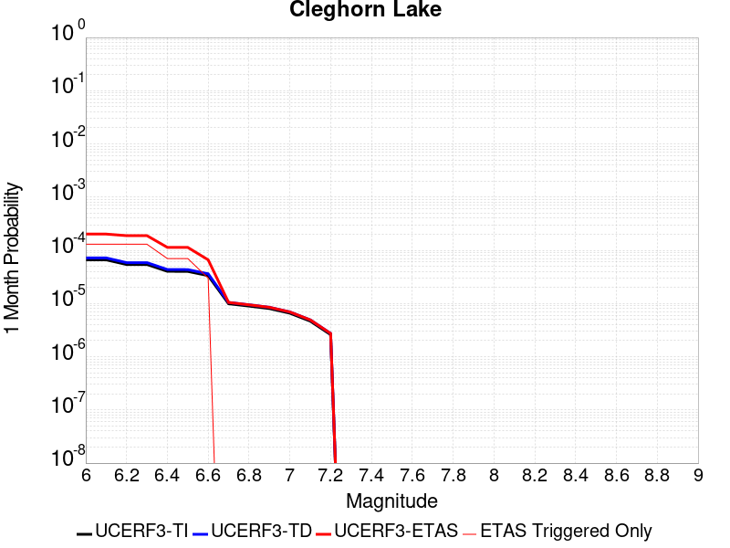 |  |  |

| Magnitude | 1 wk TI Prob | 1 wk TD Prob | 1 wk ETAS Prob | 1 wk ETAS/TD Gain | 1 wk ETAS Triggered Only | 1 mo TI Prob | 1 mo TD Prob | 1 mo ETAS Prob | 1 mo ETAS/TD Gain | 1 mo ETAS Triggered Only | 1 yr TI Prob | 1 yr TD Prob | 1 yr ETAS Prob | 1 yr ETAS/TD Gain | 1 yr ETAS Triggered Only | 10 yr TI Prob | 10 yr TD Prob | 10 yr ETAS Prob | 10 yr ETAS/TD Gain | 10 yr ETAS Triggered Only |
|-----|-----|-----|-----|-----|-----|-----|-----|-----|-----|-----|-----|-----|-----|-----|-----|-----|-----|-----|-----|-----|
| 6.0 | 1.5467183E-5 | 1.6794203E-5 | 1.4679202E-4 | 8.740636 | 1.3E-4 | 6.6286244E-5 | 7.197348E-5 | 2.0196413E-4 | 2.8060908 | 1.3E-4 | 8.067362E-4 | 8.759797E-4 | 0.0010358396 | 1.1824926 | 1.6E-4 | 0.008038137 | 0.008730696 | 0.008899211 | 1.0193015 | 1.7E-4 |
| 6.1 | 1.5467183E-5 | 1.6794203E-5 | 1.4679202E-4 | 8.740636 | 1.3E-4 | 6.6286244E-5 | 7.197348E-5 | 2.0196413E-4 | 2.8060908 | 1.3E-4 | 8.067362E-4 | 8.759797E-4 | 0.0010358396 | 1.1824926 | 1.6E-4 | 0.008038137 | 0.008730696 | 0.008899211 | 1.0193015 | 1.7E-4 |
| 6.2 | 1.2624631E-5 | 1.3681544E-5 | 1.4367976E-4 | 10.501721 | 1.3E-4 | 5.410444E-5 | 5.863415E-5 | 1.8862652E-4 | 3.217008 | 1.3E-4 | 6.585225E-4 | 7.1368564E-4 | 8.7357144E-4 | 1.2240283 | 1.6E-4 | 0.0065657445 | 0.0071187317 | 0.0072875214 | 1.0237106 | 1.7E-4 |
| 6.3 | 1.2624631E-5 | 1.3681544E-5 | 1.4367976E-4 | 10.501721 | 1.3E-4 | 5.410444E-5 | 5.863415E-5 | 1.8862652E-4 | 3.217008 | 1.3E-4 | 6.585225E-4 | 7.1368564E-4 | 8.7357144E-4 | 1.2240283 | 1.6E-4 | 0.0065657445 | 0.0071187317 | 0.0072875214 | 1.0237106 | 1.7E-4 |
| 6.4 | 9.417684E-6 | 1.0170118E-5 | 8.0169404E-5 | 7.8828397 | 7.0E-5 | 4.036088E-5 | 4.3585722E-5 | 1.1358267E-4 | 2.6059606 | 7.0E-5 | 4.912829E-4 | 5.3056807E-4 | 6.30515E-4 | 1.1883773 | 1.0E-4 | 0.004901982 | 0.005297049 | 0.0054064663 | 1.0206562 | 1.1E-4 |
| 6.5 | 9.368219E-6 | 1.0117545E-5 | 8.0116835E-5 | 7.918605 | 7.0E-5 | 4.014889E-5 | 4.3360415E-5 | 1.1335738E-4 | 2.6143057 | 7.0E-5 | 4.8870314E-4 | 5.2782625E-4 | 6.2777346E-4 | 1.1893563 | 1.0E-4 | 0.004876298 | 0.0052697617 | 0.005379182 | 1.0207638 | 1.1E-4 |
| 6.6 | 7.803798E-6 | 8.441831E-6 | 3.8441576E-5 | 4.5537014 | 3.0E-5 | 3.3444423E-5 | 3.6179E-5 | 6.617791E-5 | 1.8291804 | 3.0E-5 | 4.0710976E-4 | 4.4043022E-4 | 4.904082E-4 | 1.1134753 | 5.0E-5 | 0.0040636472 | 0.0043994905 | 0.0044592265 | 1.0135779 | 6.0E-5 |
| 6.7 | 2.3108669E-6 | 2.4438336E-6 | 2.4438336E-6 | 1.0 | 0.0 | 9.903678E-6 | 1.0473532E-5 | 1.0473532E-5 | 1.0 | 0.0 | 1.205706E-4 | 1.2750797E-4 | 1.2750797E-4 | 1.0 | 0.0 | 0.001205052 | 0.0012743667 | 0.0012743667 | 1.0 | 0.0 |
| 6.8 | 2.0882828E-6 | 2.2062823E-6 | 2.2062823E-6 | 1.0 | 0.0 | 8.949753E-6 | 9.455462E-6 | 9.455462E-6 | 1.0 | 0.0 | 1.08957785E-4 | 1.1511434E-4 | 1.1511434E-4 | 1.0 | 0.0 | 0.0010890438 | 0.0011505639 | 0.0011505639 | 1.0 | 0.0 |
| 6.9 | 1.876935E-6 | 1.981051E-6 | 1.981051E-6 | 1.0 | 0.0 | 8.043982E-6 | 8.490192E-6 | 8.490192E-6 | 1.0 | 0.0 | 9.7931086E-5 | 1.03363345E-4 | 1.03363345E-4 | 1.0 | 0.0 | 9.788794E-4 | 0.0010331686 | 0.0010331686 | 1.0 | 0.0 |
| 7.0 | 1.5357559E-6 | 1.6202807E-6 | 1.6202807E-6 | 1.0 | 0.0 | 6.5817944E-6 | 6.9440425E-6 | 6.9440425E-6 | 1.0 | 0.0 | 8.01304E-5 | 8.454057E-5 | 8.454057E-5 | 1.0 | 0.0 | 8.010151E-4 | 8.450965E-4 | 8.450965E-4 | 1.0 | 0.0 |
| 7.1 | 1.0905424E-6 | 1.1497619E-6 | 1.1497619E-6 | 1.0 | 0.0 | 4.6737446E-6 | 4.9275427E-6 | 4.9275427E-6 | 1.0 | 0.0 | 5.6901354E-5 | 5.999128E-5 | 5.999128E-5 | 1.0 | 0.0 | 5.6886784E-4 | 5.997606E-4 | 5.997606E-4 | 1.0 | 0.0 |
| 7.2 | 6.06668E-7 | 6.387277E-7 | 6.387277E-7 | 1.0 | 0.0 | 2.600003E-6 | 2.7374022E-6 | 2.7374022E-6 | 1.0 | 0.0 | 3.1654577E-5 | 3.3327433E-5 | 3.3327433E-5 | 1.0 | 0.0 | 3.1650066E-4 | 3.3323118E-4 | 3.3323118E-4 | 1.0 | 0.0 |

## Red Pass
*[(top)](#table-of-contents)*

| 1 Week | 1 Month | 1 Year | 10 Year |
|-----|-----|-----|-----|
|  |  |  |  |

| Magnitude | 1 wk TI Prob | 1 wk TD Prob | 1 wk ETAS Prob | 1 wk ETAS/TD Gain | 1 wk ETAS Triggered Only | 1 mo TI Prob | 1 mo TD Prob | 1 mo ETAS Prob | 1 mo ETAS/TD Gain | 1 mo ETAS Triggered Only | 1 yr TI Prob | 1 yr TD Prob | 1 yr ETAS Prob | 1 yr ETAS/TD Gain | 1 yr ETAS Triggered Only | 10 yr TI Prob | 10 yr TD Prob | 10 yr ETAS Prob | 10 yr ETAS/TD Gain | 10 yr ETAS Triggered Only |
|-----|-----|-----|-----|-----|-----|-----|-----|-----|-----|-----|-----|-----|-----|-----|-----|-----|-----|-----|-----|-----|
| 6.0 | 8.258278E-6 | 8.551265E-6 | 1.1855033E-4 | 13.863484 | 1.1E-4 | 3.539214E-5 | 3.6647863E-5 | 1.4664383E-4 | 4.001429 | 1.1E-4 | 4.308141E-4 | 4.4611428E-4 | 5.8605184E-4 | 1.3136809 | 1.4E-4 | 0.0042997985 | 0.004453945 | 0.0046132323 | 1.0357633 | 1.6E-4 |
| 6.1 | 3.649988E-6 | 3.7753161E-6 | 3.3775203E-5 | 8.946324 | 3.0E-5 | 1.5642712E-5 | 1.6179853E-5 | 4.6179368E-5 | 2.854128 | 3.0E-5 | 1.9043336E-4 | 1.9697666E-4 | 2.2697075E-4 | 1.1522723 | 3.0E-5 | 0.0019027026 | 0.001968488 | 0.0020183895 | 1.0253502 | 5.0E-5 |
| 6.2 | 3.649988E-6 | 3.7753161E-6 | 3.3775203E-5 | 8.946324 | 3.0E-5 | 1.5642712E-5 | 1.6179853E-5 | 4.6179368E-5 | 2.854128 | 3.0E-5 | 1.9043336E-4 | 1.9697666E-4 | 2.2697075E-4 | 1.1522723 | 3.0E-5 | 0.0019027026 | 0.001968488 | 0.0020183895 | 1.0253502 | 5.0E-5 |
| 6.3 | 1.3924937E-6 | 1.4411166E-6 | 1.1441102E-5 | 7.9390535 | 1.0E-5 | 5.9678164E-6 | 6.1762075E-6 | 1.6176145E-5 | 2.6191065 | 1.0E-5 | 7.265574E-5 | 7.519415E-5 | 8.5193395E-5 | 1.132979 | 1.0E-5 | 7.263199E-4 | 7.518258E-4 | 7.6181826E-4 | 1.013291 | 1.0E-5 |
| 6.4 | 1.3924937E-6 | 1.4411166E-6 | 1.1441102E-5 | 7.9390535 | 1.0E-5 | 5.9678164E-6 | 6.1762075E-6 | 1.6176145E-5 | 2.6191065 | 1.0E-5 | 7.265574E-5 | 7.519415E-5 | 8.5193395E-5 | 1.132979 | 1.0E-5 | 7.263199E-4 | 7.518258E-4 | 7.6181826E-4 | 1.013291 | 1.0E-5 |
| 6.5 | 9.876812E-7 | 1.0221912E-6 | 1.1022181E-5 | 10.782895 | 1.0E-5 | 4.2329125E-6 | 4.3808195E-6 | 1.4380776E-5 | 3.2826679 | 1.0E-5 | 5.153449E-5 | 5.3336476E-5 | 6.3335945E-5 | 1.1874789 | 1.0E-5 | 5.1522546E-4 | 5.333648E-4 | 5.4335943E-4 | 1.0187389 | 1.0E-5 |

## San Jacinto (San Jacinto Valley) rev
*[(top)](#table-of-contents)*

| 1 Week | 1 Month | 1 Year | 10 Year |
|-----|-----|-----|-----|
|  |  |  |  |

| Magnitude | 1 wk TI Prob | 1 wk TD Prob | 1 wk ETAS Prob | 1 wk ETAS/TD Gain | 1 wk ETAS Triggered Only | 1 mo TI Prob | 1 mo TD Prob | 1 mo ETAS Prob | 1 mo ETAS/TD Gain | 1 mo ETAS Triggered Only | 1 yr TI Prob | 1 yr TD Prob | 1 yr ETAS Prob | 1 yr ETAS/TD Gain | 1 yr ETAS Triggered Only | 10 yr TI Prob | 10 yr TD Prob | 10 yr ETAS Prob | 10 yr ETAS/TD Gain | 10 yr ETAS Triggered Only |
|-----|-----|-----|-----|-----|-----|-----|-----|-----|-----|-----|-----|-----|-----|-----|-----|-----|-----|-----|-----|-----|
| 6.0 | 3.652694E-5 | 3.4402394E-5 | 1.6439792E-4 | 4.778677 | 1.3E-4 | 1.5653463E-4 | 1.474305E-4 | 2.8740987E-4 | 1.9494599 | 1.4E-4 | 0.0019041431 | 0.00179349 | 0.001943221 | 1.0834858 | 1.5E-4 | 0.018879099 | 0.018526595 | 0.018683631 | 1.0084763 | 1.6E-4 |
| 6.1 | 3.652694E-5 | 3.4402394E-5 | 1.6439792E-4 | 4.778677 | 1.3E-4 | 1.5653463E-4 | 1.474305E-4 | 2.8740987E-4 | 1.9494599 | 1.4E-4 | 0.0019041431 | 0.00179349 | 0.001943221 | 1.0834858 | 1.5E-4 | 0.018879099 | 0.018526595 | 0.018683631 | 1.0084763 | 1.6E-4 |
| 6.2 | 3.652694E-5 | 3.4402394E-5 | 1.6439792E-4 | 4.778677 | 1.3E-4 | 1.5653463E-4 | 1.474305E-4 | 2.8740987E-4 | 1.9494599 | 1.4E-4 | 0.0019041431 | 0.00179349 | 0.001943221 | 1.0834858 | 1.5E-4 | 0.018879099 | 0.018526595 | 0.018683631 | 1.0084763 | 1.6E-4 |
| 6.3 | 3.652694E-5 | 3.4402394E-5 | 1.6439792E-4 | 4.778677 | 1.3E-4 | 1.5653463E-4 | 1.474305E-4 | 2.8740987E-4 | 1.9494599 | 1.4E-4 | 0.0019041431 | 0.00179349 | 0.001943221 | 1.0834858 | 1.5E-4 | 0.018879099 | 0.018526595 | 0.018683631 | 1.0084763 | 1.6E-4 |
| 6.4 | 3.646941E-5 | 3.432397E-5 | 1.6431951E-4 | 4.7873106 | 1.3E-4 | 1.5628811E-4 | 1.4709444E-4 | 2.8707384E-4 | 1.9516295 | 1.4E-4 | 0.0019011468 | 0.0017894056 | 0.0019391372 | 1.0836767 | 1.5E-4 | 0.018849645 | 0.018486476 | 0.018643519 | 1.008495 | 1.6E-4 |
| 6.5 | 3.646941E-5 | 3.432397E-5 | 1.6431951E-4 | 4.7873106 | 1.3E-4 | 1.5628811E-4 | 1.4709444E-4 | 2.8707384E-4 | 1.9516295 | 1.4E-4 | 0.0019011468 | 0.0017894056 | 0.0019391372 | 1.0836767 | 1.5E-4 | 0.018849645 | 0.018486476 | 0.018643519 | 1.008495 | 1.6E-4 |
| 6.6 | 3.6442503E-5 | 3.4287354E-5 | 1.642829E-4 | 4.791355 | 1.3E-4 | 1.561728E-4 | 1.4693754E-4 | 2.8691697E-4 | 1.9526458 | 1.4E-4 | 0.0018997455 | 0.0017874985 | 0.0019372304 | 1.0837661 | 1.5E-4 | 0.018835869 | 0.018467745 | 0.01862479 | 1.0085038 | 1.6E-4 |
| 6.7 | 3.6432113E-5 | 3.4272925E-5 | 1.6426847E-4 | 4.7929516 | 1.3E-4 | 1.5612828E-4 | 1.4687571E-4 | 2.8685515E-4 | 1.9530469 | 1.4E-4 | 0.0018992044 | 0.0017867472 | 0.0019364792 | 1.0838014 | 1.5E-4 | 0.018830549 | 0.018460369 | 0.018617416 | 1.0085073 | 1.6E-4 |
| 6.8 | 3.6409598E-5 | 3.424198E-5 | 1.6423753E-4 | 4.796379 | 1.3E-4 | 1.560318E-4 | 1.4674311E-4 | 2.8672256E-4 | 1.9539082 | 1.4E-4 | 0.0018980318 | 0.0017851355 | 0.0019348677 | 1.0838772 | 1.5E-4 | 0.018819023 | 0.018444523 | 0.018601572 | 1.0085146 | 1.6E-4 |
| 6.9 | 3.638078E-5 | 3.4202407E-5 | 1.6419796E-4 | 4.800772 | 1.3E-4 | 1.5590832E-4 | 1.4657351E-4 | 2.86553E-4 | 1.9550121 | 1.4E-4 | 0.0018965311 | 0.001783074 | 0.0019328066 | 1.0839744 | 1.5E-4 | 0.018804269 | 0.018424258 | 0.018581308 | 1.0085242 | 1.6E-4 |
| 7.0 | 3.6294874E-5 | 3.408442E-5 | 1.6407999E-4 | 4.8139296 | 1.3E-4 | 1.5554018E-4 | 1.4606792E-4 | 2.8604746E-4 | 1.9583182 | 1.4E-4 | 0.0018920569 | 0.001776929 | 0.0019266624 | 1.0842654 | 1.5E-4 | 0.018760284 | 0.018363839 | 0.018520901 | 1.0085528 | 1.6E-4 |
| 7.1 | 3.6260717E-5 | 3.4040702E-5 | 1.6403628E-4 | 4.8188276 | 1.3E-4 | 1.5539382E-4 | 1.4588058E-4 | 2.8586015E-4 | 1.9595491 | 1.4E-4 | 0.001890278 | 0.0017746518 | 0.0019243857 | 1.0843736 | 1.5E-4 | 0.018742796 | 0.018341439 | 0.018498505 | 1.0085634 | 1.6E-4 |
| 7.2 | 3.6210204E-5 | 3.397492E-5 | 1.639705E-4 | 4.826222 | 1.3E-4 | 1.5517735E-4 | 1.455987E-4 | 2.855783E-4 | 1.9614071 | 1.4E-4 | 0.001887647 | 0.0017712255 | 0.0019209598 | 1.0845371 | 1.5E-4 | 0.01871693 | 0.01830772 | 0.01846479 | 1.0085795 | 1.6E-4 |
| 7.3 | 3.6119454E-5 | 3.386321E-5 | 1.638588E-4 | 4.838845 | 1.3E-4 | 1.5478847E-4 | 1.4511998E-4 | 2.8509967E-4 | 1.964579 | 1.4E-4 | 0.0018829206 | 0.0017654065 | 0.0019151417 | 1.0848162 | 1.5E-4 | 0.018670462 | 0.018250274 | 0.018407352 | 1.008607 | 1.6E-4 |
| 7.4 | 3.607848E-5 | 3.381071E-5 | 1.6380631E-4 | 4.8448057 | 1.3E-4 | 1.5461289E-4 | 1.44895E-4 | 2.8487472E-4 | 1.9660769 | 1.4E-4 | 0.0018807866 | 0.0017626719 | 0.0019124075 | 1.0849481 | 1.5E-4 | 0.018649481 | 0.018223269 | 0.018380353 | 1.00862 | 1.6E-4 |
| 7.5 | 3.5856774E-5 | 3.3620483E-5 | 1.6361612E-4 | 4.8665605 | 1.3E-4 | 1.5366284E-4 | 1.4407984E-4 | 2.8405967E-4 | 1.9715436 | 1.4E-4 | 0.0018692396 | 0.0017527633 | 0.0019025003 | 1.0854292 | 1.5E-4 | 0.018535944 | 0.018124366 | 0.018281467 | 1.008668 | 1.6E-4 |
| 7.6 | 3.286655E-5 | 3.2143445E-5 | 1.6213927E-4 | 5.0442405 | 1.3E-4 | 1.4084904E-4 | 1.3775036E-4 | 2.7773107E-4 | 2.0161912 | 1.4E-4 | 0.001713488 | 0.0016758227 | 0.0018255712 | 1.0893583 | 1.5E-4 | 0.017003361 | 0.017344031 | 0.017501255 | 1.009065 | 1.6E-4 |
| 7.7 | 2.8882527E-5 | 2.9236293E-5 | 1.592325E-4 | 5.4463983 | 1.3E-4 | 1.237764E-4 | 1.2529238E-4 | 2.6527484E-4 | 2.1172464 | 1.4E-4 | 0.0015059357 | 0.0015243685 | 0.0016741399 | 1.0982513 | 1.5E-4 | 0.014957713 | 0.015830461 | 0.015987927 | 1.0099471 | 1.6E-4 |
| 7.8 | 2.4950225E-5 | 2.6527203E-5 | 1.5652376E-4 | 5.9005 | 1.3E-4 | 1.0692515E-4 | 1.1368306E-4 | 2.5366715E-4 | 2.231354 | 1.4E-4 | 0.0013010362 | 0.0013832134 | 0.001533006 | 1.1082932 | 1.5E-4 | 0.012934455 | 0.014411755 | 0.014569449 | 1.0109421 | 1.6E-4 |
| 7.9 | 1.9881603E-5 | 2.1507445E-5 | 1.5150465E-4 | 7.0442886 | 1.3E-4 | 8.520408E-5 | 9.217151E-5 | 2.2215954E-4 | 2.410284 | 1.3E-4 | 0.001036866 | 0.0011216112 | 0.0012614542 | 1.1246804 | 1.4E-4 | 0.010320415 | 0.011777027 | 0.011925261 | 1.0125867 | 1.5E-4 |
| 8.0 | 1.563292E-5 | 1.5937347E-5 | 1.2593559E-4 | 7.9019175 | 1.1E-4 | 6.6996516E-5 | 6.8301124E-5 | 1.7829362E-4 | 2.6104052 | 1.1E-4 | 8.153773E-4 | 8.3124964E-4 | 9.411582E-4 | 1.1322209 | 1.1E-4 | 0.00812392 | 0.008810506 | 0.008929449 | 1.0135001 | 1.2E-4 |
| 8.1 | 1.0045313E-5 | 8.301802E-6 | 7.830122E-5 | 9.431833 | 7.0E-5 | 4.305063E-5 | 3.5578672E-5 | 1.0557618E-4 | 2.9674008 | 7.0E-5 | 5.2401534E-4 | 4.3308473E-4 | 5.030544E-4 | 1.1615611 | 7.0E-5 | 0.0052278144 | 0.0046591135 | 0.004738741 | 1.0170907 | 8.0E-5 |
| 8.2 | 4.1554413E-6 | 1.5655598E-6 | 1.5655598E-6 | 1.0 | 0.0 | 1.7808914E-5 | 6.709525E-6 | 6.709525E-6 | 1.0 | 0.0 | 2.1680194E-4 | 8.168544E-5 | 8.168544E-5 | 1.0 | 0.0 | 0.0021659054 | 9.482903E-4 | 9.482903E-4 | 1.0 | 0.0 |
| 8.3 | 1.2758221E-6 | 3.6149942E-7 | 3.6149942E-7 | 1.0 | 0.0 | 5.4677976E-6 | 1.5492824E-6 | 1.5492824E-6 | 1.0 | 0.0 | 6.65684E-5 | 1.8862354E-5 | 1.8862354E-5 | 1.0 | 0.0 | 6.6548464E-4 | 2.2751294E-4 | 2.2751294E-4 | 1.0 | 0.0 |

## Elsinore (Glen Ivy) rev
*[(top)](#table-of-contents)*

| 1 Week | 1 Month | 1 Year | 10 Year |
|-----|-----|-----|-----|
|  |  |  |  |

| Magnitude | 1 wk TI Prob | 1 wk TD Prob | 1 wk ETAS Prob | 1 wk ETAS/TD Gain | 1 wk ETAS Triggered Only | 1 mo TI Prob | 1 mo TD Prob | 1 mo ETAS Prob | 1 mo ETAS/TD Gain | 1 mo ETAS Triggered Only | 1 yr TI Prob | 1 yr TD Prob | 1 yr ETAS Prob | 1 yr ETAS/TD Gain | 1 yr ETAS Triggered Only | 10 yr TI Prob | 10 yr TD Prob | 10 yr ETAS Prob | 10 yr ETAS/TD Gain | 10 yr ETAS Triggered Only |
|-----|-----|-----|-----|-----|-----|-----|-----|-----|-----|-----|-----|-----|-----|-----|-----|-----|-----|-----|-----|-----|
| 6.0 | 1.6204086E-4 | 2.9360707E-4 | 3.7358358E-4 | 1.272393 | 8.0E-5 | 6.94276E-4 | 0.0012578638 | 0.001357738 | 1.0793998 | 1.0E-4 | 0.008420097 | 0.015234485 | 0.015362504 | 1.0084033 | 1.3E-4 | 0.081081145 | 0.13969168 | 0.13982932 | 1.0009854 | 1.6E-4 |
| 6.1 | 1.6204086E-4 | 2.9360707E-4 | 3.7358358E-4 | 1.272393 | 8.0E-5 | 6.94276E-4 | 0.0012578638 | 0.001357738 | 1.0793998 | 1.0E-4 | 0.008420097 | 0.015234485 | 0.015362504 | 1.0084033 | 1.3E-4 | 0.081081145 | 0.13969168 | 0.13982932 | 1.0009854 | 1.6E-4 |
| 6.2 | 1.6204086E-4 | 2.9360707E-4 | 3.7358358E-4 | 1.272393 | 8.0E-5 | 6.94276E-4 | 0.0012578638 | 0.001357738 | 1.0793998 | 1.0E-4 | 0.008420097 | 0.015234485 | 0.015362504 | 1.0084033 | 1.3E-4 | 0.081081145 | 0.13969168 | 0.13982932 | 1.0009854 | 1.6E-4 |
| 6.3 | 1.0111737E-4 | 1.7703383E-4 | 2.2702497E-4 | 1.2823819 | 5.0E-5 | 4.332882E-4 | 7.5861247E-4 | 8.1856694E-4 | 1.0790318 | 6.0E-5 | 0.005262531 | 0.009217682 | 0.009306853 | 1.0096738 | 9.0E-5 | 0.0513964 | 0.0870191 | 0.08711953 | 1.0011541 | 1.1E-4 |
| 6.4 | 1.0111737E-4 | 1.7703383E-4 | 2.2702497E-4 | 1.2823819 | 5.0E-5 | 4.332882E-4 | 7.5861247E-4 | 8.1856694E-4 | 1.0790318 | 6.0E-5 | 0.005262531 | 0.009217682 | 0.009306853 | 1.0096738 | 9.0E-5 | 0.0513964 | 0.0870191 | 0.08711953 | 1.0011541 | 1.1E-4 |
| 6.5 | 3.6624708E-5 | 4.6391084E-5 | 5.6390618E-5 | 1.2155486 | 1.0E-5 | 1.569536E-4 | 1.9880582E-4 | 2.0880383E-4 | 1.0502903 | 1.0E-5 | 0.001909235 | 0.0024181372 | 0.0024380886 | 1.0082508 | 2.0E-5 | 0.01892915 | 0.023739954 | 0.023779005 | 1.001645 | 4.0E-5 |
| 6.6 | 2.5051324E-5 | 2.614772E-5 | 3.614746E-5 | 1.3824326 | 1.0E-5 | 1.073584E-4 | 1.12057096E-4 | 1.2205597E-4 | 1.0892302 | 1.0E-5 | 0.0013063047 | 0.0013634858 | 0.0013734722 | 1.0073241 | 1.0E-5 | 0.012986525 | 0.013564618 | 0.0135843465 | 1.0014545 | 2.0E-5 |
| 6.7 | 2.2189772E-5 | 2.2072849E-5 | 3.207263E-5 | 1.4530352 | 1.0E-5 | 9.509556E-5 | 9.4594696E-5 | 1.0459375E-4 | 1.1057042 | 1.0E-5 | 0.0011571734 | 0.0011511183 | 0.0011611069 | 1.0086772 | 1.0E-5 | 0.011511663 | 0.011465415 | 0.011485186 | 1.0017244 | 2.0E-5 |
| 6.8 | 1.6654378E-5 | 1.4437705E-5 | 2.443756E-5 | 1.6926209 | 1.0E-5 | 7.137396E-5 | 6.187444E-5 | 7.187382E-5 | 1.1616076 | 1.0E-5 | 8.686314E-4 | 7.530661E-4 | 7.6305855E-4 | 1.0132691 | 1.0E-5 | 0.008652439 | 0.00751048 | 0.007520405 | 1.0013214 | 1.0E-5 |
| 6.9 | 1.5042909E-5 | 1.2332022E-5 | 2.2331898E-5 | 1.810887 | 1.0E-5 | 6.446802E-5 | 5.285047E-5 | 6.284994E-5 | 1.189203 | 1.0E-5 | 7.8461546E-4 | 6.4326765E-4 | 6.532612E-4 | 1.0155356 | 1.0E-5 | 0.007818509 | 0.00641828 | 0.0064282157 | 1.001548 | 1.0E-5 |
| 7.0 | 1.4361385E-5 | 1.1451324E-5 | 2.145121E-5 | 1.8732514 | 1.0E-5 | 6.154734E-5 | 4.9076196E-5 | 5.9075704E-5 | 1.2037548 | 1.0E-5 | 7.490812E-4 | 5.973418E-4 | 6.073358E-4 | 1.0167308 | 1.0E-5 | 0.007465612 | 0.0059613534 | 0.005971294 | 1.0016675 | 1.0E-5 |
| 7.1 | 1.3265571E-5 | 1.0244926E-5 | 2.0244823E-5 | 1.9760829 | 1.0E-5 | 5.6851208E-5 | 4.39061E-5 | 5.390566E-5 | 1.2277488 | 1.0E-5 | 6.919436E-4 | 5.344282E-4 | 5.4442283E-4 | 1.0187016 | 1.0E-5 | 0.006897931 | 0.0053347866 | 0.005344733 | 1.0018644 | 1.0E-5 |
| 7.2 | 1.1596403E-5 | 8.505067E-6 | 1.8504981E-5 | 2.1757598 | 1.0E-5 | 4.9697923E-5 | 3.6449786E-5 | 4.6449422E-5 | 1.27434 | 1.0E-5 | 6.049042E-4 | 4.436875E-4 | 4.5368305E-4 | 1.0225284 | 1.0E-5 | 0.006032603 | 0.0044294316 | 0.0044393875 | 1.0022476 | 1.0E-5 |
| 7.3 | 1.0150827E-5 | 7.2387597E-6 | 1.7238688E-5 | 2.381442 | 1.0E-5 | 4.3502816E-5 | 3.1022897E-5 | 4.1022588E-5 | 1.3223326 | 1.0E-5 | 5.2951806E-4 | 3.7763975E-4 | 3.8763596E-4 | 1.0264703 | 1.0E-5 | 0.005282581 | 0.0037703665 | 0.003780329 | 1.0026423 | 1.0E-5 |
| 7.4 | 9.080705E-6 | 6.352519E-6 | 1.6352456E-5 | 2.5741687 | 1.0E-5 | 3.8916725E-5 | 2.7224805E-5 | 3.7224534E-5 | 1.3673021 | 1.0E-5 | 4.7370812E-4 | 3.3141294E-4 | 3.4140964E-4 | 1.0301639 | 1.0E-5 | 0.004726996 | 0.0033093381 | 0.003319305 | 1.0030117 | 1.0E-5 |
| 7.5 | 7.671649E-6 | 5.2256332E-6 | 1.5225581E-5 | 2.9136338 | 1.0E-5 | 3.287808E-5 | 2.2395385E-5 | 3.239516E-5 | 1.4465106 | 1.0E-5 | 4.0021708E-4 | 2.7263095E-4 | 2.8262823E-4 | 1.0366696 | 1.0E-5 | 0.0039949706 | 0.00272309 | 0.0027330627 | 1.0036623 | 1.0E-5 |
| 7.6 | 6.990086E-6 | 4.687545E-6 | 1.4687498E-5 | 3.133303 | 1.0E-5 | 2.9957167E-5 | 2.008933E-5 | 3.0089128E-5 | 1.4977667 | 1.0E-5 | 3.6466747E-4 | 2.445613E-4 | 2.5455886E-4 | 1.0408795 | 1.0E-5 | 0.0036406964 | 0.002443038 | 0.0024530136 | 1.0040833 | 1.0E-5 |
| 7.7 | 4.163505E-6 | 2.3295343E-6 | 1.2329511E-5 | 5.2926936 | 1.0E-5 | 1.7843471E-5 | 9.983683E-6 | 1.9983583E-5 | 2.0016243 | 1.0E-5 | 2.172226E-4 | 1.21545316E-4 | 1.315441E-4 | 1.0822638 | 1.0E-5 | 0.0021701038 | 0.0012148614 | 0.0012248493 | 1.0082214 | 1.0E-5 |
| 7.8 | 2.2692414E-7 | 9.3854695E-8 | 9.3854695E-8 | 1.0 | 0.0 | 9.725317E-7 | 4.0223435E-7 | 4.0223435E-7 | 1.0 | 0.0 | 1.1840509E-5 | 4.8971956E-6 | 4.8971956E-6 | 1.0 | 0.0 | 1.1839878E-4 | 4.8971204E-5 | 4.8971204E-5 | 1.0 | 0.0 |
| 7.9 | 6.676829E-9 | 3.439853E-9 | 3.439853E-9 | 1.0 | 0.0 | 2.861498E-8 | 1.4742227E-8 | 1.4742227E-8 | 1.0 | 0.0 | 3.4838732E-7 | 1.7948659E-7 | 1.7948659E-7 | 1.0 | 0.0 | 3.4838679E-6 | 1.7948646E-6 | 1.7948646E-6 | 1.0 | 0.0 |

## San Jacinto (Stepovers Combined)
*[(top)](#table-of-contents)*

| 1 Week | 1 Month | 1 Year | 10 Year |
|-----|-----|-----|-----|
|  |  | 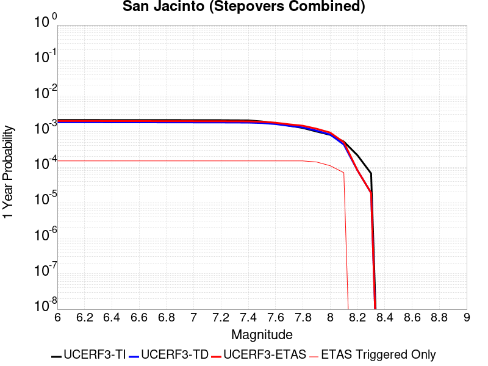 |  |

| Magnitude | 1 wk TI Prob | 1 wk TD Prob | 1 wk ETAS Prob | 1 wk ETAS/TD Gain | 1 wk ETAS Triggered Only | 1 mo TI Prob | 1 mo TD Prob | 1 mo ETAS Prob | 1 mo ETAS/TD Gain | 1 mo ETAS Triggered Only | 1 yr TI Prob | 1 yr TD Prob | 1 yr ETAS Prob | 1 yr ETAS/TD Gain | 1 yr ETAS Triggered Only | 10 yr TI Prob | 10 yr TD Prob | 10 yr ETAS Prob | 10 yr ETAS/TD Gain | 10 yr ETAS Triggered Only |
|-----|-----|-----|-----|-----|-----|-----|-----|-----|-----|-----|-----|-----|-----|-----|-----|-----|-----|-----|-----|-----|
| 6.0 | 4.0667746E-5 | 3.5272755E-5 | 1.6526817E-4 | 4.685434 | 1.3E-4 | 1.742787E-4 | 1.5116022E-4 | 2.9113906E-4 | 1.9260297 | 1.4E-4 | 0.0021197782 | 0.0018388226 | 0.0019885467 | 1.0814239 | 1.5E-4 | 0.020996714 | 0.018986892 | 0.019143853 | 1.0082669 | 1.6E-4 |
| 6.1 | 4.0667746E-5 | 3.5272755E-5 | 1.6526817E-4 | 4.685434 | 1.3E-4 | 1.742787E-4 | 1.5116022E-4 | 2.9113906E-4 | 1.9260297 | 1.4E-4 | 0.0021197782 | 0.0018388226 | 0.0019885467 | 1.0814239 | 1.5E-4 | 0.020996714 | 0.018986892 | 0.019143853 | 1.0082669 | 1.6E-4 |
| 6.2 | 4.0667746E-5 | 3.5272755E-5 | 1.6526817E-4 | 4.685434 | 1.3E-4 | 1.742787E-4 | 1.5116022E-4 | 2.9113906E-4 | 1.9260297 | 1.4E-4 | 0.0021197782 | 0.0018388226 | 0.0019885467 | 1.0814239 | 1.5E-4 | 0.020996714 | 0.018986892 | 0.019143853 | 1.0082669 | 1.6E-4 |
| 6.3 | 4.0667746E-5 | 3.5272755E-5 | 1.6526817E-4 | 4.685434 | 1.3E-4 | 1.742787E-4 | 1.5116022E-4 | 2.9113906E-4 | 1.9260297 | 1.4E-4 | 0.0021197782 | 0.0018388226 | 0.0019885467 | 1.0814239 | 1.5E-4 | 0.020996714 | 0.018986892 | 0.019143853 | 1.0082669 | 1.6E-4 |
| 6.4 | 4.0577226E-5 | 3.5144654E-5 | 1.6514008E-4 | 4.698868 | 1.3E-4 | 1.738908E-4 | 1.5061127E-4 | 2.905902E-4 | 1.9294053 | 1.4E-4 | 0.0021150648 | 0.0018321523 | 0.0019818775 | 1.081721 | 1.5E-4 | 0.020950472 | 0.018921461 | 0.019078434 | 1.008296 | 1.6E-4 |
| 6.5 | 4.0577226E-5 | 3.5144654E-5 | 1.6514008E-4 | 4.698868 | 1.3E-4 | 1.738908E-4 | 1.5061127E-4 | 2.905902E-4 | 1.9294053 | 1.4E-4 | 0.0021150648 | 0.0018321523 | 0.0019818775 | 1.081721 | 1.5E-4 | 0.020950472 | 0.018921461 | 0.019078434 | 1.008296 | 1.6E-4 |
| 6.6 | 4.053861E-5 | 3.509E-5 | 1.6508544E-4 | 4.704629 | 1.3E-4 | 1.7372532E-4 | 1.5037706E-4 | 2.9035602E-4 | 1.930853 | 1.4E-4 | 0.0021130538 | 0.0018293057 | 0.0019790311 | 1.0818484 | 1.5E-4 | 0.020930743 | 0.018893538 | 0.019050516 | 1.0083085 | 1.6E-4 |
| 6.7 | 4.0516545E-5 | 3.5059067E-5 | 1.6505452E-4 | 4.7078977 | 1.3E-4 | 1.7363077E-4 | 1.5024451E-4 | 2.9022348E-4 | 1.9316744 | 1.4E-4 | 0.002111905 | 0.001827695 | 0.0019774209 | 1.0819206 | 1.5E-4 | 0.020919468 | 0.018877735 | 0.019034715 | 1.0083156 | 1.6E-4 |
| 6.8 | 4.049434E-5 | 3.5030633E-5 | 1.6502608E-4 | 4.710908 | 1.3E-4 | 1.7353562E-4 | 1.5012265E-4 | 2.9010163E-4 | 1.9324307 | 1.4E-4 | 0.0021107488 | 0.0018262138 | 0.0019759398 | 1.0819871 | 1.5E-4 | 0.020908125 | 0.018863149 | 0.01902013 | 1.0083221 | 1.6E-4 |
| 6.9 | 4.046386E-5 | 3.499319E-5 | 1.6498864E-4 | 4.7148786 | 1.3E-4 | 1.73405E-4 | 1.4996222E-4 | 2.8994124E-4 | 1.9334285 | 1.4E-4 | 0.0021091616 | 0.0018242638 | 0.0019739901 | 1.082075 | 1.5E-4 | 0.020892553 | 0.01884392 | 0.019000906 | 1.0083308 | 1.6E-4 |
| 7.0 | 4.036382E-5 | 3.487376E-5 | 1.6486923E-4 | 4.7276015 | 1.3E-4 | 1.7297632E-4 | 1.4945042E-4 | 2.894295E-4 | 1.9366255 | 1.4E-4 | 0.0021039525 | 0.0018180435 | 0.0019677707 | 1.0823562 | 1.5E-4 | 0.02084144 | 0.018782536 | 0.01893953 | 1.0083586 | 1.6E-4 |
| 7.1 | 4.0343282E-5 | 3.4852223E-5 | 1.6484769E-4 | 4.7299047 | 1.3E-4 | 1.7288832E-4 | 1.4935812E-4 | 2.8933721E-4 | 1.9372044 | 1.4E-4 | 0.002102883 | 0.0018169218 | 0.0019666492 | 1.0824072 | 1.5E-4 | 0.020830948 | 0.018771412 | 0.018928409 | 1.0083636 | 1.6E-4 |
| 7.2 | 4.0257353E-5 | 3.4756722E-5 | 1.647522E-4 | 4.740154 | 1.3E-4 | 1.725201E-4 | 1.489489E-4 | 2.8892804E-4 | 1.9397798 | 1.4E-4 | 0.0020984085 | 0.0018119477 | 0.001961676 | 1.0826339 | 1.5E-4 | 0.020787042 | 0.018722152 | 0.018879157 | 1.008386 | 1.6E-4 |
| 7.3 | 3.9940667E-5 | 3.4584376E-5 | 1.6457988E-4 | 4.758793 | 1.3E-4 | 1.7116306E-4 | 1.4821035E-4 | 2.8818962E-4 | 1.9444634 | 1.4E-4 | 0.0020819185 | 0.0018029709 | 0.0019527004 | 1.083046 | 1.5E-4 | 0.020625217 | 0.018630784 | 0.018787803 | 1.008428 | 1.6E-4 |
| 7.4 | 3.9721202E-5 | 3.4469766E-5 | 1.6446528E-4 | 4.771291 | 1.3E-4 | 1.7022261E-4 | 1.4771923E-4 | 2.8769855E-4 | 1.947604 | 1.4E-4 | 0.0020704903 | 0.0017970012 | 0.0019467317 | 1.0833224 | 1.5E-4 | 0.020513052 | 0.018569905 | 0.018726936 | 1.0084561 | 1.6E-4 |
| 7.5 | 3.7036873E-5 | 3.3537188E-5 | 1.6353282E-4 | 4.8761644 | 1.3E-4 | 1.5871979E-4 | 1.437229E-4 | 2.8370277E-4 | 1.9739567 | 1.4E-4 | 0.0019307006 | 0.0017484248 | 0.0018981625 | 1.0856415 | 1.5E-4 | 0.019140124 | 0.018071463 | 0.018228572 | 1.0086937 | 1.6E-4 |
| 7.6 | 3.2940967E-5 | 3.1317984E-5 | 1.6131392E-4 | 5.1508393 | 1.3E-4 | 1.4116794E-4 | 1.3421304E-4 | 2.7419426E-4 | 2.0429776 | 1.4E-4 | 0.0017173645 | 0.0016328214 | 0.0017825764 | 1.0917156 | 1.5E-4 | 0.01704153 | 0.016904354 | 0.017061649 | 1.009305 | 1.6E-4 |
| 7.7 | 2.8236149E-5 | 2.7883889E-5 | 1.5788026E-4 | 5.6620603 | 1.3E-4 | 1.2100645E-4 | 1.19496915E-4 | 2.5948018E-4 | 2.1714385 | 1.4E-4 | 0.0014722579 | 0.001453905 | 0.001603687 | 1.1030204 | 1.5E-4 | 0.014625421 | 0.015115095 | 0.015272677 | 1.0104254 | 1.6E-4 |
| 7.8 | 2.4329287E-5 | 2.5207537E-5 | 1.5520427E-4 | 6.157058 | 1.3E-4 | 1.042642E-4 | 1.0802783E-4 | 2.4801272E-4 | 2.2958224 | 1.4E-4 | 0.0012686774 | 0.0013144462 | 0.001464249 | 1.1139665 | 1.5E-4 | 0.012614589 | 0.013712396 | 0.013870202 | 1.0115082 | 1.6E-4 |
| 7.9 | 1.9370926E-5 | 2.0421452E-5 | 1.504188E-4 | 7.365725 | 1.3E-4 | 8.301561E-5 | 8.7517576E-5 | 2.175062E-4 | 2.485286 | 1.3E-4 | 0.0010102465 | 0.0010650064 | 0.0012048573 | 1.1313146 | 1.4E-4 | 0.0100566605 | 0.011199483 | 0.011347802 | 1.0132434 | 1.5E-4 |
| 8.0 | 1.5583017E-5 | 1.588647E-5 | 1.2588472E-4 | 7.9240217 | 1.1E-4 | 6.6782646E-5 | 6.808309E-5 | 1.780756E-4 | 2.6155627 | 1.1E-4 | 8.127754E-4 | 8.285971E-4 | 9.38506E-4 | 1.1326445 | 1.1E-4 | 0.008098091 | 0.008781809 | 0.008900756 | 1.0135446 | 1.2E-4 |
| 8.1 | 1.0024873E-5 | 8.292404E-6 | 7.829182E-5 | 9.44139 | 7.0E-5 | 4.2963035E-5 | 3.5538393E-5 | 1.055359E-4 | 2.9696307 | 7.0E-5 | 5.229494E-4 | 4.3259456E-4 | 5.0256425E-4 | 1.1617444 | 7.0E-5 | 0.0052172043 | 0.0046534105 | 0.004733038 | 1.0171117 | 8.0E-5 |
| 8.2 | 4.142796E-6 | 1.5610041E-6 | 1.5610041E-6 | 1.0 | 0.0 | 1.775472E-5 | 6.69E-6 | 6.69E-6 | 1.0 | 0.0 | 2.1614227E-4 | 8.144774E-5 | 8.144774E-5 | 1.0 | 0.0 | 0.0021593217 | 9.454649E-4 | 9.454649E-4 | 1.0 | 0.0 |
| 8.3 | 1.2750878E-6 | 3.612133E-7 | 3.612133E-7 | 1.0 | 0.0 | 5.4646503E-6 | 1.548056E-6 | 1.548056E-6 | 1.0 | 0.0 | 6.653009E-5 | 1.8847424E-5 | 1.8847424E-5 | 1.0 | 0.0 | 6.6510175E-4 | 2.2734253E-4 | 2.2734253E-4 | 1.0 | 0.0 |

## San Andreas (Big Bend)
*[(top)](#table-of-contents)*

| 1 Week | 1 Month | 1 Year | 10 Year |
|-----|-----|-----|-----|
|  |  |  |  |

| Magnitude | 1 wk TI Prob | 1 wk TD Prob | 1 wk ETAS Prob | 1 wk ETAS/TD Gain | 1 wk ETAS Triggered Only | 1 mo TI Prob | 1 mo TD Prob | 1 mo ETAS Prob | 1 mo ETAS/TD Gain | 1 mo ETAS Triggered Only | 1 yr TI Prob | 1 yr TD Prob | 1 yr ETAS Prob | 1 yr ETAS/TD Gain | 1 yr ETAS Triggered Only | 10 yr TI Prob | 10 yr TD Prob | 10 yr ETAS Prob | 10 yr ETAS/TD Gain | 10 yr ETAS Triggered Only |
|-----|-----|-----|-----|-----|-----|-----|-----|-----|-----|-----|-----|-----|-----|-----|-----|-----|-----|-----|-----|-----|
| 6.0 | 1.0179969E-4 | 2.0072258E-4 | 3.107005E-4 | 1.54791 | 1.1E-4 | 4.362114E-4 | 8.599571E-4 | 9.898453E-4 | 1.1510403 | 1.3E-4 | 0.0052979486 | 0.010419999 | 0.01055854 | 1.0132957 | 1.4E-4 | 0.051734097 | 0.10144902 | 0.10159279 | 1.0014172 | 1.6E-4 |
| 6.1 | 1.0179969E-4 | 2.0072258E-4 | 3.107005E-4 | 1.54791 | 1.1E-4 | 4.362114E-4 | 8.599571E-4 | 9.898453E-4 | 1.1510403 | 1.3E-4 | 0.0052979486 | 0.010419999 | 0.01055854 | 1.0132957 | 1.4E-4 | 0.051734097 | 0.10144902 | 0.10159279 | 1.0014172 | 1.6E-4 |
| 6.2 | 1.0179969E-4 | 2.0072258E-4 | 3.107005E-4 | 1.54791 | 1.1E-4 | 4.362114E-4 | 8.599571E-4 | 9.898453E-4 | 1.1510403 | 1.3E-4 | 0.0052979486 | 0.010419999 | 0.01055854 | 1.0132957 | 1.4E-4 | 0.051734097 | 0.10144902 | 0.10159279 | 1.0014172 | 1.6E-4 |
| 6.3 | 1.0179969E-4 | 2.0072258E-4 | 3.107005E-4 | 1.54791 | 1.1E-4 | 4.362114E-4 | 8.599571E-4 | 9.898453E-4 | 1.1510403 | 1.3E-4 | 0.0052979486 | 0.010419999 | 0.01055854 | 1.0132957 | 1.4E-4 | 0.051734097 | 0.10144902 | 0.10159279 | 1.0014172 | 1.6E-4 |
| 6.4 | 9.1639464E-5 | 1.8429532E-4 | 2.7427875E-4 | 1.4882567 | 9.0E-5 | 3.9268145E-4 | 7.895982E-4 | 8.895193E-4 | 1.1265467 | 1.0E-4 | 0.0047704205 | 0.009571102 | 0.0096800495 | 1.0113829 | 1.1E-4 | 0.046693064 | 0.09377527 | 0.09389308 | 1.0012563 | 1.3E-4 |
| 6.5 | 9.1639464E-5 | 1.8429532E-4 | 2.7427875E-4 | 1.4882567 | 9.0E-5 | 3.9268145E-4 | 7.895982E-4 | 8.895193E-4 | 1.1265467 | 1.0E-4 | 0.0047704205 | 0.009571102 | 0.0096800495 | 1.0113829 | 1.1E-4 | 0.046693064 | 0.09377527 | 0.09389308 | 1.0012563 | 1.3E-4 |
| 6.6 | 9.042622E-5 | 1.823659E-4 | 2.6235133E-4 | 1.4385985 | 8.0E-5 | 3.8748336E-4 | 7.8133424E-4 | 8.7126397E-4 | 1.1150975 | 9.0E-5 | 0.0047074095 | 0.009471365 | 0.009560512 | 1.0094123 | 9.0E-5 | 0.046089325 | 0.092869274 | 0.09296906 | 1.0010744 | 1.1E-4 |
| 6.7 | 8.9836685E-5 | 1.8150927E-4 | 2.5149656E-4 | 1.3855853 | 7.0E-5 | 3.8495753E-4 | 7.776651E-4 | 8.576029E-4 | 1.102792 | 8.0E-5 | 0.00467679 | 0.00942708 | 0.009506326 | 1.0084062 | 8.0E-5 | 0.045795817 | 0.09246355 | 0.0925543 | 1.0009815 | 1.0E-4 |
| 6.8 | 8.9471854E-5 | 1.8097709E-4 | 2.5096443E-4 | 1.3867193 | 7.0E-5 | 3.8339442E-4 | 7.7538576E-4 | 8.5532374E-4 | 1.1030945 | 8.0E-5 | 0.004657841 | 0.009399569 | 0.009478817 | 1.0084311 | 8.0E-5 | 0.04561414 | 0.092210755 | 0.09230153 | 1.0009844 | 1.0E-4 |
| 6.9 | 8.858234E-5 | 1.7979681E-4 | 2.4978424E-4 | 1.3892584 | 7.0E-5 | 3.7958333E-4 | 7.703304E-4 | 8.502688E-4 | 1.1037716 | 8.0E-5 | 0.004611638 | 0.009338548 | 0.009417802 | 1.0084866 | 8.0E-5 | 0.04517103 | 0.09165087 | 0.09174171 | 1.0009911 | 1.0E-4 |
| 7.0 | 8.7433385E-5 | 1.7818481E-4 | 2.4817235E-4 | 1.3927805 | 7.0E-5 | 3.746607E-4 | 7.634259E-4 | 8.433648E-4 | 1.1047108 | 8.0E-5 | 0.004551957 | 0.009255203 | 0.009334463 | 1.0085638 | 8.0E-5 | 0.044598386 | 0.09088532 | 0.09097623 | 1.0010003 | 1.0E-4 |
| 7.1 | 8.684964E-5 | 1.7730435E-4 | 2.4729193E-4 | 1.3947314 | 7.0E-5 | 3.7215967E-4 | 7.596547E-4 | 8.3959394E-4 | 1.105231 | 8.0E-5 | 0.0045216335 | 0.009209678 | 0.009288941 | 1.0086066 | 8.0E-5 | 0.04430731 | 0.09046686 | 0.09055781 | 1.0010054 | 1.0E-4 |
| 7.2 | 8.606521E-5 | 1.762105E-4 | 2.4619818E-4 | 1.3971821 | 7.0E-5 | 3.6879873E-4 | 7.549695E-4 | 8.349091E-4 | 1.1058846 | 8.0E-5 | 0.0044808835 | 0.0091531165 | 0.009232384 | 1.0086602 | 8.0E-5 | 0.043916024 | 0.089947365 | 0.090038374 | 1.0010117 | 1.0E-4 |
| 7.3 | 8.568266E-5 | 1.7563057E-4 | 2.4561828E-4 | 1.3984939 | 7.0E-5 | 3.6715972E-4 | 7.524855E-4 | 8.324253E-4 | 1.1062343 | 8.0E-5 | 0.0044610105 | 0.009123127 | 0.009202397 | 1.0086889 | 8.0E-5 | 0.043725148 | 0.08966853 | 0.08975956 | 1.0010152 | 1.0E-4 |
| 7.4 | 8.5432206E-5 | 1.7525644E-4 | 2.4524418E-4 | 1.3993447 | 7.0E-5 | 3.6608664E-4 | 7.50883E-4 | 8.30823E-4 | 1.1064613 | 8.0E-5 | 0.004447999 | 0.009103781 | 0.009183052 | 1.0087075 | 8.0E-5 | 0.043600157 | 0.08948871 | 0.08957976 | 1.0010175 | 1.0E-4 |
| 7.5 | 8.4791965E-5 | 1.7394972E-4 | 2.4393755E-4 | 1.4023451 | 7.0E-5 | 3.633435E-4 | 7.4528606E-4 | 8.252264E-4 | 1.1072613 | 8.0E-5 | 0.0044147377 | 0.009036204 | 0.009115482 | 1.0087733 | 8.0E-5 | 0.043280575 | 0.088866346 | 0.08895746 | 1.0010253 | 1.0E-4 |
| 7.6 | 8.241105E-5 | 1.6840403E-4 | 2.3839224E-4 | 1.415597 | 7.0E-5 | 3.531424E-4 | 7.215321E-4 | 8.014744E-4 | 1.1107951 | 8.0E-5 | 0.0042910352 | 0.008749358 | 0.008828659 | 1.0090635 | 8.0E-5 | 0.042091176 | 0.086243294 | 0.08633467 | 1.0010595 | 1.0E-4 |
| 7.7 | 7.00432E-5 | 1.42045E-4 | 2.1203507E-4 | 1.4927316 | 7.0E-5 | 3.001506E-4 | 6.0862233E-4 | 6.7857973E-4 | 1.1149439 | 7.0E-5 | 0.0036482112 | 0.0073848404 | 0.0074543236 | 1.0094088 | 7.0E-5 | 0.035888977 | 0.07351733 | 0.07359145 | 1.0010082 | 8.0E-5 |
| 7.8 | 6.415362E-5 | 1.2968935E-4 | 1.8968155E-4 | 1.462584 | 6.0E-5 | 2.749151E-4 | 5.556931E-4 | 6.1565975E-4 | 1.1079133 | 6.0E-5 | 0.0033419547 | 0.0067446055 | 0.006804201 | 1.008836 | 6.0E-5 | 0.03292141 | 0.06725231 | 0.06730827 | 1.0008322 | 6.0E-5 |
| 7.9 | 4.939911E-5 | 9.3411545E-5 | 1.4340687E-4 | 1.5352157 | 5.0E-5 | 2.116933E-4 | 4.0027377E-4 | 4.5025375E-4 | 1.1248645 | 5.0E-5 | 0.0025743195 | 0.004862453 | 0.0049122097 | 1.0102329 | 5.0E-5 | 0.025447013 | 0.048914436 | 0.048961993 | 1.0009722 | 5.0E-5 |
| 8.0 | 3.344983E-5 | 5.222685E-5 | 8.2225284E-5 | 1.5743872 | 3.0E-5 | 1.4334853E-4 | 2.2381016E-4 | 2.5380345E-4 | 1.1340122 | 3.0E-5 | 0.0017438711 | 0.0027214854 | 0.002751404 | 1.0109934 | 3.0E-5 | 0.017302496 | 0.027922187 | 0.02795135 | 1.0010444 | 3.0E-5 |
| 8.1 | 1.9104898E-5 | 1.9173063E-5 | 2.9172872E-5 | 1.5215551 | 1.0E-5 | 8.1875565E-5 | 8.216769E-5 | 9.216687E-5 | 1.1216923 | 1.0E-5 | 9.963791E-4 | 9.999331E-4 | 0.0010099232 | 1.0099907 | 1.0E-5 | 0.009919235 | 0.010749801 | 0.010759694 | 1.0009203 | 1.0E-5 |
| 8.2 | 8.643924E-6 | 5.4748625E-6 | 5.4748625E-6 | 1.0 | 0.0 | 3.704486E-5 | 2.3463486E-5 | 2.3463486E-5 | 1.0 | 0.0 | 4.5092785E-4 | 2.8563058E-4 | 2.8563058E-4 | 1.0 | 0.0 | 0.0045001395 | 0.0032487072 | 0.0032487072 | 1.0 | 0.0 |
| 8.3 | 1.983087E-6 | 7.6599065E-7 | 7.6599065E-7 | 1.0 | 0.0 | 8.498917E-6 | 3.282813E-6 | 3.282813E-6 | 1.0 | 0.0 | 1.034694E-4 | 3.9967534E-5 | 3.9967534E-5 | 1.0 | 0.0 | 0.0010342124 | 4.719687E-4 | 4.719687E-4 | 1.0 | 0.0 |

## San Andreas (Carrizo) rev
*[(top)](#table-of-contents)*

| 1 Week | 1 Month | 1 Year | 10 Year |
|-----|-----|-----|-----|
| 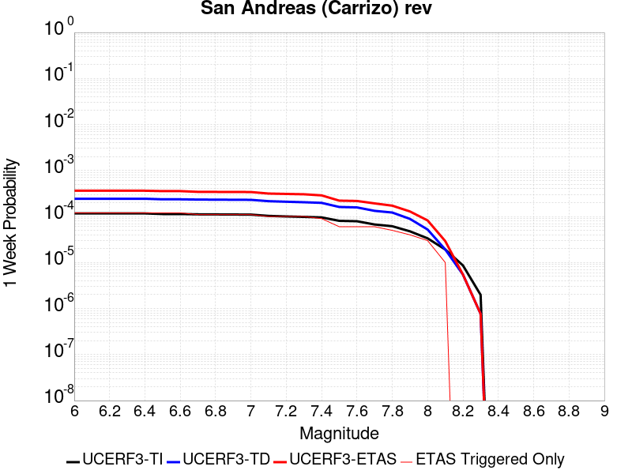 |  |  |  |

| Magnitude | 1 wk TI Prob | 1 wk TD Prob | 1 wk ETAS Prob | 1 wk ETAS/TD Gain | 1 wk ETAS Triggered Only | 1 mo TI Prob | 1 mo TD Prob | 1 mo ETAS Prob | 1 mo ETAS/TD Gain | 1 mo ETAS Triggered Only | 1 yr TI Prob | 1 yr TD Prob | 1 yr ETAS Prob | 1 yr ETAS/TD Gain | 1 yr ETAS Triggered Only | 10 yr TI Prob | 10 yr TD Prob | 10 yr ETAS Prob | 10 yr ETAS/TD Gain | 10 yr ETAS Triggered Only |
|-----|-----|-----|-----|-----|-----|-----|-----|-----|-----|-----|-----|-----|-----|-----|-----|-----|-----|-----|-----|-----|
| 6.0 | 1.1674632E-4 | 2.432302E-4 | 3.6320102E-4 | 1.4932398 | 1.2E-4 | 5.002454E-4 | 0.0010420004 | 0.0011718649 | 1.1246301 | 1.3E-4 | 0.006073493 | 0.012613042 | 0.012741403 | 1.0101768 | 1.3E-4 | 0.0591016 | 0.12061418 | 0.12074608 | 1.0010936 | 1.5E-4 |
| 6.1 | 1.1674632E-4 | 2.432302E-4 | 3.6320102E-4 | 1.4932398 | 1.2E-4 | 5.002454E-4 | 0.0010420004 | 0.0011718649 | 1.1246301 | 1.3E-4 | 0.006073493 | 0.012613042 | 0.012741403 | 1.0101768 | 1.3E-4 | 0.0591016 | 0.12061418 | 0.12074608 | 1.0010936 | 1.5E-4 |
| 6.2 | 1.1674632E-4 | 2.432302E-4 | 3.6320102E-4 | 1.4932398 | 1.2E-4 | 5.002454E-4 | 0.0010420004 | 0.0011718649 | 1.1246301 | 1.3E-4 | 0.006073493 | 0.012613042 | 0.012741403 | 1.0101768 | 1.3E-4 | 0.0591016 | 0.12061418 | 0.12074608 | 1.0010936 | 1.5E-4 |
| 6.3 | 1.1674632E-4 | 2.432302E-4 | 3.6320102E-4 | 1.4932398 | 1.2E-4 | 5.002454E-4 | 0.0010420004 | 0.0011718649 | 1.1246301 | 1.3E-4 | 0.006073493 | 0.012613042 | 0.012741403 | 1.0101768 | 1.3E-4 | 0.0591016 | 0.12061418 | 0.12074608 | 1.0010936 | 1.5E-4 |
| 6.4 | 1.1674632E-4 | 2.432302E-4 | 3.6320102E-4 | 1.4932398 | 1.2E-4 | 5.002454E-4 | 0.0010420004 | 0.0011718649 | 1.1246301 | 1.3E-4 | 0.006073493 | 0.012613042 | 0.012741403 | 1.0101768 | 1.3E-4 | 0.0591016 | 0.12061418 | 0.12074608 | 1.0010936 | 1.5E-4 |
| 6.5 | 1.13136164E-4 | 2.3643032E-4 | 3.5640196E-4 | 1.5074291 | 1.2E-4 | 4.847792E-4 | 0.0010128808 | 0.0011427492 | 1.1282167 | 1.3E-4 | 0.0058862255 | 0.012262545 | 0.01239095 | 1.0104713 | 1.3E-4 | 0.057327334 | 0.117585555 | 0.117717914 | 1.0011257 | 1.5E-4 |
| 6.6 | 1.13136164E-4 | 2.3643032E-4 | 3.5640196E-4 | 1.5074291 | 1.2E-4 | 4.847792E-4 | 0.0010128808 | 0.0011427492 | 1.1282167 | 1.3E-4 | 0.0058862255 | 0.012262545 | 0.01239095 | 1.0104713 | 1.3E-4 | 0.057327334 | 0.117585555 | 0.117717914 | 1.0011257 | 1.5E-4 |
| 6.7 | 1.1149675E-4 | 2.3334254E-4 | 3.4331687E-4 | 1.4713 | 1.1E-4 | 4.777557E-4 | 9.996577E-4 | 0.0011195377 | 1.1199211 | 1.2E-4 | 0.0058011734 | 0.012103349 | 0.012221897 | 1.0097946 | 1.2E-4 | 0.05652051 | 0.1162071 | 0.11633083 | 1.0010648 | 1.4E-4 |
| 6.8 | 1.1103589E-4 | 2.3236412E-4 | 3.4233858E-4 | 1.473285 | 1.1E-4 | 4.7578133E-4 | 9.954676E-4 | 0.0011153482 | 1.1204263 | 1.2E-4 | 0.005777263 | 0.012052901 | 0.012171455 | 1.0098361 | 1.2E-4 | 0.056293584 | 0.1157674 | 0.11589119 | 1.0010693 | 1.4E-4 |
| 6.9 | 1.1053259E-4 | 2.3128795E-4 | 3.4126252E-4 | 1.4754876 | 1.1E-4 | 4.7362508E-4 | 9.90859E-4 | 0.0011107401 | 1.120987 | 1.2E-4 | 0.0057511497 | 0.01199741 | 0.01211597 | 1.0098822 | 1.2E-4 | 0.05604569 | 0.11528359 | 0.11540745 | 1.0010744 | 1.4E-4 |
| 7.0 | 1.1005377E-4 | 2.3029637E-4 | 3.4027104E-4 | 1.4775354 | 1.1E-4 | 4.7157376E-4 | 9.866126E-4 | 0.0011064942 | 1.1215082 | 1.2E-4 | 0.0057263062 | 0.011946279 | 0.012064845 | 1.009925 | 1.2E-4 | 0.055809796 | 0.11483591 | 0.114959836 | 1.0010791 | 1.4E-4 |
| 7.1 | 1.0308142E-4 | 2.1539345E-4 | 3.153719E-4 | 1.4641666 | 1.0E-4 | 4.417027E-4 | 9.227892E-4 | 0.0010326877 | 1.1190938 | 1.1E-4 | 0.0053644776 | 0.011177397 | 0.011286168 | 1.0097313 | 1.1E-4 | 0.052368138 | 0.108092256 | 0.10820821 | 1.0010726 | 1.3E-4 |
| 7.2 | 1.0027479E-4 | 2.094724E-4 | 3.0945145E-4 | 1.4772898 | 1.0E-4 | 4.296783E-4 | 8.9743105E-4 | 0.0010073324 | 1.122462 | 1.1E-4 | 0.0052187922 | 0.010871782 | 0.0109805865 | 1.010008 | 1.1E-4 | 0.050979212 | 0.10539625 | 0.105512545 | 1.0011034 | 1.3E-4 |
| 7.3 | 9.816942E-5 | 2.0422463E-4 | 3.042042E-4 | 1.4895569 | 1.0E-4 | 4.2065824E-4 | 8.7495585E-4 | 9.848597E-4 | 1.1256106 | 1.1E-4 | 0.005109493 | 0.010600842 | 0.010709676 | 1.0102665 | 1.1E-4 | 0.049935985 | 0.102979995 | 0.10309661 | 1.0011324 | 1.3E-4 |
| 7.4 | 9.5634205E-5 | 1.9791997E-4 | 2.8790216E-4 | 1.4546393 | 9.0E-5 | 4.0979648E-4 | 8.479536E-4 | 9.478688E-4 | 1.117831 | 1.0E-4 | 0.0049778637 | 0.010275229 | 0.010374201 | 1.0096321 | 1.0E-4 | 0.048678253 | 0.10006632 | 0.10017431 | 1.0010792 | 1.2E-4 |
| 7.5 | 8.052417E-5 | 1.611261E-4 | 2.2111642E-4 | 1.3723191 | 6.0E-5 | 3.4505792E-4 | 6.903579E-4 | 7.603095E-4 | 1.1013267 | 7.0E-5 | 0.0041929903 | 0.008372796 | 0.00844221 | 1.0082904 | 7.0E-5 | 0.04114753 | 0.08281049 | 0.08289304 | 1.0009968 | 9.0E-5 |
| 7.6 | 7.897024E-5 | 1.5765853E-4 | 2.1764908E-4 | 1.3805093 | 6.0E-5 | 3.384E-4 | 6.755046E-4 | 7.4545736E-4 | 1.1035563 | 7.0E-5 | 0.0041122385 | 0.008193332 | 0.008262758 | 1.0084735 | 7.0E-5 | 0.040369697 | 0.08115171 | 0.0812344 | 1.001019 | 9.0E-5 |
| 7.7 | 6.707427E-5 | 1.3276102E-4 | 1.9275307E-4 | 1.4518799 | 6.0E-5 | 2.8742946E-4 | 5.688518E-4 | 6.2881765E-4 | 1.1054156 | 6.0E-5 | 0.003493839 | 0.00690381 | 0.006963396 | 1.0086309 | 6.0E-5 | 0.034394164 | 0.069048055 | 0.069113225 | 1.0009438 | 7.0E-5 |
| 7.8 | 6.147705E-5 | 1.2197486E-4 | 1.7196876E-4 | 1.4098705 | 5.0E-5 | 2.6344648E-4 | 5.226447E-4 | 5.7261856E-4 | 1.0956173 | 5.0E-5 | 0.0032027436 | 0.006344659 | 0.0063943416 | 1.0078306 | 5.0E-5 | 0.031569764 | 0.06351457 | 0.06356139 | 1.0007372 | 5.0E-5 |
| 7.9 | 4.7636717E-5 | 8.87977E-5 | 1.2879414E-4 | 1.4504222 | 4.0E-5 | 2.0414138E-4 | 3.8050607E-4 | 4.2049086E-4 | 1.1050831 | 4.0E-5 | 0.0024825884 | 0.0046228287 | 0.0046626437 | 1.0086128 | 4.0E-5 | 0.024550365 | 0.046628095 | 0.046666227 | 1.0008179 | 4.0E-5 |
| 8.0 | 3.3554235E-5 | 5.2136907E-5 | 8.2135346E-5 | 1.5753781 | 3.0E-5 | 1.4379594E-4 | 2.2342477E-4 | 2.5341805E-4 | 1.1342434 | 3.0E-5 | 0.0017493097 | 0.002716805 | 0.0027467236 | 1.0110124 | 3.0E-5 | 0.017356034 | 0.027880952 | 0.027910117 | 1.0010461 | 3.0E-5 |
| 8.1 | 1.9175432E-5 | 1.9184976E-5 | 2.9184785E-5 | 1.5212312 | 1.0E-5 | 8.217783E-5 | 8.2218736E-5 | 9.221792E-5 | 1.1216167 | 1.0E-5 | 0.0010000558 | 0.0010005541 | 0.001010544 | 1.0099845 | 1.0E-5 | 0.009955673 | 0.0107580265 | 0.010767919 | 1.0009196 | 1.0E-5 |
| 8.2 | 8.643924E-6 | 5.4748625E-6 | 5.4748625E-6 | 1.0 | 0.0 | 3.704486E-5 | 2.3463486E-5 | 2.3463486E-5 | 1.0 | 0.0 | 4.5092785E-4 | 2.8563058E-4 | 2.8563058E-4 | 1.0 | 0.0 | 0.0045001395 | 0.0032487072 | 0.0032487072 | 1.0 | 0.0 |
| 8.3 | 1.983087E-6 | 7.6599065E-7 | 7.6599065E-7 | 1.0 | 0.0 | 8.498917E-6 | 3.282813E-6 | 3.282813E-6 | 1.0 | 0.0 | 1.034694E-4 | 3.9967534E-5 | 3.9967534E-5 | 1.0 | 0.0 | 0.0010342124 | 4.719687E-4 | 4.719687E-4 | 1.0 | 0.0 |

## White Wolf (Extension)
*[(top)](#table-of-contents)*

| 1 Week | 1 Month | 1 Year | 10 Year |
|-----|-----|-----|-----|
| 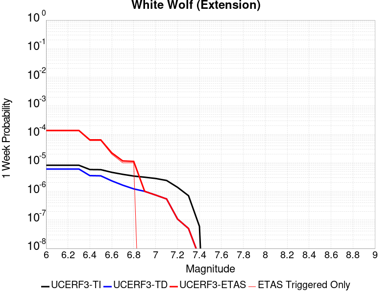 |  |  |  |

| Magnitude | 1 wk TI Prob | 1 wk TD Prob | 1 wk ETAS Prob | 1 wk ETAS/TD Gain | 1 wk ETAS Triggered Only | 1 mo TI Prob | 1 mo TD Prob | 1 mo ETAS Prob | 1 mo ETAS/TD Gain | 1 mo ETAS Triggered Only | 1 yr TI Prob | 1 yr TD Prob | 1 yr ETAS Prob | 1 yr ETAS/TD Gain | 1 yr ETAS Triggered Only | 10 yr TI Prob | 10 yr TD Prob | 10 yr ETAS Prob | 10 yr ETAS/TD Gain | 10 yr ETAS Triggered Only |
|-----|-----|-----|-----|-----|-----|-----|-----|-----|-----|-----|-----|-----|-----|-----|-----|-----|-----|-----|-----|-----|
| 6.0 | 8.222555E-6 | 6.0666657E-6 | 1.3606588E-4 | 22.428446 | 1.3E-4 | 3.5239045E-5 | 2.5999774E-5 | 1.559964E-4 | 5.9999137 | 1.3E-4 | 4.289509E-4 | 3.1650788E-4 | 4.5646357E-4 | 1.4421871 | 1.4E-4 | 0.0042812387 | 0.003161223 | 0.0033107488 | 1.0473 | 1.5E-4 |
| 6.1 | 8.222555E-6 | 6.0666657E-6 | 1.3606588E-4 | 22.428446 | 1.3E-4 | 3.5239045E-5 | 2.5999774E-5 | 1.559964E-4 | 5.9999137 | 1.3E-4 | 4.289509E-4 | 3.1650788E-4 | 4.5646357E-4 | 1.4421871 | 1.4E-4 | 0.0042812387 | 0.003161223 | 0.0033107488 | 1.0473 | 1.5E-4 |
| 6.2 | 8.222555E-6 | 6.0666657E-6 | 1.3606588E-4 | 22.428446 | 1.3E-4 | 3.5239045E-5 | 2.5999774E-5 | 1.559964E-4 | 5.9999137 | 1.3E-4 | 4.289509E-4 | 3.1650788E-4 | 4.5646357E-4 | 1.4421871 | 1.4E-4 | 0.0042812387 | 0.003161223 | 0.0033107488 | 1.0473 | 1.5E-4 |
| 6.3 | 8.222555E-6 | 6.0666657E-6 | 1.3606588E-4 | 22.428446 | 1.3E-4 | 3.5239045E-5 | 2.5999774E-5 | 1.559964E-4 | 5.9999137 | 1.3E-4 | 4.289509E-4 | 3.1650788E-4 | 4.5646357E-4 | 1.4421871 | 1.4E-4 | 0.0042812387 | 0.003161223 | 0.0033107488 | 1.0473 | 1.5E-4 |
| 6.4 | 5.821773E-6 | 3.5571766E-6 | 6.355696E-5 | 17.86725 | 6.0E-5 | 2.4950215E-5 | 1.5244959E-5 | 7.524405E-5 | 4.935667 | 6.0E-5 | 3.0372653E-4 | 1.8559267E-4 | 2.5557968E-4 | 1.3771001 | 7.0E-5 | 0.0030331176 | 0.001854485 | 0.0019243553 | 1.0376763 | 7.0E-5 |
| 6.5 | 5.766023E-6 | 3.4991106E-6 | 6.34989E-5 | 18.147154 | 6.0E-5 | 2.4711293E-5 | 1.4996108E-5 | 7.499521E-5 | 5.000978 | 6.0E-5 | 3.0081844E-4 | 1.8256342E-4 | 2.5255064E-4 | 1.3833584 | 7.0E-5 | 0.0030041158 | 0.0018242426 | 0.0018941149 | 1.0383021 | 7.0E-5 |
| 6.6 | 4.643576E-6 | 2.332624E-6 | 2.2332577E-5 | 9.574015 | 2.0E-5 | 1.9900888E-5 | 9.996925E-6 | 2.9996725E-5 | 3.0005953 | 2.0E-5 | 2.4226638E-4 | 1.2170619E-4 | 1.4170376E-4 | 1.1643102 | 2.0E-5 | 0.0024200242 | 0.0012164378 | 0.0012364135 | 1.0164214 | 2.0E-5 |
| 6.7 | 3.9529173E-6 | 1.6483477E-6 | 1.1648332E-5 | 7.066671 | 1.0E-5 | 1.6940963E-5 | 7.0643296E-6 | 1.706426E-5 | 2.4155524 | 1.0E-5 | 2.0623671E-4 | 8.6005006E-5 | 9.600414E-5 | 1.1162623 | 1.0E-5 | 0.002060454 | 8.597357E-4 | 8.697271E-4 | 1.0116215 | 1.0E-5 |
| 6.8 | 3.4377522E-6 | 1.2245237E-6 | 1.1224512E-5 | 9.16643 | 1.0E-5 | 1.473314E-5 | 5.2479486E-6 | 1.5247896E-5 | 2.9054964 | 1.0E-5 | 1.7936122E-4 | 6.3891996E-5 | 7.389135E-5 | 1.1565042 | 1.0E-5 | 0.0017921652 | 6.387454E-4 | 6.48739E-4 | 1.0156457 | 1.0E-5 |
| 6.9 | 3.1367306E-6 | 1.0033783E-6 | 1.0033783E-6 | 1.0 | 0.0 | 1.3443062E-5 | 4.3001864E-6 | 4.3001864E-6 | 1.0 | 0.0 | 1.63657E-4 | 5.235359E-5 | 5.235359E-5 | 1.0 | 0.0 | 0.0016353652 | 5.2342017E-4 | 5.2342017E-4 | 1.0 | 0.0 |
| 7.0 | 2.8298145E-6 | 7.4286646E-7 | 7.4286646E-7 | 1.0 | 0.0 | 1.2127721E-5 | 3.1837099E-6 | 3.1837099E-6 | 1.0 | 0.0 | 1.47645E-4 | 3.8761027E-5 | 3.8761027E-5 | 1.0 | 0.0 | 0.0014754693 | 3.8754768E-4 | 3.8754768E-4 | 1.0 | 0.0 |
| 7.1 | 2.4091064E-6 | 5.4227525E-7 | 5.4227525E-7 | 1.0 | 0.0 | 1.03247E-5 | 2.3240348E-6 | 2.3240348E-6 | 1.0 | 0.0 | 1.2569598E-4 | 2.8294799E-5 | 2.8294799E-5 | 1.0 | 0.0 | 0.001256249 | 2.8291598E-4 | 2.8291598E-4 | 1.0 | 0.0 |
| 7.2 | 1.3875518E-6 | 1.0743063E-7 | 1.0743063E-7 | 1.0 | 0.0 | 5.9466374E-6 | 4.6041689E-7 | 4.6041689E-7 | 1.0 | 0.0 | 7.23979E-5 | 5.6055624E-6 | 5.6055624E-6 | 1.0 | 0.0 | 7.2374323E-4 | 5.6054323E-5 | 5.6054323E-5 | 1.0 | 0.0 |
| 7.3 | 7.056077E-7 | 5.002034E-8 | 5.002034E-8 | 1.0 | 0.0 | 3.0240296E-6 | 2.1437286E-7 | 2.1437286E-7 | 1.0 | 0.0 | 3.681694E-5 | 2.609987E-6 | 2.609987E-6 | 1.0 | 0.0 | 3.681084E-4 | 2.609961E-5 | 2.609961E-5 | 1.0 | 0.0 |
| 7.4 | 5.9334678E-8 | 4.8683537E-9 | 4.8683537E-9 | 1.0 | 0.0 | 2.5429145E-7 | 2.0864372E-8 | 2.0864372E-8 | 1.0 | 0.0 | 3.095994E-6 | 2.5402372E-7 | 2.5402372E-7 | 1.0 | 0.0 | 3.095951E-5 | 2.5402353E-6 | 2.5402353E-6 | 1.0 | 0.0 |

## Death Valley (No)
*[(top)](#table-of-contents)*

| 1 Week | 1 Month | 1 Year | 10 Year |
|-----|-----|-----|-----|
|  |  |  |  |

| Magnitude | 1 wk TI Prob | 1 wk TD Prob | 1 wk ETAS Prob | 1 wk ETAS/TD Gain | 1 wk ETAS Triggered Only | 1 mo TI Prob | 1 mo TD Prob | 1 mo ETAS Prob | 1 mo ETAS/TD Gain | 1 mo ETAS Triggered Only | 1 yr TI Prob | 1 yr TD Prob | 1 yr ETAS Prob | 1 yr ETAS/TD Gain | 1 yr ETAS Triggered Only | 10 yr TI Prob | 10 yr TD Prob | 10 yr ETAS Prob | 10 yr ETAS/TD Gain | 10 yr ETAS Triggered Only |
|-----|-----|-----|-----|-----|-----|-----|-----|-----|-----|-----|-----|-----|-----|-----|-----|-----|-----|-----|-----|-----|
| 6.0 | 2.0074807E-5 | 2.2500084E-5 | 1.4249739E-4 | 6.333194 | 1.2E-4 | 8.603206E-5 | 9.642541E-5 | 2.1641384E-4 | 2.2443652 | 1.2E-4 | 0.001046937 | 0.0011733545 | 0.0013131902 | 1.119176 | 1.4E-4 | 0.010420183 | 0.011672506 | 0.011820756 | 1.0127007 | 1.5E-4 |
| 6.1 | 2.0074807E-5 | 2.2500084E-5 | 1.4249739E-4 | 6.333194 | 1.2E-4 | 8.603206E-5 | 9.642541E-5 | 2.1641384E-4 | 2.2443652 | 1.2E-4 | 0.001046937 | 0.0011733545 | 0.0013131902 | 1.119176 | 1.4E-4 | 0.010420183 | 0.011672506 | 0.011820756 | 1.0127007 | 1.5E-4 |
| 6.2 | 2.0074807E-5 | 2.2500084E-5 | 1.4249739E-4 | 6.333194 | 1.2E-4 | 8.603206E-5 | 9.642541E-5 | 2.1641384E-4 | 2.2443652 | 1.2E-4 | 0.001046937 | 0.0011733545 | 0.0013131902 | 1.119176 | 1.4E-4 | 0.010420183 | 0.011672506 | 0.011820756 | 1.0127007 | 1.5E-4 |
| 6.3 | 1.9050609E-5 | 2.1336948E-5 | 1.1133503E-4 | 5.2179456 | 9.0E-5 | 8.164292E-5 | 9.1440896E-5 | 1.8143267E-4 | 1.9841523 | 9.0E-5 | 9.935491E-4 | 0.001112731 | 0.0012226086 | 1.0987458 | 1.1E-4 | 0.009891188 | 0.011072419 | 0.01119109 | 1.0107177 | 1.2E-4 |
| 6.4 | 1.9050609E-5 | 2.1336948E-5 | 1.1133503E-4 | 5.2179456 | 9.0E-5 | 8.164292E-5 | 9.1440896E-5 | 1.8143267E-4 | 1.9841523 | 9.0E-5 | 9.935491E-4 | 0.001112731 | 0.0012226086 | 1.0987458 | 1.1E-4 | 0.009891188 | 0.011072419 | 0.01119109 | 1.0107177 | 1.2E-4 |
| 6.5 | 1.8367004E-5 | 2.0561009E-5 | 1.1055916E-4 | 5.377127 | 9.0E-5 | 7.8713354E-5 | 8.811567E-5 | 1.7810774E-4 | 2.0212948 | 9.0E-5 | 9.5791375E-4 | 0.0010722869 | 0.0011821688 | 1.1024745 | 1.1E-4 | 0.009537951 | 0.0106719155 | 0.010790635 | 1.0111245 | 1.2E-4 |
| 6.6 | 1.779439E-5 | 1.9910927E-5 | 1.0990914E-4 | 5.520041 | 9.0E-5 | 7.625944E-5 | 8.53298E-5 | 1.7532211E-4 | 2.0546412 | 9.0E-5 | 9.280632E-4 | 0.0010384015 | 0.0011482873 | 1.1058221 | 1.1E-4 | 0.009241969 | 0.010336253 | 0.010455012 | 1.0114896 | 1.2E-4 |
| 6.7 | 1.7025437E-5 | 1.9043426E-5 | 1.0904171E-4 | 5.7259507 | 9.0E-5 | 7.296412E-5 | 8.161216E-5 | 1.7160481E-4 | 2.102687 | 9.0E-5 | 8.87976E-4 | 9.931813E-4 | 0.0011030721 | 1.1106452 | 1.1E-4 | 0.008844362 | 0.009888145 | 0.010006959 | 1.0120157 | 1.2E-4 |
| 6.8 | 1.6545107E-5 | 1.8512545E-5 | 1.0851088E-4 | 5.861478 | 9.0E-5 | 7.090568E-5 | 7.93371E-5 | 1.6932996E-4 | 2.13431 | 9.0E-5 | 8.629347E-4 | 9.655073E-4 | 0.0010754011 | 1.1138197 | 1.1E-4 | 0.008595915 | 0.009613829 | 0.009732675 | 1.012362 | 1.2E-4 |
| 6.9 | 1.615478E-5 | 1.8087594E-5 | 1.08085966E-4 | 5.975696 | 9.0E-5 | 6.9232934E-5 | 7.751599E-5 | 1.6750902E-4 | 2.1609607 | 9.0E-5 | 8.4258494E-4 | 9.433546E-4 | 0.0010532509 | 1.1164951 | 1.1E-4 | 0.008393973 | 0.009394196 | 0.009513068 | 1.0126538 | 1.2E-4 |
| 7.0 | 1.5894311E-5 | 1.780555E-5 | 9.780413E-5 | 5.4929013 | 8.0E-5 | 6.81167E-5 | 7.6307304E-5 | 1.5630119E-4 | 2.0483124 | 8.0E-5 | 8.2900526E-4 | 9.286515E-4 | 0.0010285586 | 1.107583 | 1.0E-4 | 0.008259195 | 0.009248397 | 0.00935738 | 1.011784 | 1.1E-4 |
| 7.1 | 1.5602263E-5 | 1.7483504E-5 | 9.74821E-5 | 5.575662 | 8.0E-5 | 6.6865134E-5 | 7.492718E-5 | 1.5492119E-4 | 2.0676234 | 8.0E-5 | 8.137789E-4 | 9.118627E-4 | 0.0010117715 | 1.1095656 | 1.0E-4 | 0.008108052 | 0.009081894 | 0.009190895 | 1.012002 | 1.1E-4 |
| 7.2 | 1.5323829E-5 | 1.717063E-5 | 9.716926E-5 | 5.6590385 | 8.0E-5 | 6.56719E-5 | 7.358637E-5 | 1.5358049E-4 | 2.0870779 | 8.0E-5 | 7.99262E-4 | 8.9555193E-4 | 9.954623E-4 | 1.111563 | 1.0E-4 | 0.007963934 | 0.008920107 | 0.009029126 | 1.0122217 | 1.1E-4 |
| 7.3 | 1.4556212E-5 | 1.6302456E-5 | 9.630115E-5 | 5.9071565 | 8.0E-5 | 6.238227E-5 | 6.9865826E-5 | 1.4986024E-4 | 2.1449718 | 8.0E-5 | 7.592395E-4 | 8.5029035E-4 | 9.502053E-4 | 1.1175069 | 1.0E-4 | 0.0075665074 | 0.008471014 | 0.008580082 | 1.0128754 | 1.1E-4 |
| 7.4 | 1.411725E-5 | 1.580796E-5 | 9.5806696E-5 | 6.0606613 | 8.0E-5 | 6.0501097E-5 | 6.7746674E-5 | 1.4774126E-4 | 2.1807897 | 8.0E-5 | 7.363519E-4 | 8.245094E-4 | 9.24427E-4 | 1.1211842 | 1.0E-4 | 0.0073391674 | 0.008215138 | 0.008324235 | 1.0132799 | 1.1E-4 |
| 7.5 | 1.3503312E-5 | 1.5126289E-5 | 9.512508E-5 | 6.2887254 | 8.0E-5 | 5.7870053E-5 | 6.482538E-5 | 1.448202E-4 | 2.2340047 | 8.0E-5 | 7.043401E-4 | 7.8896893E-4 | 8.8889006E-4 | 1.1266477 | 1.0E-4 | 0.007021119 | 0.007862304 | 0.0079714395 | 1.0138808 | 1.1E-4 |
| 7.6 | 1.1279839E-5 | 1.2626327E-5 | 9.262532E-5 | 7.335888 | 8.0E-5 | 4.834127E-5 | 5.4111737E-5 | 1.3410741E-4 | 2.4783423 | 8.0E-5 | 5.88396E-4 | 6.5861654E-4 | 7.485573E-4 | 1.1365601 | 9.0E-5 | 0.005868405 | 0.006567199 | 0.0066566076 | 1.0136144 | 9.0E-5 |
| 7.7 | 9.189108E-6 | 1.0283358E-5 | 8.028264E-5 | 7.8070445 | 7.0E-5 | 3.93813E-5 | 4.407082E-5 | 1.14067734E-4 | 2.5882826 | 7.0E-5 | 4.7936183E-4 | 5.3643517E-4 | 6.1639224E-4 | 1.1490526 | 8.0E-5 | 0.004783291 | 0.005351914 | 0.005431486 | 1.0148679 | 8.0E-5 |
| 7.8 | 3.4586725E-7 | 3.6482615E-7 | 3.6482615E-7 | 1.0 | 0.0 | 1.4822873E-6 | 1.5635396E-6 | 1.5635396E-6 | 1.0 | 0.0 | 1.80467E-5 | 1.9035933E-5 | 2.9035744E-5 | 1.5253123 | 1.0E-5 | 1.8045233E-4 | 1.9034347E-4 | 2.0034157E-4 | 1.0525266 | 1.0E-5 |
| 7.9 | 2.5591178E-9 | 2.6696718E-9 | 2.6696718E-9 | 1.0 | 0.0 | 1.0967647E-8 | 1.14414505E-8 | 1.14414505E-8 | 1.0 | 0.0 | 1.335311E-7 | 1.3929966E-7 | 1.3929966E-7 | 1.0 | 0.0 | 1.3353102E-6 | 1.3929966E-6 | 1.3929966E-6 | 1.0 | 0.0 |

## San Andreas (Cholame) rev
*[(top)](#table-of-contents)*

| 1 Week | 1 Month | 1 Year | 10 Year |
|-----|-----|-----|-----|
|  |  |  |  |

| Magnitude | 1 wk TI Prob | 1 wk TD Prob | 1 wk ETAS Prob | 1 wk ETAS/TD Gain | 1 wk ETAS Triggered Only | 1 mo TI Prob | 1 mo TD Prob | 1 mo ETAS Prob | 1 mo ETAS/TD Gain | 1 mo ETAS Triggered Only | 1 yr TI Prob | 1 yr TD Prob | 1 yr ETAS Prob | 1 yr ETAS/TD Gain | 1 yr ETAS Triggered Only | 10 yr TI Prob | 10 yr TD Prob | 10 yr ETAS Prob | 10 yr ETAS/TD Gain | 10 yr ETAS Triggered Only |
|-----|-----|-----|-----|-----|-----|-----|-----|-----|-----|-----|-----|-----|-----|-----|-----|-----|-----|-----|-----|-----|
| 6.0 | 1.2302514E-4 | 2.5204287E-4 | 3.5201767E-4 | 1.396658 | 1.0E-4 | 5.27144E-4 | 0.0010797381 | 0.0011896194 | 1.1017666 | 1.1E-4 | 0.0063991086 | 0.0130670825 | 0.013175645 | 1.008308 | 1.1E-4 | 0.06217949 | 0.12439073 | 0.12450456 | 1.000915 | 1.3E-4 |
| 6.1 | 1.2302514E-4 | 2.5204287E-4 | 3.5201767E-4 | 1.396658 | 1.0E-4 | 5.27144E-4 | 0.0010797381 | 0.0011896194 | 1.1017666 | 1.1E-4 | 0.0063991086 | 0.0130670825 | 0.013175645 | 1.008308 | 1.1E-4 | 0.06217949 | 0.12439073 | 0.12450456 | 1.000915 | 1.3E-4 |
| 6.2 | 1.2203569E-4 | 2.5021084E-4 | 3.5018582E-4 | 1.399563 | 1.0E-4 | 5.2290526E-4 | 0.0010718931 | 0.0011817752 | 1.1025121 | 1.1E-4 | 0.006347804 | 0.01297271 | 0.013081282 | 1.0083693 | 1.1E-4 | 0.061695136 | 0.12357691 | 0.12369084 | 1.000922 | 1.3E-4 |
| 6.3 | 1.2142645E-4 | 2.4907055E-4 | 3.4904564E-4 | 1.4013927 | 1.0E-4 | 5.202953E-4 | 0.0010670102 | 0.0011768928 | 1.1029818 | 1.1E-4 | 0.006316212 | 0.012913967 | 0.013022547 | 1.008408 | 1.1E-4 | 0.06139677 | 0.12307103 | 0.12318503 | 1.0009263 | 1.3E-4 |
| 6.4 | 1.1865206E-4 | 2.44126E-4 | 3.441016E-4 | 1.4095246 | 1.0E-4 | 5.0840975E-4 | 0.0010458364 | 0.0011557214 | 1.1050689 | 1.1E-4 | 0.006172335 | 0.012659196 | 0.012767804 | 1.0085794 | 1.1E-4 | 0.060036868 | 0.1208638 | 0.120978095 | 1.0009456 | 1.3E-4 |
| 6.5 | 1.17443946E-4 | 2.4205919E-4 | 3.42035E-4 | 1.413022 | 1.0E-4 | 5.032341E-4 | 0.0010369857 | 0.0011468716 | 1.1059667 | 1.1E-4 | 0.006109677 | 0.012552682 | 0.0126613015 | 1.008653 | 1.1E-4 | 0.059444077 | 0.11993805 | 0.120052464 | 1.0009539 | 1.3E-4 |
| 6.6 | 1.13579066E-4 | 2.3514954E-4 | 3.3512604E-4 | 1.4251614 | 1.0E-4 | 4.866766E-4 | 0.001007396 | 0.0011172852 | 1.1090825 | 1.1E-4 | 0.0059092017 | 0.012196515 | 0.012305173 | 1.008909 | 1.1E-4 | 0.057545185 | 0.11685214 | 0.116966955 | 1.0009825 | 1.3E-4 |
| 6.7 | 1.1271412E-4 | 2.3359268E-4 | 3.3356933E-4 | 1.4279956 | 1.0E-4 | 4.829711E-4 | 0.0010007289 | 0.0011106188 | 1.1098099 | 1.1E-4 | 0.005864331 | 0.012116249 | 0.012224915 | 1.0089687 | 1.1E-4 | 0.057119697 | 0.116155714 | 0.11627061 | 1.0009892 | 1.3E-4 |
| 6.8 | 1.1217975E-4 | 2.3247694E-4 | 3.324537E-4 | 1.4300501 | 1.0E-4 | 4.8068175E-4 | 9.959509E-4 | 0.0011058414 | 1.1103373 | 1.1E-4 | 0.005836608 | 0.012058721 | 0.012167395 | 1.009012 | 1.1E-4 | 0.056856725 | 0.11565396 | 0.11576893 | 1.0009941 | 1.3E-4 |
| 6.9 | 1.1146753E-4 | 2.3096445E-4 | 3.3094134E-4 | 1.432867 | 1.0E-4 | 4.7763053E-4 | 9.894737E-4 | 0.0010993648 | 1.1110603 | 1.1E-4 | 0.0057996577 | 0.011980731 | 0.012089414 | 1.0090714 | 1.1E-4 | 0.056506127 | 0.11497439 | 0.11508945 | 1.0010006 | 1.3E-4 |
| 7.0 | 1.0965793E-4 | 2.2719789E-4 | 3.2717516E-4 | 1.4400449 | 1.0E-4 | 4.698779E-4 | 9.733434E-4 | 0.0010832363 | 1.1129025 | 1.1E-4 | 0.005705768 | 0.011786487 | 0.01189519 | 1.0092227 | 1.1E-4 | 0.055614736 | 0.11327597 | 0.11339124 | 1.0010177 | 1.3E-4 |
| 7.1 | 9.927982E-5 | 2.0538924E-4 | 2.9537076E-4 | 1.4381024 | 9.0E-5 | 4.2541555E-4 | 8.7994366E-4 | 9.798557E-4 | 1.1135436 | 1.0E-4 | 0.0051671406 | 0.010660981 | 0.010759915 | 1.00928 | 1.0E-4 | 0.05048634 | 0.1033706 | 0.10347819 | 1.0010408 | 1.2E-4 |
| 7.2 | 9.696786E-5 | 2.0043184E-4 | 2.904138E-4 | 1.4489404 | 9.0E-5 | 4.1551032E-4 | 8.5871184E-4 | 9.58626E-4 | 1.1163535 | 1.0E-4 | 0.00504711 | 0.010404981 | 0.01050394 | 1.0095108 | 1.0E-4 | 0.04934009 | 0.1011086 | 0.101216465 | 1.0010668 | 1.2E-4 |
| 7.3 | 9.4727984E-5 | 1.9472468E-4 | 2.8470717E-4 | 1.462101 | 9.0E-5 | 4.0591392E-4 | 8.3426846E-4 | 9.34185E-4 | 1.1197655 | 1.0E-4 | 0.0049308087 | 0.010110183 | 0.010209171 | 1.009791 | 1.0E-4 | 0.048228268 | 0.09847952 | 0.0985877 | 1.0010985 | 1.2E-4 |
| 7.4 | 9.220358E-5 | 1.8843076E-4 | 2.684157E-4 | 1.4244791 | 8.0E-5 | 3.9509835E-4 | 8.073114E-4 | 8.9723873E-4 | 1.1113912 | 9.0E-5 | 0.004799717 | 0.009784967 | 0.009874086 | 1.0091078 | 9.0E-5 | 0.046973653 | 0.095557496 | 0.09565698 | 1.0010412 | 1.1E-4 |
| 7.5 | 7.71631E-5 | 1.5177966E-4 | 2.0177207E-4 | 1.3293749 | 5.0E-5 | 3.306571E-4 | 6.503223E-4 | 7.102833E-4 | 1.092202 | 6.0E-5 | 0.0040183207 | 0.007889002 | 0.007948528 | 1.0075455 | 6.0E-5 | 0.03946433 | 0.07828531 | 0.078359045 | 1.0009419 | 8.0E-5 |
| 7.6 | 7.5634416E-5 | 1.483744E-4 | 1.9836698E-4 | 1.3369354 | 5.0E-5 | 3.241072E-4 | 6.3573546E-4 | 6.956973E-4 | 1.0943189 | 6.0E-5 | 0.0039388672 | 0.0077126776 | 0.0077722147 | 1.0077194 | 6.0E-5 | 0.038697794 | 0.07664872 | 0.07672259 | 1.0009637 | 8.0E-5 |
| 7.7 | 6.3783E-5 | 1.235872E-4 | 1.7358102E-4 | 1.4045227 | 5.0E-5 | 2.7332708E-4 | 5.29552E-4 | 5.795255E-4 | 1.0943694 | 5.0E-5 | 0.0033226798 | 0.0064282627 | 0.0064779413 | 1.0077281 | 5.0E-5 | 0.032734364 | 0.06454029 | 0.06459642 | 1.0008696 | 6.0E-5 |
| 7.8 | 5.863422E-5 | 1.1416107E-4 | 1.5415651E-4 | 1.3503422 | 4.0E-5 | 2.512653E-4 | 4.8917E-4 | 5.291505E-4 | 1.0817312 | 4.0E-5 | 0.003054864 | 0.0059394026 | 0.005979165 | 1.0066947 | 4.0E-5 | 0.030132094 | 0.059659187 | 0.0596968 | 1.0006305 | 4.0E-5 |
| 7.9 | 4.595283E-5 | 8.426331E-5 | 1.1426079E-4 | 1.3559968 | 3.0E-5 | 1.9692584E-4 | 3.610785E-4 | 3.9106768E-4 | 1.0830544 | 3.0E-5 | 0.0023949358 | 0.0043872762 | 0.0044171447 | 1.0068079 | 3.0E-5 | 0.023692891 | 0.044362005 | 0.044390675 | 1.0006462 | 3.0E-5 |
| 8.0 | 3.2950178E-5 | 5.0772942E-5 | 7.077193E-5 | 1.3938906 | 2.0E-5 | 1.412074E-4 | 2.1758018E-4 | 2.3757583E-4 | 1.0919001 | 2.0E-5 | 0.0017178444 | 0.0026458222 | 0.0026657695 | 1.007539 | 2.0E-5 | 0.017046256 | 0.027180137 | 0.027199594 | 1.0007159 | 2.0E-5 |
| 8.1 | 1.9177472E-5 | 1.9185145E-5 | 2.9184954E-5 | 1.5212266 | 1.0E-5 | 8.218658E-5 | 8.221946E-5 | 9.2218645E-5 | 1.1216156 | 1.0E-5 | 0.0010001622 | 0.0010005629 | 0.0010105529 | 1.0099844 | 1.0E-5 | 0.009956728 | 0.010758142 | 0.0107680345 | 1.0009196 | 1.0E-5 |
| 8.2 | 8.643924E-6 | 5.4748625E-6 | 5.4748625E-6 | 1.0 | 0.0 | 3.704486E-5 | 2.3463486E-5 | 2.3463486E-5 | 1.0 | 0.0 | 4.5092785E-4 | 2.8563058E-4 | 2.8563058E-4 | 1.0 | 0.0 | 0.0045001395 | 0.0032487072 | 0.0032487072 | 1.0 | 0.0 |
| 8.3 | 1.983087E-6 | 7.6599065E-7 | 7.6599065E-7 | 1.0 | 0.0 | 8.498917E-6 | 3.282813E-6 | 3.282813E-6 | 1.0 | 0.0 | 1.034694E-4 | 3.9967534E-5 | 3.9967534E-5 | 1.0 | 0.0 | 0.0010342124 | 4.719687E-4 | 4.719687E-4 | 1.0 | 0.0 |

## San Jacinto (Anza) rev
*[(top)](#table-of-contents)*

| 1 Week | 1 Month | 1 Year | 10 Year |
|-----|-----|-----|-----|
|  |  |  | 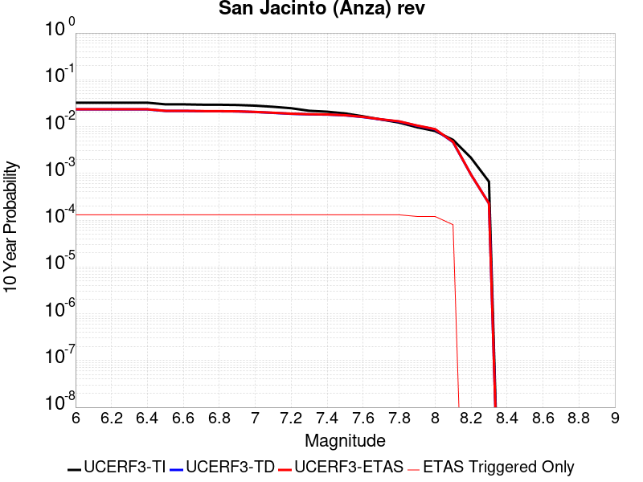 |

| Magnitude | 1 wk TI Prob | 1 wk TD Prob | 1 wk ETAS Prob | 1 wk ETAS/TD Gain | 1 wk ETAS Triggered Only | 1 mo TI Prob | 1 mo TD Prob | 1 mo ETAS Prob | 1 mo ETAS/TD Gain | 1 mo ETAS Triggered Only | 1 yr TI Prob | 1 yr TD Prob | 1 yr ETAS Prob | 1 yr ETAS/TD Gain | 1 yr ETAS Triggered Only | 10 yr TI Prob | 10 yr TD Prob | 10 yr ETAS Prob | 10 yr ETAS/TD Gain | 10 yr ETAS Triggered Only |
|-----|-----|-----|-----|-----|-----|-----|-----|-----|-----|-----|-----|-----|-----|-----|-----|-----|-----|-----|-----|-----|
| 6.0 | 6.3015636E-5 | 4.3302647E-5 | 1.5329788E-4 | 3.5401504 | 1.1E-4 | 2.7003905E-4 | 1.8556965E-4 | 3.0554738E-4 | 1.6465375 | 1.2E-4 | 0.0032827691 | 0.0022569813 | 0.0023767105 | 1.0530484 | 1.2E-4 | 0.032346968 | 0.023296192 | 0.023423163 | 1.0054504 | 1.3E-4 |
| 6.1 | 6.3015636E-5 | 4.3302647E-5 | 1.5329788E-4 | 3.5401504 | 1.1E-4 | 2.7003905E-4 | 1.8556965E-4 | 3.0554738E-4 | 1.6465375 | 1.2E-4 | 0.0032827691 | 0.0022569813 | 0.0023767105 | 1.0530484 | 1.2E-4 | 0.032346968 | 0.023296192 | 0.023423163 | 1.0054504 | 1.3E-4 |
| 6.2 | 6.3015636E-5 | 4.3302647E-5 | 1.5329788E-4 | 3.5401504 | 1.1E-4 | 2.7003905E-4 | 1.8556965E-4 | 3.0554738E-4 | 1.6465375 | 1.2E-4 | 0.0032827691 | 0.0022569813 | 0.0023767105 | 1.0530484 | 1.2E-4 | 0.032346968 | 0.023296192 | 0.023423163 | 1.0054504 | 1.3E-4 |
| 6.3 | 6.3015636E-5 | 4.3302647E-5 | 1.5329788E-4 | 3.5401504 | 1.1E-4 | 2.7003905E-4 | 1.8556965E-4 | 3.0554738E-4 | 1.6465375 | 1.2E-4 | 0.0032827691 | 0.0022569813 | 0.0023767105 | 1.0530484 | 1.2E-4 | 0.032346968 | 0.023296192 | 0.023423163 | 1.0054504 | 1.3E-4 |
| 6.4 | 6.3015636E-5 | 4.3302647E-5 | 1.5329788E-4 | 3.5401504 | 1.1E-4 | 2.7003905E-4 | 1.8556965E-4 | 3.0554738E-4 | 1.6465375 | 1.2E-4 | 0.0032827691 | 0.0022569813 | 0.0023767105 | 1.0530484 | 1.2E-4 | 0.032346968 | 0.023296192 | 0.023423163 | 1.0054504 | 1.3E-4 |
| 6.5 | 5.811017E-5 | 4.0082516E-5 | 1.500781E-4 | 3.7442288 | 1.1E-4 | 2.4901982E-4 | 1.7177092E-4 | 2.917503E-4 | 1.6984849 | 1.2E-4 | 0.0030276014 | 0.002089311 | 0.0022090601 | 1.0573152 | 1.2E-4 | 0.02986684 | 0.021593736 | 0.021720931 | 1.0058903 | 1.3E-4 |
| 6.6 | 5.811017E-5 | 4.0082516E-5 | 1.500781E-4 | 3.7442288 | 1.1E-4 | 2.4901982E-4 | 1.7177092E-4 | 2.917503E-4 | 1.6984849 | 1.2E-4 | 0.0030276014 | 0.002089311 | 0.0022090601 | 1.0573152 | 1.2E-4 | 0.02986684 | 0.021593736 | 0.021720931 | 1.0058903 | 1.3E-4 |
| 6.7 | 5.712442E-5 | 3.9505223E-5 | 1.4950088E-4 | 3.784332 | 1.1E-4 | 2.4479596E-4 | 1.6929714E-4 | 2.8927682E-4 | 1.7086929 | 1.2E-4 | 0.0029763177 | 0.0020592497 | 0.0021790026 | 1.0581536 | 1.2E-4 | 0.029367693 | 0.021285562 | 0.021412795 | 1.0059774 | 1.3E-4 |
| 6.8 | 5.6967532E-5 | 3.9361643E-5 | 1.493573E-4 | 3.7944887 | 1.1E-4 | 2.4412372E-4 | 1.6868189E-4 | 2.8866163E-4 | 1.7112783 | 1.2E-4 | 0.0029681553 | 0.002051773 | 0.0021715267 | 1.0583661 | 1.2E-4 | 0.029288229 | 0.021210281 | 0.021337524 | 1.0059991 | 1.3E-4 |
| 6.9 | 5.6211324E-5 | 3.9066435E-5 | 1.4906214E-4 | 3.8156064 | 1.1E-4 | 2.4088343E-4 | 1.6741687E-4 | 2.8739678E-4 | 1.7166537 | 1.2E-4 | 0.0029288116 | 0.0020364004 | 0.0021561559 | 1.0588075 | 1.2E-4 | 0.028905109 | 0.021049714 | 0.021176977 | 1.0060458 | 1.3E-4 |
| 7.0 | 5.4383527E-5 | 3.792697E-5 | 1.479228E-4 | 3.9002008 | 1.1E-4 | 2.3305144E-4 | 1.6253405E-4 | 2.8251455E-4 | 1.7381868 | 1.2E-4 | 0.0028337094 | 0.001977061 | 0.0020968236 | 1.0605762 | 1.2E-4 | 0.027978465 | 0.020440677 | 0.020568019 | 1.0062299 | 1.3E-4 |
| 7.1 | 5.1393665E-5 | 3.6389913E-5 | 1.4638591E-4 | 4.0227056 | 1.1E-4 | 2.2023996E-4 | 1.5594746E-4 | 2.7592876E-4 | 1.7693698 | 1.2E-4 | 0.0026781242 | 0.0018970112 | 0.0020167835 | 1.0631374 | 1.2E-4 | 0.026460782 | 0.019614287 | 0.019741736 | 1.0064979 | 1.3E-4 |
| 7.2 | 4.785222E-5 | 3.4741795E-5 | 1.4473798E-4 | 4.1661053 | 1.1E-4 | 2.0506482E-4 | 1.4888494E-4 | 2.6886706E-4 | 1.8058716 | 1.2E-4 | 0.0024938055 | 0.0018111705 | 0.0019309531 | 1.0661355 | 1.2E-4 | 0.024660049 | 0.018728992 | 0.018856557 | 1.0068111 | 1.3E-4 |
| 7.3 | 4.2143256E-5 | 3.383628E-5 | 1.4383256E-4 | 4.2508383 | 1.1E-4 | 1.8060145E-4 | 1.4500458E-4 | 2.6498717E-4 | 1.82744 | 1.2E-4 | 0.002196605 | 0.0017640047 | 0.0018837929 | 1.067907 | 1.2E-4 | 0.02175019 | 0.01823724 | 0.01836487 | 1.0069983 | 1.3E-4 |
| 7.4 | 4.0264713E-5 | 3.347446E-5 | 1.4347078E-4 | 4.285977 | 1.1E-4 | 1.7255165E-4 | 1.4345412E-4 | 2.634369E-4 | 1.8363844 | 1.2E-4 | 0.002098792 | 0.0017451581 | 0.0018649487 | 1.0686417 | 1.2E-4 | 0.020790804 | 0.018041821 | 0.018169476 | 1.0070754 | 1.3E-4 |
| 7.5 | 3.694492E-5 | 3.218847E-5 | 1.4218493E-4 | 4.417263 | 1.1E-4 | 1.5832575E-4 | 1.379433E-4 | 2.5792673E-4 | 1.8698027 | 1.2E-4 | 0.0019259118 | 0.001678169 | 0.0017979676 | 1.0713865 | 1.2E-4 | 0.01909306 | 0.01735827 | 0.017486013 | 1.0073593 | 1.3E-4 |
| 7.6 | 3.200565E-5 | 2.9504106E-5 | 1.3950086E-4 | 4.7281847 | 1.1E-4 | 1.3715986E-4 | 1.2644005E-4 | 2.4642487E-4 | 1.9489464 | 1.2E-4 | 0.001668642 | 0.0015383229 | 0.0016581382 | 1.077887 | 1.2E-4 | 0.01656168 | 0.0159463 | 0.016074227 | 1.0080223 | 1.3E-4 |
| 7.7 | 2.731642E-5 | 2.6092788E-5 | 1.3608992E-4 | 5.2156143 | 1.1E-4 | 1.1706512E-4 | 1.1182144E-4 | 2.3180802E-4 | 2.0730195 | 1.2E-4 | 0.001424336 | 0.0013605768 | 0.0014804136 | 1.0880779 | 1.2E-4 | 0.014152412 | 0.014167004 | 0.014295163 | 1.0090462 | 1.3E-4 |
| 7.8 | 2.3466424E-5 | 2.3504817E-5 | 1.3350224E-4 | 5.6797814 | 1.1E-4 | 1.0056651E-4 | 1.0073105E-4 | 2.2071897E-4 | 2.1911712 | 1.2E-4 | 0.0012237094 | 0.0012257113 | 0.0013455643 | 1.0977824 | 1.2E-4 | 0.012169928 | 0.012808893 | 0.012937228 | 1.0100192 | 1.3E-4 |
| 7.9 | 1.8611925E-5 | 1.8908117E-5 | 1.2890603E-4 | 6.8174973 | 1.1E-4 | 7.9762955E-5 | 8.1032274E-5 | 1.9102336E-4 | 2.3573737 | 1.1E-4 | 9.7068126E-4 | 9.861222E-4 | 0.0010960137 | 1.111438 | 1.1E-4 | 0.0096645225 | 0.010393824 | 0.010512577 | 1.0114254 | 1.2E-4 |
| 8.0 | 1.5460775E-5 | 1.5740965E-5 | 1.2573923E-4 | 7.9880257 | 1.1E-4 | 6.6258784E-5 | 6.7459536E-5 | 1.7745212E-4 | 2.6304972 | 1.1E-4 | 8.0640207E-4 | 8.21011E-4 | 9.309207E-4 | 1.1338712 | 1.1E-4 | 0.008034821 | 0.0087028835 | 0.0088218395 | 1.0136685 | 1.2E-4 |
| 8.1 | 9.983884E-6 | 8.269952E-6 | 7.8269375E-5 | 9.464309 | 7.0E-5 | 4.2787375E-5 | 3.544217E-5 | 1.0543969E-4 | 2.9749782 | 7.0E-5 | 5.2081177E-4 | 4.314235E-4 | 5.0139334E-4 | 1.1621835 | 7.0E-5 | 0.0051959283 | 0.004640022 | 0.004719651 | 1.0171613 | 8.0E-5 |
| 8.2 | 4.1226E-6 | 1.5529788E-6 | 1.5529788E-6 | 1.0 | 0.0 | 1.7668166E-5 | 6.6556063E-6 | 6.6556063E-6 | 1.0 | 0.0 | 2.1508869E-4 | 8.102902E-5 | 8.102902E-5 | 1.0 | 0.0 | 0.0021488064 | 9.4050163E-4 | 9.4050163E-4 | 1.0 | 0.0 |
| 8.3 | 1.2750878E-6 | 3.612133E-7 | 3.612133E-7 | 1.0 | 0.0 | 5.4646503E-6 | 1.548056E-6 | 1.548056E-6 | 1.0 | 0.0 | 6.653009E-5 | 1.8847424E-5 | 1.8847424E-5 | 1.0 | 0.0 | 6.6510175E-4 | 2.2734253E-4 | 2.2734253E-4 | 1.0 | 0.0 |

## Mission Creek
*[(top)](#table-of-contents)*

| 1 Week | 1 Month | 1 Year | 10 Year |
|-----|-----|-----|-----|
|  |  |  |  |

| Magnitude | 1 wk TI Prob | 1 wk TD Prob | 1 wk ETAS Prob | 1 wk ETAS/TD Gain | 1 wk ETAS Triggered Only | 1 mo TI Prob | 1 mo TD Prob | 1 mo ETAS Prob | 1 mo ETAS/TD Gain | 1 mo ETAS Triggered Only | 1 yr TI Prob | 1 yr TD Prob | 1 yr ETAS Prob | 1 yr ETAS/TD Gain | 1 yr ETAS Triggered Only | 10 yr TI Prob | 10 yr TD Prob | 10 yr ETAS Prob | 10 yr ETAS/TD Gain | 10 yr ETAS Triggered Only |
|-----|-----|-----|-----|-----|-----|-----|-----|-----|-----|-----|-----|-----|-----|-----|-----|-----|-----|-----|-----|-----|
| 6.0 | 1.1549387E-5 | 1.632237E-5 | 1.063209E-4 | 6.5138154 | 9.0E-5 | 4.9496433E-5 | 6.9951224E-5 | 1.6994422E-4 | 2.4294677 | 1.0E-4 | 6.0245243E-4 | 8.513384E-4 | 9.6124475E-4 | 1.1290983 | 1.1E-4 | 0.006008218 | 0.008509998 | 0.0086289765 | 1.0139811 | 1.2E-4 |
| 6.1 | 1.1549387E-5 | 1.632237E-5 | 1.063209E-4 | 6.5138154 | 9.0E-5 | 4.9496433E-5 | 6.9951224E-5 | 1.6994422E-4 | 2.4294677 | 1.0E-4 | 6.0245243E-4 | 8.513384E-4 | 9.6124475E-4 | 1.1290983 | 1.1E-4 | 0.006008218 | 0.008509998 | 0.0086289765 | 1.0139811 | 1.2E-4 |
| 6.2 | 1.1549387E-5 | 1.632237E-5 | 1.063209E-4 | 6.5138154 | 9.0E-5 | 4.9496433E-5 | 6.9951224E-5 | 1.6994422E-4 | 2.4294677 | 1.0E-4 | 6.0245243E-4 | 8.513384E-4 | 9.6124475E-4 | 1.1290983 | 1.1E-4 | 0.006008218 | 0.008509998 | 0.0086289765 | 1.0139811 | 1.2E-4 |
| 6.3 | 1.1549387E-5 | 1.632237E-5 | 1.063209E-4 | 6.5138154 | 9.0E-5 | 4.9496433E-5 | 6.9951224E-5 | 1.6994422E-4 | 2.4294677 | 1.0E-4 | 6.0245243E-4 | 8.513384E-4 | 9.6124475E-4 | 1.1290983 | 1.1E-4 | 0.006008218 | 0.008509998 | 0.0086289765 | 1.0139811 | 1.2E-4 |
| 6.4 | 1.1549387E-5 | 1.632237E-5 | 1.063209E-4 | 6.5138154 | 9.0E-5 | 4.9496433E-5 | 6.9951224E-5 | 1.6994422E-4 | 2.4294677 | 1.0E-4 | 6.0245243E-4 | 8.513384E-4 | 9.6124475E-4 | 1.1290983 | 1.1E-4 | 0.006008218 | 0.008509998 | 0.0086289765 | 1.0139811 | 1.2E-4 |
| 6.5 | 1.1549387E-5 | 1.632237E-5 | 1.063209E-4 | 6.5138154 | 9.0E-5 | 4.9496433E-5 | 6.9951224E-5 | 1.6994422E-4 | 2.4294677 | 1.0E-4 | 6.0245243E-4 | 8.513384E-4 | 9.6124475E-4 | 1.1290983 | 1.1E-4 | 0.006008218 | 0.008509998 | 0.0086289765 | 1.0139811 | 1.2E-4 |
| 6.6 | 9.202681E-6 | 1.3845646E-5 | 1.038444E-4 | 7.5001483 | 9.0E-5 | 3.9439463E-5 | 5.9337188E-5 | 1.5933125E-4 | 2.6851838 | 1.0E-4 | 4.800697E-4 | 7.221998E-4 | 8.3212036E-4 | 1.1522024 | 1.1E-4 | 0.004790339 | 0.0072271815 | 0.0073463144 | 1.016484 | 1.2E-4 |
| 6.7 | 9.019164E-6 | 1.3651316E-5 | 1.0365009E-4 | 7.592681 | 9.0E-5 | 3.8652986E-5 | 5.8504378E-5 | 1.5849853E-4 | 2.7091737 | 1.0E-4 | 4.7049852E-4 | 7.12067E-4 | 8.219887E-4 | 1.1543698 | 1.1E-4 | 0.004695036 | 0.007126506 | 0.0072456505 | 1.0167185 | 1.2E-4 |
| 6.8 | 8.673558E-6 | 1.3273427E-5 | 1.03272236E-4 | 7.7803745 | 9.0E-5 | 3.717186E-5 | 5.6884925E-5 | 1.5687924E-4 | 2.757835 | 1.0E-4 | 4.524734E-4 | 6.923627E-4 | 8.0228655E-4 | 1.1587663 | 1.1E-4 | 0.0045155324 | 0.006930694 | 0.0070498623 | 1.0171943 | 1.2E-4 |
| 6.9 | 7.002255E-6 | 1.1477657E-5 | 1.01476624E-4 | 8.841232 | 9.0E-5 | 3.000932E-5 | 4.9189068E-5 | 1.4918415E-4 | 3.032872 | 1.0E-4 | 3.653022E-4 | 5.9871917E-4 | 7.086533E-4 | 1.1836156 | 1.1E-4 | 0.0036470229 | 0.005999517 | 0.006118797 | 1.0198816 | 1.2E-4 |
| 7.0 | 5.84644E-6 | 9.67498E-6 | 9.967411E-5 | 10.302255 | 9.0E-5 | 2.5055931E-5 | 4.1463565E-5 | 1.4145942E-4 | 3.411656 | 1.0E-4 | 3.0501327E-4 | 5.047066E-4 | 6.14651E-4 | 1.2178384 | 1.1E-4 | 0.0030459496 | 0.0050638523 | 0.0051832446 | 1.0235773 | 1.2E-4 |
| 7.1 | 5.54703E-6 | 9.329456E-6 | 9.9328616E-5 | 10.646774 | 9.0E-5 | 2.377277E-5 | 3.9982795E-5 | 1.399788E-4 | 3.5009758 | 1.0E-4 | 2.8939504E-4 | 4.8668624E-4 | 5.966327E-4 | 1.2259083 | 1.1E-4 | 0.0028901845 | 0.004884446 | 0.00500386 | 1.0244478 | 1.2E-4 |
| 7.2 | 4.384709E-6 | 7.68157E-6 | 9.768088E-5 | 12.716264 | 9.0E-5 | 1.8791474E-5 | 3.2920623E-5 | 1.3291732E-4 | 4.0375094 | 1.0E-4 | 2.2876218E-4 | 4.0073853E-4 | 5.1069446E-4 | 1.2743832 | 1.1E-4 | 0.0022852682 | 0.004028366 | 0.004147882 | 1.0296688 | 1.2E-4 |
| 7.3 | 3.7888456E-6 | 6.915452E-6 | 9.691483E-5 | 14.014244 | 9.0E-5 | 1.623781E-5 | 2.9637333E-5 | 1.2963437E-4 | 4.374023 | 1.0E-4 | 1.9767738E-4 | 3.6077813E-4 | 4.7073845E-4 | 1.3047866 | 1.1E-4 | 0.0019750162 | 0.0036301152 | 0.0037496795 | 1.0329368 | 1.2E-4 |
| 7.4 | 2.1982462E-6 | 5.0237763E-6 | 9.502332E-5 | 18.91472 | 9.0E-5 | 9.421021E-6 | 2.1530293E-5 | 1.21528145E-4 | 5.6445184 | 1.0E-4 | 1.1469489E-4 | 2.621E-4 | 3.7207117E-4 | 1.4195771 | 1.1E-4 | 0.0011463572 | 0.0026458844 | 0.002765567 | 1.0452335 | 1.2E-4 |
| 7.5 | 2.051923E-6 | 4.615016E-6 | 9.46146E-5 | 20.501467 | 9.0E-5 | 8.793926E-6 | 1.9778492E-5 | 1.19776516E-4 | 6.055897 | 1.0E-4 | 1.0706078E-4 | 2.4077666E-4 | 3.5075017E-4 | 1.4567449 | 1.1E-4 | 0.0010700922 | 0.0024335422 | 0.00255325 | 1.0491909 | 1.2E-4 |
| 7.6 | 1.8733427E-6 | 4.1233748E-6 | 9.4123E-5 | 22.82669 | 9.0E-5 | 8.028587E-6 | 1.7671488E-5 | 1.1766972E-4 | 6.658733 | 1.0E-4 | 9.774366E-5 | 2.151292E-4 | 3.2510553E-4 | 1.5112107 | 1.1E-4 | 9.770069E-4 | 0.0021780801 | 0.002297819 | 1.0549744 | 1.2E-4 |
| 7.7 | 1.8411953E-6 | 4.0430496E-6 | 9.404268E-5 | 23.260334 | 9.0E-5 | 7.890813E-6 | 1.732724E-5 | 1.1732551E-4 | 6.771159 | 1.0E-4 | 9.606641E-5 | 2.1093882E-4 | 3.2091563E-4 | 1.5213683 | 1.1E-4 | 9.6024893E-4 | 0.0021363653 | 0.002256109 | 1.0560502 | 1.2E-4 |
| 7.8 | 1.7194251E-6 | 3.7104276E-6 | 9.371009E-5 | 25.255875 | 9.0E-5 | 7.368944E-6 | 1.5901736E-5 | 1.1590015E-4 | 7.288522 | 1.0E-4 | 8.97132E-5 | 1.9358651E-4 | 3.035652E-4 | 1.5681114 | 1.1E-4 | 8.967699E-4 | 0.0019623525 | 0.002082117 | 1.0610311 | 1.2E-4 |
| 7.9 | 1.4035052E-6 | 2.9500632E-6 | 9.29498E-5 | 31.507732 | 9.0E-5 | 6.0150082E-6 | 1.2643067E-5 | 1.126418E-4 | 8.909373 | 1.0E-4 | 7.3230265E-5 | 1.5391852E-4 | 2.639016E-4 | 1.7145538 | 1.1E-4 | 7.3206134E-4 | 0.0015631086 | 0.0016829211 | 1.0766501 | 1.2E-4 |
| 8.0 | 3.9318823E-7 | 5.528522E-7 | 2.0552841E-5 | 37.176014 | 2.0E-5 | 1.6850913E-6 | 2.3693647E-6 | 2.2369317E-5 | 9.441062 | 2.0E-5 | 2.0515794E-5 | 2.8846638E-5 | 4.884606E-5 | 1.6933017 | 2.0E-5 | 2.0513899E-4 | 2.9899E-4 | 3.18984E-4 | 1.0668719 | 2.0E-5 |
| 8.1 | 1.596793E-7 | 1.1380002E-7 | 1.1380002E-7 | 1.0 | 0.0 | 6.8433974E-7 | 4.877143E-7 | 4.877143E-7 | 1.0 | 0.0 | 8.331805E-6 | 5.937906E-6 | 5.937906E-6 | 1.0 | 0.0 | 8.331492E-5 | 6.549966E-5 | 6.549966E-5 | 1.0 | 0.0 |
| 8.2 | 4.9003038E-8 | 2.5444924E-8 | 2.5444924E-8 | 1.0 | 0.0 | 2.10013E-7 | 1.0904967E-7 | 1.0904967E-7 | 1.0 | 0.0 | 2.5569052E-6 | 1.327679E-6 | 1.327679E-6 | 1.0 | 0.0 | 2.556876E-5 | 1.495635E-5 | 1.495635E-5 | 1.0 | 0.0 |

## Cady
*[(top)](#table-of-contents)*

| 1 Week | 1 Month | 1 Year | 10 Year |
|-----|-----|-----|-----|
|  |  |  |  |

| Magnitude | 1 wk TI Prob | 1 wk TD Prob | 1 wk ETAS Prob | 1 wk ETAS/TD Gain | 1 wk ETAS Triggered Only | 1 mo TI Prob | 1 mo TD Prob | 1 mo ETAS Prob | 1 mo ETAS/TD Gain | 1 mo ETAS Triggered Only | 1 yr TI Prob | 1 yr TD Prob | 1 yr ETAS Prob | 1 yr ETAS/TD Gain | 1 yr ETAS Triggered Only | 10 yr TI Prob | 10 yr TD Prob | 10 yr ETAS Prob | 10 yr ETAS/TD Gain | 10 yr ETAS Triggered Only |
|-----|-----|-----|-----|-----|-----|-----|-----|-----|-----|-----|-----|-----|-----|-----|-----|-----|-----|-----|-----|-----|
| 6.0 | 1.9892565E-5 | 2.1858728E-5 | 1.0185698E-4 | 4.6597853 | 8.0E-5 | 8.525106E-5 | 9.3677416E-5 | 1.9366805E-4 | 2.067393 | 1.0E-4 | 0.0010374374 | 0.0011400167 | 0.0012498914 | 1.0963798 | 1.1E-4 | 0.010326075 | 0.011350701 | 0.011459452 | 1.0095811 | 1.1E-4 |
| 6.1 | 1.9892565E-5 | 2.1858728E-5 | 1.0185698E-4 | 4.6597853 | 8.0E-5 | 8.525106E-5 | 9.3677416E-5 | 1.9366805E-4 | 2.067393 | 1.0E-4 | 0.0010374374 | 0.0011400167 | 0.0012498914 | 1.0963798 | 1.1E-4 | 0.010326075 | 0.011350701 | 0.011459452 | 1.0095811 | 1.1E-4 |
| 6.2 | 1.9892565E-5 | 2.1858728E-5 | 1.0185698E-4 | 4.6597853 | 8.0E-5 | 8.525106E-5 | 9.3677416E-5 | 1.9366805E-4 | 2.067393 | 1.0E-4 | 0.0010374374 | 0.0011400167 | 0.0012498914 | 1.0963798 | 1.1E-4 | 0.010326075 | 0.011350701 | 0.011459452 | 1.0095811 | 1.1E-4 |
| 6.3 | 1.1117327E-5 | 1.2176583E-5 | 6.2175975E-5 | 5.106192 | 5.0E-5 | 4.764482E-5 | 5.2184492E-5 | 1.2218083E-4 | 2.3413246 | 7.0E-5 | 5.7992124E-4 | 6.351925E-4 | 7.1514165E-4 | 1.125866 | 8.0E-5 | 0.0057841022 | 0.0063368753 | 0.0064163683 | 1.0125445 | 8.0E-5 |
| 6.4 | 1.1117327E-5 | 1.2176583E-5 | 6.2175975E-5 | 5.106192 | 5.0E-5 | 4.764482E-5 | 5.2184492E-5 | 1.2218083E-4 | 2.3413246 | 7.0E-5 | 5.7992124E-4 | 6.351925E-4 | 7.1514165E-4 | 1.125866 | 8.0E-5 | 0.0057841022 | 0.0063368753 | 0.0064163683 | 1.0125445 | 8.0E-5 |
| 6.5 | 6.103093E-6 | 6.672021E-6 | 2.6671887E-5 | 3.9975727 | 2.0E-5 | 2.615585E-5 | 2.8594131E-5 | 5.8593272E-5 | 2.0491364 | 3.0E-5 | 3.1840094E-4 | 3.480905E-4 | 3.880766E-4 | 1.1148727 | 4.0E-5 | 0.0031794512 | 0.0034766865 | 0.0035165476 | 1.0114652 | 4.0E-5 |
| 6.6 | 5.817237E-6 | 6.3656585E-6 | 2.6365531E-5 | 4.1418386 | 2.0E-5 | 2.4930776E-5 | 2.728118E-5 | 5.7280362E-5 | 2.0996292 | 3.0E-5 | 3.034899E-4 | 3.3211018E-4 | 3.720969E-4 | 1.120402 | 4.0E-5 | 0.0030307577 | 0.0033173605 | 0.003357228 | 1.0120177 | 4.0E-5 |
| 6.7 | 4.8846314E-6 | 5.3405684E-6 | 1.5340514E-5 | 2.8724499 | 1.0E-5 | 2.0933967E-5 | 2.2888014E-5 | 4.2887557E-5 | 1.8737998 | 2.0E-5 | 2.5484123E-4 | 2.7863772E-4 | 3.0862936E-4 | 1.1076367 | 3.0E-5 | 0.0025454918 | 0.0027840391 | 0.0028139555 | 1.0107458 | 3.0E-5 |
| 6.8 | 1.7788773E-6 | 1.9399079E-6 | 1.9399079E-6 | 1.0 | 0.0 | 7.6237375E-6 | 8.313874E-6 | 8.313874E-6 | 1.0 | 0.0 | 9.281505E-5 | 1.01218284E-4 | 1.01218284E-4 | 1.0 | 0.0 | 9.2776294E-4 | 0.0010118765 | 0.0010118765 | 1.0 | 0.0 |
| 6.9 | 7.5455404E-7 | 8.297092E-7 | 8.297092E-7 | 1.0 | 0.0 | 3.233799E-6 | 3.5558937E-6 | 3.5558937E-6 | 1.0 | 0.0 | 3.937079E-5 | 4.3292483E-5 | 4.3292483E-5 | 1.0 | 0.0 | 3.9363815E-4 | 4.3287344E-4 | 4.3287344E-4 | 1.0 | 0.0 |
| 7.0 | 6.8578805E-7 | 7.541816E-7 | 7.541816E-7 | 1.0 | 0.0 | 2.9390883E-6 | 3.2322048E-6 | 3.2322048E-6 | 1.0 | 0.0 | 3.578281E-5 | 3.9351715E-5 | 3.9351715E-5 | 1.0 | 0.0 | 3.577705E-4 | 3.9347992E-4 | 3.9347992E-4 | 1.0 | 0.0 |

## Calico-Hidalgo
*[(top)](#table-of-contents)*

| 1 Week | 1 Month | 1 Year | 10 Year |
|-----|-----|-----|-----|
|  |  |  |  |

| Magnitude | 1 wk TI Prob | 1 wk TD Prob | 1 wk ETAS Prob | 1 wk ETAS/TD Gain | 1 wk ETAS Triggered Only | 1 mo TI Prob | 1 mo TD Prob | 1 mo ETAS Prob | 1 mo ETAS/TD Gain | 1 mo ETAS Triggered Only | 1 yr TI Prob | 1 yr TD Prob | 1 yr ETAS Prob | 1 yr ETAS/TD Gain | 1 yr ETAS Triggered Only | 10 yr TI Prob | 10 yr TD Prob | 10 yr ETAS Prob | 10 yr ETAS/TD Gain | 10 yr ETAS Triggered Only |
|-----|-----|-----|-----|-----|-----|-----|-----|-----|-----|-----|-----|-----|-----|-----|-----|-----|-----|-----|-----|-----|
| 6.0 | 4.0906612E-5 | 5.0703686E-5 | 1.3069963E-4 | 2.5777144 | 8.0E-5 | 1.7530227E-4 | 2.172857E-4 | 3.0726613E-4 | 1.4141113 | 9.0E-5 | 0.0021322158 | 0.002642648 | 0.0027423839 | 1.0377408 | 1.0E-4 | 0.02111873 | 0.026152607 | 0.026249992 | 1.0037237 | 1.0E-4 |
| 6.1 | 4.0906612E-5 | 5.0703686E-5 | 1.3069963E-4 | 2.5777144 | 8.0E-5 | 1.7530227E-4 | 2.172857E-4 | 3.0726613E-4 | 1.4141113 | 9.0E-5 | 0.0021322158 | 0.002642648 | 0.0027423839 | 1.0377408 | 1.0E-4 | 0.02111873 | 0.026152607 | 0.026249992 | 1.0037237 | 1.0E-4 |
| 6.2 | 4.0906612E-5 | 5.0703686E-5 | 1.3069963E-4 | 2.5777144 | 8.0E-5 | 1.7530227E-4 | 2.172857E-4 | 3.0726613E-4 | 1.4141113 | 9.0E-5 | 0.0021322158 | 0.002642648 | 0.0027423839 | 1.0377408 | 1.0E-4 | 0.02111873 | 0.026152607 | 0.026249992 | 1.0037237 | 1.0E-4 |
| 6.3 | 2.4242801E-5 | 3.0090669E-5 | 9.008886E-5 | 2.9939137 | 6.0E-5 | 1.0389358E-4 | 1.2895382E-4 | 1.9894479E-4 | 1.54276 | 7.0E-5 | 0.0012641704 | 0.0015689151 | 0.0016487896 | 1.0509106 | 8.0E-5 | 0.01257003 | 0.01558206 | 0.015660813 | 1.0050541 | 8.0E-5 |
| 6.4 | 2.4242801E-5 | 3.0090669E-5 | 9.008886E-5 | 2.9939137 | 6.0E-5 | 1.0389358E-4 | 1.2895382E-4 | 1.9894479E-4 | 1.54276 | 7.0E-5 | 0.0012641704 | 0.0015689151 | 0.0016487896 | 1.0509106 | 8.0E-5 | 0.01257003 | 0.01558206 | 0.015660813 | 1.0050541 | 8.0E-5 |
| 6.5 | 2.0286952E-5 | 2.5315738E-5 | 7.531447E-5 | 2.975006 | 5.0E-5 | 8.694118E-5 | 1.0849161E-4 | 1.684851E-4 | 1.5529782 | 6.0E-5 | 0.0010579949 | 0.001320102 | 0.0013900097 | 1.0529562 | 7.0E-5 | 0.010529719 | 0.013124538 | 0.013193619 | 1.0052636 | 7.0E-5 |
| 6.6 | 2.0269223E-5 | 2.5296687E-5 | 7.529542E-5 | 2.9764934 | 5.0E-5 | 8.6865206E-5 | 1.08409964E-4 | 1.6840347E-4 | 1.5533947 | 6.0E-5 | 0.0010570707 | 0.0013191093 | 0.001389017 | 1.0529962 | 7.0E-5 | 0.010520565 | 0.013114728 | 0.01318381 | 1.0052675 | 7.0E-5 |
| 6.7 | 1.799852E-5 | 2.25406E-5 | 6.25397E-5 | 2.7745357 | 4.0E-5 | 7.713423E-5 | 9.659908E-5 | 1.4659425E-4 | 1.5175533 | 5.0E-5 | 9.3870464E-4 | 0.0011754738 | 0.0012354032 | 1.0509832 | 6.0E-5 | 0.009347493 | 0.011694173 | 0.011753472 | 1.0050708 | 6.0E-5 |
| 6.8 | 1.7458793E-5 | 2.184212E-5 | 6.1841245E-5 | 2.831284 | 4.0E-5 | 7.4821255E-5 | 9.3605806E-5 | 1.4360112E-4 | 1.534105 | 5.0E-5 | 9.10568E-4 | 0.0011390693 | 0.001199001 | 1.0526146 | 6.0E-5 | 0.009068459 | 0.011333893 | 0.011393214 | 1.0052339 | 6.0E-5 |
| 6.9 | 1.542884E-5 | 1.9025927E-5 | 4.9025355E-5 | 2.5767658 | 3.0E-5 | 6.612192E-5 | 8.153721E-5 | 1.2153395E-4 | 1.4905336 | 4.0E-5 | 8.04737E-4 | 9.922766E-4 | 0.001032237 | 1.0402713 | 4.0E-5 | 0.008018291 | 0.009879857 | 0.009919463 | 1.0040087 | 4.0E-5 |
| 7.0 | 1.468253E-5 | 1.8030598E-5 | 4.803006E-5 | 2.6638083 | 3.0E-5 | 6.292361E-5 | 7.7271776E-5 | 1.1726869E-4 | 1.5176134 | 4.0E-5 | 7.658257E-4 | 9.4039086E-4 | 9.803532E-4 | 1.0424955 | 4.0E-5 | 0.0076319184 | 0.009365481 | 0.009405106 | 1.004231 | 4.0E-5 |
| 7.1 | 1.3139281E-5 | 1.6200942E-5 | 3.6200618E-5 | 2.234476 | 2.0E-5 | 5.6309986E-5 | 6.943083E-5 | 9.9428755E-5 | 1.4320546 | 3.0E-5 | 6.853584E-4 | 8.4500515E-4 | 8.7497977E-4 | 1.0354728 | 3.0E-5 | 0.0068324856 | 0.0084192185 | 0.008448966 | 1.0035332 | 3.0E-5 |
| 7.2 | 1.1127404E-5 | 1.3866597E-5 | 2.3866458E-5 | 1.7211474 | 1.0E-5 | 4.7688E-5 | 5.942698E-5 | 6.942639E-5 | 1.1682637 | 1.0E-5 | 5.8044674E-4 | 7.232942E-4 | 7.3328696E-4 | 1.0138156 | 1.0E-5 | 0.0057893298 | 0.0072105085 | 0.0072204364 | 1.0013769 | 1.0E-5 |
| 7.3 | 9.808154E-6 | 1.2176215E-5 | 2.2176093E-5 | 1.8212633 | 1.0E-5 | 4.2034266E-5 | 5.2182797E-5 | 6.218228E-5 | 1.191624 | 1.0E-5 | 5.11647E-4 | 6.3515105E-4 | 6.4514467E-4 | 1.0157343 | 1.0E-5 | 0.0051047057 | 0.006334433 | 0.0063443696 | 1.0015687 | 1.0E-5 |
| 7.4 | 7.942452E-6 | 9.792144E-6 | 1.9792045E-5 | 2.0212169 | 1.0E-5 | 3.4038632E-5 | 4.1965708E-5 | 5.1965286E-5 | 1.2382798 | 1.0E-5 | 4.1434157E-4 | 5.1082217E-4 | 5.2081706E-4 | 1.0195663 | 1.0E-5 | 0.0041356985 | 0.005097421 | 0.00510737 | 1.0019518 | 1.0E-5 |
| 7.5 | 4.7121216E-6 | 5.772836E-6 | 1.5772779E-5 | 2.7322407 | 1.0E-5 | 2.019465E-5 | 2.4740535E-5 | 3.474029E-5 | 1.4041849 | 1.0E-5 | 2.4584212E-4 | 3.0118204E-4 | 3.1117903E-4 | 1.0331925 | 1.0E-5 | 0.0024557032 | 0.0030084911 | 0.003018461 | 1.0033139 | 1.0E-5 |
| 7.6 | 2.21172E-7 | 2.603961E-7 | 2.603961E-7 | 1.0 | 0.0 | 9.478797E-7 | 1.1159829E-6 | 1.1159829E-6 | 1.0 | 0.0 | 1.1540374E-5 | 1.3587036E-5 | 1.3587036E-5 | 1.0 | 0.0 | 1.1539775E-4 | 1.3586486E-4 | 1.3586486E-4 | 1.0 | 0.0 |

## San Andreas (Parkfield)
*[(top)](#table-of-contents)*

| 1 Week | 1 Month | 1 Year | 10 Year |
|-----|-----|-----|-----|
| 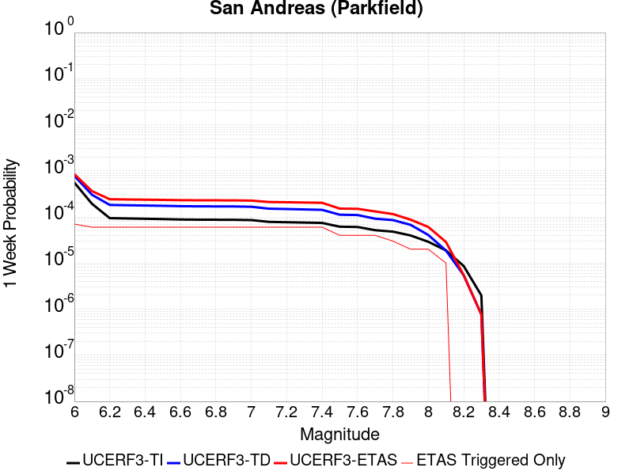 | 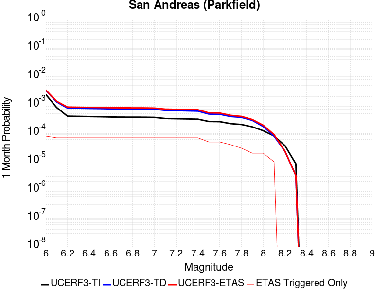 |  |  |

| Magnitude | 1 wk TI Prob | 1 wk TD Prob | 1 wk ETAS Prob | 1 wk ETAS/TD Gain | 1 wk ETAS Triggered Only | 1 mo TI Prob | 1 mo TD Prob | 1 mo ETAS Prob | 1 mo ETAS/TD Gain | 1 mo ETAS Triggered Only | 1 yr TI Prob | 1 yr TD Prob | 1 yr ETAS Prob | 1 yr ETAS/TD Gain | 1 yr ETAS Triggered Only | 10 yr TI Prob | 10 yr TD Prob | 10 yr ETAS Prob | 10 yr ETAS/TD Gain | 10 yr ETAS Triggered Only |
|-----|-----|-----|-----|-----|-----|-----|-----|-----|-----|-----|-----|-----|-----|-----|-----|-----|-----|-----|-----|-----|
| 6.0 | 5.556969E-4 | 7.7782426E-4 | 8.477698E-4 | 1.0899246 | 7.0E-5 | 0.0023793848 | 0.0033298214 | 0.003409555 | 1.0239453 | 8.0E-5 | 0.028586963 | 0.040191233 | 0.04026802 | 1.0019104 | 8.0E-5 | 0.25176284 | 0.33716413 | 0.3372238 | 1.0001769 | 9.0E-5 |
| 6.1 | 1.925858E-4 | 3.0276453E-4 | 3.6274636E-4 | 1.1981138 | 6.0E-5 | 8.2510663E-4 | 0.0012970108 | 0.00136692 | 1.0539002 | 7.0E-5 | 0.0099994885 | 0.015778083 | 0.015846979 | 1.0043665 | 7.0E-5 | 0.095613256 | 0.1497237 | 0.14978321 | 1.0003976 | 7.0E-5 |
| 6.2 | 9.4306815E-5 | 1.8242796E-4 | 2.4241701E-4 | 1.3288369 | 6.0E-5 | 4.0410945E-4 | 7.816011E-4 | 8.5154636E-4 | 1.0894897 | 7.0E-5 | 0.0049089384 | 0.009474681 | 0.009544018 | 1.0073181 | 7.0E-5 | 0.048019063 | 0.09185409 | 0.09191766 | 1.0006921 | 7.0E-5 |
| 6.3 | 9.283051E-5 | 1.7939322E-4 | 2.3938245E-4 | 1.3344008 | 6.0E-5 | 3.9778434E-4 | 7.686027E-4 | 8.3854893E-4 | 1.0910044 | 7.0E-5 | 0.0048322747 | 0.009317789 | 0.009387136 | 1.0074425 | 7.0E-5 | 0.047285385 | 0.09050704 | 0.0905707 | 1.0007035 | 7.0E-5 |
| 6.4 | 9.138826E-5 | 1.770153E-4 | 2.3700469E-4 | 1.3388938 | 6.0E-5 | 3.916052E-4 | 7.5841765E-4 | 8.283646E-4 | 1.0922275 | 7.0E-5 | 0.0047573745 | 0.00919484 | 0.009264196 | 1.007543 | 7.0E-5 | 0.046568092 | 0.08940927 | 0.08947302 | 1.0007129 | 7.0E-5 |
| 6.5 | 9.000255E-5 | 1.7459576E-4 | 2.3458528E-4 | 1.343591 | 6.0E-5 | 3.8566816E-4 | 7.480541E-4 | 8.1800175E-4 | 1.0935061 | 7.0E-5 | 0.0046854047 | 0.009069731 | 0.009139097 | 1.007648 | 7.0E-5 | 0.045878403 | 0.088295065 | 0.08835889 | 1.0007228 | 7.0E-5 |
| 6.6 | 8.8109264E-5 | 1.7140752E-4 | 2.3139724E-4 | 1.349983 | 6.0E-5 | 3.7755648E-4 | 7.3439797E-4 | 8.043466E-4 | 1.0952462 | 7.0E-5 | 0.0045870654 | 0.008904854 | 0.008974231 | 1.0077909 | 7.0E-5 | 0.04493529 | 0.0868267 | 0.086890616 | 1.0007362 | 7.0E-5 |
| 6.7 | 8.738073E-5 | 1.7007832E-4 | 2.3006812E-4 | 1.3527186 | 6.0E-5 | 3.7443507E-4 | 7.287046E-4 | 7.9865364E-4 | 1.0959909 | 7.0E-5 | 0.0045492216 | 0.008836143 | 0.008905524 | 1.007852 | 7.0E-5 | 0.04457213 | 0.08622707 | 0.08629103 | 1.0007418 | 7.0E-5 |
| 6.8 | 8.710195E-5 | 1.6953335E-4 | 2.2952317E-4 | 1.3538526 | 6.0E-5 | 3.7324068E-4 | 7.263703E-4 | 7.9631945E-4 | 1.0962995 | 7.0E-5 | 0.0045347405 | 0.008807961 | 0.008877344 | 1.0078773 | 7.0E-5 | 0.04443313 | 0.08597467 | 0.08603865 | 1.0007442 | 7.0E-5 |
| 6.9 | 8.6801556E-5 | 1.689429E-4 | 2.2893277E-4 | 1.3550895 | 6.0E-5 | 3.7195362E-4 | 7.2384125E-4 | 7.9379056E-4 | 1.0966363 | 7.0E-5 | 0.0045191357 | 0.008777418 | 0.008846804 | 1.007905 | 7.0E-5 | 0.044283327 | 0.085700735 | 0.085764736 | 1.0007468 | 7.0E-5 |
| 7.0 | 8.5571606E-5 | 1.6647128E-4 | 2.2646128E-4 | 1.3603625 | 6.0E-5 | 3.6668387E-4 | 7.132544E-4 | 7.832045E-4 | 1.0980717 | 7.0E-5 | 0.004455241 | 0.008649553 | 0.008718948 | 1.0080229 | 7.0E-5 | 0.043669727 | 0.08454914 | 0.08461322 | 1.0007579 | 7.0E-5 |
| 7.1 | 7.82589E-5 | 1.5128135E-4 | 2.1127227E-4 | 1.396552 | 6.0E-5 | 3.3535215E-4 | 6.481883E-4 | 7.181429E-4 | 1.1079233 | 7.0E-5 | 0.0040752706 | 0.007863307 | 0.007932756 | 1.0088321 | 7.0E-5 | 0.040013418 | 0.07746111 | 0.07752569 | 1.0008336 | 7.0E-5 |
| 7.2 | 7.690929E-5 | 1.4865391E-4 | 2.08645E-4 | 1.4035621 | 6.0E-5 | 3.2956956E-4 | 6.369334E-4 | 7.068888E-4 | 1.1098316 | 7.0E-5 | 0.004005129 | 0.007727258 | 0.007796717 | 1.0089889 | 7.0E-5 | 0.0393371 | 0.07623427 | 0.07629894 | 1.0008482 | 7.0E-5 |
| 7.3 | 7.5543794E-5 | 1.4561978E-4 | 2.0561104E-4 | 1.4119719 | 6.0E-5 | 3.2371894E-4 | 6.2393624E-4 | 6.9389254E-4 | 1.112121 | 7.0E-5 | 0.003934157 | 0.007570127 | 0.007639597 | 1.0091769 | 7.0E-5 | 0.038652334 | 0.074797355 | 0.074862115 | 1.0008658 | 7.0E-5 |
| 7.4 | 7.4214564E-5 | 1.4262961E-4 | 2.0262106E-4 | 1.42061 | 6.0E-5 | 3.1802364E-4 | 6.111273E-4 | 6.810845E-4 | 1.1144724 | 7.0E-5 | 0.003865065 | 0.00741525 | 0.007484731 | 1.00937 | 7.0E-5 | 0.03798529 | 0.07337123 | 0.0734361 | 1.000884 | 7.0E-5 |
| 7.5 | 6.149578E-5 | 1.11907226E-4 | 1.5190276E-4 | 1.357399 | 4.0E-5 | 2.6352672E-4 | 4.7951436E-4 | 5.2949035E-4 | 1.1042222 | 5.0E-5 | 0.0032037178 | 0.0058224914 | 0.0058722002 | 1.0085374 | 5.0E-5 | 0.03157923 | 0.058557566 | 0.058604635 | 1.0008038 | 5.0E-5 |
| 7.6 | 6.0643448E-5 | 1.10193796E-4 | 1.5018939E-4 | 1.3629569 | 4.0E-5 | 2.598746E-4 | 4.7217376E-4 | 5.2215013E-4 | 1.1058432 | 5.0E-5 | 0.0031593828 | 0.0057335934 | 0.005783307 | 1.0086706 | 5.0E-5 | 0.031148417 | 0.057718582 | 0.057765696 | 1.0008162 | 5.0E-5 |
| 7.7 | 5.1652263E-5 | 9.174698E-5 | 1.317433E-4 | 1.4359417 | 4.0E-5 | 2.2134806E-4 | 3.931421E-4 | 4.3312638E-4 | 1.1017044 | 4.0E-5 | 0.002691582 | 0.0047760103 | 0.004815819 | 1.0083352 | 4.0E-5 | 0.026592141 | 0.04853623 | 0.048574287 | 1.0007842 | 4.0E-5 |
| 7.8 | 4.8090482E-5 | 8.559635E-5 | 1.15593786E-4 | 1.3504522 | 3.0E-5 | 2.060858E-4 | 3.6678996E-4 | 3.9677895E-4 | 1.0817606 | 3.0E-5 | 0.0025062072 | 0.0044565317 | 0.0044863983 | 1.0067017 | 3.0E-5 | 0.024781305 | 0.04530245 | 0.04533109 | 1.0006322 | 3.0E-5 |
| 7.9 | 3.970278E-5 | 6.750426E-5 | 8.750291E-5 | 1.2962576 | 2.0E-5 | 1.7014367E-4 | 2.892719E-4 | 3.0926612E-4 | 1.0691191 | 2.0E-5 | 0.002069531 | 0.0035162016 | 0.0035361312 | 1.0056679 | 2.0E-5 | 0.020503636 | 0.035881363 | 0.035900645 | 1.0005374 | 2.0E-5 |
| 8.0 | 2.8982335E-5 | 4.069796E-5 | 6.0697144E-5 | 1.4914051 | 2.0E-5 | 1.2420409E-4 | 1.7440817E-4 | 1.9440468E-4 | 1.1146535 | 2.0E-5 | 0.0015111357 | 0.0021213528 | 0.0021413104 | 1.009408 | 2.0E-5 | 0.015009012 | 0.022010697 | 0.022030257 | 1.0008887 | 2.0E-5 |
| 8.1 | 1.8836186E-5 | 1.8681134E-5 | 2.8680948E-5 | 1.5352894 | 1.0E-5 | 8.0724014E-5 | 8.005955E-5 | 9.0058755E-5 | 1.124897 | 1.0E-5 | 9.823717E-4 | 9.742898E-4 | 9.8428E-4 | 1.0102539 | 1.0E-5 | 0.009780403 | 0.010488115 | 0.010498011 | 1.0009434 | 1.0E-5 |
| 8.2 | 8.643924E-6 | 5.4748625E-6 | 5.4748625E-6 | 1.0 | 0.0 | 3.704486E-5 | 2.3463486E-5 | 2.3463486E-5 | 1.0 | 0.0 | 4.5092785E-4 | 2.8563058E-4 | 2.8563058E-4 | 1.0 | 0.0 | 0.0045001395 | 0.0032487072 | 0.0032487072 | 1.0 | 0.0 |
| 8.3 | 1.983087E-6 | 7.6599065E-7 | 7.6599065E-7 | 1.0 | 0.0 | 8.498917E-6 | 3.282813E-6 | 3.282813E-6 | 1.0 | 0.0 | 1.034694E-4 | 3.9967534E-5 | 3.9967534E-5 | 1.0 | 0.0 | 0.0010342124 | 4.719687E-4 | 4.719687E-4 | 1.0 | 0.0 |

## Owens Valley
*[(top)](#table-of-contents)*

| 1 Week | 1 Month | 1 Year | 10 Year |
|-----|-----|-----|-----|
|  |  | 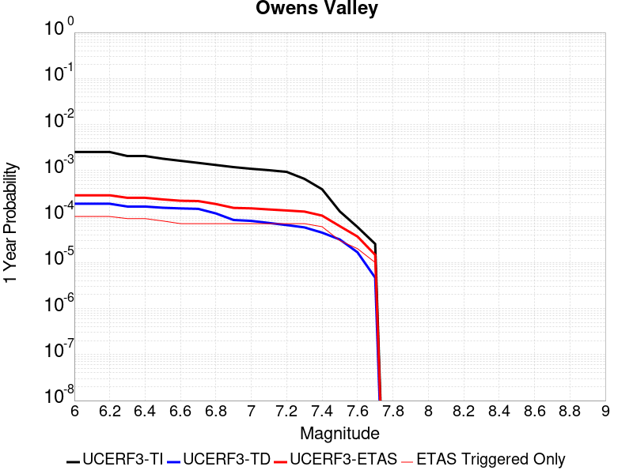 |  |

| Magnitude | 1 wk TI Prob | 1 wk TD Prob | 1 wk ETAS Prob | 1 wk ETAS/TD Gain | 1 wk ETAS Triggered Only | 1 mo TI Prob | 1 mo TD Prob | 1 mo ETAS Prob | 1 mo ETAS/TD Gain | 1 mo ETAS Triggered Only | 1 yr TI Prob | 1 yr TD Prob | 1 yr ETAS Prob | 1 yr ETAS/TD Gain | 1 yr ETAS Triggered Only | 10 yr TI Prob | 10 yr TD Prob | 10 yr ETAS Prob | 10 yr ETAS/TD Gain | 10 yr ETAS Triggered Only |
|-----|-----|-----|-----|-----|-----|-----|-----|-----|-----|-----|-----|-----|-----|-----|-----|-----|-----|-----|-----|-----|
| 6.0 | 4.83821E-5 | 3.626567E-6 | 7.362631E-5 | 20.301931 | 7.0E-5 | 2.0733538E-4 | 1.5542342E-5 | 1.05540945E-4 | 6.790543 | 9.0E-5 | 0.002521386 | 1.8921259E-4 | 2.8919367E-4 | 1.528406 | 1.0E-4 | 0.024929691 | 0.001925011 | 0.0020248184 | 1.0518477 | 1.0E-4 |
| 6.1 | 4.83821E-5 | 3.626567E-6 | 7.362631E-5 | 20.301931 | 7.0E-5 | 2.0733538E-4 | 1.5542342E-5 | 1.05540945E-4 | 6.790543 | 9.0E-5 | 0.002521386 | 1.8921259E-4 | 2.8919367E-4 | 1.528406 | 1.0E-4 | 0.024929691 | 0.001925011 | 0.0020248184 | 1.0518477 | 1.0E-4 |
| 6.2 | 4.83821E-5 | 3.626567E-6 | 7.362631E-5 | 20.301931 | 7.0E-5 | 2.0733538E-4 | 1.5542342E-5 | 1.05540945E-4 | 6.790543 | 9.0E-5 | 0.002521386 | 1.8921259E-4 | 2.8919367E-4 | 1.528406 | 1.0E-4 | 0.024929691 | 0.001925011 | 0.0020248184 | 1.0518477 | 1.0E-4 |
| 6.3 | 3.953008E-5 | 3.1553948E-6 | 6.31552E-5 | 20.014994 | 6.0E-5 | 1.6940363E-4 | 1.3523055E-5 | 9.352197E-5 | 6.9157434 | 8.0E-5 | 0.002060538 | 1.6463149E-4 | 2.5461667E-4 | 1.5465854 | 9.0E-5 | 0.020415364 | 0.0016592 | 0.0017490506 | 1.054153 | 9.0E-5 |
| 6.4 | 3.953008E-5 | 3.1553948E-6 | 6.31552E-5 | 20.014994 | 6.0E-5 | 1.6940363E-4 | 1.3523055E-5 | 9.352197E-5 | 6.9157434 | 8.0E-5 | 0.002060538 | 1.6463149E-4 | 2.5461667E-4 | 1.5465854 | 9.0E-5 | 0.020415364 | 0.0016592 | 0.0017490506 | 1.054153 | 9.0E-5 |
| 6.5 | 3.457342E-5 | 2.9715961E-6 | 6.297142E-5 | 21.191109 | 6.0E-5 | 1.4816338E-4 | 1.2735354E-5 | 9.2734335E-5 | 7.281646 | 8.0E-5 | 0.0018023965 | 1.550426E-4 | 2.350302E-4 | 1.5159072 | 8.0E-5 | 0.017878477 | 0.001555719 | 0.0016355945 | 1.0513432 | 8.0E-5 |
| 6.6 | 3.1127765E-5 | 2.8744932E-6 | 5.287435E-5 | 18.39432 | 5.0E-5 | 1.3339789E-4 | 1.2319203E-5 | 8.231834E-5 | 6.682116 | 7.0E-5 | 0.0016229092 | 1.4997667E-4 | 2.1996615E-4 | 1.4666693 | 7.0E-5 | 0.016111081 | 0.0015012559 | 0.0015711507 | 1.0465577 | 7.0E-5 |
| 6.7 | 2.806885E-5 | 2.8104134E-6 | 5.2810272E-5 | 18.790928 | 5.0E-5 | 1.2028952E-4 | 1.20445775E-5 | 8.2043734E-5 | 6.811674 | 7.0E-5 | 0.001463541 | 1.4663354E-4 | 2.1662327E-4 | 1.4773105 | 7.0E-5 | 0.014539397 | 0.0014657511 | 0.0015356485 | 1.047687 | 7.0E-5 |
| 6.8 | 2.524524E-5 | 2.2353688E-6 | 5.2235257E-5 | 23.367624 | 5.0E-5 | 1.0818939E-4 | 9.580118E-6 | 7.957945E-5 | 8.306729 | 7.0E-5 | 0.0013164099 | 1.16632E-4 | 1.8662383E-4 | 1.6001084 | 7.0E-5 | 0.01308639 | 0.0011659812 | 0.0012358995 | 1.0599653 | 7.0E-5 |
| 6.9 | 2.2704568E-5 | 1.6081682E-6 | 5.1608087E-5 | 32.091225 | 5.0E-5 | 9.730166E-5 | 6.8921313E-6 | 7.689165E-5 | 11.15644 | 7.0E-5 | 0.0011840039 | 8.390849E-5 | 1.5390261E-4 | 1.8341721 | 7.0E-5 | 0.011777153 | 8.3897985E-4 | 9.089211E-4 | 1.0833646 | 7.0E-5 |
| 7.0 | 2.0871712E-5 | 1.5395453E-6 | 5.1539468E-5 | 33.47707 | 5.0E-5 | 8.944713E-5 | 6.598035E-6 | 7.659757E-5 | 11.60915 | 7.0E-5 | 0.0010884746 | 8.032813E-5 | 1.503225E-4 | 1.8713558 | 7.0E-5 | 0.010831586 | 8.0316263E-4 | 8.731064E-4 | 1.0870855 | 7.0E-5 |
| 7.1 | 1.944928E-5 | 1.3864178E-6 | 5.138635E-5 | 37.064117 | 5.0E-5 | 8.335139E-5 | 5.941777E-6 | 7.594136E-5 | 12.780917 | 7.0E-5 | 0.0010143308 | 7.233874E-5 | 1.4233368E-4 | 1.9675995 | 7.0E-5 | 0.010097133 | 7.2330976E-4 | 7.932591E-4 | 1.0967073 | 7.0E-5 |
| 7.2 | 1.7876306E-5 | 1.2489141E-6 | 5.124885E-5 | 41.03473 | 5.0E-5 | 7.6610486E-5 | 5.352478E-6 | 7.53521E-5 | 14.077984 | 7.0E-5 | 9.3233347E-4 | 6.516448E-5 | 1.3515992E-4 | 2.0741348 | 7.0E-5 | 0.009284316 | 6.5159105E-4 | 7.215454E-4 | 1.1073593 | 7.0E-5 |
| 7.3 | 1.2618672E-5 | 1.1115209E-6 | 5.1111467E-5 | 45.98336 | 5.0E-5 | 5.40789E-5 | 4.763652E-6 | 7.476332E-5 | 15.694537 | 7.0E-5 | 6.582117E-4 | 5.799593E-5 | 1.2799187E-4 | 2.2069113 | 7.0E-5 | 0.0065626553 | 5.7994033E-4 | 6.4989977E-4 | 1.120632 | 7.0E-5 |
| 7.4 | 7.4874442E-6 | 8.5486437E-7 | 4.085483E-5 | 47.791008 | 4.0E-5 | 3.208865E-5 | 3.6636993E-6 | 6.366348E-5 | 17.37683 | 6.0E-5 | 3.906093E-4 | 4.4604632E-5 | 1.0460195E-4 | 2.3450918 | 6.0E-5 | 0.003899234 | 4.4604883E-4 | 5.060221E-4 | 1.1344544 | 6.0E-5 |
| 7.5 | 2.4734156E-6 | 6.068616E-7 | 2.0606849E-5 | 33.956425 | 2.0E-5 | 1.060031E-5 | 2.6008327E-6 | 3.2600754E-5 | 12.534738 | 3.0E-5 | 1.2905113E-4 | 3.166468E-5 | 6.166373E-5 | 1.9473978 | 3.0E-5 | 0.0012897621 | 3.1660203E-4 | 3.4659254E-4 | 1.0947262 | 3.0E-5 |
| 7.6 | 1.1328841E-6 | 3.196531E-7 | 1.031965E-5 | 32.283905 | 1.0E-5 | 4.8552088E-6 | 1.3699412E-6 | 2.1369913E-5 | 15.599147 | 2.0E-5 | 5.9110564E-5 | 1.6678909E-5 | 3.6678575E-5 | 2.1990993 | 2.0E-5 | 5.9094845E-4 | 1.6677675E-4 | 1.8677341E-4 | 1.1199008 | 2.0E-5 |
| 7.7 | 4.8613185E-7 | 8.964689E-8 | 1.0089646E-5 | 112.54876 | 1.0E-5 | 2.0834207E-6 | 3.8420092E-7 | 1.0384197E-5 | 27.02804 | 1.0E-5 | 2.536535E-5 | 4.6776368E-6 | 1.467759E-5 | 3.1378217 | 1.0E-5 | 2.5362454E-4 | 4.677545E-5 | 5.677498E-5 | 1.2137773 | 1.0E-5 |

## San Jacinto (Coyote Creek)
*[(top)](#table-of-contents)*

| 1 Week | 1 Month | 1 Year | 10 Year |
|-----|-----|-----|-----|
|  | 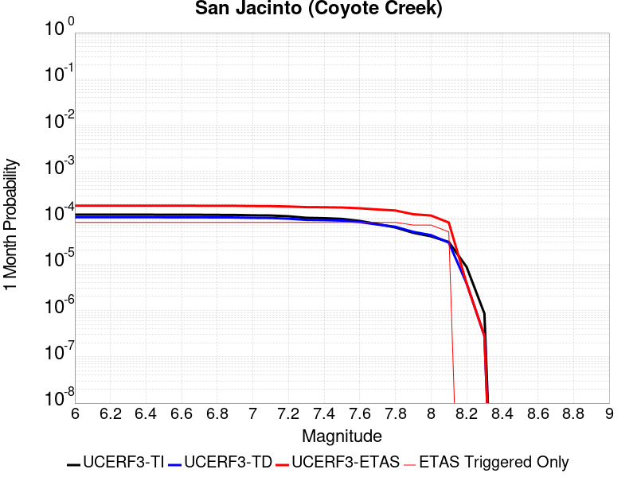 |  |  |

| Magnitude | 1 wk TI Prob | 1 wk TD Prob | 1 wk ETAS Prob | 1 wk ETAS/TD Gain | 1 wk ETAS Triggered Only | 1 mo TI Prob | 1 mo TD Prob | 1 mo ETAS Prob | 1 mo ETAS/TD Gain | 1 mo ETAS Triggered Only | 1 yr TI Prob | 1 yr TD Prob | 1 yr ETAS Prob | 1 yr ETAS/TD Gain | 1 yr ETAS Triggered Only | 10 yr TI Prob | 10 yr TD Prob | 10 yr ETAS Prob | 10 yr ETAS/TD Gain | 10 yr ETAS Triggered Only |
|-----|-----|-----|-----|-----|-----|-----|-----|-----|-----|-----|-----|-----|-----|-----|-----|-----|-----|-----|-----|-----|
| 6.0 | 2.7374346E-5 | 2.4145214E-5 | 9.414352E-5 | 3.8990552 | 7.0E-5 | 1.1731335E-4 | 1.034754E-4 | 1.8346713E-4 | 1.7730507 | 8.0E-5 | 0.0014273542 | 0.0012590875 | 0.0013389868 | 1.0634581 | 8.0E-5 | 0.01418221 | 0.012928318 | 0.013017154 | 1.0068715 | 9.0E-5 |
| 6.1 | 2.7374346E-5 | 2.4145214E-5 | 9.414352E-5 | 3.8990552 | 7.0E-5 | 1.1731335E-4 | 1.034754E-4 | 1.8346713E-4 | 1.7730507 | 8.0E-5 | 0.0014273542 | 0.0012590875 | 0.0013389868 | 1.0634581 | 8.0E-5 | 0.01418221 | 0.012928318 | 0.013017154 | 1.0068715 | 9.0E-5 |
| 6.2 | 2.7374346E-5 | 2.4145214E-5 | 9.414352E-5 | 3.8990552 | 7.0E-5 | 1.1731335E-4 | 1.034754E-4 | 1.8346713E-4 | 1.7730507 | 8.0E-5 | 0.0014273542 | 0.0012590875 | 0.0013389868 | 1.0634581 | 8.0E-5 | 0.01418221 | 0.012928318 | 0.013017154 | 1.0068715 | 9.0E-5 |
| 6.3 | 2.7374346E-5 | 2.4145214E-5 | 9.414352E-5 | 3.8990552 | 7.0E-5 | 1.1731335E-4 | 1.034754E-4 | 1.8346713E-4 | 1.7730507 | 8.0E-5 | 0.0014273542 | 0.0012590875 | 0.0013389868 | 1.0634581 | 8.0E-5 | 0.01418221 | 0.012928318 | 0.013017154 | 1.0068715 | 9.0E-5 |
| 6.4 | 2.7374346E-5 | 2.4145214E-5 | 9.414352E-5 | 3.8990552 | 7.0E-5 | 1.1731335E-4 | 1.034754E-4 | 1.8346713E-4 | 1.7730507 | 8.0E-5 | 0.0014273542 | 0.0012590875 | 0.0013389868 | 1.0634581 | 8.0E-5 | 0.01418221 | 0.012928318 | 0.013017154 | 1.0068715 | 9.0E-5 |
| 6.5 | 2.7282445E-5 | 2.4031293E-5 | 9.402961E-5 | 3.9127986 | 7.0E-5 | 1.16919524E-4 | 1.029872E-4 | 1.8297897E-4 | 1.7767155 | 8.0E-5 | 0.0014225657 | 0.0012531505 | 0.0013330503 | 1.0637591 | 8.0E-5 | 0.014134934 | 0.012869646 | 0.0129584875 | 1.0069032 | 9.0E-5 |
| 6.6 | 2.7282445E-5 | 2.4031293E-5 | 9.402961E-5 | 3.9127986 | 7.0E-5 | 1.16919524E-4 | 1.029872E-4 | 1.8297897E-4 | 1.7767155 | 8.0E-5 | 0.0014225657 | 0.0012531505 | 0.0013330503 | 1.0637591 | 8.0E-5 | 0.014134934 | 0.012869646 | 0.0129584875 | 1.0069032 | 9.0E-5 |
| 6.7 | 2.7216198E-5 | 2.3956412E-5 | 9.395474E-5 | 3.9219034 | 7.0E-5 | 1.1663563E-4 | 1.02666316E-4 | 1.826581E-4 | 1.7791435 | 8.0E-5 | 0.0014191137 | 0.0012492483 | 0.0013291484 | 1.0639585 | 8.0E-5 | 0.014100855 | 0.0128310565 | 0.012919902 | 1.0069243 | 9.0E-5 |
| 6.8 | 2.7078617E-5 | 2.387363E-5 | 9.387196E-5 | 3.9320354 | 7.0E-5 | 1.1604605E-4 | 1.0231156E-4 | 1.8230338E-4 | 1.7818453 | 8.0E-5 | 0.001411945 | 0.0012449342 | 0.0013248345 | 1.0641804 | 8.0E-5 | 0.014030075 | 0.012788199 | 0.012877048 | 1.0069478 | 9.0E-5 |
| 6.9 | 2.6982952E-5 | 2.3793142E-5 | 9.3791474E-5 | 3.9419544 | 7.0E-5 | 1.15636096E-4 | 1.0196664E-4 | 1.8195847E-4 | 1.7844903 | 8.0E-5 | 0.0014069602 | 0.0012407395 | 0.0013206402 | 1.0643977 | 8.0E-5 | 0.013980856 | 0.012746515 | 0.012835368 | 1.0069708 | 9.0E-5 |
| 7.0 | 2.6449972E-5 | 2.3370165E-5 | 9.336853E-5 | 3.995202 | 7.0E-5 | 1.1335209E-4 | 1.00154015E-4 | 1.80146E-4 | 1.7986897 | 8.0E-5 | 0.001379188 | 0.0012186957 | 0.0012985981 | 1.0655639 | 8.0E-5 | 0.0137065975 | 0.0125278765 | 0.01261675 | 1.007094 | 9.0E-5 |
| 7.1 | 2.6257849E-5 | 2.3196202E-5 | 9.3194576E-5 | 4.0176654 | 7.0E-5 | 1.1252879E-4 | 9.940852E-5 | 1.7940057E-4 | 1.80468 | 8.0E-5 | 0.0013691769 | 0.0012096294 | 0.0012895325 | 1.066056 | 8.0E-5 | 0.013607717 | 0.012437741 | 0.012526622 | 1.007146 | 9.0E-5 |
| 7.2 | 2.5270041E-5 | 2.2390966E-5 | 9.23894E-5 | 4.1261907 | 7.0E-5 | 1.0829568E-4 | 9.595777E-5 | 1.7595009E-4 | 1.8336201 | 8.0E-5 | 0.0013177024 | 0.0011676621 | 0.0012475686 | 1.0684329 | 8.0E-5 | 0.013099162 | 0.012018777 | 0.012107695 | 1.0073982 | 9.0E-5 |
| 7.3 | 2.339701E-5 | 2.1122814E-5 | 9.1121336E-5 | 4.3138824 | 7.0E-5 | 1.0026905E-4 | 9.0523215E-5 | 1.7051598E-4 | 1.8836712 | 8.0E-5 | 0.001220092 | 0.0011015651 | 0.0011814769 | 1.072544 | 8.0E-5 | 0.012134149 | 0.011357696 | 0.011446673 | 1.0078342 | 9.0E-5 |
| 7.4 | 2.296333E-5 | 2.0853171E-5 | 9.085171E-5 | 4.356734 | 7.0E-5 | 9.841056E-5 | 8.936768E-5 | 1.6936053E-4 | 1.8950982 | 8.0E-5 | 0.0011974899 | 0.0010875105 | 0.0011674234 | 1.0734825 | 8.0E-5 | 0.011910575 | 0.01121681 | 0.0113058 | 1.0079336 | 9.0E-5 |
| 7.5 | 2.2188895E-5 | 2.0376096E-5 | 9.037467E-5 | 4.435328 | 7.0E-5 | 9.50918E-5 | 8.732321E-5 | 1.6731622E-4 | 1.9160568 | 8.0E-5 | 0.0011571277 | 0.0010626436 | 0.0011425585 | 1.0752039 | 8.0E-5 | 0.011511209 | 0.010966429 | 0.011055442 | 1.0081168 | 9.0E-5 |
| 7.6 | 2.0013189E-5 | 1.8962366E-5 | 8.896104E-5 | 4.6914525 | 7.0E-5 | 8.5767984E-5 | 8.1264756E-5 | 1.6125826E-4 | 1.9843565 | 8.0E-5 | 0.001043725 | 9.889511E-4 | 0.001068872 | 1.0808138 | 8.0E-5 | 0.010388365 | 0.010224434 | 0.010313514 | 1.0087124 | 9.0E-5 |
| 7.7 | 1.7230794E-5 | 1.674371E-5 | 8.674254E-5 | 5.1806045 | 7.0E-5 | 7.384417E-5 | 7.175679E-5 | 1.5175105E-4 | 2.114797 | 8.0E-5 | 8.986819E-4 | 8.7328954E-4 | 9.5321966E-4 | 1.0915277 | 8.0E-5 | 0.008950562 | 0.009062956 | 0.0091521405 | 1.0098405 | 9.0E-5 |
| 7.8 | 1.4478809E-5 | 1.4990978E-5 | 8.498993E-5 | 5.669405 | 7.0E-5 | 6.205057E-5 | 6.424547E-5 | 1.4424033E-4 | 2.245144 | 8.0E-5 | 7.552038E-4 | 7.819085E-4 | 8.6184597E-4 | 1.1022338 | 8.0E-5 | 0.0075264242 | 0.008141387 | 0.0082306545 | 1.0109646 | 9.0E-5 |
| 7.9 | 1.1114467E-5 | 1.1645102E-5 | 8.1644284E-5 | 7.0110407 | 7.0E-5 | 4.7632562E-5 | 4.990663E-5 | 1.1990313E-4 | 2.4025493 | 7.0E-5 | 5.797721E-4 | 6.074444E-4 | 6.7740184E-4 | 1.1151669 | 7.0E-5 | 0.0057826187 | 0.0063803247 | 0.0064598145 | 1.0124586 | 8.0E-5 |
| 8.0 | 9.327402E-6 | 9.899186E-6 | 7.989849E-5 | 8.0712185 | 7.0E-5 | 3.9973966E-5 | 4.2424395E-5 | 1.12421425E-4 | 2.649924 | 7.0E-5 | 4.8657437E-4 | 5.1639514E-4 | 5.86359E-4 | 1.135485 | 7.0E-5 | 0.0048551033 | 0.0054499684 | 0.0055295327 | 1.014599 | 8.0E-5 |
| 8.1 | 7.0235833E-6 | 6.827495E-6 | 5.6827153E-5 | 8.32328 | 5.0E-5 | 3.0100724E-5 | 2.9260367E-5 | 7.9258905E-5 | 2.708746 | 5.0E-5 | 3.664147E-4 | 3.5618723E-4 | 4.0616942E-4 | 1.1403255 | 5.0E-5 | 0.003658111 | 0.0037876023 | 0.003847375 | 1.0157812 | 6.0E-5 |
| 8.2 | 2.0358202E-6 | 8.994527E-7 | 8.994527E-7 | 1.0 | 0.0 | 8.724915E-6 | 3.854792E-6 | 3.854792E-6 | 1.0 | 0.0 | 1.06220665E-4 | 4.69311E-5 | 4.69311E-5 | 1.0 | 0.0 | 0.001061699 | 5.3254166E-4 | 5.3254166E-4 | 1.0 | 0.0 |
| 8.3 | 2.0051264E-7 | 6.617272E-8 | 6.617272E-8 | 1.0 | 0.0 | 8.5933965E-7 | 2.8359733E-7 | 2.8359733E-7 | 1.0 | 0.0 | 1.046241E-5 | 3.4527925E-6 | 3.4527925E-6 | 1.0 | 0.0 | 1.0461917E-4 | 4.01389E-5 | 4.01389E-5 | 1.0 | 0.0 |

## Death Valley (Fish Lake Valley)
*[(top)](#table-of-contents)*

| 1 Week | 1 Month | 1 Year | 10 Year |
|-----|-----|-----|-----|
| 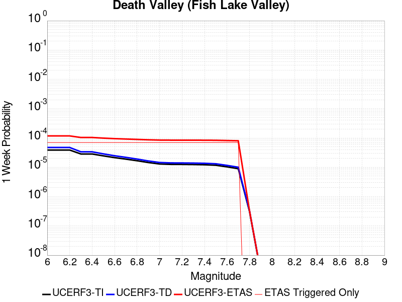 |  |  |  |

| Magnitude | 1 wk TI Prob | 1 wk TD Prob | 1 wk ETAS Prob | 1 wk ETAS/TD Gain | 1 wk ETAS Triggered Only | 1 mo TI Prob | 1 mo TD Prob | 1 mo ETAS Prob | 1 mo ETAS/TD Gain | 1 mo ETAS Triggered Only | 1 yr TI Prob | 1 yr TD Prob | 1 yr ETAS Prob | 1 yr ETAS/TD Gain | 1 yr ETAS Triggered Only | 10 yr TI Prob | 10 yr TD Prob | 10 yr ETAS Prob | 10 yr ETAS/TD Gain | 10 yr ETAS Triggered Only |
|-----|-----|-----|-----|-----|-----|-----|-----|-----|-----|-----|-----|-----|-----|-----|-----|-----|-----|-----|-----|-----|
| 6.0 | 3.872328E-5 | 4.7267473E-5 | 1.17264164E-4 | 2.4808638 | 7.0E-5 | 1.6594635E-4 | 2.0256084E-4 | 2.7254666E-4 | 1.3455051 | 7.0E-5 | 0.0020185246 | 0.002463534 | 0.002543337 | 1.0323937 | 8.0E-5 | 0.02000288 | 0.024388181 | 0.024475986 | 1.0036004 | 9.0E-5 |
| 6.1 | 3.872328E-5 | 4.7267473E-5 | 1.17264164E-4 | 2.4808638 | 7.0E-5 | 1.6594635E-4 | 2.0256084E-4 | 2.7254666E-4 | 1.3455051 | 7.0E-5 | 0.0020185246 | 0.002463534 | 0.002543337 | 1.0323937 | 8.0E-5 | 0.02000288 | 0.024388181 | 0.024475986 | 1.0036004 | 9.0E-5 |
| 6.2 | 3.872328E-5 | 4.7267473E-5 | 1.17264164E-4 | 2.4808638 | 7.0E-5 | 1.6594635E-4 | 2.0256084E-4 | 2.7254666E-4 | 1.3455051 | 7.0E-5 | 0.0020185246 | 0.002463534 | 0.002543337 | 1.0323937 | 8.0E-5 | 0.02000288 | 0.024388181 | 0.024475986 | 1.0036004 | 9.0E-5 |
| 6.3 | 2.8356371E-5 | 3.3609853E-5 | 1.036075E-4 | 3.0826528 | 7.0E-5 | 1.2152165E-4 | 1.4403471E-4 | 2.1402464E-4 | 1.485924 | 7.0E-5 | 0.0014785219 | 0.0017522911 | 0.001832151 | 1.0455745 | 8.0E-5 | 0.014687235 | 0.017391782 | 0.017480217 | 1.0050849 | 9.0E-5 |
| 6.4 | 2.8356371E-5 | 3.3609853E-5 | 1.036075E-4 | 3.0826528 | 7.0E-5 | 1.2152165E-4 | 1.4403471E-4 | 2.1402464E-4 | 1.485924 | 7.0E-5 | 0.0014785219 | 0.0017522911 | 0.001832151 | 1.0455745 | 8.0E-5 | 0.014687235 | 0.017391782 | 0.017480217 | 1.0050849 | 9.0E-5 |
| 6.5 | 2.4448687E-5 | 2.8607552E-5 | 9.860555E-5 | 3.4468362 | 7.0E-5 | 1.0477588E-4 | 1.2259831E-4 | 1.9258974E-4 | 1.5709003 | 7.0E-5 | 0.0012748998 | 0.0014916632 | 0.0015715437 | 1.0535514 | 8.0E-5 | 0.012676105 | 0.014821377 | 0.014910042 | 1.0059823 | 9.0E-5 |
| 6.6 | 2.1298161E-5 | 2.4660083E-5 | 9.465836E-5 | 3.8385253 | 7.0E-5 | 9.127464E-5 | 1.0568198E-4 | 1.7567459E-4 | 1.6622945 | 7.0E-5 | 0.0011107022 | 0.0012859525 | 0.0013658496 | 1.0621307 | 8.0E-5 | 0.011051672 | 0.012788526 | 0.012877375 | 1.0069475 | 9.0E-5 |
| 6.7 | 1.8959729E-5 | 2.1781025E-5 | 9.1779504E-5 | 4.2137365 | 7.0E-5 | 8.125345E-5 | 9.334405E-5 | 1.6333752E-4 | 1.7498438 | 7.0E-5 | 9.888117E-4 | 0.001135897 | 0.0012158061 | 1.070349 | 8.0E-5 | 0.009844234 | 0.01130357 | 0.011392552 | 1.0078721 | 9.0E-5 |
| 6.8 | 1.6691629E-5 | 1.9018353E-5 | 8.901702E-5 | 4.6805854 | 7.0E-5 | 7.153359E-5 | 8.150477E-5 | 1.5149907E-4 | 1.8587754 | 7.0E-5 | 8.7057345E-4 | 9.918857E-4 | 0.0010718063 | 1.0805745 | 8.0E-5 | 0.008671708 | 0.009876343 | 0.009965454 | 1.0090227 | 9.0E-5 |
| 6.9 | 1.450505E-5 | 1.638954E-5 | 8.638839E-5 | 5.270947 | 7.0E-5 | 6.216302E-5 | 7.0239046E-5 | 1.4023413E-4 | 1.9965267 | 7.0E-5 | 7.5657194E-4 | 8.5483363E-4 | 9.3476527E-4 | 1.0935055 | 8.0E-5 | 0.007540013 | 0.008516385 | 0.008605619 | 1.0104779 | 9.0E-5 |
| 7.0 | 1.2940855E-5 | 1.4537972E-5 | 8.453696E-5 | 5.814907 | 7.0E-5 | 5.545963E-5 | 6.230414E-5 | 1.3229977E-4 | 2.123451 | 7.0E-5 | 6.750118E-4 | 7.5829466E-4 | 8.3823403E-4 | 1.1054199 | 8.0E-5 | 0.006729651 | 0.0075576897 | 0.0076470096 | 1.0118184 | 9.0E-5 |
| 7.1 | 1.2544658E-5 | 1.4078208E-5 | 8.407722E-5 | 5.9721537 | 7.0E-5 | 5.3761712E-5 | 6.0333812E-5 | 1.3032959E-4 | 2.1601417 | 7.0E-5 | 6.5435225E-4 | 7.343222E-4 | 8.142634E-4 | 1.108864 | 8.0E-5 | 0.006524288 | 0.007319551 | 0.0074088923 | 1.0122058 | 9.0E-5 |
| 7.2 | 1.2489416E-5 | 1.4015674E-5 | 8.40147E-5 | 5.9943385 | 7.0E-5 | 5.3524967E-5 | 6.0065824E-5 | 1.3006161E-4 | 2.1653183 | 7.0E-5 | 6.514716E-4 | 7.310616E-4 | 8.1100315E-4 | 1.1093498 | 8.0E-5 | 0.006495651 | 0.0072871596 | 0.0073765037 | 1.0122604 | 9.0E-5 |
| 7.3 | 1.2368307E-5 | 1.3879812E-5 | 8.387884E-5 | 6.043226 | 7.0E-5 | 5.3005948E-5 | 5.9483587E-5 | 1.2947942E-4 | 2.1767251 | 7.0E-5 | 6.451563E-4 | 7.2397763E-4 | 8.039197E-4 | 1.1104207 | 8.0E-5 | 0.0064328653 | 0.007216782 | 0.0073061325 | 1.012381 | 9.0E-5 |
| 7.4 | 1.2161707E-5 | 1.36478675E-5 | 8.364691E-5 | 6.1289363 | 7.0E-5 | 5.212056E-5 | 5.8489582E-5 | 1.284855E-4 | 2.1967244 | 7.0E-5 | 6.3438306E-4 | 7.118836E-4 | 7.9182663E-4 | 1.1122979 | 8.0E-5 | 0.006325751 | 0.0070966207 | 0.007185982 | 1.0125921 | 9.0E-5 |
| 7.5 | 1.1707948E-5 | 1.3145515E-5 | 8.3144594E-5 | 6.32494 | 7.0E-5 | 5.0175953E-5 | 5.6336736E-5 | 1.2633279E-4 | 2.2424586 | 7.0E-5 | 6.10721E-4 | 6.856895E-4 | 7.6563464E-4 | 1.1165909 | 8.0E-5 | 0.0060904534 | 0.006836321 | 0.006925706 | 1.013075 | 9.0E-5 |
| 7.6 | 1.0319538E-5 | 1.1579622E-5 | 8.1578815E-5 | 7.045032 | 7.0E-5 | 4.4225842E-5 | 4.9626036E-5 | 1.19622564E-4 | 2.4104798 | 7.0E-5 | 5.383166E-4 | 6.040347E-4 | 6.8398635E-4 | 1.1323627 | 8.0E-5 | 0.0053701443 | 0.0060244603 | 0.0061039785 | 1.0131992 | 8.0E-5 |
| 7.7 | 8.937764E-6 | 1.0022779E-5 | 8.002208E-5 | 7.9840207 | 7.0E-5 | 3.830414E-5 | 4.295409E-5 | 1.12951086E-4 | 2.629577 | 7.0E-5 | 4.6625308E-4 | 5.228456E-4 | 6.028038E-4 | 1.1529288 | 8.0E-5 | 0.0046527605 | 0.005216664 | 0.005296247 | 1.0152555 | 8.0E-5 |
| 7.8 | 3.108007E-7 | 3.284654E-7 | 3.284654E-7 | 1.0 | 0.0 | 1.3320023E-6 | 1.407708E-6 | 1.407708E-6 | 1.0 | 0.0 | 1.6217007E-5 | 1.7138715E-5 | 2.7138543E-5 | 1.5834643 | 1.0E-5 | 1.6215823E-4 | 1.7137431E-4 | 1.813726E-4 | 1.0583419 | 1.0E-5 |
| 7.9 | 2.5591178E-9 | 2.6696718E-9 | 2.6696718E-9 | 1.0 | 0.0 | 1.0967647E-8 | 1.14414505E-8 | 1.14414505E-8 | 1.0 | 0.0 | 1.335311E-7 | 1.3929966E-7 | 1.3929966E-7 | 1.0 | 0.0 | 1.3353102E-6 | 1.3929966E-6 | 1.3929966E-6 | 1.0 | 0.0 |

## Kern Canyon (North Kern) 2011
*[(top)](#table-of-contents)*

| 1 Week | 1 Month | 1 Year | 10 Year |
|-----|-----|-----|-----|
|  |  |  |  |

| Magnitude | 1 wk TI Prob | 1 wk TD Prob | 1 wk ETAS Prob | 1 wk ETAS/TD Gain | 1 wk ETAS Triggered Only | 1 mo TI Prob | 1 mo TD Prob | 1 mo ETAS Prob | 1 mo ETAS/TD Gain | 1 mo ETAS Triggered Only | 1 yr TI Prob | 1 yr TD Prob | 1 yr ETAS Prob | 1 yr ETAS/TD Gain | 1 yr ETAS Triggered Only | 10 yr TI Prob | 10 yr TD Prob | 10 yr ETAS Prob | 10 yr ETAS/TD Gain | 10 yr ETAS Triggered Only |
|-----|-----|-----|-----|-----|-----|-----|-----|-----|-----|-----|-----|-----|-----|-----|-----|-----|-----|-----|-----|-----|
| 6.0 | 6.6264497E-6 | 6.75733E-6 | 8.675679E-5 | 12.838916 | 8.0E-5 | 2.8398761E-5 | 2.895971E-5 | 1.0895739E-4 | 3.7623787 | 8.0E-5 | 3.4570007E-4 | 3.5253543E-4 | 4.425037E-4 | 1.2552035 | 9.0E-5 | 0.0034516277 | 0.0035205502 | 0.0036102333 | 1.0254742 | 9.0E-5 |
| 6.1 | 6.6264497E-6 | 6.75733E-6 | 8.675679E-5 | 12.838916 | 8.0E-5 | 2.8398761E-5 | 2.895971E-5 | 1.0895739E-4 | 3.7623787 | 8.0E-5 | 3.4570007E-4 | 3.5253543E-4 | 4.425037E-4 | 1.2552035 | 9.0E-5 | 0.0034516277 | 0.0035205502 | 0.0036102333 | 1.0254742 | 9.0E-5 |
| 6.2 | 6.6264497E-6 | 6.75733E-6 | 8.675679E-5 | 12.838916 | 8.0E-5 | 2.8398761E-5 | 2.895971E-5 | 1.0895739E-4 | 3.7623787 | 8.0E-5 | 3.4570007E-4 | 3.5253543E-4 | 4.425037E-4 | 1.2552035 | 9.0E-5 | 0.0034516277 | 0.0035205502 | 0.0036102333 | 1.0254742 | 9.0E-5 |
| 6.3 | 6.6264497E-6 | 6.75733E-6 | 8.675679E-5 | 12.838916 | 8.0E-5 | 2.8398761E-5 | 2.895971E-5 | 1.0895739E-4 | 3.7623787 | 8.0E-5 | 3.4570007E-4 | 3.5253543E-4 | 4.425037E-4 | 1.2552035 | 9.0E-5 | 0.0034516277 | 0.0035205502 | 0.0036102333 | 1.0254742 | 9.0E-5 |
| 6.4 | 6.6264497E-6 | 6.75733E-6 | 8.675679E-5 | 12.838916 | 8.0E-5 | 2.8398761E-5 | 2.895971E-5 | 1.0895739E-4 | 3.7623787 | 8.0E-5 | 3.4570007E-4 | 3.5253543E-4 | 4.425037E-4 | 1.2552035 | 9.0E-5 | 0.0034516277 | 0.0035205502 | 0.0036102333 | 1.0254742 | 9.0E-5 |
| 6.5 | 3.2162225E-6 | 3.2570915E-6 | 6.32569E-5 | 19.421284 | 6.0E-5 | 1.3783738E-5 | 1.3958893E-5 | 7.395806E-5 | 5.298275 | 6.0E-5 | 1.6780409E-4 | 1.6993708E-4 | 2.2992688E-4 | 1.3530118 | 6.0E-5 | 0.0016767744 | 0.001698151 | 0.0017580491 | 1.0352726 | 6.0E-5 |
| 6.6 | 3.2162225E-6 | 3.2570915E-6 | 6.32569E-5 | 19.421284 | 6.0E-5 | 1.3783738E-5 | 1.3958893E-5 | 7.395806E-5 | 5.298275 | 6.0E-5 | 1.6780409E-4 | 1.6993708E-4 | 2.2992688E-4 | 1.3530118 | 6.0E-5 | 0.0016767744 | 0.001698151 | 0.0017580491 | 1.0352726 | 6.0E-5 |
| 6.7 | 2.1908265E-6 | 2.2071222E-6 | 4.2207033E-5 | 19.123108 | 4.0E-5 | 9.389223E-6 | 9.459061E-6 | 4.9458682E-5 | 5.228709 | 4.0E-5 | 1.1430779E-4 | 1.1515819E-4 | 1.5515358E-4 | 1.3473083 | 4.0E-5 | 0.0011424901 | 0.0011510046 | 0.0011909585 | 1.0347122 | 4.0E-5 |
| 6.8 | 1.7303895E-6 | 1.7365529E-6 | 4.1736483E-5 | 24.0341 | 4.0E-5 | 7.415934E-6 | 7.4423488E-6 | 4.7442052E-5 | 6.374607 | 4.0E-5 | 9.028525E-5 | 9.0606925E-5 | 1.3060331E-4 | 1.4414274 | 4.0E-5 | 9.024858E-4 | 9.057096E-4 | 9.456734E-4 | 1.0441242 | 4.0E-5 |
| 6.9 | 1.3700314E-6 | 1.3688622E-6 | 3.136882E-5 | 22.915981 | 3.0E-5 | 5.87155E-6 | 5.8665396E-6 | 3.5866364E-5 | 6.113717 | 3.0E-5 | 7.148377E-5 | 7.142282E-5 | 1.0142068E-4 | 1.4200038 | 3.0E-5 | 7.146078E-4 | 7.140032E-4 | 7.439818E-4 | 1.0419866 | 3.0E-5 |
| 7.0 | 1.1467797E-6 | 1.1413804E-6 | 1.1141369E-5 | 9.761311 | 1.0E-5 | 4.9147607E-6 | 4.8916213E-6 | 1.4891572E-5 | 3.044302 | 1.0E-5 | 5.983557E-5 | 5.9553895E-5 | 6.95533E-5 | 1.1679051 | 1.0E-5 | 5.981946E-4 | 5.953825E-4 | 6.0537655E-4 | 1.016786 | 1.0E-5 |
| 7.1 | 9.3952065E-7 | 9.3026904E-7 | 1.093026E-5 | 11.749569 | 1.0E-5 | 4.026511E-6 | 3.9868614E-6 | 1.3986822E-5 | 3.5082288 | 1.0E-5 | 4.9021666E-5 | 4.8538972E-5 | 5.8538488E-5 | 1.20601 | 1.0E-5 | 4.901085E-4 | 4.8528548E-4 | 4.952806E-4 | 1.0205964 | 1.0E-5 |
| 7.2 | 6.858055E-7 | 6.7193E-7 | 1.06719235E-5 | 15.882492 | 1.0E-5 | 2.939163E-6 | 2.879697E-6 | 1.2879668E-5 | 4.4725776 | 1.0E-5 | 3.5783723E-5 | 3.5059755E-5 | 4.5059405E-5 | 1.2852173 | 1.0E-5 | 3.5777962E-4 | 3.5054312E-4 | 3.6053962E-4 | 1.0285171 | 1.0E-5 |
| 7.3 | 5.1101983E-7 | 4.9393E-7 | 1.0493925E-5 | 21.245775 | 1.0E-5 | 2.1900833E-6 | 2.116841E-6 | 1.211682E-5 | 5.7240105 | 1.0E-5 | 2.6663936E-5 | 2.5772239E-5 | 3.577198E-5 | 1.3880044 | 1.0E-5 | 2.6660739E-4 | 2.57693E-4 | 2.676904E-4 | 1.0387958 | 1.0E-5 |
| 7.4 | 3.4999414E-7 | 3.2995905E-7 | 3.2995905E-7 | 1.0 | 0.0 | 1.499974E-6 | 1.4141094E-6 | 1.4141094E-6 | 1.0 | 0.0 | 1.8262032E-5 | 1.721665E-5 | 1.721665E-5 | 1.0 | 0.0 | 1.826053E-4 | 1.7215339E-4 | 1.7215339E-4 | 1.0 | 0.0 |
| 7.5 | 1.7021522E-7 | 1.4750044E-7 | 1.4750044E-7 | 1.0 | 0.0 | 7.2949354E-7 | 6.321446E-7 | 6.321446E-7 | 1.0 | 0.0 | 8.881548E-6 | 7.696334E-6 | 7.696334E-6 | 1.0 | 0.0 | 8.8811925E-5 | 7.696076E-5 | 7.696076E-5 | 1.0 | 0.0 |
| 7.6 | 2.572245E-8 | 1.7352555E-8 | 1.7352555E-8 | 1.0 | 0.0 | 1.10239064E-7 | 7.436809E-8 | 7.436809E-8 | 1.0 | 0.0 | 1.3421597E-6 | 9.054312E-7 | 9.054312E-7 | 1.0 | 0.0 | 1.3421517E-5 | 9.05428E-6 | 9.05428E-6 | 1.0 | 0.0 |

## Santa Ynez (East)
*[(top)](#table-of-contents)*

| 1 Week | 1 Month | 1 Year | 10 Year |
|-----|-----|-----|-----|
|  |  |  |  |

| Magnitude | 1 wk TI Prob | 1 wk TD Prob | 1 wk ETAS Prob | 1 wk ETAS/TD Gain | 1 wk ETAS Triggered Only | 1 mo TI Prob | 1 mo TD Prob | 1 mo ETAS Prob | 1 mo ETAS/TD Gain | 1 mo ETAS Triggered Only | 1 yr TI Prob | 1 yr TD Prob | 1 yr ETAS Prob | 1 yr ETAS/TD Gain | 1 yr ETAS Triggered Only | 10 yr TI Prob | 10 yr TD Prob | 10 yr ETAS Prob | 10 yr ETAS/TD Gain | 10 yr ETAS Triggered Only |
|-----|-----|-----|-----|-----|-----|-----|-----|-----|-----|-----|-----|-----|-----|-----|-----|-----|-----|-----|-----|-----|
| 6.0 | 3.2269712E-5 | 3.67505E-5 | 1.0674793E-4 | 2.904666 | 7.0E-5 | 1.3829143E-4 | 1.5749598E-4 | 2.2748495E-4 | 1.4443858 | 7.0E-5 | 0.0016823979 | 0.0019164166 | 0.0019962634 | 1.0416646 | 8.0E-5 | 0.016697178 | 0.019056441 | 0.019134916 | 1.0041181 | 8.0E-5 |
| 6.1 | 3.2269712E-5 | 3.67505E-5 | 1.0674793E-4 | 2.904666 | 7.0E-5 | 1.3829143E-4 | 1.5749598E-4 | 2.2748495E-4 | 1.4443858 | 7.0E-5 | 0.0016823979 | 0.0019164166 | 0.0019962634 | 1.0416646 | 8.0E-5 | 0.016697178 | 0.019056441 | 0.019134916 | 1.0041181 | 8.0E-5 |
| 6.2 | 3.2269712E-5 | 3.67505E-5 | 1.0674793E-4 | 2.904666 | 7.0E-5 | 1.3829143E-4 | 1.5749598E-4 | 2.2748495E-4 | 1.4443858 | 7.0E-5 | 0.0016823979 | 0.0019164166 | 0.0019962634 | 1.0416646 | 8.0E-5 | 0.016697178 | 0.019056441 | 0.019134916 | 1.0041181 | 8.0E-5 |
| 6.3 | 3.2269712E-5 | 3.67505E-5 | 1.0674793E-4 | 2.904666 | 7.0E-5 | 1.3829143E-4 | 1.5749598E-4 | 2.2748495E-4 | 1.4443858 | 7.0E-5 | 0.0016823979 | 0.0019164166 | 0.0019962634 | 1.0416646 | 8.0E-5 | 0.016697178 | 0.019056441 | 0.019134916 | 1.0041181 | 8.0E-5 |
| 6.4 | 1.4404779E-5 | 1.4849382E-5 | 4.4848937E-5 | 3.020256 | 3.0E-5 | 6.1733306E-5 | 6.363868E-5 | 9.363678E-5 | 1.4713814 | 3.0E-5 | 7.513438E-4 | 7.745306E-4 | 8.144996E-4 | 1.0516042 | 4.0E-5 | 0.0074880854 | 0.007718862 | 0.007758553 | 1.0051421 | 4.0E-5 |
| 6.5 | 1.4404779E-5 | 1.4849382E-5 | 4.4848937E-5 | 3.020256 | 3.0E-5 | 6.1733306E-5 | 6.363868E-5 | 9.363678E-5 | 1.4713814 | 3.0E-5 | 7.513438E-4 | 7.745306E-4 | 8.144996E-4 | 1.0516042 | 4.0E-5 | 0.0074880854 | 0.007718862 | 0.007758553 | 1.0051421 | 4.0E-5 |
| 6.6 | 1.280208E-5 | 1.3011947E-5 | 4.3011558E-5 | 3.3055434 | 3.0E-5 | 5.4864904E-5 | 5.5764307E-5 | 8.576263E-5 | 1.5379485 | 3.0E-5 | 6.6777546E-4 | 6.787207E-4 | 7.0870033E-4 | 1.0441709 | 3.0E-5 | 0.006657724 | 0.0067666885 | 0.0067964857 | 1.0044035 | 3.0E-5 |
| 6.7 | 1.2457027E-5 | 1.2628468E-5 | 4.262809E-5 | 3.375555 | 3.0E-5 | 5.3386164E-5 | 5.412089E-5 | 8.411927E-5 | 1.5542846 | 3.0E-5 | 6.497827E-4 | 6.587243E-4 | 6.8870455E-4 | 1.0455126 | 3.0E-5 | 0.00647886 | 0.006567915 | 0.0065977178 | 1.0045377 | 3.0E-5 |
| 6.8 | 1.2095134E-5 | 1.2230915E-5 | 3.223067E-5 | 2.6351807 | 2.0E-5 | 5.1835254E-5 | 5.241716E-5 | 7.2416115E-5 | 1.3815345 | 2.0E-5 | 6.309115E-4 | 6.379937E-4 | 6.579809E-4 | 1.0313283 | 2.0E-5 | 0.0062912325 | 0.006361809 | 0.0063816817 | 1.0031238 | 2.0E-5 |
| 6.9 | 1.1104036E-5 | 1.1157347E-5 | 3.1157124E-5 | 2.7925208 | 2.0E-5 | 4.758786E-5 | 4.781633E-5 | 6.7815374E-5 | 1.4182471 | 2.0E-5 | 5.7922816E-4 | 5.820096E-4 | 6.0199795E-4 | 1.0343437 | 2.0E-5 | 0.005777207 | 0.0058049993 | 0.005824883 | 1.0034254 | 2.0E-5 |
| 7.0 | 1.0577444E-5 | 1.058168E-5 | 3.058147E-5 | 2.890039 | 2.0E-5 | 4.5331115E-5 | 4.5349276E-5 | 6.534837E-5 | 1.4410014 | 2.0E-5 | 5.5176654E-4 | 5.519888E-4 | 5.7197775E-4 | 1.0362126 | 2.0E-5 | 0.0055039856 | 0.0055063153 | 0.0055262055 | 1.0036122 | 2.0E-5 |
| 7.1 | 1.0021775E-5 | 9.980988E-6 | 2.9980787E-5 | 3.0037897 | 2.0E-5 | 4.294976E-5 | 4.2774966E-5 | 6.277411E-5 | 1.4675432 | 2.0E-5 | 5.2278786E-4 | 5.2066194E-4 | 5.4065156E-4 | 1.0383927 | 2.0E-5 | 0.0052155964 | 0.0051945536 | 0.0052144495 | 1.0038302 | 2.0E-5 |
| 7.2 | 8.874109E-6 | 8.748793E-6 | 1.8748706E-5 | 2.1430047 | 1.0E-5 | 3.8031343E-5 | 3.7494297E-5 | 4.7493922E-5 | 1.2666973 | 1.0E-5 | 4.629332E-4 | 4.5639853E-4 | 4.6639398E-4 | 1.0219007 | 1.0E-5 | 0.0046197 | 0.0045547304 | 0.004564685 | 1.0021855 | 1.0E-5 |
| 7.3 | 7.5504267E-6 | 7.5051175E-6 | 1.7505043E-5 | 2.3324142 | 1.0E-5 | 3.235857E-5 | 3.21644E-5 | 4.2164076E-5 | 1.3108927 | 1.0E-5 | 3.9389438E-4 | 3.915322E-4 | 4.015283E-4 | 1.0255307 | 1.0E-5 | 0.0039319694 | 0.003908531 | 0.003918492 | 1.0025485 | 1.0E-5 |
| 7.4 | 6.309394E-6 | 6.1831556E-6 | 1.6183094E-5 | 2.6172872 | 1.0E-5 | 2.703998E-5 | 2.6498974E-5 | 3.649871E-5 | 1.3773631 | 1.0E-5 | 3.2916202E-4 | 3.225782E-4 | 3.3257497E-4 | 1.0309902 | 1.0E-5 | 0.003286749 | 0.003221197 | 0.0032311648 | 1.0030944 | 1.0E-5 |
| 7.5 | 4.6103073E-6 | 4.4408903E-6 | 1.4440846E-5 | 3.2517908 | 1.0E-5 | 1.975831E-5 | 1.9032252E-5 | 2.9032062E-5 | 1.5254139 | 1.0E-5 | 2.4053088E-4 | 2.3169373E-4 | 2.416914E-4 | 1.0431504 | 1.0E-5 | 0.002402707 | 0.002314591 | 0.002324568 | 1.0043104 | 1.0E-5 |
| 7.6 | 1.2858658E-6 | 1.3008173E-6 | 1.3008173E-6 | 1.0 | 0.0 | 5.5108417E-6 | 5.5749197E-6 | 5.5749197E-6 | 1.0 | 0.0 | 6.7092435E-5 | 6.78726E-5 | 6.78726E-5 | 1.0 | 0.0 | 6.707218E-4 | 6.785256E-4 | 6.785256E-4 | 1.0 | 0.0 |
| 7.7 | 5.3302307E-7 | 5.612138E-7 | 5.612138E-7 | 1.0 | 0.0 | 2.2843826E-6 | 2.4052001E-6 | 2.4052001E-6 | 1.0 | 0.0 | 2.7812002E-5 | 2.9282954E-5 | 2.9282954E-5 | 1.0 | 0.0 | 2.7808524E-4 | 2.9279452E-4 | 2.9279452E-4 | 1.0 | 0.0 |
| 7.8 | 4.613933E-8 | 4.80301E-8 | 4.80301E-8 | 1.0 | 0.0 | 1.9773998E-7 | 2.0584326E-7 | 2.0584326E-7 | 1.0 | 0.0 | 2.4074816E-6 | 2.5061388E-6 | 2.5061388E-6 | 1.0 | 0.0 | 2.4074554E-5 | 2.5061116E-5 | 2.5061116E-5 | 1.0 | 0.0 |

## Santa Ynez (West)
*[(top)](#table-of-contents)*

| 1 Week | 1 Month | 1 Year | 10 Year |
|-----|-----|-----|-----|
|  |  |  | 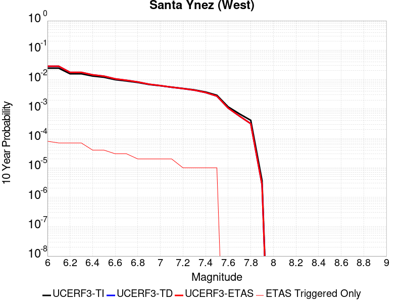 |

| Magnitude | 1 wk TI Prob | 1 wk TD Prob | 1 wk ETAS Prob | 1 wk ETAS/TD Gain | 1 wk ETAS Triggered Only | 1 mo TI Prob | 1 mo TD Prob | 1 mo ETAS Prob | 1 mo ETAS/TD Gain | 1 mo ETAS Triggered Only | 1 yr TI Prob | 1 yr TD Prob | 1 yr ETAS Prob | 1 yr ETAS/TD Gain | 1 yr ETAS Triggered Only | 10 yr TI Prob | 10 yr TD Prob | 10 yr ETAS Prob | 10 yr ETAS/TD Gain | 10 yr ETAS Triggered Only |
|-----|-----|-----|-----|-----|-----|-----|-----|-----|-----|-----|-----|-----|-----|-----|-----|-----|-----|-----|-----|-----|
| 6.0 | 4.7352758E-5 | 5.4972126E-5 | 1.14968825E-4 | 2.0914023 | 6.0E-5 | 2.0292461E-4 | 2.3557522E-4 | 2.9556107E-4 | 1.2546357 | 6.0E-5 | 0.0024678076 | 0.0028645284 | 0.0029343278 | 1.0243669 | 7.0E-5 | 0.024405818 | 0.028304417 | 0.028382152 | 1.0027465 | 8.0E-5 |
| 6.1 | 4.7352758E-5 | 5.4972126E-5 | 1.04969375E-4 | 1.9095019 | 5.0E-5 | 2.0292461E-4 | 2.3557522E-4 | 2.8556344E-4 | 1.2121965 | 5.0E-5 | 0.0024678076 | 0.0028645284 | 0.0029243564 | 1.0208858 | 6.0E-5 | 0.024405818 | 0.028304417 | 0.028372437 | 1.0024031 | 7.0E-5 |
| 6.2 | 3.0415853E-5 | 3.392511E-5 | 8.392341E-5 | 2.4737844 | 5.0E-5 | 1.3034715E-4 | 1.4538545E-4 | 1.9537818E-4 | 1.3438634 | 5.0E-5 | 0.0015858212 | 0.0017686661 | 0.0018285599 | 1.0338639 | 6.0E-5 | 0.015745522 | 0.017549807 | 0.017618578 | 1.0039186 | 7.0E-5 |
| 6.3 | 3.0415853E-5 | 3.392511E-5 | 8.392341E-5 | 2.4737844 | 5.0E-5 | 1.3034715E-4 | 1.4538545E-4 | 1.9537818E-4 | 1.3438634 | 5.0E-5 | 0.0015858212 | 0.0017686661 | 0.0018285599 | 1.0338639 | 6.0E-5 | 0.015745522 | 0.017549807 | 0.017618578 | 1.0039186 | 7.0E-5 |
| 6.4 | 2.5452082E-5 | 2.7912422E-5 | 5.7911584E-5 | 2.0747602 | 3.0E-5 | 1.09075794E-4 | 1.196193E-4 | 1.496157E-4 | 1.2507657 | 3.0E-5 | 0.0013271887 | 0.0014554089 | 0.0014953506 | 1.0274436 | 4.0E-5 | 0.013192902 | 0.014460951 | 0.014500373 | 1.0027261 | 4.0E-5 |
| 6.5 | 2.3143784E-5 | 2.5128256E-5 | 5.5127504E-5 | 2.193845 | 3.0E-5 | 9.9183875E-5 | 1.0768817E-4 | 1.3768494E-4 | 1.2785522 | 3.0E-5 | 0.0012068948 | 0.0013103267 | 0.0013502743 | 1.0304867 | 4.0E-5 | 0.012003611 | 0.01302768 | 0.013067159 | 1.0030304 | 4.0E-5 |
| 6.6 | 1.9118515E-5 | 2.035434E-5 | 5.035373E-5 | 2.4738572 | 3.0E-5 | 8.193392E-5 | 8.7230015E-5 | 1.172274E-4 | 1.3438883 | 3.0E-5 | 9.97089E-4 | 0.001061516 | 0.0010914841 | 1.0282315 | 3.0E-5 | 0.00992627 | 0.010565365 | 0.010595048 | 1.0028095 | 3.0E-5 |
| 6.7 | 1.722807E-5 | 1.8146347E-5 | 4.81458E-5 | 2.6531954 | 3.0E-5 | 7.3832496E-5 | 7.776777E-5 | 1.0776544E-4 | 1.385734 | 3.0E-5 | 8.985399E-4 | 9.464169E-4 | 9.763885E-4 | 1.0316685 | 3.0E-5 | 0.008949154 | 0.0094245095 | 0.009454227 | 1.0031532 | 3.0E-5 |
| 6.8 | 1.5317364E-5 | 1.5926486E-5 | 3.5926165E-5 | 2.25575 | 2.0E-5 | 6.56442E-5 | 6.82546E-5 | 8.825324E-5 | 1.2930006 | 2.0E-5 | 7.98925E-4 | 8.306873E-4 | 8.506706E-4 | 1.0240564 | 2.0E-5 | 0.007960589 | 0.00827631 | 0.008296144 | 1.0023966 | 2.0E-5 |
| 6.9 | 1.3071226E-5 | 1.3329624E-5 | 3.3329357E-5 | 2.5003974 | 2.0E-5 | 5.6018336E-5 | 5.7125722E-5 | 7.7124576E-5 | 1.350085 | 2.0E-5 | 6.8180985E-4 | 6.9528597E-4 | 7.152721E-4 | 1.0287452 | 2.0E-5 | 0.0067972173 | 0.006931367 | 0.0069512282 | 1.0028654 | 2.0E-5 |
| 7.0 | 1.1836986E-5 | 1.19327815E-5 | 3.1932545E-5 | 2.6760352 | 2.0E-5 | 5.0728955E-5 | 5.11395E-5 | 7.113848E-5 | 1.3910671 | 2.0E-5 | 6.1745E-4 | 6.2244723E-4 | 6.4243475E-4 | 1.0321113 | 2.0E-5 | 0.006157372 | 0.006207231 | 0.006227107 | 1.0032021 | 2.0E-5 |
| 7.1 | 1.0597169E-5 | 1.0542201E-5 | 3.054199E-5 | 2.8971171 | 2.0E-5 | 4.541565E-5 | 4.5180084E-5 | 6.5179185E-5 | 1.442653 | 2.0E-5 | 5.5279525E-4 | 5.4992986E-4 | 5.6991883E-4 | 1.0363482 | 2.0E-5 | 0.0055142213 | 0.005485821 | 0.0055057113 | 1.0036258 | 2.0E-5 |
| 7.2 | 9.59113E-6 | 9.459144E-6 | 1.945905E-5 | 2.057168 | 1.0E-5 | 4.11042E-5 | 4.0538565E-5 | 5.0538158E-5 | 1.2466687 | 1.0E-5 | 5.0032866E-4 | 4.934463E-4 | 5.034414E-4 | 1.0202557 | 1.0E-5 | 0.004992037 | 0.0049236254 | 0.004933576 | 1.0020211 | 1.0E-5 |
| 7.3 | 8.586084E-6 | 8.379583E-6 | 1.83795E-5 | 2.1933668 | 1.0E-5 | 3.679698E-5 | 3.5912013E-5 | 4.5911653E-5 | 1.2784483 | 1.0E-5 | 4.4791115E-4 | 4.3714207E-4 | 4.471377E-4 | 1.0228659 | 1.0E-5 | 0.004470094 | 0.004362933 | 0.004372889 | 1.002282 | 1.0E-5 |
| 7.4 | 7.2622997E-6 | 6.9515427E-6 | 1.6951473E-5 | 2.4385197 | 1.0E-5 | 3.112377E-5 | 2.979199E-5 | 3.9791692E-5 | 1.3356507 | 1.0E-5 | 3.78866E-4 | 3.626581E-4 | 3.7265447E-4 | 1.0275642 | 1.0E-5 | 0.0037822074 | 0.0036207628 | 0.0036307266 | 1.0027518 | 1.0E-5 |
| 7.5 | 5.627296E-6 | 5.251588E-6 | 1.5251535E-5 | 2.904176 | 1.0E-5 | 2.411676E-5 | 2.2506614E-5 | 3.250639E-5 | 1.4443039 | 1.0E-5 | 2.9358198E-4 | 2.739843E-4 | 2.8398156E-4 | 1.0364884 | 1.0E-5 | 0.0029319443 | 0.002736537 | 0.0027465096 | 1.0036442 | 1.0E-5 |
| 7.6 | 2.265244E-6 | 2.0608625E-6 | 2.0608625E-6 | 1.0 | 0.0 | 9.708152E-6 | 8.832238E-6 | 8.832238E-6 | 1.0 | 0.0 | 1.18190335E-4 | 1.0752728E-4 | 1.0752728E-4 | 1.0 | 0.0 | 0.001181275 | 0.0010747612 | 0.0010747612 | 1.0 | 0.0 |
| 7.7 | 1.3099874E-6 | 1.1016252E-6 | 1.1016252E-6 | 1.0 | 0.0 | 5.61422E-6 | 4.7212425E-6 | 4.7212425E-6 | 1.0 | 0.0 | 6.8350986E-5 | 5.7479636E-5 | 5.7479636E-5 | 1.0 | 0.0 | 6.832996E-4 | 5.7465007E-4 | 5.7465007E-4 | 1.0 | 0.0 |
| 7.8 | 7.903951E-7 | 6.0711415E-7 | 6.0711415E-7 | 1.0 | 0.0 | 3.3874032E-6 | 2.6019152E-6 | 2.6019152E-6 | 1.0 | 0.0 | 4.1240855E-5 | 3.167787E-5 | 3.167787E-5 | 1.0 | 0.0 | 4.12332E-4 | 3.167349E-4 | 3.167349E-4 | 1.0 | 0.0 |
| 7.9 | 7.0753297E-9 | 5.0899476E-9 | 5.0899476E-9 | 1.0 | 0.0 | 3.032284E-8 | 2.181406E-8 | 2.181406E-8 | 1.0 | 0.0 | 3.6918053E-7 | 2.6558615E-7 | 2.6558615E-7 | 1.0 | 0.0 | 3.691799E-6 | 2.6558594E-6 | 2.6558594E-6 | 1.0 | 0.0 |

## Brawley (Seismic Zone) alt 1
*[(top)](#table-of-contents)*

| 1 Week | 1 Month | 1 Year | 10 Year |
|-----|-----|-----|-----|
|  |  |  | 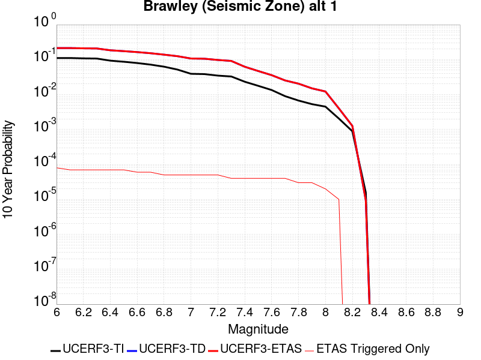 |

| Magnitude | 1 wk TI Prob | 1 wk TD Prob | 1 wk ETAS Prob | 1 wk ETAS/TD Gain | 1 wk ETAS Triggered Only | 1 mo TI Prob | 1 mo TD Prob | 1 mo ETAS Prob | 1 mo ETAS/TD Gain | 1 mo ETAS Triggered Only | 1 yr TI Prob | 1 yr TD Prob | 1 yr ETAS Prob | 1 yr ETAS/TD Gain | 1 yr ETAS Triggered Only | 10 yr TI Prob | 10 yr TD Prob | 10 yr ETAS Prob | 10 yr ETAS/TD Gain | 10 yr ETAS Triggered Only |
|-----|-----|-----|-----|-----|-----|-----|-----|-----|-----|-----|-----|-----|-----|-----|-----|-----|-----|-----|-----|-----|
| 6.0 | 2.2521618E-4 | 4.7632487E-4 | 5.362963E-4 | 1.1259044 | 6.0E-5 | 9.6485513E-4 | 0.0020398323 | 0.0021096894 | 1.0342466 | 7.0E-5 | 0.011683988 | 0.024546238 | 0.024614519 | 1.0027817 | 7.0E-5 | 0.11088423 | 0.21350002 | 0.21356294 | 1.0002947 | 8.0E-5 |
| 6.1 | 2.2521618E-4 | 4.7632487E-4 | 5.362963E-4 | 1.1259044 | 6.0E-5 | 9.6485513E-4 | 0.0020398323 | 0.0021096894 | 1.0342466 | 7.0E-5 | 0.011683988 | 0.024546238 | 0.024614519 | 1.0027817 | 7.0E-5 | 0.11088423 | 0.21350002 | 0.21355508 | 1.0002578 | 7.0E-5 |
| 6.2 | 2.198148E-4 | 4.6717093E-4 | 5.271429E-4 | 1.1283727 | 6.0E-5 | 9.417233E-4 | 0.0020006616 | 0.0020705215 | 1.0349184 | 7.0E-5 | 0.011405343 | 0.024080504 | 0.024148818 | 1.002837 | 7.0E-5 | 0.10837428 | 0.20993657 | 0.20999187 | 1.0002635 | 7.0E-5 |
| 6.3 | 2.1704129E-4 | 4.615278E-4 | 5.215001E-4 | 1.129943 | 6.0E-5 | 9.298453E-4 | 0.0019765133 | 0.002046375 | 1.0353459 | 7.0E-5 | 0.011262234 | 0.02379366 | 0.023861995 | 1.002872 | 7.0E-5 | 0.107082725 | 0.20782755 | 0.207883 | 1.0002668 | 7.0E-5 |
| 6.4 | 1.876142E-4 | 4.00449E-4 | 4.6042498E-4 | 1.1497718 | 6.0E-5 | 8.038131E-4 | 0.0017150956 | 0.0017849755 | 1.0407441 | 7.0E-5 | 0.00974259 | 0.020680401 | 0.020748954 | 1.0033149 | 7.0E-5 | 0.093263686 | 0.18457815 | 0.18463524 | 1.0003092 | 7.0E-5 |
| 6.5 | 1.7390939E-4 | 3.7477075E-4 | 4.3474828E-4 | 1.1600379 | 6.0E-5 | 7.45113E-4 | 0.0016051838 | 0.0016750715 | 1.0435387 | 7.0E-5 | 0.009034078 | 0.019368723 | 0.019437367 | 1.0035441 | 7.0E-5 | 0.086755216 | 0.17440031 | 0.1744581 | 1.0003314 | 7.0E-5 |
| 6.6 | 1.591791E-4 | 3.4891962E-4 | 4.088987E-4 | 1.1718993 | 6.0E-5 | 6.8201777E-4 | 0.0014945229 | 0.0015544333 | 1.0400866 | 6.0E-5 | 0.008271996 | 0.018045569 | 0.018104486 | 1.0032649 | 6.0E-5 | 0.07970774 | 0.16380852 | 0.1638587 | 1.0003062 | 6.0E-5 |
| 6.7 | 1.4268003E-4 | 3.20582E-4 | 3.8056276E-4 | 1.1870996 | 6.0E-5 | 6.1134255E-4 | 0.0013732077 | 0.0014331252 | 1.0436333 | 6.0E-5 | 0.007417723 | 0.016592601 | 0.016651606 | 1.003556 | 6.0E-5 | 0.07174956 | 0.15193306 | 0.15198395 | 1.0003349 | 6.0E-5 |
| 6.8 | 1.239713E-4 | 2.9053655E-4 | 3.4052203E-4 | 1.1720454 | 5.0E-5 | 5.3119735E-4 | 0.0012445687 | 0.0012945065 | 1.0401245 | 5.0E-5 | 0.0064481674 | 0.015048777 | 0.015098025 | 1.0032725 | 5.0E-5 | 0.06264243 | 0.13837762 | 0.1384207 | 1.0003114 | 5.0E-5 |
| 6.9 | 1.0180238E-4 | 2.625439E-4 | 3.1253078E-4 | 1.1903943 | 5.0E-5 | 4.3622297E-4 | 0.0011247073 | 0.001174651 | 1.044406 | 5.0E-5 | 0.005298089 | 0.013608336 | 0.013657656 | 1.0036242 | 5.0E-5 | 0.05173543 | 0.124961674 | 0.12500542 | 1.0003501 | 5.0E-5 |
| 7.0 | 7.6619996E-5 | 2.23993E-4 | 2.739818E-4 | 1.2231712 | 5.0E-5 | 3.283301E-4 | 9.5962E-4 | 0.0010095721 | 1.0520539 | 5.0E-5 | 0.0039900932 | 0.011621496 | 0.0116709145 | 1.0042523 | 5.0E-5 | 0.039192066 | 0.107266866 | 0.1073115 | 1.0004162 | 5.0E-5 |
| 7.1 | 7.5127435E-5 | 2.2082464E-4 | 2.708136E-4 | 1.226374 | 5.0E-5 | 3.2193496E-4 | 9.4605127E-4 | 9.96004E-4 | 1.0528013 | 5.0E-5 | 0.0039125155 | 0.011458045 | 0.011507472 | 1.0043137 | 5.0E-5 | 0.038443442 | 0.10583085 | 0.10587556 | 1.0004225 | 5.0E-5 |
| 7.2 | 6.788582E-5 | 2.0210193E-4 | 2.5209182E-4 | 1.2473499 | 5.0E-5 | 2.9090676E-4 | 8.6586666E-4 | 9.158234E-4 | 1.0576956 | 5.0E-5 | 0.0035360386 | 0.0104916105 | 0.010541086 | 1.0047157 | 5.0E-5 | 0.034803 | 0.09750131 | 0.097546436 | 1.0004628 | 5.0E-5 |
| 7.3 | 6.399602E-5 | 1.8841137E-4 | 2.2840383E-4 | 1.2122614 | 4.0E-5 | 2.7423984E-4 | 8.072303E-4 | 8.47198E-4 | 1.0495121 | 4.0E-5 | 0.0033337586 | 0.009784332 | 0.00982394 | 1.0040482 | 4.0E-5 | 0.03284188 | 0.09139617 | 0.09143251 | 1.0003977 | 4.0E-5 |
| 7.4 | 4.506759E-5 | 1.2529209E-4 | 1.6528707E-4 | 1.319214 | 4.0E-5 | 1.9313251E-4 | 5.368565E-4 | 5.76835E-4 | 1.0744678 | 4.0E-5 | 0.0023488526 | 0.0065168133 | 0.006556553 | 1.0060979 | 4.0E-5 | 0.023241805 | 0.062363707 | 0.06240121 | 1.0006014 | 4.0E-5 |
| 7.5 | 3.43289E-5 | 9.33541E-5 | 1.3335036E-4 | 1.428436 | 4.0E-5 | 1.4711556E-4 | 4.00028E-4 | 4.4001197E-4 | 1.099953 | 4.0E-5 | 0.0017896603 | 0.0048595266 | 0.0048993323 | 1.0081912 | 4.0E-5 | 0.01775316 | 0.04705519 | 0.047093306 | 1.00081 | 4.0E-5 |
| 7.6 | 2.5980507E-5 | 7.053101E-5 | 1.1052819E-4 | 1.5670865 | 4.0E-5 | 1.1134028E-4 | 3.0224086E-4 | 3.4222877E-4 | 1.1323048 | 4.0E-5 | 0.001354725 | 0.003673598 | 0.0037134509 | 1.0108485 | 4.0E-5 | 0.013464959 | 0.035840835 | 0.0358794 | 1.0010761 | 4.0E-5 |
| 7.7 | 1.7292105E-5 | 4.9407296E-5 | 8.940532E-5 | 1.809557 | 4.0E-5 | 7.4106916E-5 | 2.117284E-4 | 2.5171993E-4 | 1.1888813 | 4.0E-5 | 9.018782E-4 | 0.0025747516 | 0.0026146488 | 1.0154954 | 4.0E-5 | 0.008982267 | 0.025290398 | 0.025329387 | 1.0015416 | 4.0E-5 |
| 7.8 | 1.2927471E-5 | 3.9693266E-5 | 6.9692076E-5 | 1.7557657 | 3.0E-5 | 5.5402274E-5 | 1.7010293E-4 | 2.0009783E-4 | 1.1763338 | 3.0E-5 | 6.743139E-4 | 0.0020690386 | 0.0020989764 | 1.0144695 | 3.0E-5 | 0.0067227143 | 0.020431727 | 0.020461114 | 1.0014383 | 3.0E-5 |
| 7.9 | 1.0200774E-5 | 2.874569E-5 | 5.8744827E-5 | 2.0436046 | 3.0E-5 | 4.371687E-5 | 1.2319001E-4 | 1.5318631E-4 | 1.2434963 | 3.0E-5 | 5.321229E-4 | 0.0014988075 | 0.0015287625 | 1.0199859 | 3.0E-5 | 0.005308505 | 0.014991644 | 0.015021194 | 1.0019711 | 3.0E-5 |
| 8.0 | 8.650396E-6 | 2.3277367E-5 | 4.32769E-5 | 1.8591837 | 2.0E-5 | 3.70726E-5 | 9.975634E-5 | 1.19754346E-4 | 1.2004685 | 2.0E-5 | 4.5126543E-4 | 0.0012138576 | 0.0012338333 | 1.0164564 | 2.0E-5 | 0.0045035016 | 0.012211097 | 0.012230853 | 1.0016179 | 2.0E-5 |
| 8.1 | 3.9368224E-6 | 7.3279825E-6 | 1.732791E-5 | 2.364622 | 1.0E-5 | 1.6871985E-5 | 3.140526E-5 | 4.1404946E-5 | 1.318408 | 1.0E-5 | 2.0539707E-4 | 3.8229208E-4 | 3.9228826E-4 | 1.026148 | 1.0E-5 | 0.0020520731 | 0.004001185 | 0.0040111444 | 1.0024892 | 1.0E-5 |
| 8.2 | 1.7101195E-6 | 2.217876E-6 | 2.217876E-6 | 1.0 | 0.0 | 7.329063E-6 | 9.505149E-6 | 9.505149E-6 | 1.0 | 0.0 | 8.922769E-5 | 1.1571907E-4 | 1.1571907E-4 | 1.0 | 0.0 | 8.9191867E-4 | 0.0012666774 | 0.0012666774 | 1.0 | 0.0 |
| 8.3 | 3.0346666E-8 | 1.721586E-8 | 1.721586E-8 | 1.0 | 0.0 | 1.3005713E-7 | 7.378226E-8 | 7.378226E-8 | 1.0 | 0.0 | 1.5834444E-6 | 8.9829894E-7 | 8.9829894E-7 | 1.0 | 0.0 | 1.5834332E-5 | 9.367729E-6 | 9.367729E-6 | 1.0 | 0.0 |

## White Mountains
*[(top)](#table-of-contents)*

| 1 Week | 1 Month | 1 Year | 10 Year |
|-----|-----|-----|-----|
| 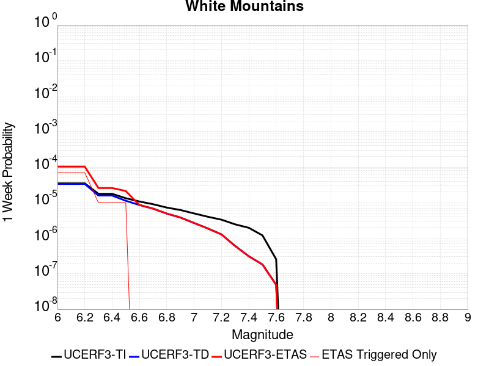 |  |  |  |

| Magnitude | 1 wk TI Prob | 1 wk TD Prob | 1 wk ETAS Prob | 1 wk ETAS/TD Gain | 1 wk ETAS Triggered Only | 1 mo TI Prob | 1 mo TD Prob | 1 mo ETAS Prob | 1 mo ETAS/TD Gain | 1 mo ETAS Triggered Only | 1 yr TI Prob | 1 yr TD Prob | 1 yr ETAS Prob | 1 yr ETAS/TD Gain | 1 yr ETAS Triggered Only | 10 yr TI Prob | 10 yr TD Prob | 10 yr ETAS Prob | 10 yr ETAS/TD Gain | 10 yr ETAS Triggered Only |
|-----|-----|-----|-----|-----|-----|-----|-----|-----|-----|-----|-----|-----|-----|-----|-----|-----|-----|-----|-----|-----|
| 6.0 | 3.503579E-5 | 3.378405E-5 | 1.03781684E-4 | 3.0719137 | 7.0E-5 | 1.5014476E-4 | 1.4478143E-4 | 2.2476986E-4 | 1.552477 | 8.0E-5 | 0.0018264796 | 0.0017614096 | 0.0018412686 | 1.0453382 | 8.0E-5 | 0.018115403 | 0.017486818 | 0.01756542 | 1.0044949 | 8.0E-5 |
| 6.1 | 3.503579E-5 | 3.378405E-5 | 1.03781684E-4 | 3.0719137 | 7.0E-5 | 1.5014476E-4 | 1.4478143E-4 | 2.2476986E-4 | 1.552477 | 8.0E-5 | 0.0018264796 | 0.0017614096 | 0.0018412686 | 1.0453382 | 8.0E-5 | 0.018115403 | 0.017486818 | 0.01756542 | 1.0044949 | 8.0E-5 |
| 6.2 | 3.503579E-5 | 3.378405E-5 | 1.03781684E-4 | 3.0719137 | 7.0E-5 | 1.5014476E-4 | 1.4478143E-4 | 2.2476986E-4 | 1.552477 | 8.0E-5 | 0.0018264796 | 0.0017614096 | 0.0018412686 | 1.0453382 | 8.0E-5 | 0.018115403 | 0.017486818 | 0.01756542 | 1.0044949 | 8.0E-5 |
| 6.3 | 1.7818425E-5 | 1.5916074E-5 | 2.5915915E-5 | 1.6282856 | 1.0E-5 | 7.636245E-5 | 6.821004E-5 | 8.8208675E-5 | 1.2931919 | 2.0E-5 | 9.293162E-4 | 8.301551E-4 | 8.5013855E-4 | 1.0240719 | 2.0E-5 | 0.009254395 | 0.008271999 | 0.008291833 | 1.0023978 | 2.0E-5 |
| 6.4 | 1.7818425E-5 | 1.5916074E-5 | 2.5915915E-5 | 1.6282856 | 1.0E-5 | 7.636245E-5 | 6.821004E-5 | 8.8208675E-5 | 1.2931919 | 2.0E-5 | 9.293162E-4 | 8.301551E-4 | 8.5013855E-4 | 1.0240719 | 2.0E-5 | 0.009254395 | 0.008271999 | 0.008291833 | 1.0023978 | 2.0E-5 |
| 6.5 | 1.3397557E-5 | 1.13362685E-5 | 2.1336155E-5 | 1.8821145 | 1.0E-5 | 5.741684E-5 | 4.858314E-5 | 5.8582656E-5 | 1.2058227 | 1.0E-5 | 6.988258E-4 | 5.913462E-4 | 6.0134026E-4 | 1.0169005 | 1.0E-5 | 0.006966323 | 0.005898432 | 0.005908373 | 1.0016854 | 1.0E-5 |
| 6.6 | 1.0818695E-5 | 8.625366E-6 | 8.625366E-6 | 1.0 | 0.0 | 4.6365014E-5 | 3.6965357E-5 | 3.6965357E-5 | 1.0 | 0.0 | 5.6434784E-4 | 4.4996463E-4 | 4.4996463E-4 | 1.0 | 0.0 | 0.005629168 | 0.004490972 | 0.004490972 | 1.0 | 0.0 |
| 6.7 | 9.067908E-6 | 6.802442E-6 | 6.802442E-6 | 1.0 | 0.0 | 3.8861883E-5 | 2.9153016E-5 | 2.9153016E-5 | 1.0 | 0.0 | 4.7304068E-4 | 3.5488335E-4 | 3.5488335E-4 | 1.0 | 0.0 | 0.00472035 | 0.0035434833 | 0.0035434833 | 1.0 | 0.0 |
| 6.8 | 7.295947E-6 | 4.936391E-6 | 4.936391E-6 | 1.0 | 0.0 | 3.126797E-5 | 2.1155796E-5 | 2.1155796E-5 | 1.0 | 0.0 | 3.8062103E-4 | 2.575425E-4 | 2.575425E-4 | 1.0 | 0.0 | 0.0037996976 | 0.0025725532 | 0.0025725532 | 1.0 | 0.0 |
| 6.9 | 6.2243444E-6 | 3.832213E-6 | 3.832213E-6 | 1.0 | 0.0 | 2.6675489E-5 | 1.642367E-5 | 1.642367E-5 | 1.0 | 0.0 | 3.2472567E-4 | 1.9994036E-4 | 1.9994036E-4 | 1.0 | 0.0 | 0.0032425157 | 0.0019976576 | 0.0019976576 | 1.0 | 0.0 |
| 7.0 | 4.9878413E-6 | 2.6795342E-6 | 2.6795342E-6 | 1.0 | 0.0 | 2.1376287E-5 | 1.14836685E-5 | 1.14836685E-5 | 1.0 | 0.0 | 2.602252E-4 | 1.3980496E-4 | 1.3980496E-4 | 1.0 | 0.0 | 0.002599207 | 0.0013971963 | 0.0013971963 | 1.0 | 0.0 |
| 7.1 | 4.0252844E-6 | 1.8857575E-6 | 1.8857575E-6 | 1.0 | 0.0 | 1.7251105E-5 | 8.081794E-6 | 8.081794E-6 | 1.0 | 0.0 | 2.1001195E-4 | 9.8391516E-5 | 9.8391516E-5 | 1.0 | 0.0 | 0.0020981359 | 9.834924E-4 | 9.834924E-4 | 1.0 | 0.0 |
| 7.2 | 3.3284066E-6 | 1.281964E-6 | 1.281964E-6 | 1.0 | 0.0 | 1.4264522E-5 | 5.494121E-6 | 5.494121E-6 | 1.0 | 0.0 | 1.736567E-4 | 6.688897E-5 | 6.688897E-5 | 1.0 | 0.0 | 0.0017352107 | 6.6869846E-4 | 6.6869846E-4 | 1.0 | 0.0 |
| 7.3 | 2.458226E-6 | 6.05722E-7 | 6.05722E-7 | 1.0 | 0.0 | 1.0535211E-5 | 2.5959491E-6 | 2.5959491E-6 | 1.0 | 0.0 | 1.2825865E-4 | 3.1605257E-5 | 3.1605257E-5 | 1.0 | 0.0 | 0.0012818464 | 3.160114E-4 | 3.160114E-4 | 1.0 | 0.0 |
| 7.4 | 1.965953E-6 | 3.1089303E-7 | 3.1089303E-7 | 1.0 | 0.0 | 8.425486E-6 | 1.332398E-6 | 1.332398E-6 | 1.0 | 0.0 | 1.0257547E-4 | 1.6221828E-5 | 1.6221828E-5 | 1.0 | 0.0 | 0.0010252813 | 1.6220656E-4 | 1.6220656E-4 | 1.0 | 0.0 |
| 7.5 | 1.2014192E-6 | 1.8244253E-7 | 1.8244253E-7 | 1.0 | 0.0 | 5.148929E-6 | 7.8189635E-7 | 7.8189635E-7 | 1.0 | 0.0 | 6.2686406E-5 | 9.519547E-6 | 9.519547E-6 | 1.0 | 0.0 | 6.266873E-4 | 9.519148E-5 | 9.519148E-5 | 1.0 | 0.0 |
| 7.6 | 2.5612175E-7 | 4.8946475E-8 | 4.8946475E-8 | 1.0 | 0.0 | 1.0976642E-6 | 2.0977059E-7 | 2.0977059E-7 | 1.0 | 0.0 | 1.3363979E-5 | 2.5539543E-6 | 2.5539543E-6 | 1.0 | 0.0 | 1.3363175E-4 | 2.5539286E-5 | 2.5539286E-5 | 1.0 | 0.0 |

## San Andreas (Creeping Section) 2011 CFM
*[(top)](#table-of-contents)*

| 1 Week | 1 Month | 1 Year | 10 Year |
|-----|-----|-----|-----|
|  |  |  |  |

| Magnitude | 1 wk TI Prob | 1 wk TD Prob | 1 wk ETAS Prob | 1 wk ETAS/TD Gain | 1 wk ETAS Triggered Only | 1 mo TI Prob | 1 mo TD Prob | 1 mo ETAS Prob | 1 mo ETAS/TD Gain | 1 mo ETAS Triggered Only | 1 yr TI Prob | 1 yr TD Prob | 1 yr ETAS Prob | 1 yr ETAS/TD Gain | 1 yr ETAS Triggered Only | 10 yr TI Prob | 10 yr TD Prob | 10 yr ETAS Prob | 10 yr ETAS/TD Gain | 10 yr ETAS Triggered Only |
|-----|-----|-----|-----|-----|-----|-----|-----|-----|-----|-----|-----|-----|-----|-----|-----|-----|-----|-----|-----|-----|
| 6.0 | 5.986481E-4 | 0.001228691 | 0.0013085927 | 1.06503 | 8.0E-5 | 0.0025631124 | 0.005246795 | 0.0053263754 | 1.0151674 | 8.0E-5 | 0.030762846 | 0.061203245 | 0.06127835 | 1.0012271 | 8.0E-5 | 0.26835477 | 0.425928 | 0.42597392 | 1.0001079 | 8.0E-5 |
| 6.1 | 5.015945E-4 | 0.0010230356 | 0.0010829743 | 1.058589 | 6.0E-5 | 0.00214792 | 0.004369436 | 0.0044291737 | 1.0136718 | 6.0E-5 | 0.025839351 | 0.051246606 | 0.051303532 | 1.0011108 | 6.0E-5 | 0.23032776 | 0.37284943 | 0.37288707 | 1.000101 | 6.0E-5 |
| 6.2 | 4.073338E-4 | 8.1157376E-4 | 8.6153316E-4 | 1.0615587 | 5.0E-5 | 0.0017445484 | 0.0034683137 | 0.0035181402 | 1.0143663 | 5.0E-5 | 0.021034058 | 0.04093177 | 0.04097972 | 1.0011716 | 5.0E-5 | 0.19150782 | 0.31302592 | 0.31306025 | 1.0001097 | 5.0E-5 |
| 6.3 | 3.464099E-4 | 6.7455834E-4 | 7.245246E-4 | 1.0740726 | 5.0E-5 | 0.0014837692 | 0.0028832308 | 0.0029330866 | 1.0172917 | 5.0E-5 | 0.017915873 | 0.034187846 | 0.034236137 | 1.0014125 | 5.0E-5 | 0.16538359 | 0.27130842 | 0.27134484 | 1.0001343 | 5.0E-5 |
| 6.4 | 2.935057E-4 | 5.5516965E-4 | 6.051419E-4 | 1.0900126 | 5.0E-5 | 0.0012572751 | 0.0023727308 | 0.0024226122 | 1.0210228 | 5.0E-5 | 0.015200248 | 0.02826279 | 0.028311377 | 1.0017191 | 5.0E-5 | 0.14201577 | 0.23297668 | 0.23301503 | 1.0001646 | 5.0E-5 |
| 6.5 | 2.3409708E-4 | 4.2132285E-4 | 4.7130178E-4 | 1.1186239 | 5.0E-5 | 0.0010028875 | 0.0018017791 | 0.0018516891 | 1.0277003 | 5.0E-5 | 0.012141965 | 0.021586355 | 0.021635275 | 1.0022663 | 5.0E-5 | 0.11499573 | 0.1868149 | 0.18685557 | 1.0002177 | 5.0E-5 |
| 6.6 | 1.5842178E-4 | 2.5068692E-4 | 2.906769E-4 | 1.1595216 | 4.0E-5 | 6.7877385E-4 | 0.0010739256 | 0.0011138826 | 1.0372065 | 4.0E-5 | 0.0082328 | 0.012995283 | 0.013034763 | 1.003038 | 4.0E-5 | 0.07934396 | 0.12313759 | 0.12317267 | 1.0002848 | 4.0E-5 |
| 6.7 | 1.5616413E-4 | 2.4605254E-4 | 2.860427E-4 | 1.1625268 | 4.0E-5 | 6.691031E-4 | 0.0010540807 | 0.0010940385 | 1.0379077 | 4.0E-5 | 0.0081159435 | 0.012757154 | 0.012796643 | 1.0030955 | 4.0E-5 | 0.0782586 | 0.12116472 | 0.12119987 | 1.0002902 | 4.0E-5 |
| 6.8 | 1.5538467E-4 | 2.442914E-4 | 2.8428165E-4 | 1.1636989 | 4.0E-5 | 6.6576427E-4 | 0.001046539 | 0.0010864972 | 1.0381812 | 4.0E-5 | 0.008075596 | 0.012666538 | 0.012706031 | 1.0031179 | 4.0E-5 | 0.07788358 | 0.12039561 | 0.12043079 | 1.0002922 | 4.0E-5 |
| 6.9 | 1.5153569E-4 | 2.3538464E-4 | 2.753752E-4 | 1.1698946 | 4.0E-5 | 6.49277E-4 | 0.0010084033 | 0.0010483629 | 1.0396267 | 4.0E-5 | 0.007876333 | 0.012208726 | 0.012248238 | 1.0032363 | 4.0E-5 | 0.07602952 | 0.11646574 | 0.116501085 | 1.0003035 | 4.0E-5 |
| 7.0 | 1.4588932E-4 | 2.2395732E-4 | 2.6394837E-4 | 1.1785655 | 4.0E-5 | 6.250901E-4 | 9.59466E-4 | 9.994276E-4 | 1.0416498 | 4.0E-5 | 0.0075839474 | 0.011619428 | 0.011658963 | 1.0034025 | 4.0E-5 | 0.073302895 | 0.11131206 | 0.11134761 | 1.0003194 | 4.0E-5 |
| 7.1 | 1.1565079E-4 | 1.6281323E-4 | 2.0280671E-4 | 1.2456403 | 4.0E-5 | 4.955521E-4 | 6.9758523E-4 | 7.375573E-4 | 1.0573007 | 4.0E-5 | 0.006016669 | 0.008460228 | 0.00849989 | 1.004688 | 4.0E-5 | 0.058563538 | 0.08366478 | 0.08370144 | 1.0004381 | 4.0E-5 |
| 7.2 | 1.0393792E-4 | 1.4615392E-4 | 1.8614807E-4 | 1.2736441 | 4.0E-5 | 4.4537216E-4 | 6.262243E-4 | 6.661993E-4 | 1.0638349 | 4.0E-5 | 0.005408933 | 0.0075977976 | 0.007637494 | 1.0052247 | 4.0E-5 | 0.052791595 | 0.07561503 | 0.07565201 | 1.000489 | 4.0E-5 |
| 7.3 | 9.332884E-5 | 1.2780601E-4 | 1.6780088E-4 | 1.3129344 | 4.0E-5 | 3.999194E-4 | 5.4762565E-4 | 5.876038E-4 | 1.0730026 | 4.0E-5 | 0.0048581534 | 0.0066470946 | 0.0066868286 | 1.0059776 | 4.0E-5 | 0.047533102 | 0.06647954 | 0.06651688 | 1.0005617 | 4.0E-5 |
| 7.4 | 8.670252E-5 | 1.1702972E-4 | 1.5702503E-4 | 1.3417535 | 4.0E-5 | 3.715293E-4 | 5.014601E-4 | 5.4144004E-4 | 1.079727 | 4.0E-5 | 0.004513991 | 0.0060883067 | 0.006128063 | 1.0065299 | 4.0E-5 | 0.044233937 | 0.061148684 | 0.06118624 | 1.0006142 | 4.0E-5 |
| 7.5 | 7.3036405E-5 | 9.005699E-5 | 1.2005428E-4 | 1.3330925 | 3.0E-5 | 3.129756E-4 | 3.859015E-4 | 4.1588992E-4 | 1.07771 | 3.0E-5 | 0.0038038217 | 0.0046882504 | 0.00471811 | 1.006369 | 3.0E-5 | 0.03739367 | 0.047875606 | 0.04790417 | 1.0005966 | 3.0E-5 |
| 7.6 | 6.3935775E-5 | 8.280209E-5 | 1.1279961E-4 | 1.3622797 | 3.0E-5 | 2.7398168E-4 | 3.5481792E-4 | 3.8480727E-4 | 1.0845205 | 3.0E-5 | 0.0033306254 | 0.00431137 | 0.0043412405 | 1.0069283 | 3.0E-5 | 0.032811474 | 0.043990135 | 0.044018816 | 1.000652 | 3.0E-5 |
| 7.7 | 5.5050095E-5 | 6.661729E-5 | 9.6615295E-5 | 1.4503036 | 3.0E-5 | 2.3590765E-4 | 2.8547147E-4 | 3.154629E-4 | 1.1050593 | 3.0E-5 | 0.0028683927 | 0.0034700802 | 0.003499976 | 1.0086154 | 3.0E-5 | 0.0283165 | 0.03579509 | 0.035824012 | 1.0008081 | 3.0E-5 |
| 7.8 | 5.027131E-5 | 6.1627725E-5 | 8.162649E-5 | 1.3245093 | 2.0E-5 | 2.1543067E-4 | 2.640921E-4 | 2.840868E-4 | 1.0757111 | 2.0E-5 | 0.0026197135 | 0.003210584 | 0.0032305196 | 1.0062094 | 2.0E-5 | 0.025890453 | 0.03312572 | 0.03314506 | 1.0005838 | 2.0E-5 |
| 7.9 | 3.7271806E-5 | 5.0224386E-5 | 6.0223883E-5 | 1.1990964 | 1.0E-5 | 1.5972654E-4 | 2.1522962E-4 | 2.2522747E-4 | 1.046452 | 1.0E-5 | 0.0019429359 | 0.0026172737 | 0.0026272475 | 1.0038108 | 1.0E-5 | 0.019260362 | 0.027066687 | 0.027076418 | 1.0003594 | 1.0E-5 |
| 8.0 | 2.7310243E-5 | 3.1428404E-5 | 4.142809E-5 | 1.3181735 | 1.0E-5 | 1.17038646E-4 | 1.3468621E-4 | 1.4468486E-4 | 1.0742366 | 1.0E-5 | 0.0014240141 | 0.0016385721 | 0.0016485556 | 1.0060929 | 1.0E-5 | 0.014149235 | 0.01721387 | 0.017223697 | 1.0005709 | 1.0E-5 |
| 8.1 | 1.7940547E-5 | 1.7400796E-5 | 2.7400622E-5 | 1.5746764 | 1.0E-5 | 7.688579E-5 | 7.457271E-5 | 8.457197E-5 | 1.1340873 | 1.0E-5 | 9.3568244E-4 | 9.075451E-4 | 9.1753603E-4 | 1.0110087 | 1.0E-5 | 0.009317525 | 0.009799073 | 0.009808975 | 1.0010105 | 1.0E-5 |
| 8.2 | 8.643924E-6 | 5.4748625E-6 | 5.4748625E-6 | 1.0 | 0.0 | 3.704486E-5 | 2.3463486E-5 | 2.3463486E-5 | 1.0 | 0.0 | 4.5092785E-4 | 2.8563058E-4 | 2.8563058E-4 | 1.0 | 0.0 | 0.0045001395 | 0.0032487072 | 0.0032487072 | 1.0 | 0.0 |
| 8.3 | 1.983087E-6 | 7.6599065E-7 | 7.6599065E-7 | 1.0 | 0.0 | 8.498917E-6 | 3.282813E-6 | 3.282813E-6 | 1.0 | 0.0 | 1.034694E-4 | 3.9967534E-5 | 3.9967534E-5 | 1.0 | 0.0 | 0.0010342124 | 4.719687E-4 | 4.719687E-4 | 1.0 | 0.0 |

## Independence rev 2011
*[(top)](#table-of-contents)*

| 1 Week | 1 Month | 1 Year | 10 Year |
|-----|-----|-----|-----|
|  |  | 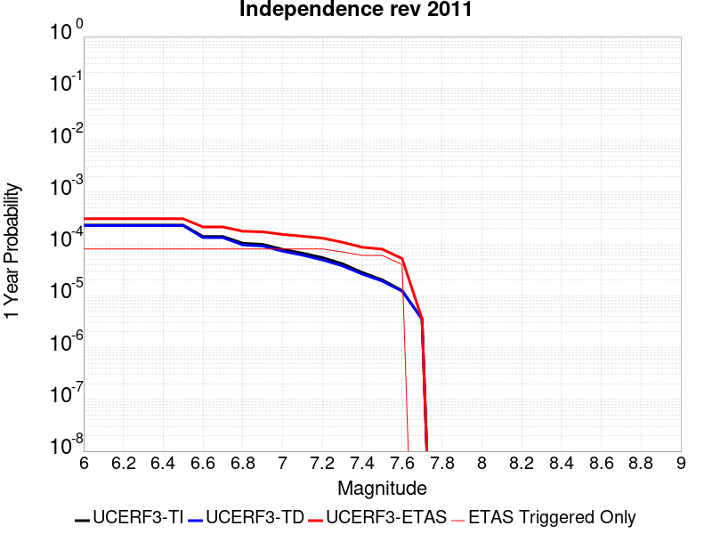 | 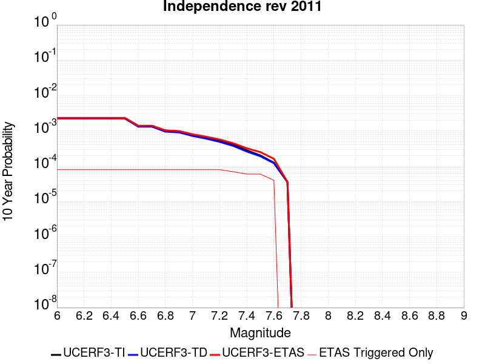 |

| Magnitude | 1 wk TI Prob | 1 wk TD Prob | 1 wk ETAS Prob | 1 wk ETAS/TD Gain | 1 wk ETAS Triggered Only | 1 mo TI Prob | 1 mo TD Prob | 1 mo ETAS Prob | 1 mo ETAS/TD Gain | 1 mo ETAS Triggered Only | 1 yr TI Prob | 1 yr TD Prob | 1 yr ETAS Prob | 1 yr ETAS/TD Gain | 1 yr ETAS Triggered Only | 10 yr TI Prob | 10 yr TD Prob | 10 yr ETAS Prob | 10 yr ETAS/TD Gain | 10 yr ETAS Triggered Only |
|-----|-----|-----|-----|-----|-----|-----|-----|-----|-----|-----|-----|-----|-----|-----|-----|-----|-----|-----|-----|-----|
| 6.0 | 4.422171E-6 | 4.326227E-6 | 7.432592E-5 | 17.180311 | 7.0E-5 | 1.8952025E-5 | 1.8540857E-5 | 8.853956E-5 | 4.7753754 | 7.0E-5 | 2.3071647E-4 | 2.2571455E-4 | 3.0569648E-4 | 1.35435 | 8.0E-5 | 0.0023047708 | 0.0022551466 | 0.002334966 | 1.0353944 | 8.0E-5 |
| 6.1 | 4.422171E-6 | 4.326227E-6 | 7.432592E-5 | 17.180311 | 7.0E-5 | 1.8952025E-5 | 1.8540857E-5 | 8.853956E-5 | 4.7753754 | 7.0E-5 | 2.3071647E-4 | 2.2571455E-4 | 3.0569648E-4 | 1.35435 | 8.0E-5 | 0.0023047708 | 0.0022551466 | 0.002334966 | 1.0353944 | 8.0E-5 |
| 6.2 | 4.422171E-6 | 4.326227E-6 | 7.432592E-5 | 17.180311 | 7.0E-5 | 1.8952025E-5 | 1.8540857E-5 | 8.853956E-5 | 4.7753754 | 7.0E-5 | 2.3071647E-4 | 2.2571455E-4 | 3.0569648E-4 | 1.35435 | 8.0E-5 | 0.0023047708 | 0.0022551466 | 0.002334966 | 1.0353944 | 8.0E-5 |
| 6.3 | 4.422171E-6 | 4.326227E-6 | 7.432592E-5 | 17.180311 | 7.0E-5 | 1.8952025E-5 | 1.8540857E-5 | 8.853956E-5 | 4.7753754 | 7.0E-5 | 2.3071647E-4 | 2.2571455E-4 | 3.0569648E-4 | 1.35435 | 8.0E-5 | 0.0023047708 | 0.0022551466 | 0.002334966 | 1.0353944 | 8.0E-5 |
| 6.4 | 4.422171E-6 | 4.326227E-6 | 7.432592E-5 | 17.180311 | 7.0E-5 | 1.8952025E-5 | 1.8540857E-5 | 8.853956E-5 | 4.7753754 | 7.0E-5 | 2.3071647E-4 | 2.2571455E-4 | 3.0569648E-4 | 1.35435 | 8.0E-5 | 0.0023047708 | 0.0022551466 | 0.002334966 | 1.0353944 | 8.0E-5 |
| 6.5 | 4.422171E-6 | 4.326227E-6 | 7.432592E-5 | 17.180311 | 7.0E-5 | 1.8952025E-5 | 1.8540857E-5 | 8.853956E-5 | 4.7753754 | 7.0E-5 | 2.3071647E-4 | 2.2571455E-4 | 3.0569648E-4 | 1.35435 | 8.0E-5 | 0.0023047708 | 0.0022551466 | 0.002334966 | 1.0353944 | 8.0E-5 |
| 6.6 | 2.663744E-6 | 2.5319862E-6 | 7.253181E-5 | 28.64621 | 7.0E-5 | 1.1415996E-5 | 1.0851327E-5 | 8.0850565E-5 | 7.450754 | 7.0E-5 | 1.3898089E-4 | 1.3210738E-4 | 2.1209681E-4 | 1.605488 | 8.0E-5 | 0.0013889399 | 0.0013203367 | 0.0014002312 | 1.0605106 | 8.0E-5 |
| 6.7 | 2.663744E-6 | 2.5319862E-6 | 7.253181E-5 | 28.64621 | 7.0E-5 | 1.1415996E-5 | 1.0851327E-5 | 8.0850565E-5 | 7.450754 | 7.0E-5 | 1.3898089E-4 | 1.3210738E-4 | 2.1209681E-4 | 1.605488 | 8.0E-5 | 0.0013889399 | 0.0013203367 | 0.0014002312 | 1.0605106 | 8.0E-5 |
| 6.8 | 1.9716529E-6 | 1.8322585E-6 | 7.183213E-5 | 39.204147 | 7.0E-5 | 8.449913E-6 | 7.852514E-6 | 7.785196E-5 | 9.914273 | 7.0E-5 | 1.0287284E-4 | 9.5600284E-5 | 1.7559264E-4 | 1.8367376 | 8.0E-5 | 0.0010282523 | 9.556045E-4 | 0.001035528 | 1.0836366 | 8.0E-5 |
| 6.9 | 1.8788617E-6 | 1.7429993E-6 | 7.174288E-5 | 41.160587 | 7.0E-5 | 8.0522395E-6 | 7.4699765E-6 | 7.7469456E-5 | 10.370776 | 7.0E-5 | 9.80316E-5 | 9.0943286E-5 | 1.7093601E-4 | 1.8795891 | 8.0E-5 | 9.798837E-4 | 9.0907275E-4 | 9.89E-4 | 1.0879217 | 8.0E-5 |
| 7.0 | 1.5045488E-6 | 1.3849503E-6 | 7.138486E-5 | 51.543255 | 7.0E-5 | 6.44805E-6 | 5.9354884E-6 | 7.593507E-5 | 12.793399 | 7.0E-5 | 7.8502184E-5 | 7.226223E-5 | 1.5225644E-4 | 2.1069992 | 8.0E-5 | 7.8474457E-4 | 7.2239246E-4 | 8.0233463E-4 | 1.1106632 | 8.0E-5 |
| 7.1 | 1.272341E-6 | 1.1625096E-6 | 7.116243E-5 | 61.21448 | 7.0E-5 | 5.4528787E-6 | 4.982175E-6 | 7.498183E-5 | 15.050018 | 7.0E-5 | 6.6386776E-5 | 6.0656326E-5 | 1.4065148E-4 | 2.3188262 | 8.0E-5 | 6.636695E-4 | 6.064009E-4 | 6.863524E-4 | 1.131846 | 8.0E-5 |
| 7.2 | 1.0416892E-6 | 9.4098806E-7 | 7.094092E-5 | 75.389824 | 7.0E-5 | 4.464375E-6 | 4.0328E-6 | 7.403252E-5 | 18.357597 | 7.0E-5 | 5.4352407E-5 | 4.909825E-5 | 1.2909432E-4 | 2.629306 | 8.0E-5 | 5.4339116E-4 | 4.9087586E-4 | 5.708366E-4 | 1.162894 | 8.0E-5 |
| 7.3 | 7.9450155E-7 | 7.235002E-7 | 6.0723458E-5 | 83.93012 | 6.0E-5 | 3.4050022E-6 | 3.1007114E-6 | 6.3100524E-5 | 20.350338 | 6.0E-5 | 4.1455114E-5 | 3.775052E-5 | 1.07747874E-4 | 2.8542092 | 7.0E-5 | 4.144738E-4 | 3.7744216E-4 | 4.4741575E-4 | 1.1853889 | 7.0E-5 |
| 7.4 | 5.3893444E-7 | 5.019512E-7 | 5.0501927E-5 | 100.61122 | 5.0E-5 | 2.309717E-6 | 2.1512178E-6 | 5.215111E-5 | 24.2426 | 5.0E-5 | 2.8120441E-5 | 2.6190766E-5 | 8.61892E-5 | 3.2908237 | 6.0E-5 | 2.8116882E-4 | 2.6187726E-4 | 3.2186153E-4 | 1.2290549 | 6.0E-5 |
| 7.5 | 3.8852085E-7 | 3.682554E-7 | 5.036824E-5 | 136.77528 | 5.0E-5 | 1.6650882E-6 | 1.5782365E-6 | 5.1578158E-5 | 32.68088 | 5.0E-5 | 2.027226E-5 | 1.9214862E-5 | 7.921371E-5 | 4.122523 | 6.0E-5 | 2.0270412E-4 | 1.9213221E-4 | 2.521207E-4 | 1.312225 | 6.0E-5 |
| 7.6 | 2.414929E-7 | 2.345755E-7 | 3.0234569E-5 | 128.89056 | 3.0E-5 | 1.0349692E-6 | 1.0053232E-6 | 3.1005293E-5 | 30.84112 | 3.0E-5 | 1.2600677E-5 | 1.2239742E-5 | 5.223925E-5 | 4.2680025 | 4.0E-5 | 1.2599962E-4 | 1.223908E-4 | 1.6238591E-4 | 1.326782 | 4.0E-5 |
| 7.7 | 6.8298014E-8 | 6.85897E-8 | 6.85897E-8 | 1.0 | 0.0 | 2.9270575E-7 | 2.9395582E-7 | 2.9395582E-7 | 1.0 | 0.0 | 3.5636867E-6 | 3.5789067E-6 | 3.5789067E-6 | 1.0 | 0.0 | 3.5636294E-5 | 3.5788536E-5 | 3.5788536E-5 | 1.0 | 0.0 |

## San Jacinto (Lytle Creek connector)
*[(top)](#table-of-contents)*

| 1 Week | 1 Month | 1 Year | 10 Year |
|-----|-----|-----|-----|
|  |  |  | 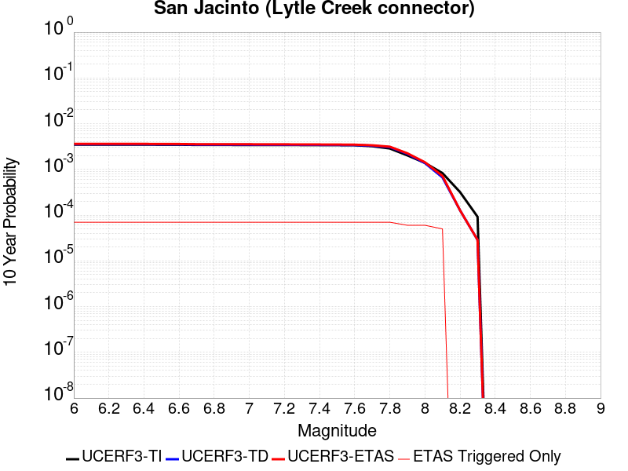 |

| Magnitude | 1 wk TI Prob | 1 wk TD Prob | 1 wk ETAS Prob | 1 wk ETAS/TD Gain | 1 wk ETAS Triggered Only | 1 mo TI Prob | 1 mo TD Prob | 1 mo ETAS Prob | 1 mo ETAS/TD Gain | 1 mo ETAS Triggered Only | 1 yr TI Prob | 1 yr TD Prob | 1 yr ETAS Prob | 1 yr ETAS/TD Gain | 1 yr ETAS Triggered Only | 10 yr TI Prob | 10 yr TD Prob | 10 yr ETAS Prob | 10 yr ETAS/TD Gain | 10 yr ETAS Triggered Only |
|-----|-----|-----|-----|-----|-----|-----|-----|-----|-----|-----|-----|-----|-----|-----|-----|-----|-----|-----|-----|-----|
| 6.0 | 6.693995E-6 | 6.660216E-6 | 7.665975E-5 | 11.510099 | 7.0E-5 | 2.8688235E-5 | 2.854347E-5 | 9.854147E-5 | 3.4523296 | 7.0E-5 | 3.492233E-4 | 3.4746144E-4 | 4.174371E-4 | 1.2013912 | 7.0E-5 | 0.00348675 | 0.0035493854 | 0.0036191368 | 1.0196518 | 7.0E-5 |
| 6.1 | 6.693995E-6 | 6.660216E-6 | 7.665975E-5 | 11.510099 | 7.0E-5 | 2.8688235E-5 | 2.854347E-5 | 9.854147E-5 | 3.4523296 | 7.0E-5 | 3.492233E-4 | 3.4746144E-4 | 4.174371E-4 | 1.2013912 | 7.0E-5 | 0.00348675 | 0.0035493854 | 0.0036191368 | 1.0196518 | 7.0E-5 |
| 6.2 | 6.693995E-6 | 6.660216E-6 | 7.665975E-5 | 11.510099 | 7.0E-5 | 2.8688235E-5 | 2.854347E-5 | 9.854147E-5 | 3.4523296 | 7.0E-5 | 3.492233E-4 | 3.4746144E-4 | 4.174371E-4 | 1.2013912 | 7.0E-5 | 0.00348675 | 0.0035493854 | 0.0036191368 | 1.0196518 | 7.0E-5 |
| 6.3 | 6.693995E-6 | 6.660216E-6 | 7.665975E-5 | 11.510099 | 7.0E-5 | 2.8688235E-5 | 2.854347E-5 | 9.854147E-5 | 3.4523296 | 7.0E-5 | 3.492233E-4 | 3.4746144E-4 | 4.174371E-4 | 1.2013912 | 7.0E-5 | 0.00348675 | 0.0035493854 | 0.0036191368 | 1.0196518 | 7.0E-5 |
| 6.4 | 6.693995E-6 | 6.660216E-6 | 7.665975E-5 | 11.510099 | 7.0E-5 | 2.8688235E-5 | 2.854347E-5 | 9.854147E-5 | 3.4523296 | 7.0E-5 | 3.492233E-4 | 3.4746144E-4 | 4.174371E-4 | 1.2013912 | 7.0E-5 | 0.00348675 | 0.0035493854 | 0.0036191368 | 1.0196518 | 7.0E-5 |
| 6.5 | 6.6561875E-6 | 6.6204343E-6 | 7.6619974E-5 | 11.573255 | 7.0E-5 | 2.8526205E-5 | 2.837298E-5 | 9.8371E-5 | 3.4670658 | 7.0E-5 | 3.472512E-4 | 3.4538636E-4 | 4.1536218E-4 | 1.2026016 | 7.0E-5 | 0.0034670907 | 0.003528701 | 0.0035984537 | 1.0197673 | 7.0E-5 |
| 6.6 | 6.6561875E-6 | 6.6204343E-6 | 7.6619974E-5 | 11.573255 | 7.0E-5 | 2.8526205E-5 | 2.837298E-5 | 9.8371E-5 | 3.4670658 | 7.0E-5 | 3.472512E-4 | 3.4538636E-4 | 4.1536218E-4 | 1.2026016 | 7.0E-5 | 0.0034670907 | 0.003528701 | 0.0035984537 | 1.0197673 | 7.0E-5 |
| 6.7 | 6.5802237E-6 | 6.539611E-6 | 7.653915E-5 | 11.703931 | 7.0E-5 | 2.8200653E-5 | 2.8026603E-5 | 9.802464E-5 | 3.497557 | 7.0E-5 | 3.4328885E-4 | 3.4117055E-4 | 4.1114667E-4 | 1.205106 | 7.0E-5 | 0.0034275902 | 0.0034866752 | 0.0035564313 | 1.0200064 | 7.0E-5 |
| 6.8 | 6.575632E-6 | 6.5341005E-6 | 7.6533644E-5 | 11.712957 | 7.0E-5 | 2.8180975E-5 | 2.8002989E-5 | 9.800103E-5 | 3.499663 | 7.0E-5 | 3.4304935E-4 | 3.4088313E-4 | 4.1085927E-4 | 1.205279 | 7.0E-5 | 0.0034252026 | 0.00348381 | 0.003553566 | 1.020023 | 7.0E-5 |
| 6.9 | 6.570433E-6 | 6.525495E-6 | 7.652504E-5 | 11.727086 | 7.0E-5 | 2.8158694E-5 | 2.7966107E-5 | 9.796415E-5 | 3.5029597 | 7.0E-5 | 3.4277816E-4 | 3.4043423E-4 | 4.104104E-4 | 1.2055497 | 7.0E-5 | 0.0034224992 | 0.0034793352 | 0.0035490918 | 1.0200487 | 7.0E-5 |
| 7.0 | 6.5643826E-6 | 6.515616E-6 | 7.6515156E-5 | 11.74335 | 7.0E-5 | 2.8132765E-5 | 2.792377E-5 | 9.792182E-5 | 3.5067549 | 7.0E-5 | 3.424626E-4 | 3.3991894E-4 | 4.0989515E-4 | 1.2058614 | 7.0E-5 | 0.0034193532 | 0.0034741985 | 0.0035439553 | 1.0200785 | 7.0E-5 |
| 7.1 | 6.557402E-6 | 6.5043278E-6 | 7.650387E-5 | 11.761995 | 7.0E-5 | 2.8102848E-5 | 2.7875392E-5 | 9.787344E-5 | 3.5111053 | 7.0E-5 | 3.4209844E-4 | 3.3933012E-4 | 4.0930638E-4 | 1.2062188 | 7.0E-5 | 0.0034157229 | 0.0034683298 | 0.003538087 | 1.0201126 | 7.0E-5 |
| 7.2 | 6.546394E-6 | 6.4862943E-6 | 7.648584E-5 | 11.791916 | 7.0E-5 | 2.8055672E-5 | 2.7798109E-5 | 9.779616E-5 | 3.518087 | 7.0E-5 | 3.4152428E-4 | 3.3838948E-4 | 4.083658E-4 | 1.2067922 | 7.0E-5 | 0.0034099987 | 0.0034589572 | 0.0035287149 | 1.0201674 | 7.0E-5 |
| 7.3 | 6.5364216E-6 | 6.4670803E-6 | 7.6466626E-5 | 11.823979 | 7.0E-5 | 2.8012933E-5 | 2.7715765E-5 | 9.7713826E-5 | 3.5255685 | 7.0E-5 | 3.4100408E-4 | 3.3738726E-4 | 4.0736364E-4 | 1.2074068 | 7.0E-5 | 0.003404813 | 0.0034489788 | 0.0035187374 | 1.0202259 | 7.0E-5 |
| 7.4 | 6.5269523E-6 | 6.4481674E-6 | 7.6447715E-5 | 11.855727 | 7.0E-5 | 2.7972354E-5 | 2.7634711E-5 | 9.763278E-5 | 3.5329762 | 7.0E-5 | 3.4051016E-4 | 3.3640073E-4 | 4.063772E-4 | 1.2080152 | 7.0E-5 | 0.0033998888 | 0.003439161 | 0.00350892 | 1.0202838 | 7.0E-5 |
| 7.5 | 6.5111835E-6 | 6.424442E-6 | 7.6423996E-5 | 11.895818 | 7.0E-5 | 2.7904773E-5 | 2.7533031E-5 | 9.7531105E-5 | 3.5423307 | 7.0E-5 | 3.3968766E-4 | 3.3516317E-4 | 4.0513973E-4 | 1.2087835 | 7.0E-5 | 0.0033916887 | 0.003426834 | 0.0034965943 | 1.020357 | 7.0E-5 |
| 7.6 | 6.4768806E-6 | 6.383551E-6 | 7.6383105E-5 | 11.965613 | 7.0E-5 | 2.7757764E-5 | 2.735779E-5 | 9.735587E-5 | 3.5586162 | 7.0E-5 | 3.3789838E-4 | 3.3303024E-4 | 4.0300694E-4 | 1.2101212 | 7.0E-5 | 0.0033738504 | 0.0034055663 | 0.0034753277 | 1.0204846 | 7.0E-5 |
| 7.7 | 6.1655364E-6 | 6.1760365E-6 | 7.61756E-5 | 12.33406 | 7.0E-5 | 2.642346E-5 | 2.646846E-5 | 9.64666E-5 | 3.644587 | 7.0E-5 | 3.2165812E-4 | 3.2220592E-4 | 3.9218334E-4 | 1.2171824 | 7.0E-5 | 0.0032119295 | 0.0032971818 | 0.003366951 | 1.0211602 | 7.0E-5 |
| 7.8 | 5.5043524E-6 | 5.737097E-6 | 7.5736694E-5 | 13.201223 | 7.0E-5 | 2.3589868E-5 | 2.4587327E-5 | 9.458561E-5 | 3.8469253 | 7.0E-5 | 2.871688E-4 | 2.9930964E-4 | 3.692887E-4 | 1.2338015 | 7.0E-5 | 0.0028679797 | 0.0030672832 | 0.0031370686 | 1.0227515 | 7.0E-5 |
| 7.9 | 3.889249E-6 | 4.076761E-6 | 6.4076514E-5 | 15.717506 | 6.0E-5 | 1.6668104E-5 | 1.7471715E-5 | 7.7470664E-5 | 4.4340615 | 6.0E-5 | 2.0291525E-4 | 2.1269741E-4 | 2.7268464E-4 | 1.2820308 | 6.0E-5 | 0.0020273007 | 0.0021943315 | 0.0022541997 | 1.0272832 | 6.0E-5 |
| 8.0 | 2.668535E-6 | 2.5315155E-6 | 6.253136E-5 | 24.701159 | 6.0E-5 | 1.1436528E-5 | 1.0849307E-5 | 7.0848655E-5 | 6.530247 | 6.0E-5 | 1.3923083E-4 | 1.3208234E-4 | 1.9207441E-4 | 1.4542022 | 6.0E-5 | 0.0013914363 | 0.0013757964 | 0.0014357138 | 1.0435511 | 6.0E-5 |
| 8.1 | 1.5911459E-6 | 1.218661E-6 | 5.12186E-5 | 42.028587 | 5.0E-5 | 6.8191785E-6 | 5.2228224E-6 | 5.522256E-5 | 10.573318 | 5.0E-5 | 8.3020335E-5 | 6.3586034E-5 | 1.1358285E-4 | 1.7862862 | 5.0E-5 | 8.298933E-4 | 6.6932244E-4 | 7.19289E-4 | 1.0746524 | 5.0E-5 |
| 8.2 | 6.1294963E-7 | 2.1812275E-7 | 2.1812275E-7 | 1.0 | 0.0 | 2.6269242E-6 | 9.3481145E-7 | 9.3481145E-7 | 1.0 | 0.0 | 3.1982334E-5 | 1.138127E-5 | 1.138127E-5 | 1.0 | 0.0 | 3.1977732E-4 | 1.2784546E-4 | 1.2784546E-4 | 1.0 | 0.0 |
| 8.3 | 1.762871E-7 | 4.7546838E-8 | 4.7546838E-8 | 1.0 | 0.0 | 7.5551594E-7 | 2.0377215E-7 | 2.0377215E-7 | 1.0 | 0.0 | 9.1983675E-6 | 2.480923E-6 | 2.480923E-6 | 1.0 | 0.0 | 9.197987E-5 | 2.868753E-5 | 2.868753E-5 | 1.0 | 0.0 |

## San Jacinto (Borrego)
*[(top)](#table-of-contents)*

| 1 Week | 1 Month | 1 Year | 10 Year |
|-----|-----|-----|-----|
|  | 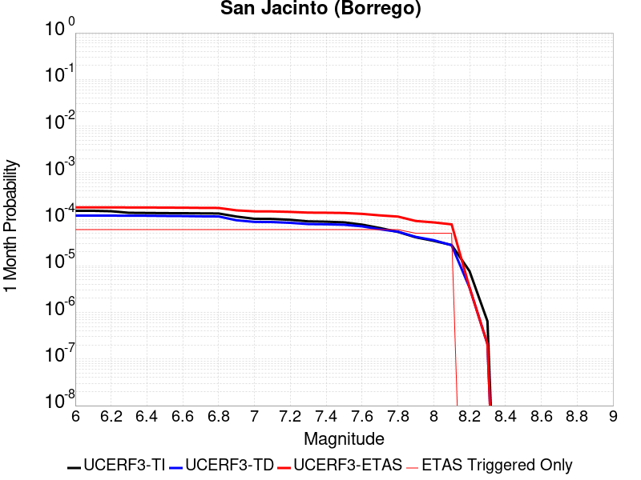 |  |  |

| Magnitude | 1 wk TI Prob | 1 wk TD Prob | 1 wk ETAS Prob | 1 wk ETAS/TD Gain | 1 wk ETAS Triggered Only | 1 mo TI Prob | 1 mo TD Prob | 1 mo ETAS Prob | 1 mo ETAS/TD Gain | 1 mo ETAS Triggered Only | 1 yr TI Prob | 1 yr TD Prob | 1 yr ETAS Prob | 1 yr ETAS/TD Gain | 1 yr ETAS Triggered Only | 10 yr TI Prob | 10 yr TD Prob | 10 yr ETAS Prob | 10 yr ETAS/TD Gain | 10 yr ETAS Triggered Only |
|-----|-----|-----|-----|-----|-----|-----|-----|-----|-----|-----|-----|-----|-----|-----|-----|-----|-----|-----|-----|-----|
| 6.0 | 3.543992E-5 | 2.7926513E-5 | 7.792511E-5 | 2.7903633 | 5.0E-5 | 1.5187653E-4 | 1.1967963E-4 | 1.7967245E-4 | 1.5012784 | 6.0E-5 | 0.0018475284 | 0.0014561379 | 0.0015160504 | 1.0411448 | 6.0E-5 | 0.018322436 | 0.014869647 | 0.014938607 | 1.0046376 | 7.0E-5 |
| 6.1 | 3.542281E-5 | 2.7926513E-5 | 7.792511E-5 | 2.7903633 | 5.0E-5 | 1.5180321E-4 | 1.1967963E-4 | 1.7967245E-4 | 1.5012784 | 6.0E-5 | 0.0018466372 | 0.0014561379 | 0.0015160504 | 1.0411448 | 6.0E-5 | 0.018313672 | 0.014869647 | 0.014938607 | 1.0046376 | 7.0E-5 |
| 6.2 | 3.4688688E-5 | 2.7926511E-5 | 7.792511E-5 | 2.7903633 | 5.0E-5 | 1.4865733E-4 | 1.1967963E-4 | 1.7967245E-4 | 1.5012784 | 6.0E-5 | 0.0018084005 | 0.0014561379 | 0.0015160504 | 1.0411448 | 6.0E-5 | 0.017937548 | 0.014869647 | 0.014938606 | 1.0046376 | 7.0E-5 |
| 6.3 | 3.2087122E-5 | 2.7771865E-5 | 7.777048E-5 | 2.8003333 | 5.0E-5 | 1.3750899E-4 | 1.1901691E-4 | 1.7900977E-4 | 1.50407 | 6.0E-5 | 0.0016728862 | 0.00144808 | 0.0015079931 | 1.0413742 | 6.0E-5 | 0.016603488 | 0.014790683 | 0.0148596475 | 1.0046628 | 7.0E-5 |
| 6.4 | 3.1828724E-5 | 2.7738852E-5 | 7.7737466E-5 | 2.802476 | 5.0E-5 | 1.364017E-4 | 1.1887544E-4 | 1.7886831E-4 | 1.50467 | 6.0E-5 | 0.0016594254 | 0.0014463598 | 0.001506273 | 1.0414234 | 6.0E-5 | 0.016470885 | 0.014773762 | 0.014842727 | 1.0046681 | 7.0E-5 |
| 6.5 | 3.1563577E-5 | 2.747857E-5 | 7.74772E-5 | 2.8195498 | 5.0E-5 | 1.3526545E-4 | 1.1776006E-4 | 1.7775298E-4 | 1.5094507 | 6.0E-5 | 0.0016456128 | 0.0014327979 | 0.001492712 | 1.0418161 | 6.0E-5 | 0.0163348 | 0.014640348 | 0.014709323 | 1.0047113 | 7.0E-5 |
| 6.6 | 3.1467625E-5 | 2.7322796E-5 | 7.732143E-5 | 2.8299239 | 5.0E-5 | 1.3485427E-4 | 1.1709251E-4 | 1.7708549E-4 | 1.5123553 | 6.0E-5 | 0.0016406142 | 0.0014246812 | 0.0014845957 | 1.0420547 | 6.0E-5 | 0.016285548 | 0.014560594 | 0.014629575 | 1.0047375 | 7.0E-5 |
| 6.7 | 3.1223695E-5 | 2.6940816E-5 | 7.693947E-5 | 2.85587 | 5.0E-5 | 1.3380898E-4 | 1.15455594E-4 | 1.7544867E-4 | 1.5196203 | 6.0E-5 | 0.0016279068 | 0.0014047775 | 0.0014646933 | 1.0426514 | 6.0E-5 | 0.01616033 | 0.014364966 | 0.01443396 | 1.004803 | 7.0E-5 |
| 6.8 | 3.1015585E-5 | 2.6761822E-5 | 7.676049E-5 | 2.8682833 | 5.0E-5 | 1.3291716E-4 | 1.1468855E-4 | 1.7468167E-4 | 1.523096 | 6.0E-5 | 0.001617065 | 0.0013954508 | 0.0014553671 | 1.0429368 | 6.0E-5 | 0.016053487 | 0.014272246 | 0.014341247 | 1.0048347 | 7.0E-5 |
| 6.9 | 2.6641965E-5 | 2.2184247E-5 | 7.218314E-5 | 3.2538016 | 5.0E-5 | 1.1417485E-4 | 9.50719E-5 | 1.550662E-4 | 1.6310413 | 6.0E-5 | 0.0013891924 | 0.0011568897 | 0.0012168202 | 1.0518032 | 6.0E-5 | 0.0138054015 | 0.011882438 | 0.011951607 | 1.005821 | 7.0E-5 |
| 7.0 | 2.3854353E-5 | 2.0479023E-5 | 7.0477996E-5 | 3.4414728 | 5.0E-5 | 1.02228936E-4 | 8.77643E-5 | 1.4775904E-4 | 1.6835892 | 6.0E-5 | 0.0012439266 | 0.0010680092 | 0.0011279451 | 1.0561193 | 6.0E-5 | 0.012369866 | 0.0109828 | 0.011052032 | 1.0063035 | 7.0E-5 |
| 7.1 | 2.3672901E-5 | 2.031551E-5 | 7.03145E-5 | 3.4611237 | 5.0E-5 | 1.0145135E-4 | 8.7063585E-5 | 1.4705837E-4 | 1.6890916 | 6.0E-5 | 0.0012344702 | 0.0010594862 | 0.0011194226 | 1.0565712 | 6.0E-5 | 0.0122763505 | 0.010897976 | 0.010967214 | 1.0063533 | 7.0E-5 |
| 7.2 | 2.2717244E-5 | 1.9542893E-5 | 6.9541915E-5 | 3.558425 | 5.0E-5 | 9.735599E-5 | 8.375258E-5 | 1.4374756E-4 | 1.7163359 | 6.0E-5 | 0.0011846646 | 0.001019213 | 0.0010791519 | 1.0588089 | 6.0E-5 | 0.01178369 | 0.010495341 | 0.010564607 | 1.0065997 | 7.0E-5 |
| 7.3 | 2.1016205E-5 | 1.8384526E-5 | 6.8383604E-5 | 3.7196286 | 5.0E-5 | 9.006634E-5 | 7.878846E-5 | 1.3878373E-4 | 1.761473 | 6.0E-5 | 0.001096006 | 9.5882936E-4 | 0.0010187718 | 1.0625163 | 6.0E-5 | 0.010906163 | 0.009890967 | 0.009960274 | 1.0070071 | 7.0E-5 |
| 7.4 | 2.0683625E-5 | 1.8187047E-5 | 6.8186135E-5 | 3.7491593 | 5.0E-5 | 8.86411E-5 | 7.794217E-5 | 1.3793749E-4 | 1.7697415 | 6.0E-5 | 0.001078671 | 9.485349E-4 | 0.0010084779 | 1.0631955 | 6.0E-5 | 0.010734501 | 0.009787692 | 0.009857007 | 1.0070819 | 7.0E-5 |
| 7.5 | 1.9993966E-5 | 1.7782075E-5 | 6.7781184E-5 | 3.8117704 | 5.0E-5 | 8.568561E-5 | 7.620667E-5 | 1.362021E-4 | 1.7872726 | 6.0E-5 | 0.001042723 | 9.2742336E-4 | 9.873677E-4 | 1.0646354 | 6.0E-5 | 0.010378438 | 0.009574614 | 0.009643944 | 1.007241 | 7.0E-5 |
| 7.6 | 1.788966E-5 | 1.6435291E-5 | 6.643447E-5 | 4.042184 | 5.0E-5 | 7.666772E-5 | 7.043507E-5 | 1.3043084E-4 | 1.8517884 | 6.0E-5 | 9.3302975E-4 | 8.572113E-4 | 9.171599E-4 | 1.0699344 | 6.0E-5 | 0.00929122 | 0.008866487 | 0.008935866 | 1.0078249 | 7.0E-5 |
| 7.7 | 1.5125781E-5 | 1.4237377E-5 | 6.4236665E-5 | 4.5118327 | 5.0E-5 | 6.4823165E-5 | 6.1015908E-5 | 1.2101225E-4 | 1.9832901 | 6.0E-5 | 7.889362E-4 | 7.426163E-4 | 8.0257177E-4 | 1.0807354 | 6.0E-5 | 0.007861412 | 0.0077142045 | 0.0077836644 | 1.0090041 | 7.0E-5 |
| 7.8 | 1.250089E-5 | 1.26304985E-5 | 6.2629864E-5 | 4.958622 | 5.0E-5 | 5.3574146E-5 | 5.412959E-5 | 1.1412634E-4 | 2.108391 | 6.0E-5 | 6.5207E-4 | 6.588291E-4 | 7.187896E-4 | 1.0910107 | 6.0E-5 | 0.006501599 | 0.0068677636 | 0.006937283 | 1.0101225 | 7.0E-5 |
| 7.9 | 9.561E-6 | 9.754616E-6 | 5.975413E-5 | 6.125728 | 5.0E-5 | 4.0975072E-5 | 4.1804833E-5 | 9.180274E-5 | 2.195984 | 5.0E-5 | 4.987573E-4 | 5.088555E-4 | 5.588301E-4 | 1.0982097 | 5.0E-5 | 0.0049763937 | 0.0053523467 | 0.0054120254 | 1.01115 | 6.0E-5 |
| 8.0 | 8.01699E-6 | 8.293488E-6 | 5.8293073E-5 | 7.0287766 | 5.0E-5 | 3.4358076E-5 | 3.554304E-5 | 8.554126E-5 | 2.4066954 | 5.0E-5 | 4.1822926E-4 | 4.3265108E-4 | 4.8262943E-4 | 1.1155165 | 5.0E-5 | 0.0041744304 | 0.004573375 | 0.0046331007 | 1.0130594 | 6.0E-5 |
| 8.1 | 6.541947E-6 | 6.4622354E-6 | 5.646191E-5 | 8.73721 | 5.0E-5 | 2.8036617E-5 | 2.7695003E-5 | 7.769362E-5 | 2.8053298 | 5.0E-5 | 3.4129233E-4 | 3.37135E-4 | 3.8711814E-4 | 1.1482586 | 5.0E-5 | 0.0034076865 | 0.0035806994 | 0.0036404845 | 1.0166965 | 6.0E-5 |
| 8.2 | 1.7968189E-6 | 7.9713476E-7 | 7.9713476E-7 | 1.0 | 0.0 | 7.70063E-6 | 3.4162877E-6 | 3.4162877E-6 | 1.0 | 0.0 | 9.3751136E-5 | 4.159253E-5 | 4.159253E-5 | 1.0 | 0.0 | 9.371159E-4 | 4.712058E-4 | 4.712058E-4 | 1.0 | 0.0 |
| 8.3 | 1.5167889E-7 | 4.897714E-8 | 4.897714E-8 | 1.0 | 0.0 | 6.500522E-7 | 2.09902E-7 | 2.09902E-7 | 1.0 | 0.0 | 7.9143565E-6 | 2.5555544E-6 | 2.5555544E-6 | 1.0 | 0.0 | 7.914075E-5 | 2.969505E-5 | 2.969505E-5 | 1.0 | 0.0 |

## Chino alt 1
*[(top)](#table-of-contents)*

| 1 Week | 1 Month | 1 Year | 10 Year |
|-----|-----|-----|-----|
| 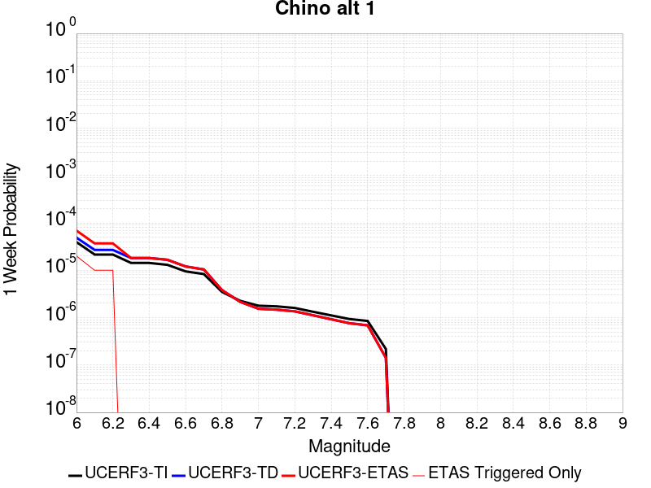 |  |  |  |

| Magnitude | 1 wk TI Prob | 1 wk TD Prob | 1 wk ETAS Prob | 1 wk ETAS/TD Gain | 1 wk ETAS Triggered Only | 1 mo TI Prob | 1 mo TD Prob | 1 mo ETAS Prob | 1 mo ETAS/TD Gain | 1 mo ETAS Triggered Only | 1 yr TI Prob | 1 yr TD Prob | 1 yr ETAS Prob | 1 yr ETAS/TD Gain | 1 yr ETAS Triggered Only | 10 yr TI Prob | 10 yr TD Prob | 10 yr ETAS Prob | 10 yr ETAS/TD Gain | 10 yr ETAS Triggered Only |
|-----|-----|-----|-----|-----|-----|-----|-----|-----|-----|-----|-----|-----|-----|-----|-----|-----|-----|-----|-----|-----|
| 6.0 | 3.939946E-5 | 4.8948554E-5 | 6.894758E-5 | 1.4085722 | 2.0E-5 | 1.6884391E-4 | 2.097656E-4 | 2.397593E-4 | 1.1429868 | 3.0E-5 | 0.0020537362 | 0.0025513945 | 0.0025813181 | 1.0117283 | 3.0E-5 | 0.020348595 | 0.025277847 | 0.025346078 | 1.0026993 | 7.0E-5 |
| 6.1 | 2.1505624E-5 | 2.6879026E-5 | 3.6878755E-5 | 1.3720273 | 1.0E-5 | 9.2163704E-5 | 1.1519137E-4 | 1.2519021E-4 | 1.086802 | 1.0E-5 | 0.0011215154 | 0.001401664 | 0.00141165 | 1.0071244 | 1.0E-5 | 0.011158722 | 0.013945141 | 0.0139747225 | 1.0021213 | 3.0E-5 |
| 6.2 | 2.1505624E-5 | 2.6879026E-5 | 3.6878755E-5 | 1.3720273 | 1.0E-5 | 9.2163704E-5 | 1.1519137E-4 | 1.2519021E-4 | 1.086802 | 1.0E-5 | 0.0011215154 | 0.001401664 | 0.00141165 | 1.0071244 | 1.0E-5 | 0.011158722 | 0.013945141 | 0.0139747225 | 1.0021213 | 3.0E-5 |
| 6.3 | 1.4290785E-5 | 1.8165128E-5 | 1.8165128E-5 | 1.0 | 0.0 | 6.1244784E-5 | 7.784848E-5 | 7.784848E-5 | 1.0 | 0.0 | 7.454001E-4 | 9.4743853E-4 | 9.4743853E-4 | 1.0 | 0.0 | 0.007429048 | 0.0094444575 | 0.009464269 | 1.0020976 | 2.0E-5 |
| 6.4 | 1.4290785E-5 | 1.8165128E-5 | 1.8165128E-5 | 1.0 | 0.0 | 6.1244784E-5 | 7.784848E-5 | 7.784848E-5 | 1.0 | 0.0 | 7.454001E-4 | 9.4743853E-4 | 9.4743853E-4 | 1.0 | 0.0 | 0.007429048 | 0.0094444575 | 0.009464269 | 1.0020976 | 2.0E-5 |
| 6.5 | 1.3017944E-5 | 1.6652088E-5 | 1.6652088E-5 | 1.0 | 0.0 | 5.5789995E-5 | 7.136439E-5 | 7.136439E-5 | 1.0 | 0.0 | 6.790315E-4 | 8.685589E-4 | 8.685589E-4 | 1.0 | 0.0 | 0.0067696036 | 0.008661949 | 0.008681776 | 1.0022889 | 2.0E-5 |
| 6.6 | 9.470016E-6 | 1.2039424E-5 | 1.2039424E-5 | 1.0 | 0.0 | 4.058515E-5 | 5.1596704E-5 | 5.1596704E-5 | 1.0 | 0.0 | 4.940122E-4 | 6.280428E-4 | 6.280428E-4 | 1.0 | 0.0 | 0.004929154 | 0.0062718987 | 0.006281836 | 1.0015844 | 1.0E-5 |
| 6.7 | 8.314155E-6 | 1.0407736E-5 | 1.0407736E-5 | 1.0 | 0.0 | 3.5631605E-5 | 4.4604003E-5 | 4.4604003E-5 | 1.0 | 0.0 | 4.3372845E-4 | 5.429507E-4 | 5.429507E-4 | 1.0 | 0.0 | 0.004328829 | 0.005425775 | 0.005435721 | 1.0018331 | 1.0E-5 |
| 6.8 | 3.4856364E-6 | 3.8133708E-6 | 3.8133708E-6 | 1.0 | 0.0 | 1.4938357E-5 | 1.6342927E-5 | 1.6342927E-5 | 1.0 | 0.0 | 1.8185932E-4 | 1.9895904E-4 | 1.9895904E-4 | 1.0 | 0.0 | 0.0018171056 | 0.0019894864 | 0.0019894864 | 1.0 | 0.0 |
| 6.9 | 2.2645952E-6 | 2.1529022E-6 | 2.1529022E-6 | 1.0 | 0.0 | 9.705372E-6 | 9.226692E-6 | 9.226692E-6 | 1.0 | 0.0 | 1.18156495E-4 | 1.123294E-4 | 1.123294E-4 | 1.0 | 0.0 | 0.0011809369 | 0.0011233423 | 0.0011233423 | 1.0 | 0.0 |
| 7.0 | 1.7864003E-6 | 1.5430785E-6 | 1.5430785E-6 | 1.0 | 0.0 | 7.655979E-6 | 6.613177E-6 | 6.613177E-6 | 1.0 | 0.0 | 9.3207556E-5 | 8.051251E-5 | 8.051251E-5 | 1.0 | 0.0 | 9.316847E-4 | 8.0528046E-4 | 8.0528046E-4 | 1.0 | 0.0 |
| 7.1 | 1.7315456E-6 | 1.4733511E-6 | 1.4733511E-6 | 1.0 | 0.0 | 7.420889E-6 | 6.3143466E-6 | 6.3143466E-6 | 1.0 | 0.0 | 9.034557E-5 | 7.6874516E-5 | 7.6874516E-5 | 1.0 | 0.0 | 9.0308854E-4 | 7.6891703E-4 | 7.6891703E-4 | 1.0 | 0.0 |
| 7.2 | 1.6008337E-6 | 1.3574215E-6 | 1.3574215E-6 | 1.0 | 0.0 | 6.860698E-6 | 5.817508E-6 | 5.817508E-6 | 1.0 | 0.0 | 8.352579E-5 | 7.082591E-5 | 7.082591E-5 | 1.0 | 0.0 | 8.34944E-4 | 7.0845755E-4 | 7.0845755E-4 | 1.0 | 0.0 |
| 7.3 | 1.3320939E-6 | 1.121782E-6 | 1.121782E-6 | 1.0 | 0.0 | 5.7089615E-6 | 4.807629E-6 | 4.807629E-6 | 1.0 | 0.0 | 6.9504385E-5 | 5.8531357E-5 | 5.8531357E-5 | 1.0 | 0.0 | 6.9482654E-4 | 5.8530393E-4 | 5.8530393E-4 | 1.0 | 0.0 |
| 7.4 | 1.114294E-6 | 9.237111E-7 | 9.237111E-7 | 1.0 | 0.0 | 4.775537E-6 | 3.958756E-6 | 3.958756E-6 | 1.0 | 0.0 | 5.8140613E-5 | 4.8196827E-5 | 4.8196827E-5 | 1.0 | 0.0 | 5.81254E-4 | 4.8188053E-4 | 4.8188053E-4 | 1.0 | 0.0 |
| 7.5 | 9.354081E-7 | 7.6234323E-7 | 7.6234323E-7 | 1.0 | 0.0 | 4.0088858E-6 | 3.2671815E-6 | 3.2671815E-6 | 1.0 | 0.0 | 4.8807087E-5 | 3.9777242E-5 | 3.9777242E-5 | 1.0 | 0.0 | 4.879637E-4 | 3.977046E-4 | 3.977046E-4 | 1.0 | 0.0 |
| 7.6 | 8.521771E-7 | 6.88071E-7 | 6.88071E-7 | 1.0 | 0.0 | 3.6521824E-6 | 2.9488726E-6 | 2.9488726E-6 | 1.0 | 0.0 | 4.4464414E-5 | 3.5901965E-5 | 3.5901965E-5 | 1.0 | 0.0 | 4.4455516E-4 | 3.589648E-4 | 3.589648E-4 | 1.0 | 0.0 |
| 7.7 | 2.1803626E-7 | 1.418649E-7 | 1.418649E-7 | 1.0 | 0.0 | 9.344408E-7 | 6.079923E-7 | 6.079923E-7 | 1.0 | 0.0 | 1.1376757E-5 | 7.4022914E-6 | 7.4022914E-6 | 1.0 | 0.0 | 1.13761744E-4 | 7.402141E-5 | 7.402141E-5 | 1.0 | 0.0 |

## Imperial
*[(top)](#table-of-contents)*

| 1 Week | 1 Month | 1 Year | 10 Year |
|-----|-----|-----|-----|
|  |  | 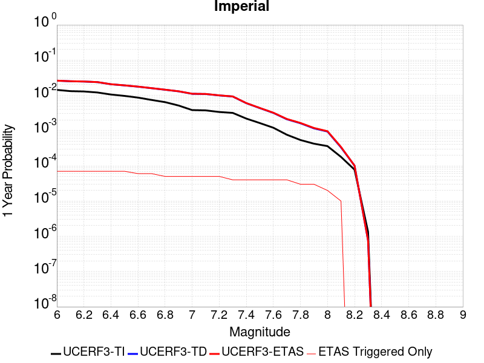 |  |

| Magnitude | 1 wk TI Prob | 1 wk TD Prob | 1 wk ETAS Prob | 1 wk ETAS/TD Gain | 1 wk ETAS Triggered Only | 1 mo TI Prob | 1 mo TD Prob | 1 mo ETAS Prob | 1 mo ETAS/TD Gain | 1 mo ETAS Triggered Only | 1 yr TI Prob | 1 yr TD Prob | 1 yr ETAS Prob | 1 yr ETAS/TD Gain | 1 yr ETAS Triggered Only | 10 yr TI Prob | 10 yr TD Prob | 10 yr ETAS Prob | 10 yr ETAS/TD Gain | 10 yr ETAS Triggered Only |
|-----|-----|-----|-----|-----|-----|-----|-----|-----|-----|-----|-----|-----|-----|-----|-----|-----|-----|-----|-----|-----|
| 6.0 | 2.7496446E-4 | 5.0552754E-4 | 5.654972E-4 | 1.1186279 | 6.0E-5 | 0.0011778869 | 0.002164787 | 0.0022346354 | 1.0322658 | 7.0E-5 | 0.0142467655 | 0.026038699 | 0.026106875 | 1.0026183 | 7.0E-5 | 0.13367249 | 0.2280438 | 0.22809783 | 1.000237 | 7.0E-5 |
| 6.1 | 2.5356023E-4 | 4.8656776E-4 | 5.4653856E-4 | 1.1232527 | 6.0E-5 | 0.001086234 | 0.0020836622 | 0.0021535165 | 1.0335248 | 7.0E-5 | 0.013144928 | 0.025071215 | 0.02513946 | 1.002722 | 7.0E-5 | 0.123940155 | 0.21947981 | 0.21953444 | 1.0002489 | 7.0E-5 |
| 6.2 | 2.4820742E-4 | 4.7752203E-4 | 5.374934E-4 | 1.1255887 | 6.0E-5 | 0.0010633124 | 0.0020449557 | 0.0021148126 | 1.0341606 | 7.0E-5 | 0.01286919 | 0.024611235 | 0.024679512 | 1.0027742 | 7.0E-5 | 0.12148927 | 0.21598552 | 0.2160404 | 1.0002542 | 7.0E-5 |
| 6.3 | 2.3205351E-4 | 4.5890483E-4 | 5.188773E-4 | 1.130686 | 6.0E-5 | 9.94136E-4 | 0.0019652895 | 0.002035152 | 1.0355482 | 7.0E-5 | 0.012036599 | 0.02366133 | 0.023729675 | 1.0028884 | 7.0E-5 | 0.11405133 | 0.20793462 | 0.20799007 | 1.0002667 | 7.0E-5 |
| 6.4 | 2.0304754E-4 | 3.987652E-4 | 4.5874127E-4 | 1.1504045 | 6.0E-5 | 8.6991355E-4 | 0.0017078889 | 0.0017777694 | 1.0409163 | 7.0E-5 | 0.010539869 | 0.020595672 | 0.02066423 | 1.0033288 | 7.0E-5 | 0.100537635 | 0.1850669 | 0.18512394 | 1.0003083 | 7.0E-5 |
| 6.5 | 1.854992E-4 | 3.6988858E-4 | 4.298664E-4 | 1.162151 | 6.0E-5 | 7.9475436E-4 | 0.0015842861 | 0.0016541752 | 1.044114 | 7.0E-5 | 0.009633281 | 0.01911948 | 0.019188143 | 1.0035912 | 7.0E-5 | 0.0922623 | 0.173298 | 0.17335588 | 1.0003339 | 7.0E-5 |
| 6.6 | 1.6586106E-4 | 3.403506E-4 | 4.003302E-4 | 1.1762288 | 6.0E-5 | 7.106394E-4 | 0.0014578402 | 0.0015177528 | 1.0410968 | 6.0E-5 | 0.008617763 | 0.01760642 | 0.017665364 | 1.0033479 | 6.0E-5 | 0.08291132 | 0.16077545 | 0.1608258 | 1.0003132 | 6.0E-5 |
| 6.7 | 1.4224656E-4 | 3.076692E-4 | 3.6765073E-4 | 1.1949546 | 6.0E-5 | 6.094856E-4 | 0.001317924 | 0.001377845 | 1.0454662 | 6.0E-5 | 0.0073952693 | 0.015929576 | 0.015988622 | 1.0037066 | 6.0E-5 | 0.07153955 | 0.14648417 | 0.14653538 | 1.0003496 | 6.0E-5 |
| 6.8 | 1.2317259E-4 | 2.779122E-4 | 3.2789828E-4 | 1.179863 | 5.0E-5 | 5.2777573E-4 | 0.0011905148 | 0.0012404552 | 1.0419487 | 5.0E-5 | 0.0064067547 | 0.0143995695 | 0.0144488495 | 1.0034224 | 5.0E-5 | 0.06225166 | 0.13293684 | 0.13298018 | 1.0003262 | 5.0E-5 |
| 6.9 | 9.859898E-5 | 2.5014306E-4 | 3.0013054E-4 | 1.1998357 | 5.0E-5 | 4.2249862E-4 | 0.0010716055 | 0.0011215518 | 1.0466089 | 5.0E-5 | 0.0051317946 | 0.012969712 | 0.0130190635 | 1.0038052 | 5.0E-5 | 0.05014893 | 0.11940631 | 0.119450346 | 1.0003687 | 5.0E-5 |
| 7.0 | 7.3191884E-5 | 2.1266776E-4 | 2.6265712E-4 | 1.2350585 | 5.0E-5 | 3.136418E-4 | 9.1111806E-4 | 9.610725E-4 | 1.0548276 | 5.0E-5 | 0.003811904 | 0.011037128 | 0.011086576 | 1.0044801 | 5.0E-5 | 0.037471764 | 0.10206493 | 0.10210982 | 1.0004399 | 5.0E-5 |
| 7.1 | 7.1760296E-5 | 2.0968143E-4 | 2.5967092E-4 | 1.238407 | 5.0E-5 | 3.0750787E-4 | 8.983284E-4 | 9.482834E-4 | 1.055609 | 5.0E-5 | 0.003737482 | 0.010882978 | 0.010932434 | 1.0045444 | 5.0E-5 | 0.03675245 | 0.10070146 | 0.10074642 | 1.0004466 | 5.0E-5 |
| 7.2 | 6.46614E-5 | 1.9136685E-4 | 2.413573E-4 | 1.2612282 | 5.0E-5 | 2.7709085E-4 | 8.1988896E-4 | 8.6984795E-4 | 1.0609338 | 5.0E-5 | 0.0033683628 | 0.0099370815 | 0.009986585 | 1.0049816 | 5.0E-5 | 0.033177625 | 0.09250898 | 0.09255435 | 1.0004905 | 5.0E-5 |
| 7.3 | 6.088115E-5 | 1.78084E-4 | 2.1807686E-4 | 1.2245731 | 4.0E-5 | 2.6089314E-4 | 7.6299673E-4 | 8.029662E-4 | 1.0523849 | 4.0E-5 | 0.0031717476 | 0.009250494 | 0.009290123 | 1.0042841 | 4.0E-5 | 0.031268585 | 0.08655989 | 0.08659643 | 1.0004221 | 4.0E-5 |
| 7.4 | 4.199346E-5 | 1.1510366E-4 | 1.5509906E-4 | 1.3474728 | 4.0E-5 | 1.7995955E-4 | 4.9320905E-4 | 5.3318933E-4 | 1.0810615 | 4.0E-5 | 0.0021888057 | 0.0059884563 | 0.006028217 | 1.0066395 | 4.0E-5 | 0.02167372 | 0.057439793 | 0.057477497 | 1.0006564 | 4.0E-5 |
| 7.5 | 3.130448E-5 | 8.33328E-5 | 1.2332946E-4 | 1.4799631 | 4.0E-5 | 1.3415517E-4 | 3.57092E-4 | 3.9707773E-4 | 1.1119759 | 4.0E-5 | 0.0016321153 | 0.004338988 | 0.0043788147 | 1.0091788 | 4.0E-5 | 0.016201803 | 0.04213201 | 0.042170323 | 1.0009094 | 4.0E-5 |
| 7.6 | 2.3074248E-5 | 6.0844646E-5 | 1.0084221E-4 | 1.657372 | 4.0E-5 | 9.888588E-5 | 2.6073685E-4 | 3.0072642E-4 | 1.1533713 | 4.0E-5 | 0.0012032706 | 0.0031698733 | 0.0032097467 | 1.0125788 | 4.0E-5 | 0.011967761 | 0.031026395 | 0.031065153 | 1.0012492 | 4.0E-5 |
| 7.7 | 1.45864815E-5 | 4.0124698E-5 | 8.012309E-5 | 1.9968522 | 4.0E-5 | 6.2511994E-5 | 1.7195169E-4 | 2.1194482E-4 | 1.2325835 | 4.0E-5 | 7.608177E-4 | 0.0020915072 | 0.0021314234 | 1.0190849 | 4.0E-5 | 0.007582182 | 0.020627763 | 0.020666938 | 1.0018991 | 4.0E-5 |
| 7.8 | 1.0352979E-5 | 3.0960902E-5 | 6.095997E-5 | 1.968934 | 3.0E-5 | 4.4369157E-5 | 1.3268284E-4 | 1.6267886E-4 | 1.2260731 | 3.0E-5 | 5.400606E-4 | 0.0016142189 | 0.0016441705 | 1.0185548 | 3.0E-5 | 0.0053875 | 0.016016833 | 0.016046353 | 1.001843 | 3.0E-5 |
| 7.9 | 8.137906E-6 | 2.2149103E-5 | 5.2148436E-5 | 2.3544266 | 3.0E-5 | 3.4876273E-5 | 9.492128E-5 | 1.2491843E-4 | 1.3160213 | 3.0E-5 | 4.2453592E-4 | 0.0011550548 | 0.0011850202 | 1.0259428 | 3.0E-5 | 0.004237258 | 0.011617903 | 0.011647554 | 1.0025523 | 3.0E-5 |
| 8.0 | 6.93792E-6 | 1.8008766E-5 | 3.8008406E-5 | 2.1105504 | 2.0E-5 | 2.9733603E-5 | 7.717814E-5 | 9.71766E-5 | 1.2591207 | 2.0E-5 | 3.6194647E-4 | 9.3923963E-4 | 9.592208E-4 | 1.0212739 | 2.0E-5 | 0.0036135751 | 0.00950155 | 0.0095213605 | 1.002085 | 2.0E-5 |
| 8.1 | 3.4286315E-6 | 6.379872E-6 | 1.6379809E-5 | 2.5674195 | 1.0E-5 | 1.4694053E-5 | 2.7342023E-5 | 3.734175E-5 | 1.3657274 | 1.0E-5 | 1.7888541E-4 | 3.328384E-4 | 3.4283506E-4 | 1.0300347 | 1.0E-5 | 0.0017874148 | 0.003486031 | 0.003495996 | 1.0028586 | 1.0E-5 |
| 8.2 | 1.4906886E-6 | 1.9366646E-6 | 1.9366646E-6 | 1.0 | 0.0 | 6.3886496E-6 | 8.299965E-6 | 8.299965E-6 | 1.0 | 0.0 | 7.7779034E-5 | 1.0104742E-4 | 1.0104742E-4 | 1.0 | 0.0 | 7.775182E-4 | 0.0011075331 | 0.0011075331 | 1.0 | 0.0 |
| 8.3 | 2.5758007E-8 | 1.4500102E-8 | 1.4500102E-8 | 1.0 | 0.0 | 1.10391454E-7 | 6.214329E-8 | 6.214329E-8 | 1.0 | 0.0 | 1.3440151E-6 | 7.565946E-7 | 7.565946E-7 | 1.0 | 0.0 | 1.344007E-5 | 7.887763E-6 | 7.887763E-6 | 1.0 | 0.0 |

## Deep Springs
*[(top)](#table-of-contents)*

| 1 Week | 1 Month | 1 Year | 10 Year |
|-----|-----|-----|-----|
|  |  |  |  |

| Magnitude | 1 wk TI Prob | 1 wk TD Prob | 1 wk ETAS Prob | 1 wk ETAS/TD Gain | 1 wk ETAS Triggered Only | 1 mo TI Prob | 1 mo TD Prob | 1 mo ETAS Prob | 1 mo ETAS/TD Gain | 1 mo ETAS Triggered Only | 1 yr TI Prob | 1 yr TD Prob | 1 yr ETAS Prob | 1 yr ETAS/TD Gain | 1 yr ETAS Triggered Only | 10 yr TI Prob | 10 yr TD Prob | 10 yr ETAS Prob | 10 yr ETAS/TD Gain | 10 yr ETAS Triggered Only |
|-----|-----|-----|-----|-----|-----|-----|-----|-----|-----|-----|-----|-----|-----|-----|-----|-----|-----|-----|-----|-----|
| 6.0 | 1.9810619E-5 | 2.311252E-5 | 6.31116E-5 | 2.7306237 | 4.0E-5 | 8.489989E-5 | 9.905276E-5 | 1.390488E-4 | 1.4037852 | 4.0E-5 | 0.001033166 | 0.0012058079 | 0.0012457597 | 1.0331328 | 4.0E-5 | 0.010283757 | 0.012042425 | 0.012101702 | 1.0049224 | 6.0E-5 |
| 6.1 | 1.9810619E-5 | 2.311252E-5 | 6.31116E-5 | 2.7306237 | 4.0E-5 | 8.489989E-5 | 9.905276E-5 | 1.390488E-4 | 1.4037852 | 4.0E-5 | 0.001033166 | 0.0012058079 | 0.0012457597 | 1.0331328 | 4.0E-5 | 0.010283757 | 0.012042425 | 0.012101702 | 1.0049224 | 6.0E-5 |
| 6.2 | 1.9810619E-5 | 2.311252E-5 | 6.31116E-5 | 2.7306237 | 4.0E-5 | 8.489989E-5 | 9.905276E-5 | 1.390488E-4 | 1.4037852 | 4.0E-5 | 0.001033166 | 0.0012058079 | 0.0012457597 | 1.0331328 | 4.0E-5 | 0.010283757 | 0.012042425 | 0.012101702 | 1.0049224 | 6.0E-5 |
| 6.3 | 1.9810619E-5 | 2.311252E-5 | 6.31116E-5 | 2.7306237 | 4.0E-5 | 8.489989E-5 | 9.905276E-5 | 1.390488E-4 | 1.4037852 | 4.0E-5 | 0.001033166 | 0.0012058079 | 0.0012457597 | 1.0331328 | 4.0E-5 | 0.010283757 | 0.012042425 | 0.012101702 | 1.0049224 | 6.0E-5 |
| 6.4 | 1.9810619E-5 | 2.311252E-5 | 6.31116E-5 | 2.7306237 | 4.0E-5 | 8.489989E-5 | 9.905276E-5 | 1.390488E-4 | 1.4037852 | 4.0E-5 | 0.001033166 | 0.0012058079 | 0.0012457597 | 1.0331328 | 4.0E-5 | 0.010283757 | 0.012042425 | 0.012101702 | 1.0049224 | 6.0E-5 |
| 6.5 | 1.7190405E-5 | 2.0050555E-5 | 6.0049755E-5 | 2.9949172 | 4.0E-5 | 7.367108E-5 | 8.593095E-5 | 1.2592752E-4 | 1.46545 | 4.0E-5 | 8.9657627E-4 | 0.0010462094 | 0.0010861675 | 1.0381932 | 4.0E-5 | 0.008929676 | 0.010462056 | 0.010521429 | 1.005675 | 6.0E-5 |
| 6.6 | 1.7190405E-5 | 2.0050555E-5 | 6.0049755E-5 | 2.9949172 | 4.0E-5 | 7.367108E-5 | 8.593095E-5 | 1.2592752E-4 | 1.46545 | 4.0E-5 | 8.9657627E-4 | 0.0010462094 | 0.0010861675 | 1.0381932 | 4.0E-5 | 0.008929676 | 0.010462056 | 0.010521429 | 1.005675 | 6.0E-5 |

## Santa Rosa Island
*[(top)](#table-of-contents)*

| 1 Week | 1 Month | 1 Year | 10 Year |
|-----|-----|-----|-----|
|  |  |  |  |

| Magnitude | 1 wk TI Prob | 1 wk TD Prob | 1 wk ETAS Prob | 1 wk ETAS/TD Gain | 1 wk ETAS Triggered Only | 1 mo TI Prob | 1 mo TD Prob | 1 mo ETAS Prob | 1 mo ETAS/TD Gain | 1 mo ETAS Triggered Only | 1 yr TI Prob | 1 yr TD Prob | 1 yr ETAS Prob | 1 yr ETAS/TD Gain | 1 yr ETAS Triggered Only | 10 yr TI Prob | 10 yr TD Prob | 10 yr ETAS Prob | 10 yr ETAS/TD Gain | 10 yr ETAS Triggered Only |
|-----|-----|-----|-----|-----|-----|-----|-----|-----|-----|-----|-----|-----|-----|-----|-----|-----|-----|-----|-----|-----|
| 6.0 | 4.1143165E-5 | 4.7091133E-5 | 9.708878E-5 | 2.061721 | 5.0E-5 | 1.7631594E-4 | 2.0180465E-4 | 2.5179455E-4 | 1.2477144 | 5.0E-5 | 0.002144533 | 0.0024544 | 0.0025142527 | 1.0243859 | 6.0E-5 | 0.021239553 | 0.024293551 | 0.024352094 | 1.0024098 | 6.0E-5 |
| 6.1 | 2.1061249E-5 | 2.3864959E-5 | 5.3864245E-5 | 2.2570431 | 3.0E-5 | 9.0259375E-5 | 1.0227455E-4 | 1.3227148E-4 | 1.2932981 | 3.0E-5 | 0.0010983539 | 0.0012445104 | 0.001274473 | 1.0240759 | 3.0E-5 | 0.01092941 | 0.012378449 | 0.012408077 | 1.0023936 | 3.0E-5 |
| 6.2 | 2.1061249E-5 | 2.3864959E-5 | 5.3864245E-5 | 2.2570431 | 3.0E-5 | 9.0259375E-5 | 1.0227455E-4 | 1.3227148E-4 | 1.2932981 | 3.0E-5 | 0.0010983539 | 0.0012445104 | 0.001274473 | 1.0240759 | 3.0E-5 | 0.01092941 | 0.012378449 | 0.012408077 | 1.0023936 | 3.0E-5 |
| 6.3 | 1.5158236E-5 | 1.7074419E-5 | 3.7074078E-5 | 2.1713228 | 2.0E-5 | 6.496225E-5 | 7.3174095E-5 | 9.317263E-5 | 1.2733008 | 2.0E-5 | 7.906284E-4 | 8.905424E-4 | 9.105246E-4 | 1.0224382 | 2.0E-5 | 0.007878214 | 0.008870989 | 0.008890812 | 1.0022346 | 2.0E-5 |
| 6.4 | 1.2341918E-5 | 1.3852917E-5 | 3.385264E-5 | 2.4437194 | 2.0E-5 | 5.2892858E-5 | 5.9368336E-5 | 7.936715E-5 | 1.33686 | 2.0E-5 | 6.437803E-4 | 7.225779E-4 | 7.4256345E-4 | 1.0276587 | 2.0E-5 | 0.006419184 | 0.007203121 | 0.007222977 | 1.0027566 | 2.0E-5 |
| 6.5 | 9.061158E-6 | 1.0117031E-5 | 3.011683E-5 | 2.9768445 | 2.0E-5 | 3.883296E-5 | 4.3358013E-5 | 6.335715E-5 | 1.4612558 | 2.0E-5 | 4.726887E-4 | 5.277613E-4 | 5.4775074E-4 | 1.0378759 | 2.0E-5 | 0.004716845 | 0.0052656173 | 0.005285512 | 1.0037782 | 2.0E-5 |
| 6.6 | 7.5461685E-6 | 8.400733E-6 | 1.840065E-5 | 2.1903622 | 1.0E-5 | 3.2340322E-5 | 3.600267E-5 | 4.600231E-5 | 1.2777472 | 1.0E-5 | 3.936723E-4 | 4.3824865E-4 | 4.4824427E-4 | 1.0228081 | 1.0E-5 | 0.003929756 | 0.0043742736 | 0.00438423 | 1.0022761 | 1.0E-5 |
| 6.7 | 5.5023775E-6 | 6.087381E-6 | 6.087381E-6 | 1.0 | 0.0 | 2.3581404E-5 | 2.6088532E-5 | 2.6088532E-5 | 1.0 | 0.0 | 2.8706578E-4 | 3.1758484E-4 | 3.1758484E-4 | 1.0 | 0.0 | 0.0028669522 | 0.0031716314 | 0.0031716314 | 1.0 | 0.0 |
| 6.8 | 3.7351679E-6 | 4.0831405E-6 | 4.0831405E-6 | 1.0 | 0.0 | 1.6007763E-5 | 1.749907E-5 | 1.749907E-5 | 1.0 | 0.0 | 1.948771E-4 | 2.1303284E-4 | 2.1303284E-4 | 1.0 | 0.0 | 0.0019470629 | 0.0021285315 | 0.0021285315 | 1.0 | 0.0 |
| 6.9 | 2.456366E-6 | 2.6292705E-6 | 2.6292705E-6 | 1.0 | 0.0 | 1.0527241E-5 | 1.1268254E-5 | 1.1268254E-5 | 1.0 | 0.0 | 1.2816161E-4 | 1.3718237E-4 | 1.3718237E-4 | 1.0 | 0.0 | 0.0012808773 | 0.0013709799 | 0.0013709799 | 1.0 | 0.0 |
| 7.0 | 2.3245157E-6 | 2.4827782E-6 | 2.4827782E-6 | 1.0 | 0.0 | 9.962172E-6 | 1.0640435E-5 | 1.0640435E-5 | 1.0 | 0.0 | 1.2128269E-4 | 1.2953962E-4 | 1.2953962E-4 | 1.0 | 0.0 | 0.0012121652 | 0.0012946434 | 0.0012946434 | 1.0 | 0.0 |
| 7.1 | 2.2248344E-6 | 2.37325E-6 | 2.37325E-6 | 1.0 | 0.0 | 9.53497E-6 | 1.0171032E-5 | 1.0171032E-5 | 1.0 | 0.0 | 1.1608207E-4 | 1.2382529E-4 | 1.2382529E-4 | 1.0 | 0.0 | 0.0011602144 | 0.001237565 | 0.001237565 | 1.0 | 0.0 |
| 7.2 | 2.1350402E-6 | 2.276154E-6 | 2.276154E-6 | 1.0 | 0.0 | 9.150141E-6 | 9.754909E-6 | 9.754909E-6 | 1.0 | 0.0 | 1.1139726E-4 | 1.1875956E-4 | 1.1875956E-4 | 1.0 | 0.0 | 0.0011134144 | 0.0011869629 | 0.0011869629 | 1.0 | 0.0 |
| 7.3 | 1.9793572E-6 | 2.108719E-6 | 2.108719E-6 | 1.0 | 0.0 | 8.482932E-6 | 9.037336E-6 | 9.037336E-6 | 1.0 | 0.0 | 1.032748E-4 | 1.10024026E-4 | 1.10024026E-4 | 1.0 | 0.0 | 0.0010322682 | 0.0010996973 | 0.0010996973 | 1.0 | 0.0 |
| 7.4 | 1.6951194E-6 | 1.8045733E-6 | 1.8045733E-6 | 1.0 | 0.0 | 7.264777E-6 | 7.733863E-6 | 7.733863E-6 | 1.0 | 0.0 | 8.844508E-5 | 9.415573E-5 | 9.415573E-5 | 1.0 | 0.0 | 8.840988E-4 | 9.4116E-4 | 9.4116E-4 | 1.0 | 0.0 |
| 7.5 | 8.987207E-7 | 9.5122147E-7 | 9.5122147E-7 | 1.0 | 0.0 | 3.8516546E-6 | 4.076657E-6 | 4.076657E-6 | 1.0 | 0.0 | 4.6892885E-5 | 4.963218E-5 | 4.963218E-5 | 1.0 | 0.0 | 4.688299E-4 | 4.9621216E-4 | 4.9621216E-4 | 1.0 | 0.0 |
| 7.6 | 3.8783037E-7 | 4.052932E-7 | 4.052932E-7 | 1.0 | 0.0 | 1.6621291E-6 | 1.7369698E-6 | 1.7369698E-6 | 1.0 | 0.0 | 2.0236233E-5 | 2.1147409E-5 | 2.1147409E-5 | 1.0 | 0.0 | 2.023439E-4 | 2.1145462E-4 | 2.1145462E-4 | 1.0 | 0.0 |
| 7.7 | 6.181804E-8 | 6.339035E-8 | 6.339035E-8 | 1.0 | 0.0 | 2.6493444E-7 | 2.7167292E-7 | 2.7167292E-7 | 1.0 | 0.0 | 3.225572E-6 | 3.3076128E-6 | 3.3076128E-6 | 1.0 | 0.0 | 3.225525E-5 | 3.307564E-5 | 3.307564E-5 | 1.0 | 0.0 |
| 7.8 | 1.3704449E-9 | 1.3964153E-9 | 1.3964153E-9 | 1.0 | 0.0 | 5.873335E-9 | 5.984637E-9 | 5.984637E-9 | 1.0 | 0.0 | 7.1507856E-8 | 7.286295E-8 | 7.286295E-8 | 1.0 | 0.0 | 7.1507833E-7 | 7.286294E-7 | 7.286294E-7 | 1.0 | 0.0 |

## Ludlow
*[(top)](#table-of-contents)*

| 1 Week | 1 Month | 1 Year | 10 Year |
|-----|-----|-----|-----|
|  |  |  | 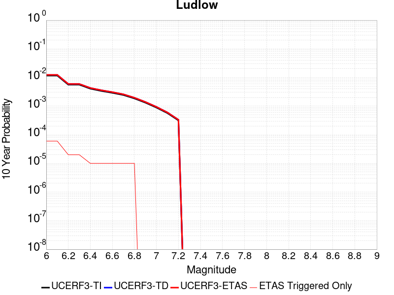 |

| Magnitude | 1 wk TI Prob | 1 wk TD Prob | 1 wk ETAS Prob | 1 wk ETAS/TD Gain | 1 wk ETAS Triggered Only | 1 mo TI Prob | 1 mo TD Prob | 1 mo ETAS Prob | 1 mo ETAS/TD Gain | 1 mo ETAS Triggered Only | 1 yr TI Prob | 1 yr TD Prob | 1 yr ETAS Prob | 1 yr ETAS/TD Gain | 1 yr ETAS Triggered Only | 10 yr TI Prob | 10 yr TD Prob | 10 yr ETAS Prob | 10 yr ETAS/TD Gain | 10 yr ETAS Triggered Only |
|-----|-----|-----|-----|-----|-----|-----|-----|-----|-----|-----|-----|-----|-----|-----|-----|-----|-----|-----|-----|-----|
| 6.0 | 2.2407607E-5 | 2.3657254E-5 | 8.365583E-5 | 3.53616 | 6.0E-5 | 9.602906E-5 | 1.0138454E-4 | 1.6137846E-4 | 1.5917462 | 6.0E-5 | 0.0011685267 | 0.001233702 | 0.0012936279 | 1.0485741 | 6.0E-5 | 0.011624013 | 0.012273042 | 0.012332305 | 1.0048288 | 6.0E-5 |
| 6.1 | 2.2407607E-5 | 2.3657254E-5 | 8.365583E-5 | 3.53616 | 6.0E-5 | 9.602906E-5 | 1.0138454E-4 | 1.6137846E-4 | 1.5917462 | 6.0E-5 | 0.0011685267 | 0.001233702 | 0.0012936279 | 1.0485741 | 6.0E-5 | 0.011624013 | 0.012273042 | 0.012332305 | 1.0048288 | 6.0E-5 |
| 6.2 | 1.0781252E-5 | 1.1365663E-5 | 3.1365435E-5 | 2.759666 | 2.0E-5 | 4.620455E-5 | 4.8709102E-5 | 6.870813E-5 | 1.4105809 | 2.0E-5 | 5.623952E-4 | 5.9287593E-4 | 6.128641E-4 | 1.0337138 | 2.0E-5 | 0.00560974 | 0.0059133614 | 0.005933243 | 1.0033622 | 2.0E-5 |
| 6.3 | 1.0781252E-5 | 1.1365663E-5 | 3.1365435E-5 | 2.759666 | 2.0E-5 | 4.620455E-5 | 4.8709102E-5 | 6.870813E-5 | 1.4105809 | 2.0E-5 | 5.623952E-4 | 5.9287593E-4 | 6.128641E-4 | 1.0337138 | 2.0E-5 | 0.00560974 | 0.0059133614 | 0.005933243 | 1.0033622 | 2.0E-5 |
| 6.4 | 7.814439E-6 | 8.237729E-6 | 1.8237646E-5 | 2.2139168 | 1.0E-5 | 3.3490025E-5 | 3.530408E-5 | 4.530373E-5 | 1.2832434 | 1.0E-5 | 4.0766477E-4 | 4.2974384E-4 | 4.3973952E-4 | 1.0232596 | 1.0E-5 | 0.0040691774 | 0.0042892746 | 0.004299232 | 1.0023214 | 1.0E-5 |
| 6.5 | 6.4986366E-6 | 6.85092E-6 | 1.685085E-5 | 2.4596481 | 1.0E-5 | 2.7851002E-5 | 2.9360759E-5 | 3.9360464E-5 | 1.3405807 | 1.0E-5 | 3.390332E-4 | 3.5740953E-4 | 3.6740597E-4 | 1.0279691 | 1.0E-5 | 0.003385164 | 0.0035684432 | 0.0035784077 | 1.0027924 | 1.0E-5 |
| 6.6 | 5.582177E-6 | 5.8860055E-6 | 1.5885948E-5 | 2.698935 | 1.0E-5 | 2.3923398E-5 | 2.5225498E-5 | 3.5225246E-5 | 1.3964143 | 1.0E-5 | 2.9122844E-4 | 3.0707786E-4 | 3.170748E-4 | 1.032555 | 1.0E-5 | 0.0029084706 | 0.003066609 | 0.0030765783 | 1.003251 | 1.0E-5 |
| 6.7 | 4.6858763E-6 | 4.940427E-6 | 1.4940378E-5 | 3.0241065 | 1.0E-5 | 2.0082172E-5 | 2.1173091E-5 | 3.117288E-5 | 1.4722877 | 1.0E-5 | 2.4447302E-4 | 2.5775246E-4 | 2.6774986E-4 | 1.0387869 | 1.0E-5 | 0.0024420423 | 0.0025745912 | 0.0025845657 | 1.0038741 | 1.0E-5 |
| 6.8 | 3.5584908E-6 | 3.7520183E-6 | 1.3751981E-5 | 3.6652222 | 1.0E-5 | 1.5250586E-5 | 1.6079981E-5 | 2.607982E-5 | 1.6218812 | 1.0E-5 | 1.8566006E-4 | 1.957566E-4 | 2.0575464E-4 | 1.0510738 | 1.0E-5 | 0.0018550502 | 0.0019558826 | 0.0019658632 | 1.0051028 | 1.0E-5 |
| 6.9 | 2.532834E-6 | 2.6710034E-6 | 2.6710034E-6 | 1.0 | 0.0 | 1.0854958E-5 | 1.1447109E-5 | 1.1447109E-5 | 1.0 | 0.0 | 1.3215111E-4 | 1.3935992E-4 | 1.3935992E-4 | 1.0 | 0.0 | 0.0013207254 | 0.0013927529 | 0.0013927529 | 1.0 | 0.0 |
| 7.0 | 1.7083285E-6 | 1.8019439E-6 | 1.8019439E-6 | 1.0 | 0.0 | 7.3213873E-6 | 7.722595E-6 | 7.722595E-6 | 1.0 | 0.0 | 8.913424E-5 | 9.40187E-5 | 9.40187E-5 | 1.0 | 0.0 | 8.9098496E-4 | 9.3980576E-4 | 9.3980576E-4 | 1.0 | 0.0 |
| 7.1 | 1.0905424E-6 | 1.1497619E-6 | 1.1497619E-6 | 1.0 | 0.0 | 4.6737446E-6 | 4.9275427E-6 | 4.9275427E-6 | 1.0 | 0.0 | 5.6901354E-5 | 5.999128E-5 | 5.999128E-5 | 1.0 | 0.0 | 5.6886784E-4 | 5.997606E-4 | 5.997606E-4 | 1.0 | 0.0 |
| 7.2 | 6.06668E-7 | 6.387277E-7 | 6.387277E-7 | 1.0 | 0.0 | 2.600003E-6 | 2.7374022E-6 | 2.7374022E-6 | 1.0 | 0.0 | 3.1654577E-5 | 3.3327433E-5 | 3.3327433E-5 | 1.0 | 0.0 | 3.1650066E-4 | 3.3323118E-4 | 3.3323118E-4 | 1.0 | 0.0 |

## Rose Canyon
*[(top)](#table-of-contents)*

| 1 Week | 1 Month | 1 Year | 10 Year |
|-----|-----|-----|-----|
|  |  |  |  |

| Magnitude | 1 wk TI Prob | 1 wk TD Prob | 1 wk ETAS Prob | 1 wk ETAS/TD Gain | 1 wk ETAS Triggered Only | 1 mo TI Prob | 1 mo TD Prob | 1 mo ETAS Prob | 1 mo ETAS/TD Gain | 1 mo ETAS Triggered Only | 1 yr TI Prob | 1 yr TD Prob | 1 yr ETAS Prob | 1 yr ETAS/TD Gain | 1 yr ETAS Triggered Only | 10 yr TI Prob | 10 yr TD Prob | 10 yr ETAS Prob | 10 yr ETAS/TD Gain | 10 yr ETAS Triggered Only |
|-----|-----|-----|-----|-----|-----|-----|-----|-----|-----|-----|-----|-----|-----|-----|-----|-----|-----|-----|-----|-----|
| 6.0 | 4.5923203E-5 | 4.9714225E-5 | 7.9712736E-5 | 1.603419 | 3.0E-5 | 1.9679888E-4 | 2.1304491E-4 | 2.5303639E-4 | 1.1877139 | 4.0E-5 | 0.0023933933 | 0.0025909345 | 0.002650779 | 1.0230976 | 6.0E-5 | 0.023677798 | 0.02563999 | 0.025698453 | 1.0022801 | 6.0E-5 |
| 6.1 | 4.5923203E-5 | 4.9714225E-5 | 6.9713235E-5 | 1.4022794 | 2.0E-5 | 1.9679888E-4 | 2.1304491E-4 | 2.4303852E-4 | 1.1407853 | 3.0E-5 | 0.0023933933 | 0.0025909345 | 0.002640805 | 1.019248 | 5.0E-5 | 0.023677798 | 0.02563999 | 0.025688708 | 1.0019001 | 5.0E-5 |
| 6.2 | 2.8844734E-5 | 2.9668723E-5 | 3.9668426E-5 | 1.3370453 | 1.0E-5 | 1.2361443E-4 | 1.2714567E-4 | 1.4714313E-4 | 1.1572798 | 2.0E-5 | 0.0015039665 | 0.0015468939 | 0.0015768475 | 1.0193638 | 3.0E-5 | 0.0149382865 | 0.015374276 | 0.015403815 | 1.0019213 | 3.0E-5 |
| 6.3 | 2.3171577E-5 | 2.3161238E-5 | 3.3161006E-5 | 1.4317459 | 1.0E-5 | 9.9302975E-5 | 9.9258745E-5 | 1.19256765E-4 | 1.2014736 | 2.0E-5 | 0.0012083431 | 0.0012078186 | 0.0012377824 | 1.0248082 | 3.0E-5 | 0.012017938 | 0.012022437 | 0.012052076 | 1.0024654 | 3.0E-5 |
| 6.4 | 2.0066604E-5 | 1.9667024E-5 | 1.9667024E-5 | 1.0 | 0.0 | 8.599689E-5 | 8.4284584E-5 | 8.4284584E-5 | 1.0 | 0.0 | 0.0010465092 | 0.0010256917 | 0.0010356815 | 1.0097395 | 1.0E-5 | 0.010415946 | 0.010217559 | 0.010227457 | 1.0009687 | 1.0E-5 |
| 6.5 | 1.776989E-5 | 1.7113807E-5 | 1.7113807E-5 | 1.0 | 0.0 | 7.615444E-5 | 7.334287E-5 | 7.334287E-5 | 1.0 | 0.0 | 9.267859E-4 | 8.925905E-4 | 8.925905E-4 | 1.0 | 0.0 | 0.009229303 | 0.008896211 | 0.008896211 | 1.0 | 0.0 |
| 6.6 | 1.5227364E-5 | 1.433926E-5 | 1.433926E-5 | 1.0 | 0.0 | 6.52585E-5 | 6.1452556E-5 | 6.1452556E-5 | 1.0 | 0.0 | 7.942326E-4 | 7.479332E-4 | 7.479332E-4 | 1.0 | 0.0 | 0.007914 | 0.007458359 | 0.007458359 | 1.0 | 0.0 |
| 6.7 | 1.2703898E-5 | 1.1673274E-5 | 1.1673274E-5 | 1.0 | 0.0 | 5.4444143E-5 | 5.0027378E-5 | 5.0027378E-5 | 1.0 | 0.0 | 6.626558E-4 | 6.089174E-4 | 6.089174E-4 | 1.0 | 0.0 | 0.006606833 | 0.0060750856 | 0.0060750856 | 1.0 | 0.0 |
| 6.8 | 1.1554917E-5 | 1.0609337E-5 | 1.0609337E-5 | 1.0 | 0.0 | 4.9520135E-5 | 4.546782E-5 | 4.546782E-5 | 1.0 | 0.0 | 6.0274085E-4 | 5.5343413E-4 | 5.5343413E-4 | 1.0 | 0.0 | 0.0060110865 | 0.0055225673 | 0.0055225673 | 1.0 | 0.0 |
| 6.9 | 8.732078E-6 | 7.881357E-6 | 7.881357E-6 | 1.0 | 0.0 | 3.7422655E-5 | 3.3776825E-5 | 3.3776825E-5 | 1.0 | 0.0 | 4.5552556E-4 | 4.111582E-4 | 4.111582E-4 | 1.0 | 0.0 | 0.0045459294 | 0.0041048084 | 0.0041048084 | 1.0 | 0.0 |
| 7.0 | 5.9337494E-6 | 5.1074853E-6 | 5.1074853E-6 | 1.0 | 0.0 | 2.5430107E-5 | 2.188904E-5 | 2.188904E-5 | 1.0 | 0.0 | 3.0956755E-4 | 2.664666E-4 | 2.664666E-4 | 1.0 | 0.0 | 0.0030913667 | 0.0026614866 | 0.0026614866 | 1.0 | 0.0 |
| 7.1 | 5.013409E-6 | 4.1773833E-6 | 4.1773833E-6 | 1.0 | 0.0 | 2.1485863E-5 | 1.7902948E-5 | 1.7902948E-5 | 1.0 | 0.0 | 2.6155898E-4 | 2.179467E-4 | 2.179467E-4 | 1.0 | 0.0 | 0.0026125133 | 0.0021773411 | 0.0021773411 | 1.0 | 0.0 |
| 7.2 | 4.120763E-6 | 3.2821383E-6 | 3.2821383E-6 | 1.0 | 0.0 | 1.7660293E-5 | 1.4066231E-5 | 1.4066231E-5 | 1.0 | 0.0 | 2.1499286E-4 | 1.7124301E-4 | 1.7124301E-4 | 1.0 | 0.0 | 0.0021478499 | 0.00171112 | 0.00171112 | 1.0 | 0.0 |
| 7.3 | 3.2081239E-6 | 2.4405372E-6 | 2.4405372E-6 | 1.0 | 0.0 | 1.374903E-5 | 1.0459404E-5 | 1.0459404E-5 | 1.0 | 0.0 | 1.6738157E-4 | 1.2733586E-4 | 1.2733586E-4 | 1.0 | 0.0 | 0.0016725556 | 0.001272636 | 0.001272636 | 1.0 | 0.0 |
| 7.4 | 2.4194755E-6 | 1.7680634E-6 | 1.7680634E-6 | 1.0 | 0.0 | 1.0369139E-5 | 7.577393E-6 | 7.577393E-6 | 1.0 | 0.0 | 1.2623696E-4 | 9.2250906E-5 | 9.2250906E-5 | 1.0 | 0.0 | 0.0012616527 | 9.2213147E-4 | 9.2213147E-4 | 1.0 | 0.0 |
| 7.5 | 1.3842889E-6 | 9.3786275E-7 | 9.3786275E-7 | 1.0 | 0.0 | 5.9326535E-6 | 4.019406E-6 | 4.019406E-6 | 1.0 | 0.0 | 7.222766E-5 | 4.8935202E-5 | 4.8935202E-5 | 1.0 | 0.0 | 7.220419E-4 | 4.892478E-4 | 4.892478E-4 | 1.0 | 0.0 |
| 7.6 | 1.0021575E-6 | 6.411463E-7 | 6.411463E-7 | 1.0 | 0.0 | 4.2949537E-6 | 2.7477672E-6 | 2.7477672E-6 | 1.0 | 0.0 | 5.2289808E-5 | 3.3453573E-5 | 3.3453573E-5 | 1.0 | 0.0 | 5.2277505E-4 | 3.344875E-4 | 3.344875E-4 | 1.0 | 0.0 |
| 7.7 | 8.7620116E-8 | 6.4492404E-8 | 6.4492404E-8 | 1.0 | 0.0 | 3.7551473E-7 | 2.76396E-7 | 2.76396E-7 | 1.0 | 0.0 | 4.5718825E-6 | 3.3651165E-6 | 3.3651165E-6 | 1.0 | 0.0 | 4.5717883E-5 | 3.3650686E-5 | 3.3650686E-5 | 1.0 | 0.0 |

## Camp Rock 2011
*[(top)](#table-of-contents)*

| 1 Week | 1 Month | 1 Year | 10 Year |
|-----|-----|-----|-----|
|  |  |  |  |

| Magnitude | 1 wk TI Prob | 1 wk TD Prob | 1 wk ETAS Prob | 1 wk ETAS/TD Gain | 1 wk ETAS Triggered Only | 1 mo TI Prob | 1 mo TD Prob | 1 mo ETAS Prob | 1 mo ETAS/TD Gain | 1 mo ETAS Triggered Only | 1 yr TI Prob | 1 yr TD Prob | 1 yr ETAS Prob | 1 yr ETAS/TD Gain | 1 yr ETAS Triggered Only | 10 yr TI Prob | 10 yr TD Prob | 10 yr ETAS Prob | 10 yr ETAS/TD Gain | 10 yr ETAS Triggered Only |
|-----|-----|-----|-----|-----|-----|-----|-----|-----|-----|-----|-----|-----|-----|-----|-----|-----|-----|-----|-----|-----|
| 6.0 | 1.6710783E-5 | 4.25026E-6 | 5.425005E-5 | 12.763935 | 5.0E-5 | 7.161568E-5 | 1.8215276E-5 | 6.8214365E-5 | 3.7448986 | 5.0E-5 | 8.7157206E-4 | 2.2174895E-4 | 2.8173564E-4 | 1.2705163 | 6.0E-5 | 0.008681616 | 0.0022153298 | 0.0022751968 | 1.027024 | 6.0E-5 |
| 6.1 | 1.6710783E-5 | 4.25026E-6 | 5.425005E-5 | 12.763935 | 5.0E-5 | 7.161568E-5 | 1.8215276E-5 | 6.8214365E-5 | 3.7448986 | 5.0E-5 | 8.7157206E-4 | 2.2174895E-4 | 2.8173564E-4 | 1.2705163 | 6.0E-5 | 0.008681616 | 0.0022153298 | 0.0022751968 | 1.027024 | 6.0E-5 |
| 6.2 | 1.6710783E-5 | 4.25026E-6 | 5.425005E-5 | 12.763935 | 5.0E-5 | 7.161568E-5 | 1.8215276E-5 | 6.8214365E-5 | 3.7448986 | 5.0E-5 | 8.7157206E-4 | 2.2174895E-4 | 2.8173564E-4 | 1.2705163 | 6.0E-5 | 0.008681616 | 0.0022153298 | 0.0022751968 | 1.027024 | 6.0E-5 |
| 6.3 | 1.6710783E-5 | 4.25026E-6 | 5.425005E-5 | 12.763935 | 5.0E-5 | 7.161568E-5 | 1.8215276E-5 | 6.8214365E-5 | 3.7448986 | 5.0E-5 | 8.7157206E-4 | 2.2174895E-4 | 2.8173564E-4 | 1.2705163 | 6.0E-5 | 0.008681616 | 0.0022153298 | 0.0022751968 | 1.027024 | 6.0E-5 |
| 6.4 | 7.982846E-6 | 3.6820884E-6 | 5.3681906E-5 | 14.5792 | 5.0E-5 | 3.421175E-5 | 1.5780286E-5 | 6.5779495E-5 | 4.1684604 | 5.0E-5 | 4.1644843E-4 | 1.9210839E-4 | 2.5209686E-4 | 1.3122637 | 6.0E-5 | 0.0041566887 | 0.001919458 | 0.001979343 | 1.0311989 | 6.0E-5 |
| 6.5 | 7.982846E-6 | 3.6820884E-6 | 5.3681906E-5 | 14.5792 | 5.0E-5 | 3.421175E-5 | 1.5780286E-5 | 6.5779495E-5 | 4.1684604 | 5.0E-5 | 4.1644843E-4 | 1.9210839E-4 | 2.5209686E-4 | 1.3122637 | 6.0E-5 | 0.0041566887 | 0.001919458 | 0.001979343 | 1.0311989 | 6.0E-5 |
| 6.6 | 7.048869E-6 | 3.4243571E-6 | 5.3424184E-5 | 15.601231 | 5.0E-5 | 3.0209088E-5 | 1.4675736E-5 | 6.4675005E-5 | 4.4069343 | 5.0E-5 | 3.677336E-4 | 1.7866275E-4 | 2.3865204E-4 | 1.3357682 | 6.0E-5 | 0.0036712566 | 0.0017852228 | 0.0018451157 | 1.0335493 | 6.0E-5 |
| 6.7 | 6.987307E-6 | 3.3623348E-6 | 5.3362168E-5 | 15.870569 | 5.0E-5 | 2.9945259E-5 | 1.4409929E-5 | 6.440921E-5 | 4.46978 | 5.0E-5 | 3.6452254E-4 | 1.7542706E-4 | 2.3541653E-4 | 1.3419625 | 6.0E-5 | 0.0036392517 | 0.001752917 | 0.0018128118 | 1.0341687 | 6.0E-5 |
| 6.8 | 6.3737602E-6 | 3.1179077E-6 | 5.311775E-5 | 17.036345 | 5.0E-5 | 2.731583E-5 | 1.3362394E-5 | 6.3361724E-5 | 4.741794 | 5.0E-5 | 3.3251947E-4 | 1.626753E-4 | 2.2266553E-4 | 1.3687729 | 6.0E-5 | 0.0033202237 | 0.0016255907 | 0.0016854932 | 1.0368496 | 6.0E-5 |
| 6.9 | 6.112211E-6 | 2.9331156E-6 | 5.293297E-5 | 18.04667 | 5.0E-5 | 2.6194928E-5 | 1.2570436E-5 | 6.256981E-5 | 4.9775367 | 5.0E-5 | 3.1887658E-4 | 1.5303459E-4 | 2.1302541E-4 | 1.3920082 | 6.0E-5 | 0.003184194 | 0.0015293199 | 0.001589228 | 1.0391731 | 6.0E-5 |
| 7.0 | 5.5140117E-6 | 2.641923E-6 | 5.264179E-5 | 19.925558 | 5.0E-5 | 2.3631264E-5 | 1.132248E-5 | 6.1321916E-5 | 5.415944 | 5.0E-5 | 2.8767265E-4 | 1.3784273E-4 | 1.9783445E-4 | 1.4352187 | 6.0E-5 | 0.0028730053 | 0.0013775975 | 0.0014375148 | 1.0434941 | 6.0E-5 |
| 7.1 | 4.8151105E-6 | 2.1342705E-6 | 5.2134164E-5 | 24.42716 | 5.0E-5 | 2.0636026E-5 | 9.146843E-6 | 5.9146387E-5 | 6.466317 | 5.0E-5 | 2.5121463E-4 | 1.1135734E-4 | 1.7135065E-4 | 1.538746 | 6.0E-5 | 0.0025093083 | 0.0011130372 | 0.0011729705 | 1.0538466 | 6.0E-5 |
| 7.2 | 3.818335E-6 | 1.2937425E-6 | 4.129369E-5 | 31.918015 | 4.0E-5 | 1.6364189E-5 | 5.5445994E-6 | 4.5544377E-5 | 8.214188 | 4.0E-5 | 1.9921579E-4 | 6.750349E-5 | 1.17500116E-4 | 1.7406524 | 5.0E-5 | 0.0019903728 | 6.748381E-4 | 7.248043E-4 | 1.0740418 | 5.0E-5 |
| 7.3 | 2.7166698E-6 | 7.3835776E-7 | 2.0738344E-5 | 28.08712 | 2.0E-5 | 1.1642818E-5 | 3.1643867E-6 | 2.3164323E-5 | 7.32032 | 2.0E-5 | 1.4174209E-4 | 3.8525748E-5 | 5.8524976E-5 | 1.5191133 | 2.0E-5 | 0.0014165172 | 3.851927E-4 | 4.0518498E-4 | 1.051902 | 2.0E-5 |
| 7.4 | 2.0893426E-6 | 5.4618386E-7 | 2.0546173E-5 | 37.617687 | 2.0E-5 | 8.954295E-6 | 2.3407858E-6 | 2.2340739E-5 | 9.544119 | 2.0E-5 | 1.0901308E-4 | 2.84987E-5 | 4.8498132E-5 | 1.7017664 | 2.0E-5 | 0.0010895962 | 2.84951E-4 | 3.049453E-4 | 1.0701675 | 2.0E-5 |
| 7.5 | 1.1681728E-6 | 3.6030585E-7 | 1.0360302E-5 | 28.754189 | 1.0E-5 | 5.0064455E-6 | 1.544167E-6 | 1.1544152E-5 | 7.475973 | 1.0E-5 | 6.0951766E-5 | 1.8800076E-5 | 2.8799888E-5 | 1.5319028 | 1.0E-5 | 6.093505E-4 | 1.8798532E-4 | 1.9798345E-4 | 1.0531856 | 1.0E-5 |
| 7.6 | 1.3154387E-7 | 7.1197384E-8 | 7.1197384E-8 | 1.0 | 0.0 | 5.6375933E-7 | 3.051316E-7 | 3.051316E-7 | 1.0 | 0.0 | 6.863748E-6 | 3.7149728E-6 | 3.7149728E-6 | 1.0 | 0.0 | 6.863536E-5 | 3.7149264E-5 | 3.7149264E-5 | 1.0 | 0.0 |

## Hosgri
*[(top)](#table-of-contents)*

| 1 Week | 1 Month | 1 Year | 10 Year |
|-----|-----|-----|-----|
|  |  |  |  |

| Magnitude | 1 wk TI Prob | 1 wk TD Prob | 1 wk ETAS Prob | 1 wk ETAS/TD Gain | 1 wk ETAS Triggered Only | 1 mo TI Prob | 1 mo TD Prob | 1 mo ETAS Prob | 1 mo ETAS/TD Gain | 1 mo ETAS Triggered Only | 1 yr TI Prob | 1 yr TD Prob | 1 yr ETAS Prob | 1 yr ETAS/TD Gain | 1 yr ETAS Triggered Only | 10 yr TI Prob | 10 yr TD Prob | 10 yr ETAS Prob | 10 yr ETAS/TD Gain | 10 yr ETAS Triggered Only |
|-----|-----|-----|-----|-----|-----|-----|-----|-----|-----|-----|-----|-----|-----|-----|-----|-----|-----|-----|-----|-----|
| 6.0 | 2.883978E-5 | 2.9128416E-5 | 7.912696E-5 | 2.716487 | 5.0E-5 | 1.235932E-4 | 1.2483024E-4 | 1.74824E-4 | 1.400494 | 5.0E-5 | 0.0015037085 | 0.001518776 | 0.0015786848 | 1.0394455 | 6.0E-5 | 0.01493574 | 0.01508774 | 0.015146835 | 1.0039167 | 6.0E-5 |
| 6.1 | 2.883978E-5 | 2.9128416E-5 | 7.912696E-5 | 2.716487 | 5.0E-5 | 1.235932E-4 | 1.2483024E-4 | 1.74824E-4 | 1.400494 | 5.0E-5 | 0.0015037085 | 0.001518776 | 0.0015786848 | 1.0394455 | 6.0E-5 | 0.01493574 | 0.01508774 | 0.015146835 | 1.0039167 | 6.0E-5 |
| 6.2 | 2.883978E-5 | 2.9128416E-5 | 7.912696E-5 | 2.716487 | 5.0E-5 | 1.235932E-4 | 1.2483024E-4 | 1.74824E-4 | 1.400494 | 5.0E-5 | 0.0015037085 | 0.001518776 | 0.0015786848 | 1.0394455 | 6.0E-5 | 0.01493574 | 0.01508774 | 0.015146835 | 1.0039167 | 6.0E-5 |
| 6.3 | 2.2914428E-5 | 2.2641969E-5 | 3.2641743E-5 | 1.4416476 | 1.0E-5 | 9.8200995E-5 | 9.703343E-5 | 1.0703246E-4 | 1.1030473 | 1.0E-5 | 0.0011949413 | 0.0011807467 | 0.0012007231 | 1.0169184 | 2.0E-5 | 0.011885363 | 0.011746133 | 0.011765898 | 1.0016826 | 2.0E-5 |
| 6.4 | 2.0195741E-5 | 1.969656E-5 | 2.9696363E-5 | 1.5076928 | 1.0E-5 | 8.65503E-5 | 8.4411105E-5 | 9.4410265E-5 | 1.1184578 | 1.0E-5 | 0.0010532405 | 0.0010272227 | 0.0010472022 | 1.01945 | 2.0E-5 | 0.010482626 | 0.010225792 | 0.010245589 | 1.0019358 | 2.0E-5 |
| 6.5 | 1.9924333E-5 | 1.940898E-5 | 2.9408788E-5 | 1.5152154 | 1.0E-5 | 8.53872E-5 | 8.3178704E-5 | 9.317788E-5 | 1.120213 | 1.0E-5 | 0.0010390934 | 0.0010122322 | 0.0010322119 | 1.0197383 | 2.0E-5 | 0.010342481 | 0.010077253 | 0.010097052 | 1.0019647 | 2.0E-5 |
| 6.6 | 1.809694E-5 | 1.74583E-5 | 2.7458125E-5 | 1.5727835 | 1.0E-5 | 7.7556004E-5 | 7.4819145E-5 | 8.48184E-5 | 1.1336457 | 1.0E-5 | 9.438353E-4 | 9.105437E-4 | 9.3052554E-4 | 1.0219449 | 2.0E-5 | 0.009398366 | 0.009069073 | 0.009088892 | 1.0021853 | 2.0E-5 |
| 6.7 | 1.675989E-5 | 1.6042764E-5 | 2.6042604E-5 | 1.6233239 | 1.0E-5 | 7.182612E-5 | 6.87529E-5 | 7.8752215E-5 | 1.1454384 | 1.0E-5 | 8.7413215E-4 | 8.3674624E-4 | 8.567295E-4 | 1.0238822 | 2.0E-5 | 0.008707017 | 0.0083368635 | 0.008356696 | 1.002379 | 2.0E-5 |
| 6.8 | 1.5401129E-5 | 1.4614083E-5 | 2.4613937E-5 | 1.6842614 | 1.0E-5 | 6.6003166E-5 | 6.2630286E-5 | 7.262966E-5 | 1.1596571 | 1.0E-5 | 8.032922E-4 | 7.622578E-4 | 7.8224257E-4 | 1.0262178 | 2.0E-5 | 0.008003947 | 0.007597296 | 0.0076171444 | 1.0026125 | 2.0E-5 |
| 6.9 | 1.356559E-5 | 1.2689968E-5 | 2.2689841E-5 | 1.788014 | 1.0E-5 | 5.8136946E-5 | 5.4384444E-5 | 6.43839E-5 | 1.1838661 | 1.0E-5 | 7.0758746E-4 | 6.619299E-4 | 6.719233E-4 | 1.0150974 | 1.0E-5 | 0.007053386 | 0.006600388 | 0.006610322 | 1.001505 | 1.0E-5 |
| 7.0 | 1.2030819E-5 | 1.1095962E-5 | 2.109585E-5 | 1.9012188 | 1.0E-5 | 5.155963E-5 | 4.7553254E-5 | 5.7552777E-5 | 1.2102805 | 1.0E-5 | 6.275577E-4 | 5.7880714E-4 | 5.888014E-4 | 1.0172669 | 1.0E-5 | 0.006257884 | 0.005773757 | 0.0057836995 | 1.001722 | 1.0E-5 |
| 7.1 | 1.0972698E-5 | 1.0022179E-5 | 2.0022078E-5 | 1.997777 | 1.0E-5 | 4.7025E-5 | 4.2951488E-5 | 5.2951058E-5 | 1.2328109 | 1.0E-5 | 5.72379E-4 | 5.22809E-4 | 5.3280377E-4 | 1.0191175 | 1.0E-5 | 0.0057090693 | 0.005216542 | 0.00522649 | 1.001907 | 1.0E-5 |
| 7.2 | 9.961926E-6 | 9.034746E-6 | 1.9034655E-5 | 2.106828 | 1.0E-5 | 4.2693267E-5 | 3.8719765E-5 | 4.8719376E-5 | 1.2582561 | 1.0E-5 | 5.1966653E-4 | 4.713112E-4 | 4.813065E-4 | 1.0212075 | 1.0E-5 | 0.00518453 | 0.0047038626 | 0.0047138156 | 1.002116 | 1.0E-5 |
| 7.3 | 8.700929E-6 | 7.8281E-6 | 1.7828022E-5 | 2.277439 | 1.0E-5 | 3.7289166E-5 | 3.354857E-5 | 4.3548236E-5 | 1.2980653 | 1.0E-5 | 4.53901E-4 | 4.0837732E-4 | 4.1837324E-4 | 1.0244771 | 1.0E-5 | 0.00452975 | 0.004077008 | 0.0040869676 | 1.0024428 | 1.0E-5 |
| 7.4 | 7.866285E-6 | 6.998739E-6 | 1.6998669E-5 | 2.428819 | 1.0E-5 | 3.3712215E-5 | 2.9994251E-5 | 3.999395E-5 | 1.3333873 | 1.0E-5 | 4.103689E-4 | 3.6511885E-4 | 3.751152E-4 | 1.0273783 | 1.0E-5 | 0.004096119 | 0.0036459267 | 0.0036558902 | 1.0027328 | 1.0E-5 |
| 7.5 | 6.8381305E-6 | 5.9596955E-6 | 1.5959637E-5 | 2.6779282 | 1.0E-5 | 2.9305946E-5 | 2.5541302E-5 | 3.5541045E-5 | 1.3915128 | 1.0E-5 | 3.5674145E-4 | 3.10921E-4 | 3.209179E-4 | 1.0321525 | 1.0E-5 | 0.0035616932 | 0.0031055948 | 0.0031155637 | 1.00321 | 1.0E-5 |
| 7.6 | 5.503376E-6 | 4.5952443E-6 | 1.4595198E-5 | 3.176153 | 1.0E-5 | 2.3585684E-5 | 1.9693754E-5 | 2.9693558E-5 | 1.5077652 | 1.0E-5 | 2.8711787E-4 | 2.397451E-4 | 2.497427E-4 | 1.041701 | 1.0E-5 | 0.002867472 | 0.0023955975 | 0.0024055736 | 1.0041643 | 1.0E-5 |
| 7.7 | 3.6144982E-6 | 2.6522112E-6 | 1.26521845E-5 | 4.770429 | 1.0E-5 | 1.5490614E-5 | 1.1366569E-5 | 2.1366455E-5 | 1.8797629 | 1.0E-5 | 1.8858191E-4 | 1.383792E-4 | 1.4837782E-4 | 1.0722553 | 1.0E-5 | 0.0018842196 | 0.0013836613 | 0.0013936475 | 1.0072172 | 1.0E-5 |
| 7.8 | 1.9853494E-6 | 1.1361129E-6 | 1.1361129E-6 | 1.0 | 0.0 | 8.508612E-6 | 4.8690463E-6 | 4.8690463E-6 | 1.0 | 0.0 | 1.0358743E-4 | 5.9279027E-5 | 5.9279027E-5 | 1.0 | 0.0 | 0.0010353916 | 5.9336185E-4 | 5.9336185E-4 | 1.0 | 0.0 |
| 7.9 | 1.1818757E-6 | 5.2951856E-7 | 5.2951856E-7 | 1.0 | 0.0 | 5.0651715E-6 | 2.2693632E-6 | 2.2693632E-6 | 1.0 | 0.0 | 6.1666724E-5 | 2.7629147E-5 | 2.7629147E-5 | 1.0 | 0.0 | 6.1649614E-4 | 2.7694515E-4 | 2.7694515E-4 | 1.0 | 0.0 |
| 8.0 | 6.962958E-7 | 2.7139782E-7 | 2.7139782E-7 | 1.0 | 0.0 | 2.9841215E-6 | 1.163133E-6 | 1.163133E-6 | 1.0 | 0.0 | 3.6331072E-5 | 1.4161053E-5 | 1.4161053E-5 | 1.0 | 0.0 | 3.6325134E-4 | 1.4217179E-4 | 1.4217179E-4 | 1.0 | 0.0 |
| 8.1 | 1.5033264E-7 | 6.527624E-8 | 6.527624E-8 | 1.0 | 0.0 | 6.442826E-7 | 2.7975528E-7 | 2.7975528E-7 | 1.0 | 0.0 | 7.844113E-6 | 3.4060151E-6 | 3.4060151E-6 | 1.0 | 0.0 | 7.843835E-5 | 3.407693E-5 | 3.407693E-5 | 1.0 | 0.0 |

## Great Valley 07 (Orestimba)
*[(top)](#table-of-contents)*

| 1 Week | 1 Month | 1 Year | 10 Year |
|-----|-----|-----|-----|
|  |  |  |  |

| Magnitude | 1 wk TI Prob | 1 wk TD Prob | 1 wk ETAS Prob | 1 wk ETAS/TD Gain | 1 wk ETAS Triggered Only | 1 mo TI Prob | 1 mo TD Prob | 1 mo ETAS Prob | 1 mo ETAS/TD Gain | 1 mo ETAS Triggered Only | 1 yr TI Prob | 1 yr TD Prob | 1 yr ETAS Prob | 1 yr ETAS/TD Gain | 1 yr ETAS Triggered Only | 10 yr TI Prob | 10 yr TD Prob | 10 yr ETAS Prob | 10 yr ETAS/TD Gain | 10 yr ETAS Triggered Only |
|-----|-----|-----|-----|-----|-----|-----|-----|-----|-----|-----|-----|-----|-----|-----|-----|-----|-----|-----|-----|-----|
| 6.0 | 2.9687902E-5 | 3.27575E-5 | 7.2756186E-5 | 2.2210546 | 4.0E-5 | 1.2722766E-4 | 1.4038214E-4 | 1.8037652E-4 | 1.2848965 | 4.0E-5 | 0.0015478961 | 0.0017078844 | 0.0017577991 | 1.029226 | 5.0E-5 | 0.015371585 | 0.016955135 | 0.017004289 | 1.0028989 | 5.0E-5 |
| 6.1 | 2.9687902E-5 | 3.27575E-5 | 6.275652E-5 | 1.9157908 | 3.0E-5 | 1.2722766E-4 | 1.4038214E-4 | 1.7037793E-4 | 1.2136724 | 3.0E-5 | 0.0015478961 | 0.0017078844 | 0.0017478161 | 1.0233808 | 4.0E-5 | 0.015371585 | 0.016955135 | 0.016994458 | 1.0023192 | 4.0E-5 |
| 6.2 | 1.9231524E-5 | 2.1159167E-5 | 4.1158743E-5 | 1.9451969 | 2.0E-5 | 8.2418206E-5 | 9.067912E-5 | 1.10677305E-4 | 1.2205379 | 2.0E-5 | 0.0010029797 | 0.0011034822 | 0.0011234601 | 1.0181044 | 2.0E-5 | 0.00998465 | 0.01098244 | 0.01100222 | 1.0018011 | 2.0E-5 |
| 6.3 | 1.324766E-5 | 1.4548534E-5 | 1.4548534E-5 | 1.0 | 0.0 | 5.6774446E-5 | 6.234942E-5 | 6.234942E-5 | 1.0 | 0.0 | 6.910097E-4 | 7.5884897E-4 | 7.5884897E-4 | 1.0 | 0.0 | 0.006888649 | 0.0075635235 | 0.0075635235 | 1.0 | 0.0 |
| 6.4 | 7.818645E-6 | 8.57284E-6 | 8.57284E-6 | 1.0 | 0.0 | 3.3508048E-5 | 3.6740246E-5 | 3.6740246E-5 | 1.0 | 0.0 | 4.078841E-4 | 4.4722404E-4 | 4.4722404E-4 | 1.0 | 0.0 | 0.004071363 | 0.0044635804 | 0.0044635804 | 1.0 | 0.0 |
| 6.5 | 5.3076565E-6 | 5.8178007E-6 | 5.8178007E-6 | 1.0 | 0.0 | 2.27469E-5 | 2.4933206E-5 | 2.4933206E-5 | 1.0 | 0.0 | 2.7690834E-4 | 3.035216E-4 | 3.035216E-4 | 1.0 | 0.0 | 0.0027656353 | 0.00303128 | 0.00303128 | 1.0 | 0.0 |
| 6.6 | 3.6003578E-6 | 3.9484953E-6 | 3.9484953E-6 | 1.0 | 0.0 | 1.5430012E-5 | 1.6922022E-5 | 1.6922022E-5 | 1.0 | 0.0 | 1.8784421E-4 | 2.0600771E-4 | 2.0600771E-4 | 1.0 | 0.0 | 0.0018768552 | 0.0020583214 | 0.0020583214 | 1.0 | 0.0 |
| 6.7 | 2.5361826E-6 | 2.7834678E-6 | 2.7834678E-6 | 1.0 | 0.0 | 1.0869308E-5 | 1.1929101E-5 | 1.1929101E-5 | 1.0 | 0.0 | 1.3232579E-4 | 1.4522845E-4 | 1.4522845E-4 | 1.0 | 0.0 | 0.0013224703 | 0.0014514653 | 0.0014514653 | 1.0 | 0.0 |
| 6.8 | 1.2115831E-6 | 1.3313797E-6 | 1.3313797E-6 | 1.0 | 0.0 | 5.1924885E-6 | 5.7059065E-6 | 5.7059065E-6 | 1.0 | 0.0 | 6.3216714E-5 | 6.9468166E-5 | 6.9468166E-5 | 1.0 | 0.0 | 6.3198735E-4 | 6.945596E-4 | 6.945596E-4 | 1.0 | 0.0 |

## Dry Mountain
*[(top)](#table-of-contents)*

| 1 Week | 1 Month | 1 Year | 10 Year |
|-----|-----|-----|-----|
| 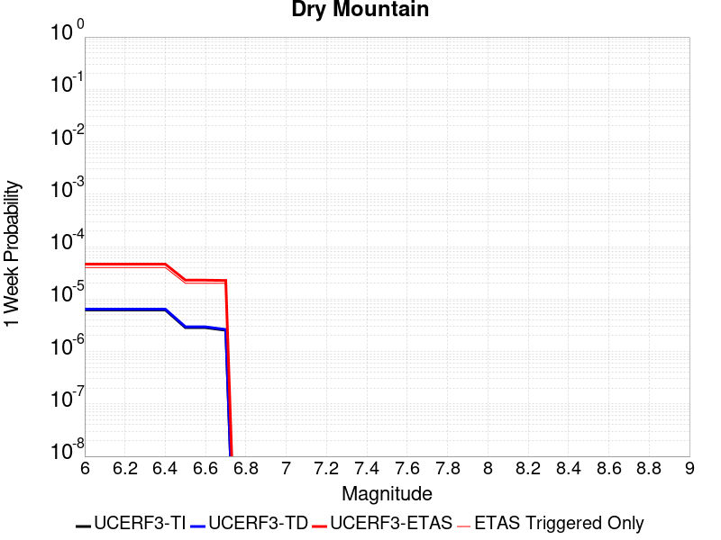 |  |  |  |

| Magnitude | 1 wk TI Prob | 1 wk TD Prob | 1 wk ETAS Prob | 1 wk ETAS/TD Gain | 1 wk ETAS Triggered Only | 1 mo TI Prob | 1 mo TD Prob | 1 mo ETAS Prob | 1 mo ETAS/TD Gain | 1 mo ETAS Triggered Only | 1 yr TI Prob | 1 yr TD Prob | 1 yr ETAS Prob | 1 yr ETAS/TD Gain | 1 yr ETAS Triggered Only | 10 yr TI Prob | 10 yr TD Prob | 10 yr ETAS Prob | 10 yr ETAS/TD Gain | 10 yr ETAS Triggered Only |
|-----|-----|-----|-----|-----|-----|-----|-----|-----|-----|-----|-----|-----|-----|-----|-----|-----|-----|-----|-----|-----|
| 6.0 | 6.222801E-6 | 6.439381E-6 | 4.6439123E-5 | 7.211737 | 4.0E-5 | 2.6668875E-5 | 2.7597147E-5 | 7.759577E-5 | 2.8117316 | 5.0E-5 | 3.2464517E-4 | 3.3595937E-4 | 3.8594258E-4 | 1.1487775 | 5.0E-5 | 0.0032417132 | 0.0033560768 | 0.003405909 | 1.0148484 | 5.0E-5 |
| 6.1 | 6.222801E-6 | 6.439381E-6 | 4.6439123E-5 | 7.211737 | 4.0E-5 | 2.6668875E-5 | 2.7597147E-5 | 7.759577E-5 | 2.8117316 | 5.0E-5 | 3.2464517E-4 | 3.3595937E-4 | 3.8594258E-4 | 1.1487775 | 5.0E-5 | 0.0032417132 | 0.0033560768 | 0.003405909 | 1.0148484 | 5.0E-5 |
| 6.2 | 6.222801E-6 | 6.439381E-6 | 4.6439123E-5 | 7.211737 | 4.0E-5 | 2.6668875E-5 | 2.7597147E-5 | 7.759577E-5 | 2.8117316 | 5.0E-5 | 3.2464517E-4 | 3.3595937E-4 | 3.8594258E-4 | 1.1487775 | 5.0E-5 | 0.0032417132 | 0.0033560768 | 0.003405909 | 1.0148484 | 5.0E-5 |
| 6.3 | 6.222801E-6 | 6.439381E-6 | 4.6439123E-5 | 7.211737 | 4.0E-5 | 2.6668875E-5 | 2.7597147E-5 | 7.759577E-5 | 2.8117316 | 5.0E-5 | 3.2464517E-4 | 3.3595937E-4 | 3.8594258E-4 | 1.1487775 | 5.0E-5 | 0.0032417132 | 0.0033560768 | 0.003405909 | 1.0148484 | 5.0E-5 |
| 6.4 | 6.222801E-6 | 6.439381E-6 | 4.6439123E-5 | 7.211737 | 4.0E-5 | 2.6668875E-5 | 2.7597147E-5 | 7.759577E-5 | 2.8117316 | 5.0E-5 | 3.2464517E-4 | 3.3595937E-4 | 3.8594258E-4 | 1.1487775 | 5.0E-5 | 0.0032417132 | 0.0033560768 | 0.003405909 | 1.0148484 | 5.0E-5 |
| 6.5 | 2.8528623E-6 | 2.9521684E-6 | 2.295211E-5 | 7.7746615 | 2.0E-5 | 1.22264955E-5 | 1.2652138E-5 | 4.2651758E-5 | 3.3711107 | 3.0E-5 | 1.4884741E-4 | 1.540376E-4 | 1.8403298E-4 | 1.1947277 | 3.0E-5 | 0.0014874774 | 0.0015401616 | 0.0015701154 | 1.0194485 | 3.0E-5 |
| 6.6 | 2.8528623E-6 | 2.9521684E-6 | 2.295211E-5 | 7.7746615 | 2.0E-5 | 1.22264955E-5 | 1.2652138E-5 | 4.2651758E-5 | 3.3711107 | 3.0E-5 | 1.4884741E-4 | 1.540376E-4 | 1.8403298E-4 | 1.1947277 | 3.0E-5 | 0.0014874774 | 0.0015401616 | 0.0015701154 | 1.0194485 | 3.0E-5 |
| 6.7 | 2.541E-6 | 2.6293578E-6 | 2.2629305E-5 | 8.6064 | 2.0E-5 | 1.0889954E-5 | 1.1268677E-5 | 4.126834E-5 | 3.662217 | 3.0E-5 | 1.3257713E-4 | 1.3719614E-4 | 1.6719202E-4 | 1.2186351 | 3.0E-5 | 0.0013249806 | 0.0013719613 | 0.0014019202 | 1.0218365 | 3.0E-5 |

## Bullion Mountains
*[(top)](#table-of-contents)*

| 1 Week | 1 Month | 1 Year | 10 Year |
|-----|-----|-----|-----|
|  |  |  | 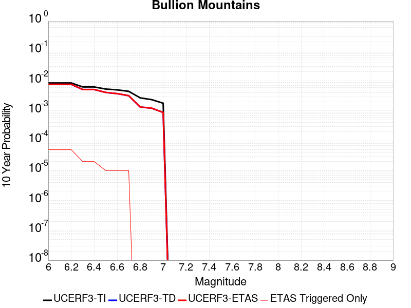 |

| Magnitude | 1 wk TI Prob | 1 wk TD Prob | 1 wk ETAS Prob | 1 wk ETAS/TD Gain | 1 wk ETAS Triggered Only | 1 mo TI Prob | 1 mo TD Prob | 1 mo ETAS Prob | 1 mo ETAS/TD Gain | 1 mo ETAS Triggered Only | 1 yr TI Prob | 1 yr TD Prob | 1 yr ETAS Prob | 1 yr ETAS/TD Gain | 1 yr ETAS Triggered Only | 10 yr TI Prob | 10 yr TD Prob | 10 yr ETAS Prob | 10 yr ETAS/TD Gain | 10 yr ETAS Triggered Only |
|-----|-----|-----|-----|-----|-----|-----|-----|-----|-----|-----|-----|-----|-----|-----|-----|-----|-----|-----|-----|-----|
| 6.0 | 1.6420427E-5 | 1.4692089E-5 | 4.469165E-5 | 3.0418851 | 3.0E-5 | 7.037136E-5 | 6.296479E-5 | 1.0296227E-4 | 1.6352357 | 4.0E-5 | 8.5643446E-4 | 7.663651E-4 | 8.1632676E-4 | 1.065193 | 5.0E-5 | 0.008531413 | 0.007641016 | 0.007690634 | 1.0064937 | 5.0E-5 |
| 6.1 | 1.6420427E-5 | 1.4692089E-5 | 4.469165E-5 | 3.0418851 | 3.0E-5 | 7.037136E-5 | 6.296479E-5 | 1.0296227E-4 | 1.6352357 | 4.0E-5 | 8.5643446E-4 | 7.663651E-4 | 8.1632676E-4 | 1.065193 | 5.0E-5 | 0.008531413 | 0.007641016 | 0.007690634 | 1.0064937 | 5.0E-5 |
| 6.2 | 1.6420427E-5 | 1.4692089E-5 | 4.469165E-5 | 3.0418851 | 3.0E-5 | 7.037136E-5 | 6.296479E-5 | 1.0296227E-4 | 1.6352357 | 4.0E-5 | 8.5643446E-4 | 7.663651E-4 | 8.1632676E-4 | 1.065193 | 5.0E-5 | 0.008531413 | 0.007641016 | 0.007690634 | 1.0064937 | 5.0E-5 |
| 6.3 | 1.2046778E-5 | 9.862335E-6 | 2.9862138E-5 | 3.0278974 | 2.0E-5 | 5.1628023E-5 | 4.2266598E-5 | 6.226575E-5 | 1.473167 | 2.0E-5 | 6.283899E-4 | 5.144975E-4 | 5.344872E-4 | 1.0388529 | 2.0E-5 | 0.0062661595 | 0.005135345 | 0.005155242 | 1.0038745 | 2.0E-5 |
| 6.4 | 1.2046778E-5 | 9.862335E-6 | 2.9862138E-5 | 3.0278974 | 2.0E-5 | 5.1628023E-5 | 4.2266598E-5 | 6.226575E-5 | 1.473167 | 2.0E-5 | 6.283899E-4 | 5.144975E-4 | 5.344872E-4 | 1.0388529 | 2.0E-5 | 0.0062661595 | 0.005135345 | 0.005155242 | 1.0038745 | 2.0E-5 |
| 6.5 | 1.0244343E-5 | 7.879458E-6 | 1.787938E-5 | 2.2691128 | 1.0E-5 | 4.390359E-5 | 3.3768785E-5 | 4.376845E-5 | 1.2961215 | 1.0E-5 | 5.343951E-4 | 4.110781E-4 | 4.21074E-4 | 1.0243163 | 1.0E-5 | 0.005331118 | 0.004105208 | 0.004115167 | 1.0024259 | 1.0E-5 |
| 6.6 | 9.605408E-6 | 7.1774966E-6 | 1.7177425E-5 | 2.3932335 | 1.0E-5 | 4.1165385E-5 | 3.076045E-5 | 4.0760144E-5 | 1.3250828 | 1.0E-5 | 5.010733E-4 | 3.744645E-4 | 3.8446073E-4 | 1.0266948 | 1.0E-5 | 0.00499945 | 0.003740332 | 0.0037502947 | 1.0026636 | 1.0E-5 |
| 6.7 | 8.60418E-6 | 6.1240044E-6 | 1.6123944E-5 | 2.6329083 | 1.0E-5 | 3.687454E-5 | 2.624558E-5 | 3.6245317E-5 | 1.3810066 | 1.0E-5 | 4.48855E-4 | 3.1951256E-4 | 3.2950938E-4 | 1.0312877 | 1.0E-5 | 0.004479495 | 0.0031924439 | 0.0032024118 | 1.0031224 | 1.0E-5 |
| 6.8 | 5.187994E-6 | 2.5631666E-6 | 2.5631666E-6 | 1.0 | 0.0 | 2.223407E-5 | 1.0984976E-5 | 1.0984976E-5 | 1.0 | 0.0 | 2.7066618E-4 | 1.3373788E-4 | 1.3373788E-4 | 1.0 | 0.0 | 0.0027033675 | 0.0013369655 | 0.0013369655 | 1.0 | 0.0 |
| 6.9 | 4.5302368E-6 | 2.3443165E-6 | 2.3443165E-6 | 1.0 | 0.0 | 1.9415156E-5 | 1.0047055E-5 | 1.0047055E-5 | 1.0 | 0.0 | 2.3635388E-4 | 1.2232E-4 | 1.2232E-4 | 1.0 | 0.0 | 0.0023610266 | 0.0012229157 | 0.0012229157 | 1.0 | 0.0 |
| 7.0 | 3.431668E-6 | 1.6882402E-6 | 1.6882402E-6 | 1.0 | 0.0 | 1.4707065E-5 | 7.235315E-6 | 7.235315E-6 | 1.0 | 0.0 | 1.7904381E-4 | 8.808996E-5 | 8.808996E-5 | 1.0 | 0.0 | 0.0017889962 | 8.808996E-4 | 8.808996E-4 | 1.0 | 0.0 |

## San Pedro Basin
*[(top)](#table-of-contents)*

| 1 Week | 1 Month | 1 Year | 10 Year |
|-----|-----|-----|-----|
|  |  |  |  |

| Magnitude | 1 wk TI Prob | 1 wk TD Prob | 1 wk ETAS Prob | 1 wk ETAS/TD Gain | 1 wk ETAS Triggered Only | 1 mo TI Prob | 1 mo TD Prob | 1 mo ETAS Prob | 1 mo ETAS/TD Gain | 1 mo ETAS Triggered Only | 1 yr TI Prob | 1 yr TD Prob | 1 yr ETAS Prob | 1 yr ETAS/TD Gain | 1 yr ETAS Triggered Only | 10 yr TI Prob | 10 yr TD Prob | 10 yr ETAS Prob | 10 yr ETAS/TD Gain | 10 yr ETAS Triggered Only |
|-----|-----|-----|-----|-----|-----|-----|-----|-----|-----|-----|-----|-----|-----|-----|-----|-----|-----|-----|-----|-----|
| 6.0 | 5.3449043E-5 | 6.336954E-5 | 1.03367E-4 | 1.6311781 | 4.0E-5 | 2.2904722E-4 | 2.715589E-4 | 3.1154806E-4 | 1.1472577 | 4.0E-5 | 0.0027850836 | 0.0033018254 | 0.0033516602 | 1.0150931 | 5.0E-5 | 0.027504366 | 0.03258945 | 0.03263782 | 1.0014843 | 5.0E-5 |
| 6.1 | 5.3449043E-5 | 6.336954E-5 | 1.03367E-4 | 1.6311781 | 4.0E-5 | 2.2904722E-4 | 2.715589E-4 | 3.1154806E-4 | 1.1472577 | 4.0E-5 | 0.0027850836 | 0.0033018254 | 0.0033516602 | 1.0150931 | 5.0E-5 | 0.027504366 | 0.03258945 | 0.03263782 | 1.0014843 | 5.0E-5 |
| 6.2 | 2.3189454E-5 | 2.6642796E-5 | 3.664253E-5 | 1.375326 | 1.0E-5 | 9.9379584E-5 | 1.14178685E-4 | 1.2417755E-4 | 1.087572 | 1.0E-5 | 0.0012092749 | 0.0013892864 | 0.0013992725 | 1.007188 | 1.0E-5 | 0.012027155 | 0.013810883 | 0.013820745 | 1.0007141 | 1.0E-5 |
| 6.3 | 2.3189454E-5 | 2.6642796E-5 | 3.664253E-5 | 1.375326 | 1.0E-5 | 9.9379584E-5 | 1.14178685E-4 | 1.2417755E-4 | 1.087572 | 1.0E-5 | 0.0012092749 | 0.0013892864 | 0.0013992725 | 1.007188 | 1.0E-5 | 0.012027155 | 0.013810883 | 0.013820745 | 1.0007141 | 1.0E-5 |
| 6.4 | 1.966056E-5 | 2.2463413E-5 | 3.2463187E-5 | 1.4451584 | 1.0E-5 | 8.425682E-5 | 9.626844E-5 | 1.0626748E-4 | 1.1038662 | 1.0E-5 | 0.001025344 | 0.0011714783 | 0.0011814666 | 1.0085262 | 1.0E-5 | 0.010206259 | 0.011657117 | 0.011667 | 1.0008478 | 1.0E-5 |
| 6.5 | 1.7342953E-5 | 1.9745148E-5 | 2.9744951E-5 | 1.5064435 | 1.0E-5 | 7.4324824E-5 | 8.4619525E-5 | 9.4618685E-5 | 1.1181661 | 1.0E-5 | 9.04529E-4 | 0.0010297928 | 0.0010397824 | 1.0097007 | 1.0E-5 | 0.009008561 | 0.010253931 | 0.010263829 | 1.0009652 | 1.0E-5 |
| 6.6 | 1.439804E-5 | 1.6322716E-5 | 2.6322552E-5 | 1.6126331 | 1.0E-5 | 6.170443E-5 | 6.99528E-5 | 7.99521E-5 | 1.1429435 | 1.0E-5 | 7.509924E-4 | 8.513747E-4 | 8.6136616E-4 | 1.0117357 | 1.0E-5 | 0.0074845953 | 0.008484332 | 0.008494248 | 1.0011686 | 1.0E-5 |
| 6.7 | 1.2634884E-5 | 1.4285297E-5 | 2.4285155E-5 | 1.7000104 | 1.0E-5 | 5.414838E-5 | 6.1221435E-5 | 7.122083E-5 | 1.1633315 | 1.0E-5 | 6.590571E-4 | 7.4514654E-4 | 7.551391E-4 | 1.0134102 | 1.0E-5 | 0.006571059 | 0.007429501 | 0.007439427 | 1.001336 | 1.0E-5 |
| 6.8 | 1.146091E-5 | 1.2933192E-5 | 1.2933192E-5 | 1.0 | 0.0 | 4.911726E-5 | 5.5426954E-5 | 5.5426954E-5 | 1.0 | 0.0 | 5.9783855E-4 | 6.7464396E-4 | 6.7464396E-4 | 1.0 | 0.0 | 0.0059623276 | 0.006728899 | 0.006728899 | 1.0 | 0.0 |
| 6.9 | 9.109035E-6 | 1.0235011E-5 | 1.0235011E-5 | 1.0 | 0.0 | 3.9038136E-5 | 4.3863754E-5 | 4.3863754E-5 | 1.0 | 0.0 | 4.7518566E-4 | 5.3393835E-4 | 5.3393835E-4 | 1.0 | 0.0 | 0.0047417083 | 0.005329309 | 0.005329309 | 1.0 | 0.0 |
| 7.0 | 5.9351028E-6 | 6.583964E-6 | 6.583964E-6 | 1.0 | 0.0 | 2.5435906E-5 | 2.8216817E-5 | 2.8216817E-5 | 1.0 | 0.0 | 3.0963816E-4 | 3.435092E-4 | 3.435092E-4 | 1.0 | 0.0 | 0.0030920706 | 0.0034320992 | 0.0034320992 | 1.0 | 0.0 |
| 7.1 | 2.1557585E-6 | 2.209648E-6 | 2.209648E-6 | 1.0 | 0.0 | 9.238933E-6 | 9.469887E-6 | 9.469887E-6 | 1.0 | 0.0 | 1.1247819E-4 | 1.1528993E-4 | 1.1528993E-4 | 1.0 | 0.0 | 0.0011242128 | 0.0011523166 | 0.0011523166 | 1.0 | 0.0 |
| 7.2 | 2.1251979E-6 | 2.1779945E-6 | 2.1779945E-6 | 1.0 | 0.0 | 9.107958E-6 | 9.334229E-6 | 9.334229E-6 | 1.0 | 0.0 | 1.1088375E-4 | 1.1363847E-4 | 1.1363847E-4 | 1.0 | 0.0 | 0.0011082845 | 0.0011358189 | 0.0011358189 | 1.0 | 0.0 |
| 7.3 | 1.7145798E-6 | 1.7442874E-6 | 1.7442874E-6 | 1.0 | 0.0 | 7.3481783E-6 | 7.4754967E-6 | 7.4754967E-6 | 1.0 | 0.0 | 8.94604E-5 | 9.1010465E-5 | 9.1010465E-5 | 1.0 | 0.0 | 8.9424395E-4 | 9.0974104E-4 | 9.0974104E-4 | 1.0 | 0.0 |
| 7.4 | 1.4467993E-6 | 1.4641868E-6 | 1.4641868E-6 | 1.0 | 0.0 | 6.200554E-6 | 6.2750714E-6 | 6.2750714E-6 | 1.0 | 0.0 | 7.548913E-5 | 7.639639E-5 | 7.639639E-5 | 1.0 | 0.0 | 7.546349E-4 | 7.6370855E-4 | 7.6370855E-4 | 1.0 | 0.0 |
| 7.5 | 1.2803735E-6 | 1.2931497E-6 | 1.2931497E-6 | 1.0 | 0.0 | 5.487303E-6 | 5.5420587E-6 | 5.5420587E-6 | 1.0 | 0.0 | 6.680587E-5 | 6.7472545E-5 | 6.7472545E-5 | 1.0 | 0.0 | 6.678579E-4 | 6.7452766E-4 | 6.7452766E-4 | 1.0 | 0.0 |
| 7.6 | 6.755009E-7 | 6.769465E-7 | 6.769465E-7 | 1.0 | 0.0 | 2.8950008E-6 | 2.9011965E-6 | 2.9011965E-6 | 1.0 | 0.0 | 3.5246063E-5 | 3.5321555E-5 | 3.5321555E-5 | 1.0 | 0.0 | 3.5240475E-4 | 3.5316512E-4 | 3.5316512E-4 | 1.0 | 0.0 |
| 7.7 | 6.211885E-8 | 4.569953E-8 | 4.569953E-8 | 1.0 | 0.0 | 2.6622362E-7 | 1.9585512E-7 | 1.9585512E-7 | 1.0 | 0.0 | 3.2412677E-6 | 2.3845337E-6 | 2.3845337E-6 | 1.0 | 0.0 | 3.2412205E-5 | 2.3845101E-5 | 2.3845101E-5 | 1.0 | 0.0 |
| 7.8 | 2.6580573E-9 | 1.5138163E-9 | 1.5138163E-9 | 1.0 | 0.0 | 1.1391674E-8 | 6.487784E-9 | 6.487784E-9 | 1.0 | 0.0 | 1.3869362E-7 | 7.898877E-8 | 7.898877E-8 | 1.0 | 0.0 | 1.3869354E-6 | 7.898877E-7 | 7.898877E-7 | 1.0 | 0.0 |

## Baker
*[(top)](#table-of-contents)*

| 1 Week | 1 Month | 1 Year | 10 Year |
|-----|-----|-----|-----|
|  |  |  |  |

| Magnitude | 1 wk TI Prob | 1 wk TD Prob | 1 wk ETAS Prob | 1 wk ETAS/TD Gain | 1 wk ETAS Triggered Only | 1 mo TI Prob | 1 mo TD Prob | 1 mo ETAS Prob | 1 mo ETAS/TD Gain | 1 mo ETAS Triggered Only | 1 yr TI Prob | 1 yr TD Prob | 1 yr ETAS Prob | 1 yr ETAS/TD Gain | 1 yr ETAS Triggered Only | 10 yr TI Prob | 10 yr TD Prob | 10 yr ETAS Prob | 10 yr ETAS/TD Gain | 10 yr ETAS Triggered Only |
|-----|-----|-----|-----|-----|-----|-----|-----|-----|-----|-----|-----|-----|-----|-----|-----|-----|-----|-----|-----|-----|
| 6.0 | 5.695525E-6 | 5.8348373E-6 | 4.5834604E-5 | 7.8553357 | 4.0E-5 | 2.4409164E-5 | 2.5006228E-5 | 6.5005224E-5 | 2.5995615 | 4.0E-5 | 2.9714106E-4 | 3.044123E-4 | 3.5439708E-4 | 1.1642009 | 5.0E-5 | 0.0029674405 | 0.0030403486 | 0.0030901968 | 1.0163954 | 5.0E-5 |
| 6.1 | 5.695525E-6 | 5.8348373E-6 | 4.5834604E-5 | 7.8553357 | 4.0E-5 | 2.4409164E-5 | 2.5006228E-5 | 6.5005224E-5 | 2.5995615 | 4.0E-5 | 2.9714106E-4 | 3.044123E-4 | 3.5439708E-4 | 1.1642009 | 5.0E-5 | 0.0029674405 | 0.0030403486 | 0.0030901968 | 1.0163954 | 5.0E-5 |
| 6.2 | 5.695525E-6 | 5.8348373E-6 | 4.5834604E-5 | 7.8553357 | 4.0E-5 | 2.4409164E-5 | 2.5006228E-5 | 6.5005224E-5 | 2.5995615 | 4.0E-5 | 2.9714106E-4 | 3.044123E-4 | 3.5439708E-4 | 1.1642009 | 5.0E-5 | 0.0029674405 | 0.0030403486 | 0.0030901968 | 1.0163954 | 5.0E-5 |
| 6.3 | 3.2995713E-6 | 3.383667E-6 | 3.3383567E-5 | 9.866091 | 3.0E-5 | 1.4140943E-5 | 1.4501353E-5 | 4.4500917E-5 | 3.0687425 | 3.0E-5 | 1.7215237E-4 | 1.7654014E-4 | 2.1653308E-4 | 1.2265373 | 4.0E-5 | 0.0017201907 | 0.001764046 | 0.0018039754 | 1.0226351 | 4.0E-5 |
| 6.4 | 3.2995713E-6 | 3.383667E-6 | 3.3383567E-5 | 9.866091 | 3.0E-5 | 1.4140943E-5 | 1.4501353E-5 | 4.4500917E-5 | 3.0687425 | 3.0E-5 | 1.7215237E-4 | 1.7654014E-4 | 2.1653308E-4 | 1.2265373 | 4.0E-5 | 0.0017201907 | 0.001764046 | 0.0018039754 | 1.0226351 | 4.0E-5 |
| 6.5 | 2.782202E-6 | 2.8558404E-6 | 3.2855754E-5 | 11.504759 | 3.0E-5 | 1.1923668E-5 | 1.223926E-5 | 4.2238895E-5 | 3.4510984 | 3.0E-5 | 1.4516099E-4 | 1.4900314E-4 | 1.8899718E-4 | 1.2684107 | 4.0E-5 | 0.001450662 | 0.0014890651 | 0.0015290055 | 1.0268224 | 4.0E-5 |
| 6.6 | 2.3163404E-6 | 2.38092E-6 | 3.238085E-5 | 13.600142 | 3.0E-5 | 9.927136E-6 | 1.0203904E-5 | 4.02036E-5 | 3.9400213 | 3.0E-5 | 1.20856166E-4 | 1.2422565E-4 | 1.6422068E-4 | 1.3219547 | 4.0E-5 | 0.0012079047 | 0.0012415823 | 0.0012815327 | 1.032177 | 4.0E-5 |
| 6.7 | 2.037056E-6 | 2.0965003E-6 | 3.209644E-5 | 15.30953 | 3.0E-5 | 8.7302105E-6 | 8.984972E-6 | 3.89847E-5 | 4.3388786 | 3.0E-5 | 1.0628513E-4 | 1.093867E-4 | 1.4938232E-4 | 1.3656352 | 4.0E-5 | 0.0010623431 | 0.0010933448 | 0.0011333011 | 1.036545 | 4.0E-5 |
| 6.8 | 1.8356744E-6 | 1.8915287E-6 | 1.18915095E-5 | 6.2867193 | 1.0E-5 | 7.867153E-6 | 8.106527E-6 | 1.8106446E-5 | 2.233564 | 1.0E-5 | 9.577837E-5 | 9.869264E-5 | 1.1869067E-4 | 1.2026293 | 2.0E-5 | 9.57371E-4 | 9.86502E-4 | 0.0010064823 | 1.0202537 | 2.0E-5 |
| 6.9 | 1.6310546E-6 | 1.6832072E-6 | 1.1683191E-5 | 6.941029 | 1.0E-5 | 6.9902153E-6 | 7.213726E-6 | 1.7213653E-5 | 2.3862362 | 1.0E-5 | 8.510255E-5 | 8.782368E-5 | 1.0782193E-4 | 1.227709 | 2.0E-5 | 8.5069967E-4 | 8.7790104E-4 | 8.978835E-4 | 1.0227616 | 2.0E-5 |
| 7.0 | 1.2058036E-6 | 1.2508665E-6 | 1.1250854E-5 | 8.994448 | 1.0E-5 | 5.1677193E-6 | 5.3608455E-6 | 1.5360793E-5 | 2.8653674 | 1.0E-5 | 6.291517E-5 | 6.5266366E-5 | 8.526506E-5 | 1.3064165 | 2.0E-5 | 6.289736E-4 | 6.524743E-4 | 6.7246123E-4 | 1.0306325 | 2.0E-5 |
| 7.1 | 1.052382E-6 | 1.0951609E-6 | 1.109515E-5 | 10.131069 | 1.0E-5 | 4.5102006E-6 | 4.693538E-6 | 1.4693491E-5 | 3.1305788 | 1.0E-5 | 5.491031E-5 | 5.7142337E-5 | 7.7141194E-5 | 1.3499832 | 2.0E-5 | 5.4896745E-4 | 5.7127734E-4 | 5.912659E-4 | 1.0349892 | 2.0E-5 |
| 7.2 | 1.0067454E-6 | 1.0487711E-6 | 1.1048761E-5 | 10.53496 | 1.0E-5 | 4.3146156E-6 | 4.4947255E-6 | 1.4494681E-5 | 3.22482 | 1.0E-5 | 5.252918E-5 | 5.4721917E-5 | 7.4720825E-5 | 1.3654643 | 2.0E-5 | 5.251676E-4 | 5.470853E-4 | 5.6707434E-4 | 1.0365374 | 2.0E-5 |
| 7.3 | 9.3596316E-7 | 9.767723E-7 | 1.09767625E-5 | 11.23779 | 1.0E-5 | 4.0112645E-6 | 4.1861604E-6 | 1.4186118E-5 | 3.3888137 | 1.0E-5 | 4.8836053E-5 | 5.096532E-5 | 7.09643E-5 | 1.3924037 | 2.0E-5 | 4.8825322E-4 | 5.095371E-4 | 5.295269E-4 | 1.0392313 | 2.0E-5 |
| 7.4 | 8.8117395E-7 | 9.2076635E-7 | 1.0920757E-5 | 11.860509 | 1.0E-5 | 3.7764542E-6 | 3.9461356E-6 | 1.3946096E-5 | 3.5341148 | 1.0E-5 | 4.5977362E-5 | 4.8043148E-5 | 6.804219E-5 | 1.4162724 | 2.0E-5 | 4.596785E-4 | 4.8032837E-4 | 5.0031877E-4 | 1.0416182 | 2.0E-5 |
| 7.5 | 8.292386E-7 | 8.6745956E-7 | 1.0867451E-5 | 12.5279045 | 1.0E-5 | 3.5538749E-6 | 3.7176785E-6 | 1.3717641E-5 | 3.6898406 | 1.0E-5 | 4.326757E-5 | 4.5261804E-5 | 6.52609E-5 | 1.4418536 | 2.0E-5 | 4.3259145E-4 | 4.5252658E-4 | 4.7251754E-4 | 1.0441763 | 2.0E-5 |
| 7.6 | 7.553842E-7 | 7.9144706E-7 | 1.0791439E-5 | 13.635074 | 1.0E-5 | 3.2373566E-6 | 3.3919116E-6 | 1.33918775E-5 | 3.94818 | 1.0E-5 | 3.9414106E-5 | 4.129575E-5 | 6.129492E-5 | 1.4842913 | 2.0E-5 | 3.9407116E-4 | 4.1288146E-4 | 4.328732E-4 | 1.0484201 | 2.0E-5 |
| 7.7 | 6.5285366E-7 | 6.852797E-7 | 6.852797E-7 | 1.0 | 0.0 | 2.797941E-6 | 2.9369096E-6 | 2.9369096E-6 | 1.0 | 0.0 | 3.40644E-5 | 3.5756293E-5 | 4.5755936E-5 | 1.279661 | 1.0E-5 | 3.405918E-4 | 3.5750607E-4 | 3.675025E-4 | 1.0279616 | 1.0E-5 |
| 7.8 | 3.4586725E-7 | 3.6482615E-7 | 3.6482615E-7 | 1.0 | 0.0 | 1.4822873E-6 | 1.5635396E-6 | 1.5635396E-6 | 1.0 | 0.0 | 1.80467E-5 | 1.9035933E-5 | 2.9035744E-5 | 1.5253123 | 1.0E-5 | 1.8045233E-4 | 1.9034347E-4 | 2.0034157E-4 | 1.0525266 | 1.0E-5 |
| 7.9 | 2.5591178E-9 | 2.6696718E-9 | 2.6696718E-9 | 1.0 | 0.0 | 1.0967647E-8 | 1.14414505E-8 | 1.14414505E-8 | 1.0 | 0.0 | 1.335311E-7 | 1.3929966E-7 | 1.3929966E-7 | 1.0 | 0.0 | 1.3353102E-6 | 1.3929966E-6 | 1.3929966E-6 | 1.0 | 0.0 |

## Lost Hills
*[(top)](#table-of-contents)*

| 1 Week | 1 Month | 1 Year | 10 Year |
|-----|-----|-----|-----|
|  |  |  |  |

| Magnitude | 1 wk TI Prob | 1 wk TD Prob | 1 wk ETAS Prob | 1 wk ETAS/TD Gain | 1 wk ETAS Triggered Only | 1 mo TI Prob | 1 mo TD Prob | 1 mo ETAS Prob | 1 mo ETAS/TD Gain | 1 mo ETAS Triggered Only | 1 yr TI Prob | 1 yr TD Prob | 1 yr ETAS Prob | 1 yr ETAS/TD Gain | 1 yr ETAS Triggered Only | 10 yr TI Prob | 10 yr TD Prob | 10 yr ETAS Prob | 10 yr ETAS/TD Gain | 10 yr ETAS Triggered Only |
|-----|-----|-----|-----|-----|-----|-----|-----|-----|-----|-----|-----|-----|-----|-----|-----|-----|-----|-----|-----|-----|
| 6.0 | 2.233523E-5 | 2.5106583E-5 | 5.510583E-5 | 2.1948757 | 3.0E-5 | 9.571891E-5 | 1.0759615E-4 | 1.4759184E-4 | 1.3717206 | 4.0E-5 | 0.0011647546 | 0.001309364 | 0.0013493117 | 1.0305092 | 4.0E-5 | 0.011586686 | 0.013033091 | 0.01307257 | 1.0030291 | 4.0E-5 |
| 6.1 | 2.233523E-5 | 2.5106583E-5 | 5.510583E-5 | 2.1948757 | 3.0E-5 | 9.571891E-5 | 1.0759615E-4 | 1.4759184E-4 | 1.3717206 | 4.0E-5 | 0.0011647546 | 0.001309364 | 0.0013493117 | 1.0305092 | 4.0E-5 | 0.011586686 | 0.013033091 | 0.01307257 | 1.0030291 | 4.0E-5 |
| 6.2 | 2.233523E-5 | 2.5106583E-5 | 5.510583E-5 | 2.1948757 | 3.0E-5 | 9.571891E-5 | 1.0759615E-4 | 1.4759184E-4 | 1.3717206 | 4.0E-5 | 0.0011647546 | 0.001309364 | 0.0013493117 | 1.0305092 | 4.0E-5 | 0.011586686 | 0.013033091 | 0.01307257 | 1.0030291 | 4.0E-5 |
| 6.3 | 2.233523E-5 | 2.5106583E-5 | 5.510583E-5 | 2.1948757 | 3.0E-5 | 9.571891E-5 | 1.0759615E-4 | 1.4759184E-4 | 1.3717206 | 4.0E-5 | 0.0011647546 | 0.001309364 | 0.0013493117 | 1.0305092 | 4.0E-5 | 0.011586686 | 0.013033091 | 0.01307257 | 1.0030291 | 4.0E-5 |
| 6.4 | 1.2288092E-5 | 1.3781108E-5 | 2.3780969E-5 | 1.7256211 | 1.0E-5 | 5.2662188E-5 | 5.906108E-5 | 7.90599E-5 | 1.3386124 | 2.0E-5 | 6.409735E-4 | 7.189252E-4 | 7.3891087E-4 | 1.0277992 | 2.0E-5 | 0.006391279 | 0.0071752006 | 0.0071950573 | 1.0027673 | 2.0E-5 |
| 6.5 | 1.2288092E-5 | 1.3781108E-5 | 2.3780969E-5 | 1.7256211 | 1.0E-5 | 5.2662188E-5 | 5.906108E-5 | 7.90599E-5 | 1.3386124 | 2.0E-5 | 6.409735E-4 | 7.189252E-4 | 7.3891087E-4 | 1.0277992 | 2.0E-5 | 0.006391279 | 0.0071752006 | 0.0071950573 | 1.0027673 | 2.0E-5 |
| 6.6 | 8.58281E-6 | 9.63377E-6 | 1.9633673E-5 | 2.0380054 | 1.0E-5 | 3.6782953E-5 | 4.12874E-5 | 5.128699E-5 | 1.2421947 | 1.0E-5 | 4.4774043E-4 | 5.026414E-4 | 5.126363E-4 | 1.019885 | 1.0E-5 | 0.0044683935 | 0.005023205 | 0.005033155 | 1.0019808 | 1.0E-5 |
| 6.7 | 7.205685E-6 | 8.088302E-6 | 1.8088222E-5 | 2.2363434 | 1.0E-5 | 3.088114E-5 | 3.466415E-5 | 4.4663804E-5 | 1.2884725 | 1.0E-5 | 3.7591302E-4 | 4.2203604E-4 | 4.320318E-4 | 1.0236846 | 1.0E-5 | 0.0037527776 | 0.0042203604 | 0.004230318 | 1.0023595 | 1.0E-5 |

## Kern Canyon (South Kern) 2011
*[(top)](#table-of-contents)*

| 1 Week | 1 Month | 1 Year | 10 Year |
|-----|-----|-----|-----|
|  |  |  |  |

| Magnitude | 1 wk TI Prob | 1 wk TD Prob | 1 wk ETAS Prob | 1 wk ETAS/TD Gain | 1 wk ETAS Triggered Only | 1 mo TI Prob | 1 mo TD Prob | 1 mo ETAS Prob | 1 mo ETAS/TD Gain | 1 mo ETAS Triggered Only | 1 yr TI Prob | 1 yr TD Prob | 1 yr ETAS Prob | 1 yr ETAS/TD Gain | 1 yr ETAS Triggered Only | 10 yr TI Prob | 10 yr TD Prob | 10 yr ETAS Prob | 10 yr ETAS/TD Gain | 10 yr ETAS Triggered Only |
|-----|-----|-----|-----|-----|-----|-----|-----|-----|-----|-----|-----|-----|-----|-----|-----|-----|-----|-----|-----|-----|
| 6.0 | 4.105075E-6 | 4.1137264E-6 | 4.4113563E-5 | 10.723504 | 4.0E-5 | 1.7593058E-5 | 1.763014E-5 | 5.7629437E-5 | 3.2688017 | 4.0E-5 | 2.1417443E-4 | 2.1462646E-4 | 2.546179E-4 | 1.1863303 | 4.0E-5 | 0.0021396813 | 0.0021442557 | 0.0021841698 | 1.0186145 | 4.0E-5 |
| 6.1 | 4.105075E-6 | 4.1137264E-6 | 4.4113563E-5 | 10.723504 | 4.0E-5 | 1.7593058E-5 | 1.763014E-5 | 5.7629437E-5 | 3.2688017 | 4.0E-5 | 2.1417443E-4 | 2.1462646E-4 | 2.546179E-4 | 1.1863303 | 4.0E-5 | 0.0021396813 | 0.0021442557 | 0.0021841698 | 1.0186145 | 4.0E-5 |
| 6.2 | 4.105075E-6 | 4.1137264E-6 | 4.4113563E-5 | 10.723504 | 4.0E-5 | 1.7593058E-5 | 1.763014E-5 | 5.7629437E-5 | 3.2688017 | 4.0E-5 | 2.1417443E-4 | 2.1462646E-4 | 2.546179E-4 | 1.1863303 | 4.0E-5 | 0.0021396813 | 0.0021442557 | 0.0021841698 | 1.0186145 | 4.0E-5 |
| 6.3 | 4.105075E-6 | 4.1137264E-6 | 4.4113563E-5 | 10.723504 | 4.0E-5 | 1.7593058E-5 | 1.763014E-5 | 5.7629437E-5 | 3.2688017 | 4.0E-5 | 2.1417443E-4 | 2.1462646E-4 | 2.546179E-4 | 1.1863303 | 4.0E-5 | 0.0021396813 | 0.0021442557 | 0.0021841698 | 1.0186145 | 4.0E-5 |
| 6.4 | 4.105075E-6 | 4.1137264E-6 | 4.4113563E-5 | 10.723504 | 4.0E-5 | 1.7593058E-5 | 1.763014E-5 | 5.7629437E-5 | 3.2688017 | 4.0E-5 | 2.1417443E-4 | 2.1462646E-4 | 2.546179E-4 | 1.1863303 | 4.0E-5 | 0.0021396813 | 0.0021442557 | 0.0021841698 | 1.0186145 | 4.0E-5 |
| 6.5 | 2.9849807E-6 | 2.9731548E-6 | 4.2973035E-5 | 14.453683 | 4.0E-5 | 1.2792712E-5 | 1.274203E-5 | 5.274152E-5 | 4.1391773 | 4.0E-5 | 1.5574014E-4 | 1.5512333E-4 | 1.9511711E-4 | 1.2578193 | 4.0E-5 | 0.0015563103 | 0.0015501656 | 0.0015901036 | 1.0257638 | 4.0E-5 |
| 6.6 | 2.9849807E-6 | 2.9731548E-6 | 4.2973035E-5 | 14.453683 | 4.0E-5 | 1.2792712E-5 | 1.274203E-5 | 5.274152E-5 | 4.1391773 | 4.0E-5 | 1.5574014E-4 | 1.5512333E-4 | 1.9511711E-4 | 1.2578193 | 4.0E-5 | 0.0015563103 | 0.0015501656 | 0.0015901036 | 1.0257638 | 4.0E-5 |
| 6.7 | 2.6756725E-6 | 2.6582206E-6 | 4.2658114E-5 | 16.047619 | 4.0E-5 | 1.1467117E-5 | 1.1392325E-5 | 5.139187E-5 | 4.5110955 | 4.0E-5 | 1.396032E-4 | 1.3869285E-4 | 1.7868729E-4 | 1.2883672 | 4.0E-5 | 0.0013951553 | 0.0013860738 | 0.0014260183 | 1.0288185 | 4.0E-5 |
| 6.8 | 2.3283721E-6 | 2.3047787E-6 | 4.2304688E-5 | 18.355204 | 4.0E-5 | 9.9787E-6 | 9.877586E-6 | 4.987719E-5 | 5.0495324 | 4.0E-5 | 1.214839E-4 | 1.20253055E-4 | 1.6024824E-4 | 1.3325919 | 4.0E-5 | 0.001214175 | 0.0012018873 | 0.0012418393 | 1.033241 | 4.0E-5 |
| 6.9 | 2.0972677E-6 | 2.0696411E-6 | 3.206958E-5 | 15.495236 | 3.0E-5 | 8.988259E-6 | 8.869861E-6 | 3.8869595E-5 | 4.3822103 | 3.0E-5 | 1.0942656E-4 | 1.0798526E-4 | 1.3798202E-4 | 1.2777857 | 3.0E-5 | 0.0010937268 | 0.0010793337 | 0.0011093013 | 1.0277649 | 3.0E-5 |
| 7.0 | 1.7132242E-6 | 1.6787036E-6 | 1.1678687E-5 | 6.956968 | 1.0E-5 | 7.3423685E-6 | 7.194424E-6 | 1.7194352E-5 | 2.3899553 | 1.0E-5 | 8.938967E-5 | 8.758863E-5 | 9.7587756E-5 | 1.1141601 | 1.0E-5 | 8.935372E-4 | 8.7554497E-4 | 8.855362E-4 | 1.0114114 | 1.0E-5 |
| 7.1 | 1.4215541E-6 | 1.3815752E-6 | 1.1381561E-5 | 8.238105 | 1.0E-5 | 6.0923603E-6 | 5.9210233E-6 | 1.5920965E-5 | 2.6888874 | 1.0E-5 | 7.417196E-5 | 7.20861E-5 | 8.208538E-5 | 1.138713 | 1.0E-5 | 7.414721E-4 | 7.206299E-4 | 7.306227E-4 | 1.0138668 | 1.0E-5 |
| 7.2 | 9.097853E-7 | 8.6037755E-7 | 1.0860369E-5 | 12.622794 | 1.0E-5 | 3.899074E-6 | 3.6873273E-6 | 1.368729E-5 | 3.7119815 | 1.0E-5 | 4.7470192E-5 | 4.4892295E-5 | 5.4891847E-5 | 1.2227454 | 1.0E-5 | 4.7460053E-4 | 4.4883334E-4 | 4.5882884E-4 | 1.02227 | 1.0E-5 |
| 7.3 | 6.144169E-7 | 5.628206E-7 | 1.0562815E-5 | 18.767641 | 1.0E-5 | 2.6332125E-6 | 2.4120861E-6 | 1.24120625E-5 | 5.1457787 | 1.0E-5 | 3.205889E-5 | 2.9366758E-5 | 3.9366467E-5 | 1.3405111 | 1.0E-5 | 3.2054266E-4 | 2.936293E-4 | 3.0362635E-4 | 1.0340465 | 1.0E-5 |
| 7.4 | 4.049844E-7 | 3.5728314E-7 | 3.5728314E-7 | 1.0 | 0.0 | 1.7356463E-6 | 1.5312125E-6 | 1.5312125E-6 | 1.0 | 0.0 | 2.1131287E-5 | 1.8642357E-5 | 1.8642357E-5 | 1.0 | 0.0 | 2.1129279E-4 | 1.8640817E-4 | 1.8640817E-4 | 1.0 | 0.0 |
| 7.5 | 1.9871162E-7 | 1.583044E-7 | 1.583044E-7 | 1.0 | 0.0 | 8.5162094E-7 | 6.7844724E-7 | 6.7844724E-7 | 1.0 | 0.0 | 1.0368436E-5 | 8.260065E-6 | 8.260065E-6 | 1.0 | 0.0 | 1.0367952E-4 | 8.259767E-5 | 8.259767E-5 | 1.0 | 0.0 |
| 7.6 | 2.572245E-8 | 1.7352555E-8 | 1.7352555E-8 | 1.0 | 0.0 | 1.10239064E-7 | 7.436809E-8 | 7.436809E-8 | 1.0 | 0.0 | 1.3421597E-6 | 9.054312E-7 | 9.054312E-7 | 1.0 | 0.0 | 1.3421517E-5 | 9.05428E-6 | 9.05428E-6 | 1.0 | 0.0 |

## Oceanic - West Huasna
*[(top)](#table-of-contents)*

| 1 Week | 1 Month | 1 Year | 10 Year |
|-----|-----|-----|-----|
|  |  |  |  |

| Magnitude | 1 wk TI Prob | 1 wk TD Prob | 1 wk ETAS Prob | 1 wk ETAS/TD Gain | 1 wk ETAS Triggered Only | 1 mo TI Prob | 1 mo TD Prob | 1 mo ETAS Prob | 1 mo ETAS/TD Gain | 1 mo ETAS Triggered Only | 1 yr TI Prob | 1 yr TD Prob | 1 yr ETAS Prob | 1 yr ETAS/TD Gain | 1 yr ETAS Triggered Only | 10 yr TI Prob | 10 yr TD Prob | 10 yr ETAS Prob | 10 yr ETAS/TD Gain | 10 yr ETAS Triggered Only |
|-----|-----|-----|-----|-----|-----|-----|-----|-----|-----|-----|-----|-----|-----|-----|-----|-----|-----|-----|-----|-----|
| 6.0 | 3.195567E-5 | 2.7926868E-5 | 6.792575E-5 | 2.4322724 | 4.0E-5 | 1.3694567E-4 | 1.1968133E-4 | 1.5967654E-4 | 1.3341808 | 4.0E-5 | 0.0016660384 | 0.0014561893 | 0.0014961311 | 1.027429 | 4.0E-5 | 0.016536033 | 0.014471028 | 0.014510449 | 1.0027242 | 4.0E-5 |
| 6.1 | 2.1156782E-5 | 1.7573486E-5 | 3.7573136E-5 | 2.1380582 | 2.0E-5 | 9.066878E-5 | 7.531282E-5 | 9.531131E-5 | 1.265539 | 2.0E-5 | 0.0011033333 | 9.165572E-4 | 9.365389E-4 | 1.0218008 | 2.0E-5 | 0.010978713 | 0.009128777 | 0.009148595 | 1.0021709 | 2.0E-5 |
| 6.2 | 1.6195117E-5 | 1.3327152E-5 | 3.3326887E-5 | 2.5006757 | 2.0E-5 | 6.9405796E-5 | 5.7115132E-5 | 7.711399E-5 | 1.3501499 | 2.0E-5 | 8.44688E-4 | 6.9515745E-4 | 7.151436E-4 | 1.0287504 | 2.0E-5 | 0.008414844 | 0.006930123 | 0.0069499845 | 1.0028659 | 2.0E-5 |
| 6.3 | 1.3559345E-5 | 1.1179142E-5 | 2.117903E-5 | 1.894513 | 1.0E-5 | 5.811018E-5 | 4.7909736E-5 | 5.790926E-5 | 1.2087158 | 1.0E-5 | 7.072618E-4 | 5.831459E-4 | 5.931401E-4 | 1.0171384 | 1.0E-5 | 0.0070501505 | 0.0058162753 | 0.005826217 | 1.0017093 | 1.0E-5 |
| 6.4 | 1.2120619E-5 | 1.0000977E-5 | 2.0000878E-5 | 1.9998922 | 1.0E-5 | 5.1944477E-5 | 4.2860633E-5 | 5.2860203E-5 | 1.2333044 | 1.0E-5 | 6.322405E-4 | 5.2170374E-4 | 5.316985E-4 | 1.019158 | 1.0E-5 | 0.006304447 | 0.0052048573 | 0.0052148052 | 1.0019113 | 1.0E-5 |
| 6.5 | 1.13511915E-5 | 9.3674735E-6 | 1.936738E-5 | 2.0675137 | 1.0E-5 | 4.8647056E-5 | 4.01457E-5 | 5.01453E-5 | 1.2490827 | 1.0E-5 | 5.9211696E-4 | 4.886647E-4 | 4.9865985E-4 | 1.0204539 | 1.0E-5 | 0.0059054173 | 0.0048759608 | 0.004885912 | 1.0020409 | 1.0E-5 |
| 6.6 | 9.850605E-6 | 8.135418E-6 | 1.8135337E-5 | 2.2291832 | 1.0E-5 | 4.2216197E-5 | 3.4865614E-5 | 4.4865264E-5 | 1.2868055 | 1.0E-5 | 5.1386096E-4 | 4.2440637E-4 | 4.3440214E-4 | 1.0235523 | 1.0E-5 | 0.0051267436 | 0.004235991 | 0.0042459485 | 1.0023507 | 1.0E-5 |
| 6.7 | 8.8558645E-6 | 7.318433E-6 | 1.731836E-5 | 2.3664029 | 1.0E-5 | 3.7953152E-5 | 3.1364336E-5 | 4.1364023E-5 | 1.3188235 | 1.0E-5 | 4.6198163E-4 | 3.8179406E-4 | 3.9179024E-4 | 1.0261822 | 1.0E-5 | 0.004610224 | 0.0038114067 | 0.0038213686 | 1.0026137 | 1.0E-5 |
| 6.8 | 7.67136E-6 | 6.391756E-6 | 1.6391692E-5 | 2.5645053 | 1.0E-5 | 3.2876844E-5 | 2.7392953E-5 | 3.7392678E-5 | 1.3650473 | 1.0E-5 | 4.0020206E-4 | 3.3345833E-4 | 3.43455E-4 | 1.0299788 | 1.0E-5 | 0.003994821 | 0.0033296007 | 0.0033395675 | 1.0029933 | 1.0E-5 |
| 6.9 | 6.534529E-6 | 5.4583297E-6 | 1.5458276E-5 | 2.8320522 | 1.0E-5 | 2.8004823E-5 | 2.3392633E-5 | 3.33924E-5 | 1.427475 | 1.0E-5 | 3.4090536E-4 | 2.847682E-4 | 2.9476537E-4 | 1.0351063 | 1.0E-5 | 0.0034038287 | 0.0028440498 | 0.0028540213 | 1.0035061 | 1.0E-5 |
| 7.0 | 5.460525E-6 | 4.5699517E-6 | 1.4569906E-5 | 3.188197 | 1.0E-5 | 2.3402039E-5 | 1.958536E-5 | 2.9585166E-5 | 1.5105754 | 1.0E-5 | 2.8488258E-4 | 2.3842578E-4 | 2.484234E-4 | 1.0419317 | 1.0E-5 | 0.0028451765 | 0.0023817138 | 0.00239169 | 1.0041887 | 1.0E-5 |
| 7.1 | 4.4825083E-6 | 3.7524428E-6 | 1.3752406E-5 | 3.6649206 | 1.0E-5 | 1.9210609E-5 | 1.60818E-5 | 2.6081638E-5 | 1.6218109 | 1.0E-5 | 2.3386406E-4 | 1.9577841E-4 | 2.0577647E-4 | 1.0510682 | 1.0E-5 | 0.002336181 | 0.0019560715 | 0.0019660518 | 1.0051023 | 1.0E-5 |
| 7.2 | 2.821708E-6 | 2.4249334E-6 | 1.2424909E-5 | 5.1238146 | 1.0E-5 | 1.2092979E-5 | 1.039253E-5 | 2.0392426E-5 | 1.9622196 | 1.0E-5 | 1.4722206E-4 | 1.2652173E-4 | 1.3652045E-4 | 1.0790278 | 1.0E-5 | 0.0014712457 | 0.0012644994 | 0.0012744867 | 1.0078982 | 1.0E-5 |
| 7.3 | 2.0644757E-6 | 1.7687412E-6 | 1.1768723E-5 | 6.6537285 | 1.0E-5 | 8.847723E-6 | 7.5802973E-6 | 1.7580222E-5 | 2.3191996 | 1.0E-5 | 1.0771569E-4 | 9.228622E-5 | 1.0228529E-4 | 1.1083485 | 1.0E-5 | 0.001076635 | 9.2248066E-4 | 9.324714E-4 | 1.0108303 | 1.0E-5 |
| 7.4 | 1.6980367E-6 | 1.4379892E-6 | 1.14379745E-5 | 7.9541454 | 1.0E-5 | 7.27728E-6 | 6.162796E-6 | 1.6162734E-5 | 2.6226301 | 1.0E-5 | 8.8597284E-5 | 7.5029464E-5 | 8.502871E-5 | 1.133271 | 1.0E-5 | 8.8561967E-4 | 7.500429E-4 | 7.600354E-4 | 1.0133226 | 1.0E-5 |
| 7.5 | 1.3637683E-6 | 1.1302635E-6 | 1.11302525E-5 | 9.847485 | 1.0E-5 | 5.844708E-6 | 4.8439774E-6 | 1.48439285E-5 | 3.0644093 | 1.0E-5 | 7.1156996E-5 | 5.897383E-5 | 6.897324E-5 | 1.1695567 | 1.0E-5 | 7.1134215E-4 | 5.895833E-4 | 5.9957744E-4 | 1.0169511 | 1.0E-5 |
| 7.6 | 9.802994E-7 | 7.677247E-7 | 1.0767717E-5 | 14.025492 | 1.0E-5 | 4.2012766E-6 | 3.2902446E-6 | 1.3290211E-5 | 4.0392776 | 1.0E-5 | 5.1149345E-5 | 4.0057992E-5 | 5.005759E-5 | 1.2496281 | 1.0E-5 | 5.113757E-4 | 4.0050913E-4 | 4.1050513E-4 | 1.0249583 | 1.0E-5 |
| 7.7 | 5.986191E-7 | 4.0050548E-7 | 1.0400501E-5 | 25.968437 | 1.0E-5 | 2.5655079E-6 | 1.7164509E-6 | 1.1716434E-5 | 6.825965 | 1.0E-5 | 3.1234613E-5 | 2.089759E-5 | 3.089738E-5 | 1.4785141 | 1.0E-5 | 3.123022E-4 | 2.089576E-4 | 2.1895551E-4 | 1.0478466 | 1.0E-5 |
| 7.8 | 2.9189815E-7 | 1.5285792E-7 | 1.5285792E-7 | 1.0 | 0.0 | 1.2509914E-6 | 6.5510517E-7 | 6.5510517E-7 | 1.0 | 0.0 | 1.5230714E-5 | 7.9758765E-6 | 7.9758765E-6 | 1.0 | 0.0 | 1.522967E-4 | 7.9757214E-5 | 7.9757214E-5 | 1.0 | 0.0 |
| 7.9 | 1.2057845E-7 | 4.621248E-8 | 4.621248E-8 | 1.0 | 0.0 | 5.1676466E-7 | 1.9805347E-7 | 1.9805347E-7 | 1.0 | 0.0 | 6.2915915E-6 | 2.4112983E-6 | 2.4112983E-6 | 1.0 | 0.0 | 6.2914136E-5 | 2.4114026E-5 | 2.4114026E-5 | 1.0 | 0.0 |
| 8.0 | 3.3806387E-9 | 9.011393E-10 | 9.011393E-10 | 1.0 | 0.0 | 1.4488451E-8 | 3.8620254E-9 | 3.8620254E-9 | 1.0 | 0.0 | 1.7639688E-7 | 4.702016E-8 | 4.702016E-8 | 1.0 | 0.0 | 1.7639674E-6 | 4.7129527E-7 | 4.7129527E-7 | 1.0 | 0.0 |

## Cleghorn Pass
*[(top)](#table-of-contents)*

| 1 Week | 1 Month | 1 Year | 10 Year |
|-----|-----|-----|-----|
|  |  |  |  |

| Magnitude | 1 wk TI Prob | 1 wk TD Prob | 1 wk ETAS Prob | 1 wk ETAS/TD Gain | 1 wk ETAS Triggered Only | 1 mo TI Prob | 1 mo TD Prob | 1 mo ETAS Prob | 1 mo ETAS/TD Gain | 1 mo ETAS Triggered Only | 1 yr TI Prob | 1 yr TD Prob | 1 yr ETAS Prob | 1 yr ETAS/TD Gain | 1 yr ETAS Triggered Only | 10 yr TI Prob | 10 yr TD Prob | 10 yr ETAS Prob | 10 yr ETAS/TD Gain | 10 yr ETAS Triggered Only |
|-----|-----|-----|-----|-----|-----|-----|-----|-----|-----|-----|-----|-----|-----|-----|-----|-----|-----|-----|-----|-----|
| 6.0 | 1.0522846E-5 | 1.1040642E-5 | 4.104031E-5 | 3.7172034 | 3.0E-5 | 4.509713E-5 | 4.7316473E-5 | 8.7314584E-5 | 1.8453315 | 4.0E-5 | 5.4891926E-4 | 5.759784E-4 | 6.159554E-4 | 1.069407 | 4.0E-5 | 0.0054756533 | 0.005750022 | 0.0057897917 | 1.0069165 | 4.0E-5 |
| 6.1 | 1.0522846E-5 | 1.1040642E-5 | 4.104031E-5 | 3.7172034 | 3.0E-5 | 4.509713E-5 | 4.7316473E-5 | 8.7314584E-5 | 1.8453315 | 4.0E-5 | 5.4891926E-4 | 5.759784E-4 | 6.159554E-4 | 1.069407 | 4.0E-5 | 0.0054756533 | 0.005750022 | 0.0057897917 | 1.0069165 | 4.0E-5 |
| 6.2 | 2.1045846E-6 | 2.2082024E-6 | 1.220818E-5 | 5.52856 | 1.0E-5 | 9.019617E-6 | 9.463714E-6 | 2.9463525E-5 | 3.113315 | 2.0E-5 | 1.098083E-4 | 1.1521882E-4 | 1.3521651E-4 | 1.1735628 | 2.0E-5 | 0.0010975406 | 0.0011520023 | 0.0011719792 | 1.017341 | 2.0E-5 |
| 6.3 | 2.1045846E-6 | 2.2082024E-6 | 1.220818E-5 | 5.52856 | 1.0E-5 | 9.019617E-6 | 9.463714E-6 | 2.9463525E-5 | 3.113315 | 2.0E-5 | 1.098083E-4 | 1.1521882E-4 | 1.3521651E-4 | 1.1735628 | 2.0E-5 | 0.0010975406 | 0.0011520023 | 0.0011719792 | 1.017341 | 2.0E-5 |
| 6.4 | 1.7259927E-6 | 1.810877E-6 | 1.1810859E-5 | 6.522176 | 1.0E-5 | 7.3970905E-6 | 7.760902E-6 | 2.7760747E-5 | 3.5770001 | 2.0E-5 | 9.005586E-5 | 9.4488976E-5 | 1.1448709E-4 | 1.2116449 | 2.0E-5 | 9.001937E-4 | 9.448898E-4 | 9.648709E-4 | 1.0211465 | 2.0E-5 |

## Whittier alt 1
*[(top)](#table-of-contents)*

| 1 Week | 1 Month | 1 Year | 10 Year |
|-----|-----|-----|-----|
|  |  |  |  |

| Magnitude | 1 wk TI Prob | 1 wk TD Prob | 1 wk ETAS Prob | 1 wk ETAS/TD Gain | 1 wk ETAS Triggered Only | 1 mo TI Prob | 1 mo TD Prob | 1 mo ETAS Prob | 1 mo ETAS/TD Gain | 1 mo ETAS Triggered Only | 1 yr TI Prob | 1 yr TD Prob | 1 yr ETAS Prob | 1 yr ETAS/TD Gain | 1 yr ETAS Triggered Only | 10 yr TI Prob | 10 yr TD Prob | 10 yr ETAS Prob | 10 yr ETAS/TD Gain | 10 yr ETAS Triggered Only |
|-----|-----|-----|-----|-----|-----|-----|-----|-----|-----|-----|-----|-----|-----|-----|-----|-----|-----|-----|-----|-----|
| 6.0 | 4.2554693E-5 | 4.725218E-5 | 8.7250286E-5 | 1.8464818 | 4.0E-5 | 1.8236451E-4 | 2.0249544E-4 | 2.4248734E-4 | 1.1974953 | 4.0E-5 | 0.002218027 | 0.0024629154 | 0.0025028167 | 1.0162009 | 4.0E-5 | 0.02196019 | 0.024390234 | 0.02442926 | 1.0016 | 4.0E-5 |
| 6.1 | 4.2554693E-5 | 4.725218E-5 | 8.7250286E-5 | 1.8464818 | 4.0E-5 | 1.8236451E-4 | 2.0249544E-4 | 2.4248734E-4 | 1.1974953 | 4.0E-5 | 0.002218027 | 0.0024629154 | 0.0025028167 | 1.0162009 | 4.0E-5 | 0.02196019 | 0.024390234 | 0.02442926 | 1.0016 | 4.0E-5 |
| 6.2 | 4.2554693E-5 | 4.725218E-5 | 8.7250286E-5 | 1.8464818 | 4.0E-5 | 1.8236451E-4 | 2.0249544E-4 | 2.4248734E-4 | 1.1974953 | 4.0E-5 | 0.002218027 | 0.0024629154 | 0.0025028167 | 1.0162009 | 4.0E-5 | 0.02196019 | 0.024390234 | 0.02442926 | 1.0016 | 4.0E-5 |
| 6.3 | 1.9617712E-5 | 1.8268593E-5 | 2.8268409E-5 | 1.5473776 | 1.0E-5 | 8.40732E-5 | 7.829172E-5 | 8.829094E-5 | 1.1277174 | 1.0E-5 | 0.0010231105 | 9.52804E-4 | 9.6279447E-4 | 1.0104853 | 1.0E-5 | 0.01018413 | 0.009490474 | 0.00950038 | 1.0010437 | 1.0E-5 |
| 6.4 | 1.5611336E-5 | 1.3604271E-5 | 2.3604134E-5 | 1.7350533 | 1.0E-5 | 6.690401E-5 | 5.8302747E-5 | 6.8302164E-5 | 1.1715086 | 1.0E-5 | 8.142519E-4 | 7.0961076E-4 | 7.196037E-4 | 1.0140822 | 1.0E-5 | 0.008112748 | 0.0070754145 | 0.007085344 | 1.0014033 | 1.0E-5 |
| 6.5 | 1.5150166E-5 | 1.3100925E-5 | 2.3100794E-5 | 1.7632949 | 1.0E-5 | 6.492767E-5 | 5.6145647E-5 | 6.614508E-5 | 1.1780982 | 1.0E-5 | 7.9020765E-4 | 6.8336475E-4 | 6.933579E-4 | 1.0146235 | 1.0E-5 | 0.007874036 | 0.0068145846 | 0.0068245167 | 1.0014575 | 1.0E-5 |
| 6.6 | 1.295588E-5 | 1.0380725E-5 | 2.0380621E-5 | 1.9633138 | 1.0E-5 | 5.552402E-5 | 4.4488075E-5 | 5.448763E-5 | 1.2247694 | 1.0E-5 | 6.7579525E-4 | 5.4150965E-4 | 5.5150426E-4 | 1.0184569 | 1.0E-5 | 0.006737438 | 0.0054033357 | 0.0054132817 | 1.0018407 | 1.0E-5 |
| 6.7 | 1.2542085E-5 | 9.899369E-6 | 1.989927E-5 | 2.0101554 | 1.0E-5 | 5.3750682E-5 | 4.242519E-5 | 5.2424763E-5 | 1.235699 | 1.0E-5 | 6.542181E-4 | 5.164061E-4 | 5.264009E-4 | 1.0193546 | 1.0E-5 | 0.006522954 | 0.0051534795 | 0.005163428 | 1.0019305 | 1.0E-5 |
| 6.8 | 1.2195878E-5 | 9.495415E-6 | 1.9495319E-5 | 2.05313 | 1.0E-5 | 5.2267E-5 | 4.069401E-5 | 5.06936E-5 | 1.2457265 | 1.0E-5 | 6.36165E-4 | 4.9533875E-4 | 5.053338E-4 | 1.0201782 | 1.0E-5 | 0.0063434686 | 0.004943688 | 0.0049536387 | 1.0020127 | 1.0E-5 |
| 6.9 | 1.1580298E-5 | 8.772933E-6 | 1.8772846E-5 | 2.1398597 | 1.0E-5 | 4.9628903E-5 | 3.7597754E-5 | 4.759738E-5 | 1.2659633 | 1.0E-5 | 6.040644E-4 | 4.5765814E-4 | 4.676536E-4 | 1.0218403 | 1.0E-5 | 0.00602425 | 0.0045684157 | 0.00457837 | 1.0021789 | 1.0E-5 |
| 7.0 | 1.0964795E-5 | 8.083994E-6 | 1.8083912E-5 | 2.2370024 | 1.0E-5 | 4.6991136E-5 | 3.4645236E-5 | 4.464489E-5 | 1.28863 | 1.0E-5 | 5.7196687E-4 | 4.2172565E-4 | 4.3172142E-4 | 1.0237021 | 1.0E-5 | 0.0057049696 | 0.004210462 | 0.0042204196 | 1.002365 | 1.0E-5 |
| 7.1 | 1.0230601E-5 | 7.3266697E-6 | 1.7326596E-5 | 2.3648667 | 1.0E-5 | 4.3844695E-5 | 3.1399642E-5 | 4.139933E-5 | 1.318465 | 1.0E-5 | 5.336784E-4 | 3.8222488E-4 | 3.9222106E-4 | 1.0261526 | 1.0E-5 | 0.005323986 | 0.0038168381 | 0.0038268 | 1.00261 | 1.0E-5 |
| 7.2 | 9.40865E-6 | 6.543289E-6 | 1.6543223E-5 | 2.5282733 | 1.0E-5 | 4.032216E-5 | 2.8042374E-5 | 3.8042093E-5 | 1.3565933 | 1.0E-5 | 4.908117E-4 | 3.4136363E-4 | 3.513602E-4 | 1.0292842 | 1.0E-5 | 0.0048972913 | 0.003409485 | 0.0034194512 | 1.002923 | 1.0E-5 |
| 7.3 | 8.237384E-6 | 5.5977525E-6 | 1.5597696E-5 | 2.7864213 | 1.0E-5 | 3.5302593E-5 | 2.3990153E-5 | 3.3989912E-5 | 1.4168277 | 1.0E-5 | 4.2972428E-4 | 2.92042E-4 | 3.020391E-4 | 1.0342317 | 1.0E-5 | 0.0042889426 | 0.002916903 | 0.002926874 | 1.0034183 | 1.0E-5 |
| 7.4 | 7.5316966E-6 | 5.027819E-6 | 1.5027769E-5 | 2.9889238 | 1.0E-5 | 3.2278298E-5 | 2.1547625E-5 | 3.154741E-5 | 1.4640783 | 1.0E-5 | 3.9291743E-4 | 2.6231175E-4 | 2.7230915E-4 | 1.0381125 | 1.0E-5 | 0.0039222343 | 0.0026201333 | 0.002630107 | 1.0038066 | 1.0E-5 |
| 7.5 | 6.149649E-6 | 3.933841E-6 | 1.3933802E-5 | 3.5420349 | 1.0E-5 | 2.6355372E-5 | 1.6859214E-5 | 2.6859045E-5 | 1.5931375 | 1.0E-5 | 3.208294E-4 | 2.052425E-4 | 2.1524045E-4 | 1.0487128 | 1.0E-5 | 0.003203666 | 0.0020506186 | 0.0020605982 | 1.0048666 | 1.0E-5 |
| 7.6 | 5.457711E-6 | 3.3953788E-6 | 1.33953445E-5 | 3.9451694 | 1.0E-5 | 2.338998E-5 | 1.4551547E-5 | 2.4551402E-5 | 1.6872022 | 1.0E-5 | 2.8473578E-4 | 1.771515E-4 | 1.8714972E-4 | 1.0564388 | 1.0E-5 | 0.0028437122 | 0.0017701836 | 0.0017801658 | 1.0056391 | 1.0E-5 |
| 7.7 | 4.1676276E-6 | 2.3331952E-6 | 1.2333172E-5 | 5.2859583 | 1.0E-5 | 1.7861139E-5 | 9.999374E-6 | 1.9999274E-5 | 2.0000527 | 1.0E-5 | 2.1743766E-4 | 1.2173632E-4 | 1.317351E-4 | 1.0821347 | 1.0E-5 | 0.0021722503 | 0.0012167693 | 0.0012267572 | 1.0082085 | 1.0E-5 |
| 7.8 | 2.2692414E-7 | 9.3854695E-8 | 9.3854695E-8 | 1.0 | 0.0 | 9.725317E-7 | 4.0223435E-7 | 4.0223435E-7 | 1.0 | 0.0 | 1.1840509E-5 | 4.8971956E-6 | 4.8971956E-6 | 1.0 | 0.0 | 1.1839878E-4 | 4.8971204E-5 | 4.8971204E-5 | 1.0 | 0.0 |
| 7.9 | 6.676829E-9 | 3.439853E-9 | 3.439853E-9 | 1.0 | 0.0 | 2.861498E-8 | 1.4742227E-8 | 1.4742227E-8 | 1.0 | 0.0 | 3.4838732E-7 | 1.7948659E-7 | 1.7948659E-7 | 1.0 | 0.0 | 3.4838679E-6 | 1.7948646E-6 | 1.7948646E-6 | 1.0 | 0.0 |

## San Clemente
*[(top)](#table-of-contents)*

| 1 Week | 1 Month | 1 Year | 10 Year |
|-----|-----|-----|-----|
|  |  |  |  |

| Magnitude | 1 wk TI Prob | 1 wk TD Prob | 1 wk ETAS Prob | 1 wk ETAS/TD Gain | 1 wk ETAS Triggered Only | 1 mo TI Prob | 1 mo TD Prob | 1 mo ETAS Prob | 1 mo ETAS/TD Gain | 1 mo ETAS Triggered Only | 1 yr TI Prob | 1 yr TD Prob | 1 yr ETAS Prob | 1 yr ETAS/TD Gain | 1 yr ETAS Triggered Only | 10 yr TI Prob | 10 yr TD Prob | 10 yr ETAS Prob | 10 yr ETAS/TD Gain | 10 yr ETAS Triggered Only |
|-----|-----|-----|-----|-----|-----|-----|-----|-----|-----|-----|-----|-----|-----|-----|-----|-----|-----|-----|-----|-----|
| 6.0 | 6.681379E-5 | 8.163422E-5 | 1.0163259E-4 | 1.2449753 | 2.0E-5 | 2.8631336E-4 | 3.498173E-4 | 3.7980682E-4 | 1.085729 | 3.0E-5 | 0.003480294 | 0.0042512873 | 0.0042911177 | 1.0093689 | 4.0E-5 | 0.03426291 | 0.041755714 | 0.041794043 | 1.0009179 | 4.0E-5 |
| 6.1 | 6.681379E-5 | 8.163422E-5 | 9.163341E-5 | 1.1224877 | 1.0E-5 | 2.8631336E-4 | 3.498173E-4 | 3.598138E-4 | 1.0285764 | 1.0E-5 | 0.003480294 | 0.0042512873 | 0.0042712027 | 1.0046844 | 2.0E-5 | 0.03426291 | 0.041755714 | 0.04177488 | 1.000459 | 2.0E-5 |
| 6.2 | 3.9400576E-5 | 4.6451984E-5 | 4.6451984E-5 | 1.0 | 0.0 | 1.6884868E-4 | 1.9906509E-4 | 1.9906509E-4 | 1.0 | 0.0 | 0.0020537945 | 0.002420985 | 0.002420985 | 1.0 | 0.0 | 0.020349167 | 0.02395286 | 0.02395286 | 1.0 | 0.0 |
| 6.3 | 3.2590255E-5 | 3.7929087E-5 | 3.7929087E-5 | 1.0 | 0.0 | 1.3966505E-4 | 1.6254328E-4 | 1.6254328E-4 | 1.0 | 0.0 | 0.0016990956 | 0.0019771985 | 0.0019771985 | 1.0 | 0.0 | 0.01686163 | 0.019599866 | 0.019599866 | 1.0 | 0.0 |
| 6.4 | 2.9454652E-5 | 3.4097775E-5 | 3.4097775E-5 | 1.0 | 0.0 | 1.2622811E-4 | 1.4612528E-4 | 1.4612528E-4 | 1.0 | 0.0 | 0.0015357438 | 0.0017776482 | 0.0017776482 | 1.0 | 0.0 | 0.015251739 | 0.017637458 | 0.017637458 | 1.0 | 0.0 |
| 6.5 | 2.790836E-5 | 3.2247463E-5 | 3.2247463E-5 | 1.0 | 0.0 | 1.1960178E-4 | 1.3819622E-4 | 1.3819622E-4 | 1.0 | 0.0 | 0.001455179 | 0.0016812651 | 0.0016812651 | 1.0 | 0.0 | 0.014456868 | 0.016688475 | 0.016688475 | 1.0 | 0.0 |
| 6.6 | 2.2492153E-5 | 2.5762707E-5 | 2.5762707E-5 | 1.0 | 0.0 | 9.639138E-5 | 1.1040701E-4 | 1.1040701E-4 | 1.0 | 0.0 | 0.0011729331 | 0.0013433908 | 0.0013433908 | 1.0 | 0.0 | 0.011667615 | 0.013354415 | 0.013354415 | 1.0 | 0.0 |
| 6.7 | 1.9862755E-5 | 2.2666423E-5 | 2.2666423E-5 | 1.0 | 0.0 | 8.512331E-5 | 9.713826E-5 | 9.713826E-5 | 1.0 | 0.0 | 0.0010358836 | 0.0011820279 | 0.0011820279 | 1.0 | 0.0 | 0.010310682 | 0.011758701 | 0.011758701 | 1.0 | 0.0 |
| 6.8 | 1.6697575E-5 | 1.897771E-5 | 1.897771E-5 | 1.0 | 0.0 | 7.155907E-5 | 8.133056E-5 | 8.133056E-5 | 1.0 | 0.0 | 8.7088346E-4 | 9.897591E-4 | 9.897591E-4 | 1.0 | 0.0 | 0.008674784 | 0.0098545365 | 0.0098545365 | 1.0 | 0.0 |
| 6.9 | 1.5218415E-5 | 1.72694E-5 | 1.72694E-5 | 1.0 | 0.0 | 6.522015E-5 | 7.4009666E-5 | 7.4009666E-5 | 1.0 | 0.0 | 7.93766E-4 | 9.00704E-4 | 9.00704E-4 | 1.0 | 0.0 | 0.007909367 | 0.008971481 | 0.008971481 | 1.0 | 0.0 |
| 7.0 | 1.2392958E-5 | 1.4033016E-5 | 1.4033016E-5 | 1.0 | 0.0 | 5.3111595E-5 | 6.014015E-5 | 6.014015E-5 | 1.0 | 0.0 | 6.4644177E-4 | 7.319679E-4 | 7.319679E-4 | 1.0 | 0.0 | 0.0064456454 | 0.0072963564 | 0.0072963564 | 1.0 | 0.0 |
| 7.1 | 1.0934128E-5 | 1.2375138E-5 | 1.2375138E-5 | 1.0 | 0.0 | 4.6859706E-5 | 5.303527E-5 | 5.303527E-5 | 1.0 | 0.0 | 5.7036756E-4 | 6.455204E-4 | 6.455204E-4 | 1.0 | 0.0 | 0.0056890585 | 0.0064371997 | 0.0064371997 | 1.0 | 0.0 |
| 7.2 | 9.5798805E-6 | 1.0844935E-5 | 1.0844935E-5 | 1.0 | 0.0 | 4.1055984E-5 | 4.6477508E-5 | 4.6477508E-5 | 1.0 | 0.0 | 4.9974193E-4 | 5.657239E-4 | 5.657239E-4 | 1.0 | 0.0 | 0.0049861963 | 0.0056435615 | 0.0056435615 | 1.0 | 0.0 |
| 7.3 | 8.0167365E-6 | 9.083918E-6 | 9.083918E-6 | 1.0 | 0.0 | 3.4356988E-5 | 3.8930535E-5 | 3.8930535E-5 | 1.0 | 0.0 | 4.1821605E-4 | 4.7388324E-4 | 4.7388324E-4 | 1.0 | 0.0 | 0.0041742986 | 0.0047294297 | 0.0047294297 | 1.0 | 0.0 |
| 7.4 | 2.9581017E-6 | 3.3623792E-6 | 3.3623792E-6 | 1.0 | 0.0 | 1.2677518E-5 | 1.4410146E-5 | 1.4410146E-5 | 1.0 | 0.0 | 1.5433785E-4 | 1.7543444E-4 | 1.7543444E-4 | 1.0 | 0.0 | 0.001542307 | 0.0017534546 | 0.0017534546 | 1.0 | 0.0 |

## Pinto Mtn
*[(top)](#table-of-contents)*

| 1 Week | 1 Month | 1 Year | 10 Year |
|-----|-----|-----|-----|
|  |  | 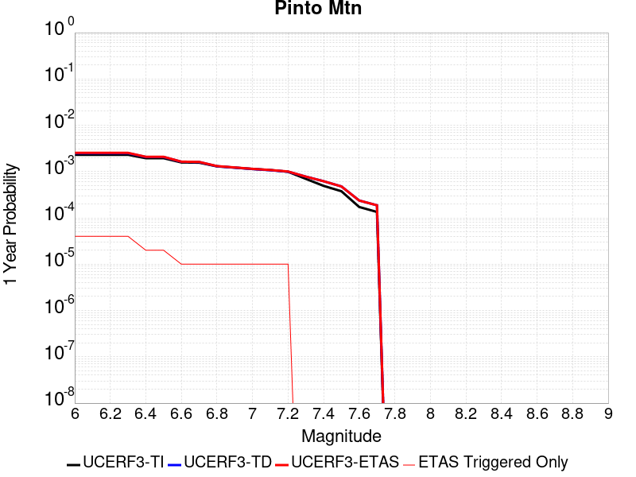 |  |

| Magnitude | 1 wk TI Prob | 1 wk TD Prob | 1 wk ETAS Prob | 1 wk ETAS/TD Gain | 1 wk ETAS Triggered Only | 1 mo TI Prob | 1 mo TD Prob | 1 mo ETAS Prob | 1 mo ETAS/TD Gain | 1 mo ETAS Triggered Only | 1 yr TI Prob | 1 yr TD Prob | 1 yr ETAS Prob | 1 yr ETAS/TD Gain | 1 yr ETAS Triggered Only | 10 yr TI Prob | 10 yr TD Prob | 10 yr ETAS Prob | 10 yr ETAS/TD Gain | 10 yr ETAS Triggered Only |
|-----|-----|-----|-----|-----|-----|-----|-----|-----|-----|-----|-----|-----|-----|-----|-----|-----|-----|-----|-----|-----|
| 6.0 | 4.4194956E-5 | 4.785362E-5 | 6.785266E-5 | 1.4179212 | 2.0E-5 | 1.893932E-4 | 2.0507174E-4 | 2.350656E-4 | 1.1462603 | 3.0E-5 | 0.0023034236 | 0.0024940541 | 0.0025339543 | 1.0159981 | 4.0E-5 | 0.022796938 | 0.024678145 | 0.024717158 | 1.0015808 | 4.0E-5 |
| 6.1 | 4.4194956E-5 | 4.785362E-5 | 6.785266E-5 | 1.4179212 | 2.0E-5 | 1.893932E-4 | 2.0507174E-4 | 2.350656E-4 | 1.1462603 | 3.0E-5 | 0.0023034236 | 0.0024940541 | 0.0025339543 | 1.0159981 | 4.0E-5 | 0.022796938 | 0.024678145 | 0.024717158 | 1.0015808 | 4.0E-5 |
| 6.2 | 4.4194956E-5 | 4.785362E-5 | 6.785266E-5 | 1.4179212 | 2.0E-5 | 1.893932E-4 | 2.0507174E-4 | 2.350656E-4 | 1.1462603 | 3.0E-5 | 0.0023034236 | 0.0024940541 | 0.0025339543 | 1.0159981 | 4.0E-5 | 0.022796938 | 0.024678145 | 0.024717158 | 1.0015808 | 4.0E-5 |
| 6.3 | 4.4194956E-5 | 4.785362E-5 | 6.785266E-5 | 1.4179212 | 2.0E-5 | 1.893932E-4 | 2.0507174E-4 | 2.350656E-4 | 1.1462603 | 3.0E-5 | 0.0023034236 | 0.0024940541 | 0.0025339543 | 1.0159981 | 4.0E-5 | 0.022796938 | 0.024678145 | 0.024717158 | 1.0015808 | 4.0E-5 |
| 6.4 | 3.729929E-5 | 3.9603186E-5 | 4.960279E-5 | 1.2524949 | 1.0E-5 | 1.5984432E-4 | 1.6971743E-4 | 1.8971403E-4 | 1.1178229 | 2.0E-5 | 0.0019443673 | 0.002064445 | 0.0020844038 | 1.0096679 | 2.0E-5 | 0.019274427 | 0.02046269 | 0.020482281 | 1.0009574 | 2.0E-5 |
| 6.5 | 3.729929E-5 | 3.9603186E-5 | 4.960279E-5 | 1.2524949 | 1.0E-5 | 1.5984432E-4 | 1.6971743E-4 | 1.8971403E-4 | 1.1178229 | 2.0E-5 | 0.0019443673 | 0.002064445 | 0.0020844038 | 1.0096679 | 2.0E-5 | 0.019274427 | 0.02046269 | 0.020482281 | 1.0009574 | 2.0E-5 |
| 6.6 | 3.0204548E-5 | 3.1205298E-5 | 3.1205298E-5 | 1.0 | 0.0 | 1.2944164E-4 | 1.3373033E-4 | 1.4372899E-4 | 1.0747674 | 1.0E-5 | 0.0015748127 | 0.0016269855 | 0.0016369692 | 1.0061363 | 1.0E-5 | 0.015636992 | 0.01615461 | 0.016164448 | 1.000609 | 1.0E-5 |
| 6.7 | 2.9857754E-5 | 3.081468E-5 | 3.081468E-5 | 1.0 | 0.0 | 1.2795553E-4 | 1.3205643E-4 | 1.4205511E-4 | 1.0757152 | 1.0E-5 | 0.0015567453 | 0.001606636 | 0.0016166199 | 1.0062141 | 1.0E-5 | 0.015458848 | 0.01595405 | 0.01596389 | 1.0006168 | 1.0E-5 |
| 6.8 | 2.4819734E-5 | 2.5009364E-5 | 2.5009364E-5 | 1.0 | 0.0 | 1.0636595E-4 | 1.07178705E-4 | 1.1717763E-4 | 1.0932921 | 1.0E-5 | 0.0012942362 | 0.0013041412 | 0.0013141282 | 1.0076579 | 1.0E-5 | 0.012867244 | 0.0129672475 | 0.012977118 | 1.0007612 | 1.0E-5 |
| 6.9 | 2.331124E-5 | 2.3337643E-5 | 2.3337643E-5 | 1.0 | 0.0 | 9.990149E-5 | 1.00014746E-4 | 1.10013745E-4 | 1.0999752 | 1.0E-5 | 0.001215622 | 0.0012170197 | 0.0012270075 | 1.0082068 | 1.0E-5 | 0.012089936 | 0.012105742 | 0.01211562 | 1.0008161 | 1.0E-5 |
| 7.0 | 2.1818534E-5 | 2.1760772E-5 | 2.1760772E-5 | 1.0 | 0.0 | 9.3504656E-5 | 9.325723E-5 | 1.032563E-4 | 1.1072203 | 1.0E-5 | 0.0011378246 | 0.0011348352 | 0.0011448239 | 1.0088018 | 1.0E-5 | 0.011320163 | 0.011292503 | 0.011302391 | 1.0008756 | 1.0E-5 |
| 7.1 | 2.066081E-5 | 2.0540418E-5 | 2.0540418E-5 | 1.0 | 0.0 | 8.854332E-5 | 8.8027504E-5 | 9.802662E-5 | 1.1135908 | 1.0E-5 | 0.0010774818 | 0.0010712275 | 0.0010812167 | 1.009325 | 1.0E-5 | 0.010722724 | 0.010662688 | 0.010672581 | 1.0009278 | 1.0E-5 |
| 7.2 | 1.8990233E-5 | 1.9053701E-5 | 1.9053701E-5 | 1.0 | 0.0 | 8.138417E-5 | 8.1656275E-5 | 9.1655456E-5 | 1.1224545 | 1.0E-5 | 9.904018E-4 | 9.937311E-4 | 0.0010037211 | 1.010053 | 1.0E-5 | 0.009859995 | 0.009894874 | 0.009904775 | 1.0010006 | 1.0E-5 |
| 7.3 | 1.3335872E-5 | 1.4906372E-5 | 1.4906372E-5 | 1.0 | 0.0 | 5.7152483E-5 | 6.388296E-5 | 6.388296E-5 | 1.0 | 0.0 | 6.956093E-4 | 7.775102E-4 | 7.775102E-4 | 1.0 | 0.0 | 0.006934359 | 0.0077491994 | 0.0077491994 | 1.0 | 0.0 |
| 7.4 | 9.414066E-6 | 1.186061E-5 | 1.186061E-5 | 1.0 | 0.0 | 4.0345374E-5 | 5.0830247E-5 | 5.0830247E-5 | 1.0 | 0.0 | 4.910942E-4 | 6.1869196E-4 | 6.1869196E-4 | 1.0 | 0.0 | 0.0049001034 | 0.006170644 | 0.006170644 | 1.0 | 0.0 |
| 7.5 | 7.2101157E-6 | 9.157893E-6 | 9.157893E-6 | 1.0 | 0.0 | 3.090013E-5 | 3.924757E-5 | 3.924757E-5 | 1.0 | 0.0 | 3.7614413E-4 | 4.7774217E-4 | 4.7774217E-4 | 1.0 | 0.0 | 0.0037550807 | 0.004767927 | 0.004767927 | 1.0 | 0.0 |
| 7.6 | 3.296375E-6 | 4.5453176E-6 | 4.5453176E-6 | 1.0 | 0.0 | 1.4127245E-5 | 1.9479796E-5 | 1.9479796E-5 | 1.0 | 0.0 | 1.7198564E-4 | 2.3714209E-4 | 2.3714209E-4 | 1.0 | 0.0 | 0.0017185259 | 0.0023690276 | 0.0023690276 | 1.0 | 0.0 |
| 7.7 | 2.5741092E-6 | 3.584251E-6 | 3.584251E-6 | 1.0 | 0.0 | 1.103185E-5 | 1.5360993E-5 | 1.5360993E-5 | 1.0 | 0.0 | 1.3430449E-4 | 1.8700535E-4 | 1.8700535E-4 | 1.0 | 0.0 | 0.0013422335 | 0.0018686098 | 0.0018686098 | 1.0 | 0.0 |

## Elysian Park (Upper)
*[(top)](#table-of-contents)*

| 1 Week | 1 Month | 1 Year | 10 Year |
|-----|-----|-----|-----|
|  | 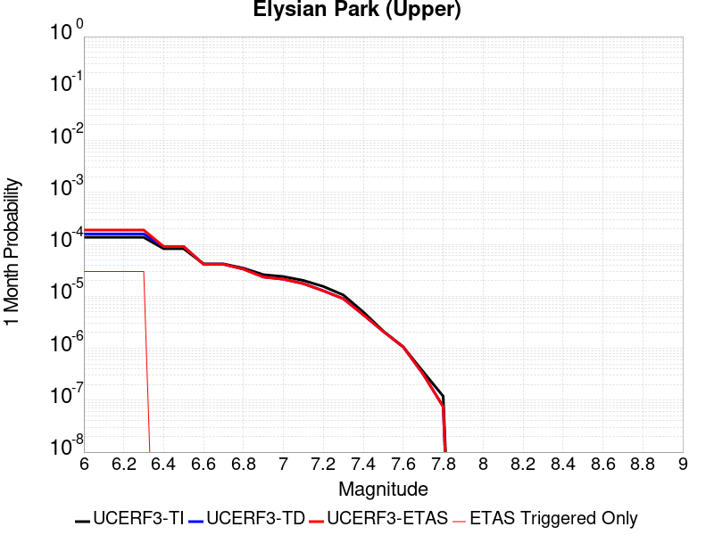 |  |  |

| Magnitude | 1 wk TI Prob | 1 wk TD Prob | 1 wk ETAS Prob | 1 wk ETAS/TD Gain | 1 wk ETAS Triggered Only | 1 mo TI Prob | 1 mo TD Prob | 1 mo ETAS Prob | 1 mo ETAS/TD Gain | 1 mo ETAS Triggered Only | 1 yr TI Prob | 1 yr TD Prob | 1 yr ETAS Prob | 1 yr ETAS/TD Gain | 1 yr ETAS Triggered Only | 10 yr TI Prob | 10 yr TD Prob | 10 yr ETAS Prob | 10 yr ETAS/TD Gain | 10 yr ETAS Triggered Only |
|-----|-----|-----|-----|-----|-----|-----|-----|-----|-----|-----|-----|-----|-----|-----|-----|-----|-----|-----|-----|-----|
| 6.0 | 3.1876025E-5 | 3.7035516E-5 | 6.70344E-5 | 1.8100033 | 3.0E-5 | 1.3660437E-4 | 1.587167E-4 | 1.8871194E-4 | 1.1889861 | 3.0E-5 | 0.0016618895 | 0.0019311075 | 0.0019610496 | 1.0155051 | 3.0E-5 | 0.016495159 | 0.019189782 | 0.019229015 | 1.0020444 | 4.0E-5 |
| 6.1 | 3.1876025E-5 | 3.7035516E-5 | 6.70344E-5 | 1.8100033 | 3.0E-5 | 1.3660437E-4 | 1.587167E-4 | 1.8871194E-4 | 1.1889861 | 3.0E-5 | 0.0016618895 | 0.0019311075 | 0.0019610496 | 1.0155051 | 3.0E-5 | 0.016495159 | 0.019189782 | 0.019229015 | 1.0020444 | 4.0E-5 |
| 6.2 | 3.1876025E-5 | 3.7035516E-5 | 6.70344E-5 | 1.8100033 | 3.0E-5 | 1.3660437E-4 | 1.587167E-4 | 1.8871194E-4 | 1.1889861 | 3.0E-5 | 0.0016618895 | 0.0019311075 | 0.0019610496 | 1.0155051 | 3.0E-5 | 0.016495159 | 0.019189782 | 0.019229015 | 1.0020444 | 4.0E-5 |
| 6.3 | 3.1876025E-5 | 3.7035516E-5 | 6.70344E-5 | 1.8100033 | 3.0E-5 | 1.3660437E-4 | 1.587167E-4 | 1.8871194E-4 | 1.1889861 | 3.0E-5 | 0.0016618895 | 0.0019311075 | 0.0019610496 | 1.0155051 | 3.0E-5 | 0.016495159 | 0.019189782 | 0.019229015 | 1.0020444 | 4.0E-5 |
| 6.4 | 1.9273462E-5 | 2.1202266E-5 | 2.1202266E-5 | 1.0 | 0.0 | 8.259794E-5 | 9.086466E-5 | 9.086466E-5 | 1.0 | 0.0 | 0.001005166 | 0.0011058892 | 0.0011058892 | 1.0 | 0.0 | 0.010006315 | 0.011020724 | 0.011030613 | 1.0008974 | 1.0E-5 |
| 6.5 | 1.9273462E-5 | 2.1202266E-5 | 2.1202266E-5 | 1.0 | 0.0 | 8.259794E-5 | 9.086466E-5 | 9.086466E-5 | 1.0 | 0.0 | 0.001005166 | 0.0011058892 | 0.0011058892 | 1.0 | 0.0 | 0.010006315 | 0.011020724 | 0.011030613 | 1.0008974 | 1.0E-5 |
| 6.6 | 9.813258E-6 | 9.665599E-6 | 9.665599E-6 | 1.0 | 0.0 | 4.205614E-5 | 4.1423376E-5 | 4.1423376E-5 | 1.0 | 0.0 | 5.119132E-4 | 5.0422014E-4 | 5.0422014E-4 | 1.0 | 0.0 | 0.005107356 | 0.0050314846 | 0.0050314846 | 1.0 | 0.0 |
| 6.7 | 9.801478E-6 | 9.653168E-6 | 9.653168E-6 | 1.0 | 0.0 | 4.2005657E-5 | 4.1370105E-5 | 4.1370105E-5 | 1.0 | 0.0 | 5.112989E-4 | 5.035719E-4 | 5.035719E-4 | 1.0 | 0.0 | 0.0051012407 | 0.0050250315 | 0.0050250315 | 1.0 | 0.0 |
| 6.8 | 8.102489E-6 | 7.773004E-6 | 7.773004E-6 | 1.0 | 0.0 | 3.4724493E-5 | 3.3312477E-5 | 3.3312477E-5 | 1.0 | 0.0 | 4.2268867E-4 | 4.055089E-4 | 4.055089E-4 | 1.0 | 0.0 | 0.004218856 | 0.0040481836 | 0.0040481836 | 1.0 | 0.0 |
| 6.9 | 6.08275E-6 | 5.4814514E-6 | 5.4814514E-6 | 1.0 | 0.0 | 2.6068668E-5 | 2.3491726E-5 | 2.3491726E-5 | 1.0 | 0.0 | 3.173398E-4 | 2.85975E-4 | 2.85975E-4 | 1.0 | 0.0 | 0.0031688702 | 0.0028561477 | 0.0028561477 | 1.0 | 0.0 |
| 7.0 | 5.5995934E-6 | 4.98278E-6 | 4.98278E-6 | 1.0 | 0.0 | 2.3998036E-5 | 2.13546E-5 | 2.13546E-5 | 1.0 | 0.0 | 2.9213692E-4 | 2.599619E-4 | 2.599619E-4 | 1.0 | 0.0 | 0.0029175316 | 0.0025966454 | 0.0025966454 | 1.0 | 0.0 |
| 7.1 | 4.709881E-6 | 4.0874015E-6 | 4.0874015E-6 | 1.0 | 0.0 | 2.0185047E-5 | 1.7517319E-5 | 1.7517319E-5 | 1.0 | 0.0 | 2.4572524E-4 | 2.132529E-4 | 2.132529E-4 | 1.0 | 0.0 | 0.002454537 | 0.002130524 | 0.002130524 | 1.0 | 0.0 |
| 7.2 | 3.6063436E-6 | 2.9779544E-6 | 2.9779544E-6 | 1.0 | 0.0 | 1.5455667E-5 | 1.27626E-5 | 1.27626E-5 | 1.0 | 0.0 | 1.881565E-4 | 1.5537368E-4 | 1.5537368E-4 | 1.0 | 0.0 | 0.0018799726 | 0.0015526618 | 0.0015526618 | 1.0 | 0.0 |
| 7.3 | 2.471135E-6 | 2.0954615E-6 | 2.0954615E-6 | 1.0 | 0.0 | 1.0590536E-5 | 8.980519E-6 | 8.980519E-6 | 1.0 | 0.0 | 1.2893214E-4 | 1.093324E-4 | 1.093324E-4 | 1.0 | 0.0 | 0.0012885736 | 0.0010927934 | 0.0010927934 | 1.0 | 0.0 |
| 7.4 | 1.163943E-6 | 1.0275091E-6 | 1.0275091E-6 | 1.0 | 0.0 | 4.988318E-6 | 4.4036033E-6 | 4.4036033E-6 | 1.0 | 0.0 | 6.0731076E-5 | 5.3612584E-5 | 5.3612584E-5 | 1.0 | 0.0 | 6.071448E-4 | 5.359995E-4 | 5.359995E-4 | 1.0 | 0.0 |
| 7.5 | 4.99459E-7 | 4.917604E-7 | 4.917604E-7 | 1.0 | 0.0 | 2.140537E-6 | 2.1075427E-6 | 2.1075427E-6 | 1.0 | 0.0 | 2.6060725E-5 | 2.5659048E-5 | 2.5659048E-5 | 1.0 | 0.0 | 2.605767E-4 | 2.5656243E-4 | 2.5656243E-4 | 1.0 | 0.0 |
| 7.6 | 2.4667852E-7 | 2.4778336E-7 | 2.4778336E-7 | 1.0 | 0.0 | 1.0571932E-6 | 1.0619283E-6 | 1.0619283E-6 | 1.0 | 0.0 | 1.2871251E-5 | 1.2928905E-5 | 1.2928905E-5 | 1.0 | 0.0 | 1.2870505E-4 | 1.2928189E-4 | 1.2928189E-4 | 1.0 | 0.0 |
| 7.7 | 8.2312795E-8 | 7.3864456E-8 | 7.3864456E-8 | 1.0 | 0.0 | 3.527691E-7 | 3.165619E-7 | 3.165619E-7 | 1.0 | 0.0 | 4.294955E-6 | 3.8541357E-6 | 3.8541357E-6 | 1.0 | 0.0 | 4.2948723E-5 | 3.8540802E-5 | 3.8540802E-5 | 1.0 | 0.0 |
| 7.8 | 2.7819295E-8 | 1.7566023E-8 | 1.7566023E-8 | 1.0 | 0.0 | 1.1922555E-7 | 7.5282955E-8 | 7.5282955E-8 | 1.0 | 0.0 | 1.45157E-6 | 9.165697E-7 | 9.165697E-7 | 1.0 | 0.0 | 1.45156055E-5 | 9.165675E-6 | 9.165675E-6 | 1.0 | 0.0 |

## Red Mountain
*[(top)](#table-of-contents)*

| 1 Week | 1 Month | 1 Year | 10 Year |
|-----|-----|-----|-----|
|  |  |  |  |

| Magnitude | 1 wk TI Prob | 1 wk TD Prob | 1 wk ETAS Prob | 1 wk ETAS/TD Gain | 1 wk ETAS Triggered Only | 1 mo TI Prob | 1 mo TD Prob | 1 mo ETAS Prob | 1 mo ETAS/TD Gain | 1 mo ETAS Triggered Only | 1 yr TI Prob | 1 yr TD Prob | 1 yr ETAS Prob | 1 yr ETAS/TD Gain | 1 yr ETAS Triggered Only | 10 yr TI Prob | 10 yr TD Prob | 10 yr ETAS Prob | 10 yr ETAS/TD Gain | 10 yr ETAS Triggered Only |
|-----|-----|-----|-----|-----|-----|-----|-----|-----|-----|-----|-----|-----|-----|-----|-----|-----|-----|-----|-----|-----|
| 6.0 | 4.1810763E-5 | 4.7589947E-5 | 5.758947E-5 | 1.2101184 | 1.0E-5 | 1.7917668E-4 | 2.039419E-4 | 2.1393986E-4 | 1.0490236 | 1.0E-5 | 0.0021792934 | 0.0024803306 | 0.0025102561 | 1.0120652 | 3.0E-5 | 0.021580452 | 0.024544092 | 0.02458311 | 1.0015898 | 4.0E-5 |
| 6.1 | 4.1810763E-5 | 4.7589947E-5 | 5.758947E-5 | 1.2101184 | 1.0E-5 | 1.7917668E-4 | 2.039419E-4 | 2.1393986E-4 | 1.0490236 | 1.0E-5 | 0.0021792934 | 0.0024803306 | 0.0025102561 | 1.0120652 | 3.0E-5 | 0.021580452 | 0.024544092 | 0.02458311 | 1.0015898 | 4.0E-5 |
| 6.2 | 4.1810763E-5 | 4.7589947E-5 | 5.758947E-5 | 1.2101184 | 1.0E-5 | 1.7917668E-4 | 2.039419E-4 | 2.1393986E-4 | 1.0490236 | 1.0E-5 | 0.0021792934 | 0.0024803306 | 0.0025102561 | 1.0120652 | 3.0E-5 | 0.021580452 | 0.024544092 | 0.02458311 | 1.0015898 | 4.0E-5 |
| 6.3 | 4.1810763E-5 | 4.7589947E-5 | 5.758947E-5 | 1.2101184 | 1.0E-5 | 1.7917668E-4 | 2.039419E-4 | 2.1393986E-4 | 1.0490236 | 1.0E-5 | 0.0021792934 | 0.0024803306 | 0.0025102561 | 1.0120652 | 3.0E-5 | 0.021580452 | 0.024544092 | 0.02458311 | 1.0015898 | 4.0E-5 |
| 6.4 | 4.1810763E-5 | 4.7589947E-5 | 5.758947E-5 | 1.2101184 | 1.0E-5 | 1.7917668E-4 | 2.039419E-4 | 2.1393986E-4 | 1.0490236 | 1.0E-5 | 0.0021792934 | 0.0024803306 | 0.0025102561 | 1.0120652 | 3.0E-5 | 0.021580452 | 0.024544092 | 0.02458311 | 1.0015898 | 4.0E-5 |
| 6.5 | 3.154503E-5 | 3.5359728E-5 | 3.5359728E-5 | 1.0 | 0.0 | 1.3518598E-4 | 1.5153342E-4 | 1.5153342E-4 | 1.0 | 0.0 | 0.0016446467 | 0.0018434501 | 0.0018534317 | 1.0054146 | 1.0E-5 | 0.01632528 | 0.018291233 | 0.018310867 | 1.0010734 | 2.0E-5 |
| 6.6 | 3.1535834E-5 | 3.534911E-5 | 3.534911E-5 | 1.0 | 0.0 | 1.3514658E-4 | 1.5148791E-4 | 1.5148791E-4 | 1.0 | 0.0 | 0.0016441676 | 0.001842897 | 0.0018528787 | 1.0054163 | 1.0E-5 | 0.01632056 | 0.018285794 | 0.018305428 | 1.0010737 | 2.0E-5 |
| 6.7 | 2.8267326E-5 | 3.146934E-5 | 3.146934E-5 | 1.0 | 0.0 | 1.2114006E-4 | 1.348621E-4 | 1.348621E-4 | 1.0 | 0.0 | 0.0014738824 | 0.0016407946 | 0.0016407946 | 1.0 | 0.0 | 0.014641452 | 0.016295563 | 0.0163054 | 1.0006037 | 1.0E-5 |
| 6.8 | 2.8212884E-5 | 3.1407224E-5 | 3.1407224E-5 | 1.0 | 0.0 | 1.20906756E-4 | 1.3459593E-4 | 1.3459593E-4 | 1.0 | 0.0 | 0.0014710457 | 0.0016375587 | 0.0016375587 | 1.0 | 0.0 | 0.014613459 | 0.01626368 | 0.016273517 | 1.0006049 | 1.0E-5 |
| 6.9 | 2.4227871E-5 | 2.6706979E-5 | 2.6706979E-5 | 1.0 | 0.0 | 1.03829596E-4 | 1.14453884E-4 | 1.14453884E-4 | 1.0 | 0.0 | 0.0012633923 | 0.0013926612 | 0.0013926612 | 1.0 | 0.0 | 0.012562336 | 0.013847026 | 0.013847026 | 1.0 | 0.0 |
| 7.0 | 2.348524E-5 | 2.5835763E-5 | 2.5835763E-5 | 1.0 | 0.0 | 1.0064714E-4 | 1.1072042E-4 | 1.1072042E-4 | 1.0 | 0.0 | 0.0012246901 | 0.0013472632 | 0.0013472632 | 1.0 | 0.0 | 0.012179627 | 0.01339859 | 0.01339859 | 1.0 | 0.0 |
| 7.1 | 2.2311642E-5 | 2.4462828E-5 | 2.4462828E-5 | 1.0 | 0.0 | 9.561782E-5 | 1.048369E-4 | 1.048369E-4 | 1.0 | 0.0 | 0.0011635252 | 0.0012757168 | 0.0012757168 | 1.0 | 0.0 | 0.01157452 | 0.012691451 | 0.012691451 | 1.0 | 0.0 |
| 7.2 | 1.6533986E-5 | 1.7670347E-5 | 1.7670347E-5 | 1.0 | 0.0 | 7.085802E-5 | 7.572822E-5 | 7.572822E-5 | 1.0 | 0.0 | 8.623549E-4 | 9.216645E-4 | 9.216645E-4 | 1.0 | 0.0 | 0.008590161 | 0.009184699 | 0.009184699 | 1.0 | 0.0 |
| 7.3 | 1.4703092E-5 | 1.555952E-5 | 1.555952E-5 | 1.0 | 0.0 | 6.301173E-5 | 6.66823E-5 | 6.66823E-5 | 1.0 | 0.0 | 7.668978E-4 | 8.1161625E-4 | 8.1161625E-4 | 1.0 | 0.0 | 0.0076425658 | 0.008092596 | 0.008092596 | 1.0 | 0.0 |
| 7.4 | 6.1331984E-6 | 5.528872E-6 | 5.528872E-6 | 1.0 | 0.0 | 2.6284872E-5 | 2.3694953E-5 | 2.3694953E-5 | 1.0 | 0.0 | 3.199713E-4 | 2.8844838E-4 | 2.8844838E-4 | 1.0 | 0.0 | 0.0031951098 | 0.0028807942 | 0.0028807942 | 1.0 | 0.0 |
| 7.5 | 5.954766E-6 | 5.3385015E-6 | 5.3385015E-6 | 1.0 | 0.0 | 2.5520176E-5 | 2.2879094E-5 | 2.2879094E-5 | 1.0 | 0.0 | 3.1066386E-4 | 2.785179E-4 | 2.785179E-4 | 1.0 | 0.0 | 0.003102299 | 0.0027817423 | 0.0027817423 | 1.0 | 0.0 |
| 7.6 | 4.9726646E-6 | 4.315295E-6 | 4.315295E-6 | 1.0 | 0.0 | 2.1311245E-5 | 1.8493993E-5 | 1.8493993E-5 | 1.0 | 0.0 | 2.5943352E-4 | 2.2514143E-4 | 2.2514143E-4 | 1.0 | 0.0 | 0.0025913084 | 0.002249168 | 0.002249168 | 1.0 | 0.0 |
| 7.7 | 3.3613894E-6 | 2.8526642E-6 | 2.8526642E-6 | 1.0 | 0.0 | 1.4405875E-5 | 1.2225649E-5 | 1.2225649E-5 | 1.0 | 0.0 | 1.7537741E-4 | 1.4883737E-4 | 1.4883737E-4 | 1.0 | 0.0 | 0.0017523908 | 0.0014874031 | 0.0014874031 | 1.0 | 0.0 |
| 7.8 | 1.1828961E-6 | 1.0122756E-6 | 1.0122756E-6 | 1.0 | 0.0 | 5.069545E-6 | 4.338317E-6 | 4.338317E-6 | 1.0 | 0.0 | 6.171996E-5 | 5.281776E-5 | 5.281776E-5 | 1.0 | 0.0 | 6.170282E-4 | 5.2805495E-4 | 5.2805495E-4 | 1.0 | 0.0 |
| 7.9 | 2.2967266E-7 | 1.8618952E-7 | 1.8618952E-7 | 1.0 | 0.0 | 9.843111E-7 | 7.9795484E-7 | 7.9795484E-7 | 1.0 | 0.0 | 1.19839215E-5 | 9.7150605E-6 | 9.7150605E-6 | 1.0 | 0.0 | 1.1983275E-4 | 9.714664E-5 | 9.714664E-5 | 1.0 | 0.0 |

## Sheephole
*[(top)](#table-of-contents)*

| 1 Week | 1 Month | 1 Year | 10 Year |
|-----|-----|-----|-----|
|  |  |  |  |

| Magnitude | 1 wk TI Prob | 1 wk TD Prob | 1 wk ETAS Prob | 1 wk ETAS/TD Gain | 1 wk ETAS Triggered Only | 1 mo TI Prob | 1 mo TD Prob | 1 mo ETAS Prob | 1 mo ETAS/TD Gain | 1 mo ETAS Triggered Only | 1 yr TI Prob | 1 yr TD Prob | 1 yr ETAS Prob | 1 yr ETAS/TD Gain | 1 yr ETAS Triggered Only | 10 yr TI Prob | 10 yr TD Prob | 10 yr ETAS Prob | 10 yr ETAS/TD Gain | 10 yr ETAS Triggered Only |
|-----|-----|-----|-----|-----|-----|-----|-----|-----|-----|-----|-----|-----|-----|-----|-----|-----|-----|-----|-----|-----|
| 6.0 | 4.5579695E-6 | 4.7412627E-6 | 3.474112E-5 | 7.3273983 | 3.0E-5 | 1.9534009E-5 | 2.031957E-5 | 5.031896E-5 | 2.4763792 | 3.0E-5 | 2.3780059E-4 | 2.473682E-4 | 2.7736078E-4 | 1.1212467 | 3.0E-5 | 0.0023754628 | 0.002471473 | 0.002501399 | 1.0121086 | 3.0E-5 |
| 6.1 | 4.5579695E-6 | 4.7412627E-6 | 3.474112E-5 | 7.3273983 | 3.0E-5 | 1.9534009E-5 | 2.031957E-5 | 5.031896E-5 | 2.4763792 | 3.0E-5 | 2.3780059E-4 | 2.473682E-4 | 2.7736078E-4 | 1.1212467 | 3.0E-5 | 0.0023754628 | 0.002471473 | 0.002501399 | 1.0121086 | 3.0E-5 |
| 6.2 | 2.6677674E-6 | 2.7873941E-6 | 1.2787366E-5 | 4.58757 | 1.0E-5 | 1.1433239E-5 | 1.1945926E-5 | 2.1945807E-5 | 1.8370954 | 1.0E-5 | 1.3919079E-4 | 1.4543302E-4 | 1.5543157E-4 | 1.0687501 | 1.0E-5 | 0.0013910364 | 0.0014534844 | 0.0014634698 | 1.00687 | 1.0E-5 |
| 6.3 | 2.6677674E-6 | 2.7873941E-6 | 1.2787366E-5 | 4.58757 | 1.0E-5 | 1.1433239E-5 | 1.1945926E-5 | 2.1945807E-5 | 1.8370954 | 1.0E-5 | 1.3919079E-4 | 1.4543302E-4 | 1.5543157E-4 | 1.0687501 | 1.0E-5 | 0.0013910364 | 0.0014534844 | 0.0014634698 | 1.00687 | 1.0E-5 |
| 6.4 | 2.2159759E-6 | 2.3228788E-6 | 1.2322856E-5 | 5.304993 | 1.0E-5 | 9.497005E-6 | 9.955161E-6 | 1.9955061E-5 | 2.0044942 | 1.0E-5 | 1.156199E-4 | 1.2119815E-4 | 1.3119694E-4 | 1.0824995 | 1.0E-5 | 0.0011555976 | 0.0012113999 | 0.0012213878 | 1.0082449 | 1.0E-5 |
| 6.5 | 2.1986082E-6 | 2.304759E-6 | 1.2304736E-5 | 5.3388386 | 1.0E-5 | 9.4225725E-6 | 9.877506E-6 | 1.9877407E-5 | 2.0123913 | 1.0E-5 | 1.1471378E-4 | 1.2025281E-4 | 1.302516E-4 | 1.0831481 | 1.0E-5 | 0.0011465458 | 0.0012019566 | 0.0012119446 | 1.0083097 | 1.0E-5 |
| 6.6 | 1.5232331E-6 | 1.6018919E-6 | 1.6018919E-6 | 1.0 | 0.0 | 6.5281256E-6 | 6.865234E-6 | 6.865234E-6 | 1.0 | 0.0 | 7.947703E-5 | 8.35812E-5 | 8.35812E-5 | 1.0 | 0.0 | 7.9448614E-4 | 8.3551643E-4 | 8.3551643E-4 | 1.0 | 0.0 |
| 6.7 | 1.3137362E-6 | 1.382819E-6 | 1.382819E-6 | 1.0 | 0.0 | 5.6302856E-6 | 5.926355E-6 | 5.926355E-6 | 1.0 | 0.0 | 6.854657E-5 | 7.215112E-5 | 7.215112E-5 | 1.0 | 0.0 | 6.8525434E-4 | 7.212908E-4 | 7.212908E-4 | 1.0 | 0.0 |
| 6.8 | 1.2275751E-6 | 1.2922847E-6 | 1.2922847E-6 | 1.0 | 0.0 | 5.2610258E-6 | 5.5383516E-6 | 5.5383516E-6 | 1.0 | 0.0 | 6.4051106E-5 | 6.7427485E-5 | 6.7427485E-5 | 1.0 | 0.0 | 6.4032647E-4 | 6.740836E-4 | 6.740836E-4 | 1.0 | 0.0 |
| 6.9 | 1.1837088E-6 | 1.246102E-6 | 1.246102E-6 | 1.0 | 0.0 | 5.0730278E-6 | 5.340427E-6 | 5.340427E-6 | 1.0 | 0.0 | 6.176237E-5 | 6.501789E-5 | 6.501789E-5 | 1.0 | 0.0 | 6.17452E-4 | 6.5000186E-4 | 6.5000186E-4 | 1.0 | 0.0 |
| 7.0 | 9.849371E-7 | 1.0366288E-6 | 1.0366288E-6 | 1.0 | 0.0 | 4.2211523E-6 | 4.442688E-6 | 4.442688E-6 | 1.0 | 0.0 | 5.1391315E-5 | 5.4088487E-5 | 5.4088487E-5 | 1.0 | 0.0 | 5.137943E-4 | 5.407633E-4 | 5.407633E-4 | 1.0 | 0.0 |
| 7.1 | 8.1643645E-7 | 8.591669E-7 | 8.591669E-7 | 1.0 | 0.0 | 3.4990085E-6 | 3.682139E-6 | 3.682139E-6 | 1.0 | 0.0 | 4.2599597E-5 | 4.482921E-5 | 4.482921E-5 | 1.0 | 0.0 | 4.259143E-4 | 4.4821028E-4 | 4.4821028E-4 | 1.0 | 0.0 |
| 7.2 | 5.7295756E-7 | 6.029502E-7 | 6.029502E-7 | 1.0 | 0.0 | 2.45553E-6 | 2.58407E-6 | 2.58407E-6 | 1.0 | 0.0 | 2.9895667E-5 | 3.1460666E-5 | 3.1460666E-5 | 1.0 | 0.0 | 2.9891645E-4 | 3.145688E-4 | 3.145688E-4 | 1.0 | 0.0 |

## Coronado Bank alt1
*[(top)](#table-of-contents)*

| 1 Week | 1 Month | 1 Year | 10 Year |
|-----|-----|-----|-----|
|  |  |  |  |

| Magnitude | 1 wk TI Prob | 1 wk TD Prob | 1 wk ETAS Prob | 1 wk ETAS/TD Gain | 1 wk ETAS Triggered Only | 1 mo TI Prob | 1 mo TD Prob | 1 mo ETAS Prob | 1 mo ETAS/TD Gain | 1 mo ETAS Triggered Only | 1 yr TI Prob | 1 yr TD Prob | 1 yr ETAS Prob | 1 yr ETAS/TD Gain | 1 yr ETAS Triggered Only | 10 yr TI Prob | 10 yr TD Prob | 10 yr ETAS Prob | 10 yr ETAS/TD Gain | 10 yr ETAS Triggered Only |
|-----|-----|-----|-----|-----|-----|-----|-----|-----|-----|-----|-----|-----|-----|-----|-----|-----|-----|-----|-----|-----|
| 6.0 | 7.533492E-5 | 9.394913E-5 | 1.03948194E-4 | 1.1064305 | 1.0E-5 | 3.22824E-4 | 4.0258127E-4 | 4.1257724E-4 | 1.0248297 | 1.0E-5 | 0.0039233007 | 0.0048909658 | 0.004920819 | 1.0061038 | 3.0E-5 | 0.03854755 | 0.04790356 | 0.047932126 | 1.0005963 | 3.0E-5 |
| 6.1 | 4.1807285E-5 | 5.049283E-5 | 6.0492326E-5 | 1.1980379 | 1.0E-5 | 1.7916178E-4 | 2.1638049E-4 | 2.2637832E-4 | 1.0462049 | 1.0E-5 | 0.0021791123 | 0.0026313474 | 0.0026612685 | 1.011371 | 3.0E-5 | 0.021578677 | 0.026011046 | 0.026040267 | 1.0011233 | 3.0E-5 |
| 6.2 | 4.1807285E-5 | 5.049283E-5 | 6.0492326E-5 | 1.1980379 | 1.0E-5 | 1.7916178E-4 | 2.1638049E-4 | 2.2637832E-4 | 1.0462049 | 1.0E-5 | 0.0021791123 | 0.0026313474 | 0.0026612685 | 1.011371 | 3.0E-5 | 0.021578677 | 0.026011046 | 0.026040267 | 1.0011233 | 3.0E-5 |
| 6.3 | 3.1793104E-5 | 3.7711117E-5 | 4.771074E-5 | 1.2651638 | 1.0E-5 | 1.3624904E-4 | 1.6160926E-4 | 1.7160765E-4 | 1.0618676 | 1.0E-5 | 0.0016575698 | 0.001965848 | 0.0019957891 | 1.0152305 | 3.0E-5 | 0.016452603 | 0.019488465 | 0.01951788 | 1.0015094 | 3.0E-5 |
| 6.4 | 2.9878007E-5 | 3.5335794E-5 | 4.533544E-5 | 1.2829891 | 1.0E-5 | 1.2804232E-4 | 1.5143053E-4 | 1.6142902E-4 | 1.0660269 | 1.0E-5 | 0.0015578003 | 0.0018421387 | 0.0018621018 | 1.010837 | 2.0E-5 | 0.015469253 | 0.01827244 | 0.018292075 | 1.0010746 | 2.0E-5 |
| 6.5 | 2.4512565E-5 | 2.8764043E-5 | 3.8763756E-5 | 1.3476462 | 1.0E-5 | 1.0504962E-4 | 1.2326881E-4 | 1.3326757E-4 | 1.0811136 | 1.0E-5 | 0.0012782287 | 0.0014997921 | 0.0015097772 | 1.0066576 | 1.0E-5 | 0.012709012 | 0.014899683 | 0.014909534 | 1.0006611 | 1.0E-5 |
| 6.6 | 2.1317413E-5 | 2.490667E-5 | 3.490642E-5 | 1.4014889 | 1.0E-5 | 9.135714E-5 | 1.0673863E-4 | 1.1673757E-4 | 1.0936768 | 1.0E-5 | 0.0011117056 | 0.0012987906 | 0.0013087775 | 1.0076895 | 1.0E-5 | 0.011061605 | 0.012914404 | 0.012924275 | 1.0007644 | 1.0E-5 |
| 6.7 | 1.8585655E-5 | 2.163488E-5 | 3.1634663E-5 | 1.4622066 | 1.0E-5 | 7.9650374E-5 | 9.271773E-5 | 1.02716804E-4 | 1.1078442 | 1.0E-5 | 9.6931186E-4 | 0.0011282742 | 0.001138263 | 1.0088531 | 1.0E-5 | 0.0096509475 | 0.011227623 | 0.01123751 | 1.0008807 | 1.0E-5 |
| 6.8 | 1.5862879E-5 | 1.8419474E-5 | 2.841929E-5 | 1.5428936 | 1.0E-5 | 6.798199E-5 | 7.893833E-5 | 8.893754E-5 | 1.1266712 | 1.0E-5 | 8.273665E-4 | 9.6066965E-4 | 9.7066E-4 | 1.0103995 | 1.0E-5 | 0.008242928 | 0.00956715 | 0.0095770545 | 1.0010352 | 1.0E-5 |
| 6.9 | 1.3021509E-5 | 1.5095265E-5 | 2.5095114E-5 | 1.6624494 | 1.0E-5 | 5.5805274E-5 | 6.469249E-5 | 7.4691845E-5 | 1.1545675 | 1.0E-5 | 6.792174E-4 | 7.8736455E-4 | 7.9735665E-4 | 1.0126905 | 1.0E-5 | 0.006771452 | 0.007847573 | 0.007857494 | 1.0012643 | 1.0E-5 |
| 7.0 | 1.0974371E-5 | 1.2720104E-5 | 2.2719976E-5 | 1.7861471 | 1.0E-5 | 4.7032172E-5 | 5.451369E-5 | 6.4513144E-5 | 1.1834302 | 1.0E-5 | 5.7246623E-4 | 6.6351966E-4 | 6.73513E-4 | 1.0150611 | 1.0E-5 | 0.0057099373 | 0.006617135 | 0.0066270684 | 1.0015012 | 1.0E-5 |
| 7.1 | 8.766221E-6 | 1.01638325E-5 | 2.016373E-5 | 1.9838709 | 1.0E-5 | 3.7568978E-5 | 4.355865E-5 | 5.3558215E-5 | 1.2295655 | 1.0E-5 | 4.573063E-4 | 5.3021475E-4 | 5.402094E-4 | 1.0188503 | 1.0E-5 | 0.0045636636 | 0.0052911965 | 0.0053011435 | 1.0018799 | 1.0E-5 |
| 7.2 | 8.026024E-7 | 8.331765E-7 | 8.331765E-7 | 1.0 | 0.0 | 3.43972E-6 | 3.5707515E-6 | 3.5707515E-6 | 1.0 | 0.0 | 4.1877785E-5 | 4.3473043E-5 | 4.3473043E-5 | 1.0 | 0.0 | 4.1869894E-4 | 4.3464647E-4 | 4.3464647E-4 | 1.0 | 0.0 |
| 7.3 | 3.7293114E-7 | 3.7000953E-7 | 3.7000953E-7 | 1.0 | 0.0 | 1.5982754E-6 | 1.5857541E-6 | 1.5857541E-6 | 1.0 | 0.0 | 1.9458828E-5 | 1.9306386E-5 | 1.9306386E-5 | 1.0 | 0.0 | 1.9457124E-4 | 1.9304715E-4 | 1.9304715E-4 | 1.0 | 0.0 |
| 7.4 | 2.0557036E-7 | 1.9674363E-7 | 1.9674363E-7 | 1.0 | 0.0 | 8.810155E-7 | 8.431867E-7 | 8.431867E-7 | 1.0 | 0.0 | 1.0726311E-5 | 1.026575E-5 | 1.026575E-5 | 1.0 | 0.0 | 1.0725793E-4 | 1.0265279E-4 | 1.0265279E-4 | 1.0 | 0.0 |
| 7.5 | 6.845446E-8 | 6.279369E-8 | 6.279369E-8 | 1.0 | 0.0 | 2.9337625E-7 | 2.691158E-7 | 2.691158E-7 | 1.0 | 0.0 | 3.5718497E-6 | 3.2764797E-6 | 3.2764797E-6 | 1.0 | 0.0 | 3.5717923E-5 | 3.2764325E-5 | 3.2764325E-5 | 1.0 | 0.0 |
| 7.6 | 6.0975145E-9 | 5.53185E-9 | 5.53185E-9 | 1.0 | 0.0 | 2.6132206E-8 | 2.370793E-8 | 2.370793E-8 | 1.0 | 0.0 | 3.1815955E-7 | 2.88644E-7 | 2.88644E-7 | 1.0 | 0.0 | 3.181591E-6 | 2.8864374E-6 | 2.8864374E-6 | 1.0 | 0.0 |

## Santa Cruz Island
*[(top)](#table-of-contents)*

| 1 Week | 1 Month | 1 Year | 10 Year |
|-----|-----|-----|-----|
|  |  |  |  |

| Magnitude | 1 wk TI Prob | 1 wk TD Prob | 1 wk ETAS Prob | 1 wk ETAS/TD Gain | 1 wk ETAS Triggered Only | 1 mo TI Prob | 1 mo TD Prob | 1 mo ETAS Prob | 1 mo ETAS/TD Gain | 1 mo ETAS Triggered Only | 1 yr TI Prob | 1 yr TD Prob | 1 yr ETAS Prob | 1 yr ETAS/TD Gain | 1 yr ETAS Triggered Only | 10 yr TI Prob | 10 yr TD Prob | 10 yr ETAS Prob | 10 yr ETAS/TD Gain | 10 yr ETAS Triggered Only |
|-----|-----|-----|-----|-----|-----|-----|-----|-----|-----|-----|-----|-----|-----|-----|-----|-----|-----|-----|-----|-----|
| 6.0 | 2.9164563E-5 | 3.1599742E-5 | 6.1598796E-5 | 1.9493448 | 3.0E-5 | 1.2498499E-4 | 1.3542121E-4 | 1.6541715E-4 | 1.221501 | 3.0E-5 | 0.0015206301 | 0.0016476426 | 0.0016775931 | 1.0181779 | 3.0E-5 | 0.015102667 | 0.016368 | 0.016397508 | 1.0018028 | 3.0E-5 |
| 6.1 | 2.9164563E-5 | 3.1599742E-5 | 6.1598796E-5 | 1.9493448 | 3.0E-5 | 1.2498499E-4 | 1.3542121E-4 | 1.6541715E-4 | 1.221501 | 3.0E-5 | 0.0015206301 | 0.0016476426 | 0.0016775931 | 1.0181779 | 3.0E-5 | 0.015102667 | 0.016368 | 0.016397508 | 1.0018028 | 3.0E-5 |
| 6.2 | 2.9164563E-5 | 3.1599742E-5 | 6.1598796E-5 | 1.9493448 | 3.0E-5 | 1.2498499E-4 | 1.3542121E-4 | 1.6541715E-4 | 1.221501 | 3.0E-5 | 0.0015206301 | 0.0016476426 | 0.0016775931 | 1.0181779 | 3.0E-5 | 0.015102667 | 0.016368 | 0.016397508 | 1.0018028 | 3.0E-5 |
| 6.3 | 1.6635553E-5 | 1.780436E-5 | 1.780436E-5 | 1.0 | 0.0 | 7.1293274E-5 | 7.630226E-5 | 7.630226E-5 | 1.0 | 0.0 | 8.6765E-4 | 9.2860236E-4 | 9.2860236E-4 | 1.0 | 0.0 | 0.008642701 | 0.009249094 | 0.009249094 | 1.0 | 0.0 |
| 6.4 | 1.6635553E-5 | 1.780436E-5 | 1.780436E-5 | 1.0 | 0.0 | 7.1293274E-5 | 7.630226E-5 | 7.630226E-5 | 1.0 | 0.0 | 8.6765E-4 | 9.2860236E-4 | 9.2860236E-4 | 1.0 | 0.0 | 0.008642701 | 0.009249094 | 0.009249094 | 1.0 | 0.0 |
| 6.5 | 1.2238748E-5 | 1.3042995E-5 | 1.3042995E-5 | 1.0 | 0.0 | 5.2450723E-5 | 5.5897377E-5 | 5.5897377E-5 | 1.0 | 0.0 | 6.3840044E-4 | 6.8034173E-4 | 6.8034173E-4 | 1.0 | 0.0 | 0.0063656955 | 0.0067829876 | 0.0067829876 | 1.0 | 0.0 |
| 6.6 | 1.0489767E-5 | 1.1156636E-5 | 1.1156636E-5 | 1.0 | 0.0 | 4.495537E-5 | 4.781329E-5 | 4.781329E-5 | 1.0 | 0.0 | 5.4719415E-4 | 5.819735E-4 | 5.819735E-4 | 1.0 | 0.0 | 0.005458487 | 0.0058047357 | 0.0058047357 | 1.0 | 0.0 |
| 6.7 | 8.699222E-6 | 9.236782E-6 | 9.236782E-6 | 1.0 | 0.0 | 3.7281847E-5 | 3.958561E-5 | 3.958561E-5 | 1.0 | 0.0 | 4.5381195E-4 | 4.8184878E-4 | 4.8184878E-4 | 1.0 | 0.0 | 0.0045288634 | 0.004808108 | 0.004808108 | 1.0 | 0.0 |
| 6.8 | 8.307732E-6 | 8.8169045E-6 | 8.8169045E-6 | 1.0 | 0.0 | 3.560408E-5 | 3.7786187E-5 | 3.7786187E-5 | 1.0 | 0.0 | 4.3339343E-4 | 4.5995016E-4 | 4.5995016E-4 | 1.0 | 0.0 | 0.004325492 | 0.0045900354 | 0.0045900354 | 1.0 | 0.0 |
| 6.9 | 8.073121E-6 | 8.564939E-6 | 8.564939E-6 | 1.0 | 0.0 | 3.459863E-5 | 3.6706366E-5 | 3.6706366E-5 | 1.0 | 0.0 | 4.2115687E-4 | 4.468088E-4 | 4.468088E-4 | 1.0 | 0.0 | 0.004203596 | 0.004459156 | 0.004459156 | 1.0 | 0.0 |
| 7.0 | 7.617019E-6 | 8.074664E-6 | 8.074664E-6 | 1.0 | 0.0 | 3.264396E-5 | 3.4605247E-5 | 3.4605247E-5 | 1.0 | 0.0 | 3.9736772E-4 | 4.212378E-4 | 4.212378E-4 | 1.0 | 0.0 | 0.003966579 | 0.0042044413 | 0.0042044413 | 1.0 | 0.0 |
| 7.1 | 7.1224836E-6 | 7.545788E-6 | 7.545788E-6 | 1.0 | 0.0 | 3.052457E-5 | 3.2338692E-5 | 3.2338692E-5 | 1.0 | 0.0 | 3.715733E-4 | 3.936528E-4 | 3.936528E-4 | 1.0 | 0.0 | 0.003709526 | 0.003929598 | 0.003929598 | 1.0 | 0.0 |
| 7.2 | 6.441115E-6 | 6.8273835E-6 | 6.8273835E-6 | 1.0 | 0.0 | 2.7604487E-5 | 2.9259887E-5 | 2.9259887E-5 | 1.0 | 0.0 | 3.360328E-4 | 3.5618112E-4 | 3.5618112E-4 | 1.0 | 0.0 | 0.0033552512 | 0.003556131 | 0.003556131 | 1.0 | 0.0 |
| 7.3 | 5.494274E-6 | 5.8199944E-6 | 5.8199944E-6 | 1.0 | 0.0 | 2.3546674E-5 | 2.4942596E-5 | 2.4942596E-5 | 1.0 | 0.0 | 2.8664304E-4 | 3.0363398E-4 | 3.0363398E-4 | 1.0 | 0.0 | 0.002862736 | 0.0030322142 | 0.0030322142 | 1.0 | 0.0 |
| 7.4 | 4.0802624E-6 | 4.312256E-6 | 4.312256E-6 | 1.0 | 0.0 | 1.7486722E-5 | 1.8480967E-5 | 1.8480967E-5 | 1.0 | 0.0 | 2.1288003E-4 | 2.2498262E-4 | 2.2498262E-4 | 1.0 | 0.0 | 0.0021267622 | 0.0022475575 | 0.0022475575 | 1.0 | 0.0 |
| 7.5 | 2.3584746E-6 | 2.4753094E-6 | 2.4753094E-6 | 1.0 | 0.0 | 1.0107709E-5 | 1.0608426E-5 | 1.0608426E-5 | 1.0 | 0.0 | 1.2305441E-4 | 1.2915E-4 | 1.2915E-4 | 1.0 | 0.0 | 0.0012298629 | 0.0012907543 | 0.0012907543 | 1.0 | 0.0 |
| 7.6 | 9.4981914E-7 | 9.86093E-7 | 9.86093E-7 | 1.0 | 0.0 | 4.0706473E-6 | 4.2261063E-6 | 4.2261063E-6 | 1.0 | 0.0 | 4.9559E-5 | 5.145164E-5 | 5.145164E-5 | 1.0 | 0.0 | 4.954795E-4 | 5.1439856E-4 | 5.1439856E-4 | 1.0 | 0.0 |
| 7.7 | 2.6013532E-7 | 2.6416603E-7 | 2.6416603E-7 | 1.0 | 0.0 | 1.1148652E-6 | 1.1321397E-6 | 1.1321397E-6 | 1.0 | 0.0 | 1.3573399E-5 | 1.3783714E-5 | 1.3783714E-5 | 1.0 | 0.0 | 1.357257E-4 | 1.3782867E-4 | 1.3782867E-4 | 1.0 | 0.0 |
| 7.8 | 4.1522263E-8 | 3.965679E-8 | 3.965679E-8 | 1.0 | 0.0 | 1.7795254E-7 | 1.6995766E-7 | 1.6995766E-7 | 1.0 | 0.0 | 2.16657E-6 | 2.0692328E-6 | 2.0692328E-6 | 1.0 | 0.0 | 2.1665488E-5 | 2.0692156E-5 | 2.0692156E-5 | 1.0 | 0.0 |
| 7.9 | 7.7242046E-10 | 5.9468175E-10 | 5.9468175E-10 | 1.0 | 0.0 | 3.3103735E-9 | 2.5486364E-9 | 2.5486364E-9 | 1.0 | 0.0 | 4.0303796E-8 | 3.1029646E-8 | 3.1029646E-8 | 1.0 | 0.0 | 4.030379E-7 | 3.1029643E-7 | 3.1029643E-7 | 1.0 | 0.0 |

## Pleito
*[(top)](#table-of-contents)*

| 1 Week | 1 Month | 1 Year | 10 Year |
|-----|-----|-----|-----|
|  |  |  |  |

| Magnitude | 1 wk TI Prob | 1 wk TD Prob | 1 wk ETAS Prob | 1 wk ETAS/TD Gain | 1 wk ETAS Triggered Only | 1 mo TI Prob | 1 mo TD Prob | 1 mo ETAS Prob | 1 mo ETAS/TD Gain | 1 mo ETAS Triggered Only | 1 yr TI Prob | 1 yr TD Prob | 1 yr ETAS Prob | 1 yr ETAS/TD Gain | 1 yr ETAS Triggered Only | 10 yr TI Prob | 10 yr TD Prob | 10 yr ETAS Prob | 10 yr ETAS/TD Gain | 10 yr ETAS Triggered Only |
|-----|-----|-----|-----|-----|-----|-----|-----|-----|-----|-----|-----|-----|-----|-----|-----|-----|-----|-----|-----|-----|
| 6.0 | 1.6763008E-5 | 2.4763838E-5 | 5.4763095E-5 | 2.2114139 | 3.0E-5 | 7.183948E-5 | 1.0612683E-4 | 1.3612365E-4 | 1.2826506 | 3.0E-5 | 8.742947E-4 | 0.0012914003 | 0.0013213615 | 1.0232006 | 3.0E-5 | 0.00870863 | 0.0129538905 | 0.012983502 | 1.002286 | 3.0E-5 |
| 6.1 | 1.6763008E-5 | 2.4763838E-5 | 5.4763095E-5 | 2.2114139 | 3.0E-5 | 7.183948E-5 | 1.0612683E-4 | 1.3612365E-4 | 1.2826506 | 3.0E-5 | 8.742947E-4 | 0.0012914003 | 0.0013213615 | 1.0232006 | 3.0E-5 | 0.00870863 | 0.0129538905 | 0.012983502 | 1.002286 | 3.0E-5 |
| 6.2 | 1.6763008E-5 | 2.4763838E-5 | 5.4763095E-5 | 2.2114139 | 3.0E-5 | 7.183948E-5 | 1.0612683E-4 | 1.3612365E-4 | 1.2826506 | 3.0E-5 | 8.742947E-4 | 0.0012914003 | 0.0013213615 | 1.0232006 | 3.0E-5 | 0.00870863 | 0.0129538905 | 0.012983502 | 1.002286 | 3.0E-5 |
| 6.3 | 1.6763008E-5 | 2.4763838E-5 | 5.4763095E-5 | 2.2114139 | 3.0E-5 | 7.183948E-5 | 1.0612683E-4 | 1.3612365E-4 | 1.2826506 | 3.0E-5 | 8.742947E-4 | 0.0012914003 | 0.0013213615 | 1.0232006 | 3.0E-5 | 0.00870863 | 0.0129538905 | 0.012983502 | 1.002286 | 3.0E-5 |
| 6.4 | 1.6763008E-5 | 2.4763838E-5 | 5.4763095E-5 | 2.2114139 | 3.0E-5 | 7.183948E-5 | 1.0612683E-4 | 1.3612365E-4 | 1.2826506 | 3.0E-5 | 8.742947E-4 | 0.0012914003 | 0.0013213615 | 1.0232006 | 3.0E-5 | 0.00870863 | 0.0129538905 | 0.012983502 | 1.002286 | 3.0E-5 |
| 6.5 | 1.6763008E-5 | 2.4763838E-5 | 5.4763095E-5 | 2.2114139 | 3.0E-5 | 7.183948E-5 | 1.0612683E-4 | 1.3612365E-4 | 1.2826506 | 3.0E-5 | 8.742947E-4 | 0.0012914003 | 0.0013213615 | 1.0232006 | 3.0E-5 | 0.00870863 | 0.0129538905 | 0.012983502 | 1.002286 | 3.0E-5 |
| 6.6 | 9.910213E-6 | 1.7214623E-5 | 4.7214107E-5 | 2.7426744 | 3.0E-5 | 4.247165E-5 | 7.377489E-5 | 1.03772676E-4 | 1.4066124 | 3.0E-5 | 5.169696E-4 | 8.978429E-4 | 9.2781597E-4 | 1.0333834 | 3.0E-5 | 0.0051576863 | 0.009050702 | 0.0090804305 | 1.0032847 | 3.0E-5 |
| 6.7 | 9.910213E-6 | 1.7214623E-5 | 4.7214107E-5 | 2.7426744 | 3.0E-5 | 4.247165E-5 | 7.377489E-5 | 1.03772676E-4 | 1.4066124 | 3.0E-5 | 5.169696E-4 | 8.978429E-4 | 9.2781597E-4 | 1.0333834 | 3.0E-5 | 0.0051576863 | 0.009050702 | 0.0090804305 | 1.0032847 | 3.0E-5 |
| 6.8 | 8.300162E-6 | 1.5474232E-5 | 4.5473767E-5 | 2.9386768 | 3.0E-5 | 3.557164E-5 | 6.631646E-5 | 9.631447E-5 | 1.4523463 | 3.0E-5 | 4.3299864E-4 | 8.071053E-4 | 8.3708105E-4 | 1.0371399 | 3.0E-5 | 0.004321559 | 0.008150139 | 0.008179895 | 1.0036509 | 3.0E-5 |
| 6.9 | 8.183114E-6 | 1.5345448E-5 | 4.5344987E-5 | 2.9549472 | 3.0E-5 | 3.5070017E-5 | 6.576455E-5 | 9.576258E-5 | 1.4561428 | 3.0E-5 | 4.2689382E-4 | 8.003907E-4 | 8.3036674E-4 | 1.0374517 | 3.0E-5 | 0.0042607468 | 0.008083483 | 0.008113241 | 1.0036813 | 3.0E-5 |
| 7.0 | 7.1748823E-6 | 1.413244E-5 | 3.4132157E-5 | 2.4151638 | 2.0E-5 | 3.0749135E-5 | 6.0566195E-5 | 8.056498E-5 | 1.3301972 | 2.0E-5 | 3.743064E-4 | 7.371445E-4 | 7.5712975E-4 | 1.0271118 | 2.0E-5 | 0.0037367654 | 0.007454939 | 0.0074747903 | 1.0026628 | 2.0E-5 |
| 7.1 | 7.1671807E-6 | 1.412281E-5 | 3.4122528E-5 | 2.4161286 | 2.0E-5 | 3.0716128E-5 | 6.052493E-5 | 8.052372E-5 | 1.3304224 | 2.0E-5 | 3.7390468E-4 | 7.366424E-4 | 7.5662765E-4 | 1.0271302 | 2.0E-5 | 0.0037327618 | 0.0074499524 | 0.007469803 | 1.0026646 | 2.0E-5 |
| 7.2 | 7.0649667E-6 | 1.39701015E-5 | 3.3969824E-5 | 2.431609 | 2.0E-5 | 3.0278077E-5 | 5.9870494E-5 | 7.986929E-5 | 1.3340343 | 2.0E-5 | 3.6857324E-4 | 7.2868E-4 | 7.486654E-4 | 1.0274268 | 2.0E-5 | 0.0036796255 | 0.0073707094 | 0.007390562 | 1.0026934 | 2.0E-5 |
| 7.3 | 7.02082E-6 | 1.3913556E-5 | 3.391328E-5 | 2.437427 | 2.0E-5 | 3.008888E-5 | 5.9628168E-5 | 7.9626974E-5 | 1.335392 | 2.0E-5 | 3.6627054E-4 | 7.2573166E-4 | 7.4571715E-4 | 1.0275384 | 2.0E-5 | 0.0036566744 | 0.007341209 | 0.007361062 | 1.0027044 | 2.0E-5 |
| 7.4 | 6.987146E-6 | 1.3873118E-5 | 3.3872842E-5 | 2.441617 | 2.0E-5 | 2.9944567E-5 | 5.945487E-5 | 7.945368E-5 | 1.3363696 | 2.0E-5 | 3.6451413E-4 | 7.2362315E-4 | 7.436087E-4 | 1.0276186 | 2.0E-5 | 0.0036391679 | 0.007320144 | 0.0073399977 | 1.0027121 | 2.0E-5 |
| 7.5 | 6.9494554E-6 | 1.3830024E-5 | 3.3829747E-5 | 2.446109 | 2.0E-5 | 2.9783041E-5 | 5.9270187E-5 | 7.9269004E-5 | 1.3374177 | 2.0E-5 | 3.625482E-4 | 7.2137616E-4 | 7.413617E-4 | 1.0277048 | 2.0E-5 | 0.0036195726 | 0.0072977724 | 0.007317627 | 1.0027206 | 2.0E-5 |
| 7.6 | 6.92694E-6 | 1.3789138E-5 | 3.3788863E-5 | 2.450397 | 2.0E-5 | 2.9686547E-5 | 5.909497E-5 | 7.909379E-5 | 1.3384182 | 2.0E-5 | 3.6137376E-4 | 7.1924424E-4 | 7.392299E-4 | 1.027787 | 2.0E-5 | 0.0036078666 | 0.0072765257 | 0.00729638 | 1.0027286 | 2.0E-5 |
| 7.7 | 6.395867E-6 | 1.2668219E-5 | 3.2667966E-5 | 2.578734 | 2.0E-5 | 2.741057E-5 | 5.429124E-5 | 7.4290154E-5 | 1.3683636 | 2.0E-5 | 3.336726E-4 | 6.6079566E-4 | 6.807825E-4 | 1.0302465 | 2.0E-5 | 0.0033317201 | 0.0066951844 | 0.0067150504 | 1.0029672 | 2.0E-5 |
| 7.8 | 5.8664327E-6 | 1.153586E-5 | 3.153563E-5 | 2.7337043 | 2.0E-5 | 2.5141611E-5 | 4.9438466E-5 | 6.9437476E-5 | 1.4045233 | 2.0E-5 | 3.060561E-4 | 6.017473E-4 | 6.2173523E-4 | 1.0332166 | 2.0E-5 | 0.0030563495 | 0.0061006667 | 0.0061205444 | 1.0032583 | 2.0E-5 |
| 7.9 | 3.7167474E-6 | 7.1140853E-6 | 1.7114015E-5 | 2.405652 | 1.0E-5 | 1.592882E-5 | 3.0488582E-5 | 4.0488278E-5 | 1.3279816 | 1.0E-5 | 1.9391612E-4 | 3.7113542E-4 | 3.811317E-4 | 1.0269344 | 1.0E-5 | 0.0019374699 | 0.0037674906 | 0.003777453 | 1.0026443 | 1.0E-5 |
| 8.0 | 1.0903841E-6 | 1.2879392E-6 | 1.2879392E-6 | 1.0 | 0.0 | 4.6730665E-6 | 5.5197274E-6 | 5.5197274E-6 | 1.0 | 0.0 | 5.68931E-5 | 6.720063E-5 | 6.720063E-5 | 1.0 | 0.0 | 5.6878536E-4 | 6.941948E-4 | 6.941948E-4 | 1.0 | 0.0 |
| 8.1 | 2.6894583E-7 | 1.1060341E-7 | 1.1060341E-7 | 1.0 | 0.0 | 1.1526245E-6 | 4.740145E-7 | 4.740145E-7 | 1.0 | 0.0 | 1.4033113E-5 | 5.7711113E-6 | 5.7711113E-6 | 1.0 | 0.0 | 1.4032227E-4 | 6.456908E-5 | 6.456908E-5 | 1.0 | 0.0 |
| 8.2 | 5.2967013E-9 | 2.4578228E-9 | 2.4578228E-9 | 1.0 | 0.0 | 2.2700148E-8 | 1.0533527E-8 | 1.0533527E-8 | 1.0 | 0.0 | 2.7637427E-7 | 1.2824569E-7 | 1.2824569E-7 | 1.0 | 0.0 | 2.7637393E-6 | 1.4592787E-6 | 1.4592787E-6 | 1.0 | 0.0 |

## Mono Lake 2011 CFM
*[(top)](#table-of-contents)*

| 1 Week | 1 Month | 1 Year | 10 Year |
|-----|-----|-----|-----|
|  |  |  |  |

| Magnitude | 1 wk TI Prob | 1 wk TD Prob | 1 wk ETAS Prob | 1 wk ETAS/TD Gain | 1 wk ETAS Triggered Only | 1 mo TI Prob | 1 mo TD Prob | 1 mo ETAS Prob | 1 mo ETAS/TD Gain | 1 mo ETAS Triggered Only | 1 yr TI Prob | 1 yr TD Prob | 1 yr ETAS Prob | 1 yr ETAS/TD Gain | 1 yr ETAS Triggered Only | 10 yr TI Prob | 10 yr TD Prob | 10 yr ETAS Prob | 10 yr ETAS/TD Gain | 10 yr ETAS Triggered Only |
|-----|-----|-----|-----|-----|-----|-----|-----|-----|-----|-----|-----|-----|-----|-----|-----|-----|-----|-----|-----|-----|
| 6.0 | 2.0341662E-5 | 2.3828166E-5 | 4.382769E-5 | 1.8393228 | 2.0E-5 | 8.717564E-5 | 1.0211971E-4 | 1.2211766E-4 | 1.1958286 | 2.0E-5 | 0.0010608466 | 0.0012431298 | 0.001263105 | 1.0160685 | 2.0E-5 | 0.010557966 | 0.012413835 | 0.012443462 | 1.0023867 | 3.0E-5 |
| 6.1 | 2.0341662E-5 | 2.3828166E-5 | 4.382769E-5 | 1.8393228 | 2.0E-5 | 8.717564E-5 | 1.0211971E-4 | 1.2211766E-4 | 1.1958286 | 2.0E-5 | 0.0010608466 | 0.0012431298 | 0.001263105 | 1.0160685 | 2.0E-5 | 0.010557966 | 0.012413835 | 0.012443462 | 1.0023867 | 3.0E-5 |
| 6.2 | 2.0341662E-5 | 2.3828166E-5 | 4.382769E-5 | 1.8393228 | 2.0E-5 | 8.717564E-5 | 1.0211971E-4 | 1.2211766E-4 | 1.1958286 | 2.0E-5 | 0.0010608466 | 0.0012431298 | 0.001263105 | 1.0160685 | 2.0E-5 | 0.010557966 | 0.012413835 | 0.012443462 | 1.0023867 | 3.0E-5 |
| 6.3 | 2.0341662E-5 | 2.3828166E-5 | 4.382769E-5 | 1.8393228 | 2.0E-5 | 8.717564E-5 | 1.0211971E-4 | 1.2211766E-4 | 1.1958286 | 2.0E-5 | 0.0010608466 | 0.0012431298 | 0.001263105 | 1.0160685 | 2.0E-5 | 0.010557966 | 0.012413835 | 0.012443462 | 1.0023867 | 3.0E-5 |
| 6.4 | 1.749821E-5 | 2.0490985E-5 | 4.0490577E-5 | 1.9760189 | 2.0E-5 | 7.499018E-5 | 8.781851E-5 | 1.07816755E-4 | 1.2277224 | 2.0E-5 | 9.1262296E-4 | 0.0010691903 | 0.001089169 | 1.0186857 | 2.0E-5 | 0.009088841 | 0.010691865 | 0.010721544 | 1.0027759 | 3.0E-5 |
| 6.5 | 1.749821E-5 | 2.0490985E-5 | 4.0490577E-5 | 1.9760189 | 2.0E-5 | 7.499018E-5 | 8.781851E-5 | 1.07816755E-4 | 1.2277224 | 2.0E-5 | 9.1262296E-4 | 0.0010691903 | 0.001089169 | 1.0186857 | 2.0E-5 | 0.009088841 | 0.010691865 | 0.010721544 | 1.0027759 | 3.0E-5 |

## Palos Verdes
*[(top)](#table-of-contents)*

| 1 Week | 1 Month | 1 Year | 10 Year |
|-----|-----|-----|-----|
|  |  |  |  |

| Magnitude | 1 wk TI Prob | 1 wk TD Prob | 1 wk ETAS Prob | 1 wk ETAS/TD Gain | 1 wk ETAS Triggered Only | 1 mo TI Prob | 1 mo TD Prob | 1 mo ETAS Prob | 1 mo ETAS/TD Gain | 1 mo ETAS Triggered Only | 1 yr TI Prob | 1 yr TD Prob | 1 yr ETAS Prob | 1 yr ETAS/TD Gain | 1 yr ETAS Triggered Only | 10 yr TI Prob | 10 yr TD Prob | 10 yr ETAS Prob | 10 yr ETAS/TD Gain | 10 yr ETAS Triggered Only |
|-----|-----|-----|-----|-----|-----|-----|-----|-----|-----|-----|-----|-----|-----|-----|-----|-----|-----|-----|-----|-----|
| 6.0 | 6.126063E-5 | 7.622612E-5 | 9.62246E-5 | 1.2623572 | 2.0E-5 | 2.6251914E-4 | 3.2664582E-4 | 3.4663928E-4 | 1.0612084 | 2.0E-5 | 0.0031914865 | 0.003970174 | 0.0039900946 | 1.0050175 | 2.0E-5 | 0.031460393 | 0.039048895 | 0.039077725 | 1.0007383 | 3.0E-5 |
| 6.1 | 6.126063E-5 | 7.622612E-5 | 9.62246E-5 | 1.2623572 | 2.0E-5 | 2.6251914E-4 | 3.2664582E-4 | 3.4663928E-4 | 1.0612084 | 2.0E-5 | 0.0031914865 | 0.003970174 | 0.0039900946 | 1.0050175 | 2.0E-5 | 0.031460393 | 0.039048895 | 0.039077725 | 1.0007383 | 3.0E-5 |
| 6.2 | 6.126063E-5 | 7.622612E-5 | 9.62246E-5 | 1.2623572 | 2.0E-5 | 2.6251914E-4 | 3.2664582E-4 | 3.4663928E-4 | 1.0612084 | 2.0E-5 | 0.0031914865 | 0.003970174 | 0.0039900946 | 1.0050175 | 2.0E-5 | 0.031460393 | 0.039048895 | 0.039077725 | 1.0007383 | 3.0E-5 |
| 6.3 | 4.0838047E-5 | 4.9749437E-5 | 5.9748938E-5 | 1.2009974 | 1.0E-5 | 1.7500846E-4 | 2.1319572E-4 | 2.2319358E-4 | 1.0468953 | 1.0E-5 | 0.0021286458 | 0.0025927818 | 0.0026027558 | 1.0038469 | 1.0E-5 | 0.021083709 | 0.025646681 | 0.025656424 | 1.0003799 | 1.0E-5 |
| 6.4 | 4.0838047E-5 | 4.9749437E-5 | 5.9748938E-5 | 1.2009974 | 1.0E-5 | 1.7500846E-4 | 2.1319572E-4 | 2.2319358E-4 | 1.0468953 | 1.0E-5 | 0.0021286458 | 0.0025927818 | 0.0026027558 | 1.0038469 | 1.0E-5 | 0.021083709 | 0.025646681 | 0.025656424 | 1.0003799 | 1.0E-5 |
| 6.5 | 3.0512005E-5 | 3.656162E-5 | 4.6561257E-5 | 1.2735008 | 1.0E-5 | 1.3075917E-4 | 1.5668393E-4 | 1.6668237E-4 | 1.0638127 | 1.0E-5 | 0.0015908304 | 0.0019060767 | 0.0019160575 | 1.0052364 | 1.0E-5 | 0.015794903 | 0.018909154 | 0.018918965 | 1.0005188 | 1.0E-5 |
| 6.6 | 2.9255087E-5 | 3.515442E-5 | 4.515407E-5 | 1.2844492 | 1.0E-5 | 1.2537291E-4 | 1.5065377E-4 | 1.6065226E-4 | 1.0663674 | 1.0E-5 | 0.0015253464 | 0.0018327828 | 0.0018427644 | 1.0054462 | 1.0E-5 | 0.015149189 | 0.018188225 | 0.018198043 | 1.0005398 | 1.0E-5 |
| 6.7 | 2.287198E-5 | 2.7248278E-5 | 3.7248006E-5 | 1.3669857 | 1.0E-5 | 9.801909E-5 | 1.16773626E-4 | 1.2677246E-4 | 1.0856258 | 1.0E-5 | 0.001192729 | 0.0014208833 | 0.0014308691 | 1.0070279 | 1.0E-5 | 0.011863477 | 0.014127217 | 0.014137076 | 1.0006979 | 1.0E-5 |
| 6.8 | 2.1325764E-5 | 2.5431877E-5 | 3.543162E-5 | 1.3931973 | 1.0E-5 | 9.139293E-5 | 1.0898971E-4 | 1.18988624E-4 | 1.0917418 | 1.0E-5 | 0.001112141 | 0.0013262323 | 0.001336219 | 1.0075302 | 1.0E-5 | 0.011065915 | 0.013192211 | 0.01320208 | 1.000748 | 1.0E-5 |
| 6.9 | 1.9009392E-5 | 2.2613547E-5 | 3.2613323E-5 | 1.4422028 | 1.0E-5 | 8.1466285E-5 | 9.6912096E-5 | 1.0691113E-4 | 1.1031762 | 1.0E-5 | 9.914007E-4 | 0.0011793535 | 0.0011893417 | 1.0084692 | 1.0E-5 | 0.009869894 | 0.011739632 | 0.011749515 | 1.0008419 | 1.0E-5 |
| 7.0 | 1.7098473E-5 | 2.0319356E-5 | 3.0319152E-5 | 1.4921316 | 1.0E-5 | 7.3277115E-5 | 8.708052E-5 | 9.7079654E-5 | 1.1148262 | 1.0E-5 | 8.917837E-4 | 0.001059775 | 0.0010697644 | 1.009426 | 1.0E-5 | 0.008882134 | 0.010555646 | 0.010565541 | 1.0009373 | 1.0E-5 |
| 7.1 | 1.5982785E-5 | 1.899476E-5 | 1.899476E-5 | 1.0 | 0.0 | 6.849585E-5 | 8.1404054E-5 | 8.1404054E-5 | 1.0 | 0.0 | 8.336179E-4 | 9.907284E-4 | 9.907284E-4 | 1.0 | 0.0 | 0.008304977 | 0.009871479 | 0.009871479 | 1.0 | 0.0 |
| 7.2 | 1.4468002E-5 | 1.7197237E-5 | 1.7197237E-5 | 1.0 | 0.0 | 6.200425E-5 | 7.370083E-5 | 7.370083E-5 | 1.0 | 0.0 | 7.546402E-4 | 8.970222E-4 | 8.970222E-4 | 1.0 | 0.0 | 0.007520827 | 0.008942284 | 0.008942284 | 1.0 | 0.0 |
| 7.3 | 5.288233E-6 | 6.2036747E-6 | 6.2036747E-6 | 1.0 | 0.0 | 2.2663658E-5 | 2.6587102E-5 | 2.6587102E-5 | 1.0 | 0.0 | 2.7589512E-4 | 3.236848E-4 | 3.236848E-4 | 1.0 | 0.0 | 0.0027555283 | 0.0032355562 | 0.0032355562 | 1.0 | 0.0 |
| 7.4 | 8.279556E-7 | 8.408347E-7 | 8.408347E-7 | 1.0 | 0.0 | 3.5483763E-6 | 3.6035726E-6 | 3.6035726E-6 | 1.0 | 0.0 | 4.3200624E-5 | 4.3872686E-5 | 4.3872686E-5 | 1.0 | 0.0 | 4.3192226E-4 | 4.3864746E-4 | 4.3864746E-4 | 1.0 | 0.0 |
| 7.5 | 6.559831E-7 | 6.667229E-7 | 6.667229E-7 | 1.0 | 0.0 | 2.8113532E-6 | 2.857381E-6 | 2.857381E-6 | 1.0 | 0.0 | 3.4227687E-5 | 3.4788125E-5 | 3.4788125E-5 | 1.0 | 0.0 | 3.4222414E-4 | 3.4783344E-4 | 3.4783344E-4 | 1.0 | 0.0 |
| 7.6 | 3.5018968E-7 | 3.5620027E-7 | 3.5620027E-7 | 1.0 | 0.0 | 1.500812E-6 | 1.526572E-6 | 1.526572E-6 | 1.0 | 0.0 | 1.8272232E-5 | 1.8585903E-5 | 1.8585903E-5 | 1.0 | 0.0 | 1.8270731E-4 | 1.8584808E-4 | 1.8584808E-4 | 1.0 | 0.0 |
| 7.7 | 1.1986104E-7 | 1.2198376E-7 | 1.2198376E-7 | 1.0 | 0.0 | 5.1369005E-7 | 5.2278745E-7 | 5.2278745E-7 | 1.0 | 0.0 | 6.2541585E-6 | 6.364919E-6 | 6.364919E-6 | 1.0 | 0.0 | 6.2539824E-5 | 6.364741E-5 | 6.364741E-5 | 1.0 | 0.0 |
| 7.8 | 3.0445005E-8 | 3.1027582E-8 | 3.1027582E-8 | 1.0 | 0.0 | 1.3047858E-7 | 1.3297536E-7 | 1.3297536E-7 | 1.0 | 0.0 | 1.5885756E-6 | 1.6189739E-6 | 1.6189739E-6 | 1.0 | 0.0 | 1.5885644E-5 | 1.6189642E-5 | 1.6189642E-5 | 1.0 | 0.0 |

## Pisgah-Bullion Mtn-Mesquite Lk
*[(top)](#table-of-contents)*

| 1 Week | 1 Month | 1 Year | 10 Year |
|-----|-----|-----|-----|
|  |  |  |  |

| Magnitude | 1 wk TI Prob | 1 wk TD Prob | 1 wk ETAS Prob | 1 wk ETAS/TD Gain | 1 wk ETAS Triggered Only | 1 mo TI Prob | 1 mo TD Prob | 1 mo ETAS Prob | 1 mo ETAS/TD Gain | 1 mo ETAS Triggered Only | 1 yr TI Prob | 1 yr TD Prob | 1 yr ETAS Prob | 1 yr ETAS/TD Gain | 1 yr ETAS Triggered Only | 10 yr TI Prob | 10 yr TD Prob | 10 yr ETAS Prob | 10 yr ETAS/TD Gain | 10 yr ETAS Triggered Only |
|-----|-----|-----|-----|-----|-----|-----|-----|-----|-----|-----|-----|-----|-----|-----|-----|-----|-----|-----|-----|-----|
| 6.0 | 3.0240792E-5 | 2.4091114E-5 | 5.4090393E-5 | 2.2452424 | 3.0E-5 | 1.2959696E-4 | 1.03244114E-4 | 1.3324102E-4 | 1.2905434 | 3.0E-5 | 0.0015767008 | 0.0012563728 | 0.001286335 | 1.0238483 | 3.0E-5 | 0.015655609 | 0.012502721 | 0.012532346 | 1.0023695 | 3.0E-5 |
| 6.1 | 3.0240792E-5 | 2.4091114E-5 | 5.4090393E-5 | 2.2452424 | 3.0E-5 | 1.2959696E-4 | 1.03244114E-4 | 1.3324102E-4 | 1.2905434 | 3.0E-5 | 0.0015767008 | 0.0012563728 | 0.001286335 | 1.0238483 | 3.0E-5 | 0.015655609 | 0.012502721 | 0.012532346 | 1.0023695 | 3.0E-5 |
| 6.2 | 3.0240792E-5 | 2.4091114E-5 | 5.4090393E-5 | 2.2452424 | 3.0E-5 | 1.2959696E-4 | 1.03244114E-4 | 1.3324102E-4 | 1.2905434 | 3.0E-5 | 0.0015767008 | 0.0012563728 | 0.001286335 | 1.0238483 | 3.0E-5 | 0.015655609 | 0.012502721 | 0.012532346 | 1.0023695 | 3.0E-5 |
| 6.3 | 2.0498217E-5 | 1.36380695E-5 | 3.3637796E-5 | 2.4664633 | 2.0E-5 | 8.784654E-5 | 5.844765E-5 | 7.844648E-5 | 1.3421665 | 2.0E-5 | 0.0010690069 | 7.1138405E-4 | 7.3136983E-4 | 1.0280942 | 2.0E-5 | 0.01063879 | 0.0070926943 | 0.0071125524 | 1.0027997 | 2.0E-5 |
| 6.4 | 2.0498217E-5 | 1.36380695E-5 | 3.3637796E-5 | 2.4664633 | 2.0E-5 | 8.784654E-5 | 5.844765E-5 | 7.844648E-5 | 1.3421665 | 2.0E-5 | 0.0010690069 | 7.1138405E-4 | 7.3136983E-4 | 1.0280942 | 2.0E-5 | 0.01063879 | 0.0070926943 | 0.0071125524 | 1.0027997 | 2.0E-5 |
| 6.5 | 1.7316182E-5 | 1.0477042E-5 | 3.0476833E-5 | 2.9089155 | 2.0E-5 | 7.42101E-5 | 4.4900895E-5 | 6.49E-5 | 1.4454054 | 2.0E-5 | 9.0313336E-4 | 5.465413E-4 | 5.6653033E-4 | 1.0365738 | 2.0E-5 | 0.008994718 | 0.0054529672 | 0.005472858 | 1.0036477 | 2.0E-5 |
| 6.6 | 1.5251077E-5 | 8.414273E-6 | 1.8414188E-5 | 2.1884468 | 1.0E-5 | 6.536012E-5 | 3.6060712E-5 | 4.606035E-5 | 1.2773001 | 1.0E-5 | 7.9546886E-4 | 4.3895794E-4 | 4.4895356E-4 | 1.0227712 | 1.0E-5 | 0.007926274 | 0.0043816264 | 0.0043915827 | 1.0022722 | 1.0E-5 |
| 6.7 | 1.2997425E-5 | 6.4114965E-6 | 1.6411432E-5 | 2.5596883 | 1.0E-5 | 5.570206E-5 | 2.7477578E-5 | 3.7477304E-5 | 1.3639231 | 1.0E-5 | 6.7796157E-4 | 3.3449283E-4 | 3.4448947E-4 | 1.029886 | 1.0E-5 | 0.0067589693 | 0.0033403537 | 0.0033503203 | 1.0029837 | 1.0E-5 |
| 6.8 | 1.035386E-5 | 4.3332193E-6 | 1.4333176E-5 | 3.307743 | 1.0E-5 | 4.437293E-5 | 1.8570812E-5 | 2.8570626E-5 | 1.5384694 | 1.0E-5 | 5.401065E-4 | 2.2607706E-4 | 2.360748E-4 | 1.0442227 | 1.0E-5 | 0.0053879567 | 0.0022585576 | 0.0022685349 | 1.0044177 | 1.0E-5 |
| 6.9 | 8.816252E-6 | 3.580638E-6 | 1.3580602E-5 | 3.7927885 | 1.0E-5 | 3.778339E-5 | 1.5345504E-5 | 2.534535E-5 | 1.6516467 | 1.0E-5 | 4.5991567E-4 | 1.8681608E-4 | 1.968142E-4 | 1.0535185 | 1.0E-5 | 0.00458965 | 0.0018666488 | 0.0018766301 | 1.0053473 | 1.0E-5 |
| 7.0 | 6.8232207E-6 | 2.5675843E-6 | 2.5675843E-6 | 1.0 | 0.0 | 2.9242048E-5 | 1.1003888E-5 | 1.1003888E-5 | 1.0 | 0.0 | 3.5596377E-4 | 1.3396442E-4 | 1.3396442E-4 | 1.0 | 0.0 | 0.0035539411 | 0.0013388677 | 0.0013388677 | 1.0 | 0.0 |
| 7.1 | 5.837013E-6 | 2.22738E-6 | 2.22738E-6 | 1.0 | 0.0 | 2.501553E-5 | 9.545881E-6 | 9.545881E-6 | 1.0 | 0.0 | 3.045215E-4 | 1.16215204E-4 | 1.16215204E-4 | 1.0 | 0.0 | 0.0030410455 | 0.0011615733 | 0.0011615733 | 1.0 | 0.0 |
| 7.2 | 4.278052E-6 | 1.6275711E-6 | 1.6275711E-6 | 1.0 | 0.0 | 1.833438E-5 | 6.9752873E-6 | 6.9752873E-6 | 1.0 | 0.0 | 2.231982E-4 | 8.492105E-5 | 8.492105E-5 | 1.0 | 0.0 | 0.0022297418 | 8.489092E-4 | 8.489092E-4 | 1.0 | 0.0 |
| 7.3 | 1.8803692E-6 | 8.344926E-7 | 8.344926E-7 | 1.0 | 0.0 | 8.0587E-6 | 3.5763926E-6 | 3.5763926E-6 | 1.0 | 0.0 | 9.811026E-5 | 4.354186E-5 | 4.354186E-5 | 1.0 | 0.0 | 9.806695E-4 | 4.3534773E-4 | 4.3534773E-4 | 1.0 | 0.0 |

## San Jacinto (Clark) rev
*[(top)](#table-of-contents)*

| 1 Week | 1 Month | 1 Year | 10 Year |
|-----|-----|-----|-----|
|  |  |  |  |

| Magnitude | 1 wk TI Prob | 1 wk TD Prob | 1 wk ETAS Prob | 1 wk ETAS/TD Gain | 1 wk ETAS Triggered Only | 1 mo TI Prob | 1 mo TD Prob | 1 mo ETAS Prob | 1 mo ETAS/TD Gain | 1 mo ETAS Triggered Only | 1 yr TI Prob | 1 yr TD Prob | 1 yr ETAS Prob | 1 yr ETAS/TD Gain | 1 yr ETAS Triggered Only | 10 yr TI Prob | 10 yr TD Prob | 10 yr ETAS Prob | 10 yr ETAS/TD Gain | 10 yr ETAS Triggered Only |
|-----|-----|-----|-----|-----|-----|-----|-----|-----|-----|-----|-----|-----|-----|-----|-----|-----|-----|-----|-----|-----|
| 6.0 | 4.482615E-5 | 2.1154196E-5 | 4.1153773E-5 | 1.945419 | 2.0E-5 | 1.9209793E-4 | 9.065773E-5 | 1.1065592E-4 | 1.22059 | 2.0E-5 | 0.0023362834 | 0.0011032083 | 0.0011231862 | 1.018109 | 2.0E-5 | 0.02311874 | 0.011503847 | 0.0115236165 | 1.0017185 | 2.0E-5 |
| 6.1 | 4.482615E-5 | 2.1154196E-5 | 4.1153773E-5 | 1.945419 | 2.0E-5 | 1.9209793E-4 | 9.065773E-5 | 1.1065592E-4 | 1.22059 | 2.0E-5 | 0.0023362834 | 0.0011032083 | 0.0011231862 | 1.018109 | 2.0E-5 | 0.02311874 | 0.011503847 | 0.0115236165 | 1.0017185 | 2.0E-5 |
| 6.2 | 4.482615E-5 | 2.1154196E-5 | 4.1153773E-5 | 1.945419 | 2.0E-5 | 1.9209793E-4 | 9.065773E-5 | 1.1065592E-4 | 1.22059 | 2.0E-5 | 0.0023362834 | 0.0011032083 | 0.0011231862 | 1.018109 | 2.0E-5 | 0.02311874 | 0.011503847 | 0.0115236165 | 1.0017185 | 2.0E-5 |
| 6.3 | 4.482615E-5 | 2.1154196E-5 | 4.1153773E-5 | 1.945419 | 2.0E-5 | 1.9209793E-4 | 9.065773E-5 | 1.1065592E-4 | 1.22059 | 2.0E-5 | 0.0023362834 | 0.0011032083 | 0.0011231862 | 1.018109 | 2.0E-5 | 0.02311874 | 0.011503847 | 0.0115236165 | 1.0017185 | 2.0E-5 |
| 6.4 | 4.482615E-5 | 2.1154196E-5 | 4.1153773E-5 | 1.945419 | 2.0E-5 | 1.9209793E-4 | 9.065773E-5 | 1.1065592E-4 | 1.22059 | 2.0E-5 | 0.0023362834 | 0.0011032083 | 0.0011231862 | 1.018109 | 2.0E-5 | 0.02311874 | 0.011503847 | 0.0115236165 | 1.0017185 | 2.0E-5 |
| 6.5 | 3.7294863E-5 | 1.7356087E-5 | 3.735574E-5 | 2.1523135 | 2.0E-5 | 1.5982533E-4 | 7.438113E-5 | 9.437965E-5 | 1.2688653 | 2.0E-5 | 0.0019441366 | 9.052186E-4 | 9.2520047E-4 | 1.0220741 | 2.0E-5 | 0.01927216 | 0.0094941035 | 0.009513914 | 1.0020865 | 2.0E-5 |
| 6.6 | 3.7294863E-5 | 1.7356087E-5 | 3.735574E-5 | 2.1523135 | 2.0E-5 | 1.5982533E-4 | 7.438113E-5 | 9.437965E-5 | 1.2688653 | 2.0E-5 | 0.0019441366 | 9.052186E-4 | 9.2520047E-4 | 1.0220741 | 2.0E-5 | 0.01927216 | 0.0094941035 | 0.009513914 | 1.0020865 | 2.0E-5 |
| 6.7 | 3.6039248E-5 | 1.6604314E-5 | 3.6603982E-5 | 2.2044864 | 2.0E-5 | 1.5444479E-4 | 7.1159426E-5 | 9.1158E-5 | 1.281039 | 2.0E-5 | 0.0018787434 | 8.6602574E-4 | 8.8600843E-4 | 1.023074 | 2.0E-5 | 0.01862939 | 0.009096047 | 0.0091158645 | 1.0021788 | 2.0E-5 |
| 6.8 | 3.5031844E-5 | 1.6232942E-5 | 3.6232617E-5 | 2.2320426 | 2.0E-5 | 1.5012783E-4 | 6.956792E-5 | 8.956653E-5 | 1.2874688 | 2.0E-5 | 0.0018262739 | 8.4666436E-4 | 8.666474E-4 | 1.0236021 | 2.0E-5 | 0.01811338 | 0.008895969 | 0.008915791 | 1.0022283 | 2.0E-5 |
| 6.9 | 3.435112E-5 | 1.6063195E-5 | 3.6062873E-5 | 2.2450624 | 2.0E-5 | 1.4721078E-4 | 6.884047E-5 | 8.883909E-5 | 1.2905068 | 2.0E-5 | 0.0017908178 | 8.3781447E-4 | 8.5779774E-4 | 1.0238516 | 2.0E-5 | 0.017764548 | 0.008804181 | 0.008824004 | 1.0022516 | 2.0E-5 |
| 7.0 | 2.8959772E-5 | 1.4336745E-5 | 3.433646E-5 | 2.394997 | 2.0E-5 | 1.241074E-4 | 6.144176E-5 | 8.1440536E-5 | 1.3254915 | 2.0E-5 | 0.0015099603 | 7.477995E-4 | 7.6778454E-4 | 1.0267252 | 2.0E-5 | 0.014997416 | 0.007868037 | 0.007887879 | 1.0025219 | 2.0E-5 |
| 7.1 | 2.6002877E-5 | 1.2829002E-5 | 3.2828746E-5 | 2.5589478 | 2.0E-5 | 1.11436144E-4 | 5.498029E-5 | 7.497919E-5 | 1.3637468 | 2.0E-5 | 0.0013558907 | 6.691816E-4 | 6.8916817E-4 | 1.0298673 | 2.0E-5 | 0.013476475 | 0.0070465137 | 0.007066373 | 1.0028182 | 2.0E-5 |
| 7.2 | 2.2544838E-5 | 1.1262543E-5 | 3.126232E-5 | 2.7757778 | 2.0E-5 | 9.661716E-5 | 4.8267157E-5 | 6.826619E-5 | 1.4143404 | 2.0E-5 | 0.001175679 | 5.874956E-4 | 6.074839E-4 | 1.0340228 | 2.0E-5 | 0.011694785 | 0.0061927503 | 0.006212626 | 1.0032096 | 2.0E-5 |
| 7.3 | 1.75334E-5 | 1.0811715E-5 | 3.0811498E-5 | 2.8498254 | 2.0E-5 | 7.514098E-5 | 4.6335106E-5 | 6.633418E-5 | 1.4316182 | 2.0E-5 | 9.144575E-4 | 5.6398526E-4 | 5.83974E-4 | 1.0354419 | 2.0E-5 | 0.009107036 | 0.0059337732 | 0.0059536546 | 1.0033505 | 2.0E-5 |
| 7.4 | 1.5924552E-5 | 1.0611516E-5 | 3.0611303E-5 | 2.8847249 | 2.0E-5 | 6.82463E-5 | 4.547714E-5 | 6.547623E-5 | 1.4397614 | 2.0E-5 | 8.305819E-4 | 5.535449E-4 | 5.735338E-4 | 1.0361108 | 2.0E-5 | 0.008274844 | 0.0058210334 | 0.005840917 | 1.0034158 | 2.0E-5 |
| 7.5 | 1.3428931E-5 | 9.8519E-6 | 2.9851702E-5 | 3.0300453 | 2.0E-5 | 5.7551293E-5 | 4.2221753E-5 | 6.2220905E-5 | 1.4736695 | 2.0E-5 | 7.004617E-4 | 5.1392964E-4 | 5.339194E-4 | 1.0388958 | 2.0E-5 | 0.006982579 | 0.0054066023 | 0.0054264944 | 1.0036792 | 2.0E-5 |
| 7.6 | 1.0688787E-5 | 8.614839E-6 | 2.8614668E-5 | 3.3215554 | 2.0E-5 | 4.5808283E-5 | 3.692022E-5 | 5.691948E-5 | 1.5416886 | 2.0E-5 | 5.5757316E-4 | 4.4941145E-4 | 4.6940247E-4 | 1.0444826 | 2.0E-5 | 0.005561762 | 0.0047416524 | 0.0047615576 | 1.004198 | 2.0E-5 |
| 7.7 | 8.81236E-6 | 7.4680274E-6 | 2.7467879E-5 | 3.6780634 | 2.0E-5 | 3.776671E-5 | 3.2005442E-5 | 5.20048E-5 | 1.6248738 | 2.0E-5 | 4.597127E-4 | 3.8959677E-4 | 4.0958897E-4 | 1.0513151 | 2.0E-5 | 0.0045876284 | 0.0041346536 | 0.004154571 | 1.0048171 | 2.0E-5 |
| 7.8 | 7.780431E-6 | 6.696579E-6 | 2.6696445E-5 | 3.9865797 | 2.0E-5 | 3.3344273E-5 | 2.8699309E-5 | 4.8698737E-5 | 1.6968609 | 2.0E-5 | 4.0589093E-4 | 3.4935825E-4 | 3.6935127E-4 | 1.0572278 | 2.0E-5 | 0.0040515037 | 0.0037227906 | 0.0037427163 | 1.0053523 | 2.0E-5 |
| 7.9 | 6.5437994E-6 | 5.780382E-6 | 2.5780266E-5 | 4.459959 | 2.0E-5 | 2.8044553E-5 | 2.477283E-5 | 4.4772336E-5 | 1.8073161 | 2.0E-5 | 3.4138895E-4 | 3.0156763E-4 | 3.2156162E-4 | 1.0663002 | 2.0E-5 | 0.0034086495 | 0.0032344845 | 0.00325442 | 1.0061634 | 2.0E-5 |
| 8.0 | 5.4488164E-6 | 4.8133406E-6 | 2.4813244E-5 | 5.1550984 | 2.0E-5 | 2.3351862E-5 | 2.062844E-5 | 4.0628027E-5 | 1.9695152 | 2.0E-5 | 2.8427184E-4 | 2.5112246E-4 | 2.7111746E-4 | 1.0796224 | 2.0E-5 | 0.0028390845 | 0.002710839 | 0.0027307847 | 1.0073578 | 2.0E-5 |
| 8.1 | 2.8397242E-6 | 1.3670389E-6 | 2.1367012E-5 | 15.630141 | 2.0E-5 | 1.217019E-5 | 5.858725E-6 | 2.5858608E-5 | 4.413692 | 2.0E-5 | 1.4816198E-4 | 7.132765E-5 | 9.132623E-5 | 1.2803762 | 2.0E-5 | 0.0014806325 | 8.115382E-4 | 8.3152193E-4 | 1.0246246 | 2.0E-5 |
| 8.2 | 2.030244E-6 | 6.318974E-7 | 6.318974E-7 | 1.0 | 0.0 | 8.701017E-6 | 2.708129E-6 | 2.708129E-6 | 1.0 | 0.0 | 1.05929736E-4 | 3.2970976E-5 | 3.2970976E-5 | 1.0 | 0.0 | 0.0010587925 | 3.9486602E-4 | 3.9486602E-4 | 1.0 | 0.0 |
| 8.3 | 1.0659804E-6 | 2.9250086E-7 | 2.9250086E-7 | 1.0 | 0.0 | 4.568479E-6 | 1.2535745E-6 | 1.2535745E-6 | 1.0 | 0.0 | 5.5619817E-5 | 1.5262167E-5 | 1.5262167E-5 | 1.0 | 0.0 | 5.5605895E-4 | 1.8566217E-4 | 1.8566217E-4 | 1.0 | 0.0 |

## Pine Mtn
*[(top)](#table-of-contents)*

| 1 Week | 1 Month | 1 Year | 10 Year |
|-----|-----|-----|-----|
|  |  |  | 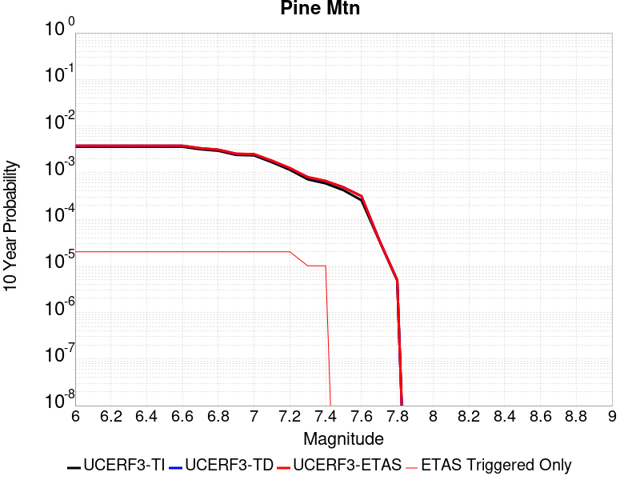 |

| Magnitude | 1 wk TI Prob | 1 wk TD Prob | 1 wk ETAS Prob | 1 wk ETAS/TD Gain | 1 wk ETAS Triggered Only | 1 mo TI Prob | 1 mo TD Prob | 1 mo ETAS Prob | 1 mo ETAS/TD Gain | 1 mo ETAS Triggered Only | 1 yr TI Prob | 1 yr TD Prob | 1 yr ETAS Prob | 1 yr ETAS/TD Gain | 1 yr ETAS Triggered Only | 10 yr TI Prob | 10 yr TD Prob | 10 yr ETAS Prob | 10 yr ETAS/TD Gain | 10 yr ETAS Triggered Only |
|-----|-----|-----|-----|-----|-----|-----|-----|-----|-----|-----|-----|-----|-----|-----|-----|-----|-----|-----|-----|-----|
| 6.0 | 6.894797E-6 | 7.225461E-6 | 2.7225316E-5 | 3.7679694 | 2.0E-5 | 2.9548795E-5 | 3.096591E-5 | 5.0965293E-5 | 1.6458515 | 2.0E-5 | 3.596972E-4 | 3.7694772E-4 | 3.969402E-4 | 1.0530378 | 2.0E-5 | 0.0035911554 | 0.003763381 | 0.0037833056 | 1.0052943 | 2.0E-5 |
| 6.1 | 6.894797E-6 | 7.225461E-6 | 2.7225316E-5 | 3.7679694 | 2.0E-5 | 2.9548795E-5 | 3.096591E-5 | 5.0965293E-5 | 1.6458515 | 2.0E-5 | 3.596972E-4 | 3.7694772E-4 | 3.969402E-4 | 1.0530378 | 2.0E-5 | 0.0035911554 | 0.003763381 | 0.0037833056 | 1.0052943 | 2.0E-5 |
| 6.2 | 6.894797E-6 | 7.225461E-6 | 2.7225316E-5 | 3.7679694 | 2.0E-5 | 2.9548795E-5 | 3.096591E-5 | 5.0965293E-5 | 1.6458515 | 2.0E-5 | 3.596972E-4 | 3.7694772E-4 | 3.969402E-4 | 1.0530378 | 2.0E-5 | 0.0035911554 | 0.003763381 | 0.0037833056 | 1.0052943 | 2.0E-5 |
| 6.3 | 6.894797E-6 | 7.225461E-6 | 2.7225316E-5 | 3.7679694 | 2.0E-5 | 2.9548795E-5 | 3.096591E-5 | 5.0965293E-5 | 1.6458515 | 2.0E-5 | 3.596972E-4 | 3.7694772E-4 | 3.969402E-4 | 1.0530378 | 2.0E-5 | 0.0035911554 | 0.003763381 | 0.0037833056 | 1.0052943 | 2.0E-5 |
| 6.4 | 6.894797E-6 | 7.225461E-6 | 2.7225316E-5 | 3.7679694 | 2.0E-5 | 2.9548795E-5 | 3.096591E-5 | 5.0965293E-5 | 1.6458515 | 2.0E-5 | 3.596972E-4 | 3.7694772E-4 | 3.969402E-4 | 1.0530378 | 2.0E-5 | 0.0035911554 | 0.003763381 | 0.0037833056 | 1.0052943 | 2.0E-5 |
| 6.5 | 6.894797E-6 | 7.225461E-6 | 2.7225316E-5 | 3.7679694 | 2.0E-5 | 2.9548795E-5 | 3.096591E-5 | 5.0965293E-5 | 1.6458515 | 2.0E-5 | 3.596972E-4 | 3.7694772E-4 | 3.969402E-4 | 1.0530378 | 2.0E-5 | 0.0035911554 | 0.003763381 | 0.0037833056 | 1.0052943 | 2.0E-5 |
| 6.6 | 6.894797E-6 | 7.225461E-6 | 2.7225316E-5 | 3.7679694 | 2.0E-5 | 2.9548795E-5 | 3.096591E-5 | 5.0965293E-5 | 1.6458515 | 2.0E-5 | 3.596972E-4 | 3.7694772E-4 | 3.969402E-4 | 1.0530378 | 2.0E-5 | 0.0035911554 | 0.003763381 | 0.0037833056 | 1.0052943 | 2.0E-5 |
| 6.7 | 6.0867933E-6 | 6.3971133E-6 | 2.6396985E-5 | 4.12639 | 2.0E-5 | 2.6085996E-5 | 2.7415923E-5 | 4.7415375E-5 | 1.729483 | 2.0E-5 | 3.1755073E-4 | 3.3373994E-4 | 3.5373325E-4 | 1.0599068 | 2.0E-5 | 0.0031709734 | 0.0033326065 | 0.0033525398 | 1.0059813 | 2.0E-5 |
| 6.8 | 5.6530425E-6 | 5.9505956E-6 | 2.5950476E-5 | 4.360988 | 2.0E-5 | 2.42271E-5 | 2.5502315E-5 | 4.5501805E-5 | 1.7842225 | 2.0E-5 | 2.94925E-4 | 3.104485E-4 | 3.304423E-4 | 1.0644029 | 2.0E-5 | 0.002945339 | 0.0031003528 | 0.0031202908 | 1.0064309 | 2.0E-5 |
| 6.9 | 4.6015225E-6 | 4.863834E-6 | 2.4863737E-5 | 5.1119623 | 2.0E-5 | 1.9720663E-5 | 2.0844845E-5 | 4.084443E-5 | 1.9594499 | 2.0E-5 | 2.4007261E-4 | 2.5375787E-4 | 2.737528E-4 | 1.0787953 | 2.0E-5 | 0.0023981342 | 0.0025348254 | 0.0025547748 | 1.0078701 | 2.0E-5 |
| 7.0 | 4.4875965E-6 | 4.747473E-6 | 2.4747378E-5 | 5.2127476 | 2.0E-5 | 1.9232413E-5 | 2.0346162E-5 | 4.0345756E-5 | 1.9829663 | 2.0E-5 | 2.3412947E-4 | 2.4768783E-4 | 2.6768286E-4 | 1.0807269 | 2.0E-5 | 0.0023388295 | 0.0024742614 | 0.002494212 | 1.0080632 | 2.0E-5 |
| 7.1 | 3.203907E-6 | 3.4294096E-6 | 2.342934E-5 | 6.8318877 | 2.0E-5 | 1.3730958E-5 | 1.4697391E-5 | 3.4697096E-5 | 2.3607657 | 2.0E-5 | 1.6716159E-4 | 1.789267E-4 | 1.9892312E-4 | 1.1117576 | 2.0E-5 | 0.0016703589 | 0.0017878925 | 0.0018078568 | 1.0111663 | 2.0E-5 |
| 7.2 | 2.2060601E-6 | 2.3784817E-6 | 2.2378434E-5 | 9.408706 | 2.0E-5 | 9.4545085E-6 | 1.0193455E-5 | 3.019325E-5 | 2.9620233 | 2.0E-5 | 1.15102564E-4 | 1.240987E-4 | 1.4409622E-4 | 1.161142 | 2.0E-5 | 0.0011504296 | 0.0012403389 | 0.001260314 | 1.0161046 | 2.0E-5 |
| 7.3 | 1.3765207E-6 | 1.5216481E-6 | 1.1521633E-5 | 7.5718117 | 1.0E-5 | 5.899361E-6 | 6.521333E-6 | 1.6521268E-5 | 2.533419 | 1.0E-5 | 7.182235E-5 | 7.939443E-5 | 8.939364E-5 | 1.1259434 | 1.0E-5 | 7.1799144E-4 | 7.936697E-4 | 8.036618E-4 | 1.0125897 | 1.0E-5 |
| 7.4 | 1.1245983E-6 | 1.2587075E-6 | 1.1258695E-5 | 8.944648 | 1.0E-5 | 4.819698E-6 | 5.39445E-6 | 1.5394397E-5 | 2.8537471 | 1.0E-5 | 5.8678244E-5 | 6.567554E-5 | 7.567488E-5 | 1.1522537 | 1.0E-5 | 5.866275E-4 | 6.5656955E-4 | 6.66563E-4 | 1.0152206 | 1.0E-5 |
| 7.5 | 8.031682E-7 | 9.276951E-7 | 9.276951E-7 | 1.0 | 0.0 | 3.4421448E-6 | 3.9758306E-6 | 3.9758306E-6 | 1.0 | 0.0 | 4.1907308E-5 | 4.840473E-5 | 4.840473E-5 | 1.0 | 0.0 | 4.1899405E-4 | 4.8394862E-4 | 4.8394862E-4 | 1.0 | 0.0 |
| 7.6 | 4.8953444E-7 | 6.003009E-7 | 6.003009E-7 | 1.0 | 0.0 | 2.098003E-6 | 2.5727159E-6 | 2.5727159E-6 | 1.0 | 0.0 | 2.5542888E-5 | 3.1322415E-5 | 3.1322415E-5 | 1.0 | 0.0 | 2.5539953E-4 | 3.1318486E-4 | 3.1318486E-4 | 1.0 | 0.0 |
| 7.7 | 6.634529E-8 | 6.788826E-8 | 6.788826E-8 | 1.0 | 0.0 | 2.843369E-7 | 2.9094966E-7 | 2.9094966E-7 | 1.0 | 0.0 | 3.4617963E-6 | 3.5423066E-6 | 3.5423066E-6 | 1.0 | 0.0 | 3.4617424E-5 | 3.542255E-5 | 3.542255E-5 | 1.0 | 0.0 |
| 7.8 | 9.235578E-9 | 9.488566E-9 | 9.488566E-9 | 1.0 | 0.0 | 3.9581046E-8 | 4.0665284E-8 | 4.0665284E-8 | 1.0 | 0.0 | 4.818991E-7 | 4.950997E-7 | 4.950997E-7 | 1.0 | 0.0 | 4.8189804E-6 | 4.950988E-6 | 4.950988E-6 | 1.0 | 0.0 |

## San Diego Trough north alt1
*[(top)](#table-of-contents)*

| 1 Week | 1 Month | 1 Year | 10 Year |
|-----|-----|-----|-----|
|  |  |  | 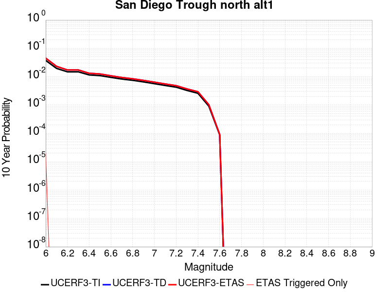 |

| Magnitude | 1 wk TI Prob | 1 wk TD Prob | 1 wk ETAS Prob | 1 wk ETAS/TD Gain | 1 wk ETAS Triggered Only | 1 mo TI Prob | 1 mo TD Prob | 1 mo ETAS Prob | 1 mo ETAS/TD Gain | 1 mo ETAS Triggered Only | 1 yr TI Prob | 1 yr TD Prob | 1 yr ETAS Prob | 1 yr ETAS/TD Gain | 1 yr ETAS Triggered Only | 10 yr TI Prob | 10 yr TD Prob | 10 yr ETAS Prob | 10 yr ETAS/TD Gain | 10 yr ETAS Triggered Only |
|-----|-----|-----|-----|-----|-----|-----|-----|-----|-----|-----|-----|-----|-----|-----|-----|-----|-----|-----|-----|-----|
| 6.0 | 7.329252E-5 | 8.821093E-5 | 1.0820917E-4 | 1.2267092 | 2.0E-5 | 3.14073E-4 | 3.7799572E-4 | 3.9798816E-4 | 1.0528907 | 2.0E-5 | 0.0038171355 | 0.004593027 | 0.0046129352 | 1.0043344 | 2.0E-5 | 0.03752231 | 0.045044992 | 0.045064088 | 1.000424 | 2.0E-5 |
| 6.1 | 3.7940346E-5 | 4.4885E-5 | 4.4885E-5 | 1.0 | 0.0 | 1.6259136E-4 | 1.9235066E-4 | 1.9235066E-4 | 1.0 | 0.0 | 0.0019777524 | 0.0023394432 | 0.0023394432 | 1.0 | 0.0 | 0.019602431 | 0.023156688 | 0.023156688 | 1.0 | 0.0 |
| 6.2 | 2.8645263E-5 | 3.329678E-5 | 3.329678E-5 | 1.0 | 0.0 | 1.2275964E-4 | 1.4269284E-4 | 1.4269284E-4 | 1.0 | 0.0 | 0.0014935739 | 0.0017359189 | 0.0017359189 | 1.0 | 0.0 | 0.0148357535 | 0.017226247 | 0.017226247 | 1.0 | 0.0 |
| 6.3 | 2.8645263E-5 | 3.329678E-5 | 3.329678E-5 | 1.0 | 0.0 | 1.2275964E-4 | 1.4269284E-4 | 1.4269284E-4 | 1.0 | 0.0 | 0.0014935739 | 0.0017359189 | 0.0017359189 | 1.0 | 0.0 | 0.0148357535 | 0.017226247 | 0.017226247 | 1.0 | 0.0 |
| 6.4 | 2.2204576E-5 | 2.5448318E-5 | 2.5448318E-5 | 1.0 | 0.0 | 9.5159E-5 | 1.0905972E-4 | 1.0905972E-4 | 1.0 | 0.0 | 0.001157945 | 0.0013270034 | 0.0013270034 | 1.0 | 0.0 | 0.011519298 | 0.013191955 | 0.013191955 | 1.0 | 0.0 |
| 6.5 | 2.1004838E-5 | 2.4024694E-5 | 2.4024694E-5 | 1.0 | 0.0 | 9.0017624E-5 | 1.0295896E-4 | 1.0295896E-4 | 1.0 | 0.0 | 0.0010954136 | 0.0012528138 | 0.0012528138 | 1.0 | 0.0 | 0.010900296 | 0.012458589 | 0.012458589 | 1.0 | 0.0 |
| 6.6 | 1.820557E-5 | 2.0704787E-5 | 2.0704787E-5 | 1.0 | 0.0 | 7.802154E-5 | 8.873181E-5 | 8.873181E-5 | 1.0 | 0.0 | 9.4949827E-4 | 0.0010797799 | 0.0010797799 | 1.0 | 0.0 | 0.009454516 | 0.010746004 | 0.010746004 | 1.0 | 0.0 |
| 6.7 | 1.5884485E-5 | 1.7983646E-5 | 1.7983646E-5 | 1.0 | 0.0 | 6.807459E-5 | 7.707051E-5 | 7.707051E-5 | 1.0 | 0.0 | 8.284929E-4 | 9.3793223E-4 | 9.3793223E-4 | 1.0 | 0.0 | 0.008254109 | 0.009340104 | 0.009340104 | 1.0 | 0.0 |
| 6.8 | 1.4331171E-5 | 1.6201066E-5 | 1.6201066E-5 | 1.0 | 0.0 | 6.141786E-5 | 6.94313E-5 | 6.94313E-5 | 1.0 | 0.0 | 7.4750587E-4 | 8.450002E-4 | 8.450002E-4 | 1.0 | 0.0 | 0.0074499645 | 0.008418139 | 0.008418139 | 1.0 | 0.0 |
| 6.9 | 1.2574203E-5 | 1.4205835E-5 | 1.4205835E-5 | 1.0 | 0.0 | 5.3888325E-5 | 6.0880735E-5 | 6.0880735E-5 | 1.0 | 0.0 | 6.558929E-4 | 7.409723E-4 | 7.409723E-4 | 1.0 | 0.0 | 0.0065396037 | 0.007385203 | 0.007385203 | 1.0 | 0.0 |
| 7.0 | 1.0883844E-5 | 1.2289262E-5 | 1.2289262E-5 | 1.0 | 0.0 | 4.664421E-5 | 5.2667205E-5 | 5.2667205E-5 | 1.0 | 0.0 | 5.677453E-4 | 6.4103556E-4 | 6.4103556E-4 | 1.0 | 0.0 | 0.00566297 | 0.006391993 | 0.006391993 | 1.0 | 0.0 |
| 7.1 | 9.393088E-6 | 1.060702E-5 | 1.060702E-5 | 1.0 | 0.0 | 4.025547E-5 | 4.545787E-5 | 4.545787E-5 | 1.0 | 0.0 | 4.900001E-4 | 5.533098E-4 | 5.533098E-4 | 1.0 | 0.0 | 0.0048892107 | 0.005519418 | 0.005519418 | 1.0 | 0.0 |
| 7.2 | 8.190791E-6 | 9.258625E-6 | 9.258625E-6 | 1.0 | 0.0 | 3.510292E-5 | 3.9679224E-5 | 3.9679224E-5 | 1.0 | 0.0 | 4.2729423E-4 | 4.8298817E-4 | 4.8298817E-4 | 1.0 | 0.0 | 0.0042647356 | 0.004819465 | 0.004819465 | 1.0 | 0.0 |
| 7.3 | 6.268162E-6 | 7.089716E-6 | 7.089716E-6 | 1.0 | 0.0 | 2.6863276E-5 | 3.0384144E-5 | 3.0384144E-5 | 1.0 | 0.0 | 3.2701128E-4 | 3.6986457E-4 | 3.6986457E-4 | 1.0 | 0.0 | 0.003265305 | 0.003692536 | 0.003692536 | 1.0 | 0.0 |
| 7.4 | 4.985186E-6 | 5.6426816E-6 | 5.6426816E-6 | 1.0 | 0.0 | 2.1364907E-5 | 2.4182698E-5 | 2.4182698E-5 | 1.0 | 0.0 | 2.600867E-4 | 2.9438498E-4 | 2.9438498E-4 | 1.0 | 0.0 | 0.002597825 | 0.0029399914 | 0.0029399914 | 1.0 | 0.0 |
| 7.5 | 1.7489613E-6 | 1.969678E-6 | 1.969678E-6 | 1.0 | 0.0 | 7.495527E-6 | 8.4414505E-6 | 8.4414505E-6 | 1.0 | 0.0 | 9.125422E-5 | 1.02770035E-4 | 1.02770035E-4 | 1.0 | 0.0 | 9.1216754E-4 | 0.0010272472 | 0.0010272472 | 1.0 | 0.0 |
| 7.6 | 1.6988751E-7 | 1.7533823E-7 | 1.7533823E-7 | 1.0 | 0.0 | 7.2808916E-7 | 7.5144936E-7 | 7.5144936E-7 | 1.0 | 0.0 | 8.864449E-6 | 9.14886E-6 | 9.14886E-6 | 1.0 | 0.0 | 8.8640954E-5 | 9.1485024E-5 | 9.1485024E-5 | 1.0 | 0.0 |

## Channel Islands Western Deep Ramp
*[(top)](#table-of-contents)*

| 1 Week | 1 Month | 1 Year | 10 Year |
|-----|-----|-----|-----|
|  |  |  |  |

| Magnitude | 1 wk TI Prob | 1 wk TD Prob | 1 wk ETAS Prob | 1 wk ETAS/TD Gain | 1 wk ETAS Triggered Only | 1 mo TI Prob | 1 mo TD Prob | 1 mo ETAS Prob | 1 mo ETAS/TD Gain | 1 mo ETAS Triggered Only | 1 yr TI Prob | 1 yr TD Prob | 1 yr ETAS Prob | 1 yr ETAS/TD Gain | 1 yr ETAS Triggered Only | 10 yr TI Prob | 10 yr TD Prob | 10 yr ETAS Prob | 10 yr ETAS/TD Gain | 10 yr ETAS Triggered Only |
|-----|-----|-----|-----|-----|-----|-----|-----|-----|-----|-----|-----|-----|-----|-----|-----|-----|-----|-----|-----|-----|
| 6.0 | 6.0213506E-6 | 6.2548684E-6 | 2.6254744E-5 | 4.1974893 | 2.0E-5 | 2.5805533E-5 | 2.6806329E-5 | 4.680579E-5 | 1.7460725 | 2.0E-5 | 3.1413708E-4 | 3.2632265E-4 | 3.463161E-4 | 1.061269 | 2.0E-5 | 0.0031369338 | 0.0032588763 | 0.003278811 | 1.0061171 | 2.0E-5 |
| 6.1 | 6.0213506E-6 | 6.2548684E-6 | 2.6254744E-5 | 4.1974893 | 2.0E-5 | 2.5805533E-5 | 2.6806329E-5 | 4.680579E-5 | 1.7460725 | 2.0E-5 | 3.1413708E-4 | 3.2632265E-4 | 3.463161E-4 | 1.061269 | 2.0E-5 | 0.0031369338 | 0.0032588763 | 0.003278811 | 1.0061171 | 2.0E-5 |
| 6.2 | 6.0213506E-6 | 6.2548684E-6 | 2.6254744E-5 | 4.1974893 | 2.0E-5 | 2.5805533E-5 | 2.6806329E-5 | 4.680579E-5 | 1.7460725 | 2.0E-5 | 3.1413708E-4 | 3.2632265E-4 | 3.463161E-4 | 1.061269 | 2.0E-5 | 0.0031369338 | 0.0032588763 | 0.003278811 | 1.0061171 | 2.0E-5 |
| 6.3 | 6.0213506E-6 | 6.2548684E-6 | 2.6254744E-5 | 4.1974893 | 2.0E-5 | 2.5805533E-5 | 2.6806329E-5 | 4.680579E-5 | 1.7460725 | 2.0E-5 | 3.1413708E-4 | 3.2632265E-4 | 3.463161E-4 | 1.061269 | 2.0E-5 | 0.0031369338 | 0.0032588763 | 0.003278811 | 1.0061171 | 2.0E-5 |
| 6.4 | 6.0213506E-6 | 6.2548684E-6 | 2.6254744E-5 | 4.1974893 | 2.0E-5 | 2.5805533E-5 | 2.6806329E-5 | 4.680579E-5 | 1.7460725 | 2.0E-5 | 3.1413708E-4 | 3.2632265E-4 | 3.463161E-4 | 1.061269 | 2.0E-5 | 0.0031369338 | 0.0032588763 | 0.003278811 | 1.0061171 | 2.0E-5 |
| 6.5 | 6.0213506E-6 | 6.2548684E-6 | 2.6254744E-5 | 4.1974893 | 2.0E-5 | 2.5805533E-5 | 2.6806329E-5 | 4.680579E-5 | 1.7460725 | 2.0E-5 | 3.1413708E-4 | 3.2632265E-4 | 3.463161E-4 | 1.061269 | 2.0E-5 | 0.0031369338 | 0.0032588763 | 0.003278811 | 1.0061171 | 2.0E-5 |
| 6.6 | 6.0213506E-6 | 6.2548684E-6 | 2.6254744E-5 | 4.1974893 | 2.0E-5 | 2.5805533E-5 | 2.6806329E-5 | 4.680579E-5 | 1.7460725 | 2.0E-5 | 3.1413708E-4 | 3.2632265E-4 | 3.463161E-4 | 1.061269 | 2.0E-5 | 0.0031369338 | 0.0032588763 | 0.003278811 | 1.0061171 | 2.0E-5 |
| 6.7 | 5.313309E-6 | 5.5252403E-6 | 2.552513E-5 | 4.619732 | 2.0E-5 | 2.2771126E-5 | 2.367941E-5 | 4.3678938E-5 | 1.8445957 | 2.0E-5 | 2.772032E-4 | 2.8826276E-4 | 3.08257E-4 | 1.0693611 | 2.0E-5 | 0.0027685766 | 0.0028792918 | 0.0028992342 | 1.0069262 | 2.0E-5 |
| 6.8 | 5.313309E-6 | 5.5252403E-6 | 2.552513E-5 | 4.619732 | 2.0E-5 | 2.2771126E-5 | 2.367941E-5 | 4.3678938E-5 | 1.8445957 | 2.0E-5 | 2.772032E-4 | 2.8826276E-4 | 3.08257E-4 | 1.0693611 | 2.0E-5 | 0.0027685766 | 0.0028792918 | 0.0028992342 | 1.0069262 | 2.0E-5 |
| 6.9 | 4.744377E-6 | 4.9394303E-6 | 2.4939332E-5 | 5.04903 | 2.0E-5 | 2.0332885E-5 | 2.1168837E-5 | 4.1168412E-5 | 1.944765 | 2.0E-5 | 2.4752476E-4 | 2.5770385E-4 | 2.7769868E-4 | 1.0775884 | 2.0E-5 | 0.0024724922 | 0.0025744175 | 0.002594366 | 1.0077487 | 2.0E-5 |
| 7.0 | 4.722209E-6 | 4.9164732E-6 | 2.4916375E-5 | 5.067937 | 2.0E-5 | 2.0237881E-5 | 2.107045E-5 | 4.1070027E-5 | 1.9491767 | 2.0E-5 | 2.4636835E-4 | 2.5650626E-4 | 2.7650114E-4 | 1.0779508 | 2.0E-5 | 0.002460954 | 0.0025624693 | 0.002582418 | 1.007785 | 2.0E-5 |
| 7.1 | 4.611174E-6 | 4.801409E-6 | 2.4801313E-5 | 5.165424 | 2.0E-5 | 1.9762025E-5 | 2.0577325E-5 | 4.0576913E-5 | 1.9719236 | 2.0E-5 | 2.4057609E-4 | 2.5050386E-4 | 2.7049886E-4 | 1.0798191 | 2.0E-5 | 0.002403158 | 0.002502582 | 0.002522532 | 1.0079718 | 2.0E-5 |
| 7.2 | 4.043994E-6 | 4.2120264E-6 | 2.4211942E-5 | 5.748288 | 2.0E-5 | 1.7331287E-5 | 1.8051438E-5 | 3.8051076E-5 | 2.107925 | 2.0E-5 | 2.10988E-4 | 2.1975765E-4 | 2.3975327E-4 | 1.0909894 | 2.0E-5 | 0.002107878 | 0.0021957543 | 0.0022157102 | 1.0090885 | 2.0E-5 |
| 7.3 | 2.1233036E-6 | 2.2297875E-6 | 2.2297875E-6 | 1.0 | 0.0 | 9.099841E-6 | 9.556197E-6 | 9.556197E-6 | 1.0 | 0.0 | 1.1078493E-4 | 1.1634055E-4 | 1.1634055E-4 | 1.0 | 0.0 | 0.0011072971 | 0.001162802 | 0.001162802 | 1.0 | 0.0 |
| 7.4 | 1.9051884E-6 | 2.0014973E-6 | 2.0014973E-6 | 1.0 | 0.0 | 8.165067E-6 | 8.577817E-6 | 8.577817E-6 | 1.0 | 0.0 | 9.940516E-5 | 1.0442998E-4 | 1.0442998E-4 | 1.0 | 0.0 | 9.93607E-4 | 0.0010438144 | 0.0010438144 | 1.0 | 0.0 |
| 7.5 | 1.2408497E-6 | 1.3038839E-6 | 1.3038839E-6 | 1.0 | 0.0 | 5.317916E-6 | 5.588062E-6 | 5.588062E-6 | 1.0 | 0.0 | 6.4743705E-5 | 6.8032554E-5 | 6.8032554E-5 | 1.0 | 0.0 | 6.4724847E-4 | 6.8011944E-4 | 6.8011944E-4 | 1.0 | 0.0 |
| 7.6 | 6.5440025E-7 | 6.886718E-7 | 6.886718E-7 | 1.0 | 0.0 | 2.8045695E-6 | 2.9514472E-6 | 2.9514472E-6 | 1.0 | 0.0 | 3.4145098E-5 | 3.593329E-5 | 3.593329E-5 | 1.0 | 0.0 | 3.4139853E-4 | 3.5927625E-4 | 3.5927625E-4 | 1.0 | 0.0 |
| 7.7 | 3.985963E-7 | 4.1930787E-7 | 4.1930787E-7 | 1.0 | 0.0 | 1.7082689E-6 | 1.7970326E-6 | 1.7970326E-6 | 1.0 | 0.0 | 2.0797976E-5 | 2.1878664E-5 | 2.1878664E-5 | 1.0 | 0.0 | 2.0796029E-4 | 2.1876628E-4 | 2.1876628E-4 | 1.0 | 0.0 |
| 7.8 | 3.706329E-8 | 3.8591796E-8 | 3.8591796E-8 | 1.0 | 0.0 | 1.5884267E-7 | 1.653934E-7 | 1.653934E-7 | 1.0 | 0.0 | 1.9339077E-6 | 2.0136629E-6 | 2.0136629E-6 | 1.0 | 0.0 | 1.933891E-5 | 2.0136458E-5 | 2.0136458E-5 | 1.0 | 0.0 |

## Honey Lake 2011 CFM
*[(top)](#table-of-contents)*

| 1 Week | 1 Month | 1 Year | 10 Year |
|-----|-----|-----|-----|
|  | 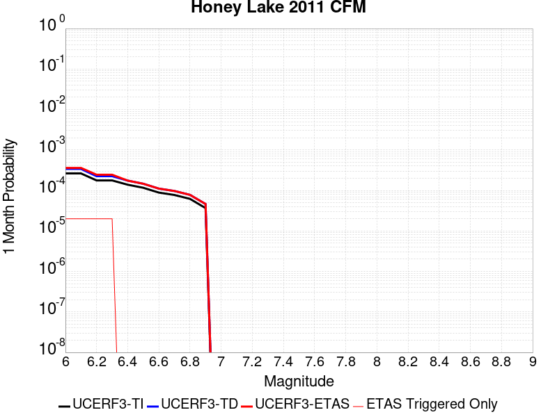 |  | 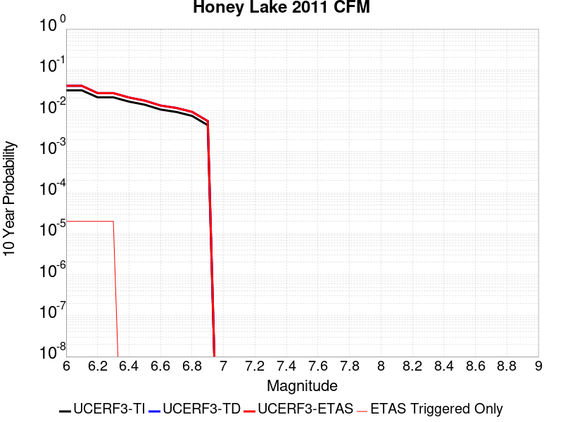 |

| Magnitude | 1 wk TI Prob | 1 wk TD Prob | 1 wk ETAS Prob | 1 wk ETAS/TD Gain | 1 wk ETAS Triggered Only | 1 mo TI Prob | 1 mo TD Prob | 1 mo ETAS Prob | 1 mo ETAS/TD Gain | 1 mo ETAS Triggered Only | 1 yr TI Prob | 1 yr TD Prob | 1 yr ETAS Prob | 1 yr ETAS/TD Gain | 1 yr ETAS Triggered Only | 10 yr TI Prob | 10 yr TD Prob | 10 yr ETAS Prob | 10 yr ETAS/TD Gain | 10 yr ETAS Triggered Only |
|-----|-----|-----|-----|-----|-----|-----|-----|-----|-----|-----|-----|-----|-----|-----|-----|-----|-----|-----|-----|-----|
| 6.0 | 6.155506E-5 | 7.954667E-5 | 9.9545075E-5 | 1.2514048 | 2.0E-5 | 2.6378073E-4 | 3.40873E-4 | 3.608662E-4 | 1.0586529 | 2.0E-5 | 0.0032068014 | 0.0041427943 | 0.0041627116 | 1.0048077 | 2.0E-5 | 0.03160919 | 0.040702924 | 0.04072211 | 1.0004714 | 2.0E-5 |
| 6.1 | 6.155506E-5 | 7.954667E-5 | 9.9545075E-5 | 1.2514048 | 2.0E-5 | 2.6378073E-4 | 3.40873E-4 | 3.608662E-4 | 1.0586529 | 2.0E-5 | 0.0032068014 | 0.0041427943 | 0.0041627116 | 1.0048077 | 2.0E-5 | 0.03160919 | 0.040702924 | 0.04072211 | 1.0004714 | 2.0E-5 |
| 6.2 | 4.1335024E-5 | 5.257629E-5 | 7.257524E-5 | 1.3803796 | 2.0E-5 | 1.7713808E-4 | 2.253086E-4 | 2.453041E-4 | 1.0887471 | 2.0E-5 | 0.0021545228 | 0.0027398595 | 0.0027598047 | 1.0072796 | 2.0E-5 | 0.021337535 | 0.027076708 | 0.027096167 | 1.0007186 | 2.0E-5 |
| 6.3 | 4.1335024E-5 | 5.257629E-5 | 7.257524E-5 | 1.3803796 | 2.0E-5 | 1.7713808E-4 | 2.253086E-4 | 2.453041E-4 | 1.0887471 | 2.0E-5 | 0.0021545228 | 0.0027398595 | 0.0027598047 | 1.0072796 | 2.0E-5 | 0.021337535 | 0.027076708 | 0.027096167 | 1.0007186 | 2.0E-5 |
| 6.4 | 3.2393702E-5 | 4.0887444E-5 | 4.0887444E-5 | 1.0 | 0.0 | 1.3882275E-4 | 1.7522085E-4 | 1.7522085E-4 | 1.0 | 0.0 | 0.0016888566 | 0.002131335 | 0.002131335 | 1.0 | 0.0 | 0.016760793 | 0.02111982 | 0.02111982 | 1.0 | 0.0 |
| 6.5 | 2.7205504E-5 | 3.4211684E-5 | 3.4211684E-5 | 1.0 | 0.0 | 1.1658981E-4 | 1.4661385E-4 | 1.4661385E-4 | 1.0 | 0.0 | 0.0014185566 | 0.0017836588 | 0.0017836588 | 1.0 | 0.0 | 0.014095354 | 0.017702932 | 0.017702932 | 1.0 | 0.0 |
| 6.6 | 2.069265E-5 | 2.5955307E-5 | 2.5955307E-5 | 1.0 | 0.0 | 8.867977E-5 | 1.1123277E-4 | 1.1123277E-4 | 1.0 | 0.0 | 0.0010791414 | 0.0013535038 | 0.0013535038 | 1.0 | 0.0 | 0.010739161 | 0.013461002 | 0.013461002 | 1.0 | 0.0 |
| 6.7 | 1.8060919E-5 | 2.2656828E-5 | 2.2656828E-5 | 1.0 | 0.0 | 7.7401644E-5 | 9.709754E-5 | 9.709754E-5 | 1.0 | 0.0 | 9.419576E-4 | 0.0011816026 | 0.0011816026 | 1.0 | 0.0 | 0.009379748 | 0.011761238 | 0.011761238 | 1.0 | 0.0 |
| 6.8 | 1.4474663E-5 | 1.818127E-5 | 1.818127E-5 | 1.0 | 0.0 | 6.203279E-5 | 7.791784E-5 | 7.791784E-5 | 1.0 | 0.0 | 7.5498753E-4 | 9.483136E-4 | 9.483136E-4 | 1.0 | 0.0 | 0.007524277 | 0.009450192 | 0.009450192 | 1.0 | 0.0 |
| 6.9 | 8.564552E-6 | 1.0802308E-5 | 1.0802308E-5 | 1.0 | 0.0 | 3.6704707E-5 | 4.6295158E-5 | 4.6295158E-5 | 1.0 | 0.0 | 4.4678818E-4 | 5.635644E-4 | 5.635644E-4 | 1.0 | 0.0 | 0.0044589094 | 0.0056278477 | 0.0056278477 | 1.0 | 0.0 |

## Cleghorn
*[(top)](#table-of-contents)*

| 1 Week | 1 Month | 1 Year | 10 Year |
|-----|-----|-----|-----|
|  |  |  |  |

| Magnitude | 1 wk TI Prob | 1 wk TD Prob | 1 wk ETAS Prob | 1 wk ETAS/TD Gain | 1 wk ETAS Triggered Only | 1 mo TI Prob | 1 mo TD Prob | 1 mo ETAS Prob | 1 mo ETAS/TD Gain | 1 mo ETAS Triggered Only | 1 yr TI Prob | 1 yr TD Prob | 1 yr ETAS Prob | 1 yr ETAS/TD Gain | 1 yr ETAS Triggered Only | 10 yr TI Prob | 10 yr TD Prob | 10 yr ETAS Prob | 10 yr ETAS/TD Gain | 10 yr ETAS Triggered Only |
|-----|-----|-----|-----|-----|-----|-----|-----|-----|-----|-----|-----|-----|-----|-----|-----|-----|-----|-----|-----|-----|
| 6.0 | 7.9267165E-6 | 9.831582E-6 | 1.9831485E-5 | 2.0171201 | 1.0E-5 | 3.39712E-5 | 4.2134732E-5 | 5.2134314E-5 | 1.2373239 | 1.0E-5 | 4.1352084E-4 | 5.128803E-4 | 5.228751E-4 | 1.0194877 | 1.0E-5 | 0.004127522 | 0.0051320773 | 0.0051519745 | 1.003877 | 2.0E-5 |
| 6.1 | 7.9267165E-6 | 9.831582E-6 | 1.9831485E-5 | 2.0171201 | 1.0E-5 | 3.39712E-5 | 4.2134732E-5 | 5.2134314E-5 | 1.2373239 | 1.0E-5 | 4.1352084E-4 | 5.128803E-4 | 5.228751E-4 | 1.0194877 | 1.0E-5 | 0.004127522 | 0.0051320773 | 0.0051519745 | 1.003877 | 2.0E-5 |
| 6.2 | 7.9267165E-6 | 9.831582E-6 | 1.9831485E-5 | 2.0171201 | 1.0E-5 | 3.39712E-5 | 4.2134732E-5 | 5.2134314E-5 | 1.2373239 | 1.0E-5 | 4.1352084E-4 | 5.128803E-4 | 5.228751E-4 | 1.0194877 | 1.0E-5 | 0.004127522 | 0.0051320773 | 0.0051519745 | 1.003877 | 2.0E-5 |
| 6.3 | 7.9267165E-6 | 9.831582E-6 | 1.9831485E-5 | 2.0171201 | 1.0E-5 | 3.39712E-5 | 4.2134732E-5 | 5.2134314E-5 | 1.2373239 | 1.0E-5 | 4.1352084E-4 | 5.128803E-4 | 5.228751E-4 | 1.0194877 | 1.0E-5 | 0.004127522 | 0.0051320773 | 0.0051519745 | 1.003877 | 2.0E-5 |
| 6.4 | 4.3445207E-6 | 6.0914435E-6 | 6.0914435E-6 | 1.0 | 0.0 | 1.8619241E-5 | 2.610593E-5 | 2.610593E-5 | 1.0 | 0.0 | 2.2666567E-4 | 3.1779436E-4 | 3.1779436E-4 | 1.0 | 0.0 | 0.0022643462 | 0.0031875873 | 0.0031875873 | 1.0 | 0.0 |
| 6.5 | 4.3445207E-6 | 6.0914435E-6 | 6.0914435E-6 | 1.0 | 0.0 | 1.8619241E-5 | 2.610593E-5 | 2.610593E-5 | 1.0 | 0.0 | 2.2666567E-4 | 3.1779436E-4 | 3.1779436E-4 | 1.0 | 0.0 | 0.0022643462 | 0.0031875873 | 0.0031875873 | 1.0 | 0.0 |
| 6.6 | 4.040109E-6 | 5.773851E-6 | 5.773851E-6 | 1.0 | 0.0 | 1.7314638E-5 | 2.4744846E-5 | 2.4744846E-5 | 1.0 | 0.0 | 2.1078532E-4 | 3.012278E-4 | 3.012278E-4 | 1.0 | 0.0 | 0.002105855 | 0.003022377 | 0.003022377 | 1.0 | 0.0 |
| 6.7 | 3.3632055E-6 | 5.067348E-6 | 5.067348E-6 | 1.0 | 0.0 | 1.4413658E-5 | 2.1717027E-5 | 2.1717027E-5 | 1.0 | 0.0 | 1.7547216E-4 | 2.6437303E-4 | 2.6437303E-4 | 1.0 | 0.0 | 0.0017533366 | 0.0026547113 | 0.0026547113 | 1.0 | 0.0 |
| 6.8 | 3.2902772E-6 | 4.9892556E-6 | 4.9892556E-6 | 1.0 | 0.0 | 1.4101111E-5 | 2.1382351E-5 | 2.1382351E-5 | 1.0 | 0.0 | 1.716675E-4 | 2.6029933E-4 | 2.6029933E-4 | 1.0 | 0.0 | 0.0017153495 | 0.0026140702 | 0.0026140702 | 1.0 | 0.0 |
| 6.9 | 3.031547E-6 | 4.6910186E-6 | 4.6910186E-6 | 1.0 | 0.0 | 1.299228E-5 | 2.0104211E-5 | 2.0104211E-5 | 1.0 | 0.0 | 1.5816953E-4 | 2.4474156E-4 | 2.4474156E-4 | 1.0 | 0.0 | 0.00158057 | 0.0024588439 | 0.0024588439 | 1.0 | 0.0 |
| 7.0 | 2.8259715E-6 | 4.3705895E-6 | 4.3705895E-6 | 1.0 | 0.0 | 1.211125E-5 | 1.8730963E-5 | 1.8730963E-5 | 1.0 | 0.0 | 1.4744449E-4 | 2.2802586E-4 | 2.2802586E-4 | 1.0 | 0.0 | 0.001473467 | 0.0022920412 | 0.0022920412 | 1.0 | 0.0 |
| 7.1 | 2.5962665E-6 | 4.0658106E-6 | 4.0658106E-6 | 1.0 | 0.0 | 1.1126809E-5 | 1.7424789E-5 | 1.7424789E-5 | 1.0 | 0.0 | 1.3546048E-4 | 2.1212637E-4 | 2.1212637E-4 | 1.0 | 0.0 | 0.0013537793 | 0.002133366 | 0.002133366 | 1.0 | 0.0 |
| 7.2 | 2.3247253E-6 | 3.6763672E-6 | 3.6763672E-6 | 1.0 | 0.0 | 9.96307E-6 | 1.5755764E-5 | 1.5755764E-5 | 1.0 | 0.0 | 1.21293626E-4 | 1.9180974E-4 | 1.9180974E-4 | 1.0 | 0.0 | 0.0012122744 | 0.0019305905 | 0.0019305905 | 1.0 | 0.0 |
| 7.3 | 2.056928E-6 | 3.2350938E-6 | 3.2350938E-6 | 1.0 | 0.0 | 8.815376E-6 | 1.3864615E-5 | 1.3864615E-5 | 1.0 | 0.0 | 1.0732192E-4 | 1.6878877E-4 | 1.6878877E-4 | 1.0 | 0.0 | 0.001072701 | 0.0017008206 | 0.0017008206 | 1.0 | 0.0 |
| 7.4 | 1.8055999E-6 | 2.8255042E-6 | 2.8255042E-6 | 1.0 | 0.0 | 7.738263E-6 | 1.2109249E-5 | 1.2109249E-5 | 1.0 | 0.0 | 9.4209274E-5 | 1.4742027E-4 | 1.4742027E-4 | 1.0 | 0.0 | 9.4169343E-4 | 0.0014875771 | 0.0014875771 | 1.0 | 0.0 |
| 7.5 | 1.4683443E-6 | 2.4247483E-6 | 2.4247483E-6 | 1.0 | 0.0 | 6.292889E-6 | 1.0391738E-5 | 1.0391738E-5 | 1.0 | 0.0 | 7.661323E-5 | 1.2651215E-4 | 1.2651215E-4 | 1.0 | 0.0 | 7.658682E-4 | 0.0012787961 | 0.0012787961 | 1.0 | 0.0 |
| 7.6 | 9.804088E-7 | 1.900266E-6 | 1.900266E-6 | 1.0 | 0.0 | 4.201745E-6 | 8.143972E-6 | 8.143972E-6 | 1.0 | 0.0 | 5.1155046E-5 | 9.91484E-5 | 9.91484E-5 | 1.0 | 0.0 | 5.114327E-4 | 0.001005471 | 0.001005471 | 1.0 | 0.0 |
| 7.7 | 7.3434086E-7 | 1.6284146E-6 | 1.6284146E-6 | 1.0 | 0.0 | 3.1471714E-6 | 6.978901E-6 | 6.978901E-6 | 1.0 | 0.0 | 3.831614E-5 | 8.4964835E-5 | 8.4964835E-5 | 1.0 | 0.0 | 3.8309532E-4 | 8.6378685E-4 | 8.6378685E-4 | 1.0 | 0.0 |
| 7.8 | 6.434184E-7 | 1.5220047E-6 | 1.5220047E-6 | 1.0 | 0.0 | 2.7575045E-6 | 6.5228614E-6 | 6.5228614E-6 | 1.0 | 0.0 | 3.35721E-5 | 7.941297E-5 | 7.941297E-5 | 1.0 | 0.0 | 3.3567028E-4 | 8.079678E-4 | 8.079678E-4 | 1.0 | 0.0 |
| 7.9 | 3.4943926E-7 | 7.574459E-7 | 7.574459E-7 | 1.0 | 0.0 | 1.497596E-6 | 3.2461926E-6 | 3.2461926E-6 | 1.0 | 0.0 | 1.8233079E-5 | 3.952169E-5 | 3.952169E-5 | 1.0 | 0.0 | 1.8231584E-4 | 4.040099E-4 | 4.040099E-4 | 1.0 | 0.0 |
| 8.0 | 6.717524E-8 | 5.838828E-8 | 5.838828E-8 | 1.0 | 0.0 | 2.8789387E-7 | 2.5023547E-7 | 2.5023547E-7 | 1.0 | 0.0 | 3.505102E-6 | 3.0466126E-6 | 3.0466126E-6 | 1.0 | 0.0 | 3.5050467E-5 | 3.273506E-5 | 3.273506E-5 | 1.0 | 0.0 |
| 8.1 | 3.1984914E-8 | 1.2956093E-8 | 1.2956093E-8 | 1.0 | 0.0 | 1.370782E-7 | 5.552611E-8 | 5.552611E-8 | 1.0 | 0.0 | 1.6689258E-6 | 6.760302E-7 | 6.760302E-7 | 1.0 | 0.0 | 1.6689133E-5 | 7.74454E-6 | 7.74454E-6 | 1.0 | 0.0 |
| 8.2 | 1.21887656E-8 | 3.6495305E-9 | 3.6495305E-9 | 1.0 | 0.0 | 5.2237567E-8 | 1.5640845E-8 | 1.5640845E-8 | 1.0 | 0.0 | 6.359922E-7 | 1.9042727E-7 | 1.9042727E-7 | 1.0 | 0.0 | 6.3599036E-6 | 2.2470974E-6 | 2.2470974E-6 | 1.0 | 0.0 |

## Big Pine (Central)
*[(top)](#table-of-contents)*

| 1 Week | 1 Month | 1 Year | 10 Year |
|-----|-----|-----|-----|
| 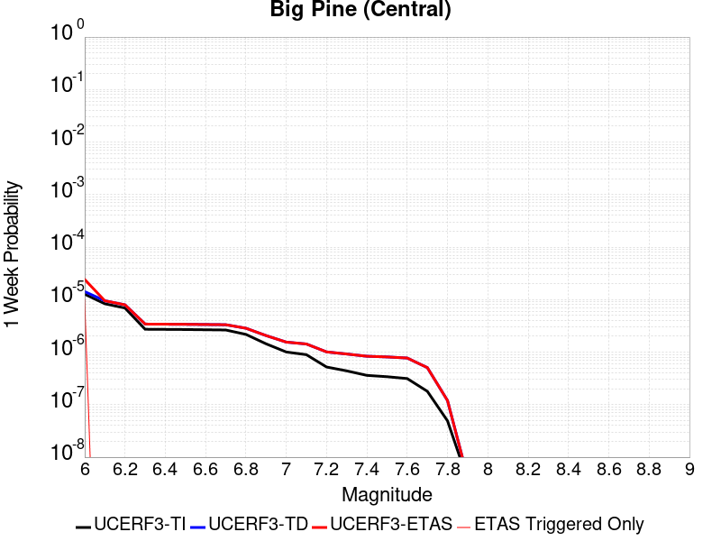 | 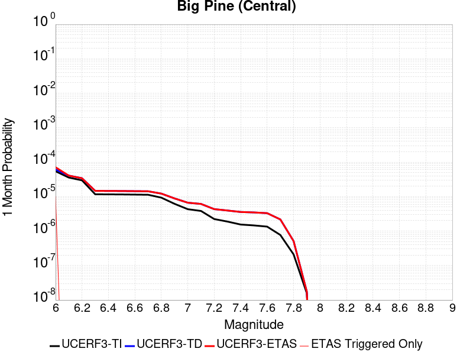 |  |  |

| Magnitude | 1 wk TI Prob | 1 wk TD Prob | 1 wk ETAS Prob | 1 wk ETAS/TD Gain | 1 wk ETAS Triggered Only | 1 mo TI Prob | 1 mo TD Prob | 1 mo ETAS Prob | 1 mo ETAS/TD Gain | 1 mo ETAS Triggered Only | 1 yr TI Prob | 1 yr TD Prob | 1 yr ETAS Prob | 1 yr ETAS/TD Gain | 1 yr ETAS Triggered Only | 10 yr TI Prob | 10 yr TD Prob | 10 yr ETAS Prob | 10 yr ETAS/TD Gain | 10 yr ETAS Triggered Only |
|-----|-----|-----|-----|-----|-----|-----|-----|-----|-----|-----|-----|-----|-----|-----|-----|-----|-----|-----|-----|-----|
| 6.0 | 1.2706755E-5 | 1.4250529E-5 | 2.4250387E-5 | 1.7017183 | 1.0E-5 | 5.4456385E-5 | 6.107247E-5 | 7.107186E-5 | 1.1637299 | 1.0E-5 | 6.628048E-4 | 7.433402E-4 | 7.633253E-4 | 1.0268856 | 2.0E-5 | 0.006608314 | 0.0074135666 | 0.0074334187 | 1.0026778 | 2.0E-5 |
| 6.1 | 8.342579E-6 | 9.510762E-6 | 9.510762E-6 | 1.0 | 0.0 | 3.5753423E-5 | 4.0759893E-5 | 4.0759893E-5 | 1.0 | 0.0 | 4.3521097E-4 | 4.961604E-4 | 5.061555E-4 | 1.0201448 | 1.0E-5 | 0.0043435963 | 0.0049540824 | 0.0049640327 | 1.0020086 | 1.0E-5 |
| 6.2 | 6.923899E-6 | 7.967147E-6 | 7.967147E-6 | 1.0 | 0.0 | 2.9673516E-5 | 3.4144578E-5 | 3.4144578E-5 | 1.0 | 0.0 | 3.6121515E-4 | 4.156502E-4 | 4.156502E-4 | 1.0 | 0.0 | 0.003606286 | 0.0041520367 | 0.0041520367 | 1.0 | 0.0 |
| 6.3 | 2.728396E-6 | 3.4242908E-6 | 3.4242908E-6 | 1.0 | 0.0 | 1.1693074E-5 | 1.4675454E-5 | 1.4675454E-5 | 1.0 | 0.0 | 1.4235388E-4 | 1.7865987E-4 | 1.7865987E-4 | 1.0 | 0.0 | 0.0014226272 | 0.0017866704 | 0.0017866704 | 1.0 | 0.0 |
| 6.4 | 2.7136944E-6 | 3.408584E-6 | 3.408584E-6 | 1.0 | 0.0 | 1.1630066E-5 | 1.4608141E-5 | 1.4608141E-5 | 1.0 | 0.0 | 1.4158686E-4 | 1.7784047E-4 | 1.7784047E-4 | 1.0 | 0.0 | 0.0014149669 | 0.0017784894 | 0.0017784894 | 1.0 | 0.0 |
| 6.5 | 2.6971882E-6 | 3.3909291E-6 | 3.3909291E-6 | 1.0 | 0.0 | 1.1559327E-5 | 1.45324775E-5 | 1.45324775E-5 | 1.0 | 0.0 | 1.4072572E-4 | 1.7691942E-4 | 1.7691942E-4 | 1.0 | 0.0 | 0.0014063664 | 0.0017692937 | 0.0017692937 | 1.0 | 0.0 |
| 6.6 | 2.669092E-6 | 3.3609497E-6 | 3.3609497E-6 | 1.0 | 0.0 | 1.1438916E-5 | 1.4403995E-5 | 1.4403995E-5 | 1.0 | 0.0 | 1.3925991E-4 | 1.753554E-4 | 1.753554E-4 | 1.0 | 0.0 | 0.0013917267 | 0.0017536782 | 0.0017536782 | 1.0 | 0.0 |
| 6.7 | 2.6408059E-6 | 3.3309752E-6 | 3.3309752E-6 | 1.0 | 0.0 | 1.1317691E-5 | 1.4275535E-5 | 1.4275535E-5 | 1.0 | 0.0 | 1.3778417E-4 | 1.7379165E-4 | 1.7379165E-4 | 1.0 | 0.0 | 0.0013769877 | 0.0017380653 | 0.0017380653 | 1.0 | 0.0 |
| 6.8 | 2.1786943E-6 | 2.8544325E-6 | 2.8544325E-6 | 1.0 | 0.0 | 9.337228E-6 | 1.2233229E-5 | 1.2233229E-5 | 1.0 | 0.0 | 1.1367482E-4 | 1.4893012E-4 | 1.4893012E-4 | 1.0 | 0.0 | 0.0011361669 | 0.0014897975 | 0.0014897975 | 1.0 | 0.0 |
| 6.9 | 1.4411696E-6 | 2.068499E-6 | 2.068499E-6 | 1.0 | 0.0 | 6.1764263E-6 | 8.864968E-6 | 8.864968E-6 | 1.0 | 0.0 | 7.51954E-5 | 1.079259E-4 | 1.079259E-4 | 1.0 | 0.0 | 7.5169955E-4 | 0.0010801847 | 0.0010801847 | 1.0 | 0.0 |
| 7.0 | 1.0073411E-6 | 1.554261E-6 | 1.554261E-6 | 1.0 | 0.0 | 4.317169E-6 | 6.6611024E-6 | 6.6611024E-6 | 1.0 | 0.0 | 5.2560266E-5 | 8.1096056E-5 | 8.1096056E-5 | 1.0 | 0.0 | 5.2547833E-4 | 8.1210316E-4 | 8.1210316E-4 | 1.0 | 0.0 |
| 7.1 | 8.947104E-7 | 1.4302494E-6 | 1.4302494E-6 | 1.0 | 0.0 | 3.834468E-6 | 6.129627E-6 | 6.129627E-6 | 1.0 | 0.0 | 4.6683643E-5 | 7.46258E-5 | 7.46258E-5 | 1.0 | 0.0 | 4.6673836E-4 | 7.474457E-4 | 7.474457E-4 | 1.0 | 0.0 |
| 7.2 | 5.215166E-7 | 1.0111678E-6 | 1.0111678E-6 | 1.0 | 0.0 | 2.2350691E-6 | 4.3335694E-6 | 4.3335694E-6 | 1.0 | 0.0 | 2.7211627E-5 | 5.2759973E-5 | 5.2759973E-5 | 1.0 | 0.0 | 2.7208295E-4 | 5.2890263E-4 | 5.2890263E-4 | 1.0 | 0.0 |
| 7.3 | 4.4024807E-7 | 9.219589E-7 | 9.219589E-7 | 1.0 | 0.0 | 1.8867761E-6 | 3.9512465E-6 | 3.9512465E-6 | 1.0 | 0.0 | 2.2971257E-5 | 4.810541E-5 | 4.810541E-5 | 1.0 | 0.0 | 2.2968883E-4 | 4.8237795E-4 | 4.8237795E-4 | 1.0 | 0.0 |
| 7.4 | 3.6130905E-7 | 8.358523E-7 | 8.358523E-7 | 1.0 | 0.0 | 1.5484665E-6 | 3.5822195E-6 | 3.5822195E-6 | 1.0 | 0.0 | 1.8852415E-5 | 4.3612687E-5 | 4.3612687E-5 | 1.0 | 0.0 | 1.8850817E-4 | 4.374597E-4 | 4.374597E-4 | 1.0 | 0.0 |
| 7.5 | 3.408184E-7 | 8.108147E-7 | 8.108147E-7 | 1.0 | 0.0 | 1.4606494E-6 | 3.4749157E-6 | 3.4749157E-6 | 1.0 | 0.0 | 1.7783263E-5 | 4.2306317E-5 | 4.2306317E-5 | 1.0 | 0.0 | 1.778184E-4 | 4.2437963E-4 | 4.2437963E-4 | 1.0 | 0.0 |
| 7.6 | 3.1428627E-7 | 7.7316E-7 | 7.7316E-7 | 1.0 | 0.0 | 1.3469405E-6 | 3.3135389E-6 | 3.3135389E-6 | 1.0 | 0.0 | 1.6398877E-5 | 4.0341627E-5 | 4.0341627E-5 | 1.0 | 0.0 | 1.6397667E-4 | 4.0471106E-4 | 4.0471106E-4 | 1.0 | 0.0 |
| 7.7 | 1.7972785E-7 | 5.077752E-7 | 5.077752E-7 | 1.0 | 0.0 | 7.70262E-7 | 2.1761778E-6 | 2.1761778E-6 | 1.0 | 0.0 | 9.377899E-6 | 2.6494654E-5 | 2.6494654E-5 | 1.0 | 0.0 | 9.377503E-5 | 2.662899E-4 | 2.662899E-4 | 1.0 | 0.0 |
| 7.8 | 4.9230927E-8 | 1.198079E-7 | 1.198079E-7 | 1.0 | 0.0 | 2.1098968E-7 | 5.134623E-7 | 5.134623E-7 | 1.0 | 0.0 | 2.5687964E-6 | 6.2513873E-6 | 6.2513873E-6 | 1.0 | 0.0 | 2.5687666E-5 | 6.295415E-5 | 6.295415E-5 | 1.0 | 0.0 |
| 7.9 | 3.6805972E-9 | 4.105293E-9 | 4.105293E-9 | 1.0 | 0.0 | 1.5773987E-8 | 1.7594115E-8 | 1.7594115E-8 | 1.0 | 0.0 | 1.9204828E-7 | 2.1420831E-7 | 2.1420831E-7 | 1.0 | 0.0 | 1.920481E-6 | 2.1900614E-6 | 2.1900614E-6 | 1.0 | 0.0 |

## Oceanside alt1
*[(top)](#table-of-contents)*

| 1 Week | 1 Month | 1 Year | 10 Year |
|-----|-----|-----|-----|
|  |  |  |  |

| Magnitude | 1 wk TI Prob | 1 wk TD Prob | 1 wk ETAS Prob | 1 wk ETAS/TD Gain | 1 wk ETAS Triggered Only | 1 mo TI Prob | 1 mo TD Prob | 1 mo ETAS Prob | 1 mo ETAS/TD Gain | 1 mo ETAS Triggered Only | 1 yr TI Prob | 1 yr TD Prob | 1 yr ETAS Prob | 1 yr ETAS/TD Gain | 1 yr ETAS Triggered Only | 10 yr TI Prob | 10 yr TD Prob | 10 yr ETAS Prob | 10 yr ETAS/TD Gain | 10 yr ETAS Triggered Only |
|-----|-----|-----|-----|-----|-----|-----|-----|-----|-----|-----|-----|-----|-----|-----|-----|-----|-----|-----|-----|-----|
| 6.0 | 1.1617542E-5 | 1.1423493E-5 | 3.1423264E-5 | 2.7507582 | 2.0E-5 | 4.9788516E-5 | 4.8956997E-5 | 6.895602E-5 | 1.4085017 | 2.0E-5 | 6.060066E-4 | 5.9590454E-4 | 6.158926E-4 | 1.0335424 | 2.0E-5 | 0.0060435664 | 0.005944664 | 0.0059645455 | 1.0033444 | 2.0E-5 |
| 6.1 | 1.1617542E-5 | 1.1423493E-5 | 3.1423264E-5 | 2.7507582 | 2.0E-5 | 4.9788516E-5 | 4.8956997E-5 | 6.895602E-5 | 1.4085017 | 2.0E-5 | 6.060066E-4 | 5.9590454E-4 | 6.158926E-4 | 1.0335424 | 2.0E-5 | 0.0060435664 | 0.005944664 | 0.0059645455 | 1.0033444 | 2.0E-5 |
| 6.2 | 1.1617542E-5 | 1.1423493E-5 | 3.1423264E-5 | 2.7507582 | 2.0E-5 | 4.9788516E-5 | 4.8956997E-5 | 6.895602E-5 | 1.4085017 | 2.0E-5 | 6.060066E-4 | 5.9590454E-4 | 6.158926E-4 | 1.0335424 | 2.0E-5 | 0.0060435664 | 0.005944664 | 0.0059645455 | 1.0033444 | 2.0E-5 |
| 6.3 | 1.1617542E-5 | 1.1423493E-5 | 3.1423264E-5 | 2.7507582 | 2.0E-5 | 4.9788516E-5 | 4.8956997E-5 | 6.895602E-5 | 1.4085017 | 2.0E-5 | 6.060066E-4 | 5.9590454E-4 | 6.158926E-4 | 1.0335424 | 2.0E-5 | 0.0060435664 | 0.005944664 | 0.0059645455 | 1.0033444 | 2.0E-5 |
| 6.4 | 1.1617542E-5 | 1.1423493E-5 | 3.1423264E-5 | 2.7507582 | 2.0E-5 | 4.9788516E-5 | 4.8956997E-5 | 6.895602E-5 | 1.4085017 | 2.0E-5 | 6.060066E-4 | 5.9590454E-4 | 6.158926E-4 | 1.0335424 | 2.0E-5 | 0.0060435664 | 0.005944664 | 0.0059645455 | 1.0033444 | 2.0E-5 |
| 6.5 | 1.1617542E-5 | 1.1423493E-5 | 3.1423264E-5 | 2.7507582 | 2.0E-5 | 4.9788516E-5 | 4.8956997E-5 | 6.895602E-5 | 1.4085017 | 2.0E-5 | 6.060066E-4 | 5.9590454E-4 | 6.158926E-4 | 1.0335424 | 2.0E-5 | 0.0060435664 | 0.005944664 | 0.0059645455 | 1.0033444 | 2.0E-5 |
| 6.6 | 7.561768E-6 | 7.1336153E-6 | 1.7133543E-5 | 2.4018037 | 1.0E-5 | 3.2407173E-5 | 3.0572286E-5 | 4.057198E-5 | 1.3270836 | 1.0E-5 | 3.9448592E-4 | 3.7215507E-4 | 3.8215137E-4 | 1.0268605 | 1.0E-5 | 0.0039378637 | 0.00371543 | 0.0037253927 | 1.0026815 | 1.0E-5 |
| 6.7 | 7.1042605E-6 | 6.6556854E-6 | 1.6655618E-5 | 2.5024648 | 1.0E-5 | 3.0446476E-5 | 2.8524059E-5 | 3.8523773E-5 | 1.3505713 | 1.0E-5 | 3.706228E-4 | 3.472259E-4 | 3.5722242E-4 | 1.0287896 | 1.0E-5 | 0.0037000529 | 0.003466917 | 0.0034768824 | 1.0028744 | 1.0E-5 |
| 6.8 | 6.285554E-6 | 5.799706E-6 | 5.799706E-6 | 1.0 | 0.0 | 2.693781E-5 | 2.4855648E-5 | 2.4855648E-5 | 1.0 | 0.0 | 3.2791847E-4 | 3.0257605E-4 | 3.0257605E-4 | 1.0 | 0.0 | 0.0032743502 | 0.0030216982 | 0.0030216982 | 1.0 | 0.0 |
| 6.9 | 6.148883E-6 | 5.6565445E-6 | 5.6565445E-6 | 1.0 | 0.0 | 2.635209E-5 | 2.424211E-5 | 2.424211E-5 | 1.0 | 0.0 | 3.2078946E-4 | 2.9510827E-4 | 2.9510827E-4 | 1.0 | 0.0 | 0.003203268 | 0.0029472208 | 0.0029472208 | 1.0 | 0.0 |
| 7.0 | 5.253857E-6 | 4.722404E-6 | 4.722404E-6 | 1.0 | 0.0 | 2.2516335E-5 | 2.0238718E-5 | 2.0238718E-5 | 1.0 | 0.0 | 2.7410188E-4 | 2.4637886E-4 | 2.4637886E-4 | 1.0 | 0.0 | 0.0027376404 | 0.0024610884 | 0.0024610884 | 1.0 | 0.0 |
| 7.1 | 4.730754E-6 | 4.17851E-6 | 4.17851E-6 | 1.0 | 0.0 | 2.0274503E-5 | 1.7907778E-5 | 1.7907778E-5 | 1.0 | 0.0 | 2.468141E-4 | 2.1800565E-4 | 2.1800565E-4 | 1.0 | 0.0 | 0.0024654015 | 0.0021779444 | 0.0021779444 | 1.0 | 0.0 |
| 7.2 | 3.7998386E-6 | 3.214026E-6 | 3.214026E-6 | 1.0 | 0.0 | 1.6284921E-5 | 1.37743245E-5 | 1.37743245E-5 | 1.0 | 0.0 | 1.9825088E-4 | 1.6768962E-4 | 1.6768962E-4 | 1.0 | 0.0 | 0.001980741 | 0.001675643 | 0.001675643 | 1.0 | 0.0 |
| 7.3 | 3.2656465E-6 | 2.698376E-6 | 2.698376E-6 | 1.0 | 0.0 | 1.3995553E-5 | 1.1564418E-5 | 1.1564418E-5 | 1.0 | 0.0 | 1.7038253E-4 | 1.407878E-4 | 1.407878E-4 | 1.0 | 0.0 | 0.0017025196 | 0.0014069972 | 0.0014069972 | 1.0 | 0.0 |
| 7.4 | 2.593703E-6 | 2.0680277E-6 | 2.0680277E-6 | 1.0 | 0.0 | 1.1115822E-5 | 8.862946E-6 | 8.862946E-6 | 1.0 | 0.0 | 1.3532673E-4 | 1.0790111E-4 | 1.0790111E-4 | 1.0 | 0.0 | 0.0013524436 | 0.0010784961 | 0.0010784961 | 1.0 | 0.0 |
| 7.5 | 1.8715585E-6 | 1.4137177E-6 | 1.4137177E-6 | 1.0 | 0.0 | 8.020941E-6 | 6.0587763E-6 | 6.0587763E-6 | 1.0 | 0.0 | 9.7650576E-5 | 7.376316E-5 | 7.376316E-5 | 1.0 | 0.0 | 9.7607676E-4 | 7.3739287E-4 | 7.3739287E-4 | 1.0 | 0.0 |
| 7.6 | 1.2246786E-6 | 8.5268175E-7 | 8.5268175E-7 | 1.0 | 0.0 | 5.248612E-6 | 3.6543456E-6 | 3.6543456E-6 | 1.0 | 0.0 | 6.389998E-5 | 4.4490793E-5 | 4.4490793E-5 | 1.0 | 0.0 | 6.3881604E-4 | 4.4482335E-4 | 4.4482335E-4 | 1.0 | 0.0 |
| 7.7 | 5.140719E-7 | 2.734703E-7 | 2.734703E-7 | 1.0 | 0.0 | 2.2031636E-6 | 1.1720151E-6 | 1.1720151E-6 | 1.0 | 0.0 | 2.6823185E-5 | 1.4269205E-5 | 1.4269205E-5 | 1.0 | 0.0 | 2.6819948E-4 | 1.4268424E-4 | 1.4268424E-4 | 1.0 | 0.0 |
| 7.8 | 1.16056995E-8 | 9.782373E-9 | 9.782373E-9 | 1.0 | 0.0 | 4.9738713E-8 | 4.1924455E-8 | 4.1924455E-8 | 1.0 | 0.0 | 6.0556863E-7 | 5.1043025E-7 | 5.1043025E-7 | 1.0 | 0.0 | 6.05567E-6 | 5.1043025E-6 | 5.1043025E-6 | 1.0 | 0.0 |

## Emerson-Copper Mtn 2011
*[(top)](#table-of-contents)*

| 1 Week | 1 Month | 1 Year | 10 Year |
|-----|-----|-----|-----|
|  |  |  | 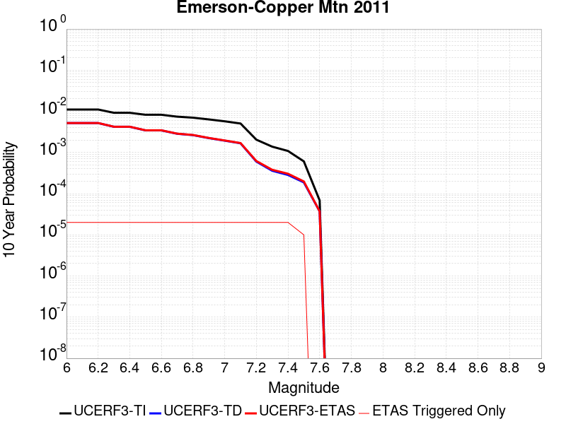 |

| Magnitude | 1 wk TI Prob | 1 wk TD Prob | 1 wk ETAS Prob | 1 wk ETAS/TD Gain | 1 wk ETAS Triggered Only | 1 mo TI Prob | 1 mo TD Prob | 1 mo ETAS Prob | 1 mo ETAS/TD Gain | 1 mo ETAS Triggered Only | 1 yr TI Prob | 1 yr TD Prob | 1 yr ETAS Prob | 1 yr ETAS/TD Gain | 1 yr ETAS Triggered Only | 10 yr TI Prob | 10 yr TD Prob | 10 yr ETAS Prob | 10 yr ETAS/TD Gain | 10 yr ETAS Triggered Only |
|-----|-----|-----|-----|-----|-----|-----|-----|-----|-----|-----|-----|-----|-----|-----|-----|-----|-----|-----|-----|-----|
| 6.0 | 2.1364202E-5 | 9.968114E-6 | 2.9967914E-5 | 3.0063777 | 2.0E-5 | 9.1557646E-5 | 4.2719836E-5 | 6.271898E-5 | 1.4681466 | 2.0E-5 | 0.0011141442 | 5.199986E-4 | 5.399882E-4 | 1.0384417 | 2.0E-5 | 0.011085749 | 0.005188688 | 0.0052085845 | 1.0038345 | 2.0E-5 |
| 6.1 | 2.1364202E-5 | 9.968114E-6 | 2.9967914E-5 | 3.0063777 | 2.0E-5 | 9.1557646E-5 | 4.2719836E-5 | 6.271898E-5 | 1.4681466 | 2.0E-5 | 0.0011141442 | 5.199986E-4 | 5.399882E-4 | 1.0384417 | 2.0E-5 | 0.011085749 | 0.005188688 | 0.0052085845 | 1.0038345 | 2.0E-5 |
| 6.2 | 2.1364202E-5 | 9.968114E-6 | 2.9967914E-5 | 3.0063777 | 2.0E-5 | 9.1557646E-5 | 4.2719836E-5 | 6.271898E-5 | 1.4681466 | 2.0E-5 | 0.0011141442 | 5.199986E-4 | 5.399882E-4 | 1.0384417 | 2.0E-5 | 0.011085749 | 0.005188688 | 0.0052085845 | 1.0038345 | 2.0E-5 |
| 6.3 | 1.7751237E-5 | 8.089227E-6 | 2.8089065E-5 | 3.4724042 | 2.0E-5 | 7.607452E-5 | 3.466769E-5 | 5.4666994E-5 | 1.576886 | 2.0E-5 | 9.258136E-4 | 4.2200365E-4 | 4.4199522E-4 | 1.0473729 | 2.0E-5 | 0.00921966 | 0.0042126453 | 0.004232561 | 1.0047276 | 2.0E-5 |
| 6.4 | 1.7751237E-5 | 8.089227E-6 | 2.8089065E-5 | 3.4724042 | 2.0E-5 | 7.607452E-5 | 3.466769E-5 | 5.4666994E-5 | 1.576886 | 2.0E-5 | 9.258136E-4 | 4.2200365E-4 | 4.4199522E-4 | 1.0473729 | 2.0E-5 | 0.00921966 | 0.0042126453 | 0.004232561 | 1.0047276 | 2.0E-5 |
| 6.5 | 1.5886664E-5 | 6.603819E-6 | 2.6603688E-5 | 4.0285306 | 2.0E-5 | 6.808392E-5 | 2.8301802E-5 | 4.8301234E-5 | 1.7066488 | 2.0E-5 | 8.286065E-4 | 3.4452465E-4 | 3.6451776E-4 | 1.058031 | 2.0E-5 | 0.008255237 | 0.0034403696 | 0.0034603006 | 1.0057933 | 2.0E-5 |
| 6.6 | 1.5886664E-5 | 6.603819E-6 | 2.6603688E-5 | 4.0285306 | 2.0E-5 | 6.808392E-5 | 2.8301802E-5 | 4.8301234E-5 | 1.7066488 | 2.0E-5 | 8.286065E-4 | 3.4452465E-4 | 3.6451776E-4 | 1.058031 | 2.0E-5 | 0.008255237 | 0.0034403696 | 0.0034603006 | 1.0057933 | 2.0E-5 |
| 6.7 | 1.428471E-5 | 5.470403E-6 | 2.5470294E-5 | 4.656018 | 2.0E-5 | 6.121875E-5 | 2.3444394E-5 | 4.3443924E-5 | 1.8530624 | 2.0E-5 | 7.450834E-4 | 2.8540206E-4 | 3.0539636E-4 | 1.0700566 | 2.0E-5 | 0.007425902 | 0.0028507432 | 0.0028706861 | 1.0069957 | 2.0E-5 |
| 6.8 | 1.3490684E-5 | 5.073699E-6 | 2.5073597E-5 | 4.9418774 | 2.0E-5 | 5.7815934E-5 | 2.1744265E-5 | 4.1743828E-5 | 1.9197628 | 2.0E-5 | 7.0368167E-4 | 2.6470813E-4 | 2.8470284E-4 | 1.0755349 | 2.0E-5 | 0.007014576 | 0.002644309 | 0.0026642561 | 1.0075434 | 2.0E-5 |
| 6.9 | 1.2235421E-5 | 4.289677E-6 | 2.4289591E-5 | 5.662336 | 2.0E-5 | 5.2436466E-5 | 1.838422E-5 | 3.8383852E-5 | 2.0878694 | 2.0E-5 | 6.38227E-4 | 2.238085E-4 | 2.4380402E-4 | 1.0893421 | 2.0E-5 | 0.0063639707 | 0.0022361854 | 0.0022561406 | 1.0089238 | 2.0E-5 |
| 7.0 | 1.1009851E-5 | 3.7189886E-6 | 2.3718914E-5 | 6.377786 | 2.0E-5 | 4.7184225E-5 | 1.5938444E-5 | 3.5938127E-5 | 2.2548077 | 2.0E-5 | 5.743165E-4 | 1.9403672E-4 | 2.1403284E-4 | 1.1030533 | 2.0E-5 | 0.005728345 | 0.0019390108 | 0.001958972 | 1.0102946 | 2.0E-5 |
| 7.1 | 9.726373E-6 | 3.2117953E-6 | 2.321173E-5 | 7.227027 | 2.0E-5 | 4.168379E-5 | 1.3764783E-5 | 3.3764507E-5 | 2.4529634 | 2.0E-5 | 5.07382E-4 | 1.6757673E-4 | 1.8757337E-4 | 1.1193283 | 2.0E-5 | 0.0050622504 | 0.0016748349 | 0.0016948014 | 1.0119215 | 2.0E-5 |
| 7.2 | 3.9335127E-6 | 1.1524792E-6 | 2.1152457E-5 | 18.353872 | 2.0E-5 | 1.6857803E-5 | 4.9391874E-6 | 2.4939089E-5 | 5.049229 | 2.0E-5 | 2.0522442E-4 | 6.0133007E-5 | 8.01318E-5 | 1.332576 | 2.0E-5 | 0.00205035 | 6.011733E-4 | 6.211613E-4 | 1.0332483 | 2.0E-5 |
| 7.3 | 2.661632E-6 | 6.911505E-7 | 2.0691137E-5 | 29.937239 | 2.0E-5 | 1.14069435E-5 | 2.9620703E-6 | 2.2962011E-5 | 7.752014 | 2.0E-5 | 1.3887069E-4 | 3.6062618E-5 | 5.6061897E-5 | 1.5545709 | 2.0E-5 | 0.0013878393 | 3.605687E-4 | 3.8056148E-4 | 1.0554479 | 2.0E-5 |
| 7.4 | 2.0893426E-6 | 5.4618386E-7 | 2.0546173E-5 | 37.617687 | 2.0E-5 | 8.954295E-6 | 2.3407858E-6 | 2.2340739E-5 | 9.544119 | 2.0E-5 | 1.0901308E-4 | 2.84987E-5 | 4.8498132E-5 | 1.7017664 | 2.0E-5 | 0.0010895962 | 2.84951E-4 | 3.049453E-4 | 1.0701675 | 2.0E-5 |
| 7.5 | 1.1681728E-6 | 3.6030585E-7 | 1.0360302E-5 | 28.754189 | 1.0E-5 | 5.0064455E-6 | 1.544167E-6 | 1.1544152E-5 | 7.475973 | 1.0E-5 | 6.0951766E-5 | 1.8800076E-5 | 2.8799888E-5 | 1.5319028 | 1.0E-5 | 6.093505E-4 | 1.8798532E-4 | 1.9798345E-4 | 1.0531856 | 1.0E-5 |
| 7.6 | 1.3154387E-7 | 7.1197384E-8 | 7.1197384E-8 | 1.0 | 0.0 | 5.6375933E-7 | 3.051316E-7 | 3.051316E-7 | 1.0 | 0.0 | 6.863748E-6 | 3.7149728E-6 | 3.7149728E-6 | 1.0 | 0.0 | 6.863536E-5 | 3.7149264E-5 | 3.7149264E-5 | 1.0 | 0.0 |

## Blue Cut
*[(top)](#table-of-contents)*

| 1 Week | 1 Month | 1 Year | 10 Year |
|-----|-----|-----|-----|
|  | 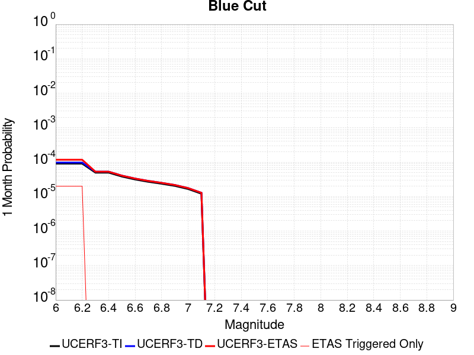 |  |  |

| Magnitude | 1 wk TI Prob | 1 wk TD Prob | 1 wk ETAS Prob | 1 wk ETAS/TD Gain | 1 wk ETAS Triggered Only | 1 mo TI Prob | 1 mo TD Prob | 1 mo ETAS Prob | 1 mo ETAS/TD Gain | 1 mo ETAS Triggered Only | 1 yr TI Prob | 1 yr TD Prob | 1 yr ETAS Prob | 1 yr ETAS/TD Gain | 1 yr ETAS Triggered Only | 10 yr TI Prob | 10 yr TD Prob | 10 yr ETAS Prob | 10 yr ETAS/TD Gain | 10 yr ETAS Triggered Only |
|-----|-----|-----|-----|-----|-----|-----|-----|-----|-----|-----|-----|-----|-----|-----|-----|-----|-----|-----|-----|-----|
| 6.0 | 2.1227985E-5 | 2.2719574E-5 | 4.271912E-5 | 1.8802782 | 2.0E-5 | 9.097391E-5 | 9.73663E-5 | 1.17364354E-4 | 1.2053899 | 2.0E-5 | 0.0011070445 | 0.0011848481 | 0.0012048244 | 1.0168598 | 2.0E-5 | 0.011015458 | 0.011791152 | 0.011810916 | 1.0016762 | 2.0E-5 |
| 6.1 | 2.1227985E-5 | 2.2719574E-5 | 4.271912E-5 | 1.8802782 | 2.0E-5 | 9.097391E-5 | 9.73663E-5 | 1.17364354E-4 | 1.2053899 | 2.0E-5 | 0.0011070445 | 0.0011848481 | 0.0012048244 | 1.0168598 | 2.0E-5 | 0.011015458 | 0.011791152 | 0.011810916 | 1.0016762 | 2.0E-5 |
| 6.2 | 2.1227985E-5 | 2.2719574E-5 | 4.271912E-5 | 1.8802782 | 2.0E-5 | 9.097391E-5 | 9.73663E-5 | 1.17364354E-4 | 1.2053899 | 2.0E-5 | 0.0011070445 | 0.0011848481 | 0.0012048244 | 1.0168598 | 2.0E-5 | 0.011015458 | 0.011791152 | 0.011810916 | 1.0016762 | 2.0E-5 |
| 6.3 | 1.1613981E-5 | 1.2353542E-5 | 1.2353542E-5 | 1.0 | 0.0 | 4.9773254E-5 | 5.2942745E-5 | 5.2942745E-5 | 1.0 | 0.0 | 6.0582085E-4 | 6.443998E-4 | 6.443998E-4 | 1.0 | 0.0 | 0.0060417196 | 0.0064265593 | 0.0064265593 | 1.0 | 0.0 |
| 6.4 | 1.1613981E-5 | 1.2353542E-5 | 1.2353542E-5 | 1.0 | 0.0 | 4.9773254E-5 | 5.2942745E-5 | 5.2942745E-5 | 1.0 | 0.0 | 6.0582085E-4 | 6.443998E-4 | 6.443998E-4 | 1.0 | 0.0 | 0.0060417196 | 0.0064265593 | 0.0064265593 | 1.0 | 0.0 |
| 6.5 | 8.931326E-6 | 9.4816E-6 | 9.4816E-6 | 1.0 | 0.0 | 3.8276554E-5 | 4.0634844E-5 | 4.0634844E-5 | 1.0 | 0.0 | 4.6591737E-4 | 4.946261E-4 | 4.946261E-4 | 1.0 | 0.0 | 0.0046494175 | 0.004936161 | 0.004936161 | 1.0 | 0.0 |
| 6.6 | 7.345353E-6 | 7.79028E-6 | 7.79028E-6 | 1.0 | 0.0 | 3.1479703E-5 | 3.338653E-5 | 3.338653E-5 | 1.0 | 0.0 | 3.83198E-4 | 4.064132E-4 | 4.064132E-4 | 1.0 | 0.0 | 0.0038253788 | 0.0040574907 | 0.0040574907 | 1.0 | 0.0 |
| 6.7 | 6.2775666E-6 | 6.655149E-6 | 6.655149E-6 | 1.0 | 0.0 | 2.690358E-5 | 2.8521798E-5 | 2.8521798E-5 | 1.0 | 0.0 | 3.2750185E-4 | 3.472051E-4 | 3.472051E-4 | 1.0 | 0.0 | 0.0032701963 | 0.003467367 | 0.003467367 | 1.0 | 0.0 |
| 6.8 | 5.5234095E-6 | 5.8551113E-6 | 5.8551113E-6 | 1.0 | 0.0 | 2.367154E-5 | 2.5093133E-5 | 2.5093133E-5 | 1.0 | 0.0 | 2.8816288E-4 | 3.0547334E-4 | 3.0547334E-4 | 1.0 | 0.0 | 0.002877895 | 0.0030512505 | 0.0030512505 | 1.0 | 0.0 |
| 6.9 | 4.7780054E-6 | 5.0654203E-6 | 5.0654203E-6 | 1.0 | 0.0 | 2.0477004E-5 | 2.1708804E-5 | 2.1708804E-5 | 1.0 | 0.0 | 2.4927902E-4 | 2.642797E-4 | 2.642797E-4 | 1.0 | 0.0 | 0.0024899957 | 0.002640346 | 0.002640346 | 1.0 | 0.0 |
| 7.0 | 3.883171E-6 | 4.118487E-6 | 4.118487E-6 | 1.0 | 0.0 | 1.6642054E-5 | 1.7650578E-5 | 1.7650578E-5 | 1.0 | 0.0 | 2.0259817E-4 | 2.1488148E-4 | 2.1488148E-4 | 1.0 | 0.0 | 0.0020241356 | 0.0021474129 | 0.0021474129 | 1.0 | 0.0 |
| 7.1 | 2.8358215E-6 | 3.0097158E-6 | 3.0097158E-6 | 1.0 | 0.0 | 1.2153464E-5 | 1.2898756E-5 | 1.2898756E-5 | 1.0 | 0.0 | 1.4795837E-4 | 1.5703762E-4 | 1.5703762E-4 | 1.0 | 0.0 | 0.001478599 | 0.0015699116 | 0.0015699116 | 1.0 | 0.0 |

## Davis Creek
*[(top)](#table-of-contents)*

| 1 Week | 1 Month | 1 Year | 10 Year |
|-----|-----|-----|-----|
|  |  |  |  |

| Magnitude | 1 wk TI Prob | 1 wk TD Prob | 1 wk ETAS Prob | 1 wk ETAS/TD Gain | 1 wk ETAS Triggered Only | 1 mo TI Prob | 1 mo TD Prob | 1 mo ETAS Prob | 1 mo ETAS/TD Gain | 1 mo ETAS Triggered Only | 1 yr TI Prob | 1 yr TD Prob | 1 yr ETAS Prob | 1 yr ETAS/TD Gain | 1 yr ETAS Triggered Only | 10 yr TI Prob | 10 yr TD Prob | 10 yr ETAS Prob | 10 yr ETAS/TD Gain | 10 yr ETAS Triggered Only |
|-----|-----|-----|-----|-----|-----|-----|-----|-----|-----|-----|-----|-----|-----|-----|-----|-----|-----|-----|-----|-----|
| 6.0 | 2.331472E-5 | 2.5417214E-5 | 4.5416706E-5 | 1.7868483 | 2.0E-5 | 9.99164E-5 | 1.0892704E-4 | 1.2892486E-4 | 1.1835891 | 2.0E-5 | 0.0012158032 | 0.0013254983 | 0.0013454718 | 1.0150687 | 2.0E-5 | 0.01209173 | 0.013187704 | 0.01320744 | 1.0014966 | 2.0E-5 |
| 6.1 | 1.0407654E-5 | 1.1316986E-5 | 2.1316873E-5 | 1.8836174 | 1.0E-5 | 4.4603472E-5 | 4.8500624E-5 | 5.8500136E-5 | 1.206173 | 1.0E-5 | 5.4291193E-4 | 5.9036224E-4 | 6.003563E-4 | 1.0169288 | 1.0E-5 | 0.0054158745 | 0.005890611 | 0.005900552 | 1.0016876 | 1.0E-5 |
| 6.2 | 1.0407654E-5 | 1.1316986E-5 | 2.1316873E-5 | 1.8836174 | 1.0E-5 | 4.4603472E-5 | 4.8500624E-5 | 5.8500136E-5 | 1.206173 | 1.0E-5 | 5.4291193E-4 | 5.9036224E-4 | 6.003563E-4 | 1.0169288 | 1.0E-5 | 0.0054158745 | 0.005890611 | 0.005900552 | 1.0016876 | 1.0E-5 |
| 6.3 | 5.1323277E-6 | 5.568556E-6 | 1.5568501E-5 | 2.7957878 | 1.0E-5 | 2.1995505E-5 | 2.386507E-5 | 3.386483E-5 | 1.4190124 | 1.0E-5 | 2.6776237E-4 | 2.905271E-4 | 3.005242E-4 | 1.0344102 | 1.0E-5 | 0.0026743996 | 0.0029023192 | 0.0029122902 | 1.0034355 | 1.0E-5 |
| 6.4 | 2.4985154E-6 | 2.704538E-6 | 2.704538E-6 | 1.0 | 0.0 | 1.07078795E-5 | 1.1590847E-5 | 1.1590847E-5 | 1.0 | 0.0 | 1.3036063E-4 | 1.4111304E-4 | 1.4111304E-4 | 1.0 | 0.0 | 0.0013028418 | 0.001410589 | 0.001410589 | 1.0 | 0.0 |
| 6.5 | 2.4846438E-6 | 2.6904722E-6 | 2.6904722E-6 | 1.0 | 0.0 | 1.064843E-5 | 1.1530565E-5 | 1.1530565E-5 | 1.0 | 0.0 | 1.2963692E-4 | 1.403792E-4 | 1.403792E-4 | 1.0 | 0.0 | 0.0012956132 | 0.0014032599 | 0.0014032599 | 1.0 | 0.0 |
| 6.6 | 2.072566E-7 | 2.1018087E-7 | 2.1018087E-7 | 1.0 | 0.0 | 8.882423E-7 | 9.0077486E-7 | 9.0077486E-7 | 1.0 | 0.0 | 1.0814296E-5 | 1.0966881E-5 | 1.0966881E-5 | 1.0 | 0.0 | 1.081377E-4 | 1.09663575E-4 | 1.09663575E-4 | 1.0 | 0.0 |
| 6.7 | 1.7544528E-7 | 1.7790826E-7 | 1.7790826E-7 | 1.0 | 0.0 | 7.5190815E-7 | 7.6246374E-7 | 7.6246374E-7 | 1.0 | 0.0 | 9.154443E-6 | 9.282958E-6 | 9.282958E-6 | 1.0 | 0.0 | 9.1540656E-5 | 9.282586E-5 | 9.282586E-5 | 1.0 | 0.0 |
| 6.8 | 1.2320395E-7 | 1.2481138E-7 | 1.2481138E-7 | 1.0 | 0.0 | 5.280168E-7 | 5.349058E-7 | 5.349058E-7 | 1.0 | 0.0 | 6.428586E-6 | 6.5124595E-6 | 6.5124595E-6 | 1.0 | 0.0 | 6.4284E-5 | 6.5122804E-5 | 6.5122804E-5 | 1.0 | 0.0 |
| 6.9 | 6.399997E-8 | 6.486058E-8 | 6.486058E-8 | 1.0 | 0.0 | 2.7428555E-7 | 2.7797387E-7 | 2.7797387E-7 | 1.0 | 0.0 | 3.3394215E-6 | 3.3843273E-6 | 3.3843273E-6 | 1.0 | 0.0 | 3.3393713E-5 | 3.384282E-5 | 3.384282E-5 | 1.0 | 0.0 |
| 7.0 | 6.4455685E-9 | 6.535264E-9 | 6.535264E-9 | 1.0 | 0.0 | 2.7623864E-8 | 2.8008275E-8 | 2.8008275E-8 | 1.0 | 0.0 | 3.3632048E-7 | 3.4100074E-7 | 3.4100074E-7 | 1.0 | 0.0 | 3.3631998E-6 | 3.4100074E-6 | 3.4100074E-6 | 1.0 | 0.0 |

## Santa Cruz Catalina Ridge alt1
*[(top)](#table-of-contents)*

| 1 Week | 1 Month | 1 Year | 10 Year |
|-----|-----|-----|-----|
|  |  | 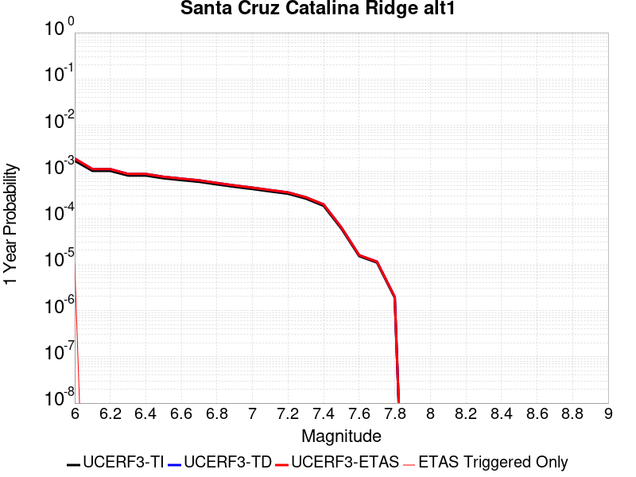 |  |

| Magnitude | 1 wk TI Prob | 1 wk TD Prob | 1 wk ETAS Prob | 1 wk ETAS/TD Gain | 1 wk ETAS Triggered Only | 1 mo TI Prob | 1 mo TD Prob | 1 mo ETAS Prob | 1 mo ETAS/TD Gain | 1 mo ETAS Triggered Only | 1 yr TI Prob | 1 yr TD Prob | 1 yr ETAS Prob | 1 yr ETAS/TD Gain | 1 yr ETAS Triggered Only | 10 yr TI Prob | 10 yr TD Prob | 10 yr ETAS Prob | 10 yr ETAS/TD Gain | 10 yr ETAS Triggered Only |
|-----|-----|-----|-----|-----|-----|-----|-----|-----|-----|-----|-----|-----|-----|-----|-----|-----|-----|-----|-----|-----|
| 6.0 | 3.2833184E-5 | 3.65584E-5 | 4.6558034E-5 | 1.273525 | 1.0E-5 | 1.4070606E-4 | 1.5667039E-4 | 1.6666882E-4 | 1.0638182 | 1.0E-5 | 0.00171175 | 0.0019059596 | 0.0019159405 | 1.0052367 | 1.0E-5 | 0.016986247 | 0.018913029 | 0.018932652 | 1.0010375 | 2.0E-5 |
| 6.1 | 1.9835548E-5 | 2.1659505E-5 | 2.1659505E-5 | 1.0 | 0.0 | 8.500672E-5 | 9.282326E-5 | 9.282326E-5 | 1.0 | 0.0 | 0.0010344655 | 0.0011295575 | 0.0011295575 | 1.0 | 0.0 | 0.010296632 | 0.011240295 | 0.011240295 | 1.0 | 0.0 |
| 6.2 | 1.9835548E-5 | 2.1659505E-5 | 2.1659505E-5 | 1.0 | 0.0 | 8.500672E-5 | 9.282326E-5 | 9.282326E-5 | 1.0 | 0.0 | 0.0010344655 | 0.0011295575 | 0.0011295575 | 1.0 | 0.0 | 0.010296632 | 0.011240295 | 0.011240295 | 1.0 | 0.0 |
| 6.3 | 1.5728183E-5 | 1.703395E-5 | 1.703395E-5 | 1.0 | 0.0 | 6.7404755E-5 | 7.300063E-5 | 7.300063E-5 | 1.0 | 0.0 | 8.2034385E-4 | 8.884264E-4 | 8.884264E-4 | 1.0 | 0.0 | 0.008173222 | 0.008849427 | 0.008849427 | 1.0 | 0.0 |
| 6.4 | 1.5728183E-5 | 1.703395E-5 | 1.703395E-5 | 1.0 | 0.0 | 6.7404755E-5 | 7.300063E-5 | 7.300063E-5 | 1.0 | 0.0 | 8.2034385E-4 | 8.884264E-4 | 8.884264E-4 | 1.0 | 0.0 | 0.008173222 | 0.008849427 | 0.008849427 | 1.0 | 0.0 |
| 6.5 | 1.3707734E-5 | 1.4794522E-5 | 1.4794522E-5 | 1.0 | 0.0 | 5.8746107E-5 | 6.3403575E-5 | 6.3403575E-5 | 1.0 | 0.0 | 7.1499916E-4 | 7.716686E-4 | 7.716686E-4 | 1.0 | 0.0 | 0.0071270303 | 0.0076902895 | 0.0076902895 | 1.0 | 0.0 |
| 6.6 | 1.2539813E-5 | 1.3510219E-5 | 1.3510219E-5 | 1.0 | 0.0 | 5.3740947E-5 | 5.789967E-5 | 5.789967E-5 | 1.0 | 0.0 | 6.540996E-4 | 7.0470315E-4 | 7.0470315E-4 | 1.0 | 0.0 | 0.0065217763 | 0.0070249885 | 0.0070249885 | 1.0 | 0.0 |
| 6.7 | 1.1504083E-5 | 1.2377375E-5 | 1.2377375E-5 | 1.0 | 0.0 | 4.930228E-5 | 5.3044827E-5 | 5.3044827E-5 | 1.0 | 0.0 | 6.0008996E-4 | 6.456314E-4 | 6.456314E-4 | 1.0 | 0.0 | 0.005984721 | 0.006437786 | 0.006437786 | 1.0 | 0.0 |
| 6.8 | 1.012739E-5 | 1.0877071E-5 | 1.0877071E-5 | 1.0 | 0.0 | 4.340238E-5 | 4.6615194E-5 | 4.6615194E-5 | 1.0 | 0.0 | 5.282958E-4 | 5.673937E-4 | 5.673937E-4 | 1.0 | 0.0 | 0.0052704164 | 0.0056596193 | 0.0056596193 | 1.0 | 0.0 |
| 6.9 | 8.9607865E-6 | 9.609117E-6 | 9.609117E-6 | 1.0 | 0.0 | 3.8402806E-5 | 4.1181287E-5 | 4.1181287E-5 | 1.0 | 0.0 | 4.6745385E-4 | 5.012679E-4 | 5.012679E-4 | 1.0 | 0.0 | 0.0046647177 | 0.005001492 | 0.005001492 | 1.0 | 0.0 |
| 7.0 | 8.046829E-6 | 8.619746E-6 | 8.619746E-6 | 1.0 | 0.0 | 3.4485955E-5 | 3.694125E-5 | 3.694125E-5 | 1.0 | 0.0 | 4.1978562E-4 | 4.496677E-4 | 4.496677E-4 | 1.0 | 0.0 | 0.004189935 | 0.0044876686 | 0.0044876686 | 1.0 | 0.0 |
| 7.1 | 7.136131E-6 | 7.637656E-6 | 7.637656E-6 | 1.0 | 0.0 | 3.0583058E-5 | 3.2732405E-5 | 3.2732405E-5 | 1.0 | 0.0 | 3.7228514E-4 | 3.9844486E-4 | 3.9844486E-4 | 1.0 | 0.0 | 0.0037166206 | 0.003977381 | 0.003977381 | 1.0 | 0.0 |
| 7.2 | 6.362014E-6 | 6.8049585E-6 | 6.8049585E-6 | 1.0 | 0.0 | 2.726549E-5 | 2.9163786E-5 | 2.9163786E-5 | 1.0 | 0.0 | 3.3190678E-4 | 3.550119E-4 | 3.550119E-4 | 1.0 | 0.0 | 0.0033141149 | 0.003544516 | 0.003544516 | 1.0 | 0.0 |
| 7.3 | 5.004101E-6 | 5.351715E-6 | 5.351715E-6 | 1.0 | 0.0 | 2.1445969E-5 | 2.2935723E-5 | 2.2935723E-5 | 1.0 | 0.0 | 2.6107338E-4 | 2.792072E-4 | 2.792072E-4 | 1.0 | 0.0 | 0.002607669 | 0.0027886187 | 0.0027886187 | 1.0 | 0.0 |
| 7.4 | 3.4901443E-6 | 3.7320526E-6 | 3.7320526E-6 | 1.0 | 0.0 | 1.4957676E-5 | 1.5994416E-5 | 1.5994416E-5 | 1.0 | 0.0 | 1.8209449E-4 | 1.9471499E-4 | 1.9471499E-4 | 1.0 | 0.0 | 0.0018194534 | 0.0019454823 | 0.0019454823 | 1.0 | 0.0 |
| 7.5 | 1.1215045E-6 | 1.189387E-6 | 1.189387E-6 | 1.0 | 0.0 | 4.806439E-6 | 5.097363E-6 | 5.097363E-6 | 1.0 | 0.0 | 5.851682E-5 | 6.205866E-5 | 6.205866E-5 | 1.0 | 0.0 | 5.850142E-4 | 6.2041637E-4 | 6.2041637E-4 | 1.0 | 0.0 |
| 7.6 | 2.8599047E-7 | 2.9951994E-7 | 2.9951994E-7 | 1.0 | 0.0 | 1.2256729E-6 | 1.2836562E-6 | 1.2836562E-6 | 1.0 | 0.0 | 1.4922465E-5 | 1.5628404E-5 | 1.5628404E-5 | 1.0 | 0.0 | 1.4921463E-4 | 1.5627318E-4 | 1.5627318E-4 | 1.0 | 0.0 |
| 7.7 | 2.0781519E-7 | 2.1744323E-7 | 2.1744323E-7 | 1.0 | 0.0 | 8.906362E-7 | 9.3189925E-7 | 9.3189925E-7 | 1.0 | 0.0 | 1.08434415E-5 | 1.13458145E-5 | 1.13458145E-5 | 1.0 | 0.0 | 1.0842913E-4 | 1.1345245E-4 | 1.1345245E-4 | 1.0 | 0.0 |
| 7.8 | 3.614776E-8 | 3.764102E-8 | 3.764102E-8 | 1.0 | 0.0 | 1.5491896E-7 | 1.6131864E-7 | 1.6131864E-7 | 1.0 | 0.0 | 1.8861368E-6 | 1.9640527E-6 | 1.9640527E-6 | 1.0 | 0.0 | 1.8861208E-5 | 1.9640367E-5 | 1.9640367E-5 | 1.0 | 0.0 |

## Hunting Creek - Berryessa 2011 CFM
*[(top)](#table-of-contents)*

| 1 Week | 1 Month | 1 Year | 10 Year |
|-----|-----|-----|-----|
|  |  |  |  |

| Magnitude | 1 wk TI Prob | 1 wk TD Prob | 1 wk ETAS Prob | 1 wk ETAS/TD Gain | 1 wk ETAS Triggered Only | 1 mo TI Prob | 1 mo TD Prob | 1 mo ETAS Prob | 1 mo ETAS/TD Gain | 1 mo ETAS Triggered Only | 1 yr TI Prob | 1 yr TD Prob | 1 yr ETAS Prob | 1 yr ETAS/TD Gain | 1 yr ETAS Triggered Only | 10 yr TI Prob | 10 yr TD Prob | 10 yr ETAS Prob | 10 yr ETAS/TD Gain | 10 yr ETAS Triggered Only |
|-----|-----|-----|-----|-----|-----|-----|-----|-----|-----|-----|-----|-----|-----|-----|-----|-----|-----|-----|-----|-----|
| 6.0 | 1.1270982E-4 | 2.0012174E-4 | 2.2011774E-4 | 1.0999192 | 2.0E-5 | 4.8295266E-4 | 8.5739547E-4 | 8.7737833E-4 | 1.0233065 | 2.0E-5 | 0.0058641075 | 0.010386313 | 0.010406105 | 1.0019056 | 2.0E-5 | 0.057117578 | 0.09803703 | 0.098055065 | 1.000184 | 2.0E-5 |
| 6.1 | 1.1239393E-4 | 1.9960315E-4 | 2.1959915E-4 | 1.1001788 | 2.0E-5 | 4.8159933E-4 | 8.551744E-4 | 8.751573E-4 | 1.023367 | 2.0E-5 | 0.0058477195 | 0.010359551 | 0.010379344 | 1.0019106 | 2.0E-5 | 0.056962132 | 0.09779551 | 0.09781355 | 1.0001845 | 2.0E-5 |
| 6.2 | 7.596265E-5 | 1.2940196E-4 | 1.3940067E-4 | 1.0772686 | 1.0E-5 | 3.2551357E-4 | 5.5444165E-4 | 5.644361E-4 | 1.0180261 | 1.0E-5 | 0.0039559277 | 0.0067210156 | 0.0067309486 | 1.0014778 | 1.0E-5 | 0.038862433 | 0.0645915 | 0.064600855 | 1.0001448 | 1.0E-5 |
| 6.3 | 6.78794E-5 | 1.145119E-4 | 1.2451076E-4 | 1.0873171 | 1.0E-5 | 2.9087928E-4 | 4.906513E-4 | 5.0064636E-4 | 1.0203711 | 1.0E-5 | 0.003535705 | 0.005952679 | 0.0059626196 | 1.0016699 | 1.0E-5 | 0.034799766 | 0.057465393 | 0.057474818 | 1.000164 | 1.0E-5 |
| 6.4 | 6.2165134E-5 | 1.0436625E-4 | 1.14365204E-4 | 1.0958064 | 1.0E-5 | 2.6639478E-4 | 4.4721062E-4 | 4.5720616E-4 | 1.0223508 | 1.0E-5 | 0.0032385332 | 0.005427573 | 0.0054375185 | 1.0018325 | 1.0E-5 | 0.03191742 | 0.052550517 | 0.05255999 | 1.0001802 | 1.0E-5 |
| 6.5 | 5.4368087E-5 | 9.071415E-5 | 1.00713245E-4 | 1.1102264 | 1.0E-5 | 2.3298527E-4 | 3.8872007E-4 | 3.987162E-4 | 1.0257155 | 1.0E-5 | 0.0028329059 | 0.0047198683 | 0.0047298213 | 1.0021087 | 1.0E-5 | 0.027970633 | 0.045880128 | 0.04588967 | 1.0002079 | 1.0E-5 |
| 6.6 | 4.729947E-5 | 7.847572E-5 | 8.847494E-5 | 1.1274179 | 1.0E-5 | 2.0269625E-4 | 3.362842E-4 | 3.4628084E-4 | 1.0297267 | 1.0E-5 | 0.002465034 | 0.0040849647 | 0.0040949243 | 1.002438 | 1.0E-5 | 0.02437869 | 0.03985155 | 0.03986115 | 1.0002409 | 1.0E-5 |
| 6.7 | 3.6875328E-5 | 6.0451803E-5 | 7.04512E-5 | 1.165411 | 1.0E-5 | 1.5802756E-4 | 2.59056E-4 | 2.690534E-4 | 1.0385917 | 1.0E-5 | 0.0019222875 | 0.0031482063 | 0.003158175 | 1.0031664 | 1.0E-5 | 0.019057442 | 0.03089237 | 0.030902062 | 1.0003138 | 1.0E-5 |
| 6.8 | 2.0292036E-5 | 2.8976308E-5 | 3.8976017E-5 | 1.3450996 | 1.0E-5 | 8.6962966E-5 | 1.2417832E-4 | 1.3417707E-4 | 1.0805193 | 1.0E-5 | 0.0010582599 | 0.0015108072 | 0.0015207921 | 1.006609 | 1.0E-5 | 0.010532344 | 0.014978523 | 0.014988373 | 1.0006577 | 1.0E-5 |
| 6.9 | 1.7871042E-5 | 2.4472254E-5 | 3.447201E-5 | 1.4086161 | 1.0E-5 | 7.658793E-5 | 1.048769E-4 | 1.1487585E-4 | 1.0953399 | 1.0E-5 | 9.320591E-4 | 0.0012761299 | 0.0012861171 | 1.0078262 | 1.0E-5 | 0.009281595 | 0.012679775 | 0.012689648 | 1.0007787 | 1.0E-5 |
| 7.0 | 1.6415532E-5 | 2.1906277E-5 | 3.190606E-5 | 1.4564801 | 1.0E-5 | 7.035038E-5 | 9.3880684E-5 | 1.0387975E-4 | 1.1065081 | 1.0E-5 | 8.561793E-4 | 0.0011424015 | 0.00115239 | 1.0087435 | 1.0E-5 | 0.008528882 | 0.01136452 | 0.011374406 | 1.00087 | 1.0E-5 |
| 7.1 | 1.5409885E-5 | 2.0346342E-5 | 2.0346342E-5 | 1.0 | 0.0 | 6.6040695E-5 | 8.7195716E-5 | 8.7195716E-5 | 1.0 | 0.0 | 8.0374884E-4 | 0.0010610938 | 0.0010610938 | 1.0 | 0.0 | 0.00800848 | 0.010560595 | 0.010560595 | 1.0 | 0.0 |
| 7.2 | 1.4497423E-5 | 1.9054964E-5 | 1.9054964E-5 | 1.0 | 0.0 | 6.213033E-5 | 8.166159E-5 | 8.166159E-5 | 1.0 | 0.0 | 7.5617427E-4 | 9.937795E-4 | 9.937795E-4 | 1.0 | 0.0 | 0.0075360634 | 0.009893929 | 0.009893929 | 1.0 | 0.0 |
| 7.3 | 1.3615175E-5 | 1.7826127E-5 | 1.7826127E-5 | 1.0 | 0.0 | 5.8349444E-5 | 7.639547E-5 | 7.639547E-5 | 1.0 | 0.0 | 7.101729E-4 | 9.297209E-4 | 9.297209E-4 | 1.0 | 0.0 | 0.0070790765 | 0.009258823 | 0.009258823 | 1.0 | 0.0 |
| 7.4 | 1.2252825E-5 | 1.602625E-5 | 1.602625E-5 | 1.0 | 0.0 | 5.251105E-5 | 6.868213E-5 | 6.868213E-5 | 1.0 | 0.0 | 6.391345E-4 | 8.35887E-4 | 8.35887E-4 | 1.0 | 0.0 | 0.0063729943 | 0.008327872 | 0.008327872 | 1.0 | 0.0 |
| 7.5 | 1.0913301E-5 | 1.4241117E-5 | 1.4241117E-5 | 1.0 | 0.0 | 4.6770452E-5 | 6.1031948E-5 | 6.1031948E-5 | 1.0 | 0.0 | 5.6928146E-4 | 7.4281334E-4 | 7.4281334E-4 | 1.0 | 0.0 | 0.0056782532 | 0.0074036797 | 0.0074036797 | 1.0 | 0.0 |
| 7.6 | 8.623192E-6 | 1.12346415E-5 | 1.12346415E-5 | 1.0 | 0.0 | 3.6956015E-5 | 4.814759E-5 | 4.814759E-5 | 1.0 | 0.0 | 4.4984656E-4 | 5.8604183E-4 | 5.8604183E-4 | 1.0 | 0.0 | 0.00448937 | 0.0058452785 | 0.0058452785 | 1.0 | 0.0 |
| 7.7 | 2.0993634E-6 | 2.662584E-6 | 2.662584E-6 | 1.0 | 0.0 | 8.997241E-6 | 1.1411025E-5 | 1.1411025E-5 | 1.0 | 0.0 | 1.09535904E-4 | 1.3892044E-4 | 1.3892044E-4 | 1.0 | 0.0 | 0.0010948193 | 0.0013883426 | 0.0013883426 | 1.0 | 0.0 |
| 7.8 | 1.8428308E-7 | 2.167437E-7 | 2.167437E-7 | 1.0 | 0.0 | 7.897844E-7 | 9.289013E-7 | 9.289013E-7 | 1.0 | 0.0 | 9.615583E-6 | 1.1309318E-5 | 1.1309318E-5 | 1.0 | 0.0 | 9.615166E-5 | 1.13086026E-4 | 1.13086026E-4 | 1.0 | 0.0 |

## Kern Canyon (Lake Isabella) 2011
*[(top)](#table-of-contents)*

| 1 Week | 1 Month | 1 Year | 10 Year |
|-----|-----|-----|-----|
|  |  | 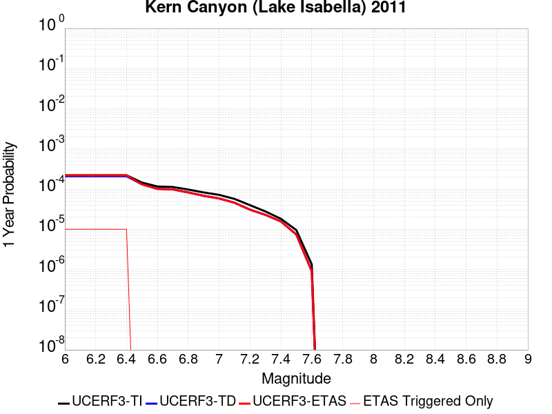 |  |

| Magnitude | 1 wk TI Prob | 1 wk TD Prob | 1 wk ETAS Prob | 1 wk ETAS/TD Gain | 1 wk ETAS Triggered Only | 1 mo TI Prob | 1 mo TD Prob | 1 mo ETAS Prob | 1 mo ETAS/TD Gain | 1 mo ETAS Triggered Only | 1 yr TI Prob | 1 yr TD Prob | 1 yr ETAS Prob | 1 yr ETAS/TD Gain | 1 yr ETAS Triggered Only | 10 yr TI Prob | 10 yr TD Prob | 10 yr ETAS Prob | 10 yr ETAS/TD Gain | 10 yr ETAS Triggered Only |
|-----|-----|-----|-----|-----|-----|-----|-----|-----|-----|-----|-----|-----|-----|-----|-----|-----|-----|-----|-----|-----|
| 6.0 | 4.2387383E-6 | 4.001639E-6 | 4.001639E-6 | 1.0 | 0.0 | 1.8165894E-5 | 1.7149778E-5 | 1.7149778E-5 | 1.0 | 0.0 | 2.2114732E-4 | 2.087804E-4 | 2.1877832E-4 | 1.0478872 | 1.0E-5 | 0.0022092736 | 0.0020860266 | 0.0021059848 | 1.0095676 | 2.0E-5 |
| 6.1 | 4.2387383E-6 | 4.001639E-6 | 4.001639E-6 | 1.0 | 0.0 | 1.8165894E-5 | 1.7149778E-5 | 1.7149778E-5 | 1.0 | 0.0 | 2.2114732E-4 | 2.087804E-4 | 2.1877832E-4 | 1.0478872 | 1.0E-5 | 0.0022092736 | 0.0020860266 | 0.0021059848 | 1.0095676 | 2.0E-5 |
| 6.2 | 4.2387383E-6 | 4.001639E-6 | 4.001639E-6 | 1.0 | 0.0 | 1.8165894E-5 | 1.7149778E-5 | 1.7149778E-5 | 1.0 | 0.0 | 2.2114732E-4 | 2.087804E-4 | 2.1877832E-4 | 1.0478872 | 1.0E-5 | 0.0022092736 | 0.0020860266 | 0.0021059848 | 1.0095676 | 2.0E-5 |
| 6.3 | 4.2387383E-6 | 4.001639E-6 | 4.001639E-6 | 1.0 | 0.0 | 1.8165894E-5 | 1.7149778E-5 | 1.7149778E-5 | 1.0 | 0.0 | 2.2114732E-4 | 2.087804E-4 | 2.1877832E-4 | 1.0478872 | 1.0E-5 | 0.0022092736 | 0.0020860266 | 0.0021059848 | 1.0095676 | 2.0E-5 |
| 6.4 | 4.2387383E-6 | 4.001639E-6 | 4.001639E-6 | 1.0 | 0.0 | 1.8165894E-5 | 1.7149778E-5 | 1.7149778E-5 | 1.0 | 0.0 | 2.2114732E-4 | 2.087804E-4 | 2.1877832E-4 | 1.0478872 | 1.0E-5 | 0.0022092736 | 0.0020860266 | 0.0021059848 | 1.0095676 | 2.0E-5 |
| 6.5 | 2.7857532E-6 | 2.517867E-6 | 2.517867E-6 | 1.0 | 0.0 | 1.1938888E-5 | 1.0790815E-5 | 1.0790815E-5 | 1.0 | 0.0 | 1.4534626E-4 | 1.3137059E-4 | 1.3137059E-4 | 1.0 | 0.0 | 0.0014525123 | 0.001312962 | 0.0013229488 | 1.0076064 | 1.0E-5 |
| 6.6 | 2.2233348E-6 | 1.9441236E-6 | 1.9441236E-6 | 1.0 | 0.0 | 9.528543E-6 | 8.331932E-6 | 8.331932E-6 | 1.0 | 0.0 | 1.1600384E-4 | 1.01436635E-4 | 1.01436635E-4 | 1.0 | 0.0 | 0.001159433 | 0.001013912 | 0.0010239019 | 1.0098528 | 1.0E-5 |
| 6.7 | 2.1635126E-6 | 1.8835036E-6 | 1.8835036E-6 | 1.0 | 0.0 | 9.272164E-6 | 8.072134E-6 | 8.072134E-6 | 1.0 | 0.0 | 1.1288274E-4 | 9.827388E-5 | 9.827388E-5 | 1.0 | 0.0 | 0.0011282542 | 9.823124E-4 | 9.923026E-4 | 1.0101701 | 1.0E-5 |
| 6.8 | 1.8685711E-6 | 1.5831425E-6 | 1.5831425E-6 | 1.0 | 0.0 | 8.008137E-6 | 6.784879E-6 | 6.784879E-6 | 1.0 | 0.0 | 9.74947E-5 | 8.260282E-5 | 8.260282E-5 | 1.0 | 0.0 | 9.745194E-4 | 8.2572614E-4 | 8.3571783E-4 | 1.0121006 | 1.0E-5 |
| 6.9 | 1.5815071E-6 | 1.3064928E-6 | 1.3064928E-6 | 1.0 | 0.0 | 6.77787E-6 | 5.599243E-6 | 5.599243E-6 | 1.0 | 0.0 | 8.251744E-5 | 6.816868E-5 | 6.816868E-5 | 1.0 | 0.0 | 8.248681E-4 | 6.8148033E-4 | 6.8148033E-4 | 1.0 | 0.0 |
| 7.0 | 1.3772564E-6 | 1.1210718E-6 | 1.1210718E-6 | 1.0 | 0.0 | 5.9025137E-6 | 4.8045845E-6 | 4.8045845E-6 | 1.0 | 0.0 | 7.186073E-5 | 5.8494268E-5 | 5.8494268E-5 | 1.0 | 0.0 | 7.18375E-4 | 5.847908E-4 | 5.847908E-4 | 1.0 | 0.0 |
| 7.1 | 1.0916998E-6 | 8.763777E-7 | 8.763777E-7 | 1.0 | 0.0 | 4.678705E-6 | 3.7558991E-6 | 3.7558991E-6 | 1.0 | 0.0 | 5.6961744E-5 | 4.5727127E-5 | 4.5727127E-5 | 1.0 | 0.0 | 5.6947145E-4 | 4.571785E-4 | 4.571785E-4 | 1.0 | 0.0 |
| 7.2 | 7.6277024E-7 | 5.901454E-7 | 5.901454E-7 | 1.0 | 0.0 | 3.2690114E-6 | 2.5291922E-6 | 2.5291922E-6 | 1.0 | 0.0 | 3.9799485E-5 | 3.0792486E-5 | 3.0792486E-5 | 1.0 | 0.0 | 3.9792358E-4 | 3.0788282E-4 | 3.0788282E-4 | 1.0 | 0.0 |
| 7.3 | 5.3265916E-7 | 4.3824414E-7 | 4.3824414E-7 | 1.0 | 0.0 | 2.282823E-6 | 1.878188E-6 | 1.878188E-6 | 1.0 | 0.0 | 2.7793016E-5 | 2.2866701E-5 | 2.2866701E-5 | 1.0 | 0.0 | 2.778954E-4 | 2.2864387E-4 | 2.2864387E-4 | 1.0 | 0.0 |
| 7.4 | 3.4946007E-7 | 3.006571E-7 | 3.006571E-7 | 1.0 | 0.0 | 1.497685E-6 | 1.2885298E-6 | 1.2885298E-6 | 1.0 | 0.0 | 1.8234163E-5 | 1.568774E-5 | 1.568774E-5 | 1.0 | 0.0 | 1.8232666E-4 | 1.5686655E-4 | 1.5686655E-4 | 1.0 | 0.0 |
| 7.5 | 1.8317026E-7 | 1.4244812E-7 | 1.4244812E-7 | 1.0 | 0.0 | 7.850152E-7 | 6.104918E-7 | 6.104918E-7 | 1.0 | 0.0 | 9.557518E-6 | 7.432713E-6 | 7.432713E-6 | 1.0 | 0.0 | 9.5571064E-5 | 7.432472E-5 | 7.432472E-5 | 1.0 | 0.0 |
| 7.6 | 2.572245E-8 | 1.7352555E-8 | 1.7352555E-8 | 1.0 | 0.0 | 1.10239064E-7 | 7.436809E-8 | 7.436809E-8 | 1.0 | 0.0 | 1.3421597E-6 | 9.054312E-7 | 9.054312E-7 | 1.0 | 0.0 | 1.3421517E-5 | 9.05428E-6 | 9.05428E-6 | 1.0 | 0.0 |

## Tin Mountain
*[(top)](#table-of-contents)*

| 1 Week | 1 Month | 1 Year | 10 Year |
|-----|-----|-----|-----|
|  |  |  |  |

| Magnitude | 1 wk TI Prob | 1 wk TD Prob | 1 wk ETAS Prob | 1 wk ETAS/TD Gain | 1 wk ETAS Triggered Only | 1 mo TI Prob | 1 mo TD Prob | 1 mo ETAS Prob | 1 mo ETAS/TD Gain | 1 mo ETAS Triggered Only | 1 yr TI Prob | 1 yr TD Prob | 1 yr ETAS Prob | 1 yr ETAS/TD Gain | 1 yr ETAS Triggered Only | 10 yr TI Prob | 10 yr TD Prob | 10 yr ETAS Prob | 10 yr ETAS/TD Gain | 10 yr ETAS Triggered Only |
|-----|-----|-----|-----|-----|-----|-----|-----|-----|-----|-----|-----|-----|-----|-----|-----|-----|-----|-----|-----|-----|
| 6.0 | 4.083776E-6 | 4.1815365E-6 | 2.4181452E-5 | 5.782911 | 2.0E-5 | 1.750178E-5 | 1.792077E-5 | 3.792041E-5 | 2.1160035 | 2.0E-5 | 2.1306332E-4 | 2.1816725E-4 | 2.3816289E-4 | 1.0916528 | 2.0E-5 | 0.0021285915 | 0.0021798965 | 0.0021998528 | 1.0091548 | 2.0E-5 |
| 6.1 | 4.083776E-6 | 4.1815365E-6 | 2.4181452E-5 | 5.782911 | 2.0E-5 | 1.750178E-5 | 1.792077E-5 | 3.792041E-5 | 2.1160035 | 2.0E-5 | 2.1306332E-4 | 2.1816725E-4 | 2.3816289E-4 | 1.0916528 | 2.0E-5 | 0.0021285915 | 0.0021798965 | 0.0021998528 | 1.0091548 | 2.0E-5 |
| 6.2 | 4.083776E-6 | 4.1815365E-6 | 2.4181452E-5 | 5.782911 | 2.0E-5 | 1.750178E-5 | 1.792077E-5 | 3.792041E-5 | 2.1160035 | 2.0E-5 | 2.1306332E-4 | 2.1816725E-4 | 2.3816289E-4 | 1.0916528 | 2.0E-5 | 0.0021285915 | 0.0021798965 | 0.0021998528 | 1.0091548 | 2.0E-5 |
| 6.3 | 4.083776E-6 | 4.1815365E-6 | 2.4181452E-5 | 5.782911 | 2.0E-5 | 1.750178E-5 | 1.792077E-5 | 3.792041E-5 | 2.1160035 | 2.0E-5 | 2.1306332E-4 | 2.1816725E-4 | 2.3816289E-4 | 1.0916528 | 2.0E-5 | 0.0021285915 | 0.0021798965 | 0.0021998528 | 1.0091548 | 2.0E-5 |
| 6.4 | 4.083776E-6 | 4.1815365E-6 | 2.4181452E-5 | 5.782911 | 2.0E-5 | 1.750178E-5 | 1.792077E-5 | 3.792041E-5 | 2.1160035 | 2.0E-5 | 2.1306332E-4 | 2.1816725E-4 | 2.3816289E-4 | 1.0916528 | 2.0E-5 | 0.0021285915 | 0.0021798965 | 0.0021998528 | 1.0091548 | 2.0E-5 |
| 6.5 | 2.3143427E-6 | 2.3731573E-6 | 2.3731573E-6 | 1.0 | 0.0 | 9.9185745E-6 | 1.0170638E-5 | 1.0170638E-5 | 1.0 | 0.0 | 1.2075195E-4 | 1.2382126E-4 | 1.2382126E-4 | 1.0 | 0.0 | 0.0012068636 | 0.0012375986 | 0.0012375986 | 1.0 | 0.0 |
| 6.6 | 2.3143427E-6 | 2.3731573E-6 | 2.3731573E-6 | 1.0 | 0.0 | 9.9185745E-6 | 1.0170638E-5 | 1.0170638E-5 | 1.0 | 0.0 | 1.2075195E-4 | 1.2382126E-4 | 1.2382126E-4 | 1.0 | 0.0 | 0.0012068636 | 0.0012375986 | 0.0012375986 | 1.0 | 0.0 |
| 6.7 | 1.7029532E-6 | 1.7497915E-6 | 1.7497915E-6 | 1.0 | 0.0 | 7.2983503E-6 | 7.499088E-6 | 7.499088E-6 | 1.0 | 0.0 | 8.885379E-5 | 9.1298105E-5 | 9.1298105E-5 | 1.0 | 0.0 | 8.881827E-4 | 9.1265864E-4 | 9.1265864E-4 | 1.0 | 0.0 |
| 6.8 | 1.2914646E-6 | 1.3299378E-6 | 1.3299378E-6 | 1.0 | 0.0 | 5.534837E-6 | 5.6997237E-6 | 5.6997237E-6 | 1.0 | 0.0 | 6.738455E-5 | 6.939237E-5 | 6.939237E-5 | 1.0 | 0.0 | 6.736412E-4 | 6.9375033E-4 | 6.9375033E-4 | 1.0 | 0.0 |
| 6.9 | 5.8708974E-7 | 6.1169936E-7 | 6.1169936E-7 | 1.0 | 0.0 | 2.5160964E-6 | 2.6215664E-6 | 2.6215664E-6 | 1.0 | 0.0 | 3.0633044E-5 | 3.1917145E-5 | 3.1917145E-5 | 1.0 | 0.0 | 3.0628822E-4 | 3.191297E-4 | 3.191297E-4 | 1.0 | 0.0 |
| 7.0 | 4.6248786E-7 | 4.832015E-7 | 4.832015E-7 | 1.0 | 0.0 | 1.9820893E-6 | 2.0708624E-6 | 2.0708624E-6 | 1.0 | 0.0 | 2.413167E-5 | 2.5212494E-5 | 2.5212494E-5 | 1.0 | 0.0 | 2.412905E-4 | 2.5210003E-4 | 2.5210003E-4 | 1.0 | 0.0 |
| 7.1 | 3.804606E-7 | 3.987147E-7 | 3.987147E-7 | 1.0 | 0.0 | 1.6305444E-6 | 1.7087764E-6 | 1.7087764E-6 | 1.0 | 0.0 | 1.9851697E-5 | 2.0804187E-5 | 2.0804187E-5 | 1.0 | 0.0 | 1.9849923E-4 | 2.0802575E-4 | 2.0802575E-4 | 1.0 | 0.0 |
| 7.2 | 3.5864858E-7 | 3.7616863E-7 | 3.7616863E-7 | 1.0 | 0.0 | 1.5370645E-6 | 1.6121504E-6 | 1.6121504E-6 | 1.0 | 0.0 | 1.87136E-5 | 1.9627789E-5 | 1.9627789E-5 | 1.0 | 0.0 | 1.8712023E-4 | 1.9626386E-4 | 1.9626386E-4 | 1.0 | 0.0 |
| 7.3 | 3.342063E-7 | 3.506347E-7 | 3.506347E-7 | 1.0 | 0.0 | 1.4323119E-6 | 1.5027196E-6 | 1.5027196E-6 | 1.0 | 0.0 | 1.7438259E-5 | 1.829549E-5 | 1.829549E-5 | 1.0 | 0.0 | 1.743689E-4 | 1.8294314E-4 | 1.8294314E-4 | 1.0 | 0.0 |
| 7.4 | 2.971242E-7 | 3.1165817E-7 | 3.1165817E-7 | 1.0 | 0.0 | 1.2733886E-6 | 1.3356774E-6 | 1.3356774E-6 | 1.0 | 0.0 | 1.5503398E-5 | 1.6261785E-5 | 1.6261785E-5 | 1.0 | 0.0 | 1.5502315E-4 | 1.6260923E-4 | 1.6260923E-4 | 1.0 | 0.0 |
| 7.5 | 1.4326713E-7 | 1.5012525E-7 | 1.5012525E-7 | 1.0 | 0.0 | 6.140018E-7 | 6.433939E-7 | 6.433939E-7 | 1.0 | 0.0 | 7.4754466E-6 | 7.8333205E-6 | 7.8333205E-6 | 1.0 | 0.0 | 7.475195E-5 | 7.833321E-5 | 7.833321E-5 | 1.0 | 0.0 |

## Great Valley 09 (Laguna Seca)
*[(top)](#table-of-contents)*

| 1 Week | 1 Month | 1 Year | 10 Year |
|-----|-----|-----|-----|
|  |  |  |  |

| Magnitude | 1 wk TI Prob | 1 wk TD Prob | 1 wk ETAS Prob | 1 wk ETAS/TD Gain | 1 wk ETAS Triggered Only | 1 mo TI Prob | 1 mo TD Prob | 1 mo ETAS Prob | 1 mo ETAS/TD Gain | 1 mo ETAS Triggered Only | 1 yr TI Prob | 1 yr TD Prob | 1 yr ETAS Prob | 1 yr ETAS/TD Gain | 1 yr ETAS Triggered Only | 10 yr TI Prob | 10 yr TD Prob | 10 yr ETAS Prob | 10 yr ETAS/TD Gain | 10 yr ETAS Triggered Only |
|-----|-----|-----|-----|-----|-----|-----|-----|-----|-----|-----|-----|-----|-----|-----|-----|-----|-----|-----|-----|-----|
| 6.0 | 5.4353277E-5 | 7.05022E-5 | 7.05022E-5 | 1.0 | 0.0 | 2.3292181E-4 | 3.0211566E-4 | 3.1211265E-4 | 1.0330899 | 1.0E-5 | 0.0028321352 | 0.0036721937 | 0.0036921203 | 1.0054263 | 2.0E-5 | 0.02796312 | 0.03611547 | 0.03613475 | 1.0005338 | 2.0E-5 |
| 6.1 | 4.5578287E-5 | 5.822118E-5 | 5.822118E-5 | 1.0 | 0.0 | 1.953209E-4 | 2.4949326E-4 | 2.4949326E-4 | 1.0 | 0.0 | 0.0023754383 | 0.003033432 | 0.0030434018 | 1.0032866 | 1.0E-5 | 0.023502063 | 0.029919548 | 0.029929249 | 1.0003242 | 1.0E-5 |
| 6.2 | 2.8536782E-5 | 3.4737273E-5 | 3.4737273E-5 | 1.0 | 0.0 | 1.2229476E-4 | 1.4886224E-4 | 1.4886224E-4 | 1.0 | 0.0 | 0.0014879217 | 0.001810813 | 0.001810813 | 1.0 | 0.0 | 0.014779986 | 0.017958116 | 0.017958116 | 1.0 | 0.0 |
| 6.3 | 2.3698774E-5 | 2.8213295E-5 | 2.8213295E-5 | 1.0 | 0.0 | 1.01562226E-4 | 1.20905075E-4 | 1.20905075E-4 | 1.0 | 0.0 | 0.0012358186 | 0.0014710218 | 0.0014710218 | 1.0 | 0.0 | 0.012289686 | 0.014611342 | 0.014611342 | 1.0 | 0.0 |
| 6.4 | 1.9191197E-5 | 2.2123184E-5 | 2.2123184E-5 | 1.0 | 0.0 | 8.2245395E-5 | 9.4806666E-5 | 9.4806666E-5 | 1.0 | 0.0 | 0.0010008777 | 0.0011536429 | 0.0011536429 | 1.0 | 0.0 | 0.009963818 | 0.011476948 | 0.011476948 | 1.0 | 0.0 |
| 6.5 | 1.5203241E-5 | 1.6802203E-5 | 1.6802203E-5 | 1.0 | 0.0 | 6.5155116E-5 | 7.200386E-5 | 7.200386E-5 | 1.0 | 0.0 | 7.9297484E-4 | 8.7626575E-4 | 8.7626575E-4 | 1.0 | 0.0 | 0.007901512 | 0.0087295165 | 0.0087295165 | 1.0 | 0.0 |
| 6.6 | 1.0984925E-5 | 1.1242595E-5 | 1.1242595E-5 | 1.0 | 0.0 | 4.70774E-5 | 4.8181686E-5 | 4.8181686E-5 | 1.0 | 0.0 | 5.730166E-4 | 5.8645656E-4 | 5.8645656E-4 | 1.0 | 0.0 | 0.005715413 | 0.0058494853 | 0.0058494853 | 1.0 | 0.0 |
| 6.7 | 9.134616E-6 | 9.019894E-6 | 9.019894E-6 | 1.0 | 0.0 | 3.9147766E-5 | 3.865613E-5 | 3.865613E-5 | 1.0 | 0.0 | 4.7651984E-4 | 4.7053912E-4 | 4.7053912E-4 | 1.0 | 0.0 | 0.004754993 | 0.0046956735 | 0.0046956735 | 1.0 | 0.0 |
| 6.8 | 7.785589E-6 | 7.4519444E-6 | 7.4519444E-6 | 1.0 | 0.0 | 3.3366385E-5 | 3.1936524E-5 | 3.1936524E-5 | 1.0 | 0.0 | 4.0616E-4 | 3.8875983E-4 | 3.8875983E-4 | 1.0 | 0.0 | 0.0040541845 | 0.0038810016 | 0.0038810016 | 1.0 | 0.0 |
| 6.9 | 5.579095E-6 | 4.898492E-6 | 4.898492E-6 | 1.0 | 0.0 | 2.3910188E-5 | 2.0993377E-5 | 2.0993377E-5 | 1.0 | 0.0 | 2.9106764E-4 | 2.5556577E-4 | 2.5556577E-4 | 1.0 | 0.0 | 0.002906867 | 0.002552856 | 0.002552856 | 1.0 | 0.0 |
| 7.0 | 2.6816688E-6 | 1.5216126E-6 | 1.5216126E-6 | 1.0 | 0.0 | 1.1492816E-5 | 6.521181E-6 | 6.521181E-6 | 1.0 | 0.0 | 1.3991605E-4 | 7.939258E-5 | 7.939258E-5 | 1.0 | 0.0 | 0.0013982799 | 7.9365086E-4 | 7.9365086E-4 | 1.0 | 0.0 |
| 7.1 | 1.9951021E-6 | 7.453827E-7 | 7.453827E-7 | 1.0 | 0.0 | 8.55041E-6 | 3.1944935E-6 | 3.1944935E-6 | 1.0 | 0.0 | 1.0409627E-4 | 3.8892307E-5 | 3.8892307E-5 | 1.0 | 0.0 | 0.0010404752 | 3.8885913E-4 | 3.8885913E-4 | 1.0 | 0.0 |
| 7.2 | 1.9951021E-6 | 7.453827E-7 | 7.453827E-7 | 1.0 | 0.0 | 8.55041E-6 | 3.1944935E-6 | 3.1944935E-6 | 1.0 | 0.0 | 1.0409627E-4 | 3.8892307E-5 | 3.8892307E-5 | 1.0 | 0.0 | 0.0010404752 | 3.8885913E-4 | 3.8885913E-4 | 1.0 | 0.0 |
| 7.3 | 1.7087556E-6 | 6.578881E-7 | 6.578881E-7 | 1.0 | 0.0 | 7.3232177E-6 | 2.8195177E-6 | 2.8195177E-6 | 1.0 | 0.0 | 8.915652E-5 | 3.4327128E-5 | 3.4327128E-5 | 1.0 | 0.0 | 8.9120766E-4 | 3.432223E-4 | 3.432223E-4 | 1.0 | 0.0 |
| 7.4 | 1.3804846E-6 | 6.073852E-7 | 6.073852E-7 | 1.0 | 0.0 | 5.916349E-6 | 2.6030768E-6 | 2.6030768E-6 | 1.0 | 0.0 | 7.2029165E-5 | 3.169204E-5 | 3.169204E-5 | 1.0 | 0.0 | 7.200583E-4 | 3.1687922E-4 | 3.1687922E-4 | 1.0 | 0.0 |
| 7.5 | 1.3804846E-6 | 6.073852E-7 | 6.073852E-7 | 1.0 | 0.0 | 5.916349E-6 | 2.6030768E-6 | 2.6030768E-6 | 1.0 | 0.0 | 7.2029165E-5 | 3.169204E-5 | 3.169204E-5 | 1.0 | 0.0 | 7.200583E-4 | 3.1687922E-4 | 3.1687922E-4 | 1.0 | 0.0 |

## Anaheim
*[(top)](#table-of-contents)*

| 1 Week | 1 Month | 1 Year | 10 Year |
|-----|-----|-----|-----|
|  | 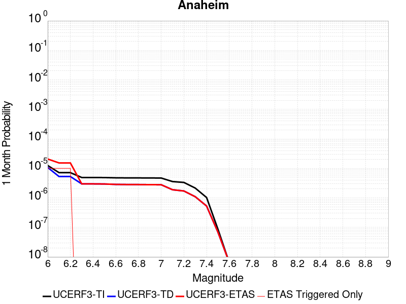 | 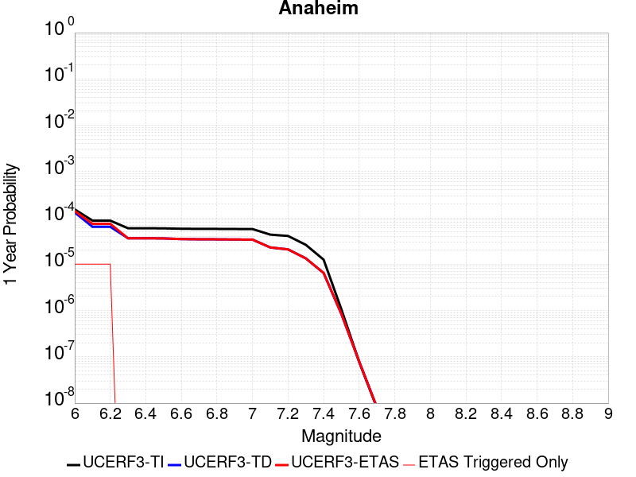 |  |

| Magnitude | 1 wk TI Prob | 1 wk TD Prob | 1 wk ETAS Prob | 1 wk ETAS/TD Gain | 1 wk ETAS Triggered Only | 1 mo TI Prob | 1 mo TD Prob | 1 mo ETAS Prob | 1 mo ETAS/TD Gain | 1 mo ETAS Triggered Only | 1 yr TI Prob | 1 yr TD Prob | 1 yr ETAS Prob | 1 yr ETAS/TD Gain | 1 yr ETAS Triggered Only | 10 yr TI Prob | 10 yr TD Prob | 10 yr ETAS Prob | 10 yr ETAS/TD Gain | 10 yr ETAS Triggered Only |
|-----|-----|-----|-----|-----|-----|-----|-----|-----|-----|-----|-----|-----|-----|-----|-----|-----|-----|-----|-----|-----|
| 6.0 | 2.9254998E-6 | 2.5122863E-6 | 1.25122615E-5 | 4.980428 | 1.0E-5 | 1.25377965E-5 | 1.0766909E-5 | 2.0766802E-5 | 1.9287616 | 1.0E-5 | 1.5263697E-4 | 1.3108159E-4 | 1.4108028E-4 | 1.0762783 | 1.0E-5 | 0.0015253217 | 0.0013102728 | 0.0013202598 | 1.007622 | 1.0E-5 |
| 6.1 | 1.6729715E-6 | 1.2337348E-6 | 1.1233722E-5 | 9.10546 | 1.0E-5 | 7.1698582E-6 | 5.287426E-6 | 1.5287373E-5 | 2.8912692 | 1.0E-5 | 8.7289525E-5 | 6.437293E-5 | 7.4372285E-5 | 1.1553348 | 1.0E-5 | 8.7255245E-4 | 6.435838E-4 | 6.535773E-4 | 1.015528 | 1.0E-5 |
| 6.2 | 1.6729715E-6 | 1.2337348E-6 | 1.1233722E-5 | 9.10546 | 1.0E-5 | 7.1698582E-6 | 5.287426E-6 | 1.5287373E-5 | 2.8912692 | 1.0E-5 | 8.7289525E-5 | 6.437293E-5 | 7.4372285E-5 | 1.1553348 | 1.0E-5 | 8.7255245E-4 | 6.435838E-4 | 6.535773E-4 | 1.015528 | 1.0E-5 |
| 6.3 | 1.1444064E-6 | 6.9596666E-7 | 6.9596666E-7 | 1.0 | 0.0 | 4.9045893E-6 | 2.9827113E-6 | 2.9827113E-6 | 1.0 | 0.0 | 5.971174E-5 | 3.631396E-5 | 3.631396E-5 | 1.0 | 0.0 | 5.96957E-4 | 3.6308577E-4 | 3.6308577E-4 | 1.0 | 0.0 |
| 6.4 | 1.1444064E-6 | 6.9596666E-7 | 6.9596666E-7 | 1.0 | 0.0 | 4.9045893E-6 | 2.9827113E-6 | 2.9827113E-6 | 1.0 | 0.0 | 5.971174E-5 | 3.631396E-5 | 3.631396E-5 | 1.0 | 0.0 | 5.96957E-4 | 3.6308577E-4 | 3.6308577E-4 | 1.0 | 0.0 |
| 6.5 | 1.1385318E-6 | 6.9003505E-7 | 6.9003505E-7 | 1.0 | 0.0 | 4.879413E-6 | 2.95729E-6 | 2.95729E-6 | 1.0 | 0.0 | 5.9405233E-5 | 3.6004465E-5 | 3.6004465E-5 | 1.0 | 0.0 | 5.938936E-4 | 3.5999183E-4 | 3.5999183E-4 | 1.0 | 0.0 |
| 6.6 | 1.1165511E-6 | 6.678222E-7 | 6.678222E-7 | 1.0 | 0.0 | 4.78521E-6 | 2.862092E-6 | 2.862092E-6 | 1.0 | 0.0 | 5.8258374E-5 | 3.484547E-5 | 3.484547E-5 | 1.0 | 0.0 | 5.8243104E-4 | 3.484055E-4 | 3.484055E-4 | 1.0 | 0.0 |
| 6.7 | 1.1098243E-6 | 6.610416E-7 | 6.610416E-7 | 1.0 | 0.0 | 4.7563813E-6 | 2.8330326E-6 | 2.8330326E-6 | 1.0 | 0.0 | 5.7907404E-5 | 3.449168E-5 | 3.449168E-5 | 1.0 | 0.0 | 5.7892315E-4 | 3.4486872E-4 | 3.4486872E-4 | 1.0 | 0.0 |
| 6.8 | 1.1077587E-6 | 6.589619E-7 | 6.589619E-7 | 1.0 | 0.0 | 4.7475287E-6 | 2.8241195E-6 | 2.8241195E-6 | 1.0 | 0.0 | 5.779963E-5 | 3.438317E-5 | 3.438317E-5 | 1.0 | 0.0 | 5.77846E-4 | 3.4378393E-4 | 3.4378393E-4 | 1.0 | 0.0 |
| 6.9 | 1.1024468E-6 | 6.5361957E-7 | 6.5361957E-7 | 1.0 | 0.0 | 4.7247636E-6 | 2.8012241E-6 | 2.8012241E-6 | 1.0 | 0.0 | 5.752248E-5 | 3.4104425E-5 | 3.4104425E-5 | 1.0 | 0.0 | 5.750759E-4 | 3.4099736E-4 | 3.4099736E-4 | 1.0 | 0.0 |
| 7.0 | 1.0993066E-6 | 6.510303E-7 | 6.510303E-7 | 1.0 | 0.0 | 4.7113053E-6 | 2.7901272E-6 | 2.7901272E-6 | 1.0 | 0.0 | 5.7358633E-5 | 3.3969325E-5 | 3.3969325E-5 | 1.0 | 0.0 | 5.734383E-4 | 3.3964674E-4 | 3.3964674E-4 | 1.0 | 0.0 |
| 7.1 | 8.334877E-7 | 4.4049145E-7 | 4.4049145E-7 | 1.0 | 0.0 | 3.5720855E-6 | 1.8878193E-6 | 1.8878193E-6 | 1.0 | 0.0 | 4.348927E-5 | 2.298398E-5 | 2.298398E-5 | 1.0 | 0.0 | 4.3480762E-4 | 2.2981827E-4 | 2.2981827E-4 | 1.0 | 0.0 |
| 7.2 | 7.794411E-7 | 3.997645E-7 | 3.997645E-7 | 1.0 | 0.0 | 3.3404576E-6 | 1.7132754E-6 | 1.7132754E-6 | 1.0 | 0.0 | 4.0669314E-5 | 2.0858948E-5 | 2.0858948E-5 | 1.0 | 0.0 | 4.066187E-4 | 2.0857195E-4 | 2.0857195E-4 | 1.0 | 0.0 |
| 7.3 | 5.01704E-7 | 2.5573388E-7 | 2.5573388E-7 | 1.0 | 0.0 | 2.150158E-6 | 1.0960019E-6 | 1.0960019E-6 | 1.0 | 0.0 | 2.617786E-5 | 1.3343754E-5 | 1.3343754E-5 | 1.0 | 0.0 | 2.6174777E-4 | 1.3343077E-4 | 1.3343077E-4 | 1.0 | 0.0 |
| 7.4 | 2.4008182E-7 | 1.2367859E-7 | 1.2367859E-7 | 1.0 | 0.0 | 1.0289217E-6 | 5.30051E-7 | 5.30051E-7 | 1.0 | 0.0 | 1.252705E-5 | 6.4533597E-6 | 6.4533597E-6 | 1.0 | 0.0 | 1.2526344E-4 | 6.453248E-5 | 6.453248E-5 | 1.0 | 0.0 |
| 7.5 | 2.0263876E-8 | 1.6120866E-8 | 1.6120866E-8 | 1.0 | 0.0 | 8.684518E-8 | 6.908943E-8 | 6.908943E-8 | 1.0 | 0.0 | 1.0573395E-6 | 8.4116357E-7 | 8.4116357E-7 | 1.0 | 0.0 | 1.0573345E-5 | 8.411613E-6 | 8.411613E-6 | 1.0 | 0.0 |
| 7.6 | 1.4871431E-9 | 1.508418E-9 | 1.508418E-9 | 1.0 | 0.0 | 6.37347E-9 | 6.4646484E-9 | 6.4646484E-9 | 1.0 | 0.0 | 7.7596994E-8 | 7.870709E-8 | 7.870709E-8 | 1.0 | 0.0 | 7.759697E-7 | 7.8707063E-7 | 7.8707063E-7 | 1.0 | 0.0 |
| 7.7 | 1.5093293E-10 | 1.5333512E-10 | 1.5333512E-10 | 1.0 | 0.0 | 6.4685546E-10 | 6.571509E-10 | 6.571509E-10 | 1.0 | 0.0 | 7.875465E-9 | 8.0008125E-9 | 8.0008125E-9 | 1.0 | 0.0 | 7.8754645E-8 | 8.000812E-8 | 8.000812E-8 | 1.0 | 0.0 |

## Mission Ridge-Arroyo Parida-Santa Ana
*[(top)](#table-of-contents)*

| 1 Week | 1 Month | 1 Year | 10 Year |
|-----|-----|-----|-----|
| 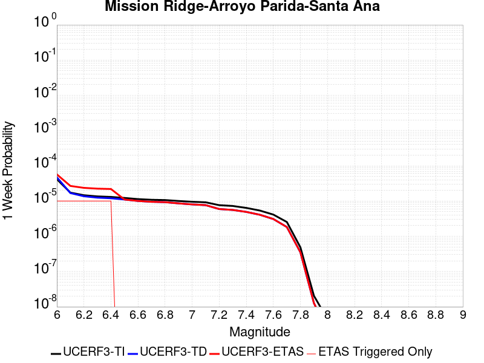 | 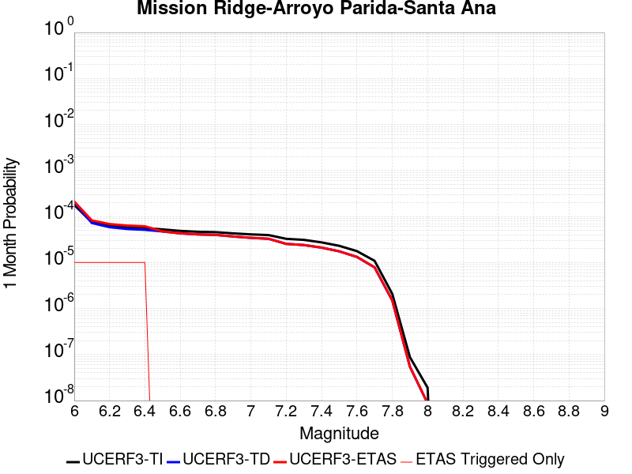 |  |  |

| Magnitude | 1 wk TI Prob | 1 wk TD Prob | 1 wk ETAS Prob | 1 wk ETAS/TD Gain | 1 wk ETAS Triggered Only | 1 mo TI Prob | 1 mo TD Prob | 1 mo ETAS Prob | 1 mo ETAS/TD Gain | 1 mo ETAS Triggered Only | 1 yr TI Prob | 1 yr TD Prob | 1 yr ETAS Prob | 1 yr ETAS/TD Gain | 1 yr ETAS Triggered Only | 10 yr TI Prob | 10 yr TD Prob | 10 yr ETAS Prob | 10 yr ETAS/TD Gain | 10 yr ETAS Triggered Only |
|-----|-----|-----|-----|-----|-----|-----|-----|-----|-----|-----|-----|-----|-----|-----|-----|-----|-----|-----|-----|-----|
| 6.0 | 4.169034E-5 | 4.7138263E-5 | 5.7137793E-5 | 1.2121319 | 1.0E-5 | 1.7866064E-4 | 2.0201034E-4 | 2.1200832E-4 | 1.0494924 | 1.0E-5 | 0.0021730233 | 0.00245745 | 0.0024674253 | 1.0040593 | 1.0E-5 | 0.021518968 | 0.024384614 | 0.02439437 | 1.0004001 | 1.0E-5 |
| 6.1 | 1.73813E-5 | 1.6854226E-5 | 2.6854057E-5 | 1.593313 | 1.0E-5 | 7.4489166E-5 | 7.223046E-5 | 8.222974E-5 | 1.1384357 | 1.0E-5 | 9.065282E-4 | 8.790618E-4 | 8.8905304E-4 | 1.0113658 | 1.0E-5 | 0.009028391 | 0.008756988 | 0.008766901 | 1.0011319 | 1.0E-5 |
| 6.2 | 1.4622182E-5 | 1.367329E-5 | 2.3673152E-5 | 1.7313429 | 1.0E-5 | 6.2664985E-5 | 5.8598518E-5 | 6.859793E-5 | 1.1706427 | 1.0E-5 | 7.6267915E-4 | 7.132073E-4 | 7.2320015E-4 | 1.0140111 | 1.0E-5 | 0.007600669 | 0.007109627 | 0.0071195564 | 1.0013965 | 1.0E-5 |
| 6.3 | 1.3552434E-5 | 1.2482201E-5 | 2.2482076E-5 | 1.8011308 | 1.0E-5 | 5.8080568E-5 | 5.3494066E-5 | 6.3493535E-5 | 1.1869266 | 1.0E-5 | 7.069015E-4 | 6.510988E-4 | 6.610923E-4 | 1.0153487 | 1.0E-5 | 0.00704657 | 0.006492275 | 0.00650221 | 1.0015303 | 1.0E-5 |
| 6.4 | 1.30977305E-5 | 1.1979156E-5 | 2.1979036E-5 | 1.8347733 | 1.0E-5 | 5.613192E-5 | 5.1338247E-5 | 6.1337734E-5 | 1.1947765 | 1.0E-5 | 6.831918E-4 | 6.248669E-4 | 6.3486065E-4 | 1.0159934 | 1.0E-5 | 0.006810953 | 0.0062314444 | 0.006241382 | 1.0015948 | 1.0E-5 |
| 6.5 | 1.225205E-5 | 1.1048803E-5 | 1.1048803E-5 | 1.0 | 0.0 | 5.2507727E-5 | 4.7351168E-5 | 4.7351168E-5 | 1.0 | 0.0 | 6.3909404E-4 | 5.7635066E-4 | 5.7635066E-4 | 1.0 | 0.0 | 0.006372592 | 0.005748869 | 0.005748869 | 1.0 | 0.0 |
| 6.6 | 1.1352241E-5 | 1.0063535E-5 | 1.0063535E-5 | 1.0 | 0.0 | 4.8651553E-5 | 4.3128734E-5 | 4.3128734E-5 | 1.0 | 0.0 | 5.921717E-4 | 5.2496797E-4 | 5.2496797E-4 | 1.0 | 0.0 | 0.0059059616 | 0.0052375244 | 0.0052375244 | 1.0 | 0.0 |
| 6.7 | 1.0864116E-5 | 9.517027E-6 | 9.517027E-6 | 1.0 | 0.0 | 4.6559664E-5 | 4.0786632E-5 | 4.0786632E-5 | 1.0 | 0.0 | 5.667165E-4 | 4.964661E-4 | 4.964661E-4 | 1.0 | 0.0 | 0.005652734 | 0.004953804 | 0.004953804 | 1.0 | 0.0 |
| 6.8 | 1.0666365E-5 | 9.299779E-6 | 9.299779E-6 | 1.0 | 0.0 | 4.571219E-5 | 3.9855597E-5 | 3.9855597E-5 | 1.0 | 0.0 | 5.564038E-4 | 4.8513585E-4 | 4.8513585E-4 | 1.0 | 0.0 | 0.005550127 | 0.0048410003 | 0.0048410003 | 1.0 | 0.0 |
| 6.9 | 1.0038665E-5 | 8.592046E-6 | 8.592046E-6 | 1.0 | 0.0 | 4.302214E-5 | 3.682254E-5 | 3.682254E-5 | 1.0 | 0.0 | 5.236687E-4 | 4.4822405E-4 | 4.4822405E-4 | 1.0 | 0.0 | 0.005224364 | 0.004473411 | 0.004473411 | 1.0 | 0.0 |
| 7.0 | 9.5379955E-6 | 8.025073E-6 | 8.025073E-6 | 1.0 | 0.0 | 4.0876483E-5 | 3.4392728E-5 | 3.4392728E-5 | 1.0 | 0.0 | 4.975576E-4 | 4.1865272E-4 | 4.1865272E-4 | 1.0 | 0.0 | 0.00496445 | 0.0041788397 | 0.0041788397 | 1.0 | 0.0 |
| 7.1 | 9.207389E-6 | 7.652375E-6 | 7.652375E-6 | 1.0 | 0.0 | 3.945964E-5 | 3.279549E-5 | 3.279549E-5 | 1.0 | 0.0 | 4.803152E-4 | 3.9921363E-4 | 3.9921363E-4 | 1.0 | 0.0 | 0.004792784 | 0.003985161 | 0.003985161 | 1.0 | 0.0 |
| 7.2 | 7.638091E-6 | 5.9311183E-6 | 5.9311183E-6 | 1.0 | 0.0 | 3.2734264E-5 | 2.541883E-5 | 2.541883E-5 | 1.0 | 0.0 | 3.984668E-4 | 3.0943064E-4 | 3.0943064E-4 | 1.0 | 0.0 | 0.0039775306 | 0.0030900547 | 0.0030900547 | 1.0 | 0.0 |
| 7.3 | 7.2500147E-6 | 5.5961527E-6 | 5.5961527E-6 | 1.0 | 0.0 | 3.1071122E-5 | 2.3983293E-5 | 2.3983293E-5 | 1.0 | 0.0 | 3.7822526E-4 | 2.9195778E-4 | 2.9195778E-4 | 1.0 | 0.0 | 0.0037758215 | 0.0029157975 | 0.0029157975 | 1.0 | 0.0 |
| 7.4 | 6.3899715E-6 | 4.9184964E-6 | 4.9184964E-6 | 1.0 | 0.0 | 2.7385306E-5 | 2.10791E-5 | 2.10791E-5 | 1.0 | 0.0 | 3.3336508E-4 | 2.5660804E-4 | 2.5660804E-4 | 1.0 | 0.0 | 0.0033286542 | 0.0025631618 | 0.0025631618 | 1.0 | 0.0 |
| 7.5 | 5.379025E-6 | 4.0838527E-6 | 4.0838527E-6 | 1.0 | 0.0 | 2.305276E-5 | 1.7502109E-5 | 1.7502109E-5 | 1.0 | 0.0 | 2.806312E-4 | 2.1306744E-4 | 2.1306744E-4 | 1.0 | 0.0 | 0.0028027708 | 0.002128643 | 0.002128643 | 1.0 | 0.0 |
| 7.6 | 4.1270696E-6 | 3.0883439E-6 | 3.0883439E-6 | 1.0 | 0.0 | 1.768732E-5 | 1.3235693E-5 | 1.3235693E-5 | 1.0 | 0.0 | 2.1532185E-4 | 1.6113273E-4 | 1.6113273E-4 | 1.0 | 0.0 | 0.0021511333 | 0.001610167 | 0.001610167 | 1.0 | 0.0 |
| 7.7 | 2.5406805E-6 | 1.8282013E-6 | 1.8282013E-6 | 1.0 | 0.0 | 1.0888585E-5 | 7.835125E-6 | 7.835125E-6 | 1.0 | 0.0 | 1.3256045E-4 | 9.538854E-5 | 9.538854E-5 | 1.0 | 0.0 | 0.0013248142 | 9.534821E-4 | 9.534821E-4 | 1.0 | 0.0 |
| 7.8 | 4.8608285E-7 | 3.5098864E-7 | 3.5098864E-7 | 1.0 | 0.0 | 2.0832106E-6 | 1.5042363E-6 | 1.5042363E-6 | 1.0 | 0.0 | 2.5362791E-5 | 1.8313924E-5 | 1.8313924E-5 | 1.0 | 0.0 | 2.5359896E-4 | 1.8312426E-4 | 1.8312426E-4 | 1.0 | 0.0 |
| 7.9 | 2.0472514E-8 | 1.2688783E-8 | 1.2688783E-8 | 1.0 | 0.0 | 8.7739345E-8 | 5.43805E-8 | 5.43805E-8 | 1.0 | 0.0 | 1.068226E-6 | 6.6208236E-7 | 6.6208236E-7 | 1.0 | 0.0 | 1.0682209E-5 | 6.620805E-6 | 6.620805E-6 | 1.0 | 0.0 |
| 8.0 | 4.443582E-9 | 2.0321211E-9 | 2.0321211E-9 | 1.0 | 0.0 | 1.9043922E-8 | 8.70909E-9 | 8.70909E-9 | 1.0 | 0.0 | 2.3185973E-7 | 1.0603316E-7 | 1.0603316E-7 | 1.0 | 0.0 | 2.3185949E-6 | 1.0603312E-6 | 1.0603312E-6 | 1.0 | 0.0 |

## Hosgri (Extension)
*[(top)](#table-of-contents)*

| 1 Week | 1 Month | 1 Year | 10 Year |
|-----|-----|-----|-----|
| 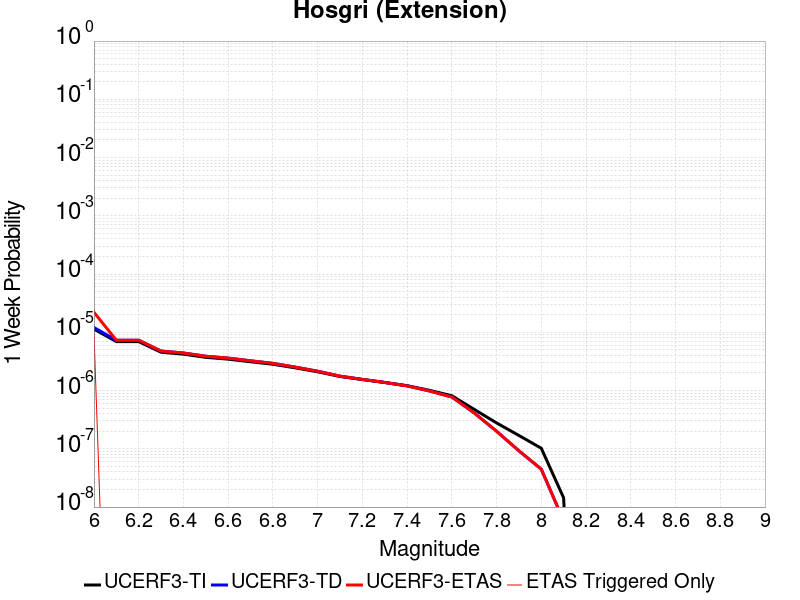 | 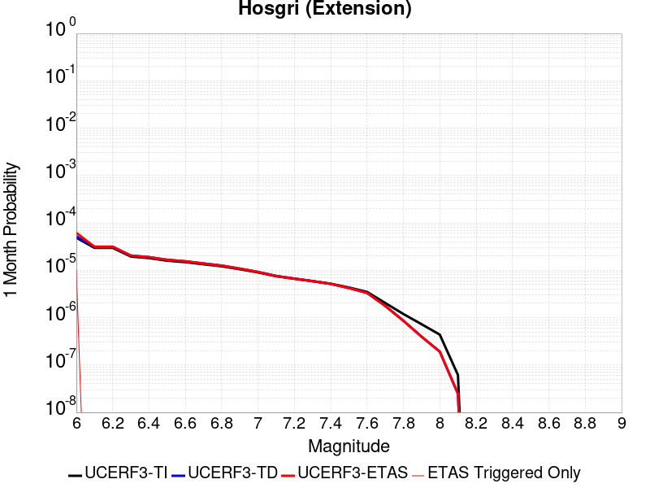 | 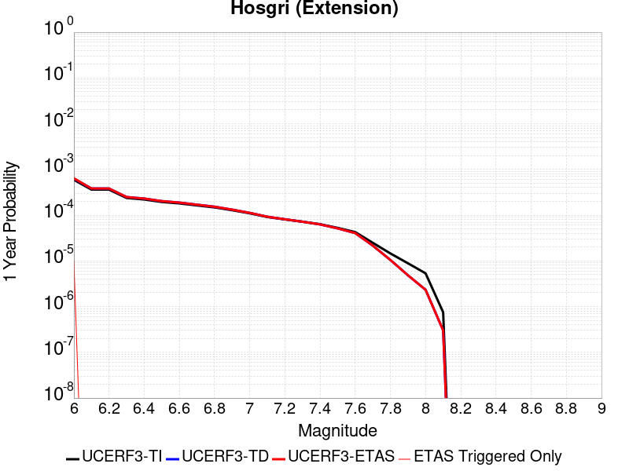 | 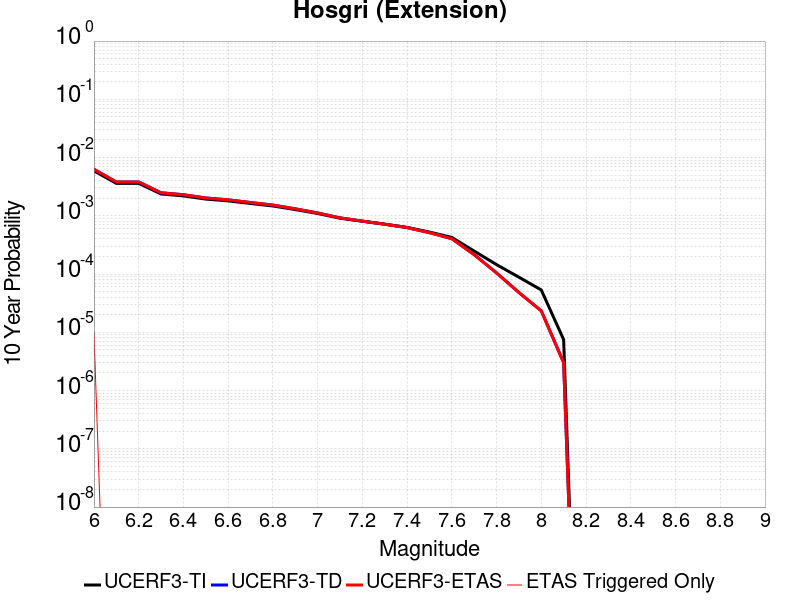 |

| Magnitude | 1 wk TI Prob | 1 wk TD Prob | 1 wk ETAS Prob | 1 wk ETAS/TD Gain | 1 wk ETAS Triggered Only | 1 mo TI Prob | 1 mo TD Prob | 1 mo ETAS Prob | 1 mo ETAS/TD Gain | 1 mo ETAS Triggered Only | 1 yr TI Prob | 1 yr TD Prob | 1 yr ETAS Prob | 1 yr ETAS/TD Gain | 1 yr ETAS Triggered Only | 10 yr TI Prob | 10 yr TD Prob | 10 yr ETAS Prob | 10 yr ETAS/TD Gain | 10 yr ETAS Triggered Only |
|-----|-----|-----|-----|-----|-----|-----|-----|-----|-----|-----|-----|-----|-----|-----|-----|-----|-----|-----|-----|-----|
| 6.0 | 1.1369135E-5 | 1.2083072E-5 | 2.2082952E-5 | 1.8275942 | 1.0E-5 | 4.8723956E-5 | 5.1783692E-5 | 6.1783176E-5 | 1.1931009 | 1.0E-5 | 5.9305265E-4 | 6.3030684E-4 | 6.403005E-4 | 1.0158553 | 1.0E-5 | 0.005914725 | 0.0062874397 | 0.006297377 | 1.0015805 | 1.0E-5 |
| 6.1 | 6.934979E-6 | 7.324555E-6 | 7.324555E-6 | 1.0 | 0.0 | 2.9721E-5 | 3.1390595E-5 | 3.1390595E-5 | 1.0 | 0.0 | 3.617931E-4 | 3.8211764E-4 | 3.8211764E-4 | 1.0 | 0.0 | 0.0036120464 | 0.0038150186 | 0.0038150186 | 1.0 | 0.0 |
| 6.2 | 6.934979E-6 | 7.324555E-6 | 7.324555E-6 | 1.0 | 0.0 | 2.9721E-5 | 3.1390595E-5 | 3.1390595E-5 | 1.0 | 0.0 | 3.617931E-4 | 3.8211764E-4 | 3.8211764E-4 | 1.0 | 0.0 | 0.0036120464 | 0.0038150186 | 0.0038150186 | 1.0 | 0.0 |
| 6.3 | 4.5484676E-6 | 4.76933E-6 | 4.76933E-6 | 1.0 | 0.0 | 1.9493287E-5 | 2.043983E-5 | 2.043983E-5 | 1.0 | 0.0 | 2.3730492E-4 | 2.4882692E-4 | 2.4882692E-4 | 1.0 | 0.0 | 0.0023705168 | 0.0024855258 | 0.0024855258 | 1.0 | 0.0 |
| 6.4 | 4.218095E-6 | 4.4168614E-6 | 4.4168614E-6 | 1.0 | 0.0 | 1.8077424E-5 | 1.8929271E-5 | 1.8929271E-5 | 1.0 | 0.0 | 2.2007042E-4 | 2.3043984E-4 | 2.3043984E-4 | 1.0 | 0.0 | 0.002198526 | 0.0023020422 | 0.0023020422 | 1.0 | 0.0 |
| 6.5 | 3.717374E-6 | 3.8838775E-6 | 3.8838775E-6 | 1.0 | 0.0 | 1.5931506E-5 | 1.6645085E-5 | 1.6645085E-5 | 1.0 | 0.0 | 1.9394881E-4 | 2.0263524E-4 | 2.0263524E-4 | 1.0 | 0.0 | 0.0019377962 | 0.0020245234 | 0.0020245234 | 1.0 | 0.0 |
| 6.6 | 3.4605036E-6 | 3.608306E-6 | 3.608306E-6 | 1.0 | 0.0 | 1.4830645E-5 | 1.5464078E-5 | 1.5464078E-5 | 1.0 | 0.0 | 1.8054814E-4 | 1.8825903E-4 | 1.8825903E-4 | 1.0 | 0.0 | 0.0018040152 | 0.0018810101 | 0.0018810101 | 1.0 | 0.0 |
| 6.7 | 3.123439E-6 | 3.2465687E-6 | 3.2465687E-6 | 1.0 | 0.0 | 1.33860985E-5 | 1.3913792E-5 | 1.3913792E-5 | 1.0 | 0.0 | 1.6296357E-4 | 1.6938736E-4 | 1.6938736E-4 | 1.0 | 0.0 | 0.001628441 | 0.0016925934 | 0.0016925934 | 1.0 | 0.0 |
| 6.8 | 2.8290783E-6 | 2.9305404E-6 | 2.9305404E-6 | 1.0 | 0.0 | 1.2124565E-5 | 1.2559399E-5 | 1.2559399E-5 | 1.0 | 0.0 | 1.4760658E-4 | 1.5290003E-4 | 1.5290003E-4 | 1.0 | 0.0 | 0.0014750857 | 0.001527957 | 0.001527957 | 1.0 | 0.0 |
| 6.9 | 2.454112E-6 | 2.5283196E-6 | 2.5283196E-6 | 1.0 | 0.0 | 1.0517581E-5 | 1.0835611E-5 | 1.0835611E-5 | 1.0 | 0.0 | 1.2804402E-4 | 1.3191563E-4 | 1.3191563E-4 | 1.0 | 0.0 | 0.0012797028 | 0.0013183793 | 0.0013183793 | 1.0 | 0.0 |
| 7.0 | 2.1008145E-6 | 2.1498704E-6 | 2.1498704E-6 | 1.0 | 0.0 | 9.003459E-6 | 9.213698E-6 | 9.213698E-6 | 1.0 | 0.0 | 1.096116E-4 | 1.1217103E-4 | 1.1217103E-4 | 1.0 | 0.0 | 0.0010955755 | 0.0011211479 | 0.0011211479 | 1.0 | 0.0 |
| 7.1 | 1.744384E-6 | 1.7686352E-6 | 1.7686352E-6 | 1.0 | 0.0 | 7.47591E-6 | 7.5798434E-6 | 7.5798434E-6 | 1.0 | 0.0 | 9.1015405E-5 | 9.22807E-5 | 9.22807E-5 | 1.0 | 0.0 | 9.097813E-4 | 9.2242553E-4 | 9.2242553E-4 | 1.0 | 0.0 |
| 7.2 | 1.5456587E-6 | 1.5562882E-6 | 1.5562882E-6 | 1.0 | 0.0 | 6.6242346E-6 | 6.66979E-6 | 6.66979E-6 | 1.0 | 0.0 | 8.064707E-5 | 8.120168E-5 | 8.120168E-5 | 1.0 | 0.0 | 8.0617814E-4 | 8.117213E-4 | 8.117213E-4 | 1.0 | 0.0 |
| 7.3 | 1.3775123E-6 | 1.3766082E-6 | 1.3766082E-6 | 1.0 | 0.0 | 5.9036106E-6 | 5.899736E-6 | 5.899736E-6 | 1.0 | 0.0 | 7.187409E-5 | 7.182693E-5 | 7.182693E-5 | 1.0 | 0.0 | 7.185085E-4 | 7.180382E-4 | 7.180382E-4 | 1.0 | 0.0 |
| 7.4 | 1.214491E-6 | 1.2023461E-6 | 1.2023461E-6 | 1.0 | 0.0 | 5.2049513E-6 | 5.1529014E-6 | 5.1529014E-6 | 1.0 | 0.0 | 6.336844E-5 | 6.2734776E-5 | 6.2734776E-5 | 1.0 | 0.0 | 6.335037E-4 | 6.271715E-4 | 6.271715E-4 | 1.0 | 0.0 |
| 7.5 | 1.0101123E-6 | 9.842246E-7 | 9.842246E-7 | 1.0 | 0.0 | 4.3290456E-6 | 4.2180986E-6 | 4.2180986E-6 | 1.0 | 0.0 | 5.2704854E-5 | 5.1354145E-5 | 5.1354145E-5 | 1.0 | 0.0 | 5.2692357E-4 | 5.1342335E-4 | 5.1342335E-4 | 1.0 | 0.0 |
| 7.6 | 8.1558215E-7 | 7.765966E-7 | 7.765966E-7 | 1.0 | 0.0 | 3.4953473E-6 | 3.328267E-6 | 3.328267E-6 | 1.0 | 0.0 | 4.255502E-5 | 4.0520903E-5 | 4.0520903E-5 | 1.0 | 0.0 | 4.2546875E-4 | 4.0513556E-4 | 4.0513556E-4 | 1.0 | 0.0 |
| 7.7 | 4.757816E-7 | 4.1308888E-7 | 4.1308888E-7 | 1.0 | 0.0 | 2.0390623E-6 | 1.7703798E-6 | 1.7703798E-6 | 1.0 | 0.0 | 2.4825302E-5 | 2.155416E-5 | 2.155416E-5 | 1.0 | 0.0 | 2.482253E-4 | 2.1552083E-4 | 2.1552083E-4 | 1.0 | 0.0 |
| 7.8 | 2.782787E-7 | 2.0047722E-7 | 2.0047722E-7 | 1.0 | 0.0 | 1.1926223E-6 | 8.5918776E-7 | 8.5918776E-7 | 1.0 | 0.0 | 1.452008E-5 | 1.04605615E-5 | 1.04605615E-5 | 1.0 | 0.0 | 1.4519131E-4 | 1.04600724E-4 | 1.04600724E-4 | 1.0 | 0.0 |
| 7.9 | 1.6948086E-7 | 9.244227E-8 | 9.244227E-8 | 1.0 | 0.0 | 7.2634634E-7 | 3.961811E-7 | 3.961811E-7 | 1.0 | 0.0 | 8.843231E-6 | 4.8234942E-6 | 4.8234942E-6 | 1.0 | 0.0 | 8.842879E-5 | 4.8233902E-5 | 4.8233902E-5 | 1.0 | 0.0 |
| 8.0 | 1.0225492E-7 | 4.4738776E-8 | 4.4738776E-8 | 1.0 | 0.0 | 4.382353E-7 | 1.917376E-7 | 1.917376E-7 | 1.0 | 0.0 | 5.335502E-6 | 2.3344028E-6 | 2.3344028E-6 | 1.0 | 0.0 | 5.335374E-5 | 2.3343786E-5 | 2.3343786E-5 | 1.0 | 0.0 |
| 8.1 | 1.43711345E-8 | 5.787707E-9 | 5.787707E-9 | 1.0 | 0.0 | 6.1590576E-8 | 2.480446E-8 | 2.480446E-8 | 1.0 | 0.0 | 7.4986497E-7 | 3.0199428E-7 | 3.0199428E-7 | 1.0 | 0.0 | 7.4986247E-6 | 3.0199392E-6 | 3.0199392E-6 | 1.0 | 0.0 |

## Goose Lake 2011 CFM
*[(top)](#table-of-contents)*

| 1 Week | 1 Month | 1 Year | 10 Year |
|-----|-----|-----|-----|
|  |  |  |  |

| Magnitude | 1 wk TI Prob | 1 wk TD Prob | 1 wk ETAS Prob | 1 wk ETAS/TD Gain | 1 wk ETAS Triggered Only | 1 mo TI Prob | 1 mo TD Prob | 1 mo ETAS Prob | 1 mo ETAS/TD Gain | 1 mo ETAS Triggered Only | 1 yr TI Prob | 1 yr TD Prob | 1 yr ETAS Prob | 1 yr ETAS/TD Gain | 1 yr ETAS Triggered Only | 10 yr TI Prob | 10 yr TD Prob | 10 yr ETAS Prob | 10 yr ETAS/TD Gain | 10 yr ETAS Triggered Only |
|-----|-----|-----|-----|-----|-----|-----|-----|-----|-----|-----|-----|-----|-----|-----|-----|-----|-----|-----|-----|-----|
| 6.0 | 3.780968E-6 | 3.8230223E-6 | 3.8230223E-6 | 1.0 | 0.0 | 1.6204049E-5 | 1.6384285E-5 | 1.6384285E-5 | 1.0 | 0.0 | 1.9726643E-4 | 1.994615E-4 | 2.0945951E-4 | 1.050125 | 1.0E-5 | 0.001970914 | 0.001992933 | 0.002002913 | 1.0050077 | 1.0E-5 |
| 6.1 | 2.2035124E-6 | 2.229801E-6 | 2.229801E-6 | 1.0 | 0.0 | 9.443591E-6 | 9.556257E-6 | 9.556257E-6 | 1.0 | 0.0 | 1.1496965E-4 | 1.163414E-4 | 1.163414E-4 | 1.0 | 0.0 | 0.0011491019 | 0.0011628233 | 0.0011628233 | 1.0 | 0.0 |
| 6.2 | 1.5624689E-6 | 1.5826923E-6 | 1.5826923E-6 | 1.0 | 0.0 | 6.6962784E-6 | 6.7829496E-6 | 6.7829496E-6 | 1.0 | 0.0 | 8.152414E-5 | 8.2579325E-5 | 8.2579325E-5 | 1.0 | 0.0 | 8.1494235E-4 | 8.2549086E-4 | 8.2549086E-4 | 1.0 | 0.0 |
| 6.3 | 1.5624689E-6 | 1.5826923E-6 | 1.5826923E-6 | 1.0 | 0.0 | 6.6962784E-6 | 6.7829496E-6 | 6.7829496E-6 | 1.0 | 0.0 | 8.152414E-5 | 8.2579325E-5 | 8.2579325E-5 | 1.0 | 0.0 | 8.1494235E-4 | 8.2549086E-4 | 8.2549086E-4 | 1.0 | 0.0 |
| 6.4 | 1.256464E-6 | 1.2738695E-6 | 1.2738695E-6 | 1.0 | 0.0 | 5.3848344E-6 | 5.4594293E-6 | 5.4594293E-6 | 1.0 | 0.0 | 6.5558386E-5 | 6.646655E-5 | 6.646655E-5 | 1.0 | 0.0 | 6.553905E-4 | 6.644687E-4 | 6.644687E-4 | 1.0 | 0.0 |
| 6.5 | 1.0910911E-6 | 1.1069404E-6 | 1.1069404E-6 | 1.0 | 0.0 | 4.6760965E-6 | 4.7440217E-6 | 4.7440217E-6 | 1.0 | 0.0 | 5.692999E-5 | 5.7756948E-5 | 5.7756948E-5 | 1.0 | 0.0 | 5.6915404E-4 | 5.7742064E-4 | 5.7742064E-4 | 1.0 | 0.0 |
| 6.6 | 9.546601E-7 | 9.691246E-7 | 9.691246E-7 | 1.0 | 0.0 | 4.091394E-6 | 4.1533845E-6 | 4.1533845E-6 | 1.0 | 0.0 | 4.9811584E-5 | 5.056629E-5 | 5.056629E-5 | 1.0 | 0.0 | 4.980042E-4 | 5.055487E-4 | 5.055487E-4 | 1.0 | 0.0 |
| 6.7 | 7.790316E-7 | 7.9159634E-7 | 7.9159634E-7 | 1.0 | 0.0 | 3.3387028E-6 | 3.3925514E-6 | 3.3925514E-6 | 1.0 | 0.0 | 4.0647945E-5 | 4.1303538E-5 | 4.1303538E-5 | 1.0 | 0.0 | 4.0640513E-4 | 4.129592E-4 | 4.129592E-4 | 1.0 | 0.0 |
| 6.8 | 6.3714384E-7 | 6.4787395E-7 | 6.4787395E-7 | 1.0 | 0.0 | 2.7306137E-6 | 2.7765998E-6 | 2.7765998E-6 | 1.0 | 0.0 | 3.3244716E-5 | 3.3804583E-5 | 3.3804583E-5 | 1.0 | 0.0 | 3.323974E-4 | 3.379949E-4 | 3.379949E-4 | 1.0 | 0.0 |
| 6.9 | 4.92586E-7 | 5.0139147E-7 | 5.0139147E-7 | 1.0 | 0.0 | 2.1110811E-6 | 2.1488188E-6 | 2.1488188E-6 | 1.0 | 0.0 | 2.5702111E-5 | 2.616156E-5 | 2.616156E-5 | 1.0 | 0.0 | 2.569914E-4 | 2.6158517E-4 | 2.6158517E-4 | 1.0 | 0.0 |
| 7.0 | 3.130245E-7 | 3.190354E-7 | 3.190354E-7 | 1.0 | 0.0 | 1.3415328E-6 | 1.3672939E-6 | 1.3672939E-6 | 1.0 | 0.0 | 1.6333039E-5 | 1.6646678E-5 | 1.6646678E-5 | 1.0 | 0.0 | 1.6331839E-4 | 1.6645451E-4 | 1.6645451E-4 | 1.0 | 0.0 |
| 7.1 | 1.7680084E-7 | 1.8023923E-7 | 1.8023923E-7 | 1.0 | 0.0 | 7.5771766E-7 | 7.724536E-7 | 7.724536E-7 | 1.0 | 0.0 | 9.225173E-6 | 9.404583E-6 | 9.404583E-6 | 1.0 | 0.0 | 9.22479E-5 | 9.4041956E-5 | 9.4041956E-5 | 1.0 | 0.0 |
| 7.2 | 4.8641045E-8 | 4.9402068E-8 | 4.9402068E-8 | 1.0 | 0.0 | 2.084616E-7 | 2.1172312E-7 | 2.1172312E-7 | 1.0 | 0.0 | 2.538017E-6 | 2.577726E-6 | 2.577726E-6 | 1.0 | 0.0 | 2.537988E-5 | 2.5776973E-5 | 2.5776973E-5 | 1.0 | 0.0 |
| 7.3 | 5.3911844E-9 | 5.4758145E-9 | 5.4758145E-9 | 1.0 | 0.0 | 2.3105075E-8 | 2.3467775E-8 | 2.3467775E-8 | 1.0 | 0.0 | 2.8130427E-7 | 2.8572015E-7 | 2.8572015E-7 | 1.0 | 0.0 | 2.8130391E-6 | 2.8571992E-6 | 2.8571992E-6 | 1.0 | 0.0 |

## Robinson Creek
*[(top)](#table-of-contents)*

| 1 Week | 1 Month | 1 Year | 10 Year |
|-----|-----|-----|-----|
|  | 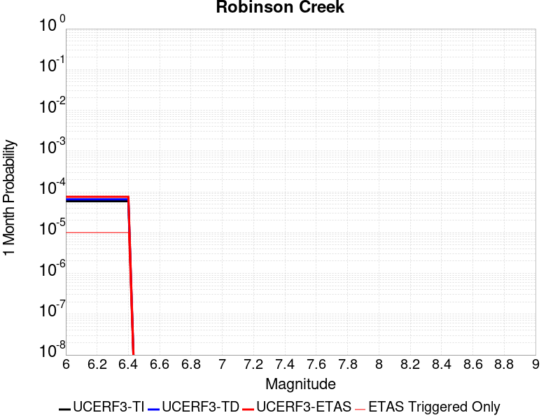 |  | 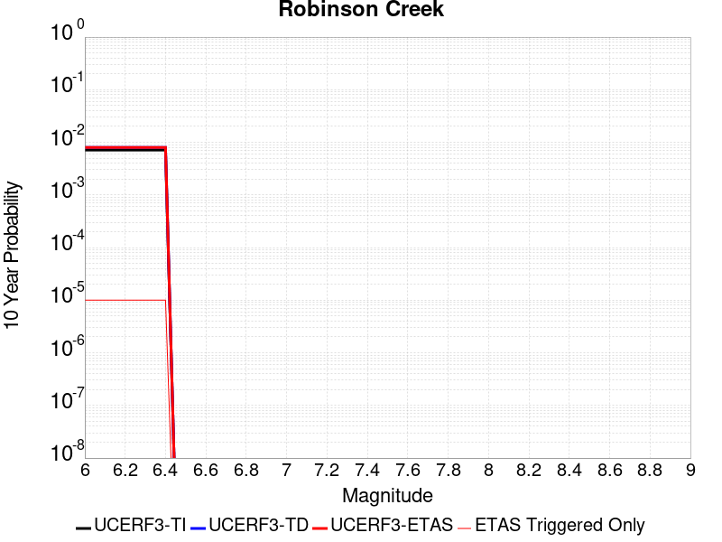 |

| Magnitude | 1 wk TI Prob | 1 wk TD Prob | 1 wk ETAS Prob | 1 wk ETAS/TD Gain | 1 wk ETAS Triggered Only | 1 mo TI Prob | 1 mo TD Prob | 1 mo ETAS Prob | 1 mo ETAS/TD Gain | 1 mo ETAS Triggered Only | 1 yr TI Prob | 1 yr TD Prob | 1 yr ETAS Prob | 1 yr ETAS/TD Gain | 1 yr ETAS Triggered Only | 10 yr TI Prob | 10 yr TD Prob | 10 yr ETAS Prob | 10 yr ETAS/TD Gain | 10 yr ETAS Triggered Only |
|-----|-----|-----|-----|-----|-----|-----|-----|-----|-----|-----|-----|-----|-----|-----|-----|-----|-----|-----|-----|-----|
| 6.0 | 1.3705327E-5 | 1.5285013E-5 | 2.528486E-5 | 1.6542256 | 1.0E-5 | 5.8735794E-5 | 6.55072E-5 | 7.550655E-5 | 1.152645 | 1.0E-5 | 7.1487366E-4 | 7.9755014E-4 | 8.075422E-4 | 1.0125284 | 1.0E-5 | 0.0071257832 | 0.007975501 | 0.007985421 | 1.0012438 | 1.0E-5 |
| 6.1 | 1.3705327E-5 | 1.5285013E-5 | 2.528486E-5 | 1.6542256 | 1.0E-5 | 5.8735794E-5 | 6.55072E-5 | 7.550655E-5 | 1.152645 | 1.0E-5 | 7.1487366E-4 | 7.9755014E-4 | 8.075422E-4 | 1.0125284 | 1.0E-5 | 0.0071257832 | 0.007975501 | 0.007985421 | 1.0012438 | 1.0E-5 |
| 6.2 | 1.3705327E-5 | 1.5285013E-5 | 2.528486E-5 | 1.6542256 | 1.0E-5 | 5.8735794E-5 | 6.55072E-5 | 7.550655E-5 | 1.152645 | 1.0E-5 | 7.1487366E-4 | 7.9755014E-4 | 8.075422E-4 | 1.0125284 | 1.0E-5 | 0.0071257832 | 0.007975501 | 0.007985421 | 1.0012438 | 1.0E-5 |
| 6.3 | 1.3705327E-5 | 1.5285013E-5 | 2.528486E-5 | 1.6542256 | 1.0E-5 | 5.8735794E-5 | 6.55072E-5 | 7.550655E-5 | 1.152645 | 1.0E-5 | 7.1487366E-4 | 7.9755014E-4 | 8.075422E-4 | 1.0125284 | 1.0E-5 | 0.0071257832 | 0.007975501 | 0.007985421 | 1.0012438 | 1.0E-5 |
| 6.4 | 1.3705327E-5 | 1.5285013E-5 | 2.528486E-5 | 1.6542256 | 1.0E-5 | 5.8735794E-5 | 6.55072E-5 | 7.550655E-5 | 1.152645 | 1.0E-5 | 7.1487366E-4 | 7.9755014E-4 | 8.075422E-4 | 1.0125284 | 1.0E-5 | 0.0071257832 | 0.007975501 | 0.007985421 | 1.0012438 | 1.0E-5 |

## West Tahoe
*[(top)](#table-of-contents)*

| 1 Week | 1 Month | 1 Year | 10 Year |
|-----|-----|-----|-----|
|  |  | 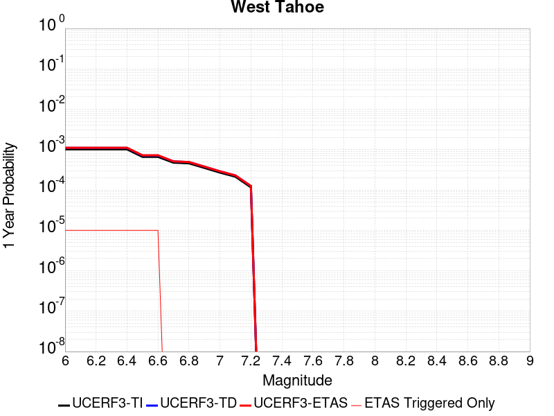 |  |

| Magnitude | 1 wk TI Prob | 1 wk TD Prob | 1 wk ETAS Prob | 1 wk ETAS/TD Gain | 1 wk ETAS Triggered Only | 1 mo TI Prob | 1 mo TD Prob | 1 mo ETAS Prob | 1 mo ETAS/TD Gain | 1 mo ETAS Triggered Only | 1 yr TI Prob | 1 yr TD Prob | 1 yr ETAS Prob | 1 yr ETAS/TD Gain | 1 yr ETAS Triggered Only | 10 yr TI Prob | 10 yr TD Prob | 10 yr ETAS Prob | 10 yr ETAS/TD Gain | 10 yr ETAS Triggered Only |
|-----|-----|-----|-----|-----|-----|-----|-----|-----|-----|-----|-----|-----|-----|-----|-----|-----|-----|-----|-----|-----|
| 6.0 | 1.952444E-5 | 2.118317E-5 | 2.118317E-5 | 1.0 | 0.0 | 8.367348E-5 | 9.078217E-5 | 9.078217E-5 | 1.0 | 0.0 | 0.0010182485 | 0.0011047672 | 0.0011147561 | 1.0090417 | 1.0E-5 | 0.010135954 | 0.010998235 | 0.011008126 | 1.0008992 | 1.0E-5 |
| 6.1 | 1.952444E-5 | 2.118317E-5 | 2.118317E-5 | 1.0 | 0.0 | 8.367348E-5 | 9.078217E-5 | 9.078217E-5 | 1.0 | 0.0 | 0.0010182485 | 0.0011047672 | 0.0011147561 | 1.0090417 | 1.0E-5 | 0.010135954 | 0.010998235 | 0.011008126 | 1.0008992 | 1.0E-5 |
| 6.2 | 1.952444E-5 | 2.118317E-5 | 2.118317E-5 | 1.0 | 0.0 | 8.367348E-5 | 9.078217E-5 | 9.078217E-5 | 1.0 | 0.0 | 0.0010182485 | 0.0011047672 | 0.0011147561 | 1.0090417 | 1.0E-5 | 0.010135954 | 0.010998235 | 0.011008126 | 1.0008992 | 1.0E-5 |
| 6.3 | 1.952444E-5 | 2.118317E-5 | 2.118317E-5 | 1.0 | 0.0 | 8.367348E-5 | 9.078217E-5 | 9.078217E-5 | 1.0 | 0.0 | 0.0010182485 | 0.0011047672 | 0.0011147561 | 1.0090417 | 1.0E-5 | 0.010135954 | 0.010998235 | 0.011008126 | 1.0008992 | 1.0E-5 |
| 6.4 | 1.952444E-5 | 2.118317E-5 | 2.118317E-5 | 1.0 | 0.0 | 8.367348E-5 | 9.078217E-5 | 9.078217E-5 | 1.0 | 0.0 | 0.0010182485 | 0.0011047672 | 0.0011147561 | 1.0090417 | 1.0E-5 | 0.010135954 | 0.010998235 | 0.011008126 | 1.0008992 | 1.0E-5 |
| 6.5 | 1.2685271E-5 | 1.3690627E-5 | 1.3690627E-5 | 1.0 | 0.0 | 5.4364315E-5 | 5.8672893E-5 | 5.8672893E-5 | 1.0 | 0.0 | 6.616845E-4 | 7.141248E-4 | 7.241177E-4 | 1.0139931 | 1.0E-5 | 0.0065971776 | 0.00711995 | 0.0071298787 | 1.0013945 | 1.0E-5 |
| 6.6 | 1.2685271E-5 | 1.3690627E-5 | 1.3690627E-5 | 1.0 | 0.0 | 5.4364315E-5 | 5.8672893E-5 | 5.8672893E-5 | 1.0 | 0.0 | 6.616845E-4 | 7.141248E-4 | 7.241177E-4 | 1.0139931 | 1.0E-5 | 0.0065971776 | 0.00711995 | 0.0071298787 | 1.0013945 | 1.0E-5 |
| 6.7 | 9.117886E-6 | 9.809846E-6 | 9.809846E-6 | 1.0 | 0.0 | 3.9076072E-5 | 4.2041564E-5 | 4.2041564E-5 | 1.0 | 0.0 | 4.756473E-4 | 5.11743E-4 | 5.11743E-4 | 1.0 | 0.0 | 0.0047463053 | 0.0051063634 | 0.0051063634 | 1.0 | 0.0 |
| 6.8 | 8.786828E-6 | 9.457863E-6 | 9.457863E-6 | 1.0 | 0.0 | 3.7657293E-5 | 4.053311E-5 | 4.053311E-5 | 1.0 | 0.0 | 4.5838108E-4 | 4.933859E-4 | 4.933859E-4 | 1.0 | 0.0 | 0.0045743673 | 0.0049236063 | 0.0049236063 | 1.0 | 0.0 |
| 6.9 | 6.7562123E-6 | 7.2638086E-6 | 7.2638086E-6 | 1.0 | 0.0 | 2.8954875E-5 | 3.1130265E-5 | 3.1130265E-5 | 1.0 | 0.0 | 3.5246857E-4 | 3.789498E-4 | 3.789498E-4 | 1.0 | 0.0 | 0.0035191004 | 0.0037835082 | 0.0037835082 | 1.0 | 0.0 |
| 7.0 | 5.1792854E-6 | 5.567338E-6 | 5.567338E-6 | 1.0 | 0.0 | 2.2196748E-5 | 2.3859824E-5 | 2.3859824E-5 | 1.0 | 0.0 | 2.702119E-4 | 2.9045844E-4 | 2.9045844E-4 | 1.0 | 0.0 | 0.0026988357 | 0.0029011632 | 0.0029011632 | 1.0 | 0.0 |
| 7.1 | 4.090765E-6 | 4.3974223E-6 | 4.3974223E-6 | 1.0 | 0.0 | 1.7531731E-5 | 1.884598E-5 | 1.884598E-5 | 1.0 | 0.0 | 2.134279E-4 | 2.2942905E-4 | 2.2942905E-4 | 1.0 | 0.0 | 0.0021322304 | 0.0022922563 | 0.0022922563 | 1.0 | 0.0 |
| 7.2 | 2.2356758E-6 | 2.4023684E-6 | 2.4023684E-6 | 1.0 | 0.0 | 9.581432E-6 | 1.0295834E-5 | 1.0295834E-5 | 1.0 | 0.0 | 1.1664769E-4 | 1.2534647E-4 | 1.2534647E-4 | 1.0 | 0.0 | 0.0011658648 | 0.0012529434 | 0.0012529434 | 1.0 | 0.0 |

## Santa Ynez River
*[(top)](#table-of-contents)*

| 1 Week | 1 Month | 1 Year | 10 Year |
|-----|-----|-----|-----|
| 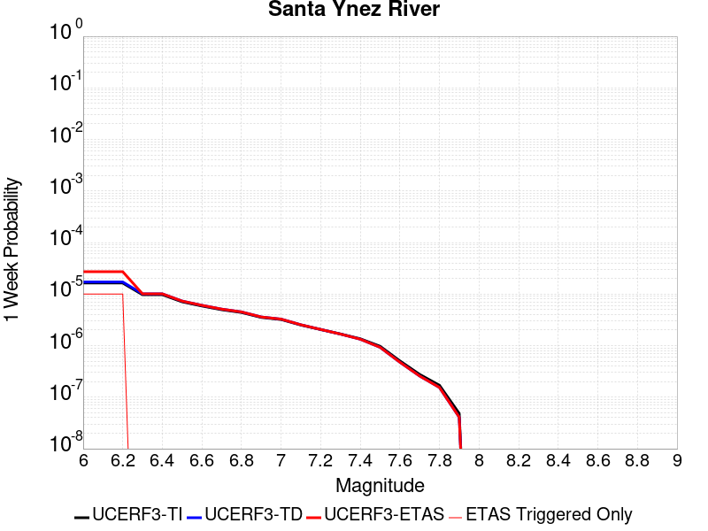 |  |  |  |

| Magnitude | 1 wk TI Prob | 1 wk TD Prob | 1 wk ETAS Prob | 1 wk ETAS/TD Gain | 1 wk ETAS Triggered Only | 1 mo TI Prob | 1 mo TD Prob | 1 mo ETAS Prob | 1 mo ETAS/TD Gain | 1 mo ETAS Triggered Only | 1 yr TI Prob | 1 yr TD Prob | 1 yr ETAS Prob | 1 yr ETAS/TD Gain | 1 yr ETAS Triggered Only | 10 yr TI Prob | 10 yr TD Prob | 10 yr ETAS Prob | 10 yr ETAS/TD Gain | 10 yr ETAS Triggered Only |
|-----|-----|-----|-----|-----|-----|-----|-----|-----|-----|-----|-----|-----|-----|-----|-----|-----|-----|-----|-----|-----|
| 6.0 | 1.6396456E-5 | 1.7209435E-5 | 2.7209264E-5 | 1.5810666 | 1.0E-5 | 7.026863E-5 | 7.375284E-5 | 8.37521E-5 | 1.135578 | 1.0E-5 | 8.551848E-4 | 8.976064E-4 | 9.075975E-4 | 1.0111307 | 1.0E-5 | 0.0085190125 | 0.008943358 | 0.008953269 | 1.0011082 | 1.0E-5 |
| 6.1 | 1.6396456E-5 | 1.7209435E-5 | 2.7209264E-5 | 1.5810666 | 1.0E-5 | 7.026863E-5 | 7.375284E-5 | 8.37521E-5 | 1.135578 | 1.0E-5 | 8.551848E-4 | 8.976064E-4 | 9.075975E-4 | 1.0111307 | 1.0E-5 | 0.0085190125 | 0.008943358 | 0.008953269 | 1.0011082 | 1.0E-5 |
| 6.2 | 1.6396456E-5 | 1.7209435E-5 | 2.7209264E-5 | 1.5810666 | 1.0E-5 | 7.026863E-5 | 7.375284E-5 | 8.37521E-5 | 1.135578 | 1.0E-5 | 8.551848E-4 | 8.976064E-4 | 9.075975E-4 | 1.0111307 | 1.0E-5 | 0.0085190125 | 0.008943358 | 0.008953269 | 1.0011082 | 1.0E-5 |
| 6.3 | 9.736976E-6 | 1.012233E-5 | 1.012233E-5 | 1.0 | 0.0 | 4.172923E-5 | 4.338072E-5 | 4.338072E-5 | 1.0 | 0.0 | 5.0793495E-4 | 5.280373E-4 | 5.280373E-4 | 1.0 | 0.0 | 0.005067755 | 0.005268332 | 0.005268332 | 1.0 | 0.0 |
| 6.4 | 9.736976E-6 | 1.012233E-5 | 1.012233E-5 | 1.0 | 0.0 | 4.172923E-5 | 4.338072E-5 | 4.338072E-5 | 1.0 | 0.0 | 5.0793495E-4 | 5.280373E-4 | 5.280373E-4 | 1.0 | 0.0 | 0.005067755 | 0.005268332 | 0.005268332 | 1.0 | 0.0 |
| 6.5 | 7.081964E-6 | 7.3298966E-6 | 7.3298966E-6 | 1.0 | 0.0 | 3.035092E-5 | 3.1413474E-5 | 3.1413474E-5 | 1.0 | 0.0 | 3.694598E-4 | 3.8239348E-4 | 3.8239348E-4 | 1.0 | 0.0 | 0.0036884616 | 0.0038175168 | 0.0038175168 | 1.0 | 0.0 |
| 6.6 | 5.873247E-6 | 6.059743E-6 | 6.059743E-6 | 1.0 | 0.0 | 2.5170815E-5 | 2.5970074E-5 | 2.5970074E-5 | 1.0 | 0.0 | 3.064116E-4 | 3.1614062E-4 | 3.1614062E-4 | 1.0 | 0.0 | 0.0030598943 | 0.0031569963 | 0.0031569963 | 1.0 | 0.0 |
| 6.7 | 4.973277E-6 | 5.115901E-6 | 5.115901E-6 | 1.0 | 0.0 | 2.1313872E-5 | 2.1925109E-5 | 2.1925109E-5 | 1.0 | 0.0 | 2.5946548E-4 | 2.66906E-4 | 2.66906E-4 | 1.0 | 0.0 | 0.0025916274 | 0.0026659032 | 0.0026659032 | 1.0 | 0.0 |
| 6.8 | 4.396492E-6 | 4.5109778E-6 | 4.5109778E-6 | 1.0 | 0.0 | 1.884197E-5 | 1.9332621E-5 | 1.9332621E-5 | 1.0 | 0.0 | 2.2937685E-4 | 2.3534958E-4 | 2.3534958E-4 | 1.0 | 0.0 | 0.0022914023 | 0.0023510386 | 0.0023510386 | 1.0 | 0.0 |
| 6.9 | 3.5255632E-6 | 3.6013332E-6 | 3.6013332E-6 | 1.0 | 0.0 | 1.5109469E-5 | 1.5434196E-5 | 1.5434196E-5 | 1.0 | 0.0 | 1.8394225E-4 | 1.8789528E-4 | 1.8789528E-4 | 1.0 | 0.0 | 0.0018379007 | 0.0018773803 | 0.0018773803 | 1.0 | 0.0 |
| 7.0 | 3.211603E-6 | 3.273654E-6 | 3.273654E-6 | 1.0 | 0.0 | 1.376394E-5 | 1.4029872E-5 | 1.4029872E-5 | 1.0 | 0.0 | 1.6756308E-4 | 1.7080043E-4 | 1.7080043E-4 | 1.0 | 0.0 | 0.0016743679 | 0.0017067058 | 0.0017067058 | 1.0 | 0.0 |
| 7.1 | 2.5094619E-6 | 2.5409204E-6 | 2.5409204E-6 | 1.0 | 0.0 | 1.0754793E-5 | 1.0889614E-5 | 1.0889614E-5 | 1.0 | 0.0 | 1.3093173E-4 | 1.3257304E-4 | 1.3257304E-4 | 1.0 | 0.0 | 0.0013085462 | 0.0013249456 | 0.0013249456 | 1.0 | 0.0 |
| 7.2 | 2.0515774E-6 | 2.0619375E-6 | 2.0619375E-6 | 1.0 | 0.0 | 8.792445E-6 | 8.836846E-6 | 8.836846E-6 | 1.0 | 0.0 | 1.0704277E-4 | 1.0758333E-4 | 1.0758333E-4 | 1.0 | 0.0 | 0.0010699122 | 0.0010753168 | 0.0010753168 | 1.0 | 0.0 |
| 7.3 | 1.6845745E-6 | 1.6773907E-6 | 1.6773907E-6 | 1.0 | 0.0 | 7.219585E-6 | 7.1887976E-6 | 7.1887976E-6 | 1.0 | 0.0 | 8.78949E-5 | 8.752012E-5 | 8.752012E-5 | 1.0 | 0.0 | 8.7860145E-4 | 8.7485946E-4 | 8.7485946E-4 | 1.0 | 0.0 |
| 7.4 | 1.3600285E-6 | 1.3333357E-6 | 1.3333357E-6 | 1.0 | 0.0 | 5.82868E-6 | 5.714284E-6 | 5.714284E-6 | 1.0 | 0.0 | 7.096187E-5 | 6.956921E-5 | 6.956921E-5 | 1.0 | 0.0 | 7.0939213E-4 | 6.954765E-4 | 6.954765E-4 | 1.0 | 0.0 |
| 7.5 | 9.735342E-7 | 9.290103E-7 | 9.290103E-7 | 1.0 | 0.0 | 4.172283E-6 | 3.9814668E-6 | 3.9814668E-6 | 1.0 | 0.0 | 5.079636E-5 | 4.8473295E-5 | 4.8473295E-5 | 1.0 | 0.0 | 5.0784746E-4 | 4.8462892E-4 | 4.8462892E-4 | 1.0 | 0.0 |
| 7.6 | 5.067187E-7 | 4.77857E-7 | 4.77857E-7 | 1.0 | 0.0 | 2.1716498E-6 | 2.047957E-6 | 2.047957E-6 | 1.0 | 0.0 | 2.6439517E-5 | 2.4933597E-5 | 2.4933597E-5 | 1.0 | 0.0 | 2.643637E-4 | 2.4930874E-4 | 2.4930874E-4 | 1.0 | 0.0 |
| 7.7 | 2.769089E-7 | 2.5759124E-7 | 2.5759124E-7 | 1.0 | 0.0 | 1.1867519E-6 | 1.1039621E-6 | 1.1039621E-6 | 1.0 | 0.0 | 1.4448608E-5 | 1.34406555E-5 | 1.34406555E-5 | 1.0 | 0.0 | 1.444767E-4 | 1.3439846E-4 | 1.3439846E-4 | 1.0 | 0.0 |
| 7.8 | 1.7044663E-7 | 1.5449015E-7 | 1.5449015E-7 | 1.0 | 0.0 | 7.3048534E-7 | 6.621005E-7 | 6.621005E-7 | 1.0 | 0.0 | 8.893623E-6 | 8.061043E-6 | 8.061043E-6 | 1.0 | 0.0 | 8.893267E-5 | 8.060753E-5 | 8.060753E-5 | 1.0 | 0.0 |
| 7.9 | 4.8344287E-8 | 4.0910923E-8 | 4.0910923E-8 | 1.0 | 0.0 | 2.0718979E-7 | 1.7533252E-7 | 1.7533252E-7 | 1.0 | 0.0 | 2.5225327E-6 | 2.1346711E-6 | 2.1346711E-6 | 1.0 | 0.0 | 2.5225041E-5 | 2.1346512E-5 | 2.1346512E-5 | 1.0 | 0.0 |

## Elsinore (Temecula) rev
*[(top)](#table-of-contents)*

| 1 Week | 1 Month | 1 Year | 10 Year |
|-----|-----|-----|-----|
|  | 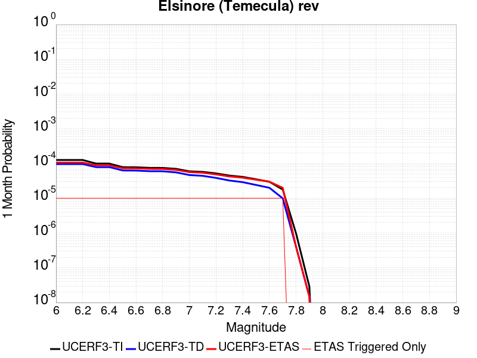 |  |  |

| Magnitude | 1 wk TI Prob | 1 wk TD Prob | 1 wk ETAS Prob | 1 wk ETAS/TD Gain | 1 wk ETAS Triggered Only | 1 mo TI Prob | 1 mo TD Prob | 1 mo ETAS Prob | 1 mo ETAS/TD Gain | 1 mo ETAS Triggered Only | 1 yr TI Prob | 1 yr TD Prob | 1 yr ETAS Prob | 1 yr ETAS/TD Gain | 1 yr ETAS Triggered Only | 10 yr TI Prob | 10 yr TD Prob | 10 yr ETAS Prob | 10 yr ETAS/TD Gain | 10 yr ETAS Triggered Only |
|-----|-----|-----|-----|-----|-----|-----|-----|-----|-----|-----|-----|-----|-----|-----|-----|-----|-----|-----|-----|-----|
| 6.0 | 2.9514995E-5 | 2.2517117E-5 | 3.251689E-5 | 1.4440966 | 1.0E-5 | 1.264867E-4 | 9.649849E-5 | 1.0649752E-4 | 1.1036186 | 1.0E-5 | 0.0015388876 | 0.0011742581 | 0.0011842463 | 1.0085061 | 1.0E-5 | 0.015282745 | 0.011696897 | 0.011706781 | 1.000845 | 1.0E-5 |
| 6.1 | 2.9514995E-5 | 2.2517117E-5 | 3.251689E-5 | 1.4440966 | 1.0E-5 | 1.264867E-4 | 9.649849E-5 | 1.0649752E-4 | 1.1036186 | 1.0E-5 | 0.0015388876 | 0.0011742581 | 0.0011842463 | 1.0085061 | 1.0E-5 | 0.015282745 | 0.011696897 | 0.011706781 | 1.000845 | 1.0E-5 |
| 6.2 | 2.9514995E-5 | 2.2517117E-5 | 3.251689E-5 | 1.4440966 | 1.0E-5 | 1.264867E-4 | 9.649849E-5 | 1.0649752E-4 | 1.1036186 | 1.0E-5 | 0.0015388876 | 0.0011742581 | 0.0011842463 | 1.0085061 | 1.0E-5 | 0.015282745 | 0.011696897 | 0.011706781 | 1.000845 | 1.0E-5 |
| 6.3 | 2.3223649E-5 | 1.8406454E-5 | 2.840627E-5 | 1.5432777 | 1.0E-5 | 9.952613E-5 | 7.888251E-5 | 8.888173E-5 | 1.1267608 | 1.0E-5 | 0.001211057 | 9.599888E-4 | 9.6997916E-4 | 1.0104067 | 1.0E-5 | 0.012044783 | 0.009569948 | 0.009579852 | 1.001035 | 1.0E-5 |
| 6.4 | 2.3223649E-5 | 1.8406454E-5 | 2.840627E-5 | 1.5432777 | 1.0E-5 | 9.952613E-5 | 7.888251E-5 | 8.888173E-5 | 1.1267608 | 1.0E-5 | 0.001211057 | 9.599888E-4 | 9.6997916E-4 | 1.0104067 | 1.0E-5 | 0.012044783 | 0.009569948 | 0.009579852 | 1.001035 | 1.0E-5 |
| 6.5 | 1.8338875E-5 | 1.4750118E-5 | 2.474997E-5 | 1.6779507 | 1.0E-5 | 7.8592806E-5 | 6.321331E-5 | 7.321267E-5 | 1.1581845 | 1.0E-5 | 9.5644733E-4 | 7.69359E-4 | 7.7935134E-4 | 1.0129879 | 1.0E-5 | 0.009523412 | 0.0076739118 | 0.007683835 | 1.0012931 | 1.0E-5 |
| 6.6 | 1.8223333E-5 | 1.4612673E-5 | 2.4612527E-5 | 1.6843275 | 1.0E-5 | 7.809766E-5 | 6.262429E-5 | 7.262366E-5 | 1.1596725 | 1.0E-5 | 9.504242E-4 | 7.6219277E-4 | 7.7218516E-4 | 1.01311 | 1.0E-5 | 0.009463696 | 0.0076027405 | 0.0076126647 | 1.0013053 | 1.0E-5 |
| 6.7 | 1.7512752E-5 | 1.402721E-5 | 2.402707E-5 | 1.7128901 | 1.0E-5 | 7.505249E-5 | 6.011528E-5 | 7.011468E-5 | 1.166337 | 1.0E-5 | 9.13381E-4 | 7.3166634E-4 | 7.41659E-4 | 1.0136575 | 1.0E-5 | 0.00909636 | 0.00729892 | 0.007308847 | 1.00136 | 1.0E-5 |
| 6.8 | 1.7417142E-5 | 1.3951195E-5 | 2.3951055E-5 | 1.7167745 | 1.0E-5 | 7.4642754E-5 | 5.9789512E-5 | 6.978891E-5 | 1.1672434 | 1.0E-5 | 9.083966E-4 | 7.277028E-4 | 7.376955E-4 | 1.0137318 | 1.0E-5 | 0.009046922 | 0.0072594886 | 0.007269416 | 1.0013674 | 1.0E-5 |
| 6.9 | 1.6402591E-5 | 1.2988613E-5 | 2.2988483E-5 | 1.7698951 | 1.0E-5 | 7.0294926E-5 | 5.5664343E-5 | 6.5663786E-5 | 1.1796383 | 1.0E-5 | 8.5550465E-4 | 6.775103E-4 | 6.8750355E-4 | 1.0147499 | 1.0E-5 | 0.008522186 | 0.006760169 | 0.0067701014 | 1.0014693 | 1.0E-5 |
| 7.0 | 1.3912486E-5 | 1.0878233E-5 | 2.0878124E-5 | 1.9192569 | 1.0E-5 | 5.9623577E-5 | 4.6620182E-5 | 5.6619716E-5 | 1.2144893 | 1.0E-5 | 7.2567526E-4 | 5.674556E-4 | 5.7745E-4 | 1.0176126 | 1.0E-5 | 0.0072331014 | 0.005663986 | 0.005673929 | 1.0017556 | 1.0E-5 |
| 7.1 | 1.3405147E-5 | 1.03274215E-5 | 2.0327318E-5 | 1.9682859 | 1.0E-5 | 5.7449364E-5 | 4.425964E-5 | 5.4259195E-5 | 1.2259295 | 1.0E-5 | 6.9922156E-4 | 5.3873047E-4 | 5.487251E-4 | 1.0185522 | 1.0E-5 | 0.0069702556 | 0.005377577 | 0.005387523 | 1.0018495 | 1.0E-5 |
| 7.2 | 1.21402E-5 | 8.996737E-6 | 1.8996647E-5 | 2.111504 | 1.0E-5 | 5.202839E-5 | 3.8556886E-5 | 4.85565E-5 | 1.2593471 | 1.0E-5 | 6.332616E-4 | 4.6933076E-4 | 4.7932606E-4 | 1.021297 | 1.0E-5 | 0.0063146 | 0.004684821 | 0.004694774 | 1.0021245 | 1.0E-5 |
| 7.3 | 1.05047775E-5 | 7.571771E-6 | 1.7571696E-5 | 2.320685 | 1.0E-5 | 4.5019697E-5 | 3.245005E-5 | 4.2449727E-5 | 1.3081559 | 1.0E-5 | 5.4797693E-4 | 3.950092E-4 | 4.0500527E-4 | 1.0253059 | 1.0E-5 | 0.005466277 | 0.00394346 | 0.003953421 | 1.0025258 | 1.0E-5 |
| 7.4 | 9.624483E-6 | 6.7868696E-6 | 1.6786802E-5 | 2.4734235 | 1.0E-5 | 4.124713E-5 | 2.9086266E-5 | 3.9085975E-5 | 1.3437948 | 1.0E-5 | 5.0206814E-4 | 3.5406914E-4 | 3.640656E-4 | 1.028233 | 1.0E-5 | 0.005009353 | 0.003535204 | 0.0035451688 | 1.0028187 | 1.0E-5 |
| 7.5 | 8.215151E-6 | 5.635538E-6 | 1.5635482E-5 | 2.7744434 | 1.0E-5 | 3.5207315E-5 | 2.4152088E-5 | 3.4151846E-5 | 1.4140328 | 1.0E-5 | 4.2856473E-4 | 2.9401327E-4 | 3.0401035E-4 | 1.0340021 | 1.0E-5 | 0.004277392 | 0.002936371 | 0.0029463414 | 1.0033956 | 1.0E-5 |
| 7.6 | 6.975058E-6 | 4.676045E-6 | 1.46759985E-5 | 3.1385493 | 1.0E-5 | 2.9892764E-5 | 2.0040046E-5 | 3.0039846E-5 | 1.4989909 | 1.0E-5 | 3.6388362E-4 | 2.439614E-4 | 2.5395898E-4 | 1.0409801 | 1.0E-5 | 0.0036328835 | 0.002437052 | 0.0024470277 | 1.0040933 | 1.0E-5 |
| 7.7 | 4.159604E-6 | 2.3269924E-6 | 1.2326969E-5 | 5.297383 | 1.0E-5 | 1.7826753E-5 | 9.97279E-6 | 1.9972691E-5 | 2.0027184 | 1.0E-5 | 2.1701909E-4 | 1.21412704E-4 | 1.3141149E-4 | 1.0823537 | 1.0E-5 | 0.0021680726 | 0.0012135367 | 0.0012235246 | 1.0082303 | 1.0E-5 |
| 7.8 | 2.2692414E-7 | 9.3854695E-8 | 9.3854695E-8 | 1.0 | 0.0 | 9.725317E-7 | 4.0223435E-7 | 4.0223435E-7 | 1.0 | 0.0 | 1.1840509E-5 | 4.8971956E-6 | 4.8971956E-6 | 1.0 | 0.0 | 1.1839878E-4 | 4.8971204E-5 | 4.8971204E-5 | 1.0 | 0.0 |
| 7.9 | 6.676829E-9 | 3.439853E-9 | 3.439853E-9 | 1.0 | 0.0 | 2.861498E-8 | 1.4742227E-8 | 1.4742227E-8 | 1.0 | 0.0 | 3.4838732E-7 | 1.7948659E-7 | 1.7948659E-7 | 1.0 | 0.0 | 3.4838679E-6 | 1.7948646E-6 | 1.7948646E-6 | 1.0 | 0.0 |

## Carlsbad
*[(top)](#table-of-contents)*

| 1 Week | 1 Month | 1 Year | 10 Year |
|-----|-----|-----|-----|
|  |  | 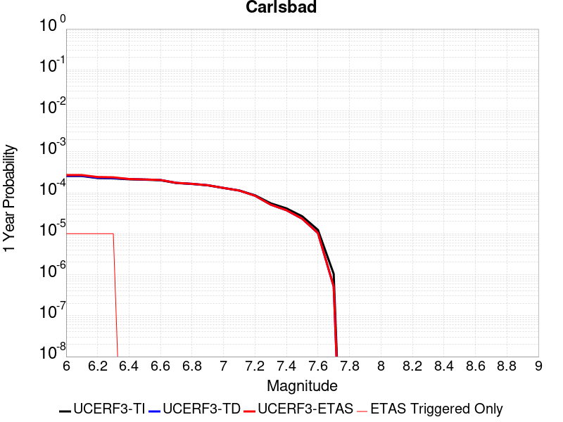 |  |

| Magnitude | 1 wk TI Prob | 1 wk TD Prob | 1 wk ETAS Prob | 1 wk ETAS/TD Gain | 1 wk ETAS Triggered Only | 1 mo TI Prob | 1 mo TD Prob | 1 mo ETAS Prob | 1 mo ETAS/TD Gain | 1 mo ETAS Triggered Only | 1 yr TI Prob | 1 yr TD Prob | 1 yr ETAS Prob | 1 yr ETAS/TD Gain | 1 yr ETAS Triggered Only | 10 yr TI Prob | 10 yr TD Prob | 10 yr ETAS Prob | 10 yr ETAS/TD Gain | 10 yr ETAS Triggered Only |
|-----|-----|-----|-----|-----|-----|-----|-----|-----|-----|-----|-----|-----|-----|-----|-----|-----|-----|-----|-----|-----|
| 6.0 | 4.9038536E-6 | 4.9872565E-6 | 4.9872565E-6 | 1.0 | 0.0 | 2.1016345E-5 | 2.1373784E-5 | 2.1373784E-5 | 1.0 | 0.0 | 2.5584397E-4 | 2.601952E-4 | 2.701926E-4 | 1.0384227 | 1.0E-5 | 0.002555496 | 0.0025989525 | 0.0026089265 | 1.0038377 | 1.0E-5 |
| 6.1 | 4.9038536E-6 | 4.9872565E-6 | 4.9872565E-6 | 1.0 | 0.0 | 2.1016345E-5 | 2.1373784E-5 | 2.1373784E-5 | 1.0 | 0.0 | 2.5584397E-4 | 2.601952E-4 | 2.701926E-4 | 1.0384227 | 1.0E-5 | 0.002555496 | 0.0025989525 | 0.0026089265 | 1.0038377 | 1.0E-5 |
| 6.2 | 4.3820614E-6 | 4.4547687E-6 | 4.4547687E-6 | 1.0 | 0.0 | 1.8780129E-5 | 1.9091729E-5 | 1.9091729E-5 | 1.0 | 0.0 | 2.2862408E-4 | 2.3241735E-4 | 2.4241503E-4 | 1.0430161 | 1.0E-5 | 0.00228389 | 0.0023217786 | 0.0023317554 | 1.004297 | 1.0E-5 |
| 6.3 | 4.302872E-6 | 4.373006E-6 | 4.373006E-6 | 1.0 | 0.0 | 1.8440749E-5 | 1.8741322E-5 | 1.8741322E-5 | 1.0 | 0.0 | 2.24493E-4 | 2.2815206E-4 | 2.3814978E-4 | 1.0438204 | 1.0E-5 | 0.0022426634 | 0.0022792136 | 0.0022891907 | 1.0043775 | 1.0E-5 |
| 6.4 | 4.0835243E-6 | 4.1476546E-6 | 4.1476546E-6 | 1.0 | 0.0 | 1.75007E-5 | 1.7775543E-5 | 1.7775543E-5 | 1.0 | 0.0 | 2.1305021E-4 | 2.1639607E-4 | 2.1639607E-4 | 1.0 | 0.0 | 0.0021284607 | 0.0021618877 | 0.0021618877 | 1.0 | 0.0 |
| 6.5 | 3.987806E-6 | 4.0488867E-6 | 4.0488867E-6 | 1.0 | 0.0 | 1.7090486E-5 | 1.7352257E-5 | 1.7352257E-5 | 1.0 | 0.0 | 2.080568E-4 | 2.1124359E-4 | 2.1124359E-4 | 1.0 | 0.0 | 0.002078621 | 0.0021104617 | 0.0021104617 | 1.0 | 0.0 |
| 6.6 | 3.8707576E-6 | 3.927488E-6 | 3.927488E-6 | 1.0 | 0.0 | 1.6588854E-5 | 1.6831984E-5 | 1.6831984E-5 | 1.0 | 0.0 | 2.0195059E-4 | 2.0491047E-4 | 2.0491047E-4 | 1.0 | 0.0 | 0.0020176715 | 0.0020472489 | 0.0020472489 | 1.0 | 0.0 |
| 6.7 | 3.3093434E-6 | 3.3423917E-6 | 3.3423917E-6 | 1.0 | 0.0 | 1.4182823E-5 | 1.4324457E-5 | 1.4324457E-5 | 1.0 | 0.0 | 1.7266218E-4 | 1.7438637E-4 | 1.7438637E-4 | 1.0 | 0.0 | 0.001725281 | 0.0017425013 | 0.0017425013 | 1.0 | 0.0 |
| 6.8 | 3.136983E-6 | 3.1664536E-6 | 3.1664536E-6 | 1.0 | 0.0 | 1.3444143E-5 | 1.3570445E-5 | 1.3570445E-5 | 1.0 | 0.0 | 1.6367015E-4 | 1.6520769E-4 | 1.6520769E-4 | 1.0 | 0.0 | 0.0016354966 | 0.0016508545 | 0.0016508545 | 1.0 | 0.0 |
| 6.9 | 2.9056644E-6 | 2.9267585E-6 | 2.9267585E-6 | 1.0 | 0.0 | 1.2452788E-5 | 1.2543191E-5 | 1.2543191E-5 | 1.0 | 0.0 | 1.5160214E-4 | 1.5270269E-4 | 1.5270269E-4 | 1.0 | 0.0 | 0.0015149876 | 0.001525983 | 0.001525983 | 1.0 | 0.0 |
| 7.0 | 2.5071035E-6 | 2.5113977E-6 | 2.5113977E-6 | 1.0 | 0.0 | 1.0744685E-5 | 1.07630885E-5 | 1.07630885E-5 | 1.0 | 0.0 | 1.308087E-4 | 1.3103275E-4 | 1.3103275E-4 | 1.0 | 0.0 | 0.0013073172 | 0.0013095582 | 0.0013095582 | 1.0 | 0.0 |
| 7.1 | 2.1786877E-6 | 2.1678832E-6 | 2.1678832E-6 | 1.0 | 0.0 | 9.3372E-6 | 9.290896E-6 | 9.290896E-6 | 1.0 | 0.0 | 1.13674476E-4 | 1.1311081E-4 | 1.1311081E-4 | 1.0 | 0.0 | 0.0011361635 | 0.0011305353 | 0.0011305353 | 1.0 | 0.0 |
| 7.2 | 1.6628418E-6 | 1.6213872E-6 | 1.6213872E-6 | 1.0 | 0.0 | 7.1264453E-6 | 6.948784E-6 | 6.948784E-6 | 1.0 | 0.0 | 8.676102E-5 | 8.4598185E-5 | 8.4598185E-5 | 1.0 | 0.0 | 8.672715E-4 | 8.45662E-4 | 8.45662E-4 | 1.0 | 0.0 |
| 7.3 | 1.0595926E-6 | 9.816804E-7 | 9.816804E-7 | 1.0 | 0.0 | 4.541103E-6 | 4.2071947E-6 | 4.2071947E-6 | 1.0 | 0.0 | 5.5286528E-5 | 5.1221403E-5 | 5.1221403E-5 | 1.0 | 0.0 | 5.527277E-4 | 5.1209686E-4 | 5.1209686E-4 | 1.0 | 0.0 |
| 7.4 | 7.956623E-7 | 7.1737975E-7 | 7.1737975E-7 | 1.0 | 0.0 | 3.4099767E-6 | 3.074481E-6 | 3.074481E-6 | 1.0 | 0.0 | 4.1515676E-5 | 3.743117E-5 | 3.743117E-5 | 1.0 | 0.0 | 4.150792E-4 | 3.7424936E-4 | 3.7424936E-4 | 1.0 | 0.0 |
| 7.5 | 5.1043804E-7 | 4.4483627E-7 | 4.4483627E-7 | 1.0 | 0.0 | 2.1875896E-6 | 1.9064398E-6 | 1.9064398E-6 | 1.0 | 0.0 | 2.663358E-5 | 2.3210663E-5 | 2.3210663E-5 | 1.0 | 0.0 | 2.6630386E-4 | 2.3208297E-4 | 2.3208297E-4 | 1.0 | 0.0 |
| 7.6 | 2.3723294E-7 | 1.989569E-7 | 1.989569E-7 | 1.0 | 0.0 | 1.0167122E-6 | 8.5267214E-7 | 8.5267214E-7 | 1.0 | 0.0 | 1.2378401E-5 | 1.0381237E-5 | 1.0381237E-5 | 1.0 | 0.0 | 1.237771E-4 | 1.038078E-4 | 1.038078E-4 | 1.0 | 0.0 |
| 7.7 | 1.9992152E-8 | 9.8601785E-9 | 9.8601785E-9 | 1.0 | 0.0 | 8.568065E-8 | 4.225791E-8 | 4.225791E-8 | 1.0 | 0.0 | 1.0431614E-6 | 5.1449E-7 | 5.1449E-7 | 1.0 | 0.0 | 1.0431565E-5 | 5.1449E-6 | 5.1449E-6 | 1.0 | 0.0 |

## Last Chance
*[(top)](#table-of-contents)*

| 1 Week | 1 Month | 1 Year | 10 Year |
|-----|-----|-----|-----|
|  |  |  |  |

| Magnitude | 1 wk TI Prob | 1 wk TD Prob | 1 wk ETAS Prob | 1 wk ETAS/TD Gain | 1 wk ETAS Triggered Only | 1 mo TI Prob | 1 mo TD Prob | 1 mo ETAS Prob | 1 mo ETAS/TD Gain | 1 mo ETAS Triggered Only | 1 yr TI Prob | 1 yr TD Prob | 1 yr ETAS Prob | 1 yr ETAS/TD Gain | 1 yr ETAS Triggered Only | 10 yr TI Prob | 10 yr TD Prob | 10 yr ETAS Prob | 10 yr ETAS/TD Gain | 10 yr ETAS Triggered Only |
|-----|-----|-----|-----|-----|-----|-----|-----|-----|-----|-----|-----|-----|-----|-----|-----|-----|-----|-----|-----|-----|
| 6.0 | 3.23929E-6 | 3.305131E-6 | 1.3305098E-5 | 4.0255885 | 1.0E-5 | 1.3882597E-5 | 1.4164784E-5 | 2.4164643E-5 | 1.7059661 | 1.0E-5 | 1.6900752E-4 | 1.7244508E-4 | 1.8244336E-4 | 1.0579795 | 1.0E-5 | 0.0016887904 | 0.0017233564 | 0.0017333392 | 1.0057926 | 1.0E-5 |
| 6.1 | 3.23929E-6 | 3.305131E-6 | 1.3305098E-5 | 4.0255885 | 1.0E-5 | 1.3882597E-5 | 1.4164784E-5 | 2.4164643E-5 | 1.7059661 | 1.0E-5 | 1.6900752E-4 | 1.7244508E-4 | 1.8244336E-4 | 1.0579795 | 1.0E-5 | 0.0016887904 | 0.0017233564 | 0.0017333392 | 1.0057926 | 1.0E-5 |
| 6.2 | 3.23929E-6 | 3.305131E-6 | 1.3305098E-5 | 4.0255885 | 1.0E-5 | 1.3882597E-5 | 1.4164784E-5 | 2.4164643E-5 | 1.7059661 | 1.0E-5 | 1.6900752E-4 | 1.7244508E-4 | 1.8244336E-4 | 1.0579795 | 1.0E-5 | 0.0016887904 | 0.0017233564 | 0.0017333392 | 1.0057926 | 1.0E-5 |
| 6.3 | 3.23929E-6 | 3.305131E-6 | 1.3305098E-5 | 4.0255885 | 1.0E-5 | 1.3882597E-5 | 1.4164784E-5 | 2.4164643E-5 | 1.7059661 | 1.0E-5 | 1.6900752E-4 | 1.7244508E-4 | 1.8244336E-4 | 1.0579795 | 1.0E-5 | 0.0016887904 | 0.0017233564 | 0.0017333392 | 1.0057926 | 1.0E-5 |
| 6.4 | 3.23929E-6 | 3.305131E-6 | 1.3305098E-5 | 4.0255885 | 1.0E-5 | 1.3882597E-5 | 1.4164784E-5 | 2.4164643E-5 | 1.7059661 | 1.0E-5 | 1.6900752E-4 | 1.7244508E-4 | 1.8244336E-4 | 1.0579795 | 1.0E-5 | 0.0016887904 | 0.0017233564 | 0.0017333392 | 1.0057926 | 1.0E-5 |
| 6.5 | 3.23929E-6 | 3.305131E-6 | 1.3305098E-5 | 4.0255885 | 1.0E-5 | 1.3882597E-5 | 1.4164784E-5 | 2.4164643E-5 | 1.7059661 | 1.0E-5 | 1.6900752E-4 | 1.7244508E-4 | 1.8244336E-4 | 1.0579795 | 1.0E-5 | 0.0016887904 | 0.0017233564 | 0.0017333392 | 1.0057926 | 1.0E-5 |
| 6.6 | 3.23929E-6 | 3.305131E-6 | 1.3305098E-5 | 4.0255885 | 1.0E-5 | 1.3882597E-5 | 1.4164784E-5 | 2.4164643E-5 | 1.7059661 | 1.0E-5 | 1.6900752E-4 | 1.7244508E-4 | 1.8244336E-4 | 1.0579795 | 1.0E-5 | 0.0016887904 | 0.0017233564 | 0.0017333392 | 1.0057926 | 1.0E-5 |
| 6.7 | 1.9639244E-6 | 2.004454E-6 | 2.004454E-6 | 1.0 | 0.0 | 8.416792E-6 | 8.590492E-6 | 8.590492E-6 | 1.0 | 0.0 | 1.02469625E-4 | 1.0458486E-4 | 1.0458486E-4 | 1.0 | 0.0 | 0.0010242239 | 0.0010454189 | 0.0010454189 | 1.0 | 0.0 |
| 6.8 | 1.8490592E-6 | 1.8874916E-6 | 1.8874916E-6 | 1.0 | 0.0 | 7.924516E-6 | 8.089228E-6 | 8.089228E-6 | 1.0 | 0.0 | 9.64767E-5 | 9.8482524E-5 | 9.8482524E-5 | 1.0 | 0.0 | 9.643483E-4 | 9.844499E-4 | 9.844499E-4 | 1.0 | 0.0 |
| 6.9 | 1.6283703E-6 | 1.6624386E-6 | 1.6624386E-6 | 1.0 | 0.0 | 6.9787116E-6 | 7.124721E-6 | 7.124721E-6 | 1.0 | 0.0 | 8.49625E-5 | 8.674058E-5 | 8.674058E-5 | 1.0 | 0.0 | 8.4930024E-4 | 8.6712214E-4 | 8.6712214E-4 | 1.0 | 0.0 |
| 7.0 | 1.1619308E-6 | 1.1869527E-6 | 1.1869527E-6 | 1.0 | 0.0 | 4.979694E-6 | 5.0869326E-6 | 5.0869326E-6 | 1.0 | 0.0 | 6.0626087E-5 | 6.1932085E-5 | 6.1932085E-5 | 1.0 | 0.0 | 6.060955E-4 | 6.19192E-4 | 6.19192E-4 | 1.0 | 0.0 |
| 7.1 | 7.8723247E-7 | 8.0469965E-7 | 8.0469965E-7 | 1.0 | 0.0 | 3.373849E-6 | 3.44871E-6 | 3.44871E-6 | 1.0 | 0.0 | 4.107584E-5 | 4.198754E-5 | 4.198754E-5 | 1.0 | 0.0 | 4.1068246E-4 | 4.1982596E-4 | 4.1982596E-4 | 1.0 | 0.0 |

## San Gregorio (South) 2011 CFM
*[(top)](#table-of-contents)*

| 1 Week | 1 Month | 1 Year | 10 Year |
|-----|-----|-----|-----|
|  |  |  | 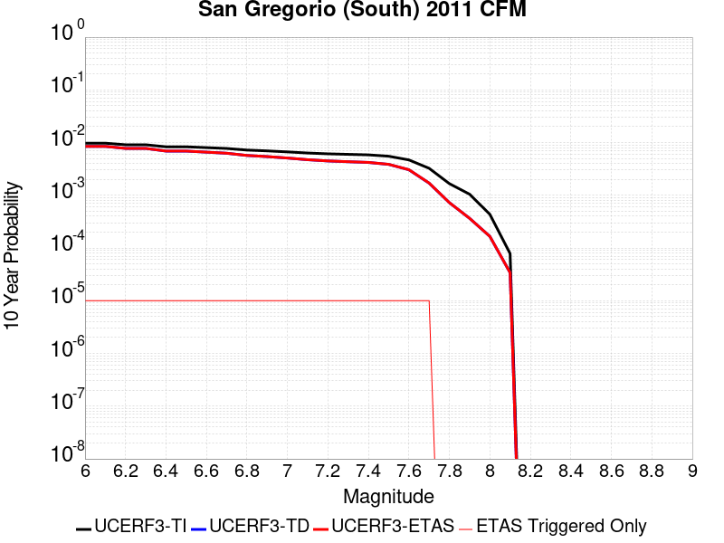 |

| Magnitude | 1 wk TI Prob | 1 wk TD Prob | 1 wk ETAS Prob | 1 wk ETAS/TD Gain | 1 wk ETAS Triggered Only | 1 mo TI Prob | 1 mo TD Prob | 1 mo ETAS Prob | 1 mo ETAS/TD Gain | 1 mo ETAS Triggered Only | 1 yr TI Prob | 1 yr TD Prob | 1 yr ETAS Prob | 1 yr ETAS/TD Gain | 1 yr ETAS Triggered Only | 10 yr TI Prob | 10 yr TD Prob | 10 yr ETAS Prob | 10 yr ETAS/TD Gain | 10 yr ETAS Triggered Only |
|-----|-----|-----|-----|-----|-----|-----|-----|-----|-----|-----|-----|-----|-----|-----|-----|-----|-----|-----|-----|-----|
| 6.0 | 1.8770423E-5 | 1.6279751E-5 | 2.627959E-5 | 1.61425 | 1.0E-5 | 8.044219E-5 | 6.976852E-5 | 7.976782E-5 | 1.1433212 | 1.0E-5 | 9.789435E-4 | 8.491044E-4 | 8.5909595E-4 | 1.0117671 | 1.0E-5 | 0.009746423 | 0.008471312 | 0.008481227 | 1.0011704 | 1.0E-5 |
| 6.1 | 1.8770423E-5 | 1.6279751E-5 | 2.627959E-5 | 1.61425 | 1.0E-5 | 8.044219E-5 | 6.976852E-5 | 7.976782E-5 | 1.1433212 | 1.0E-5 | 9.789435E-4 | 8.491044E-4 | 8.5909595E-4 | 1.0117671 | 1.0E-5 | 0.009746423 | 0.008471312 | 0.008481227 | 1.0011704 | 1.0E-5 |
| 6.2 | 1.7508692E-5 | 1.4899257E-5 | 2.4899107E-5 | 1.6711644 | 1.0E-5 | 7.5035096E-5 | 6.3852414E-5 | 7.385177E-5 | 1.1566012 | 1.0E-5 | 9.1316935E-4 | 7.7712885E-4 | 7.8712107E-4 | 1.0128579 | 1.0E-5 | 0.00909426 | 0.00775674 | 0.007766662 | 1.0012792 | 1.0E-5 |
| 6.3 | 1.7508692E-5 | 1.4899257E-5 | 2.4899107E-5 | 1.6711644 | 1.0E-5 | 7.5035096E-5 | 6.3852414E-5 | 7.385177E-5 | 1.1566012 | 1.0E-5 | 9.1316935E-4 | 7.7712885E-4 | 7.8712107E-4 | 1.0128579 | 1.0E-5 | 0.00909426 | 0.00775674 | 0.007766662 | 1.0012792 | 1.0E-5 |
| 6.4 | 1.6004591E-5 | 1.3249094E-5 | 2.3248962E-5 | 1.7547586 | 1.0E-5 | 6.85893E-5 | 5.6780602E-5 | 6.6780034E-5 | 1.1761065 | 1.0E-5 | 8.347548E-4 | 6.910856E-4 | 7.010787E-4 | 1.01446 | 1.0E-5 | 0.008316261 | 0.006901791 | 0.006911722 | 1.0014389 | 1.0E-5 |
| 6.5 | 1.6004591E-5 | 1.3249094E-5 | 2.3248962E-5 | 1.7547586 | 1.0E-5 | 6.85893E-5 | 5.6780602E-5 | 6.6780034E-5 | 1.1761065 | 1.0E-5 | 8.347548E-4 | 6.910856E-4 | 7.010787E-4 | 1.01446 | 1.0E-5 | 0.008316261 | 0.006901791 | 0.006911722 | 1.0014389 | 1.0E-5 |
| 6.6 | 1.5442201E-5 | 1.2633725E-5 | 2.26336E-5 | 1.7915221 | 1.0E-5 | 6.617918E-5 | 5.4143416E-5 | 6.414288E-5 | 1.1846846 | 1.0E-5 | 8.0543366E-4 | 6.5899757E-4 | 6.68991E-4 | 1.0151646 | 1.0E-5 | 0.008025207 | 0.006582842 | 0.0065927766 | 1.0015091 | 1.0E-5 |
| 6.7 | 1.489921E-5 | 1.2042234E-5 | 2.2042113E-5 | 1.8304007 | 1.0E-5 | 6.3852196E-5 | 5.1608557E-5 | 6.160804E-5 | 1.1937563 | 1.0E-5 | 7.7712315E-4 | 6.2815374E-4 | 6.3814747E-4 | 1.0159097 | 1.0E-5 | 0.0077441116 | 0.006276176 | 0.006286113 | 1.0015833 | 1.0E-5 |
| 6.8 | 1.3876024E-5 | 1.0921184E-5 | 2.0921076E-5 | 1.9156415 | 1.0E-5 | 5.9467322E-5 | 4.6804238E-5 | 5.6803772E-5 | 1.2136458 | 1.0E-5 | 7.237741E-4 | 5.69693E-4 | 5.796873E-4 | 1.0175433 | 1.0E-5 | 0.0072142133 | 0.0056946846 | 0.005704628 | 1.001746 | 1.0E-5 |
| 6.9 | 1.33922495E-5 | 1.0392687E-5 | 2.0392583E-5 | 1.962205 | 1.0E-5 | 5.7394092E-5 | 4.4539327E-5 | 5.4538883E-5 | 1.2245107 | 1.0E-5 | 6.9854903E-4 | 5.4213166E-4 | 5.5212626E-4 | 1.0184357 | 1.0E-5 | 0.0069635725 | 0.005420442 | 0.005430388 | 1.0018349 | 1.0E-5 |
| 7.0 | 1.2807324E-5 | 9.752649E-6 | 1.9752551E-5 | 2.0253525 | 1.0E-5 | 5.4887376E-5 | 4.1796397E-5 | 5.1795978E-5 | 1.239245 | 1.0E-5 | 6.680489E-4 | 5.087525E-4 | 5.1874743E-4 | 1.0196459 | 1.0E-5 | 0.006660442 | 0.0050882204 | 0.0050981697 | 1.0019553 | 1.0E-5 |
| 7.1 | 1.2191438E-5 | 9.061537E-6 | 1.9061446E-5 | 2.1035557 | 1.0E-5 | 5.224797E-5 | 3.8834576E-5 | 4.883419E-5 | 1.2574924 | 1.0E-5 | 6.3593336E-4 | 4.727085E-4 | 4.8270376E-4 | 1.0211446 | 1.0E-5 | 0.0063411663 | 0.0047293645 | 0.004739317 | 1.0021044 | 1.0E-5 |
| 7.2 | 1.1769438E-5 | 8.581731E-6 | 1.8581646E-5 | 2.165256 | 1.0E-5 | 5.0439474E-5 | 3.677833E-5 | 4.677796E-5 | 1.2718892 | 1.0E-5 | 6.1392755E-4 | 4.4768423E-4 | 4.5767974E-4 | 1.0223272 | 1.0E-5 | 0.0061223423 | 0.004480157 | 0.0044901124 | 1.0022221 | 1.0E-5 |
| 7.3 | 1.150374E-5 | 8.29716E-6 | 1.8297078E-5 | 2.2052217 | 1.0E-5 | 4.9300812E-5 | 3.5558773E-5 | 4.555842E-5 | 1.2812146 | 1.0E-5 | 6.0007203E-4 | 4.3284212E-4 | 4.428378E-4 | 1.0230931 | 1.0E-5 | 0.0059845424 | 0.0043323063 | 0.004342263 | 1.0022982 | 1.0E-5 |
| 7.4 | 1.12514E-5 | 8.042902E-6 | 1.8042821E-5 | 2.2433224 | 1.0E-5 | 4.8219394E-5 | 3.4469125E-5 | 4.446878E-5 | 1.2901047 | 1.0E-5 | 5.8691297E-4 | 4.1958084E-4 | 4.2957664E-4 | 1.0238233 | 1.0E-5 | 0.005853653 | 0.0042001884 | 0.004210146 | 1.0023708 | 1.0E-5 |
| 7.5 | 1.059696E-5 | 7.3931915E-6 | 1.7393117E-5 | 2.3525858 | 1.0E-5 | 4.5414752E-5 | 3.168472E-5 | 4.1684405E-5 | 1.3155996 | 1.0E-5 | 5.5278436E-4 | 3.8569325E-4 | 3.956894E-4 | 1.0259173 | 1.0E-5 | 0.0055141128 | 0.0038624762 | 0.0038724376 | 1.002579 | 1.0E-5 |
| 7.6 | 9.018592E-6 | 5.8369624E-6 | 1.5836904E-5 | 2.7132099 | 1.0E-5 | 3.8650534E-5 | 2.5015313E-5 | 3.5015062E-5 | 1.3997451 | 1.0E-5 | 4.7046866E-4 | 3.045189E-4 | 3.1451587E-4 | 1.0328287 | 1.0E-5 | 0.004694739 | 0.0030528754 | 0.003062845 | 1.0032656 | 1.0E-5 |
| 7.7 | 6.243489E-6 | 3.2395455E-6 | 1.32395135E-5 | 4.0868425 | 1.0E-5 | 2.6757538E-5 | 1.3883692E-5 | 2.3883553E-5 | 1.7202594 | 1.0E-5 | 3.257243E-4 | 1.6902086E-4 | 1.7901916E-4 | 1.0591543 | 1.0E-5 | 0.003252473 | 0.001699108 | 0.0017090911 | 1.0058755 | 1.0E-5 |
| 7.8 | 3.1941963E-6 | 1.3809986E-6 | 1.3809986E-6 | 1.0 | 0.0 | 1.368934E-5 | 5.9185513E-6 | 5.9185513E-6 | 1.0 | 0.0 | 1.6665498E-4 | 7.2055984E-5 | 7.2055984E-5 | 1.0 | 0.0 | 0.0016653005 | 7.263174E-4 | 7.263174E-4 | 1.0 | 0.0 |
| 7.9 | 2.0098398E-6 | 6.9161155E-7 | 6.9161155E-7 | 1.0 | 0.0 | 8.6135715E-6 | 2.964046E-6 | 2.964046E-6 | 1.0 | 0.0 | 1.0486518E-4 | 3.608666E-5 | 3.608666E-5 | 1.0 | 0.0 | 0.0010481571 | 3.657225E-4 | 3.657225E-4 | 1.0 | 0.0 |
| 8.0 | 8.353119E-7 | 3.1623412E-7 | 3.1623412E-7 | 1.0 | 0.0 | 3.579903E-6 | 1.3552883E-6 | 1.3552883E-6 | 1.0 | 0.0 | 4.358445E-5 | 1.6500511E-5 | 1.6500511E-5 | 1.0 | 0.0 | 4.3575902E-4 | 1.6619264E-4 | 1.6619264E-4 | 1.0 | 0.0 |
| 8.1 | 1.5033264E-7 | 6.527624E-8 | 6.527624E-8 | 1.0 | 0.0 | 6.442826E-7 | 2.7975528E-7 | 2.7975528E-7 | 1.0 | 0.0 | 7.844113E-6 | 3.4060151E-6 | 3.4060151E-6 | 1.0 | 0.0 | 7.843835E-5 | 3.407693E-5 | 3.407693E-5 | 1.0 | 0.0 |

## Reliz 2011 CFM
*[(top)](#table-of-contents)*

| 1 Week | 1 Month | 1 Year | 10 Year |
|-----|-----|-----|-----|
| 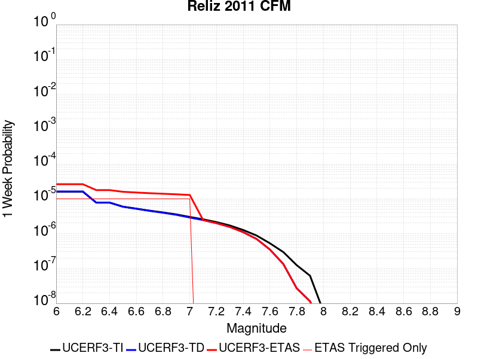 |  |  | 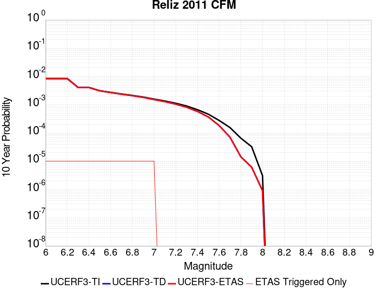 |

| Magnitude | 1 wk TI Prob | 1 wk TD Prob | 1 wk ETAS Prob | 1 wk ETAS/TD Gain | 1 wk ETAS Triggered Only | 1 mo TI Prob | 1 mo TD Prob | 1 mo ETAS Prob | 1 mo ETAS/TD Gain | 1 mo ETAS Triggered Only | 1 yr TI Prob | 1 yr TD Prob | 1 yr ETAS Prob | 1 yr ETAS/TD Gain | 1 yr ETAS Triggered Only | 10 yr TI Prob | 10 yr TD Prob | 10 yr ETAS Prob | 10 yr ETAS/TD Gain | 10 yr ETAS Triggered Only |
|-----|-----|-----|-----|-----|-----|-----|-----|-----|-----|-----|-----|-----|-----|-----|-----|-----|-----|-----|-----|-----|
| 6.0 | 1.6002472E-5 | 1.6282804E-5 | 2.6282642E-5 | 1.6141348 | 1.0E-5 | 6.8580215E-5 | 6.9781694E-5 | 7.978099E-5 | 1.1432941 | 1.0E-5 | 8.3464425E-4 | 8.4928074E-4 | 8.5927226E-4 | 1.0117646 | 1.0E-5 | 0.008315164 | 0.008462547 | 0.008472463 | 1.0011717 | 1.0E-5 |
| 6.1 | 1.6002472E-5 | 1.6282804E-5 | 2.6282642E-5 | 1.6141348 | 1.0E-5 | 6.8580215E-5 | 6.9781694E-5 | 7.978099E-5 | 1.1432941 | 1.0E-5 | 8.3464425E-4 | 8.4928074E-4 | 8.5927226E-4 | 1.0117646 | 1.0E-5 | 0.008315164 | 0.008462547 | 0.008472463 | 1.0011717 | 1.0E-5 |
| 6.2 | 1.6002472E-5 | 1.6282804E-5 | 2.6282642E-5 | 1.6141348 | 1.0E-5 | 6.8580215E-5 | 6.9781694E-5 | 7.978099E-5 | 1.1432941 | 1.0E-5 | 8.3464425E-4 | 8.4928074E-4 | 8.5927226E-4 | 1.0117646 | 1.0E-5 | 0.008315164 | 0.008462547 | 0.008472463 | 1.0011717 | 1.0E-5 |
| 6.3 | 7.792404E-6 | 7.803802E-6 | 1.7803724E-5 | 2.2814167 | 1.0E-5 | 3.339559E-5 | 3.344444E-5 | 4.3444106E-5 | 1.2989933 | 1.0E-5 | 4.0651546E-4 | 4.0711078E-4 | 4.171067E-4 | 1.0245533 | 1.0E-5 | 0.0040577264 | 0.004063926 | 0.0040738857 | 1.0024507 | 1.0E-5 |
| 6.4 | 7.792404E-6 | 7.803802E-6 | 1.7803724E-5 | 2.2814167 | 1.0E-5 | 3.339559E-5 | 3.344444E-5 | 4.3444106E-5 | 1.2989933 | 1.0E-5 | 4.0651546E-4 | 4.0711078E-4 | 4.171067E-4 | 1.0245533 | 1.0E-5 | 0.0040577264 | 0.004063926 | 0.0040738857 | 1.0024507 | 1.0E-5 |
| 6.5 | 5.9659374E-6 | 5.928738E-6 | 1.592868E-5 | 2.6866896 | 1.0E-5 | 2.5568053E-5 | 2.5408632E-5 | 3.540838E-5 | 1.3935571 | 1.0E-5 | 3.1124658E-4 | 3.093064E-4 | 3.193033E-4 | 1.0323204 | 1.0E-5 | 0.00310811 | 0.0030889767 | 0.0030989458 | 1.0032274 | 1.0E-5 |
| 6.6 | 5.2350692E-6 | 5.178986E-6 | 1.51789345E-5 | 2.9308698 | 1.0E-5 | 2.2435817E-5 | 2.2195467E-5 | 3.2195243E-5 | 1.4505324 | 1.0E-5 | 2.7312184E-4 | 2.7019644E-4 | 2.8019375E-4 | 1.0370001 | 1.0E-5 | 0.002727864 | 0.0026988892 | 0.0027088623 | 1.0036952 | 1.0E-5 |
| 6.7 | 4.580206E-6 | 4.5061206E-6 | 1.4506076E-5 | 3.219194 | 1.0E-5 | 1.9629308E-5 | 1.9311801E-5 | 2.9311608E-5 | 1.5178081 | 1.0E-5 | 2.389606E-4 | 2.350959E-4 | 2.4509354E-4 | 1.0425259 | 1.0E-5 | 0.002387038 | 0.0023486738 | 0.0023586503 | 1.0042477 | 1.0E-5 |
| 6.8 | 4.0765017E-6 | 3.9882384E-6 | 1.3988199E-5 | 3.5073628 | 1.0E-5 | 1.7470604E-5 | 1.7092338E-5 | 2.7092166E-5 | 1.5850475 | 1.0E-5 | 2.1268385E-4 | 2.0807938E-4 | 2.180773E-4 | 1.0480486 | 1.0E-5 | 0.002124804 | 0.0020790435 | 0.0020890227 | 1.0048 | 1.0E-5 |
| 6.9 | 3.5752896E-6 | 3.4725176E-6 | 1.3472483E-5 | 3.879745 | 1.0E-5 | 1.532258E-5 | 1.4882134E-5 | 2.4881985E-5 | 1.6719366 | 1.0E-5 | 1.8653645E-4 | 1.8117494E-4 | 1.9117312E-4 | 1.0551853 | 1.0E-5 | 0.0018637994 | 0.0018104686 | 0.0018204505 | 1.0055134 | 1.0E-5 |
| 7.0 | 3.0259848E-6 | 2.9079417E-6 | 1.2907913E-5 | 4.4388485 | 1.0E-5 | 1.2968442E-5 | 1.2462548E-5 | 2.2462424E-5 | 1.8023942 | 1.0E-5 | 1.5787935E-4 | 1.5172097E-4 | 1.6171945E-4 | 1.0659004 | 1.0E-5 | 0.0015776722 | 0.001516369 | 0.0015263539 | 1.0065846 | 1.0E-5 |
| 7.1 | 2.5861116E-6 | 2.455167E-6 | 2.455167E-6 | 1.0 | 0.0 | 1.1083288E-5 | 1.05221025E-5 | 1.05221025E-5 | 1.0 | 0.0 | 1.3493067E-4 | 1.2809907E-4 | 1.2809907E-4 | 1.0 | 0.0 | 0.0013484878 | 0.001280447 | 0.001280447 | 1.0 | 0.0 |
| 7.2 | 2.1482588E-6 | 2.003237E-6 | 2.003237E-6 | 1.0 | 0.0 | 9.20679E-6 | 8.585273E-6 | 8.585273E-6 | 1.0 | 0.0 | 1.12086906E-4 | 1.0452068E-4 | 1.0452068E-4 | 1.0 | 0.0 | 0.0011203039 | 0.0010449095 | 0.0010449095 | 1.0 | 0.0 |
| 7.3 | 1.7194744E-6 | 1.5611241E-6 | 1.5611241E-6 | 1.0 | 0.0 | 7.3691554E-6 | 6.690515E-6 | 6.690515E-6 | 1.0 | 0.0 | 8.971577E-5 | 8.1453974E-5 | 8.1453974E-5 | 1.0 | 0.0 | 8.967956E-4 | 8.1443513E-4 | 8.1443513E-4 | 1.0 | 0.0 |
| 7.4 | 1.2755178E-6 | 1.10563E-6 | 1.10563E-6 | 1.0 | 0.0 | 5.4664933E-6 | 4.7384056E-6 | 4.7384056E-6 | 1.0 | 0.0 | 6.655252E-5 | 5.768856E-5 | 5.768856E-5 | 1.0 | 0.0 | 6.6532596E-4 | 5.7692965E-4 | 5.7692965E-4 | 1.0 | 0.0 |
| 7.5 | 8.8463224E-7 | 7.0580273E-7 | 7.0580273E-7 | 1.0 | 0.0 | 3.7912755E-6 | 3.0248652E-6 | 3.0248652E-6 | 1.0 | 0.0 | 4.6157802E-5 | 3.6827114E-5 | 3.6827114E-5 | 1.0 | 0.0 | 4.6148215E-4 | 3.684038E-4 | 3.684038E-4 | 1.0 | 0.0 |
| 7.6 | 5.291355E-7 | 3.500777E-7 | 3.500777E-7 | 1.0 | 0.0 | 2.2677216E-6 | 1.5003321E-6 | 1.5003321E-6 | 1.0 | 0.0 | 2.760916E-5 | 1.8266392E-5 | 1.8266392E-5 | 1.0 | 0.0 | 2.760573E-4 | 1.8284164E-4 | 1.8284164E-4 | 1.0 | 0.0 |
| 7.7 | 2.9663357E-7 | 1.351113E-7 | 1.351113E-7 | 1.0 | 0.0 | 1.2712861E-6 | 5.7904833E-7 | 5.7904833E-7 | 1.0 | 0.0 | 1.5477797E-5 | 7.049891E-6 | 7.049891E-6 | 1.0 | 0.0 | 1.547672E-4 | 7.068132E-5 | 7.068132E-5 | 1.0 | 0.0 |
| 7.8 | 1.2509386E-7 | 2.7157126E-8 | 2.7157126E-8 | 1.0 | 0.0 | 5.3611643E-7 | 1.1638769E-7 | 1.1638769E-7 | 1.0 | 0.0 | 6.527198E-6 | 1.4170191E-6 | 1.4170191E-6 | 1.0 | 0.0 | 6.527006E-5 | 1.4326506E-5 | 1.4326506E-5 | 1.0 | 0.0 |
| 7.9 | 6.213493E-8 | 1.1482114E-8 | 1.1482114E-8 | 1.0 | 0.0 | 2.6629255E-7 | 4.920906E-8 | 4.920906E-8 | 1.0 | 0.0 | 3.242107E-6 | 5.9912014E-7 | 5.9912014E-7 | 1.0 | 0.0 | 3.2420594E-5 | 6.1224223E-6 | 6.1224223E-6 | 1.0 | 0.0 |
| 8.0 | 5.92383E-9 | 1.677887E-9 | 1.677887E-9 | 1.0 | 0.0 | 2.5387841E-8 | 7.190944E-9 | 7.190944E-9 | 1.0 | 0.0 | 3.0909692E-7 | 8.754974E-8 | 8.754974E-8 | 1.0 | 0.0 | 3.090965E-6 | 9.003061E-7 | 9.003061E-7 | 1.0 | 0.0 |

## San Jacinto (Superstition Mtn)
*[(top)](#table-of-contents)*

| 1 Week | 1 Month | 1 Year | 10 Year |
|-----|-----|-----|-----|
|  | 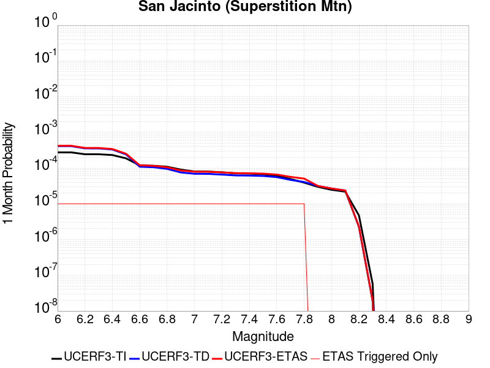 | 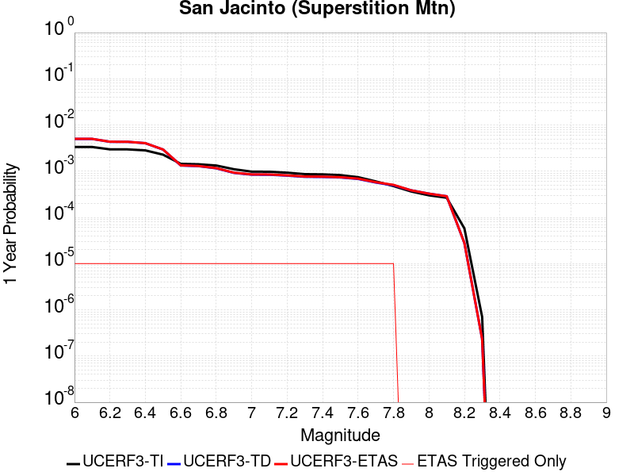 |  |

| Magnitude | 1 wk TI Prob | 1 wk TD Prob | 1 wk ETAS Prob | 1 wk ETAS/TD Gain | 1 wk ETAS Triggered Only | 1 mo TI Prob | 1 mo TD Prob | 1 mo ETAS Prob | 1 mo ETAS/TD Gain | 1 mo ETAS Triggered Only | 1 yr TI Prob | 1 yr TD Prob | 1 yr ETAS Prob | 1 yr ETAS/TD Gain | 1 yr ETAS Triggered Only | 10 yr TI Prob | 10 yr TD Prob | 10 yr ETAS Prob | 10 yr ETAS/TD Gain | 10 yr ETAS Triggered Only |
|-----|-----|-----|-----|-----|-----|-----|-----|-----|-----|-----|-----|-----|-----|-----|-----|-----|-----|-----|-----|-----|
| 6.0 | 6.4193904E-5 | 9.599367E-5 | 9.599367E-5 | 1.0 | 0.0 | 2.7508775E-4 | 4.1134638E-4 | 4.2134227E-4 | 1.0243005 | 1.0E-5 | 0.0033440501 | 0.0049980893 | 0.0050080395 | 1.0019908 | 1.0E-5 | 0.03294174 | 0.048823986 | 0.048833497 | 1.0001948 | 1.0E-5 |
| 6.1 | 6.4193904E-5 | 9.599367E-5 | 9.599367E-5 | 1.0 | 0.0 | 2.7508775E-4 | 4.1134638E-4 | 4.2134227E-4 | 1.0243005 | 1.0E-5 | 0.0033440501 | 0.0049980893 | 0.0050080395 | 1.0019908 | 1.0E-5 | 0.03294174 | 0.048823986 | 0.048833497 | 1.0001948 | 1.0E-5 |
| 6.2 | 5.7023593E-5 | 8.3144434E-5 | 8.3144434E-5 | 1.0 | 0.0 | 2.4436394E-4 | 3.5629404E-4 | 3.6629045E-4 | 1.0280567 | 1.0E-5 | 0.002971072 | 0.0043308944 | 0.004340851 | 1.002299 | 1.0E-5 | 0.029316625 | 0.04250403 | 0.042513605 | 1.0002253 | 1.0E-5 |
| 6.3 | 5.6940098E-5 | 8.298979E-5 | 8.298979E-5 | 1.0 | 0.0 | 2.4400617E-4 | 3.5563146E-4 | 3.6562793E-4 | 1.028109 | 1.0E-5 | 0.002966728 | 0.00432286 | 0.0043328167 | 1.0023032 | 1.0E-5 | 0.029274331 | 0.042427283 | 0.042436857 | 1.0002257 | 1.0E-5 |
| 6.4 | 5.4171585E-5 | 7.7483564E-5 | 7.7483564E-5 | 1.0 | 0.0 | 2.3214328E-4 | 3.3203943E-4 | 3.4203613E-4 | 1.0301069 | 1.0E-5 | 0.0028226813 | 0.0040367353 | 0.004046695 | 1.0024673 | 1.0E-5 | 0.02787096 | 0.03971653 | 0.039726134 | 1.0002418 | 1.0E-5 |
| 6.5 | 4.375144E-5 | 5.642133E-5 | 5.642133E-5 | 1.0 | 0.0 | 1.874927E-4 | 2.4178992E-4 | 2.517875E-4 | 1.0413482 | 1.0E-5 | 0.0022803338 | 0.002940994 | 0.0029509645 | 1.0033902 | 1.0E-5 | 0.022570757 | 0.029236801 | 0.02924651 | 1.000332 | 1.0E-5 |
| 6.6 | 2.772192E-5 | 2.5488358E-5 | 2.5488358E-5 | 1.0 | 0.0 | 1.1880282E-4 | 1.09231354E-4 | 1.1923026E-4 | 1.0915388 | 1.0E-5 | 0.0014454646 | 0.0013290998 | 0.0013390864 | 1.0075139 | 1.0E-5 | 0.014360986 | 0.01354049 | 0.013550354 | 1.0007285 | 1.0E-5 |
| 6.7 | 2.7124124E-5 | 2.4699386E-5 | 2.4699386E-5 | 1.0 | 0.0 | 1.1624106E-4 | 1.05850326E-4 | 1.1584927E-4 | 1.094463 | 1.0E-5 | 0.0014143161 | 0.001287985 | 0.0012979722 | 1.0077541 | 1.0E-5 | 0.014053487 | 0.013133943 | 0.013143812 | 1.0007514 | 1.0E-5 |
| 6.8 | 2.5475807E-5 | 2.216446E-5 | 2.216446E-5 | 1.0 | 0.0 | 1.0917746E-4 | 9.4987154E-5 | 1.04986204E-4 | 1.1052674 | 1.0E-5 | 0.001328425 | 0.001155867 | 0.0011658554 | 1.0086415 | 1.0E-5 | 0.0132051185 | 0.011822182 | 0.011832063 | 1.0008359 | 1.0E-5 |
| 6.9 | 2.1162023E-5 | 1.7626244E-5 | 1.7626244E-5 | 1.0 | 0.0 | 9.069123E-5 | 7.5538876E-5 | 8.553812E-5 | 1.1323721 | 1.0E-5 | 0.0011036064 | 9.193016E-4 | 9.292924E-4 | 1.0108678 | 1.0E-5 | 0.010981417 | 0.00944688 | 0.009456785 | 1.0010486 | 1.0E-5 |
| 7.0 | 1.8754288E-5 | 1.6161559E-5 | 1.6161559E-5 | 1.0 | 0.0 | 8.037304E-5 | 6.9261994E-5 | 7.926131E-5 | 1.1443694 | 1.0E-5 | 9.781026E-4 | 8.4294105E-4 | 8.5293263E-4 | 1.0118532 | 1.0E-5 | 0.009738087 | 0.008670042 | 0.008679955 | 1.0011435 | 1.0E-5 |
| 7.1 | 1.8678527E-5 | 1.6086702E-5 | 1.6086702E-5 | 1.0 | 0.0 | 8.0048376E-5 | 6.89412E-5 | 7.894051E-5 | 1.1450411 | 1.0E-5 | 9.7415317E-4 | 8.3903834E-4 | 8.490299E-4 | 1.0119084 | 1.0E-5 | 0.009698939 | 0.008630998 | 0.008640911 | 1.0011486 | 1.0E-5 |
| 7.2 | 1.7804578E-5 | 1.5381282E-5 | 1.5381282E-5 | 1.0 | 0.0 | 7.6303106E-5 | 6.5918124E-5 | 7.5917465E-5 | 1.1516933 | 1.0E-5 | 9.285943E-4 | 8.022599E-4 | 8.122519E-4 | 1.0124547 | 1.0E-5 | 0.009247236 | 0.008262311 | 0.008272229 | 1.0012003 | 1.0E-5 |
| 7.3 | 1.6583685E-5 | 1.4530388E-5 | 1.4530388E-5 | 1.0 | 0.0 | 7.1070994E-5 | 6.227162E-5 | 7.2270996E-5 | 1.1605768 | 1.0E-5 | 8.649459E-4 | 7.5789524E-4 | 7.678876E-4 | 1.0131844 | 1.0E-5 | 0.00861587 | 0.007817623 | 0.0078275455 | 1.0012691 | 1.0E-5 |
| 7.4 | 1.6387552E-5 | 1.4395274E-5 | 1.4395274E-5 | 1.0 | 0.0 | 7.023047E-5 | 6.169258E-5 | 7.169197E-5 | 1.162084 | 1.0E-5 | 8.5472054E-4 | 7.5085036E-4 | 7.608429E-4 | 1.0133083 | 1.0E-5 | 0.008514405 | 0.0077470057 | 0.0077569284 | 1.0012808 | 1.0E-5 |
| 7.5 | 1.5790754E-5 | 1.4035962E-5 | 1.4035962E-5 | 1.0 | 0.0 | 6.767291E-5 | 6.0152746E-5 | 7.015214E-5 | 1.1662334 | 1.0E-5 | 8.236062E-4 | 7.321156E-4 | 7.4210827E-4 | 1.013649 | 1.0E-5 | 0.008205604 | 0.007557569 | 0.0075674937 | 1.0013132 | 1.0E-5 |
| 7.6 | 1.4248672E-5 | 1.3054932E-5 | 1.3054932E-5 | 1.0 | 0.0 | 6.106431E-5 | 5.594852E-5 | 6.594796E-5 | 1.1787257 | 1.0E-5 | 7.432043E-4 | 6.8096205E-4 | 6.9095526E-4 | 1.0146751 | 1.0E-5 | 0.007407237 | 0.0070401574 | 0.0070500867 | 1.0014104 | 1.0E-5 |
| 7.7 | 1.15449975E-5 | 1.090368E-5 | 1.090368E-5 | 1.0 | 0.0 | 4.947762E-5 | 4.6729223E-5 | 5.6728757E-5 | 1.2139889 | 1.0E-5 | 6.022235E-4 | 5.687805E-4 | 5.7877484E-4 | 1.0175714 | 1.0E-5 | 0.006005941 | 0.0059101824 | 0.0059201233 | 1.001682 | 1.0E-5 |
| 7.8 | 9.1391985E-6 | 9.514299E-6 | 9.514299E-6 | 1.0 | 0.0 | 3.9167408E-5 | 4.0774932E-5 | 5.0774524E-5 | 1.2452388 | 1.0E-5 | 4.767588E-4 | 4.963223E-4 | 5.0631736E-4 | 1.0201381 | 1.0E-5 | 0.0047573727 | 0.0051766867 | 0.0051866346 | 1.0019218 | 1.0E-5 |
| 7.9 | 6.973017E-6 | 7.3821784E-6 | 7.3821784E-6 | 1.0 | 0.0 | 2.9884017E-5 | 3.1637526E-5 | 3.1637526E-5 | 1.0 | 0.0 | 3.6377716E-4 | 3.8511935E-4 | 3.8511935E-4 | 1.0 | 0.0 | 0.0036318225 | 0.0040517948 | 0.0040517948 | 1.0 | 0.0 |
| 8.0 | 5.7638235E-6 | 6.259972E-6 | 6.259972E-6 | 1.0 | 0.0 | 2.4701867E-5 | 2.6828178E-5 | 2.6828178E-5 | 1.0 | 0.0 | 3.0070372E-4 | 3.2658462E-4 | 3.2658462E-4 | 1.0 | 0.0 | 0.0030029714 | 0.0034534496 | 0.0034534496 | 1.0 | 0.0 |
| 8.1 | 5.1124434E-6 | 5.4956718E-6 | 5.4956718E-6 | 1.0 | 0.0 | 2.1910288E-5 | 2.355267E-5 | 2.355267E-5 | 1.0 | 0.0 | 2.6672508E-4 | 2.867165E-4 | 2.867165E-4 | 1.0 | 0.0 | 0.0026640517 | 0.003040336 | 0.003040336 | 1.0 | 0.0 |
| 8.2 | 1.1075938E-6 | 5.336568E-7 | 5.336568E-7 | 1.0 | 0.0 | 4.7468216E-6 | 2.2870988E-6 | 2.2870988E-6 | 1.0 | 0.0 | 5.779102E-5 | 2.7845093E-5 | 2.7845093E-5 | 1.0 | 0.0 | 5.777599E-4 | 3.1346595E-4 | 3.1346595E-4 | 1.0 | 0.0 |
| 8.3 | 1.3584393E-8 | 4.473836E-9 | 4.473836E-9 | 1.0 | 0.0 | 5.8218827E-8 | 1.9173582E-8 | 1.9173582E-8 | 1.0 | 0.0 | 7.0881396E-7 | 2.3343837E-7 | 2.3343837E-7 | 1.0 | 0.0 | 7.0881174E-6 | 2.6163038E-6 | 2.6163038E-6 | 1.0 | 0.0 |

## San Andreas (Offshore) 2011 CFM
*[(top)](#table-of-contents)*

| 1 Week | 1 Month | 1 Year | 10 Year |
|-----|-----|-----|-----|
|  |  |  |  |

| Magnitude | 1 wk TI Prob | 1 wk TD Prob | 1 wk ETAS Prob | 1 wk ETAS/TD Gain | 1 wk ETAS Triggered Only | 1 mo TI Prob | 1 mo TD Prob | 1 mo ETAS Prob | 1 mo ETAS/TD Gain | 1 mo ETAS Triggered Only | 1 yr TI Prob | 1 yr TD Prob | 1 yr ETAS Prob | 1 yr ETAS/TD Gain | 1 yr ETAS Triggered Only | 10 yr TI Prob | 10 yr TD Prob | 10 yr ETAS Prob | 10 yr ETAS/TD Gain | 10 yr ETAS Triggered Only |
|-----|-----|-----|-----|-----|-----|-----|-----|-----|-----|-----|-----|-----|-----|-----|-----|-----|-----|-----|-----|-----|
| 6.0 | 1.7072787E-4 | 1.9226041E-4 | 2.022585E-4 | 1.0520028 | 1.0E-5 | 7.3148566E-4 | 8.237154E-4 | 8.337072E-4 | 1.0121301 | 1.0E-5 | 0.008869528 | 0.0099831335 | 0.009993034 | 1.0009917 | 1.0E-5 | 0.085237645 | 0.09682738 | 0.09683641 | 1.0000932 | 1.0E-5 |
| 6.1 | 1.7072787E-4 | 1.9226041E-4 | 2.022585E-4 | 1.0520028 | 1.0E-5 | 7.3148566E-4 | 8.237154E-4 | 8.337072E-4 | 1.0121301 | 1.0E-5 | 0.008869528 | 0.0099831335 | 0.009993034 | 1.0009917 | 1.0E-5 | 0.085237645 | 0.09682738 | 0.09683641 | 1.0000932 | 1.0E-5 |
| 6.2 | 1.6312556E-4 | 1.8407789E-4 | 1.9407604E-4 | 1.0543149 | 1.0E-5 | 6.989222E-4 | 7.8866904E-4 | 7.986612E-4 | 1.0126696 | 1.0E-5 | 0.008476226 | 0.009560268 | 0.009570173 | 1.001036 | 1.0E-5 | 0.08160117 | 0.09284818 | 0.09285726 | 1.0000978 | 1.0E-5 |
| 6.3 | 1.5103363E-4 | 1.6880741E-4 | 1.7880571E-4 | 1.0592291 | 1.0E-5 | 6.471264E-4 | 7.232619E-4 | 7.3325465E-4 | 1.0138162 | 1.0E-5 | 0.007850339 | 0.008770605 | 0.008780517 | 1.0011302 | 1.0E-5 | 0.075787395 | 0.085489064 | 0.085498214 | 1.0001069 | 1.0E-5 |
| 6.4 | 1.5047993E-4 | 1.676667E-4 | 1.7766502E-4 | 1.0596322 | 1.0E-5 | 6.4475456E-4 | 7.1837584E-4 | 7.2836864E-4 | 1.0139103 | 1.0E-5 | 0.007821669 | 0.008711592 | 0.008721505 | 1.0011379 | 1.0E-5 | 0.0755203 | 0.08496926 | 0.08497842 | 1.0001076 | 1.0E-5 |
| 6.5 | 1.2760791E-4 | 1.3735025E-4 | 1.4734887E-4 | 1.0727966 | 1.0E-5 | 5.467764E-4 | 5.885125E-4 | 5.985066E-4 | 1.016982 | 1.0E-5 | 0.0066367025 | 0.0071418737 | 0.007151802 | 1.0013902 | 1.0E-5 | 0.064419635 | 0.07025001 | 0.07025931 | 1.0001323 | 1.0E-5 |
| 6.6 | 1.1063525E-4 | 1.15566356E-4 | 1.15566356E-4 | 1.0 | 0.0 | 4.740649E-4 | 4.9519143E-4 | 4.9519143E-4 | 1.0 | 0.0 | 0.0057564764 | 0.006012491 | 0.006012491 | 1.0 | 0.0 | 0.05609626 | 0.05948894 | 0.05948894 | 1.0 | 0.0 |
| 6.7 | 1.0391049E-4 | 1.0645922E-4 | 1.0645922E-4 | 1.0 | 0.0 | 4.4525467E-4 | 4.5617504E-4 | 4.5617504E-4 | 1.0 | 0.0 | 0.0054075094 | 0.005539975 | 0.005539975 | 1.0 | 0.0 | 0.052778035 | 0.05498876 | 0.05498876 | 1.0 | 0.0 |
| 6.8 | 1.0096706E-4 | 1.01582686E-4 | 1.01582686E-4 | 1.0 | 0.0 | 4.3264418E-4 | 4.3528268E-4 | 4.3528268E-4 | 1.0 | 0.0 | 0.0052547283 | 0.005286866 | 0.005286866 | 1.0 | 0.0 | 0.051321987 | 0.052687574 | 0.052687574 | 1.0 | 0.0 |
| 6.9 | 9.800265E-5 | 9.588748E-5 | 9.588748E-5 | 1.0 | 0.0 | 4.1994374E-4 | 4.1088252E-4 | 4.1088252E-4 | 1.0 | 0.0 | 0.0051008356 | 0.0049911886 | 0.0049911886 | 1.0 | 0.0 | 0.049853306 | 0.05001504 | 0.05001504 | 1.0 | 0.0 |
| 7.0 | 9.4642375E-5 | 9.002143E-5 | 9.002143E-5 | 1.0 | 0.0 | 4.0554712E-4 | 3.8574997E-4 | 3.8574997E-4 | 1.0 | 0.0 | 0.004926363 | 0.0046865544 | 0.0046865544 | 1.0 | 0.0 | 0.048185747 | 0.047196057 | 0.047196057 | 1.0 | 0.0 |
| 7.1 | 9.0996844E-5 | 8.354169E-5 | 8.354169E-5 | 1.0 | 0.0 | 3.8992817E-4 | 3.5798753E-4 | 3.5798753E-4 | 1.0 | 0.0 | 0.004737046 | 0.004349944 | 0.004349944 | 1.0 | 0.0 | 0.04637333 | 0.044047635 | 0.044047635 | 1.0 | 0.0 |
| 7.2 | 8.848287E-5 | 7.9818135E-5 | 7.9818135E-5 | 1.0 | 0.0 | 3.791572E-4 | 3.4203375E-4 | 3.4203375E-4 | 1.0 | 0.0 | 0.004606472 | 0.0041564633 | 0.0041564633 | 1.0 | 0.0 | 0.045121472 | 0.042191572 | 0.042191572 | 1.0 | 0.0 |
| 7.3 | 7.9280784E-5 | 6.1276216E-5 | 6.1276216E-5 | 1.0 | 0.0 | 3.3973053E-4 | 2.625865E-4 | 2.625865E-4 | 1.0 | 0.0 | 0.004128377 | 0.0031924061 | 0.0031924061 | 1.0 | 0.0 | 0.040525194 | 0.032904375 | 0.032904375 | 1.0 | 0.0 |
| 7.4 | 6.468038E-5 | 3.7933212E-5 | 3.7933212E-5 | 1.0 | 0.0 | 2.771722E-4 | 1.625611E-4 | 1.625611E-4 | 1.0 | 0.0 | 0.0033693502 | 0.0019774425 | 0.0019774425 | 1.0 | 0.0 | 0.0331872 | 0.02082181 | 0.02082181 | 1.0 | 0.0 |
| 7.5 | 4.930574E-5 | 1.2703362E-5 | 1.2703362E-5 | 1.0 | 0.0 | 2.1129321E-4 | 5.444185E-5 | 5.444185E-5 | 1.0 | 0.0 | 0.0025694598 | 6.6262955E-4 | 6.6262955E-4 | 1.0 | 0.0 | 0.02539953 | 0.007481418 | 0.007481418 | 1.0 | 0.0 |
| 7.6 | 4.612566E-5 | 1.0336213E-5 | 1.0336213E-5 | 1.0 | 0.0 | 1.9766642E-4 | 4.429731E-5 | 4.429731E-5 | 1.0 | 0.0 | 0.0024039324 | 5.391877E-4 | 5.391877E-4 | 1.0 | 0.0 | 0.023780935 | 0.006172099 | 0.006172099 | 1.0 | 0.0 |
| 7.7 | 3.9435414E-5 | 5.574925E-6 | 5.574925E-6 | 1.0 | 0.0 | 1.6899795E-4 | 2.3892318E-5 | 2.3892318E-5 | 1.0 | 0.0 | 0.0020556084 | 2.9085035E-4 | 2.9085035E-4 | 1.0 | 0.0 | 0.020366974 | 0.0035420412 | 0.0035420412 | 1.0 | 0.0 |
| 7.8 | 2.7787428E-5 | 3.7553348E-6 | 3.7553348E-6 | 1.0 | 0.0 | 1.1908354E-4 | 1.6094193E-5 | 1.6094193E-5 | 1.0 | 0.0 | 0.0014488777 | 1.9592921E-4 | 1.9592921E-4 | 1.0 | 0.0 | 0.014394675 | 0.0023877125 | 0.0023877125 | 1.0 | 0.0 |
| 7.9 | 1.590671E-5 | 3.04085E-6 | 3.04085E-6 | 1.0 | 0.0 | 6.816983E-5 | 1.303215E-5 | 1.303215E-5 | 1.0 | 0.0 | 8.2965166E-4 | 1.586549E-4 | 1.586549E-4 | 1.0 | 0.0 | 0.008265611 | 0.001904262 | 0.001904262 | 1.0 | 0.0 |
| 8.0 | 9.193638E-6 | 2.5920847E-6 | 2.5920847E-6 | 1.0 | 0.0 | 3.940071E-5 | 1.1108887E-5 | 1.1108887E-5 | 1.0 | 0.0 | 4.7959806E-4 | 1.3524233E-4 | 1.3524233E-4 | 1.0 | 0.0 | 0.0047856434 | 0.0016115032 | 0.0016115032 | 1.0 | 0.0 |
| 8.1 | 5.601576E-6 | 2.2343472E-6 | 2.2343472E-6 | 1.0 | 0.0 | 2.4006533E-5 | 9.575739E-6 | 9.575739E-6 | 1.0 | 0.0 | 2.9224035E-4 | 1.16578405E-4 | 1.16578405E-4 | 1.0 | 0.0 | 0.0029185633 | 0.0014020674 | 0.0014020674 | 1.0 | 0.0 |
| 8.2 | 4.3508785E-6 | 1.857566E-6 | 1.857566E-6 | 1.0 | 0.0 | 1.864649E-5 | 7.960973E-6 | 7.960973E-6 | 1.0 | 0.0 | 2.2699735E-4 | 9.692056E-5 | 9.692056E-5 | 1.0 | 0.0 | 0.0022676561 | 0.0011594221 | 0.0011594221 | 1.0 | 0.0 |
| 8.3 | 1.9573292E-6 | 7.514906E-7 | 7.514906E-7 | 1.0 | 0.0 | 8.388526E-6 | 3.22067E-6 | 3.22067E-6 | 1.0 | 0.0 | 1.0212552E-4 | 3.921097E-5 | 3.921097E-5 | 1.0 | 0.0 | 0.001020786 | 4.640846E-4 | 4.640846E-4 | 1.0 | 0.0 |

## Great Valley 04b Gordon Valley
*[(top)](#table-of-contents)*

| 1 Week | 1 Month | 1 Year | 10 Year |
|-----|-----|-----|-----|
|  |  |  |  |

| Magnitude | 1 wk TI Prob | 1 wk TD Prob | 1 wk ETAS Prob | 1 wk ETAS/TD Gain | 1 wk ETAS Triggered Only | 1 mo TI Prob | 1 mo TD Prob | 1 mo ETAS Prob | 1 mo ETAS/TD Gain | 1 mo ETAS Triggered Only | 1 yr TI Prob | 1 yr TD Prob | 1 yr ETAS Prob | 1 yr ETAS/TD Gain | 1 yr ETAS Triggered Only | 10 yr TI Prob | 10 yr TD Prob | 10 yr ETAS Prob | 10 yr ETAS/TD Gain | 10 yr ETAS Triggered Only |
|-----|-----|-----|-----|-----|-----|-----|-----|-----|-----|-----|-----|-----|-----|-----|-----|-----|-----|-----|-----|-----|
| 6.0 | 2.1181217E-5 | 2.3981953E-5 | 3.3981712E-5 | 1.4169703 | 1.0E-5 | 9.077348E-5 | 1.0277669E-4 | 1.1277566E-4 | 1.0972884 | 1.0E-5 | 0.0011046068 | 0.0012507546 | 0.0012607421 | 1.0079851 | 1.0E-5 | 0.010991322 | 0.012453599 | 0.012463475 | 1.000793 | 1.0E-5 |
| 6.1 | 2.1181217E-5 | 2.3981953E-5 | 3.3981712E-5 | 1.4169703 | 1.0E-5 | 9.077348E-5 | 1.0277669E-4 | 1.1277566E-4 | 1.0972884 | 1.0E-5 | 0.0011046068 | 0.0012507546 | 0.0012607421 | 1.0079851 | 1.0E-5 | 0.010991322 | 0.012453599 | 0.012463475 | 1.000793 | 1.0E-5 |
| 6.2 | 2.1181217E-5 | 2.3981953E-5 | 3.3981712E-5 | 1.4169703 | 1.0E-5 | 9.077348E-5 | 1.0277669E-4 | 1.1277566E-4 | 1.0972884 | 1.0E-5 | 0.0011046068 | 0.0012507546 | 0.0012607421 | 1.0079851 | 1.0E-5 | 0.010991322 | 0.012453599 | 0.012463475 | 1.000793 | 1.0E-5 |
| 6.3 | 2.1181217E-5 | 2.3981953E-5 | 3.3981712E-5 | 1.4169703 | 1.0E-5 | 9.077348E-5 | 1.0277669E-4 | 1.1277566E-4 | 1.0972884 | 1.0E-5 | 0.0011046068 | 0.0012507546 | 0.0012607421 | 1.0079851 | 1.0E-5 | 0.010991322 | 0.012453599 | 0.012463475 | 1.000793 | 1.0E-5 |
| 6.4 | 1.0988268E-5 | 1.2254499E-5 | 1.2254499E-5 | 1.0 | 0.0 | 4.7091726E-5 | 5.2518313E-5 | 5.2518313E-5 | 1.0 | 0.0 | 5.731909E-4 | 6.392388E-4 | 6.392388E-4 | 1.0 | 0.0 | 0.005717147 | 0.0063755875 | 0.0063755875 | 1.0 | 0.0 |
| 6.5 | 1.0988268E-5 | 1.2254499E-5 | 1.2254499E-5 | 1.0 | 0.0 | 4.7091726E-5 | 5.2518313E-5 | 5.2518313E-5 | 1.0 | 0.0 | 5.731909E-4 | 6.392388E-4 | 6.392388E-4 | 1.0 | 0.0 | 0.005717147 | 0.0063755875 | 0.0063755875 | 1.0 | 0.0 |
| 6.6 | 1.0517822E-5 | 1.1724062E-5 | 1.1724062E-5 | 1.0 | 0.0 | 4.5075605E-5 | 5.02451E-5 | 5.02451E-5 | 1.0 | 0.0 | 5.4865726E-4 | 6.11578E-4 | 6.11578E-4 | 1.0 | 0.0 | 0.0054730466 | 0.0061005033 | 0.0061005033 | 1.0 | 0.0 |
| 6.7 | 7.789219E-6 | 8.6776445E-6 | 8.6776445E-6 | 1.0 | 0.0 | 3.3381937E-5 | 3.7189402E-5 | 3.7189402E-5 | 1.0 | 0.0 | 4.063493E-4 | 4.526921E-4 | 4.526921E-4 | 1.0 | 0.0 | 0.004056071 | 0.0045182165 | 0.0045182165 | 1.0 | 0.0 |
| 6.8 | 7.5850853E-6 | 8.452389E-6 | 8.452389E-6 | 1.0 | 0.0 | 3.2507105E-5 | 3.622405E-5 | 3.622405E-5 | 1.0 | 0.0 | 3.957021E-4 | 4.409437E-4 | 4.409437E-4 | 1.0 | 0.0 | 0.0039499826 | 0.0044012 | 0.0044012 | 1.0 | 0.0 |
| 6.9 | 6.604105E-6 | 7.3585493E-6 | 7.3585493E-6 | 1.0 | 0.0 | 2.8303E-5 | 3.153628E-5 | 3.153628E-5 | 1.0 | 0.0 | 3.4453452E-4 | 3.8389044E-4 | 3.8389044E-4 | 1.0 | 0.0 | 0.0034400085 | 0.0038326595 | 0.0038326595 | 1.0 | 0.0 |
| 7.0 | 5.3701115E-6 | 5.9884183E-6 | 5.9884183E-6 | 1.0 | 0.0 | 2.301456E-5 | 2.5664414E-5 | 2.5664414E-5 | 1.0 | 0.0 | 2.8016625E-4 | 3.1242234E-4 | 3.1242234E-4 | 1.0 | 0.0 | 0.0027981328 | 0.00312012 | 0.00312012 | 1.0 | 0.0 |
| 7.1 | 4.4685607E-6 | 4.986478E-6 | 4.986478E-6 | 1.0 | 0.0 | 1.9150835E-5 | 2.1370459E-5 | 2.1370459E-5 | 1.0 | 0.0 | 2.3313647E-4 | 2.6015675E-4 | 2.6015675E-4 | 1.0 | 0.0 | 0.0023289204 | 0.0025987667 | 0.0025987667 | 1.0 | 0.0 |
| 7.2 | 2.833378E-6 | 3.164419E-6 | 3.164419E-6 | 1.0 | 0.0 | 1.2142991E-5 | 1.3561736E-5 | 1.3561736E-5 | 1.0 | 0.0 | 1.4783088E-4 | 1.6510337E-4 | 1.6510337E-4 | 1.0 | 0.0 | 0.0014773258 | 0.0016499789 | 0.0016499789 | 1.0 | 0.0 |
| 7.3 | 7.0087293E-7 | 7.7728157E-7 | 7.7728157E-7 | 1.0 | 0.0 | 3.0037377E-6 | 3.3312049E-6 | 3.3312049E-6 | 1.0 | 0.0 | 3.656989E-5 | 4.0557123E-5 | 4.0557123E-5 | 1.0 | 0.0 | 3.6563876E-4 | 4.055422E-4 | 4.055422E-4 | 1.0 | 0.0 |
| 7.4 | 3.112171E-8 | 3.2068368E-8 | 3.2068368E-8 | 1.0 | 0.0 | 1.3337875E-7 | 1.3743585E-7 | 1.3743585E-7 | 1.0 | 0.0 | 1.6238852E-6 | 1.6732803E-6 | 1.6732803E-6 | 1.0 | 0.0 | 1.6238733E-5 | 1.6732685E-5 | 1.6732685E-5 | 1.0 | 0.0 |

## Big Pine (East)
*[(top)](#table-of-contents)*

| 1 Week | 1 Month | 1 Year | 10 Year |
|-----|-----|-----|-----|
|  | 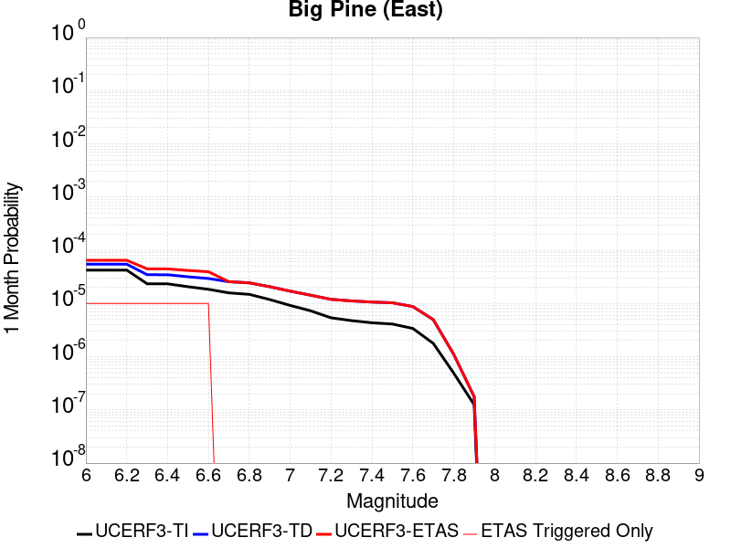 |  |  |

| Magnitude | 1 wk TI Prob | 1 wk TD Prob | 1 wk ETAS Prob | 1 wk ETAS/TD Gain | 1 wk ETAS Triggered Only | 1 mo TI Prob | 1 mo TD Prob | 1 mo ETAS Prob | 1 mo ETAS/TD Gain | 1 mo ETAS Triggered Only | 1 yr TI Prob | 1 yr TD Prob | 1 yr ETAS Prob | 1 yr ETAS/TD Gain | 1 yr ETAS Triggered Only | 10 yr TI Prob | 10 yr TD Prob | 10 yr ETAS Prob | 10 yr ETAS/TD Gain | 10 yr ETAS Triggered Only |
|-----|-----|-----|-----|-----|-----|-----|-----|-----|-----|-----|-----|-----|-----|-----|-----|-----|-----|-----|-----|-----|
| 6.0 | 9.916913E-6 | 1.2816984E-5 | 2.2816856E-5 | 1.7802048 | 1.0E-5 | 4.250036E-5 | 5.49289E-5 | 6.4928354E-5 | 1.1820436 | 1.0E-5 | 5.173191E-4 | 6.685763E-4 | 6.785696E-4 | 1.0149472 | 1.0E-5 | 0.0051611643 | 0.006670441 | 0.0066803745 | 1.0014892 | 1.0E-5 |
| 6.1 | 9.916913E-6 | 1.2816984E-5 | 2.2816856E-5 | 1.7802048 | 1.0E-5 | 4.250036E-5 | 5.49289E-5 | 6.4928354E-5 | 1.1820436 | 1.0E-5 | 5.173191E-4 | 6.685763E-4 | 6.785696E-4 | 1.0149472 | 1.0E-5 | 0.0051611643 | 0.006670441 | 0.0066803745 | 1.0014892 | 1.0E-5 |
| 6.2 | 9.916913E-6 | 1.2816984E-5 | 2.2816856E-5 | 1.7802048 | 1.0E-5 | 4.250036E-5 | 5.49289E-5 | 6.4928354E-5 | 1.1820436 | 1.0E-5 | 5.173191E-4 | 6.685763E-4 | 6.785696E-4 | 1.0149472 | 1.0E-5 | 0.0051611643 | 0.006670441 | 0.0066803745 | 1.0014892 | 1.0E-5 |
| 6.3 | 5.479711E-6 | 8.112951E-6 | 1.811287E-5 | 2.232587 | 1.0E-5 | 2.3484265E-5 | 3.4769346E-5 | 4.4769E-5 | 1.2875997 | 1.0E-5 | 2.858834E-4 | 4.2323777E-4 | 4.3323354E-4 | 1.0236174 | 1.0E-5 | 0.0028551589 | 0.004227244 | 0.0042372015 | 1.0023556 | 1.0E-5 |
| 6.4 | 5.465009E-6 | 8.097245E-6 | 1.8097164E-5 | 2.234978 | 1.0E-5 | 2.3421257E-5 | 3.4702036E-5 | 4.4701686E-5 | 1.2881576 | 1.0E-5 | 2.851165E-4 | 4.2241855E-4 | 4.3241432E-4 | 1.0236632 | 1.0E-5 | 0.0028475097 | 0.0042190826 | 0.0042290404 | 1.0023602 | 1.0E-5 |
| 6.5 | 4.826767E-6 | 7.422301E-6 | 1.7422228E-5 | 2.347281 | 1.0E-5 | 2.068598E-5 | 3.180949E-5 | 4.1809173E-5 | 1.3143616 | 1.0E-5 | 2.518227E-4 | 3.872145E-4 | 3.9721062E-4 | 1.0258155 | 1.0E-5 | 0.0025153751 | 0.003868283 | 0.0038782442 | 1.0025752 | 1.0E-5 |
| 6.6 | 4.3146847E-6 | 6.8822374E-6 | 1.6882168E-5 | 2.4530058 | 1.0E-5 | 1.8491375E-5 | 2.9494982E-5 | 3.9494687E-5 | 1.3390307 | 1.0E-5 | 2.2510924E-4 | 3.590447E-4 | 3.690411E-4 | 1.0278417 | 1.0E-5 | 0.0022488134 | 0.0035874986 | 0.0035974625 | 1.0027775 | 1.0E-5 |
| 6.7 | 3.6968106E-6 | 5.9954727E-6 | 5.9954727E-6 | 1.0 | 0.0 | 1.5843378E-5 | 2.5694639E-5 | 2.5694639E-5 | 1.0 | 0.0 | 1.9287605E-4 | 3.1278885E-4 | 3.1278885E-4 | 1.0 | 0.0 | 0.0019270873 | 0.0031262483 | 0.0031262483 | 1.0 | 0.0 |
| 6.8 | 3.4671132E-6 | 5.702177E-6 | 5.702177E-6 | 1.0 | 0.0 | 1.4858972E-5 | 2.4437682E-5 | 2.4437682E-5 | 1.0 | 0.0 | 1.8089297E-4 | 2.974896E-4 | 2.974896E-4 | 1.0 | 0.0 | 0.0018074579 | 0.002973667 | 0.002973667 | 1.0 | 0.0 |
| 6.9 | 2.7686972E-6 | 4.825223E-6 | 4.825223E-6 | 1.0 | 0.0 | 1.1865792E-5 | 2.0679368E-5 | 2.0679368E-5 | 1.0 | 0.0 | 1.4445644E-4 | 2.5174298E-4 | 2.5174298E-4 | 1.0 | 0.0 | 0.0014436257 | 0.0025172636 | 0.0025172636 | 1.0 | 0.0 |
| 7.0 | 2.1472624E-6 | 3.9850406E-6 | 3.9850406E-6 | 1.0 | 0.0 | 9.20252E-6 | 1.7078637E-5 | 1.7078637E-5 | 1.0 | 0.0 | 1.12034926E-4 | 2.079131E-4 | 2.079131E-4 | 1.0 | 0.0 | 0.0011197845 | 0.0020798394 | 0.0020798394 | 1.0 | 0.0 |
| 7.1 | 1.7018335E-6 | 3.344876E-6 | 3.344876E-6 | 1.0 | 0.0 | 7.293552E-6 | 1.4335106E-5 | 1.4335106E-5 | 1.0 | 0.0 | 8.879537E-5 | 1.7451629E-4 | 1.7451629E-4 | 1.0 | 0.0 | 8.87599E-4 | 0.0017464145 | 0.0017464145 | 1.0 | 0.0 |
| 7.2 | 1.25603E-6 | 2.794484E-6 | 2.794484E-6 | 1.0 | 0.0 | 5.3829745E-6 | 1.1976307E-5 | 1.1976307E-5 | 1.0 | 0.0 | 6.553574E-5 | 1.4580201E-4 | 1.4580201E-4 | 1.0 | 0.0 | 6.551642E-4 | 0.001459661 | 0.001459661 | 1.0 | 0.0 |
| 7.3 | 1.112297E-6 | 2.610332E-6 | 2.610332E-6 | 1.0 | 0.0 | 4.7669787E-6 | 1.118709E-5 | 1.118709E-5 | 1.0 | 0.0 | 5.803642E-5 | 1.3619453E-4 | 1.3619453E-4 | 1.0 | 0.0 | 5.802127E-4 | 0.0013635408 | 0.0013635408 | 1.0 | 0.0 |
| 7.4 | 1.0137181E-6 | 2.4834917E-6 | 2.4834917E-6 | 1.0 | 0.0 | 4.3444993E-6 | 1.0643494E-5 | 1.0643494E-5 | 1.0 | 0.0 | 5.2892992E-5 | 1.2957705E-4 | 1.2957705E-4 | 1.0 | 0.0 | 5.288041E-4 | 0.0012972289 | 0.0012972289 | 1.0 | 0.0 |
| 7.5 | 9.598608E-7 | 2.4071483E-6 | 2.4071483E-6 | 1.0 | 0.0 | 4.1136827E-6 | 1.031631E-5 | 1.031631E-5 | 1.0 | 0.0 | 5.0082934E-5 | 1.2559404E-4 | 1.2559404E-4 | 1.0 | 0.0 | 5.007165E-4 | 0.0012572526 | 0.0012572526 | 1.0 | 0.0 |
| 7.6 | 7.929459E-7 | 2.0448588E-6 | 2.0448588E-6 | 1.0 | 0.0 | 3.3983351E-6 | 8.763653E-6 | 8.763653E-6 | 1.0 | 0.0 | 4.1373947E-5 | 1.06692416E-4 | 1.06692416E-4 | 1.0 | 0.0 | 4.1366243E-4 | 0.0010685222 | 0.0010685222 | 1.0 | 0.0 |
| 7.7 | 4.155788E-7 | 1.1605589E-6 | 1.1605589E-6 | 1.0 | 0.0 | 1.7810507E-6 | 4.9738146E-6 | 4.9738146E-6 | 1.0 | 0.0 | 2.1684076E-5 | 6.0554554E-5 | 6.0554554E-5 | 1.0 | 0.0 | 2.1681961E-4 | 6.0857297E-4 | 6.0857297E-4 | 1.0 | 0.0 |
| 7.8 | 1.14666925E-7 | 2.592015E-7 | 2.592015E-7 | 1.0 | 0.0 | 4.914296E-7 | 1.1108631E-6 | 1.1108631E-6 | 1.0 | 0.0 | 5.9831386E-6 | 1.3524678E-5 | 1.3524678E-5 | 1.0 | 0.0 | 5.9829777E-5 | 1.3634123E-4 | 1.3634123E-4 | 1.0 | 0.0 |
| 7.9 | 2.9231824E-8 | 4.1463963E-8 | 4.1463963E-8 | 1.0 | 0.0 | 1.2527924E-7 | 1.7770269E-7 | 1.7770269E-7 | 1.0 | 0.0 | 1.5252737E-6 | 2.1635283E-6 | 2.1635283E-6 | 1.0 | 0.0 | 1.5252632E-5 | 2.1967755E-5 | 2.1967755E-5 | 1.0 | 0.0 |

## Ozena
*[(top)](#table-of-contents)*

| 1 Week | 1 Month | 1 Year | 10 Year |
|-----|-----|-----|-----|
|  |  |  |  |

| Magnitude | 1 wk TI Prob | 1 wk TD Prob | 1 wk ETAS Prob | 1 wk ETAS/TD Gain | 1 wk ETAS Triggered Only | 1 mo TI Prob | 1 mo TD Prob | 1 mo ETAS Prob | 1 mo ETAS/TD Gain | 1 mo ETAS Triggered Only | 1 yr TI Prob | 1 yr TD Prob | 1 yr ETAS Prob | 1 yr ETAS/TD Gain | 1 yr ETAS Triggered Only | 10 yr TI Prob | 10 yr TD Prob | 10 yr ETAS Prob | 10 yr ETAS/TD Gain | 10 yr ETAS Triggered Only |
|-----|-----|-----|-----|-----|-----|-----|-----|-----|-----|-----|-----|-----|-----|-----|-----|-----|-----|-----|-----|-----|
| 6.0 | 1.4377547E-6 | 1.4513782E-6 | 1.1451364E-5 | 7.889992 | 1.0E-5 | 6.161791E-6 | 6.2201793E-6 | 1.6220118E-5 | 2.6076608 | 1.0E-5 | 7.5017226E-5 | 7.572832E-5 | 8.5727566E-5 | 1.132041 | 1.0E-5 | 7.4991904E-4 | 7.570518E-4 | 7.670442E-4 | 1.0131991 | 1.0E-5 |
| 6.1 | 1.4377547E-6 | 1.4513782E-6 | 1.1451364E-5 | 7.889992 | 1.0E-5 | 6.161791E-6 | 6.2201793E-6 | 1.6220118E-5 | 2.6076608 | 1.0E-5 | 7.5017226E-5 | 7.572832E-5 | 8.5727566E-5 | 1.132041 | 1.0E-5 | 7.4991904E-4 | 7.570518E-4 | 7.670442E-4 | 1.0131991 | 1.0E-5 |
| 6.2 | 1.4377547E-6 | 1.4513782E-6 | 1.1451364E-5 | 7.889992 | 1.0E-5 | 6.161791E-6 | 6.2201793E-6 | 1.6220118E-5 | 2.6076608 | 1.0E-5 | 7.5017226E-5 | 7.572832E-5 | 8.5727566E-5 | 1.132041 | 1.0E-5 | 7.4991904E-4 | 7.570518E-4 | 7.670442E-4 | 1.0131991 | 1.0E-5 |
| 6.3 | 1.4377547E-6 | 1.4513782E-6 | 1.1451364E-5 | 7.889992 | 1.0E-5 | 6.161791E-6 | 6.2201793E-6 | 1.6220118E-5 | 2.6076608 | 1.0E-5 | 7.5017226E-5 | 7.572832E-5 | 8.5727566E-5 | 1.132041 | 1.0E-5 | 7.4991904E-4 | 7.570518E-4 | 7.670442E-4 | 1.0131991 | 1.0E-5 |
| 6.4 | 1.4377547E-6 | 1.4513782E-6 | 1.1451364E-5 | 7.889992 | 1.0E-5 | 6.161791E-6 | 6.2201793E-6 | 1.6220118E-5 | 2.6076608 | 1.0E-5 | 7.5017226E-5 | 7.572832E-5 | 8.5727566E-5 | 1.132041 | 1.0E-5 | 7.4991904E-4 | 7.570518E-4 | 7.670442E-4 | 1.0131991 | 1.0E-5 |
| 6.5 | 1.4377547E-6 | 1.4513782E-6 | 1.1451364E-5 | 7.889992 | 1.0E-5 | 6.161791E-6 | 6.2201793E-6 | 1.6220118E-5 | 2.6076608 | 1.0E-5 | 7.5017226E-5 | 7.572832E-5 | 8.5727566E-5 | 1.132041 | 1.0E-5 | 7.4991904E-4 | 7.570518E-4 | 7.670442E-4 | 1.0131991 | 1.0E-5 |
| 6.6 | 1.4377547E-6 | 1.4513782E-6 | 1.1451364E-5 | 7.889992 | 1.0E-5 | 6.161791E-6 | 6.2201793E-6 | 1.6220118E-5 | 2.6076608 | 1.0E-5 | 7.5017226E-5 | 7.572832E-5 | 8.5727566E-5 | 1.132041 | 1.0E-5 | 7.4991904E-4 | 7.570518E-4 | 7.670442E-4 | 1.0131991 | 1.0E-5 |
| 6.7 | 1.4377547E-6 | 1.4513782E-6 | 1.1451364E-5 | 7.889992 | 1.0E-5 | 6.161791E-6 | 6.2201793E-6 | 1.6220118E-5 | 2.6076608 | 1.0E-5 | 7.5017226E-5 | 7.572832E-5 | 8.5727566E-5 | 1.132041 | 1.0E-5 | 7.4991904E-4 | 7.570518E-4 | 7.670442E-4 | 1.0131991 | 1.0E-5 |
| 6.8 | 9.223257E-7 | 9.317624E-7 | 1.0931753E-5 | 11.73234 | 1.0E-5 | 3.9528186E-6 | 3.9932615E-6 | 1.3993222E-5 | 3.5042088 | 1.0E-5 | 4.81245E-5 | 4.8616912E-5 | 5.8616428E-5 | 1.2056798 | 1.0E-5 | 4.811408E-4 | 4.860668E-4 | 4.960619E-4 | 1.0205632 | 1.0E-5 |
| 6.9 | 9.141515E-7 | 9.235371E-7 | 1.0923528E-5 | 11.827926 | 1.0E-5 | 3.917786E-6 | 3.9580104E-6 | 1.3957971E-5 | 3.526512 | 1.0E-5 | 4.7698002E-5 | 4.818775E-5 | 5.818727E-5 | 1.2075117 | 1.0E-5 | 4.7687767E-4 | 4.8177704E-4 | 4.917722E-4 | 1.0207465 | 1.0E-5 |
| 7.0 | 8.767648E-7 | 8.8585773E-7 | 1.08858485E-5 | 12.288485 | 1.0E-5 | 3.757558E-6 | 3.7965276E-6 | 1.379649E-5 | 3.6339757 | 1.0E-5 | 4.5747307E-5 | 4.6221783E-5 | 5.622132E-5 | 1.2163382 | 1.0E-5 | 4.5737892E-4 | 4.6212564E-4 | 4.7212103E-4 | 1.0216291 | 1.0E-5 |
| 7.1 | 8.199402E-7 | 8.2853984E-7 | 1.0828531E-5 | 13.069415 | 1.0E-5 | 3.5140247E-6 | 3.5508804E-6 | 1.3550845E-5 | 3.8161929 | 1.0E-5 | 4.2782412E-5 | 4.323115E-5 | 5.3230717E-5 | 1.2313046 | 1.0E-5 | 4.2774176E-4 | 4.322311E-4 | 4.422268E-4 | 1.0231258 | 1.0E-5 |
| 7.2 | 7.38705E-7 | 7.464262E-7 | 1.0746418E-5 | 14.3971615 | 1.0E-5 | 3.1658747E-6 | 3.198966E-6 | 1.3198934E-5 | 4.1260004 | 1.0E-5 | 3.8543843E-5 | 3.894675E-5 | 4.894636E-5 | 1.2567508 | 1.0E-5 | 3.853716E-4 | 3.8940276E-4 | 3.9939885E-4 | 1.0256704 | 1.0E-5 |
| 7.3 | 6.490017E-7 | 6.557802E-7 | 1.0655774E-5 | 16.249002 | 1.0E-5 | 2.7814328E-6 | 2.8104837E-6 | 1.2810456E-5 | 4.5580964 | 1.0E-5 | 3.386342E-5 | 3.4217133E-5 | 4.421679E-5 | 1.2922412 | 1.0E-5 | 3.3858258E-4 | 3.4212202E-4 | 3.521186E-4 | 1.0292194 | 1.0E-5 |
| 7.4 | 5.346736E-7 | 5.4022604E-7 | 1.05402205E-5 | 19.51076 | 1.0E-5 | 2.291456E-6 | 2.3152527E-6 | 1.23152295E-5 | 5.319173 | 1.0E-5 | 2.789812E-5 | 2.8187867E-5 | 3.8187587E-5 | 1.3547525 | 1.0E-5 | 2.789462E-4 | 2.8184598E-4 | 2.9184314E-4 | 1.0354704 | 1.0E-5 |
| 7.5 | 2.939325E-7 | 2.9666057E-7 | 2.9666057E-7 | 1.0 | 0.0 | 1.25971E-6 | 1.271402E-6 | 1.271402E-6 | 1.0 | 0.0 | 1.5336862E-5 | 1.5479225E-5 | 1.5479225E-5 | 1.0 | 0.0 | 1.5335804E-4 | 1.5478309E-4 | 1.5478309E-4 | 1.0 | 0.0 |
| 7.6 | 1.4151905E-7 | 1.4253266E-7 | 1.4253266E-7 | 1.0 | 0.0 | 6.065101E-7 | 6.108541E-7 | 6.108541E-7 | 1.0 | 0.0 | 7.3842357E-6 | 7.4371237E-6 | 7.4371237E-6 | 1.0 | 0.0 | 7.38399E-5 | 7.436883E-5 | 7.436883E-5 | 1.0 | 0.0 |
| 7.7 | 4.4957577E-8 | 4.5252243E-8 | 4.5252243E-8 | 1.0 | 0.0 | 1.9267533E-7 | 1.9393818E-7 | 1.9393818E-7 | 1.0 | 0.0 | 2.3458194E-6 | 2.3611947E-6 | 2.3611947E-6 | 1.0 | 0.0 | 2.3457947E-5 | 2.3611707E-5 | 2.3611707E-5 | 1.0 | 0.0 |
| 7.8 | 5.9993255E-9 | 6.0412972E-9 | 6.0412972E-9 | 1.0 | 0.0 | 2.5711394E-8 | 2.5891273E-8 | 2.5891273E-8 | 1.0 | 0.0 | 3.1303617E-7 | 3.1522623E-7 | 3.1522623E-7 | 1.0 | 0.0 | 3.1303573E-6 | 3.1522588E-6 | 3.1522588E-6 | 1.0 | 0.0 |

## North Frontal  (West)
*[(top)](#table-of-contents)*

| 1 Week | 1 Month | 1 Year | 10 Year |
|-----|-----|-----|-----|
| 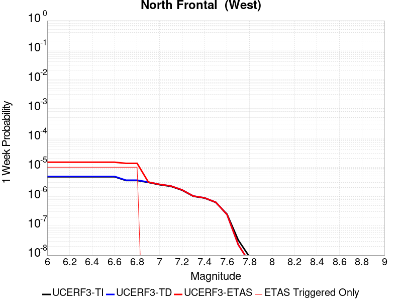 | 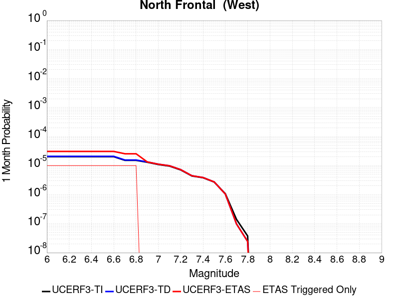 | 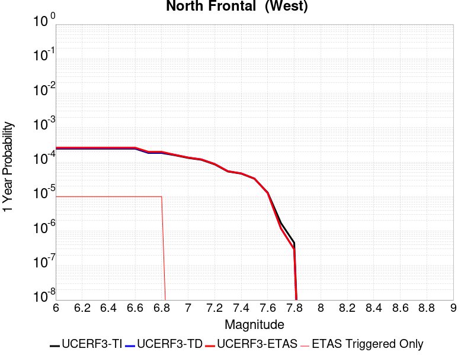 | 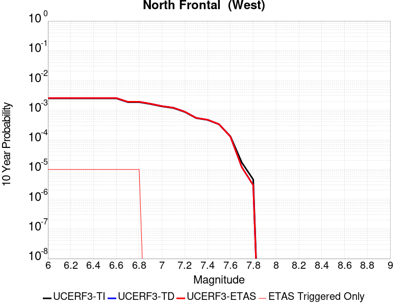 |

| Magnitude | 1 wk TI Prob | 1 wk TD Prob | 1 wk ETAS Prob | 1 wk ETAS/TD Gain | 1 wk ETAS Triggered Only | 1 mo TI Prob | 1 mo TD Prob | 1 mo ETAS Prob | 1 mo ETAS/TD Gain | 1 mo ETAS Triggered Only | 1 yr TI Prob | 1 yr TD Prob | 1 yr ETAS Prob | 1 yr ETAS/TD Gain | 1 yr ETAS Triggered Only | 10 yr TI Prob | 10 yr TD Prob | 10 yr ETAS Prob | 10 yr ETAS/TD Gain | 10 yr ETAS Triggered Only |
|-----|-----|-----|-----|-----|-----|-----|-----|-----|-----|-----|-----|-----|-----|-----|-----|-----|-----|-----|-----|-----|
| 6.0 | 4.7316266E-6 | 4.8526726E-6 | 1.4852624E-5 | 3.0607102 | 1.0E-5 | 2.0278241E-5 | 2.0797012E-5 | 3.0796804E-5 | 1.4808283 | 1.0E-5 | 2.4685962E-4 | 2.5317568E-4 | 2.6317313E-4 | 1.0394883 | 1.0E-5 | 0.0024658558 | 0.0025290183 | 0.002538993 | 1.0039442 | 1.0E-5 |
| 6.1 | 4.7316266E-6 | 4.8526726E-6 | 1.4852624E-5 | 3.0607102 | 1.0E-5 | 2.0278241E-5 | 2.0797012E-5 | 3.0796804E-5 | 1.4808283 | 1.0E-5 | 2.4685962E-4 | 2.5317568E-4 | 2.6317313E-4 | 1.0394883 | 1.0E-5 | 0.0024658558 | 0.0025290183 | 0.002538993 | 1.0039442 | 1.0E-5 |
| 6.2 | 4.7316266E-6 | 4.8526726E-6 | 1.4852624E-5 | 3.0607102 | 1.0E-5 | 2.0278241E-5 | 2.0797012E-5 | 3.0796804E-5 | 1.4808283 | 1.0E-5 | 2.4685962E-4 | 2.5317568E-4 | 2.6317313E-4 | 1.0394883 | 1.0E-5 | 0.0024658558 | 0.0025290183 | 0.002538993 | 1.0039442 | 1.0E-5 |
| 6.3 | 4.7316266E-6 | 4.8526726E-6 | 1.4852624E-5 | 3.0607102 | 1.0E-5 | 2.0278241E-5 | 2.0797012E-5 | 3.0796804E-5 | 1.4808283 | 1.0E-5 | 2.4685962E-4 | 2.5317568E-4 | 2.6317313E-4 | 1.0394883 | 1.0E-5 | 0.0024658558 | 0.0025290183 | 0.002538993 | 1.0039442 | 1.0E-5 |
| 6.4 | 4.7316266E-6 | 4.8526726E-6 | 1.4852624E-5 | 3.0607102 | 1.0E-5 | 2.0278241E-5 | 2.0797012E-5 | 3.0796804E-5 | 1.4808283 | 1.0E-5 | 2.4685962E-4 | 2.5317568E-4 | 2.6317313E-4 | 1.0394883 | 1.0E-5 | 0.0024658558 | 0.0025290183 | 0.002538993 | 1.0039442 | 1.0E-5 |
| 6.5 | 4.7316266E-6 | 4.8526726E-6 | 1.4852624E-5 | 3.0607102 | 1.0E-5 | 2.0278241E-5 | 2.0797012E-5 | 3.0796804E-5 | 1.4808283 | 1.0E-5 | 2.4685962E-4 | 2.5317568E-4 | 2.6317313E-4 | 1.0394883 | 1.0E-5 | 0.0024658558 | 0.0025290183 | 0.002538993 | 1.0039442 | 1.0E-5 |
| 6.6 | 4.7316266E-6 | 4.8526726E-6 | 1.4852624E-5 | 3.0607102 | 1.0E-5 | 2.0278241E-5 | 2.0797012E-5 | 3.0796804E-5 | 1.4808283 | 1.0E-5 | 2.4685962E-4 | 2.5317568E-4 | 2.6317313E-4 | 1.0394883 | 1.0E-5 | 0.0024658558 | 0.0025290183 | 0.002538993 | 1.0039442 | 1.0E-5 |
| 6.7 | 3.5382777E-6 | 3.6308859E-6 | 1.363085E-5 | 3.7541387 | 1.0E-5 | 1.516396E-5 | 1.5560852E-5 | 2.5560696E-5 | 1.6426283 | 1.0E-5 | 1.8460557E-4 | 1.8943768E-4 | 1.9943577E-4 | 1.0527778 | 1.0E-5 | 0.0018445229 | 0.0018928389 | 0.00190282 | 1.0052731 | 1.0E-5 |
| 6.8 | 3.5382777E-6 | 3.6308859E-6 | 1.363085E-5 | 3.7541387 | 1.0E-5 | 1.516396E-5 | 1.5560852E-5 | 2.5560696E-5 | 1.6426283 | 1.0E-5 | 1.8460557E-4 | 1.8943768E-4 | 1.9943577E-4 | 1.0527778 | 1.0E-5 | 0.0018445229 | 0.0018928389 | 0.00190282 | 1.0052731 | 1.0E-5 |
| 6.9 | 3.0428037E-6 | 3.1227605E-6 | 3.1227605E-6 | 1.0 | 0.0 | 1.30405215E-5 | 1.33831945E-5 | 1.33831945E-5 | 1.0 | 0.0 | 1.5875678E-4 | 1.6292889E-4 | 1.6292889E-4 | 1.0 | 0.0 | 0.0015864341 | 0.0016281615 | 0.0016281615 | 1.0 | 0.0 |
| 7.0 | 2.538778E-6 | 2.6060904E-6 | 2.6060904E-6 | 1.0 | 0.0 | 1.0880432E-5 | 1.1168913E-5 | 1.1168913E-5 | 1.0 | 0.0 | 1.324612E-4 | 1.3597352E-4 | 1.3597352E-4 | 1.0 | 0.0 | 0.0013238228 | 0.0013589499 | 0.0013589499 | 1.0 | 0.0 |
| 7.1 | 2.2418935E-6 | 2.3012074E-6 | 2.3012074E-6 | 1.0 | 0.0 | 9.60808E-6 | 9.862282E-6 | 9.862282E-6 | 1.0 | 0.0 | 1.1697209E-4 | 1.2006712E-4 | 1.2006712E-4 | 1.0 | 0.0 | 0.0011691054 | 0.0012000664 | 0.0012000664 | 1.0 | 0.0 |
| 7.2 | 1.6526745E-6 | 1.6924851E-6 | 1.6924851E-6 | 1.0 | 0.0 | 7.082872E-6 | 7.253489E-6 | 7.253489E-6 | 1.0 | 0.0 | 8.623055E-5 | 8.8307905E-5 | 8.8307905E-5 | 1.0 | 0.0 | 8.61971E-4 | 8.827532E-4 | 8.827532E-4 | 1.0 | 0.0 |
| 7.3 | 1.0246019E-6 | 1.0442261E-6 | 1.0442261E-6 | 1.0 | 0.0 | 4.391144E-6 | 4.4752474E-6 | 4.4752474E-6 | 1.0 | 0.0 | 5.3460866E-5 | 5.448489E-5 | 5.448489E-5 | 1.0 | 0.0 | 5.344801E-4 | 5.4472685E-4 | 5.4472685E-4 | 1.0 | 0.0 |
| 7.4 | 8.9045164E-7 | 9.0565584E-7 | 9.0565584E-7 | 1.0 | 0.0 | 3.8162157E-6 | 3.8813773E-6 | 3.8813773E-6 | 1.0 | 0.0 | 4.646144E-5 | 4.7254853E-5 | 4.7254853E-5 | 1.0 | 0.0 | 4.6451724E-4 | 4.7245892E-4 | 4.7245892E-4 | 1.0 | 0.0 |
| 7.5 | 6.3357E-7 | 6.4027006E-7 | 6.4027006E-7 | 1.0 | 0.0 | 2.7152971E-6 | 2.744012E-6 | 2.744012E-6 | 1.0 | 0.0 | 3.305824E-5 | 3.34079E-5 | 3.34079E-5 | 1.0 | 0.0 | 3.3053322E-4 | 3.3403534E-4 | 3.3403534E-4 | 1.0 | 0.0 |
| 7.6 | 2.5087024E-7 | 2.4361097E-7 | 2.4361097E-7 | 1.0 | 0.0 | 1.0751578E-6 | 1.0440467E-6 | 1.0440467E-6 | 1.0 | 0.0 | 1.3089967E-5 | 1.2711216E-5 | 1.2711216E-5 | 1.0 | 0.0 | 1.3089196E-4 | 1.2710695E-4 | 1.2710695E-4 | 1.0 | 0.0 |
| 7.7 | 3.282987E-8 | 2.2874195E-8 | 2.2874195E-8 | 1.0 | 0.0 | 1.4069944E-7 | 9.803227E-8 | 9.803227E-8 | 1.0 | 0.0 | 1.7130144E-6 | 1.1935423E-6 | 1.1935423E-6 | 1.0 | 0.0 | 1.7130013E-5 | 1.1935367E-5 | 1.1935367E-5 | 1.0 | 0.0 |
| 7.8 | 8.77499E-9 | 5.6815956E-9 | 5.6815956E-9 | 1.0 | 0.0 | 3.7607098E-8 | 2.4349696E-8 | 2.4349696E-8 | 1.0 | 0.0 | 4.578663E-7 | 2.9645753E-7 | 2.9645753E-7 | 1.0 | 0.0 | 4.5786537E-6 | 2.9645726E-6 | 2.9645726E-6 | 1.0 | 0.0 |

## San Cayetano
*[(top)](#table-of-contents)*

| 1 Week | 1 Month | 1 Year | 10 Year |
|-----|-----|-----|-----|
|  |  |  |  |

| Magnitude | 1 wk TI Prob | 1 wk TD Prob | 1 wk ETAS Prob | 1 wk ETAS/TD Gain | 1 wk ETAS Triggered Only | 1 mo TI Prob | 1 mo TD Prob | 1 mo ETAS Prob | 1 mo ETAS/TD Gain | 1 mo ETAS Triggered Only | 1 yr TI Prob | 1 yr TD Prob | 1 yr ETAS Prob | 1 yr ETAS/TD Gain | 1 yr ETAS Triggered Only | 10 yr TI Prob | 10 yr TD Prob | 10 yr ETAS Prob | 10 yr ETAS/TD Gain | 10 yr ETAS Triggered Only |
|-----|-----|-----|-----|-----|-----|-----|-----|-----|-----|-----|-----|-----|-----|-----|-----|-----|-----|-----|-----|-----|
| 6.0 | 2.3476267E-5 | 1.816928E-5 | 2.8169097E-5 | 1.5503696 | 1.0E-5 | 1.0060869E-4 | 7.786603E-5 | 8.786526E-5 | 1.1284157 | 1.0E-5 | 0.0012242225 | 9.476103E-4 | 9.5760083E-4 | 1.0105429 | 1.0E-5 | 0.012175002 | 0.009436584 | 0.00944649 | 1.0010498 | 1.0E-5 |
| 6.1 | 2.3476267E-5 | 1.816928E-5 | 2.8169097E-5 | 1.5503696 | 1.0E-5 | 1.0060869E-4 | 7.786603E-5 | 8.786526E-5 | 1.1284157 | 1.0E-5 | 0.0012242225 | 9.476103E-4 | 9.5760083E-4 | 1.0105429 | 1.0E-5 | 0.012175002 | 0.009436584 | 0.00944649 | 1.0010498 | 1.0E-5 |
| 6.2 | 2.3476267E-5 | 1.816928E-5 | 2.8169097E-5 | 1.5503696 | 1.0E-5 | 1.0060869E-4 | 7.786603E-5 | 8.786526E-5 | 1.1284157 | 1.0E-5 | 0.0012242225 | 9.476103E-4 | 9.5760083E-4 | 1.0105429 | 1.0E-5 | 0.012175002 | 0.009436584 | 0.00944649 | 1.0010498 | 1.0E-5 |
| 6.3 | 2.3476267E-5 | 1.816928E-5 | 2.8169097E-5 | 1.5503696 | 1.0E-5 | 1.0060869E-4 | 7.786603E-5 | 8.786526E-5 | 1.1284157 | 1.0E-5 | 0.0012242225 | 9.476103E-4 | 9.5760083E-4 | 1.0105429 | 1.0E-5 | 0.012175002 | 0.009436584 | 0.00944649 | 1.0010498 | 1.0E-5 |
| 6.4 | 2.3476267E-5 | 1.816928E-5 | 2.8169097E-5 | 1.5503696 | 1.0E-5 | 1.0060869E-4 | 7.786603E-5 | 8.786526E-5 | 1.1284157 | 1.0E-5 | 0.0012242225 | 9.476103E-4 | 9.5760083E-4 | 1.0105429 | 1.0E-5 | 0.012175002 | 0.009436584 | 0.00944649 | 1.0010498 | 1.0E-5 |
| 6.5 | 2.3476267E-5 | 1.816928E-5 | 2.8169097E-5 | 1.5503696 | 1.0E-5 | 1.0060869E-4 | 7.786603E-5 | 8.786526E-5 | 1.1284157 | 1.0E-5 | 0.0012242225 | 9.476103E-4 | 9.5760083E-4 | 1.0105429 | 1.0E-5 | 0.012175002 | 0.009436584 | 0.00944649 | 1.0010498 | 1.0E-5 |
| 6.6 | 2.3476267E-5 | 1.816928E-5 | 2.8169097E-5 | 1.5503696 | 1.0E-5 | 1.0060869E-4 | 7.786603E-5 | 8.786526E-5 | 1.1284157 | 1.0E-5 | 0.0012242225 | 9.476103E-4 | 9.5760083E-4 | 1.0105429 | 1.0E-5 | 0.012175002 | 0.009436584 | 0.00944649 | 1.0010498 | 1.0E-5 |
| 6.7 | 2.3476267E-5 | 1.816928E-5 | 2.8169097E-5 | 1.5503696 | 1.0E-5 | 1.0060869E-4 | 7.786603E-5 | 8.786526E-5 | 1.1284157 | 1.0E-5 | 0.0012242225 | 9.476103E-4 | 9.5760083E-4 | 1.0105429 | 1.0E-5 | 0.012175002 | 0.009436584 | 0.00944649 | 1.0010498 | 1.0E-5 |
| 6.8 | 2.3241924E-5 | 1.7936987E-5 | 2.7936809E-5 | 1.5574973 | 1.0E-5 | 9.960445E-5 | 7.687056E-5 | 8.686979E-5 | 1.1300788 | 1.0E-5 | 0.0012120095 | 9.3550084E-4 | 9.454915E-4 | 1.0106795 | 1.0E-5 | 0.012054204 | 0.009316482 | 0.009326389 | 1.0010633 | 1.0E-5 |
| 6.9 | 2.2761007E-5 | 1.7432423E-5 | 2.7432248E-5 | 1.5736337 | 1.0E-5 | 9.7543525E-5 | 7.470827E-5 | 8.470752E-5 | 1.133844 | 1.0E-5 | 0.0011869454 | 9.09197E-4 | 9.191879E-4 | 1.0109887 | 1.0E-5 | 0.011806256 | 0.009055603 | 0.009065513 | 1.0010943 | 1.0E-5 |
| 7.0 | 2.240283E-5 | 1.7066168E-5 | 2.7065998E-5 | 1.5859447 | 1.0E-5 | 9.600859E-5 | 7.313869E-5 | 8.313796E-5 | 1.1367165 | 1.0E-5 | 0.0011682777 | 8.9010317E-4 | 9.000943E-4 | 1.0112246 | 1.0E-5 | 0.011621549 | 0.008866196 | 0.008876107 | 1.0011178 | 1.0E-5 |
| 7.1 | 2.1871154E-5 | 1.6586018E-5 | 2.6585853E-5 | 1.6029074 | 1.0E-5 | 9.373015E-5 | 7.108101E-5 | 8.10803E-5 | 1.1406746 | 1.0E-5 | 0.0011405671 | 8.6507114E-4 | 8.750625E-4 | 1.0115497 | 1.0E-5 | 0.011347309 | 0.008617838 | 0.008627752 | 1.0011504 | 1.0E-5 |
| 7.2 | 2.0714133E-5 | 1.5564561E-5 | 2.5564404E-5 | 1.6424752 | 1.0E-5 | 8.8771834E-5 | 6.670357E-5 | 7.6702905E-5 | 1.149907 | 1.0E-5 | 0.0010802611 | 8.1181666E-4 | 8.218085E-4 | 1.012308 | 1.0E-5 | 0.010750249 | 0.008089285 | 0.008099205 | 1.0012262 | 1.0E-5 |
| 7.3 | 1.8408395E-5 | 1.3996864E-5 | 2.3996725E-5 | 1.7144357 | 1.0E-5 | 7.8890735E-5 | 5.99852E-5 | 6.99846E-5 | 1.1666977 | 1.0E-5 | 9.600714E-4 | 7.300781E-4 | 7.4007077E-4 | 1.0136871 | 1.0E-5 | 0.009559342 | 0.0072775153 | 0.0072874427 | 1.0013641 | 1.0E-5 |
| 7.4 | 1.6856795E-5 | 1.28500815E-5 | 2.2849952E-5 | 1.7781953 | 1.0E-5 | 7.2241404E-5 | 5.5070628E-5 | 6.507008E-5 | 1.181575 | 1.0E-5 | 8.7918417E-4 | 6.7028153E-4 | 6.802748E-4 | 1.0149091 | 1.0E-5 | 0.00875714 | 0.0066832784 | 0.006693212 | 1.0014863 | 1.0E-5 |
| 7.5 | 1.2822778E-5 | 9.577542E-6 | 1.9577446E-5 | 2.0440993 | 1.0E-5 | 5.495361E-5 | 4.1045972E-5 | 5.104556E-5 | 1.2436193 | 1.0E-5 | 6.688548E-4 | 4.996217E-4 | 5.096167E-4 | 1.0200051 | 1.0E-5 | 0.006668452 | 0.0049851555 | 0.004995106 | 1.0019959 | 1.0E-5 |
| 7.6 | 5.6272684E-6 | 3.854903E-6 | 3.854903E-6 | 1.0 | 0.0 | 2.4116642E-5 | 1.652091E-5 | 1.652091E-5 | 1.0 | 0.0 | 2.9358055E-4 | 2.0112359E-4 | 2.0112359E-4 | 1.0 | 0.0 | 0.0029319301 | 0.0020094267 | 0.0020094267 | 1.0 | 0.0 |
| 7.7 | 3.5261346E-6 | 2.3407013E-6 | 2.3407013E-6 | 1.0 | 0.0 | 1.5111918E-5 | 1.0031539E-5 | 1.0031539E-5 | 1.0 | 0.0 | 1.8397206E-4 | 1.2212721E-4 | 1.2212721E-4 | 1.0 | 0.0 | 0.0018381984 | 0.0012206084 | 0.0012206084 | 1.0 | 0.0 |
| 7.8 | 1.4826929E-6 | 1.056428E-6 | 1.056428E-6 | 1.0 | 0.0 | 6.354383E-6 | 4.5275406E-6 | 4.5275406E-6 | 1.0 | 0.0 | 7.736187E-5 | 5.5121433E-5 | 5.5121433E-5 | 1.0 | 0.0 | 7.733494E-4 | 5.5107963E-4 | 5.5107963E-4 | 1.0 | 0.0 |
| 7.9 | 2.7568166E-7 | 1.6978244E-7 | 1.6978244E-7 | 1.0 | 0.0 | 1.1814923E-6 | 7.2763885E-7 | 7.2763885E-7 | 1.0 | 0.0 | 1.4384574E-5 | 8.858967E-6 | 8.858967E-6 | 1.0 | 0.0 | 1.4383643E-4 | 8.8586174E-5 | 8.8586174E-5 | 1.0 | 0.0 |
| 8.0 | 5.407832E-8 | 2.6887697E-8 | 2.6887697E-8 | 1.0 | 0.0 | 2.3176422E-7 | 1.15232986E-7 | 1.15232986E-7 | 1.0 | 0.0 | 2.8217257E-6 | 1.4029607E-6 | 1.4029607E-6 | 1.0 | 0.0 | 2.8216898E-5 | 1.4029522E-5 | 1.4029522E-5 | 1.0 | 0.0 |

## Maacama 2011 CFM
*[(top)](#table-of-contents)*

| 1 Week | 1 Month | 1 Year | 10 Year |
|-----|-----|-----|-----|
| 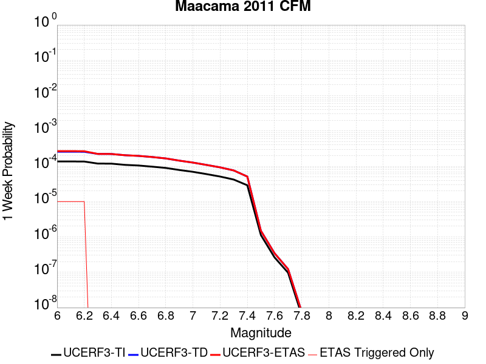 |  |  |  |

| Magnitude | 1 wk TI Prob | 1 wk TD Prob | 1 wk ETAS Prob | 1 wk ETAS/TD Gain | 1 wk ETAS Triggered Only | 1 mo TI Prob | 1 mo TD Prob | 1 mo ETAS Prob | 1 mo ETAS/TD Gain | 1 mo ETAS Triggered Only | 1 yr TI Prob | 1 yr TD Prob | 1 yr ETAS Prob | 1 yr ETAS/TD Gain | 1 yr ETAS Triggered Only | 10 yr TI Prob | 10 yr TD Prob | 10 yr ETAS Prob | 10 yr ETAS/TD Gain | 10 yr ETAS Triggered Only |
|-----|-----|-----|-----|-----|-----|-----|-----|-----|-----|-----|-----|-----|-----|-----|-----|-----|-----|-----|-----|-----|
| 6.0 | 1.368203E-4 | 2.5787868E-4 | 2.678761E-4 | 1.0387679 | 1.0E-5 | 5.862409E-4 | 0.0011047312 | 0.0011147201 | 1.009042 | 1.0E-5 | 0.0071141496 | 0.013350483 | 0.013360349 | 1.000739 | 1.0E-5 | 0.06890667 | 0.124189645 | 0.1241984 | 1.0000706 | 1.0E-5 |
| 6.1 | 1.368203E-4 | 2.5787868E-4 | 2.678761E-4 | 1.0387679 | 1.0E-5 | 5.862409E-4 | 0.0011047312 | 0.0011147201 | 1.009042 | 1.0E-5 | 0.0071141496 | 0.013350483 | 0.013360349 | 1.000739 | 1.0E-5 | 0.06890667 | 0.124189645 | 0.1241984 | 1.0000706 | 1.0E-5 |
| 6.2 | 1.360743E-4 | 2.566255E-4 | 2.6662293E-4 | 1.0389572 | 1.0E-5 | 5.8304524E-4 | 0.001099365 | 0.001109354 | 1.0090861 | 1.0E-5 | 0.007075496 | 0.013286048 | 0.013295914 | 1.0007427 | 1.0E-5 | 0.06854413 | 0.12362404 | 0.12363281 | 1.0000709 | 1.0E-5 |
| 6.3 | 1.1917239E-4 | 2.235362E-4 | 2.235362E-4 | 1.0 | 0.0 | 5.1063887E-4 | 9.5765886E-4 | 9.5765886E-4 | 1.0 | 0.0 | 0.0061993203 | 0.011587509 | 0.011587509 | 1.0 | 0.0 | 0.060292065 | 0.10884413 | 0.10884413 | 1.0 | 0.0 |
| 6.4 | 1.1859289E-4 | 2.2257185E-4 | 2.2257185E-4 | 1.0 | 0.0 | 5.0815626E-4 | 9.535289E-4 | 9.535289E-4 | 1.0 | 0.0 | 0.006169266 | 0.0115378285 | 0.0115378285 | 1.0 | 0.0 | 0.06000784 | 0.108401 | 0.108401 | 1.0 | 0.0 |
| 6.5 | 1.09512424E-4 | 2.0515872E-4 | 2.0515872E-4 | 1.0 | 0.0 | 4.6925453E-4 | 8.789523E-4 | 8.789523E-4 | 1.0 | 0.0 | 0.005698218 | 0.01063927 | 0.01063927 | 1.0 | 0.0 | 0.055543028 | 0.100493506 | 0.100493506 | 1.0 | 0.0 |
| 6.6 | 1.0502928E-4 | 1.9674368E-4 | 1.9674368E-4 | 1.0 | 0.0 | 4.500478E-4 | 8.4291224E-4 | 8.4291224E-4 | 1.0 | 0.0 | 0.0054655746 | 0.01020536 | 0.01020536 | 1.0 | 0.0 | 0.053330887 | 0.096646085 | 0.096646085 | 1.0 | 0.0 |
| 6.7 | 9.739358E-5 | 1.825636E-4 | 1.825636E-4 | 1.0 | 0.0 | 4.173343E-4 | 7.821781E-4 | 7.821781E-4 | 1.0 | 0.0 | 0.0050692135 | 0.009475501 | 0.009475501 | 1.0 | 0.0 | 0.049551267 | 0.090118766 | 0.090118766 | 1.0 | 0.0 |
| 6.8 | 8.969524E-5 | 1.6657855E-4 | 1.6657855E-4 | 1.0 | 0.0 | 3.8435153E-4 | 7.1370887E-4 | 7.1370887E-4 | 1.0 | 0.0 | 0.0046694432 | 0.008649083 | 0.008649083 | 1.0 | 0.0 | 0.045725387 | 0.082651116 | 0.082651116 | 1.0 | 0.0 |
| 6.9 | 7.838291E-5 | 1.4417822E-4 | 1.4417822E-4 | 1.0 | 0.0 | 3.358835E-4 | 6.177581E-4 | 6.177581E-4 | 1.0 | 0.0 | 0.0040817154 | 0.007491799 | 0.007491799 | 1.0 | 0.0 | 0.04007554 | 0.07205178 | 0.07205178 | 1.0 | 0.0 |
| 7.0 | 6.961957E-5 | 1.270709E-4 | 1.270709E-4 | 1.0 | 0.0 | 2.9833548E-4 | 5.4447335E-4 | 5.4447335E-4 | 1.0 | 0.0 | 0.0036261857 | 0.006606736 | 0.006606736 | 1.0 | 0.0 | 0.035675827 | 0.063870616 | 0.063870616 | 1.0 | 0.0 |
| 7.1 | 5.999398E-5 | 1.0904674E-4 | 1.0904674E-4 | 1.0 | 0.0 | 2.570917E-4 | 4.6726142E-4 | 4.6726142E-4 | 1.0 | 0.0 | 0.0031255994 | 0.0056728474 | 0.0056728474 | 1.0 | 0.0 | 0.030820016 | 0.055138282 | 0.055138282 | 1.0 | 0.0 |
| 7.2 | 5.116532E-5 | 9.3055336E-5 | 9.3055336E-5 | 1.0 | 0.0 | 2.1926152E-4 | 3.9875024E-4 | 3.9875024E-4 | 1.0 | 0.0 | 0.002666241 | 0.004843103 | 0.004843103 | 1.0 | 0.0 | 0.026344774 | 0.04730284 | 0.04730284 | 1.0 | 0.0 |
| 7.3 | 4.2087835E-5 | 7.617328E-5 | 7.617328E-5 | 1.0 | 0.0 | 1.8036396E-4 | 3.2641852E-4 | 3.2641852E-4 | 1.0 | 0.0 | 0.0021937196 | 0.0039661685 | 0.0039661685 | 1.0 | 0.0 | 0.0217219 | 0.038904376 | 0.038904376 | 1.0 | 0.0 |
| 7.4 | 2.8991652E-5 | 5.1167233E-5 | 5.1167233E-5 | 1.0 | 0.0 | 1.2424402E-4 | 2.1927188E-4 | 2.1927188E-4 | 1.0 | 0.0 | 0.0015116213 | 0.0026660617 | 0.0026660617 | 1.0 | 0.0 | 0.015013801 | 0.026331667 | 0.026331667 | 1.0 | 0.0 |
| 7.5 | 1.1292299E-6 | 1.4950161E-6 | 1.4950161E-6 | 1.0 | 0.0 | 4.8395473E-6 | 6.4072037E-6 | 6.4072037E-6 | 1.0 | 0.0 | 5.8919897E-5 | 7.800615E-5 | 7.800615E-5 | 1.0 | 0.0 | 5.890428E-4 | 7.8048074E-4 | 7.8048074E-4 | 1.0 | 0.0 |
| 7.6 | 2.6535366E-7 | 3.4720597E-7 | 3.4720597E-7 | 1.0 | 0.0 | 1.1372296E-6 | 1.4880247E-6 | 1.4880247E-6 | 1.0 | 0.0 | 1.3845682E-5 | 1.8116552E-5 | 1.8116552E-5 | 1.0 | 0.0 | 1.3844819E-4 | 1.816747E-4 | 1.816747E-4 | 1.0 | 0.0 |
| 7.7 | 9.727789E-8 | 1.2302169E-7 | 1.2302169E-7 | 1.0 | 0.0 | 4.1690518E-7 | 5.2723567E-7 | 5.2723567E-7 | 1.0 | 0.0 | 5.0758085E-6 | 6.419076E-6 | 6.419076E-6 | 1.0 | 0.0 | 5.0756928E-5 | 6.45712E-5 | 6.45712E-5 | 1.0 | 0.0 |
| 7.8 | 6.1939325E-9 | 7.711523E-9 | 7.711523E-9 | 1.0 | 0.0 | 2.6545425E-8 | 3.3049385E-8 | 3.3049385E-8 | 1.0 | 0.0 | 3.231905E-7 | 4.0237617E-7 | 4.0237617E-7 | 1.0 | 0.0 | 3.2319003E-6 | 4.0598557E-6 | 4.0598557E-6 | 1.0 | 0.0 |

## Redondo Canyon alt 1
*[(top)](#table-of-contents)*

| 1 Week | 1 Month | 1 Year | 10 Year |
|-----|-----|-----|-----|
|  |  |  |  |

| Magnitude | 1 wk TI Prob | 1 wk TD Prob | 1 wk ETAS Prob | 1 wk ETAS/TD Gain | 1 wk ETAS Triggered Only | 1 mo TI Prob | 1 mo TD Prob | 1 mo ETAS Prob | 1 mo ETAS/TD Gain | 1 mo ETAS Triggered Only | 1 yr TI Prob | 1 yr TD Prob | 1 yr ETAS Prob | 1 yr ETAS/TD Gain | 1 yr ETAS Triggered Only | 10 yr TI Prob | 10 yr TD Prob | 10 yr ETAS Prob | 10 yr ETAS/TD Gain | 10 yr ETAS Triggered Only |
|-----|-----|-----|-----|-----|-----|-----|-----|-----|-----|-----|-----|-----|-----|-----|-----|-----|-----|-----|-----|-----|
| 6.0 | 1.0346246E-5 | 1.09813445E-5 | 2.0981235E-5 | 1.9106253 | 1.0E-5 | 4.43403E-5 | 4.7062502E-5 | 5.7062032E-5 | 1.2124734 | 1.0E-5 | 5.3970946E-4 | 5.729142E-4 | 5.829085E-4 | 1.0174446 | 1.0E-5 | 0.0053840056 | 0.005722111 | 0.005732054 | 1.0017376 | 1.0E-5 |
| 6.1 | 1.0346246E-5 | 1.09813445E-5 | 2.0981235E-5 | 1.9106253 | 1.0E-5 | 4.43403E-5 | 4.7062502E-5 | 5.7062032E-5 | 1.2124734 | 1.0E-5 | 5.3970946E-4 | 5.729142E-4 | 5.829085E-4 | 1.0174446 | 1.0E-5 | 0.0053840056 | 0.005722111 | 0.005732054 | 1.0017376 | 1.0E-5 |
| 6.2 | 1.0346246E-5 | 1.09813445E-5 | 2.0981235E-5 | 1.9106253 | 1.0E-5 | 4.43403E-5 | 4.7062502E-5 | 5.7062032E-5 | 1.2124734 | 1.0E-5 | 5.3970946E-4 | 5.729142E-4 | 5.829085E-4 | 1.0174446 | 1.0E-5 | 0.0053840056 | 0.005722111 | 0.005732054 | 1.0017376 | 1.0E-5 |
| 6.3 | 3.2052794E-6 | 3.2361174E-6 | 3.2361174E-6 | 1.0 | 0.0 | 1.373684E-5 | 1.3869023E-5 | 1.3869023E-5 | 1.0 | 0.0 | 1.6723319E-4 | 1.6884625E-4 | 1.6884625E-4 | 1.0 | 0.0 | 0.001671074 | 0.0016875692 | 0.0016875692 | 1.0 | 0.0 |
| 6.4 | 3.2052794E-6 | 3.2361174E-6 | 3.2361174E-6 | 1.0 | 0.0 | 1.373684E-5 | 1.3869023E-5 | 1.3869023E-5 | 1.0 | 0.0 | 1.6723319E-4 | 1.6884625E-4 | 1.6884625E-4 | 1.0 | 0.0 | 0.001671074 | 0.0016875692 | 0.0016875692 | 1.0 | 0.0 |
| 6.5 | 3.2052794E-6 | 3.2361174E-6 | 3.2361174E-6 | 1.0 | 0.0 | 1.373684E-5 | 1.3869023E-5 | 1.3869023E-5 | 1.0 | 0.0 | 1.6723319E-4 | 1.6884625E-4 | 1.6884625E-4 | 1.0 | 0.0 | 0.001671074 | 0.0016875692 | 0.0016875692 | 1.0 | 0.0 |
| 6.6 | 1.948328E-6 | 1.8288681E-6 | 1.8288681E-6 | 1.0 | 0.0 | 8.349951E-6 | 7.837991E-6 | 7.837991E-6 | 1.0 | 0.0 | 1.016559E-4 | 9.542486E-5 | 9.542486E-5 | 1.0 | 0.0 | 0.0010160941 | 9.539858E-4 | 9.539858E-4 | 1.0 | 0.0 |
| 6.7 | 1.948328E-6 | 1.8288681E-6 | 1.8288681E-6 | 1.0 | 0.0 | 8.349951E-6 | 7.837991E-6 | 7.837991E-6 | 1.0 | 0.0 | 1.016559E-4 | 9.542486E-5 | 9.542486E-5 | 1.0 | 0.0 | 0.0010160941 | 9.539858E-4 | 9.539858E-4 | 1.0 | 0.0 |
| 6.8 | 1.1278219E-6 | 9.033076E-7 | 9.033076E-7 | 1.0 | 0.0 | 4.8335132E-6 | 3.871315E-6 | 3.871315E-6 | 1.0 | 0.0 | 5.8846435E-5 | 4.7132668E-5 | 4.7132668E-5 | 1.0 | 0.0 | 5.8830855E-4 | 4.7126875E-4 | 4.7126875E-4 | 1.0 | 0.0 |
| 6.9 | 1.1278219E-6 | 9.033076E-7 | 9.033076E-7 | 1.0 | 0.0 | 4.8335132E-6 | 3.871315E-6 | 3.871315E-6 | 1.0 | 0.0 | 5.8846435E-5 | 4.7132668E-5 | 4.7132668E-5 | 1.0 | 0.0 | 5.8830855E-4 | 4.7126875E-4 | 4.7126875E-4 | 1.0 | 0.0 |
| 7.0 | 1.1278219E-6 | 9.033076E-7 | 9.033076E-7 | 1.0 | 0.0 | 4.8335132E-6 | 3.871315E-6 | 3.871315E-6 | 1.0 | 0.0 | 5.8846435E-5 | 4.7132668E-5 | 4.7132668E-5 | 1.0 | 0.0 | 5.8830855E-4 | 4.7126875E-4 | 4.7126875E-4 | 1.0 | 0.0 |
| 7.1 | 1.0545139E-6 | 8.5692716E-7 | 8.5692716E-7 | 1.0 | 0.0 | 4.5193374E-6 | 3.6725423E-6 | 3.6725423E-6 | 1.0 | 0.0 | 5.5021545E-5 | 4.471271E-5 | 4.471271E-5 | 1.0 | 0.0 | 5.500792E-4 | 4.470789E-4 | 4.470789E-4 | 1.0 | 0.0 |
| 7.2 | 1.0545139E-6 | 8.5692716E-7 | 8.5692716E-7 | 1.0 | 0.0 | 4.5193374E-6 | 3.6725423E-6 | 3.6725423E-6 | 1.0 | 0.0 | 5.5021545E-5 | 4.471271E-5 | 4.471271E-5 | 1.0 | 0.0 | 5.500792E-4 | 4.470789E-4 | 4.470789E-4 | 1.0 | 0.0 |
| 7.3 | 9.505161E-8 | 5.8957607E-8 | 5.8957607E-8 | 1.0 | 0.0 | 4.0736398E-7 | 2.5267545E-7 | 2.5267545E-7 | 1.0 | 0.0 | 4.959645E-6 | 3.0763204E-6 | 3.0763204E-6 | 1.0 | 0.0 | 4.9595343E-5 | 3.0762894E-5 | 3.0762894E-5 | 1.0 | 0.0 |
| 7.4 | 3.9520785E-8 | 2.6987191E-8 | 2.6987191E-8 | 1.0 | 0.0 | 1.6937479E-7 | 1.1565938E-7 | 1.1565938E-7 | 1.0 | 0.0 | 2.062136E-6 | 1.4081523E-6 | 1.4081523E-6 | 1.0 | 0.0 | 2.062117E-5 | 1.4081461E-5 | 1.4081461E-5 | 1.0 | 0.0 |
| 7.5 | 5.6133214E-9 | 3.7368215E-9 | 3.7368215E-9 | 1.0 | 0.0 | 2.4057092E-8 | 1.601495E-8 | 1.601495E-8 | 1.0 | 0.0 | 2.9289507E-7 | 1.9498201E-7 | 1.9498201E-7 | 1.0 | 0.0 | 2.9289467E-6 | 1.9498186E-6 | 1.9498186E-6 | 1.0 | 0.0 |
| 7.6 | 4.1064334E-9 | 2.5957634E-9 | 2.5957634E-9 | 1.0 | 0.0 | 1.7599E-8 | 1.11247E-8 | 1.11247E-8 | 1.0 | 0.0 | 2.142678E-7 | 1.3544322E-7 | 1.3544322E-7 | 1.0 | 0.0 | 2.1426758E-6 | 1.3544316E-6 | 1.3544316E-6 | 1.0 | 0.0 |
| 7.7 | 1.361975E-9 | 6.360824E-10 | 6.360824E-10 | 1.0 | 0.0 | 5.8370353E-9 | 2.7260674E-9 | 2.7260674E-9 | 1.0 | 0.0 | 7.1065905E-8 | 3.318987E-8 | 3.318987E-8 | 1.0 | 0.0 | 7.106588E-7 | 3.318987E-7 | 3.318987E-7 | 1.0 | 0.0 |
| 7.8 | 1.361975E-9 | 6.360824E-10 | 6.360824E-10 | 1.0 | 0.0 | 5.8370353E-9 | 2.7260674E-9 | 2.7260674E-9 | 1.0 | 0.0 | 7.1065905E-8 | 3.318987E-8 | 3.318987E-8 | 1.0 | 0.0 | 7.106588E-7 | 3.318987E-7 | 3.318987E-7 | 1.0 | 0.0 |

## Pittville 2011 CFM
*[(top)](#table-of-contents)*

| 1 Week | 1 Month | 1 Year | 10 Year |
|-----|-----|-----|-----|
|  |  | 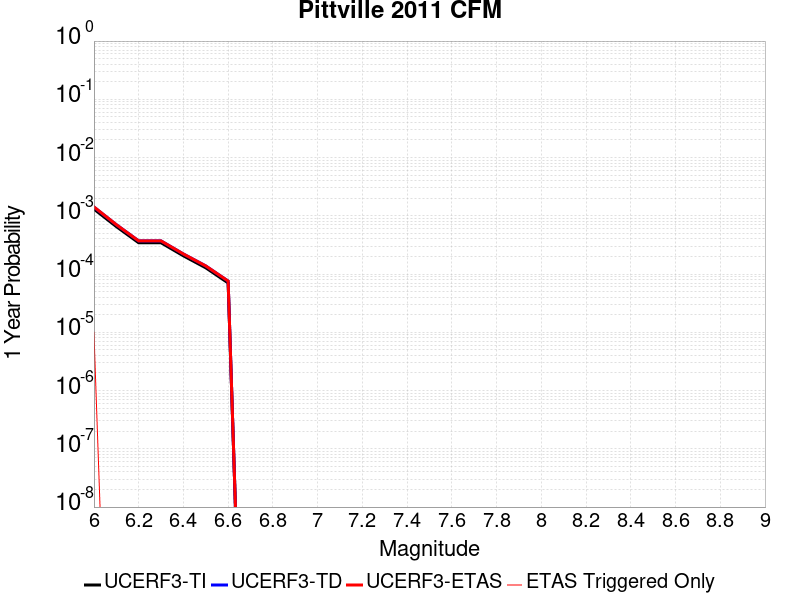 |  |

| Magnitude | 1 wk TI Prob | 1 wk TD Prob | 1 wk ETAS Prob | 1 wk ETAS/TD Gain | 1 wk ETAS Triggered Only | 1 mo TI Prob | 1 mo TD Prob | 1 mo ETAS Prob | 1 mo ETAS/TD Gain | 1 mo ETAS Triggered Only | 1 yr TI Prob | 1 yr TD Prob | 1 yr ETAS Prob | 1 yr ETAS/TD Gain | 1 yr ETAS Triggered Only | 10 yr TI Prob | 10 yr TD Prob | 10 yr ETAS Prob | 10 yr ETAS/TD Gain | 10 yr ETAS Triggered Only |
|-----|-----|-----|-----|-----|-----|-----|-----|-----|-----|-----|-----|-----|-----|-----|-----|-----|-----|-----|-----|-----|
| 6.0 | 2.5031832E-5 | 2.7056969E-5 | 3.70567E-5 | 1.3695805 | 1.0E-5 | 1.0727487E-4 | 1.1595384E-4 | 1.2595268E-4 | 1.0862312 | 1.0E-5 | 0.001305289 | 0.0014109211 | 0.001420907 | 1.0070776 | 1.0E-5 | 0.012976485 | 0.014029415 | 0.014039275 | 1.0007027 | 1.0E-5 |
| 6.1 | 1.2540113E-5 | 1.3513067E-5 | 1.3513067E-5 | 1.0 | 0.0 | 5.3742235E-5 | 5.7911984E-5 | 5.7911984E-5 | 1.0 | 0.0 | 6.541153E-4 | 7.048728E-4 | 7.048728E-4 | 1.0 | 0.0 | 0.0065219323 | 0.0070286044 | 0.0070286044 | 1.0 | 0.0 |
| 6.2 | 6.603218E-6 | 7.107189E-6 | 7.107189E-6 | 1.0 | 0.0 | 2.8299199E-5 | 3.0459063E-5 | 3.0459063E-5 | 1.0 | 0.0 | 3.4448825E-4 | 3.7078248E-4 | 3.7078248E-4 | 1.0 | 0.0 | 0.0034395473 | 0.0037022792 | 0.0037022792 | 1.0 | 0.0 |
| 6.3 | 6.603218E-6 | 7.107189E-6 | 7.107189E-6 | 1.0 | 0.0 | 2.8299199E-5 | 3.0459063E-5 | 3.0459063E-5 | 1.0 | 0.0 | 3.4448825E-4 | 3.7078248E-4 | 3.7078248E-4 | 1.0 | 0.0 | 0.0034395473 | 0.0037022792 | 0.0037022792 | 1.0 | 0.0 |
| 6.4 | 3.9389015E-6 | 4.239175E-6 | 4.239175E-6 | 1.0 | 0.0 | 1.6880897E-5 | 1.8167784E-5 | 1.8167784E-5 | 1.0 | 0.0 | 2.0550552E-4 | 2.2117342E-4 | 2.2117342E-4 | 1.0 | 0.0 | 0.0020531558 | 0.002209838 | 0.002209838 | 1.0 | 0.0 |
| 6.5 | 2.4533072E-6 | 2.6412686E-6 | 2.6412686E-6 | 1.0 | 0.0 | 1.0514132E-5 | 1.1319685E-5 | 1.1319685E-5 | 1.0 | 0.0 | 1.2800204E-4 | 1.3781038E-4 | 1.3781038E-4 | 1.0 | 0.0 | 0.0012792832 | 0.0013774394 | 0.0013774394 | 1.0 | 0.0 |
| 6.6 | 1.3482367E-6 | 1.452993E-6 | 1.452993E-6 | 1.0 | 0.0 | 5.778144E-6 | 6.2271047E-6 | 6.2271047E-6 | 1.0 | 0.0 | 7.0346636E-5 | 7.58135E-5 | 7.58135E-5 | 1.0 | 0.0 | 7.032437E-4 | 7.5798744E-4 | 7.5798744E-4 | 1.0 | 0.0 |

## Las Positas
*[(top)](#table-of-contents)*

| 1 Week | 1 Month | 1 Year | 10 Year |
|-----|-----|-----|-----|
|  |  |  | 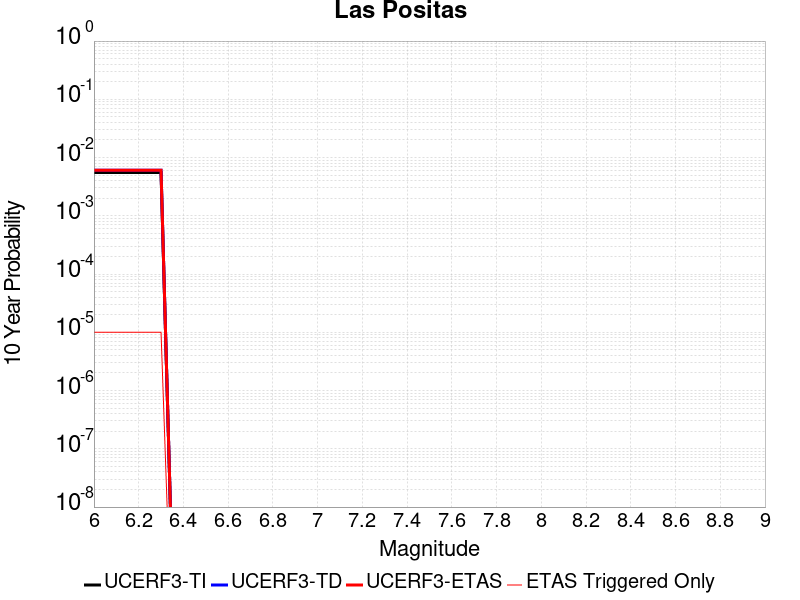 |

| Magnitude | 1 wk TI Prob | 1 wk TD Prob | 1 wk ETAS Prob | 1 wk ETAS/TD Gain | 1 wk ETAS Triggered Only | 1 mo TI Prob | 1 mo TD Prob | 1 mo ETAS Prob | 1 mo ETAS/TD Gain | 1 mo ETAS Triggered Only | 1 yr TI Prob | 1 yr TD Prob | 1 yr ETAS Prob | 1 yr ETAS/TD Gain | 1 yr ETAS Triggered Only | 10 yr TI Prob | 10 yr TD Prob | 10 yr ETAS Prob | 10 yr ETAS/TD Gain | 10 yr ETAS Triggered Only |
|-----|-----|-----|-----|-----|-----|-----|-----|-----|-----|-----|-----|-----|-----|-----|-----|-----|-----|-----|-----|-----|
| 6.0 | 1.0659424E-5 | 1.15911225E-5 | 1.15911225E-5 | 1.0 | 0.0 | 4.568245E-5 | 4.9676237E-5 | 4.9676237E-5 | 1.0 | 0.0 | 5.560419E-4 | 6.048082E-4 | 6.148022E-4 | 1.0165242 | 1.0E-5 | 0.005546526 | 0.006048082 | 0.0060580214 | 1.0016434 | 1.0E-5 |
| 6.1 | 1.0659424E-5 | 1.15911225E-5 | 1.15911225E-5 | 1.0 | 0.0 | 4.568245E-5 | 4.9676237E-5 | 4.9676237E-5 | 1.0 | 0.0 | 5.560419E-4 | 6.048082E-4 | 6.148022E-4 | 1.0165242 | 1.0E-5 | 0.005546526 | 0.006048082 | 0.0060580214 | 1.0016434 | 1.0E-5 |
| 6.2 | 1.0659424E-5 | 1.15911225E-5 | 1.15911225E-5 | 1.0 | 0.0 | 4.568245E-5 | 4.9676237E-5 | 4.9676237E-5 | 1.0 | 0.0 | 5.560419E-4 | 6.048082E-4 | 6.148022E-4 | 1.0165242 | 1.0E-5 | 0.005546526 | 0.006048082 | 0.0060580214 | 1.0016434 | 1.0E-5 |
| 6.3 | 1.0659424E-5 | 1.15911225E-5 | 1.15911225E-5 | 1.0 | 0.0 | 4.568245E-5 | 4.9676237E-5 | 4.9676237E-5 | 1.0 | 0.0 | 5.560419E-4 | 6.048082E-4 | 6.148022E-4 | 1.0165242 | 1.0E-5 | 0.005546526 | 0.006048082 | 0.0060580214 | 1.0016434 | 1.0E-5 |

## Simi-Santa Rosa
*[(top)](#table-of-contents)*

| 1 Week | 1 Month | 1 Year | 10 Year |
|-----|-----|-----|-----|
|  | 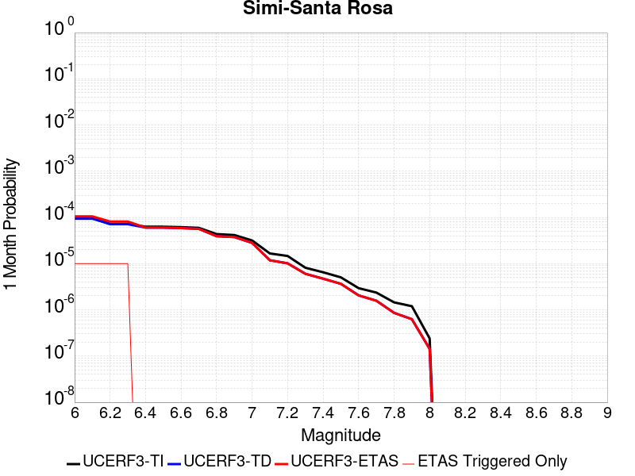 |  | 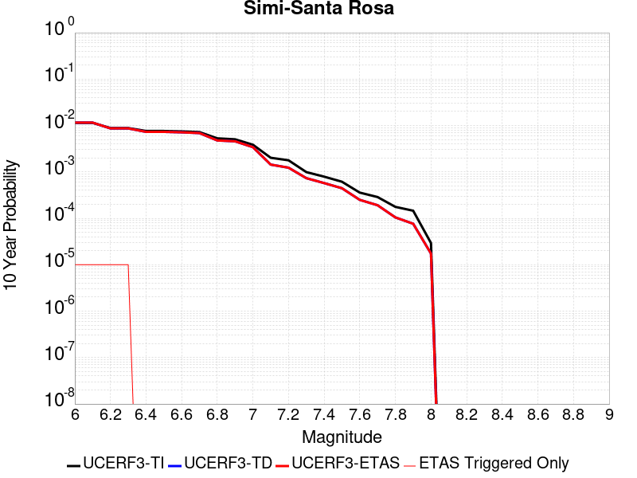 |

| Magnitude | 1 wk TI Prob | 1 wk TD Prob | 1 wk ETAS Prob | 1 wk ETAS/TD Gain | 1 wk ETAS Triggered Only | 1 mo TI Prob | 1 mo TD Prob | 1 mo ETAS Prob | 1 mo ETAS/TD Gain | 1 mo ETAS Triggered Only | 1 yr TI Prob | 1 yr TD Prob | 1 yr ETAS Prob | 1 yr ETAS/TD Gain | 1 yr ETAS Triggered Only | 10 yr TI Prob | 10 yr TD Prob | 10 yr ETAS Prob | 10 yr ETAS/TD Gain | 10 yr ETAS Triggered Only |
|-----|-----|-----|-----|-----|-----|-----|-----|-----|-----|-----|-----|-----|-----|-----|-----|-----|-----|-----|-----|-----|
| 6.0 | 2.198912E-5 | 2.2275442E-5 | 3.227522E-5 | 1.4489149 | 1.0E-5 | 9.4235686E-5 | 9.5462936E-5 | 1.0546198E-4 | 1.1047426 | 1.0E-5 | 0.0011467156 | 0.0011616853 | 0.0011716738 | 1.0085982 | 1.0E-5 | 0.011408163 | 0.011560575 | 0.011570459 | 1.000855 | 1.0E-5 |
| 6.1 | 2.198912E-5 | 2.2275442E-5 | 3.227522E-5 | 1.4489149 | 1.0E-5 | 9.4235686E-5 | 9.5462936E-5 | 1.0546198E-4 | 1.1047426 | 1.0E-5 | 0.0011467156 | 0.0011616853 | 0.0011716738 | 1.0085982 | 1.0E-5 | 0.011408163 | 0.011560575 | 0.011570459 | 1.000855 | 1.0E-5 |
| 6.2 | 1.69983E-5 | 1.6668559E-5 | 2.6668393E-5 | 1.5999218 | 1.0E-5 | 7.284782E-5 | 7.143489E-5 | 8.143418E-5 | 1.1399776 | 1.0E-5 | 8.865613E-4 | 8.6940196E-4 | 8.7939325E-4 | 1.0114921 | 1.0E-5 | 0.008830327 | 0.008662928 | 0.008672841 | 1.0011443 | 1.0E-5 |
| 6.3 | 1.69983E-5 | 1.6668559E-5 | 2.6668393E-5 | 1.5999218 | 1.0E-5 | 7.284782E-5 | 7.143489E-5 | 8.143418E-5 | 1.1399776 | 1.0E-5 | 8.865613E-4 | 8.6940196E-4 | 8.7939325E-4 | 1.0114921 | 1.0E-5 | 0.008830327 | 0.008662928 | 0.008672841 | 1.0011443 | 1.0E-5 |
| 6.4 | 1.4666188E-5 | 1.4052543E-5 | 1.4052543E-5 | 1.0 | 0.0 | 6.285358E-5 | 6.0223934E-5 | 6.0223934E-5 | 1.0 | 0.0 | 7.6497364E-4 | 7.3300465E-4 | 7.3300465E-4 | 1.0 | 0.0 | 0.0076234564 | 0.007308344 | 0.007308344 | 1.0 | 0.0 |
| 6.5 | 1.4666188E-5 | 1.4052543E-5 | 1.4052543E-5 | 1.0 | 0.0 | 6.285358E-5 | 6.0223934E-5 | 6.0223934E-5 | 1.0 | 0.0 | 7.6497364E-4 | 7.3300465E-4 | 7.3300465E-4 | 1.0 | 0.0 | 0.0076234564 | 0.007308344 | 0.007308344 | 1.0 | 0.0 |
| 6.6 | 1.4377586E-5 | 1.3729583E-5 | 1.3729583E-5 | 1.0 | 0.0 | 6.1616774E-5 | 5.883988E-5 | 5.883988E-5 | 1.0 | 0.0 | 7.4992597E-4 | 7.1616494E-4 | 7.1616494E-4 | 1.0 | 0.0 | 0.007474003 | 0.0071410383 | 0.0071410383 | 1.0 | 0.0 |
| 6.7 | 1.3881404E-5 | 1.320755E-5 | 1.320755E-5 | 1.0 | 0.0 | 5.9490372E-5 | 5.66027E-5 | 5.66027E-5 | 1.0 | 0.0 | 7.240546E-4 | 6.8894465E-4 | 6.8894465E-4 | 1.0 | 0.0 | 0.007217 | 0.006870538 | 0.006870538 | 1.0 | 0.0 |
| 6.8 | 1.0176516E-5 | 9.154151E-6 | 9.154151E-6 | 1.0 | 0.0 | 4.3612912E-5 | 3.9231574E-5 | 3.9231574E-5 | 1.0 | 0.0 | 5.308578E-4 | 4.7755634E-4 | 4.7755634E-4 | 1.0 | 0.0 | 0.0052959146 | 0.004766934 | 0.004766934 | 1.0 | 0.0 |
| 6.9 | 9.699797E-6 | 8.774719E-6 | 8.774719E-6 | 1.0 | 0.0 | 4.15699E-5 | 3.7605492E-5 | 3.7605492E-5 | 1.0 | 0.0 | 5.05996E-4 | 4.577671E-4 | 4.577671E-4 | 1.0 | 0.0 | 0.005048454 | 0.0045698597 | 0.0045698597 | 1.0 | 0.0 |
| 7.0 | 7.4049476E-6 | 6.559333E-6 | 6.559333E-6 | 1.0 | 0.0 | 3.1735104E-5 | 2.8111197E-5 | 2.8111197E-5 | 1.0 | 0.0 | 3.8630638E-4 | 3.422127E-4 | 3.422127E-4 | 1.0 | 0.0 | 0.0038563553 | 0.0034180996 | 0.0034180996 | 1.0 | 0.0 |
| 7.1 | 3.873439E-6 | 2.7595095E-6 | 2.7595095E-6 | 1.0 | 0.0 | 1.6600346E-5 | 1.1826417E-5 | 1.1826417E-5 | 1.0 | 0.0 | 2.0209046E-4 | 1.4397735E-4 | 1.4397735E-4 | 1.0 | 0.0 | 0.0020190678 | 0.0014388643 | 0.0014388643 | 1.0 | 0.0 |
| 7.2 | 3.417706E-6 | 2.3676484E-6 | 2.3676484E-6 | 1.0 | 0.0 | 1.4647229E-5 | 1.0147027E-5 | 1.0147027E-5 | 1.0 | 0.0 | 1.7831543E-4 | 1.2353327E-4 | 1.2353327E-4 | 1.0 | 0.0 | 0.0017817242 | 0.0012346683 | 0.0012346683 | 1.0 | 0.0 |
| 7.3 | 1.90225E-6 | 1.4073753E-6 | 1.4073753E-6 | 1.0 | 0.0 | 8.152474E-6 | 6.0315947E-6 | 6.0315947E-6 | 1.0 | 0.0 | 9.9251854E-5 | 7.343221E-5 | 7.343221E-5 | 1.0 | 0.0 | 9.920754E-4 | 7.340817E-4 | 7.340817E-4 | 1.0 | 0.0 |
| 7.4 | 1.5170556E-6 | 1.1024773E-6 | 1.1024773E-6 | 1.0 | 0.0 | 6.5016507E-6 | 4.724894E-6 | 4.724894E-6 | 1.0 | 0.0 | 7.915472E-5 | 5.7524077E-5 | 5.7524077E-5 | 1.0 | 0.0 | 7.9126534E-4 | 5.7509297E-4 | 5.7509297E-4 | 1.0 | 0.0 |
| 7.5 | 1.178732E-6 | 8.535102E-7 | 8.535102E-7 | 1.0 | 0.0 | 5.0516987E-6 | 3.6578958E-6 | 3.6578958E-6 | 1.0 | 0.0 | 6.1502695E-5 | 4.453398E-5 | 4.453398E-5 | 1.0 | 0.0 | 6.148568E-4 | 4.452515E-4 | 4.452515E-4 | 1.0 | 0.0 |
| 7.6 | 6.8722386E-7 | 4.793198E-7 | 4.793198E-7 | 1.0 | 0.0 | 2.9452417E-6 | 2.054226E-6 | 2.054226E-6 | 1.0 | 0.0 | 3.5857727E-5 | 2.5009915E-5 | 2.5009915E-5 | 1.0 | 0.0 | 3.5851944E-4 | 2.5007114E-4 | 2.5007114E-4 | 1.0 | 0.0 |
| 7.7 | 5.5126515E-7 | 3.6731157E-7 | 3.6731157E-7 | 1.0 | 0.0 | 2.3625628E-6 | 1.5741915E-6 | 1.5741915E-6 | 1.0 | 0.0 | 2.8763823E-5 | 1.9165615E-5 | 1.9165615E-5 | 1.0 | 0.0 | 2.87601E-4 | 1.9163972E-4 | 1.9163972E-4 | 1.0 | 0.0 |
| 7.8 | 3.3860243E-7 | 2.0075942E-7 | 2.0075942E-7 | 1.0 | 0.0 | 1.4511525E-6 | 8.6039717E-7 | 8.6039717E-7 | 1.0 | 0.0 | 1.7667637E-5 | 1.0475286E-5 | 1.0475286E-5 | 1.0 | 0.0 | 1.7666233E-4 | 1.04747975E-4 | 1.04747975E-4 | 1.0 | 0.0 |
| 7.9 | 2.7955386E-7 | 1.4649108E-7 | 1.4649108E-7 | 1.0 | 0.0 | 1.1980875E-6 | 6.278188E-7 | 6.278188E-7 | 1.0 | 0.0 | 1.4586617E-5 | 7.643667E-6 | 7.643667E-6 | 1.0 | 0.0 | 1.458566E-4 | 7.643409E-5 | 7.643409E-5 | 1.0 | 0.0 |
| 8.0 | 5.6259015E-8 | 3.3355324E-8 | 3.3355324E-8 | 1.0 | 0.0 | 2.4111003E-7 | 1.4295138E-7 | 1.4295138E-7 | 1.0 | 0.0 | 2.9355108E-6 | 1.7404317E-6 | 1.7404317E-6 | 1.0 | 0.0 | 2.935472E-5 | 1.7404194E-5 | 1.7404194E-5 | 1.0 | 0.0 |

## Elsinore (Julian)
*[(top)](#table-of-contents)*

| 1 Week | 1 Month | 1 Year | 10 Year |
|-----|-----|-----|-----|
|  |  |  |  |

| Magnitude | 1 wk TI Prob | 1 wk TD Prob | 1 wk ETAS Prob | 1 wk ETAS/TD Gain | 1 wk ETAS Triggered Only | 1 mo TI Prob | 1 mo TD Prob | 1 mo ETAS Prob | 1 mo ETAS/TD Gain | 1 mo ETAS Triggered Only | 1 yr TI Prob | 1 yr TD Prob | 1 yr ETAS Prob | 1 yr ETAS/TD Gain | 1 yr ETAS Triggered Only | 10 yr TI Prob | 10 yr TD Prob | 10 yr ETAS Prob | 10 yr ETAS/TD Gain | 10 yr ETAS Triggered Only |
|-----|-----|-----|-----|-----|-----|-----|-----|-----|-----|-----|-----|-----|-----|-----|-----|-----|-----|-----|-----|-----|
| 6.0 | 1.1710231E-5 | 8.845509E-6 | 1.884542E-5 | 2.1305072 | 1.0E-5 | 5.0185736E-5 | 3.7908783E-5 | 4.7908405E-5 | 1.2637811 | 1.0E-5 | 6.1084004E-4 | 4.614434E-4 | 4.7143875E-4 | 1.0216612 | 1.0E-5 | 0.006091637 | 0.0046050567 | 0.0046150107 | 1.0021615 | 1.0E-5 |
| 6.1 | 1.1710231E-5 | 8.845509E-6 | 1.884542E-5 | 2.1305072 | 1.0E-5 | 5.0185736E-5 | 3.7908783E-5 | 4.7908405E-5 | 1.2637811 | 1.0E-5 | 6.1084004E-4 | 4.614434E-4 | 4.7143875E-4 | 1.0216612 | 1.0E-5 | 0.006091637 | 0.0046050567 | 0.0046150107 | 1.0021615 | 1.0E-5 |
| 6.2 | 1.1710231E-5 | 8.845509E-6 | 1.884542E-5 | 2.1305072 | 1.0E-5 | 5.0185736E-5 | 3.7908783E-5 | 4.7908405E-5 | 1.2637811 | 1.0E-5 | 6.1084004E-4 | 4.614434E-4 | 4.7143875E-4 | 1.0216612 | 1.0E-5 | 0.006091637 | 0.0046050567 | 0.0046150107 | 1.0021615 | 1.0E-5 |
| 6.3 | 1.1710231E-5 | 8.845509E-6 | 1.884542E-5 | 2.1305072 | 1.0E-5 | 5.0185736E-5 | 3.7908783E-5 | 4.7908405E-5 | 1.2637811 | 1.0E-5 | 6.1084004E-4 | 4.614434E-4 | 4.7143875E-4 | 1.0216612 | 1.0E-5 | 0.006091637 | 0.0046050567 | 0.0046150107 | 1.0021615 | 1.0E-5 |
| 6.4 | 1.1710231E-5 | 8.845509E-6 | 1.884542E-5 | 2.1305072 | 1.0E-5 | 5.0185736E-5 | 3.7908783E-5 | 4.7908405E-5 | 1.2637811 | 1.0E-5 | 6.1084004E-4 | 4.614434E-4 | 4.7143875E-4 | 1.0216612 | 1.0E-5 | 0.006091637 | 0.0046050567 | 0.0046150107 | 1.0021615 | 1.0E-5 |
| 6.5 | 1.1710231E-5 | 8.845509E-6 | 1.884542E-5 | 2.1305072 | 1.0E-5 | 5.0185736E-5 | 3.7908783E-5 | 4.7908405E-5 | 1.2637811 | 1.0E-5 | 6.1084004E-4 | 4.614434E-4 | 4.7143875E-4 | 1.0216612 | 1.0E-5 | 0.006091637 | 0.0046050567 | 0.0046150107 | 1.0021615 | 1.0E-5 |
| 6.6 | 1.1650619E-5 | 8.777881E-6 | 1.8777793E-5 | 2.1392171 | 1.0E-5 | 4.993027E-5 | 3.7618956E-5 | 4.761858E-5 | 1.2658135 | 1.0E-5 | 6.0773146E-4 | 4.5791623E-4 | 4.6791165E-4 | 1.021828 | 1.0E-5 | 0.0060607214 | 0.004569931 | 0.004579885 | 1.0021782 | 1.0E-5 |
| 6.7 | 1.1650619E-5 | 8.777881E-6 | 1.8777793E-5 | 2.1392171 | 1.0E-5 | 4.993027E-5 | 3.7618956E-5 | 4.761858E-5 | 1.2658135 | 1.0E-5 | 6.0773146E-4 | 4.5791623E-4 | 4.6791165E-4 | 1.021828 | 1.0E-5 | 0.0060607214 | 0.004569931 | 0.004579885 | 1.0021782 | 1.0E-5 |
| 6.8 | 1.1442698E-5 | 8.561041E-6 | 1.8560955E-5 | 2.1680722 | 1.0E-5 | 4.9039216E-5 | 3.6689667E-5 | 4.66893E-5 | 1.2725463 | 1.0E-5 | 5.968889E-4 | 4.4660683E-4 | 4.5660237E-4 | 1.0223811 | 1.0E-5 | 0.0059528816 | 0.004457295 | 0.0044672503 | 1.0022335 | 1.0E-5 |
| 6.9 | 1.1300589E-5 | 8.408907E-6 | 1.8408824E-5 | 2.1892052 | 1.0E-5 | 4.8430196E-5 | 3.6037683E-5 | 4.6037323E-5 | 1.2774773 | 1.0E-5 | 5.894781E-4 | 4.3867214E-4 | 4.4866776E-4 | 1.022786 | 1.0E-5 | 0.005879169 | 0.0043782624 | 0.0043882183 | 1.002274 | 1.0E-5 |
| 7.0 | 1.1117729E-5 | 8.226087E-6 | 1.8226005E-5 | 2.2156348 | 1.0E-5 | 4.764654E-5 | 3.525419E-5 | 4.525384E-5 | 1.2836442 | 1.0E-5 | 5.799422E-4 | 4.291369E-4 | 4.3913262E-4 | 1.0232925 | 1.0E-5 | 0.0057843104 | 0.004283281 | 0.004293238 | 1.0023247 | 1.0E-5 |
| 7.1 | 1.08053955E-5 | 7.9117535E-6 | 1.7911674E-5 | 2.2639322 | 1.0E-5 | 4.6308014E-5 | 3.3907087E-5 | 4.3906748E-5 | 1.2949136 | 1.0E-5 | 5.6365423E-4 | 4.127422E-4 | 4.2273809E-4 | 1.0242182 | 1.0E-5 | 0.005622267 | 0.0041199517 | 0.004129911 | 1.0024172 | 1.0E-5 |
| 7.2 | 1.032804E-5 | 7.433021E-6 | 1.7432947E-5 | 2.345338 | 1.0E-5 | 4.4262277E-5 | 3.1855423E-5 | 4.1855106E-5 | 1.3139083 | 1.0E-5 | 5.387599E-4 | 3.8777234E-4 | 3.9776845E-4 | 1.0257783 | 1.0E-5 | 0.0053745564 | 0.0038711445 | 0.0038811057 | 1.0025733 | 1.0E-5 |
| 7.3 | 9.622426E-6 | 6.8978457E-6 | 1.6897777E-5 | 2.449718 | 1.0E-5 | 4.1238312E-5 | 2.9561868E-5 | 3.9561575E-5 | 1.3382636 | 1.0E-5 | 5.019608E-4 | 3.5985775E-4 | 3.6985413E-4 | 1.0277787 | 1.0E-5 | 0.005008285 | 0.0035929221 | 0.003602886 | 1.0027733 | 1.0E-5 |
| 7.4 | 9.144434E-6 | 6.4963933E-6 | 1.6496328E-5 | 2.5393057 | 1.0E-5 | 3.9189843E-5 | 2.7841395E-5 | 3.7841117E-5 | 1.3591673 | 1.0E-5 | 4.7703186E-4 | 3.3891766E-4 | 3.4891427E-4 | 1.0294957 | 1.0E-5 | 0.0047600917 | 0.0033841513 | 0.0033941176 | 1.002945 | 1.0E-5 |
| 7.5 | 7.988981E-6 | 5.4983307E-6 | 1.5498275E-5 | 2.8187237 | 1.0E-5 | 3.4238044E-5 | 2.356407E-5 | 3.3563832E-5 | 1.4243649 | 1.0E-5 | 4.1676845E-4 | 2.8685606E-4 | 2.968532E-4 | 1.0348507 | 1.0E-5 | 0.0041598766 | 0.002864985 | 0.0028749565 | 1.0034804 | 1.0E-5 |
| 7.6 | 6.9554876E-6 | 4.6625346E-6 | 1.4662488E-5 | 3.1447463 | 1.0E-5 | 2.9808893E-5 | 1.9982144E-5 | 2.9981944E-5 | 1.5004368 | 1.0E-5 | 3.6286283E-4 | 2.4325661E-4 | 2.5325417E-4 | 1.0410988 | 1.0E-5 | 0.0036227088 | 0.0024300197 | 0.0024399953 | 1.0041052 | 1.0E-5 |
| 7.7 | 4.1557314E-6 | 2.3246462E-6 | 1.2324623E-5 | 5.30172 | 1.0E-5 | 1.7810156E-5 | 9.962735E-6 | 1.9962636E-5 | 2.0037305 | 1.0E-5 | 2.1681708E-4 | 1.2129029E-4 | 1.3128908E-4 | 1.0824368 | 1.0E-5 | 0.0021660565 | 0.001212314 | 0.0012223019 | 1.0082387 | 1.0E-5 |
| 7.8 | 2.2597293E-7 | 9.332915E-8 | 9.332915E-8 | 1.0 | 0.0 | 9.684551E-7 | 3.99982E-7 | 3.99982E-7 | 1.0 | 0.0 | 1.1790877E-5 | 4.8697734E-6 | 4.8697734E-6 | 1.0 | 0.0 | 1.17902506E-4 | 4.8696995E-5 | 4.8696995E-5 | 1.0 | 0.0 |
| 7.9 | 6.676829E-9 | 3.439853E-9 | 3.439853E-9 | 1.0 | 0.0 | 2.861498E-8 | 1.4742227E-8 | 1.4742227E-8 | 1.0 | 0.0 | 3.4838732E-7 | 1.7948659E-7 | 1.7948659E-7 | 1.0 | 0.0 | 3.4838679E-6 | 1.7948646E-6 | 1.7948646E-6 | 1.0 | 0.0 |

## Cerro Prieto
*[(top)](#table-of-contents)*

| 1 Week | 1 Month | 1 Year | 10 Year |
|-----|-----|-----|-----|
|  |  |  |  |

| Magnitude | 1 wk TI Prob | 1 wk TD Prob | 1 wk ETAS Prob | 1 wk ETAS/TD Gain | 1 wk ETAS Triggered Only | 1 mo TI Prob | 1 mo TD Prob | 1 mo ETAS Prob | 1 mo ETAS/TD Gain | 1 mo ETAS Triggered Only | 1 yr TI Prob | 1 yr TD Prob | 1 yr ETAS Prob | 1 yr ETAS/TD Gain | 1 yr ETAS Triggered Only | 10 yr TI Prob | 10 yr TD Prob | 10 yr ETAS Prob | 10 yr ETAS/TD Gain | 10 yr ETAS Triggered Only |
|-----|-----|-----|-----|-----|-----|-----|-----|-----|-----|-----|-----|-----|-----|-----|-----|-----|-----|-----|-----|-----|
| 6.0 | 2.9101528E-4 | 5.964804E-4 | 6.064744E-4 | 1.016755 | 1.0E-5 | 0.0012466122 | 0.002554082 | 0.0025640565 | 1.0039053 | 1.0E-5 | 0.015072231 | 0.03064807 | 0.030657765 | 1.0003163 | 1.0E-5 | 0.14089979 | 0.25397858 | 0.25398603 | 1.0000293 | 1.0E-5 |
| 6.1 | 2.9101528E-4 | 5.964804E-4 | 6.064744E-4 | 1.016755 | 1.0E-5 | 0.0012466122 | 0.002554082 | 0.0025640565 | 1.0039053 | 1.0E-5 | 0.015072231 | 0.03064807 | 0.030657765 | 1.0003163 | 1.0E-5 | 0.14089979 | 0.25397858 | 0.25398603 | 1.0000293 | 1.0E-5 |
| 6.2 | 2.9101528E-4 | 5.964804E-4 | 6.064744E-4 | 1.016755 | 1.0E-5 | 0.0012466122 | 0.002554082 | 0.0025640565 | 1.0039053 | 1.0E-5 | 0.015072231 | 0.03064807 | 0.030657765 | 1.0003163 | 1.0E-5 | 0.14089979 | 0.25397858 | 0.25398603 | 1.0000293 | 1.0E-5 |
| 6.3 | 2.9101528E-4 | 5.964804E-4 | 6.064744E-4 | 1.016755 | 1.0E-5 | 0.0012466122 | 0.002554082 | 0.0025640565 | 1.0039053 | 1.0E-5 | 0.015072231 | 0.03064807 | 0.030657765 | 1.0003163 | 1.0E-5 | 0.14089979 | 0.25397858 | 0.25398603 | 1.0000293 | 1.0E-5 |
| 6.4 | 2.508648E-4 | 5.1397446E-4 | 5.239693E-4 | 1.0194463 | 1.0E-5 | 0.0010746918 | 0.0022010866 | 0.0022110646 | 1.0045332 | 1.0E-5 | 0.013006088 | 0.026471792 | 0.026481528 | 1.0003678 | 1.0E-5 | 0.12270685 | 0.22440416 | 0.2244119 | 1.0000346 | 1.0E-5 |
| 6.5 | 2.508648E-4 | 5.1397446E-4 | 5.239693E-4 | 1.0194463 | 1.0E-5 | 0.0010746918 | 0.0022010866 | 0.0022110646 | 1.0045332 | 1.0E-5 | 0.013006088 | 0.026471792 | 0.026481528 | 1.0003678 | 1.0E-5 | 0.12270685 | 0.22440416 | 0.2244119 | 1.0000346 | 1.0E-5 |
| 6.6 | 2.294914E-4 | 4.7116808E-4 | 4.8116336E-4 | 1.0212139 | 1.0E-5 | 9.831638E-4 | 0.0020179166 | 0.0020278965 | 1.0049456 | 1.0E-5 | 0.011904482 | 0.02429866 | 0.024308417 | 1.0004015 | 1.0E-5 | 0.11286586 | 0.20858558 | 0.20859349 | 1.0000379 | 1.0E-5 |
| 6.7 | 1.9621674E-4 | 4.0419117E-4 | 4.1418715E-4 | 1.0247308 | 1.0E-5 | 8.4065786E-4 | 0.0017312564 | 0.001741239 | 1.0057662 | 1.0E-5 | 0.010187071 | 0.020884845 | 0.020894635 | 1.0004689 | 1.0E-5 | 0.09732539 | 0.18290249 | 0.18291067 | 1.0000447 | 1.0E-5 |
| 6.8 | 1.5476145E-4 | 3.056516E-4 | 3.1564853E-4 | 1.032707 | 1.0E-5 | 6.6309475E-4 | 0.00130938 | 0.0013193669 | 1.0076272 | 1.0E-5 | 0.008043335 | 0.015836509 | 0.01584635 | 1.0006214 | 1.0E-5 | 0.07758363 | 0.14336355 | 0.14337212 | 1.0000597 | 1.0E-5 |
| 6.9 | 1.20509176E-4 | 2.2582515E-4 | 2.358229E-4 | 1.0442721 | 1.0E-5 | 5.1636563E-4 | 9.6752634E-4 | 9.775166E-4 | 1.0103257 | 1.0E-5 | 0.006268645 | 0.011726342 | 0.011736225 | 1.0008428 | 1.0E-5 | 0.060947374 | 0.109451205 | 0.10946011 | 1.0000814 | 1.0E-5 |
| 7.0 | 9.3269155E-5 | 1.6716642E-4 | 1.7716475E-4 | 1.0598106 | 1.0E-5 | 3.9966372E-4 | 7.162739E-4 | 7.2626676E-4 | 1.0139512 | 1.0E-5 | 0.0048550544 | 0.008693418 | 0.008703331 | 1.0011402 | 1.0E-5 | 0.04750344 | 0.08315912 | 0.08316828 | 1.0001103 | 1.0E-5 |
| 7.1 | 5.029709E-5 | 8.1718936E-5 | 9.171812E-5 | 1.1223607 | 1.0E-5 | 2.1554115E-4 | 3.5019626E-4 | 3.6019276E-4 | 1.0285454 | 1.0E-5 | 0.0026210553 | 0.0042587193 | 0.0042686765 | 1.0023382 | 1.0E-5 | 0.025903556 | 0.042365108 | 0.042374685 | 1.000226 | 1.0E-5 |
| 7.2 | 6.5445185E-8 | 6.814903E-8 | 6.814903E-8 | 1.0 | 0.0 | 2.8047933E-7 | 2.9206726E-7 | 2.9206726E-7 | 1.0 | 0.0 | 3.4148304E-6 | 3.555919E-6 | 3.555919E-6 | 1.0 | 0.0 | 3.414778E-5 | 3.5559187E-5 | 3.5559187E-5 | 1.0 | 0.0 |

## Yorba Linda
*[(top)](#table-of-contents)*

| 1 Week | 1 Month | 1 Year | 10 Year |
|-----|-----|-----|-----|
|  |  |  |  |

| Magnitude | 1 wk TI Prob | 1 wk TD Prob | 1 wk ETAS Prob | 1 wk ETAS/TD Gain | 1 wk ETAS Triggered Only | 1 mo TI Prob | 1 mo TD Prob | 1 mo ETAS Prob | 1 mo ETAS/TD Gain | 1 mo ETAS Triggered Only | 1 yr TI Prob | 1 yr TD Prob | 1 yr ETAS Prob | 1 yr ETAS/TD Gain | 1 yr ETAS Triggered Only | 10 yr TI Prob | 10 yr TD Prob | 10 yr ETAS Prob | 10 yr ETAS/TD Gain | 10 yr ETAS Triggered Only |
|-----|-----|-----|-----|-----|-----|-----|-----|-----|-----|-----|-----|-----|-----|-----|-----|-----|-----|-----|-----|-----|
| 6.0 | 1.9346849E-6 | 1.6909235E-6 | 1.6909235E-6 | 1.0 | 0.0 | 8.29148E-6 | 7.2468E-6 | 1.7246728E-5 | 2.3799093 | 1.0E-5 | 1.009441E-4 | 8.822717E-5 | 9.8226286E-5 | 1.1133338 | 1.0E-5 | 0.0010089825 | 8.820145E-4 | 8.920057E-4 | 1.0113276 | 1.0E-5 |
| 6.1 | 1.9346849E-6 | 1.6909235E-6 | 1.6909235E-6 | 1.0 | 0.0 | 8.29148E-6 | 7.2468E-6 | 1.7246728E-5 | 2.3799093 | 1.0E-5 | 1.009441E-4 | 8.822717E-5 | 9.8226286E-5 | 1.1133338 | 1.0E-5 | 0.0010089825 | 8.820145E-4 | 8.920057E-4 | 1.0113276 | 1.0E-5 |
| 6.2 | 1.9346849E-6 | 1.6909235E-6 | 1.6909235E-6 | 1.0 | 0.0 | 8.29148E-6 | 7.2468E-6 | 1.7246728E-5 | 2.3799093 | 1.0E-5 | 1.009441E-4 | 8.822717E-5 | 9.8226286E-5 | 1.1133338 | 1.0E-5 | 0.0010089825 | 8.820145E-4 | 8.920057E-4 | 1.0113276 | 1.0E-5 |
| 6.3 | 1.1028608E-6 | 8.481986E-7 | 8.481986E-7 | 1.0 | 0.0 | 4.7265376E-6 | 3.6351323E-6 | 3.6351323E-6 | 1.0 | 0.0 | 5.754407E-5 | 4.4256903E-5 | 4.4256903E-5 | 1.0 | 0.0 | 5.7529175E-4 | 4.4248742E-4 | 4.4248742E-4 | 1.0 | 0.0 |
| 6.4 | 1.1028608E-6 | 8.481986E-7 | 8.481986E-7 | 1.0 | 0.0 | 4.7265376E-6 | 3.6351323E-6 | 3.6351323E-6 | 1.0 | 0.0 | 5.754407E-5 | 4.4256903E-5 | 4.4256903E-5 | 1.0 | 0.0 | 5.7529175E-4 | 4.4248742E-4 | 4.4248742E-4 | 1.0 | 0.0 |
| 6.5 | 8.4451364E-7 | 5.8692325E-7 | 5.8692325E-7 | 1.0 | 0.0 | 3.619339E-6 | 2.5153831E-6 | 2.5153831E-6 | 1.0 | 0.0 | 4.406456E-5 | 3.0624382E-5 | 3.0624382E-5 | 1.0 | 0.0 | 4.4055824E-4 | 3.0620373E-4 | 3.0620373E-4 | 1.0 | 0.0 |
| 6.6 | 8.422957E-7 | 5.8447665E-7 | 5.8447665E-7 | 1.0 | 0.0 | 3.6098338E-6 | 2.5048976E-6 | 2.5048976E-6 | 1.0 | 0.0 | 4.3948843E-5 | 3.0496723E-5 | 3.0496723E-5 | 1.0 | 0.0 | 4.394015E-4 | 3.0492753E-4 | 3.0492753E-4 | 1.0 | 0.0 |
| 6.7 | 8.4119705E-7 | 5.832608E-7 | 5.832608E-7 | 1.0 | 0.0 | 3.6051254E-6 | 2.499687E-6 | 2.499687E-6 | 1.0 | 0.0 | 4.3891516E-5 | 3.0433286E-5 | 3.0433286E-5 | 1.0 | 0.0 | 4.388285E-4 | 3.0429332E-4 | 3.0429332E-4 | 1.0 | 0.0 |
| 6.8 | 7.5919155E-7 | 4.995118E-7 | 4.995118E-7 | 1.0 | 0.0 | 3.253674E-6 | 2.1407632E-6 | 2.1407632E-6 | 1.0 | 0.0 | 3.961276E-5 | 2.6063499E-5 | 2.6063499E-5 | 1.0 | 0.0 | 3.9605703E-4 | 2.6060612E-4 | 2.6060612E-4 | 1.0 | 0.0 |
| 6.9 | 7.5804564E-7 | 4.981302E-7 | 4.981302E-7 | 1.0 | 0.0 | 3.248763E-6 | 2.134842E-6 | 2.134842E-6 | 1.0 | 0.0 | 3.955297E-5 | 2.5991409E-5 | 2.5991409E-5 | 1.0 | 0.0 | 3.9545933E-4 | 2.598854E-4 | 2.598854E-4 | 1.0 | 0.0 |
| 7.0 | 7.539293E-7 | 4.943436E-7 | 4.943436E-7 | 1.0 | 0.0 | 3.2311218E-6 | 2.118614E-6 | 2.118614E-6 | 1.0 | 0.0 | 3.9338196E-5 | 2.5793837E-5 | 2.5793837E-5 | 1.0 | 0.0 | 3.9331234E-4 | 2.5791014E-4 | 2.5791014E-4 | 1.0 | 0.0 |
| 7.1 | 6.0900885E-7 | 3.781838E-7 | 3.781838E-7 | 1.0 | 0.0 | 2.6100352E-6 | 1.6207867E-6 | 1.6207867E-6 | 1.0 | 0.0 | 3.1776715E-5 | 1.9732903E-5 | 1.9732903E-5 | 1.0 | 0.0 | 3.1772171E-4 | 1.9731186E-4 | 1.9731186E-4 | 1.0 | 0.0 |
| 7.2 | 5.849925E-7 | 3.5880063E-7 | 3.5880063E-7 | 1.0 | 0.0 | 2.5071083E-6 | 1.5377161E-6 | 1.5377161E-6 | 1.0 | 0.0 | 3.0523614E-5 | 1.8721537E-5 | 1.8721537E-5 | 1.0 | 0.0 | 3.0519423E-4 | 1.8719993E-4 | 1.8719993E-4 | 1.0 | 0.0 |
| 7.3 | 4.89808E-7 | 3.038045E-7 | 3.038045E-7 | 1.0 | 0.0 | 2.0991754E-6 | 1.3020187E-6 | 1.3020187E-6 | 1.0 | 0.0 | 2.5557161E-5 | 1.5851965E-5 | 1.5851965E-5 | 1.0 | 0.0 | 2.5554223E-4 | 1.5850857E-4 | 1.5850857E-4 | 1.0 | 0.0 |
| 7.4 | 3.8700415E-7 | 2.4723E-7 | 2.4723E-7 | 1.0 | 0.0 | 1.6585881E-6 | 1.0595568E-6 | 1.0595568E-6 | 1.0 | 0.0 | 2.0193123E-5 | 1.2900028E-5 | 1.2900028E-5 | 1.0 | 0.0 | 2.0191289E-4 | 1.2899292E-4 | 1.2899292E-4 | 1.0 | 0.0 |
| 7.5 | 2.900565E-7 | 1.8637812E-7 | 1.8637812E-7 | 1.0 | 0.0 | 1.2430987E-6 | 7.987631E-7 | 7.987631E-7 | 1.0 | 0.0 | 1.5134622E-5 | 9.7248985E-6 | 9.7248985E-6 | 1.0 | 0.0 | 1.5133592E-4 | 9.724481E-5 | 9.724481E-5 | 1.0 | 0.0 |
| 7.6 | 2.2770318E-7 | 1.4814457E-7 | 1.4814457E-7 | 1.0 | 0.0 | 9.758704E-7 | 6.349051E-7 | 6.349051E-7 | 1.0 | 0.0 | 1.1881158E-5 | 7.729943E-6 | 7.729943E-6 | 1.0 | 0.0 | 1.1880523E-4 | 7.729679E-5 | 7.729679E-5 | 1.0 | 0.0 |
| 7.7 | 1.5017194E-7 | 8.735719E-8 | 8.735719E-8 | 1.0 | 0.0 | 6.4359386E-7 | 3.743879E-7 | 3.743879E-7 | 1.0 | 0.0 | 7.835727E-6 | 4.5581633E-6 | 4.5581633E-6 | 1.0 | 0.0 | 7.835451E-5 | 4.5580728E-5 | 4.5580728E-5 | 1.0 | 0.0 |
| 7.8 | 3.895753E-8 | 1.8533399E-8 | 1.8533399E-8 | 1.0 | 0.0 | 1.6696083E-7 | 7.9428844E-8 | 7.9428844E-8 | 1.0 | 0.0 | 2.0327461E-6 | 9.670458E-7 | 9.670458E-7 | 1.0 | 0.0 | 2.0327276E-5 | 9.670418E-6 | 9.670418E-6 | 1.0 | 0.0 |
| 7.9 | 6.648505E-9 | 3.4184469E-9 | 3.4184469E-9 | 1.0 | 0.0 | 2.8493591E-8 | 1.4650486E-8 | 1.4650486E-8 | 1.0 | 0.0 | 3.4690942E-7 | 1.7836966E-7 | 1.7836966E-7 | 1.0 | 0.0 | 3.4690888E-6 | 1.7836953E-6 | 1.7836953E-6 | 1.0 | 0.0 |

## Great Valley 05 Pittsburg - Kirby Hills alt1
*[(top)](#table-of-contents)*

| 1 Week | 1 Month | 1 Year | 10 Year |
|-----|-----|-----|-----|
|  |  |  |  |

| Magnitude | 1 wk TI Prob | 1 wk TD Prob | 1 wk ETAS Prob | 1 wk ETAS/TD Gain | 1 wk ETAS Triggered Only | 1 mo TI Prob | 1 mo TD Prob | 1 mo ETAS Prob | 1 mo ETAS/TD Gain | 1 mo ETAS Triggered Only | 1 yr TI Prob | 1 yr TD Prob | 1 yr ETAS Prob | 1 yr ETAS/TD Gain | 1 yr ETAS Triggered Only | 10 yr TI Prob | 10 yr TD Prob | 10 yr ETAS Prob | 10 yr ETAS/TD Gain | 10 yr ETAS Triggered Only |
|-----|-----|-----|-----|-----|-----|-----|-----|-----|-----|-----|-----|-----|-----|-----|-----|-----|-----|-----|-----|-----|
| 6.0 | 4.187212E-5 | 5.3442072E-5 | 6.344154E-5 | 1.1871085 | 1.0E-5 | 1.794396E-4 | 2.290231E-4 | 2.3902081E-4 | 1.0436537 | 1.0E-5 | 0.002182488 | 0.0027857882 | 0.0027957603 | 1.0035796 | 1.0E-5 | 0.021611776 | 0.02760304 | 0.027612763 | 1.0003523 | 1.0E-5 |
| 6.1 | 4.187212E-5 | 5.3442072E-5 | 6.344154E-5 | 1.1871085 | 1.0E-5 | 1.794396E-4 | 2.290231E-4 | 2.3902081E-4 | 1.0436537 | 1.0E-5 | 0.002182488 | 0.0027857882 | 0.0027957603 | 1.0035796 | 1.0E-5 | 0.021611776 | 0.02760304 | 0.027612763 | 1.0003523 | 1.0E-5 |
| 6.2 | 1.7353306E-5 | 2.2154374E-5 | 3.2154152E-5 | 1.4513681 | 1.0E-5 | 7.436919E-5 | 9.494618E-5 | 1.0494523E-4 | 1.1053128 | 1.0E-5 | 9.050688E-4 | 0.0011557543 | 0.0011657428 | 1.0086423 | 1.0E-5 | 0.009013915 | 0.011535114 | 0.011544998 | 1.0008569 | 1.0E-5 |
| 6.3 | 1.7353306E-5 | 2.2154374E-5 | 3.2154152E-5 | 1.4513681 | 1.0E-5 | 7.436919E-5 | 9.494618E-5 | 1.0494523E-4 | 1.1053128 | 1.0E-5 | 9.050688E-4 | 0.0011557543 | 0.0011657428 | 1.0086423 | 1.0E-5 | 0.009013915 | 0.011535114 | 0.011544998 | 1.0008569 | 1.0E-5 |
| 6.4 | 1.4028824E-5 | 1.7900597E-5 | 1.7900597E-5 | 1.0 | 0.0 | 6.0122147E-5 | 7.671684E-5 | 7.671684E-5 | 1.0 | 0.0 | 7.3174125E-4 | 9.340275E-4 | 9.340275E-4 | 1.0 | 0.0 | 0.0072933645 | 0.009338138 | 0.009338138 | 1.0 | 0.0 |

## San Gregorio (North) 2011 CFM
*[(top)](#table-of-contents)*

| 1 Week | 1 Month | 1 Year | 10 Year |
|-----|-----|-----|-----|
|  |  |  |  |

| Magnitude | 1 wk TI Prob | 1 wk TD Prob | 1 wk ETAS Prob | 1 wk ETAS/TD Gain | 1 wk ETAS Triggered Only | 1 mo TI Prob | 1 mo TD Prob | 1 mo ETAS Prob | 1 mo ETAS/TD Gain | 1 mo ETAS Triggered Only | 1 yr TI Prob | 1 yr TD Prob | 1 yr ETAS Prob | 1 yr ETAS/TD Gain | 1 yr ETAS Triggered Only | 10 yr TI Prob | 10 yr TD Prob | 10 yr ETAS Prob | 10 yr ETAS/TD Gain | 10 yr ETAS Triggered Only |
|-----|-----|-----|-----|-----|-----|-----|-----|-----|-----|-----|-----|-----|-----|-----|-----|-----|-----|-----|-----|-----|
| 6.0 | 5.0283932E-5 | 4.3057815E-5 | 5.305738E-5 | 1.2322359 | 1.0E-5 | 2.1548476E-4 | 1.8452053E-4 | 1.9451868E-4 | 1.0541846 | 1.0E-5 | 0.0026203706 | 0.002244237 | 0.0022542146 | 1.0044459 | 1.0E-5 | 0.02589687 | 0.022293162 | 0.022302939 | 1.0004386 | 1.0E-5 |
| 6.1 | 5.0283932E-5 | 4.3057815E-5 | 5.305738E-5 | 1.2322359 | 1.0E-5 | 2.1548476E-4 | 1.8452053E-4 | 1.9451868E-4 | 1.0541846 | 1.0E-5 | 0.0026203706 | 0.002244237 | 0.0022542146 | 1.0044459 | 1.0E-5 | 0.02589687 | 0.022293162 | 0.022302939 | 1.0004386 | 1.0E-5 |
| 6.2 | 4.2998647E-5 | 3.4441564E-5 | 4.4441218E-5 | 1.2903368 | 1.0E-5 | 1.842669E-4 | 1.475984E-4 | 1.5759692E-4 | 1.0677414 | 1.0E-5 | 0.0022411412 | 0.00179554 | 0.001805522 | 1.0055593 | 1.0E-5 | 0.022186736 | 0.017886506 | 0.017896328 | 1.0005491 | 1.0E-5 |
| 6.3 | 4.2998647E-5 | 3.4441564E-5 | 4.4441218E-5 | 1.2903368 | 1.0E-5 | 1.842669E-4 | 1.475984E-4 | 1.5759692E-4 | 1.0677414 | 1.0E-5 | 0.0022411412 | 0.00179554 | 0.001805522 | 1.0055593 | 1.0E-5 | 0.022186736 | 0.017886506 | 0.017896328 | 1.0005491 | 1.0E-5 |
| 6.4 | 4.1101295E-5 | 3.2326872E-5 | 4.232655E-5 | 1.3093302 | 1.0E-5 | 1.7613651E-4 | 1.3853642E-4 | 1.4853504E-4 | 1.0721732 | 1.0E-5 | 0.0021423528 | 0.0016853869 | 0.00169537 | 1.0059234 | 1.0E-5 | 0.02121817 | 0.016801886 | 0.016811717 | 1.0005852 | 1.0E-5 |
| 6.5 | 4.1032585E-5 | 3.2244905E-5 | 4.2244585E-5 | 1.3101165 | 1.0E-5 | 1.7584208E-4 | 1.3818518E-4 | 1.481838E-4 | 1.0723567 | 1.0E-5 | 0.0021387753 | 0.0016811171 | 0.0016911003 | 1.0059384 | 1.0E-5 | 0.021183075 | 0.016759839 | 0.016769672 | 1.0005866 | 1.0E-5 |
| 6.6 | 4.011629E-5 | 3.1266558E-5 | 4.1266245E-5 | 1.3198205 | 1.0E-5 | 1.7191563E-4 | 1.339927E-4 | 1.4399135E-4 | 1.074621 | 1.0E-5 | 0.0020910634 | 0.0016301516 | 0.0016401353 | 1.0061244 | 1.0E-5 | 0.020714961 | 0.01625741 | 0.016267247 | 1.0006051 | 1.0E-5 |
| 6.7 | 3.8583938E-5 | 2.9453593E-5 | 3.9453298E-5 | 1.3395071 | 1.0E-5 | 1.6534925E-4 | 1.2622366E-4 | 1.362224E-4 | 1.0792145 | 1.0E-5 | 0.0020112682 | 0.0015357039 | 0.0015456886 | 1.0065017 | 1.0E-5 | 0.019931622 | 0.015325955 | 0.015335802 | 1.0006425 | 1.0E-5 |
| 6.8 | 3.44341E-5 | 2.4450854E-5 | 3.445061E-5 | 1.4089737 | 1.0E-5 | 1.4756636E-4 | 1.0478523E-4 | 1.14784176E-4 | 1.0954233 | 1.0E-5 | 0.0017951399 | 0.0012750238 | 0.0012850111 | 1.007833 | 1.0E-5 | 0.017807078 | 0.012751131 | 0.012761004 | 1.0007743 | 1.0E-5 |
| 6.9 | 3.221199E-5 | 2.1778029E-5 | 3.177781E-5 | 1.4591683 | 1.0E-5 | 1.3804408E-4 | 9.333112E-5 | 1.0333019E-4 | 1.1071354 | 1.0E-5 | 0.0016793909 | 0.0011357224 | 0.0011457109 | 1.008795 | 1.0E-5 | 0.01666756 | 0.011372583 | 0.011382469 | 1.0008693 | 1.0E-5 |
| 7.0 | 2.9186718E-5 | 1.8146875E-5 | 2.8146693E-5 | 1.5510491 | 1.0E-5 | 1.2507994E-4 | 7.7770026E-5 | 8.7769244E-5 | 1.1285743 | 1.0E-5 | 0.0015217843 | 9.464431E-4 | 9.5643365E-4 | 1.0105559 | 1.0E-5 | 0.015114053 | 0.009496798 | 0.009506703 | 1.001043 | 1.0E-5 |
| 7.1 | 2.6840138E-5 | 1.5284508E-5 | 2.5284355E-5 | 1.6542472 | 1.0E-5 | 1.1502409E-4 | 6.55034E-5 | 7.550274E-5 | 1.1526538 | 1.0E-5 | 0.0013995186 | 7.9721404E-4 | 8.072061E-4 | 1.0125337 | 1.0E-5 | 0.013907375 | 0.008015723 | 0.0080256425 | 1.0012375 | 1.0E-5 |
| 7.2 | 2.453002E-5 | 1.2606672E-5 | 2.2606546E-5 | 1.7932208 | 1.0E-5 | 1.05124425E-4 | 5.4027478E-5 | 6.4026935E-5 | 1.185081 | 1.0E-5 | 0.0012791384 | 6.575866E-4 | 6.6758E-4 | 1.0151972 | 1.0E-5 | 0.012718005 | 0.00662763 | 0.0066375635 | 1.0014988 | 1.0E-5 |
| 7.3 | 2.3330727E-5 | 1.1488677E-5 | 2.1488562E-5 | 1.8704122 | 1.0E-5 | 9.9985E-5 | 4.923626E-5 | 5.9235765E-5 | 1.2030923 | 1.0E-5 | 0.0012166376 | 5.9928704E-4 | 6.09281E-4 | 1.0166765 | 1.0E-5 | 0.012099981 | 0.006046564 | 0.0060565034 | 1.0016438 | 1.0E-5 |
| 7.4 | 2.2136466E-5 | 1.0368981E-5 | 2.0368878E-5 | 1.964405 | 1.0E-5 | 9.486712E-5 | 4.4437733E-5 | 5.443729E-5 | 1.225024 | 1.0E-5 | 0.0011543952 | 5.4089533E-4 | 5.5088993E-4 | 1.0184779 | 1.0E-5 | 0.011484168 | 0.005464249 | 0.0054741944 | 1.0018201 | 1.0E-5 |
| 7.5 | 2.0994974E-5 | 9.427217E-6 | 1.9427123E-5 | 2.0607483 | 1.0E-5 | 8.997535E-5 | 4.0401734E-5 | 5.040133E-5 | 1.2475041 | 1.0E-5 | 0.0010948994 | 4.9178035E-4 | 5.017754E-4 | 1.0203242 | 1.0E-5 | 0.010895205 | 0.004973358 | 0.0049833083 | 1.0020007 | 1.0E-5 |
| 7.6 | 1.7091823E-5 | 6.893766E-6 | 1.6893697E-5 | 2.4505758 | 1.0E-5 | 7.3248615E-5 | 2.9544377E-5 | 3.954408E-5 | 1.3384639 | 1.0E-5 | 8.9143694E-4 | 3.596435E-4 | 3.6963992E-4 | 1.0277953 | 1.0E-5 | 0.008878695 | 0.0036482841 | 0.0036582476 | 1.002731 | 1.0E-5 |
| 7.7 | 1.2772179E-5 | 4.0208706E-6 | 1.402083E-5 | 3.4870136 | 1.0E-5 | 5.473676E-5 | 1.7232189E-5 | 2.7232016E-5 | 1.5802994 | 1.0E-5 | 6.6621625E-4 | 2.0978172E-4 | 2.1977963E-4 | 1.0476586 | 1.0E-5 | 0.006642225 | 0.002136922 | 0.0021469004 | 1.0046697 | 1.0E-5 |
| 7.8 | 7.041923E-6 | 1.940626E-6 | 1.940626E-6 | 1.0 | 0.0 | 3.017932E-5 | 8.316942E-6 | 8.316942E-6 | 1.0 | 0.0 | 3.6737128E-4 | 1.0125406E-4 | 1.0125406E-4 | 1.0 | 0.0 | 0.0036676454 | 0.0010379003 | 0.0010379003 | 1.0 | 0.0 |
| 7.9 | 2.946768E-6 | 1.0033551E-6 | 1.0033551E-6 | 1.0 | 0.0 | 1.2628945E-5 | 4.300086E-6 | 4.300086E-6 | 1.0 | 0.0 | 1.5374656E-4 | 5.235229E-5 | 5.235229E-5 | 1.0 | 0.0 | 0.0015364023 | 5.3400313E-4 | 5.3400313E-4 | 1.0 | 0.0 |
| 8.0 | 1.1433375E-6 | 5.18146E-7 | 5.18146E-7 | 1.0 | 0.0 | 4.9000087E-6 | 2.2206239E-6 | 2.2206239E-6 | 1.0 | 0.0 | 5.965597E-5 | 2.703576E-5 | 2.703576E-5 | 1.0 | 0.0 | 5.963996E-4 | 2.7398416E-4 | 2.7398416E-4 | 1.0 | 0.0 |
| 8.1 | 2.6675295E-7 | 1.62899E-7 | 1.62899E-7 | 1.0 | 0.0 | 1.1432264E-6 | 6.9813836E-7 | 6.9813836E-7 | 1.0 | 0.0 | 1.3918692E-5 | 8.499802E-6 | 8.499802E-6 | 1.0 | 0.0 | 1.391782E-4 | 8.63795E-5 | 8.63795E-5 | 1.0 | 0.0 |
| 8.2 | 1.2704569E-8 | 9.431393E-9 | 9.431393E-9 | 1.0 | 0.0 | 5.444815E-8 | 4.042026E-8 | 4.042026E-8 | 1.0 | 0.0 | 6.629061E-7 | 4.9211656E-7 | 4.9211656E-7 | 1.0 | 0.0 | 6.629041E-6 | 5.1121438E-6 | 5.1121438E-6 | 1.0 | 0.0 |

## Ortigalita (North)
*[(top)](#table-of-contents)*

| 1 Week | 1 Month | 1 Year | 10 Year |
|-----|-----|-----|-----|
|  |  |  | 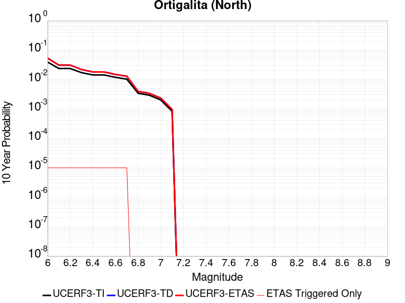 |

| Magnitude | 1 wk TI Prob | 1 wk TD Prob | 1 wk ETAS Prob | 1 wk ETAS/TD Gain | 1 wk ETAS Triggered Only | 1 mo TI Prob | 1 mo TD Prob | 1 mo ETAS Prob | 1 mo ETAS/TD Gain | 1 mo ETAS Triggered Only | 1 yr TI Prob | 1 yr TD Prob | 1 yr ETAS Prob | 1 yr ETAS/TD Gain | 1 yr ETAS Triggered Only | 10 yr TI Prob | 10 yr TD Prob | 10 yr ETAS Prob | 10 yr ETAS/TD Gain | 10 yr ETAS Triggered Only |
|-----|-----|-----|-----|-----|-----|-----|-----|-----|-----|-----|-----|-----|-----|-----|-----|-----|-----|-----|-----|-----|
| 6.0 | 7.711876E-5 | 1.05064966E-4 | 1.15063915E-4 | 1.0951692 | 1.0E-5 | 3.3046713E-4 | 4.502116E-4 | 4.6020708E-4 | 1.0222018 | 1.0E-5 | 0.004016016 | 0.0054681194 | 0.005478065 | 1.0018188 | 1.0E-5 | 0.039442103 | 0.053454787 | 0.053464253 | 1.000177 | 1.0E-5 |
| 6.1 | 4.607858E-5 | 6.0239203E-5 | 7.02386E-5 | 1.1659949 | 1.0E-5 | 1.9746469E-4 | 2.5814527E-4 | 2.6814267E-4 | 1.0387279 | 1.0E-5 | 0.0024014818 | 0.0031387596 | 0.0031487283 | 1.003176 | 1.0E-5 | 0.023756953 | 0.030975068 | 0.03098476 | 1.0003128 | 1.0E-5 |
| 6.2 | 4.607858E-5 | 6.0239203E-5 | 7.02386E-5 | 1.1659949 | 1.0E-5 | 1.9746469E-4 | 2.5814527E-4 | 2.6814267E-4 | 1.0387279 | 1.0E-5 | 0.0024014818 | 0.0031387596 | 0.0031487283 | 1.003176 | 1.0E-5 | 0.023756953 | 0.030975068 | 0.03098476 | 1.0003128 | 1.0E-5 |
| 6.3 | 3.327423E-5 | 4.2475127E-5 | 5.2474705E-5 | 1.2354219 | 1.0E-5 | 1.4259605E-4 | 1.8202531E-4 | 1.920235E-4 | 1.0549275 | 1.0E-5 | 0.0017347244 | 0.002214197 | 0.002224175 | 1.0045063 | 1.0E-5 | 0.017212452 | 0.021945644 | 0.021955425 | 1.0004457 | 1.0E-5 |
| 6.4 | 2.7732503E-5 | 3.4998593E-5 | 4.4998244E-5 | 1.2857158 | 1.0E-5 | 1.1884817E-4 | 1.4998685E-4 | 1.5998536E-4 | 1.0666625 | 1.0E-5 | 0.001446016 | 0.0018248095 | 0.0018347913 | 1.00547 | 1.0E-5 | 0.014366428 | 0.018121224 | 0.018131042 | 1.0005418 | 1.0E-5 |
| 6.5 | 2.7689714E-5 | 3.4948407E-5 | 4.4948058E-5 | 1.286126 | 1.0E-5 | 1.186648E-4 | 1.497718E-4 | 1.597703E-4 | 1.0667583 | 1.0E-5 | 0.0014437864 | 0.0018221956 | 0.0018321774 | 1.0054779 | 1.0E-5 | 0.014344421 | 0.01809551 | 0.01810533 | 1.0005426 | 1.0E-5 |
| 6.6 | 2.2976905E-5 | 2.8718265E-5 | 3.871798E-5 | 1.3482004 | 1.0E-5 | 9.846873E-5 | 1.230739E-4 | 1.3307267E-4 | 1.081242 | 1.0E-5 | 0.0011981975 | 0.0014976363 | 0.0015076214 | 1.0066671 | 1.0E-5 | 0.011917574 | 0.014898697 | 0.014908548 | 1.0006613 | 1.0E-5 |
| 6.7 | 1.9871539E-5 | 2.4904411E-5 | 3.4904162E-5 | 1.4015253 | 1.0E-5 | 8.516096E-5 | 1.0673023E-4 | 1.1672916E-4 | 1.0936842 | 1.0E-5 | 0.0010363415 | 0.0012989145 | 0.0013089016 | 1.0076888 | 1.0E-5 | 0.010315218 | 0.012936919 | 0.01294679 | 1.0007629 | 1.0E-5 |
| 6.8 | 6.5640475E-6 | 7.6054926E-6 | 7.6054926E-6 | 1.0 | 0.0 | 2.813133E-5 | 3.2594577E-5 | 3.2594577E-5 | 1.0 | 0.0 | 3.424451E-4 | 3.9676955E-4 | 3.9676955E-4 | 1.0 | 0.0 | 0.0034191788 | 0.003960899 | 0.003960899 | 1.0 | 0.0 |
| 6.9 | 5.6219683E-6 | 6.5018376E-6 | 6.5018376E-6 | 1.0 | 0.0 | 2.4093928E-5 | 2.7864735E-5 | 2.7864735E-5 | 1.0 | 0.0 | 2.933041E-4 | 3.3920293E-4 | 3.3920293E-4 | 1.0 | 0.0 | 0.0029291727 | 0.003387109 | 0.003387109 | 1.0 | 0.0 |
| 7.0 | 3.875591E-6 | 4.4847548E-6 | 4.4847548E-6 | 1.0 | 0.0 | 1.6609569E-5 | 1.9220248E-5 | 1.9220248E-5 | 1.0 | 0.0 | 2.0220275E-4 | 2.339835E-4 | 2.339835E-4 | 1.0 | 0.0 | 0.0020201886 | 0.0023375798 | 0.0023375798 | 1.0 | 0.0 |
| 7.1 | 1.6017933E-6 | 1.8570418E-6 | 1.8570418E-6 | 1.0 | 0.0 | 6.8648105E-6 | 7.958732E-6 | 7.958732E-6 | 1.0 | 0.0 | 8.357586E-5 | 9.689432E-5 | 9.689432E-5 | 1.0 | 0.0 | 8.3544437E-4 | 9.686254E-4 | 9.686254E-4 | 1.0 | 0.0 |

## Elsinore (Coyote Mountains)
*[(top)](#table-of-contents)*

| 1 Week | 1 Month | 1 Year | 10 Year |
|-----|-----|-----|-----|
|  | 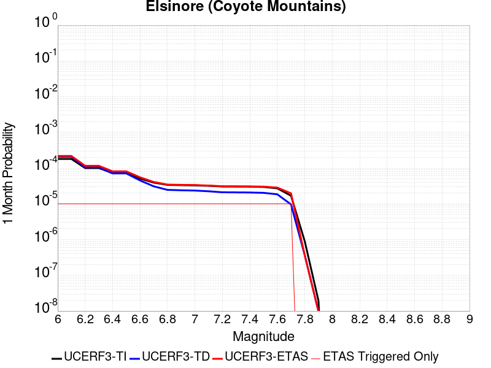 |  | 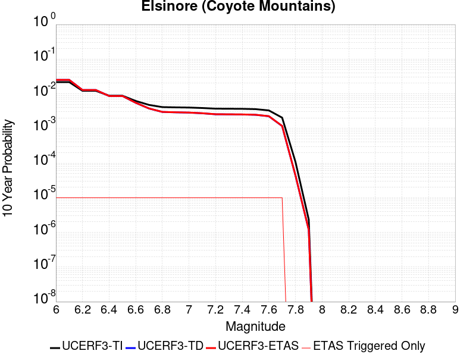 |

| Magnitude | 1 wk TI Prob | 1 wk TD Prob | 1 wk ETAS Prob | 1 wk ETAS/TD Gain | 1 wk ETAS Triggered Only | 1 mo TI Prob | 1 mo TD Prob | 1 mo ETAS Prob | 1 mo ETAS/TD Gain | 1 mo ETAS Triggered Only | 1 yr TI Prob | 1 yr TD Prob | 1 yr ETAS Prob | 1 yr ETAS/TD Gain | 1 yr ETAS Triggered Only | 10 yr TI Prob | 10 yr TD Prob | 10 yr ETAS Prob | 10 yr ETAS/TD Gain | 10 yr ETAS Triggered Only |
|-----|-----|-----|-----|-----|-----|-----|-----|-----|-----|-----|-----|-----|-----|-----|-----|-----|-----|-----|-----|-----|
| 6.0 | 4.20513E-5 | 4.8631882E-5 | 5.8631398E-5 | 1.2056165 | 1.0E-5 | 1.8020741E-4 | 2.0840895E-4 | 2.1840687E-4 | 1.0479726 | 1.0E-5 | 0.0021918174 | 0.002535 | 0.0025449747 | 1.0039347 | 1.0E-5 | 0.021703249 | 0.025111282 | 0.025121031 | 1.0003883 | 1.0E-5 |
| 6.1 | 4.20513E-5 | 4.8631882E-5 | 5.8631398E-5 | 1.2056165 | 1.0E-5 | 1.8020741E-4 | 2.0840895E-4 | 2.1840687E-4 | 1.0479726 | 1.0E-5 | 0.0021918174 | 0.002535 | 0.0025449747 | 1.0039347 | 1.0E-5 | 0.021703249 | 0.025111282 | 0.025121031 | 1.0003883 | 1.0E-5 |
| 6.2 | 2.3413893E-5 | 2.469566E-5 | 3.4695415E-5 | 1.4049194 | 1.0E-5 | 1.0034139E-4 | 1.0583479E-4 | 1.1583373E-4 | 1.0944769 | 1.0E-5 | 0.0012209718 | 0.0012878707 | 0.0012978577 | 1.0077548 | 1.0E-5 | 0.012142851 | 0.01281264 | 0.012822512 | 1.0007704 | 1.0E-5 |
| 6.3 | 2.3413893E-5 | 2.469566E-5 | 3.4695415E-5 | 1.4049194 | 1.0E-5 | 1.0034139E-4 | 1.0583479E-4 | 1.1583373E-4 | 1.0944769 | 1.0E-5 | 0.0012209718 | 0.0012878707 | 0.0012978577 | 1.0077548 | 1.0E-5 | 0.012142851 | 0.01281264 | 0.012822512 | 1.0007704 | 1.0E-5 |
| 6.4 | 1.6894814E-5 | 1.6568361E-5 | 2.6568196E-5 | 1.60355 | 1.0E-5 | 7.240433E-5 | 7.1005554E-5 | 8.100484E-5 | 1.1408241 | 1.0E-5 | 8.811662E-4 | 8.6418656E-4 | 8.741779E-4 | 1.0115616 | 1.0E-5 | 0.0087768035 | 0.00861194 | 0.008621854 | 1.0011512 | 1.0E-5 |
| 6.5 | 1.6894814E-5 | 1.6568361E-5 | 2.6568196E-5 | 1.60355 | 1.0E-5 | 7.240433E-5 | 7.1005554E-5 | 8.100484E-5 | 1.1408241 | 1.0E-5 | 8.811662E-4 | 8.6418656E-4 | 8.741779E-4 | 1.0115616 | 1.0E-5 | 0.0087768035 | 0.00861194 | 0.008621854 | 1.0011512 | 1.0E-5 |
| 6.6 | 1.1910969E-5 | 1.0530774E-5 | 2.0530668E-5 | 1.9495878 | 1.0E-5 | 5.1046012E-5 | 4.5131183E-5 | 5.513073E-5 | 1.2215663 | 1.0E-5 | 6.21308E-4 | 5.4934516E-4 | 5.5933965E-4 | 1.0181935 | 1.0E-5 | 0.0061957375 | 0.005481174 | 0.0054911193 | 1.0018145 | 1.0E-5 |
| 6.7 | 9.1486E-6 | 7.2028593E-6 | 1.7202787E-5 | 2.3883276 | 1.0E-5 | 3.9207694E-5 | 3.0869054E-5 | 4.0868745E-5 | 1.3239391 | 1.0E-5 | 4.7724912E-4 | 3.757697E-4 | 3.8576598E-4 | 1.026602 | 1.0E-5 | 0.0047622547 | 0.0037517229 | 0.0037616852 | 1.0026554 | 1.0E-5 |
| 6.8 | 7.90441E-6 | 5.7290276E-6 | 1.572897E-5 | 2.745487 | 1.0E-5 | 3.3875604E-5 | 2.4552752E-5 | 3.4552504E-5 | 1.4072763 | 1.0E-5 | 4.1235742E-4 | 2.9889002E-4 | 3.0888704E-4 | 1.0334471 | 1.0E-5 | 0.0041159308 | 0.002985009 | 0.002994979 | 1.0033401 | 1.0E-5 |
| 6.9 | 7.77015E-6 | 5.582982E-6 | 1.5582926E-5 | 2.7911475 | 1.0E-5 | 3.3300217E-5 | 2.3926852E-5 | 3.392661E-5 | 1.4179305 | 1.0E-5 | 4.0535472E-4 | 2.9127175E-4 | 3.0126885E-4 | 1.0343221 | 1.0E-5 | 0.004046161 | 0.002909027 | 0.002918998 | 1.0034276 | 1.0E-5 |
| 7.0 | 7.675798E-6 | 5.47984E-6 | 1.5479785E-5 | 2.8248606 | 1.0E-5 | 3.289586E-5 | 2.3484827E-5 | 3.348459E-5 | 1.4257969 | 1.0E-5 | 4.004335E-4 | 2.858915E-4 | 2.9588863E-4 | 1.0349683 | 1.0E-5 | 0.003997127 | 0.0028553635 | 0.0028653352 | 1.0034922 | 1.0E-5 |
| 7.1 | 7.447814E-6 | 5.238714E-6 | 1.5238662E-5 | 2.9088554 | 1.0E-5 | 3.191881E-5 | 2.2451446E-5 | 3.2451222E-5 | 1.4453956 | 1.0E-5 | 3.8854225E-4 | 2.7331332E-4 | 2.8331057E-4 | 1.036578 | 1.0E-5 | 0.003878636 | 0.0027298962 | 0.0027398688 | 1.0036532 | 1.0E-5 |
| 7.2 | 7.128185E-6 | 4.905372E-6 | 1.4905323E-5 | 3.0385714 | 1.0E-5 | 3.0549007E-5 | 2.102286E-5 | 3.102265E-5 | 1.4756627 | 1.0E-5 | 3.7187067E-4 | 2.5592445E-4 | 2.659219E-4 | 1.039064 | 1.0E-5 | 0.00371249 | 0.0025564157 | 0.00256639 | 1.0039017 | 1.0E-5 |
| 7.3 | 7.0913875E-6 | 4.874047E-6 | 1.4873998E-5 | 3.051673 | 1.0E-5 | 3.0391306E-5 | 2.0888614E-5 | 3.0888405E-5 | 1.4787197 | 1.0E-5 | 3.6995133E-4 | 2.5429038E-4 | 2.6428784E-4 | 1.0393151 | 1.0E-5 | 0.0036933604 | 0.0025401122 | 0.002550087 | 1.0039269 | 1.0E-5 |
| 7.4 | 7.051521E-6 | 4.837899E-6 | 1.483785E-5 | 3.067003 | 1.0E-5 | 3.0220453E-5 | 2.0733693E-5 | 3.0733485E-5 | 1.4822967 | 1.0E-5 | 3.6787192E-4 | 2.5240466E-4 | 2.6240214E-4 | 1.039609 | 1.0E-5 | 0.0036726352 | 0.0025212981 | 0.0025312728 | 1.0039562 | 1.0E-5 |
| 7.5 | 6.910666E-6 | 4.733448E-6 | 1.47334E-5 | 3.1126149 | 1.0E-5 | 2.9616802E-5 | 2.0286056E-5 | 3.0285852E-5 | 1.4929395 | 1.0E-5 | 3.605249E-4 | 2.4695593E-4 | 2.5695344E-4 | 1.040483 | 1.0E-5 | 0.0035994058 | 0.0024669329 | 0.002476908 | 1.0040436 | 1.0E-5 |
| 7.6 | 6.341753E-6 | 4.3065565E-6 | 1.4306514E-5 | 3.322031 | 1.0E-5 | 2.7178658E-5 | 1.8456547E-5 | 2.8456361E-5 | 1.5418032 | 1.0E-5 | 3.3084993E-4 | 2.2468645E-4 | 2.346842E-4 | 1.0444964 | 1.0E-5 | 0.0033035777 | 0.002244708 | 0.0022546856 | 1.004445 | 1.0E-5 |
| 7.7 | 3.9205916E-6 | 2.2439415E-6 | 1.2243919E-5 | 5.4564342 | 1.0E-5 | 1.6802427E-5 | 9.616861E-6 | 1.9616764E-5 | 2.0398304 | 1.0E-5 | 2.0455034E-4 | 1.1707973E-4 | 1.2707856E-4 | 1.0854019 | 1.0E-5 | 0.0020436216 | 0.0011702535 | 0.0011802417 | 1.0085351 | 1.0E-5 |
| 7.8 | 2.0846227E-7 | 8.486417E-8 | 8.486417E-8 | 1.0 | 0.0 | 8.9340944E-7 | 3.6370355E-7 | 3.6370355E-7 | 1.0 | 0.0 | 1.0877206E-5 | 4.428085E-6 | 4.428085E-6 | 1.0 | 0.0 | 1.0876673E-4 | 4.4280296E-5 | 4.4280296E-5 | 1.0 | 0.0 |
| 7.9 | 4.4969806E-9 | 2.2691855E-9 | 2.2691855E-9 | 1.0 | 0.0 | 1.9272775E-8 | 9.72508E-9 | 9.72508E-9 | 1.0 | 0.0 | 2.3464601E-7 | 1.18402845E-7 | 1.18402845E-7 | 1.0 | 0.0 | 2.3464577E-6 | 1.184028E-6 | 1.184028E-6 | 1.0 | 0.0 |

## Del Valle
*[(top)](#table-of-contents)*

| 1 Week | 1 Month | 1 Year | 10 Year |
|-----|-----|-----|-----|
|  |  |  |  |

| Magnitude | 1 wk TI Prob | 1 wk TD Prob | 1 wk ETAS Prob | 1 wk ETAS/TD Gain | 1 wk ETAS Triggered Only | 1 mo TI Prob | 1 mo TD Prob | 1 mo ETAS Prob | 1 mo ETAS/TD Gain | 1 mo ETAS Triggered Only | 1 yr TI Prob | 1 yr TD Prob | 1 yr ETAS Prob | 1 yr ETAS/TD Gain | 1 yr ETAS Triggered Only | 10 yr TI Prob | 10 yr TD Prob | 10 yr ETAS Prob | 10 yr ETAS/TD Gain | 10 yr ETAS Triggered Only |
|-----|-----|-----|-----|-----|-----|-----|-----|-----|-----|-----|-----|-----|-----|-----|-----|-----|-----|-----|-----|-----|
| 6.0 | 1.0716125E-5 | 8.767882E-6 | 1.8767794E-5 | 2.1405163 | 1.0E-5 | 4.592544E-5 | 3.7576207E-5 | 4.757583E-5 | 1.2661159 | 1.0E-5 | 5.589988E-4 | 4.5741405E-4 | 4.6740947E-4 | 1.021852 | 1.0E-5 | 0.0055759475 | 0.00456668 | 0.0045766346 | 1.0021797 | 1.0E-5 |
| 6.1 | 1.0716125E-5 | 8.767882E-6 | 1.8767794E-5 | 2.1405163 | 1.0E-5 | 4.592544E-5 | 3.7576207E-5 | 4.757583E-5 | 1.2661159 | 1.0E-5 | 5.589988E-4 | 4.5741405E-4 | 4.6740947E-4 | 1.021852 | 1.0E-5 | 0.0055759475 | 0.00456668 | 0.0045766346 | 1.0021797 | 1.0E-5 |
| 6.2 | 1.0716125E-5 | 8.767882E-6 | 1.8767794E-5 | 2.1405163 | 1.0E-5 | 4.592544E-5 | 3.7576207E-5 | 4.757583E-5 | 1.2661159 | 1.0E-5 | 5.589988E-4 | 4.5741405E-4 | 4.6740947E-4 | 1.021852 | 1.0E-5 | 0.0055759475 | 0.00456668 | 0.0045766346 | 1.0021797 | 1.0E-5 |
| 6.3 | 7.1293784E-6 | 4.865823E-6 | 4.865823E-6 | 1.0 | 0.0 | 3.055412E-5 | 2.0853364E-5 | 2.0853364E-5 | 1.0 | 0.0 | 3.7193293E-4 | 2.5386087E-4 | 2.5386087E-4 | 1.0 | 0.0 | 0.0037131102 | 0.0025357946 | 0.0025357946 | 1.0 | 0.0 |
| 6.4 | 7.1293784E-6 | 4.865823E-6 | 4.865823E-6 | 1.0 | 0.0 | 3.055412E-5 | 2.0853364E-5 | 2.0853364E-5 | 1.0 | 0.0 | 3.7193293E-4 | 2.5386087E-4 | 2.5386087E-4 | 1.0 | 0.0 | 0.0037131102 | 0.0025357946 | 0.0025357946 | 1.0 | 0.0 |
| 6.5 | 7.1293784E-6 | 4.865823E-6 | 4.865823E-6 | 1.0 | 0.0 | 3.055412E-5 | 2.0853364E-5 | 2.0853364E-5 | 1.0 | 0.0 | 3.7193293E-4 | 2.5386087E-4 | 2.5386087E-4 | 1.0 | 0.0 | 0.0037131102 | 0.0025357946 | 0.0025357946 | 1.0 | 0.0 |
| 6.6 | 7.1293784E-6 | 4.865823E-6 | 4.865823E-6 | 1.0 | 0.0 | 3.055412E-5 | 2.0853364E-5 | 2.0853364E-5 | 1.0 | 0.0 | 3.7193293E-4 | 2.5386087E-4 | 2.5386087E-4 | 1.0 | 0.0 | 0.0037131102 | 0.0025357946 | 0.0025357946 | 1.0 | 0.0 |
| 6.7 | 7.12272E-6 | 4.8631987E-6 | 4.8631987E-6 | 1.0 | 0.0 | 3.0525585E-5 | 2.0842117E-5 | 2.0842117E-5 | 1.0 | 0.0 | 3.7158563E-4 | 2.5372396E-4 | 2.5372396E-4 | 1.0 | 0.0 | 0.003709649 | 0.0025344288 | 0.0025344288 | 1.0 | 0.0 |
| 6.8 | 6.7558703E-6 | 4.5594015E-6 | 4.5594015E-6 | 1.0 | 0.0 | 2.895341E-5 | 1.9540148E-5 | 1.9540148E-5 | 1.0 | 0.0 | 3.5245073E-4 | 2.3787597E-4 | 2.3787597E-4 | 1.0 | 0.0 | 0.0035189227 | 0.0023762889 | 0.0023762889 | 1.0 | 0.0 |
| 6.9 | 6.6700386E-6 | 4.502539E-6 | 4.502539E-6 | 1.0 | 0.0 | 2.8585566E-5 | 1.9296456E-5 | 1.9296456E-5 | 1.0 | 0.0 | 3.479737E-4 | 2.3490966E-4 | 2.3490966E-4 | 1.0 | 0.0 | 0.003474293 | 0.0023466884 | 0.0023466884 | 1.0 | 0.0 |
| 7.0 | 6.3181424E-6 | 4.0987034E-6 | 4.0987034E-6 | 1.0 | 0.0 | 2.7077473E-5 | 1.7565755E-5 | 1.7565755E-5 | 1.0 | 0.0 | 3.2961834E-4 | 2.1384252E-4 | 2.1384252E-4 | 1.0 | 0.0 | 0.0032912986 | 0.002136422 | 0.002136422 | 1.0 | 0.0 |
| 7.1 | 6.248759E-6 | 4.033895E-6 | 4.033895E-6 | 1.0 | 0.0 | 2.678012E-5 | 1.7288008E-5 | 1.7288008E-5 | 1.0 | 0.0 | 3.2599916E-4 | 2.104616E-4 | 2.104616E-4 | 1.0 | 0.0 | 0.0032552136 | 0.0021026772 | 0.0021026772 | 1.0 | 0.0 |
| 7.2 | 6.0411944E-6 | 3.869888E-6 | 3.869888E-6 | 1.0 | 0.0 | 2.5890577E-5 | 1.658513E-5 | 1.658513E-5 | 1.0 | 0.0 | 3.1517216E-4 | 2.0190567E-4 | 2.0190567E-4 | 1.0 | 0.0 | 0.0031472554 | 0.0020172757 | 0.0020172757 | 1.0 | 0.0 |
| 7.3 | 4.7691183E-6 | 3.0781202E-6 | 3.0781202E-6 | 1.0 | 0.0 | 2.0438918E-5 | 1.3191879E-5 | 1.3191879E-5 | 1.0 | 0.0 | 2.488154E-4 | 1.605995E-4 | 1.605995E-4 | 1.0 | 0.0 | 0.00248537 | 0.0016048603 | 0.0016048603 | 1.0 | 0.0 |
| 7.4 | 3.5524722E-6 | 2.1893363E-6 | 2.1893363E-6 | 1.0 | 0.0 | 1.5224792E-5 | 9.382837E-6 | 9.382837E-6 | 1.0 | 0.0 | 1.8534607E-4 | 1.1423013E-4 | 1.1423013E-4 | 1.0 | 0.0 | 0.0018519156 | 0.0011417224 | 0.0011417224 | 1.0 | 0.0 |
| 7.5 | 2.7133442E-6 | 1.5916097E-6 | 1.5916097E-6 | 1.0 | 0.0 | 1.1628566E-5 | 6.821167E-6 | 6.821167E-6 | 1.0 | 0.0 | 1.415686E-4 | 8.304456E-5 | 8.304456E-5 | 1.0 | 0.0 | 0.0014147845 | 8.301372E-4 | 8.301372E-4 | 1.0 | 0.0 |
| 7.6 | 1.915338E-6 | 1.173914E-6 | 1.173914E-6 | 1.0 | 0.0 | 8.208566E-6 | 5.0310505E-6 | 5.0310505E-6 | 1.0 | 0.0 | 9.993471E-5 | 6.125133E-5 | 6.125133E-5 | 1.0 | 0.0 | 9.988978E-4 | 6.123454E-4 | 6.123454E-4 | 1.0 | 0.0 |
| 7.7 | 1.2120448E-6 | 7.180313E-7 | 7.180313E-7 | 1.0 | 0.0 | 5.194467E-6 | 3.0772733E-6 | 3.0772733E-6 | 1.0 | 0.0 | 6.3240805E-5 | 3.746516E-5 | 3.746516E-5 | 1.0 | 0.0 | 6.322281E-4 | 3.7458882E-4 | 3.7458882E-4 | 1.0 | 0.0 |
| 7.8 | 6.272381E-7 | 3.932549E-7 | 3.932549E-7 | 1.0 | 0.0 | 2.6881603E-6 | 1.6853771E-6 | 1.6853771E-6 | 1.0 | 0.0 | 3.272786E-5 | 2.0519275E-5 | 2.0519275E-5 | 1.0 | 0.0 | 3.272304E-4 | 2.0517396E-4 | 2.0517396E-4 | 1.0 | 0.0 |
| 7.9 | 2.0292627E-7 | 1.2004622E-7 | 1.2004622E-7 | 1.0 | 0.0 | 8.6968373E-7 | 5.1448376E-7 | 5.1448376E-7 | 1.0 | 0.0 | 1.0588348E-5 | 6.263822E-6 | 6.263822E-6 | 1.0 | 0.0 | 1.0587843E-4 | 6.263647E-5 | 6.263647E-5 | 1.0 | 0.0 |
| 8.0 | 4.374492E-8 | 2.189964E-8 | 2.189964E-8 | 1.0 | 0.0 | 1.8747821E-7 | 9.385559E-8 | 9.385559E-8 | 1.0 | 0.0 | 2.2825448E-6 | 1.1426913E-6 | 1.1426913E-6 | 1.0 | 0.0 | 2.2825214E-5 | 1.1426858E-5 | 1.1426858E-5 | 1.0 | 0.0 |

## Cedar Mtn-Mahogany Mtn
*[(top)](#table-of-contents)*

| 1 Week | 1 Month | 1 Year | 10 Year |
|-----|-----|-----|-----|
|  |  |  |  |

| Magnitude | 1 wk TI Prob | 1 wk TD Prob | 1 wk ETAS Prob | 1 wk ETAS/TD Gain | 1 wk ETAS Triggered Only | 1 mo TI Prob | 1 mo TD Prob | 1 mo ETAS Prob | 1 mo ETAS/TD Gain | 1 mo ETAS Triggered Only | 1 yr TI Prob | 1 yr TD Prob | 1 yr ETAS Prob | 1 yr ETAS/TD Gain | 1 yr ETAS Triggered Only | 10 yr TI Prob | 10 yr TD Prob | 10 yr ETAS Prob | 10 yr ETAS/TD Gain | 10 yr ETAS Triggered Only |
|-----|-----|-----|-----|-----|-----|-----|-----|-----|-----|-----|-----|-----|-----|-----|-----|-----|-----|-----|-----|-----|
| 6.0 | 2.7763876E-5 | 2.9588866E-5 | 3.958857E-5 | 1.337955 | 1.0E-5 | 1.1898261E-4 | 1.2680366E-4 | 1.3680238E-4 | 1.078852 | 1.0E-5 | 0.0014476506 | 0.0015428112 | 0.0015527958 | 1.0064716 | 1.0E-5 | 0.0143825635 | 0.015328225 | 0.015338072 | 1.0006424 | 1.0E-5 |
| 6.1 | 1.6162443E-5 | 1.7142966E-5 | 2.7142794E-5 | 1.5833197 | 1.0E-5 | 6.926578E-5 | 7.346788E-5 | 8.346715E-5 | 1.1361039 | 1.0E-5 | 8.4298453E-4 | 8.941221E-4 | 9.0411317E-4 | 1.0111742 | 1.0E-5 | 0.008397939 | 0.008907059 | 0.008916969 | 1.0011127 | 1.0E-5 |
| 6.2 | 1.6162443E-5 | 1.7142966E-5 | 2.7142794E-5 | 1.5833197 | 1.0E-5 | 6.926578E-5 | 7.346788E-5 | 8.346715E-5 | 1.1361039 | 1.0E-5 | 8.4298453E-4 | 8.941221E-4 | 9.0411317E-4 | 1.0111742 | 1.0E-5 | 0.008397939 | 0.008907059 | 0.008916969 | 1.0011127 | 1.0E-5 |
| 6.3 | 9.746053E-6 | 1.0303152E-5 | 2.0303049E-5 | 1.9705667 | 1.0E-5 | 4.1768133E-5 | 4.415564E-5 | 5.41552E-5 | 1.2264616 | 1.0E-5 | 5.0840835E-4 | 5.3746643E-4 | 5.4746104E-4 | 1.0185958 | 1.0E-5 | 0.0050724675 | 0.005362084 | 0.0053720307 | 1.0018549 | 1.0E-5 |
| 6.4 | 9.746053E-6 | 1.0303152E-5 | 2.0303049E-5 | 1.9705667 | 1.0E-5 | 4.1768133E-5 | 4.415564E-5 | 5.41552E-5 | 1.2264616 | 1.0E-5 | 5.0840835E-4 | 5.3746643E-4 | 5.4746104E-4 | 1.0185958 | 1.0E-5 | 0.0050724675 | 0.005362084 | 0.0053720307 | 1.0018549 | 1.0E-5 |
| 6.5 | 7.290083E-6 | 7.695325E-6 | 1.7695247E-5 | 2.2994804 | 1.0E-5 | 3.124284E-5 | 3.297956E-5 | 4.2979227E-5 | 1.3032081 | 1.0E-5 | 3.8031515E-4 | 4.014543E-4 | 4.1145028E-4 | 1.0248995 | 1.0E-5 | 0.0037966494 | 0.004007511 | 0.004017471 | 1.0024853 | 1.0E-5 |
| 6.6 | 5.67907E-6 | 5.9891527E-6 | 1.5989093E-5 | 2.6696754 | 1.0E-5 | 2.4338644E-5 | 2.5667552E-5 | 3.5667297E-5 | 1.3895869 | 1.0E-5 | 2.962827E-4 | 3.12459E-4 | 3.2245586E-4 | 1.0319942 | 1.0E-5 | 0.0029588798 | 0.003120333 | 0.0031303016 | 1.0031948 | 1.0E-5 |
| 6.7 | 3.4853963E-6 | 3.672631E-6 | 3.672631E-6 | 1.0 | 0.0 | 1.4937327E-5 | 1.5739755E-5 | 1.5739755E-5 | 1.0 | 0.0 | 1.8184677E-4 | 1.916153E-4 | 1.916153E-4 | 1.0 | 0.0 | 0.0018169804 | 0.0019145629 | 0.0019145629 | 1.0 | 0.0 |
| 6.8 | 2.7535168E-6 | 2.9015764E-6 | 2.9015764E-6 | 1.0 | 0.0 | 1.1800733E-5 | 1.2435271E-5 | 1.2435271E-5 | 1.0 | 0.0 | 1.4366445E-4 | 1.5138938E-4 | 1.5138938E-4 | 1.0 | 0.0 | 0.0014357162 | 0.0015129098 | 0.0015129098 | 1.0 | 0.0 |
| 6.9 | 1.6594106E-6 | 1.7496985E-6 | 1.7496985E-6 | 1.0 | 0.0 | 7.1117406E-6 | 7.4986883E-6 | 7.4986883E-6 | 1.0 | 0.0 | 8.6582E-5 | 9.129302E-5 | 9.129302E-5 | 1.0 | 0.0 | 8.654827E-4 | 9.125856E-4 | 9.125856E-4 | 1.0 | 0.0 |
| 7.0 | 5.10215E-7 | 5.389254E-7 | 5.389254E-7 | 1.0 | 0.0 | 2.186634E-6 | 2.3096788E-6 | 2.3096788E-6 | 1.0 | 0.0 | 2.6621943E-5 | 2.8120105E-5 | 2.8120105E-5 | 1.0 | 0.0 | 2.6618753E-4 | 2.81178E-4 | 2.81178E-4 | 1.0 | 0.0 |

## San Juan
*[(top)](#table-of-contents)*

| 1 Week | 1 Month | 1 Year | 10 Year |
|-----|-----|-----|-----|
|  |  |  |  |

| Magnitude | 1 wk TI Prob | 1 wk TD Prob | 1 wk ETAS Prob | 1 wk ETAS/TD Gain | 1 wk ETAS Triggered Only | 1 mo TI Prob | 1 mo TD Prob | 1 mo ETAS Prob | 1 mo ETAS/TD Gain | 1 mo ETAS Triggered Only | 1 yr TI Prob | 1 yr TD Prob | 1 yr ETAS Prob | 1 yr ETAS/TD Gain | 1 yr ETAS Triggered Only | 10 yr TI Prob | 10 yr TD Prob | 10 yr ETAS Prob | 10 yr ETAS/TD Gain | 10 yr ETAS Triggered Only |
|-----|-----|-----|-----|-----|-----|-----|-----|-----|-----|-----|-----|-----|-----|-----|-----|-----|-----|-----|-----|-----|
| 6.0 | 8.682808E-6 | 8.7491635E-6 | 8.7491635E-6 | 1.0 | 0.0 | 3.72115E-5 | 3.74959E-5 | 3.74959E-5 | 1.0 | 0.0 | 4.5295584E-4 | 4.564218E-4 | 4.564218E-4 | 1.0 | 0.0 | 0.004520337 | 0.004555385 | 0.0045653395 | 1.0021852 | 1.0E-5 |
| 6.1 | 8.682808E-6 | 8.7491635E-6 | 8.7491635E-6 | 1.0 | 0.0 | 3.72115E-5 | 3.74959E-5 | 3.74959E-5 | 1.0 | 0.0 | 4.5295584E-4 | 4.564218E-4 | 4.564218E-4 | 1.0 | 0.0 | 0.004520337 | 0.004555385 | 0.0045653395 | 1.0021852 | 1.0E-5 |
| 6.2 | 8.682808E-6 | 8.7491635E-6 | 8.7491635E-6 | 1.0 | 0.0 | 3.72115E-5 | 3.74959E-5 | 3.74959E-5 | 1.0 | 0.0 | 4.5295584E-4 | 4.564218E-4 | 4.564218E-4 | 1.0 | 0.0 | 0.004520337 | 0.004555385 | 0.0045653395 | 1.0021852 | 1.0E-5 |
| 6.3 | 6.3054235E-6 | 6.2825848E-6 | 6.2825848E-6 | 1.0 | 0.0 | 2.7022963E-5 | 2.6925094E-5 | 2.6925094E-5 | 1.0 | 0.0 | 3.2895492E-4 | 3.2776513E-4 | 3.2776513E-4 | 1.0 | 0.0 | 0.003284684 | 0.003273017 | 0.003273017 | 1.0 | 0.0 |
| 6.4 | 6.1490473E-6 | 6.1144656E-6 | 6.1144656E-6 | 1.0 | 0.0 | 2.6352795E-5 | 2.6204598E-5 | 2.6204598E-5 | 1.0 | 0.0 | 3.2079802E-4 | 3.1899565E-4 | 3.1899565E-4 | 1.0 | 0.0 | 0.0032033534 | 0.0031855737 | 0.0031855737 | 1.0 | 0.0 |
| 6.5 | 5.204848E-6 | 5.137233E-6 | 5.137233E-6 | 1.0 | 0.0 | 2.23063E-5 | 2.2016533E-5 | 2.2016533E-5 | 1.0 | 0.0 | 2.7154534E-4 | 2.6801927E-4 | 2.6801927E-4 | 1.0 | 0.0 | 0.0027121378 | 0.0026771144 | 0.0026771144 | 1.0 | 0.0 |
| 6.6 | 4.5179986E-6 | 4.4150297E-6 | 4.4150297E-6 | 1.0 | 0.0 | 1.9362706E-5 | 1.8921424E-5 | 1.8921424E-5 | 1.0 | 0.0 | 2.3571544E-4 | 2.3034477E-4 | 2.3034477E-4 | 1.0 | 0.0 | 0.0023546559 | 0.0023011973 | 0.0023011973 | 1.0 | 0.0 |
| 6.7 | 3.9442616E-6 | 3.819828E-6 | 3.819828E-6 | 1.0 | 0.0 | 1.6903869E-5 | 1.6370592E-5 | 1.6370592E-5 | 1.0 | 0.0 | 2.0578515E-4 | 1.992944E-4 | 1.992944E-4 | 1.0 | 0.0 | 0.002055947 | 0.0019912818 | 0.0019912818 | 1.0 | 0.0 |
| 6.8 | 3.4536245E-6 | 3.3163353E-6 | 3.3163353E-6 | 1.0 | 0.0 | 1.4801163E-5 | 1.4212792E-5 | 1.4212792E-5 | 1.0 | 0.0 | 1.8018926E-4 | 1.7302761E-4 | 1.7302761E-4 | 1.0 | 0.0 | 0.0018004322 | 0.0017290477 | 0.0017290477 | 1.0 | 0.0 |
| 6.9 | 3.059865E-6 | 2.9120315E-6 | 2.9120315E-6 | 1.0 | 0.0 | 1.3113641E-5 | 1.2480078E-5 | 1.2480078E-5 | 1.0 | 0.0 | 1.596469E-4 | 1.5193493E-4 | 1.5193493E-4 | 1.0 | 0.0 | 0.0015953224 | 0.0015184252 | 0.0015184252 | 1.0 | 0.0 |
| 7.0 | 2.6504351E-6 | 2.4920002E-6 | 2.4920002E-6 | 1.0 | 0.0 | 1.1358958E-5 | 1.0679961E-5 | 1.0679961E-5 | 1.0 | 0.0 | 1.3828653E-4 | 1.300213E-4 | 1.300213E-4 | 1.0 | 0.0 | 0.0013820052 | 0.0012995641 | 0.0012995641 | 1.0 | 0.0 |
| 7.1 | 2.2039317E-6 | 2.0338296E-6 | 2.0338296E-6 | 1.0 | 0.0 | 9.445387E-6 | 8.716386E-6 | 8.716386E-6 | 1.0 | 0.0 | 1.1499152E-4 | 1.0611736E-4 | 1.0611736E-4 | 1.0 | 0.0 | 0.0011493203 | 0.0010607769 | 0.0010607769 | 1.0 | 0.0 |
| 7.2 | 1.0786707E-6 | 8.7701903E-7 | 8.7701903E-7 | 1.0 | 0.0 | 4.622866E-6 | 3.7586476E-6 | 3.7586476E-6 | 1.0 | 0.0 | 5.628194E-5 | 4.5760586E-5 | 4.5760586E-5 | 1.0 | 0.0 | 5.6267687E-4 | 4.5757066E-4 | 4.5757066E-4 | 1.0 | 0.0 |
| 7.3 | 6.846433E-7 | 4.868805E-7 | 4.868805E-7 | 1.0 | 0.0 | 2.9341822E-6 | 2.086629E-6 | 2.086629E-6 | 1.0 | 0.0 | 3.5723086E-5 | 2.5404412E-5 | 2.5404412E-5 | 1.0 | 0.0 | 3.571734E-4 | 2.540486E-4 | 2.540486E-4 | 1.0 | 0.0 |
| 7.4 | 5.23043E-7 | 3.2628162E-7 | 3.2628162E-7 | 1.0 | 0.0 | 2.2416111E-6 | 1.398349E-6 | 1.398349E-6 | 1.0 | 0.0 | 2.7291273E-5 | 1.7024766E-5 | 1.7024766E-5 | 1.0 | 0.0 | 2.7287923E-4 | 1.7026656E-4 | 1.7026656E-4 | 1.0 | 0.0 |
| 7.5 | 4.648444E-7 | 2.7234944E-7 | 2.7234944E-7 | 1.0 | 0.0 | 1.9921886E-6 | 1.1672114E-6 | 1.1672114E-6 | 1.0 | 0.0 | 2.4254627E-5 | 1.42107065E-5 | 1.42107065E-5 | 1.0 | 0.0 | 2.425198E-4 | 1.421276E-4 | 1.421276E-4 | 1.0 | 0.0 |
| 7.6 | 3.9906567E-7 | 2.2083314E-7 | 2.2083314E-7 | 1.0 | 0.0 | 1.7102802E-6 | 9.464274E-7 | 9.464274E-7 | 1.0 | 0.0 | 2.0822463E-5 | 1.1522693E-5 | 1.1522693E-5 | 1.0 | 0.0 | 2.0820512E-4 | 1.15245566E-4 | 1.15245566E-4 | 1.0 | 0.0 |
| 7.7 | 1.8784601E-7 | 5.3666906E-8 | 5.3666906E-8 | 1.0 | 0.0 | 8.0505407E-7 | 2.30001E-7 | 2.30001E-7 | 1.0 | 0.0 | 9.80149E-6 | 2.8002585E-6 | 2.8002585E-6 | 1.0 | 0.0 | 9.801057E-5 | 2.8011282E-5 | 2.8011282E-5 | 1.0 | 0.0 |
| 7.8 | 1.00154914E-7 | 1.2415832E-8 | 1.2415832E-8 | 1.0 | 0.0 | 4.2923529E-7 | 5.3210716E-8 | 5.3210716E-8 | 1.0 | 0.0 | 5.225927E-6 | 6.4784024E-7 | 6.4784024E-7 | 1.0 | 0.0 | 5.225804E-5 | 6.484273E-6 | 6.484273E-6 | 1.0 | 0.0 |
| 7.9 | 6.171429E-8 | 4.2966155E-9 | 4.2966155E-9 | 1.0 | 0.0 | 2.6448978E-7 | 1.8414067E-8 | 1.8414067E-8 | 1.0 | 0.0 | 3.2201583E-6 | 2.2419121E-7 | 2.2419121E-7 | 1.0 | 0.0 | 3.2201115E-5 | 2.2472002E-6 | 2.2472002E-6 | 1.0 | 0.0 |
| 8.0 | 1.3974572E-8 | 3.3788217E-10 | 3.3788217E-10 | 1.0 | 0.0 | 5.989102E-8 | 1.448067E-9 | 1.448067E-9 | 1.0 | 0.0 | 7.2917294E-7 | 1.763022E-8 | 1.763022E-8 | 1.0 | 0.0 | 7.2917055E-6 | 1.8060365E-7 | 1.8060365E-7 | 1.0 | 0.0 |
| 8.1 | 1.8403477E-9 | 1.1302803E-10 | 1.1302803E-10 | 1.0 | 0.0 | 7.887204E-9 | 4.844063E-10 | 4.844063E-10 | 1.0 | 0.0 | 9.602671E-8 | 5.8976446E-9 | 5.8976446E-9 | 1.0 | 0.0 | 9.602667E-7 | 6.021993E-8 | 6.021993E-8 | 1.0 | 0.0 |

## Los Osos 2011
*[(top)](#table-of-contents)*

| 1 Week | 1 Month | 1 Year | 10 Year |
|-----|-----|-----|-----|
| 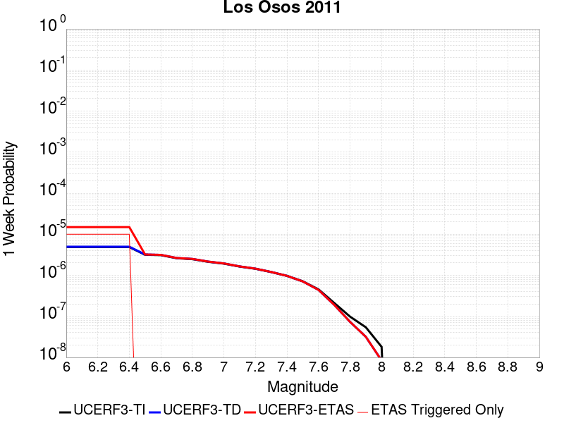 |  | 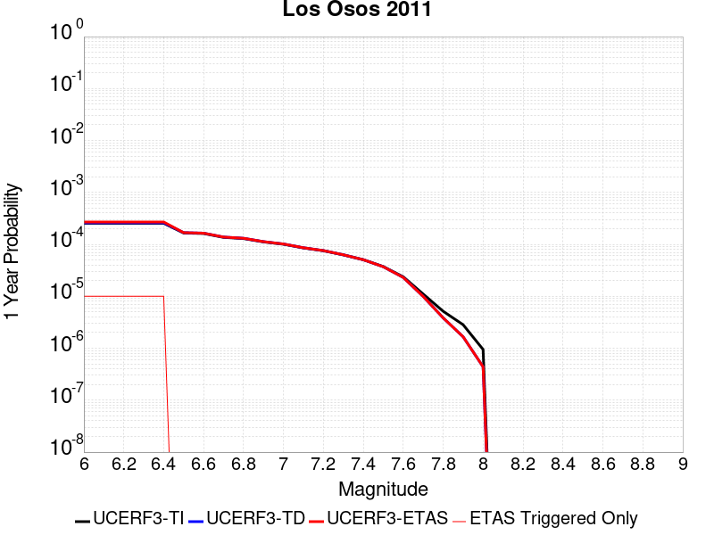 |  |

| Magnitude | 1 wk TI Prob | 1 wk TD Prob | 1 wk ETAS Prob | 1 wk ETAS/TD Gain | 1 wk ETAS Triggered Only | 1 mo TI Prob | 1 mo TD Prob | 1 mo ETAS Prob | 1 mo ETAS/TD Gain | 1 mo ETAS Triggered Only | 1 yr TI Prob | 1 yr TD Prob | 1 yr ETAS Prob | 1 yr ETAS/TD Gain | 1 yr ETAS Triggered Only | 10 yr TI Prob | 10 yr TD Prob | 10 yr ETAS Prob | 10 yr ETAS/TD Gain | 10 yr ETAS Triggered Only |
|-----|-----|-----|-----|-----|-----|-----|-----|-----|-----|-----|-----|-----|-----|-----|-----|-----|-----|-----|-----|-----|
| 6.0 | 4.8871775E-6 | 4.9814835E-6 | 1.4981433E-5 | 3.007424 | 1.0E-5 | 2.0944879E-5 | 2.1349055E-5 | 3.134884E-5 | 1.4683948 | 1.0E-5 | 2.5497406E-4 | 2.5989654E-4 | 2.6989394E-4 | 1.0384668 | 1.0E-5 | 0.002546817 | 0.0025962002 | 0.0026061744 | 1.0038418 | 1.0E-5 |
| 6.1 | 4.8871775E-6 | 4.9814835E-6 | 1.4981433E-5 | 3.007424 | 1.0E-5 | 2.0944879E-5 | 2.1349055E-5 | 3.134884E-5 | 1.4683948 | 1.0E-5 | 2.5497406E-4 | 2.5989654E-4 | 2.6989394E-4 | 1.0384668 | 1.0E-5 | 0.002546817 | 0.0025962002 | 0.0026061744 | 1.0038418 | 1.0E-5 |
| 6.2 | 4.8871775E-6 | 4.9814835E-6 | 1.4981433E-5 | 3.007424 | 1.0E-5 | 2.0944879E-5 | 2.1349055E-5 | 3.134884E-5 | 1.4683948 | 1.0E-5 | 2.5497406E-4 | 2.5989654E-4 | 2.6989394E-4 | 1.0384668 | 1.0E-5 | 0.002546817 | 0.0025962002 | 0.0026061744 | 1.0038418 | 1.0E-5 |
| 6.3 | 4.8871775E-6 | 4.9814835E-6 | 1.4981433E-5 | 3.007424 | 1.0E-5 | 2.0944879E-5 | 2.1349055E-5 | 3.134884E-5 | 1.4683948 | 1.0E-5 | 2.5497406E-4 | 2.5989654E-4 | 2.6989394E-4 | 1.0384668 | 1.0E-5 | 0.002546817 | 0.0025962002 | 0.0026061744 | 1.0038418 | 1.0E-5 |
| 6.4 | 4.8871775E-6 | 4.9814835E-6 | 1.4981433E-5 | 3.007424 | 1.0E-5 | 2.0944879E-5 | 2.1349055E-5 | 3.134884E-5 | 1.4683948 | 1.0E-5 | 2.5497406E-4 | 2.5989654E-4 | 2.6989394E-4 | 1.0384668 | 1.0E-5 | 0.002546817 | 0.0025962002 | 0.0026061744 | 1.0038418 | 1.0E-5 |
| 6.5 | 3.1724062E-6 | 3.223395E-6 | 3.223395E-6 | 1.0 | 0.0 | 1.3595956E-5 | 1.3814477E-5 | 1.3814477E-5 | 1.0 | 0.0 | 1.6551818E-4 | 1.681784E-4 | 1.681784E-4 | 1.0 | 0.0 | 0.0016539496 | 0.0016805249 | 0.0016805249 | 1.0 | 0.0 |
| 6.6 | 3.1022591E-6 | 3.1511045E-6 | 3.1511045E-6 | 1.0 | 0.0 | 1.3295328E-5 | 1.3504664E-5 | 1.3504664E-5 | 1.0 | 0.0 | 1.618586E-4 | 1.64407E-4 | 1.64407E-4 | 1.0 | 0.0 | 0.0016174077 | 0.0016428665 | 0.0016428665 | 1.0 | 0.0 |
| 6.7 | 2.611518E-6 | 2.6491832E-6 | 2.6491832E-6 | 1.0 | 0.0 | 1.1192172E-5 | 1.1353593E-5 | 1.1353593E-5 | 1.0 | 0.0 | 1.3625617E-4 | 1.3822126E-4 | 1.3822126E-4 | 1.0 | 0.0 | 0.0013617266 | 0.0013813575 | 0.0013813575 | 1.0 | 0.0 |
| 6.8 | 2.4780884E-6 | 2.5121592E-6 | 2.5121592E-6 | 1.0 | 0.0 | 1.0620336E-5 | 1.0766353E-5 | 1.0766353E-5 | 1.0 | 0.0 | 1.2929492E-4 | 1.3107249E-4 | 1.3107249E-4 | 1.0 | 0.0 | 0.0012921972 | 0.001309956 | 0.001309956 | 1.0 | 0.0 |
| 6.9 | 2.1376322E-6 | 2.1635055E-6 | 2.1635055E-6 | 1.0 | 0.0 | 9.161248E-6 | 9.272134E-6 | 9.272134E-6 | 1.0 | 0.0 | 1.1153249E-4 | 1.128824E-4 | 1.128824E-4 | 1.0 | 0.0 | 0.0011147653 | 0.0011282525 | 0.0011282525 | 1.0 | 0.0 |
| 7.0 | 1.9282882E-6 | 1.9494585E-6 | 1.9494585E-6 | 1.0 | 0.0 | 8.264066E-6 | 8.354796E-6 | 8.354796E-6 | 1.0 | 0.0 | 1.0061036E-4 | 1.017149E-4 | 1.017149E-4 | 1.0 | 0.0 | 0.0010056482 | 0.0010166848 | 0.0010166848 | 1.0 | 0.0 |
| 7.1 | 1.6353226E-6 | 1.6501118E-6 | 1.6501118E-6 | 1.0 | 0.0 | 7.0085066E-6 | 7.0718884E-6 | 7.0718884E-6 | 1.0 | 0.0 | 8.532523E-5 | 8.609685E-5 | 8.609685E-5 | 1.0 | 0.0 | 8.529247E-4 | 8.6063566E-4 | 8.6063566E-4 | 1.0 | 0.0 |
| 7.2 | 1.4446276E-6 | 1.4553341E-6 | 1.4553341E-6 | 1.0 | 0.0 | 6.191247E-6 | 6.237131E-6 | 6.237131E-6 | 1.0 | 0.0 | 7.537582E-5 | 7.593443E-5 | 7.593443E-5 | 1.0 | 0.0 | 7.535026E-4 | 7.590854E-4 | 7.590854E-4 | 1.0 | 0.0 |
| 7.3 | 1.2014582E-6 | 1.2069073E-6 | 1.2069073E-6 | 1.0 | 0.0 | 5.149096E-6 | 5.1724496E-6 | 5.1724496E-6 | 1.0 | 0.0 | 6.268844E-5 | 6.297276E-5 | 6.297276E-5 | 1.0 | 0.0 | 6.267076E-4 | 6.295495E-4 | 6.295495E-4 | 1.0 | 0.0 |
| 7.4 | 9.707733E-7 | 9.709773E-7 | 9.709773E-7 | 1.0 | 0.0 | 4.16045E-6 | 4.161325E-6 | 4.161325E-6 | 1.0 | 0.0 | 5.0652303E-5 | 5.066295E-5 | 5.066295E-5 | 1.0 | 0.0 | 5.064076E-4 | 5.065143E-4 | 5.065143E-4 | 1.0 | 0.0 |
| 7.5 | 7.174908E-7 | 7.1149134E-7 | 7.1149134E-7 | 1.0 | 0.0 | 3.074957E-6 | 3.0492452E-6 | 3.0492452E-6 | 1.0 | 0.0 | 3.743696E-5 | 3.712393E-5 | 3.712393E-5 | 1.0 | 0.0 | 3.7430652E-4 | 3.7117745E-4 | 3.7117745E-4 | 1.0 | 0.0 |
| 7.6 | 4.5535776E-7 | 4.420792E-7 | 4.420792E-7 | 1.0 | 0.0 | 1.9515319E-6 | 1.8946238E-6 | 1.8946238E-6 | 1.0 | 0.0 | 2.3759641E-5 | 2.3066801E-5 | 2.3066801E-5 | 1.0 | 0.0 | 2.37571E-4 | 2.3064416E-4 | 2.3064416E-4 | 1.0 | 0.0 |
| 7.7 | 2.1173553E-7 | 1.9060796E-7 | 1.9060796E-7 | 1.0 | 0.0 | 9.0743765E-7 | 8.1689103E-7 | 8.1689103E-7 | 1.0 | 0.0 | 1.1047998E-5 | 9.945603E-6 | 9.945603E-6 | 1.0 | 0.0 | 1.1047449E-4 | 9.945161E-5 | 9.945161E-5 | 1.0 | 0.0 |
| 7.8 | 9.873608E-8 | 7.3675665E-8 | 7.3675665E-8 | 1.0 | 0.0 | 4.2315455E-7 | 3.157528E-7 | 3.157528E-7 | 1.0 | 0.0 | 5.1518946E-6 | 3.8442836E-6 | 3.8442836E-6 | 1.0 | 0.0 | 5.1517753E-5 | 3.8442176E-5 | 3.8442176E-5 | 1.0 | 0.0 |
| 7.9 | 5.4399106E-8 | 3.1880155E-8 | 3.1880155E-8 | 1.0 | 0.0 | 2.33139E-7 | 1.3662923E-7 | 1.3662923E-7 | 1.0 | 0.0 | 2.8384638E-6 | 1.6634596E-6 | 1.6634596E-6 | 1.0 | 0.0 | 2.8384275E-5 | 1.6634473E-5 | 1.6634473E-5 | 1.0 | 0.0 |
| 8.0 | 1.817203E-8 | 8.420727E-9 | 8.420727E-9 | 1.0 | 0.0 | 7.7880124E-8 | 3.608883E-8 | 3.608883E-8 | 1.0 | 0.0 | 9.481901E-7 | 4.393814E-7 | 4.393814E-7 | 1.0 | 0.0 | 9.481861E-6 | 4.3938057E-6 | 4.3938057E-6 | 1.0 | 0.0 |

## Eaton Roughs 2011 CFM
*[(top)](#table-of-contents)*

| 1 Week | 1 Month | 1 Year | 10 Year |
|-----|-----|-----|-----|
|  | 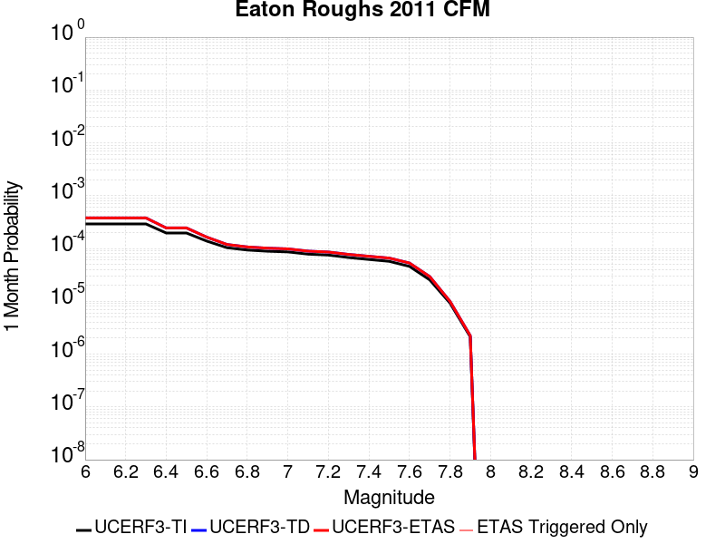 | 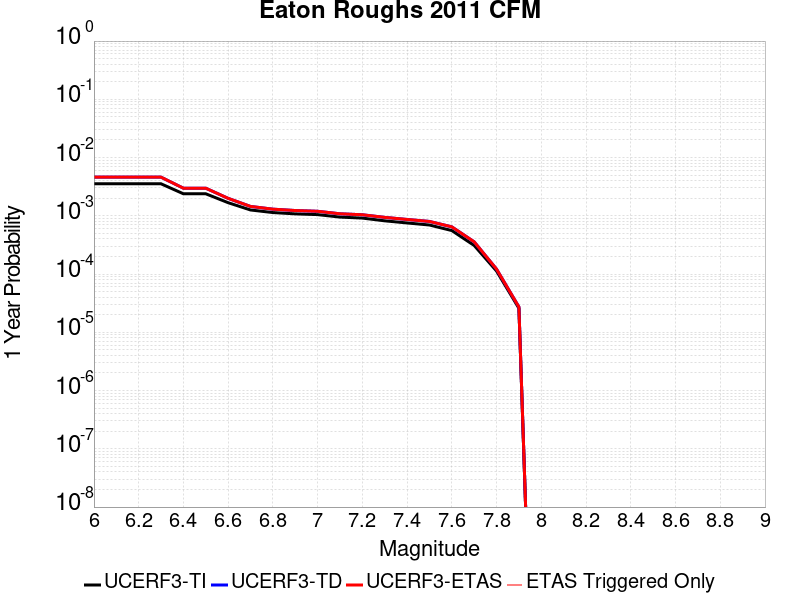 |  |

| Magnitude | 1 wk TI Prob | 1 wk TD Prob | 1 wk ETAS Prob | 1 wk ETAS/TD Gain | 1 wk ETAS Triggered Only | 1 mo TI Prob | 1 mo TD Prob | 1 mo ETAS Prob | 1 mo ETAS/TD Gain | 1 mo ETAS Triggered Only | 1 yr TI Prob | 1 yr TD Prob | 1 yr ETAS Prob | 1 yr ETAS/TD Gain | 1 yr ETAS Triggered Only | 10 yr TI Prob | 10 yr TD Prob | 10 yr ETAS Prob | 10 yr ETAS/TD Gain | 10 yr ETAS Triggered Only |
|-----|-----|-----|-----|-----|-----|-----|-----|-----|-----|-----|-----|-----|-----|-----|-----|-----|-----|-----|-----|-----|
| 6.0 | 6.8044945E-5 | 8.843646E-5 | 8.843646E-5 | 1.0 | 0.0 | 2.9158857E-4 | 3.7896493E-4 | 3.7896493E-4 | 1.0 | 0.0 | 0.0035443127 | 0.0046050907 | 0.0046050907 | 1.0 | 0.0 | 0.03488314 | 0.04516335 | 0.045172896 | 1.0002115 | 1.0E-5 |
| 6.1 | 6.8044945E-5 | 8.843646E-5 | 8.843646E-5 | 1.0 | 0.0 | 2.9158857E-4 | 3.7896493E-4 | 3.7896493E-4 | 1.0 | 0.0 | 0.0035443127 | 0.0046050907 | 0.0046050907 | 1.0 | 0.0 | 0.03488314 | 0.04516335 | 0.045172896 | 1.0002115 | 1.0E-5 |
| 6.2 | 6.8044945E-5 | 8.843646E-5 | 8.843646E-5 | 1.0 | 0.0 | 2.9158857E-4 | 3.7896493E-4 | 3.7896493E-4 | 1.0 | 0.0 | 0.0035443127 | 0.0046050907 | 0.0046050907 | 1.0 | 0.0 | 0.03488314 | 0.04516335 | 0.045172896 | 1.0002115 | 1.0E-5 |
| 6.3 | 6.8044945E-5 | 8.843646E-5 | 8.843646E-5 | 1.0 | 0.0 | 2.9158857E-4 | 3.7896493E-4 | 3.7896493E-4 | 1.0 | 0.0 | 0.0035443127 | 0.0046050907 | 0.0046050907 | 1.0 | 0.0 | 0.03488314 | 0.04516335 | 0.045172896 | 1.0002115 | 1.0E-5 |
| 6.4 | 4.5830013E-5 | 5.715427E-5 | 5.715427E-5 | 1.0 | 0.0 | 1.9639956E-4 | 2.4492692E-4 | 2.4492692E-4 | 1.0 | 0.0 | 0.0023885423 | 0.0029784471 | 0.0029784471 | 1.0 | 0.0 | 0.023630321 | 0.029421588 | 0.029431295 | 1.0003299 | 1.0E-5 |
| 6.5 | 4.5830013E-5 | 5.715427E-5 | 5.715427E-5 | 1.0 | 0.0 | 1.9639956E-4 | 2.4492692E-4 | 2.4492692E-4 | 1.0 | 0.0 | 0.0023885423 | 0.0029784471 | 0.0029784471 | 1.0 | 0.0 | 0.023630321 | 0.029421588 | 0.029431295 | 1.0003299 | 1.0E-5 |
| 6.6 | 3.222194E-5 | 3.8261504E-5 | 3.8261504E-5 | 1.0 | 0.0 | 1.3808672E-4 | 1.639682E-4 | 1.639682E-4 | 1.0 | 0.0 | 0.0016799092 | 0.001994599 | 0.001994599 | 1.0 | 0.0 | 0.016672665 | 0.019776601 | 0.019786404 | 1.0004957 | 1.0E-5 |
| 6.7 | 2.4155654E-5 | 2.7786238E-5 | 2.7786238E-5 | 1.0 | 0.0 | 1.0352012E-4 | 1.1907848E-4 | 1.1907848E-4 | 1.0 | 0.0 | 0.0012596287 | 0.0014488247 | 0.0014488247 | 1.0 | 0.0 | 0.012525126 | 0.014394943 | 0.014404799 | 1.0006847 | 1.0E-5 |
| 6.8 | 2.1814667E-5 | 2.4940868E-5 | 2.4940868E-5 | 1.0 | 0.0 | 9.348808E-5 | 1.06885076E-4 | 1.06885076E-4 | 1.0 | 0.0 | 0.001137623 | 0.0013005526 | 0.0013005526 | 1.0 | 0.0 | 0.011318169 | 0.012930038 | 0.0129399095 | 1.0007634 | 1.0E-5 |
| 6.9 | 2.0700467E-5 | 2.3628932E-5 | 2.3628932E-5 | 1.0 | 0.0 | 8.871327E-5 | 1.01262944E-4 | 1.01262944E-4 | 1.0 | 0.0 | 0.0010795488 | 0.0012321823 | 0.0012321823 | 1.0 | 0.0 | 0.010743194 | 0.012254035 | 0.012263913 | 1.0008061 | 1.0E-5 |
| 7.0 | 2.0104066E-5 | 2.29365E-5 | 2.29365E-5 | 1.0 | 0.0 | 8.615744E-5 | 9.82956E-5 | 9.82956E-5 | 1.0 | 0.0 | 0.0010484619 | 0.0011960949 | 0.0011960949 | 1.0 | 0.0 | 0.010435291 | 0.011897073 | 0.0119069535 | 1.0008305 | 1.0E-5 |
| 7.1 | 1.8225232E-5 | 2.0773046E-5 | 2.0773046E-5 | 1.0 | 0.0 | 7.81058E-5 | 8.902431E-5 | 8.902431E-5 | 1.0 | 0.0 | 9.5052324E-4 | 0.0010833336 | 0.0010833336 | 1.0 | 0.0 | 0.009464677 | 0.010780825 | 0.010780825 | 1.0 | 0.0 |
| 7.2 | 1.7526572E-5 | 1.9993488E-5 | 1.9993488E-5 | 1.0 | 0.0 | 7.511172E-5 | 8.5683576E-5 | 8.5683576E-5 | 1.0 | 0.0 | 9.141015E-4 | 0.0010426997 | 0.0010426997 | 1.0 | 0.0 | 0.009103506 | 0.010378351 | 0.010378351 | 1.0 | 0.0 |
| 7.3 | 1.5727232E-5 | 1.8021507E-5 | 1.8021507E-5 | 1.0 | 0.0 | 6.740067E-5 | 7.723275E-5 | 7.723275E-5 | 1.0 | 0.0 | 8.2029426E-4 | 9.399043E-4 | 9.399043E-4 | 1.0 | 0.0 | 0.008172729 | 0.009359511 | 0.009359511 | 1.0 | 0.0 |
| 7.4 | 1.4457361E-5 | 1.6598358E-5 | 1.6598358E-5 | 1.0 | 0.0 | 6.195865E-5 | 7.113389E-5 | 7.113389E-5 | 1.0 | 0.0 | 7.540854E-4 | 8.657119E-4 | 8.657119E-4 | 1.0 | 0.0 | 0.007515317 | 0.008623555 | 0.008623555 | 1.0 | 0.0 |
| 7.5 | 1.33280955E-5 | 1.5345435E-5 | 1.5345435E-5 | 1.0 | 0.0 | 5.711916E-5 | 6.57645E-5 | 6.57645E-5 | 1.0 | 0.0 | 6.9520384E-4 | 8.0038945E-4 | 8.0038945E-4 | 1.0 | 0.0 | 0.00693033 | 0.007975209 | 0.007975209 | 1.0 | 0.0 |
| 7.6 | 1.0699478E-5 | 1.2387815E-5 | 1.2387815E-5 | 1.0 | 0.0 | 4.5854096E-5 | 5.308956E-5 | 5.308956E-5 | 1.0 | 0.0 | 5.581306E-4 | 6.4617425E-4 | 6.4617425E-4 | 1.0 | 0.0 | 0.005567309 | 0.0064430353 | 0.0064430353 | 1.0 | 0.0 |
| 7.7 | 5.9390236E-6 | 6.852951E-6 | 6.852951E-6 | 1.0 | 0.0 | 2.545271E-5 | 2.9369461E-5 | 2.9369461E-5 | 1.0 | 0.0 | 3.0984267E-4 | 3.5751477E-4 | 3.5751477E-4 | 1.0 | 0.0 | 0.0030941102 | 0.0035694204 | 0.0035694204 | 1.0 | 0.0 |
| 7.8 | 2.1622036E-6 | 2.3296996E-6 | 2.3296996E-6 | 1.0 | 0.0 | 9.266554E-6 | 9.984388E-6 | 9.984388E-6 | 1.0 | 0.0 | 1.1281446E-4 | 1.21553225E-4 | 1.21553225E-4 | 1.0 | 0.0 | 0.001127572 | 0.001214873 | 0.001214873 | 1.0 | 0.0 |
| 7.9 | 4.9586197E-7 | 5.2189216E-7 | 5.2189216E-7 | 1.0 | 0.0 | 2.125121E-6 | 2.2366787E-6 | 2.2366787E-6 | 1.0 | 0.0 | 2.5873042E-5 | 2.7231245E-5 | 2.7231245E-5 | 1.0 | 0.0 | 2.5870028E-4 | 2.7228118E-4 | 2.7228118E-4 | 1.0 | 0.0 |

## Swain Ravine - Spenceville
*[(top)](#table-of-contents)*

| 1 Week | 1 Month | 1 Year | 10 Year |
|-----|-----|-----|-----|
|  |  |  |  |

| Magnitude | 1 wk TI Prob | 1 wk TD Prob | 1 wk ETAS Prob | 1 wk ETAS/TD Gain | 1 wk ETAS Triggered Only | 1 mo TI Prob | 1 mo TD Prob | 1 mo ETAS Prob | 1 mo ETAS/TD Gain | 1 mo ETAS Triggered Only | 1 yr TI Prob | 1 yr TD Prob | 1 yr ETAS Prob | 1 yr ETAS/TD Gain | 1 yr ETAS Triggered Only | 10 yr TI Prob | 10 yr TD Prob | 10 yr ETAS Prob | 10 yr ETAS/TD Gain | 10 yr ETAS Triggered Only |
|-----|-----|-----|-----|-----|-----|-----|-----|-----|-----|-----|-----|-----|-----|-----|-----|-----|-----|-----|-----|-----|
| 6.0 | 5.596169E-6 | 5.663794E-6 | 5.663794E-6 | 1.0 | 0.0 | 2.398336E-5 | 2.4273193E-5 | 2.4273193E-5 | 1.0 | 0.0 | 2.9195828E-4 | 2.9548878E-4 | 3.0548582E-4 | 1.0338322 | 1.0E-5 | 0.00291575 | 0.002951228 | 0.0029611986 | 1.0033784 | 1.0E-5 |
| 6.1 | 5.596169E-6 | 5.663794E-6 | 5.663794E-6 | 1.0 | 0.0 | 2.398336E-5 | 2.4273193E-5 | 2.4273193E-5 | 1.0 | 0.0 | 2.9195828E-4 | 2.9548878E-4 | 3.0548582E-4 | 1.0338322 | 1.0E-5 | 0.00291575 | 0.002951228 | 0.0029611986 | 1.0033784 | 1.0E-5 |
| 6.2 | 5.596169E-6 | 5.663794E-6 | 5.663794E-6 | 1.0 | 0.0 | 2.398336E-5 | 2.4273193E-5 | 2.4273193E-5 | 1.0 | 0.0 | 2.9195828E-4 | 2.9548878E-4 | 3.0548582E-4 | 1.0338322 | 1.0E-5 | 0.00291575 | 0.002951228 | 0.0029611986 | 1.0033784 | 1.0E-5 |
| 6.3 | 5.596169E-6 | 5.663794E-6 | 5.663794E-6 | 1.0 | 0.0 | 2.398336E-5 | 2.4273193E-5 | 2.4273193E-5 | 1.0 | 0.0 | 2.9195828E-4 | 2.9548878E-4 | 3.0548582E-4 | 1.0338322 | 1.0E-5 | 0.00291575 | 0.002951228 | 0.0029611986 | 1.0033784 | 1.0E-5 |
| 6.4 | 2.8426775E-6 | 2.874144E-6 | 2.874144E-6 | 1.0 | 0.0 | 1.2182847E-5 | 1.2317704E-5 | 1.2317704E-5 | 1.0 | 0.0 | 1.4831607E-4 | 1.4995811E-4 | 1.5995662E-4 | 1.0666753 | 1.0E-5 | 0.0014821711 | 0.0014986077 | 0.0015085926 | 1.0066628 | 1.0E-5 |
| 6.5 | 1.9210793E-6 | 1.9414147E-6 | 1.9414147E-6 | 1.0 | 0.0 | 8.233172E-6 | 8.320323E-6 | 8.320323E-6 | 1.0 | 0.0 | 1.0023425E-4 | 1.0129536E-4 | 1.1129434E-4 | 1.0987113 | 1.0E-5 | 0.0010018905 | 0.0010125053 | 0.0010224952 | 1.0098665 | 1.0E-5 |
| 6.6 | 1.9210793E-6 | 1.9414147E-6 | 1.9414147E-6 | 1.0 | 0.0 | 8.233172E-6 | 8.320323E-6 | 8.320323E-6 | 1.0 | 0.0 | 1.0023425E-4 | 1.0129536E-4 | 1.1129434E-4 | 1.0987113 | 1.0E-5 | 0.0010018905 | 0.0010125053 | 0.0010224952 | 1.0098665 | 1.0E-5 |
| 6.7 | 1.4667394E-6 | 1.4818934E-6 | 1.4818934E-6 | 1.0 | 0.0 | 6.286011E-6 | 6.3509565E-6 | 6.3509565E-6 | 1.0 | 0.0 | 7.65295E-5 | 7.732023E-5 | 7.732023E-5 | 1.0 | 0.0 | 7.6503144E-4 | 7.72941E-4 | 7.72941E-4 | 1.0 | 0.0 |
| 6.8 | 1.1076943E-6 | 1.1189535E-6 | 1.1189535E-6 | 1.0 | 0.0 | 4.747252E-6 | 4.7955064E-6 | 4.7955064E-6 | 1.0 | 0.0 | 5.7796264E-5 | 5.838377E-5 | 5.838377E-5 | 1.0 | 0.0 | 5.778124E-4 | 5.836887E-4 | 5.836887E-4 | 1.0 | 0.0 |
| 6.9 | 8.514296E-7 | 8.600095E-7 | 8.600095E-7 | 1.0 | 0.0 | 3.648979E-6 | 3.6857498E-6 | 3.6857498E-6 | 1.0 | 0.0 | 4.442541E-5 | 4.4873108E-5 | 4.4873108E-5 | 1.0 | 0.0 | 4.441653E-4 | 4.4864335E-4 | 4.4864335E-4 | 1.0 | 0.0 |
| 7.0 | 4.8544706E-7 | 4.9033E-7 | 4.9033E-7 | 1.0 | 0.0 | 2.0804857E-6 | 2.1014127E-6 | 2.1014127E-6 | 1.0 | 0.0 | 2.532962E-5 | 2.5584413E-5 | 2.5584413E-5 | 1.0 | 0.0 | 2.5326732E-4 | 2.5581598E-4 | 2.5581598E-4 | 1.0 | 0.0 |
| 7.1 | 3.829186E-7 | 3.8678783E-7 | 3.8678783E-7 | 1.0 | 0.0 | 1.6410787E-6 | 1.6576612E-6 | 1.6576612E-6 | 1.0 | 0.0 | 1.997995E-5 | 2.0181848E-5 | 2.0181848E-5 | 1.0 | 0.0 | 1.9978154E-4 | 2.0180122E-4 | 2.0180122E-4 | 1.0 | 0.0 |
| 7.2 | 1.4726595E-7 | 1.4879437E-7 | 1.4879437E-7 | 1.0 | 0.0 | 6.3113964E-7 | 6.3769005E-7 | 6.3769005E-7 | 1.0 | 0.0 | 7.684098E-6 | 7.763854E-6 | 7.763854E-6 | 1.0 | 0.0 | 7.6838325E-5 | 7.763636E-5 | 7.763636E-5 | 1.0 | 0.0 |
| 7.3 | 4.1880604E-8 | 4.2324306E-8 | 4.2324306E-8 | 1.0 | 0.0 | 1.7948828E-7 | 1.8138988E-7 | 1.8138988E-7 | 1.0 | 0.0 | 2.1852677E-6 | 2.2084218E-6 | 2.2084218E-6 | 1.0 | 0.0 | 2.1852462E-5 | 2.2084218E-5 | 2.2084218E-5 | 1.0 | 0.0 |

## Earthquake Valley (No  Extension)
*[(top)](#table-of-contents)*

| 1 Week | 1 Month | 1 Year | 10 Year |
|-----|-----|-----|-----|
|  |  |  |  |

| Magnitude | 1 wk TI Prob | 1 wk TD Prob | 1 wk ETAS Prob | 1 wk ETAS/TD Gain | 1 wk ETAS Triggered Only | 1 mo TI Prob | 1 mo TD Prob | 1 mo ETAS Prob | 1 mo ETAS/TD Gain | 1 mo ETAS Triggered Only | 1 yr TI Prob | 1 yr TD Prob | 1 yr ETAS Prob | 1 yr ETAS/TD Gain | 1 yr ETAS Triggered Only | 10 yr TI Prob | 10 yr TD Prob | 10 yr ETAS Prob | 10 yr ETAS/TD Gain | 10 yr ETAS Triggered Only |
|-----|-----|-----|-----|-----|-----|-----|-----|-----|-----|-----|-----|-----|-----|-----|-----|-----|-----|-----|-----|-----|
| 6.0 | 2.1859703E-5 | 2.5198362E-5 | 3.519811E-5 | 1.3968412 | 1.0E-5 | 9.3681076E-5 | 1.07989326E-4 | 1.17988246E-4 | 1.0925918 | 1.0E-5 | 0.0011399703 | 0.001314122 | 0.0013241089 | 1.0075996 | 1.0E-5 | 0.011341401 | 0.013077871 | 0.01308774 | 1.0007546 | 1.0E-5 |
| 6.1 | 2.1859703E-5 | 2.5198362E-5 | 3.519811E-5 | 1.3968412 | 1.0E-5 | 9.3681076E-5 | 1.07989326E-4 | 1.17988246E-4 | 1.0925918 | 1.0E-5 | 0.0011399703 | 0.001314122 | 0.0013241089 | 1.0075996 | 1.0E-5 | 0.011341401 | 0.013077871 | 0.01308774 | 1.0007546 | 1.0E-5 |
| 6.2 | 2.1859703E-5 | 2.5198362E-5 | 3.519811E-5 | 1.3968412 | 1.0E-5 | 9.3681076E-5 | 1.07989326E-4 | 1.17988246E-4 | 1.0925918 | 1.0E-5 | 0.0011399703 | 0.001314122 | 0.0013241089 | 1.0075996 | 1.0E-5 | 0.011341401 | 0.013077871 | 0.01308774 | 1.0007546 | 1.0E-5 |
| 6.3 | 2.1859703E-5 | 2.5198362E-5 | 3.519811E-5 | 1.3968412 | 1.0E-5 | 9.3681076E-5 | 1.07989326E-4 | 1.17988246E-4 | 1.0925918 | 1.0E-5 | 0.0011399703 | 0.001314122 | 0.0013241089 | 1.0075996 | 1.0E-5 | 0.011341401 | 0.013077871 | 0.01308774 | 1.0007546 | 1.0E-5 |
| 6.4 | 2.1859703E-5 | 2.5198362E-5 | 3.519811E-5 | 1.3968412 | 1.0E-5 | 9.3681076E-5 | 1.07989326E-4 | 1.17988246E-4 | 1.0925918 | 1.0E-5 | 0.0011399703 | 0.001314122 | 0.0013241089 | 1.0075996 | 1.0E-5 | 0.011341401 | 0.013077871 | 0.01308774 | 1.0007546 | 1.0E-5 |
| 6.5 | 2.1859703E-5 | 2.5198362E-5 | 3.519811E-5 | 1.3968412 | 1.0E-5 | 9.3681076E-5 | 1.07989326E-4 | 1.17988246E-4 | 1.0925918 | 1.0E-5 | 0.0011399703 | 0.001314122 | 0.0013241089 | 1.0075996 | 1.0E-5 | 0.011341401 | 0.013077871 | 0.01308774 | 1.0007546 | 1.0E-5 |
| 6.6 | 1.597E-5 | 1.8356275E-5 | 1.8356275E-5 | 1.0 | 0.0 | 6.8441055E-5 | 7.866787E-5 | 7.866787E-5 | 1.0 | 0.0 | 8.329513E-4 | 9.574478E-4 | 9.574478E-4 | 1.0 | 0.0 | 0.008298361 | 0.009541836 | 0.009541836 | 1.0 | 0.0 |
| 6.7 | 1.597E-5 | 1.8356275E-5 | 1.8356275E-5 | 1.0 | 0.0 | 6.8441055E-5 | 7.866787E-5 | 7.866787E-5 | 1.0 | 0.0 | 8.329513E-4 | 9.574478E-4 | 9.574478E-4 | 1.0 | 0.0 | 0.008298361 | 0.009541836 | 0.009541836 | 1.0 | 0.0 |
| 6.8 | 1.5315149E-5 | 1.7602091E-5 | 1.7602091E-5 | 1.0 | 0.0 | 6.5634704E-5 | 7.543584E-5 | 7.543584E-5 | 1.0 | 0.0 | 7.988095E-4 | 9.181311E-4 | 9.181311E-4 | 1.0 | 0.0 | 0.007959441 | 0.009151919 | 0.009151919 | 1.0 | 0.0 |
| 6.9 | 1.3634728E-5 | 1.5675821E-5 | 1.5675821E-5 | 1.0 | 0.0 | 5.8433237E-5 | 6.718082E-5 | 6.718082E-5 | 1.0 | 0.0 | 7.1119244E-4 | 8.177017E-4 | 8.177017E-4 | 1.0 | 0.0 | 0.007089207 | 0.008155 | 0.008155 | 1.0 | 0.0 |
| 7.0 | 1.3496271E-5 | 1.5517853E-5 | 1.5517853E-5 | 1.0 | 0.0 | 5.783988E-5 | 6.650385E-5 | 6.650385E-5 | 1.0 | 0.0 | 7.03973E-4 | 8.094657E-4 | 8.094657E-4 | 1.0 | 0.0 | 0.007017471 | 0.0080732405 | 0.0080732405 | 1.0 | 0.0 |
| 7.1 | 8.242798E-6 | 9.4726E-6 | 9.4726E-6 | 1.0 | 0.0 | 3.53258E-5 | 4.0596606E-5 | 4.0596606E-5 | 1.0 | 0.0 | 4.300067E-4 | 4.9421866E-4 | 4.9421866E-4 | 1.0 | 0.0 | 0.004291756 | 0.0049377717 | 0.0049377717 | 1.0 | 0.0 |
| 7.2 | 2.6506527E-7 | 2.2560312E-7 | 2.2560312E-7 | 1.0 | 0.0 | 1.1359936E-6 | 9.668702E-7 | 9.668702E-7 | 1.0 | 0.0 | 1.3830633E-5 | 1.17715845E-5 | 1.17715845E-5 | 1.0 | 0.0 | 1.3829772E-4 | 1.1771003E-4 | 1.1771003E-4 | 1.0 | 0.0 |
| 7.3 | 2.5810488E-7 | 2.1955442E-7 | 2.1955442E-7 | 1.0 | 0.0 | 1.1061633E-6 | 9.409472E-7 | 9.409472E-7 | 1.0 | 0.0 | 1.3467455E-5 | 1.1455976E-5 | 1.1455976E-5 | 1.0 | 0.0 | 1.3466639E-4 | 1.1455427E-4 | 1.1455427E-4 | 1.0 | 0.0 |
| 7.4 | 2.2676066E-7 | 1.9110601E-7 | 1.9110601E-7 | 1.0 | 0.0 | 9.71831E-7 | 8.190255E-7 | 8.190255E-7 | 1.0 | 0.0 | 1.1831979E-5 | 9.9715935E-6 | 9.9715935E-6 | 1.0 | 0.0 | 1.1831349E-4 | 9.9711855E-5 | 9.9711855E-5 | 1.0 | 0.0 |
| 7.5 | 1.5553917E-7 | 1.3112096E-7 | 1.3112096E-7 | 1.0 | 0.0 | 6.6659624E-7 | 5.619469E-7 | 5.619469E-7 | 1.0 | 0.0 | 8.115779E-6 | 6.8416834E-6 | 6.8416834E-6 | 1.0 | 0.0 | 8.115482E-5 | 6.841495E-5 | 6.841495E-5 | 1.0 | 0.0 |
| 7.6 | 1.3448629E-7 | 1.1288419E-7 | 1.1288419E-7 | 1.0 | 0.0 | 5.7636964E-7 | 4.837893E-7 | 4.837893E-7 | 1.0 | 0.0 | 7.017278E-6 | 5.890121E-6 | 5.890121E-6 | 1.0 | 0.0 | 7.0170565E-5 | 5.889986E-5 | 5.889986E-5 | 1.0 | 0.0 |
| 7.7 | 2.9719402E-8 | 1.458206E-8 | 1.458206E-8 | 1.0 | 0.0 | 1.2736886E-7 | 6.249454E-8 | 6.249454E-8 | 1.0 | 0.0 | 1.5507147E-6 | 7.608708E-7 | 7.608708E-7 | 1.0 | 0.0 | 1.550704E-5 | 7.6086876E-6 | 7.6086876E-6 | 1.0 | 0.0 |
| 7.8 | 7.4390196E-9 | 3.2502152E-9 | 3.2502152E-9 | 1.0 | 0.0 | 3.1881513E-8 | 1.3929493E-8 | 1.3929493E-8 | 1.0 | 0.0 | 3.8815733E-7 | 1.6959156E-7 | 1.6959156E-7 | 1.0 | 0.0 | 3.8815665E-6 | 1.6959145E-6 | 1.6959145E-6 | 1.0 | 0.0 |
| 7.9 | 1.5373532E-9 | 8.440161E-10 | 8.440161E-10 | 1.0 | 0.0 | 6.5886567E-9 | 3.6172119E-9 | 3.6172119E-9 | 1.0 | 0.0 | 8.021689E-8 | 4.4039556E-8 | 4.4039556E-8 | 1.0 | 0.0 | 8.0216864E-7 | 4.4039552E-7 | 4.4039552E-7 | 1.0 | 0.0 |

## Likely 2011 CFM
*[(top)](#table-of-contents)*

| 1 Week | 1 Month | 1 Year | 10 Year |
|-----|-----|-----|-----|
|  |  |  |  |

| Magnitude | 1 wk TI Prob | 1 wk TD Prob | 1 wk ETAS Prob | 1 wk ETAS/TD Gain | 1 wk ETAS Triggered Only | 1 mo TI Prob | 1 mo TD Prob | 1 mo ETAS Prob | 1 mo ETAS/TD Gain | 1 mo ETAS Triggered Only | 1 yr TI Prob | 1 yr TD Prob | 1 yr ETAS Prob | 1 yr ETAS/TD Gain | 1 yr ETAS Triggered Only | 10 yr TI Prob | 10 yr TD Prob | 10 yr ETAS Prob | 10 yr ETAS/TD Gain | 10 yr ETAS Triggered Only |
|-----|-----|-----|-----|-----|-----|-----|-----|-----|-----|-----|-----|-----|-----|-----|-----|-----|-----|-----|-----|-----|
| 6.0 | 2.5315949E-5 | 2.7104748E-5 | 3.7104477E-5 | 1.368929 | 1.0E-5 | 1.0849241E-4 | 1.16158284E-4 | 1.2615713E-4 | 1.0860795 | 1.0E-5 | 0.0013200947 | 0.0014133542 | 0.00142334 | 1.0070654 | 1.0E-5 | 0.013122803 | 0.01404831 | 0.01405817 | 1.0007018 | 1.0E-5 |
| 6.1 | 2.5315949E-5 | 2.7104748E-5 | 2.7104748E-5 | 1.0 | 0.0 | 1.0849241E-4 | 1.16158284E-4 | 1.16158284E-4 | 1.0 | 0.0 | 0.0013200947 | 0.0014133542 | 0.0014133542 | 1.0 | 0.0 | 0.013122803 | 0.01404831 | 0.01404831 | 1.0 | 0.0 |
| 6.2 | 1.6375941E-5 | 1.7465842E-5 | 1.7465842E-5 | 1.0 | 0.0 | 7.0180715E-5 | 7.485153E-5 | 7.485153E-5 | 1.0 | 0.0 | 8.5411523E-4 | 9.109487E-4 | 9.109487E-4 | 1.0 | 0.0 | 0.008508399 | 0.009073433 | 0.009073433 | 1.0 | 0.0 |
| 6.3 | 1.1945543E-5 | 1.2712587E-5 | 1.2712587E-5 | 1.0 | 0.0 | 5.119418E-5 | 5.4481407E-5 | 5.4481407E-5 | 1.0 | 0.0 | 6.2311086E-4 | 6.631146E-4 | 6.631146E-4 | 1.0 | 0.0 | 0.0062136655 | 0.0066119144 | 0.0066119144 | 1.0 | 0.0 |
| 6.4 | 9.192729E-6 | 9.768488E-6 | 9.768488E-6 | 1.0 | 0.0 | 3.939681E-5 | 4.1864292E-5 | 4.1864292E-5 | 1.0 | 0.0 | 4.7955062E-4 | 5.0958124E-4 | 5.0958124E-4 | 1.0 | 0.0 | 0.004785171 | 0.0050844094 | 0.0050844094 | 1.0 | 0.0 |
| 6.5 | 7.67906E-6 | 8.152622E-6 | 8.152622E-6 | 1.0 | 0.0 | 3.2909844E-5 | 3.4939352E-5 | 3.4939352E-5 | 1.0 | 0.0 | 4.006037E-4 | 4.2530545E-4 | 4.2530545E-4 | 1.0 | 0.0 | 0.0039988225 | 0.004245108 | 0.004245108 | 1.0 | 0.0 |
| 6.6 | 6.4884057E-6 | 6.8847507E-6 | 6.8847507E-6 | 1.0 | 0.0 | 2.7807157E-5 | 2.9505749E-5 | 2.9505749E-5 | 1.0 | 0.0 | 3.3849955E-4 | 3.591747E-4 | 3.591747E-4 | 1.0 | 0.0 | 0.003379844 | 0.0035860867 | 0.0035860867 | 1.0 | 0.0 |
| 6.7 | 4.6060636E-6 | 4.884041E-6 | 4.884041E-6 | 1.0 | 0.0 | 1.9740122E-5 | 2.0931442E-5 | 2.0931442E-5 | 1.0 | 0.0 | 2.403095E-4 | 2.5481134E-4 | 2.5481134E-4 | 1.0 | 0.0 | 0.002400498 | 0.0025452746 | 0.0025452746 | 1.0 | 0.0 |
| 6.8 | 3.2795615E-6 | 3.4773732E-6 | 3.4773732E-6 | 1.0 | 0.0 | 1.4055187E-5 | 1.4902946E-5 | 1.4902946E-5 | 1.0 | 0.0 | 1.7110848E-4 | 1.8142881E-4 | 1.8142881E-4 | 1.0 | 0.0 | 0.0017097679 | 0.0018128622 | 0.0018128622 | 1.0 | 0.0 |
| 6.9 | 2.3289967E-6 | 2.4705569E-6 | 2.4705569E-6 | 1.0 | 0.0 | 9.981376E-6 | 1.058806E-5 | 1.058806E-5 | 1.0 | 0.0 | 1.2151648E-4 | 1.2890245E-4 | 1.2890245E-4 | 1.0 | 0.0 | 0.0012145005 | 0.0012883197 | 0.0012883197 | 1.0 | 0.0 |
| 7.0 | 1.211292E-6 | 1.2863958E-6 | 1.2863958E-6 | 1.0 | 0.0 | 5.1912407E-6 | 5.5131145E-6 | 5.5131145E-6 | 1.0 | 0.0 | 6.320152E-5 | 6.712041E-5 | 6.712041E-5 | 1.0 | 0.0 | 6.3183554E-4 | 6.710312E-4 | 6.710312E-4 | 1.0 | 0.0 |

## Raymond
*[(top)](#table-of-contents)*

| 1 Week | 1 Month | 1 Year | 10 Year |
|-----|-----|-----|-----|
|  |  | 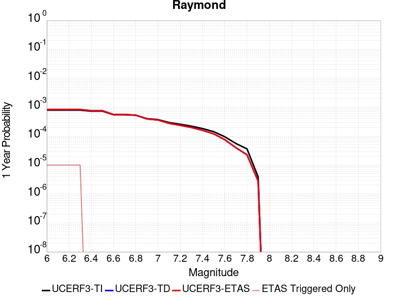 |  |

| Magnitude | 1 wk TI Prob | 1 wk TD Prob | 1 wk ETAS Prob | 1 wk ETAS/TD Gain | 1 wk ETAS Triggered Only | 1 mo TI Prob | 1 mo TD Prob | 1 mo ETAS Prob | 1 mo ETAS/TD Gain | 1 mo ETAS Triggered Only | 1 yr TI Prob | 1 yr TD Prob | 1 yr ETAS Prob | 1 yr ETAS/TD Gain | 1 yr ETAS Triggered Only | 10 yr TI Prob | 10 yr TD Prob | 10 yr ETAS Prob | 10 yr ETAS/TD Gain | 10 yr ETAS Triggered Only |
|-----|-----|-----|-----|-----|-----|-----|-----|-----|-----|-----|-----|-----|-----|-----|-----|-----|-----|-----|-----|-----|
| 6.0 | 1.5157413E-5 | 1.5810128E-5 | 2.580997E-5 | 1.632496 | 1.0E-5 | 6.4958724E-5 | 6.7756075E-5 | 7.7755394E-5 | 1.1475782 | 1.0E-5 | 7.905855E-4 | 8.2464307E-4 | 8.346348E-4 | 1.0121164 | 1.0E-5 | 0.007877788 | 0.008218348 | 0.008228266 | 1.0012068 | 1.0E-5 |
| 6.1 | 1.5157413E-5 | 1.5810128E-5 | 2.580997E-5 | 1.632496 | 1.0E-5 | 6.4958724E-5 | 6.7756075E-5 | 7.7755394E-5 | 1.1475782 | 1.0E-5 | 7.905855E-4 | 8.2464307E-4 | 8.346348E-4 | 1.0121164 | 1.0E-5 | 0.007877788 | 0.008218348 | 0.008228266 | 1.0012068 | 1.0E-5 |
| 6.2 | 1.5157413E-5 | 1.5810128E-5 | 2.580997E-5 | 1.632496 | 1.0E-5 | 6.4958724E-5 | 6.7756075E-5 | 7.7755394E-5 | 1.1475782 | 1.0E-5 | 7.905855E-4 | 8.2464307E-4 | 8.346348E-4 | 1.0121164 | 1.0E-5 | 0.007877788 | 0.008218348 | 0.008228266 | 1.0012068 | 1.0E-5 |
| 6.3 | 1.5157413E-5 | 1.5810128E-5 | 2.580997E-5 | 1.632496 | 1.0E-5 | 6.4958724E-5 | 6.7756075E-5 | 7.7755394E-5 | 1.1475782 | 1.0E-5 | 7.905855E-4 | 8.2464307E-4 | 8.346348E-4 | 1.0121164 | 1.0E-5 | 0.007877788 | 0.008218348 | 0.008228266 | 1.0012068 | 1.0E-5 |
| 6.4 | 1.3941944E-5 | 1.445469E-5 | 1.445469E-5 | 1.0 | 0.0 | 5.9749822E-5 | 6.1947336E-5 | 6.1947336E-5 | 1.0 | 0.0 | 7.2721124E-4 | 7.5397117E-4 | 7.5397117E-4 | 1.0 | 0.0 | 0.007248361 | 0.0075164647 | 0.0075164647 | 1.0 | 0.0 |
| 6.5 | 1.3941944E-5 | 1.445469E-5 | 1.445469E-5 | 1.0 | 0.0 | 5.9749822E-5 | 6.1947336E-5 | 6.1947336E-5 | 1.0 | 0.0 | 7.2721124E-4 | 7.5397117E-4 | 7.5397117E-4 | 1.0 | 0.0 | 0.007248361 | 0.0075164647 | 0.0075164647 | 1.0 | 0.0 |
| 6.6 | 1.0542609E-5 | 1.0671113E-5 | 1.0671113E-5 | 1.0 | 0.0 | 4.5181827E-5 | 4.573257E-5 | 4.573257E-5 | 1.0 | 0.0 | 5.499499E-4 | 5.5665727E-4 | 5.5665727E-4 | 1.0 | 0.0 | 0.005485909 | 0.00555319 | 0.00555319 | 1.0 | 0.0 |
| 6.7 | 1.0542609E-5 | 1.0671113E-5 | 1.0671113E-5 | 1.0 | 0.0 | 4.5181827E-5 | 4.573257E-5 | 4.573257E-5 | 1.0 | 0.0 | 5.499499E-4 | 5.5665727E-4 | 5.5665727E-4 | 1.0 | 0.0 | 0.005485909 | 0.00555319 | 0.00555319 | 1.0 | 0.0 |
| 6.8 | 1.0079132E-5 | 1.0176646E-5 | 1.0176646E-5 | 1.0 | 0.0 | 4.3195567E-5 | 4.3613498E-5 | 4.3613498E-5 | 1.0 | 0.0 | 5.257791E-4 | 5.3087034E-4 | 5.3087034E-4 | 1.0 | 0.0 | 0.0052453685 | 0.005296571 | 0.005296571 | 1.0 | 0.0 |
| 6.9 | 7.721598E-6 | 7.5489047E-6 | 7.5489047E-6 | 1.0 | 0.0 | 3.3092143E-5 | 3.2352054E-5 | 3.2352054E-5 | 1.0 | 0.0 | 4.0282236E-4 | 3.9381627E-4 | 3.9381627E-4 | 1.0 | 0.0 | 0.0040209293 | 0.0039313175 | 0.0039313175 | 1.0 | 0.0 |
| 7.0 | 7.137566E-6 | 6.9113057E-6 | 6.9113057E-6 | 1.0 | 0.0 | 3.058921E-5 | 2.961955E-5 | 2.961955E-5 | 1.0 | 0.0 | 3.7236E-4 | 3.6055944E-4 | 3.6055944E-4 | 1.0 | 0.0 | 0.0037173668 | 0.0035998628 | 0.0035998628 | 1.0 | 0.0 |
| 7.1 | 5.654976E-6 | 5.29954E-6 | 5.29954E-6 | 1.0 | 0.0 | 2.4235387E-5 | 2.2712118E-5 | 2.2712118E-5 | 1.0 | 0.0 | 2.9502588E-4 | 2.7648517E-4 | 2.7648517E-4 | 1.0 | 0.0 | 0.0029463451 | 0.002761443 | 0.002761443 | 1.0 | 0.0 |
| 7.2 | 4.9358455E-6 | 4.5266574E-6 | 4.5266574E-6 | 1.0 | 0.0 | 2.1153453E-5 | 1.9399817E-5 | 1.9399817E-5 | 1.0 | 0.0 | 2.5751285E-4 | 2.3616731E-4 | 2.3616731E-4 | 1.0 | 0.0 | 0.0025721465 | 0.0023591854 | 0.0023591854 | 1.0 | 0.0 |
| 7.3 | 4.2368597E-6 | 3.8056164E-6 | 3.8056164E-6 | 1.0 | 0.0 | 1.8157843E-5 | 1.6309683E-5 | 1.6309683E-5 | 1.0 | 0.0 | 2.2104931E-4 | 1.9855241E-4 | 1.9855241E-4 | 1.0 | 0.0 | 0.0022082955 | 0.0019837688 | 0.0019837688 | 1.0 | 0.0 |
| 7.4 | 3.4999923E-6 | 3.043744E-6 | 3.043744E-6 | 1.0 | 0.0 | 1.49998805E-5 | 1.3044552E-5 | 1.3044552E-5 | 1.0 | 0.0 | 1.8260824E-4 | 1.5880594E-4 | 1.5880594E-4 | 1.0 | 0.0 | 0.0018245826 | 0.0015869403 | 0.0015869403 | 1.0 | 0.0 |
| 7.5 | 2.738017E-6 | 2.3020468E-6 | 2.3020468E-6 | 1.0 | 0.0 | 1.1734306E-5 | 9.865878E-6 | 9.865878E-6 | 1.0 | 0.0 | 1.428558E-4 | 1.2011051E-4 | 1.2011051E-4 | 1.0 | 0.0 | 0.0014276401 | 0.0012004703 | 0.0012004703 | 1.0 | 0.0 |
| 7.6 | 1.8186392E-6 | 1.442312E-6 | 1.442312E-6 | 1.0 | 0.0 | 7.794145E-6 | 6.181323E-6 | 6.181323E-6 | 1.0 | 0.0 | 9.488958E-5 | 7.5255055E-5 | 7.5255055E-5 | 1.0 | 0.0 | 9.4849075E-4 | 7.523072E-4 | 7.523072E-4 | 1.0 | 0.0 |
| 7.7 | 1.0660348E-6 | 7.6438056E-7 | 7.6438056E-7 | 1.0 | 0.0 | 4.5687125E-6 | 3.2759126E-6 | 3.2759126E-6 | 1.0 | 0.0 | 5.5622655E-5 | 3.9883522E-5 | 3.9883522E-5 | 1.0 | 0.0 | 5.5608735E-4 | 3.9877277E-4 | 3.9877277E-4 | 1.0 | 0.0 |
| 7.8 | 6.913602E-7 | 4.3204133E-7 | 4.3204133E-7 | 1.0 | 0.0 | 2.962969E-6 | 1.8516045E-6 | 1.8516045E-6 | 1.0 | 0.0 | 3.607355E-5 | 2.2543056E-5 | 2.2543056E-5 | 1.0 | 0.0 | 3.6067693E-4 | 2.2541556E-4 | 2.2541556E-4 | 1.0 | 0.0 |
| 7.9 | 7.425201E-8 | 5.3222113E-8 | 5.3222113E-8 | 1.0 | 0.0 | 3.1822285E-7 | 2.2809476E-7 | 2.2809476E-7 | 1.0 | 0.0 | 3.874356E-6 | 2.7770516E-6 | 2.7770516E-6 | 1.0 | 0.0 | 3.8742884E-5 | 2.7770298E-5 | 2.7770298E-5 | 1.0 | 0.0 |

## Calaveras (So) 2011 CFM
*[(top)](#table-of-contents)*

| 1 Week | 1 Month | 1 Year | 10 Year |
|-----|-----|-----|-----|
|  |  | 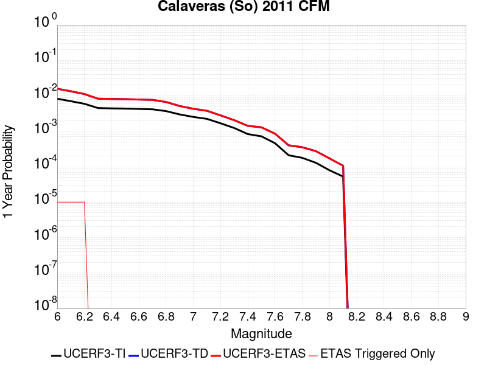 |  |

| Magnitude | 1 wk TI Prob | 1 wk TD Prob | 1 wk ETAS Prob | 1 wk ETAS/TD Gain | 1 wk ETAS Triggered Only | 1 mo TI Prob | 1 mo TD Prob | 1 mo ETAS Prob | 1 mo ETAS/TD Gain | 1 mo ETAS Triggered Only | 1 yr TI Prob | 1 yr TD Prob | 1 yr ETAS Prob | 1 yr ETAS/TD Gain | 1 yr ETAS Triggered Only | 10 yr TI Prob | 10 yr TD Prob | 10 yr ETAS Prob | 10 yr ETAS/TD Gain | 10 yr ETAS Triggered Only |
|-----|-----|-----|-----|-----|-----|-----|-----|-----|-----|-----|-----|-----|-----|-----|-----|-----|-----|-----|-----|-----|
| 6.0 | 1.5950744E-4 | 3.071188E-4 | 3.1711574E-4 | 1.0325507 | 1.0E-5 | 6.834242E-4 | 0.0013155643 | 0.0013255512 | 1.0075912 | 1.0E-5 | 0.00828899 | 0.01585904 | 0.015868882 | 1.0006206 | 1.0E-5 | 0.079865426 | 0.14440064 | 0.1444092 | 1.0000592 | 1.0E-5 |
| 6.1 | 1.3584697E-4 | 2.6036944E-4 | 2.7036684E-4 | 1.038397 | 1.0E-5 | 5.8207137E-4 | 0.0011153965 | 0.0011253853 | 1.0089555 | 1.0E-5 | 0.007063716 | 0.013462106 | 0.013471971 | 1.0007328 | 1.0E-5 | 0.06843361 | 0.12402854 | 0.1240373 | 1.0000706 | 1.0E-5 |
| 6.2 | 1.14676266E-4 | 2.1726108E-4 | 2.2725892E-4 | 1.0460175 | 1.0E-5 | 4.9137714E-4 | 9.307893E-4 | 9.4078E-4 | 1.0107336 | 1.0E-5 | 0.0059661185 | 0.011245592 | 0.011255479 | 1.0008793 | 1.0E-5 | 0.058084648 | 0.105019294 | 0.10502824 | 1.0000852 | 1.0E-5 |
| 6.3 | 8.691518E-5 | 1.5987165E-4 | 1.5987165E-4 | 1.0 | 0.0 | 3.7244044E-4 | 6.8496726E-4 | 6.8496726E-4 | 1.0 | 0.0 | 0.004525038 | 0.008300893 | 0.008300893 | 1.0 | 0.0 | 0.044339992 | 0.0793347 | 0.0793347 | 1.0 | 0.0 |
| 6.4 | 8.50982E-5 | 1.5693568E-4 | 1.5693568E-4 | 1.0 | 0.0 | 3.646556E-4 | 6.7239115E-4 | 6.7239115E-4 | 1.0 | 0.0 | 0.0044306475 | 0.008148931 | 0.008148931 | 1.0 | 0.0 | 0.04343345 | 0.077940844 | 0.077940844 | 1.0 | 0.0 |
| 6.5 | 8.4062965E-5 | 1.5518135E-4 | 1.5518135E-4 | 1.0 | 0.0 | 3.602201E-4 | 6.648764E-4 | 6.648764E-4 | 1.0 | 0.0 | 0.004376863 | 0.008058134 | 0.008058134 | 1.0 | 0.0 | 0.042916555 | 0.077112116 | 0.077112116 | 1.0 | 0.0 |
| 6.6 | 8.194716E-5 | 1.5154095E-4 | 1.5154095E-4 | 1.0 | 0.0 | 3.5115483E-4 | 6.492825E-4 | 6.492825E-4 | 1.0 | 0.0 | 0.0042669317 | 0.007869979 | 0.007869979 | 1.0 | 0.0 | 0.04185927 | 0.07539739 | 0.07539739 | 1.0 | 0.0 |
| 6.7 | 8.012326E-5 | 1.4821833E-4 | 1.4821833E-4 | 1.0 | 0.0 | 3.433402E-4 | 6.350497E-4 | 6.350497E-4 | 1.0 | 0.0 | 0.004172157 | 0.007698474 | 0.007698474 | 1.0 | 0.0 | 0.040946912 | 0.073839515 | 0.073839515 | 1.0 | 0.0 |
| 6.8 | 7.119773E-5 | 1.2880519E-4 | 1.2880519E-4 | 1.0 | 0.0 | 3.0509746E-4 | 5.519001E-4 | 5.519001E-4 | 1.0 | 0.0 | 0.0037082357 | 0.0066958875 | 0.0066958875 | 1.0 | 0.0 | 0.036469642 | 0.06468402 | 0.06468402 | 1.0 | 0.0 |
| 6.9 | 5.7343088E-5 | 9.9189E-5 | 9.9189E-5 | 1.0 | 0.0 | 2.4573295E-4 | 4.2502693E-4 | 4.2502693E-4 | 1.0 | 0.0 | 0.0029876942 | 0.0051625078 | 0.0051625078 | 1.0 | 0.0 | 0.02947844 | 0.050509132 | 0.050509132 | 1.0 | 0.0 |
| 7.0 | 4.8746577E-5 | 8.284751E-5 | 8.284751E-5 | 1.0 | 0.0 | 2.0889717E-4 | 3.550128E-4 | 3.550128E-4 | 1.0 | 0.0 | 0.0025403565 | 0.004313781 | 0.004313781 | 1.0 | 0.0 | 0.025115121 | 0.04248505 | 0.04248505 | 1.0 | 0.0 |
| 7.1 | 4.2998014E-5 | 7.264914E-5 | 7.264914E-5 | 1.0 | 0.0 | 1.8426418E-4 | 3.1131663E-4 | 3.1131663E-4 | 1.0 | 0.0 | 0.002241108 | 0.0037837527 | 0.0037837527 | 1.0 | 0.0 | 0.022186412 | 0.037423246 | 0.037423246 | 1.0 | 0.0 |
| 7.2 | 3.221292E-5 | 5.390566E-5 | 5.390566E-5 | 1.0 | 0.0 | 1.3804805E-4 | 2.3100396E-4 | 2.3100396E-4 | 1.0 | 0.0 | 0.0016794393 | 0.0028088738 | 0.0028088738 | 1.0 | 0.0 | 0.016668037 | 0.028035998 | 0.028035998 | 1.0 | 0.0 |
| 7.3 | 2.3756531E-5 | 3.9471706E-5 | 3.9471706E-5 | 1.0 | 0.0 | 1.0180973E-4 | 1.6915359E-4 | 1.6915359E-4 | 1.0 | 0.0 | 0.0012388286 | 0.0020575167 | 0.0020575167 | 1.0 | 0.0 | 0.012319452 | 0.02064345 | 0.02064345 | 1.0 | 0.0 |
| 7.4 | 1.5997684E-5 | 2.734085E-5 | 2.734085E-5 | 1.0 | 0.0 | 6.8559704E-5 | 1.1716982E-4 | 1.1716982E-4 | 1.0 | 0.0 | 8.343947E-4 | 0.0014256114 | 0.0014256114 | 1.0 | 0.0 | 0.008312687 | 0.014376549 | 0.014376549 | 1.0 | 0.0 |
| 7.5 | 1.3814293E-5 | 2.4782603E-5 | 2.4782603E-5 | 1.0 | 0.0 | 5.9202768E-5 | 1.0620684E-4 | 1.0620684E-4 | 1.0 | 0.0 | 7.205553E-4 | 0.0012923037 | 0.0012923037 | 1.0 | 0.0 | 0.007182234 | 0.013055766 | 0.013055766 | 1.0 | 0.0 |
| 7.6 | 8.817309E-6 | 1.6429829E-5 | 1.6429829E-5 | 1.0 | 0.0 | 3.7787922E-5 | 7.041166E-5 | 7.041166E-5 | 1.0 | 0.0 | 4.5997082E-4 | 8.5692614E-4 | 8.5692614E-4 | 1.0 | 0.0 | 0.004590199 | 0.008719863 | 0.008719863 | 1.0 | 0.0 |
| 7.7 | 4.0352206E-6 | 7.706877E-6 | 7.706877E-6 | 1.0 | 0.0 | 1.7293689E-5 | 3.3029053E-5 | 3.3029053E-5 | 1.0 | 0.0 | 2.1053031E-4 | 4.020546E-4 | 4.020546E-4 | 1.0 | 0.0 | 0.0021033096 | 0.0041649863 | 0.0041649863 | 1.0 | 0.0 |
| 7.8 | 3.413169E-6 | 6.7868646E-6 | 6.7868646E-6 | 1.0 | 0.0 | 1.4627784E-5 | 2.9086239E-5 | 2.9086239E-5 | 1.0 | 0.0 | 1.7807873E-4 | 3.5406748E-4 | 3.5406748E-4 | 1.0 | 0.0 | 0.0017793609 | 0.0036663096 | 0.0036663096 | 1.0 | 0.0 |
| 7.9 | 2.4740732E-6 | 5.278809E-6 | 5.278809E-6 | 1.0 | 0.0 | 1.06031275E-5 | 2.2623271E-5 | 2.2623271E-5 | 1.0 | 0.0 | 1.2908543E-4 | 2.7540355E-4 | 2.7540355E-4 | 1.0 | 0.0 | 0.0012901047 | 0.002834638 | 0.002834638 | 1.0 | 0.0 |
| 8.0 | 1.5231818E-6 | 3.2887135E-6 | 3.2887135E-6 | 1.0 | 0.0 | 6.527906E-6 | 1.409441E-5 | 1.409441E-5 | 1.0 | 0.0 | 7.9474354E-5 | 1.7158597E-4 | 1.7158597E-4 | 1.0 | 0.0 | 7.944594E-4 | 0.001756374 | 0.001756374 | 1.0 | 0.0 |
| 8.1 | 1.0104524E-6 | 2.0456548E-6 | 2.0456548E-6 | 1.0 | 0.0 | 4.330503E-6 | 8.767062E-6 | 8.767062E-6 | 1.0 | 0.0 | 5.2722597E-5 | 1.06733794E-4 | 1.06733794E-4 | 1.0 | 0.0 | 5.271009E-4 | 0.0010929212 | 0.0010929212 | 1.0 | 0.0 |

## Elsinore (Stepovers Combined)
*[(top)](#table-of-contents)*

| 1 Week | 1 Month | 1 Year | 10 Year |
|-----|-----|-----|-----|
| 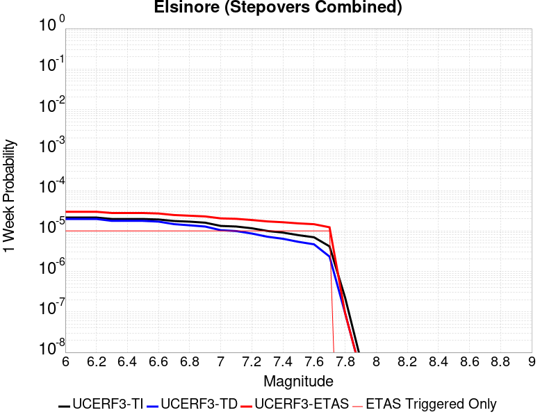 |  | 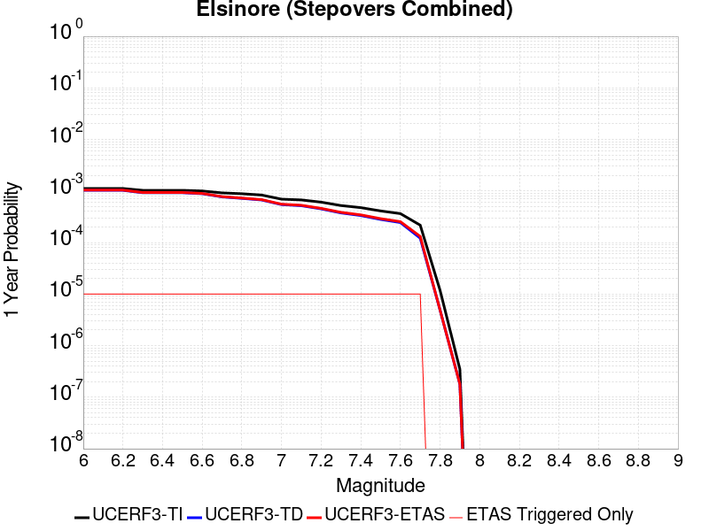 |  |

| Magnitude | 1 wk TI Prob | 1 wk TD Prob | 1 wk ETAS Prob | 1 wk ETAS/TD Gain | 1 wk ETAS Triggered Only | 1 mo TI Prob | 1 mo TD Prob | 1 mo ETAS Prob | 1 mo ETAS/TD Gain | 1 mo ETAS Triggered Only | 1 yr TI Prob | 1 yr TD Prob | 1 yr ETAS Prob | 1 yr ETAS/TD Gain | 1 yr ETAS Triggered Only | 10 yr TI Prob | 10 yr TD Prob | 10 yr ETAS Prob | 10 yr ETAS/TD Gain | 10 yr ETAS Triggered Only |
|-----|-----|-----|-----|-----|-----|-----|-----|-----|-----|-----|-----|-----|-----|-----|-----|-----|-----|-----|-----|-----|
| 6.0 | 2.144392E-5 | 1.9760193E-5 | 2.9759995E-5 | 1.506058 | 1.0E-5 | 9.189928E-5 | 8.468392E-5 | 9.468307E-5 | 1.1180762 | 1.0E-5 | 0.0011182994 | 0.0010305607 | 0.0010405504 | 1.0096935 | 1.0E-5 | 0.011126885 | 0.010264917 | 0.010274814 | 1.0009642 | 1.0E-5 |
| 6.1 | 2.144392E-5 | 1.9760193E-5 | 2.9759995E-5 | 1.506058 | 1.0E-5 | 9.189928E-5 | 8.468392E-5 | 9.468307E-5 | 1.1180762 | 1.0E-5 | 0.0011182994 | 0.0010305607 | 0.0010405504 | 1.0096935 | 1.0E-5 | 0.011126885 | 0.010264917 | 0.010274814 | 1.0009642 | 1.0E-5 |
| 6.2 | 2.144392E-5 | 1.9760193E-5 | 2.9759995E-5 | 1.506058 | 1.0E-5 | 9.189928E-5 | 8.468392E-5 | 9.468307E-5 | 1.1180762 | 1.0E-5 | 0.0011182994 | 0.0010305607 | 0.0010405504 | 1.0096935 | 1.0E-5 | 0.011126885 | 0.010264917 | 0.010274814 | 1.0009642 | 1.0E-5 |
| 6.3 | 1.9751555E-5 | 1.7741453E-5 | 2.7741275E-5 | 1.5636417 | 1.0E-5 | 8.4646774E-5 | 7.603267E-5 | 8.603191E-5 | 1.1315124 | 1.0E-5 | 0.0010300872 | 9.253213E-4 | 9.3531207E-4 | 1.010797 | 1.0E-5 | 0.010253254 | 0.009221276 | 0.009231185 | 1.0010744 | 1.0E-5 |
| 6.4 | 1.9751555E-5 | 1.7741453E-5 | 2.7741275E-5 | 1.5636417 | 1.0E-5 | 8.4646774E-5 | 7.603267E-5 | 8.603191E-5 | 1.1315124 | 1.0E-5 | 0.0010300872 | 9.253213E-4 | 9.3531207E-4 | 1.010797 | 1.0E-5 | 0.010253254 | 0.009221276 | 0.009231185 | 1.0010744 | 1.0E-5 |
| 6.5 | 1.9751555E-5 | 1.7741453E-5 | 2.7741275E-5 | 1.5636417 | 1.0E-5 | 8.4646774E-5 | 7.603267E-5 | 8.603191E-5 | 1.1315124 | 1.0E-5 | 0.0010300872 | 9.253213E-4 | 9.3531207E-4 | 1.010797 | 1.0E-5 | 0.010253254 | 0.009221276 | 0.009231185 | 1.0010744 | 1.0E-5 |
| 6.6 | 1.9188685E-5 | 1.7003393E-5 | 2.7003223E-5 | 1.588108 | 1.0E-5 | 8.2234634E-5 | 7.286974E-5 | 8.286901E-5 | 1.1372212 | 1.0E-5 | 0.0010007467 | 8.868442E-4 | 8.968353E-4 | 1.011266 | 1.0E-5 | 0.00996252 | 0.0088398475 | 0.008849759 | 1.0011213 | 1.0E-5 |
| 6.7 | 1.7608272E-5 | 1.4732616E-5 | 2.473247E-5 | 1.678756 | 1.0E-5 | 7.546184E-5 | 6.3138315E-5 | 7.313768E-5 | 1.1583724 | 1.0E-5 | 9.183606E-4 | 7.684476E-4 | 7.784399E-4 | 1.0130032 | 1.0E-5 | 0.009145746 | 0.00766491 | 0.0076748333 | 1.0012946 | 1.0E-5 |
| 6.8 | 1.697165E-5 | 1.3783365E-5 | 2.3783226E-5 | 1.7255023 | 1.0E-5 | 7.273361E-5 | 5.9070277E-5 | 6.906968E-5 | 1.1692799 | 1.0E-5 | 8.8517193E-4 | 7.18952E-4 | 7.289448E-4 | 1.0138991 | 1.0E-5 | 0.008816543 | 0.007172675 | 0.0071826032 | 1.0013841 | 1.0E-5 |
| 6.9 | 1.600365E-5 | 1.2846671E-5 | 2.2846543E-5 | 1.7784017 | 1.0E-5 | 6.858527E-5 | 5.5056043E-5 | 6.5055494E-5 | 1.1816231 | 1.0E-5 | 8.347058E-4 | 6.7010894E-4 | 6.8010227E-4 | 1.014913 | 1.0E-5 | 0.008315775 | 0.0066867657 | 0.006696699 | 1.0014855 | 1.0E-5 |
| 7.0 | 1.3314581E-5 | 1.0447548E-5 | 2.0447444E-5 | 1.9571524 | 1.0E-5 | 5.7061243E-5 | 4.4774453E-5 | 5.4774006E-5 | 1.2233317 | 1.0E-5 | 6.944992E-4 | 5.449953E-4 | 5.5498985E-4 | 1.0183388 | 1.0E-5 | 0.006923327 | 0.0054405155 | 0.005450461 | 1.0018281 | 1.0E-5 |
| 7.1 | 1.2865345E-5 | 9.937536E-6 | 1.9937437E-5 | 2.0062757 | 1.0E-5 | 5.5136024E-5 | 4.258876E-5 | 5.2588333E-5 | 1.2347938 | 1.0E-5 | 6.710743E-4 | 5.183973E-4 | 5.2839215E-4 | 1.0192802 | 1.0E-5 | 0.0066905143 | 0.0051752133 | 0.0051851617 | 1.0019222 | 1.0E-5 |
| 7.2 | 1.1650051E-5 | 8.633809E-6 | 1.8633722E-5 | 2.1582274 | 1.0E-5 | 4.9927836E-5 | 3.7001522E-5 | 4.7001155E-5 | 1.2702491 | 1.0E-5 | 6.0770183E-4 | 4.504022E-4 | 4.6039768E-4 | 1.0221924 | 1.0E-5 | 0.0060604266 | 0.0044963174 | 0.0045062723 | 1.0022141 | 1.0E-5 |
| 7.3 | 1.0008533E-5 | 7.2010425E-6 | 1.7200971E-5 | 2.3886778 | 1.0E-5 | 4.2893007E-5 | 3.0861254E-5 | 4.0860945E-5 | 1.3240209 | 1.0E-5 | 5.220972E-4 | 3.7567242E-4 | 3.8566868E-4 | 1.026609 | 1.0E-5 | 0.005208723 | 0.003750761 | 0.0037607234 | 1.0026561 | 1.0E-5 |
| 7.4 | 9.116759E-6 | 6.410068E-6 | 1.6410004E-5 | 2.5600357 | 1.0E-5 | 3.907124E-5 | 2.747144E-5 | 3.7471164E-5 | 1.3640044 | 1.0E-5 | 4.7558855E-4 | 3.3441483E-4 | 3.4441147E-4 | 1.0298929 | 1.0E-5 | 0.00474572 | 0.0033392678 | 0.0033492346 | 1.0029846 | 1.0E-5 |
| 7.5 | 7.870524E-6 | 5.3825365E-6 | 1.5382482E-5 | 2.85785 | 1.0E-5 | 3.3730383E-5 | 2.3067816E-5 | 3.3067587E-5 | 1.4334944 | 1.0E-5 | 4.1059E-4 | 2.8081573E-4 | 2.9081292E-4 | 1.0356005 | 1.0E-5 | 0.0040983222 | 0.0028047354 | 0.0028147076 | 1.0035554 | 1.0E-5 |
| 7.6 | 6.9774537E-6 | 4.6776067E-6 | 1.467756E-5 | 3.1378353 | 1.0E-5 | 2.990303E-5 | 2.0046738E-5 | 3.0046538E-5 | 1.4988242 | 1.0E-5 | 3.640086E-4 | 2.4404288E-4 | 2.5404044E-4 | 1.0409664 | 1.0E-5 | 0.003634129 | 0.0024378651 | 0.0024478408 | 1.004092 | 1.0E-5 |
| 7.7 | 4.1616954E-6 | 2.32834E-6 | 1.2328317E-5 | 5.294895 | 1.0E-5 | 1.7835715E-5 | 9.978567E-6 | 1.9978466E-5 | 2.002138 | 1.0E-5 | 2.171282E-4 | 1.2148302E-4 | 1.3148181E-4 | 1.082306 | 1.0E-5 | 0.0021691616 | 0.0012142392 | 0.001224227 | 1.0082256 | 1.0E-5 |
| 7.8 | 2.2692414E-7 | 9.3854695E-8 | 9.3854695E-8 | 1.0 | 0.0 | 9.725317E-7 | 4.0223435E-7 | 4.0223435E-7 | 1.0 | 0.0 | 1.1840509E-5 | 4.8971956E-6 | 4.8971956E-6 | 1.0 | 0.0 | 1.1839878E-4 | 4.8971204E-5 | 4.8971204E-5 | 1.0 | 0.0 |
| 7.9 | 6.676829E-9 | 3.439853E-9 | 3.439853E-9 | 1.0 | 0.0 | 2.861498E-8 | 1.4742227E-8 | 1.4742227E-8 | 1.0 | 0.0 | 3.4838732E-7 | 1.7948659E-7 | 1.7948659E-7 | 1.0 | 0.0 | 3.4838679E-6 | 1.7948646E-6 | 1.7948646E-6 | 1.0 | 0.0 |

## San Gabriel
*[(top)](#table-of-contents)*

| 1 Week | 1 Month | 1 Year | 10 Year |
|-----|-----|-----|-----|
| 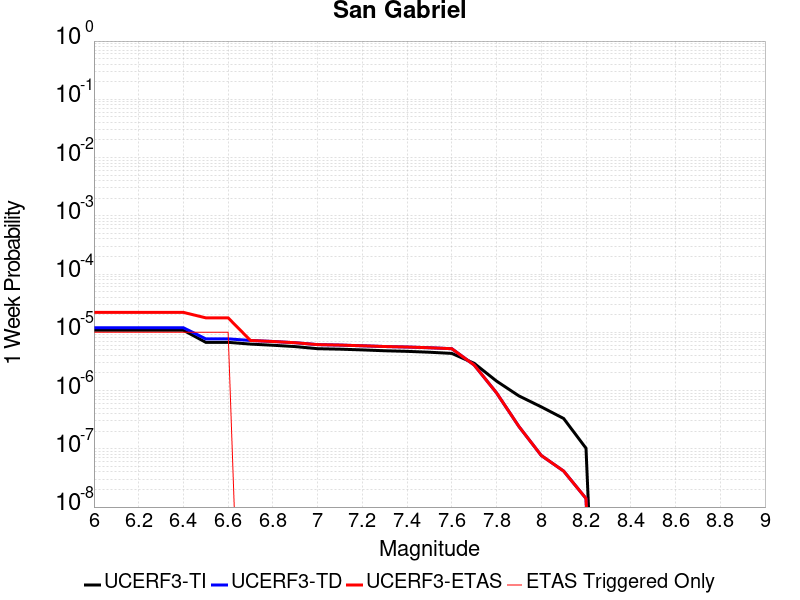 |  |  | 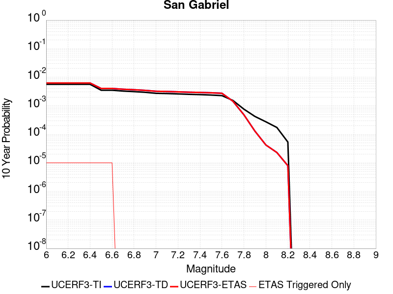 |

| Magnitude | 1 wk TI Prob | 1 wk TD Prob | 1 wk ETAS Prob | 1 wk ETAS/TD Gain | 1 wk ETAS Triggered Only | 1 mo TI Prob | 1 mo TD Prob | 1 mo ETAS Prob | 1 mo ETAS/TD Gain | 1 mo ETAS Triggered Only | 1 yr TI Prob | 1 yr TD Prob | 1 yr ETAS Prob | 1 yr ETAS/TD Gain | 1 yr ETAS Triggered Only | 10 yr TI Prob | 10 yr TD Prob | 10 yr ETAS Prob | 10 yr ETAS/TD Gain | 10 yr ETAS Triggered Only |
|-----|-----|-----|-----|-----|-----|-----|-----|-----|-----|-----|-----|-----|-----|-----|-----|-----|-----|-----|-----|-----|
| 6.0 | 1.083775E-5 | 1.19851875E-5 | 2.1985068E-5 | 1.8343532 | 1.0E-5 | 4.6446676E-5 | 5.1364143E-5 | 6.136363E-5 | 1.1946783 | 1.0E-5 | 5.653415E-4 | 6.251903E-4 | 6.3518406E-4 | 1.0159851 | 1.0E-5 | 0.0056390543 | 0.006246409 | 0.0062563466 | 1.001591 | 1.0E-5 |
| 6.1 | 1.083775E-5 | 1.19851875E-5 | 2.1985068E-5 | 1.8343532 | 1.0E-5 | 4.6446676E-5 | 5.1364143E-5 | 6.136363E-5 | 1.1946783 | 1.0E-5 | 5.653415E-4 | 6.251903E-4 | 6.3518406E-4 | 1.0159851 | 1.0E-5 | 0.0056390543 | 0.006246409 | 0.0062563466 | 1.001591 | 1.0E-5 |
| 6.2 | 1.083775E-5 | 1.19851875E-5 | 2.1985068E-5 | 1.8343532 | 1.0E-5 | 4.6446676E-5 | 5.1364143E-5 | 6.136363E-5 | 1.1946783 | 1.0E-5 | 5.653415E-4 | 6.251903E-4 | 6.3518406E-4 | 1.0159851 | 1.0E-5 | 0.0056390543 | 0.006246409 | 0.0062563466 | 1.001591 | 1.0E-5 |
| 6.3 | 1.083775E-5 | 1.19851875E-5 | 2.1985068E-5 | 1.8343532 | 1.0E-5 | 4.6446676E-5 | 5.1364143E-5 | 6.136363E-5 | 1.1946783 | 1.0E-5 | 5.653415E-4 | 6.251903E-4 | 6.3518406E-4 | 1.0159851 | 1.0E-5 | 0.0056390543 | 0.006246409 | 0.0062563466 | 1.001591 | 1.0E-5 |
| 6.4 | 1.083775E-5 | 1.19851875E-5 | 2.1985068E-5 | 1.8343532 | 1.0E-5 | 4.6446676E-5 | 5.1364143E-5 | 6.136363E-5 | 1.1946783 | 1.0E-5 | 5.653415E-4 | 6.251903E-4 | 6.3518406E-4 | 1.0159851 | 1.0E-5 | 0.0056390543 | 0.006246409 | 0.0062563466 | 1.001591 | 1.0E-5 |
| 6.5 | 6.7317824E-6 | 7.716944E-6 | 1.7716868E-5 | 2.2958395 | 1.0E-5 | 2.8850178E-5 | 3.3072207E-5 | 4.3071876E-5 | 1.3023587 | 1.0E-5 | 3.511943E-4 | 4.0258077E-4 | 4.1257674E-4 | 1.0248297 | 1.0E-5 | 0.003506398 | 0.0040296097 | 0.0040395693 | 1.0024717 | 1.0E-5 |
| 6.6 | 6.7317824E-6 | 7.716944E-6 | 1.7716868E-5 | 2.2958395 | 1.0E-5 | 2.8850178E-5 | 3.3072207E-5 | 4.3071876E-5 | 1.3023587 | 1.0E-5 | 3.511943E-4 | 4.0258077E-4 | 4.1257674E-4 | 1.0248297 | 1.0E-5 | 0.003506398 | 0.0040296097 | 0.0040395693 | 1.0024717 | 1.0E-5 |
| 6.7 | 6.274881E-6 | 7.2458647E-6 | 7.2458647E-6 | 1.0 | 0.0 | 2.6892068E-5 | 3.1053343E-5 | 3.1053343E-5 | 1.0 | 0.0 | 3.2736175E-4 | 3.780098E-4 | 3.780098E-4 | 1.0 | 0.0 | 0.0032687993 | 0.0037847564 | 0.0037847564 | 1.0 | 0.0 |
| 6.8 | 5.996209E-6 | 6.958585E-6 | 6.958585E-6 | 1.0 | 0.0 | 2.5697784E-5 | 2.9822171E-5 | 2.9822171E-5 | 1.0 | 0.0 | 3.128256E-4 | 3.6302538E-4 | 3.6302538E-4 | 1.0 | 0.0 | 0.003123856 | 0.0036354093 | 0.0036354093 | 1.0 | 0.0 |
| 6.9 | 5.686331E-6 | 6.6236316E-6 | 6.6236316E-6 | 1.0 | 0.0 | 2.4369761E-5 | 2.8386688E-5 | 2.8386688E-5 | 1.0 | 0.0 | 2.9666146E-4 | 3.4555403E-4 | 3.4555403E-4 | 1.0 | 0.0 | 0.0029626573 | 0.0034612515 | 0.0034612515 | 1.0 | 0.0 |
| 7.0 | 5.2329838E-6 | 6.147514E-6 | 6.147514E-6 | 1.0 | 0.0 | 2.242688E-5 | 2.6346226E-5 | 2.6346226E-5 | 1.0 | 0.0 | 2.7301308E-4 | 3.2071886E-4 | 3.2071886E-4 | 1.0 | 0.0 | 0.002726779 | 0.0032136322 | 0.0032136322 | 1.0 | 0.0 |
| 7.1 | 5.135671E-6 | 6.03764E-6 | 6.03764E-6 | 1.0 | 0.0 | 2.2009834E-5 | 2.5875348E-5 | 2.5875348E-5 | 1.0 | 0.0 | 2.6793676E-4 | 3.1498758E-4 | 3.1498758E-4 | 1.0 | 0.0 | 0.0026761394 | 0.0031564834 | 0.0031564834 | 1.0 | 0.0 |
| 7.2 | 4.989062E-6 | 5.87102E-6 | 5.87102E-6 | 1.0 | 0.0 | 2.1381518E-5 | 2.5161276E-5 | 2.5161276E-5 | 1.0 | 0.0 | 2.6028889E-4 | 3.0629625E-4 | 3.0629625E-4 | 1.0 | 0.0 | 0.0025998424 | 0.003069813 | 0.003069813 | 1.0 | 0.0 |
| 7.3 | 4.8219395E-6 | 5.702574E-6 | 5.702574E-6 | 1.0 | 0.0 | 2.0665291E-5 | 2.443938E-5 | 2.443938E-5 | 1.0 | 0.0 | 2.5157086E-4 | 2.9750957E-4 | 2.9750957E-4 | 1.0 | 0.0 | 0.0025128627 | 0.0029821852 | 0.0029821852 | 1.0 | 0.0 |
| 7.4 | 4.7118383E-6 | 5.5911332E-6 | 5.5911332E-6 | 1.0 | 0.0 | 2.0193436E-5 | 2.3961782E-5 | 2.3961782E-5 | 1.0 | 0.0 | 2.4582737E-4 | 2.916964E-4 | 2.916964E-4 | 1.0 | 0.0 | 0.002455556 | 0.0029242067 | 0.0029242067 | 1.0 | 0.0 |
| 7.5 | 4.5506545E-6 | 5.4365014E-6 | 5.4365014E-6 | 1.0 | 0.0 | 1.9502659E-5 | 2.3299088E-5 | 2.3299088E-5 | 1.0 | 0.0 | 2.37419E-4 | 2.8363022E-4 | 2.8363022E-4 | 1.0 | 0.0 | 0.002371655 | 0.002843753 | 0.002843753 | 1.0 | 0.0 |
| 7.6 | 4.343636E-6 | 5.2293817E-6 | 5.2293817E-6 | 1.0 | 0.0 | 1.861545E-5 | 2.2411448E-5 | 2.2411448E-5 | 1.0 | 0.0 | 2.2661954E-4 | 2.7282597E-4 | 2.7282597E-4 | 1.0 | 0.0 | 0.0022638857 | 0.0027359722 | 0.0027359722 | 1.0 | 0.0 |
| 7.7 | 2.936235E-6 | 2.7440458E-6 | 2.7440458E-6 | 1.0 | 0.0 | 1.2583803E-5 | 1.1760143E-5 | 1.1760143E-5 | 1.0 | 0.0 | 1.5319703E-4 | 1.4317037E-4 | 1.4317037E-4 | 1.0 | 0.0 | 0.0015309147 | 0.0014380751 | 0.0014380751 | 1.0 | 0.0 |
| 7.8 | 1.4541639E-6 | 9.1237047E-7 | 9.1237047E-7 | 1.0 | 0.0 | 6.232116E-6 | 3.9101533E-6 | 3.9101533E-6 | 1.0 | 0.0 | 7.587337E-5 | 4.7605077E-5 | 4.7605077E-5 | 1.0 | 0.0 | 7.584747E-4 | 4.8085177E-4 | 4.8085177E-4 | 1.0 | 0.0 |
| 7.9 | 8.098958E-7 | 2.41753E-7 | 2.41753E-7 | 1.0 | 0.0 | 3.4709774E-6 | 1.0360839E-6 | 1.0360839E-6 | 1.0 | 0.0 | 4.225833E-5 | 1.2614248E-5 | 1.2614248E-5 | 1.0 | 0.0 | 4.2250296E-4 | 1.2921814E-4 | 1.2921814E-4 | 1.0 | 0.0 |
| 8.0 | 5.2473234E-7 | 7.6792055E-8 | 7.6792055E-8 | 1.0 | 0.0 | 2.248851E-6 | 3.2910876E-7 | 3.2910876E-7 | 1.0 | 0.0 | 2.7379416E-5 | 4.0068917E-6 | 4.0068917E-6 | 1.0 | 0.0 | 2.7376044E-4 | 4.21918E-5 | 4.21918E-5 | 1.0 | 0.0 |
| 8.1 | 3.3162388E-7 | 4.1496126E-8 | 4.1496126E-8 | 1.0 | 0.0 | 1.4212444E-6 | 1.7784053E-7 | 1.7784053E-7 | 1.0 | 0.0 | 1.7303513E-5 | 2.1652063E-6 | 2.1652063E-6 | 1.0 | 0.0 | 1.7302166E-4 | 2.2965523E-5 | 2.2965523E-5 | 1.0 | 0.0 |
| 8.2 | 1.0235345E-7 | 1.4043474E-8 | 1.4043474E-8 | 1.0 | 0.0 | 4.3865757E-7 | 6.0186316E-8 | 6.0186316E-8 | 1.0 | 0.0 | 5.340643E-6 | 7.327681E-7 | 7.327681E-7 | 1.0 | 0.0 | 5.3405143E-5 | 7.9273705E-6 | 7.9273705E-6 | 1.0 | 0.0 |

## Fitzhugh Creek
*[(top)](#table-of-contents)*

| 1 Week | 1 Month | 1 Year | 10 Year |
|-----|-----|-----|-----|
|  |  |  |  |

| Magnitude | 1 wk TI Prob | 1 wk TD Prob | 1 wk ETAS Prob | 1 wk ETAS/TD Gain | 1 wk ETAS Triggered Only | 1 mo TI Prob | 1 mo TD Prob | 1 mo ETAS Prob | 1 mo ETAS/TD Gain | 1 mo ETAS Triggered Only | 1 yr TI Prob | 1 yr TD Prob | 1 yr ETAS Prob | 1 yr ETAS/TD Gain | 1 yr ETAS Triggered Only | 10 yr TI Prob | 10 yr TD Prob | 10 yr ETAS Prob | 10 yr ETAS/TD Gain | 10 yr ETAS Triggered Only |
|-----|-----|-----|-----|-----|-----|-----|-----|-----|-----|-----|-----|-----|-----|-----|-----|-----|-----|-----|-----|-----|
| 6.0 | 6.1090436E-6 | 6.2101562E-6 | 1.6210093E-5 | 2.6102555 | 1.0E-5 | 2.6181353E-5 | 2.6614709E-5 | 3.661444E-5 | 1.375722 | 1.0E-5 | 3.1871133E-4 | 3.239904E-4 | 3.3398715E-4 | 1.0308551 | 1.0E-5 | 0.0031825465 | 0.0032356246 | 0.0032455921 | 1.0030806 | 1.0E-5 |
| 6.1 | 2.9741811E-6 | 3.021581E-6 | 3.021581E-6 | 1.0 | 0.0 | 1.2746428E-5 | 1.2949574E-5 | 1.2949574E-5 | 1.0 | 0.0 | 1.5517672E-4 | 1.576506E-4 | 1.576506E-4 | 1.0 | 0.0 | 0.001550684 | 0.0015754806 | 0.0015754806 | 1.0 | 0.0 |
| 6.2 | 2.9741811E-6 | 3.021581E-6 | 3.021581E-6 | 1.0 | 0.0 | 1.2746428E-5 | 1.2949574E-5 | 1.2949574E-5 | 1.0 | 0.0 | 1.5517672E-4 | 1.576506E-4 | 1.576506E-4 | 1.0 | 0.0 | 0.001550684 | 0.0015754806 | 0.0015754806 | 1.0 | 0.0 |
| 6.3 | 1.4781198E-6 | 1.5012708E-6 | 1.5012708E-6 | 1.0 | 0.0 | 6.3347834E-6 | 6.4340034E-6 | 6.4340034E-6 | 1.0 | 0.0 | 7.712326E-5 | 7.833137E-5 | 7.833137E-5 | 1.0 | 0.0 | 7.70965E-4 | 7.830576E-4 | 7.830576E-4 | 1.0 | 0.0 |
| 6.4 | 1.4781198E-6 | 1.5012708E-6 | 1.5012708E-6 | 1.0 | 0.0 | 6.3347834E-6 | 6.4340034E-6 | 6.4340034E-6 | 1.0 | 0.0 | 7.712326E-5 | 7.833137E-5 | 7.833137E-5 | 1.0 | 0.0 | 7.70965E-4 | 7.830576E-4 | 7.830576E-4 | 1.0 | 0.0 |
| 6.5 | 9.5176676E-7 | 9.66606E-7 | 9.66606E-7 | 1.0 | 0.0 | 4.078994E-6 | 4.142591E-6 | 4.142591E-6 | 1.0 | 0.0 | 4.9660623E-5 | 5.0434985E-5 | 5.0434985E-5 | 1.0 | 0.0 | 4.964952E-4 | 5.042458E-4 | 5.042458E-4 | 1.0 | 0.0 |
| 6.6 | 6.21145E-7 | 6.3085855E-7 | 6.3085855E-7 | 1.0 | 0.0 | 2.662047E-6 | 2.7036772E-6 | 2.7036772E-6 | 1.0 | 0.0 | 3.2409942E-5 | 3.291684E-5 | 3.291684E-5 | 1.0 | 0.0 | 3.2405215E-4 | 3.2912623E-4 | 3.2912623E-4 | 1.0 | 0.0 |
| 6.7 | 2.2377962E-7 | 2.2734636E-7 | 2.2734636E-7 | 1.0 | 0.0 | 9.590551E-7 | 9.743413E-7 | 9.743413E-7 | 1.0 | 0.0 | 1.1676434E-5 | 1.1862574E-5 | 1.1862574E-5 | 1.0 | 0.0 | 1.1675821E-4 | 1.1862254E-4 | 1.1862254E-4 | 1.0 | 0.0 |
| 6.8 | 1.4785022E-7 | 1.5021492E-7 | 1.5021492E-7 | 1.0 | 0.0 | 6.3364365E-7 | 6.4377826E-7 | 6.4377826E-7 | 1.0 | 0.0 | 7.714584E-6 | 7.838E-6 | 7.838E-6 | 1.0 | 0.0 | 7.714316E-5 | 7.838E-5 | 7.838E-5 | 1.0 | 0.0 |

## Rinconada 2011 CFM
*[(top)](#table-of-contents)*

| 1 Week | 1 Month | 1 Year | 10 Year |
|-----|-----|-----|-----|
|  |  |  |  |

| Magnitude | 1 wk TI Prob | 1 wk TD Prob | 1 wk ETAS Prob | 1 wk ETAS/TD Gain | 1 wk ETAS Triggered Only | 1 mo TI Prob | 1 mo TD Prob | 1 mo ETAS Prob | 1 mo ETAS/TD Gain | 1 mo ETAS Triggered Only | 1 yr TI Prob | 1 yr TD Prob | 1 yr ETAS Prob | 1 yr ETAS/TD Gain | 1 yr ETAS Triggered Only | 10 yr TI Prob | 10 yr TD Prob | 10 yr ETAS Prob | 10 yr ETAS/TD Gain | 10 yr ETAS Triggered Only |
|-----|-----|-----|-----|-----|-----|-----|-----|-----|-----|-----|-----|-----|-----|-----|-----|-----|-----|-----|-----|-----|
| 6.0 | 1.5752368E-5 | 1.6274716E-5 | 2.6274553E-5 | 1.6144401 | 1.0E-5 | 6.75084E-5 | 6.974694E-5 | 7.9746234E-5 | 1.1433655 | 1.0E-5 | 8.2160486E-4 | 8.488412E-4 | 8.5883273E-4 | 1.0117707 | 1.0E-5 | 0.008185739 | 0.00845637 | 0.008466286 | 1.0011725 | 1.0E-5 |
| 6.1 | 1.0966133E-5 | 1.1323029E-5 | 2.1322916E-5 | 1.8831459 | 1.0E-5 | 4.6996865E-5 | 4.852637E-5 | 5.8525882E-5 | 1.2060635 | 1.0E-5 | 5.720366E-4 | 5.906491E-4 | 6.006432E-4 | 1.0169206 | 1.0E-5 | 0.0057056635 | 0.0058908886 | 0.00590083 | 1.0016875 | 1.0E-5 |
| 6.2 | 1.0966133E-5 | 1.1323029E-5 | 2.1322916E-5 | 1.8831459 | 1.0E-5 | 4.6996865E-5 | 4.852637E-5 | 5.8525882E-5 | 1.2060635 | 1.0E-5 | 5.720366E-4 | 5.906491E-4 | 6.006432E-4 | 1.0169206 | 1.0E-5 | 0.0057056635 | 0.0058908886 | 0.00590083 | 1.0016875 | 1.0E-5 |
| 6.3 | 8.926149E-6 | 9.212771E-6 | 1.9212679E-5 | 2.0854397 | 1.0E-5 | 3.8254362E-5 | 3.948271E-5 | 4.9482314E-5 | 1.2532654 | 1.0E-5 | 4.6564735E-4 | 4.805963E-4 | 4.905915E-4 | 1.0207975 | 1.0E-5 | 0.0046467283 | 0.0047956146 | 0.0048055663 | 1.0020752 | 1.0E-5 |
| 6.4 | 7.676955E-6 | 7.920191E-6 | 1.7920112E-5 | 2.2625859 | 1.0E-5 | 3.290082E-5 | 3.3943234E-5 | 4.3942895E-5 | 1.2945995 | 1.0E-5 | 4.0049385E-4 | 4.1318068E-4 | 4.2317656E-4 | 1.0241925 | 1.0E-5 | 0.0039977287 | 0.004124151 | 0.0041341097 | 1.0024147 | 1.0E-5 |
| 6.5 | 6.1671026E-6 | 6.3589546E-6 | 1.6358892E-5 | 2.5725756 | 1.0E-5 | 2.6430173E-5 | 2.725238E-5 | 3.7252106E-5 | 1.3669305 | 1.0E-5 | 3.2173982E-4 | 3.317473E-4 | 3.4174396E-4 | 1.0301335 | 1.0E-5 | 0.003212744 | 0.0033125326 | 0.0033224993 | 1.0030088 | 1.0E-5 |
| 6.6 | 5.553456E-6 | 5.7248126E-6 | 1.5724756E-5 | 2.746772 | 1.0E-5 | 2.3800309E-5 | 2.453468E-5 | 3.4534434E-5 | 1.4075763 | 1.0E-5 | 2.897302E-4 | 2.9866883E-4 | 3.0866585E-4 | 1.033472 | 1.0E-5 | 0.0028935277 | 0.002982683 | 0.0029926533 | 1.0033426 | 1.0E-5 |
| 6.7 | 4.787857E-6 | 4.9333094E-6 | 1.493326E-5 | 3.027027 | 1.0E-5 | 2.0519226E-5 | 2.1142583E-5 | 3.1142372E-5 | 1.472969 | 1.0E-5 | 2.4979294E-4 | 2.573806E-4 | 2.6737803E-4 | 1.0388429 | 1.0E-5 | 0.0024951235 | 0.0025708308 | 0.002580805 | 1.0038798 | 1.0E-5 |
| 6.8 | 3.9955166E-6 | 4.1134763E-6 | 1.4113435E-5 | 3.4310238 | 1.0E-5 | 1.7123532E-5 | 1.7629065E-5 | 2.7628888E-5 | 1.5672351 | 1.0E-5 | 2.0845905E-4 | 2.1461274E-4 | 2.246106E-4 | 1.0465856 | 1.0E-5 | 0.002082636 | 0.0021440585 | 0.0021540371 | 1.004654 | 1.0E-5 |
| 6.9 | 3.4250072E-6 | 3.5224464E-6 | 1.3522411E-5 | 3.838926 | 1.0E-5 | 1.46785205E-5 | 1.5096111E-5 | 2.509596E-5 | 1.6624123 | 1.0E-5 | 1.7869633E-4 | 1.8377967E-4 | 1.9377783E-4 | 1.054403 | 1.0E-5 | 0.001785527 | 0.0018362794 | 0.001846261 | 1.0054358 | 1.0E-5 |
| 7.0 | 2.7712713E-6 | 2.8467E-6 | 1.2846672E-5 | 4.5128293 | 1.0E-5 | 1.1876823E-5 | 1.2200086E-5 | 2.2199963E-5 | 1.8196564 | 1.0E-5 | 1.4459073E-4 | 1.4852593E-4 | 1.5852445E-4 | 1.0673183 | 1.0E-5 | 0.0014449668 | 0.0014842682 | 0.0014942534 | 1.0067273 | 1.0E-5 |
| 7.1 | 2.227358E-6 | 2.2856984E-6 | 2.2856984E-6 | 1.0 | 0.0 | 9.545785E-6 | 9.795814E-6 | 9.795814E-6 | 1.0 | 0.0 | 1.16213734E-4 | 1.19257515E-4 | 1.19257515E-4 | 1.0 | 0.0 | 0.0011615298 | 0.0011919362 | 0.0011919362 | 1.0 | 0.0 |
| 7.2 | 1.581796E-6 | 1.6209011E-6 | 1.6209011E-6 | 1.0 | 0.0 | 6.779108E-6 | 6.9467005E-6 | 6.9467005E-6 | 1.0 | 0.0 | 8.253252E-5 | 8.457281E-5 | 8.457281E-5 | 1.0 | 0.0 | 8.250187E-4 | 8.454067E-4 | 8.454067E-4 | 1.0 | 0.0 |
| 7.3 | 1.0306567E-6 | 1.0546477E-6 | 1.0546477E-6 | 1.0 | 0.0 | 4.4170924E-6 | 4.519911E-6 | 4.519911E-6 | 1.0 | 0.0 | 5.3776774E-5 | 5.5028526E-5 | 5.5028526E-5 | 1.0 | 0.0 | 5.376376E-4 | 5.5014924E-4 | 5.5014924E-4 | 1.0 | 0.0 |
| 7.4 | 6.535541E-7 | 6.682742E-7 | 6.682742E-7 | 1.0 | 0.0 | 2.800943E-6 | 2.864029E-6 | 2.864029E-6 | 1.0 | 0.0 | 3.4100947E-5 | 3.4868997E-5 | 3.4868997E-5 | 1.0 | 0.0 | 3.4095717E-4 | 3.4863537E-4 | 3.4863537E-4 | 1.0 | 0.0 |
| 7.5 | 3.2656962E-7 | 3.3316687E-7 | 3.3316687E-7 | 1.0 | 0.0 | 1.3995833E-6 | 1.4278572E-6 | 1.4278572E-6 | 1.0 | 0.0 | 1.7039794E-5 | 1.7384024E-5 | 1.7384024E-5 | 1.0 | 0.0 | 1.7038487E-4 | 1.7382667E-4 | 1.7382667E-4 | 1.0 | 0.0 |
| 7.6 | 9.754343E-8 | 9.82099E-8 | 9.82099E-8 | 1.0 | 0.0 | 4.180432E-7 | 4.208995E-7 | 4.208995E-7 | 1.0 | 0.0 | 5.089664E-6 | 5.1244397E-6 | 5.1244397E-6 | 1.0 | 0.0 | 5.0895473E-5 | 5.1243223E-5 | 5.1243223E-5 | 1.0 | 0.0 |
| 7.7 | 6.0001453E-9 | 5.8490435E-9 | 5.8490435E-9 | 1.0 | 0.0 | 2.5714908E-8 | 2.506733E-8 | 2.506733E-8 | 1.0 | 0.0 | 3.1307894E-7 | 3.051947E-7 | 3.051947E-7 | 1.0 | 0.0 | 3.1307852E-6 | 3.051943E-6 | 3.051943E-6 | 1.0 | 0.0 |
| 7.8 | 7.400003E-11 | 7.4654505E-11 | 7.4654505E-11 | 1.0 | 0.0 | 3.171432E-10 | 3.1994773E-10 | 3.1994773E-10 | 1.0 | 0.0 | 3.861218E-9 | 3.895363E-9 | 3.895363E-9 | 1.0 | 0.0 | 3.861218E-8 | 3.895363E-8 | 3.895363E-8 | 1.0 | 0.0 |

## Almanor 2011 CFM
*[(top)](#table-of-contents)*

| 1 Week | 1 Month | 1 Year | 10 Year |
|-----|-----|-----|-----|
|  |  |  | 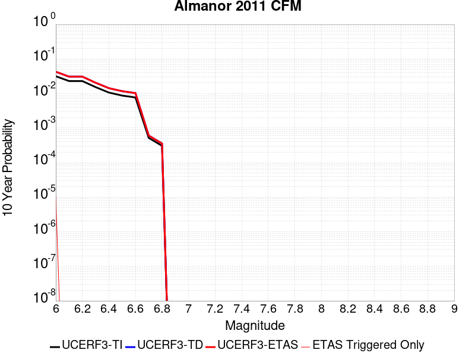 |

| Magnitude | 1 wk TI Prob | 1 wk TD Prob | 1 wk ETAS Prob | 1 wk ETAS/TD Gain | 1 wk ETAS Triggered Only | 1 mo TI Prob | 1 mo TD Prob | 1 mo ETAS Prob | 1 mo ETAS/TD Gain | 1 mo ETAS Triggered Only | 1 yr TI Prob | 1 yr TD Prob | 1 yr ETAS Prob | 1 yr ETAS/TD Gain | 1 yr ETAS Triggered Only | 10 yr TI Prob | 10 yr TD Prob | 10 yr ETAS Prob | 10 yr ETAS/TD Gain | 10 yr ETAS Triggered Only |
|-----|-----|-----|-----|-----|-----|-----|-----|-----|-----|-----|-----|-----|-----|-----|-----|-----|-----|-----|-----|-----|
| 6.0 | 6.1479834E-5 | 8.32787E-5 | 8.32787E-5 | 1.0 | 0.0 | 2.6345838E-4 | 3.5686578E-4 | 3.5686578E-4 | 1.0 | 0.0 | 0.0032028882 | 0.0043366123 | 0.004346569 | 1.002296 | 1.0E-5 | 0.031571172 | 0.04258577 | 0.042595346 | 1.0002248 | 1.0E-5 |
| 6.1 | 4.4387216E-5 | 5.9770442E-5 | 5.9770442E-5 | 1.0 | 0.0 | 1.9021705E-4 | 2.561381E-4 | 2.561381E-4 | 1.0 | 0.0 | 0.0023134327 | 0.003114426 | 0.003114426 | 1.0 | 0.0 | 0.022894967 | 0.030755036 | 0.030755036 | 1.0 | 0.0 |
| 6.2 | 4.4387216E-5 | 5.9770442E-5 | 5.9770442E-5 | 1.0 | 0.0 | 1.9021705E-4 | 2.561381E-4 | 2.561381E-4 | 1.0 | 0.0 | 0.0023134327 | 0.003114426 | 0.003114426 | 1.0 | 0.0 | 0.022894967 | 0.030755036 | 0.030755036 | 1.0 | 0.0 |
| 6.3 | 2.9523822E-5 | 3.954719E-5 | 3.954719E-5 | 1.0 | 0.0 | 1.2652454E-4 | 1.6947983E-4 | 1.6947983E-4 | 1.0 | 0.0 | 0.0015393476 | 0.0020618725 | 0.0020618725 | 1.0 | 0.0 | 0.015287281 | 0.020460794 | 0.020460794 | 1.0 | 0.0 |
| 6.4 | 2.0512744E-5 | 2.7431617E-5 | 2.7431617E-5 | 1.0 | 0.0 | 8.79088E-5 | 1.175612E-4 | 1.175612E-4 | 1.0 | 0.0 | 0.001069764 | 0.0014307408 | 0.0014307408 | 1.0 | 0.0 | 0.010646289 | 0.014244413 | 0.014244413 | 1.0 | 0.0 |
| 6.5 | 1.6750226E-5 | 2.23913E-5 | 2.23913E-5 | 1.0 | 0.0 | 7.178471E-5 | 9.596152E-5 | 9.596152E-5 | 1.0 | 0.0 | 8.7362836E-4 | 0.0011680633 | 0.0011680633 | 1.0 | 0.0 | 0.008702018 | 0.011649038 | 0.011649038 | 1.0 | 0.0 |
| 6.6 | 1.4745303E-5 | 1.9707952E-5 | 1.9707952E-5 | 1.0 | 0.0 | 6.319262E-5 | 8.446223E-5 | 8.446223E-5 | 1.0 | 0.0 | 7.690986E-4 | 0.0010281964 | 0.0010281964 | 1.0 | 0.0 | 0.0076644225 | 0.010264971 | 0.010264971 | 1.0 | 0.0 |
| 6.7 | 9.951145E-7 | 1.1616347E-6 | 1.1616347E-6 | 1.0 | 0.0 | 4.26477E-6 | 4.9784257E-6 | 4.9784257E-6 | 1.0 | 0.0 | 5.1922336E-5 | 6.0610826E-5 | 6.0610826E-5 | 1.0 | 0.0 | 5.1910203E-4 | 6.059602E-4 | 6.059602E-4 | 1.0 | 0.0 |
| 6.8 | 5.866312E-7 | 6.849384E-7 | 6.849384E-7 | 1.0 | 0.0 | 2.5141312E-6 | 2.9354478E-6 | 2.9354478E-6 | 1.0 | 0.0 | 3.0609117E-5 | 3.5738623E-5 | 3.5738623E-5 | 1.0 | 0.0 | 3.06049E-4 | 3.5734157E-4 | 3.5734157E-4 | 1.0 | 0.0 |

## San Andreas (Santa Cruz Mts) 2011 CFM
*[(top)](#table-of-contents)*

| 1 Week | 1 Month | 1 Year | 10 Year |
|-----|-----|-----|-----|
|  |  |  |  |

| Magnitude | 1 wk TI Prob | 1 wk TD Prob | 1 wk ETAS Prob | 1 wk ETAS/TD Gain | 1 wk ETAS Triggered Only | 1 mo TI Prob | 1 mo TD Prob | 1 mo ETAS Prob | 1 mo ETAS/TD Gain | 1 mo ETAS Triggered Only | 1 yr TI Prob | 1 yr TD Prob | 1 yr ETAS Prob | 1 yr ETAS/TD Gain | 1 yr ETAS Triggered Only | 10 yr TI Prob | 10 yr TD Prob | 10 yr ETAS Prob | 10 yr ETAS/TD Gain | 10 yr ETAS Triggered Only |
|-----|-----|-----|-----|-----|-----|-----|-----|-----|-----|-----|-----|-----|-----|-----|-----|-----|-----|-----|-----|-----|
| 6.0 | 1.7221631E-4 | 1.3793171E-4 | 1.4793033E-4 | 1.0724896 | 1.0E-5 | 7.378611E-4 | 5.9100403E-4 | 6.009981E-4 | 1.0169103 | 1.0E-5 | 0.008946515 | 0.007172124 | 0.0071820524 | 1.0013843 | 1.0E-5 | 0.08594794 | 0.0705551 | 0.07056439 | 1.0001317 | 1.0E-5 |
| 6.1 | 1.7221631E-4 | 1.3793171E-4 | 1.4793033E-4 | 1.0724896 | 1.0E-5 | 7.378611E-4 | 5.9100403E-4 | 6.009981E-4 | 1.0169103 | 1.0E-5 | 0.008946515 | 0.007172124 | 0.0071820524 | 1.0013843 | 1.0E-5 | 0.08594794 | 0.0705551 | 0.07056439 | 1.0001317 | 1.0E-5 |
| 6.2 | 1.7221631E-4 | 1.3793171E-4 | 1.4793033E-4 | 1.0724896 | 1.0E-5 | 7.378611E-4 | 5.9100403E-4 | 6.009981E-4 | 1.0169103 | 1.0E-5 | 0.008946515 | 0.007172124 | 0.0071820524 | 1.0013843 | 1.0E-5 | 0.08594794 | 0.0705551 | 0.07056439 | 1.0001317 | 1.0E-5 |
| 6.3 | 1.716926E-4 | 1.3712609E-4 | 1.4712471E-4 | 1.0729156 | 1.0E-5 | 7.3561794E-4 | 5.875529E-4 | 5.97547E-4 | 1.0170097 | 1.0E-5 | 0.008919428 | 0.0071303817 | 0.00714031 | 1.0013925 | 1.0E-5 | 0.08569809 | 0.070167266 | 0.070176564 | 1.0001326 | 1.0E-5 |
| 6.4 | 1.6392978E-4 | 1.3588481E-4 | 1.4588344E-4 | 1.0735817 | 1.0E-5 | 7.02367E-4 | 5.822355E-4 | 5.922297E-4 | 1.0171652 | 1.0E-5 | 0.008517839 | 0.007066063 | 0.0070759924 | 1.0014052 | 1.0E-5 | 0.08198654 | 0.06940135 | 0.06941066 | 1.0001341 | 1.0E-5 |
| 6.5 | 1.5742714E-4 | 1.2648388E-4 | 1.364826E-4 | 1.0790515 | 1.0E-5 | 6.745133E-4 | 5.4196286E-4 | 5.519574E-4 | 1.0184414 | 1.0E-5 | 0.00818132 | 0.0065787593 | 0.0065886932 | 1.00151 | 1.0E-5 | 0.078865945 | 0.06486309 | 0.06487244 | 1.0001441 | 1.0E-5 |
| 6.6 | 1.3038084E-4 | 1.1588213E-4 | 1.2588098E-4 | 1.0862846 | 1.0E-5 | 5.5865536E-4 | 4.9654447E-4 | 5.065395E-4 | 1.0201292 | 1.0E-5 | 0.006780438 | 0.0060289134 | 0.006038853 | 1.0016487 | 1.0E-5 | 0.0657725 | 0.05932738 | 0.059336785 | 1.0001585 | 1.0E-5 |
| 6.7 | 1.2867592E-4 | 1.1314701E-4 | 1.2314587E-4 | 1.0883706 | 1.0E-5 | 5.5135164E-4 | 4.8482692E-4 | 4.9482204E-4 | 1.0206159 | 1.0E-5 | 0.0066920654 | 0.00588703 | 0.0058969716 | 1.0016886 | 1.0E-5 | 0.06494093 | 0.058038417 | 0.058047835 | 1.0001622 | 1.0E-5 |
| 6.8 | 1.2801298E-4 | 1.1252261E-4 | 1.2252148E-4 | 1.088861 | 1.0E-5 | 5.485117E-4 | 4.8215193E-4 | 4.921471E-4 | 1.0207304 | 1.0E-5 | 0.0066577005 | 0.0058546383 | 0.0058645797 | 1.001698 | 1.0E-5 | 0.06461738 | 0.057752274 | 0.057761695 | 1.0001632 | 1.0E-5 |
| 6.9 | 1.269149E-4 | 1.1094465E-4 | 1.2094354E-4 | 1.0901251 | 1.0E-5 | 5.4380763E-4 | 4.7539172E-4 | 4.8538696E-4 | 1.0210253 | 1.0E-5 | 0.006600777 | 0.005772772 | 0.005782714 | 1.0017222 | 1.0E-5 | 0.06408122 | 0.0570241 | 0.057033528 | 1.0001653 | 1.0E-5 |
| 7.0 | 1.2030331E-4 | 1.0824504E-4 | 1.1824395E-4 | 1.092373 | 1.0E-5 | 5.154837E-4 | 4.638261E-4 | 4.7382145E-4 | 1.0215498 | 1.0E-5 | 0.006257969 | 0.0056326967 | 0.00564264 | 1.0017654 | 1.0E-5 | 0.06084648 | 0.055696685 | 0.05570613 | 1.0001695 | 1.0E-5 |
| 7.1 | 8.049617E-5 | 5.3926604E-5 | 6.392606E-5 | 1.1854272 | 1.0E-5 | 3.4493793E-4 | 2.3109373E-4 | 2.4109142E-4 | 1.0432625 | 1.0E-5 | 0.0041915346 | 0.0028099709 | 0.0028199428 | 1.0035487 | 1.0E-5 | 0.041133516 | 0.029618956 | 0.02962866 | 1.0003276 | 1.0E-5 |
| 7.2 | 7.093979E-5 | 4.2937932E-5 | 5.2937503E-5 | 1.2328843 | 1.0E-5 | 3.0399222E-4 | 1.8400686E-4 | 1.9400501E-4 | 1.0543358 | 1.0E-5 | 0.0036948253 | 0.0022380045 | 0.0022479822 | 1.0044583 | 1.0E-5 | 0.03633994 | 0.023941692 | 0.023951452 | 1.0004077 | 1.0E-5 |
| 7.3 | 6.193693E-5 | 2.8894141E-5 | 3.8893853E-5 | 1.3460809 | 1.0E-5 | 2.6541698E-4 | 1.2382616E-4 | 1.3382493E-4 | 1.0807483 | 1.0E-5 | 0.0032266637 | 0.0015065427 | 0.0015165276 | 1.0066277 | 1.0E-5 | 0.031802133 | 0.016499156 | 0.01650899 | 1.000596 | 1.0E-5 |
| 7.4 | 5.906492E-5 | 2.702346E-5 | 3.702319E-5 | 1.3700389 | 1.0E-5 | 2.5311083E-4 | 1.1580969E-4 | 1.2580854E-4 | 1.0863385 | 1.0E-5 | 0.0030772698 | 0.0014090725 | 0.0014190584 | 1.0070869 | 1.0E-5 | 0.030350044 | 0.015471023 | 0.015480868 | 1.0006363 | 1.0E-5 |
| 7.5 | 5.424296E-5 | 2.4678277E-5 | 3.467803E-5 | 1.4052047 | 1.0E-5 | 2.324491E-4 | 1.05759755E-4 | 1.157587E-4 | 1.0945439 | 1.0E-5 | 0.002826395 | 0.0012868657 | 0.0012968528 | 1.0077608 | 1.0E-5 | 0.027907165 | 0.014163188 | 0.014173046 | 1.0006961 | 1.0E-5 |
| 7.6 | 4.43084E-5 | 1.990431E-5 | 2.9904111E-5 | 1.5023937 | 1.0E-5 | 1.8987931E-4 | 8.53014E-5 | 9.5300544E-5 | 1.1172214 | 1.0E-5 | 0.0023093296 | 0.0010380499 | 0.0010480395 | 1.0096234 | 1.0E-5 | 0.022854783 | 0.011412679 | 0.011422565 | 1.0008662 | 1.0E-5 |
| 7.7 | 4.118098E-5 | 1.8936442E-5 | 2.8936252E-5 | 1.5280724 | 1.0E-5 | 1.7647797E-4 | 8.115366E-5 | 9.115285E-5 | 1.123213 | 1.0E-5 | 0.002146502 | 9.875982E-4 | 9.975883E-4 | 1.0101156 | 1.0E-5 | 0.021258866 | 0.010870468 | 0.010880359 | 1.0009099 | 1.0E-5 |
| 7.8 | 3.5408906E-5 | 1.856446E-5 | 2.8564275E-5 | 1.5386536 | 1.0E-5 | 1.5174363E-4 | 7.955955E-5 | 8.955875E-5 | 1.125682 | 1.0E-5 | 0.0018459131 | 9.682073E-4 | 9.781977E-4 | 1.0103184 | 1.0E-5 | 0.018306552 | 0.010652021 | 0.010661914 | 1.0009288 | 1.0E-5 |
| 7.9 | 2.5860836E-5 | 1.7315993E-5 | 2.731582E-5 | 1.5774908 | 1.0E-5 | 1.10827445E-4 | 7.420929E-5 | 8.420855E-5 | 1.134744 | 1.0E-5 | 0.001348489 | 9.031238E-4 | 9.131148E-4 | 1.0110626 | 1.0E-5 | 0.013403354 | 0.009907599 | 0.0099174995 | 1.0009993 | 1.0E-5 |
| 8.0 | 1.9777332E-5 | 1.4839596E-5 | 2.4839448E-5 | 1.6738628 | 1.0E-5 | 8.4757245E-5 | 6.3596715E-5 | 7.3596086E-5 | 1.1572309 | 1.0E-5 | 0.0010314309 | 7.740152E-4 | 7.840074E-4 | 1.0129097 | 1.0E-5 | 0.010266567 | 0.008508967 | 0.008518882 | 1.0011653 | 1.0E-5 |
| 8.1 | 1.468494E-5 | 1.2107374E-5 | 2.2107253E-5 | 1.825933 | 1.0E-5 | 6.293394E-5 | 5.1887713E-5 | 6.188719E-5 | 1.1927139 | 1.0E-5 | 7.6595135E-4 | 6.3155E-4 | 6.4154365E-4 | 1.0158241 | 1.0E-5 | 0.0076331664 | 0.006969149 | 0.0069790795 | 1.0014249 | 1.0E-5 |
| 8.2 | 8.63836E-6 | 5.469061E-6 | 5.469061E-6 | 1.0 | 0.0 | 3.7021015E-5 | 2.3438623E-5 | 2.3438623E-5 | 1.0 | 0.0 | 4.5063766E-4 | 2.8532793E-4 | 2.8532793E-4 | 1.0 | 0.0 | 0.004497249 | 0.00324569 | 0.00324569 | 1.0 | 0.0 |
| 8.3 | 1.983087E-6 | 7.6599065E-7 | 7.6599065E-7 | 1.0 | 0.0 | 8.498917E-6 | 3.282813E-6 | 3.282813E-6 | 1.0 | 0.0 | 1.034694E-4 | 3.9967534E-5 | 3.9967534E-5 | 1.0 | 0.0 | 0.0010342124 | 4.719687E-4 | 4.719687E-4 | 1.0 | 0.0 |

## Hartley Springs 2011 CFM
*[(top)](#table-of-contents)*

| 1 Week | 1 Month | 1 Year | 10 Year |
|-----|-----|-----|-----|
| 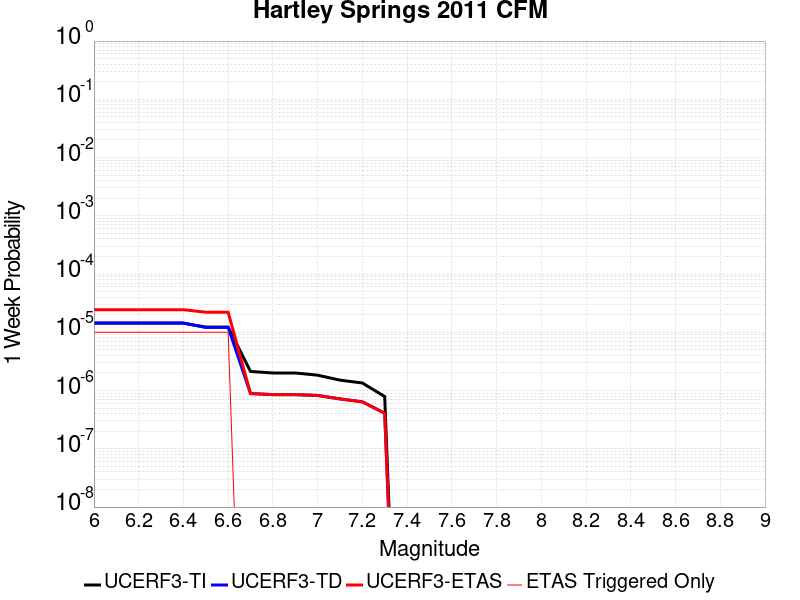 |  |  |  |

| Magnitude | 1 wk TI Prob | 1 wk TD Prob | 1 wk ETAS Prob | 1 wk ETAS/TD Gain | 1 wk ETAS Triggered Only | 1 mo TI Prob | 1 mo TD Prob | 1 mo ETAS Prob | 1 mo ETAS/TD Gain | 1 mo ETAS Triggered Only | 1 yr TI Prob | 1 yr TD Prob | 1 yr ETAS Prob | 1 yr ETAS/TD Gain | 1 yr ETAS Triggered Only | 10 yr TI Prob | 10 yr TD Prob | 10 yr ETAS Prob | 10 yr ETAS/TD Gain | 10 yr ETAS Triggered Only |
|-----|-----|-----|-----|-----|-----|-----|-----|-----|-----|-----|-----|-----|-----|-----|-----|-----|-----|-----|-----|-----|
| 6.0 | 1.4352418E-5 | 1.4434182E-5 | 2.4434037E-5 | 1.6927899 | 1.0E-5 | 6.1508916E-5 | 6.1860235E-5 | 7.185962E-5 | 1.1616447 | 1.0E-5 | 7.486137E-4 | 7.5305253E-4 | 7.63045E-4 | 1.0132693 | 1.0E-5 | 0.007460968 | 0.0075211283 | 0.0075310534 | 1.0013196 | 1.0E-5 |
| 6.1 | 1.4352418E-5 | 1.4434182E-5 | 2.4434037E-5 | 1.6927899 | 1.0E-5 | 6.1508916E-5 | 6.1860235E-5 | 7.185962E-5 | 1.1616447 | 1.0E-5 | 7.486137E-4 | 7.5305253E-4 | 7.63045E-4 | 1.0132693 | 1.0E-5 | 0.007460968 | 0.0075211283 | 0.0075310534 | 1.0013196 | 1.0E-5 |
| 6.2 | 1.4352418E-5 | 1.4434182E-5 | 2.4434037E-5 | 1.6927899 | 1.0E-5 | 6.1508916E-5 | 6.1860235E-5 | 7.185962E-5 | 1.1616447 | 1.0E-5 | 7.486137E-4 | 7.5305253E-4 | 7.63045E-4 | 1.0132693 | 1.0E-5 | 0.007460968 | 0.0075211283 | 0.0075310534 | 1.0013196 | 1.0E-5 |
| 6.3 | 1.4352418E-5 | 1.4434182E-5 | 2.4434037E-5 | 1.6927899 | 1.0E-5 | 6.1508916E-5 | 6.1860235E-5 | 7.185962E-5 | 1.1616447 | 1.0E-5 | 7.486137E-4 | 7.5305253E-4 | 7.63045E-4 | 1.0132693 | 1.0E-5 | 0.007460968 | 0.0075211283 | 0.0075310534 | 1.0013196 | 1.0E-5 |
| 6.4 | 1.4352418E-5 | 1.4434182E-5 | 2.4434037E-5 | 1.6927899 | 1.0E-5 | 6.1508916E-5 | 6.1860235E-5 | 7.185962E-5 | 1.1616447 | 1.0E-5 | 7.486137E-4 | 7.5305253E-4 | 7.63045E-4 | 1.0132693 | 1.0E-5 | 0.007460968 | 0.0075211283 | 0.0075310534 | 1.0013196 | 1.0E-5 |
| 6.5 | 1.2279858E-5 | 1.2133106E-5 | 2.2132985E-5 | 1.8241813 | 1.0E-5 | 5.26269E-5 | 5.1998883E-5 | 6.199836E-5 | 1.1923019 | 1.0E-5 | 6.4054417E-4 | 6.3306064E-4 | 6.430543E-4 | 1.0157863 | 1.0E-5 | 0.0063870098 | 0.006328085 | 0.0063380217 | 1.0015702 | 1.0E-5 |
| 6.6 | 1.2279858E-5 | 1.2133106E-5 | 2.2132985E-5 | 1.8241813 | 1.0E-5 | 5.26269E-5 | 5.1998883E-5 | 6.199836E-5 | 1.1923019 | 1.0E-5 | 6.4054417E-4 | 6.3306064E-4 | 6.430543E-4 | 1.0157863 | 1.0E-5 | 0.0063870098 | 0.006328085 | 0.0063380217 | 1.0015702 | 1.0E-5 |
| 6.7 | 2.1282601E-6 | 8.8948315E-7 | 8.8948315E-7 | 1.0 | 0.0 | 9.121083E-6 | 3.8120663E-6 | 3.8120663E-6 | 1.0 | 0.0 | 1.11043526E-4 | 4.641118E-5 | 4.641118E-5 | 1.0 | 0.0 | 0.0011098806 | 4.6404017E-4 | 4.6404017E-4 | 1.0 | 0.0 |
| 6.8 | 2.00516E-6 | 8.517597E-7 | 8.517597E-7 | 1.0 | 0.0 | 8.593515E-6 | 3.650395E-6 | 3.650395E-6 | 1.0 | 0.0 | 1.04621024E-4 | 4.444291E-5 | 4.444291E-5 | 1.0 | 0.0 | 0.0010457177 | 4.4436535E-4 | 4.4436535E-4 | 1.0 | 0.0 |
| 6.9 | 2.00516E-6 | 8.517597E-7 | 8.517597E-7 | 1.0 | 0.0 | 8.593515E-6 | 3.650395E-6 | 3.650395E-6 | 1.0 | 0.0 | 1.04621024E-4 | 4.444291E-5 | 4.444291E-5 | 1.0 | 0.0 | 0.0010457177 | 4.4436535E-4 | 4.4436535E-4 | 1.0 | 0.0 |
| 7.0 | 1.8366732E-6 | 8.237307E-7 | 8.237307E-7 | 1.0 | 0.0 | 7.871433E-6 | 3.5302712E-6 | 3.5302712E-6 | 1.0 | 0.0 | 9.583048E-5 | 4.298046E-5 | 4.298046E-5 | 1.0 | 0.0 | 9.5789164E-4 | 4.2974652E-4 | 4.2974652E-4 | 1.0 | 0.0 |
| 7.1 | 1.5097997E-6 | 7.1902616E-7 | 7.1902616E-7 | 1.0 | 0.0 | 6.470554E-6 | 3.0815384E-6 | 3.0815384E-6 | 1.0 | 0.0 | 7.877615E-5 | 3.7517326E-5 | 3.7517326E-5 | 1.0 | 0.0 | 7.874823E-4 | 3.7513362E-4 | 3.7513362E-4 | 1.0 | 0.0 |
| 7.2 | 1.3490993E-6 | 6.405254E-7 | 6.405254E-7 | 1.0 | 0.0 | 5.7818415E-6 | 2.7451074E-6 | 2.7451074E-6 | 1.0 | 0.0 | 7.0391645E-5 | 3.3421402E-5 | 3.3421402E-5 | 1.0 | 0.0 | 7.0369354E-4 | 3.341867E-4 | 3.341867E-4 | 1.0 | 0.0 |
| 7.3 | 7.900015E-7 | 4.0889498E-7 | 4.0889498E-7 | 1.0 | 0.0 | 3.3857161E-6 | 1.752407E-6 | 1.752407E-6 | 1.0 | 0.0 | 4.1220315E-5 | 2.1335554E-5 | 2.1335554E-5 | 1.0 | 0.0 | 4.121267E-4 | 2.1335555E-4 | 2.1335555E-4 | 1.0 | 0.0 |

## Big Lagoon - Bald Mtn 2011 CFM
*[(top)](#table-of-contents)*

| 1 Week | 1 Month | 1 Year | 10 Year |
|-----|-----|-----|-----|
|  |  |  |  |

| Magnitude | 1 wk TI Prob | 1 wk TD Prob | 1 wk ETAS Prob | 1 wk ETAS/TD Gain | 1 wk ETAS Triggered Only | 1 mo TI Prob | 1 mo TD Prob | 1 mo ETAS Prob | 1 mo ETAS/TD Gain | 1 mo ETAS Triggered Only | 1 yr TI Prob | 1 yr TD Prob | 1 yr ETAS Prob | 1 yr ETAS/TD Gain | 1 yr ETAS Triggered Only | 10 yr TI Prob | 10 yr TD Prob | 10 yr ETAS Prob | 10 yr ETAS/TD Gain | 10 yr ETAS Triggered Only |
|-----|-----|-----|-----|-----|-----|-----|-----|-----|-----|-----|-----|-----|-----|-----|-----|-----|-----|-----|-----|-----|
| 6.0 | 1.8699735E-5 | 1.985018E-5 | 2.9849982E-5 | 1.5037638 | 1.0E-5 | 8.013926E-5 | 8.5069645E-5 | 9.506879E-5 | 1.1175407 | 1.0E-5 | 9.752587E-4 | 0.0010352687 | 0.0010452583 | 1.0096493 | 1.0E-5 | 0.009709897 | 0.010308274 | 0.010318171 | 1.0009601 | 1.0E-5 |
| 6.1 | 1.8699735E-5 | 1.985018E-5 | 2.9849982E-5 | 1.5037638 | 1.0E-5 | 8.013926E-5 | 8.5069645E-5 | 9.506879E-5 | 1.1175407 | 1.0E-5 | 9.752587E-4 | 0.0010352687 | 0.0010452583 | 1.0096493 | 1.0E-5 | 0.009709897 | 0.010308274 | 0.010318171 | 1.0009601 | 1.0E-5 |
| 6.2 | 1.8699735E-5 | 1.985018E-5 | 2.9849982E-5 | 1.5037638 | 1.0E-5 | 8.013926E-5 | 8.5069645E-5 | 9.506879E-5 | 1.1175407 | 1.0E-5 | 9.752587E-4 | 0.0010352687 | 0.0010452583 | 1.0096493 | 1.0E-5 | 0.009709897 | 0.010308274 | 0.010318171 | 1.0009601 | 1.0E-5 |
| 6.3 | 1.8699735E-5 | 1.985018E-5 | 2.9849982E-5 | 1.5037638 | 1.0E-5 | 8.013926E-5 | 8.5069645E-5 | 9.506879E-5 | 1.1175407 | 1.0E-5 | 9.752587E-4 | 0.0010352687 | 0.0010452583 | 1.0096493 | 1.0E-5 | 0.009709897 | 0.010308274 | 0.010318171 | 1.0009601 | 1.0E-5 |
| 6.4 | 1.8699735E-5 | 1.985018E-5 | 2.9849982E-5 | 1.5037638 | 1.0E-5 | 8.013926E-5 | 8.5069645E-5 | 9.506879E-5 | 1.1175407 | 1.0E-5 | 9.752587E-4 | 0.0010352687 | 0.0010452583 | 1.0096493 | 1.0E-5 | 0.009709897 | 0.010308274 | 0.010318171 | 1.0009601 | 1.0E-5 |
| 6.5 | 1.8699735E-5 | 1.985018E-5 | 2.9849982E-5 | 1.5037638 | 1.0E-5 | 8.013926E-5 | 8.5069645E-5 | 9.506879E-5 | 1.1175407 | 1.0E-5 | 9.752587E-4 | 0.0010352687 | 0.0010452583 | 1.0096493 | 1.0E-5 | 0.009709897 | 0.010308274 | 0.010318171 | 1.0009601 | 1.0E-5 |
| 6.6 | 1.8699735E-5 | 1.985018E-5 | 2.9849982E-5 | 1.5037638 | 1.0E-5 | 8.013926E-5 | 8.5069645E-5 | 9.506879E-5 | 1.1175407 | 1.0E-5 | 9.752587E-4 | 0.0010352687 | 0.0010452583 | 1.0096493 | 1.0E-5 | 0.009709897 | 0.010308274 | 0.010318171 | 1.0009601 | 1.0E-5 |
| 6.7 | 1.8699735E-5 | 1.985018E-5 | 2.9849982E-5 | 1.5037638 | 1.0E-5 | 8.013926E-5 | 8.5069645E-5 | 9.506879E-5 | 1.1175407 | 1.0E-5 | 9.752587E-4 | 0.0010352687 | 0.0010452583 | 1.0096493 | 1.0E-5 | 0.009709897 | 0.010308274 | 0.010318171 | 1.0009601 | 1.0E-5 |
| 6.8 | 1.18505095E-5 | 1.2499804E-5 | 2.2499678E-5 | 1.8000026 | 1.0E-5 | 5.078691E-5 | 5.3569514E-5 | 6.356898E-5 | 1.1866634 | 1.0E-5 | 6.181552E-4 | 6.520185E-4 | 6.6201197E-4 | 1.015327 | 1.0E-5 | 0.006164385 | 0.0065015587 | 0.0065114936 | 1.0015281 | 1.0E-5 |
| 6.9 | 1.18505095E-5 | 1.2499804E-5 | 2.2499678E-5 | 1.8000026 | 1.0E-5 | 5.078691E-5 | 5.3569514E-5 | 6.356898E-5 | 1.1866634 | 1.0E-5 | 6.181552E-4 | 6.520185E-4 | 6.6201197E-4 | 1.015327 | 1.0E-5 | 0.006164385 | 0.0065015587 | 0.0065114936 | 1.0015281 | 1.0E-5 |
| 7.0 | 9.719786E-6 | 1.0235487E-5 | 1.0235487E-5 | 1.0 | 0.0 | 4.1655563E-5 | 4.386565E-5 | 4.386565E-5 | 1.0 | 0.0 | 5.0703844E-4 | 5.3393573E-4 | 5.3393573E-4 | 1.0 | 0.0 | 0.005058831 | 0.0053267754 | 0.0053267754 | 1.0 | 0.0 |
| 7.1 | 8.523418E-6 | 8.969463E-6 | 8.969463E-6 | 1.0 | 0.0 | 3.652842E-5 | 3.844E-5 | 3.844E-5 | 1.0 | 0.0 | 4.4464276E-4 | 4.6790804E-4 | 4.6790804E-4 | 1.0 | 0.0 | 0.0044375416 | 0.004669392 | 0.004669392 | 1.0 | 0.0 |
| 7.2 | 7.378894E-6 | 7.761112E-6 | 7.761112E-6 | 1.0 | 0.0 | 3.162345E-5 | 3.326149E-5 | 3.326149E-5 | 1.0 | 0.0 | 3.8494746E-4 | 4.048843E-4 | 4.048843E-4 | 1.0 | 0.0 | 0.0038428132 | 0.0040415623 | 0.0040415623 | 1.0 | 0.0 |
| 7.3 | 6.4640294E-6 | 6.7924434E-6 | 6.7924434E-6 | 1.0 | 0.0 | 2.7702688E-5 | 2.9110151E-5 | 2.9110151E-5 | 1.0 | 0.0 | 3.3722803E-4 | 3.5435913E-4 | 3.5435913E-4 | 1.0 | 0.0 | 0.0033671674 | 0.0035380109 | 0.0035380109 | 1.0 | 0.0 |
| 7.4 | 5.9959093E-6 | 6.2988E-6 | 6.2988E-6 | 1.0 | 0.0 | 2.5696501E-5 | 2.6994581E-5 | 2.6994581E-5 | 1.0 | 0.0 | 3.1280998E-4 | 3.2861007E-4 | 3.2861007E-4 | 1.0 | 0.0 | 0.0031237002 | 0.0032813034 | 0.0032813034 | 1.0 | 0.0 |
| 7.5 | 4.929265E-6 | 5.176396E-6 | 5.176396E-6 | 1.0 | 0.0 | 2.112525E-5 | 2.2184367E-5 | 2.2184367E-5 | 1.0 | 0.0 | 2.5716957E-4 | 2.700616E-4 | 2.700616E-4 | 1.0 | 0.0 | 0.0025687215 | 0.002697375 | 0.002697375 | 1.0 | 0.0 |
| 7.6 | 3.8982403E-6 | 4.0889267E-6 | 4.0889267E-6 | 1.0 | 0.0 | 1.6706637E-5 | 1.7523857E-5 | 1.7523857E-5 | 1.0 | 0.0 | 2.0338432E-4 | 2.1333233E-4 | 2.1333233E-4 | 1.0 | 0.0 | 0.0020319829 | 0.002131303 | 0.002131303 | 1.0 | 0.0 |
| 7.7 | 2.820968E-6 | 2.9572116E-6 | 2.9572116E-6 | 1.0 | 0.0 | 1.2089806E-5 | 1.2673704E-5 | 1.2673704E-5 | 1.0 | 0.0 | 1.4718344E-4 | 1.5429159E-4 | 1.5429159E-4 | 1.0 | 0.0 | 0.00147086 | 0.0015418624 | 0.0015418624 | 1.0 | 0.0 |
| 7.8 | 1.9314455E-6 | 2.0260186E-6 | 2.0260186E-6 | 1.0 | 0.0 | 8.277597E-6 | 8.682909E-6 | 8.682909E-6 | 1.0 | 0.0 | 1.0077508E-4 | 1.0570941E-4 | 1.0570941E-4 | 1.0 | 0.0 | 0.0010072939 | 0.0010566041 | 0.0010566041 | 1.0 | 0.0 |
| 7.9 | 4.9586197E-7 | 5.2189216E-7 | 5.2189216E-7 | 1.0 | 0.0 | 2.125121E-6 | 2.2366787E-6 | 2.2366787E-6 | 1.0 | 0.0 | 2.5873042E-5 | 2.7231245E-5 | 2.7231245E-5 | 1.0 | 0.0 | 2.5870028E-4 | 2.7228118E-4 | 2.7228118E-4 | 1.0 | 0.0 |

## San Andreas (Peninsula) 2011 CFM
*[(top)](#table-of-contents)*

| 1 Week | 1 Month | 1 Year | 10 Year |
|-----|-----|-----|-----|
|  | 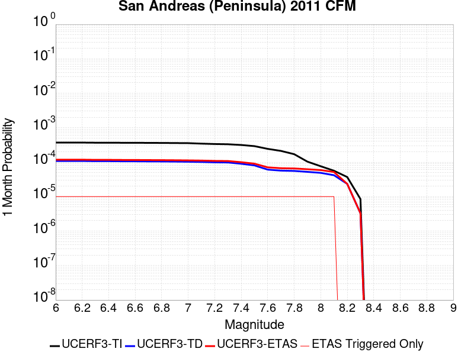 |  |  |

| Magnitude | 1 wk TI Prob | 1 wk TD Prob | 1 wk ETAS Prob | 1 wk ETAS/TD Gain | 1 wk ETAS Triggered Only | 1 mo TI Prob | 1 mo TD Prob | 1 mo ETAS Prob | 1 mo ETAS/TD Gain | 1 mo ETAS Triggered Only | 1 yr TI Prob | 1 yr TD Prob | 1 yr ETAS Prob | 1 yr ETAS/TD Gain | 1 yr ETAS Triggered Only | 10 yr TI Prob | 10 yr TD Prob | 10 yr ETAS Prob | 10 yr ETAS/TD Gain | 10 yr ETAS Triggered Only |
|-----|-----|-----|-----|-----|-----|-----|-----|-----|-----|-----|-----|-----|-----|-----|-----|-----|-----|-----|-----|-----|
| 6.0 | 8.6200685E-5 | 2.52136E-5 | 3.5213347E-5 | 1.3966013 | 1.0E-5 | 3.6937918E-4 | 1.0805382E-4 | 1.1805274E-4 | 1.0925364 | 1.0E-5 | 0.0044879215 | 0.001314763 | 0.0013247498 | 1.0075959 | 1.0E-5 | 0.043983612 | 0.014774441 | 0.014784293 | 1.0006669 | 1.0E-5 |
| 6.1 | 8.6200685E-5 | 2.52136E-5 | 3.5213347E-5 | 1.3966013 | 1.0E-5 | 3.6937918E-4 | 1.0805382E-4 | 1.1805274E-4 | 1.0925364 | 1.0E-5 | 0.0044879215 | 0.001314763 | 0.0013247498 | 1.0075959 | 1.0E-5 | 0.043983612 | 0.014774441 | 0.014784293 | 1.0006669 | 1.0E-5 |
| 6.2 | 8.6200685E-5 | 2.52136E-5 | 3.5213347E-5 | 1.3966013 | 1.0E-5 | 3.6937918E-4 | 1.0805382E-4 | 1.1805274E-4 | 1.0925364 | 1.0E-5 | 0.0044879215 | 0.001314763 | 0.0013247498 | 1.0075959 | 1.0E-5 | 0.043983612 | 0.014774441 | 0.014784293 | 1.0006669 | 1.0E-5 |
| 6.3 | 8.551163E-5 | 2.490552E-5 | 3.490527E-5 | 1.4015074 | 1.0E-5 | 3.6642692E-4 | 1.06733576E-4 | 1.1673251E-4 | 1.0936812 | 1.0E-5 | 0.004452125 | 0.0012987083 | 0.0013086953 | 1.00769 | 1.0E-5 | 0.043639794 | 0.014601416 | 0.01461127 | 1.0006748 | 1.0E-5 |
| 6.4 | 8.551163E-5 | 2.490552E-5 | 3.490527E-5 | 1.4015074 | 1.0E-5 | 3.6642692E-4 | 1.06733576E-4 | 1.1673251E-4 | 1.0936812 | 1.0E-5 | 0.004452125 | 0.0012987083 | 0.0013086953 | 1.00769 | 1.0E-5 | 0.043639794 | 0.014601416 | 0.01461127 | 1.0006748 | 1.0E-5 |
| 6.5 | 8.511146E-5 | 2.4726973E-5 | 3.4726723E-5 | 1.4044067 | 1.0E-5 | 3.647124E-4 | 1.05968444E-4 | 1.1596738E-4 | 1.0943577 | 1.0E-5 | 0.004431336 | 0.0012894038 | 0.0012993909 | 1.0077455 | 1.0E-5 | 0.04344007 | 0.0145011945 | 0.014511049 | 1.0006796 | 1.0E-5 |
| 6.6 | 8.4985084E-5 | 2.4657606E-5 | 3.4657358E-5 | 1.4055444 | 1.0E-5 | 3.6417096E-4 | 1.05671184E-4 | 1.15670126E-4 | 1.0946232 | 1.0E-5 | 0.0044247704 | 0.001285789 | 0.0012957761 | 1.0077673 | 1.0E-5 | 0.043376986 | 0.014463263 | 0.014473118 | 1.0006814 | 1.0E-5 |
| 6.7 | 8.462618E-5 | 2.4486113E-5 | 3.4485867E-5 | 1.4083848 | 1.0E-5 | 3.6263323E-4 | 1.0493627E-4 | 1.1493522E-4 | 1.0952859 | 1.0E-5 | 0.004406125 | 0.0012768519 | 0.0012868391 | 1.0078218 | 1.0E-5 | 0.043197807 | 0.01436807 | 0.0143779265 | 1.0006859 | 1.0E-5 |
| 6.8 | 8.42337E-5 | 2.438192E-5 | 3.4381676E-5 | 1.41013 | 1.0E-5 | 3.6095164E-4 | 1.04489765E-4 | 1.1448872E-4 | 1.0956931 | 1.0E-5 | 0.004385734 | 0.0012714221 | 0.0012814094 | 1.0078552 | 1.0E-5 | 0.043001823 | 0.014308756 | 0.014318613 | 1.0006889 | 1.0E-5 |
| 6.9 | 8.365989E-5 | 2.4186513E-5 | 3.4186272E-5 | 1.4134436 | 1.0E-5 | 3.5849313E-4 | 1.03652375E-4 | 1.1365134E-4 | 1.0964663 | 1.0E-5 | 0.004355922 | 0.0012612387 | 0.0012712261 | 1.0079187 | 1.0E-5 | 0.04271523 | 0.014201242 | 0.0142111 | 1.0006942 | 1.0E-5 |
| 7.0 | 8.30936E-5 | 2.3948E-5 | 3.394776E-5 | 1.4175614 | 1.0E-5 | 3.560668E-4 | 1.02630256E-4 | 1.12629226E-4 | 1.0974271 | 1.0E-5 | 0.004326499 | 0.0012488087 | 0.0012587962 | 1.0079976 | 1.0E-5 | 0.042432297 | 0.014072227 | 0.014082086 | 1.0007006 | 1.0E-5 |
| 7.1 | 8.041264E-5 | 2.3634402E-5 | 3.3634165E-5 | 1.423102 | 1.0E-5 | 3.4458007E-4 | 1.0128637E-4 | 1.1128536E-4 | 1.09872 | 1.0E-5 | 0.0041871946 | 0.0012324656 | 0.0012424532 | 1.0081038 | 1.0E-5 | 0.041091725 | 0.013895032 | 0.013904893 | 1.0007097 | 1.0E-5 |
| 7.2 | 7.8427016E-5 | 2.3058019E-5 | 3.3057786E-5 | 1.4336786 | 1.0E-5 | 3.3607247E-4 | 9.8816345E-5 | 1.0881535E-4 | 1.1011878 | 1.0E-5 | 0.004084008 | 0.0012024266 | 0.0012124146 | 1.0083065 | 1.0E-5 | 0.040097635 | 0.013579085 | 0.013588949 | 1.0007265 | 1.0E-5 |
| 7.3 | 7.721087E-5 | 2.2842805E-5 | 3.2842578E-5 | 1.4377646 | 1.0E-5 | 3.3086175E-4 | 9.7894066E-5 | 1.0789309E-4 | 1.1021413 | 1.0E-5 | 0.004020803 | 0.0011912102 | 0.0012011983 | 1.0083848 | 1.0E-5 | 0.03948827 | 0.013462781 | 0.0134726465 | 1.0007328 | 1.0E-5 |
| 7.4 | 7.3536525E-5 | 2.0960428E-5 | 3.096022E-5 | 1.4770795 | 1.0E-5 | 3.1511846E-4 | 8.982732E-5 | 9.982642E-5 | 1.1113147 | 1.0E-5 | 0.0038298194 | 0.0010931002 | 0.0011030893 | 1.0091383 | 1.0E-5 | 0.037644852 | 0.012419564 | 0.012429439 | 1.0007951 | 1.0E-5 |
| 7.5 | 6.806207E-5 | 1.876674E-5 | 2.8766552E-5 | 1.5328476 | 1.0E-5 | 2.9166197E-4 | 8.042641E-5 | 9.042561E-5 | 1.1243273 | 1.0E-5 | 0.0035452035 | 9.787527E-4 | 9.887429E-4 | 1.010207 | 1.0E-5 | 0.034891766 | 0.01117254 | 0.011182427 | 1.000885 | 1.0E-5 |
| 7.6 | 5.6731416E-5 | 1.4177827E-5 | 2.4177685E-5 | 1.7053167 | 1.0E-5 | 2.43112E-4 | 6.07607E-5 | 7.076009E-5 | 1.1645701 | 1.0E-5 | 0.0029558712 | 7.395106E-4 | 7.495032E-4 | 1.0135125 | 1.0E-5 | 0.02916862 | 0.008485565 | 0.00849548 | 1.0011685 | 1.0E-5 |
| 7.7 | 4.946994E-5 | 1.3246218E-5 | 2.3246086E-5 | 1.7549225 | 1.0E-5 | 2.1199681E-4 | 5.6768273E-5 | 6.67677E-5 | 1.1761447 | 1.0E-5 | 0.002578006 | 6.9093466E-4 | 7.0092775E-4 | 1.0144632 | 1.0E-5 | 0.02548303 | 0.0079078935 | 0.007917815 | 1.0012546 | 1.0E-5 |
| 7.8 | 3.9718198E-5 | 1.2982541E-5 | 2.298241E-5 | 1.7702552 | 1.0E-5 | 1.7020974E-4 | 5.5638273E-5 | 6.5637716E-5 | 1.1797224 | 1.0E-5 | 0.0020703338 | 6.771856E-4 | 6.871788E-4 | 1.014757 | 1.0E-5 | 0.020511515 | 0.0077184658 | 0.007728389 | 1.0012856 | 1.0E-5 |
| 7.9 | 2.4115114E-5 | 1.218559E-5 | 2.2185468E-5 | 1.8206314 | 1.0E-5 | 1.0334639E-4 | 5.2222913E-5 | 6.222239E-5 | 1.1914768 | 1.0E-5 | 0.001257516 | 6.3562865E-4 | 6.4562226E-4 | 1.0157225 | 1.0E-5 | 0.012504238 | 0.007159044 | 0.0071689724 | 1.0013869 | 1.0E-5 |
| 8.0 | 1.7756569E-5 | 1.1410005E-5 | 2.140989E-5 | 1.8764138 | 1.0E-5 | 7.6097356E-5 | 4.8899106E-5 | 5.8898615E-5 | 1.2044927 | 1.0E-5 | 9.260915E-4 | 5.951841E-4 | 6.051782E-4 | 1.0167916 | 1.0E-5 | 0.009222416 | 0.006659493 | 0.0066694263 | 1.0014917 | 1.0E-5 |
| 8.1 | 1.3159258E-5 | 9.746194E-6 | 1.9746098E-5 | 2.0260315 | 1.0E-5 | 5.6395602E-5 | 4.1768737E-5 | 5.176832E-5 | 1.2394035 | 1.0E-5 | 6.864001E-4 | 5.0841586E-4 | 5.1841076E-4 | 1.0196589 | 1.0E-5 | 0.0068428386 | 0.005689538 | 0.005699481 | 1.0017476 | 1.0E-5 |
| 8.2 | 8.635426E-6 | 5.466912E-6 | 5.466912E-6 | 1.0 | 0.0 | 3.700844E-5 | 2.3429413E-5 | 2.3429413E-5 | 1.0 | 0.0 | 4.5048463E-4 | 2.8521585E-4 | 2.8521585E-4 | 1.0 | 0.0 | 0.004495725 | 0.0032445018 | 0.0032445018 | 1.0 | 0.0 |
| 8.3 | 1.983087E-6 | 7.6599065E-7 | 7.6599065E-7 | 1.0 | 0.0 | 8.498917E-6 | 3.282813E-6 | 3.282813E-6 | 1.0 | 0.0 | 1.034694E-4 | 3.9967534E-5 | 3.9967534E-5 | 1.0 | 0.0 | 0.0010342124 | 4.719687E-4 | 4.719687E-4 | 1.0 | 0.0 |

## Ventura-Pitas Point
*[(top)](#table-of-contents)*

| 1 Week | 1 Month | 1 Year | 10 Year |
|-----|-----|-----|-----|
|  |  |  |  |

| Magnitude | 1 wk TI Prob | 1 wk TD Prob | 1 wk ETAS Prob | 1 wk ETAS/TD Gain | 1 wk ETAS Triggered Only | 1 mo TI Prob | 1 mo TD Prob | 1 mo ETAS Prob | 1 mo ETAS/TD Gain | 1 mo ETAS Triggered Only | 1 yr TI Prob | 1 yr TD Prob | 1 yr ETAS Prob | 1 yr ETAS/TD Gain | 1 yr ETAS Triggered Only | 10 yr TI Prob | 10 yr TD Prob | 10 yr ETAS Prob | 10 yr ETAS/TD Gain | 10 yr ETAS Triggered Only |
|-----|-----|-----|-----|-----|-----|-----|-----|-----|-----|-----|-----|-----|-----|-----|-----|-----|-----|-----|-----|-----|
| 6.0 | 3.3179622E-5 | 3.3735185E-5 | 4.3734846E-5 | 1.2964164 | 1.0E-5 | 1.4219063E-4 | 1.445728E-4 | 1.5457135E-4 | 1.0691593 | 1.0E-5 | 0.0017297962 | 0.0017590096 | 0.001768992 | 1.005675 | 1.0E-5 | 0.017163932 | 0.0174764 | 0.017486226 | 1.0005622 | 1.0E-5 |
| 6.1 | 3.3179622E-5 | 3.3735185E-5 | 4.3734846E-5 | 1.2964164 | 1.0E-5 | 1.4219063E-4 | 1.445728E-4 | 1.5457135E-4 | 1.0691593 | 1.0E-5 | 0.0017297962 | 0.0017590096 | 0.001768992 | 1.005675 | 1.0E-5 | 0.017163932 | 0.0174764 | 0.017486226 | 1.0005622 | 1.0E-5 |
| 6.2 | 3.3179622E-5 | 3.3735185E-5 | 4.3734846E-5 | 1.2964164 | 1.0E-5 | 1.4219063E-4 | 1.445728E-4 | 1.5457135E-4 | 1.0691593 | 1.0E-5 | 0.0017297962 | 0.0017590096 | 0.001768992 | 1.005675 | 1.0E-5 | 0.017163932 | 0.0174764 | 0.017486226 | 1.0005622 | 1.0E-5 |
| 6.3 | 3.3179622E-5 | 3.3735185E-5 | 4.3734846E-5 | 1.2964164 | 1.0E-5 | 1.4219063E-4 | 1.445728E-4 | 1.5457135E-4 | 1.0691593 | 1.0E-5 | 0.0017297962 | 0.0017590096 | 0.001768992 | 1.005675 | 1.0E-5 | 0.017163932 | 0.0174764 | 0.017486226 | 1.0005622 | 1.0E-5 |
| 6.4 | 1.8754668E-5 | 1.701961E-5 | 1.701961E-5 | 1.0 | 0.0 | 8.037467E-5 | 7.293928E-5 | 7.293928E-5 | 1.0 | 0.0 | 9.781223E-4 | 8.8769704E-4 | 8.8769704E-4 | 1.0 | 0.0 | 0.009738282 | 0.008843848 | 0.008843848 | 1.0 | 0.0 |
| 6.5 | 1.8754668E-5 | 1.701961E-5 | 1.701961E-5 | 1.0 | 0.0 | 8.037467E-5 | 7.293928E-5 | 7.293928E-5 | 1.0 | 0.0 | 9.781223E-4 | 8.8769704E-4 | 8.8769704E-4 | 1.0 | 0.0 | 0.009738282 | 0.008843848 | 0.008843848 | 1.0 | 0.0 |
| 6.6 | 1.4361558E-5 | 1.2122275E-5 | 1.2122275E-5 | 1.0 | 0.0 | 6.154808E-5 | 5.1951585E-5 | 5.1951585E-5 | 1.0 | 0.0 | 7.490902E-4 | 6.3232926E-4 | 6.3232926E-4 | 1.0 | 0.0 | 0.0074657016 | 0.0063055577 | 0.0063055577 | 1.0 | 0.0 |
| 6.7 | 1.4361558E-5 | 1.2122275E-5 | 1.2122275E-5 | 1.0 | 0.0 | 6.154808E-5 | 5.1951585E-5 | 5.1951585E-5 | 1.0 | 0.0 | 7.490902E-4 | 6.3232926E-4 | 6.3232926E-4 | 1.0 | 0.0 | 0.0074657016 | 0.0063055577 | 0.0063055577 | 1.0 | 0.0 |
| 6.8 | 1.3663846E-5 | 1.13444175E-5 | 1.13444175E-5 | 1.0 | 0.0 | 5.8558027E-5 | 4.861804E-5 | 4.861804E-5 | 1.0 | 0.0 | 7.127108E-4 | 5.917658E-4 | 5.917658E-4 | 1.0 | 0.0 | 0.007104293 | 0.005902116 | 0.005902116 | 1.0 | 0.0 |
| 6.9 | 1.3644157E-5 | 1.1322519E-5 | 1.1322519E-5 | 1.0 | 0.0 | 5.8473648E-5 | 4.8524187E-5 | 4.8524187E-5 | 1.0 | 0.0 | 7.116841E-4 | 5.9062376E-4 | 5.9062376E-4 | 1.0 | 0.0 | 0.007094092 | 0.0058907564 | 0.0058907564 | 1.0 | 0.0 |
| 7.0 | 1.3568845E-5 | 1.1242086E-5 | 1.1242086E-5 | 1.0 | 0.0 | 5.8150898E-5 | 4.817949E-5 | 4.817949E-5 | 1.0 | 0.0 | 7.077572E-4 | 5.864293E-4 | 5.864293E-4 | 1.0 | 0.0 | 0.007055073 | 0.0058490336 | 0.0058490336 | 1.0 | 0.0 |
| 7.1 | 1.306572E-5 | 1.072054E-5 | 1.072054E-5 | 1.0 | 0.0 | 5.599474E-5 | 4.5944373E-5 | 4.5944373E-5 | 1.0 | 0.0 | 6.815227E-4 | 5.5923103E-4 | 5.5923103E-4 | 1.0 | 0.0 | 0.0067943637 | 0.0055784425 | 0.0055784425 | 1.0 | 0.0 |
| 7.2 | 1.232604E-5 | 9.995143E-6 | 9.995143E-6 | 1.0 | 0.0 | 5.2824813E-5 | 4.2835632E-5 | 4.2835632E-5 | 1.0 | 0.0 | 6.429523E-4 | 5.214008E-4 | 5.214008E-4 | 1.0 | 0.0 | 0.0064109527 | 0.005201967 | 0.005201967 | 1.0 | 0.0 |
| 7.3 | 1.0917261E-5 | 8.84384E-6 | 8.84384E-6 | 1.0 | 0.0 | 4.678742E-5 | 3.790163E-5 | 3.790163E-5 | 1.0 | 0.0 | 5.69488E-4 | 4.6135622E-4 | 4.6135622E-4 | 1.0 | 0.0 | 0.0056803077 | 0.00460415 | 0.00460415 | 1.0 | 0.0 |
| 7.4 | 1.039959E-5 | 8.423562E-6 | 8.423562E-6 | 1.0 | 0.0 | 4.456891E-5 | 3.610049E-5 | 3.610049E-5 | 1.0 | 0.0 | 5.424914E-4 | 4.3943635E-4 | 4.3943635E-4 | 1.0 | 0.0 | 0.0054116896 | 0.004385836 | 0.004385836 | 1.0 | 0.0 |
| 7.5 | 9.015877E-6 | 7.2975445E-6 | 7.2975445E-6 | 1.0 | 0.0 | 3.86389E-5 | 3.1274823E-5 | 3.1274823E-5 | 1.0 | 0.0 | 4.7032707E-4 | 3.8070587E-4 | 3.8070587E-4 | 1.0 | 0.0 | 0.004693329 | 0.0038006818 | 0.0038006818 | 1.0 | 0.0 |
| 7.6 | 4.900162E-6 | 3.8741155E-6 | 3.8741155E-6 | 1.0 | 0.0 | 2.1000526E-5 | 1.6603248E-5 | 1.6603248E-5 | 1.0 | 0.0 | 2.556514E-4 | 2.0212591E-4 | 2.0212591E-4 | 1.0 | 0.0 | 0.0025535747 | 0.0020194345 | 0.0020194345 | 1.0 | 0.0 |
| 7.7 | 3.8850626E-6 | 3.1267302E-6 | 3.1267302E-6 | 1.0 | 0.0 | 1.6650163E-5 | 1.3400205E-5 | 1.3400205E-5 | 1.0 | 0.0 | 2.0269687E-4 | 1.6313537E-4 | 1.6313537E-4 | 1.0 | 0.0 | 0.002025121 | 0.0016301654 | 0.0016301654 | 1.0 | 0.0 |
| 7.8 | 2.4654719E-6 | 2.029875E-6 | 2.029875E-6 | 1.0 | 0.0 | 1.0566265E-5 | 8.699436E-6 | 8.699436E-6 | 1.0 | 0.0 | 1.2863669E-4 | 1.0591053E-4 | 1.0591053E-4 | 1.0 | 0.0 | 0.0012856225 | 0.0010586053 | 0.0010586053 | 1.0 | 0.0 |
| 7.9 | 4.095894E-7 | 3.2764765E-7 | 3.2764765E-7 | 1.0 | 0.0 | 1.7553821E-6 | 1.4042034E-6 | 1.4042034E-6 | 1.0 | 0.0 | 2.1371567E-5 | 1.7096047E-5 | 1.7096047E-5 | 1.0 | 0.0 | 2.1369511E-4 | 1.7094762E-4 | 1.7094762E-4 | 1.0 | 0.0 |
| 8.0 | 7.791402E-9 | 5.683497E-9 | 5.683497E-9 | 1.0 | 0.0 | 3.3391725E-8 | 2.4357844E-8 | 2.4357844E-8 | 1.0 | 0.0 | 4.0654416E-7 | 2.9655675E-7 | 2.9655675E-7 | 1.0 | 0.0 | 4.065434E-6 | 2.9655655E-6 | 2.9655655E-6 | 1.0 | 0.0 |

## Green Valley 2011 CFM
*[(top)](#table-of-contents)*

| 1 Week | 1 Month | 1 Year | 10 Year |
|-----|-----|-----|-----|
|  |  |  |  |

| Magnitude | 1 wk TI Prob | 1 wk TD Prob | 1 wk ETAS Prob | 1 wk ETAS/TD Gain | 1 wk ETAS Triggered Only | 1 mo TI Prob | 1 mo TD Prob | 1 mo ETAS Prob | 1 mo ETAS/TD Gain | 1 mo ETAS Triggered Only | 1 yr TI Prob | 1 yr TD Prob | 1 yr ETAS Prob | 1 yr ETAS/TD Gain | 1 yr ETAS Triggered Only | 10 yr TI Prob | 10 yr TD Prob | 10 yr ETAS Prob | 10 yr ETAS/TD Gain | 10 yr ETAS Triggered Only |
|-----|-----|-----|-----|-----|-----|-----|-----|-----|-----|-----|-----|-----|-----|-----|-----|-----|-----|-----|-----|-----|
| 6.0 | 9.9629346E-5 | 1.7305532E-4 | 1.8305359E-4 | 1.057775 | 1.0E-5 | 4.2691303E-4 | 7.4143766E-4 | 7.514302E-4 | 1.0134773 | 1.0E-5 | 0.0051852856 | 0.008986705 | 0.008996615 | 1.0011028 | 1.0E-5 | 0.050659515 | 0.085522056 | 0.085531205 | 1.0001069 | 1.0E-5 |
| 6.1 | 9.88615E-5 | 1.7152846E-4 | 1.8152675E-4 | 1.0582894 | 1.0E-5 | 4.2362334E-4 | 7.348976E-4 | 7.448903E-4 | 1.0135974 | 1.0E-5 | 0.0051454236 | 0.0089077335 | 0.008917645 | 1.0011126 | 1.0E-5 | 0.050279044 | 0.084809676 | 0.084818825 | 1.0001079 | 1.0E-5 |
| 6.2 | 9.696895E-5 | 1.6791887E-4 | 1.779172E-4 | 1.0595425 | 1.0E-5 | 4.15515E-4 | 7.194366E-4 | 7.294294E-4 | 1.0138898 | 1.0E-5 | 0.0050471667 | 0.008721114 | 0.008731027 | 1.0011367 | 1.0E-5 | 0.04934063 | 0.0831186 | 0.083127774 | 1.0001103 | 1.0E-5 |
| 6.3 | 9.275224E-5 | 1.5971228E-4 | 1.6971068E-4 | 1.0626026 | 1.0E-5 | 3.9744904E-4 | 6.842841E-4 | 6.9427723E-4 | 1.0146039 | 1.0E-5 | 0.0048282105 | 0.008296439 | 0.008306356 | 1.0011953 | 1.0E-5 | 0.047246475 | 0.07925707 | 0.07926627 | 1.0001162 | 1.0E-5 |
| 6.4 | 8.391499E-5 | 1.4367796E-4 | 1.5367652E-4 | 1.0695901 | 1.0E-5 | 3.595861E-4 | 6.156248E-4 | 6.256187E-4 | 1.0162337 | 1.0E-5 | 0.004369175 | 0.0074670846 | 0.0074770097 | 1.0013292 | 1.0E-5 | 0.04284265 | 0.071630865 | 0.07164015 | 1.0001296 | 1.0E-5 |
| 6.5 | 5.9519385E-5 | 9.9340905E-5 | 1.0933991E-4 | 1.1006534 | 1.0E-5 | 2.5505814E-4 | 4.2568138E-4 | 4.3567715E-4 | 1.0234817 | 1.0E-5 | 0.0031009112 | 0.005168295 | 0.0051782434 | 1.0019249 | 1.0E-5 | 0.030579966 | 0.050145864 | 0.05015536 | 1.0001894 | 1.0E-5 |
| 6.6 | 4.5361558E-5 | 7.402609E-5 | 8.402535E-5 | 1.1350775 | 1.0E-5 | 1.9439218E-4 | 3.1721895E-4 | 3.272158E-4 | 1.0315139 | 1.0E-5 | 0.0023641558 | 0.0038539418 | 0.0038639032 | 1.0025847 | 1.0E-5 | 0.023391623 | 0.037665963 | 0.037675586 | 1.0002555 | 1.0E-5 |
| 6.7 | 3.8808106E-5 | 6.2651976E-5 | 7.2651346E-5 | 1.1596019 | 1.0E-5 | 1.6630985E-4 | 2.6848342E-4 | 2.7848073E-4 | 1.0372362 | 1.0E-5 | 0.0020229418 | 0.0032626586 | 0.003272626 | 1.003055 | 1.0E-5 | 0.020046256 | 0.032005914 | 0.032015596 | 1.0003024 | 1.0E-5 |
| 6.8 | 2.2284667E-5 | 3.1285235E-5 | 4.1284922E-5 | 1.3196295 | 1.0E-5 | 9.550222E-5 | 1.3407279E-4 | 1.4407144E-4 | 1.0745764 | 1.0E-5 | 0.0011621192 | 0.0016311078 | 0.0016410915 | 1.0061208 | 1.0E-5 | 0.011560607 | 0.016165998 | 0.016175836 | 1.0006086 | 1.0E-5 |
| 6.9 | 1.8050168E-5 | 2.4448054E-5 | 3.444781E-5 | 1.4090205 | 1.0E-5 | 7.735557E-5 | 1.047732E-4 | 1.1477215E-4 | 1.0954343 | 1.0E-5 | 9.4139716E-4 | 0.0012748708 | 0.0012848581 | 1.007834 | 1.0E-5 | 0.009374191 | 0.012667833 | 0.012677706 | 1.0007794 | 1.0E-5 |
| 7.0 | 1.4763166E-5 | 1.9582854E-5 | 2.9582658E-5 | 1.5106409 | 1.0E-5 | 6.326917E-5 | 8.3923835E-5 | 9.3922994E-5 | 1.1191456 | 1.0E-5 | 7.7002996E-4 | 0.0010212966 | 0.0010312864 | 1.0097815 | 1.0E-5 | 0.007673672 | 0.010165343 | 0.010175241 | 1.0009737 | 1.0E-5 |
| 7.1 | 1.2399713E-5 | 1.6303715E-5 | 1.6303715E-5 | 1.0 | 0.0 | 5.3140546E-5 | 6.98712E-5 | 6.98712E-5 | 1.0 | 0.0 | 6.467941E-4 | 8.503518E-4 | 8.503518E-4 | 1.0 | 0.0 | 0.006449148 | 0.008471259 | 0.008471259 | 1.0 | 0.0 |
| 7.2 | 1.0584195E-5 | 1.3921742E-5 | 1.3921742E-5 | 1.0 | 0.0 | 4.5360044E-5 | 5.9663253E-5 | 5.9663253E-5 | 1.0 | 0.0 | 5.521186E-4 | 7.261596E-4 | 7.261596E-4 | 1.0 | 0.0 | 0.0055074887 | 0.007238285 | 0.007238285 | 1.0 | 0.0 |
| 7.3 | 7.998173E-6 | 1.054402E-5 | 1.054402E-5 | 1.0 | 0.0 | 3.4277433E-5 | 4.518788E-5 | 4.518788E-5 | 1.0 | 0.0 | 4.1724785E-4 | 5.500247E-4 | 5.500247E-4 | 1.0 | 0.0 | 0.004164653 | 0.0054868995 | 0.0054868995 | 1.0 | 0.0 |
| 7.4 | 6.7571127E-6 | 8.932697E-6 | 8.932697E-6 | 1.0 | 0.0 | 2.8958733E-5 | 3.828243E-5 | 3.828243E-5 | 1.0 | 0.0 | 3.5251552E-4 | 4.6598984E-4 | 4.6598984E-4 | 1.0 | 0.0 | 0.0035195686 | 0.0046503306 | 0.0046503306 | 1.0 | 0.0 |
| 7.5 | 5.69878E-6 | 7.516314E-6 | 7.516314E-6 | 1.0 | 0.0 | 2.4423114E-5 | 3.221238E-5 | 3.221238E-5 | 1.0 | 0.0 | 2.9731085E-4 | 3.9211605E-4 | 3.9211605E-4 | 1.0 | 0.0 | 0.002969134 | 0.0039143935 | 0.0039143935 | 1.0 | 0.0 |
| 7.6 | 4.503664E-6 | 5.9356807E-6 | 5.9356807E-6 | 1.0 | 0.0 | 1.9301275E-5 | 2.5438389E-5 | 2.5438389E-5 | 1.0 | 0.0 | 2.3496768E-4 | 3.096692E-4 | 3.096692E-4 | 1.0 | 0.0 | 0.002347194 | 0.003092502 | 0.003092502 | 1.0 | 0.0 |
| 7.7 | 1.0873546E-6 | 1.4106979E-6 | 1.4106979E-6 | 1.0 | 0.0 | 4.6600826E-6 | 6.045834E-6 | 6.045834E-6 | 1.0 | 0.0 | 5.6735033E-5 | 7.360557E-5 | 7.360557E-5 | 1.0 | 0.0 | 5.672055E-4 | 7.35814E-4 | 7.35814E-4 | 1.0 | 0.0 |
| 7.8 | 4.9373917E-8 | 6.1777136E-8 | 6.1777136E-8 | 1.0 | 0.0 | 2.1160248E-7 | 2.6475914E-7 | 2.6475914E-7 | 1.0 | 0.0 | 2.5762572E-6 | 3.223439E-6 | 3.223439E-6 | 1.0 | 0.0 | 2.5762274E-5 | 3.2232296E-5 | 3.2232296E-5 | 1.0 | 0.0 |

## Hunting Creek - Bartlett Springs connector 2011
*[(top)](#table-of-contents)*

| 1 Week | 1 Month | 1 Year | 10 Year |
|-----|-----|-----|-----|
|  |  |  |  |

| Magnitude | 1 wk TI Prob | 1 wk TD Prob | 1 wk ETAS Prob | 1 wk ETAS/TD Gain | 1 wk ETAS Triggered Only | 1 mo TI Prob | 1 mo TD Prob | 1 mo ETAS Prob | 1 mo ETAS/TD Gain | 1 mo ETAS Triggered Only | 1 yr TI Prob | 1 yr TD Prob | 1 yr ETAS Prob | 1 yr ETAS/TD Gain | 1 yr ETAS Triggered Only | 10 yr TI Prob | 10 yr TD Prob | 10 yr ETAS Prob | 10 yr ETAS/TD Gain | 10 yr ETAS Triggered Only |
|-----|-----|-----|-----|-----|-----|-----|-----|-----|-----|-----|-----|-----|-----|-----|-----|-----|-----|-----|-----|-----|
| 6.0 | 4.940016E-5 | 6.786822E-5 | 7.786754E-5 | 1.1473343 | 1.0E-5 | 2.1169778E-4 | 2.9083234E-4 | 3.0082942E-4 | 1.0343741 | 1.0E-5 | 0.002574374 | 0.003535177 | 0.0035451418 | 1.0028187 | 1.0E-5 | 0.025447546 | 0.034773834 | 0.034783486 | 1.0002775 | 1.0E-5 |
| 6.1 | 4.940016E-5 | 6.786822E-5 | 7.786754E-5 | 1.1473343 | 1.0E-5 | 2.1169778E-4 | 2.9083234E-4 | 3.0082942E-4 | 1.0343741 | 1.0E-5 | 0.002574374 | 0.003535177 | 0.0035451418 | 1.0028187 | 1.0E-5 | 0.025447546 | 0.034773834 | 0.034783486 | 1.0002775 | 1.0E-5 |
| 6.2 | 4.472471E-5 | 6.1002804E-5 | 7.100219E-5 | 1.163917 | 1.0E-5 | 1.9166325E-4 | 2.6141506E-4 | 2.7141246E-4 | 1.0382433 | 1.0E-5 | 0.0023310026 | 0.003178107 | 0.0031880753 | 1.0031365 | 1.0E-5 | 0.02306703 | 0.031316914 | 0.0313266 | 1.0003093 | 1.0E-5 |
| 6.3 | 4.472471E-5 | 6.1002804E-5 | 7.100219E-5 | 1.163917 | 1.0E-5 | 1.9166325E-4 | 2.6141506E-4 | 2.7141246E-4 | 1.0382433 | 1.0E-5 | 0.0023310026 | 0.003178107 | 0.0031880753 | 1.0031365 | 1.0E-5 | 0.02306703 | 0.031316914 | 0.0313266 | 1.0003093 | 1.0E-5 |
| 6.4 | 4.0001003E-5 | 5.4103755E-5 | 6.410322E-5 | 1.18482 | 1.0E-5 | 1.714216E-4 | 2.31853E-4 | 2.4185069E-4 | 1.0431207 | 1.0E-5 | 0.0020850603 | 0.0028191248 | 0.0028290965 | 1.0035372 | 1.0E-5 | 0.02065605 | 0.027828315 | 0.027838038 | 1.0003494 | 1.0E-5 |
| 6.5 | 3.8033053E-5 | 5.1266547E-5 | 6.126603E-5 | 1.1950489 | 1.0E-5 | 1.6298861E-4 | 2.1969559E-4 | 2.2969338E-4 | 1.0455076 | 1.0E-5 | 0.0019825802 | 0.0026714746 | 0.002681448 | 1.0037333 | 1.0E-5 | 0.019649856 | 0.026390454 | 0.02640019 | 1.000369 | 1.0E-5 |
| 6.6 | 3.653754E-5 | 4.913017E-5 | 5.9129678E-5 | 1.2035309 | 1.0E-5 | 1.5658008E-4 | 2.1054115E-4 | 2.2053906E-4 | 1.0474867 | 1.0E-5 | 0.0019046954 | 0.0025602852 | 0.0025702596 | 1.0038958 | 1.0E-5 | 0.018884527 | 0.025306415 | 0.02531616 | 1.0003852 | 1.0E-5 |
| 6.7 | 3.372024E-5 | 4.514011E-5 | 5.513966E-5 | 1.2215225 | 1.0E-5 | 1.4450731E-4 | 1.9344354E-4 | 2.0344161E-4 | 1.0516846 | 1.0E-5 | 0.0017579567 | 0.002352639 | 0.0023626157 | 1.0042405 | 1.0E-5 | 0.017441148 | 0.023278099 | 0.023287866 | 1.0004196 | 1.0E-5 |
| 6.8 | 2.9650024E-5 | 3.9411374E-5 | 4.941098E-5 | 1.2537239 | 1.0E-5 | 1.2706534E-4 | 1.6889503E-4 | 1.7889334E-4 | 1.0591984 | 1.0E-5 | 0.0015459227 | 0.0020543463 | 0.0020643256 | 1.0048578 | 1.0E-5 | 0.015352124 | 0.020351216 | 0.020361012 | 1.0004814 | 1.0E-5 |
| 6.9 | 2.860775E-5 | 3.7812544E-5 | 4.7812166E-5 | 1.2644525 | 1.0E-5 | 1.2259888E-4 | 1.6204377E-4 | 1.7204214E-4 | 1.0617018 | 1.0E-5 | 0.0014916194 | 0.001971107 | 0.0019810873 | 1.0050633 | 1.0E-5 | 0.014816469 | 0.01953584 | 0.019545645 | 1.0005019 | 1.0E-5 |
| 7.0 | 2.6696067E-5 | 3.506726E-5 | 4.506691E-5 | 1.2851562 | 1.0E-5 | 1.144067E-4 | 1.5027967E-4 | 1.6027817E-4 | 1.0665326 | 1.0E-5 | 0.0013920115 | 0.0018281302 | 0.001838112 | 1.00546 | 1.0E-5 | 0.013833242 | 0.018131364 | 0.018141182 | 1.0005416 | 1.0E-5 |
| 7.1 | 2.456087E-5 | 3.2013093E-5 | 3.2013093E-5 | 1.0 | 0.0 | 1.0525662E-4 | 1.371918E-4 | 1.371918E-4 | 1.0 | 0.0 | 0.001280746 | 0.0016690396 | 0.0016690396 | 1.0 | 0.0 | 0.012733897 | 0.016566366 | 0.016566366 | 1.0 | 0.0 |
| 7.2 | 2.295761E-5 | 2.9822932E-5 | 2.9822932E-5 | 1.0 | 0.0 | 9.8386045E-5 | 1.2780636E-4 | 1.2780636E-4 | 1.0 | 0.0 | 0.0011971919 | 0.001554941 | 0.001554941 | 1.0 | 0.0 | 0.011907627 | 0.015442089 | 0.015442089 | 1.0 | 0.0 |
| 7.3 | 2.1256936E-5 | 2.7541912E-5 | 2.7541912E-5 | 1.0 | 0.0 | 9.109797E-5 | 1.1803147E-4 | 1.1803147E-4 | 1.0 | 0.0 | 0.0011085535 | 0.0014360948 | 0.0014360948 | 1.0 | 0.0 | 0.011030397 | 0.014269472 | 0.014269472 | 1.0 | 0.0 |
| 7.4 | 1.8784336E-5 | 2.4306766E-5 | 2.4306766E-5 | 1.0 | 0.0 | 8.050181E-5 | 1.0416774E-4 | 1.0416774E-4 | 1.0 | 0.0 | 9.796688E-4 | 0.001267512 | 0.001267512 | 1.0 | 0.0 | 0.009753612 | 0.012603902 | 0.012603902 | 1.0 | 0.0 |
| 7.5 | 1.7248298E-5 | 2.2268887E-5 | 2.2268887E-5 | 1.0 | 0.0 | 7.391918E-5 | 9.543464E-5 | 9.543464E-5 | 1.0 | 0.0 | 8.9959445E-4 | 0.0011613049 | 0.0011613049 | 1.0 | 0.0 | 0.008959615 | 0.01155334 | 0.01155334 | 1.0 | 0.0 |
| 7.6 | 1.0653709E-5 | 1.3722118E-5 | 1.3722118E-5 | 1.0 | 0.0 | 4.5657955E-5 | 5.8807767E-5 | 5.8807767E-5 | 1.0 | 0.0 | 5.557438E-4 | 7.157521E-4 | 7.157521E-4 | 1.0 | 0.0 | 0.0055435603 | 0.0071348166 | 0.0071348166 | 1.0 | 0.0 |
| 7.7 | 3.286316E-6 | 4.0903437E-6 | 4.0903437E-6 | 1.0 | 0.0 | 1.4084137E-5 | 1.7529928E-5 | 1.7529928E-5 | 1.0 | 0.0 | 1.7146087E-4 | 2.1340612E-4 | 2.1340612E-4 | 1.0 | 0.0 | 0.0017132863 | 0.0021320276 | 0.0021320276 | 1.0 | 0.0 |
| 7.8 | 5.1855085E-7 | 5.9720696E-7 | 5.9720696E-7 | 1.0 | 0.0 | 2.222359E-6 | 2.5594559E-6 | 2.5594559E-6 | 1.0 | 0.0 | 2.7056883E-5 | 3.116094E-5 | 3.116094E-5 | 1.0 | 0.0 | 2.705359E-4 | 3.1156495E-4 | 3.1156495E-4 | 1.0 | 0.0 |

