# Parent Section Magnitude-Probability Distributions

Only fault sections with at least one triggered aftershock are plotted. Sections are sorted by total supraseismogenic trigger rate (decreasing)

## Table Of Contents

* [Garlock (Central)](#garlock-central)
* [Tank Canyon](#tank-canyon)
* [Little Lake](#little-lake)
* [Airport Lake](#airport-lake)
* [Owl Lake](#owl-lake)
* [Panamint Valley](#panamint-valley)
* [Garlock (East)](#garlock-east)
* [Hunter Mountain-Saline Valley](#hunter-mountain-saline-valley)
* [Garlock (West)](#garlock-west)
* [Blackwater](#blackwater)
* [San Andreas (Mojave S)](#san-andreas-mojave-s)
* [Ash Hill](#ash-hill)
* [San Andreas (Mojave N)](#san-andreas-mojave-n)
* [Gravel Hills-Harper Lk](#gravel-hills-harper-lk)
* [So Sierra Nevada](#so-sierra-nevada)
* [San Andreas (San Bernardino N)](#san-andreas-san-bernardino-n)
* [Goldstone Lake](#goldstone-lake)
* [McLean Lake](#mclean-lake)
* [Lenwood-Lockhart-Old Woman Springs](#lenwood-lockhart-old-woman-springs)
* [Death Valley (So)](#death-valley-so)
* [Coyote Canyon](#coyote-canyon)
* [San Andreas (San Bernardino S)](#san-andreas-san-bernardino-s)
* [Paradise](#paradise)
* [Garlic Springs](#garlic-springs)
* [Nelson Lake](#nelson-lake)
* [Bicycle Lake](#bicycle-lake)
* [Towne Pass](#towne-pass)
* [San Andreas (North Branch Mill Creek)](#san-andreas-north-branch-mill-creek)
* [Helendale-So Lockhart](#helendale-so-lockhart)
* [Death Valley (Black Mtns Frontal)](#death-valley-black-mtns-frontal)
* [San Jacinto (San Bernardino)](#san-jacinto-san-bernardino)
* [Manix-Afton Hills](#manix-afton-hills)
* [Sierra Nevada  (No Extension)](#sierra-nevada--no-extension)
* [White Wolf (Extension)](#white-wolf-extension)
* [San Andreas (Big Bend)](#san-andreas-big-bend)
* [San Andreas (San Gorgonio Pass-Garnet HIll)](#san-andreas-san-gorgonio-pass-garnet-hill)
* [San Andreas (Coachella) rev](#san-andreas-coachella-rev)
* [Elsinore (Glen Ivy) rev](#elsinore-glen-ivy-rev)
* [Death Valley (No)](#death-valley-no)
* [Coyote Lake](#coyote-lake)
* [Scodie Lineament](#scodie-lineament)
* [Kern Canyon (North Kern) 2011](#kern-canyon-north-kern-2011)
* [San Andreas (Carrizo) rev](#san-andreas-carrizo-rev)
* [Lake Isabella (Seismicity)](#lake-isabella-seismicity)
* [Brawley (Seismic Zone) alt 1](#brawley-seismic-zone-alt-1)
* [Ludlow](#ludlow)
* [San Jacinto (San Jacinto Valley) rev](#san-jacinto-san-jacinto-valley-rev)
* [Owens Valley](#owens-valley)
* [Imperial](#imperial)
* [Kern Canyon (South Kern) 2011](#kern-canyon-south-kern-2011)
* [San Andreas (Cholame) rev](#san-andreas-cholame-rev)
* [San Jacinto (Stepovers Combined)](#san-jacinto-stepovers-combined)
* [San Clemente](#san-clemente)
* [Red Mountain](#red-mountain)
* [Red Pass](#red-pass)
* [White Mountains](#white-mountains)
* [Death Valley (Fish Lake Valley)](#death-valley-fish-lake-valley)
* [Hosgri](#hosgri)
* [San Jacinto (Lytle Creek connector)](#san-jacinto-lytle-creek-connector)
* [Bullion Mountains](#bullion-mountains)
* [Mission Creek](#mission-creek)
* [Great Valley 07 (Orestimba)](#great-valley-07-orestimba)
* [Baker](#baker)
* [Camp Rock 2011](#camp-rock-2011)
* [Independence rev 2011](#independence-rev-2011)
* [Whittier alt 1](#whittier-alt-1)
* [Dry Mountain](#dry-mountain)
* [Chino alt 1](#chino-alt-1)
* [Deep Springs](#deep-springs)
* [Santa Ynez (West)](#santa-ynez-west)
* [San Jacinto (Anza) rev](#san-jacinto-anza-rev)
* [San Pedro Basin](#san-pedro-basin)
* [Calico-Hidalgo](#calico-hidalgo)
* [Hunting Creek - Berryessa 2011 CFM](#hunting-creek---berryessa-2011-cfm)
* [Kern Canyon (Lake Isabella) 2011](#kern-canyon-lake-isabella-2011)
* [Emerson-Copper Mtn 2011](#emerson-copper-mtn-2011)
* [Cady](#cady)
* [Fitzhugh Creek](#fitzhugh-creek)
* [Green Valley 2011 CFM](#green-valley-2011-cfm)
* [Mono Lake 2011 CFM](#mono-lake-2011-cfm)
* [Pisgah-Bullion Mtn-Mesquite Lk](#pisgah-bullion-mtn-mesquite-lk)
* [Del Valle](#del-valle)
* [Lost Hills](#lost-hills)
* [Likely 2011 CFM](#likely-2011-cfm)
* [Last Chance](#last-chance)
* [San Andreas (Parkfield)](#san-andreas-parkfield)
* [Oceanic - West Huasna](#oceanic---west-huasna)
* [Tin Mountain](#tin-mountain)
* [San Andreas (Offshore) 2011 CFM](#san-andreas-offshore-2011-cfm)
* [Rose Canyon](#rose-canyon)
* [Raymond](#raymond)
* [Great Valley 04b Gordon Valley](#great-valley-04b-gordon-valley)
* [Santa Cruz Island](#santa-cruz-island)
* [Santa Rosa Island](#santa-rosa-island)
* [San Juan](#san-juan)
* [Pinto Mtn](#pinto-mtn)
* [San Jacinto (Coyote Creek)](#san-jacinto-coyote-creek)
* [Pleito](#pleito)
* [Swain Ravine - Spenceville](#swain-ravine---spenceville)
* [Big Pine (East)](#big-pine-east)
* [Cerro Prieto](#cerro-prieto)
* [Palos Verdes](#palos-verdes)
* [Ozena](#ozena)
* [Pine Mtn](#pine-mtn)
* [Santa Ynez (East)](#santa-ynez-east)
* [Hunting Creek - Bartlett Springs connector 2011](#hunting-creek---bartlett-springs-connector-2011)
* [West Tahoe](#west-tahoe)
* [San Jacinto (Borrego)](#san-jacinto-borrego)
* [San Jacinto (Clark) rev](#san-jacinto-clark-rev)
* [Cleghorn Lake](#cleghorn-lake)
* [Elysian Park (Upper)](#elysian-park-upper)
* [Calaveras (So) 2011 CFM](#calaveras-so-2011-cfm)
* [Redondo Canyon alt 1](#redondo-canyon-alt-1)

## Garlock (Central)
*[(top)](#table-of-contents)*

| 1 Week | 1 Month | 1 Year | 10 Year |
|-----|-----|-----|-----|
|  |  |  |  |

| Magnitude | 1 wk TI Prob | 1 wk TD Prob | 1 wk ETAS Prob | 1 wk ETAS/TD Gain | 1 wk ETAS Triggered Only | 1 mo TI Prob | 1 mo TD Prob | 1 mo ETAS Prob | 1 mo ETAS/TD Gain | 1 mo ETAS Triggered Only | 1 yr TI Prob | 1 yr TD Prob | 1 yr ETAS Prob | 1 yr ETAS/TD Gain | 1 yr ETAS Triggered Only | 10 yr TI Prob | 10 yr TD Prob | 10 yr ETAS Prob | 10 yr ETAS/TD Gain | 10 yr ETAS Triggered Only |
|-----|-----|-----|-----|-----|-----|-----|-----|-----|-----|-----|-----|-----|-----|-----|-----|-----|-----|-----|-----|-----|
| 6.0 | 5.5131142E-5 | 7.024681E-5 | 0.09319348 | 1326.6577 | 0.09312977 | 2.3625491E-4 | 3.010234E-4 | 0.10172087 | 337.9168 | 0.10145038 | 0.0028726095 | 0.0036588663 | 0.115614146 | 31.598352 | 0.112366416 | 0.028357591 | 0.036079824 | 0.15105122 | 4.186584 | 0.11927481 |
| 6.1 | 5.5131142E-5 | 7.024681E-5 | 0.09319348 | 1326.6577 | 0.09312977 | 2.3625491E-4 | 3.010234E-4 | 0.10172087 | 337.9168 | 0.10145038 | 0.0028726095 | 0.0036588663 | 0.115614146 | 31.598352 | 0.112366416 | 0.028357591 | 0.036079824 | 0.15105122 | 4.186584 | 0.11927481 |
| 6.2 | 4.216245E-5 | 5.1661493E-5 | 0.055773973 | 1079.6044 | 0.05572519 | 1.806837E-4 | 2.2138779E-4 | 0.06123841 | 276.6115 | 0.061030533 | 0.0021976046 | 0.0026920962 | 0.07021974 | 26.083666 | 0.06770992 | 0.021759989 | 0.026689773 | 0.096753255 | 3.6251056 | 0.07198473 |
| 6.3 | 4.216245E-5 | 5.1661493E-5 | 0.055773973 | 1079.6044 | 0.05572519 | 1.806837E-4 | 2.2138779E-4 | 0.06123841 | 276.6115 | 0.061030533 | 0.0021976046 | 0.0026920962 | 0.07021974 | 26.083666 | 0.06770992 | 0.021759989 | 0.026689773 | 0.096753255 | 3.6251056 | 0.07198473 |
| 6.4 | 3.6858168E-5 | 4.411054E-5 | 0.04275215 | 969.20483 | 0.042709924 | 1.5795401E-4 | 1.8903162E-4 | 0.04651615 | 246.07603 | 0.04633588 | 0.0019213937 | 0.002299056 | 0.05336459 | 23.211523 | 0.051183205 | 0.019048655 | 0.02284894 | 0.076107405 | 3.3308942 | 0.054503817 |
| 6.5 | 3.39199E-5 | 4.0018083E-5 | 0.038473595 | 961.4052 | 0.038435113 | 1.453629E-4 | 1.7149492E-4 | 0.042110868 | 245.55168 | 0.041946564 | 0.0017683565 | 0.002085973 | 0.048172843 | 23.093704 | 0.046183206 | 0.017543508 | 0.020759864 | 0.06889961 | 3.3188853 | 0.049160305 |
| 6.6 | 3.3571985E-5 | 3.9472274E-5 | 0.03847307 | 974.686 | 0.038435113 | 1.4387199E-4 | 1.6915603E-4 | 0.042108625 | 248.93362 | 0.041946564 | 0.0017502342 | 0.0020575512 | 0.048145734 | 23.399532 | 0.046183206 | 0.017365133 | 0.020481179 | 0.06863462 | 3.3511071 | 0.049160305 |
| 6.7 | 3.2580007E-5 | 3.8088703E-5 | 0.037135914 | 974.985 | 0.03709924 | 1.3962112E-4 | 1.632272E-4 | 0.040690962 | 249.29033 | 0.04053435 | 0.0016985617 | 0.0019855013 | 0.046629507 | 23.485006 | 0.044732824 | 0.016856372 | 0.019773813 | 0.06639068 | 3.3575048 | 0.047557253 |
| 6.8 | 3.2185937E-5 | 3.7515918E-5 | 0.036333863 | 968.4919 | 0.03629771 | 1.3793244E-4 | 1.6077272E-4 | 0.03988721 | 248.09686 | 0.039732825 | 0.0016780337 | 0.001955672 | 0.04572487 | 23.380642 | 0.043854963 | 0.016654192 | 0.019480614 | 0.06525066 | 3.3495176 | 0.04667939 |
| 6.9 | 3.165394E-5 | 3.6720503E-5 | 0.035378933 | 963.4654 | 0.035343513 | 1.3565269E-4 | 1.5736422E-4 | 0.038853563 | 246.90215 | 0.03870229 | 0.0016503202 | 0.001914247 | 0.044580508 | 23.288795 | 0.04274809 | 0.01638118 | 0.019073246 | 0.06373911 | 3.3418071 | 0.04553435 |
| 7.0 | 3.0903822E-5 | 3.5625766E-5 | 0.034538213 | 969.4729 | 0.034503818 | 1.3243823E-4 | 1.5267303E-4 | 0.037818678 | 247.71027 | 0.037671756 | 0.0016112428 | 0.0018572307 | 0.04345921 | 23.400007 | 0.04167939 | 0.015996104 | 0.018512413 | 0.062117435 | 3.3554478 | 0.04442748 |
| 7.1 | 3.0069863E-5 | 3.4392073E-5 | 0.033048525 | 960.9344 | 0.033015266 | 1.2886449E-4 | 1.4738638E-4 | 0.03617261 | 245.4271 | 0.036030535 | 0.0015677959 | 0.0017929734 | 0.041568857 | 23.184313 | 0.03984733 | 0.01556781 | 0.017880075 | 0.059638914 | 3.3354957 | 0.042519085 |
| 7.2 | 2.7957109E-5 | 3.128145E-5 | 0.027969338 | 894.1189 | 0.027938932 | 1.1981068E-4 | 1.340566E-4 | 0.030549826 | 227.88753 | 0.030419847 | 0.0014577188 | 0.0016309366 | 0.035163943 | 21.560583 | 0.033587787 | 0.014481937 | 0.016283695 | 0.05161488 | 3.1697278 | 0.03591603 |
| 7.3 | 2.4519275E-5 | 2.6714795E-5 | 0.02029335 | 759.6296 | 0.020267176 | 1.0507837E-4 | 1.1448703E-4 | 0.022134867 | 193.33951 | 0.022022901 | 0.0012785783 | 0.001393003 | 0.025367195 | 18.210436 | 0.024007633 | 0.012712469 | 0.013928054 | 0.039257307 | 2.818578 | 0.025687022 |
| 7.4 | 2.3225532E-5 | 2.51994E-5 | 0.018612517 | 738.60956 | 0.018587787 | 9.95342E-5 | 1.0799304E-4 | 0.020296652 | 187.94408 | 0.02019084 | 0.0012111551 | 0.0013140367 | 0.023346117 | 17.766716 | 0.022061069 | 0.012045753 | 0.013145725 | 0.0363481 | 2.765013 | 0.02351145 |
| 7.5 | 2.097765E-5 | 2.2483688E-5 | 0.01444964 | 642.6722 | 0.014427481 | 8.9901114E-5 | 9.635517E-5 | 0.015743703 | 163.3924 | 0.015648855 | 0.0010939965 | 0.0011725046 | 0.018480431 | 15.761499 | 0.017328244 | 0.010886264 | 0.011740365 | 0.030034484 | 2.558224 | 0.01851145 |
| 7.6 | 1.511254E-5 | 1.5991332E-5 | 0.007763959 | 485.51044 | 0.0077480916 | 6.476642E-5 | 6.853253E-5 | 0.008464904 | 123.51659 | 0.008396947 | 7.882459E-4 | 8.3407195E-4 | 0.010329962 | 12.384977 | 0.009503817 | 0.007854558 | 0.008383559 | 0.018451115 | 2.200869 | 0.0101526715 |
| 7.7 | 9.934069E-6 | 1.0678794E-5 | 0.002529736 | 236.89342 | 0.002519084 | 4.2573887E-5 | 4.5765457E-5 | 0.002755565 | 60.21059 | 0.0027099238 | 5.182138E-4 | 5.570524E-4 | 0.0034180533 | 6.135964 | 0.0028625955 | 0.00517007 | 0.005627684 | 0.008588029 | 1.5260326 | 0.0029770993 |
| 7.8 | 6.7562896E-6 | 8.428449E-6 | 0.0018404741 | 218.3645 | 0.0018320611 | 2.8955206E-5 | 3.6121426E-5 | 0.002058949 | 57.00077 | 0.0020229009 | 3.5247262E-4 | 4.3968976E-4 | 0.0026143058 | 5.945796 | 0.0021755726 | 0.0035191406 | 0.004446654 | 0.006688549 | 1.5041757 | 0.0022519084 |
| 7.9 | 3.975453E-6 | 5.37103E-6 | 0.0011122354 | 207.08044 | 0.0011068702 | 1.7037546E-5 | 2.3018498E-5 | 0.0012443644 | 54.059322 | 0.001221374 | 2.0741238E-4 | 2.8021427E-4 | 0.0015775606 | 5.6298366 | 0.0012977099 | 0.002072189 | 0.0028336283 | 0.0042037806 | 1.4835328 | 0.0013740459 |
| 8.0 | 1.6729537E-6 | 2.0775144E-6 | 3.0742039E-4 | 147.9751 | 3.053435E-4 | 7.169782E-6 | 8.903603E-6 | 3.142444E-4 | 35.29407 | 3.053435E-4 | 8.7288594E-5 | 1.0839601E-4 | 4.5187023E-4 | 4.168698 | 3.4351146E-4 | 8.7254314E-4 | 0.0010969337 | 0.0014400685 | 1.3128126 | 3.4351146E-4 |
| 8.1 | 3.6733252E-7 | 3.1489964E-7 | 7.665075E-5 | 243.41327 | 7.633588E-5 | 1.5742813E-6 | 1.3495693E-6 | 7.768534E-5 | 57.563065 | 7.633588E-5 | 1.9166706E-5 | 1.6430899E-5 | 9.276552E-5 | 5.6457973 | 7.633588E-5 | 1.9165053E-4 | 1.6638759E-4 | 2.4271077E-4 | 1.4587071 | 7.633588E-5 |

## Tank Canyon
*[(top)](#table-of-contents)*

| 1 Week | 1 Month | 1 Year | 10 Year |
|-----|-----|-----|-----|
|  |  |  |  |

| Magnitude | 1 wk TI Prob | 1 wk TD Prob | 1 wk ETAS Prob | 1 wk ETAS/TD Gain | 1 wk ETAS Triggered Only | 1 mo TI Prob | 1 mo TD Prob | 1 mo ETAS Prob | 1 mo ETAS/TD Gain | 1 mo ETAS Triggered Only | 1 yr TI Prob | 1 yr TD Prob | 1 yr ETAS Prob | 1 yr ETAS/TD Gain | 1 yr ETAS Triggered Only | 10 yr TI Prob | 10 yr TD Prob | 10 yr ETAS Prob | 10 yr ETAS/TD Gain | 10 yr ETAS Triggered Only |
|-----|-----|-----|-----|-----|-----|-----|-----|-----|-----|-----|-----|-----|-----|-----|-----|-----|-----|-----|-----|-----|
| 6.0 | 4.8284557E-5 | 5.7964822E-5 | 0.03929233 | 677.8651 | 0.039236642 | 2.0691741E-4 | 2.4840087E-4 | 0.043710884 | 175.96913 | 0.04347328 | 0.0025163088 | 0.0030207601 | 0.052108668 | 17.250185 | 0.04923664 | 0.02488006 | 0.029863637 | 0.081332706 | 2.7234695 | 0.053053435 |
| 6.1 | 1.7796336E-5 | 2.0873314E-5 | 0.012768699 | 611.7236 | 0.0127480915 | 7.626778E-5 | 8.945422E-5 | 0.0143248215 | 160.13579 | 0.014236641 | 9.281647E-4 | 0.0010885983 | 0.017368566 | 15.954984 | 0.01629771 | 0.009242975 | 0.010836744 | 0.028430259 | 2.6235056 | 0.017786259 |
| 6.2 | 1.7796336E-5 | 2.0873314E-5 | 0.012768699 | 611.7236 | 0.0127480915 | 7.626778E-5 | 8.945422E-5 | 0.0143248215 | 160.13579 | 0.014236641 | 9.281647E-4 | 0.0010885983 | 0.017368566 | 15.954984 | 0.01629771 | 0.009242975 | 0.010836744 | 0.028430259 | 2.6235056 | 0.017786259 |
| 6.3 | 1.3515912E-5 | 1.5759564E-5 | 0.009366757 | 594.3538 | 0.0093511455 | 5.792405E-5 | 6.753938E-5 | 0.0105248485 | 155.83276 | 0.010458015 | 7.049971E-4 | 8.2200574E-4 | 0.012644341 | 15.382302 | 0.011832061 | 0.007027647 | 0.0081922645 | 0.020949487 | 2.5572278 | 0.012862596 |
| 6.4 | 1.0870146E-5 | 1.2618021E-5 | 0.0067300904 | 533.37134 | 0.006717557 | 4.658551E-5 | 5.4076212E-5 | 0.0075345878 | 139.33276 | 0.007480916 | 5.67031E-4 | 6.581969E-4 | 0.0090114735 | 13.691152 | 0.008358778 | 0.005655863 | 0.0065644905 | 0.015664663 | 2.3862724 | 0.009160305 |
| 6.5 | 7.964826E-6 | 9.196094E-6 | 0.0042457986 | 461.69583 | 0.0042366413 | 3.4134522E-5 | 3.9411298E-5 | 0.0047720494 | 121.08328 | 0.0047328244 | 4.1550855E-4 | 4.7973756E-4 | 0.005629937 | 11.735453 | 0.0051526716 | 0.0041473247 | 0.004788321 | 0.010524083 | 2.197865 | 0.005763359 |
| 6.6 | 6.6317E-6 | 7.6122988E-6 | 0.0030228565 | 397.10165 | 0.0030152672 | 2.8421264E-5 | 3.2623782E-5 | 0.0034676262 | 106.29137 | 0.0034351144 | 3.4597394E-4 | 3.9713128E-4 | 0.004097951 | 10.318883 | 0.0037022901 | 0.0034543579 | 0.003965368 | 0.00818521 | 2.064174 | 0.0042366413 |
| 6.7 | 4.793663E-6 | 5.4307857E-6 | 0.0017229787 | 317.2614 | 0.0017175572 | 2.0544108E-5 | 2.3274613E-5 | 0.0019316272 | 82.99288 | 0.001908397 | 2.500958E-4 | 2.8333595E-4 | 0.0023056637 | 8.137561 | 0.0020229009 | 0.0024981452 | 0.0028304397 | 0.0050759744 | 1.7933518 | 0.0022519084 |
| 6.8 | 4.382823E-6 | 4.9692567E-6 | 0.0016461825 | 331.27338 | 0.0016412213 | 1.8783392E-5 | 2.1296666E-5 | 0.0018151515 | 85.23173 | 0.0017938932 | 2.286638E-4 | 2.5926033E-4 | 0.0021290043 | 8.211841 | 0.001870229 | 0.0022842865 | 0.002590253 | 0.004684052 | 1.8083377 | 0.0020992367 |
| 6.9 | 2.729601E-6 | 3.0735416E-6 | 7.282622E-4 | 236.94559 | 7.2519085E-4 | 1.1698237E-5 | 1.3172262E-5 | 8.1468845E-4 | 61.848785 | 8.015267E-4 | 1.4241673E-4 | 1.6036171E-4 | 9.999217E-4 | 6.235414 | 8.3969464E-4 | 0.001423255 | 0.0016026258 | 0.0025552951 | 1.5944427 | 9.541985E-4 |
| 7.0 | 1.8987357E-6 | 2.126939E-6 | 2.6930193E-4 | 126.61479 | 2.6717558E-4 | 8.137413E-6 | 9.115425E-6 | 3.1445615E-4 | 34.497147 | 3.053435E-4 | 9.90685E-5 | 1.1097535E-4 | 4.544487E-4 | 4.0950418 | 3.4351146E-4 | 9.902435E-4 | 0.0011092679 | 0.0015286496 | 1.3780706 | 4.1984732E-4 |
| 7.1 | 1.4928986E-6 | 1.6641272E-6 | 1.5433563E-4 | 92.74269 | 1.5267175E-4 | 6.398121E-6 | 7.1319573E-6 | 1.979703E-4 | 27.758198 | 1.908397E-4 | 7.789434E-5 | 8.682871E-5 | 3.1581646E-4 | 3.6372354 | 2.2900764E-4 | 7.786704E-4 | 8.6800574E-4 | 0.0011730843 | 1.3514706 | 3.053435E-4 |
| 7.2 | 1.069082E-6 | 1.1828573E-6 | 7.751864E-5 | 65.53508 | 7.633588E-5 | 4.581772E-6 | 5.0693816E-6 | 8.140487E-5 | 16.058147 | 7.633588E-5 | 5.5781646E-5 | 6.171851E-5 | 1.3804967E-4 | 2.236763 | 7.633588E-5 | 5.576765E-4 | 6.170659E-4 | 6.933547E-4 | 1.1236315 | 7.633588E-5 |
| 7.3 | 8.776551E-7 | 9.770005E-7 | 7.7312805E-5 | 79.13282 | 7.633588E-5 | 3.7613736E-6 | 4.1871413E-6 | 8.05227E-5 | 19.23095 | 7.633588E-5 | 4.579376E-5 | 5.097777E-5 | 1.2730976E-4 | 2.4973583 | 7.633588E-5 | 4.5784327E-4 | 5.097118E-4 | 5.8600877E-4 | 1.1496865 | 7.633588E-5 |
| 7.4 | 7.55721E-7 | 8.510244E-7 | 7.7186836E-5 | 90.69873 | 7.633588E-5 | 3.2388E-6 | 3.6472454E-6 | 7.998284E-5 | 21.929659 | 7.633588E-5 | 3.9431678E-5 | 4.4404827E-5 | 1.2073731E-4 | 2.7190132 | 7.633588E-5 | 3.942468E-4 | 4.440104E-4 | 5.203124E-4 | 1.1718473 | 7.633588E-5 |
| 7.5 | 5.587665E-7 | 6.305619E-7 | 3.8798476E-5 | 61.530006 | 3.816794E-5 | 2.3947114E-6 | 2.702408E-6 | 4.0870244E-5 | 15.123639 | 3.816794E-5 | 2.915522E-5 | 3.290182E-5 | 7.10685E-5 | 2.1600175 | 3.816794E-5 | 2.9151395E-4 | 3.290182E-4 | 3.6717358E-4 | 1.1159674 | 3.816794E-5 |

## Little Lake
*[(top)](#table-of-contents)*

| 1 Week | 1 Month | 1 Year | 10 Year |
|-----|-----|-----|-----|
|  |  |  |  |

| Magnitude | 1 wk TI Prob | 1 wk TD Prob | 1 wk ETAS Prob | 1 wk ETAS/TD Gain | 1 wk ETAS Triggered Only | 1 mo TI Prob | 1 mo TD Prob | 1 mo ETAS Prob | 1 mo ETAS/TD Gain | 1 mo ETAS Triggered Only | 1 yr TI Prob | 1 yr TD Prob | 1 yr ETAS Prob | 1 yr ETAS/TD Gain | 1 yr ETAS Triggered Only | 10 yr TI Prob | 10 yr TD Prob | 10 yr ETAS Prob | 10 yr ETAS/TD Gain | 10 yr ETAS Triggered Only |
|-----|-----|-----|-----|-----|-----|-----|-----|-----|-----|-----|-----|-----|-----|-----|-----|-----|-----|-----|-----|-----|
| 6.0 | 2.8424427E-5 | 3.120572E-5 | 0.040182624 | 1287.6686 | 0.040152673 | 1.2181328E-4 | 1.337327E-4 | 0.04424997 | 330.8837 | 0.044122137 | 0.0014820677 | 0.0016271127 | 0.05078364 | 31.210892 | 0.04923664 | 0.014722223 | 0.016165402 | 0.067873046 | 4.1986613 | 0.052557252 |
| 6.1 | 2.8424427E-5 | 3.120572E-5 | 0.040182624 | 1287.6686 | 0.040152673 | 1.2181328E-4 | 1.337327E-4 | 0.04424997 | 330.8837 | 0.044122137 | 0.0014820677 | 0.0016271127 | 0.05078364 | 31.210892 | 0.04923664 | 0.014722223 | 0.016165402 | 0.067873046 | 4.1986613 | 0.052557252 |
| 6.2 | 2.8424427E-5 | 3.120572E-5 | 0.040182624 | 1287.6686 | 0.040152673 | 1.2181328E-4 | 1.337327E-4 | 0.04424997 | 330.8837 | 0.044122137 | 0.0014820677 | 0.0016271127 | 0.05078364 | 31.210892 | 0.04923664 | 0.014722223 | 0.016165402 | 0.067873046 | 4.1986613 | 0.052557252 |
| 6.3 | 1.48860645E-5 | 1.6081389E-5 | 0.028069066 | 1745.4379 | 0.028053435 | 6.379586E-5 | 6.8918576E-5 | 0.030791992 | 446.78796 | 0.03072519 | 7.7643775E-4 | 8.3878887E-4 | 0.035313666 | 42.100777 | 0.034503818 | 0.007737305 | 0.008359048 | 0.04480753 | 5.360363 | 0.036755726 |
| 6.4 | 1.48860645E-5 | 1.6081389E-5 | 0.028069066 | 1745.4379 | 0.028053435 | 6.379586E-5 | 6.8918576E-5 | 0.030791992 | 446.78796 | 0.03072519 | 7.7643775E-4 | 8.3878887E-4 | 0.035313666 | 42.100777 | 0.034503818 | 0.007737305 | 0.008359048 | 0.04480753 | 5.360363 | 0.036755726 |
| 6.5 | 1.2797581E-5 | 1.3765565E-5 | 0.025967607 | 1886.4178 | 0.025954198 | 5.4845623E-5 | 5.899409E-5 | 0.028530598 | 483.6179 | 0.028473282 | 6.675408E-4 | 7.18042E-4 | 0.032641668 | 45.45927 | 0.031946566 | 0.006655392 | 0.00715977 | 0.040772337 | 5.6946435 | 0.03385496 |
| 6.6 | 9.661896E-6 | 1.0289038E-5 | 0.023101654 | 2245.2688 | 0.023091603 | 4.1407468E-5 | 4.409522E-5 | 0.025310157 | 573.98865 | 0.025267176 | 5.040193E-4 | 5.367433E-4 | 0.02876586 | 53.593323 | 0.028244276 | 0.005028777 | 0.0053560743 | 0.035005573 | 6.5356774 | 0.02980916 |
| 6.7 | 7.767871E-6 | 8.199687E-6 | 0.020504216 | 2500.6096 | 0.020496184 | 3.329045E-5 | 3.5141118E-5 | 0.022515267 | 640.71 | 0.022480916 | 4.0523586E-4 | 4.2777284E-4 | 0.025493382 | 59.595604 | 0.025076335 | 0.004044977 | 0.004270846 | 0.030608263 | 7.1667914 | 0.026450383 |
| 6.8 | 6.4235196E-6 | 6.7357446E-6 | 0.015769988 | 2341.239 | 0.01576336 | 2.752908E-5 | 2.8867229E-5 | 0.017280277 | 598.61224 | 0.017251909 | 3.35115E-4 | 3.5141467E-4 | 0.019390523 | 55.17847 | 0.019045802 | 0.003346101 | 0.00350985 | 0.023629824 | 6.732431 | 0.02019084 |
| 6.9 | 3.1283696E-6 | 3.1121804E-6 | 0.009774074 | 3140.5872 | 0.009770992 | 1.3407229E-5 | 1.3337856E-5 | 0.010814721 | 810.829 | 0.010801527 | 1.6322079E-4 | 1.6237781E-4 | 0.01225965 | 75.50077 | 0.012099236 | 0.0016310095 | 0.00162274 | 0.014540675 | 8.960569 | 0.012938932 |
| 7.0 | 2.290603E-6 | 2.2286815E-6 | 0.0058419104 | 2621.2405 | 0.0058396948 | 9.816834E-6 | 9.551463E-6 | 0.0064980392 | 680.3187 | 0.0064885495 | 1.19513395E-4 | 1.162839E-4 | 0.007367349 | 63.356567 | 0.0072519085 | 0.0011944914 | 0.0011623327 | 0.008748924 | 7.5270395 | 0.00759542 |
| 7.1 | 1.293693E-6 | 1.1776827E-6 | 0.0022149156 | 1880.7404 | 0.0022137405 | 5.5443866E-6 | 5.0472063E-6 | 0.002562286 | 507.66428 | 0.0025572518 | 6.750081E-5 | 6.14487E-5 | 0.0029238681 | 47.582264 | 0.0028625955 | 6.7480316E-4 | 6.143856E-4 | 0.0036278001 | 5.9047613 | 0.0030152672 |
| 7.2 | 4.715842E-7 | 3.0917857E-7 | 1.529809E-4 | 494.79782 | 1.5267175E-4 | 2.0210737E-6 | 1.3250503E-6 | 1.9216449E-4 | 145.02429 | 1.908397E-4 | 2.4606294E-5 | 1.6132375E-5 | 2.4513633E-4 | 15.195303 | 2.2900764E-4 | 2.460357E-4 | 1.6131258E-4 | 3.9028327E-4 | 2.4194224 | 2.2900764E-4 |
| 7.3 | 3.9430947E-7 | 2.3097488E-7 | 1.14734765E-4 | 496.74133 | 1.1450382E-4 | 1.6898966E-6 | 9.89892E-7 | 1.536615E-4 | 155.23058 | 1.5267175E-4 | 2.0574296E-5 | 1.2051869E-5 | 1.6472179E-4 | 13.667738 | 1.5267175E-4 | 2.0572392E-4 | 1.20512224E-4 | 2.7316558E-4 | 2.2667043 | 1.5267175E-4 |
| 7.4 | 3.547123E-7 | 1.9679135E-7 | 7.6532655E-5 | 388.90253 | 7.633588E-5 | 1.5201948E-6 | 8.4339126E-7 | 1.1534711E-4 | 136.76584 | 1.1450382E-4 | 1.8508214E-5 | 1.0268241E-5 | 1.2477089E-4 | 12.151145 | 1.1450382E-4 | 1.8506673E-4 | 1.02677724E-4 | 2.1716979E-4 | 2.1150622 | 1.1450382E-4 |
| 7.5 | 2.6354266E-7 | 1.4423138E-7 | 3.8312166E-5 | 265.62988 | 3.816794E-5 | 1.129468E-6 | 6.181344E-7 | 7.695396E-5 | 124.49391 | 7.633588E-5 | 1.3751187E-5 | 7.5257603E-6 | 8.3861065E-5 | 11.143202 | 7.633588E-5 | 1.3750336E-4 | 7.5255106E-5 | 1.5158523E-4 | 2.014285 | 7.633588E-5 |
| 7.6 | 1.269913E-7 | 7.572556E-8 | 3.8243663E-5 | 505.02975 | 3.816794E-5 | 5.4424834E-7 | 3.245381E-7 | 7.666039E-5 | 236.21385 | 7.633588E-5 | 6.6262032E-6 | 3.9512443E-6 | 8.028682E-5 | 20.319376 | 7.633588E-5 | 6.626006E-5 | 3.9511775E-5 | 1.1584464E-4 | 2.9319015 | 7.633588E-5 |

## Airport Lake
*[(top)](#table-of-contents)*

| 1 Week | 1 Month | 1 Year | 10 Year |
|-----|-----|-----|-----|
|  |  |  |  |

| Magnitude | 1 wk TI Prob | 1 wk TD Prob | 1 wk ETAS Prob | 1 wk ETAS/TD Gain | 1 wk ETAS Triggered Only | 1 mo TI Prob | 1 mo TD Prob | 1 mo ETAS Prob | 1 mo ETAS/TD Gain | 1 mo ETAS Triggered Only | 1 yr TI Prob | 1 yr TD Prob | 1 yr ETAS Prob | 1 yr ETAS/TD Gain | 1 yr ETAS Triggered Only | 10 yr TI Prob | 10 yr TD Prob | 10 yr ETAS Prob | 10 yr ETAS/TD Gain | 10 yr ETAS Triggered Only |
|-----|-----|-----|-----|-----|-----|-----|-----|-----|-----|-----|-----|-----|-----|-----|-----|-----|-----|-----|-----|-----|
| 6.0 | 1.2387061E-5 | 1.3103157E-5 | 0.040088914 | 3059.485 | 0.040076334 | 5.3086325E-5 | 5.615534E-5 | 0.044252146 | 788.031 | 0.044198472 | 6.461343E-4 | 6.8350515E-4 | 0.049657643 | 72.65145 | 0.04900763 | 0.0064425888 | 0.0068168393 | 0.05848511 | 8.579505 | 0.0520229 |
| 6.1 | 1.2387061E-5 | 1.3103157E-5 | 0.040088914 | 3059.485 | 0.040076334 | 5.3086325E-5 | 5.615534E-5 | 0.044252146 | 788.031 | 0.044198472 | 6.461343E-4 | 6.8350515E-4 | 0.049657643 | 72.65145 | 0.04900763 | 0.0064425888 | 0.0068168393 | 0.05848511 | 8.579505 | 0.0520229 |
| 6.2 | 1.2387061E-5 | 1.3103157E-5 | 0.040088914 | 3059.485 | 0.040076334 | 5.3086325E-5 | 5.615534E-5 | 0.044252146 | 788.031 | 0.044198472 | 6.461343E-4 | 6.8350515E-4 | 0.049657643 | 72.65145 | 0.04900763 | 0.0064425888 | 0.0068168393 | 0.05848511 | 8.579505 | 0.0520229 |
| 6.3 | 1.2387061E-5 | 1.3103157E-5 | 0.040088914 | 3059.485 | 0.040076334 | 5.3086325E-5 | 5.615534E-5 | 0.044252146 | 788.031 | 0.044198472 | 6.461343E-4 | 6.8350515E-4 | 0.049657643 | 72.65145 | 0.04900763 | 0.0064425888 | 0.0068168393 | 0.05848511 | 8.579505 | 0.0520229 |
| 6.4 | 1.2387061E-5 | 1.3103157E-5 | 0.040088914 | 3059.485 | 0.040076334 | 5.3086325E-5 | 5.615534E-5 | 0.044252146 | 788.031 | 0.044198472 | 6.461343E-4 | 6.8350515E-4 | 0.049657643 | 72.65145 | 0.04900763 | 0.0064425888 | 0.0068168393 | 0.05848511 | 8.579505 | 0.0520229 |
| 6.5 | 6.9922594E-6 | 7.384925E-6 | 0.030961355 | 4192.508 | 0.030954199 | 2.996648E-5 | 3.1649324E-5 | 0.03388554 | 1070.656 | 0.03385496 | 3.6478083E-4 | 3.8526783E-4 | 0.038118817 | 98.94108 | 0.03774809 | 0.003641826 | 0.0038465366 | 0.043692674 | 11.358965 | 0.04 |
| 6.6 | 6.9922594E-6 | 7.384925E-6 | 0.030961355 | 4192.508 | 0.030954199 | 2.996648E-5 | 3.1649324E-5 | 0.03388554 | 1070.656 | 0.03385496 | 3.6478083E-4 | 3.8526783E-4 | 0.038118817 | 98.94108 | 0.03774809 | 0.003641826 | 0.0038465366 | 0.043692674 | 11.358965 | 0.04 |
| 6.7 | 5.477277E-6 | 5.7860684E-6 | 0.026379678 | 4559.172 | 0.026374046 | 2.3473833E-5 | 2.4797222E-5 | 0.028955378 | 1167.6863 | 0.028931297 | 2.8575645E-4 | 3.0186825E-4 | 0.032429572 | 107.42956 | 0.032137405 | 0.0028538927 | 0.003014966 | 0.037034225 | 12.283464 | 0.03412214 |
| 6.8 | 3.9950432E-6 | 4.2190873E-6 | 0.01973696 | 4678.0166 | 0.019732824 | 1.7121502E-5 | 1.8081691E-5 | 0.02169708 | 1199.9474 | 0.02167939 | 2.0843433E-4 | 2.2012512E-4 | 0.023993516 | 108.99945 | 0.023778627 | 0.0020823893 | 0.0021993418 | 0.027525198 | 12.515199 | 0.025381679 |
| 6.9 | 2.95695E-6 | 3.1230243E-6 | 0.014048881 | 4498.486 | 0.014045802 | 1.2672582E-5 | 1.3384334E-5 | 0.015623863 | 1167.3246 | 0.015610687 | 1.5427776E-4 | 1.6294434E-4 | 0.017450204 | 107.093025 | 0.017290076 | 0.001541707 | 0.0016284712 | 0.019995458 | 12.278669 | 0.018396946 |
| 7.0 | 1.456072E-6 | 1.540812E-6 | 0.005650387 | 3667.149 | 0.005648855 | 6.2402937E-6 | 6.603469E-6 | 0.0062279366 | 943.13104 | 0.006221374 | 7.597293E-5 | 8.039528E-5 | 0.0069882367 | 86.92348 | 0.0069083967 | 7.594696E-4 | 8.0376083E-4 | 0.00804984 | 10.015219 | 0.0072519085 |
| 7.1 | 6.995192E-7 | 7.4089746E-7 | 0.00202364 | 2731.3364 | 0.0020229009 | 2.997936E-6 | 3.1752747E-6 | 0.0023314122 | 734.2395 | 0.0023282443 | 3.649926E-5 | 3.865897E-5 | 0.0026339784 | 68.1337 | 0.0025954198 | 3.6493264E-4 | 3.865897E-4 | 0.003133619 | 8.105801 | 0.0027480917 |

## Owl Lake
*[(top)](#table-of-contents)*

| 1 Week | 1 Month | 1 Year | 10 Year |
|-----|-----|-----|-----|
|  |  |  |  |

| Magnitude | 1 wk TI Prob | 1 wk TD Prob | 1 wk ETAS Prob | 1 wk ETAS/TD Gain | 1 wk ETAS Triggered Only | 1 mo TI Prob | 1 mo TD Prob | 1 mo ETAS Prob | 1 mo ETAS/TD Gain | 1 mo ETAS Triggered Only | 1 yr TI Prob | 1 yr TD Prob | 1 yr ETAS Prob | 1 yr ETAS/TD Gain | 1 yr ETAS Triggered Only | 10 yr TI Prob | 10 yr TD Prob | 10 yr ETAS Prob | 10 yr ETAS/TD Gain | 10 yr ETAS Triggered Only |
|-----|-----|-----|-----|-----|-----|-----|-----|-----|-----|-----|-----|-----|-----|-----|-----|-----|-----|-----|-----|-----|
| 6.0 | 5.0320643E-5 | 6.635816E-5 | 0.01617216 | 243.7102 | 0.01610687 | 2.1564208E-4 | 2.843674E-4 | 0.018408982 | 64.73662 | 0.018129772 | 0.0026222812 | 0.0034577388 | 0.0236168 | 6.830128 | 0.020229008 | 0.02591553 | 0.034140717 | 0.05511682 | 1.6144013 | 0.021717558 |
| 6.1 | 5.0320643E-5 | 6.635816E-5 | 0.01617216 | 243.7102 | 0.01610687 | 2.1564208E-4 | 2.843674E-4 | 0.018408982 | 64.73662 | 0.018129772 | 0.0026222812 | 0.0034577388 | 0.0236168 | 6.830128 | 0.020229008 | 0.02591553 | 0.034140717 | 0.05511682 | 1.6144013 | 0.021717558 |
| 6.2 | 2.4125871E-5 | 3.0981035E-5 | 0.0140000135 | 451.8898 | 0.013969466 | 1.0339249E-4 | 1.3277028E-4 | 0.015550571 | 117.12388 | 0.015419847 | 0.0012580766 | 0.001615439 | 0.018877584 | 11.68573 | 0.017290076 | 0.012509781 | 0.016070465 | 0.034321982 | 2.135718 | 0.01854962 |
| 6.3 | 1.7433485E-5 | 2.2355514E-5 | 0.01345717 | 601.962 | 0.013435114 | 7.471279E-5 | 9.580672E-5 | 0.014941713 | 155.95683 | 0.014847328 | 9.0924866E-4 | 0.0011659743 | 0.017787792 | 15.255733 | 0.016641222 | 0.009055373 | 0.011628896 | 0.029170597 | 2.508458 | 0.017748091 |
| 6.4 | 1.7433485E-5 | 2.2355514E-5 | 0.01345717 | 601.962 | 0.013435114 | 7.471279E-5 | 9.580672E-5 | 0.014941713 | 155.95683 | 0.014847328 | 9.0924866E-4 | 0.0011659743 | 0.017787792 | 15.255733 | 0.016641222 | 0.009055373 | 0.011628896 | 0.029170597 | 2.508458 | 0.017748091 |
| 6.5 | 1.5182742E-5 | 1.9429144E-5 | 0.013187112 | 678.7284 | 0.013167939 | 6.506727E-5 | 8.326596E-5 | 0.01462404 | 175.63048 | 0.014541985 | 7.919061E-4 | 0.0010134429 | 0.017256508 | 17.027607 | 0.016259542 | 0.0078909 | 0.010118429 | 0.027271338 | 2.6952147 | 0.017328244 |
| 6.6 | 6.7271576E-6 | 8.547361E-6 | 0.012222184 | 1429.9365 | 0.0122137405 | 2.8830356E-5 | 3.6631063E-5 | 0.013433087 | 366.71298 | 0.013396947 | 3.5095305E-4 | 4.458976E-4 | 0.0154392095 | 34.62501 | 0.015 | 0.0035039932 | 0.004467813 | 0.02035073 | 4.554965 | 0.015954198 |
| 6.7 | 6.682835E-6 | 8.479807E-6 | 0.012222117 | 1441.3202 | 0.0122137405 | 2.8640408E-5 | 3.6341557E-5 | 0.013432802 | 369.62646 | 0.013396947 | 3.4864116E-4 | 4.4237426E-4 | 0.0154357385 | 34.89294 | 0.015 | 0.003480947 | 0.0044327388 | 0.020316217 | 4.5832195 | 0.015954198 |
| 6.8 | 6.5774975E-6 | 8.32628E-6 | 0.012221965 | 1467.8782 | 0.0122137405 | 2.8188972E-5 | 3.5683603E-5 | 0.013432153 | 376.42365 | 0.013396947 | 3.4314668E-4 | 4.343669E-4 | 0.015427851 | 35.518017 | 0.015 | 0.0034261728 | 0.004352885 | 0.020237636 | 4.649247 | 0.015954198 |
| 6.9 | 6.363419E-6 | 7.999454E-6 | 0.012183474 | 1523.0382 | 0.012175572 | 2.727151E-5 | 3.428296E-5 | 0.013392604 | 390.64902 | 0.013358778 | 3.3198006E-4 | 4.1732067E-4 | 0.015372909 | 36.837162 | 0.014961832 | 0.0033148455 | 0.0041828766 | 0.020032333 | 4.7891283 | 0.01591603 |
| 7.0 | 6.1342453E-6 | 7.6316555E-6 | 0.012068609 | 1581.388 | 0.012061069 | 2.6289357E-5 | 3.2706717E-5 | 0.013238382 | 404.76035 | 0.013206107 | 3.2002592E-4 | 3.9813702E-4 | 0.015201401 | 38.18133 | 0.0148091605 | 0.0031956544 | 0.003991571 | 0.01969201 | 4.9333987 | 0.01576336 |
| 7.1 | 5.842926E-6 | 7.142211E-6 | 0.011571945 | 1620.2189 | 0.011564885 | 2.504087E-5 | 3.0609146E-5 | 0.0126638105 | 413.72632 | 0.012633588 | 3.0482994E-4 | 3.7260808E-4 | 0.0146039445 | 39.19385 | 0.014236641 | 0.0030441214 | 0.0037370329 | 0.018833078 | 5.039581 | 0.015152671 |
| 7.2 | 4.77173E-6 | 5.358483E-6 | 0.0074862344 | 1397.0808 | 0.007480916 | 2.045011E-5 | 2.2964748E-5 | 0.008152549 | 355.00275 | 0.008129771 | 2.4895166E-4 | 2.79564E-4 | 0.009475466 | 33.893726 | 0.009198473 | 0.0024867293 | 0.002808645 | 0.012666376 | 4.509782 | 0.009885496 |
| 7.3 | 3.0494948E-6 | 2.710463E-6 | 0.0017965988 | 662.8383 | 0.0017938932 | 1.3069198E-5 | 1.1616219E-5 | 0.001996326 | 171.85678 | 0.001984733 | 1.5910587E-4 | 1.4141845E-4 | 0.0023930084 | 16.921473 | 0.0022519084 | 0.0015899199 | 0.0014232415 | 0.003862513 | 2.7138846 | 0.002442748 |
| 7.4 | 2.7263884E-6 | 2.3056762E-6 | 0.0013381805 | 580.38525 | 0.0013358778 | 1.1684469E-5 | 9.881433E-6 | 0.0015365839 | 155.50214 | 0.0015267176 | 1.4224913E-4 | 1.20299905E-4 | 0.0018376505 | 15.275578 | 0.0017175572 | 0.0014215811 | 0.0012112238 | 0.0030410658 | 2.5107381 | 0.0018320611 |
| 7.5 | 2.6090431E-6 | 2.1656133E-6 | 0.0011090335 | 512.1106 | 0.0011068702 | 1.1181565E-5 | 9.281167E-6 | 0.0013069791 | 140.82054 | 0.0012977099 | 1.3612706E-4 | 1.1299244E-4 | 0.0015632103 | 13.834644 | 0.0014503817 | 0.001360437 | 0.0011379806 | 0.0027010853 | 2.3735776 | 0.0015648855 |
| 7.6 | 2.3008756E-6 | 1.8727933E-6 | 8.415659E-4 | 449.36398 | 8.3969464E-4 | 9.860858E-6 | 8.0262325E-6 | 8.858818E-4 | 110.3733 | 8.778626E-4 | 1.20049335E-4 | 9.7715085E-5 | 0.0010899846 | 11.154721 | 9.923665E-4 | 0.001199845 | 9.849932E-4 | 0.0020145124 | 2.0452044 | 0.0010305344 |
| 7.7 | 1.7184348E-6 | 1.3419171E-6 | 5.356923E-4 | 399.19928 | 5.3435116E-4 | 7.3646997E-6 | 5.7510606E-6 | 5.400991E-4 | 93.91296 | 5.3435116E-4 | 8.966153E-5 | 7.0016955E-5 | 6.043307E-4 | 8.631205 | 5.3435116E-4 | 8.962536E-4 | 7.078345E-4 | 0.0012418074 | 1.7543753 | 5.3435116E-4 |
| 7.8 | 8.4612907E-7 | 8.4058576E-7 | 3.0618385E-4 | 364.25058 | 3.053435E-4 | 3.6262625E-6 | 3.6025056E-6 | 3.0894493E-4 | 85.75835 | 3.053435E-4 | 4.4148852E-5 | 4.3859643E-5 | 3.4918977E-4 | 7.9615273 | 3.053435E-4 | 4.414008E-4 | 4.4398365E-4 | 7.4919156E-4 | 1.6874306 | 3.053435E-4 |
| 7.9 | 2.716738E-7 | 3.768106E-7 | 3.8544735E-5 | 102.292076 | 3.816794E-5 | 1.1643157E-6 | 1.6149015E-6 | 3.978278E-5 | 24.634802 | 3.816794E-5 | 1.4175452E-5 | 1.966126E-5 | 5.782845E-5 | 2.9412382 | 3.816794E-5 | 1.4174548E-4 | 1.9836679E-4 | 2.3652715E-4 | 1.1923728 | 3.816794E-5 |
| 8.0 | 2.1995428E-8 | 3.384878E-8 | 3.384878E-8 | 1.0 | 0.0 | 9.426611E-8 | 1.4506621E-7 | 1.4506621E-7 | 1.0 | 0.0 | 1.1476893E-6 | 1.7661803E-6 | 1.7661803E-6 | 1.0 | 0.0 | 1.14768345E-5 | 1.7963059E-5 | 1.7963059E-5 | 1.0 | 0.0 |

## Panamint Valley
*[(top)](#table-of-contents)*

| 1 Week | 1 Month | 1 Year | 10 Year |
|-----|-----|-----|-----|
|  |  |  | 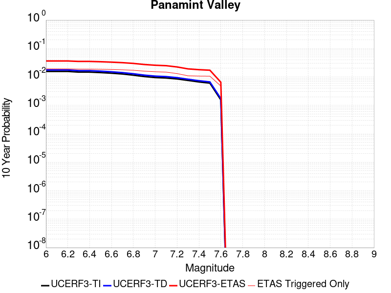 |

| Magnitude | 1 wk TI Prob | 1 wk TD Prob | 1 wk ETAS Prob | 1 wk ETAS/TD Gain | 1 wk ETAS Triggered Only | 1 mo TI Prob | 1 mo TD Prob | 1 mo ETAS Prob | 1 mo ETAS/TD Gain | 1 mo ETAS Triggered Only | 1 yr TI Prob | 1 yr TD Prob | 1 yr ETAS Prob | 1 yr ETAS/TD Gain | 1 yr ETAS Triggered Only | 10 yr TI Prob | 10 yr TD Prob | 10 yr ETAS Prob | 10 yr ETAS/TD Gain | 10 yr ETAS Triggered Only |
|-----|-----|-----|-----|-----|-----|-----|-----|-----|-----|-----|-----|-----|-----|-----|-----|-----|-----|-----|-----|-----|
| 6.0 | 3.0211835E-5 | 3.3984514E-5 | 0.015147975 | 445.73172 | 0.015114504 | 1.2947287E-4 | 1.4563995E-4 | 0.016555464 | 113.67392 | 0.016412213 | 0.0015751923 | 0.0017717537 | 0.019869404 | 11.2145405 | 0.018129772 | 0.015640736 | 0.017583137 | 0.036669023 | 2.0854652 | 0.01942748 |
| 6.1 | 3.0211835E-5 | 3.3984514E-5 | 0.015147975 | 445.73172 | 0.015114504 | 1.2947287E-4 | 1.4563995E-4 | 0.016555464 | 113.67392 | 0.016412213 | 0.0015751923 | 0.0017717537 | 0.019869404 | 11.2145405 | 0.018129772 | 0.015640736 | 0.017583137 | 0.036669023 | 2.0854652 | 0.01942748 |
| 6.2 | 3.0211835E-5 | 3.3984514E-5 | 0.015147975 | 445.73172 | 0.015114504 | 1.2947287E-4 | 1.4563995E-4 | 0.016555464 | 113.67392 | 0.016412213 | 0.0015751923 | 0.0017717537 | 0.019869404 | 11.2145405 | 0.018129772 | 0.015640736 | 0.017583137 | 0.036669023 | 2.0854652 | 0.01942748 |
| 6.3 | 2.8573924E-5 | 3.210268E-5 | 0.014840787 | 462.29123 | 0.0148091605 | 1.2245393E-4 | 1.3757581E-4 | 0.01624223 | 118.06021 | 0.01610687 | 0.001489857 | 0.0016737265 | 0.019392112 | 11.58619 | 0.017748091 | 0.01479908 | 0.016617801 | 0.035347104 | 2.1270626 | 0.019045802 |
| 6.4 | 2.8573924E-5 | 3.210268E-5 | 0.014840787 | 462.29123 | 0.0148091605 | 1.2245393E-4 | 1.3757581E-4 | 0.01624223 | 118.06021 | 0.01610687 | 0.001489857 | 0.0016737265 | 0.019392112 | 11.58619 | 0.017748091 | 0.01479908 | 0.016617801 | 0.035347104 | 2.1270626 | 0.019045802 |
| 6.5 | 2.7468774E-5 | 3.0828433E-5 | 0.014534198 | 471.4543 | 0.014503817 | 1.1771801E-4 | 1.3211532E-4 | 0.015931554 | 120.58824 | 0.015801527 | 0.0014322745 | 0.0016073446 | 0.019022057 | 11.83446 | 0.017442748 | 0.014230782 | 0.015963677 | 0.034404967 | 2.1552033 | 0.018740458 |
| 6.6 | 2.6135967E-5 | 2.925248E-5 | 0.014418145 | 492.88623 | 0.014389313 | 1.1200648E-4 | 1.253619E-4 | 0.015810419 | 126.11821 | 0.015687022 | 0.0013628257 | 0.0015252391 | 0.018750833 | 12.293702 | 0.017251909 | 0.013544982 | 0.015154043 | 0.03342256 | 2.2055209 | 0.01854962 |
| 6.7 | 2.4498746E-5 | 2.7341335E-5 | 0.014149093 | 517.4982 | 0.014122138 | 1.04990395E-4 | 1.1717203E-4 | 0.015497049 | 132.25894 | 0.015381679 | 0.0012775084 | 0.0014256609 | 0.018309953 | 12.843132 | 0.016908396 | 0.012701893 | 0.014171274 | 0.0320065 | 2.2585475 | 0.018091602 |
| 6.8 | 2.2244329E-5 | 2.4935423E-5 | 0.013726884 | 550.4973 | 0.01370229 | 9.532935E-5 | 1.0686185E-4 | 0.01491444 | 139.56749 | 0.0148091605 | 0.0011600169 | 0.0013002884 | 0.01750057 | 13.458992 | 0.016221374 | 0.011539802 | 0.0129325185 | 0.030036665 | 2.322569 | 0.017328244 |
| 6.9 | 1.9902658E-5 | 2.2290267E-5 | 0.01273193 | 571.1879 | 0.012709924 | 8.529431E-5 | 9.552632E-5 | 0.013796507 | 144.42624 | 0.01370229 | 0.0010379635 | 0.0011624309 | 0.016221242 | 13.954586 | 0.0150763355 | 0.010331288 | 0.011568608 | 0.027451416 | 2.3729231 | 0.016068703 |
| 7.0 | 1.8353881E-5 | 2.0566185E-5 | 0.012119554 | 589.29517 | 0.012099236 | 7.865712E-5 | 8.813792E-5 | 0.013140422 | 149.08932 | 0.013053435 | 9.5722964E-4 | 0.0010725686 | 0.015484575 | 14.436909 | 0.014427481 | 0.009531168 | 0.010678849 | 0.02585851 | 2.4214697 | 0.0153435115 |
| 7.1 | 1.7667631E-5 | 1.9772613E-5 | 0.011775265 | 595.5341 | 0.011755725 | 7.571623E-5 | 8.473711E-5 | 0.012793584 | 150.97969 | 0.012709924 | 9.2145515E-4 | 0.0010312037 | 0.01510065 | 14.643712 | 0.014083969 | 0.009176437 | 0.010269073 | 0.025077261 | 2.442018 | 0.014961832 |
| 7.2 | 1.6381597E-5 | 1.8158249E-5 | 0.010895823 | 600.0481 | 0.010877863 | 7.020495E-5 | 7.781885E-5 | 0.011756299 | 151.07265 | 0.0116793895 | 8.544101E-4 | 9.4704994E-4 | 0.013911859 | 14.689678 | 0.012977099 | 0.008511325 | 0.009434792 | 0.023007805 | 2.4386127 | 0.01370229 |
| 7.3 | 1.4520491E-5 | 1.5966476E-5 | 0.00940513 | 589.0548 | 0.009389313 | 6.222919E-5 | 6.842605E-5 | 0.010105907 | 147.69093 | 0.010038168 | 7.57377E-4 | 8.327849E-4 | 0.011892269 | 14.280121 | 0.011068703 | 0.0075480095 | 0.00829975 | 0.019920055 | 2.4000788 | 0.011717557 |
| 7.4 | 1.2852287E-5 | 1.4145411E-5 | 0.009250656 | 653.9687 | 0.009236641 | 5.5080065E-5 | 6.062187E-5 | 0.009945518 | 164.05826 | 0.009885496 | 6.7039346E-4 | 7.378371E-4 | 0.0116458135 | 15.783718 | 0.010916031 | 0.0066837464 | 0.0073567946 | 0.018836599 | 2.5604358 | 0.011564885 |
| 7.5 | 1.1637851E-5 | 1.2836797E-5 | 0.0090966895 | 708.64166 | 0.0090839695 | 4.987555E-5 | 5.5013777E-5 | 0.009787302 | 177.9064 | 0.009732825 | 6.070656E-4 | 6.6960254E-4 | 0.011425754 | 17.063486 | 0.010763358 | 0.006054099 | 0.0066787465 | 0.01801474 | 2.6973238 | 0.011412214 |
| 7.6 | 3.0068115E-6 | 3.3330316E-6 | 0.0037056108 | 1111.7839 | 0.0037022901 | 1.2886271E-5 | 1.4284384E-5 | 0.0040218607 | 281.5565 | 0.004007634 | 1.5687906E-4 | 1.7390578E-4 | 0.004791423 | 27.551836 | 0.0046183206 | 0.0015676835 | 0.0017391363 | 0.0067685423 | 3.8918986 | 0.005038168 |

## Garlock (East)
*[(top)](#table-of-contents)*

| 1 Week | 1 Month | 1 Year | 10 Year |
|-----|-----|-----|-----|
|  |  |  |  |

| Magnitude | 1 wk TI Prob | 1 wk TD Prob | 1 wk ETAS Prob | 1 wk ETAS/TD Gain | 1 wk ETAS Triggered Only | 1 mo TI Prob | 1 mo TD Prob | 1 mo ETAS Prob | 1 mo ETAS/TD Gain | 1 mo ETAS Triggered Only | 1 yr TI Prob | 1 yr TD Prob | 1 yr ETAS Prob | 1 yr ETAS/TD Gain | 1 yr ETAS Triggered Only | 10 yr TI Prob | 10 yr TD Prob | 10 yr ETAS Prob | 10 yr ETAS/TD Gain | 10 yr ETAS Triggered Only |
|-----|-----|-----|-----|-----|-----|-----|-----|-----|-----|-----|-----|-----|-----|-----|-----|-----|-----|-----|-----|-----|
| 6.0 | 4.5092507E-5 | 6.290325E-5 | 0.011359902 | 180.59325 | 0.01129771 | 1.9323928E-4 | 2.6956003E-4 | 0.012708954 | 47.14703 | 0.012442748 | 0.0023501497 | 0.0032774 | 0.016820654 | 5.132316 | 0.013587786 | 0.023254504 | 0.032351844 | 0.046497237 | 1.437236 | 0.01461832 |
| 6.1 | 4.5092507E-5 | 6.290325E-5 | 0.011359902 | 180.59325 | 0.01129771 | 1.9323928E-4 | 2.6956003E-4 | 0.012708954 | 47.14703 | 0.012442748 | 0.0023501497 | 0.0032774 | 0.016820654 | 5.132316 | 0.013587786 | 0.023254504 | 0.032351844 | 0.046497237 | 1.437236 | 0.01461832 |
| 6.2 | 2.6674514E-5 | 3.4509674E-5 | 0.010339498 | 299.61157 | 0.010305343 | 1.1431433E-4 | 1.4789042E-4 | 0.011405767 | 77.1231 | 0.011259542 | 0.0013908884 | 0.0017991117 | 0.01391468 | 7.7341943 | 0.012137405 | 0.01382215 | 0.017890299 | 0.030785175 | 1.7207748 | 0.013129771 |
| 6.3 | 2.6674514E-5 | 3.4509674E-5 | 0.010339498 | 299.61157 | 0.010305343 | 1.1431433E-4 | 1.4789042E-4 | 0.011405767 | 77.1231 | 0.011259542 | 0.0013908884 | 0.0017991117 | 0.01391468 | 7.7341943 | 0.012137405 | 0.01382215 | 0.017890299 | 0.030785175 | 1.7207748 | 0.013129771 |
| 6.4 | 2.5312667E-5 | 3.233893E-5 | 0.0102991825 | 318.4763 | 0.010267176 | 1.0847834E-4 | 1.3858822E-4 | 0.011358407 | 81.957954 | 0.011221374 | 0.0013199237 | 0.0016860351 | 0.013764872 | 8.164048 | 0.012099236 | 0.013121112 | 0.016778335 | 0.029612755 | 1.76494 | 0.013053435 |
| 6.5 | 2.5312667E-5 | 3.233893E-5 | 0.0102991825 | 318.4763 | 0.010267176 | 1.0847834E-4 | 1.3858822E-4 | 0.011358407 | 81.957954 | 0.011221374 | 0.0013199237 | 0.0016860351 | 0.013764872 | 8.164048 | 0.012099236 | 0.013121112 | 0.016778335 | 0.029612755 | 1.76494 | 0.013053435 |
| 6.6 | 2.246556E-5 | 2.8133776E-5 | 0.010027853 | 356.43463 | 0.01 | 9.627742E-5 | 1.20567885E-4 | 0.011035282 | 91.52754 | 0.010916031 | 0.0011715472 | 0.0014669491 | 0.01320543 | 9.001968 | 0.011755725 | 0.011653901 | 0.01461866 | 0.027105173 | 1.8541489 | 0.012671756 |
| 6.7 | 2.2241198E-5 | 2.7803519E-5 | 0.010027526 | 360.6567 | 0.01 | 9.531594E-5 | 1.1915263E-4 | 0.011033882 | 92.60293 | 0.010916031 | 0.0011598538 | 0.0014497414 | 0.013188424 | 9.097087 | 0.011755725 | 0.011538187 | 0.014448853 | 0.026937516 | 1.8643359 | 0.012671756 |
| 6.8 | 1.9528685E-5 | 2.389819E-5 | 0.009794657 | 409.8493 | 0.009770992 | 8.369167E-5 | 1.0241691E-4 | 0.010788346 | 105.33754 | 0.0106870225 | 0.0010184698 | 0.0012462323 | 0.012720465 | 10.207138 | 0.011488549 | 0.010138147 | 0.012436427 | 0.024649046 | 1.9820037 | 0.012366412 |
| 6.9 | 1.3318621E-5 | 1.5198884E-5 | 0.009480704 | 623.7763 | 0.009465649 | 5.7078556E-5 | 6.513648E-5 | 0.01044614 | 160.3731 | 0.010381679 | 6.9470983E-4 | 7.927538E-4 | 0.011928957 | 15.047491 | 0.0111450385 | 0.0069254204 | 0.007939888 | 0.019867329 | 2.5022178 | 0.0120229 |
| 7.0 | 1.1760853E-5 | 1.31077895E-5 | 0.009478632 | 723.12976 | 0.009465649 | 5.0402683E-5 | 5.6175057E-5 | 0.010360939 | 184.44022 | 0.010305343 | 6.134799E-4 | 6.8372174E-4 | 0.011744856 | 17.17783 | 0.011068703 | 0.0061178906 | 0.00685652 | 0.018721173 | 2.730419 | 0.011946565 |
| 7.1 | 1.0064758E-5 | 1.0902931E-5 | 0.009056605 | 830.65796 | 0.009045801 | 4.3133965E-5 | 4.672603E-5 | 0.00993176 | 212.55307 | 0.009885496 | 5.2502943E-4 | 5.687444E-4 | 0.011211543 | 19.712797 | 0.010648855 | 0.005237907 | 0.0057129986 | 0.017135914 | 2.9994607 | 0.011488549 |
| 7.2 | 9.768808E-6 | 1.0498807E-5 | 0.008903535 | 848.0521 | 0.008893129 | 4.186565E-5 | 4.499413E-5 | 0.009777381 | 217.30347 | 0.009732825 | 5.095951E-4 | 5.4766936E-4 | 0.010999957 | 20.085033 | 0.010458015 | 0.0050842804 | 0.0055032647 | 0.0167388 | 3.0416129 | 0.01129771 |
| 7.3 | 9.344516E-6 | 9.944468E-6 | 0.008330473 | 837.6992 | 0.008320611 | 4.004731E-5 | 4.261847E-5 | 0.0091262 | 214.13722 | 0.0090839695 | 4.8746695E-4 | 5.1875977E-4 | 0.010284684 | 19.825521 | 0.009770992 | 0.0048639905 | 0.0052149445 | 0.01569436 | 3.009497 | 0.010534351 |
| 7.4 | 9.023491E-6 | 9.490661E-6 | 0.0074140006 | 781.1891 | 0.0074045802 | 3.867153E-5 | 4.0673647E-5 | 0.008093781 | 198.99326 | 0.008053435 | 4.7072413E-4 | 4.950925E-4 | 0.009193074 | 18.568398 | 0.00870229 | 0.004697283 | 0.0049783974 | 0.014245011 | 2.8613648 | 0.009312977 |
| 7.5 | 7.081253E-6 | 7.087672E-6 | 0.003671184 | 517.9675 | 0.0036641222 | 3.0347876E-5 | 3.0375388E-5 | 0.003961554 | 130.41986 | 0.003931298 | 3.6942272E-4 | 3.6975832E-4 | 0.004795602 | 12.969558 | 0.004427481 | 0.003688092 | 0.0037243143 | 0.008477538 | 2.2762682 | 0.0047709923 |
| 7.6 | 6.116396E-6 | 5.959245E-6 | 0.002563196 | 430.12094 | 0.0025572518 | 2.6212863E-5 | 2.5539372E-5 | 0.0027353938 | 107.10498 | 0.0027099238 | 3.1909486E-4 | 3.1089774E-4 | 0.0033633835 | 10.8182955 | 0.0030534351 | 0.0031863707 | 0.0031357552 | 0.00629376 | 2.0070956 | 0.003167939 |
| 7.7 | 4.797145E-6 | 4.757281E-6 | 0.0015696354 | 329.9438 | 0.0015648855 | 2.055903E-5 | 2.0388188E-5 | 0.0016615761 | 81.496994 | 0.0016412213 | 2.5027743E-4 | 2.4819805E-4 | 0.0020034874 | 8.072132 | 0.0017557252 | 0.0024999576 | 0.0025093474 | 0.004298739 | 1.7130904 | 0.0017938932 |
| 7.8 | 3.4028885E-6 | 3.978462E-6 | 0.0011490121 | 288.80814 | 0.0011450382 | 1.4583726E-5 | 1.7050439E-5 | 0.0012384036 | 72.631775 | 0.001221374 | 1.775424E-4 | 2.0756939E-4 | 0.00154317 | 7.4344773 | 0.0013358778 | 0.0017740062 | 0.0021012232 | 0.003434294 | 1.6344261 | 0.0013358778 |
| 7.9 | 2.5928412E-6 | 3.3724489E-6 | 8.812321E-4 | 261.3033 | 8.778626E-4 | 1.1112129E-5 | 1.4453272E-5 | 9.6863793E-4 | 67.01859 | 9.541985E-4 | 1.3528178E-4 | 1.7595445E-4 | 0.0011681463 | 6.6389127 | 9.923665E-4 | 0.0013519945 | 0.0017812408 | 0.0027718395 | 1.5561285 | 9.923665E-4 |
| 8.0 | 1.3743648E-6 | 1.6734747E-6 | 2.688486E-4 | 160.65292 | 2.6717558E-4 | 5.8901214E-6 | 7.1720146E-6 | 2.7434566E-4 | 38.252247 | 2.6717558E-4 | 7.1709874E-5 | 8.731581E-5 | 3.9263265E-4 | 4.496696 | 3.053435E-4 | 7.1686733E-4 | 8.837234E-4 | 0.0011887971 | 1.345214 | 3.053435E-4 |
| 8.1 | 3.6733252E-7 | 3.1489964E-7 | 7.665075E-5 | 243.41327 | 7.633588E-5 | 1.5742813E-6 | 1.3495693E-6 | 7.768534E-5 | 57.563065 | 7.633588E-5 | 1.9166706E-5 | 1.6430899E-5 | 9.276552E-5 | 5.6457973 | 7.633588E-5 | 1.9165053E-4 | 1.6638759E-4 | 2.4271077E-4 | 1.4587071 | 7.633588E-5 |

## Hunter Mountain-Saline Valley
*[(top)](#table-of-contents)*

| 1 Week | 1 Month | 1 Year | 10 Year |
|-----|-----|-----|-----|
|  |  |  |  |

| Magnitude | 1 wk TI Prob | 1 wk TD Prob | 1 wk ETAS Prob | 1 wk ETAS/TD Gain | 1 wk ETAS Triggered Only | 1 mo TI Prob | 1 mo TD Prob | 1 mo ETAS Prob | 1 mo ETAS/TD Gain | 1 mo ETAS Triggered Only | 1 yr TI Prob | 1 yr TD Prob | 1 yr ETAS Prob | 1 yr ETAS/TD Gain | 1 yr ETAS Triggered Only | 10 yr TI Prob | 10 yr TD Prob | 10 yr ETAS Prob | 10 yr ETAS/TD Gain | 10 yr ETAS Triggered Only |
|-----|-----|-----|-----|-----|-----|-----|-----|-----|-----|-----|-----|-----|-----|-----|-----|-----|-----|-----|-----|-----|
| 6.0 | 4.5103672E-5 | 5.4570177E-5 | 0.009367039 | 171.65125 | 0.009312977 | 1.9328714E-4 | 2.3385242E-4 | 0.010155196 | 43.42566 | 0.009923664 | 0.002350731 | 0.0028435152 | 0.013766565 | 4.8413897 | 0.010954198 | 0.023260195 | 0.028091887 | 0.03944318 | 1.4040773 | 0.0116793895 |
| 6.1 | 4.5103672E-5 | 5.4570177E-5 | 0.009367039 | 171.65125 | 0.009312977 | 1.9328714E-4 | 2.3385242E-4 | 0.010155196 | 43.42566 | 0.009923664 | 0.002350731 | 0.0028435152 | 0.013766565 | 4.8413897 | 0.010954198 | 0.023260195 | 0.028091887 | 0.03944318 | 1.4040773 | 0.0116793895 |
| 6.2 | 3.9363465E-5 | 4.706337E-5 | 0.009321436 | 198.06139 | 0.00927481 | 1.6868966E-4 | 2.0168544E-4 | 0.010085188 | 50.00454 | 0.009885496 | 0.002051862 | 0.0024528175 | 0.013342073 | 5.439489 | 0.010916031 | 0.020330196 | 0.024273481 | 0.03563213 | 1.4679447 | 0.011641221 |
| 6.3 | 3.9363465E-5 | 4.706337E-5 | 0.009321436 | 198.06139 | 0.00927481 | 1.6868966E-4 | 2.0168544E-4 | 0.010085188 | 50.00454 | 0.009885496 | 0.002051862 | 0.0024528175 | 0.013342073 | 5.439489 | 0.010916031 | 0.020330196 | 0.024273481 | 0.03563213 | 1.4679447 | 0.011641221 |
| 6.4 | 3.2311684E-5 | 3.795099E-5 | 0.009312408 | 245.37985 | 0.00927481 | 1.384713E-4 | 1.6263737E-4 | 0.010046526 | 61.772556 | 0.009885496 | 0.0016845843 | 0.0019783843 | 0.012872819 | 6.506733 | 0.010916031 | 0.016718714 | 0.019616475 | 0.030991917 | 1.5798923 | 0.011603054 |
| 6.5 | 3.2311684E-5 | 3.795099E-5 | 0.009312408 | 245.37985 | 0.00927481 | 1.384713E-4 | 1.6263737E-4 | 0.010046526 | 61.772556 | 0.009885496 | 0.0016845843 | 0.0019783843 | 0.012872819 | 6.506733 | 0.010916031 | 0.016718714 | 0.019616475 | 0.030991917 | 1.5798923 | 0.011603054 |
| 6.6 | 2.9305844E-5 | 3.418183E-5 | 0.009308674 | 272.32812 | 0.00927481 | 1.2559042E-4 | 1.4648569E-4 | 0.010030534 | 68.474495 | 0.009885496 | 0.0015279909 | 0.001782067 | 0.012678645 | 7.114572 | 0.010916031 | 0.015175272 | 0.01768569 | 0.029083537 | 1.644467 | 0.011603054 |
| 6.7 | 2.7826512E-5 | 3.2344276E-5 | 0.009306854 | 287.74344 | 0.00927481 | 1.19251024E-4 | 1.386113E-4 | 0.010022737 | 72.30823 | 0.009885496 | 0.0014509142 | 0.0016863465 | 0.012583969 | 7.462268 | 0.010916031 | 0.014414776 | 0.016743187 | 0.028114438 | 1.679157 | 0.011564885 |
| 6.8 | 2.3389874E-5 | 2.6866714E-5 | 0.009301427 | 346.20633 | 0.00927481 | 1.0023846E-4 | 1.15138246E-4 | 0.009999496 | 86.84774 | 0.009885496 | 0.00121972 | 0.001400954 | 0.012301692 | 8.780939 | 0.010916031 | 0.01213047 | 0.013927434 | 0.02533125 | 1.8188024 | 0.011564885 |
| 6.9 | 2.069209E-5 | 2.3570032E-5 | 0.009221827 | 391.2522 | 0.009198473 | 8.867737E-5 | 1.01010715E-4 | 0.00990918 | 98.10029 | 0.009809161 | 0.0010791123 | 0.0012291478 | 0.012055519 | 9.80803 | 0.010839695 | 0.010738871 | 0.012228523 | 0.023576586 | 1.9279994 | 0.011488549 |
| 7.0 | 1.7462342E-5 | 1.9633546E-5 | 0.009217926 | 469.4988 | 0.009198473 | 7.483646E-5 | 8.414118E-5 | 0.009892476 | 117.56997 | 0.009809161 | 9.1075303E-4 | 0.0010239601 | 0.011852555 | 11.5752125 | 0.010839695 | 0.009070295 | 0.0101960525 | 0.021567464 | 2.1152759 | 0.011488549 |
| 7.1 | 1.4807709E-5 | 1.6441749E-5 | 0.009176596 | 558.12775 | 0.009160305 | 6.3460066E-5 | 7.046283E-5 | 0.009840767 | 139.65898 | 0.009770992 | 7.723524E-4 | 8.575638E-4 | 0.0116498275 | 13.584794 | 0.010801527 | 0.007696735 | 0.008545532 | 0.019898064 | 2.3284757 | 0.011450382 |
| 7.2 | 1.4180048E-5 | 1.5698337E-5 | 0.00917586 | 584.5116 | 0.009160305 | 6.077022E-5 | 6.727694E-5 | 0.009837612 | 146.22562 | 0.009770992 | 7.396263E-4 | 8.188051E-4 | 0.011611488 | 14.181014 | 0.010801527 | 0.0073716943 | 0.008160833 | 0.01951777 | 2.3916395 | 0.011450382 |
| 7.3 | 1.3730402E-5 | 1.5172075E-5 | 0.009175339 | 604.7517 | 0.009160305 | 5.8843252E-5 | 6.502165E-5 | 0.009835378 | 151.26314 | 0.009770992 | 7.161811E-4 | 7.9136714E-4 | 0.011584346 | 14.638396 | 0.010801527 | 0.007138774 | 0.007888422 | 0.019248478 | 2.4400923 | 0.011450382 |
| 7.4 | 1.2810095E-5 | 1.4109277E-5 | 0.009174285 | 650.2307 | 0.009160305 | 5.489925E-5 | 6.0467017E-5 | 0.009830869 | 162.58232 | 0.009770992 | 6.681934E-4 | 7.359531E-4 | 0.01152953 | 15.6661215 | 0.010801527 | 0.006661878 | 0.007338053 | 0.01870441 | 2.548961 | 0.011450382 |
| 7.5 | 1.1595659E-5 | 1.2800664E-5 | 0.009020319 | 704.67584 | 0.009007634 | 4.9694736E-5 | 5.4858923E-5 | 0.009672652 | 176.31866 | 0.0096183205 | 6.0486543E-4 | 6.6771836E-4 | 0.011309463 | 16.937475 | 0.010648855 | 0.006032217 | 0.0066599925 | 0.017882459 | 2.6850572 | 0.01129771 |
| 7.6 | 2.997694E-6 | 3.3251579E-6 | 0.0036674351 | 1102.9357 | 0.0036641222 | 1.28471975E-5 | 1.425064E-5 | 0.0039836597 | 279.5425 | 0.003969466 | 1.564034E-4 | 1.73495E-4 | 0.004752853 | 27.394754 | 0.0045801527 | 0.0015629337 | 0.001735031 | 0.0067263558 | 3.876793 | 0.005 |

## Garlock (West)
*[(top)](#table-of-contents)*

| 1 Week | 1 Month | 1 Year | 10 Year |
|-----|-----|-----|-----|
|  |  |  |  |

| Magnitude | 1 wk TI Prob | 1 wk TD Prob | 1 wk ETAS Prob | 1 wk ETAS/TD Gain | 1 wk ETAS Triggered Only | 1 mo TI Prob | 1 mo TD Prob | 1 mo ETAS Prob | 1 mo ETAS/TD Gain | 1 mo ETAS Triggered Only | 1 yr TI Prob | 1 yr TD Prob | 1 yr ETAS Prob | 1 yr ETAS/TD Gain | 1 yr ETAS Triggered Only | 10 yr TI Prob | 10 yr TD Prob | 10 yr ETAS Prob | 10 yr ETAS/TD Gain | 10 yr ETAS Triggered Only |
|-----|-----|-----|-----|-----|-----|-----|-----|-----|-----|-----|-----|-----|-----|-----|-----|-----|-----|-----|-----|-----|
| 6.0 | 2.5181727E-5 | 2.51973E-5 | 0.0067807524 | 269.1063 | 0.006755725 | 1.0791722E-4 | 1.0798398E-4 | 0.007626256 | 70.62396 | 0.007519084 | 0.0013131002 | 0.0013139155 | 0.009623594 | 7.3243628 | 0.008320611 | 0.013053683 | 0.013141977 | 0.021880567 | 1.6649373 | 0.008854962 |
| 6.1 | 2.5077732E-5 | 2.5098372E-5 | 0.006780654 | 270.1631 | 0.006755725 | 1.0747157E-4 | 1.0756004E-4 | 0.0076258355 | 70.89841 | 0.007519084 | 0.001307681 | 0.0013087603 | 0.009618482 | 7.3493075 | 0.008320611 | 0.013000126 | 0.013091032 | 0.021830074 | 1.6675594 | 0.008854962 |
| 6.2 | 2.494612E-5 | 2.498005E-5 | 0.0067805364 | 271.43805 | 0.006755725 | 1.0690756E-4 | 1.0705298E-4 | 0.007625332 | 71.229515 | 0.007519084 | 0.0013008224 | 0.0013025942 | 0.009612367 | 7.379402 | 0.008320611 | 0.012932341 | 0.013030097 | 0.021769678 | 1.6707226 | 0.008854962 |
| 6.3 | 2.4733758E-5 | 2.479942E-5 | 0.006780357 | 273.4079 | 0.006755725 | 1.0599751E-4 | 1.06278916E-4 | 0.0076245638 | 71.74107 | 0.007519084 | 0.0012897556 | 0.0012931811 | 0.009603032 | 7.4258986 | 0.008320611 | 0.012822957 | 0.012937066 | 0.021677472 | 1.6756095 | 0.008854962 |
| 6.4 | 2.3237335E-5 | 2.317873E-5 | 0.0067787473 | 292.4555 | 0.006755725 | 9.958477E-5 | 9.933365E-5 | 0.0076176706 | 76.68771 | 0.007519084 | 0.0012117702 | 0.001208719 | 0.0095192725 | 7.875505 | 0.008320611 | 0.012051838 | 0.012101916 | 0.020849716 | 1.7228442 | 0.008854962 |
| 6.5 | 2.2732203E-5 | 2.2993298E-5 | 0.0067785634 | 294.80603 | 0.006755725 | 9.742009E-5 | 9.8539E-5 | 0.007616882 | 77.29815 | 0.007519084 | 0.0011854442 | 0.0011990548 | 0.009509688 | 7.9309874 | 0.008320611 | 0.011791403 | 0.012006322 | 0.020754969 | 1.72867 | 0.008854962 |
| 6.6 | 2.1319436E-5 | 2.17735E-5 | 0.0067773517 | 311.26608 | 0.006755725 | 9.136581E-5 | 9.331167E-5 | 0.007611694 | 81.5728 | 0.007519084 | 0.001111811 | 0.0011354799 | 0.009446642 | 8.319516 | 0.008320611 | 0.011062649 | 0.011377227 | 0.020131443 | 1.7694509 | 0.008854962 |
| 6.7 | 1.970802E-5 | 2.0393396E-5 | 0.006775981 | 332.2635 | 0.006755725 | 8.446021E-5 | 8.739735E-5 | 0.007605824 | 87.0258 | 0.007519084 | 0.001027818 | 0.001063545 | 0.009375307 | 8.815147 | 0.008320611 | 0.010230771 | 0.010664964 | 0.019425489 | 1.8214302 | 0.008854962 |
| 6.8 | 1.8744462E-5 | 1.9901045E-5 | 0.006775492 | 340.4591 | 0.006755725 | 8.033094E-5 | 8.5287415E-5 | 0.00760373 | 89.15419 | 0.007519084 | 9.775903E-4 | 0.0010378812 | 0.0093498565 | 9.008599 | 0.008320611 | 0.009733009 | 0.01041075 | 0.019173525 | 1.8417045 | 0.008854962 |
| 6.9 | 1.7559682E-5 | 1.8953415E-5 | 0.006774551 | 357.43167 | 0.006755725 | 7.5253614E-5 | 8.12264E-5 | 0.0075997 | 93.56194 | 0.007519084 | 9.158276E-4 | 9.884841E-4 | 0.00930087 | 9.409225 | 0.008320611 | 0.0091206245 | 0.009921231 | 0.018688342 | 1.8836715 | 0.008854962 |
| 7.0 | 1.6794445E-5 | 1.8216237E-5 | 0.006697484 | 367.66562 | 0.006679389 | 7.197421E-5 | 7.8067256E-5 | 0.007520234 | 96.33019 | 0.007442748 | 8.759337E-4 | 9.5005584E-4 | 0.009186498 | 9.66943 | 0.008244275 | 0.008724891 | 0.009540141 | 0.018235017 | 1.9113992 | 0.008778626 |
| 7.1 | 1.6337795E-5 | 1.7717046E-5 | 0.006696988 | 377.9969 | 0.006679389 | 7.0017246E-5 | 7.5927994E-5 | 0.007518111 | 99.01633 | 0.007442748 | 8.521265E-4 | 9.240326E-4 | 0.009122557 | 9.872549 | 0.008206107 | 0.008488664 | 0.009281996 | 0.017941326 | 1.9329166 | 0.008740458 |
| 7.2 | 1.5780008E-5 | 1.7165687E-5 | 0.0066964403 | 390.10617 | 0.006679389 | 6.762685E-5 | 7.356516E-5 | 0.0075157657 | 102.16474 | 0.007442748 | 8.2304585E-4 | 8.9528906E-4 | 0.009055915 | 10.115074 | 0.008167939 | 0.008200042 | 0.008996838 | 0.017620835 | 1.9585587 | 0.00870229 |
| 7.3 | 1.5058865E-5 | 1.6618762E-5 | 0.00665773 | 400.61526 | 0.006641221 | 6.45364E-5 | 7.122133E-5 | 0.007437109 | 104.4225 | 0.0073664123 | 7.854473E-4 | 8.667759E-4 | 0.008951365 | 10.327197 | 0.008091603 | 0.00782677 | 0.008713539 | 0.01726433 | 1.9813225 | 0.008625954 |
| 7.4 | 1.4887923E-5 | 1.6454731E-5 | 0.0065048975 | 395.3208 | 0.0064885495 | 6.380382E-5 | 7.051838E-5 | 0.007245585 | 102.74747 | 0.0071755727 | 7.7653467E-4 | 8.582243E-4 | 0.008752207 | 10.198042 | 0.007900763 | 0.0077382675 | 0.008628399 | 0.016990732 | 1.9691639 | 0.008435114 |
| 7.5 | 1.4509299E-5 | 1.6046748E-5 | 0.005664811 | 353.01926 | 0.005648855 | 6.218123E-5 | 6.876997E-5 | 0.0063660466 | 92.57015 | 0.00629771 | 7.567935E-4 | 8.36954E-4 | 0.007815841 | 9.338436 | 0.006984733 | 0.0075422134 | 0.008416704 | 0.015872503 | 1.8858334 | 0.007519084 |
| 7.6 | 1.2756717E-5 | 1.4050848E-5 | 0.0040979628 | 291.65234 | 0.0040839696 | 5.4670498E-5 | 6.0216535E-5 | 0.0044874307 | 74.52157 | 0.004427481 | 6.6541E-4 | 7.328904E-4 | 0.005652946 | 7.713222 | 0.004923664 | 0.006634211 | 0.0073816874 | 0.012496324 | 1.6928817 | 0.0051526716 |
| 7.7 | 1.0328985E-5 | 1.1460557E-5 | 0.0025305157 | 220.80215 | 0.002519084 | 4.4266326E-5 | 4.911575E-5 | 0.0027589062 | 56.17152 | 0.0027099238 | 5.388092E-4 | 5.978206E-4 | 0.0034587048 | 5.785523 | 0.0028625955 | 0.0053750467 | 0.006038511 | 0.008997633 | 1.4900416 | 0.0029770993 |
| 7.8 | 7.0306583E-6 | 8.899601E-6 | 0.0018409444 | 206.85695 | 0.0018320611 | 3.0131043E-5 | 3.814059E-5 | 0.0020609642 | 54.03598 | 0.0020229009 | 3.667837E-4 | 4.642629E-4 | 0.0026388254 | 5.683903 | 0.0021755726 | 0.003661789 | 0.0046952725 | 0.0069366074 | 1.47736 | 0.0022519084 |
| 7.9 | 4.060633E-6 | 5.4653938E-6 | 0.0011123295 | 203.52231 | 0.0011068702 | 1.7402595E-5 | 2.3422906E-5 | 0.0012447684 | 53.143204 | 0.001221374 | 2.11856E-4 | 2.851367E-4 | 0.0015824765 | 5.5498877 | 0.0012977099 | 0.0021165414 | 0.002884201 | 0.004254284 | 1.4750303 | 0.0013740459 |
| 8.0 | 1.6729537E-6 | 2.0775144E-6 | 3.0742039E-4 | 147.9751 | 3.053435E-4 | 7.169782E-6 | 8.903603E-6 | 3.142444E-4 | 35.29407 | 3.053435E-4 | 8.7288594E-5 | 1.0839601E-4 | 4.5187023E-4 | 4.168698 | 3.4351146E-4 | 8.7254314E-4 | 0.0010969337 | 0.0014400685 | 1.3128126 | 3.4351146E-4 |
| 8.1 | 3.6733252E-7 | 3.1489964E-7 | 7.665075E-5 | 243.41327 | 7.633588E-5 | 1.5742813E-6 | 1.3495693E-6 | 7.768534E-5 | 57.563065 | 7.633588E-5 | 1.9166706E-5 | 1.6430899E-5 | 9.276552E-5 | 5.6457973 | 7.633588E-5 | 1.9165053E-4 | 1.6638759E-4 | 2.4271077E-4 | 1.4587071 | 7.633588E-5 |

## Blackwater
*[(top)](#table-of-contents)*

| 1 Week | 1 Month | 1 Year | 10 Year |
|-----|-----|-----|-----|
| 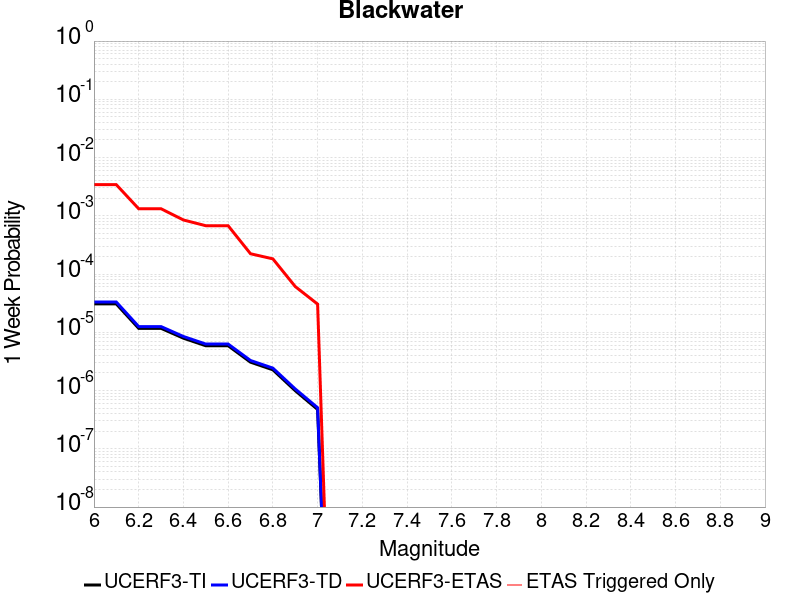 |  |  |  |

| Magnitude | 1 wk TI Prob | 1 wk TD Prob | 1 wk ETAS Prob | 1 wk ETAS/TD Gain | 1 wk ETAS Triggered Only | 1 mo TI Prob | 1 mo TD Prob | 1 mo ETAS Prob | 1 mo ETAS/TD Gain | 1 mo ETAS Triggered Only | 1 yr TI Prob | 1 yr TD Prob | 1 yr ETAS Prob | 1 yr ETAS/TD Gain | 1 yr ETAS Triggered Only | 10 yr TI Prob | 10 yr TD Prob | 10 yr ETAS Prob | 10 yr ETAS/TD Gain | 10 yr ETAS Triggered Only |
|-----|-----|-----|-----|-----|-----|-----|-----|-----|-----|-----|-----|-----|-----|-----|-----|-----|-----|-----|-----|-----|
| 6.0 | 3.0708583E-5 | 3.3095846E-5 | 0.0037734301 | 114.01521 | 0.003740458 | 1.3160157E-4 | 1.4183241E-4 | 0.0043397103 | 30.597452 | 0.0041984734 | 0.0016010714 | 0.0017255784 | 0.006488338 | 3.7600944 | 0.0047709923 | 0.015895851 | 0.017135633 | 0.022237524 | 1.2977358 | 0.0051908395 |
| 6.1 | 3.0708583E-5 | 3.3095846E-5 | 0.0037734301 | 114.01521 | 0.003740458 | 1.3160157E-4 | 1.4183241E-4 | 0.0043397103 | 30.597452 | 0.0041984734 | 0.0016010714 | 0.0017255784 | 0.006488338 | 3.7600944 | 0.0047709923 | 0.015895851 | 0.017135633 | 0.022237524 | 1.2977358 | 0.0051908395 |
| 6.2 | 1.1707779E-5 | 1.2545122E-5 | 0.0013865737 | 110.52692 | 0.0013740459 | 5.017523E-5 | 5.3763757E-5 | 0.0015422334 | 28.685371 | 0.0014885496 | 6.107122E-4 | 6.5438676E-4 | 0.0022945341 | 3.5063884 | 0.0016412213 | 0.006090366 | 0.0065255696 | 0.008307757 | 1.2731082 | 0.0017938932 |
| 6.3 | 1.1707779E-5 | 1.2545122E-5 | 0.0013865737 | 110.52692 | 0.0013740459 | 5.017523E-5 | 5.3763757E-5 | 0.0015422334 | 28.685371 | 0.0014885496 | 6.107122E-4 | 6.5438676E-4 | 0.0022945341 | 3.5063884 | 0.0016412213 | 0.006090366 | 0.0065255696 | 0.008307757 | 1.2731082 | 0.0017938932 |
| 6.4 | 7.929244E-6 | 8.480098E-6 | 8.8633527E-4 | 104.519455 | 8.778626E-4 | 3.3982033E-5 | 3.6342793E-5 | 9.905066E-4 | 27.254553 | 9.541985E-4 | 4.136527E-4 | 4.423877E-4 | 0.0015106172 | 3.4146907 | 0.0010687023 | 0.0041288356 | 0.0044154758 | 0.0055934577 | 1.2667848 | 0.0011832061 |
| 6.5 | 5.8832115E-6 | 6.285991E-6 | 8.0780766E-4 | 128.5092 | 8.015267E-4 | 2.521352E-5 | 2.6939697E-5 | 8.666117E-4 | 32.16858 | 8.3969464E-4 | 3.0693135E-4 | 3.27944E-4 | 0.0012436741 | 3.792337 | 9.1603055E-4 | 0.0030650778 | 0.0032748538 | 0.0042639705 | 1.3020338 | 9.923665E-4 |
| 6.6 | 5.8832115E-6 | 6.285991E-6 | 8.0780766E-4 | 128.5092 | 8.015267E-4 | 2.521352E-5 | 2.6939697E-5 | 8.666117E-4 | 32.16858 | 8.3969464E-4 | 3.0693135E-4 | 3.27944E-4 | 0.0012436741 | 3.792337 | 9.1603055E-4 | 0.0030650778 | 0.0032748538 | 0.0042639705 | 1.3020338 | 9.923665E-4 |
| 6.7 | 3.0715053E-6 | 3.2814662E-6 | 1.9412054E-4 | 59.156647 | 1.908397E-4 | 1.3163528E-5 | 1.4063357E-5 | 2.0490037E-4 | 14.569805 | 1.908397E-4 | 1.6025416E-4 | 1.7120909E-4 | 4.0017752E-4 | 2.3373613 | 2.2900764E-4 | 0.0016013865 | 0.0017108864 | 0.0019776048 | 1.1558949 | 2.6717558E-4 |
| 6.8 | 2.2722281E-6 | 2.4287538E-6 | 1.9326799E-4 | 79.57497 | 1.908397E-4 | 9.738084E-6 | 1.0408908E-5 | 2.0124661E-4 | 19.334076 | 1.908397E-4 | 1.1855473E-4 | 1.26722E-4 | 3.557006E-4 | 2.8069365 | 2.2900764E-4 | 0.001184915 | 0.0012665876 | 0.0015334247 | 1.210674 | 2.6717558E-4 |
| 6.9 | 9.952399E-7 | 1.0653489E-6 | 3.9233248E-5 | 36.826668 | 3.816794E-5 | 4.265307E-6 | 4.5657757E-6 | 4.273354E-5 | 9.359535 | 3.816794E-5 | 5.1928873E-5 | 5.5587418E-5 | 9.375324E-5 | 1.6865909 | 3.816794E-5 | 5.191674E-4 | 5.557858E-4 | 5.9393246E-4 | 1.0686357 | 3.816794E-5 |
| 7.0 | 4.7385504E-7 | 5.0755597E-7 | 3.8675476E-5 | 76.19943 | 3.816794E-5 | 2.0308057E-6 | 2.1752398E-6 | 4.0343097E-5 | 18.546505 | 3.816794E-5 | 2.4724779E-5 | 2.6483543E-5 | 6.465047E-5 | 2.4411564 | 3.816794E-5 | 2.4722028E-4 | 2.6483546E-4 | 3.0299329E-4 | 1.1440812 | 3.816794E-5 |

## San Andreas (Mojave S)
*[(top)](#table-of-contents)*

| 1 Week | 1 Month | 1 Year | 10 Year |
|-----|-----|-----|-----|
| 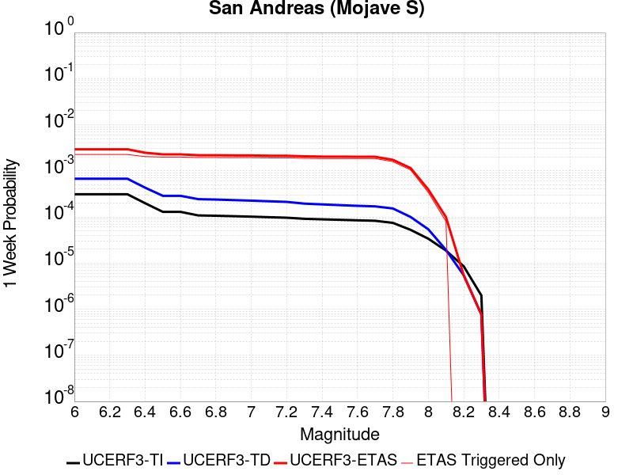 |  |  |  |

| Magnitude | 1 wk TI Prob | 1 wk TD Prob | 1 wk ETAS Prob | 1 wk ETAS/TD Gain | 1 wk ETAS Triggered Only | 1 mo TI Prob | 1 mo TD Prob | 1 mo ETAS Prob | 1 mo ETAS/TD Gain | 1 mo ETAS Triggered Only | 1 yr TI Prob | 1 yr TD Prob | 1 yr ETAS Prob | 1 yr ETAS/TD Gain | 1 yr ETAS Triggered Only | 10 yr TI Prob | 10 yr TD Prob | 10 yr ETAS Prob | 10 yr ETAS/TD Gain | 10 yr ETAS Triggered Only |
|-----|-----|-----|-----|-----|-----|-----|-----|-----|-----|-----|-----|-----|-----|-----|-----|-----|-----|-----|-----|-----|
| 6.0 | 3.1064058E-4 | 6.7460834E-4 | 0.003420846 | 5.070863 | 0.0027480917 | 0.0013306376 | 0.0028881032 | 0.005894662 | 2.041015 | 0.0030152672 | 0.016080605 | 0.03462235 | 0.037791144 | 1.0915246 | 0.0032824427 | 0.1496549 | 0.28660452 | 0.2891096 | 1.0087404 | 0.0035114505 |
| 6.1 | 3.1064058E-4 | 6.7460834E-4 | 0.003420846 | 5.070863 | 0.0027480917 | 0.0013306376 | 0.0028881032 | 0.005894662 | 2.041015 | 0.0030152672 | 0.016080605 | 0.03462235 | 0.037791144 | 1.0915246 | 0.0032824427 | 0.1496549 | 0.28660452 | 0.2891096 | 1.0087404 | 0.0035114505 |
| 6.2 | 3.1064058E-4 | 6.7460834E-4 | 0.003420846 | 5.070863 | 0.0027480917 | 0.0013306376 | 0.0028881032 | 0.005894662 | 2.041015 | 0.0030152672 | 0.016080605 | 0.03462235 | 0.037791144 | 1.0915246 | 0.0032824427 | 0.1496549 | 0.28660452 | 0.2891096 | 1.0087404 | 0.0035114505 |
| 6.3 | 3.1064058E-4 | 6.7460834E-4 | 0.003420846 | 5.070863 | 0.0027480917 | 0.0013306376 | 0.0028881032 | 0.005894662 | 2.041015 | 0.0030152672 | 0.016080605 | 0.03462235 | 0.037791144 | 1.0915246 | 0.0032824427 | 0.1496549 | 0.28660452 | 0.2891096 | 1.0087404 | 0.0035114505 |
| 6.4 | 1.9872203E-4 | 4.3179357E-4 | 0.0029116382 | 6.743126 | 0.002480916 | 8.5138786E-4 | 0.0018492596 | 0.004592269 | 2.4833016 | 0.0027480917 | 0.010316478 | 0.02228844 | 0.025161866 | 1.1289201 | 0.0029389313 | 0.098504856 | 0.19699748 | 0.19948004 | 1.012602 | 0.003091603 |
| 6.5 | 1.291105E-4 | 2.875267E-4 | 0.0027295724 | 9.493283 | 0.002442748 | 5.5321335E-4 | 0.0012316781 | 0.003900143 | 3.166528 | 0.0026717556 | 0.006714592 | 0.0148934 | 0.01771336 | 1.1893431 | 0.0028625955 | 0.065152965 | 0.13803436 | 0.14060052 | 1.0185907 | 0.0029770993 |
| 6.6 | 1.291105E-4 | 2.875267E-4 | 0.0027295724 | 9.493283 | 0.002442748 | 5.5321335E-4 | 0.0012316781 | 0.003900143 | 3.166528 | 0.0026717556 | 0.006714592 | 0.0148934 | 0.01771336 | 1.1893431 | 0.0028625955 | 0.065152965 | 0.13803436 | 0.14060052 | 1.0185907 | 0.0029770993 |
| 6.7 | 1.08001186E-4 | 2.4333889E-4 | 0.0026091752 | 10.722393 | 0.0023664122 | 4.6278012E-4 | 0.0010424647 | 0.003635179 | 3.4871004 | 0.0025954198 | 0.0056198016 | 0.012618446 | 0.0153695475 | 1.2180222 | 0.0027862596 | 0.054797906 | 0.119176775 | 0.12173183 | 1.0214392 | 0.0029007634 |
| 6.8 | 1.0624356E-4 | 2.3851555E-4 | 0.0026043633 | 10.91905 | 0.0023664122 | 4.5525006E-4 | 0.0010218095 | 0.0036145775 | 3.5374277 | 0.0025954198 | 0.0055285925 | 0.012369843 | 0.015121637 | 1.2224599 | 0.0027862596 | 0.053930566 | 0.11712591 | 0.119686924 | 1.0218655 | 0.0029007634 |
| 6.9 | 1.0393785E-4 | 2.3221898E-4 | 0.0025980817 | 11.188067 | 0.0023664122 | 4.4537184E-4 | 9.948451E-4 | 0.003587683 | 3.606273 | 0.0025954198 | 0.0054089287 | 0.012045221 | 0.014797919 | 1.2285303 | 0.0027862596 | 0.05279156 | 0.11442335 | 0.1169922 | 1.0224503 | 0.0029007634 |
| 7.0 | 1.0155622E-4 | 2.2591476E-4 | 0.0025917923 | 11.472435 | 0.0023664122 | 4.3516833E-4 | 9.6784724E-4 | 0.0035607552 | 3.6790466 | 0.0025954198 | 0.005285311 | 0.0117200995 | 0.014473704 | 1.2349472 | 0.0027862596 | 0.05161361 | 0.111683756 | 0.11426055 | 1.0230722 | 0.0029007634 |
| 7.1 | 9.885595E-5 | 2.1879886E-4 | 0.0025846933 | 11.813103 | 0.0023664122 | 4.2359953E-4 | 9.3737274E-4 | 0.0035303598 | 3.7662282 | 0.0025954198 | 0.0051451353 | 0.011352993 | 0.01410762 | 1.2426344 | 0.0027862596 | 0.05027629 | 0.1085682 | 0.111154035 | 1.0238175 | 0.0029007634 |
| 7.2 | 9.6411415E-5 | 2.124288E-4 | 0.0025783384 | 12.1374235 | 0.0023664122 | 4.1312634E-4 | 9.1009185E-4 | 0.0035031496 | 3.8492265 | 0.0025954198 | 0.005018219 | 0.011024255 | 0.0137797985 | 1.2499528 | 0.0027862596 | 0.049064007 | 0.105758004 | 0.10835199 | 1.0245275 | 0.0029007634 |
| 7.3 | 9.1180635E-5 | 1.9471257E-4 | 0.0025225035 | 12.95501 | 0.0023282443 | 3.907156E-4 | 8.342157E-4 | 0.0033511983 | 4.0171843 | 0.002519084 | 0.004746591 | 0.01010939 | 0.012791918 | 1.2653501 | 0.0027099238 | 0.046464786 | 0.09795115 | 0.10049892 | 1.0260106 | 0.0028244276 |
| 7.4 | 8.887388E-5 | 1.8719878E-4 | 0.0024768463 | 13.231103 | 0.0022900763 | 3.8083247E-4 | 8.020339E-4 | 0.0032809603 | 4.0908 | 0.002480916 | 0.0046267817 | 0.00972114 | 0.012329127 | 1.2682799 | 0.0026335877 | 0.045316286 | 0.09458615 | 0.09707431 | 1.0263058 | 0.0027480917 |
| 7.5 | 8.6750515E-5 | 1.8051457E-4 | 0.0024701776 | 13.68409 | 0.0022900763 | 3.7173493E-4 | 7.7340455E-4 | 0.003252402 | 4.2053046 | 0.002480916 | 0.004516484 | 0.009375632 | 0.011984528 | 1.2782634 | 0.0026335877 | 0.04425787 | 0.091549896 | 0.0940464 | 1.0272694 | 0.0027480917 |
| 7.6 | 8.453092E-5 | 1.7439072E-4 | 0.0024640677 | 14.1295805 | 0.0022900763 | 3.6222505E-4 | 7.471748E-4 | 0.0032262371 | 4.317915 | 0.002480916 | 0.0044011753 | 0.009058985 | 0.011668715 | 1.288082 | 0.0026335877 | 0.04315024 | 0.08870898 | 0.09121329 | 1.0282307 | 0.0027480917 |
| 7.7 | 8.259102E-5 | 1.6961215E-4 | 0.0024593 | 14.499551 | 0.0022900763 | 3.539135E-4 | 7.2670676E-4 | 0.00320582 | 4.411435 | 0.002480916 | 0.004300386 | 0.008811831 | 0.011422211 | 1.2962359 | 0.0026335877 | 0.042181134 | 0.08645982 | 0.08897032 | 1.0290365 | 0.0027480917 |
| 7.8 | 7.444844E-5 | 1.5283503E-4 | 0.0020609403 | 13.484738 | 0.001908397 | 3.1902574E-4 | 6.548429E-4 | 0.0027527048 | 4.2036114 | 0.0020992367 | 0.0038772223 | 0.007943616 | 0.0101776365 | 1.2812346 | 0.0022519084 | 0.03810269 | 0.078290746 | 0.080436714 | 1.0274101 | 0.0023282443 |
| 7.9 | 5.2586525E-5 | 1.00064186E-4 | 0.0012831519 | 12.823288 | 0.0011832061 | 2.2535135E-4 | 4.2877605E-4 | 0.0017259296 | 4.025247 | 0.0012977099 | 0.0027402006 | 0.005207864 | 0.0065747537 | 1.2624665 | 0.0013740459 | 0.027066574 | 0.052200034 | 0.053574707 | 1.0263346 | 0.0014503817 |
| 8.0 | 3.379877E-5 | 5.4074168E-5 | 3.5940117E-4 | 6.6464486 | 3.053435E-4 | 1.4484383E-4 | 2.3172585E-4 | 5.369986E-4 | 2.3173876 | 3.053435E-4 | 0.0017620471 | 0.002817614 | 0.0031601577 | 1.1215723 | 3.4351146E-4 | 0.017481409 | 0.028834904 | 0.029168509 | 1.0115695 | 3.4351146E-4 |
| 8.1 | 1.8668277E-5 | 1.9309397E-5 | 9.56438E-5 | 4.9532256 | 7.633588E-5 | 8.000444E-5 | 8.275194E-5 | 1.590815E-4 | 1.92239 | 7.633588E-5 | 9.736188E-4 | 0.0010070398 | 0.0010832988 | 1.0757259 | 7.633588E-5 | 0.009693642 | 0.010798888 | 0.0108744 | 1.0069926 | 7.633588E-5 |
| 8.2 | 8.541571E-6 | 5.460819E-6 | 5.460819E-6 | 1.0 | 0.0 | 3.660622E-5 | 2.3403301E-5 | 2.3403301E-5 | 1.0 | 0.0 | 4.455896E-4 | 2.84898E-4 | 2.84898E-4 | 1.0 | 0.0 | 0.0044469717 | 0.0032408056 | 0.0032408056 | 1.0 | 0.0 |
| 8.3 | 1.983087E-6 | 7.6599065E-7 | 7.6599065E-7 | 1.0 | 0.0 | 8.498917E-6 | 3.282813E-6 | 3.282813E-6 | 1.0 | 0.0 | 1.034694E-4 | 3.9967534E-5 | 3.9967534E-5 | 1.0 | 0.0 | 0.0010342124 | 4.719687E-4 | 4.719687E-4 | 1.0 | 0.0 |

## Ash Hill
*[(top)](#table-of-contents)*

| 1 Week | 1 Month | 1 Year | 10 Year |
|-----|-----|-----|-----|
| 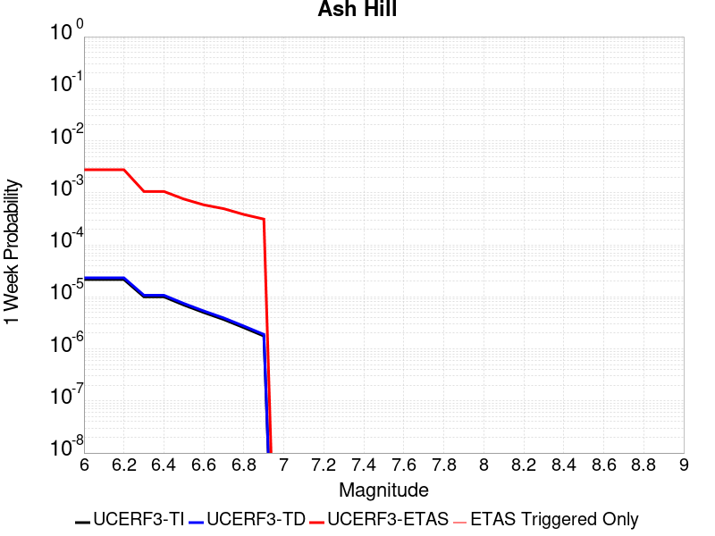 |  |  | 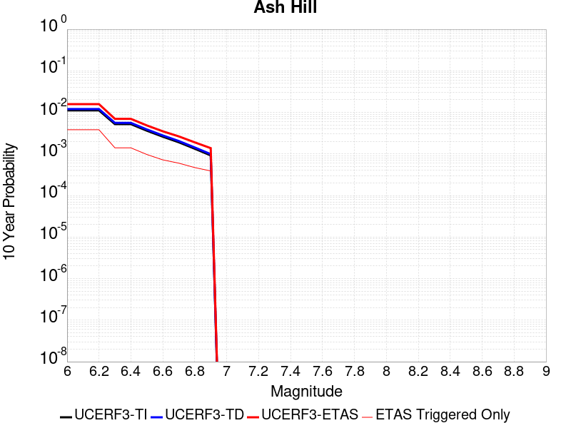 |

| Magnitude | 1 wk TI Prob | 1 wk TD Prob | 1 wk ETAS Prob | 1 wk ETAS/TD Gain | 1 wk ETAS Triggered Only | 1 mo TI Prob | 1 mo TD Prob | 1 mo ETAS Prob | 1 mo ETAS/TD Gain | 1 mo ETAS Triggered Only | 1 yr TI Prob | 1 yr TD Prob | 1 yr ETAS Prob | 1 yr ETAS/TD Gain | 1 yr ETAS Triggered Only | 10 yr TI Prob | 10 yr TD Prob | 10 yr ETAS Prob | 10 yr ETAS/TD Gain | 10 yr ETAS Triggered Only |
|-----|-----|-----|-----|-----|-----|-----|-----|-----|-----|-----|-----|-----|-----|-----|-----|-----|-----|-----|-----|-----|
| 6.0 | 2.1545662E-5 | 2.3194447E-5 | 0.002618554 | 112.89574 | 0.0025954198 | 9.2335285E-5 | 9.940143E-5 | 0.0029998764 | 30.179407 | 0.0029007634 | 0.0011236023 | 0.0012096206 | 0.0045643365 | 3.773362 | 0.0033587785 | 0.011179381 | 0.012038348 | 0.015507527 | 1.2881773 | 0.0035114505 |
| 6.1 | 2.1545662E-5 | 2.3194447E-5 | 0.002618554 | 112.89574 | 0.0025954198 | 9.2335285E-5 | 9.940143E-5 | 0.0029998764 | 30.179407 | 0.0029007634 | 0.0011236023 | 0.0012096206 | 0.0045643365 | 3.773362 | 0.0033587785 | 0.011179381 | 0.012038348 | 0.015507527 | 1.2881773 | 0.0035114505 |
| 6.2 | 2.1545662E-5 | 2.3194447E-5 | 0.002618554 | 112.89574 | 0.0025954198 | 9.2335285E-5 | 9.940143E-5 | 0.0029998764 | 30.179407 | 0.0029007634 | 0.0011236023 | 0.0012096206 | 0.0045643365 | 3.773362 | 0.0033587785 | 0.011179381 | 0.012038348 | 0.015507527 | 1.2881773 | 0.0035114505 |
| 6.3 | 1.0025529E-5 | 1.0746934E-5 | 0.0010412702 | 96.88998 | 0.0010305344 | 4.2965847E-5 | 4.605755E-5 | 0.001191043 | 25.859884 | 0.0011450382 | 5.229836E-4 | 5.6061964E-4 | 0.001857602 | 3.3134801 | 0.0012977099 | 0.005217545 | 0.0055933665 | 0.0068838177 | 1.230711 | 0.0012977099 |
| 6.4 | 1.0025529E-5 | 1.0746934E-5 | 0.0010412702 | 96.88998 | 0.0010305344 | 4.2965847E-5 | 4.605755E-5 | 0.001191043 | 25.859884 | 0.0011450382 | 5.229836E-4 | 5.6061964E-4 | 0.001857602 | 3.3134801 | 0.0012977099 | 0.005217545 | 0.0055933665 | 0.0068838177 | 1.230711 | 0.0012977099 |
| 6.5 | 6.9617327E-6 | 7.456634E-6 | 8.4714504E-4 | 113.60957 | 8.3969464E-4 | 2.9835655E-5 | 3.195666E-5 | 9.861246E-4 | 30.858189 | 9.541985E-4 | 3.6318856E-4 | 3.8901155E-4 | 0.0014954512 | 3.8442335 | 0.0011068702 | 0.0036259557 | 0.0038841602 | 0.0049867313 | 1.2838634 | 0.0011068702 |
| 6.6 | 4.9919777E-6 | 5.3466883E-6 | 6.923659E-4 | 129.49435 | 6.870229E-4 | 2.1394015E-5 | 2.2914215E-5 | 7.862555E-4 | 34.313004 | 7.633588E-4 | 2.60441E-4 | 2.7895154E-4 | 0.001118412 | 4.0093412 | 8.3969464E-4 | 0.0026013597 | 0.0027866727 | 0.0036240274 | 1.3004855 | 8.3969464E-4 |
| 6.7 | 3.6630722E-6 | 3.924624E-6 | 6.9094484E-4 | 176.05377 | 6.870229E-4 | 1.5698786E-5 | 1.681974E-5 | 7.8016566E-4 | 46.383934 | 7.633588E-4 | 1.9111596E-4 | 2.0476682E-4 | 0.0010442896 | 5.099896 | 8.3969464E-4 | 0.0019095168 | 0.0020463446 | 0.002884321 | 1.4094992 | 8.3969464E-4 |
| 6.8 | 2.5599613E-6 | 2.744925E-6 | 5.370946E-4 | 195.66821 | 5.3435116E-4 | 1.0971216E-5 | 1.1763939E-5 | 6.224438E-4 | 52.911167 | 6.10687E-4 | 1.3356637E-4 | 1.4322149E-4 | 8.30146E-4 | 5.796239 | 6.870229E-4 | 0.0013348613 | 0.0014317769 | 0.0021178161 | 1.4791523 | 6.870229E-4 |
| 6.9 | 1.7684905E-6 | 1.8968707E-6 | 4.980791E-4 | 262.57938 | 4.9618323E-4 | 7.579223E-6 | 8.129446E-6 | 5.806439E-4 | 71.42478 | 5.725191E-4 | 9.2273134E-5 | 9.8976E-5 | 7.4776675E-4 | 7.555031 | 6.4885494E-4 | 9.223483E-4 | 9.8976E-4 | 0.0016379728 | 1.6549191 | 6.4885494E-4 |

## San Andreas (Mojave N)
*[(top)](#table-of-contents)*

| 1 Week | 1 Month | 1 Year | 10 Year |
|-----|-----|-----|-----|
|  |  |  |  |

| Magnitude | 1 wk TI Prob | 1 wk TD Prob | 1 wk ETAS Prob | 1 wk ETAS/TD Gain | 1 wk ETAS Triggered Only | 1 mo TI Prob | 1 mo TD Prob | 1 mo ETAS Prob | 1 mo ETAS/TD Gain | 1 mo ETAS Triggered Only | 1 yr TI Prob | 1 yr TD Prob | 1 yr ETAS Prob | 1 yr ETAS/TD Gain | 1 yr ETAS Triggered Only | 10 yr TI Prob | 10 yr TD Prob | 10 yr ETAS Prob | 10 yr ETAS/TD Gain | 10 yr ETAS Triggered Only |
|-----|-----|-----|-----|-----|-----|-----|-----|-----|-----|-----|-----|-----|-----|-----|-----|-----|-----|-----|-----|-----|
| 6.0 | 9.877682E-5 | 1.9400702E-4 | 0.003056047 | 15.75225 | 0.0028625955 | 4.2326056E-4 | 8.311939E-4 | 0.0039583636 | 4.7622623 | 0.003129771 | 0.0051410277 | 0.010072956 | 0.013397901 | 1.3300864 | 0.0033587785 | 0.05023708 | 0.09831428 | 0.1014805 | 1.0322051 | 0.0035114505 |
| 6.1 | 9.877682E-5 | 1.9400702E-4 | 0.003056047 | 15.75225 | 0.0028625955 | 4.2326056E-4 | 8.311939E-4 | 0.0039583636 | 4.7622623 | 0.003129771 | 0.0051410277 | 0.010072956 | 0.013397901 | 1.3300864 | 0.0033587785 | 0.05023708 | 0.09831428 | 0.1014805 | 1.0322051 | 0.0035114505 |
| 6.2 | 9.877682E-5 | 1.9400702E-4 | 0.003056047 | 15.75225 | 0.0028625955 | 4.2326056E-4 | 8.311939E-4 | 0.0039583636 | 4.7622623 | 0.003129771 | 0.0051410277 | 0.010072956 | 0.013397901 | 1.3300864 | 0.0033587785 | 0.05023708 | 0.09831428 | 0.1014805 | 1.0322051 | 0.0035114505 |
| 6.3 | 9.877682E-5 | 1.9400702E-4 | 0.003056047 | 15.75225 | 0.0028625955 | 4.2326056E-4 | 8.311939E-4 | 0.0039583636 | 4.7622623 | 0.003129771 | 0.0051410277 | 0.010072956 | 0.013397901 | 1.3300864 | 0.0033587785 | 0.05023708 | 0.09831428 | 0.1014805 | 1.0322051 | 0.0035114505 |
| 6.4 | 9.877682E-5 | 1.9400702E-4 | 0.003056047 | 15.75225 | 0.0028625955 | 4.2326056E-4 | 8.311939E-4 | 0.0039583636 | 4.7622623 | 0.003129771 | 0.0051410277 | 0.010072956 | 0.013397901 | 1.3300864 | 0.0033587785 | 0.05023708 | 0.09831428 | 0.1014805 | 1.0322051 | 0.0035114505 |
| 6.5 | 9.861474E-5 | 1.9374468E-4 | 0.0030557855 | 15.772229 | 0.0028625955 | 4.2256617E-4 | 8.300703E-4 | 0.003957243 | 4.7673593 | 0.003129771 | 0.0051326132 | 0.010059402 | 0.013384394 | 1.3305357 | 0.0033587785 | 0.050156746 | 0.098192066 | 0.10135872 | 1.0322496 | 0.0035114505 |
| 6.6 | 9.861474E-5 | 1.9374468E-4 | 0.0030557855 | 15.772229 | 0.0028625955 | 4.2256617E-4 | 8.300703E-4 | 0.003957243 | 4.7673593 | 0.003129771 | 0.0051326132 | 0.010059402 | 0.013384394 | 1.3305357 | 0.0033587785 | 0.050156746 | 0.098192066 | 0.10135872 | 1.0322496 | 0.0035114505 |
| 6.7 | 9.8552715E-5 | 1.9364421E-4 | 0.0030556852 | 15.779895 | 0.0028625955 | 4.223004E-4 | 8.2964E-4 | 0.0039568143 | 4.769315 | 0.003129771 | 0.0051293927 | 0.010054212 | 0.013379221 | 1.330708 | 0.0033587785 | 0.050125998 | 0.098145254 | 0.10131207 | 1.0322666 | 0.0035114505 |
| 6.8 | 9.8464974E-5 | 1.9349584E-4 | 0.0030555374 | 15.79123 | 0.0028625955 | 4.219245E-4 | 8.290045E-4 | 0.003956181 | 4.772207 | 0.003129771 | 0.0051248376 | 0.010046546 | 0.013371581 | 1.3309629 | 0.0033587785 | 0.05008251 | 0.09807528 | 0.10124234 | 1.0322921 | 0.0035114505 |
| 6.9 | 9.825824E-5 | 1.9317595E-4 | 0.0030552184 | 15.815729 | 0.0028625955 | 4.2103877E-4 | 8.276344E-4 | 0.003954815 | 4.7784567 | 0.003129771 | 0.0051141046 | 0.010030019 | 0.013355109 | 1.3315139 | 0.0033587785 | 0.049980022 | 0.09792438 | 0.10109197 | 1.0323473 | 0.0035114505 |
| 7.0 | 9.781462E-5 | 1.924896E-4 | 0.003054534 | 15.8685665 | 0.0028625955 | 4.1913814E-4 | 8.246948E-4 | 0.003951885 | 4.791936 | 0.003129771 | 0.005091073 | 0.009994558 | 0.013319767 | 1.3327019 | 0.0033587785 | 0.04976007 | 0.09760077 | 0.100769505 | 1.0324663 | 0.0035114505 |
| 7.1 | 9.7121134E-5 | 1.9150671E-4 | 0.0030535539 | 15.944892 | 0.0028625955 | 4.1616702E-4 | 8.204851E-4 | 0.0039476883 | 4.8114076 | 0.003129771 | 0.005055068 | 0.009943774 | 0.013269154 | 1.3344183 | 0.0033587785 | 0.04941613 | 0.09713728 | 0.10030764 | 1.032638 | 0.0035114505 |
| 7.2 | 9.663819E-5 | 1.9081456E-4 | 0.0030528638 | 15.999112 | 0.0028625955 | 4.1409794E-4 | 8.175206E-4 | 0.003944733 | 4.8252397 | 0.003129771 | 0.0050299936 | 0.00990801 | 0.013233511 | 1.3356375 | 0.0033587785 | 0.049176537 | 0.09681055 | 0.09998205 | 1.0327599 | 0.0035114505 |
| 7.3 | 9.6277574E-5 | 1.9033969E-4 | 0.0030523902 | 16.036541 | 0.0028625955 | 4.125529E-4 | 8.154867E-4 | 0.003942705 | 4.834788 | 0.003129771 | 0.0050112694 | 0.009883473 | 0.013209055 | 1.3364791 | 0.0033587785 | 0.04899759 | 0.09658401 | 0.09975631 | 1.032845 | 0.0035114505 |
| 7.4 | 9.593308E-5 | 1.897375E-4 | 0.0030517897 | 16.084272 | 0.0028625955 | 4.1107697E-4 | 8.129075E-4 | 0.0039401343 | 4.8469653 | 0.003129771 | 0.0049933824 | 0.009852355 | 0.013178042 | 1.3375524 | 0.0033587785 | 0.04882661 | 0.09630218 | 0.09947547 | 1.0329514 | 0.0035114505 |
| 7.5 | 9.561707E-5 | 1.8919831E-4 | 0.003051252 | 16.12727 | 0.0028625955 | 4.0972308E-4 | 8.1059814E-4 | 0.003937832 | 4.857934 | 0.003129771 | 0.0049769743 | 0.009824493 | 0.013150273 | 1.3385193 | 0.0033587785 | 0.048669744 | 0.09604836 | 0.09922254 | 1.0330478 | 0.0035114505 |
| 7.6 | 9.418194E-5 | 1.8572104E-4 | 0.0030477848 | 16.410551 | 0.0028625955 | 4.0357444E-4 | 7.957047E-4 | 0.0039229854 | 4.9302025 | 0.003129771 | 0.004902454 | 0.009644784 | 0.012971168 | 1.3448894 | 0.0033587785 | 0.047957025 | 0.094430685 | 0.09761055 | 1.033674 | 0.0035114505 |
| 7.7 | 8.202141E-5 | 1.6021315E-4 | 0.0027552173 | 17.197197 | 0.0025954198 | 3.51473E-4 | 6.8644714E-4 | 0.003470794 | 5.056171 | 0.0027862596 | 0.00427079 | 0.008325525 | 0.011239988 | 1.3500636 | 0.0029389313 | 0.04189639 | 0.08223219 | 0.08506957 | 1.0345044 | 0.003091603 |
| 7.8 | 7.2859846E-5 | 1.4516473E-4 | 0.0020532846 | 14.144516 | 0.001908397 | 3.1221908E-4 | 6.219862E-4 | 0.002719917 | 4.372954 | 0.0020992367 | 0.003794643 | 0.0075464295 | 0.009781344 | 1.2961552 | 0.0022519084 | 0.037304975 | 0.07472468 | 0.07687895 | 1.0288293 | 0.0023282443 |
| 7.9 | 5.3874453E-5 | 1.0045676E-4 | 0.001283544 | 12.77708 | 0.0011832061 | 2.3087008E-4 | 4.3045796E-4 | 0.0017276093 | 4.0134215 | 0.0012977099 | 0.0028072202 | 0.0052282433 | 0.006595105 | 1.2614381 | 0.0013740459 | 0.02772022 | 0.05242443 | 0.053798776 | 1.0262158 | 0.0014503817 |
| 8.0 | 3.468538E-5 | 5.4260272E-5 | 3.5958723E-4 | 6.627081 | 3.053435E-4 | 1.4864317E-4 | 2.325233E-4 | 5.3779583E-4 | 2.3128686 | 3.053435E-4 | 0.0018082283 | 0.002827298 | 0.003169838 | 1.1211547 | 3.4351146E-4 | 0.017935853 | 0.028947512 | 0.02928108 | 1.0115232 | 3.4351146E-4 |
| 8.1 | 1.9152367E-5 | 1.940263E-5 | 9.573703E-5 | 4.9342294 | 7.633588E-5 | 8.207899E-5 | 8.3151484E-5 | 1.5948102E-4 | 1.9179575 | 7.633588E-5 | 9.988535E-4 | 0.0010118998 | 0.0010881583 | 1.0753618 | 7.633588E-5 | 0.009943757 | 0.01085625 | 0.010931757 | 1.0069551 | 7.633588E-5 |
| 8.2 | 8.643924E-6 | 5.4748625E-6 | 5.4748625E-6 | 1.0 | 0.0 | 3.704486E-5 | 2.3463486E-5 | 2.3463486E-5 | 1.0 | 0.0 | 4.5092785E-4 | 2.8563058E-4 | 2.8563058E-4 | 1.0 | 0.0 | 0.0045001395 | 0.0032487072 | 0.0032487072 | 1.0 | 0.0 |
| 8.3 | 1.983087E-6 | 7.6599065E-7 | 7.6599065E-7 | 1.0 | 0.0 | 8.498917E-6 | 3.282813E-6 | 3.282813E-6 | 1.0 | 0.0 | 1.034694E-4 | 3.9967534E-5 | 3.9967534E-5 | 1.0 | 0.0 | 0.0010342124 | 4.719687E-4 | 4.719687E-4 | 1.0 | 0.0 |

## Gravel Hills-Harper Lk
*[(top)](#table-of-contents)*

| 1 Week | 1 Month | 1 Year | 10 Year |
|-----|-----|-----|-----|
|  |  |  |  |

| Magnitude | 1 wk TI Prob | 1 wk TD Prob | 1 wk ETAS Prob | 1 wk ETAS/TD Gain | 1 wk ETAS Triggered Only | 1 mo TI Prob | 1 mo TD Prob | 1 mo ETAS Prob | 1 mo ETAS/TD Gain | 1 mo ETAS Triggered Only | 1 yr TI Prob | 1 yr TD Prob | 1 yr ETAS Prob | 1 yr ETAS/TD Gain | 1 yr ETAS Triggered Only | 10 yr TI Prob | 10 yr TD Prob | 10 yr ETAS Prob | 10 yr ETAS/TD Gain | 10 yr ETAS Triggered Only |
|-----|-----|-----|-----|-----|-----|-----|-----|-----|-----|-----|-----|-----|-----|-----|-----|-----|-----|-----|-----|-----|
| 6.0 | 3.0679566E-5 | 3.1464646E-5 | 0.002168802 | 68.928215 | 0.0021374046 | 1.3147724E-4 | 1.3484273E-4 | 0.0025390987 | 18.830074 | 0.0024045801 | 0.0015995599 | 0.0016406906 | 0.004308063 | 2.6257617 | 0.0026717556 | 0.015880952 | 0.01630734 | 0.019085707 | 1.1703753 | 0.0028244276 |
| 6.1 | 3.0679566E-5 | 3.1464646E-5 | 0.002168802 | 68.928215 | 0.0021374046 | 1.3147724E-4 | 1.3484273E-4 | 0.0025390987 | 18.830074 | 0.0024045801 | 0.0015995599 | 0.0016406906 | 0.004308063 | 2.6257617 | 0.0026717556 | 0.015880952 | 0.01630734 | 0.019085707 | 1.1703753 | 0.0028244276 |
| 6.2 | 1.514536E-5 | 1.3635206E-5 | 7.3881616E-4 | 54.18445 | 7.2519085E-4 | 6.490707E-5 | 5.843536E-5 | 8.9808094E-4 | 15.3687935 | 8.3969464E-4 | 7.8995706E-4 | 7.1123015E-4 | 0.0016266091 | 2.2870364 | 9.1603055E-4 | 0.007871548 | 0.0070907404 | 0.00807607 | 1.1389601 | 9.923665E-4 |
| 6.3 | 1.514536E-5 | 1.3635206E-5 | 7.3881616E-4 | 54.18445 | 7.2519085E-4 | 6.490707E-5 | 5.843536E-5 | 8.9808094E-4 | 15.3687935 | 8.3969464E-4 | 7.8995706E-4 | 7.1123015E-4 | 0.0016266091 | 2.2870364 | 9.1603055E-4 | 0.007871548 | 0.0070907404 | 0.00807607 | 1.1389601 | 9.923665E-4 |
| 6.4 | 1.2532521E-5 | 1.06896905E-5 | 4.3053253E-4 | 40.27549 | 4.1984732E-4 | 5.37097E-5 | 4.581219E-5 | 5.0380646E-4 | 10.997214 | 4.5801527E-4 | 6.537194E-4 | 5.576265E-4 | 0.0010916797 | 1.9577256 | 5.3435116E-4 | 0.0065179965 | 0.005562863 | 0.006132197 | 1.1023456 | 5.725191E-4 |
| 6.5 | 1.1094058E-5 | 9.083664E-6 | 3.144244E-4 | 34.614273 | 3.053435E-4 | 4.7545094E-5 | 3.892943E-5 | 3.4426106E-4 | 8.843208 | 3.053435E-4 | 5.787078E-4 | 4.7386673E-4 | 8.5536524E-4 | 1.8050755 | 3.816794E-4 | 0.0057720304 | 0.0047289706 | 0.005146832 | 1.0883621 | 4.1984732E-4 |
| 6.6 | 9.688328E-6 | 7.5316952E-6 | 2.365376E-4 | 31.405626 | 2.2900764E-4 | 4.1520743E-5 | 3.227831E-5 | 2.6127856E-4 | 8.094555 | 2.2900764E-4 | 5.053978E-4 | 3.9292008E-4 | 6.981436E-4 | 1.7768081 | 3.053435E-4 | 0.0050424994 | 0.0039225104 | 0.0042646746 | 1.0872309 | 3.4351146E-4 |
| 6.7 | 8.974824E-6 | 6.749413E-6 | 1.2125246E-4 | 17.96489 | 1.1450382E-4 | 3.8462964E-5 | 2.8925748E-5 | 1.4342625E-4 | 4.9584284 | 1.1450382E-4 | 4.6818596E-4 | 3.5211627E-4 | 5.4288877E-4 | 1.5417883 | 1.908397E-4 | 0.004672008 | 0.0035158044 | 0.003744007 | 1.0649077 | 2.2900764E-4 |
| 6.8 | 7.4780046E-6 | 5.1161933E-6 | 4.3283937E-5 | 8.460184 | 3.816794E-5 | 3.20482E-5 | 2.1926366E-5 | 6.009347E-5 | 2.7406943 | 3.816794E-5 | 3.9011694E-4 | 2.669222E-4 | 3.8139545E-4 | 1.4288638 | 1.1450382E-4 | 0.0038943281 | 0.0026661542 | 0.002818419 | 1.0571102 | 1.5267175E-4 |
| 6.9 | 6.3409307E-6 | 3.9074966E-6 | 4.2075288E-5 | 10.767837 | 3.816794E-5 | 2.7175134E-5 | 1.6746313E-5 | 5.4913613E-5 | 3.2791464 | 3.816794E-5 | 3.3080703E-4 | 2.0386827E-4 | 3.1834876E-4 | 1.5615414 | 1.1450382E-4 | 0.0033031502 | 0.0020369107 | 0.0021892714 | 1.0747999 | 1.5267175E-4 |
| 7.0 | 5.1239335E-6 | 2.6058565E-6 | 4.0773695E-5 | 15.646946 | 3.816794E-5 | 2.195953E-5 | 1.116791E-5 | 4.9335424E-5 | 4.417606 | 3.816794E-5 | 2.6732447E-4 | 1.3596108E-4 | 2.1228657E-4 | 1.5613776 | 7.633588E-5 | 0.0026700313 | 0.0013588042 | 0.0014350363 | 1.0561024 | 7.633588E-5 |
| 7.1 | 4.438899E-6 | 2.0984728E-6 | 4.026633E-5 | 19.188398 | 3.816794E-5 | 1.9023713E-5 | 8.993425E-6 | 4.7161022E-5 | 5.2439446 | 3.816794E-5 | 2.315891E-4 | 1.0948967E-4 | 1.8581719E-4 | 1.6971208 | 7.633588E-5 | 0.002313479 | 0.0010943791 | 0.0011706315 | 1.0696764 | 7.633588E-5 |
| 7.2 | 3.50367E-6 | 1.2615716E-6 | 3.9429462E-5 | 31.25424 | 3.816794E-5 | 1.5015643E-5 | 5.4067245E-6 | 4.357446E-5 | 8.059307 | 3.816794E-5 | 1.8280011E-4 | 6.582497E-5 | 1.4215583E-4 | 2.1596034 | 7.633588E-5 | 0.0018264982 | 6.580629E-4 | 7.3434855E-4 | 1.1159246 | 7.633588E-5 |
| 7.3 | 2.561638E-6 | 7.1191585E-7 | 3.887983E-5 | 54.612953 | 3.816794E-5 | 1.0978401E-5 | 3.0510646E-6 | 4.1218886E-5 | 13.509674 | 3.816794E-5 | 1.3365384E-4 | 3.71461E-5 | 7.5312615E-5 | 2.0274706 | 3.816794E-5 | 0.0013357349 | 3.7140088E-4 | 4.0955463E-4 | 1.1027293 | 3.816794E-5 |
| 7.4 | 2.0368864E-6 | 5.304837E-7 | 3.8698403E-5 | 72.94927 | 3.816794E-5 | 8.729483E-6 | 2.2734996E-6 | 4.044135E-5 | 17.788149 | 3.816794E-5 | 1.06276275E-4 | 2.7679513E-5 | 6.58464E-5 | 2.3788855 | 3.816794E-5 | 0.0010622547 | 2.767612E-4 | 3.1491858E-4 | 1.1378711 | 3.816794E-5 |
| 7.5 | 1.1681728E-6 | 3.6030585E-7 | 3.8528233E-5 | 106.932014 | 3.816794E-5 | 5.0064455E-6 | 1.544167E-6 | 3.9712046E-5 | 25.717455 | 3.816794E-5 | 6.0951766E-5 | 1.8800076E-5 | 5.69673E-5 | 3.030163 | 3.816794E-5 | 6.093505E-4 | 1.8798532E-4 | 2.2614609E-4 | 1.2029986 | 3.816794E-5 |
| 7.6 | 1.3154387E-7 | 7.1197384E-8 | 7.1197384E-8 | 1.0 | 0.0 | 5.6375933E-7 | 3.051316E-7 | 3.051316E-7 | 1.0 | 0.0 | 6.863748E-6 | 3.7149728E-6 | 3.7149728E-6 | 1.0 | 0.0 | 6.863536E-5 | 3.7149264E-5 | 3.7149264E-5 | 1.0 | 0.0 |

## So Sierra Nevada
*[(top)](#table-of-contents)*

| 1 Week | 1 Month | 1 Year | 10 Year |
|-----|-----|-----|-----|
|  | 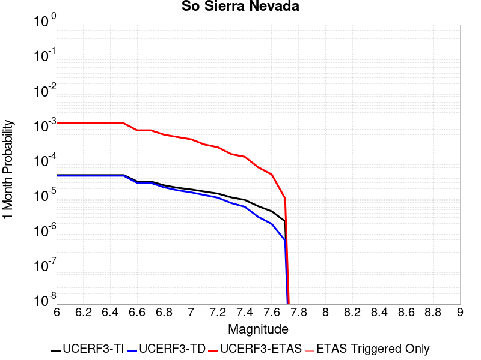 |  |  |

| Magnitude | 1 wk TI Prob | 1 wk TD Prob | 1 wk ETAS Prob | 1 wk ETAS/TD Gain | 1 wk ETAS Triggered Only | 1 mo TI Prob | 1 mo TD Prob | 1 mo ETAS Prob | 1 mo ETAS/TD Gain | 1 mo ETAS Triggered Only | 1 yr TI Prob | 1 yr TD Prob | 1 yr ETAS Prob | 1 yr ETAS/TD Gain | 1 yr ETAS Triggered Only | 10 yr TI Prob | 10 yr TD Prob | 10 yr ETAS Prob | 10 yr ETAS/TD Gain | 10 yr ETAS Triggered Only |
|-----|-----|-----|-----|-----|-----|-----|-----|-----|-----|-----|-----|-----|-----|-----|-----|-----|-----|-----|-----|-----|
| 6.0 | 1.15488665E-5 | 1.1079643E-5 | 0.0014614452 | 131.90366 | 0.0014503817 | 4.9494203E-5 | 4.748339E-5 | 0.0016886268 | 35.562473 | 0.0016412213 | 6.024253E-4 | 5.7796965E-4 | 0.0022945341 | 3.9699907 | 0.0017175572 | 0.006007948 | 0.005765934 | 0.0076633273 | 1.3290695 | 0.001908397 |
| 6.1 | 1.15488665E-5 | 1.1079643E-5 | 0.0014614452 | 131.90366 | 0.0014503817 | 4.9494203E-5 | 4.748339E-5 | 0.0016886268 | 35.562473 | 0.0016412213 | 6.024253E-4 | 5.7796965E-4 | 0.0022945341 | 3.9699907 | 0.0017175572 | 0.006007948 | 0.005765934 | 0.0076633273 | 1.3290695 | 0.001908397 |
| 6.2 | 1.15488665E-5 | 1.1079643E-5 | 0.0014614452 | 131.90366 | 0.0014503817 | 4.9494203E-5 | 4.748339E-5 | 0.0016886268 | 35.562473 | 0.0016412213 | 6.024253E-4 | 5.7796965E-4 | 0.0022945341 | 3.9699907 | 0.0017175572 | 0.006007948 | 0.005765934 | 0.0076633273 | 1.3290695 | 0.001908397 |
| 6.3 | 1.15488665E-5 | 1.1079643E-5 | 0.0014614452 | 131.90366 | 0.0014503817 | 4.9494203E-5 | 4.748339E-5 | 0.0016886268 | 35.562473 | 0.0016412213 | 6.024253E-4 | 5.7796965E-4 | 0.0022945341 | 3.9699907 | 0.0017175572 | 0.006007948 | 0.005765934 | 0.0076633273 | 1.3290695 | 0.001908397 |
| 6.4 | 1.15488665E-5 | 1.1079643E-5 | 0.0014614452 | 131.90366 | 0.0014503817 | 4.9494203E-5 | 4.748339E-5 | 0.0016886268 | 35.562473 | 0.0016412213 | 6.024253E-4 | 5.7796965E-4 | 0.0022945341 | 3.9699907 | 0.0017175572 | 0.006007948 | 0.005765934 | 0.0076633273 | 1.3290695 | 0.001908397 |
| 6.5 | 1.15488665E-5 | 1.1079643E-5 | 0.0014614452 | 131.90366 | 0.0014503817 | 4.9494203E-5 | 4.748339E-5 | 0.0016886268 | 35.562473 | 0.0016412213 | 6.024253E-4 | 5.7796965E-4 | 0.0022945341 | 3.9699907 | 0.0017175572 | 0.006007948 | 0.005765934 | 0.0076633273 | 1.3290695 | 0.001908397 |
| 6.6 | 7.587044E-6 | 6.935635E-6 | 8.084568E-4 | 116.56564 | 8.015267E-4 | 3.2515498E-5 | 2.9723828E-5 | 9.83894E-4 | 33.101185 | 9.541985E-4 | 3.9580427E-4 | 3.6183043E-4 | 0.0013919919 | 3.8470836 | 0.0010305344 | 0.003951 | 0.0036127048 | 0.0047916365 | 1.3263294 | 0.0011832061 |
| 6.7 | 7.587044E-6 | 6.935635E-6 | 8.084568E-4 | 116.56564 | 8.015267E-4 | 3.2515498E-5 | 2.9723828E-5 | 9.83894E-4 | 33.101185 | 9.541985E-4 | 3.9580427E-4 | 3.6183043E-4 | 0.0013919919 | 3.8470836 | 0.0010305344 | 0.003951 | 0.0036127048 | 0.0047916365 | 1.3263294 | 0.0011832061 |
| 6.8 | 5.9026956E-6 | 5.1793927E-6 | 5.776955E-4 | 111.53731 | 5.725191E-4 | 2.5297022E-5 | 2.2197215E-5 | 7.092049E-4 | 31.950172 | 6.870229E-4 | 3.0794772E-4 | 2.7021873E-4 | 0.0010333712 | 3.8242028 | 7.633588E-4 | 0.0030752132 | 0.002699018 | 0.0035364463 | 1.3102715 | 8.3969464E-4 |
| 6.9 | 5.0118915E-6 | 4.2524252E-6 | 4.2409796E-4 | 99.73084 | 4.1984732E-4 | 2.1479358E-5 | 1.8224557E-5 | 5.5256597E-4 | 30.319857 | 5.3435116E-4 | 2.614798E-4 | 2.2186211E-4 | 8.324137E-4 | 3.7519414 | 6.10687E-4 | 0.0026117235 | 0.0022164788 | 0.0029019788 | 1.3092744 | 6.870229E-4 |
| 7.0 | 4.4924795E-6 | 3.7139177E-6 | 3.8539188E-4 | 103.76964 | 3.816794E-4 | 1.925334E-5 | 1.5916696E-5 | 5.12092E-4 | 32.17326 | 4.9618323E-4 | 2.3438422E-4 | 1.9376918E-4 | 7.661773E-4 | 3.9540722 | 5.725191E-4 | 0.0023413717 | 0.0019360651 | 0.002583664 | 1.3344922 | 6.4885494E-4 |
| 7.1 | 3.9118436E-6 | 3.1119775E-6 | 3.8479018E-4 | 123.64812 | 3.816794E-4 | 1.6764936E-5 | 1.3336982E-5 | 4.7134614E-4 | 35.34129 | 4.5801527E-4 | 2.0409399E-4 | 1.6236622E-4 | 6.5846887E-4 | 4.0554547 | 4.9618323E-4 | 0.0020390663 | 0.001622532 | 0.0021941222 | 1.3522828 | 5.725191E-4 |
| 7.2 | 3.4200818E-6 | 2.6054543E-6 | 3.0794818E-4 | 118.19366 | 3.053435E-4 | 1.4657411E-5 | 1.11661875E-5 | 3.9284132E-4 | 35.181328 | 3.816794E-4 | 1.7843937E-4 | 1.3594035E-4 | 5.557306E-4 | 4.088047 | 4.1984732E-4 | 0.0017829615 | 0.0013586218 | 0.0018541309 | 1.3647145 | 4.9618323E-4 |
| 7.3 | 2.6593618E-6 | 1.8284203E-6 | 1.544999E-4 | 84.499115 | 1.5267175E-4 | 1.13972155E-5 | 7.836065E-6 | 2.3684191E-4 | 30.224596 | 2.2900764E-4 | 1.3875226E-4 | 9.540021E-5 | 3.24386E-4 | 3.400265 | 2.2900764E-4 | 0.0013866565 | 9.5362146E-4 | 0.0011824107 | 1.2399162 | 2.2900764E-4 |
| 7.4 | 2.2577992E-6 | 1.436438E-6 | 1.1594009E-4 | 80.71361 | 1.1450382E-4 | 9.676246E-6 | 6.15615E-6 | 1.9699468E-4 | 31.999655 | 1.908397E-4 | 1.1780193E-4 | 7.49488E-5 | 2.657742E-4 | 3.5460765 | 1.908397E-4 | 0.001177395 | 7.492603E-4 | 9.39957E-4 | 1.2545133 | 1.908397E-4 |
| 7.5 | 1.489319E-6 | 7.353936E-7 | 3.8903305E-5 | 52.901337 | 3.816794E-5 | 6.3827797E-6 | 3.1516831E-6 | 7.948732E-5 | 25.220594 | 7.633588E-5 | 7.770758E-5 | 3.8371072E-5 | 1.1470402E-4 | 2.989336 | 7.633588E-5 | 7.7680405E-4 | 3.836449E-4 | 4.5995147E-4 | 1.198899 | 7.633588E-5 |
| 7.6 | 1.0680322E-6 | 4.6596554E-7 | 3.8633887E-5 | 82.91147 | 3.816794E-5 | 4.577273E-6 | 1.9969937E-6 | 7.833272E-5 | 39.225323 | 7.633588E-5 | 5.5726876E-5 | 2.4313129E-5 | 1.0064715E-4 | 4.1396213 | 7.633588E-5 | 5.5712904E-4 | 2.4310495E-4 | 3.1942228E-4 | 1.3139274 | 7.633588E-5 |
| 7.7 | 5.509146E-7 | 1.5580486E-7 | 1.5580486E-7 | 1.0 | 0.0 | 2.3610605E-6 | 6.677349E-7 | 6.677349E-7 | 1.0 | 0.0 | 2.8745531E-5 | 8.129644E-6 | 8.129644E-6 | 1.0 | 0.0 | 2.8741814E-4 | 8.1293576E-5 | 8.1293576E-5 | 1.0 | 0.0 |

## San Andreas (San Bernardino N)
*[(top)](#table-of-contents)*

| 1 Week | 1 Month | 1 Year | 10 Year |
|-----|-----|-----|-----|
|  |  |  |  |

| Magnitude | 1 wk TI Prob | 1 wk TD Prob | 1 wk ETAS Prob | 1 wk ETAS/TD Gain | 1 wk ETAS Triggered Only | 1 mo TI Prob | 1 mo TD Prob | 1 mo ETAS Prob | 1 mo ETAS/TD Gain | 1 mo ETAS Triggered Only | 1 yr TI Prob | 1 yr TD Prob | 1 yr ETAS Prob | 1 yr ETAS/TD Gain | 1 yr ETAS Triggered Only | 10 yr TI Prob | 10 yr TD Prob | 10 yr ETAS Prob | 10 yr ETAS/TD Gain | 10 yr ETAS Triggered Only |
|-----|-----|-----|-----|-----|-----|-----|-----|-----|-----|-----|-----|-----|-----|-----|-----|-----|-----|-----|-----|-----|
| 6.0 | 1.4273766E-4 | 3.1606483E-4 | 0.001804144 | 5.708145 | 0.0014885496 | 6.115894E-4 | 0.0013538664 | 0.003030982 | 2.23876 | 0.0016793893 | 0.0074207084 | 0.016360244 | 0.018124787 | 1.1078557 | 0.0017938932 | 0.07177748 | 0.15026689 | 0.15185608 | 1.0105758 | 0.001870229 |
| 6.1 | 1.4273766E-4 | 3.1606483E-4 | 0.001804144 | 5.708145 | 0.0014885496 | 6.115894E-4 | 0.0013538664 | 0.003030982 | 2.23876 | 0.0016793893 | 0.0074207084 | 0.016360244 | 0.018124787 | 1.1078557 | 0.0017938932 | 0.07177748 | 0.15026689 | 0.15185608 | 1.0105758 | 0.001870229 |
| 6.2 | 1.4273766E-4 | 3.1606483E-4 | 0.001804144 | 5.708145 | 0.0014885496 | 6.115894E-4 | 0.0013538664 | 0.003030982 | 2.23876 | 0.0016793893 | 0.0074207084 | 0.016360244 | 0.018124787 | 1.1078557 | 0.0017938932 | 0.07177748 | 0.15026689 | 0.15185608 | 1.0105758 | 0.001870229 |
| 6.3 | 1.3730655E-4 | 3.0511338E-4 | 0.0017550525 | 5.7521324 | 0.0014503817 | 5.883239E-4 | 0.0013069791 | 0.0029460555 | 2.2540953 | 0.0016412213 | 0.0071393442 | 0.015797773 | 0.01752576 | 1.1093818 | 0.0017557252 | 0.06914291 | 0.14556676 | 0.14713214 | 1.0107536 | 0.0018320611 |
| 6.4 | 1.3730655E-4 | 3.0511338E-4 | 0.0017550525 | 5.7521324 | 0.0014503817 | 5.883239E-4 | 0.0013069791 | 0.0029460555 | 2.2540953 | 0.0016412213 | 0.0071393442 | 0.015797773 | 0.01752576 | 1.1093818 | 0.0017557252 | 0.06914291 | 0.14556676 | 0.14713214 | 1.0107536 | 0.0018320611 |
| 6.5 | 1.2942807E-4 | 2.8925808E-4 | 0.0017392202 | 6.012694 | 0.0014503817 | 5.545738E-4 | 0.0012390936 | 0.0028782813 | 2.3228924 | 0.0016412213 | 0.0067310524 | 0.01498286 | 0.01671228 | 1.1154265 | 0.0017557252 | 0.06530788 | 0.13870941 | 0.14028735 | 1.0113759 | 0.0018320611 |
| 6.6 | 1.1125901E-4 | 2.536472E-4 | 0.0016655028 | 6.566218 | 0.0014122138 | 4.767372E-4 | 0.0010866089 | 0.0026879204 | 2.4736779 | 0.0016030534 | 0.005788839 | 0.013149847 | 0.014844819 | 1.1288967 | 0.0017175572 | 0.056403454 | 0.122999296 | 0.12457254 | 1.0127907 | 0.0017938932 |
| 6.7 | 1.02209575E-4 | 2.3499702E-4 | 0.0016468789 | 7.0080843 | 0.0014122138 | 4.3796748E-4 | 0.0010067427 | 0.0026081824 | 2.5907137 | 0.0016030534 | 0.0053192247 | 0.012188629 | 0.013885252 | 1.1391971 | 0.0017175572 | 0.051936906 | 0.114790924 | 0.11637889 | 1.0138336 | 0.0017938932 |
| 6.8 | 9.610582E-5 | 2.2025521E-4 | 0.001632158 | 7.4103036 | 0.0014122138 | 4.1181705E-4 | 9.436101E-4 | 0.002545151 | 2.6972485 | 0.0016030534 | 0.0050023515 | 0.011428202 | 0.01312613 | 1.1485735 | 0.0017175572 | 0.048912346 | 0.1081929 | 0.10979271 | 1.0147866 | 0.0017938932 |
| 6.9 | 9.3877505E-5 | 2.1481077E-4 | 0.0016267211 | 7.5728097 | 0.0014122138 | 4.0227012E-4 | 9.2029345E-4 | 0.0025218716 | 2.7402906 | 0.0016030534 | 0.0048866454 | 0.011147255 | 0.012845667 | 1.1523614 | 0.0017175572 | 0.04780577 | 0.10578323 | 0.10738736 | 1.0151643 | 0.0017938932 |
| 7.0 | 9.1019785E-5 | 2.0808022E-4 | 0.0016200001 | 7.785459 | 0.0014122138 | 3.900265E-4 | 8.914682E-4 | 0.0024930926 | 2.7966142 | 0.0016030534 | 0.0047382377 | 0.010799837 | 0.012498845 | 1.1573179 | 0.0017175572 | 0.046384744 | 0.102753714 | 0.10436328 | 1.0156643 | 0.0017938932 |
| 7.1 | 8.771155E-5 | 1.9982594E-4 | 0.0016117574 | 8.065806 | 0.0014122138 | 3.758525E-4 | 8.5611636E-4 | 0.0024577973 | 2.8708684 | 0.0016030534 | 0.0045664064 | 0.0103736 | 0.01207334 | 1.1638525 | 0.0017175572 | 0.044737056 | 0.09906527 | 0.10068145 | 1.0163143 | 0.0017938932 |
| 7.2 | 8.0830236E-5 | 1.8388197E-4 | 0.001595836 | 8.678589 | 0.0014122138 | 3.4636928E-4 | 7.8782777E-4 | 0.0023896182 | 3.0331736 | 0.0016030534 | 0.0042088944 | 0.009549725 | 0.01125088 | 1.1781366 | 0.0017175572 | 0.041300658 | 0.09179615 | 0.09342537 | 1.0177482 | 0.0017938932 |
| 7.3 | 7.7668235E-5 | 1.7331762E-4 | 0.0015852866 | 9.146713 | 0.0014122138 | 3.328214E-4 | 7.425784E-4 | 0.0023444414 | 3.1571634 | 0.0016030534 | 0.0040445733 | 0.009003494 | 0.010705587 | 1.189048 | 0.0017175572 | 0.03971748 | 0.08706327 | 0.08870097 | 1.0188106 | 0.0017938932 |
| 7.4 | 7.520177E-5 | 1.6551897E-4 | 0.0015393373 | 9.300066 | 0.0013740459 | 3.2225347E-4 | 7.0917426E-4 | 0.00227295 | 3.2050655 | 0.0015648855 | 0.0039163795 | 0.008600081 | 0.0102271885 | 1.1891967 | 0.0016412213 | 0.038480744 | 0.08351955 | 0.085093655 | 1.0188472 | 0.0017175572 |
| 7.5 | 7.274697E-5 | 1.5839566E-4 | 0.0015322238 | 9.673395 | 0.0013740459 | 3.1173544E-4 | 6.78662E-4 | 0.0022424855 | 3.3042746 | 0.0015648855 | 0.003788775 | 0.008231463 | 0.0098591745 | 1.1977427 | 0.0016412213 | 0.03724827 | 0.08023631 | 0.081816055 | 1.0196887 | 0.0017175572 |
| 7.6 | 7.1185845E-5 | 1.540943E-4 | 0.0015279284 | 9.915541 | 0.0013740459 | 3.0504653E-4 | 6.6023704E-4 | 0.0022240893 | 3.3686223 | 0.0015648855 | 0.0037076178 | 0.008008812 | 0.009636888 | 1.2032857 | 0.0016412213 | 0.036463667 | 0.07822598 | 0.079809174 | 1.0202388 | 0.0017175572 |
| 7.7 | 6.709961E-5 | 1.4318313E-4 | 0.0015170322 | 10.595048 | 0.0013740459 | 2.8753807E-4 | 6.1349774E-4 | 0.002177423 | 3.5491953 | 0.0015648855 | 0.003495157 | 0.0074437927 | 0.009072797 | 1.2188407 | 0.0016412213 | 0.034406938 | 0.07305469 | 0.07464678 | 1.021793 | 0.0017175572 |
| 7.8 | 6.300812E-5 | 1.3202413E-4 | 0.0014677256 | 11.117102 | 0.0013358778 | 2.7000686E-4 | 5.65695E-4 | 0.0020915489 | 3.6973083 | 0.0015267176 | 0.0032823787 | 0.006865616 | 0.0084576635 | 1.2318871 | 0.0016030534 | 0.032343175 | 0.06771354 | 0.06927921 | 1.023122 | 0.0016793893 |
| 7.9 | 4.983037E-5 | 9.723488E-5 | 0.0012803259 | 13.167353 | 0.0011832061 | 2.1354125E-4 | 4.1665437E-4 | 0.0017138236 | 4.113298 | 0.0012977099 | 0.0025967648 | 0.0050609782 | 0.00642807 | 1.2701241 | 0.0013740459 | 0.025666296 | 0.05064886 | 0.05202578 | 1.0271857 | 0.0014503817 |
| 8.0 | 3.2211527E-5 | 5.3304586E-5 | 3.5863183E-4 | 6.727973 | 3.053435E-4 | 1.380421E-4 | 2.2842824E-4 | 5.3370197E-4 | 2.33641 | 3.053435E-4 | 0.0016793669 | 0.0027775685 | 0.003120126 | 1.1233299 | 3.4351146E-4 | 0.016667323 | 0.028361378 | 0.028695147 | 1.0117685 | 3.4351146E-4 |
| 8.1 | 1.743376E-5 | 1.8824427E-5 | 9.5158866E-5 | 5.055074 | 7.633588E-5 | 7.471398E-5 | 8.067362E-5 | 1.5700333E-4 | 1.9461546 | 7.633588E-5 | 9.0926304E-4 | 9.817594E-4 | 0.0010580203 | 1.0776778 | 7.633588E-5 | 0.009055517 | 0.010484105 | 0.010559641 | 1.0072048 | 7.633588E-5 |
| 8.2 | 7.831616E-6 | 5.1551065E-6 | 5.1551065E-6 | 1.0 | 0.0 | 3.3563636E-5 | 2.2093127E-5 | 2.2093127E-5 | 1.0 | 0.0 | 4.0856065E-4 | 2.6895068E-4 | 2.6895068E-4 | 1.0 | 0.0 | 0.004078103 | 0.0030418145 | 0.0030418145 | 1.0 | 0.0 |
| 8.3 | 1.983087E-6 | 7.6599065E-7 | 7.6599065E-7 | 1.0 | 0.0 | 8.498917E-6 | 3.282813E-6 | 3.282813E-6 | 1.0 | 0.0 | 1.034694E-4 | 3.9967534E-5 | 3.9967534E-5 | 1.0 | 0.0 | 0.0010342124 | 4.719687E-4 | 4.719687E-4 | 1.0 | 0.0 |

## Goldstone Lake
*[(top)](#table-of-contents)*

| 1 Week | 1 Month | 1 Year | 10 Year |
|-----|-----|-----|-----|
|  |  |  |  |

| Magnitude | 1 wk TI Prob | 1 wk TD Prob | 1 wk ETAS Prob | 1 wk ETAS/TD Gain | 1 wk ETAS Triggered Only | 1 mo TI Prob | 1 mo TD Prob | 1 mo ETAS Prob | 1 mo ETAS/TD Gain | 1 mo ETAS Triggered Only | 1 yr TI Prob | 1 yr TD Prob | 1 yr ETAS Prob | 1 yr ETAS/TD Gain | 1 yr ETAS Triggered Only | 10 yr TI Prob | 10 yr TD Prob | 10 yr ETAS Prob | 10 yr ETAS/TD Gain | 10 yr ETAS Triggered Only |
|-----|-----|-----|-----|-----|-----|-----|-----|-----|-----|-----|-----|-----|-----|-----|-----|-----|-----|-----|-----|-----|
| 6.0 | 2.671352E-5 | 3.037609E-5 | 9.463788E-4 | 31.155386 | 9.1603055E-4 | 1.1448149E-4 | 1.3017785E-4 | 0.001236904 | 9.501647 | 0.0011068702 | 0.001392921 | 0.0015839594 | 0.0031463662 | 1.9863932 | 0.0015648855 | 0.013842222 | 0.015746197 | 0.017361574 | 1.1025885 | 0.0016412213 |
| 6.1 | 2.671352E-5 | 3.037609E-5 | 9.463788E-4 | 31.155386 | 9.1603055E-4 | 1.1448149E-4 | 1.3017785E-4 | 0.001236904 | 9.501647 | 0.0011068702 | 0.001392921 | 0.0015839594 | 0.0031463662 | 1.9863932 | 0.0015648855 | 0.013842222 | 0.015746197 | 0.017361574 | 1.1025885 | 0.0016412213 |
| 6.2 | 1.4197047E-5 | 1.6096245E-5 | 4.7410413E-4 | 29.454332 | 4.5801527E-4 | 6.0843064E-5 | 6.8982634E-5 | 5.651316E-4 | 8.192375 | 4.9618323E-4 | 7.4051257E-4 | 8.3963864E-4 | 0.0015260846 | 1.8175493 | 6.870229E-4 | 0.007380498 | 0.0083743585 | 0.009131325 | 1.0903909 | 7.633588E-4 |
| 6.3 | 1.4197047E-5 | 1.6096245E-5 | 4.7410413E-4 | 29.454332 | 4.5801527E-4 | 6.0843064E-5 | 6.8982634E-5 | 5.651316E-4 | 8.192375 | 4.9618323E-4 | 7.4051257E-4 | 8.3963864E-4 | 0.0015260846 | 1.8175493 | 6.870229E-4 | 0.007380498 | 0.0083743585 | 0.009131325 | 1.0903909 | 7.633588E-4 |
| 6.4 | 1.3238931E-5 | 1.500846E-5 | 3.9668212E-4 | 26.430569 | 3.816794E-4 | 5.6737044E-5 | 6.4320935E-5 | 4.8414126E-4 | 7.5269623 | 4.1984732E-4 | 6.9055456E-4 | 7.82924E-4 | 0.001393133 | 1.7793974 | 6.10687E-4 | 0.006884126 | 0.0078112837 | 0.00845507 | 1.0824175 | 6.4885494E-4 |
| 6.5 | 1.3238931E-5 | 1.500846E-5 | 3.9668212E-4 | 26.430569 | 3.816794E-4 | 5.6737044E-5 | 6.4320935E-5 | 4.8414126E-4 | 7.5269623 | 4.1984732E-4 | 6.9055456E-4 | 7.82924E-4 | 0.001393133 | 1.7793974 | 6.10687E-4 | 0.006884126 | 0.0078112837 | 0.00845507 | 1.0824175 | 6.4885494E-4 |
| 6.6 | 1.1328278E-5 | 1.2855166E-5 | 3.9452963E-4 | 30.69036 | 3.816794E-4 | 4.8548856E-5 | 5.5092944E-5 | 4.3675132E-4 | 7.9275365 | 3.816794E-4 | 5.90922E-4 | 6.7064585E-4 | 0.0012427809 | 1.8531107 | 5.725191E-4 | 0.0058935313 | 0.0066956086 | 0.0073022065 | 1.0905964 | 6.10687E-4 |
| 6.7 | 8.651175E-6 | 9.824565E-6 | 3.9150022E-4 | 39.849117 | 3.816794E-4 | 3.707594E-5 | 4.2105108E-5 | 4.2376842E-4 | 10.064537 | 3.816794E-4 | 4.5130608E-4 | 5.1259965E-4 | 0.0010085285 | 1.967478 | 4.9618323E-4 | 0.0045039062 | 0.005123051 | 0.0056546647 | 1.103769 | 5.3435116E-4 |
| 6.8 | 1.0215377E-6 | 1.1754702E-6 | 1.1754702E-6 | 1.0 | 0.0 | 4.378012E-6 | 5.0377203E-6 | 5.0377203E-6 | 1.0 | 0.0 | 5.3300988E-5 | 6.1332634E-5 | 6.1332634E-5 | 1.0 | 0.0 | 5.3288206E-4 | 6.1316835E-4 | 6.1316835E-4 | 1.0 | 0.0 |
| 6.9 | 7.9360774E-7 | 9.2833966E-7 | 9.2833966E-7 | 1.0 | 0.0 | 3.4011714E-6 | 3.9785928E-6 | 3.9785928E-6 | 1.0 | 0.0 | 4.1408475E-5 | 4.843836E-5 | 4.843836E-5 | 1.0 | 0.0 | 4.140076E-4 | 4.8428503E-4 | 4.8428503E-4 | 1.0 | 0.0 |
| 7.0 | 7.4382757E-7 | 8.7473285E-7 | 8.7473285E-7 | 1.0 | 0.0 | 3.1878285E-6 | 3.74885E-6 | 3.74885E-6 | 1.0 | 0.0 | 3.8811122E-5 | 4.564136E-5 | 4.564136E-5 | 1.0 | 0.0 | 3.8804344E-4 | 4.5632652E-4 | 4.5632652E-4 | 1.0 | 0.0 |
| 7.1 | 6.4709513E-7 | 7.7113E-7 | 7.7113E-7 | 1.0 | 0.0 | 2.773262E-6 | 3.3048389E-6 | 3.3048389E-6 | 1.0 | 0.0 | 3.376394E-5 | 4.0235733E-5 | 4.0235733E-5 | 1.0 | 0.0 | 3.375881E-4 | 4.0229043E-4 | 4.0229043E-4 | 1.0 | 0.0 |
| 7.2 | 6.356704E-7 | 7.5883594E-7 | 7.5883594E-7 | 1.0 | 0.0 | 2.7242988E-6 | 3.2521505E-6 | 3.2521505E-6 | 1.0 | 0.0 | 3.3167835E-5 | 3.959427E-5 | 3.959427E-5 | 1.0 | 0.0 | 3.3162883E-4 | 3.958781E-4 | 3.958781E-4 | 1.0 | 0.0 |
| 7.3 | 5.7695723E-7 | 6.8965653E-7 | 6.8965653E-7 | 1.0 | 0.0 | 2.4726714E-6 | 2.9556677E-6 | 2.9556677E-6 | 1.0 | 0.0 | 3.0104358E-5 | 3.5984718E-5 | 3.5984718E-5 | 1.0 | 0.0 | 3.0100282E-4 | 3.5979465E-4 | 3.5979465E-4 | 1.0 | 0.0 |
| 7.4 | 5.209647E-7 | 6.193514E-7 | 6.193514E-7 | 1.0 | 0.0 | 2.232704E-6 | 2.6543607E-6 | 2.6543607E-6 | 1.0 | 0.0 | 2.718283E-5 | 3.2316417E-5 | 3.2316417E-5 | 1.0 | 0.0 | 2.7179506E-4 | 3.2312275E-4 | 3.2312275E-4 | 1.0 | 0.0 |
| 7.5 | 4.512955E-7 | 5.348885E-7 | 5.348885E-7 | 1.0 | 0.0 | 1.934122E-6 | 2.2923775E-6 | 2.2923775E-6 | 1.0 | 0.0 | 2.3547682E-5 | 2.7909393E-5 | 2.7909393E-5 | 1.0 | 0.0 | 2.3545188E-4 | 2.7906417E-4 | 2.7906417E-4 | 1.0 | 0.0 |
| 7.6 | 2.21172E-7 | 2.603961E-7 | 2.603961E-7 | 1.0 | 0.0 | 9.478797E-7 | 1.1159829E-6 | 1.1159829E-6 | 1.0 | 0.0 | 1.1540374E-5 | 1.3587036E-5 | 1.3587036E-5 | 1.0 | 0.0 | 1.1539775E-4 | 1.3586486E-4 | 1.3586486E-4 | 1.0 | 0.0 |

## McLean Lake
*[(top)](#table-of-contents)*

| 1 Week | 1 Month | 1 Year | 10 Year |
|-----|-----|-----|-----|
|  |  |  |  |

| Magnitude | 1 wk TI Prob | 1 wk TD Prob | 1 wk ETAS Prob | 1 wk ETAS/TD Gain | 1 wk ETAS Triggered Only | 1 mo TI Prob | 1 mo TD Prob | 1 mo ETAS Prob | 1 mo ETAS/TD Gain | 1 mo ETAS Triggered Only | 1 yr TI Prob | 1 yr TD Prob | 1 yr ETAS Prob | 1 yr ETAS/TD Gain | 1 yr ETAS Triggered Only | 10 yr TI Prob | 10 yr TD Prob | 10 yr ETAS Prob | 10 yr ETAS/TD Gain | 10 yr ETAS Triggered Only |
|-----|-----|-----|-----|-----|-----|-----|-----|-----|-----|-----|-----|-----|-----|-----|-----|-----|-----|-----|-----|-----|
| 6.0 | 1.7360222E-5 | 1.8501627E-5 | 9.345152E-4 | 50.50989 | 9.1603055E-4 | 7.439883E-5 | 7.9290556E-5 | 0.0010715782 | 13.514577 | 9.923665E-4 | 9.0542925E-4 | 9.6498354E-4 | 0.0023758346 | 2.4620466 | 0.0014122138 | 0.009017491 | 0.0096127745 | 0.011124816 | 1.157295 | 0.0015267176 |
| 6.1 | 9.062689E-6 | 9.592193E-6 | 3.912679E-4 | 40.790245 | 3.816794E-4 | 3.8839516E-5 | 4.1108804E-5 | 4.6093887E-4 | 11.212656 | 4.1984732E-4 | 4.727685E-4 | 5.003936E-4 | 0.0010344774 | 2.0673273 | 5.3435116E-4 | 0.0047176396 | 0.004993552 | 0.0056391666 | 1.1292897 | 6.4885494E-4 |
| 6.2 | 9.062689E-6 | 9.592193E-6 | 3.912679E-4 | 40.790245 | 3.816794E-4 | 3.8839516E-5 | 4.1108804E-5 | 4.6093887E-4 | 11.212656 | 4.1984732E-4 | 4.727685E-4 | 5.003936E-4 | 0.0010344774 | 2.0673273 | 5.3435116E-4 | 0.0047176396 | 0.004993552 | 0.0056391666 | 1.1292897 | 6.4885494E-4 |
| 6.3 | 7.2575485E-6 | 7.66771E-6 | 2.7484124E-4 | 35.843983 | 2.6717558E-4 | 3.110341E-5 | 3.2861237E-5 | 3.0002804E-4 | 9.13015 | 2.6717558E-4 | 3.786182E-4 | 4.0001926E-4 | 7.8154594E-4 | 1.9537709 | 3.816794E-4 | 0.0037797375 | 0.0039936965 | 0.004449883 | 1.1142266 | 4.5801527E-4 |
| 6.4 | 7.2575485E-6 | 7.66771E-6 | 2.7484124E-4 | 35.843983 | 2.6717558E-4 | 3.110341E-5 | 3.2861237E-5 | 3.0002804E-4 | 9.13015 | 2.6717558E-4 | 3.786182E-4 | 4.0001926E-4 | 7.8154594E-4 | 1.9537709 | 3.816794E-4 | 0.0037797375 | 0.0039936965 | 0.004449883 | 1.1142266 | 4.5801527E-4 |
| 6.5 | 6.06582E-6 | 6.4038773E-6 | 1.9724235E-4 | 30.800459 | 1.908397E-4 | 2.5996113E-5 | 2.7444936E-5 | 2.182794E-4 | 7.9533577 | 1.908397E-4 | 3.164567E-4 | 3.3409733E-4 | 6.3933886E-4 | 1.9136305 | 3.053435E-4 | 0.0031600643 | 0.0033365893 | 0.0036789544 | 1.1026094 | 3.4351146E-4 |
| 6.6 | 5.598744E-6 | 5.910262E-6 | 1.9674884E-4 | 33.289356 | 1.908397E-4 | 2.3994397E-5 | 2.5329486E-5 | 2.1616435E-4 | 8.5341 | 1.908397E-4 | 2.9209262E-4 | 3.0834923E-4 | 6.135986E-4 | 1.9899468 | 3.053435E-4 | 0.0029170897 | 0.003079843 | 0.0034222966 | 1.1111919 | 3.4351146E-4 |
| 6.7 | 5.246996E-6 | 5.539162E-6 | 1.963778E-4 | 35.452618 | 1.908397E-4 | 2.2486933E-5 | 2.3739085E-5 | 2.1457425E-4 | 9.038859 | 1.908397E-4 | 2.73744E-4 | 2.8899137E-4 | 5.9424667E-4 | 2.056278 | 3.053435E-4 | 0.0027340704 | 0.0028867796 | 0.0032292993 | 1.1186512 | 3.4351146E-4 |
| 6.8 | 4.02324E-6 | 4.2469046E-6 | 1.5691802E-4 | 36.9488 | 1.5267175E-4 | 1.7242342E-5 | 1.8200926E-5 | 1.708699E-4 | 9.387979 | 1.5267175E-4 | 2.099053E-4 | 2.2157968E-4 | 4.8869604E-4 | 2.2055092 | 2.6717558E-4 | 0.0020970714 | 0.002214172 | 0.002480756 | 1.120399 | 2.6717558E-4 |
| 6.9 | 6.835972E-7 | 7.1399285E-7 | 3.8881906E-5 | 54.456997 | 3.816794E-5 | 2.9296991E-6 | 3.0599674E-6 | 4.122779E-5 | 13.473277 | 3.816794E-5 | 3.56685E-5 | 3.7254784E-5 | 1.5175434E-4 | 4.0734186 | 1.1450382E-4 | 3.5662777E-4 | 3.7251666E-4 | 4.869778E-4 | 1.3072646 | 1.1450382E-4 |

## Lenwood-Lockhart-Old Woman Springs
*[(top)](#table-of-contents)*

| 1 Week | 1 Month | 1 Year | 10 Year |
|-----|-----|-----|-----|
|  | 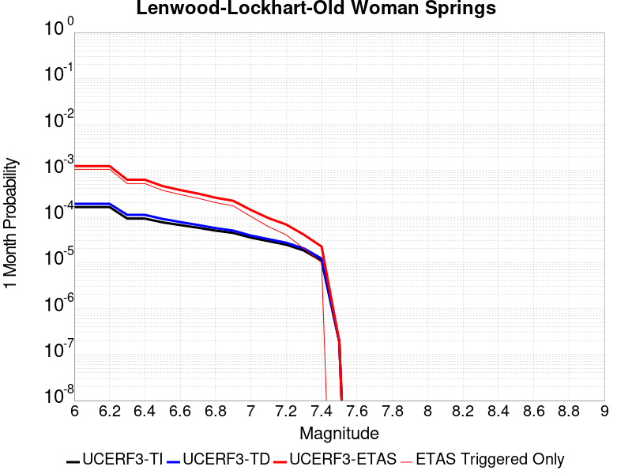 | 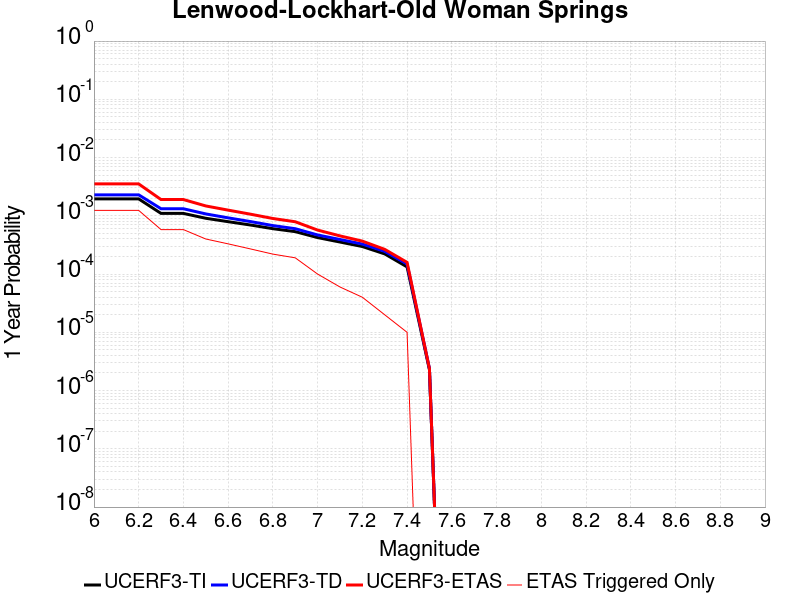 | 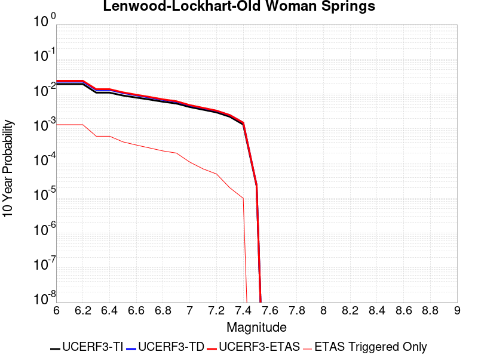 |

| Magnitude | 1 wk TI Prob | 1 wk TD Prob | 1 wk ETAS Prob | 1 wk ETAS/TD Gain | 1 wk ETAS Triggered Only | 1 mo TI Prob | 1 mo TD Prob | 1 mo ETAS Prob | 1 mo ETAS/TD Gain | 1 mo ETAS Triggered Only | 1 yr TI Prob | 1 yr TD Prob | 1 yr ETAS Prob | 1 yr ETAS/TD Gain | 1 yr ETAS Triggered Only | 10 yr TI Prob | 10 yr TD Prob | 10 yr ETAS Prob | 10 yr ETAS/TD Gain | 10 yr ETAS Triggered Only |
|-----|-----|-----|-----|-----|-----|-----|-----|-----|-----|-----|-----|-----|-----|-----|-----|-----|-----|-----|-----|-----|
| 6.0 | 3.744542E-5 | 4.396252E-5 | 0.0010744516 | 24.440172 | 0.0010305344 | 1.604705E-4 | 1.8839816E-4 | 0.0012950598 | 6.874058 | 0.0011068702 | 0.0019519776 | 0.0022915069 | 0.003586243 | 1.5650152 | 0.0012977099 | 0.019349206 | 0.022696787 | 0.024002345 | 1.0575217 | 0.0013358778 |
| 6.1 | 3.744542E-5 | 4.396252E-5 | 0.0010744516 | 24.440172 | 0.0010305344 | 1.604705E-4 | 1.8839816E-4 | 0.0012950598 | 6.874058 | 0.0011068702 | 0.0019519776 | 0.0022915069 | 0.003586243 | 1.5650152 | 0.0012977099 | 0.019349206 | 0.022696787 | 0.024002345 | 1.0575217 | 0.0013358778 |
| 6.2 | 3.744542E-5 | 4.396252E-5 | 0.0010744516 | 24.440172 | 0.0010305344 | 1.604705E-4 | 1.8839816E-4 | 0.0012950598 | 6.874058 | 0.0011068702 | 0.0019519776 | 0.0022915069 | 0.003586243 | 1.5650152 | 0.0012977099 | 0.019349206 | 0.022696787 | 0.024002345 | 1.0575217 | 0.0013358778 |
| 6.3 | 2.1079984E-5 | 2.5353434E-5 | 5.5969105E-4 | 22.075552 | 5.3435116E-4 | 9.0339665E-5 | 1.0865316E-4 | 6.429462E-4 | 5.9174185 | 5.3435116E-4 | 0.0010993304 | 0.0013220694 | 0.0018557141 | 1.4036435 | 5.3435116E-4 | 0.010939079 | 0.0131442575 | 0.013671585 | 1.0401185 | 5.3435116E-4 |
| 6.4 | 2.1079984E-5 | 2.5353434E-5 | 5.5969105E-4 | 22.075552 | 5.3435116E-4 | 9.0339665E-5 | 1.0865316E-4 | 6.429462E-4 | 5.9174185 | 5.3435116E-4 | 0.0010993304 | 0.0013220694 | 0.0018557141 | 1.4036435 | 5.3435116E-4 | 0.010939079 | 0.0131442575 | 0.013671585 | 1.0401185 | 5.3435116E-4 |
| 6.5 | 1.7397282E-5 | 2.066241E-5 | 4.7866823E-4 | 23.166136 | 4.5801527E-4 | 7.455765E-5 | 8.8550245E-5 | 5.4652494E-4 | 6.171919 | 4.5801527E-4 | 9.073613E-4 | 0.0010775778 | 0.0015350995 | 1.4245834 | 4.5801527E-4 | 0.009036654 | 0.010724821 | 0.011177924 | 1.0422481 | 4.5801527E-4 |
| 6.6 | 1.52050325E-5 | 1.7679693E-5 | 3.6118508E-4 | 20.429373 | 3.4351146E-4 | 6.51628E-5 | 7.576796E-5 | 4.192534E-4 | 5.533386 | 3.4351146E-4 | 7.9306826E-4 | 9.220924E-4 | 0.001265287 | 1.3721912 | 3.4351146E-4 | 0.007902439 | 0.009183526 | 0.009523883 | 1.0370617 | 3.4351146E-4 |
| 6.7 | 1.332523E-5 | 1.5264002E-5 | 3.5877022E-4 | 23.504333 | 3.4351146E-4 | 5.7106878E-5 | 6.5415545E-5 | 4.0890454E-4 | 6.250877 | 3.4351146E-4 | 6.950544E-4 | 7.961491E-4 | 0.001139387 | 1.4311227 | 3.4351146E-4 | 0.006928845 | 0.007933599 | 0.008274385 | 1.0429548 | 3.4351146E-4 |
| 6.8 | 1.1525329E-5 | 1.3030979E-5 | 2.4203563E-4 | 18.573864 | 2.2900764E-4 | 4.9393333E-5 | 5.584588E-5 | 2.8484073E-4 | 5.1004786 | 2.2900764E-4 | 6.011979E-4 | 6.797157E-4 | 9.085677E-4 | 1.3366878 | 2.2900764E-4 | 0.00599574 | 0.006776819 | 0.007004275 | 1.0335637 | 2.2900764E-4 |
| 6.9 | 1.0253909E-5 | 1.15144385E-5 | 2.0235193E-4 | 17.573755 | 1.908397E-4 | 4.3944583E-5 | 4.9346683E-5 | 2.4017696E-4 | 4.867135 | 1.908397E-4 | 5.3489394E-4 | 6.0063385E-4 | 7.9135894E-4 | 1.3175397 | 1.908397E-4 | 0.0053360825 | 0.0059904843 | 0.0061801807 | 1.0316663 | 1.908397E-4 |
| 7.0 | 8.104563E-6 | 8.991279E-6 | 1.2349407E-4 | 13.734872 | 1.1450382E-4 | 3.4733377E-5 | 3.8533497E-5 | 1.530329E-4 | 3.9714253 | 1.1450382E-4 | 4.2279682E-4 | 4.6904673E-4 | 5.834969E-4 | 1.2440058 | 1.1450382E-4 | 0.0042199334 | 0.0046808156 | 0.0047947834 | 1.0243479 | 1.1450382E-4 |
| 7.1 | 6.7986157E-6 | 7.515816E-6 | 8.385112E-5 | 11.156623 | 7.633588E-5 | 2.91366E-5 | 3.2210253E-5 | 1.08543674E-4 | 3.3698485 | 7.633588E-5 | 3.5468035E-4 | 3.920914E-4 | 4.6839737E-4 | 1.1946126 | 7.633588E-5 | 0.003541148 | 0.003914213 | 0.0039902497 | 1.0194259 | 7.633588E-5 |
| 7.2 | 5.6893327E-6 | 6.2800136E-6 | 8.2615414E-5 | 13.155292 | 7.633588E-5 | 2.4382627E-5 | 2.6914078E-5 | 1.03247905E-4 | 3.8362043 | 7.633588E-5 | 2.9681803E-4 | 3.2763163E-4 | 4.0394248E-4 | 1.2329167 | 7.633588E-5 | 0.002964219 | 0.0032716845 | 0.0033477708 | 1.023256 | 7.633588E-5 |
| 7.3 | 4.253348E-6 | 4.7069107E-6 | 4.7069107E-6 | 1.0 | 0.0 | 1.8228506E-5 | 2.0172329E-5 | 2.0172329E-5 | 1.0 | 0.0 | 2.2190946E-4 | 2.4557224E-4 | 2.4557224E-4 | 1.0 | 0.0 | 0.00221688 | 0.0024531898 | 0.0024531898 | 1.0 | 0.0 |
| 7.4 | 2.5448119E-6 | 2.852045E-6 | 2.852045E-6 | 1.0 | 0.0 | 1.0906291E-5 | 1.2223002E-5 | 1.2223002E-5 | 1.0 | 0.0 | 1.3277601E-4 | 1.4880655E-4 | 1.4880655E-4 | 1.0 | 0.0 | 0.001326967 | 0.0014872311 | 0.0014872311 | 1.0 | 0.0 |
| 7.5 | 4.3706837E-8 | 4.562909E-8 | 4.562909E-8 | 1.0 | 0.0 | 1.8731501E-7 | 1.9555324E-7 | 1.9555324E-7 | 1.0 | 0.0 | 2.2805577E-6 | 2.3808586E-6 | 2.3808586E-6 | 1.0 | 0.0 | 2.2805343E-5 | 2.3808387E-5 | 2.3808387E-5 | 1.0 | 0.0 |

## Death Valley (So)
*[(top)](#table-of-contents)*

| 1 Week | 1 Month | 1 Year | 10 Year |
|-----|-----|-----|-----|
|  |  |  |  |

| Magnitude | 1 wk TI Prob | 1 wk TD Prob | 1 wk ETAS Prob | 1 wk ETAS/TD Gain | 1 wk ETAS Triggered Only | 1 mo TI Prob | 1 mo TD Prob | 1 mo ETAS Prob | 1 mo ETAS/TD Gain | 1 mo ETAS Triggered Only | 1 yr TI Prob | 1 yr TD Prob | 1 yr ETAS Prob | 1 yr ETAS/TD Gain | 1 yr ETAS Triggered Only | 10 yr TI Prob | 10 yr TD Prob | 10 yr ETAS Prob | 10 yr ETAS/TD Gain | 10 yr ETAS Triggered Only |
|-----|-----|-----|-----|-----|-----|-----|-----|-----|-----|-----|-----|-----|-----|-----|-----|-----|-----|-----|-----|-----|
| 6.0 | 2.0684236E-5 | 2.5617775E-5 | 7.88957E-4 | 30.797247 | 7.633588E-4 | 8.864371E-5 | 1.0978594E-4 | 9.493884E-4 | 8.647632 | 8.3969464E-4 | 0.0010787029 | 0.0013358411 | 0.002288765 | 1.7133511 | 9.541985E-4 | 0.010734817 | 0.013281397 | 0.014260584 | 1.0737262 | 9.923665E-4 |
| 6.1 | 2.0684236E-5 | 2.5617775E-5 | 7.88957E-4 | 30.797247 | 7.633588E-4 | 8.864371E-5 | 1.0978594E-4 | 9.493884E-4 | 8.647632 | 8.3969464E-4 | 0.0010787029 | 0.0013358411 | 0.002288765 | 1.7133511 | 9.541985E-4 | 0.010734817 | 0.013281397 | 0.014260584 | 1.0737262 | 9.923665E-4 |
| 6.2 | 2.0684236E-5 | 2.5617775E-5 | 7.88957E-4 | 30.797247 | 7.633588E-4 | 8.864371E-5 | 1.0978594E-4 | 9.493884E-4 | 8.647632 | 8.3969464E-4 | 0.0010787029 | 0.0013358411 | 0.002288765 | 1.7133511 | 9.541985E-4 | 0.010734817 | 0.013281397 | 0.014260584 | 1.0737262 | 9.923665E-4 |
| 6.3 | 2.0240292E-5 | 2.511786E-5 | 7.8845746E-4 | 31.390312 | 7.633588E-4 | 8.6741224E-5 | 1.07643624E-4 | 9.472479E-4 | 8.799851 | 8.3969464E-4 | 0.0010555626 | 0.00130979 | 0.0022627388 | 1.7275584 | 9.541985E-4 | 0.010505628 | 0.013023956 | 0.014003398 | 1.0752031 | 9.923665E-4 |
| 6.4 | 2.0240292E-5 | 2.511786E-5 | 7.8845746E-4 | 31.390312 | 7.633588E-4 | 8.6741224E-5 | 1.07643624E-4 | 9.472479E-4 | 8.799851 | 8.3969464E-4 | 0.0010555626 | 0.00130979 | 0.0022627388 | 1.7275584 | 9.541985E-4 | 0.010505628 | 0.013023956 | 0.014003398 | 1.0752031 | 9.923665E-4 |
| 6.5 | 1.9962767E-5 | 2.4807114E-5 | 7.4998E-4 | 30.232456 | 7.2519085E-4 | 8.55519E-5 | 1.0631196E-4 | 9.077535E-4 | 8.538583 | 8.015267E-4 | 0.0010410968 | 0.0012935963 | 0.002208442 | 1.707211 | 9.1603055E-4 | 0.010362327 | 0.012863902 | 0.01376815 | 1.0702933 | 9.1603055E-4 |
| 6.6 | 1.8937297E-5 | 2.3310964E-5 | 7.484849E-4 | 32.108704 | 7.2519085E-4 | 8.115732E-5 | 9.990039E-5 | 9.01347E-4 | 9.022457 | 8.015267E-4 | 9.876423E-4 | 0.0012156231 | 0.00213054 | 1.752632 | 9.1603055E-4 | 0.009832645 | 0.012092789 | 0.012997742 | 1.0748341 | 9.1603055E-4 |
| 6.7 | 1.8621096E-5 | 2.2911607E-5 | 7.4808585E-4 | 32.650955 | 7.2519085E-4 | 7.980225E-5 | 9.818898E-5 | 8.99637E-4 | 9.162301 | 8.015267E-4 | 9.711593E-4 | 0.0011948098 | 0.0021097458 | 1.7657588 | 9.1603055E-4 | 0.009669261 | 0.011886904 | 0.012792045 | 1.0761461 | 9.1603055E-4 |
| 6.8 | 1.7830353E-5 | 2.1805688E-5 | 7.088136E-4 | 32.505905 | 6.870229E-4 | 7.641356E-5 | 9.344968E-5 | 8.5673714E-4 | 9.167898 | 7.633588E-4 | 9.29938E-4 | 0.00113717 | 0.0020140344 | 1.7710934 | 8.778626E-4 | 0.009260561 | 0.011316354 | 0.012184283 | 1.0766969 | 8.778626E-4 |
| 6.9 | 1.3135183E-5 | 1.5303925E-5 | 4.3514482E-4 | 28.433544 | 4.1984732E-4 | 5.6292425E-5 | 6.558664E-5 | 5.617373E-4 | 8.564814 | 4.9618323E-4 | 6.8514474E-4 | 7.982312E-4 | 0.0013321559 | 1.6688846 | 5.3435116E-4 | 0.006830362 | 0.007954649 | 0.008484749 | 1.0666404 | 5.3435116E-4 |
| 7.0 | 1.1507512E-5 | 1.3154199E-5 | 4.32996E-4 | 32.916943 | 4.1984732E-4 | 4.9316975E-5 | 5.6373956E-5 | 5.143634E-4 | 9.124132 | 4.5801527E-4 | 6.002687E-4 | 6.8614254E-4 | 0.0011819853 | 1.7226527 | 4.9618323E-4 | 0.0059864987 | 0.0068409415 | 0.0073337303 | 1.0720352 | 4.9618323E-4 |
| 7.1 | 9.715903E-6 | 1.0865278E-5 | 1.2536785E-4 | 11.538393 | 1.1450382E-4 | 4.1638916E-5 | 4.656467E-5 | 1.6106316E-4 | 3.4589133 | 1.1450382E-4 | 5.068359E-4 | 5.667817E-4 | 7.193669E-4 | 1.2692134 | 1.5267175E-4 | 0.0050568148 | 0.0056538144 | 0.0058056233 | 1.0268507 | 1.5267175E-4 |
| 7.2 | 9.233269E-6 | 1.02863105E-5 | 1.2478894E-4 | 12.131556 | 1.1450382E-4 | 3.9570554E-5 | 4.4083466E-5 | 1.5858223E-4 | 3.5973177 | 1.1450382E-4 | 4.81665E-4 | 5.3658825E-4 | 6.510306E-4 | 1.2132778 | 1.1450382E-4 | 0.0048062233 | 0.0053533576 | 0.0054672486 | 1.0212747 | 1.1450382E-4 |
| 7.3 | 8.8041315E-6 | 9.808164E-6 | 8.614329E-5 | 8.782815 | 7.633588E-5 | 3.7731446E-5 | 4.2034335E-5 | 1.18367E-4 | 2.81596 | 7.633588E-5 | 4.592835E-4 | 5.1165203E-4 | 5.879489E-4 | 1.1491185 | 7.633588E-5 | 0.0045833546 | 0.005105167 | 0.0051811133 | 1.0148764 | 7.633588E-5 |
| 7.4 | 8.708749E-6 | 9.707175E-6 | 8.604231E-5 | 8.863785 | 7.633588E-5 | 3.7322676E-5 | 4.160154E-5 | 1.1793424E-4 | 2.834853 | 7.633588E-5 | 4.5430884E-4 | 5.0638523E-4 | 5.8268243E-4 | 1.1506703 | 7.633588E-5 | 0.004533812 | 0.0050527398 | 0.00512869 | 1.0150315 | 7.633588E-5 |
| 7.5 | 8.612678E-6 | 9.604817E-6 | 8.593996E-5 | 8.94759 | 7.633588E-5 | 3.6910955E-5 | 4.1162875E-5 | 1.1749561E-4 | 2.8544073 | 7.633588E-5 | 4.492982E-4 | 5.01047E-4 | 5.773446E-4 | 1.1522764 | 7.633588E-5 | 0.004483909 | 0.0049995985 | 0.005075553 | 1.015192 | 7.633588E-5 |
| 7.6 | 8.319024E-6 | 9.283916E-6 | 8.561909E-5 | 9.222302 | 7.633588E-5 | 3.5652476E-5 | 3.978763E-5 | 1.1612047E-4 | 2.9185069 | 7.633588E-5 | 4.3398244E-4 | 4.8431093E-4 | 5.6060986E-4 | 1.1575412 | 7.633588E-5 | 0.0043313587 | 0.0048329784 | 0.0049089454 | 1.0157185 | 7.633588E-5 |
| 7.7 | 7.4718328E-6 | 8.34517E-6 | 8.468041E-5 | 10.147237 | 7.633588E-5 | 3.2021748E-5 | 3.5764548E-5 | 1.12097696E-4 | 3.1343246 | 7.633588E-5 | 3.8979502E-4 | 4.353504E-4 | 5.11653E-4 | 1.1752672 | 7.633588E-5 | 0.00389112 | 0.0043453807 | 0.004421385 | 1.0174907 | 7.633588E-5 |
| 7.8 | 3.4586725E-7 | 3.6482615E-7 | 3.6482615E-7 | 1.0 | 0.0 | 1.4822873E-6 | 1.5635396E-6 | 1.5635396E-6 | 1.0 | 0.0 | 1.80467E-5 | 1.9035933E-5 | 1.9035933E-5 | 1.0 | 0.0 | 1.8045233E-4 | 1.9034347E-4 | 1.9034347E-4 | 1.0 | 0.0 |
| 7.9 | 2.5591178E-9 | 2.6696718E-9 | 2.6696718E-9 | 1.0 | 0.0 | 1.0967647E-8 | 1.14414505E-8 | 1.14414505E-8 | 1.0 | 0.0 | 1.335311E-7 | 1.3929966E-7 | 1.3929966E-7 | 1.0 | 0.0 | 1.3353102E-6 | 1.3929966E-6 | 1.3929966E-6 | 1.0 | 0.0 |

## Coyote Canyon
*[(top)](#table-of-contents)*

| 1 Week | 1 Month | 1 Year | 10 Year |
|-----|-----|-----|-----|
|  |  | 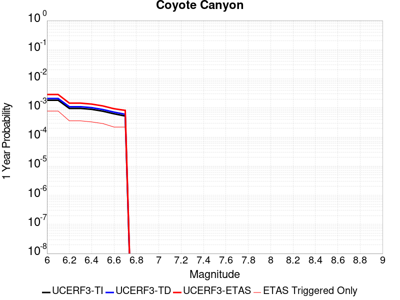 |  |

| Magnitude | 1 wk TI Prob | 1 wk TD Prob | 1 wk ETAS Prob | 1 wk ETAS/TD Gain | 1 wk ETAS Triggered Only | 1 mo TI Prob | 1 mo TD Prob | 1 mo ETAS Prob | 1 mo ETAS/TD Gain | 1 mo ETAS Triggered Only | 1 yr TI Prob | 1 yr TD Prob | 1 yr ETAS Prob | 1 yr ETAS/TD Gain | 1 yr ETAS Triggered Only | 10 yr TI Prob | 10 yr TD Prob | 10 yr ETAS Prob | 10 yr ETAS/TD Gain | 10 yr ETAS Triggered Only |
|-----|-----|-----|-----|-----|-----|-----|-----|-----|-----|-----|-----|-----|-----|-----|-----|-----|-----|-----|-----|-----|
| 6.0 | 3.5090034E-5 | 4.0364324E-5 | 6.5102667E-4 | 16.128765 | 6.10687E-4 | 1.503772E-4 | 1.7297994E-4 | 8.980453E-4 | 5.1916156 | 7.2519085E-4 | 0.0018293047 | 0.0021042528 | 0.0028279177 | 1.3439058 | 7.2519085E-4 | 0.018143194 | 0.020869201 | 0.021654 | 1.0376056 | 8.015267E-4 |
| 6.1 | 3.5090034E-5 | 4.0364324E-5 | 6.5102667E-4 | 16.128765 | 6.10687E-4 | 1.503772E-4 | 1.7297994E-4 | 8.980453E-4 | 5.1916156 | 7.2519085E-4 | 0.0018293047 | 0.0021042528 | 0.0028279177 | 1.3439058 | 7.2519085E-4 | 0.018143194 | 0.020869201 | 0.021654 | 1.0376056 | 8.015267E-4 |
| 6.2 | 1.841879E-5 | 2.1059794E-5 | 2.8822973E-4 | 13.686256 | 2.6717558E-4 | 7.8935285E-5 | 9.0253714E-5 | 4.3373415E-4 | 4.8057213 | 3.4351146E-4 | 9.606133E-4 | 0.001098387 | 0.0014415211 | 1.3123982 | 3.4351146E-4 | 0.0095647145 | 0.010939667 | 0.011317171 | 1.0345078 | 3.816794E-4 |
| 6.3 | 1.841879E-5 | 2.1059794E-5 | 2.8822973E-4 | 13.686256 | 2.6717558E-4 | 7.8935285E-5 | 9.0253714E-5 | 4.3373415E-4 | 4.8057213 | 3.4351146E-4 | 9.606133E-4 | 0.001098387 | 0.0014415211 | 1.3123982 | 3.4351146E-4 | 0.0095647145 | 0.010939667 | 0.011317171 | 1.0345078 | 3.816794E-4 |
| 6.4 | 1.712201E-5 | 1.9565212E-5 | 2.8673557E-4 | 14.655377 | 2.6717558E-4 | 7.337798E-5 | 8.3848776E-5 | 3.891667E-4 | 4.641292 | 3.053435E-4 | 8.930107E-4 | 0.0010204813 | 0.0013255132 | 1.2989099 | 3.053435E-4 | 0.008894307 | 0.010167871 | 0.010507889 | 1.0334405 | 3.4351146E-4 |
| 6.5 | 1.4744935E-5 | 1.6836972E-5 | 2.4584075E-4 | 14.601245 | 2.2900764E-4 | 6.3191044E-5 | 7.215698E-5 | 3.3931326E-4 | 4.7024317 | 2.6717558E-4 | 7.6907943E-4 | 8.7825063E-4 | 0.0011451916 | 1.3039461 | 2.6717558E-4 | 0.007664232 | 0.008756994 | 0.009059664 | 1.0345632 | 3.053435E-4 |
| 6.6 | 1.2017839E-5 | 1.37240895E-5 | 2.0456116E-4 | 14.905263 | 1.908397E-4 | 5.150401E-5 | 5.88167E-5 | 2.8781086E-4 | 4.893353 | 2.2900764E-4 | 6.268809E-4 | 7.159466E-4 | 9.4479026E-4 | 1.3196379 | 2.2900764E-4 | 0.0062511545 | 0.0071450938 | 0.00741036 | 1.0371257 | 2.6717558E-4 |
| 6.7 | 1.00956095E-5 | 1.1533517E-5 | 2.0237101E-4 | 17.54634 | 1.908397E-4 | 4.326618E-5 | 4.942891E-5 | 2.7842523E-4 | 5.6328416 | 2.2900764E-4 | 5.266384E-4 | 6.017178E-4 | 8.3058764E-4 | 1.3803607 | 2.2900764E-4 | 0.005253921 | 0.0060094125 | 0.0062749824 | 1.0441923 | 2.6717558E-4 |

## San Andreas (San Bernardino S)
*[(top)](#table-of-contents)*

| 1 Week | 1 Month | 1 Year | 10 Year |
|-----|-----|-----|-----|
|  |  |  |  |

| Magnitude | 1 wk TI Prob | 1 wk TD Prob | 1 wk ETAS Prob | 1 wk ETAS/TD Gain | 1 wk ETAS Triggered Only | 1 mo TI Prob | 1 mo TD Prob | 1 mo ETAS Prob | 1 mo ETAS/TD Gain | 1 mo ETAS Triggered Only | 1 yr TI Prob | 1 yr TD Prob | 1 yr ETAS Prob | 1 yr ETAS/TD Gain | 1 yr ETAS Triggered Only | 10 yr TI Prob | 10 yr TD Prob | 10 yr ETAS Prob | 10 yr ETAS/TD Gain | 10 yr ETAS Triggered Only |
|-----|-----|-----|-----|-----|-----|-----|-----|-----|-----|-----|-----|-----|-----|-----|-----|-----|-----|-----|-----|-----|
| 6.0 | 1.2336002E-4 | 3.0004102E-4 | 7.5791887E-4 | 2.5260508 | 4.5801527E-4 | 5.2857865E-4 | 0.0012852824 | 0.0017427091 | 1.3558958 | 4.5801527E-4 | 0.006416472 | 0.015540994 | 0.016104616 | 1.0362668 | 5.725191E-4 | 0.06234337 | 0.14283717 | 0.14339335 | 1.0038937 | 6.4885494E-4 |
| 6.1 | 1.2336002E-4 | 3.0004102E-4 | 7.5791887E-4 | 2.5260508 | 4.5801527E-4 | 5.2857865E-4 | 0.0012852824 | 0.0017427091 | 1.3558958 | 4.5801527E-4 | 0.006416472 | 0.015540994 | 0.016104616 | 1.0362668 | 5.725191E-4 | 0.06234337 | 0.14283717 | 0.14339335 | 1.0038937 | 6.4885494E-4 |
| 6.2 | 1.2336002E-4 | 3.0004102E-4 | 7.5791887E-4 | 2.5260508 | 4.5801527E-4 | 5.2857865E-4 | 0.0012852824 | 0.0017427091 | 1.3558958 | 4.5801527E-4 | 0.006416472 | 0.015540994 | 0.016104616 | 1.0362668 | 5.725191E-4 | 0.06234337 | 0.14283717 | 0.14339335 | 1.0038937 | 6.4885494E-4 |
| 6.3 | 1.1712257E-4 | 2.8792414E-4 | 7.4580754E-4 | 2.5902917 | 4.5801527E-4 | 5.018573E-4 | 0.0012334028 | 0.001690853 | 1.3708848 | 4.5801527E-4 | 0.006093008 | 0.014918125 | 0.015444505 | 1.0352845 | 5.3435116E-4 | 0.059286322 | 0.13754563 | 0.13807231 | 1.0038292 | 6.10687E-4 |
| 6.4 | 1.1712257E-4 | 2.8792414E-4 | 7.4580754E-4 | 2.5902917 | 4.5801527E-4 | 5.018573E-4 | 0.0012334028 | 0.001690853 | 1.3708848 | 4.5801527E-4 | 0.006093008 | 0.014918125 | 0.015444505 | 1.0352845 | 5.3435116E-4 | 0.059286322 | 0.13754563 | 0.13807231 | 1.0038292 | 6.10687E-4 |
| 6.5 | 1.0689076E-4 | 2.680528E-4 | 7.259453E-4 | 2.7082176 | 4.5801527E-4 | 4.5802278E-4 | 0.0011483167 | 0.001605806 | 1.3984 | 4.5801527E-4 | 0.0055621783 | 0.01389575 | 0.0144226765 | 1.0379199 | 5.3435116E-4 | 0.05425003 | 0.12879294 | 0.12932499 | 1.004131 | 6.10687E-4 |
| 6.6 | 9.7648895E-5 | 2.50501E-4 | 7.0840155E-4 | 2.8279388 | 4.5801527E-4 | 4.1842813E-4 | 0.0010731576 | 0.0015306814 | 1.4263341 | 4.5801527E-4 | 0.005082469 | 0.012991785 | 0.013519194 | 1.0405955 | 5.3435116E-4 | 0.049677886 | 0.12095292 | 0.12148974 | 1.0044383 | 6.10687E-4 |
| 6.7 | 8.757013E-5 | 2.3120902E-4 | 6.891184E-4 | 2.9804995 | 4.5801527E-4 | 3.7524657E-4 | 9.905418E-4 | 0.0014481033 | 1.4619306 | 4.5801527E-4 | 0.00455906 | 0.011997245 | 0.012525186 | 1.0440052 | 5.3435116E-4 | 0.04466656 | 0.11226123 | 0.11280336 | 1.0048292 | 6.10687E-4 |
| 6.8 | 8.562978E-5 | 2.2680782E-4 | 6.847192E-4 | 3.01894 | 4.5801527E-4 | 3.6693315E-4 | 9.7169366E-4 | 0.0014292639 | 1.4708997 | 4.5801527E-4 | 0.004458263 | 0.011770263 | 0.012298325 | 1.044864 | 5.3435116E-4 | 0.043698758 | 0.11027153 | 0.11081488 | 1.0049274 | 6.10687E-4 |
| 6.9 | 6.124075E-5 | 1.7065753E-4 | 5.904332E-4 | 3.459755 | 4.1984732E-4 | 2.6243398E-4 | 7.311852E-4 | 0.0011507255 | 1.5737813 | 4.1984732E-4 | 0.0031904527 | 0.008866051 | 0.009357835 | 1.0554682 | 4.9618323E-4 | 0.031450346 | 0.08418263 | 0.084706955 | 1.0062284 | 5.725191E-4 |
| 7.0 | 5.8598747E-5 | 1.649477E-4 | 5.847258E-4 | 3.5449162 | 4.1984732E-4 | 2.5111332E-4 | 7.06728E-4 | 0.0011262787 | 1.5936521 | 4.1984732E-4 | 0.0030530186 | 0.008570663 | 0.009062594 | 1.057397 | 4.9618323E-4 | 0.03011414 | 0.081500374 | 0.08202623 | 1.0064522 | 5.725191E-4 |
| 7.1 | 5.613814E-5 | 1.5913323E-4 | 5.789137E-4 | 3.6379187 | 4.1984732E-4 | 2.4056983E-4 | 6.818221E-4 | 0.0011013831 | 1.6153527 | 4.1984732E-4 | 0.0029250039 | 0.008269769 | 0.008761848 | 1.0595034 | 4.9618323E-4 | 0.028868021 | 0.07879931 | 0.07932671 | 1.006693 | 5.725191E-4 |
| 7.2 | 4.991222E-5 | 1.4519796E-4 | 5.6498434E-4 | 3.8911314 | 4.1984732E-4 | 2.1389198E-4 | 6.2212895E-4 | 0.001041715 | 1.674436 | 4.1984732E-4 | 0.002601025 | 0.007548217 | 0.008040655 | 1.065239 | 4.9618323E-4 | 0.025707912 | 0.07225321 | 0.072784364 | 1.0073513 | 5.725191E-4 |
| 7.3 | 4.7410045E-5 | 1.3714004E-4 | 5.569298E-4 | 4.06103 | 4.1984732E-4 | 2.0317009E-4 | 5.8761094E-4 | 0.0010072116 | 1.714079 | 4.1984732E-4 | 0.0024707897 | 0.0071307817 | 0.0076234266 | 1.0690871 | 4.9618323E-4 | 0.024434982 | 0.06853558 | 0.069068864 | 1.007781 | 5.725191E-4 |
| 7.4 | 4.5556746E-5 | 1.3121912E-4 | 5.5101136E-4 | 4.1991696 | 4.1984732E-4 | 1.952286E-4 | 5.622468E-4 | 9.81858E-4 | 1.7463115 | 4.1984732E-4 | 0.002374317 | 0.0068239477 | 0.0072788373 | 1.0666608 | 4.5801527E-4 | 0.023491086 | 0.065788016 | 0.06628721 | 1.0075879 | 5.3435116E-4 |
| 7.5 | 4.3084514E-5 | 1.2357246E-4 | 5.4336793E-4 | 4.39716 | 4.1984732E-4 | 1.8463485E-4 | 5.2948913E-4 | 9.4911415E-4 | 1.7925093 | 4.1984732E-4 | 0.0022456115 | 0.0064275465 | 0.006882618 | 1.0708002 | 4.5801527E-4 | 0.022230545 | 0.062188786 | 0.06268991 | 1.0080581 | 5.3435116E-4 |
| 7.6 | 3.408608E-5 | 9.83552E-5 | 5.181612E-4 | 5.268265 | 4.1984732E-4 | 1.4607502E-4 | 4.214543E-4 | 8.411247E-4 | 1.9957672 | 4.1984732E-4 | 0.0017770125 | 0.0051191594 | 0.00557483 | 1.0890127 | 4.5801527E-4 | 0.017628696 | 0.050020292 | 0.050527915 | 1.0101483 | 5.3435116E-4 |
| 7.7 | 2.8315713E-5 | 8.248679E-5 | 5.022995E-4 | 6.0894537 | 4.1984732E-4 | 1.2134742E-4 | 3.5346695E-4 | 7.731659E-4 | 2.1873782 | 4.1984732E-4 | 0.0014764034 | 0.0042949775 | 0.0047510257 | 1.1061817 | 4.5801527E-4 | 0.01466633 | 0.0422714 | 0.042783167 | 1.0121067 | 5.3435116E-4 |
| 7.8 | 2.6222975E-5 | 7.463088E-5 | 4.562818E-4 | 6.1138473 | 3.816794E-4 | 1.1237934E-4 | 3.1980744E-4 | 7.0136477E-4 | 2.1930845 | 3.816794E-4 | 0.0013673597 | 0.0038867102 | 0.0043049254 | 1.1076014 | 4.1984732E-4 | 0.013589768 | 0.03843674 | 0.038913853 | 1.0124129 | 4.9618323E-4 |
| 7.9 | 2.1469694E-5 | 5.787864E-5 | 4.3953594E-4 | 7.5940957 | 3.816794E-4 | 9.200973E-5 | 2.4802773E-4 | 6.296125E-4 | 2.538476 | 3.816794E-4 | 0.0011196428 | 0.0030155594 | 0.0034341407 | 1.1388072 | 4.1984732E-4 | 0.011140184 | 0.030152109 | 0.03063333 | 1.0159599 | 4.9618323E-4 |
| 8.0 | 1.2420249E-5 | 3.131896E-5 | 1.8398593E-4 | 5.8745866 | 1.5267175E-4 | 5.322855E-5 | 1.342172E-4 | 2.8686848E-4 | 2.1373448 | 1.5267175E-4 | 6.478649E-4 | 0.0016328706 | 0.0017852931 | 1.0933464 | 1.5267175E-4 | 0.0064597935 | 0.016522504 | 0.016672652 | 1.0090876 | 1.5267175E-4 |
| 8.1 | 4.9197724E-6 | 7.822348E-6 | 7.822348E-6 | 1.0 | 0.0 | 2.1084568E-5 | 3.352392E-5 | 3.352392E-5 | 1.0 | 0.0 | 2.566744E-4 | 4.0807744E-4 | 4.0807744E-4 | 1.0 | 0.0 | 0.002563781 | 0.0043843705 | 0.0043843705 | 1.0 | 0.0 |
| 8.2 | 2.5634774E-6 | 2.9067196E-6 | 2.9067196E-6 | 1.0 | 0.0 | 1.0986286E-5 | 1.2457311E-5 | 1.2457311E-5 | 1.0 | 0.0 | 1.3374983E-4 | 1.5165724E-4 | 1.5165724E-4 | 1.0 | 0.0 | 0.0013366934 | 0.0017049741 | 0.0017049741 | 1.0 | 0.0 |
| 8.3 | 5.2850464E-7 | 3.2088764E-7 | 3.2088764E-7 | 1.0 | 0.0 | 2.2650179E-6 | 1.375232E-6 | 1.375232E-6 | 1.0 | 0.0 | 2.7576245E-5 | 1.6743334E-5 | 1.6743334E-5 | 1.0 | 0.0 | 2.7572823E-4 | 1.9870348E-4 | 1.9870348E-4 | 1.0 | 0.0 |

## Paradise
*[(top)](#table-of-contents)*

| 1 Week | 1 Month | 1 Year | 10 Year |
|-----|-----|-----|-----|
|  |  |  |  |

| Magnitude | 1 wk TI Prob | 1 wk TD Prob | 1 wk ETAS Prob | 1 wk ETAS/TD Gain | 1 wk ETAS Triggered Only | 1 mo TI Prob | 1 mo TD Prob | 1 mo ETAS Prob | 1 mo ETAS/TD Gain | 1 mo ETAS Triggered Only | 1 yr TI Prob | 1 yr TD Prob | 1 yr ETAS Prob | 1 yr ETAS/TD Gain | 1 yr ETAS Triggered Only | 10 yr TI Prob | 10 yr TD Prob | 10 yr ETAS Prob | 10 yr ETAS/TD Gain | 10 yr ETAS Triggered Only |
|-----|-----|-----|-----|-----|-----|-----|-----|-----|-----|-----|-----|-----|-----|-----|-----|-----|-----|-----|-----|-----|
| 6.0 | 1.4851273E-5 | 1.6694692E-5 | 5.128696E-4 | 30.72052 | 4.9618323E-4 | 6.364676E-5 | 7.154685E-5 | 6.44025E-4 | 9.001444 | 5.725191E-4 | 7.7462377E-4 | 8.707584E-4 | 0.0015190484 | 1.7445118 | 6.4885494E-4 | 0.0077192914 | 0.008675844 | 0.00931907 | 1.0741398 | 6.4885494E-4 |
| 6.1 | 1.4851273E-5 | 1.6694692E-5 | 5.128696E-4 | 30.72052 | 4.9618323E-4 | 6.364676E-5 | 7.154685E-5 | 6.44025E-4 | 9.001444 | 5.725191E-4 | 7.7462377E-4 | 8.707584E-4 | 0.0015190484 | 1.7445118 | 6.4885494E-4 | 0.0077192914 | 0.008675844 | 0.00931907 | 1.0741398 | 6.4885494E-4 |
| 6.2 | 1.4851273E-5 | 1.6694692E-5 | 5.128696E-4 | 30.72052 | 4.9618323E-4 | 6.364676E-5 | 7.154685E-5 | 6.44025E-4 | 9.001444 | 5.725191E-4 | 7.7462377E-4 | 8.707584E-4 | 0.0015190484 | 1.7445118 | 6.4885494E-4 | 0.0077192914 | 0.008675844 | 0.00931907 | 1.0741398 | 6.4885494E-4 |
| 6.3 | 1.0426831E-5 | 1.188862E-5 | 8.822359E-5 | 7.4208436 | 7.633588E-5 | 4.4685654E-5 | 5.0950268E-5 | 1.6544825E-4 | 3.2472498 | 1.1450382E-4 | 5.43912E-4 | 6.201489E-4 | 7.7272597E-4 | 1.246033 | 1.5267175E-4 | 0.0054258266 | 0.0061847917 | 0.006336519 | 1.0245323 | 1.5267175E-4 |
| 6.4 | 1.0426831E-5 | 1.188862E-5 | 8.822359E-5 | 7.4208436 | 7.633588E-5 | 4.4685654E-5 | 5.0950268E-5 | 1.6544825E-4 | 3.2472498 | 1.1450382E-4 | 5.43912E-4 | 6.201489E-4 | 7.7272597E-4 | 1.246033 | 1.5267175E-4 | 0.0054258266 | 0.0061847917 | 0.006336519 | 1.0245323 | 1.5267175E-4 |
| 6.5 | 9.25027E-6 | 1.06199595E-5 | 4.8787493E-5 | 4.593943 | 3.816794E-5 | 3.964341E-5 | 4.551335E-5 | 1.2184575E-4 | 2.6771433 | 7.633588E-5 | 4.8255164E-4 | 5.53989E-4 | 6.684294E-4 | 1.2065752 | 1.1450382E-4 | 0.0048150513 | 0.0055265795 | 0.0056404504 | 1.0206043 | 1.1450382E-4 |
| 6.6 | 7.904275E-6 | 9.159525E-6 | 4.7327114E-5 | 5.1669836 | 3.816794E-5 | 3.3875025E-5 | 3.9254537E-5 | 7.742098E-5 | 1.972281 | 3.816794E-5 | 4.1235037E-4 | 4.7782314E-4 | 5.5412255E-4 | 1.1596813 | 7.633588E-5 | 0.0041158604 | 0.0047683544 | 0.004844326 | 1.0159326 | 7.633588E-5 |
| 6.7 | 7.2061953E-6 | 8.407248E-6 | 4.6574867E-5 | 5.5398464 | 3.816794E-5 | 3.088333E-5 | 3.6030586E-5 | 7.419715E-5 | 2.0592823 | 3.816794E-5 | 3.7593965E-4 | 4.3858777E-4 | 5.148902E-4 | 1.173973 | 7.633588E-5 | 0.003753043 | 0.004377591 | 0.0044535925 | 1.0173615 | 7.633588E-5 |
| 6.8 | 6.6948724E-6 | 7.842166E-6 | 4.6009805E-5 | 5.8669767 | 3.816794E-5 | 2.8691995E-5 | 3.360887E-5 | 7.1775525E-5 | 2.1356127 | 3.816794E-5 | 3.4926904E-4 | 4.0911473E-4 | 4.8541938E-4 | 1.1865116 | 7.633588E-5 | 0.003487206 | 0.0040839734 | 0.004159997 | 1.0186152 | 7.633588E-5 |
| 6.9 | 6.0421025E-6 | 7.130621E-6 | 4.5298286E-5 | 6.352643 | 3.816794E-5 | 2.5894467E-5 | 3.0559466E-5 | 6.8726236E-5 | 2.2489345 | 3.816794E-5 | 3.1521954E-4 | 3.7200135E-4 | 4.4830883E-4 | 1.2051269 | 7.633588E-5 | 0.0031477278 | 0.0037141247 | 0.0037901772 | 1.0204766 | 7.633588E-5 |
| 7.0 | 4.134091E-6 | 5.0803087E-6 | 5.0803087E-6 | 1.0 | 0.0 | 1.7717413E-5 | 2.177258E-5 | 2.177258E-5 | 1.0 | 0.0 | 2.1568815E-4 | 2.6505045E-4 | 2.6505045E-4 | 1.0 | 0.0 | 0.0021547892 | 0.0026474963 | 0.0026474963 | 1.0 | 0.0 |
| 7.1 | 3.7674888E-6 | 4.6318696E-6 | 4.6318696E-6 | 1.0 | 0.0 | 1.6146281E-5 | 1.9850726E-5 | 1.9850726E-5 | 1.0 | 0.0 | 1.9656324E-4 | 2.4165731E-4 | 2.4165731E-4 | 1.0 | 0.0 | 0.0019638946 | 0.002414096 | 0.002414096 | 1.0 | 0.0 |
| 7.2 | 3.4065345E-6 | 4.156723E-6 | 4.156723E-6 | 1.0 | 0.0 | 1.4599351E-5 | 1.7814415E-5 | 1.7814415E-5 | 1.0 | 0.0 | 1.777326E-4 | 2.1687041E-4 | 2.1687041E-4 | 1.0 | 0.0 | 0.0017759053 | 0.002166736 | 0.002166736 | 1.0 | 0.0 |
| 7.3 | 2.9934936E-6 | 3.6293168E-6 | 3.6293168E-6 | 1.0 | 0.0 | 1.2829195E-5 | 1.555413E-5 | 1.555413E-5 | 1.0 | 0.0 | 1.5618425E-4 | 1.8935655E-4 | 1.8935655E-4 | 1.0 | 0.0 | 0.0015607453 | 0.0018920974 | 0.0018920974 | 1.0 | 0.0 |
| 7.4 | 2.4049796E-6 | 2.8889842E-6 | 2.8889842E-6 | 1.0 | 0.0 | 1.0307015E-5 | 1.238131E-5 | 1.238131E-5 | 1.0 | 0.0 | 1.2548068E-4 | 1.5073347E-4 | 1.5073347E-4 | 1.0 | 0.0 | 0.0012540985 | 0.0015064536 | 0.0015064536 | 1.0 | 0.0 |
| 7.5 | 1.2710091E-6 | 1.5134682E-6 | 1.5134682E-6 | 1.0 | 0.0 | 5.44717E-6 | 6.4862834E-6 | 6.4862834E-6 | 1.0 | 0.0 | 6.631728E-5 | 7.8968886E-5 | 7.8968886E-5 | 1.0 | 0.0 | 6.6297496E-4 | 7.8953087E-4 | 7.8953087E-4 | 1.0 | 0.0 |
| 7.6 | 2.21172E-7 | 2.603961E-7 | 2.603961E-7 | 1.0 | 0.0 | 9.478797E-7 | 1.1159829E-6 | 1.1159829E-6 | 1.0 | 0.0 | 1.1540374E-5 | 1.3587036E-5 | 1.3587036E-5 | 1.0 | 0.0 | 1.1539775E-4 | 1.3586486E-4 | 1.3586486E-4 | 1.0 | 0.0 |

## Garlic Springs
*[(top)](#table-of-contents)*

| 1 Week | 1 Month | 1 Year | 10 Year |
|-----|-----|-----|-----|
|  |  |  |  |

| Magnitude | 1 wk TI Prob | 1 wk TD Prob | 1 wk ETAS Prob | 1 wk ETAS/TD Gain | 1 wk ETAS Triggered Only | 1 mo TI Prob | 1 mo TD Prob | 1 mo ETAS Prob | 1 mo ETAS/TD Gain | 1 mo ETAS Triggered Only | 1 yr TI Prob | 1 yr TD Prob | 1 yr ETAS Prob | 1 yr ETAS/TD Gain | 1 yr ETAS Triggered Only | 10 yr TI Prob | 10 yr TD Prob | 10 yr ETAS Prob | 10 yr ETAS/TD Gain | 10 yr ETAS Triggered Only |
|-----|-----|-----|-----|-----|-----|-----|-----|-----|-----|-----|-----|-----|-----|-----|-----|-----|-----|-----|-----|-----|
| 6.0 | 1.6760017E-5 | 1.8776833E-5 | 3.6228183E-4 | 19.294086 | 3.4351146E-4 | 7.182667E-5 | 8.0470316E-5 | 5.0028384E-4 | 6.2169986 | 4.1984732E-4 | 8.7413884E-4 | 9.794032E-4 | 0.0014751004 | 1.5061218 | 4.9618323E-4 | 0.008707083 | 0.009762413 | 0.0102915475 | 1.0542012 | 5.3435116E-4 |
| 6.1 | 9.852767E-6 | 1.09735865E-5 | 1.6364366E-4 | 14.912505 | 1.5267175E-4 | 4.222546E-5 | 4.702921E-5 | 2.7602608E-4 | 5.8692474 | 2.2900764E-4 | 5.139737E-4 | 5.7250116E-4 | 8.776699E-4 | 1.5330447 | 3.053435E-4 | 0.005127866 | 0.005717221 | 0.0060208193 | 1.0531024 | 3.053435E-4 |
| 6.2 | 9.852767E-6 | 1.09735865E-5 | 1.6364366E-4 | 14.912505 | 1.5267175E-4 | 4.222546E-5 | 4.702921E-5 | 2.7602608E-4 | 5.8692474 | 2.2900764E-4 | 5.139737E-4 | 5.7250116E-4 | 8.776699E-4 | 1.5330447 | 3.053435E-4 | 0.005127866 | 0.005717221 | 0.0060208193 | 1.0531024 | 3.053435E-4 |
| 6.3 | 4.3167724E-6 | 4.7780286E-6 | 4.2945787E-5 | 8.988181 | 3.816794E-5 | 1.8500323E-5 | 2.0477235E-5 | 9.681155E-5 | 4.7277646 | 7.633588E-5 | 2.2521814E-4 | 2.4930484E-4 | 3.256217E-4 | 1.3061186 | 7.633588E-5 | 0.0022499003 | 0.00249251 | 0.0025686556 | 1.0305498 | 7.633588E-5 |
| 6.4 | 4.3167724E-6 | 4.7780286E-6 | 4.2945787E-5 | 8.988181 | 3.816794E-5 | 1.8500323E-5 | 2.0477235E-5 | 9.681155E-5 | 4.7277646 | 7.633588E-5 | 2.2521814E-4 | 2.4930484E-4 | 3.256217E-4 | 1.3061186 | 7.633588E-5 | 0.0022499003 | 0.00249251 | 0.0025686556 | 1.0305498 | 7.633588E-5 |
| 6.5 | 4.3167724E-6 | 4.7780286E-6 | 4.2945787E-5 | 8.988181 | 3.816794E-5 | 1.8500323E-5 | 2.0477235E-5 | 9.681155E-5 | 4.7277646 | 7.633588E-5 | 2.2521814E-4 | 2.4930484E-4 | 3.256217E-4 | 1.3061186 | 7.633588E-5 | 0.0022499003 | 0.00249251 | 0.0025686556 | 1.0305498 | 7.633588E-5 |
| 6.6 | 4.301311E-6 | 4.760897E-6 | 4.2928656E-5 | 9.016926 | 3.816794E-5 | 1.8434059E-5 | 2.0403815E-5 | 9.6738135E-5 | 4.741179 | 7.633588E-5 | 2.2441156E-4 | 2.4841115E-4 | 3.2472808E-4 | 1.3072201 | 7.633588E-5 | 0.0022418506 | 0.002483593 | 0.0025597394 | 1.0306597 | 7.633588E-5 |
| 6.7 | 3.8599724E-6 | 4.27106E-6 | 4.2438834E-5 | 9.936371 | 3.816794E-5 | 1.6542634E-5 | 1.8304541E-5 | 9.463902E-5 | 5.170248 | 7.633588E-5 | 2.0138794E-4 | 2.228578E-4 | 2.9917667E-4 | 1.3424554 | 7.633588E-5 | 0.0020120554 | 0.002228578 | 0.0023047437 | 1.0341768 | 7.633588E-5 |

## Nelson Lake
*[(top)](#table-of-contents)*

| 1 Week | 1 Month | 1 Year | 10 Year |
|-----|-----|-----|-----|
|  |  |  |  |

| Magnitude | 1 wk TI Prob | 1 wk TD Prob | 1 wk ETAS Prob | 1 wk ETAS/TD Gain | 1 wk ETAS Triggered Only | 1 mo TI Prob | 1 mo TD Prob | 1 mo ETAS Prob | 1 mo ETAS/TD Gain | 1 mo ETAS Triggered Only | 1 yr TI Prob | 1 yr TD Prob | 1 yr ETAS Prob | 1 yr ETAS/TD Gain | 1 yr ETAS Triggered Only | 10 yr TI Prob | 10 yr TD Prob | 10 yr ETAS Prob | 10 yr ETAS/TD Gain | 10 yr ETAS Triggered Only |
|-----|-----|-----|-----|-----|-----|-----|-----|-----|-----|-----|-----|-----|-----|-----|-----|-----|-----|-----|-----|-----|
| 6.0 | 9.913453E-6 | 1.0192255E-5 | 2.3919756E-4 | 23.46856 | 2.2900764E-4 | 4.2485535E-5 | 4.3680422E-5 | 3.490106E-4 | 7.9900923 | 3.053435E-4 | 5.1713863E-4 | 5.316897E-4 | 9.894614E-4 | 1.8609754 | 4.5801527E-4 | 0.0051593683 | 0.005305204 | 0.0057987547 | 1.0930314 | 4.9618323E-4 |
| 6.1 | 9.913453E-6 | 1.0192255E-5 | 2.3919756E-4 | 23.46856 | 2.2900764E-4 | 4.2485535E-5 | 4.3680422E-5 | 3.490106E-4 | 7.9900923 | 3.053435E-4 | 5.1713863E-4 | 5.316897E-4 | 9.894614E-4 | 1.8609754 | 4.5801527E-4 | 0.0051593683 | 0.005305204 | 0.0057987547 | 1.0930314 | 4.9618323E-4 |
| 6.2 | 4.5596407E-6 | 4.696313E-6 | 1.1919959E-4 | 25.381525 | 1.1450382E-4 | 1.954117E-5 | 2.0126909E-5 | 1.727956E-4 | 8.585302 | 1.5267175E-4 | 2.3788778E-4 | 2.4501883E-4 | 5.121289E-4 | 2.0901616 | 2.6717558E-4 | 0.0023763329 | 0.0024476128 | 0.002752209 | 1.1244463 | 3.053435E-4 |
| 6.3 | 4.5596407E-6 | 4.696313E-6 | 1.1919959E-4 | 25.381525 | 1.1450382E-4 | 1.954117E-5 | 2.0126909E-5 | 1.727956E-4 | 8.585302 | 1.5267175E-4 | 2.3788778E-4 | 2.4501883E-4 | 5.121289E-4 | 2.0901616 | 2.6717558E-4 | 0.0023763329 | 0.0024476128 | 0.002752209 | 1.1244463 | 3.053435E-4 |
| 6.4 | 3.4025713E-6 | 3.5098972E-6 | 1.1801331E-4 | 33.62301 | 1.1450382E-4 | 1.4582367E-5 | 1.5042335E-5 | 1.677118E-4 | 11.14932 | 1.5267175E-4 | 1.7752586E-4 | 1.8312587E-4 | 4.5025253E-4 | 2.4587052 | 2.6717558E-4 | 0.001773841 | 0.0018298327 | 0.0021346174 | 1.1665643 | 3.053435E-4 |
| 6.5 | 2.8352947E-6 | 2.927856E-6 | 1.1743134E-4 | 40.108303 | 1.1450382E-4 | 1.2151207E-5 | 1.2547898E-5 | 1.6521775E-4 | 13.166965 | 1.5267175E-4 | 1.479309E-4 | 1.5276071E-4 | 4.1989546E-4 | 2.7487137 | 2.6717558E-4 | 0.0014783246 | 0.0015266308 | 0.0017933985 | 1.1747428 | 2.6717558E-4 |
| 6.6 | 2.251518E-6 | 2.3290677E-6 | 1.1683262E-4 | 50.16283 | 1.1450382E-4 | 9.649328E-6 | 9.981683E-6 | 1.6265192E-4 | 16.295038 | 1.5267175E-4 | 1.1747423E-4 | 1.2152085E-4 | 3.8866396E-4 | 3.1983316 | 2.6717558E-4 | 0.0011741214 | 0.0012146058 | 0.0014814568 | 1.2197018 | 2.6717558E-4 |
| 6.7 | 1.8911853E-6 | 1.9591396E-6 | 1.1646273E-4 | 59.445854 | 1.1450382E-4 | 8.105055E-6 | 8.39629E-6 | 1.6106677E-4 | 19.183088 | 1.5267175E-4 | 9.867457E-5 | 1.0222061E-4 | 3.6936888E-4 | 3.6134481 | 2.6717558E-4 | 9.863076E-4 | 0.0010217935 | 0.001288696 | 1.26121 | 2.6717558E-4 |
| 6.8 | 1.4874814E-6 | 1.5438305E-6 | 3.971171E-5 | 25.722843 | 3.816794E-5 | 6.374905E-6 | 6.6164025E-6 | 8.2951774E-5 | 12.5372925 | 7.633588E-5 | 7.76117E-5 | 8.055224E-5 | 2.332117E-4 | 2.895161 | 1.5267175E-4 | 7.75846E-4 | 8.0528157E-4 | 9.5783034E-4 | 1.1894354 | 1.5267175E-4 |
| 6.9 | 6.835972E-7 | 7.1399285E-7 | 3.8881906E-5 | 54.456997 | 3.816794E-5 | 2.9296991E-6 | 3.0599674E-6 | 4.122779E-5 | 13.473277 | 3.816794E-5 | 3.56685E-5 | 3.7254784E-5 | 1.5175434E-4 | 4.0734186 | 1.1450382E-4 | 3.5662777E-4 | 3.7251666E-4 | 4.869778E-4 | 1.3072646 | 1.1450382E-4 |

## Bicycle Lake
*[(top)](#table-of-contents)*

| 1 Week | 1 Month | 1 Year | 10 Year |
|-----|-----|-----|-----|
|  |  |  |  |

| Magnitude | 1 wk TI Prob | 1 wk TD Prob | 1 wk ETAS Prob | 1 wk ETAS/TD Gain | 1 wk ETAS Triggered Only | 1 mo TI Prob | 1 mo TD Prob | 1 mo ETAS Prob | 1 mo ETAS/TD Gain | 1 mo ETAS Triggered Only | 1 yr TI Prob | 1 yr TD Prob | 1 yr ETAS Prob | 1 yr ETAS/TD Gain | 1 yr ETAS Triggered Only | 10 yr TI Prob | 10 yr TD Prob | 10 yr ETAS Prob | 10 yr ETAS/TD Gain | 10 yr ETAS Triggered Only |
|-----|-----|-----|-----|-----|-----|-----|-----|-----|-----|-----|-----|-----|-----|-----|-----|-----|-----|-----|-----|-----|
| 6.0 | 1.9621975E-5 | 2.2097078E-5 | 3.2743384E-4 | 14.81797 | 3.053435E-4 | 8.4091465E-5 | 9.4699084E-5 | 4.7634233E-4 | 5.0300627 | 3.816794E-4 | 0.0010233327 | 0.0011524865 | 0.0016480979 | 1.4300365 | 4.9618323E-4 | 0.01018633 | 0.011478408 | 0.011968896 | 1.0427314 | 4.9618323E-4 |
| 6.1 | 1.9621975E-5 | 2.2097078E-5 | 3.2743384E-4 | 14.81797 | 3.053435E-4 | 8.4091465E-5 | 9.4699084E-5 | 4.7634233E-4 | 5.0300627 | 3.816794E-4 | 0.0010233327 | 0.0011524865 | 0.0016480979 | 1.4300365 | 4.9618323E-4 | 0.01018633 | 0.011478408 | 0.011968896 | 1.0427314 | 4.9618323E-4 |
| 6.2 | 9.9971285E-6 | 1.1255639E-5 | 2.4026069E-4 | 21.345806 | 2.2900764E-4 | 4.2844134E-5 | 4.8237856E-5 | 3.1540054E-4 | 6.5384445 | 2.6717558E-4 | 5.2150246E-4 | 5.871896E-4 | 8.923539E-4 | 1.519703 | 3.053435E-4 | 0.0052028033 | 0.005861487 | 0.00616504 | 1.0517879 | 3.053435E-4 |
| 6.3 | 9.589428E-6 | 1.0798346E-5 | 2.398035E-4 | 22.20743 | 2.2900764E-4 | 4.10969E-5 | 4.62781E-5 | 3.134413E-4 | 6.7729945 | 2.6717558E-4 | 5.002399E-4 | 5.6334207E-4 | 8.6851354E-4 | 1.5417162 | 3.053435E-4 | 0.0049911533 | 0.0056242296 | 0.0059278556 | 1.0539854 | 3.053435E-4 |
| 6.4 | 9.589428E-6 | 1.0798346E-5 | 2.398035E-4 | 22.20743 | 2.2900764E-4 | 4.10969E-5 | 4.62781E-5 | 3.134413E-4 | 6.7729945 | 2.6717558E-4 | 5.002399E-4 | 5.6334207E-4 | 8.6851354E-4 | 1.5417162 | 3.053435E-4 | 0.0049911533 | 0.0056242296 | 0.0059278556 | 1.0539854 | 3.053435E-4 |
| 6.5 | 5.557707E-6 | 6.2856016E-6 | 1.5895639E-4 | 25.28897 | 1.5267175E-4 | 2.3818526E-5 | 2.6938165E-5 | 2.1777271E-4 | 8.08417 | 1.908397E-4 | 2.8995197E-4 | 3.2794967E-4 | 5.1872677E-4 | 1.5817268 | 1.908397E-4 | 0.0028957394 | 0.0032772934 | 0.0034675077 | 1.05804 | 1.908397E-4 |
| 6.6 | 4.8742945E-6 | 5.5132896E-6 | 1.2001648E-4 | 21.768578 | 1.1450382E-4 | 2.0889667E-5 | 2.3628318E-5 | 1.7629647E-4 | 7.4612365 | 1.5267175E-4 | 2.54302E-4 | 2.87663E-4 | 4.4029084E-4 | 1.5305786 | 1.5267175E-4 | 0.002540112 | 0.0028754752 | 0.003027708 | 1.0529418 | 1.5267175E-4 |
| 6.7 | 3.991108E-6 | 4.5159104E-6 | 1.1901921E-4 | 26.35553 | 1.1450382E-4 | 1.7104636E-5 | 1.9353902E-5 | 1.720227E-4 | 8.88827 | 1.5267175E-4 | 2.0822904E-4 | 2.3563375E-4 | 3.8826952E-4 | 1.6477671 | 1.5267175E-4 | 0.0020803404 | 0.0023563374 | 0.0025086496 | 1.0646393 | 1.5267175E-4 |

## Towne Pass
*[(top)](#table-of-contents)*

| 1 Week | 1 Month | 1 Year | 10 Year |
|-----|-----|-----|-----|
|  |  |  |  |

| Magnitude | 1 wk TI Prob | 1 wk TD Prob | 1 wk ETAS Prob | 1 wk ETAS/TD Gain | 1 wk ETAS Triggered Only | 1 mo TI Prob | 1 mo TD Prob | 1 mo ETAS Prob | 1 mo ETAS/TD Gain | 1 mo ETAS Triggered Only | 1 yr TI Prob | 1 yr TD Prob | 1 yr ETAS Prob | 1 yr ETAS/TD Gain | 1 yr ETAS Triggered Only | 10 yr TI Prob | 10 yr TD Prob | 10 yr ETAS Prob | 10 yr ETAS/TD Gain | 10 yr ETAS Triggered Only |
|-----|-----|-----|-----|-----|-----|-----|-----|-----|-----|-----|-----|-----|-----|-----|-----|-----|-----|-----|-----|-----|
| 6.0 | 3.849728E-6 | 3.8945414E-6 | 2.3290128E-4 | 59.80198 | 2.2900764E-4 | 1.649873E-5 | 1.669081E-5 | 2.838619E-4 | 17.00708 | 2.6717558E-4 | 2.0085352E-4 | 2.0319603E-4 | 5.466377E-4 | 2.6901987 | 3.4351146E-4 | 0.0020067208 | 0.0020305314 | 0.0024876166 | 1.2251062 | 4.5801527E-4 |
| 6.1 | 3.849728E-6 | 3.8945414E-6 | 2.3290128E-4 | 59.80198 | 2.2900764E-4 | 1.649873E-5 | 1.669081E-5 | 2.838619E-4 | 17.00708 | 2.6717558E-4 | 2.0085352E-4 | 2.0319603E-4 | 5.466377E-4 | 2.6901987 | 3.4351146E-4 | 0.0020067208 | 0.0020305314 | 0.0024876166 | 1.2251062 | 4.5801527E-4 |
| 6.2 | 3.849728E-6 | 3.8945414E-6 | 2.3290128E-4 | 59.80198 | 2.2900764E-4 | 1.649873E-5 | 1.669081E-5 | 2.838619E-4 | 17.00708 | 2.6717558E-4 | 2.0085352E-4 | 2.0319603E-4 | 5.466377E-4 | 2.6901987 | 3.4351146E-4 | 0.0020067208 | 0.0020305314 | 0.0024876166 | 1.2251062 | 4.5801527E-4 |
| 6.3 | 3.849728E-6 | 3.8945414E-6 | 2.3290128E-4 | 59.80198 | 2.2900764E-4 | 1.649873E-5 | 1.669081E-5 | 2.838619E-4 | 17.00708 | 2.6717558E-4 | 2.0085352E-4 | 2.0319603E-4 | 5.466377E-4 | 2.6901987 | 3.4351146E-4 | 0.0020067208 | 0.0020305314 | 0.0024876166 | 1.2251062 | 4.5801527E-4 |
| 6.4 | 3.849728E-6 | 3.8945414E-6 | 2.3290128E-4 | 59.80198 | 2.2900764E-4 | 1.649873E-5 | 1.669081E-5 | 2.838619E-4 | 17.00708 | 2.6717558E-4 | 2.0085352E-4 | 2.0319603E-4 | 5.466377E-4 | 2.6901987 | 3.4351146E-4 | 0.0020067208 | 0.0020305314 | 0.0024876166 | 1.2251062 | 4.5801527E-4 |
| 6.5 | 1.1953545E-6 | 1.203052E-6 | 7.753884E-5 | 64.451775 | 7.633588E-5 | 5.1229376E-6 | 5.1559277E-6 | 8.149141E-5 | 15.805383 | 7.633588E-5 | 6.236998E-5 | 6.277173E-5 | 1.3910282E-4 | 2.2160106 | 7.633588E-5 | 6.235248E-4 | 6.275517E-4 | 7.038397E-4 | 1.1215644 | 7.633588E-5 |
| 6.6 | 1.1953545E-6 | 1.203052E-6 | 7.753884E-5 | 64.451775 | 7.633588E-5 | 5.1229376E-6 | 5.1559277E-6 | 8.149141E-5 | 15.805383 | 7.633588E-5 | 6.236998E-5 | 6.277173E-5 | 1.3910282E-4 | 2.2160106 | 7.633588E-5 | 6.235248E-4 | 6.275517E-4 | 7.038397E-4 | 1.1215644 | 7.633588E-5 |
| 6.7 | 8.375951E-7 | 8.4106705E-7 | 3.9008974E-5 | 46.380337 | 3.816794E-5 | 3.5896885E-6 | 3.6045683E-6 | 4.177237E-5 | 11.58873 | 3.816794E-5 | 4.370358E-5 | 4.3884793E-5 | 8.205106E-5 | 1.8696922 | 3.816794E-5 | 4.3694986E-4 | 4.38767E-4 | 4.7691818E-4 | 1.0869509 | 3.816794E-5 |
| 6.8 | 6.38041E-7 | 6.392156E-7 | 3.880713E-5 | 60.710545 | 3.816794E-5 | 2.7344586E-6 | 2.7394929E-6 | 4.090733E-5 | 14.932445 | 3.816794E-5 | 3.3291526E-5 | 3.3352855E-5 | 7.151952E-5 | 2.1443298 | 3.816794E-5 | 3.3286537E-4 | 3.334823E-4 | 3.7163752E-4 | 1.1144145 | 3.816794E-5 |
| 6.9 | 5.3460053E-7 | 5.345333E-7 | 5.345333E-7 | 1.0 | 0.0 | 2.2911431E-6 | 2.2908553E-6 | 2.2908553E-6 | 1.0 | 0.0 | 2.789431E-5 | 2.789084E-5 | 2.789084E-5 | 1.0 | 0.0 | 2.789081E-4 | 2.7887672E-4 | 2.7887672E-4 | 1.0 | 0.0 |
| 7.0 | 3.557783E-7 | 3.5324226E-7 | 3.5324226E-7 | 1.0 | 0.0 | 1.5247632E-6 | 1.5138945E-6 | 1.5138945E-6 | 1.0 | 0.0 | 1.8563835E-5 | 1.843152E-5 | 1.843152E-5 | 1.0 | 0.0 | 1.8562283E-4 | 1.8430075E-4 | 1.8430075E-4 | 1.0 | 0.0 |
| 7.1 | 3.037942E-7 | 3.0002218E-7 | 3.0002218E-7 | 1.0 | 0.0 | 1.3019744E-6 | 1.2858087E-6 | 1.2858087E-6 | 1.0 | 0.0 | 1.5851423E-5 | 1.5654618E-5 | 1.5654618E-5 | 1.0 | 0.0 | 1.5850292E-4 | 1.5653588E-4 | 1.5653588E-4 | 1.0 | 0.0 |
| 7.2 | 2.0808248E-7 | 2.0217689E-7 | 2.0217689E-7 | 1.0 | 0.0 | 8.917818E-7 | 8.6647213E-7 | 8.6647213E-7 | 1.0 | 0.0 | 1.0857389E-5 | 1.0549252E-5 | 1.0549252E-5 | 1.0 | 0.0 | 1.0856859E-4 | 1.0548797E-4 | 1.0548797E-4 | 1.0 | 0.0 |
| 7.3 | 1.1162073E-7 | 1.0636894E-7 | 1.0636894E-7 | 1.0 | 0.0 | 4.7837443E-7 | 4.558668E-7 | 4.558668E-7 | 1.0 | 0.0 | 5.8241935E-6 | 5.550166E-6 | 5.550166E-6 | 1.0 | 0.0 | 5.8240406E-5 | 5.5500474E-5 | 5.5500474E-5 | 1.0 | 0.0 |

## San Andreas (North Branch Mill Creek)
*[(top)](#table-of-contents)*

| 1 Week | 1 Month | 1 Year | 10 Year |
|-----|-----|-----|-----|
|  |  |  | 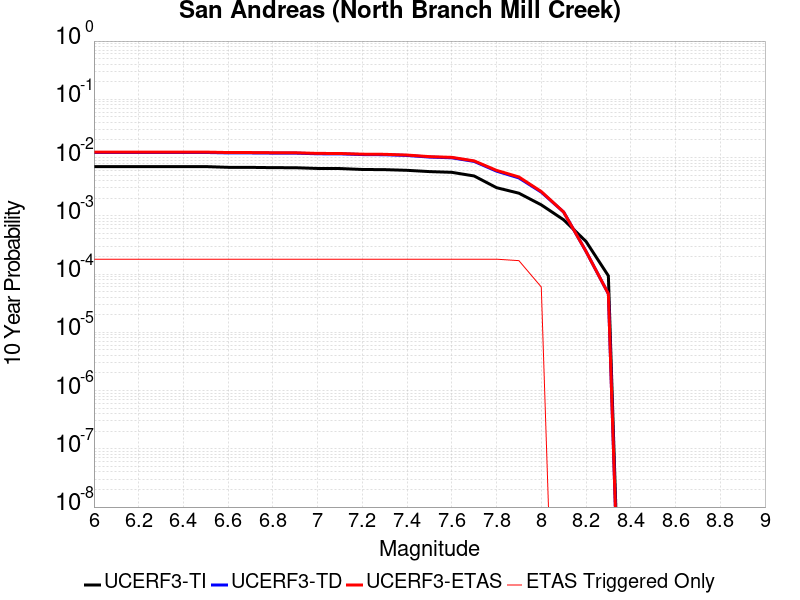 |

| Magnitude | 1 wk TI Prob | 1 wk TD Prob | 1 wk ETAS Prob | 1 wk ETAS/TD Gain | 1 wk ETAS Triggered Only | 1 mo TI Prob | 1 mo TD Prob | 1 mo ETAS Prob | 1 mo ETAS/TD Gain | 1 mo ETAS Triggered Only | 1 yr TI Prob | 1 yr TD Prob | 1 yr ETAS Prob | 1 yr ETAS/TD Gain | 1 yr ETAS Triggered Only | 10 yr TI Prob | 10 yr TD Prob | 10 yr ETAS Prob | 10 yr ETAS/TD Gain | 10 yr ETAS Triggered Only |
|-----|-----|-----|-----|-----|-----|-----|-----|-----|-----|-----|-----|-----|-----|-----|-----|-----|-----|-----|-----|-----|
| 6.0 | 1.3461156E-5 | 2.3499893E-5 | 3.2883623E-4 | 13.993094 | 3.053435E-4 | 5.7689394E-5 | 1.00709956E-4 | 4.4418682E-4 | 4.410555 | 3.4351146E-4 | 7.02142E-4 | 0.0012254574 | 0.001606669 | 1.311077 | 3.816794E-4 | 0.0069992766 | 0.01222957 | 0.012606582 | 1.0308279 | 3.816794E-4 |
| 6.1 | 1.3461156E-5 | 2.3499893E-5 | 3.2883623E-4 | 13.993094 | 3.053435E-4 | 5.7689394E-5 | 1.00709956E-4 | 4.4418682E-4 | 4.410555 | 3.4351146E-4 | 7.02142E-4 | 0.0012254574 | 0.001606669 | 1.311077 | 3.816794E-4 | 0.0069992766 | 0.01222957 | 0.012606582 | 1.0308279 | 3.816794E-4 |
| 6.2 | 1.3461156E-5 | 2.3499893E-5 | 3.2883623E-4 | 13.993094 | 3.053435E-4 | 5.7689394E-5 | 1.00709956E-4 | 4.4418682E-4 | 4.410555 | 3.4351146E-4 | 7.02142E-4 | 0.0012254574 | 0.001606669 | 1.311077 | 3.816794E-4 | 0.0069992766 | 0.01222957 | 0.012606582 | 1.0308279 | 3.816794E-4 |
| 6.3 | 1.3461156E-5 | 2.3499893E-5 | 3.2883623E-4 | 13.993094 | 3.053435E-4 | 5.7689394E-5 | 1.00709956E-4 | 4.4418682E-4 | 4.410555 | 3.4351146E-4 | 7.02142E-4 | 0.0012254574 | 0.001606669 | 1.311077 | 3.816794E-4 | 0.0069992766 | 0.01222957 | 0.012606582 | 1.0308279 | 3.816794E-4 |
| 6.4 | 1.3461156E-5 | 2.3499893E-5 | 3.2883623E-4 | 13.993094 | 3.053435E-4 | 5.7689394E-5 | 1.00709956E-4 | 4.4418682E-4 | 4.410555 | 3.4351146E-4 | 7.02142E-4 | 0.0012254574 | 0.001606669 | 1.311077 | 3.816794E-4 | 0.0069992766 | 0.01222957 | 0.012606582 | 1.0308279 | 3.816794E-4 |
| 6.5 | 1.3450706E-5 | 2.3488852E-5 | 3.288252E-4 | 13.999202 | 3.053435E-4 | 5.764461E-5 | 1.0066265E-4 | 4.4413953E-4 | 4.412158 | 3.4351146E-4 | 7.0159714E-4 | 0.001224882 | 0.0016060938 | 1.3112234 | 3.816794E-4 | 0.006993862 | 0.01222388 | 0.012600893 | 1.0308424 | 3.816794E-4 |
| 6.6 | 1.3074523E-5 | 2.3103135E-5 | 3.2843958E-4 | 14.216234 | 3.053435E-4 | 5.6032466E-5 | 9.9009696E-5 | 4.4248713E-4 | 4.469129 | 3.4351146E-4 | 6.8198174E-4 | 0.0012047797 | 0.0015859993 | 1.3164226 | 3.816794E-4 | 0.006798926 | 0.012025044 | 0.012402134 | 1.0313587 | 3.816794E-4 |
| 6.7 | 1.3050216E-5 | 2.3078432E-5 | 3.284149E-4 | 14.230382 | 3.053435E-4 | 5.59283E-5 | 9.890384E-5 | 4.423813E-4 | 4.4728427 | 3.4351146E-4 | 6.8071426E-4 | 0.0012034923 | 0.0015847123 | 1.3167615 | 3.816794E-4 | 0.0067863287 | 0.012012309 | 0.012389404 | 1.0313923 | 3.816794E-4 |
| 6.8 | 1.29049395E-5 | 2.292684E-5 | 3.2826336E-4 | 14.3178625 | 3.053435E-4 | 5.530571E-5 | 9.825421E-5 | 4.417319E-4 | 4.4958067 | 3.4351146E-4 | 6.73139E-4 | 0.0011955918 | 0.0015768148 | 1.3188572 | 3.816794E-4 | 0.0067110364 | 0.011934154 | 0.012311279 | 1.0316005 | 3.816794E-4 |
| 6.9 | 1.2867369E-5 | 2.2886245E-5 | 3.2822276E-4 | 14.341486 | 3.053435E-4 | 5.51447E-5 | 9.8080236E-5 | 4.41558E-4 | 4.502008 | 3.4351146E-4 | 6.711799E-4 | 0.0011934759 | 0.0015746998 | 1.3194232 | 3.816794E-4 | 0.006691564 | 0.011913223 | 0.012290356 | 1.0316566 | 3.816794E-4 |
| 7.0 | 1.2495996E-5 | 2.2286325E-5 | 3.2762304E-4 | 14.70063 | 3.053435E-4 | 5.3553173E-5 | 9.550934E-5 | 4.3898798E-4 | 4.596283 | 3.4351146E-4 | 6.518148E-4 | 0.0011622087 | 0.0015434446 | 1.3280269 | 3.816794E-4 | 0.0064990623 | 0.0116038285 | 0.011981079 | 1.0325109 | 3.816794E-4 |
| 7.1 | 1.2452067E-5 | 2.2231397E-5 | 3.2756812E-4 | 14.734481 | 3.053435E-4 | 5.3364907E-5 | 9.527396E-5 | 4.3875267E-4 | 4.605169 | 3.4351146E-4 | 6.4952404E-4 | 0.0011593461 | 0.001540583 | 1.3288379 | 3.816794E-4 | 0.0064762887 | 0.0115755 | 0.011952761 | 1.0325913 | 3.816794E-4 |
| 7.2 | 1.2002777E-5 | 2.1609963E-5 | 3.2694687E-4 | 15.129451 | 3.053435E-4 | 5.143946E-5 | 9.2610855E-5 | 4.360905E-4 | 4.7088485 | 3.4351146E-4 | 6.2609545E-4 | 0.0011269567 | 0.0015082059 | 1.3382999 | 3.816794E-4 | 0.006243344 | 0.011254923 | 0.0116323065 | 1.0335306 | 3.816794E-4 |
| 7.3 | 1.1923425E-5 | 2.1479793E-5 | 3.2681675E-4 | 15.215079 | 3.053435E-4 | 5.109939E-5 | 9.205302E-5 | 4.3553286E-4 | 4.731326 | 3.4351146E-4 | 6.219575E-4 | 0.001120172 | 0.0015014238 | 1.3403512 | 3.816794E-4 | 0.0062021962 | 0.011187789 | 0.011565198 | 1.0337341 | 3.816794E-4 |
| 7.4 | 1.16105175E-5 | 2.0853771E-5 | 3.2619093E-4 | 15.641818 | 3.053435E-4 | 4.975841E-5 | 8.937026E-5 | 4.3285103E-4 | 4.843345 | 3.4351146E-4 | 6.0564023E-4 | 0.0010875424 | 0.0014688066 | 1.3505743 | 3.816794E-4 | 0.006039923 | 0.010865397 | 0.011242929 | 1.0347463 | 3.816794E-4 |
| 7.5 | 1.1037265E-5 | 1.9553907E-5 | 3.2489144E-4 | 16.615168 | 3.053435E-4 | 4.7301706E-5 | 8.379978E-5 | 4.2728244E-4 | 5.0988493 | 3.4351146E-4 | 5.757461E-4 | 0.0010197869 | 0.0014010771 | 1.373892 | 3.816794E-4 | 0.005742567 | 0.010194898 | 0.010572686 | 1.0370566 | 3.816794E-4 |
| 7.6 | 1.0720915E-5 | 1.899582E-5 | 3.2433352E-4 | 17.073944 | 3.053435E-4 | 4.5945973E-5 | 8.140812E-5 | 4.2489162E-4 | 5.219278 | 3.4351146E-4 | 5.592486E-4 | 9.906954E-4 | 0.0013719967 | 1.3848825 | 3.816794E-4 | 0.005578433 | 0.009906623 | 0.010284521 | 1.038146 | 3.816794E-4 |
| 7.7 | 9.276279E-6 | 1.6441649E-5 | 3.2178013E-4 | 19.57104 | 3.053435E-4 | 3.9754876E-5 | 7.0462316E-5 | 4.1394957E-4 | 5.8747654 | 3.4351146E-4 | 4.839081E-4 | 8.575427E-4 | 0.0012388948 | 1.4447033 | 3.816794E-4 | 0.0048285574 | 0.008586041 | 0.008964444 | 1.0440718 | 3.816794E-4 |
| 7.8 | 5.8346777E-6 | 1.1155013E-5 | 3.164951E-4 | 28.372456 | 3.053435E-4 | 2.5005522E-5 | 4.7806327E-5 | 3.9130135E-4 | 8.185138 | 3.4351146E-4 | 3.043997E-4 | 5.818867E-4 | 9.63344E-4 | 1.6555525 | 3.816794E-4 | 0.0030398308 | 0.0058469265 | 0.0062263743 | 1.064897 | 3.816794E-4 |
| 7.9 | 4.690204E-6 | 8.509093E-6 | 2.756824E-4 | 32.398563 | 2.6717558E-4 | 2.0100719E-5 | 3.6467034E-5 | 3.417994E-4 | 9.372832 | 3.053435E-4 | 2.4469878E-4 | 4.4389578E-4 | 7.872548E-4 | 1.7735126 | 3.4351146E-4 | 0.002444295 | 0.0044707474 | 0.004812723 | 1.0764918 | 3.4351146E-4 |
| 8.0 | 2.9570454E-6 | 4.846947E-6 | 8.118246E-5 | 16.749195 | 7.633588E-5 | 1.267299E-5 | 2.0772464E-5 | 9.710676E-5 | 4.6747828 | 7.633588E-5 | 1.5428272E-4 | 2.5287544E-4 | 3.673503E-4 | 1.4526927 | 1.1450382E-4 | 0.0015417566 | 0.002549644 | 0.0026638561 | 1.0447953 | 1.1450382E-4 |
| 8.1 | 1.6376824E-6 | 2.1968929E-6 | 2.1968929E-6 | 1.0 | 0.0 | 7.01862E-6 | 9.41522E-6 | 9.41522E-6 | 1.0 | 0.0 | 8.544835E-5 | 1.14624294E-4 | 1.14624294E-4 | 1.0 | 0.0 | 8.54155E-4 | 0.0011606582 | 0.0011606582 | 1.0 | 0.0 |
| 8.2 | 6.9631557E-7 | 4.5360213E-7 | 4.5360213E-7 | 1.0 | 0.0 | 2.984206E-6 | 1.9440076E-6 | 1.9440076E-6 | 1.0 | 0.0 | 3.63321E-5 | 2.3668037E-5 | 2.3668037E-5 | 1.0 | 0.0 | 3.6326164E-4 | 2.451564E-4 | 2.451564E-4 | 1.0 | 0.0 |
| 8.3 | 1.7876137E-7 | 8.360375E-8 | 8.360375E-8 | 1.0 | 0.0 | 7.661199E-7 | 3.5830175E-7 | 3.5830175E-7 | 1.0 | 0.0 | 9.32747E-6 | 4.3623154E-6 | 4.3623154E-6 | 1.0 | 0.0 | 9.3270784E-5 | 4.5817014E-5 | 4.5817014E-5 | 1.0 | 0.0 |

## Helendale-So Lockhart
*[(top)](#table-of-contents)*

| 1 Week | 1 Month | 1 Year | 10 Year |
|-----|-----|-----|-----|
|  |  |  |  |

| Magnitude | 1 wk TI Prob | 1 wk TD Prob | 1 wk ETAS Prob | 1 wk ETAS/TD Gain | 1 wk ETAS Triggered Only | 1 mo TI Prob | 1 mo TD Prob | 1 mo ETAS Prob | 1 mo ETAS/TD Gain | 1 mo ETAS Triggered Only | 1 yr TI Prob | 1 yr TD Prob | 1 yr ETAS Prob | 1 yr ETAS/TD Gain | 1 yr ETAS Triggered Only | 10 yr TI Prob | 10 yr TD Prob | 10 yr ETAS Prob | 10 yr ETAS/TD Gain | 10 yr ETAS Triggered Only |
|-----|-----|-----|-----|-----|-----|-----|-----|-----|-----|-----|-----|-----|-----|-----|-----|-----|-----|-----|-----|-----|
| 6.0 | 1.7296055E-5 | 1.8103729E-5 | 3.2344172E-4 | 17.866026 | 3.053435E-4 | 7.412385E-5 | 7.7585224E-5 | 4.2107003E-4 | 5.4271936 | 3.4351146E-4 | 9.0208417E-4 | 9.4421144E-4 | 0.0012873985 | 1.3634642 | 3.4351146E-4 | 0.008984311 | 0.009404116 | 0.009744397 | 1.0361843 | 3.4351146E-4 |
| 6.1 | 1.7296055E-5 | 1.8103729E-5 | 3.2344172E-4 | 17.866026 | 3.053435E-4 | 7.412385E-5 | 7.7585224E-5 | 4.2107003E-4 | 5.4271936 | 3.4351146E-4 | 9.0208417E-4 | 9.4421144E-4 | 0.0012873985 | 1.3634642 | 3.4351146E-4 | 0.008984311 | 0.009404116 | 0.009744397 | 1.0361843 | 3.4351146E-4 |
| 6.2 | 1.7296055E-5 | 1.8103729E-5 | 3.2344172E-4 | 17.866026 | 3.053435E-4 | 7.412385E-5 | 7.7585224E-5 | 4.2107003E-4 | 5.4271936 | 3.4351146E-4 | 9.0208417E-4 | 9.4421144E-4 | 0.0012873985 | 1.3634642 | 3.4351146E-4 | 0.008984311 | 0.009404116 | 0.009744397 | 1.0361843 | 3.4351146E-4 |
| 6.3 | 1.0669118E-5 | 1.1135425E-5 | 2.7830803E-4 | 24.993032 | 2.6717558E-4 | 4.5723988E-5 | 4.772239E-5 | 3.5305132E-4 | 7.3980227 | 3.053435E-4 | 5.5654737E-4 | 5.80868E-4 | 8.8603416E-4 | 1.5253623 | 3.053435E-4 | 0.0055515557 | 0.0057937936 | 0.006097368 | 1.0523965 | 3.053435E-4 |
| 6.4 | 1.0669118E-5 | 1.1135425E-5 | 2.7830803E-4 | 24.993032 | 2.6717558E-4 | 4.5723988E-5 | 4.772239E-5 | 3.5305132E-4 | 7.3980227 | 3.053435E-4 | 5.5654737E-4 | 5.80868E-4 | 8.8603416E-4 | 1.5253623 | 3.053435E-4 | 0.0055515557 | 0.0057937936 | 0.006097368 | 1.0523965 | 3.053435E-4 |
| 6.5 | 8.790038E-6 | 9.170197E-6 | 2.7634331E-4 | 30.13494 | 2.6717558E-4 | 3.767105E-5 | 3.930026E-5 | 3.446318E-4 | 8.769198 | 3.053435E-4 | 4.585485E-4 | 4.7837716E-4 | 7.835746E-4 | 1.637985 | 3.053435E-4 | 0.0045760344 | 0.004773638 | 0.005077524 | 1.0636592 | 3.053435E-4 |
| 6.6 | 7.396949E-6 | 7.715537E-6 | 1.9855375E-4 | 25.734276 | 1.908397E-4 | 3.1700827E-5 | 3.3066175E-5 | 2.2389955E-4 | 6.771257 | 1.908397E-4 | 3.858892E-4 | 4.025073E-4 | 5.932702E-4 | 1.4739364 | 1.908397E-4 | 0.003852198 | 0.00401789 | 0.0042079627 | 1.0473067 | 1.908397E-4 |
| 6.7 | 6.4600285E-6 | 6.738031E-6 | 1.9757645E-4 | 29.322578 | 1.908397E-4 | 2.7685543E-5 | 2.887696E-5 | 2.1971115E-4 | 7.608527 | 1.908397E-4 | 3.3701936E-4 | 3.5152107E-4 | 5.4229365E-4 | 1.542706 | 1.908397E-4 | 0.0033650869 | 0.003509732 | 0.0036999017 | 1.0541836 | 1.908397E-4 |
| 6.8 | 5.600104E-6 | 5.836009E-6 | 1.9667459E-4 | 33.700184 | 1.908397E-4 | 2.4000226E-5 | 2.5011232E-5 | 2.1584616E-4 | 8.629969 | 1.908397E-4 | 2.9216358E-4 | 3.044698E-4 | 4.952514E-4 | 1.6266026 | 1.908397E-4 | 0.0029177975 | 0.003040588 | 0.0032308474 | 1.0625732 | 1.908397E-4 |
| 6.9 | 4.839122E-6 | 5.0395092E-6 | 1.577105E-4 | 31.294811 | 1.5267175E-4 | 2.0738931E-5 | 2.159772E-5 | 1.7426618E-4 | 8.06873 | 1.5267175E-4 | 2.5246723E-4 | 2.6292098E-4 | 4.155526E-4 | 1.5805228 | 1.5267175E-4 | 0.002521806 | 0.002626147 | 0.0027784177 | 1.0579826 | 1.5267175E-4 |
| 7.0 | 3.6937633E-6 | 3.845208E-6 | 1.1834859E-4 | 30.7782 | 1.1450382E-4 | 1.5830317E-5 | 1.647936E-5 | 1.309813E-4 | 7.948202 | 1.1450382E-4 | 1.9271708E-4 | 2.0061806E-4 | 3.150989E-4 | 1.5706408 | 1.1450382E-4 | 0.0019255003 | 0.002004401 | 0.0021186753 | 1.0570117 | 1.1450382E-4 |
| 7.1 | 2.7858857E-6 | 2.8978538E-6 | 7.923351E-5 | 27.342134 | 7.633588E-5 | 1.1939455E-5 | 1.2419316E-5 | 8.875425E-5 | 7.146468 | 7.633588E-5 | 1.4535317E-4 | 1.511949E-4 | 2.2751922E-4 | 1.5048076 | 7.633588E-5 | 0.0014525814 | 0.0015109418 | 0.0015871623 | 1.0504457 | 7.633588E-5 |
| 7.2 | 2.1672065E-6 | 2.2540128E-6 | 7.858972E-5 | 34.86658 | 7.633588E-5 | 9.2879945E-6 | 9.66002E-6 | 8.599516E-5 | 8.902172 | 7.633588E-5 | 1.1307546E-4 | 1.1760458E-4 | 1.9393148E-4 | 1.649013 | 7.633588E-5 | 0.0011301794 | 0.0011754417 | 0.0012516878 | 1.064866 | 7.633588E-5 |
| 7.3 | 1.4823496E-6 | 1.5422102E-6 | 1.5422102E-6 | 1.0 | 0.0 | 6.3529114E-6 | 6.6094562E-6 | 6.6094562E-6 | 1.0 | 0.0 | 7.734395E-5 | 8.046731E-5 | 8.046731E-5 | 1.0 | 0.0 | 7.731704E-4 | 8.0439687E-4 | 8.0439687E-4 | 1.0 | 0.0 |
| 7.4 | 4.2321457E-7 | 4.4108765E-7 | 4.4108765E-7 | 1.0 | 0.0 | 1.8137755E-6 | 1.8903745E-6 | 1.8903745E-6 | 1.0 | 0.0 | 2.2082493E-5 | 2.3015113E-5 | 2.3015113E-5 | 1.0 | 0.0 | 2.2080299E-4 | 2.3013182E-4 | 2.3013182E-4 | 1.0 | 0.0 |
| 7.5 | 5.6942316E-8 | 5.9415648E-8 | 5.9415648E-8 | 1.0 | 0.0 | 2.440385E-7 | 2.5463845E-7 | 2.5463845E-7 | 1.0 | 0.0 | 2.9711643E-6 | 3.1002196E-6 | 3.1002196E-6 | 1.0 | 0.0 | 2.9711247E-5 | 3.1001844E-5 | 3.1001844E-5 | 1.0 | 0.0 |

## Death Valley (Black Mtns Frontal)
*[(top)](#table-of-contents)*

| 1 Week | 1 Month | 1 Year | 10 Year |
|-----|-----|-----|-----|
|  |  |  |  |

| Magnitude | 1 wk TI Prob | 1 wk TD Prob | 1 wk ETAS Prob | 1 wk ETAS/TD Gain | 1 wk ETAS Triggered Only | 1 mo TI Prob | 1 mo TD Prob | 1 mo ETAS Prob | 1 mo ETAS/TD Gain | 1 mo ETAS Triggered Only | 1 yr TI Prob | 1 yr TD Prob | 1 yr ETAS Prob | 1 yr ETAS/TD Gain | 1 yr ETAS Triggered Only | 10 yr TI Prob | 10 yr TD Prob | 10 yr ETAS Prob | 10 yr ETAS/TD Gain | 10 yr ETAS Triggered Only |
|-----|-----|-----|-----|-----|-----|-----|-----|-----|-----|-----|-----|-----|-----|-----|-----|-----|-----|-----|-----|-----|
| 6.0 | 1.6707214E-5 | 1.867027E-5 | 2.8584086E-4 | 15.309949 | 2.6717558E-4 | 7.160038E-5 | 8.001302E-5 | 3.4716722E-4 | 4.338884 | 2.6717558E-4 | 8.71386E-4 | 9.737309E-4 | 0.001278777 | 1.3132757 | 3.053435E-4 | 0.00867977 | 0.009695496 | 0.00999788 | 1.031188 | 3.053435E-4 |
| 6.1 | 1.6707214E-5 | 1.867027E-5 | 2.8584086E-4 | 15.309949 | 2.6717558E-4 | 7.160038E-5 | 8.001302E-5 | 3.4716722E-4 | 4.338884 | 2.6717558E-4 | 8.71386E-4 | 9.737309E-4 | 0.001278777 | 1.3132757 | 3.053435E-4 | 0.00867977 | 0.009695496 | 0.00999788 | 1.031188 | 3.053435E-4 |
| 6.2 | 1.6707214E-5 | 1.867027E-5 | 2.8584086E-4 | 15.309949 | 2.6717558E-4 | 7.160038E-5 | 8.001302E-5 | 3.4716722E-4 | 4.338884 | 2.6717558E-4 | 8.71386E-4 | 9.737309E-4 | 0.001278777 | 1.3132757 | 3.053435E-4 | 0.00867977 | 0.009695496 | 0.00999788 | 1.031188 | 3.053435E-4 |
| 6.3 | 1.6707214E-5 | 1.867027E-5 | 2.8584086E-4 | 15.309949 | 2.6717558E-4 | 7.160038E-5 | 8.001302E-5 | 3.4716722E-4 | 4.338884 | 2.6717558E-4 | 8.71386E-4 | 9.737309E-4 | 0.001278777 | 1.3132757 | 3.053435E-4 | 0.00867977 | 0.009695496 | 0.00999788 | 1.031188 | 3.053435E-4 |
| 6.4 | 1.5515609E-5 | 1.7338214E-5 | 2.081746E-4 | 12.006693 | 1.908397E-4 | 6.649377E-5 | 7.4304546E-5 | 2.6513007E-4 | 3.5681539 | 1.908397E-4 | 8.0926094E-4 | 9.042885E-4 | 0.0011330891 | 1.2530172 | 2.2900764E-4 | 0.008063202 | 0.009006773 | 0.009233718 | 1.0251971 | 2.2900764E-4 |
| 6.5 | 1.5515609E-5 | 1.7338214E-5 | 2.081746E-4 | 12.006693 | 1.908397E-4 | 6.649377E-5 | 7.4304546E-5 | 2.6513007E-4 | 3.5681539 | 1.908397E-4 | 8.0926094E-4 | 9.042885E-4 | 0.0011330891 | 1.2530172 | 2.2900764E-4 | 0.008063202 | 0.009006773 | 0.009233718 | 1.0251971 | 2.2900764E-4 |
| 6.6 | 1.5041828E-5 | 1.6809145E-5 | 1.6947833E-4 | 10.082508 | 1.5267175E-4 | 6.4463384E-5 | 7.203723E-5 | 2.24698E-4 | 3.1191924 | 1.5267175E-4 | 7.8455906E-4 | 8.767063E-4 | 0.0010673787 | 1.2174872 | 1.908397E-4 | 0.00781795 | 0.008733132 | 0.008922306 | 1.0216615 | 1.908397E-4 |
| 6.7 | 1.4634985E-5 | 1.6356016E-5 | 1.6902527E-4 | 10.334135 | 1.5267175E-4 | 6.271985E-5 | 7.009536E-5 | 2.2275641E-4 | 3.1779053 | 1.5267175E-4 | 7.6334673E-4 | 8.5308263E-4 | 0.0010437595 | 1.2235152 | 1.908397E-4 | 0.007607299 | 0.008498715 | 0.008687934 | 1.0222642 | 1.908397E-4 |
| 6.8 | 1.4209158E-5 | 1.5882048E-5 | 1.3038404E-4 | 8.209523 | 1.1450382E-4 | 6.089497E-5 | 6.8064175E-5 | 1.825602E-4 | 2.6821775 | 1.1450382E-4 | 7.4114406E-4 | 8.2837185E-4 | 9.809171E-4 | 1.1841507 | 1.5267175E-4 | 0.007386771 | 0.008253456 | 0.008404868 | 1.0183452 | 1.5267175E-4 |
| 6.9 | 1.3780098E-5 | 1.5404594E-5 | 1.2990665E-4 | 8.4329815 | 1.1450382E-4 | 5.9056227E-5 | 6.6018045E-5 | 1.805143E-4 | 2.7343175 | 1.1450382E-4 | 7.1877235E-4 | 8.0347876E-4 | 9.560278E-4 | 1.1898608 | 1.5267175E-4 | 0.0071645193 | 0.008006332 | 0.008157782 | 1.0189162 | 1.5267175E-4 |
| 7.0 | 1.3585064E-5 | 1.5188155E-5 | 9.1522874E-5 | 6.0259376 | 7.633588E-5 | 5.8220405E-5 | 6.50905E-5 | 1.414214E-4 | 2.172689 | 7.633588E-5 | 7.086029E-4 | 7.9219416E-4 | 9.0660725E-4 | 1.1444256 | 1.1450382E-4 | 0.007063476 | 0.007894293 | 0.008007893 | 1.0143901 | 1.1450382E-4 |
| 7.1 | 1.3398601E-5 | 1.49813395E-5 | 9.131608E-5 | 6.095321 | 7.633588E-5 | 5.742131E-5 | 6.420419E-5 | 1.4053516E-4 | 2.1888785 | 7.633588E-5 | 6.9888023E-4 | 7.8141113E-4 | 8.9582545E-4 | 1.1464201 | 1.1450382E-4 | 0.0069668638 | 0.007787224 | 0.007900836 | 1.0145895 | 1.1450382E-4 |
| 7.2 | 1.3126312E-5 | 1.4679561E-5 | 9.101432E-5 | 6.200071 | 7.633588E-5 | 5.6254412E-5 | 6.291092E-5 | 1.39242E-4 | 2.21332 | 7.633588E-5 | 6.846822E-4 | 7.6567667E-4 | 8.8009285E-4 | 1.1494313 | 1.1450382E-4 | 0.006825765 | 0.00763097 | 0.0077446 | 1.0148907 | 1.1450382E-4 |
| 7.3 | 1.2922429E-5 | 1.4453788E-5 | 9.078856E-5 | 6.281299 | 7.633588E-5 | 5.5380664E-5 | 6.194336E-5 | 1.3827451E-4 | 2.232273 | 7.633588E-5 | 6.74051E-4 | 7.53905E-4 | 8.6832244E-4 | 1.1517664 | 1.1450382E-4 | 0.006720101 | 0.007514055 | 0.007627698 | 1.0151241 | 1.1450382E-4 |
| 7.4 | 1.2768878E-5 | 1.4283772E-5 | 9.061856E-5 | 6.344162 | 7.633588E-5 | 5.4722615E-5 | 6.1214756E-5 | 1.3754597E-4 | 2.2469413 | 7.633588E-5 | 6.660441E-4 | 7.4504025E-4 | 8.5945876E-4 | 1.1535736 | 1.1450382E-4 | 0.0066405144 | 0.0074260035 | 0.007539657 | 1.0153048 | 1.1450382E-4 |
| 7.5 | 1.2521929E-5 | 1.40120155E-5 | 9.0346824E-5 | 6.4478106 | 7.633588E-5 | 5.366431E-5 | 6.005014E-5 | 1.3638144E-4 | 2.271126 | 7.633588E-5 | 6.531671E-4 | 7.3087064E-4 | 8.452908E-4 | 1.1565531 | 1.1450382E-4 | 0.006512506 | 0.0072852457 | 0.0073989155 | 1.0156027 | 1.1450382E-4 |
| 7.6 | 1.1301089E-5 | 1.2648149E-5 | 8.898306E-5 | 7.0352635 | 7.633588E-5 | 4.8432343E-5 | 5.4205255E-5 | 1.30537E-4 | 2.408198 | 7.633588E-5 | 5.895042E-4 | 6.5975444E-4 | 7.3604E-4 | 1.1156272 | 7.633588E-5 | 0.0058794282 | 0.00657851 | 0.006654344 | 1.0115275 | 7.633588E-5 |
| 7.7 | 9.189108E-6 | 1.0283358E-5 | 8.661845E-5 | 8.423167 | 7.633588E-5 | 3.93813E-5 | 4.407082E-5 | 1.2040333E-4 | 2.732042 | 7.633588E-5 | 4.7936183E-4 | 5.3643517E-4 | 6.127301E-4 | 1.1422259 | 7.633588E-5 | 0.004783291 | 0.005351914 | 0.005427841 | 1.014187 | 7.633588E-5 |
| 7.8 | 3.4586725E-7 | 3.6482615E-7 | 3.6482615E-7 | 1.0 | 0.0 | 1.4822873E-6 | 1.5635396E-6 | 1.5635396E-6 | 1.0 | 0.0 | 1.80467E-5 | 1.9035933E-5 | 1.9035933E-5 | 1.0 | 0.0 | 1.8045233E-4 | 1.9034347E-4 | 1.9034347E-4 | 1.0 | 0.0 |
| 7.9 | 2.5591178E-9 | 2.6696718E-9 | 2.6696718E-9 | 1.0 | 0.0 | 1.0967647E-8 | 1.14414505E-8 | 1.14414505E-8 | 1.0 | 0.0 | 1.335311E-7 | 1.3929966E-7 | 1.3929966E-7 | 1.0 | 0.0 | 1.3353102E-6 | 1.3929966E-6 | 1.3929966E-6 | 1.0 | 0.0 |

## San Jacinto (San Bernardino)
*[(top)](#table-of-contents)*

| 1 Week | 1 Month | 1 Year | 10 Year |
|-----|-----|-----|-----|
|  | 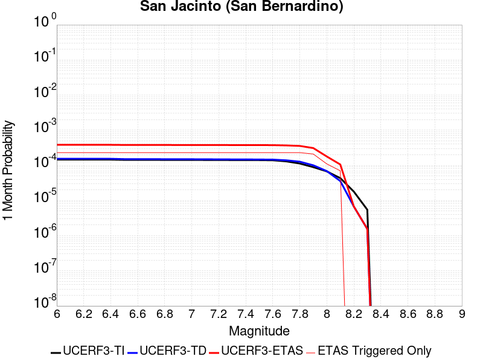 | 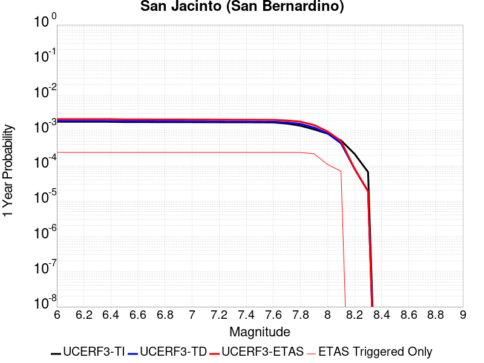 |  |

| Magnitude | 1 wk TI Prob | 1 wk TD Prob | 1 wk ETAS Prob | 1 wk ETAS/TD Gain | 1 wk ETAS Triggered Only | 1 mo TI Prob | 1 mo TD Prob | 1 mo ETAS Prob | 1 mo ETAS/TD Gain | 1 mo ETAS Triggered Only | 1 yr TI Prob | 1 yr TD Prob | 1 yr ETAS Prob | 1 yr ETAS/TD Gain | 1 yr ETAS Triggered Only | 10 yr TI Prob | 10 yr TD Prob | 10 yr ETAS Prob | 10 yr ETAS/TD Gain | 10 yr ETAS Triggered Only |
|-----|-----|-----|-----|-----|-----|-----|-----|-----|-----|-----|-----|-----|-----|-----|-----|-----|-----|-----|-----|-----|
| 6.0 | 3.409352E-5 | 3.5986508E-5 | 2.649859E-4 | 7.3634787 | 2.2900764E-4 | 1.461069E-4 | 1.542188E-4 | 4.2135315E-4 | 2.7321777 | 2.6717558E-4 | 0.0017774 | 0.0018759987 | 0.0021426731 | 1.1421506 | 2.6717558E-4 | 0.01763251 | 0.019349935 | 0.019611942 | 1.0135404 | 2.6717558E-4 |
| 6.1 | 3.409352E-5 | 3.5986508E-5 | 2.649859E-4 | 7.3634787 | 2.2900764E-4 | 1.461069E-4 | 1.542188E-4 | 4.2135315E-4 | 2.7321777 | 2.6717558E-4 | 0.0017774 | 0.0018759987 | 0.0021426731 | 1.1421506 | 2.6717558E-4 | 0.01763251 | 0.019349935 | 0.019611942 | 1.0135404 | 2.6717558E-4 |
| 6.2 | 3.409352E-5 | 3.5986508E-5 | 2.649859E-4 | 7.3634787 | 2.2900764E-4 | 1.461069E-4 | 1.542188E-4 | 4.2135315E-4 | 2.7321777 | 2.6717558E-4 | 0.0017774 | 0.0018759987 | 0.0021426731 | 1.1421506 | 2.6717558E-4 | 0.01763251 | 0.019349935 | 0.019611942 | 1.0135404 | 2.6717558E-4 |
| 6.3 | 3.409352E-5 | 3.5986508E-5 | 2.649859E-4 | 7.3634787 | 2.2900764E-4 | 1.461069E-4 | 1.542188E-4 | 4.2135315E-4 | 2.7321777 | 2.6717558E-4 | 0.0017774 | 0.0018759987 | 0.0021426731 | 1.1421506 | 2.6717558E-4 | 0.01763251 | 0.019349935 | 0.019611942 | 1.0135404 | 2.6717558E-4 |
| 6.4 | 3.400795E-5 | 3.5879173E-5 | 2.648786E-4 | 7.382517 | 2.2900764E-4 | 1.4574021E-4 | 1.5375883E-4 | 4.208933E-4 | 2.7373602 | 2.6717558E-4 | 0.0017729428 | 0.0018704084 | 0.0021370843 | 1.1425762 | 2.6717558E-4 | 0.017588645 | 0.019295016 | 0.019557036 | 1.0135797 | 2.6717558E-4 |
| 6.5 | 3.341482E-5 | 3.5139812E-5 | 2.641394E-4 | 7.5168133 | 2.2900764E-4 | 1.4319851E-4 | 1.5059051E-4 | 4.1772585E-4 | 2.7739189 | 2.6717558E-4 | 0.0017420477 | 0.0018318989 | 0.002098585 | 1.1455791 | 2.6717558E-4 | 0.017284546 | 0.018916558 | 0.019178681 | 1.0138568 | 2.6717558E-4 |
| 6.6 | 3.3364955E-5 | 3.5077028E-5 | 2.6407663E-4 | 7.5284777 | 2.2900764E-4 | 1.4298483E-4 | 1.5032147E-4 | 4.1745687E-4 | 2.7770941 | 2.6717558E-4 | 0.0017394501 | 0.001828629 | 0.002095316 | 1.1458398 | 2.6717558E-4 | 0.017258976 | 0.018884424 | 0.019146554 | 1.0138807 | 2.6717558E-4 |
| 6.7 | 3.335922E-5 | 3.5066805E-5 | 2.6406642E-4 | 7.530381 | 2.2900764E-4 | 1.4296026E-4 | 1.5027766E-4 | 4.1741307E-4 | 2.7776124 | 2.6717558E-4 | 0.0017391514 | 0.0018280965 | 0.0020947836 | 1.1458825 | 2.6717558E-4 | 0.017256035 | 0.018879214 | 0.019141346 | 1.0138847 | 2.6717558E-4 |
| 6.8 | 3.327683E-5 | 3.496087E-5 | 2.639605E-4 | 7.5501695 | 2.2900764E-4 | 1.4260718E-4 | 1.498237E-4 | 4.1695926E-4 | 2.7829993 | 2.6717558E-4 | 0.0017348597 | 0.0018225788 | 0.0020892674 | 1.1463249 | 2.6717558E-4 | 0.017213784 | 0.018824987 | 0.019087132 | 1.0139254 | 2.6717558E-4 |
| 6.9 | 3.3235785E-5 | 3.4901823E-5 | 2.6390146E-4 | 7.561251 | 2.2900764E-4 | 1.4243131E-4 | 1.4957068E-4 | 4.167063E-4 | 2.786016 | 2.6717558E-4 | 0.0017327217 | 0.0018195034 | 0.0020861928 | 1.1465727 | 2.6717558E-4 | 0.017192734 | 0.018794855 | 0.01905701 | 1.0139482 | 2.6717558E-4 |
| 7.0 | 3.3197095E-5 | 3.4841752E-5 | 2.6384142E-4 | 7.572564 | 2.2900764E-4 | 1.422655E-4 | 1.4931326E-4 | 4.1644895E-4 | 2.7890954 | 2.6717558E-4 | 0.0017307063 | 0.0018163746 | 0.002083065 | 1.1468256 | 2.6717558E-4 | 0.017172894 | 0.018764233 | 0.019026395 | 1.0139713 | 2.6717558E-4 |
| 7.1 | 3.3129716E-5 | 3.4721965E-5 | 2.6372165E-4 | 7.5952396 | 2.2900764E-4 | 1.4197677E-4 | 1.4879994E-4 | 4.1593576E-4 | 2.7952683 | 2.6717558E-4 | 0.0017271966 | 0.0018101353 | 0.0020768272 | 1.1473325 | 2.6717558E-4 | 0.017138338 | 0.018703312 | 0.01896549 | 1.0140177 | 2.6717558E-4 |
| 7.2 | 3.3034008E-5 | 3.458941E-5 | 2.635891E-4 | 7.620515 | 2.2900764E-4 | 1.4156665E-4 | 1.4823192E-4 | 4.153679E-4 | 2.8021488 | 2.6717558E-4 | 0.0017222111 | 0.0018032312 | 0.002069925 | 1.1478977 | 2.6717558E-4 | 0.017089253 | 0.018635705 | 0.018897902 | 1.0140696 | 2.6717558E-4 |
| 7.3 | 3.2956614E-5 | 3.445717E-5 | 2.6345692E-4 | 7.6459246 | 2.2900764E-4 | 1.4123498E-4 | 1.4766524E-4 | 4.1480135E-4 | 2.8090658 | 2.6717558E-4 | 0.0017181796 | 0.0017963431 | 0.0020630388 | 1.1484659 | 2.6717558E-4 | 0.017049557 | 0.018568452 | 0.018830668 | 1.0141215 | 2.6717558E-4 |
| 7.4 | 3.2915937E-5 | 3.4378863E-5 | 2.6337864E-4 | 7.6610622 | 2.2900764E-4 | 1.4106068E-4 | 1.4732967E-4 | 4.144659E-4 | 2.8131866 | 2.6717558E-4 | 0.0017160608 | 0.0017922645 | 0.0020589612 | 1.1488043 | 2.6717558E-4 | 0.017028693 | 0.018528719 | 0.018790944 | 1.0141524 | 2.6717558E-4 |
| 7.5 | 3.281791E-5 | 3.4243778E-5 | 2.6324356E-4 | 7.68734 | 2.2900764E-4 | 1.406406E-4 | 1.4675081E-4 | 4.1388717E-4 | 2.82034 | 2.6717558E-4 | 0.0017109542 | 0.0017852283 | 0.002051927 | 1.1493919 | 2.6717558E-4 | 0.016978411 | 0.018459605 | 0.018721849 | 1.0142064 | 2.6717558E-4 |
| 7.6 | 3.2521442E-5 | 3.396873E-5 | 2.629686E-4 | 7.74149 | 2.2900764E-4 | 1.3937015E-4 | 1.4557215E-4 | 4.1270885E-4 | 2.8350809 | 2.6717558E-4 | 0.0016955109 | 0.0017709016 | 0.002037604 | 1.1506026 | 2.6717558E-4 | 0.016826328 | 0.018317232 | 0.018579515 | 1.0143188 | 2.6717558E-4 |
| 7.7 | 3.0287873E-5 | 3.245276E-5 | 2.6145295E-4 | 8.0564165 | 2.2900764E-4 | 1.297987E-4 | 1.3907586E-4 | 4.0621427E-4 | 2.9208107 | 2.6717558E-4 | 0.0015791537 | 0.0016919347 | 0.0019586582 | 1.1576442 | 2.6717558E-4 | 0.01567979 | 0.01752809 | 0.017790582 | 1.0149755 | 2.6717558E-4 |
| 7.8 | 2.6316151E-5 | 2.9663592E-5 | 2.5866443E-4 | 8.71993 | 2.2900764E-4 | 1.1277862E-4 | 1.2712348E-4 | 3.942651E-4 | 3.101434 | 2.6717558E-4 | 0.0013722149 | 0.0015466306 | 0.001813393 | 1.1724796 | 2.6717558E-4 | 0.013637724 | 0.016069634 | 0.016332516 | 1.016359 | 2.6717558E-4 |
| 7.9 | 2.0761147E-5 | 2.34181E-5 | 2.5242037E-4 | 10.778857 | 2.2900764E-4 | 8.897331E-5 | 1.0035944E-4 | 3.6750818E-4 | 3.6619198 | 2.6717558E-4 | 0.0010827117 | 0.0012211921 | 0.0014880414 | 1.2185154 | 2.6717558E-4 | 0.010774517 | 0.012793174 | 0.013056932 | 1.020617 | 2.6717558E-4 |
| 8.0 | 1.5738568E-5 | 1.6033575E-5 | 9.236823E-5 | 5.7609253 | 7.633588E-5 | 6.744926E-5 | 6.871352E-5 | 1.4504415E-4 | 2.1108532 | 7.633588E-5 | 8.2088535E-4 | 8.3626667E-4 | 9.125387E-4 | 1.0912054 | 7.633588E-5 | 0.008178596 | 0.008865921 | 0.00894158 | 1.0085337 | 7.633588E-5 |
| 8.1 | 1.0105832E-5 | 8.3304985E-6 | 8.466574E-5 | 10.163346 | 7.633588E-5 | 4.3309992E-5 | 3.570165E-5 | 1.120348E-4 | 3.1380847 | 7.633588E-5 | 5.2717153E-4 | 4.345814E-4 | 5.108841E-4 | 1.1755775 | 7.633588E-5 | 0.005259227 | 0.004677232 | 0.0047532106 | 1.0162444 | 7.633588E-5 |
| 8.2 | 4.189207E-6 | 1.5784357E-6 | 1.5784357E-6 | 1.0 | 0.0 | 1.7953622E-5 | 6.7647065E-6 | 6.7647065E-6 | 1.0 | 0.0 | 2.1856341E-4 | 8.235722E-5 | 8.235722E-5 | 1.0 | 0.0 | 0.0021834858 | 9.565867E-4 | 9.565867E-4 | 1.0 | 0.0 |
| 8.3 | 1.2758221E-6 | 3.6149942E-7 | 3.6149942E-7 | 1.0 | 0.0 | 5.4677976E-6 | 1.5492824E-6 | 1.5492824E-6 | 1.0 | 0.0 | 6.65684E-5 | 1.8862354E-5 | 1.8862354E-5 | 1.0 | 0.0 | 6.6548464E-4 | 2.2751294E-4 | 2.2751294E-4 | 1.0 | 0.0 |

## Manix-Afton Hills
*[(top)](#table-of-contents)*

| 1 Week | 1 Month | 1 Year | 10 Year |
|-----|-----|-----|-----|
|  |  |  |  |

| Magnitude | 1 wk TI Prob | 1 wk TD Prob | 1 wk ETAS Prob | 1 wk ETAS/TD Gain | 1 wk ETAS Triggered Only | 1 mo TI Prob | 1 mo TD Prob | 1 mo ETAS Prob | 1 mo ETAS/TD Gain | 1 mo ETAS Triggered Only | 1 yr TI Prob | 1 yr TD Prob | 1 yr ETAS Prob | 1 yr ETAS/TD Gain | 1 yr ETAS Triggered Only | 10 yr TI Prob | 10 yr TD Prob | 10 yr ETAS Prob | 10 yr ETAS/TD Gain | 10 yr ETAS Triggered Only |
|-----|-----|-----|-----|-----|-----|-----|-----|-----|-----|-----|-----|-----|-----|-----|-----|-----|-----|-----|-----|-----|
| 6.0 | 1.3783202E-5 | 1.47110895E-5 | 9.104585E-5 | 6.1889257 | 7.633588E-5 | 5.906953E-5 | 6.30461E-5 | 1.7754271E-4 | 2.8160772 | 1.1450382E-4 | 7.189342E-4 | 7.6733343E-4 | 9.580267E-4 | 1.2485142 | 1.908397E-4 | 0.0071661277 | 0.007648596 | 0.007875852 | 1.0297121 | 2.2900764E-4 |
| 6.1 | 1.3783202E-5 | 1.47110895E-5 | 9.104585E-5 | 6.1889257 | 7.633588E-5 | 5.906953E-5 | 6.30461E-5 | 1.7754271E-4 | 2.8160772 | 1.1450382E-4 | 7.189342E-4 | 7.6733343E-4 | 9.580267E-4 | 1.2485142 | 1.908397E-4 | 0.0071661277 | 0.007648596 | 0.007875852 | 1.0297121 | 2.2900764E-4 |
| 6.2 | 1.3783202E-5 | 1.47110895E-5 | 9.104585E-5 | 6.1889257 | 7.633588E-5 | 5.906953E-5 | 6.30461E-5 | 1.7754271E-4 | 2.8160772 | 1.1450382E-4 | 7.189342E-4 | 7.6733343E-4 | 9.580267E-4 | 1.2485142 | 1.908397E-4 | 0.0071661277 | 0.007648596 | 0.007875852 | 1.0297121 | 2.2900764E-4 |
| 6.3 | 1.10494875E-5 | 1.1793136E-5 | 8.8128116E-5 | 7.4728312 | 7.633588E-5 | 4.7354086E-5 | 5.054109E-5 | 1.6503912E-4 | 3.2654445 | 1.1450382E-4 | 5.763835E-4 | 6.151744E-4 | 8.058967E-4 | 1.3100296 | 1.908397E-4 | 0.005748908 | 0.0061357557 | 0.006363358 | 1.0370945 | 2.2900764E-4 |
| 6.4 | 1.10494875E-5 | 1.1793136E-5 | 8.8128116E-5 | 7.4728312 | 7.633588E-5 | 4.7354086E-5 | 5.054109E-5 | 1.6503912E-4 | 3.2654445 | 1.1450382E-4 | 5.763835E-4 | 6.151744E-4 | 8.058967E-4 | 1.3100296 | 1.908397E-4 | 0.005748908 | 0.0061357557 | 0.006363358 | 1.0370945 | 2.2900764E-4 |
| 6.5 | 9.788949E-6 | 1.045432E-5 | 8.67894E-5 | 8.301774 | 7.633588E-5 | 4.1951964E-5 | 4.480351E-5 | 1.593022E-4 | 3.555574 | 1.1450382E-4 | 5.1064545E-4 | 5.453555E-4 | 7.360911E-4 | 1.3497455 | 1.908397E-4 | 0.0050947363 | 0.0054410985 | 0.0056688604 | 1.0418595 | 2.2900764E-4 |
| 6.6 | 8.810006E-6 | 9.4136285E-6 | 8.574879E-5 | 9.109005 | 7.633588E-5 | 3.775662E-5 | 4.0343548E-5 | 1.5484274E-4 | 3.8381045 | 1.1450382E-4 | 4.5958988E-4 | 4.9108086E-4 | 6.8182684E-4 | 1.3884207 | 1.908397E-4 | 0.0045864056 | 0.004900839 | 0.005090744 | 1.0387493 | 1.908397E-4 |
| 6.7 | 8.80128E-6 | 9.404108E-6 | 8.5739266E-5 | 9.117214 | 7.633588E-5 | 3.7719226E-5 | 4.0302748E-5 | 1.5480195E-4 | 3.8409777 | 1.1450382E-4 | 4.591348E-4 | 4.9058435E-4 | 6.8133045E-4 | 1.388814 | 1.908397E-4 | 0.004581874 | 0.0048958957 | 0.0050858012 | 1.0387887 | 1.908397E-4 |
| 6.8 | 6.8994877E-6 | 7.380076E-6 | 8.371539E-5 | 11.343432 | 7.633588E-5 | 2.9568899E-5 | 3.162856E-5 | 1.4612876E-4 | 4.620152 | 1.1450382E-4 | 3.5994186E-4 | 3.8501783E-4 | 5.7578407E-4 | 1.4954737 | 1.908397E-4 | 0.003593594 | 0.0038443129 | 0.004034419 | 1.0494512 | 1.908397E-4 |
| 6.9 | 4.9328037E-6 | 5.2709615E-6 | 5.2709615E-6 | 1.0 | 0.0 | 2.1140417E-5 | 2.2589675E-5 | 6.075675E-5 | 2.6895807 | 3.816794E-5 | 2.5735417E-4 | 2.7500073E-4 | 3.8947305E-4 | 1.4162619 | 1.1450382E-4 | 0.0025705635 | 0.0027472095 | 0.0028613987 | 1.0415655 | 1.1450382E-4 |
| 7.0 | 3.347973E-6 | 3.59003E-6 | 3.59003E-6 | 1.0 | 0.0 | 1.4348378E-5 | 1.5385775E-5 | 5.3553125E-5 | 3.480691 | 3.816794E-5 | 1.746775E-4 | 1.8730981E-4 | 2.636314E-4 | 1.4074618 | 7.633588E-5 | 0.0017454025 | 0.0018719219 | 0.001948115 | 1.040703 | 7.633588E-5 |
| 7.1 | 1.2073567E-6 | 1.293482E-6 | 1.293482E-6 | 1.0 | 0.0 | 5.1743755E-6 | 5.543492E-6 | 4.3711218E-5 | 7.885142 | 3.816794E-5 | 6.29962E-5 | 6.749156E-5 | 1.0565692E-4 | 1.5654836 | 3.816794E-5 | 6.297835E-4 | 6.7487074E-4 | 7.1301294E-4 | 1.0565177 | 3.816794E-5 |

## Sierra Nevada  (No Extension)
*[(top)](#table-of-contents)*

| 1 Week | 1 Month | 1 Year | 10 Year |
|-----|-----|-----|-----|
|  |  | 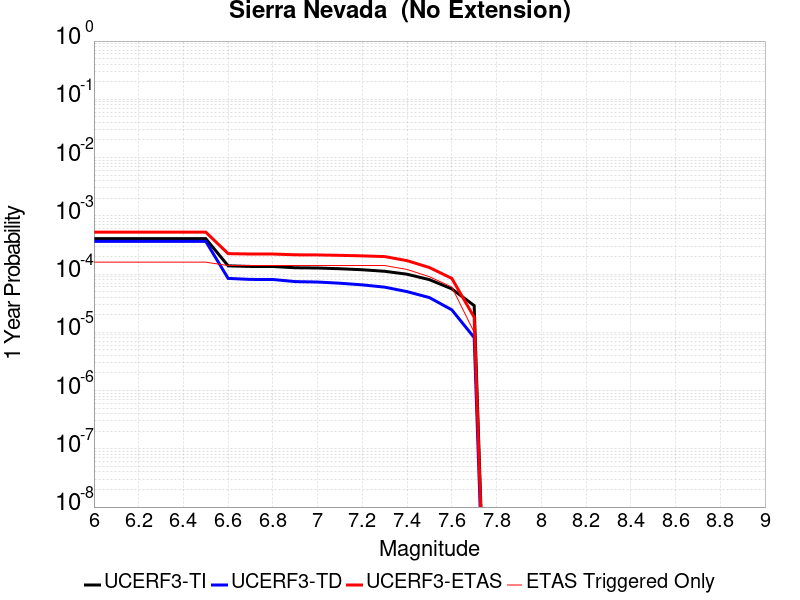 |  |

| Magnitude | 1 wk TI Prob | 1 wk TD Prob | 1 wk ETAS Prob | 1 wk ETAS/TD Gain | 1 wk ETAS Triggered Only | 1 mo TI Prob | 1 mo TD Prob | 1 mo ETAS Prob | 1 mo ETAS/TD Gain | 1 mo ETAS Triggered Only | 1 yr TI Prob | 1 yr TD Prob | 1 yr ETAS Prob | 1 yr ETAS/TD Gain | 1 yr ETAS Triggered Only | 10 yr TI Prob | 10 yr TD Prob | 10 yr ETAS Prob | 10 yr ETAS/TD Gain | 10 yr ETAS Triggered Only |
|-----|-----|-----|-----|-----|-----|-----|-----|-----|-----|-----|-----|-----|-----|-----|-----|-----|-----|-----|-----|-----|
| 6.0 | 7.7690465E-6 | 6.976322E-6 | 1.5964701E-4 | 22.884125 | 1.5267175E-4 | 3.329549E-5 | 2.9898381E-5 | 2.2073237E-4 | 7.3827534 | 1.908397E-4 | 4.0529718E-4 | 3.6398784E-4 | 5.5475807E-4 | 1.5241115 | 1.908397E-4 | 0.004045588 | 0.0036374326 | 0.0038656073 | 1.0627296 | 2.2900764E-4 |
| 6.1 | 7.7690465E-6 | 6.976322E-6 | 1.5964701E-4 | 22.884125 | 1.5267175E-4 | 3.329549E-5 | 2.9898381E-5 | 2.2073237E-4 | 7.3827534 | 1.908397E-4 | 4.0529718E-4 | 3.6398784E-4 | 5.5475807E-4 | 1.5241115 | 1.908397E-4 | 0.004045588 | 0.0036374326 | 0.0038656073 | 1.0627296 | 2.2900764E-4 |
| 6.2 | 7.7690465E-6 | 6.976322E-6 | 1.5964701E-4 | 22.884125 | 1.5267175E-4 | 3.329549E-5 | 2.9898381E-5 | 2.2073237E-4 | 7.3827534 | 1.908397E-4 | 4.0529718E-4 | 3.6398784E-4 | 5.5475807E-4 | 1.5241115 | 1.908397E-4 | 0.004045588 | 0.0036374326 | 0.0038656073 | 1.0627296 | 2.2900764E-4 |
| 6.3 | 7.7690465E-6 | 6.976322E-6 | 1.5964701E-4 | 22.884125 | 1.5267175E-4 | 3.329549E-5 | 2.9898381E-5 | 2.2073237E-4 | 7.3827534 | 1.908397E-4 | 4.0529718E-4 | 3.6398784E-4 | 5.5475807E-4 | 1.5241115 | 1.908397E-4 | 0.004045588 | 0.0036374326 | 0.0038656073 | 1.0627296 | 2.2900764E-4 |
| 6.4 | 7.7690465E-6 | 6.976322E-6 | 1.5964701E-4 | 22.884125 | 1.5267175E-4 | 3.329549E-5 | 2.9898381E-5 | 2.2073237E-4 | 7.3827534 | 1.908397E-4 | 4.0529718E-4 | 3.6398784E-4 | 5.5475807E-4 | 1.5241115 | 1.908397E-4 | 0.004045588 | 0.0036374326 | 0.0038656073 | 1.0627296 | 2.2900764E-4 |
| 6.5 | 7.7690465E-6 | 6.976322E-6 | 1.5964701E-4 | 22.884125 | 1.5267175E-4 | 3.329549E-5 | 2.9898381E-5 | 2.2073237E-4 | 7.3827534 | 1.908397E-4 | 4.0529718E-4 | 3.6398784E-4 | 5.5475807E-4 | 1.5241115 | 1.908397E-4 | 0.004045588 | 0.0036374326 | 0.0038656073 | 1.0627296 | 2.2900764E-4 |
| 6.6 | 2.653E-6 | 1.614854E-6 | 1.16118485E-4 | 71.906494 | 1.1450382E-4 | 1.136995E-5 | 6.9207845E-6 | 1.5959148E-4 | 23.059738 | 1.5267175E-4 | 1.3842035E-4 | 8.425733E-5 | 2.3691622E-4 | 2.8118174 | 1.5267175E-4 | 0.0013833415 | 8.422573E-4 | 9.948005E-4 | 1.1811123 | 1.5267175E-4 |
| 6.7 | 2.5902466E-6 | 1.5501876E-6 | 1.1605383E-4 | 74.86438 | 1.1450382E-4 | 1.11010095E-5 | 6.643644E-6 | 1.5931438E-4 | 23.97997 | 1.5267175E-4 | 1.351464E-4 | 8.0883394E-5 | 2.335428E-4 | 2.887401 | 1.5267175E-4 | 0.0013506424 | 8.0854254E-4 | 9.6109085E-4 | 1.1886708 | 1.5267175E-4 |
| 6.8 | 2.5853892E-6 | 1.5469877E-6 | 1.1605063E-4 | 75.01716 | 1.1450382E-4 | 1.1080193E-5 | 6.629931E-6 | 1.5930067E-4 | 24.027502 | 1.5267175E-4 | 1.34893E-4 | 8.071645E-5 | 2.3337587E-4 | 2.8913052 | 1.5267175E-4 | 0.0013481114 | 8.068743E-4 | 9.5942285E-4 | 1.1890612 | 1.5267175E-4 |
| 6.9 | 2.458257E-6 | 1.4220619E-6 | 1.15925715E-4 | 81.519455 | 1.1450382E-4 | 1.0535345E-5 | 6.094537E-6 | 1.5876537E-4 | 26.050438 | 1.5267175E-4 | 1.2826028E-4 | 7.4198484E-5 | 2.2685892E-4 | 3.0574603 | 1.5267175E-4 | 0.0012818627 | 7.4173906E-4 | 8.9429755E-4 | 1.2056768 | 1.5267175E-4 |
| 7.0 | 2.4341468E-6 | 1.3990258E-6 | 1.1590268E-4 | 82.845276 | 1.1450382E-4 | 1.0432016E-5 | 5.9958115E-6 | 1.5866665E-4 | 26.462915 | 1.5267175E-4 | 1.270024E-4 | 7.2996576E-5 | 2.2565719E-4 | 3.0913393 | 1.5267175E-4 | 0.0012692984 | 7.297279E-4 | 8.8228827E-4 | 1.2090647 | 1.5267175E-4 |
| 7.1 | 2.3652476E-6 | 1.3339754E-6 | 1.1583764E-4 | 86.83641 | 1.1450382E-4 | 1.0136736E-5 | 5.717025E-6 | 1.583879E-4 | 27.704603 | 1.5267175E-4 | 1.2340778E-4 | 6.9602575E-5 | 2.222637E-4 | 3.193326 | 1.5267175E-4 | 0.0012333926 | 6.9580943E-4 | 8.4837497E-4 | 1.2192633 | 1.5267175E-4 |
| 7.2 | 2.272158E-6 | 1.2502821E-6 | 1.1575396E-4 | 92.58227 | 1.1450382E-4 | 9.737784E-6 | 5.3583412E-6 | 1.5802927E-4 | 29.492203 | 1.5267175E-4 | 1.1855107E-4 | 6.5235865E-5 | 2.1789766E-4 | 3.3401513 | 1.5267175E-4 | 0.0011848784 | 6.5216864E-4 | 8.047408E-4 | 1.233946 | 1.5267175E-4 |
| 7.3 | 2.1382127E-6 | 1.1419703E-6 | 1.1564566E-4 | 101.26853 | 1.1450382E-4 | 9.163737E-6 | 4.8941492E-6 | 1.5756515E-4 | 32.194595 | 1.5267175E-4 | 1.1156279E-4 | 5.958465E-5 | 2.1224731E-4 | 3.562114 | 1.5267175E-4 | 0.001115068 | 5.956879E-4 | 7.4826874E-4 | 1.2561421 | 1.5267175E-4 |
| 7.4 | 1.9048055E-6 | 9.575242E-7 | 7.729333E-5 | 80.72206 | 7.633588E-5 | 8.163426E-6 | 4.1036687E-6 | 1.18607015E-4 | 28.902678 | 1.1450382E-4 | 9.9385186E-5 | 4.996103E-5 | 1.6445912E-4 | 3.291748 | 1.1450382E-4 | 9.934074E-4 | 4.994987E-4 | 6.139453E-4 | 1.229123 | 1.1450382E-4 |
| 7.5 | 1.5373403E-6 | 7.560042E-7 | 3.8923914E-5 | 51.48637 | 3.816794E-5 | 6.5885843E-6 | 3.2400142E-6 | 7.957564E-5 | 24.560276 | 7.633588E-5 | 8.021306E-5 | 3.9446462E-5 | 1.1577933E-4 | 2.9351003 | 7.633588E-5 | 8.0184115E-4 | 3.943951E-4 | 4.7070085E-4 | 1.1934755 | 7.633588E-5 |
| 7.6 | 1.0680322E-6 | 4.6596554E-7 | 3.8633887E-5 | 82.91147 | 3.816794E-5 | 4.577273E-6 | 1.9969937E-6 | 7.833272E-5 | 39.225323 | 7.633588E-5 | 5.5726876E-5 | 2.4313129E-5 | 1.0064715E-4 | 4.1396213 | 7.633588E-5 | 5.5712904E-4 | 2.4310495E-4 | 3.1942228E-4 | 1.3139274 | 7.633588E-5 |
| 7.7 | 5.509146E-7 | 1.5580486E-7 | 1.5580486E-7 | 1.0 | 0.0 | 2.3610605E-6 | 6.677349E-7 | 6.677349E-7 | 1.0 | 0.0 | 2.8745531E-5 | 8.129644E-6 | 8.129644E-6 | 1.0 | 0.0 | 2.8741814E-4 | 8.1293576E-5 | 8.1293576E-5 | 1.0 | 0.0 |

## White Wolf (Extension)
*[(top)](#table-of-contents)*

| 1 Week | 1 Month | 1 Year | 10 Year |
|-----|-----|-----|-----|
|  |  |  |  |

| Magnitude | 1 wk TI Prob | 1 wk TD Prob | 1 wk ETAS Prob | 1 wk ETAS/TD Gain | 1 wk ETAS Triggered Only | 1 mo TI Prob | 1 mo TD Prob | 1 mo ETAS Prob | 1 mo ETAS/TD Gain | 1 mo ETAS Triggered Only | 1 yr TI Prob | 1 yr TD Prob | 1 yr ETAS Prob | 1 yr ETAS/TD Gain | 1 yr ETAS Triggered Only | 10 yr TI Prob | 10 yr TD Prob | 10 yr ETAS Prob | 10 yr ETAS/TD Gain | 10 yr ETAS Triggered Only |
|-----|-----|-----|-----|-----|-----|-----|-----|-----|-----|-----|-----|-----|-----|-----|-----|-----|-----|-----|-----|-----|
| 6.0 | 8.222555E-6 | 6.0666657E-6 | 1.969052E-4 | 32.456905 | 1.908397E-4 | 3.5239045E-5 | 2.5999774E-5 | 2.1683451E-4 | 8.339861 | 1.908397E-4 | 4.289509E-4 | 3.1650788E-4 | 5.4544304E-4 | 1.7233157 | 2.2900764E-4 | 0.0042812387 | 0.003161223 | 0.0033895066 | 1.0722138 | 2.2900764E-4 |
| 6.1 | 8.222555E-6 | 6.0666657E-6 | 1.969052E-4 | 32.456905 | 1.908397E-4 | 3.5239045E-5 | 2.5999774E-5 | 2.1683451E-4 | 8.339861 | 1.908397E-4 | 4.289509E-4 | 3.1650788E-4 | 5.4544304E-4 | 1.7233157 | 2.2900764E-4 | 0.0042812387 | 0.003161223 | 0.0033895066 | 1.0722138 | 2.2900764E-4 |
| 6.2 | 8.222555E-6 | 6.0666657E-6 | 1.969052E-4 | 32.456905 | 1.908397E-4 | 3.5239045E-5 | 2.5999774E-5 | 2.1683451E-4 | 8.339861 | 1.908397E-4 | 4.289509E-4 | 3.1650788E-4 | 5.4544304E-4 | 1.7233157 | 2.2900764E-4 | 0.0042812387 | 0.003161223 | 0.0033895066 | 1.0722138 | 2.2900764E-4 |
| 6.3 | 8.222555E-6 | 6.0666657E-6 | 1.969052E-4 | 32.456905 | 1.908397E-4 | 3.5239045E-5 | 2.5999774E-5 | 2.1683451E-4 | 8.339861 | 1.908397E-4 | 4.289509E-4 | 3.1650788E-4 | 5.4544304E-4 | 1.7233157 | 2.2900764E-4 | 0.0042812387 | 0.003161223 | 0.0033895066 | 1.0722138 | 2.2900764E-4 |
| 6.4 | 5.821773E-6 | 3.5571766E-6 | 7.989278E-5 | 22.459606 | 7.633588E-5 | 2.4950215E-5 | 1.5244959E-5 | 9.157967E-5 | 6.0072103 | 7.633588E-5 | 3.0372653E-4 | 1.8559267E-4 | 3.0007525E-4 | 1.6168486 | 1.1450382E-4 | 0.0030331176 | 0.001854485 | 0.0019687766 | 1.0616298 | 1.1450382E-4 |
| 6.5 | 5.766023E-6 | 3.4991106E-6 | 7.9834725E-5 | 22.815718 | 7.633588E-5 | 2.4711293E-5 | 1.4996108E-5 | 9.133084E-5 | 6.090303 | 7.633588E-5 | 3.0081844E-4 | 1.8256342E-4 | 2.9704632E-4 | 1.6270857 | 1.1450382E-4 | 0.0030041158 | 0.0018242426 | 0.0019385376 | 1.0626534 | 1.1450382E-4 |
| 6.6 | 4.643576E-6 | 2.332624E-6 | 4.0500476E-5 | 17.362623 | 3.816794E-5 | 1.9900888E-5 | 9.996925E-6 | 4.8164482E-5 | 4.8179297 | 3.816794E-5 | 2.4226638E-4 | 1.2170619E-4 | 1.5986948E-4 | 1.3135691 | 3.816794E-5 | 0.0024200242 | 0.0012164378 | 0.0012545593 | 1.0313387 | 3.816794E-5 |
| 6.7 | 3.9529173E-6 | 1.6483477E-6 | 3.9816223E-5 | 24.155231 | 3.816794E-5 | 1.6940963E-5 | 7.0643296E-6 | 4.5232E-5 | 6.402872 | 3.816794E-5 | 2.0623671E-4 | 8.6005006E-5 | 1.2416966E-4 | 1.4437492 | 3.816794E-5 | 0.002060454 | 8.597357E-4 | 8.9787086E-4 | 1.0443568 | 3.816794E-5 |
| 6.8 | 3.4377522E-6 | 1.2245237E-6 | 3.9392417E-5 | 32.169582 | 3.816794E-5 | 1.473314E-5 | 5.2479486E-6 | 4.3415686E-5 | 8.272887 | 3.816794E-5 | 1.7936122E-4 | 6.3891996E-5 | 1.0205749E-4 | 1.597344 | 3.816794E-5 | 0.0017921652 | 6.387454E-4 | 6.768889E-4 | 1.0597163 | 3.816794E-5 |
| 6.9 | 3.1367306E-6 | 1.0033783E-6 | 1.0033783E-6 | 1.0 | 0.0 | 1.3443062E-5 | 4.3001864E-6 | 4.3001864E-6 | 1.0 | 0.0 | 1.63657E-4 | 5.235359E-5 | 5.235359E-5 | 1.0 | 0.0 | 0.0016353652 | 5.2342017E-4 | 5.2342017E-4 | 1.0 | 0.0 |
| 7.0 | 2.8298145E-6 | 7.4286646E-7 | 7.4286646E-7 | 1.0 | 0.0 | 1.2127721E-5 | 3.1837099E-6 | 3.1837099E-6 | 1.0 | 0.0 | 1.47645E-4 | 3.8761027E-5 | 3.8761027E-5 | 1.0 | 0.0 | 0.0014754693 | 3.8754768E-4 | 3.8754768E-4 | 1.0 | 0.0 |
| 7.1 | 2.4091064E-6 | 5.4227525E-7 | 5.4227525E-7 | 1.0 | 0.0 | 1.03247E-5 | 2.3240348E-6 | 2.3240348E-6 | 1.0 | 0.0 | 1.2569598E-4 | 2.8294799E-5 | 2.8294799E-5 | 1.0 | 0.0 | 0.001256249 | 2.8291598E-4 | 2.8291598E-4 | 1.0 | 0.0 |
| 7.2 | 1.3875518E-6 | 1.0743063E-7 | 1.0743063E-7 | 1.0 | 0.0 | 5.9466374E-6 | 4.6041689E-7 | 4.6041689E-7 | 1.0 | 0.0 | 7.23979E-5 | 5.6055624E-6 | 5.6055624E-6 | 1.0 | 0.0 | 7.2374323E-4 | 5.6054323E-5 | 5.6054323E-5 | 1.0 | 0.0 |
| 7.3 | 7.056077E-7 | 5.002034E-8 | 5.002034E-8 | 1.0 | 0.0 | 3.0240296E-6 | 2.1437286E-7 | 2.1437286E-7 | 1.0 | 0.0 | 3.681694E-5 | 2.609987E-6 | 2.609987E-6 | 1.0 | 0.0 | 3.681084E-4 | 2.609961E-5 | 2.609961E-5 | 1.0 | 0.0 |
| 7.4 | 5.9334678E-8 | 4.8683537E-9 | 4.8683537E-9 | 1.0 | 0.0 | 2.5429145E-7 | 2.0864372E-8 | 2.0864372E-8 | 1.0 | 0.0 | 3.095994E-6 | 2.5402372E-7 | 2.5402372E-7 | 1.0 | 0.0 | 3.095951E-5 | 2.5402353E-6 | 2.5402353E-6 | 1.0 | 0.0 |

## San Andreas (Big Bend)
*[(top)](#table-of-contents)*

| 1 Week | 1 Month | 1 Year | 10 Year |
|-----|-----|-----|-----|
|  |  |  |  |

| Magnitude | 1 wk TI Prob | 1 wk TD Prob | 1 wk ETAS Prob | 1 wk ETAS/TD Gain | 1 wk ETAS Triggered Only | 1 mo TI Prob | 1 mo TD Prob | 1 mo ETAS Prob | 1 mo ETAS/TD Gain | 1 mo ETAS Triggered Only | 1 yr TI Prob | 1 yr TD Prob | 1 yr ETAS Prob | 1 yr ETAS/TD Gain | 1 yr ETAS Triggered Only | 10 yr TI Prob | 10 yr TD Prob | 10 yr ETAS Prob | 10 yr ETAS/TD Gain | 10 yr ETAS Triggered Only |
|-----|-----|-----|-----|-----|-----|-----|-----|-----|-----|-----|-----|-----|-----|-----|-----|-----|-----|-----|-----|-----|
| 6.0 | 1.0179969E-4 | 2.0072258E-4 | 3.1520342E-4 | 1.5703435 | 1.1450382E-4 | 4.362114E-4 | 8.599571E-4 | 0.0010506327 | 1.2217269 | 1.908397E-4 | 0.0052979486 | 0.010419999 | 0.01060885 | 1.0181239 | 1.908397E-4 | 0.051734097 | 0.10144902 | 0.1016548 | 1.0020283 | 2.2900764E-4 |
| 6.1 | 1.0179969E-4 | 2.0072258E-4 | 3.1520342E-4 | 1.5703435 | 1.1450382E-4 | 4.362114E-4 | 8.599571E-4 | 0.0010506327 | 1.2217269 | 1.908397E-4 | 0.0052979486 | 0.010419999 | 0.01060885 | 1.0181239 | 1.908397E-4 | 0.051734097 | 0.10144902 | 0.1016548 | 1.0020283 | 2.2900764E-4 |
| 6.2 | 1.0179969E-4 | 2.0072258E-4 | 3.1520342E-4 | 1.5703435 | 1.1450382E-4 | 4.362114E-4 | 8.599571E-4 | 0.0010506327 | 1.2217269 | 1.908397E-4 | 0.0052979486 | 0.010419999 | 0.01060885 | 1.0181239 | 1.908397E-4 | 0.051734097 | 0.10144902 | 0.1016548 | 1.0020283 | 2.2900764E-4 |
| 6.3 | 1.0179969E-4 | 2.0072258E-4 | 3.1520342E-4 | 1.5703435 | 1.1450382E-4 | 4.362114E-4 | 8.599571E-4 | 0.0010506327 | 1.2217269 | 1.908397E-4 | 0.0052979486 | 0.010419999 | 0.01060885 | 1.0181239 | 1.908397E-4 | 0.051734097 | 0.10144902 | 0.1016548 | 1.0020283 | 2.2900764E-4 |
| 6.4 | 9.1639464E-5 | 1.8429532E-4 | 2.9877803E-4 | 1.6211916 | 1.1450382E-4 | 3.9268145E-4 | 7.895982E-4 | 9.4214943E-4 | 1.1932011 | 1.5267175E-4 | 0.0047704205 | 0.009571102 | 0.009722313 | 1.0157987 | 1.5267175E-4 | 0.046693064 | 0.09377527 | 0.093948215 | 1.0018443 | 1.908397E-4 |
| 6.5 | 9.1639464E-5 | 1.8429532E-4 | 2.9877803E-4 | 1.6211916 | 1.1450382E-4 | 3.9268145E-4 | 7.895982E-4 | 9.4214943E-4 | 1.1932011 | 1.5267175E-4 | 0.0047704205 | 0.009571102 | 0.009722313 | 1.0157987 | 1.5267175E-4 | 0.046693064 | 0.09377527 | 0.093948215 | 1.0018443 | 1.908397E-4 |
| 6.6 | 9.042622E-5 | 1.823659E-4 | 2.9684883E-4 | 1.627765 | 1.1450382E-4 | 3.8748336E-4 | 7.8133424E-4 | 9.3388674E-4 | 1.1952461 | 1.5267175E-4 | 0.0047074095 | 0.009471365 | 0.009622591 | 1.0159667 | 1.5267175E-4 | 0.046089325 | 0.092869274 | 0.093042396 | 1.0018641 | 1.908397E-4 |
| 6.7 | 8.9836685E-5 | 1.8150927E-4 | 2.578313E-4 | 1.4204855 | 7.633588E-5 | 3.8495753E-4 | 7.776651E-4 | 8.920799E-4 | 1.147126 | 1.1450382E-4 | 0.00467679 | 0.00942708 | 0.009540505 | 1.0120318 | 1.1450382E-4 | 0.045795817 | 0.09246355 | 0.092602104 | 1.0014985 | 1.5267175E-4 |
| 6.8 | 8.9471854E-5 | 1.8097709E-4 | 2.5729917E-4 | 1.4217223 | 7.633588E-5 | 3.8339442E-4 | 7.7538576E-4 | 8.898008E-4 | 1.1475588 | 1.1450382E-4 | 0.004657841 | 0.009399569 | 0.009512996 | 1.0120673 | 1.1450382E-4 | 0.04561414 | 0.092210755 | 0.09234935 | 1.001503 | 1.5267175E-4 |
| 6.9 | 8.858234E-5 | 1.7979681E-4 | 2.5611898E-4 | 1.4244912 | 7.633588E-5 | 3.7958333E-4 | 7.703304E-4 | 8.84746E-4 | 1.148528 | 1.1450382E-4 | 0.004611638 | 0.009338548 | 0.0094519835 | 1.012147 | 1.1450382E-4 | 0.04517103 | 0.09165087 | 0.09178955 | 1.0015131 | 1.5267175E-4 |
| 7.0 | 8.7433385E-5 | 1.7818481E-4 | 2.545071E-4 | 1.4283321 | 7.633588E-5 | 3.746607E-4 | 7.634259E-4 | 8.778423E-4 | 1.1498723 | 1.1450382E-4 | 0.004551957 | 0.009255203 | 0.009368647 | 1.0122573 | 1.1450382E-4 | 0.044598386 | 0.09088532 | 0.091024116 | 1.0015272 | 1.5267175E-4 |
| 7.1 | 8.684964E-5 | 1.7730435E-4 | 2.536267E-4 | 1.4304595 | 7.633588E-5 | 3.7215967E-4 | 7.596547E-4 | 8.740715E-4 | 1.1506169 | 1.1450382E-4 | 0.0045216335 | 0.009209678 | 0.009323127 | 1.0123185 | 1.1450382E-4 | 0.04430731 | 0.09046686 | 0.09060572 | 1.0015349 | 1.5267175E-4 |
| 7.2 | 8.606521E-5 | 1.762105E-4 | 2.5253292E-4 | 1.433132 | 7.633588E-5 | 3.6879873E-4 | 7.549695E-4 | 8.693869E-4 | 1.1515523 | 1.1450382E-4 | 0.0044808835 | 0.0091531165 | 0.009266572 | 1.0123953 | 1.1450382E-4 | 0.043916024 | 0.089947365 | 0.09008631 | 1.0015447 | 1.5267175E-4 |
| 7.3 | 8.568266E-5 | 1.7563057E-4 | 2.5195302E-4 | 1.4345626 | 7.633588E-5 | 3.6715972E-4 | 7.524855E-4 | 8.6690317E-4 | 1.152053 | 1.1450382E-4 | 0.0044610105 | 0.009123127 | 0.009236586 | 1.0124364 | 1.1450382E-4 | 0.043725148 | 0.08966853 | 0.08980751 | 1.00155 | 1.5267175E-4 |
| 7.4 | 8.5432206E-5 | 1.7525644E-4 | 2.5157895E-4 | 1.4354904 | 7.633588E-5 | 3.6608664E-4 | 7.50883E-4 | 8.653009E-4 | 1.1523777 | 1.1450382E-4 | 0.004447999 | 0.009103781 | 0.009217242 | 1.0124631 | 1.1450382E-4 | 0.043600157 | 0.08948871 | 0.08962772 | 1.0015534 | 1.5267175E-4 |
| 7.5 | 8.4791965E-5 | 1.7394972E-4 | 2.5027234E-4 | 1.4387624 | 7.633588E-5 | 3.633435E-4 | 7.4528606E-4 | 8.597045E-4 | 1.1535228 | 1.1450382E-4 | 0.0044147377 | 0.009036204 | 0.009149673 | 1.0125571 | 1.1450382E-4 | 0.043280575 | 0.088866346 | 0.08900545 | 1.0015653 | 1.5267175E-4 |
| 7.6 | 8.241105E-5 | 1.6840403E-4 | 2.4472707E-4 | 1.4532137 | 7.633588E-5 | 3.531424E-4 | 7.215321E-4 | 8.3595334E-4 | 1.1585809 | 1.1450382E-4 | 0.0042910352 | 0.008749358 | 0.0088628605 | 1.0129726 | 1.1450382E-4 | 0.042091176 | 0.086243294 | 0.0863828 | 1.0016176 | 1.5267175E-4 |
| 7.7 | 7.00432E-5 | 1.42045E-4 | 2.1837004E-4 | 1.5373299 | 7.633588E-5 | 3.001506E-4 | 6.0862233E-4 | 6.8491173E-4 | 1.1253477 | 7.633588E-5 | 0.0036482112 | 0.0073848404 | 0.0074606123 | 1.0102605 | 7.633588E-5 | 0.035888977 | 0.07351733 | 0.07362342 | 1.001443 | 1.1450382E-4 |
| 7.8 | 6.415362E-5 | 1.2968935E-4 | 2.0601532E-4 | 1.5885293 | 7.633588E-5 | 2.749151E-4 | 5.556931E-4 | 6.3198654E-4 | 1.1372943 | 7.633588E-5 | 0.0033419547 | 0.0067446055 | 0.006820427 | 1.0112417 | 7.633588E-5 | 0.03292141 | 0.06725231 | 0.067323506 | 1.0010587 | 7.633588E-5 |
| 7.9 | 4.939911E-5 | 9.3411545E-5 | 1.6974029E-4 | 1.8171233 | 7.633588E-5 | 2.116933E-4 | 4.0027377E-4 | 4.765791E-4 | 1.1906328 | 7.633588E-5 | 0.0025743195 | 0.004862453 | 0.0049384176 | 1.0156227 | 7.633588E-5 | 0.025447013 | 0.048914436 | 0.04898704 | 1.0014843 | 7.633588E-5 |
| 8.0 | 3.344983E-5 | 5.222685E-5 | 5.222685E-5 | 1.0 | 0.0 | 1.4334853E-4 | 2.2381016E-4 | 2.2381016E-4 | 1.0 | 0.0 | 0.0017438711 | 0.0027214854 | 0.0027214854 | 1.0 | 0.0 | 0.017302496 | 0.027922187 | 0.027922187 | 1.0 | 0.0 |
| 8.1 | 1.9104898E-5 | 1.9173063E-5 | 1.9173063E-5 | 1.0 | 0.0 | 8.1875565E-5 | 8.216769E-5 | 8.216769E-5 | 1.0 | 0.0 | 9.963791E-4 | 9.999331E-4 | 9.999331E-4 | 1.0 | 0.0 | 0.009919235 | 0.010749801 | 0.010749801 | 1.0 | 0.0 |
| 8.2 | 8.643924E-6 | 5.4748625E-6 | 5.4748625E-6 | 1.0 | 0.0 | 3.704486E-5 | 2.3463486E-5 | 2.3463486E-5 | 1.0 | 0.0 | 4.5092785E-4 | 2.8563058E-4 | 2.8563058E-4 | 1.0 | 0.0 | 0.0045001395 | 0.0032487072 | 0.0032487072 | 1.0 | 0.0 |
| 8.3 | 1.983087E-6 | 7.6599065E-7 | 7.6599065E-7 | 1.0 | 0.0 | 8.498917E-6 | 3.282813E-6 | 3.282813E-6 | 1.0 | 0.0 | 1.034694E-4 | 3.9967534E-5 | 3.9967534E-5 | 1.0 | 0.0 | 0.0010342124 | 4.719687E-4 | 4.719687E-4 | 1.0 | 0.0 |

## San Andreas (San Gorgonio Pass-Garnet HIll)
*[(top)](#table-of-contents)*

| 1 Week | 1 Month | 1 Year | 10 Year |
|-----|-----|-----|-----|
| 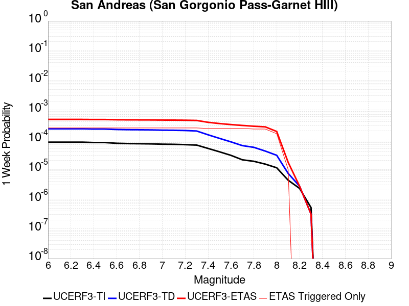 |  |  |  |

| Magnitude | 1 wk TI Prob | 1 wk TD Prob | 1 wk ETAS Prob | 1 wk ETAS/TD Gain | 1 wk ETAS Triggered Only | 1 mo TI Prob | 1 mo TD Prob | 1 mo ETAS Prob | 1 mo ETAS/TD Gain | 1 mo ETAS Triggered Only | 1 yr TI Prob | 1 yr TD Prob | 1 yr ETAS Prob | 1 yr ETAS/TD Gain | 1 yr ETAS Triggered Only | 10 yr TI Prob | 10 yr TD Prob | 10 yr ETAS Prob | 10 yr ETAS/TD Gain | 10 yr ETAS Triggered Only |
|-----|-----|-----|-----|-----|-----|-----|-----|-----|-----|-----|-----|-----|-----|-----|-----|-----|-----|-----|-----|-----|
| 6.0 | 8.31567E-5 | 2.3382473E-4 | 4.246198E-4 | 1.8159747 | 1.908397E-4 | 3.5633717E-4 | 0.0010017233 | 0.001192372 | 1.1903205 | 1.908397E-4 | 0.004329778 | 0.012127888 | 0.012316414 | 1.0155448 | 1.908397E-4 | 0.042463828 | 0.11257892 | 0.11278214 | 1.0018052 | 2.2900764E-4 |
| 6.1 | 8.31567E-5 | 2.3382473E-4 | 4.246198E-4 | 1.8159747 | 1.908397E-4 | 3.5633717E-4 | 0.0010017233 | 0.001192372 | 1.1903205 | 1.908397E-4 | 0.004329778 | 0.012127888 | 0.012316414 | 1.0155448 | 1.908397E-4 | 0.042463828 | 0.11257892 | 0.11278214 | 1.0018052 | 2.2900764E-4 |
| 6.2 | 8.31567E-5 | 2.3382473E-4 | 4.246198E-4 | 1.8159747 | 1.908397E-4 | 3.5633717E-4 | 0.0010017233 | 0.001192372 | 1.1903205 | 1.908397E-4 | 0.004329778 | 0.012127888 | 0.012316414 | 1.0155448 | 1.908397E-4 | 0.042463828 | 0.11257892 | 0.11278214 | 1.0018052 | 2.2900764E-4 |
| 6.3 | 8.31567E-5 | 2.3382473E-4 | 4.246198E-4 | 1.8159747 | 1.908397E-4 | 3.5633717E-4 | 0.0010017233 | 0.001192372 | 1.1903205 | 1.908397E-4 | 0.004329778 | 0.012127888 | 0.012316414 | 1.0155448 | 1.908397E-4 | 0.042463828 | 0.11257892 | 0.11278214 | 1.0018052 | 2.2900764E-4 |
| 6.4 | 8.059055E-5 | 2.2940808E-4 | 4.2020399E-4 | 1.8316878 | 1.908397E-4 | 3.4534236E-4 | 9.828096E-4 | 0.0011734617 | 1.1939869 | 1.908397E-4 | 0.0041964394 | 0.011900152 | 0.012088721 | 1.0158459 | 1.908397E-4 | 0.041180745 | 0.11056015 | 0.11076383 | 1.0018424 | 2.2900764E-4 |
| 6.5 | 8.059055E-5 | 2.2940808E-4 | 4.2020399E-4 | 1.8316878 | 1.908397E-4 | 3.4534236E-4 | 9.828096E-4 | 0.0011734617 | 1.1939869 | 1.908397E-4 | 0.0041964394 | 0.011900152 | 0.012088721 | 1.0158459 | 1.908397E-4 | 0.041180745 | 0.11056015 | 0.11076383 | 1.0018424 | 2.2900764E-4 |
| 6.6 | 7.619237E-5 | 2.218517E-4 | 4.1264907E-4 | 1.8600221 | 1.908397E-4 | 3.2649786E-4 | 9.5044886E-4 | 0.0011411072 | 1.2005981 | 1.908397E-4 | 0.0039678677 | 0.01151087 | 0.0116995135 | 1.0163883 | 1.908397E-4 | 0.03897764 | 0.10709683 | 0.10730131 | 1.0019093 | 2.2900764E-4 |
| 6.7 | 7.440636E-5 | 2.1860997E-4 | 4.0940795E-4 | 1.872778 | 1.908397E-4 | 3.188454E-4 | 9.3656575E-4 | 0.0011272267 | 1.2035745 | 1.908397E-4 | 0.0038750346 | 0.011343609 | 0.011532283 | 1.0166327 | 1.908397E-4 | 0.038081564 | 0.105605274 | 0.1058101 | 1.0019395 | 2.2900764E-4 |
| 6.8 | 7.3735864E-5 | 2.1708169E-4 | 4.0787994E-4 | 1.8789238 | 1.908397E-4 | 3.1597257E-4 | 9.3002064E-4 | 0.0011206828 | 1.2050086 | 1.908397E-4 | 0.0038401815 | 0.011264749 | 0.011453439 | 1.0167505 | 1.908397E-4 | 0.03774495 | 0.10490683 | 0.10511181 | 1.001954 | 2.2900764E-4 |
| 6.9 | 7.27575E-5 | 2.1477141E-4 | 4.055701E-4 | 1.8883804 | 1.908397E-4 | 3.117806E-4 | 9.201265E-4 | 0.0011107906 | 1.2072151 | 1.908397E-4 | 0.003789323 | 0.011145527 | 0.011334239 | 1.0169317 | 1.908397E-4 | 0.037253562 | 0.103854746 | 0.104059964 | 1.001976 | 2.2900764E-4 |
| 7.0 | 7.102591E-5 | 2.1061185E-4 | 4.0141135E-4 | 1.9059296 | 1.908397E-4 | 3.0436125E-4 | 9.023122E-4 | 0.0010929797 | 1.2113099 | 1.908397E-4 | 0.003699303 | 0.010930831 | 0.011119585 | 1.0172681 | 1.908397E-4 | 0.03638325 | 0.10195695 | 0.10216261 | 1.0020171 | 2.2900764E-4 |
| 7.1 | 7.028513E-5 | 2.0896831E-4 | 3.9976812E-4 | 1.9130563 | 1.908397E-4 | 3.0118722E-4 | 8.9527335E-4 | 0.0010859421 | 1.2129728 | 1.908397E-4 | 0.0036607897 | 0.010845989 | 0.011034759 | 1.0174046 | 1.908397E-4 | 0.036010686 | 0.101199985 | 0.101405814 | 1.002034 | 2.2900764E-4 |
| 7.2 | 6.8498244E-5 | 2.0504706E-4 | 3.9584763E-4 | 1.9305208 | 1.908397E-4 | 2.9353087E-4 | 8.784794E-4 | 0.0010691514 | 1.2170478 | 1.908397E-4 | 0.003567883 | 0.010643536 | 0.010832344 | 1.0177393 | 1.908397E-4 | 0.035111405 | 0.09939202 | 0.099598266 | 1.0020751 | 2.2900764E-4 |
| 7.3 | 6.622592E-5 | 1.9732013E-4 | 3.8812216E-4 | 1.966967 | 1.908397E-4 | 2.8379448E-4 | 8.453858E-4 | 0.0010360641 | 1.2255518 | 1.908397E-4 | 0.0034497243 | 0.0102444785 | 0.010433364 | 1.0184377 | 1.908397E-4 | 0.033966612 | 0.095888525 | 0.09609558 | 1.0021592 | 2.2900764E-4 |
| 7.4 | 5.1050705E-5 | 1.4689034E-4 | 3.37702E-4 | 2.2990077 | 1.908397E-4 | 2.1877038E-4 | 6.29379E-4 | 8.2009856E-4 | 1.3030282 | 1.908397E-4 | 0.002660276 | 0.0076359594 | 0.007825342 | 1.0248014 | 1.908397E-4 | 0.02628654 | 0.07286301 | 0.07307534 | 1.002914 | 2.2900764E-4 |
| 7.5 | 3.9302922E-5 | 1.1129847E-4 | 3.021169E-4 | 2.7144752 | 1.908397E-4 | 1.6843023E-4 | 4.7690657E-4 | 6.6765526E-4 | 1.3999708 | 1.908397E-4 | 0.0020487092 | 0.005790949 | 0.0059806835 | 1.032764 | 1.908397E-4 | 0.020299247 | 0.05600951 | 0.05622569 | 1.0038598 | 2.2900764E-4 |
| 7.6 | 2.9851626E-5 | 8.4949745E-5 | 2.7577323E-4 | 3.2463102 | 1.908397E-4 | 1.2792926E-4 | 3.6401965E-4 | 5.5478985E-4 | 1.5240657 | 1.908397E-4 | 0.0015564259 | 0.0044229585 | 0.004612954 | 1.0429567 | 1.908397E-4 | 0.0154556995 | 0.04319374 | 0.043412853 | 1.0050728 | 2.2900764E-4 |
| 7.7 | 2.1135214E-5 | 6.3529005E-5 | 2.5435656E-4 | 4.0037866 | 1.908397E-4 | 9.0576345E-5 | 2.7223877E-4 | 4.6302652E-4 | 1.7008103 | 1.908397E-4 | 0.0011022091 | 0.0033094748 | 0.003499683 | 1.0574738 | 1.908397E-4 | 0.010967582 | 0.032582592 | 0.03280414 | 1.0067996 | 2.2900764E-4 |
| 7.8 | 1.883379E-5 | 5.564028E-5 | 2.0830354E-4 | 3.7437544 | 1.5267175E-4 | 8.0713755E-5 | 2.3843657E-4 | 3.9107192E-4 | 1.6401508 | 1.5267175E-4 | 9.822468E-4 | 0.0028991038 | 0.0030513331 | 1.0525091 | 1.5267175E-4 | 0.0097791655 | 0.028695205 | 0.02888057 | 1.0064597 | 1.908397E-4 |
| 7.9 | 1.5156185E-5 | 4.1658426E-5 | 1.9432382E-4 | 4.6646943 | 1.5267175E-4 | 6.495346E-5 | 1.785239E-4 | 3.311684E-4 | 1.8550367 | 1.5267175E-4 | 7.9052144E-4 | 0.0021713632 | 0.0023237034 | 1.0701588 | 1.5267175E-4 | 0.007877152 | 0.021759422 | 0.02194611 | 1.0085796 | 1.908397E-4 |
| 8.0 | 1.1405907E-5 | 2.9974231E-5 | 1.4447462E-4 | 4.8199606 | 1.1450382E-4 | 4.8881542E-5 | 1.2845467E-4 | 2.4294377E-4 | 1.8912802 | 1.1450382E-4 | 5.9497025E-4 | 0.0015628147 | 0.0016771395 | 1.0731531 | 1.1450382E-4 | 0.005933798 | 0.015772851 | 0.015885549 | 1.007145 | 1.1450382E-4 |
| 8.1 | 4.3511436E-6 | 7.369219E-6 | 7.369219E-6 | 1.0 | 0.0 | 1.8647626E-5 | 3.1581985E-5 | 3.1581985E-5 | 1.0 | 0.0 | 2.2701119E-4 | 3.8444297E-4 | 3.8444297E-4 | 1.0 | 0.0 | 0.0022677942 | 0.0041163345 | 0.0041163345 | 1.0 | 0.0 |
| 8.2 | 2.3042528E-6 | 2.7329415E-6 | 2.7329415E-6 | 1.0 | 0.0 | 9.875332E-6 | 1.1712554E-5 | 1.1712554E-5 | 1.0 | 0.0 | 1.2022553E-4 | 1.4259106E-4 | 1.4259106E-4 | 1.0 | 0.0 | 0.0012016051 | 0.0015979785 | 0.0015979785 | 1.0 | 0.0 |
| 8.3 | 5.202968E-7 | 3.1598344E-7 | 3.1598344E-7 | 1.0 | 0.0 | 2.2298414E-6 | 1.3542141E-6 | 1.3542141E-6 | 1.0 | 0.0 | 2.714798E-5 | 1.6487444E-5 | 1.6487444E-5 | 1.0 | 0.0 | 2.7144665E-4 | 1.9563142E-4 | 1.9563142E-4 | 1.0 | 0.0 |

## San Andreas (Coachella) rev
*[(top)](#table-of-contents)*

| 1 Week | 1 Month | 1 Year | 10 Year |
|-----|-----|-----|-----|
|  |  |  |  |

| Magnitude | 1 wk TI Prob | 1 wk TD Prob | 1 wk ETAS Prob | 1 wk ETAS/TD Gain | 1 wk ETAS Triggered Only | 1 mo TI Prob | 1 mo TD Prob | 1 mo ETAS Prob | 1 mo ETAS/TD Gain | 1 mo ETAS Triggered Only | 1 yr TI Prob | 1 yr TD Prob | 1 yr ETAS Prob | 1 yr ETAS/TD Gain | 1 yr ETAS Triggered Only | 10 yr TI Prob | 10 yr TD Prob | 10 yr ETAS Prob | 10 yr ETAS/TD Gain | 10 yr ETAS Triggered Only |
|-----|-----|-----|-----|-----|-----|-----|-----|-----|-----|-----|-----|-----|-----|-----|-----|-----|-----|-----|-----|-----|
| 6.0 | 1.1925945E-4 | 3.2729402E-4 | 5.1807123E-4 | 1.5828925 | 1.908397E-4 | 5.110118E-4 | 0.0014019393 | 0.0015925114 | 1.1359347 | 1.908397E-4 | 0.0062038354 | 0.016936364 | 0.017123971 | 1.0110772 | 1.908397E-4 | 0.060334753 | 0.15265316 | 0.15281487 | 1.0010593 | 1.908397E-4 |
| 6.1 | 1.1925945E-4 | 3.2729402E-4 | 5.1807123E-4 | 1.5828925 | 1.908397E-4 | 5.110118E-4 | 0.0014019393 | 0.0015925114 | 1.1359347 | 1.908397E-4 | 0.0062038354 | 0.016936364 | 0.017123971 | 1.0110772 | 1.908397E-4 | 0.060334753 | 0.15265316 | 0.15281487 | 1.0010593 | 1.908397E-4 |
| 6.2 | 1.07432395E-4 | 3.0230157E-4 | 4.9308356E-4 | 1.6310983 | 1.908397E-4 | 4.603433E-4 | 0.0012949388 | 0.0014855315 | 1.1471827 | 1.908397E-4 | 0.005590286 | 0.015653009 | 0.01584086 | 1.012001 | 1.908397E-4 | 0.05451731 | 0.14182423 | 0.14198801 | 1.0011548 | 1.908397E-4 |
| 6.3 | 1.0718766E-4 | 3.0175463E-4 | 4.9253675E-4 | 1.6322426 | 1.908397E-4 | 4.592948E-4 | 0.0012925972 | 0.0014831901 | 1.1474496 | 1.908397E-4 | 0.005577586 | 0.015624908 | 0.015812766 | 1.012023 | 1.908397E-4 | 0.054396555 | 0.14159249 | 0.14175631 | 1.0011569 | 1.908397E-4 |
| 6.4 | 1.0355944E-4 | 2.9383553E-4 | 4.8461914E-4 | 1.6492871 | 1.908397E-4 | 4.4375064E-4 | 0.0012586913 | 0.0014492908 | 1.1514267 | 1.908397E-4 | 0.0053892885 | 0.015217941 | 0.0154058775 | 1.0123496 | 1.908397E-4 | 0.052604496 | 0.13815255 | 0.13831703 | 1.0011905 | 1.908397E-4 |
| 6.5 | 1.0227914E-4 | 2.9102986E-4 | 4.8181403E-4 | 1.6555483 | 1.908397E-4 | 4.382655E-4 | 0.0012466786 | 0.0014372804 | 1.1528877 | 1.908397E-4 | 0.0053228354 | 0.01507372 | 0.015261684 | 1.0124695 | 1.908397E-4 | 0.051971316 | 0.13693172 | 0.13709643 | 1.0012028 | 1.908397E-4 |
| 6.6 | 1.0116757E-4 | 2.8868738E-4 | 4.79472E-4 | 1.6608692 | 1.908397E-4 | 4.3350324E-4 | 0.0012366489 | 0.0014272527 | 1.1541291 | 1.908397E-4 | 0.0052651367 | 0.01495329 | 0.015141277 | 1.0125716 | 1.908397E-4 | 0.051421247 | 0.1359099 | 0.1360748 | 1.0012133 | 1.908397E-4 |
| 6.7 | 1.0050676E-4 | 2.8727303E-4 | 4.780579E-4 | 1.6641239 | 1.908397E-4 | 4.3067214E-4 | 0.0012305931 | 0.0014211979 | 1.1548886 | 1.908397E-4 | 0.005230834 | 0.014880571 | 0.01506857 | 1.0126339 | 1.908397E-4 | 0.051094085 | 0.13529462 | 0.13545965 | 1.0012197 | 1.908397E-4 |
| 6.8 | 9.976819E-5 | 2.853096E-4 | 4.7609484E-4 | 1.6686956 | 1.908397E-4 | 4.2750788E-4 | 0.0012221863 | 0.0014127927 | 1.1559553 | 1.908397E-4 | 0.0051924936 | 0.0147796115 | 0.014967631 | 1.0127215 | 1.908397E-4 | 0.050728295 | 0.13444631 | 0.13461149 | 1.0012286 | 1.908397E-4 |
| 6.9 | 9.77719E-5 | 2.8027873E-4 | 4.7106494E-4 | 1.6807016 | 1.908397E-4 | 4.1895514E-4 | 0.0012006456 | 0.0013912561 | 1.1587567 | 1.908397E-4 | 0.0050888555 | 0.014520878 | 0.014708946 | 1.0129516 | 1.908397E-4 | 0.049738888 | 0.1322748 | 0.1324404 | 1.0012519 | 1.908397E-4 |
| 7.0 | 8.500761E-5 | 2.4762485E-4 | 4.384173E-4 | 1.7704898 | 1.908397E-4 | 3.6426744E-4 | 0.001060821 | 0.0012514582 | 1.1797073 | 1.908397E-4 | 0.0044259406 | 0.012839786 | 0.013028175 | 1.0146723 | 1.908397E-4 | 0.04338823 | 0.11813272 | 0.11830102 | 1.0014247 | 1.908397E-4 |
| 7.1 | 8.319876E-5 | 2.4365232E-4 | 4.344455E-4 | 1.7830551 | 1.908397E-4 | 3.5651738E-4 | 0.0010438096 | 0.00123445 | 1.1826391 | 1.908397E-4 | 0.004331963 | 0.012635092 | 0.012823521 | 1.0149131 | 1.908397E-4 | 0.042484846 | 0.116353 | 0.116521634 | 1.0014493 | 1.908397E-4 |
| 7.2 | 7.563917E-5 | 2.2413683E-4 | 4.1493375E-4 | 1.851252 | 1.908397E-4 | 3.2412758E-4 | 9.602359E-4 | 0.0011508923 | 1.1985517 | 1.908397E-4 | 0.0039391145 | 0.011628893 | 0.011817514 | 1.01622 | 1.908397E-4 | 0.03870018 | 0.10775925 | 0.10792952 | 1.0015801 | 1.908397E-4 |
| 7.3 | 7.082985E-5 | 2.0729867E-4 | 3.980988E-4 | 1.9204117 | 1.908397E-4 | 3.0352117E-4 | 8.881233E-4 | 0.0010787934 | 1.2146889 | 1.908397E-4 | 0.0036891096 | 0.010759917 | 0.010948704 | 1.0175453 | 1.908397E-4 | 0.03628465 | 0.100282 | 0.100453705 | 1.0017122 | 1.908397E-4 |
| 7.4 | 5.146215E-5 | 1.4273795E-4 | 3.335504E-4 | 2.3368027 | 1.908397E-4 | 2.2053342E-4 | 6.115915E-4 | 8.023145E-4 | 1.311847 | 1.908397E-4 | 0.0026816884 | 0.0074208933 | 0.007610317 | 1.0255257 | 1.908397E-4 | 0.02649557 | 0.070849575 | 0.0710269 | 1.0025028 | 1.908397E-4 |
| 7.5 | 4.0285166E-5 | 1.09416E-4 | 3.0023482E-4 | 2.7439754 | 1.908397E-4 | 1.7263928E-4 | 4.6884175E-4 | 6.59592E-4 | 1.4068542 | 1.908397E-4 | 0.002099857 | 0.0056932783 | 0.0058830315 | 1.0333294 | 1.908397E-4 | 0.020801254 | 0.055011146 | 0.055191487 | 1.0032783 | 1.908397E-4 |
| 7.6 | 3.1168736E-5 | 8.4389096E-5 | 2.752127E-4 | 3.2612352 | 1.908397E-4 | 1.3357346E-4 | 3.6161754E-4 | 5.5238826E-4 | 1.5275482 | 1.908397E-4 | 0.0016250437 | 0.0043938323 | 0.0045838337 | 1.0432427 | 1.908397E-4 | 0.016132116 | 0.04281005 | 0.04299272 | 1.004267 | 1.908397E-4 |
| 7.7 | 2.2100989E-5 | 6.238755E-5 | 2.5321534E-4 | 4.058748 | 1.908397E-4 | 9.4715084E-5 | 2.6734784E-4 | 4.5813652E-4 | 1.7136346 | 1.908397E-4 | 0.001152546 | 0.0032501083 | 0.0034403277 | 1.0585271 | 1.908397E-4 | 0.011465867 | 0.0319002 | 0.032084953 | 1.0057915 | 1.908397E-4 |
| 7.8 | 1.7484861E-5 | 5.179572E-5 | 2.0445956E-4 | 3.947422 | 1.5267175E-4 | 7.493296E-5 | 2.2196278E-4 | 3.7460064E-4 | 1.6876732 | 1.5267175E-4 | 9.1192697E-4 | 0.0026990508 | 0.0028513104 | 1.0564123 | 1.5267175E-4 | 0.009081938 | 0.026640115 | 0.02678872 | 1.0055783 | 1.5267175E-4 |
| 7.9 | 1.3967285E-5 | 3.822255E-5 | 1.9088847E-4 | 4.994132 | 1.5267175E-4 | 5.985842E-5 | 1.6380067E-4 | 3.164474E-4 | 1.9319056 | 1.5267175E-4 | 7.2853256E-4 | 0.00199245 | 0.0021448177 | 1.0764724 | 1.5267175E-4 | 0.0072614877 | 0.019909438 | 0.02005907 | 1.0075157 | 1.5267175E-4 |
| 8.0 | 1.1887396E-5 | 3.106521E-5 | 1.4556547E-4 | 4.6858034 | 1.1450382E-4 | 5.094499E-5 | 1.3312983E-4 | 2.476184E-4 | 1.8599769 | 1.1450382E-4 | 6.200787E-4 | 0.0016196516 | 0.0017339699 | 1.070582 | 1.1450382E-4 | 0.006183513 | 0.016279267 | 0.016391907 | 1.0069193 | 1.1450382E-4 |
| 8.1 | 5.100864E-6 | 8.973418E-6 | 8.973418E-6 | 1.0 | 0.0 | 2.1860664E-5 | 3.8456936E-5 | 3.8456936E-5 | 1.0 | 0.0 | 2.6612106E-4 | 4.6811273E-4 | 4.6811273E-4 | 1.0 | 0.0 | 0.002658026 | 0.004917731 | 0.004917731 | 1.0 | 0.0 |
| 8.2 | 2.3004484E-6 | 2.7864487E-6 | 2.7864487E-6 | 1.0 | 0.0 | 9.859027E-6 | 1.1941868E-5 | 1.1941868E-5 | 1.0 | 0.0 | 1.2002704E-4 | 1.4538258E-4 | 1.4538258E-4 | 1.0 | 0.0 | 0.0011996223 | 0.0015973912 | 0.0015973912 | 1.0 | 0.0 |
| 8.3 | 1.0424446E-7 | 5.8161504E-8 | 5.8161504E-8 | 1.0 | 0.0 | 4.4676187E-7 | 2.4926356E-7 | 2.4926356E-7 | 1.0 | 0.0 | 5.439312E-6 | 3.03478E-6 | 3.03478E-6 | 1.0 | 0.0 | 5.4391792E-5 | 3.190716E-5 | 3.190716E-5 | 1.0 | 0.0 |

## Elsinore (Glen Ivy) rev
*[(top)](#table-of-contents)*

| 1 Week | 1 Month | 1 Year | 10 Year |
|-----|-----|-----|-----|
|  |  |  |  |

| Magnitude | 1 wk TI Prob | 1 wk TD Prob | 1 wk ETAS Prob | 1 wk ETAS/TD Gain | 1 wk ETAS Triggered Only | 1 mo TI Prob | 1 mo TD Prob | 1 mo ETAS Prob | 1 mo ETAS/TD Gain | 1 mo ETAS Triggered Only | 1 yr TI Prob | 1 yr TD Prob | 1 yr ETAS Prob | 1 yr ETAS/TD Gain | 1 yr ETAS Triggered Only | 10 yr TI Prob | 10 yr TD Prob | 10 yr ETAS Prob | 10 yr ETAS/TD Gain | 10 yr ETAS Triggered Only |
|-----|-----|-----|-----|-----|-----|-----|-----|-----|-----|-----|-----|-----|-----|-----|-----|-----|-----|-----|-----|-----|
| 6.0 | 1.6204086E-4 | 2.9360707E-4 | 4.0807726E-4 | 1.3898755 | 1.1450382E-4 | 6.94276E-4 | 0.0012578638 | 0.0013722236 | 1.0909159 | 1.1450382E-4 | 0.008420097 | 0.015234485 | 0.015384831 | 1.0098687 | 1.5267175E-4 | 0.081081145 | 0.13969168 | 0.13985586 | 1.0011753 | 1.908397E-4 |
| 6.1 | 1.6204086E-4 | 2.9360707E-4 | 4.0807726E-4 | 1.3898755 | 1.1450382E-4 | 6.94276E-4 | 0.0012578638 | 0.0013722236 | 1.0909159 | 1.1450382E-4 | 0.008420097 | 0.015234485 | 0.015384831 | 1.0098687 | 1.5267175E-4 | 0.081081145 | 0.13969168 | 0.13985586 | 1.0011753 | 1.908397E-4 |
| 6.2 | 1.6204086E-4 | 2.9360707E-4 | 4.0807726E-4 | 1.3898755 | 1.1450382E-4 | 6.94276E-4 | 0.0012578638 | 0.0013722236 | 1.0909159 | 1.1450382E-4 | 0.008420097 | 0.015234485 | 0.015384831 | 1.0098687 | 1.5267175E-4 | 0.081081145 | 0.13969168 | 0.13985586 | 1.0011753 | 1.908397E-4 |
| 6.3 | 1.0111737E-4 | 1.7703383E-4 | 2.9151735E-4 | 1.6466761 | 1.1450382E-4 | 4.332882E-4 | 7.5861247E-4 | 8.730294E-4 | 1.150824 | 1.1450382E-4 | 0.005262531 | 0.009217682 | 0.009368947 | 1.0164102 | 1.5267175E-4 | 0.0513964 | 0.0870191 | 0.087158486 | 1.0016018 | 1.5267175E-4 |
| 6.4 | 1.0111737E-4 | 1.7703383E-4 | 2.9151735E-4 | 1.6466761 | 1.1450382E-4 | 4.332882E-4 | 7.5861247E-4 | 8.730294E-4 | 1.150824 | 1.1450382E-4 | 0.005262531 | 0.009217682 | 0.009368947 | 1.0164102 | 1.5267175E-4 | 0.0513964 | 0.0870191 | 0.087158486 | 1.0016018 | 1.5267175E-4 |
| 6.5 | 3.6624708E-5 | 4.6391084E-5 | 4.6391084E-5 | 1.0 | 0.0 | 1.569536E-4 | 1.9880582E-4 | 1.9880582E-4 | 1.0 | 0.0 | 0.001909235 | 0.0024181372 | 0.0024562126 | 1.0157459 | 3.816794E-5 | 0.01892915 | 0.023739954 | 0.023777217 | 1.0015696 | 3.816794E-5 |
| 6.6 | 2.5051324E-5 | 2.614772E-5 | 2.614772E-5 | 1.0 | 0.0 | 1.073584E-4 | 1.12057096E-4 | 1.12057096E-4 | 1.0 | 0.0 | 0.0013063047 | 0.0013634858 | 0.0013634858 | 1.0 | 0.0 | 0.012986525 | 0.013564618 | 0.013564618 | 1.0 | 0.0 |
| 6.7 | 2.2189772E-5 | 2.2072849E-5 | 2.2072849E-5 | 1.0 | 0.0 | 9.509556E-5 | 9.4594696E-5 | 9.4594696E-5 | 1.0 | 0.0 | 0.0011571734 | 0.0011511183 | 0.0011511183 | 1.0 | 0.0 | 0.011511663 | 0.011465415 | 0.011465415 | 1.0 | 0.0 |
| 6.8 | 1.6654378E-5 | 1.4437705E-5 | 1.4437705E-5 | 1.0 | 0.0 | 7.137396E-5 | 6.187444E-5 | 6.187444E-5 | 1.0 | 0.0 | 8.686314E-4 | 7.530661E-4 | 7.530661E-4 | 1.0 | 0.0 | 0.008652439 | 0.00751048 | 0.00751048 | 1.0 | 0.0 |
| 6.9 | 1.5042909E-5 | 1.2332022E-5 | 1.2332022E-5 | 1.0 | 0.0 | 6.446802E-5 | 5.285047E-5 | 5.285047E-5 | 1.0 | 0.0 | 7.8461546E-4 | 6.4326765E-4 | 6.4326765E-4 | 1.0 | 0.0 | 0.007818509 | 0.00641828 | 0.00641828 | 1.0 | 0.0 |
| 7.0 | 1.4361385E-5 | 1.1451324E-5 | 1.1451324E-5 | 1.0 | 0.0 | 6.154734E-5 | 4.9076196E-5 | 4.9076196E-5 | 1.0 | 0.0 | 7.490812E-4 | 5.973418E-4 | 5.973418E-4 | 1.0 | 0.0 | 0.007465612 | 0.0059613534 | 0.0059613534 | 1.0 | 0.0 |
| 7.1 | 1.3265571E-5 | 1.0244926E-5 | 1.0244926E-5 | 1.0 | 0.0 | 5.6851208E-5 | 4.39061E-5 | 4.39061E-5 | 1.0 | 0.0 | 6.919436E-4 | 5.344282E-4 | 5.344282E-4 | 1.0 | 0.0 | 0.006897931 | 0.0053347866 | 0.0053347866 | 1.0 | 0.0 |
| 7.2 | 1.1596403E-5 | 8.505067E-6 | 8.505067E-6 | 1.0 | 0.0 | 4.9697923E-5 | 3.6449786E-5 | 3.6449786E-5 | 1.0 | 0.0 | 6.049042E-4 | 4.436875E-4 | 4.436875E-4 | 1.0 | 0.0 | 0.006032603 | 0.0044294316 | 0.0044294316 | 1.0 | 0.0 |
| 7.3 | 1.0150827E-5 | 7.2387597E-6 | 7.2387597E-6 | 1.0 | 0.0 | 4.3502816E-5 | 3.1022897E-5 | 3.1022897E-5 | 1.0 | 0.0 | 5.2951806E-4 | 3.7763975E-4 | 3.7763975E-4 | 1.0 | 0.0 | 0.005282581 | 0.0037703665 | 0.0037703665 | 1.0 | 0.0 |
| 7.4 | 9.080705E-6 | 6.352519E-6 | 6.352519E-6 | 1.0 | 0.0 | 3.8916725E-5 | 2.7224805E-5 | 2.7224805E-5 | 1.0 | 0.0 | 4.7370812E-4 | 3.3141294E-4 | 3.3141294E-4 | 1.0 | 0.0 | 0.004726996 | 0.0033093381 | 0.0033093381 | 1.0 | 0.0 |
| 7.5 | 7.671649E-6 | 5.2256332E-6 | 5.2256332E-6 | 1.0 | 0.0 | 3.287808E-5 | 2.2395385E-5 | 2.2395385E-5 | 1.0 | 0.0 | 4.0021708E-4 | 2.7263095E-4 | 2.7263095E-4 | 1.0 | 0.0 | 0.0039949706 | 0.00272309 | 0.00272309 | 1.0 | 0.0 |
| 7.6 | 6.990086E-6 | 4.687545E-6 | 4.687545E-6 | 1.0 | 0.0 | 2.9957167E-5 | 2.008933E-5 | 2.008933E-5 | 1.0 | 0.0 | 3.6466747E-4 | 2.445613E-4 | 2.445613E-4 | 1.0 | 0.0 | 0.0036406964 | 0.002443038 | 0.002443038 | 1.0 | 0.0 |
| 7.7 | 4.163505E-6 | 2.3295343E-6 | 2.3295343E-6 | 1.0 | 0.0 | 1.7843471E-5 | 9.983683E-6 | 9.983683E-6 | 1.0 | 0.0 | 2.172226E-4 | 1.21545316E-4 | 1.21545316E-4 | 1.0 | 0.0 | 0.0021701038 | 0.0012148614 | 0.0012148614 | 1.0 | 0.0 |
| 7.8 | 2.2692414E-7 | 9.3854695E-8 | 9.3854695E-8 | 1.0 | 0.0 | 9.725317E-7 | 4.0223435E-7 | 4.0223435E-7 | 1.0 | 0.0 | 1.1840509E-5 | 4.8971956E-6 | 4.8971956E-6 | 1.0 | 0.0 | 1.1839878E-4 | 4.8971204E-5 | 4.8971204E-5 | 1.0 | 0.0 |
| 7.9 | 6.676829E-9 | 3.439853E-9 | 3.439853E-9 | 1.0 | 0.0 | 2.861498E-8 | 1.4742227E-8 | 1.4742227E-8 | 1.0 | 0.0 | 3.4838732E-7 | 1.7948659E-7 | 1.7948659E-7 | 1.0 | 0.0 | 3.4838679E-6 | 1.7948646E-6 | 1.7948646E-6 | 1.0 | 0.0 |

## Death Valley (No)
*[(top)](#table-of-contents)*

| 1 Week | 1 Month | 1 Year | 10 Year |
|-----|-----|-----|-----|
| 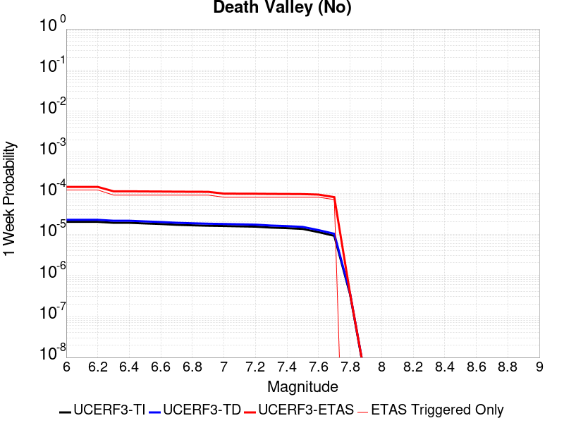 |  |  |  |

| Magnitude | 1 wk TI Prob | 1 wk TD Prob | 1 wk ETAS Prob | 1 wk ETAS/TD Gain | 1 wk ETAS Triggered Only | 1 mo TI Prob | 1 mo TD Prob | 1 mo ETAS Prob | 1 mo ETAS/TD Gain | 1 mo ETAS Triggered Only | 1 yr TI Prob | 1 yr TD Prob | 1 yr ETAS Prob | 1 yr ETAS/TD Gain | 1 yr ETAS Triggered Only | 10 yr TI Prob | 10 yr TD Prob | 10 yr ETAS Prob | 10 yr ETAS/TD Gain | 10 yr ETAS Triggered Only |
|-----|-----|-----|-----|-----|-----|-----|-----|-----|-----|-----|-----|-----|-----|-----|-----|-----|-----|-----|-----|-----|
| 6.0 | 2.0074807E-5 | 2.2500084E-5 | 1.751684E-4 | 7.7852335 | 1.5267175E-4 | 8.603206E-5 | 9.642541E-5 | 2.4908246E-4 | 2.5831618 | 1.5267175E-4 | 0.001046937 | 0.0011733545 | 0.0013639702 | 1.1624537 | 1.908397E-4 | 0.010420183 | 0.011672506 | 0.0118611185 | 1.0161587 | 1.908397E-4 |
| 6.1 | 2.0074807E-5 | 2.2500084E-5 | 1.751684E-4 | 7.7852335 | 1.5267175E-4 | 8.603206E-5 | 9.642541E-5 | 2.4908246E-4 | 2.5831618 | 1.5267175E-4 | 0.001046937 | 0.0011733545 | 0.0013639702 | 1.1624537 | 1.908397E-4 | 0.010420183 | 0.011672506 | 0.0118611185 | 1.0161587 | 1.908397E-4 |
| 6.2 | 2.0074807E-5 | 2.2500084E-5 | 1.751684E-4 | 7.7852335 | 1.5267175E-4 | 8.603206E-5 | 9.642541E-5 | 2.4908246E-4 | 2.5831618 | 1.5267175E-4 | 0.001046937 | 0.0011733545 | 0.0013639702 | 1.1624537 | 1.908397E-4 | 0.010420183 | 0.011672506 | 0.0118611185 | 1.0161587 | 1.908397E-4 |
| 6.3 | 1.9050609E-5 | 2.1336948E-5 | 1.3583832E-4 | 6.366343 | 1.1450382E-4 | 8.164292E-5 | 9.1440896E-5 | 2.0593424E-4 | 2.2521021 | 1.1450382E-4 | 9.935491E-4 | 0.001112731 | 0.0012652329 | 1.1370518 | 1.5267175E-4 | 0.009891188 | 0.011072419 | 0.0112234 | 1.0136358 | 1.5267175E-4 |
| 6.4 | 1.9050609E-5 | 2.1336948E-5 | 1.3583832E-4 | 6.366343 | 1.1450382E-4 | 8.164292E-5 | 9.1440896E-5 | 2.0593424E-4 | 2.2521021 | 1.1450382E-4 | 9.935491E-4 | 0.001112731 | 0.0012652329 | 1.1370518 | 1.5267175E-4 | 0.009891188 | 0.011072419 | 0.0112234 | 1.0136358 | 1.5267175E-4 |
| 6.5 | 1.8367004E-5 | 2.0561009E-5 | 1.3506247E-4 | 6.5688643 | 1.1450382E-4 | 7.8713354E-5 | 8.811567E-5 | 2.026094E-4 | 2.2993572 | 1.1450382E-4 | 9.5791375E-4 | 0.0010722869 | 0.0012247949 | 1.1422269 | 1.5267175E-4 | 0.009537951 | 0.0106719155 | 0.010822958 | 1.0141532 | 1.5267175E-4 |
| 6.6 | 1.779439E-5 | 1.9910927E-5 | 1.3441246E-4 | 6.750688 | 1.1450382E-4 | 7.625944E-5 | 8.53298E-5 | 1.9982384E-4 | 2.3417828 | 1.1450382E-4 | 9.280632E-4 | 0.0010384015 | 0.0011909148 | 1.1468731 | 1.5267175E-4 | 0.009241969 | 0.010336253 | 0.010487346 | 1.0146178 | 1.5267175E-4 |
| 6.7 | 1.7025437E-5 | 1.9043426E-5 | 1.3354507E-4 | 7.0126595 | 1.1450382E-4 | 7.296412E-5 | 8.161216E-5 | 1.9610663E-4 | 2.4029095 | 1.1450382E-4 | 8.87976E-4 | 9.931813E-4 | 0.0011457014 | 1.1535672 | 1.5267175E-4 | 0.008844362 | 0.009888145 | 0.010039307 | 1.0152872 | 1.5267175E-4 |
| 6.8 | 1.6545107E-5 | 1.8512545E-5 | 1.3301424E-4 | 7.1850867 | 1.1450382E-4 | 7.090568E-5 | 7.93371E-5 | 1.9383183E-4 | 2.4431424 | 1.1450382E-4 | 8.629347E-4 | 9.655073E-4 | 0.0011180317 | 1.1579733 | 1.5267175E-4 | 0.008595915 | 0.009613829 | 0.009765033 | 1.0157278 | 1.5267175E-4 |
| 6.9 | 1.615478E-5 | 1.8087594E-5 | 1.3258934E-4 | 7.3304024 | 1.1450382E-4 | 6.9232934E-5 | 7.751599E-5 | 1.9201094E-4 | 2.4770494 | 1.1450382E-4 | 8.4258494E-4 | 9.433546E-4 | 0.0010958824 | 1.1616865 | 1.5267175E-4 | 0.008393973 | 0.009394196 | 0.009545433 | 1.0160991 | 1.5267175E-4 |
| 7.0 | 1.5894311E-5 | 1.780555E-5 | 9.4140065E-5 | 5.2871194 | 7.633588E-5 | 6.81167E-5 | 7.6307304E-5 | 1.5263735E-4 | 2.0002983 | 7.633588E-5 | 8.2900526E-4 | 9.286515E-4 | 0.001043049 | 1.1231867 | 1.1450382E-4 | 0.008259195 | 0.009248397 | 0.009361843 | 1.0122664 | 1.1450382E-4 |
| 7.1 | 1.5602263E-5 | 1.7483504E-5 | 9.3818046E-5 | 5.36609 | 7.633588E-5 | 6.6865134E-5 | 7.492718E-5 | 1.5125734E-4 | 2.0187244 | 7.633588E-5 | 8.137789E-4 | 9.118627E-4 | 0.0010262622 | 1.1254568 | 1.1450382E-4 | 0.008108052 | 0.009081894 | 0.009195358 | 1.0124934 | 1.1450382E-4 |
| 7.2 | 1.5323829E-5 | 1.717063E-5 | 9.3505194E-5 | 5.4456472 | 7.633588E-5 | 6.56719E-5 | 7.358637E-5 | 1.4991664E-4 | 2.037288 | 7.633588E-5 | 7.99262E-4 | 8.9555193E-4 | 0.0010099532 | 1.1277438 | 1.1450382E-4 | 0.007963934 | 0.008920107 | 0.009033589 | 1.0127221 | 1.1450382E-4 |
| 7.3 | 1.4556212E-5 | 1.6302456E-5 | 9.263709E-5 | 5.682401 | 7.633588E-5 | 6.238227E-5 | 6.9865826E-5 | 1.4619637E-4 | 2.0925305 | 7.633588E-5 | 7.592395E-4 | 8.5029035E-4 | 9.646968E-4 | 1.1345499 | 1.1450382E-4 | 0.0075665074 | 0.008471014 | 0.008584548 | 1.0134026 | 1.1450382E-4 |
| 7.4 | 1.411725E-5 | 1.580796E-5 | 9.214263E-5 | 5.8288755 | 7.633588E-5 | 6.0501097E-5 | 6.7746674E-5 | 1.4407738E-4 | 2.1267078 | 7.633588E-5 | 7.363519E-4 | 8.245094E-4 | 9.3891885E-4 | 1.1387606 | 1.1450382E-4 | 0.0073391674 | 0.008215138 | 0.008328701 | 1.0138236 | 1.1450382E-4 |
| 7.5 | 1.3503312E-5 | 1.5126289E-5 | 9.1461014E-5 | 6.0464935 | 7.633588E-5 | 5.7870053E-5 | 6.482538E-5 | 1.411563E-4 | 2.1774852 | 7.633588E-5 | 7.043401E-4 | 7.8896893E-4 | 9.0338243E-4 | 1.1450164 | 1.1450382E-4 | 0.007021119 | 0.007862304 | 0.007975908 | 1.0144491 | 1.1450382E-4 |
| 7.6 | 1.1279839E-5 | 1.2626327E-5 | 8.896124E-5 | 7.0456944 | 7.633588E-5 | 4.834127E-5 | 5.4111737E-5 | 1.3044348E-4 | 2.410632 | 7.633588E-5 | 5.88396E-4 | 6.5861654E-4 | 7.3490216E-4 | 1.1158271 | 7.633588E-5 | 0.005868405 | 0.006567199 | 0.006643033 | 1.0115474 | 7.633588E-5 |
| 7.7 | 9.189108E-6 | 1.0283358E-5 | 8.661845E-5 | 8.423167 | 7.633588E-5 | 3.93813E-5 | 4.407082E-5 | 1.2040333E-4 | 2.732042 | 7.633588E-5 | 4.7936183E-4 | 5.3643517E-4 | 6.127301E-4 | 1.1422259 | 7.633588E-5 | 0.004783291 | 0.005351914 | 0.005427841 | 1.014187 | 7.633588E-5 |
| 7.8 | 3.4586725E-7 | 3.6482615E-7 | 3.6482615E-7 | 1.0 | 0.0 | 1.4822873E-6 | 1.5635396E-6 | 1.5635396E-6 | 1.0 | 0.0 | 1.80467E-5 | 1.9035933E-5 | 1.9035933E-5 | 1.0 | 0.0 | 1.8045233E-4 | 1.9034347E-4 | 1.9034347E-4 | 1.0 | 0.0 |
| 7.9 | 2.5591178E-9 | 2.6696718E-9 | 2.6696718E-9 | 1.0 | 0.0 | 1.0967647E-8 | 1.14414505E-8 | 1.14414505E-8 | 1.0 | 0.0 | 1.335311E-7 | 1.3929966E-7 | 1.3929966E-7 | 1.0 | 0.0 | 1.3353102E-6 | 1.3929966E-6 | 1.3929966E-6 | 1.0 | 0.0 |

## Coyote Lake
*[(top)](#table-of-contents)*

| 1 Week | 1 Month | 1 Year | 10 Year |
|-----|-----|-----|-----|
| 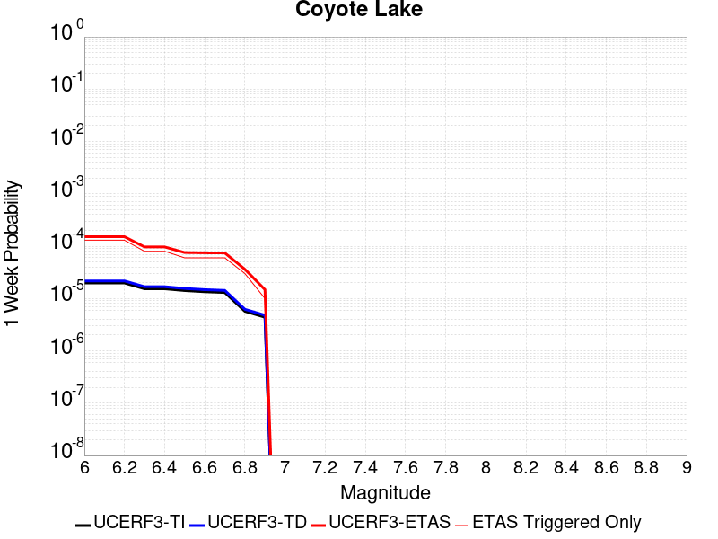 |  |  |  |

| Magnitude | 1 wk TI Prob | 1 wk TD Prob | 1 wk ETAS Prob | 1 wk ETAS/TD Gain | 1 wk ETAS Triggered Only | 1 mo TI Prob | 1 mo TD Prob | 1 mo ETAS Prob | 1 mo ETAS/TD Gain | 1 mo ETAS Triggered Only | 1 yr TI Prob | 1 yr TD Prob | 1 yr ETAS Prob | 1 yr ETAS/TD Gain | 1 yr ETAS Triggered Only | 10 yr TI Prob | 10 yr TD Prob | 10 yr ETAS Prob | 10 yr ETAS/TD Gain | 10 yr ETAS Triggered Only |
|-----|-----|-----|-----|-----|-----|-----|-----|-----|-----|-----|-----|-----|-----|-----|-----|-----|-----|-----|-----|-----|
| 6.0 | 1.980352E-5 | 2.1706745E-5 | 1.3620808E-4 | 6.2749195 | 1.1450382E-4 | 8.486947E-5 | 9.302599E-5 | 2.4568354E-4 | 2.6410203 | 1.5267175E-4 | 0.0010327959 | 0.0011320751 | 0.0013226987 | 1.1683843 | 1.908397E-4 | 0.010280091 | 0.011270258 | 0.011458947 | 1.0167422 | 1.908397E-4 |
| 6.1 | 1.980352E-5 | 2.1706745E-5 | 1.3620808E-4 | 6.2749195 | 1.1450382E-4 | 8.486947E-5 | 9.302599E-5 | 2.4568354E-4 | 2.6410203 | 1.5267175E-4 | 0.0010327959 | 0.0011320751 | 0.0013226987 | 1.1683843 | 1.908397E-4 | 0.010280091 | 0.011270258 | 0.011458947 | 1.0167422 | 1.908397E-4 |
| 6.2 | 1.980352E-5 | 2.1706745E-5 | 1.3620808E-4 | 6.2749195 | 1.1450382E-4 | 8.486947E-5 | 9.302599E-5 | 2.4568354E-4 | 2.6410203 | 1.5267175E-4 | 0.0010327959 | 0.0011320751 | 0.0013226987 | 1.1683843 | 1.908397E-4 | 0.010280091 | 0.011270258 | 0.011458947 | 1.0167422 | 1.908397E-4 |
| 6.3 | 1.5344787E-5 | 1.682067E-5 | 1.3132257E-4 | 7.807214 | 1.1450382E-4 | 6.576172E-5 | 7.2086936E-5 | 2.2474768E-4 | 3.117731 | 1.5267175E-4 | 8.003548E-4 | 8.773662E-4 | 0.0010680385 | 1.2173234 | 1.908397E-4 | 0.007974784 | 0.00874507 | 0.00893424 | 1.0216317 | 1.908397E-4 |
| 6.4 | 1.5344787E-5 | 1.682067E-5 | 1.3132257E-4 | 7.807214 | 1.1450382E-4 | 6.576172E-5 | 7.2086936E-5 | 2.2474768E-4 | 3.117731 | 1.5267175E-4 | 8.003548E-4 | 8.773662E-4 | 0.0010680385 | 1.2173234 | 1.908397E-4 | 0.007974784 | 0.00874507 | 0.00893424 | 1.0216317 | 1.908397E-4 |
| 6.5 | 1.4189697E-5 | 1.5557987E-5 | 9.1892674E-5 | 5.906463 | 7.633588E-5 | 6.081157E-5 | 6.6675726E-5 | 1.811719E-4 | 2.7172096 | 1.1450382E-4 | 7.401293E-4 | 8.115349E-4 | 9.640827E-4 | 1.1879745 | 1.5267175E-4 | 0.0073766913 | 0.008091656 | 0.008243092 | 1.0187151 | 1.5267175E-4 |
| 6.6 | 1.3469301E-5 | 1.4771577E-5 | 9.1106325E-5 | 6.167678 | 7.633588E-5 | 5.7724297E-5 | 6.330556E-5 | 1.7780213E-4 | 2.8086336 | 1.1450382E-4 | 7.025667E-4 | 7.7053264E-4 | 9.230868E-4 | 1.1979853 | 1.5267175E-4 | 0.0070034964 | 0.0076845144 | 0.007836013 | 1.0197148 | 1.5267175E-4 |
| 6.7 | 1.3027966E-5 | 1.4281745E-5 | 9.061653E-5 | 6.34492 | 7.633588E-5 | 5.5832945E-5 | 6.120638E-5 | 1.7570319E-4 | 2.870668 | 1.1450382E-4 | 6.7955407E-4 | 7.4499263E-4 | 8.9755066E-4 | 1.2047778 | 1.5267175E-4 | 0.006774798 | 0.0074308286 | 0.007582366 | 1.020393 | 1.5267175E-4 |
| 6.8 | 5.695434E-6 | 6.2244176E-6 | 4.439212E-5 | 7.1319313 | 3.816794E-5 | 2.4408775E-5 | 2.6675973E-5 | 6.484289E-5 | 2.4307601 | 3.816794E-5 | 2.971363E-4 | 3.2476155E-4 | 4.0107264E-4 | 1.2349757 | 7.633588E-5 | 0.0029673933 | 0.0032458105 | 0.0033218986 | 1.0234419 | 7.633588E-5 |
| 6.9 | 4.385688E-6 | 4.7930553E-6 | 4.7930553E-6 | 1.0 | 0.0 | 1.879567E-5 | 2.0541665E-5 | 2.0541665E-5 | 1.0 | 0.0 | 2.2881327E-4 | 2.5009477E-4 | 2.8825318E-4 | 1.1525757 | 3.816794E-5 | 0.002285778 | 0.0025009478 | 0.0025390203 | 1.0152233 | 3.816794E-5 |

## Scodie Lineament
*[(top)](#table-of-contents)*

| 1 Week | 1 Month | 1 Year | 10 Year |
|-----|-----|-----|-----|
|  |  |  |  |

| Magnitude | 1 wk TI Prob | 1 wk TD Prob | 1 wk ETAS Prob | 1 wk ETAS/TD Gain | 1 wk ETAS Triggered Only | 1 mo TI Prob | 1 mo TD Prob | 1 mo ETAS Prob | 1 mo ETAS/TD Gain | 1 mo ETAS Triggered Only | 1 yr TI Prob | 1 yr TD Prob | 1 yr ETAS Prob | 1 yr ETAS/TD Gain | 1 yr ETAS Triggered Only | 10 yr TI Prob | 10 yr TD Prob | 10 yr ETAS Prob | 10 yr ETAS/TD Gain | 10 yr ETAS Triggered Only |
|-----|-----|-----|-----|-----|-----|-----|-----|-----|-----|-----|-----|-----|-----|-----|-----|-----|-----|-----|-----|-----|
| 6.0 | 3.2919327E-6 | 3.0133422E-6 | 1.17516814E-4 | 38.99883 | 1.1450382E-4 | 1.4108206E-5 | 1.2914278E-5 | 1.2741661E-4 | 9.866337 | 1.1450382E-4 | 1.7175387E-4 | 1.5722317E-4 | 3.0987093E-4 | 1.9708986 | 1.5267175E-4 | 0.0017162118 | 0.0015714309 | 0.0017619707 | 1.1212524 | 1.908397E-4 |
| 6.1 | 1.8663811E-6 | 1.5490499E-6 | 3.971693E-5 | 25.639542 | 3.816794E-5 | 7.998751E-6 | 6.6387715E-6 | 4.4806457E-5 | 6.7492094 | 3.816794E-5 | 9.738045E-5 | 8.082454E-5 | 1.5715425E-4 | 1.9443878 | 7.633588E-5 | 9.7337784E-4 | 8.080003E-4 | 8.842744E-4 | 1.0943987 | 7.633588E-5 |
| 6.2 | 1.8663811E-6 | 1.5490499E-6 | 3.971693E-5 | 25.639542 | 3.816794E-5 | 7.998751E-6 | 6.6387715E-6 | 4.4806457E-5 | 6.7492094 | 3.816794E-5 | 9.738045E-5 | 8.082454E-5 | 1.5715425E-4 | 1.9443878 | 7.633588E-5 | 9.7337784E-4 | 8.080003E-4 | 8.842744E-4 | 1.0943987 | 7.633588E-5 |
| 6.3 | 1.8663811E-6 | 1.5490499E-6 | 3.971693E-5 | 25.639542 | 3.816794E-5 | 7.998751E-6 | 6.6387715E-6 | 4.4806457E-5 | 6.7492094 | 3.816794E-5 | 9.738045E-5 | 8.082454E-5 | 1.5715425E-4 | 1.9443878 | 7.633588E-5 | 9.7337784E-4 | 8.080003E-4 | 8.842744E-4 | 1.0943987 | 7.633588E-5 |
| 6.4 | 1.8663811E-6 | 1.5490499E-6 | 3.971693E-5 | 25.639542 | 3.816794E-5 | 7.998751E-6 | 6.6387715E-6 | 4.4806457E-5 | 6.7492094 | 3.816794E-5 | 9.738045E-5 | 8.082454E-5 | 1.5715425E-4 | 1.9443878 | 7.633588E-5 | 9.7337784E-4 | 8.080003E-4 | 8.842744E-4 | 1.0943987 | 7.633588E-5 |
| 6.5 | 1.8106311E-6 | 1.4909839E-6 | 3.9658866E-5 | 26.599123 | 3.816794E-5 | 7.759824E-6 | 6.3899183E-6 | 4.4557615E-5 | 6.9731116 | 3.816794E-5 | 9.447177E-5 | 7.7794975E-5 | 1.5412491E-4 | 1.981168 | 7.633588E-5 | 9.4431615E-4 | 7.7772606E-4 | 8.540026E-4 | 1.0980763 | 7.633588E-5 |
| 6.6 | 1.2414679E-6 | 8.997558E-7 | 3.906766E-5 | 43.420296 | 3.816794E-5 | 5.320566E-6 | 3.856091E-6 | 4.2023883E-5 | 10.898053 | 3.816794E-5 | 6.477596E-5 | 4.6946985E-5 | 8.511313E-5 | 1.8129627 | 3.816794E-5 | 6.475708E-4 | 4.693793E-4 | 5.0752936E-4 | 1.0812776 | 3.816794E-5 |
| 6.7 | 1.1062215E-6 | 7.594311E-7 | 3.892734E-5 | 51.258556 | 3.816794E-5 | 4.7409408E-6 | 3.2547011E-6 | 4.1422514E-5 | 12.72698 | 3.816794E-5 | 5.7719422E-5 | 3.9625334E-5 | 7.779176E-5 | 1.9631824 | 3.816794E-5 | 5.770443E-4 | 3.961897E-4 | 4.343425E-4 | 1.0962994 | 3.816794E-5 |
| 6.8 | 1.0006736E-6 | 6.500397E-7 | 3.8817954E-5 | 59.716286 | 3.816794E-5 | 4.288594E-6 | 2.7858816E-6 | 4.0953713E-5 | 14.70045 | 3.816794E-5 | 5.221238E-5 | 3.3917644E-5 | 7.208429E-5 | 2.125274 | 3.816794E-5 | 5.220012E-4 | 3.3913075E-4 | 3.7728573E-4 | 1.1125082 | 3.816794E-5 |
| 6.9 | 9.167364E-7 | 5.631625E-7 | 5.631625E-7 | 1.0 | 0.0 | 3.9288643E-6 | 2.4135516E-6 | 2.4135516E-6 | 1.0 | 0.0 | 4.7832873E-5 | 2.9384651E-5 | 2.9384651E-5 | 1.0 | 0.0 | 4.782258E-4 | 2.9381333E-4 | 2.9381333E-4 | 1.0 | 0.0 |
| 7.0 | 7.6987664E-7 | 4.113383E-7 | 4.113383E-7 | 1.0 | 0.0 | 3.2994672E-6 | 1.7628774E-6 | 1.7628774E-6 | 1.0 | 0.0 | 4.0170275E-5 | 2.1462862E-5 | 2.1462862E-5 | 1.0 | 0.0 | 4.0163012E-4 | 2.1461173E-4 | 2.1461173E-4 | 1.0 | 0.0 |
| 7.1 | 7.1038727E-7 | 3.5211494E-7 | 3.5211494E-7 | 1.0 | 0.0 | 3.0445133E-6 | 1.5090633E-6 | 1.5090633E-6 | 1.0 | 0.0 | 3.706632E-5 | 1.8372726E-5 | 1.8372726E-5 | 1.0 | 0.0 | 3.7060137E-4 | 1.8371557E-4 | 1.8371557E-4 | 1.0 | 0.0 |
| 7.2 | 2.0799602E-7 | 3.1186854E-8 | 3.1186854E-8 | 1.0 | 0.0 | 8.914113E-7 | 1.3365793E-7 | 1.3365793E-7 | 1.0 | 0.0 | 1.0852878E-5 | 1.6272843E-6 | 1.6272843E-6 | 1.0 | 0.0 | 1.08523476E-4 | 1.627273E-5 | 1.627273E-5 | 1.0 | 0.0 |
| 7.3 | 1.5048182E-7 | 1.5945696E-8 | 1.5945696E-8 | 1.0 | 0.0 | 6.449219E-7 | 6.83387E-8 | 6.83387E-8 | 1.0 | 0.0 | 7.851896E-6 | 8.320234E-7 | 8.320234E-7 | 1.0 | 0.0 | 7.851618E-5 | 8.320206E-6 | 8.320206E-6 | 1.0 | 0.0 |
| 7.4 | 5.9334678E-8 | 4.8683537E-9 | 4.8683537E-9 | 1.0 | 0.0 | 2.5429145E-7 | 2.0864372E-8 | 2.0864372E-8 | 1.0 | 0.0 | 3.095994E-6 | 2.5402372E-7 | 2.5402372E-7 | 1.0 | 0.0 | 3.095951E-5 | 2.5402353E-6 | 2.5402353E-6 | 1.0 | 0.0 |

## Kern Canyon (North Kern) 2011
*[(top)](#table-of-contents)*

| 1 Week | 1 Month | 1 Year | 10 Year |
|-----|-----|-----|-----|
| 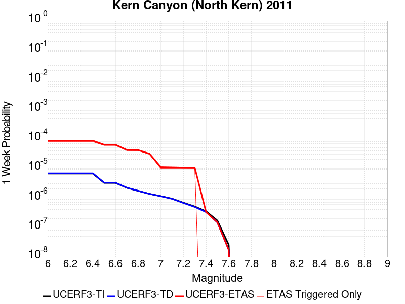 |  |  |  |

| Magnitude | 1 wk TI Prob | 1 wk TD Prob | 1 wk ETAS Prob | 1 wk ETAS/TD Gain | 1 wk ETAS Triggered Only | 1 mo TI Prob | 1 mo TD Prob | 1 mo ETAS Prob | 1 mo ETAS/TD Gain | 1 mo ETAS Triggered Only | 1 yr TI Prob | 1 yr TD Prob | 1 yr ETAS Prob | 1 yr ETAS/TD Gain | 1 yr ETAS Triggered Only | 10 yr TI Prob | 10 yr TD Prob | 10 yr ETAS Prob | 10 yr ETAS/TD Gain | 10 yr ETAS Triggered Only |
|-----|-----|-----|-----|-----|-----|-----|-----|-----|-----|-----|-----|-----|-----|-----|-----|-----|-----|-----|-----|-----|
| 6.0 | 6.6264497E-6 | 6.75733E-6 | 1.5942805E-4 | 23.59335 | 1.5267175E-4 | 2.8398761E-5 | 2.895971E-5 | 1.8162704E-4 | 6.271715 | 1.5267175E-4 | 3.4570007E-4 | 3.5253543E-4 | 5.051534E-4 | 1.4329152 | 1.5267175E-4 | 0.0034516277 | 0.0035205502 | 0.0036726845 | 1.0432132 | 1.5267175E-4 |
| 6.1 | 6.6264497E-6 | 6.75733E-6 | 1.5942805E-4 | 23.59335 | 1.5267175E-4 | 2.8398761E-5 | 2.895971E-5 | 1.8162704E-4 | 6.271715 | 1.5267175E-4 | 3.4570007E-4 | 3.5253543E-4 | 5.051534E-4 | 1.4329152 | 1.5267175E-4 | 0.0034516277 | 0.0035205502 | 0.0036726845 | 1.0432132 | 1.5267175E-4 |
| 6.2 | 6.6264497E-6 | 6.75733E-6 | 1.5942805E-4 | 23.59335 | 1.5267175E-4 | 2.8398761E-5 | 2.895971E-5 | 1.8162704E-4 | 6.271715 | 1.5267175E-4 | 3.4570007E-4 | 3.5253543E-4 | 5.051534E-4 | 1.4329152 | 1.5267175E-4 | 0.0034516277 | 0.0035205502 | 0.0036726845 | 1.0432132 | 1.5267175E-4 |
| 6.3 | 6.6264497E-6 | 6.75733E-6 | 1.5942805E-4 | 23.59335 | 1.5267175E-4 | 2.8398761E-5 | 2.895971E-5 | 1.8162704E-4 | 6.271715 | 1.5267175E-4 | 3.4570007E-4 | 3.5253543E-4 | 5.051534E-4 | 1.4329152 | 1.5267175E-4 | 0.0034516277 | 0.0035205502 | 0.0036726845 | 1.0432132 | 1.5267175E-4 |
| 6.4 | 6.6264497E-6 | 6.75733E-6 | 1.5942805E-4 | 23.59335 | 1.5267175E-4 | 2.8398761E-5 | 2.895971E-5 | 1.8162704E-4 | 6.271715 | 1.5267175E-4 | 3.4570007E-4 | 3.5253543E-4 | 5.051534E-4 | 1.4329152 | 1.5267175E-4 | 0.0034516277 | 0.0035205502 | 0.0036726845 | 1.0432132 | 1.5267175E-4 |
| 6.5 | 3.2162225E-6 | 3.2570915E-6 | 1.5592836E-4 | 47.873493 | 1.5267175E-4 | 1.3783738E-5 | 1.3958893E-5 | 1.6662852E-4 | 11.937087 | 1.5267175E-4 | 1.6780409E-4 | 1.6993708E-4 | 3.225829E-4 | 1.898249 | 1.5267175E-4 | 0.0016767744 | 0.001698151 | 0.0018505635 | 1.0897521 | 1.5267175E-4 |
| 6.6 | 3.2162225E-6 | 3.2570915E-6 | 1.5592836E-4 | 47.873493 | 1.5267175E-4 | 1.3783738E-5 | 1.3958893E-5 | 1.6662852E-4 | 11.937087 | 1.5267175E-4 | 1.6780409E-4 | 1.6993708E-4 | 3.225829E-4 | 1.898249 | 1.5267175E-4 | 0.0016767744 | 0.001698151 | 0.0018505635 | 1.0897521 | 1.5267175E-4 |
| 6.7 | 2.1908265E-6 | 2.2071222E-6 | 1.1671069E-4 | 52.879124 | 1.1450382E-4 | 9.389223E-6 | 9.459061E-6 | 1.239618E-4 | 13.105083 | 1.1450382E-4 | 1.1430779E-4 | 1.1515819E-4 | 2.2964882E-4 | 1.9942031 | 1.1450382E-4 | 0.0011424901 | 0.0011510046 | 0.0012653766 | 1.0993671 | 1.1450382E-4 |
| 6.8 | 1.7303895E-6 | 1.7365529E-6 | 1.1624017E-4 | 66.9373 | 1.1450382E-4 | 7.415934E-6 | 7.4423488E-6 | 1.2194531E-4 | 16.385326 | 1.1450382E-4 | 9.028525E-5 | 9.0606925E-5 | 2.0510037E-4 | 2.263628 | 1.1450382E-4 | 9.024858E-4 | 9.057096E-4 | 0.0010201097 | 1.1263099 | 1.1450382E-4 |
| 6.9 | 1.3700314E-6 | 1.3688622E-6 | 7.770464E-5 | 56.765858 | 7.633588E-5 | 5.87155E-6 | 5.8665396E-6 | 8.220197E-5 | 14.012003 | 7.633588E-5 | 7.148377E-5 | 7.142282E-5 | 1.4775325E-4 | 2.068712 | 7.633588E-5 | 7.146078E-4 | 7.140032E-4 | 7.902846E-4 | 1.1068362 | 7.633588E-5 |
| 7.0 | 1.1467797E-6 | 1.1413804E-6 | 3.9309274E-5 | 34.440117 | 3.816794E-5 | 4.9147607E-6 | 4.8916213E-6 | 4.3059372E-5 | 8.802679 | 3.816794E-5 | 5.983557E-5 | 5.9553895E-5 | 9.771956E-5 | 1.6408592 | 3.816794E-5 | 5.981946E-4 | 5.953825E-4 | 6.335277E-4 | 1.0640684 | 3.816794E-5 |
| 7.1 | 9.3952065E-7 | 9.3026904E-7 | 3.9098173E-5 | 42.02889 | 3.816794E-5 | 4.026511E-6 | 3.9868614E-6 | 4.2154647E-5 | 10.573392 | 3.816794E-5 | 4.9021666E-5 | 4.8538972E-5 | 8.670506E-5 | 1.7862978 | 3.816794E-5 | 4.901085E-4 | 4.8528548E-4 | 5.234349E-4 | 1.0786123 | 3.816794E-5 |
| 7.2 | 6.858055E-7 | 6.7193E-7 | 3.8839844E-5 | 57.803406 | 3.816794E-5 | 2.939163E-6 | 2.879697E-6 | 4.1047526E-5 | 14.254113 | 3.816794E-5 | 3.5783723E-5 | 3.5059755E-5 | 7.322636E-5 | 2.0886157 | 3.816794E-5 | 3.5777962E-4 | 3.5054312E-4 | 3.886977E-4 | 1.1088442 | 3.816794E-5 |
| 7.3 | 5.1101983E-7 | 4.9393E-7 | 3.866185E-5 | 78.27395 | 3.816794E-5 | 2.1900833E-6 | 2.116841E-6 | 4.02847E-5 | 19.030573 | 3.816794E-5 | 2.6663936E-5 | 2.5772239E-5 | 6.3939195E-5 | 2.4809327 | 3.816794E-5 | 2.6660739E-4 | 2.57693E-4 | 2.958511E-4 | 1.1480758 | 3.816794E-5 |
| 7.4 | 3.4999414E-7 | 3.2995905E-7 | 3.2995905E-7 | 1.0 | 0.0 | 1.499974E-6 | 1.4141094E-6 | 1.4141094E-6 | 1.0 | 0.0 | 1.8262032E-5 | 1.721665E-5 | 1.721665E-5 | 1.0 | 0.0 | 1.826053E-4 | 1.7215339E-4 | 1.7215339E-4 | 1.0 | 0.0 |
| 7.5 | 1.7021522E-7 | 1.4750044E-7 | 1.4750044E-7 | 1.0 | 0.0 | 7.2949354E-7 | 6.321446E-7 | 6.321446E-7 | 1.0 | 0.0 | 8.881548E-6 | 7.696334E-6 | 7.696334E-6 | 1.0 | 0.0 | 8.8811925E-5 | 7.696076E-5 | 7.696076E-5 | 1.0 | 0.0 |
| 7.6 | 2.572245E-8 | 1.7352555E-8 | 1.7352555E-8 | 1.0 | 0.0 | 1.10239064E-7 | 7.436809E-8 | 7.436809E-8 | 1.0 | 0.0 | 1.3421597E-6 | 9.054312E-7 | 9.054312E-7 | 1.0 | 0.0 | 1.3421517E-5 | 9.05428E-6 | 9.05428E-6 | 1.0 | 0.0 |

## San Andreas (Carrizo) rev
*[(top)](#table-of-contents)*

| 1 Week | 1 Month | 1 Year | 10 Year |
|-----|-----|-----|-----|
|  | 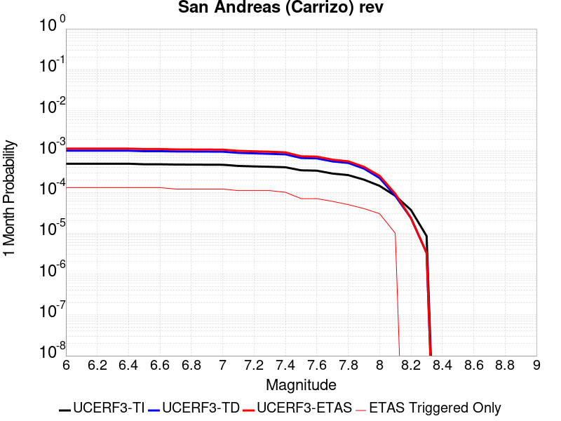 |  |  |

| Magnitude | 1 wk TI Prob | 1 wk TD Prob | 1 wk ETAS Prob | 1 wk ETAS/TD Gain | 1 wk ETAS Triggered Only | 1 mo TI Prob | 1 mo TD Prob | 1 mo ETAS Prob | 1 mo ETAS/TD Gain | 1 mo ETAS Triggered Only | 1 yr TI Prob | 1 yr TD Prob | 1 yr ETAS Prob | 1 yr ETAS/TD Gain | 1 yr ETAS Triggered Only | 10 yr TI Prob | 10 yr TD Prob | 10 yr ETAS Prob | 10 yr ETAS/TD Gain | 10 yr ETAS Triggered Only |
|-----|-----|-----|-----|-----|-----|-----|-----|-----|-----|-----|-----|-----|-----|-----|-----|-----|-----|-----|-----|-----|
| 6.0 | 1.1674632E-4 | 2.432302E-4 | 3.1954751E-4 | 1.3137658 | 7.633588E-5 | 5.002454E-4 | 0.0010420004 | 0.0011563848 | 1.109774 | 1.1450382E-4 | 0.006073493 | 0.012613042 | 0.012726102 | 1.0089637 | 1.1450382E-4 | 0.0591016 | 0.12061418 | 0.12074844 | 1.001113 | 1.5267175E-4 |
| 6.1 | 1.1674632E-4 | 2.432302E-4 | 3.1954751E-4 | 1.3137658 | 7.633588E-5 | 5.002454E-4 | 0.0010420004 | 0.0011563848 | 1.109774 | 1.1450382E-4 | 0.006073493 | 0.012613042 | 0.012726102 | 1.0089637 | 1.1450382E-4 | 0.0591016 | 0.12061418 | 0.12074844 | 1.001113 | 1.5267175E-4 |
| 6.2 | 1.1674632E-4 | 2.432302E-4 | 3.1954751E-4 | 1.3137658 | 7.633588E-5 | 5.002454E-4 | 0.0010420004 | 0.0011563848 | 1.109774 | 1.1450382E-4 | 0.006073493 | 0.012613042 | 0.012726102 | 1.0089637 | 1.1450382E-4 | 0.0591016 | 0.12061418 | 0.12074844 | 1.001113 | 1.5267175E-4 |
| 6.3 | 1.1674632E-4 | 2.432302E-4 | 3.1954751E-4 | 1.3137658 | 7.633588E-5 | 5.002454E-4 | 0.0010420004 | 0.0011563848 | 1.109774 | 1.1450382E-4 | 0.006073493 | 0.012613042 | 0.012726102 | 1.0089637 | 1.1450382E-4 | 0.0591016 | 0.12061418 | 0.12074844 | 1.001113 | 1.5267175E-4 |
| 6.4 | 1.1674632E-4 | 2.432302E-4 | 3.1954751E-4 | 1.3137658 | 7.633588E-5 | 5.002454E-4 | 0.0010420004 | 0.0011563848 | 1.109774 | 1.1450382E-4 | 0.006073493 | 0.012613042 | 0.012726102 | 1.0089637 | 1.1450382E-4 | 0.0591016 | 0.12061418 | 0.12074844 | 1.001113 | 1.5267175E-4 |
| 6.5 | 1.13136164E-4 | 2.3643032E-4 | 3.1274816E-4 | 1.322792 | 7.633588E-5 | 4.847792E-4 | 0.0010128808 | 0.0011272687 | 1.1129332 | 1.1450382E-4 | 0.0058862255 | 0.012262545 | 0.0123756435 | 1.0092232 | 1.1450382E-4 | 0.057327334 | 0.117585555 | 0.11772027 | 1.0011457 | 1.5267175E-4 |
| 6.6 | 1.13136164E-4 | 2.3643032E-4 | 3.1274816E-4 | 1.322792 | 7.633588E-5 | 4.847792E-4 | 0.0010128808 | 0.0011272687 | 1.1129332 | 1.1450382E-4 | 0.0058862255 | 0.012262545 | 0.0123756435 | 1.0092232 | 1.1450382E-4 | 0.057327334 | 0.117585555 | 0.11772027 | 1.0011457 | 1.5267175E-4 |
| 6.7 | 1.1149675E-4 | 2.3334254E-4 | 2.7150157E-4 | 1.1635323 | 3.816794E-5 | 4.777557E-4 | 9.996577E-4 | 0.0010759173 | 1.0762857 | 7.633588E-5 | 0.0058011734 | 0.012103349 | 0.012178761 | 1.0062307 | 7.633588E-5 | 0.05652051 | 0.1162071 | 0.116308294 | 1.0008708 | 1.1450382E-4 |
| 6.8 | 1.1103589E-4 | 2.3236412E-4 | 2.705232E-4 | 1.164221 | 3.816794E-5 | 4.7578133E-4 | 9.954676E-4 | 0.0010717276 | 1.0766071 | 7.633588E-5 | 0.005777263 | 0.012052901 | 0.012128318 | 1.006257 | 7.633588E-5 | 0.056293584 | 0.1157674 | 0.11586864 | 1.0008746 | 1.1450382E-4 |
| 6.9 | 1.1053259E-4 | 2.3128795E-4 | 2.6944707E-4 | 1.1649853 | 3.816794E-5 | 4.7362508E-4 | 9.90859E-4 | 0.0010671193 | 1.0769638 | 7.633588E-5 | 0.0057511497 | 0.01199741 | 0.01207283 | 1.0062864 | 7.633588E-5 | 0.05604569 | 0.11528359 | 0.1153849 | 1.0008787 | 1.1450382E-4 |
| 7.0 | 1.1005377E-4 | 2.3029637E-4 | 2.6845554E-4 | 1.1656958 | 3.816794E-5 | 4.7157376E-4 | 9.866126E-4 | 0.0010628732 | 1.0772953 | 7.633588E-5 | 0.0057263062 | 0.011946279 | 0.012021703 | 1.0063136 | 7.633588E-5 | 0.055809796 | 0.11483591 | 0.11493727 | 1.0008826 | 1.1450382E-4 |
| 7.1 | 1.0308142E-4 | 2.1539345E-4 | 2.5355315E-4 | 1.1771629 | 3.816794E-5 | 4.417027E-4 | 9.227892E-4 | 9.990546E-4 | 1.0826466 | 7.633588E-5 | 0.0053644776 | 0.011177397 | 0.01125288 | 1.0067532 | 7.633588E-5 | 0.052368138 | 0.108092256 | 0.10819438 | 1.0009449 | 1.1450382E-4 |
| 7.2 | 1.0027479E-4 | 2.094724E-4 | 2.4763236E-4 | 1.1821717 | 3.816794E-5 | 4.296783E-4 | 8.9743105E-4 | 9.736984E-4 | 1.0849841 | 7.633588E-5 | 0.0052187922 | 0.010871782 | 0.010947288 | 1.0069451 | 7.633588E-5 | 0.050979212 | 0.10539625 | 0.10549869 | 1.0009719 | 1.1450382E-4 |
| 7.3 | 9.816942E-5 | 2.0422463E-4 | 2.4238478E-4 | 1.1868538 | 3.816794E-5 | 4.2065824E-4 | 8.7495585E-4 | 9.5122494E-4 | 1.087169 | 7.633588E-5 | 0.005109493 | 0.010600842 | 0.010676368 | 1.0071245 | 7.633588E-5 | 0.049935985 | 0.102979995 | 0.10308271 | 1.0009974 | 1.1450382E-4 |
| 7.4 | 9.5634205E-5 | 1.9791997E-4 | 2.3608035E-4 | 1.1928072 | 3.816794E-5 | 4.0979648E-4 | 8.479536E-4 | 9.242248E-4 | 1.0899473 | 7.633588E-5 | 0.0049778637 | 0.010275229 | 0.010350781 | 1.0073528 | 7.633588E-5 | 0.048678253 | 0.10006632 | 0.10016937 | 1.0010297 | 1.1450382E-4 |
| 7.5 | 8.052417E-5 | 1.611261E-4 | 1.9928788E-4 | 1.2368443 | 3.816794E-5 | 3.4505792E-4 | 6.903579E-4 | 7.6664105E-4 | 1.1104981 | 7.633588E-5 | 0.0041929903 | 0.008372796 | 0.008448493 | 1.0090408 | 7.633588E-5 | 0.04114753 | 0.08281049 | 0.082915515 | 1.0012683 | 1.1450382E-4 |
| 7.6 | 7.897024E-5 | 1.5765853E-4 | 1.9582045E-4 | 1.2420542 | 3.816794E-5 | 3.384E-4 | 6.755046E-4 | 7.5178896E-4 | 1.1129293 | 7.633588E-5 | 0.0041122385 | 0.008193332 | 0.008269043 | 1.0092405 | 7.633588E-5 | 0.040369697 | 0.08115171 | 0.08125692 | 1.0012965 | 1.1450382E-4 |
| 7.7 | 6.707427E-5 | 1.3276102E-4 | 1.709239E-4 | 1.2874553 | 3.816794E-5 | 2.8742946E-4 | 5.688518E-4 | 6.0699804E-4 | 1.0670583 | 3.816794E-5 | 0.003493839 | 0.00690381 | 0.0069417143 | 1.0054904 | 3.816794E-5 | 0.034394164 | 0.069048055 | 0.069119126 | 1.0010293 | 7.633588E-5 |
| 7.8 | 6.147705E-5 | 1.2197486E-4 | 1.6013815E-4 | 1.3128783 | 3.816794E-5 | 2.6344648E-4 | 5.226447E-4 | 5.607927E-4 | 1.0729903 | 3.816794E-5 | 0.0032027436 | 0.006344659 | 0.0063825846 | 1.0059776 | 3.816794E-5 | 0.031569764 | 0.06351457 | 0.06355031 | 1.0005628 | 3.816794E-5 |
| 7.9 | 4.7636717E-5 | 8.87977E-5 | 1.2696224E-4 | 1.429792 | 3.816794E-5 | 2.0414138E-4 | 3.8050607E-4 | 4.186595E-4 | 1.1002702 | 3.816794E-5 | 0.0024825884 | 0.0046228287 | 0.00466082 | 1.0082183 | 3.816794E-5 | 0.024550365 | 0.046628095 | 0.04666448 | 1.0007803 | 3.816794E-5 |
| 8.0 | 3.3554235E-5 | 5.2136907E-5 | 5.2136907E-5 | 1.0 | 0.0 | 1.4379594E-4 | 2.2342477E-4 | 2.2342477E-4 | 1.0 | 0.0 | 0.0017493097 | 0.002716805 | 0.002716805 | 1.0 | 0.0 | 0.017356034 | 0.027880952 | 0.027880952 | 1.0 | 0.0 |
| 8.1 | 1.9175432E-5 | 1.9184976E-5 | 1.9184976E-5 | 1.0 | 0.0 | 8.217783E-5 | 8.2218736E-5 | 8.2218736E-5 | 1.0 | 0.0 | 0.0010000558 | 0.0010005541 | 0.0010005541 | 1.0 | 0.0 | 0.009955673 | 0.0107580265 | 0.0107580265 | 1.0 | 0.0 |
| 8.2 | 8.643924E-6 | 5.4748625E-6 | 5.4748625E-6 | 1.0 | 0.0 | 3.704486E-5 | 2.3463486E-5 | 2.3463486E-5 | 1.0 | 0.0 | 4.5092785E-4 | 2.8563058E-4 | 2.8563058E-4 | 1.0 | 0.0 | 0.0045001395 | 0.0032487072 | 0.0032487072 | 1.0 | 0.0 |
| 8.3 | 1.983087E-6 | 7.6599065E-7 | 7.6599065E-7 | 1.0 | 0.0 | 8.498917E-6 | 3.282813E-6 | 3.282813E-6 | 1.0 | 0.0 | 1.034694E-4 | 3.9967534E-5 | 3.9967534E-5 | 1.0 | 0.0 | 0.0010342124 | 4.719687E-4 | 4.719687E-4 | 1.0 | 0.0 |

## Lake Isabella (Seismicity)
*[(top)](#table-of-contents)*

| 1 Week | 1 Month | 1 Year | 10 Year |
|-----|-----|-----|-----|
|  |  |  |  |

| Magnitude | 1 wk TI Prob | 1 wk TD Prob | 1 wk ETAS Prob | 1 wk ETAS/TD Gain | 1 wk ETAS Triggered Only | 1 mo TI Prob | 1 mo TD Prob | 1 mo ETAS Prob | 1 mo ETAS/TD Gain | 1 mo ETAS Triggered Only | 1 yr TI Prob | 1 yr TD Prob | 1 yr ETAS Prob | 1 yr ETAS/TD Gain | 1 yr ETAS Triggered Only | 10 yr TI Prob | 10 yr TD Prob | 10 yr ETAS Prob | 10 yr ETAS/TD Gain | 10 yr ETAS Triggered Only |
|-----|-----|-----|-----|-----|-----|-----|-----|-----|-----|-----|-----|-----|-----|-----|-----|-----|-----|-----|-----|-----|
| 6.0 | 9.431637E-6 | 9.741651E-6 | 8.607678E-5 | 8.835954 | 7.633588E-5 | 4.0420677E-5 | 4.1749343E-5 | 1.5624838E-4 | 3.742535 | 1.1450382E-4 | 4.920106E-4 | 5.0819275E-4 | 6.226384E-4 | 1.2252012 | 1.1450382E-4 | 0.004909227 | 0.005071599 | 0.0052234964 | 1.0299506 | 1.5267175E-4 |
| 6.1 | 9.431637E-6 | 9.741651E-6 | 8.607678E-5 | 8.835954 | 7.633588E-5 | 4.0420677E-5 | 4.1749343E-5 | 1.5624838E-4 | 3.742535 | 1.1450382E-4 | 4.920106E-4 | 5.0819275E-4 | 6.226384E-4 | 1.2252012 | 1.1450382E-4 | 0.004909227 | 0.005071599 | 0.0052234964 | 1.0299506 | 1.5267175E-4 |
| 6.2 | 9.431637E-6 | 9.741651E-6 | 8.607678E-5 | 8.835954 | 7.633588E-5 | 4.0420677E-5 | 4.1749343E-5 | 1.5624838E-4 | 3.742535 | 1.1450382E-4 | 4.920106E-4 | 5.0819275E-4 | 6.226384E-4 | 1.2252012 | 1.1450382E-4 | 0.004909227 | 0.005071599 | 0.0052234964 | 1.0299506 | 1.5267175E-4 |
| 6.3 | 9.431637E-6 | 9.741651E-6 | 8.607678E-5 | 8.835954 | 7.633588E-5 | 4.0420677E-5 | 4.1749343E-5 | 1.5624838E-4 | 3.742535 | 1.1450382E-4 | 4.920106E-4 | 5.0819275E-4 | 6.226384E-4 | 1.2252012 | 1.1450382E-4 | 0.004909227 | 0.005071599 | 0.0052234964 | 1.0299506 | 1.5267175E-4 |
| 6.4 | 5.144063E-6 | 5.3000763E-6 | 4.346781E-5 | 8.201356 | 3.816794E-5 | 2.2045799E-5 | 2.2714434E-5 | 6.0881506E-5 | 2.6803005 | 3.816794E-5 | 2.6837454E-4 | 2.765166E-4 | 3.1467396E-4 | 1.1379931 | 3.816794E-5 | 0.0026805066 | 0.0027620657 | 0.0028001282 | 1.0137805 | 3.816794E-5 |
| 6.5 | 5.144063E-6 | 5.3000763E-6 | 4.346781E-5 | 8.201356 | 3.816794E-5 | 2.2045799E-5 | 2.2714434E-5 | 6.0881506E-5 | 2.6803005 | 3.816794E-5 | 2.6837454E-4 | 2.765166E-4 | 3.1467396E-4 | 1.1379931 | 3.816794E-5 | 0.0026805066 | 0.0027620657 | 0.0028001282 | 1.0137805 | 3.816794E-5 |
| 6.6 | 3.4009804E-6 | 3.498786E-6 | 3.498786E-6 | 1.0 | 0.0 | 1.4575549E-5 | 1.4994721E-5 | 1.4994721E-5 | 1.0 | 0.0 | 1.7744285E-4 | 1.8254704E-4 | 1.8254704E-4 | 1.0 | 0.0 | 0.0017730123 | 0.0018241286 | 0.0018241286 | 1.0 | 0.0 |
| 6.7 | 3.3880428E-6 | 3.4856528E-6 | 3.4856528E-6 | 1.0 | 0.0 | 1.4520103E-5 | 1.4938435E-5 | 1.4938435E-5 | 1.0 | 0.0 | 1.767679E-4 | 1.8186188E-4 | 1.8186188E-4 | 1.0 | 0.0 | 0.0017662736 | 0.0018172882 | 0.0018172882 | 1.0 | 0.0 |
| 6.8 | 2.6582E-6 | 2.7337003E-6 | 2.7337003E-6 | 1.0 | 0.0 | 1.1392236E-5 | 1.1715813E-5 | 1.1715813E-5 | 1.0 | 0.0 | 1.3869164E-4 | 1.4263204E-4 | 1.4263204E-4 | 1.0 | 0.0 | 0.0013860512 | 0.0014255369 | 0.0014255369 | 1.0 | 0.0 |
| 6.9 | 2.406011E-6 | 2.4743288E-6 | 2.4743288E-6 | 1.0 | 0.0 | 1.0311434E-5 | 1.0604231E-5 | 1.0604231E-5 | 1.0 | 0.0 | 1.2553448E-4 | 1.2910018E-4 | 1.2910018E-4 | 1.0 | 0.0 | 0.0012546359 | 0.0012903814 | 0.0012903814 | 1.0 | 0.0 |
| 7.0 | 1.6953097E-6 | 1.7429371E-6 | 1.7429371E-6 | 1.0 | 0.0 | 7.265593E-6 | 7.469715E-6 | 7.469715E-6 | 1.0 | 0.0 | 8.8455E-5 | 9.094104E-5 | 9.094104E-5 | 1.0 | 0.0 | 8.84198E-4 | 9.09141E-4 | 9.09141E-4 | 1.0 | 0.0 |
| 7.1 | 3.5013824E-7 | 3.5714822E-7 | 3.5714822E-7 | 1.0 | 0.0 | 1.5005916E-6 | 1.5306344E-6 | 1.5306344E-6 | 1.0 | 0.0 | 1.826955E-5 | 1.8635317E-5 | 1.8635317E-5 | 1.0 | 0.0 | 1.8268047E-4 | 1.863378E-4 | 1.863378E-4 | 1.0 | 0.0 |
| 7.2 | 2.2321095E-7 | 2.2750574E-7 | 2.2750574E-7 | 1.0 | 0.0 | 9.56618E-7 | 9.750242E-7 | 9.750242E-7 | 1.0 | 0.0 | 1.1646762E-5 | 1.1870856E-5 | 1.1870856E-5 | 1.0 | 0.0 | 1.1646151E-4 | 1.1870232E-4 | 1.1870232E-4 | 1.0 | 0.0 |
| 7.3 | 1.5760406E-7 | 1.6060922E-7 | 1.6060922E-7 | 1.0 | 0.0 | 6.7544585E-7 | 6.8832503E-7 | 6.8832503E-7 | 1.0 | 0.0 | 8.223522E-6 | 8.380326E-6 | 8.380326E-6 | 1.0 | 0.0 | 8.2232174E-5 | 8.3800165E-5 | 8.3800165E-5 | 1.0 | 0.0 |
| 7.4 | 1.1216497E-7 | 1.1431706E-7 | 1.1431706E-7 | 1.0 | 0.0 | 4.8070694E-7 | 4.899302E-7 | 4.899302E-7 | 1.0 | 0.0 | 5.852591E-6 | 5.964884E-6 | 5.964884E-6 | 1.0 | 0.0 | 5.8524372E-5 | 5.9647282E-5 | 5.9647282E-5 | 1.0 | 0.0 |
| 7.5 | 4.885185E-8 | 4.9787737E-8 | 4.9787737E-8 | 1.0 | 0.0 | 2.0936506E-7 | 2.13376E-7 | 2.13376E-7 | 1.0 | 0.0 | 2.5490165E-6 | 2.59785E-6 | 2.59785E-6 | 1.0 | 0.0 | 2.5489873E-5 | 2.5978214E-5 | 2.5978214E-5 | 1.0 | 0.0 |
| 7.6 | 1.504641E-9 | 1.5317903E-9 | 1.5317903E-9 | 1.0 | 0.0 | 6.4484613E-9 | 6.5648154E-9 | 6.5648154E-9 | 1.0 | 0.0 | 7.851001E-8 | 7.992663E-8 | 7.992663E-8 | 1.0 | 0.0 | 7.8509987E-7 | 7.992663E-7 | 7.992663E-7 | 1.0 | 0.0 |

## Brawley (Seismic Zone) alt 1
*[(top)](#table-of-contents)*

| 1 Week | 1 Month | 1 Year | 10 Year |
|-----|-----|-----|-----|
|  |  |  |  |

| Magnitude | 1 wk TI Prob | 1 wk TD Prob | 1 wk ETAS Prob | 1 wk ETAS/TD Gain | 1 wk ETAS Triggered Only | 1 mo TI Prob | 1 mo TD Prob | 1 mo ETAS Prob | 1 mo ETAS/TD Gain | 1 mo ETAS Triggered Only | 1 yr TI Prob | 1 yr TD Prob | 1 yr ETAS Prob | 1 yr ETAS/TD Gain | 1 yr ETAS Triggered Only | 10 yr TI Prob | 10 yr TD Prob | 10 yr ETAS Prob | 10 yr ETAS/TD Gain | 10 yr ETAS Triggered Only |
|-----|-----|-----|-----|-----|-----|-----|-----|-----|-----|-----|-----|-----|-----|-----|-----|-----|-----|-----|-----|-----|
| 6.0 | 2.2521618E-4 | 4.7632487E-4 | 5.907741E-4 | 1.2402756 | 1.1450382E-4 | 9.6485513E-4 | 0.0020398323 | 0.0021541025 | 1.0560194 | 1.1450382E-4 | 0.011683988 | 0.024546238 | 0.02465793 | 1.0045503 | 1.1450382E-4 | 0.11088423 | 0.21350002 | 0.2136201 | 1.0005624 | 1.5267175E-4 |
| 6.1 | 2.2521618E-4 | 4.7632487E-4 | 5.907741E-4 | 1.2402756 | 1.1450382E-4 | 9.6485513E-4 | 0.0020398323 | 0.0021541025 | 1.0560194 | 1.1450382E-4 | 0.011683988 | 0.024546238 | 0.02465793 | 1.0045503 | 1.1450382E-4 | 0.11088423 | 0.21350002 | 0.21359009 | 1.0004218 | 1.1450382E-4 |
| 6.2 | 2.198148E-4 | 4.6717093E-4 | 5.8162125E-4 | 1.2449859 | 1.1450382E-4 | 9.417233E-4 | 0.0020006616 | 0.0021149362 | 1.0571184 | 1.1450382E-4 | 0.011405343 | 0.024080504 | 0.02419225 | 1.0046406 | 1.1450382E-4 | 0.10837428 | 0.20993657 | 0.21002704 | 1.000431 | 1.1450382E-4 |
| 6.3 | 2.1704129E-4 | 4.615278E-4 | 5.759787E-4 | 1.2479829 | 1.1450382E-4 | 9.298453E-4 | 0.0019765133 | 0.0020907908 | 1.0578177 | 1.1450382E-4 | 0.011262234 | 0.02379366 | 0.02390544 | 1.0046979 | 1.1450382E-4 | 0.107082725 | 0.20782755 | 0.20791826 | 1.0004364 | 1.1450382E-4 |
| 6.4 | 1.876142E-4 | 4.00449E-4 | 5.14907E-4 | 1.2858241 | 1.1450382E-4 | 8.038131E-4 | 0.0017150956 | 0.001829403 | 1.0666479 | 1.1450382E-4 | 0.00974259 | 0.020680401 | 0.020792536 | 1.0054224 | 1.1450382E-4 | 0.093263686 | 0.18457815 | 0.18467152 | 1.0005058 | 1.1450382E-4 |
| 6.5 | 1.7390939E-4 | 3.7477075E-4 | 4.8923166E-4 | 1.3054157 | 1.1450382E-4 | 7.45113E-4 | 0.0016051838 | 0.0017195039 | 1.0712193 | 1.1450382E-4 | 0.009034078 | 0.019368723 | 0.019481009 | 1.0057973 | 1.1450382E-4 | 0.086755216 | 0.17440031 | 0.17449485 | 1.000542 | 1.1450382E-4 |
| 6.6 | 1.591791E-4 | 3.4891962E-4 | 4.6338348E-4 | 1.3280523 | 1.1450382E-4 | 6.8201777E-4 | 0.0014945229 | 0.0016088556 | 1.0765011 | 1.1450382E-4 | 0.008271996 | 0.018045569 | 0.018158007 | 1.0062307 | 1.1450382E-4 | 0.07970774 | 0.16380852 | 0.16390428 | 1.0005845 | 1.1450382E-4 |
| 6.7 | 1.4268003E-4 | 3.20582E-4 | 4.3504912E-4 | 1.3570603 | 1.1450382E-4 | 6.1134255E-4 | 0.0013732077 | 0.0014875543 | 1.0832697 | 1.1450382E-4 | 0.007417723 | 0.016592601 | 0.016705206 | 1.0067863 | 1.1450382E-4 | 0.07174956 | 0.15193306 | 0.15203017 | 1.0006392 | 1.1450382E-4 |
| 6.8 | 1.239713E-4 | 2.9053655E-4 | 4.050071E-4 | 1.3939971 | 1.1450382E-4 | 5.3119735E-4 | 0.0012445687 | 0.00135893 | 1.0918883 | 1.1450382E-4 | 0.0064481674 | 0.015048777 | 0.015161558 | 1.0074943 | 1.1450382E-4 | 0.06264243 | 0.13837762 | 0.13847628 | 1.000713 | 1.1450382E-4 |
| 6.9 | 1.0180238E-4 | 2.625439E-4 | 3.7701766E-4 | 1.4360175 | 1.1450382E-4 | 4.3622297E-4 | 0.0011247073 | 0.0012390823 | 1.1016932 | 1.1450382E-4 | 0.005298089 | 0.013608336 | 0.013721282 | 1.0082997 | 1.1450382E-4 | 0.05173543 | 0.124961674 | 0.12506187 | 1.0008018 | 1.1450382E-4 |
| 7.0 | 7.6619996E-5 | 2.23993E-4 | 3.3847117E-4 | 1.5110792 | 1.1450382E-4 | 3.283301E-4 | 9.5962E-4 | 0.001074014 | 1.1192075 | 1.1450382E-4 | 0.0039900932 | 0.011621496 | 0.011734668 | 1.0097382 | 1.1450382E-4 | 0.039192066 | 0.107266866 | 0.10736909 | 1.000953 | 1.1450382E-4 |
| 7.1 | 7.5127435E-5 | 2.2082464E-4 | 3.3530316E-4 | 1.5184138 | 1.1450382E-4 | 3.2193496E-4 | 9.4605127E-4 | 0.0010604467 | 1.1209189 | 1.1450382E-4 | 0.0039125155 | 0.011458045 | 0.011571237 | 1.0098788 | 1.1450382E-4 | 0.038443442 | 0.10583085 | 0.105933234 | 1.0009675 | 1.1450382E-4 |
| 7.2 | 6.788582E-5 | 2.0210193E-4 | 3.1658262E-4 | 1.5664501 | 1.1450382E-4 | 2.9090676E-4 | 8.6586666E-4 | 9.802714E-4 | 1.1321274 | 1.1450382E-4 | 0.0035360386 | 0.0104916105 | 0.010604913 | 1.0107993 | 1.1450382E-4 | 0.034803 | 0.09750131 | 0.09760465 | 1.0010599 | 1.1450382E-4 |
| 7.3 | 6.399602E-5 | 1.8841137E-4 | 2.6473287E-4 | 1.405079 | 7.633588E-5 | 2.7423984E-4 | 8.072303E-4 | 8.835046E-4 | 1.0944889 | 7.633588E-5 | 0.0033337586 | 0.009784332 | 0.0098599205 | 1.0077255 | 7.633588E-5 | 0.03284188 | 0.09139617 | 0.091465525 | 1.0007589 | 7.633588E-5 |
| 7.4 | 4.506759E-5 | 1.2529209E-4 | 2.016184E-4 | 1.609187 | 7.633588E-5 | 1.9313251E-4 | 5.368565E-4 | 6.1315135E-4 | 1.1421142 | 7.633588E-5 | 0.0023488526 | 0.0065168133 | 0.006592652 | 1.0116373 | 7.633588E-5 | 0.023241805 | 0.062363707 | 0.06243528 | 1.0011477 | 7.633588E-5 |
| 7.5 | 3.43289E-5 | 9.33541E-5 | 1.6968285E-4 | 1.8176261 | 7.633588E-5 | 1.4711556E-4 | 4.00028E-4 | 4.763333E-4 | 1.19075 | 7.633588E-5 | 0.0017896603 | 0.0048595266 | 0.0049354914 | 1.0156322 | 7.633588E-5 | 0.01775316 | 0.04705519 | 0.047127932 | 1.0015459 | 7.633588E-5 |
| 7.6 | 2.5980507E-5 | 7.053101E-5 | 1.4686151E-4 | 2.082226 | 7.633588E-5 | 1.1134028E-4 | 3.0224086E-4 | 3.7855367E-4 | 1.25249 | 7.633588E-5 | 0.001354725 | 0.003673598 | 0.0037496532 | 1.0207033 | 7.633588E-5 | 0.013464959 | 0.035840835 | 0.035914432 | 1.0020535 | 7.633588E-5 |
| 7.7 | 1.7292105E-5 | 4.9407296E-5 | 1.257394E-4 | 2.5449562 | 7.633588E-5 | 7.4106916E-5 | 2.117284E-4 | 2.8804812E-4 | 1.3604604 | 7.633588E-5 | 9.018782E-4 | 0.0025747516 | 0.002650891 | 1.0295715 | 7.633588E-5 | 0.008982267 | 0.025290398 | 0.025364803 | 1.0029421 | 7.633588E-5 |
| 7.8 | 1.2927471E-5 | 3.9693266E-5 | 7.7859695E-5 | 1.9615339 | 3.816794E-5 | 5.5402274E-5 | 1.7010293E-4 | 2.0826438E-4 | 1.2243433 | 3.816794E-5 | 6.743139E-4 | 0.0020690386 | 0.0021071276 | 1.018409 | 3.816794E-5 | 0.0067227143 | 0.020431727 | 0.020469116 | 1.0018299 | 3.816794E-5 |
| 7.9 | 1.0200774E-5 | 2.874569E-5 | 6.691253E-5 | 2.3277414 | 3.816794E-5 | 4.371687E-5 | 1.2319001E-4 | 1.6135324E-4 | 1.3097917 | 3.816794E-5 | 5.321229E-4 | 0.0014988075 | 0.0015369182 | 1.0254273 | 3.816794E-5 | 0.005308505 | 0.014991644 | 0.0150292395 | 1.0025078 | 3.816794E-5 |
| 8.0 | 8.650396E-6 | 2.3277367E-5 | 2.3277367E-5 | 1.0 | 0.0 | 3.70726E-5 | 9.975634E-5 | 9.975634E-5 | 1.0 | 0.0 | 4.5126543E-4 | 0.0012138576 | 0.0012138576 | 1.0 | 0.0 | 0.0045035016 | 0.012211097 | 0.012211097 | 1.0 | 0.0 |
| 8.1 | 3.9368224E-6 | 7.3279825E-6 | 7.3279825E-6 | 1.0 | 0.0 | 1.6871985E-5 | 3.140526E-5 | 3.140526E-5 | 1.0 | 0.0 | 2.0539707E-4 | 3.8229208E-4 | 3.8229208E-4 | 1.0 | 0.0 | 0.0020520731 | 0.004001185 | 0.004001185 | 1.0 | 0.0 |
| 8.2 | 1.7101195E-6 | 2.217876E-6 | 2.217876E-6 | 1.0 | 0.0 | 7.329063E-6 | 9.505149E-6 | 9.505149E-6 | 1.0 | 0.0 | 8.922769E-5 | 1.1571907E-4 | 1.1571907E-4 | 1.0 | 0.0 | 8.9191867E-4 | 0.0012666774 | 0.0012666774 | 1.0 | 0.0 |
| 8.3 | 3.0346666E-8 | 1.721586E-8 | 1.721586E-8 | 1.0 | 0.0 | 1.3005713E-7 | 7.378226E-8 | 7.378226E-8 | 1.0 | 0.0 | 1.5834444E-6 | 8.9829894E-7 | 8.9829894E-7 | 1.0 | 0.0 | 1.5834332E-5 | 9.367729E-6 | 9.367729E-6 | 1.0 | 0.0 |

## Ludlow
*[(top)](#table-of-contents)*

| 1 Week | 1 Month | 1 Year | 10 Year |
|-----|-----|-----|-----|
|  |  |  |  |

| Magnitude | 1 wk TI Prob | 1 wk TD Prob | 1 wk ETAS Prob | 1 wk ETAS/TD Gain | 1 wk ETAS Triggered Only | 1 mo TI Prob | 1 mo TD Prob | 1 mo ETAS Prob | 1 mo ETAS/TD Gain | 1 mo ETAS Triggered Only | 1 yr TI Prob | 1 yr TD Prob | 1 yr ETAS Prob | 1 yr ETAS/TD Gain | 1 yr ETAS Triggered Only | 10 yr TI Prob | 10 yr TD Prob | 10 yr ETAS Prob | 10 yr ETAS/TD Gain | 10 yr ETAS Triggered Only |
|-----|-----|-----|-----|-----|-----|-----|-----|-----|-----|-----|-----|-----|-----|-----|-----|-----|-----|-----|-----|-----|
| 6.0 | 2.2407607E-5 | 2.3657254E-5 | 1.3815836E-4 | 5.84 | 1.1450382E-4 | 9.602906E-5 | 1.0138454E-4 | 2.1587675E-4 | 2.1292868 | 1.1450382E-4 | 0.0011685267 | 0.001233702 | 0.0013480645 | 1.0926987 | 1.1450382E-4 | 0.011624013 | 0.012273042 | 0.01238614 | 1.0092152 | 1.1450382E-4 |
| 6.1 | 2.2407607E-5 | 2.3657254E-5 | 1.3815836E-4 | 5.84 | 1.1450382E-4 | 9.602906E-5 | 1.0138454E-4 | 2.1587675E-4 | 2.1292868 | 1.1450382E-4 | 0.0011685267 | 0.001233702 | 0.0013480645 | 1.0926987 | 1.1450382E-4 | 0.011624013 | 0.012273042 | 0.01238614 | 1.0092152 | 1.1450382E-4 |
| 6.2 | 1.0781252E-5 | 1.1365663E-5 | 4.953317E-5 | 4.3581414 | 3.816794E-5 | 4.620455E-5 | 4.8709102E-5 | 8.687518E-5 | 1.7835513 | 3.816794E-5 | 5.623952E-4 | 5.9287593E-4 | 6.310213E-4 | 1.0643394 | 3.816794E-5 | 0.00560974 | 0.0059133614 | 0.0059513035 | 1.0064163 | 3.816794E-5 |
| 6.3 | 1.0781252E-5 | 1.1365663E-5 | 4.953317E-5 | 4.3581414 | 3.816794E-5 | 4.620455E-5 | 4.8709102E-5 | 8.687518E-5 | 1.7835513 | 3.816794E-5 | 5.623952E-4 | 5.9287593E-4 | 6.310213E-4 | 1.0643394 | 3.816794E-5 | 0.00560974 | 0.0059133614 | 0.0059513035 | 1.0064163 | 3.816794E-5 |
| 6.4 | 7.814439E-6 | 8.237729E-6 | 4.6405352E-5 | 5.6332703 | 3.816794E-5 | 3.3490025E-5 | 3.530408E-5 | 7.347067E-5 | 2.0810816 | 3.816794E-5 | 4.0766477E-4 | 4.2974384E-4 | 4.6789536E-4 | 1.0887774 | 3.816794E-5 | 0.0040691774 | 0.0042892746 | 0.0043272786 | 1.0088603 | 3.816794E-5 |
| 6.5 | 6.4986366E-6 | 6.85092E-6 | 4.5018598E-5 | 6.5711756 | 3.816794E-5 | 2.7851002E-5 | 2.9360759E-5 | 6.752758E-5 | 2.299926 | 3.816794E-5 | 3.390332E-4 | 3.5740953E-4 | 3.9556384E-4 | 1.1067523 | 3.816794E-5 | 0.003385164 | 0.0035684432 | 0.003606475 | 1.0106578 | 3.816794E-5 |
| 6.6 | 5.582177E-6 | 5.8860055E-6 | 4.405372E-5 | 7.484485 | 3.816794E-5 | 2.3923398E-5 | 2.5225498E-5 | 6.339247E-5 | 2.5130317 | 3.816794E-5 | 2.9122844E-4 | 3.0707786E-4 | 3.452341E-4 | 1.1242559 | 3.816794E-5 | 0.0029084706 | 0.003066609 | 0.0031046597 | 1.0124081 | 3.816794E-5 |
| 6.7 | 4.6858763E-6 | 4.940427E-6 | 4.310818E-5 | 8.725597 | 3.816794E-5 | 2.0082172E-5 | 2.1173091E-5 | 5.9340222E-5 | 2.8026245 | 3.816794E-5 | 2.4447302E-4 | 2.5775246E-4 | 2.9591055E-4 | 1.1480416 | 3.816794E-5 | 0.0024420423 | 0.0025745912 | 0.0026126609 | 1.0147867 | 3.816794E-5 |
| 6.8 | 3.5584908E-6 | 3.7520183E-6 | 4.1919815E-5 | 11.172604 | 3.816794E-5 | 1.5250586E-5 | 1.6079981E-5 | 5.4247306E-5 | 3.3735926 | 3.816794E-5 | 1.8566006E-4 | 1.957566E-4 | 2.3391708E-4 | 1.1949383 | 3.816794E-5 | 0.0018550502 | 0.0019558826 | 0.001993976 | 1.0194763 | 3.816794E-5 |
| 6.9 | 2.532834E-6 | 2.6710034E-6 | 2.6710034E-6 | 1.0 | 0.0 | 1.0854958E-5 | 1.1447109E-5 | 1.1447109E-5 | 1.0 | 0.0 | 1.3215111E-4 | 1.3935992E-4 | 1.3935992E-4 | 1.0 | 0.0 | 0.0013207254 | 0.0013927529 | 0.0013927529 | 1.0 | 0.0 |
| 7.0 | 1.7083285E-6 | 1.8019439E-6 | 1.8019439E-6 | 1.0 | 0.0 | 7.3213873E-6 | 7.722595E-6 | 7.722595E-6 | 1.0 | 0.0 | 8.913424E-5 | 9.40187E-5 | 9.40187E-5 | 1.0 | 0.0 | 8.9098496E-4 | 9.3980576E-4 | 9.3980576E-4 | 1.0 | 0.0 |
| 7.1 | 1.0905424E-6 | 1.1497619E-6 | 1.1497619E-6 | 1.0 | 0.0 | 4.6737446E-6 | 4.9275427E-6 | 4.9275427E-6 | 1.0 | 0.0 | 5.6901354E-5 | 5.999128E-5 | 5.999128E-5 | 1.0 | 0.0 | 5.6886784E-4 | 5.997606E-4 | 5.997606E-4 | 1.0 | 0.0 |
| 7.2 | 6.06668E-7 | 6.387277E-7 | 6.387277E-7 | 1.0 | 0.0 | 2.600003E-6 | 2.7374022E-6 | 2.7374022E-6 | 1.0 | 0.0 | 3.1654577E-5 | 3.3327433E-5 | 3.3327433E-5 | 1.0 | 0.0 | 3.1650066E-4 | 3.3323118E-4 | 3.3323118E-4 | 1.0 | 0.0 |

## San Jacinto (San Jacinto Valley) rev
*[(top)](#table-of-contents)*

| 1 Week | 1 Month | 1 Year | 10 Year |
|-----|-----|-----|-----|
|  |  |  |  |

| Magnitude | 1 wk TI Prob | 1 wk TD Prob | 1 wk ETAS Prob | 1 wk ETAS/TD Gain | 1 wk ETAS Triggered Only | 1 mo TI Prob | 1 mo TD Prob | 1 mo ETAS Prob | 1 mo ETAS/TD Gain | 1 mo ETAS Triggered Only | 1 yr TI Prob | 1 yr TD Prob | 1 yr ETAS Prob | 1 yr ETAS/TD Gain | 1 yr ETAS Triggered Only | 10 yr TI Prob | 10 yr TD Prob | 10 yr ETAS Prob | 10 yr ETAS/TD Gain | 10 yr ETAS Triggered Only |
|-----|-----|-----|-----|-----|-----|-----|-----|-----|-----|-----|-----|-----|-----|-----|-----|-----|-----|-----|-----|-----|
| 6.0 | 3.652694E-5 | 3.4402394E-5 | 1.4890227E-4 | 4.3282533 | 1.1450382E-4 | 1.5653463E-4 | 1.474305E-4 | 2.6191745E-4 | 1.7765485 | 1.1450382E-4 | 0.0019041431 | 0.00179349 | 0.0019077884 | 1.0637296 | 1.1450382E-4 | 0.018879099 | 0.018526595 | 0.018638978 | 1.006066 | 1.1450382E-4 |
| 6.1 | 3.652694E-5 | 3.4402394E-5 | 1.4890227E-4 | 4.3282533 | 1.1450382E-4 | 1.5653463E-4 | 1.474305E-4 | 2.6191745E-4 | 1.7765485 | 1.1450382E-4 | 0.0019041431 | 0.00179349 | 0.0019077884 | 1.0637296 | 1.1450382E-4 | 0.018879099 | 0.018526595 | 0.018638978 | 1.006066 | 1.1450382E-4 |
| 6.2 | 3.652694E-5 | 3.4402394E-5 | 1.4890227E-4 | 4.3282533 | 1.1450382E-4 | 1.5653463E-4 | 1.474305E-4 | 2.6191745E-4 | 1.7765485 | 1.1450382E-4 | 0.0019041431 | 0.00179349 | 0.0019077884 | 1.0637296 | 1.1450382E-4 | 0.018879099 | 0.018526595 | 0.018638978 | 1.006066 | 1.1450382E-4 |
| 6.3 | 3.652694E-5 | 3.4402394E-5 | 1.4890227E-4 | 4.3282533 | 1.1450382E-4 | 1.5653463E-4 | 1.474305E-4 | 2.6191745E-4 | 1.7765485 | 1.1450382E-4 | 0.0019041431 | 0.00179349 | 0.0019077884 | 1.0637296 | 1.1450382E-4 | 0.018879099 | 0.018526595 | 0.018638978 | 1.006066 | 1.1450382E-4 |
| 6.4 | 3.646941E-5 | 3.432397E-5 | 1.4882385E-4 | 4.335858 | 1.1450382E-4 | 1.5628811E-4 | 1.4709444E-4 | 2.6158142E-4 | 1.7783229 | 1.1450382E-4 | 0.0019011468 | 0.0017894056 | 0.0019037046 | 1.0638753 | 1.1450382E-4 | 0.018849645 | 0.018486476 | 0.018598864 | 1.0060794 | 1.1450382E-4 |
| 6.5 | 3.646941E-5 | 3.432397E-5 | 1.4882385E-4 | 4.335858 | 1.1450382E-4 | 1.5628811E-4 | 1.4709444E-4 | 2.6158142E-4 | 1.7783229 | 1.1450382E-4 | 0.0019011468 | 0.0017894056 | 0.0019037046 | 1.0638753 | 1.1450382E-4 | 0.018849645 | 0.018486476 | 0.018598864 | 1.0060794 | 1.1450382E-4 |
| 6.6 | 3.6442503E-5 | 3.4287354E-5 | 1.4878725E-4 | 4.3394203 | 1.1450382E-4 | 1.561728E-4 | 1.4693754E-4 | 2.6142455E-4 | 1.7791542 | 1.1450382E-4 | 0.0018997455 | 0.0017874985 | 0.0019017976 | 1.0639436 | 1.1450382E-4 | 0.018835869 | 0.018467745 | 0.018580135 | 1.0060858 | 1.1450382E-4 |
| 6.7 | 3.6432113E-5 | 3.4272925E-5 | 1.4877282E-4 | 4.3408265 | 1.1450382E-4 | 1.5612828E-4 | 1.4687571E-4 | 2.613627E-4 | 1.7794821 | 1.1450382E-4 | 0.0018992044 | 0.0017867472 | 0.0019010465 | 1.0639706 | 1.1450382E-4 | 0.018830549 | 0.018460369 | 0.018572759 | 1.0060881 | 1.1450382E-4 |
| 6.8 | 3.6409598E-5 | 3.424198E-5 | 1.4874188E-4 | 4.3438454 | 1.1450382E-4 | 1.560318E-4 | 1.4674311E-4 | 2.6123013E-4 | 1.7801867 | 1.1450382E-4 | 0.0018980318 | 0.0017851355 | 0.0018994348 | 1.0640284 | 1.1450382E-4 | 0.018819023 | 0.018444523 | 0.018556915 | 1.0060935 | 1.1450382E-4 |
| 6.9 | 3.638078E-5 | 3.4202407E-5 | 1.4870231E-4 | 4.347715 | 1.1450382E-4 | 1.5590832E-4 | 1.4657351E-4 | 2.6106054E-4 | 1.7810895 | 1.1450382E-4 | 0.0018965311 | 0.001783074 | 0.0018973737 | 1.0641025 | 1.1450382E-4 | 0.018804269 | 0.018424258 | 0.018536652 | 1.0061003 | 1.1450382E-4 |
| 7.0 | 3.6294874E-5 | 3.408442E-5 | 1.4858434E-4 | 4.3593035 | 1.1450382E-4 | 1.5554018E-4 | 1.4606792E-4 | 2.60555E-4 | 1.7837936 | 1.1450382E-4 | 0.0018920569 | 0.001776929 | 0.0018912293 | 1.0643246 | 1.1450382E-4 | 0.018760284 | 0.018363839 | 0.01847624 | 1.0061208 | 1.1450382E-4 |
| 7.1 | 3.6260717E-5 | 3.4040702E-5 | 1.4854062E-4 | 4.363618 | 1.1450382E-4 | 1.5539382E-4 | 1.4588058E-4 | 2.603677E-4 | 1.7848002 | 1.1450382E-4 | 0.001890278 | 0.0017746518 | 0.0018889525 | 1.0644073 | 1.1450382E-4 | 0.018742796 | 0.018341439 | 0.018453844 | 1.0061284 | 1.1450382E-4 |
| 7.2 | 3.6210204E-5 | 3.397492E-5 | 1.4847485E-4 | 4.3701305 | 1.1450382E-4 | 1.5517735E-4 | 1.455987E-4 | 2.6008583E-4 | 1.7863199 | 1.1450382E-4 | 0.001887647 | 0.0017712255 | 0.0018855265 | 1.0645322 | 1.1450382E-4 | 0.01871693 | 0.01830772 | 0.018420126 | 1.0061399 | 1.1450382E-4 |
| 7.3 | 3.6119454E-5 | 3.386321E-5 | 1.4836315E-4 | 4.381249 | 1.1450382E-4 | 1.5478847E-4 | 1.4511998E-4 | 2.596072E-4 | 1.7889141 | 1.1450382E-4 | 0.0018829206 | 0.0017654065 | 0.0018797081 | 1.0647452 | 1.1450382E-4 | 0.018670462 | 0.018250274 | 0.018362686 | 1.0061595 | 1.1450382E-4 |
| 7.4 | 3.607848E-5 | 3.381071E-5 | 1.4831066E-4 | 4.3864994 | 1.1450382E-4 | 1.5461289E-4 | 1.44895E-4 | 2.5938224E-4 | 1.7901392 | 1.1450382E-4 | 0.0018807866 | 0.0017626719 | 0.0018769739 | 1.0648459 | 1.1450382E-4 | 0.018649481 | 0.018223269 | 0.018335685 | 1.0061688 | 1.1450382E-4 |
| 7.5 | 3.5856774E-5 | 3.3620483E-5 | 1.4812045E-4 | 4.405661 | 1.1450382E-4 | 1.5366284E-4 | 1.4407984E-4 | 2.5856716E-4 | 1.7946103 | 1.1450382E-4 | 0.0018692396 | 0.0017527633 | 0.0018670664 | 1.0652131 | 1.1450382E-4 | 0.018535944 | 0.018124366 | 0.018236795 | 1.0062032 | 1.1450382E-4 |
| 7.6 | 3.286655E-5 | 3.2143445E-5 | 1.4664358E-4 | 4.562161 | 1.1450382E-4 | 1.4084904E-4 | 1.3775036E-4 | 2.5223842E-4 | 1.8311269 | 1.1450382E-4 | 0.001713488 | 0.0016758227 | 0.0017901346 | 1.0682124 | 1.1450382E-4 | 0.017003361 | 0.017344031 | 0.017456548 | 1.0064874 | 1.1450382E-4 |
| 7.7 | 2.8882527E-5 | 2.9236293E-5 | 1.4373676E-4 | 4.9163814 | 1.1450382E-4 | 1.237764E-4 | 1.2529238E-4 | 2.3978186E-4 | 1.9137783 | 1.1450382E-4 | 0.0015059357 | 0.0015243685 | 0.0016386978 | 1.0750011 | 1.1450382E-4 | 0.014957713 | 0.015830461 | 0.015943151 | 1.0071186 | 1.1450382E-4 |
| 7.8 | 2.4950225E-5 | 2.6527203E-5 | 1.4102798E-4 | 5.3163533 | 1.1450382E-4 | 1.0692515E-4 | 1.1368306E-4 | 2.2817387E-4 | 2.007105 | 1.1450382E-4 | 0.0013010362 | 0.0013832134 | 0.0014975589 | 1.0826665 | 1.1450382E-4 | 0.012934455 | 0.014411755 | 0.014524608 | 1.0078306 | 1.1450382E-4 |
| 7.9 | 1.9881603E-5 | 2.1507445E-5 | 1.360088E-4 | 6.3238006 | 1.1450382E-4 | 8.520408E-5 | 9.217151E-5 | 2.0666477E-4 | 2.2421763 | 1.1450382E-4 | 0.001036866 | 0.0011216112 | 0.0012359866 | 1.1019741 | 1.1450382E-4 | 0.010320415 | 0.011777027 | 0.011890182 | 1.0096081 | 1.1450382E-4 |
| 8.0 | 1.563292E-5 | 1.5937347E-5 | 9.227201E-5 | 5.789672 | 7.633588E-5 | 6.6996516E-5 | 6.8301124E-5 | 1.4463179E-4 | 2.1175609 | 7.633588E-5 | 8.153773E-4 | 8.3124964E-4 | 9.0752204E-4 | 1.0917563 | 7.633588E-5 | 0.00812392 | 0.008810506 | 0.00888617 | 1.0085878 | 7.633588E-5 |
| 8.1 | 1.0045313E-5 | 8.301802E-6 | 8.4637046E-5 | 10.195021 | 7.633588E-5 | 4.305063E-5 | 3.5578672E-5 | 1.1191183E-4 | 3.1454754 | 7.633588E-5 | 5.2401534E-4 | 4.3308473E-4 | 5.093876E-4 | 1.1761845 | 7.633588E-5 | 0.0052278144 | 0.0046591135 | 0.004735094 | 1.0163078 | 7.633588E-5 |
| 8.2 | 4.1554413E-6 | 1.5655598E-6 | 1.5655598E-6 | 1.0 | 0.0 | 1.7808914E-5 | 6.709525E-6 | 6.709525E-6 | 1.0 | 0.0 | 2.1680194E-4 | 8.168544E-5 | 8.168544E-5 | 1.0 | 0.0 | 0.0021659054 | 9.482903E-4 | 9.482903E-4 | 1.0 | 0.0 |
| 8.3 | 1.2758221E-6 | 3.6149942E-7 | 3.6149942E-7 | 1.0 | 0.0 | 5.4677976E-6 | 1.5492824E-6 | 1.5492824E-6 | 1.0 | 0.0 | 6.65684E-5 | 1.8862354E-5 | 1.8862354E-5 | 1.0 | 0.0 | 6.6548464E-4 | 2.2751294E-4 | 2.2751294E-4 | 1.0 | 0.0 |

## Owens Valley
*[(top)](#table-of-contents)*

| 1 Week | 1 Month | 1 Year | 10 Year |
|-----|-----|-----|-----|
|  |  |  | 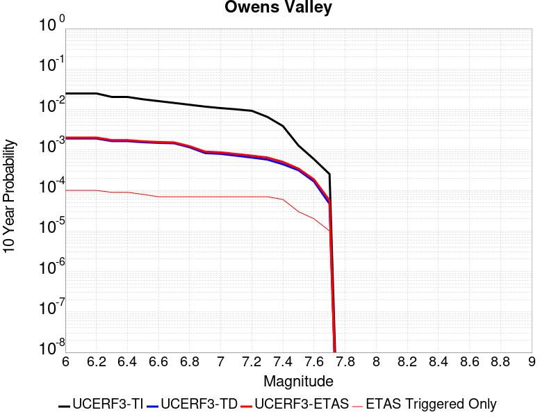 |

| Magnitude | 1 wk TI Prob | 1 wk TD Prob | 1 wk ETAS Prob | 1 wk ETAS/TD Gain | 1 wk ETAS Triggered Only | 1 mo TI Prob | 1 mo TD Prob | 1 mo ETAS Prob | 1 mo ETAS/TD Gain | 1 mo ETAS Triggered Only | 1 yr TI Prob | 1 yr TD Prob | 1 yr ETAS Prob | 1 yr ETAS/TD Gain | 1 yr ETAS Triggered Only | 10 yr TI Prob | 10 yr TD Prob | 10 yr ETAS Prob | 10 yr ETAS/TD Gain | 10 yr ETAS Triggered Only |
|-----|-----|-----|-----|-----|-----|-----|-----|-----|-----|-----|-----|-----|-----|-----|-----|-----|-----|-----|-----|-----|
| 6.0 | 4.83821E-5 | 3.626567E-6 | 7.996217E-5 | 22.048998 | 7.633588E-5 | 2.0733538E-4 | 1.5542342E-5 | 1.3004438E-4 | 8.367103 | 1.1450382E-4 | 0.002521386 | 1.8921259E-4 | 3.0369475E-4 | 1.6050451 | 1.1450382E-4 | 0.024929691 | 0.001925011 | 0.0020392945 | 1.0593677 | 1.1450382E-4 |
| 6.1 | 4.83821E-5 | 3.626567E-6 | 7.996217E-5 | 22.048998 | 7.633588E-5 | 2.0733538E-4 | 1.5542342E-5 | 1.3004438E-4 | 8.367103 | 1.1450382E-4 | 0.002521386 | 1.8921259E-4 | 3.0369475E-4 | 1.6050451 | 1.1450382E-4 | 0.024929691 | 0.001925011 | 0.0020392945 | 1.0593677 | 1.1450382E-4 |
| 6.2 | 4.83821E-5 | 3.626567E-6 | 7.996217E-5 | 22.048998 | 7.633588E-5 | 2.0733538E-4 | 1.5542342E-5 | 1.3004438E-4 | 8.367103 | 1.1450382E-4 | 0.002521386 | 1.8921259E-4 | 3.0369475E-4 | 1.6050451 | 1.1450382E-4 | 0.024929691 | 0.001925011 | 0.0020392945 | 1.0593677 | 1.1450382E-4 |
| 6.3 | 3.953008E-5 | 3.1553948E-6 | 7.949103E-5 | 25.192102 | 7.633588E-5 | 1.6940363E-4 | 1.3523055E-5 | 1.2802532E-4 | 9.46719 | 1.1450382E-4 | 0.002060538 | 1.6463149E-4 | 2.7911644E-4 | 1.6954014 | 1.1450382E-4 | 0.020415364 | 0.0016592 | 0.0017735137 | 1.068897 | 1.1450382E-4 |
| 6.4 | 3.953008E-5 | 3.1553948E-6 | 7.949103E-5 | 25.192102 | 7.633588E-5 | 1.6940363E-4 | 1.3523055E-5 | 1.2802532E-4 | 9.46719 | 1.1450382E-4 | 0.002060538 | 1.6463149E-4 | 2.7911644E-4 | 1.6954014 | 1.1450382E-4 | 0.020415364 | 0.0016592 | 0.0017735137 | 1.068897 | 1.1450382E-4 |
| 6.5 | 3.457342E-5 | 2.9715961E-6 | 7.930725E-5 | 26.688433 | 7.633588E-5 | 1.4816338E-4 | 1.2735354E-5 | 1.2723771E-4 | 9.990905 | 1.1450382E-4 | 0.0018023965 | 1.550426E-4 | 2.6952865E-4 | 1.7384168 | 1.1450382E-4 | 0.017878477 | 0.001555719 | 0.0016700446 | 1.0734874 | 1.1450382E-4 |
| 6.6 | 3.1127765E-5 | 2.8744932E-6 | 7.921015E-5 | 27.556213 | 7.633588E-5 | 1.3339789E-4 | 1.2319203E-5 | 1.2682161E-4 | 10.294628 | 1.1450382E-4 | 0.0016229092 | 1.4997667E-4 | 2.644633E-4 | 1.7633631 | 1.1450382E-4 | 0.016111081 | 0.0015012559 | 0.0016155877 | 1.0761576 | 1.1450382E-4 |
| 6.7 | 2.806885E-5 | 2.8104134E-6 | 7.914608E-5 | 28.16172 | 7.633588E-5 | 1.2028952E-4 | 1.20445775E-5 | 1.2654702E-4 | 10.506556 | 1.1450382E-4 | 0.001463541 | 1.4663354E-4 | 2.6112056E-4 | 1.7807697 | 1.1450382E-4 | 0.014539397 | 0.0014657511 | 0.001580087 | 1.0780051 | 1.1450382E-4 |
| 6.8 | 2.524524E-5 | 2.2353688E-6 | 7.857107E-5 | 35.149044 | 7.633588E-5 | 1.0818939E-4 | 9.580118E-6 | 1.2408284E-4 | 12.95212 | 1.1450382E-4 | 0.0013164099 | 1.16632E-4 | 2.3112247E-4 | 1.9816386 | 1.1450382E-4 | 0.01308639 | 0.0011659812 | 0.0012803514 | 1.0980893 | 1.1450382E-4 |
| 6.9 | 2.2704568E-5 | 1.6081682E-6 | 7.794392E-5 | 48.467518 | 7.633588E-5 | 9.730166E-5 | 6.8921313E-6 | 1.2139516E-4 | 17.613586 | 1.1450382E-4 | 0.0011840039 | 8.390849E-5 | 1.984027E-4 | 2.364513 | 1.1450382E-4 | 0.011777153 | 8.3897985E-4 | 9.533876E-4 | 1.1363653 | 1.1450382E-4 |
| 7.0 | 2.0871712E-5 | 1.5395453E-6 | 7.787531E-5 | 50.583317 | 7.633588E-5 | 8.944713E-5 | 6.598035E-6 | 1.211011E-4 | 18.354116 | 1.1450382E-4 | 0.0010884746 | 8.032813E-5 | 1.9482274E-4 | 2.4253366 | 1.1450382E-4 | 0.010831586 | 8.0316263E-4 | 9.1757445E-4 | 1.1424516 | 1.1450382E-4 |
| 7.1 | 1.944928E-5 | 1.3864178E-6 | 7.772219E-5 | 56.05972 | 7.633588E-5 | 8.335139E-5 | 5.941777E-6 | 1.20444915E-4 | 20.270857 | 1.1450382E-4 | 0.0010143308 | 7.233874E-5 | 1.8683428E-4 | 2.5827692 | 1.1450382E-4 | 0.010097133 | 7.2330976E-4 | 8.3773077E-4 | 1.1581908 | 1.1450382E-4 |
| 7.2 | 1.7876306E-5 | 1.2489141E-6 | 7.75847E-5 | 62.121723 | 7.633588E-5 | 7.6610486E-5 | 5.352478E-6 | 1.19855686E-4 | 22.39256 | 1.1450382E-4 | 9.3233347E-4 | 6.516448E-5 | 1.7966084E-4 | 2.7570362 | 1.1450382E-4 | 0.009284316 | 6.5159105E-4 | 7.6602027E-4 | 1.1756151 | 1.1450382E-4 |
| 7.3 | 1.2618672E-5 | 1.1115209E-6 | 7.7447316E-5 | 69.67689 | 7.633588E-5 | 5.40789E-5 | 4.763652E-6 | 1.1926692E-4 | 25.036865 | 1.1450382E-4 | 6.582117E-4 | 5.799593E-5 | 1.724931E-4 | 2.974228 | 1.1450382E-4 | 0.0065626553 | 5.7994033E-4 | 6.9437776E-4 | 1.1973262 | 1.1450382E-4 |
| 7.4 | 7.4874442E-6 | 8.5486437E-7 | 3.9022772E-5 | 45.647907 | 3.816794E-5 | 3.208865E-5 | 3.6636993E-6 | 7.99993E-5 | 21.83566 | 7.633588E-5 | 3.906093E-4 | 4.4604632E-5 | 1.20937104E-4 | 2.7113128 | 7.633588E-5 | 0.003899234 | 4.4604883E-4 | 5.2235066E-4 | 1.1710616 | 7.633588E-5 |
| 7.5 | 2.4734156E-6 | 6.068616E-7 | 6.068616E-7 | 1.0 | 0.0 | 1.060031E-5 | 2.6008327E-6 | 4.076867E-5 | 15.675238 | 3.816794E-5 | 1.2905113E-4 | 3.166468E-5 | 6.983141E-5 | 2.2053406 | 3.816794E-5 | 0.0012897621 | 3.1660203E-4 | 3.5475788E-4 | 1.1205168 | 3.816794E-5 |
| 7.6 | 1.1328841E-6 | 3.196531E-7 | 3.196531E-7 | 1.0 | 0.0 | 4.8552088E-6 | 1.3699412E-6 | 3.9537827E-5 | 28.860968 | 3.816794E-5 | 5.9110564E-5 | 1.6678909E-5 | 5.484621E-5 | 3.2883575 | 3.816794E-5 | 5.9094845E-4 | 1.6677675E-4 | 2.0493832E-4 | 1.2288183 | 3.816794E-5 |
| 7.7 | 4.8613185E-7 | 8.964689E-8 | 8.964689E-8 | 1.0 | 0.0 | 2.0834207E-6 | 3.8420092E-7 | 3.8420092E-7 | 1.0 | 0.0 | 2.536535E-5 | 4.6776368E-6 | 4.6776368E-6 | 1.0 | 0.0 | 2.5362454E-4 | 4.677545E-5 | 4.677545E-5 | 1.0 | 0.0 |

## Imperial
*[(top)](#table-of-contents)*

| 1 Week | 1 Month | 1 Year | 10 Year |
|-----|-----|-----|-----|
|  |  |  |  |

| Magnitude | 1 wk TI Prob | 1 wk TD Prob | 1 wk ETAS Prob | 1 wk ETAS/TD Gain | 1 wk ETAS Triggered Only | 1 mo TI Prob | 1 mo TD Prob | 1 mo ETAS Prob | 1 mo ETAS/TD Gain | 1 mo ETAS Triggered Only | 1 yr TI Prob | 1 yr TD Prob | 1 yr ETAS Prob | 1 yr ETAS/TD Gain | 1 yr ETAS Triggered Only | 10 yr TI Prob | 10 yr TD Prob | 10 yr ETAS Prob | 10 yr ETAS/TD Gain | 10 yr ETAS Triggered Only |
|-----|-----|-----|-----|-----|-----|-----|-----|-----|-----|-----|-----|-----|-----|-----|-----|-----|-----|-----|-----|-----|
| 6.0 | 2.7496446E-4 | 5.0552754E-4 | 6.1997346E-4 | 1.2263892 | 1.1450382E-4 | 0.0011778869 | 0.002164787 | 0.002279043 | 1.0527793 | 1.1450382E-4 | 0.0142467655 | 0.026038699 | 0.026150221 | 1.004283 | 1.1450382E-4 | 0.13367249 | 0.2280438 | 0.22813217 | 1.0003877 | 1.1450382E-4 |
| 6.1 | 2.5356023E-4 | 4.8656776E-4 | 6.0101587E-4 | 1.2352152 | 1.1450382E-4 | 0.001086234 | 0.0020836622 | 0.0021979276 | 1.0548387 | 1.1450382E-4 | 0.013144928 | 0.025071215 | 0.025182847 | 1.0044526 | 1.1450382E-4 | 0.123940155 | 0.21947981 | 0.21956918 | 1.0004072 | 1.1450382E-4 |
| 6.2 | 2.4820742E-4 | 4.7752203E-4 | 5.9197115E-4 | 1.239673 | 1.1450382E-4 | 0.0010633124 | 0.0020449557 | 0.0021592253 | 1.0558788 | 1.1450382E-4 | 0.01286919 | 0.024611235 | 0.02472292 | 1.0045379 | 1.1450382E-4 | 0.12148927 | 0.21598552 | 0.2160753 | 1.0004157 | 1.1450382E-4 |
| 6.3 | 2.3205351E-4 | 4.5890483E-4 | 5.733561E-4 | 1.2494009 | 1.1450382E-4 | 9.94136E-4 | 0.0019652895 | 0.002079568 | 1.0581486 | 1.1450382E-4 | 0.012036599 | 0.02366133 | 0.023773124 | 1.0047247 | 1.1450382E-4 | 0.11405133 | 0.20793462 | 0.2080253 | 1.0004362 | 1.1450382E-4 |
| 6.4 | 2.0304754E-4 | 3.987652E-4 | 5.1322335E-4 | 1.2870314 | 1.1450382E-4 | 8.6991355E-4 | 0.0017078889 | 0.0018221972 | 1.0669296 | 1.1450382E-4 | 0.010539869 | 0.020595672 | 0.020707816 | 1.0054451 | 1.1450382E-4 | 0.100537635 | 0.1850669 | 0.1851602 | 1.0005043 | 1.1450382E-4 |
| 6.5 | 1.854992E-4 | 3.6988858E-4 | 4.8435005E-4 | 1.3094485 | 1.1450382E-4 | 7.9475436E-4 | 0.0015842861 | 0.0016986085 | 1.0721602 | 1.1450382E-4 | 0.009633281 | 0.01911948 | 0.019231796 | 1.0058744 | 1.1450382E-4 | 0.0922623 | 0.173298 | 0.17339267 | 1.0005462 | 1.1450382E-4 |
| 6.6 | 1.6586106E-4 | 3.403506E-4 | 4.5481545E-4 | 1.3363144 | 1.1450382E-4 | 7.106394E-4 | 0.0014578402 | 0.0015721772 | 1.078429 | 1.1450382E-4 | 0.008617763 | 0.01760642 | 0.017718907 | 1.006389 | 1.1450382E-4 | 0.08291132 | 0.16077545 | 0.16087154 | 1.0005977 | 1.1450382E-4 |
| 6.7 | 1.4224656E-4 | 3.076692E-4 | 4.2213776E-4 | 1.3720509 | 1.1450382E-4 | 6.094856E-4 | 0.001317924 | 0.0014322769 | 1.0867674 | 1.1450382E-4 | 0.0073952693 | 0.015929576 | 0.016042257 | 1.0070736 | 1.1450382E-4 | 0.07153955 | 0.14648417 | 0.14658189 | 1.0006672 | 1.1450382E-4 |
| 6.8 | 1.2317259E-4 | 2.779122E-4 | 3.923842E-4 | 1.4118999 | 1.1450382E-4 | 5.2777573E-4 | 0.0011905148 | 0.0013048822 | 1.0960656 | 1.1450382E-4 | 0.0064067547 | 0.0143995695 | 0.014512424 | 1.0078374 | 1.1450382E-4 | 0.06225166 | 0.13293684 | 0.1330361 | 1.0007468 | 1.1450382E-4 |
| 6.9 | 9.859898E-5 | 2.5014306E-4 | 3.6461823E-4 | 1.4576389 | 1.1450382E-4 | 4.2249862E-4 | 0.0010716055 | 0.0011859866 | 1.1067381 | 1.1450382E-4 | 0.0051317946 | 0.012969712 | 0.013082731 | 1.0087141 | 1.1450382E-4 | 0.05014893 | 0.11940631 | 0.11950715 | 1.0008445 | 1.1450382E-4 |
| 7.0 | 7.3191884E-5 | 2.1266776E-4 | 3.2714722E-4 | 1.538302 | 1.1450382E-4 | 3.136418E-4 | 9.1111806E-4 | 0.0010255176 | 1.1255594 | 1.1450382E-4 | 0.003811904 | 0.011037128 | 0.011150368 | 1.0102599 | 1.1450382E-4 | 0.037471764 | 0.10206493 | 0.10216774 | 1.0010073 | 1.1450382E-4 |
| 7.1 | 7.1760296E-5 | 2.0968143E-4 | 3.2416123E-4 | 1.5459702 | 1.1450382E-4 | 3.0750787E-4 | 8.983284E-4 | 0.0010127292 | 1.1273487 | 1.1450382E-4 | 0.003737482 | 0.010882978 | 0.010996236 | 1.0104069 | 1.1450382E-4 | 0.03675245 | 0.10070146 | 0.100804426 | 1.0010226 | 1.1450382E-4 |
| 7.2 | 6.46614E-5 | 1.9136685E-4 | 3.0584878E-4 | 1.5982326 | 1.1450382E-4 | 2.7709085E-4 | 8.1988896E-4 | 9.3429885E-4 | 1.1395432 | 1.1450382E-4 | 0.0033683628 | 0.0099370815 | 0.010050448 | 1.0114083 | 1.1450382E-4 | 0.033177625 | 0.09250898 | 0.09261289 | 1.0011233 | 1.1450382E-4 |
| 7.3 | 6.088115E-5 | 1.78084E-4 | 2.5440627E-4 | 1.4285747 | 7.633588E-5 | 2.6089314E-4 | 7.6299673E-4 | 8.392744E-4 | 1.099971 | 7.633588E-5 | 0.0031717476 | 0.009250494 | 0.009326124 | 1.0081757 | 7.633588E-5 | 0.031268585 | 0.08655989 | 0.08662962 | 1.0008055 | 7.633588E-5 |
| 7.4 | 4.199346E-5 | 1.1510366E-4 | 1.9143075E-4 | 1.6631161 | 7.633588E-5 | 1.7995955E-4 | 4.9320905E-4 | 5.6950725E-4 | 1.1546975 | 7.633588E-5 | 0.0021888057 | 0.0059884563 | 0.006064335 | 1.0126709 | 7.633588E-5 | 0.02167372 | 0.057439793 | 0.057511747 | 1.0012527 | 7.633588E-5 |
| 7.5 | 3.130448E-5 | 8.33328E-5 | 1.5966232E-4 | 1.9159601 | 7.633588E-5 | 1.3415517E-4 | 3.57092E-4 | 4.3340062E-4 | 1.2136946 | 7.633588E-5 | 0.0016321153 | 0.004338988 | 0.004414993 | 1.0175167 | 7.633588E-5 | 0.016201803 | 0.04213201 | 0.04220513 | 1.0017354 | 7.633588E-5 |
| 7.6 | 2.3074248E-5 | 6.0844646E-5 | 1.3717588E-4 | 2.2545266 | 7.633588E-5 | 9.888588E-5 | 2.6073685E-4 | 3.3705283E-4 | 1.2926935 | 7.633588E-5 | 0.0012032706 | 0.0031698733 | 0.0032459672 | 1.0240053 | 7.633588E-5 | 0.011967761 | 0.031026395 | 0.031100363 | 1.0023841 | 7.633588E-5 |
| 7.7 | 1.45864815E-5 | 4.0124698E-5 | 1.16457515E-4 | 2.9023898 | 7.633588E-5 | 6.2511994E-5 | 1.7195169E-4 | 2.4827445E-4 | 1.4438616 | 7.633588E-5 | 7.608177E-4 | 0.0020915072 | 0.0021676833 | 1.0364217 | 7.633588E-5 | 0.007582182 | 0.020627763 | 0.020702524 | 1.0036243 | 7.633588E-5 |
| 7.8 | 1.0352979E-5 | 3.0960902E-5 | 6.912766E-5 | 2.2327406 | 3.816794E-5 | 4.4369157E-5 | 1.3268284E-4 | 1.7084571E-4 | 1.2876248 | 3.816794E-5 | 5.400606E-4 | 0.0016142189 | 0.0016523253 | 1.0236067 | 3.816794E-5 | 0.0053875 | 0.016016833 | 0.01605439 | 1.0023448 | 3.816794E-5 |
| 7.9 | 8.137906E-6 | 2.2149103E-5 | 6.0316197E-5 | 2.723189 | 3.816794E-5 | 3.4876273E-5 | 9.492128E-5 | 1.3308559E-4 | 1.4020628 | 3.816794E-5 | 4.2453592E-4 | 0.0011550548 | 0.0011931787 | 1.0330061 | 3.816794E-5 | 0.004237258 | 0.011617903 | 0.011655627 | 1.0032471 | 3.816794E-5 |
| 8.0 | 6.93792E-6 | 1.8008766E-5 | 1.8008766E-5 | 1.0 | 0.0 | 2.9733603E-5 | 7.717814E-5 | 7.717814E-5 | 1.0 | 0.0 | 3.6194647E-4 | 9.3923963E-4 | 9.3923963E-4 | 1.0 | 0.0 | 0.0036135751 | 0.00950155 | 0.00950155 | 1.0 | 0.0 |
| 8.1 | 3.4286315E-6 | 6.379872E-6 | 6.379872E-6 | 1.0 | 0.0 | 1.4694053E-5 | 2.7342023E-5 | 2.7342023E-5 | 1.0 | 0.0 | 1.7888541E-4 | 3.328384E-4 | 3.328384E-4 | 1.0 | 0.0 | 0.0017874148 | 0.003486031 | 0.003486031 | 1.0 | 0.0 |
| 8.2 | 1.4906886E-6 | 1.9366646E-6 | 1.9366646E-6 | 1.0 | 0.0 | 6.3886496E-6 | 8.299965E-6 | 8.299965E-6 | 1.0 | 0.0 | 7.7779034E-5 | 1.0104742E-4 | 1.0104742E-4 | 1.0 | 0.0 | 7.775182E-4 | 0.0011075331 | 0.0011075331 | 1.0 | 0.0 |
| 8.3 | 2.5758007E-8 | 1.4500102E-8 | 1.4500102E-8 | 1.0 | 0.0 | 1.10391454E-7 | 6.214329E-8 | 6.214329E-8 | 1.0 | 0.0 | 1.3440151E-6 | 7.565946E-7 | 7.565946E-7 | 1.0 | 0.0 | 1.344007E-5 | 7.887763E-6 | 7.887763E-6 | 1.0 | 0.0 |

## Kern Canyon (South Kern) 2011
*[(top)](#table-of-contents)*

| 1 Week | 1 Month | 1 Year | 10 Year |
|-----|-----|-----|-----|
|  |  |  | 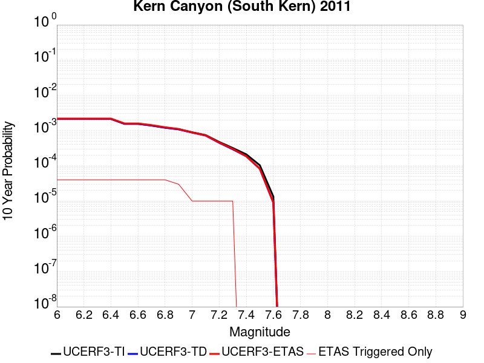 |

| Magnitude | 1 wk TI Prob | 1 wk TD Prob | 1 wk ETAS Prob | 1 wk ETAS/TD Gain | 1 wk ETAS Triggered Only | 1 mo TI Prob | 1 mo TD Prob | 1 mo ETAS Prob | 1 mo ETAS/TD Gain | 1 mo ETAS Triggered Only | 1 yr TI Prob | 1 yr TD Prob | 1 yr ETAS Prob | 1 yr ETAS/TD Gain | 1 yr ETAS Triggered Only | 10 yr TI Prob | 10 yr TD Prob | 10 yr ETAS Prob | 10 yr ETAS/TD Gain | 10 yr ETAS Triggered Only |
|-----|-----|-----|-----|-----|-----|-----|-----|-----|-----|-----|-----|-----|-----|-----|-----|-----|-----|-----|-----|-----|
| 6.0 | 4.105075E-6 | 4.1137264E-6 | 1.1861707E-4 | 28.834457 | 1.1450382E-4 | 1.7593058E-5 | 1.763014E-5 | 1.3213194E-4 | 7.494662 | 1.1450382E-4 | 2.1417443E-4 | 2.1462646E-4 | 3.291057E-4 | 1.5333883 | 1.1450382E-4 | 0.0021396813 | 0.0021442557 | 0.002258514 | 1.0532857 | 1.1450382E-4 |
| 6.1 | 4.105075E-6 | 4.1137264E-6 | 1.1861707E-4 | 28.834457 | 1.1450382E-4 | 1.7593058E-5 | 1.763014E-5 | 1.3213194E-4 | 7.494662 | 1.1450382E-4 | 2.1417443E-4 | 2.1462646E-4 | 3.291057E-4 | 1.5333883 | 1.1450382E-4 | 0.0021396813 | 0.0021442557 | 0.002258514 | 1.0532857 | 1.1450382E-4 |
| 6.2 | 4.105075E-6 | 4.1137264E-6 | 1.1861707E-4 | 28.834457 | 1.1450382E-4 | 1.7593058E-5 | 1.763014E-5 | 1.3213194E-4 | 7.494662 | 1.1450382E-4 | 2.1417443E-4 | 2.1462646E-4 | 3.291057E-4 | 1.5333883 | 1.1450382E-4 | 0.0021396813 | 0.0021442557 | 0.002258514 | 1.0532857 | 1.1450382E-4 |
| 6.3 | 4.105075E-6 | 4.1137264E-6 | 1.1861707E-4 | 28.834457 | 1.1450382E-4 | 1.7593058E-5 | 1.763014E-5 | 1.3213194E-4 | 7.494662 | 1.1450382E-4 | 2.1417443E-4 | 2.1462646E-4 | 3.291057E-4 | 1.5333883 | 1.1450382E-4 | 0.0021396813 | 0.0021442557 | 0.002258514 | 1.0532857 | 1.1450382E-4 |
| 6.4 | 4.105075E-6 | 4.1137264E-6 | 1.1861707E-4 | 28.834457 | 1.1450382E-4 | 1.7593058E-5 | 1.763014E-5 | 1.3213194E-4 | 7.494662 | 1.1450382E-4 | 2.1417443E-4 | 2.1462646E-4 | 3.291057E-4 | 1.5333883 | 1.1450382E-4 | 0.0021396813 | 0.0021442557 | 0.002258514 | 1.0532857 | 1.1450382E-4 |
| 6.5 | 2.9849807E-6 | 2.9731548E-6 | 1.1747663E-4 | 39.51245 | 1.1450382E-4 | 1.2792712E-5 | 1.274203E-5 | 1.2724439E-4 | 9.986195 | 1.1450382E-4 | 1.5574014E-4 | 1.5512333E-4 | 2.696094E-4 | 1.7380325 | 1.1450382E-4 | 0.0015563103 | 0.0015501656 | 0.001664492 | 1.0737511 | 1.1450382E-4 |
| 6.6 | 2.9849807E-6 | 2.9731548E-6 | 1.1747663E-4 | 39.51245 | 1.1450382E-4 | 1.2792712E-5 | 1.274203E-5 | 1.2724439E-4 | 9.986195 | 1.1450382E-4 | 1.5574014E-4 | 1.5512333E-4 | 2.696094E-4 | 1.7380325 | 1.1450382E-4 | 0.0015563103 | 0.0015501656 | 0.001664492 | 1.0737511 | 1.1450382E-4 |
| 6.7 | 2.6756725E-6 | 2.6582206E-6 | 1.1716173E-4 | 44.075245 | 1.1450382E-4 | 1.1467117E-5 | 1.1392325E-5 | 1.2589483E-4 | 11.050846 | 1.1450382E-4 | 1.396032E-4 | 1.3869285E-4 | 2.5318077E-4 | 1.8254783 | 1.1450382E-4 | 0.0013951553 | 0.0013860738 | 0.0015004189 | 1.0824957 | 1.1450382E-4 |
| 6.8 | 2.3283721E-6 | 2.3047787E-6 | 1.1680833E-4 | 50.680927 | 1.1450382E-4 | 9.9787E-6 | 9.877586E-6 | 1.2438027E-4 | 12.592173 | 1.1450382E-4 | 1.214839E-4 | 1.20253055E-4 | 2.347431E-4 | 1.952076 | 1.1450382E-4 | 0.001214175 | 0.0012018873 | 0.0013162534 | 1.0951555 | 1.1450382E-4 |
| 6.9 | 2.0972677E-6 | 2.0696411E-6 | 7.840536E-5 | 37.883553 | 7.633588E-5 | 8.988259E-6 | 8.869861E-6 | 8.520506E-5 | 9.606133 | 7.633588E-5 | 1.0942656E-4 | 1.0798526E-4 | 1.843129E-4 | 1.7068338 | 7.633588E-5 | 0.0010937268 | 0.0010793337 | 0.0011555871 | 1.0706487 | 7.633588E-5 |
| 7.0 | 1.7132242E-6 | 1.6787036E-6 | 3.9846578E-5 | 23.736519 | 3.816794E-5 | 7.3423685E-6 | 7.194424E-6 | 4.536209E-5 | 6.305173 | 3.816794E-5 | 8.938967E-5 | 8.758863E-5 | 1.2575323E-4 | 1.4357255 | 3.816794E-5 | 8.935372E-4 | 8.7554497E-4 | 9.136795E-4 | 1.0435551 | 3.816794E-5 |
| 7.1 | 1.4215541E-6 | 1.3815752E-6 | 3.954946E-5 | 28.626354 | 3.816794E-5 | 6.0923603E-6 | 5.9210233E-6 | 4.4088738E-5 | 7.4461346 | 3.816794E-5 | 7.417196E-5 | 7.20861E-5 | 1.1025129E-4 | 1.529439 | 3.816794E-5 | 7.414721E-4 | 7.206299E-4 | 7.5877033E-4 | 1.0529265 | 3.816794E-5 |
| 7.2 | 9.097853E-7 | 8.6037755E-7 | 3.9028284E-5 | 45.36181 | 3.816794E-5 | 3.899074E-6 | 3.6873273E-6 | 4.1855124E-5 | 11.351074 | 3.816794E-5 | 4.7470192E-5 | 4.4892295E-5 | 8.305852E-5 | 1.8501732 | 3.816794E-5 | 4.7460053E-4 | 4.4883334E-4 | 4.8698415E-4 | 1.0849999 | 3.816794E-5 |
| 7.3 | 6.144169E-7 | 5.628206E-7 | 3.8730737E-5 | 68.81542 | 3.816794E-5 | 2.6332125E-6 | 2.4120861E-6 | 4.0579933E-5 | 16.823584 | 3.816794E-5 | 3.205889E-5 | 2.9366758E-5 | 6.7533576E-5 | 2.2996604 | 3.816794E-5 | 3.2054266E-4 | 2.936293E-4 | 3.3178602E-4 | 1.1299486 | 3.816794E-5 |
| 7.4 | 4.049844E-7 | 3.5728314E-7 | 3.5728314E-7 | 1.0 | 0.0 | 1.7356463E-6 | 1.5312125E-6 | 1.5312125E-6 | 1.0 | 0.0 | 2.1131287E-5 | 1.8642357E-5 | 1.8642357E-5 | 1.0 | 0.0 | 2.1129279E-4 | 1.8640817E-4 | 1.8640817E-4 | 1.0 | 0.0 |
| 7.5 | 1.9871162E-7 | 1.583044E-7 | 1.583044E-7 | 1.0 | 0.0 | 8.5162094E-7 | 6.7844724E-7 | 6.7844724E-7 | 1.0 | 0.0 | 1.0368436E-5 | 8.260065E-6 | 8.260065E-6 | 1.0 | 0.0 | 1.0367952E-4 | 8.259767E-5 | 8.259767E-5 | 1.0 | 0.0 |
| 7.6 | 2.572245E-8 | 1.7352555E-8 | 1.7352555E-8 | 1.0 | 0.0 | 1.10239064E-7 | 7.436809E-8 | 7.436809E-8 | 1.0 | 0.0 | 1.3421597E-6 | 9.054312E-7 | 9.054312E-7 | 1.0 | 0.0 | 1.3421517E-5 | 9.05428E-6 | 9.05428E-6 | 1.0 | 0.0 |

## San Andreas (Cholame) rev
*[(top)](#table-of-contents)*

| 1 Week | 1 Month | 1 Year | 10 Year |
|-----|-----|-----|-----|
|  |  |  |  |

| Magnitude | 1 wk TI Prob | 1 wk TD Prob | 1 wk ETAS Prob | 1 wk ETAS/TD Gain | 1 wk ETAS Triggered Only | 1 mo TI Prob | 1 mo TD Prob | 1 mo ETAS Prob | 1 mo ETAS/TD Gain | 1 mo ETAS Triggered Only | 1 yr TI Prob | 1 yr TD Prob | 1 yr ETAS Prob | 1 yr ETAS/TD Gain | 1 yr ETAS Triggered Only | 10 yr TI Prob | 10 yr TD Prob | 10 yr ETAS Prob | 10 yr ETAS/TD Gain | 10 yr ETAS Triggered Only |
|-----|-----|-----|-----|-----|-----|-----|-----|-----|-----|-----|-----|-----|-----|-----|-----|-----|-----|-----|-----|-----|
| 6.0 | 1.2302514E-4 | 2.5204287E-4 | 2.902012E-4 | 1.1513962 | 3.816794E-5 | 5.27144E-4 | 0.0010797381 | 0.0011559917 | 1.0706222 | 7.633588E-5 | 0.0063991086 | 0.0130670825 | 0.013142421 | 1.0057656 | 7.633588E-5 | 0.06217949 | 0.12439073 | 0.12449099 | 1.000806 | 1.1450382E-4 |
| 6.1 | 1.2302514E-4 | 2.5204287E-4 | 2.902012E-4 | 1.1513962 | 3.816794E-5 | 5.27144E-4 | 0.0010797381 | 0.0011559917 | 1.0706222 | 7.633588E-5 | 0.0063991086 | 0.0130670825 | 0.013142421 | 1.0057656 | 7.633588E-5 | 0.06217949 | 0.12439073 | 0.12449099 | 1.000806 | 1.1450382E-4 |
| 6.2 | 1.2203569E-4 | 2.5021084E-4 | 2.8836922E-4 | 1.1525049 | 3.816794E-5 | 5.2290526E-4 | 0.0010718931 | 0.0011481472 | 1.0711396 | 7.633588E-5 | 0.006347804 | 0.01297271 | 0.013048056 | 1.005808 | 7.633588E-5 | 0.061695136 | 0.12357691 | 0.12367726 | 1.000812 | 1.1450382E-4 |
| 6.3 | 1.2142645E-4 | 2.4907055E-4 | 2.87229E-4 | 1.1532032 | 3.816794E-5 | 5.202953E-4 | 0.0010670102 | 0.0011432646 | 1.0714655 | 7.633588E-5 | 0.006316212 | 0.012913967 | 0.012989317 | 1.0058348 | 7.633588E-5 | 0.06139677 | 0.12307103 | 0.12317144 | 1.0008159 | 1.1450382E-4 |
| 6.4 | 1.1865206E-4 | 2.44126E-4 | 2.8228463E-4 | 1.1563071 | 3.816794E-5 | 5.0840975E-4 | 0.0010458364 | 0.0011220925 | 1.0729139 | 7.633588E-5 | 0.006172335 | 0.012659196 | 0.012734566 | 1.0059538 | 7.633588E-5 | 0.060036868 | 0.1208638 | 0.12096447 | 1.0008329 | 1.1450382E-4 |
| 6.5 | 1.17443946E-4 | 2.4205919E-4 | 2.8021788E-4 | 1.157642 | 3.816794E-5 | 5.032341E-4 | 0.0010369857 | 0.0011132424 | 1.0735369 | 7.633588E-5 | 0.006109677 | 0.012552682 | 0.01262806 | 1.0060049 | 7.633588E-5 | 0.059444077 | 0.11993805 | 0.12003882 | 1.0008402 | 1.1450382E-4 |
| 6.6 | 1.13579066E-4 | 2.3514954E-4 | 2.733085E-4 | 1.1622753 | 3.816794E-5 | 4.866766E-4 | 0.001007396 | 0.001083655 | 1.0756991 | 7.633588E-5 | 0.0059092017 | 0.012196515 | 0.012271919 | 1.0061824 | 7.633588E-5 | 0.057545185 | 0.11685214 | 0.11695327 | 1.0008653 | 1.1450382E-4 |
| 6.7 | 1.1271412E-4 | 2.3359268E-4 | 2.7175172E-4 | 1.1633571 | 3.816794E-5 | 4.829711E-4 | 0.0010007289 | 0.0010769884 | 1.076204 | 7.633588E-5 | 0.005864331 | 0.012116249 | 0.01219166 | 1.0062239 | 7.633588E-5 | 0.057119697 | 0.116155714 | 0.116256915 | 1.0008713 | 1.1450382E-4 |
| 6.8 | 1.1217975E-4 | 2.3247694E-4 | 2.7063602E-4 | 1.1641413 | 3.816794E-5 | 4.8068175E-4 | 9.959509E-4 | 0.0010722107 | 1.0765699 | 7.633588E-5 | 0.005836608 | 0.012058721 | 0.012134137 | 1.006254 | 7.633588E-5 | 0.056856725 | 0.11565396 | 0.11575523 | 1.0008756 | 1.1450382E-4 |
| 6.9 | 1.1146753E-4 | 2.3096445E-4 | 2.691236E-4 | 1.1652164 | 3.816794E-5 | 4.7763053E-4 | 9.894737E-4 | 0.001065734 | 1.0770717 | 7.633588E-5 | 0.0057996577 | 0.011980731 | 0.012056152 | 1.0062952 | 7.633588E-5 | 0.056506127 | 0.11497439 | 0.11507573 | 1.0008814 | 1.1450382E-4 |
| 7.0 | 1.0965793E-4 | 2.2719789E-4 | 2.6535714E-4 | 1.1679561 | 3.816794E-5 | 4.698779E-4 | 9.733434E-4 | 0.001049605 | 1.0783501 | 7.633588E-5 | 0.005705768 | 0.011786487 | 0.011861923 | 1.0064002 | 7.633588E-5 | 0.055614736 | 0.11327597 | 0.1133775 | 1.0008963 | 1.1450382E-4 |
| 7.1 | 9.927982E-5 | 2.0538924E-4 | 2.4354934E-4 | 1.1857941 | 3.816794E-5 | 4.2541555E-4 | 8.7994366E-4 | 9.5621235E-4 | 1.0866746 | 7.633588E-5 | 0.0051671406 | 0.010660981 | 0.010736503 | 1.007084 | 7.633588E-5 | 0.05048634 | 0.1033706 | 0.10347327 | 1.0009933 | 1.1450382E-4 |
| 7.2 | 9.696786E-5 | 2.0043184E-4 | 2.3859213E-4 | 1.1903903 | 3.816794E-5 | 4.1551032E-4 | 8.5871184E-4 | 9.3498215E-4 | 1.0888195 | 7.633588E-5 | 0.00504711 | 0.010404981 | 0.010480522 | 1.0072601 | 7.633588E-5 | 0.04934009 | 0.1011086 | 0.101211525 | 1.0010179 | 1.1450382E-4 |
| 7.3 | 9.4727984E-5 | 1.9472468E-4 | 2.328852E-4 | 1.1959716 | 3.816794E-5 | 4.0591392E-4 | 8.3426846E-4 | 9.1054064E-4 | 1.091424 | 7.633588E-5 | 0.0049308087 | 0.010110183 | 0.0101857465 | 1.0074741 | 7.633588E-5 | 0.048228268 | 0.09847952 | 0.098582745 | 1.0010482 | 1.1450382E-4 |
| 7.4 | 9.220358E-5 | 1.8843076E-4 | 2.2659151E-4 | 1.2025187 | 3.816794E-5 | 3.9509835E-4 | 8.073114E-4 | 8.835856E-4 | 1.0944793 | 7.633588E-5 | 0.004799717 | 0.009784967 | 0.009860556 | 1.007725 | 7.633588E-5 | 0.046973653 | 0.095557496 | 0.09566106 | 1.0010837 | 1.1450382E-4 |
| 7.5 | 7.71631E-5 | 1.5177966E-4 | 1.8994181E-4 | 1.2514312 | 3.816794E-5 | 3.306571E-4 | 6.503223E-4 | 7.266085E-4 | 1.1173053 | 7.633588E-5 | 0.0040183207 | 0.007889002 | 0.007964735 | 1.0095999 | 7.633588E-5 | 0.03946433 | 0.07828531 | 0.078390844 | 1.0013481 | 1.1450382E-4 |
| 7.6 | 7.5634416E-5 | 1.483744E-4 | 1.8653666E-4 | 1.2572026 | 3.816794E-5 | 3.241072E-4 | 6.3573546E-4 | 7.120228E-4 | 1.1199986 | 7.633588E-5 | 0.0039388672 | 0.0077126776 | 0.007788425 | 1.0098212 | 7.633588E-5 | 0.038697794 | 0.07664872 | 0.07675445 | 1.0013794 | 1.1450382E-4 |
| 7.7 | 6.3783E-5 | 1.235872E-4 | 1.6175043E-4 | 1.3087959 | 3.816794E-5 | 2.7332708E-4 | 5.29552E-4 | 5.676997E-4 | 1.0720377 | 3.816794E-5 | 0.0033226798 | 0.0064282627 | 0.006466185 | 1.0058993 | 3.816794E-5 | 0.032734364 | 0.06454029 | 0.0646117 | 1.0011064 | 7.633588E-5 |
| 7.8 | 5.863422E-5 | 1.1416107E-4 | 1.5232466E-4 | 1.3342959 | 3.816794E-5 | 2.512653E-4 | 4.8917E-4 | 5.273193E-4 | 1.0779878 | 3.816794E-5 | 0.003054864 | 0.0059394026 | 0.005977344 | 1.0063881 | 3.816794E-5 | 0.030132094 | 0.059659187 | 0.059695076 | 1.0006016 | 3.816794E-5 |
| 7.9 | 4.595283E-5 | 8.426331E-5 | 1.2242803E-4 | 1.4529222 | 3.816794E-5 | 1.9692584E-4 | 3.610785E-4 | 3.9923267E-4 | 1.1056672 | 3.816794E-5 | 0.0023949358 | 0.0043872762 | 0.0044252765 | 1.0086615 | 3.816794E-5 | 0.023692891 | 0.044362005 | 0.04439848 | 1.0008222 | 3.816794E-5 |
| 8.0 | 3.2950178E-5 | 5.0772942E-5 | 5.0772942E-5 | 1.0 | 0.0 | 1.412074E-4 | 2.1758018E-4 | 2.1758018E-4 | 1.0 | 0.0 | 0.0017178444 | 0.0026458222 | 0.0026458222 | 1.0 | 0.0 | 0.017046256 | 0.027180137 | 0.027180137 | 1.0 | 0.0 |
| 8.1 | 1.9177472E-5 | 1.9185145E-5 | 1.9185145E-5 | 1.0 | 0.0 | 8.218658E-5 | 8.221946E-5 | 8.221946E-5 | 1.0 | 0.0 | 0.0010001622 | 0.0010005629 | 0.0010005629 | 1.0 | 0.0 | 0.009956728 | 0.010758142 | 0.010758142 | 1.0 | 0.0 |
| 8.2 | 8.643924E-6 | 5.4748625E-6 | 5.4748625E-6 | 1.0 | 0.0 | 3.704486E-5 | 2.3463486E-5 | 2.3463486E-5 | 1.0 | 0.0 | 4.5092785E-4 | 2.8563058E-4 | 2.8563058E-4 | 1.0 | 0.0 | 0.0045001395 | 0.0032487072 | 0.0032487072 | 1.0 | 0.0 |
| 8.3 | 1.983087E-6 | 7.6599065E-7 | 7.6599065E-7 | 1.0 | 0.0 | 8.498917E-6 | 3.282813E-6 | 3.282813E-6 | 1.0 | 0.0 | 1.034694E-4 | 3.9967534E-5 | 3.9967534E-5 | 1.0 | 0.0 | 0.0010342124 | 4.719687E-4 | 4.719687E-4 | 1.0 | 0.0 |

## San Jacinto (Stepovers Combined)
*[(top)](#table-of-contents)*

| 1 Week | 1 Month | 1 Year | 10 Year |
|-----|-----|-----|-----|
|  |  |  |  |

| Magnitude | 1 wk TI Prob | 1 wk TD Prob | 1 wk ETAS Prob | 1 wk ETAS/TD Gain | 1 wk ETAS Triggered Only | 1 mo TI Prob | 1 mo TD Prob | 1 mo ETAS Prob | 1 mo ETAS/TD Gain | 1 mo ETAS Triggered Only | 1 yr TI Prob | 1 yr TD Prob | 1 yr ETAS Prob | 1 yr ETAS/TD Gain | 1 yr ETAS Triggered Only | 10 yr TI Prob | 10 yr TD Prob | 10 yr ETAS Prob | 10 yr ETAS/TD Gain | 10 yr ETAS Triggered Only |
|-----|-----|-----|-----|-----|-----|-----|-----|-----|-----|-----|-----|-----|-----|-----|-----|-----|-----|-----|-----|-----|
| 6.0 | 4.0667746E-5 | 3.5272755E-5 | 1.4977253E-4 | 4.246125 | 1.1450382E-4 | 1.742787E-4 | 1.5116022E-4 | 2.6564673E-4 | 1.7573853 | 1.1450382E-4 | 0.0021197782 | 0.0018388226 | 0.0019531159 | 1.0621557 | 1.1450382E-4 | 0.020996714 | 0.018986892 | 0.01909922 | 1.0059161 | 1.1450382E-4 |
| 6.1 | 4.0667746E-5 | 3.5272755E-5 | 1.4977253E-4 | 4.246125 | 1.1450382E-4 | 1.742787E-4 | 1.5116022E-4 | 2.6564673E-4 | 1.7573853 | 1.1450382E-4 | 0.0021197782 | 0.0018388226 | 0.0019531159 | 1.0621557 | 1.1450382E-4 | 0.020996714 | 0.018986892 | 0.01909922 | 1.0059161 | 1.1450382E-4 |
| 6.2 | 4.0667746E-5 | 3.5272755E-5 | 1.4977253E-4 | 4.246125 | 1.1450382E-4 | 1.742787E-4 | 1.5116022E-4 | 2.6564673E-4 | 1.7573853 | 1.1450382E-4 | 0.0021197782 | 0.0018388226 | 0.0019531159 | 1.0621557 | 1.1450382E-4 | 0.020996714 | 0.018986892 | 0.01909922 | 1.0059161 | 1.1450382E-4 |
| 6.3 | 4.0667746E-5 | 3.5272755E-5 | 1.4977253E-4 | 4.246125 | 1.1450382E-4 | 1.742787E-4 | 1.5116022E-4 | 2.6564673E-4 | 1.7573853 | 1.1450382E-4 | 0.0021197782 | 0.0018388226 | 0.0019531159 | 1.0621557 | 1.1450382E-4 | 0.020996714 | 0.018986892 | 0.01909922 | 1.0059161 | 1.1450382E-4 |
| 6.4 | 4.0577226E-5 | 3.5144654E-5 | 1.4964445E-4 | 4.2579575 | 1.1450382E-4 | 1.738908E-4 | 1.5061127E-4 | 2.6509786E-4 | 1.7601461 | 1.1450382E-4 | 0.0021150648 | 0.0018321523 | 0.0019464463 | 1.0623823 | 1.1450382E-4 | 0.020950472 | 0.018921461 | 0.019033797 | 1.005937 | 1.1450382E-4 |
| 6.5 | 4.0577226E-5 | 3.5144654E-5 | 1.4964445E-4 | 4.2579575 | 1.1450382E-4 | 1.738908E-4 | 1.5061127E-4 | 2.6509786E-4 | 1.7601461 | 1.1450382E-4 | 0.0021150648 | 0.0018321523 | 0.0019464463 | 1.0623823 | 1.1450382E-4 | 0.020950472 | 0.018921461 | 0.019033797 | 1.005937 | 1.1450382E-4 |
| 6.6 | 4.053861E-5 | 3.509E-5 | 1.495898E-4 | 4.263032 | 1.1450382E-4 | 1.7372532E-4 | 1.5037706E-4 | 2.6486366E-4 | 1.7613301 | 1.1450382E-4 | 0.0021130538 | 0.0018293057 | 0.0019436 | 1.0624796 | 1.1450382E-4 | 0.020930743 | 0.018893538 | 0.01900588 | 1.0059459 | 1.1450382E-4 |
| 6.7 | 4.0516545E-5 | 3.5059067E-5 | 1.4955887E-4 | 4.265911 | 1.1450382E-4 | 1.7363077E-4 | 1.5024451E-4 | 2.6473112E-4 | 1.762002 | 1.1450382E-4 | 0.002111905 | 0.001827695 | 0.0019419895 | 1.0625348 | 1.1450382E-4 | 0.020919468 | 0.018877735 | 0.018990077 | 1.005951 | 1.1450382E-4 |
| 6.8 | 4.049434E-5 | 3.5030633E-5 | 1.4953043E-4 | 4.2685623 | 1.1450382E-4 | 1.7353562E-4 | 1.5012265E-4 | 2.646093E-4 | 1.7626206 | 1.1450382E-4 | 0.0021107488 | 0.0018262138 | 0.0019405085 | 1.0625856 | 1.1450382E-4 | 0.020908125 | 0.018863149 | 0.018975493 | 1.0059557 | 1.1450382E-4 |
| 6.9 | 4.046386E-5 | 3.499319E-5 | 1.49493E-4 | 4.2720594 | 1.1450382E-4 | 1.73405E-4 | 1.4996222E-4 | 2.6444887E-4 | 1.7634366 | 1.1450382E-4 | 0.0021091616 | 0.0018242638 | 0.0019385588 | 1.0626526 | 1.1450382E-4 | 0.020892553 | 0.01884392 | 0.018956266 | 1.0059619 | 1.1450382E-4 |
| 7.0 | 4.036382E-5 | 3.487376E-5 | 1.4937358E-4 | 4.283266 | 1.1450382E-4 | 1.7297632E-4 | 1.4945042E-4 | 2.6393714E-4 | 1.7660514 | 1.1450382E-4 | 0.0021039525 | 0.0018180435 | 0.0019323392 | 1.0628674 | 1.1450382E-4 | 0.02084144 | 0.018782536 | 0.018894888 | 1.0059818 | 1.1450382E-4 |
| 7.1 | 4.0343282E-5 | 3.4852223E-5 | 1.4935205E-4 | 4.285295 | 1.1450382E-4 | 1.7288832E-4 | 1.4935812E-4 | 2.6384485E-4 | 1.7665248 | 1.1450382E-4 | 0.002102883 | 0.0018169218 | 0.0019312176 | 1.0629063 | 1.1450382E-4 | 0.020830948 | 0.018771412 | 0.018883767 | 1.0059854 | 1.1450382E-4 |
| 7.2 | 4.0257353E-5 | 3.4756722E-5 | 1.4925656E-4 | 4.294322 | 1.1450382E-4 | 1.725201E-4 | 1.489489E-4 | 2.6343565E-4 | 1.7686312 | 1.1450382E-4 | 0.0020984085 | 0.0018119477 | 0.001926244 | 1.0630792 | 1.1450382E-4 | 0.020787042 | 0.018722152 | 0.018834513 | 1.0060015 | 1.1450382E-4 |
| 7.3 | 3.9940667E-5 | 3.4584376E-5 | 1.4908424E-4 | 4.3107395 | 1.1450382E-4 | 1.7116306E-4 | 1.4821035E-4 | 2.626972E-4 | 1.7724619 | 1.1450382E-4 | 0.0020819185 | 0.0018029709 | 0.0019172683 | 1.063394 | 1.1450382E-4 | 0.020625217 | 0.018630784 | 0.018743154 | 1.0060314 | 1.1450382E-4 |
| 7.4 | 3.9721202E-5 | 3.4469766E-5 | 1.4896963E-4 | 4.321748 | 1.1450382E-4 | 1.7022261E-4 | 1.4771923E-4 | 2.6220613E-4 | 1.7750305 | 1.1450382E-4 | 0.0020704903 | 0.0017970012 | 0.0019112993 | 1.0636048 | 1.1450382E-4 | 0.020513052 | 0.018569905 | 0.018682284 | 1.0060515 | 1.1450382E-4 |
| 7.5 | 3.7036873E-5 | 3.3537188E-5 | 1.4803716E-4 | 4.41412 | 1.1450382E-4 | 1.5871979E-4 | 1.437229E-4 | 2.5821026E-4 | 1.796584 | 1.1450382E-4 | 0.0019307006 | 0.0017484248 | 0.0018627284 | 1.0653752 | 1.1450382E-4 | 0.019140124 | 0.018071463 | 0.018183898 | 1.0062217 | 1.1450382E-4 |
| 7.6 | 3.2940967E-5 | 3.1317984E-5 | 1.4581822E-4 | 4.6560535 | 1.1450382E-4 | 1.4116794E-4 | 1.3421304E-4 | 2.487015E-4 | 1.8530352 | 1.1450382E-4 | 0.0017173645 | 0.0016328214 | 0.0017471382 | 1.0700119 | 1.1450382E-4 | 0.01704153 | 0.016904354 | 0.017016921 | 1.0066592 | 1.1450382E-4 |
| 7.7 | 2.8236149E-5 | 2.7883889E-5 | 1.4238451E-4 | 5.106336 | 1.1450382E-4 | 1.2100645E-4 | 1.19496915E-4 | 2.3398706E-4 | 1.9581012 | 1.1450382E-4 | 0.0014722579 | 0.001453905 | 0.0015682424 | 1.0786415 | 1.1450382E-4 | 0.014625421 | 0.015115095 | 0.015227868 | 1.007461 | 1.1450382E-4 |
| 7.8 | 2.4329287E-5 | 2.5207537E-5 | 1.3970847E-4 | 5.5423293 | 1.1450382E-4 | 1.042642E-4 | 1.0802783E-4 | 2.2251927E-4 | 2.0598328 | 1.1450382E-4 | 0.0012686774 | 0.0013144462 | 0.0014287995 | 1.0869974 | 1.1450382E-4 | 0.012614589 | 0.013712396 | 0.01382533 | 1.0082359 | 1.1450382E-4 |
| 7.9 | 1.9370926E-5 | 2.0421452E-5 | 1.3492293E-4 | 6.6069217 | 1.1450382E-4 | 8.301561E-5 | 8.7517576E-5 | 2.0201138E-4 | 2.3082378 | 1.1450382E-4 | 0.0010102465 | 0.0010650064 | 0.0011793883 | 1.1074002 | 1.1450382E-4 | 0.0100566605 | 0.011199483 | 0.011312704 | 1.0101095 | 1.1450382E-4 |
| 8.0 | 1.5583017E-5 | 1.588647E-5 | 9.222113E-5 | 5.8050117 | 7.633588E-5 | 6.6782646E-5 | 6.808309E-5 | 1.4441377E-4 | 2.12114 | 7.633588E-5 | 8.127754E-4 | 8.285971E-4 | 9.0486975E-4 | 1.0920503 | 7.633588E-5 | 0.008098091 | 0.008781809 | 0.008857476 | 1.0086162 | 7.633588E-5 |
| 8.1 | 1.0024873E-5 | 8.292404E-6 | 8.462765E-5 | 10.205442 | 7.633588E-5 | 4.2963035E-5 | 3.5538393E-5 | 1.1187156E-4 | 3.147907 | 7.633588E-5 | 5.229494E-4 | 4.3259456E-4 | 5.088974E-4 | 1.1763842 | 7.633588E-5 | 0.0052172043 | 0.0046534105 | 0.004729391 | 1.016328 | 7.633588E-5 |
| 8.2 | 4.142796E-6 | 1.5610041E-6 | 1.5610041E-6 | 1.0 | 0.0 | 1.775472E-5 | 6.69E-6 | 6.69E-6 | 1.0 | 0.0 | 2.1614227E-4 | 8.144774E-5 | 8.144774E-5 | 1.0 | 0.0 | 0.0021593217 | 9.454649E-4 | 9.454649E-4 | 1.0 | 0.0 |
| 8.3 | 1.2750878E-6 | 3.612133E-7 | 3.612133E-7 | 1.0 | 0.0 | 5.4646503E-6 | 1.548056E-6 | 1.548056E-6 | 1.0 | 0.0 | 6.653009E-5 | 1.8847424E-5 | 1.8847424E-5 | 1.0 | 0.0 | 6.6510175E-4 | 2.2734253E-4 | 2.2734253E-4 | 1.0 | 0.0 |

## San Clemente
*[(top)](#table-of-contents)*

| 1 Week | 1 Month | 1 Year | 10 Year |
|-----|-----|-----|-----|
| 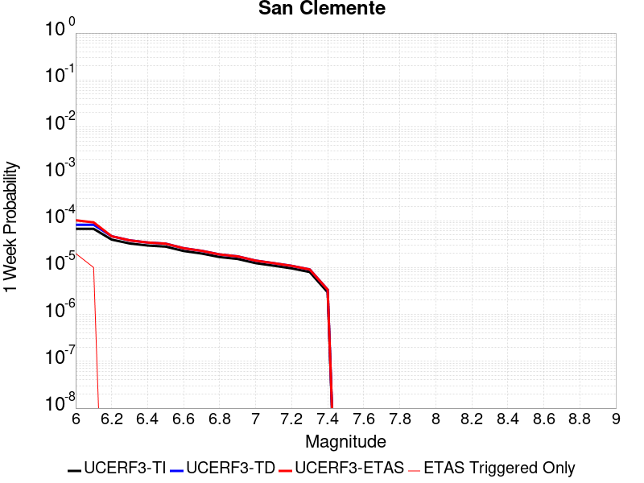 | 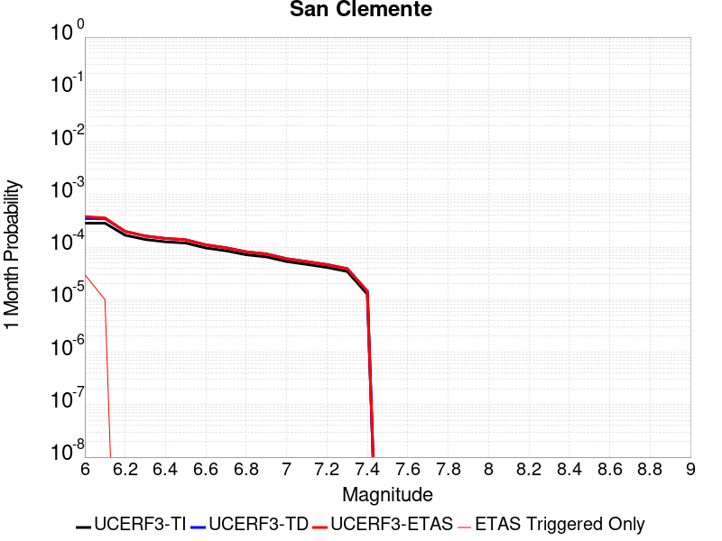 |  | 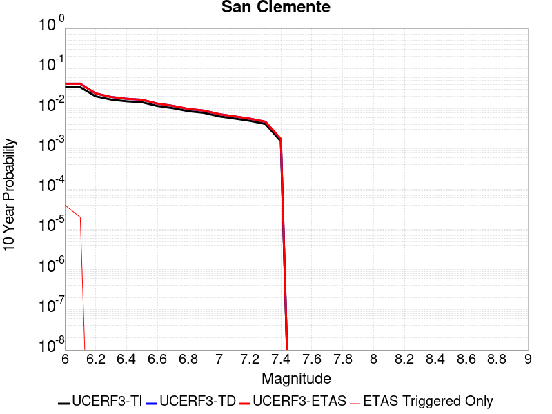 |

| Magnitude | 1 wk TI Prob | 1 wk TD Prob | 1 wk ETAS Prob | 1 wk ETAS/TD Gain | 1 wk ETAS Triggered Only | 1 mo TI Prob | 1 mo TD Prob | 1 mo ETAS Prob | 1 mo ETAS/TD Gain | 1 mo ETAS Triggered Only | 1 yr TI Prob | 1 yr TD Prob | 1 yr ETAS Prob | 1 yr ETAS/TD Gain | 1 yr ETAS Triggered Only | 10 yr TI Prob | 10 yr TD Prob | 10 yr ETAS Prob | 10 yr ETAS/TD Gain | 10 yr ETAS Triggered Only |
|-----|-----|-----|-----|-----|-----|-----|-----|-----|-----|-----|-----|-----|-----|-----|-----|-----|-----|-----|-----|-----|
| 6.0 | 6.681379E-5 | 8.163422E-5 | 1.1979905E-4 | 1.4675101 | 3.816794E-5 | 2.8631336E-4 | 3.498173E-4 | 4.2612647E-4 | 1.2181401 | 7.633588E-5 | 0.003480294 | 0.0042512873 | 0.0043653045 | 1.0268195 | 1.1450382E-4 | 0.03426291 | 0.041755714 | 0.041865434 | 1.0026277 | 1.1450382E-4 |
| 6.1 | 6.681379E-5 | 8.163422E-5 | 1.1979905E-4 | 1.4675101 | 3.816794E-5 | 2.8631336E-4 | 3.498173E-4 | 3.879719E-4 | 1.1090701 | 3.816794E-5 | 0.003480294 | 0.0042512873 | 0.004327299 | 1.0178796 | 7.633588E-5 | 0.03426291 | 0.041755714 | 0.041828863 | 1.0017518 | 7.633588E-5 |
| 6.2 | 3.9400576E-5 | 4.6451984E-5 | 4.6451984E-5 | 1.0 | 0.0 | 1.6884868E-4 | 1.9906509E-4 | 1.9906509E-4 | 1.0 | 0.0 | 0.0020537945 | 0.002420985 | 0.002420985 | 1.0 | 0.0 | 0.020349167 | 0.02395286 | 0.02395286 | 1.0 | 0.0 |
| 6.3 | 3.2590255E-5 | 3.7929087E-5 | 3.7929087E-5 | 1.0 | 0.0 | 1.3966505E-4 | 1.6254328E-4 | 1.6254328E-4 | 1.0 | 0.0 | 0.0016990956 | 0.0019771985 | 0.0019771985 | 1.0 | 0.0 | 0.01686163 | 0.019599866 | 0.019599866 | 1.0 | 0.0 |
| 6.4 | 2.9454652E-5 | 3.4097775E-5 | 3.4097775E-5 | 1.0 | 0.0 | 1.2622811E-4 | 1.4612528E-4 | 1.4612528E-4 | 1.0 | 0.0 | 0.0015357438 | 0.0017776482 | 0.0017776482 | 1.0 | 0.0 | 0.015251739 | 0.017637458 | 0.017637458 | 1.0 | 0.0 |
| 6.5 | 2.790836E-5 | 3.2247463E-5 | 3.2247463E-5 | 1.0 | 0.0 | 1.1960178E-4 | 1.3819622E-4 | 1.3819622E-4 | 1.0 | 0.0 | 0.001455179 | 0.0016812651 | 0.0016812651 | 1.0 | 0.0 | 0.014456868 | 0.016688475 | 0.016688475 | 1.0 | 0.0 |
| 6.6 | 2.2492153E-5 | 2.5762707E-5 | 2.5762707E-5 | 1.0 | 0.0 | 9.639138E-5 | 1.1040701E-4 | 1.1040701E-4 | 1.0 | 0.0 | 0.0011729331 | 0.0013433908 | 0.0013433908 | 1.0 | 0.0 | 0.011667615 | 0.013354415 | 0.013354415 | 1.0 | 0.0 |
| 6.7 | 1.9862755E-5 | 2.2666423E-5 | 2.2666423E-5 | 1.0 | 0.0 | 8.512331E-5 | 9.713826E-5 | 9.713826E-5 | 1.0 | 0.0 | 0.0010358836 | 0.0011820279 | 0.0011820279 | 1.0 | 0.0 | 0.010310682 | 0.011758701 | 0.011758701 | 1.0 | 0.0 |
| 6.8 | 1.6697575E-5 | 1.897771E-5 | 1.897771E-5 | 1.0 | 0.0 | 7.155907E-5 | 8.133056E-5 | 8.133056E-5 | 1.0 | 0.0 | 8.7088346E-4 | 9.897591E-4 | 9.897591E-4 | 1.0 | 0.0 | 0.008674784 | 0.0098545365 | 0.0098545365 | 1.0 | 0.0 |
| 6.9 | 1.5218415E-5 | 1.72694E-5 | 1.72694E-5 | 1.0 | 0.0 | 6.522015E-5 | 7.4009666E-5 | 7.4009666E-5 | 1.0 | 0.0 | 7.93766E-4 | 9.00704E-4 | 9.00704E-4 | 1.0 | 0.0 | 0.007909367 | 0.008971481 | 0.008971481 | 1.0 | 0.0 |
| 7.0 | 1.2392958E-5 | 1.4033016E-5 | 1.4033016E-5 | 1.0 | 0.0 | 5.3111595E-5 | 6.014015E-5 | 6.014015E-5 | 1.0 | 0.0 | 6.4644177E-4 | 7.319679E-4 | 7.319679E-4 | 1.0 | 0.0 | 0.0064456454 | 0.0072963564 | 0.0072963564 | 1.0 | 0.0 |
| 7.1 | 1.0934128E-5 | 1.2375138E-5 | 1.2375138E-5 | 1.0 | 0.0 | 4.6859706E-5 | 5.303527E-5 | 5.303527E-5 | 1.0 | 0.0 | 5.7036756E-4 | 6.455204E-4 | 6.455204E-4 | 1.0 | 0.0 | 0.0056890585 | 0.0064371997 | 0.0064371997 | 1.0 | 0.0 |
| 7.2 | 9.5798805E-6 | 1.0844935E-5 | 1.0844935E-5 | 1.0 | 0.0 | 4.1055984E-5 | 4.6477508E-5 | 4.6477508E-5 | 1.0 | 0.0 | 4.9974193E-4 | 5.657239E-4 | 5.657239E-4 | 1.0 | 0.0 | 0.0049861963 | 0.0056435615 | 0.0056435615 | 1.0 | 0.0 |
| 7.3 | 8.0167365E-6 | 9.083918E-6 | 9.083918E-6 | 1.0 | 0.0 | 3.4356988E-5 | 3.8930535E-5 | 3.8930535E-5 | 1.0 | 0.0 | 4.1821605E-4 | 4.7388324E-4 | 4.7388324E-4 | 1.0 | 0.0 | 0.0041742986 | 0.0047294297 | 0.0047294297 | 1.0 | 0.0 |
| 7.4 | 2.9581017E-6 | 3.3623792E-6 | 3.3623792E-6 | 1.0 | 0.0 | 1.2677518E-5 | 1.4410146E-5 | 1.4410146E-5 | 1.0 | 0.0 | 1.5433785E-4 | 1.7543444E-4 | 1.7543444E-4 | 1.0 | 0.0 | 0.001542307 | 0.0017534546 | 0.0017534546 | 1.0 | 0.0 |

## Red Mountain
*[(top)](#table-of-contents)*

| 1 Week | 1 Month | 1 Year | 10 Year |
|-----|-----|-----|-----|
|  |  |  |  |

| Magnitude | 1 wk TI Prob | 1 wk TD Prob | 1 wk ETAS Prob | 1 wk ETAS/TD Gain | 1 wk ETAS Triggered Only | 1 mo TI Prob | 1 mo TD Prob | 1 mo ETAS Prob | 1 mo ETAS/TD Gain | 1 mo ETAS Triggered Only | 1 yr TI Prob | 1 yr TD Prob | 1 yr ETAS Prob | 1 yr ETAS/TD Gain | 1 yr ETAS Triggered Only | 10 yr TI Prob | 10 yr TD Prob | 10 yr ETAS Prob | 10 yr ETAS/TD Gain | 10 yr ETAS Triggered Only |
|-----|-----|-----|-----|-----|-----|-----|-----|-----|-----|-----|-----|-----|-----|-----|-----|-----|-----|-----|-----|-----|
| 6.0 | 4.1810763E-5 | 4.7589947E-5 | 8.5756066E-5 | 1.8019787 | 3.816794E-5 | 1.7917668E-4 | 2.039419E-4 | 2.4210206E-4 | 1.1871129 | 3.816794E-5 | 0.0021792934 | 0.0024803306 | 0.0025945504 | 1.0460502 | 1.1450382E-4 | 0.021580452 | 0.024544092 | 0.024655785 | 1.0045507 | 1.1450382E-4 |
| 6.1 | 4.1810763E-5 | 4.7589947E-5 | 8.5756066E-5 | 1.8019787 | 3.816794E-5 | 1.7917668E-4 | 2.039419E-4 | 2.4210206E-4 | 1.1871129 | 3.816794E-5 | 0.0021792934 | 0.0024803306 | 0.0025945504 | 1.0460502 | 1.1450382E-4 | 0.021580452 | 0.024544092 | 0.024655785 | 1.0045507 | 1.1450382E-4 |
| 6.2 | 4.1810763E-5 | 4.7589947E-5 | 8.5756066E-5 | 1.8019787 | 3.816794E-5 | 1.7917668E-4 | 2.039419E-4 | 2.4210206E-4 | 1.1871129 | 3.816794E-5 | 0.0021792934 | 0.0024803306 | 0.0025945504 | 1.0460502 | 1.1450382E-4 | 0.021580452 | 0.024544092 | 0.024655785 | 1.0045507 | 1.1450382E-4 |
| 6.3 | 4.1810763E-5 | 4.7589947E-5 | 8.5756066E-5 | 1.8019787 | 3.816794E-5 | 1.7917668E-4 | 2.039419E-4 | 2.4210206E-4 | 1.1871129 | 3.816794E-5 | 0.0021792934 | 0.0024803306 | 0.0025945504 | 1.0460502 | 1.1450382E-4 | 0.021580452 | 0.024544092 | 0.024655785 | 1.0045507 | 1.1450382E-4 |
| 6.4 | 4.1810763E-5 | 4.7589947E-5 | 8.5756066E-5 | 1.8019787 | 3.816794E-5 | 1.7917668E-4 | 2.039419E-4 | 2.4210206E-4 | 1.1871129 | 3.816794E-5 | 0.0021792934 | 0.0024803306 | 0.0025945504 | 1.0460502 | 1.1450382E-4 | 0.021580452 | 0.024544092 | 0.024655785 | 1.0045507 | 1.1450382E-4 |
| 6.5 | 3.154503E-5 | 3.5359728E-5 | 3.5359728E-5 | 1.0 | 0.0 | 1.3518598E-4 | 1.5153342E-4 | 1.5153342E-4 | 1.0 | 0.0 | 0.0016446467 | 0.0018434501 | 0.0018815477 | 1.0206665 | 3.816794E-5 | 0.01632528 | 0.018291233 | 0.018328704 | 1.0020485 | 3.816794E-5 |
| 6.6 | 3.1535834E-5 | 3.534911E-5 | 3.534911E-5 | 1.0 | 0.0 | 1.3514658E-4 | 1.5148791E-4 | 1.5148791E-4 | 1.0 | 0.0 | 0.0016441676 | 0.001842897 | 0.0018809946 | 1.0206727 | 3.816794E-5 | 0.01632056 | 0.018285794 | 0.018323265 | 1.0020491 | 3.816794E-5 |
| 6.7 | 2.8267326E-5 | 3.146934E-5 | 3.146934E-5 | 1.0 | 0.0 | 1.2114006E-4 | 1.348621E-4 | 1.348621E-4 | 1.0 | 0.0 | 0.0014738824 | 0.0016407946 | 0.0016407946 | 1.0 | 0.0 | 0.014641452 | 0.016295563 | 0.016295563 | 1.0 | 0.0 |
| 6.8 | 2.8212884E-5 | 3.1407224E-5 | 3.1407224E-5 | 1.0 | 0.0 | 1.20906756E-4 | 1.3459593E-4 | 1.3459593E-4 | 1.0 | 0.0 | 0.0014710457 | 0.0016375587 | 0.0016375587 | 1.0 | 0.0 | 0.014613459 | 0.01626368 | 0.01626368 | 1.0 | 0.0 |
| 6.9 | 2.4227871E-5 | 2.6706979E-5 | 2.6706979E-5 | 1.0 | 0.0 | 1.03829596E-4 | 1.14453884E-4 | 1.14453884E-4 | 1.0 | 0.0 | 0.0012633923 | 0.0013926612 | 0.0013926612 | 1.0 | 0.0 | 0.012562336 | 0.013847026 | 0.013847026 | 1.0 | 0.0 |
| 7.0 | 2.348524E-5 | 2.5835763E-5 | 2.5835763E-5 | 1.0 | 0.0 | 1.0064714E-4 | 1.1072042E-4 | 1.1072042E-4 | 1.0 | 0.0 | 0.0012246901 | 0.0013472632 | 0.0013472632 | 1.0 | 0.0 | 0.012179627 | 0.01339859 | 0.01339859 | 1.0 | 0.0 |
| 7.1 | 2.2311642E-5 | 2.4462828E-5 | 2.4462828E-5 | 1.0 | 0.0 | 9.561782E-5 | 1.048369E-4 | 1.048369E-4 | 1.0 | 0.0 | 0.0011635252 | 0.0012757168 | 0.0012757168 | 1.0 | 0.0 | 0.01157452 | 0.012691451 | 0.012691451 | 1.0 | 0.0 |
| 7.2 | 1.6533986E-5 | 1.7670347E-5 | 1.7670347E-5 | 1.0 | 0.0 | 7.085802E-5 | 7.572822E-5 | 7.572822E-5 | 1.0 | 0.0 | 8.623549E-4 | 9.216645E-4 | 9.216645E-4 | 1.0 | 0.0 | 0.008590161 | 0.009184699 | 0.009184699 | 1.0 | 0.0 |
| 7.3 | 1.4703092E-5 | 1.555952E-5 | 1.555952E-5 | 1.0 | 0.0 | 6.301173E-5 | 6.66823E-5 | 6.66823E-5 | 1.0 | 0.0 | 7.668978E-4 | 8.1161625E-4 | 8.1161625E-4 | 1.0 | 0.0 | 0.0076425658 | 0.008092596 | 0.008092596 | 1.0 | 0.0 |
| 7.4 | 6.1331984E-6 | 5.528872E-6 | 5.528872E-6 | 1.0 | 0.0 | 2.6284872E-5 | 2.3694953E-5 | 2.3694953E-5 | 1.0 | 0.0 | 3.199713E-4 | 2.8844838E-4 | 2.8844838E-4 | 1.0 | 0.0 | 0.0031951098 | 0.0028807942 | 0.0028807942 | 1.0 | 0.0 |
| 7.5 | 5.954766E-6 | 5.3385015E-6 | 5.3385015E-6 | 1.0 | 0.0 | 2.5520176E-5 | 2.2879094E-5 | 2.2879094E-5 | 1.0 | 0.0 | 3.1066386E-4 | 2.785179E-4 | 2.785179E-4 | 1.0 | 0.0 | 0.003102299 | 0.0027817423 | 0.0027817423 | 1.0 | 0.0 |
| 7.6 | 4.9726646E-6 | 4.315295E-6 | 4.315295E-6 | 1.0 | 0.0 | 2.1311245E-5 | 1.8493993E-5 | 1.8493993E-5 | 1.0 | 0.0 | 2.5943352E-4 | 2.2514143E-4 | 2.2514143E-4 | 1.0 | 0.0 | 0.0025913084 | 0.002249168 | 0.002249168 | 1.0 | 0.0 |
| 7.7 | 3.3613894E-6 | 2.8526642E-6 | 2.8526642E-6 | 1.0 | 0.0 | 1.4405875E-5 | 1.2225649E-5 | 1.2225649E-5 | 1.0 | 0.0 | 1.7537741E-4 | 1.4883737E-4 | 1.4883737E-4 | 1.0 | 0.0 | 0.0017523908 | 0.0014874031 | 0.0014874031 | 1.0 | 0.0 |
| 7.8 | 1.1828961E-6 | 1.0122756E-6 | 1.0122756E-6 | 1.0 | 0.0 | 5.069545E-6 | 4.338317E-6 | 4.338317E-6 | 1.0 | 0.0 | 6.171996E-5 | 5.281776E-5 | 5.281776E-5 | 1.0 | 0.0 | 6.170282E-4 | 5.2805495E-4 | 5.2805495E-4 | 1.0 | 0.0 |
| 7.9 | 2.2967266E-7 | 1.8618952E-7 | 1.8618952E-7 | 1.0 | 0.0 | 9.843111E-7 | 7.9795484E-7 | 7.9795484E-7 | 1.0 | 0.0 | 1.19839215E-5 | 9.7150605E-6 | 9.7150605E-6 | 1.0 | 0.0 | 1.1983275E-4 | 9.714664E-5 | 9.714664E-5 | 1.0 | 0.0 |

## Red Pass
*[(top)](#table-of-contents)*

| 1 Week | 1 Month | 1 Year | 10 Year |
|-----|-----|-----|-----|
|  |  |  |  |

| Magnitude | 1 wk TI Prob | 1 wk TD Prob | 1 wk ETAS Prob | 1 wk ETAS/TD Gain | 1 wk ETAS Triggered Only | 1 mo TI Prob | 1 mo TD Prob | 1 mo ETAS Prob | 1 mo ETAS/TD Gain | 1 mo ETAS Triggered Only | 1 yr TI Prob | 1 yr TD Prob | 1 yr ETAS Prob | 1 yr ETAS/TD Gain | 1 yr ETAS Triggered Only | 10 yr TI Prob | 10 yr TD Prob | 10 yr ETAS Prob | 10 yr ETAS/TD Gain | 10 yr ETAS Triggered Only |
|-----|-----|-----|-----|-----|-----|-----|-----|-----|-----|-----|-----|-----|-----|-----|-----|-----|-----|-----|-----|-----|
| 6.0 | 8.258278E-6 | 8.551265E-6 | 8.488649E-5 | 9.926776 | 7.633588E-5 | 3.539214E-5 | 3.6647863E-5 | 1.12980946E-4 | 3.0828793 | 7.633588E-5 | 4.308141E-4 | 4.4611428E-4 | 5.224161E-4 | 1.1710365 | 7.633588E-5 | 0.0042997985 | 0.004453945 | 0.004567939 | 1.0255939 | 1.1450382E-4 |
| 6.1 | 3.649988E-6 | 3.7753161E-6 | 4.1943113E-5 | 11.109828 | 3.816794E-5 | 1.5642712E-5 | 1.6179853E-5 | 5.4347172E-5 | 3.3589413 | 3.816794E-5 | 1.9043336E-4 | 1.9697666E-4 | 2.3513708E-4 | 1.1937307 | 3.816794E-5 | 0.0019027026 | 0.001968488 | 0.0020446735 | 1.0387026 | 7.633588E-5 |
| 6.2 | 3.649988E-6 | 3.7753161E-6 | 4.1943113E-5 | 11.109828 | 3.816794E-5 | 1.5642712E-5 | 1.6179853E-5 | 5.4347172E-5 | 3.3589413 | 3.816794E-5 | 1.9043336E-4 | 1.9697666E-4 | 2.3513708E-4 | 1.1937307 | 3.816794E-5 | 0.0019027026 | 0.001968488 | 0.0020446735 | 1.0387026 | 7.633588E-5 |
| 6.3 | 1.3924937E-6 | 1.4411166E-6 | 3.9609E-5 | 27.484938 | 3.816794E-5 | 5.9678164E-6 | 6.1762075E-6 | 4.434391E-5 | 7.179796 | 3.816794E-5 | 7.265574E-5 | 7.519415E-5 | 1.13359216E-4 | 1.5075537 | 3.816794E-5 | 7.263199E-4 | 7.518258E-4 | 7.8996504E-4 | 1.0507288 | 3.816794E-5 |
| 6.4 | 1.3924937E-6 | 1.4411166E-6 | 3.9609E-5 | 27.484938 | 3.816794E-5 | 5.9678164E-6 | 6.1762075E-6 | 4.434391E-5 | 7.179796 | 3.816794E-5 | 7.265574E-5 | 7.519415E-5 | 1.13359216E-4 | 1.5075537 | 3.816794E-5 | 7.263199E-4 | 7.518258E-4 | 7.8996504E-4 | 1.0507288 | 3.816794E-5 |
| 6.5 | 9.876812E-7 | 1.0221912E-6 | 3.919009E-5 | 38.339294 | 3.816794E-5 | 4.2329125E-6 | 4.3808195E-6 | 4.2548592E-5 | 9.712473 | 3.816794E-5 | 5.153449E-5 | 5.3336476E-5 | 9.150238E-5 | 1.7155685 | 3.816794E-5 | 5.1522546E-4 | 5.333648E-4 | 5.715123E-4 | 1.0715225 | 3.816794E-5 |

## White Mountains
*[(top)](#table-of-contents)*

| 1 Week | 1 Month | 1 Year | 10 Year |
|-----|-----|-----|-----|
|  | 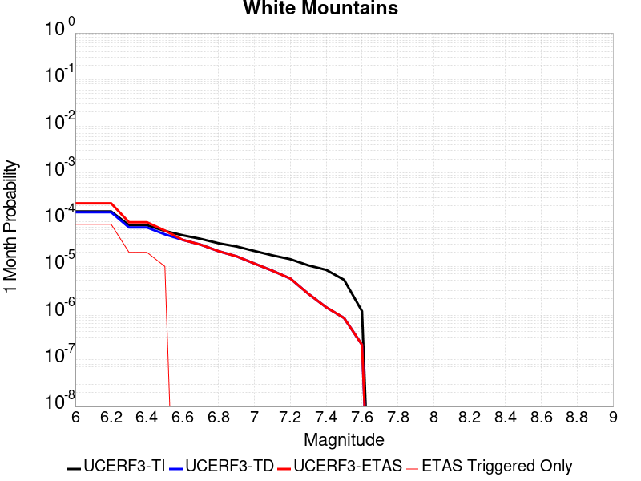 | 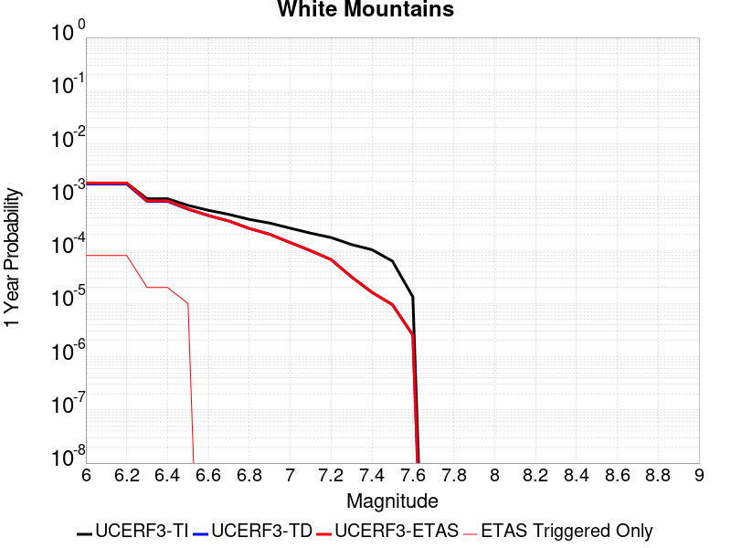 |  |

| Magnitude | 1 wk TI Prob | 1 wk TD Prob | 1 wk ETAS Prob | 1 wk ETAS/TD Gain | 1 wk ETAS Triggered Only | 1 mo TI Prob | 1 mo TD Prob | 1 mo ETAS Prob | 1 mo ETAS/TD Gain | 1 mo ETAS Triggered Only | 1 yr TI Prob | 1 yr TD Prob | 1 yr ETAS Prob | 1 yr ETAS/TD Gain | 1 yr ETAS Triggered Only | 10 yr TI Prob | 10 yr TD Prob | 10 yr ETAS Prob | 10 yr ETAS/TD Gain | 10 yr ETAS Triggered Only |
|-----|-----|-----|-----|-----|-----|-----|-----|-----|-----|-----|-----|-----|-----|-----|-----|-----|-----|-----|-----|-----|
| 6.0 | 3.503579E-5 | 3.378405E-5 | 1.1011735E-4 | 3.2594478 | 7.633588E-5 | 1.5014476E-4 | 1.4478143E-4 | 2.2110627E-4 | 1.5271727 | 7.633588E-5 | 0.0018264796 | 0.0017614096 | 0.001837611 | 1.0432616 | 7.633588E-5 | 0.018115403 | 0.017486818 | 0.01756182 | 1.004289 | 7.633588E-5 |
| 6.1 | 3.503579E-5 | 3.378405E-5 | 1.1011735E-4 | 3.2594478 | 7.633588E-5 | 1.5014476E-4 | 1.4478143E-4 | 2.2110627E-4 | 1.5271727 | 7.633588E-5 | 0.0018264796 | 0.0017614096 | 0.001837611 | 1.0432616 | 7.633588E-5 | 0.018115403 | 0.017486818 | 0.01756182 | 1.004289 | 7.633588E-5 |
| 6.2 | 3.503579E-5 | 3.378405E-5 | 1.1011735E-4 | 3.2594478 | 7.633588E-5 | 1.5014476E-4 | 1.4478143E-4 | 2.2110627E-4 | 1.5271727 | 7.633588E-5 | 0.0018264796 | 0.0017614096 | 0.001837611 | 1.0432616 | 7.633588E-5 | 0.018115403 | 0.017486818 | 0.01756182 | 1.004289 | 7.633588E-5 |
| 6.3 | 1.7818425E-5 | 1.5916074E-5 | 1.5916074E-5 | 1.0 | 0.0 | 7.636245E-5 | 6.821004E-5 | 6.821004E-5 | 1.0 | 0.0 | 9.293162E-4 | 8.301551E-4 | 8.301551E-4 | 1.0 | 0.0 | 0.009254395 | 0.008271999 | 0.008271999 | 1.0 | 0.0 |
| 6.4 | 1.7818425E-5 | 1.5916074E-5 | 1.5916074E-5 | 1.0 | 0.0 | 7.636245E-5 | 6.821004E-5 | 6.821004E-5 | 1.0 | 0.0 | 9.293162E-4 | 8.301551E-4 | 8.301551E-4 | 1.0 | 0.0 | 0.009254395 | 0.008271999 | 0.008271999 | 1.0 | 0.0 |
| 6.5 | 1.3397557E-5 | 1.13362685E-5 | 1.13362685E-5 | 1.0 | 0.0 | 5.741684E-5 | 4.858314E-5 | 4.858314E-5 | 1.0 | 0.0 | 6.988258E-4 | 5.913462E-4 | 5.913462E-4 | 1.0 | 0.0 | 0.006966323 | 0.005898432 | 0.005898432 | 1.0 | 0.0 |
| 6.6 | 1.0818695E-5 | 8.625366E-6 | 8.625366E-6 | 1.0 | 0.0 | 4.6365014E-5 | 3.6965357E-5 | 3.6965357E-5 | 1.0 | 0.0 | 5.6434784E-4 | 4.4996463E-4 | 4.4996463E-4 | 1.0 | 0.0 | 0.005629168 | 0.004490972 | 0.004490972 | 1.0 | 0.0 |
| 6.7 | 9.067908E-6 | 6.802442E-6 | 6.802442E-6 | 1.0 | 0.0 | 3.8861883E-5 | 2.9153016E-5 | 2.9153016E-5 | 1.0 | 0.0 | 4.7304068E-4 | 3.5488335E-4 | 3.5488335E-4 | 1.0 | 0.0 | 0.00472035 | 0.0035434833 | 0.0035434833 | 1.0 | 0.0 |
| 6.8 | 7.295947E-6 | 4.936391E-6 | 4.936391E-6 | 1.0 | 0.0 | 3.126797E-5 | 2.1155796E-5 | 2.1155796E-5 | 1.0 | 0.0 | 3.8062103E-4 | 2.575425E-4 | 2.575425E-4 | 1.0 | 0.0 | 0.0037996976 | 0.0025725532 | 0.0025725532 | 1.0 | 0.0 |
| 6.9 | 6.2243444E-6 | 3.832213E-6 | 3.832213E-6 | 1.0 | 0.0 | 2.6675489E-5 | 1.642367E-5 | 1.642367E-5 | 1.0 | 0.0 | 3.2472567E-4 | 1.9994036E-4 | 1.9994036E-4 | 1.0 | 0.0 | 0.0032425157 | 0.0019976576 | 0.0019976576 | 1.0 | 0.0 |
| 7.0 | 4.9878413E-6 | 2.6795342E-6 | 2.6795342E-6 | 1.0 | 0.0 | 2.1376287E-5 | 1.14836685E-5 | 1.14836685E-5 | 1.0 | 0.0 | 2.602252E-4 | 1.3980496E-4 | 1.3980496E-4 | 1.0 | 0.0 | 0.002599207 | 0.0013971963 | 0.0013971963 | 1.0 | 0.0 |
| 7.1 | 4.0252844E-6 | 1.8857575E-6 | 1.8857575E-6 | 1.0 | 0.0 | 1.7251105E-5 | 8.081794E-6 | 8.081794E-6 | 1.0 | 0.0 | 2.1001195E-4 | 9.8391516E-5 | 9.8391516E-5 | 1.0 | 0.0 | 0.0020981359 | 9.834924E-4 | 9.834924E-4 | 1.0 | 0.0 |
| 7.2 | 3.3284066E-6 | 1.281964E-6 | 1.281964E-6 | 1.0 | 0.0 | 1.4264522E-5 | 5.494121E-6 | 5.494121E-6 | 1.0 | 0.0 | 1.736567E-4 | 6.688897E-5 | 6.688897E-5 | 1.0 | 0.0 | 0.0017352107 | 6.6869846E-4 | 6.6869846E-4 | 1.0 | 0.0 |
| 7.3 | 2.458226E-6 | 6.05722E-7 | 6.05722E-7 | 1.0 | 0.0 | 1.0535211E-5 | 2.5959491E-6 | 2.5959491E-6 | 1.0 | 0.0 | 1.2825865E-4 | 3.1605257E-5 | 3.1605257E-5 | 1.0 | 0.0 | 0.0012818464 | 3.160114E-4 | 3.160114E-4 | 1.0 | 0.0 |
| 7.4 | 1.965953E-6 | 3.1089303E-7 | 3.1089303E-7 | 1.0 | 0.0 | 8.425486E-6 | 1.332398E-6 | 1.332398E-6 | 1.0 | 0.0 | 1.0257547E-4 | 1.6221828E-5 | 1.6221828E-5 | 1.0 | 0.0 | 0.0010252813 | 1.6220656E-4 | 1.6220656E-4 | 1.0 | 0.0 |
| 7.5 | 1.2014192E-6 | 1.8244253E-7 | 1.8244253E-7 | 1.0 | 0.0 | 5.148929E-6 | 7.8189635E-7 | 7.8189635E-7 | 1.0 | 0.0 | 6.2686406E-5 | 9.519547E-6 | 9.519547E-6 | 1.0 | 0.0 | 6.266873E-4 | 9.519148E-5 | 9.519148E-5 | 1.0 | 0.0 |
| 7.6 | 2.5612175E-7 | 4.8946475E-8 | 4.8946475E-8 | 1.0 | 0.0 | 1.0976642E-6 | 2.0977059E-7 | 2.0977059E-7 | 1.0 | 0.0 | 1.3363979E-5 | 2.5539543E-6 | 2.5539543E-6 | 1.0 | 0.0 | 1.3363175E-4 | 2.5539286E-5 | 2.5539286E-5 | 1.0 | 0.0 |

## Death Valley (Fish Lake Valley)
*[(top)](#table-of-contents)*

| 1 Week | 1 Month | 1 Year | 10 Year |
|-----|-----|-----|-----|
|  | 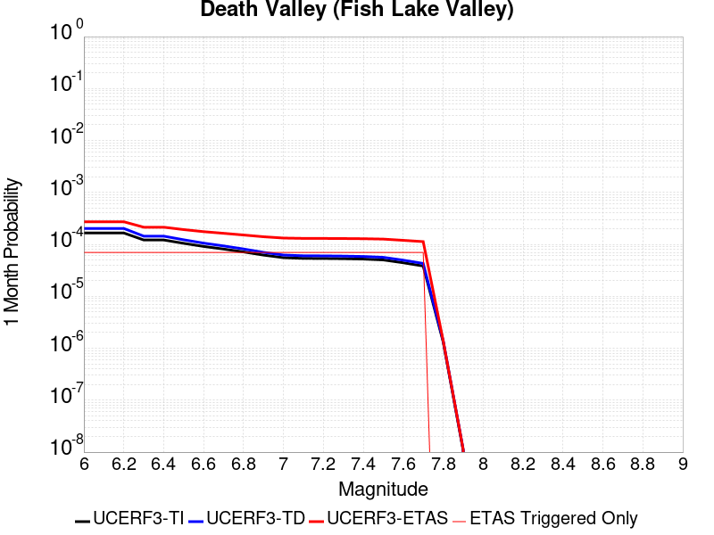 |  | 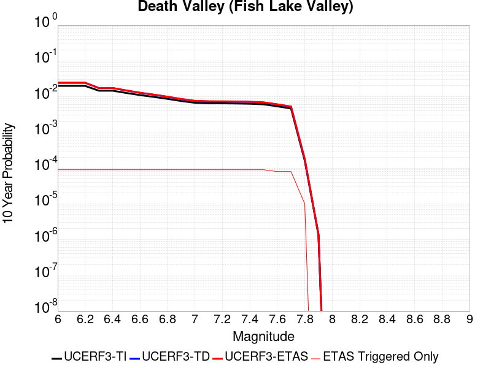 |

| Magnitude | 1 wk TI Prob | 1 wk TD Prob | 1 wk ETAS Prob | 1 wk ETAS/TD Gain | 1 wk ETAS Triggered Only | 1 mo TI Prob | 1 mo TD Prob | 1 mo ETAS Prob | 1 mo ETAS/TD Gain | 1 mo ETAS Triggered Only | 1 yr TI Prob | 1 yr TD Prob | 1 yr ETAS Prob | 1 yr ETAS/TD Gain | 1 yr ETAS Triggered Only | 10 yr TI Prob | 10 yr TD Prob | 10 yr ETAS Prob | 10 yr ETAS/TD Gain | 10 yr ETAS Triggered Only |
|-----|-----|-----|-----|-----|-----|-----|-----|-----|-----|-----|-----|-----|-----|-----|-----|-----|-----|-----|-----|-----|
| 6.0 | 3.872328E-5 | 4.7267473E-5 | 1.2359975E-4 | 2.6149006 | 7.633588E-5 | 1.6594635E-4 | 2.0256084E-4 | 2.7888126E-4 | 1.3767778 | 7.633588E-5 | 0.0020185246 | 0.002463534 | 0.0025396817 | 1.03091 | 7.633588E-5 | 0.02000288 | 0.024388181 | 0.024462655 | 1.0030537 | 7.633588E-5 |
| 6.1 | 3.872328E-5 | 4.7267473E-5 | 1.2359975E-4 | 2.6149006 | 7.633588E-5 | 1.6594635E-4 | 2.0256084E-4 | 2.7888126E-4 | 1.3767778 | 7.633588E-5 | 0.0020185246 | 0.002463534 | 0.0025396817 | 1.03091 | 7.633588E-5 | 0.02000288 | 0.024388181 | 0.024462655 | 1.0030537 | 7.633588E-5 |
| 6.2 | 3.872328E-5 | 4.7267473E-5 | 1.2359975E-4 | 2.6149006 | 7.633588E-5 | 1.6594635E-4 | 2.0256084E-4 | 2.7888126E-4 | 1.3767778 | 7.633588E-5 | 0.0020185246 | 0.002463534 | 0.0025396817 | 1.03091 | 7.633588E-5 | 0.02000288 | 0.024388181 | 0.024462655 | 1.0030537 | 7.633588E-5 |
| 6.3 | 2.8356371E-5 | 3.3609853E-5 | 1.0994316E-4 | 3.271159 | 7.633588E-5 | 1.2152165E-4 | 1.4403471E-4 | 2.203596E-4 | 1.5299062 | 7.633588E-5 | 0.0014785219 | 0.0017522911 | 0.0018284932 | 1.0434872 | 7.633588E-5 | 0.014687235 | 0.017391782 | 0.017466791 | 1.0043129 | 7.633588E-5 |
| 6.4 | 2.8356371E-5 | 3.3609853E-5 | 1.0994316E-4 | 3.271159 | 7.633588E-5 | 1.2152165E-4 | 1.4403471E-4 | 2.203596E-4 | 1.5299062 | 7.633588E-5 | 0.0014785219 | 0.0017522911 | 0.0018284932 | 1.0434872 | 7.633588E-5 | 0.014687235 | 0.017391782 | 0.017466791 | 1.0043129 | 7.633588E-5 |
| 6.5 | 2.4448687E-5 | 2.8607552E-5 | 1.04941246E-4 | 3.6683056 | 7.633588E-5 | 1.0477588E-4 | 1.2259831E-4 | 1.9892484E-4 | 1.622574 | 7.633588E-5 | 0.0012748998 | 0.0014916632 | 0.0015678852 | 1.0510987 | 7.633588E-5 | 0.012676105 | 0.014821377 | 0.014896581 | 1.005074 | 7.633588E-5 |
| 6.6 | 2.1298161E-5 | 2.4660083E-5 | 1.0099408E-4 | 4.0954475 | 7.633588E-5 | 9.127464E-5 | 1.0568198E-4 | 1.820098E-4 | 1.7222406 | 7.633588E-5 | 0.0011107022 | 0.0012859525 | 0.0013621902 | 1.059285 | 7.633588E-5 | 0.011051672 | 0.012788526 | 0.012863885 | 1.0058928 | 7.633588E-5 |
| 6.7 | 1.8959729E-5 | 2.1781025E-5 | 9.811524E-5 | 4.50462 | 7.633588E-5 | 8.125345E-5 | 9.334405E-5 | 1.6967281E-4 | 1.8177141 | 7.633588E-5 | 9.888117E-4 | 0.001135897 | 0.0012121461 | 1.0671269 | 7.633588E-5 | 0.009844234 | 0.01130357 | 0.011379043 | 1.0066769 | 7.633588E-5 |
| 6.8 | 1.6691629E-5 | 1.9018353E-5 | 9.535278E-5 | 5.0137243 | 7.633588E-5 | 7.153359E-5 | 8.150477E-5 | 1.5783442E-4 | 1.9365053 | 7.633588E-5 | 8.7057345E-4 | 9.918857E-4 | 0.0010681459 | 1.076884 | 7.633588E-5 | 0.008671708 | 0.009876343 | 0.009951926 | 1.0076529 | 7.633588E-5 |
| 6.9 | 1.450505E-5 | 1.638954E-5 | 9.272416E-5 | 5.6575212 | 7.633588E-5 | 6.216302E-5 | 7.0239046E-5 | 1.4656955E-4 | 2.086725 | 7.633588E-5 | 7.5657194E-4 | 8.5483363E-4 | 9.3110424E-4 | 1.0892228 | 7.633588E-5 | 0.007540013 | 0.008516385 | 0.008592071 | 1.008887 | 7.633588E-5 |
| 7.0 | 1.2940855E-5 | 1.4537972E-5 | 9.087274E-5 | 6.2507167 | 7.633588E-5 | 5.545963E-5 | 6.230414E-5 | 1.3863527E-4 | 2.2251372 | 7.633588E-5 | 6.750118E-4 | 7.5829466E-4 | 8.3457265E-4 | 1.1005915 | 7.633588E-5 | 0.006729651 | 0.0075576897 | 0.007633449 | 1.0100241 | 7.633588E-5 |
| 7.1 | 1.2544658E-5 | 1.4078208E-5 | 9.0413014E-5 | 6.4221964 | 7.633588E-5 | 5.3761712E-5 | 6.0333812E-5 | 1.3666508E-4 | 2.265149 | 7.633588E-5 | 6.5435225E-4 | 7.343222E-4 | 8.1060204E-4 | 1.1038779 | 7.633588E-5 | 0.006524288 | 0.007319551 | 0.007395328 | 1.0103527 | 7.633588E-5 |
| 7.2 | 1.2489416E-5 | 1.4015674E-5 | 9.0350484E-5 | 6.4463887 | 7.633588E-5 | 5.3524967E-5 | 6.0065824E-5 | 1.3639711E-4 | 2.2707942 | 7.633588E-5 | 6.514716E-4 | 7.310616E-4 | 8.073417E-4 | 1.1043415 | 7.633588E-5 | 0.006495651 | 0.0072871596 | 0.0073629394 | 1.0103991 | 7.633588E-5 |
| 7.3 | 1.2368307E-5 | 1.3879812E-5 | 9.021463E-5 | 6.499701 | 7.633588E-5 | 5.3005948E-5 | 5.9483587E-5 | 1.3581492E-4 | 2.2832336 | 7.633588E-5 | 6.451563E-4 | 7.2397763E-4 | 8.0025825E-4 | 1.1053632 | 7.633588E-5 | 0.0064328653 | 0.007216782 | 0.007292567 | 1.0105013 | 7.633588E-5 |
| 7.4 | 1.2161707E-5 | 1.36478675E-5 | 8.998271E-5 | 6.593169 | 7.633588E-5 | 5.212056E-5 | 5.8489582E-5 | 1.3482099E-4 | 2.305043 | 7.633588E-5 | 6.3438306E-4 | 7.118836E-4 | 7.8816514E-4 | 1.1071545 | 7.633588E-5 | 0.006325751 | 0.0070966207 | 0.0071724146 | 1.0106803 | 7.633588E-5 |
| 7.5 | 1.1707948E-5 | 1.3145515E-5 | 8.948039E-5 | 6.806914 | 7.633588E-5 | 5.0175953E-5 | 5.6336736E-5 | 1.3266831E-4 | 2.3549166 | 7.633588E-5 | 6.10721E-4 | 6.856895E-4 | 7.6197303E-4 | 1.1112509 | 7.633588E-5 | 0.0060904534 | 0.006836321 | 0.006912135 | 1.0110899 | 7.633588E-5 |
| 7.6 | 1.0319538E-5 | 1.1579622E-5 | 8.791462E-5 | 7.5921836 | 7.633588E-5 | 4.4225842E-5 | 4.9626036E-5 | 1.2595813E-4 | 2.538146 | 7.633588E-5 | 5.383166E-4 | 6.040347E-4 | 6.8032445E-4 | 1.1263003 | 7.633588E-5 | 0.0053701443 | 0.0060244603 | 0.0061003366 | 1.0125947 | 7.633588E-5 |
| 7.7 | 8.937764E-6 | 1.0022779E-5 | 8.635789E-5 | 8.616162 | 7.633588E-5 | 3.830414E-5 | 4.295409E-5 | 1.1928669E-4 | 2.777074 | 7.633588E-5 | 4.6625308E-4 | 5.228456E-4 | 5.991415E-4 | 1.1459244 | 7.633588E-5 | 0.0046527605 | 0.005216664 | 0.005292602 | 1.0145568 | 7.633588E-5 |
| 7.8 | 3.108007E-7 | 3.284654E-7 | 3.284654E-7 | 1.0 | 0.0 | 1.3320023E-6 | 1.407708E-6 | 1.407708E-6 | 1.0 | 0.0 | 1.6217007E-5 | 1.7138715E-5 | 1.7138715E-5 | 1.0 | 0.0 | 1.6215823E-4 | 1.7137431E-4 | 1.7137431E-4 | 1.0 | 0.0 |
| 7.9 | 2.5591178E-9 | 2.6696718E-9 | 2.6696718E-9 | 1.0 | 0.0 | 1.0967647E-8 | 1.14414505E-8 | 1.14414505E-8 | 1.0 | 0.0 | 1.335311E-7 | 1.3929966E-7 | 1.3929966E-7 | 1.0 | 0.0 | 1.3353102E-6 | 1.3929966E-6 | 1.3929966E-6 | 1.0 | 0.0 |

## Hosgri
*[(top)](#table-of-contents)*

| 1 Week | 1 Month | 1 Year | 10 Year |
|-----|-----|-----|-----|
| 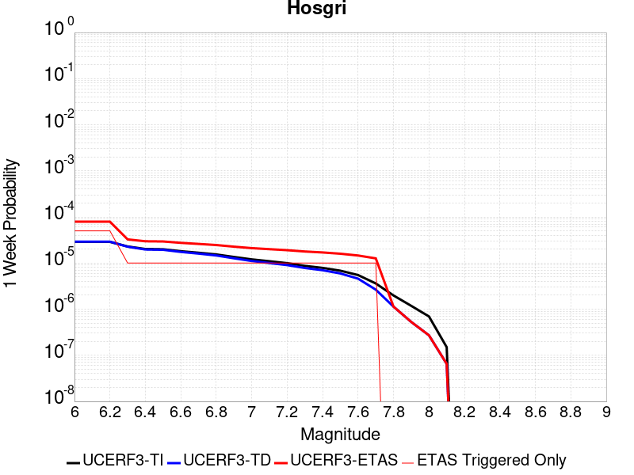 |  |  |  |

| Magnitude | 1 wk TI Prob | 1 wk TD Prob | 1 wk ETAS Prob | 1 wk ETAS/TD Gain | 1 wk ETAS Triggered Only | 1 mo TI Prob | 1 mo TD Prob | 1 mo ETAS Prob | 1 mo ETAS/TD Gain | 1 mo ETAS Triggered Only | 1 yr TI Prob | 1 yr TD Prob | 1 yr ETAS Prob | 1 yr ETAS/TD Gain | 1 yr ETAS Triggered Only | 10 yr TI Prob | 10 yr TD Prob | 10 yr ETAS Prob | 10 yr ETAS/TD Gain | 10 yr ETAS Triggered Only |
|-----|-----|-----|-----|-----|-----|-----|-----|-----|-----|-----|-----|-----|-----|-----|-----|-----|-----|-----|-----|-----|
| 6.0 | 2.883978E-5 | 2.9128416E-5 | 6.7295245E-5 | 2.3102953 | 3.816794E-5 | 1.235932E-4 | 1.2483024E-4 | 1.6299343E-4 | 1.3057206 | 3.816794E-5 | 0.0015037085 | 0.001518776 | 0.0015949958 | 1.0501851 | 7.633588E-5 | 0.01493574 | 0.01508774 | 0.015162923 | 1.0049832 | 7.633588E-5 |
| 6.1 | 2.883978E-5 | 2.9128416E-5 | 6.7295245E-5 | 2.3102953 | 3.816794E-5 | 1.235932E-4 | 1.2483024E-4 | 1.6299343E-4 | 1.3057206 | 3.816794E-5 | 0.0015037085 | 0.001518776 | 0.0015949958 | 1.0501851 | 7.633588E-5 | 0.01493574 | 0.01508774 | 0.015162923 | 1.0049832 | 7.633588E-5 |
| 6.2 | 2.883978E-5 | 2.9128416E-5 | 6.7295245E-5 | 2.3102953 | 3.816794E-5 | 1.235932E-4 | 1.2483024E-4 | 1.6299343E-4 | 1.3057206 | 3.816794E-5 | 0.0015037085 | 0.001518776 | 0.0015949958 | 1.0501851 | 7.633588E-5 | 0.01493574 | 0.01508774 | 0.015162923 | 1.0049832 | 7.633588E-5 |
| 6.3 | 2.2914428E-5 | 2.2641969E-5 | 2.2641969E-5 | 1.0 | 0.0 | 9.8200995E-5 | 9.703343E-5 | 9.703343E-5 | 1.0 | 0.0 | 0.0011949413 | 0.0011807467 | 0.0012188696 | 1.0322871 | 3.816794E-5 | 0.011885363 | 0.011746133 | 0.011783852 | 1.0032113 | 3.816794E-5 |
| 6.4 | 2.0195741E-5 | 1.969656E-5 | 1.969656E-5 | 1.0 | 0.0 | 8.65503E-5 | 8.4411105E-5 | 8.4411105E-5 | 1.0 | 0.0 | 0.0010532405 | 0.0010272227 | 0.0010653514 | 1.0371183 | 3.816794E-5 | 0.010482626 | 0.010225792 | 0.010263571 | 1.0036943 | 3.816794E-5 |
| 6.5 | 1.9924333E-5 | 1.940898E-5 | 1.940898E-5 | 1.0 | 0.0 | 8.53872E-5 | 8.3178704E-5 | 8.3178704E-5 | 1.0 | 0.0 | 0.0010390934 | 0.0010122322 | 0.0010503614 | 1.0376686 | 3.816794E-5 | 0.010342481 | 0.010077253 | 0.010115037 | 1.0037494 | 3.816794E-5 |
| 6.6 | 1.809694E-5 | 1.74583E-5 | 1.74583E-5 | 1.0 | 0.0 | 7.7556004E-5 | 7.4819145E-5 | 7.4819145E-5 | 1.0 | 0.0 | 9.438353E-4 | 9.105437E-4 | 9.4867696E-4 | 1.0418795 | 3.816794E-5 | 0.009398366 | 0.009069073 | 0.009106895 | 1.0041704 | 3.816794E-5 |
| 6.7 | 1.675989E-5 | 1.6042764E-5 | 1.6042764E-5 | 1.0 | 0.0 | 7.182612E-5 | 6.87529E-5 | 6.87529E-5 | 1.0 | 0.0 | 8.7413215E-4 | 8.3674624E-4 | 8.748822E-4 | 1.0455766 | 3.816794E-5 | 0.008707017 | 0.0083368635 | 0.008374713 | 1.0045401 | 3.816794E-5 |
| 6.8 | 1.5401129E-5 | 1.4614083E-5 | 1.4614083E-5 | 1.0 | 0.0 | 6.6003166E-5 | 6.2630286E-5 | 6.2630286E-5 | 1.0 | 0.0 | 8.032922E-4 | 7.622578E-4 | 8.0039666E-4 | 1.050034 | 3.816794E-5 | 0.008003947 | 0.007597296 | 0.0076351743 | 1.0049857 | 3.816794E-5 |
| 6.9 | 1.356559E-5 | 1.2689968E-5 | 1.2689968E-5 | 1.0 | 0.0 | 5.8136946E-5 | 5.4384444E-5 | 5.4384444E-5 | 1.0 | 0.0 | 7.0758746E-4 | 6.619299E-4 | 6.619299E-4 | 1.0 | 0.0 | 0.007053386 | 0.006600388 | 0.006600388 | 1.0 | 0.0 |
| 7.0 | 1.2030819E-5 | 1.1095962E-5 | 1.1095962E-5 | 1.0 | 0.0 | 5.155963E-5 | 4.7553254E-5 | 4.7553254E-5 | 1.0 | 0.0 | 6.275577E-4 | 5.7880714E-4 | 5.7880714E-4 | 1.0 | 0.0 | 0.006257884 | 0.005773757 | 0.005773757 | 1.0 | 0.0 |
| 7.1 | 1.0972698E-5 | 1.0022179E-5 | 1.0022179E-5 | 1.0 | 0.0 | 4.7025E-5 | 4.2951488E-5 | 4.2951488E-5 | 1.0 | 0.0 | 5.72379E-4 | 5.22809E-4 | 5.22809E-4 | 1.0 | 0.0 | 0.0057090693 | 0.005216542 | 0.005216542 | 1.0 | 0.0 |
| 7.2 | 9.961926E-6 | 9.034746E-6 | 9.034746E-6 | 1.0 | 0.0 | 4.2693267E-5 | 3.8719765E-5 | 3.8719765E-5 | 1.0 | 0.0 | 5.1966653E-4 | 4.713112E-4 | 4.713112E-4 | 1.0 | 0.0 | 0.00518453 | 0.0047038626 | 0.0047038626 | 1.0 | 0.0 |
| 7.3 | 8.700929E-6 | 7.8281E-6 | 7.8281E-6 | 1.0 | 0.0 | 3.7289166E-5 | 3.354857E-5 | 3.354857E-5 | 1.0 | 0.0 | 4.53901E-4 | 4.0837732E-4 | 4.0837732E-4 | 1.0 | 0.0 | 0.00452975 | 0.004077008 | 0.004077008 | 1.0 | 0.0 |
| 7.4 | 7.866285E-6 | 6.998739E-6 | 6.998739E-6 | 1.0 | 0.0 | 3.3712215E-5 | 2.9994251E-5 | 2.9994251E-5 | 1.0 | 0.0 | 4.103689E-4 | 3.6511885E-4 | 3.6511885E-4 | 1.0 | 0.0 | 0.004096119 | 0.0036459267 | 0.0036459267 | 1.0 | 0.0 |
| 7.5 | 6.8381305E-6 | 5.9596955E-6 | 5.9596955E-6 | 1.0 | 0.0 | 2.9305946E-5 | 2.5541302E-5 | 2.5541302E-5 | 1.0 | 0.0 | 3.5674145E-4 | 3.10921E-4 | 3.10921E-4 | 1.0 | 0.0 | 0.0035616932 | 0.0031055948 | 0.0031055948 | 1.0 | 0.0 |
| 7.6 | 5.503376E-6 | 4.5952443E-6 | 4.5952443E-6 | 1.0 | 0.0 | 2.3585684E-5 | 1.9693754E-5 | 1.9693754E-5 | 1.0 | 0.0 | 2.8711787E-4 | 2.397451E-4 | 2.397451E-4 | 1.0 | 0.0 | 0.002867472 | 0.0023955975 | 0.0023955975 | 1.0 | 0.0 |
| 7.7 | 3.6144982E-6 | 2.6522112E-6 | 2.6522112E-6 | 1.0 | 0.0 | 1.5490614E-5 | 1.1366569E-5 | 1.1366569E-5 | 1.0 | 0.0 | 1.8858191E-4 | 1.383792E-4 | 1.383792E-4 | 1.0 | 0.0 | 0.0018842196 | 0.0013836613 | 0.0013836613 | 1.0 | 0.0 |
| 7.8 | 1.9853494E-6 | 1.1361129E-6 | 1.1361129E-6 | 1.0 | 0.0 | 8.508612E-6 | 4.8690463E-6 | 4.8690463E-6 | 1.0 | 0.0 | 1.0358743E-4 | 5.9279027E-5 | 5.9279027E-5 | 1.0 | 0.0 | 0.0010353916 | 5.9336185E-4 | 5.9336185E-4 | 1.0 | 0.0 |
| 7.9 | 1.1818757E-6 | 5.2951856E-7 | 5.2951856E-7 | 1.0 | 0.0 | 5.0651715E-6 | 2.2693632E-6 | 2.2693632E-6 | 1.0 | 0.0 | 6.1666724E-5 | 2.7629147E-5 | 2.7629147E-5 | 1.0 | 0.0 | 6.1649614E-4 | 2.7694515E-4 | 2.7694515E-4 | 1.0 | 0.0 |
| 8.0 | 6.962958E-7 | 2.7139782E-7 | 2.7139782E-7 | 1.0 | 0.0 | 2.9841215E-6 | 1.163133E-6 | 1.163133E-6 | 1.0 | 0.0 | 3.6331072E-5 | 1.4161053E-5 | 1.4161053E-5 | 1.0 | 0.0 | 3.6325134E-4 | 1.4217179E-4 | 1.4217179E-4 | 1.0 | 0.0 |
| 8.1 | 1.5033264E-7 | 6.527624E-8 | 6.527624E-8 | 1.0 | 0.0 | 6.442826E-7 | 2.7975528E-7 | 2.7975528E-7 | 1.0 | 0.0 | 7.844113E-6 | 3.4060151E-6 | 3.4060151E-6 | 1.0 | 0.0 | 7.843835E-5 | 3.407693E-5 | 3.407693E-5 | 1.0 | 0.0 |

## San Jacinto (Lytle Creek connector)
*[(top)](#table-of-contents)*

| 1 Week | 1 Month | 1 Year | 10 Year |
|-----|-----|-----|-----|
| 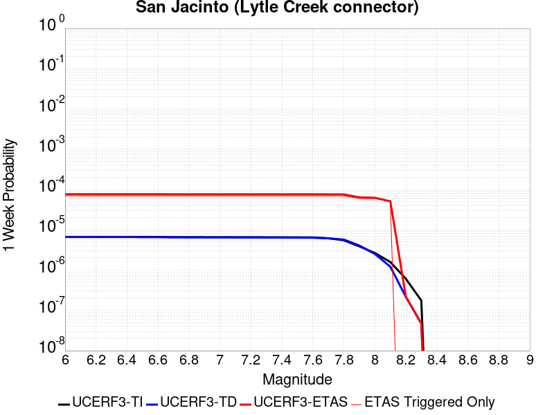 |  |  |  |

| Magnitude | 1 wk TI Prob | 1 wk TD Prob | 1 wk ETAS Prob | 1 wk ETAS/TD Gain | 1 wk ETAS Triggered Only | 1 mo TI Prob | 1 mo TD Prob | 1 mo ETAS Prob | 1 mo ETAS/TD Gain | 1 mo ETAS Triggered Only | 1 yr TI Prob | 1 yr TD Prob | 1 yr ETAS Prob | 1 yr ETAS/TD Gain | 1 yr ETAS Triggered Only | 10 yr TI Prob | 10 yr TD Prob | 10 yr ETAS Prob | 10 yr ETAS/TD Gain | 10 yr ETAS Triggered Only |
|-----|-----|-----|-----|-----|-----|-----|-----|-----|-----|-----|-----|-----|-----|-----|-----|-----|-----|-----|-----|-----|
| 6.0 | 6.693995E-6 | 6.660216E-6 | 8.299558E-5 | 12.461395 | 7.633588E-5 | 2.8688235E-5 | 2.854347E-5 | 1.04877174E-4 | 3.6742961 | 7.633588E-5 | 3.492233E-4 | 3.4746144E-4 | 4.2377078E-4 | 1.2196196 | 7.633588E-5 | 0.00348675 | 0.0035493854 | 0.0036254502 | 1.0214305 | 7.633588E-5 |
| 6.1 | 6.693995E-6 | 6.660216E-6 | 8.299558E-5 | 12.461395 | 7.633588E-5 | 2.8688235E-5 | 2.854347E-5 | 1.04877174E-4 | 3.6742961 | 7.633588E-5 | 3.492233E-4 | 3.4746144E-4 | 4.2377078E-4 | 1.2196196 | 7.633588E-5 | 0.00348675 | 0.0035493854 | 0.0036254502 | 1.0214305 | 7.633588E-5 |
| 6.2 | 6.693995E-6 | 6.660216E-6 | 8.299558E-5 | 12.461395 | 7.633588E-5 | 2.8688235E-5 | 2.854347E-5 | 1.04877174E-4 | 3.6742961 | 7.633588E-5 | 3.492233E-4 | 3.4746144E-4 | 4.2377078E-4 | 1.2196196 | 7.633588E-5 | 0.00348675 | 0.0035493854 | 0.0036254502 | 1.0214305 | 7.633588E-5 |
| 6.3 | 6.693995E-6 | 6.660216E-6 | 8.299558E-5 | 12.461395 | 7.633588E-5 | 2.8688235E-5 | 2.854347E-5 | 1.04877174E-4 | 3.6742961 | 7.633588E-5 | 3.492233E-4 | 3.4746144E-4 | 4.2377078E-4 | 1.2196196 | 7.633588E-5 | 0.00348675 | 0.0035493854 | 0.0036254502 | 1.0214305 | 7.633588E-5 |
| 6.4 | 6.693995E-6 | 6.660216E-6 | 8.299558E-5 | 12.461395 | 7.633588E-5 | 2.8688235E-5 | 2.854347E-5 | 1.04877174E-4 | 3.6742961 | 7.633588E-5 | 3.492233E-4 | 3.4746144E-4 | 4.2377078E-4 | 1.2196196 | 7.633588E-5 | 0.00348675 | 0.0035493854 | 0.0036254502 | 1.0214305 | 7.633588E-5 |
| 6.5 | 6.6561875E-6 | 6.6204343E-6 | 8.2955805E-5 | 12.530267 | 7.633588E-5 | 2.8526205E-5 | 2.837298E-5 | 1.0470669E-4 | 3.6903663 | 7.633588E-5 | 3.472512E-4 | 3.4538636E-4 | 4.2169588E-4 | 1.2209395 | 7.633588E-5 | 0.0034670907 | 0.003528701 | 0.0036047674 | 1.0215565 | 7.633588E-5 |
| 6.6 | 6.6561875E-6 | 6.6204343E-6 | 8.2955805E-5 | 12.530267 | 7.633588E-5 | 2.8526205E-5 | 2.837298E-5 | 1.0470669E-4 | 3.6903663 | 7.633588E-5 | 3.472512E-4 | 3.4538636E-4 | 4.2169588E-4 | 1.2209395 | 7.633588E-5 | 0.0034670907 | 0.003528701 | 0.0036047674 | 1.0215565 | 7.633588E-5 |
| 6.7 | 6.5802237E-6 | 6.539611E-6 | 8.287499E-5 | 12.6727705 | 7.633588E-5 | 2.8200653E-5 | 2.8026603E-5 | 1.0436034E-4 | 3.723617 | 7.633588E-5 | 3.4328885E-4 | 3.4117055E-4 | 4.174804E-4 | 1.2236706 | 7.633588E-5 | 0.0034275902 | 0.0034866752 | 0.003562745 | 1.0218172 | 7.633588E-5 |
| 6.8 | 6.575632E-6 | 6.5341005E-6 | 8.286948E-5 | 12.682614 | 7.633588E-5 | 2.8180975E-5 | 2.8002989E-5 | 1.0433673E-4 | 3.725914 | 7.633588E-5 | 3.4304935E-4 | 3.4088313E-4 | 4.1719296E-4 | 1.2238593 | 7.633588E-5 | 0.0034252026 | 0.00348381 | 0.00355988 | 1.0218353 | 7.633588E-5 |
| 6.9 | 6.570433E-6 | 6.525495E-6 | 8.2860875E-5 | 12.698022 | 7.633588E-5 | 2.8158694E-5 | 2.7966107E-5 | 1.0429985E-4 | 3.729509 | 7.633588E-5 | 3.4277816E-4 | 3.4043423E-4 | 4.1674412E-4 | 1.2241546 | 7.633588E-5 | 0.0034224992 | 0.0034793352 | 0.0035554054 | 1.0218635 | 7.633588E-5 |
| 7.0 | 6.5643826E-6 | 6.515616E-6 | 8.2850995E-5 | 12.715758 | 7.633588E-5 | 2.8132765E-5 | 2.792377E-5 | 1.0425752E-4 | 3.7336476 | 7.633588E-5 | 3.424626E-4 | 3.3991894E-4 | 4.1622887E-4 | 1.2244945 | 7.633588E-5 | 0.0034193532 | 0.0034741985 | 0.0035502692 | 1.0218959 | 7.633588E-5 |
| 7.1 | 6.557402E-6 | 6.5043278E-6 | 8.283971E-5 | 12.736091 | 7.633588E-5 | 2.8102848E-5 | 2.7875392E-5 | 1.04209146E-4 | 3.7383919 | 7.633588E-5 | 3.4209844E-4 | 3.3933012E-4 | 4.156401E-4 | 1.2248842 | 7.633588E-5 | 0.0034157229 | 0.0034683298 | 0.003544401 | 1.0219331 | 7.633588E-5 |
| 7.2 | 6.546394E-6 | 6.4862943E-6 | 8.282168E-5 | 12.76872 | 7.633588E-5 | 2.8055672E-5 | 2.7798109E-5 | 1.0413187E-4 | 3.7460053 | 7.633588E-5 | 3.4152428E-4 | 3.3838948E-4 | 4.1469955E-4 | 1.2255095 | 7.633588E-5 | 0.0034099987 | 0.0034589572 | 0.003535029 | 1.0219927 | 7.633588E-5 |
| 7.3 | 6.5364216E-6 | 6.4670803E-6 | 8.2802464E-5 | 12.803686 | 7.633588E-5 | 2.8012933E-5 | 2.7715765E-5 | 1.04049526E-4 | 3.754164 | 7.633588E-5 | 3.4100408E-4 | 3.3738726E-4 | 4.136974E-4 | 1.2261796 | 7.633588E-5 | 0.003404813 | 0.0034489788 | 0.0035250513 | 1.0220566 | 7.633588E-5 |
| 7.4 | 6.5269523E-6 | 6.4481674E-6 | 8.2783554E-5 | 12.838306 | 7.633588E-5 | 2.7972354E-5 | 2.7634711E-5 | 1.0396848E-4 | 3.7622423 | 7.633588E-5 | 3.4051016E-4 | 3.3640073E-4 | 4.1271094E-4 | 1.2268431 | 7.633588E-5 | 0.0033998888 | 0.003439161 | 0.0035152342 | 1.0221198 | 7.633588E-5 |
| 7.5 | 6.5111835E-6 | 6.424442E-6 | 8.275983E-5 | 12.882027 | 7.633588E-5 | 2.7904773E-5 | 2.7533031E-5 | 1.03866805E-4 | 3.7724435 | 7.633588E-5 | 3.3968766E-4 | 3.3516317E-4 | 4.1147348E-4 | 1.227681 | 7.633588E-5 | 0.0033916887 | 0.003426834 | 0.0035029084 | 1.0221996 | 7.633588E-5 |
| 7.6 | 6.4768806E-6 | 6.383551E-6 | 8.271894E-5 | 12.958138 | 7.633588E-5 | 2.7757764E-5 | 2.735779E-5 | 1.0369158E-4 | 3.790203 | 7.633588E-5 | 3.3789838E-4 | 3.3303024E-4 | 4.0934072E-4 | 1.2291397 | 7.633588E-5 | 0.0033738504 | 0.0034055663 | 0.003481642 | 1.0223387 | 7.633588E-5 |
| 7.7 | 6.1655364E-6 | 6.1760365E-6 | 8.251144E-5 | 13.359935 | 7.633588E-5 | 2.642346E-5 | 2.646846E-5 | 1.0280232E-4 | 3.8839555 | 7.633588E-5 | 3.2165812E-4 | 3.2220592E-4 | 3.9851718E-4 | 1.2368401 | 7.633588E-5 | 0.0032119295 | 0.0032971818 | 0.003373266 | 1.0230755 | 7.633588E-5 |
| 7.8 | 5.5043524E-6 | 5.737097E-6 | 8.207254E-5 | 14.305587 | 7.633588E-5 | 2.3589868E-5 | 2.4587327E-5 | 1.0092133E-4 | 4.1046076 | 7.633588E-5 | 2.871688E-4 | 2.9930964E-4 | 3.7562268E-4 | 1.2549635 | 7.633588E-5 | 0.0028679797 | 0.0030672832 | 0.003143385 | 1.0248108 | 7.633588E-5 |
| 7.9 | 3.889249E-6 | 4.076761E-6 | 4.2244545E-5 | 10.362281 | 3.816794E-5 | 1.6668104E-5 | 1.7471715E-5 | 5.563899E-5 | 3.1845176 | 3.816794E-5 | 2.0291525E-4 | 2.1269741E-4 | 2.5085724E-4 | 1.1794089 | 3.816794E-5 | 0.0020273007 | 0.0021943315 | 0.0022324156 | 1.0173557 | 3.816794E-5 |
| 8.0 | 2.668535E-6 | 2.5315155E-6 | 4.0699357E-5 | 16.077072 | 3.816794E-5 | 1.1436528E-5 | 1.0849307E-5 | 4.901683E-5 | 4.517969 | 3.816794E-5 | 1.3923083E-4 | 1.3208234E-4 | 1.7024523E-4 | 1.2889327 | 3.816794E-5 | 0.0013914363 | 0.0013757964 | 0.0014139118 | 1.0277042 | 3.816794E-5 |
| 8.1 | 1.5911459E-6 | 1.218661E-6 | 3.9386552E-5 | 32.31953 | 3.816794E-5 | 6.8191785E-6 | 5.2228224E-6 | 4.3390562E-5 | 8.307876 | 3.816794E-5 | 8.3020335E-5 | 6.3586034E-5 | 1.01751546E-4 | 1.6002185 | 3.816794E-5 | 8.298933E-4 | 6.6932244E-4 | 7.074648E-4 | 1.0569866 | 3.816794E-5 |
| 8.2 | 6.1294963E-7 | 2.1812275E-7 | 2.1812275E-7 | 1.0 | 0.0 | 2.6269242E-6 | 9.3481145E-7 | 9.3481145E-7 | 1.0 | 0.0 | 3.1982334E-5 | 1.138127E-5 | 1.138127E-5 | 1.0 | 0.0 | 3.1977732E-4 | 1.2784546E-4 | 1.2784546E-4 | 1.0 | 0.0 |
| 8.3 | 1.762871E-7 | 4.7546838E-8 | 4.7546838E-8 | 1.0 | 0.0 | 7.5551594E-7 | 2.0377215E-7 | 2.0377215E-7 | 1.0 | 0.0 | 9.1983675E-6 | 2.480923E-6 | 2.480923E-6 | 1.0 | 0.0 | 9.197987E-5 | 2.868753E-5 | 2.868753E-5 | 1.0 | 0.0 |

## Bullion Mountains
*[(top)](#table-of-contents)*

| 1 Week | 1 Month | 1 Year | 10 Year |
|-----|-----|-----|-----|
|  |  |  |  |

| Magnitude | 1 wk TI Prob | 1 wk TD Prob | 1 wk ETAS Prob | 1 wk ETAS/TD Gain | 1 wk ETAS Triggered Only | 1 mo TI Prob | 1 mo TD Prob | 1 mo ETAS Prob | 1 mo ETAS/TD Gain | 1 mo ETAS Triggered Only | 1 yr TI Prob | 1 yr TD Prob | 1 yr ETAS Prob | 1 yr ETAS/TD Gain | 1 yr ETAS Triggered Only | 10 yr TI Prob | 10 yr TD Prob | 10 yr ETAS Prob | 10 yr ETAS/TD Gain | 10 yr ETAS Triggered Only |
|-----|-----|-----|-----|-----|-----|-----|-----|-----|-----|-----|-----|-----|-----|-----|-----|-----|-----|-----|-----|-----|
| 6.0 | 1.6420427E-5 | 1.4692089E-5 | 5.285947E-5 | 3.5978184 | 3.816794E-5 | 7.037136E-5 | 6.296479E-5 | 1.3929587E-4 | 2.2122817 | 7.633588E-5 | 8.5643446E-4 | 7.663651E-4 | 8.4264245E-4 | 1.0995314 | 7.633588E-5 | 0.008531413 | 0.007641016 | 0.007716769 | 1.0099139 | 7.633588E-5 |
| 6.1 | 1.6420427E-5 | 1.4692089E-5 | 5.285947E-5 | 3.5978184 | 3.816794E-5 | 7.037136E-5 | 6.296479E-5 | 1.3929587E-4 | 2.2122817 | 7.633588E-5 | 8.5643446E-4 | 7.663651E-4 | 8.4264245E-4 | 1.0995314 | 7.633588E-5 | 0.008531413 | 0.007641016 | 0.007716769 | 1.0099139 | 7.633588E-5 |
| 6.2 | 1.6420427E-5 | 1.4692089E-5 | 5.285947E-5 | 3.5978184 | 3.816794E-5 | 7.037136E-5 | 6.296479E-5 | 1.3929587E-4 | 2.2122817 | 7.633588E-5 | 8.5643446E-4 | 7.663651E-4 | 8.4264245E-4 | 1.0995314 | 7.633588E-5 | 0.008531413 | 0.007641016 | 0.007716769 | 1.0099139 | 7.633588E-5 |
| 6.3 | 1.2046778E-5 | 9.862335E-6 | 4.80299E-5 | 4.8700333 | 3.816794E-5 | 5.1628023E-5 | 4.2266598E-5 | 8.0432925E-5 | 1.9029903 | 3.816794E-5 | 6.283899E-4 | 5.144975E-4 | 5.5264577E-4 | 1.0741467 | 3.816794E-5 | 0.0062661595 | 0.005135345 | 0.0051733167 | 1.0073942 | 3.816794E-5 |
| 6.4 | 1.2046778E-5 | 9.862335E-6 | 4.80299E-5 | 4.8700333 | 3.816794E-5 | 5.1628023E-5 | 4.2266598E-5 | 8.0432925E-5 | 1.9029903 | 3.816794E-5 | 6.283899E-4 | 5.144975E-4 | 5.5264577E-4 | 1.0741467 | 3.816794E-5 | 0.0062661595 | 0.005135345 | 0.0051733167 | 1.0073942 | 3.816794E-5 |
| 6.5 | 1.0244343E-5 | 7.879458E-6 | 4.6047095E-5 | 5.8439417 | 3.816794E-5 | 4.390359E-5 | 3.3768785E-5 | 7.1935436E-5 | 2.1302345 | 3.816794E-5 | 5.343951E-4 | 4.110781E-4 | 4.4923034E-4 | 1.0928103 | 3.816794E-5 | 0.005331118 | 0.004105208 | 0.0041432194 | 1.0092592 | 3.816794E-5 |
| 6.6 | 9.605408E-6 | 7.1774966E-6 | 4.534516E-5 | 6.317685 | 3.816794E-5 | 4.1165385E-5 | 3.076045E-5 | 6.892721E-5 | 2.240774 | 3.816794E-5 | 5.010733E-4 | 3.744645E-4 | 4.1261813E-4 | 1.1018885 | 3.816794E-5 | 0.00499945 | 0.003740332 | 0.0037783573 | 1.0101663 | 3.816794E-5 |
| 6.7 | 8.60418E-6 | 6.1240044E-6 | 4.4291708E-5 | 7.2324753 | 3.816794E-5 | 3.687454E-5 | 2.624558E-5 | 6.441252E-5 | 2.4542234 | 3.816794E-5 | 4.48855E-4 | 3.1951256E-4 | 3.5766832E-4 | 1.1194186 | 3.816794E-5 | 0.004479495 | 0.0031924439 | 0.0032304898 | 1.0119176 | 3.816794E-5 |
| 6.8 | 5.187994E-6 | 2.5631666E-6 | 2.5631666E-6 | 1.0 | 0.0 | 2.223407E-5 | 1.0984976E-5 | 1.0984976E-5 | 1.0 | 0.0 | 2.7066618E-4 | 1.3373788E-4 | 1.3373788E-4 | 1.0 | 0.0 | 0.0027033675 | 0.0013369655 | 0.0013369655 | 1.0 | 0.0 |
| 6.9 | 4.5302368E-6 | 2.3443165E-6 | 2.3443165E-6 | 1.0 | 0.0 | 1.9415156E-5 | 1.0047055E-5 | 1.0047055E-5 | 1.0 | 0.0 | 2.3635388E-4 | 1.2232E-4 | 1.2232E-4 | 1.0 | 0.0 | 0.0023610266 | 0.0012229157 | 0.0012229157 | 1.0 | 0.0 |
| 7.0 | 3.431668E-6 | 1.6882402E-6 | 1.6882402E-6 | 1.0 | 0.0 | 1.4707065E-5 | 7.235315E-6 | 7.235315E-6 | 1.0 | 0.0 | 1.7904381E-4 | 8.808996E-5 | 8.808996E-5 | 1.0 | 0.0 | 0.0017889962 | 8.808996E-4 | 8.808996E-4 | 1.0 | 0.0 |

## Mission Creek
*[(top)](#table-of-contents)*

| 1 Week | 1 Month | 1 Year | 10 Year |
|-----|-----|-----|-----|
|  |  |  |  |

| Magnitude | 1 wk TI Prob | 1 wk TD Prob | 1 wk ETAS Prob | 1 wk ETAS/TD Gain | 1 wk ETAS Triggered Only | 1 mo TI Prob | 1 mo TD Prob | 1 mo ETAS Prob | 1 mo ETAS/TD Gain | 1 mo ETAS Triggered Only | 1 yr TI Prob | 1 yr TD Prob | 1 yr ETAS Prob | 1 yr ETAS/TD Gain | 1 yr ETAS Triggered Only | 10 yr TI Prob | 10 yr TD Prob | 10 yr ETAS Prob | 10 yr ETAS/TD Gain | 10 yr ETAS Triggered Only |
|-----|-----|-----|-----|-----|-----|-----|-----|-----|-----|-----|-----|-----|-----|-----|-----|-----|-----|-----|-----|-----|
| 6.0 | 1.1549387E-5 | 1.632237E-5 | 9.2657E-5 | 5.676688 | 7.633588E-5 | 4.9496433E-5 | 6.9951224E-5 | 1.4628176E-4 | 2.0911965 | 7.633588E-5 | 6.0245243E-4 | 8.513384E-4 | 9.276093E-4 | 1.0895894 | 7.633588E-5 | 0.006008218 | 0.008509998 | 0.008585684 | 1.0088938 | 7.633588E-5 |
| 6.1 | 1.1549387E-5 | 1.632237E-5 | 9.2657E-5 | 5.676688 | 7.633588E-5 | 4.9496433E-5 | 6.9951224E-5 | 1.4628176E-4 | 2.0911965 | 7.633588E-5 | 6.0245243E-4 | 8.513384E-4 | 9.276093E-4 | 1.0895894 | 7.633588E-5 | 0.006008218 | 0.008509998 | 0.008585684 | 1.0088938 | 7.633588E-5 |
| 6.2 | 1.1549387E-5 | 1.632237E-5 | 9.2657E-5 | 5.676688 | 7.633588E-5 | 4.9496433E-5 | 6.9951224E-5 | 1.4628176E-4 | 2.0911965 | 7.633588E-5 | 6.0245243E-4 | 8.513384E-4 | 9.276093E-4 | 1.0895894 | 7.633588E-5 | 0.006008218 | 0.008509998 | 0.008585684 | 1.0088938 | 7.633588E-5 |
| 6.3 | 1.1549387E-5 | 1.632237E-5 | 9.2657E-5 | 5.676688 | 7.633588E-5 | 4.9496433E-5 | 6.9951224E-5 | 1.4628176E-4 | 2.0911965 | 7.633588E-5 | 6.0245243E-4 | 8.513384E-4 | 9.276093E-4 | 1.0895894 | 7.633588E-5 | 0.006008218 | 0.008509998 | 0.008585684 | 1.0088938 | 7.633588E-5 |
| 6.4 | 1.1549387E-5 | 1.632237E-5 | 9.2657E-5 | 5.676688 | 7.633588E-5 | 4.9496433E-5 | 6.9951224E-5 | 1.4628176E-4 | 2.0911965 | 7.633588E-5 | 6.0245243E-4 | 8.513384E-4 | 9.276093E-4 | 1.0895894 | 7.633588E-5 | 0.006008218 | 0.008509998 | 0.008585684 | 1.0088938 | 7.633588E-5 |
| 6.5 | 1.1549387E-5 | 1.632237E-5 | 9.2657E-5 | 5.676688 | 7.633588E-5 | 4.9496433E-5 | 6.9951224E-5 | 1.4628176E-4 | 2.0911965 | 7.633588E-5 | 6.0245243E-4 | 8.513384E-4 | 9.276093E-4 | 1.0895894 | 7.633588E-5 | 0.006008218 | 0.008509998 | 0.008585684 | 1.0088938 | 7.633588E-5 |
| 6.6 | 9.202681E-6 | 1.3845646E-5 | 9.018047E-5 | 6.5132723 | 7.633588E-5 | 3.9439463E-5 | 5.9337188E-5 | 1.3566854E-4 | 2.2863998 | 7.633588E-5 | 4.800697E-4 | 7.221998E-4 | 7.984806E-4 | 1.1056228 | 7.633588E-5 | 0.004790339 | 0.0072271815 | 0.0073029655 | 1.010486 | 7.633588E-5 |
| 6.7 | 9.019164E-6 | 1.3651316E-5 | 8.9986155E-5 | 6.5917563 | 7.633588E-5 | 3.8652986E-5 | 5.8504378E-5 | 1.3483579E-4 | 2.3047128 | 7.633588E-5 | 4.7049852E-4 | 7.12067E-4 | 7.8834855E-4 | 1.1071268 | 7.633588E-5 | 0.004695036 | 0.007126506 | 0.007202298 | 1.0106353 | 7.633588E-5 |
| 6.8 | 8.673558E-6 | 1.3273427E-5 | 8.960829E-5 | 6.7509537 | 7.633588E-5 | 3.717186E-5 | 5.6884925E-5 | 1.3321645E-4 | 2.3418589 | 7.633588E-5 | 4.524734E-4 | 6.923627E-4 | 7.686458E-4 | 1.1101779 | 7.633588E-5 | 0.0045155324 | 0.006930694 | 0.007006501 | 1.0109378 | 7.633588E-5 |
| 6.9 | 7.002255E-6 | 1.1477657E-5 | 8.781266E-5 | 7.650748 | 7.633588E-5 | 3.000932E-5 | 4.9189068E-5 | 1.255212E-4 | 2.5518107 | 7.633588E-5 | 3.653022E-4 | 5.9871917E-4 | 6.750094E-4 | 1.1274223 | 7.633588E-5 | 0.0036470229 | 0.005999517 | 0.0060753953 | 1.0126474 | 7.633588E-5 |
| 7.0 | 5.84644E-6 | 9.67498E-6 | 8.601012E-5 | 8.889954 | 7.633588E-5 | 2.5055931E-5 | 4.1463565E-5 | 1.1779628E-4 | 2.8409586 | 7.633588E-5 | 3.0501327E-4 | 5.047066E-4 | 5.810039E-4 | 1.1511717 | 7.633588E-5 | 0.0030459496 | 0.0050638523 | 0.0051398017 | 1.0149983 | 7.633588E-5 |
| 7.1 | 5.54703E-6 | 9.329456E-6 | 8.566462E-5 | 9.182167 | 7.633588E-5 | 2.377277E-5 | 3.9982795E-5 | 1.1631562E-4 | 2.9091418 | 7.633588E-5 | 2.8939504E-4 | 4.8668624E-4 | 5.6298496E-4 | 1.1567719 | 7.633588E-5 | 0.0028901845 | 0.004884446 | 0.0049604094 | 1.015552 | 7.633588E-5 |
| 7.2 | 4.384709E-6 | 7.68157E-6 | 8.4016865E-5 | 10.937459 | 7.633588E-5 | 1.8791474E-5 | 3.2920623E-5 | 1.0925399E-4 | 3.3187096 | 7.633588E-5 | 2.2876218E-4 | 4.0073853E-4 | 4.770438E-4 | 1.1904117 | 7.633588E-5 | 0.0022852682 | 0.004028366 | 0.004104394 | 1.0188732 | 7.633588E-5 |
| 7.3 | 3.7888456E-6 | 6.915452E-6 | 8.32508E-5 | 12.038375 | 7.633588E-5 | 1.623781E-5 | 2.9637333E-5 | 1.0597095E-4 | 3.57559 | 7.633588E-5 | 1.9767738E-4 | 3.6077813E-4 | 4.3708648E-4 | 1.2115104 | 7.633588E-5 | 0.0019750162 | 0.0036301152 | 0.003706174 | 1.0209521 | 7.633588E-5 |
| 7.4 | 2.1982462E-6 | 5.0237763E-6 | 8.135927E-5 | 16.194843 | 7.633588E-5 | 9.421021E-6 | 2.1530293E-5 | 9.7864526E-5 | 4.545434 | 7.633588E-5 | 1.1469489E-4 | 2.621E-4 | 3.3841585E-4 | 1.2911708 | 7.633588E-5 | 0.0011463572 | 0.0026458844 | 0.0027220184 | 1.0287745 | 7.633588E-5 |
| 7.5 | 2.051923E-6 | 4.615016E-6 | 8.095054E-5 | 17.540684 | 7.633588E-5 | 8.793926E-6 | 1.9778492E-5 | 9.611286E-5 | 4.8594637 | 7.633588E-5 | 1.0706078E-4 | 2.4077666E-4 | 3.1709415E-4 | 1.3169638 | 7.633588E-5 | 0.0010700922 | 0.0024335422 | 0.0025096922 | 1.0312918 | 7.633588E-5 |
| 7.6 | 1.8733427E-6 | 4.1233748E-6 | 8.0458936E-5 | 19.512884 | 7.633588E-5 | 8.028587E-6 | 1.7671488E-5 | 9.400602E-5 | 5.3196435 | 7.633588E-5 | 9.774366E-5 | 2.151292E-4 | 2.9144867E-4 | 1.354761 | 7.633588E-5 | 9.770069E-4 | 0.0021780801 | 0.0022542498 | 1.034971 | 7.633588E-5 |
| 7.7 | 1.8411953E-6 | 4.0430496E-6 | 8.037862E-5 | 19.88069 | 7.633588E-5 | 7.890813E-6 | 1.732724E-5 | 9.3661794E-5 | 5.405465 | 7.633588E-5 | 9.606641E-5 | 2.1093882E-4 | 2.872586E-4 | 1.36181 | 7.633588E-5 | 9.6024893E-4 | 0.0021363653 | 0.0022125382 | 1.0356554 | 7.633588E-5 |
| 7.8 | 1.7194251E-6 | 3.7104276E-6 | 8.0046026E-5 | 21.573261 | 7.633588E-5 | 7.368944E-6 | 1.5901736E-5 | 9.22364E-5 | 5.8003983 | 7.633588E-5 | 8.97132E-5 | 1.9358651E-4 | 2.699076E-4 | 1.394248 | 7.633588E-5 | 8.967699E-4 | 0.0019623525 | 0.0020385385 | 1.0388238 | 7.633588E-5 |
| 7.9 | 1.4035052E-6 | 2.9500632E-6 | 7.928572E-5 | 26.875938 | 7.633588E-5 | 6.0150082E-6 | 1.2643067E-5 | 8.897798E-5 | 7.0376897 | 7.633588E-5 | 7.3230265E-5 | 1.5391852E-4 | 2.3024266E-4 | 1.4958736 | 7.633588E-5 | 7.3206134E-4 | 0.0015631086 | 0.0016393252 | 1.0487596 | 7.633588E-5 |
| 8.0 | 3.9318823E-7 | 5.528522E-7 | 3.872077E-5 | 70.03819 | 3.816794E-5 | 1.6850913E-6 | 2.3693647E-6 | 4.0537212E-5 | 17.108896 | 3.816794E-5 | 2.0515794E-5 | 2.8846638E-5 | 6.7013476E-5 | 2.3230948 | 3.816794E-5 | 2.0513899E-4 | 2.9899E-4 | 3.371465E-4 | 1.1276181 | 3.816794E-5 |
| 8.1 | 1.596793E-7 | 1.1380002E-7 | 1.1380002E-7 | 1.0 | 0.0 | 6.8433974E-7 | 4.877143E-7 | 4.877143E-7 | 1.0 | 0.0 | 8.331805E-6 | 5.937906E-6 | 5.937906E-6 | 1.0 | 0.0 | 8.331492E-5 | 6.549966E-5 | 6.549966E-5 | 1.0 | 0.0 |
| 8.2 | 4.9003038E-8 | 2.5444924E-8 | 2.5444924E-8 | 1.0 | 0.0 | 2.10013E-7 | 1.0904967E-7 | 1.0904967E-7 | 1.0 | 0.0 | 2.5569052E-6 | 1.327679E-6 | 1.327679E-6 | 1.0 | 0.0 | 2.556876E-5 | 1.495635E-5 | 1.495635E-5 | 1.0 | 0.0 |

## Great Valley 07 (Orestimba)
*[(top)](#table-of-contents)*

| 1 Week | 1 Month | 1 Year | 10 Year |
|-----|-----|-----|-----|
|  |  |  |  |

| Magnitude | 1 wk TI Prob | 1 wk TD Prob | 1 wk ETAS Prob | 1 wk ETAS/TD Gain | 1 wk ETAS Triggered Only | 1 mo TI Prob | 1 mo TD Prob | 1 mo ETAS Prob | 1 mo ETAS/TD Gain | 1 mo ETAS Triggered Only | 1 yr TI Prob | 1 yr TD Prob | 1 yr ETAS Prob | 1 yr ETAS/TD Gain | 1 yr ETAS Triggered Only | 10 yr TI Prob | 10 yr TD Prob | 10 yr ETAS Prob | 10 yr ETAS/TD Gain | 10 yr ETAS Triggered Only |
|-----|-----|-----|-----|-----|-----|-----|-----|-----|-----|-----|-----|-----|-----|-----|-----|-----|-----|-----|-----|-----|
| 6.0 | 2.9687902E-5 | 3.27575E-5 | 1.0909088E-4 | 3.3302565 | 7.633588E-5 | 1.2722766E-4 | 1.4038214E-4 | 2.167073E-4 | 1.5436957 | 7.633588E-5 | 0.0015478961 | 0.0017078844 | 0.00178409 | 1.0446198 | 7.633588E-5 | 0.015371585 | 0.016955135 | 0.017030178 | 1.0044259 | 7.633588E-5 |
| 6.1 | 2.9687902E-5 | 3.27575E-5 | 1.0909088E-4 | 3.3302565 | 7.633588E-5 | 1.2722766E-4 | 1.4038214E-4 | 2.167073E-4 | 1.5436957 | 7.633588E-5 | 0.0015478961 | 0.0017078844 | 0.00178409 | 1.0446198 | 7.633588E-5 | 0.015371585 | 0.016955135 | 0.017030178 | 1.0044259 | 7.633588E-5 |
| 6.2 | 1.9231524E-5 | 2.1159167E-5 | 5.9326296E-5 | 2.8038108 | 3.816794E-5 | 8.2418206E-5 | 9.067912E-5 | 1.288436E-4 | 1.420874 | 3.816794E-5 | 0.0010029797 | 0.0011034822 | 0.0011416081 | 1.0345504 | 3.816794E-5 | 0.00998465 | 0.01098244 | 0.011020189 | 1.0034372 | 3.816794E-5 |
| 6.3 | 1.324766E-5 | 1.4548534E-5 | 1.4548534E-5 | 1.0 | 0.0 | 5.6774446E-5 | 6.234942E-5 | 6.234942E-5 | 1.0 | 0.0 | 6.910097E-4 | 7.5884897E-4 | 7.5884897E-4 | 1.0 | 0.0 | 0.006888649 | 0.0075635235 | 0.0075635235 | 1.0 | 0.0 |
| 6.4 | 7.818645E-6 | 8.57284E-6 | 8.57284E-6 | 1.0 | 0.0 | 3.3508048E-5 | 3.6740246E-5 | 3.6740246E-5 | 1.0 | 0.0 | 4.078841E-4 | 4.4722404E-4 | 4.4722404E-4 | 1.0 | 0.0 | 0.004071363 | 0.0044635804 | 0.0044635804 | 1.0 | 0.0 |
| 6.5 | 5.3076565E-6 | 5.8178007E-6 | 5.8178007E-6 | 1.0 | 0.0 | 2.27469E-5 | 2.4933206E-5 | 2.4933206E-5 | 1.0 | 0.0 | 2.7690834E-4 | 3.035216E-4 | 3.035216E-4 | 1.0 | 0.0 | 0.0027656353 | 0.00303128 | 0.00303128 | 1.0 | 0.0 |
| 6.6 | 3.6003578E-6 | 3.9484953E-6 | 3.9484953E-6 | 1.0 | 0.0 | 1.5430012E-5 | 1.6922022E-5 | 1.6922022E-5 | 1.0 | 0.0 | 1.8784421E-4 | 2.0600771E-4 | 2.0600771E-4 | 1.0 | 0.0 | 0.0018768552 | 0.0020583214 | 0.0020583214 | 1.0 | 0.0 |
| 6.7 | 2.5361826E-6 | 2.7834678E-6 | 2.7834678E-6 | 1.0 | 0.0 | 1.0869308E-5 | 1.1929101E-5 | 1.1929101E-5 | 1.0 | 0.0 | 1.3232579E-4 | 1.4522845E-4 | 1.4522845E-4 | 1.0 | 0.0 | 0.0013224703 | 0.0014514653 | 0.0014514653 | 1.0 | 0.0 |
| 6.8 | 1.2115831E-6 | 1.3313797E-6 | 1.3313797E-6 | 1.0 | 0.0 | 5.1924885E-6 | 5.7059065E-6 | 5.7059065E-6 | 1.0 | 0.0 | 6.3216714E-5 | 6.9468166E-5 | 6.9468166E-5 | 1.0 | 0.0 | 6.3198735E-4 | 6.945596E-4 | 6.945596E-4 | 1.0 | 0.0 |

## Baker
*[(top)](#table-of-contents)*

| 1 Week | 1 Month | 1 Year | 10 Year |
|-----|-----|-----|-----|
|  |  | 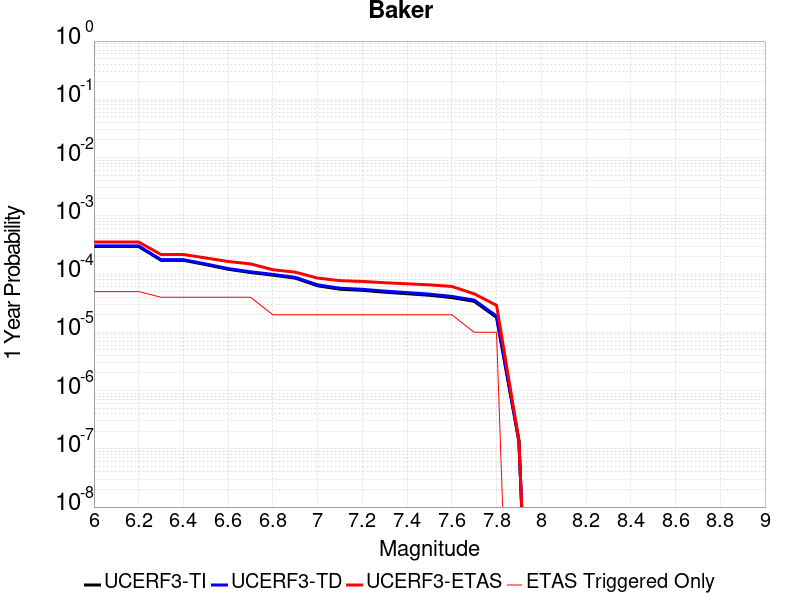 |  |

| Magnitude | 1 wk TI Prob | 1 wk TD Prob | 1 wk ETAS Prob | 1 wk ETAS/TD Gain | 1 wk ETAS Triggered Only | 1 mo TI Prob | 1 mo TD Prob | 1 mo ETAS Prob | 1 mo ETAS/TD Gain | 1 mo ETAS Triggered Only | 1 yr TI Prob | 1 yr TD Prob | 1 yr ETAS Prob | 1 yr ETAS/TD Gain | 1 yr ETAS Triggered Only | 10 yr TI Prob | 10 yr TD Prob | 10 yr ETAS Prob | 10 yr ETAS/TD Gain | 10 yr ETAS Triggered Only |
|-----|-----|-----|-----|-----|-----|-----|-----|-----|-----|-----|-----|-----|-----|-----|-----|-----|-----|-----|-----|-----|
| 6.0 | 5.695525E-6 | 5.8348373E-6 | 8.217027E-5 | 14.082702 | 7.633588E-5 | 2.4409164E-5 | 2.5006228E-5 | 1.013402E-4 | 4.0525985 | 7.633588E-5 | 2.9714106E-4 | 3.044123E-4 | 3.8072493E-4 | 1.2506884 | 7.633588E-5 | 0.0029674405 | 0.0030403486 | 0.0031164526 | 1.0250313 | 7.633588E-5 |
| 6.1 | 5.695525E-6 | 5.8348373E-6 | 8.217027E-5 | 14.082702 | 7.633588E-5 | 2.4409164E-5 | 2.5006228E-5 | 1.013402E-4 | 4.0525985 | 7.633588E-5 | 2.9714106E-4 | 3.044123E-4 | 3.8072493E-4 | 1.2506884 | 7.633588E-5 | 0.0029674405 | 0.0030403486 | 0.0031164526 | 1.0250313 | 7.633588E-5 |
| 6.2 | 5.695525E-6 | 5.8348373E-6 | 8.217027E-5 | 14.082702 | 7.633588E-5 | 2.4409164E-5 | 2.5006228E-5 | 1.013402E-4 | 4.0525985 | 7.633588E-5 | 2.9714106E-4 | 3.044123E-4 | 3.8072493E-4 | 1.2506884 | 7.633588E-5 | 0.0029674405 | 0.0030403486 | 0.0031164526 | 1.0250313 | 7.633588E-5 |
| 6.3 | 3.2995713E-6 | 3.383667E-6 | 7.9719284E-5 | 23.560026 | 7.633588E-5 | 1.4140943E-5 | 1.4501353E-5 | 9.0836125E-5 | 6.263976 | 7.633588E-5 | 1.7215237E-4 | 1.7654014E-4 | 2.5286255E-4 | 1.4323232 | 7.633588E-5 | 0.0017201907 | 0.001764046 | 0.0018402472 | 1.0431968 | 7.633588E-5 |
| 6.4 | 3.2995713E-6 | 3.383667E-6 | 7.9719284E-5 | 23.560026 | 7.633588E-5 | 1.4140943E-5 | 1.4501353E-5 | 9.0836125E-5 | 6.263976 | 7.633588E-5 | 1.7215237E-4 | 1.7654014E-4 | 2.5286255E-4 | 1.4323232 | 7.633588E-5 | 0.0017201907 | 0.001764046 | 0.0018402472 | 1.0431968 | 7.633588E-5 |
| 6.5 | 2.782202E-6 | 2.8558404E-6 | 7.91915E-5 | 27.729666 | 7.633588E-5 | 1.1923668E-5 | 1.223926E-5 | 8.8574205E-5 | 7.2368917 | 7.633588E-5 | 1.4516099E-4 | 1.4900314E-4 | 2.2532765E-4 | 1.5122342 | 7.633588E-5 | 0.001450662 | 0.0014890651 | 0.0015652872 | 1.051188 | 7.633588E-5 |
| 6.6 | 2.3163404E-6 | 2.38092E-6 | 7.8716614E-5 | 33.061428 | 7.633588E-5 | 9.927136E-6 | 1.0203904E-5 | 8.6539E-5 | 8.48097 | 7.633588E-5 | 1.20856166E-4 | 1.2422565E-4 | 2.0055205E-4 | 1.6144173 | 7.633588E-5 | 0.0012079047 | 0.0012415823 | 0.0013178234 | 1.0614064 | 7.633588E-5 |
| 6.7 | 2.037056E-6 | 2.0965003E-6 | 7.843222E-5 | 37.41102 | 7.633588E-5 | 8.7302105E-6 | 8.984972E-6 | 8.532016E-5 | 9.495874 | 7.633588E-5 | 1.0628513E-4 | 1.093867E-4 | 1.8571423E-4 | 1.697777 | 7.633588E-5 | 0.0010623431 | 0.0010933448 | 0.0011695971 | 1.0697423 | 7.633588E-5 |
| 6.8 | 1.8356744E-6 | 1.8915287E-6 | 1.8915287E-6 | 1.0 | 0.0 | 7.867153E-6 | 8.106527E-6 | 8.106527E-6 | 1.0 | 0.0 | 9.577837E-5 | 9.869264E-5 | 9.869264E-5 | 1.0 | 0.0 | 9.57371E-4 | 9.86502E-4 | 9.86502E-4 | 1.0 | 0.0 |
| 6.9 | 1.6310546E-6 | 1.6832072E-6 | 1.6832072E-6 | 1.0 | 0.0 | 6.9902153E-6 | 7.213726E-6 | 7.213726E-6 | 1.0 | 0.0 | 8.510255E-5 | 8.782368E-5 | 8.782368E-5 | 1.0 | 0.0 | 8.5069967E-4 | 8.7790104E-4 | 8.7790104E-4 | 1.0 | 0.0 |
| 7.0 | 1.2058036E-6 | 1.2508665E-6 | 1.2508665E-6 | 1.0 | 0.0 | 5.1677193E-6 | 5.3608455E-6 | 5.3608455E-6 | 1.0 | 0.0 | 6.291517E-5 | 6.5266366E-5 | 6.5266366E-5 | 1.0 | 0.0 | 6.289736E-4 | 6.524743E-4 | 6.524743E-4 | 1.0 | 0.0 |
| 7.1 | 1.052382E-6 | 1.0951609E-6 | 1.0951609E-6 | 1.0 | 0.0 | 4.5102006E-6 | 4.693538E-6 | 4.693538E-6 | 1.0 | 0.0 | 5.491031E-5 | 5.7142337E-5 | 5.7142337E-5 | 1.0 | 0.0 | 5.4896745E-4 | 5.7127734E-4 | 5.7127734E-4 | 1.0 | 0.0 |
| 7.2 | 1.0067454E-6 | 1.0487711E-6 | 1.0487711E-6 | 1.0 | 0.0 | 4.3146156E-6 | 4.4947255E-6 | 4.4947255E-6 | 1.0 | 0.0 | 5.252918E-5 | 5.4721917E-5 | 5.4721917E-5 | 1.0 | 0.0 | 5.251676E-4 | 5.470853E-4 | 5.470853E-4 | 1.0 | 0.0 |
| 7.3 | 9.3596316E-7 | 9.767723E-7 | 9.767723E-7 | 1.0 | 0.0 | 4.0112645E-6 | 4.1861604E-6 | 4.1861604E-6 | 1.0 | 0.0 | 4.8836053E-5 | 5.096532E-5 | 5.096532E-5 | 1.0 | 0.0 | 4.8825322E-4 | 5.095371E-4 | 5.095371E-4 | 1.0 | 0.0 |
| 7.4 | 8.8117395E-7 | 9.2076635E-7 | 9.2076635E-7 | 1.0 | 0.0 | 3.7764542E-6 | 3.9461356E-6 | 3.9461356E-6 | 1.0 | 0.0 | 4.5977362E-5 | 4.8043148E-5 | 4.8043148E-5 | 1.0 | 0.0 | 4.596785E-4 | 4.8032837E-4 | 4.8032837E-4 | 1.0 | 0.0 |
| 7.5 | 8.292386E-7 | 8.6745956E-7 | 8.6745956E-7 | 1.0 | 0.0 | 3.5538749E-6 | 3.7176785E-6 | 3.7176785E-6 | 1.0 | 0.0 | 4.326757E-5 | 4.5261804E-5 | 4.5261804E-5 | 1.0 | 0.0 | 4.3259145E-4 | 4.5252658E-4 | 4.5252658E-4 | 1.0 | 0.0 |
| 7.6 | 7.553842E-7 | 7.9144706E-7 | 7.9144706E-7 | 1.0 | 0.0 | 3.2373566E-6 | 3.3919116E-6 | 3.3919116E-6 | 1.0 | 0.0 | 3.9414106E-5 | 4.129575E-5 | 4.129575E-5 | 1.0 | 0.0 | 3.9407116E-4 | 4.1288146E-4 | 4.1288146E-4 | 1.0 | 0.0 |
| 7.7 | 6.5285366E-7 | 6.852797E-7 | 6.852797E-7 | 1.0 | 0.0 | 2.797941E-6 | 2.9369096E-6 | 2.9369096E-6 | 1.0 | 0.0 | 3.40644E-5 | 3.5756293E-5 | 3.5756293E-5 | 1.0 | 0.0 | 3.405918E-4 | 3.5750607E-4 | 3.5750607E-4 | 1.0 | 0.0 |
| 7.8 | 3.4586725E-7 | 3.6482615E-7 | 3.6482615E-7 | 1.0 | 0.0 | 1.4822873E-6 | 1.5635396E-6 | 1.5635396E-6 | 1.0 | 0.0 | 1.80467E-5 | 1.9035933E-5 | 1.9035933E-5 | 1.0 | 0.0 | 1.8045233E-4 | 1.9034347E-4 | 1.9034347E-4 | 1.0 | 0.0 |
| 7.9 | 2.5591178E-9 | 2.6696718E-9 | 2.6696718E-9 | 1.0 | 0.0 | 1.0967647E-8 | 1.14414505E-8 | 1.14414505E-8 | 1.0 | 0.0 | 1.335311E-7 | 1.3929966E-7 | 1.3929966E-7 | 1.0 | 0.0 | 1.3353102E-6 | 1.3929966E-6 | 1.3929966E-6 | 1.0 | 0.0 |

## Camp Rock 2011
*[(top)](#table-of-contents)*

| 1 Week | 1 Month | 1 Year | 10 Year |
|-----|-----|-----|-----|
|  |  |  |  |

| Magnitude | 1 wk TI Prob | 1 wk TD Prob | 1 wk ETAS Prob | 1 wk ETAS/TD Gain | 1 wk ETAS Triggered Only | 1 mo TI Prob | 1 mo TD Prob | 1 mo ETAS Prob | 1 mo ETAS/TD Gain | 1 mo ETAS Triggered Only | 1 yr TI Prob | 1 yr TD Prob | 1 yr ETAS Prob | 1 yr ETAS/TD Gain | 1 yr ETAS Triggered Only | 10 yr TI Prob | 10 yr TD Prob | 10 yr ETAS Prob | 10 yr ETAS/TD Gain | 10 yr ETAS Triggered Only |
|-----|-----|-----|-----|-----|-----|-----|-----|-----|-----|-----|-----|-----|-----|-----|-----|-----|-----|-----|-----|-----|
| 6.0 | 1.6710783E-5 | 4.25026E-6 | 4.2418036E-5 | 9.9801035 | 3.816794E-5 | 7.161568E-5 | 1.8215276E-5 | 5.638252E-5 | 3.0953424 | 3.816794E-5 | 8.7157206E-4 | 2.2174895E-4 | 2.980679E-4 | 1.3441683 | 7.633588E-5 | 0.008681616 | 0.0022153298 | 0.0022914964 | 1.0343816 | 7.633588E-5 |
| 6.1 | 1.6710783E-5 | 4.25026E-6 | 4.2418036E-5 | 9.9801035 | 3.816794E-5 | 7.161568E-5 | 1.8215276E-5 | 5.638252E-5 | 3.0953424 | 3.816794E-5 | 8.7157206E-4 | 2.2174895E-4 | 2.980679E-4 | 1.3441683 | 7.633588E-5 | 0.008681616 | 0.0022153298 | 0.0022914964 | 1.0343816 | 7.633588E-5 |
| 6.2 | 1.6710783E-5 | 4.25026E-6 | 4.2418036E-5 | 9.9801035 | 3.816794E-5 | 7.161568E-5 | 1.8215276E-5 | 5.638252E-5 | 3.0953424 | 3.816794E-5 | 8.7157206E-4 | 2.2174895E-4 | 2.980679E-4 | 1.3441683 | 7.633588E-5 | 0.008681616 | 0.0022153298 | 0.0022914964 | 1.0343816 | 7.633588E-5 |
| 6.3 | 1.6710783E-5 | 4.25026E-6 | 4.2418036E-5 | 9.9801035 | 3.816794E-5 | 7.161568E-5 | 1.8215276E-5 | 5.638252E-5 | 3.0953424 | 3.816794E-5 | 8.7157206E-4 | 2.2174895E-4 | 2.980679E-4 | 1.3441683 | 7.633588E-5 | 0.008681616 | 0.0022153298 | 0.0022914964 | 1.0343816 | 7.633588E-5 |
| 6.4 | 7.982846E-6 | 3.6820884E-6 | 4.1849886E-5 | 11.365802 | 3.816794E-5 | 3.421175E-5 | 1.5780286E-5 | 5.3947624E-5 | 3.418672 | 3.816794E-5 | 4.1644843E-4 | 1.9210839E-4 | 2.684296E-4 | 1.397282 | 7.633588E-5 | 0.0041566887 | 0.001919458 | 0.0019956473 | 1.0396931 | 7.633588E-5 |
| 6.5 | 7.982846E-6 | 3.6820884E-6 | 4.1849886E-5 | 11.365802 | 3.816794E-5 | 3.421175E-5 | 1.5780286E-5 | 5.3947624E-5 | 3.418672 | 3.816794E-5 | 4.1644843E-4 | 1.9210839E-4 | 2.684296E-4 | 1.397282 | 7.633588E-5 | 0.0041566887 | 0.001919458 | 0.0019956473 | 1.0396931 | 7.633588E-5 |
| 6.6 | 7.048869E-6 | 3.4243571E-6 | 4.1592164E-5 | 12.145978 | 3.816794E-5 | 3.0209088E-5 | 1.4675736E-5 | 5.2843116E-5 | 3.6007133 | 3.816794E-5 | 3.677336E-4 | 1.7866275E-4 | 2.5498497E-4 | 1.4271861 | 7.633588E-5 | 0.0036712566 | 0.0017852228 | 0.0018614223 | 1.0426835 | 7.633588E-5 |
| 6.7 | 6.987307E-6 | 3.3623348E-6 | 4.1530144E-5 | 12.35158 | 3.816794E-5 | 2.9945259E-5 | 1.4409929E-5 | 5.2577318E-5 | 3.648687 | 3.816794E-5 | 3.6452254E-4 | 1.7542706E-4 | 2.5174956E-4 | 1.4350668 | 7.633588E-5 | 0.0036392517 | 0.001752917 | 0.001829119 | 1.0434716 | 7.633588E-5 |
| 6.8 | 6.3737602E-6 | 3.1179077E-6 | 4.1285726E-5 | 13.241485 | 3.816794E-5 | 2.731583E-5 | 1.3362394E-5 | 5.1529823E-5 | 3.8563316 | 3.816794E-5 | 3.3251947E-4 | 1.626753E-4 | 2.3899875E-4 | 1.4691768 | 7.633588E-5 | 0.0033202237 | 0.0016255907 | 0.0017018025 | 1.0468825 | 7.633588E-5 |
| 6.9 | 6.112211E-6 | 2.9331156E-6 | 4.1100942E-5 | 14.012725 | 3.816794E-5 | 2.6194928E-5 | 1.2570436E-5 | 5.0737897E-5 | 4.0362873 | 3.816794E-5 | 3.1887658E-4 | 1.5303459E-4 | 2.2935879E-4 | 1.4987382 | 7.633588E-5 | 0.003184194 | 0.0015293199 | 0.001605539 | 1.0498385 | 7.633588E-5 |
| 7.0 | 5.5140117E-6 | 2.641923E-6 | 4.0809762E-5 | 15.446991 | 3.816794E-5 | 2.3631264E-5 | 1.132248E-5 | 4.9489987E-5 | 4.3709497 | 3.816794E-5 | 2.8767265E-4 | 1.3784273E-4 | 2.1416807E-4 | 1.5537133 | 7.633588E-5 | 0.0028730053 | 0.0013775975 | 0.0014538282 | 1.055336 | 7.633588E-5 |
| 7.1 | 4.8151105E-6 | 2.1342705E-6 | 4.030213E-5 | 18.883327 | 3.816794E-5 | 2.0636026E-5 | 9.146843E-6 | 4.7314432E-5 | 5.1727614 | 3.816794E-5 | 2.5121463E-4 | 1.1135734E-4 | 1.8768471E-4 | 1.6854274 | 7.633588E-5 | 0.0025093083 | 0.0011130372 | 0.0011892882 | 1.0685071 | 7.633588E-5 |
| 7.2 | 3.818335E-6 | 1.2937425E-6 | 3.9461633E-5 | 30.501923 | 3.816794E-5 | 1.6364189E-5 | 5.5445994E-6 | 4.3712327E-5 | 7.8837667 | 3.816794E-5 | 1.9921579E-4 | 6.750349E-5 | 1.4383422E-4 | 2.130767 | 7.633588E-5 | 0.0019903728 | 6.748381E-4 | 7.511224E-4 | 1.113041 | 7.633588E-5 |
| 7.3 | 2.7166698E-6 | 7.3835776E-7 | 3.890627E-5 | 52.692978 | 3.816794E-5 | 1.1642818E-5 | 3.1643867E-6 | 4.1332205E-5 | 13.06168 | 3.816794E-5 | 1.4174209E-4 | 3.8525748E-5 | 7.669222E-5 | 1.9906744 | 3.816794E-5 | 0.0014165172 | 3.851927E-4 | 4.2334592E-4 | 1.0990497 | 3.816794E-5 |
| 7.4 | 2.0893426E-6 | 5.4618386E-7 | 3.87141E-5 | 70.88108 | 3.816794E-5 | 8.954295E-6 | 2.3407858E-6 | 4.0508636E-5 | 17.30557 | 3.816794E-5 | 1.0901308E-4 | 2.84987E-5 | 6.6665554E-5 | 2.339249 | 3.816794E-5 | 0.0010895962 | 2.84951E-4 | 3.2310808E-4 | 1.1339074 | 3.816794E-5 |
| 7.5 | 1.1681728E-6 | 3.6030585E-7 | 3.8528233E-5 | 106.932014 | 3.816794E-5 | 5.0064455E-6 | 1.544167E-6 | 3.9712046E-5 | 25.717455 | 3.816794E-5 | 6.0951766E-5 | 1.8800076E-5 | 5.69673E-5 | 3.030163 | 3.816794E-5 | 6.093505E-4 | 1.8798532E-4 | 2.2614609E-4 | 1.2029986 | 3.816794E-5 |
| 7.6 | 1.3154387E-7 | 7.1197384E-8 | 7.1197384E-8 | 1.0 | 0.0 | 5.6375933E-7 | 3.051316E-7 | 3.051316E-7 | 1.0 | 0.0 | 6.863748E-6 | 3.7149728E-6 | 3.7149728E-6 | 1.0 | 0.0 | 6.863536E-5 | 3.7149264E-5 | 3.7149264E-5 | 1.0 | 0.0 |

## Independence rev 2011
*[(top)](#table-of-contents)*

| 1 Week | 1 Month | 1 Year | 10 Year |
|-----|-----|-----|-----|
|  |  |  |  |

| Magnitude | 1 wk TI Prob | 1 wk TD Prob | 1 wk ETAS Prob | 1 wk ETAS/TD Gain | 1 wk ETAS Triggered Only | 1 mo TI Prob | 1 mo TD Prob | 1 mo ETAS Prob | 1 mo ETAS/TD Gain | 1 mo ETAS Triggered Only | 1 yr TI Prob | 1 yr TD Prob | 1 yr ETAS Prob | 1 yr ETAS/TD Gain | 1 yr ETAS Triggered Only | 10 yr TI Prob | 10 yr TD Prob | 10 yr ETAS Prob | 10 yr ETAS/TD Gain | 10 yr ETAS Triggered Only |
|-----|-----|-----|-----|-----|-----|-----|-----|-----|-----|-----|-----|-----|-----|-----|-----|-----|-----|-----|-----|-----|
| 6.0 | 4.422171E-6 | 4.326227E-6 | 8.0661775E-5 | 18.644833 | 7.633588E-5 | 1.8952025E-5 | 1.8540857E-5 | 9.487532E-5 | 5.1170945 | 7.633588E-5 | 2.3071647E-4 | 2.2571455E-4 | 3.020332E-4 | 1.3381202 | 7.633588E-5 | 0.0023047708 | 0.0022551466 | 0.0023313102 | 1.0337733 | 7.633588E-5 |
| 6.1 | 4.422171E-6 | 4.326227E-6 | 8.0661775E-5 | 18.644833 | 7.633588E-5 | 1.8952025E-5 | 1.8540857E-5 | 9.487532E-5 | 5.1170945 | 7.633588E-5 | 2.3071647E-4 | 2.2571455E-4 | 3.020332E-4 | 1.3381202 | 7.633588E-5 | 0.0023047708 | 0.0022551466 | 0.0023313102 | 1.0337733 | 7.633588E-5 |
| 6.2 | 4.422171E-6 | 4.326227E-6 | 8.0661775E-5 | 18.644833 | 7.633588E-5 | 1.8952025E-5 | 1.8540857E-5 | 9.487532E-5 | 5.1170945 | 7.633588E-5 | 2.3071647E-4 | 2.2571455E-4 | 3.020332E-4 | 1.3381202 | 7.633588E-5 | 0.0023047708 | 0.0022551466 | 0.0023313102 | 1.0337733 | 7.633588E-5 |
| 6.3 | 4.422171E-6 | 4.326227E-6 | 8.0661775E-5 | 18.644833 | 7.633588E-5 | 1.8952025E-5 | 1.8540857E-5 | 9.487532E-5 | 5.1170945 | 7.633588E-5 | 2.3071647E-4 | 2.2571455E-4 | 3.020332E-4 | 1.3381202 | 7.633588E-5 | 0.0023047708 | 0.0022551466 | 0.0023313102 | 1.0337733 | 7.633588E-5 |
| 6.4 | 4.422171E-6 | 4.326227E-6 | 8.0661775E-5 | 18.644833 | 7.633588E-5 | 1.8952025E-5 | 1.8540857E-5 | 9.487532E-5 | 5.1170945 | 7.633588E-5 | 2.3071647E-4 | 2.2571455E-4 | 3.020332E-4 | 1.3381202 | 7.633588E-5 | 0.0023047708 | 0.0022551466 | 0.0023313102 | 1.0337733 | 7.633588E-5 |
| 6.5 | 4.422171E-6 | 4.326227E-6 | 8.0661775E-5 | 18.644833 | 7.633588E-5 | 1.8952025E-5 | 1.8540857E-5 | 9.487532E-5 | 5.1170945 | 7.633588E-5 | 2.3071647E-4 | 2.2571455E-4 | 3.020332E-4 | 1.3381202 | 7.633588E-5 | 0.0023047708 | 0.0022551466 | 0.0023313102 | 1.0337733 | 7.633588E-5 |
| 6.6 | 2.663744E-6 | 2.5319862E-6 | 7.886767E-5 | 31.148539 | 7.633588E-5 | 1.1415996E-5 | 1.0851327E-5 | 8.7186374E-5 | 8.034628 | 7.633588E-5 | 1.3898089E-4 | 1.3210738E-4 | 2.0843318E-4 | 1.5777557 | 7.633588E-5 | 0.0013889399 | 0.0013203367 | 0.0013965719 | 1.0577391 | 7.633588E-5 |
| 6.7 | 2.663744E-6 | 2.5319862E-6 | 7.886767E-5 | 31.148539 | 7.633588E-5 | 1.1415996E-5 | 1.0851327E-5 | 8.7186374E-5 | 8.034628 | 7.633588E-5 | 1.3898089E-4 | 1.3210738E-4 | 2.0843318E-4 | 1.5777557 | 7.633588E-5 | 0.0013889399 | 0.0013203367 | 0.0013965719 | 1.0577391 | 7.633588E-5 |
| 6.8 | 1.9716529E-6 | 1.8322585E-6 | 7.8168E-5 | 42.6621 | 7.633588E-5 | 8.449913E-6 | 7.852514E-6 | 8.418779E-5 | 10.721127 | 7.633588E-5 | 1.0287284E-4 | 9.5600284E-5 | 1.7192887E-4 | 1.7984138 | 7.633588E-5 | 0.0010282523 | 9.556045E-4 | 0.0010318675 | 1.079806 | 7.633588E-5 |
| 6.9 | 1.8788617E-6 | 1.7429993E-6 | 7.8078745E-5 | 44.795624 | 7.633588E-5 | 8.0522395E-6 | 7.4699765E-6 | 8.380529E-5 | 11.218949 | 7.633588E-5 | 9.80316E-5 | 9.0943286E-5 | 1.6727223E-4 | 1.8393025 | 7.633588E-5 | 9.798837E-4 | 9.0907275E-4 | 9.853392E-4 | 1.0838948 | 7.633588E-5 |
| 7.0 | 1.5045488E-6 | 1.3849503E-6 | 7.7720724E-5 | 56.118053 | 7.633588E-5 | 6.44805E-6 | 5.9354884E-6 | 8.227091E-5 | 13.860849 | 7.633588E-5 | 7.8502184E-5 | 7.226223E-5 | 1.4859259E-4 | 2.0562968 | 7.633588E-5 | 7.8474457E-4 | 7.2239246E-4 | 7.986732E-4 | 1.1055946 | 7.633588E-5 |
| 7.1 | 1.272341E-6 | 1.1625096E-6 | 7.74983E-5 | 66.66465 | 7.633588E-5 | 5.4528787E-6 | 4.982175E-6 | 8.1317674E-5 | 16.321722 | 7.633588E-5 | 6.6386776E-5 | 6.0656326E-5 | 1.3698757E-4 | 2.258422 | 7.633588E-5 | 6.636695E-4 | 6.064009E-4 | 6.826905E-4 | 1.1258072 | 7.633588E-5 |
| 7.2 | 1.0416892E-6 | 9.4098806E-7 | 7.7276796E-5 | 82.12303 | 7.633588E-5 | 4.464375E-6 | 4.0328E-6 | 8.036837E-5 | 19.928679 | 7.633588E-5 | 5.4352407E-5 | 4.909825E-5 | 1.2543038E-4 | 2.5546813 | 7.633588E-5 | 5.4339116E-4 | 4.9087586E-4 | 5.671743E-4 | 1.1554332 | 7.633588E-5 |
| 7.3 | 7.9450155E-7 | 7.235002E-7 | 3.8891412E-5 | 53.754528 | 3.816794E-5 | 3.4050022E-6 | 3.1007114E-6 | 4.1268533E-5 | 13.309376 | 3.816794E-5 | 4.1455114E-5 | 3.775052E-5 | 7.5917014E-5 | 2.0110192 | 3.816794E-5 | 4.144738E-4 | 3.7744216E-4 | 4.155957E-4 | 1.1010845 | 3.816794E-5 |
| 7.4 | 5.3893444E-7 | 5.019512E-7 | 3.866987E-5 | 77.0391 | 3.816794E-5 | 2.309717E-6 | 2.1512178E-6 | 4.0319075E-5 | 18.742443 | 3.816794E-5 | 2.8120441E-5 | 2.6190766E-5 | 6.435771E-5 | 2.457267 | 3.816794E-5 | 2.8116882E-4 | 2.6187726E-4 | 3.000352E-4 | 1.1457093 | 3.816794E-5 |
| 7.5 | 3.8852085E-7 | 3.682554E-7 | 3.853618E-5 | 104.645256 | 3.816794E-5 | 1.6650882E-6 | 1.5782365E-6 | 3.9746115E-5 | 25.183878 | 3.816794E-5 | 2.027226E-5 | 1.9214862E-5 | 5.7382065E-5 | 2.986338 | 3.816794E-5 | 2.0270412E-4 | 1.9213221E-4 | 2.3029282E-4 | 1.1986164 | 3.816794E-5 |
| 7.6 | 2.414929E-7 | 2.345755E-7 | 3.8402504E-5 | 163.71065 | 3.816794E-5 | 1.0349692E-6 | 1.0053232E-6 | 3.9173225E-5 | 38.9658 | 3.816794E-5 | 1.2600677E-5 | 1.2239742E-5 | 5.0407216E-5 | 4.1183233 | 3.816794E-5 | 1.2599962E-4 | 1.223908E-4 | 1.6055407E-4 | 1.3118148 | 3.816794E-5 |
| 7.7 | 6.8298014E-8 | 6.85897E-8 | 6.85897E-8 | 1.0 | 0.0 | 2.9270575E-7 | 2.9395582E-7 | 2.9395582E-7 | 1.0 | 0.0 | 3.5636867E-6 | 3.5789067E-6 | 3.5789067E-6 | 1.0 | 0.0 | 3.5636294E-5 | 3.5788536E-5 | 3.5788536E-5 | 1.0 | 0.0 |

## Whittier alt 1
*[(top)](#table-of-contents)*

| 1 Week | 1 Month | 1 Year | 10 Year |
|-----|-----|-----|-----|
|  | 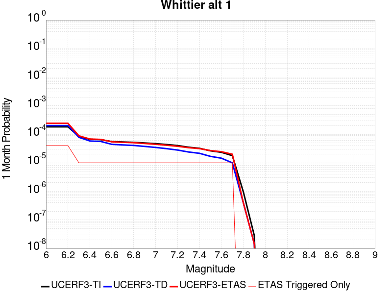 |  |  |

| Magnitude | 1 wk TI Prob | 1 wk TD Prob | 1 wk ETAS Prob | 1 wk ETAS/TD Gain | 1 wk ETAS Triggered Only | 1 mo TI Prob | 1 mo TD Prob | 1 mo ETAS Prob | 1 mo ETAS/TD Gain | 1 mo ETAS Triggered Only | 1 yr TI Prob | 1 yr TD Prob | 1 yr ETAS Prob | 1 yr ETAS/TD Gain | 1 yr ETAS Triggered Only | 10 yr TI Prob | 10 yr TD Prob | 10 yr ETAS Prob | 10 yr ETAS/TD Gain | 10 yr ETAS Triggered Only |
|-----|-----|-----|-----|-----|-----|-----|-----|-----|-----|-----|-----|-----|-----|-----|-----|-----|-----|-----|-----|-----|
| 6.0 | 4.2554693E-5 | 4.725218E-5 | 1.2358445E-4 | 2.6154232 | 7.633588E-5 | 1.8236451E-4 | 2.0249544E-4 | 2.7881586E-4 | 1.3768995 | 7.633588E-5 | 0.002218027 | 0.0024629154 | 0.002539063 | 1.0309178 | 7.633588E-5 | 0.02196019 | 0.024390234 | 0.024464708 | 1.0030534 | 7.633588E-5 |
| 6.1 | 4.2554693E-5 | 4.725218E-5 | 1.2358445E-4 | 2.6154232 | 7.633588E-5 | 1.8236451E-4 | 2.0249544E-4 | 2.7881586E-4 | 1.3768995 | 7.633588E-5 | 0.002218027 | 0.0024629154 | 0.002539063 | 1.0309178 | 7.633588E-5 | 0.02196019 | 0.024390234 | 0.024464708 | 1.0030534 | 7.633588E-5 |
| 6.2 | 4.2554693E-5 | 4.725218E-5 | 1.2358445E-4 | 2.6154232 | 7.633588E-5 | 1.8236451E-4 | 2.0249544E-4 | 2.7881586E-4 | 1.3768995 | 7.633588E-5 | 0.002218027 | 0.0024629154 | 0.002539063 | 1.0309178 | 7.633588E-5 | 0.02196019 | 0.024390234 | 0.024464708 | 1.0030534 | 7.633588E-5 |
| 6.3 | 1.9617712E-5 | 1.8268593E-5 | 1.8268593E-5 | 1.0 | 0.0 | 8.40732E-5 | 7.829172E-5 | 7.829172E-5 | 1.0 | 0.0 | 0.0010231105 | 9.52804E-4 | 9.52804E-4 | 1.0 | 0.0 | 0.01018413 | 0.009490474 | 0.009490474 | 1.0 | 0.0 |
| 6.4 | 1.5611336E-5 | 1.3604271E-5 | 1.3604271E-5 | 1.0 | 0.0 | 6.690401E-5 | 5.8302747E-5 | 5.8302747E-5 | 1.0 | 0.0 | 8.142519E-4 | 7.0961076E-4 | 7.0961076E-4 | 1.0 | 0.0 | 0.008112748 | 0.0070754145 | 0.0070754145 | 1.0 | 0.0 |
| 6.5 | 1.5150166E-5 | 1.3100925E-5 | 1.3100925E-5 | 1.0 | 0.0 | 6.492767E-5 | 5.6145647E-5 | 5.6145647E-5 | 1.0 | 0.0 | 7.9020765E-4 | 6.8336475E-4 | 6.8336475E-4 | 1.0 | 0.0 | 0.007874036 | 0.0068145846 | 0.0068145846 | 1.0 | 0.0 |
| 6.6 | 1.295588E-5 | 1.0380725E-5 | 1.0380725E-5 | 1.0 | 0.0 | 5.552402E-5 | 4.4488075E-5 | 4.4488075E-5 | 1.0 | 0.0 | 6.7579525E-4 | 5.4150965E-4 | 5.4150965E-4 | 1.0 | 0.0 | 0.006737438 | 0.0054033357 | 0.0054033357 | 1.0 | 0.0 |
| 6.7 | 1.2542085E-5 | 9.899369E-6 | 9.899369E-6 | 1.0 | 0.0 | 5.3750682E-5 | 4.242519E-5 | 4.242519E-5 | 1.0 | 0.0 | 6.542181E-4 | 5.164061E-4 | 5.164061E-4 | 1.0 | 0.0 | 0.006522954 | 0.0051534795 | 0.0051534795 | 1.0 | 0.0 |
| 6.8 | 1.2195878E-5 | 9.495415E-6 | 9.495415E-6 | 1.0 | 0.0 | 5.2267E-5 | 4.069401E-5 | 4.069401E-5 | 1.0 | 0.0 | 6.36165E-4 | 4.9533875E-4 | 4.9533875E-4 | 1.0 | 0.0 | 0.0063434686 | 0.004943688 | 0.004943688 | 1.0 | 0.0 |
| 6.9 | 1.1580298E-5 | 8.772933E-6 | 8.772933E-6 | 1.0 | 0.0 | 4.9628903E-5 | 3.7597754E-5 | 3.7597754E-5 | 1.0 | 0.0 | 6.040644E-4 | 4.5765814E-4 | 4.5765814E-4 | 1.0 | 0.0 | 0.00602425 | 0.0045684157 | 0.0045684157 | 1.0 | 0.0 |
| 7.0 | 1.0964795E-5 | 8.083994E-6 | 8.083994E-6 | 1.0 | 0.0 | 4.6991136E-5 | 3.4645236E-5 | 3.4645236E-5 | 1.0 | 0.0 | 5.7196687E-4 | 4.2172565E-4 | 4.2172565E-4 | 1.0 | 0.0 | 0.0057049696 | 0.004210462 | 0.004210462 | 1.0 | 0.0 |
| 7.1 | 1.0230601E-5 | 7.3266697E-6 | 7.3266697E-6 | 1.0 | 0.0 | 4.3844695E-5 | 3.1399642E-5 | 3.1399642E-5 | 1.0 | 0.0 | 5.336784E-4 | 3.8222488E-4 | 3.8222488E-4 | 1.0 | 0.0 | 0.005323986 | 0.0038168381 | 0.0038168381 | 1.0 | 0.0 |
| 7.2 | 9.40865E-6 | 6.543289E-6 | 6.543289E-6 | 1.0 | 0.0 | 4.032216E-5 | 2.8042374E-5 | 2.8042374E-5 | 1.0 | 0.0 | 4.908117E-4 | 3.4136363E-4 | 3.4136363E-4 | 1.0 | 0.0 | 0.0048972913 | 0.003409485 | 0.003409485 | 1.0 | 0.0 |
| 7.3 | 8.237384E-6 | 5.5977525E-6 | 5.5977525E-6 | 1.0 | 0.0 | 3.5302593E-5 | 2.3990153E-5 | 2.3990153E-5 | 1.0 | 0.0 | 4.2972428E-4 | 2.92042E-4 | 2.92042E-4 | 1.0 | 0.0 | 0.0042889426 | 0.002916903 | 0.002916903 | 1.0 | 0.0 |
| 7.4 | 7.5316966E-6 | 5.027819E-6 | 5.027819E-6 | 1.0 | 0.0 | 3.2278298E-5 | 2.1547625E-5 | 2.1547625E-5 | 1.0 | 0.0 | 3.9291743E-4 | 2.6231175E-4 | 2.6231175E-4 | 1.0 | 0.0 | 0.0039222343 | 0.0026201333 | 0.0026201333 | 1.0 | 0.0 |
| 7.5 | 6.149649E-6 | 3.933841E-6 | 3.933841E-6 | 1.0 | 0.0 | 2.6355372E-5 | 1.6859214E-5 | 1.6859214E-5 | 1.0 | 0.0 | 3.208294E-4 | 2.052425E-4 | 2.052425E-4 | 1.0 | 0.0 | 0.003203666 | 0.0020506186 | 0.0020506186 | 1.0 | 0.0 |
| 7.6 | 5.457711E-6 | 3.3953788E-6 | 3.3953788E-6 | 1.0 | 0.0 | 2.338998E-5 | 1.4551547E-5 | 1.4551547E-5 | 1.0 | 0.0 | 2.8473578E-4 | 1.771515E-4 | 1.771515E-4 | 1.0 | 0.0 | 0.0028437122 | 0.0017701836 | 0.0017701836 | 1.0 | 0.0 |
| 7.7 | 4.1676276E-6 | 2.3331952E-6 | 2.3331952E-6 | 1.0 | 0.0 | 1.7861139E-5 | 9.999374E-6 | 9.999374E-6 | 1.0 | 0.0 | 2.1743766E-4 | 1.2173632E-4 | 1.2173632E-4 | 1.0 | 0.0 | 0.0021722503 | 0.0012167693 | 0.0012167693 | 1.0 | 0.0 |
| 7.8 | 2.2692414E-7 | 9.3854695E-8 | 9.3854695E-8 | 1.0 | 0.0 | 9.725317E-7 | 4.0223435E-7 | 4.0223435E-7 | 1.0 | 0.0 | 1.1840509E-5 | 4.8971956E-6 | 4.8971956E-6 | 1.0 | 0.0 | 1.1839878E-4 | 4.8971204E-5 | 4.8971204E-5 | 1.0 | 0.0 |
| 7.9 | 6.676829E-9 | 3.439853E-9 | 3.439853E-9 | 1.0 | 0.0 | 2.861498E-8 | 1.4742227E-8 | 1.4742227E-8 | 1.0 | 0.0 | 3.4838732E-7 | 1.7948659E-7 | 1.7948659E-7 | 1.0 | 0.0 | 3.4838679E-6 | 1.7948646E-6 | 1.7948646E-6 | 1.0 | 0.0 |

## Dry Mountain
*[(top)](#table-of-contents)*

| 1 Week | 1 Month | 1 Year | 10 Year |
|-----|-----|-----|-----|
|  |  |  |  |

| Magnitude | 1 wk TI Prob | 1 wk TD Prob | 1 wk ETAS Prob | 1 wk ETAS/TD Gain | 1 wk ETAS Triggered Only | 1 mo TI Prob | 1 mo TD Prob | 1 mo ETAS Prob | 1 mo ETAS/TD Gain | 1 mo ETAS Triggered Only | 1 yr TI Prob | 1 yr TD Prob | 1 yr ETAS Prob | 1 yr ETAS/TD Gain | 1 yr ETAS Triggered Only | 10 yr TI Prob | 10 yr TD Prob | 10 yr ETAS Prob | 10 yr ETAS/TD Gain | 10 yr ETAS Triggered Only |
|-----|-----|-----|-----|-----|-----|-----|-----|-----|-----|-----|-----|-----|-----|-----|-----|-----|-----|-----|-----|-----|
| 6.0 | 6.222801E-6 | 6.439381E-6 | 8.2774764E-5 | 12.85446 | 7.633588E-5 | 2.6668875E-5 | 2.7597147E-5 | 1.0393092E-4 | 3.7660024 | 7.633588E-5 | 3.2464517E-4 | 3.3595937E-4 | 4.122696E-4 | 1.2271413 | 7.633588E-5 | 0.0032417132 | 0.0033560768 | 0.0034321565 | 1.0226692 | 7.633588E-5 |
| 6.1 | 6.222801E-6 | 6.439381E-6 | 8.2774764E-5 | 12.85446 | 7.633588E-5 | 2.6668875E-5 | 2.7597147E-5 | 1.0393092E-4 | 3.7660024 | 7.633588E-5 | 3.2464517E-4 | 3.3595937E-4 | 4.122696E-4 | 1.2271413 | 7.633588E-5 | 0.0032417132 | 0.0033560768 | 0.0034321565 | 1.0226692 | 7.633588E-5 |
| 6.2 | 6.222801E-6 | 6.439381E-6 | 8.2774764E-5 | 12.85446 | 7.633588E-5 | 2.6668875E-5 | 2.7597147E-5 | 1.0393092E-4 | 3.7660024 | 7.633588E-5 | 3.2464517E-4 | 3.3595937E-4 | 4.122696E-4 | 1.2271413 | 7.633588E-5 | 0.0032417132 | 0.0033560768 | 0.0034321565 | 1.0226692 | 7.633588E-5 |
| 6.3 | 6.222801E-6 | 6.439381E-6 | 8.2774764E-5 | 12.85446 | 7.633588E-5 | 2.6668875E-5 | 2.7597147E-5 | 1.0393092E-4 | 3.7660024 | 7.633588E-5 | 3.2464517E-4 | 3.3595937E-4 | 4.122696E-4 | 1.2271413 | 7.633588E-5 | 0.0032417132 | 0.0033560768 | 0.0034321565 | 1.0226692 | 7.633588E-5 |
| 6.4 | 6.222801E-6 | 6.439381E-6 | 8.2774764E-5 | 12.85446 | 7.633588E-5 | 2.6668875E-5 | 2.7597147E-5 | 1.0393092E-4 | 3.7660024 | 7.633588E-5 | 3.2464517E-4 | 3.3595937E-4 | 4.122696E-4 | 1.2271413 | 7.633588E-5 | 0.0032417132 | 0.0033560768 | 0.0034321565 | 1.0226692 | 7.633588E-5 |
| 6.5 | 2.8528623E-6 | 2.9521684E-6 | 4.1119994E-5 | 13.928743 | 3.816794E-5 | 1.22264955E-5 | 1.2652138E-5 | 5.0819595E-5 | 4.0166802 | 3.816794E-5 | 1.4884741E-4 | 1.540376E-4 | 1.9219966E-4 | 1.2477452 | 3.816794E-5 | 0.0014874774 | 0.0015401616 | 0.0015782708 | 1.0247436 | 3.816794E-5 |
| 6.6 | 2.8528623E-6 | 2.9521684E-6 | 4.1119994E-5 | 13.928743 | 3.816794E-5 | 1.22264955E-5 | 1.2652138E-5 | 5.0819595E-5 | 4.0166802 | 3.816794E-5 | 1.4884741E-4 | 1.540376E-4 | 1.9219966E-4 | 1.2477452 | 3.816794E-5 | 0.0014874774 | 0.0015401616 | 0.0015782708 | 1.0247436 | 3.816794E-5 |
| 6.7 | 2.541E-6 | 2.6293578E-6 | 4.0797197E-5 | 15.51603 | 3.816794E-5 | 1.0889954E-5 | 1.1268677E-5 | 4.9436185E-5 | 4.3870444 | 3.816794E-5 | 1.3257713E-4 | 1.3719614E-4 | 1.7535884E-4 | 1.2781616 | 3.816794E-5 | 0.0013249806 | 0.0013719613 | 0.001410077 | 1.0277818 | 3.816794E-5 |

## Chino alt 1
*[(top)](#table-of-contents)*

| 1 Week | 1 Month | 1 Year | 10 Year |
|-----|-----|-----|-----|
|  |  | 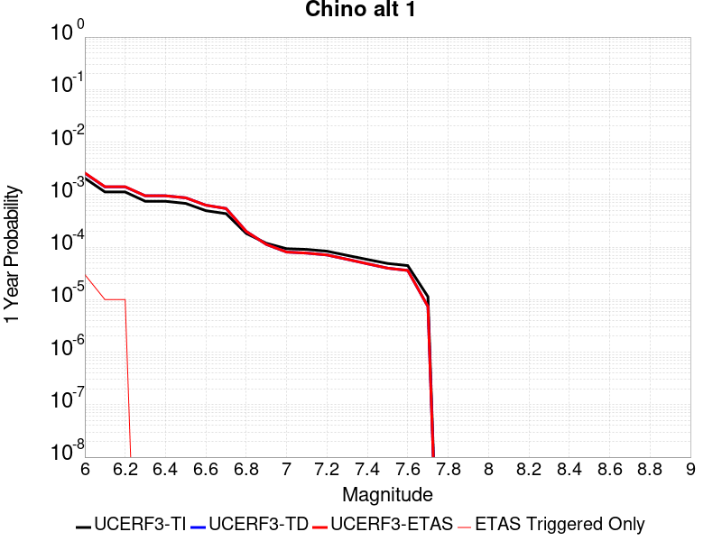 |  |

| Magnitude | 1 wk TI Prob | 1 wk TD Prob | 1 wk ETAS Prob | 1 wk ETAS/TD Gain | 1 wk ETAS Triggered Only | 1 mo TI Prob | 1 mo TD Prob | 1 mo ETAS Prob | 1 mo ETAS/TD Gain | 1 mo ETAS Triggered Only | 1 yr TI Prob | 1 yr TD Prob | 1 yr ETAS Prob | 1 yr ETAS/TD Gain | 1 yr ETAS Triggered Only | 10 yr TI Prob | 10 yr TD Prob | 10 yr ETAS Prob | 10 yr ETAS/TD Gain | 10 yr ETAS Triggered Only |
|-----|-----|-----|-----|-----|-----|-----|-----|-----|-----|-----|-----|-----|-----|-----|-----|-----|-----|-----|-----|-----|
| 6.0 | 3.939946E-5 | 4.8948554E-5 | 8.7114626E-5 | 1.779718 | 3.816794E-5 | 1.6884391E-4 | 2.097656E-4 | 2.4792552E-4 | 1.1819171 | 3.816794E-5 | 0.0020537362 | 0.0025513945 | 0.0025894651 | 1.0149214 | 3.816794E-5 | 0.020348595 | 0.025277847 | 0.025352253 | 1.0029435 | 7.633588E-5 |
| 6.1 | 2.1505624E-5 | 2.6879026E-5 | 6.504594E-5 | 2.4199514 | 3.816794E-5 | 9.2163704E-5 | 1.1519137E-4 | 1.5335491E-4 | 1.3313056 | 3.816794E-5 | 0.0011215154 | 0.001401664 | 0.0014397784 | 1.0271922 | 3.816794E-5 | 0.011158722 | 0.013945141 | 0.013982777 | 1.0026988 | 3.816794E-5 |
| 6.2 | 2.1505624E-5 | 2.6879026E-5 | 6.504594E-5 | 2.4199514 | 3.816794E-5 | 9.2163704E-5 | 1.1519137E-4 | 1.5335491E-4 | 1.3313056 | 3.816794E-5 | 0.0011215154 | 0.001401664 | 0.0014397784 | 1.0271922 | 3.816794E-5 | 0.011158722 | 0.013945141 | 0.013982777 | 1.0026988 | 3.816794E-5 |
| 6.3 | 1.4290785E-5 | 1.8165128E-5 | 1.8165128E-5 | 1.0 | 0.0 | 6.1244784E-5 | 7.784848E-5 | 7.784848E-5 | 1.0 | 0.0 | 7.454001E-4 | 9.4743853E-4 | 9.4743853E-4 | 1.0 | 0.0 | 0.007429048 | 0.0094444575 | 0.0094444575 | 1.0 | 0.0 |
| 6.4 | 1.4290785E-5 | 1.8165128E-5 | 1.8165128E-5 | 1.0 | 0.0 | 6.1244784E-5 | 7.784848E-5 | 7.784848E-5 | 1.0 | 0.0 | 7.454001E-4 | 9.4743853E-4 | 9.4743853E-4 | 1.0 | 0.0 | 0.007429048 | 0.0094444575 | 0.0094444575 | 1.0 | 0.0 |
| 6.5 | 1.3017944E-5 | 1.6652088E-5 | 1.6652088E-5 | 1.0 | 0.0 | 5.5789995E-5 | 7.136439E-5 | 7.136439E-5 | 1.0 | 0.0 | 6.790315E-4 | 8.685589E-4 | 8.685589E-4 | 1.0 | 0.0 | 0.0067696036 | 0.008661949 | 0.008661949 | 1.0 | 0.0 |
| 6.6 | 9.470016E-6 | 1.2039424E-5 | 1.2039424E-5 | 1.0 | 0.0 | 4.058515E-5 | 5.1596704E-5 | 5.1596704E-5 | 1.0 | 0.0 | 4.940122E-4 | 6.280428E-4 | 6.280428E-4 | 1.0 | 0.0 | 0.004929154 | 0.0062718987 | 0.0062718987 | 1.0 | 0.0 |
| 6.7 | 8.314155E-6 | 1.0407736E-5 | 1.0407736E-5 | 1.0 | 0.0 | 3.5631605E-5 | 4.4604003E-5 | 4.4604003E-5 | 1.0 | 0.0 | 4.3372845E-4 | 5.429507E-4 | 5.429507E-4 | 1.0 | 0.0 | 0.004328829 | 0.005425775 | 0.005425775 | 1.0 | 0.0 |
| 6.8 | 3.4856364E-6 | 3.8133708E-6 | 3.8133708E-6 | 1.0 | 0.0 | 1.4938357E-5 | 1.6342927E-5 | 1.6342927E-5 | 1.0 | 0.0 | 1.8185932E-4 | 1.9895904E-4 | 1.9895904E-4 | 1.0 | 0.0 | 0.0018171056 | 0.0019894864 | 0.0019894864 | 1.0 | 0.0 |
| 6.9 | 2.2645952E-6 | 2.1529022E-6 | 2.1529022E-6 | 1.0 | 0.0 | 9.705372E-6 | 9.226692E-6 | 9.226692E-6 | 1.0 | 0.0 | 1.18156495E-4 | 1.123294E-4 | 1.123294E-4 | 1.0 | 0.0 | 0.0011809369 | 0.0011233423 | 0.0011233423 | 1.0 | 0.0 |
| 7.0 | 1.7864003E-6 | 1.5430785E-6 | 1.5430785E-6 | 1.0 | 0.0 | 7.655979E-6 | 6.613177E-6 | 6.613177E-6 | 1.0 | 0.0 | 9.3207556E-5 | 8.051251E-5 | 8.051251E-5 | 1.0 | 0.0 | 9.316847E-4 | 8.0528046E-4 | 8.0528046E-4 | 1.0 | 0.0 |
| 7.1 | 1.7315456E-6 | 1.4733511E-6 | 1.4733511E-6 | 1.0 | 0.0 | 7.420889E-6 | 6.3143466E-6 | 6.3143466E-6 | 1.0 | 0.0 | 9.034557E-5 | 7.6874516E-5 | 7.6874516E-5 | 1.0 | 0.0 | 9.0308854E-4 | 7.6891703E-4 | 7.6891703E-4 | 1.0 | 0.0 |
| 7.2 | 1.6008337E-6 | 1.3574215E-6 | 1.3574215E-6 | 1.0 | 0.0 | 6.860698E-6 | 5.817508E-6 | 5.817508E-6 | 1.0 | 0.0 | 8.352579E-5 | 7.082591E-5 | 7.082591E-5 | 1.0 | 0.0 | 8.34944E-4 | 7.0845755E-4 | 7.0845755E-4 | 1.0 | 0.0 |
| 7.3 | 1.3320939E-6 | 1.121782E-6 | 1.121782E-6 | 1.0 | 0.0 | 5.7089615E-6 | 4.807629E-6 | 4.807629E-6 | 1.0 | 0.0 | 6.9504385E-5 | 5.8531357E-5 | 5.8531357E-5 | 1.0 | 0.0 | 6.9482654E-4 | 5.8530393E-4 | 5.8530393E-4 | 1.0 | 0.0 |
| 7.4 | 1.114294E-6 | 9.237111E-7 | 9.237111E-7 | 1.0 | 0.0 | 4.775537E-6 | 3.958756E-6 | 3.958756E-6 | 1.0 | 0.0 | 5.8140613E-5 | 4.8196827E-5 | 4.8196827E-5 | 1.0 | 0.0 | 5.81254E-4 | 4.8188053E-4 | 4.8188053E-4 | 1.0 | 0.0 |
| 7.5 | 9.354081E-7 | 7.6234323E-7 | 7.6234323E-7 | 1.0 | 0.0 | 4.0088858E-6 | 3.2671815E-6 | 3.2671815E-6 | 1.0 | 0.0 | 4.8807087E-5 | 3.9777242E-5 | 3.9777242E-5 | 1.0 | 0.0 | 4.879637E-4 | 3.977046E-4 | 3.977046E-4 | 1.0 | 0.0 |
| 7.6 | 8.521771E-7 | 6.88071E-7 | 6.88071E-7 | 1.0 | 0.0 | 3.6521824E-6 | 2.9488726E-6 | 2.9488726E-6 | 1.0 | 0.0 | 4.4464414E-5 | 3.5901965E-5 | 3.5901965E-5 | 1.0 | 0.0 | 4.4455516E-4 | 3.589648E-4 | 3.589648E-4 | 1.0 | 0.0 |
| 7.7 | 2.1803626E-7 | 1.418649E-7 | 1.418649E-7 | 1.0 | 0.0 | 9.344408E-7 | 6.079923E-7 | 6.079923E-7 | 1.0 | 0.0 | 1.1376757E-5 | 7.4022914E-6 | 7.4022914E-6 | 1.0 | 0.0 | 1.13761744E-4 | 7.402141E-5 | 7.402141E-5 | 1.0 | 0.0 |

## Deep Springs
*[(top)](#table-of-contents)*

| 1 Week | 1 Month | 1 Year | 10 Year |
|-----|-----|-----|-----|
|  |  |  |  |

| Magnitude | 1 wk TI Prob | 1 wk TD Prob | 1 wk ETAS Prob | 1 wk ETAS/TD Gain | 1 wk ETAS Triggered Only | 1 mo TI Prob | 1 mo TD Prob | 1 mo ETAS Prob | 1 mo ETAS/TD Gain | 1 mo ETAS Triggered Only | 1 yr TI Prob | 1 yr TD Prob | 1 yr ETAS Prob | 1 yr ETAS/TD Gain | 1 yr ETAS Triggered Only | 10 yr TI Prob | 10 yr TD Prob | 10 yr ETAS Prob | 10 yr ETAS/TD Gain | 10 yr ETAS Triggered Only |
|-----|-----|-----|-----|-----|-----|-----|-----|-----|-----|-----|-----|-----|-----|-----|-----|-----|-----|-----|-----|-----|
| 6.0 | 1.9810619E-5 | 2.311252E-5 | 6.127958E-5 | 2.6513586 | 3.816794E-5 | 8.489989E-5 | 9.905276E-5 | 1.3721692E-4 | 1.3852912 | 3.816794E-5 | 0.001033166 | 0.0012058079 | 0.0012439298 | 1.0316153 | 3.816794E-5 | 0.010283757 | 0.012042425 | 0.012117841 | 1.0062625 | 7.633588E-5 |
| 6.1 | 1.9810619E-5 | 2.311252E-5 | 6.127958E-5 | 2.6513586 | 3.816794E-5 | 8.489989E-5 | 9.905276E-5 | 1.3721692E-4 | 1.3852912 | 3.816794E-5 | 0.001033166 | 0.0012058079 | 0.0012439298 | 1.0316153 | 3.816794E-5 | 0.010283757 | 0.012042425 | 0.012117841 | 1.0062625 | 7.633588E-5 |
| 6.2 | 1.9810619E-5 | 2.311252E-5 | 6.127958E-5 | 2.6513586 | 3.816794E-5 | 8.489989E-5 | 9.905276E-5 | 1.3721692E-4 | 1.3852912 | 3.816794E-5 | 0.001033166 | 0.0012058079 | 0.0012439298 | 1.0316153 | 3.816794E-5 | 0.010283757 | 0.012042425 | 0.012117841 | 1.0062625 | 7.633588E-5 |
| 6.3 | 1.9810619E-5 | 2.311252E-5 | 6.127958E-5 | 2.6513586 | 3.816794E-5 | 8.489989E-5 | 9.905276E-5 | 1.3721692E-4 | 1.3852912 | 3.816794E-5 | 0.001033166 | 0.0012058079 | 0.0012439298 | 1.0316153 | 3.816794E-5 | 0.010283757 | 0.012042425 | 0.012117841 | 1.0062625 | 7.633588E-5 |
| 6.4 | 1.9810619E-5 | 2.311252E-5 | 6.127958E-5 | 2.6513586 | 3.816794E-5 | 8.489989E-5 | 9.905276E-5 | 1.3721692E-4 | 1.3852912 | 3.816794E-5 | 0.001033166 | 0.0012058079 | 0.0012439298 | 1.0316153 | 3.816794E-5 | 0.010283757 | 0.012042425 | 0.012117841 | 1.0062625 | 7.633588E-5 |
| 6.5 | 1.7190405E-5 | 2.0050555E-5 | 5.821773E-5 | 2.903547 | 3.816794E-5 | 7.367108E-5 | 8.593095E-5 | 1.240956E-4 | 1.4441317 | 3.816794E-5 | 8.9657627E-4 | 0.0010462094 | 0.0010843374 | 1.036444 | 3.816794E-5 | 0.008929676 | 0.010462056 | 0.010537594 | 1.0072201 | 7.633588E-5 |
| 6.6 | 1.7190405E-5 | 2.0050555E-5 | 5.821773E-5 | 2.903547 | 3.816794E-5 | 7.367108E-5 | 8.593095E-5 | 1.240956E-4 | 1.4441317 | 3.816794E-5 | 8.9657627E-4 | 0.0010462094 | 0.0010843374 | 1.036444 | 3.816794E-5 | 0.008929676 | 0.010462056 | 0.010537594 | 1.0072201 | 7.633588E-5 |

## Santa Ynez (West)
*[(top)](#table-of-contents)*

| 1 Week | 1 Month | 1 Year | 10 Year |
|-----|-----|-----|-----|
|  |  |  |  |

| Magnitude | 1 wk TI Prob | 1 wk TD Prob | 1 wk ETAS Prob | 1 wk ETAS/TD Gain | 1 wk ETAS Triggered Only | 1 mo TI Prob | 1 mo TD Prob | 1 mo ETAS Prob | 1 mo ETAS/TD Gain | 1 mo ETAS Triggered Only | 1 yr TI Prob | 1 yr TD Prob | 1 yr ETAS Prob | 1 yr ETAS/TD Gain | 1 yr ETAS Triggered Only | 10 yr TI Prob | 10 yr TD Prob | 10 yr ETAS Prob | 10 yr ETAS/TD Gain | 10 yr ETAS Triggered Only |
|-----|-----|-----|-----|-----|-----|-----|-----|-----|-----|-----|-----|-----|-----|-----|-----|-----|-----|-----|-----|-----|
| 6.0 | 4.7352758E-5 | 5.4972126E-5 | 1.3130381E-4 | 2.3885524 | 7.633588E-5 | 2.0292461E-4 | 2.3557522E-4 | 3.1189312E-4 | 1.323964 | 7.633588E-5 | 0.0024678076 | 0.0028645284 | 0.0029406457 | 1.0265723 | 7.633588E-5 | 0.024405818 | 0.028304417 | 0.028378593 | 1.0026206 | 7.633588E-5 |
| 6.1 | 4.7352758E-5 | 5.4972126E-5 | 9.313797E-5 | 1.6942762 | 3.816794E-5 | 2.0292461E-4 | 2.3557522E-4 | 2.7373416E-4 | 1.161982 | 3.816794E-5 | 0.0024678076 | 0.0028645284 | 0.002902587 | 1.0132861 | 3.816794E-5 | 0.024405818 | 0.028304417 | 0.028341506 | 1.0013103 | 3.816794E-5 |
| 6.2 | 3.0415853E-5 | 3.392511E-5 | 7.209175E-5 | 2.1250265 | 3.816794E-5 | 1.3034715E-4 | 1.4538545E-4 | 1.8354783E-4 | 1.2624911 | 3.816794E-5 | 0.0015858212 | 0.0017686661 | 0.0018067665 | 1.021542 | 3.816794E-5 | 0.015745522 | 0.017549807 | 0.017587306 | 1.0021367 | 3.816794E-5 |
| 6.3 | 3.0415853E-5 | 3.392511E-5 | 7.209175E-5 | 2.1250265 | 3.816794E-5 | 1.3034715E-4 | 1.4538545E-4 | 1.8354783E-4 | 1.2624911 | 3.816794E-5 | 0.0015858212 | 0.0017686661 | 0.0018067665 | 1.021542 | 3.816794E-5 | 0.015745522 | 0.017549807 | 0.017587306 | 1.0021367 | 3.816794E-5 |
| 6.4 | 2.5452082E-5 | 2.7912422E-5 | 2.7912422E-5 | 1.0 | 0.0 | 1.09075794E-4 | 1.196193E-4 | 1.196193E-4 | 1.0 | 0.0 | 0.0013271887 | 0.0014554089 | 0.0014554089 | 1.0 | 0.0 | 0.013192902 | 0.014460951 | 0.014460951 | 1.0 | 0.0 |
| 6.5 | 2.3143784E-5 | 2.5128256E-5 | 2.5128256E-5 | 1.0 | 0.0 | 9.9183875E-5 | 1.0768817E-4 | 1.0768817E-4 | 1.0 | 0.0 | 0.0012068948 | 0.0013103267 | 0.0013103267 | 1.0 | 0.0 | 0.012003611 | 0.01302768 | 0.01302768 | 1.0 | 0.0 |
| 6.6 | 1.9118515E-5 | 2.035434E-5 | 2.035434E-5 | 1.0 | 0.0 | 8.193392E-5 | 8.7230015E-5 | 8.7230015E-5 | 1.0 | 0.0 | 9.97089E-4 | 0.001061516 | 0.001061516 | 1.0 | 0.0 | 0.00992627 | 0.010565365 | 0.010565365 | 1.0 | 0.0 |
| 6.7 | 1.722807E-5 | 1.8146347E-5 | 1.8146347E-5 | 1.0 | 0.0 | 7.3832496E-5 | 7.776777E-5 | 7.776777E-5 | 1.0 | 0.0 | 8.985399E-4 | 9.464169E-4 | 9.464169E-4 | 1.0 | 0.0 | 0.008949154 | 0.0094245095 | 0.0094245095 | 1.0 | 0.0 |
| 6.8 | 1.5317364E-5 | 1.5926486E-5 | 1.5926486E-5 | 1.0 | 0.0 | 6.56442E-5 | 6.82546E-5 | 6.82546E-5 | 1.0 | 0.0 | 7.98925E-4 | 8.306873E-4 | 8.306873E-4 | 1.0 | 0.0 | 0.007960589 | 0.00827631 | 0.00827631 | 1.0 | 0.0 |
| 6.9 | 1.3071226E-5 | 1.3329624E-5 | 1.3329624E-5 | 1.0 | 0.0 | 5.6018336E-5 | 5.7125722E-5 | 5.7125722E-5 | 1.0 | 0.0 | 6.8180985E-4 | 6.9528597E-4 | 6.9528597E-4 | 1.0 | 0.0 | 0.0067972173 | 0.006931367 | 0.006931367 | 1.0 | 0.0 |
| 7.0 | 1.1836986E-5 | 1.19327815E-5 | 1.19327815E-5 | 1.0 | 0.0 | 5.0728955E-5 | 5.11395E-5 | 5.11395E-5 | 1.0 | 0.0 | 6.1745E-4 | 6.2244723E-4 | 6.2244723E-4 | 1.0 | 0.0 | 0.006157372 | 0.006207231 | 0.006207231 | 1.0 | 0.0 |
| 7.1 | 1.0597169E-5 | 1.0542201E-5 | 1.0542201E-5 | 1.0 | 0.0 | 4.541565E-5 | 4.5180084E-5 | 4.5180084E-5 | 1.0 | 0.0 | 5.5279525E-4 | 5.4992986E-4 | 5.4992986E-4 | 1.0 | 0.0 | 0.0055142213 | 0.005485821 | 0.005485821 | 1.0 | 0.0 |
| 7.2 | 9.59113E-6 | 9.459144E-6 | 9.459144E-6 | 1.0 | 0.0 | 4.11042E-5 | 4.0538565E-5 | 4.0538565E-5 | 1.0 | 0.0 | 5.0032866E-4 | 4.934463E-4 | 4.934463E-4 | 1.0 | 0.0 | 0.004992037 | 0.0049236254 | 0.0049236254 | 1.0 | 0.0 |
| 7.3 | 8.586084E-6 | 8.379583E-6 | 8.379583E-6 | 1.0 | 0.0 | 3.679698E-5 | 3.5912013E-5 | 3.5912013E-5 | 1.0 | 0.0 | 4.4791115E-4 | 4.3714207E-4 | 4.3714207E-4 | 1.0 | 0.0 | 0.004470094 | 0.004362933 | 0.004362933 | 1.0 | 0.0 |
| 7.4 | 7.2622997E-6 | 6.9515427E-6 | 6.9515427E-6 | 1.0 | 0.0 | 3.112377E-5 | 2.979199E-5 | 2.979199E-5 | 1.0 | 0.0 | 3.78866E-4 | 3.626581E-4 | 3.626581E-4 | 1.0 | 0.0 | 0.0037822074 | 0.0036207628 | 0.0036207628 | 1.0 | 0.0 |
| 7.5 | 5.627296E-6 | 5.251588E-6 | 5.251588E-6 | 1.0 | 0.0 | 2.411676E-5 | 2.2506614E-5 | 2.2506614E-5 | 1.0 | 0.0 | 2.9358198E-4 | 2.739843E-4 | 2.739843E-4 | 1.0 | 0.0 | 0.0029319443 | 0.002736537 | 0.002736537 | 1.0 | 0.0 |
| 7.6 | 2.265244E-6 | 2.0608625E-6 | 2.0608625E-6 | 1.0 | 0.0 | 9.708152E-6 | 8.832238E-6 | 8.832238E-6 | 1.0 | 0.0 | 1.18190335E-4 | 1.0752728E-4 | 1.0752728E-4 | 1.0 | 0.0 | 0.001181275 | 0.0010747612 | 0.0010747612 | 1.0 | 0.0 |
| 7.7 | 1.3099874E-6 | 1.1016252E-6 | 1.1016252E-6 | 1.0 | 0.0 | 5.61422E-6 | 4.7212425E-6 | 4.7212425E-6 | 1.0 | 0.0 | 6.8350986E-5 | 5.7479636E-5 | 5.7479636E-5 | 1.0 | 0.0 | 6.832996E-4 | 5.7465007E-4 | 5.7465007E-4 | 1.0 | 0.0 |
| 7.8 | 7.903951E-7 | 6.0711415E-7 | 6.0711415E-7 | 1.0 | 0.0 | 3.3874032E-6 | 2.6019152E-6 | 2.6019152E-6 | 1.0 | 0.0 | 4.1240855E-5 | 3.167787E-5 | 3.167787E-5 | 1.0 | 0.0 | 4.12332E-4 | 3.167349E-4 | 3.167349E-4 | 1.0 | 0.0 |
| 7.9 | 7.0753297E-9 | 5.0899476E-9 | 5.0899476E-9 | 1.0 | 0.0 | 3.032284E-8 | 2.181406E-8 | 2.181406E-8 | 1.0 | 0.0 | 3.6918053E-7 | 2.6558615E-7 | 2.6558615E-7 | 1.0 | 0.0 | 3.691799E-6 | 2.6558594E-6 | 2.6558594E-6 | 1.0 | 0.0 |

## San Jacinto (Anza) rev
*[(top)](#table-of-contents)*

| 1 Week | 1 Month | 1 Year | 10 Year |
|-----|-----|-----|-----|
|  |  |  |  |

| Magnitude | 1 wk TI Prob | 1 wk TD Prob | 1 wk ETAS Prob | 1 wk ETAS/TD Gain | 1 wk ETAS Triggered Only | 1 mo TI Prob | 1 mo TD Prob | 1 mo ETAS Prob | 1 mo ETAS/TD Gain | 1 mo ETAS Triggered Only | 1 yr TI Prob | 1 yr TD Prob | 1 yr ETAS Prob | 1 yr ETAS/TD Gain | 1 yr ETAS Triggered Only | 10 yr TI Prob | 10 yr TD Prob | 10 yr ETAS Prob | 10 yr ETAS/TD Gain | 10 yr ETAS Triggered Only |
|-----|-----|-----|-----|-----|-----|-----|-----|-----|-----|-----|-----|-----|-----|-----|-----|-----|-----|-----|-----|-----|
| 6.0 | 6.3015636E-5 | 4.3302647E-5 | 1.1963522E-4 | 2.7627692 | 7.633588E-5 | 2.7003905E-4 | 1.8556965E-4 | 2.6189134E-4 | 1.4112834 | 7.633588E-5 | 0.0032827691 | 0.0022569813 | 0.002333145 | 1.0337458 | 7.633588E-5 | 0.032346968 | 0.023296192 | 0.02337075 | 1.0032004 | 7.633588E-5 |
| 6.1 | 6.3015636E-5 | 4.3302647E-5 | 1.1963522E-4 | 2.7627692 | 7.633588E-5 | 2.7003905E-4 | 1.8556965E-4 | 2.6189134E-4 | 1.4112834 | 7.633588E-5 | 0.0032827691 | 0.0022569813 | 0.002333145 | 1.0337458 | 7.633588E-5 | 0.032346968 | 0.023296192 | 0.02337075 | 1.0032004 | 7.633588E-5 |
| 6.2 | 6.3015636E-5 | 4.3302647E-5 | 1.1963522E-4 | 2.7627692 | 7.633588E-5 | 2.7003905E-4 | 1.8556965E-4 | 2.6189134E-4 | 1.4112834 | 7.633588E-5 | 0.0032827691 | 0.0022569813 | 0.002333145 | 1.0337458 | 7.633588E-5 | 0.032346968 | 0.023296192 | 0.02337075 | 1.0032004 | 7.633588E-5 |
| 6.3 | 6.3015636E-5 | 4.3302647E-5 | 1.1963522E-4 | 2.7627692 | 7.633588E-5 | 2.7003905E-4 | 1.8556965E-4 | 2.6189134E-4 | 1.4112834 | 7.633588E-5 | 0.0032827691 | 0.0022569813 | 0.002333145 | 1.0337458 | 7.633588E-5 | 0.032346968 | 0.023296192 | 0.02337075 | 1.0032004 | 7.633588E-5 |
| 6.4 | 6.3015636E-5 | 4.3302647E-5 | 1.1963522E-4 | 2.7627692 | 7.633588E-5 | 2.7003905E-4 | 1.8556965E-4 | 2.6189134E-4 | 1.4112834 | 7.633588E-5 | 0.0032827691 | 0.0022569813 | 0.002333145 | 1.0337458 | 7.633588E-5 | 0.032346968 | 0.023296192 | 0.02337075 | 1.0032004 | 7.633588E-5 |
| 6.5 | 5.811017E-5 | 4.0082516E-5 | 1.1641533E-4 | 2.904392 | 7.633588E-5 | 2.4901982E-4 | 1.7177092E-4 | 2.4809368E-4 | 1.4443288 | 7.633588E-5 | 0.0030276014 | 0.002089311 | 0.0021654873 | 1.03646 | 7.633588E-5 | 0.02986684 | 0.021593736 | 0.021668425 | 1.0034587 | 7.633588E-5 |
| 6.6 | 5.811017E-5 | 4.0082516E-5 | 1.1641533E-4 | 2.904392 | 7.633588E-5 | 2.4901982E-4 | 1.7177092E-4 | 2.4809368E-4 | 1.4443288 | 7.633588E-5 | 0.0030276014 | 0.002089311 | 0.0021654873 | 1.03646 | 7.633588E-5 | 0.02986684 | 0.021593736 | 0.021668425 | 1.0034587 | 7.633588E-5 |
| 6.7 | 5.712442E-5 | 3.9505223E-5 | 1.15838084E-4 | 2.9322221 | 7.633588E-5 | 2.4479596E-4 | 1.6929714E-4 | 2.456201E-4 | 1.4508225 | 7.633588E-5 | 0.0029763177 | 0.0020592497 | 0.0021354284 | 1.0369934 | 7.633588E-5 | 0.029367693 | 0.021285562 | 0.021360273 | 1.00351 | 7.633588E-5 |
| 6.8 | 5.6967532E-5 | 3.9361643E-5 | 1.15694515E-4 | 2.9392705 | 7.633588E-5 | 2.4412372E-4 | 1.6868189E-4 | 2.450049E-4 | 1.4524671 | 7.633588E-5 | 0.0029681553 | 0.002051773 | 0.0021279522 | 1.0371284 | 7.633588E-5 | 0.029288229 | 0.021210281 | 0.021284997 | 1.0035226 | 7.633588E-5 |
| 6.9 | 5.6211324E-5 | 3.9066435E-5 | 1.1539933E-4 | 2.9539251 | 7.633588E-5 | 2.4088343E-4 | 1.6741687E-4 | 2.4373997E-4 | 1.4558866 | 7.633588E-5 | 0.0029288116 | 0.0020364004 | 0.0021125807 | 1.0374093 | 7.633588E-5 | 0.028905109 | 0.021049714 | 0.021124443 | 1.0035502 | 7.633588E-5 |
| 7.0 | 5.4383527E-5 | 3.792697E-5 | 1.1425995E-4 | 3.0126307 | 7.633588E-5 | 2.3305144E-4 | 1.6253405E-4 | 2.3885752E-4 | 1.4695845 | 7.633588E-5 | 0.0028337094 | 0.001977061 | 0.002053246 | 1.0385344 | 7.633588E-5 | 0.027978465 | 0.020440677 | 0.020515451 | 1.0036582 | 7.633588E-5 |
| 7.1 | 5.1393665E-5 | 3.6389913E-5 | 1.1272301E-4 | 3.0976446 | 7.633588E-5 | 2.2023996E-4 | 1.5594746E-4 | 2.3227144E-4 | 1.489421 | 7.633588E-5 | 0.0026781242 | 0.0018970112 | 0.0019732022 | 1.0401638 | 7.633588E-5 | 0.026460782 | 0.019614287 | 0.019689126 | 1.0038155 | 7.633588E-5 |
| 7.2 | 4.785222E-5 | 3.4741795E-5 | 1.1107502E-4 | 3.1971583 | 7.633588E-5 | 2.0506482E-4 | 1.4888494E-4 | 2.2520944E-4 | 1.512641 | 7.633588E-5 | 0.0024938055 | 0.0018111705 | 0.0018873682 | 1.042071 | 7.633588E-5 | 0.024660049 | 0.018728992 | 0.018803898 | 1.0039995 | 7.633588E-5 |
| 7.3 | 4.2143256E-5 | 3.383628E-5 | 1.10169574E-4 | 3.25596 | 7.633588E-5 | 1.8060145E-4 | 1.4500458E-4 | 2.2132939E-4 | 1.5263613 | 7.633588E-5 | 0.002196605 | 0.0017640047 | 0.0018402059 | 1.0431979 | 7.633588E-5 | 0.02175019 | 0.01823724 | 0.018312184 | 1.0041094 | 7.633588E-5 |
| 7.4 | 4.0264713E-5 | 3.347446E-5 | 1.09807785E-4 | 3.280345 | 7.633588E-5 | 1.7255165E-4 | 1.4345412E-4 | 2.1977905E-4 | 1.5320512 | 7.633588E-5 | 0.002098792 | 0.0017451581 | 0.0018213608 | 1.0436652 | 7.633588E-5 | 0.020790804 | 0.018041821 | 0.01811678 | 1.0041547 | 7.633588E-5 |
| 7.5 | 3.694492E-5 | 3.218847E-5 | 1.0852189E-4 | 3.3714526 | 7.633588E-5 | 1.5832575E-4 | 1.379433E-4 | 2.1426864E-4 | 1.5533096 | 7.633588E-5 | 0.0019259118 | 0.001678169 | 0.0017543768 | 1.0454112 | 7.633588E-5 | 0.01909306 | 0.01735827 | 0.017433282 | 1.0043213 | 7.633588E-5 |
| 7.6 | 3.200565E-5 | 2.9504106E-5 | 1.0583773E-4 | 3.5872204 | 7.633588E-5 | 1.3715986E-4 | 1.2644005E-4 | 2.0276628E-4 | 1.6036555 | 7.633588E-5 | 0.001668642 | 0.0015383229 | 0.0016145413 | 1.0495465 | 7.633588E-5 | 0.01656168 | 0.0159463 | 0.01602142 | 1.0047107 | 7.633588E-5 |
| 7.7 | 2.731642E-5 | 2.6092788E-5 | 1.02426675E-4 | 3.9254785 | 7.633588E-5 | 1.1706512E-4 | 1.1182144E-4 | 1.8814878E-4 | 1.6825824 | 7.633588E-5 | 0.001424336 | 0.0013605768 | 0.0014368088 | 1.0560292 | 7.633588E-5 | 0.014152412 | 0.014167004 | 0.014242259 | 1.005312 | 7.633588E-5 |
| 7.8 | 2.3466424E-5 | 2.3504817E-5 | 9.98389E-5 | 4.247593 | 7.633588E-5 | 1.0056651E-4 | 1.0073105E-4 | 1.7705924E-4 | 1.7577424 | 7.633588E-5 | 0.0012237094 | 0.0012257113 | 0.0013019537 | 1.0622025 | 7.633588E-5 | 0.012169928 | 0.012808893 | 0.012884251 | 1.0058832 | 7.633588E-5 |
| 7.9 | 1.8611925E-5 | 1.8908117E-5 | 9.5242554E-5 | 5.037125 | 7.633588E-5 | 7.9762955E-5 | 8.1032274E-5 | 1.5736197E-4 | 1.9419665 | 7.633588E-5 | 9.7068126E-4 | 9.861222E-4 | 0.0010623827 | 1.0773338 | 7.633588E-5 | 0.0096645225 | 0.010393824 | 0.010469367 | 1.0072681 | 7.633588E-5 |
| 8.0 | 1.5460775E-5 | 1.5740965E-5 | 9.207564E-5 | 5.849428 | 7.633588E-5 | 6.6258784E-5 | 6.7459536E-5 | 1.4379027E-4 | 2.1315038 | 7.633588E-5 | 8.0640207E-4 | 8.21011E-4 | 8.9728425E-4 | 1.0929016 | 7.633588E-5 | 0.008034821 | 0.0087028835 | 0.008778555 | 1.008695 | 7.633588E-5 |
| 8.1 | 9.983884E-6 | 8.269952E-6 | 8.46052E-5 | 10.230434 | 7.633588E-5 | 4.2787375E-5 | 3.544217E-5 | 1.1177534E-4 | 3.1537385 | 7.633588E-5 | 5.2081177E-4 | 4.314235E-4 | 5.0772645E-4 | 1.1768632 | 7.633588E-5 | 0.0051959283 | 0.004640022 | 0.004716004 | 1.0163753 | 7.633588E-5 |
| 8.2 | 4.1226E-6 | 1.5529788E-6 | 1.5529788E-6 | 1.0 | 0.0 | 1.7668166E-5 | 6.6556063E-6 | 6.6556063E-6 | 1.0 | 0.0 | 2.1508869E-4 | 8.102902E-5 | 8.102902E-5 | 1.0 | 0.0 | 0.0021488064 | 9.4050163E-4 | 9.4050163E-4 | 1.0 | 0.0 |
| 8.3 | 1.2750878E-6 | 3.612133E-7 | 3.612133E-7 | 1.0 | 0.0 | 5.4646503E-6 | 1.548056E-6 | 1.548056E-6 | 1.0 | 0.0 | 6.653009E-5 | 1.8847424E-5 | 1.8847424E-5 | 1.0 | 0.0 | 6.6510175E-4 | 2.2734253E-4 | 2.2734253E-4 | 1.0 | 0.0 |

## San Pedro Basin
*[(top)](#table-of-contents)*

| 1 Week | 1 Month | 1 Year | 10 Year |
|-----|-----|-----|-----|
|  |  |  |  |

| Magnitude | 1 wk TI Prob | 1 wk TD Prob | 1 wk ETAS Prob | 1 wk ETAS/TD Gain | 1 wk ETAS Triggered Only | 1 mo TI Prob | 1 mo TD Prob | 1 mo ETAS Prob | 1 mo ETAS/TD Gain | 1 mo ETAS Triggered Only | 1 yr TI Prob | 1 yr TD Prob | 1 yr ETAS Prob | 1 yr ETAS/TD Gain | 1 yr ETAS Triggered Only | 10 yr TI Prob | 10 yr TD Prob | 10 yr ETAS Prob | 10 yr ETAS/TD Gain | 10 yr ETAS Triggered Only |
|-----|-----|-----|-----|-----|-----|-----|-----|-----|-----|-----|-----|-----|-----|-----|-----|-----|-----|-----|-----|-----|
| 6.0 | 5.3449043E-5 | 6.336954E-5 | 1.0153506E-4 | 1.6022692 | 3.816794E-5 | 2.2904722E-4 | 2.715589E-4 | 3.097165E-4 | 1.1405131 | 3.816794E-5 | 0.0027850836 | 0.0033018254 | 0.003377909 | 1.0230429 | 7.633588E-5 | 0.027504366 | 0.03258945 | 0.0326633 | 1.002266 | 7.633588E-5 |
| 6.1 | 5.3449043E-5 | 6.336954E-5 | 1.0153506E-4 | 1.6022692 | 3.816794E-5 | 2.2904722E-4 | 2.715589E-4 | 3.097165E-4 | 1.1405131 | 3.816794E-5 | 0.0027850836 | 0.0033018254 | 0.003377909 | 1.0230429 | 7.633588E-5 | 0.027504366 | 0.03258945 | 0.0326633 | 1.002266 | 7.633588E-5 |
| 6.2 | 2.3189454E-5 | 2.6642796E-5 | 2.6642796E-5 | 1.0 | 0.0 | 9.9379584E-5 | 1.14178685E-4 | 1.14178685E-4 | 1.0 | 0.0 | 0.0012092749 | 0.0013892864 | 0.0013892864 | 1.0 | 0.0 | 0.012027155 | 0.013810883 | 0.013810883 | 1.0 | 0.0 |
| 6.3 | 2.3189454E-5 | 2.6642796E-5 | 2.6642796E-5 | 1.0 | 0.0 | 9.9379584E-5 | 1.14178685E-4 | 1.14178685E-4 | 1.0 | 0.0 | 0.0012092749 | 0.0013892864 | 0.0013892864 | 1.0 | 0.0 | 0.012027155 | 0.013810883 | 0.013810883 | 1.0 | 0.0 |
| 6.4 | 1.966056E-5 | 2.2463413E-5 | 2.2463413E-5 | 1.0 | 0.0 | 8.425682E-5 | 9.626844E-5 | 9.626844E-5 | 1.0 | 0.0 | 0.001025344 | 0.0011714783 | 0.0011714783 | 1.0 | 0.0 | 0.010206259 | 0.011657117 | 0.011657117 | 1.0 | 0.0 |
| 6.5 | 1.7342953E-5 | 1.9745148E-5 | 1.9745148E-5 | 1.0 | 0.0 | 7.4324824E-5 | 8.4619525E-5 | 8.4619525E-5 | 1.0 | 0.0 | 9.04529E-4 | 0.0010297928 | 0.0010297928 | 1.0 | 0.0 | 0.009008561 | 0.010253931 | 0.010253931 | 1.0 | 0.0 |
| 6.6 | 1.439804E-5 | 1.6322716E-5 | 1.6322716E-5 | 1.0 | 0.0 | 6.170443E-5 | 6.99528E-5 | 6.99528E-5 | 1.0 | 0.0 | 7.509924E-4 | 8.513747E-4 | 8.513747E-4 | 1.0 | 0.0 | 0.0074845953 | 0.008484332 | 0.008484332 | 1.0 | 0.0 |
| 6.7 | 1.2634884E-5 | 1.4285297E-5 | 1.4285297E-5 | 1.0 | 0.0 | 5.414838E-5 | 6.1221435E-5 | 6.1221435E-5 | 1.0 | 0.0 | 6.590571E-4 | 7.4514654E-4 | 7.4514654E-4 | 1.0 | 0.0 | 0.006571059 | 0.007429501 | 0.007429501 | 1.0 | 0.0 |
| 6.8 | 1.146091E-5 | 1.2933192E-5 | 1.2933192E-5 | 1.0 | 0.0 | 4.911726E-5 | 5.5426954E-5 | 5.5426954E-5 | 1.0 | 0.0 | 5.9783855E-4 | 6.7464396E-4 | 6.7464396E-4 | 1.0 | 0.0 | 0.0059623276 | 0.006728899 | 0.006728899 | 1.0 | 0.0 |
| 6.9 | 9.109035E-6 | 1.0235011E-5 | 1.0235011E-5 | 1.0 | 0.0 | 3.9038136E-5 | 4.3863754E-5 | 4.3863754E-5 | 1.0 | 0.0 | 4.7518566E-4 | 5.3393835E-4 | 5.3393835E-4 | 1.0 | 0.0 | 0.0047417083 | 0.005329309 | 0.005329309 | 1.0 | 0.0 |
| 7.0 | 5.9351028E-6 | 6.583964E-6 | 6.583964E-6 | 1.0 | 0.0 | 2.5435906E-5 | 2.8216817E-5 | 2.8216817E-5 | 1.0 | 0.0 | 3.0963816E-4 | 3.435092E-4 | 3.435092E-4 | 1.0 | 0.0 | 0.0030920706 | 0.0034320992 | 0.0034320992 | 1.0 | 0.0 |
| 7.1 | 2.1557585E-6 | 2.209648E-6 | 2.209648E-6 | 1.0 | 0.0 | 9.238933E-6 | 9.469887E-6 | 9.469887E-6 | 1.0 | 0.0 | 1.1247819E-4 | 1.1528993E-4 | 1.1528993E-4 | 1.0 | 0.0 | 0.0011242128 | 0.0011523166 | 0.0011523166 | 1.0 | 0.0 |
| 7.2 | 2.1251979E-6 | 2.1779945E-6 | 2.1779945E-6 | 1.0 | 0.0 | 9.107958E-6 | 9.334229E-6 | 9.334229E-6 | 1.0 | 0.0 | 1.1088375E-4 | 1.1363847E-4 | 1.1363847E-4 | 1.0 | 0.0 | 0.0011082845 | 0.0011358189 | 0.0011358189 | 1.0 | 0.0 |
| 7.3 | 1.7145798E-6 | 1.7442874E-6 | 1.7442874E-6 | 1.0 | 0.0 | 7.3481783E-6 | 7.4754967E-6 | 7.4754967E-6 | 1.0 | 0.0 | 8.94604E-5 | 9.1010465E-5 | 9.1010465E-5 | 1.0 | 0.0 | 8.9424395E-4 | 9.0974104E-4 | 9.0974104E-4 | 1.0 | 0.0 |
| 7.4 | 1.4467993E-6 | 1.4641868E-6 | 1.4641868E-6 | 1.0 | 0.0 | 6.200554E-6 | 6.2750714E-6 | 6.2750714E-6 | 1.0 | 0.0 | 7.548913E-5 | 7.639639E-5 | 7.639639E-5 | 1.0 | 0.0 | 7.546349E-4 | 7.6370855E-4 | 7.6370855E-4 | 1.0 | 0.0 |
| 7.5 | 1.2803735E-6 | 1.2931497E-6 | 1.2931497E-6 | 1.0 | 0.0 | 5.487303E-6 | 5.5420587E-6 | 5.5420587E-6 | 1.0 | 0.0 | 6.680587E-5 | 6.7472545E-5 | 6.7472545E-5 | 1.0 | 0.0 | 6.678579E-4 | 6.7452766E-4 | 6.7452766E-4 | 1.0 | 0.0 |
| 7.6 | 6.755009E-7 | 6.769465E-7 | 6.769465E-7 | 1.0 | 0.0 | 2.8950008E-6 | 2.9011965E-6 | 2.9011965E-6 | 1.0 | 0.0 | 3.5246063E-5 | 3.5321555E-5 | 3.5321555E-5 | 1.0 | 0.0 | 3.5240475E-4 | 3.5316512E-4 | 3.5316512E-4 | 1.0 | 0.0 |
| 7.7 | 6.211885E-8 | 4.569953E-8 | 4.569953E-8 | 1.0 | 0.0 | 2.6622362E-7 | 1.9585512E-7 | 1.9585512E-7 | 1.0 | 0.0 | 3.2412677E-6 | 2.3845337E-6 | 2.3845337E-6 | 1.0 | 0.0 | 3.2412205E-5 | 2.3845101E-5 | 2.3845101E-5 | 1.0 | 0.0 |
| 7.8 | 2.6580573E-9 | 1.5138163E-9 | 1.5138163E-9 | 1.0 | 0.0 | 1.1391674E-8 | 6.487784E-9 | 6.487784E-9 | 1.0 | 0.0 | 1.3869362E-7 | 7.898877E-8 | 7.898877E-8 | 1.0 | 0.0 | 1.3869354E-6 | 7.898877E-7 | 7.898877E-7 | 1.0 | 0.0 |

## Calico-Hidalgo
*[(top)](#table-of-contents)*

| 1 Week | 1 Month | 1 Year | 10 Year |
|-----|-----|-----|-----|
|  |  |  |  |

| Magnitude | 1 wk TI Prob | 1 wk TD Prob | 1 wk ETAS Prob | 1 wk ETAS/TD Gain | 1 wk ETAS Triggered Only | 1 mo TI Prob | 1 mo TD Prob | 1 mo ETAS Prob | 1 mo ETAS/TD Gain | 1 mo ETAS Triggered Only | 1 yr TI Prob | 1 yr TD Prob | 1 yr ETAS Prob | 1 yr ETAS/TD Gain | 1 yr ETAS Triggered Only | 10 yr TI Prob | 10 yr TD Prob | 10 yr ETAS Prob | 10 yr ETAS/TD Gain | 10 yr ETAS Triggered Only |
|-----|-----|-----|-----|-----|-----|-----|-----|-----|-----|-----|-----|-----|-----|-----|-----|-----|-----|-----|-----|-----|
| 6.0 | 4.0906612E-5 | 5.0703686E-5 | 8.886969E-5 | 1.7527264 | 3.816794E-5 | 1.7530227E-4 | 2.172857E-4 | 2.93605E-4 | 1.3512393 | 7.633588E-5 | 0.0021322158 | 0.002642648 | 0.0027187823 | 1.0288098 | 7.633588E-5 | 0.02111873 | 0.026152607 | 0.026226947 | 1.0028425 | 7.633588E-5 |
| 6.1 | 4.0906612E-5 | 5.0703686E-5 | 8.886969E-5 | 1.7527264 | 3.816794E-5 | 1.7530227E-4 | 2.172857E-4 | 2.93605E-4 | 1.3512393 | 7.633588E-5 | 0.0021322158 | 0.002642648 | 0.0027187823 | 1.0288098 | 7.633588E-5 | 0.02111873 | 0.026152607 | 0.026226947 | 1.0028425 | 7.633588E-5 |
| 6.2 | 4.0906612E-5 | 5.0703686E-5 | 8.886969E-5 | 1.7527264 | 3.816794E-5 | 1.7530227E-4 | 2.172857E-4 | 2.93605E-4 | 1.3512393 | 7.633588E-5 | 0.0021322158 | 0.002642648 | 0.0027187823 | 1.0288098 | 7.633588E-5 | 0.02111873 | 0.026152607 | 0.026226947 | 1.0028425 | 7.633588E-5 |
| 6.3 | 2.4242801E-5 | 3.0090669E-5 | 3.0090669E-5 | 1.0 | 0.0 | 1.0389358E-4 | 1.2895382E-4 | 1.6711684E-4 | 1.2959433 | 3.816794E-5 | 0.0012641704 | 0.0015689151 | 0.0016070232 | 1.0242895 | 3.816794E-5 | 0.01257003 | 0.01558206 | 0.015619634 | 1.0024114 | 3.816794E-5 |
| 6.4 | 2.4242801E-5 | 3.0090669E-5 | 3.0090669E-5 | 1.0 | 0.0 | 1.0389358E-4 | 1.2895382E-4 | 1.6711684E-4 | 1.2959433 | 3.816794E-5 | 0.0012641704 | 0.0015689151 | 0.0016070232 | 1.0242895 | 3.816794E-5 | 0.01257003 | 0.01558206 | 0.015619634 | 1.0024114 | 3.816794E-5 |
| 6.5 | 2.0286952E-5 | 2.5315738E-5 | 2.5315738E-5 | 1.0 | 0.0 | 8.694118E-5 | 1.0849161E-4 | 1.4665541E-4 | 1.3517673 | 3.816794E-5 | 0.0010579949 | 0.001320102 | 0.0013582197 | 1.0288748 | 3.816794E-5 | 0.010529719 | 0.013124538 | 0.013162205 | 1.00287 | 3.816794E-5 |
| 6.6 | 2.0269223E-5 | 2.5296687E-5 | 2.5296687E-5 | 1.0 | 0.0 | 8.6865206E-5 | 1.08409964E-4 | 1.4657377E-4 | 1.3520322 | 3.816794E-5 | 0.0010570707 | 0.0013191093 | 0.0013572269 | 1.0288965 | 3.816794E-5 | 0.010520565 | 0.013114728 | 0.013152395 | 1.0028721 | 3.816794E-5 |
| 6.7 | 1.799852E-5 | 2.25406E-5 | 2.25406E-5 | 1.0 | 0.0 | 7.713423E-5 | 9.659908E-5 | 1.3476332E-4 | 1.3950789 | 3.816794E-5 | 9.3870464E-4 | 0.0011754738 | 0.0012135969 | 1.0324321 | 3.816794E-5 | 0.009347493 | 0.011694173 | 0.011731895 | 1.0032257 | 3.816794E-5 |
| 6.8 | 1.7458793E-5 | 2.184212E-5 | 2.184212E-5 | 1.0 | 0.0 | 7.4821255E-5 | 9.3605806E-5 | 1.3177017E-4 | 1.4077137 | 3.816794E-5 | 9.10568E-4 | 0.0011390693 | 0.0011771938 | 1.0334698 | 3.816794E-5 | 0.009068459 | 0.011333893 | 0.011371628 | 1.0033294 | 3.816794E-5 |
| 6.9 | 1.542884E-5 | 1.9025927E-5 | 1.9025927E-5 | 1.0 | 0.0 | 6.612192E-5 | 8.153721E-5 | 1.1970204E-4 | 1.4680663 | 3.816794E-5 | 8.04737E-4 | 9.922766E-4 | 0.0010304067 | 1.0384269 | 3.816794E-5 | 0.008018291 | 0.009879857 | 0.0099176485 | 1.0038251 | 3.816794E-5 |
| 7.0 | 1.468253E-5 | 1.8030598E-5 | 1.8030598E-5 | 1.0 | 0.0 | 6.292361E-5 | 7.7271776E-5 | 1.1543677E-4 | 1.4939059 | 3.816794E-5 | 7.658257E-4 | 9.4039086E-4 | 9.785229E-4 | 1.0405492 | 3.816794E-5 | 0.0076319184 | 0.009365481 | 0.009403292 | 1.0040373 | 3.816794E-5 |
| 7.1 | 1.3139281E-5 | 1.6200942E-5 | 1.6200942E-5 | 1.0 | 0.0 | 5.6309986E-5 | 6.943083E-5 | 1.07596126E-4 | 1.5496879 | 3.816794E-5 | 6.853584E-4 | 8.4500515E-4 | 8.8314083E-4 | 1.0451307 | 3.816794E-5 | 0.0068324856 | 0.0084192185 | 0.008457066 | 1.0044953 | 3.816794E-5 |
| 7.2 | 1.1127404E-5 | 1.3866597E-5 | 1.3866597E-5 | 1.0 | 0.0 | 4.7688E-5 | 5.942698E-5 | 5.942698E-5 | 1.0 | 0.0 | 5.8044674E-4 | 7.232942E-4 | 7.232942E-4 | 1.0 | 0.0 | 0.0057893298 | 0.0072105085 | 0.0072105085 | 1.0 | 0.0 |
| 7.3 | 9.808154E-6 | 1.2176215E-5 | 1.2176215E-5 | 1.0 | 0.0 | 4.2034266E-5 | 5.2182797E-5 | 5.2182797E-5 | 1.0 | 0.0 | 5.11647E-4 | 6.3515105E-4 | 6.3515105E-4 | 1.0 | 0.0 | 0.0051047057 | 0.006334433 | 0.006334433 | 1.0 | 0.0 |
| 7.4 | 7.942452E-6 | 9.792144E-6 | 9.792144E-6 | 1.0 | 0.0 | 3.4038632E-5 | 4.1965708E-5 | 4.1965708E-5 | 1.0 | 0.0 | 4.1434157E-4 | 5.1082217E-4 | 5.1082217E-4 | 1.0 | 0.0 | 0.0041356985 | 0.005097421 | 0.005097421 | 1.0 | 0.0 |
| 7.5 | 4.7121216E-6 | 5.772836E-6 | 5.772836E-6 | 1.0 | 0.0 | 2.019465E-5 | 2.4740535E-5 | 2.4740535E-5 | 1.0 | 0.0 | 2.4584212E-4 | 3.0118204E-4 | 3.0118204E-4 | 1.0 | 0.0 | 0.0024557032 | 0.0030084911 | 0.0030084911 | 1.0 | 0.0 |
| 7.6 | 2.21172E-7 | 2.603961E-7 | 2.603961E-7 | 1.0 | 0.0 | 9.478797E-7 | 1.1159829E-6 | 1.1159829E-6 | 1.0 | 0.0 | 1.1540374E-5 | 1.3587036E-5 | 1.3587036E-5 | 1.0 | 0.0 | 1.1539775E-4 | 1.3586486E-4 | 1.3586486E-4 | 1.0 | 0.0 |

## Hunting Creek - Berryessa 2011 CFM
*[(top)](#table-of-contents)*

| 1 Week | 1 Month | 1 Year | 10 Year |
|-----|-----|-----|-----|
| 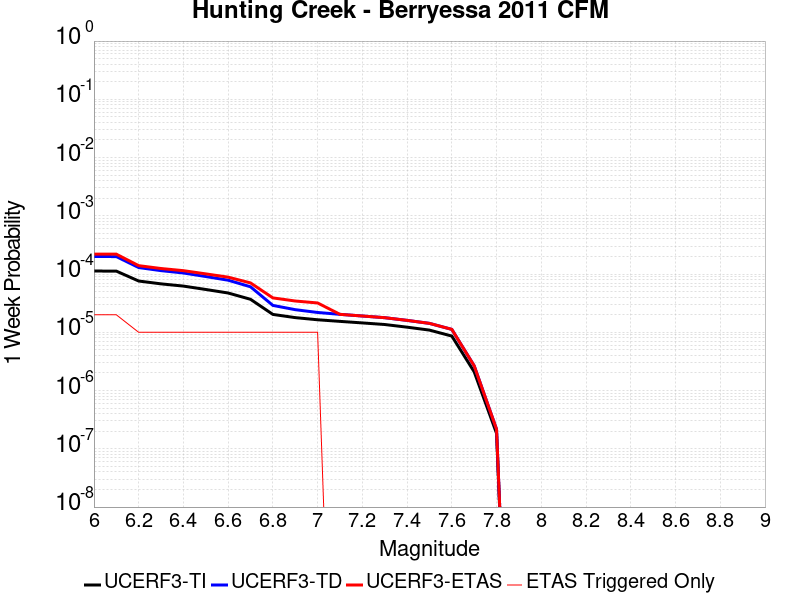 | 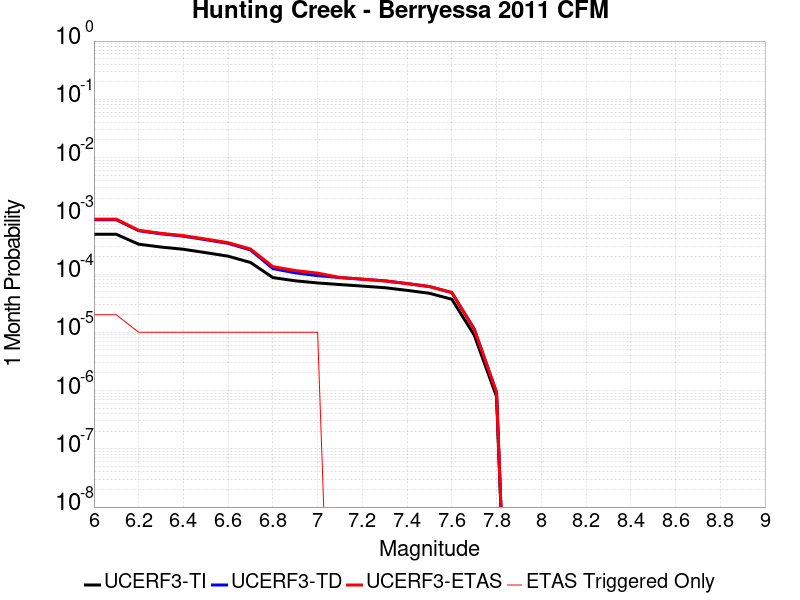 |  |  |

| Magnitude | 1 wk TI Prob | 1 wk TD Prob | 1 wk ETAS Prob | 1 wk ETAS/TD Gain | 1 wk ETAS Triggered Only | 1 mo TI Prob | 1 mo TD Prob | 1 mo ETAS Prob | 1 mo ETAS/TD Gain | 1 mo ETAS Triggered Only | 1 yr TI Prob | 1 yr TD Prob | 1 yr ETAS Prob | 1 yr ETAS/TD Gain | 1 yr ETAS Triggered Only | 10 yr TI Prob | 10 yr TD Prob | 10 yr ETAS Prob | 10 yr ETAS/TD Gain | 10 yr ETAS Triggered Only |
|-----|-----|-----|-----|-----|-----|-----|-----|-----|-----|-----|-----|-----|-----|-----|-----|-----|-----|-----|-----|-----|
| 6.0 | 1.1270982E-4 | 2.0012174E-4 | 2.3828204E-4 | 1.1906854 | 3.816794E-5 | 4.8295266E-4 | 8.5739547E-4 | 8.955307E-4 | 1.0444779 | 3.816794E-5 | 0.0058641075 | 0.010386313 | 0.010424084 | 1.0036367 | 3.816794E-5 | 0.057117578 | 0.09803703 | 0.09807145 | 1.0003512 | 3.816794E-5 |
| 6.1 | 1.1239393E-4 | 1.9960315E-4 | 2.3776347E-4 | 1.191181 | 3.816794E-5 | 4.8159933E-4 | 8.551744E-4 | 8.9330965E-4 | 1.0445936 | 3.816794E-5 | 0.0058477195 | 0.010359551 | 0.010397323 | 1.0036461 | 3.816794E-5 | 0.056962132 | 0.09779551 | 0.09782994 | 1.0003521 | 3.816794E-5 |
| 6.2 | 7.596265E-5 | 1.2940196E-4 | 1.6756497E-4 | 1.2949183 | 3.816794E-5 | 3.2551357E-4 | 5.5444165E-4 | 5.9258845E-4 | 1.0688021 | 3.816794E-5 | 0.0039559277 | 0.0067210156 | 0.0067589274 | 1.0056407 | 3.816794E-5 | 0.038862433 | 0.0645915 | 0.0646272 | 1.0005528 | 3.816794E-5 |
| 6.3 | 6.78794E-5 | 1.145119E-4 | 1.5267546E-4 | 1.3332716 | 3.816794E-5 | 2.9087928E-4 | 4.906513E-4 | 5.288005E-4 | 1.0777522 | 3.816794E-5 | 0.003535705 | 0.005952679 | 0.00599062 | 1.0063738 | 3.816794E-5 | 0.034799766 | 0.057465393 | 0.05750137 | 1.000626 | 3.816794E-5 |
| 6.4 | 6.2165134E-5 | 1.0436625E-4 | 1.425302E-4 | 1.3656733 | 3.816794E-5 | 2.6639478E-4 | 4.4721062E-4 | 4.853615E-4 | 1.0853086 | 3.816794E-5 | 0.0032385332 | 0.005427573 | 0.0054655336 | 1.006994 | 3.816794E-5 | 0.03191742 | 0.052550517 | 0.05258668 | 1.0006882 | 3.816794E-5 |
| 6.5 | 5.4368087E-5 | 9.071415E-5 | 1.2887863E-4 | 1.4207114 | 3.816794E-5 | 2.3298527E-4 | 3.8872007E-4 | 4.268732E-4 | 1.0981506 | 3.816794E-5 | 0.0028329059 | 0.0047198683 | 0.0047578565 | 1.0080485 | 3.816794E-5 | 0.027970633 | 0.045880128 | 0.045916546 | 1.0007937 | 3.816794E-5 |
| 6.6 | 4.729947E-5 | 7.847572E-5 | 1.16640666E-4 | 1.486328 | 3.816794E-5 | 2.0269625E-4 | 3.362842E-4 | 3.7443932E-4 | 1.1134609 | 3.816794E-5 | 0.002465034 | 0.0040849647 | 0.004122977 | 1.0093054 | 3.816794E-5 | 0.02437869 | 0.03985155 | 0.039888196 | 1.0009196 | 3.816794E-5 |
| 6.7 | 3.6875328E-5 | 6.0451803E-5 | 9.8617435E-5 | 1.6313398 | 3.816794E-5 | 1.5802756E-4 | 2.59056E-4 | 2.9721405E-4 | 1.1472965 | 3.816794E-5 | 0.0019222875 | 0.0031482063 | 0.003186254 | 1.0120856 | 3.816794E-5 | 0.019057442 | 0.03089237 | 0.03092936 | 1.0011973 | 3.816794E-5 |
| 6.8 | 2.0292036E-5 | 2.8976308E-5 | 6.714314E-5 | 2.3171737 | 3.816794E-5 | 8.6962966E-5 | 1.2417832E-4 | 1.6234152E-4 | 1.3073258 | 3.816794E-5 | 0.0010582599 | 0.0015108072 | 0.0015489175 | 1.0252252 | 3.816794E-5 | 0.010532344 | 0.014978523 | 0.015016119 | 1.00251 | 3.816794E-5 |
| 6.9 | 1.7871042E-5 | 2.4472254E-5 | 6.263926E-5 | 2.5596032 | 3.816794E-5 | 7.658793E-5 | 1.048769E-4 | 1.4304083E-4 | 1.3638927 | 3.816794E-5 | 9.320591E-4 | 0.0012761299 | 0.0013142491 | 1.029871 | 3.816794E-5 | 0.009281595 | 0.012679775 | 0.012717459 | 1.002972 | 3.816794E-5 |
| 7.0 | 1.6415532E-5 | 2.1906277E-5 | 6.007338E-5 | 2.7422907 | 3.816794E-5 | 7.035038E-5 | 9.3880684E-5 | 1.3204504E-4 | 1.4065198 | 3.816794E-5 | 8.561793E-4 | 0.0011424015 | 0.0011805259 | 1.033372 | 3.816794E-5 | 0.008528882 | 0.01136452 | 0.011402253 | 1.0033203 | 3.816794E-5 |
| 7.1 | 1.5409885E-5 | 2.0346342E-5 | 2.0346342E-5 | 1.0 | 0.0 | 6.6040695E-5 | 8.7195716E-5 | 8.7195716E-5 | 1.0 | 0.0 | 8.0374884E-4 | 0.0010610938 | 0.0010610938 | 1.0 | 0.0 | 0.00800848 | 0.010560595 | 0.010560595 | 1.0 | 0.0 |
| 7.2 | 1.4497423E-5 | 1.9054964E-5 | 1.9054964E-5 | 1.0 | 0.0 | 6.213033E-5 | 8.166159E-5 | 8.166159E-5 | 1.0 | 0.0 | 7.5617427E-4 | 9.937795E-4 | 9.937795E-4 | 1.0 | 0.0 | 0.0075360634 | 0.009893929 | 0.009893929 | 1.0 | 0.0 |
| 7.3 | 1.3615175E-5 | 1.7826127E-5 | 1.7826127E-5 | 1.0 | 0.0 | 5.8349444E-5 | 7.639547E-5 | 7.639547E-5 | 1.0 | 0.0 | 7.101729E-4 | 9.297209E-4 | 9.297209E-4 | 1.0 | 0.0 | 0.0070790765 | 0.009258823 | 0.009258823 | 1.0 | 0.0 |
| 7.4 | 1.2252825E-5 | 1.602625E-5 | 1.602625E-5 | 1.0 | 0.0 | 5.251105E-5 | 6.868213E-5 | 6.868213E-5 | 1.0 | 0.0 | 6.391345E-4 | 8.35887E-4 | 8.35887E-4 | 1.0 | 0.0 | 0.0063729943 | 0.008327872 | 0.008327872 | 1.0 | 0.0 |
| 7.5 | 1.0913301E-5 | 1.4241117E-5 | 1.4241117E-5 | 1.0 | 0.0 | 4.6770452E-5 | 6.1031948E-5 | 6.1031948E-5 | 1.0 | 0.0 | 5.6928146E-4 | 7.4281334E-4 | 7.4281334E-4 | 1.0 | 0.0 | 0.0056782532 | 0.0074036797 | 0.0074036797 | 1.0 | 0.0 |
| 7.6 | 8.623192E-6 | 1.12346415E-5 | 1.12346415E-5 | 1.0 | 0.0 | 3.6956015E-5 | 4.814759E-5 | 4.814759E-5 | 1.0 | 0.0 | 4.4984656E-4 | 5.8604183E-4 | 5.8604183E-4 | 1.0 | 0.0 | 0.00448937 | 0.0058452785 | 0.0058452785 | 1.0 | 0.0 |
| 7.7 | 2.0993634E-6 | 2.662584E-6 | 2.662584E-6 | 1.0 | 0.0 | 8.997241E-6 | 1.1411025E-5 | 1.1411025E-5 | 1.0 | 0.0 | 1.09535904E-4 | 1.3892044E-4 | 1.3892044E-4 | 1.0 | 0.0 | 0.0010948193 | 0.0013883426 | 0.0013883426 | 1.0 | 0.0 |
| 7.8 | 1.8428308E-7 | 2.167437E-7 | 2.167437E-7 | 1.0 | 0.0 | 7.897844E-7 | 9.289013E-7 | 9.289013E-7 | 1.0 | 0.0 | 9.615583E-6 | 1.1309318E-5 | 1.1309318E-5 | 1.0 | 0.0 | 9.615166E-5 | 1.13086026E-4 | 1.13086026E-4 | 1.0 | 0.0 |

## Kern Canyon (Lake Isabella) 2011
*[(top)](#table-of-contents)*

| 1 Week | 1 Month | 1 Year | 10 Year |
|-----|-----|-----|-----|
|  |  |  | 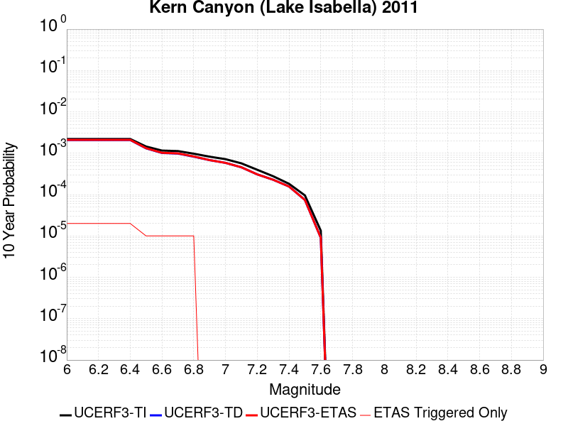 |

| Magnitude | 1 wk TI Prob | 1 wk TD Prob | 1 wk ETAS Prob | 1 wk ETAS/TD Gain | 1 wk ETAS Triggered Only | 1 mo TI Prob | 1 mo TD Prob | 1 mo ETAS Prob | 1 mo ETAS/TD Gain | 1 mo ETAS Triggered Only | 1 yr TI Prob | 1 yr TD Prob | 1 yr ETAS Prob | 1 yr ETAS/TD Gain | 1 yr ETAS Triggered Only | 10 yr TI Prob | 10 yr TD Prob | 10 yr ETAS Prob | 10 yr ETAS/TD Gain | 10 yr ETAS Triggered Only |
|-----|-----|-----|-----|-----|-----|-----|-----|-----|-----|-----|-----|-----|-----|-----|-----|-----|-----|-----|-----|-----|
| 6.0 | 4.2387383E-6 | 4.001639E-6 | 4.001639E-6 | 1.0 | 0.0 | 1.8165894E-5 | 1.7149778E-5 | 1.7149778E-5 | 1.0 | 0.0 | 2.2114732E-4 | 2.087804E-4 | 2.4694038E-4 | 1.1827756 | 3.816794E-5 | 0.0022092736 | 0.0020860266 | 0.002124115 | 1.0182588 | 3.816794E-5 |
| 6.1 | 4.2387383E-6 | 4.001639E-6 | 4.001639E-6 | 1.0 | 0.0 | 1.8165894E-5 | 1.7149778E-5 | 1.7149778E-5 | 1.0 | 0.0 | 2.2114732E-4 | 2.087804E-4 | 2.4694038E-4 | 1.1827756 | 3.816794E-5 | 0.0022092736 | 0.0020860266 | 0.002124115 | 1.0182588 | 3.816794E-5 |
| 6.2 | 4.2387383E-6 | 4.001639E-6 | 4.001639E-6 | 1.0 | 0.0 | 1.8165894E-5 | 1.7149778E-5 | 1.7149778E-5 | 1.0 | 0.0 | 2.2114732E-4 | 2.087804E-4 | 2.4694038E-4 | 1.1827756 | 3.816794E-5 | 0.0022092736 | 0.0020860266 | 0.002124115 | 1.0182588 | 3.816794E-5 |
| 6.3 | 4.2387383E-6 | 4.001639E-6 | 4.001639E-6 | 1.0 | 0.0 | 1.8165894E-5 | 1.7149778E-5 | 1.7149778E-5 | 1.0 | 0.0 | 2.2114732E-4 | 2.087804E-4 | 2.4694038E-4 | 1.1827756 | 3.816794E-5 | 0.0022092736 | 0.0020860266 | 0.002124115 | 1.0182588 | 3.816794E-5 |
| 6.4 | 4.2387383E-6 | 4.001639E-6 | 4.001639E-6 | 1.0 | 0.0 | 1.8165894E-5 | 1.7149778E-5 | 1.7149778E-5 | 1.0 | 0.0 | 2.2114732E-4 | 2.087804E-4 | 2.4694038E-4 | 1.1827756 | 3.816794E-5 | 0.0022092736 | 0.0020860266 | 0.002124115 | 1.0182588 | 3.816794E-5 |
| 6.5 | 2.7857532E-6 | 2.517867E-6 | 2.517867E-6 | 1.0 | 0.0 | 1.1938888E-5 | 1.0790815E-5 | 1.0790815E-5 | 1.0 | 0.0 | 1.4534626E-4 | 1.3137059E-4 | 1.3137059E-4 | 1.0 | 0.0 | 0.0014525123 | 0.001312962 | 0.001312962 | 1.0 | 0.0 |
| 6.6 | 2.2233348E-6 | 1.9441236E-6 | 1.9441236E-6 | 1.0 | 0.0 | 9.528543E-6 | 8.331932E-6 | 8.331932E-6 | 1.0 | 0.0 | 1.1600384E-4 | 1.01436635E-4 | 1.01436635E-4 | 1.0 | 0.0 | 0.001159433 | 0.001013912 | 0.001013912 | 1.0 | 0.0 |
| 6.7 | 2.1635126E-6 | 1.8835036E-6 | 1.8835036E-6 | 1.0 | 0.0 | 9.272164E-6 | 8.072134E-6 | 8.072134E-6 | 1.0 | 0.0 | 1.1288274E-4 | 9.827388E-5 | 9.827388E-5 | 1.0 | 0.0 | 0.0011282542 | 9.823124E-4 | 9.823124E-4 | 1.0 | 0.0 |
| 6.8 | 1.8685711E-6 | 1.5831425E-6 | 1.5831425E-6 | 1.0 | 0.0 | 8.008137E-6 | 6.784879E-6 | 6.784879E-6 | 1.0 | 0.0 | 9.74947E-5 | 8.260282E-5 | 8.260282E-5 | 1.0 | 0.0 | 9.745194E-4 | 8.2572614E-4 | 8.2572614E-4 | 1.0 | 0.0 |
| 6.9 | 1.5815071E-6 | 1.3064928E-6 | 1.3064928E-6 | 1.0 | 0.0 | 6.77787E-6 | 5.599243E-6 | 5.599243E-6 | 1.0 | 0.0 | 8.251744E-5 | 6.816868E-5 | 6.816868E-5 | 1.0 | 0.0 | 8.248681E-4 | 6.8148033E-4 | 6.8148033E-4 | 1.0 | 0.0 |
| 7.0 | 1.3772564E-6 | 1.1210718E-6 | 1.1210718E-6 | 1.0 | 0.0 | 5.9025137E-6 | 4.8045845E-6 | 4.8045845E-6 | 1.0 | 0.0 | 7.186073E-5 | 5.8494268E-5 | 5.8494268E-5 | 1.0 | 0.0 | 7.18375E-4 | 5.847908E-4 | 5.847908E-4 | 1.0 | 0.0 |
| 7.1 | 1.0916998E-6 | 8.763777E-7 | 8.763777E-7 | 1.0 | 0.0 | 4.678705E-6 | 3.7558991E-6 | 3.7558991E-6 | 1.0 | 0.0 | 5.6961744E-5 | 4.5727127E-5 | 4.5727127E-5 | 1.0 | 0.0 | 5.6947145E-4 | 4.571785E-4 | 4.571785E-4 | 1.0 | 0.0 |
| 7.2 | 7.6277024E-7 | 5.901454E-7 | 5.901454E-7 | 1.0 | 0.0 | 3.2690114E-6 | 2.5291922E-6 | 2.5291922E-6 | 1.0 | 0.0 | 3.9799485E-5 | 3.0792486E-5 | 3.0792486E-5 | 1.0 | 0.0 | 3.9792358E-4 | 3.0788282E-4 | 3.0788282E-4 | 1.0 | 0.0 |
| 7.3 | 5.3265916E-7 | 4.3824414E-7 | 4.3824414E-7 | 1.0 | 0.0 | 2.282823E-6 | 1.878188E-6 | 1.878188E-6 | 1.0 | 0.0 | 2.7793016E-5 | 2.2866701E-5 | 2.2866701E-5 | 1.0 | 0.0 | 2.778954E-4 | 2.2864387E-4 | 2.2864387E-4 | 1.0 | 0.0 |
| 7.4 | 3.4946007E-7 | 3.006571E-7 | 3.006571E-7 | 1.0 | 0.0 | 1.497685E-6 | 1.2885298E-6 | 1.2885298E-6 | 1.0 | 0.0 | 1.8234163E-5 | 1.568774E-5 | 1.568774E-5 | 1.0 | 0.0 | 1.8232666E-4 | 1.5686655E-4 | 1.5686655E-4 | 1.0 | 0.0 |
| 7.5 | 1.8317026E-7 | 1.4244812E-7 | 1.4244812E-7 | 1.0 | 0.0 | 7.850152E-7 | 6.104918E-7 | 6.104918E-7 | 1.0 | 0.0 | 9.557518E-6 | 7.432713E-6 | 7.432713E-6 | 1.0 | 0.0 | 9.5571064E-5 | 7.432472E-5 | 7.432472E-5 | 1.0 | 0.0 |
| 7.6 | 2.572245E-8 | 1.7352555E-8 | 1.7352555E-8 | 1.0 | 0.0 | 1.10239064E-7 | 7.436809E-8 | 7.436809E-8 | 1.0 | 0.0 | 1.3421597E-6 | 9.054312E-7 | 9.054312E-7 | 1.0 | 0.0 | 1.3421517E-5 | 9.05428E-6 | 9.05428E-6 | 1.0 | 0.0 |

## Emerson-Copper Mtn 2011
*[(top)](#table-of-contents)*

| 1 Week | 1 Month | 1 Year | 10 Year |
|-----|-----|-----|-----|
|  |  |  |  |

| Magnitude | 1 wk TI Prob | 1 wk TD Prob | 1 wk ETAS Prob | 1 wk ETAS/TD Gain | 1 wk ETAS Triggered Only | 1 mo TI Prob | 1 mo TD Prob | 1 mo ETAS Prob | 1 mo ETAS/TD Gain | 1 mo ETAS Triggered Only | 1 yr TI Prob | 1 yr TD Prob | 1 yr ETAS Prob | 1 yr ETAS/TD Gain | 1 yr ETAS Triggered Only | 10 yr TI Prob | 10 yr TD Prob | 10 yr ETAS Prob | 10 yr ETAS/TD Gain | 10 yr ETAS Triggered Only |
|-----|-----|-----|-----|-----|-----|-----|-----|-----|-----|-----|-----|-----|-----|-----|-----|-----|-----|-----|-----|-----|
| 6.0 | 2.1364202E-5 | 9.968114E-6 | 4.8135673E-5 | 4.828965 | 3.816794E-5 | 9.1557646E-5 | 4.2719836E-5 | 8.0886144E-5 | 1.8934095 | 3.816794E-5 | 0.0011141442 | 5.199986E-4 | 5.581467E-4 | 1.0733619 | 3.816794E-5 | 0.011085749 | 0.005188688 | 0.0052266577 | 1.0073178 | 3.816794E-5 |
| 6.1 | 2.1364202E-5 | 9.968114E-6 | 4.8135673E-5 | 4.828965 | 3.816794E-5 | 9.1557646E-5 | 4.2719836E-5 | 8.0886144E-5 | 1.8934095 | 3.816794E-5 | 0.0011141442 | 5.199986E-4 | 5.581467E-4 | 1.0733619 | 3.816794E-5 | 0.011085749 | 0.005188688 | 0.0052266577 | 1.0073178 | 3.816794E-5 |
| 6.2 | 2.1364202E-5 | 9.968114E-6 | 4.8135673E-5 | 4.828965 | 3.816794E-5 | 9.1557646E-5 | 4.2719836E-5 | 8.0886144E-5 | 1.8934095 | 3.816794E-5 | 0.0011141442 | 5.199986E-4 | 5.581467E-4 | 1.0733619 | 3.816794E-5 | 0.011085749 | 0.005188688 | 0.0052266577 | 1.0073178 | 3.816794E-5 |
| 6.3 | 1.7751237E-5 | 8.089227E-6 | 4.6256857E-5 | 5.7183285 | 3.816794E-5 | 7.607452E-5 | 3.466769E-5 | 7.283431E-5 | 2.1009276 | 3.816794E-5 | 9.258136E-4 | 4.2200365E-4 | 4.6015548E-4 | 1.0904064 | 3.816794E-5 | 0.00921966 | 0.0042126453 | 0.0042506526 | 1.0090221 | 3.816794E-5 |
| 6.4 | 1.7751237E-5 | 8.089227E-6 | 4.6256857E-5 | 5.7183285 | 3.816794E-5 | 7.607452E-5 | 3.466769E-5 | 7.283431E-5 | 2.1009276 | 3.816794E-5 | 9.258136E-4 | 4.2200365E-4 | 4.6015548E-4 | 1.0904064 | 3.816794E-5 | 0.00921966 | 0.0042126453 | 0.0042506526 | 1.0090221 | 3.816794E-5 |
| 6.5 | 1.5886664E-5 | 6.603819E-6 | 4.4771507E-5 | 6.7796383 | 3.816794E-5 | 6.808392E-5 | 2.8301802E-5 | 6.646866E-5 | 2.3485665 | 3.816794E-5 | 8.286065E-4 | 3.4452465E-4 | 3.8267943E-4 | 1.1107461 | 3.816794E-5 | 0.008255237 | 0.0034403696 | 0.0034784062 | 1.011056 | 3.816794E-5 |
| 6.6 | 1.5886664E-5 | 6.603819E-6 | 4.4771507E-5 | 6.7796383 | 3.816794E-5 | 6.808392E-5 | 2.8301802E-5 | 6.646866E-5 | 2.3485665 | 3.816794E-5 | 8.286065E-4 | 3.4452465E-4 | 3.8267943E-4 | 1.1107461 | 3.816794E-5 | 0.008255237 | 0.0034403696 | 0.0034784062 | 1.011056 | 3.816794E-5 |
| 6.7 | 1.428471E-5 | 5.470403E-6 | 4.3638134E-5 | 7.9771333 | 3.816794E-5 | 6.121875E-5 | 2.3444394E-5 | 6.161144E-5 | 2.6279817 | 3.816794E-5 | 7.450834E-4 | 2.8540206E-4 | 3.235591E-4 | 1.1336957 | 3.816794E-5 | 0.007425902 | 0.0028507432 | 0.0028888024 | 1.0133506 | 3.816794E-5 |
| 6.8 | 1.3490684E-5 | 5.073699E-6 | 4.3241445E-5 | 8.522667 | 3.816794E-5 | 5.7815934E-5 | 2.1744265E-5 | 5.9911374E-5 | 2.7552724 | 3.816794E-5 | 7.0368167E-4 | 2.6470813E-4 | 3.0286596E-4 | 1.1441506 | 3.816794E-5 | 0.007014576 | 0.002644309 | 0.0026823762 | 1.0143958 | 3.816794E-5 |
| 6.9 | 1.2235421E-5 | 4.289677E-6 | 4.2457454E-5 | 9.897587 | 3.816794E-5 | 5.2436466E-5 | 1.838422E-5 | 5.6551457E-5 | 3.0760868 | 3.816794E-5 | 6.38227E-4 | 2.238085E-4 | 2.6196789E-4 | 1.1705002 | 3.816794E-5 | 0.0063639707 | 0.0022361854 | 0.002274268 | 1.0170301 | 3.816794E-5 |
| 7.0 | 1.1009851E-5 | 3.7189886E-6 | 4.1886786E-5 | 11.262951 | 3.816794E-5 | 4.7184225E-5 | 1.5938444E-5 | 5.4105774E-5 | 3.394671 | 3.816794E-5 | 5.743165E-4 | 1.9403672E-4 | 2.3219726E-4 | 1.1966666 | 3.816794E-5 | 0.005728345 | 0.0019390108 | 0.0019771047 | 1.019646 | 3.816794E-5 |
| 7.1 | 9.726373E-6 | 3.2117953E-6 | 4.137961E-5 | 12.883639 | 3.816794E-5 | 4.168379E-5 | 1.3764783E-5 | 5.19322E-5 | 3.7728307 | 3.816794E-5 | 5.07382E-4 | 1.6757673E-4 | 2.0573827E-4 | 1.2277257 | 3.816794E-5 | 0.0050622504 | 0.0016748349 | 0.0017129389 | 1.0227509 | 3.816794E-5 |
| 7.2 | 3.9335127E-6 | 1.1524792E-6 | 3.9320374E-5 | 34.11808 | 3.816794E-5 | 1.6857803E-5 | 4.9391874E-6 | 4.310694E-5 | 8.727536 | 3.816794E-5 | 2.0522442E-4 | 6.0133007E-5 | 9.829865E-5 | 1.6346871 | 3.816794E-5 | 0.00205035 | 6.011733E-4 | 6.393183E-4 | 1.0634509 | 3.816794E-5 |
| 7.3 | 2.661632E-6 | 6.911505E-7 | 3.8859063E-5 | 56.223736 | 3.816794E-5 | 1.14069435E-5 | 2.9620703E-6 | 4.1129897E-5 | 13.885524 | 3.816794E-5 | 1.3887069E-4 | 3.6062618E-5 | 7.422918E-5 | 2.0583415 | 3.816794E-5 | 0.0013878393 | 3.605687E-4 | 3.9872288E-4 | 1.1058166 | 3.816794E-5 |
| 7.4 | 2.0893426E-6 | 5.4618386E-7 | 3.87141E-5 | 70.88108 | 3.816794E-5 | 8.954295E-6 | 2.3407858E-6 | 4.0508636E-5 | 17.30557 | 3.816794E-5 | 1.0901308E-4 | 2.84987E-5 | 6.6665554E-5 | 2.339249 | 3.816794E-5 | 0.0010895962 | 2.84951E-4 | 3.2310808E-4 | 1.1339074 | 3.816794E-5 |
| 7.5 | 1.1681728E-6 | 3.6030585E-7 | 3.8528233E-5 | 106.932014 | 3.816794E-5 | 5.0064455E-6 | 1.544167E-6 | 3.9712046E-5 | 25.717455 | 3.816794E-5 | 6.0951766E-5 | 1.8800076E-5 | 5.69673E-5 | 3.030163 | 3.816794E-5 | 6.093505E-4 | 1.8798532E-4 | 2.2614609E-4 | 1.2029986 | 3.816794E-5 |
| 7.6 | 1.3154387E-7 | 7.1197384E-8 | 7.1197384E-8 | 1.0 | 0.0 | 5.6375933E-7 | 3.051316E-7 | 3.051316E-7 | 1.0 | 0.0 | 6.863748E-6 | 3.7149728E-6 | 3.7149728E-6 | 1.0 | 0.0 | 6.863536E-5 | 3.7149264E-5 | 3.7149264E-5 | 1.0 | 0.0 |

## Cady
*[(top)](#table-of-contents)*

| 1 Week | 1 Month | 1 Year | 10 Year |
|-----|-----|-----|-----|
|  |  |  |  |

| Magnitude | 1 wk TI Prob | 1 wk TD Prob | 1 wk ETAS Prob | 1 wk ETAS/TD Gain | 1 wk ETAS Triggered Only | 1 mo TI Prob | 1 mo TD Prob | 1 mo ETAS Prob | 1 mo ETAS/TD Gain | 1 mo ETAS Triggered Only | 1 yr TI Prob | 1 yr TD Prob | 1 yr ETAS Prob | 1 yr ETAS/TD Gain | 1 yr ETAS Triggered Only | 10 yr TI Prob | 10 yr TD Prob | 10 yr ETAS Prob | 10 yr ETAS/TD Gain | 10 yr ETAS Triggered Only |
|-----|-----|-----|-----|-----|-----|-----|-----|-----|-----|-----|-----|-----|-----|-----|-----|-----|-----|-----|-----|-----|
| 6.0 | 1.9892565E-5 | 2.1858728E-5 | 2.1858728E-5 | 1.0 | 0.0 | 8.525106E-5 | 9.3677416E-5 | 9.3677416E-5 | 1.0 | 0.0 | 0.0010374374 | 0.0011400167 | 0.0011781411 | 1.033442 | 3.816794E-5 | 0.010326075 | 0.011350701 | 0.011388435 | 1.0033244 | 3.816794E-5 |
| 6.1 | 1.9892565E-5 | 2.1858728E-5 | 2.1858728E-5 | 1.0 | 0.0 | 8.525106E-5 | 9.3677416E-5 | 9.3677416E-5 | 1.0 | 0.0 | 0.0010374374 | 0.0011400167 | 0.0011781411 | 1.033442 | 3.816794E-5 | 0.010326075 | 0.011350701 | 0.011388435 | 1.0033244 | 3.816794E-5 |
| 6.2 | 1.9892565E-5 | 2.1858728E-5 | 2.1858728E-5 | 1.0 | 0.0 | 8.525106E-5 | 9.3677416E-5 | 9.3677416E-5 | 1.0 | 0.0 | 0.0010374374 | 0.0011400167 | 0.0011781411 | 1.033442 | 3.816794E-5 | 0.010326075 | 0.011350701 | 0.011388435 | 1.0033244 | 3.816794E-5 |
| 6.3 | 1.1117327E-5 | 1.2176583E-5 | 1.2176583E-5 | 1.0 | 0.0 | 4.764482E-5 | 5.2184492E-5 | 5.2184492E-5 | 1.0 | 0.0 | 5.7992124E-4 | 6.351925E-4 | 6.733362E-4 | 1.0600506 | 3.816794E-5 | 0.0057841022 | 0.0063368753 | 0.0063748015 | 1.005985 | 3.816794E-5 |
| 6.4 | 1.1117327E-5 | 1.2176583E-5 | 1.2176583E-5 | 1.0 | 0.0 | 4.764482E-5 | 5.2184492E-5 | 5.2184492E-5 | 1.0 | 0.0 | 5.7992124E-4 | 6.351925E-4 | 6.733362E-4 | 1.0600506 | 3.816794E-5 | 0.0057841022 | 0.0063368753 | 0.0063748015 | 1.005985 | 3.816794E-5 |
| 6.5 | 6.103093E-6 | 6.672021E-6 | 6.672021E-6 | 1.0 | 0.0 | 2.615585E-5 | 2.8594131E-5 | 2.8594131E-5 | 1.0 | 0.0 | 3.1840094E-4 | 3.480905E-4 | 3.8624514E-4 | 1.1096113 | 3.816794E-5 | 0.0031794512 | 0.0034766865 | 0.003514722 | 1.0109401 | 3.816794E-5 |
| 6.6 | 5.817237E-6 | 6.3656585E-6 | 6.3656585E-6 | 1.0 | 0.0 | 2.4930776E-5 | 2.728118E-5 | 2.728118E-5 | 1.0 | 0.0 | 3.034899E-4 | 3.3211018E-4 | 3.7026542E-4 | 1.1148874 | 3.816794E-5 | 0.0030307577 | 0.0033173605 | 0.0033554018 | 1.0114673 | 3.816794E-5 |
| 6.7 | 4.8846314E-6 | 5.3405684E-6 | 5.3405684E-6 | 1.0 | 0.0 | 2.0933967E-5 | 2.2888014E-5 | 2.2888014E-5 | 1.0 | 0.0 | 2.5484123E-4 | 2.7863772E-4 | 3.1679502E-4 | 1.1369424 | 3.816794E-5 | 0.0025454918 | 0.0027840391 | 0.0028221009 | 1.0136714 | 3.816794E-5 |
| 6.8 | 1.7788773E-6 | 1.9399079E-6 | 1.9399079E-6 | 1.0 | 0.0 | 7.6237375E-6 | 8.313874E-6 | 8.313874E-6 | 1.0 | 0.0 | 9.281505E-5 | 1.01218284E-4 | 1.01218284E-4 | 1.0 | 0.0 | 9.2776294E-4 | 0.0010118765 | 0.0010118765 | 1.0 | 0.0 |
| 6.9 | 7.5455404E-7 | 8.297092E-7 | 8.297092E-7 | 1.0 | 0.0 | 3.233799E-6 | 3.5558937E-6 | 3.5558937E-6 | 1.0 | 0.0 | 3.937079E-5 | 4.3292483E-5 | 4.3292483E-5 | 1.0 | 0.0 | 3.9363815E-4 | 4.3287344E-4 | 4.3287344E-4 | 1.0 | 0.0 |
| 7.0 | 6.8578805E-7 | 7.541816E-7 | 7.541816E-7 | 1.0 | 0.0 | 2.9390883E-6 | 3.2322048E-6 | 3.2322048E-6 | 1.0 | 0.0 | 3.578281E-5 | 3.9351715E-5 | 3.9351715E-5 | 1.0 | 0.0 | 3.577705E-4 | 3.9347992E-4 | 3.9347992E-4 | 1.0 | 0.0 |

## Fitzhugh Creek
*[(top)](#table-of-contents)*

| 1 Week | 1 Month | 1 Year | 10 Year |
|-----|-----|-----|-----|
|  |  |  |  |

| Magnitude | 1 wk TI Prob | 1 wk TD Prob | 1 wk ETAS Prob | 1 wk ETAS/TD Gain | 1 wk ETAS Triggered Only | 1 mo TI Prob | 1 mo TD Prob | 1 mo ETAS Prob | 1 mo ETAS/TD Gain | 1 mo ETAS Triggered Only | 1 yr TI Prob | 1 yr TD Prob | 1 yr ETAS Prob | 1 yr ETAS/TD Gain | 1 yr ETAS Triggered Only | 10 yr TI Prob | 10 yr TD Prob | 10 yr ETAS Prob | 10 yr ETAS/TD Gain | 10 yr ETAS Triggered Only |
|-----|-----|-----|-----|-----|-----|-----|-----|-----|-----|-----|-----|-----|-----|-----|-----|-----|-----|-----|-----|-----|
| 6.0 | 6.1090436E-6 | 6.2101562E-6 | 4.437786E-5 | 7.1460133 | 3.816794E-5 | 2.6181353E-5 | 2.6614709E-5 | 6.4781634E-5 | 2.4340537 | 3.816794E-5 | 3.1871133E-4 | 3.239904E-4 | 3.6214598E-4 | 1.1177676 | 3.816794E-5 | 0.0031825465 | 0.0032356246 | 0.003273669 | 1.011758 | 3.816794E-5 |
| 6.1 | 2.9741811E-6 | 3.021581E-6 | 3.021581E-6 | 1.0 | 0.0 | 1.2746428E-5 | 1.2949574E-5 | 1.2949574E-5 | 1.0 | 0.0 | 1.5517672E-4 | 1.576506E-4 | 1.576506E-4 | 1.0 | 0.0 | 0.001550684 | 0.0015754806 | 0.0015754806 | 1.0 | 0.0 |
| 6.2 | 2.9741811E-6 | 3.021581E-6 | 3.021581E-6 | 1.0 | 0.0 | 1.2746428E-5 | 1.2949574E-5 | 1.2949574E-5 | 1.0 | 0.0 | 1.5517672E-4 | 1.576506E-4 | 1.576506E-4 | 1.0 | 0.0 | 0.001550684 | 0.0015754806 | 0.0015754806 | 1.0 | 0.0 |
| 6.3 | 1.4781198E-6 | 1.5012708E-6 | 1.5012708E-6 | 1.0 | 0.0 | 6.3347834E-6 | 6.4340034E-6 | 6.4340034E-6 | 1.0 | 0.0 | 7.712326E-5 | 7.833137E-5 | 7.833137E-5 | 1.0 | 0.0 | 7.70965E-4 | 7.830576E-4 | 7.830576E-4 | 1.0 | 0.0 |
| 6.4 | 1.4781198E-6 | 1.5012708E-6 | 1.5012708E-6 | 1.0 | 0.0 | 6.3347834E-6 | 6.4340034E-6 | 6.4340034E-6 | 1.0 | 0.0 | 7.712326E-5 | 7.833137E-5 | 7.833137E-5 | 1.0 | 0.0 | 7.70965E-4 | 7.830576E-4 | 7.830576E-4 | 1.0 | 0.0 |
| 6.5 | 9.5176676E-7 | 9.66606E-7 | 9.66606E-7 | 1.0 | 0.0 | 4.078994E-6 | 4.142591E-6 | 4.142591E-6 | 1.0 | 0.0 | 4.9660623E-5 | 5.0434985E-5 | 5.0434985E-5 | 1.0 | 0.0 | 4.964952E-4 | 5.042458E-4 | 5.042458E-4 | 1.0 | 0.0 |
| 6.6 | 6.21145E-7 | 6.3085855E-7 | 6.3085855E-7 | 1.0 | 0.0 | 2.662047E-6 | 2.7036772E-6 | 2.7036772E-6 | 1.0 | 0.0 | 3.2409942E-5 | 3.291684E-5 | 3.291684E-5 | 1.0 | 0.0 | 3.2405215E-4 | 3.2912623E-4 | 3.2912623E-4 | 1.0 | 0.0 |
| 6.7 | 2.2377962E-7 | 2.2734636E-7 | 2.2734636E-7 | 1.0 | 0.0 | 9.590551E-7 | 9.743413E-7 | 9.743413E-7 | 1.0 | 0.0 | 1.1676434E-5 | 1.1862574E-5 | 1.1862574E-5 | 1.0 | 0.0 | 1.1675821E-4 | 1.1862254E-4 | 1.1862254E-4 | 1.0 | 0.0 |
| 6.8 | 1.4785022E-7 | 1.5021492E-7 | 1.5021492E-7 | 1.0 | 0.0 | 6.3364365E-7 | 6.4377826E-7 | 6.4377826E-7 | 1.0 | 0.0 | 7.714584E-6 | 7.838E-6 | 7.838E-6 | 1.0 | 0.0 | 7.714316E-5 | 7.838E-5 | 7.838E-5 | 1.0 | 0.0 |

## Green Valley 2011 CFM
*[(top)](#table-of-contents)*

| 1 Week | 1 Month | 1 Year | 10 Year |
|-----|-----|-----|-----|
|  |  |  | 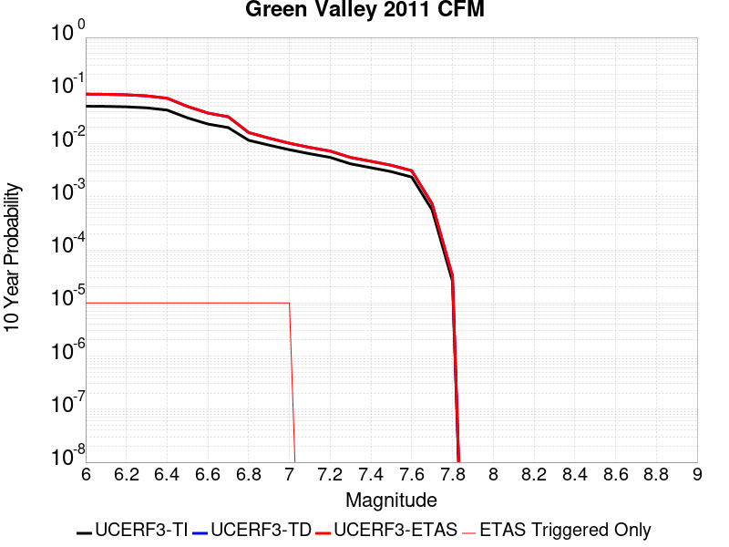 |

| Magnitude | 1 wk TI Prob | 1 wk TD Prob | 1 wk ETAS Prob | 1 wk ETAS/TD Gain | 1 wk ETAS Triggered Only | 1 mo TI Prob | 1 mo TD Prob | 1 mo ETAS Prob | 1 mo ETAS/TD Gain | 1 mo ETAS Triggered Only | 1 yr TI Prob | 1 yr TD Prob | 1 yr ETAS Prob | 1 yr ETAS/TD Gain | 1 yr ETAS Triggered Only | 10 yr TI Prob | 10 yr TD Prob | 10 yr ETAS Prob | 10 yr ETAS/TD Gain | 10 yr ETAS Triggered Only |
|-----|-----|-----|-----|-----|-----|-----|-----|-----|-----|-----|-----|-----|-----|-----|-----|-----|-----|-----|-----|-----|
| 6.0 | 9.9629346E-5 | 1.7305532E-4 | 2.1121665E-4 | 1.2205153 | 3.816794E-5 | 4.2691303E-4 | 7.4143766E-4 | 7.795773E-4 | 1.0514401 | 3.816794E-5 | 0.0051852856 | 0.008986705 | 0.00902453 | 1.004209 | 3.816794E-5 | 0.050659515 | 0.085522056 | 0.08555696 | 1.0004082 | 3.816794E-5 |
| 6.1 | 9.88615E-5 | 1.7152846E-4 | 2.0968985E-4 | 1.2224785 | 3.816794E-5 | 4.2362334E-4 | 7.348976E-4 | 7.7303755E-4 | 1.0518982 | 3.816794E-5 | 0.0051454236 | 0.0089077335 | 0.008945561 | 1.0042466 | 3.816794E-5 | 0.050279044 | 0.084809676 | 0.084844604 | 1.0004119 | 3.816794E-5 |
| 6.2 | 9.696895E-5 | 1.6791887E-4 | 2.0608041E-4 | 1.2272617 | 3.816794E-5 | 4.15515E-4 | 7.194366E-4 | 7.575771E-4 | 1.0530144 | 3.816794E-5 | 0.0050471667 | 0.008721114 | 0.008758949 | 1.0043384 | 3.816794E-5 | 0.04934063 | 0.0831186 | 0.0831536 | 1.000421 | 3.816794E-5 |
| 6.3 | 9.275224E-5 | 1.5971228E-4 | 1.9787412E-4 | 1.2389412 | 3.816794E-5 | 3.9744904E-4 | 6.842841E-4 | 7.2242593E-4 | 1.0557398 | 3.816794E-5 | 0.0048282105 | 0.008296439 | 0.00833429 | 1.0045624 | 3.816794E-5 | 0.047246475 | 0.07925707 | 0.07929221 | 1.0004435 | 3.816794E-5 |
| 6.4 | 8.391499E-5 | 1.4367796E-4 | 1.8184041E-4 | 1.265611 | 3.816794E-5 | 3.595861E-4 | 6.156248E-4 | 6.5376924E-4 | 1.0619606 | 3.816794E-5 | 0.004369175 | 0.0074670846 | 0.0075049675 | 1.0050733 | 3.816794E-5 | 0.04284265 | 0.071630865 | 0.0716663 | 1.0004947 | 3.816794E-5 |
| 6.5 | 5.9519385E-5 | 9.9340905E-5 | 1.3750505E-4 | 1.3841735 | 3.816794E-5 | 2.5505814E-4 | 4.2568138E-4 | 4.638331E-4 | 1.089625 | 3.816794E-5 | 0.0031009112 | 0.005168295 | 0.0052062655 | 1.0073469 | 3.816794E-5 | 0.030579966 | 0.050145864 | 0.05018212 | 1.000723 | 3.816794E-5 |
| 6.6 | 4.5361558E-5 | 7.402609E-5 | 1.121912E-4 | 1.515563 | 3.816794E-5 | 1.9439218E-4 | 3.1721895E-4 | 3.553748E-4 | 1.1202823 | 3.816794E-5 | 0.0023641558 | 0.0038539418 | 0.0038919626 | 1.0098654 | 3.816794E-5 | 0.023391623 | 0.037665963 | 0.037702695 | 1.0009751 | 3.816794E-5 |
| 6.7 | 3.8808106E-5 | 6.2651976E-5 | 1.00817524E-4 | 1.6091676 | 3.816794E-5 | 1.6630985E-4 | 2.6848342E-4 | 3.0664113E-4 | 1.1421231 | 3.816794E-5 | 0.0020229418 | 0.0032626586 | 0.003300702 | 1.0116602 | 3.816794E-5 | 0.020046256 | 0.032005914 | 0.03204286 | 1.0011543 | 3.816794E-5 |
| 6.8 | 2.2284667E-5 | 3.1285235E-5 | 6.9451984E-5 | 2.2199602 | 3.816794E-5 | 9.550222E-5 | 1.3407279E-4 | 1.7223561E-4 | 1.2846426 | 3.816794E-5 | 0.0011621192 | 0.0016311078 | 0.0016692135 | 1.0233618 | 3.816794E-5 | 0.011560607 | 0.016165998 | 0.016203549 | 1.0023228 | 3.816794E-5 |
| 6.9 | 1.8050168E-5 | 2.4448054E-5 | 6.261506E-5 | 2.561147 | 3.816794E-5 | 7.735557E-5 | 1.047732E-4 | 1.4293713E-4 | 1.3642529 | 3.816794E-5 | 9.4139716E-4 | 0.0012748708 | 0.0013129901 | 1.0299006 | 3.816794E-5 | 0.009374191 | 0.012667833 | 0.012705517 | 1.0029749 | 3.816794E-5 |
| 7.0 | 1.4763166E-5 | 1.9582854E-5 | 5.7750047E-5 | 2.9490106 | 3.816794E-5 | 6.326917E-5 | 8.3923835E-5 | 1.2208858E-4 | 1.4547545 | 3.816794E-5 | 7.7002996E-4 | 0.0010212966 | 0.0010594256 | 1.0373338 | 3.816794E-5 | 0.007673672 | 0.010165343 | 0.010203123 | 1.0037166 | 3.816794E-5 |
| 7.1 | 1.2399713E-5 | 1.6303715E-5 | 1.6303715E-5 | 1.0 | 0.0 | 5.3140546E-5 | 6.98712E-5 | 6.98712E-5 | 1.0 | 0.0 | 6.467941E-4 | 8.503518E-4 | 8.503518E-4 | 1.0 | 0.0 | 0.006449148 | 0.008471259 | 0.008471259 | 1.0 | 0.0 |
| 7.2 | 1.0584195E-5 | 1.3921742E-5 | 1.3921742E-5 | 1.0 | 0.0 | 4.5360044E-5 | 5.9663253E-5 | 5.9663253E-5 | 1.0 | 0.0 | 5.521186E-4 | 7.261596E-4 | 7.261596E-4 | 1.0 | 0.0 | 0.0055074887 | 0.007238285 | 0.007238285 | 1.0 | 0.0 |
| 7.3 | 7.998173E-6 | 1.054402E-5 | 1.054402E-5 | 1.0 | 0.0 | 3.4277433E-5 | 4.518788E-5 | 4.518788E-5 | 1.0 | 0.0 | 4.1724785E-4 | 5.500247E-4 | 5.500247E-4 | 1.0 | 0.0 | 0.004164653 | 0.0054868995 | 0.0054868995 | 1.0 | 0.0 |
| 7.4 | 6.7571127E-6 | 8.932697E-6 | 8.932697E-6 | 1.0 | 0.0 | 2.8958733E-5 | 3.828243E-5 | 3.828243E-5 | 1.0 | 0.0 | 3.5251552E-4 | 4.6598984E-4 | 4.6598984E-4 | 1.0 | 0.0 | 0.0035195686 | 0.0046503306 | 0.0046503306 | 1.0 | 0.0 |
| 7.5 | 5.69878E-6 | 7.516314E-6 | 7.516314E-6 | 1.0 | 0.0 | 2.4423114E-5 | 3.221238E-5 | 3.221238E-5 | 1.0 | 0.0 | 2.9731085E-4 | 3.9211605E-4 | 3.9211605E-4 | 1.0 | 0.0 | 0.002969134 | 0.0039143935 | 0.0039143935 | 1.0 | 0.0 |
| 7.6 | 4.503664E-6 | 5.9356807E-6 | 5.9356807E-6 | 1.0 | 0.0 | 1.9301275E-5 | 2.5438389E-5 | 2.5438389E-5 | 1.0 | 0.0 | 2.3496768E-4 | 3.096692E-4 | 3.096692E-4 | 1.0 | 0.0 | 0.002347194 | 0.003092502 | 0.003092502 | 1.0 | 0.0 |
| 7.7 | 1.0873546E-6 | 1.4106979E-6 | 1.4106979E-6 | 1.0 | 0.0 | 4.6600826E-6 | 6.045834E-6 | 6.045834E-6 | 1.0 | 0.0 | 5.6735033E-5 | 7.360557E-5 | 7.360557E-5 | 1.0 | 0.0 | 5.672055E-4 | 7.35814E-4 | 7.35814E-4 | 1.0 | 0.0 |
| 7.8 | 4.9373917E-8 | 6.1777136E-8 | 6.1777136E-8 | 1.0 | 0.0 | 2.1160248E-7 | 2.6475914E-7 | 2.6475914E-7 | 1.0 | 0.0 | 2.5762572E-6 | 3.223439E-6 | 3.223439E-6 | 1.0 | 0.0 | 2.5762274E-5 | 3.2232296E-5 | 3.2232296E-5 | 1.0 | 0.0 |

## Mono Lake 2011 CFM
*[(top)](#table-of-contents)*

| 1 Week | 1 Month | 1 Year | 10 Year |
|-----|-----|-----|-----|
|  | 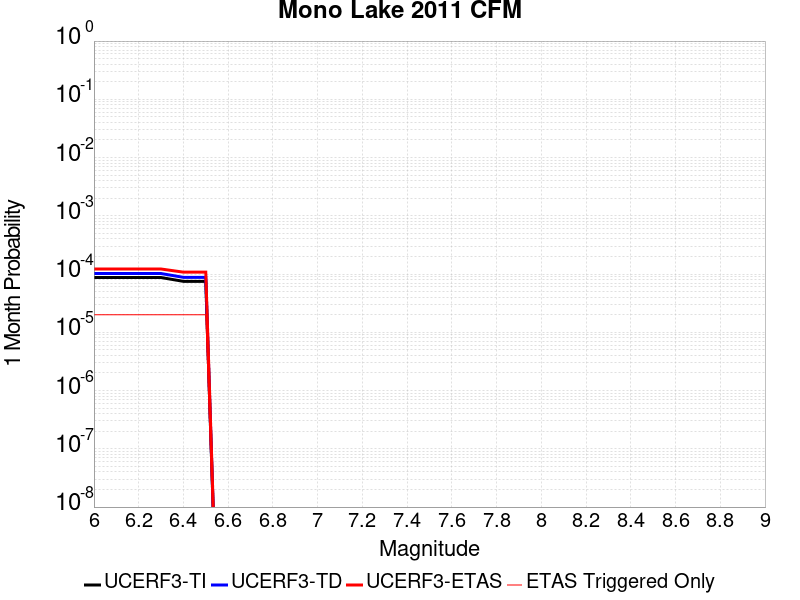 |  |  |

| Magnitude | 1 wk TI Prob | 1 wk TD Prob | 1 wk ETAS Prob | 1 wk ETAS/TD Gain | 1 wk ETAS Triggered Only | 1 mo TI Prob | 1 mo TD Prob | 1 mo ETAS Prob | 1 mo ETAS/TD Gain | 1 mo ETAS Triggered Only | 1 yr TI Prob | 1 yr TD Prob | 1 yr ETAS Prob | 1 yr ETAS/TD Gain | 1 yr ETAS Triggered Only | 10 yr TI Prob | 10 yr TD Prob | 10 yr ETAS Prob | 10 yr ETAS/TD Gain | 10 yr ETAS Triggered Only |
|-----|-----|-----|-----|-----|-----|-----|-----|-----|-----|-----|-----|-----|-----|-----|-----|-----|-----|-----|-----|-----|
| 6.0 | 2.0341662E-5 | 2.3828166E-5 | 6.19952E-5 | 2.601761 | 3.816794E-5 | 8.717564E-5 | 1.0211971E-4 | 1.4028375E-4 | 1.3737186 | 3.816794E-5 | 0.0010608466 | 0.0012431298 | 0.0012812503 | 1.0306649 | 3.816794E-5 | 0.010557966 | 0.012413835 | 0.0124515295 | 1.0030365 | 3.816794E-5 |
| 6.1 | 2.0341662E-5 | 2.3828166E-5 | 6.19952E-5 | 2.601761 | 3.816794E-5 | 8.717564E-5 | 1.0211971E-4 | 1.4028375E-4 | 1.3737186 | 3.816794E-5 | 0.0010608466 | 0.0012431298 | 0.0012812503 | 1.0306649 | 3.816794E-5 | 0.010557966 | 0.012413835 | 0.0124515295 | 1.0030365 | 3.816794E-5 |
| 6.2 | 2.0341662E-5 | 2.3828166E-5 | 6.19952E-5 | 2.601761 | 3.816794E-5 | 8.717564E-5 | 1.0211971E-4 | 1.4028375E-4 | 1.3737186 | 3.816794E-5 | 0.0010608466 | 0.0012431298 | 0.0012812503 | 1.0306649 | 3.816794E-5 | 0.010557966 | 0.012413835 | 0.0124515295 | 1.0030365 | 3.816794E-5 |
| 6.3 | 2.0341662E-5 | 2.3828166E-5 | 6.19952E-5 | 2.601761 | 3.816794E-5 | 8.717564E-5 | 1.0211971E-4 | 1.4028375E-4 | 1.3737186 | 3.816794E-5 | 0.0010608466 | 0.0012431298 | 0.0012812503 | 1.0306649 | 3.816794E-5 | 0.010557966 | 0.012413835 | 0.0124515295 | 1.0030365 | 3.816794E-5 |
| 6.4 | 1.749821E-5 | 2.0490985E-5 | 5.865814E-5 | 2.8626316 | 3.816794E-5 | 7.499018E-5 | 8.781851E-5 | 1.2598309E-4 | 1.4345847 | 3.816794E-5 | 9.1262296E-4 | 0.0010691903 | 0.0011073175 | 1.0356598 | 3.816794E-5 | 0.009088841 | 0.010691865 | 0.010729625 | 1.0035317 | 3.816794E-5 |
| 6.5 | 1.749821E-5 | 2.0490985E-5 | 5.865814E-5 | 2.8626316 | 3.816794E-5 | 7.499018E-5 | 8.781851E-5 | 1.2598309E-4 | 1.4345847 | 3.816794E-5 | 9.1262296E-4 | 0.0010691903 | 0.0011073175 | 1.0356598 | 3.816794E-5 | 0.009088841 | 0.010691865 | 0.010729625 | 1.0035317 | 3.816794E-5 |

## Pisgah-Bullion Mtn-Mesquite Lk
*[(top)](#table-of-contents)*

| 1 Week | 1 Month | 1 Year | 10 Year |
|-----|-----|-----|-----|
|  |  |  |  |

| Magnitude | 1 wk TI Prob | 1 wk TD Prob | 1 wk ETAS Prob | 1 wk ETAS/TD Gain | 1 wk ETAS Triggered Only | 1 mo TI Prob | 1 mo TD Prob | 1 mo ETAS Prob | 1 mo ETAS/TD Gain | 1 mo ETAS Triggered Only | 1 yr TI Prob | 1 yr TD Prob | 1 yr ETAS Prob | 1 yr ETAS/TD Gain | 1 yr ETAS Triggered Only | 10 yr TI Prob | 10 yr TD Prob | 10 yr ETAS Prob | 10 yr ETAS/TD Gain | 10 yr ETAS Triggered Only |
|-----|-----|-----|-----|-----|-----|-----|-----|-----|-----|-----|-----|-----|-----|-----|-----|-----|-----|-----|-----|-----|
| 6.0 | 3.0240792E-5 | 2.4091114E-5 | 6.2258136E-5 | 2.5842779 | 3.816794E-5 | 1.2959696E-4 | 1.03244114E-4 | 1.4140812E-4 | 1.3696482 | 3.816794E-5 | 0.0015767008 | 0.0012563728 | 0.0012944927 | 1.0303413 | 3.816794E-5 | 0.015655609 | 0.012502721 | 0.012540411 | 1.0030146 | 3.816794E-5 |
| 6.1 | 3.0240792E-5 | 2.4091114E-5 | 6.2258136E-5 | 2.5842779 | 3.816794E-5 | 1.2959696E-4 | 1.03244114E-4 | 1.4140812E-4 | 1.3696482 | 3.816794E-5 | 0.0015767008 | 0.0012563728 | 0.0012944927 | 1.0303413 | 3.816794E-5 | 0.015655609 | 0.012502721 | 0.012540411 | 1.0030146 | 3.816794E-5 |
| 6.2 | 3.0240792E-5 | 2.4091114E-5 | 6.2258136E-5 | 2.5842779 | 3.816794E-5 | 1.2959696E-4 | 1.03244114E-4 | 1.4140812E-4 | 1.3696482 | 3.816794E-5 | 0.0015767008 | 0.0012563728 | 0.0012944927 | 1.0303413 | 3.816794E-5 | 0.015655609 | 0.012502721 | 0.012540411 | 1.0030146 | 3.816794E-5 |
| 6.3 | 2.0498217E-5 | 1.36380695E-5 | 1.36380695E-5 | 1.0 | 0.0 | 8.784654E-5 | 5.844765E-5 | 5.844765E-5 | 1.0 | 0.0 | 0.0010690069 | 7.1138405E-4 | 7.1138405E-4 | 1.0 | 0.0 | 0.01063879 | 0.0070926943 | 0.0070926943 | 1.0 | 0.0 |
| 6.4 | 2.0498217E-5 | 1.36380695E-5 | 1.36380695E-5 | 1.0 | 0.0 | 8.784654E-5 | 5.844765E-5 | 5.844765E-5 | 1.0 | 0.0 | 0.0010690069 | 7.1138405E-4 | 7.1138405E-4 | 1.0 | 0.0 | 0.01063879 | 0.0070926943 | 0.0070926943 | 1.0 | 0.0 |
| 6.5 | 1.7316182E-5 | 1.0477042E-5 | 1.0477042E-5 | 1.0 | 0.0 | 7.42101E-5 | 4.4900895E-5 | 4.4900895E-5 | 1.0 | 0.0 | 9.0313336E-4 | 5.465413E-4 | 5.465413E-4 | 1.0 | 0.0 | 0.008994718 | 0.0054529672 | 0.0054529672 | 1.0 | 0.0 |
| 6.6 | 1.5251077E-5 | 8.414273E-6 | 8.414273E-6 | 1.0 | 0.0 | 6.536012E-5 | 3.6060712E-5 | 3.6060712E-5 | 1.0 | 0.0 | 7.9546886E-4 | 4.3895794E-4 | 4.3895794E-4 | 1.0 | 0.0 | 0.007926274 | 0.0043816264 | 0.0043816264 | 1.0 | 0.0 |
| 6.7 | 1.2997425E-5 | 6.4114965E-6 | 6.4114965E-6 | 1.0 | 0.0 | 5.570206E-5 | 2.7477578E-5 | 2.7477578E-5 | 1.0 | 0.0 | 6.7796157E-4 | 3.3449283E-4 | 3.3449283E-4 | 1.0 | 0.0 | 0.0067589693 | 0.0033403537 | 0.0033403537 | 1.0 | 0.0 |
| 6.8 | 1.035386E-5 | 4.3332193E-6 | 4.3332193E-6 | 1.0 | 0.0 | 4.437293E-5 | 1.8570812E-5 | 1.8570812E-5 | 1.0 | 0.0 | 5.401065E-4 | 2.2607706E-4 | 2.2607706E-4 | 1.0 | 0.0 | 0.0053879567 | 0.0022585576 | 0.0022585576 | 1.0 | 0.0 |
| 6.9 | 8.816252E-6 | 3.580638E-6 | 3.580638E-6 | 1.0 | 0.0 | 3.778339E-5 | 1.5345504E-5 | 1.5345504E-5 | 1.0 | 0.0 | 4.5991567E-4 | 1.8681608E-4 | 1.8681608E-4 | 1.0 | 0.0 | 0.00458965 | 0.0018666488 | 0.0018666488 | 1.0 | 0.0 |
| 7.0 | 6.8232207E-6 | 2.5675843E-6 | 2.5675843E-6 | 1.0 | 0.0 | 2.9242048E-5 | 1.1003888E-5 | 1.1003888E-5 | 1.0 | 0.0 | 3.5596377E-4 | 1.3396442E-4 | 1.3396442E-4 | 1.0 | 0.0 | 0.0035539411 | 0.0013388677 | 0.0013388677 | 1.0 | 0.0 |
| 7.1 | 5.837013E-6 | 2.22738E-6 | 2.22738E-6 | 1.0 | 0.0 | 2.501553E-5 | 9.545881E-6 | 9.545881E-6 | 1.0 | 0.0 | 3.045215E-4 | 1.16215204E-4 | 1.16215204E-4 | 1.0 | 0.0 | 0.0030410455 | 0.0011615733 | 0.0011615733 | 1.0 | 0.0 |
| 7.2 | 4.278052E-6 | 1.6275711E-6 | 1.6275711E-6 | 1.0 | 0.0 | 1.833438E-5 | 6.9752873E-6 | 6.9752873E-6 | 1.0 | 0.0 | 2.231982E-4 | 8.492105E-5 | 8.492105E-5 | 1.0 | 0.0 | 0.0022297418 | 8.489092E-4 | 8.489092E-4 | 1.0 | 0.0 |
| 7.3 | 1.8803692E-6 | 8.344926E-7 | 8.344926E-7 | 1.0 | 0.0 | 8.0587E-6 | 3.5763926E-6 | 3.5763926E-6 | 1.0 | 0.0 | 9.811026E-5 | 4.354186E-5 | 4.354186E-5 | 1.0 | 0.0 | 9.806695E-4 | 4.3534773E-4 | 4.3534773E-4 | 1.0 | 0.0 |

## Del Valle
*[(top)](#table-of-contents)*

| 1 Week | 1 Month | 1 Year | 10 Year |
|-----|-----|-----|-----|
|  |  | 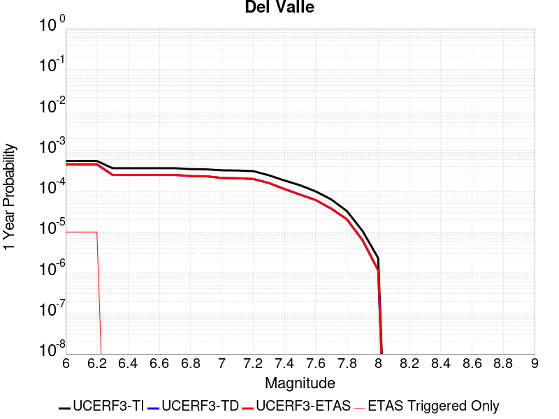 |  |

| Magnitude | 1 wk TI Prob | 1 wk TD Prob | 1 wk ETAS Prob | 1 wk ETAS/TD Gain | 1 wk ETAS Triggered Only | 1 mo TI Prob | 1 mo TD Prob | 1 mo ETAS Prob | 1 mo ETAS/TD Gain | 1 mo ETAS Triggered Only | 1 yr TI Prob | 1 yr TD Prob | 1 yr ETAS Prob | 1 yr ETAS/TD Gain | 1 yr ETAS Triggered Only | 10 yr TI Prob | 10 yr TD Prob | 10 yr ETAS Prob | 10 yr ETAS/TD Gain | 10 yr ETAS Triggered Only |
|-----|-----|-----|-----|-----|-----|-----|-----|-----|-----|-----|-----|-----|-----|-----|-----|-----|-----|-----|-----|-----|
| 6.0 | 1.0716125E-5 | 8.767882E-6 | 4.6935485E-5 | 5.3531156 | 3.816794E-5 | 4.592544E-5 | 3.7576207E-5 | 7.574271E-5 | 2.0157094 | 3.816794E-5 | 5.589988E-4 | 4.5741405E-4 | 4.9556454E-4 | 1.0834047 | 3.816794E-5 | 0.0055759475 | 0.00456668 | 0.004604674 | 1.0083197 | 3.816794E-5 |
| 6.1 | 1.0716125E-5 | 8.767882E-6 | 4.6935485E-5 | 5.3531156 | 3.816794E-5 | 4.592544E-5 | 3.7576207E-5 | 7.574271E-5 | 2.0157094 | 3.816794E-5 | 5.589988E-4 | 4.5741405E-4 | 4.9556454E-4 | 1.0834047 | 3.816794E-5 | 0.0055759475 | 0.00456668 | 0.004604674 | 1.0083197 | 3.816794E-5 |
| 6.2 | 1.0716125E-5 | 8.767882E-6 | 4.6935485E-5 | 5.3531156 | 3.816794E-5 | 4.592544E-5 | 3.7576207E-5 | 7.574271E-5 | 2.0157094 | 3.816794E-5 | 5.589988E-4 | 4.5741405E-4 | 4.9556454E-4 | 1.0834047 | 3.816794E-5 | 0.0055759475 | 0.00456668 | 0.004604674 | 1.0083197 | 3.816794E-5 |
| 6.3 | 7.1293784E-6 | 4.865823E-6 | 4.865823E-6 | 1.0 | 0.0 | 3.055412E-5 | 2.0853364E-5 | 2.0853364E-5 | 1.0 | 0.0 | 3.7193293E-4 | 2.5386087E-4 | 2.5386087E-4 | 1.0 | 0.0 | 0.0037131102 | 0.0025357946 | 0.0025357946 | 1.0 | 0.0 |
| 6.4 | 7.1293784E-6 | 4.865823E-6 | 4.865823E-6 | 1.0 | 0.0 | 3.055412E-5 | 2.0853364E-5 | 2.0853364E-5 | 1.0 | 0.0 | 3.7193293E-4 | 2.5386087E-4 | 2.5386087E-4 | 1.0 | 0.0 | 0.0037131102 | 0.0025357946 | 0.0025357946 | 1.0 | 0.0 |
| 6.5 | 7.1293784E-6 | 4.865823E-6 | 4.865823E-6 | 1.0 | 0.0 | 3.055412E-5 | 2.0853364E-5 | 2.0853364E-5 | 1.0 | 0.0 | 3.7193293E-4 | 2.5386087E-4 | 2.5386087E-4 | 1.0 | 0.0 | 0.0037131102 | 0.0025357946 | 0.0025357946 | 1.0 | 0.0 |
| 6.6 | 7.1293784E-6 | 4.865823E-6 | 4.865823E-6 | 1.0 | 0.0 | 3.055412E-5 | 2.0853364E-5 | 2.0853364E-5 | 1.0 | 0.0 | 3.7193293E-4 | 2.5386087E-4 | 2.5386087E-4 | 1.0 | 0.0 | 0.0037131102 | 0.0025357946 | 0.0025357946 | 1.0 | 0.0 |
| 6.7 | 7.12272E-6 | 4.8631987E-6 | 4.8631987E-6 | 1.0 | 0.0 | 3.0525585E-5 | 2.0842117E-5 | 2.0842117E-5 | 1.0 | 0.0 | 3.7158563E-4 | 2.5372396E-4 | 2.5372396E-4 | 1.0 | 0.0 | 0.003709649 | 0.0025344288 | 0.0025344288 | 1.0 | 0.0 |
| 6.8 | 6.7558703E-6 | 4.5594015E-6 | 4.5594015E-6 | 1.0 | 0.0 | 2.895341E-5 | 1.9540148E-5 | 1.9540148E-5 | 1.0 | 0.0 | 3.5245073E-4 | 2.3787597E-4 | 2.3787597E-4 | 1.0 | 0.0 | 0.0035189227 | 0.0023762889 | 0.0023762889 | 1.0 | 0.0 |
| 6.9 | 6.6700386E-6 | 4.502539E-6 | 4.502539E-6 | 1.0 | 0.0 | 2.8585566E-5 | 1.9296456E-5 | 1.9296456E-5 | 1.0 | 0.0 | 3.479737E-4 | 2.3490966E-4 | 2.3490966E-4 | 1.0 | 0.0 | 0.003474293 | 0.0023466884 | 0.0023466884 | 1.0 | 0.0 |
| 7.0 | 6.3181424E-6 | 4.0987034E-6 | 4.0987034E-6 | 1.0 | 0.0 | 2.7077473E-5 | 1.7565755E-5 | 1.7565755E-5 | 1.0 | 0.0 | 3.2961834E-4 | 2.1384252E-4 | 2.1384252E-4 | 1.0 | 0.0 | 0.0032912986 | 0.002136422 | 0.002136422 | 1.0 | 0.0 |
| 7.1 | 6.248759E-6 | 4.033895E-6 | 4.033895E-6 | 1.0 | 0.0 | 2.678012E-5 | 1.7288008E-5 | 1.7288008E-5 | 1.0 | 0.0 | 3.2599916E-4 | 2.104616E-4 | 2.104616E-4 | 1.0 | 0.0 | 0.0032552136 | 0.0021026772 | 0.0021026772 | 1.0 | 0.0 |
| 7.2 | 6.0411944E-6 | 3.869888E-6 | 3.869888E-6 | 1.0 | 0.0 | 2.5890577E-5 | 1.658513E-5 | 1.658513E-5 | 1.0 | 0.0 | 3.1517216E-4 | 2.0190567E-4 | 2.0190567E-4 | 1.0 | 0.0 | 0.0031472554 | 0.0020172757 | 0.0020172757 | 1.0 | 0.0 |
| 7.3 | 4.7691183E-6 | 3.0781202E-6 | 3.0781202E-6 | 1.0 | 0.0 | 2.0438918E-5 | 1.3191879E-5 | 1.3191879E-5 | 1.0 | 0.0 | 2.488154E-4 | 1.605995E-4 | 1.605995E-4 | 1.0 | 0.0 | 0.00248537 | 0.0016048603 | 0.0016048603 | 1.0 | 0.0 |
| 7.4 | 3.5524722E-6 | 2.1893363E-6 | 2.1893363E-6 | 1.0 | 0.0 | 1.5224792E-5 | 9.382837E-6 | 9.382837E-6 | 1.0 | 0.0 | 1.8534607E-4 | 1.1423013E-4 | 1.1423013E-4 | 1.0 | 0.0 | 0.0018519156 | 0.0011417224 | 0.0011417224 | 1.0 | 0.0 |
| 7.5 | 2.7133442E-6 | 1.5916097E-6 | 1.5916097E-6 | 1.0 | 0.0 | 1.1628566E-5 | 6.821167E-6 | 6.821167E-6 | 1.0 | 0.0 | 1.415686E-4 | 8.304456E-5 | 8.304456E-5 | 1.0 | 0.0 | 0.0014147845 | 8.301372E-4 | 8.301372E-4 | 1.0 | 0.0 |
| 7.6 | 1.915338E-6 | 1.173914E-6 | 1.173914E-6 | 1.0 | 0.0 | 8.208566E-6 | 5.0310505E-6 | 5.0310505E-6 | 1.0 | 0.0 | 9.993471E-5 | 6.125133E-5 | 6.125133E-5 | 1.0 | 0.0 | 9.988978E-4 | 6.123454E-4 | 6.123454E-4 | 1.0 | 0.0 |
| 7.7 | 1.2120448E-6 | 7.180313E-7 | 7.180313E-7 | 1.0 | 0.0 | 5.194467E-6 | 3.0772733E-6 | 3.0772733E-6 | 1.0 | 0.0 | 6.3240805E-5 | 3.746516E-5 | 3.746516E-5 | 1.0 | 0.0 | 6.322281E-4 | 3.7458882E-4 | 3.7458882E-4 | 1.0 | 0.0 |
| 7.8 | 6.272381E-7 | 3.932549E-7 | 3.932549E-7 | 1.0 | 0.0 | 2.6881603E-6 | 1.6853771E-6 | 1.6853771E-6 | 1.0 | 0.0 | 3.272786E-5 | 2.0519275E-5 | 2.0519275E-5 | 1.0 | 0.0 | 3.272304E-4 | 2.0517396E-4 | 2.0517396E-4 | 1.0 | 0.0 |
| 7.9 | 2.0292627E-7 | 1.2004622E-7 | 1.2004622E-7 | 1.0 | 0.0 | 8.6968373E-7 | 5.1448376E-7 | 5.1448376E-7 | 1.0 | 0.0 | 1.0588348E-5 | 6.263822E-6 | 6.263822E-6 | 1.0 | 0.0 | 1.0587843E-4 | 6.263647E-5 | 6.263647E-5 | 1.0 | 0.0 |
| 8.0 | 4.374492E-8 | 2.189964E-8 | 2.189964E-8 | 1.0 | 0.0 | 1.8747821E-7 | 9.385559E-8 | 9.385559E-8 | 1.0 | 0.0 | 2.2825448E-6 | 1.1426913E-6 | 1.1426913E-6 | 1.0 | 0.0 | 2.2825214E-5 | 1.1426858E-5 | 1.1426858E-5 | 1.0 | 0.0 |

## Lost Hills
*[(top)](#table-of-contents)*

| 1 Week | 1 Month | 1 Year | 10 Year |
|-----|-----|-----|-----|
|  |  |  |  |

| Magnitude | 1 wk TI Prob | 1 wk TD Prob | 1 wk ETAS Prob | 1 wk ETAS/TD Gain | 1 wk ETAS Triggered Only | 1 mo TI Prob | 1 mo TD Prob | 1 mo ETAS Prob | 1 mo ETAS/TD Gain | 1 mo ETAS Triggered Only | 1 yr TI Prob | 1 yr TD Prob | 1 yr ETAS Prob | 1 yr ETAS/TD Gain | 1 yr ETAS Triggered Only | 10 yr TI Prob | 10 yr TD Prob | 10 yr ETAS Prob | 10 yr ETAS/TD Gain | 10 yr ETAS Triggered Only |
|-----|-----|-----|-----|-----|-----|-----|-----|-----|-----|-----|-----|-----|-----|-----|-----|-----|-----|-----|-----|-----|
| 6.0 | 2.233523E-5 | 2.5106583E-5 | 6.327356E-5 | 2.520198 | 3.816794E-5 | 9.571891E-5 | 1.0759615E-4 | 1.4575999E-4 | 1.3546952 | 3.816794E-5 | 0.0011647546 | 0.001309364 | 0.001347482 | 1.0291119 | 3.816794E-5 | 0.011586686 | 0.013033091 | 0.013070761 | 1.0028903 | 3.816794E-5 |
| 6.1 | 2.233523E-5 | 2.5106583E-5 | 6.327356E-5 | 2.520198 | 3.816794E-5 | 9.571891E-5 | 1.0759615E-4 | 1.4575999E-4 | 1.3546952 | 3.816794E-5 | 0.0011647546 | 0.001309364 | 0.001347482 | 1.0291119 | 3.816794E-5 | 0.011586686 | 0.013033091 | 0.013070761 | 1.0028903 | 3.816794E-5 |
| 6.2 | 2.233523E-5 | 2.5106583E-5 | 6.327356E-5 | 2.520198 | 3.816794E-5 | 9.571891E-5 | 1.0759615E-4 | 1.4575999E-4 | 1.3546952 | 3.816794E-5 | 0.0011647546 | 0.001309364 | 0.001347482 | 1.0291119 | 3.816794E-5 | 0.011586686 | 0.013033091 | 0.013070761 | 1.0028903 | 3.816794E-5 |
| 6.3 | 2.233523E-5 | 2.5106583E-5 | 6.327356E-5 | 2.520198 | 3.816794E-5 | 9.571891E-5 | 1.0759615E-4 | 1.4575999E-4 | 1.3546952 | 3.816794E-5 | 0.0011647546 | 0.001309364 | 0.001347482 | 1.0291119 | 3.816794E-5 | 0.011586686 | 0.013033091 | 0.013070761 | 1.0028903 | 3.816794E-5 |
| 6.4 | 1.2288092E-5 | 1.3781108E-5 | 1.3781108E-5 | 1.0 | 0.0 | 5.2662188E-5 | 5.906108E-5 | 5.906108E-5 | 1.0 | 0.0 | 6.409735E-4 | 7.189252E-4 | 7.189252E-4 | 1.0 | 0.0 | 0.006391279 | 0.0071752006 | 0.0071752006 | 1.0 | 0.0 |
| 6.5 | 1.2288092E-5 | 1.3781108E-5 | 1.3781108E-5 | 1.0 | 0.0 | 5.2662188E-5 | 5.906108E-5 | 5.906108E-5 | 1.0 | 0.0 | 6.409735E-4 | 7.189252E-4 | 7.189252E-4 | 1.0 | 0.0 | 0.006391279 | 0.0071752006 | 0.0071752006 | 1.0 | 0.0 |
| 6.6 | 8.58281E-6 | 9.63377E-6 | 9.63377E-6 | 1.0 | 0.0 | 3.6782953E-5 | 4.12874E-5 | 4.12874E-5 | 1.0 | 0.0 | 4.4774043E-4 | 5.026414E-4 | 5.026414E-4 | 1.0 | 0.0 | 0.0044683935 | 0.005023205 | 0.005023205 | 1.0 | 0.0 |
| 6.7 | 7.205685E-6 | 8.088302E-6 | 8.088302E-6 | 1.0 | 0.0 | 3.088114E-5 | 3.466415E-5 | 3.466415E-5 | 1.0 | 0.0 | 3.7591302E-4 | 4.2203604E-4 | 4.2203604E-4 | 1.0 | 0.0 | 0.0037527776 | 0.0042203604 | 0.0042203604 | 1.0 | 0.0 |

## Likely 2011 CFM
*[(top)](#table-of-contents)*

| 1 Week | 1 Month | 1 Year | 10 Year |
|-----|-----|-----|-----|
|  | 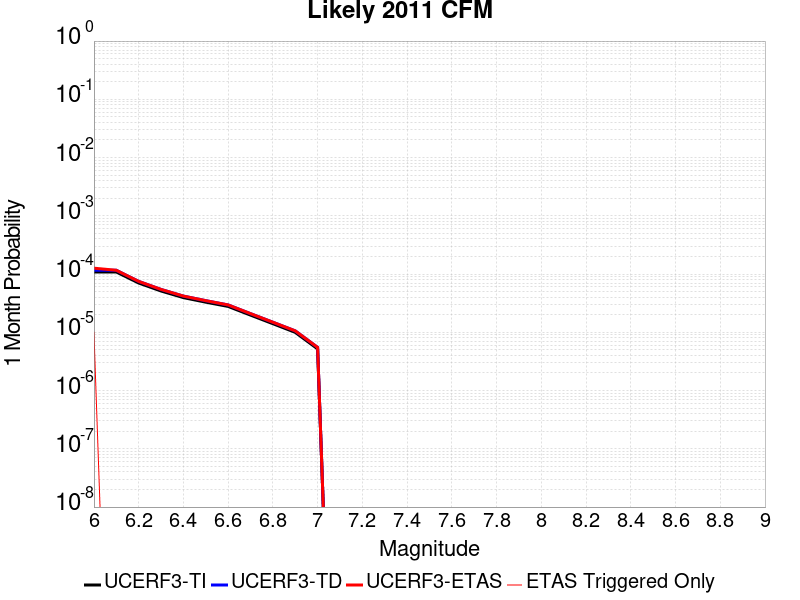 |  |  |

| Magnitude | 1 wk TI Prob | 1 wk TD Prob | 1 wk ETAS Prob | 1 wk ETAS/TD Gain | 1 wk ETAS Triggered Only | 1 mo TI Prob | 1 mo TD Prob | 1 mo ETAS Prob | 1 mo ETAS/TD Gain | 1 mo ETAS Triggered Only | 1 yr TI Prob | 1 yr TD Prob | 1 yr ETAS Prob | 1 yr ETAS/TD Gain | 1 yr ETAS Triggered Only | 10 yr TI Prob | 10 yr TD Prob | 10 yr ETAS Prob | 10 yr ETAS/TD Gain | 10 yr ETAS Triggered Only |
|-----|-----|-----|-----|-----|-----|-----|-----|-----|-----|-----|-----|-----|-----|-----|-----|-----|-----|-----|-----|-----|
| 6.0 | 2.5315949E-5 | 2.7104748E-5 | 6.5271655E-5 | 2.408126 | 3.816794E-5 | 1.0849241E-4 | 1.16158284E-4 | 1.543218E-4 | 1.3285475 | 3.816794E-5 | 0.0013200947 | 0.0014133542 | 0.0014514682 | 1.026967 | 3.816794E-5 | 0.013122803 | 0.01404831 | 0.014085942 | 1.0026788 | 3.816794E-5 |
| 6.1 | 2.5315949E-5 | 2.7104748E-5 | 2.7104748E-5 | 1.0 | 0.0 | 1.0849241E-4 | 1.16158284E-4 | 1.16158284E-4 | 1.0 | 0.0 | 0.0013200947 | 0.0014133542 | 0.0014133542 | 1.0 | 0.0 | 0.013122803 | 0.01404831 | 0.01404831 | 1.0 | 0.0 |
| 6.2 | 1.6375941E-5 | 1.7465842E-5 | 1.7465842E-5 | 1.0 | 0.0 | 7.0180715E-5 | 7.485153E-5 | 7.485153E-5 | 1.0 | 0.0 | 8.5411523E-4 | 9.109487E-4 | 9.109487E-4 | 1.0 | 0.0 | 0.008508399 | 0.009073433 | 0.009073433 | 1.0 | 0.0 |
| 6.3 | 1.1945543E-5 | 1.2712587E-5 | 1.2712587E-5 | 1.0 | 0.0 | 5.119418E-5 | 5.4481407E-5 | 5.4481407E-5 | 1.0 | 0.0 | 6.2311086E-4 | 6.631146E-4 | 6.631146E-4 | 1.0 | 0.0 | 0.0062136655 | 0.0066119144 | 0.0066119144 | 1.0 | 0.0 |
| 6.4 | 9.192729E-6 | 9.768488E-6 | 9.768488E-6 | 1.0 | 0.0 | 3.939681E-5 | 4.1864292E-5 | 4.1864292E-5 | 1.0 | 0.0 | 4.7955062E-4 | 5.0958124E-4 | 5.0958124E-4 | 1.0 | 0.0 | 0.004785171 | 0.0050844094 | 0.0050844094 | 1.0 | 0.0 |
| 6.5 | 7.67906E-6 | 8.152622E-6 | 8.152622E-6 | 1.0 | 0.0 | 3.2909844E-5 | 3.4939352E-5 | 3.4939352E-5 | 1.0 | 0.0 | 4.006037E-4 | 4.2530545E-4 | 4.2530545E-4 | 1.0 | 0.0 | 0.0039988225 | 0.004245108 | 0.004245108 | 1.0 | 0.0 |
| 6.6 | 6.4884057E-6 | 6.8847507E-6 | 6.8847507E-6 | 1.0 | 0.0 | 2.7807157E-5 | 2.9505749E-5 | 2.9505749E-5 | 1.0 | 0.0 | 3.3849955E-4 | 3.591747E-4 | 3.591747E-4 | 1.0 | 0.0 | 0.003379844 | 0.0035860867 | 0.0035860867 | 1.0 | 0.0 |
| 6.7 | 4.6060636E-6 | 4.884041E-6 | 4.884041E-6 | 1.0 | 0.0 | 1.9740122E-5 | 2.0931442E-5 | 2.0931442E-5 | 1.0 | 0.0 | 2.403095E-4 | 2.5481134E-4 | 2.5481134E-4 | 1.0 | 0.0 | 0.002400498 | 0.0025452746 | 0.0025452746 | 1.0 | 0.0 |
| 6.8 | 3.2795615E-6 | 3.4773732E-6 | 3.4773732E-6 | 1.0 | 0.0 | 1.4055187E-5 | 1.4902946E-5 | 1.4902946E-5 | 1.0 | 0.0 | 1.7110848E-4 | 1.8142881E-4 | 1.8142881E-4 | 1.0 | 0.0 | 0.0017097679 | 0.0018128622 | 0.0018128622 | 1.0 | 0.0 |
| 6.9 | 2.3289967E-6 | 2.4705569E-6 | 2.4705569E-6 | 1.0 | 0.0 | 9.981376E-6 | 1.058806E-5 | 1.058806E-5 | 1.0 | 0.0 | 1.2151648E-4 | 1.2890245E-4 | 1.2890245E-4 | 1.0 | 0.0 | 0.0012145005 | 0.0012883197 | 0.0012883197 | 1.0 | 0.0 |
| 7.0 | 1.211292E-6 | 1.2863958E-6 | 1.2863958E-6 | 1.0 | 0.0 | 5.1912407E-6 | 5.5131145E-6 | 5.5131145E-6 | 1.0 | 0.0 | 6.320152E-5 | 6.712041E-5 | 6.712041E-5 | 1.0 | 0.0 | 6.3183554E-4 | 6.710312E-4 | 6.710312E-4 | 1.0 | 0.0 |

## Last Chance
*[(top)](#table-of-contents)*

| 1 Week | 1 Month | 1 Year | 10 Year |
|-----|-----|-----|-----|
|  |  |  |  |

| Magnitude | 1 wk TI Prob | 1 wk TD Prob | 1 wk ETAS Prob | 1 wk ETAS/TD Gain | 1 wk ETAS Triggered Only | 1 mo TI Prob | 1 mo TD Prob | 1 mo ETAS Prob | 1 mo ETAS/TD Gain | 1 mo ETAS Triggered Only | 1 yr TI Prob | 1 yr TD Prob | 1 yr ETAS Prob | 1 yr ETAS/TD Gain | 1 yr ETAS Triggered Only | 10 yr TI Prob | 10 yr TD Prob | 10 yr ETAS Prob | 10 yr ETAS/TD Gain | 10 yr ETAS Triggered Only |
|-----|-----|-----|-----|-----|-----|-----|-----|-----|-----|-----|-----|-----|-----|-----|-----|-----|-----|-----|-----|-----|
| 6.0 | 3.23929E-6 | 3.305131E-6 | 4.1472944E-5 | 12.548049 | 3.816794E-5 | 1.3882597E-5 | 1.4164784E-5 | 5.2332183E-5 | 3.6945274 | 3.816794E-5 | 1.6900752E-4 | 1.7244508E-4 | 2.1060643E-4 | 1.2212957 | 3.816794E-5 | 0.0016887904 | 0.0017233564 | 0.0017614586 | 1.0221093 | 3.816794E-5 |
| 6.1 | 3.23929E-6 | 3.305131E-6 | 4.1472944E-5 | 12.548049 | 3.816794E-5 | 1.3882597E-5 | 1.4164784E-5 | 5.2332183E-5 | 3.6945274 | 3.816794E-5 | 1.6900752E-4 | 1.7244508E-4 | 2.1060643E-4 | 1.2212957 | 3.816794E-5 | 0.0016887904 | 0.0017233564 | 0.0017614586 | 1.0221093 | 3.816794E-5 |
| 6.2 | 3.23929E-6 | 3.305131E-6 | 4.1472944E-5 | 12.548049 | 3.816794E-5 | 1.3882597E-5 | 1.4164784E-5 | 5.2332183E-5 | 3.6945274 | 3.816794E-5 | 1.6900752E-4 | 1.7244508E-4 | 2.1060643E-4 | 1.2212957 | 3.816794E-5 | 0.0016887904 | 0.0017233564 | 0.0017614586 | 1.0221093 | 3.816794E-5 |
| 6.3 | 3.23929E-6 | 3.305131E-6 | 4.1472944E-5 | 12.548049 | 3.816794E-5 | 1.3882597E-5 | 1.4164784E-5 | 5.2332183E-5 | 3.6945274 | 3.816794E-5 | 1.6900752E-4 | 1.7244508E-4 | 2.1060643E-4 | 1.2212957 | 3.816794E-5 | 0.0016887904 | 0.0017233564 | 0.0017614586 | 1.0221093 | 3.816794E-5 |
| 6.4 | 3.23929E-6 | 3.305131E-6 | 4.1472944E-5 | 12.548049 | 3.816794E-5 | 1.3882597E-5 | 1.4164784E-5 | 5.2332183E-5 | 3.6945274 | 3.816794E-5 | 1.6900752E-4 | 1.7244508E-4 | 2.1060643E-4 | 1.2212957 | 3.816794E-5 | 0.0016887904 | 0.0017233564 | 0.0017614586 | 1.0221093 | 3.816794E-5 |
| 6.5 | 3.23929E-6 | 3.305131E-6 | 4.1472944E-5 | 12.548049 | 3.816794E-5 | 1.3882597E-5 | 1.4164784E-5 | 5.2332183E-5 | 3.6945274 | 3.816794E-5 | 1.6900752E-4 | 1.7244508E-4 | 2.1060643E-4 | 1.2212957 | 3.816794E-5 | 0.0016887904 | 0.0017233564 | 0.0017614586 | 1.0221093 | 3.816794E-5 |
| 6.6 | 3.23929E-6 | 3.305131E-6 | 4.1472944E-5 | 12.548049 | 3.816794E-5 | 1.3882597E-5 | 1.4164784E-5 | 5.2332183E-5 | 3.6945274 | 3.816794E-5 | 1.6900752E-4 | 1.7244508E-4 | 2.1060643E-4 | 1.2212957 | 3.816794E-5 | 0.0016887904 | 0.0017233564 | 0.0017614586 | 1.0221093 | 3.816794E-5 |
| 6.7 | 1.9639244E-6 | 2.004454E-6 | 2.004454E-6 | 1.0 | 0.0 | 8.416792E-6 | 8.590492E-6 | 8.590492E-6 | 1.0 | 0.0 | 1.02469625E-4 | 1.0458486E-4 | 1.0458486E-4 | 1.0 | 0.0 | 0.0010242239 | 0.0010454189 | 0.0010454189 | 1.0 | 0.0 |
| 6.8 | 1.8490592E-6 | 1.8874916E-6 | 1.8874916E-6 | 1.0 | 0.0 | 7.924516E-6 | 8.089228E-6 | 8.089228E-6 | 1.0 | 0.0 | 9.64767E-5 | 9.8482524E-5 | 9.8482524E-5 | 1.0 | 0.0 | 9.643483E-4 | 9.844499E-4 | 9.844499E-4 | 1.0 | 0.0 |
| 6.9 | 1.6283703E-6 | 1.6624386E-6 | 1.6624386E-6 | 1.0 | 0.0 | 6.9787116E-6 | 7.124721E-6 | 7.124721E-6 | 1.0 | 0.0 | 8.49625E-5 | 8.674058E-5 | 8.674058E-5 | 1.0 | 0.0 | 8.4930024E-4 | 8.6712214E-4 | 8.6712214E-4 | 1.0 | 0.0 |
| 7.0 | 1.1619308E-6 | 1.1869527E-6 | 1.1869527E-6 | 1.0 | 0.0 | 4.979694E-6 | 5.0869326E-6 | 5.0869326E-6 | 1.0 | 0.0 | 6.0626087E-5 | 6.1932085E-5 | 6.1932085E-5 | 1.0 | 0.0 | 6.060955E-4 | 6.19192E-4 | 6.19192E-4 | 1.0 | 0.0 |
| 7.1 | 7.8723247E-7 | 8.0469965E-7 | 8.0469965E-7 | 1.0 | 0.0 | 3.373849E-6 | 3.44871E-6 | 3.44871E-6 | 1.0 | 0.0 | 4.107584E-5 | 4.198754E-5 | 4.198754E-5 | 1.0 | 0.0 | 4.1068246E-4 | 4.1982596E-4 | 4.1982596E-4 | 1.0 | 0.0 |

## San Andreas (Parkfield)
*[(top)](#table-of-contents)*

| 1 Week | 1 Month | 1 Year | 10 Year |
|-----|-----|-----|-----|
|  |  |  |  |

| Magnitude | 1 wk TI Prob | 1 wk TD Prob | 1 wk ETAS Prob | 1 wk ETAS/TD Gain | 1 wk ETAS Triggered Only | 1 mo TI Prob | 1 mo TD Prob | 1 mo ETAS Prob | 1 mo ETAS/TD Gain | 1 mo ETAS Triggered Only | 1 yr TI Prob | 1 yr TD Prob | 1 yr ETAS Prob | 1 yr ETAS/TD Gain | 1 yr ETAS Triggered Only | 10 yr TI Prob | 10 yr TD Prob | 10 yr ETAS Prob | 10 yr ETAS/TD Gain | 10 yr ETAS Triggered Only |
|-----|-----|-----|-----|-----|-----|-----|-----|-----|-----|-----|-----|-----|-----|-----|-----|-----|-----|-----|-----|-----|
| 6.0 | 5.556969E-4 | 7.7782426E-4 | 7.7782426E-4 | 1.0 | 0.0 | 0.0023793848 | 0.0033298214 | 0.0033678622 | 1.0114243 | 3.816794E-5 | 0.028586963 | 0.040191233 | 0.040227868 | 1.0009115 | 3.816794E-5 | 0.25176284 | 0.33716413 | 0.33718944 | 1.000075 | 3.816794E-5 |
| 6.1 | 1.925858E-4 | 3.0276453E-4 | 3.0276453E-4 | 1.0 | 0.0 | 8.2510663E-4 | 0.0012970108 | 0.0013351293 | 1.0293895 | 3.816794E-5 | 0.0099994885 | 0.015778083 | 0.01581565 | 1.0023808 | 3.816794E-5 | 0.095613256 | 0.1497237 | 0.14975615 | 1.0002167 | 3.816794E-5 |
| 6.2 | 9.4306815E-5 | 1.8242796E-4 | 1.8242796E-4 | 1.0 | 0.0 | 4.0410945E-4 | 7.816011E-4 | 8.197392E-4 | 1.0487949 | 3.816794E-5 | 0.0049089384 | 0.009474681 | 0.009512487 | 1.0039903 | 3.816794E-5 | 0.048019063 | 0.09185409 | 0.09188875 | 1.0003774 | 3.816794E-5 |
| 6.3 | 9.283051E-5 | 1.7939322E-4 | 1.7939322E-4 | 1.0 | 0.0 | 3.9778434E-4 | 7.686027E-4 | 8.067413E-4 | 1.0496207 | 3.816794E-5 | 0.0048322747 | 0.009317789 | 0.009355602 | 1.0040581 | 3.816794E-5 | 0.047285385 | 0.09050704 | 0.09054175 | 1.0003835 | 3.816794E-5 |
| 6.4 | 9.138826E-5 | 1.770153E-4 | 1.770153E-4 | 1.0 | 0.0 | 3.916052E-4 | 7.5841765E-4 | 7.9655665E-4 | 1.0502876 | 3.816794E-5 | 0.0047573745 | 0.00919484 | 0.009232657 | 1.0041128 | 3.816794E-5 | 0.046568092 | 0.08940927 | 0.08944403 | 1.0003887 | 3.816794E-5 |
| 6.5 | 9.000255E-5 | 1.7459576E-4 | 1.7459576E-4 | 1.0 | 0.0 | 3.8566816E-4 | 7.480541E-4 | 7.8619353E-4 | 1.0509847 | 3.816794E-5 | 0.0046854047 | 0.009069731 | 0.009107553 | 1.0041701 | 3.816794E-5 | 0.045878403 | 0.088295065 | 0.08832987 | 1.0003941 | 3.816794E-5 |
| 6.6 | 8.8109264E-5 | 1.7140752E-4 | 1.7140752E-4 | 1.0 | 0.0 | 3.7755648E-4 | 7.3439797E-4 | 7.725379E-4 | 1.0519335 | 3.816794E-5 | 0.0045870654 | 0.008904854 | 0.008942682 | 1.004248 | 3.816794E-5 | 0.04493529 | 0.0868267 | 0.08686155 | 1.0004014 | 3.816794E-5 |
| 6.7 | 8.738073E-5 | 1.7007832E-4 | 1.7007832E-4 | 1.0 | 0.0 | 3.7443507E-4 | 7.287046E-4 | 7.668448E-4 | 1.0523397 | 3.816794E-5 | 0.0045492216 | 0.008836143 | 0.008873974 | 1.0042814 | 3.816794E-5 | 0.04457213 | 0.08622707 | 0.08626194 | 1.0004045 | 3.816794E-5 |
| 6.8 | 8.710195E-5 | 1.6953335E-4 | 1.6953335E-4 | 1.0 | 0.0 | 3.7324068E-4 | 7.263703E-4 | 7.6451054E-4 | 1.052508 | 3.816794E-5 | 0.0045347405 | 0.008807961 | 0.008845792 | 1.0042952 | 3.816794E-5 | 0.04443313 | 0.08597467 | 0.086009555 | 1.0004058 | 3.816794E-5 |
| 6.9 | 8.6801556E-5 | 1.689429E-4 | 1.689429E-4 | 1.0 | 0.0 | 3.7195362E-4 | 7.2384125E-4 | 7.6198153E-4 | 1.0526916 | 3.816794E-5 | 0.0045191357 | 0.008777418 | 0.008815251 | 1.0043103 | 3.816794E-5 | 0.044283327 | 0.085700735 | 0.08573563 | 1.0004072 | 3.816794E-5 |
| 7.0 | 8.5571606E-5 | 1.6647128E-4 | 1.6647128E-4 | 1.0 | 0.0 | 3.6668387E-4 | 7.132544E-4 | 7.513951E-4 | 1.0534742 | 3.816794E-5 | 0.004455241 | 0.008649553 | 0.008687391 | 1.0043745 | 3.816794E-5 | 0.043669727 | 0.08454914 | 0.08458408 | 1.0004133 | 3.816794E-5 |
| 7.1 | 7.82589E-5 | 1.5128135E-4 | 1.5128135E-4 | 1.0 | 0.0 | 3.3535215E-4 | 6.481883E-4 | 6.863315E-4 | 1.0588459 | 3.816794E-5 | 0.0040752706 | 0.007863307 | 0.007901175 | 1.0048158 | 3.816794E-5 | 0.040013418 | 0.07746111 | 0.07749632 | 1.0004545 | 3.816794E-5 |
| 7.2 | 7.690929E-5 | 1.4865391E-4 | 1.4865391E-4 | 1.0 | 0.0 | 3.2956956E-4 | 6.369334E-4 | 6.7507697E-4 | 1.0598863 | 3.816794E-5 | 0.004005129 | 0.007727258 | 0.0077651306 | 1.0049012 | 3.816794E-5 | 0.0393371 | 0.07623427 | 0.07626953 | 1.0004625 | 3.816794E-5 |
| 7.3 | 7.5543794E-5 | 1.4561978E-4 | 1.4561978E-4 | 1.0 | 0.0 | 3.2371894E-4 | 6.2393624E-4 | 6.6208036E-4 | 1.0611347 | 3.816794E-5 | 0.003934157 | 0.007570127 | 0.0076080062 | 1.0050037 | 3.816794E-5 | 0.038652334 | 0.074797355 | 0.07483266 | 1.0004721 | 3.816794E-5 |
| 7.4 | 7.4214564E-5 | 1.4262961E-4 | 1.4262961E-4 | 1.0 | 0.0 | 3.1802364E-4 | 6.111273E-4 | 6.492719E-4 | 1.0624168 | 3.816794E-5 | 0.003865065 | 0.00741525 | 0.0074531347 | 1.0051091 | 3.816794E-5 | 0.03798529 | 0.07337123 | 0.0734066 | 1.0004821 | 3.816794E-5 |
| 7.5 | 6.149578E-5 | 1.11907226E-4 | 1.11907226E-4 | 1.0 | 0.0 | 2.6352672E-4 | 4.7951436E-4 | 5.17664E-4 | 1.0795588 | 3.816794E-5 | 0.0032037178 | 0.0058224914 | 0.005860437 | 1.006517 | 3.816794E-5 | 0.03157923 | 0.058557566 | 0.058593497 | 1.0006137 | 3.816794E-5 |
| 7.6 | 6.0643448E-5 | 1.10193796E-4 | 1.10193796E-4 | 1.0 | 0.0 | 2.598746E-4 | 4.7217376E-4 | 5.103237E-4 | 1.0807964 | 3.816794E-5 | 0.0031593828 | 0.0057335934 | 0.005771543 | 1.0066187 | 3.816794E-5 | 0.031148417 | 0.057718582 | 0.057754546 | 1.0006231 | 3.816794E-5 |
| 7.7 | 5.1652263E-5 | 9.174698E-5 | 9.174698E-5 | 1.0 | 0.0 | 2.2134806E-4 | 3.931421E-4 | 3.931421E-4 | 1.0 | 0.0 | 0.002691582 | 0.0047760103 | 0.0047760103 | 1.0 | 0.0 | 0.026592141 | 0.04853623 | 0.04853623 | 1.0 | 0.0 |
| 7.8 | 4.8090482E-5 | 8.559635E-5 | 8.559635E-5 | 1.0 | 0.0 | 2.060858E-4 | 3.6678996E-4 | 3.6678996E-4 | 1.0 | 0.0 | 0.0025062072 | 0.0044565317 | 0.0044565317 | 1.0 | 0.0 | 0.024781305 | 0.04530245 | 0.04530245 | 1.0 | 0.0 |
| 7.9 | 3.970278E-5 | 6.750426E-5 | 6.750426E-5 | 1.0 | 0.0 | 1.7014367E-4 | 2.892719E-4 | 2.892719E-4 | 1.0 | 0.0 | 0.002069531 | 0.0035162016 | 0.0035162016 | 1.0 | 0.0 | 0.020503636 | 0.035881363 | 0.035881363 | 1.0 | 0.0 |
| 8.0 | 2.8982335E-5 | 4.069796E-5 | 4.069796E-5 | 1.0 | 0.0 | 1.2420409E-4 | 1.7440817E-4 | 1.7440817E-4 | 1.0 | 0.0 | 0.0015111357 | 0.0021213528 | 0.0021213528 | 1.0 | 0.0 | 0.015009012 | 0.022010697 | 0.022010697 | 1.0 | 0.0 |
| 8.1 | 1.8836186E-5 | 1.8681134E-5 | 1.8681134E-5 | 1.0 | 0.0 | 8.0724014E-5 | 8.005955E-5 | 8.005955E-5 | 1.0 | 0.0 | 9.823717E-4 | 9.742898E-4 | 9.742898E-4 | 1.0 | 0.0 | 0.009780403 | 0.010488115 | 0.010488115 | 1.0 | 0.0 |
| 8.2 | 8.643924E-6 | 5.4748625E-6 | 5.4748625E-6 | 1.0 | 0.0 | 3.704486E-5 | 2.3463486E-5 | 2.3463486E-5 | 1.0 | 0.0 | 4.5092785E-4 | 2.8563058E-4 | 2.8563058E-4 | 1.0 | 0.0 | 0.0045001395 | 0.0032487072 | 0.0032487072 | 1.0 | 0.0 |
| 8.3 | 1.983087E-6 | 7.6599065E-7 | 7.6599065E-7 | 1.0 | 0.0 | 8.498917E-6 | 3.282813E-6 | 3.282813E-6 | 1.0 | 0.0 | 1.034694E-4 | 3.9967534E-5 | 3.9967534E-5 | 1.0 | 0.0 | 0.0010342124 | 4.719687E-4 | 4.719687E-4 | 1.0 | 0.0 |

## Oceanic - West Huasna
*[(top)](#table-of-contents)*

| 1 Week | 1 Month | 1 Year | 10 Year |
|-----|-----|-----|-----|
|  |  |  |  |

| Magnitude | 1 wk TI Prob | 1 wk TD Prob | 1 wk ETAS Prob | 1 wk ETAS/TD Gain | 1 wk ETAS Triggered Only | 1 mo TI Prob | 1 mo TD Prob | 1 mo ETAS Prob | 1 mo ETAS/TD Gain | 1 mo ETAS Triggered Only | 1 yr TI Prob | 1 yr TD Prob | 1 yr ETAS Prob | 1 yr ETAS/TD Gain | 1 yr ETAS Triggered Only | 10 yr TI Prob | 10 yr TD Prob | 10 yr ETAS Prob | 10 yr ETAS/TD Gain | 10 yr ETAS Triggered Only |
|-----|-----|-----|-----|-----|-----|-----|-----|-----|-----|-----|-----|-----|-----|-----|-----|-----|-----|-----|-----|-----|
| 6.0 | 3.195567E-5 | 2.7926868E-5 | 6.6093744E-5 | 2.366672 | 3.816794E-5 | 1.3694567E-4 | 1.1968133E-4 | 1.578447E-4 | 1.3188748 | 3.816794E-5 | 0.0016660384 | 0.0014561893 | 0.0014943017 | 1.0261726 | 3.816794E-5 | 0.016536033 | 0.014471028 | 0.014508643 | 1.0025994 | 3.816794E-5 |
| 6.1 | 2.1156782E-5 | 1.7573486E-5 | 1.7573486E-5 | 1.0 | 0.0 | 9.066878E-5 | 7.531282E-5 | 7.531282E-5 | 1.0 | 0.0 | 0.0011033333 | 9.165572E-4 | 9.165572E-4 | 1.0 | 0.0 | 0.010978713 | 0.009128777 | 0.009128777 | 1.0 | 0.0 |
| 6.2 | 1.6195117E-5 | 1.3327152E-5 | 1.3327152E-5 | 1.0 | 0.0 | 6.9405796E-5 | 5.7115132E-5 | 5.7115132E-5 | 1.0 | 0.0 | 8.44688E-4 | 6.9515745E-4 | 6.9515745E-4 | 1.0 | 0.0 | 0.008414844 | 0.006930123 | 0.006930123 | 1.0 | 0.0 |
| 6.3 | 1.3559345E-5 | 1.1179142E-5 | 1.1179142E-5 | 1.0 | 0.0 | 5.811018E-5 | 4.7909736E-5 | 4.7909736E-5 | 1.0 | 0.0 | 7.072618E-4 | 5.831459E-4 | 5.831459E-4 | 1.0 | 0.0 | 0.0070501505 | 0.0058162753 | 0.0058162753 | 1.0 | 0.0 |
| 6.4 | 1.2120619E-5 | 1.0000977E-5 | 1.0000977E-5 | 1.0 | 0.0 | 5.1944477E-5 | 4.2860633E-5 | 4.2860633E-5 | 1.0 | 0.0 | 6.322405E-4 | 5.2170374E-4 | 5.2170374E-4 | 1.0 | 0.0 | 0.006304447 | 0.0052048573 | 0.0052048573 | 1.0 | 0.0 |
| 6.5 | 1.13511915E-5 | 9.3674735E-6 | 9.3674735E-6 | 1.0 | 0.0 | 4.8647056E-5 | 4.01457E-5 | 4.01457E-5 | 1.0 | 0.0 | 5.9211696E-4 | 4.886647E-4 | 4.886647E-4 | 1.0 | 0.0 | 0.0059054173 | 0.0048759608 | 0.0048759608 | 1.0 | 0.0 |
| 6.6 | 9.850605E-6 | 8.135418E-6 | 8.135418E-6 | 1.0 | 0.0 | 4.2216197E-5 | 3.4865614E-5 | 3.4865614E-5 | 1.0 | 0.0 | 5.1386096E-4 | 4.2440637E-4 | 4.2440637E-4 | 1.0 | 0.0 | 0.0051267436 | 0.004235991 | 0.004235991 | 1.0 | 0.0 |
| 6.7 | 8.8558645E-6 | 7.318433E-6 | 7.318433E-6 | 1.0 | 0.0 | 3.7953152E-5 | 3.1364336E-5 | 3.1364336E-5 | 1.0 | 0.0 | 4.6198163E-4 | 3.8179406E-4 | 3.8179406E-4 | 1.0 | 0.0 | 0.004610224 | 0.0038114067 | 0.0038114067 | 1.0 | 0.0 |
| 6.8 | 7.67136E-6 | 6.391756E-6 | 6.391756E-6 | 1.0 | 0.0 | 3.2876844E-5 | 2.7392953E-5 | 2.7392953E-5 | 1.0 | 0.0 | 4.0020206E-4 | 3.3345833E-4 | 3.3345833E-4 | 1.0 | 0.0 | 0.003994821 | 0.0033296007 | 0.0033296007 | 1.0 | 0.0 |
| 6.9 | 6.534529E-6 | 5.4583297E-6 | 5.4583297E-6 | 1.0 | 0.0 | 2.8004823E-5 | 2.3392633E-5 | 2.3392633E-5 | 1.0 | 0.0 | 3.4090536E-4 | 2.847682E-4 | 2.847682E-4 | 1.0 | 0.0 | 0.0034038287 | 0.0028440498 | 0.0028440498 | 1.0 | 0.0 |
| 7.0 | 5.460525E-6 | 4.5699517E-6 | 4.5699517E-6 | 1.0 | 0.0 | 2.3402039E-5 | 1.958536E-5 | 1.958536E-5 | 1.0 | 0.0 | 2.8488258E-4 | 2.3842578E-4 | 2.3842578E-4 | 1.0 | 0.0 | 0.0028451765 | 0.0023817138 | 0.0023817138 | 1.0 | 0.0 |
| 7.1 | 4.4825083E-6 | 3.7524428E-6 | 3.7524428E-6 | 1.0 | 0.0 | 1.9210609E-5 | 1.60818E-5 | 1.60818E-5 | 1.0 | 0.0 | 2.3386406E-4 | 1.9577841E-4 | 1.9577841E-4 | 1.0 | 0.0 | 0.002336181 | 0.0019560715 | 0.0019560715 | 1.0 | 0.0 |
| 7.2 | 2.821708E-6 | 2.4249334E-6 | 2.4249334E-6 | 1.0 | 0.0 | 1.2092979E-5 | 1.039253E-5 | 1.039253E-5 | 1.0 | 0.0 | 1.4722206E-4 | 1.2652173E-4 | 1.2652173E-4 | 1.0 | 0.0 | 0.0014712457 | 0.0012644994 | 0.0012644994 | 1.0 | 0.0 |
| 7.3 | 2.0644757E-6 | 1.7687412E-6 | 1.7687412E-6 | 1.0 | 0.0 | 8.847723E-6 | 7.5802973E-6 | 7.5802973E-6 | 1.0 | 0.0 | 1.0771569E-4 | 9.228622E-5 | 9.228622E-5 | 1.0 | 0.0 | 0.001076635 | 9.2248066E-4 | 9.2248066E-4 | 1.0 | 0.0 |
| 7.4 | 1.6980367E-6 | 1.4379892E-6 | 1.4379892E-6 | 1.0 | 0.0 | 7.27728E-6 | 6.162796E-6 | 6.162796E-6 | 1.0 | 0.0 | 8.8597284E-5 | 7.5029464E-5 | 7.5029464E-5 | 1.0 | 0.0 | 8.8561967E-4 | 7.500429E-4 | 7.500429E-4 | 1.0 | 0.0 |
| 7.5 | 1.3637683E-6 | 1.1302635E-6 | 1.1302635E-6 | 1.0 | 0.0 | 5.844708E-6 | 4.8439774E-6 | 4.8439774E-6 | 1.0 | 0.0 | 7.1156996E-5 | 5.897383E-5 | 5.897383E-5 | 1.0 | 0.0 | 7.1134215E-4 | 5.895833E-4 | 5.895833E-4 | 1.0 | 0.0 |
| 7.6 | 9.802994E-7 | 7.677247E-7 | 7.677247E-7 | 1.0 | 0.0 | 4.2012766E-6 | 3.2902446E-6 | 3.2902446E-6 | 1.0 | 0.0 | 5.1149345E-5 | 4.0057992E-5 | 4.0057992E-5 | 1.0 | 0.0 | 5.113757E-4 | 4.0050913E-4 | 4.0050913E-4 | 1.0 | 0.0 |
| 7.7 | 5.986191E-7 | 4.0050548E-7 | 4.0050548E-7 | 1.0 | 0.0 | 2.5655079E-6 | 1.7164509E-6 | 1.7164509E-6 | 1.0 | 0.0 | 3.1234613E-5 | 2.089759E-5 | 2.089759E-5 | 1.0 | 0.0 | 3.123022E-4 | 2.089576E-4 | 2.089576E-4 | 1.0 | 0.0 |
| 7.8 | 2.9189815E-7 | 1.5285792E-7 | 1.5285792E-7 | 1.0 | 0.0 | 1.2509914E-6 | 6.5510517E-7 | 6.5510517E-7 | 1.0 | 0.0 | 1.5230714E-5 | 7.9758765E-6 | 7.9758765E-6 | 1.0 | 0.0 | 1.522967E-4 | 7.9757214E-5 | 7.9757214E-5 | 1.0 | 0.0 |
| 7.9 | 1.2057845E-7 | 4.621248E-8 | 4.621248E-8 | 1.0 | 0.0 | 5.1676466E-7 | 1.9805347E-7 | 1.9805347E-7 | 1.0 | 0.0 | 6.2915915E-6 | 2.4112983E-6 | 2.4112983E-6 | 1.0 | 0.0 | 6.2914136E-5 | 2.4114026E-5 | 2.4114026E-5 | 1.0 | 0.0 |
| 8.0 | 3.3806387E-9 | 9.011393E-10 | 9.011393E-10 | 1.0 | 0.0 | 1.4488451E-8 | 3.8620254E-9 | 3.8620254E-9 | 1.0 | 0.0 | 1.7639688E-7 | 4.702016E-8 | 4.702016E-8 | 1.0 | 0.0 | 1.7639674E-6 | 4.7129527E-7 | 4.7129527E-7 | 1.0 | 0.0 |

## Tin Mountain
*[(top)](#table-of-contents)*

| 1 Week | 1 Month | 1 Year | 10 Year |
|-----|-----|-----|-----|
|  |  |  |  |

| Magnitude | 1 wk TI Prob | 1 wk TD Prob | 1 wk ETAS Prob | 1 wk ETAS/TD Gain | 1 wk ETAS Triggered Only | 1 mo TI Prob | 1 mo TD Prob | 1 mo ETAS Prob | 1 mo ETAS/TD Gain | 1 mo ETAS Triggered Only | 1 yr TI Prob | 1 yr TD Prob | 1 yr ETAS Prob | 1 yr ETAS/TD Gain | 1 yr ETAS Triggered Only | 10 yr TI Prob | 10 yr TD Prob | 10 yr ETAS Prob | 10 yr ETAS/TD Gain | 10 yr ETAS Triggered Only |
|-----|-----|-----|-----|-----|-----|-----|-----|-----|-----|-----|-----|-----|-----|-----|-----|-----|-----|-----|-----|-----|
| 6.0 | 4.083776E-6 | 4.1815365E-6 | 4.2349315E-5 | 10.127692 | 3.816794E-5 | 1.750178E-5 | 1.792077E-5 | 5.6088025E-5 | 3.1297777 | 3.816794E-5 | 2.1306332E-4 | 2.1816725E-4 | 2.5632686E-4 | 1.17491 | 3.816794E-5 | 0.0021285915 | 0.0021798965 | 0.002217981 | 1.0174708 | 3.816794E-5 |
| 6.1 | 4.083776E-6 | 4.1815365E-6 | 4.2349315E-5 | 10.127692 | 3.816794E-5 | 1.750178E-5 | 1.792077E-5 | 5.6088025E-5 | 3.1297777 | 3.816794E-5 | 2.1306332E-4 | 2.1816725E-4 | 2.5632686E-4 | 1.17491 | 3.816794E-5 | 0.0021285915 | 0.0021798965 | 0.002217981 | 1.0174708 | 3.816794E-5 |
| 6.2 | 4.083776E-6 | 4.1815365E-6 | 4.2349315E-5 | 10.127692 | 3.816794E-5 | 1.750178E-5 | 1.792077E-5 | 5.6088025E-5 | 3.1297777 | 3.816794E-5 | 2.1306332E-4 | 2.1816725E-4 | 2.5632686E-4 | 1.17491 | 3.816794E-5 | 0.0021285915 | 0.0021798965 | 0.002217981 | 1.0174708 | 3.816794E-5 |
| 6.3 | 4.083776E-6 | 4.1815365E-6 | 4.2349315E-5 | 10.127692 | 3.816794E-5 | 1.750178E-5 | 1.792077E-5 | 5.6088025E-5 | 3.1297777 | 3.816794E-5 | 2.1306332E-4 | 2.1816725E-4 | 2.5632686E-4 | 1.17491 | 3.816794E-5 | 0.0021285915 | 0.0021798965 | 0.002217981 | 1.0174708 | 3.816794E-5 |
| 6.4 | 4.083776E-6 | 4.1815365E-6 | 4.2349315E-5 | 10.127692 | 3.816794E-5 | 1.750178E-5 | 1.792077E-5 | 5.6088025E-5 | 3.1297777 | 3.816794E-5 | 2.1306332E-4 | 2.1816725E-4 | 2.5632686E-4 | 1.17491 | 3.816794E-5 | 0.0021285915 | 0.0021798965 | 0.002217981 | 1.0174708 | 3.816794E-5 |
| 6.5 | 2.3143427E-6 | 2.3731573E-6 | 2.3731573E-6 | 1.0 | 0.0 | 9.9185745E-6 | 1.0170638E-5 | 1.0170638E-5 | 1.0 | 0.0 | 1.2075195E-4 | 1.2382126E-4 | 1.2382126E-4 | 1.0 | 0.0 | 0.0012068636 | 0.0012375986 | 0.0012375986 | 1.0 | 0.0 |
| 6.6 | 2.3143427E-6 | 2.3731573E-6 | 2.3731573E-6 | 1.0 | 0.0 | 9.9185745E-6 | 1.0170638E-5 | 1.0170638E-5 | 1.0 | 0.0 | 1.2075195E-4 | 1.2382126E-4 | 1.2382126E-4 | 1.0 | 0.0 | 0.0012068636 | 0.0012375986 | 0.0012375986 | 1.0 | 0.0 |
| 6.7 | 1.7029532E-6 | 1.7497915E-6 | 1.7497915E-6 | 1.0 | 0.0 | 7.2983503E-6 | 7.499088E-6 | 7.499088E-6 | 1.0 | 0.0 | 8.885379E-5 | 9.1298105E-5 | 9.1298105E-5 | 1.0 | 0.0 | 8.881827E-4 | 9.1265864E-4 | 9.1265864E-4 | 1.0 | 0.0 |
| 6.8 | 1.2914646E-6 | 1.3299378E-6 | 1.3299378E-6 | 1.0 | 0.0 | 5.534837E-6 | 5.6997237E-6 | 5.6997237E-6 | 1.0 | 0.0 | 6.738455E-5 | 6.939237E-5 | 6.939237E-5 | 1.0 | 0.0 | 6.736412E-4 | 6.9375033E-4 | 6.9375033E-4 | 1.0 | 0.0 |
| 6.9 | 5.8708974E-7 | 6.1169936E-7 | 6.1169936E-7 | 1.0 | 0.0 | 2.5160964E-6 | 2.6215664E-6 | 2.6215664E-6 | 1.0 | 0.0 | 3.0633044E-5 | 3.1917145E-5 | 3.1917145E-5 | 1.0 | 0.0 | 3.0628822E-4 | 3.191297E-4 | 3.191297E-4 | 1.0 | 0.0 |
| 7.0 | 4.6248786E-7 | 4.832015E-7 | 4.832015E-7 | 1.0 | 0.0 | 1.9820893E-6 | 2.0708624E-6 | 2.0708624E-6 | 1.0 | 0.0 | 2.413167E-5 | 2.5212494E-5 | 2.5212494E-5 | 1.0 | 0.0 | 2.412905E-4 | 2.5210003E-4 | 2.5210003E-4 | 1.0 | 0.0 |
| 7.1 | 3.804606E-7 | 3.987147E-7 | 3.987147E-7 | 1.0 | 0.0 | 1.6305444E-6 | 1.7087764E-6 | 1.7087764E-6 | 1.0 | 0.0 | 1.9851697E-5 | 2.0804187E-5 | 2.0804187E-5 | 1.0 | 0.0 | 1.9849923E-4 | 2.0802575E-4 | 2.0802575E-4 | 1.0 | 0.0 |
| 7.2 | 3.5864858E-7 | 3.7616863E-7 | 3.7616863E-7 | 1.0 | 0.0 | 1.5370645E-6 | 1.6121504E-6 | 1.6121504E-6 | 1.0 | 0.0 | 1.87136E-5 | 1.9627789E-5 | 1.9627789E-5 | 1.0 | 0.0 | 1.8712023E-4 | 1.9626386E-4 | 1.9626386E-4 | 1.0 | 0.0 |
| 7.3 | 3.342063E-7 | 3.506347E-7 | 3.506347E-7 | 1.0 | 0.0 | 1.4323119E-6 | 1.5027196E-6 | 1.5027196E-6 | 1.0 | 0.0 | 1.7438259E-5 | 1.829549E-5 | 1.829549E-5 | 1.0 | 0.0 | 1.743689E-4 | 1.8294314E-4 | 1.8294314E-4 | 1.0 | 0.0 |
| 7.4 | 2.971242E-7 | 3.1165817E-7 | 3.1165817E-7 | 1.0 | 0.0 | 1.2733886E-6 | 1.3356774E-6 | 1.3356774E-6 | 1.0 | 0.0 | 1.5503398E-5 | 1.6261785E-5 | 1.6261785E-5 | 1.0 | 0.0 | 1.5502315E-4 | 1.6260923E-4 | 1.6260923E-4 | 1.0 | 0.0 |
| 7.5 | 1.4326713E-7 | 1.5012525E-7 | 1.5012525E-7 | 1.0 | 0.0 | 6.140018E-7 | 6.433939E-7 | 6.433939E-7 | 1.0 | 0.0 | 7.4754466E-6 | 7.8333205E-6 | 7.8333205E-6 | 1.0 | 0.0 | 7.475195E-5 | 7.833321E-5 | 7.833321E-5 | 1.0 | 0.0 |

## San Andreas (Offshore) 2011 CFM
*[(top)](#table-of-contents)*

| 1 Week | 1 Month | 1 Year | 10 Year |
|-----|-----|-----|-----|
|  | 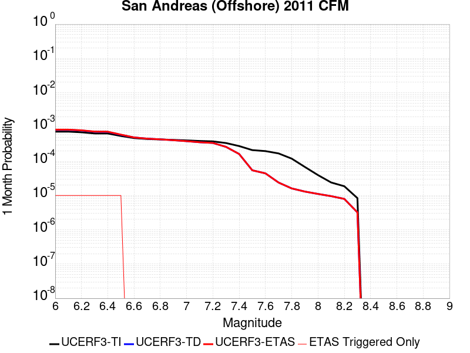 |  |  |

| Magnitude | 1 wk TI Prob | 1 wk TD Prob | 1 wk ETAS Prob | 1 wk ETAS/TD Gain | 1 wk ETAS Triggered Only | 1 mo TI Prob | 1 mo TD Prob | 1 mo ETAS Prob | 1 mo ETAS/TD Gain | 1 mo ETAS Triggered Only | 1 yr TI Prob | 1 yr TD Prob | 1 yr ETAS Prob | 1 yr ETAS/TD Gain | 1 yr ETAS Triggered Only | 10 yr TI Prob | 10 yr TD Prob | 10 yr ETAS Prob | 10 yr ETAS/TD Gain | 10 yr ETAS Triggered Only |
|-----|-----|-----|-----|-----|-----|-----|-----|-----|-----|-----|-----|-----|-----|-----|-----|-----|-----|-----|-----|-----|
| 6.0 | 1.7072787E-4 | 1.9226041E-4 | 2.3042102E-4 | 1.198484 | 3.816794E-5 | 7.3148566E-4 | 8.237154E-4 | 8.618519E-4 | 1.0462981 | 3.816794E-5 | 0.008869528 | 0.0099831335 | 0.010020921 | 1.0037851 | 3.816794E-5 | 0.085237645 | 0.09682738 | 0.096861854 | 1.000356 | 3.816794E-5 |
| 6.1 | 1.7072787E-4 | 1.9226041E-4 | 2.3042102E-4 | 1.198484 | 3.816794E-5 | 7.3148566E-4 | 8.237154E-4 | 8.618519E-4 | 1.0462981 | 3.816794E-5 | 0.008869528 | 0.0099831335 | 0.010020921 | 1.0037851 | 3.816794E-5 | 0.085237645 | 0.09682738 | 0.096861854 | 1.000356 | 3.816794E-5 |
| 6.2 | 1.6312556E-4 | 1.8407789E-4 | 2.222388E-4 | 1.2073085 | 3.816794E-5 | 6.989222E-4 | 7.8866904E-4 | 8.268069E-4 | 1.0483572 | 3.816794E-5 | 0.008476226 | 0.009560268 | 0.009598072 | 1.0039542 | 3.816794E-5 | 0.08160117 | 0.09284818 | 0.092882805 | 1.0003729 | 3.816794E-5 |
| 6.3 | 1.5103363E-4 | 1.6880741E-4 | 2.069689E-4 | 1.2260653 | 3.816794E-5 | 6.471264E-4 | 7.232619E-4 | 7.6140225E-4 | 1.0527338 | 3.816794E-5 | 0.007850339 | 0.008770605 | 0.008808438 | 1.0043136 | 3.816794E-5 | 0.075787395 | 0.085489064 | 0.08552397 | 1.0004083 | 3.816794E-5 |
| 6.4 | 1.5047993E-4 | 1.676667E-4 | 2.0582824E-4 | 1.2276036 | 3.816794E-5 | 6.4475456E-4 | 7.1837584E-4 | 7.5651635E-4 | 1.0530927 | 3.816794E-5 | 0.007821669 | 0.008711592 | 0.008749427 | 1.0043432 | 3.816794E-5 | 0.0755203 | 0.08496926 | 0.08500419 | 1.000411 | 3.816794E-5 |
| 6.5 | 1.2760791E-4 | 1.3735025E-4 | 1.7551295E-4 | 1.2778494 | 3.816794E-5 | 5.467764E-4 | 5.885125E-4 | 6.26658E-4 | 1.0648167 | 3.816794E-5 | 0.0066367025 | 0.0071418737 | 0.0071797688 | 1.0053061 | 3.816794E-5 | 0.064419635 | 0.07025001 | 0.0702855 | 1.0005051 | 3.816794E-5 |
| 6.6 | 1.1063525E-4 | 1.15566356E-4 | 1.15566356E-4 | 1.0 | 0.0 | 4.740649E-4 | 4.9519143E-4 | 4.9519143E-4 | 1.0 | 0.0 | 0.0057564764 | 0.006012491 | 0.006012491 | 1.0 | 0.0 | 0.05609626 | 0.05948894 | 0.05948894 | 1.0 | 0.0 |
| 6.7 | 1.0391049E-4 | 1.0645922E-4 | 1.0645922E-4 | 1.0 | 0.0 | 4.4525467E-4 | 4.5617504E-4 | 4.5617504E-4 | 1.0 | 0.0 | 0.0054075094 | 0.005539975 | 0.005539975 | 1.0 | 0.0 | 0.052778035 | 0.05498876 | 0.05498876 | 1.0 | 0.0 |
| 6.8 | 1.0096706E-4 | 1.01582686E-4 | 1.01582686E-4 | 1.0 | 0.0 | 4.3264418E-4 | 4.3528268E-4 | 4.3528268E-4 | 1.0 | 0.0 | 0.0052547283 | 0.005286866 | 0.005286866 | 1.0 | 0.0 | 0.051321987 | 0.052687574 | 0.052687574 | 1.0 | 0.0 |
| 6.9 | 9.800265E-5 | 9.588748E-5 | 9.588748E-5 | 1.0 | 0.0 | 4.1994374E-4 | 4.1088252E-4 | 4.1088252E-4 | 1.0 | 0.0 | 0.0051008356 | 0.0049911886 | 0.0049911886 | 1.0 | 0.0 | 0.049853306 | 0.05001504 | 0.05001504 | 1.0 | 0.0 |
| 7.0 | 9.4642375E-5 | 9.002143E-5 | 9.002143E-5 | 1.0 | 0.0 | 4.0554712E-4 | 3.8574997E-4 | 3.8574997E-4 | 1.0 | 0.0 | 0.004926363 | 0.0046865544 | 0.0046865544 | 1.0 | 0.0 | 0.048185747 | 0.047196057 | 0.047196057 | 1.0 | 0.0 |
| 7.1 | 9.0996844E-5 | 8.354169E-5 | 8.354169E-5 | 1.0 | 0.0 | 3.8992817E-4 | 3.5798753E-4 | 3.5798753E-4 | 1.0 | 0.0 | 0.004737046 | 0.004349944 | 0.004349944 | 1.0 | 0.0 | 0.04637333 | 0.044047635 | 0.044047635 | 1.0 | 0.0 |
| 7.2 | 8.848287E-5 | 7.9818135E-5 | 7.9818135E-5 | 1.0 | 0.0 | 3.791572E-4 | 3.4203375E-4 | 3.4203375E-4 | 1.0 | 0.0 | 0.004606472 | 0.0041564633 | 0.0041564633 | 1.0 | 0.0 | 0.045121472 | 0.042191572 | 0.042191572 | 1.0 | 0.0 |
| 7.3 | 7.9280784E-5 | 6.1276216E-5 | 6.1276216E-5 | 1.0 | 0.0 | 3.3973053E-4 | 2.625865E-4 | 2.625865E-4 | 1.0 | 0.0 | 0.004128377 | 0.0031924061 | 0.0031924061 | 1.0 | 0.0 | 0.040525194 | 0.032904375 | 0.032904375 | 1.0 | 0.0 |
| 7.4 | 6.468038E-5 | 3.7933212E-5 | 3.7933212E-5 | 1.0 | 0.0 | 2.771722E-4 | 1.625611E-4 | 1.625611E-4 | 1.0 | 0.0 | 0.0033693502 | 0.0019774425 | 0.0019774425 | 1.0 | 0.0 | 0.0331872 | 0.02082181 | 0.02082181 | 1.0 | 0.0 |
| 7.5 | 4.930574E-5 | 1.2703362E-5 | 1.2703362E-5 | 1.0 | 0.0 | 2.1129321E-4 | 5.444185E-5 | 5.444185E-5 | 1.0 | 0.0 | 0.0025694598 | 6.6262955E-4 | 6.6262955E-4 | 1.0 | 0.0 | 0.02539953 | 0.007481418 | 0.007481418 | 1.0 | 0.0 |
| 7.6 | 4.612566E-5 | 1.0336213E-5 | 1.0336213E-5 | 1.0 | 0.0 | 1.9766642E-4 | 4.429731E-5 | 4.429731E-5 | 1.0 | 0.0 | 0.0024039324 | 5.391877E-4 | 5.391877E-4 | 1.0 | 0.0 | 0.023780935 | 0.006172099 | 0.006172099 | 1.0 | 0.0 |
| 7.7 | 3.9435414E-5 | 5.574925E-6 | 5.574925E-6 | 1.0 | 0.0 | 1.6899795E-4 | 2.3892318E-5 | 2.3892318E-5 | 1.0 | 0.0 | 0.0020556084 | 2.9085035E-4 | 2.9085035E-4 | 1.0 | 0.0 | 0.020366974 | 0.0035420412 | 0.0035420412 | 1.0 | 0.0 |
| 7.8 | 2.7787428E-5 | 3.7553348E-6 | 3.7553348E-6 | 1.0 | 0.0 | 1.1908354E-4 | 1.6094193E-5 | 1.6094193E-5 | 1.0 | 0.0 | 0.0014488777 | 1.9592921E-4 | 1.9592921E-4 | 1.0 | 0.0 | 0.014394675 | 0.0023877125 | 0.0023877125 | 1.0 | 0.0 |
| 7.9 | 1.590671E-5 | 3.04085E-6 | 3.04085E-6 | 1.0 | 0.0 | 6.816983E-5 | 1.303215E-5 | 1.303215E-5 | 1.0 | 0.0 | 8.2965166E-4 | 1.586549E-4 | 1.586549E-4 | 1.0 | 0.0 | 0.008265611 | 0.001904262 | 0.001904262 | 1.0 | 0.0 |
| 8.0 | 9.193638E-6 | 2.5920847E-6 | 2.5920847E-6 | 1.0 | 0.0 | 3.940071E-5 | 1.1108887E-5 | 1.1108887E-5 | 1.0 | 0.0 | 4.7959806E-4 | 1.3524233E-4 | 1.3524233E-4 | 1.0 | 0.0 | 0.0047856434 | 0.0016115032 | 0.0016115032 | 1.0 | 0.0 |
| 8.1 | 5.601576E-6 | 2.2343472E-6 | 2.2343472E-6 | 1.0 | 0.0 | 2.4006533E-5 | 9.575739E-6 | 9.575739E-6 | 1.0 | 0.0 | 2.9224035E-4 | 1.16578405E-4 | 1.16578405E-4 | 1.0 | 0.0 | 0.0029185633 | 0.0014020674 | 0.0014020674 | 1.0 | 0.0 |
| 8.2 | 4.3508785E-6 | 1.857566E-6 | 1.857566E-6 | 1.0 | 0.0 | 1.864649E-5 | 7.960973E-6 | 7.960973E-6 | 1.0 | 0.0 | 2.2699735E-4 | 9.692056E-5 | 9.692056E-5 | 1.0 | 0.0 | 0.0022676561 | 0.0011594221 | 0.0011594221 | 1.0 | 0.0 |
| 8.3 | 1.9573292E-6 | 7.514906E-7 | 7.514906E-7 | 1.0 | 0.0 | 8.388526E-6 | 3.22067E-6 | 3.22067E-6 | 1.0 | 0.0 | 1.0212552E-4 | 3.921097E-5 | 3.921097E-5 | 1.0 | 0.0 | 0.001020786 | 4.640846E-4 | 4.640846E-4 | 1.0 | 0.0 |

## Rose Canyon
*[(top)](#table-of-contents)*

| 1 Week | 1 Month | 1 Year | 10 Year |
|-----|-----|-----|-----|
|  |  |  | 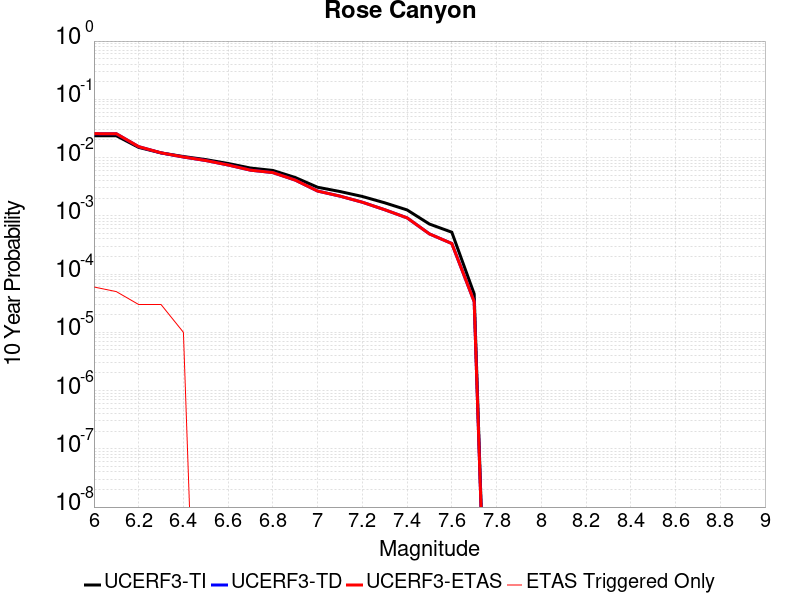 |

| Magnitude | 1 wk TI Prob | 1 wk TD Prob | 1 wk ETAS Prob | 1 wk ETAS/TD Gain | 1 wk ETAS Triggered Only | 1 mo TI Prob | 1 mo TD Prob | 1 mo ETAS Prob | 1 mo ETAS/TD Gain | 1 mo ETAS Triggered Only | 1 yr TI Prob | 1 yr TD Prob | 1 yr ETAS Prob | 1 yr ETAS/TD Gain | 1 yr ETAS Triggered Only | 10 yr TI Prob | 10 yr TD Prob | 10 yr ETAS Prob | 10 yr ETAS/TD Gain | 10 yr ETAS Triggered Only |
|-----|-----|-----|-----|-----|-----|-----|-----|-----|-----|-----|-----|-----|-----|-----|-----|-----|-----|-----|-----|-----|
| 6.0 | 4.5923203E-5 | 4.9714225E-5 | 4.9714225E-5 | 1.0 | 0.0 | 1.9679888E-4 | 2.1304491E-4 | 2.1304491E-4 | 1.0 | 0.0 | 0.0023933933 | 0.0025909345 | 0.0026290035 | 1.0146931 | 3.816794E-5 | 0.023677798 | 0.02563999 | 0.02567718 | 1.0014504 | 3.816794E-5 |
| 6.1 | 4.5923203E-5 | 4.9714225E-5 | 4.9714225E-5 | 1.0 | 0.0 | 1.9679888E-4 | 2.1304491E-4 | 2.1304491E-4 | 1.0 | 0.0 | 0.0023933933 | 0.0025909345 | 0.0026290035 | 1.0146931 | 3.816794E-5 | 0.023677798 | 0.02563999 | 0.02567718 | 1.0014504 | 3.816794E-5 |
| 6.2 | 2.8844734E-5 | 2.9668723E-5 | 2.9668723E-5 | 1.0 | 0.0 | 1.2361443E-4 | 1.2714567E-4 | 1.2714567E-4 | 1.0 | 0.0 | 0.0015039665 | 0.0015468939 | 0.0015468939 | 1.0 | 0.0 | 0.0149382865 | 0.015374276 | 0.015374276 | 1.0 | 0.0 |
| 6.3 | 2.3171577E-5 | 2.3161238E-5 | 2.3161238E-5 | 1.0 | 0.0 | 9.9302975E-5 | 9.9258745E-5 | 9.9258745E-5 | 1.0 | 0.0 | 0.0012083431 | 0.0012078186 | 0.0012078186 | 1.0 | 0.0 | 0.012017938 | 0.012022437 | 0.012022437 | 1.0 | 0.0 |
| 6.4 | 2.0066604E-5 | 1.9667024E-5 | 1.9667024E-5 | 1.0 | 0.0 | 8.599689E-5 | 8.4284584E-5 | 8.4284584E-5 | 1.0 | 0.0 | 0.0010465092 | 0.0010256917 | 0.0010256917 | 1.0 | 0.0 | 0.010415946 | 0.010217559 | 0.010217559 | 1.0 | 0.0 |
| 6.5 | 1.776989E-5 | 1.7113807E-5 | 1.7113807E-5 | 1.0 | 0.0 | 7.615444E-5 | 7.334287E-5 | 7.334287E-5 | 1.0 | 0.0 | 9.267859E-4 | 8.925905E-4 | 8.925905E-4 | 1.0 | 0.0 | 0.009229303 | 0.008896211 | 0.008896211 | 1.0 | 0.0 |
| 6.6 | 1.5227364E-5 | 1.433926E-5 | 1.433926E-5 | 1.0 | 0.0 | 6.52585E-5 | 6.1452556E-5 | 6.1452556E-5 | 1.0 | 0.0 | 7.942326E-4 | 7.479332E-4 | 7.479332E-4 | 1.0 | 0.0 | 0.007914 | 0.007458359 | 0.007458359 | 1.0 | 0.0 |
| 6.7 | 1.2703898E-5 | 1.1673274E-5 | 1.1673274E-5 | 1.0 | 0.0 | 5.4444143E-5 | 5.0027378E-5 | 5.0027378E-5 | 1.0 | 0.0 | 6.626558E-4 | 6.089174E-4 | 6.089174E-4 | 1.0 | 0.0 | 0.006606833 | 0.0060750856 | 0.0060750856 | 1.0 | 0.0 |
| 6.8 | 1.1554917E-5 | 1.0609337E-5 | 1.0609337E-5 | 1.0 | 0.0 | 4.9520135E-5 | 4.546782E-5 | 4.546782E-5 | 1.0 | 0.0 | 6.0274085E-4 | 5.5343413E-4 | 5.5343413E-4 | 1.0 | 0.0 | 0.0060110865 | 0.0055225673 | 0.0055225673 | 1.0 | 0.0 |
| 6.9 | 8.732078E-6 | 7.881357E-6 | 7.881357E-6 | 1.0 | 0.0 | 3.7422655E-5 | 3.3776825E-5 | 3.3776825E-5 | 1.0 | 0.0 | 4.5552556E-4 | 4.111582E-4 | 4.111582E-4 | 1.0 | 0.0 | 0.0045459294 | 0.0041048084 | 0.0041048084 | 1.0 | 0.0 |
| 7.0 | 5.9337494E-6 | 5.1074853E-6 | 5.1074853E-6 | 1.0 | 0.0 | 2.5430107E-5 | 2.188904E-5 | 2.188904E-5 | 1.0 | 0.0 | 3.0956755E-4 | 2.664666E-4 | 2.664666E-4 | 1.0 | 0.0 | 0.0030913667 | 0.0026614866 | 0.0026614866 | 1.0 | 0.0 |
| 7.1 | 5.013409E-6 | 4.1773833E-6 | 4.1773833E-6 | 1.0 | 0.0 | 2.1485863E-5 | 1.7902948E-5 | 1.7902948E-5 | 1.0 | 0.0 | 2.6155898E-4 | 2.179467E-4 | 2.179467E-4 | 1.0 | 0.0 | 0.0026125133 | 0.0021773411 | 0.0021773411 | 1.0 | 0.0 |
| 7.2 | 4.120763E-6 | 3.2821383E-6 | 3.2821383E-6 | 1.0 | 0.0 | 1.7660293E-5 | 1.4066231E-5 | 1.4066231E-5 | 1.0 | 0.0 | 2.1499286E-4 | 1.7124301E-4 | 1.7124301E-4 | 1.0 | 0.0 | 0.0021478499 | 0.00171112 | 0.00171112 | 1.0 | 0.0 |
| 7.3 | 3.2081239E-6 | 2.4405372E-6 | 2.4405372E-6 | 1.0 | 0.0 | 1.374903E-5 | 1.0459404E-5 | 1.0459404E-5 | 1.0 | 0.0 | 1.6738157E-4 | 1.2733586E-4 | 1.2733586E-4 | 1.0 | 0.0 | 0.0016725556 | 0.001272636 | 0.001272636 | 1.0 | 0.0 |
| 7.4 | 2.4194755E-6 | 1.7680634E-6 | 1.7680634E-6 | 1.0 | 0.0 | 1.0369139E-5 | 7.577393E-6 | 7.577393E-6 | 1.0 | 0.0 | 1.2623696E-4 | 9.2250906E-5 | 9.2250906E-5 | 1.0 | 0.0 | 0.0012616527 | 9.2213147E-4 | 9.2213147E-4 | 1.0 | 0.0 |
| 7.5 | 1.3842889E-6 | 9.3786275E-7 | 9.3786275E-7 | 1.0 | 0.0 | 5.9326535E-6 | 4.019406E-6 | 4.019406E-6 | 1.0 | 0.0 | 7.222766E-5 | 4.8935202E-5 | 4.8935202E-5 | 1.0 | 0.0 | 7.220419E-4 | 4.892478E-4 | 4.892478E-4 | 1.0 | 0.0 |
| 7.6 | 1.0021575E-6 | 6.411463E-7 | 6.411463E-7 | 1.0 | 0.0 | 4.2949537E-6 | 2.7477672E-6 | 2.7477672E-6 | 1.0 | 0.0 | 5.2289808E-5 | 3.3453573E-5 | 3.3453573E-5 | 1.0 | 0.0 | 5.2277505E-4 | 3.344875E-4 | 3.344875E-4 | 1.0 | 0.0 |
| 7.7 | 8.7620116E-8 | 6.4492404E-8 | 6.4492404E-8 | 1.0 | 0.0 | 3.7551473E-7 | 2.76396E-7 | 2.76396E-7 | 1.0 | 0.0 | 4.5718825E-6 | 3.3651165E-6 | 3.3651165E-6 | 1.0 | 0.0 | 4.5717883E-5 | 3.3650686E-5 | 3.3650686E-5 | 1.0 | 0.0 |

## Raymond
*[(top)](#table-of-contents)*

| 1 Week | 1 Month | 1 Year | 10 Year |
|-----|-----|-----|-----|
| 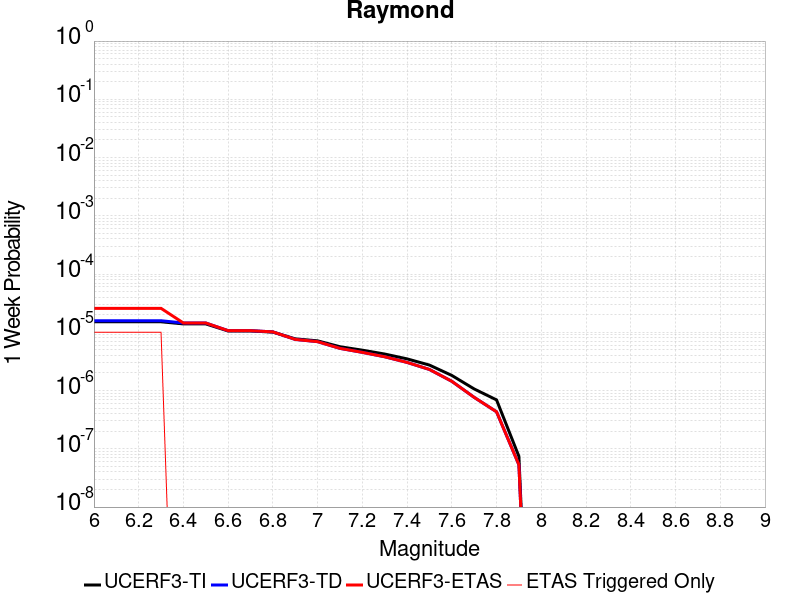 |  |  |  |

| Magnitude | 1 wk TI Prob | 1 wk TD Prob | 1 wk ETAS Prob | 1 wk ETAS/TD Gain | 1 wk ETAS Triggered Only | 1 mo TI Prob | 1 mo TD Prob | 1 mo ETAS Prob | 1 mo ETAS/TD Gain | 1 mo ETAS Triggered Only | 1 yr TI Prob | 1 yr TD Prob | 1 yr ETAS Prob | 1 yr ETAS/TD Gain | 1 yr ETAS Triggered Only | 10 yr TI Prob | 10 yr TD Prob | 10 yr ETAS Prob | 10 yr ETAS/TD Gain | 10 yr ETAS Triggered Only |
|-----|-----|-----|-----|-----|-----|-----|-----|-----|-----|-----|-----|-----|-----|-----|-----|-----|-----|-----|-----|-----|
| 6.0 | 1.5157413E-5 | 1.5810128E-5 | 5.3977463E-5 | 3.4141066 | 3.816794E-5 | 6.4958724E-5 | 6.7756075E-5 | 1.0592143E-4 | 1.5632757 | 3.816794E-5 | 7.905855E-4 | 8.2464307E-4 | 8.627795E-4 | 1.046246 | 3.816794E-5 | 0.007877788 | 0.008218348 | 0.008256203 | 1.004606 | 3.816794E-5 |
| 6.1 | 1.5157413E-5 | 1.5810128E-5 | 5.3977463E-5 | 3.4141066 | 3.816794E-5 | 6.4958724E-5 | 6.7756075E-5 | 1.0592143E-4 | 1.5632757 | 3.816794E-5 | 7.905855E-4 | 8.2464307E-4 | 8.627795E-4 | 1.046246 | 3.816794E-5 | 0.007877788 | 0.008218348 | 0.008256203 | 1.004606 | 3.816794E-5 |
| 6.2 | 1.5157413E-5 | 1.5810128E-5 | 5.3977463E-5 | 3.4141066 | 3.816794E-5 | 6.4958724E-5 | 6.7756075E-5 | 1.0592143E-4 | 1.5632757 | 3.816794E-5 | 7.905855E-4 | 8.2464307E-4 | 8.627795E-4 | 1.046246 | 3.816794E-5 | 0.007877788 | 0.008218348 | 0.008256203 | 1.004606 | 3.816794E-5 |
| 6.3 | 1.5157413E-5 | 1.5810128E-5 | 5.3977463E-5 | 3.4141066 | 3.816794E-5 | 6.4958724E-5 | 6.7756075E-5 | 1.0592143E-4 | 1.5632757 | 3.816794E-5 | 7.905855E-4 | 8.2464307E-4 | 8.627795E-4 | 1.046246 | 3.816794E-5 | 0.007877788 | 0.008218348 | 0.008256203 | 1.004606 | 3.816794E-5 |
| 6.4 | 1.3941944E-5 | 1.445469E-5 | 1.445469E-5 | 1.0 | 0.0 | 5.9749822E-5 | 6.1947336E-5 | 6.1947336E-5 | 1.0 | 0.0 | 7.2721124E-4 | 7.5397117E-4 | 7.5397117E-4 | 1.0 | 0.0 | 0.007248361 | 0.0075164647 | 0.0075164647 | 1.0 | 0.0 |
| 6.5 | 1.3941944E-5 | 1.445469E-5 | 1.445469E-5 | 1.0 | 0.0 | 5.9749822E-5 | 6.1947336E-5 | 6.1947336E-5 | 1.0 | 0.0 | 7.2721124E-4 | 7.5397117E-4 | 7.5397117E-4 | 1.0 | 0.0 | 0.007248361 | 0.0075164647 | 0.0075164647 | 1.0 | 0.0 |
| 6.6 | 1.0542609E-5 | 1.0671113E-5 | 1.0671113E-5 | 1.0 | 0.0 | 4.5181827E-5 | 4.573257E-5 | 4.573257E-5 | 1.0 | 0.0 | 5.499499E-4 | 5.5665727E-4 | 5.5665727E-4 | 1.0 | 0.0 | 0.005485909 | 0.00555319 | 0.00555319 | 1.0 | 0.0 |
| 6.7 | 1.0542609E-5 | 1.0671113E-5 | 1.0671113E-5 | 1.0 | 0.0 | 4.5181827E-5 | 4.573257E-5 | 4.573257E-5 | 1.0 | 0.0 | 5.499499E-4 | 5.5665727E-4 | 5.5665727E-4 | 1.0 | 0.0 | 0.005485909 | 0.00555319 | 0.00555319 | 1.0 | 0.0 |
| 6.8 | 1.0079132E-5 | 1.0176646E-5 | 1.0176646E-5 | 1.0 | 0.0 | 4.3195567E-5 | 4.3613498E-5 | 4.3613498E-5 | 1.0 | 0.0 | 5.257791E-4 | 5.3087034E-4 | 5.3087034E-4 | 1.0 | 0.0 | 0.0052453685 | 0.005296571 | 0.005296571 | 1.0 | 0.0 |
| 6.9 | 7.721598E-6 | 7.5489047E-6 | 7.5489047E-6 | 1.0 | 0.0 | 3.3092143E-5 | 3.2352054E-5 | 3.2352054E-5 | 1.0 | 0.0 | 4.0282236E-4 | 3.9381627E-4 | 3.9381627E-4 | 1.0 | 0.0 | 0.0040209293 | 0.0039313175 | 0.0039313175 | 1.0 | 0.0 |
| 7.0 | 7.137566E-6 | 6.9113057E-6 | 6.9113057E-6 | 1.0 | 0.0 | 3.058921E-5 | 2.961955E-5 | 2.961955E-5 | 1.0 | 0.0 | 3.7236E-4 | 3.6055944E-4 | 3.6055944E-4 | 1.0 | 0.0 | 0.0037173668 | 0.0035998628 | 0.0035998628 | 1.0 | 0.0 |
| 7.1 | 5.654976E-6 | 5.29954E-6 | 5.29954E-6 | 1.0 | 0.0 | 2.4235387E-5 | 2.2712118E-5 | 2.2712118E-5 | 1.0 | 0.0 | 2.9502588E-4 | 2.7648517E-4 | 2.7648517E-4 | 1.0 | 0.0 | 0.0029463451 | 0.002761443 | 0.002761443 | 1.0 | 0.0 |
| 7.2 | 4.9358455E-6 | 4.5266574E-6 | 4.5266574E-6 | 1.0 | 0.0 | 2.1153453E-5 | 1.9399817E-5 | 1.9399817E-5 | 1.0 | 0.0 | 2.5751285E-4 | 2.3616731E-4 | 2.3616731E-4 | 1.0 | 0.0 | 0.0025721465 | 0.0023591854 | 0.0023591854 | 1.0 | 0.0 |
| 7.3 | 4.2368597E-6 | 3.8056164E-6 | 3.8056164E-6 | 1.0 | 0.0 | 1.8157843E-5 | 1.6309683E-5 | 1.6309683E-5 | 1.0 | 0.0 | 2.2104931E-4 | 1.9855241E-4 | 1.9855241E-4 | 1.0 | 0.0 | 0.0022082955 | 0.0019837688 | 0.0019837688 | 1.0 | 0.0 |
| 7.4 | 3.4999923E-6 | 3.043744E-6 | 3.043744E-6 | 1.0 | 0.0 | 1.49998805E-5 | 1.3044552E-5 | 1.3044552E-5 | 1.0 | 0.0 | 1.8260824E-4 | 1.5880594E-4 | 1.5880594E-4 | 1.0 | 0.0 | 0.0018245826 | 0.0015869403 | 0.0015869403 | 1.0 | 0.0 |
| 7.5 | 2.738017E-6 | 2.3020468E-6 | 2.3020468E-6 | 1.0 | 0.0 | 1.1734306E-5 | 9.865878E-6 | 9.865878E-6 | 1.0 | 0.0 | 1.428558E-4 | 1.2011051E-4 | 1.2011051E-4 | 1.0 | 0.0 | 0.0014276401 | 0.0012004703 | 0.0012004703 | 1.0 | 0.0 |
| 7.6 | 1.8186392E-6 | 1.442312E-6 | 1.442312E-6 | 1.0 | 0.0 | 7.794145E-6 | 6.181323E-6 | 6.181323E-6 | 1.0 | 0.0 | 9.488958E-5 | 7.5255055E-5 | 7.5255055E-5 | 1.0 | 0.0 | 9.4849075E-4 | 7.523072E-4 | 7.523072E-4 | 1.0 | 0.0 |
| 7.7 | 1.0660348E-6 | 7.6438056E-7 | 7.6438056E-7 | 1.0 | 0.0 | 4.5687125E-6 | 3.2759126E-6 | 3.2759126E-6 | 1.0 | 0.0 | 5.5622655E-5 | 3.9883522E-5 | 3.9883522E-5 | 1.0 | 0.0 | 5.5608735E-4 | 3.9877277E-4 | 3.9877277E-4 | 1.0 | 0.0 |
| 7.8 | 6.913602E-7 | 4.3204133E-7 | 4.3204133E-7 | 1.0 | 0.0 | 2.962969E-6 | 1.8516045E-6 | 1.8516045E-6 | 1.0 | 0.0 | 3.607355E-5 | 2.2543056E-5 | 2.2543056E-5 | 1.0 | 0.0 | 3.6067693E-4 | 2.2541556E-4 | 2.2541556E-4 | 1.0 | 0.0 |
| 7.9 | 7.425201E-8 | 5.3222113E-8 | 5.3222113E-8 | 1.0 | 0.0 | 3.1822285E-7 | 2.2809476E-7 | 2.2809476E-7 | 1.0 | 0.0 | 3.874356E-6 | 2.7770516E-6 | 2.7770516E-6 | 1.0 | 0.0 | 3.8742884E-5 | 2.7770298E-5 | 2.7770298E-5 | 1.0 | 0.0 |

## Great Valley 04b Gordon Valley
*[(top)](#table-of-contents)*

| 1 Week | 1 Month | 1 Year | 10 Year |
|-----|-----|-----|-----|
|  | 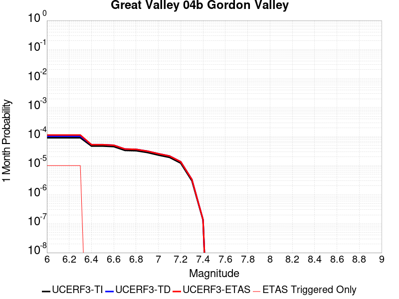 |  |  |

| Magnitude | 1 wk TI Prob | 1 wk TD Prob | 1 wk ETAS Prob | 1 wk ETAS/TD Gain | 1 wk ETAS Triggered Only | 1 mo TI Prob | 1 mo TD Prob | 1 mo ETAS Prob | 1 mo ETAS/TD Gain | 1 mo ETAS Triggered Only | 1 yr TI Prob | 1 yr TD Prob | 1 yr ETAS Prob | 1 yr ETAS/TD Gain | 1 yr ETAS Triggered Only | 10 yr TI Prob | 10 yr TD Prob | 10 yr ETAS Prob | 10 yr ETAS/TD Gain | 10 yr ETAS Triggered Only |
|-----|-----|-----|-----|-----|-----|-----|-----|-----|-----|-----|-----|-----|-----|-----|-----|-----|-----|-----|-----|-----|
| 6.0 | 2.1181217E-5 | 2.3981953E-5 | 6.2148974E-5 | 2.5914893 | 3.816794E-5 | 9.077348E-5 | 1.0277669E-4 | 1.4094071E-4 | 1.3713295 | 3.816794E-5 | 0.0011046068 | 0.0012507546 | 0.0012888749 | 1.0304778 | 3.816794E-5 | 0.010991322 | 0.012453599 | 0.012491291 | 1.0030266 | 3.816794E-5 |
| 6.1 | 2.1181217E-5 | 2.3981953E-5 | 6.2148974E-5 | 2.5914893 | 3.816794E-5 | 9.077348E-5 | 1.0277669E-4 | 1.4094071E-4 | 1.3713295 | 3.816794E-5 | 0.0011046068 | 0.0012507546 | 0.0012888749 | 1.0304778 | 3.816794E-5 | 0.010991322 | 0.012453599 | 0.012491291 | 1.0030266 | 3.816794E-5 |
| 6.2 | 2.1181217E-5 | 2.3981953E-5 | 6.2148974E-5 | 2.5914893 | 3.816794E-5 | 9.077348E-5 | 1.0277669E-4 | 1.4094071E-4 | 1.3713295 | 3.816794E-5 | 0.0011046068 | 0.0012507546 | 0.0012888749 | 1.0304778 | 3.816794E-5 | 0.010991322 | 0.012453599 | 0.012491291 | 1.0030266 | 3.816794E-5 |
| 6.3 | 2.1181217E-5 | 2.3981953E-5 | 6.2148974E-5 | 2.5914893 | 3.816794E-5 | 9.077348E-5 | 1.0277669E-4 | 1.4094071E-4 | 1.3713295 | 3.816794E-5 | 0.0011046068 | 0.0012507546 | 0.0012888749 | 1.0304778 | 3.816794E-5 | 0.010991322 | 0.012453599 | 0.012491291 | 1.0030266 | 3.816794E-5 |
| 6.4 | 1.0988268E-5 | 1.2254499E-5 | 1.2254499E-5 | 1.0 | 0.0 | 4.7091726E-5 | 5.2518313E-5 | 5.2518313E-5 | 1.0 | 0.0 | 5.731909E-4 | 6.392388E-4 | 6.392388E-4 | 1.0 | 0.0 | 0.005717147 | 0.0063755875 | 0.0063755875 | 1.0 | 0.0 |
| 6.5 | 1.0988268E-5 | 1.2254499E-5 | 1.2254499E-5 | 1.0 | 0.0 | 4.7091726E-5 | 5.2518313E-5 | 5.2518313E-5 | 1.0 | 0.0 | 5.731909E-4 | 6.392388E-4 | 6.392388E-4 | 1.0 | 0.0 | 0.005717147 | 0.0063755875 | 0.0063755875 | 1.0 | 0.0 |
| 6.6 | 1.0517822E-5 | 1.1724062E-5 | 1.1724062E-5 | 1.0 | 0.0 | 4.5075605E-5 | 5.02451E-5 | 5.02451E-5 | 1.0 | 0.0 | 5.4865726E-4 | 6.11578E-4 | 6.11578E-4 | 1.0 | 0.0 | 0.0054730466 | 0.0061005033 | 0.0061005033 | 1.0 | 0.0 |
| 6.7 | 7.789219E-6 | 8.6776445E-6 | 8.6776445E-6 | 1.0 | 0.0 | 3.3381937E-5 | 3.7189402E-5 | 3.7189402E-5 | 1.0 | 0.0 | 4.063493E-4 | 4.526921E-4 | 4.526921E-4 | 1.0 | 0.0 | 0.004056071 | 0.0045182165 | 0.0045182165 | 1.0 | 0.0 |
| 6.8 | 7.5850853E-6 | 8.452389E-6 | 8.452389E-6 | 1.0 | 0.0 | 3.2507105E-5 | 3.622405E-5 | 3.622405E-5 | 1.0 | 0.0 | 3.957021E-4 | 4.409437E-4 | 4.409437E-4 | 1.0 | 0.0 | 0.0039499826 | 0.0044012 | 0.0044012 | 1.0 | 0.0 |
| 6.9 | 6.604105E-6 | 7.3585493E-6 | 7.3585493E-6 | 1.0 | 0.0 | 2.8303E-5 | 3.153628E-5 | 3.153628E-5 | 1.0 | 0.0 | 3.4453452E-4 | 3.8389044E-4 | 3.8389044E-4 | 1.0 | 0.0 | 0.0034400085 | 0.0038326595 | 0.0038326595 | 1.0 | 0.0 |
| 7.0 | 5.3701115E-6 | 5.9884183E-6 | 5.9884183E-6 | 1.0 | 0.0 | 2.301456E-5 | 2.5664414E-5 | 2.5664414E-5 | 1.0 | 0.0 | 2.8016625E-4 | 3.1242234E-4 | 3.1242234E-4 | 1.0 | 0.0 | 0.0027981328 | 0.00312012 | 0.00312012 | 1.0 | 0.0 |
| 7.1 | 4.4685607E-6 | 4.986478E-6 | 4.986478E-6 | 1.0 | 0.0 | 1.9150835E-5 | 2.1370459E-5 | 2.1370459E-5 | 1.0 | 0.0 | 2.3313647E-4 | 2.6015675E-4 | 2.6015675E-4 | 1.0 | 0.0 | 0.0023289204 | 0.0025987667 | 0.0025987667 | 1.0 | 0.0 |
| 7.2 | 2.833378E-6 | 3.164419E-6 | 3.164419E-6 | 1.0 | 0.0 | 1.2142991E-5 | 1.3561736E-5 | 1.3561736E-5 | 1.0 | 0.0 | 1.4783088E-4 | 1.6510337E-4 | 1.6510337E-4 | 1.0 | 0.0 | 0.0014773258 | 0.0016499789 | 0.0016499789 | 1.0 | 0.0 |
| 7.3 | 7.0087293E-7 | 7.7728157E-7 | 7.7728157E-7 | 1.0 | 0.0 | 3.0037377E-6 | 3.3312049E-6 | 3.3312049E-6 | 1.0 | 0.0 | 3.656989E-5 | 4.0557123E-5 | 4.0557123E-5 | 1.0 | 0.0 | 3.6563876E-4 | 4.055422E-4 | 4.055422E-4 | 1.0 | 0.0 |
| 7.4 | 3.112171E-8 | 3.2068368E-8 | 3.2068368E-8 | 1.0 | 0.0 | 1.3337875E-7 | 1.3743585E-7 | 1.3743585E-7 | 1.0 | 0.0 | 1.6238852E-6 | 1.6732803E-6 | 1.6732803E-6 | 1.0 | 0.0 | 1.6238733E-5 | 1.6732685E-5 | 1.6732685E-5 | 1.0 | 0.0 |

## Santa Cruz Island
*[(top)](#table-of-contents)*

| 1 Week | 1 Month | 1 Year | 10 Year |
|-----|-----|-----|-----|
|  | 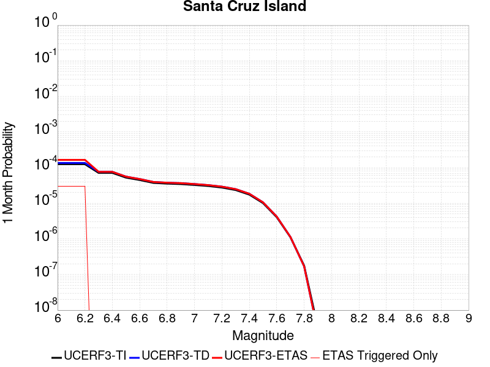 |  |  |

| Magnitude | 1 wk TI Prob | 1 wk TD Prob | 1 wk ETAS Prob | 1 wk ETAS/TD Gain | 1 wk ETAS Triggered Only | 1 mo TI Prob | 1 mo TD Prob | 1 mo ETAS Prob | 1 mo ETAS/TD Gain | 1 mo ETAS Triggered Only | 1 yr TI Prob | 1 yr TD Prob | 1 yr ETAS Prob | 1 yr ETAS/TD Gain | 1 yr ETAS Triggered Only | 10 yr TI Prob | 10 yr TD Prob | 10 yr ETAS Prob | 10 yr ETAS/TD Gain | 10 yr ETAS Triggered Only |
|-----|-----|-----|-----|-----|-----|-----|-----|-----|-----|-----|-----|-----|-----|-----|-----|-----|-----|-----|-----|-----|
| 6.0 | 2.9164563E-5 | 3.1599742E-5 | 6.976648E-5 | 2.2078178 | 3.816794E-5 | 1.2498499E-4 | 1.3542121E-4 | 1.7358398E-4 | 1.2818079 | 3.816794E-5 | 0.0015206301 | 0.0016476426 | 0.0016857475 | 1.023127 | 3.816794E-5 | 0.015102667 | 0.016368 | 0.016405541 | 1.0022937 | 3.816794E-5 |
| 6.1 | 2.9164563E-5 | 3.1599742E-5 | 6.976648E-5 | 2.2078178 | 3.816794E-5 | 1.2498499E-4 | 1.3542121E-4 | 1.7358398E-4 | 1.2818079 | 3.816794E-5 | 0.0015206301 | 0.0016476426 | 0.0016857475 | 1.023127 | 3.816794E-5 | 0.015102667 | 0.016368 | 0.016405541 | 1.0022937 | 3.816794E-5 |
| 6.2 | 2.9164563E-5 | 3.1599742E-5 | 6.976648E-5 | 2.2078178 | 3.816794E-5 | 1.2498499E-4 | 1.3542121E-4 | 1.7358398E-4 | 1.2818079 | 3.816794E-5 | 0.0015206301 | 0.0016476426 | 0.0016857475 | 1.023127 | 3.816794E-5 | 0.015102667 | 0.016368 | 0.016405541 | 1.0022937 | 3.816794E-5 |
| 6.3 | 1.6635553E-5 | 1.780436E-5 | 1.780436E-5 | 1.0 | 0.0 | 7.1293274E-5 | 7.630226E-5 | 7.630226E-5 | 1.0 | 0.0 | 8.6765E-4 | 9.2860236E-4 | 9.2860236E-4 | 1.0 | 0.0 | 0.008642701 | 0.009249094 | 0.009249094 | 1.0 | 0.0 |
| 6.4 | 1.6635553E-5 | 1.780436E-5 | 1.780436E-5 | 1.0 | 0.0 | 7.1293274E-5 | 7.630226E-5 | 7.630226E-5 | 1.0 | 0.0 | 8.6765E-4 | 9.2860236E-4 | 9.2860236E-4 | 1.0 | 0.0 | 0.008642701 | 0.009249094 | 0.009249094 | 1.0 | 0.0 |
| 6.5 | 1.2238748E-5 | 1.3042995E-5 | 1.3042995E-5 | 1.0 | 0.0 | 5.2450723E-5 | 5.5897377E-5 | 5.5897377E-5 | 1.0 | 0.0 | 6.3840044E-4 | 6.8034173E-4 | 6.8034173E-4 | 1.0 | 0.0 | 0.0063656955 | 0.0067829876 | 0.0067829876 | 1.0 | 0.0 |
| 6.6 | 1.0489767E-5 | 1.1156636E-5 | 1.1156636E-5 | 1.0 | 0.0 | 4.495537E-5 | 4.781329E-5 | 4.781329E-5 | 1.0 | 0.0 | 5.4719415E-4 | 5.819735E-4 | 5.819735E-4 | 1.0 | 0.0 | 0.005458487 | 0.0058047357 | 0.0058047357 | 1.0 | 0.0 |
| 6.7 | 8.699222E-6 | 9.236782E-6 | 9.236782E-6 | 1.0 | 0.0 | 3.7281847E-5 | 3.958561E-5 | 3.958561E-5 | 1.0 | 0.0 | 4.5381195E-4 | 4.8184878E-4 | 4.8184878E-4 | 1.0 | 0.0 | 0.0045288634 | 0.004808108 | 0.004808108 | 1.0 | 0.0 |
| 6.8 | 8.307732E-6 | 8.8169045E-6 | 8.8169045E-6 | 1.0 | 0.0 | 3.560408E-5 | 3.7786187E-5 | 3.7786187E-5 | 1.0 | 0.0 | 4.3339343E-4 | 4.5995016E-4 | 4.5995016E-4 | 1.0 | 0.0 | 0.004325492 | 0.0045900354 | 0.0045900354 | 1.0 | 0.0 |
| 6.9 | 8.073121E-6 | 8.564939E-6 | 8.564939E-6 | 1.0 | 0.0 | 3.459863E-5 | 3.6706366E-5 | 3.6706366E-5 | 1.0 | 0.0 | 4.2115687E-4 | 4.468088E-4 | 4.468088E-4 | 1.0 | 0.0 | 0.004203596 | 0.004459156 | 0.004459156 | 1.0 | 0.0 |
| 7.0 | 7.617019E-6 | 8.074664E-6 | 8.074664E-6 | 1.0 | 0.0 | 3.264396E-5 | 3.4605247E-5 | 3.4605247E-5 | 1.0 | 0.0 | 3.9736772E-4 | 4.212378E-4 | 4.212378E-4 | 1.0 | 0.0 | 0.003966579 | 0.0042044413 | 0.0042044413 | 1.0 | 0.0 |
| 7.1 | 7.1224836E-6 | 7.545788E-6 | 7.545788E-6 | 1.0 | 0.0 | 3.052457E-5 | 3.2338692E-5 | 3.2338692E-5 | 1.0 | 0.0 | 3.715733E-4 | 3.936528E-4 | 3.936528E-4 | 1.0 | 0.0 | 0.003709526 | 0.003929598 | 0.003929598 | 1.0 | 0.0 |
| 7.2 | 6.441115E-6 | 6.8273835E-6 | 6.8273835E-6 | 1.0 | 0.0 | 2.7604487E-5 | 2.9259887E-5 | 2.9259887E-5 | 1.0 | 0.0 | 3.360328E-4 | 3.5618112E-4 | 3.5618112E-4 | 1.0 | 0.0 | 0.0033552512 | 0.003556131 | 0.003556131 | 1.0 | 0.0 |
| 7.3 | 5.494274E-6 | 5.8199944E-6 | 5.8199944E-6 | 1.0 | 0.0 | 2.3546674E-5 | 2.4942596E-5 | 2.4942596E-5 | 1.0 | 0.0 | 2.8664304E-4 | 3.0363398E-4 | 3.0363398E-4 | 1.0 | 0.0 | 0.002862736 | 0.0030322142 | 0.0030322142 | 1.0 | 0.0 |
| 7.4 | 4.0802624E-6 | 4.312256E-6 | 4.312256E-6 | 1.0 | 0.0 | 1.7486722E-5 | 1.8480967E-5 | 1.8480967E-5 | 1.0 | 0.0 | 2.1288003E-4 | 2.2498262E-4 | 2.2498262E-4 | 1.0 | 0.0 | 0.0021267622 | 0.0022475575 | 0.0022475575 | 1.0 | 0.0 |
| 7.5 | 2.3584746E-6 | 2.4753094E-6 | 2.4753094E-6 | 1.0 | 0.0 | 1.0107709E-5 | 1.0608426E-5 | 1.0608426E-5 | 1.0 | 0.0 | 1.2305441E-4 | 1.2915E-4 | 1.2915E-4 | 1.0 | 0.0 | 0.0012298629 | 0.0012907543 | 0.0012907543 | 1.0 | 0.0 |
| 7.6 | 9.4981914E-7 | 9.86093E-7 | 9.86093E-7 | 1.0 | 0.0 | 4.0706473E-6 | 4.2261063E-6 | 4.2261063E-6 | 1.0 | 0.0 | 4.9559E-5 | 5.145164E-5 | 5.145164E-5 | 1.0 | 0.0 | 4.954795E-4 | 5.1439856E-4 | 5.1439856E-4 | 1.0 | 0.0 |
| 7.7 | 2.6013532E-7 | 2.6416603E-7 | 2.6416603E-7 | 1.0 | 0.0 | 1.1148652E-6 | 1.1321397E-6 | 1.1321397E-6 | 1.0 | 0.0 | 1.3573399E-5 | 1.3783714E-5 | 1.3783714E-5 | 1.0 | 0.0 | 1.357257E-4 | 1.3782867E-4 | 1.3782867E-4 | 1.0 | 0.0 |
| 7.8 | 4.1522263E-8 | 3.965679E-8 | 3.965679E-8 | 1.0 | 0.0 | 1.7795254E-7 | 1.6995766E-7 | 1.6995766E-7 | 1.0 | 0.0 | 2.16657E-6 | 2.0692328E-6 | 2.0692328E-6 | 1.0 | 0.0 | 2.1665488E-5 | 2.0692156E-5 | 2.0692156E-5 | 1.0 | 0.0 |
| 7.9 | 7.7242046E-10 | 5.9468175E-10 | 5.9468175E-10 | 1.0 | 0.0 | 3.3103735E-9 | 2.5486364E-9 | 2.5486364E-9 | 1.0 | 0.0 | 4.0303796E-8 | 3.1029646E-8 | 3.1029646E-8 | 1.0 | 0.0 | 4.030379E-7 | 3.1029643E-7 | 3.1029643E-7 | 1.0 | 0.0 |

## Santa Rosa Island
*[(top)](#table-of-contents)*

| 1 Week | 1 Month | 1 Year | 10 Year |
|-----|-----|-----|-----|
|  |  | 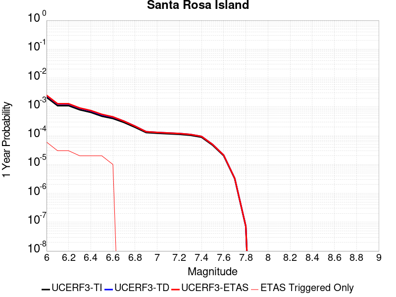 |  |

| Magnitude | 1 wk TI Prob | 1 wk TD Prob | 1 wk ETAS Prob | 1 wk ETAS/TD Gain | 1 wk ETAS Triggered Only | 1 mo TI Prob | 1 mo TD Prob | 1 mo ETAS Prob | 1 mo ETAS/TD Gain | 1 mo ETAS Triggered Only | 1 yr TI Prob | 1 yr TD Prob | 1 yr ETAS Prob | 1 yr ETAS/TD Gain | 1 yr ETAS Triggered Only | 10 yr TI Prob | 10 yr TD Prob | 10 yr ETAS Prob | 10 yr ETAS/TD Gain | 10 yr ETAS Triggered Only |
|-----|-----|-----|-----|-----|-----|-----|-----|-----|-----|-----|-----|-----|-----|-----|-----|-----|-----|-----|-----|-----|
| 6.0 | 4.1143165E-5 | 4.7091133E-5 | 4.7091133E-5 | 1.0 | 0.0 | 1.7631594E-4 | 2.0180465E-4 | 2.0180465E-4 | 1.0 | 0.0 | 0.002144533 | 0.0024544 | 0.0024924742 | 1.0155127 | 3.816794E-5 | 0.021239553 | 0.024293551 | 0.024330791 | 1.0015329 | 3.816794E-5 |
| 6.1 | 2.1061249E-5 | 2.3864959E-5 | 2.3864959E-5 | 1.0 | 0.0 | 9.0259375E-5 | 1.0227455E-4 | 1.0227455E-4 | 1.0 | 0.0 | 0.0010983539 | 0.0012445104 | 0.0012445104 | 1.0 | 0.0 | 0.01092941 | 0.012378449 | 0.012378449 | 1.0 | 0.0 |
| 6.2 | 2.1061249E-5 | 2.3864959E-5 | 2.3864959E-5 | 1.0 | 0.0 | 9.0259375E-5 | 1.0227455E-4 | 1.0227455E-4 | 1.0 | 0.0 | 0.0010983539 | 0.0012445104 | 0.0012445104 | 1.0 | 0.0 | 0.01092941 | 0.012378449 | 0.012378449 | 1.0 | 0.0 |
| 6.3 | 1.5158236E-5 | 1.7074419E-5 | 1.7074419E-5 | 1.0 | 0.0 | 6.496225E-5 | 7.3174095E-5 | 7.3174095E-5 | 1.0 | 0.0 | 7.906284E-4 | 8.905424E-4 | 8.905424E-4 | 1.0 | 0.0 | 0.007878214 | 0.008870989 | 0.008870989 | 1.0 | 0.0 |
| 6.4 | 1.2341918E-5 | 1.3852917E-5 | 1.3852917E-5 | 1.0 | 0.0 | 5.2892858E-5 | 5.9368336E-5 | 5.9368336E-5 | 1.0 | 0.0 | 6.437803E-4 | 7.225779E-4 | 7.225779E-4 | 1.0 | 0.0 | 0.006419184 | 0.007203121 | 0.007203121 | 1.0 | 0.0 |
| 6.5 | 9.061158E-6 | 1.0117031E-5 | 1.0117031E-5 | 1.0 | 0.0 | 3.883296E-5 | 4.3358013E-5 | 4.3358013E-5 | 1.0 | 0.0 | 4.726887E-4 | 5.277613E-4 | 5.277613E-4 | 1.0 | 0.0 | 0.004716845 | 0.0052656173 | 0.0052656173 | 1.0 | 0.0 |
| 6.6 | 7.5461685E-6 | 8.400733E-6 | 8.400733E-6 | 1.0 | 0.0 | 3.2340322E-5 | 3.600267E-5 | 3.600267E-5 | 1.0 | 0.0 | 3.936723E-4 | 4.3824865E-4 | 4.3824865E-4 | 1.0 | 0.0 | 0.003929756 | 0.0043742736 | 0.0043742736 | 1.0 | 0.0 |
| 6.7 | 5.5023775E-6 | 6.087381E-6 | 6.087381E-6 | 1.0 | 0.0 | 2.3581404E-5 | 2.6088532E-5 | 2.6088532E-5 | 1.0 | 0.0 | 2.8706578E-4 | 3.1758484E-4 | 3.1758484E-4 | 1.0 | 0.0 | 0.0028669522 | 0.0031716314 | 0.0031716314 | 1.0 | 0.0 |
| 6.8 | 3.7351679E-6 | 4.0831405E-6 | 4.0831405E-6 | 1.0 | 0.0 | 1.6007763E-5 | 1.749907E-5 | 1.749907E-5 | 1.0 | 0.0 | 1.948771E-4 | 2.1303284E-4 | 2.1303284E-4 | 1.0 | 0.0 | 0.0019470629 | 0.0021285315 | 0.0021285315 | 1.0 | 0.0 |
| 6.9 | 2.456366E-6 | 2.6292705E-6 | 2.6292705E-6 | 1.0 | 0.0 | 1.0527241E-5 | 1.1268254E-5 | 1.1268254E-5 | 1.0 | 0.0 | 1.2816161E-4 | 1.3718237E-4 | 1.3718237E-4 | 1.0 | 0.0 | 0.0012808773 | 0.0013709799 | 0.0013709799 | 1.0 | 0.0 |
| 7.0 | 2.3245157E-6 | 2.4827782E-6 | 2.4827782E-6 | 1.0 | 0.0 | 9.962172E-6 | 1.0640435E-5 | 1.0640435E-5 | 1.0 | 0.0 | 1.2128269E-4 | 1.2953962E-4 | 1.2953962E-4 | 1.0 | 0.0 | 0.0012121652 | 0.0012946434 | 0.0012946434 | 1.0 | 0.0 |
| 7.1 | 2.2248344E-6 | 2.37325E-6 | 2.37325E-6 | 1.0 | 0.0 | 9.53497E-6 | 1.0171032E-5 | 1.0171032E-5 | 1.0 | 0.0 | 1.1608207E-4 | 1.2382529E-4 | 1.2382529E-4 | 1.0 | 0.0 | 0.0011602144 | 0.001237565 | 0.001237565 | 1.0 | 0.0 |
| 7.2 | 2.1350402E-6 | 2.276154E-6 | 2.276154E-6 | 1.0 | 0.0 | 9.150141E-6 | 9.754909E-6 | 9.754909E-6 | 1.0 | 0.0 | 1.1139726E-4 | 1.1875956E-4 | 1.1875956E-4 | 1.0 | 0.0 | 0.0011134144 | 0.0011869629 | 0.0011869629 | 1.0 | 0.0 |
| 7.3 | 1.9793572E-6 | 2.108719E-6 | 2.108719E-6 | 1.0 | 0.0 | 8.482932E-6 | 9.037336E-6 | 9.037336E-6 | 1.0 | 0.0 | 1.032748E-4 | 1.10024026E-4 | 1.10024026E-4 | 1.0 | 0.0 | 0.0010322682 | 0.0010996973 | 0.0010996973 | 1.0 | 0.0 |
| 7.4 | 1.6951194E-6 | 1.8045733E-6 | 1.8045733E-6 | 1.0 | 0.0 | 7.264777E-6 | 7.733863E-6 | 7.733863E-6 | 1.0 | 0.0 | 8.844508E-5 | 9.415573E-5 | 9.415573E-5 | 1.0 | 0.0 | 8.840988E-4 | 9.4116E-4 | 9.4116E-4 | 1.0 | 0.0 |
| 7.5 | 8.987207E-7 | 9.5122147E-7 | 9.5122147E-7 | 1.0 | 0.0 | 3.8516546E-6 | 4.076657E-6 | 4.076657E-6 | 1.0 | 0.0 | 4.6892885E-5 | 4.963218E-5 | 4.963218E-5 | 1.0 | 0.0 | 4.688299E-4 | 4.9621216E-4 | 4.9621216E-4 | 1.0 | 0.0 |
| 7.6 | 3.8783037E-7 | 4.052932E-7 | 4.052932E-7 | 1.0 | 0.0 | 1.6621291E-6 | 1.7369698E-6 | 1.7369698E-6 | 1.0 | 0.0 | 2.0236233E-5 | 2.1147409E-5 | 2.1147409E-5 | 1.0 | 0.0 | 2.023439E-4 | 2.1145462E-4 | 2.1145462E-4 | 1.0 | 0.0 |
| 7.7 | 6.181804E-8 | 6.339035E-8 | 6.339035E-8 | 1.0 | 0.0 | 2.6493444E-7 | 2.7167292E-7 | 2.7167292E-7 | 1.0 | 0.0 | 3.225572E-6 | 3.3076128E-6 | 3.3076128E-6 | 1.0 | 0.0 | 3.225525E-5 | 3.307564E-5 | 3.307564E-5 | 1.0 | 0.0 |
| 7.8 | 1.3704449E-9 | 1.3964153E-9 | 1.3964153E-9 | 1.0 | 0.0 | 5.873335E-9 | 5.984637E-9 | 5.984637E-9 | 1.0 | 0.0 | 7.1507856E-8 | 7.286295E-8 | 7.286295E-8 | 1.0 | 0.0 | 7.1507833E-7 | 7.286294E-7 | 7.286294E-7 | 1.0 | 0.0 |

## San Juan
*[(top)](#table-of-contents)*

| 1 Week | 1 Month | 1 Year | 10 Year |
|-----|-----|-----|-----|
|  |  |  |  |

| Magnitude | 1 wk TI Prob | 1 wk TD Prob | 1 wk ETAS Prob | 1 wk ETAS/TD Gain | 1 wk ETAS Triggered Only | 1 mo TI Prob | 1 mo TD Prob | 1 mo ETAS Prob | 1 mo ETAS/TD Gain | 1 mo ETAS Triggered Only | 1 yr TI Prob | 1 yr TD Prob | 1 yr ETAS Prob | 1 yr ETAS/TD Gain | 1 yr ETAS Triggered Only | 10 yr TI Prob | 10 yr TD Prob | 10 yr ETAS Prob | 10 yr ETAS/TD Gain | 10 yr ETAS Triggered Only |
|-----|-----|-----|-----|-----|-----|-----|-----|-----|-----|-----|-----|-----|-----|-----|-----|-----|-----|-----|-----|-----|
| 6.0 | 8.682808E-6 | 8.7491635E-6 | 8.7491635E-6 | 1.0 | 0.0 | 3.72115E-5 | 3.74959E-5 | 3.74959E-5 | 1.0 | 0.0 | 4.5295584E-4 | 4.564218E-4 | 4.564218E-4 | 1.0 | 0.0 | 0.004520337 | 0.004555385 | 0.004593379 | 1.0083405 | 3.816794E-5 |
| 6.1 | 8.682808E-6 | 8.7491635E-6 | 8.7491635E-6 | 1.0 | 0.0 | 3.72115E-5 | 3.74959E-5 | 3.74959E-5 | 1.0 | 0.0 | 4.5295584E-4 | 4.564218E-4 | 4.564218E-4 | 1.0 | 0.0 | 0.004520337 | 0.004555385 | 0.004593379 | 1.0083405 | 3.816794E-5 |
| 6.2 | 8.682808E-6 | 8.7491635E-6 | 8.7491635E-6 | 1.0 | 0.0 | 3.72115E-5 | 3.74959E-5 | 3.74959E-5 | 1.0 | 0.0 | 4.5295584E-4 | 4.564218E-4 | 4.564218E-4 | 1.0 | 0.0 | 0.004520337 | 0.004555385 | 0.004593379 | 1.0083405 | 3.816794E-5 |
| 6.3 | 6.3054235E-6 | 6.2825848E-6 | 6.2825848E-6 | 1.0 | 0.0 | 2.7022963E-5 | 2.6925094E-5 | 2.6925094E-5 | 1.0 | 0.0 | 3.2895492E-4 | 3.2776513E-4 | 3.2776513E-4 | 1.0 | 0.0 | 0.003284684 | 0.003273017 | 0.003273017 | 1.0 | 0.0 |
| 6.4 | 6.1490473E-6 | 6.1144656E-6 | 6.1144656E-6 | 1.0 | 0.0 | 2.6352795E-5 | 2.6204598E-5 | 2.6204598E-5 | 1.0 | 0.0 | 3.2079802E-4 | 3.1899565E-4 | 3.1899565E-4 | 1.0 | 0.0 | 0.0032033534 | 0.0031855737 | 0.0031855737 | 1.0 | 0.0 |
| 6.5 | 5.204848E-6 | 5.137233E-6 | 5.137233E-6 | 1.0 | 0.0 | 2.23063E-5 | 2.2016533E-5 | 2.2016533E-5 | 1.0 | 0.0 | 2.7154534E-4 | 2.6801927E-4 | 2.6801927E-4 | 1.0 | 0.0 | 0.0027121378 | 0.0026771144 | 0.0026771144 | 1.0 | 0.0 |
| 6.6 | 4.5179986E-6 | 4.4150297E-6 | 4.4150297E-6 | 1.0 | 0.0 | 1.9362706E-5 | 1.8921424E-5 | 1.8921424E-5 | 1.0 | 0.0 | 2.3571544E-4 | 2.3034477E-4 | 2.3034477E-4 | 1.0 | 0.0 | 0.0023546559 | 0.0023011973 | 0.0023011973 | 1.0 | 0.0 |
| 6.7 | 3.9442616E-6 | 3.819828E-6 | 3.819828E-6 | 1.0 | 0.0 | 1.6903869E-5 | 1.6370592E-5 | 1.6370592E-5 | 1.0 | 0.0 | 2.0578515E-4 | 1.992944E-4 | 1.992944E-4 | 1.0 | 0.0 | 0.002055947 | 0.0019912818 | 0.0019912818 | 1.0 | 0.0 |
| 6.8 | 3.4536245E-6 | 3.3163353E-6 | 3.3163353E-6 | 1.0 | 0.0 | 1.4801163E-5 | 1.4212792E-5 | 1.4212792E-5 | 1.0 | 0.0 | 1.8018926E-4 | 1.7302761E-4 | 1.7302761E-4 | 1.0 | 0.0 | 0.0018004322 | 0.0017290477 | 0.0017290477 | 1.0 | 0.0 |
| 6.9 | 3.059865E-6 | 2.9120315E-6 | 2.9120315E-6 | 1.0 | 0.0 | 1.3113641E-5 | 1.2480078E-5 | 1.2480078E-5 | 1.0 | 0.0 | 1.596469E-4 | 1.5193493E-4 | 1.5193493E-4 | 1.0 | 0.0 | 0.0015953224 | 0.0015184252 | 0.0015184252 | 1.0 | 0.0 |
| 7.0 | 2.6504351E-6 | 2.4920002E-6 | 2.4920002E-6 | 1.0 | 0.0 | 1.1358958E-5 | 1.0679961E-5 | 1.0679961E-5 | 1.0 | 0.0 | 1.3828653E-4 | 1.300213E-4 | 1.300213E-4 | 1.0 | 0.0 | 0.0013820052 | 0.0012995641 | 0.0012995641 | 1.0 | 0.0 |
| 7.1 | 2.2039317E-6 | 2.0338296E-6 | 2.0338296E-6 | 1.0 | 0.0 | 9.445387E-6 | 8.716386E-6 | 8.716386E-6 | 1.0 | 0.0 | 1.1499152E-4 | 1.0611736E-4 | 1.0611736E-4 | 1.0 | 0.0 | 0.0011493203 | 0.0010607769 | 0.0010607769 | 1.0 | 0.0 |
| 7.2 | 1.0786707E-6 | 8.7701903E-7 | 8.7701903E-7 | 1.0 | 0.0 | 4.622866E-6 | 3.7586476E-6 | 3.7586476E-6 | 1.0 | 0.0 | 5.628194E-5 | 4.5760586E-5 | 4.5760586E-5 | 1.0 | 0.0 | 5.6267687E-4 | 4.5757066E-4 | 4.5757066E-4 | 1.0 | 0.0 |
| 7.3 | 6.846433E-7 | 4.868805E-7 | 4.868805E-7 | 1.0 | 0.0 | 2.9341822E-6 | 2.086629E-6 | 2.086629E-6 | 1.0 | 0.0 | 3.5723086E-5 | 2.5404412E-5 | 2.5404412E-5 | 1.0 | 0.0 | 3.571734E-4 | 2.540486E-4 | 2.540486E-4 | 1.0 | 0.0 |
| 7.4 | 5.23043E-7 | 3.2628162E-7 | 3.2628162E-7 | 1.0 | 0.0 | 2.2416111E-6 | 1.398349E-6 | 1.398349E-6 | 1.0 | 0.0 | 2.7291273E-5 | 1.7024766E-5 | 1.7024766E-5 | 1.0 | 0.0 | 2.7287923E-4 | 1.7026656E-4 | 1.7026656E-4 | 1.0 | 0.0 |
| 7.5 | 4.648444E-7 | 2.7234944E-7 | 2.7234944E-7 | 1.0 | 0.0 | 1.9921886E-6 | 1.1672114E-6 | 1.1672114E-6 | 1.0 | 0.0 | 2.4254627E-5 | 1.42107065E-5 | 1.42107065E-5 | 1.0 | 0.0 | 2.425198E-4 | 1.421276E-4 | 1.421276E-4 | 1.0 | 0.0 |
| 7.6 | 3.9906567E-7 | 2.2083314E-7 | 2.2083314E-7 | 1.0 | 0.0 | 1.7102802E-6 | 9.464274E-7 | 9.464274E-7 | 1.0 | 0.0 | 2.0822463E-5 | 1.1522693E-5 | 1.1522693E-5 | 1.0 | 0.0 | 2.0820512E-4 | 1.15245566E-4 | 1.15245566E-4 | 1.0 | 0.0 |
| 7.7 | 1.8784601E-7 | 5.3666906E-8 | 5.3666906E-8 | 1.0 | 0.0 | 8.0505407E-7 | 2.30001E-7 | 2.30001E-7 | 1.0 | 0.0 | 9.80149E-6 | 2.8002585E-6 | 2.8002585E-6 | 1.0 | 0.0 | 9.801057E-5 | 2.8011282E-5 | 2.8011282E-5 | 1.0 | 0.0 |
| 7.8 | 1.00154914E-7 | 1.2415832E-8 | 1.2415832E-8 | 1.0 | 0.0 | 4.2923529E-7 | 5.3210716E-8 | 5.3210716E-8 | 1.0 | 0.0 | 5.225927E-6 | 6.4784024E-7 | 6.4784024E-7 | 1.0 | 0.0 | 5.225804E-5 | 6.484273E-6 | 6.484273E-6 | 1.0 | 0.0 |
| 7.9 | 6.171429E-8 | 4.2966155E-9 | 4.2966155E-9 | 1.0 | 0.0 | 2.6448978E-7 | 1.8414067E-8 | 1.8414067E-8 | 1.0 | 0.0 | 3.2201583E-6 | 2.2419121E-7 | 2.2419121E-7 | 1.0 | 0.0 | 3.2201115E-5 | 2.2472002E-6 | 2.2472002E-6 | 1.0 | 0.0 |
| 8.0 | 1.3974572E-8 | 3.3788217E-10 | 3.3788217E-10 | 1.0 | 0.0 | 5.989102E-8 | 1.448067E-9 | 1.448067E-9 | 1.0 | 0.0 | 7.2917294E-7 | 1.763022E-8 | 1.763022E-8 | 1.0 | 0.0 | 7.2917055E-6 | 1.8060365E-7 | 1.8060365E-7 | 1.0 | 0.0 |
| 8.1 | 1.8403477E-9 | 1.1302803E-10 | 1.1302803E-10 | 1.0 | 0.0 | 7.887204E-9 | 4.844063E-10 | 4.844063E-10 | 1.0 | 0.0 | 9.602671E-8 | 5.8976446E-9 | 5.8976446E-9 | 1.0 | 0.0 | 9.602667E-7 | 6.021993E-8 | 6.021993E-8 | 1.0 | 0.0 |

## Pinto Mtn
*[(top)](#table-of-contents)*

| 1 Week | 1 Month | 1 Year | 10 Year |
|-----|-----|-----|-----|
|  | 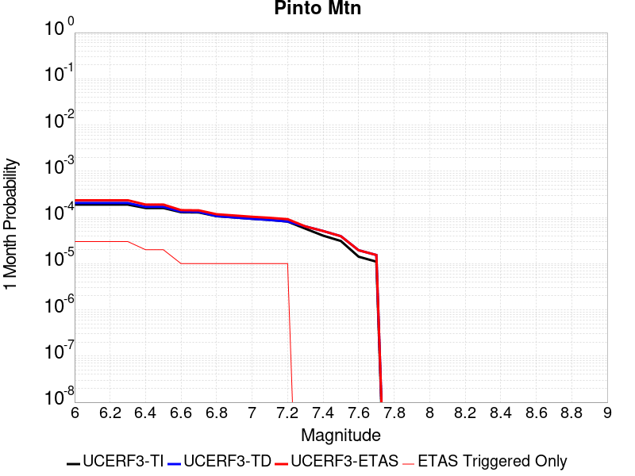 |  | 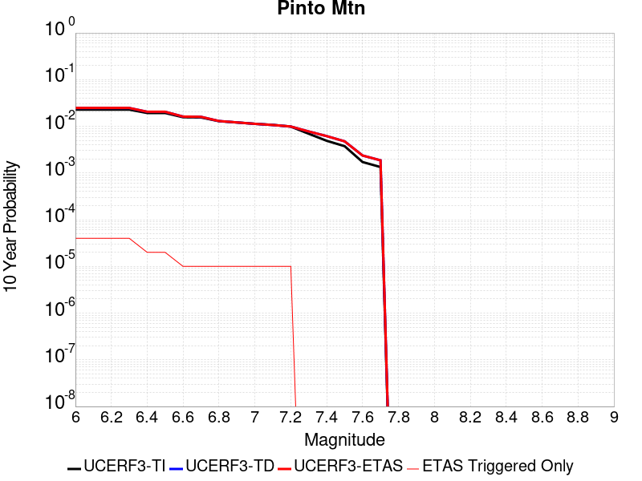 |

| Magnitude | 1 wk TI Prob | 1 wk TD Prob | 1 wk ETAS Prob | 1 wk ETAS/TD Gain | 1 wk ETAS Triggered Only | 1 mo TI Prob | 1 mo TD Prob | 1 mo ETAS Prob | 1 mo ETAS/TD Gain | 1 mo ETAS Triggered Only | 1 yr TI Prob | 1 yr TD Prob | 1 yr ETAS Prob | 1 yr ETAS/TD Gain | 1 yr ETAS Triggered Only | 10 yr TI Prob | 10 yr TD Prob | 10 yr ETAS Prob | 10 yr ETAS/TD Gain | 10 yr ETAS Triggered Only |
|-----|-----|-----|-----|-----|-----|-----|-----|-----|-----|-----|-----|-----|-----|-----|-----|-----|-----|-----|-----|-----|
| 6.0 | 4.4194956E-5 | 4.785362E-5 | 8.601973E-5 | 1.7975596 | 3.816794E-5 | 1.893932E-4 | 2.0507174E-4 | 2.4323186E-4 | 1.1860818 | 3.816794E-5 | 0.0023034236 | 0.0024940541 | 0.0025321268 | 1.0152653 | 3.816794E-5 | 0.022796938 | 0.024678145 | 0.024715371 | 1.0015085 | 3.816794E-5 |
| 6.1 | 4.4194956E-5 | 4.785362E-5 | 8.601973E-5 | 1.7975596 | 3.816794E-5 | 1.893932E-4 | 2.0507174E-4 | 2.4323186E-4 | 1.1860818 | 3.816794E-5 | 0.0023034236 | 0.0024940541 | 0.0025321268 | 1.0152653 | 3.816794E-5 | 0.022796938 | 0.024678145 | 0.024715371 | 1.0015085 | 3.816794E-5 |
| 6.2 | 4.4194956E-5 | 4.785362E-5 | 8.601973E-5 | 1.7975596 | 3.816794E-5 | 1.893932E-4 | 2.0507174E-4 | 2.4323186E-4 | 1.1860818 | 3.816794E-5 | 0.0023034236 | 0.0024940541 | 0.0025321268 | 1.0152653 | 3.816794E-5 | 0.022796938 | 0.024678145 | 0.024715371 | 1.0015085 | 3.816794E-5 |
| 6.3 | 4.4194956E-5 | 4.785362E-5 | 8.601973E-5 | 1.7975596 | 3.816794E-5 | 1.893932E-4 | 2.0507174E-4 | 2.4323186E-4 | 1.1860818 | 3.816794E-5 | 0.0023034236 | 0.0024940541 | 0.0025321268 | 1.0152653 | 3.816794E-5 | 0.022796938 | 0.024678145 | 0.024715371 | 1.0015085 | 3.816794E-5 |
| 6.4 | 3.729929E-5 | 3.9603186E-5 | 7.776961E-5 | 1.9637212 | 3.816794E-5 | 1.5984432E-4 | 1.6971743E-4 | 2.0787888E-4 | 1.2248529 | 3.816794E-5 | 0.0019443673 | 0.002064445 | 0.002102534 | 1.01845 | 3.816794E-5 | 0.019274427 | 0.02046269 | 0.020500077 | 1.0018271 | 3.816794E-5 |
| 6.5 | 3.729929E-5 | 3.9603186E-5 | 7.776961E-5 | 1.9637212 | 3.816794E-5 | 1.5984432E-4 | 1.6971743E-4 | 2.0787888E-4 | 1.2248529 | 3.816794E-5 | 0.0019443673 | 0.002064445 | 0.002102534 | 1.01845 | 3.816794E-5 | 0.019274427 | 0.02046269 | 0.020500077 | 1.0018271 | 3.816794E-5 |
| 6.6 | 3.0204548E-5 | 3.1205298E-5 | 3.1205298E-5 | 1.0 | 0.0 | 1.2944164E-4 | 1.3373033E-4 | 1.3373033E-4 | 1.0 | 0.0 | 0.0015748127 | 0.0016269855 | 0.0016269855 | 1.0 | 0.0 | 0.015636992 | 0.01615461 | 0.01615461 | 1.0 | 0.0 |
| 6.7 | 2.9857754E-5 | 3.081468E-5 | 3.081468E-5 | 1.0 | 0.0 | 1.2795553E-4 | 1.3205643E-4 | 1.3205643E-4 | 1.0 | 0.0 | 0.0015567453 | 0.001606636 | 0.001606636 | 1.0 | 0.0 | 0.015458848 | 0.01595405 | 0.01595405 | 1.0 | 0.0 |
| 6.8 | 2.4819734E-5 | 2.5009364E-5 | 2.5009364E-5 | 1.0 | 0.0 | 1.0636595E-4 | 1.07178705E-4 | 1.07178705E-4 | 1.0 | 0.0 | 0.0012942362 | 0.0013041412 | 0.0013041412 | 1.0 | 0.0 | 0.012867244 | 0.0129672475 | 0.0129672475 | 1.0 | 0.0 |
| 6.9 | 2.331124E-5 | 2.3337643E-5 | 2.3337643E-5 | 1.0 | 0.0 | 9.990149E-5 | 1.00014746E-4 | 1.00014746E-4 | 1.0 | 0.0 | 0.001215622 | 0.0012170197 | 0.0012170197 | 1.0 | 0.0 | 0.012089936 | 0.012105742 | 0.012105742 | 1.0 | 0.0 |
| 7.0 | 2.1818534E-5 | 2.1760772E-5 | 2.1760772E-5 | 1.0 | 0.0 | 9.3504656E-5 | 9.325723E-5 | 9.325723E-5 | 1.0 | 0.0 | 0.0011378246 | 0.0011348352 | 0.0011348352 | 1.0 | 0.0 | 0.011320163 | 0.011292503 | 0.011292503 | 1.0 | 0.0 |
| 7.1 | 2.066081E-5 | 2.0540418E-5 | 2.0540418E-5 | 1.0 | 0.0 | 8.854332E-5 | 8.8027504E-5 | 8.8027504E-5 | 1.0 | 0.0 | 0.0010774818 | 0.0010712275 | 0.0010712275 | 1.0 | 0.0 | 0.010722724 | 0.010662688 | 0.010662688 | 1.0 | 0.0 |
| 7.2 | 1.8990233E-5 | 1.9053701E-5 | 1.9053701E-5 | 1.0 | 0.0 | 8.138417E-5 | 8.1656275E-5 | 8.1656275E-5 | 1.0 | 0.0 | 9.904018E-4 | 9.937311E-4 | 9.937311E-4 | 1.0 | 0.0 | 0.009859995 | 0.009894874 | 0.009894874 | 1.0 | 0.0 |
| 7.3 | 1.3335872E-5 | 1.4906372E-5 | 1.4906372E-5 | 1.0 | 0.0 | 5.7152483E-5 | 6.388296E-5 | 6.388296E-5 | 1.0 | 0.0 | 6.956093E-4 | 7.775102E-4 | 7.775102E-4 | 1.0 | 0.0 | 0.006934359 | 0.0077491994 | 0.0077491994 | 1.0 | 0.0 |
| 7.4 | 9.414066E-6 | 1.186061E-5 | 1.186061E-5 | 1.0 | 0.0 | 4.0345374E-5 | 5.0830247E-5 | 5.0830247E-5 | 1.0 | 0.0 | 4.910942E-4 | 6.1869196E-4 | 6.1869196E-4 | 1.0 | 0.0 | 0.0049001034 | 0.006170644 | 0.006170644 | 1.0 | 0.0 |
| 7.5 | 7.2101157E-6 | 9.157893E-6 | 9.157893E-6 | 1.0 | 0.0 | 3.090013E-5 | 3.924757E-5 | 3.924757E-5 | 1.0 | 0.0 | 3.7614413E-4 | 4.7774217E-4 | 4.7774217E-4 | 1.0 | 0.0 | 0.0037550807 | 0.004767927 | 0.004767927 | 1.0 | 0.0 |
| 7.6 | 3.296375E-6 | 4.5453176E-6 | 4.5453176E-6 | 1.0 | 0.0 | 1.4127245E-5 | 1.9479796E-5 | 1.9479796E-5 | 1.0 | 0.0 | 1.7198564E-4 | 2.3714209E-4 | 2.3714209E-4 | 1.0 | 0.0 | 0.0017185259 | 0.0023690276 | 0.0023690276 | 1.0 | 0.0 |
| 7.7 | 2.5741092E-6 | 3.584251E-6 | 3.584251E-6 | 1.0 | 0.0 | 1.103185E-5 | 1.5360993E-5 | 1.5360993E-5 | 1.0 | 0.0 | 1.3430449E-4 | 1.8700535E-4 | 1.8700535E-4 | 1.0 | 0.0 | 0.0013422335 | 0.0018686098 | 0.0018686098 | 1.0 | 0.0 |

## San Jacinto (Coyote Creek)
*[(top)](#table-of-contents)*

| 1 Week | 1 Month | 1 Year | 10 Year |
|-----|-----|-----|-----|
|  |  |  |  |

| Magnitude | 1 wk TI Prob | 1 wk TD Prob | 1 wk ETAS Prob | 1 wk ETAS/TD Gain | 1 wk ETAS Triggered Only | 1 mo TI Prob | 1 mo TD Prob | 1 mo ETAS Prob | 1 mo ETAS/TD Gain | 1 mo ETAS Triggered Only | 1 yr TI Prob | 1 yr TD Prob | 1 yr ETAS Prob | 1 yr ETAS/TD Gain | 1 yr ETAS Triggered Only | 10 yr TI Prob | 10 yr TD Prob | 10 yr ETAS Prob | 10 yr ETAS/TD Gain | 10 yr ETAS Triggered Only |
|-----|-----|-----|-----|-----|-----|-----|-----|-----|-----|-----|-----|-----|-----|-----|-----|-----|-----|-----|-----|-----|
| 6.0 | 2.7374346E-5 | 2.4145214E-5 | 6.231223E-5 | 2.580728 | 3.816794E-5 | 1.1731335E-4 | 1.034754E-4 | 1.416394E-4 | 1.3688219 | 3.816794E-5 | 0.0014273542 | 0.0012590875 | 0.0012972073 | 1.0302758 | 3.816794E-5 | 0.01418221 | 0.012928318 | 0.012965992 | 1.0029141 | 3.816794E-5 |
| 6.1 | 2.7374346E-5 | 2.4145214E-5 | 6.231223E-5 | 2.580728 | 3.816794E-5 | 1.1731335E-4 | 1.034754E-4 | 1.416394E-4 | 1.3688219 | 3.816794E-5 | 0.0014273542 | 0.0012590875 | 0.0012972073 | 1.0302758 | 3.816794E-5 | 0.01418221 | 0.012928318 | 0.012965992 | 1.0029141 | 3.816794E-5 |
| 6.2 | 2.7374346E-5 | 2.4145214E-5 | 6.231223E-5 | 2.580728 | 3.816794E-5 | 1.1731335E-4 | 1.034754E-4 | 1.416394E-4 | 1.3688219 | 3.816794E-5 | 0.0014273542 | 0.0012590875 | 0.0012972073 | 1.0302758 | 3.816794E-5 | 0.01418221 | 0.012928318 | 0.012965992 | 1.0029141 | 3.816794E-5 |
| 6.3 | 2.7374346E-5 | 2.4145214E-5 | 6.231223E-5 | 2.580728 | 3.816794E-5 | 1.1731335E-4 | 1.034754E-4 | 1.416394E-4 | 1.3688219 | 3.816794E-5 | 0.0014273542 | 0.0012590875 | 0.0012972073 | 1.0302758 | 3.816794E-5 | 0.01418221 | 0.012928318 | 0.012965992 | 1.0029141 | 3.816794E-5 |
| 6.4 | 2.7374346E-5 | 2.4145214E-5 | 6.231223E-5 | 2.580728 | 3.816794E-5 | 1.1731335E-4 | 1.034754E-4 | 1.416394E-4 | 1.3688219 | 3.816794E-5 | 0.0014273542 | 0.0012590875 | 0.0012972073 | 1.0302758 | 3.816794E-5 | 0.01418221 | 0.012928318 | 0.012965992 | 1.0029141 | 3.816794E-5 |
| 6.5 | 2.7282445E-5 | 2.4031293E-5 | 6.219831E-5 | 2.5882218 | 3.816794E-5 | 1.16919524E-4 | 1.029872E-4 | 1.411512E-4 | 1.3705704 | 3.816794E-5 | 0.0014225657 | 0.0012531505 | 0.0012912707 | 1.0304195 | 3.816794E-5 | 0.014134934 | 0.012869646 | 0.0129073225 | 1.0029275 | 3.816794E-5 |
| 6.6 | 2.7282445E-5 | 2.4031293E-5 | 6.219831E-5 | 2.5882218 | 3.816794E-5 | 1.16919524E-4 | 1.029872E-4 | 1.411512E-4 | 1.3705704 | 3.816794E-5 | 0.0014225657 | 0.0012531505 | 0.0012912707 | 1.0304195 | 3.816794E-5 | 0.014134934 | 0.012869646 | 0.0129073225 | 1.0029275 | 3.816794E-5 |
| 6.7 | 2.7216198E-5 | 2.3956412E-5 | 6.2123436E-5 | 2.5931861 | 3.816794E-5 | 1.1663563E-4 | 1.02666316E-4 | 1.4083034E-4 | 1.3717288 | 3.816794E-5 | 0.0014191137 | 0.0012492483 | 0.0012873686 | 1.0305146 | 3.816794E-5 | 0.014100855 | 0.0128310565 | 0.012868735 | 1.0029365 | 3.816794E-5 |
| 6.8 | 2.7078617E-5 | 2.387363E-5 | 6.204066E-5 | 2.5987108 | 3.816794E-5 | 1.1604605E-4 | 1.0231156E-4 | 1.4047559E-4 | 1.3730178 | 3.816794E-5 | 0.001411945 | 0.0012449342 | 0.0012830546 | 1.0306205 | 3.816794E-5 | 0.014030075 | 0.012788199 | 0.012825878 | 1.0029465 | 3.816794E-5 |
| 6.9 | 2.6982952E-5 | 2.3793142E-5 | 6.196017E-5 | 2.604119 | 3.816794E-5 | 1.15636096E-4 | 1.0196664E-4 | 1.4013068E-4 | 1.3742797 | 3.816794E-5 | 0.0014069602 | 0.0012407395 | 0.00127886 | 1.030724 | 3.816794E-5 | 0.013980856 | 0.012746515 | 0.012784196 | 1.0029563 | 3.816794E-5 |
| 7.0 | 2.6449972E-5 | 2.3370165E-5 | 6.153721E-5 | 2.6331527 | 3.816794E-5 | 1.1335209E-4 | 1.00154015E-4 | 1.3831814E-4 | 1.3810543 | 3.816794E-5 | 0.001379188 | 0.0012186957 | 0.001256817 | 1.0312805 | 3.816794E-5 | 0.0137065975 | 0.0125278765 | 0.012565567 | 1.0030085 | 3.816794E-5 |
| 7.1 | 2.6257849E-5 | 2.3196202E-5 | 6.136326E-5 | 2.645401 | 3.816794E-5 | 1.1252879E-4 | 9.940852E-5 | 1.3757266E-4 | 1.3839122 | 3.816794E-5 | 0.0013691769 | 0.0012096294 | 0.0012477511 | 1.0315152 | 3.816794E-5 | 0.013607717 | 0.012437741 | 0.012475435 | 1.0030305 | 3.816794E-5 |
| 7.2 | 2.5270041E-5 | 2.2390966E-5 | 6.055805E-5 | 2.704575 | 3.816794E-5 | 1.0829568E-4 | 9.595777E-5 | 1.3412205E-4 | 1.3977195 | 3.816794E-5 | 0.0013177024 | 0.0011676621 | 0.0012057854 | 1.0326493 | 3.816794E-5 | 0.013099162 | 0.012018777 | 0.012056487 | 1.0031375 | 3.816794E-5 |
| 7.3 | 2.339701E-5 | 2.1122814E-5 | 5.928995E-5 | 2.806915 | 3.816794E-5 | 1.0026905E-4 | 9.0523215E-5 | 1.2868771E-4 | 1.4215988 | 3.816794E-5 | 0.001220092 | 0.0011015651 | 0.0011396909 | 1.0346106 | 3.816794E-5 | 0.012134149 | 0.011357696 | 0.01139543 | 1.0033224 | 3.816794E-5 |
| 7.4 | 2.296333E-5 | 2.0853171E-5 | 5.9020313E-5 | 2.83028 | 3.816794E-5 | 9.841056E-5 | 8.936768E-5 | 1.2753221E-4 | 1.4270507 | 3.816794E-5 | 0.0011974899 | 0.0010875105 | 0.0011256369 | 1.0350585 | 3.816794E-5 | 0.011910575 | 0.01121681 | 0.011254549 | 1.0033646 | 3.816794E-5 |
| 7.5 | 2.2188895E-5 | 2.0376096E-5 | 5.8543257E-5 | 2.8731341 | 3.816794E-5 | 9.50918E-5 | 8.732321E-5 | 1.2548782E-4 | 1.43705 | 3.816794E-5 | 0.0011571277 | 0.0010626436 | 0.001100771 | 1.0358797 | 3.816794E-5 | 0.011511209 | 0.010966429 | 0.011004178 | 1.0034423 | 3.816794E-5 |
| 7.6 | 2.0013189E-5 | 1.8962366E-5 | 5.7129582E-5 | 3.0127876 | 3.816794E-5 | 8.5767984E-5 | 8.1264756E-5 | 1.194296E-4 | 1.4696357 | 3.816794E-5 | 0.001043725 | 9.889511E-4 | 0.0010270813 | 1.0385562 | 3.816794E-5 | 0.010388365 | 0.010224434 | 0.010262211 | 1.0036949 | 3.816794E-5 |
| 7.7 | 1.7230794E-5 | 1.674371E-5 | 5.491101E-5 | 3.2795007 | 3.816794E-5 | 7.384417E-5 | 7.175679E-5 | 1.0992199E-4 | 1.5318688 | 3.816794E-5 | 8.986819E-4 | 8.7328954E-4 | 9.1142417E-4 | 1.0436678 | 3.816794E-5 | 0.008950562 | 0.009062956 | 0.009100778 | 1.0041733 | 3.816794E-5 |
| 7.8 | 1.4478809E-5 | 1.4990978E-5 | 5.3158346E-5 | 3.5460224 | 3.816794E-5 | 6.205057E-5 | 6.424547E-5 | 1.0241096E-4 | 1.5940572 | 3.816794E-5 | 7.552038E-4 | 7.819085E-4 | 8.2004664E-4 | 1.0487757 | 3.816794E-5 | 0.0075264242 | 0.008141387 | 0.008179245 | 1.00465 | 3.816794E-5 |
| 7.9 | 1.1114467E-5 | 1.1645102E-5 | 4.9812596E-5 | 4.277558 | 3.816794E-5 | 4.7632562E-5 | 4.990663E-5 | 8.8072666E-5 | 1.7647488 | 3.816794E-5 | 5.797721E-4 | 6.074444E-4 | 6.4558914E-4 | 1.0627955 | 3.816794E-5 | 0.0057826187 | 0.0063803247 | 0.006418249 | 1.005944 | 3.816794E-5 |
| 8.0 | 9.327402E-6 | 9.899186E-6 | 4.8066748E-5 | 4.855626 | 3.816794E-5 | 3.9973966E-5 | 4.2424395E-5 | 8.059072E-5 | 1.8996314 | 3.816794E-5 | 4.8657437E-4 | 5.1639514E-4 | 5.545434E-4 | 1.0738741 | 3.816794E-5 | 0.0048551033 | 0.0054499684 | 0.0054879286 | 1.0069652 | 3.816794E-5 |
| 8.1 | 7.0235833E-6 | 6.827495E-6 | 4.4995173E-5 | 6.59029 | 3.816794E-5 | 3.0100724E-5 | 2.9260367E-5 | 6.742719E-5 | 2.3043864 | 3.816794E-5 | 3.664147E-4 | 3.5618723E-4 | 3.943416E-4 | 1.1071187 | 3.816794E-5 | 0.003658111 | 0.0037876023 | 0.0038256256 | 1.0100389 | 3.816794E-5 |
| 8.2 | 2.0358202E-6 | 8.994527E-7 | 8.994527E-7 | 1.0 | 0.0 | 8.724915E-6 | 3.854792E-6 | 3.854792E-6 | 1.0 | 0.0 | 1.06220665E-4 | 4.69311E-5 | 4.69311E-5 | 1.0 | 0.0 | 0.001061699 | 5.3254166E-4 | 5.3254166E-4 | 1.0 | 0.0 |
| 8.3 | 2.0051264E-7 | 6.617272E-8 | 6.617272E-8 | 1.0 | 0.0 | 8.5933965E-7 | 2.8359733E-7 | 2.8359733E-7 | 1.0 | 0.0 | 1.046241E-5 | 3.4527925E-6 | 3.4527925E-6 | 1.0 | 0.0 | 1.0461917E-4 | 4.01389E-5 | 4.01389E-5 | 1.0 | 0.0 |

## Pleito
*[(top)](#table-of-contents)*

| 1 Week | 1 Month | 1 Year | 10 Year |
|-----|-----|-----|-----|
|  |  |  |  |

| Magnitude | 1 wk TI Prob | 1 wk TD Prob | 1 wk ETAS Prob | 1 wk ETAS/TD Gain | 1 wk ETAS Triggered Only | 1 mo TI Prob | 1 mo TD Prob | 1 mo ETAS Prob | 1 mo ETAS/TD Gain | 1 mo ETAS Triggered Only | 1 yr TI Prob | 1 yr TD Prob | 1 yr ETAS Prob | 1 yr ETAS/TD Gain | 1 yr ETAS Triggered Only | 10 yr TI Prob | 10 yr TD Prob | 10 yr ETAS Prob | 10 yr ETAS/TD Gain | 10 yr ETAS Triggered Only |
|-----|-----|-----|-----|-----|-----|-----|-----|-----|-----|-----|-----|-----|-----|-----|-----|-----|-----|-----|-----|-----|
| 6.0 | 1.6763008E-5 | 2.4763838E-5 | 6.2930834E-5 | 2.541239 | 3.816794E-5 | 7.183948E-5 | 1.0612683E-4 | 1.4429071E-4 | 1.3596064 | 3.816794E-5 | 8.742947E-4 | 0.0012914003 | 0.001329519 | 1.0295173 | 3.816794E-5 | 0.00870863 | 0.0129538905 | 0.012991563 | 1.0029082 | 3.816794E-5 |
| 6.1 | 1.6763008E-5 | 2.4763838E-5 | 6.2930834E-5 | 2.541239 | 3.816794E-5 | 7.183948E-5 | 1.0612683E-4 | 1.4429071E-4 | 1.3596064 | 3.816794E-5 | 8.742947E-4 | 0.0012914003 | 0.001329519 | 1.0295173 | 3.816794E-5 | 0.00870863 | 0.0129538905 | 0.012991563 | 1.0029082 | 3.816794E-5 |
| 6.2 | 1.6763008E-5 | 2.4763838E-5 | 6.2930834E-5 | 2.541239 | 3.816794E-5 | 7.183948E-5 | 1.0612683E-4 | 1.4429071E-4 | 1.3596064 | 3.816794E-5 | 8.742947E-4 | 0.0012914003 | 0.001329519 | 1.0295173 | 3.816794E-5 | 0.00870863 | 0.0129538905 | 0.012991563 | 1.0029082 | 3.816794E-5 |
| 6.3 | 1.6763008E-5 | 2.4763838E-5 | 6.2930834E-5 | 2.541239 | 3.816794E-5 | 7.183948E-5 | 1.0612683E-4 | 1.4429071E-4 | 1.3596064 | 3.816794E-5 | 8.742947E-4 | 0.0012914003 | 0.001329519 | 1.0295173 | 3.816794E-5 | 0.00870863 | 0.0129538905 | 0.012991563 | 1.0029082 | 3.816794E-5 |
| 6.4 | 1.6763008E-5 | 2.4763838E-5 | 6.2930834E-5 | 2.541239 | 3.816794E-5 | 7.183948E-5 | 1.0612683E-4 | 1.4429071E-4 | 1.3596064 | 3.816794E-5 | 8.742947E-4 | 0.0012914003 | 0.001329519 | 1.0295173 | 3.816794E-5 | 0.00870863 | 0.0129538905 | 0.012991563 | 1.0029082 | 3.816794E-5 |
| 6.5 | 1.6763008E-5 | 2.4763838E-5 | 6.2930834E-5 | 2.541239 | 3.816794E-5 | 7.183948E-5 | 1.0612683E-4 | 1.4429071E-4 | 1.3596064 | 3.816794E-5 | 8.742947E-4 | 0.0012914003 | 0.001329519 | 1.0295173 | 3.816794E-5 | 0.00870863 | 0.0129538905 | 0.012991563 | 1.0029082 | 3.816794E-5 |
| 6.6 | 9.910213E-6 | 1.7214623E-5 | 5.5381905E-5 | 3.217143 | 3.816794E-5 | 4.247165E-5 | 7.377489E-5 | 1.1194002E-4 | 1.5173186 | 3.816794E-5 | 5.169696E-4 | 8.978429E-4 | 9.3597657E-4 | 1.0424726 | 3.816794E-5 | 0.0051576863 | 0.009050702 | 0.009088525 | 1.004179 | 3.816794E-5 |
| 6.7 | 9.910213E-6 | 1.7214623E-5 | 5.5381905E-5 | 3.217143 | 3.816794E-5 | 4.247165E-5 | 7.377489E-5 | 1.1194002E-4 | 1.5173186 | 3.816794E-5 | 5.169696E-4 | 8.978429E-4 | 9.3597657E-4 | 1.0424726 | 3.816794E-5 | 0.0051576863 | 0.009050702 | 0.009088525 | 1.004179 | 3.816794E-5 |
| 6.8 | 8.300162E-6 | 1.5474232E-5 | 5.364158E-5 | 3.46651 | 3.816794E-5 | 3.557164E-5 | 6.631646E-5 | 1.0448187E-4 | 1.5755043 | 3.816794E-5 | 4.3299864E-4 | 8.071053E-4 | 8.452424E-4 | 1.0472517 | 3.816794E-5 | 0.004321559 | 0.008150139 | 0.008187996 | 1.004645 | 3.816794E-5 |
| 6.9 | 8.183114E-6 | 1.5345448E-5 | 5.3512802E-5 | 3.4872103 | 3.816794E-5 | 3.5070017E-5 | 6.576455E-5 | 1.0392998E-4 | 1.5803343 | 3.816794E-5 | 4.2689382E-4 | 8.003907E-4 | 8.385281E-4 | 1.0476484 | 3.816794E-5 | 0.0042607468 | 0.008083483 | 0.008121343 | 1.0046835 | 3.816794E-5 |
| 7.0 | 7.1748823E-6 | 1.413244E-5 | 5.2299838E-5 | 3.7006943 | 3.816794E-5 | 3.0749135E-5 | 6.0566195E-5 | 9.873182E-5 | 1.6301473 | 3.816794E-5 | 3.743064E-4 | 7.371445E-4 | 7.7528425E-4 | 1.0517399 | 3.816794E-5 | 0.0037367654 | 0.007454939 | 0.0074928226 | 1.0050817 | 3.816794E-5 |
| 7.1 | 7.1671807E-6 | 1.412281E-5 | 5.2290212E-5 | 3.7025359 | 3.816794E-5 | 3.0716128E-5 | 6.052493E-5 | 9.869056E-5 | 1.630577 | 3.816794E-5 | 3.7390468E-4 | 7.366424E-4 | 7.747822E-4 | 1.0517752 | 3.816794E-5 | 0.0037327618 | 0.0074499524 | 0.007487836 | 1.0050851 | 3.816794E-5 |
| 7.2 | 7.0649667E-6 | 1.39701015E-5 | 5.2137508E-5 | 3.7320778 | 3.816794E-5 | 3.0278077E-5 | 5.9870494E-5 | 9.8036144E-5 | 1.6374701 | 3.816794E-5 | 3.6857324E-4 | 7.2868E-4 | 7.668201E-4 | 1.0523413 | 3.816794E-5 | 0.0036796255 | 0.0073707094 | 0.007408596 | 1.0051402 | 3.816794E-5 |
| 7.3 | 7.02082E-6 | 1.3913556E-5 | 5.2080966E-5 | 3.7431812 | 3.816794E-5 | 3.008888E-5 | 5.9628168E-5 | 9.779383E-5 | 1.640061 | 3.816794E-5 | 3.6627054E-4 | 7.2573166E-4 | 7.638719E-4 | 1.0525542 | 3.816794E-5 | 0.0036566744 | 0.007341209 | 0.0073790965 | 1.0051609 | 3.816794E-5 |
| 7.4 | 6.987146E-6 | 1.3873118E-5 | 5.2040526E-5 | 3.7511773 | 3.816794E-5 | 2.9944567E-5 | 5.945487E-5 | 9.762054E-5 | 1.6419268 | 3.816794E-5 | 3.6451413E-4 | 7.2362315E-4 | 7.617635E-4 | 1.0527074 | 3.816794E-5 | 0.0036391679 | 0.007320144 | 0.0073580327 | 1.005176 | 3.816794E-5 |
| 7.5 | 6.9494554E-6 | 1.3830024E-5 | 5.1997435E-5 | 3.7597501 | 3.816794E-5 | 2.9783041E-5 | 5.9270187E-5 | 9.743586E-5 | 1.6439271 | 3.816794E-5 | 3.625482E-4 | 7.2137616E-4 | 7.5951655E-4 | 1.0528717 | 3.816794E-5 | 0.0036195726 | 0.0072977724 | 0.007335662 | 1.0051919 | 3.816794E-5 |
| 7.6 | 6.92694E-6 | 1.3789138E-5 | 5.195655E-5 | 3.7679331 | 3.816794E-5 | 2.9686547E-5 | 5.909497E-5 | 9.726065E-5 | 1.6458364 | 3.816794E-5 | 3.6137376E-4 | 7.1924424E-4 | 7.5738475E-4 | 1.0530286 | 3.816794E-5 | 0.0036078666 | 0.0072765257 | 0.007314416 | 1.0052072 | 3.816794E-5 |
| 7.7 | 6.395867E-6 | 1.2668219E-5 | 5.0835675E-5 | 4.0128508 | 3.816794E-5 | 2.741057E-5 | 5.429124E-5 | 9.245711E-5 | 1.7029839 | 3.816794E-5 | 3.336726E-4 | 6.6079566E-4 | 6.989384E-4 | 1.0577224 | 3.816794E-5 | 0.0033317201 | 0.0066951844 | 0.0067330967 | 1.0056627 | 3.816794E-5 |
| 7.8 | 5.8664327E-6 | 1.153586E-5 | 4.9703358E-5 | 4.3085957 | 3.816794E-5 | 2.5141611E-5 | 4.9438466E-5 | 8.7604516E-5 | 1.771991 | 3.816794E-5 | 3.060561E-4 | 6.017473E-4 | 6.3989224E-4 | 1.0633904 | 3.816794E-5 | 0.0030563495 | 0.0061006667 | 0.006138602 | 1.0062182 | 3.816794E-5 |
| 7.9 | 3.7167474E-6 | 7.1140853E-6 | 4.528175E-5 | 6.365084 | 3.816794E-5 | 1.592882E-5 | 3.0488582E-5 | 6.8655354E-5 | 2.2518384 | 3.816794E-5 | 1.9391612E-4 | 3.7113542E-4 | 4.0928918E-4 | 1.1028029 | 3.816794E-5 | 0.0019374699 | 0.0037674906 | 0.0038055147 | 1.0100927 | 3.816794E-5 |
| 8.0 | 1.0903841E-6 | 1.2879392E-6 | 1.2879392E-6 | 1.0 | 0.0 | 4.6730665E-6 | 5.5197274E-6 | 5.5197274E-6 | 1.0 | 0.0 | 5.68931E-5 | 6.720063E-5 | 6.720063E-5 | 1.0 | 0.0 | 5.6878536E-4 | 6.941948E-4 | 6.941948E-4 | 1.0 | 0.0 |
| 8.1 | 2.6894583E-7 | 1.1060341E-7 | 1.1060341E-7 | 1.0 | 0.0 | 1.1526245E-6 | 4.740145E-7 | 4.740145E-7 | 1.0 | 0.0 | 1.4033113E-5 | 5.7711113E-6 | 5.7711113E-6 | 1.0 | 0.0 | 1.4032227E-4 | 6.456908E-5 | 6.456908E-5 | 1.0 | 0.0 |
| 8.2 | 5.2967013E-9 | 2.4578228E-9 | 2.4578228E-9 | 1.0 | 0.0 | 2.2700148E-8 | 1.0533527E-8 | 1.0533527E-8 | 1.0 | 0.0 | 2.7637427E-7 | 1.2824569E-7 | 1.2824569E-7 | 1.0 | 0.0 | 2.7637393E-6 | 1.4592787E-6 | 1.4592787E-6 | 1.0 | 0.0 |

## Swain Ravine - Spenceville
*[(top)](#table-of-contents)*

| 1 Week | 1 Month | 1 Year | 10 Year |
|-----|-----|-----|-----|
|  |  |  |  |

| Magnitude | 1 wk TI Prob | 1 wk TD Prob | 1 wk ETAS Prob | 1 wk ETAS/TD Gain | 1 wk ETAS Triggered Only | 1 mo TI Prob | 1 mo TD Prob | 1 mo ETAS Prob | 1 mo ETAS/TD Gain | 1 mo ETAS Triggered Only | 1 yr TI Prob | 1 yr TD Prob | 1 yr ETAS Prob | 1 yr ETAS/TD Gain | 1 yr ETAS Triggered Only | 10 yr TI Prob | 10 yr TD Prob | 10 yr ETAS Prob | 10 yr ETAS/TD Gain | 10 yr ETAS Triggered Only |
|-----|-----|-----|-----|-----|-----|-----|-----|-----|-----|-----|-----|-----|-----|-----|-----|-----|-----|-----|-----|-----|
| 6.0 | 5.596169E-6 | 5.663794E-6 | 5.663794E-6 | 1.0 | 0.0 | 2.398336E-5 | 2.4273193E-5 | 2.4273193E-5 | 1.0 | 0.0 | 2.9195828E-4 | 2.9548878E-4 | 3.3364544E-4 | 1.1291306 | 3.816794E-5 | 0.00291575 | 0.002951228 | 0.0029892833 | 1.0128947 | 3.816794E-5 |
| 6.1 | 5.596169E-6 | 5.663794E-6 | 5.663794E-6 | 1.0 | 0.0 | 2.398336E-5 | 2.4273193E-5 | 2.4273193E-5 | 1.0 | 0.0 | 2.9195828E-4 | 2.9548878E-4 | 3.3364544E-4 | 1.1291306 | 3.816794E-5 | 0.00291575 | 0.002951228 | 0.0029892833 | 1.0128947 | 3.816794E-5 |
| 6.2 | 5.596169E-6 | 5.663794E-6 | 5.663794E-6 | 1.0 | 0.0 | 2.398336E-5 | 2.4273193E-5 | 2.4273193E-5 | 1.0 | 0.0 | 2.9195828E-4 | 2.9548878E-4 | 3.3364544E-4 | 1.1291306 | 3.816794E-5 | 0.00291575 | 0.002951228 | 0.0029892833 | 1.0128947 | 3.816794E-5 |
| 6.3 | 5.596169E-6 | 5.663794E-6 | 5.663794E-6 | 1.0 | 0.0 | 2.398336E-5 | 2.4273193E-5 | 2.4273193E-5 | 1.0 | 0.0 | 2.9195828E-4 | 2.9548878E-4 | 3.3364544E-4 | 1.1291306 | 3.816794E-5 | 0.00291575 | 0.002951228 | 0.0029892833 | 1.0128947 | 3.816794E-5 |
| 6.4 | 2.8426775E-6 | 2.874144E-6 | 2.874144E-6 | 1.0 | 0.0 | 1.2182847E-5 | 1.2317704E-5 | 1.2317704E-5 | 1.0 | 0.0 | 1.4831607E-4 | 1.4995811E-4 | 1.8812032E-4 | 1.2544858 | 3.816794E-5 | 0.0014821711 | 0.0014986077 | 0.0015367185 | 1.0254308 | 3.816794E-5 |
| 6.5 | 1.9210793E-6 | 1.9414147E-6 | 1.9414147E-6 | 1.0 | 0.0 | 8.233172E-6 | 8.320323E-6 | 8.320323E-6 | 1.0 | 0.0 | 1.0023425E-4 | 1.0129536E-4 | 1.3945943E-4 | 1.3767604 | 3.816794E-5 | 0.0010018905 | 0.0010125053 | 0.0010506345 | 1.0376583 | 3.816794E-5 |
| 6.6 | 1.9210793E-6 | 1.9414147E-6 | 1.9414147E-6 | 1.0 | 0.0 | 8.233172E-6 | 8.320323E-6 | 8.320323E-6 | 1.0 | 0.0 | 1.0023425E-4 | 1.0129536E-4 | 1.3945943E-4 | 1.3767604 | 3.816794E-5 | 0.0010018905 | 0.0010125053 | 0.0010506345 | 1.0376583 | 3.816794E-5 |
| 6.7 | 1.4667394E-6 | 1.4818934E-6 | 1.4818934E-6 | 1.0 | 0.0 | 6.286011E-6 | 6.3509565E-6 | 6.3509565E-6 | 1.0 | 0.0 | 7.65295E-5 | 7.732023E-5 | 7.732023E-5 | 1.0 | 0.0 | 7.6503144E-4 | 7.72941E-4 | 7.72941E-4 | 1.0 | 0.0 |
| 6.8 | 1.1076943E-6 | 1.1189535E-6 | 1.1189535E-6 | 1.0 | 0.0 | 4.747252E-6 | 4.7955064E-6 | 4.7955064E-6 | 1.0 | 0.0 | 5.7796264E-5 | 5.838377E-5 | 5.838377E-5 | 1.0 | 0.0 | 5.778124E-4 | 5.836887E-4 | 5.836887E-4 | 1.0 | 0.0 |
| 6.9 | 8.514296E-7 | 8.600095E-7 | 8.600095E-7 | 1.0 | 0.0 | 3.648979E-6 | 3.6857498E-6 | 3.6857498E-6 | 1.0 | 0.0 | 4.442541E-5 | 4.4873108E-5 | 4.4873108E-5 | 1.0 | 0.0 | 4.441653E-4 | 4.4864335E-4 | 4.4864335E-4 | 1.0 | 0.0 |
| 7.0 | 4.8544706E-7 | 4.9033E-7 | 4.9033E-7 | 1.0 | 0.0 | 2.0804857E-6 | 2.1014127E-6 | 2.1014127E-6 | 1.0 | 0.0 | 2.532962E-5 | 2.5584413E-5 | 2.5584413E-5 | 1.0 | 0.0 | 2.5326732E-4 | 2.5581598E-4 | 2.5581598E-4 | 1.0 | 0.0 |
| 7.1 | 3.829186E-7 | 3.8678783E-7 | 3.8678783E-7 | 1.0 | 0.0 | 1.6410787E-6 | 1.6576612E-6 | 1.6576612E-6 | 1.0 | 0.0 | 1.997995E-5 | 2.0181848E-5 | 2.0181848E-5 | 1.0 | 0.0 | 1.9978154E-4 | 2.0180122E-4 | 2.0180122E-4 | 1.0 | 0.0 |
| 7.2 | 1.4726595E-7 | 1.4879437E-7 | 1.4879437E-7 | 1.0 | 0.0 | 6.3113964E-7 | 6.3769005E-7 | 6.3769005E-7 | 1.0 | 0.0 | 7.684098E-6 | 7.763854E-6 | 7.763854E-6 | 1.0 | 0.0 | 7.6838325E-5 | 7.763636E-5 | 7.763636E-5 | 1.0 | 0.0 |
| 7.3 | 4.1880604E-8 | 4.2324306E-8 | 4.2324306E-8 | 1.0 | 0.0 | 1.7948828E-7 | 1.8138988E-7 | 1.8138988E-7 | 1.0 | 0.0 | 2.1852677E-6 | 2.2084218E-6 | 2.2084218E-6 | 1.0 | 0.0 | 2.1852462E-5 | 2.2084218E-5 | 2.2084218E-5 | 1.0 | 0.0 |

## Big Pine (East)
*[(top)](#table-of-contents)*

| 1 Week | 1 Month | 1 Year | 10 Year |
|-----|-----|-----|-----|
|  |  |  |  |

| Magnitude | 1 wk TI Prob | 1 wk TD Prob | 1 wk ETAS Prob | 1 wk ETAS/TD Gain | 1 wk ETAS Triggered Only | 1 mo TI Prob | 1 mo TD Prob | 1 mo ETAS Prob | 1 mo ETAS/TD Gain | 1 mo ETAS Triggered Only | 1 yr TI Prob | 1 yr TD Prob | 1 yr ETAS Prob | 1 yr ETAS/TD Gain | 1 yr ETAS Triggered Only | 10 yr TI Prob | 10 yr TD Prob | 10 yr ETAS Prob | 10 yr ETAS/TD Gain | 10 yr ETAS Triggered Only |
|-----|-----|-----|-----|-----|-----|-----|-----|-----|-----|-----|-----|-----|-----|-----|-----|-----|-----|-----|-----|-----|
| 6.0 | 9.916913E-6 | 1.2816984E-5 | 5.0984436E-5 | 3.9778807 | 3.816794E-5 | 4.250036E-5 | 5.49289E-5 | 9.309474E-5 | 1.6948225 | 3.816794E-5 | 5.173191E-4 | 6.685763E-4 | 7.067187E-4 | 1.0570502 | 3.816794E-5 | 0.0051611643 | 0.006670441 | 0.006708354 | 1.0056838 | 3.816794E-5 |
| 6.1 | 9.916913E-6 | 1.2816984E-5 | 5.0984436E-5 | 3.9778807 | 3.816794E-5 | 4.250036E-5 | 5.49289E-5 | 9.309474E-5 | 1.6948225 | 3.816794E-5 | 5.173191E-4 | 6.685763E-4 | 7.067187E-4 | 1.0570502 | 3.816794E-5 | 0.0051611643 | 0.006670441 | 0.006708354 | 1.0056838 | 3.816794E-5 |
| 6.2 | 9.916913E-6 | 1.2816984E-5 | 5.0984436E-5 | 3.9778807 | 3.816794E-5 | 4.250036E-5 | 5.49289E-5 | 9.309474E-5 | 1.6948225 | 3.816794E-5 | 5.173191E-4 | 6.685763E-4 | 7.067187E-4 | 1.0570502 | 3.816794E-5 | 0.0051611643 | 0.006670441 | 0.006708354 | 1.0056838 | 3.816794E-5 |
| 6.3 | 5.479711E-6 | 8.112951E-6 | 4.628058E-5 | 5.7045307 | 3.816794E-5 | 2.3484265E-5 | 3.4769346E-5 | 7.293596E-5 | 2.0977087 | 3.816794E-5 | 2.858834E-4 | 4.2323777E-4 | 4.6138954E-4 | 1.0901427 | 3.816794E-5 | 0.0028551589 | 0.004227244 | 0.00426525 | 1.0089909 | 3.816794E-5 |
| 6.4 | 5.465009E-6 | 8.097245E-6 | 4.6264875E-5 | 5.7136564 | 3.816794E-5 | 2.3421257E-5 | 3.4702036E-5 | 7.286865E-5 | 2.099838 | 3.816794E-5 | 2.851165E-4 | 4.2241855E-4 | 4.6057036E-4 | 1.0903176 | 3.816794E-5 | 0.0028475097 | 0.0042190826 | 0.0042570895 | 1.0090083 | 3.816794E-5 |
| 6.5 | 4.826767E-6 | 7.422301E-6 | 4.5589957E-5 | 6.142294 | 3.816794E-5 | 2.068598E-5 | 3.180949E-5 | 6.997622E-5 | 2.1998534 | 3.816794E-5 | 2.518227E-4 | 3.872145E-4 | 4.2536765E-4 | 1.0985323 | 3.816794E-5 | 0.0025153751 | 0.003868283 | 0.003906303 | 1.0098287 | 3.816794E-5 |
| 6.6 | 4.3146847E-6 | 6.8822374E-6 | 4.5049914E-5 | 6.545824 | 3.816794E-5 | 1.8491375E-5 | 2.9494982E-5 | 6.766179E-5 | 2.2940104 | 3.816794E-5 | 2.2510924E-4 | 3.590447E-4 | 3.9719892E-4 | 1.106266 | 3.816794E-5 | 0.0022488134 | 0.0035874986 | 0.0036255296 | 1.0106009 | 3.816794E-5 |
| 6.7 | 3.6968106E-6 | 5.9954727E-6 | 5.9954727E-6 | 1.0 | 0.0 | 1.5843378E-5 | 2.5694639E-5 | 2.5694639E-5 | 1.0 | 0.0 | 1.9287605E-4 | 3.1278885E-4 | 3.1278885E-4 | 1.0 | 0.0 | 0.0019270873 | 0.0031262483 | 0.0031262483 | 1.0 | 0.0 |
| 6.8 | 3.4671132E-6 | 5.702177E-6 | 5.702177E-6 | 1.0 | 0.0 | 1.4858972E-5 | 2.4437682E-5 | 2.4437682E-5 | 1.0 | 0.0 | 1.8089297E-4 | 2.974896E-4 | 2.974896E-4 | 1.0 | 0.0 | 0.0018074579 | 0.002973667 | 0.002973667 | 1.0 | 0.0 |
| 6.9 | 2.7686972E-6 | 4.825223E-6 | 4.825223E-6 | 1.0 | 0.0 | 1.1865792E-5 | 2.0679368E-5 | 2.0679368E-5 | 1.0 | 0.0 | 1.4445644E-4 | 2.5174298E-4 | 2.5174298E-4 | 1.0 | 0.0 | 0.0014436257 | 0.0025172636 | 0.0025172636 | 1.0 | 0.0 |
| 7.0 | 2.1472624E-6 | 3.9850406E-6 | 3.9850406E-6 | 1.0 | 0.0 | 9.20252E-6 | 1.7078637E-5 | 1.7078637E-5 | 1.0 | 0.0 | 1.12034926E-4 | 2.079131E-4 | 2.079131E-4 | 1.0 | 0.0 | 0.0011197845 | 0.0020798394 | 0.0020798394 | 1.0 | 0.0 |
| 7.1 | 1.7018335E-6 | 3.344876E-6 | 3.344876E-6 | 1.0 | 0.0 | 7.293552E-6 | 1.4335106E-5 | 1.4335106E-5 | 1.0 | 0.0 | 8.879537E-5 | 1.7451629E-4 | 1.7451629E-4 | 1.0 | 0.0 | 8.87599E-4 | 0.0017464145 | 0.0017464145 | 1.0 | 0.0 |
| 7.2 | 1.25603E-6 | 2.794484E-6 | 2.794484E-6 | 1.0 | 0.0 | 5.3829745E-6 | 1.1976307E-5 | 1.1976307E-5 | 1.0 | 0.0 | 6.553574E-5 | 1.4580201E-4 | 1.4580201E-4 | 1.0 | 0.0 | 6.551642E-4 | 0.001459661 | 0.001459661 | 1.0 | 0.0 |
| 7.3 | 1.112297E-6 | 2.610332E-6 | 2.610332E-6 | 1.0 | 0.0 | 4.7669787E-6 | 1.118709E-5 | 1.118709E-5 | 1.0 | 0.0 | 5.803642E-5 | 1.3619453E-4 | 1.3619453E-4 | 1.0 | 0.0 | 5.802127E-4 | 0.0013635408 | 0.0013635408 | 1.0 | 0.0 |
| 7.4 | 1.0137181E-6 | 2.4834917E-6 | 2.4834917E-6 | 1.0 | 0.0 | 4.3444993E-6 | 1.0643494E-5 | 1.0643494E-5 | 1.0 | 0.0 | 5.2892992E-5 | 1.2957705E-4 | 1.2957705E-4 | 1.0 | 0.0 | 5.288041E-4 | 0.0012972289 | 0.0012972289 | 1.0 | 0.0 |
| 7.5 | 9.598608E-7 | 2.4071483E-6 | 2.4071483E-6 | 1.0 | 0.0 | 4.1136827E-6 | 1.031631E-5 | 1.031631E-5 | 1.0 | 0.0 | 5.0082934E-5 | 1.2559404E-4 | 1.2559404E-4 | 1.0 | 0.0 | 5.007165E-4 | 0.0012572526 | 0.0012572526 | 1.0 | 0.0 |
| 7.6 | 7.929459E-7 | 2.0448588E-6 | 2.0448588E-6 | 1.0 | 0.0 | 3.3983351E-6 | 8.763653E-6 | 8.763653E-6 | 1.0 | 0.0 | 4.1373947E-5 | 1.06692416E-4 | 1.06692416E-4 | 1.0 | 0.0 | 4.1366243E-4 | 0.0010685222 | 0.0010685222 | 1.0 | 0.0 |
| 7.7 | 4.155788E-7 | 1.1605589E-6 | 1.1605589E-6 | 1.0 | 0.0 | 1.7810507E-6 | 4.9738146E-6 | 4.9738146E-6 | 1.0 | 0.0 | 2.1684076E-5 | 6.0554554E-5 | 6.0554554E-5 | 1.0 | 0.0 | 2.1681961E-4 | 6.0857297E-4 | 6.0857297E-4 | 1.0 | 0.0 |
| 7.8 | 1.14666925E-7 | 2.592015E-7 | 2.592015E-7 | 1.0 | 0.0 | 4.914296E-7 | 1.1108631E-6 | 1.1108631E-6 | 1.0 | 0.0 | 5.9831386E-6 | 1.3524678E-5 | 1.3524678E-5 | 1.0 | 0.0 | 5.9829777E-5 | 1.3634123E-4 | 1.3634123E-4 | 1.0 | 0.0 |
| 7.9 | 2.9231824E-8 | 4.1463963E-8 | 4.1463963E-8 | 1.0 | 0.0 | 1.2527924E-7 | 1.7770269E-7 | 1.7770269E-7 | 1.0 | 0.0 | 1.5252737E-6 | 2.1635283E-6 | 2.1635283E-6 | 1.0 | 0.0 | 1.5252632E-5 | 2.1967755E-5 | 2.1967755E-5 | 1.0 | 0.0 |

## Cerro Prieto
*[(top)](#table-of-contents)*

| 1 Week | 1 Month | 1 Year | 10 Year |
|-----|-----|-----|-----|
|  |  |  |  |

| Magnitude | 1 wk TI Prob | 1 wk TD Prob | 1 wk ETAS Prob | 1 wk ETAS/TD Gain | 1 wk ETAS Triggered Only | 1 mo TI Prob | 1 mo TD Prob | 1 mo ETAS Prob | 1 mo ETAS/TD Gain | 1 mo ETAS Triggered Only | 1 yr TI Prob | 1 yr TD Prob | 1 yr ETAS Prob | 1 yr ETAS/TD Gain | 1 yr ETAS Triggered Only | 10 yr TI Prob | 10 yr TD Prob | 10 yr ETAS Prob | 10 yr ETAS/TD Gain | 10 yr ETAS Triggered Only |
|-----|-----|-----|-----|-----|-----|-----|-----|-----|-----|-----|-----|-----|-----|-----|-----|-----|-----|-----|-----|-----|
| 6.0 | 2.9101528E-4 | 5.964804E-4 | 6.3462555E-4 | 1.0639504 | 3.816794E-5 | 0.0012466122 | 0.002554082 | 0.0025921527 | 1.0149057 | 3.816794E-5 | 0.015072231 | 0.03064807 | 0.030685069 | 1.0012072 | 3.816794E-5 | 0.14089979 | 0.25397858 | 0.25400704 | 1.000112 | 3.816794E-5 |
| 6.1 | 2.9101528E-4 | 5.964804E-4 | 6.3462555E-4 | 1.0639504 | 3.816794E-5 | 0.0012466122 | 0.002554082 | 0.0025921527 | 1.0149057 | 3.816794E-5 | 0.015072231 | 0.03064807 | 0.030685069 | 1.0012072 | 3.816794E-5 | 0.14089979 | 0.25397858 | 0.25400704 | 1.000112 | 3.816794E-5 |
| 6.2 | 2.9101528E-4 | 5.964804E-4 | 6.3462555E-4 | 1.0639504 | 3.816794E-5 | 0.0012466122 | 0.002554082 | 0.0025921527 | 1.0149057 | 3.816794E-5 | 0.015072231 | 0.03064807 | 0.030685069 | 1.0012072 | 3.816794E-5 | 0.14089979 | 0.25397858 | 0.25400704 | 1.000112 | 3.816794E-5 |
| 6.3 | 2.9101528E-4 | 5.964804E-4 | 6.3462555E-4 | 1.0639504 | 3.816794E-5 | 0.0012466122 | 0.002554082 | 0.0025921527 | 1.0149057 | 3.816794E-5 | 0.015072231 | 0.03064807 | 0.030685069 | 1.0012072 | 3.816794E-5 | 0.14089979 | 0.25397858 | 0.25400704 | 1.000112 | 3.816794E-5 |
| 6.4 | 2.508648E-4 | 5.1397446E-4 | 5.521228E-4 | 1.0742222 | 3.816794E-5 | 0.0010746918 | 0.0022010866 | 0.0022391707 | 1.0173023 | 3.816794E-5 | 0.013006088 | 0.026471792 | 0.02650895 | 1.0014037 | 3.816794E-5 | 0.12270685 | 0.22440416 | 0.22443375 | 1.000132 | 3.816794E-5 |
| 6.5 | 2.508648E-4 | 5.1397446E-4 | 5.521228E-4 | 1.0742222 | 3.816794E-5 | 0.0010746918 | 0.0022010866 | 0.0022391707 | 1.0173023 | 3.816794E-5 | 0.013006088 | 0.026471792 | 0.02650895 | 1.0014037 | 3.816794E-5 | 0.12270685 | 0.22440416 | 0.22443375 | 1.000132 | 3.816794E-5 |
| 6.6 | 2.294914E-4 | 4.7116808E-4 | 5.09318E-4 | 1.0809689 | 3.816794E-5 | 9.831638E-4 | 0.0020179166 | 0.0020560075 | 1.0188763 | 3.816794E-5 | 0.011904482 | 0.02429866 | 0.0243359 | 1.0015327 | 3.816794E-5 | 0.11286586 | 0.20858558 | 0.20861578 | 1.0001448 | 3.816794E-5 |
| 6.7 | 1.9621674E-4 | 4.0419117E-4 | 4.4234368E-4 | 1.0943923 | 3.816794E-5 | 8.4065786E-4 | 0.0017312564 | 0.0017693582 | 1.0220082 | 3.816794E-5 | 0.010187071 | 0.020884845 | 0.020922216 | 1.0017893 | 3.816794E-5 | 0.09732539 | 0.18290249 | 0.18293367 | 1.0001705 | 3.816794E-5 |
| 6.8 | 1.5476145E-4 | 3.056516E-4 | 3.4380786E-4 | 1.1248358 | 3.816794E-5 | 6.6309475E-4 | 0.00130938 | 0.0013474979 | 1.0291115 | 3.816794E-5 | 0.008043335 | 0.015836509 | 0.015874071 | 1.0023719 | 3.816794E-5 | 0.07758363 | 0.14336355 | 0.14339626 | 1.000228 | 3.816794E-5 |
| 6.9 | 1.20509176E-4 | 2.2582515E-4 | 2.6398446E-4 | 1.1689773 | 3.816794E-5 | 5.1636563E-4 | 9.6752634E-4 | 0.0010056574 | 1.0394108 | 3.816794E-5 | 0.006268645 | 0.011726342 | 0.011764063 | 1.0032167 | 3.816794E-5 | 0.060947374 | 0.109451205 | 0.109485194 | 1.0003105 | 3.816794E-5 |
| 7.0 | 9.3269155E-5 | 1.6716642E-4 | 2.0532799E-4 | 1.2282848 | 3.816794E-5 | 3.9966372E-4 | 7.162739E-4 | 7.5441453E-4 | 1.0532486 | 3.816794E-5 | 0.0048550544 | 0.008693418 | 0.008731254 | 1.0043523 | 3.816794E-5 | 0.04750344 | 0.08315912 | 0.083194114 | 1.0004208 | 3.816794E-5 |
| 7.1 | 5.029709E-5 | 8.1718936E-5 | 1.1988375E-4 | 1.4670254 | 3.816794E-5 | 2.1554115E-4 | 3.5019626E-4 | 3.8835083E-4 | 1.1089519 | 3.816794E-5 | 0.0026210553 | 0.0042587193 | 0.0042967247 | 1.0089241 | 3.816794E-5 | 0.025903556 | 0.042365108 | 0.04240166 | 1.0008627 | 3.816794E-5 |
| 7.2 | 6.5445185E-8 | 6.814903E-8 | 6.814903E-8 | 1.0 | 0.0 | 2.8047933E-7 | 2.9206726E-7 | 2.9206726E-7 | 1.0 | 0.0 | 3.4148304E-6 | 3.555919E-6 | 3.555919E-6 | 1.0 | 0.0 | 3.414778E-5 | 3.5559187E-5 | 3.5559187E-5 | 1.0 | 0.0 |

## Palos Verdes
*[(top)](#table-of-contents)*

| 1 Week | 1 Month | 1 Year | 10 Year |
|-----|-----|-----|-----|
| 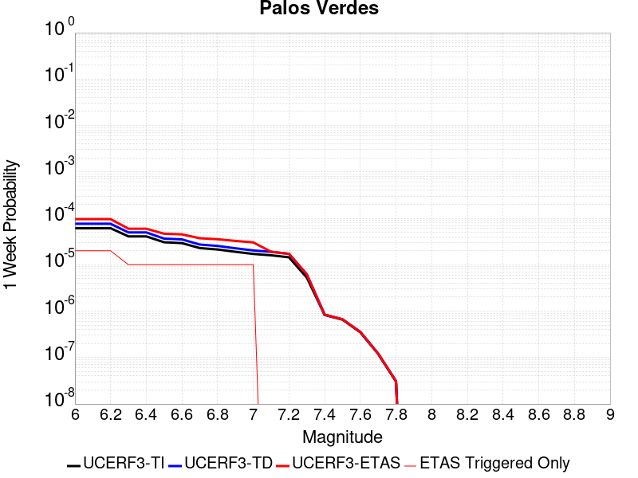 |  | 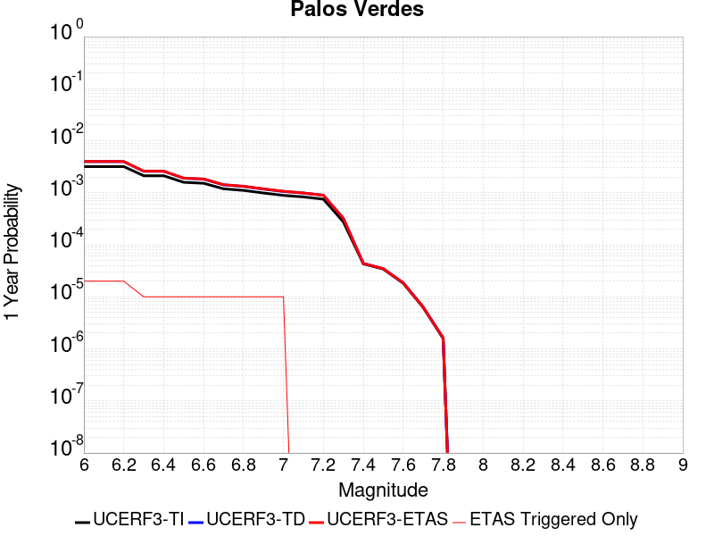 |  |

| Magnitude | 1 wk TI Prob | 1 wk TD Prob | 1 wk ETAS Prob | 1 wk ETAS/TD Gain | 1 wk ETAS Triggered Only | 1 mo TI Prob | 1 mo TD Prob | 1 mo ETAS Prob | 1 mo ETAS/TD Gain | 1 mo ETAS Triggered Only | 1 yr TI Prob | 1 yr TD Prob | 1 yr ETAS Prob | 1 yr ETAS/TD Gain | 1 yr ETAS Triggered Only | 10 yr TI Prob | 10 yr TD Prob | 10 yr ETAS Prob | 10 yr ETAS/TD Gain | 10 yr ETAS Triggered Only |
|-----|-----|-----|-----|-----|-----|-----|-----|-----|-----|-----|-----|-----|-----|-----|-----|-----|-----|-----|-----|-----|
| 6.0 | 6.126063E-5 | 7.622612E-5 | 1.1439115E-4 | 1.5006818 | 3.816794E-5 | 2.6251914E-4 | 3.2664582E-4 | 3.648013E-4 | 1.11681 | 3.816794E-5 | 0.0031914865 | 0.003970174 | 0.0040081907 | 1.0095755 | 3.816794E-5 | 0.031460393 | 0.039048895 | 0.039085574 | 1.0009392 | 3.816794E-5 |
| 6.1 | 6.126063E-5 | 7.622612E-5 | 1.1439115E-4 | 1.5006818 | 3.816794E-5 | 2.6251914E-4 | 3.2664582E-4 | 3.648013E-4 | 1.11681 | 3.816794E-5 | 0.0031914865 | 0.003970174 | 0.0040081907 | 1.0095755 | 3.816794E-5 | 0.031460393 | 0.039048895 | 0.039085574 | 1.0009392 | 3.816794E-5 |
| 6.2 | 6.126063E-5 | 7.622612E-5 | 1.1439115E-4 | 1.5006818 | 3.816794E-5 | 2.6251914E-4 | 3.2664582E-4 | 3.648013E-4 | 1.11681 | 3.816794E-5 | 0.0031914865 | 0.003970174 | 0.0040081907 | 1.0095755 | 3.816794E-5 | 0.031460393 | 0.039048895 | 0.039085574 | 1.0009392 | 3.816794E-5 |
| 6.3 | 4.0838047E-5 | 4.9749437E-5 | 4.9749437E-5 | 1.0 | 0.0 | 1.7500846E-4 | 2.1319572E-4 | 2.1319572E-4 | 1.0 | 0.0 | 0.0021286458 | 0.0025927818 | 0.0025927818 | 1.0 | 0.0 | 0.021083709 | 0.025646681 | 0.025646681 | 1.0 | 0.0 |
| 6.4 | 4.0838047E-5 | 4.9749437E-5 | 4.9749437E-5 | 1.0 | 0.0 | 1.7500846E-4 | 2.1319572E-4 | 2.1319572E-4 | 1.0 | 0.0 | 0.0021286458 | 0.0025927818 | 0.0025927818 | 1.0 | 0.0 | 0.021083709 | 0.025646681 | 0.025646681 | 1.0 | 0.0 |
| 6.5 | 3.0512005E-5 | 3.656162E-5 | 3.656162E-5 | 1.0 | 0.0 | 1.3075917E-4 | 1.5668393E-4 | 1.5668393E-4 | 1.0 | 0.0 | 0.0015908304 | 0.0019060767 | 0.0019060767 | 1.0 | 0.0 | 0.015794903 | 0.018909154 | 0.018909154 | 1.0 | 0.0 |
| 6.6 | 2.9255087E-5 | 3.515442E-5 | 3.515442E-5 | 1.0 | 0.0 | 1.2537291E-4 | 1.5065377E-4 | 1.5065377E-4 | 1.0 | 0.0 | 0.0015253464 | 0.0018327828 | 0.0018327828 | 1.0 | 0.0 | 0.015149189 | 0.018188225 | 0.018188225 | 1.0 | 0.0 |
| 6.7 | 2.287198E-5 | 2.7248278E-5 | 2.7248278E-5 | 1.0 | 0.0 | 9.801909E-5 | 1.16773626E-4 | 1.16773626E-4 | 1.0 | 0.0 | 0.001192729 | 0.0014208833 | 0.0014208833 | 1.0 | 0.0 | 0.011863477 | 0.014127217 | 0.014127217 | 1.0 | 0.0 |
| 6.8 | 2.1325764E-5 | 2.5431877E-5 | 2.5431877E-5 | 1.0 | 0.0 | 9.139293E-5 | 1.0898971E-4 | 1.0898971E-4 | 1.0 | 0.0 | 0.001112141 | 0.0013262323 | 0.0013262323 | 1.0 | 0.0 | 0.011065915 | 0.013192211 | 0.013192211 | 1.0 | 0.0 |
| 6.9 | 1.9009392E-5 | 2.2613547E-5 | 2.2613547E-5 | 1.0 | 0.0 | 8.1466285E-5 | 9.6912096E-5 | 9.6912096E-5 | 1.0 | 0.0 | 9.914007E-4 | 0.0011793535 | 0.0011793535 | 1.0 | 0.0 | 0.009869894 | 0.011739632 | 0.011739632 | 1.0 | 0.0 |
| 7.0 | 1.7098473E-5 | 2.0319356E-5 | 2.0319356E-5 | 1.0 | 0.0 | 7.3277115E-5 | 8.708052E-5 | 8.708052E-5 | 1.0 | 0.0 | 8.917837E-4 | 0.001059775 | 0.001059775 | 1.0 | 0.0 | 0.008882134 | 0.010555646 | 0.010555646 | 1.0 | 0.0 |
| 7.1 | 1.5982785E-5 | 1.899476E-5 | 1.899476E-5 | 1.0 | 0.0 | 6.849585E-5 | 8.1404054E-5 | 8.1404054E-5 | 1.0 | 0.0 | 8.336179E-4 | 9.907284E-4 | 9.907284E-4 | 1.0 | 0.0 | 0.008304977 | 0.009871479 | 0.009871479 | 1.0 | 0.0 |
| 7.2 | 1.4468002E-5 | 1.7197237E-5 | 1.7197237E-5 | 1.0 | 0.0 | 6.200425E-5 | 7.370083E-5 | 7.370083E-5 | 1.0 | 0.0 | 7.546402E-4 | 8.970222E-4 | 8.970222E-4 | 1.0 | 0.0 | 0.007520827 | 0.008942284 | 0.008942284 | 1.0 | 0.0 |
| 7.3 | 5.288233E-6 | 6.2036747E-6 | 6.2036747E-6 | 1.0 | 0.0 | 2.2663658E-5 | 2.6587102E-5 | 2.6587102E-5 | 1.0 | 0.0 | 2.7589512E-4 | 3.236848E-4 | 3.236848E-4 | 1.0 | 0.0 | 0.0027555283 | 0.0032355562 | 0.0032355562 | 1.0 | 0.0 |
| 7.4 | 8.279556E-7 | 8.408347E-7 | 8.408347E-7 | 1.0 | 0.0 | 3.5483763E-6 | 3.6035726E-6 | 3.6035726E-6 | 1.0 | 0.0 | 4.3200624E-5 | 4.3872686E-5 | 4.3872686E-5 | 1.0 | 0.0 | 4.3192226E-4 | 4.3864746E-4 | 4.3864746E-4 | 1.0 | 0.0 |
| 7.5 | 6.559831E-7 | 6.667229E-7 | 6.667229E-7 | 1.0 | 0.0 | 2.8113532E-6 | 2.857381E-6 | 2.857381E-6 | 1.0 | 0.0 | 3.4227687E-5 | 3.4788125E-5 | 3.4788125E-5 | 1.0 | 0.0 | 3.4222414E-4 | 3.4783344E-4 | 3.4783344E-4 | 1.0 | 0.0 |
| 7.6 | 3.5018968E-7 | 3.5620027E-7 | 3.5620027E-7 | 1.0 | 0.0 | 1.500812E-6 | 1.526572E-6 | 1.526572E-6 | 1.0 | 0.0 | 1.8272232E-5 | 1.8585903E-5 | 1.8585903E-5 | 1.0 | 0.0 | 1.8270731E-4 | 1.8584808E-4 | 1.8584808E-4 | 1.0 | 0.0 |
| 7.7 | 1.1986104E-7 | 1.2198376E-7 | 1.2198376E-7 | 1.0 | 0.0 | 5.1369005E-7 | 5.2278745E-7 | 5.2278745E-7 | 1.0 | 0.0 | 6.2541585E-6 | 6.364919E-6 | 6.364919E-6 | 1.0 | 0.0 | 6.2539824E-5 | 6.364741E-5 | 6.364741E-5 | 1.0 | 0.0 |
| 7.8 | 3.0445005E-8 | 3.1027582E-8 | 3.1027582E-8 | 1.0 | 0.0 | 1.3047858E-7 | 1.3297536E-7 | 1.3297536E-7 | 1.0 | 0.0 | 1.5885756E-6 | 1.6189739E-6 | 1.6189739E-6 | 1.0 | 0.0 | 1.5885644E-5 | 1.6189642E-5 | 1.6189642E-5 | 1.0 | 0.0 |

## Ozena
*[(top)](#table-of-contents)*

| 1 Week | 1 Month | 1 Year | 10 Year |
|-----|-----|-----|-----|
|  |  |  |  |

| Magnitude | 1 wk TI Prob | 1 wk TD Prob | 1 wk ETAS Prob | 1 wk ETAS/TD Gain | 1 wk ETAS Triggered Only | 1 mo TI Prob | 1 mo TD Prob | 1 mo ETAS Prob | 1 mo ETAS/TD Gain | 1 mo ETAS Triggered Only | 1 yr TI Prob | 1 yr TD Prob | 1 yr ETAS Prob | 1 yr ETAS/TD Gain | 1 yr ETAS Triggered Only | 10 yr TI Prob | 10 yr TD Prob | 10 yr ETAS Prob | 10 yr ETAS/TD Gain | 10 yr ETAS Triggered Only |
|-----|-----|-----|-----|-----|-----|-----|-----|-----|-----|-----|-----|-----|-----|-----|-----|-----|-----|-----|-----|-----|
| 6.0 | 1.4377547E-6 | 1.4513782E-6 | 3.9619263E-5 | 27.297682 | 3.816794E-5 | 6.161791E-6 | 6.2201793E-6 | 4.438788E-5 | 7.1361094 | 3.816794E-5 | 7.5017226E-5 | 7.572832E-5 | 1.1389337E-4 | 1.5039732 | 3.816794E-5 | 7.4991904E-4 | 7.570518E-4 | 7.9519086E-4 | 1.0503783 | 3.816794E-5 |
| 6.1 | 1.4377547E-6 | 1.4513782E-6 | 3.9619263E-5 | 27.297682 | 3.816794E-5 | 6.161791E-6 | 6.2201793E-6 | 4.438788E-5 | 7.1361094 | 3.816794E-5 | 7.5017226E-5 | 7.572832E-5 | 1.1389337E-4 | 1.5039732 | 3.816794E-5 | 7.4991904E-4 | 7.570518E-4 | 7.9519086E-4 | 1.0503783 | 3.816794E-5 |
| 6.2 | 1.4377547E-6 | 1.4513782E-6 | 3.9619263E-5 | 27.297682 | 3.816794E-5 | 6.161791E-6 | 6.2201793E-6 | 4.438788E-5 | 7.1361094 | 3.816794E-5 | 7.5017226E-5 | 7.572832E-5 | 1.1389337E-4 | 1.5039732 | 3.816794E-5 | 7.4991904E-4 | 7.570518E-4 | 7.9519086E-4 | 1.0503783 | 3.816794E-5 |
| 6.3 | 1.4377547E-6 | 1.4513782E-6 | 3.9619263E-5 | 27.297682 | 3.816794E-5 | 6.161791E-6 | 6.2201793E-6 | 4.438788E-5 | 7.1361094 | 3.816794E-5 | 7.5017226E-5 | 7.572832E-5 | 1.1389337E-4 | 1.5039732 | 3.816794E-5 | 7.4991904E-4 | 7.570518E-4 | 7.9519086E-4 | 1.0503783 | 3.816794E-5 |
| 6.4 | 1.4377547E-6 | 1.4513782E-6 | 3.9619263E-5 | 27.297682 | 3.816794E-5 | 6.161791E-6 | 6.2201793E-6 | 4.438788E-5 | 7.1361094 | 3.816794E-5 | 7.5017226E-5 | 7.572832E-5 | 1.1389337E-4 | 1.5039732 | 3.816794E-5 | 7.4991904E-4 | 7.570518E-4 | 7.9519086E-4 | 1.0503783 | 3.816794E-5 |
| 6.5 | 1.4377547E-6 | 1.4513782E-6 | 3.9619263E-5 | 27.297682 | 3.816794E-5 | 6.161791E-6 | 6.2201793E-6 | 4.438788E-5 | 7.1361094 | 3.816794E-5 | 7.5017226E-5 | 7.572832E-5 | 1.1389337E-4 | 1.5039732 | 3.816794E-5 | 7.4991904E-4 | 7.570518E-4 | 7.9519086E-4 | 1.0503783 | 3.816794E-5 |
| 6.6 | 1.4377547E-6 | 1.4513782E-6 | 3.9619263E-5 | 27.297682 | 3.816794E-5 | 6.161791E-6 | 6.2201793E-6 | 4.438788E-5 | 7.1361094 | 3.816794E-5 | 7.5017226E-5 | 7.572832E-5 | 1.1389337E-4 | 1.5039732 | 3.816794E-5 | 7.4991904E-4 | 7.570518E-4 | 7.9519086E-4 | 1.0503783 | 3.816794E-5 |
| 6.7 | 1.4377547E-6 | 1.4513782E-6 | 3.9619263E-5 | 27.297682 | 3.816794E-5 | 6.161791E-6 | 6.2201793E-6 | 4.438788E-5 | 7.1361094 | 3.816794E-5 | 7.5017226E-5 | 7.572832E-5 | 1.1389337E-4 | 1.5039732 | 3.816794E-5 | 7.4991904E-4 | 7.570518E-4 | 7.9519086E-4 | 1.0503783 | 3.816794E-5 |
| 6.8 | 9.223257E-7 | 9.317624E-7 | 3.9099665E-5 | 41.96313 | 3.816794E-5 | 3.9528186E-6 | 3.9932615E-6 | 4.216105E-5 | 10.558049 | 3.816794E-5 | 4.81245E-5 | 4.8616912E-5 | 8.6782995E-5 | 1.7850372 | 3.816794E-5 | 4.811408E-4 | 4.860668E-4 | 5.242162E-4 | 1.0784858 | 3.816794E-5 |
| 6.9 | 9.141515E-7 | 9.235371E-7 | 3.909144E-5 | 42.32796 | 3.816794E-5 | 3.917786E-6 | 3.9580104E-6 | 4.2125797E-5 | 10.643175 | 3.816794E-5 | 4.7698002E-5 | 4.818775E-5 | 8.635385E-5 | 1.792029 | 3.816794E-5 | 4.7687767E-4 | 4.8177704E-4 | 5.199266E-4 | 1.0791851 | 3.816794E-5 |
| 7.0 | 8.767648E-7 | 8.8585773E-7 | 3.9053764E-5 | 44.08582 | 3.816794E-5 | 3.757558E-6 | 3.7965276E-6 | 4.1964322E-5 | 11.053343 | 3.816794E-5 | 4.5747307E-5 | 4.6221783E-5 | 8.438796E-5 | 1.8257183 | 3.816794E-5 | 4.5737892E-4 | 4.6212564E-4 | 5.002759E-4 | 1.082554 | 3.816794E-5 |
| 7.1 | 8.199402E-7 | 8.2853984E-7 | 3.8996448E-5 | 47.06647 | 3.816794E-5 | 3.5140247E-6 | 3.5508804E-6 | 4.1718686E-5 | 11.748828 | 3.816794E-5 | 4.2782412E-5 | 4.323115E-5 | 8.139744E-5 | 1.8828423 | 3.816794E-5 | 4.2774176E-4 | 4.322311E-4 | 4.7038257E-4 | 1.0882663 | 3.816794E-5 |
| 7.2 | 7.38705E-7 | 7.464262E-7 | 3.8914335E-5 | 52.1342 | 3.816794E-5 | 3.1658747E-6 | 3.198966E-6 | 4.1366784E-5 | 12.931298 | 3.816794E-5 | 3.8543843E-5 | 3.894675E-5 | 7.71132E-5 | 1.9799651 | 3.816794E-5 | 3.853716E-4 | 3.8940276E-4 | 4.2755582E-4 | 1.0979785 | 3.816794E-5 |
| 7.3 | 6.490017E-7 | 6.557802E-7 | 3.8823695E-5 | 59.2023 | 3.816794E-5 | 2.7814328E-6 | 2.8104837E-6 | 4.0978317E-5 | 14.580521 | 3.816794E-5 | 3.386342E-5 | 3.4217133E-5 | 7.2383766E-5 | 2.1154246 | 3.816794E-5 | 3.3858258E-4 | 3.4212202E-4 | 3.802769E-4 | 1.1115242 | 3.816794E-5 |
| 7.4 | 5.346736E-7 | 5.4022604E-7 | 3.8708145E-5 | 71.65176 | 3.816794E-5 | 2.291456E-6 | 2.3152527E-6 | 4.0483104E-5 | 17.485394 | 3.816794E-5 | 2.789812E-5 | 2.8187867E-5 | 6.635473E-5 | 2.3540175 | 3.816794E-5 | 2.789462E-4 | 2.8184598E-4 | 3.2000314E-4 | 1.1353831 | 3.816794E-5 |
| 7.5 | 2.939325E-7 | 2.9666057E-7 | 2.9666057E-7 | 1.0 | 0.0 | 1.25971E-6 | 1.271402E-6 | 1.271402E-6 | 1.0 | 0.0 | 1.5336862E-5 | 1.5479225E-5 | 1.5479225E-5 | 1.0 | 0.0 | 1.5335804E-4 | 1.5478309E-4 | 1.5478309E-4 | 1.0 | 0.0 |
| 7.6 | 1.4151905E-7 | 1.4253266E-7 | 1.4253266E-7 | 1.0 | 0.0 | 6.065101E-7 | 6.108541E-7 | 6.108541E-7 | 1.0 | 0.0 | 7.3842357E-6 | 7.4371237E-6 | 7.4371237E-6 | 1.0 | 0.0 | 7.38399E-5 | 7.436883E-5 | 7.436883E-5 | 1.0 | 0.0 |
| 7.7 | 4.4957577E-8 | 4.5252243E-8 | 4.5252243E-8 | 1.0 | 0.0 | 1.9267533E-7 | 1.9393818E-7 | 1.9393818E-7 | 1.0 | 0.0 | 2.3458194E-6 | 2.3611947E-6 | 2.3611947E-6 | 1.0 | 0.0 | 2.3457947E-5 | 2.3611707E-5 | 2.3611707E-5 | 1.0 | 0.0 |
| 7.8 | 5.9993255E-9 | 6.0412972E-9 | 6.0412972E-9 | 1.0 | 0.0 | 2.5711394E-8 | 2.5891273E-8 | 2.5891273E-8 | 1.0 | 0.0 | 3.1303617E-7 | 3.1522623E-7 | 3.1522623E-7 | 1.0 | 0.0 | 3.1303573E-6 | 3.1522588E-6 | 3.1522588E-6 | 1.0 | 0.0 |

## Pine Mtn
*[(top)](#table-of-contents)*

| 1 Week | 1 Month | 1 Year | 10 Year |
|-----|-----|-----|-----|
|  |  |  |  |

| Magnitude | 1 wk TI Prob | 1 wk TD Prob | 1 wk ETAS Prob | 1 wk ETAS/TD Gain | 1 wk ETAS Triggered Only | 1 mo TI Prob | 1 mo TD Prob | 1 mo ETAS Prob | 1 mo ETAS/TD Gain | 1 mo ETAS Triggered Only | 1 yr TI Prob | 1 yr TD Prob | 1 yr ETAS Prob | 1 yr ETAS/TD Gain | 1 yr ETAS Triggered Only | 10 yr TI Prob | 10 yr TD Prob | 10 yr ETAS Prob | 10 yr ETAS/TD Gain | 10 yr ETAS Triggered Only |
|-----|-----|-----|-----|-----|-----|-----|-----|-----|-----|-----|-----|-----|-----|-----|-----|-----|-----|-----|-----|-----|
| 6.0 | 6.894797E-6 | 7.225461E-6 | 4.5393124E-5 | 6.2823844 | 3.816794E-5 | 2.9548795E-5 | 3.096591E-5 | 6.913267E-5 | 2.232541 | 3.816794E-5 | 3.596972E-4 | 3.7694772E-4 | 4.151013E-4 | 1.101217 | 3.816794E-5 | 0.0035911554 | 0.003763381 | 0.0038014052 | 1.0101037 | 3.816794E-5 |
| 6.1 | 6.894797E-6 | 7.225461E-6 | 4.5393124E-5 | 6.2823844 | 3.816794E-5 | 2.9548795E-5 | 3.096591E-5 | 6.913267E-5 | 2.232541 | 3.816794E-5 | 3.596972E-4 | 3.7694772E-4 | 4.151013E-4 | 1.101217 | 3.816794E-5 | 0.0035911554 | 0.003763381 | 0.0038014052 | 1.0101037 | 3.816794E-5 |
| 6.2 | 6.894797E-6 | 7.225461E-6 | 4.5393124E-5 | 6.2823844 | 3.816794E-5 | 2.9548795E-5 | 3.096591E-5 | 6.913267E-5 | 2.232541 | 3.816794E-5 | 3.596972E-4 | 3.7694772E-4 | 4.151013E-4 | 1.101217 | 3.816794E-5 | 0.0035911554 | 0.003763381 | 0.0038014052 | 1.0101037 | 3.816794E-5 |
| 6.3 | 6.894797E-6 | 7.225461E-6 | 4.5393124E-5 | 6.2823844 | 3.816794E-5 | 2.9548795E-5 | 3.096591E-5 | 6.913267E-5 | 2.232541 | 3.816794E-5 | 3.596972E-4 | 3.7694772E-4 | 4.151013E-4 | 1.101217 | 3.816794E-5 | 0.0035911554 | 0.003763381 | 0.0038014052 | 1.0101037 | 3.816794E-5 |
| 6.4 | 6.894797E-6 | 7.225461E-6 | 4.5393124E-5 | 6.2823844 | 3.816794E-5 | 2.9548795E-5 | 3.096591E-5 | 6.913267E-5 | 2.232541 | 3.816794E-5 | 3.596972E-4 | 3.7694772E-4 | 4.151013E-4 | 1.101217 | 3.816794E-5 | 0.0035911554 | 0.003763381 | 0.0038014052 | 1.0101037 | 3.816794E-5 |
| 6.5 | 6.894797E-6 | 7.225461E-6 | 4.5393124E-5 | 6.2823844 | 3.816794E-5 | 2.9548795E-5 | 3.096591E-5 | 6.913267E-5 | 2.232541 | 3.816794E-5 | 3.596972E-4 | 3.7694772E-4 | 4.151013E-4 | 1.101217 | 3.816794E-5 | 0.0035911554 | 0.003763381 | 0.0038014052 | 1.0101037 | 3.816794E-5 |
| 6.6 | 6.894797E-6 | 7.225461E-6 | 4.5393124E-5 | 6.2823844 | 3.816794E-5 | 2.9548795E-5 | 3.096591E-5 | 6.913267E-5 | 2.232541 | 3.816794E-5 | 3.596972E-4 | 3.7694772E-4 | 4.151013E-4 | 1.101217 | 3.816794E-5 | 0.0035911554 | 0.003763381 | 0.0038014052 | 1.0101037 | 3.816794E-5 |
| 6.7 | 6.0867933E-6 | 6.3971133E-6 | 4.4564807E-5 | 6.9663935 | 3.816794E-5 | 2.6085996E-5 | 2.7415923E-5 | 6.558282E-5 | 2.3921432 | 3.816794E-5 | 3.1755073E-4 | 3.3373994E-4 | 3.7189515E-4 | 1.1143261 | 3.816794E-5 | 0.0031709734 | 0.0033326065 | 0.003370647 | 1.0114148 | 3.816794E-5 |
| 6.8 | 5.6530425E-6 | 5.9505956E-6 | 4.4118307E-5 | 7.4140997 | 3.816794E-5 | 2.42271E-5 | 2.5502315E-5 | 6.366928E-5 | 2.4966078 | 3.816794E-5 | 2.94925E-4 | 3.104485E-4 | 3.4860458E-4 | 1.1229063 | 3.816794E-5 | 0.002945339 | 0.0031003528 | 0.0031384025 | 1.0122727 | 3.816794E-5 |
| 6.9 | 4.6015225E-6 | 4.863834E-6 | 4.303159E-5 | 8.847257 | 3.816794E-5 | 1.9720663E-5 | 2.0844845E-5 | 5.901199E-5 | 2.831011 | 3.816794E-5 | 2.4007261E-4 | 2.5375787E-4 | 2.9191613E-4 | 1.1503726 | 3.816794E-5 | 0.0023981342 | 0.0025348254 | 0.0025728967 | 1.0150193 | 3.816794E-5 |
| 7.0 | 4.4875965E-6 | 4.747473E-6 | 4.291523E-5 | 9.039595 | 3.816794E-5 | 1.9232413E-5 | 2.0346162E-5 | 5.8513324E-5 | 2.87589 | 3.816794E-5 | 2.3412947E-4 | 2.4768783E-4 | 2.858463E-4 | 1.1540588 | 3.816794E-5 | 0.0023388295 | 0.0024742614 | 0.0025123348 | 1.0153878 | 3.816794E-5 |
| 7.1 | 3.203907E-6 | 3.4294096E-6 | 4.1597217E-5 | 12.129557 | 3.816794E-5 | 1.3730958E-5 | 1.4697391E-5 | 5.286477E-5 | 3.5968814 | 3.816794E-5 | 1.6716159E-4 | 1.789267E-4 | 2.1708781E-4 | 1.2132779 | 3.816794E-5 | 0.0016703589 | 0.0017878925 | 0.0018259923 | 1.0213099 | 3.816794E-5 |
| 7.2 | 2.2060601E-6 | 2.3784817E-6 | 4.054633E-5 | 17.04715 | 3.816794E-5 | 9.4545085E-6 | 1.0193455E-5 | 4.8361006E-5 | 4.7443194 | 3.816794E-5 | 1.15102564E-4 | 1.240987E-4 | 1.622619E-4 | 1.307523 | 3.816794E-5 | 0.0011504296 | 0.0012403389 | 0.0012784594 | 1.0307341 | 3.816794E-5 |
| 7.3 | 1.3765207E-6 | 1.5216481E-6 | 3.968953E-5 | 26.083252 | 3.816794E-5 | 5.899361E-6 | 6.521333E-6 | 4.4689023E-5 | 6.8527436 | 3.816794E-5 | 7.182235E-5 | 7.939443E-5 | 1.17559335E-4 | 1.4807001 | 3.816794E-5 | 7.1799144E-4 | 7.936697E-4 | 8.318074E-4 | 1.0480523 | 3.816794E-5 |
| 7.4 | 1.1245983E-6 | 1.2587075E-6 | 3.94266E-5 | 31.323082 | 3.816794E-5 | 4.819698E-6 | 5.39445E-6 | 4.3562184E-5 | 8.075371 | 3.816794E-5 | 5.8678244E-5 | 6.567554E-5 | 1.0384097E-4 | 1.581121 | 3.816794E-5 | 5.866275E-4 | 6.5656955E-4 | 6.9471245E-4 | 1.0580941 | 3.816794E-5 |
| 7.5 | 8.031682E-7 | 9.276951E-7 | 9.276951E-7 | 1.0 | 0.0 | 3.4421448E-6 | 3.9758306E-6 | 3.9758306E-6 | 1.0 | 0.0 | 4.1907308E-5 | 4.840473E-5 | 4.840473E-5 | 1.0 | 0.0 | 4.1899405E-4 | 4.8394862E-4 | 4.8394862E-4 | 1.0 | 0.0 |
| 7.6 | 4.8953444E-7 | 6.003009E-7 | 6.003009E-7 | 1.0 | 0.0 | 2.098003E-6 | 2.5727159E-6 | 2.5727159E-6 | 1.0 | 0.0 | 2.5542888E-5 | 3.1322415E-5 | 3.1322415E-5 | 1.0 | 0.0 | 2.5539953E-4 | 3.1318486E-4 | 3.1318486E-4 | 1.0 | 0.0 |
| 7.7 | 6.634529E-8 | 6.788826E-8 | 6.788826E-8 | 1.0 | 0.0 | 2.843369E-7 | 2.9094966E-7 | 2.9094966E-7 | 1.0 | 0.0 | 3.4617963E-6 | 3.5423066E-6 | 3.5423066E-6 | 1.0 | 0.0 | 3.4617424E-5 | 3.542255E-5 | 3.542255E-5 | 1.0 | 0.0 |
| 7.8 | 9.235578E-9 | 9.488566E-9 | 9.488566E-9 | 1.0 | 0.0 | 3.9581046E-8 | 4.0665284E-8 | 4.0665284E-8 | 1.0 | 0.0 | 4.818991E-7 | 4.950997E-7 | 4.950997E-7 | 1.0 | 0.0 | 4.8189804E-6 | 4.950988E-6 | 4.950988E-6 | 1.0 | 0.0 |

## Santa Ynez (East)
*[(top)](#table-of-contents)*

| 1 Week | 1 Month | 1 Year | 10 Year |
|-----|-----|-----|-----|
|  |  |  |  |

| Magnitude | 1 wk TI Prob | 1 wk TD Prob | 1 wk ETAS Prob | 1 wk ETAS/TD Gain | 1 wk ETAS Triggered Only | 1 mo TI Prob | 1 mo TD Prob | 1 mo ETAS Prob | 1 mo ETAS/TD Gain | 1 mo ETAS Triggered Only | 1 yr TI Prob | 1 yr TD Prob | 1 yr ETAS Prob | 1 yr ETAS/TD Gain | 1 yr ETAS Triggered Only | 10 yr TI Prob | 10 yr TD Prob | 10 yr ETAS Prob | 10 yr ETAS/TD Gain | 10 yr ETAS Triggered Only |
|-----|-----|-----|-----|-----|-----|-----|-----|-----|-----|-----|-----|-----|-----|-----|-----|-----|-----|-----|-----|-----|
| 6.0 | 3.2269712E-5 | 3.67505E-5 | 7.4917036E-5 | 2.038531 | 3.816794E-5 | 1.3829143E-4 | 1.5749598E-4 | 1.956579E-4 | 1.2423042 | 3.816794E-5 | 0.0016823979 | 0.0019164166 | 0.0019545115 | 1.0198781 | 3.816794E-5 | 0.016697178 | 0.019056441 | 0.019093882 | 1.0019647 | 3.816794E-5 |
| 6.1 | 3.2269712E-5 | 3.67505E-5 | 7.4917036E-5 | 2.038531 | 3.816794E-5 | 1.3829143E-4 | 1.5749598E-4 | 1.956579E-4 | 1.2423042 | 3.816794E-5 | 0.0016823979 | 0.0019164166 | 0.0019545115 | 1.0198781 | 3.816794E-5 | 0.016697178 | 0.019056441 | 0.019093882 | 1.0019647 | 3.816794E-5 |
| 6.2 | 3.2269712E-5 | 3.67505E-5 | 7.4917036E-5 | 2.038531 | 3.816794E-5 | 1.3829143E-4 | 1.5749598E-4 | 1.956579E-4 | 1.2423042 | 3.816794E-5 | 0.0016823979 | 0.0019164166 | 0.0019545115 | 1.0198781 | 3.816794E-5 | 0.016697178 | 0.019056441 | 0.019093882 | 1.0019647 | 3.816794E-5 |
| 6.3 | 3.2269712E-5 | 3.67505E-5 | 7.4917036E-5 | 2.038531 | 3.816794E-5 | 1.3829143E-4 | 1.5749598E-4 | 1.956579E-4 | 1.2423042 | 3.816794E-5 | 0.0016823979 | 0.0019164166 | 0.0019545115 | 1.0198781 | 3.816794E-5 | 0.016697178 | 0.019056441 | 0.019093882 | 1.0019647 | 3.816794E-5 |
| 6.4 | 1.4404779E-5 | 1.4849382E-5 | 5.3016753E-5 | 3.5703003 | 3.816794E-5 | 6.1733306E-5 | 6.363868E-5 | 1.01804195E-4 | 1.5997218 | 3.816794E-5 | 7.513438E-4 | 7.745306E-4 | 8.12669E-4 | 1.0492406 | 3.816794E-5 | 0.0074880854 | 0.007718862 | 0.007756735 | 1.0049065 | 3.816794E-5 |
| 6.5 | 1.4404779E-5 | 1.4849382E-5 | 5.3016753E-5 | 3.5703003 | 3.816794E-5 | 6.1733306E-5 | 6.363868E-5 | 1.01804195E-4 | 1.5997218 | 3.816794E-5 | 7.513438E-4 | 7.745306E-4 | 8.12669E-4 | 1.0492406 | 3.816794E-5 | 0.0074880854 | 0.007718862 | 0.007756735 | 1.0049065 | 3.816794E-5 |
| 6.6 | 1.280208E-5 | 1.3011947E-5 | 5.1179388E-5 | 3.9332614 | 3.816794E-5 | 5.4864904E-5 | 5.5764307E-5 | 9.393012E-5 | 1.684413 | 3.816794E-5 | 6.6777546E-4 | 6.787207E-4 | 7.1686273E-4 | 1.0561969 | 3.816794E-5 | 0.006657724 | 0.0067666885 | 0.006804598 | 1.0056024 | 3.816794E-5 |
| 6.7 | 1.2457027E-5 | 1.2628468E-5 | 5.0795923E-5 | 4.0223346 | 3.816794E-5 | 5.3386164E-5 | 5.412089E-5 | 9.228676E-5 | 1.7051967 | 3.816794E-5 | 6.497827E-4 | 6.587243E-4 | 6.968671E-4 | 1.057904 | 3.816794E-5 | 0.00647886 | 0.006567915 | 0.0066058324 | 1.0057731 | 3.816794E-5 |
| 6.8 | 1.2095134E-5 | 1.2230915E-5 | 1.2230915E-5 | 1.0 | 0.0 | 5.1835254E-5 | 5.241716E-5 | 5.241716E-5 | 1.0 | 0.0 | 6.309115E-4 | 6.379937E-4 | 6.379937E-4 | 1.0 | 0.0 | 0.0062912325 | 0.006361809 | 0.006361809 | 1.0 | 0.0 |
| 6.9 | 1.1104036E-5 | 1.1157347E-5 | 1.1157347E-5 | 1.0 | 0.0 | 4.758786E-5 | 4.781633E-5 | 4.781633E-5 | 1.0 | 0.0 | 5.7922816E-4 | 5.820096E-4 | 5.820096E-4 | 1.0 | 0.0 | 0.005777207 | 0.0058049993 | 0.0058049993 | 1.0 | 0.0 |
| 7.0 | 1.0577444E-5 | 1.058168E-5 | 1.058168E-5 | 1.0 | 0.0 | 4.5331115E-5 | 4.5349276E-5 | 4.5349276E-5 | 1.0 | 0.0 | 5.5176654E-4 | 5.519888E-4 | 5.519888E-4 | 1.0 | 0.0 | 0.0055039856 | 0.0055063153 | 0.0055063153 | 1.0 | 0.0 |
| 7.1 | 1.0021775E-5 | 9.980988E-6 | 9.980988E-6 | 1.0 | 0.0 | 4.294976E-5 | 4.2774966E-5 | 4.2774966E-5 | 1.0 | 0.0 | 5.2278786E-4 | 5.2066194E-4 | 5.2066194E-4 | 1.0 | 0.0 | 0.0052155964 | 0.0051945536 | 0.0051945536 | 1.0 | 0.0 |
| 7.2 | 8.874109E-6 | 8.748793E-6 | 8.748793E-6 | 1.0 | 0.0 | 3.8031343E-5 | 3.7494297E-5 | 3.7494297E-5 | 1.0 | 0.0 | 4.629332E-4 | 4.5639853E-4 | 4.5639853E-4 | 1.0 | 0.0 | 0.0046197 | 0.0045547304 | 0.0045547304 | 1.0 | 0.0 |
| 7.3 | 7.5504267E-6 | 7.5051175E-6 | 7.5051175E-6 | 1.0 | 0.0 | 3.235857E-5 | 3.21644E-5 | 3.21644E-5 | 1.0 | 0.0 | 3.9389438E-4 | 3.915322E-4 | 3.915322E-4 | 1.0 | 0.0 | 0.0039319694 | 0.003908531 | 0.003908531 | 1.0 | 0.0 |
| 7.4 | 6.309394E-6 | 6.1831556E-6 | 6.1831556E-6 | 1.0 | 0.0 | 2.703998E-5 | 2.6498974E-5 | 2.6498974E-5 | 1.0 | 0.0 | 3.2916202E-4 | 3.225782E-4 | 3.225782E-4 | 1.0 | 0.0 | 0.003286749 | 0.003221197 | 0.003221197 | 1.0 | 0.0 |
| 7.5 | 4.6103073E-6 | 4.4408903E-6 | 4.4408903E-6 | 1.0 | 0.0 | 1.975831E-5 | 1.9032252E-5 | 1.9032252E-5 | 1.0 | 0.0 | 2.4053088E-4 | 2.3169373E-4 | 2.3169373E-4 | 1.0 | 0.0 | 0.002402707 | 0.002314591 | 0.002314591 | 1.0 | 0.0 |
| 7.6 | 1.2858658E-6 | 1.3008173E-6 | 1.3008173E-6 | 1.0 | 0.0 | 5.5108417E-6 | 5.5749197E-6 | 5.5749197E-6 | 1.0 | 0.0 | 6.7092435E-5 | 6.78726E-5 | 6.78726E-5 | 1.0 | 0.0 | 6.707218E-4 | 6.785256E-4 | 6.785256E-4 | 1.0 | 0.0 |
| 7.7 | 5.3302307E-7 | 5.612138E-7 | 5.612138E-7 | 1.0 | 0.0 | 2.2843826E-6 | 2.4052001E-6 | 2.4052001E-6 | 1.0 | 0.0 | 2.7812002E-5 | 2.9282954E-5 | 2.9282954E-5 | 1.0 | 0.0 | 2.7808524E-4 | 2.9279452E-4 | 2.9279452E-4 | 1.0 | 0.0 |
| 7.8 | 4.613933E-8 | 4.80301E-8 | 4.80301E-8 | 1.0 | 0.0 | 1.9773998E-7 | 2.0584326E-7 | 2.0584326E-7 | 1.0 | 0.0 | 2.4074816E-6 | 2.5061388E-6 | 2.5061388E-6 | 1.0 | 0.0 | 2.4074554E-5 | 2.5061116E-5 | 2.5061116E-5 | 1.0 | 0.0 |

## Hunting Creek - Bartlett Springs connector 2011
*[(top)](#table-of-contents)*

| 1 Week | 1 Month | 1 Year | 10 Year |
|-----|-----|-----|-----|
|  | 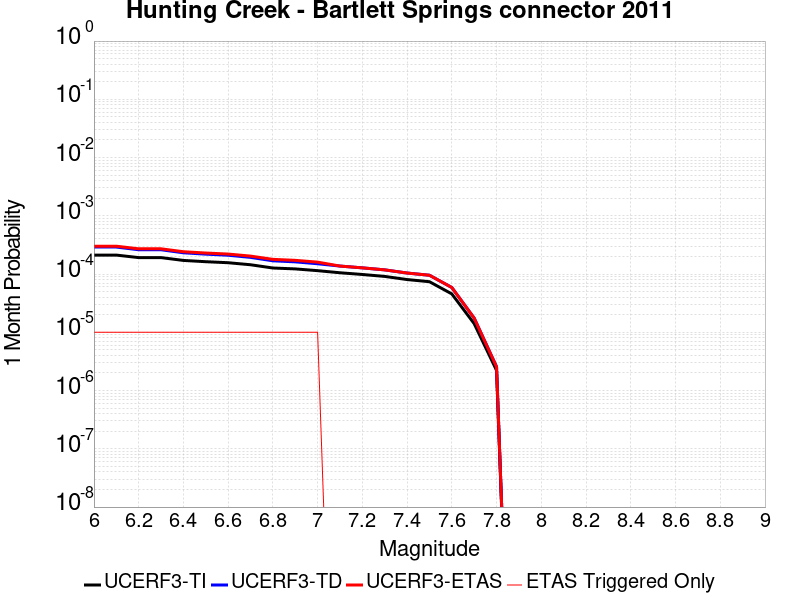 |  |  |

| Magnitude | 1 wk TI Prob | 1 wk TD Prob | 1 wk ETAS Prob | 1 wk ETAS/TD Gain | 1 wk ETAS Triggered Only | 1 mo TI Prob | 1 mo TD Prob | 1 mo ETAS Prob | 1 mo ETAS/TD Gain | 1 mo ETAS Triggered Only | 1 yr TI Prob | 1 yr TD Prob | 1 yr ETAS Prob | 1 yr ETAS/TD Gain | 1 yr ETAS Triggered Only | 10 yr TI Prob | 10 yr TD Prob | 10 yr ETAS Prob | 10 yr ETAS/TD Gain | 10 yr ETAS Triggered Only |
|-----|-----|-----|-----|-----|-----|-----|-----|-----|-----|-----|-----|-----|-----|-----|-----|-----|-----|-----|-----|-----|
| 6.0 | 4.940016E-5 | 6.786822E-5 | 1.0603356E-4 | 1.5623449 | 3.816794E-5 | 2.1169778E-4 | 2.9083234E-4 | 3.2898918E-4 | 1.1311988 | 3.816794E-5 | 0.002574374 | 0.003535177 | 0.0035732102 | 1.0107584 | 3.816794E-5 | 0.025447546 | 0.034773834 | 0.034810677 | 1.0010594 | 3.816794E-5 |
| 6.1 | 4.940016E-5 | 6.786822E-5 | 1.0603356E-4 | 1.5623449 | 3.816794E-5 | 2.1169778E-4 | 2.9083234E-4 | 3.2898918E-4 | 1.1311988 | 3.816794E-5 | 0.002574374 | 0.003535177 | 0.0035732102 | 1.0107584 | 3.816794E-5 | 0.025447546 | 0.034773834 | 0.034810677 | 1.0010594 | 3.816794E-5 |
| 6.2 | 4.472471E-5 | 6.1002804E-5 | 9.9168414E-5 | 1.625637 | 3.816794E-5 | 1.9166325E-4 | 2.6141506E-4 | 2.9957303E-4 | 1.145967 | 3.816794E-5 | 0.0023310026 | 0.003178107 | 0.0032161537 | 1.0119715 | 3.816794E-5 | 0.02306703 | 0.031316914 | 0.031353887 | 1.0011806 | 3.816794E-5 |
| 6.3 | 4.472471E-5 | 6.1002804E-5 | 9.9168414E-5 | 1.625637 | 3.816794E-5 | 1.9166325E-4 | 2.6141506E-4 | 2.9957303E-4 | 1.145967 | 3.816794E-5 | 0.0023310026 | 0.003178107 | 0.0032161537 | 1.0119715 | 3.816794E-5 | 0.02306703 | 0.031316914 | 0.031353887 | 1.0011806 | 3.816794E-5 |
| 6.4 | 4.0001003E-5 | 5.4103755E-5 | 9.2269634E-5 | 1.70542 | 3.816794E-5 | 1.714216E-4 | 2.31853E-4 | 2.700121E-4 | 1.1645831 | 3.816794E-5 | 0.0020850603 | 0.0028191248 | 0.0028571852 | 1.0135008 | 3.816794E-5 | 0.02065605 | 0.027828315 | 0.027865421 | 1.0013334 | 3.816794E-5 |
| 6.5 | 3.8033053E-5 | 5.1266547E-5 | 8.943253E-5 | 1.7444618 | 3.816794E-5 | 1.6298861E-4 | 2.1969559E-4 | 2.5785514E-4 | 1.1736928 | 3.816794E-5 | 0.0019825802 | 0.0026714746 | 0.0027095405 | 1.0142491 | 3.816794E-5 | 0.019649856 | 0.026390454 | 0.026427615 | 1.0014081 | 3.816794E-5 |
| 6.6 | 3.653754E-5 | 4.913017E-5 | 8.7296234E-5 | 1.7768356 | 3.816794E-5 | 1.5658008E-4 | 2.1054115E-4 | 2.4870108E-4 | 1.1812468 | 3.816794E-5 | 0.0019046954 | 0.0025602852 | 0.0025983555 | 1.0148696 | 3.816794E-5 | 0.018884527 | 0.025306415 | 0.025343616 | 1.0014701 | 3.816794E-5 |
| 6.7 | 3.372024E-5 | 4.514011E-5 | 8.3306324E-5 | 1.8455056 | 3.816794E-5 | 1.4450731E-4 | 1.9344354E-4 | 2.316041E-4 | 1.1972697 | 3.816794E-5 | 0.0017579567 | 0.002352639 | 0.0023907174 | 1.0161853 | 3.816794E-5 | 0.017441148 | 0.023278099 | 0.023315378 | 1.0016015 | 3.816794E-5 |
| 6.8 | 2.9650024E-5 | 3.9411374E-5 | 7.757781E-5 | 1.9684117 | 3.816794E-5 | 1.2706534E-4 | 1.6889503E-4 | 2.0705652E-4 | 1.225948 | 3.816794E-5 | 0.0015459227 | 0.0020543463 | 0.0020924357 | 1.018541 | 3.816794E-5 | 0.015352124 | 0.020351216 | 0.020388607 | 1.0018373 | 3.816794E-5 |
| 6.9 | 2.860775E-5 | 3.7812544E-5 | 7.597904E-5 | 2.0093608 | 3.816794E-5 | 1.2259888E-4 | 1.6204377E-4 | 2.0020551E-4 | 1.2355027 | 3.816794E-5 | 0.0014916194 | 0.001971107 | 0.0020091997 | 1.0193255 | 3.816794E-5 | 0.014816469 | 0.01953584 | 0.019573262 | 1.0019156 | 3.816794E-5 |
| 7.0 | 2.6696067E-5 | 3.506726E-5 | 7.323386E-5 | 2.0883827 | 3.816794E-5 | 1.144067E-4 | 1.5027967E-4 | 1.8844187E-4 | 1.2539412 | 3.816794E-5 | 0.0013920115 | 0.0018281302 | 0.0018662284 | 1.0208399 | 3.816794E-5 | 0.013833242 | 0.018131364 | 0.01816884 | 1.0020669 | 3.816794E-5 |
| 7.1 | 2.456087E-5 | 3.2013093E-5 | 3.2013093E-5 | 1.0 | 0.0 | 1.0525662E-4 | 1.371918E-4 | 1.371918E-4 | 1.0 | 0.0 | 0.001280746 | 0.0016690396 | 0.0016690396 | 1.0 | 0.0 | 0.012733897 | 0.016566366 | 0.016566366 | 1.0 | 0.0 |
| 7.2 | 2.295761E-5 | 2.9822932E-5 | 2.9822932E-5 | 1.0 | 0.0 | 9.8386045E-5 | 1.2780636E-4 | 1.2780636E-4 | 1.0 | 0.0 | 0.0011971919 | 0.001554941 | 0.001554941 | 1.0 | 0.0 | 0.011907627 | 0.015442089 | 0.015442089 | 1.0 | 0.0 |
| 7.3 | 2.1256936E-5 | 2.7541912E-5 | 2.7541912E-5 | 1.0 | 0.0 | 9.109797E-5 | 1.1803147E-4 | 1.1803147E-4 | 1.0 | 0.0 | 0.0011085535 | 0.0014360948 | 0.0014360948 | 1.0 | 0.0 | 0.011030397 | 0.014269472 | 0.014269472 | 1.0 | 0.0 |
| 7.4 | 1.8784336E-5 | 2.4306766E-5 | 2.4306766E-5 | 1.0 | 0.0 | 8.050181E-5 | 1.0416774E-4 | 1.0416774E-4 | 1.0 | 0.0 | 9.796688E-4 | 0.001267512 | 0.001267512 | 1.0 | 0.0 | 0.009753612 | 0.012603902 | 0.012603902 | 1.0 | 0.0 |
| 7.5 | 1.7248298E-5 | 2.2268887E-5 | 2.2268887E-5 | 1.0 | 0.0 | 7.391918E-5 | 9.543464E-5 | 9.543464E-5 | 1.0 | 0.0 | 8.9959445E-4 | 0.0011613049 | 0.0011613049 | 1.0 | 0.0 | 0.008959615 | 0.01155334 | 0.01155334 | 1.0 | 0.0 |
| 7.6 | 1.0653709E-5 | 1.3722118E-5 | 1.3722118E-5 | 1.0 | 0.0 | 4.5657955E-5 | 5.8807767E-5 | 5.8807767E-5 | 1.0 | 0.0 | 5.557438E-4 | 7.157521E-4 | 7.157521E-4 | 1.0 | 0.0 | 0.0055435603 | 0.0071348166 | 0.0071348166 | 1.0 | 0.0 |
| 7.7 | 3.286316E-6 | 4.0903437E-6 | 4.0903437E-6 | 1.0 | 0.0 | 1.4084137E-5 | 1.7529928E-5 | 1.7529928E-5 | 1.0 | 0.0 | 1.7146087E-4 | 2.1340612E-4 | 2.1340612E-4 | 1.0 | 0.0 | 0.0017132863 | 0.0021320276 | 0.0021320276 | 1.0 | 0.0 |
| 7.8 | 5.1855085E-7 | 5.9720696E-7 | 5.9720696E-7 | 1.0 | 0.0 | 2.222359E-6 | 2.5594559E-6 | 2.5594559E-6 | 1.0 | 0.0 | 2.7056883E-5 | 3.116094E-5 | 3.116094E-5 | 1.0 | 0.0 | 2.705359E-4 | 3.1156495E-4 | 3.1156495E-4 | 1.0 | 0.0 |

## West Tahoe
*[(top)](#table-of-contents)*

| 1 Week | 1 Month | 1 Year | 10 Year |
|-----|-----|-----|-----|
|  |  |  |  |

| Magnitude | 1 wk TI Prob | 1 wk TD Prob | 1 wk ETAS Prob | 1 wk ETAS/TD Gain | 1 wk ETAS Triggered Only | 1 mo TI Prob | 1 mo TD Prob | 1 mo ETAS Prob | 1 mo ETAS/TD Gain | 1 mo ETAS Triggered Only | 1 yr TI Prob | 1 yr TD Prob | 1 yr ETAS Prob | 1 yr ETAS/TD Gain | 1 yr ETAS Triggered Only | 10 yr TI Prob | 10 yr TD Prob | 10 yr ETAS Prob | 10 yr ETAS/TD Gain | 10 yr ETAS Triggered Only |
|-----|-----|-----|-----|-----|-----|-----|-----|-----|-----|-----|-----|-----|-----|-----|-----|-----|-----|-----|-----|-----|
| 6.0 | 1.952444E-5 | 2.118317E-5 | 2.118317E-5 | 1.0 | 0.0 | 8.367348E-5 | 9.078217E-5 | 9.078217E-5 | 1.0 | 0.0 | 0.0010182485 | 0.0011047672 | 0.0011428929 | 1.0345103 | 3.816794E-5 | 0.010135954 | 0.010998235 | 0.011035983 | 1.0034322 | 3.816794E-5 |
| 6.1 | 1.952444E-5 | 2.118317E-5 | 2.118317E-5 | 1.0 | 0.0 | 8.367348E-5 | 9.078217E-5 | 9.078217E-5 | 1.0 | 0.0 | 0.0010182485 | 0.0011047672 | 0.0011428929 | 1.0345103 | 3.816794E-5 | 0.010135954 | 0.010998235 | 0.011035983 | 1.0034322 | 3.816794E-5 |
| 6.2 | 1.952444E-5 | 2.118317E-5 | 2.118317E-5 | 1.0 | 0.0 | 8.367348E-5 | 9.078217E-5 | 9.078217E-5 | 1.0 | 0.0 | 0.0010182485 | 0.0011047672 | 0.0011428929 | 1.0345103 | 3.816794E-5 | 0.010135954 | 0.010998235 | 0.011035983 | 1.0034322 | 3.816794E-5 |
| 6.3 | 1.952444E-5 | 2.118317E-5 | 2.118317E-5 | 1.0 | 0.0 | 8.367348E-5 | 9.078217E-5 | 9.078217E-5 | 1.0 | 0.0 | 0.0010182485 | 0.0011047672 | 0.0011428929 | 1.0345103 | 3.816794E-5 | 0.010135954 | 0.010998235 | 0.011035983 | 1.0034322 | 3.816794E-5 |
| 6.4 | 1.952444E-5 | 2.118317E-5 | 2.118317E-5 | 1.0 | 0.0 | 8.367348E-5 | 9.078217E-5 | 9.078217E-5 | 1.0 | 0.0 | 0.0010182485 | 0.0011047672 | 0.0011428929 | 1.0345103 | 3.816794E-5 | 0.010135954 | 0.010998235 | 0.011035983 | 1.0034322 | 3.816794E-5 |
| 6.5 | 1.2685271E-5 | 1.3690627E-5 | 1.3690627E-5 | 1.0 | 0.0 | 5.4364315E-5 | 5.8672893E-5 | 5.8672893E-5 | 1.0 | 0.0 | 6.616845E-4 | 7.141248E-4 | 7.522655E-4 | 1.053409 | 3.816794E-5 | 0.0065971776 | 0.00711995 | 0.007157846 | 1.0053226 | 3.816794E-5 |
| 6.6 | 1.2685271E-5 | 1.3690627E-5 | 1.3690627E-5 | 1.0 | 0.0 | 5.4364315E-5 | 5.8672893E-5 | 5.8672893E-5 | 1.0 | 0.0 | 6.616845E-4 | 7.141248E-4 | 7.522655E-4 | 1.053409 | 3.816794E-5 | 0.0065971776 | 0.00711995 | 0.007157846 | 1.0053226 | 3.816794E-5 |
| 6.7 | 9.117886E-6 | 9.809846E-6 | 9.809846E-6 | 1.0 | 0.0 | 3.9076072E-5 | 4.2041564E-5 | 4.2041564E-5 | 1.0 | 0.0 | 4.756473E-4 | 5.11743E-4 | 5.11743E-4 | 1.0 | 0.0 | 0.0047463053 | 0.0051063634 | 0.0051063634 | 1.0 | 0.0 |
| 6.8 | 8.786828E-6 | 9.457863E-6 | 9.457863E-6 | 1.0 | 0.0 | 3.7657293E-5 | 4.053311E-5 | 4.053311E-5 | 1.0 | 0.0 | 4.5838108E-4 | 4.933859E-4 | 4.933859E-4 | 1.0 | 0.0 | 0.0045743673 | 0.0049236063 | 0.0049236063 | 1.0 | 0.0 |
| 6.9 | 6.7562123E-6 | 7.2638086E-6 | 7.2638086E-6 | 1.0 | 0.0 | 2.8954875E-5 | 3.1130265E-5 | 3.1130265E-5 | 1.0 | 0.0 | 3.5246857E-4 | 3.789498E-4 | 3.789498E-4 | 1.0 | 0.0 | 0.0035191004 | 0.0037835082 | 0.0037835082 | 1.0 | 0.0 |
| 7.0 | 5.1792854E-6 | 5.567338E-6 | 5.567338E-6 | 1.0 | 0.0 | 2.2196748E-5 | 2.3859824E-5 | 2.3859824E-5 | 1.0 | 0.0 | 2.702119E-4 | 2.9045844E-4 | 2.9045844E-4 | 1.0 | 0.0 | 0.0026988357 | 0.0029011632 | 0.0029011632 | 1.0 | 0.0 |
| 7.1 | 4.090765E-6 | 4.3974223E-6 | 4.3974223E-6 | 1.0 | 0.0 | 1.7531731E-5 | 1.884598E-5 | 1.884598E-5 | 1.0 | 0.0 | 2.134279E-4 | 2.2942905E-4 | 2.2942905E-4 | 1.0 | 0.0 | 0.0021322304 | 0.0022922563 | 0.0022922563 | 1.0 | 0.0 |
| 7.2 | 2.2356758E-6 | 2.4023684E-6 | 2.4023684E-6 | 1.0 | 0.0 | 9.581432E-6 | 1.0295834E-5 | 1.0295834E-5 | 1.0 | 0.0 | 1.1664769E-4 | 1.2534647E-4 | 1.2534647E-4 | 1.0 | 0.0 | 0.0011658648 | 0.0012529434 | 0.0012529434 | 1.0 | 0.0 |

## San Jacinto (Borrego)
*[(top)](#table-of-contents)*

| 1 Week | 1 Month | 1 Year | 10 Year |
|-----|-----|-----|-----|
|  |  |  | 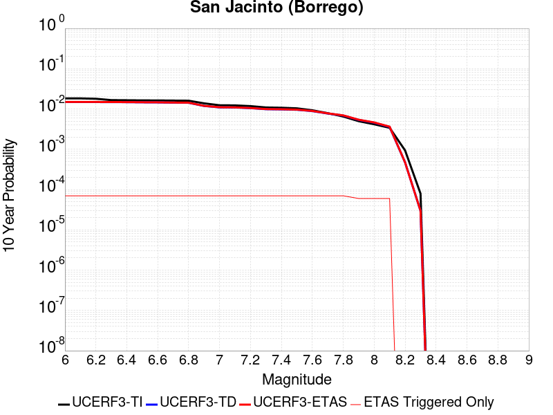 |

| Magnitude | 1 wk TI Prob | 1 wk TD Prob | 1 wk ETAS Prob | 1 wk ETAS/TD Gain | 1 wk ETAS Triggered Only | 1 mo TI Prob | 1 mo TD Prob | 1 mo ETAS Prob | 1 mo ETAS/TD Gain | 1 mo ETAS Triggered Only | 1 yr TI Prob | 1 yr TD Prob | 1 yr ETAS Prob | 1 yr ETAS/TD Gain | 1 yr ETAS Triggered Only | 10 yr TI Prob | 10 yr TD Prob | 10 yr ETAS Prob | 10 yr ETAS/TD Gain | 10 yr ETAS Triggered Only |
|-----|-----|-----|-----|-----|-----|-----|-----|-----|-----|-----|-----|-----|-----|-----|-----|-----|-----|-----|-----|-----|
| 6.0 | 3.543992E-5 | 2.7926513E-5 | 6.609339E-5 | 2.3666897 | 3.816794E-5 | 1.5187653E-4 | 1.1967963E-4 | 1.5784301E-4 | 1.3188794 | 3.816794E-5 | 0.0018475284 | 0.0014561379 | 0.0014942501 | 1.0261736 | 3.816794E-5 | 0.018322436 | 0.014869647 | 0.014907247 | 1.0025287 | 3.816794E-5 |
| 6.1 | 3.542281E-5 | 2.7926513E-5 | 6.609339E-5 | 2.3666897 | 3.816794E-5 | 1.5180321E-4 | 1.1967963E-4 | 1.5784301E-4 | 1.3188794 | 3.816794E-5 | 0.0018466372 | 0.0014561379 | 0.0014942501 | 1.0261736 | 3.816794E-5 | 0.018313672 | 0.014869647 | 0.014907247 | 1.0025287 | 3.816794E-5 |
| 6.2 | 3.4688688E-5 | 2.7926511E-5 | 6.609339E-5 | 2.3666897 | 3.816794E-5 | 1.4865733E-4 | 1.1967963E-4 | 1.57843E-4 | 1.3188794 | 3.816794E-5 | 0.0018084005 | 0.0014561379 | 0.0014942501 | 1.0261736 | 3.816794E-5 | 0.017937548 | 0.014869647 | 0.014907247 | 1.0025287 | 3.816794E-5 |
| 6.3 | 3.2087122E-5 | 2.7771865E-5 | 6.5938744E-5 | 2.3743002 | 3.816794E-5 | 1.3750899E-4 | 1.1901691E-4 | 1.5718032E-4 | 1.3206552 | 3.816794E-5 | 0.0016728862 | 0.00144808 | 0.0014861927 | 1.0263195 | 3.816794E-5 | 0.016603488 | 0.014790683 | 0.014828286 | 1.0025424 | 3.816794E-5 |
| 6.4 | 3.1828724E-5 | 2.7738852E-5 | 6.590573E-5 | 2.3759358 | 3.816794E-5 | 1.364017E-4 | 1.1887544E-4 | 1.5703884E-4 | 1.3210369 | 3.816794E-5 | 0.0016594254 | 0.0014463598 | 0.0014844725 | 1.0263509 | 3.816794E-5 | 0.016470885 | 0.014773762 | 0.014811366 | 1.0025454 | 3.816794E-5 |
| 6.5 | 3.1563577E-5 | 2.747857E-5 | 6.564546E-5 | 2.3889692 | 3.816794E-5 | 1.3526545E-4 | 1.1776006E-4 | 1.559235E-4 | 1.324078 | 3.816794E-5 | 0.0016456128 | 0.0014327979 | 0.0014709112 | 1.0266006 | 3.816794E-5 | 0.0163348 | 0.014640348 | 0.014677957 | 1.0025688 | 3.816794E-5 |
| 6.6 | 3.1467625E-5 | 2.7322796E-5 | 6.5489694E-5 | 2.3968885 | 3.816794E-5 | 1.3485427E-4 | 1.1709251E-4 | 1.5525598E-4 | 1.3259258 | 3.816794E-5 | 0.0016406142 | 0.0014246812 | 0.0014627947 | 1.0267524 | 3.816794E-5 | 0.016285548 | 0.014560594 | 0.014598207 | 1.0025831 | 3.816794E-5 |
| 6.7 | 3.1223695E-5 | 2.6940816E-5 | 6.510773E-5 | 2.4166946 | 3.816794E-5 | 1.3380898E-4 | 1.15455594E-4 | 1.5361913E-4 | 1.3305473 | 3.816794E-5 | 0.0016279068 | 0.0014047775 | 0.0014428919 | 1.0271319 | 3.816794E-5 | 0.01616033 | 0.014364966 | 0.014402586 | 1.0026188 | 3.816794E-5 |
| 6.8 | 3.1015585E-5 | 2.6761822E-5 | 6.492874E-5 | 2.4261703 | 3.816794E-5 | 1.3291716E-4 | 1.1468855E-4 | 1.5285211E-4 | 1.3327583 | 3.816794E-5 | 0.001617065 | 0.0013954508 | 0.0014335655 | 1.0273135 | 3.816794E-5 | 0.016053487 | 0.014272246 | 0.014309869 | 1.0026361 | 3.816794E-5 |
| 6.9 | 2.6641965E-5 | 2.2184247E-5 | 6.035134E-5 | 2.7204592 | 3.816794E-5 | 1.1417485E-4 | 9.50719E-5 | 1.3323622E-4 | 1.4014257 | 3.816794E-5 | 0.0013891924 | 0.0011568897 | 0.0011950134 | 1.0329537 | 3.816794E-5 | 0.0138054015 | 0.011882438 | 0.011920153 | 1.003174 | 3.816794E-5 |
| 7.0 | 2.3854353E-5 | 2.0479023E-5 | 5.864618E-5 | 2.8637197 | 3.816794E-5 | 1.02228936E-4 | 8.77643E-5 | 1.259289E-4 | 1.4348532 | 3.816794E-5 | 0.0012439266 | 0.0010680092 | 0.0011061364 | 1.0356992 | 3.816794E-5 | 0.012369866 | 0.0109828 | 0.01102055 | 1.003437 | 3.816794E-5 |
| 7.1 | 2.3672901E-5 | 2.031551E-5 | 5.8482674E-5 | 2.8787203 | 3.816794E-5 | 1.0145135E-4 | 8.7063585E-5 | 1.252282E-4 | 1.4383534 | 3.816794E-5 | 0.0012344702 | 0.0010594862 | 0.0010976137 | 1.0359868 | 3.816794E-5 | 0.0122763505 | 0.010897976 | 0.010935728 | 1.0034641 | 3.816794E-5 |
| 7.2 | 2.2717244E-5 | 1.9542893E-5 | 5.7710084E-5 | 2.952996 | 3.816794E-5 | 9.735599E-5 | 8.375258E-5 | 1.2191732E-4 | 1.4556844 | 3.816794E-5 | 0.0011846646 | 0.001019213 | 0.001057342 | 1.0374103 | 3.816794E-5 | 0.01178369 | 0.010495341 | 0.010533108 | 1.0035985 | 3.816794E-5 |
| 7.3 | 2.1016205E-5 | 1.8384526E-5 | 5.6551762E-5 | 3.0760524 | 3.816794E-5 | 9.006634E-5 | 7.878846E-5 | 1.16953386E-4 | 1.4843975 | 3.816794E-5 | 0.001096006 | 9.5882936E-4 | 9.969607E-4 | 1.0397687 | 3.816794E-5 | 0.010906163 | 0.009890967 | 0.009928757 | 1.0038207 | 3.816794E-5 |
| 7.4 | 2.0683625E-5 | 1.8187047E-5 | 5.6354293E-5 | 3.098595 | 3.816794E-5 | 8.86411E-5 | 7.794217E-5 | 1.16107134E-4 | 1.4896574 | 3.816794E-5 | 0.001078671 | 9.485349E-4 | 9.866665E-4 | 1.0402007 | 3.816794E-5 | 0.010734501 | 0.009787692 | 0.009825487 | 1.0038614 | 3.816794E-5 |
| 7.5 | 1.9993966E-5 | 1.7782075E-5 | 5.5949335E-5 | 3.1463897 | 3.816794E-5 | 8.568561E-5 | 7.620667E-5 | 1.143717E-4 | 1.5008096 | 3.816794E-5 | 0.001042723 | 9.2742336E-4 | 9.655559E-4 | 1.0411166 | 3.816794E-5 | 0.010378438 | 0.009574614 | 0.009612417 | 1.0039482 | 3.816794E-5 |
| 7.6 | 1.788966E-5 | 1.6435291E-5 | 5.4602602E-5 | 3.3222778 | 3.816794E-5 | 7.666772E-5 | 7.043507E-5 | 1.0860032E-4 | 1.5418501 | 3.816794E-5 | 9.3302975E-4 | 8.572113E-4 | 8.953465E-4 | 1.0444876 | 3.816794E-5 | 0.00929122 | 0.008866487 | 0.008904316 | 1.0042666 | 3.816794E-5 |
| 7.7 | 1.5125781E-5 | 1.4237377E-5 | 5.2404772E-5 | 3.6807883 | 3.816794E-5 | 6.4823165E-5 | 6.1015908E-5 | 9.918152E-5 | 1.6255026 | 3.816794E-5 | 7.889362E-4 | 7.426163E-4 | 7.807559E-4 | 1.0513585 | 3.816794E-5 | 0.007861412 | 0.0077142045 | 0.0077520777 | 1.0049096 | 3.816794E-5 |
| 7.8 | 1.250089E-5 | 1.26304985E-5 | 5.0797957E-5 | 4.0218487 | 3.816794E-5 | 5.3574146E-5 | 5.412959E-5 | 9.2295464E-5 | 1.7050834 | 3.816794E-5 | 6.5207E-4 | 6.588291E-4 | 6.969719E-4 | 1.0578948 | 3.816794E-5 | 0.006501599 | 0.0068677636 | 0.0069056693 | 1.0055194 | 3.816794E-5 |
| 7.9 | 9.561E-6 | 9.754616E-6 | 4.792218E-5 | 4.91277 | 3.816794E-5 | 4.0975072E-5 | 4.1804833E-5 | 7.997118E-5 | 1.9129648 | 3.816794E-5 | 4.987573E-4 | 5.088555E-4 | 5.4700405E-4 | 1.0749693 | 3.816794E-5 | 0.0049763937 | 0.0053523467 | 0.00539031 | 1.007093 | 3.816794E-5 |
| 8.0 | 8.01699E-6 | 8.293488E-6 | 4.646111E-5 | 5.6021194 | 3.816794E-5 | 3.4358076E-5 | 3.554304E-5 | 7.370962E-5 | 2.0738132 | 3.816794E-5 | 4.1822926E-4 | 4.3265108E-4 | 4.708025E-4 | 1.0881805 | 3.816794E-5 | 0.0041744304 | 0.004573375 | 0.0046113683 | 1.0083075 | 3.816794E-5 |
| 8.1 | 6.541947E-6 | 6.4622354E-6 | 4.4629927E-5 | 6.9062676 | 3.816794E-5 | 2.8036617E-5 | 2.7695003E-5 | 6.586189E-5 | 2.3781145 | 3.816794E-5 | 3.4129233E-4 | 3.37135E-4 | 3.7529008E-4 | 1.1131744 | 3.816794E-5 | 0.0034076865 | 0.0035806994 | 0.0036187307 | 1.0106212 | 3.816794E-5 |
| 8.2 | 1.7968189E-6 | 7.9713476E-7 | 7.9713476E-7 | 1.0 | 0.0 | 7.70063E-6 | 3.4162877E-6 | 3.4162877E-6 | 1.0 | 0.0 | 9.3751136E-5 | 4.159253E-5 | 4.159253E-5 | 1.0 | 0.0 | 9.371159E-4 | 4.712058E-4 | 4.712058E-4 | 1.0 | 0.0 |
| 8.3 | 1.5167889E-7 | 4.897714E-8 | 4.897714E-8 | 1.0 | 0.0 | 6.500522E-7 | 2.09902E-7 | 2.09902E-7 | 1.0 | 0.0 | 7.9143565E-6 | 2.5555544E-6 | 2.5555544E-6 | 1.0 | 0.0 | 7.914075E-5 | 2.969505E-5 | 2.969505E-5 | 1.0 | 0.0 |

## San Jacinto (Clark) rev
*[(top)](#table-of-contents)*

| 1 Week | 1 Month | 1 Year | 10 Year |
|-----|-----|-----|-----|
|  |  |  |  |

| Magnitude | 1 wk TI Prob | 1 wk TD Prob | 1 wk ETAS Prob | 1 wk ETAS/TD Gain | 1 wk ETAS Triggered Only | 1 mo TI Prob | 1 mo TD Prob | 1 mo ETAS Prob | 1 mo ETAS/TD Gain | 1 mo ETAS Triggered Only | 1 yr TI Prob | 1 yr TD Prob | 1 yr ETAS Prob | 1 yr ETAS/TD Gain | 1 yr ETAS Triggered Only | 10 yr TI Prob | 10 yr TD Prob | 10 yr ETAS Prob | 10 yr ETAS/TD Gain | 10 yr ETAS Triggered Only |
|-----|-----|-----|-----|-----|-----|-----|-----|-----|-----|-----|-----|-----|-----|-----|-----|-----|-----|-----|-----|-----|
| 6.0 | 4.482615E-5 | 2.1154196E-5 | 5.9321326E-5 | 2.8042347 | 3.816794E-5 | 1.9209793E-4 | 9.065773E-5 | 1.2882221E-4 | 1.4209732 | 3.816794E-5 | 0.0023362834 | 0.0011032083 | 0.0011413341 | 1.034559 | 3.816794E-5 | 0.02311874 | 0.011503847 | 0.011541576 | 1.0032797 | 3.816794E-5 |
| 6.1 | 4.482615E-5 | 2.1154196E-5 | 5.9321326E-5 | 2.8042347 | 3.816794E-5 | 1.9209793E-4 | 9.065773E-5 | 1.2882221E-4 | 1.4209732 | 3.816794E-5 | 0.0023362834 | 0.0011032083 | 0.0011413341 | 1.034559 | 3.816794E-5 | 0.02311874 | 0.011503847 | 0.011541576 | 1.0032797 | 3.816794E-5 |
| 6.2 | 4.482615E-5 | 2.1154196E-5 | 5.9321326E-5 | 2.8042347 | 3.816794E-5 | 1.9209793E-4 | 9.065773E-5 | 1.2882221E-4 | 1.4209732 | 3.816794E-5 | 0.0023362834 | 0.0011032083 | 0.0011413341 | 1.034559 | 3.816794E-5 | 0.02311874 | 0.011503847 | 0.011541576 | 1.0032797 | 3.816794E-5 |
| 6.3 | 4.482615E-5 | 2.1154196E-5 | 5.9321326E-5 | 2.8042347 | 3.816794E-5 | 1.9209793E-4 | 9.065773E-5 | 1.2882221E-4 | 1.4209732 | 3.816794E-5 | 0.0023362834 | 0.0011032083 | 0.0011413341 | 1.034559 | 3.816794E-5 | 0.02311874 | 0.011503847 | 0.011541576 | 1.0032797 | 3.816794E-5 |
| 6.4 | 4.482615E-5 | 2.1154196E-5 | 5.9321326E-5 | 2.8042347 | 3.816794E-5 | 1.9209793E-4 | 9.065773E-5 | 1.2882221E-4 | 1.4209732 | 3.816794E-5 | 0.0023362834 | 0.0011032083 | 0.0011413341 | 1.034559 | 3.816794E-5 | 0.02311874 | 0.011503847 | 0.011541576 | 1.0032797 | 3.816794E-5 |
| 6.5 | 3.7294863E-5 | 1.7356087E-5 | 5.5523364E-5 | 3.1990714 | 3.816794E-5 | 1.5982533E-4 | 7.438113E-5 | 1.1254624E-4 | 1.5131018 | 3.816794E-5 | 0.0019441366 | 9.052186E-4 | 9.4335194E-4 | 1.0421262 | 3.816794E-5 | 0.01927216 | 0.0094941035 | 0.009531909 | 1.003982 | 3.816794E-5 |
| 6.6 | 3.7294863E-5 | 1.7356087E-5 | 5.5523364E-5 | 3.1990714 | 3.816794E-5 | 1.5982533E-4 | 7.438113E-5 | 1.1254624E-4 | 1.5131018 | 3.816794E-5 | 0.0019441366 | 9.052186E-4 | 9.4335194E-4 | 1.0421262 | 3.816794E-5 | 0.01927216 | 0.0094941035 | 0.009531909 | 1.003982 | 3.816794E-5 |
| 6.7 | 3.6039248E-5 | 1.6604314E-5 | 5.477162E-5 | 3.298638 | 3.816794E-5 | 1.5444479E-4 | 7.1159426E-5 | 1.0932465E-4 | 1.536334 | 3.816794E-5 | 0.0018787434 | 8.6602574E-4 | 9.0416067E-4 | 1.0440344 | 3.816794E-5 | 0.01862939 | 0.009096047 | 0.009133868 | 1.0041579 | 3.816794E-5 |
| 6.8 | 3.5031844E-5 | 1.6232942E-5 | 5.440026E-5 | 3.3512263 | 3.816794E-5 | 1.5012783E-4 | 6.956792E-5 | 1.077332E-4 | 1.5486046 | 3.816794E-5 | 0.0018262739 | 8.4666436E-4 | 8.848E-4 | 1.0450422 | 3.816794E-5 | 0.01811338 | 0.008895969 | 0.0089337975 | 1.0042523 | 3.816794E-5 |
| 6.9 | 3.435112E-5 | 1.6063195E-5 | 5.423052E-5 | 3.3760731 | 3.816794E-5 | 1.4721078E-4 | 6.884047E-5 | 1.0700578E-4 | 1.5544022 | 3.816794E-5 | 0.0017908178 | 8.3781447E-4 | 8.7595044E-4 | 1.0455184 | 3.816794E-5 | 0.017764548 | 0.008804181 | 0.008842012 | 1.004297 | 3.816794E-5 |
| 7.0 | 2.8959772E-5 | 1.4336745E-5 | 5.2504136E-5 | 3.6622076 | 3.816794E-5 | 1.241074E-4 | 6.144176E-5 | 9.960736E-5 | 1.621167 | 3.816794E-5 | 0.0015099603 | 7.477995E-4 | 7.859389E-4 | 1.0510021 | 3.816794E-5 | 0.014997416 | 0.007868037 | 0.007905904 | 1.0048128 | 3.816794E-5 |
| 7.1 | 2.6002877E-5 | 1.2829002E-5 | 5.0996452E-5 | 3.9750912 | 3.816794E-5 | 1.11436144E-4 | 5.498029E-5 | 9.314613E-5 | 1.6941731 | 3.816794E-5 | 0.0013558907 | 6.691816E-4 | 7.0732395E-4 | 1.0569986 | 3.816794E-5 | 0.013476475 | 0.0070465137 | 0.007084413 | 1.0053784 | 3.816794E-5 |
| 7.2 | 2.2544838E-5 | 1.1262543E-5 | 4.943005E-5 | 4.388889 | 3.816794E-5 | 9.661716E-5 | 4.8267157E-5 | 8.6433254E-5 | 1.790726 | 3.816794E-5 | 0.001175679 | 5.874956E-4 | 6.2564114E-4 | 1.064929 | 3.816794E-5 | 0.011694785 | 0.0061927503 | 0.0062306817 | 1.0061252 | 3.816794E-5 |
| 7.3 | 1.75334E-5 | 1.0811715E-5 | 4.897924E-5 | 4.530201 | 3.816794E-5 | 7.514098E-5 | 4.6335106E-5 | 8.450128E-5 | 1.8236988 | 3.816794E-5 | 9.144575E-4 | 5.6398526E-4 | 6.021317E-4 | 1.0676372 | 3.816794E-5 | 0.009107036 | 0.0059337732 | 0.005971715 | 1.0063941 | 3.816794E-5 |
| 7.4 | 1.5924552E-5 | 1.0611516E-5 | 4.877905E-5 | 4.596803 | 3.816794E-5 | 6.82463E-5 | 4.547714E-5 | 8.364335E-5 | 1.8392392 | 3.816794E-5 | 8.305819E-4 | 5.535449E-4 | 5.916917E-4 | 1.0689137 | 3.816794E-5 | 0.008274844 | 0.0058210334 | 0.005858979 | 1.0065187 | 3.816794E-5 |
| 7.5 | 1.3428931E-5 | 9.8519E-6 | 4.801946E-5 | 4.874132 | 3.816794E-5 | 5.7551293E-5 | 4.2221753E-5 | 8.0388076E-5 | 1.9039494 | 3.816794E-5 | 7.004617E-4 | 5.1392964E-4 | 5.5207795E-4 | 1.0742286 | 3.816794E-5 | 0.006982579 | 0.0054066023 | 0.005444564 | 1.0070213 | 3.816794E-5 |
| 7.6 | 1.0688787E-5 | 8.614839E-6 | 4.678245E-5 | 5.430449 | 3.816794E-5 | 4.5808283E-5 | 3.692022E-5 | 7.5086755E-5 | 2.0337567 | 3.816794E-5 | 5.5757316E-4 | 4.4941145E-4 | 4.8756224E-4 | 1.0848906 | 3.816794E-5 | 0.005561762 | 0.0047416524 | 0.004779639 | 1.0080113 | 3.816794E-5 |
| 7.7 | 8.81236E-6 | 7.4680274E-6 | 4.5635683E-5 | 6.110808 | 3.816794E-5 | 3.776671E-5 | 3.2005442E-5 | 7.017216E-5 | 2.1925073 | 3.816794E-5 | 4.597127E-4 | 3.8959677E-4 | 4.2774985E-4 | 1.0979296 | 3.816794E-5 | 0.0045876284 | 0.0041346536 | 0.0041726637 | 1.0091931 | 3.816794E-5 |
| 7.8 | 7.780431E-6 | 6.696579E-6 | 4.4864264E-5 | 6.6995792 | 3.816794E-5 | 3.3344273E-5 | 2.8699309E-5 | 6.686615E-5 | 2.3298872 | 3.816794E-5 | 4.0589093E-4 | 3.4935825E-4 | 3.8751285E-4 | 1.1092134 | 3.816794E-5 | 0.0040515037 | 0.0037227906 | 0.0037608165 | 1.0102143 | 3.816794E-5 |
| 7.9 | 6.5437994E-6 | 5.780382E-6 | 4.39481E-5 | 7.6029754 | 3.816794E-5 | 2.8044553E-5 | 2.477283E-5 | 6.293982E-5 | 2.5406795 | 3.816794E-5 | 3.4138895E-4 | 3.0156763E-4 | 3.3972407E-4 | 1.126527 | 3.816794E-5 | 0.0034086495 | 0.0032344845 | 0.003272529 | 1.0117621 | 3.816794E-5 |
| 8.0 | 5.4488164E-6 | 4.8133406E-6 | 4.2981097E-5 | 8.929577 | 3.816794E-5 | 2.3351862E-5 | 2.062844E-5 | 5.879559E-5 | 2.85022 | 3.816794E-5 | 2.8427184E-4 | 2.5112246E-4 | 2.892808E-4 | 1.1519512 | 3.816794E-5 | 0.0028390845 | 0.002710839 | 0.0027489036 | 1.0140415 | 3.816794E-5 |
| 8.1 | 2.8397242E-6 | 1.3670389E-6 | 3.9534927E-5 | 28.920116 | 3.816794E-5 | 1.217019E-5 | 5.858725E-6 | 4.402644E-5 | 7.5146794 | 3.816794E-5 | 1.4816198E-4 | 7.132765E-5 | 1.09492874E-4 | 1.535069 | 3.816794E-5 | 0.0014806325 | 8.115382E-4 | 8.4967515E-4 | 1.0469934 | 3.816794E-5 |
| 8.2 | 2.030244E-6 | 6.318974E-7 | 6.318974E-7 | 1.0 | 0.0 | 8.701017E-6 | 2.708129E-6 | 2.708129E-6 | 1.0 | 0.0 | 1.05929736E-4 | 3.2970976E-5 | 3.2970976E-5 | 1.0 | 0.0 | 0.0010587925 | 3.9486602E-4 | 3.9486602E-4 | 1.0 | 0.0 |
| 8.3 | 1.0659804E-6 | 2.9250086E-7 | 2.9250086E-7 | 1.0 | 0.0 | 4.568479E-6 | 1.2535745E-6 | 1.2535745E-6 | 1.0 | 0.0 | 5.5619817E-5 | 1.5262167E-5 | 1.5262167E-5 | 1.0 | 0.0 | 5.5605895E-4 | 1.8566217E-4 | 1.8566217E-4 | 1.0 | 0.0 |

## Cleghorn Lake
*[(top)](#table-of-contents)*

| 1 Week | 1 Month | 1 Year | 10 Year |
|-----|-----|-----|-----|
|  |  |  |  |

| Magnitude | 1 wk TI Prob | 1 wk TD Prob | 1 wk ETAS Prob | 1 wk ETAS/TD Gain | 1 wk ETAS Triggered Only | 1 mo TI Prob | 1 mo TD Prob | 1 mo ETAS Prob | 1 mo ETAS/TD Gain | 1 mo ETAS Triggered Only | 1 yr TI Prob | 1 yr TD Prob | 1 yr ETAS Prob | 1 yr ETAS/TD Gain | 1 yr ETAS Triggered Only | 10 yr TI Prob | 10 yr TD Prob | 10 yr ETAS Prob | 10 yr ETAS/TD Gain | 10 yr ETAS Triggered Only |
|-----|-----|-----|-----|-----|-----|-----|-----|-----|-----|-----|-----|-----|-----|-----|-----|-----|-----|-----|-----|-----|
| 6.0 | 1.5467183E-5 | 1.6794203E-5 | 5.4961503E-5 | 3.2726471 | 3.816794E-5 | 6.6286244E-5 | 7.197348E-5 | 1.1013867E-4 | 1.5302674 | 3.816794E-5 | 8.067362E-4 | 8.759797E-4 | 9.1411424E-4 | 1.0435336 | 3.816794E-5 | 0.008038137 | 0.008730696 | 0.008768531 | 1.0043335 | 3.816794E-5 |
| 6.1 | 1.5467183E-5 | 1.6794203E-5 | 5.4961503E-5 | 3.2726471 | 3.816794E-5 | 6.6286244E-5 | 7.197348E-5 | 1.1013867E-4 | 1.5302674 | 3.816794E-5 | 8.067362E-4 | 8.759797E-4 | 9.1411424E-4 | 1.0435336 | 3.816794E-5 | 0.008038137 | 0.008730696 | 0.008768531 | 1.0043335 | 3.816794E-5 |
| 6.2 | 1.2624631E-5 | 1.3681544E-5 | 5.184896E-5 | 3.789701 | 3.816794E-5 | 5.410444E-5 | 5.863415E-5 | 9.679985E-5 | 1.6509125 | 3.816794E-5 | 6.585225E-4 | 7.1368564E-4 | 7.5182633E-4 | 1.0534419 | 3.816794E-5 | 0.0065657445 | 0.0071187317 | 0.007156628 | 1.0053234 | 3.816794E-5 |
| 6.3 | 1.2624631E-5 | 1.3681544E-5 | 5.184896E-5 | 3.789701 | 3.816794E-5 | 5.410444E-5 | 5.863415E-5 | 9.679985E-5 | 1.6509125 | 3.816794E-5 | 6.585225E-4 | 7.1368564E-4 | 7.5182633E-4 | 1.0534419 | 3.816794E-5 | 0.0065657445 | 0.0071187317 | 0.007156628 | 1.0053234 | 3.816794E-5 |
| 6.4 | 9.417684E-6 | 1.0170118E-5 | 1.0170118E-5 | 1.0 | 0.0 | 4.036088E-5 | 4.3585722E-5 | 4.3585722E-5 | 1.0 | 0.0 | 4.912829E-4 | 5.3056807E-4 | 5.3056807E-4 | 1.0 | 0.0 | 0.004901982 | 0.005297049 | 0.005297049 | 1.0 | 0.0 |
| 6.5 | 9.368219E-6 | 1.0117545E-5 | 1.0117545E-5 | 1.0 | 0.0 | 4.014889E-5 | 4.3360415E-5 | 4.3360415E-5 | 1.0 | 0.0 | 4.8870314E-4 | 5.2782625E-4 | 5.2782625E-4 | 1.0 | 0.0 | 0.004876298 | 0.0052697617 | 0.0052697617 | 1.0 | 0.0 |
| 6.6 | 7.803798E-6 | 8.441831E-6 | 8.441831E-6 | 1.0 | 0.0 | 3.3444423E-5 | 3.6179E-5 | 3.6179E-5 | 1.0 | 0.0 | 4.0710976E-4 | 4.4043022E-4 | 4.4043022E-4 | 1.0 | 0.0 | 0.0040636472 | 0.0043994905 | 0.0043994905 | 1.0 | 0.0 |
| 6.7 | 2.3108669E-6 | 2.4438336E-6 | 2.4438336E-6 | 1.0 | 0.0 | 9.903678E-6 | 1.0473532E-5 | 1.0473532E-5 | 1.0 | 0.0 | 1.205706E-4 | 1.2750797E-4 | 1.2750797E-4 | 1.0 | 0.0 | 0.001205052 | 0.0012743667 | 0.0012743667 | 1.0 | 0.0 |
| 6.8 | 2.0882828E-6 | 2.2062823E-6 | 2.2062823E-6 | 1.0 | 0.0 | 8.949753E-6 | 9.455462E-6 | 9.455462E-6 | 1.0 | 0.0 | 1.08957785E-4 | 1.1511434E-4 | 1.1511434E-4 | 1.0 | 0.0 | 0.0010890438 | 0.0011505639 | 0.0011505639 | 1.0 | 0.0 |
| 6.9 | 1.876935E-6 | 1.981051E-6 | 1.981051E-6 | 1.0 | 0.0 | 8.043982E-6 | 8.490192E-6 | 8.490192E-6 | 1.0 | 0.0 | 9.7931086E-5 | 1.03363345E-4 | 1.03363345E-4 | 1.0 | 0.0 | 9.788794E-4 | 0.0010331686 | 0.0010331686 | 1.0 | 0.0 |
| 7.0 | 1.5357559E-6 | 1.6202807E-6 | 1.6202807E-6 | 1.0 | 0.0 | 6.5817944E-6 | 6.9440425E-6 | 6.9440425E-6 | 1.0 | 0.0 | 8.01304E-5 | 8.454057E-5 | 8.454057E-5 | 1.0 | 0.0 | 8.010151E-4 | 8.450965E-4 | 8.450965E-4 | 1.0 | 0.0 |
| 7.1 | 1.0905424E-6 | 1.1497619E-6 | 1.1497619E-6 | 1.0 | 0.0 | 4.6737446E-6 | 4.9275427E-6 | 4.9275427E-6 | 1.0 | 0.0 | 5.6901354E-5 | 5.999128E-5 | 5.999128E-5 | 1.0 | 0.0 | 5.6886784E-4 | 5.997606E-4 | 5.997606E-4 | 1.0 | 0.0 |
| 7.2 | 6.06668E-7 | 6.387277E-7 | 6.387277E-7 | 1.0 | 0.0 | 2.600003E-6 | 2.7374022E-6 | 2.7374022E-6 | 1.0 | 0.0 | 3.1654577E-5 | 3.3327433E-5 | 3.3327433E-5 | 1.0 | 0.0 | 3.1650066E-4 | 3.3323118E-4 | 3.3323118E-4 | 1.0 | 0.0 |

## Elysian Park (Upper)
*[(top)](#table-of-contents)*

| 1 Week | 1 Month | 1 Year | 10 Year |
|-----|-----|-----|-----|
|  |  |  | 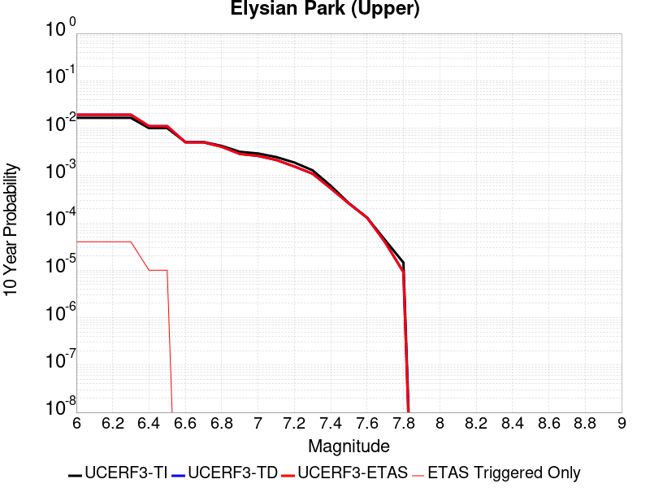 |

| Magnitude | 1 wk TI Prob | 1 wk TD Prob | 1 wk ETAS Prob | 1 wk ETAS/TD Gain | 1 wk ETAS Triggered Only | 1 mo TI Prob | 1 mo TD Prob | 1 mo ETAS Prob | 1 mo ETAS/TD Gain | 1 mo ETAS Triggered Only | 1 yr TI Prob | 1 yr TD Prob | 1 yr ETAS Prob | 1 yr ETAS/TD Gain | 1 yr ETAS Triggered Only | 10 yr TI Prob | 10 yr TD Prob | 10 yr ETAS Prob | 10 yr ETAS/TD Gain | 10 yr ETAS Triggered Only |
|-----|-----|-----|-----|-----|-----|-----|-----|-----|-----|-----|-----|-----|-----|-----|-----|-----|-----|-----|-----|-----|
| 6.0 | 3.1876025E-5 | 3.7035516E-5 | 7.520204E-5 | 2.0305386 | 3.816794E-5 | 1.3660437E-4 | 1.587167E-4 | 1.968786E-4 | 1.2404402 | 3.816794E-5 | 0.0016618895 | 0.0019311075 | 0.0019692017 | 1.0197266 | 3.816794E-5 | 0.016495159 | 0.019189782 | 0.019227218 | 1.0019509 | 3.816794E-5 |
| 6.1 | 3.1876025E-5 | 3.7035516E-5 | 7.520204E-5 | 2.0305386 | 3.816794E-5 | 1.3660437E-4 | 1.587167E-4 | 1.968786E-4 | 1.2404402 | 3.816794E-5 | 0.0016618895 | 0.0019311075 | 0.0019692017 | 1.0197266 | 3.816794E-5 | 0.016495159 | 0.019189782 | 0.019227218 | 1.0019509 | 3.816794E-5 |
| 6.2 | 3.1876025E-5 | 3.7035516E-5 | 7.520204E-5 | 2.0305386 | 3.816794E-5 | 1.3660437E-4 | 1.587167E-4 | 1.968786E-4 | 1.2404402 | 3.816794E-5 | 0.0016618895 | 0.0019311075 | 0.0019692017 | 1.0197266 | 3.816794E-5 | 0.016495159 | 0.019189782 | 0.019227218 | 1.0019509 | 3.816794E-5 |
| 6.3 | 3.1876025E-5 | 3.7035516E-5 | 7.520204E-5 | 2.0305386 | 3.816794E-5 | 1.3660437E-4 | 1.587167E-4 | 1.968786E-4 | 1.2404402 | 3.816794E-5 | 0.0016618895 | 0.0019311075 | 0.0019692017 | 1.0197266 | 3.816794E-5 | 0.016495159 | 0.019189782 | 0.019227218 | 1.0019509 | 3.816794E-5 |
| 6.4 | 1.9273462E-5 | 2.1202266E-5 | 2.1202266E-5 | 1.0 | 0.0 | 8.259794E-5 | 9.086466E-5 | 9.086466E-5 | 1.0 | 0.0 | 0.001005166 | 0.0011058892 | 0.0011058892 | 1.0 | 0.0 | 0.010006315 | 0.011020724 | 0.011020724 | 1.0 | 0.0 |
| 6.5 | 1.9273462E-5 | 2.1202266E-5 | 2.1202266E-5 | 1.0 | 0.0 | 8.259794E-5 | 9.086466E-5 | 9.086466E-5 | 1.0 | 0.0 | 0.001005166 | 0.0011058892 | 0.0011058892 | 1.0 | 0.0 | 0.010006315 | 0.011020724 | 0.011020724 | 1.0 | 0.0 |
| 6.6 | 9.813258E-6 | 9.665599E-6 | 9.665599E-6 | 1.0 | 0.0 | 4.205614E-5 | 4.1423376E-5 | 4.1423376E-5 | 1.0 | 0.0 | 5.119132E-4 | 5.0422014E-4 | 5.0422014E-4 | 1.0 | 0.0 | 0.005107356 | 0.0050314846 | 0.0050314846 | 1.0 | 0.0 |
| 6.7 | 9.801478E-6 | 9.653168E-6 | 9.653168E-6 | 1.0 | 0.0 | 4.2005657E-5 | 4.1370105E-5 | 4.1370105E-5 | 1.0 | 0.0 | 5.112989E-4 | 5.035719E-4 | 5.035719E-4 | 1.0 | 0.0 | 0.0051012407 | 0.0050250315 | 0.0050250315 | 1.0 | 0.0 |
| 6.8 | 8.102489E-6 | 7.773004E-6 | 7.773004E-6 | 1.0 | 0.0 | 3.4724493E-5 | 3.3312477E-5 | 3.3312477E-5 | 1.0 | 0.0 | 4.2268867E-4 | 4.055089E-4 | 4.055089E-4 | 1.0 | 0.0 | 0.004218856 | 0.0040481836 | 0.0040481836 | 1.0 | 0.0 |
| 6.9 | 6.08275E-6 | 5.4814514E-6 | 5.4814514E-6 | 1.0 | 0.0 | 2.6068668E-5 | 2.3491726E-5 | 2.3491726E-5 | 1.0 | 0.0 | 3.173398E-4 | 2.85975E-4 | 2.85975E-4 | 1.0 | 0.0 | 0.0031688702 | 0.0028561477 | 0.0028561477 | 1.0 | 0.0 |
| 7.0 | 5.5995934E-6 | 4.98278E-6 | 4.98278E-6 | 1.0 | 0.0 | 2.3998036E-5 | 2.13546E-5 | 2.13546E-5 | 1.0 | 0.0 | 2.9213692E-4 | 2.599619E-4 | 2.599619E-4 | 1.0 | 0.0 | 0.0029175316 | 0.0025966454 | 0.0025966454 | 1.0 | 0.0 |
| 7.1 | 4.709881E-6 | 4.0874015E-6 | 4.0874015E-6 | 1.0 | 0.0 | 2.0185047E-5 | 1.7517319E-5 | 1.7517319E-5 | 1.0 | 0.0 | 2.4572524E-4 | 2.132529E-4 | 2.132529E-4 | 1.0 | 0.0 | 0.002454537 | 0.002130524 | 0.002130524 | 1.0 | 0.0 |
| 7.2 | 3.6063436E-6 | 2.9779544E-6 | 2.9779544E-6 | 1.0 | 0.0 | 1.5455667E-5 | 1.27626E-5 | 1.27626E-5 | 1.0 | 0.0 | 1.881565E-4 | 1.5537368E-4 | 1.5537368E-4 | 1.0 | 0.0 | 0.0018799726 | 0.0015526618 | 0.0015526618 | 1.0 | 0.0 |
| 7.3 | 2.471135E-6 | 2.0954615E-6 | 2.0954615E-6 | 1.0 | 0.0 | 1.0590536E-5 | 8.980519E-6 | 8.980519E-6 | 1.0 | 0.0 | 1.2893214E-4 | 1.093324E-4 | 1.093324E-4 | 1.0 | 0.0 | 0.0012885736 | 0.0010927934 | 0.0010927934 | 1.0 | 0.0 |
| 7.4 | 1.163943E-6 | 1.0275091E-6 | 1.0275091E-6 | 1.0 | 0.0 | 4.988318E-6 | 4.4036033E-6 | 4.4036033E-6 | 1.0 | 0.0 | 6.0731076E-5 | 5.3612584E-5 | 5.3612584E-5 | 1.0 | 0.0 | 6.071448E-4 | 5.359995E-4 | 5.359995E-4 | 1.0 | 0.0 |
| 7.5 | 4.99459E-7 | 4.917604E-7 | 4.917604E-7 | 1.0 | 0.0 | 2.140537E-6 | 2.1075427E-6 | 2.1075427E-6 | 1.0 | 0.0 | 2.6060725E-5 | 2.5659048E-5 | 2.5659048E-5 | 1.0 | 0.0 | 2.605767E-4 | 2.5656243E-4 | 2.5656243E-4 | 1.0 | 0.0 |
| 7.6 | 2.4667852E-7 | 2.4778336E-7 | 2.4778336E-7 | 1.0 | 0.0 | 1.0571932E-6 | 1.0619283E-6 | 1.0619283E-6 | 1.0 | 0.0 | 1.2871251E-5 | 1.2928905E-5 | 1.2928905E-5 | 1.0 | 0.0 | 1.2870505E-4 | 1.2928189E-4 | 1.2928189E-4 | 1.0 | 0.0 |
| 7.7 | 8.2312795E-8 | 7.3864456E-8 | 7.3864456E-8 | 1.0 | 0.0 | 3.527691E-7 | 3.165619E-7 | 3.165619E-7 | 1.0 | 0.0 | 4.294955E-6 | 3.8541357E-6 | 3.8541357E-6 | 1.0 | 0.0 | 4.2948723E-5 | 3.8540802E-5 | 3.8540802E-5 | 1.0 | 0.0 |
| 7.8 | 2.7819295E-8 | 1.7566023E-8 | 1.7566023E-8 | 1.0 | 0.0 | 1.1922555E-7 | 7.5282955E-8 | 7.5282955E-8 | 1.0 | 0.0 | 1.45157E-6 | 9.165697E-7 | 9.165697E-7 | 1.0 | 0.0 | 1.45156055E-5 | 9.165675E-6 | 9.165675E-6 | 1.0 | 0.0 |

## Calaveras (So) 2011 CFM
*[(top)](#table-of-contents)*

| 1 Week | 1 Month | 1 Year | 10 Year |
|-----|-----|-----|-----|
| 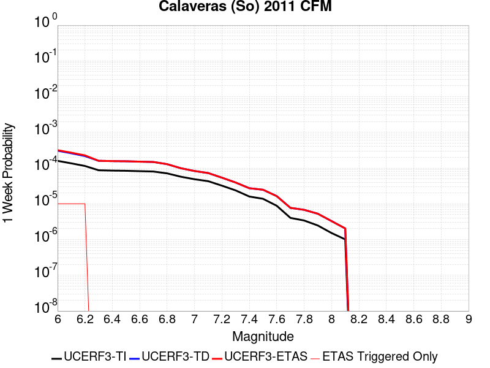 |  |  |  |

| Magnitude | 1 wk TI Prob | 1 wk TD Prob | 1 wk ETAS Prob | 1 wk ETAS/TD Gain | 1 wk ETAS Triggered Only | 1 mo TI Prob | 1 mo TD Prob | 1 mo ETAS Prob | 1 mo ETAS/TD Gain | 1 mo ETAS Triggered Only | 1 yr TI Prob | 1 yr TD Prob | 1 yr ETAS Prob | 1 yr ETAS/TD Gain | 1 yr ETAS Triggered Only | 10 yr TI Prob | 10 yr TD Prob | 10 yr ETAS Prob | 10 yr ETAS/TD Gain | 10 yr ETAS Triggered Only |
|-----|-----|-----|-----|-----|-----|-----|-----|-----|-----|-----|-----|-----|-----|-----|-----|-----|-----|-----|-----|-----|
| 6.0 | 1.5950744E-4 | 3.071188E-4 | 3.4527504E-4 | 1.1242393 | 3.816794E-5 | 6.834242E-4 | 0.0013155643 | 0.001353682 | 1.0289744 | 3.816794E-5 | 0.00828899 | 0.01585904 | 0.015896602 | 1.0023686 | 3.816794E-5 | 0.079865426 | 0.14440064 | 0.1444333 | 1.0002261 | 3.816794E-5 |
| 6.1 | 1.3584697E-4 | 2.6036944E-4 | 2.9852745E-4 | 1.1465533 | 3.816794E-5 | 5.8207137E-4 | 0.0011153965 | 0.0011535218 | 1.034181 | 3.816794E-5 | 0.007063716 | 0.013462106 | 0.01349976 | 1.002797 | 3.816794E-5 | 0.06843361 | 0.12402854 | 0.12406198 | 1.0002695 | 3.816794E-5 |
| 6.2 | 1.14676266E-4 | 2.1726108E-4 | 2.5542075E-4 | 1.1756396 | 3.816794E-5 | 4.9137714E-4 | 9.307893E-4 | 9.689217E-4 | 1.0409678 | 3.816794E-5 | 0.0059661185 | 0.011245592 | 0.01128333 | 1.0033559 | 3.816794E-5 | 0.058084648 | 0.105019294 | 0.10505345 | 1.0003253 | 3.816794E-5 |
| 6.3 | 8.691518E-5 | 1.5987165E-4 | 1.5987165E-4 | 1.0 | 0.0 | 3.7244044E-4 | 6.8496726E-4 | 6.8496726E-4 | 1.0 | 0.0 | 0.004525038 | 0.008300893 | 0.008300893 | 1.0 | 0.0 | 0.044339992 | 0.0793347 | 0.0793347 | 1.0 | 0.0 |
| 6.4 | 8.50982E-5 | 1.5693568E-4 | 1.5693568E-4 | 1.0 | 0.0 | 3.646556E-4 | 6.7239115E-4 | 6.7239115E-4 | 1.0 | 0.0 | 0.0044306475 | 0.008148931 | 0.008148931 | 1.0 | 0.0 | 0.04343345 | 0.077940844 | 0.077940844 | 1.0 | 0.0 |
| 6.5 | 8.4062965E-5 | 1.5518135E-4 | 1.5518135E-4 | 1.0 | 0.0 | 3.602201E-4 | 6.648764E-4 | 6.648764E-4 | 1.0 | 0.0 | 0.004376863 | 0.008058134 | 0.008058134 | 1.0 | 0.0 | 0.042916555 | 0.077112116 | 0.077112116 | 1.0 | 0.0 |
| 6.6 | 8.194716E-5 | 1.5154095E-4 | 1.5154095E-4 | 1.0 | 0.0 | 3.5115483E-4 | 6.492825E-4 | 6.492825E-4 | 1.0 | 0.0 | 0.0042669317 | 0.007869979 | 0.007869979 | 1.0 | 0.0 | 0.04185927 | 0.07539739 | 0.07539739 | 1.0 | 0.0 |
| 6.7 | 8.012326E-5 | 1.4821833E-4 | 1.4821833E-4 | 1.0 | 0.0 | 3.433402E-4 | 6.350497E-4 | 6.350497E-4 | 1.0 | 0.0 | 0.004172157 | 0.007698474 | 0.007698474 | 1.0 | 0.0 | 0.040946912 | 0.073839515 | 0.073839515 | 1.0 | 0.0 |
| 6.8 | 7.119773E-5 | 1.2880519E-4 | 1.2880519E-4 | 1.0 | 0.0 | 3.0509746E-4 | 5.519001E-4 | 5.519001E-4 | 1.0 | 0.0 | 0.0037082357 | 0.0066958875 | 0.0066958875 | 1.0 | 0.0 | 0.036469642 | 0.06468402 | 0.06468402 | 1.0 | 0.0 |
| 6.9 | 5.7343088E-5 | 9.9189E-5 | 9.9189E-5 | 1.0 | 0.0 | 2.4573295E-4 | 4.2502693E-4 | 4.2502693E-4 | 1.0 | 0.0 | 0.0029876942 | 0.0051625078 | 0.0051625078 | 1.0 | 0.0 | 0.02947844 | 0.050509132 | 0.050509132 | 1.0 | 0.0 |
| 7.0 | 4.8746577E-5 | 8.284751E-5 | 8.284751E-5 | 1.0 | 0.0 | 2.0889717E-4 | 3.550128E-4 | 3.550128E-4 | 1.0 | 0.0 | 0.0025403565 | 0.004313781 | 0.004313781 | 1.0 | 0.0 | 0.025115121 | 0.04248505 | 0.04248505 | 1.0 | 0.0 |
| 7.1 | 4.2998014E-5 | 7.264914E-5 | 7.264914E-5 | 1.0 | 0.0 | 1.8426418E-4 | 3.1131663E-4 | 3.1131663E-4 | 1.0 | 0.0 | 0.002241108 | 0.0037837527 | 0.0037837527 | 1.0 | 0.0 | 0.022186412 | 0.037423246 | 0.037423246 | 1.0 | 0.0 |
| 7.2 | 3.221292E-5 | 5.390566E-5 | 5.390566E-5 | 1.0 | 0.0 | 1.3804805E-4 | 2.3100396E-4 | 2.3100396E-4 | 1.0 | 0.0 | 0.0016794393 | 0.0028088738 | 0.0028088738 | 1.0 | 0.0 | 0.016668037 | 0.028035998 | 0.028035998 | 1.0 | 0.0 |
| 7.3 | 2.3756531E-5 | 3.9471706E-5 | 3.9471706E-5 | 1.0 | 0.0 | 1.0180973E-4 | 1.6915359E-4 | 1.6915359E-4 | 1.0 | 0.0 | 0.0012388286 | 0.0020575167 | 0.0020575167 | 1.0 | 0.0 | 0.012319452 | 0.02064345 | 0.02064345 | 1.0 | 0.0 |
| 7.4 | 1.5997684E-5 | 2.734085E-5 | 2.734085E-5 | 1.0 | 0.0 | 6.8559704E-5 | 1.1716982E-4 | 1.1716982E-4 | 1.0 | 0.0 | 8.343947E-4 | 0.0014256114 | 0.0014256114 | 1.0 | 0.0 | 0.008312687 | 0.014376549 | 0.014376549 | 1.0 | 0.0 |
| 7.5 | 1.3814293E-5 | 2.4782603E-5 | 2.4782603E-5 | 1.0 | 0.0 | 5.9202768E-5 | 1.0620684E-4 | 1.0620684E-4 | 1.0 | 0.0 | 7.205553E-4 | 0.0012923037 | 0.0012923037 | 1.0 | 0.0 | 0.007182234 | 0.013055766 | 0.013055766 | 1.0 | 0.0 |
| 7.6 | 8.817309E-6 | 1.6429829E-5 | 1.6429829E-5 | 1.0 | 0.0 | 3.7787922E-5 | 7.041166E-5 | 7.041166E-5 | 1.0 | 0.0 | 4.5997082E-4 | 8.5692614E-4 | 8.5692614E-4 | 1.0 | 0.0 | 0.004590199 | 0.008719863 | 0.008719863 | 1.0 | 0.0 |
| 7.7 | 4.0352206E-6 | 7.706877E-6 | 7.706877E-6 | 1.0 | 0.0 | 1.7293689E-5 | 3.3029053E-5 | 3.3029053E-5 | 1.0 | 0.0 | 2.1053031E-4 | 4.020546E-4 | 4.020546E-4 | 1.0 | 0.0 | 0.0021033096 | 0.0041649863 | 0.0041649863 | 1.0 | 0.0 |
| 7.8 | 3.413169E-6 | 6.7868646E-6 | 6.7868646E-6 | 1.0 | 0.0 | 1.4627784E-5 | 2.9086239E-5 | 2.9086239E-5 | 1.0 | 0.0 | 1.7807873E-4 | 3.5406748E-4 | 3.5406748E-4 | 1.0 | 0.0 | 0.0017793609 | 0.0036663096 | 0.0036663096 | 1.0 | 0.0 |
| 7.9 | 2.4740732E-6 | 5.278809E-6 | 5.278809E-6 | 1.0 | 0.0 | 1.06031275E-5 | 2.2623271E-5 | 2.2623271E-5 | 1.0 | 0.0 | 1.2908543E-4 | 2.7540355E-4 | 2.7540355E-4 | 1.0 | 0.0 | 0.0012901047 | 0.002834638 | 0.002834638 | 1.0 | 0.0 |
| 8.0 | 1.5231818E-6 | 3.2887135E-6 | 3.2887135E-6 | 1.0 | 0.0 | 6.527906E-6 | 1.409441E-5 | 1.409441E-5 | 1.0 | 0.0 | 7.9474354E-5 | 1.7158597E-4 | 1.7158597E-4 | 1.0 | 0.0 | 7.944594E-4 | 0.001756374 | 0.001756374 | 1.0 | 0.0 |
| 8.1 | 1.0104524E-6 | 2.0456548E-6 | 2.0456548E-6 | 1.0 | 0.0 | 4.330503E-6 | 8.767062E-6 | 8.767062E-6 | 1.0 | 0.0 | 5.2722597E-5 | 1.06733794E-4 | 1.06733794E-4 | 1.0 | 0.0 | 5.271009E-4 | 0.0010929212 | 0.0010929212 | 1.0 | 0.0 |

## Redondo Canyon alt 1
*[(top)](#table-of-contents)*

| 1 Week | 1 Month | 1 Year | 10 Year |
|-----|-----|-----|-----|
|  |  | 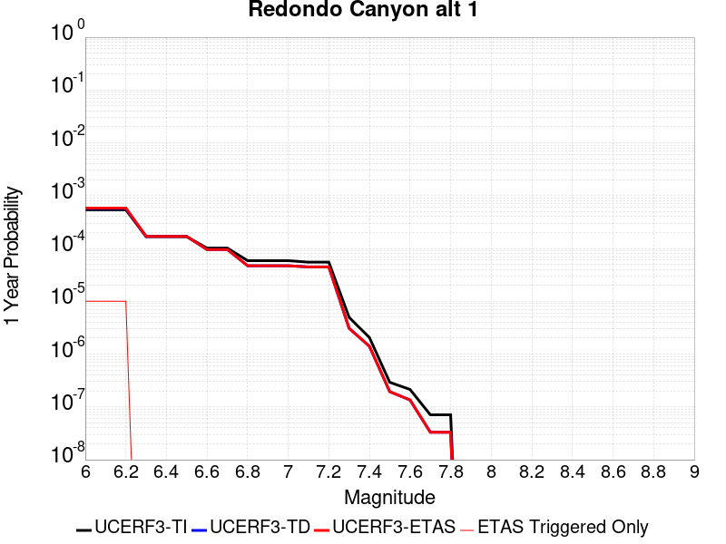 |  |

| Magnitude | 1 wk TI Prob | 1 wk TD Prob | 1 wk ETAS Prob | 1 wk ETAS/TD Gain | 1 wk ETAS Triggered Only | 1 mo TI Prob | 1 mo TD Prob | 1 mo ETAS Prob | 1 mo ETAS/TD Gain | 1 mo ETAS Triggered Only | 1 yr TI Prob | 1 yr TD Prob | 1 yr ETAS Prob | 1 yr ETAS/TD Gain | 1 yr ETAS Triggered Only | 10 yr TI Prob | 10 yr TD Prob | 10 yr ETAS Prob | 10 yr ETAS/TD Gain | 10 yr ETAS Triggered Only |
|-----|-----|-----|-----|-----|-----|-----|-----|-----|-----|-----|-----|-----|-----|-----|-----|-----|-----|-----|-----|-----|
| 6.0 | 1.0346246E-5 | 1.09813445E-5 | 4.9148864E-5 | 4.475669 | 3.816794E-5 | 4.43403E-5 | 4.7062502E-5 | 8.522865E-5 | 1.8109671 | 3.816794E-5 | 5.3970946E-4 | 5.729142E-4 | 6.110603E-4 | 1.0665826 | 3.816794E-5 | 0.0053840056 | 0.005722111 | 0.0057600606 | 1.0066321 | 3.816794E-5 |
| 6.1 | 1.0346246E-5 | 1.09813445E-5 | 4.9148864E-5 | 4.475669 | 3.816794E-5 | 4.43403E-5 | 4.7062502E-5 | 8.522865E-5 | 1.8109671 | 3.816794E-5 | 5.3970946E-4 | 5.729142E-4 | 6.110603E-4 | 1.0665826 | 3.816794E-5 | 0.0053840056 | 0.005722111 | 0.0057600606 | 1.0066321 | 3.816794E-5 |
| 6.2 | 1.0346246E-5 | 1.09813445E-5 | 4.9148864E-5 | 4.475669 | 3.816794E-5 | 4.43403E-5 | 4.7062502E-5 | 8.522865E-5 | 1.8109671 | 3.816794E-5 | 5.3970946E-4 | 5.729142E-4 | 6.110603E-4 | 1.0665826 | 3.816794E-5 | 0.0053840056 | 0.005722111 | 0.0057600606 | 1.0066321 | 3.816794E-5 |
| 6.3 | 3.2052794E-6 | 3.2361174E-6 | 3.2361174E-6 | 1.0 | 0.0 | 1.373684E-5 | 1.3869023E-5 | 1.3869023E-5 | 1.0 | 0.0 | 1.6723319E-4 | 1.6884625E-4 | 1.6884625E-4 | 1.0 | 0.0 | 0.001671074 | 0.0016875692 | 0.0016875692 | 1.0 | 0.0 |
| 6.4 | 3.2052794E-6 | 3.2361174E-6 | 3.2361174E-6 | 1.0 | 0.0 | 1.373684E-5 | 1.3869023E-5 | 1.3869023E-5 | 1.0 | 0.0 | 1.6723319E-4 | 1.6884625E-4 | 1.6884625E-4 | 1.0 | 0.0 | 0.001671074 | 0.0016875692 | 0.0016875692 | 1.0 | 0.0 |
| 6.5 | 3.2052794E-6 | 3.2361174E-6 | 3.2361174E-6 | 1.0 | 0.0 | 1.373684E-5 | 1.3869023E-5 | 1.3869023E-5 | 1.0 | 0.0 | 1.6723319E-4 | 1.6884625E-4 | 1.6884625E-4 | 1.0 | 0.0 | 0.001671074 | 0.0016875692 | 0.0016875692 | 1.0 | 0.0 |
| 6.6 | 1.948328E-6 | 1.8288681E-6 | 1.8288681E-6 | 1.0 | 0.0 | 8.349951E-6 | 7.837991E-6 | 7.837991E-6 | 1.0 | 0.0 | 1.016559E-4 | 9.542486E-5 | 9.542486E-5 | 1.0 | 0.0 | 0.0010160941 | 9.539858E-4 | 9.539858E-4 | 1.0 | 0.0 |
| 6.7 | 1.948328E-6 | 1.8288681E-6 | 1.8288681E-6 | 1.0 | 0.0 | 8.349951E-6 | 7.837991E-6 | 7.837991E-6 | 1.0 | 0.0 | 1.016559E-4 | 9.542486E-5 | 9.542486E-5 | 1.0 | 0.0 | 0.0010160941 | 9.539858E-4 | 9.539858E-4 | 1.0 | 0.0 |
| 6.8 | 1.1278219E-6 | 9.033076E-7 | 9.033076E-7 | 1.0 | 0.0 | 4.8335132E-6 | 3.871315E-6 | 3.871315E-6 | 1.0 | 0.0 | 5.8846435E-5 | 4.7132668E-5 | 4.7132668E-5 | 1.0 | 0.0 | 5.8830855E-4 | 4.7126875E-4 | 4.7126875E-4 | 1.0 | 0.0 |
| 6.9 | 1.1278219E-6 | 9.033076E-7 | 9.033076E-7 | 1.0 | 0.0 | 4.8335132E-6 | 3.871315E-6 | 3.871315E-6 | 1.0 | 0.0 | 5.8846435E-5 | 4.7132668E-5 | 4.7132668E-5 | 1.0 | 0.0 | 5.8830855E-4 | 4.7126875E-4 | 4.7126875E-4 | 1.0 | 0.0 |
| 7.0 | 1.1278219E-6 | 9.033076E-7 | 9.033076E-7 | 1.0 | 0.0 | 4.8335132E-6 | 3.871315E-6 | 3.871315E-6 | 1.0 | 0.0 | 5.8846435E-5 | 4.7132668E-5 | 4.7132668E-5 | 1.0 | 0.0 | 5.8830855E-4 | 4.7126875E-4 | 4.7126875E-4 | 1.0 | 0.0 |
| 7.1 | 1.0545139E-6 | 8.5692716E-7 | 8.5692716E-7 | 1.0 | 0.0 | 4.5193374E-6 | 3.6725423E-6 | 3.6725423E-6 | 1.0 | 0.0 | 5.5021545E-5 | 4.471271E-5 | 4.471271E-5 | 1.0 | 0.0 | 5.500792E-4 | 4.470789E-4 | 4.470789E-4 | 1.0 | 0.0 |
| 7.2 | 1.0545139E-6 | 8.5692716E-7 | 8.5692716E-7 | 1.0 | 0.0 | 4.5193374E-6 | 3.6725423E-6 | 3.6725423E-6 | 1.0 | 0.0 | 5.5021545E-5 | 4.471271E-5 | 4.471271E-5 | 1.0 | 0.0 | 5.500792E-4 | 4.470789E-4 | 4.470789E-4 | 1.0 | 0.0 |
| 7.3 | 9.505161E-8 | 5.8957607E-8 | 5.8957607E-8 | 1.0 | 0.0 | 4.0736398E-7 | 2.5267545E-7 | 2.5267545E-7 | 1.0 | 0.0 | 4.959645E-6 | 3.0763204E-6 | 3.0763204E-6 | 1.0 | 0.0 | 4.9595343E-5 | 3.0762894E-5 | 3.0762894E-5 | 1.0 | 0.0 |
| 7.4 | 3.9520785E-8 | 2.6987191E-8 | 2.6987191E-8 | 1.0 | 0.0 | 1.6937479E-7 | 1.1565938E-7 | 1.1565938E-7 | 1.0 | 0.0 | 2.062136E-6 | 1.4081523E-6 | 1.4081523E-6 | 1.0 | 0.0 | 2.062117E-5 | 1.4081461E-5 | 1.4081461E-5 | 1.0 | 0.0 |
| 7.5 | 5.6133214E-9 | 3.7368215E-9 | 3.7368215E-9 | 1.0 | 0.0 | 2.4057092E-8 | 1.601495E-8 | 1.601495E-8 | 1.0 | 0.0 | 2.9289507E-7 | 1.9498201E-7 | 1.9498201E-7 | 1.0 | 0.0 | 2.9289467E-6 | 1.9498186E-6 | 1.9498186E-6 | 1.0 | 0.0 |
| 7.6 | 4.1064334E-9 | 2.5957634E-9 | 2.5957634E-9 | 1.0 | 0.0 | 1.7599E-8 | 1.11247E-8 | 1.11247E-8 | 1.0 | 0.0 | 2.142678E-7 | 1.3544322E-7 | 1.3544322E-7 | 1.0 | 0.0 | 2.1426758E-6 | 1.3544316E-6 | 1.3544316E-6 | 1.0 | 0.0 |
| 7.7 | 1.361975E-9 | 6.360824E-10 | 6.360824E-10 | 1.0 | 0.0 | 5.8370353E-9 | 2.7260674E-9 | 2.7260674E-9 | 1.0 | 0.0 | 7.1065905E-8 | 3.318987E-8 | 3.318987E-8 | 1.0 | 0.0 | 7.106588E-7 | 3.318987E-7 | 3.318987E-7 | 1.0 | 0.0 |
| 7.8 | 1.361975E-9 | 6.360824E-10 | 6.360824E-10 | 1.0 | 0.0 | 5.8370353E-9 | 2.7260674E-9 | 2.7260674E-9 | 1.0 | 0.0 | 7.1065905E-8 | 3.318987E-8 | 3.318987E-8 | 1.0 | 0.0 | 7.106588E-7 | 3.318987E-7 | 3.318987E-7 | 1.0 | 0.0 |

