# Parent Section Magnitude-Probability Distributions

Only fault sections with at least one triggered aftershock are plotted. Sections are sorted by total supraseismogenic trigger rate (decreasing)

## Table Of Contents

* [Garlock (Central)](#garlock-central)
* [Little Lake](#little-lake)
* [Tank Canyon](#tank-canyon)
* [Airport Lake](#airport-lake)
* [Owl Lake](#owl-lake)
* [Panamint Valley](#panamint-valley)
* [Garlock (East)](#garlock-east)
* [Hunter Mountain-Saline Valley](#hunter-mountain-saline-valley)
* [Garlock (West)](#garlock-west)
* [Blackwater](#blackwater)
* [Ash Hill](#ash-hill)
* [San Andreas (Mojave N)](#san-andreas-mojave-n)
* [San Andreas (Mojave S)](#san-andreas-mojave-s)
* [Gravel Hills-Harper Lk](#gravel-hills-harper-lk)
* [San Andreas (San Bernardino N)](#san-andreas-san-bernardino-n)
* [So Sierra Nevada](#so-sierra-nevada)
* [Goldstone Lake](#goldstone-lake)
* [McLean Lake](#mclean-lake)
* [Lenwood-Lockhart-Old Woman Springs](#lenwood-lockhart-old-woman-springs)
* [Death Valley (So)](#death-valley-so)
* [Coyote Canyon](#coyote-canyon)
* [San Andreas (San Bernardino S)](#san-andreas-san-bernardino-s)
* [Paradise](#paradise)
* [Nelson Lake](#nelson-lake)
* [Towne Pass](#towne-pass)
* [Bicycle Lake](#bicycle-lake)
* [Garlic Springs](#garlic-springs)
* [Death Valley (Black Mtns Frontal)](#death-valley-black-mtns-frontal)
* [Helendale-So Lockhart](#helendale-so-lockhart)
* [San Jacinto (San Bernardino)](#san-jacinto-san-bernardino)
* [San Andreas (North Branch Mill Creek)](#san-andreas-north-branch-mill-creek)
* [Death Valley (No)](#death-valley-no)
* [San Andreas (Big Bend)](#san-andreas-big-bend)
* [San Andreas (San Gorgonio Pass-Garnet HIll)](#san-andreas-san-gorgonio-pass-garnet-hill)
* [San Andreas (Coachella) rev](#san-andreas-coachella-rev)
* [Sierra Nevada  (No Extension)](#sierra-nevada--no-extension)
* [Elsinore (Glen Ivy) rev](#elsinore-glen-ivy-rev)
* [San Jacinto (San Jacinto Valley) rev](#san-jacinto-san-jacinto-valley-rev)
* [San Jacinto (Stepovers Combined)](#san-jacinto-stepovers-combined)
* [Coyote Lake](#coyote-lake)
* [San Andreas (Carrizo) rev](#san-andreas-carrizo-rev)
* [Lake Isabella (Seismicity)](#lake-isabella-seismicity)
* [Cleghorn Lake](#cleghorn-lake)
* [Red Pass](#red-pass)
* [Manix-Afton Hills](#manix-afton-hills)
* [Scodie Lineament](#scodie-lineament)
* [Death Valley (Fish Lake Valley)](#death-valley-fish-lake-valley)
* [San Andreas (Cholame) rev](#san-andreas-cholame-rev)
* [Brawley (Seismic Zone) alt 1](#brawley-seismic-zone-alt-1)
* [San Jacinto (Anza) rev](#san-jacinto-anza-rev)
* [Imperial](#imperial)
* [White Wolf (Extension)](#white-wolf-extension)
* [Calico-Hidalgo](#calico-hidalgo)
* [Owens Valley](#owens-valley)
* [White Mountains](#white-mountains)
* [Hosgri](#hosgri)
* [Ludlow](#ludlow)
* [San Jacinto (Lytle Creek connector)](#san-jacinto-lytle-creek-connector)
* [Mission Creek](#mission-creek)
* [San Andreas (Parkfield)](#san-andreas-parkfield)
* [Great Valley 07 (Orestimba)](#great-valley-07-orestimba)
* [Independence rev 2011](#independence-rev-2011)
* [Kern Canyon (North Kern) 2011](#kern-canyon-north-kern-2011)
* [San Jacinto (Coyote Creek)](#san-jacinto-coyote-creek)
* [San Pedro Basin](#san-pedro-basin)
* [Red Mountain](#red-mountain)
* [Cady](#cady)
* [Pisgah-Bullion Mtn-Mesquite Lk](#pisgah-bullion-mtn-mesquite-lk)
* [Bullion Mountains](#bullion-mountains)
* [Kern Canyon (South Kern) 2011](#kern-canyon-south-kern-2011)
* [Baker](#baker)
* [Camp Rock 2011](#camp-rock-2011)
* [Rose Canyon](#rose-canyon)
* [San Clemente](#san-clemente)
* [Dry Mountain](#dry-mountain)
* [Pinto Mtn](#pinto-mtn)
* [Deep Springs](#deep-springs)
* [Pleito](#pleito)
* [San Jacinto (Borrego)](#san-jacinto-borrego)
* [Oceanic - West Huasna](#oceanic---west-huasna)
* [Whittier alt 1](#whittier-alt-1)
* [Coronado Bank alt1](#coronado-bank-alt1)
* [San Andreas (Creeping Section) 2011 CFM](#san-andreas-creeping-section-2011-cfm)
* [Chino alt 1](#chino-alt-1)
* [Santa Cruz Island](#santa-cruz-island)
* [Santa Rosa Island](#santa-rosa-island)
* [Santa Ynez (West)](#santa-ynez-west)
* [Palos Verdes](#palos-verdes)
* [Santa Ynez (East)](#santa-ynez-east)
* [San Jacinto (Clark) rev](#san-jacinto-clark-rev)
* [Elysian Park (Upper)](#elysian-park-upper)
* [Santa Cruz Catalina Ridge alt1](#santa-cruz-catalina-ridge-alt1)
* [Hunting Creek - Berryessa 2011 CFM](#hunting-creek---berryessa-2011-cfm)
* [Kern Canyon (Lake Isabella) 2011](#kern-canyon-lake-isabella-2011)
* [Emerson-Copper Mtn 2011](#emerson-copper-mtn-2011)
* [Fitzhugh Creek](#fitzhugh-creek)
* [Green Valley 2011 CFM](#green-valley-2011-cfm)
* [Great Valley 05 Pittsburg - Kirby Hills alt1](#great-valley-05-pittsburg---kirby-hills-alt1)
* [Mono Lake 2011 CFM](#mono-lake-2011-cfm)
* [Sheephole](#sheephole)
* [Great Valley 09 (Laguna Seca)](#great-valley-09-laguna-seca)
* [Maacama 2011 CFM](#maacama-2011-cfm)
* [Cleghorn](#cleghorn)
* [Del Valle](#del-valle)
* [Lost Hills](#lost-hills)
* [Cleghorn Pass](#cleghorn-pass)
* [Likely 2011 CFM](#likely-2011-cfm)
* [Last Chance](#last-chance)
* [Tin Mountain](#tin-mountain)
* [San Andreas (Offshore) 2011 CFM](#san-andreas-offshore-2011-cfm)
* [Raymond](#raymond)
* [Oceanside alt1](#oceanside-alt1)
* [Simi-Santa Rosa](#simi-santa-rosa)
* [Ortigalita (North)](#ortigalita-north)
* [San Andreas (Santa Cruz Mts) 2011 CFM](#san-andreas-santa-cruz-mts-2011-cfm)
* [Great Valley 04b Gordon Valley](#great-valley-04b-gordon-valley)
* [San Juan](#san-juan)
* [Swain Ravine - Spenceville](#swain-ravine---spenceville)
* [Goose Lake 2011 CFM](#goose-lake-2011-cfm)
* [Big Pine (East)](#big-pine-east)
* [Ventura-Pitas Point](#ventura-pitas-point)
* [Cerro Prieto](#cerro-prieto)
* [Cedar Mtn-Mahogany Mtn](#cedar-mtn-mahogany-mtn)
* [Ozena](#ozena)
* [Pine Mtn](#pine-mtn)
* [Channel Islands Western Deep Ramp](#channel-islands-western-deep-ramp)
* [Hunting Creek - Bartlett Springs connector 2011](#hunting-creek---bartlett-springs-connector-2011)
* [West Tahoe](#west-tahoe)
* [Blue Cut](#blue-cut)
* [San Andreas (Peninsula) 2011 CFM](#san-andreas-peninsula-2011-cfm)
* [Earthquake Valley (No  Extension)](#earthquake-valley-no--extension)
* [Calaveras (So) 2011 CFM](#calaveras-so-2011-cfm)
* [Redondo Canyon alt 1](#redondo-canyon-alt-1)

## Garlock (Central)
*[(top)](#table-of-contents)*

| 1 Week | 1 Month | 1 Year | 10 Year |
|-----|-----|-----|-----|
|  |  |  |  |

| Magnitude | 1 wk TI Prob | 1 wk TD Prob | 1 wk ETAS Prob | 1 wk ETAS/TD Gain | 1 wk ETAS Triggered Only | 1 mo TI Prob | 1 mo TD Prob | 1 mo ETAS Prob | 1 mo ETAS/TD Gain | 1 mo ETAS Triggered Only | 1 yr TI Prob | 1 yr TD Prob | 1 yr ETAS Prob | 1 yr ETAS/TD Gain | 1 yr ETAS Triggered Only | 10 yr TI Prob | 10 yr TD Prob | 10 yr ETAS Prob | 10 yr ETAS/TD Gain | 10 yr ETAS Triggered Only |
|-----|-----|-----|-----|-----|-----|-----|-----|-----|-----|-----|-----|-----|-----|-----|-----|-----|-----|-----|-----|-----|
| 6.0 | 5.5131142E-5 | 7.024681E-5 | 0.093521014 | 1331.3204 | 0.093457334 | 2.3625491E-4 | 3.010234E-4 | 0.102174066 | 339.42236 | 0.10190372 | 0.0028726095 | 0.0036588663 | 0.1157418 | 31.63324 | 0.11249453 | 0.028357591 | 0.036079824 | 0.15107529 | 4.187251 | 0.119299784 |
| 6.1 | 5.5131142E-5 | 7.024681E-5 | 0.093521014 | 1331.3204 | 0.093457334 | 2.3625491E-4 | 3.010234E-4 | 0.102174066 | 339.42236 | 0.10190372 | 0.0028726095 | 0.0036588663 | 0.1157418 | 31.63324 | 0.11249453 | 0.028357591 | 0.036079824 | 0.15107529 | 4.187251 | 0.119299784 |
| 6.2 | 4.216245E-5 | 5.1661493E-5 | 0.055147283 | 1067.4736 | 0.055098467 | 1.806837E-4 | 2.2138779E-4 | 0.060689397 | 274.13165 | 0.0604814 | 0.0021976046 | 0.0026920962 | 0.069142915 | 25.683672 | 0.0666302 | 0.021759989 | 0.026689773 | 0.09543913 | 3.5758686 | 0.07063457 |
| 6.3 | 4.216245E-5 | 5.1661493E-5 | 0.055147283 | 1067.4736 | 0.055098467 | 1.806837E-4 | 2.2138779E-4 | 0.060689397 | 274.13165 | 0.0604814 | 0.0021976046 | 0.0026920962 | 0.069142915 | 25.683672 | 0.0666302 | 0.021759989 | 0.026689773 | 0.09543913 | 3.5758686 | 0.07063457 |
| 6.4 | 3.6858168E-5 | 4.411054E-5 | 0.042274196 | 958.36945 | 0.042231947 | 1.5795401E-4 | 1.8903162E-4 | 0.046416614 | 245.54947 | 0.046236325 | 0.0019213937 | 0.002299056 | 0.05303553 | 23.068396 | 0.05085339 | 0.019048655 | 0.02284894 | 0.0757049 | 3.3132784 | 0.054091904 |
| 6.5 | 3.39199E-5 | 4.0018083E-5 | 0.037522107 | 937.6288 | 0.037483588 | 1.453629E-4 | 1.7149492E-4 | 0.041389808 | 241.34714 | 0.04122538 | 0.0017683565 | 0.002085973 | 0.047155876 | 22.606178 | 0.045164112 | 0.017543508 | 0.020759864 | 0.06792195 | 3.271792 | 0.048161924 |
| 6.6 | 3.3571985E-5 | 3.9472274E-5 | 0.03747782 | 949.47205 | 0.037439823 | 1.4387199E-4 | 1.6915603E-4 | 0.04134381 | 244.41226 | 0.04118162 | 0.0017502342 | 0.0020575512 | 0.047085065 | 22.884031 | 0.04512035 | 0.017365133 | 0.020481179 | 0.067613825 | 3.3012662 | 0.048118163 |
| 6.7 | 3.2580007E-5 | 3.8088703E-5 | 0.03622927 | 951.1816 | 0.03619256 | 1.3962112E-4 | 1.632272E-4 | 0.039959792 | 244.81088 | 0.03980306 | 0.0016985617 | 0.0019855013 | 0.045531254 | 22.93187 | 0.043632384 | 0.016856372 | 0.019773813 | 0.06533181 | 3.303956 | 0.046477024 |
| 6.8 | 3.2185937E-5 | 3.7515918E-5 | 0.03541912 | 944.1091 | 0.035382934 | 1.3793244E-4 | 1.6077272E-4 | 0.03914794 | 243.49864 | 0.038993437 | 0.0016780337 | 0.001955672 | 0.044607326 | 22.809206 | 0.04273523 | 0.016654192 | 0.019480614 | 0.06417256 | 3.2941754 | 0.04557987 |
| 6.9 | 3.165394E-5 | 3.6720503E-5 | 0.0346744 | 944.27893 | 0.03463895 | 1.3565269E-4 | 1.5736422E-4 | 0.038291406 | 243.32982 | 0.038140044 | 0.0016503202 | 0.001914247 | 0.043650392 | 22.802904 | 0.041816194 | 0.01638118 | 0.019073246 | 0.06281786 | 3.2935064 | 0.044595186 |
| 7.0 | 3.0903822E-5 | 3.5625766E-5 | 0.033863742 | 950.5408 | 0.03382932 | 1.3243823E-4 | 1.5267303E-4 | 0.03730236 | 244.32841 | 0.03715536 | 0.0016112428 | 0.0018572307 | 0.042591065 | 22.932566 | 0.040809628 | 0.015996104 | 0.018512413 | 0.061208196 | 3.3063326 | 0.043501094 |
| 7.1 | 3.0069863E-5 | 3.4392073E-5 | 0.032155827 | 934.97784 | 0.032122537 | 1.2886449E-4 | 1.4738638E-4 | 0.035459466 | 240.5885 | 0.035317287 | 0.0015677959 | 0.0017929734 | 0.040541753 | 22.611465 | 0.03881838 | 0.01556781 | 0.017880075 | 0.05851878 | 3.2728486 | 0.041378554 |
| 7.2 | 2.7957109E-5 | 3.128145E-5 | 0.026616883 | 850.88385 | 0.026586434 | 1.1981068E-4 | 1.340566E-4 | 0.02940803 | 219.37027 | 0.0292779 | 0.0014577188 | 0.0016309366 | 0.033810318 | 20.730614 | 0.03223195 | 0.014481937 | 0.016283695 | 0.05018639 | 3.0820026 | 0.034463894 |
| 7.3 | 2.4519275E-5 | 2.6714795E-5 | 0.018866474 | 706.2182 | 0.018840263 | 1.0507837E-4 | 1.1448703E-4 | 0.020746699 | 181.21439 | 0.020634573 | 0.0012785783 | 0.001393003 | 0.023856198 | 17.125732 | 0.02249453 | 0.012712469 | 0.013928054 | 0.03764125 | 2.7025492 | 0.02404814 |
| 7.4 | 2.3225532E-5 | 2.51994E-5 | 0.017180128 | 681.76733 | 0.01715536 | 9.95342E-5 | 1.0799304E-4 | 0.018880583 | 174.83148 | 0.018774617 | 0.0012111551 | 0.0013140367 | 0.02181223 | 16.599407 | 0.020525165 | 0.012045753 | 0.013145725 | 0.03473991 | 2.6426773 | 0.021881837 |
| 7.5 | 2.097765E-5 | 2.2483688E-5 | 0.013413868 | 596.60443 | 0.013391685 | 8.9901114E-5 | 9.635517E-5 | 0.014755774 | 153.1394 | 0.014660832 | 0.0010939965 | 0.0011725046 | 0.017411647 | 14.84996 | 0.016258206 | 0.010886264 | 0.011740365 | 0.02893219 | 2.4643347 | 0.01739606 |
| 7.6 | 1.511254E-5 | 1.5991332E-5 | 0.007258764 | 453.91864 | 0.007242888 | 6.476642E-5 | 6.853253E-5 | 0.008032976 | 117.21406 | 0.007964989 | 7.882459E-4 | 8.3407195E-4 | 0.009798143 | 11.747359 | 0.008971553 | 0.007854558 | 0.008383559 | 0.017909152 | 2.136223 | 0.009606127 |
| 7.7 | 9.934069E-6 | 1.0678794E-5 | 0.0023957738 | 224.34872 | 0.0023851204 | 4.2573887E-5 | 4.5765457E-5 | 0.0026933467 | 58.85108 | 0.0026477023 | 5.182138E-4 | 5.570524E-4 | 0.0033563673 | 6.0252275 | 0.0028008753 | 0.00517007 | 0.005627684 | 0.008543349 | 1.5180932 | 0.0029321662 |
| 7.8 | 6.7562896E-6 | 8.428449E-6 | 0.0017151975 | 203.50096 | 0.0017067834 | 2.8955206E-5 | 3.6121426E-5 | 0.0019835348 | 54.912968 | 0.0019474836 | 3.5247262E-4 | 4.3968976E-4 | 0.0025175503 | 5.7257423 | 0.0020787746 | 0.0035191406 | 0.004446654 | 0.0066033234 | 1.4850094 | 0.002166302 |
| 7.9 | 3.975453E-6 | 5.37103E-6 | 0.0010556936 | 196.55328 | 0.0010503283 | 1.7037546E-5 | 2.3018498E-5 | 0.0012046106 | 52.332283 | 0.0011816192 | 2.0741238E-4 | 2.8021427E-4 | 0.0015271296 | 5.4498634 | 0.0012472648 | 0.002072189 | 0.0028336283 | 0.004142818 | 1.462019 | 0.0013129102 |
| 8.0 | 1.6729537E-6 | 2.0775144E-6 | 3.084226E-4 | 148.4575 | 3.0634573E-4 | 7.169782E-6 | 8.903603E-6 | 3.152466E-4 | 35.406635 | 3.0634573E-4 | 8.7288594E-5 | 1.0839601E-4 | 4.36588E-4 | 4.027713 | 3.2822756E-4 | 8.7254314E-4 | 0.0010969337 | 0.0014466591 | 1.3188208 | 3.5010942E-4 |
| 8.1 | 3.6733252E-7 | 3.1489964E-7 | 8.784222E-5 | 278.95306 | 8.7527354E-5 | 1.5742813E-6 | 1.3495693E-6 | 8.8876805E-5 | 65.85568 | 8.7527354E-5 | 1.9166706E-5 | 1.6430899E-5 | 1.03956816E-4 | 6.3269095 | 8.7527354E-5 | 1.9165053E-4 | 1.6638759E-4 | 2.7577858E-4 | 1.6574467 | 1.0940919E-4 |

## Little Lake
*[(top)](#table-of-contents)*

| 1 Week | 1 Month | 1 Year | 10 Year |
|-----|-----|-----|-----|
|  |  |  |  |

| Magnitude | 1 wk TI Prob | 1 wk TD Prob | 1 wk ETAS Prob | 1 wk ETAS/TD Gain | 1 wk ETAS Triggered Only | 1 mo TI Prob | 1 mo TD Prob | 1 mo ETAS Prob | 1 mo ETAS/TD Gain | 1 mo ETAS Triggered Only | 1 yr TI Prob | 1 yr TD Prob | 1 yr ETAS Prob | 1 yr ETAS/TD Gain | 1 yr ETAS Triggered Only | 10 yr TI Prob | 10 yr TD Prob | 10 yr ETAS Prob | 10 yr ETAS/TD Gain | 10 yr ETAS Triggered Only |
|-----|-----|-----|-----|-----|-----|-----|-----|-----|-----|-----|-----|-----|-----|-----|-----|-----|-----|-----|-----|-----|
| 6.0 | 2.8424427E-5 | 3.120572E-5 | 0.04182421 | 1340.2739 | 0.04179431 | 1.2181328E-4 | 1.337327E-4 | 0.046145085 | 345.0546 | 0.046017505 | 0.0014820677 | 0.0016271127 | 0.053009454 | 32.578846 | 0.05146608 | 0.014722223 | 0.016165402 | 0.07020096 | 4.342667 | 0.054923415 |
| 6.1 | 2.8424427E-5 | 3.120572E-5 | 0.04182421 | 1340.2739 | 0.04179431 | 1.2181328E-4 | 1.337327E-4 | 0.046145085 | 345.0546 | 0.046017505 | 0.0014820677 | 0.0016271127 | 0.053009454 | 32.578846 | 0.05146608 | 0.014722223 | 0.016165402 | 0.07020096 | 4.342667 | 0.054923415 |
| 6.2 | 2.8424427E-5 | 3.120572E-5 | 0.04182421 | 1340.2739 | 0.04179431 | 1.2181328E-4 | 1.337327E-4 | 0.046145085 | 345.0546 | 0.046017505 | 0.0014820677 | 0.0016271127 | 0.053009454 | 32.578846 | 0.05146608 | 0.014722223 | 0.016165402 | 0.07020096 | 4.342667 | 0.054923415 |
| 6.3 | 1.48860645E-5 | 1.6081389E-5 | 0.029074695 | 1807.9716 | 0.02905908 | 6.379586E-5 | 6.8918576E-5 | 0.032079842 | 465.47452 | 0.03201313 | 7.7643775E-4 | 8.3878887E-4 | 0.03656372 | 43.59109 | 0.035754923 | 0.007737305 | 0.008359048 | 0.04611518 | 5.516798 | 0.038074397 |
| 6.4 | 1.48860645E-5 | 1.6081389E-5 | 0.029074695 | 1807.9716 | 0.02905908 | 6.379586E-5 | 6.8918576E-5 | 0.032079842 | 465.47452 | 0.03201313 | 7.7643775E-4 | 8.3878887E-4 | 0.03656372 | 43.59109 | 0.035754923 | 0.007737305 | 0.008359048 | 0.04611518 | 5.516798 | 0.038074397 |
| 6.5 | 1.2797581E-5 | 1.3765565E-5 | 0.027015582 | 1962.548 | 0.027002187 | 5.4845623E-5 | 5.899409E-5 | 0.029794658 | 505.0448 | 0.029737419 | 6.675408E-4 | 7.18042E-4 | 0.033888955 | 47.19634 | 0.033194747 | 0.006655392 | 0.00715977 | 0.04213729 | 5.885286 | 0.03522976 |
| 6.6 | 9.661896E-6 | 1.0289038E-5 | 0.02364243 | 2297.8271 | 0.023632385 | 4.1407468E-5 | 4.409522E-5 | 0.026104216 | 591.99646 | 0.026061269 | 5.040193E-4 | 5.367433E-4 | 0.029602097 | 55.15131 | 0.029080963 | 0.005028777 | 0.0053560743 | 0.036000684 | 6.721468 | 0.030809628 |
| 6.7 | 7.767871E-6 | 8.199687E-6 | 0.021080237 | 2570.859 | 0.02107221 | 3.329045E-5 | 3.5141118E-5 | 0.023250956 | 661.6453 | 0.02321663 | 4.0523586E-4 | 4.2777284E-4 | 0.026281042 | 61.43691 | 0.025864333 | 0.004044977 | 0.004270846 | 0.031462748 | 7.3668656 | 0.027308535 |
| 6.8 | 6.4235196E-6 | 6.7357446E-6 | 0.016199186 | 2404.9585 | 0.016192561 | 2.752908E-5 | 2.8867229E-5 | 0.017883932 | 619.5237 | 0.017855579 | 3.35115E-4 | 3.5141467E-4 | 0.020125644 | 57.270363 | 0.019781182 | 0.003346101 | 0.00350985 | 0.024399074 | 6.9516006 | 0.0209628 |
| 6.9 | 3.1283696E-6 | 3.1121804E-6 | 0.010156253 | 3263.3884 | 0.010153173 | 1.3407229E-5 | 1.3337856E-5 | 0.011260453 | 844.24756 | 0.011247265 | 1.6322079E-4 | 1.6237781E-4 | 0.0126330005 | 77.80004 | 0.012472647 | 0.0016310095 | 0.00162274 | 0.014861615 | 9.158347 | 0.013260394 |
| 7.0 | 2.290603E-6 | 2.2286815E-6 | 0.006172893 | 2769.7512 | 0.0061706784 | 9.816834E-6 | 9.551463E-6 | 0.0069022644 | 722.63947 | 0.006892779 | 1.19513395E-4 | 1.162839E-4 | 0.0076865195 | 66.10132 | 0.007571116 | 0.0011944914 | 0.0011623327 | 0.009096207 | 7.825821 | 0.007943107 |
| 7.1 | 1.293693E-6 | 1.1776827E-6 | 0.002539468 | 2156.326 | 0.0025382931 | 5.5443866E-6 | 5.0472063E-6 | 0.0028715534 | 568.9392 | 0.0028665208 | 6.750081E-5 | 6.14487E-5 | 0.0032122398 | 52.275146 | 0.0031509846 | 6.7480316E-4 | 6.143856E-4 | 0.0039821183 | 6.4814644 | 0.003369803 |
| 7.2 | 4.715842E-7 | 3.0917857E-7 | 1.3160017E-4 | 425.64453 | 1.3129103E-4 | 2.0210737E-6 | 1.3250503E-6 | 1.5449771E-4 | 116.59762 | 1.5317286E-4 | 2.4606294E-5 | 1.6132375E-5 | 1.9118426E-4 | 11.850968 | 1.7505471E-4 | 2.460357E-4 | 1.6131258E-4 | 3.5821734E-4 | 2.2206411 | 1.9693654E-4 |
| 7.3 | 3.9430947E-7 | 2.3097488E-7 | 1.0964014E-4 | 474.68427 | 1.0940919E-4 | 1.6898966E-6 | 9.89892E-7 | 1.322808E-4 | 133.63155 | 1.3129103E-4 | 2.0574296E-5 | 1.2051869E-5 | 1.4334131E-4 | 11.893701 | 1.3129103E-4 | 2.0572392E-4 | 1.20512224E-4 | 2.5178742E-4 | 2.0893104 | 1.3129103E-4 |
| 7.4 | 3.547123E-7 | 1.9679135E-7 | 6.5842294E-5 | 334.5792 | 6.5645516E-5 | 1.5201948E-6 | 8.4339126E-7 | 8.837067E-5 | 104.78016 | 8.7527354E-5 | 1.8508214E-5 | 1.0268241E-5 | 9.779469E-5 | 9.523997 | 8.7527354E-5 | 1.8506673E-4 | 1.02677724E-4 | 1.901961E-4 | 1.8523598 | 8.7527354E-5 |
| 7.5 | 2.6354266E-7 | 1.4423138E-7 | 4.39079E-5 | 304.42682 | 4.3763677E-5 | 1.129468E-6 | 6.181344E-7 | 6.626361E-5 | 107.19936 | 6.5645516E-5 | 1.3751187E-5 | 7.5257603E-6 | 7.3170784E-5 | 9.72271 | 6.5645516E-5 | 1.3750336E-4 | 7.5255106E-5 | 1.4089569E-4 | 1.8722408 | 6.5645516E-5 |
| 7.6 | 1.269913E-7 | 7.572556E-8 | 4.3839398E-5 | 578.9247 | 4.3763677E-5 | 5.4424834E-7 | 3.245381E-7 | 6.597003E-5 | 203.27362 | 6.5645516E-5 | 6.6262032E-6 | 3.9512443E-6 | 6.95965E-5 | 17.613817 | 6.5645516E-5 | 6.626006E-5 | 3.9511775E-5 | 1.051547E-4 | 2.6613507 | 6.5645516E-5 |

## Tank Canyon
*[(top)](#table-of-contents)*

| 1 Week | 1 Month | 1 Year | 10 Year |
|-----|-----|-----|-----|
|  |  |  | 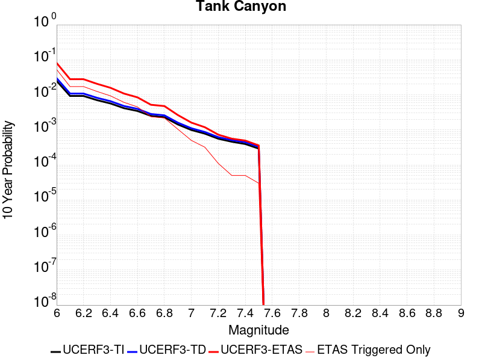 |

| Magnitude | 1 wk TI Prob | 1 wk TD Prob | 1 wk ETAS Prob | 1 wk ETAS/TD Gain | 1 wk ETAS Triggered Only | 1 mo TI Prob | 1 mo TD Prob | 1 mo ETAS Prob | 1 mo ETAS/TD Gain | 1 mo ETAS Triggered Only | 1 yr TI Prob | 1 yr TD Prob | 1 yr ETAS Prob | 1 yr ETAS/TD Gain | 1 yr ETAS Triggered Only | 10 yr TI Prob | 10 yr TD Prob | 10 yr ETAS Prob | 10 yr ETAS/TD Gain | 10 yr ETAS Triggered Only |
|-----|-----|-----|-----|-----|-----|-----|-----|-----|-----|-----|-----|-----|-----|-----|-----|-----|-----|-----|-----|-----|
| 6.0 | 4.8284557E-5 | 5.7964822E-5 | 0.039202303 | 676.31195 | 0.03914661 | 2.0691741E-4 | 2.4840087E-4 | 0.043344915 | 174.49583 | 0.043107223 | 0.0025163088 | 0.0030207601 | 0.05180075 | 17.14825 | 0.04892779 | 0.02488006 | 0.029863637 | 0.081087686 | 2.715265 | 0.052800875 |
| 6.1 | 1.7796336E-5 | 2.0873314E-5 | 0.012274447 | 588.0449 | 0.012253829 | 7.626778E-5 | 8.945422E-5 | 0.01369874 | 153.13689 | 0.013610504 | 9.281647E-4 | 0.0010885983 | 0.016738938 | 15.376599 | 0.015667396 | 0.009242975 | 0.010836744 | 0.02758975 | 2.5459447 | 0.016936542 |
| 6.2 | 1.7796336E-5 | 2.0873314E-5 | 0.012274447 | 588.0449 | 0.012253829 | 7.626778E-5 | 8.945422E-5 | 0.01369874 | 153.13689 | 0.013610504 | 9.281647E-4 | 0.0010885983 | 0.016738938 | 15.376599 | 0.015667396 | 0.009242975 | 0.010836744 | 0.02758975 | 2.5459447 | 0.016936542 |
| 6.3 | 1.3515912E-5 | 1.5759564E-5 | 0.00881212 | 559.1601 | 0.008796499 | 5.792405E-5 | 6.753938E-5 | 0.00984806 | 145.81212 | 0.009781182 | 7.049971E-4 | 8.2200574E-4 | 0.012081889 | 14.698059 | 0.011269147 | 0.007027647 | 0.0081922645 | 0.02019379 | 2.4649825 | 0.0121006565 |
| 6.4 | 1.0870146E-5 | 1.2618021E-5 | 0.0064239157 | 509.10645 | 0.0064113787 | 4.658551E-5 | 5.4076212E-5 | 0.0072090505 | 133.31279 | 0.007155361 | 5.67031E-4 | 6.581969E-4 | 0.008771015 | 13.325823 | 0.008118162 | 0.005655863 | 0.0065644905 | 0.015259769 | 2.324593 | 0.008752735 |
| 6.5 | 7.964826E-6 | 9.196094E-6 | 0.0041448255 | 450.71585 | 0.0041356673 | 3.4134522E-5 | 3.9411298E-5 | 0.004678178 | 118.701454 | 0.00463895 | 4.1550855E-4 | 4.7973756E-4 | 0.0056851166 | 11.850472 | 0.0052078776 | 0.0041473247 | 0.004788321 | 0.010406802 | 2.173372 | 0.005645514 |
| 6.6 | 6.6317E-6 | 7.6122988E-6 | 0.0030491645 | 400.55768 | 0.0030415754 | 2.8421264E-5 | 3.2623782E-5 | 0.0034241981 | 104.96018 | 0.003391685 | 3.4597394E-4 | 3.9713128E-4 | 0.0041811857 | 10.528473 | 0.003785558 | 0.0034543579 | 0.003965368 | 0.008106431 | 2.0443075 | 0.0041575492 |
| 6.7 | 4.793663E-6 | 5.4307857E-6 | 0.0016465597 | 303.18997 | 0.0016411379 | 2.0544108E-5 | 2.3274613E-5 | 0.001839425 | 79.03139 | 0.0018161925 | 2.500958E-4 | 2.8333595E-4 | 0.002274019 | 8.025876 | 0.0019912473 | 0.0024981452 | 0.0028304397 | 0.0049906103 | 1.7631925 | 0.002166302 |
| 6.8 | 4.382823E-6 | 4.9692567E-6 | 0.001558572 | 313.64288 | 0.0015536105 | 1.8783392E-5 | 2.1296666E-5 | 0.0017280437 | 81.14152 | 0.0017067834 | 2.286638E-4 | 2.5926033E-4 | 0.0021187344 | 8.172228 | 0.0018599562 | 0.0022842865 | 0.002590253 | 0.004619993 | 1.7836068 | 0.0020350108 |
| 6.9 | 2.729601E-6 | 3.0735416E-6 | 7.6893554E-4 | 250.17897 | 7.6586433E-4 | 1.1698237E-5 | 1.3172262E-5 | 8.227896E-4 | 62.463806 | 8.09628E-4 | 1.4241673E-4 | 1.6036171E-4 | 0.0010354948 | 6.457245 | 8.7527354E-4 | 0.001423255 | 0.0016026258 | 0.002542037 | 1.58617 | 9.4091904E-4 |
| 7.0 | 1.8987357E-6 | 2.126939E-6 | 3.0847202E-4 | 145.03096 | 3.0634573E-4 | 8.137413E-6 | 9.115425E-6 | 3.3734E-4 | 37.0076 | 3.2822756E-4 | 9.90685E-5 | 1.1097535E-4 | 4.829253E-4 | 4.351645 | 3.7199125E-4 | 9.902435E-4 | 0.0011092679 | 0.0015245617 | 1.3743854 | 4.157549E-4 |
| 7.1 | 1.4928986E-6 | 1.6641272E-6 | 1.9860035E-4 | 119.34205 | 1.9693654E-4 | 6.398121E-6 | 7.1319573E-6 | 2.2594878E-4 | 31.681173 | 2.1881839E-4 | 7.789434E-5 | 8.682871E-5 | 3.2750802E-4 | 3.7718863 | 2.4070022E-4 | 7.786704E-4 | 8.6800574E-4 | 0.0011522227 | 1.3274368 | 2.844639E-4 |
| 7.2 | 1.069082E-6 | 1.1828573E-6 | 6.6828296E-5 | 56.497345 | 6.5645516E-5 | 4.581772E-6 | 5.0693816E-6 | 7.071457E-5 | 13.9493475 | 6.5645516E-5 | 5.5781646E-5 | 6.171851E-5 | 1.2735996E-4 | 2.0635622 | 6.5645516E-5 | 5.576765E-4 | 6.170659E-4 | 6.826709E-4 | 1.1063176 | 6.5645516E-5 |
| 7.3 | 8.776551E-7 | 9.770005E-7 | 4.4740635E-5 | 45.79387 | 4.3763677E-5 | 3.7613736E-6 | 4.1871413E-6 | 4.7950634E-5 | 11.4518795 | 4.3763677E-5 | 4.579376E-5 | 5.097777E-5 | 9.473922E-5 | 1.8584417 | 4.3763677E-5 | 4.5784327E-4 | 5.097118E-4 | 5.5345317E-4 | 1.0858159 | 4.3763677E-5 |
| 7.4 | 7.55721E-7 | 8.510244E-7 | 4.4614662E-5 | 52.424656 | 4.3763677E-5 | 3.2388E-6 | 3.6472454E-6 | 4.7410762E-5 | 12.99906 | 4.3763677E-5 | 3.9431678E-5 | 4.4404827E-5 | 8.816656E-5 | 1.9855175 | 4.3763677E-5 | 3.942468E-4 | 4.440104E-4 | 4.8775465E-4 | 1.0985208 | 4.3763677E-5 |
| 7.5 | 5.587665E-7 | 6.305619E-7 | 2.2512386E-5 | 35.702103 | 2.1881839E-5 | 2.3947114E-6 | 2.702408E-6 | 2.4584187E-5 | 9.097141 | 2.1881839E-5 | 2.915522E-5 | 3.290182E-5 | 5.4782937E-5 | 1.6650429 | 2.1881839E-5 | 2.9151395E-4 | 3.290182E-4 | 3.5089283E-4 | 1.0664846 | 2.1881839E-5 |

## Airport Lake
*[(top)](#table-of-contents)*

| 1 Week | 1 Month | 1 Year | 10 Year |
|-----|-----|-----|-----|
| 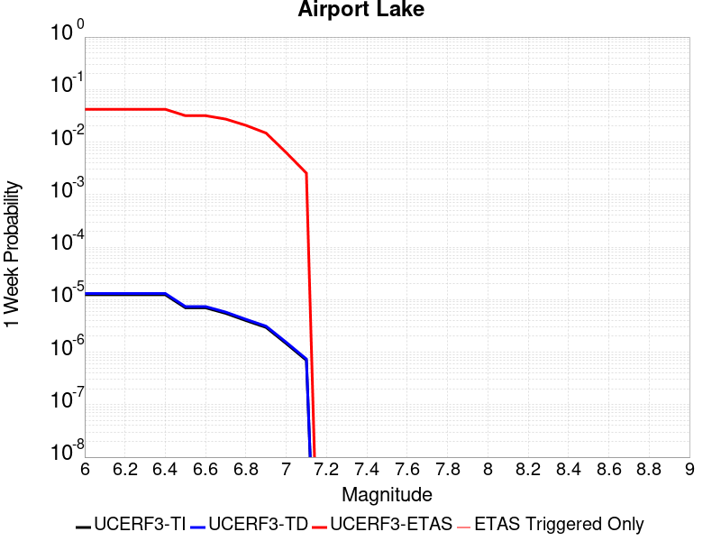 |  |  |  |

| Magnitude | 1 wk TI Prob | 1 wk TD Prob | 1 wk ETAS Prob | 1 wk ETAS/TD Gain | 1 wk ETAS Triggered Only | 1 mo TI Prob | 1 mo TD Prob | 1 mo ETAS Prob | 1 mo ETAS/TD Gain | 1 mo ETAS Triggered Only | 1 yr TI Prob | 1 yr TD Prob | 1 yr ETAS Prob | 1 yr ETAS/TD Gain | 1 yr ETAS Triggered Only | 10 yr TI Prob | 10 yr TD Prob | 10 yr ETAS Prob | 10 yr ETAS/TD Gain | 10 yr ETAS Triggered Only |
|-----|-----|-----|-----|-----|-----|-----|-----|-----|-----|-----|-----|-----|-----|-----|-----|-----|-----|-----|-----|-----|
| 6.0 | 1.2387061E-5 | 1.3103157E-5 | 0.0411723 | 3142.1665 | 0.041159738 | 5.3086325E-5 | 5.615534E-5 | 0.04515209 | 804.057 | 0.04509847 | 6.461343E-4 | 6.8350515E-4 | 0.05078053 | 74.29429 | 0.05013129 | 0.0064425888 | 0.0068168393 | 0.05964897 | 8.750238 | 0.05319475 |
| 6.1 | 1.2387061E-5 | 1.3103157E-5 | 0.0411723 | 3142.1665 | 0.041159738 | 5.3086325E-5 | 5.615534E-5 | 0.04515209 | 804.057 | 0.04509847 | 6.461343E-4 | 6.8350515E-4 | 0.05078053 | 74.29429 | 0.05013129 | 0.0064425888 | 0.0068168393 | 0.05964897 | 8.750238 | 0.05319475 |
| 6.2 | 1.2387061E-5 | 1.3103157E-5 | 0.0411723 | 3142.1665 | 0.041159738 | 5.3086325E-5 | 5.615534E-5 | 0.04515209 | 804.057 | 0.04509847 | 6.461343E-4 | 6.8350515E-4 | 0.05078053 | 74.29429 | 0.05013129 | 0.0064425888 | 0.0068168393 | 0.05964897 | 8.750238 | 0.05319475 |
| 6.3 | 1.2387061E-5 | 1.3103157E-5 | 0.0411723 | 3142.1665 | 0.041159738 | 5.3086325E-5 | 5.615534E-5 | 0.04515209 | 804.057 | 0.04509847 | 6.461343E-4 | 6.8350515E-4 | 0.05078053 | 74.29429 | 0.05013129 | 0.0064425888 | 0.0068168393 | 0.05964897 | 8.750238 | 0.05319475 |
| 6.4 | 1.2387061E-5 | 1.3103157E-5 | 0.0411723 | 3142.1665 | 0.041159738 | 5.3086325E-5 | 5.615534E-5 | 0.04515209 | 804.057 | 0.04509847 | 6.461343E-4 | 6.8350515E-4 | 0.05078053 | 74.29429 | 0.05013129 | 0.0064425888 | 0.0068168393 | 0.05964897 | 8.750238 | 0.05319475 |
| 6.5 | 6.9922594E-6 | 7.384925E-6 | 0.031582642 | 4276.637 | 0.031575494 | 2.996648E-5 | 3.1649324E-5 | 0.03460386 | 1093.3522 | 0.034573305 | 3.6478083E-4 | 3.8526783E-4 | 0.03899183 | 101.20708 | 0.038621444 | 0.003641826 | 0.0038465366 | 0.044695366 | 11.619639 | 0.041006565 |
| 6.6 | 6.9922594E-6 | 7.384925E-6 | 0.031582642 | 4276.637 | 0.031575494 | 2.996648E-5 | 3.1649324E-5 | 0.03460386 | 1093.3522 | 0.034573305 | 3.6478083E-4 | 3.8526783E-4 | 0.03899183 | 101.20708 | 0.038621444 | 0.003641826 | 0.0038465366 | 0.044695366 | 11.619639 | 0.041006565 |
| 6.7 | 5.477277E-6 | 5.7860684E-6 | 0.027051581 | 4675.296 | 0.027045952 | 2.3473833E-5 | 2.4797222E-5 | 0.029717715 | 1198.4292 | 0.029693654 | 2.8575645E-4 | 3.0186825E-4 | 0.03328972 | 110.27897 | 0.032997813 | 0.0028538927 | 0.003014966 | 0.037898533 | 12.570137 | 0.03498906 |
| 6.8 | 3.9950432E-6 | 4.2190873E-6 | 0.020288598 | 4808.7646 | 0.020284465 | 1.7121502E-5 | 1.8081691E-5 | 0.022315271 | 1234.1362 | 0.022297593 | 2.0843433E-4 | 2.2012512E-4 | 0.024809897 | 112.70816 | 0.024595186 | 0.0020823893 | 0.0021993418 | 0.028290628 | 12.863225 | 0.026148796 |
| 6.9 | 2.95695E-6 | 3.1230243E-6 | 0.014248155 | 4562.294 | 0.014245077 | 1.2672582E-5 | 1.3384334E-5 | 0.015789978 | 1179.7358 | 0.015776806 | 1.5427776E-4 | 1.6294434E-4 | 0.017599927 | 108.011894 | 0.017439825 | 0.001541707 | 0.0016284712 | 0.020132206 | 12.362642 | 0.018533917 |
| 7.0 | 1.456072E-6 | 1.540812E-6 | 0.005909628 | 3835.3984 | 0.005908096 | 6.2402937E-6 | 6.603469E-6 | 0.006592993 | 998.4136 | 0.0065864334 | 7.597293E-5 | 8.039528E-5 | 0.007300821 | 90.81157 | 0.007221007 | 7.594696E-4 | 8.0376083E-4 | 0.008368791 | 10.412042 | 0.007571116 |
| 7.1 | 6.995192E-7 | 7.4089746E-7 | 0.0023858594 | 3220.229 | 0.0023851204 | 2.997936E-6 | 3.1752747E-6 | 0.0026946329 | 848.6298 | 0.0026914661 | 3.649926E-5 | 3.865897E-5 | 0.002992593 | 77.41005 | 0.002954048 | 3.6493264E-4 | 3.865897E-4 | 0.0035363561 | 9.14757 | 0.0031509846 |

## Owl Lake
*[(top)](#table-of-contents)*

| 1 Week | 1 Month | 1 Year | 10 Year |
|-----|-----|-----|-----|
|  |  |  |  |

| Magnitude | 1 wk TI Prob | 1 wk TD Prob | 1 wk ETAS Prob | 1 wk ETAS/TD Gain | 1 wk ETAS Triggered Only | 1 mo TI Prob | 1 mo TD Prob | 1 mo ETAS Prob | 1 mo ETAS/TD Gain | 1 mo ETAS Triggered Only | 1 yr TI Prob | 1 yr TD Prob | 1 yr ETAS Prob | 1 yr ETAS/TD Gain | 1 yr ETAS Triggered Only | 10 yr TI Prob | 10 yr TD Prob | 10 yr ETAS Prob | 10 yr ETAS/TD Gain | 10 yr ETAS Triggered Only |
|-----|-----|-----|-----|-----|-----|-----|-----|-----|-----|-----|-----|-----|-----|-----|-----|-----|-----|-----|-----|-----|
| 6.0 | 5.0320643E-5 | 6.635816E-5 | 0.016432887 | 247.6393 | 0.016367614 | 2.1564208E-4 | 2.843674E-4 | 0.018856766 | 66.31128 | 0.01857768 | 0.0026222812 | 0.0034577388 | 0.024020962 | 6.947015 | 0.020634573 | 0.02591553 | 0.034140717 | 0.05542344 | 1.6233823 | 0.02203501 |
| 6.1 | 5.0320643E-5 | 6.635816E-5 | 0.016432887 | 247.6393 | 0.016367614 | 2.1564208E-4 | 2.843674E-4 | 0.018856766 | 66.31128 | 0.01857768 | 0.0026222812 | 0.0034577388 | 0.024020962 | 6.947015 | 0.020634573 | 0.02591553 | 0.034140717 | 0.05542344 | 1.6233823 | 0.02203501 |
| 6.2 | 2.4125871E-5 | 3.0981035E-5 | 0.014231854 | 459.37308 | 0.014201313 | 1.0339249E-4 | 1.3277028E-4 | 0.015973117 | 120.30643 | 0.01584245 | 0.0012580766 | 0.001615439 | 0.019180017 | 11.872944 | 0.017592998 | 0.012509781 | 0.016070465 | 0.034564894 | 2.1508336 | 0.0187965 |
| 6.3 | 1.7433485E-5 | 2.2355514E-5 | 0.013654436 | 610.7861 | 0.013632385 | 7.471279E-5 | 9.580672E-5 | 0.015258468 | 159.26303 | 0.015164114 | 9.0924866E-4 | 0.0011659743 | 0.017973488 | 15.414994 | 0.016827133 | 0.009055373 | 0.011628896 | 0.029298462 | 2.5194535 | 0.017877461 |
| 6.4 | 1.7433485E-5 | 2.2355514E-5 | 0.013654436 | 610.7861 | 0.013632385 | 7.471279E-5 | 9.580672E-5 | 0.015258468 | 159.26303 | 0.015164114 | 9.0924866E-4 | 0.0011659743 | 0.017973488 | 15.414994 | 0.016827133 | 0.009055373 | 0.011628896 | 0.029298462 | 2.5194535 | 0.017877461 |
| 6.5 | 1.5182742E-5 | 1.9429144E-5 | 0.013388973 | 689.118 | 0.013369803 | 6.506727E-5 | 8.326596E-5 | 0.014939797 | 179.42262 | 0.014857768 | 7.919061E-4 | 0.0010134429 | 0.017451908 | 17.220417 | 0.016455142 | 0.0078909 | 0.010118429 | 0.02742511 | 2.710412 | 0.017483588 |
| 6.6 | 6.7271576E-6 | 8.547361E-6 | 0.0123060355 | 1439.7467 | 0.012297593 | 2.8830356E-5 | 3.6631063E-5 | 0.013646636 | 372.5427 | 0.013610504 | 3.5095305E-4 | 4.458976E-4 | 0.015472017 | 34.69859 | 0.015032823 | 0.0035039932 | 0.004467813 | 0.02039197 | 4.5641956 | 0.015995624 |
| 6.7 | 6.682835E-6 | 8.479807E-6 | 0.012305968 | 1451.2085 | 0.012297593 | 2.8640408E-5 | 3.6341557E-5 | 0.01364635 | 375.50266 | 0.013610504 | 3.4864116E-4 | 4.4237426E-4 | 0.015468547 | 34.967102 | 0.015032823 | 0.003480947 | 0.0044327388 | 0.020357458 | 4.5925236 | 0.015995624 |
| 6.8 | 6.5774975E-6 | 8.32628E-6 | 0.012305817 | 1477.9489 | 0.012297593 | 2.8188972E-5 | 3.5683603E-5 | 0.013645701 | 382.40817 | 0.013610504 | 3.4314668E-4 | 4.343669E-4 | 0.01546066 | 35.593548 | 0.015032823 | 0.0034261728 | 0.004352885 | 0.020278882 | 4.6587224 | 0.015995624 |
| 6.9 | 6.363419E-6 | 7.999454E-6 | 0.012261731 | 1532.8208 | 0.012253829 | 2.727151E-5 | 3.428296E-5 | 0.013600557 | 396.7148 | 0.01356674 | 3.3198006E-4 | 4.1732067E-4 | 0.015400125 | 36.902378 | 0.014989059 | 0.0033148455 | 0.0041828766 | 0.020068012 | 4.797658 | 0.01595186 |
| 7.0 | 6.1342453E-6 | 7.6316555E-6 | 0.012151959 | 1592.3097 | 0.01214442 | 2.6289357E-5 | 3.2706717E-5 | 0.013445835 | 411.10318 | 0.013413567 | 3.2002592E-4 | 3.9813702E-4 | 0.015228117 | 38.248432 | 0.014835887 | 0.0031956544 | 0.003991571 | 0.019727197 | 4.942214 | 0.015798688 |
| 7.1 | 5.842926E-6 | 7.142211E-6 | 0.0116919605 | 1637.0225 | 0.011684901 | 2.504087E-5 | 3.0609146E-5 | 0.012940498 | 422.76572 | 0.012910284 | 3.0482994E-4 | 3.7260808E-4 | 0.014677998 | 39.392593 | 0.014310722 | 0.0030441214 | 0.0037370329 | 0.018866278 | 5.0484643 | 0.015185996 |
| 7.2 | 4.77173E-6 | 5.358483E-6 | 0.007488907 | 1397.5796 | 0.0074835885 | 2.045011E-5 | 2.2964748E-5 | 0.008381635 | 364.9783 | 0.008358862 | 2.4895166E-4 | 2.79564E-4 | 0.009598621 | 34.33425 | 0.009321663 | 0.0024867293 | 0.002808645 | 0.0127369175 | 4.534898 | 0.009956236 |
| 7.3 | 3.0494948E-6 | 2.710463E-6 | 0.0017970164 | 662.9924 | 0.0017943108 | 1.3069198E-5 | 1.1616219E-5 | 0.002024722 | 174.30128 | 0.0020131292 | 1.5910587E-4 | 1.4141845E-4 | 0.0023730502 | 16.780344 | 0.0022319474 | 0.0015899199 | 0.0014232415 | 0.003826818 | 2.6888044 | 0.0024070023 |
| 7.4 | 2.7263884E-6 | 2.3056762E-6 | 0.0012933312 | 560.93353 | 0.0012910285 | 1.1684469E-5 | 9.881433E-6 | 0.0014978317 | 151.58041 | 0.001487965 | 1.4224913E-4 | 1.20299905E-4 | 0.0017393611 | 14.458541 | 0.001619256 | 0.0014215811 | 0.0012112238 | 0.0029377951 | 2.4254768 | 0.0017286652 |
| 7.5 | 2.6090431E-6 | 2.1656133E-6 | 0.0010962551 | 506.21002 | 0.0010940919 | 1.1181565E-5 | 9.281167E-6 | 0.0013002977 | 140.10066 | 0.0012910285 | 1.3612706E-4 | 1.1299244E-4 | 0.0015132718 | 13.392681 | 0.0014004377 | 0.001360437 | 0.0011379806 | 0.0026461093 | 2.3252673 | 0.0015098468 |
| 7.6 | 2.3008756E-6 | 1.8727933E-6 | 7.896175E-4 | 421.62552 | 7.8774616E-4 | 9.860858E-6 | 8.0262325E-6 | 8.8329276E-4 | 110.05072 | 8.7527354E-4 | 1.20049335E-4 | 9.7715085E-5 | 0.0010604219 | 10.852181 | 9.6280087E-4 | 0.001199845 | 9.849932E-4 | 0.0020124265 | 2.0430868 | 0.0010284464 |
| 7.7 | 1.7184348E-6 | 1.3419171E-6 | 4.1709628E-4 | 310.8212 | 4.157549E-4 | 7.3646997E-6 | 5.7510606E-6 | 4.6526702E-4 | 80.90108 | 4.595186E-4 | 8.966153E-5 | 7.0016955E-5 | 5.295034E-4 | 7.562502 | 4.595186E-4 | 8.962536E-4 | 7.078345E-4 | 0.0011670279 | 1.6487298 | 4.595186E-4 |
| 7.8 | 8.4612907E-7 | 8.4058576E-7 | 2.634224E-4 | 313.37958 | 2.6258206E-4 | 3.6262625E-6 | 3.6025056E-6 | 2.8806538E-4 | 79.96251 | 2.844639E-4 | 4.4148852E-5 | 4.3859643E-5 | 3.2831106E-4 | 7.485493 | 2.844639E-4 | 4.414008E-4 | 4.4398365E-4 | 7.283212E-4 | 1.6404237 | 2.844639E-4 |
| 7.9 | 2.716738E-7 | 3.768106E-7 | 4.414047E-5 | 117.142334 | 4.3763677E-5 | 1.1643157E-6 | 1.6149015E-6 | 4.5378507E-5 | 28.09986 | 4.3763677E-5 | 1.4175452E-5 | 1.966126E-5 | 6.342408E-5 | 3.2258399 | 4.3763677E-5 | 1.4174548E-4 | 1.9836679E-4 | 2.4212178E-4 | 1.2205762 | 4.3763677E-5 |
| 8.0 | 2.1995428E-8 | 3.384878E-8 | 3.384878E-8 | 1.0 | 0.0 | 9.426611E-8 | 1.4506621E-7 | 1.4506621E-7 | 1.0 | 0.0 | 1.1476893E-6 | 1.7661803E-6 | 1.7661803E-6 | 1.0 | 0.0 | 1.14768345E-5 | 1.7963059E-5 | 1.7963059E-5 | 1.0 | 0.0 |

## Panamint Valley
*[(top)](#table-of-contents)*

| 1 Week | 1 Month | 1 Year | 10 Year |
|-----|-----|-----|-----|
|  |  |  |  |

| Magnitude | 1 wk TI Prob | 1 wk TD Prob | 1 wk ETAS Prob | 1 wk ETAS/TD Gain | 1 wk ETAS Triggered Only | 1 mo TI Prob | 1 mo TD Prob | 1 mo ETAS Prob | 1 mo ETAS/TD Gain | 1 mo ETAS Triggered Only | 1 yr TI Prob | 1 yr TD Prob | 1 yr ETAS Prob | 1 yr ETAS/TD Gain | 1 yr ETAS Triggered Only | 10 yr TI Prob | 10 yr TD Prob | 10 yr ETAS Prob | 10 yr ETAS/TD Gain | 10 yr ETAS Triggered Only |
|-----|-----|-----|-----|-----|-----|-----|-----|-----|-----|-----|-----|-----|-----|-----|-----|-----|-----|-----|-----|-----|
| 6.0 | 3.0211835E-5 | 3.3984514E-5 | 0.014606793 | 429.80734 | 0.014573304 | 1.2947287E-4 | 1.4563995E-4 | 0.016095176 | 110.51347 | 0.01595186 | 0.0015751923 | 0.0017717537 | 0.019530168 | 11.023072 | 0.017789934 | 0.015640736 | 0.017583137 | 0.036264107 | 2.0624366 | 0.019015318 |
| 6.1 | 3.0211835E-5 | 3.3984514E-5 | 0.014606793 | 429.80734 | 0.014573304 | 1.2947287E-4 | 1.4563995E-4 | 0.016095176 | 110.51347 | 0.01595186 | 0.0015751923 | 0.0017717537 | 0.019530168 | 11.023072 | 0.017789934 | 0.015640736 | 0.017583137 | 0.036264107 | 2.0624366 | 0.019015318 |
| 6.2 | 3.0211835E-5 | 3.3984514E-5 | 0.014606793 | 429.80734 | 0.014573304 | 1.2947287E-4 | 1.4563995E-4 | 0.016095176 | 110.51347 | 0.01595186 | 0.0015751923 | 0.0017717537 | 0.019530168 | 11.023072 | 0.017789934 | 0.015640736 | 0.017583137 | 0.036264107 | 2.0624366 | 0.019015318 |
| 6.3 | 2.8573924E-5 | 3.210268E-5 | 0.0142767215 | 444.72058 | 0.014245077 | 1.2245393E-4 | 1.3757581E-4 | 0.015693422 | 114.07108 | 0.015557987 | 0.001489857 | 0.0016737265 | 0.018975135 | 11.337059 | 0.017330416 | 0.01479908 | 0.016617801 | 0.034822207 | 2.0954762 | 0.018512035 |
| 6.4 | 2.8573924E-5 | 3.210268E-5 | 0.0142767215 | 444.72058 | 0.014245077 | 1.2245393E-4 | 1.3757581E-4 | 0.015693422 | 114.07108 | 0.015557987 | 0.001489857 | 0.0016737265 | 0.018975135 | 11.337059 | 0.017330416 | 0.01479908 | 0.016617801 | 0.034822207 | 2.0954762 | 0.018512035 |
| 6.5 | 2.7468774E-5 | 3.0828433E-5 | 0.014012892 | 454.5444 | 0.013982494 | 1.1771801E-4 | 1.3211532E-4 | 0.01540362 | 116.59223 | 0.015273523 | 0.0014322745 | 0.0016073446 | 0.018647745 | 11.601584 | 0.017067833 | 0.014230782 | 0.015963677 | 0.0339218 | 2.1249366 | 0.018249452 |
| 6.6 | 2.6135967E-5 | 2.925248E-5 | 0.013901932 | 475.23944 | 0.013873085 | 1.1200648E-4 | 1.253619E-4 | 0.015265696 | 121.77301 | 0.015142232 | 0.0013628257 | 0.0015252391 | 0.018370405 | 12.044279 | 0.016870897 | 0.013544982 | 0.015154043 | 0.032932993 | 2.1732147 | 0.018052517 |
| 6.7 | 2.4498746E-5 | 2.7341335E-5 | 0.013659353 | 499.5862 | 0.013632385 | 1.04990395E-4 | 1.1717203E-4 | 0.014995079 | 127.9749 | 0.0148796495 | 0.0012775084 | 0.0014256609 | 0.017966596 | 12.602293 | 0.016564552 | 0.012701893 | 0.014171274 | 0.031601243 | 2.2299507 | 0.017680526 |
| 6.8 | 2.2244329E-5 | 2.4935423E-5 | 0.013241236 | 531.02106 | 0.013216631 | 9.532935E-5 | 1.0686185E-4 | 0.014459814 | 135.31316 | 0.014354486 | 0.0011600169 | 0.0013002884 | 0.0171877 | 13.218376 | 0.015908096 | 0.011539802 | 0.0129325185 | 0.029693227 | 2.2960126 | 0.016980307 |
| 6.9 | 1.9902658E-5 | 2.2290267E-5 | 0.012407134 | 556.6167 | 0.012385121 | 8.529431E-5 | 9.552632E-5 | 0.013485932 | 141.17503 | 0.013391685 | 0.0010379635 | 0.0011624309 | 0.016002927 | 13.766778 | 0.014857768 | 0.010331288 | 0.011568608 | 0.027184526 | 2.3498528 | 0.015798688 |
| 7.0 | 1.8353881E-5 | 2.0566185E-5 | 0.011792753 | 573.40497 | 0.011772429 | 7.865712E-5 | 8.813792E-5 | 0.012844125 | 145.72757 | 0.012757111 | 9.5722964E-4 | 0.0010725686 | 0.015236791 | 14.20589 | 0.014179431 | 0.009531168 | 0.010678849 | 0.025594436 | 2.396741 | 0.015076586 |
| 7.1 | 1.7667631E-5 | 1.9772613E-5 | 0.011398103 | 576.45917 | 0.011378556 | 7.571623E-5 | 8.473711E-5 | 0.012446928 | 146.88875 | 0.012363238 | 9.2145515E-4 | 0.0010312037 | 0.014780686 | 14.333431 | 0.013763676 | 0.009176437 | 0.010269073 | 0.024757694 | 2.4108987 | 0.01463895 |
| 7.2 | 1.6381597E-5 | 1.8158249E-5 | 0.010083621 | 555.319 | 0.010065646 | 7.020495E-5 | 7.781885E-5 | 0.010952246 | 140.74028 | 0.0108752735 | 8.544101E-4 | 9.4704994E-4 | 0.013145552 | 13.880527 | 0.0122100655 | 0.008511325 | 0.009434792 | 0.022288296 | 2.3623517 | 0.01297593 |
| 7.3 | 1.4520491E-5 | 1.5966476E-5 | 0.008505984 | 532.74023 | 0.008490154 | 6.222919E-5 | 6.842605E-5 | 0.009214409 | 134.6623 | 0.009146608 | 7.57377E-4 | 8.327849E-4 | 0.011021229 | 13.234184 | 0.010196936 | 0.0075480095 | 0.00829975 | 0.019063061 | 2.2968235 | 0.010853392 |
| 7.4 | 1.2852287E-5 | 1.4145411E-5 | 0.008307245 | 587.2749 | 0.008293217 | 5.5080065E-5 | 6.062187E-5 | 0.008987871 | 148.26118 | 0.0089277895 | 6.7039346E-4 | 7.378371E-4 | 0.010708593 | 14.513492 | 0.009978118 | 0.0066837464 | 0.0073567946 | 0.017913131 | 2.4349098 | 0.010634573 |
| 7.5 | 1.1637851E-5 | 1.2836797E-5 | 0.008196539 | 638.519 | 0.008183807 | 4.987555E-5 | 5.5013777E-5 | 0.0088729095 | 161.28523 | 0.008818381 | 6.070656E-4 | 6.6960254E-4 | 0.010531703 | 15.728291 | 0.009868709 | 0.006054099 | 0.0066787465 | 0.017133616 | 2.565394 | 0.010525164 |
| 7.6 | 3.0068115E-6 | 3.3330316E-6 | 0.00343877 | 1031.7245 | 0.0034354485 | 1.2886271E-5 | 1.4284384E-5 | 0.0037122623 | 259.88257 | 0.0036980307 | 1.5687906E-4 | 1.7390578E-4 | 0.0045057563 | 25.909182 | 0.004332604 | 0.0015676835 | 0.0017391363 | 0.0064137056 | 3.6878684 | 0.004682713 |

## Garlock (East)
*[(top)](#table-of-contents)*

| 1 Week | 1 Month | 1 Year | 10 Year |
|-----|-----|-----|-----|
|  |  |  | 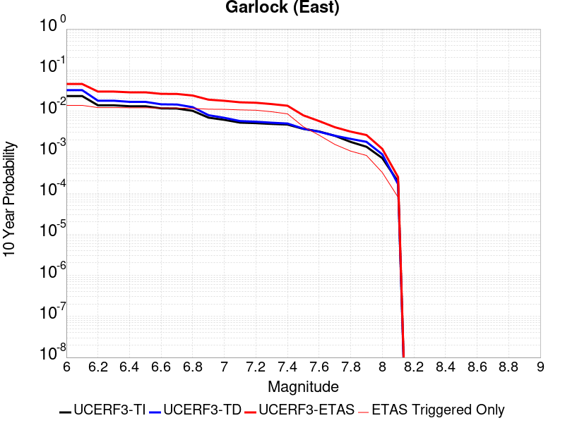 |

| Magnitude | 1 wk TI Prob | 1 wk TD Prob | 1 wk ETAS Prob | 1 wk ETAS/TD Gain | 1 wk ETAS Triggered Only | 1 mo TI Prob | 1 mo TD Prob | 1 mo ETAS Prob | 1 mo ETAS/TD Gain | 1 mo ETAS Triggered Only | 1 yr TI Prob | 1 yr TD Prob | 1 yr ETAS Prob | 1 yr ETAS/TD Gain | 1 yr ETAS Triggered Only | 10 yr TI Prob | 10 yr TD Prob | 10 yr ETAS Prob | 10 yr ETAS/TD Gain | 10 yr ETAS Triggered Only |
|-----|-----|-----|-----|-----|-----|-----|-----|-----|-----|-----|-----|-----|-----|-----|-----|-----|-----|-----|-----|-----|
| 6.0 | 4.5092507E-5 | 6.290325E-5 | 0.010631166 | 169.00822 | 0.010568928 | 1.9323928E-4 | 2.6956003E-4 | 0.012060692 | 44.742138 | 0.011794311 | 0.0023501497 | 0.0032774 | 0.015949082 | 4.866382 | 0.012713348 | 0.023254504 | 0.032351844 | 0.045627892 | 1.4103645 | 0.013719913 |
| 6.1 | 4.5092507E-5 | 6.290325E-5 | 0.010631166 | 169.00822 | 0.010568928 | 1.9323928E-4 | 2.6956003E-4 | 0.012060692 | 44.742138 | 0.011794311 | 0.0023501497 | 0.0032774 | 0.015949082 | 4.866382 | 0.012713348 | 0.023254504 | 0.032351844 | 0.045627892 | 1.4103645 | 0.013719913 |
| 6.2 | 2.6674514E-5 | 3.4509674E-5 | 0.009618424 | 278.71674 | 0.009584245 | 1.1431433E-4 | 1.4789042E-4 | 0.010802769 | 73.04578 | 0.0106564555 | 0.0013908884 | 0.0017991117 | 0.013135354 | 7.3010216 | 0.011356674 | 0.01382215 | 0.017890299 | 0.029946394 | 1.6738901 | 0.012275711 |
| 6.3 | 2.6674514E-5 | 3.4509674E-5 | 0.009618424 | 278.71674 | 0.009584245 | 1.1431433E-4 | 1.4789042E-4 | 0.010802769 | 73.04578 | 0.0106564555 | 0.0013908884 | 0.0017991117 | 0.013135354 | 7.3010216 | 0.011356674 | 0.01382215 | 0.017890299 | 0.029946394 | 1.6738901 | 0.012275711 |
| 6.4 | 2.5312667E-5 | 3.233893E-5 | 0.00952875 | 294.6526 | 0.009496718 | 1.0847834E-4 | 1.3858822E-4 | 0.010706051 | 77.2508 | 0.010568928 | 0.0013199237 | 0.0016860351 | 0.012936181 | 7.672546 | 0.011269147 | 0.013121112 | 0.016778335 | 0.028740507 | 1.7129534 | 0.012166302 |
| 6.5 | 2.5312667E-5 | 3.233893E-5 | 0.00952875 | 294.6526 | 0.009496718 | 1.0847834E-4 | 1.3858822E-4 | 0.010706051 | 77.2508 | 0.010568928 | 0.0013199237 | 0.0016860351 | 0.012936181 | 7.672546 | 0.011269147 | 0.013121112 | 0.016778335 | 0.028740507 | 1.7129534 | 0.012166302 |
| 6.6 | 2.246556E-5 | 2.8133776E-5 | 0.009327653 | 331.54645 | 0.009299781 | 9.627742E-5 | 1.20567885E-4 | 0.010447551 | 86.65284 | 0.010328228 | 0.0011715472 | 0.0014669491 | 0.012457368 | 8.492024 | 0.011006565 | 0.011653901 | 0.01461866 | 0.026326802 | 1.8009038 | 0.011881838 |
| 6.7 | 2.2241198E-5 | 2.7803519E-5 | 0.009327326 | 335.47287 | 0.009299781 | 9.531594E-5 | 1.1915263E-4 | 0.01044615 | 87.67033 | 0.010328228 | 0.0011598538 | 0.0014497414 | 0.012440349 | 8.581081 | 0.011006565 | 0.011538187 | 0.014448853 | 0.026159013 | 1.8104559 | 0.011881838 |
| 6.8 | 1.9528685E-5 | 2.389819E-5 | 0.0090827625 | 380.06067 | 0.009059081 | 8.369167E-5 | 1.0241691E-4 | 0.010188911 | 99.48466 | 0.010087527 | 0.0010184698 | 0.0012462323 | 0.011976825 | 9.610428 | 0.010743982 | 0.010138147 | 0.012436427 | 0.023889571 | 1.9209353 | 0.011597374 |
| 6.9 | 1.3318621E-5 | 1.5198884E-5 | 0.008767801 | 576.87134 | 0.008752735 | 5.7078556E-5 | 6.513648E-5 | 0.009823801 | 150.81871 | 0.009759299 | 6.9470983E-4 | 7.927538E-4 | 0.011156523 | 14.073123 | 0.010371991 | 0.0069254204 | 0.007939888 | 0.01898931 | 2.3916345 | 0.011137855 |
| 7.0 | 1.1760853E-5 | 1.31077895E-5 | 0.008765728 | 668.74194 | 0.008752735 | 5.0402683E-5 | 5.6175057E-5 | 0.009771165 | 173.94135 | 0.009715536 | 6.134799E-4 | 6.8372174E-4 | 0.0110048875 | 16.095566 | 0.010328228 | 0.0061178906 | 0.00685652 | 0.017874544 | 2.6069412 | 0.011094091 |
| 7.1 | 1.0064758E-5 | 1.0902931E-5 | 0.008479082 | 777.68835 | 0.008468271 | 4.3133965E-5 | 4.672603E-5 | 0.009433596 | 201.89168 | 0.009387309 | 5.2502943E-4 | 5.687444E-4 | 0.010563057 | 18.57259 | 0.01 | 0.005237907 | 0.0057129986 | 0.016373845 | 2.8660684 | 0.010722101 |
| 7.2 | 9.768808E-6 | 1.0498807E-5 | 0.008259865 | 786.7432 | 0.008249453 | 4.186565E-5 | 4.499413E-5 | 0.009191191 | 204.27533 | 0.009146608 | 5.095951E-4 | 5.4766936E-4 | 0.010257885 | 18.730068 | 0.009715536 | 0.0050842804 | 0.0055032647 | 0.01588346 | 2.8861887 | 0.010437637 |
| 7.3 | 9.344516E-6 | 9.944468E-6 | 0.007712275 | 775.53424 | 0.007702407 | 4.004731E-5 | 4.261847E-5 | 0.008598053 | 201.74475 | 0.008555799 | 4.8746695E-4 | 5.1875977E-4 | 0.009616883 | 18.538218 | 0.009102845 | 0.0048639905 | 0.0052149445 | 0.014901582 | 2.8574767 | 0.009737418 |
| 7.4 | 9.023491E-6 | 9.490661E-6 | 0.006836559 | 720.34595 | 0.0068271337 | 3.867153E-5 | 4.0673647E-5 | 0.0075896005 | 186.5975 | 0.007549234 | 4.7072413E-4 | 4.950925E-4 | 0.008565493 | 17.300795 | 0.008074398 | 0.004697283 | 0.0049783974 | 0.0135351475 | 2.718776 | 0.008599563 |
| 7.5 | 7.081253E-6 | 7.087672E-6 | 0.003442512 | 485.70416 | 0.0034354485 | 3.0347876E-5 | 3.0375388E-5 | 0.0038376995 | 126.34241 | 0.00380744 | 3.6942272E-4 | 3.6975832E-4 | 0.004569518 | 12.35812 | 0.004201313 | 0.003688092 | 0.0037243143 | 0.008215185 | 2.2058249 | 0.0045076585 |
| 7.6 | 6.116396E-6 | 5.959245E-6 | 0.0023035386 | 386.54874 | 0.002297593 | 2.6212863E-5 | 2.5539372E-5 | 0.002585649 | 101.241684 | 0.002560175 | 3.1909486E-4 | 3.1089774E-4 | 0.0030890272 | 9.93583 | 0.0027789935 | 0.0031863707 | 0.0031357552 | 0.006058727 | 1.9321429 | 0.0029321662 |
| 7.7 | 4.797145E-6 | 4.757281E-6 | 0.0014708334 | 309.17523 | 0.0014660831 | 2.055903E-5 | 2.0388188E-5 | 0.0016177298 | 79.34642 | 0.0015973742 | 2.5027743E-4 | 2.4819805E-4 | 0.0019326814 | 7.786852 | 0.0016849015 | 0.0024999576 | 0.0025093474 | 0.0042555016 | 1.6958599 | 0.0017505471 |
| 7.8 | 3.4028885E-6 | 3.978462E-6 | 9.667755E-4 | 243.00233 | 9.6280087E-4 | 1.4583726E-5 | 1.7050439E-5 | 0.0011111237 | 65.16686 | 0.0010940919 | 1.775424E-4 | 2.0756939E-4 | 0.001367066 | 6.5860677 | 0.0011597375 | 0.0017740062 | 0.0021012232 | 0.0032803596 | 1.5611666 | 0.0011816192 |
| 7.9 | 2.5928412E-6 | 3.3724489E-6 | 7.692342E-4 | 228.09366 | 7.6586433E-4 | 1.1112129E-5 | 1.4453272E-5 | 8.678326E-4 | 60.04402 | 8.533917E-4 | 1.3528178E-4 | 1.7595445E-4 | 0.001051074 | 5.973557 | 8.7527354E-4 | 0.0013519945 | 0.0017812408 | 0.002676798 | 1.5027716 | 8.971554E-4 |
| 8.0 | 1.3743648E-6 | 1.6734747E-6 | 2.642551E-4 | 157.90804 | 2.6258206E-4 | 5.8901214E-6 | 7.1720146E-6 | 2.697522E-4 | 37.611774 | 2.6258206E-4 | 7.1709874E-5 | 8.731581E-5 | 3.7175487E-4 | 4.2575893 | 2.844639E-4 | 7.1686733E-4 | 8.837234E-4 | 0.0011897983 | 1.3463471 | 3.0634573E-4 |
| 8.1 | 3.6733252E-7 | 3.1489964E-7 | 8.784222E-5 | 278.95306 | 8.7527354E-5 | 1.5742813E-6 | 1.3495693E-6 | 8.8876805E-5 | 65.85568 | 8.7527354E-5 | 1.9166706E-5 | 1.6430899E-5 | 1.03956816E-4 | 6.3269095 | 8.7527354E-5 | 1.9165053E-4 | 1.6638759E-4 | 2.7577858E-4 | 1.6574467 | 1.0940919E-4 |

## Hunter Mountain-Saline Valley
*[(top)](#table-of-contents)*

| 1 Week | 1 Month | 1 Year | 10 Year |
|-----|-----|-----|-----|
|  |  |  |  |

| Magnitude | 1 wk TI Prob | 1 wk TD Prob | 1 wk ETAS Prob | 1 wk ETAS/TD Gain | 1 wk ETAS Triggered Only | 1 mo TI Prob | 1 mo TD Prob | 1 mo ETAS Prob | 1 mo ETAS/TD Gain | 1 mo ETAS Triggered Only | 1 yr TI Prob | 1 yr TD Prob | 1 yr ETAS Prob | 1 yr ETAS/TD Gain | 1 yr ETAS Triggered Only | 10 yr TI Prob | 10 yr TD Prob | 10 yr ETAS Prob | 10 yr ETAS/TD Gain | 10 yr ETAS Triggered Only |
|-----|-----|-----|-----|-----|-----|-----|-----|-----|-----|-----|-----|-----|-----|-----|-----|-----|-----|-----|-----|-----|
| 6.0 | 4.5103672E-5 | 5.4570177E-5 | 0.008412976 | 154.16803 | 0.008358862 | 1.9328714E-4 | 2.3385242E-4 | 0.009247062 | 39.542294 | 0.009015317 | 0.002350731 | 0.0028435152 | 0.012880539 | 4.529794 | 0.010065646 | 0.023260195 | 0.028091887 | 0.038555317 | 1.3724716 | 0.0107658645 |
| 6.1 | 4.5103672E-5 | 5.4570177E-5 | 0.008412976 | 154.16803 | 0.008358862 | 1.9328714E-4 | 2.3385242E-4 | 0.009247062 | 39.542294 | 0.009015317 | 0.002350731 | 0.0028435152 | 0.012880539 | 4.529794 | 0.010065646 | 0.023260195 | 0.028091887 | 0.038555317 | 1.3724716 | 0.0107658645 |
| 6.2 | 3.9363465E-5 | 4.706337E-5 | 0.008361771 | 177.67046 | 0.0083150985 | 1.6868966E-4 | 2.0168544E-4 | 0.009149552 | 45.365456 | 0.008949672 | 0.002051862 | 0.0024528175 | 0.012428289 | 5.066944 | 0.01 | 0.020330196 | 0.024273481 | 0.03471397 | 1.430119 | 0.010700218 |
| 6.3 | 3.9363465E-5 | 4.706337E-5 | 0.008361771 | 177.67046 | 0.0083150985 | 1.6868966E-4 | 2.0168544E-4 | 0.009149552 | 45.365456 | 0.008949672 | 0.002051862 | 0.0024528175 | 0.012428289 | 5.066944 | 0.01 | 0.020330196 | 0.024273481 | 0.03471397 | 1.430119 | 0.010700218 |
| 6.4 | 3.2311684E-5 | 3.795099E-5 | 0.008352734 | 220.09265 | 0.0083150985 | 1.384713E-4 | 1.6263737E-4 | 0.009110854 | 56.019436 | 0.008949672 | 0.0016845843 | 0.0019783843 | 0.011958601 | 6.0446296 | 0.01 | 0.016718714 | 0.019616475 | 0.03008534 | 1.5336772 | 0.010678337 |
| 6.5 | 3.2311684E-5 | 3.795099E-5 | 0.008352734 | 220.09265 | 0.0083150985 | 1.384713E-4 | 1.6263737E-4 | 0.009110854 | 56.019436 | 0.008949672 | 0.0016845843 | 0.0019783843 | 0.011958601 | 6.0446296 | 0.01 | 0.016718714 | 0.019616475 | 0.03008534 | 1.5336772 | 0.010678337 |
| 6.6 | 2.9305844E-5 | 3.418183E-5 | 0.008348996 | 244.25244 | 0.0083150985 | 1.2559042E-4 | 1.4648569E-4 | 0.009094846 | 62.086926 | 0.008949672 | 0.0015279909 | 0.001782067 | 0.011764246 | 6.6014614 | 0.01 | 0.015175272 | 0.01768569 | 0.028175175 | 1.5931057 | 0.010678337 |
| 6.7 | 2.7826512E-5 | 3.2344276E-5 | 0.008347174 | 258.0727 | 0.0083150985 | 1.19251024E-4 | 1.386113E-4 | 0.009087043 | 65.55773 | 0.008949672 | 0.0014509142 | 0.0016863465 | 0.011669483 | 6.9199796 | 0.01 | 0.014414776 | 0.016743187 | 0.027221218 | 1.6258087 | 0.0106564555 |
| 6.8 | 2.3389874E-5 | 2.6866714E-5 | 0.008341742 | 310.4861 | 0.0083150985 | 1.0023846E-4 | 1.15138246E-4 | 0.009063779 | 78.72084 | 0.008949672 | 0.00121972 | 0.001400954 | 0.011386944 | 8.127994 | 0.01 | 0.01213047 | 0.013927434 | 0.024435472 | 1.7544849 | 0.0106564555 |
| 6.9 | 2.069209E-5 | 2.3570032E-5 | 0.00829471 | 351.91763 | 0.008271335 | 8.867737E-5 | 1.01010715E-4 | 0.00900602 | 89.15905 | 0.008905908 | 0.0010791123 | 0.0012291478 | 0.011173147 | 9.0901575 | 0.009956236 | 0.010738871 | 0.012228523 | 0.022711437 | 1.857251 | 0.010612692 |
| 7.0 | 1.7462342E-5 | 1.9633546E-5 | 0.008290806 | 422.27756 | 0.008271335 | 7.483646E-5 | 8.414118E-5 | 0.0089893 | 106.835915 | 0.008905908 | 9.1075303E-4 | 0.0010239601 | 0.010970002 | 10.71331 | 0.009956236 | 0.009070295 | 0.0101960525 | 0.020700537 | 2.03025 | 0.010612692 |
| 7.1 | 1.4807709E-5 | 1.6441749E-5 | 0.008265759 | 502.7299 | 0.008249453 | 6.3460066E-5 | 7.046283E-5 | 0.008953863 | 127.07214 | 0.008884027 | 7.723524E-4 | 8.575638E-4 | 0.0107833985 | 12.574457 | 0.009934355 | 0.007696735 | 0.008545532 | 0.019045837 | 2.228748 | 0.010590809 |
| 7.2 | 1.4180048E-5 | 1.5698337E-5 | 0.00824314 | 525.09644 | 0.008227571 | 6.077022E-5 | 6.727694E-5 | 0.008928825 | 132.71747 | 0.008862144 | 7.396263E-4 | 8.188051E-4 | 0.0107231615 | 13.096108 | 0.009912472 | 0.0073716943 | 0.008160833 | 0.01864351 | 2.2845106 | 0.010568928 |
| 7.3 | 1.3730402E-5 | 1.5172075E-5 | 0.008242618 | 543.2756 | 0.008227571 | 5.8843252E-5 | 6.502165E-5 | 0.00892659 | 137.28642 | 0.008862144 | 7.161811E-4 | 7.9136714E-4 | 0.010695996 | 13.515844 | 0.009912472 | 0.007138774 | 0.007888422 | 0.01837398 | 2.3292334 | 0.010568928 |
| 7.4 | 1.2810095E-5 | 1.4109277E-5 | 0.008241564 | 584.1238 | 0.008227571 | 5.489925E-5 | 6.0467017E-5 | 0.008900195 | 147.1909 | 0.008840263 | 6.681934E-4 | 7.359531E-4 | 0.010619265 | 14.429269 | 0.009890591 | 0.006661878 | 0.007338053 | 0.017807703 | 2.4267614 | 0.010547046 |
| 7.5 | 1.1595659E-5 | 1.2800664E-5 | 0.008130859 | 635.19037 | 0.008118162 | 4.9694736E-5 | 5.4858923E-5 | 0.008785233 | 160.14229 | 0.008730853 | 6.0486543E-4 | 6.6771836E-4 | 0.010442369 | 15.638882 | 0.009781182 | 0.006032217 | 0.0066599925 | 0.017028114 | 2.556777 | 0.010437637 |
| 7.6 | 2.997694E-6 | 3.3251579E-6 | 0.0034168805 | 1027.5845 | 0.0034135669 | 1.28471975E-5 | 1.425064E-5 | 0.003690347 | 258.96008 | 0.0036761488 | 1.564034E-4 | 1.73495E-4 | 0.0044834693 | 25.842064 | 0.004310722 | 0.0015629337 | 0.001735031 | 0.0063877758 | 3.6816494 | 0.0046608313 |

## Garlock (West)
*[(top)](#table-of-contents)*

| 1 Week | 1 Month | 1 Year | 10 Year |
|-----|-----|-----|-----|
|  | 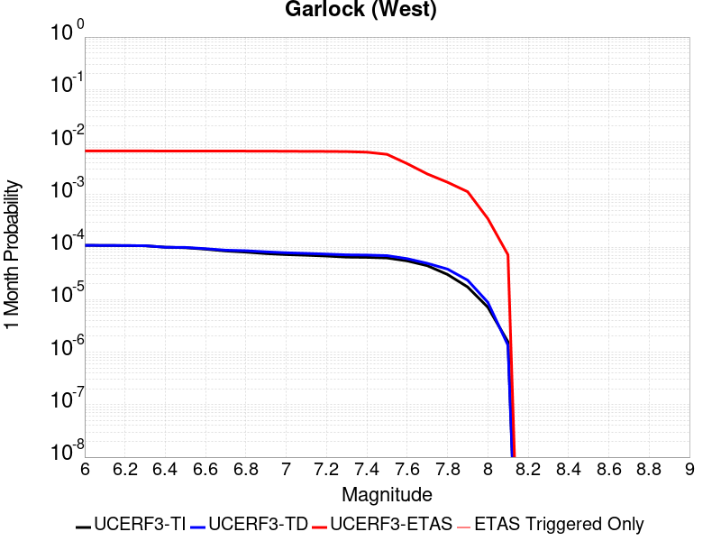 |  |  |

| Magnitude | 1 wk TI Prob | 1 wk TD Prob | 1 wk ETAS Prob | 1 wk ETAS/TD Gain | 1 wk ETAS Triggered Only | 1 mo TI Prob | 1 mo TD Prob | 1 mo ETAS Prob | 1 mo ETAS/TD Gain | 1 mo ETAS Triggered Only | 1 yr TI Prob | 1 yr TD Prob | 1 yr ETAS Prob | 1 yr ETAS/TD Gain | 1 yr ETAS Triggered Only | 10 yr TI Prob | 10 yr TD Prob | 10 yr ETAS Prob | 10 yr ETAS/TD Gain | 10 yr ETAS Triggered Only |
|-----|-----|-----|-----|-----|-----|-----|-----|-----|-----|-----|-----|-----|-----|-----|-----|-----|-----|-----|-----|-----|
| 6.0 | 2.5181727E-5 | 2.51973E-5 | 0.006414533 | 254.57224 | 0.006389497 | 1.0791722E-4 | 1.0798398E-4 | 0.007262572 | 67.25602 | 0.007155361 | 0.0013131002 | 0.0013139155 | 0.009093614 | 6.9210043 | 0.0077899345 | 0.013053683 | 0.013141977 | 0.021347798 | 1.6243979 | 0.0083150985 |
| 6.1 | 2.5077732E-5 | 2.5098372E-5 | 0.006414435 | 255.57175 | 0.006389497 | 1.0747157E-4 | 1.0756004E-4 | 0.0072621517 | 67.51719 | 0.007155361 | 0.001307681 | 0.0013087603 | 0.0090884995 | 6.944358 | 0.0077899345 | 0.013000126 | 0.013091032 | 0.021297278 | 1.62686 | 0.0083150985 |
| 6.2 | 2.494612E-5 | 2.498005E-5 | 0.006414317 | 256.7776 | 0.006389497 | 1.0690756E-4 | 1.0705298E-4 | 0.007261648 | 67.83228 | 0.007155361 | 0.0013008224 | 0.0013025942 | 0.009082382 | 6.972533 | 0.0077899345 | 0.012932341 | 0.013030097 | 0.021236848 | 1.6298305 | 0.0083150985 |
| 6.3 | 2.4733758E-5 | 2.479942E-5 | 0.006414138 | 258.64066 | 0.006389497 | 1.0599751E-4 | 1.06278916E-4 | 0.0072608795 | 68.3191 | 0.007155361 | 0.0012897556 | 0.0012931811 | 0.009073041 | 7.016064 | 0.0077899345 | 0.012822957 | 0.012937066 | 0.021144591 | 1.6344193 | 0.0083150985 |
| 6.4 | 2.3237335E-5 | 2.317873E-5 | 0.0064125275 | 276.65567 | 0.006389497 | 9.958477E-5 | 9.933365E-5 | 0.007253984 | 73.02645 | 0.007155361 | 0.0012117702 | 0.001208719 | 0.008989237 | 7.436995 | 0.0077899345 | 0.012051838 | 0.012101916 | 0.020316385 | 1.6787744 | 0.0083150985 |
| 6.5 | 2.2732203E-5 | 2.2993298E-5 | 0.006412343 | 278.87878 | 0.006389497 | 9.742009E-5 | 9.8539E-5 | 0.007253195 | 73.60735 | 0.007155361 | 0.0011854442 | 0.0011990548 | 0.008979648 | 7.4889393 | 0.0077899345 | 0.011791403 | 0.012006322 | 0.020221587 | 1.6842449 | 0.0083150985 |
| 6.6 | 2.1319436E-5 | 2.17735E-5 | 0.006411131 | 294.44653 | 0.006389497 | 9.136581E-5 | 9.331167E-5 | 0.007248005 | 77.675224 | 0.007155361 | 0.001111811 | 0.0011354799 | 0.008916569 | 7.852688 | 0.0077899345 | 0.011062649 | 0.011377227 | 0.019597722 | 1.7225395 | 0.0083150985 |
| 6.7 | 1.970802E-5 | 2.0393396E-5 | 0.0064097596 | 314.30566 | 0.006389497 | 8.446021E-5 | 8.739735E-5 | 0.007242133 | 82.86445 | 0.007155361 | 0.001027818 | 0.001063545 | 0.008845194 | 8.316709 | 0.0077899345 | 0.010230771 | 0.010664964 | 0.018891383 | 1.7713498 | 0.0083150985 |
| 6.8 | 1.8744462E-5 | 1.9901045E-5 | 0.0063873893 | 320.9575 | 0.006367615 | 8.033094E-5 | 8.5287415E-5 | 0.0072181583 | 84.63334 | 0.007133479 | 9.775903E-4 | 0.0010378812 | 0.008797872 | 8.476761 | 0.0077680526 | 0.009733009 | 0.01041075 | 0.018617628 | 1.788308 | 0.008293217 |
| 6.9 | 1.7559682E-5 | 1.8953415E-5 | 0.0063864477 | 336.955 | 0.006367615 | 7.5253614E-5 | 8.12264E-5 | 0.007214126 | 88.81504 | 0.007133479 | 9.158276E-4 | 9.884841E-4 | 0.008748858 | 8.850782 | 0.0077680526 | 0.0091206245 | 0.009921231 | 0.018132169 | 1.8276128 | 0.008293217 |
| 7.0 | 1.6794445E-5 | 1.8216237E-5 | 0.0063419524 | 348.14832 | 0.006323851 | 7.197421E-5 | 7.8067256E-5 | 0.0071672294 | 91.80839 | 0.0070897155 | 8.759337E-4 | 9.5005584E-4 | 0.008667006 | 9.122628 | 0.007724289 | 0.008724891 | 0.009540141 | 0.017710892 | 1.8564603 | 0.008249453 |
| 7.1 | 1.6337795E-5 | 1.7717046E-5 | 0.0063195745 | 356.6946 | 0.0063019693 | 7.0017246E-5 | 7.5927994E-5 | 0.007143225 | 94.07894 | 0.0070678336 | 8.521265E-4 | 9.240326E-4 | 0.008597461 | 9.304283 | 0.007680525 | 0.008488664 | 0.009281996 | 0.01741152 | 1.8758379 | 0.0082056895 |
| 7.2 | 1.5780008E-5 | 1.7165687E-5 | 0.006319027 | 368.1197 | 0.0063019693 | 6.762685E-5 | 7.356516E-5 | 0.007140879 | 97.06876 | 0.0070678336 | 8.2304585E-4 | 8.9528906E-4 | 0.008547076 | 9.546721 | 0.007658643 | 0.008200042 | 0.008996838 | 0.017107017 | 1.9014477 | 0.008183807 |
| 7.3 | 1.5058865E-5 | 1.6618762E-5 | 0.006296602 | 378.88513 | 0.0062800874 | 6.45364E-5 | 7.122133E-5 | 0.007094791 | 99.616104 | 0.0070240702 | 7.854473E-4 | 8.667759E-4 | 0.008475055 | 9.777678 | 0.00761488 | 0.00782677 | 0.008713539 | 0.016760962 | 1.9235541 | 0.008118162 |
| 7.4 | 1.4887923E-5 | 1.6454731E-5 | 0.0061870315 | 376.00317 | 0.0061706784 | 6.380382E-5 | 7.051838E-5 | 0.006962811 | 98.73754 | 0.006892779 | 7.7653467E-4 | 8.582243E-4 | 0.00833539 | 9.712368 | 0.0074835885 | 0.0077382675 | 0.008628399 | 0.016524663 | 1.9151483 | 0.007964989 |
| 7.5 | 1.4509299E-5 | 1.6046748E-5 | 0.0055301813 | 344.62943 | 0.005514223 | 6.218123E-5 | 6.876997E-5 | 0.0062827845 | 91.35942 | 0.006214442 | 7.567935E-4 | 8.36954E-4 | 0.0076146466 | 9.098047 | 0.00678337 | 0.0075422134 | 0.008416704 | 0.015620329 | 1.8558724 | 0.00726477 |
| 7.6 | 1.2756717E-5 | 1.4050848E-5 | 0.0038433187 | 273.5293 | 0.0038293216 | 5.4670498E-5 | 6.0216535E-5 | 0.0043487987 | 72.219345 | 0.00428884 | 6.6541E-4 | 7.328904E-4 | 0.005390306 | 7.35486 | 0.0046608313 | 0.006634211 | 0.0073816874 | 0.012290479 | 1.6649958 | 0.0049452954 |
| 7.7 | 1.0328985E-5 | 1.1460557E-5 | 0.0023965535 | 209.11319 | 0.0023851204 | 4.4266326E-5 | 4.911575E-5 | 0.002696688 | 54.90475 | 0.0026477023 | 5.388092E-4 | 5.978206E-4 | 0.0033970214 | 5.6823425 | 0.0028008753 | 0.0053750467 | 0.006038511 | 0.008952972 | 1.4826455 | 0.0029321662 |
| 7.8 | 7.0306583E-6 | 8.899601E-6 | 0.0017156678 | 192.7803 | 0.0017067834 | 3.0131043E-5 | 3.814059E-5 | 0.00198555 | 52.05871 | 0.0019474836 | 3.667837E-4 | 4.642629E-4 | 0.0025420724 | 5.475502 | 0.0020787746 | 0.003661789 | 0.0046952725 | 0.006851403 | 1.4592131 | 0.002166302 |
| 7.9 | 4.060633E-6 | 5.4653938E-6 | 0.0010557879 | 193.17691 | 0.0010503283 | 1.7402595E-5 | 2.3422906E-5 | 0.0012050145 | 51.445984 | 0.0011816192 | 2.11856E-4 | 2.851367E-4 | 0.0015320458 | 5.3730226 | 0.0012472648 | 0.0021165414 | 0.002884201 | 0.0041933246 | 1.4538947 | 0.0013129102 |
| 8.0 | 1.6729537E-6 | 2.0775144E-6 | 3.084226E-4 | 148.4575 | 3.0634573E-4 | 7.169782E-6 | 8.903603E-6 | 3.152466E-4 | 35.406635 | 3.0634573E-4 | 8.7288594E-5 | 1.0839601E-4 | 4.36588E-4 | 4.027713 | 3.2822756E-4 | 8.7254314E-4 | 0.0010969337 | 0.0014466591 | 1.3188208 | 3.5010942E-4 |
| 8.1 | 3.6733252E-7 | 3.1489964E-7 | 8.784222E-5 | 278.95306 | 8.7527354E-5 | 1.5742813E-6 | 1.3495693E-6 | 8.8876805E-5 | 65.85568 | 8.7527354E-5 | 1.9166706E-5 | 1.6430899E-5 | 1.03956816E-4 | 6.3269095 | 8.7527354E-5 | 1.9165053E-4 | 1.6638759E-4 | 2.7577858E-4 | 1.6574467 | 1.0940919E-4 |

## Blackwater
*[(top)](#table-of-contents)*

| 1 Week | 1 Month | 1 Year | 10 Year |
|-----|-----|-----|-----|
|  |  |  |  |

| Magnitude | 1 wk TI Prob | 1 wk TD Prob | 1 wk ETAS Prob | 1 wk ETAS/TD Gain | 1 wk ETAS Triggered Only | 1 mo TI Prob | 1 mo TD Prob | 1 mo ETAS Prob | 1 mo ETAS/TD Gain | 1 mo ETAS Triggered Only | 1 yr TI Prob | 1 yr TD Prob | 1 yr ETAS Prob | 1 yr ETAS/TD Gain | 1 yr ETAS Triggered Only | 10 yr TI Prob | 10 yr TD Prob | 10 yr ETAS Prob | 10 yr ETAS/TD Gain | 10 yr ETAS Triggered Only |
|-----|-----|-----|-----|-----|-----|-----|-----|-----|-----|-----|-----|-----|-----|-----|-----|-----|-----|-----|-----|-----|
| 6.0 | 3.0708583E-5 | 3.3095846E-5 | 0.0034903118 | 105.46072 | 0.0034573304 | 1.3160157E-4 | 1.4183241E-4 | 0.0039268536 | 27.686575 | 0.003785558 | 0.0016010714 | 0.0017255784 | 0.0060507064 | 3.5064797 | 0.004332604 | 0.015895851 | 0.017135633 | 0.021759612 | 1.2698458 | 0.004704595 |
| 6.1 | 3.0708583E-5 | 3.3095846E-5 | 0.0034903118 | 105.46072 | 0.0034573304 | 1.3160157E-4 | 1.4183241E-4 | 0.0039268536 | 27.686575 | 0.003785558 | 0.0016010714 | 0.0017255784 | 0.0060507064 | 3.5064797 | 0.004332604 | 0.015895851 | 0.017135633 | 0.021759612 | 1.2698458 | 0.004704595 |
| 6.2 | 1.1707779E-5 | 1.2545122E-5 | 0.0013035574 | 103.9095 | 0.0012910285 | 5.017523E-5 | 5.3763757E-5 | 0.0014541261 | 27.046587 | 0.0014004377 | 6.107122E-4 | 6.5438676E-4 | 0.0022507156 | 3.4394274 | 0.0015973742 | 0.006090366 | 0.0065255696 | 0.008264693 | 1.266509 | 0.0017505471 |
| 6.3 | 1.1707779E-5 | 1.2545122E-5 | 0.0013035574 | 103.9095 | 0.0012910285 | 5.017523E-5 | 5.3763757E-5 | 0.0014541261 | 27.046587 | 0.0014004377 | 6.107122E-4 | 6.5438676E-4 | 0.0022507156 | 3.4394274 | 0.0015973742 | 0.006090366 | 0.0065255696 | 0.008264693 | 1.266509 | 0.0017505471 |
| 6.4 | 7.929244E-6 | 8.480098E-6 | 8.6186454E-4 | 101.6338 | 8.533917E-4 | 3.3982033E-5 | 3.6342793E-5 | 9.5534656E-4 | 26.287098 | 9.190372E-4 | 4.136527E-4 | 4.423877E-4 | 0.0014922513 | 3.3731751 | 0.0010503283 | 0.0041288356 | 0.0044154758 | 0.0055918777 | 1.2664269 | 0.0011816192 |
| 6.5 | 5.8832115E-6 | 6.285991E-6 | 7.0650043E-4 | 112.392845 | 7.0021884E-4 | 2.521352E-5 | 2.6939697E-5 | 7.7090214E-4 | 28.615843 | 7.439825E-4 | 3.0693135E-4 | 3.27944E-4 | 0.0011591811 | 3.5346925 | 8.315098E-4 | 0.0030650778 | 0.0032748538 | 0.0042126914 | 1.2863754 | 9.4091904E-4 |
| 6.6 | 5.8832115E-6 | 6.285991E-6 | 7.0650043E-4 | 112.392845 | 7.0021884E-4 | 2.521352E-5 | 2.6939697E-5 | 7.7090214E-4 | 28.615843 | 7.439825E-4 | 3.0693135E-4 | 3.27944E-4 | 0.0011591811 | 3.5346925 | 8.315098E-4 | 0.0030650778 | 0.0032748538 | 0.0042126914 | 1.2863754 | 9.4091904E-4 |
| 6.7 | 3.0715053E-6 | 3.2814662E-6 | 2.0021736E-4 | 61.014606 | 1.9693654E-4 | 1.3163528E-5 | 1.4063357E-5 | 2.3287866E-4 | 16.559252 | 2.1881839E-4 | 1.6025416E-4 | 1.7120909E-4 | 4.3374617E-4 | 2.5334296 | 2.6258206E-4 | 0.0016013865 | 0.0017108864 | 0.0019948636 | 1.1659825 | 2.844639E-4 |
| 6.8 | 2.2722281E-6 | 2.4287538E-6 | 1.7748303E-4 | 73.07577 | 1.7505471E-4 | 9.738084E-6 | 1.0408908E-5 | 2.073434E-4 | 19.919804 | 1.9693654E-4 | 1.1855473E-4 | 1.26722E-4 | 3.673917E-4 | 2.8991945 | 2.4070022E-4 | 0.001184915 | 0.0012665876 | 0.001528837 | 1.207052 | 2.6258206E-4 |
| 6.9 | 9.952399E-7 | 1.0653489E-6 | 8.8592606E-5 | 83.15831 | 8.7527354E-5 | 4.265307E-6 | 4.5657757E-6 | 9.209273E-5 | 20.170225 | 8.7527354E-5 | 5.1928873E-5 | 5.5587418E-5 | 1.4310991E-4 | 2.5745018 | 8.7527354E-5 | 5.191674E-4 | 5.557858E-4 | 6.4326444E-4 | 1.1573964 | 8.7527354E-5 |
| 7.0 | 4.7385504E-7 | 5.0755597E-7 | 4.427121E-5 | 87.2243 | 4.3763677E-5 | 2.0308057E-6 | 2.1752398E-6 | 4.593882E-5 | 21.118969 | 4.3763677E-5 | 2.4724779E-5 | 2.6483543E-5 | 7.024606E-5 | 2.652442 | 4.3763677E-5 | 2.4722028E-4 | 2.6483546E-4 | 3.0858754E-4 | 1.1652048 | 4.3763677E-5 |

## Ash Hill
*[(top)](#table-of-contents)*

| 1 Week | 1 Month | 1 Year | 10 Year |
|-----|-----|-----|-----|
|  |  |  |  |

| Magnitude | 1 wk TI Prob | 1 wk TD Prob | 1 wk ETAS Prob | 1 wk ETAS/TD Gain | 1 wk ETAS Triggered Only | 1 mo TI Prob | 1 mo TD Prob | 1 mo ETAS Prob | 1 mo ETAS/TD Gain | 1 mo ETAS Triggered Only | 1 yr TI Prob | 1 yr TD Prob | 1 yr ETAS Prob | 1 yr ETAS/TD Gain | 1 yr ETAS Triggered Only | 10 yr TI Prob | 10 yr TD Prob | 10 yr ETAS Prob | 10 yr ETAS/TD Gain | 10 yr ETAS Triggered Only |
|-----|-----|-----|-----|-----|-----|-----|-----|-----|-----|-----|-----|-----|-----|-----|-----|-----|-----|-----|-----|-----|
| 6.0 | 2.1545662E-5 | 2.3194447E-5 | 0.0024739034 | 106.6593 | 0.0024507658 | 9.2335285E-5 | 9.940143E-5 | 0.0029656372 | 29.834955 | 0.0028665208 | 0.0011236023 | 0.0012096206 | 0.004531637 | 3.746329 | 0.0033260393 | 0.011179381 | 0.012038348 | 0.015562151 | 1.2927147 | 0.0035667396 |
| 6.1 | 2.1545662E-5 | 2.3194447E-5 | 0.0024739034 | 106.6593 | 0.0024507658 | 9.2335285E-5 | 9.940143E-5 | 0.0029656372 | 29.834955 | 0.0028665208 | 0.0011236023 | 0.0012096206 | 0.004531637 | 3.746329 | 0.0033260393 | 0.011179381 | 0.012038348 | 0.015562151 | 1.2927147 | 0.0035667396 |
| 6.2 | 2.1545662E-5 | 2.3194447E-5 | 0.0024739034 | 106.6593 | 0.0024507658 | 9.2335285E-5 | 9.940143E-5 | 0.0029656372 | 29.834955 | 0.0028665208 | 0.0011236023 | 0.0012096206 | 0.004531637 | 3.746329 | 0.0033260393 | 0.011179381 | 0.012038348 | 0.015562151 | 1.2927147 | 0.0035667396 |
| 6.3 | 1.0025529E-5 | 1.0746934E-5 | 0.0010173006 | 94.659615 | 0.0010065646 | 4.2965847E-5 | 4.605755E-5 | 0.0011838607 | 25.703943 | 0.0011378556 | 5.229836E-4 | 5.6061964E-4 | 0.0018290548 | 3.2625592 | 0.0012691466 | 0.005217545 | 0.0055933665 | 0.0069206925 | 1.2373036 | 0.0013347921 |
| 6.4 | 1.0025529E-5 | 1.0746934E-5 | 0.0010173006 | 94.659615 | 0.0010065646 | 4.2965847E-5 | 4.605755E-5 | 0.0011838607 | 25.703943 | 0.0011378556 | 5.229836E-4 | 5.6061964E-4 | 0.0018290548 | 3.2625592 | 0.0012691466 | 0.005217545 | 0.0055933665 | 0.0069206925 | 1.2373036 | 0.0013347921 |
| 6.5 | 6.9617327E-6 | 7.456634E-6 | 7.951969E-4 | 106.642876 | 7.8774616E-4 | 2.9835655E-5 | 3.195666E-5 | 9.072022E-4 | 28.388517 | 8.7527354E-4 | 3.6318856E-4 | 3.8901155E-4 | 0.0013733112 | 3.5302582 | 9.846827E-4 | 0.0036259557 | 0.0038841602 | 0.0048868153 | 1.2581394 | 0.0010065646 |
| 6.6 | 4.9919777E-6 | 5.3466883E-6 | 7.055618E-4 | 131.96239 | 7.0021884E-4 | 2.1394015E-5 | 2.2914215E-5 | 7.6687965E-4 | 33.46742 | 7.439825E-4 | 2.60441E-4 | 2.7895154E-4 | 0.0010883537 | 3.9015868 | 8.09628E-4 | 0.0026013597 | 0.0027866727 | 0.0036158653 | 1.2975565 | 8.315098E-4 |
| 6.7 | 3.6630722E-6 | 3.924624E-6 | 6.1661366E-4 | 157.11409 | 6.1269145E-4 | 1.5698786E-5 | 1.681974E-5 | 6.7326386E-4 | 40.028194 | 6.564551E-4 | 1.9111596E-4 | 2.0476682E-4 | 9.2671963E-4 | 4.525731 | 7.2210067E-4 | 0.0019095168 | 0.0020463446 | 0.0027669675 | 1.3521514 | 7.2210067E-4 |
| 6.8 | 2.5599613E-6 | 2.744925E-6 | 4.8414405E-4 | 176.37787 | 4.8140044E-4 | 1.0971216E-5 | 1.1763939E-5 | 5.369219E-4 | 45.64133 | 5.251641E-4 | 1.3356637E-4 | 1.4322149E-4 | 7.339465E-4 | 5.1245556 | 5.908096E-4 | 0.0013348613 | 0.0014317769 | 0.0020217407 | 1.41205 | 5.908096E-4 |
| 6.9 | 1.7684905E-6 | 1.8968707E-6 | 4.395328E-4 | 231.71469 | 4.3763677E-4 | 7.579223E-6 | 8.129446E-6 | 4.8952596E-4 | 60.2164 | 4.8140044E-4 | 9.2273134E-5 | 9.8976E-5 | 6.4596784E-4 | 6.5265093 | 5.4704596E-4 | 9.223483E-4 | 9.8976E-4 | 0.0015362645 | 1.5521586 | 5.4704596E-4 |

## San Andreas (Mojave N)
*[(top)](#table-of-contents)*

| 1 Week | 1 Month | 1 Year | 10 Year |
|-----|-----|-----|-----|
|  |  |  |  |

| Magnitude | 1 wk TI Prob | 1 wk TD Prob | 1 wk ETAS Prob | 1 wk ETAS/TD Gain | 1 wk ETAS Triggered Only | 1 mo TI Prob | 1 mo TD Prob | 1 mo ETAS Prob | 1 mo ETAS/TD Gain | 1 mo ETAS Triggered Only | 1 yr TI Prob | 1 yr TD Prob | 1 yr ETAS Prob | 1 yr ETAS/TD Gain | 1 yr ETAS Triggered Only | 10 yr TI Prob | 10 yr TD Prob | 10 yr ETAS Prob | 10 yr ETAS/TD Gain | 10 yr ETAS Triggered Only |
|-----|-----|-----|-----|-----|-----|-----|-----|-----|-----|-----|-----|-----|-----|-----|-----|-----|-----|-----|-----|-----|
| 6.0 | 9.877682E-5 | 1.9400702E-4 | 0.0029724613 | 15.321411 | 0.0027789935 | 4.2326056E-4 | 8.311939E-4 | 0.0039139683 | 4.7088513 | 0.0030853392 | 0.0051410277 | 0.010072956 | 0.01332217 | 1.322568 | 0.0032822757 | 0.05023708 | 0.09831428 | 0.10141197 | 1.0315081 | 0.0034354485 |
| 6.1 | 9.877682E-5 | 1.9400702E-4 | 0.0029724613 | 15.321411 | 0.0027789935 | 4.2326056E-4 | 8.311939E-4 | 0.0039139683 | 4.7088513 | 0.0030853392 | 0.0051410277 | 0.010072956 | 0.01332217 | 1.322568 | 0.0032822757 | 0.05023708 | 0.09831428 | 0.10141197 | 1.0315081 | 0.0034354485 |
| 6.2 | 9.877682E-5 | 1.9400702E-4 | 0.0029724613 | 15.321411 | 0.0027789935 | 4.2326056E-4 | 8.311939E-4 | 0.0039139683 | 4.7088513 | 0.0030853392 | 0.0051410277 | 0.010072956 | 0.01332217 | 1.322568 | 0.0032822757 | 0.05023708 | 0.09831428 | 0.10141197 | 1.0315081 | 0.0034354485 |
| 6.3 | 9.877682E-5 | 1.9400702E-4 | 0.0029724613 | 15.321411 | 0.0027789935 | 4.2326056E-4 | 8.311939E-4 | 0.0039139683 | 4.7088513 | 0.0030853392 | 0.0051410277 | 0.010072956 | 0.01332217 | 1.322568 | 0.0032822757 | 0.05023708 | 0.09831428 | 0.10141197 | 1.0315081 | 0.0034354485 |
| 6.4 | 9.877682E-5 | 1.9400702E-4 | 0.0029724613 | 15.321411 | 0.0027789935 | 4.2326056E-4 | 8.311939E-4 | 0.0039139683 | 4.7088513 | 0.0030853392 | 0.0051410277 | 0.010072956 | 0.01332217 | 1.322568 | 0.0032822757 | 0.05023708 | 0.09831428 | 0.10141197 | 1.0315081 | 0.0034354485 |
| 6.5 | 9.861474E-5 | 1.9374468E-4 | 0.0029721998 | 15.340807 | 0.0027789935 | 4.2256617E-4 | 8.300703E-4 | 0.0039128484 | 4.713876 | 0.0030853392 | 0.0051326132 | 0.010059402 | 0.013308661 | 1.323007 | 0.0032822757 | 0.050156746 | 0.098192066 | 0.10129018 | 1.0315516 | 0.0034354485 |
| 6.6 | 9.861474E-5 | 1.9374468E-4 | 0.0029721998 | 15.340807 | 0.0027789935 | 4.2256617E-4 | 8.300703E-4 | 0.0039128484 | 4.713876 | 0.0030853392 | 0.0051326132 | 0.010059402 | 0.013308661 | 1.323007 | 0.0032822757 | 0.050156746 | 0.098192066 | 0.10129018 | 1.0315516 | 0.0034354485 |
| 6.7 | 9.8552715E-5 | 1.9364421E-4 | 0.0029720995 | 15.3482485 | 0.0027789935 | 4.223004E-4 | 8.2964E-4 | 0.0039124195 | 4.7158036 | 0.0030853392 | 0.0051293927 | 0.010054212 | 0.013303488 | 1.3231755 | 0.0032822757 | 0.050125998 | 0.098145254 | 0.10124353 | 1.0315683 | 0.0034354485 |
| 6.8 | 9.8464974E-5 | 1.9349584E-4 | 0.0029719516 | 15.359253 | 0.0027789935 | 4.219245E-4 | 8.290045E-4 | 0.003911786 | 4.7186546 | 0.0030853392 | 0.0051248376 | 0.010046546 | 0.013295847 | 1.3234246 | 0.0032822757 | 0.05008251 | 0.09807528 | 0.101173796 | 1.0315932 | 0.0034354485 |
| 6.9 | 9.825824E-5 | 1.9317595E-4 | 0.0029716326 | 15.383037 | 0.0027789935 | 4.2103877E-4 | 8.276344E-4 | 0.00391042 | 4.724816 | 0.0030853392 | 0.0051141046 | 0.010030019 | 0.013279374 | 1.3239629 | 0.0032822757 | 0.049980022 | 0.09792438 | 0.10102341 | 1.0316472 | 0.0034354485 |
| 7.0 | 9.781462E-5 | 1.924896E-4 | 0.0029709481 | 15.43433 | 0.0027789935 | 4.1913814E-4 | 8.246948E-4 | 0.0039074896 | 4.738104 | 0.0030853392 | 0.005091073 | 0.009994558 | 0.013244029 | 1.325124 | 0.0032822757 | 0.04976007 | 0.09760077 | 0.10070092 | 1.0317636 | 0.0034354485 |
| 7.1 | 9.7121134E-5 | 1.9150671E-4 | 0.002969968 | 15.508427 | 0.0027789935 | 4.1616702E-4 | 8.204851E-4 | 0.0039032928 | 4.757299 | 0.0030853392 | 0.005055068 | 0.009943774 | 0.013193412 | 1.3268012 | 0.0032822757 | 0.04941613 | 0.09713728 | 0.10023902 | 1.0319315 | 0.0034354485 |
| 7.2 | 9.663819E-5 | 1.9081456E-4 | 0.0029692778 | 15.561064 | 0.0027789935 | 4.1409794E-4 | 8.175206E-4 | 0.0039003375 | 4.7709346 | 0.0030853392 | 0.0050299936 | 0.00990801 | 0.013157765 | 1.3279927 | 0.0032822757 | 0.049176537 | 0.09681055 | 0.09991341 | 1.0320508 | 0.0034354485 |
| 7.3 | 9.6277574E-5 | 1.9033969E-4 | 0.0029688042 | 15.597399 | 0.0027789935 | 4.125529E-4 | 8.154867E-4 | 0.0038983098 | 4.7803473 | 0.0030853392 | 0.0050112694 | 0.009883473 | 0.013133308 | 1.3288151 | 0.0032822757 | 0.04899759 | 0.09658401 | 0.09968764 | 1.032134 | 0.0034354485 |
| 7.4 | 9.593308E-5 | 1.897375E-4 | 0.0029682037 | 15.643737 | 0.0027789935 | 4.1107697E-4 | 8.129075E-4 | 0.0038957386 | 4.7923517 | 0.0030853392 | 0.0049933824 | 0.009852355 | 0.013102293 | 1.329864 | 0.0032822757 | 0.04882661 | 0.09630218 | 0.09940679 | 1.0322381 | 0.0034354485 |
| 7.5 | 9.561707E-5 | 1.8919831E-4 | 0.002967666 | 15.685478 | 0.0027789935 | 4.0972308E-4 | 8.1059814E-4 | 0.0038934364 | 4.8031645 | 0.0030853392 | 0.0049769743 | 0.009824493 | 0.013074522 | 1.3308089 | 0.0032822757 | 0.048669744 | 0.09604836 | 0.09915384 | 1.0323324 | 0.0034354485 |
| 7.6 | 9.418194E-5 | 1.8572104E-4 | 0.0029641984 | 15.960487 | 0.0027789935 | 4.0357444E-4 | 7.957047E-4 | 0.0038785888 | 4.8744073 | 0.0030853392 | 0.004902454 | 0.009644784 | 0.012895403 | 1.3370339 | 0.0032822757 | 0.047957025 | 0.094430685 | 0.09754172 | 1.0329452 | 0.0034354485 |
| 7.7 | 8.202141E-5 | 1.6021315E-4 | 0.0026762213 | 16.70413 | 0.0025164115 | 3.51473E-4 | 6.8644714E-4 | 0.003463533 | 5.045593 | 0.0027789935 | 0.00427079 | 0.008325525 | 0.0112332795 | 1.3492578 | 0.0029321662 | 0.04189639 | 0.08223219 | 0.08506382 | 1.0344346 | 0.0030853392 |
| 7.8 | 7.2859846E-5 | 1.4516473E-4 | 0.0019829723 | 13.660153 | 0.0018380744 | 3.1221908E-4 | 6.219862E-4 | 0.0026994678 | 4.340077 | 0.0020787746 | 0.003794643 | 0.0075464295 | 0.009739817 | 1.2906524 | 0.0022100657 | 0.037304975 | 0.07472468 | 0.076850586 | 1.0284499 | 0.002297593 |
| 7.9 | 5.3874453E-5 | 1.0045676E-4 | 0.0012600777 | 12.543483 | 0.0011597375 | 2.3087008E-4 | 4.3045796E-4 | 0.0017209307 | 3.9979064 | 0.0012910285 | 0.0028072202 | 0.0052282433 | 0.0065778242 | 1.2581328 | 0.001356674 | 0.02772022 | 0.05242443 | 0.053772185 | 1.0257086 | 0.0014223194 |
| 8.0 | 3.468538E-5 | 5.4260272E-5 | 4.2623133E-4 | 7.8553114 | 3.7199125E-4 | 1.4864317E-4 | 2.325233E-4 | 6.0442806E-4 | 2.59943 | 3.7199125E-4 | 0.0018082283 | 0.002827298 | 0.0032200573 | 1.138917 | 3.9387308E-4 | 0.017935853 | 0.028947512 | 0.02935123 | 1.0139467 | 4.157549E-4 |
| 8.1 | 1.9152367E-5 | 1.940263E-5 | 1.288097E-4 | 6.638775 | 1.0940919E-4 | 8.207899E-5 | 8.3151484E-5 | 1.9255158E-4 | 2.3156722 | 1.0940919E-4 | 9.988535E-4 | 0.0010118998 | 0.0011211983 | 1.1080132 | 1.0940919E-4 | 0.009943757 | 0.01085625 | 0.010986116 | 1.0119623 | 1.3129103E-4 |
| 8.2 | 8.643924E-6 | 5.4748625E-6 | 5.4748625E-6 | 1.0 | 0.0 | 3.704486E-5 | 2.3463486E-5 | 2.3463486E-5 | 1.0 | 0.0 | 4.5092785E-4 | 2.8563058E-4 | 2.8563058E-4 | 1.0 | 0.0 | 0.0045001395 | 0.0032487072 | 0.0032487072 | 1.0 | 0.0 |
| 8.3 | 1.983087E-6 | 7.6599065E-7 | 7.6599065E-7 | 1.0 | 0.0 | 8.498917E-6 | 3.282813E-6 | 3.282813E-6 | 1.0 | 0.0 | 1.034694E-4 | 3.9967534E-5 | 3.9967534E-5 | 1.0 | 0.0 | 0.0010342124 | 4.719687E-4 | 4.719687E-4 | 1.0 | 0.0 |

## San Andreas (Mojave S)
*[(top)](#table-of-contents)*

| 1 Week | 1 Month | 1 Year | 10 Year |
|-----|-----|-----|-----|
|  |  |  |  |

| Magnitude | 1 wk TI Prob | 1 wk TD Prob | 1 wk ETAS Prob | 1 wk ETAS/TD Gain | 1 wk ETAS Triggered Only | 1 mo TI Prob | 1 mo TD Prob | 1 mo ETAS Prob | 1 mo ETAS/TD Gain | 1 mo ETAS Triggered Only | 1 yr TI Prob | 1 yr TD Prob | 1 yr ETAS Prob | 1 yr ETAS/TD Gain | 1 yr ETAS Triggered Only | 10 yr TI Prob | 10 yr TD Prob | 10 yr ETAS Prob | 10 yr ETAS/TD Gain | 10 yr ETAS Triggered Only |
|-----|-----|-----|-----|-----|-----|-----|-----|-----|-----|-----|-----|-----|-----|-----|-----|-----|-----|-----|-----|-----|
| 6.0 | 3.1064058E-4 | 6.7460834E-4 | 0.003189322 | 4.727665 | 0.0025164115 | 0.0013306376 | 0.0028881032 | 0.0057245265 | 1.982106 | 0.002844639 | 0.016080605 | 0.03462235 | 0.03755862 | 1.0848085 | 0.0030415754 | 0.1496549 | 0.28660452 | 0.28889924 | 1.0080066 | 0.00321663 |
| 6.1 | 3.1064058E-4 | 6.7460834E-4 | 0.003189322 | 4.727665 | 0.0025164115 | 0.0013306376 | 0.0028881032 | 0.0057245265 | 1.982106 | 0.002844639 | 0.016080605 | 0.03462235 | 0.03755862 | 1.0848085 | 0.0030415754 | 0.1496549 | 0.28660452 | 0.28889924 | 1.0080066 | 0.00321663 |
| 6.2 | 3.1064058E-4 | 6.7460834E-4 | 0.003189322 | 4.727665 | 0.0025164115 | 0.0013306376 | 0.0028881032 | 0.0057245265 | 1.982106 | 0.002844639 | 0.016080605 | 0.03462235 | 0.03755862 | 1.0848085 | 0.0030415754 | 0.1496549 | 0.28660452 | 0.28889924 | 1.0080066 | 0.00321663 |
| 6.3 | 3.1064058E-4 | 6.7460834E-4 | 0.003189322 | 4.727665 | 0.0025164115 | 0.0013306376 | 0.0028881032 | 0.0057245265 | 1.982106 | 0.002844639 | 0.016080605 | 0.03462235 | 0.03755862 | 1.0848085 | 0.0030415754 | 0.1496549 | 0.28660452 | 0.28889924 | 1.0080066 | 0.00321663 |
| 6.4 | 1.9872203E-4 | 4.3179357E-4 | 0.0027283945 | 6.3187475 | 0.002297593 | 8.5138786E-4 | 0.0018492596 | 0.004448383 | 2.405494 | 0.0026039388 | 0.010316478 | 0.02228844 | 0.024984099 | 1.1209443 | 0.0027571116 | 0.098504856 | 0.19699748 | 0.19931687 | 1.0117737 | 0.0028884027 |
| 6.5 | 1.291105E-4 | 2.875267E-4 | 0.0025188325 | 8.760343 | 0.0022319474 | 5.5321335E-4 | 0.0012316781 | 0.00374499 | 3.040559 | 0.0025164115 | 0.006714592 | 0.0148934 | 0.017523225 | 1.1765765 | 0.0026695842 | 0.065152965 | 0.13803436 | 0.14042975 | 1.0173537 | 0.0027789935 |
| 6.6 | 1.291105E-4 | 2.875267E-4 | 0.0025188325 | 8.760343 | 0.0022319474 | 5.5321335E-4 | 0.0012316781 | 0.00374499 | 3.040559 | 0.0025164115 | 0.006714592 | 0.0148934 | 0.017523225 | 1.1765765 | 0.0026695842 | 0.065152965 | 0.13803436 | 0.14042975 | 1.0173537 | 0.0027789935 |
| 6.7 | 1.08001186E-4 | 2.4333889E-4 | 0.00243099 | 9.990143 | 0.0021881838 | 4.6278012E-4 | 0.0010424647 | 0.0035125348 | 3.369452 | 0.0024726477 | 0.0056198016 | 0.012618446 | 0.015211132 | 1.2054679 | 0.0026258205 | 0.054797906 | 0.119176775 | 0.12158603 | 1.0202157 | 0.0027352297 |
| 6.8 | 1.0624356E-4 | 2.3851555E-4 | 0.0024261775 | 10.1719885 | 0.0021881838 | 4.5525006E-4 | 0.0010218095 | 0.0034919307 | 3.4173987 | 0.0024726477 | 0.0055285925 | 0.012369843 | 0.014963183 | 1.2096502 | 0.0026258205 | 0.053930566 | 0.11712591 | 0.11954078 | 1.0206177 | 0.0027352297 |
| 6.9 | 1.0393785E-4 | 2.3221898E-4 | 0.0024198946 | 10.420744 | 0.0021881838 | 4.4537184E-4 | 9.948451E-4 | 0.003465033 | 3.4829874 | 0.0024726477 | 0.0054089287 | 0.012045221 | 0.014639413 | 1.215371 | 0.0026258205 | 0.05279156 | 0.11442335 | 0.11684561 | 1.0211692 | 0.0027352297 |
| 7.0 | 1.0155622E-4 | 2.2591476E-4 | 0.0024136042 | 10.683695 | 0.0021881838 | 4.3516833E-4 | 9.6784724E-4 | 0.0034381018 | 3.5523186 | 0.0024726477 | 0.005285311 | 0.0117200995 | 0.014315145 | 1.2214184 | 0.0026258205 | 0.05161361 | 0.111683756 | 0.1141135 | 1.0217556 | 0.0027352297 |
| 7.1 | 9.885595E-5 | 2.1879886E-4 | 0.002406504 | 10.998704 | 0.0021881838 | 4.2359953E-4 | 9.3737274E-4 | 0.0034077025 | 3.6353762 | 0.0024726477 | 0.0051451353 | 0.011352993 | 0.013949002 | 1.228663 | 0.0026258205 | 0.05027629 | 0.1085682 | 0.111006476 | 1.0224584 | 0.0027352297 |
| 7.2 | 9.6411415E-5 | 2.124288E-4 | 0.0024001477 | 11.298598 | 0.0021881838 | 4.1312634E-4 | 9.1009185E-4 | 0.0033804893 | 3.7144485 | 0.0024726477 | 0.005018219 | 0.011024255 | 0.013621128 | 1.2355599 | 0.0026258205 | 0.049064007 | 0.105758004 | 0.10820396 | 1.0231279 | 0.0027352297 |
| 7.3 | 9.1180635E-5 | 1.9471257E-4 | 0.0023387151 | 12.011115 | 0.00214442 | 3.907156E-4 | 8.342157E-4 | 0.00323921 | 3.8829405 | 0.0024070023 | 0.004746591 | 0.01010939 | 0.012643683 | 1.2506871 | 0.002560175 | 0.046464786 | 0.09795115 | 0.100359246 | 1.0245847 | 0.0026695842 |
| 7.4 | 8.887388E-5 | 1.8719878E-4 | 0.0023093398 | 12.336297 | 0.0021225384 | 3.8083247E-4 | 8.020339E-4 | 0.0031852413 | 3.9714546 | 0.0023851204 | 0.0046267817 | 0.00972114 | 0.0122130895 | 1.2563432 | 0.0025164115 | 0.045316286 | 0.09458615 | 0.0969636 | 1.0251353 | 0.0026258205 |
| 7.5 | 8.6750515E-5 | 1.8051457E-4 | 0.0023026697 | 12.756144 | 0.0021225384 | 3.7173493E-4 | 7.7340455E-4 | 0.0031566801 | 4.081538 | 0.0023851204 | 0.004516484 | 0.009375632 | 0.011868451 | 1.2658827 | 0.0025164115 | 0.04425787 | 0.091549896 | 0.09393532 | 1.026056 | 0.0026258205 |
| 7.6 | 8.453092E-5 | 1.7439072E-4 | 0.0022965588 | 13.169043 | 0.0021225384 | 3.6222505E-4 | 7.471748E-4 | 0.003130513 | 4.1898003 | 0.0023851204 | 0.0044011753 | 0.009058985 | 0.0115526 | 1.2752644 | 0.0025164115 | 0.04315024 | 0.08870898 | 0.09110187 | 1.0269746 | 0.0026258205 |
| 7.7 | 8.259102E-5 | 1.6961215E-4 | 0.0022917904 | 13.511948 | 0.0021225384 | 3.539135E-4 | 7.2670676E-4 | 0.0031100938 | 4.2797093 | 0.0023851204 | 0.004300386 | 0.008811831 | 0.011306068 | 1.2830555 | 0.0025164115 | 0.042181134 | 0.08645982 | 0.08885862 | 1.0277447 | 0.0026258205 |
| 7.8 | 7.444844E-5 | 1.5283503E-4 | 0.0019906284 | 13.024688 | 0.0018380744 | 3.1902574E-4 | 6.548429E-4 | 0.0027322562 | 4.1723843 | 0.0020787746 | 0.0038772223 | 0.007943616 | 0.010136126 | 1.2760091 | 0.0022100657 | 0.03810269 | 0.078290746 | 0.08040846 | 1.0270493 | 0.002297593 |
| 7.9 | 5.2586525E-5 | 1.00064186E-4 | 0.0012596856 | 12.588776 | 0.0011597375 | 2.2535135E-4 | 4.2877605E-4 | 0.0017192509 | 4.009671 | 0.0012910285 | 0.0027402006 | 0.005207864 | 0.0065574725 | 1.2591482 | 0.001356674 | 0.027066574 | 0.052200034 | 0.05354811 | 1.0258251 | 0.0014223194 |
| 8.0 | 3.379877E-5 | 5.4074168E-5 | 4.260453E-4 | 7.8789062 | 3.7199125E-4 | 1.4484383E-4 | 2.3172585E-4 | 6.036309E-4 | 2.6049354 | 3.7199125E-4 | 0.0017620471 | 0.002817614 | 0.0032103774 | 1.1393957 | 3.9387308E-4 | 0.017481409 | 0.028834904 | 0.02923867 | 1.0140027 | 4.157549E-4 |
| 8.1 | 1.8668277E-5 | 1.9309397E-5 | 1.2871648E-4 | 6.666002 | 1.0940919E-4 | 8.000444E-5 | 8.275194E-5 | 1.9215207E-4 | 2.322025 | 1.0940919E-4 | 9.736188E-4 | 0.0010070398 | 0.0011163388 | 1.1085349 | 1.0940919E-4 | 0.009693642 | 0.010798888 | 0.010928761 | 1.0120265 | 1.3129103E-4 |
| 8.2 | 8.541571E-6 | 5.460819E-6 | 5.460819E-6 | 1.0 | 0.0 | 3.660622E-5 | 2.3403301E-5 | 2.3403301E-5 | 1.0 | 0.0 | 4.455896E-4 | 2.84898E-4 | 2.84898E-4 | 1.0 | 0.0 | 0.0044469717 | 0.0032408056 | 0.0032408056 | 1.0 | 0.0 |
| 8.3 | 1.983087E-6 | 7.6599065E-7 | 7.6599065E-7 | 1.0 | 0.0 | 8.498917E-6 | 3.282813E-6 | 3.282813E-6 | 1.0 | 0.0 | 1.034694E-4 | 3.9967534E-5 | 3.9967534E-5 | 1.0 | 0.0 | 0.0010342124 | 4.719687E-4 | 4.719687E-4 | 1.0 | 0.0 |

## Gravel Hills-Harper Lk
*[(top)](#table-of-contents)*

| 1 Week | 1 Month | 1 Year | 10 Year |
|-----|-----|-----|-----|
|  |  |  | 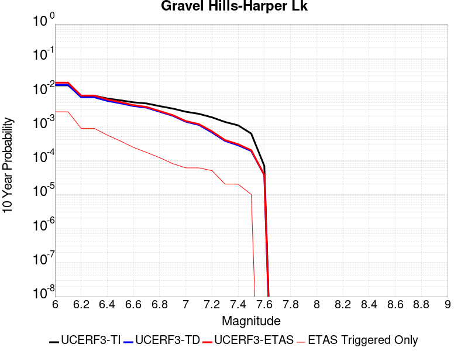 |

| Magnitude | 1 wk TI Prob | 1 wk TD Prob | 1 wk ETAS Prob | 1 wk ETAS/TD Gain | 1 wk ETAS Triggered Only | 1 mo TI Prob | 1 mo TD Prob | 1 mo ETAS Prob | 1 mo ETAS/TD Gain | 1 mo ETAS Triggered Only | 1 yr TI Prob | 1 yr TD Prob | 1 yr ETAS Prob | 1 yr ETAS/TD Gain | 1 yr ETAS Triggered Only | 10 yr TI Prob | 10 yr TD Prob | 10 yr ETAS Prob | 10 yr ETAS/TD Gain | 10 yr ETAS Triggered Only |
|-----|-----|-----|-----|-----|-----|-----|-----|-----|-----|-----|-----|-----|-----|-----|-----|-----|-----|-----|-----|-----|
| 6.0 | 3.0679566E-5 | 3.1464646E-5 | 0.001978887 | 62.892395 | 0.0019474836 | 1.3147724E-4 | 1.3484273E-4 | 0.0022352159 | 16.576466 | 0.0021006565 | 0.0015995599 | 0.0016406906 | 0.003978206 | 2.424714 | 0.0023413566 | 0.015880952 | 0.01630734 | 0.018739663 | 1.1491553 | 0.0024726477 |
| 6.1 | 3.0679566E-5 | 3.1464646E-5 | 0.001978887 | 62.892395 | 0.0019474836 | 1.3147724E-4 | 1.3484273E-4 | 0.0022352159 | 16.576466 | 0.0021006565 | 0.0015995599 | 0.0016406906 | 0.003978206 | 2.424714 | 0.0023413566 | 0.015880952 | 0.01630734 | 0.018739663 | 1.1491553 | 0.0024726477 |
| 6.2 | 1.514536E-5 | 1.3635206E-5 | 6.700814E-4 | 49.14347 | 6.564551E-4 | 6.490707E-5 | 5.843536E-5 | 7.8049384E-4 | 13.356533 | 7.2210067E-4 | 7.8995706E-4 | 7.1123015E-4 | 0.0014765498 | 2.0760505 | 7.6586433E-4 | 0.007871548 | 0.0070907404 | 0.007894628 | 1.1133714 | 8.09628E-4 |
| 6.3 | 1.514536E-5 | 1.3635206E-5 | 6.700814E-4 | 49.14347 | 6.564551E-4 | 6.490707E-5 | 5.843536E-5 | 7.8049384E-4 | 13.356533 | 7.2210067E-4 | 7.8995706E-4 | 7.1123015E-4 | 0.0014765498 | 2.0760505 | 7.6586433E-4 | 0.007871548 | 0.0070907404 | 0.007894628 | 1.1133714 | 8.09628E-4 |
| 6.4 | 1.2532521E-5 | 1.06896905E-5 | 3.8267695E-4 | 35.798695 | 3.7199125E-4 | 5.37097E-5 | 4.581219E-5 | 4.3966723E-4 | 9.597167 | 3.9387308E-4 | 6.537194E-4 | 5.576265E-4 | 9.950192E-4 | 1.7843829 | 4.3763677E-4 | 0.0065179965 | 0.005562863 | 0.006019825 | 1.0821452 | 4.595186E-4 |
| 6.5 | 1.1094058E-5 | 9.083664E-6 | 2.497817E-4 | 27.497904 | 2.4070022E-4 | 4.7545094E-5 | 3.892943E-5 | 2.796203E-4 | 7.1827483 | 2.4070022E-4 | 5.787078E-4 | 4.7386673E-4 | 7.581958E-4 | 1.6000191 | 2.844639E-4 | 0.0057720304 | 0.0047289706 | 0.0050338674 | 1.0644743 | 3.0634573E-4 |
| 6.6 | 9.688328E-6 | 7.5316952E-6 | 2.0446675E-4 | 27.147509 | 1.9693654E-4 | 4.1520743E-5 | 3.227831E-5 | 2.292085E-4 | 7.101007 | 1.9693654E-4 | 5.053978E-4 | 3.9292008E-4 | 6.335257E-4 | 1.6123526 | 2.4070022E-4 | 0.0050424994 | 0.0039225104 | 0.0041840626 | 1.0666797 | 2.6258206E-4 |
| 6.7 | 8.974824E-6 | 6.749413E-6 | 1.3803956E-4 | 20.452084 | 1.3129103E-4 | 3.8462964E-5 | 2.8925748E-5 | 1.6021298E-4 | 5.5387673 | 1.3129103E-4 | 4.6818596E-4 | 3.5211627E-4 | 5.271093E-4 | 1.4969752 | 1.7505471E-4 | 0.004672008 | 0.0035158044 | 0.0037120488 | 1.0558177 | 1.9693654E-4 |
| 6.8 | 7.4780046E-6 | 5.1161933E-6 | 7.076137E-5 | 13.830864 | 6.5645516E-5 | 3.20482E-5 | 2.1926366E-5 | 8.757044E-5 | 3.993842 | 6.5645516E-5 | 3.9011694E-4 | 2.669222E-4 | 3.7630217E-4 | 1.4097823 | 1.0940919E-4 | 0.0038943281 | 0.0026661542 | 0.002797095 | 1.0491123 | 1.3129103E-4 |
| 6.9 | 6.3409307E-6 | 3.9074966E-6 | 4.7671E-5 | 12.1998825 | 4.3763677E-5 | 2.7175134E-5 | 1.6746313E-5 | 6.0509257E-5 | 3.6132882 | 4.3763677E-5 | 3.3080703E-4 | 2.0386827E-4 | 2.9137777E-4 | 1.4292454 | 8.7527354E-5 | 0.0033031502 | 0.0020369107 | 0.002146097 | 1.0536039 | 1.0940919E-4 |
| 7.0 | 5.1239335E-6 | 2.6058565E-6 | 4.636942E-5 | 17.79431 | 4.3763677E-5 | 2.195953E-5 | 1.116791E-5 | 5.4931097E-5 | 4.918655 | 4.3763677E-5 | 2.6732447E-4 | 1.3596108E-4 | 2.0159766E-4 | 1.4827602 | 6.5645516E-5 | 0.0026700313 | 0.0013588042 | 0.0014243604 | 1.0482455 | 6.5645516E-5 |
| 7.1 | 4.438899E-6 | 2.0984728E-6 | 4.5862056E-5 | 21.854969 | 4.3763677E-5 | 1.9023713E-5 | 8.993425E-6 | 5.2756706E-5 | 5.866142 | 4.3763677E-5 | 2.315891E-4 | 1.0948967E-4 | 1.7512799E-4 | 1.5994934 | 6.5645516E-5 | 0.002313479 | 0.0010943791 | 0.0011599528 | 1.0599186 | 6.5645516E-5 |
| 7.2 | 3.50367E-6 | 1.2615716E-6 | 4.5025194E-5 | 35.689762 | 4.3763677E-5 | 1.5015643E-5 | 5.4067245E-6 | 4.9170165E-5 | 9.094261 | 4.3763677E-5 | 1.8280011E-4 | 6.582497E-5 | 1.3146616E-4 | 1.9972081 | 6.5645516E-5 | 0.0018264982 | 6.580629E-4 | 7.2366523E-4 | 1.0996901 | 6.5645516E-5 |
| 7.3 | 2.561638E-6 | 7.1191585E-7 | 2.2593738E-5 | 31.736528 | 2.1881839E-5 | 1.0978401E-5 | 3.0510646E-6 | 2.4932835E-5 | 8.171848 | 2.1881839E-5 | 1.3365384E-4 | 3.71461E-5 | 5.9027123E-5 | 1.5890532 | 2.1881839E-5 | 0.0013357349 | 3.7140088E-4 | 3.932746E-4 | 1.0588951 | 2.1881839E-5 |
| 7.4 | 2.0368864E-6 | 5.304837E-7 | 2.241231E-5 | 42.248817 | 2.1881839E-5 | 8.729483E-6 | 2.2734996E-6 | 2.4155288E-5 | 10.624716 | 2.1881839E-5 | 1.06276275E-4 | 2.7679513E-5 | 4.9560746E-5 | 1.7905209 | 2.1881839E-5 | 0.0010622547 | 2.767612E-4 | 2.9863697E-4 | 1.0790421 | 2.1881839E-5 |
| 7.5 | 1.1681728E-6 | 3.6030585E-7 | 2.2242137E-5 | 61.731266 | 2.1881839E-5 | 5.0064455E-6 | 1.544167E-6 | 2.3425971E-5 | 15.17062 | 2.1881839E-5 | 6.0951766E-5 | 1.8800076E-5 | 4.06815E-5 | 2.1639009 | 2.1881839E-5 | 6.093505E-4 | 1.8798532E-4 | 2.0986305E-4 | 1.11638 | 2.1881839E-5 |
| 7.6 | 1.3154387E-7 | 7.1197384E-8 | 7.1197384E-8 | 1.0 | 0.0 | 5.6375933E-7 | 3.051316E-7 | 3.051316E-7 | 1.0 | 0.0 | 6.863748E-6 | 3.7149728E-6 | 3.7149728E-6 | 1.0 | 0.0 | 6.863536E-5 | 3.7149264E-5 | 3.7149264E-5 | 1.0 | 0.0 |

## San Andreas (San Bernardino N)
*[(top)](#table-of-contents)*

| 1 Week | 1 Month | 1 Year | 10 Year |
|-----|-----|-----|-----|
|  | 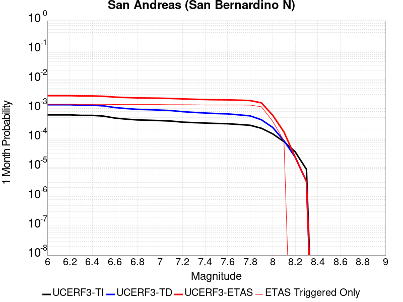 |  |  |

| Magnitude | 1 wk TI Prob | 1 wk TD Prob | 1 wk ETAS Prob | 1 wk ETAS/TD Gain | 1 wk ETAS Triggered Only | 1 mo TI Prob | 1 mo TD Prob | 1 mo ETAS Prob | 1 mo ETAS/TD Gain | 1 mo ETAS Triggered Only | 1 yr TI Prob | 1 yr TD Prob | 1 yr ETAS Prob | 1 yr ETAS/TD Gain | 1 yr ETAS Triggered Only | 10 yr TI Prob | 10 yr TD Prob | 10 yr ETAS Prob | 10 yr ETAS/TD Gain | 10 yr ETAS Triggered Only |
|-----|-----|-----|-----|-----|-----|-----|-----|-----|-----|-----|-----|-----|-----|-----|-----|-----|-----|-----|-----|-----|
| 6.0 | 1.4273766E-4 | 3.1606483E-4 | 0.0017816846 | 5.637086 | 0.0014660831 | 6.115894E-4 | 0.0013538664 | 0.0029927823 | 2.2105448 | 0.0016411379 | 0.0074207084 | 0.016360244 | 0.018082151 | 1.1052495 | 0.0017505471 | 0.07177748 | 0.15026689 | 0.15181017 | 1.0102702 | 0.0018161925 |
| 6.1 | 1.4273766E-4 | 3.1606483E-4 | 0.0017816846 | 5.637086 | 0.0014660831 | 6.115894E-4 | 0.0013538664 | 0.0029927823 | 2.2105448 | 0.0016411379 | 0.0074207084 | 0.016360244 | 0.018082151 | 1.1052495 | 0.0017505471 | 0.07177748 | 0.15026689 | 0.15181017 | 1.0102702 | 0.0018161925 |
| 6.2 | 1.4273766E-4 | 3.1606483E-4 | 0.0017816846 | 5.637086 | 0.0014660831 | 6.115894E-4 | 0.0013538664 | 0.0029927823 | 2.2105448 | 0.0016411379 | 0.0074207084 | 0.016360244 | 0.018082151 | 1.1052495 | 0.0017505471 | 0.07177748 | 0.15026689 | 0.15181017 | 1.0102702 | 0.0018161925 |
| 6.3 | 1.3730655E-4 | 3.0511338E-4 | 0.0017488741 | 5.7318826 | 0.0014442013 | 5.883239E-4 | 0.0013069791 | 0.002924119 | 2.237311 | 0.001619256 | 0.0071393442 | 0.015797773 | 0.017499128 | 1.1076959 | 0.0017286652 | 0.06914291 | 0.14556676 | 0.14709988 | 1.010532 | 0.0017943108 |
| 6.4 | 1.3730655E-4 | 3.0511338E-4 | 0.0017488741 | 5.7318826 | 0.0014442013 | 5.883239E-4 | 0.0013069791 | 0.002924119 | 2.237311 | 0.001619256 | 0.0071393442 | 0.015797773 | 0.017499128 | 1.1076959 | 0.0017286652 | 0.06914291 | 0.14556676 | 0.14709988 | 1.010532 | 0.0017943108 |
| 6.5 | 1.2942807E-4 | 2.8925808E-4 | 0.0017330416 | 5.9913335 | 0.0014442013 | 5.545738E-4 | 0.0012390936 | 0.0028563433 | 2.3051875 | 0.001619256 | 0.0067310524 | 0.01498286 | 0.016685626 | 1.1136475 | 0.0017286652 | 0.06530788 | 0.13870941 | 0.14025484 | 1.0111414 | 0.0017943108 |
| 6.6 | 1.1125901E-4 | 2.536472E-4 | 0.0016756059 | 6.6060495 | 0.0014223194 | 4.767372E-4 | 0.0010866089 | 0.0026822472 | 2.468457 | 0.0015973742 | 0.005788839 | 0.013149847 | 0.014834186 | 1.1280881 | 0.0017067834 | 0.056403454 | 0.122999296 | 0.12455372 | 1.0126376 | 0.0017724289 |
| 6.7 | 1.02209575E-4 | 2.3499702E-4 | 0.0016569822 | 7.051078 | 0.0014223194 | 4.3796748E-4 | 0.0010067427 | 0.0026025088 | 2.5850782 | 0.0015973742 | 0.0053192247 | 0.012188629 | 0.01387461 | 1.138324 | 0.0017067834 | 0.051936906 | 0.114790924 | 0.11635989 | 1.0136681 | 0.0017724289 |
| 6.8 | 9.610582E-5 | 2.2025521E-4 | 0.0016422614 | 7.4561753 | 0.0014223194 | 4.1181705E-4 | 9.436101E-4 | 0.002539477 | 2.6912355 | 0.0015973742 | 0.0050023515 | 0.011428202 | 0.01311548 | 1.1476415 | 0.0017067834 | 0.048912346 | 0.1081929 | 0.10977357 | 1.0146097 | 0.0017724289 |
| 6.9 | 9.3877505E-5 | 2.1481077E-4 | 0.0016368247 | 7.6198444 | 0.0014223194 | 4.0227012E-4 | 9.2029345E-4 | 0.0025161975 | 2.7341254 | 0.0015973742 | 0.0048866454 | 0.011147255 | 0.012835013 | 1.1514057 | 0.0017067834 | 0.04780577 | 0.10578323 | 0.107368164 | 1.0149828 | 0.0017724289 |
| 7.0 | 9.1019785E-5 | 2.0808022E-4 | 0.0016301038 | 7.834016 | 0.0014223194 | 3.900265E-4 | 8.914682E-4 | 0.0024874185 | 2.790249 | 0.0015973742 | 0.0047382377 | 0.010799837 | 0.012488187 | 1.1563311 | 0.0017067834 | 0.046384744 | 0.102753714 | 0.10434402 | 1.0154768 | 0.0017724289 |
| 7.1 | 8.771155E-5 | 1.9982594E-4 | 0.0016218612 | 8.116369 | 0.0014223194 | 3.758525E-4 | 8.5611636E-4 | 0.002452123 | 2.8642404 | 0.0015973742 | 0.0045664064 | 0.0103736 | 0.012062677 | 1.1628246 | 0.0017067834 | 0.044737056 | 0.09906527 | 0.100662105 | 1.0161191 | 0.0017724289 |
| 7.2 | 8.0830236E-5 | 1.8388197E-4 | 0.0016059399 | 8.733536 | 0.0014223194 | 3.4636928E-4 | 7.8782777E-4 | 0.0023839434 | 3.0259705 | 0.0015973742 | 0.0042088944 | 0.009549725 | 0.0112402085 | 1.1770191 | 0.0017067834 | 0.041300658 | 0.09179615 | 0.09340588 | 1.0175359 | 0.0017724289 |
| 7.3 | 7.7668235E-5 | 1.7331762E-4 | 0.0015735126 | 9.07878 | 0.0014004377 | 3.328214E-4 | 7.425784E-4 | 0.0023169008 | 3.1200757 | 0.0015754923 | 0.0040445733 | 0.009003494 | 0.010673226 | 1.1854538 | 0.0016849015 | 0.03971748 | 0.08706327 | 0.0886614 | 1.0183561 | 0.0017505471 |
| 7.4 | 7.520177E-5 | 1.6551897E-4 | 0.0015438466 | 9.327309 | 0.0013785558 | 3.2225347E-4 | 7.0917426E-4 | 0.0022616829 | 3.189178 | 0.0015536105 | 0.0039163795 | 0.008600081 | 0.010227106 | 1.189187 | 0.0016411379 | 0.038480744 | 0.08351955 | 0.08508378 | 1.018729 | 0.0017067834 |
| 7.5 | 7.274697E-5 | 1.5839566E-4 | 0.0015367331 | 9.701864 | 0.0013785558 | 3.1173544E-4 | 6.78662E-4 | 0.0022312182 | 3.2876723 | 0.0015536105 | 0.003788775 | 0.008231463 | 0.009859092 | 1.1977327 | 0.0016411379 | 0.03724827 | 0.08023631 | 0.081806146 | 1.0195652 | 0.0017067834 |
| 7.6 | 7.1185845E-5 | 1.540943E-4 | 0.0015324376 | 9.944804 | 0.0013785558 | 3.0504653E-4 | 6.6023704E-4 | 0.0022128217 | 3.3515565 | 0.0015536105 | 0.0037076178 | 0.008008812 | 0.009636805 | 1.2032754 | 0.0016411379 | 0.036463667 | 0.07822598 | 0.07979924 | 1.0201118 | 0.0017067834 |
| 7.7 | 6.709961E-5 | 1.4318313E-4 | 0.0015215415 | 10.626542 | 0.0013785558 | 2.8753807E-4 | 6.1349774E-4 | 0.002166155 | 3.5308282 | 0.0015536105 | 0.003495157 | 0.0074437927 | 0.0090727145 | 1.2188295 | 0.0016411379 | 0.034406938 | 0.07305469 | 0.07463679 | 1.0216563 | 0.0017067834 |
| 7.8 | 6.300812E-5 | 1.3202413E-4 | 0.001488519 | 11.274598 | 0.001356674 | 2.7000686E-4 | 5.65695E-4 | 0.0020965573 | 3.7061617 | 0.0015317287 | 0.0032823787 | 0.006865616 | 0.008473755 | 1.2342309 | 0.001619256 | 0.032343175 | 0.06771354 | 0.06928435 | 1.0231979 | 0.0016849015 |
| 7.9 | 4.983037E-5 | 9.723488E-5 | 0.0012568595 | 12.926015 | 0.0011597375 | 2.1354125E-4 | 4.1665437E-4 | 0.0017071449 | 4.0972686 | 0.0012910285 | 0.0025967648 | 0.0050609782 | 0.006410786 | 1.2667089 | 0.001356674 | 0.025666296 | 0.05064886 | 0.05199914 | 1.0266596 | 0.0014223194 |
| 8.0 | 3.2211527E-5 | 5.3304586E-5 | 4.25276E-4 | 7.978225 | 3.7199125E-4 | 1.380421E-4 | 2.2842824E-4 | 6.003345E-4 | 2.62811 | 3.7199125E-4 | 0.0016793669 | 0.0027775685 | 0.0031703478 | 1.1414111 | 3.9387308E-4 | 0.016667323 | 0.028361378 | 0.028765343 | 1.0142435 | 4.157549E-4 |
| 8.1 | 1.743376E-5 | 1.8824427E-5 | 1.2823155E-4 | 6.811977 | 1.0940919E-4 | 7.471398E-5 | 8.067362E-5 | 1.9007399E-4 | 2.356086 | 1.0940919E-4 | 9.0926304E-4 | 9.817594E-4 | 0.0010910612 | 1.1113325 | 1.0940919E-4 | 0.009055517 | 0.010484105 | 0.01061402 | 1.0123916 | 1.3129103E-4 |
| 8.2 | 7.831616E-6 | 5.1551065E-6 | 5.1551065E-6 | 1.0 | 0.0 | 3.3563636E-5 | 2.2093127E-5 | 2.2093127E-5 | 1.0 | 0.0 | 4.0856065E-4 | 2.6895068E-4 | 2.6895068E-4 | 1.0 | 0.0 | 0.004078103 | 0.0030418145 | 0.0030418145 | 1.0 | 0.0 |
| 8.3 | 1.983087E-6 | 7.6599065E-7 | 7.6599065E-7 | 1.0 | 0.0 | 8.498917E-6 | 3.282813E-6 | 3.282813E-6 | 1.0 | 0.0 | 1.034694E-4 | 3.9967534E-5 | 3.9967534E-5 | 1.0 | 0.0 | 0.0010342124 | 4.719687E-4 | 4.719687E-4 | 1.0 | 0.0 |

## So Sierra Nevada
*[(top)](#table-of-contents)*

| 1 Week | 1 Month | 1 Year | 10 Year |
|-----|-----|-----|-----|
|  |  |  |  |

| Magnitude | 1 wk TI Prob | 1 wk TD Prob | 1 wk ETAS Prob | 1 wk ETAS/TD Gain | 1 wk ETAS Triggered Only | 1 mo TI Prob | 1 mo TD Prob | 1 mo ETAS Prob | 1 mo ETAS/TD Gain | 1 mo ETAS Triggered Only | 1 yr TI Prob | 1 yr TD Prob | 1 yr ETAS Prob | 1 yr ETAS/TD Gain | 1 yr ETAS Triggered Only | 10 yr TI Prob | 10 yr TD Prob | 10 yr ETAS Prob | 10 yr ETAS/TD Gain | 10 yr ETAS Triggered Only |
|-----|-----|-----|-----|-----|-----|-----|-----|-----|-----|-----|-----|-----|-----|-----|-----|-----|-----|-----|-----|-----|
| 6.0 | 1.15488665E-5 | 1.1079643E-5 | 0.0014333833 | 129.37091 | 0.0014223194 | 4.9494203E-5 | 4.748339E-5 | 0.001622901 | 34.178288 | 0.0015754923 | 6.024253E-4 | 5.7796965E-4 | 0.002218159 | 3.8378468 | 0.0016411379 | 0.006007948 | 0.005765934 | 0.0075498987 | 1.3093973 | 0.0017943108 |
| 6.1 | 1.15488665E-5 | 1.1079643E-5 | 0.0014333833 | 129.37091 | 0.0014223194 | 4.9494203E-5 | 4.748339E-5 | 0.001622901 | 34.178288 | 0.0015754923 | 6.024253E-4 | 5.7796965E-4 | 0.002218159 | 3.8378468 | 0.0016411379 | 0.006007948 | 0.005765934 | 0.0075498987 | 1.3093973 | 0.0017943108 |
| 6.2 | 1.15488665E-5 | 1.1079643E-5 | 0.0014333833 | 129.37091 | 0.0014223194 | 4.9494203E-5 | 4.748339E-5 | 0.001622901 | 34.178288 | 0.0015754923 | 6.024253E-4 | 5.7796965E-4 | 0.002218159 | 3.8378468 | 0.0016411379 | 0.006007948 | 0.005765934 | 0.0075498987 | 1.3093973 | 0.0017943108 |
| 6.3 | 1.15488665E-5 | 1.1079643E-5 | 0.0014333833 | 129.37091 | 0.0014223194 | 4.9494203E-5 | 4.748339E-5 | 0.001622901 | 34.178288 | 0.0015754923 | 6.024253E-4 | 5.7796965E-4 | 0.002218159 | 3.8378468 | 0.0016411379 | 0.006007948 | 0.005765934 | 0.0075498987 | 1.3093973 | 0.0017943108 |
| 6.4 | 1.15488665E-5 | 1.1079643E-5 | 0.0014333833 | 129.37091 | 0.0014223194 | 4.9494203E-5 | 4.748339E-5 | 0.001622901 | 34.178288 | 0.0015754923 | 6.024253E-4 | 5.7796965E-4 | 0.002218159 | 3.8378468 | 0.0016411379 | 0.006007948 | 0.005765934 | 0.0075498987 | 1.3093973 | 0.0017943108 |
| 6.5 | 1.15488665E-5 | 1.1079643E-5 | 0.0014333833 | 129.37091 | 0.0014223194 | 4.9494203E-5 | 4.748339E-5 | 0.001622901 | 34.178288 | 0.0015754923 | 6.024253E-4 | 5.7796965E-4 | 0.002218159 | 3.8378468 | 0.0016411379 | 0.006007948 | 0.005765934 | 0.0075498987 | 1.3093973 | 0.0017943108 |
| 6.6 | 7.587044E-6 | 6.935635E-6 | 8.3843974E-4 | 120.88867 | 8.315098E-4 | 3.2515498E-5 | 2.9723828E-5 | 9.487337E-4 | 31.918287 | 9.190372E-4 | 3.9580427E-4 | 3.6183043E-4 | 0.001324283 | 3.6599545 | 9.6280087E-4 | 0.003951 | 0.0036127048 | 0.0046810415 | 1.2957165 | 0.00107221 |
| 6.7 | 7.587044E-6 | 6.935635E-6 | 8.3843974E-4 | 120.88867 | 8.315098E-4 | 3.2515498E-5 | 2.9723828E-5 | 9.487337E-4 | 31.918287 | 9.190372E-4 | 3.9580427E-4 | 3.6183043E-4 | 0.001324283 | 3.6599545 | 9.6280087E-4 | 0.003951 | 0.0036127048 | 0.0046810415 | 1.2957165 | 0.00107221 |
| 6.8 | 5.9026956E-6 | 5.1793927E-6 | 6.397494E-4 | 123.51823 | 6.345733E-4 | 2.5297022E-5 | 2.2197215E-5 | 7.224005E-4 | 32.544643 | 7.0021884E-4 | 3.0794772E-4 | 2.7021873E-4 | 0.0010140002 | 3.7525163 | 7.439825E-4 | 0.0030752132 | 0.002699018 | 0.0035064607 | 1.2991617 | 8.09628E-4 |
| 6.9 | 5.0118915E-6 | 4.2524252E-6 | 5.5129605E-4 | 129.64273 | 5.4704596E-4 | 2.1479358E-5 | 1.8224557E-5 | 6.3090486E-4 | 34.618393 | 6.1269145E-4 | 2.614798E-4 | 2.2186211E-4 | 8.781716E-4 | 3.9581864 | 6.564551E-4 | 0.0026117235 | 0.0022164788 | 0.0029369788 | 1.3250653 | 7.2210067E-4 |
| 7.0 | 4.4924795E-6 | 3.7139177E-6 | 4.632308E-4 | 124.72835 | 4.595186E-4 | 1.925334E-5 | 1.5916696E-5 | 5.4107246E-4 | 33.99402 | 5.251641E-4 | 2.3438422E-4 | 1.9376918E-4 | 7.625867E-4 | 3.9355419 | 5.689278E-4 | 0.0023413717 | 0.0019360651 | 0.00256941 | 1.3271298 | 6.345733E-4 |
| 7.1 | 3.9118436E-6 | 3.1119775E-6 | 3.0945675E-4 | 99.440544 | 3.0634573E-4 | 1.6764936E-5 | 1.3336982E-5 | 3.634417E-4 | 27.250671 | 3.5010942E-4 | 2.0409399E-4 | 1.6236622E-4 | 5.342971E-4 | 3.2906911 | 3.7199125E-4 | 0.0020390663 | 0.001622532 | 0.0020594588 | 1.269287 | 4.3763677E-4 |
| 7.2 | 3.4200818E-6 | 2.6054543E-6 | 2.6518683E-4 | 101.78142 | 2.6258206E-4 | 1.4657411E-5 | 1.11661875E-5 | 3.175085E-4 | 28.434816 | 3.0634573E-4 | 1.7843937E-4 | 1.3594035E-4 | 4.6412332E-4 | 3.4141686 | 3.2822756E-4 | 0.0017829615 | 0.0013586218 | 0.0017519597 | 1.2895125 | 3.9387308E-4 |
| 7.3 | 2.6593618E-6 | 1.8284203E-6 | 1.7688281E-4 | 96.74078 | 1.7505471E-4 | 1.13972155E-5 | 7.836065E-6 | 2.2665273E-4 | 28.924305 | 2.1881839E-4 | 1.3875226E-4 | 9.540021E-5 | 3.141977E-4 | 3.29347 | 2.1881839E-4 | 0.0013866565 | 9.5362146E-4 | 0.0011722312 | 1.2292416 | 2.1881839E-4 |
| 7.4 | 2.2577992E-6 | 1.436438E-6 | 1.3272728E-4 | 92.40028 | 1.3129103E-4 | 9.676246E-6 | 6.15615E-6 | 1.8120978E-4 | 29.43557 | 1.7505471E-4 | 1.1780193E-4 | 7.49488E-5 | 2.4999038E-4 | 3.3354821 | 1.7505471E-4 | 0.001177395 | 7.492603E-4 | 9.241838E-4 | 1.2334616 | 1.7505471E-4 |
| 7.5 | 1.489319E-6 | 7.353936E-7 | 6.638086E-5 | 90.265755 | 6.5645516E-5 | 6.3827797E-6 | 3.1516831E-6 | 9.067876E-5 | 28.771534 | 8.7527354E-5 | 7.770758E-5 | 3.8371072E-5 | 1.2589507E-4 | 3.2809892 | 8.7527354E-5 | 7.7680405E-4 | 3.836449E-4 | 4.7113866E-4 | 1.2280593 | 8.7527354E-5 |
| 7.6 | 1.0680322E-6 | 4.6596554E-7 | 6.6111446E-5 | 141.88055 | 6.5645516E-5 | 4.577273E-6 | 1.9969937E-6 | 8.952417E-5 | 44.82947 | 8.7527354E-5 | 5.5726876E-5 | 2.4313129E-5 | 1.1183835E-4 | 4.599916 | 8.7527354E-5 | 5.5712904E-4 | 2.4310495E-4 | 3.3061102E-4 | 1.3599519 | 8.7527354E-5 |
| 7.7 | 5.509146E-7 | 1.5580486E-7 | 2.2037639E-5 | 141.44385 | 2.1881839E-5 | 2.3610605E-6 | 6.677349E-7 | 2.2549559E-5 | 33.77022 | 2.1881839E-5 | 2.8745531E-5 | 8.129644E-6 | 3.0011304E-5 | 3.691589 | 2.1881839E-5 | 2.8741814E-4 | 8.1293576E-5 | 1.0317364E-4 | 1.2691487 | 2.1881839E-5 |

## Goldstone Lake
*[(top)](#table-of-contents)*

| 1 Week | 1 Month | 1 Year | 10 Year |
|-----|-----|-----|-----|
|  |  |  |  |

| Magnitude | 1 wk TI Prob | 1 wk TD Prob | 1 wk ETAS Prob | 1 wk ETAS/TD Gain | 1 wk ETAS Triggered Only | 1 mo TI Prob | 1 mo TD Prob | 1 mo ETAS Prob | 1 mo ETAS/TD Gain | 1 mo ETAS Triggered Only | 1 yr TI Prob | 1 yr TD Prob | 1 yr ETAS Prob | 1 yr ETAS/TD Gain | 1 yr ETAS Triggered Only | 10 yr TI Prob | 10 yr TD Prob | 10 yr ETAS Prob | 10 yr ETAS/TD Gain | 10 yr ETAS Triggered Only |
|-----|-----|-----|-----|-----|-----|-----|-----|-----|-----|-----|-----|-----|-----|-----|-----|-----|-----|-----|-----|-----|
| 6.0 | 2.671352E-5 | 3.037609E-5 | 9.7126653E-4 | 31.974707 | 9.4091904E-4 | 1.1448149E-4 | 1.3017785E-4 | 0.0012897643 | 9.907709 | 0.0011597375 | 0.001392921 | 0.0015839594 | 0.003135109 | 1.9792862 | 0.0015536105 | 0.013842222 | 0.015746197 | 0.01738303 | 1.1039511 | 0.0016630196 |
| 6.1 | 2.671352E-5 | 3.037609E-5 | 9.7126653E-4 | 31.974707 | 9.4091904E-4 | 1.1448149E-4 | 1.3017785E-4 | 0.0012897643 | 9.907709 | 0.0011597375 | 0.001392921 | 0.0015839594 | 0.003135109 | 1.9792862 | 0.0015536105 | 0.013842222 | 0.015746197 | 0.01738303 | 1.1039511 | 0.0016630196 |
| 6.2 | 1.4197047E-5 | 1.6096245E-5 | 5.193704E-4 | 32.26656 | 5.032823E-4 | 6.0843064E-5 | 6.8982634E-5 | 6.5975153E-4 | 9.564023 | 5.908096E-4 | 7.4051257E-4 | 8.3963864E-4 | 0.00160486 | 1.9113698 | 7.6586433E-4 | 0.007380498 | 0.0083743585 | 0.009242303 | 1.103643 | 8.7527354E-4 |
| 6.3 | 1.4197047E-5 | 1.6096245E-5 | 5.193704E-4 | 32.26656 | 5.032823E-4 | 6.0843064E-5 | 6.8982634E-5 | 6.5975153E-4 | 9.564023 | 5.908096E-4 | 7.4051257E-4 | 8.3963864E-4 | 0.00160486 | 1.9113698 | 7.6586433E-4 | 0.007380498 | 0.0083743585 | 0.009242303 | 1.103643 | 8.7527354E-4 |
| 6.4 | 1.3238931E-5 | 1.500846E-5 | 4.7452017E-4 | 31.616846 | 4.595186E-4 | 5.6737044E-5 | 6.4320935E-5 | 5.894513E-4 | 9.164221 | 5.251641E-4 | 6.9055456E-4 | 7.82924E-4 | 0.0014607299 | 1.8657365 | 6.78337E-4 | 0.006884126 | 0.0078112837 | 0.008571166 | 1.09728 | 7.6586433E-4 |
| 6.5 | 1.3238931E-5 | 1.500846E-5 | 4.7452017E-4 | 31.616846 | 4.595186E-4 | 5.6737044E-5 | 6.4320935E-5 | 5.894513E-4 | 9.164221 | 5.251641E-4 | 6.9055456E-4 | 7.82924E-4 | 0.0014607299 | 1.8657365 | 6.78337E-4 | 0.006884126 | 0.0078112837 | 0.008571166 | 1.09728 | 7.6586433E-4 |
| 6.6 | 1.1328278E-5 | 1.2855166E-5 | 4.0672318E-4 | 31.638891 | 3.9387308E-4 | 4.8548856E-5 | 5.5092944E-5 | 4.7082495E-4 | 8.546012 | 4.157549E-4 | 5.90922E-4 | 6.7064585E-4 | 0.0012391921 | 1.8477592 | 5.689278E-4 | 0.0058935313 | 0.0066956086 | 0.007347668 | 1.0973862 | 6.564551E-4 |
| 6.7 | 8.651175E-6 | 9.824565E-6 | 3.5993053E-4 | 36.635777 | 3.5010942E-4 | 3.707594E-5 | 4.2105108E-5 | 3.9219978E-4 | 9.314779 | 3.5010942E-4 | 4.5130608E-4 | 5.1259965E-4 | 9.7188266E-4 | 1.8959879 | 4.595186E-4 | 0.0045039062 | 0.005123051 | 0.0056455247 | 1.1019849 | 5.251641E-4 |
| 6.8 | 1.0215377E-6 | 1.1754702E-6 | 1.1754702E-6 | 1.0 | 0.0 | 4.378012E-6 | 5.0377203E-6 | 5.0377203E-6 | 1.0 | 0.0 | 5.3300988E-5 | 6.1332634E-5 | 6.1332634E-5 | 1.0 | 0.0 | 5.3288206E-4 | 6.1316835E-4 | 6.1316835E-4 | 1.0 | 0.0 |
| 6.9 | 7.9360774E-7 | 9.2833966E-7 | 9.2833966E-7 | 1.0 | 0.0 | 3.4011714E-6 | 3.9785928E-6 | 3.9785928E-6 | 1.0 | 0.0 | 4.1408475E-5 | 4.843836E-5 | 4.843836E-5 | 1.0 | 0.0 | 4.140076E-4 | 4.8428503E-4 | 4.8428503E-4 | 1.0 | 0.0 |
| 7.0 | 7.4382757E-7 | 8.7473285E-7 | 8.7473285E-7 | 1.0 | 0.0 | 3.1878285E-6 | 3.74885E-6 | 3.74885E-6 | 1.0 | 0.0 | 3.8811122E-5 | 4.564136E-5 | 4.564136E-5 | 1.0 | 0.0 | 3.8804344E-4 | 4.5632652E-4 | 4.5632652E-4 | 1.0 | 0.0 |
| 7.1 | 6.4709513E-7 | 7.7113E-7 | 7.7113E-7 | 1.0 | 0.0 | 2.773262E-6 | 3.3048389E-6 | 3.3048389E-6 | 1.0 | 0.0 | 3.376394E-5 | 4.0235733E-5 | 4.0235733E-5 | 1.0 | 0.0 | 3.375881E-4 | 4.0229043E-4 | 4.0229043E-4 | 1.0 | 0.0 |
| 7.2 | 6.356704E-7 | 7.5883594E-7 | 7.5883594E-7 | 1.0 | 0.0 | 2.7242988E-6 | 3.2521505E-6 | 3.2521505E-6 | 1.0 | 0.0 | 3.3167835E-5 | 3.959427E-5 | 3.959427E-5 | 1.0 | 0.0 | 3.3162883E-4 | 3.958781E-4 | 3.958781E-4 | 1.0 | 0.0 |
| 7.3 | 5.7695723E-7 | 6.8965653E-7 | 6.8965653E-7 | 1.0 | 0.0 | 2.4726714E-6 | 2.9556677E-6 | 2.9556677E-6 | 1.0 | 0.0 | 3.0104358E-5 | 3.5984718E-5 | 3.5984718E-5 | 1.0 | 0.0 | 3.0100282E-4 | 3.5979465E-4 | 3.5979465E-4 | 1.0 | 0.0 |
| 7.4 | 5.209647E-7 | 6.193514E-7 | 6.193514E-7 | 1.0 | 0.0 | 2.232704E-6 | 2.6543607E-6 | 2.6543607E-6 | 1.0 | 0.0 | 2.718283E-5 | 3.2316417E-5 | 3.2316417E-5 | 1.0 | 0.0 | 2.7179506E-4 | 3.2312275E-4 | 3.2312275E-4 | 1.0 | 0.0 |
| 7.5 | 4.512955E-7 | 5.348885E-7 | 5.348885E-7 | 1.0 | 0.0 | 1.934122E-6 | 2.2923775E-6 | 2.2923775E-6 | 1.0 | 0.0 | 2.3547682E-5 | 2.7909393E-5 | 2.7909393E-5 | 1.0 | 0.0 | 2.3545188E-4 | 2.7906417E-4 | 2.7906417E-4 | 1.0 | 0.0 |
| 7.6 | 2.21172E-7 | 2.603961E-7 | 2.603961E-7 | 1.0 | 0.0 | 9.478797E-7 | 1.1159829E-6 | 1.1159829E-6 | 1.0 | 0.0 | 1.1540374E-5 | 1.3587036E-5 | 1.3587036E-5 | 1.0 | 0.0 | 1.1539775E-4 | 1.3586486E-4 | 1.3586486E-4 | 1.0 | 0.0 |

## McLean Lake
*[(top)](#table-of-contents)*

| 1 Week | 1 Month | 1 Year | 10 Year |
|-----|-----|-----|-----|
|  |  |  |  |

| Magnitude | 1 wk TI Prob | 1 wk TD Prob | 1 wk ETAS Prob | 1 wk ETAS/TD Gain | 1 wk ETAS Triggered Only | 1 mo TI Prob | 1 mo TD Prob | 1 mo ETAS Prob | 1 mo ETAS/TD Gain | 1 mo ETAS Triggered Only | 1 yr TI Prob | 1 yr TD Prob | 1 yr ETAS Prob | 1 yr ETAS/TD Gain | 1 yr ETAS Triggered Only | 10 yr TI Prob | 10 yr TD Prob | 10 yr ETAS Prob | 10 yr ETAS/TD Gain | 10 yr ETAS Triggered Only |
|-----|-----|-----|-----|-----|-----|-----|-----|-----|-----|-----|-----|-----|-----|-----|-----|-----|-----|-----|-----|-----|
| 6.0 | 1.7360222E-5 | 1.8501627E-5 | 9.812847E-4 | 53.03775 | 9.6280087E-4 | 7.439883E-5 | 7.9290556E-5 | 0.0011514156 | 14.521473 | 0.00107221 | 9.0542925E-4 | 9.6498354E-4 | 0.002342209 | 2.427201 | 0.0013785558 | 0.009017491 | 0.0096127745 | 0.011064764 | 1.151048 | 0.0014660831 |
| 6.1 | 9.062689E-6 | 9.592193E-6 | 3.15935E-4 | 32.93668 | 3.0634573E-4 | 3.8839516E-5 | 4.1108804E-5 | 4.1308475E-4 | 10.048572 | 3.7199125E-4 | 4.727685E-4 | 5.003936E-4 | 9.596823E-4 | 1.9178548 | 4.595186E-4 | 0.0047176396 | 0.004993552 | 0.005537866 | 1.1090034 | 5.4704596E-4 |
| 6.2 | 9.062689E-6 | 9.592193E-6 | 3.15935E-4 | 32.93668 | 3.0634573E-4 | 3.8839516E-5 | 4.1108804E-5 | 4.1308475E-4 | 10.048572 | 3.7199125E-4 | 4.727685E-4 | 5.003936E-4 | 9.596823E-4 | 1.9178548 | 4.595186E-4 | 0.0047176396 | 0.004993552 | 0.005537866 | 1.1090034 | 5.4704596E-4 |
| 6.3 | 7.2575485E-6 | 7.66771E-6 | 2.2648441E-4 | 29.537428 | 2.1881839E-4 | 3.110341E-5 | 3.2861237E-5 | 2.9543467E-4 | 8.99037 | 2.6258206E-4 | 3.786182E-4 | 4.0001926E-4 | 7.499886E-4 | 1.8748813 | 3.5010942E-4 | 0.0037797375 | 0.0039936965 | 0.0043859966 | 1.0982298 | 3.9387308E-4 |
| 6.4 | 7.2575485E-6 | 7.66771E-6 | 2.2648441E-4 | 29.537428 | 2.1881839E-4 | 3.110341E-5 | 3.2861237E-5 | 2.9543467E-4 | 8.99037 | 2.6258206E-4 | 3.786182E-4 | 4.0001926E-4 | 7.499886E-4 | 1.8748813 | 3.5010942E-4 | 0.0037797375 | 0.0039936965 | 0.0043859966 | 1.0982298 | 3.9387308E-4 |
| 6.5 | 6.06582E-6 | 6.4038773E-6 | 1.8145746E-4 | 28.335562 | 1.7505471E-4 | 2.5996113E-5 | 2.7444936E-5 | 2.4625732E-4 | 8.972778 | 2.1881839E-4 | 3.164567E-4 | 3.3409733E-4 | 6.4034073E-4 | 1.9166292 | 3.0634573E-4 | 0.0031600643 | 0.0033365893 | 0.0036637217 | 1.0980439 | 3.2822756E-4 |
| 6.6 | 5.598744E-6 | 5.910262E-6 | 1.5908222E-4 | 26.916271 | 1.5317286E-4 | 2.3994397E-5 | 2.5329486E-5 | 2.2226103E-4 | 8.774795 | 1.9693654E-4 | 2.9209262E-4 | 3.0834923E-4 | 5.927254E-4 | 1.9222536 | 2.844639E-4 | 0.0029170897 | 0.003079843 | 0.0033852453 | 1.0991616 | 3.0634573E-4 |
| 6.7 | 5.246996E-6 | 5.539162E-6 | 1.5871118E-4 | 28.652561 | 1.5317286E-4 | 2.2486933E-5 | 2.3739085E-5 | 2.2067095E-4 | 9.29568 | 1.9693654E-4 | 2.73744E-4 | 2.8899137E-4 | 5.7337305E-4 | 1.9840491 | 2.844639E-4 | 0.0027340704 | 0.0028867796 | 0.003192241 | 1.1058139 | 3.0634573E-4 |
| 6.8 | 4.02324E-6 | 4.2469046E-6 | 1.1365563E-4 | 26.761993 | 1.0940919E-4 | 1.7242342E-5 | 1.8200926E-5 | 1.4948957E-4 | 8.213295 | 1.3129103E-4 | 2.099053E-4 | 2.2157968E-4 | 4.403496E-4 | 1.9873192 | 2.1881839E-4 | 0.0020970714 | 0.002214172 | 0.0024325058 | 1.0986074 | 2.1881839E-4 |
| 6.9 | 6.835972E-7 | 7.1399285E-7 | 4.4477638E-5 | 62.294235 | 4.3763677E-5 | 2.9296991E-6 | 3.0599674E-6 | 4.682351E-5 | 15.301963 | 4.3763677E-5 | 3.56685E-5 | 3.7254784E-5 | 1.2477888E-4 | 3.3493383 | 8.7527354E-5 | 3.5662777E-4 | 3.7251666E-4 | 4.6001142E-4 | 1.2348747 | 8.7527354E-5 |

## Lenwood-Lockhart-Old Woman Springs
*[(top)](#table-of-contents)*

| 1 Week | 1 Month | 1 Year | 10 Year |
|-----|-----|-----|-----|
|  |  |  |  |

| Magnitude | 1 wk TI Prob | 1 wk TD Prob | 1 wk ETAS Prob | 1 wk ETAS/TD Gain | 1 wk ETAS Triggered Only | 1 mo TI Prob | 1 mo TD Prob | 1 mo ETAS Prob | 1 mo ETAS/TD Gain | 1 mo ETAS Triggered Only | 1 yr TI Prob | 1 yr TD Prob | 1 yr ETAS Prob | 1 yr ETAS/TD Gain | 1 yr ETAS Triggered Only | 10 yr TI Prob | 10 yr TD Prob | 10 yr ETAS Prob | 10 yr ETAS/TD Gain | 10 yr ETAS Triggered Only |
|-----|-----|-----|-----|-----|-----|-----|-----|-----|-----|-----|-----|-----|-----|-----|-----|-----|-----|-----|-----|-----|
| 6.0 | 3.744542E-5 | 4.396252E-5 | 0.001006721 | 22.89953 | 9.6280087E-4 | 1.604705E-4 | 1.8839816E-4 | 0.0012385285 | 6.5739946 | 0.0010503283 | 0.0019519776 | 0.0022915069 | 0.0035359135 | 1.5430517 | 0.0012472648 | 0.019349206 | 0.022696787 | 0.023979899 | 1.0565327 | 0.0013129102 |
| 6.1 | 3.744542E-5 | 4.396252E-5 | 0.001006721 | 22.89953 | 9.6280087E-4 | 1.604705E-4 | 1.8839816E-4 | 0.0012385285 | 6.5739946 | 0.0010503283 | 0.0019519776 | 0.0022915069 | 0.0035359135 | 1.5430517 | 0.0012472648 | 0.019349206 | 0.022696787 | 0.023979899 | 1.0565327 | 0.0013129102 |
| 6.2 | 3.744542E-5 | 4.396252E-5 | 0.001006721 | 22.89953 | 9.6280087E-4 | 1.604705E-4 | 1.8839816E-4 | 0.0012385285 | 6.5739946 | 0.0010503283 | 0.0019519776 | 0.0022915069 | 0.0035359135 | 1.5430517 | 0.0012472648 | 0.019349206 | 0.022696787 | 0.023979899 | 1.0565327 | 0.0013129102 |
| 6.3 | 2.1079984E-5 | 2.5353434E-5 | 4.4109783E-4 | 17.397951 | 4.157549E-4 | 9.0339665E-5 | 1.0865316E-4 | 5.4624234E-4 | 5.0273952 | 4.3763677E-4 | 0.0010993304 | 0.0013220694 | 0.0018028334 | 1.3636451 | 4.8140044E-4 | 0.010939079 | 0.0131442575 | 0.013619331 | 1.036143 | 4.8140044E-4 |
| 6.4 | 2.1079984E-5 | 2.5353434E-5 | 4.4109783E-4 | 17.397951 | 4.157549E-4 | 9.0339665E-5 | 1.0865316E-4 | 5.4624234E-4 | 5.0273952 | 4.3763677E-4 | 0.0010993304 | 0.0013220694 | 0.0018028334 | 1.3636451 | 4.8140044E-4 | 0.010939079 | 0.0131442575 | 0.013619331 | 1.036143 | 4.8140044E-4 |
| 6.5 | 1.7397282E-5 | 2.066241E-5 | 3.7076458E-4 | 17.943918 | 3.5010942E-4 | 7.455765E-5 | 8.8550245E-5 | 4.6050854E-4 | 5.200534 | 3.7199125E-4 | 9.073613E-4 | 0.0010775778 | 0.0014710265 | 1.3651232 | 3.9387308E-4 | 0.009036654 | 0.010724821 | 0.01111447 | 1.0363315 | 3.9387308E-4 |
| 6.6 | 1.52050325E-5 | 1.7679693E-5 | 2.802571E-4 | 15.851921 | 2.6258206E-4 | 6.51628E-5 | 7.576796E-5 | 3.383301E-4 | 4.4653454 | 2.6258206E-4 | 7.9306826E-4 | 9.220924E-4 | 0.001206294 | 1.3082138 | 2.844639E-4 | 0.007902439 | 0.009183526 | 0.009465378 | 1.030691 | 2.844639E-4 |
| 6.7 | 1.332523E-5 | 1.5264002E-5 | 2.3407904E-4 | 15.335364 | 2.1881839E-4 | 5.7106878E-5 | 6.5415545E-5 | 2.8421963E-4 | 4.344833 | 2.1881839E-4 | 6.950544E-4 | 7.961491E-4 | 0.0010366577 | 1.3020899 | 2.4070022E-4 | 0.006928845 | 0.007933599 | 0.008172389 | 1.0300987 | 2.4070022E-4 |
| 6.8 | 1.1525329E-5 | 1.3030979E-5 | 1.6620185E-4 | 12.754364 | 1.5317286E-4 | 4.9393333E-5 | 5.584588E-5 | 2.0901019E-4 | 3.742625 | 1.5317286E-4 | 6.011979E-4 | 6.797157E-4 | 8.5465144E-4 | 1.257366 | 1.7505471E-4 | 0.00599574 | 0.006776819 | 0.0069506876 | 1.0256563 | 1.7505471E-4 |
| 6.9 | 1.0253909E-5 | 1.15144385E-5 | 1.4280395E-4 | 12.4021635 | 1.3129103E-4 | 4.3944583E-5 | 4.9346683E-5 | 1.8063124E-4 | 3.6604536 | 1.3129103E-4 | 5.3489394E-4 | 6.0063385E-4 | 7.537147E-4 | 1.2548655 | 1.5317286E-4 | 0.0053360825 | 0.0059904843 | 0.0061427397 | 1.0254161 | 1.5317286E-4 |
| 7.0 | 8.104563E-6 | 8.991279E-6 | 9.651785E-5 | 10.734607 | 8.7527354E-5 | 3.4733377E-5 | 3.8533497E-5 | 1.2605748E-4 | 3.271374 | 8.7527354E-5 | 4.2279682E-4 | 4.6904673E-4 | 5.5653305E-4 | 1.1865194 | 8.7527354E-5 | 0.0042199334 | 0.0046808156 | 0.0047679334 | 1.0186117 | 8.7527354E-5 |
| 7.1 | 6.7986157E-6 | 7.515816E-6 | 5.1279163E-5 | 6.822834 | 4.3763677E-5 | 2.91366E-5 | 3.2210253E-5 | 7.597252E-5 | 2.358644 | 4.3763677E-5 | 3.5468035E-4 | 3.920914E-4 | 4.3583792E-4 | 1.1115723 | 4.3763677E-5 | 0.003541148 | 0.003914213 | 0.003957805 | 1.0111369 | 4.3763677E-5 |
| 7.2 | 5.6893327E-6 | 6.2800136E-6 | 5.0043414E-5 | 7.9686794 | 4.3763677E-5 | 2.4382627E-5 | 2.6914078E-5 | 7.067658E-5 | 2.6260078 | 4.3763677E-5 | 2.9681803E-4 | 3.2763163E-4 | 3.7138094E-4 | 1.133532 | 4.3763677E-5 | 0.002964219 | 0.0032716845 | 0.003315305 | 1.0133327 | 4.3763677E-5 |
| 7.3 | 4.253348E-6 | 4.7069107E-6 | 4.7069107E-6 | 1.0 | 0.0 | 1.8228506E-5 | 2.0172329E-5 | 2.0172329E-5 | 1.0 | 0.0 | 2.2190946E-4 | 2.4557224E-4 | 2.4557224E-4 | 1.0 | 0.0 | 0.00221688 | 0.0024531898 | 0.0024531898 | 1.0 | 0.0 |
| 7.4 | 2.5448119E-6 | 2.852045E-6 | 2.852045E-6 | 1.0 | 0.0 | 1.0906291E-5 | 1.2223002E-5 | 1.2223002E-5 | 1.0 | 0.0 | 1.3277601E-4 | 1.4880655E-4 | 1.4880655E-4 | 1.0 | 0.0 | 0.001326967 | 0.0014872311 | 0.0014872311 | 1.0 | 0.0 |
| 7.5 | 4.3706837E-8 | 4.562909E-8 | 4.562909E-8 | 1.0 | 0.0 | 1.8731501E-7 | 1.9555324E-7 | 1.9555324E-7 | 1.0 | 0.0 | 2.2805577E-6 | 2.3808586E-6 | 2.3808586E-6 | 1.0 | 0.0 | 2.2805343E-5 | 2.3808387E-5 | 2.3808387E-5 | 1.0 | 0.0 |

## Death Valley (So)
*[(top)](#table-of-contents)*

| 1 Week | 1 Month | 1 Year | 10 Year |
|-----|-----|-----|-----|
|  |  |  |  |

| Magnitude | 1 wk TI Prob | 1 wk TD Prob | 1 wk ETAS Prob | 1 wk ETAS/TD Gain | 1 wk ETAS Triggered Only | 1 mo TI Prob | 1 mo TD Prob | 1 mo ETAS Prob | 1 mo ETAS/TD Gain | 1 mo ETAS Triggered Only | 1 yr TI Prob | 1 yr TD Prob | 1 yr ETAS Prob | 1 yr ETAS/TD Gain | 1 yr ETAS Triggered Only | 10 yr TI Prob | 10 yr TD Prob | 10 yr ETAS Prob | 10 yr ETAS/TD Gain | 10 yr ETAS Triggered Only |
|-----|-----|-----|-----|-----|-----|-----|-----|-----|-----|-----|-----|-----|-----|-----|-----|-----|-----|-----|-----|-----|
| 6.0 | 2.0684236E-5 | 2.5617775E-5 | 6.3829357E-4 | 24.91604 | 6.1269145E-4 | 8.864371E-5 | 1.0978594E-4 | 8.5368677E-4 | 7.7759204 | 7.439825E-4 | 0.0010787029 | 0.0013358411 | 0.0021662402 | 1.6216301 | 8.315098E-4 | 0.010734817 | 0.013281397 | 0.014166636 | 1.0666527 | 8.971554E-4 |
| 6.1 | 2.0684236E-5 | 2.5617775E-5 | 6.3829357E-4 | 24.91604 | 6.1269145E-4 | 8.864371E-5 | 1.0978594E-4 | 8.5368677E-4 | 7.7759204 | 7.439825E-4 | 0.0010787029 | 0.0013358411 | 0.0021662402 | 1.6216301 | 8.315098E-4 | 0.010734817 | 0.013281397 | 0.014166636 | 1.0666527 | 8.971554E-4 |
| 6.2 | 2.0684236E-5 | 2.5617775E-5 | 6.3829357E-4 | 24.91604 | 6.1269145E-4 | 8.864371E-5 | 1.0978594E-4 | 8.5368677E-4 | 7.7759204 | 7.439825E-4 | 0.0010787029 | 0.0013358411 | 0.0021662402 | 1.6216301 | 8.315098E-4 | 0.010734817 | 0.013281397 | 0.014166636 | 1.0666527 | 8.971554E-4 |
| 6.3 | 2.0240292E-5 | 2.511786E-5 | 6.377939E-4 | 25.392048 | 6.1269145E-4 | 8.6741224E-5 | 1.07643624E-4 | 8.5154606E-4 | 7.910789 | 7.439825E-4 | 0.0010555626 | 0.00130979 | 0.0021402107 | 1.6340106 | 8.315098E-4 | 0.010505628 | 0.013023956 | 0.013909427 | 1.0679878 | 8.971554E-4 |
| 6.4 | 2.0240292E-5 | 2.511786E-5 | 6.377939E-4 | 25.392048 | 6.1269145E-4 | 8.6741224E-5 | 1.07643624E-4 | 8.5154606E-4 | 7.910789 | 7.439825E-4 | 0.0010555626 | 0.00130979 | 0.0021402107 | 1.6340106 | 8.315098E-4 | 0.010505628 | 0.013023956 | 0.013909427 | 1.0679878 | 8.971554E-4 |
| 6.5 | 1.9962767E-5 | 2.4807114E-5 | 6.1560207E-4 | 24.815546 | 5.908096E-4 | 8.55519E-5 | 1.0631196E-4 | 8.283359E-4 | 7.7915583 | 7.2210067E-4 | 0.0010410968 | 0.0012935963 | 0.002102177 | 1.6250641 | 8.09628E-4 | 0.010362327 | 0.012863902 | 0.013706316 | 1.0654867 | 8.533917E-4 |
| 6.6 | 1.8937297E-5 | 2.3310964E-5 | 6.1410683E-4 | 26.344118 | 5.908096E-4 | 8.115732E-5 | 9.990039E-5 | 8.219289E-4 | 8.227485 | 7.2210067E-4 | 9.876423E-4 | 0.0012156231 | 0.0020242669 | 1.6652093 | 8.09628E-4 | 0.009832645 | 0.012092789 | 0.01293586 | 1.0697169 | 8.533917E-4 |
| 6.7 | 1.8621096E-5 | 2.2911607E-5 | 6.137077E-4 | 26.785887 | 5.908096E-4 | 7.980225E-5 | 9.818898E-5 | 8.2021876E-4 | 8.35347 | 7.2210067E-4 | 9.711593E-4 | 0.0011948098 | 0.0020034704 | 1.6768112 | 8.09628E-4 | 0.009669261 | 0.011886904 | 0.012730151 | 1.0709392 | 8.533917E-4 |
| 6.8 | 1.7830353E-5 | 2.1805688E-5 | 5.4695836E-4 | 25.083288 | 5.251641E-4 | 7.641356E-5 | 9.344968E-5 | 7.498435E-4 | 8.0240345 | 6.564551E-4 | 9.29938E-4 | 0.00113717 | 0.0018803065 | 1.6534964 | 7.439825E-4 | 0.009260561 | 0.011316354 | 0.012095186 | 1.0688236 | 7.8774616E-4 |
| 6.9 | 1.3135183E-5 | 1.5303925E-5 | 3.6540796E-4 | 23.876749 | 3.5010942E-4 | 5.6292425E-5 | 6.558664E-5 | 5.469555E-4 | 8.339435 | 4.8140044E-4 | 6.8514474E-4 | 7.982312E-4 | 0.0013011118 | 1.6299936 | 5.032823E-4 | 0.006830362 | 0.007954649 | 0.008475635 | 1.0654947 | 5.251641E-4 |
| 7.0 | 1.1507512E-5 | 1.3154199E-5 | 3.63259E-4 | 27.61544 | 3.5010942E-4 | 4.9316975E-5 | 5.6373956E-5 | 4.9398607E-4 | 8.762665 | 4.3763677E-4 | 6.002687E-4 | 6.8614254E-4 | 0.0011453459 | 1.6692535 | 4.595186E-4 | 0.0059864987 | 0.0068409415 | 0.007319049 | 1.0698891 | 4.8140044E-4 |
| 7.1 | 9.715903E-6 | 1.0865278E-5 | 1.8591808E-4 | 17.111212 | 1.7505471E-4 | 4.1638916E-5 | 4.656467E-5 | 2.4349205E-4 | 5.2291155 | 1.9693654E-4 | 5.068359E-4 | 5.667817E-4 | 7.85476E-4 | 1.3858529 | 2.1881839E-4 | 0.0050568148 | 0.0056538144 | 0.0058713956 | 1.038484 | 2.1881839E-4 |
| 7.2 | 9.233269E-6 | 1.02863105E-5 | 1.8533922E-4 | 18.018045 | 1.7505471E-4 | 3.9570554E-5 | 4.4083466E-5 | 2.1913045E-4 | 4.970808 | 1.7505471E-4 | 4.81665E-4 | 5.3658825E-4 | 7.11549E-4 | 1.3260615 | 1.7505471E-4 | 0.0048062233 | 0.0053533576 | 0.0055274754 | 1.032525 | 1.7505471E-4 |
| 7.3 | 8.8041315E-6 | 9.808164E-6 | 1.6297953E-4 | 16.616722 | 1.5317286E-4 | 3.7731446E-5 | 4.2034335E-5 | 1.9520076E-4 | 4.643841 | 1.5317286E-4 | 4.592835E-4 | 5.1165203E-4 | 6.6474656E-4 | 1.299216 | 1.5317286E-4 | 0.0045833546 | 0.005105167 | 0.005257558 | 1.0298504 | 1.5317286E-4 |
| 7.4 | 8.708749E-6 | 9.707175E-6 | 1.6287855E-4 | 16.779192 | 1.5317286E-4 | 3.7322676E-5 | 4.160154E-5 | 1.9476803E-4 | 4.681751 | 1.5317286E-4 | 4.5430884E-4 | 5.0638523E-4 | 6.594805E-4 | 1.3023297 | 1.5317286E-4 | 0.004533812 | 0.0050527398 | 0.0052051386 | 1.0301616 | 1.5317286E-4 |
| 7.5 | 8.612678E-6 | 9.604817E-6 | 1.6277621E-4 | 16.947351 | 1.5317286E-4 | 3.6910955E-5 | 4.1162875E-5 | 1.9432943E-4 | 4.720988 | 1.5317286E-4 | 4.492982E-4 | 5.01047E-4 | 6.541431E-4 | 1.3055524 | 1.5317286E-4 | 0.004483909 | 0.0049995985 | 0.0051520057 | 1.0304838 | 1.5317286E-4 |
| 7.6 | 8.319024E-6 | 9.283916E-6 | 1.6245536E-4 | 17.49858 | 1.5317286E-4 | 3.5652476E-5 | 3.978763E-5 | 1.9295441E-4 | 4.849608 | 1.5317286E-4 | 4.3398244E-4 | 4.8431093E-4 | 6.374096E-4 | 1.3161166 | 1.5317286E-4 | 0.0043313587 | 0.0048329784 | 0.0049854107 | 1.03154 | 1.5317286E-4 |
| 7.7 | 7.4718328E-6 | 8.34517E-6 | 1.396351E-4 | 16.732447 | 1.3129103E-4 | 3.2021748E-5 | 3.5764548E-5 | 1.6705088E-4 | 4.670851 | 1.3129103E-4 | 3.8979502E-4 | 4.353504E-4 | 5.665843E-4 | 1.3014443 | 1.3129103E-4 | 0.00389112 | 0.0043453807 | 0.004476101 | 1.0300826 | 1.3129103E-4 |
| 7.8 | 3.4586725E-7 | 3.6482615E-7 | 3.6482615E-7 | 1.0 | 0.0 | 1.4822873E-6 | 1.5635396E-6 | 1.5635396E-6 | 1.0 | 0.0 | 1.80467E-5 | 1.9035933E-5 | 1.9035933E-5 | 1.0 | 0.0 | 1.8045233E-4 | 1.9034347E-4 | 1.9034347E-4 | 1.0 | 0.0 |
| 7.9 | 2.5591178E-9 | 2.6696718E-9 | 2.6696718E-9 | 1.0 | 0.0 | 1.0967647E-8 | 1.14414505E-8 | 1.14414505E-8 | 1.0 | 0.0 | 1.335311E-7 | 1.3929966E-7 | 1.3929966E-7 | 1.0 | 0.0 | 1.3353102E-6 | 1.3929966E-6 | 1.3929966E-6 | 1.0 | 0.0 |

## Coyote Canyon
*[(top)](#table-of-contents)*

| 1 Week | 1 Month | 1 Year | 10 Year |
|-----|-----|-----|-----|
|  |  |  |  |

| Magnitude | 1 wk TI Prob | 1 wk TD Prob | 1 wk ETAS Prob | 1 wk ETAS/TD Gain | 1 wk ETAS Triggered Only | 1 mo TI Prob | 1 mo TD Prob | 1 mo ETAS Prob | 1 mo ETAS/TD Gain | 1 mo ETAS Triggered Only | 1 yr TI Prob | 1 yr TD Prob | 1 yr ETAS Prob | 1 yr ETAS/TD Gain | 1 yr ETAS Triggered Only | 10 yr TI Prob | 10 yr TD Prob | 10 yr ETAS Prob | 10 yr ETAS/TD Gain | 10 yr ETAS Triggered Only |
|-----|-----|-----|-----|-----|-----|-----|-----|-----|-----|-----|-----|-----|-----|-----|-----|-----|-----|-----|-----|-----|
| 6.0 | 3.5090034E-5 | 4.0364324E-5 | 6.5303105E-4 | 16.178421 | 6.1269145E-4 | 1.503772E-4 | 1.7297994E-4 | 8.7307766E-4 | 5.047277 | 7.0021884E-4 | 0.0018293047 | 0.0021042528 | 0.0028248338 | 1.3424404 | 7.2210067E-4 | 0.018143194 | 0.020869201 | 0.021640508 | 1.036959 | 7.8774616E-4 |
| 6.1 | 3.5090034E-5 | 4.0364324E-5 | 6.5303105E-4 | 16.178421 | 6.1269145E-4 | 1.503772E-4 | 1.7297994E-4 | 8.7307766E-4 | 5.047277 | 7.0021884E-4 | 0.0018293047 | 0.0021042528 | 0.0028248338 | 1.3424404 | 7.2210067E-4 | 0.018143194 | 0.020869201 | 0.021640508 | 1.036959 | 7.8774616E-4 |
| 6.2 | 1.841879E-5 | 2.1059794E-5 | 2.3987357E-4 | 11.39012 | 2.1881839E-4 | 7.8935285E-5 | 9.0253714E-5 | 3.7469194E-4 | 4.1515403 | 2.844639E-4 | 9.606133E-4 | 0.001098387 | 0.0014043963 | 1.2785988 | 3.0634573E-4 | 0.0095647145 | 0.010939667 | 0.011285947 | 1.0316535 | 3.5010942E-4 |
| 6.3 | 1.841879E-5 | 2.1059794E-5 | 2.3987357E-4 | 11.39012 | 2.1881839E-4 | 7.8935285E-5 | 9.0253714E-5 | 3.7469194E-4 | 4.1515403 | 2.844639E-4 | 9.606133E-4 | 0.001098387 | 0.0014043963 | 1.2785988 | 3.0634573E-4 | 0.0095647145 | 0.010939667 | 0.011285947 | 1.0316535 | 3.5010942E-4 |
| 6.4 | 1.712201E-5 | 1.9565212E-5 | 2.3837932E-4 | 12.183835 | 2.1881839E-4 | 7.337798E-5 | 8.3848776E-5 | 3.464088E-4 | 4.131352 | 2.6258206E-4 | 8.930107E-4 | 0.0010204813 | 0.0013046549 | 1.2784702 | 2.844639E-4 | 0.008894307 | 0.010167871 | 0.010492761 | 1.0319526 | 3.2822756E-4 |
| 6.5 | 1.4744935E-5 | 1.6836972E-5 | 2.137702E-4 | 12.696476 | 1.9693654E-4 | 6.3191044E-5 | 7.215698E-5 | 3.1283984E-4 | 4.335545 | 2.4070022E-4 | 7.6907943E-4 | 8.7825063E-4 | 0.001140602 | 1.2987205 | 2.6258206E-4 | 0.007664232 | 0.008756994 | 0.009060658 | 1.0346767 | 3.0634573E-4 |
| 6.6 | 1.2017839E-5 | 1.37240895E-5 | 1.887764E-4 | 13.755113 | 1.7505471E-4 | 5.150401E-5 | 5.88167E-5 | 2.776222E-4 | 4.7201257 | 2.1881839E-4 | 6.268809E-4 | 7.159466E-4 | 9.3460834E-4 | 1.3054162 | 2.1881839E-4 | 0.0062511545 | 0.0071450938 | 0.0074057993 | 1.0364873 | 2.6258206E-4 |
| 6.7 | 1.00956095E-5 | 1.1533517E-5 | 1.865862E-4 | 16.177738 | 1.7505471E-4 | 4.326618E-5 | 4.942891E-5 | 2.6823647E-4 | 5.4267125 | 2.1881839E-4 | 5.266384E-4 | 6.017178E-4 | 8.204045E-4 | 1.3634373 | 2.1881839E-4 | 0.005253921 | 0.0060094125 | 0.0062704165 | 1.0434326 | 2.6258206E-4 |

## San Andreas (San Bernardino S)
*[(top)](#table-of-contents)*

| 1 Week | 1 Month | 1 Year | 10 Year |
|-----|-----|-----|-----|
|  | 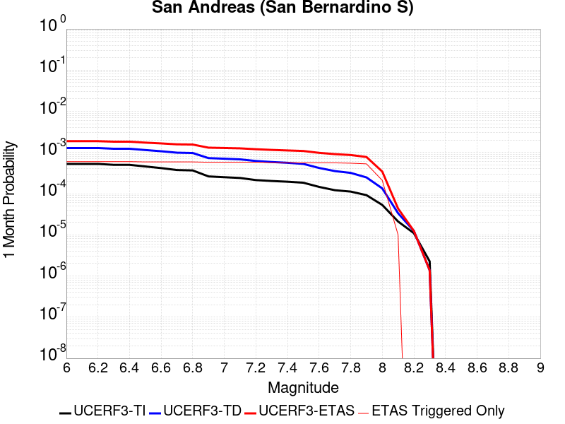 |  | 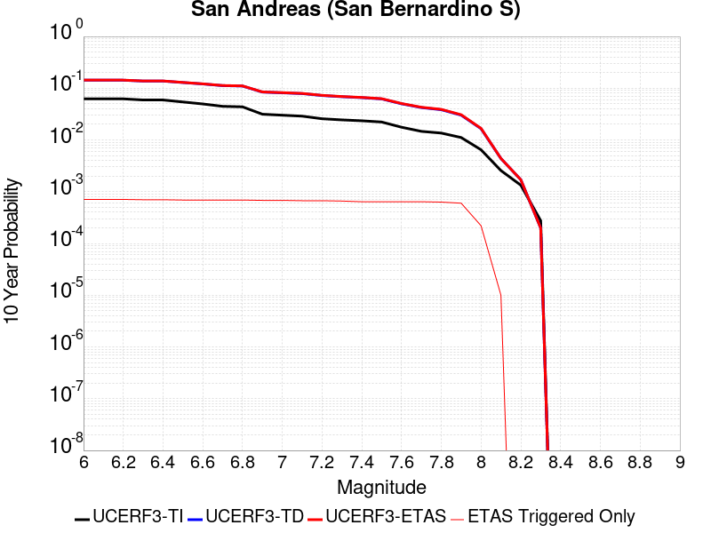 |

| Magnitude | 1 wk TI Prob | 1 wk TD Prob | 1 wk ETAS Prob | 1 wk ETAS/TD Gain | 1 wk ETAS Triggered Only | 1 mo TI Prob | 1 mo TD Prob | 1 mo ETAS Prob | 1 mo ETAS/TD Gain | 1 mo ETAS Triggered Only | 1 yr TI Prob | 1 yr TD Prob | 1 yr ETAS Prob | 1 yr ETAS/TD Gain | 1 yr ETAS Triggered Only | 10 yr TI Prob | 10 yr TD Prob | 10 yr ETAS Prob | 10 yr ETAS/TD Gain | 10 yr ETAS Triggered Only |
|-----|-----|-----|-----|-----|-----|-----|-----|-----|-----|-----|-----|-----|-----|-----|-----|-----|-----|-----|-----|-----|
| 6.0 | 1.2336002E-4 | 3.0004102E-4 | 8.687981E-4 | 2.8955977 | 5.689278E-4 | 5.2857865E-4 | 0.0012852824 | 0.0018753328 | 1.4590821 | 5.908096E-4 | 0.006416472 | 0.015540994 | 0.016208788 | 1.04297 | 6.78337E-4 | 0.06234337 | 0.14283717 | 0.14345613 | 1.0043333 | 7.2210067E-4 |
| 6.1 | 1.2336002E-4 | 3.0004102E-4 | 8.687981E-4 | 2.8955977 | 5.689278E-4 | 5.2857865E-4 | 0.0012852824 | 0.0018753328 | 1.4590821 | 5.908096E-4 | 0.006416472 | 0.015540994 | 0.016208788 | 1.04297 | 6.78337E-4 | 0.06234337 | 0.14283717 | 0.14345613 | 1.0043333 | 7.2210067E-4 |
| 6.2 | 1.2336002E-4 | 3.0004102E-4 | 8.687981E-4 | 2.8955977 | 5.689278E-4 | 5.2857865E-4 | 0.0012852824 | 0.0018753328 | 1.4590821 | 5.908096E-4 | 0.006416472 | 0.015540994 | 0.016208788 | 1.04297 | 6.78337E-4 | 0.06234337 | 0.14283717 | 0.14345613 | 1.0043333 | 7.2210067E-4 |
| 6.3 | 1.1712257E-4 | 2.8792414E-4 | 8.5668813E-4 | 2.9753952 | 5.689278E-4 | 5.018573E-4 | 0.0012334028 | 0.0018234836 | 1.478417 | 5.908096E-4 | 0.006093008 | 0.014918125 | 0.015564787 | 1.0433474 | 6.564551E-4 | 0.059286322 | 0.13754563 | 0.13814953 | 1.0043906 | 7.0021884E-4 |
| 6.4 | 1.1712257E-4 | 2.8792414E-4 | 8.5668813E-4 | 2.9753952 | 5.689278E-4 | 5.018573E-4 | 0.0012334028 | 0.0018234836 | 1.478417 | 5.908096E-4 | 0.006093008 | 0.014918125 | 0.015564787 | 1.0433474 | 6.564551E-4 | 0.059286322 | 0.13754563 | 0.13814953 | 1.0043906 | 7.0021884E-4 |
| 6.5 | 1.0689076E-4 | 2.680528E-4 | 8.368281E-4 | 3.121878 | 5.689278E-4 | 4.5802278E-4 | 0.0011483167 | 0.0017384479 | 1.5139098 | 5.908096E-4 | 0.0055621783 | 0.01389575 | 0.0145430835 | 1.046585 | 6.564551E-4 | 0.05425003 | 0.12879294 | 0.12940298 | 1.0047365 | 7.0021884E-4 |
| 6.6 | 9.7648895E-5 | 2.50501E-4 | 8.192863E-4 | 3.2705908 | 5.689278E-4 | 4.1842813E-4 | 0.0010731576 | 0.0016633333 | 1.5499431 | 5.908096E-4 | 0.005082469 | 0.012991785 | 0.013639712 | 1.049872 | 6.564551E-4 | 0.049677886 | 0.12095292 | 0.12156844 | 1.0050889 | 7.0021884E-4 |
| 6.7 | 8.757013E-5 | 2.3120902E-4 | 8.000053E-4 | 3.4600954 | 5.689278E-4 | 3.7524657E-4 | 9.905418E-4 | 0.0015807662 | 1.5958601 | 5.908096E-4 | 0.00455906 | 0.011997245 | 0.012645825 | 1.0540607 | 6.564551E-4 | 0.04466656 | 0.11226123 | 0.11288284 | 1.0055372 | 7.0021884E-4 |
| 6.8 | 8.562978E-5 | 2.2680782E-4 | 7.956066E-4 | 3.5078444 | 5.689278E-4 | 3.6693315E-4 | 9.7169366E-4 | 0.0015619292 | 1.6074296 | 5.908096E-4 | 0.004458263 | 0.011770263 | 0.012418992 | 1.0551159 | 6.564551E-4 | 0.043698758 | 0.11027153 | 0.11089454 | 1.0056497 | 7.0021884E-4 |
| 6.9 | 6.124075E-5 | 1.7065753E-4 | 7.176101E-4 | 4.2049723 | 5.4704596E-4 | 2.6243398E-4 | 7.311852E-4 | 0.001299697 | 1.7775209 | 5.689278E-4 | 0.0031904527 | 0.008866051 | 0.009494998 | 1.0709388 | 6.345733E-4 | 0.031450346 | 0.08418263 | 0.084803864 | 1.0073795 | 6.78337E-4 |
| 7.0 | 5.8598747E-5 | 1.649477E-4 | 7.1190344E-4 | 4.315934 | 5.4704596E-4 | 2.5111332E-4 | 7.06728E-4 | 0.0012752537 | 1.8044477 | 5.689278E-4 | 0.0030530186 | 0.008570663 | 0.009199797 | 1.0734056 | 6.345733E-4 | 0.03011414 | 0.081500374 | 0.08212342 | 1.0076448 | 6.78337E-4 |
| 7.1 | 5.613814E-5 | 1.5913323E-4 | 7.060921E-4 | 4.4371133 | 5.4704596E-4 | 2.4056983E-4 | 6.818221E-4 | 0.0012503619 | 1.8338537 | 5.689278E-4 | 0.0029250039 | 0.008269769 | 0.008877394 | 1.0734754 | 6.1269145E-4 | 0.028868021 | 0.07879931 | 0.07940403 | 1.0076742 | 6.564551E-4 |
| 7.2 | 4.991222E-5 | 1.4519796E-4 | 6.9216447E-4 | 4.7670403 | 5.4704596E-4 | 2.1389198E-4 | 6.2212895E-4 | 0.0011907028 | 1.9139163 | 5.689278E-4 | 0.002601025 | 0.007548217 | 0.008156284 | 1.0805577 | 6.1269145E-4 | 0.025707912 | 0.07225321 | 0.07286223 | 1.008429 | 6.564551E-4 |
| 7.3 | 4.7410045E-5 | 1.3714004E-4 | 6.622321E-4 | 4.828875 | 5.251641E-4 | 2.0317009E-4 | 5.8761094E-4 | 0.0011343354 | 1.9304192 | 5.4704596E-4 | 0.0024707897 | 0.0071307817 | 0.007717378 | 1.0822626 | 5.908096E-4 | 0.024434982 | 0.06853558 | 0.069126666 | 1.0086244 | 6.345733E-4 |
| 7.4 | 4.5556746E-5 | 1.3121912E-4 | 6.563143E-4 | 5.001667 | 5.251641E-4 | 1.952286E-4 | 5.622468E-4 | 0.0011089852 | 1.9724171 | 5.4704596E-4 | 0.002374317 | 0.0068239477 | 0.007388993 | 1.0828034 | 5.689278E-4 | 0.023491086 | 0.065788016 | 0.0663604 | 1.0087004 | 6.1269145E-4 |
| 7.5 | 4.3084514E-5 | 1.2357246E-4 | 6.486717E-4 | 5.249322 | 5.251641E-4 | 1.8463485E-4 | 5.2948913E-4 | 0.0010762454 | 2.0326111 | 5.4704596E-4 | 0.0022456115 | 0.0064275465 | 0.006992818 | 1.0879451 | 5.689278E-4 | 0.022230545 | 0.062188786 | 0.06276338 | 1.0092394 | 6.1269145E-4 |
| 7.6 | 3.408608E-5 | 9.83552E-5 | 6.2346767E-4 | 6.3389397 | 5.251641E-4 | 1.4607502E-4 | 4.214543E-4 | 9.6826965E-4 | 2.2974489 | 5.4704596E-4 | 0.0017770125 | 0.0051191594 | 0.0056851744 | 1.110568 | 5.689278E-4 | 0.017628696 | 0.050020292 | 0.050602335 | 1.0116361 | 6.1269145E-4 |
| 7.7 | 2.8315713E-5 | 8.248679E-5 | 6.076076E-4 | 7.36612 | 5.251641E-4 | 1.2134742E-4 | 3.5346695E-4 | 9.0031954E-4 | 2.5471108 | 5.4704596E-4 | 0.0014764034 | 0.0042949775 | 0.004861462 | 1.1318946 | 5.689278E-4 | 0.01466633 | 0.0422714 | 0.042858195 | 1.0138816 | 6.1269145E-4 |
| 7.8 | 2.6222975E-5 | 7.463088E-5 | 5.778756E-4 | 7.7431164 | 5.032823E-4 | 1.1237934E-4 | 3.1980744E-4 | 8.448036E-4 | 2.6416008 | 5.251641E-4 | 0.0013673597 | 0.0038867102 | 0.00443163 | 1.1402007 | 5.4704596E-4 | 0.013589768 | 0.03843674 | 0.039004844 | 1.0147802 | 5.908096E-4 |
| 7.9 | 2.1469694E-5 | 5.787864E-5 | 5.1737064E-4 | 8.938888 | 4.595186E-4 | 9.200973E-5 | 2.4802773E-4 | 7.2930875E-4 | 2.9404323 | 4.8140044E-4 | 0.0011196428 | 0.0030155594 | 0.0035173239 | 1.1663918 | 5.032823E-4 | 0.011140184 | 0.030152109 | 0.03068266 | 1.0175959 | 5.4704596E-4 |
| 8.0 | 1.2420249E-5 | 3.131896E-5 | 2.0636817E-4 | 6.5892415 | 1.7505471E-4 | 5.322855E-5 | 1.342172E-4 | 3.0924843E-4 | 2.304089 | 1.7505471E-4 | 6.478649E-4 | 0.0016328706 | 0.0018076395 | 1.1070317 | 1.7505471E-4 | 0.0064597935 | 0.016522504 | 0.016694667 | 1.0104198 | 1.7505471E-4 |
| 8.1 | 4.9197724E-6 | 7.822348E-6 | 2.9704015E-5 | 3.797327 | 2.1881839E-5 | 2.1084568E-5 | 3.352392E-5 | 5.5405028E-5 | 1.6527013 | 2.1881839E-5 | 2.566744E-4 | 4.0807744E-4 | 4.2995033E-4 | 1.0536 | 2.1881839E-5 | 0.002563781 | 0.0043843705 | 0.0044061565 | 1.004969 | 2.1881839E-5 |
| 8.2 | 2.5634774E-6 | 2.9067196E-6 | 2.9067196E-6 | 1.0 | 0.0 | 1.0986286E-5 | 1.2457311E-5 | 1.2457311E-5 | 1.0 | 0.0 | 1.3374983E-4 | 1.5165724E-4 | 1.5165724E-4 | 1.0 | 0.0 | 0.0013366934 | 0.0017049741 | 0.0017049741 | 1.0 | 0.0 |
| 8.3 | 5.2850464E-7 | 3.2088764E-7 | 3.2088764E-7 | 1.0 | 0.0 | 2.2650179E-6 | 1.375232E-6 | 1.375232E-6 | 1.0 | 0.0 | 2.7576245E-5 | 1.6743334E-5 | 1.6743334E-5 | 1.0 | 0.0 | 2.7572823E-4 | 1.9870348E-4 | 1.9870348E-4 | 1.0 | 0.0 |

## Paradise
*[(top)](#table-of-contents)*

| 1 Week | 1 Month | 1 Year | 10 Year |
|-----|-----|-----|-----|
|  |  | 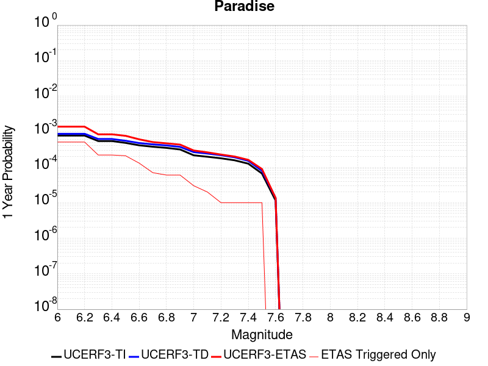 |  |

| Magnitude | 1 wk TI Prob | 1 wk TD Prob | 1 wk ETAS Prob | 1 wk ETAS/TD Gain | 1 wk ETAS Triggered Only | 1 mo TI Prob | 1 mo TD Prob | 1 mo ETAS Prob | 1 mo ETAS/TD Gain | 1 mo ETAS Triggered Only | 1 yr TI Prob | 1 yr TD Prob | 1 yr ETAS Prob | 1 yr ETAS/TD Gain | 1 yr ETAS Triggered Only | 10 yr TI Prob | 10 yr TD Prob | 10 yr ETAS Prob | 10 yr ETAS/TD Gain | 10 yr ETAS Triggered Only |
|-----|-----|-----|-----|-----|-----|-----|-----|-----|-----|-----|-----|-----|-----|-----|-----|-----|-----|-----|-----|-----|
| 6.0 | 1.4851273E-5 | 1.6694692E-5 | 5.1996857E-4 | 31.145742 | 5.032823E-4 | 6.364676E-5 | 7.154685E-5 | 6.404339E-4 | 8.951253 | 5.689278E-4 | 7.7462377E-4 | 8.707584E-4 | 0.0014829163 | 1.703017 | 6.1269145E-4 | 0.0077192914 | 0.008675844 | 0.009348297 | 1.0775086 | 6.78337E-4 |
| 6.1 | 1.4851273E-5 | 1.6694692E-5 | 5.1996857E-4 | 31.145742 | 5.032823E-4 | 6.364676E-5 | 7.154685E-5 | 6.404339E-4 | 8.951253 | 5.689278E-4 | 7.7462377E-4 | 8.707584E-4 | 0.0014829163 | 1.703017 | 6.1269145E-4 | 0.0077192914 | 0.008675844 | 0.009348297 | 1.0775086 | 6.78337E-4 |
| 6.2 | 1.4851273E-5 | 1.6694692E-5 | 5.1996857E-4 | 31.145742 | 5.032823E-4 | 6.364676E-5 | 7.154685E-5 | 6.404339E-4 | 8.951253 | 5.689278E-4 | 7.7462377E-4 | 8.707584E-4 | 0.0014829163 | 1.703017 | 6.1269145E-4 | 0.0077192914 | 0.008675844 | 0.009348297 | 1.0775086 | 6.78337E-4 |
| 6.3 | 1.0426831E-5 | 1.188862E-5 | 1.8694124E-4 | 15.724385 | 1.7505471E-4 | 4.4685654E-5 | 5.0950268E-5 | 2.697575E-4 | 5.2945256 | 2.1881839E-4 | 5.43912E-4 | 6.201489E-4 | 8.6069986E-4 | 1.3878922 | 2.4070022E-4 | 0.0054258266 | 0.0061847917 | 0.0064457497 | 1.0421935 | 2.6258206E-4 |
| 6.4 | 1.0426831E-5 | 1.188862E-5 | 1.8694124E-4 | 15.724385 | 1.7505471E-4 | 4.4685654E-5 | 5.0950268E-5 | 2.697575E-4 | 5.2945256 | 2.1881839E-4 | 5.43912E-4 | 6.201489E-4 | 8.6069986E-4 | 1.3878922 | 2.4070022E-4 | 0.0054258266 | 0.0061847917 | 0.0064457497 | 1.0421935 | 2.6258206E-4 |
| 6.5 | 9.25027E-6 | 1.06199595E-5 | 1.637912E-4 | 15.422958 | 1.5317286E-4 | 3.964341E-5 | 4.551335E-5 | 2.4244093E-4 | 5.3268094 | 1.9693654E-4 | 4.8255164E-4 | 5.53989E-4 | 7.7268615E-4 | 1.394768 | 2.1881839E-4 | 0.0048150513 | 0.0055265795 | 0.0057659494 | 1.0433125 | 2.4070022E-4 |
| 6.6 | 7.904275E-6 | 9.159525E-6 | 1.1856771E-4 | 12.944745 | 1.0940919E-4 | 3.3875025E-5 | 3.9254537E-5 | 1.4865944E-4 | 3.7870636 | 1.0940919E-4 | 4.1235037E-4 | 4.7782314E-4 | 6.0905144E-4 | 1.2746378 | 1.3129103E-4 | 0.0041158604 | 0.0047683544 | 0.0048990194 | 1.0274025 | 1.3129103E-4 |
| 6.7 | 7.2061953E-6 | 8.407248E-6 | 7.405221E-5 | 8.808139 | 6.5645516E-5 | 3.088333E-5 | 3.6030586E-5 | 1.0167374E-4 | 2.821873 | 6.5645516E-5 | 3.7593965E-4 | 4.3858777E-4 | 5.2607676E-4 | 1.1994787 | 8.7527354E-5 | 0.003753043 | 0.004377591 | 0.0044647353 | 1.0199069 | 8.7527354E-5 |
| 6.8 | 6.6948724E-6 | 7.842166E-6 | 7.3487165E-5 | 9.370774 | 6.5645516E-5 | 2.8691995E-5 | 3.360887E-5 | 9.9252175E-5 | 2.9531543 | 6.5645516E-5 | 3.4926904E-4 | 4.0911473E-4 | 4.966063E-4 | 1.2138557 | 8.7527354E-5 | 0.003487206 | 0.0040839734 | 0.0041711433 | 1.0213444 | 8.7527354E-5 |
| 6.9 | 6.0421025E-6 | 7.130621E-6 | 7.277567E-5 | 10.206078 | 6.5645516E-5 | 2.5894467E-5 | 3.0559466E-5 | 9.620297E-5 | 3.1480582 | 6.5645516E-5 | 3.1521954E-4 | 3.7200135E-4 | 4.5949616E-4 | 1.2352002 | 8.7527354E-5 | 0.0031477278 | 0.0037141247 | 0.003801327 | 1.0234785 | 8.7527354E-5 |
| 7.0 | 4.134091E-6 | 5.0803087E-6 | 4.884376E-5 | 9.614329 | 4.3763677E-5 | 1.7717413E-5 | 2.177258E-5 | 6.55353E-5 | 3.0099926 | 4.3763677E-5 | 2.1568815E-4 | 2.6505045E-4 | 3.0880253E-4 | 1.1650708 | 4.3763677E-5 | 0.0021547892 | 0.0026474963 | 0.0026911441 | 1.0164864 | 4.3763677E-5 |
| 7.1 | 3.7674888E-6 | 4.6318696E-6 | 2.6513606E-5 | 5.7241697 | 2.1881839E-5 | 1.6146281E-5 | 1.9850726E-5 | 4.173213E-5 | 2.1022973 | 2.1881839E-5 | 1.9656324E-4 | 2.4165731E-4 | 2.6353388E-4 | 1.0905272 | 2.1881839E-5 | 0.0019638946 | 0.002414096 | 0.002435925 | 1.0090423 | 2.1881839E-5 |
| 7.2 | 3.4065345E-6 | 4.156723E-6 | 4.156723E-6 | 1.0 | 0.0 | 1.4599351E-5 | 1.7814415E-5 | 1.7814415E-5 | 1.0 | 0.0 | 1.777326E-4 | 2.1687041E-4 | 2.1687041E-4 | 1.0 | 0.0 | 0.0017759053 | 0.002166736 | 0.002166736 | 1.0 | 0.0 |
| 7.3 | 2.9934936E-6 | 3.6293168E-6 | 3.6293168E-6 | 1.0 | 0.0 | 1.2829195E-5 | 1.555413E-5 | 1.555413E-5 | 1.0 | 0.0 | 1.5618425E-4 | 1.8935655E-4 | 1.8935655E-4 | 1.0 | 0.0 | 0.0015607453 | 0.0018920974 | 0.0018920974 | 1.0 | 0.0 |
| 7.4 | 2.4049796E-6 | 2.8889842E-6 | 2.8889842E-6 | 1.0 | 0.0 | 1.0307015E-5 | 1.238131E-5 | 1.238131E-5 | 1.0 | 0.0 | 1.2548068E-4 | 1.5073347E-4 | 1.5073347E-4 | 1.0 | 0.0 | 0.0012540985 | 0.0015064536 | 0.0015064536 | 1.0 | 0.0 |
| 7.5 | 1.2710091E-6 | 1.5134682E-6 | 1.5134682E-6 | 1.0 | 0.0 | 5.44717E-6 | 6.4862834E-6 | 6.4862834E-6 | 1.0 | 0.0 | 6.631728E-5 | 7.8968886E-5 | 7.8968886E-5 | 1.0 | 0.0 | 6.6297496E-4 | 7.8953087E-4 | 7.8953087E-4 | 1.0 | 0.0 |
| 7.6 | 2.21172E-7 | 2.603961E-7 | 2.603961E-7 | 1.0 | 0.0 | 9.478797E-7 | 1.1159829E-6 | 1.1159829E-6 | 1.0 | 0.0 | 1.1540374E-5 | 1.3587036E-5 | 1.3587036E-5 | 1.0 | 0.0 | 1.1539775E-4 | 1.3586486E-4 | 1.3586486E-4 | 1.0 | 0.0 |

## Nelson Lake
*[(top)](#table-of-contents)*

| 1 Week | 1 Month | 1 Year | 10 Year |
|-----|-----|-----|-----|
|  | 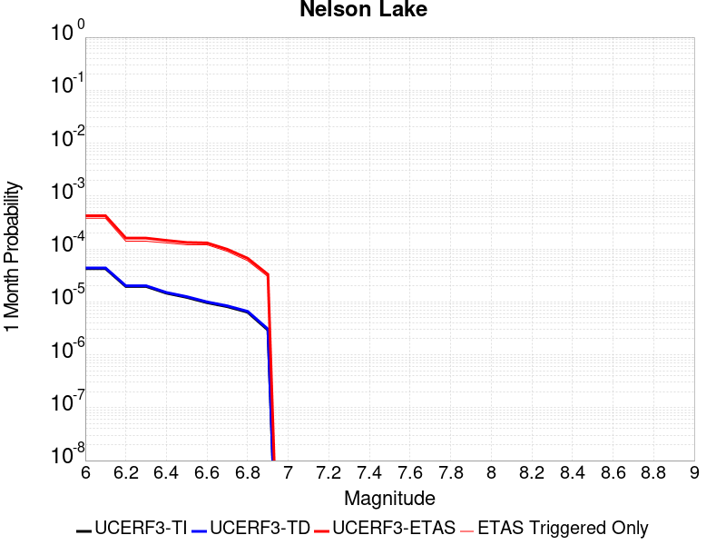 |  |  |

| Magnitude | 1 wk TI Prob | 1 wk TD Prob | 1 wk ETAS Prob | 1 wk ETAS/TD Gain | 1 wk ETAS Triggered Only | 1 mo TI Prob | 1 mo TD Prob | 1 mo ETAS Prob | 1 mo ETAS/TD Gain | 1 mo ETAS Triggered Only | 1 yr TI Prob | 1 yr TD Prob | 1 yr ETAS Prob | 1 yr ETAS/TD Gain | 1 yr ETAS Triggered Only | 10 yr TI Prob | 10 yr TD Prob | 10 yr ETAS Prob | 10 yr ETAS/TD Gain | 10 yr ETAS Triggered Only |
|-----|-----|-----|-----|-----|-----|-----|-----|-----|-----|-----|-----|-----|-----|-----|-----|-----|-----|-----|-----|-----|
| 6.0 | 9.913453E-6 | 1.0192255E-5 | 2.9465326E-4 | 28.909525 | 2.844639E-4 | 4.2485535E-5 | 4.3680422E-5 | 3.9377454E-4 | 9.014898 | 3.5010942E-4 | 5.1713863E-4 | 5.316897E-4 | 0.0010347044 | 1.9460682 | 5.032823E-4 | 0.0051593683 | 0.005305204 | 0.005827582 | 1.0984652 | 5.251641E-4 |
| 6.1 | 9.913453E-6 | 1.0192255E-5 | 2.9465326E-4 | 28.909525 | 2.844639E-4 | 4.2485535E-5 | 4.3680422E-5 | 3.9377454E-4 | 9.014898 | 3.5010942E-4 | 5.1713863E-4 | 5.316897E-4 | 0.0010347044 | 1.9460682 | 5.032823E-4 | 0.0051593683 | 0.005305204 | 0.005827582 | 1.0984652 | 5.251641E-4 |
| 6.2 | 4.5596407E-6 | 4.696313E-6 | 1.1410499E-4 | 24.296717 | 1.0940919E-4 | 1.954117E-5 | 2.0126909E-5 | 1.7329669E-4 | 8.6102 | 1.5317286E-4 | 2.3788778E-4 | 2.4501883E-4 | 4.8566007E-4 | 1.9821337 | 2.4070022E-4 | 0.0023763329 | 0.0024476128 | 0.0027095522 | 1.1070184 | 2.6258206E-4 |
| 6.3 | 4.5596407E-6 | 4.696313E-6 | 1.1410499E-4 | 24.296717 | 1.0940919E-4 | 1.954117E-5 | 2.0126909E-5 | 1.7329669E-4 | 8.6102 | 1.5317286E-4 | 2.3788778E-4 | 2.4501883E-4 | 4.8566007E-4 | 1.9821337 | 2.4070022E-4 | 0.0023763329 | 0.0024476128 | 0.0027095522 | 1.1070184 | 2.6258206E-4 |
| 6.4 | 3.4025713E-6 | 3.5098972E-6 | 1.129187E-4 | 32.171513 | 1.0940919E-4 | 1.4582367E-5 | 1.5042335E-5 | 1.682129E-4 | 11.182632 | 1.5317286E-4 | 1.7752586E-4 | 1.8312587E-4 | 4.23782E-4 | 2.314157 | 2.4070022E-4 | 0.001773841 | 0.0018298327 | 0.0020919342 | 1.143238 | 2.6258206E-4 |
| 6.5 | 2.8352947E-6 | 2.927856E-6 | 1.12336726E-4 | 38.368256 | 1.0940919E-4 | 1.2151207E-5 | 1.2547898E-5 | 1.6571884E-4 | 13.2069 | 1.5317286E-4 | 1.479309E-4 | 1.5276071E-4 | 3.9342415E-4 | 2.5754278 | 2.4070022E-4 | 0.0014783246 | 0.0015266308 | 0.0017669636 | 1.157427 | 2.4070022E-4 |
| 6.6 | 2.251518E-6 | 2.3290677E-6 | 1.11738E-4 | 47.97542 | 1.0940919E-4 | 9.649328E-6 | 9.981683E-6 | 1.6315302E-4 | 16.345242 | 1.5317286E-4 | 1.1747423E-4 | 1.2152085E-4 | 3.6219181E-4 | 2.9804912 | 2.4070022E-4 | 0.0011741214 | 0.0012146058 | 0.0014550135 | 1.1979308 | 2.4070022E-4 |
| 6.7 | 1.8911853E-6 | 1.9591396E-6 | 8.948632E-5 | 45.676334 | 8.7527354E-5 | 8.105055E-6 | 8.39629E-6 | 1.3968622E-4 | 16.636662 | 1.3129103E-4 | 9.867457E-5 | 1.0222061E-4 | 3.2101662E-4 | 3.1404295 | 2.1881839E-4 | 9.863076E-4 | 0.0010217935 | 0.0012403883 | 1.2139325 | 2.1881839E-4 |
| 6.8 | 1.4874814E-6 | 1.5438305E-6 | 4.530744E-5 | 29.347418 | 4.3763677E-5 | 6.374905E-6 | 6.6164025E-6 | 9.414318E-5 | 14.228756 | 8.7527354E-5 | 7.76117E-5 | 8.055224E-5 | 2.3371277E-4 | 2.9013813 | 1.5317286E-4 | 7.75846E-4 | 8.0528157E-4 | 9.5833105E-4 | 1.1900572 | 1.5317286E-4 |
| 6.9 | 6.835972E-7 | 7.1399285E-7 | 4.4477638E-5 | 62.294235 | 4.3763677E-5 | 2.9296991E-6 | 3.0599674E-6 | 4.682351E-5 | 15.301963 | 4.3763677E-5 | 3.56685E-5 | 3.7254784E-5 | 1.2477888E-4 | 3.3493383 | 8.7527354E-5 | 3.5662777E-4 | 3.7251666E-4 | 4.6001142E-4 | 1.2348747 | 8.7527354E-5 |

## Towne Pass
*[(top)](#table-of-contents)*

| 1 Week | 1 Month | 1 Year | 10 Year |
|-----|-----|-----|-----|
| 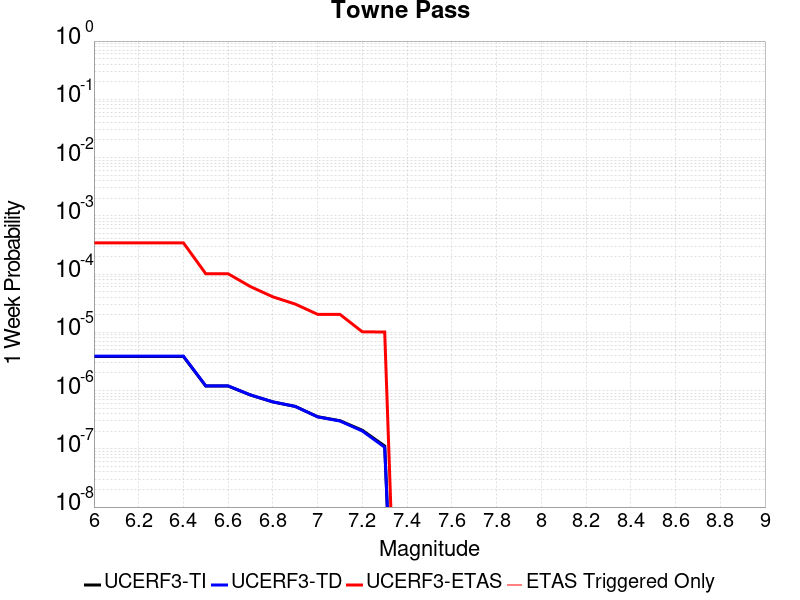 |  |  |  |

| Magnitude | 1 wk TI Prob | 1 wk TD Prob | 1 wk ETAS Prob | 1 wk ETAS/TD Gain | 1 wk ETAS Triggered Only | 1 mo TI Prob | 1 mo TD Prob | 1 mo ETAS Prob | 1 mo ETAS/TD Gain | 1 mo ETAS Triggered Only | 1 yr TI Prob | 1 yr TD Prob | 1 yr ETAS Prob | 1 yr ETAS/TD Gain | 1 yr ETAS Triggered Only | 10 yr TI Prob | 10 yr TD Prob | 10 yr ETAS Prob | 10 yr ETAS/TD Gain | 10 yr ETAS Triggered Only |
|-----|-----|-----|-----|-----|-----|-----|-----|-----|-----|-----|-----|-----|-----|-----|-----|-----|-----|-----|-----|-----|
| 6.0 | 3.849728E-6 | 3.8945414E-6 | 2.8835732E-4 | 74.041405 | 2.844639E-4 | 1.649873E-5 | 1.669081E-5 | 3.2303142E-4 | 19.353851 | 3.0634573E-4 | 2.0085352E-4 | 2.0319603E-4 | 6.1886647E-4 | 3.0456622 | 4.157549E-4 | 0.0020067208 | 0.0020305314 | 0.0025109544 | 1.2365996 | 4.8140044E-4 |
| 6.1 | 3.849728E-6 | 3.8945414E-6 | 2.8835732E-4 | 74.041405 | 2.844639E-4 | 1.649873E-5 | 1.669081E-5 | 3.2303142E-4 | 19.353851 | 3.0634573E-4 | 2.0085352E-4 | 2.0319603E-4 | 6.1886647E-4 | 3.0456622 | 4.157549E-4 | 0.0020067208 | 0.0020305314 | 0.0025109544 | 1.2365996 | 4.8140044E-4 |
| 6.2 | 3.849728E-6 | 3.8945414E-6 | 2.8835732E-4 | 74.041405 | 2.844639E-4 | 1.649873E-5 | 1.669081E-5 | 3.2303142E-4 | 19.353851 | 3.0634573E-4 | 2.0085352E-4 | 2.0319603E-4 | 6.1886647E-4 | 3.0456622 | 4.157549E-4 | 0.0020067208 | 0.0020305314 | 0.0025109544 | 1.2365996 | 4.8140044E-4 |
| 6.3 | 3.849728E-6 | 3.8945414E-6 | 2.8835732E-4 | 74.041405 | 2.844639E-4 | 1.649873E-5 | 1.669081E-5 | 3.2303142E-4 | 19.353851 | 3.0634573E-4 | 2.0085352E-4 | 2.0319603E-4 | 6.1886647E-4 | 3.0456622 | 4.157549E-4 | 0.0020067208 | 0.0020305314 | 0.0025109544 | 1.2365996 | 4.8140044E-4 |
| 6.4 | 3.849728E-6 | 3.8945414E-6 | 2.8835732E-4 | 74.041405 | 2.844639E-4 | 1.649873E-5 | 1.669081E-5 | 3.2303142E-4 | 19.353851 | 3.0634573E-4 | 2.0085352E-4 | 2.0319603E-4 | 6.1886647E-4 | 3.0456622 | 4.157549E-4 | 0.0020067208 | 0.0020305314 | 0.0025109544 | 1.2365996 | 4.8140044E-4 |
| 6.5 | 1.1953545E-6 | 1.203052E-6 | 6.6848486E-5 | 55.56575 | 6.5645516E-5 | 5.1229376E-6 | 5.1559277E-6 | 7.080111E-5 | 13.731981 | 6.5645516E-5 | 6.236998E-5 | 6.277173E-5 | 1.7217406E-4 | 2.7428598 | 1.0940919E-4 | 6.235248E-4 | 6.275517E-4 | 7.368922E-4 | 1.1742336 | 1.0940919E-4 |
| 6.6 | 1.1953545E-6 | 1.203052E-6 | 6.6848486E-5 | 55.56575 | 6.5645516E-5 | 5.1229376E-6 | 5.1559277E-6 | 7.080111E-5 | 13.731981 | 6.5645516E-5 | 6.236998E-5 | 6.277173E-5 | 1.7217406E-4 | 2.7428598 | 1.0940919E-4 | 6.235248E-4 | 6.275517E-4 | 7.368922E-4 | 1.1742336 | 1.0940919E-4 |
| 6.7 | 8.375951E-7 | 8.4106705E-7 | 4.4604705E-5 | 53.033474 | 4.3763677E-5 | 3.5896885E-6 | 3.6045683E-6 | 4.736809E-5 | 13.141126 | 4.3763677E-5 | 4.370358E-5 | 4.3884793E-5 | 1.0952743E-4 | 2.4957945 | 6.5645516E-5 | 4.3694986E-4 | 4.38767E-4 | 5.043837E-4 | 1.1495479 | 6.5645516E-5 |
| 6.8 | 6.38041E-7 | 6.392156E-7 | 2.252104E-5 | 35.232304 | 2.1881839E-5 | 2.7344586E-6 | 2.7394929E-6 | 2.4621271E-5 | 8.987529 | 2.1881839E-5 | 3.3291526E-5 | 3.3352855E-5 | 7.711507E-5 | 2.312098 | 4.3763677E-5 | 3.3286537E-4 | 3.334823E-4 | 3.772314E-4 | 1.1311886 | 4.3763677E-5 |
| 6.9 | 5.3460053E-7 | 5.345333E-7 | 5.345333E-7 | 1.0 | 0.0 | 2.2911431E-6 | 2.2908553E-6 | 2.2908553E-6 | 1.0 | 0.0 | 2.789431E-5 | 2.789084E-5 | 2.789084E-5 | 1.0 | 0.0 | 2.789081E-4 | 2.7887672E-4 | 2.7887672E-4 | 1.0 | 0.0 |
| 7.0 | 3.557783E-7 | 3.5324226E-7 | 3.5324226E-7 | 1.0 | 0.0 | 1.5247632E-6 | 1.5138945E-6 | 1.5138945E-6 | 1.0 | 0.0 | 1.8563835E-5 | 1.843152E-5 | 1.843152E-5 | 1.0 | 0.0 | 1.8562283E-4 | 1.8430075E-4 | 1.8430075E-4 | 1.0 | 0.0 |
| 7.1 | 3.037942E-7 | 3.0002218E-7 | 3.0002218E-7 | 1.0 | 0.0 | 1.3019744E-6 | 1.2858087E-6 | 1.2858087E-6 | 1.0 | 0.0 | 1.5851423E-5 | 1.5654618E-5 | 1.5654618E-5 | 1.0 | 0.0 | 1.5850292E-4 | 1.5653588E-4 | 1.5653588E-4 | 1.0 | 0.0 |
| 7.2 | 2.0808248E-7 | 2.0217689E-7 | 2.0217689E-7 | 1.0 | 0.0 | 8.917818E-7 | 8.6647213E-7 | 8.6647213E-7 | 1.0 | 0.0 | 1.0857389E-5 | 1.0549252E-5 | 1.0549252E-5 | 1.0 | 0.0 | 1.0856859E-4 | 1.0548797E-4 | 1.0548797E-4 | 1.0 | 0.0 |
| 7.3 | 1.1162073E-7 | 1.0636894E-7 | 1.0636894E-7 | 1.0 | 0.0 | 4.7837443E-7 | 4.558668E-7 | 4.558668E-7 | 1.0 | 0.0 | 5.8241935E-6 | 5.550166E-6 | 5.550166E-6 | 1.0 | 0.0 | 5.8240406E-5 | 5.5500474E-5 | 5.5500474E-5 | 1.0 | 0.0 |

## Bicycle Lake
*[(top)](#table-of-contents)*

| 1 Week | 1 Month | 1 Year | 10 Year |
|-----|-----|-----|-----|
|  |  |  |  |

| Magnitude | 1 wk TI Prob | 1 wk TD Prob | 1 wk ETAS Prob | 1 wk ETAS/TD Gain | 1 wk ETAS Triggered Only | 1 mo TI Prob | 1 mo TD Prob | 1 mo ETAS Prob | 1 mo ETAS/TD Gain | 1 mo ETAS Triggered Only | 1 yr TI Prob | 1 yr TD Prob | 1 yr ETAS Prob | 1 yr ETAS/TD Gain | 1 yr ETAS Triggered Only | 10 yr TI Prob | 10 yr TD Prob | 10 yr ETAS Prob | 10 yr ETAS/TD Gain | 10 yr ETAS Triggered Only |
|-----|-----|-----|-----|-----|-----|-----|-----|-----|-----|-----|-----|-----|-----|-----|-----|-----|-----|-----|-----|-----|
| 6.0 | 1.9621975E-5 | 2.2097078E-5 | 2.62792E-4 | 11.892612 | 2.4070022E-4 | 8.4091465E-5 | 9.4699084E-5 | 4.010158E-4 | 4.2346325 | 3.0634573E-4 | 0.0010233327 | 0.0011524865 | 0.0015240491 | 1.3224008 | 3.7199125E-4 | 0.01018633 | 0.011478408 | 0.011889391 | 1.0358049 | 4.157549E-4 |
| 6.1 | 1.9621975E-5 | 2.2097078E-5 | 2.62792E-4 | 11.892612 | 2.4070022E-4 | 8.4091465E-5 | 9.4699084E-5 | 4.010158E-4 | 4.2346325 | 3.0634573E-4 | 0.0010233327 | 0.0011524865 | 0.0015240491 | 1.3224008 | 3.7199125E-4 | 0.01018633 | 0.011478408 | 0.011889391 | 1.0358049 | 4.157549E-4 |
| 6.2 | 9.9971285E-6 | 1.1255639E-5 | 1.8630837E-4 | 16.552446 | 1.7505471E-4 | 4.2844134E-5 | 4.8237856E-5 | 2.451649E-4 | 5.082417 | 1.9693654E-4 | 5.2150246E-4 | 5.871896E-4 | 8.0587954E-4 | 1.3724349 | 2.1881839E-4 | 0.0052028033 | 0.005861487 | 0.0061225295 | 1.0445353 | 2.6258206E-4 |
| 6.3 | 9.589428E-6 | 1.0798346E-5 | 1.8585115E-4 | 17.211077 | 1.7505471E-4 | 4.10969E-5 | 4.62781E-5 | 2.4320552E-4 | 5.2553053 | 1.9693654E-4 | 5.002399E-4 | 5.6334207E-4 | 7.8203715E-4 | 1.3882102 | 2.1881839E-4 | 0.0049911533 | 0.0056242296 | 0.0058853347 | 1.0464251 | 2.6258206E-4 |
| 6.4 | 9.589428E-6 | 1.0798346E-5 | 1.8585115E-4 | 17.211077 | 1.7505471E-4 | 4.10969E-5 | 4.62781E-5 | 2.4320552E-4 | 5.2553053 | 1.9693654E-4 | 5.002399E-4 | 5.6334207E-4 | 7.8203715E-4 | 1.3882102 | 2.1881839E-4 | 0.0049911533 | 0.0056242296 | 0.0058853347 | 1.0464251 | 2.6258206E-4 |
| 6.5 | 5.557707E-6 | 6.2856016E-6 | 9.381241E-5 | 14.924969 | 8.7527354E-5 | 2.3818526E-5 | 2.6938165E-5 | 1.363444E-4 | 5.061384 | 1.0940919E-4 | 2.8995197E-4 | 3.2794967E-4 | 4.37323E-4 | 1.3335063 | 1.0940919E-4 | 0.0028957394 | 0.0032772934 | 0.0034081542 | 1.0399295 | 1.3129103E-4 |
| 6.6 | 4.8742945E-6 | 5.5132896E-6 | 7.115844E-5 | 12.906712 | 6.5645516E-5 | 2.0889667E-5 | 2.3628318E-5 | 1.11153604E-4 | 4.7042537 | 8.7527354E-5 | 2.54302E-4 | 2.87663E-4 | 3.7516517E-4 | 1.3041829 | 8.7527354E-5 | 0.002540112 | 0.0028754752 | 0.0029845699 | 1.0379397 | 1.0940919E-4 |
| 6.7 | 3.991108E-6 | 4.5159104E-6 | 7.016113E-5 | 15.53643 | 6.5645516E-5 | 1.7104636E-5 | 1.9353902E-5 | 1.0687956E-4 | 5.522378 | 8.7527354E-5 | 2.0822904E-4 | 2.3563375E-4 | 3.2314047E-4 | 1.3713676 | 8.7527354E-5 | 0.0020803404 | 0.0023563374 | 0.0024654889 | 1.0463225 | 1.0940919E-4 |

## Garlic Springs
*[(top)](#table-of-contents)*

| 1 Week | 1 Month | 1 Year | 10 Year |
|-----|-----|-----|-----|
|  | 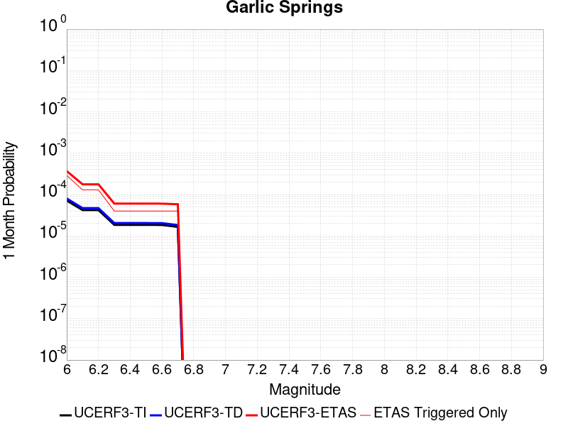 |  |  |

| Magnitude | 1 wk TI Prob | 1 wk TD Prob | 1 wk ETAS Prob | 1 wk ETAS/TD Gain | 1 wk ETAS Triggered Only | 1 mo TI Prob | 1 mo TD Prob | 1 mo ETAS Prob | 1 mo ETAS/TD Gain | 1 mo ETAS Triggered Only | 1 yr TI Prob | 1 yr TD Prob | 1 yr ETAS Prob | 1 yr ETAS/TD Gain | 1 yr ETAS Triggered Only | 10 yr TI Prob | 10 yr TD Prob | 10 yr ETAS Prob | 10 yr ETAS/TD Gain | 10 yr ETAS Triggered Only |
|-----|-----|-----|-----|-----|-----|-----|-----|-----|-----|-----|-----|-----|-----|-----|-----|-----|-----|-----|-----|-----|
| 6.0 | 1.6760017E-5 | 1.8776833E-5 | 2.8135395E-4 | 14.984101 | 2.6258206E-4 | 7.182667E-5 | 8.0470316E-5 | 4.0867148E-4 | 5.078537 | 3.2822756E-4 | 8.7413884E-4 | 9.794032E-4 | 0.0013510301 | 1.3794422 | 3.7199125E-4 | 0.008707083 | 0.009762413 | 0.0101524405 | 1.039952 | 3.9387308E-4 |
| 6.1 | 9.852767E-6 | 1.09735865E-5 | 1.2038158E-4 | 10.970121 | 1.0940919E-4 | 4.222546E-5 | 4.702921E-5 | 2.0019487E-4 | 4.2568197 | 1.5317286E-4 | 5.139737E-4 | 5.7250116E-4 | 7.6932495E-4 | 1.3437964 | 1.9693654E-4 | 0.005127866 | 0.005717221 | 0.0059130318 | 1.0342493 | 1.9693654E-4 |
| 6.2 | 9.852767E-6 | 1.09735865E-5 | 1.2038158E-4 | 10.970121 | 1.0940919E-4 | 4.222546E-5 | 4.702921E-5 | 2.0019487E-4 | 4.2568197 | 1.5317286E-4 | 5.139737E-4 | 5.7250116E-4 | 7.6932495E-4 | 1.3437964 | 1.9693654E-4 | 0.005127866 | 0.005717221 | 0.0059130318 | 1.0342493 | 1.9693654E-4 |
| 6.3 | 4.3167724E-6 | 4.7780286E-6 | 4.8541497E-5 | 10.159314 | 4.3763677E-5 | 1.8500323E-5 | 2.0477235E-5 | 8.612141E-5 | 4.2057147 | 6.5645516E-5 | 2.2521814E-4 | 2.4930484E-4 | 3.1493398E-4 | 1.2632486 | 6.5645516E-5 | 0.0022499003 | 0.00249251 | 0.0025579918 | 1.0262715 | 6.5645516E-5 |
| 6.4 | 4.3167724E-6 | 4.7780286E-6 | 4.8541497E-5 | 10.159314 | 4.3763677E-5 | 1.8500323E-5 | 2.0477235E-5 | 8.612141E-5 | 4.2057147 | 6.5645516E-5 | 2.2521814E-4 | 2.4930484E-4 | 3.1493398E-4 | 1.2632486 | 6.5645516E-5 | 0.0022499003 | 0.00249251 | 0.0025579918 | 1.0262715 | 6.5645516E-5 |
| 6.5 | 4.3167724E-6 | 4.7780286E-6 | 4.8541497E-5 | 10.159314 | 4.3763677E-5 | 1.8500323E-5 | 2.0477235E-5 | 8.612141E-5 | 4.2057147 | 6.5645516E-5 | 2.2521814E-4 | 2.4930484E-4 | 3.1493398E-4 | 1.2632486 | 6.5645516E-5 | 0.0022499003 | 0.00249251 | 0.0025579918 | 1.0262715 | 6.5645516E-5 |
| 6.6 | 4.301311E-6 | 4.760897E-6 | 4.8524365E-5 | 10.192273 | 4.3763677E-5 | 1.8434059E-5 | 2.0403815E-5 | 8.604799E-5 | 4.21725 | 6.5645516E-5 | 2.2441156E-4 | 2.4841115E-4 | 3.1404037E-4 | 1.2641959 | 6.5645516E-5 | 0.0022418506 | 0.002483593 | 0.0025490755 | 1.026366 | 6.5645516E-5 |
| 6.7 | 3.8599724E-6 | 4.27106E-6 | 4.8034548E-5 | 11.246517 | 4.3763677E-5 | 1.6542634E-5 | 1.8304541E-5 | 8.394886E-5 | 4.5862308 | 6.5645516E-5 | 2.0138794E-4 | 2.228578E-4 | 2.884887E-4 | 1.2944967 | 6.5645516E-5 | 0.0020120554 | 0.002228578 | 0.0022940773 | 1.0293906 | 6.5645516E-5 |

## Death Valley (Black Mtns Frontal)
*[(top)](#table-of-contents)*

| 1 Week | 1 Month | 1 Year | 10 Year |
|-----|-----|-----|-----|
|  | 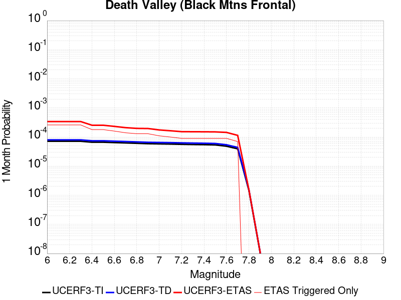 |  |  |

| Magnitude | 1 wk TI Prob | 1 wk TD Prob | 1 wk ETAS Prob | 1 wk ETAS/TD Gain | 1 wk ETAS Triggered Only | 1 mo TI Prob | 1 mo TD Prob | 1 mo ETAS Prob | 1 mo ETAS/TD Gain | 1 mo ETAS Triggered Only | 1 yr TI Prob | 1 yr TD Prob | 1 yr ETAS Prob | 1 yr ETAS/TD Gain | 1 yr ETAS Triggered Only | 10 yr TI Prob | 10 yr TD Prob | 10 yr ETAS Prob | 10 yr ETAS/TD Gain | 10 yr ETAS Triggered Only |
|-----|-----|-----|-----|-----|-----|-----|-----|-----|-----|-----|-----|-----|-----|-----|-----|-----|-----|-----|-----|-----|
| 6.0 | 1.6707214E-5 | 1.867027E-5 | 3.2501027E-4 | 17.407906 | 3.0634573E-4 | 7.160038E-5 | 8.001302E-5 | 4.0821434E-4 | 5.1018486 | 3.2822756E-4 | 8.71386E-4 | 9.737309E-4 | 0.0013234994 | 1.3592045 | 3.5010942E-4 | 0.00867977 | 0.009695496 | 0.010063881 | 1.0379955 | 3.7199125E-4 |
| 6.1 | 1.6707214E-5 | 1.867027E-5 | 3.2501027E-4 | 17.407906 | 3.0634573E-4 | 7.160038E-5 | 8.001302E-5 | 4.0821434E-4 | 5.1018486 | 3.2822756E-4 | 8.71386E-4 | 9.737309E-4 | 0.0013234994 | 1.3592045 | 3.5010942E-4 | 0.00867977 | 0.009695496 | 0.010063881 | 1.0379955 | 3.7199125E-4 |
| 6.2 | 1.6707214E-5 | 1.867027E-5 | 3.2501027E-4 | 17.407906 | 3.0634573E-4 | 7.160038E-5 | 8.001302E-5 | 4.0821434E-4 | 5.1018486 | 3.2822756E-4 | 8.71386E-4 | 9.737309E-4 | 0.0013234994 | 1.3592045 | 3.5010942E-4 | 0.00867977 | 0.009695496 | 0.010063881 | 1.0379955 | 3.7199125E-4 |
| 6.3 | 1.6707214E-5 | 1.867027E-5 | 3.2501027E-4 | 17.407906 | 3.0634573E-4 | 7.160038E-5 | 8.001302E-5 | 4.0821434E-4 | 5.1018486 | 3.2822756E-4 | 8.71386E-4 | 9.737309E-4 | 0.0013234994 | 1.3592045 | 3.5010942E-4 | 0.00867977 | 0.009695496 | 0.010063881 | 1.0379955 | 3.7199125E-4 |
| 6.4 | 1.5515609E-5 | 1.7338214E-5 | 2.361528E-4 | 13.620365 | 2.1881839E-4 | 6.649377E-5 | 7.4304546E-5 | 3.149869E-4 | 4.2391334 | 2.4070022E-4 | 8.0926094E-4 | 9.042885E-4 | 0.0011666331 | 1.2901117 | 2.6258206E-4 | 0.008063202 | 0.009006773 | 0.009288674 | 1.0312989 | 2.844639E-4 |
| 6.5 | 1.5515609E-5 | 1.7338214E-5 | 2.361528E-4 | 13.620365 | 2.1881839E-4 | 6.649377E-5 | 7.4304546E-5 | 3.149869E-4 | 4.2391334 | 2.4070022E-4 | 8.0926094E-4 | 9.042885E-4 | 0.0011666331 | 1.2901117 | 2.6258206E-4 | 0.008063202 | 0.009006773 | 0.009288674 | 1.0312989 | 2.844639E-4 |
| 6.6 | 1.5041828E-5 | 1.6809145E-5 | 2.1374237E-4 | 12.715839 | 1.9693654E-4 | 6.4463384E-5 | 7.203723E-5 | 2.9083985E-4 | 4.0373545 | 2.1881839E-4 | 7.8455906E-4 | 8.767063E-4 | 0.0011171955 | 1.2743099 | 2.4070022E-4 | 0.00781795 | 0.008733132 | 0.008993422 | 1.0298047 | 2.6258206E-4 |
| 6.7 | 1.4634985E-5 | 1.6356016E-5 | 2.1328934E-4 | 13.040421 | 1.9693654E-4 | 6.271985E-5 | 7.009536E-5 | 2.8889842E-4 | 4.1215053 | 2.1881839E-4 | 7.6334673E-4 | 8.5308263E-4 | 0.0010935775 | 1.2819128 | 2.4070022E-4 | 0.007607299 | 0.008498715 | 0.008759066 | 1.030634 | 2.6258206E-4 |
| 6.8 | 1.4209158E-5 | 1.5882048E-5 | 1.9093398E-4 | 12.021999 | 1.7505471E-4 | 6.089497E-5 | 6.8064175E-5 | 2.6498732E-4 | 3.893198 | 1.9693654E-4 | 7.4114406E-4 | 8.2837185E-4 | 0.001047009 | 1.2639359 | 2.1881839E-4 | 0.007386771 | 0.008253456 | 0.00849217 | 1.0289229 | 2.4070022E-4 |
| 6.9 | 1.3780098E-5 | 1.5404594E-5 | 1.904566E-4 | 12.363625 | 1.7505471E-4 | 5.9056227E-5 | 6.6018045E-5 | 2.6294158E-4 | 3.9828746 | 1.9693654E-4 | 7.1877235E-4 | 8.0347876E-4 | 0.0010221213 | 1.2721199 | 2.1881839E-4 | 0.0071645193 | 0.008006332 | 0.008245106 | 1.0298231 | 2.4070022E-4 |
| 7.0 | 1.3585064E-5 | 1.5188155E-5 | 1.6835869E-4 | 11.0848675 | 1.5317286E-4 | 5.8220405E-5 | 6.50905E-5 | 2.182534E-4 | 3.353076 | 1.5317286E-4 | 7.086029E-4 | 7.9219416E-4 | 9.671102E-4 | 1.2207994 | 1.7505471E-4 | 0.007063476 | 0.007894293 | 0.008089676 | 1.0247498 | 1.9693654E-4 |
| 7.1 | 1.3398601E-5 | 1.49813395E-5 | 1.681519E-4 | 11.224091 | 1.5317286E-4 | 5.742131E-5 | 6.420419E-5 | 2.1736723E-4 | 3.3855612 | 1.5317286E-4 | 6.9888023E-4 | 7.8141113E-4 | 9.5632905E-4 | 1.2238488 | 1.7505471E-4 | 0.0069668638 | 0.007787224 | 0.007982627 | 1.0250927 | 1.9693654E-4 |
| 7.2 | 1.3126312E-5 | 1.4679561E-5 | 1.6785017E-4 | 11.4342785 | 1.5317286E-4 | 5.6254412E-5 | 6.291092E-5 | 2.1607414E-4 | 3.434605 | 1.5317286E-4 | 6.846822E-4 | 7.6567667E-4 | 9.405973E-4 | 1.2284524 | 1.7505471E-4 | 0.006825765 | 0.00763097 | 0.007826404 | 1.0256106 | 1.9693654E-4 |
| 7.3 | 1.2922429E-5 | 1.4453788E-5 | 1.6762444E-4 | 11.597267 | 1.5317286E-4 | 5.5380664E-5 | 6.194336E-5 | 2.1510675E-4 | 3.4726357 | 1.5317286E-4 | 6.74051E-4 | 7.53905E-4 | 9.288277E-4 | 1.2320223 | 1.7505471E-4 | 0.006720101 | 0.007514055 | 0.0077095116 | 1.0260122 | 1.9693654E-4 |
| 7.4 | 1.2768878E-5 | 1.4283772E-5 | 1.6745445E-4 | 11.723406 | 1.5317286E-4 | 5.4722615E-5 | 6.1214756E-5 | 2.1437825E-4 | 3.502068 | 1.5317286E-4 | 6.660441E-4 | 7.4504025E-4 | 9.199645E-4 | 1.234785 | 1.7505471E-4 | 0.0066405144 | 0.0074260035 | 0.007621478 | 1.026323 | 1.9693654E-4 |
| 7.5 | 1.2521929E-5 | 1.40120155E-5 | 1.6718273E-4 | 11.931384 | 1.5317286E-4 | 5.366431E-5 | 6.005014E-5 | 2.132138E-4 | 3.5505962 | 1.5317286E-4 | 6.531671E-4 | 7.3087064E-4 | 9.057974E-4 | 1.2393403 | 1.7505471E-4 | 0.006512506 | 0.0072852457 | 0.0074807475 | 1.0268353 | 1.9693654E-4 |
| 7.6 | 1.1301089E-5 | 1.2648149E-5 | 1.6581907E-4 | 13.110146 | 1.5317286E-4 | 4.8432343E-5 | 5.4205255E-5 | 2.0736981E-4 | 3.8256404 | 1.5317286E-4 | 5.895042E-4 | 6.5975444E-4 | 8.1282627E-4 | 1.2320133 | 1.5317286E-4 | 0.0058794282 | 0.00657851 | 0.0067306757 | 1.0231307 | 1.5317286E-4 |
| 7.7 | 9.189108E-6 | 1.0283358E-5 | 1.4157304E-4 | 13.767199 | 1.3129103E-4 | 3.93813E-5 | 4.407082E-5 | 1.7535606E-4 | 3.9789608 | 1.3129103E-4 | 4.7936183E-4 | 5.3643517E-4 | 6.676558E-4 | 1.2446159 | 1.3129103E-4 | 0.004783291 | 0.005351914 | 0.0054825023 | 1.0244004 | 1.3129103E-4 |
| 7.8 | 3.4586725E-7 | 3.6482615E-7 | 3.6482615E-7 | 1.0 | 0.0 | 1.4822873E-6 | 1.5635396E-6 | 1.5635396E-6 | 1.0 | 0.0 | 1.80467E-5 | 1.9035933E-5 | 1.9035933E-5 | 1.0 | 0.0 | 1.8045233E-4 | 1.9034347E-4 | 1.9034347E-4 | 1.0 | 0.0 |
| 7.9 | 2.5591178E-9 | 2.6696718E-9 | 2.6696718E-9 | 1.0 | 0.0 | 1.0967647E-8 | 1.14414505E-8 | 1.14414505E-8 | 1.0 | 0.0 | 1.335311E-7 | 1.3929966E-7 | 1.3929966E-7 | 1.0 | 0.0 | 1.3353102E-6 | 1.3929966E-6 | 1.3929966E-6 | 1.0 | 0.0 |

## Helendale-So Lockhart
*[(top)](#table-of-contents)*

| 1 Week | 1 Month | 1 Year | 10 Year |
|-----|-----|-----|-----|
|  |  |  |  |

| Magnitude | 1 wk TI Prob | 1 wk TD Prob | 1 wk ETAS Prob | 1 wk ETAS/TD Gain | 1 wk ETAS Triggered Only | 1 mo TI Prob | 1 mo TD Prob | 1 mo ETAS Prob | 1 mo ETAS/TD Gain | 1 mo ETAS Triggered Only | 1 yr TI Prob | 1 yr TD Prob | 1 yr ETAS Prob | 1 yr ETAS/TD Gain | 1 yr ETAS Triggered Only | 10 yr TI Prob | 10 yr TD Prob | 10 yr ETAS Prob | 10 yr ETAS/TD Gain | 10 yr ETAS Triggered Only |
|-----|-----|-----|-----|-----|-----|-----|-----|-----|-----|-----|-----|-----|-----|-----|-----|-----|-----|-----|-----|-----|
| 6.0 | 1.7296055E-5 | 1.8103729E-5 | 3.4632537E-4 | 19.130056 | 3.2822756E-4 | 7.412385E-5 | 7.7585224E-5 | 4.2766746E-4 | 5.5122285 | 3.5010942E-4 | 9.0208417E-4 | 9.4421144E-4 | 0.0013158515 | 1.3935983 | 3.7199125E-4 | 0.008984311 | 0.009404116 | 0.009772609 | 1.0391842 | 3.7199125E-4 |
| 6.1 | 1.7296055E-5 | 1.8103729E-5 | 3.4632537E-4 | 19.130056 | 3.2822756E-4 | 7.412385E-5 | 7.7585224E-5 | 4.2766746E-4 | 5.5122285 | 3.5010942E-4 | 9.0208417E-4 | 9.4421144E-4 | 0.0013158515 | 1.3935983 | 3.7199125E-4 | 0.008984311 | 0.009404116 | 0.009772609 | 1.0391842 | 3.7199125E-4 |
| 6.2 | 1.7296055E-5 | 1.8103729E-5 | 3.4632537E-4 | 19.130056 | 3.2822756E-4 | 7.412385E-5 | 7.7585224E-5 | 4.2766746E-4 | 5.5122285 | 3.5010942E-4 | 9.0208417E-4 | 9.4421144E-4 | 0.0013158515 | 1.3935983 | 3.7199125E-4 | 0.008984311 | 0.009404116 | 0.009772609 | 1.0391842 | 3.7199125E-4 |
| 6.3 | 1.0669118E-5 | 1.1135425E-5 | 2.5183297E-4 | 22.61548 | 2.4070022E-4 | 4.5723988E-5 | 4.772239E-5 | 3.102919E-4 | 6.5020194 | 2.6258206E-4 | 5.5654737E-4 | 5.80868E-4 | 8.432975E-4 | 1.4517885 | 2.6258206E-4 | 0.0055515557 | 0.0057937936 | 0.0060548545 | 1.0450587 | 2.6258206E-4 |
| 6.4 | 1.0669118E-5 | 1.1135425E-5 | 2.5183297E-4 | 22.61548 | 2.4070022E-4 | 4.5723988E-5 | 4.772239E-5 | 3.102919E-4 | 6.5020194 | 2.6258206E-4 | 5.5654737E-4 | 5.80868E-4 | 8.432975E-4 | 1.4517885 | 2.6258206E-4 | 0.0055515557 | 0.0057937936 | 0.0060548545 | 1.0450587 | 2.6258206E-4 |
| 6.5 | 8.790038E-6 | 9.170197E-6 | 2.2798657E-4 | 24.861689 | 2.1881839E-4 | 3.767105E-5 | 3.930026E-5 | 2.79991E-4 | 7.1244063 | 2.4070022E-4 | 4.585485E-4 | 4.7837716E-4 | 7.189622E-4 | 1.5029192 | 2.4070022E-4 | 0.0045760344 | 0.004773638 | 0.0050131897 | 1.0501821 | 2.4070022E-4 |
| 6.6 | 7.396949E-6 | 7.715537E-6 | 1.6088723E-4 | 20.85237 | 1.5317286E-4 | 3.1700827E-5 | 3.3066175E-5 | 1.8623397E-4 | 5.6321597 | 1.5317286E-4 | 3.858892E-4 | 4.025073E-4 | 5.5561855E-4 | 1.3803936 | 1.5317286E-4 | 0.003852198 | 0.00401789 | 0.004170447 | 1.0379696 | 1.5317286E-4 |
| 6.7 | 6.4600285E-6 | 6.738031E-6 | 1.3802818E-4 | 20.484941 | 1.3129103E-4 | 2.7685543E-5 | 2.887696E-5 | 1.601642E-4 | 5.5464354 | 1.3129103E-4 | 3.3701936E-4 | 3.5152107E-4 | 4.8276593E-4 | 1.3733628 | 1.3129103E-4 | 0.0033650869 | 0.003509732 | 0.003640562 | 1.0372764 | 1.3129103E-4 |
| 6.8 | 5.600104E-6 | 5.836009E-6 | 1.3712628E-4 | 23.496582 | 1.3129103E-4 | 2.4000226E-5 | 2.5011232E-5 | 1.5629898E-4 | 6.249151 | 1.3129103E-4 | 2.9216358E-4 | 3.044698E-4 | 4.3572087E-4 | 1.4310807 | 1.3129103E-4 | 0.0029177975 | 0.003040588 | 0.0031714798 | 1.0430481 | 1.3129103E-4 |
| 6.9 | 4.839122E-6 | 5.0395092E-6 | 1.1444815E-4 | 22.710176 | 1.0940919E-4 | 2.0738931E-5 | 2.159772E-5 | 1.3100455E-4 | 6.0656652 | 1.0940919E-4 | 2.5246723E-4 | 2.6292098E-4 | 3.723014E-4 | 1.4160202 | 1.0940919E-4 | 0.002521806 | 0.002626147 | 0.0027352686 | 1.0415521 | 1.0940919E-4 |
| 7.0 | 3.6937633E-6 | 3.845208E-6 | 6.949047E-5 | 18.071966 | 6.5645516E-5 | 1.5830317E-5 | 1.647936E-5 | 8.212379E-5 | 4.9834332 | 6.5645516E-5 | 1.9271708E-4 | 2.0061806E-4 | 2.662504E-4 | 1.3271507 | 6.5645516E-5 | 0.0019255003 | 0.002004401 | 0.002069915 | 1.032685 | 6.5645516E-5 |
| 7.1 | 2.7858857E-6 | 2.8978538E-6 | 4.6661404E-5 | 16.102057 | 4.3763677E-5 | 1.1939455E-5 | 1.2419316E-5 | 5.618245E-5 | 4.523796 | 4.3763677E-5 | 1.4535317E-4 | 1.511949E-4 | 1.9495195E-4 | 1.2894083 | 4.3763677E-5 | 0.0014525814 | 0.0015109418 | 0.0015546393 | 1.0289208 | 4.3763677E-5 |
| 7.2 | 2.1672065E-6 | 2.2540128E-6 | 4.601759E-5 | 20.415852 | 4.3763677E-5 | 9.2879945E-6 | 9.66002E-6 | 5.3423275E-5 | 5.5303483 | 4.3763677E-5 | 1.1307546E-4 | 1.1760458E-4 | 1.613631E-4 | 1.3720819 | 4.3763677E-5 | 0.0011301794 | 0.0011754417 | 0.0012191539 | 1.0371879 | 4.3763677E-5 |
| 7.3 | 1.4823496E-6 | 1.5422102E-6 | 1.5422102E-6 | 1.0 | 0.0 | 6.3529114E-6 | 6.6094562E-6 | 6.6094562E-6 | 1.0 | 0.0 | 7.734395E-5 | 8.046731E-5 | 8.046731E-5 | 1.0 | 0.0 | 7.731704E-4 | 8.0439687E-4 | 8.0439687E-4 | 1.0 | 0.0 |
| 7.4 | 4.2321457E-7 | 4.4108765E-7 | 4.4108765E-7 | 1.0 | 0.0 | 1.8137755E-6 | 1.8903745E-6 | 1.8903745E-6 | 1.0 | 0.0 | 2.2082493E-5 | 2.3015113E-5 | 2.3015113E-5 | 1.0 | 0.0 | 2.2080299E-4 | 2.3013182E-4 | 2.3013182E-4 | 1.0 | 0.0 |
| 7.5 | 5.6942316E-8 | 5.9415648E-8 | 5.9415648E-8 | 1.0 | 0.0 | 2.440385E-7 | 2.5463845E-7 | 2.5463845E-7 | 1.0 | 0.0 | 2.9711643E-6 | 3.1002196E-6 | 3.1002196E-6 | 1.0 | 0.0 | 2.9711247E-5 | 3.1001844E-5 | 3.1001844E-5 | 1.0 | 0.0 |

## San Jacinto (San Bernardino)
*[(top)](#table-of-contents)*

| 1 Week | 1 Month | 1 Year | 10 Year |
|-----|-----|-----|-----|
|  |  |  |  |

| Magnitude | 1 wk TI Prob | 1 wk TD Prob | 1 wk ETAS Prob | 1 wk ETAS/TD Gain | 1 wk ETAS Triggered Only | 1 mo TI Prob | 1 mo TD Prob | 1 mo ETAS Prob | 1 mo ETAS/TD Gain | 1 mo ETAS Triggered Only | 1 yr TI Prob | 1 yr TD Prob | 1 yr ETAS Prob | 1 yr ETAS/TD Gain | 1 yr ETAS Triggered Only | 10 yr TI Prob | 10 yr TD Prob | 10 yr ETAS Prob | 10 yr ETAS/TD Gain | 10 yr ETAS Triggered Only |
|-----|-----|-----|-----|-----|-----|-----|-----|-----|-----|-----|-----|-----|-----|-----|-----|-----|-----|-----|-----|-----|
| 6.0 | 3.409352E-5 | 3.5986508E-5 | 2.5479702E-4 | 7.080348 | 2.1881839E-4 | 1.461069E-4 | 1.542188E-4 | 3.9488188E-4 | 2.5605302 | 2.4070022E-4 | 0.0017774 | 0.0018759987 | 0.0021380882 | 1.1397066 | 2.6258206E-4 | 0.01763251 | 0.019349935 | 0.019628895 | 1.0144166 | 2.844639E-4 |
| 6.1 | 3.409352E-5 | 3.5986508E-5 | 2.5479702E-4 | 7.080348 | 2.1881839E-4 | 1.461069E-4 | 1.542188E-4 | 3.9488188E-4 | 2.5605302 | 2.4070022E-4 | 0.0017774 | 0.0018759987 | 0.0021380882 | 1.1397066 | 2.6258206E-4 | 0.01763251 | 0.019349935 | 0.019628895 | 1.0144166 | 2.844639E-4 |
| 6.2 | 3.409352E-5 | 3.5986508E-5 | 2.5479702E-4 | 7.080348 | 2.1881839E-4 | 1.461069E-4 | 1.542188E-4 | 3.9488188E-4 | 2.5605302 | 2.4070022E-4 | 0.0017774 | 0.0018759987 | 0.0021380882 | 1.1397066 | 2.6258206E-4 | 0.01763251 | 0.019349935 | 0.019628895 | 1.0144166 | 2.844639E-4 |
| 6.3 | 3.409352E-5 | 3.5986508E-5 | 2.5479702E-4 | 7.080348 | 2.1881839E-4 | 1.461069E-4 | 1.542188E-4 | 3.9488188E-4 | 2.5605302 | 2.4070022E-4 | 0.0017774 | 0.0018759987 | 0.0021380882 | 1.1397066 | 2.6258206E-4 | 0.01763251 | 0.019349935 | 0.019628895 | 1.0144166 | 2.844639E-4 |
| 6.4 | 3.400795E-5 | 3.5879173E-5 | 2.5468972E-4 | 7.098539 | 2.1881839E-4 | 1.4574021E-4 | 1.5375883E-4 | 3.9442204E-4 | 2.5651994 | 2.4070022E-4 | 0.0017729428 | 0.0018704084 | 0.0021324994 | 1.1401249 | 2.6258206E-4 | 0.017588645 | 0.019295016 | 0.019573992 | 1.0144584 | 2.844639E-4 |
| 6.5 | 3.341482E-5 | 3.5139812E-5 | 2.539505E-4 | 7.2268605 | 2.1881839E-4 | 1.4319851E-4 | 1.5059051E-4 | 3.9125446E-4 | 2.5981352 | 2.4070022E-4 | 0.0017420477 | 0.0018318989 | 0.002094 | 1.1430762 | 2.6258206E-4 | 0.017284546 | 0.018916558 | 0.019195642 | 1.0147533 | 2.844639E-4 |
| 6.6 | 3.3364955E-5 | 3.5077028E-5 | 2.5388773E-4 | 7.2380056 | 2.1881839E-4 | 1.4298483E-4 | 1.5032147E-4 | 3.9098551E-4 | 2.6009958 | 2.4070022E-4 | 0.0017394501 | 0.001828629 | 0.002090731 | 1.1433325 | 2.6258206E-4 | 0.017258976 | 0.018884424 | 0.019163515 | 1.014779 | 2.844639E-4 |
| 6.7 | 3.335922E-5 | 3.5066805E-5 | 2.5387752E-4 | 7.239825 | 2.1881839E-4 | 1.4296026E-4 | 1.5027766E-4 | 3.909417E-4 | 2.6014626 | 2.4070022E-4 | 0.0017391514 | 0.0018280965 | 0.0020901985 | 1.1433743 | 2.6258206E-4 | 0.017256035 | 0.018879214 | 0.01915831 | 1.0147831 | 2.844639E-4 |
| 6.8 | 3.327683E-5 | 3.496087E-5 | 2.537716E-4 | 7.2587323 | 2.1881839E-4 | 1.4260718E-4 | 1.498237E-4 | 3.9048787E-4 | 2.6063156 | 2.4070022E-4 | 0.0017348597 | 0.0018225788 | 0.0020846822 | 1.1438091 | 2.6258206E-4 | 0.017213784 | 0.018824987 | 0.019104095 | 1.0148265 | 2.844639E-4 |
| 6.9 | 3.3235785E-5 | 3.4901823E-5 | 2.5371255E-4 | 7.269321 | 2.1881839E-4 | 1.4243131E-4 | 1.4957068E-4 | 3.902349E-4 | 2.6090333 | 2.4070022E-4 | 0.0017327217 | 0.0018195034 | 0.0020816077 | 1.1440526 | 2.6258206E-4 | 0.017192734 | 0.018794855 | 0.019073972 | 1.0148507 | 2.844639E-4 |
| 7.0 | 3.3197095E-5 | 3.4841752E-5 | 2.536525E-4 | 7.2801304 | 2.1881839E-4 | 1.422655E-4 | 1.4931326E-4 | 3.8997753E-4 | 2.6118078 | 2.4070022E-4 | 0.0017307063 | 0.0018163746 | 0.0020784799 | 1.1443013 | 2.6258206E-4 | 0.017172894 | 0.018764233 | 0.019043358 | 1.0148754 | 2.844639E-4 |
| 7.1 | 3.3129716E-5 | 3.4721965E-5 | 2.5353275E-4 | 7.3017974 | 2.1881839E-4 | 1.4197677E-4 | 1.4879994E-4 | 3.8946435E-4 | 2.617369 | 2.4070022E-4 | 0.0017271966 | 0.0018101353 | 0.002072242 | 1.1447995 | 2.6258206E-4 | 0.017138338 | 0.018703312 | 0.018982455 | 1.0149248 | 2.844639E-4 |
| 7.2 | 3.3034008E-5 | 3.458941E-5 | 2.534002E-4 | 7.3259478 | 2.1881839E-4 | 1.4156665E-4 | 1.4823192E-4 | 3.8889647E-4 | 2.6235676 | 2.4070022E-4 | 0.0017222111 | 0.0018032312 | 0.0020653398 | 1.145355 | 2.6258206E-4 | 0.017089253 | 0.018635705 | 0.018914867 | 1.01498 | 2.844639E-4 |
| 7.3 | 3.2956614E-5 | 3.445717E-5 | 2.5326802E-4 | 7.350227 | 2.1881839E-4 | 1.4123498E-4 | 1.4766524E-4 | 3.883299E-4 | 2.6297991 | 2.4070022E-4 | 0.0017181796 | 0.0017963431 | 0.0020584536 | 1.1459134 | 2.6258206E-4 | 0.017049557 | 0.018568452 | 0.018847635 | 1.0150353 | 2.844639E-4 |
| 7.4 | 3.2915937E-5 | 3.4378863E-5 | 2.5318973E-4 | 7.3646913 | 2.1881839E-4 | 1.4106068E-4 | 1.4732967E-4 | 3.8799443E-4 | 2.6335118 | 2.4070022E-4 | 0.0017160608 | 0.0017922645 | 0.0020543758 | 1.146246 | 2.6258206E-4 | 0.017028693 | 0.018528719 | 0.018807912 | 1.0150682 | 2.844639E-4 |
| 7.5 | 3.281791E-5 | 3.4243778E-5 | 2.5305466E-4 | 7.3897996 | 2.1881839E-4 | 1.406406E-4 | 1.4675081E-4 | 3.874157E-4 | 2.6399562 | 2.4070022E-4 | 0.0017109542 | 0.0017852283 | 0.0020473415 | 1.1468234 | 2.6258206E-4 | 0.016978411 | 0.018459605 | 0.018738817 | 1.0151256 | 2.844639E-4 |
| 7.6 | 3.2521442E-5 | 3.396873E-5 | 2.527797E-4 | 7.4415402 | 2.1881839E-4 | 1.3937015E-4 | 1.4557215E-4 | 3.8623734E-4 | 2.6532364 | 2.4070022E-4 | 0.0016955109 | 0.0017709016 | 0.0020330187 | 1.1480134 | 2.6258206E-4 | 0.016826328 | 0.018317232 | 0.018596485 | 1.0152454 | 2.844639E-4 |
| 7.7 | 3.0287873E-5 | 3.245276E-5 | 2.5126405E-4 | 7.7424545 | 2.1881839E-4 | 1.297987E-4 | 1.3907586E-4 | 3.797426E-4 | 2.730471 | 2.4070022E-4 | 0.0015791537 | 0.0016919347 | 0.0019540724 | 1.1549338 | 2.6258206E-4 | 0.01567979 | 0.01752809 | 0.017807567 | 1.0159446 | 2.844639E-4 |
| 7.8 | 2.6316151E-5 | 2.9663592E-5 | 2.484755E-4 | 8.376447 | 2.1881839E-4 | 1.1277862E-4 | 1.2712348E-4 | 3.677931E-4 | 2.8931956 | 2.4070022E-4 | 0.0013722149 | 0.0015466306 | 0.0018088066 | 1.1695143 | 2.6258206E-4 | 0.013637724 | 0.016069634 | 0.016349526 | 1.0174174 | 2.844639E-4 |
| 7.9 | 2.0761147E-5 | 2.34181E-5 | 2.4223136E-4 | 10.343766 | 2.1881839E-4 | 8.897331E-5 | 1.0035944E-4 | 3.4103548E-4 | 3.398141 | 2.4070022E-4 | 0.0010827117 | 0.0012211921 | 0.0014834534 | 1.2147585 | 2.6258206E-4 | 0.010774517 | 0.012793174 | 0.0130739985 | 1.0219511 | 2.844639E-4 |
| 8.0 | 1.5738568E-5 | 1.6033575E-5 | 1.473225E-4 | 9.1883745 | 1.3129103E-4 | 6.744926E-5 | 6.871352E-5 | 1.9999553E-4 | 2.9105704 | 1.3129103E-4 | 8.2088535E-4 | 8.3626667E-4 | 9.674479E-4 | 1.1568654 | 1.3129103E-4 | 0.008178596 | 0.008865921 | 0.009017736 | 1.0171235 | 1.5317286E-4 |
| 8.1 | 1.0105832E-5 | 8.3304985E-6 | 9.585712E-5 | 11.506769 | 8.7527354E-5 | 4.3309992E-5 | 3.570165E-5 | 1.2322588E-4 | 3.4515457 | 8.7527354E-5 | 5.2717153E-4 | 4.345814E-4 | 5.2207074E-4 | 1.2013186 | 8.7527354E-5 | 0.005259227 | 0.004677232 | 0.0047861296 | 1.0232824 | 1.0940919E-4 |
| 8.2 | 4.189207E-6 | 1.5784357E-6 | 1.5784357E-6 | 1.0 | 0.0 | 1.7953622E-5 | 6.7647065E-6 | 6.7647065E-6 | 1.0 | 0.0 | 2.1856341E-4 | 8.235722E-5 | 8.235722E-5 | 1.0 | 0.0 | 0.0021834858 | 9.565867E-4 | 9.565867E-4 | 1.0 | 0.0 |
| 8.3 | 1.2758221E-6 | 3.6149942E-7 | 3.6149942E-7 | 1.0 | 0.0 | 5.4677976E-6 | 1.5492824E-6 | 1.5492824E-6 | 1.0 | 0.0 | 6.65684E-5 | 1.8862354E-5 | 1.8862354E-5 | 1.0 | 0.0 | 6.6548464E-4 | 2.2751294E-4 | 2.2751294E-4 | 1.0 | 0.0 |

## San Andreas (North Branch Mill Creek)
*[(top)](#table-of-contents)*

| 1 Week | 1 Month | 1 Year | 10 Year |
|-----|-----|-----|-----|
|  |  |  |  |

| Magnitude | 1 wk TI Prob | 1 wk TD Prob | 1 wk ETAS Prob | 1 wk ETAS/TD Gain | 1 wk ETAS Triggered Only | 1 mo TI Prob | 1 mo TD Prob | 1 mo ETAS Prob | 1 mo ETAS/TD Gain | 1 mo ETAS Triggered Only | 1 yr TI Prob | 1 yr TD Prob | 1 yr ETAS Prob | 1 yr ETAS/TD Gain | 1 yr ETAS Triggered Only | 10 yr TI Prob | 10 yr TD Prob | 10 yr ETAS Prob | 10 yr ETAS/TD Gain | 10 yr ETAS Triggered Only |
|-----|-----|-----|-----|-----|-----|-----|-----|-----|-----|-----|-----|-----|-----|-----|-----|-----|-----|-----|-----|-----|
| 6.0 | 1.3461156E-5 | 2.3499893E-5 | 2.4231314E-4 | 10.311244 | 2.1881839E-4 | 5.7689394E-5 | 1.00709956E-4 | 3.6326557E-4 | 3.607047 | 2.6258206E-4 | 7.02142E-4 | 0.0012254574 | 0.0015095726 | 1.2318443 | 2.844639E-4 | 0.0069992766 | 0.01222957 | 0.012510555 | 1.0229759 | 2.844639E-4 |
| 6.1 | 1.3461156E-5 | 2.3499893E-5 | 2.4231314E-4 | 10.311244 | 2.1881839E-4 | 5.7689394E-5 | 1.00709956E-4 | 3.6326557E-4 | 3.607047 | 2.6258206E-4 | 7.02142E-4 | 0.0012254574 | 0.0015095726 | 1.2318443 | 2.844639E-4 | 0.0069992766 | 0.01222957 | 0.012510555 | 1.0229759 | 2.844639E-4 |
| 6.2 | 1.3461156E-5 | 2.3499893E-5 | 2.4231314E-4 | 10.311244 | 2.1881839E-4 | 5.7689394E-5 | 1.00709956E-4 | 3.6326557E-4 | 3.607047 | 2.6258206E-4 | 7.02142E-4 | 0.0012254574 | 0.0015095726 | 1.2318443 | 2.844639E-4 | 0.0069992766 | 0.01222957 | 0.012510555 | 1.0229759 | 2.844639E-4 |
| 6.3 | 1.3461156E-5 | 2.3499893E-5 | 2.4231314E-4 | 10.311244 | 2.1881839E-4 | 5.7689394E-5 | 1.00709956E-4 | 3.6326557E-4 | 3.607047 | 2.6258206E-4 | 7.02142E-4 | 0.0012254574 | 0.0015095726 | 1.2318443 | 2.844639E-4 | 0.0069992766 | 0.01222957 | 0.012510555 | 1.0229759 | 2.844639E-4 |
| 6.4 | 1.3461156E-5 | 2.3499893E-5 | 2.4231314E-4 | 10.311244 | 2.1881839E-4 | 5.7689394E-5 | 1.00709956E-4 | 3.6326557E-4 | 3.607047 | 2.6258206E-4 | 7.02142E-4 | 0.0012254574 | 0.0015095726 | 1.2318443 | 2.844639E-4 | 0.0069992766 | 0.01222957 | 0.012510555 | 1.0229759 | 2.844639E-4 |
| 6.5 | 1.3450706E-5 | 2.3488852E-5 | 2.4230209E-4 | 10.31562 | 2.1881839E-4 | 5.764461E-5 | 1.0066265E-4 | 3.6321828E-4 | 3.6082726 | 2.6258206E-4 | 7.0159714E-4 | 0.001224882 | 0.0015089974 | 1.2319534 | 2.844639E-4 | 0.006993862 | 0.01222388 | 0.012504866 | 1.0229867 | 2.844639E-4 |
| 6.6 | 1.3074523E-5 | 2.3103135E-5 | 2.4191647E-4 | 10.471152 | 2.1881839E-4 | 5.6032466E-5 | 9.9009696E-5 | 3.6156576E-4 | 3.6518216 | 2.6258206E-4 | 6.8198174E-4 | 0.0012047797 | 0.0014889009 | 1.2358283 | 2.844639E-4 | 0.006798926 | 0.012025044 | 0.012306088 | 1.0233715 | 2.844639E-4 |
| 6.7 | 1.3050216E-5 | 2.3078432E-5 | 2.4189176E-4 | 10.481291 | 2.1881839E-4 | 5.59283E-5 | 9.890384E-5 | 3.614599E-4 | 3.6546602 | 2.6258206E-4 | 6.8071426E-4 | 0.0012034923 | 0.0014876138 | 1.2360809 | 2.844639E-4 | 0.0067863287 | 0.012012309 | 0.0122933565 | 1.0233966 | 2.844639E-4 |
| 6.8 | 1.29049395E-5 | 2.292684E-5 | 2.417402E-4 | 10.5439825 | 2.1881839E-4 | 5.530571E-5 | 9.825421E-5 | 3.6081046E-4 | 3.6722138 | 2.6258206E-4 | 6.73139E-4 | 0.0011955918 | 0.0014797156 | 1.2376428 | 2.844639E-4 | 0.0067110364 | 0.011934154 | 0.012215223 | 1.0235517 | 2.844639E-4 |
| 6.9 | 1.2867369E-5 | 2.2886245E-5 | 2.4169961E-4 | 10.560912 | 2.1881839E-4 | 5.51447E-5 | 9.8080236E-5 | 3.6063654E-4 | 3.6769543 | 2.6258206E-4 | 6.711799E-4 | 0.0011934759 | 0.0014776003 | 1.2380646 | 2.844639E-4 | 0.006691564 | 0.011913223 | 0.012194298 | 1.0235935 | 2.844639E-4 |
| 7.0 | 1.2495996E-5 | 2.2286325E-5 | 2.4109983E-4 | 10.818285 | 2.1881839E-4 | 5.3553173E-5 | 9.550934E-5 | 3.5806632E-4 | 3.749019 | 2.6258206E-4 | 6.518148E-4 | 0.0011622087 | 0.0014463421 | 1.244477 | 2.844639E-4 | 0.0064990623 | 0.0116038285 | 0.011884991 | 1.0242302 | 2.844639E-4 |
| 7.1 | 1.2452067E-5 | 2.2231397E-5 | 2.4104491E-4 | 10.842544 | 2.1881839E-4 | 5.3364907E-5 | 9.527396E-5 | 3.5783098E-4 | 3.7558112 | 2.6258206E-4 | 6.4952404E-4 | 0.0011593461 | 0.0014434801 | 1.2450813 | 2.844639E-4 | 0.0064762887 | 0.0115755 | 0.0118566705 | 1.0242902 | 2.844639E-4 |
| 7.2 | 1.2002777E-5 | 2.1609963E-5 | 2.4042361E-4 | 11.125591 | 2.1881839E-4 | 5.143946E-5 | 9.2610855E-5 | 3.551686E-4 | 3.8350644 | 2.6258206E-4 | 6.2609545E-4 | 0.0011269567 | 0.0014110999 | 1.2521334 | 2.844639E-4 | 0.006243344 | 0.011254923 | 0.011536186 | 1.0249902 | 2.844639E-4 |
| 7.3 | 1.1923425E-5 | 2.1479793E-5 | 2.4029348E-4 | 11.1869545 | 2.1881839E-4 | 5.109939E-5 | 9.205302E-5 | 3.546109E-4 | 3.8522463 | 2.6258206E-4 | 6.219575E-4 | 0.001120172 | 0.0014043172 | 1.2536621 | 2.844639E-4 | 0.0062021962 | 0.011187789 | 0.01146907 | 1.0251418 | 2.844639E-4 |
| 7.4 | 1.16105175E-5 | 2.0853771E-5 | 2.3966758E-4 | 11.492769 | 2.1881839E-4 | 4.975841E-5 | 8.937026E-5 | 3.5192884E-4 | 3.9378743 | 2.6258206E-4 | 6.0564023E-4 | 0.0010875424 | 0.0013716969 | 1.2612814 | 2.844639E-4 | 0.006039923 | 0.010865397 | 0.01114677 | 1.0258963 | 2.844639E-4 |
| 7.5 | 1.1037265E-5 | 1.9553907E-5 | 2.3836801E-4 | 12.190301 | 2.1881839E-4 | 4.7301706E-5 | 8.379978E-5 | 3.4635983E-4 | 4.133183 | 2.6258206E-4 | 5.757461E-4 | 0.0010197869 | 0.0013039608 | 1.2786599 | 2.844639E-4 | 0.005742567 | 0.010194898 | 0.010476462 | 1.0276182 | 2.844639E-4 |
| 7.6 | 1.0720915E-5 | 1.899582E-5 | 2.3781005E-4 | 12.5190735 | 2.1881839E-4 | 4.5945973E-5 | 8.140812E-5 | 3.439688E-4 | 4.2252393 | 2.6258206E-4 | 5.592486E-4 | 9.906954E-4 | 0.0012748775 | 1.2868512 | 2.844639E-4 | 0.005578433 | 0.009906623 | 0.010188268 | 1.0284301 | 2.844639E-4 |
| 7.7 | 9.276279E-6 | 1.6441649E-5 | 2.3525643E-4 | 14.308567 | 2.1881839E-4 | 3.9754876E-5 | 7.0462316E-5 | 3.3302588E-4 | 4.7262974 | 2.6258206E-4 | 4.839081E-4 | 8.575427E-4 | 0.0011417626 | 1.3314353 | 2.844639E-4 | 0.0048285574 | 0.008586041 | 0.008868063 | 1.0328465 | 2.844639E-4 |
| 7.8 | 5.8346777E-6 | 1.1155013E-5 | 2.2997096E-4 | 20.615929 | 2.1881839E-4 | 2.5005522E-5 | 4.7806327E-5 | 3.1037582E-4 | 6.492359 | 2.6258206E-4 | 3.043997E-4 | 5.818867E-4 | 8.6618506E-4 | 1.4885803 | 2.844639E-4 | 0.0030398308 | 0.0058469265 | 0.0061297272 | 1.0483674 | 2.844639E-4 |
| 7.9 | 4.690204E-6 | 8.509093E-6 | 2.0544395E-4 | 24.144049 | 1.9693654E-4 | 2.0100719E-5 | 3.6467034E-5 | 2.7715848E-4 | 7.6002474 | 2.4070022E-4 | 2.4469878E-4 | 4.4389578E-4 | 7.0636126E-4 | 1.5912772 | 2.6258206E-4 | 0.002444295 | 0.0044707474 | 0.0047321552 | 1.0584708 | 2.6258206E-4 |
| 8.0 | 2.9570454E-6 | 4.846947E-6 | 7.049214E-5 | 14.543618 | 6.5645516E-5 | 1.267299E-5 | 2.0772464E-5 | 8.6416614E-5 | 4.1601524 | 6.5645516E-5 | 1.5428272E-4 | 2.5287544E-4 | 3.4038065E-4 | 1.3460408 | 8.7527354E-5 | 0.0015417566 | 0.002549644 | 0.0026369484 | 1.0342417 | 8.7527354E-5 |
| 8.1 | 1.6376824E-6 | 2.1968929E-6 | 2.1968929E-6 | 1.0 | 0.0 | 7.01862E-6 | 9.41522E-6 | 9.41522E-6 | 1.0 | 0.0 | 8.544835E-5 | 1.14624294E-4 | 1.14624294E-4 | 1.0 | 0.0 | 8.54155E-4 | 0.0011606582 | 0.0011606582 | 1.0 | 0.0 |
| 8.2 | 6.9631557E-7 | 4.5360213E-7 | 4.5360213E-7 | 1.0 | 0.0 | 2.984206E-6 | 1.9440076E-6 | 1.9440076E-6 | 1.0 | 0.0 | 3.63321E-5 | 2.3668037E-5 | 2.3668037E-5 | 1.0 | 0.0 | 3.6326164E-4 | 2.451564E-4 | 2.451564E-4 | 1.0 | 0.0 |
| 8.3 | 1.7876137E-7 | 8.360375E-8 | 8.360375E-8 | 1.0 | 0.0 | 7.661199E-7 | 3.5830175E-7 | 3.5830175E-7 | 1.0 | 0.0 | 9.32747E-6 | 4.3623154E-6 | 4.3623154E-6 | 1.0 | 0.0 | 9.3270784E-5 | 4.5817014E-5 | 4.5817014E-5 | 1.0 | 0.0 |

## Death Valley (No)
*[(top)](#table-of-contents)*

| 1 Week | 1 Month | 1 Year | 10 Year |
|-----|-----|-----|-----|
|  |  |  |  |

| Magnitude | 1 wk TI Prob | 1 wk TD Prob | 1 wk ETAS Prob | 1 wk ETAS/TD Gain | 1 wk ETAS Triggered Only | 1 mo TI Prob | 1 mo TD Prob | 1 mo ETAS Prob | 1 mo ETAS/TD Gain | 1 mo ETAS Triggered Only | 1 yr TI Prob | 1 yr TD Prob | 1 yr ETAS Prob | 1 yr ETAS/TD Gain | 1 yr ETAS Triggered Only | 10 yr TI Prob | 10 yr TD Prob | 10 yr ETAS Prob | 10 yr ETAS/TD Gain | 10 yr ETAS Triggered Only |
|-----|-----|-----|-----|-----|-----|-----|-----|-----|-----|-----|-----|-----|-----|-----|-----|-----|-----|-----|-----|-----|
| 6.0 | 2.0074807E-5 | 2.2500084E-5 | 2.4131354E-4 | 10.725006 | 2.1881839E-4 | 8.603206E-5 | 9.642541E-5 | 3.152227E-4 | 3.2690833 | 2.1881839E-4 | 0.001046937 | 0.0011733545 | 0.0014137722 | 1.2048979 | 2.4070022E-4 | 0.010420183 | 0.011672506 | 0.011932024 | 1.0222332 | 2.6258206E-4 |
| 6.1 | 2.0074807E-5 | 2.2500084E-5 | 2.4131354E-4 | 10.725006 | 2.1881839E-4 | 8.603206E-5 | 9.642541E-5 | 3.152227E-4 | 3.2690833 | 2.1881839E-4 | 0.001046937 | 0.0011733545 | 0.0014137722 | 1.2048979 | 2.4070022E-4 | 0.010420183 | 0.011672506 | 0.011932024 | 1.0222332 | 2.6258206E-4 |
| 6.2 | 2.0074807E-5 | 2.2500084E-5 | 2.4131354E-4 | 10.725006 | 2.1881839E-4 | 8.603206E-5 | 9.642541E-5 | 3.152227E-4 | 3.2690833 | 2.1881839E-4 | 0.001046937 | 0.0011733545 | 0.0014137722 | 1.2048979 | 2.4070022E-4 | 0.010420183 | 0.011672506 | 0.011932024 | 1.0222332 | 2.6258206E-4 |
| 6.3 | 1.9050609E-5 | 2.1336948E-5 | 1.9638792E-4 | 9.204124 | 1.7505471E-4 | 8.164292E-5 | 9.1440896E-5 | 2.664796E-4 | 2.9142277 | 1.7505471E-4 | 9.935491E-4 | 0.001112731 | 0.0013094485 | 1.176788 | 1.9693654E-4 | 0.009891188 | 0.011072419 | 0.011288814 | 1.0195436 | 2.1881839E-4 |
| 6.4 | 1.9050609E-5 | 2.1336948E-5 | 1.9638792E-4 | 9.204124 | 1.7505471E-4 | 8.164292E-5 | 9.1440896E-5 | 2.664796E-4 | 2.9142277 | 1.7505471E-4 | 9.935491E-4 | 0.001112731 | 0.0013094485 | 1.176788 | 1.9693654E-4 | 0.009891188 | 0.011072419 | 0.011288814 | 1.0195436 | 2.1881839E-4 |
| 6.5 | 1.8367004E-5 | 2.0561009E-5 | 1.9561211E-4 | 9.5137415 | 1.7505471E-4 | 7.8713354E-5 | 8.811567E-5 | 2.6315494E-4 | 2.9864717 | 1.7505471E-4 | 9.5791375E-4 | 0.0010722869 | 0.0012690122 | 1.1834633 | 1.9693654E-4 | 0.009537951 | 0.0106719155 | 0.010888399 | 1.0202854 | 2.1881839E-4 |
| 6.6 | 1.779439E-5 | 1.9910927E-5 | 1.9496215E-4 | 9.791716 | 1.7505471E-4 | 7.625944E-5 | 8.53298E-5 | 2.6036956E-4 | 3.0513325 | 1.7505471E-4 | 9.280632E-4 | 0.0010384015 | 0.0012351335 | 1.1894566 | 1.9693654E-4 | 0.009241969 | 0.010336253 | 0.01055281 | 1.0209512 | 2.1881839E-4 |
| 6.7 | 1.7025437E-5 | 1.9043426E-5 | 1.940948E-4 | 10.192221 | 1.7505471E-4 | 7.296412E-5 | 8.161216E-5 | 2.5665257E-4 | 3.1447835 | 1.7505471E-4 | 8.87976E-4 | 9.931813E-4 | 0.0011899222 | 1.1980916 | 1.9693654E-4 | 0.008844362 | 0.009888145 | 0.0101048 | 1.0219105 | 2.1881839E-4 |
| 6.8 | 1.6545107E-5 | 1.8512545E-5 | 1.93564E-4 | 10.455829 | 1.7505471E-4 | 7.090568E-5 | 7.93371E-5 | 2.5437793E-4 | 3.2062922 | 1.7505471E-4 | 8.629347E-4 | 9.655073E-4 | 0.0011622537 | 1.2037752 | 1.9693654E-4 | 0.008595915 | 0.009613829 | 0.009830544 | 1.022542 | 2.1881839E-4 |
| 6.9 | 1.615478E-5 | 1.8087594E-5 | 1.9313913E-4 | 10.677989 | 1.7505471E-4 | 6.9232934E-5 | 7.751599E-5 | 2.5255713E-4 | 3.2581294 | 1.7505471E-4 | 8.4258494E-4 | 9.433546E-4 | 0.0011401054 | 1.208565 | 1.9693654E-4 | 0.008393973 | 0.009394196 | 0.009610958 | 1.0230742 | 2.1881839E-4 |
| 7.0 | 1.5894311E-5 | 1.780555E-5 | 1.7097569E-4 | 9.602382 | 1.5317286E-4 | 6.81167E-5 | 7.6307304E-5 | 2.2946848E-4 | 3.0071628 | 1.5317286E-4 | 8.2900526E-4 | 9.286515E-4 | 0.0011035437 | 1.1883291 | 1.7505471E-4 | 0.008259195 | 0.009248397 | 0.009443513 | 1.0210972 | 1.9693654E-4 |
| 7.1 | 1.5602263E-5 | 1.7483504E-5 | 1.7065369E-4 | 9.76084 | 1.5317286E-4 | 6.6865134E-5 | 7.492718E-5 | 2.2808857E-4 | 3.0441365 | 1.5317286E-4 | 8.137789E-4 | 9.118627E-4 | 0.0010867578 | 1.1917998 | 1.7505471E-4 | 0.008108052 | 0.009081894 | 0.009277042 | 1.0214876 | 1.9693654E-4 |
| 7.2 | 1.5323829E-5 | 1.717063E-5 | 1.7034086E-4 | 9.920479 | 1.5317286E-4 | 6.56719E-5 | 7.358637E-5 | 2.2674797E-4 | 3.0813854 | 1.5317286E-4 | 7.99262E-4 | 8.9555193E-4 | 0.0010704498 | 1.1952963 | 1.7505471E-4 | 0.007963934 | 0.008920107 | 0.009115286 | 1.0218809 | 1.9693654E-4 |
| 7.3 | 1.4556212E-5 | 1.6302456E-5 | 1.6947283E-4 | 10.39554 | 1.5317286E-4 | 6.238227E-5 | 6.9865826E-5 | 2.23028E-4 | 3.1922328 | 1.5317286E-4 | 7.592395E-4 | 8.5029035E-4 | 0.0010251962 | 1.2057014 | 1.7505471E-4 | 0.0075665074 | 0.008471014 | 0.0086662825 | 1.0230514 | 1.9693654E-4 |
| 7.4 | 1.411725E-5 | 1.580796E-5 | 1.6897841E-4 | 10.68945 | 1.5317286E-4 | 6.0501097E-5 | 6.7746674E-5 | 2.2090916E-4 | 3.260812 | 1.5317286E-4 | 7.363519E-4 | 8.245094E-4 | 9.994198E-4 | 1.2121387 | 1.7505471E-4 | 0.0073391674 | 0.008215138 | 0.008410457 | 1.0237755 | 1.9693654E-4 |
| 7.5 | 1.3503312E-5 | 1.5126289E-5 | 1.6829684E-4 | 11.126116 | 1.5317286E-4 | 5.7870053E-5 | 6.482538E-5 | 2.1798832E-4 | 3.3627005 | 1.5317286E-4 | 7.043401E-4 | 7.8896893E-4 | 9.6388557E-4 | 1.2217028 | 1.7505471E-4 | 0.007021119 | 0.007862304 | 0.008057692 | 1.0248512 | 1.9693654E-4 |
| 7.6 | 1.1279839E-5 | 1.2626327E-5 | 1.6579726E-4 | 13.131076 | 1.5317286E-4 | 4.834127E-5 | 5.4111737E-5 | 2.0727632E-4 | 3.8305242 | 1.5317286E-4 | 5.88396E-4 | 6.5861654E-4 | 8.1168854E-4 | 1.2324144 | 1.5317286E-4 | 0.005868405 | 0.006567199 | 0.0067193657 | 1.0231707 | 1.5317286E-4 |
| 7.7 | 9.189108E-6 | 1.0283358E-5 | 1.4157304E-4 | 13.767199 | 1.3129103E-4 | 3.93813E-5 | 4.407082E-5 | 1.7535606E-4 | 3.9789608 | 1.3129103E-4 | 4.7936183E-4 | 5.3643517E-4 | 6.676558E-4 | 1.2446159 | 1.3129103E-4 | 0.004783291 | 0.005351914 | 0.0054825023 | 1.0244004 | 1.3129103E-4 |
| 7.8 | 3.4586725E-7 | 3.6482615E-7 | 3.6482615E-7 | 1.0 | 0.0 | 1.4822873E-6 | 1.5635396E-6 | 1.5635396E-6 | 1.0 | 0.0 | 1.80467E-5 | 1.9035933E-5 | 1.9035933E-5 | 1.0 | 0.0 | 1.8045233E-4 | 1.9034347E-4 | 1.9034347E-4 | 1.0 | 0.0 |
| 7.9 | 2.5591178E-9 | 2.6696718E-9 | 2.6696718E-9 | 1.0 | 0.0 | 1.0967647E-8 | 1.14414505E-8 | 1.14414505E-8 | 1.0 | 0.0 | 1.335311E-7 | 1.3929966E-7 | 1.3929966E-7 | 1.0 | 0.0 | 1.3353102E-6 | 1.3929966E-6 | 1.3929966E-6 | 1.0 | 0.0 |

## San Andreas (Big Bend)
*[(top)](#table-of-contents)*

| 1 Week | 1 Month | 1 Year | 10 Year |
|-----|-----|-----|-----|
|  |  |  |  |

| Magnitude | 1 wk TI Prob | 1 wk TD Prob | 1 wk ETAS Prob | 1 wk ETAS/TD Gain | 1 wk ETAS Triggered Only | 1 mo TI Prob | 1 mo TD Prob | 1 mo ETAS Prob | 1 mo ETAS/TD Gain | 1 mo ETAS Triggered Only | 1 yr TI Prob | 1 yr TD Prob | 1 yr ETAS Prob | 1 yr ETAS/TD Gain | 1 yr ETAS Triggered Only | 10 yr TI Prob | 10 yr TD Prob | 10 yr ETAS Prob | 10 yr ETAS/TD Gain | 10 yr ETAS Triggered Only |
|-----|-----|-----|-----|-----|-----|-----|-----|-----|-----|-----|-----|-----|-----|-----|-----|-----|-----|-----|-----|-----|
| 6.0 | 1.0179969E-4 | 2.0072258E-4 | 3.9761962E-4 | 1.9809409 | 1.9693654E-4 | 4.362114E-4 | 8.599571E-4 | 0.0011004503 | 1.2796572 | 2.4070022E-4 | 0.0052979486 | 0.010419999 | 0.010658191 | 1.0228591 | 2.4070022E-4 | 0.051734097 | 0.10144902 | 0.101684965 | 1.0023258 | 2.6258206E-4 |
| 6.1 | 1.0179969E-4 | 2.0072258E-4 | 3.9761962E-4 | 1.9809409 | 1.9693654E-4 | 4.362114E-4 | 8.599571E-4 | 0.0011004503 | 1.2796572 | 2.4070022E-4 | 0.0052979486 | 0.010419999 | 0.010658191 | 1.0228591 | 2.4070022E-4 | 0.051734097 | 0.10144902 | 0.101684965 | 1.0023258 | 2.6258206E-4 |
| 6.2 | 1.0179969E-4 | 2.0072258E-4 | 3.9761962E-4 | 1.9809409 | 1.9693654E-4 | 4.362114E-4 | 8.599571E-4 | 0.0011004503 | 1.2796572 | 2.4070022E-4 | 0.0052979486 | 0.010419999 | 0.010658191 | 1.0228591 | 2.4070022E-4 | 0.051734097 | 0.10144902 | 0.101684965 | 1.0023258 | 2.6258206E-4 |
| 6.3 | 1.0179969E-4 | 2.0072258E-4 | 3.9761962E-4 | 1.9809409 | 1.9693654E-4 | 4.362114E-4 | 8.599571E-4 | 0.0011004503 | 1.2796572 | 2.4070022E-4 | 0.0052979486 | 0.010419999 | 0.010658191 | 1.0228591 | 2.4070022E-4 | 0.051734097 | 0.10144902 | 0.101684965 | 1.0023258 | 2.6258206E-4 |
| 6.4 | 9.1639464E-5 | 1.8429532E-4 | 3.3743997E-4 | 1.8309741 | 1.5317286E-4 | 3.9268145E-4 | 7.895982E-4 | 9.6451474E-4 | 1.2215259 | 1.7505471E-4 | 0.0047704205 | 0.009571102 | 0.009744481 | 1.0181149 | 1.7505471E-4 | 0.046693064 | 0.09377527 | 0.09395374 | 1.0019032 | 1.9693654E-4 |
| 6.5 | 9.1639464E-5 | 1.8429532E-4 | 3.3743997E-4 | 1.8309741 | 1.5317286E-4 | 3.9268145E-4 | 7.895982E-4 | 9.6451474E-4 | 1.2215259 | 1.7505471E-4 | 0.0047704205 | 0.009571102 | 0.009744481 | 1.0181149 | 1.7505471E-4 | 0.046693064 | 0.09377527 | 0.09395374 | 1.0019032 | 1.9693654E-4 |
| 6.6 | 9.042622E-5 | 1.823659E-4 | 3.3551085E-4 | 1.8397673 | 1.5317286E-4 | 3.8748336E-4 | 7.8133424E-4 | 9.562522E-4 | 1.2238708 | 1.7505471E-4 | 0.0047074095 | 0.009471365 | 0.009644762 | 1.0183074 | 1.7505471E-4 | 0.046089325 | 0.092869274 | 0.093047924 | 1.0019237 | 1.9693654E-4 |
| 6.7 | 8.9836685E-5 | 1.8150927E-4 | 3.1277645E-4 | 1.7231983 | 1.3129103E-4 | 3.8495753E-4 | 7.776651E-4 | 9.307189E-4 | 1.1968119 | 1.5317286E-4 | 0.00467679 | 0.00942708 | 0.009578809 | 1.016095 | 1.5317286E-4 | 0.045795817 | 0.09246355 | 0.09262242 | 1.0017182 | 1.7505471E-4 |
| 6.8 | 8.9471854E-5 | 1.8097709E-4 | 3.1224434E-4 | 1.7253253 | 1.3129103E-4 | 3.8339442E-4 | 7.7538576E-4 | 9.2843984E-4 | 1.1973909 | 1.5317286E-4 | 0.004657841 | 0.009399569 | 0.009551302 | 1.0161426 | 1.5317286E-4 | 0.04561414 | 0.092210755 | 0.09236967 | 1.0017234 | 1.7505471E-4 |
| 6.9 | 8.858234E-5 | 1.7979681E-4 | 3.1106424E-4 | 1.7300875 | 1.3129103E-4 | 3.7958333E-4 | 7.703304E-4 | 9.233853E-4 | 1.1986873 | 1.5317286E-4 | 0.004611638 | 0.009338548 | 0.009490292 | 1.0162491 | 1.5317286E-4 | 0.04517103 | 0.09165087 | 0.09180988 | 1.001735 | 1.7505471E-4 |
| 7.0 | 8.7433385E-5 | 1.7818481E-4 | 3.0945244E-4 | 1.7366937 | 1.3129103E-4 | 3.746607E-4 | 7.634259E-4 | 9.1648183E-4 | 1.2004856 | 1.5317286E-4 | 0.004551957 | 0.009255203 | 0.009406959 | 1.0163968 | 1.5317286E-4 | 0.044598386 | 0.09088532 | 0.09104446 | 1.0017511 | 1.7505471E-4 |
| 7.1 | 8.684964E-5 | 1.7730435E-4 | 3.085721E-4 | 1.7403526 | 1.3129103E-4 | 3.7215967E-4 | 7.596547E-4 | 9.127112E-4 | 1.2014817 | 1.5317286E-4 | 0.0045216335 | 0.009209678 | 0.00936144 | 1.0164785 | 1.5317286E-4 | 0.04430731 | 0.09046686 | 0.090626076 | 1.00176 | 1.7505471E-4 |
| 7.2 | 8.606521E-5 | 1.762105E-4 | 3.074784E-4 | 1.7449493 | 1.3129103E-4 | 3.6879873E-4 | 7.549695E-4 | 9.080267E-4 | 1.202733 | 1.5317286E-4 | 0.0044808835 | 0.0091531165 | 0.009304887 | 1.0165813 | 1.5317286E-4 | 0.043916024 | 0.089947365 | 0.09010668 | 1.0017711 | 1.7505471E-4 |
| 7.3 | 8.568266E-5 | 1.7563057E-4 | 3.0689852E-4 | 1.7474096 | 1.3129103E-4 | 3.6715972E-4 | 7.524855E-4 | 9.055431E-4 | 1.2034028 | 1.5317286E-4 | 0.0044610105 | 0.009123127 | 0.009274903 | 1.0166364 | 1.5317286E-4 | 0.043725148 | 0.08966853 | 0.08982789 | 1.0017772 | 1.7505471E-4 |
| 7.4 | 8.5432206E-5 | 1.7525644E-4 | 3.0652445E-4 | 1.7490054 | 1.3129103E-4 | 3.6608664E-4 | 7.50883E-4 | 9.039409E-4 | 1.2038372 | 1.5317286E-4 | 0.004447999 | 0.009103781 | 0.009255559 | 1.016672 | 1.5317286E-4 | 0.043600157 | 0.08948871 | 0.0896481 | 1.0017811 | 1.7505471E-4 |
| 7.5 | 8.4791965E-5 | 1.7394972E-4 | 3.0521792E-4 | 1.754633 | 1.3129103E-4 | 3.633435E-4 | 7.4528606E-4 | 8.9834473E-4 | 1.2053691 | 1.5317286E-4 | 0.0044147377 | 0.009036204 | 0.009187993 | 1.0167979 | 1.5317286E-4 | 0.043280575 | 0.088866346 | 0.08902584 | 1.0017948 | 1.7505471E-4 |
| 7.6 | 8.241105E-5 | 1.6840403E-4 | 2.9967295E-4 | 1.779488 | 1.3129103E-4 | 3.531424E-4 | 7.215321E-4 | 8.745945E-4 | 1.2121352 | 1.5317286E-4 | 0.0042910352 | 0.008749358 | 0.008901191 | 1.0173535 | 1.5317286E-4 | 0.042091176 | 0.086243294 | 0.08640325 | 1.0018548 | 1.7505471E-4 |
| 7.7 | 7.00432E-5 | 1.42045E-4 | 2.733174E-4 | 1.9241605 | 1.3129103E-4 | 3.001506E-4 | 6.0862233E-4 | 7.3983346E-4 | 1.2155871 | 1.3129103E-4 | 0.0036482112 | 0.0073848404 | 0.0075151618 | 1.0176471 | 1.3129103E-4 | 0.035888977 | 0.07351733 | 0.07365924 | 1.0019304 | 1.5317286E-4 |
| 7.8 | 6.415362E-5 | 1.2968935E-4 | 2.6096334E-4 | 2.012219 | 1.3129103E-4 | 2.749151E-4 | 5.556931E-4 | 6.8691117E-4 | 1.236134 | 1.3129103E-4 | 0.0033419547 | 0.0067446055 | 0.006875011 | 1.0193348 | 1.3129103E-4 | 0.03292141 | 0.06725231 | 0.067374766 | 1.0018209 | 1.3129103E-4 |
| 7.9 | 4.939911E-5 | 9.3411545E-5 | 2.0281051E-4 | 2.1711504 | 1.0940919E-4 | 2.116933E-4 | 4.0027377E-4 | 5.0963915E-4 | 1.2732265 | 1.0940919E-4 | 0.0025743195 | 0.004862453 | 0.00497133 | 1.0223914 | 1.0940919E-4 | 0.025447013 | 0.048914436 | 0.049018495 | 1.0021273 | 1.0940919E-4 |
| 8.0 | 3.344983E-5 | 5.222685E-5 | 1.17868934E-4 | 2.2568648 | 6.5645516E-5 | 1.4334853E-4 | 2.2381016E-4 | 2.89441E-4 | 1.2932433 | 6.5645516E-5 | 0.0017438711 | 0.0027214854 | 0.0027869523 | 1.0240556 | 6.5645516E-5 | 0.017302496 | 0.027922187 | 0.027986 | 1.0022854 | 6.5645516E-5 |
| 8.1 | 1.9104898E-5 | 1.9173063E-5 | 4.105448E-5 | 2.1412582 | 2.1881839E-5 | 8.1875565E-5 | 8.216769E-5 | 1.0404773E-4 | 1.2662852 | 2.1881839E-5 | 9.963791E-4 | 9.999331E-4 | 0.0010217931 | 1.0218614 | 2.1881839E-5 | 0.009919235 | 0.010749801 | 0.010771448 | 1.0020137 | 2.1881839E-5 |
| 8.2 | 8.643924E-6 | 5.4748625E-6 | 5.4748625E-6 | 1.0 | 0.0 | 3.704486E-5 | 2.3463486E-5 | 2.3463486E-5 | 1.0 | 0.0 | 4.5092785E-4 | 2.8563058E-4 | 2.8563058E-4 | 1.0 | 0.0 | 0.0045001395 | 0.0032487072 | 0.0032487072 | 1.0 | 0.0 |
| 8.3 | 1.983087E-6 | 7.6599065E-7 | 7.6599065E-7 | 1.0 | 0.0 | 8.498917E-6 | 3.282813E-6 | 3.282813E-6 | 1.0 | 0.0 | 1.034694E-4 | 3.9967534E-5 | 3.9967534E-5 | 1.0 | 0.0 | 0.0010342124 | 4.719687E-4 | 4.719687E-4 | 1.0 | 0.0 |

## San Andreas (San Gorgonio Pass-Garnet HIll)
*[(top)](#table-of-contents)*

| 1 Week | 1 Month | 1 Year | 10 Year |
|-----|-----|-----|-----|
|  |  |  |  |

| Magnitude | 1 wk TI Prob | 1 wk TD Prob | 1 wk ETAS Prob | 1 wk ETAS/TD Gain | 1 wk ETAS Triggered Only | 1 mo TI Prob | 1 mo TD Prob | 1 mo ETAS Prob | 1 mo ETAS/TD Gain | 1 mo ETAS Triggered Only | 1 yr TI Prob | 1 yr TD Prob | 1 yr ETAS Prob | 1 yr ETAS/TD Gain | 1 yr ETAS Triggered Only | 10 yr TI Prob | 10 yr TD Prob | 10 yr ETAS Prob | 10 yr ETAS/TD Gain | 10 yr ETAS Triggered Only |
|-----|-----|-----|-----|-----|-----|-----|-----|-----|-----|-----|-----|-----|-----|-----|-----|-----|-----|-----|-----|-----|
| 6.0 | 8.31567E-5 | 2.3382473E-4 | 4.5259195E-4 | 1.9356034 | 2.1881839E-4 | 3.5633717E-4 | 0.0010017233 | 0.0012203226 | 1.2182231 | 2.1881839E-4 | 0.004329778 | 0.012127888 | 0.012344053 | 1.0178238 | 2.1881839E-4 | 0.042463828 | 0.11257892 | 0.11279252 | 1.0018973 | 2.4070022E-4 |
| 6.1 | 8.31567E-5 | 2.3382473E-4 | 4.5259195E-4 | 1.9356034 | 2.1881839E-4 | 3.5633717E-4 | 0.0010017233 | 0.0012203226 | 1.2182231 | 2.1881839E-4 | 0.004329778 | 0.012127888 | 0.012344053 | 1.0178238 | 2.1881839E-4 | 0.042463828 | 0.11257892 | 0.11279252 | 1.0018973 | 2.4070022E-4 |
| 6.2 | 8.31567E-5 | 2.3382473E-4 | 4.5259195E-4 | 1.9356034 | 2.1881839E-4 | 3.5633717E-4 | 0.0010017233 | 0.0012203226 | 1.2182231 | 2.1881839E-4 | 0.004329778 | 0.012127888 | 0.012344053 | 1.0178238 | 2.1881839E-4 | 0.042463828 | 0.11257892 | 0.11279252 | 1.0018973 | 2.4070022E-4 |
| 6.3 | 8.31567E-5 | 2.3382473E-4 | 4.5259195E-4 | 1.9356034 | 2.1881839E-4 | 3.5633717E-4 | 0.0010017233 | 0.0012203226 | 1.2182231 | 2.1881839E-4 | 0.004329778 | 0.012127888 | 0.012344053 | 1.0178238 | 2.1881839E-4 | 0.042463828 | 0.11257892 | 0.11279252 | 1.0018973 | 2.4070022E-4 |
| 6.4 | 8.059055E-5 | 2.2940808E-4 | 4.4817626E-4 | 1.9536202 | 2.1881839E-4 | 3.4534236E-4 | 9.828096E-4 | 0.0012014129 | 1.2224269 | 2.1881839E-4 | 0.0041964394 | 0.011900152 | 0.012116366 | 1.018169 | 2.1881839E-4 | 0.041180745 | 0.11056015 | 0.110774234 | 1.0019364 | 2.4070022E-4 |
| 6.5 | 8.059055E-5 | 2.2940808E-4 | 4.4817626E-4 | 1.9536202 | 2.1881839E-4 | 3.4534236E-4 | 9.828096E-4 | 0.0012014129 | 1.2224269 | 2.1881839E-4 | 0.0041964394 | 0.011900152 | 0.012116366 | 1.018169 | 2.1881839E-4 | 0.041180745 | 0.11056015 | 0.110774234 | 1.0019364 | 2.4070022E-4 |
| 6.6 | 7.619237E-5 | 2.218517E-4 | 4.4062154E-4 | 1.9861084 | 2.1881839E-4 | 3.2649786E-4 | 9.5044886E-4 | 0.0011690593 | 1.2300075 | 2.1881839E-4 | 0.0039678677 | 0.01151087 | 0.01172717 | 1.0187908 | 2.1881839E-4 | 0.03897764 | 0.10709683 | 0.10731175 | 1.0020068 | 2.4070022E-4 |
| 6.7 | 7.440636E-5 | 2.1860997E-4 | 4.373805E-4 | 2.0007346 | 2.1881839E-4 | 3.188454E-4 | 9.3656575E-4 | 0.0011551792 | 1.2334203 | 2.1881839E-4 | 0.0038750346 | 0.011343609 | 0.011559945 | 1.0190712 | 2.1881839E-4 | 0.038081564 | 0.105605274 | 0.10582056 | 1.0020386 | 2.4070022E-4 |
| 6.8 | 7.3735864E-5 | 2.1708169E-4 | 4.3585256E-4 | 2.0077813 | 2.1881839E-4 | 3.1597257E-4 | 9.3002064E-4 | 0.0011486355 | 1.2350645 | 2.1881839E-4 | 0.0038401815 | 0.011264749 | 0.011481103 | 1.0192063 | 2.1881839E-4 | 0.03774495 | 0.10490683 | 0.105122276 | 1.0020537 | 2.4070022E-4 |
| 6.9 | 7.27575E-5 | 2.1477141E-4 | 4.335428E-4 | 2.0186243 | 2.1881839E-4 | 3.117806E-4 | 9.201265E-4 | 0.0011387435 | 1.2375946 | 2.1881839E-4 | 0.003789323 | 0.011145527 | 0.011361905 | 1.0194141 | 2.1881839E-4 | 0.037253562 | 0.103854746 | 0.10407045 | 1.002077 | 2.4070022E-4 |
| 7.0 | 7.102591E-5 | 2.1061185E-4 | 4.2938415E-4 | 2.0387464 | 2.1881839E-4 | 3.0436125E-4 | 9.023122E-4 | 0.0011209331 | 1.2422897 | 2.1881839E-4 | 0.003699303 | 0.010930831 | 0.011147258 | 1.0197996 | 2.1881839E-4 | 0.03638325 | 0.10195695 | 0.102173105 | 1.0021201 | 2.4070022E-4 |
| 7.1 | 7.028513E-5 | 2.0896831E-4 | 4.2774098E-4 | 2.046918 | 2.1881839E-4 | 3.0118722E-4 | 8.9527335E-4 | 0.0011138958 | 1.2441963 | 2.1881839E-4 | 0.0036607897 | 0.010845989 | 0.011062434 | 1.0199562 | 2.1881839E-4 | 0.036010686 | 0.101199985 | 0.10141633 | 1.0021378 | 2.4070022E-4 |
| 7.2 | 6.8498244E-5 | 2.0504706E-4 | 4.2382057E-4 | 2.066943 | 2.1881839E-4 | 2.9353087E-4 | 8.784794E-4 | 0.0010971056 | 1.2488688 | 2.1881839E-4 | 0.003567883 | 0.010643536 | 0.010860026 | 1.02034 | 2.1881839E-4 | 0.035111405 | 0.09939202 | 0.099608794 | 1.002181 | 2.4070022E-4 |
| 7.3 | 6.622592E-5 | 1.9732013E-4 | 4.1609534E-4 | 2.1087322 | 2.1881839E-4 | 2.8379448E-4 | 8.453858E-4 | 0.0010640192 | 1.2586197 | 2.1881839E-4 | 0.0034497243 | 0.0102444785 | 0.010461056 | 1.0211408 | 2.1881839E-4 | 0.033966612 | 0.095888525 | 0.09610615 | 1.0022695 | 2.4070022E-4 |
| 7.4 | 5.1050705E-5 | 1.4689034E-4 | 3.6567656E-4 | 2.4894528 | 2.1881839E-4 | 2.1877038E-4 | 6.29379E-4 | 8.4805966E-4 | 1.3474547 | 2.1881839E-4 | 0.002660276 | 0.0076359594 | 0.0078531075 | 1.0284375 | 2.1881839E-4 | 0.02628654 | 0.07286301 | 0.07308618 | 1.0030627 | 2.4070022E-4 |
| 7.5 | 3.9302922E-5 | 1.1129847E-4 | 3.300925E-4 | 2.9658315 | 2.1881839E-4 | 1.6843023E-4 | 4.7690657E-4 | 6.956206E-4 | 1.4586098 | 2.1881839E-4 | 0.0020487092 | 0.005790949 | 0.0060085 | 1.0375675 | 2.1881839E-4 | 0.020299247 | 0.05600951 | 0.05623673 | 1.0040568 | 2.4070022E-4 |
| 7.6 | 2.9851626E-5 | 8.4949745E-5 | 3.0374955E-4 | 3.575638 | 2.1881839E-4 | 1.2792926E-4 | 3.6401965E-4 | 5.827584E-4 | 1.6008981 | 2.1881839E-4 | 0.0015564259 | 0.0044229585 | 0.004640809 | 1.0492545 | 2.1881839E-4 | 0.0154556995 | 0.04319374 | 0.04342404 | 1.0053319 | 2.4070022E-4 |
| 7.7 | 2.1135214E-5 | 6.3529005E-5 | 2.823335E-4 | 4.4441667 | 2.1881839E-4 | 9.0576345E-5 | 2.7223877E-4 | 4.9099757E-4 | 1.803555 | 2.1881839E-4 | 0.0011022091 | 0.0033094748 | 0.0035275691 | 1.0659 | 2.1881839E-4 | 0.010967582 | 0.032582592 | 0.032815453 | 1.0071467 | 2.4070022E-4 |
| 7.8 | 1.883379E-5 | 5.564028E-5 | 2.5256586E-4 | 4.5392632 | 1.9693654E-4 | 8.0713755E-5 | 2.3843657E-4 | 4.3532616E-4 | 1.8257525 | 1.9693654E-4 | 9.822468E-4 | 0.0028991038 | 0.0030954694 | 1.0677332 | 1.9693654E-4 | 0.0097791655 | 0.028695205 | 0.028907746 | 1.0074068 | 2.1881839E-4 |
| 7.9 | 1.5156185E-5 | 4.1658426E-5 | 2.3858677E-4 | 5.7272153 | 1.9693654E-4 | 6.495346E-5 | 1.785239E-4 | 3.754253E-4 | 2.1029413 | 1.9693654E-4 | 7.9052144E-4 | 0.0021713632 | 0.002367872 | 1.0905002 | 1.9693654E-4 | 0.007877152 | 0.021759422 | 0.02197348 | 1.0098374 | 2.1881839E-4 |
| 8.0 | 1.1405907E-5 | 2.9974231E-5 | 1.831425E-4 | 6.1099987 | 1.5317286E-4 | 4.8881542E-5 | 1.2845467E-4 | 2.8160785E-4 | 2.192274 | 1.5317286E-4 | 5.9497025E-4 | 0.0015628147 | 0.0017157481 | 1.0978577 | 1.5317286E-4 | 0.005933798 | 0.015772851 | 0.015923608 | 1.009558 | 1.5317286E-4 |
| 8.1 | 4.3511436E-6 | 7.369219E-6 | 2.9250896E-5 | 3.9693346 | 2.1881839E-5 | 1.8647626E-5 | 3.1581985E-5 | 5.3463133E-5 | 1.6928363 | 2.1881839E-5 | 2.2701119E-4 | 3.8444297E-4 | 4.063164E-4 | 1.0568964 | 2.1881839E-5 | 0.0022677942 | 0.0041163345 | 0.0041381265 | 1.005294 | 2.1881839E-5 |
| 8.2 | 2.3042528E-6 | 2.7329415E-6 | 2.7329415E-6 | 1.0 | 0.0 | 9.875332E-6 | 1.1712554E-5 | 1.1712554E-5 | 1.0 | 0.0 | 1.2022553E-4 | 1.4259106E-4 | 1.4259106E-4 | 1.0 | 0.0 | 0.0012016051 | 0.0015979785 | 0.0015979785 | 1.0 | 0.0 |
| 8.3 | 5.202968E-7 | 3.1598344E-7 | 3.1598344E-7 | 1.0 | 0.0 | 2.2298414E-6 | 1.3542141E-6 | 1.3542141E-6 | 1.0 | 0.0 | 2.714798E-5 | 1.6487444E-5 | 1.6487444E-5 | 1.0 | 0.0 | 2.7144665E-4 | 1.9563142E-4 | 1.9563142E-4 | 1.0 | 0.0 |

## San Andreas (Coachella) rev
*[(top)](#table-of-contents)*

| 1 Week | 1 Month | 1 Year | 10 Year |
|-----|-----|-----|-----|
|  |  |  |  |

| Magnitude | 1 wk TI Prob | 1 wk TD Prob | 1 wk ETAS Prob | 1 wk ETAS/TD Gain | 1 wk ETAS Triggered Only | 1 mo TI Prob | 1 mo TD Prob | 1 mo ETAS Prob | 1 mo ETAS/TD Gain | 1 mo ETAS Triggered Only | 1 yr TI Prob | 1 yr TD Prob | 1 yr ETAS Prob | 1 yr ETAS/TD Gain | 1 yr ETAS Triggered Only | 10 yr TI Prob | 10 yr TD Prob | 10 yr ETAS Prob | 10 yr ETAS/TD Gain | 10 yr ETAS Triggered Only |
|-----|-----|-----|-----|-----|-----|-----|-----|-----|-----|-----|-----|-----|-----|-----|-----|-----|-----|-----|-----|-----|
| 6.0 | 1.1925945E-4 | 3.2729402E-4 | 5.4604077E-4 | 1.6683494 | 2.1881839E-4 | 5.110118E-4 | 0.0014019393 | 0.0016204509 | 1.1558638 | 2.1881839E-4 | 0.0062038354 | 0.016936364 | 0.017151477 | 1.0127013 | 2.1881839E-4 | 0.060334753 | 0.15265316 | 0.15283857 | 1.0012146 | 2.1881839E-4 |
| 6.1 | 1.1925945E-4 | 3.2729402E-4 | 5.4604077E-4 | 1.6683494 | 2.1881839E-4 | 5.110118E-4 | 0.0014019393 | 0.0016204509 | 1.1558638 | 2.1881839E-4 | 0.0062038354 | 0.016936364 | 0.017151477 | 1.0127013 | 2.1881839E-4 | 0.060334753 | 0.15265316 | 0.15283857 | 1.0012146 | 2.1881839E-4 |
| 6.2 | 1.07432395E-4 | 3.0230157E-4 | 4.991786E-4 | 1.6512603 | 1.9693654E-4 | 4.603433E-4 | 0.0012949388 | 0.0014916203 | 1.1518848 | 1.9693654E-4 | 0.005590286 | 0.015653009 | 0.015846862 | 1.0123844 | 1.9693654E-4 | 0.05451731 | 0.14182423 | 0.14199324 | 1.0011916 | 1.9693654E-4 |
| 6.3 | 1.0718766E-4 | 3.0175463E-4 | 4.9863174E-4 | 1.6524411 | 1.9693654E-4 | 4.592948E-4 | 0.0012925972 | 0.0014892791 | 1.1521603 | 1.9693654E-4 | 0.005577586 | 0.015624908 | 0.015818767 | 1.0124071 | 1.9693654E-4 | 0.054396555 | 0.14159249 | 0.14176154 | 1.0011939 | 1.9693654E-4 |
| 6.4 | 1.0355944E-4 | 2.9383553E-4 | 4.907142E-4 | 1.6700302 | 1.9693654E-4 | 4.4375064E-4 | 0.0012586913 | 0.00145538 | 1.1562644 | 1.9693654E-4 | 0.0053892885 | 0.015217941 | 0.015411881 | 1.0127442 | 1.9693654E-4 | 0.052604496 | 0.13815255 | 0.13832228 | 1.0012286 | 1.9693654E-4 |
| 6.5 | 1.0227914E-4 | 2.9102986E-4 | 4.879091E-4 | 1.6764915 | 1.9693654E-4 | 4.382655E-4 | 0.0012466786 | 0.0014433697 | 1.1577721 | 1.9693654E-4 | 0.0053228354 | 0.01507372 | 0.015267688 | 1.0128679 | 1.9693654E-4 | 0.051971316 | 0.13693172 | 0.1371017 | 1.0012413 | 1.9693654E-4 |
| 6.6 | 1.0116757E-4 | 2.8868738E-4 | 4.8556708E-4 | 1.6819823 | 1.9693654E-4 | 4.3350324E-4 | 0.0012366489 | 0.0014333419 | 1.1590532 | 1.9693654E-4 | 0.0052651367 | 0.01495329 | 0.015147282 | 1.0129732 | 1.9693654E-4 | 0.051421247 | 0.1359099 | 0.13608007 | 1.001252 | 1.9693654E-4 |
| 6.7 | 1.0050676E-4 | 2.8727303E-4 | 4.84153E-4 | 1.685341 | 1.9693654E-4 | 4.3067214E-4 | 0.0012305931 | 0.0014272872 | 1.1598369 | 1.9693654E-4 | 0.005230834 | 0.014880571 | 0.015074576 | 1.0130376 | 1.9693654E-4 | 0.051094085 | 0.13529462 | 0.1354649 | 1.0012587 | 1.9693654E-4 |
| 6.8 | 9.976819E-5 | 2.853096E-4 | 4.8218993E-4 | 1.6900587 | 1.9693654E-4 | 4.2750788E-4 | 0.0012221863 | 0.0014188822 | 1.1609377 | 1.9693654E-4 | 0.0051924936 | 0.0147796115 | 0.014973638 | 1.0131279 | 1.9693654E-4 | 0.050728295 | 0.13444631 | 0.13461676 | 1.0012679 | 1.9693654E-4 |
| 6.9 | 9.77719E-5 | 2.8027873E-4 | 4.771601E-4 | 1.7024484 | 1.9693654E-4 | 4.1895514E-4 | 0.0012006456 | 0.0013973457 | 1.1638286 | 1.9693654E-4 | 0.0050888555 | 0.014520878 | 0.014714954 | 1.0133654 | 1.9693654E-4 | 0.049738888 | 0.1322748 | 0.1324457 | 1.0012919 | 1.9693654E-4 |
| 7.0 | 8.500761E-5 | 2.4762485E-4 | 4.4451264E-4 | 1.7951051 | 1.9693654E-4 | 3.6426744E-4 | 0.001060821 | 0.0012575486 | 1.1854485 | 1.9693654E-4 | 0.0044259406 | 0.012839786 | 0.013034194 | 1.015141 | 1.9693654E-4 | 0.04338823 | 0.11813272 | 0.11830639 | 1.0014701 | 1.9693654E-4 |
| 7.1 | 8.319876E-5 | 2.4365232E-4 | 4.4054087E-4 | 1.8080717 | 1.9693654E-4 | 3.5651738E-4 | 0.0010438096 | 0.0012405405 | 1.188474 | 1.9693654E-4 | 0.004331963 | 0.012635092 | 0.012829541 | 1.0153896 | 1.9693654E-4 | 0.042484846 | 0.116353 | 0.11652702 | 1.0014956 | 1.9693654E-4 |
| 7.2 | 7.563917E-5 | 2.2413683E-4 | 4.2102922E-4 | 1.8784473 | 1.9693654E-4 | 3.2412758E-4 | 9.602359E-4 | 0.0011569833 | 1.2048949 | 1.9693654E-4 | 0.0039391145 | 0.011628893 | 0.01182354 | 1.0167382 | 1.9693654E-4 | 0.03870018 | 0.10775925 | 0.10793497 | 1.0016307 | 1.9693654E-4 |
| 7.3 | 7.082985E-5 | 2.0729867E-4 | 4.0419438E-4 | 1.9498166 | 1.9693654E-4 | 3.0352117E-4 | 8.881233E-4 | 0.0010848849 | 1.2215477 | 1.9693654E-4 | 0.0036891096 | 0.010759917 | 0.010954735 | 1.0181059 | 1.9693654E-4 | 0.03628465 | 0.100282 | 0.10045919 | 1.0017669 | 1.9693654E-4 |
| 7.4 | 5.146215E-5 | 1.4273795E-4 | 3.396464E-4 | 2.3795102 | 1.9693654E-4 | 2.2053342E-4 | 6.115915E-4 | 8.084076E-4 | 1.3218098 | 1.9693654E-4 | 0.0026816884 | 0.0074208933 | 0.0076163686 | 1.0263412 | 1.9693654E-4 | 0.02649557 | 0.070849575 | 0.07103256 | 1.0025827 | 1.9693654E-4 |
| 7.5 | 4.0285166E-5 | 1.09416E-4 | 3.06331E-4 | 2.799691 | 1.9693654E-4 | 1.7263928E-4 | 4.6884175E-4 | 6.65686E-4 | 1.4198521 | 1.9693654E-4 | 0.002099857 | 0.0056932783 | 0.0058890935 | 1.0343941 | 1.9693654E-4 | 0.020801254 | 0.055011146 | 0.05519725 | 1.003383 | 1.9693654E-4 |
| 7.6 | 3.1168736E-5 | 8.4389096E-5 | 2.81309E-4 | 3.3334758 | 1.9693654E-4 | 1.3357346E-4 | 3.6161754E-4 | 5.584829E-4 | 1.544402 | 1.9693654E-4 | 0.0016250437 | 0.0043938323 | 0.0045899036 | 1.0446242 | 1.9693654E-4 | 0.016132116 | 0.04281005 | 0.042998556 | 1.0044034 | 1.9693654E-4 |
| 7.7 | 2.2100989E-5 | 6.238755E-5 | 2.593118E-4 | 4.156467 | 1.9693654E-4 | 9.4715084E-5 | 2.6734784E-4 | 4.6423174E-4 | 1.7364334 | 1.9693654E-4 | 0.001152546 | 0.0032501083 | 0.0034464048 | 1.0603969 | 1.9693654E-4 | 0.011465867 | 0.0319002 | 0.032090854 | 1.0059766 | 1.9693654E-4 |
| 7.8 | 1.7484861E-5 | 5.179572E-5 | 2.2684135E-4 | 4.3795385 | 1.7505471E-4 | 7.493296E-5 | 2.2196278E-4 | 3.9697863E-4 | 1.7884918 | 1.7505471E-4 | 9.1192697E-4 | 0.0026990508 | 0.002873633 | 1.0646828 | 1.7505471E-4 | 0.009081938 | 0.026640115 | 0.026810506 | 1.006396 | 1.7505471E-4 |
| 7.9 | 1.3967285E-5 | 3.822255E-5 | 2.1327057E-4 | 5.579705 | 1.7505471E-4 | 5.985842E-5 | 1.6380067E-4 | 3.3882668E-4 | 2.0685308 | 1.7505471E-4 | 7.2853256E-4 | 0.00199245 | 0.002167156 | 1.0876839 | 1.7505471E-4 | 0.0072614877 | 0.019909438 | 0.020081006 | 1.0086175 | 1.7505471E-4 |
| 8.0 | 1.1887396E-5 | 3.106521E-5 | 1.8423331E-4 | 5.930535 | 1.5317286E-4 | 5.094499E-5 | 1.3312983E-4 | 2.862823E-4 | 2.1503994 | 1.5317286E-4 | 6.200787E-4 | 0.0016196516 | 0.0017725764 | 1.0944183 | 1.5317286E-4 | 0.006183513 | 0.016279267 | 0.016429948 | 1.0092559 | 1.5317286E-4 |
| 8.1 | 5.100864E-6 | 8.973418E-6 | 3.085506E-5 | 3.4384959 | 2.1881839E-5 | 2.1860664E-5 | 3.8456936E-5 | 6.0337934E-5 | 1.568974 | 2.1881839E-5 | 2.6612106E-4 | 4.6811273E-4 | 4.8998435E-4 | 1.0467229 | 2.1881839E-5 | 0.002658026 | 0.004917731 | 0.004939505 | 1.0044277 | 2.1881839E-5 |
| 8.2 | 2.3004484E-6 | 2.7864487E-6 | 2.7864487E-6 | 1.0 | 0.0 | 9.859027E-6 | 1.1941868E-5 | 1.1941868E-5 | 1.0 | 0.0 | 1.2002704E-4 | 1.4538258E-4 | 1.4538258E-4 | 1.0 | 0.0 | 0.0011996223 | 0.0015973912 | 0.0015973912 | 1.0 | 0.0 |
| 8.3 | 1.0424446E-7 | 5.8161504E-8 | 5.8161504E-8 | 1.0 | 0.0 | 4.4676187E-7 | 2.4926356E-7 | 2.4926356E-7 | 1.0 | 0.0 | 5.439312E-6 | 3.03478E-6 | 3.03478E-6 | 1.0 | 0.0 | 5.4391792E-5 | 3.190716E-5 | 3.190716E-5 | 1.0 | 0.0 |

## Sierra Nevada  (No Extension)
*[(top)](#table-of-contents)*

| 1 Week | 1 Month | 1 Year | 10 Year |
|-----|-----|-----|-----|
|  |  |  |  |

| Magnitude | 1 wk TI Prob | 1 wk TD Prob | 1 wk ETAS Prob | 1 wk ETAS/TD Gain | 1 wk ETAS Triggered Only | 1 mo TI Prob | 1 mo TD Prob | 1 mo ETAS Prob | 1 mo ETAS/TD Gain | 1 mo ETAS Triggered Only | 1 yr TI Prob | 1 yr TD Prob | 1 yr ETAS Prob | 1 yr ETAS/TD Gain | 1 yr ETAS Triggered Only | 10 yr TI Prob | 10 yr TD Prob | 10 yr ETAS Prob | 10 yr ETAS/TD Gain | 10 yr ETAS Triggered Only |
|-----|-----|-----|-----|-----|-----|-----|-----|-----|-----|-----|-----|-----|-----|-----|-----|-----|-----|-----|-----|-----|
| 6.0 | 7.7690465E-6 | 6.976322E-6 | 1.6014812E-4 | 22.955954 | 1.5317286E-4 | 3.329549E-5 | 2.9898381E-5 | 2.0494785E-4 | 6.8548145 | 1.7505471E-4 | 4.0529718E-4 | 3.6398784E-4 | 5.3897884E-4 | 1.4807606 | 1.7505471E-4 | 0.004045588 | 0.0036374326 | 0.0038554552 | 1.0599385 | 2.1881839E-4 |
| 6.1 | 7.7690465E-6 | 6.976322E-6 | 1.6014812E-4 | 22.955954 | 1.5317286E-4 | 3.329549E-5 | 2.9898381E-5 | 2.0494785E-4 | 6.8548145 | 1.7505471E-4 | 4.0529718E-4 | 3.6398784E-4 | 5.3897884E-4 | 1.4807606 | 1.7505471E-4 | 0.004045588 | 0.0036374326 | 0.0038554552 | 1.0599385 | 2.1881839E-4 |
| 6.2 | 7.7690465E-6 | 6.976322E-6 | 1.6014812E-4 | 22.955954 | 1.5317286E-4 | 3.329549E-5 | 2.9898381E-5 | 2.0494785E-4 | 6.8548145 | 1.7505471E-4 | 4.0529718E-4 | 3.6398784E-4 | 5.3897884E-4 | 1.4807606 | 1.7505471E-4 | 0.004045588 | 0.0036374326 | 0.0038554552 | 1.0599385 | 2.1881839E-4 |
| 6.3 | 7.7690465E-6 | 6.976322E-6 | 1.6014812E-4 | 22.955954 | 1.5317286E-4 | 3.329549E-5 | 2.9898381E-5 | 2.0494785E-4 | 6.8548145 | 1.7505471E-4 | 4.0529718E-4 | 3.6398784E-4 | 5.3897884E-4 | 1.4807606 | 1.7505471E-4 | 0.004045588 | 0.0036374326 | 0.0038554552 | 1.0599385 | 2.1881839E-4 |
| 6.4 | 7.7690465E-6 | 6.976322E-6 | 1.6014812E-4 | 22.955954 | 1.5317286E-4 | 3.329549E-5 | 2.9898381E-5 | 2.0494785E-4 | 6.8548145 | 1.7505471E-4 | 4.0529718E-4 | 3.6398784E-4 | 5.3897884E-4 | 1.4807606 | 1.7505471E-4 | 0.004045588 | 0.0036374326 | 0.0038554552 | 1.0599385 | 2.1881839E-4 |
| 6.5 | 7.7690465E-6 | 6.976322E-6 | 1.6014812E-4 | 22.955954 | 1.5317286E-4 | 3.329549E-5 | 2.9898381E-5 | 2.0494785E-4 | 6.8548145 | 1.7505471E-4 | 4.0529718E-4 | 3.6398784E-4 | 5.3897884E-4 | 1.4807606 | 1.7505471E-4 | 0.004045588 | 0.0036374326 | 0.0038554552 | 1.0599385 | 2.1881839E-4 |
| 6.6 | 2.653E-6 | 1.614854E-6 | 1.3290567E-4 | 82.30197 | 1.3129103E-4 | 1.136995E-5 | 6.9207845E-6 | 1.6009259E-4 | 23.132145 | 1.5317286E-4 | 1.3842035E-4 | 8.425733E-5 | 2.3741729E-4 | 2.8177643 | 1.5317286E-4 | 0.0013833415 | 8.422573E-4 | 9.953012E-4 | 1.1817068 | 1.5317286E-4 |
| 6.7 | 2.5902466E-6 | 1.5501876E-6 | 1.3284101E-4 | 85.69351 | 1.3129103E-4 | 1.11010095E-5 | 6.643644E-6 | 1.5981549E-4 | 24.055397 | 1.5317286E-4 | 1.351464E-4 | 8.0883394E-5 | 2.3404387E-4 | 2.8935962 | 1.5317286E-4 | 0.0013506424 | 8.0854254E-4 | 9.6159155E-4 | 1.18929 | 1.5317286E-4 |
| 6.8 | 2.5853892E-6 | 1.5469877E-6 | 1.3283781E-4 | 85.86869 | 1.3129103E-4 | 1.1080193E-5 | 6.629931E-6 | 1.5980178E-4 | 24.103085 | 1.5317286E-4 | 1.34893E-4 | 8.071645E-5 | 2.3387696E-4 | 2.897513 | 1.5317286E-4 | 0.0013481114 | 8.068743E-4 | 9.5992355E-4 | 1.1896816 | 1.5317286E-4 |
| 6.9 | 2.458257E-6 | 1.4220619E-6 | 1.327129E-4 | 93.32427 | 1.3129103E-4 | 1.0535345E-5 | 6.094537E-6 | 1.5926646E-4 | 26.13266 | 1.5317286E-4 | 1.2826028E-4 | 7.4198484E-5 | 2.2735998E-4 | 3.0642133 | 1.5317286E-4 | 0.0012818627 | 7.4173906E-4 | 8.947983E-4 | 1.2063519 | 1.5317286E-4 |
| 7.0 | 2.4341468E-6 | 1.3990258E-6 | 1.3268986E-4 | 94.844475 | 1.3129103E-4 | 1.0432016E-5 | 5.9958115E-6 | 1.5916776E-4 | 26.546492 | 1.5317286E-4 | 1.270024E-4 | 7.2996576E-5 | 2.2615826E-4 | 3.0982037 | 1.5317286E-4 | 0.0012692984 | 7.297279E-4 | 8.8278897E-4 | 1.2097509 | 1.5317286E-4 |
| 7.1 | 2.3652476E-6 | 1.3339754E-6 | 1.3262483E-4 | 99.420746 | 1.3129103E-4 | 1.0136736E-5 | 5.717025E-6 | 1.5888902E-4 | 27.792253 | 1.5317286E-4 | 1.2340778E-4 | 6.9602575E-5 | 2.2276478E-4 | 3.200525 | 1.5317286E-4 | 0.0012333926 | 6.9580943E-4 | 8.4887573E-4 | 1.2199831 | 1.5317286E-4 |
| 7.2 | 2.272158E-6 | 1.2502821E-6 | 1.3254114E-4 | 106.00899 | 1.3129103E-4 | 9.737784E-6 | 5.3583412E-6 | 1.5853038E-4 | 29.585722 | 1.5317286E-4 | 1.1855107E-4 | 6.5235865E-5 | 2.1839874E-4 | 3.3478324 | 1.5317286E-4 | 0.0011848784 | 6.5216864E-4 | 8.0524164E-4 | 1.2347138 | 1.5317286E-4 |
| 7.3 | 2.1382127E-6 | 1.1419703E-6 | 1.3243285E-4 | 115.968735 | 1.3129103E-4 | 9.163737E-6 | 4.8941492E-6 | 1.5806626E-4 | 32.296986 | 1.5317286E-4 | 1.1156279E-4 | 5.958465E-5 | 2.1274839E-4 | 3.5705235 | 1.5317286E-4 | 0.001115068 | 5.956879E-4 | 7.4876955E-4 | 1.2569829 | 1.5317286E-4 |
| 7.4 | 1.9048055E-6 | 9.575242E-7 | 8.848479E-5 | 92.40997 | 8.7527354E-5 | 8.163426E-6 | 4.1036687E-6 | 1.1351241E-4 | 27.661201 | 1.0940919E-4 | 9.9385186E-5 | 4.996103E-5 | 1.5936476E-4 | 3.1897812 | 1.0940919E-4 | 9.934074E-4 | 4.994987E-4 | 6.0885324E-4 | 1.2189286 | 1.0940919E-4 |
| 7.5 | 1.5373403E-6 | 7.560042E-7 | 6.6401466E-5 | 87.83214 | 6.5645516E-5 | 6.5885843E-6 | 3.2400142E-6 | 9.0767084E-5 | 28.01441 | 8.7527354E-5 | 8.021306E-5 | 3.9446462E-5 | 1.2697036E-4 | 3.2188022 | 8.7527354E-5 | 8.0184115E-4 | 3.943951E-4 | 4.8188792E-4 | 1.2218406 | 8.7527354E-5 |
| 7.6 | 1.0680322E-6 | 4.6596554E-7 | 6.6111446E-5 | 141.88055 | 6.5645516E-5 | 4.577273E-6 | 1.9969937E-6 | 8.952417E-5 | 44.82947 | 8.7527354E-5 | 5.5726876E-5 | 2.4313129E-5 | 1.1183835E-4 | 4.599916 | 8.7527354E-5 | 5.5712904E-4 | 2.4310495E-4 | 3.3061102E-4 | 1.3599519 | 8.7527354E-5 |
| 7.7 | 5.509146E-7 | 1.5580486E-7 | 2.2037639E-5 | 141.44385 | 2.1881839E-5 | 2.3610605E-6 | 6.677349E-7 | 2.2549559E-5 | 33.77022 | 2.1881839E-5 | 2.8745531E-5 | 8.129644E-6 | 3.0011304E-5 | 3.691589 | 2.1881839E-5 | 2.8741814E-4 | 8.1293576E-5 | 1.0317364E-4 | 1.2691487 | 2.1881839E-5 |

## Elsinore (Glen Ivy) rev
*[(top)](#table-of-contents)*

| 1 Week | 1 Month | 1 Year | 10 Year |
|-----|-----|-----|-----|
|  |  |  |  |

| Magnitude | 1 wk TI Prob | 1 wk TD Prob | 1 wk ETAS Prob | 1 wk ETAS/TD Gain | 1 wk ETAS Triggered Only | 1 mo TI Prob | 1 mo TD Prob | 1 mo ETAS Prob | 1 mo ETAS/TD Gain | 1 mo ETAS Triggered Only | 1 yr TI Prob | 1 yr TD Prob | 1 yr ETAS Prob | 1 yr ETAS/TD Gain | 1 yr ETAS Triggered Only | 10 yr TI Prob | 10 yr TD Prob | 10 yr ETAS Prob | 10 yr ETAS/TD Gain | 10 yr ETAS Triggered Only |
|-----|-----|-----|-----|-----|-----|-----|-----|-----|-----|-----|-----|-----|-----|-----|-----|-----|-----|-----|-----|-----|
| 6.0 | 1.6204086E-4 | 2.9360707E-4 | 3.8110872E-4 | 1.298023 | 8.7527354E-5 | 6.94276E-4 | 0.0012578638 | 0.0013889897 | 1.104245 | 1.3129103E-4 | 0.008420097 | 0.015234485 | 0.015406873 | 1.0113156 | 1.7505471E-4 | 0.081081145 | 0.13969168 | 0.1398611 | 1.0012128 | 1.9693654E-4 |
| 6.1 | 1.6204086E-4 | 2.9360707E-4 | 3.8110872E-4 | 1.298023 | 8.7527354E-5 | 6.94276E-4 | 0.0012578638 | 0.0013889897 | 1.104245 | 1.3129103E-4 | 0.008420097 | 0.015234485 | 0.015406873 | 1.0113156 | 1.7505471E-4 | 0.081081145 | 0.13969168 | 0.1398611 | 1.0012128 | 1.9693654E-4 |
| 6.2 | 1.6204086E-4 | 2.9360707E-4 | 3.8110872E-4 | 1.298023 | 8.7527354E-5 | 6.94276E-4 | 0.0012578638 | 0.0013889897 | 1.104245 | 1.3129103E-4 | 0.008420097 | 0.015234485 | 0.015406873 | 1.0113156 | 1.7505471E-4 | 0.081081145 | 0.13969168 | 0.1398611 | 1.0012128 | 1.9693654E-4 |
| 6.3 | 1.0111737E-4 | 1.7703383E-4 | 2.6454567E-4 | 1.4943228 | 8.7527354E-5 | 4.332882E-4 | 7.5861247E-4 | 8.679386E-4 | 1.1441134 | 1.0940919E-4 | 0.005262531 | 0.009217682 | 0.009369443 | 1.0164641 | 1.5317286E-4 | 0.0513964 | 0.0870191 | 0.08715894 | 1.0016071 | 1.5317286E-4 |
| 6.4 | 1.0111737E-4 | 1.7703383E-4 | 2.6454567E-4 | 1.4943228 | 8.7527354E-5 | 4.332882E-4 | 7.5861247E-4 | 8.679386E-4 | 1.1441134 | 1.0940919E-4 | 0.005262531 | 0.009217682 | 0.009369443 | 1.0164641 | 1.5317286E-4 | 0.0513964 | 0.0870191 | 0.08715894 | 1.0016071 | 1.5317286E-4 |
| 6.5 | 3.6624708E-5 | 4.6391084E-5 | 4.6391084E-5 | 1.0 | 0.0 | 1.569536E-4 | 1.9880582E-4 | 1.9880582E-4 | 1.0 | 0.0 | 0.001909235 | 0.0024181372 | 0.002439966 | 1.0090271 | 2.1881839E-5 | 0.01892915 | 0.023739954 | 0.023761317 | 1.0008998 | 2.1881839E-5 |
| 6.6 | 2.5051324E-5 | 2.614772E-5 | 2.614772E-5 | 1.0 | 0.0 | 1.073584E-4 | 1.12057096E-4 | 1.12057096E-4 | 1.0 | 0.0 | 0.0013063047 | 0.0013634858 | 0.0013634858 | 1.0 | 0.0 | 0.012986525 | 0.013564618 | 0.013564618 | 1.0 | 0.0 |
| 6.7 | 2.2189772E-5 | 2.2072849E-5 | 2.2072849E-5 | 1.0 | 0.0 | 9.509556E-5 | 9.4594696E-5 | 9.4594696E-5 | 1.0 | 0.0 | 0.0011571734 | 0.0011511183 | 0.0011511183 | 1.0 | 0.0 | 0.011511663 | 0.011465415 | 0.011465415 | 1.0 | 0.0 |
| 6.8 | 1.6654378E-5 | 1.4437705E-5 | 1.4437705E-5 | 1.0 | 0.0 | 7.137396E-5 | 6.187444E-5 | 6.187444E-5 | 1.0 | 0.0 | 8.686314E-4 | 7.530661E-4 | 7.530661E-4 | 1.0 | 0.0 | 0.008652439 | 0.00751048 | 0.00751048 | 1.0 | 0.0 |
| 6.9 | 1.5042909E-5 | 1.2332022E-5 | 1.2332022E-5 | 1.0 | 0.0 | 6.446802E-5 | 5.285047E-5 | 5.285047E-5 | 1.0 | 0.0 | 7.8461546E-4 | 6.4326765E-4 | 6.4326765E-4 | 1.0 | 0.0 | 0.007818509 | 0.00641828 | 0.00641828 | 1.0 | 0.0 |
| 7.0 | 1.4361385E-5 | 1.1451324E-5 | 1.1451324E-5 | 1.0 | 0.0 | 6.154734E-5 | 4.9076196E-5 | 4.9076196E-5 | 1.0 | 0.0 | 7.490812E-4 | 5.973418E-4 | 5.973418E-4 | 1.0 | 0.0 | 0.007465612 | 0.0059613534 | 0.0059613534 | 1.0 | 0.0 |
| 7.1 | 1.3265571E-5 | 1.0244926E-5 | 1.0244926E-5 | 1.0 | 0.0 | 5.6851208E-5 | 4.39061E-5 | 4.39061E-5 | 1.0 | 0.0 | 6.919436E-4 | 5.344282E-4 | 5.344282E-4 | 1.0 | 0.0 | 0.006897931 | 0.0053347866 | 0.0053347866 | 1.0 | 0.0 |
| 7.2 | 1.1596403E-5 | 8.505067E-6 | 8.505067E-6 | 1.0 | 0.0 | 4.9697923E-5 | 3.6449786E-5 | 3.6449786E-5 | 1.0 | 0.0 | 6.049042E-4 | 4.436875E-4 | 4.436875E-4 | 1.0 | 0.0 | 0.006032603 | 0.0044294316 | 0.0044294316 | 1.0 | 0.0 |
| 7.3 | 1.0150827E-5 | 7.2387597E-6 | 7.2387597E-6 | 1.0 | 0.0 | 4.3502816E-5 | 3.1022897E-5 | 3.1022897E-5 | 1.0 | 0.0 | 5.2951806E-4 | 3.7763975E-4 | 3.7763975E-4 | 1.0 | 0.0 | 0.005282581 | 0.0037703665 | 0.0037703665 | 1.0 | 0.0 |
| 7.4 | 9.080705E-6 | 6.352519E-6 | 6.352519E-6 | 1.0 | 0.0 | 3.8916725E-5 | 2.7224805E-5 | 2.7224805E-5 | 1.0 | 0.0 | 4.7370812E-4 | 3.3141294E-4 | 3.3141294E-4 | 1.0 | 0.0 | 0.004726996 | 0.0033093381 | 0.0033093381 | 1.0 | 0.0 |
| 7.5 | 7.671649E-6 | 5.2256332E-6 | 5.2256332E-6 | 1.0 | 0.0 | 3.287808E-5 | 2.2395385E-5 | 2.2395385E-5 | 1.0 | 0.0 | 4.0021708E-4 | 2.7263095E-4 | 2.7263095E-4 | 1.0 | 0.0 | 0.0039949706 | 0.00272309 | 0.00272309 | 1.0 | 0.0 |
| 7.6 | 6.990086E-6 | 4.687545E-6 | 4.687545E-6 | 1.0 | 0.0 | 2.9957167E-5 | 2.008933E-5 | 2.008933E-5 | 1.0 | 0.0 | 3.6466747E-4 | 2.445613E-4 | 2.445613E-4 | 1.0 | 0.0 | 0.0036406964 | 0.002443038 | 0.002443038 | 1.0 | 0.0 |
| 7.7 | 4.163505E-6 | 2.3295343E-6 | 2.3295343E-6 | 1.0 | 0.0 | 1.7843471E-5 | 9.983683E-6 | 9.983683E-6 | 1.0 | 0.0 | 2.172226E-4 | 1.21545316E-4 | 1.21545316E-4 | 1.0 | 0.0 | 0.0021701038 | 0.0012148614 | 0.0012148614 | 1.0 | 0.0 |
| 7.8 | 2.2692414E-7 | 9.3854695E-8 | 9.3854695E-8 | 1.0 | 0.0 | 9.725317E-7 | 4.0223435E-7 | 4.0223435E-7 | 1.0 | 0.0 | 1.1840509E-5 | 4.8971956E-6 | 4.8971956E-6 | 1.0 | 0.0 | 1.1839878E-4 | 4.8971204E-5 | 4.8971204E-5 | 1.0 | 0.0 |
| 7.9 | 6.676829E-9 | 3.439853E-9 | 3.439853E-9 | 1.0 | 0.0 | 2.861498E-8 | 1.4742227E-8 | 1.4742227E-8 | 1.0 | 0.0 | 3.4838732E-7 | 1.7948659E-7 | 1.7948659E-7 | 1.0 | 0.0 | 3.4838679E-6 | 1.7948646E-6 | 1.7948646E-6 | 1.0 | 0.0 |

## San Jacinto (San Jacinto Valley) rev
*[(top)](#table-of-contents)*

| 1 Week | 1 Month | 1 Year | 10 Year |
|-----|-----|-----|-----|
|  |  |  |  |

| Magnitude | 1 wk TI Prob | 1 wk TD Prob | 1 wk ETAS Prob | 1 wk ETAS/TD Gain | 1 wk ETAS Triggered Only | 1 mo TI Prob | 1 mo TD Prob | 1 mo ETAS Prob | 1 mo ETAS/TD Gain | 1 mo ETAS Triggered Only | 1 yr TI Prob | 1 yr TD Prob | 1 yr ETAS Prob | 1 yr ETAS/TD Gain | 1 yr ETAS Triggered Only | 10 yr TI Prob | 10 yr TD Prob | 10 yr ETAS Prob | 10 yr ETAS/TD Gain | 10 yr ETAS Triggered Only |
|-----|-----|-----|-----|-----|-----|-----|-----|-----|-----|-----|-----|-----|-----|-----|-----|-----|-----|-----|-----|-----|
| 6.0 | 3.652694E-5 | 3.4402394E-5 | 1.8757E-4 | 5.4522367 | 1.5317286E-4 | 1.5653463E-4 | 1.474305E-4 | 3.0058078E-4 | 2.0387964 | 1.5317286E-4 | 0.0019041431 | 0.00179349 | 0.0019682308 | 1.0974306 | 1.7505471E-4 | 0.018879099 | 0.018526595 | 0.018719884 | 1.010433 | 1.9693654E-4 |
| 6.1 | 3.652694E-5 | 3.4402394E-5 | 1.8757E-4 | 5.4522367 | 1.5317286E-4 | 1.5653463E-4 | 1.474305E-4 | 3.0058078E-4 | 2.0387964 | 1.5317286E-4 | 0.0019041431 | 0.00179349 | 0.0019682308 | 1.0974306 | 1.7505471E-4 | 0.018879099 | 0.018526595 | 0.018719884 | 1.010433 | 1.9693654E-4 |
| 6.2 | 3.652694E-5 | 3.4402394E-5 | 1.8757E-4 | 5.4522367 | 1.5317286E-4 | 1.5653463E-4 | 1.474305E-4 | 3.0058078E-4 | 2.0387964 | 1.5317286E-4 | 0.0019041431 | 0.00179349 | 0.0019682308 | 1.0974306 | 1.7505471E-4 | 0.018879099 | 0.018526595 | 0.018719884 | 1.010433 | 1.9693654E-4 |
| 6.3 | 3.652694E-5 | 3.4402394E-5 | 1.8757E-4 | 5.4522367 | 1.5317286E-4 | 1.5653463E-4 | 1.474305E-4 | 3.0058078E-4 | 2.0387964 | 1.5317286E-4 | 0.0019041431 | 0.00179349 | 0.0019682308 | 1.0974306 | 1.7505471E-4 | 0.018879099 | 0.018526595 | 0.018719884 | 1.010433 | 1.9693654E-4 |
| 6.4 | 3.646941E-5 | 3.432397E-5 | 1.8749158E-4 | 5.4624095 | 1.5317286E-4 | 1.5628811E-4 | 1.4709444E-4 | 3.0024478E-4 | 2.0411701 | 1.5317286E-4 | 0.0019011468 | 0.0017894056 | 0.0019641472 | 1.0976534 | 1.7505471E-4 | 0.018849645 | 0.018486476 | 0.018679772 | 1.0104561 | 1.9693654E-4 |
| 6.5 | 3.646941E-5 | 3.432397E-5 | 1.8749158E-4 | 5.4624095 | 1.5317286E-4 | 1.5628811E-4 | 1.4709444E-4 | 3.0024478E-4 | 2.0411701 | 1.5317286E-4 | 0.0019011468 | 0.0017894056 | 0.0019641472 | 1.0976534 | 1.7505471E-4 | 0.018849645 | 0.018486476 | 0.018679772 | 1.0104561 | 1.9693654E-4 |
| 6.6 | 3.6442503E-5 | 3.4287354E-5 | 1.8745496E-4 | 5.467175 | 1.5317286E-4 | 1.561728E-4 | 1.4693754E-4 | 3.000879E-4 | 2.042282 | 1.5317286E-4 | 0.0018997455 | 0.0017874985 | 0.0019622403 | 1.0977577 | 1.7505471E-4 | 0.018835869 | 0.018467745 | 0.018661045 | 1.0104669 | 1.9693654E-4 |
| 6.7 | 3.6432113E-5 | 3.4272925E-5 | 1.8744054E-4 | 5.4690557 | 1.5317286E-4 | 1.5612828E-4 | 1.4687571E-4 | 3.000261E-4 | 2.0427208 | 1.5317286E-4 | 0.0018992044 | 0.0017867472 | 0.0019614892 | 1.097799 | 1.7505471E-4 | 0.018830549 | 0.018460369 | 0.01865367 | 1.0104711 | 1.9693654E-4 |
| 6.8 | 3.6409598E-5 | 3.424198E-5 | 1.874096E-4 | 5.4730945 | 1.5317286E-4 | 1.560318E-4 | 1.4674311E-4 | 2.998935E-4 | 2.0436633 | 1.5317286E-4 | 0.0018980318 | 0.0017851355 | 0.0019598776 | 1.0978874 | 1.7505471E-4 | 0.018819023 | 0.018444523 | 0.018637827 | 1.0104803 | 1.9693654E-4 |
| 6.9 | 3.638078E-5 | 3.4202407E-5 | 1.8737004E-4 | 5.4782705 | 1.5317286E-4 | 1.5590832E-4 | 1.4657351E-4 | 2.9972394E-4 | 2.044871 | 1.5317286E-4 | 0.0018965311 | 0.001783074 | 0.0019578165 | 1.0980008 | 1.7505471E-4 | 0.018804269 | 0.018424258 | 0.018617565 | 1.0104921 | 1.9693654E-4 |
| 7.0 | 3.6294874E-5 | 3.408442E-5 | 1.8725207E-4 | 5.493773 | 1.5317286E-4 | 1.5554018E-4 | 1.4606792E-4 | 2.992184E-4 | 2.0484881 | 1.5317286E-4 | 0.0018920569 | 0.001776929 | 0.0019516726 | 1.0983403 | 1.7505471E-4 | 0.018760284 | 0.018363839 | 0.01855716 | 1.0105273 | 1.9693654E-4 |
| 7.1 | 3.6260717E-5 | 3.4040702E-5 | 1.8720835E-4 | 5.4995446 | 1.5317286E-4 | 1.5539382E-4 | 1.4588058E-4 | 2.990311E-4 | 2.049835 | 1.5317286E-4 | 0.001890278 | 0.0017746518 | 0.0019493959 | 1.0984666 | 1.7505471E-4 | 0.018742796 | 0.018341439 | 0.018534765 | 1.0105404 | 1.9693654E-4 |
| 7.2 | 3.6210204E-5 | 3.397492E-5 | 1.8714258E-4 | 5.5082564 | 1.5317286E-4 | 1.5517735E-4 | 1.455987E-4 | 2.9874925E-4 | 2.0518677 | 1.5317286E-4 | 0.001887647 | 0.0017712255 | 0.0019459701 | 1.0986575 | 1.7505471E-4 | 0.01871693 | 0.01830772 | 0.01850105 | 1.01056 | 1.9693654E-4 |
| 7.3 | 3.6119454E-5 | 3.386321E-5 | 1.8703089E-4 | 5.5231295 | 1.5317286E-4 | 1.5478847E-4 | 1.4511998E-4 | 2.982706E-4 | 2.0553381 | 1.5317286E-4 | 0.0018829206 | 0.0017654065 | 0.0019401521 | 1.0989833 | 1.7505471E-4 | 0.018670462 | 0.018250274 | 0.018443616 | 1.0105939 | 1.9693654E-4 |
| 7.4 | 3.607848E-5 | 3.381071E-5 | 1.869784E-4 | 5.5301533 | 1.5317286E-4 | 1.5461289E-4 | 1.44895E-4 | 2.9804566E-4 | 2.0569768 | 1.5317286E-4 | 0.0018807866 | 0.0017626719 | 0.001937418 | 1.0991371 | 1.7505471E-4 | 0.018649481 | 0.018223269 | 0.018416615 | 1.01061 | 1.9693654E-4 |
| 7.5 | 3.5856774E-5 | 3.3620483E-5 | 1.867882E-4 | 5.555786 | 1.5317286E-4 | 1.5366284E-4 | 1.4407984E-4 | 2.9723064E-4 | 2.062958 | 1.5317286E-4 | 0.0018692396 | 0.0017527633 | 0.0019275111 | 1.0996985 | 1.7505471E-4 | 0.018535944 | 0.018124366 | 0.018317735 | 1.0106689 | 1.9693654E-4 |
| 7.6 | 3.286655E-5 | 3.2143445E-5 | 1.853114E-4 | 5.7651377 | 1.5317286E-4 | 1.4084904E-4 | 1.3775036E-4 | 2.9090213E-4 | 2.1118066 | 1.5317286E-4 | 0.001713488 | 0.0016758227 | 0.0018505839 | 1.1042839 | 1.7505471E-4 | 0.017003361 | 0.017344031 | 0.017537551 | 1.0111578 | 1.9693654E-4 |
| 7.7 | 2.8882527E-5 | 2.9236293E-5 | 1.8240468E-4 | 6.2389812 | 1.5317286E-4 | 1.237764E-4 | 1.2529238E-4 | 2.7844607E-4 | 2.2223701 | 1.5317286E-4 | 0.0015059357 | 0.0015243685 | 0.0016991564 | 1.1146624 | 1.7505471E-4 | 0.014957713 | 0.015830461 | 0.016024278 | 1.0122434 | 1.9693654E-4 |
| 7.8 | 2.4950225E-5 | 2.6527203E-5 | 1.7969601E-4 | 6.7740273 | 1.5317286E-4 | 1.0692515E-4 | 1.1368306E-4 | 2.6683853E-4 | 2.3472142 | 1.5317286E-4 | 0.0013010362 | 0.0013832134 | 0.001558026 | 1.1263815 | 1.7505471E-4 | 0.012934455 | 0.014411755 | 0.014605853 | 1.013468 | 1.9693654E-4 |
| 7.9 | 1.9881603E-5 | 2.1507445E-5 | 1.7467701E-4 | 8.1217 | 1.5317286E-4 | 8.520408E-5 | 9.217151E-5 | 2.4533027E-4 | 2.6616712 | 1.5317286E-4 | 0.001036866 | 0.0011216112 | 0.0012964696 | 1.1558993 | 1.7505471E-4 | 0.010320415 | 0.011777027 | 0.011971644 | 1.0165251 | 1.9693654E-4 |
| 8.0 | 1.563292E-5 | 1.5937347E-5 | 1.4722628E-4 | 9.237817 | 1.3129103E-4 | 6.6996516E-5 | 6.8301124E-5 | 1.9958318E-4 | 2.9221067 | 1.3129103E-4 | 8.153773E-4 | 8.3124964E-4 | 9.6243154E-4 | 1.1578128 | 1.3129103E-4 | 0.00812392 | 0.008810506 | 0.0089623295 | 1.0172321 | 1.5317286E-4 |
| 8.1 | 1.0045313E-5 | 8.301802E-6 | 9.582843E-5 | 11.543087 | 8.7527354E-5 | 4.305063E-5 | 3.5578672E-5 | 1.2310292E-4 | 3.4600198 | 8.7527354E-5 | 5.2401534E-4 | 4.3308473E-4 | 5.2057416E-4 | 1.2020146 | 8.7527354E-5 | 0.0052278144 | 0.0046591135 | 0.004768013 | 1.0233734 | 1.0940919E-4 |
| 8.2 | 4.1554413E-6 | 1.5655598E-6 | 1.5655598E-6 | 1.0 | 0.0 | 1.7808914E-5 | 6.709525E-6 | 6.709525E-6 | 1.0 | 0.0 | 2.1680194E-4 | 8.168544E-5 | 8.168544E-5 | 1.0 | 0.0 | 0.0021659054 | 9.482903E-4 | 9.482903E-4 | 1.0 | 0.0 |
| 8.3 | 1.2758221E-6 | 3.6149942E-7 | 3.6149942E-7 | 1.0 | 0.0 | 5.4677976E-6 | 1.5492824E-6 | 1.5492824E-6 | 1.0 | 0.0 | 6.65684E-5 | 1.8862354E-5 | 1.8862354E-5 | 1.0 | 0.0 | 6.6548464E-4 | 2.2751294E-4 | 2.2751294E-4 | 1.0 | 0.0 |

## San Jacinto (Stepovers Combined)
*[(top)](#table-of-contents)*

| 1 Week | 1 Month | 1 Year | 10 Year |
|-----|-----|-----|-----|
| 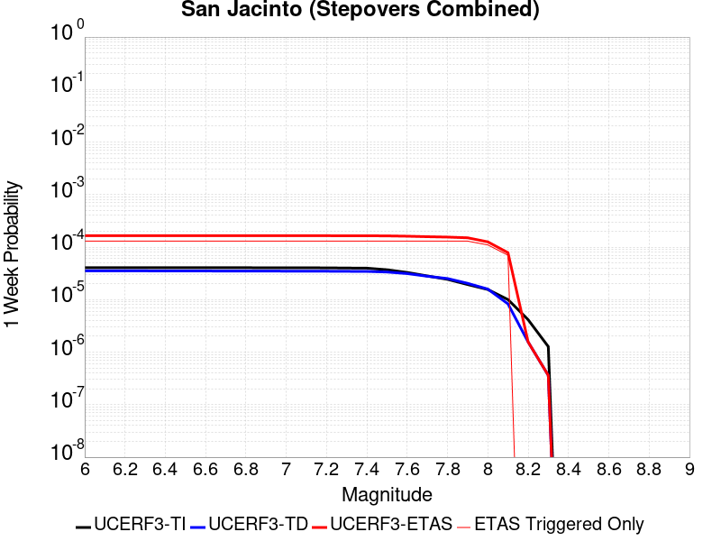 |  |  | 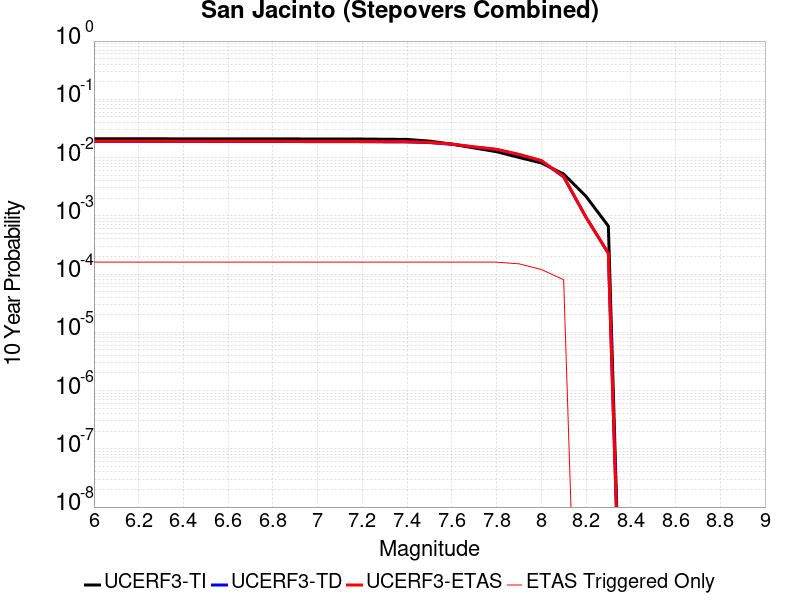 |

| Magnitude | 1 wk TI Prob | 1 wk TD Prob | 1 wk ETAS Prob | 1 wk ETAS/TD Gain | 1 wk ETAS Triggered Only | 1 mo TI Prob | 1 mo TD Prob | 1 mo ETAS Prob | 1 mo ETAS/TD Gain | 1 mo ETAS Triggered Only | 1 yr TI Prob | 1 yr TD Prob | 1 yr ETAS Prob | 1 yr ETAS/TD Gain | 1 yr ETAS Triggered Only | 10 yr TI Prob | 10 yr TD Prob | 10 yr ETAS Prob | 10 yr ETAS/TD Gain | 10 yr ETAS Triggered Only |
|-----|-----|-----|-----|-----|-----|-----|-----|-----|-----|-----|-----|-----|-----|-----|-----|-----|-----|-----|-----|-----|
| 6.0 | 4.0667746E-5 | 3.5272755E-5 | 1.8844022E-4 | 5.342373 | 1.5317286E-4 | 1.742787E-4 | 1.5116022E-4 | 3.043099E-4 | 2.0131617 | 1.5317286E-4 | 0.0021197782 | 0.0018388226 | 0.0020135555 | 1.0950242 | 1.7505471E-4 | 0.020996714 | 0.018986892 | 0.01918009 | 1.0101753 | 1.9693654E-4 |
| 6.1 | 4.0667746E-5 | 3.5272755E-5 | 1.8844022E-4 | 5.342373 | 1.5317286E-4 | 1.742787E-4 | 1.5116022E-4 | 3.043099E-4 | 2.0131617 | 1.5317286E-4 | 0.0021197782 | 0.0018388226 | 0.0020135555 | 1.0950242 | 1.7505471E-4 | 0.020996714 | 0.018986892 | 0.01918009 | 1.0101753 | 1.9693654E-4 |
| 6.2 | 4.0667746E-5 | 3.5272755E-5 | 1.8844022E-4 | 5.342373 | 1.5317286E-4 | 1.742787E-4 | 1.5116022E-4 | 3.043099E-4 | 2.0131617 | 1.5317286E-4 | 0.0021197782 | 0.0018388226 | 0.0020135555 | 1.0950242 | 1.7505471E-4 | 0.020996714 | 0.018986892 | 0.01918009 | 1.0101753 | 1.9693654E-4 |
| 6.3 | 4.0667746E-5 | 3.5272755E-5 | 1.8844022E-4 | 5.342373 | 1.5317286E-4 | 1.742787E-4 | 1.5116022E-4 | 3.043099E-4 | 2.0131617 | 1.5317286E-4 | 0.0021197782 | 0.0018388226 | 0.0020135555 | 1.0950242 | 1.7505471E-4 | 0.020996714 | 0.018986892 | 0.01918009 | 1.0101753 | 1.9693654E-4 |
| 6.4 | 4.0577226E-5 | 3.5144654E-5 | 1.8831214E-4 | 5.3582015 | 1.5317286E-4 | 1.738908E-4 | 1.5061127E-4 | 3.0376107E-4 | 2.0168548 | 1.5317286E-4 | 0.0021150648 | 0.0018321523 | 0.0020068863 | 1.0953709 | 1.7505471E-4 | 0.020950472 | 0.018921461 | 0.019114671 | 1.0102111 | 1.9693654E-4 |
| 6.5 | 4.0577226E-5 | 3.5144654E-5 | 1.8831214E-4 | 5.3582015 | 1.5317286E-4 | 1.738908E-4 | 1.5061127E-4 | 3.0376107E-4 | 2.0168548 | 1.5317286E-4 | 0.0021150648 | 0.0018321523 | 0.0020068863 | 1.0953709 | 1.7505471E-4 | 0.020950472 | 0.018921461 | 0.019114671 | 1.0102111 | 1.9693654E-4 |
| 6.6 | 4.053861E-5 | 3.509E-5 | 1.8825749E-4 | 5.3649898 | 1.5317286E-4 | 1.7372532E-4 | 1.5037706E-4 | 3.035269E-4 | 2.0184388 | 1.5317286E-4 | 0.0021130538 | 0.0018293057 | 0.0020040402 | 1.0955195 | 1.7505471E-4 | 0.020930743 | 0.018893538 | 0.019086754 | 1.0102266 | 1.9693654E-4 |
| 6.7 | 4.0516545E-5 | 3.5059067E-5 | 1.8822656E-4 | 5.368841 | 1.5317286E-4 | 1.7363077E-4 | 1.5024451E-4 | 3.0339436E-4 | 2.0193374 | 1.5317286E-4 | 0.002111905 | 0.001827695 | 0.0020024297 | 1.095604 | 1.7505471E-4 | 0.020919468 | 0.018877735 | 0.019070953 | 1.0102353 | 1.9693654E-4 |
| 6.8 | 4.049434E-5 | 3.5030633E-5 | 1.8819813E-4 | 5.372388 | 1.5317286E-4 | 1.7353562E-4 | 1.5012265E-4 | 3.0327254E-4 | 2.020165 | 1.5317286E-4 | 0.0021107488 | 0.0018262138 | 0.0020009489 | 1.0956815 | 1.7505471E-4 | 0.020908125 | 0.018863149 | 0.01905637 | 1.0102433 | 1.9693654E-4 |
| 6.9 | 4.046386E-5 | 3.499319E-5 | 1.881607E-4 | 5.377066 | 1.5317286E-4 | 1.73405E-4 | 1.4996222E-4 | 3.0311212E-4 | 2.0212564 | 1.5317286E-4 | 0.0021091616 | 0.0018242638 | 0.0019989992 | 1.0957841 | 1.7505471E-4 | 0.020892553 | 0.01884392 | 0.019037146 | 1.010254 | 1.9693654E-4 |
| 7.0 | 4.036382E-5 | 3.487376E-5 | 1.8804129E-4 | 5.392057 | 1.5317286E-4 | 1.7297632E-4 | 1.4945042E-4 | 3.0260038E-4 | 2.0247543 | 1.5317286E-4 | 0.0021039525 | 0.0018180435 | 0.00199278 | 1.0961124 | 1.7505471E-4 | 0.02084144 | 0.018782536 | 0.018975774 | 1.0102881 | 1.9693654E-4 |
| 7.1 | 4.0343282E-5 | 3.4852223E-5 | 1.8801975E-4 | 5.394771 | 1.5317286E-4 | 1.7288832E-4 | 1.4935812E-4 | 3.0250812E-4 | 2.0253878 | 1.5317286E-4 | 0.002102883 | 0.0018169218 | 0.0019916585 | 1.0961719 | 1.7505471E-4 | 0.020830948 | 0.018771412 | 0.018964652 | 1.0102943 | 1.9693654E-4 |
| 7.2 | 4.0257353E-5 | 3.4756722E-5 | 1.8792426E-4 | 5.4068465 | 1.5317286E-4 | 1.725201E-4 | 1.489489E-4 | 3.0209895E-4 | 2.0282054 | 1.5317286E-4 | 0.0020984085 | 0.0018119477 | 0.0019866852 | 1.0964363 | 1.7505471E-4 | 0.020787042 | 0.018722152 | 0.018915402 | 1.010322 | 1.9693654E-4 |
| 7.3 | 3.9940667E-5 | 3.4584376E-5 | 1.8775195E-4 | 5.428808 | 1.5317286E-4 | 1.7116306E-4 | 1.4821035E-4 | 3.0136053E-4 | 2.0333297 | 1.5317286E-4 | 0.0020819185 | 0.0018029709 | 0.00197771 | 1.0969173 | 1.7505471E-4 | 0.020625217 | 0.018630784 | 0.018824052 | 1.0103736 | 1.9693654E-4 |
| 7.4 | 3.9721202E-5 | 3.4469766E-5 | 1.8763736E-4 | 5.4435344 | 1.5317286E-4 | 1.7022261E-4 | 1.4771923E-4 | 3.0086946E-4 | 2.0367658 | 1.5317286E-4 | 0.0020704903 | 0.0017970012 | 0.0019717414 | 1.0972399 | 1.7505471E-4 | 0.020513052 | 0.018569905 | 0.018763186 | 1.0104082 | 1.9693654E-4 |
| 7.5 | 3.7036873E-5 | 3.3537188E-5 | 1.8670491E-4 | 5.5671015 | 1.5317286E-4 | 1.5871979E-4 | 1.437229E-4 | 2.9687374E-4 | 2.0655982 | 1.5317286E-4 | 0.0019307006 | 0.0017484248 | 0.0019231734 | 1.0999464 | 1.7505471E-4 | 0.019140124 | 0.018071463 | 0.018264841 | 1.0107007 | 1.9693654E-4 |
| 7.6 | 3.2940967E-5 | 3.1317984E-5 | 1.8448605E-4 | 5.890738 | 1.5317286E-4 | 1.4116794E-4 | 1.3421304E-4 | 2.8736534E-4 | 2.1411135 | 1.5317286E-4 | 0.0017173645 | 0.0016328214 | 0.0018075902 | 1.1070349 | 1.7505471E-4 | 0.01704153 | 0.016904354 | 0.017097961 | 1.0114532 | 1.9693654E-4 |
| 7.7 | 2.8236149E-5 | 2.7883889E-5 | 1.8105248E-4 | 6.493086 | 1.5317286E-4 | 1.2100645E-4 | 1.19496915E-4 | 2.7265146E-4 | 2.2816613 | 1.5317286E-4 | 0.0014722579 | 0.001453905 | 0.0016287052 | 1.120228 | 1.7505471E-4 | 0.014625421 | 0.015115095 | 0.015309055 | 1.0128322 | 1.9693654E-4 |
| 7.8 | 2.4329287E-5 | 2.5207537E-5 | 1.7837655E-4 | 7.076318 | 1.5317286E-4 | 1.042642E-4 | 1.0802783E-4 | 2.6118415E-4 | 2.4177487 | 1.5317286E-4 | 0.0012686774 | 0.0013144462 | 0.0014892707 | 1.1330025 | 1.7505471E-4 | 0.012614589 | 0.013712396 | 0.013906632 | 1.014165 | 1.9693654E-4 |
| 7.9 | 1.9370926E-5 | 2.0421452E-5 | 1.735912E-4 | 8.500433 | 1.5317286E-4 | 8.301561E-5 | 8.7517576E-5 | 2.4067704E-4 | 2.7500424 | 1.5317286E-4 | 0.0010102465 | 0.0010650064 | 0.0012398746 | 1.1641946 | 1.7505471E-4 | 0.0100566605 | 0.011199483 | 0.011394213 | 1.0173875 | 1.9693654E-4 |
| 8.0 | 1.5583017E-5 | 1.588647E-5 | 1.4717541E-4 | 9.264199 | 1.3129103E-4 | 6.6782646E-5 | 6.808309E-5 | 1.9936518E-4 | 2.9282627 | 1.3129103E-4 | 8.127754E-4 | 8.285971E-4 | 9.5977937E-4 | 1.1583185 | 1.3129103E-4 | 0.008098091 | 0.008781809 | 0.008933637 | 1.0172889 | 1.5317286E-4 |
| 8.1 | 1.0024873E-5 | 8.292404E-6 | 9.581903E-5 | 11.555037 | 8.7527354E-5 | 4.2963035E-5 | 3.5538393E-5 | 1.2306264E-4 | 3.4628081 | 8.7527354E-5 | 5.229494E-4 | 4.3259456E-4 | 5.2008405E-4 | 1.2022436 | 8.7527354E-5 | 0.0052172043 | 0.0046534105 | 0.0047623105 | 1.0234022 | 1.0940919E-4 |
| 8.2 | 4.142796E-6 | 1.5610041E-6 | 1.5610041E-6 | 1.0 | 0.0 | 1.775472E-5 | 6.69E-6 | 6.69E-6 | 1.0 | 0.0 | 2.1614227E-4 | 8.144774E-5 | 8.144774E-5 | 1.0 | 0.0 | 0.0021593217 | 9.454649E-4 | 9.454649E-4 | 1.0 | 0.0 |
| 8.3 | 1.2750878E-6 | 3.612133E-7 | 3.612133E-7 | 1.0 | 0.0 | 5.4646503E-6 | 1.548056E-6 | 1.548056E-6 | 1.0 | 0.0 | 6.653009E-5 | 1.8847424E-5 | 1.8847424E-5 | 1.0 | 0.0 | 6.6510175E-4 | 2.2734253E-4 | 2.2734253E-4 | 1.0 | 0.0 |

## Coyote Lake
*[(top)](#table-of-contents)*

| 1 Week | 1 Month | 1 Year | 10 Year |
|-----|-----|-----|-----|
|  |  |  |  |

| Magnitude | 1 wk TI Prob | 1 wk TD Prob | 1 wk ETAS Prob | 1 wk ETAS/TD Gain | 1 wk ETAS Triggered Only | 1 mo TI Prob | 1 mo TD Prob | 1 mo ETAS Prob | 1 mo ETAS/TD Gain | 1 mo ETAS Triggered Only | 1 yr TI Prob | 1 yr TD Prob | 1 yr ETAS Prob | 1 yr ETAS/TD Gain | 1 yr ETAS Triggered Only | 10 yr TI Prob | 10 yr TD Prob | 10 yr ETAS Prob | 10 yr ETAS/TD Gain | 10 yr ETAS Triggered Only |
|-----|-----|-----|-----|-----|-----|-----|-----|-----|-----|-----|-----|-----|-----|-----|-----|-----|-----|-----|-----|-----|
| 6.0 | 1.980352E-5 | 2.1706745E-5 | 1.5299492E-4 | 7.0482664 | 1.3129103E-4 | 8.486947E-5 | 9.302599E-5 | 2.4618462E-4 | 2.6464067 | 1.5317286E-4 | 0.0010327959 | 0.0011320751 | 0.0013287887 | 1.1737638 | 1.9693654E-4 | 0.010280091 | 0.011270258 | 0.011464975 | 1.0172771 | 1.9693654E-4 |
| 6.1 | 1.980352E-5 | 2.1706745E-5 | 1.5299492E-4 | 7.0482664 | 1.3129103E-4 | 8.486947E-5 | 9.302599E-5 | 2.4618462E-4 | 2.6464067 | 1.5317286E-4 | 0.0010327959 | 0.0011320751 | 0.0013287887 | 1.1737638 | 1.9693654E-4 | 0.010280091 | 0.011270258 | 0.011464975 | 1.0172771 | 1.9693654E-4 |
| 6.2 | 1.980352E-5 | 2.1706745E-5 | 1.5299492E-4 | 7.0482664 | 1.3129103E-4 | 8.486947E-5 | 9.302599E-5 | 2.4618462E-4 | 2.6464067 | 1.5317286E-4 | 0.0010327959 | 0.0011320751 | 0.0013287887 | 1.1737638 | 1.9693654E-4 | 0.010280091 | 0.011270258 | 0.011464975 | 1.0172771 | 1.9693654E-4 |
| 6.3 | 1.5344787E-5 | 1.682067E-5 | 1.2622801E-4 | 7.5043397 | 1.0940919E-4 | 6.576172E-5 | 7.2086936E-5 | 2.033685E-4 | 2.821156 | 1.3129103E-4 | 8.003548E-4 | 8.773662E-4 | 0.0010522674 | 1.1993479 | 1.7505471E-4 | 0.007974784 | 0.00874507 | 0.008918593 | 1.0198425 | 1.7505471E-4 |
| 6.4 | 1.5344787E-5 | 1.682067E-5 | 1.2622801E-4 | 7.5043397 | 1.0940919E-4 | 6.576172E-5 | 7.2086936E-5 | 2.033685E-4 | 2.821156 | 1.3129103E-4 | 8.003548E-4 | 8.773662E-4 | 0.0010522674 | 1.1993479 | 1.7505471E-4 | 0.007974784 | 0.00874507 | 0.008918593 | 1.0198425 | 1.7505471E-4 |
| 6.5 | 1.4189697E-5 | 1.5557987E-5 | 1.0308398E-4 | 6.6257915 | 8.7527354E-5 | 6.081157E-5 | 6.6675726E-5 | 1.7607762E-4 | 2.6408055 | 1.0940919E-4 | 7.401293E-4 | 8.115349E-4 | 9.645834E-4 | 1.1885915 | 1.5317286E-4 | 0.0073766913 | 0.008091656 | 0.00824359 | 1.0187765 | 1.5317286E-4 |
| 6.6 | 1.3469301E-5 | 1.4771577E-5 | 1.02297636E-4 | 6.925302 | 8.7527354E-5 | 5.7724297E-5 | 6.330556E-5 | 1.7270782E-4 | 2.728162 | 1.0940919E-4 | 7.025667E-4 | 7.7053264E-4 | 9.235875E-4 | 1.1986351 | 1.5317286E-4 | 0.0070034964 | 0.0076845144 | 0.00783651 | 1.0197794 | 1.5317286E-4 |
| 6.7 | 1.3027966E-5 | 1.4281745E-5 | 1.0180785E-4 | 7.12853 | 8.7527354E-5 | 5.5832945E-5 | 6.120638E-5 | 1.7060888E-4 | 2.787436 | 1.0940919E-4 | 6.7955407E-4 | 7.4499263E-4 | 8.9805137E-4 | 1.20545 | 1.5317286E-4 | 0.006774798 | 0.0074308286 | 0.0075828633 | 1.02046 | 1.5317286E-4 |
| 6.8 | 5.695434E-6 | 6.2244176E-6 | 4.9987822E-5 | 8.030923 | 4.3763677E-5 | 2.4408775E-5 | 2.6675973E-5 | 7.043848E-5 | 2.6405215 | 4.3763677E-5 | 2.971363E-4 | 3.2476155E-4 | 4.1226047E-4 | 1.2694252 | 8.7527354E-5 | 0.0029673933 | 0.0032458105 | 0.0033330538 | 1.0268787 | 8.7527354E-5 |
| 6.9 | 4.385688E-6 | 4.7930553E-6 | 4.7930553E-6 | 1.0 | 0.0 | 1.879567E-5 | 2.0541665E-5 | 2.0541665E-5 | 1.0 | 0.0 | 2.2881327E-4 | 2.5009477E-4 | 2.9384752E-4 | 1.1749446 | 4.3763677E-5 | 0.002285778 | 0.0025009478 | 0.0025446021 | 1.0174551 | 4.3763677E-5 |

## San Andreas (Carrizo) rev
*[(top)](#table-of-contents)*

| 1 Week | 1 Month | 1 Year | 10 Year |
|-----|-----|-----|-----|
|  |  |  | 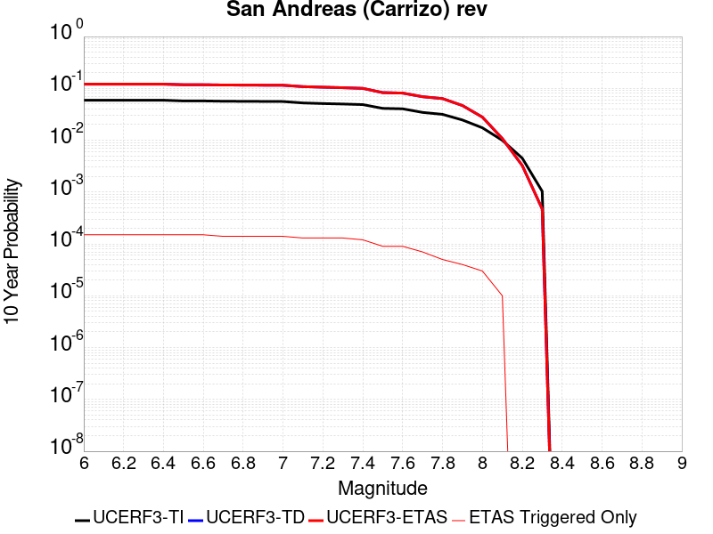 |

| Magnitude | 1 wk TI Prob | 1 wk TD Prob | 1 wk ETAS Prob | 1 wk ETAS/TD Gain | 1 wk ETAS Triggered Only | 1 mo TI Prob | 1 mo TD Prob | 1 mo ETAS Prob | 1 mo ETAS/TD Gain | 1 mo ETAS Triggered Only | 1 yr TI Prob | 1 yr TD Prob | 1 yr ETAS Prob | 1 yr ETAS/TD Gain | 1 yr ETAS Triggered Only | 10 yr TI Prob | 10 yr TD Prob | 10 yr ETAS Prob | 10 yr ETAS/TD Gain | 10 yr ETAS Triggered Only |
|-----|-----|-----|-----|-----|-----|-----|-----|-----|-----|-----|-----|-----|-----|-----|-----|-----|-----|-----|-----|-----|
| 6.0 | 1.1674632E-4 | 2.432302E-4 | 3.9636582E-4 | 1.6295912 | 1.5317286E-4 | 5.002454E-4 | 0.0010420004 | 0.0012168726 | 1.1678237 | 1.7505471E-4 | 0.006073493 | 0.012613042 | 0.012785889 | 1.0137038 | 1.7505471E-4 | 0.0591016 | 0.12061418 | 0.12078736 | 1.0014359 | 1.9693654E-4 |
| 6.1 | 1.1674632E-4 | 2.432302E-4 | 3.9636582E-4 | 1.6295912 | 1.5317286E-4 | 5.002454E-4 | 0.0010420004 | 0.0012168726 | 1.1678237 | 1.7505471E-4 | 0.006073493 | 0.012613042 | 0.012785889 | 1.0137038 | 1.7505471E-4 | 0.0591016 | 0.12061418 | 0.12078736 | 1.0014359 | 1.9693654E-4 |
| 6.2 | 1.1674632E-4 | 2.432302E-4 | 3.9636582E-4 | 1.6295912 | 1.5317286E-4 | 5.002454E-4 | 0.0010420004 | 0.0012168726 | 1.1678237 | 1.7505471E-4 | 0.006073493 | 0.012613042 | 0.012785889 | 1.0137038 | 1.7505471E-4 | 0.0591016 | 0.12061418 | 0.12078736 | 1.0014359 | 1.9693654E-4 |
| 6.3 | 1.1674632E-4 | 2.432302E-4 | 3.9636582E-4 | 1.6295912 | 1.5317286E-4 | 5.002454E-4 | 0.0010420004 | 0.0012168726 | 1.1678237 | 1.7505471E-4 | 0.006073493 | 0.012613042 | 0.012785889 | 1.0137038 | 1.7505471E-4 | 0.0591016 | 0.12061418 | 0.12078736 | 1.0014359 | 1.9693654E-4 |
| 6.4 | 1.1674632E-4 | 2.432302E-4 | 3.9636582E-4 | 1.6295912 | 1.5317286E-4 | 5.002454E-4 | 0.0010420004 | 0.0012168726 | 1.1678237 | 1.7505471E-4 | 0.006073493 | 0.012613042 | 0.012785889 | 1.0137038 | 1.7505471E-4 | 0.0591016 | 0.12061418 | 0.12078736 | 1.0014359 | 1.9693654E-4 |
| 6.5 | 1.13136164E-4 | 2.3643032E-4 | 3.8956697E-4 | 1.647703 | 1.5317286E-4 | 4.847792E-4 | 0.0010128808 | 0.0011877583 | 1.1726534 | 1.7505471E-4 | 0.0058862255 | 0.012262545 | 0.012435452 | 1.0141006 | 1.7505471E-4 | 0.057327334 | 0.117585555 | 0.11775933 | 1.001478 | 1.9693654E-4 |
| 6.6 | 1.13136164E-4 | 2.3643032E-4 | 3.8956697E-4 | 1.647703 | 1.5317286E-4 | 4.847792E-4 | 0.0010128808 | 0.0011877583 | 1.1726534 | 1.7505471E-4 | 0.0058862255 | 0.012262545 | 0.012435452 | 1.0141006 | 1.7505471E-4 | 0.057327334 | 0.117585555 | 0.11775933 | 1.001478 | 1.9693654E-4 |
| 6.7 | 1.1149675E-4 | 2.3334254E-4 | 3.6460292E-4 | 1.5625223 | 1.3129103E-4 | 4.777557E-4 | 9.996577E-4 | 0.0011526775 | 1.1530721 | 1.5317286E-4 | 0.0058011734 | 0.012103349 | 0.012254668 | 1.0125022 | 1.5317286E-4 | 0.05652051 | 0.1162071 | 0.11636181 | 1.0013313 | 1.7505471E-4 |
| 6.8 | 1.1103589E-4 | 2.3236412E-4 | 3.6362465E-4 | 1.5648915 | 1.3129103E-4 | 4.7578133E-4 | 9.954676E-4 | 0.001148488 | 1.153717 | 1.5317286E-4 | 0.005777263 | 0.012052901 | 0.012204228 | 1.0125552 | 1.5317286E-4 | 0.056293584 | 0.1157674 | 0.11592219 | 1.001337 | 1.7505471E-4 |
| 6.9 | 1.1053259E-4 | 2.3128795E-4 | 3.6254863E-4 | 1.5675205 | 1.3129103E-4 | 4.7362508E-4 | 9.90859E-4 | 0.0011438801 | 1.1544328 | 1.5317286E-4 | 0.0057511497 | 0.01199741 | 0.012148745 | 1.012614 | 1.5317286E-4 | 0.05604569 | 0.11528359 | 0.11543847 | 1.0013434 | 1.7505471E-4 |
| 7.0 | 1.1005377E-4 | 2.3029637E-4 | 3.6155718E-4 | 1.5699646 | 1.3129103E-4 | 4.7157376E-4 | 9.866126E-4 | 0.0011396344 | 1.1550981 | 1.5317286E-4 | 0.0057263062 | 0.011946279 | 0.012097621 | 1.0126686 | 1.5317286E-4 | 0.055809796 | 0.11483591 | 0.11499086 | 1.0013493 | 1.7505471E-4 |
| 7.1 | 1.0308142E-4 | 2.1539345E-4 | 3.466562E-4 | 1.6094092 | 1.3129103E-4 | 4.417027E-4 | 9.227892E-4 | 0.0010758208 | 1.1658359 | 1.5317286E-4 | 0.0053644776 | 0.011177397 | 0.011328858 | 1.0135506 | 1.5317286E-4 | 0.052368138 | 0.108092256 | 0.10824839 | 1.0014445 | 1.7505471E-4 |
| 7.2 | 1.0027479E-4 | 2.094724E-4 | 3.4073595E-4 | 1.6266388 | 1.3129103E-4 | 4.296783E-4 | 8.9743105E-4 | 0.0010504664 | 1.1705261 | 1.5317286E-4 | 0.0052187922 | 0.010871782 | 0.0110232895 | 1.0139358 | 1.5317286E-4 | 0.050979212 | 0.10539625 | 0.10555285 | 1.0014858 | 1.7505471E-4 |
| 7.3 | 9.816942E-5 | 2.0422463E-4 | 3.3548885E-4 | 1.6427443 | 1.3129103E-4 | 4.2065824E-4 | 8.7495585E-4 | 0.0010279947 | 1.1749103 | 1.5317286E-4 | 0.005109493 | 0.010600842 | 0.010752391 | 1.0142959 | 1.5317286E-4 | 0.049935985 | 0.102979995 | 0.103137024 | 1.0015248 | 1.7505471E-4 |
| 7.4 | 9.5634205E-5 | 1.9791997E-4 | 3.073075E-4 | 1.5526857 | 1.0940919E-4 | 4.0979648E-4 | 8.479536E-4 | 9.791333E-4 | 1.1547015 | 1.3129103E-4 | 0.0049778637 | 0.010275229 | 0.010405171 | 1.0126462 | 1.3129103E-4 | 0.048678253 | 0.10006632 | 0.10020416 | 1.0013776 | 1.5317286E-4 |
| 7.5 | 8.052417E-5 | 1.611261E-4 | 2.7051766E-4 | 1.678919 | 1.0940919E-4 | 3.4505792E-4 | 6.903579E-4 | 8.2155823E-4 | 1.1900469 | 1.3129103E-4 | 0.0041929903 | 0.008372796 | 0.008502987 | 1.0155494 | 1.3129103E-4 | 0.04114753 | 0.08281049 | 0.08295098 | 1.0016965 | 1.5317286E-4 |
| 7.6 | 7.897024E-5 | 1.5765853E-4 | 2.6705046E-4 | 1.6938536 | 1.0940919E-4 | 3.384E-4 | 6.755046E-4 | 8.0670696E-4 | 1.1942286 | 1.3129103E-4 | 0.0041122385 | 0.008193332 | 0.008323547 | 1.0158929 | 1.3129103E-4 | 0.040369697 | 0.08115171 | 0.08129245 | 1.0017343 | 1.5317286E-4 |
| 7.7 | 6.707427E-5 | 1.3276102E-4 | 2.421557E-4 | 1.8239968 | 1.0940919E-4 | 2.8742946E-4 | 5.688518E-4 | 6.7819876E-4 | 1.192224 | 1.0940919E-4 | 0.003493839 | 0.00690381 | 0.007012464 | 1.0157382 | 1.0940919E-4 | 0.034394164 | 0.069048055 | 0.06917028 | 1.0017701 | 1.3129103E-4 |
| 7.8 | 6.147705E-5 | 1.2197486E-4 | 2.3137071E-4 | 1.896872 | 1.0940919E-4 | 2.6344648E-4 | 5.226447E-4 | 6.319967E-4 | 1.2092282 | 1.0940919E-4 | 0.0032027436 | 0.006344659 | 0.006453374 | 1.0171349 | 1.0940919E-4 | 0.031569764 | 0.06351457 | 0.06361702 | 1.0016131 | 1.0940919E-4 |
| 7.9 | 4.7636717E-5 | 8.87977E-5 | 1.7631728E-4 | 1.9856064 | 8.7527354E-5 | 2.0414138E-4 | 3.8050607E-4 | 4.6800013E-4 | 1.2299412 | 8.7527354E-5 | 0.0024825884 | 0.0046228287 | 0.0047099516 | 1.0188462 | 8.7527354E-5 | 0.024550365 | 0.046628095 | 0.046711538 | 1.0017896 | 8.7527354E-5 |
| 8.0 | 3.3554235E-5 | 5.2136907E-5 | 1.17779E-4 | 2.259033 | 6.5645516E-5 | 1.4379594E-4 | 2.2342477E-4 | 2.890556E-4 | 1.2937492 | 6.5645516E-5 | 0.0017493097 | 0.002716805 | 0.0027822722 | 1.0240971 | 6.5645516E-5 | 0.017356034 | 0.027880952 | 0.027944768 | 1.0022888 | 6.5645516E-5 |
| 8.1 | 1.9175432E-5 | 1.9184976E-5 | 4.1066392E-5 | 2.1405497 | 2.1881839E-5 | 8.217783E-5 | 8.2218736E-5 | 1.0409878E-4 | 1.2661198 | 2.1881839E-5 | 0.0010000558 | 0.0010005541 | 0.001022414 | 1.0218478 | 2.1881839E-5 | 0.009955673 | 0.0107580265 | 0.010779673 | 1.0020121 | 2.1881839E-5 |
| 8.2 | 8.643924E-6 | 5.4748625E-6 | 5.4748625E-6 | 1.0 | 0.0 | 3.704486E-5 | 2.3463486E-5 | 2.3463486E-5 | 1.0 | 0.0 | 4.5092785E-4 | 2.8563058E-4 | 2.8563058E-4 | 1.0 | 0.0 | 0.0045001395 | 0.0032487072 | 0.0032487072 | 1.0 | 0.0 |
| 8.3 | 1.983087E-6 | 7.6599065E-7 | 7.6599065E-7 | 1.0 | 0.0 | 8.498917E-6 | 3.282813E-6 | 3.282813E-6 | 1.0 | 0.0 | 1.034694E-4 | 3.9967534E-5 | 3.9967534E-5 | 1.0 | 0.0 | 0.0010342124 | 4.719687E-4 | 4.719687E-4 | 1.0 | 0.0 |

## Lake Isabella (Seismicity)
*[(top)](#table-of-contents)*

| 1 Week | 1 Month | 1 Year | 10 Year |
|-----|-----|-----|-----|
| 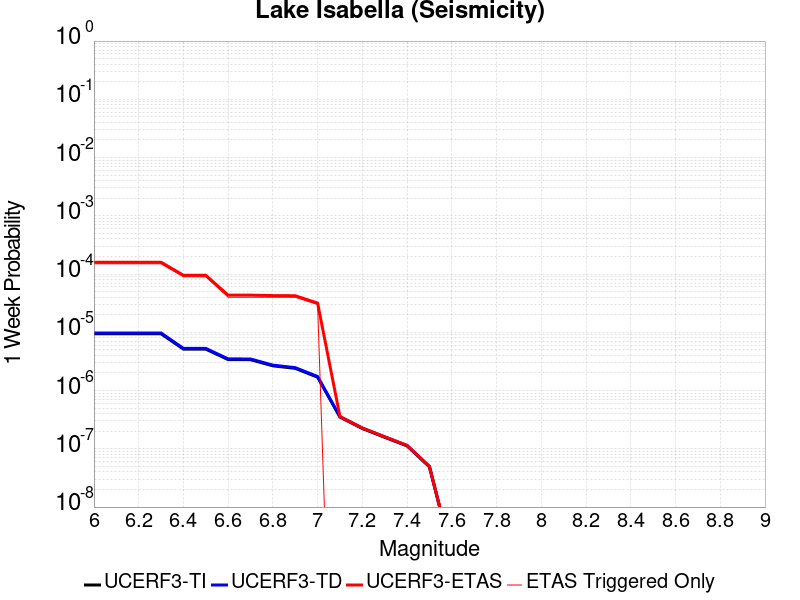 |  |  |  |

| Magnitude | 1 wk TI Prob | 1 wk TD Prob | 1 wk ETAS Prob | 1 wk ETAS/TD Gain | 1 wk ETAS Triggered Only | 1 mo TI Prob | 1 mo TD Prob | 1 mo ETAS Prob | 1 mo ETAS/TD Gain | 1 mo ETAS Triggered Only | 1 yr TI Prob | 1 yr TD Prob | 1 yr ETAS Prob | 1 yr ETAS/TD Gain | 1 yr ETAS Triggered Only | 10 yr TI Prob | 10 yr TD Prob | 10 yr ETAS Prob | 10 yr ETAS/TD Gain | 10 yr ETAS Triggered Only |
|-----|-----|-----|-----|-----|-----|-----|-----|-----|-----|-----|-----|-----|-----|-----|-----|-----|-----|-----|-----|-----|
| 6.0 | 9.431637E-6 | 9.741651E-6 | 1.1914978E-4 | 12.230963 | 1.0940919E-4 | 4.0420677E-5 | 4.1749343E-5 | 1.9491582E-4 | 4.668716 | 1.5317286E-4 | 4.920106E-4 | 5.0819275E-4 | 6.831585E-4 | 1.3442901 | 1.7505471E-4 | 0.004909227 | 0.005071599 | 0.0052675367 | 1.0386343 | 1.9693654E-4 |
| 6.1 | 9.431637E-6 | 9.741651E-6 | 1.1914978E-4 | 12.230963 | 1.0940919E-4 | 4.0420677E-5 | 4.1749343E-5 | 1.9491582E-4 | 4.668716 | 1.5317286E-4 | 4.920106E-4 | 5.0819275E-4 | 6.831585E-4 | 1.3442901 | 1.7505471E-4 | 0.004909227 | 0.005071599 | 0.0052675367 | 1.0386343 | 1.9693654E-4 |
| 6.2 | 9.431637E-6 | 9.741651E-6 | 1.1914978E-4 | 12.230963 | 1.0940919E-4 | 4.0420677E-5 | 4.1749343E-5 | 1.9491582E-4 | 4.668716 | 1.5317286E-4 | 4.920106E-4 | 5.0819275E-4 | 6.831585E-4 | 1.3442901 | 1.7505471E-4 | 0.004909227 | 0.005071599 | 0.0052675367 | 1.0386343 | 1.9693654E-4 |
| 6.3 | 9.431637E-6 | 9.741651E-6 | 1.1914978E-4 | 12.230963 | 1.0940919E-4 | 4.0420677E-5 | 4.1749343E-5 | 1.9491582E-4 | 4.668716 | 1.5317286E-4 | 4.920106E-4 | 5.0819275E-4 | 6.831585E-4 | 1.3442901 | 1.7505471E-4 | 0.004909227 | 0.005071599 | 0.0052675367 | 1.0386343 | 1.9693654E-4 |
| 6.4 | 5.144063E-6 | 5.3000763E-6 | 4.906352E-5 | 9.257135 | 4.3763677E-5 | 2.2045799E-5 | 2.2714434E-5 | 6.6477114E-5 | 2.9266465 | 4.3763677E-5 | 2.6837454E-4 | 2.765166E-4 | 3.2026815E-4 | 1.1582241 | 4.3763677E-5 | 0.0026805066 | 0.0027620657 | 0.0028057084 | 1.0158008 | 4.3763677E-5 |
| 6.5 | 5.144063E-6 | 5.3000763E-6 | 4.906352E-5 | 9.257135 | 4.3763677E-5 | 2.2045799E-5 | 2.2714434E-5 | 6.6477114E-5 | 2.9266465 | 4.3763677E-5 | 2.6837454E-4 | 2.765166E-4 | 3.2026815E-4 | 1.1582241 | 4.3763677E-5 | 0.0026805066 | 0.0027620657 | 0.0028057084 | 1.0158008 | 4.3763677E-5 |
| 6.6 | 3.4009804E-6 | 3.498786E-6 | 3.498786E-6 | 1.0 | 0.0 | 1.4575549E-5 | 1.4994721E-5 | 1.4994721E-5 | 1.0 | 0.0 | 1.7744285E-4 | 1.8254704E-4 | 1.8254704E-4 | 1.0 | 0.0 | 0.0017730123 | 0.0018241286 | 0.0018241286 | 1.0 | 0.0 |
| 6.7 | 3.3880428E-6 | 3.4856528E-6 | 3.4856528E-6 | 1.0 | 0.0 | 1.4520103E-5 | 1.4938435E-5 | 1.4938435E-5 | 1.0 | 0.0 | 1.767679E-4 | 1.8186188E-4 | 1.8186188E-4 | 1.0 | 0.0 | 0.0017662736 | 0.0018172882 | 0.0018172882 | 1.0 | 0.0 |
| 6.8 | 2.6582E-6 | 2.7337003E-6 | 2.7337003E-6 | 1.0 | 0.0 | 1.1392236E-5 | 1.1715813E-5 | 1.1715813E-5 | 1.0 | 0.0 | 1.3869164E-4 | 1.4263204E-4 | 1.4263204E-4 | 1.0 | 0.0 | 0.0013860512 | 0.0014255369 | 0.0014255369 | 1.0 | 0.0 |
| 6.9 | 2.406011E-6 | 2.4743288E-6 | 2.4743288E-6 | 1.0 | 0.0 | 1.0311434E-5 | 1.0604231E-5 | 1.0604231E-5 | 1.0 | 0.0 | 1.2553448E-4 | 1.2910018E-4 | 1.2910018E-4 | 1.0 | 0.0 | 0.0012546359 | 0.0012903814 | 0.0012903814 | 1.0 | 0.0 |
| 7.0 | 1.6953097E-6 | 1.7429371E-6 | 1.7429371E-6 | 1.0 | 0.0 | 7.265593E-6 | 7.469715E-6 | 7.469715E-6 | 1.0 | 0.0 | 8.8455E-5 | 9.094104E-5 | 9.094104E-5 | 1.0 | 0.0 | 8.84198E-4 | 9.09141E-4 | 9.09141E-4 | 1.0 | 0.0 |
| 7.1 | 3.5013824E-7 | 3.5714822E-7 | 3.5714822E-7 | 1.0 | 0.0 | 1.5005916E-6 | 1.5306344E-6 | 1.5306344E-6 | 1.0 | 0.0 | 1.826955E-5 | 1.8635317E-5 | 1.8635317E-5 | 1.0 | 0.0 | 1.8268047E-4 | 1.863378E-4 | 1.863378E-4 | 1.0 | 0.0 |
| 7.2 | 2.2321095E-7 | 2.2750574E-7 | 2.2750574E-7 | 1.0 | 0.0 | 9.56618E-7 | 9.750242E-7 | 9.750242E-7 | 1.0 | 0.0 | 1.1646762E-5 | 1.1870856E-5 | 1.1870856E-5 | 1.0 | 0.0 | 1.1646151E-4 | 1.1870232E-4 | 1.1870232E-4 | 1.0 | 0.0 |
| 7.3 | 1.5760406E-7 | 1.6060922E-7 | 1.6060922E-7 | 1.0 | 0.0 | 6.7544585E-7 | 6.8832503E-7 | 6.8832503E-7 | 1.0 | 0.0 | 8.223522E-6 | 8.380326E-6 | 8.380326E-6 | 1.0 | 0.0 | 8.2232174E-5 | 8.3800165E-5 | 8.3800165E-5 | 1.0 | 0.0 |
| 7.4 | 1.1216497E-7 | 1.1431706E-7 | 1.1431706E-7 | 1.0 | 0.0 | 4.8070694E-7 | 4.899302E-7 | 4.899302E-7 | 1.0 | 0.0 | 5.852591E-6 | 5.964884E-6 | 5.964884E-6 | 1.0 | 0.0 | 5.8524372E-5 | 5.9647282E-5 | 5.9647282E-5 | 1.0 | 0.0 |
| 7.5 | 4.885185E-8 | 4.9787737E-8 | 4.9787737E-8 | 1.0 | 0.0 | 2.0936506E-7 | 2.13376E-7 | 2.13376E-7 | 1.0 | 0.0 | 2.5490165E-6 | 2.59785E-6 | 2.59785E-6 | 1.0 | 0.0 | 2.5489873E-5 | 2.5978214E-5 | 2.5978214E-5 | 1.0 | 0.0 |
| 7.6 | 1.504641E-9 | 1.5317903E-9 | 1.5317903E-9 | 1.0 | 0.0 | 6.4484613E-9 | 6.5648154E-9 | 6.5648154E-9 | 1.0 | 0.0 | 7.851001E-8 | 7.992663E-8 | 7.992663E-8 | 1.0 | 0.0 | 7.8509987E-7 | 7.992663E-7 | 7.992663E-7 | 1.0 | 0.0 |

## Cleghorn Lake
*[(top)](#table-of-contents)*

| 1 Week | 1 Month | 1 Year | 10 Year |
|-----|-----|-----|-----|
|  |  |  |  |

| Magnitude | 1 wk TI Prob | 1 wk TD Prob | 1 wk ETAS Prob | 1 wk ETAS/TD Gain | 1 wk ETAS Triggered Only | 1 mo TI Prob | 1 mo TD Prob | 1 mo ETAS Prob | 1 mo ETAS/TD Gain | 1 mo ETAS Triggered Only | 1 yr TI Prob | 1 yr TD Prob | 1 yr ETAS Prob | 1 yr ETAS/TD Gain | 1 yr ETAS Triggered Only | 10 yr TI Prob | 10 yr TD Prob | 10 yr ETAS Prob | 10 yr ETAS/TD Gain | 10 yr ETAS Triggered Only |
|-----|-----|-----|-----|-----|-----|-----|-----|-----|-----|-----|-----|-----|-----|-----|-----|-----|-----|-----|-----|-----|
| 6.0 | 1.5467183E-5 | 1.6794203E-5 | 1.9184597E-4 | 11.423344 | 1.7505471E-4 | 6.6286244E-5 | 7.197348E-5 | 2.470156E-4 | 3.4320362 | 1.7505471E-4 | 8.067362E-4 | 8.759797E-4 | 0.0010727438 | 1.2246217 | 1.9693654E-4 | 0.008038137 | 0.008730696 | 0.008925913 | 1.0223598 | 1.9693654E-4 |
| 6.1 | 1.5467183E-5 | 1.6794203E-5 | 1.9184597E-4 | 11.423344 | 1.7505471E-4 | 6.6286244E-5 | 7.197348E-5 | 2.470156E-4 | 3.4320362 | 1.7505471E-4 | 8.067362E-4 | 8.759797E-4 | 0.0010727438 | 1.2246217 | 1.9693654E-4 | 0.008038137 | 0.008730696 | 0.008925913 | 1.0223598 | 1.9693654E-4 |
| 6.2 | 1.2624631E-5 | 1.3681544E-5 | 1.8873386E-4 | 13.794777 | 1.7505471E-4 | 5.410444E-5 | 5.863415E-5 | 2.3367858E-4 | 3.9853668 | 1.7505471E-4 | 6.585225E-4 | 7.1368564E-4 | 9.104816E-4 | 1.2757461 | 1.9693654E-4 | 0.0065657445 | 0.0071187317 | 0.007314266 | 1.0274676 | 1.9693654E-4 |
| 6.3 | 1.2624631E-5 | 1.3681544E-5 | 1.8873386E-4 | 13.794777 | 1.7505471E-4 | 5.410444E-5 | 5.863415E-5 | 2.3367858E-4 | 3.9853668 | 1.7505471E-4 | 6.585225E-4 | 7.1368564E-4 | 9.104816E-4 | 1.2757461 | 1.9693654E-4 | 0.0065657445 | 0.0071187317 | 0.007314266 | 1.0274676 | 1.9693654E-4 |
| 6.4 | 9.417684E-6 | 1.0170118E-5 | 9.769658E-5 | 9.606239 | 8.7527354E-5 | 4.036088E-5 | 4.3585722E-5 | 1.3110926E-4 | 3.008078 | 8.7527354E-5 | 4.912829E-4 | 5.3056807E-4 | 6.399192E-4 | 1.206102 | 1.0940919E-4 | 0.004901982 | 0.005297049 | 0.0054058786 | 1.0205454 | 1.0940919E-4 |
| 6.5 | 9.368219E-6 | 1.0117545E-5 | 9.764401E-5 | 9.65096 | 8.7527354E-5 | 4.014889E-5 | 4.3360415E-5 | 1.3088397E-4 | 3.018513 | 8.7527354E-5 | 4.8870314E-4 | 5.2782625E-4 | 6.371777E-4 | 1.2071732 | 1.0940919E-4 | 0.004876298 | 0.0052697617 | 0.005378594 | 1.0206523 | 1.0940919E-4 |
| 6.6 | 7.803798E-6 | 8.441831E-6 | 5.2205138E-5 | 6.184101 | 4.3763677E-5 | 3.3444423E-5 | 3.6179E-5 | 7.994109E-5 | 2.2095993 | 4.3763677E-5 | 4.0710976E-4 | 4.4043022E-4 | 5.060468E-4 | 1.148983 | 6.5645516E-5 | 0.0040636472 | 0.0043994905 | 0.004464847 | 1.0148555 | 6.5645516E-5 |
| 6.7 | 2.3108669E-6 | 2.4438336E-6 | 2.4438336E-6 | 1.0 | 0.0 | 9.903678E-6 | 1.0473532E-5 | 1.0473532E-5 | 1.0 | 0.0 | 1.205706E-4 | 1.2750797E-4 | 1.2750797E-4 | 1.0 | 0.0 | 0.001205052 | 0.0012743667 | 0.0012743667 | 1.0 | 0.0 |
| 6.8 | 2.0882828E-6 | 2.2062823E-6 | 2.2062823E-6 | 1.0 | 0.0 | 8.949753E-6 | 9.455462E-6 | 9.455462E-6 | 1.0 | 0.0 | 1.08957785E-4 | 1.1511434E-4 | 1.1511434E-4 | 1.0 | 0.0 | 0.0010890438 | 0.0011505639 | 0.0011505639 | 1.0 | 0.0 |
| 6.9 | 1.876935E-6 | 1.981051E-6 | 1.981051E-6 | 1.0 | 0.0 | 8.043982E-6 | 8.490192E-6 | 8.490192E-6 | 1.0 | 0.0 | 9.7931086E-5 | 1.03363345E-4 | 1.03363345E-4 | 1.0 | 0.0 | 9.788794E-4 | 0.0010331686 | 0.0010331686 | 1.0 | 0.0 |
| 7.0 | 1.5357559E-6 | 1.6202807E-6 | 1.6202807E-6 | 1.0 | 0.0 | 6.5817944E-6 | 6.9440425E-6 | 6.9440425E-6 | 1.0 | 0.0 | 8.01304E-5 | 8.454057E-5 | 8.454057E-5 | 1.0 | 0.0 | 8.010151E-4 | 8.450965E-4 | 8.450965E-4 | 1.0 | 0.0 |
| 7.1 | 1.0905424E-6 | 1.1497619E-6 | 1.1497619E-6 | 1.0 | 0.0 | 4.6737446E-6 | 4.9275427E-6 | 4.9275427E-6 | 1.0 | 0.0 | 5.6901354E-5 | 5.999128E-5 | 5.999128E-5 | 1.0 | 0.0 | 5.6886784E-4 | 5.997606E-4 | 5.997606E-4 | 1.0 | 0.0 |
| 7.2 | 6.06668E-7 | 6.387277E-7 | 6.387277E-7 | 1.0 | 0.0 | 2.600003E-6 | 2.7374022E-6 | 2.7374022E-6 | 1.0 | 0.0 | 3.1654577E-5 | 3.3327433E-5 | 3.3327433E-5 | 1.0 | 0.0 | 3.1650066E-4 | 3.3323118E-4 | 3.3323118E-4 | 1.0 | 0.0 |

## Red Pass
*[(top)](#table-of-contents)*

| 1 Week | 1 Month | 1 Year | 10 Year |
|-----|-----|-----|-----|
|  | 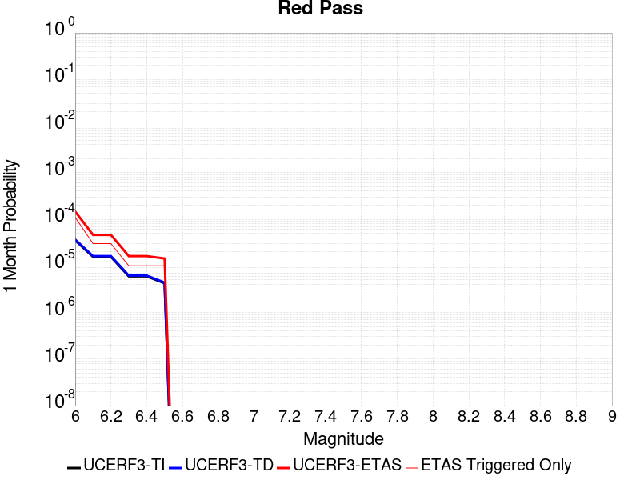 |  |  |

| Magnitude | 1 wk TI Prob | 1 wk TD Prob | 1 wk ETAS Prob | 1 wk ETAS/TD Gain | 1 wk ETAS Triggered Only | 1 mo TI Prob | 1 mo TD Prob | 1 mo ETAS Prob | 1 mo ETAS/TD Gain | 1 mo ETAS Triggered Only | 1 yr TI Prob | 1 yr TD Prob | 1 yr ETAS Prob | 1 yr ETAS/TD Gain | 1 yr ETAS Triggered Only | 10 yr TI Prob | 10 yr TD Prob | 10 yr ETAS Prob | 10 yr ETAS/TD Gain | 10 yr ETAS Triggered Only |
|-----|-----|-----|-----|-----|-----|-----|-----|-----|-----|-----|-----|-----|-----|-----|-----|-----|-----|-----|-----|-----|
| 6.0 | 8.258278E-6 | 8.551265E-6 | 1.3984117E-4 | 16.353273 | 1.3129103E-4 | 3.539214E-5 | 3.6647863E-5 | 1.6793408E-4 | 4.5823703 | 1.3129103E-4 | 4.308141E-4 | 4.4611428E-4 | 5.992188E-4 | 1.3431958 | 1.5317286E-4 | 0.0042997985 | 0.004453945 | 0.004650004 | 1.0440192 | 1.9693654E-4 |
| 6.1 | 3.649988E-6 | 3.7753161E-6 | 6.942058E-5 | 18.388018 | 6.5645516E-5 | 1.5642712E-5 | 1.6179853E-5 | 8.1824306E-5 | 5.0571723 | 6.5645516E-5 | 1.9043336E-4 | 1.9697666E-4 | 2.6260925E-4 | 1.3331997 | 6.5645516E-5 | 0.0019027026 | 0.001968488 | 0.0020776817 | 1.055471 | 1.0940919E-4 |
| 6.2 | 3.649988E-6 | 3.7753161E-6 | 6.942058E-5 | 18.388018 | 6.5645516E-5 | 1.5642712E-5 | 1.6179853E-5 | 8.1824306E-5 | 5.0571723 | 6.5645516E-5 | 1.9043336E-4 | 1.9697666E-4 | 2.6260925E-4 | 1.3331997 | 6.5645516E-5 | 0.0019027026 | 0.001968488 | 0.0020776817 | 1.055471 | 1.0940919E-4 |
| 6.3 | 1.3924937E-6 | 1.4411166E-6 | 2.3322924E-5 | 16.183926 | 2.1881839E-5 | 5.9678164E-6 | 6.1762075E-6 | 2.805791E-5 | 4.542903 | 2.1881839E-5 | 7.265574E-5 | 7.519415E-5 | 9.707434E-5 | 1.2909826 | 2.1881839E-5 | 7.263199E-4 | 7.518258E-4 | 7.7369116E-4 | 1.029083 | 2.1881839E-5 |
| 6.4 | 1.3924937E-6 | 1.4411166E-6 | 2.3322924E-5 | 16.183926 | 2.1881839E-5 | 5.9678164E-6 | 6.1762075E-6 | 2.805791E-5 | 4.542903 | 2.1881839E-5 | 7.265574E-5 | 7.519415E-5 | 9.707434E-5 | 1.2909826 | 2.1881839E-5 | 7.263199E-4 | 7.518258E-4 | 7.7369116E-4 | 1.029083 | 2.1881839E-5 |
| 6.5 | 9.876812E-7 | 1.0221912E-6 | 2.2904007E-5 | 22.406773 | 2.1881839E-5 | 4.2329125E-6 | 4.3808195E-6 | 2.6262562E-5 | 5.994897 | 2.1881839E-5 | 5.153449E-5 | 5.3336476E-5 | 7.521715E-5 | 1.4102384 | 2.1881839E-5 | 5.1522546E-4 | 5.333648E-4 | 5.5523496E-4 | 1.0410042 | 2.1881839E-5 |

## Manix-Afton Hills
*[(top)](#table-of-contents)*

| 1 Week | 1 Month | 1 Year | 10 Year |
|-----|-----|-----|-----|
| 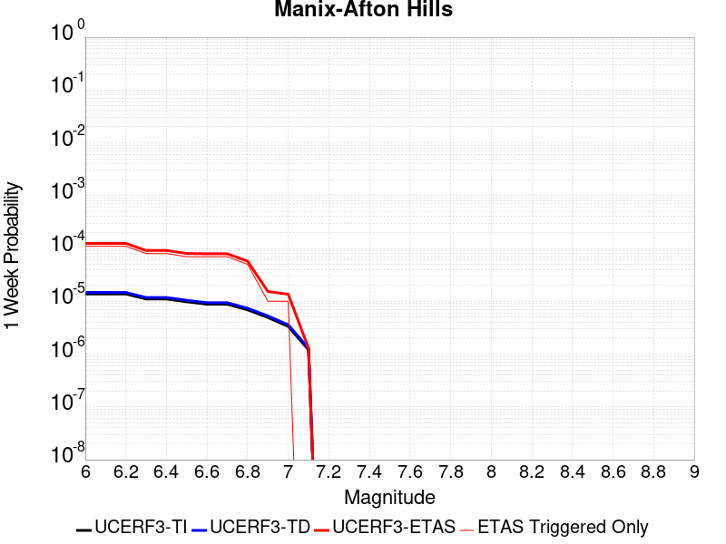 |  |  |  |

| Magnitude | 1 wk TI Prob | 1 wk TD Prob | 1 wk ETAS Prob | 1 wk ETAS/TD Gain | 1 wk ETAS Triggered Only | 1 mo TI Prob | 1 mo TD Prob | 1 mo ETAS Prob | 1 mo ETAS/TD Gain | 1 mo ETAS Triggered Only | 1 yr TI Prob | 1 yr TD Prob | 1 yr ETAS Prob | 1 yr ETAS/TD Gain | 1 yr ETAS Triggered Only | 10 yr TI Prob | 10 yr TD Prob | 10 yr ETAS Prob | 10 yr ETAS/TD Gain | 10 yr ETAS Triggered Only |
|-----|-----|-----|-----|-----|-----|-----|-----|-----|-----|-----|-----|-----|-----|-----|-----|-----|-----|-----|-----|-----|
| 6.0 | 1.3783202E-5 | 1.47110895E-5 | 1.0223716E-4 | 6.9496655 | 8.7527354E-5 | 5.906953E-5 | 6.30461E-5 | 1.724484E-4 | 2.7352746 | 1.0940919E-4 | 7.189342E-4 | 7.6733343E-4 | 9.203888E-4 | 1.199464 | 1.5317286E-4 | 0.0071661277 | 0.007648596 | 0.0078223115 | 1.0227121 | 1.7505471E-4 |
| 6.1 | 1.3783202E-5 | 1.47110895E-5 | 1.0223716E-4 | 6.9496655 | 8.7527354E-5 | 5.906953E-5 | 6.30461E-5 | 1.724484E-4 | 2.7352746 | 1.0940919E-4 | 7.189342E-4 | 7.6733343E-4 | 9.203888E-4 | 1.199464 | 1.5317286E-4 | 0.0071661277 | 0.007648596 | 0.0078223115 | 1.0227121 | 1.7505471E-4 |
| 6.2 | 1.3783202E-5 | 1.47110895E-5 | 1.0223716E-4 | 6.9496655 | 8.7527354E-5 | 5.906953E-5 | 6.30461E-5 | 1.724484E-4 | 2.7352746 | 1.0940919E-4 | 7.189342E-4 | 7.6733343E-4 | 9.203888E-4 | 1.199464 | 1.5317286E-4 | 0.0071661277 | 0.007648596 | 0.0078223115 | 1.0227121 | 1.7505471E-4 |
| 6.3 | 1.10494875E-5 | 1.1793136E-5 | 7.743788E-5 | 6.566352 | 6.5645516E-5 | 4.7354086E-5 | 5.054109E-5 | 1.3806402E-4 | 2.7317183 | 8.7527354E-5 | 5.763835E-4 | 6.151744E-4 | 7.4638467E-4 | 1.2132895 | 1.3129103E-4 | 0.005748908 | 0.0061357557 | 0.0062879887 | 1.0248108 | 1.5317286E-4 |
| 6.4 | 1.10494875E-5 | 1.1793136E-5 | 7.743788E-5 | 6.566352 | 6.5645516E-5 | 4.7354086E-5 | 5.054109E-5 | 1.3806402E-4 | 2.7317183 | 8.7527354E-5 | 5.763835E-4 | 6.151744E-4 | 7.4638467E-4 | 1.2132895 | 1.3129103E-4 | 0.005748908 | 0.0061357557 | 0.0062879887 | 1.0248108 | 1.5317286E-4 |
| 6.5 | 9.788949E-6 | 1.045432E-5 | 7.6099146E-5 | 7.2792063 | 6.5645516E-5 | 4.1951964E-5 | 4.480351E-5 | 1.3232694E-4 | 2.953495 | 8.7527354E-5 | 5.1064545E-4 | 5.453555E-4 | 6.7657494E-4 | 1.2406126 | 1.3129103E-4 | 0.0050947363 | 0.0054410985 | 0.005593438 | 1.027998 | 1.5317286E-4 |
| 6.6 | 8.810006E-6 | 9.4136285E-6 | 7.5058524E-5 | 7.9733896 | 6.5645516E-5 | 3.775662E-5 | 4.0343548E-5 | 1.2786737E-4 | 3.1694627 | 8.7527354E-5 | 4.5958988E-4 | 4.9108086E-4 | 6.223074E-4 | 1.2672199 | 1.3129103E-4 | 0.0045864056 | 0.004900839 | 0.0050314865 | 1.0266582 | 1.3129103E-4 |
| 6.7 | 8.80128E-6 | 9.404108E-6 | 7.504901E-5 | 7.980449 | 6.5645516E-5 | 3.7719226E-5 | 4.0302748E-5 | 1.2782657E-4 | 3.171659 | 8.7527354E-5 | 4.591348E-4 | 4.9058435E-4 | 6.2181096E-4 | 1.2674904 | 1.3129103E-4 | 0.004581874 | 0.0048958957 | 0.005026544 | 1.0266852 | 1.3129103E-4 |
| 6.8 | 6.8994877E-6 | 7.380076E-6 | 7.3025105E-5 | 9.894899 | 6.5645516E-5 | 2.9568899E-5 | 3.162856E-5 | 1.1915314E-4 | 3.7672644 | 8.7527354E-5 | 3.5994186E-4 | 3.8501783E-4 | 5.162583E-4 | 1.3408686 | 1.3129103E-4 | 0.003593594 | 0.0038443129 | 0.003975099 | 1.0340208 | 1.3129103E-4 |
| 6.9 | 4.9328037E-6 | 5.2709615E-6 | 5.2709615E-6 | 1.0 | 0.0 | 2.1140417E-5 | 2.2589675E-5 | 4.4471017E-5 | 1.9686437 | 2.1881839E-5 | 2.5735417E-4 | 2.7500073E-4 | 3.4062818E-4 | 1.2386447 | 6.5645516E-5 | 0.0025705635 | 0.0027472095 | 0.0028126747 | 1.0238297 | 6.5645516E-5 |
| 7.0 | 3.347973E-6 | 3.59003E-6 | 3.59003E-6 | 1.0 | 0.0 | 1.4348378E-5 | 1.5385775E-5 | 3.7267277E-5 | 2.4221904 | 2.1881839E-5 | 1.746775E-4 | 1.8730981E-4 | 2.3106529E-4 | 1.2335995 | 4.3763677E-5 | 0.0017454025 | 0.0018719219 | 0.0019156038 | 1.0233352 | 4.3763677E-5 |
| 7.1 | 1.2073567E-6 | 1.293482E-6 | 1.293482E-6 | 1.0 | 0.0 | 5.1743755E-6 | 5.543492E-6 | 2.7425209E-5 | 4.9472804 | 2.1881839E-5 | 6.29962E-5 | 6.749156E-5 | 8.937192E-5 | 1.3241941 | 2.1881839E-5 | 6.297835E-4 | 6.7487074E-4 | 6.9673784E-4 | 1.0324019 | 2.1881839E-5 |

## Scodie Lineament
*[(top)](#table-of-contents)*

| 1 Week | 1 Month | 1 Year | 10 Year |
|-----|-----|-----|-----|
|  |  |  |  |

| Magnitude | 1 wk TI Prob | 1 wk TD Prob | 1 wk ETAS Prob | 1 wk ETAS/TD Gain | 1 wk ETAS Triggered Only | 1 mo TI Prob | 1 mo TD Prob | 1 mo ETAS Prob | 1 mo ETAS/TD Gain | 1 mo ETAS Triggered Only | 1 yr TI Prob | 1 yr TD Prob | 1 yr ETAS Prob | 1 yr ETAS/TD Gain | 1 yr ETAS Triggered Only | 10 yr TI Prob | 10 yr TD Prob | 10 yr ETAS Prob | 10 yr ETAS/TD Gain | 10 yr ETAS Triggered Only |
|-----|-----|-----|-----|-----|-----|-----|-----|-----|-----|-----|-----|-----|-----|-----|-----|-----|-----|-----|-----|-----|
| 6.0 | 3.2919327E-6 | 3.0133422E-6 | 1.3430398E-4 | 44.56977 | 1.3129103E-4 | 1.4108206E-5 | 1.2914278E-5 | 1.4420362E-4 | 11.166216 | 1.3129103E-4 | 1.7175387E-4 | 1.5722317E-4 | 3.1037195E-4 | 1.9740853 | 1.5317286E-4 | 0.0017162118 | 0.0015714309 | 0.0017462105 | 1.1112232 | 1.7505471E-4 |
| 6.1 | 1.8663811E-6 | 1.5490499E-6 | 2.3430854E-5 | 15.125952 | 2.1881839E-5 | 7.998751E-6 | 6.6387715E-6 | 2.8520464E-5 | 4.296046 | 2.1881839E-5 | 9.738045E-5 | 8.082454E-5 | 1.2458468E-4 | 1.5414214 | 4.3763677E-5 | 9.7337784E-4 | 8.080003E-4 | 8.5172855E-4 | 1.0541192 | 4.3763677E-5 |
| 6.2 | 1.8663811E-6 | 1.5490499E-6 | 2.3430854E-5 | 15.125952 | 2.1881839E-5 | 7.998751E-6 | 6.6387715E-6 | 2.8520464E-5 | 4.296046 | 2.1881839E-5 | 9.738045E-5 | 8.082454E-5 | 1.2458468E-4 | 1.5414214 | 4.3763677E-5 | 9.7337784E-4 | 8.080003E-4 | 8.5172855E-4 | 1.0541192 | 4.3763677E-5 |
| 6.3 | 1.8663811E-6 | 1.5490499E-6 | 2.3430854E-5 | 15.125952 | 2.1881839E-5 | 7.998751E-6 | 6.6387715E-6 | 2.8520464E-5 | 4.296046 | 2.1881839E-5 | 9.738045E-5 | 8.082454E-5 | 1.2458468E-4 | 1.5414214 | 4.3763677E-5 | 9.7337784E-4 | 8.080003E-4 | 8.5172855E-4 | 1.0541192 | 4.3763677E-5 |
| 6.4 | 1.8663811E-6 | 1.5490499E-6 | 2.3430854E-5 | 15.125952 | 2.1881839E-5 | 7.998751E-6 | 6.6387715E-6 | 2.8520464E-5 | 4.296046 | 2.1881839E-5 | 9.738045E-5 | 8.082454E-5 | 1.2458468E-4 | 1.5414214 | 4.3763677E-5 | 9.7337784E-4 | 8.080003E-4 | 8.5172855E-4 | 1.0541192 | 4.3763677E-5 |
| 6.5 | 1.8106311E-6 | 1.4909839E-6 | 2.337279E-5 | 15.676084 | 2.1881839E-5 | 7.759824E-6 | 6.3899183E-6 | 2.8271617E-5 | 4.42441 | 2.1881839E-5 | 9.447177E-5 | 7.7794975E-5 | 1.2155525E-4 | 1.5625077 | 4.3763677E-5 | 9.4431615E-4 | 7.7772606E-4 | 8.2145573E-4 | 1.0562276 | 4.3763677E-5 |
| 6.6 | 1.2414679E-6 | 8.997558E-7 | 2.2781574E-5 | 25.31973 | 2.1881839E-5 | 5.320566E-6 | 3.856091E-6 | 2.5737845E-5 | 6.674595 | 2.1881839E-5 | 6.477596E-5 | 4.6946985E-5 | 6.8827794E-5 | 1.466075 | 2.1881839E-5 | 6.475708E-4 | 4.693793E-4 | 4.912509E-4 | 1.0465968 | 2.1881839E-5 |
| 6.7 | 1.1062215E-6 | 7.594311E-7 | 2.2641252E-5 | 29.813438 | 2.1881839E-5 | 4.7409408E-6 | 3.2547011E-6 | 2.5136467E-5 | 7.7231264 | 2.1881839E-5 | 5.7719422E-5 | 3.9625334E-5 | 6.15063E-5 | 1.5521965 | 2.1881839E-5 | 5.770443E-4 | 3.961897E-4 | 4.1806287E-4 | 1.0552088 | 2.1881839E-5 |
| 6.8 | 1.0006736E-6 | 6.500397E-7 | 2.2531864E-5 | 34.66229 | 2.1881839E-5 | 4.288594E-6 | 2.7858816E-6 | 2.4667659E-5 | 8.854525 | 2.1881839E-5 | 5.221238E-5 | 3.3917644E-5 | 5.579874E-5 | 1.6451243 | 2.1881839E-5 | 5.220012E-4 | 3.3913075E-4 | 3.6100516E-4 | 1.0645014 | 2.1881839E-5 |
| 6.9 | 9.167364E-7 | 5.631625E-7 | 5.631625E-7 | 1.0 | 0.0 | 3.9288643E-6 | 2.4135516E-6 | 2.4135516E-6 | 1.0 | 0.0 | 4.7832873E-5 | 2.9384651E-5 | 2.9384651E-5 | 1.0 | 0.0 | 4.782258E-4 | 2.9381333E-4 | 2.9381333E-4 | 1.0 | 0.0 |
| 7.0 | 7.6987664E-7 | 4.113383E-7 | 4.113383E-7 | 1.0 | 0.0 | 3.2994672E-6 | 1.7628774E-6 | 1.7628774E-6 | 1.0 | 0.0 | 4.0170275E-5 | 2.1462862E-5 | 2.1462862E-5 | 1.0 | 0.0 | 4.0163012E-4 | 2.1461173E-4 | 2.1461173E-4 | 1.0 | 0.0 |
| 7.1 | 7.1038727E-7 | 3.5211494E-7 | 3.5211494E-7 | 1.0 | 0.0 | 3.0445133E-6 | 1.5090633E-6 | 1.5090633E-6 | 1.0 | 0.0 | 3.706632E-5 | 1.8372726E-5 | 1.8372726E-5 | 1.0 | 0.0 | 3.7060137E-4 | 1.8371557E-4 | 1.8371557E-4 | 1.0 | 0.0 |
| 7.2 | 2.0799602E-7 | 3.1186854E-8 | 3.1186854E-8 | 1.0 | 0.0 | 8.914113E-7 | 1.3365793E-7 | 1.3365793E-7 | 1.0 | 0.0 | 1.0852878E-5 | 1.6272843E-6 | 1.6272843E-6 | 1.0 | 0.0 | 1.08523476E-4 | 1.627273E-5 | 1.627273E-5 | 1.0 | 0.0 |
| 7.3 | 1.5048182E-7 | 1.5945696E-8 | 1.5945696E-8 | 1.0 | 0.0 | 6.449219E-7 | 6.83387E-8 | 6.83387E-8 | 1.0 | 0.0 | 7.851896E-6 | 8.320234E-7 | 8.320234E-7 | 1.0 | 0.0 | 7.851618E-5 | 8.320206E-6 | 8.320206E-6 | 1.0 | 0.0 |
| 7.4 | 5.9334678E-8 | 4.8683537E-9 | 4.8683537E-9 | 1.0 | 0.0 | 2.5429145E-7 | 2.0864372E-8 | 2.0864372E-8 | 1.0 | 0.0 | 3.095994E-6 | 2.5402372E-7 | 2.5402372E-7 | 1.0 | 0.0 | 3.095951E-5 | 2.5402353E-6 | 2.5402353E-6 | 1.0 | 0.0 |

## Death Valley (Fish Lake Valley)
*[(top)](#table-of-contents)*

| 1 Week | 1 Month | 1 Year | 10 Year |
|-----|-----|-----|-----|
|  |  |  |  |

| Magnitude | 1 wk TI Prob | 1 wk TD Prob | 1 wk ETAS Prob | 1 wk ETAS/TD Gain | 1 wk ETAS Triggered Only | 1 mo TI Prob | 1 mo TD Prob | 1 mo ETAS Prob | 1 mo ETAS/TD Gain | 1 mo ETAS Triggered Only | 1 yr TI Prob | 1 yr TD Prob | 1 yr ETAS Prob | 1 yr ETAS/TD Gain | 1 yr ETAS Triggered Only | 10 yr TI Prob | 10 yr TD Prob | 10 yr ETAS Prob | 10 yr ETAS/TD Gain | 10 yr ETAS Triggered Only |
|-----|-----|-----|-----|-----|-----|-----|-----|-----|-----|-----|-----|-----|-----|-----|-----|-----|-----|-----|-----|-----|
| 6.0 | 3.872328E-5 | 4.7267473E-5 | 1.7855229E-4 | 3.7774878 | 1.3129103E-4 | 1.6594635E-4 | 2.0256084E-4 | 3.3382527E-4 | 1.6480247 | 1.3129103E-4 | 0.0020185246 | 0.002463534 | 0.0025945015 | 1.0531625 | 1.3129103E-4 | 0.02000288 | 0.024388181 | 0.024537617 | 1.0061275 | 1.5317286E-4 |
| 6.1 | 3.872328E-5 | 4.7267473E-5 | 1.7855229E-4 | 3.7774878 | 1.3129103E-4 | 1.6594635E-4 | 2.0256084E-4 | 3.3382527E-4 | 1.6480247 | 1.3129103E-4 | 0.0020185246 | 0.002463534 | 0.0025945015 | 1.0531625 | 1.3129103E-4 | 0.02000288 | 0.024388181 | 0.024537617 | 1.0061275 | 1.5317286E-4 |
| 6.2 | 3.872328E-5 | 4.7267473E-5 | 1.7855229E-4 | 3.7774878 | 1.3129103E-4 | 1.6594635E-4 | 2.0256084E-4 | 3.3382527E-4 | 1.6480247 | 1.3129103E-4 | 0.0020185246 | 0.002463534 | 0.0025945015 | 1.0531625 | 1.3129103E-4 | 0.02000288 | 0.024388181 | 0.024537617 | 1.0061275 | 1.5317286E-4 |
| 6.3 | 2.8356371E-5 | 3.3609853E-5 | 1.6489647E-4 | 4.9061947 | 1.3129103E-4 | 1.2152165E-4 | 1.4403471E-4 | 2.7530684E-4 | 1.9113922 | 1.3129103E-4 | 0.0014785219 | 0.0017522911 | 0.0018833521 | 1.074794 | 1.3129103E-4 | 0.014687235 | 0.017391782 | 0.017542291 | 1.008654 | 1.5317286E-4 |
| 6.4 | 2.8356371E-5 | 3.3609853E-5 | 1.6489647E-4 | 4.9061947 | 1.3129103E-4 | 1.2152165E-4 | 1.4403471E-4 | 2.7530684E-4 | 1.9113922 | 1.3129103E-4 | 0.0014785219 | 0.0017522911 | 0.0018833521 | 1.074794 | 1.3129103E-4 | 0.014687235 | 0.017391782 | 0.017542291 | 1.008654 | 1.5317286E-4 |
| 6.5 | 2.4448687E-5 | 2.8607552E-5 | 1.5989483E-4 | 5.589252 | 1.3129103E-4 | 1.0477588E-4 | 1.2259831E-4 | 2.5387327E-4 | 2.0707726 | 1.3129103E-4 | 0.0012748998 | 0.0014916632 | 0.0016227583 | 1.0878853 | 1.3129103E-4 | 0.012676105 | 0.014821377 | 0.014972279 | 1.0101814 | 1.5317286E-4 |
| 6.6 | 2.1298161E-5 | 2.4660083E-5 | 1.5594787E-4 | 6.323899 | 1.3129103E-4 | 9.127464E-5 | 1.0568198E-4 | 2.3695914E-4 | 2.2421906 | 1.3129103E-4 | 0.0011107022 | 0.0012859525 | 0.0014170747 | 1.1019651 | 1.3129103E-4 | 0.011051672 | 0.012788526 | 0.012939739 | 1.0118243 | 1.5317286E-4 |
| 6.7 | 1.8959729E-5 | 2.1781025E-5 | 1.530692E-4 | 7.0276394 | 1.3129103E-4 | 8.125345E-5 | 9.334405E-5 | 2.2462283E-4 | 2.4063966 | 1.3129103E-4 | 9.888117E-4 | 0.001135897 | 0.0012670389 | 1.1154523 | 1.3129103E-4 | 0.009844234 | 0.01130357 | 0.011455012 | 1.0133977 | 1.5317286E-4 |
| 6.8 | 1.6691629E-5 | 1.9018353E-5 | 1.5030688E-4 | 7.903255 | 1.3129103E-4 | 7.153359E-5 | 8.150477E-5 | 2.127851E-4 | 2.6107073 | 1.3129103E-4 | 8.7057345E-4 | 9.918857E-4 | 0.0011230465 | 1.1322337 | 1.3129103E-4 | 0.008671708 | 0.009876343 | 0.010028004 | 1.015356 | 1.5317286E-4 |
| 6.9 | 1.450505E-5 | 1.638954E-5 | 1.4767841E-4 | 9.010529 | 1.3129103E-4 | 6.216302E-5 | 7.0239046E-5 | 2.0152084E-4 | 2.8690717 | 1.3129103E-4 | 7.5657194E-4 | 8.5483363E-4 | 9.860124E-4 | 1.1534554 | 1.3129103E-4 | 0.007540013 | 0.008516385 | 0.008668254 | 1.0178325 | 1.5317286E-4 |
| 7.0 | 1.2940855E-5 | 1.4537972E-5 | 1.4582709E-4 | 10.030773 | 1.3129103E-4 | 5.545963E-5 | 6.230414E-5 | 1.9358698E-4 | 3.1071289 | 1.3129103E-4 | 6.750118E-4 | 7.5829466E-4 | 8.8948617E-4 | 1.1730086 | 1.3129103E-4 | 0.006729651 | 0.0075576897 | 0.0077097053 | 1.020114 | 1.5317286E-4 |
| 7.1 | 1.2544658E-5 | 1.4078208E-5 | 1.4536739E-4 | 10.325703 | 1.3129103E-4 | 5.3761712E-5 | 6.0333812E-5 | 1.9161691E-4 | 3.1759458 | 1.3129103E-4 | 6.5435225E-4 | 7.343222E-4 | 8.6551683E-4 | 1.1786609 | 1.3129103E-4 | 0.006524288 | 0.007319551 | 0.0074716024 | 1.0207734 | 1.5317286E-4 |
| 7.2 | 1.2489416E-5 | 1.4015674E-5 | 1.4530486E-4 | 10.3673115 | 1.3129103E-4 | 5.3524967E-5 | 6.0065824E-5 | 1.9134897E-4 | 3.1856546 | 1.3129103E-4 | 6.514716E-4 | 7.310616E-4 | 8.622567E-4 | 1.1794583 | 1.3129103E-4 | 0.006495651 | 0.0072871596 | 0.007439216 | 1.0208664 | 1.5317286E-4 |
| 7.3 | 1.2368307E-5 | 1.3879812E-5 | 1.4516902E-4 | 10.459004 | 1.3129103E-4 | 5.3005948E-5 | 5.9483587E-5 | 1.907668E-4 | 3.2070496 | 1.3129103E-4 | 6.451563E-4 | 7.2397763E-4 | 8.5517357E-4 | 1.1812155 | 1.3129103E-4 | 0.0064328653 | 0.007216782 | 0.007368849 | 1.0210713 | 1.5317286E-4 |
| 7.4 | 1.2161707E-5 | 1.36478675E-5 | 1.449371E-4 | 10.619761 | 1.3129103E-4 | 5.212056E-5 | 5.8489582E-5 | 1.8977294E-4 | 3.2445595 | 1.3129103E-4 | 6.3438306E-4 | 7.118836E-4 | 8.4308116E-4 | 1.1842964 | 1.3129103E-4 | 0.006325751 | 0.0070966207 | 0.007248706 | 1.0214307 | 1.5317286E-4 |
| 7.5 | 1.1707948E-5 | 1.3145515E-5 | 1.4443482E-4 | 10.987384 | 1.3129103E-4 | 5.0175953E-5 | 5.6336736E-5 | 1.8762038E-4 | 3.330338 | 1.3129103E-4 | 6.10721E-4 | 6.856895E-4 | 8.168905E-4 | 1.1913418 | 1.3129103E-4 | 0.0060904534 | 0.006836321 | 0.006988447 | 1.0222526 | 1.5317286E-4 |
| 7.6 | 1.0319538E-5 | 1.1579622E-5 | 1.4286913E-4 | 12.337978 | 1.3129103E-4 | 4.4225842E-5 | 4.9626036E-5 | 1.8091055E-4 | 3.6454763 | 1.3129103E-4 | 5.383166E-4 | 6.040347E-4 | 7.352464E-4 | 1.2172254 | 1.3129103E-4 | 0.0053701443 | 0.0060244603 | 0.0061549605 | 1.0216618 | 1.3129103E-4 |
| 7.7 | 8.937764E-6 | 1.0022779E-5 | 1.4131248E-4 | 14.099133 | 1.3129103E-4 | 3.830414E-5 | 4.295409E-5 | 1.7423948E-4 | 4.0564117 | 1.3129103E-4 | 4.6625308E-4 | 5.228456E-4 | 6.5406796E-4 | 1.2509773 | 1.3129103E-4 | 0.0046527605 | 0.005216664 | 0.0053472705 | 1.0250363 | 1.3129103E-4 |
| 7.8 | 3.108007E-7 | 3.284654E-7 | 3.284654E-7 | 1.0 | 0.0 | 1.3320023E-6 | 1.407708E-6 | 1.407708E-6 | 1.0 | 0.0 | 1.6217007E-5 | 1.7138715E-5 | 1.7138715E-5 | 1.0 | 0.0 | 1.6215823E-4 | 1.7137431E-4 | 1.7137431E-4 | 1.0 | 0.0 |
| 7.9 | 2.5591178E-9 | 2.6696718E-9 | 2.6696718E-9 | 1.0 | 0.0 | 1.0967647E-8 | 1.14414505E-8 | 1.14414505E-8 | 1.0 | 0.0 | 1.335311E-7 | 1.3929966E-7 | 1.3929966E-7 | 1.0 | 0.0 | 1.3353102E-6 | 1.3929966E-6 | 1.3929966E-6 | 1.0 | 0.0 |

## San Andreas (Cholame) rev
*[(top)](#table-of-contents)*

| 1 Week | 1 Month | 1 Year | 10 Year |
|-----|-----|-----|-----|
|  |  | 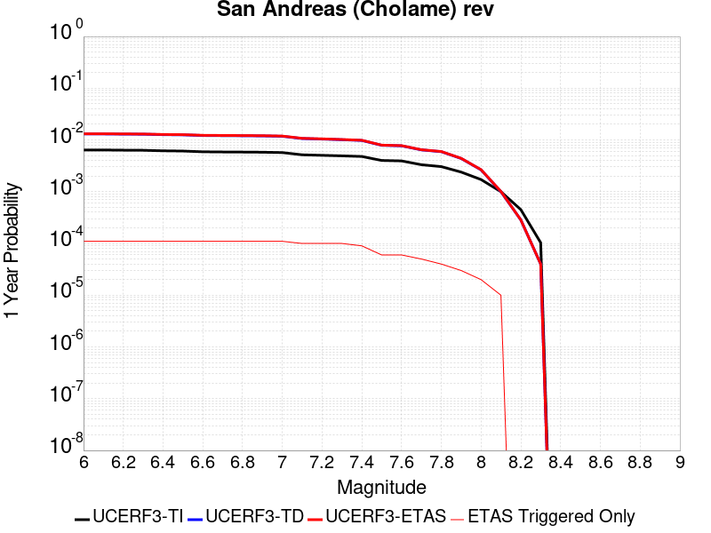 |  |

| Magnitude | 1 wk TI Prob | 1 wk TD Prob | 1 wk ETAS Prob | 1 wk ETAS/TD Gain | 1 wk ETAS Triggered Only | 1 mo TI Prob | 1 mo TD Prob | 1 mo ETAS Prob | 1 mo ETAS/TD Gain | 1 mo ETAS Triggered Only | 1 yr TI Prob | 1 yr TD Prob | 1 yr ETAS Prob | 1 yr ETAS/TD Gain | 1 yr ETAS Triggered Only | 10 yr TI Prob | 10 yr TD Prob | 10 yr ETAS Prob | 10 yr ETAS/TD Gain | 10 yr ETAS Triggered Only |
|-----|-----|-----|-----|-----|-----|-----|-----|-----|-----|-----|-----|-----|-----|-----|-----|-----|-----|-----|-----|-----|
| 6.0 | 1.2302514E-4 | 2.5204287E-4 | 3.614245E-4 | 1.4339802 | 1.0940919E-4 | 5.27144E-4 | 0.0010797381 | 0.0012108875 | 1.1214639 | 1.3129103E-4 | 0.0063991086 | 0.0130670825 | 0.013196658 | 1.0099162 | 1.3129103E-4 | 0.06217949 | 0.12439073 | 0.12452485 | 1.0010782 | 1.5317286E-4 |
| 6.1 | 1.2302514E-4 | 2.5204287E-4 | 3.614245E-4 | 1.4339802 | 1.0940919E-4 | 5.27144E-4 | 0.0010797381 | 0.0012108875 | 1.1214639 | 1.3129103E-4 | 0.0063991086 | 0.0130670825 | 0.013196658 | 1.0099162 | 1.3129103E-4 | 0.06217949 | 0.12439073 | 0.12452485 | 1.0010782 | 1.5317286E-4 |
| 6.2 | 1.2203569E-4 | 2.5021084E-4 | 3.5959264E-4 | 1.4371586 | 1.0940919E-4 | 5.2290526E-4 | 0.0010718931 | 0.0012030434 | 1.1223539 | 1.3129103E-4 | 0.006347804 | 0.01297271 | 0.013102298 | 1.0099893 | 1.3129103E-4 | 0.061695136 | 0.12357691 | 0.123711154 | 1.0010864 | 1.5317286E-4 |
| 6.3 | 1.2142645E-4 | 2.4907055E-4 | 3.584525E-4 | 1.4391605 | 1.0940919E-4 | 5.202953E-4 | 0.0010670102 | 0.0011981612 | 1.1229144 | 1.3129103E-4 | 0.006316212 | 0.012913967 | 0.013043562 | 1.0100353 | 1.3129103E-4 | 0.06139677 | 0.12307103 | 0.12320536 | 1.0010914 | 1.5317286E-4 |
| 6.4 | 1.1865206E-4 | 2.44126E-4 | 3.5350848E-4 | 1.4480574 | 1.0940919E-4 | 5.0840975E-4 | 0.0010458364 | 0.0011769901 | 1.1254056 | 1.3129103E-4 | 0.006172335 | 0.012659196 | 0.012788826 | 1.01024 | 1.3129103E-4 | 0.060036868 | 0.1208638 | 0.120998465 | 1.0011141 | 1.5317286E-4 |
| 6.5 | 1.17443946E-4 | 2.4205919E-4 | 3.514419E-4 | 1.4518842 | 1.0940919E-4 | 5.032341E-4 | 0.0010369857 | 0.0011681406 | 1.126477 | 1.3129103E-4 | 0.006109677 | 0.012552682 | 0.012682325 | 1.0103279 | 1.3129103E-4 | 0.059444077 | 0.11993805 | 0.12007286 | 1.0011239 | 1.5317286E-4 |
| 6.6 | 1.13579066E-4 | 2.3514954E-4 | 3.44533E-4 | 1.4651655 | 1.0940919E-4 | 4.866766E-4 | 0.001007396 | 0.0011385548 | 1.1301959 | 1.3129103E-4 | 0.0059092017 | 0.012196515 | 0.012326204 | 1.0106333 | 1.3129103E-4 | 0.057545185 | 0.11685214 | 0.11698742 | 1.0011576 | 1.5317286E-4 |
| 6.7 | 1.1271412E-4 | 2.3359268E-4 | 3.4297633E-4 | 1.4682665 | 1.0940919E-4 | 4.829711E-4 | 0.0010007289 | 0.0011318886 | 1.131064 | 1.3129103E-4 | 0.005864331 | 0.012116249 | 0.012245949 | 1.0107046 | 1.3129103E-4 | 0.057119697 | 0.116155714 | 0.11629109 | 1.0011655 | 1.5317286E-4 |
| 6.8 | 1.1217975E-4 | 2.3247694E-4 | 3.418607E-4 | 1.4705144 | 1.0940919E-4 | 4.8068175E-4 | 9.959509E-4 | 0.0011271111 | 1.1316935 | 1.3129103E-4 | 0.005836608 | 0.012058721 | 0.012188429 | 1.0107564 | 1.3129103E-4 | 0.056856725 | 0.11565396 | 0.11578942 | 1.0011712 | 1.5317286E-4 |
| 6.9 | 1.1146753E-4 | 2.3096445E-4 | 3.4034837E-4 | 1.4735963 | 1.0940919E-4 | 4.7763053E-4 | 9.894737E-4 | 0.0011206347 | 1.1325564 | 1.3129103E-4 | 0.0057996577 | 0.011980731 | 0.012110449 | 1.0108272 | 1.3129103E-4 | 0.056506127 | 0.11497439 | 0.11510995 | 1.0011791 | 1.5317286E-4 |
| 7.0 | 1.0965793E-4 | 2.2719789E-4 | 3.3658222E-4 | 1.4814496 | 1.0940919E-4 | 4.698779E-4 | 9.733434E-4 | 0.0011045067 | 1.1347554 | 1.3129103E-4 | 0.005705768 | 0.011786487 | 0.01191623 | 1.0110078 | 1.3129103E-4 | 0.055614736 | 0.11327597 | 0.113411784 | 1.001199 | 1.5317286E-4 |
| 7.1 | 9.927982E-5 | 2.0538924E-4 | 3.1477594E-4 | 1.5325825 | 1.0940919E-4 | 4.2541555E-4 | 8.7994366E-4 | 0.0010111191 | 1.1490726 | 1.3129103E-4 | 0.0051671406 | 0.010660981 | 0.010790872 | 1.0121838 | 1.3129103E-4 | 0.05048634 | 0.1033706 | 0.103507936 | 1.0013286 | 1.5317286E-4 |
| 7.2 | 9.696786E-5 | 2.0043184E-4 | 3.098191E-4 | 1.5457579 | 1.0940919E-4 | 4.1551032E-4 | 8.5871184E-4 | 9.898901E-4 | 1.1527617 | 1.3129103E-4 | 0.00504711 | 0.010404981 | 0.010534906 | 1.0124868 | 1.3129103E-4 | 0.04934009 | 0.1011086 | 0.10124629 | 1.0013617 | 1.5317286E-4 |
| 7.3 | 9.4727984E-5 | 1.9472468E-4 | 3.0411256E-4 | 1.5617566 | 1.0940919E-4 | 4.0591392E-4 | 8.3426846E-4 | 9.6544996E-4 | 1.1572413 | 1.3129103E-4 | 0.0049308087 | 0.010110183 | 0.010240146 | 1.0128547 | 1.3129103E-4 | 0.048228268 | 0.09847952 | 0.098617606 | 1.0014023 | 1.5317286E-4 |
| 7.4 | 9.220358E-5 | 1.8843076E-4 | 2.7594162E-4 | 1.4644192 | 8.7527354E-5 | 3.9509835E-4 | 8.073114E-4 | 9.1663224E-4 | 1.1354135 | 1.0940919E-4 | 0.004799717 | 0.009784967 | 0.009893305 | 1.0110719 | 1.0940919E-4 | 0.046973653 | 0.095557496 | 0.09567624 | 1.0012426 | 1.3129103E-4 |
| 7.5 | 7.71631E-5 | 1.5177966E-4 | 2.3929373E-4 | 1.5765862 | 8.7527354E-5 | 3.306571E-4 | 6.503223E-4 | 7.596603E-4 | 1.168129 | 1.0940919E-4 | 0.0040183207 | 0.007889002 | 0.007997547 | 1.0137591 | 1.0940919E-4 | 0.03946433 | 0.07828531 | 0.07840632 | 1.0015458 | 1.3129103E-4 |
| 7.6 | 7.5634416E-5 | 1.483744E-4 | 2.3588876E-4 | 1.5898212 | 8.7527354E-5 | 3.241072E-4 | 6.3573546E-4 | 7.450751E-4 | 1.1719892 | 1.0940919E-4 | 0.0039388672 | 0.0077126776 | 0.007821243 | 1.0140762 | 1.0940919E-4 | 0.038697794 | 0.07664872 | 0.07676995 | 1.0015815 | 1.3129103E-4 |
| 7.7 | 6.3783E-5 | 1.235872E-4 | 2.1110375E-4 | 1.7081358 | 8.7527354E-5 | 2.7332708E-4 | 5.29552E-4 | 6.17033E-4 | 1.1651981 | 8.7527354E-5 | 0.0033226798 | 0.0064282627 | 0.0065152273 | 1.0135285 | 8.7527354E-5 | 0.032734364 | 0.06454029 | 0.06464264 | 1.0015858 | 1.0940919E-4 |
| 7.8 | 5.863422E-5 | 1.1416107E-4 | 2.0167843E-4 | 1.766613 | 8.7527354E-5 | 2.512653E-4 | 4.8917E-4 | 5.7665457E-4 | 1.1788428 | 8.7527354E-5 | 0.003054864 | 0.0059394026 | 0.00602641 | 1.0146492 | 8.7527354E-5 | 0.030132094 | 0.059659187 | 0.059741493 | 1.0013796 | 8.7527354E-5 |
| 7.9 | 4.595283E-5 | 8.426331E-5 | 1.499033E-4 | 1.7789865 | 6.5645516E-5 | 1.9692584E-4 | 3.610785E-4 | 4.267003E-4 | 1.1817384 | 6.5645516E-5 | 0.0023949358 | 0.0043872762 | 0.0044526337 | 1.0148971 | 6.5645516E-5 | 0.023692891 | 0.044362005 | 0.04442474 | 1.0014142 | 6.5645516E-5 |
| 8.0 | 3.2950178E-5 | 5.0772942E-5 | 9.45344E-5 | 1.861905 | 4.3763677E-5 | 1.412074E-4 | 2.1758018E-4 | 2.6133435E-4 | 1.2010944 | 4.3763677E-5 | 0.0017178444 | 0.0026458222 | 0.0026894703 | 1.0164969 | 4.3763677E-5 | 0.017046256 | 0.027180137 | 0.027222712 | 1.0015664 | 4.3763677E-5 |
| 8.1 | 1.9177472E-5 | 1.9185145E-5 | 4.1066563E-5 | 2.1405396 | 2.1881839E-5 | 8.218658E-5 | 8.221946E-5 | 1.04099505E-4 | 1.2661175 | 2.1881839E-5 | 0.0010001622 | 0.0010005629 | 0.0010224228 | 1.0218476 | 2.1881839E-5 | 0.009956728 | 0.010758142 | 0.010779789 | 1.0020121 | 2.1881839E-5 |
| 8.2 | 8.643924E-6 | 5.4748625E-6 | 5.4748625E-6 | 1.0 | 0.0 | 3.704486E-5 | 2.3463486E-5 | 2.3463486E-5 | 1.0 | 0.0 | 4.5092785E-4 | 2.8563058E-4 | 2.8563058E-4 | 1.0 | 0.0 | 0.0045001395 | 0.0032487072 | 0.0032487072 | 1.0 | 0.0 |
| 8.3 | 1.983087E-6 | 7.6599065E-7 | 7.6599065E-7 | 1.0 | 0.0 | 8.498917E-6 | 3.282813E-6 | 3.282813E-6 | 1.0 | 0.0 | 1.034694E-4 | 3.9967534E-5 | 3.9967534E-5 | 1.0 | 0.0 | 0.0010342124 | 4.719687E-4 | 4.719687E-4 | 1.0 | 0.0 |

## Brawley (Seismic Zone) alt 1
*[(top)](#table-of-contents)*

| 1 Week | 1 Month | 1 Year | 10 Year |
|-----|-----|-----|-----|
|  |  |  |  |

| Magnitude | 1 wk TI Prob | 1 wk TD Prob | 1 wk ETAS Prob | 1 wk ETAS/TD Gain | 1 wk ETAS Triggered Only | 1 mo TI Prob | 1 mo TD Prob | 1 mo ETAS Prob | 1 mo ETAS/TD Gain | 1 mo ETAS Triggered Only | 1 yr TI Prob | 1 yr TD Prob | 1 yr ETAS Prob | 1 yr ETAS/TD Gain | 1 yr ETAS Triggered Only | 10 yr TI Prob | 10 yr TD Prob | 10 yr ETAS Prob | 10 yr ETAS/TD Gain | 10 yr ETAS Triggered Only |
|-----|-----|-----|-----|-----|-----|-----|-----|-----|-----|-----|-----|-----|-----|-----|-----|-----|-----|-----|-----|-----|
| 6.0 | 2.2521618E-4 | 4.7632487E-4 | 5.8568193E-4 | 1.229585 | 1.0940919E-4 | 9.6485513E-4 | 0.0020398323 | 0.0021708554 | 1.0642323 | 1.3129103E-4 | 0.011683988 | 0.024546238 | 0.024674306 | 1.0052174 | 1.3129103E-4 | 0.11088423 | 0.21350002 | 0.2136205 | 1.0005642 | 1.5317286E-4 |
| 6.1 | 2.2521618E-4 | 4.7632487E-4 | 5.8568193E-4 | 1.229585 | 1.0940919E-4 | 9.6485513E-4 | 0.0020398323 | 0.0021708554 | 1.0642323 | 1.3129103E-4 | 0.011683988 | 0.024546238 | 0.024674306 | 1.0052174 | 1.3129103E-4 | 0.11088423 | 0.21350002 | 0.21360329 | 1.0004836 | 1.3129103E-4 |
| 6.2 | 2.198148E-4 | 4.6717093E-4 | 5.76529E-4 | 1.2340858 | 1.0940919E-4 | 9.417233E-4 | 0.0020006616 | 0.0021316898 | 1.0654925 | 1.3129103E-4 | 0.011405343 | 0.024080504 | 0.024208631 | 1.0053209 | 1.3129103E-4 | 0.10837428 | 0.20993657 | 0.2100403 | 1.0004941 | 1.3129103E-4 |
| 6.3 | 2.1704129E-4 | 4.615278E-4 | 5.708865E-4 | 1.2369493 | 1.0940919E-4 | 9.298453E-4 | 0.0019765133 | 0.0021075448 | 1.0662943 | 1.3129103E-4 | 0.011262234 | 0.02379366 | 0.023921829 | 1.0053866 | 1.3129103E-4 | 0.107082725 | 0.20782755 | 0.20793155 | 1.0005004 | 1.3129103E-4 |
| 6.4 | 1.876142E-4 | 4.00449E-4 | 5.098144E-4 | 1.2731068 | 1.0940919E-4 | 8.038131E-4 | 0.0017150956 | 0.0018461614 | 1.076419 | 1.3129103E-4 | 0.00974259 | 0.020680401 | 0.020808976 | 1.0062172 | 1.3129103E-4 | 0.093263686 | 0.18457815 | 0.18468522 | 1.00058 | 1.3129103E-4 |
| 6.5 | 1.7390939E-4 | 3.7477075E-4 | 4.8413893E-4 | 1.2918268 | 1.0940919E-4 | 7.45113E-4 | 0.0016051838 | 0.0017362641 | 1.0816606 | 1.3129103E-4 | 0.009034078 | 0.019368723 | 0.01949747 | 1.0066472 | 1.3129103E-4 | 0.086755216 | 0.17440031 | 0.1745087 | 1.0006216 | 1.3129103E-4 |
| 6.6 | 1.591791E-4 | 3.4891962E-4 | 4.5829063E-4 | 1.3134562 | 1.0940919E-4 | 6.8201777E-4 | 0.0014945229 | 0.0016037686 | 1.0730973 | 1.0940919E-4 | 0.008271996 | 0.018045569 | 0.018153004 | 1.0059536 | 1.0940919E-4 | 0.07970774 | 0.16380852 | 0.16390002 | 1.0005585 | 1.0940919E-4 |
| 6.7 | 1.4268003E-4 | 3.20582E-4 | 4.2995613E-4 | 1.3411736 | 1.0940919E-4 | 6.1134255E-4 | 0.0013732077 | 0.0014824666 | 1.0795648 | 1.0940919E-4 | 0.007417723 | 0.016592601 | 0.016700195 | 1.0064844 | 1.0940919E-4 | 0.07174956 | 0.15193306 | 0.15202585 | 1.0006107 | 1.0940919E-4 |
| 6.8 | 1.239713E-4 | 2.9053655E-4 | 3.9991396E-4 | 1.3764669 | 1.0940919E-4 | 5.3119735E-4 | 0.0012445687 | 0.0013538417 | 1.0877999 | 1.0940919E-4 | 0.0064481674 | 0.015048777 | 0.01515654 | 1.0071609 | 1.0940919E-4 | 0.06264243 | 0.13837762 | 0.1384719 | 1.0006813 | 1.0940919E-4 |
| 6.9 | 1.0180238E-4 | 2.625439E-4 | 3.7192437E-4 | 1.4166178 | 1.0940919E-4 | 4.3622297E-4 | 0.0011247073 | 0.0012339933 | 1.0971686 | 1.0940919E-4 | 0.005298089 | 0.013608336 | 0.013716256 | 1.0079304 | 1.0940919E-4 | 0.05173543 | 0.124961674 | 0.12505741 | 1.0007662 | 1.0940919E-4 |
| 7.0 | 7.6619996E-5 | 2.23993E-4 | 3.3337768E-4 | 1.4883398 | 1.0940919E-4 | 3.283301E-4 | 9.5962E-4 | 0.0010689242 | 1.1139036 | 1.0940919E-4 | 0.0039900932 | 0.011621496 | 0.011729633 | 1.009305 | 1.0940919E-4 | 0.039192066 | 0.107266866 | 0.107364535 | 1.0009105 | 1.0940919E-4 |
| 7.1 | 7.5127435E-5 | 2.2082464E-4 | 3.3020967E-4 | 1.495348 | 1.0940919E-4 | 3.2193496E-4 | 9.4605127E-4 | 0.0010553569 | 1.1155388 | 1.0940919E-4 | 0.0039125155 | 0.011458045 | 0.0115662 | 1.0094392 | 1.0940919E-4 | 0.038443442 | 0.10583085 | 0.10592868 | 1.0009243 | 1.0940919E-4 |
| 7.2 | 6.788582E-5 | 2.0210193E-4 | 3.11489E-4 | 1.541247 | 1.0940919E-4 | 2.9090676E-4 | 8.6586666E-4 | 9.751811E-4 | 1.1262486 | 1.0940919E-4 | 0.0035360386 | 0.0104916105 | 0.010599872 | 1.0103189 | 1.0940919E-4 | 0.034803 | 0.09750131 | 0.09760005 | 1.0010127 | 1.0940919E-4 |
| 7.3 | 6.399602E-5 | 1.8841137E-4 | 2.7592224E-4 | 1.4644669 | 8.7527354E-5 | 2.7423984E-4 | 8.072303E-4 | 8.94687E-4 | 1.1083417 | 8.7527354E-5 | 0.0033337586 | 0.009784332 | 0.009871002 | 1.0088581 | 8.7527354E-5 | 0.03284188 | 0.09139617 | 0.091475695 | 1.0008701 | 8.7527354E-5 |
| 7.4 | 4.506759E-5 | 1.2529209E-4 | 2.1280847E-4 | 1.6984988 | 8.7527354E-5 | 1.9313251E-4 | 5.368565E-4 | 6.243368E-4 | 1.1629492 | 8.7527354E-5 | 0.0023488526 | 0.0065168133 | 0.0066037704 | 1.0133435 | 8.7527354E-5 | 0.023241805 | 0.062363707 | 0.062445775 | 1.001316 | 8.7527354E-5 |
| 7.5 | 3.43289E-5 | 9.33541E-5 | 1.8087328E-4 | 1.9374969 | 8.7527354E-5 | 1.4711556E-4 | 4.00028E-4 | 4.875203E-4 | 1.2187155 | 8.7527354E-5 | 0.0017896603 | 0.0048595266 | 0.0049466286 | 1.017924 | 8.7527354E-5 | 0.01775316 | 0.04705519 | 0.047138598 | 1.0017725 | 8.7527354E-5 |
| 7.6 | 2.5980507E-5 | 7.053101E-5 | 1.580522E-4 | 2.2408893 | 8.7527354E-5 | 1.1134028E-4 | 3.0224086E-4 | 3.8974176E-4 | 1.2895072 | 8.7527354E-5 | 0.001354725 | 0.003673598 | 0.0037608037 | 1.0237385 | 8.7527354E-5 | 0.013464959 | 0.035840835 | 0.035925224 | 1.0023546 | 8.7527354E-5 |
| 7.7 | 1.7292105E-5 | 4.9407296E-5 | 1.3693032E-4 | 2.7714596 | 8.7527354E-5 | 7.4106916E-5 | 2.117284E-4 | 2.9923723E-4 | 1.413307 | 8.7527354E-5 | 9.018782E-4 | 0.0025747516 | 0.0026620536 | 1.0339069 | 8.7527354E-5 | 0.008982267 | 0.025290398 | 0.02537571 | 1.0033734 | 8.7527354E-5 |
| 7.8 | 1.2927471E-5 | 3.9693266E-5 | 1.0533618E-4 | 2.6537542 | 6.5645516E-5 | 5.5402274E-5 | 1.7010293E-4 | 2.3573727E-4 | 1.3858508 | 6.5645516E-5 | 6.743139E-4 | 0.0020690386 | 0.0021345483 | 1.0316619 | 6.5645516E-5 | 0.0067227143 | 0.020431727 | 0.020496031 | 1.0031472 | 6.5645516E-5 |
| 7.9 | 1.0200774E-5 | 2.874569E-5 | 9.438932E-5 | 3.283599 | 6.5645516E-5 | 4.371687E-5 | 1.2319001E-4 | 1.8882743E-4 | 1.5328145 | 6.5645516E-5 | 5.321229E-4 | 0.0014988075 | 0.0015643546 | 1.0437329 | 6.5645516E-5 | 0.005308505 | 0.014991644 | 0.015056306 | 1.0043131 | 6.5645516E-5 |
| 8.0 | 8.650396E-6 | 2.3277367E-5 | 6.7040026E-5 | 2.8800519 | 4.3763677E-5 | 3.70726E-5 | 9.975634E-5 | 1.4351564E-4 | 1.4386619 | 4.3763677E-5 | 4.5126543E-4 | 0.0012138576 | 0.0012575681 | 1.0360097 | 4.3763677E-5 | 0.0045035016 | 0.012211097 | 0.012254327 | 1.0035402 | 4.3763677E-5 |
| 8.1 | 3.9368224E-6 | 7.3279825E-6 | 2.920966E-5 | 3.986044 | 2.1881839E-5 | 1.6871985E-5 | 3.140526E-5 | 5.328641E-5 | 1.6967351 | 2.1881839E-5 | 2.0539707E-4 | 3.8229208E-4 | 4.0416556E-4 | 1.0572166 | 2.1881839E-5 | 0.0020520731 | 0.004001185 | 0.0040229787 | 1.0054469 | 2.1881839E-5 |
| 8.2 | 1.7101195E-6 | 2.217876E-6 | 2.217876E-6 | 1.0 | 0.0 | 7.329063E-6 | 9.505149E-6 | 9.505149E-6 | 1.0 | 0.0 | 8.922769E-5 | 1.1571907E-4 | 1.1571907E-4 | 1.0 | 0.0 | 8.9191867E-4 | 0.0012666774 | 0.0012666774 | 1.0 | 0.0 |
| 8.3 | 3.0346666E-8 | 1.721586E-8 | 1.721586E-8 | 1.0 | 0.0 | 1.3005713E-7 | 7.378226E-8 | 7.378226E-8 | 1.0 | 0.0 | 1.5834444E-6 | 8.9829894E-7 | 8.9829894E-7 | 1.0 | 0.0 | 1.5834332E-5 | 9.367729E-6 | 9.367729E-6 | 1.0 | 0.0 |

## San Jacinto (Anza) rev
*[(top)](#table-of-contents)*

| 1 Week | 1 Month | 1 Year | 10 Year |
|-----|-----|-----|-----|
|  |  |  |  |

| Magnitude | 1 wk TI Prob | 1 wk TD Prob | 1 wk ETAS Prob | 1 wk ETAS/TD Gain | 1 wk ETAS Triggered Only | 1 mo TI Prob | 1 mo TD Prob | 1 mo ETAS Prob | 1 mo ETAS/TD Gain | 1 mo ETAS Triggered Only | 1 yr TI Prob | 1 yr TD Prob | 1 yr ETAS Prob | 1 yr ETAS/TD Gain | 1 yr ETAS Triggered Only | 10 yr TI Prob | 10 yr TD Prob | 10 yr ETAS Prob | 10 yr ETAS/TD Gain | 10 yr ETAS Triggered Only |
|-----|-----|-----|-----|-----|-----|-----|-----|-----|-----|-----|-----|-----|-----|-----|-----|-----|-----|-----|-----|-----|
| 6.0 | 6.3015636E-5 | 4.3302647E-5 | 1.7458799E-4 | 4.031809 | 1.3129103E-4 | 2.7003905E-4 | 1.8556965E-4 | 3.1683632E-4 | 1.7073715 | 1.3129103E-4 | 0.0032827691 | 0.0022569813 | 0.002387976 | 1.0580398 | 1.3129103E-4 | 0.032346968 | 0.023296192 | 0.023445796 | 1.0064218 | 1.5317286E-4 |
| 6.1 | 6.3015636E-5 | 4.3302647E-5 | 1.7458799E-4 | 4.031809 | 1.3129103E-4 | 2.7003905E-4 | 1.8556965E-4 | 3.1683632E-4 | 1.7073715 | 1.3129103E-4 | 0.0032827691 | 0.0022569813 | 0.002387976 | 1.0580398 | 1.3129103E-4 | 0.032346968 | 0.023296192 | 0.023445796 | 1.0064218 | 1.5317286E-4 |
| 6.2 | 6.3015636E-5 | 4.3302647E-5 | 1.7458799E-4 | 4.031809 | 1.3129103E-4 | 2.7003905E-4 | 1.8556965E-4 | 3.1683632E-4 | 1.7073715 | 1.3129103E-4 | 0.0032827691 | 0.0022569813 | 0.002387976 | 1.0580398 | 1.3129103E-4 | 0.032346968 | 0.023296192 | 0.023445796 | 1.0064218 | 1.5317286E-4 |
| 6.3 | 6.3015636E-5 | 4.3302647E-5 | 1.7458799E-4 | 4.031809 | 1.3129103E-4 | 2.7003905E-4 | 1.8556965E-4 | 3.1683632E-4 | 1.7073715 | 1.3129103E-4 | 0.0032827691 | 0.0022569813 | 0.002387976 | 1.0580398 | 1.3129103E-4 | 0.032346968 | 0.023296192 | 0.023445796 | 1.0064218 | 1.5317286E-4 |
| 6.4 | 6.3015636E-5 | 4.3302647E-5 | 1.7458799E-4 | 4.031809 | 1.3129103E-4 | 2.7003905E-4 | 1.8556965E-4 | 3.1683632E-4 | 1.7073715 | 1.3129103E-4 | 0.0032827691 | 0.0022569813 | 0.002387976 | 1.0580398 | 1.3129103E-4 | 0.032346968 | 0.023296192 | 0.023445796 | 1.0064218 | 1.5317286E-4 |
| 6.5 | 5.811017E-5 | 4.0082516E-5 | 1.7136829E-4 | 4.2753873 | 1.3129103E-4 | 2.4901982E-4 | 1.7177092E-4 | 3.0303941E-4 | 1.7642066 | 1.3129103E-4 | 0.0030276014 | 0.002089311 | 0.0022203275 | 1.0627081 | 1.3129103E-4 | 0.02986684 | 0.021593736 | 0.021743603 | 1.0069402 | 1.5317286E-4 |
| 6.6 | 5.811017E-5 | 4.0082516E-5 | 1.7136829E-4 | 4.2753873 | 1.3129103E-4 | 2.4901982E-4 | 1.7177092E-4 | 3.0303941E-4 | 1.7642066 | 1.3129103E-4 | 0.0030276014 | 0.002089311 | 0.0022203275 | 1.0627081 | 1.3129103E-4 | 0.02986684 | 0.021593736 | 0.021743603 | 1.0069402 | 1.5317286E-4 |
| 6.7 | 5.712442E-5 | 3.9505223E-5 | 1.7079107E-4 | 4.3232527 | 1.3129103E-4 | 2.4479596E-4 | 1.6929714E-4 | 3.0056594E-4 | 1.7753751 | 1.3129103E-4 | 0.0029763177 | 0.0020592497 | 0.0021902702 | 1.0636255 | 1.3129103E-4 | 0.029367693 | 0.021285562 | 0.021435475 | 1.0070429 | 1.5317286E-4 |
| 6.8 | 5.6967532E-5 | 3.9361643E-5 | 1.706475E-4 | 4.3353753 | 1.3129103E-4 | 2.4412372E-4 | 1.6868189E-4 | 2.9995077E-4 | 1.7782038 | 1.3129103E-4 | 0.0029681553 | 0.002051773 | 0.0021827947 | 1.0638578 | 1.3129103E-4 | 0.029288229 | 0.021210281 | 0.021360205 | 1.0070685 | 1.5317286E-4 |
| 6.9 | 5.6211324E-5 | 3.9066435E-5 | 1.7035233E-4 | 4.3605804 | 1.3129103E-4 | 2.4088343E-4 | 1.6741687E-4 | 2.9868592E-4 | 1.7840849 | 1.3129103E-4 | 0.0029288116 | 0.0020364004 | 0.002167424 | 1.0643408 | 1.3129103E-4 | 0.028905109 | 0.021049714 | 0.021199662 | 1.0071236 | 1.5317286E-4 |
| 7.0 | 5.4383527E-5 | 3.792697E-5 | 1.6921302E-4 | 4.461549 | 1.3129103E-4 | 2.3305144E-4 | 1.6253405E-4 | 2.9380375E-4 | 1.8076442 | 1.3129103E-4 | 0.0028337094 | 0.001977061 | 0.0021080924 | 1.0662758 | 1.3129103E-4 | 0.027978465 | 0.020440677 | 0.020590719 | 1.0073403 | 1.5317286E-4 |
| 7.1 | 5.1393665E-5 | 3.6389913E-5 | 1.6767616E-4 | 4.607765 | 1.3129103E-4 | 2.2023996E-4 | 1.5594746E-4 | 2.8721802E-4 | 1.8417614 | 1.3129103E-4 | 0.0026781242 | 0.0018970112 | 0.0020280532 | 1.0690781 | 1.3129103E-4 | 0.026460782 | 0.019614287 | 0.019764455 | 1.0076561 | 1.5317286E-4 |
| 7.2 | 4.785222E-5 | 3.4741795E-5 | 1.6602826E-4 | 4.77892 | 1.3129103E-4 | 2.0506482E-4 | 1.4888494E-4 | 2.801564E-4 | 1.8816975 | 1.3129103E-4 | 0.0024938055 | 0.0018111705 | 0.0019422238 | 1.0723584 | 1.3129103E-4 | 0.024660049 | 0.018728992 | 0.018879296 | 1.0080252 | 1.5317286E-4 |
| 7.3 | 4.2143256E-5 | 3.383628E-5 | 1.6512287E-4 | 4.880054 | 1.3129103E-4 | 1.8060145E-4 | 1.4500458E-4 | 2.7627658E-4 | 1.9052955 | 1.3129103E-4 | 0.002196605 | 0.0017640047 | 0.0018950641 | 1.0742965 | 1.3129103E-4 | 0.02175019 | 0.01823724 | 0.018387621 | 1.0082457 | 1.5317286E-4 |
| 7.4 | 4.0264713E-5 | 3.347446E-5 | 1.6476109E-4 | 4.9219937 | 1.3129103E-4 | 1.7255165E-4 | 1.4345412E-4 | 2.747263E-4 | 1.9150814 | 1.3129103E-4 | 0.002098792 | 0.0017451581 | 0.00187622 | 1.0751003 | 1.3129103E-4 | 0.020790804 | 0.018041821 | 0.01819223 | 1.0083367 | 1.5317286E-4 |
| 7.5 | 3.694492E-5 | 3.218847E-5 | 1.6347527E-4 | 5.0786905 | 1.3129103E-4 | 1.5832575E-4 | 1.379433E-4 | 2.6921622E-4 | 1.9516441 | 1.3129103E-4 | 0.0019259118 | 0.001678169 | 0.0018092396 | 1.0781034 | 1.3129103E-4 | 0.01909306 | 0.01735827 | 0.017508784 | 1.008671 | 1.5317286E-4 |
| 7.6 | 3.200565E-5 | 2.9504106E-5 | 1.6079126E-4 | 5.4497924 | 1.3129103E-4 | 1.3715986E-4 | 1.2644005E-4 | 2.5771448E-4 | 2.0382345 | 1.3129103E-4 | 0.001668642 | 0.0015383229 | 0.0016694119 | 1.0852156 | 1.3129103E-4 | 0.01656168 | 0.0159463 | 0.016097032 | 1.0094523 | 1.5317286E-4 |
| 7.7 | 2.731642E-5 | 2.6092788E-5 | 1.5738039E-4 | 6.0315666 | 1.3129103E-4 | 1.1706512E-4 | 1.1182144E-4 | 2.4309779E-4 | 2.173982 | 1.3129103E-4 | 0.001424336 | 0.0013605768 | 0.0014916892 | 1.0963653 | 1.3129103E-4 | 0.014152412 | 0.014167004 | 0.014318008 | 1.0106587 | 1.5317286E-4 |
| 7.8 | 2.3466424E-5 | 2.3504817E-5 | 1.5479275E-4 | 6.5855756 | 1.3129103E-4 | 1.0056651E-4 | 1.0073105E-4 | 2.3200885E-4 | 2.3032506 | 1.3129103E-4 | 0.0012237094 | 0.0012257113 | 0.0013568414 | 1.1069828 | 1.3129103E-4 | 0.012169928 | 0.012808893 | 0.012960104 | 1.0118052 | 1.5317286E-4 |
| 7.9 | 1.8611925E-5 | 1.8908117E-5 | 1.5019666E-4 | 7.943502 | 1.3129103E-4 | 7.9762955E-5 | 8.1032274E-5 | 2.1231266E-4 | 2.6201 | 1.3129103E-4 | 9.7068126E-4 | 9.861222E-4 | 0.0011172837 | 1.1330074 | 1.3129103E-4 | 0.0096645225 | 0.010393824 | 0.010545406 | 1.0145837 | 1.5317286E-4 |
| 8.0 | 1.5460775E-5 | 1.5740965E-5 | 1.4702993E-4 | 9.340591 | 1.3129103E-4 | 6.6258784E-5 | 6.7459536E-5 | 1.987417E-4 | 2.9460876 | 1.3129103E-4 | 8.0640207E-4 | 8.21011E-4 | 9.5219427E-4 | 1.1597825 | 1.3129103E-4 | 0.008034821 | 0.0087028835 | 0.008854724 | 1.0174471 | 1.5317286E-4 |
| 8.1 | 9.983884E-6 | 8.269952E-6 | 9.579658E-5 | 11.583693 | 8.7527354E-5 | 4.2787375E-5 | 3.544217E-5 | 1.2296642E-4 | 3.4694946 | 8.7527354E-5 | 5.2081177E-4 | 4.314235E-4 | 5.189131E-4 | 1.2027928 | 8.7527354E-5 | 0.0051959283 | 0.004640022 | 0.0047489237 | 1.02347 | 1.0940919E-4 |
| 8.2 | 4.1226E-6 | 1.5529788E-6 | 1.5529788E-6 | 1.0 | 0.0 | 1.7668166E-5 | 6.6556063E-6 | 6.6556063E-6 | 1.0 | 0.0 | 2.1508869E-4 | 8.102902E-5 | 8.102902E-5 | 1.0 | 0.0 | 0.0021488064 | 9.4050163E-4 | 9.4050163E-4 | 1.0 | 0.0 |
| 8.3 | 1.2750878E-6 | 3.612133E-7 | 3.612133E-7 | 1.0 | 0.0 | 5.4646503E-6 | 1.548056E-6 | 1.548056E-6 | 1.0 | 0.0 | 6.653009E-5 | 1.8847424E-5 | 1.8847424E-5 | 1.0 | 0.0 | 6.6510175E-4 | 2.2734253E-4 | 2.2734253E-4 | 1.0 | 0.0 |

## Imperial
*[(top)](#table-of-contents)*

| 1 Week | 1 Month | 1 Year | 10 Year |
|-----|-----|-----|-----|
|  |  |  |  |

| Magnitude | 1 wk TI Prob | 1 wk TD Prob | 1 wk ETAS Prob | 1 wk ETAS/TD Gain | 1 wk ETAS Triggered Only | 1 mo TI Prob | 1 mo TD Prob | 1 mo ETAS Prob | 1 mo ETAS/TD Gain | 1 mo ETAS Triggered Only | 1 yr TI Prob | 1 yr TD Prob | 1 yr ETAS Prob | 1 yr ETAS/TD Gain | 1 yr ETAS Triggered Only | 10 yr TI Prob | 10 yr TD Prob | 10 yr ETAS Prob | 10 yr ETAS/TD Gain | 10 yr ETAS Triggered Only |
|-----|-----|-----|-----|-----|-----|-----|-----|-----|-----|-----|-----|-----|-----|-----|-----|-----|-----|-----|-----|-----|
| 6.0 | 2.7496446E-4 | 5.0552754E-4 | 6.148814E-4 | 1.2163163 | 1.0940919E-4 | 0.0011778869 | 0.002164787 | 0.0022957937 | 1.0605172 | 1.3129103E-4 | 0.0142467655 | 0.026038699 | 0.026166571 | 1.0049108 | 1.3129103E-4 | 0.13367249 | 0.2280438 | 0.22814514 | 1.0004444 | 1.3129103E-4 |
| 6.1 | 2.5356023E-4 | 4.8656776E-4 | 5.9592375E-4 | 1.2247497 | 1.0940919E-4 | 0.001086234 | 0.0020836622 | 0.0022146797 | 1.0628785 | 1.3129103E-4 | 0.013144928 | 0.025071215 | 0.025199214 | 1.0051054 | 1.3129103E-4 | 0.123940155 | 0.21947981 | 0.21958229 | 1.000467 | 1.3129103E-4 |
| 6.2 | 2.4820742E-4 | 4.7752203E-4 | 5.86879E-4 | 1.2290093 | 1.0940919E-4 | 0.0010633124 | 0.0020449557 | 0.0021759784 | 1.064071 | 1.3129103E-4 | 0.01286919 | 0.024611235 | 0.024739295 | 1.0052032 | 1.3129103E-4 | 0.12148927 | 0.21598552 | 0.21608846 | 1.0004766 | 1.3129103E-4 |
| 6.3 | 2.3205351E-4 | 4.5890483E-4 | 5.682638E-4 | 1.2383043 | 1.0940919E-4 | 9.94136E-4 | 0.0019652895 | 0.0020963224 | 1.0666736 | 1.3129103E-4 | 0.012036599 | 0.02366133 | 0.023789516 | 1.0054175 | 1.3129103E-4 | 0.11405133 | 0.20793462 | 0.20803861 | 1.0005001 | 1.3129103E-4 |
| 6.4 | 2.0304754E-4 | 3.987652E-4 | 5.0813076E-4 | 1.2742605 | 1.0940919E-4 | 8.6991355E-4 | 0.0017078889 | 0.0018389558 | 1.0767419 | 1.3129103E-4 | 0.010539869 | 0.020595672 | 0.020724257 | 1.0062433 | 1.3129103E-4 | 0.100537635 | 0.1850669 | 0.18517388 | 1.0005782 | 1.3129103E-4 |
| 6.5 | 1.854992E-4 | 3.6988858E-4 | 4.7925732E-4 | 1.2956802 | 1.0940919E-4 | 7.9475436E-4 | 0.0015842861 | 0.001715369 | 1.0827395 | 1.3129103E-4 | 0.009633281 | 0.01911948 | 0.019248262 | 1.0067356 | 1.3129103E-4 | 0.0922623 | 0.173298 | 0.17340654 | 1.0006263 | 1.3129103E-4 |
| 6.6 | 1.6586106E-4 | 3.403506E-4 | 4.4972257E-4 | 1.3213508 | 1.0940919E-4 | 7.106394E-4 | 0.0014578402 | 0.0015670899 | 1.0749394 | 1.0940919E-4 | 0.008617763 | 0.01760642 | 0.017713903 | 1.0061047 | 1.0940919E-4 | 0.08291132 | 0.16077545 | 0.16086726 | 1.0005711 | 1.0940919E-4 |
| 6.7 | 1.4224656E-4 | 3.076692E-4 | 4.170447E-4 | 1.3554972 | 1.0940919E-4 | 6.094856E-4 | 0.001317924 | 0.0014271891 | 1.0829068 | 1.0940919E-4 | 0.0073952693 | 0.015929576 | 0.016037242 | 1.0067589 | 1.0940919E-4 | 0.07153955 | 0.14648417 | 0.14657755 | 1.0006375 | 1.0940919E-4 |
| 6.8 | 1.2317259E-4 | 2.779122E-4 | 3.8729096E-4 | 1.3935732 | 1.0940919E-4 | 5.2777573E-4 | 0.0011905148 | 0.0012997937 | 1.0917914 | 1.0940919E-4 | 0.0064067547 | 0.0143995695 | 0.014507404 | 1.0074887 | 1.0940919E-4 | 0.06225166 | 0.13293684 | 0.1330317 | 1.0007136 | 1.0940919E-4 |
| 6.9 | 9.859898E-5 | 2.5014306E-4 | 3.5952489E-4 | 1.4372771 | 1.0940919E-4 | 4.2249862E-4 | 0.0010716055 | 0.0011808975 | 1.101989 | 1.0940919E-4 | 0.0051317946 | 0.012969712 | 0.013077701 | 1.0083263 | 1.0940919E-4 | 0.05014893 | 0.11940631 | 0.119502656 | 1.0008068 | 1.0940919E-4 |
| 7.0 | 7.3191884E-5 | 2.1266776E-4 | 3.2205367E-4 | 1.5143512 | 1.0940919E-4 | 3.136418E-4 | 9.1111806E-4 | 0.0010204276 | 1.119973 | 1.0940919E-4 | 0.003811904 | 0.011037128 | 0.011145329 | 1.0098034 | 1.0940919E-4 | 0.037471764 | 0.10206493 | 0.102163166 | 1.0009625 | 1.0940919E-4 |
| 7.1 | 7.1760296E-5 | 2.0968143E-4 | 3.1906768E-4 | 1.5216783 | 1.0940919E-4 | 3.0750787E-4 | 8.983284E-4 | 0.0010076392 | 1.1216825 | 1.0940919E-4 | 0.003737482 | 0.010882978 | 0.010991197 | 1.0099438 | 1.0940919E-4 | 0.03675245 | 0.10070146 | 0.10079985 | 1.000977 | 1.0940919E-4 |
| 7.2 | 6.46614E-5 | 1.9136685E-4 | 3.007551E-4 | 1.5716155 | 1.0940919E-4 | 2.7709085E-4 | 8.1988896E-4 | 9.292084E-4 | 1.1333345 | 1.0940919E-4 | 0.0033683628 | 0.0099370815 | 0.010045404 | 1.0109007 | 1.0940919E-4 | 0.033177625 | 0.09250898 | 0.092608266 | 1.0010732 | 1.0940919E-4 |
| 7.3 | 6.088115E-5 | 1.78084E-4 | 2.6559577E-4 | 1.4914073 | 8.7527354E-5 | 2.6089314E-4 | 7.6299673E-4 | 8.504573E-4 | 1.1146277 | 8.7527354E-5 | 0.0031717476 | 0.009250494 | 0.009337211 | 1.0093744 | 8.7527354E-5 | 0.031268585 | 0.08655989 | 0.086639844 | 1.0009236 | 8.7527354E-5 |
| 7.4 | 4.199346E-5 | 1.1510366E-4 | 2.0262094E-4 | 1.7603344 | 8.7527354E-5 | 1.7995955E-4 | 4.9320905E-4 | 5.8069325E-4 | 1.1773775 | 8.7527354E-5 | 0.0021888057 | 0.0059884563 | 0.0060754595 | 1.0145285 | 8.7527354E-5 | 0.02167372 | 0.057439793 | 0.057522293 | 1.0014362 | 8.7527354E-5 |
| 7.5 | 3.130448E-5 | 8.33328E-5 | 1.7085286E-4 | 2.0502474 | 8.7527354E-5 | 1.3415517E-4 | 3.57092E-4 | 4.445881E-4 | 1.245024 | 8.7527354E-5 | 0.0016321153 | 0.004338988 | 0.0044261357 | 1.0200847 | 8.7527354E-5 | 0.016201803 | 0.04213201 | 0.042215846 | 1.00199 | 8.7527354E-5 |
| 7.6 | 2.3074248E-5 | 6.0844646E-5 | 1.4836667E-4 | 2.4384508 | 8.7527354E-5 | 9.888588E-5 | 2.6073685E-4 | 3.4824136E-4 | 1.3356048 | 8.7527354E-5 | 0.0012032706 | 0.0031698733 | 0.0032571233 | 1.0275247 | 8.7527354E-5 | 0.011967761 | 0.031026395 | 0.031111207 | 1.0027336 | 8.7527354E-5 |
| 7.7 | 1.45864815E-5 | 4.0124698E-5 | 1.2764854E-4 | 3.1812959 | 8.7527354E-5 | 6.2511994E-5 | 1.7195169E-4 | 2.59464E-4 | 1.5089355 | 8.7527354E-5 | 7.608177E-4 | 0.0020915072 | 0.0021788515 | 1.0417614 | 8.7527354E-5 | 0.007582182 | 0.020627763 | 0.020713486 | 1.0041556 | 8.7527354E-5 |
| 7.8 | 1.0352979E-5 | 3.0960902E-5 | 9.660438E-5 | 3.1202059 | 6.5645516E-5 | 4.4369157E-5 | 1.3268284E-4 | 1.9831964E-4 | 1.4946895 | 6.5645516E-5 | 5.400606E-4 | 0.0016142189 | 0.0016797585 | 1.0406014 | 6.5645516E-5 | 0.0053875 | 0.016016833 | 0.016081426 | 1.0040329 | 6.5645516E-5 |
| 7.9 | 8.137906E-6 | 2.2149103E-5 | 8.779316E-5 | 3.9637346 | 6.5645516E-5 | 3.4876273E-5 | 9.492128E-5 | 1.6056056E-4 | 1.6915128 | 6.5645516E-5 | 4.2453592E-4 | 0.0011550548 | 0.0012206244 | 1.0567676 | 6.5645516E-5 | 0.004237258 | 0.011617903 | 0.011682785 | 1.0055847 | 6.5645516E-5 |
| 8.0 | 6.93792E-6 | 1.8008766E-5 | 6.177165E-5 | 3.430088 | 4.3763677E-5 | 2.9733603E-5 | 7.717814E-5 | 1.2093844E-4 | 1.5670037 | 4.3763677E-5 | 3.6194647E-4 | 9.3923963E-4 | 9.829622E-4 | 1.046551 | 4.3763677E-5 | 0.0036135751 | 0.00950155 | 0.009544899 | 1.0045621 | 4.3763677E-5 |
| 8.1 | 3.4286315E-6 | 6.379872E-6 | 2.8261571E-5 | 4.429802 | 2.1881839E-5 | 1.4694053E-5 | 2.7342023E-5 | 4.922326E-5 | 1.8002788 | 2.1881839E-5 | 1.7888541E-4 | 3.328384E-4 | 3.5471295E-4 | 1.0657213 | 2.1881839E-5 | 0.0017874148 | 0.003486031 | 0.0035078365 | 1.0062551 | 2.1881839E-5 |
| 8.2 | 1.4906886E-6 | 1.9366646E-6 | 1.9366646E-6 | 1.0 | 0.0 | 6.3886496E-6 | 8.299965E-6 | 8.299965E-6 | 1.0 | 0.0 | 7.7779034E-5 | 1.0104742E-4 | 1.0104742E-4 | 1.0 | 0.0 | 7.775182E-4 | 0.0011075331 | 0.0011075331 | 1.0 | 0.0 |
| 8.3 | 2.5758007E-8 | 1.4500102E-8 | 1.4500102E-8 | 1.0 | 0.0 | 1.10391454E-7 | 6.214329E-8 | 6.214329E-8 | 1.0 | 0.0 | 1.3440151E-6 | 7.565946E-7 | 7.565946E-7 | 1.0 | 0.0 | 1.344007E-5 | 7.887763E-6 | 7.887763E-6 | 1.0 | 0.0 |

## White Wolf (Extension)
*[(top)](#table-of-contents)*

| 1 Week | 1 Month | 1 Year | 10 Year |
|-----|-----|-----|-----|
|  |  |  | 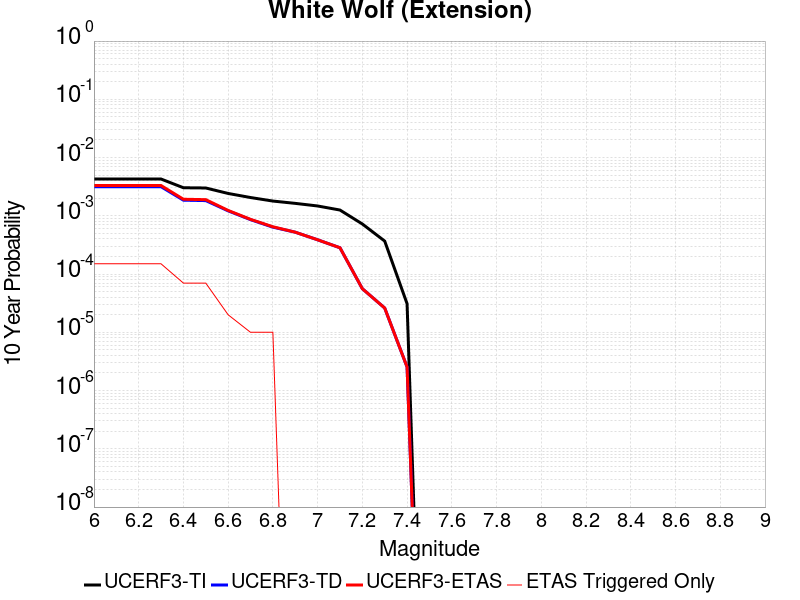 |

| Magnitude | 1 wk TI Prob | 1 wk TD Prob | 1 wk ETAS Prob | 1 wk ETAS/TD Gain | 1 wk ETAS Triggered Only | 1 mo TI Prob | 1 mo TD Prob | 1 mo ETAS Prob | 1 mo ETAS/TD Gain | 1 mo ETAS Triggered Only | 1 yr TI Prob | 1 yr TD Prob | 1 yr ETAS Prob | 1 yr ETAS/TD Gain | 1 yr ETAS Triggered Only | 10 yr TI Prob | 10 yr TD Prob | 10 yr ETAS Prob | 10 yr ETAS/TD Gain | 10 yr ETAS Triggered Only |
|-----|-----|-----|-----|-----|-----|-----|-----|-----|-----|-----|-----|-----|-----|-----|-----|-----|-----|-----|-----|-----|
| 6.0 | 8.222555E-6 | 6.0666657E-6 | 1.15475195E-4 | 19.034376 | 1.0940919E-4 | 3.5239045E-5 | 2.5999774E-5 | 1.3540612E-4 | 5.207973 | 1.0940919E-4 | 4.289509E-4 | 3.1650788E-4 | 4.4775737E-4 | 1.4146799 | 1.3129103E-4 | 0.0042812387 | 0.003161223 | 0.003292099 | 1.0414004 | 1.3129103E-4 |
| 6.1 | 8.222555E-6 | 6.0666657E-6 | 1.15475195E-4 | 19.034376 | 1.0940919E-4 | 3.5239045E-5 | 2.5999774E-5 | 1.3540612E-4 | 5.207973 | 1.0940919E-4 | 4.289509E-4 | 3.1650788E-4 | 4.4775737E-4 | 1.4146799 | 1.3129103E-4 | 0.0042812387 | 0.003161223 | 0.003292099 | 1.0414004 | 1.3129103E-4 |
| 6.2 | 8.222555E-6 | 6.0666657E-6 | 1.15475195E-4 | 19.034376 | 1.0940919E-4 | 3.5239045E-5 | 2.5999774E-5 | 1.3540612E-4 | 5.207973 | 1.0940919E-4 | 4.289509E-4 | 3.1650788E-4 | 4.4775737E-4 | 1.4146799 | 1.3129103E-4 | 0.0042812387 | 0.003161223 | 0.003292099 | 1.0414004 | 1.3129103E-4 |
| 6.3 | 8.222555E-6 | 6.0666657E-6 | 1.15475195E-4 | 19.034376 | 1.0940919E-4 | 3.5239045E-5 | 2.5999774E-5 | 1.3540612E-4 | 5.207973 | 1.0940919E-4 | 4.289509E-4 | 3.1650788E-4 | 4.4775737E-4 | 1.4146799 | 1.3129103E-4 | 0.0042812387 | 0.003161223 | 0.003292099 | 1.0414004 | 1.3129103E-4 |
| 6.4 | 5.821773E-6 | 3.5571766E-6 | 4.7320696E-5 | 13.302881 | 4.3763677E-5 | 2.4950215E-5 | 1.5244959E-5 | 5.900797E-5 | 3.8706543 | 4.3763677E-5 | 3.0372653E-4 | 1.8559267E-4 | 2.51226E-4 | 1.3536419 | 6.5645516E-5 | 0.0030331176 | 0.001854485 | 0.0019200088 | 1.0353326 | 6.5645516E-5 |
| 6.5 | 5.766023E-6 | 3.4991106E-6 | 4.7262634E-5 | 13.507042 | 4.3763677E-5 | 2.4711293E-5 | 1.4996108E-5 | 5.8759128E-5 | 3.9182918 | 4.3763677E-5 | 3.0081844E-4 | 1.8256342E-4 | 2.4819694E-4 | 1.3595109 | 6.5645516E-5 | 0.0030041158 | 0.0018242426 | 0.0018897684 | 1.0359194 | 6.5645516E-5 |
| 6.6 | 4.643576E-6 | 2.332624E-6 | 2.421441E-5 | 10.38076 | 2.1881839E-5 | 1.9900888E-5 | 9.996925E-6 | 3.1878542E-5 | 3.1888351 | 2.1881839E-5 | 2.4226638E-4 | 1.2170619E-4 | 1.4358536E-4 | 1.1797705 | 2.1881839E-5 | 0.0024200242 | 0.0012164378 | 0.001238293 | 1.0179666 | 2.1881839E-5 |
| 6.7 | 3.9529173E-6 | 1.6483477E-6 | 2.353015E-5 | 14.274991 | 2.1881839E-5 | 1.6940963E-5 | 7.0643296E-6 | 2.8946013E-5 | 4.097489 | 2.1881839E-5 | 2.0623671E-4 | 8.6005006E-5 | 1.0788496E-4 | 1.2544032 | 2.1881839E-5 | 0.002060454 | 8.597357E-4 | 8.8159874E-4 | 1.02543 | 2.1881839E-5 |
| 6.8 | 3.4377522E-6 | 1.2245237E-6 | 2.3106335E-5 | 18.869652 | 2.1881839E-5 | 1.473314E-5 | 5.2479486E-6 | 2.7129672E-5 | 5.1695766 | 2.1881839E-5 | 1.7936122E-4 | 6.3891996E-5 | 8.577244E-5 | 1.3424598 | 2.1881839E-5 | 0.0017921652 | 6.387454E-4 | 6.6061324E-4 | 1.0342356 | 2.1881839E-5 |
| 6.9 | 3.1367306E-6 | 1.0033783E-6 | 1.0033783E-6 | 1.0 | 0.0 | 1.3443062E-5 | 4.3001864E-6 | 4.3001864E-6 | 1.0 | 0.0 | 1.63657E-4 | 5.235359E-5 | 5.235359E-5 | 1.0 | 0.0 | 0.0016353652 | 5.2342017E-4 | 5.2342017E-4 | 1.0 | 0.0 |
| 7.0 | 2.8298145E-6 | 7.4286646E-7 | 7.4286646E-7 | 1.0 | 0.0 | 1.2127721E-5 | 3.1837099E-6 | 3.1837099E-6 | 1.0 | 0.0 | 1.47645E-4 | 3.8761027E-5 | 3.8761027E-5 | 1.0 | 0.0 | 0.0014754693 | 3.8754768E-4 | 3.8754768E-4 | 1.0 | 0.0 |
| 7.1 | 2.4091064E-6 | 5.4227525E-7 | 5.4227525E-7 | 1.0 | 0.0 | 1.03247E-5 | 2.3240348E-6 | 2.3240348E-6 | 1.0 | 0.0 | 1.2569598E-4 | 2.8294799E-5 | 2.8294799E-5 | 1.0 | 0.0 | 0.001256249 | 2.8291598E-4 | 2.8291598E-4 | 1.0 | 0.0 |
| 7.2 | 1.3875518E-6 | 1.0743063E-7 | 1.0743063E-7 | 1.0 | 0.0 | 5.9466374E-6 | 4.6041689E-7 | 4.6041689E-7 | 1.0 | 0.0 | 7.23979E-5 | 5.6055624E-6 | 5.6055624E-6 | 1.0 | 0.0 | 7.2374323E-4 | 5.6054323E-5 | 5.6054323E-5 | 1.0 | 0.0 |
| 7.3 | 7.056077E-7 | 5.002034E-8 | 5.002034E-8 | 1.0 | 0.0 | 3.0240296E-6 | 2.1437286E-7 | 2.1437286E-7 | 1.0 | 0.0 | 3.681694E-5 | 2.609987E-6 | 2.609987E-6 | 1.0 | 0.0 | 3.681084E-4 | 2.609961E-5 | 2.609961E-5 | 1.0 | 0.0 |
| 7.4 | 5.9334678E-8 | 4.8683537E-9 | 4.8683537E-9 | 1.0 | 0.0 | 2.5429145E-7 | 2.0864372E-8 | 2.0864372E-8 | 1.0 | 0.0 | 3.095994E-6 | 2.5402372E-7 | 2.5402372E-7 | 1.0 | 0.0 | 3.095951E-5 | 2.5402353E-6 | 2.5402353E-6 | 1.0 | 0.0 |

## Calico-Hidalgo
*[(top)](#table-of-contents)*

| 1 Week | 1 Month | 1 Year | 10 Year |
|-----|-----|-----|-----|
|  | 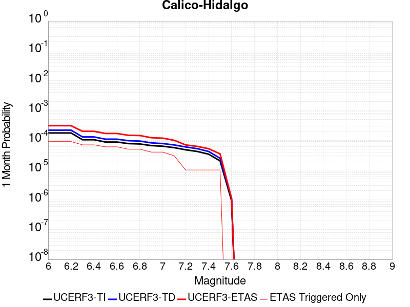 |  |  |

| Magnitude | 1 wk TI Prob | 1 wk TD Prob | 1 wk ETAS Prob | 1 wk ETAS/TD Gain | 1 wk ETAS Triggered Only | 1 mo TI Prob | 1 mo TD Prob | 1 mo ETAS Prob | 1 mo ETAS/TD Gain | 1 mo ETAS Triggered Only | 1 yr TI Prob | 1 yr TD Prob | 1 yr ETAS Prob | 1 yr ETAS/TD Gain | 1 yr ETAS Triggered Only | 10 yr TI Prob | 10 yr TD Prob | 10 yr ETAS Prob | 10 yr ETAS/TD Gain | 10 yr ETAS Triggered Only |
|-----|-----|-----|-----|-----|-----|-----|-----|-----|-----|-----|-----|-----|-----|-----|-----|-----|-----|-----|-----|-----|
| 6.0 | 4.0906612E-5 | 5.0703686E-5 | 1.6010733E-4 | 3.1577058 | 1.0940919E-4 | 1.7530227E-4 | 2.172857E-4 | 3.485482E-4 | 1.604101 | 1.3129103E-4 | 0.0021322158 | 0.002642648 | 0.002773592 | 1.0495503 | 1.3129103E-4 | 0.02111873 | 0.026152607 | 0.026280465 | 1.0048889 | 1.3129103E-4 |
| 6.1 | 4.0906612E-5 | 5.0703686E-5 | 1.6010733E-4 | 3.1577058 | 1.0940919E-4 | 1.7530227E-4 | 2.172857E-4 | 3.485482E-4 | 1.604101 | 1.3129103E-4 | 0.0021322158 | 0.002642648 | 0.002773592 | 1.0495503 | 1.3129103E-4 | 0.02111873 | 0.026152607 | 0.026280465 | 1.0048889 | 1.3129103E-4 |
| 6.2 | 4.0906612E-5 | 5.0703686E-5 | 1.6010733E-4 | 3.1577058 | 1.0940919E-4 | 1.7530227E-4 | 2.172857E-4 | 3.485482E-4 | 1.604101 | 1.3129103E-4 | 0.0021322158 | 0.002642648 | 0.002773592 | 1.0495503 | 1.3129103E-4 | 0.02111873 | 0.026152607 | 0.026280465 | 1.0048889 | 1.3129103E-4 |
| 6.3 | 2.4242801E-5 | 3.0090669E-5 | 1.1761539E-4 | 3.9086998 | 8.7527354E-5 | 1.0389358E-4 | 1.2895382E-4 | 2.383489E-4 | 1.8483275 | 1.0940919E-4 | 0.0012641704 | 0.0015689151 | 0.0016781526 | 1.0696262 | 1.0940919E-4 | 0.01257003 | 0.01558206 | 0.015689764 | 1.0069121 | 1.0940919E-4 |
| 6.4 | 2.4242801E-5 | 3.0090669E-5 | 1.1761539E-4 | 3.9086998 | 8.7527354E-5 | 1.0389358E-4 | 1.2895382E-4 | 2.383489E-4 | 1.8483275 | 1.0940919E-4 | 0.0012641704 | 0.0015689151 | 0.0016781526 | 1.0696262 | 1.0940919E-4 | 0.01257003 | 0.01558206 | 0.015689764 | 1.0069121 | 1.0940919E-4 |
| 6.5 | 2.0286952E-5 | 2.5315738E-5 | 9.095959E-5 | 3.5930057 | 6.5645516E-5 | 8.694118E-5 | 1.0849161E-4 | 1.9600947E-4 | 1.8066787 | 8.7527354E-5 | 0.0010579949 | 0.001320102 | 0.0014075139 | 1.066216 | 8.7527354E-5 | 0.010529719 | 0.013124538 | 0.013210916 | 1.0065814 | 8.7527354E-5 |
| 6.6 | 2.0269223E-5 | 2.5296687E-5 | 9.094054E-5 | 3.5949585 | 6.5645516E-5 | 8.6865206E-5 | 1.08409964E-4 | 1.9592783E-4 | 1.8072861 | 8.7527354E-5 | 0.0010570707 | 0.0013191093 | 0.0014065212 | 1.0662658 | 8.7527354E-5 | 0.010520565 | 0.013114728 | 0.013201107 | 1.0065864 | 8.7527354E-5 |
| 6.7 | 1.799852E-5 | 2.25406E-5 | 8.8184635E-5 | 3.9122577 | 6.5645516E-5 | 7.713423E-5 | 9.659908E-5 | 1.8411798E-4 | 1.9060013 | 8.7527354E-5 | 9.3870464E-4 | 0.0011754738 | 0.0012628983 | 1.0743738 | 8.7527354E-5 | 0.009347493 | 0.011694173 | 0.011780677 | 1.0073972 | 8.7527354E-5 |
| 6.8 | 1.7458793E-5 | 2.184212E-5 | 8.74862E-5 | 4.0053897 | 6.5645516E-5 | 7.4821255E-5 | 9.3605806E-5 | 1.8112497E-4 | 1.9349757 | 8.7527354E-5 | 9.10568E-4 | 0.0011390693 | 0.001226497 | 1.0767536 | 8.7527354E-5 | 0.009068459 | 0.011333893 | 0.011420429 | 1.0076351 | 8.7527354E-5 |
| 6.9 | 1.542884E-5 | 1.9025927E-5 | 6.278877E-5 | 3.3001688 | 4.3763677E-5 | 6.612192E-5 | 8.153721E-5 | 1.4717737E-4 | 1.8050332 | 6.5645516E-5 | 8.04737E-4 | 9.922766E-4 | 0.001057857 | 1.0660908 | 6.5645516E-5 | 0.008018291 | 0.009879857 | 0.009944854 | 1.0065787 | 6.5645516E-5 |
| 7.0 | 1.468253E-5 | 1.8030598E-5 | 6.1793486E-5 | 3.4271455 | 4.3763677E-5 | 6.292361E-5 | 7.7271776E-5 | 1.4291222E-4 | 1.8494749 | 6.5645516E-5 | 7.658257E-4 | 9.4039086E-4 | 0.0010059746 | 1.069741 | 6.5645516E-5 | 0.0076319184 | 0.009365481 | 0.009430512 | 1.0069437 | 6.5645516E-5 |
| 7.1 | 1.3139281E-5 | 1.6200942E-5 | 3.8082428E-5 | 2.3506303 | 2.1881839E-5 | 5.6309986E-5 | 6.943083E-5 | 1.1319147E-4 | 1.6302767 | 4.3763677E-5 | 6.853584E-4 | 8.4500515E-4 | 8.8873185E-4 | 1.0517472 | 4.3763677E-5 | 0.0068324856 | 0.0084192185 | 0.008462613 | 1.0051543 | 4.3763677E-5 |
| 7.2 | 1.1127404E-5 | 1.3866597E-5 | 1.3866597E-5 | 1.0 | 0.0 | 4.7688E-5 | 5.942698E-5 | 5.942698E-5 | 1.0 | 0.0 | 5.8044674E-4 | 7.232942E-4 | 7.232942E-4 | 1.0 | 0.0 | 0.0057893298 | 0.0072105085 | 0.0072105085 | 1.0 | 0.0 |
| 7.3 | 9.808154E-6 | 1.2176215E-5 | 1.2176215E-5 | 1.0 | 0.0 | 4.2034266E-5 | 5.2182797E-5 | 5.2182797E-5 | 1.0 | 0.0 | 5.11647E-4 | 6.3515105E-4 | 6.3515105E-4 | 1.0 | 0.0 | 0.0051047057 | 0.006334433 | 0.006334433 | 1.0 | 0.0 |
| 7.4 | 7.942452E-6 | 9.792144E-6 | 9.792144E-6 | 1.0 | 0.0 | 3.4038632E-5 | 4.1965708E-5 | 4.1965708E-5 | 1.0 | 0.0 | 4.1434157E-4 | 5.1082217E-4 | 5.1082217E-4 | 1.0 | 0.0 | 0.0041356985 | 0.005097421 | 0.005097421 | 1.0 | 0.0 |
| 7.5 | 4.7121216E-6 | 5.772836E-6 | 5.772836E-6 | 1.0 | 0.0 | 2.019465E-5 | 2.4740535E-5 | 2.4740535E-5 | 1.0 | 0.0 | 2.4584212E-4 | 3.0118204E-4 | 3.0118204E-4 | 1.0 | 0.0 | 0.0024557032 | 0.0030084911 | 0.0030084911 | 1.0 | 0.0 |
| 7.6 | 2.21172E-7 | 2.603961E-7 | 2.603961E-7 | 1.0 | 0.0 | 9.478797E-7 | 1.1159829E-6 | 1.1159829E-6 | 1.0 | 0.0 | 1.1540374E-5 | 1.3587036E-5 | 1.3587036E-5 | 1.0 | 0.0 | 1.1539775E-4 | 1.3586486E-4 | 1.3586486E-4 | 1.0 | 0.0 |

## Owens Valley
*[(top)](#table-of-contents)*

| 1 Week | 1 Month | 1 Year | 10 Year |
|-----|-----|-----|-----|
| 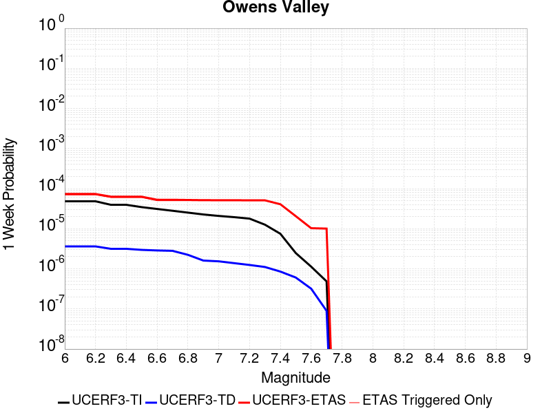 |  |  |  |

| Magnitude | 1 wk TI Prob | 1 wk TD Prob | 1 wk ETAS Prob | 1 wk ETAS/TD Gain | 1 wk ETAS Triggered Only | 1 mo TI Prob | 1 mo TD Prob | 1 mo ETAS Prob | 1 mo ETAS/TD Gain | 1 mo ETAS Triggered Only | 1 yr TI Prob | 1 yr TD Prob | 1 yr ETAS Prob | 1 yr ETAS/TD Gain | 1 yr ETAS Triggered Only | 10 yr TI Prob | 10 yr TD Prob | 10 yr ETAS Prob | 10 yr ETAS/TD Gain | 10 yr ETAS Triggered Only |
|-----|-----|-----|-----|-----|-----|-----|-----|-----|-----|-----|-----|-----|-----|-----|-----|-----|-----|-----|-----|-----|
| 6.0 | 4.83821E-5 | 3.626567E-6 | 9.1153604E-5 | 25.134956 | 8.7527354E-5 | 2.0733538E-4 | 1.5542342E-5 | 1.2494983E-4 | 8.039318 | 1.0940919E-4 | 0.002521386 | 1.8921259E-4 | 2.9860108E-4 | 1.5781248 | 1.0940919E-4 | 0.024929691 | 0.001925011 | 0.0020342097 | 1.0567262 | 1.0940919E-4 |
| 6.1 | 4.83821E-5 | 3.626567E-6 | 9.1153604E-5 | 25.134956 | 8.7527354E-5 | 2.0733538E-4 | 1.5542342E-5 | 1.2494983E-4 | 8.039318 | 1.0940919E-4 | 0.002521386 | 1.8921259E-4 | 2.9860108E-4 | 1.5781248 | 1.0940919E-4 | 0.024929691 | 0.001925011 | 0.0020342097 | 1.0567262 | 1.0940919E-4 |
| 6.2 | 4.83821E-5 | 3.626567E-6 | 9.1153604E-5 | 25.134956 | 8.7527354E-5 | 2.0733538E-4 | 1.5542342E-5 | 1.2494983E-4 | 8.039318 | 1.0940919E-4 | 0.002521386 | 1.8921259E-4 | 2.9860108E-4 | 1.5781248 | 1.0940919E-4 | 0.024929691 | 0.001925011 | 0.0020342097 | 1.0567262 | 1.0940919E-4 |
| 6.3 | 3.953008E-5 | 3.1553948E-6 | 9.068247E-5 | 28.738867 | 8.7527354E-5 | 1.6940363E-4 | 1.3523055E-5 | 1.2293077E-4 | 9.090458 | 1.0940919E-4 | 0.002060538 | 1.6463149E-4 | 2.7402266E-4 | 1.6644609 | 1.0940919E-4 | 0.020415364 | 0.0016592 | 0.0017684276 | 1.0658315 | 1.0940919E-4 |
| 6.4 | 3.953008E-5 | 3.1553948E-6 | 9.068247E-5 | 28.738867 | 8.7527354E-5 | 1.6940363E-4 | 1.3523055E-5 | 1.2293077E-4 | 9.090458 | 1.0940919E-4 | 0.002060538 | 1.6463149E-4 | 2.7402266E-4 | 1.6644609 | 1.0940919E-4 | 0.020415364 | 0.0016592 | 0.0017684276 | 1.0658315 | 1.0940919E-4 |
| 6.5 | 3.457342E-5 | 2.9715961E-6 | 9.049869E-5 | 30.45457 | 8.7527354E-5 | 1.4816338E-4 | 1.2735354E-5 | 1.2214314E-4 | 9.590872 | 1.0940919E-4 | 0.0018023965 | 1.550426E-4 | 2.6443484E-4 | 1.7055624 | 1.0940919E-4 | 0.017878477 | 0.001555719 | 0.001664958 | 1.0702177 | 1.0940919E-4 |
| 6.6 | 3.1127765E-5 | 2.8744932E-6 | 6.851982E-5 | 23.837181 | 6.5645516E-5 | 1.3339789E-4 | 1.2319203E-5 | 9.984548E-5 | 8.104865 | 8.7527354E-5 | 0.0016229092 | 1.4997667E-4 | 2.3749088E-4 | 1.583519 | 8.7527354E-5 | 0.016111081 | 0.0015012559 | 0.0015886518 | 1.0582153 | 8.7527354E-5 |
| 6.7 | 2.806885E-5 | 2.8104134E-6 | 6.8455745E-5 | 24.357891 | 6.5645516E-5 | 1.2028952E-4 | 1.20445775E-5 | 9.9570876E-5 | 8.266864 | 8.7527354E-5 | 0.001463541 | 1.4663354E-4 | 2.3414806E-4 | 1.5968246 | 8.7527354E-5 | 0.014539397 | 0.0014657511 | 0.0015531501 | 1.0596275 | 8.7527354E-5 |
| 6.8 | 2.524524E-5 | 2.2353688E-6 | 6.7880734E-5 | 30.366684 | 6.5645516E-5 | 1.0818939E-4 | 9.580118E-6 | 9.710663E-5 | 10.136267 | 8.7527354E-5 | 0.0013164099 | 1.16632E-4 | 2.0414914E-4 | 1.7503699 | 8.7527354E-5 | 0.01308639 | 0.0011659812 | 0.0012534065 | 1.07498 | 8.7527354E-5 |
| 6.9 | 2.2704568E-5 | 1.6081682E-6 | 6.7253575E-5 | 41.81999 | 6.5645516E-5 | 9.730166E-5 | 6.8921313E-6 | 9.441888E-5 | 13.699518 | 8.7527354E-5 | 0.0011840039 | 8.390849E-5 | 1.714285E-4 | 2.0430412 | 8.7527354E-5 | 0.011777153 | 8.3897985E-4 | 9.264338E-4 | 1.1042384 | 8.7527354E-5 |
| 7.0 | 2.0871712E-5 | 1.5395453E-6 | 6.7184956E-5 | 43.63948 | 6.5645516E-5 | 8.944713E-5 | 6.598035E-6 | 9.412481E-5 | 14.265583 | 8.7527354E-5 | 0.0010884746 | 8.032813E-5 | 1.6784846E-4 | 2.0895352 | 8.7527354E-5 | 0.010831586 | 8.0316263E-4 | 8.9061965E-4 | 1.1088909 | 8.7527354E-5 |
| 7.1 | 1.944928E-5 | 1.3864178E-6 | 6.703184E-5 | 48.34895 | 6.5645516E-5 | 8.335139E-5 | 5.941777E-6 | 9.346861E-5 | 15.73075 | 8.7527354E-5 | 0.0010143308 | 7.233874E-5 | 1.5985976E-4 | 2.2098775 | 8.7527354E-5 | 0.010097133 | 7.2330976E-4 | 8.107738E-4 | 1.120922 | 8.7527354E-5 |
| 7.2 | 1.7876306E-5 | 1.2489141E-6 | 6.689435E-5 | 53.562008 | 6.5645516E-5 | 7.6610486E-5 | 5.352478E-6 | 9.287936E-5 | 17.35259 | 8.7527354E-5 | 9.3233347E-4 | 6.516448E-5 | 1.5268613E-4 | 2.3430882 | 8.7527354E-5 | 0.009284316 | 6.5159105E-4 | 7.390614E-4 | 1.1342411 | 8.7527354E-5 |
| 7.3 | 1.2618672E-5 | 1.1115209E-6 | 6.675696E-5 | 60.059116 | 6.5645516E-5 | 5.40789E-5 | 4.763652E-6 | 9.229059E-5 | 19.373913 | 8.7527354E-5 | 6.582117E-4 | 5.799593E-5 | 1.455182E-4 | 2.5091107 | 8.7527354E-5 | 0.0065626553 | 5.7994033E-4 | 6.6741696E-4 | 1.1508372 | 8.7527354E-5 |
| 7.4 | 7.4874442E-6 | 8.5486437E-7 | 4.4618504E-5 | 52.19366 | 4.3763677E-5 | 3.208865E-5 | 3.6636993E-6 | 6.9308975E-5 | 18.917757 | 6.5645516E-5 | 3.906093E-4 | 4.4604632E-5 | 1.10247216E-4 | 2.471654 | 6.5645516E-5 | 0.003899234 | 4.4604883E-4 | 5.116651E-4 | 1.1471055 | 6.5645516E-5 |
| 7.5 | 2.4734156E-6 | 6.068616E-7 | 2.2488686E-5 | 37.057358 | 2.1881839E-5 | 1.060031E-5 | 2.6008327E-6 | 4.6364396E-5 | 17.82675 | 4.3763677E-5 | 1.2905113E-4 | 3.166468E-5 | 7.542697E-5 | 2.3820536 | 4.3763677E-5 | 0.0012897621 | 3.1660203E-4 | 3.6035184E-4 | 1.1381855 | 4.3763677E-5 |
| 7.6 | 1.1328841E-6 | 3.196531E-7 | 2.2201484E-5 | 69.45493 | 2.1881839E-5 | 4.8552088E-6 | 1.3699412E-6 | 4.5133558E-5 | 32.945618 | 4.3763677E-5 | 5.9110564E-5 | 1.6678909E-5 | 6.0441853E-5 | 3.6238496 | 4.3763677E-5 | 5.9094845E-4 | 1.6677675E-4 | 2.1053312E-4 | 1.262365 | 4.3763677E-5 |
| 7.7 | 4.8613185E-7 | 8.964689E-8 | 2.1971484E-5 | 245.08919 | 2.1881839E-5 | 2.0834207E-6 | 3.8420092E-7 | 2.2266031E-5 | 57.954132 | 2.1881839E-5 | 2.536535E-5 | 4.6776368E-6 | 2.6559372E-5 | 5.677947 | 2.1881839E-5 | 2.5362454E-4 | 4.677545E-5 | 6.865626E-5 | 1.4677842 | 2.1881839E-5 |

## White Mountains
*[(top)](#table-of-contents)*

| 1 Week | 1 Month | 1 Year | 10 Year |
|-----|-----|-----|-----|
|  |  |  |  |

| Magnitude | 1 wk TI Prob | 1 wk TD Prob | 1 wk ETAS Prob | 1 wk ETAS/TD Gain | 1 wk ETAS Triggered Only | 1 mo TI Prob | 1 mo TD Prob | 1 mo ETAS Prob | 1 mo ETAS/TD Gain | 1 mo ETAS Triggered Only | 1 yr TI Prob | 1 yr TD Prob | 1 yr ETAS Prob | 1 yr ETAS/TD Gain | 1 yr ETAS Triggered Only | 10 yr TI Prob | 10 yr TD Prob | 10 yr ETAS Prob | 10 yr ETAS/TD Gain | 10 yr ETAS Triggered Only |
|-----|-----|-----|-----|-----|-----|-----|-----|-----|-----|-----|-----|-----|-----|-----|-----|-----|-----|-----|-----|-----|
| 6.0 | 3.503579E-5 | 3.378405E-5 | 1.2130845E-4 | 3.5907016 | 8.7527354E-5 | 1.5014476E-4 | 1.4478143E-4 | 2.3229611E-4 | 1.6044606 | 8.7527354E-5 | 0.0018264796 | 0.0017614096 | 0.0018487828 | 1.0496042 | 8.7527354E-5 | 0.018115403 | 0.017486818 | 0.017572815 | 1.0049179 | 8.7527354E-5 |
| 6.1 | 3.503579E-5 | 3.378405E-5 | 1.2130845E-4 | 3.5907016 | 8.7527354E-5 | 1.5014476E-4 | 1.4478143E-4 | 2.3229611E-4 | 1.6044606 | 8.7527354E-5 | 0.0018264796 | 0.0017614096 | 0.0018487828 | 1.0496042 | 8.7527354E-5 | 0.018115403 | 0.017486818 | 0.017572815 | 1.0049179 | 8.7527354E-5 |
| 6.2 | 3.503579E-5 | 3.378405E-5 | 1.2130845E-4 | 3.5907016 | 8.7527354E-5 | 1.5014476E-4 | 1.4478143E-4 | 2.3229611E-4 | 1.6044606 | 8.7527354E-5 | 0.0018264796 | 0.0017614096 | 0.0018487828 | 1.0496042 | 8.7527354E-5 | 0.018115403 | 0.017486818 | 0.017572815 | 1.0049179 | 8.7527354E-5 |
| 6.3 | 1.7818425E-5 | 1.5916074E-5 | 1.5916074E-5 | 1.0 | 0.0 | 7.636245E-5 | 6.821004E-5 | 6.821004E-5 | 1.0 | 0.0 | 9.293162E-4 | 8.301551E-4 | 8.301551E-4 | 1.0 | 0.0 | 0.009254395 | 0.008271999 | 0.008271999 | 1.0 | 0.0 |
| 6.4 | 1.7818425E-5 | 1.5916074E-5 | 1.5916074E-5 | 1.0 | 0.0 | 7.636245E-5 | 6.821004E-5 | 6.821004E-5 | 1.0 | 0.0 | 9.293162E-4 | 8.301551E-4 | 8.301551E-4 | 1.0 | 0.0 | 0.009254395 | 0.008271999 | 0.008271999 | 1.0 | 0.0 |
| 6.5 | 1.3397557E-5 | 1.13362685E-5 | 1.13362685E-5 | 1.0 | 0.0 | 5.741684E-5 | 4.858314E-5 | 4.858314E-5 | 1.0 | 0.0 | 6.988258E-4 | 5.913462E-4 | 5.913462E-4 | 1.0 | 0.0 | 0.006966323 | 0.005898432 | 0.005898432 | 1.0 | 0.0 |
| 6.6 | 1.0818695E-5 | 8.625366E-6 | 8.625366E-6 | 1.0 | 0.0 | 4.6365014E-5 | 3.6965357E-5 | 3.6965357E-5 | 1.0 | 0.0 | 5.6434784E-4 | 4.4996463E-4 | 4.4996463E-4 | 1.0 | 0.0 | 0.005629168 | 0.004490972 | 0.004490972 | 1.0 | 0.0 |
| 6.7 | 9.067908E-6 | 6.802442E-6 | 6.802442E-6 | 1.0 | 0.0 | 3.8861883E-5 | 2.9153016E-5 | 2.9153016E-5 | 1.0 | 0.0 | 4.7304068E-4 | 3.5488335E-4 | 3.5488335E-4 | 1.0 | 0.0 | 0.00472035 | 0.0035434833 | 0.0035434833 | 1.0 | 0.0 |
| 6.8 | 7.295947E-6 | 4.936391E-6 | 4.936391E-6 | 1.0 | 0.0 | 3.126797E-5 | 2.1155796E-5 | 2.1155796E-5 | 1.0 | 0.0 | 3.8062103E-4 | 2.575425E-4 | 2.575425E-4 | 1.0 | 0.0 | 0.0037996976 | 0.0025725532 | 0.0025725532 | 1.0 | 0.0 |
| 6.9 | 6.2243444E-6 | 3.832213E-6 | 3.832213E-6 | 1.0 | 0.0 | 2.6675489E-5 | 1.642367E-5 | 1.642367E-5 | 1.0 | 0.0 | 3.2472567E-4 | 1.9994036E-4 | 1.9994036E-4 | 1.0 | 0.0 | 0.0032425157 | 0.0019976576 | 0.0019976576 | 1.0 | 0.0 |
| 7.0 | 4.9878413E-6 | 2.6795342E-6 | 2.6795342E-6 | 1.0 | 0.0 | 2.1376287E-5 | 1.14836685E-5 | 1.14836685E-5 | 1.0 | 0.0 | 2.602252E-4 | 1.3980496E-4 | 1.3980496E-4 | 1.0 | 0.0 | 0.002599207 | 0.0013971963 | 0.0013971963 | 1.0 | 0.0 |
| 7.1 | 4.0252844E-6 | 1.8857575E-6 | 1.8857575E-6 | 1.0 | 0.0 | 1.7251105E-5 | 8.081794E-6 | 8.081794E-6 | 1.0 | 0.0 | 2.1001195E-4 | 9.8391516E-5 | 9.8391516E-5 | 1.0 | 0.0 | 0.0020981359 | 9.834924E-4 | 9.834924E-4 | 1.0 | 0.0 |
| 7.2 | 3.3284066E-6 | 1.281964E-6 | 1.281964E-6 | 1.0 | 0.0 | 1.4264522E-5 | 5.494121E-6 | 5.494121E-6 | 1.0 | 0.0 | 1.736567E-4 | 6.688897E-5 | 6.688897E-5 | 1.0 | 0.0 | 0.0017352107 | 6.6869846E-4 | 6.6869846E-4 | 1.0 | 0.0 |
| 7.3 | 2.458226E-6 | 6.05722E-7 | 6.05722E-7 | 1.0 | 0.0 | 1.0535211E-5 | 2.5959491E-6 | 2.5959491E-6 | 1.0 | 0.0 | 1.2825865E-4 | 3.1605257E-5 | 3.1605257E-5 | 1.0 | 0.0 | 0.0012818464 | 3.160114E-4 | 3.160114E-4 | 1.0 | 0.0 |
| 7.4 | 1.965953E-6 | 3.1089303E-7 | 3.1089303E-7 | 1.0 | 0.0 | 8.425486E-6 | 1.332398E-6 | 1.332398E-6 | 1.0 | 0.0 | 1.0257547E-4 | 1.6221828E-5 | 1.6221828E-5 | 1.0 | 0.0 | 0.0010252813 | 1.6220656E-4 | 1.6220656E-4 | 1.0 | 0.0 |
| 7.5 | 1.2014192E-6 | 1.8244253E-7 | 1.8244253E-7 | 1.0 | 0.0 | 5.148929E-6 | 7.8189635E-7 | 7.8189635E-7 | 1.0 | 0.0 | 6.2686406E-5 | 9.519547E-6 | 9.519547E-6 | 1.0 | 0.0 | 6.266873E-4 | 9.519148E-5 | 9.519148E-5 | 1.0 | 0.0 |
| 7.6 | 2.5612175E-7 | 4.8946475E-8 | 4.8946475E-8 | 1.0 | 0.0 | 1.0976642E-6 | 2.0977059E-7 | 2.0977059E-7 | 1.0 | 0.0 | 1.3363979E-5 | 2.5539543E-6 | 2.5539543E-6 | 1.0 | 0.0 | 1.3363175E-4 | 2.5539286E-5 | 2.5539286E-5 | 1.0 | 0.0 |

## Hosgri
*[(top)](#table-of-contents)*

| 1 Week | 1 Month | 1 Year | 10 Year |
|-----|-----|-----|-----|
|  |  |  | 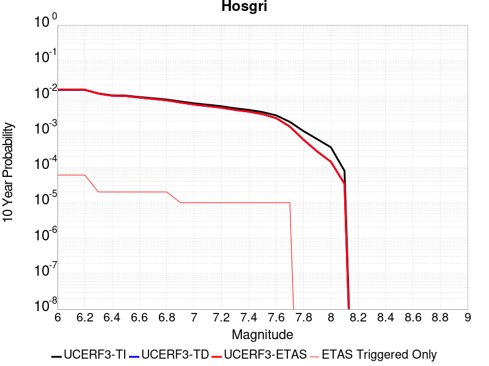 |

| Magnitude | 1 wk TI Prob | 1 wk TD Prob | 1 wk ETAS Prob | 1 wk ETAS/TD Gain | 1 wk ETAS Triggered Only | 1 mo TI Prob | 1 mo TD Prob | 1 mo ETAS Prob | 1 mo ETAS/TD Gain | 1 mo ETAS Triggered Only | 1 yr TI Prob | 1 yr TD Prob | 1 yr ETAS Prob | 1 yr ETAS/TD Gain | 1 yr ETAS Triggered Only | 10 yr TI Prob | 10 yr TD Prob | 10 yr ETAS Prob | 10 yr ETAS/TD Gain | 10 yr ETAS Triggered Only |
|-----|-----|-----|-----|-----|-----|-----|-----|-----|-----|-----|-----|-----|-----|-----|-----|-----|-----|-----|-----|-----|
| 6.0 | 2.883978E-5 | 2.9128416E-5 | 9.477202E-5 | 3.2535932 | 6.5645516E-5 | 1.235932E-4 | 1.2483024E-4 | 1.9046757E-4 | 1.5258126 | 6.5645516E-5 | 0.0015037085 | 0.001518776 | 0.0016061703 | 1.0575427 | 8.7527354E-5 | 0.01493574 | 0.01508774 | 0.0151739465 | 1.0057137 | 8.7527354E-5 |
| 6.1 | 2.883978E-5 | 2.9128416E-5 | 9.477202E-5 | 3.2535932 | 6.5645516E-5 | 1.235932E-4 | 1.2483024E-4 | 1.9046757E-4 | 1.5258126 | 6.5645516E-5 | 0.0015037085 | 0.001518776 | 0.0016061703 | 1.0575427 | 8.7527354E-5 | 0.01493574 | 0.01508774 | 0.0151739465 | 1.0057137 | 8.7527354E-5 |
| 6.2 | 2.883978E-5 | 2.9128416E-5 | 9.477202E-5 | 3.2535932 | 6.5645516E-5 | 1.235932E-4 | 1.2483024E-4 | 1.9046757E-4 | 1.5258126 | 6.5645516E-5 | 0.0015037085 | 0.001518776 | 0.0016061703 | 1.0575427 | 8.7527354E-5 | 0.01493574 | 0.01508774 | 0.0151739465 | 1.0057137 | 8.7527354E-5 |
| 6.3 | 2.2914428E-5 | 2.2641969E-5 | 2.2641969E-5 | 1.0 | 0.0 | 9.8200995E-5 | 9.703343E-5 | 9.703343E-5 | 1.0 | 0.0 | 0.0011949413 | 0.0011807467 | 0.0012026026 | 1.0185103 | 2.1881839E-5 | 0.011885363 | 0.011746133 | 0.011767758 | 1.0018411 | 2.1881839E-5 |
| 6.4 | 2.0195741E-5 | 1.969656E-5 | 1.969656E-5 | 1.0 | 0.0 | 8.65503E-5 | 8.4411105E-5 | 8.4411105E-5 | 1.0 | 0.0 | 0.0010532405 | 0.0010272227 | 0.001049082 | 1.02128 | 2.1881839E-5 | 0.010482626 | 0.010225792 | 0.01024745 | 1.002118 | 2.1881839E-5 |
| 6.5 | 1.9924333E-5 | 1.940898E-5 | 1.940898E-5 | 1.0 | 0.0 | 8.53872E-5 | 8.3178704E-5 | 8.3178704E-5 | 1.0 | 0.0 | 0.0010390934 | 0.0010122322 | 0.0010340919 | 1.0215955 | 2.1881839E-5 | 0.010342481 | 0.010077253 | 0.010098915 | 1.0021496 | 2.1881839E-5 |
| 6.6 | 1.809694E-5 | 1.74583E-5 | 1.74583E-5 | 1.0 | 0.0 | 7.7556004E-5 | 7.4819145E-5 | 7.4819145E-5 | 1.0 | 0.0 | 9.438353E-4 | 9.105437E-4 | 9.3240564E-4 | 1.0240097 | 2.1881839E-5 | 0.009398366 | 0.009069073 | 0.009090756 | 1.0023909 | 2.1881839E-5 |
| 6.7 | 1.675989E-5 | 1.6042764E-5 | 1.6042764E-5 | 1.0 | 0.0 | 7.182612E-5 | 6.87529E-5 | 6.87529E-5 | 1.0 | 0.0 | 8.7413215E-4 | 8.3674624E-4 | 8.5860974E-4 | 1.0261292 | 2.1881839E-5 | 0.008707017 | 0.0083368635 | 0.008358562 | 1.0026028 | 2.1881839E-5 |
| 6.8 | 1.5401129E-5 | 1.4614083E-5 | 1.4614083E-5 | 1.0 | 0.0 | 6.6003166E-5 | 6.2630286E-5 | 6.2630286E-5 | 1.0 | 0.0 | 8.032922E-4 | 7.622578E-4 | 7.8412297E-4 | 1.0286847 | 2.1881839E-5 | 0.008003947 | 0.007597296 | 0.0076190117 | 1.0028583 | 2.1881839E-5 |
| 6.9 | 1.356559E-5 | 1.2689968E-5 | 1.2689968E-5 | 1.0 | 0.0 | 5.8136946E-5 | 5.4384444E-5 | 5.4384444E-5 | 1.0 | 0.0 | 7.0758746E-4 | 6.619299E-4 | 6.619299E-4 | 1.0 | 0.0 | 0.007053386 | 0.006600388 | 0.006600388 | 1.0 | 0.0 |
| 7.0 | 1.2030819E-5 | 1.1095962E-5 | 1.1095962E-5 | 1.0 | 0.0 | 5.155963E-5 | 4.7553254E-5 | 4.7553254E-5 | 1.0 | 0.0 | 6.275577E-4 | 5.7880714E-4 | 5.7880714E-4 | 1.0 | 0.0 | 0.006257884 | 0.005773757 | 0.005773757 | 1.0 | 0.0 |
| 7.1 | 1.0972698E-5 | 1.0022179E-5 | 1.0022179E-5 | 1.0 | 0.0 | 4.7025E-5 | 4.2951488E-5 | 4.2951488E-5 | 1.0 | 0.0 | 5.72379E-4 | 5.22809E-4 | 5.22809E-4 | 1.0 | 0.0 | 0.0057090693 | 0.005216542 | 0.005216542 | 1.0 | 0.0 |
| 7.2 | 9.961926E-6 | 9.034746E-6 | 9.034746E-6 | 1.0 | 0.0 | 4.2693267E-5 | 3.8719765E-5 | 3.8719765E-5 | 1.0 | 0.0 | 5.1966653E-4 | 4.713112E-4 | 4.713112E-4 | 1.0 | 0.0 | 0.00518453 | 0.0047038626 | 0.0047038626 | 1.0 | 0.0 |
| 7.3 | 8.700929E-6 | 7.8281E-6 | 7.8281E-6 | 1.0 | 0.0 | 3.7289166E-5 | 3.354857E-5 | 3.354857E-5 | 1.0 | 0.0 | 4.53901E-4 | 4.0837732E-4 | 4.0837732E-4 | 1.0 | 0.0 | 0.00452975 | 0.004077008 | 0.004077008 | 1.0 | 0.0 |
| 7.4 | 7.866285E-6 | 6.998739E-6 | 6.998739E-6 | 1.0 | 0.0 | 3.3712215E-5 | 2.9994251E-5 | 2.9994251E-5 | 1.0 | 0.0 | 4.103689E-4 | 3.6511885E-4 | 3.6511885E-4 | 1.0 | 0.0 | 0.004096119 | 0.0036459267 | 0.0036459267 | 1.0 | 0.0 |
| 7.5 | 6.8381305E-6 | 5.9596955E-6 | 5.9596955E-6 | 1.0 | 0.0 | 2.9305946E-5 | 2.5541302E-5 | 2.5541302E-5 | 1.0 | 0.0 | 3.5674145E-4 | 3.10921E-4 | 3.10921E-4 | 1.0 | 0.0 | 0.0035616932 | 0.0031055948 | 0.0031055948 | 1.0 | 0.0 |
| 7.6 | 5.503376E-6 | 4.5952443E-6 | 4.5952443E-6 | 1.0 | 0.0 | 2.3585684E-5 | 1.9693754E-5 | 1.9693754E-5 | 1.0 | 0.0 | 2.8711787E-4 | 2.397451E-4 | 2.397451E-4 | 1.0 | 0.0 | 0.002867472 | 0.0023955975 | 0.0023955975 | 1.0 | 0.0 |
| 7.7 | 3.6144982E-6 | 2.6522112E-6 | 2.6522112E-6 | 1.0 | 0.0 | 1.5490614E-5 | 1.1366569E-5 | 1.1366569E-5 | 1.0 | 0.0 | 1.8858191E-4 | 1.383792E-4 | 1.383792E-4 | 1.0 | 0.0 | 0.0018842196 | 0.0013836613 | 0.0013836613 | 1.0 | 0.0 |
| 7.8 | 1.9853494E-6 | 1.1361129E-6 | 1.1361129E-6 | 1.0 | 0.0 | 8.508612E-6 | 4.8690463E-6 | 4.8690463E-6 | 1.0 | 0.0 | 1.0358743E-4 | 5.9279027E-5 | 5.9279027E-5 | 1.0 | 0.0 | 0.0010353916 | 5.9336185E-4 | 5.9336185E-4 | 1.0 | 0.0 |
| 7.9 | 1.1818757E-6 | 5.2951856E-7 | 5.2951856E-7 | 1.0 | 0.0 | 5.0651715E-6 | 2.2693632E-6 | 2.2693632E-6 | 1.0 | 0.0 | 6.1666724E-5 | 2.7629147E-5 | 2.7629147E-5 | 1.0 | 0.0 | 6.1649614E-4 | 2.7694515E-4 | 2.7694515E-4 | 1.0 | 0.0 |
| 8.0 | 6.962958E-7 | 2.7139782E-7 | 2.7139782E-7 | 1.0 | 0.0 | 2.9841215E-6 | 1.163133E-6 | 1.163133E-6 | 1.0 | 0.0 | 3.6331072E-5 | 1.4161053E-5 | 1.4161053E-5 | 1.0 | 0.0 | 3.6325134E-4 | 1.4217179E-4 | 1.4217179E-4 | 1.0 | 0.0 |
| 8.1 | 1.5033264E-7 | 6.527624E-8 | 6.527624E-8 | 1.0 | 0.0 | 6.442826E-7 | 2.7975528E-7 | 2.7975528E-7 | 1.0 | 0.0 | 7.844113E-6 | 3.4060151E-6 | 3.4060151E-6 | 1.0 | 0.0 | 7.843835E-5 | 3.407693E-5 | 3.407693E-5 | 1.0 | 0.0 |

## Ludlow
*[(top)](#table-of-contents)*

| 1 Week | 1 Month | 1 Year | 10 Year |
|-----|-----|-----|-----|
|  |  |  |  |

| Magnitude | 1 wk TI Prob | 1 wk TD Prob | 1 wk ETAS Prob | 1 wk ETAS/TD Gain | 1 wk ETAS Triggered Only | 1 mo TI Prob | 1 mo TD Prob | 1 mo ETAS Prob | 1 mo ETAS/TD Gain | 1 mo ETAS Triggered Only | 1 yr TI Prob | 1 yr TD Prob | 1 yr ETAS Prob | 1 yr ETAS/TD Gain | 1 yr ETAS Triggered Only | 10 yr TI Prob | 10 yr TD Prob | 10 yr ETAS Prob | 10 yr ETAS/TD Gain | 10 yr ETAS Triggered Only |
|-----|-----|-----|-----|-----|-----|-----|-----|-----|-----|-----|-----|-----|-----|-----|-----|-----|-----|-----|-----|-----|
| 6.0 | 2.2407607E-5 | 2.3657254E-5 | 1.1118253E-4 | 4.699723 | 8.7527354E-5 | 9.602906E-5 | 1.0138454E-4 | 1.8890301E-4 | 1.863233 | 8.7527354E-5 | 0.0011685267 | 0.001233702 | 0.0013211214 | 1.0708594 | 8.7527354E-5 | 0.011624013 | 0.012273042 | 0.012359495 | 1.0070442 | 8.7527354E-5 |
| 6.1 | 2.2407607E-5 | 2.3657254E-5 | 1.1118253E-4 | 4.699723 | 8.7527354E-5 | 9.602906E-5 | 1.0138454E-4 | 1.8890301E-4 | 1.863233 | 8.7527354E-5 | 0.0011685267 | 0.001233702 | 0.0013211214 | 1.0708594 | 8.7527354E-5 | 0.011624013 | 0.012273042 | 0.012359495 | 1.0070442 | 8.7527354E-5 |
| 6.2 | 1.0781252E-5 | 1.1365663E-5 | 3.3247252E-5 | 2.9252365 | 2.1881839E-5 | 4.620455E-5 | 4.8709102E-5 | 7.058987E-5 | 1.4492133 | 2.1881839E-5 | 5.623952E-4 | 5.9287593E-4 | 6.1474484E-4 | 1.0368861 | 2.1881839E-5 | 0.00560974 | 0.0059133614 | 0.005935114 | 1.0036786 | 2.1881839E-5 |
| 6.3 | 1.0781252E-5 | 1.1365663E-5 | 3.3247252E-5 | 2.9252365 | 2.1881839E-5 | 4.620455E-5 | 4.8709102E-5 | 7.058987E-5 | 1.4492133 | 2.1881839E-5 | 5.623952E-4 | 5.9287593E-4 | 6.1474484E-4 | 1.0368861 | 2.1881839E-5 | 0.00560974 | 0.0059133614 | 0.005935114 | 1.0036786 | 2.1881839E-5 |
| 6.4 | 7.814439E-6 | 8.237729E-6 | 3.0119387E-5 | 3.6562731 | 2.1881839E-5 | 3.3490025E-5 | 3.530408E-5 | 5.718515E-5 | 1.6197885 | 2.1881839E-5 | 4.0766477E-4 | 4.2974384E-4 | 4.5161627E-4 | 1.0508964 | 2.1881839E-5 | 0.0040691774 | 0.0042892746 | 0.0043110624 | 1.0050796 | 2.1881839E-5 |
| 6.5 | 6.4986366E-6 | 6.85092E-6 | 2.8732607E-5 | 4.1939783 | 2.1881839E-5 | 2.7851002E-5 | 2.9360759E-5 | 5.1241954E-5 | 1.7452531 | 2.1881839E-5 | 3.390332E-4 | 3.5740953E-4 | 3.7928353E-4 | 1.0612016 | 2.1881839E-5 | 0.003385164 | 0.0035684432 | 0.0035902471 | 1.0061102 | 2.1881839E-5 |
| 6.6 | 5.582177E-6 | 5.8860055E-6 | 2.7767715E-5 | 4.717582 | 2.1881839E-5 | 2.3923398E-5 | 2.5225498E-5 | 4.7106783E-5 | 1.8674273 | 2.1881839E-5 | 2.9122844E-4 | 3.0707786E-4 | 3.28953E-4 | 1.0712364 | 2.1881839E-5 | 0.0029084706 | 0.003066609 | 0.0030884235 | 1.0071136 | 2.1881839E-5 |
| 6.7 | 4.6858763E-6 | 4.940427E-6 | 2.6822157E-5 | 5.4291167 | 2.1881839E-5 | 2.0082172E-5 | 2.1173091E-5 | 4.3054464E-5 | 2.033452 | 2.1881839E-5 | 2.4447302E-4 | 2.5775246E-4 | 2.7962864E-4 | 1.084873 | 2.1881839E-5 | 0.0024420423 | 0.0025745912 | 0.0025964167 | 1.0084772 | 2.1881839E-5 |
| 6.8 | 3.5584908E-6 | 3.7520183E-6 | 2.5633773E-5 | 6.831996 | 2.1881839E-5 | 1.5250586E-5 | 1.6079981E-5 | 3.796147E-5 | 2.3607905 | 2.1881839E-5 | 1.8566006E-4 | 1.957566E-4 | 2.1763415E-4 | 1.111759 | 2.1881839E-5 | 0.0018550502 | 0.0019558826 | 0.0019777217 | 1.0111659 | 2.1881839E-5 |
| 6.9 | 2.532834E-6 | 2.6710034E-6 | 2.6710034E-6 | 1.0 | 0.0 | 1.0854958E-5 | 1.1447109E-5 | 1.1447109E-5 | 1.0 | 0.0 | 1.3215111E-4 | 1.3935992E-4 | 1.3935992E-4 | 1.0 | 0.0 | 0.0013207254 | 0.0013927529 | 0.0013927529 | 1.0 | 0.0 |
| 7.0 | 1.7083285E-6 | 1.8019439E-6 | 1.8019439E-6 | 1.0 | 0.0 | 7.3213873E-6 | 7.722595E-6 | 7.722595E-6 | 1.0 | 0.0 | 8.913424E-5 | 9.40187E-5 | 9.40187E-5 | 1.0 | 0.0 | 8.9098496E-4 | 9.3980576E-4 | 9.3980576E-4 | 1.0 | 0.0 |
| 7.1 | 1.0905424E-6 | 1.1497619E-6 | 1.1497619E-6 | 1.0 | 0.0 | 4.6737446E-6 | 4.9275427E-6 | 4.9275427E-6 | 1.0 | 0.0 | 5.6901354E-5 | 5.999128E-5 | 5.999128E-5 | 1.0 | 0.0 | 5.6886784E-4 | 5.997606E-4 | 5.997606E-4 | 1.0 | 0.0 |
| 7.2 | 6.06668E-7 | 6.387277E-7 | 6.387277E-7 | 1.0 | 0.0 | 2.600003E-6 | 2.7374022E-6 | 2.7374022E-6 | 1.0 | 0.0 | 3.1654577E-5 | 3.3327433E-5 | 3.3327433E-5 | 1.0 | 0.0 | 3.1650066E-4 | 3.3323118E-4 | 3.3323118E-4 | 1.0 | 0.0 |

## San Jacinto (Lytle Creek connector)
*[(top)](#table-of-contents)*

| 1 Week | 1 Month | 1 Year | 10 Year |
|-----|-----|-----|-----|
|  |  |  |  |

| Magnitude | 1 wk TI Prob | 1 wk TD Prob | 1 wk ETAS Prob | 1 wk ETAS/TD Gain | 1 wk ETAS Triggered Only | 1 mo TI Prob | 1 mo TD Prob | 1 mo ETAS Prob | 1 mo ETAS/TD Gain | 1 mo ETAS Triggered Only | 1 yr TI Prob | 1 yr TD Prob | 1 yr ETAS Prob | 1 yr ETAS/TD Gain | 1 yr ETAS Triggered Only | 10 yr TI Prob | 10 yr TD Prob | 10 yr ETAS Prob | 10 yr ETAS/TD Gain | 10 yr ETAS Triggered Only |
|-----|-----|-----|-----|-----|-----|-----|-----|-----|-----|-----|-----|-----|-----|-----|-----|-----|-----|-----|-----|-----|
| 6.0 | 6.693995E-6 | 6.660216E-6 | 9.418699E-5 | 14.141731 | 8.7527354E-5 | 2.8688235E-5 | 2.854347E-5 | 1.16068324E-4 | 4.0663705 | 8.7527354E-5 | 3.492233E-4 | 3.4746144E-4 | 4.3495838E-4 | 1.2518177 | 8.7527354E-5 | 0.00348675 | 0.0035493854 | 0.003636602 | 1.0245724 | 8.7527354E-5 |
| 6.1 | 6.693995E-6 | 6.660216E-6 | 9.418699E-5 | 14.141731 | 8.7527354E-5 | 2.8688235E-5 | 2.854347E-5 | 1.16068324E-4 | 4.0663705 | 8.7527354E-5 | 3.492233E-4 | 3.4746144E-4 | 4.3495838E-4 | 1.2518177 | 8.7527354E-5 | 0.00348675 | 0.0035493854 | 0.003636602 | 1.0245724 | 8.7527354E-5 |
| 6.2 | 6.693995E-6 | 6.660216E-6 | 9.418699E-5 | 14.141731 | 8.7527354E-5 | 2.8688235E-5 | 2.854347E-5 | 1.16068324E-4 | 4.0663705 | 8.7527354E-5 | 3.492233E-4 | 3.4746144E-4 | 4.3495838E-4 | 1.2518177 | 8.7527354E-5 | 0.00348675 | 0.0035493854 | 0.003636602 | 1.0245724 | 8.7527354E-5 |
| 6.3 | 6.693995E-6 | 6.660216E-6 | 9.418699E-5 | 14.141731 | 8.7527354E-5 | 2.8688235E-5 | 2.854347E-5 | 1.16068324E-4 | 4.0663705 | 8.7527354E-5 | 3.492233E-4 | 3.4746144E-4 | 4.3495838E-4 | 1.2518177 | 8.7527354E-5 | 0.00348675 | 0.0035493854 | 0.003636602 | 1.0245724 | 8.7527354E-5 |
| 6.4 | 6.693995E-6 | 6.660216E-6 | 9.418699E-5 | 14.141731 | 8.7527354E-5 | 2.8688235E-5 | 2.854347E-5 | 1.16068324E-4 | 4.0663705 | 8.7527354E-5 | 3.492233E-4 | 3.4746144E-4 | 4.3495838E-4 | 1.2518177 | 8.7527354E-5 | 0.00348675 | 0.0035493854 | 0.003636602 | 1.0245724 | 8.7527354E-5 |
| 6.5 | 6.6561875E-6 | 6.6204343E-6 | 9.414721E-5 | 14.220699 | 8.7527354E-5 | 2.8526205E-5 | 2.837298E-5 | 1.1589785E-4 | 4.0847964 | 8.7527354E-5 | 3.472512E-4 | 3.4538636E-4 | 4.328835E-4 | 1.2533312 | 8.7527354E-5 | 0.0034670907 | 0.003528701 | 0.0036159193 | 1.0247169 | 8.7527354E-5 |
| 6.6 | 6.6561875E-6 | 6.6204343E-6 | 9.414721E-5 | 14.220699 | 8.7527354E-5 | 2.8526205E-5 | 2.837298E-5 | 1.1589785E-4 | 4.0847964 | 8.7527354E-5 | 3.472512E-4 | 3.4538636E-4 | 4.328835E-4 | 1.2533312 | 8.7527354E-5 | 0.0034670907 | 0.003528701 | 0.0036159193 | 1.0247169 | 8.7527354E-5 |
| 6.7 | 6.5802237E-6 | 6.539611E-6 | 9.406639E-5 | 14.384096 | 8.7527354E-5 | 2.8200653E-5 | 2.8026603E-5 | 1.15551506E-4 | 4.122922 | 8.7527354E-5 | 3.4328885E-4 | 3.4117055E-4 | 4.2866805E-4 | 1.2564626 | 8.7527354E-5 | 0.0034275902 | 0.0034866752 | 0.0035738975 | 1.0250158 | 8.7527354E-5 |
| 6.8 | 6.575632E-6 | 6.5341005E-6 | 9.406088E-5 | 14.395383 | 8.7527354E-5 | 2.8180975E-5 | 2.8002989E-5 | 1.1552789E-4 | 4.1255555 | 8.7527354E-5 | 3.4304935E-4 | 3.4088313E-4 | 4.2838065E-4 | 1.2566789 | 8.7527354E-5 | 0.0034252026 | 0.00348381 | 0.0035710325 | 1.0250365 | 8.7527354E-5 |
| 6.9 | 6.570433E-6 | 6.525495E-6 | 9.405227E-5 | 14.413049 | 8.7527354E-5 | 2.8158694E-5 | 2.7966107E-5 | 1.1549101E-4 | 4.129678 | 8.7527354E-5 | 3.4277816E-4 | 3.4043423E-4 | 4.2793178E-4 | 1.2570175 | 8.7527354E-5 | 0.0034224992 | 0.0034793352 | 0.003566558 | 1.0250688 | 8.7527354E-5 |
| 7.0 | 6.5643826E-6 | 6.515616E-6 | 9.40424E-5 | 14.433386 | 8.7527354E-5 | 2.8132765E-5 | 2.792377E-5 | 1.15448674E-4 | 4.1344233 | 8.7527354E-5 | 3.424626E-4 | 3.3991894E-4 | 4.2741653E-4 | 1.2574073 | 8.7527354E-5 | 0.0034193532 | 0.0034741985 | 0.0035614218 | 1.025106 | 8.7527354E-5 |
| 7.1 | 6.557402E-6 | 6.5043278E-6 | 9.403111E-5 | 14.456699 | 8.7527354E-5 | 2.8102848E-5 | 2.7875392E-5 | 1.15400304E-4 | 4.139863 | 8.7527354E-5 | 3.4209844E-4 | 3.3933012E-4 | 4.2682778E-4 | 1.2578541 | 8.7527354E-5 | 0.0034157229 | 0.0034683298 | 0.0035555535 | 1.0251486 | 8.7527354E-5 |
| 7.2 | 6.546394E-6 | 6.4862943E-6 | 9.401308E-5 | 14.494112 | 8.7527354E-5 | 2.8055672E-5 | 2.7798109E-5 | 1.15323026E-4 | 4.1485925 | 8.7527354E-5 | 3.4152428E-4 | 3.3838948E-4 | 4.2588724E-4 | 1.258571 | 8.7527354E-5 | 0.0034099987 | 0.0034589572 | 0.0035461816 | 1.025217 | 8.7527354E-5 |
| 7.3 | 6.5364216E-6 | 6.4670803E-6 | 9.399387E-5 | 14.5342045 | 8.7527354E-5 | 2.8012933E-5 | 2.7715765E-5 | 1.1524069E-4 | 4.1579475 | 8.7527354E-5 | 3.4100408E-4 | 3.3738726E-4 | 4.2488507E-4 | 1.2593395 | 8.7527354E-5 | 0.003404813 | 0.0034489788 | 0.0035362043 | 1.0252903 | 8.7527354E-5 |
| 7.4 | 6.5269523E-6 | 6.4481674E-6 | 9.397496E-5 | 14.573901 | 8.7527354E-5 | 2.7972354E-5 | 2.7634711E-5 | 1.15159644E-4 | 4.16721 | 8.7527354E-5 | 3.4051016E-4 | 3.3640073E-4 | 4.2389866E-4 | 1.2601002 | 8.7527354E-5 | 0.0033998888 | 0.003439161 | 0.0035263873 | 1.0253627 | 8.7527354E-5 |
| 7.5 | 6.5111835E-6 | 6.424442E-6 | 9.395123E-5 | 14.62403 | 8.7527354E-5 | 2.7904773E-5 | 2.7533031E-5 | 1.1505798E-4 | 4.178907 | 8.7527354E-5 | 3.3968766E-4 | 3.3516317E-4 | 4.226612E-4 | 1.261061 | 8.7527354E-5 | 0.0033916887 | 0.003426834 | 0.0035140614 | 1.0254543 | 8.7527354E-5 |
| 7.6 | 6.4768806E-6 | 6.383551E-6 | 9.391034E-5 | 14.711302 | 8.7527354E-5 | 2.7757764E-5 | 2.735779E-5 | 1.1488275E-4 | 4.1992702 | 8.7527354E-5 | 3.3789838E-4 | 3.3303024E-4 | 4.2052846E-4 | 1.2627335 | 8.7527354E-5 | 0.0033738504 | 0.0034055663 | 0.0034927954 | 1.0256138 | 8.7527354E-5 |
| 7.7 | 6.1655364E-6 | 6.1760365E-6 | 9.3702845E-5 | 15.172004 | 8.7527354E-5 | 2.642346E-5 | 2.646846E-5 | 1.139935E-4 | 4.3067675 | 8.7527354E-5 | 3.2165812E-4 | 3.2220592E-4 | 4.0970507E-4 | 1.2715628 | 8.7527354E-5 | 0.0032119295 | 0.0032971818 | 0.0033844204 | 1.0264586 | 8.7527354E-5 |
| 7.8 | 5.5043524E-6 | 5.737097E-6 | 9.3263945E-5 | 16.256296 | 8.7527354E-5 | 2.3589868E-5 | 2.4587327E-5 | 1.12112524E-4 | 4.5597687 | 8.7527354E-5 | 2.871688E-4 | 2.9930964E-4 | 3.868108E-4 | 1.2923433 | 8.7527354E-5 | 0.0028679797 | 0.0030672832 | 0.003154542 | 1.0284482 | 8.7527354E-5 |
| 7.9 | 3.889249E-6 | 4.076761E-6 | 6.972201E-5 | 17.102304 | 6.5645516E-5 | 1.6668104E-5 | 1.7471715E-5 | 8.311609E-5 | 4.7571793 | 6.5645516E-5 | 2.0291525E-4 | 2.1269741E-4 | 2.7832898E-4 | 1.3085676 | 6.5645516E-5 | 0.0020273007 | 0.0021943315 | 0.002259833 | 1.0298504 | 6.5645516E-5 |
| 8.0 | 2.668535E-6 | 2.5315155E-6 | 6.8176865E-5 | 26.931246 | 6.5645516E-5 | 1.1436528E-5 | 1.0849307E-5 | 7.649411E-5 | 7.0505986 | 6.5645516E-5 | 1.3923083E-4 | 1.3208234E-4 | 1.9771917E-4 | 1.4969388 | 6.5645516E-5 | 0.0013914363 | 0.0013757964 | 0.0014413515 | 1.0476489 | 6.5645516E-5 |
| 8.1 | 1.5911459E-6 | 1.218661E-6 | 6.686409E-5 | 54.86685 | 6.5645516E-5 | 6.8191785E-6 | 5.2228224E-6 | 7.0867995E-5 | 13.568907 | 6.5645516E-5 | 8.3020335E-5 | 6.3586034E-5 | 1.2922737E-4 | 2.0323234 | 6.5645516E-5 | 8.298933E-4 | 6.6932244E-4 | 7.3492405E-4 | 1.098012 | 6.5645516E-5 |
| 8.2 | 6.1294963E-7 | 2.1812275E-7 | 2.1812275E-7 | 1.0 | 0.0 | 2.6269242E-6 | 9.3481145E-7 | 9.3481145E-7 | 1.0 | 0.0 | 3.1982334E-5 | 1.138127E-5 | 1.138127E-5 | 1.0 | 0.0 | 3.1977732E-4 | 1.2784546E-4 | 1.2784546E-4 | 1.0 | 0.0 |
| 8.3 | 1.762871E-7 | 4.7546838E-8 | 4.7546838E-8 | 1.0 | 0.0 | 7.5551594E-7 | 2.0377215E-7 | 2.0377215E-7 | 1.0 | 0.0 | 9.1983675E-6 | 2.480923E-6 | 2.480923E-6 | 1.0 | 0.0 | 9.197987E-5 | 2.868753E-5 | 2.868753E-5 | 1.0 | 0.0 |

## Mission Creek
*[(top)](#table-of-contents)*

| 1 Week | 1 Month | 1 Year | 10 Year |
|-----|-----|-----|-----|
|  |  |  |  |

| Magnitude | 1 wk TI Prob | 1 wk TD Prob | 1 wk ETAS Prob | 1 wk ETAS/TD Gain | 1 wk ETAS Triggered Only | 1 mo TI Prob | 1 mo TD Prob | 1 mo ETAS Prob | 1 mo ETAS/TD Gain | 1 mo ETAS Triggered Only | 1 yr TI Prob | 1 yr TD Prob | 1 yr ETAS Prob | 1 yr ETAS/TD Gain | 1 yr ETAS Triggered Only | 10 yr TI Prob | 10 yr TD Prob | 10 yr ETAS Prob | 10 yr ETAS/TD Gain | 10 yr ETAS Triggered Only |
|-----|-----|-----|-----|-----|-----|-----|-----|-----|-----|-----|-----|-----|-----|-----|-----|-----|-----|-----|-----|-----|
| 6.0 | 1.1549387E-5 | 1.632237E-5 | 1.03848295E-4 | 6.3623295 | 8.7527354E-5 | 4.9496433E-5 | 6.9951224E-5 | 1.5747246E-4 | 2.2511752 | 8.7527354E-5 | 6.0245243E-4 | 8.513384E-4 | 9.387912E-4 | 1.102724 | 8.7527354E-5 | 0.006008218 | 0.008509998 | 0.008596781 | 1.0101978 | 8.7527354E-5 |
| 6.1 | 1.1549387E-5 | 1.632237E-5 | 1.03848295E-4 | 6.3623295 | 8.7527354E-5 | 4.9496433E-5 | 6.9951224E-5 | 1.5747246E-4 | 2.2511752 | 8.7527354E-5 | 6.0245243E-4 | 8.513384E-4 | 9.387912E-4 | 1.102724 | 8.7527354E-5 | 0.006008218 | 0.008509998 | 0.008596781 | 1.0101978 | 8.7527354E-5 |
| 6.2 | 1.1549387E-5 | 1.632237E-5 | 1.03848295E-4 | 6.3623295 | 8.7527354E-5 | 4.9496433E-5 | 6.9951224E-5 | 1.5747246E-4 | 2.2511752 | 8.7527354E-5 | 6.0245243E-4 | 8.513384E-4 | 9.387912E-4 | 1.102724 | 8.7527354E-5 | 0.006008218 | 0.008509998 | 0.008596781 | 1.0101978 | 8.7527354E-5 |
| 6.3 | 1.1549387E-5 | 1.632237E-5 | 1.03848295E-4 | 6.3623295 | 8.7527354E-5 | 4.9496433E-5 | 6.9951224E-5 | 1.5747246E-4 | 2.2511752 | 8.7527354E-5 | 6.0245243E-4 | 8.513384E-4 | 9.387912E-4 | 1.102724 | 8.7527354E-5 | 0.006008218 | 0.008509998 | 0.008596781 | 1.0101978 | 8.7527354E-5 |
| 6.4 | 1.1549387E-5 | 1.632237E-5 | 1.03848295E-4 | 6.3623295 | 8.7527354E-5 | 4.9496433E-5 | 6.9951224E-5 | 1.5747246E-4 | 2.2511752 | 8.7527354E-5 | 6.0245243E-4 | 8.513384E-4 | 9.387912E-4 | 1.102724 | 8.7527354E-5 | 0.006008218 | 0.008509998 | 0.008596781 | 1.0101978 | 8.7527354E-5 |
| 6.5 | 1.1549387E-5 | 1.632237E-5 | 1.03848295E-4 | 6.3623295 | 8.7527354E-5 | 4.9496433E-5 | 6.9951224E-5 | 1.5747246E-4 | 2.2511752 | 8.7527354E-5 | 6.0245243E-4 | 8.513384E-4 | 9.387912E-4 | 1.102724 | 8.7527354E-5 | 0.006008218 | 0.008509998 | 0.008596781 | 1.0101978 | 8.7527354E-5 |
| 6.6 | 9.202681E-6 | 1.3845646E-5 | 1.01371785E-4 | 7.3215637 | 8.7527354E-5 | 3.9439463E-5 | 5.9337188E-5 | 1.4685934E-4 | 2.4749968 | 8.7527354E-5 | 4.800697E-4 | 7.221998E-4 | 8.0966396E-4 | 1.1211079 | 8.7527354E-5 | 0.004790339 | 0.0072271815 | 0.007314076 | 1.0120233 | 8.7527354E-5 |
| 6.7 | 9.019164E-6 | 1.3651316E-5 | 1.0117747E-4 | 7.4115543 | 8.7527354E-5 | 3.8652986E-5 | 5.8504378E-5 | 1.460266E-4 | 2.4959946 | 8.7527354E-5 | 4.7049852E-4 | 7.12067E-4 | 7.9953205E-4 | 1.1228325 | 8.7527354E-5 | 0.004695036 | 0.007126506 | 0.0072134095 | 1.0121944 | 8.7527354E-5 |
| 6.8 | 8.673558E-6 | 1.3273427E-5 | 1.0079962E-4 | 7.5940914 | 8.7527354E-5 | 3.717186E-5 | 5.6884925E-5 | 1.444073E-4 | 2.5385864 | 8.7527354E-5 | 4.524734E-4 | 6.923627E-4 | 7.7982945E-4 | 1.1263309 | 8.7527354E-5 | 0.0045155324 | 0.006930694 | 0.007017615 | 1.0125414 | 8.7527354E-5 |
| 6.9 | 7.002255E-6 | 1.1477657E-5 | 9.9004006E-5 | 8.625803 | 8.7527354E-5 | 3.000932E-5 | 4.9189068E-5 | 1.3671211E-4 | 2.779319 | 8.7527354E-5 | 3.653022E-4 | 5.9871917E-4 | 6.8619417E-4 | 1.1461035 | 8.7527354E-5 | 0.0036470229 | 0.005999517 | 0.0060865195 | 1.0145016 | 8.7527354E-5 |
| 7.0 | 5.84644E-6 | 9.67498E-6 | 9.720148E-5 | 10.046686 | 8.7527354E-5 | 2.5055931E-5 | 4.1463565E-5 | 1.2898729E-4 | 3.1108584 | 8.7527354E-5 | 3.0501327E-4 | 5.047066E-4 | 5.921897E-4 | 1.1733347 | 8.7527354E-5 | 0.0030459496 | 0.0050638523 | 0.0051509365 | 1.0171973 | 8.7527354E-5 |
| 7.1 | 5.54703E-6 | 9.329456E-6 | 9.685599E-5 | 10.381741 | 8.7527354E-5 | 2.377277E-5 | 3.9982795E-5 | 1.2750665E-4 | 3.1890378 | 8.7527354E-5 | 2.8939504E-4 | 4.8668624E-4 | 5.74171E-4 | 1.1797559 | 8.7527354E-5 | 0.0028901845 | 0.004884446 | 0.004971546 | 1.017832 | 8.7527354E-5 |
| 7.2 | 4.384709E-6 | 7.68157E-6 | 9.520825E-5 | 12.394373 | 8.7527354E-5 | 1.8791474E-5 | 3.2920623E-5 | 1.204451E-4 | 3.6586518 | 8.7527354E-5 | 2.2876218E-4 | 4.0073853E-4 | 4.8823078E-4 | 1.2183276 | 8.7527354E-5 | 0.0022852682 | 0.004028366 | 0.0041155405 | 1.0216402 | 8.7527354E-5 |
| 7.3 | 3.7888456E-6 | 6.915452E-6 | 9.44422E-5 | 13.6566925 | 8.7527354E-5 | 1.623781E-5 | 2.9637333E-5 | 1.1716209E-4 | 3.9531927 | 8.7527354E-5 | 1.9767738E-4 | 3.6077813E-4 | 4.482739E-4 | 1.2425196 | 8.7527354E-5 | 0.0019750162 | 0.0036301152 | 0.0037173247 | 1.0240239 | 8.7527354E-5 |
| 7.4 | 2.1982462E-6 | 5.0237763E-6 | 9.255069E-5 | 18.422533 | 8.7527354E-5 | 9.421021E-6 | 2.1530293E-5 | 1.0905576E-4 | 5.065224 | 8.7527354E-5 | 1.1469489E-4 | 2.621E-4 | 3.496044E-4 | 1.3338588 | 8.7527354E-5 | 0.0011463572 | 0.0026458844 | 0.0027331803 | 1.0329931 | 8.7527354E-5 |
| 7.5 | 2.051923E-6 | 4.615016E-6 | 9.214196E-5 | 19.965687 | 8.7527354E-5 | 8.793926E-6 | 1.9778492E-5 | 1.0730411E-4 | 5.425293 | 8.7527354E-5 | 1.0706078E-4 | 2.4077666E-4 | 3.2828294E-4 | 1.3634334 | 8.7527354E-5 | 0.0010700922 | 0.0024335422 | 0.0025208564 | 1.0358795 | 8.7527354E-5 |
| 7.6 | 1.8733427E-6 | 4.1233748E-6 | 9.165036E-5 | 22.227028 | 8.7527354E-5 | 8.028587E-6 | 1.7671488E-5 | 1.05197294E-4 | 5.9529395 | 8.7527354E-5 | 9.774366E-5 | 2.151292E-4 | 3.0263772E-4 | 1.4067719 | 8.7527354E-5 | 9.770069E-4 | 0.0021780801 | 0.002265417 | 1.0400981 | 8.7527354E-5 |
| 7.7 | 1.8411953E-6 | 4.0430496E-6 | 9.157005E-5 | 22.648756 | 8.7527354E-5 | 7.890813E-6 | 1.732724E-5 | 1.04853076E-4 | 6.051343 | 8.7527354E-5 | 9.606641E-5 | 2.1093882E-4 | 2.984477E-4 | 1.4148544 | 8.7527354E-5 | 9.6024893E-4 | 0.0021363653 | 0.0022237056 | 1.0408827 | 8.7527354E-5 |
| 7.8 | 1.7194251E-6 | 3.7104276E-6 | 9.123745E-5 | 24.589472 | 8.7527354E-5 | 7.368944E-6 | 1.5901736E-5 | 1.03427694E-4 | 6.5041766 | 8.7527354E-5 | 8.97132E-5 | 1.9358651E-4 | 2.8109693E-4 | 1.4520481 | 8.7527354E-5 | 8.967699E-4 | 0.0019623525 | 0.002049708 | 1.0445157 | 8.7527354E-5 |
| 7.9 | 1.4035052E-6 | 2.9500632E-6 | 9.047716E-5 | 30.669567 | 8.7527354E-5 | 6.0150082E-6 | 1.2643067E-5 | 1.0016931E-4 | 7.922865 | 8.7527354E-5 | 7.3230265E-5 | 1.5391852E-4 | 2.4143241E-4 | 1.5685728 | 8.7527354E-5 | 7.3206134E-4 | 0.0015631086 | 0.0016504992 | 1.0559082 | 8.7527354E-5 |
| 8.0 | 3.9318823E-7 | 5.528522E-7 | 2.2434679E-5 | 40.579884 | 2.1881839E-5 | 1.6850913E-6 | 2.3693647E-6 | 2.425115E-5 | 10.235297 | 2.1881839E-5 | 2.0515794E-5 | 2.8846638E-5 | 5.0727846E-5 | 1.7585357 | 2.1881839E-5 | 2.0513899E-4 | 2.9899E-4 | 3.2086528E-4 | 1.073164 | 2.1881839E-5 |
| 8.1 | 1.596793E-7 | 1.1380002E-7 | 1.1380002E-7 | 1.0 | 0.0 | 6.8433974E-7 | 4.877143E-7 | 4.877143E-7 | 1.0 | 0.0 | 8.331805E-6 | 5.937906E-6 | 5.937906E-6 | 1.0 | 0.0 | 8.331492E-5 | 6.549966E-5 | 6.549966E-5 | 1.0 | 0.0 |
| 8.2 | 4.9003038E-8 | 2.5444924E-8 | 2.5444924E-8 | 1.0 | 0.0 | 2.10013E-7 | 1.0904967E-7 | 1.0904967E-7 | 1.0 | 0.0 | 2.5569052E-6 | 1.327679E-6 | 1.327679E-6 | 1.0 | 0.0 | 2.556876E-5 | 1.495635E-5 | 1.495635E-5 | 1.0 | 0.0 |

## San Andreas (Parkfield)
*[(top)](#table-of-contents)*

| 1 Week | 1 Month | 1 Year | 10 Year |
|-----|-----|-----|-----|
|  |  |  | 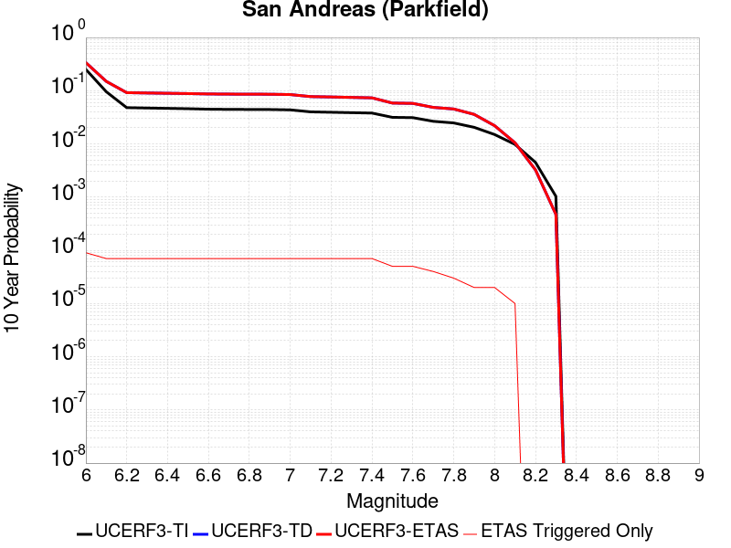 |

| Magnitude | 1 wk TI Prob | 1 wk TD Prob | 1 wk ETAS Prob | 1 wk ETAS/TD Gain | 1 wk ETAS Triggered Only | 1 mo TI Prob | 1 mo TD Prob | 1 mo ETAS Prob | 1 mo ETAS/TD Gain | 1 mo ETAS Triggered Only | 1 yr TI Prob | 1 yr TD Prob | 1 yr ETAS Prob | 1 yr ETAS/TD Gain | 1 yr ETAS Triggered Only | 10 yr TI Prob | 10 yr TD Prob | 10 yr ETAS Prob | 10 yr ETAS/TD Gain | 10 yr ETAS Triggered Only |
|-----|-----|-----|-----|-----|-----|-----|-----|-----|-----|-----|-----|-----|-----|-----|-----|-----|-----|-----|-----|-----|
| 6.0 | 5.556969E-4 | 7.7782426E-4 | 8.434187E-4 | 1.0843307 | 6.5645516E-5 | 0.0023793848 | 0.0033298214 | 0.0034170572 | 1.0261984 | 8.7527354E-5 | 0.028586963 | 0.040191233 | 0.040275242 | 1.0020902 | 8.7527354E-5 | 0.25176284 | 0.33716413 | 0.33722216 | 1.000172 | 8.7527354E-5 |
| 6.1 | 1.925858E-4 | 3.0276453E-4 | 3.6839017E-4 | 1.2167547 | 6.5645516E-5 | 8.2510663E-4 | 0.0012970108 | 0.0013844246 | 1.0673964 | 8.7527354E-5 | 0.0099994885 | 0.015778083 | 0.01586423 | 1.0054599 | 8.7527354E-5 | 0.095613256 | 0.1497237 | 0.14979811 | 1.0004971 | 8.7527354E-5 |
| 6.2 | 9.4306815E-5 | 1.8242796E-4 | 2.480615E-4 | 1.3597778 | 6.5645516E-5 | 4.0410945E-4 | 7.816011E-4 | 8.6906005E-4 | 1.1118971 | 8.7527354E-5 | 0.0049089384 | 0.009474681 | 0.0095613785 | 1.0091505 | 8.7527354E-5 | 0.048019063 | 0.09185409 | 0.09193358 | 1.0008653 | 8.7527354E-5 |
| 6.3 | 9.283051E-5 | 1.7939322E-4 | 2.4502695E-4 | 1.3658652 | 6.5645516E-5 | 3.9778434E-4 | 7.686027E-4 | 8.560628E-4 | 1.113791 | 8.7527354E-5 | 0.0048322747 | 0.009317789 | 0.009404501 | 1.0093061 | 8.7527354E-5 | 0.047285385 | 0.09050704 | 0.09058664 | 1.0008795 | 8.7527354E-5 |
| 6.4 | 9.138826E-5 | 1.770153E-4 | 2.426492E-4 | 1.370781 | 6.5645516E-5 | 3.916052E-4 | 7.5841765E-4 | 8.458786E-4 | 1.1153203 | 8.7527354E-5 | 0.0047573745 | 0.00919484 | 0.009281563 | 1.0094316 | 8.7527354E-5 | 0.046568092 | 0.08940927 | 0.089488976 | 1.0008914 | 8.7527354E-5 |
| 6.5 | 9.000255E-5 | 1.7459576E-4 | 2.4022981E-4 | 1.37592 | 6.5645516E-5 | 3.8566816E-4 | 7.480541E-4 | 8.35516E-4 | 1.1169192 | 8.7527354E-5 | 0.0046854047 | 0.009069731 | 0.0091564655 | 1.009563 | 8.7527354E-5 | 0.045878403 | 0.088295065 | 0.08837486 | 1.0009037 | 8.7527354E-5 |
| 6.6 | 8.8109264E-5 | 1.7140752E-4 | 2.3704178E-4 | 1.3829136 | 6.5645516E-5 | 3.7755648E-4 | 7.3439797E-4 | 8.218611E-4 | 1.119095 | 8.7527354E-5 | 0.0045870654 | 0.008904854 | 0.008991602 | 1.0097417 | 8.7527354E-5 | 0.04493529 | 0.0868267 | 0.08690662 | 1.0009205 | 8.7527354E-5 |
| 6.7 | 8.738073E-5 | 1.7007832E-4 | 2.3571267E-4 | 1.3859066 | 6.5645516E-5 | 3.7443507E-4 | 7.287046E-4 | 8.161682E-4 | 1.1200261 | 8.7527354E-5 | 0.0045492216 | 0.008836143 | 0.008922897 | 1.0098181 | 8.7527354E-5 | 0.04457213 | 0.08622707 | 0.08630705 | 1.0009276 | 8.7527354E-5 |
| 6.8 | 8.710195E-5 | 1.6953335E-4 | 2.3516772E-4 | 1.3871473 | 6.5645516E-5 | 3.7324068E-4 | 7.263703E-4 | 8.138341E-4 | 1.1204121 | 8.7527354E-5 | 0.0045347405 | 0.008807961 | 0.008894717 | 1.0098498 | 8.7527354E-5 | 0.04443313 | 0.08597467 | 0.08605467 | 1.0009305 | 8.7527354E-5 |
| 6.9 | 8.6801556E-5 | 1.689429E-4 | 2.3457732E-4 | 1.3885007 | 6.5645516E-5 | 3.7195362E-4 | 7.2384125E-4 | 8.1130525E-4 | 1.1208332 | 8.7527354E-5 | 0.0045191357 | 0.008777418 | 0.008864177 | 1.0098844 | 8.7527354E-5 | 0.044283327 | 0.085700735 | 0.08578076 | 1.0009338 | 8.7527354E-5 |
| 7.0 | 8.5571606E-5 | 1.6647128E-4 | 2.3210587E-4 | 1.3942697 | 6.5645516E-5 | 3.6668387E-4 | 7.132544E-4 | 8.007193E-4 | 1.122628 | 8.7527354E-5 | 0.004455241 | 0.008649553 | 0.008736324 | 1.0100318 | 8.7527354E-5 | 0.043669727 | 0.08454914 | 0.08462927 | 1.0009477 | 8.7527354E-5 |
| 7.1 | 7.82589E-5 | 1.5128135E-4 | 2.1691693E-4 | 1.4338644 | 6.5645516E-5 | 3.3535215E-4 | 6.481883E-4 | 7.356589E-4 | 1.1349463 | 8.7527354E-5 | 0.0040752706 | 0.007863307 | 0.007950146 | 1.0110435 | 8.7527354E-5 | 0.040013418 | 0.07746111 | 0.07754186 | 1.0010424 | 8.7527354E-5 |
| 7.2 | 7.690929E-5 | 1.4865391E-4 | 2.1428967E-4 | 1.441534 | 6.5645516E-5 | 3.2956956E-4 | 6.369334E-4 | 7.24405E-4 | 1.1373324 | 8.7527354E-5 | 0.004005129 | 0.007727258 | 0.007814108 | 1.0112395 | 8.7527354E-5 | 0.0393371 | 0.07623427 | 0.07631513 | 1.0010606 | 8.7527354E-5 |
| 7.3 | 7.5543794E-5 | 1.4561978E-4 | 2.1125574E-4 | 1.4507352 | 6.5645516E-5 | 3.2371894E-4 | 6.2393624E-4 | 7.1140897E-4 | 1.140195 | 8.7527354E-5 | 0.003934157 | 0.007570127 | 0.007656992 | 1.0114747 | 8.7527354E-5 | 0.038652334 | 0.074797355 | 0.074878335 | 1.0010827 | 8.7527354E-5 |
| 7.4 | 7.4214564E-5 | 1.4262961E-4 | 2.0826576E-4 | 1.460186 | 6.5645516E-5 | 3.1802364E-4 | 6.111273E-4 | 6.986011E-4 | 1.1431353 | 8.7527354E-5 | 0.003865065 | 0.00741525 | 0.0075021284 | 1.0117161 | 8.7527354E-5 | 0.03798529 | 0.07337123 | 0.07345234 | 1.0011054 | 8.7527354E-5 |
| 7.5 | 6.149578E-5 | 1.11907226E-4 | 1.775454E-4 | 1.5865409 | 6.5645516E-5 | 2.6352672E-4 | 4.7951436E-4 | 5.669997E-4 | 1.1824458 | 8.7527354E-5 | 0.0032037178 | 0.0058224914 | 0.005909509 | 1.0149451 | 8.7527354E-5 | 0.03157923 | 0.058557566 | 0.058639966 | 1.0014071 | 8.7527354E-5 |
| 7.6 | 6.0643448E-5 | 1.10193796E-4 | 1.7583207E-4 | 1.5956622 | 6.5645516E-5 | 2.598746E-4 | 4.7217376E-4 | 5.596598E-4 | 1.1852835 | 8.7527354E-5 | 0.0031593828 | 0.0057335934 | 0.005820619 | 1.0151782 | 8.7527354E-5 | 0.031148417 | 0.057718582 | 0.057801057 | 1.001429 | 8.7527354E-5 |
| 7.7 | 5.1652263E-5 | 9.174698E-5 | 1.5738647E-4 | 1.7154404 | 6.5645516E-5 | 2.2134806E-4 | 3.931421E-4 | 4.5876182E-4 | 1.1669109 | 6.5645516E-5 | 0.002691582 | 0.0047760103 | 0.004841342 | 1.0136791 | 6.5645516E-5 | 0.026592141 | 0.04853623 | 0.048598688 | 1.0012869 | 6.5645516E-5 |
| 7.8 | 4.8090482E-5 | 8.559635E-5 | 1.5123625E-4 | 1.7668538 | 6.5645516E-5 | 2.060858E-4 | 3.6678996E-4 | 4.324114E-4 | 1.1789074 | 6.5645516E-5 | 0.0025062072 | 0.0044565317 | 0.004521885 | 1.0146645 | 6.5645516E-5 | 0.024781305 | 0.04530245 | 0.04536512 | 1.0013834 | 6.5645516E-5 |
| 7.9 | 3.970278E-5 | 6.750426E-5 | 1.11264984E-4 | 1.6482661 | 4.3763677E-5 | 1.7014367E-4 | 2.892719E-4 | 3.330229E-4 | 1.1512454 | 4.3763677E-5 | 0.002069531 | 0.0035162016 | 0.0035598113 | 1.0124025 | 4.3763677E-5 | 0.020503636 | 0.035881363 | 0.035923555 | 1.0011759 | 4.3763677E-5 |
| 8.0 | 2.8982335E-5 | 4.069796E-5 | 8.4459854E-5 | 2.0752847 | 4.3763677E-5 | 1.2420409E-4 | 1.7440817E-4 | 2.1816422E-4 | 1.250883 | 4.3763677E-5 | 0.0015111357 | 0.0021213528 | 0.0021650235 | 1.0205864 | 4.3763677E-5 | 0.015009012 | 0.022010697 | 0.022053497 | 1.0019445 | 4.3763677E-5 |
| 8.1 | 1.8836186E-5 | 1.8681134E-5 | 4.0562565E-5 | 2.1713116 | 2.1881839E-5 | 8.0724014E-5 | 8.005955E-5 | 1.0193964E-4 | 1.2732977 | 2.1881839E-5 | 9.823717E-4 | 9.742898E-4 | 9.961503E-4 | 1.0224373 | 2.1881839E-5 | 0.009780403 | 0.010488115 | 0.010509768 | 1.0020645 | 2.1881839E-5 |
| 8.2 | 8.643924E-6 | 5.4748625E-6 | 5.4748625E-6 | 1.0 | 0.0 | 3.704486E-5 | 2.3463486E-5 | 2.3463486E-5 | 1.0 | 0.0 | 4.5092785E-4 | 2.8563058E-4 | 2.8563058E-4 | 1.0 | 0.0 | 0.0045001395 | 0.0032487072 | 0.0032487072 | 1.0 | 0.0 |
| 8.3 | 1.983087E-6 | 7.6599065E-7 | 7.6599065E-7 | 1.0 | 0.0 | 8.498917E-6 | 3.282813E-6 | 3.282813E-6 | 1.0 | 0.0 | 1.034694E-4 | 3.9967534E-5 | 3.9967534E-5 | 1.0 | 0.0 | 0.0010342124 | 4.719687E-4 | 4.719687E-4 | 1.0 | 0.0 |

## Great Valley 07 (Orestimba)
*[(top)](#table-of-contents)*

| 1 Week | 1 Month | 1 Year | 10 Year |
|-----|-----|-----|-----|
|  |  | 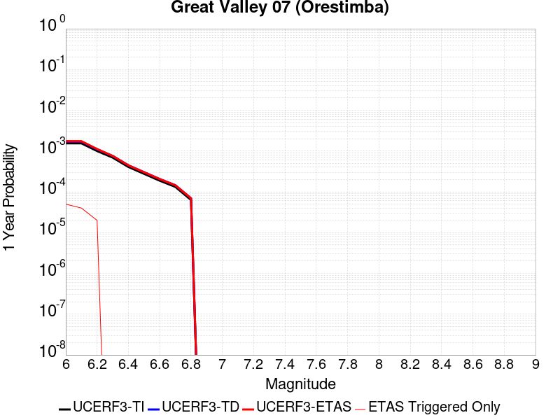 |  |

| Magnitude | 1 wk TI Prob | 1 wk TD Prob | 1 wk ETAS Prob | 1 wk ETAS/TD Gain | 1 wk ETAS Triggered Only | 1 mo TI Prob | 1 mo TD Prob | 1 mo ETAS Prob | 1 mo ETAS/TD Gain | 1 mo ETAS Triggered Only | 1 yr TI Prob | 1 yr TD Prob | 1 yr ETAS Prob | 1 yr ETAS/TD Gain | 1 yr ETAS Triggered Only | 10 yr TI Prob | 10 yr TD Prob | 10 yr ETAS Prob | 10 yr ETAS/TD Gain | 10 yr ETAS Triggered Only |
|-----|-----|-----|-----|-----|-----|-----|-----|-----|-----|-----|-----|-----|-----|-----|-----|-----|-----|-----|-----|-----|
| 6.0 | 2.9687902E-5 | 3.27575E-5 | 9.8400866E-5 | 3.0039186 | 6.5645516E-5 | 1.2722766E-4 | 1.4038214E-4 | 2.0601843E-4 | 1.4675545 | 6.5645516E-5 | 0.0015478961 | 0.0017078844 | 0.0017952623 | 1.0511614 | 8.7527354E-5 | 0.015371585 | 0.016955135 | 0.017041178 | 1.0050747 | 8.7527354E-5 |
| 6.1 | 2.9687902E-5 | 3.27575E-5 | 7.651974E-5 | 2.3359458 | 4.3763677E-5 | 1.2722766E-4 | 1.4038214E-4 | 1.8413966E-4 | 1.311703 | 4.3763677E-5 | 0.0015478961 | 0.0017078844 | 0.0017734178 | 1.0383711 | 6.5645516E-5 | 0.015371585 | 0.016955135 | 0.017019669 | 1.0038061 | 6.5645516E-5 |
| 6.2 | 1.9231524E-5 | 2.1159167E-5 | 4.304054E-5 | 2.0341322 | 2.1881839E-5 | 8.2418206E-5 | 9.067912E-5 | 1.1255897E-4 | 1.2412888 | 2.1881839E-5 | 0.0010029797 | 0.0011034822 | 0.00112534 | 1.0198079 | 2.1881839E-5 | 0.00998465 | 0.01098244 | 0.011004082 | 1.0019705 | 2.1881839E-5 |
| 6.3 | 1.324766E-5 | 1.4548534E-5 | 1.4548534E-5 | 1.0 | 0.0 | 5.6774446E-5 | 6.234942E-5 | 6.234942E-5 | 1.0 | 0.0 | 6.910097E-4 | 7.5884897E-4 | 7.5884897E-4 | 1.0 | 0.0 | 0.006888649 | 0.0075635235 | 0.0075635235 | 1.0 | 0.0 |
| 6.4 | 7.818645E-6 | 8.57284E-6 | 8.57284E-6 | 1.0 | 0.0 | 3.3508048E-5 | 3.6740246E-5 | 3.6740246E-5 | 1.0 | 0.0 | 4.078841E-4 | 4.4722404E-4 | 4.4722404E-4 | 1.0 | 0.0 | 0.004071363 | 0.0044635804 | 0.0044635804 | 1.0 | 0.0 |
| 6.5 | 5.3076565E-6 | 5.8178007E-6 | 5.8178007E-6 | 1.0 | 0.0 | 2.27469E-5 | 2.4933206E-5 | 2.4933206E-5 | 1.0 | 0.0 | 2.7690834E-4 | 3.035216E-4 | 3.035216E-4 | 1.0 | 0.0 | 0.0027656353 | 0.00303128 | 0.00303128 | 1.0 | 0.0 |
| 6.6 | 3.6003578E-6 | 3.9484953E-6 | 3.9484953E-6 | 1.0 | 0.0 | 1.5430012E-5 | 1.6922022E-5 | 1.6922022E-5 | 1.0 | 0.0 | 1.8784421E-4 | 2.0600771E-4 | 2.0600771E-4 | 1.0 | 0.0 | 0.0018768552 | 0.0020583214 | 0.0020583214 | 1.0 | 0.0 |
| 6.7 | 2.5361826E-6 | 2.7834678E-6 | 2.7834678E-6 | 1.0 | 0.0 | 1.0869308E-5 | 1.1929101E-5 | 1.1929101E-5 | 1.0 | 0.0 | 1.3232579E-4 | 1.4522845E-4 | 1.4522845E-4 | 1.0 | 0.0 | 0.0013224703 | 0.0014514653 | 0.0014514653 | 1.0 | 0.0 |
| 6.8 | 1.2115831E-6 | 1.3313797E-6 | 1.3313797E-6 | 1.0 | 0.0 | 5.1924885E-6 | 5.7059065E-6 | 5.7059065E-6 | 1.0 | 0.0 | 6.3216714E-5 | 6.9468166E-5 | 6.9468166E-5 | 1.0 | 0.0 | 6.3198735E-4 | 6.945596E-4 | 6.945596E-4 | 1.0 | 0.0 |

## Independence rev 2011
*[(top)](#table-of-contents)*

| 1 Week | 1 Month | 1 Year | 10 Year |
|-----|-----|-----|-----|
|  |  |  |  |

| Magnitude | 1 wk TI Prob | 1 wk TD Prob | 1 wk ETAS Prob | 1 wk ETAS/TD Gain | 1 wk ETAS Triggered Only | 1 mo TI Prob | 1 mo TD Prob | 1 mo ETAS Prob | 1 mo ETAS/TD Gain | 1 mo ETAS Triggered Only | 1 yr TI Prob | 1 yr TD Prob | 1 yr ETAS Prob | 1 yr ETAS/TD Gain | 1 yr ETAS Triggered Only | 10 yr TI Prob | 10 yr TD Prob | 10 yr ETAS Prob | 10 yr ETAS/TD Gain | 10 yr ETAS Triggered Only |
|-----|-----|-----|-----|-----|-----|-----|-----|-----|-----|-----|-----|-----|-----|-----|-----|-----|-----|-----|-----|-----|
| 6.0 | 4.422171E-6 | 4.326227E-6 | 9.18532E-5 | 21.23171 | 8.7527354E-5 | 1.8952025E-5 | 1.8540857E-5 | 1.0606659E-4 | 5.7206945 | 8.7527354E-5 | 2.3071647E-4 | 2.2571455E-4 | 3.1322215E-4 | 1.3876914 | 8.7527354E-5 | 0.0023047708 | 0.0022551466 | 0.0023424765 | 1.0387248 | 8.7527354E-5 |
| 6.1 | 4.422171E-6 | 4.326227E-6 | 9.18532E-5 | 21.23171 | 8.7527354E-5 | 1.8952025E-5 | 1.8540857E-5 | 1.0606659E-4 | 5.7206945 | 8.7527354E-5 | 2.3071647E-4 | 2.2571455E-4 | 3.1322215E-4 | 1.3876914 | 8.7527354E-5 | 0.0023047708 | 0.0022551466 | 0.0023424765 | 1.0387248 | 8.7527354E-5 |
| 6.2 | 4.422171E-6 | 4.326227E-6 | 9.18532E-5 | 21.23171 | 8.7527354E-5 | 1.8952025E-5 | 1.8540857E-5 | 1.0606659E-4 | 5.7206945 | 8.7527354E-5 | 2.3071647E-4 | 2.2571455E-4 | 3.1322215E-4 | 1.3876914 | 8.7527354E-5 | 0.0023047708 | 0.0022551466 | 0.0023424765 | 1.0387248 | 8.7527354E-5 |
| 6.3 | 4.422171E-6 | 4.326227E-6 | 9.18532E-5 | 21.23171 | 8.7527354E-5 | 1.8952025E-5 | 1.8540857E-5 | 1.0606659E-4 | 5.7206945 | 8.7527354E-5 | 2.3071647E-4 | 2.2571455E-4 | 3.1322215E-4 | 1.3876914 | 8.7527354E-5 | 0.0023047708 | 0.0022551466 | 0.0023424765 | 1.0387248 | 8.7527354E-5 |
| 6.4 | 4.422171E-6 | 4.326227E-6 | 9.18532E-5 | 21.23171 | 8.7527354E-5 | 1.8952025E-5 | 1.8540857E-5 | 1.0606659E-4 | 5.7206945 | 8.7527354E-5 | 2.3071647E-4 | 2.2571455E-4 | 3.1322215E-4 | 1.3876914 | 8.7527354E-5 | 0.0023047708 | 0.0022551466 | 0.0023424765 | 1.0387248 | 8.7527354E-5 |
| 6.5 | 4.422171E-6 | 4.326227E-6 | 9.18532E-5 | 21.23171 | 8.7527354E-5 | 1.8952025E-5 | 1.8540857E-5 | 1.0606659E-4 | 5.7206945 | 8.7527354E-5 | 2.3071647E-4 | 2.2571455E-4 | 3.1322215E-4 | 1.3876914 | 8.7527354E-5 | 0.0023047708 | 0.0022551466 | 0.0023424765 | 1.0387248 | 8.7527354E-5 |
| 6.6 | 2.663744E-6 | 2.5319862E-6 | 9.005912E-5 | 35.568565 | 8.7527354E-5 | 1.1415996E-5 | 1.0851327E-5 | 9.837773E-5 | 9.065963 | 8.7527354E-5 | 1.3898089E-4 | 1.3210738E-4 | 2.1962318E-4 | 1.6624595 | 8.7527354E-5 | 0.0013889399 | 0.0013203367 | 0.0014077486 | 1.0662042 | 8.7527354E-5 |
| 6.7 | 2.663744E-6 | 2.5319862E-6 | 9.005912E-5 | 35.568565 | 8.7527354E-5 | 1.1415996E-5 | 1.0851327E-5 | 9.837773E-5 | 9.065963 | 8.7527354E-5 | 1.3898089E-4 | 1.3210738E-4 | 2.1962318E-4 | 1.6624595 | 8.7527354E-5 | 0.0013889399 | 0.0013203367 | 0.0014077486 | 1.0662042 | 8.7527354E-5 |
| 6.8 | 1.9716529E-6 | 1.8322585E-6 | 8.935945E-5 | 48.77011 | 8.7527354E-5 | 8.449913E-6 | 7.852514E-6 | 9.5379175E-5 | 12.146325 | 8.7527354E-5 | 1.0287284E-4 | 9.5600284E-5 | 1.8311926E-4 | 1.9154679 | 8.7527354E-5 | 0.0010282523 | 9.556045E-4 | 0.0010430482 | 1.0915061 | 8.7527354E-5 |
| 6.9 | 1.8788617E-6 | 1.7429993E-6 | 8.92702E-5 | 51.216427 | 8.7527354E-5 | 8.0522395E-6 | 7.4699765E-6 | 9.499668E-5 | 12.717132 | 8.7527354E-5 | 9.80316E-5 | 9.0943286E-5 | 1.7846268E-4 | 1.9623513 | 8.7527354E-5 | 9.798837E-4 | 9.0907275E-4 | 9.965205E-4 | 1.0961945 | 8.7527354E-5 |
| 7.0 | 1.5045488E-6 | 1.3849503E-6 | 8.891218E-5 | 64.19882 | 8.7527354E-5 | 6.44805E-6 | 5.9354884E-6 | 9.3462324E-5 | 15.746357 | 8.7527354E-5 | 7.8502184E-5 | 7.226223E-5 | 1.5978326E-4 | 2.2111588 | 8.7527354E-5 | 7.8474457E-4 | 7.2239246E-4 | 8.098566E-4 | 1.1210756 | 8.7527354E-5 |
| 7.1 | 1.272341E-6 | 1.1625096E-6 | 8.868976E-5 | 76.29163 | 8.7527354E-5 | 5.4528787E-6 | 4.982175E-6 | 9.250909E-5 | 18.568012 | 8.7527354E-5 | 6.6386776E-5 | 6.0656326E-5 | 1.4817837E-4 | 2.442917 | 8.7527354E-5 | 6.636695E-4 | 6.064009E-4 | 6.938752E-4 | 1.1442516 | 8.7527354E-5 |
| 7.2 | 1.0416892E-6 | 9.4098806E-7 | 8.846826E-5 | 94.01635 | 8.7527354E-5 | 4.464375E-6 | 4.0328E-6 | 9.15598E-5 | 22.70378 | 8.7527354E-5 | 5.4352407E-5 | 4.909825E-5 | 1.3662131E-4 | 2.7826104 | 8.7527354E-5 | 5.4339116E-4 | 4.9087586E-4 | 5.783603E-4 | 1.178221 | 8.7527354E-5 |
| 7.3 | 7.9450155E-7 | 7.235002E-7 | 6.6368964E-5 | 91.73318 | 6.5645516E-5 | 3.4050022E-6 | 3.1007114E-6 | 6.874602E-5 | 22.17105 | 6.5645516E-5 | 4.1455114E-5 | 3.775052E-5 | 1.03393555E-4 | 2.7388644 | 6.5645516E-5 | 4.144738E-4 | 3.7744216E-4 | 4.4306292E-4 | 1.1738564 | 6.5645516E-5 |
| 7.4 | 5.3893444E-7 | 5.019512E-7 | 4.4265606E-5 | 88.187065 | 4.3763677E-5 | 2.309717E-6 | 2.1512178E-6 | 4.59148E-5 | 21.343632 | 4.3763677E-5 | 2.8120441E-5 | 2.6190766E-5 | 6.99533E-5 | 2.6709144 | 4.3763677E-5 | 2.8116882E-4 | 2.6187726E-4 | 3.0562945E-4 | 1.1670715 | 4.3763677E-5 |
| 7.5 | 3.8852085E-7 | 3.682554E-7 | 4.4131917E-5 | 119.840515 | 4.3763677E-5 | 1.6650882E-6 | 1.5782365E-6 | 4.5341843E-5 | 28.729437 | 4.3763677E-5 | 2.027226E-5 | 1.9214862E-5 | 6.29777E-5 | 3.2775514 | 4.3763677E-5 | 2.0270412E-4 | 1.9213221E-4 | 2.3588748E-4 | 1.2277352 | 4.3763677E-5 |
| 7.6 | 2.414929E-7 | 2.345755E-7 | 4.3998243E-5 | 187.56537 | 4.3763677E-5 | 1.0349692E-6 | 1.0053232E-6 | 4.4768956E-5 | 44.531902 | 4.3763677E-5 | 1.2600677E-5 | 1.2239742E-5 | 5.6002882E-5 | 4.5754952 | 4.3763677E-5 | 1.2599962E-4 | 1.223908E-4 | 1.6614913E-4 | 1.3575295 | 4.3763677E-5 |
| 7.7 | 6.8298014E-8 | 6.85897E-8 | 6.85897E-8 | 1.0 | 0.0 | 2.9270575E-7 | 2.9395582E-7 | 2.9395582E-7 | 1.0 | 0.0 | 3.5636867E-6 | 3.5789067E-6 | 3.5789067E-6 | 1.0 | 0.0 | 3.5636294E-5 | 3.5788536E-5 | 3.5788536E-5 | 1.0 | 0.0 |

## Kern Canyon (North Kern) 2011
*[(top)](#table-of-contents)*

| 1 Week | 1 Month | 1 Year | 10 Year |
|-----|-----|-----|-----|
|  |  |  |  |

| Magnitude | 1 wk TI Prob | 1 wk TD Prob | 1 wk ETAS Prob | 1 wk ETAS/TD Gain | 1 wk ETAS Triggered Only | 1 mo TI Prob | 1 mo TD Prob | 1 mo ETAS Prob | 1 mo ETAS/TD Gain | 1 mo ETAS Triggered Only | 1 yr TI Prob | 1 yr TD Prob | 1 yr ETAS Prob | 1 yr ETAS/TD Gain | 1 yr ETAS Triggered Only | 10 yr TI Prob | 10 yr TD Prob | 10 yr ETAS Prob | 10 yr ETAS/TD Gain | 10 yr ETAS Triggered Only |
|-----|-----|-----|-----|-----|-----|-----|-----|-----|-----|-----|-----|-----|-----|-----|-----|-----|-----|-----|-----|-----|
| 6.0 | 6.6264497E-6 | 6.75733E-6 | 9.428409E-5 | 13.952862 | 8.7527354E-5 | 2.8398761E-5 | 2.895971E-5 | 1.1648452E-4 | 4.022296 | 8.7527354E-5 | 3.4570007E-4 | 3.5253543E-4 | 4.4003193E-4 | 1.2481921 | 8.7527354E-5 | 0.0034516277 | 0.0035205502 | 0.0036077695 | 1.0247743 | 8.7527354E-5 |
| 6.1 | 6.6264497E-6 | 6.75733E-6 | 9.428409E-5 | 13.952862 | 8.7527354E-5 | 2.8398761E-5 | 2.895971E-5 | 1.1648452E-4 | 4.022296 | 8.7527354E-5 | 3.4570007E-4 | 3.5253543E-4 | 4.4003193E-4 | 1.2481921 | 8.7527354E-5 | 0.0034516277 | 0.0035205502 | 0.0036077695 | 1.0247743 | 8.7527354E-5 |
| 6.2 | 6.6264497E-6 | 6.75733E-6 | 9.428409E-5 | 13.952862 | 8.7527354E-5 | 2.8398761E-5 | 2.895971E-5 | 1.1648452E-4 | 4.022296 | 8.7527354E-5 | 3.4570007E-4 | 3.5253543E-4 | 4.4003193E-4 | 1.2481921 | 8.7527354E-5 | 0.0034516277 | 0.0035205502 | 0.0036077695 | 1.0247743 | 8.7527354E-5 |
| 6.3 | 6.6264497E-6 | 6.75733E-6 | 9.428409E-5 | 13.952862 | 8.7527354E-5 | 2.8398761E-5 | 2.895971E-5 | 1.1648452E-4 | 4.022296 | 8.7527354E-5 | 3.4570007E-4 | 3.5253543E-4 | 4.4003193E-4 | 1.2481921 | 8.7527354E-5 | 0.0034516277 | 0.0035205502 | 0.0036077695 | 1.0247743 | 8.7527354E-5 |
| 6.4 | 6.6264497E-6 | 6.75733E-6 | 9.428409E-5 | 13.952862 | 8.7527354E-5 | 2.8398761E-5 | 2.895971E-5 | 1.1648452E-4 | 4.022296 | 8.7527354E-5 | 3.4570007E-4 | 3.5253543E-4 | 4.4003193E-4 | 1.2481921 | 8.7527354E-5 | 0.0034516277 | 0.0035205502 | 0.0036077695 | 1.0247743 | 8.7527354E-5 |
| 6.5 | 3.2162225E-6 | 3.2570915E-6 | 9.078416E-5 | 27.87277 | 8.7527354E-5 | 1.3783738E-5 | 1.3958893E-5 | 1.0148502E-4 | 7.2702775 | 8.7527354E-5 | 1.6780409E-4 | 1.6993708E-4 | 2.5744954E-4 | 1.51497 | 8.7527354E-5 | 0.0016767744 | 0.001698151 | 0.0017855297 | 1.0514553 | 8.7527354E-5 |
| 6.6 | 3.2162225E-6 | 3.2570915E-6 | 9.078416E-5 | 27.87277 | 8.7527354E-5 | 1.3783738E-5 | 1.3958893E-5 | 1.0148502E-4 | 7.2702775 | 8.7527354E-5 | 1.6780409E-4 | 1.6993708E-4 | 2.5744954E-4 | 1.51497 | 8.7527354E-5 | 0.0016767744 | 0.001698151 | 0.0017855297 | 1.0514553 | 8.7527354E-5 |
| 6.7 | 2.1908265E-6 | 2.2071222E-6 | 6.785249E-5 | 30.742517 | 6.5645516E-5 | 9.389223E-6 | 9.459061E-6 | 7.5103955E-5 | 7.9398947 | 6.5645516E-5 | 1.1430779E-4 | 1.1515819E-4 | 1.8079614E-4 | 1.5699807 | 6.5645516E-5 | 0.0011424901 | 0.0011510046 | 0.0012165745 | 1.0569676 | 6.5645516E-5 |
| 6.8 | 1.7303895E-6 | 1.7365529E-6 | 6.738195E-5 | 38.80213 | 6.5645516E-5 | 7.415934E-6 | 7.4423488E-6 | 7.308737E-5 | 9.820472 | 6.5645516E-5 | 9.028525E-5 | 9.0606925E-5 | 1.5624649E-4 | 1.7244431 | 6.5645516E-5 | 9.024858E-4 | 9.057096E-4 | 9.7129564E-4 | 1.072414 | 6.5645516E-5 |
| 6.9 | 1.3700314E-6 | 1.3688622E-6 | 4.5132478E-5 | 32.9708 | 4.3763677E-5 | 5.87155E-6 | 5.8665396E-6 | 4.9629958E-5 | 8.459836 | 4.3763677E-5 | 7.148377E-5 | 7.142282E-5 | 1.1518337E-4 | 1.612697 | 4.3763677E-5 | 7.146078E-4 | 7.140032E-4 | 7.577357E-4 | 1.0612496 | 4.3763677E-5 |
| 7.0 | 1.1467797E-6 | 1.1413804E-6 | 2.3023193E-5 | 20.171358 | 2.1881839E-5 | 4.9147607E-6 | 4.8916213E-6 | 2.6773352E-5 | 5.4733086 | 2.1881839E-5 | 5.983557E-5 | 5.9553895E-5 | 8.143443E-5 | 1.3674073 | 2.1881839E-5 | 5.981946E-4 | 5.953825E-4 | 6.172513E-4 | 1.0367306 | 2.1881839E-5 |
| 7.1 | 9.3952065E-7 | 9.3026904E-7 | 2.2812086E-5 | 24.522032 | 2.1881839E-5 | 4.026511E-6 | 3.9868614E-6 | 2.5868612E-5 | 6.4884653 | 2.1881839E-5 | 4.9021666E-5 | 4.8538972E-5 | 7.041975E-5 | 1.4507878 | 2.1881839E-5 | 4.901085E-4 | 4.8528548E-4 | 5.071567E-4 | 1.0450687 | 2.1881839E-5 |
| 7.2 | 6.858055E-7 | 6.7193E-7 | 2.2553753E-5 | 33.565628 | 2.1881839E-5 | 2.939163E-6 | 2.879697E-6 | 2.4761472E-5 | 8.598638 | 2.1881839E-5 | 3.5783723E-5 | 3.5059755E-5 | 5.6940826E-5 | 1.624108 | 2.1881839E-5 | 3.5777962E-4 | 3.5054312E-4 | 3.724173E-4 | 1.0624008 | 2.1881839E-5 |
| 7.3 | 5.1101983E-7 | 4.9393E-7 | 2.2375758E-5 | 45.30148 | 2.1881839E-5 | 2.1900833E-6 | 2.116841E-6 | 2.3998633E-5 | 11.337003 | 2.1881839E-5 | 2.6663936E-5 | 2.5772239E-5 | 4.7653513E-5 | 1.8490249 | 2.1881839E-5 | 2.6660739E-4 | 2.57693E-4 | 2.7956918E-4 | 1.0848925 | 2.1881839E-5 |
| 7.4 | 3.4999414E-7 | 3.2995905E-7 | 3.2995905E-7 | 1.0 | 0.0 | 1.499974E-6 | 1.4141094E-6 | 1.4141094E-6 | 1.0 | 0.0 | 1.8262032E-5 | 1.721665E-5 | 1.721665E-5 | 1.0 | 0.0 | 1.826053E-4 | 1.7215339E-4 | 1.7215339E-4 | 1.0 | 0.0 |
| 7.5 | 1.7021522E-7 | 1.4750044E-7 | 1.4750044E-7 | 1.0 | 0.0 | 7.2949354E-7 | 6.321446E-7 | 6.321446E-7 | 1.0 | 0.0 | 8.881548E-6 | 7.696334E-6 | 7.696334E-6 | 1.0 | 0.0 | 8.8811925E-5 | 7.696076E-5 | 7.696076E-5 | 1.0 | 0.0 |
| 7.6 | 2.572245E-8 | 1.7352555E-8 | 1.7352555E-8 | 1.0 | 0.0 | 1.10239064E-7 | 7.436809E-8 | 7.436809E-8 | 1.0 | 0.0 | 1.3421597E-6 | 9.054312E-7 | 9.054312E-7 | 1.0 | 0.0 | 1.3421517E-5 | 9.05428E-6 | 9.05428E-6 | 1.0 | 0.0 |

## San Jacinto (Coyote Creek)
*[(top)](#table-of-contents)*

| 1 Week | 1 Month | 1 Year | 10 Year |
|-----|-----|-----|-----|
|  |  |  | 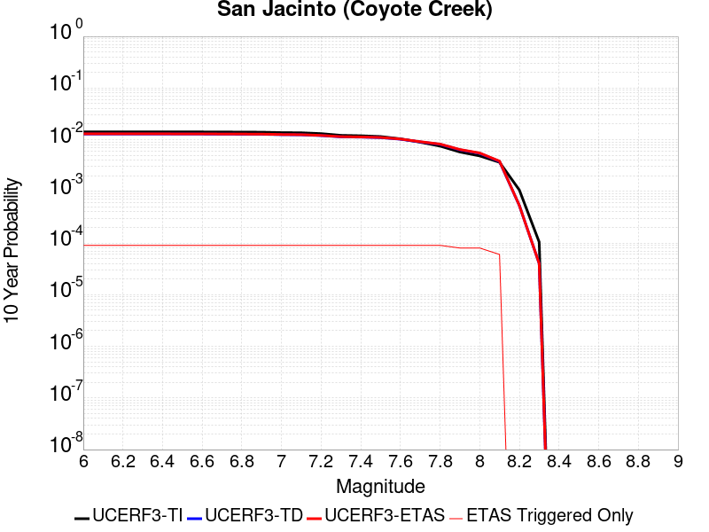 |

| Magnitude | 1 wk TI Prob | 1 wk TD Prob | 1 wk ETAS Prob | 1 wk ETAS/TD Gain | 1 wk ETAS Triggered Only | 1 mo TI Prob | 1 mo TD Prob | 1 mo ETAS Prob | 1 mo ETAS/TD Gain | 1 mo ETAS Triggered Only | 1 yr TI Prob | 1 yr TD Prob | 1 yr ETAS Prob | 1 yr ETAS/TD Gain | 1 yr ETAS Triggered Only | 10 yr TI Prob | 10 yr TD Prob | 10 yr ETAS Prob | 10 yr ETAS/TD Gain | 10 yr ETAS Triggered Only |
|-----|-----|-----|-----|-----|-----|-----|-----|-----|-----|-----|-----|-----|-----|-----|-----|-----|-----|-----|-----|-----|
| 6.0 | 2.7374346E-5 | 2.4145214E-5 | 8.9789144E-5 | 3.718714 | 6.5645516E-5 | 1.1731335E-4 | 1.034754E-4 | 1.6911412E-4 | 1.6343414 | 6.5645516E-5 | 0.0014273542 | 0.0012590875 | 0.0013246504 | 1.0520717 | 6.5645516E-5 | 0.01418221 | 0.012928318 | 0.013014713 | 1.0066826 | 8.7527354E-5 |
| 6.1 | 2.7374346E-5 | 2.4145214E-5 | 8.9789144E-5 | 3.718714 | 6.5645516E-5 | 1.1731335E-4 | 1.034754E-4 | 1.6911412E-4 | 1.6343414 | 6.5645516E-5 | 0.0014273542 | 0.0012590875 | 0.0013246504 | 1.0520717 | 6.5645516E-5 | 0.01418221 | 0.012928318 | 0.013014713 | 1.0066826 | 8.7527354E-5 |
| 6.2 | 2.7374346E-5 | 2.4145214E-5 | 8.9789144E-5 | 3.718714 | 6.5645516E-5 | 1.1731335E-4 | 1.034754E-4 | 1.6911412E-4 | 1.6343414 | 6.5645516E-5 | 0.0014273542 | 0.0012590875 | 0.0013246504 | 1.0520717 | 6.5645516E-5 | 0.01418221 | 0.012928318 | 0.013014713 | 1.0066826 | 8.7527354E-5 |
| 6.3 | 2.7374346E-5 | 2.4145214E-5 | 8.9789144E-5 | 3.718714 | 6.5645516E-5 | 1.1731335E-4 | 1.034754E-4 | 1.6911412E-4 | 1.6343414 | 6.5645516E-5 | 0.0014273542 | 0.0012590875 | 0.0013246504 | 1.0520717 | 6.5645516E-5 | 0.01418221 | 0.012928318 | 0.013014713 | 1.0066826 | 8.7527354E-5 |
| 6.4 | 2.7374346E-5 | 2.4145214E-5 | 8.9789144E-5 | 3.718714 | 6.5645516E-5 | 1.1731335E-4 | 1.034754E-4 | 1.6911412E-4 | 1.6343414 | 6.5645516E-5 | 0.0014273542 | 0.0012590875 | 0.0013246504 | 1.0520717 | 6.5645516E-5 | 0.01418221 | 0.012928318 | 0.013014713 | 1.0066826 | 8.7527354E-5 |
| 6.5 | 2.7282445E-5 | 2.4031293E-5 | 8.967523E-5 | 3.7316024 | 6.5645516E-5 | 1.16919524E-4 | 1.029872E-4 | 1.6862595E-4 | 1.6373487 | 6.5645516E-5 | 0.0014225657 | 0.0012531505 | 0.0013187138 | 1.0523187 | 6.5645516E-5 | 0.014134934 | 0.012869646 | 0.0129560465 | 1.0067135 | 8.7527354E-5 |
| 6.6 | 2.7282445E-5 | 2.4031293E-5 | 8.967523E-5 | 3.7316024 | 6.5645516E-5 | 1.16919524E-4 | 1.029872E-4 | 1.6862595E-4 | 1.6373487 | 6.5645516E-5 | 0.0014225657 | 0.0012531505 | 0.0013187138 | 1.0523187 | 6.5645516E-5 | 0.014134934 | 0.012869646 | 0.0129560465 | 1.0067135 | 8.7527354E-5 |
| 6.7 | 2.7216198E-5 | 2.3956412E-5 | 8.9600355E-5 | 3.7401407 | 6.5645516E-5 | 1.1663563E-4 | 1.02666316E-4 | 1.683051E-4 | 1.6393409 | 6.5645516E-5 | 0.0014191137 | 0.0012492483 | 0.0013148119 | 1.0524824 | 6.5645516E-5 | 0.014100855 | 0.0128310565 | 0.012917461 | 1.006734 | 8.7527354E-5 |
| 6.8 | 2.7078617E-5 | 2.387363E-5 | 8.9517576E-5 | 3.7496424 | 6.5645516E-5 | 1.1604605E-4 | 1.0231156E-4 | 1.6795036E-4 | 1.6415579 | 6.5645516E-5 | 0.001411945 | 0.0012449342 | 0.0013104979 | 1.0526645 | 6.5645516E-5 | 0.014030075 | 0.012788199 | 0.012874607 | 1.0067569 | 8.7527354E-5 |
| 6.9 | 2.6982952E-5 | 2.3793142E-5 | 8.94371E-5 | 3.7589443 | 6.5645516E-5 | 1.15636096E-4 | 1.0196664E-4 | 1.6760545E-4 | 1.6437284 | 6.5645516E-5 | 0.0014069602 | 0.0012407395 | 0.0013063035 | 1.0528427 | 6.5645516E-5 | 0.013980856 | 0.012746515 | 0.012832927 | 1.0067792 | 8.7527354E-5 |
| 7.0 | 2.6449972E-5 | 2.3370165E-5 | 8.9014145E-5 | 3.8088796 | 6.5645516E-5 | 1.1335209E-4 | 1.00154015E-4 | 1.6579295E-4 | 1.65538 | 6.5645516E-5 | 0.001379188 | 0.0012186957 | 0.0012842611 | 1.0537997 | 6.5645516E-5 | 0.0137065975 | 0.0125278765 | 0.012614308 | 1.0068991 | 8.7527354E-5 |
| 7.1 | 2.6257849E-5 | 2.3196202E-5 | 8.884019E-5 | 3.8299458 | 6.5645516E-5 | 1.1252879E-4 | 9.940852E-5 | 1.650475E-4 | 1.6602954 | 6.5645516E-5 | 0.0013691769 | 0.0012096294 | 0.0012751954 | 1.0542035 | 6.5645516E-5 | 0.013607717 | 0.012437741 | 0.01252418 | 1.0069497 | 8.7527354E-5 |
| 7.2 | 2.5270041E-5 | 2.2390966E-5 | 8.803501E-5 | 3.93172 | 6.5645516E-5 | 1.0829568E-4 | 9.595777E-5 | 1.6159698E-4 | 1.6840427 | 6.5645516E-5 | 0.0013177024 | 0.0011676621 | 0.0012332309 | 1.056154 | 6.5645516E-5 | 0.013099162 | 0.012018777 | 0.012105253 | 1.007195 | 8.7527354E-5 |
| 7.3 | 2.339701E-5 | 2.1122814E-5 | 8.6766944E-5 | 4.1077356 | 6.5645516E-5 | 1.0026905E-4 | 9.0523215E-5 | 1.5616279E-4 | 1.7251132 | 6.5645516E-5 | 0.001220092 | 0.0011015651 | 0.0011671382 | 1.0595273 | 6.5645516E-5 | 0.012134149 | 0.011357696 | 0.011444229 | 1.0076189 | 8.7527354E-5 |
| 7.4 | 2.296333E-5 | 2.0853171E-5 | 8.649732E-5 | 4.1479216 | 6.5645516E-5 | 9.841056E-5 | 8.936768E-5 | 1.5500732E-4 | 1.7344898 | 6.5645516E-5 | 0.0011974899 | 0.0010875105 | 0.0011530846 | 1.0602975 | 6.5645516E-5 | 0.011910575 | 0.01121681 | 0.011303355 | 1.0077157 | 8.7527354E-5 |
| 7.5 | 2.2188895E-5 | 2.0376096E-5 | 8.602027E-5 | 4.2216268 | 6.5645516E-5 | 9.50918E-5 | 8.732321E-5 | 1.52963E-4 | 1.7516876 | 6.5645516E-5 | 0.0011571277 | 0.0010626436 | 0.0011282193 | 1.06171 | 6.5645516E-5 | 0.011511209 | 0.010966429 | 0.011052996 | 1.0078939 | 8.7527354E-5 |
| 7.6 | 2.0013189E-5 | 1.8962366E-5 | 8.460663E-5 | 4.4618187 | 6.5645516E-5 | 8.5767984E-5 | 8.1264756E-5 | 1.4690495E-4 | 1.8077325 | 6.5645516E-5 | 0.001043725 | 9.889511E-4 | 0.0010545317 | 1.0663133 | 6.5645516E-5 | 0.010388365 | 0.010224434 | 0.010311066 | 1.008473 | 8.7527354E-5 |
| 7.7 | 1.7230794E-5 | 1.674371E-5 | 8.238813E-5 | 4.920542 | 6.5645516E-5 | 7.384417E-5 | 7.175679E-5 | 1.373976E-4 | 1.9147679 | 6.5645516E-5 | 8.986819E-4 | 8.7328954E-4 | 9.388777E-4 | 1.0751047 | 6.5645516E-5 | 0.008950562 | 0.009062956 | 0.00914969 | 1.0095701 | 8.7527354E-5 |
| 7.8 | 1.4478809E-5 | 1.4990978E-5 | 8.063551E-5 | 5.378936 | 6.5645516E-5 | 6.205057E-5 | 6.424547E-5 | 1.2988677E-4 | 2.0217264 | 6.5645516E-5 | 7.552038E-4 | 7.819085E-4 | 8.475027E-4 | 1.0838898 | 6.5645516E-5 | 0.0075264242 | 0.008141387 | 0.008228202 | 1.0106634 | 8.7527354E-5 |
| 7.9 | 1.1114467E-5 | 1.1645102E-5 | 7.728985E-5 | 6.6371126 | 6.5645516E-5 | 4.7632562E-5 | 4.990663E-5 | 1.15548864E-4 | 2.315301 | 6.5645516E-5 | 5.797721E-4 | 6.074444E-4 | 6.7305E-4 | 1.1080027 | 6.5645516E-5 | 0.0057826187 | 0.0063803247 | 0.0064672935 | 1.0136307 | 8.7527354E-5 |
| 8.0 | 9.327402E-6 | 9.899186E-6 | 7.554405E-5 | 7.6313396 | 6.5645516E-5 | 3.9973966E-5 | 4.2424395E-5 | 1.0806713E-4 | 2.5472872 | 6.5645516E-5 | 4.8657437E-4 | 5.1639514E-4 | 5.8200676E-4 | 1.127057 | 6.5645516E-5 | 0.0048551033 | 0.0054499684 | 0.0055370186 | 1.0159726 | 8.7527354E-5 |
| 8.1 | 7.0235833E-6 | 6.827495E-6 | 5.0590872E-5 | 7.409873 | 4.3763677E-5 | 3.0100724E-5 | 2.9260367E-5 | 7.302276E-5 | 2.4956203 | 4.3763677E-5 | 3.664147E-4 | 3.5618723E-4 | 3.9993532E-4 | 1.1228232 | 4.3763677E-5 | 0.003658111 | 0.0037876023 | 0.0038529993 | 1.017266 | 6.5645516E-5 |
| 8.2 | 2.0358202E-6 | 8.994527E-7 | 8.994527E-7 | 1.0 | 0.0 | 8.724915E-6 | 3.854792E-6 | 3.854792E-6 | 1.0 | 0.0 | 1.06220665E-4 | 4.69311E-5 | 4.69311E-5 | 1.0 | 0.0 | 0.001061699 | 5.3254166E-4 | 5.3254166E-4 | 1.0 | 0.0 |
| 8.3 | 2.0051264E-7 | 6.617272E-8 | 6.617272E-8 | 1.0 | 0.0 | 8.5933965E-7 | 2.8359733E-7 | 2.8359733E-7 | 1.0 | 0.0 | 1.046241E-5 | 3.4527925E-6 | 3.4527925E-6 | 1.0 | 0.0 | 1.0461917E-4 | 4.01389E-5 | 4.01389E-5 | 1.0 | 0.0 |

## San Pedro Basin
*[(top)](#table-of-contents)*

| 1 Week | 1 Month | 1 Year | 10 Year |
|-----|-----|-----|-----|
|  | 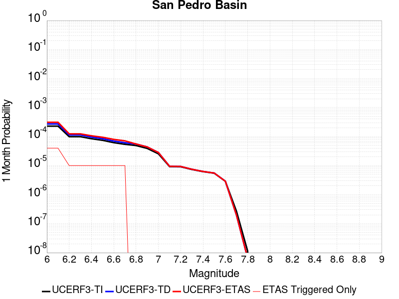 |  | 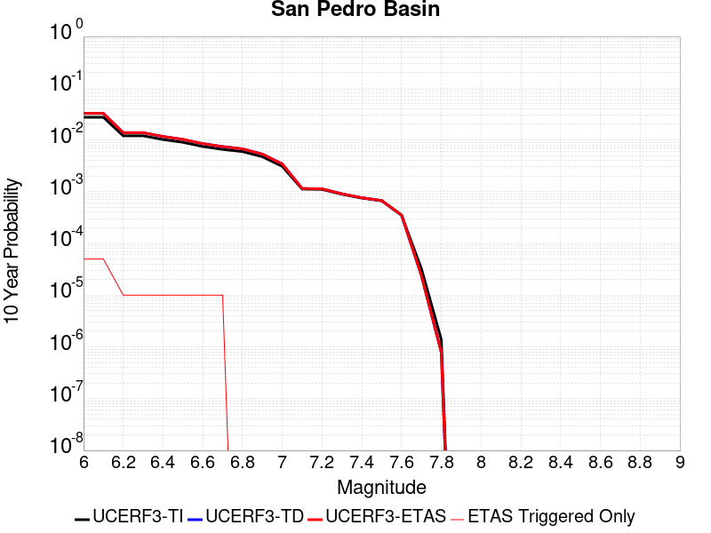 |

| Magnitude | 1 wk TI Prob | 1 wk TD Prob | 1 wk ETAS Prob | 1 wk ETAS/TD Gain | 1 wk ETAS Triggered Only | 1 mo TI Prob | 1 mo TD Prob | 1 mo ETAS Prob | 1 mo ETAS/TD Gain | 1 mo ETAS Triggered Only | 1 yr TI Prob | 1 yr TD Prob | 1 yr ETAS Prob | 1 yr ETAS/TD Gain | 1 yr ETAS Triggered Only | 10 yr TI Prob | 10 yr TD Prob | 10 yr ETAS Prob | 10 yr ETAS/TD Gain | 10 yr ETAS Triggered Only |
|-----|-----|-----|-----|-----|-----|-----|-----|-----|-----|-----|-----|-----|-----|-----|-----|-----|-----|-----|-----|-----|
| 6.0 | 5.3449043E-5 | 6.336954E-5 | 1.2901089E-4 | 2.0358503 | 6.5645516E-5 | 2.2904722E-4 | 2.715589E-4 | 3.3718662E-4 | 1.2416701 | 6.5645516E-5 | 0.0027850836 | 0.0033018254 | 0.0033890638 | 1.0264213 | 8.7527354E-5 | 0.027504366 | 0.03258945 | 0.032674126 | 1.0025983 | 8.7527354E-5 |
| 6.1 | 5.3449043E-5 | 6.336954E-5 | 1.2901089E-4 | 2.0358503 | 6.5645516E-5 | 2.2904722E-4 | 2.715589E-4 | 3.3718662E-4 | 1.2416701 | 6.5645516E-5 | 0.0027850836 | 0.0033018254 | 0.0033890638 | 1.0264213 | 8.7527354E-5 | 0.027504366 | 0.03258945 | 0.032674126 | 1.0025983 | 8.7527354E-5 |
| 6.2 | 2.3189454E-5 | 2.6642796E-5 | 4.8524053E-5 | 1.8212823 | 2.1881839E-5 | 9.9379584E-5 | 1.14178685E-4 | 1.3605802E-4 | 1.1916237 | 2.1881839E-5 | 0.0012092749 | 0.0013892864 | 0.0014111379 | 1.0157286 | 2.1881839E-5 | 0.012027155 | 0.013810883 | 0.013832463 | 1.0015625 | 2.1881839E-5 |
| 6.3 | 2.3189454E-5 | 2.6642796E-5 | 4.8524053E-5 | 1.8212823 | 2.1881839E-5 | 9.9379584E-5 | 1.14178685E-4 | 1.3605802E-4 | 1.1916237 | 2.1881839E-5 | 0.0012092749 | 0.0013892864 | 0.0014111379 | 1.0157286 | 2.1881839E-5 | 0.012027155 | 0.013810883 | 0.013832463 | 1.0015625 | 2.1881839E-5 |
| 6.4 | 1.966056E-5 | 2.2463413E-5 | 4.434476E-5 | 1.9740882 | 2.1881839E-5 | 8.425682E-5 | 9.626844E-5 | 1.1814818E-4 | 1.2272784 | 2.1881839E-5 | 0.001025344 | 0.0011714783 | 0.0011933345 | 1.018657 | 2.1881839E-5 | 0.010206259 | 0.011657117 | 0.011678743 | 1.0018553 | 2.1881839E-5 |
| 6.5 | 1.7342953E-5 | 1.9745148E-5 | 4.1626554E-5 | 2.1081915 | 2.1881839E-5 | 7.4324824E-5 | 8.4619525E-5 | 1.06499516E-4 | 1.258569 | 2.1881839E-5 | 9.04529E-4 | 0.0010297928 | 0.0010516521 | 1.0212269 | 2.1881839E-5 | 0.009008561 | 0.010253931 | 0.010275588 | 1.0021122 | 2.1881839E-5 |
| 6.6 | 1.439804E-5 | 1.6322716E-5 | 3.8204198E-5 | 2.340554 | 2.1881839E-5 | 6.170443E-5 | 6.99528E-5 | 9.1833106E-5 | 1.3127867 | 2.1881839E-5 | 7.509924E-4 | 8.513747E-4 | 8.732379E-4 | 1.02568 | 2.1881839E-5 | 0.0074845953 | 0.008484332 | 0.008506028 | 1.0025572 | 2.1881839E-5 |
| 6.7 | 1.2634884E-5 | 1.4285297E-5 | 3.616682E-5 | 2.5317516 | 2.1881839E-5 | 5.414838E-5 | 6.1221435E-5 | 8.3101935E-5 | 1.3573993 | 2.1881839E-5 | 6.590571E-4 | 7.4514654E-4 | 7.6701207E-4 | 1.029344 | 2.1881839E-5 | 0.006571059 | 0.007429501 | 0.0074512204 | 1.0029234 | 2.1881839E-5 |
| 6.8 | 1.146091E-5 | 1.2933192E-5 | 1.2933192E-5 | 1.0 | 0.0 | 4.911726E-5 | 5.5426954E-5 | 5.5426954E-5 | 1.0 | 0.0 | 5.9783855E-4 | 6.7464396E-4 | 6.7464396E-4 | 1.0 | 0.0 | 0.0059623276 | 0.006728899 | 0.006728899 | 1.0 | 0.0 |
| 6.9 | 9.109035E-6 | 1.0235011E-5 | 1.0235011E-5 | 1.0 | 0.0 | 3.9038136E-5 | 4.3863754E-5 | 4.3863754E-5 | 1.0 | 0.0 | 4.7518566E-4 | 5.3393835E-4 | 5.3393835E-4 | 1.0 | 0.0 | 0.0047417083 | 0.005329309 | 0.005329309 | 1.0 | 0.0 |
| 7.0 | 5.9351028E-6 | 6.583964E-6 | 6.583964E-6 | 1.0 | 0.0 | 2.5435906E-5 | 2.8216817E-5 | 2.8216817E-5 | 1.0 | 0.0 | 3.0963816E-4 | 3.435092E-4 | 3.435092E-4 | 1.0 | 0.0 | 0.0030920706 | 0.0034320992 | 0.0034320992 | 1.0 | 0.0 |
| 7.1 | 2.1557585E-6 | 2.209648E-6 | 2.209648E-6 | 1.0 | 0.0 | 9.238933E-6 | 9.469887E-6 | 9.469887E-6 | 1.0 | 0.0 | 1.1247819E-4 | 1.1528993E-4 | 1.1528993E-4 | 1.0 | 0.0 | 0.0011242128 | 0.0011523166 | 0.0011523166 | 1.0 | 0.0 |
| 7.2 | 2.1251979E-6 | 2.1779945E-6 | 2.1779945E-6 | 1.0 | 0.0 | 9.107958E-6 | 9.334229E-6 | 9.334229E-6 | 1.0 | 0.0 | 1.1088375E-4 | 1.1363847E-4 | 1.1363847E-4 | 1.0 | 0.0 | 0.0011082845 | 0.0011358189 | 0.0011358189 | 1.0 | 0.0 |
| 7.3 | 1.7145798E-6 | 1.7442874E-6 | 1.7442874E-6 | 1.0 | 0.0 | 7.3481783E-6 | 7.4754967E-6 | 7.4754967E-6 | 1.0 | 0.0 | 8.94604E-5 | 9.1010465E-5 | 9.1010465E-5 | 1.0 | 0.0 | 8.9424395E-4 | 9.0974104E-4 | 9.0974104E-4 | 1.0 | 0.0 |
| 7.4 | 1.4467993E-6 | 1.4641868E-6 | 1.4641868E-6 | 1.0 | 0.0 | 6.200554E-6 | 6.2750714E-6 | 6.2750714E-6 | 1.0 | 0.0 | 7.548913E-5 | 7.639639E-5 | 7.639639E-5 | 1.0 | 0.0 | 7.546349E-4 | 7.6370855E-4 | 7.6370855E-4 | 1.0 | 0.0 |
| 7.5 | 1.2803735E-6 | 1.2931497E-6 | 1.2931497E-6 | 1.0 | 0.0 | 5.487303E-6 | 5.5420587E-6 | 5.5420587E-6 | 1.0 | 0.0 | 6.680587E-5 | 6.7472545E-5 | 6.7472545E-5 | 1.0 | 0.0 | 6.678579E-4 | 6.7452766E-4 | 6.7452766E-4 | 1.0 | 0.0 |
| 7.6 | 6.755009E-7 | 6.769465E-7 | 6.769465E-7 | 1.0 | 0.0 | 2.8950008E-6 | 2.9011965E-6 | 2.9011965E-6 | 1.0 | 0.0 | 3.5246063E-5 | 3.5321555E-5 | 3.5321555E-5 | 1.0 | 0.0 | 3.5240475E-4 | 3.5316512E-4 | 3.5316512E-4 | 1.0 | 0.0 |
| 7.7 | 6.211885E-8 | 4.569953E-8 | 4.569953E-8 | 1.0 | 0.0 | 2.6622362E-7 | 1.9585512E-7 | 1.9585512E-7 | 1.0 | 0.0 | 3.2412677E-6 | 2.3845337E-6 | 2.3845337E-6 | 1.0 | 0.0 | 3.2412205E-5 | 2.3845101E-5 | 2.3845101E-5 | 1.0 | 0.0 |
| 7.8 | 2.6580573E-9 | 1.5138163E-9 | 1.5138163E-9 | 1.0 | 0.0 | 1.1391674E-8 | 6.487784E-9 | 6.487784E-9 | 1.0 | 0.0 | 1.3869362E-7 | 7.898877E-8 | 7.898877E-8 | 1.0 | 0.0 | 1.3869354E-6 | 7.898877E-7 | 7.898877E-7 | 1.0 | 0.0 |

## Red Mountain
*[(top)](#table-of-contents)*

| 1 Week | 1 Month | 1 Year | 10 Year |
|-----|-----|-----|-----|
|  |  | 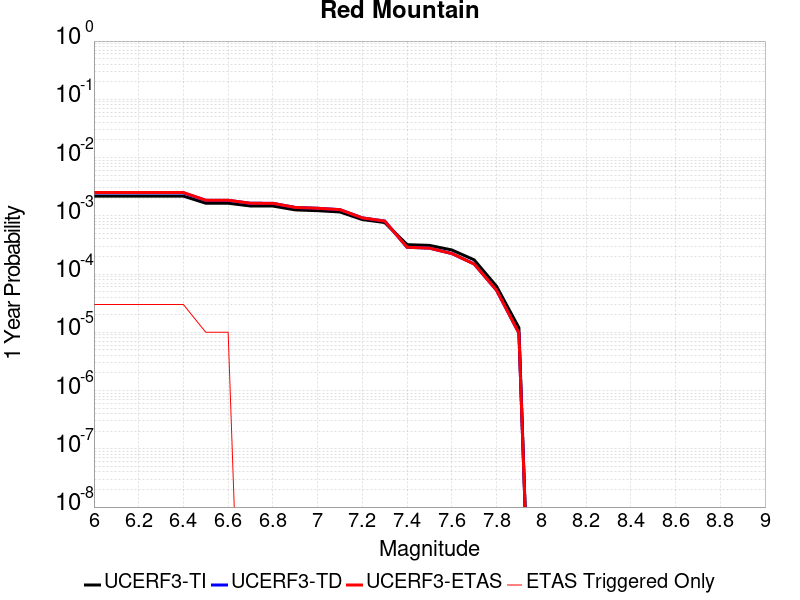 | 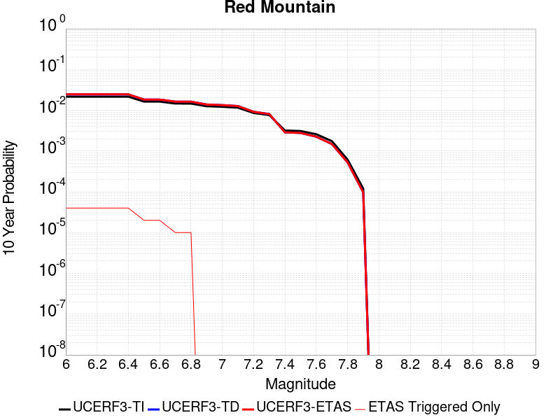 |

| Magnitude | 1 wk TI Prob | 1 wk TD Prob | 1 wk ETAS Prob | 1 wk ETAS/TD Gain | 1 wk ETAS Triggered Only | 1 mo TI Prob | 1 mo TD Prob | 1 mo ETAS Prob | 1 mo ETAS/TD Gain | 1 mo ETAS Triggered Only | 1 yr TI Prob | 1 yr TD Prob | 1 yr ETAS Prob | 1 yr ETAS/TD Gain | 1 yr ETAS Triggered Only | 10 yr TI Prob | 10 yr TD Prob | 10 yr ETAS Prob | 10 yr ETAS/TD Gain | 10 yr ETAS Triggered Only |
|-----|-----|-----|-----|-----|-----|-----|-----|-----|-----|-----|-----|-----|-----|-----|-----|-----|-----|-----|-----|-----|
| 6.0 | 4.1810763E-5 | 4.7589947E-5 | 6.947074E-5 | 1.4597777 | 2.1881839E-5 | 1.7917668E-4 | 2.039419E-4 | 2.2581928E-4 | 1.1072726 | 2.1881839E-5 | 0.0021792934 | 0.0024803306 | 0.0025458133 | 1.0264008 | 6.5645516E-5 | 0.021580452 | 0.024544092 | 0.02462947 | 1.0034786 | 8.7527354E-5 |
| 6.1 | 4.1810763E-5 | 4.7589947E-5 | 6.947074E-5 | 1.4597777 | 2.1881839E-5 | 1.7917668E-4 | 2.039419E-4 | 2.2581928E-4 | 1.1072726 | 2.1881839E-5 | 0.0021792934 | 0.0024803306 | 0.0025458133 | 1.0264008 | 6.5645516E-5 | 0.021580452 | 0.024544092 | 0.02462947 | 1.0034786 | 8.7527354E-5 |
| 6.2 | 4.1810763E-5 | 4.7589947E-5 | 6.947074E-5 | 1.4597777 | 2.1881839E-5 | 1.7917668E-4 | 2.039419E-4 | 2.2581928E-4 | 1.1072726 | 2.1881839E-5 | 0.0021792934 | 0.0024803306 | 0.0025458133 | 1.0264008 | 6.5645516E-5 | 0.021580452 | 0.024544092 | 0.02462947 | 1.0034786 | 8.7527354E-5 |
| 6.3 | 4.1810763E-5 | 4.7589947E-5 | 6.947074E-5 | 1.4597777 | 2.1881839E-5 | 1.7917668E-4 | 2.039419E-4 | 2.2581928E-4 | 1.1072726 | 2.1881839E-5 | 0.0021792934 | 0.0024803306 | 0.0025458133 | 1.0264008 | 6.5645516E-5 | 0.021580452 | 0.024544092 | 0.02462947 | 1.0034786 | 8.7527354E-5 |
| 6.4 | 4.1810763E-5 | 4.7589947E-5 | 6.947074E-5 | 1.4597777 | 2.1881839E-5 | 1.7917668E-4 | 2.039419E-4 | 2.2581928E-4 | 1.1072726 | 2.1881839E-5 | 0.0021792934 | 0.0024803306 | 0.0025458133 | 1.0264008 | 6.5645516E-5 | 0.021580452 | 0.024544092 | 0.02462947 | 1.0034786 | 8.7527354E-5 |
| 6.5 | 3.154503E-5 | 3.5359728E-5 | 3.5359728E-5 | 1.0 | 0.0 | 1.3518598E-4 | 1.5153342E-4 | 1.5153342E-4 | 1.0 | 0.0 | 0.0016446467 | 0.0018434501 | 0.0018652916 | 1.0118482 | 2.1881839E-5 | 0.01632528 | 0.018291233 | 0.018334197 | 1.0023488 | 4.3763677E-5 |
| 6.6 | 3.1535834E-5 | 3.534911E-5 | 3.534911E-5 | 1.0 | 0.0 | 1.3514658E-4 | 1.5148791E-4 | 1.5148791E-4 | 1.0 | 0.0 | 0.0016441676 | 0.001842897 | 0.0018647386 | 1.0118517 | 2.1881839E-5 | 0.01632056 | 0.018285794 | 0.018328758 | 1.0023495 | 4.3763677E-5 |
| 6.7 | 2.8267326E-5 | 3.146934E-5 | 3.146934E-5 | 1.0 | 0.0 | 1.2114006E-4 | 1.348621E-4 | 1.348621E-4 | 1.0 | 0.0 | 0.0014738824 | 0.0016407946 | 0.0016407946 | 1.0 | 0.0 | 0.014641452 | 0.016295563 | 0.016317088 | 1.001321 | 2.1881839E-5 |
| 6.8 | 2.8212884E-5 | 3.1407224E-5 | 3.1407224E-5 | 1.0 | 0.0 | 1.20906756E-4 | 1.3459593E-4 | 1.3459593E-4 | 1.0 | 0.0 | 0.0014710457 | 0.0016375587 | 0.0016375587 | 1.0 | 0.0 | 0.014613459 | 0.01626368 | 0.016285205 | 1.0013236 | 2.1881839E-5 |
| 6.9 | 2.4227871E-5 | 2.6706979E-5 | 2.6706979E-5 | 1.0 | 0.0 | 1.03829596E-4 | 1.14453884E-4 | 1.14453884E-4 | 1.0 | 0.0 | 0.0012633923 | 0.0013926612 | 0.0013926612 | 1.0 | 0.0 | 0.012562336 | 0.013847026 | 0.013847026 | 1.0 | 0.0 |
| 7.0 | 2.348524E-5 | 2.5835763E-5 | 2.5835763E-5 | 1.0 | 0.0 | 1.0064714E-4 | 1.1072042E-4 | 1.1072042E-4 | 1.0 | 0.0 | 0.0012246901 | 0.0013472632 | 0.0013472632 | 1.0 | 0.0 | 0.012179627 | 0.01339859 | 0.01339859 | 1.0 | 0.0 |
| 7.1 | 2.2311642E-5 | 2.4462828E-5 | 2.4462828E-5 | 1.0 | 0.0 | 9.561782E-5 | 1.048369E-4 | 1.048369E-4 | 1.0 | 0.0 | 0.0011635252 | 0.0012757168 | 0.0012757168 | 1.0 | 0.0 | 0.01157452 | 0.012691451 | 0.012691451 | 1.0 | 0.0 |
| 7.2 | 1.6533986E-5 | 1.7670347E-5 | 1.7670347E-5 | 1.0 | 0.0 | 7.085802E-5 | 7.572822E-5 | 7.572822E-5 | 1.0 | 0.0 | 8.623549E-4 | 9.216645E-4 | 9.216645E-4 | 1.0 | 0.0 | 0.008590161 | 0.009184699 | 0.009184699 | 1.0 | 0.0 |
| 7.3 | 1.4703092E-5 | 1.555952E-5 | 1.555952E-5 | 1.0 | 0.0 | 6.301173E-5 | 6.66823E-5 | 6.66823E-5 | 1.0 | 0.0 | 7.668978E-4 | 8.1161625E-4 | 8.1161625E-4 | 1.0 | 0.0 | 0.0076425658 | 0.008092596 | 0.008092596 | 1.0 | 0.0 |
| 7.4 | 6.1331984E-6 | 5.528872E-6 | 5.528872E-6 | 1.0 | 0.0 | 2.6284872E-5 | 2.3694953E-5 | 2.3694953E-5 | 1.0 | 0.0 | 3.199713E-4 | 2.8844838E-4 | 2.8844838E-4 | 1.0 | 0.0 | 0.0031951098 | 0.0028807942 | 0.0028807942 | 1.0 | 0.0 |
| 7.5 | 5.954766E-6 | 5.3385015E-6 | 5.3385015E-6 | 1.0 | 0.0 | 2.5520176E-5 | 2.2879094E-5 | 2.2879094E-5 | 1.0 | 0.0 | 3.1066386E-4 | 2.785179E-4 | 2.785179E-4 | 1.0 | 0.0 | 0.003102299 | 0.0027817423 | 0.0027817423 | 1.0 | 0.0 |
| 7.6 | 4.9726646E-6 | 4.315295E-6 | 4.315295E-6 | 1.0 | 0.0 | 2.1311245E-5 | 1.8493993E-5 | 1.8493993E-5 | 1.0 | 0.0 | 2.5943352E-4 | 2.2514143E-4 | 2.2514143E-4 | 1.0 | 0.0 | 0.0025913084 | 0.002249168 | 0.002249168 | 1.0 | 0.0 |
| 7.7 | 3.3613894E-6 | 2.8526642E-6 | 2.8526642E-6 | 1.0 | 0.0 | 1.4405875E-5 | 1.2225649E-5 | 1.2225649E-5 | 1.0 | 0.0 | 1.7537741E-4 | 1.4883737E-4 | 1.4883737E-4 | 1.0 | 0.0 | 0.0017523908 | 0.0014874031 | 0.0014874031 | 1.0 | 0.0 |
| 7.8 | 1.1828961E-6 | 1.0122756E-6 | 1.0122756E-6 | 1.0 | 0.0 | 5.069545E-6 | 4.338317E-6 | 4.338317E-6 | 1.0 | 0.0 | 6.171996E-5 | 5.281776E-5 | 5.281776E-5 | 1.0 | 0.0 | 6.170282E-4 | 5.2805495E-4 | 5.2805495E-4 | 1.0 | 0.0 |
| 7.9 | 2.2967266E-7 | 1.8618952E-7 | 1.8618952E-7 | 1.0 | 0.0 | 9.843111E-7 | 7.9795484E-7 | 7.9795484E-7 | 1.0 | 0.0 | 1.19839215E-5 | 9.7150605E-6 | 9.7150605E-6 | 1.0 | 0.0 | 1.1983275E-4 | 9.714664E-5 | 9.714664E-5 | 1.0 | 0.0 |

## Cady
*[(top)](#table-of-contents)*

| 1 Week | 1 Month | 1 Year | 10 Year |
|-----|-----|-----|-----|
|  |  |  |  |

| Magnitude | 1 wk TI Prob | 1 wk TD Prob | 1 wk ETAS Prob | 1 wk ETAS/TD Gain | 1 wk ETAS Triggered Only | 1 mo TI Prob | 1 mo TD Prob | 1 mo ETAS Prob | 1 mo ETAS/TD Gain | 1 mo ETAS Triggered Only | 1 yr TI Prob | 1 yr TD Prob | 1 yr ETAS Prob | 1 yr ETAS/TD Gain | 1 yr ETAS Triggered Only | 10 yr TI Prob | 10 yr TD Prob | 10 yr ETAS Prob | 10 yr ETAS/TD Gain | 10 yr ETAS Triggered Only |
|-----|-----|-----|-----|-----|-----|-----|-----|-----|-----|-----|-----|-----|-----|-----|-----|-----|-----|-----|-----|-----|
| 6.0 | 1.9892565E-5 | 2.1858728E-5 | 6.562145E-5 | 3.0020707 | 4.3763677E-5 | 8.525106E-5 | 9.3677416E-5 | 1.3743699E-4 | 1.4671304 | 4.3763677E-5 | 0.0010374374 | 0.0011400167 | 0.0012055874 | 1.0575173 | 6.5645516E-5 | 0.010326075 | 0.011350701 | 0.011415601 | 1.0057178 | 6.5645516E-5 |
| 6.1 | 1.9892565E-5 | 2.1858728E-5 | 6.562145E-5 | 3.0020707 | 4.3763677E-5 | 8.525106E-5 | 9.3677416E-5 | 1.3743699E-4 | 1.4671304 | 4.3763677E-5 | 0.0010374374 | 0.0011400167 | 0.0012055874 | 1.0575173 | 6.5645516E-5 | 0.010326075 | 0.011350701 | 0.011415601 | 1.0057178 | 6.5645516E-5 |
| 6.2 | 1.9892565E-5 | 2.1858728E-5 | 6.562145E-5 | 3.0020707 | 4.3763677E-5 | 8.525106E-5 | 9.3677416E-5 | 1.3743699E-4 | 1.4671304 | 4.3763677E-5 | 0.0010374374 | 0.0011400167 | 0.0012055874 | 1.0575173 | 6.5645516E-5 | 0.010326075 | 0.011350701 | 0.011415601 | 1.0057178 | 6.5645516E-5 |
| 6.3 | 1.1117327E-5 | 1.2176583E-5 | 3.4058154E-5 | 2.7970207 | 2.1881839E-5 | 4.764482E-5 | 5.2184492E-5 | 7.406519E-5 | 1.419295 | 2.1881839E-5 | 5.7992124E-4 | 6.351925E-4 | 6.789284E-4 | 1.0688546 | 4.3763677E-5 | 0.0057841022 | 0.0063368753 | 0.006380362 | 1.0068624 | 4.3763677E-5 |
| 6.4 | 1.1117327E-5 | 1.2176583E-5 | 3.4058154E-5 | 2.7970207 | 2.1881839E-5 | 4.764482E-5 | 5.2184492E-5 | 7.406519E-5 | 1.419295 | 2.1881839E-5 | 5.7992124E-4 | 6.351925E-4 | 6.789284E-4 | 1.0688546 | 4.3763677E-5 | 0.0057841022 | 0.0063368753 | 0.006380362 | 1.0068624 | 4.3763677E-5 |
| 6.5 | 6.103093E-6 | 6.672021E-6 | 6.672021E-6 | 1.0 | 0.0 | 2.615585E-5 | 2.8594131E-5 | 2.8594131E-5 | 1.0 | 0.0 | 3.1840094E-4 | 3.480905E-4 | 3.6996472E-4 | 1.0628406 | 2.1881839E-5 | 0.0031794512 | 0.0034766865 | 0.0034984923 | 1.006272 | 2.1881839E-5 |
| 6.6 | 5.817237E-6 | 6.3656585E-6 | 6.3656585E-6 | 1.0 | 0.0 | 2.4930776E-5 | 2.728118E-5 | 2.728118E-5 | 1.0 | 0.0 | 3.034899E-4 | 3.3211018E-4 | 3.5398474E-4 | 1.0658654 | 2.1881839E-5 | 0.0030307577 | 0.0033173605 | 0.0033391698 | 1.0065743 | 2.1881839E-5 |
| 6.7 | 4.8846314E-6 | 5.3405684E-6 | 5.3405684E-6 | 1.0 | 0.0 | 2.0933967E-5 | 2.2888014E-5 | 2.2888014E-5 | 1.0 | 0.0 | 2.5484123E-4 | 2.7863772E-4 | 3.0051346E-4 | 1.0785096 | 2.1881839E-5 | 0.0025454918 | 0.0027840391 | 0.00280586 | 1.0078379 | 2.1881839E-5 |
| 6.8 | 1.7788773E-6 | 1.9399079E-6 | 1.9399079E-6 | 1.0 | 0.0 | 7.6237375E-6 | 8.313874E-6 | 8.313874E-6 | 1.0 | 0.0 | 9.281505E-5 | 1.01218284E-4 | 1.01218284E-4 | 1.0 | 0.0 | 9.2776294E-4 | 0.0010118765 | 0.0010118765 | 1.0 | 0.0 |
| 6.9 | 7.5455404E-7 | 8.297092E-7 | 8.297092E-7 | 1.0 | 0.0 | 3.233799E-6 | 3.5558937E-6 | 3.5558937E-6 | 1.0 | 0.0 | 3.937079E-5 | 4.3292483E-5 | 4.3292483E-5 | 1.0 | 0.0 | 3.9363815E-4 | 4.3287344E-4 | 4.3287344E-4 | 1.0 | 0.0 |
| 7.0 | 6.8578805E-7 | 7.541816E-7 | 7.541816E-7 | 1.0 | 0.0 | 2.9390883E-6 | 3.2322048E-6 | 3.2322048E-6 | 1.0 | 0.0 | 3.578281E-5 | 3.9351715E-5 | 3.9351715E-5 | 1.0 | 0.0 | 3.577705E-4 | 3.9347992E-4 | 3.9347992E-4 | 1.0 | 0.0 |

## Pisgah-Bullion Mtn-Mesquite Lk
*[(top)](#table-of-contents)*

| 1 Week | 1 Month | 1 Year | 10 Year |
|-----|-----|-----|-----|
|  |  |  |  |

| Magnitude | 1 wk TI Prob | 1 wk TD Prob | 1 wk ETAS Prob | 1 wk ETAS/TD Gain | 1 wk ETAS Triggered Only | 1 mo TI Prob | 1 mo TD Prob | 1 mo ETAS Prob | 1 mo ETAS/TD Gain | 1 mo ETAS Triggered Only | 1 yr TI Prob | 1 yr TD Prob | 1 yr ETAS Prob | 1 yr ETAS/TD Gain | 1 yr ETAS Triggered Only | 10 yr TI Prob | 10 yr TD Prob | 10 yr ETAS Prob | 10 yr ETAS/TD Gain | 10 yr ETAS Triggered Only |
|-----|-----|-----|-----|-----|-----|-----|-----|-----|-----|-----|-----|-----|-----|-----|-----|-----|-----|-----|-----|-----|
| 6.0 | 3.0240792E-5 | 2.4091114E-5 | 8.973505E-5 | 3.7248192 | 6.5645516E-5 | 1.2959696E-4 | 1.03244114E-4 | 1.6888285E-4 | 1.6357625 | 6.5645516E-5 | 0.0015767008 | 0.0012563728 | 0.0013219358 | 1.0521843 | 6.5645516E-5 | 0.015655609 | 0.012502721 | 0.012567545 | 1.0051849 | 6.5645516E-5 |
| 6.1 | 3.0240792E-5 | 2.4091114E-5 | 8.973505E-5 | 3.7248192 | 6.5645516E-5 | 1.2959696E-4 | 1.03244114E-4 | 1.6888285E-4 | 1.6357625 | 6.5645516E-5 | 0.0015767008 | 0.0012563728 | 0.0013219358 | 1.0521843 | 6.5645516E-5 | 0.015655609 | 0.012502721 | 0.012567545 | 1.0051849 | 6.5645516E-5 |
| 6.2 | 3.0240792E-5 | 2.4091114E-5 | 8.973505E-5 | 3.7248192 | 6.5645516E-5 | 1.2959696E-4 | 1.03244114E-4 | 1.6888285E-4 | 1.6357625 | 6.5645516E-5 | 0.0015767008 | 0.0012563728 | 0.0013219358 | 1.0521843 | 6.5645516E-5 | 0.015655609 | 0.012502721 | 0.012567545 | 1.0051849 | 6.5645516E-5 |
| 6.3 | 2.0498217E-5 | 1.36380695E-5 | 5.740115E-5 | 4.208891 | 4.3763677E-5 | 8.784654E-5 | 5.844765E-5 | 1.0220877E-4 | 1.7487233 | 4.3763677E-5 | 0.0010690069 | 7.1138405E-4 | 7.551166E-4 | 1.0614753 | 4.3763677E-5 | 0.01063879 | 0.0070926943 | 0.007136148 | 1.0061265 | 4.3763677E-5 |
| 6.4 | 2.0498217E-5 | 1.36380695E-5 | 5.740115E-5 | 4.208891 | 4.3763677E-5 | 8.784654E-5 | 5.844765E-5 | 1.0220877E-4 | 1.7487233 | 4.3763677E-5 | 0.0010690069 | 7.1138405E-4 | 7.551166E-4 | 1.0614753 | 4.3763677E-5 | 0.01063879 | 0.0070926943 | 0.007136148 | 1.0061265 | 4.3763677E-5 |
| 6.5 | 1.7316182E-5 | 1.0477042E-5 | 5.424026E-5 | 5.177058 | 4.3763677E-5 | 7.42101E-5 | 4.4900895E-5 | 8.866261E-5 | 1.9746289 | 4.3763677E-5 | 9.0313336E-4 | 5.465413E-4 | 5.9028104E-4 | 1.0800301 | 4.3763677E-5 | 0.008994718 | 0.0054529672 | 0.005496492 | 1.0079819 | 4.3763677E-5 |
| 6.6 | 1.5251077E-5 | 8.414273E-6 | 3.0295927E-5 | 3.6005402 | 2.1881839E-5 | 6.536012E-5 | 3.6060712E-5 | 5.794176E-5 | 1.6067836 | 2.1881839E-5 | 7.9546886E-4 | 4.3895794E-4 | 4.608302E-4 | 1.0498276 | 2.1881839E-5 | 0.007926274 | 0.0043816264 | 0.0044034123 | 1.0049721 | 2.1881839E-5 |
| 6.7 | 1.2997425E-5 | 6.4114965E-6 | 2.8293194E-5 | 4.4128847 | 2.1881839E-5 | 5.570206E-5 | 2.7477578E-5 | 4.9358816E-5 | 1.7963306 | 2.1881839E-5 | 6.7796157E-4 | 3.3449283E-4 | 3.5636735E-4 | 1.0653961 | 2.1881839E-5 | 0.0067589693 | 0.0033403537 | 0.0033621625 | 1.0065289 | 2.1881839E-5 |
| 6.8 | 1.035386E-5 | 4.3332193E-6 | 2.6214962E-5 | 6.049766 | 2.1881839E-5 | 4.437293E-5 | 1.8570812E-5 | 4.0452243E-5 | 2.17827 | 2.1881839E-5 | 5.401065E-4 | 2.2607706E-4 | 2.4795395E-4 | 1.0967674 | 2.1881839E-5 | 0.0053879567 | 0.0022585576 | 0.00228039 | 1.0096666 | 2.1881839E-5 |
| 6.9 | 8.816252E-6 | 3.580638E-6 | 2.5462397E-5 | 7.1111345 | 2.1881839E-5 | 3.778339E-5 | 1.5345504E-5 | 3.7227004E-5 | 2.4259226 | 2.1881839E-5 | 4.5991567E-4 | 1.8681608E-4 | 2.0869383E-4 | 1.1171085 | 2.1881839E-5 | 0.00458965 | 0.0018666488 | 0.0018884897 | 1.0117006 | 2.1881839E-5 |
| 7.0 | 6.8232207E-6 | 2.5675843E-6 | 2.5675843E-6 | 1.0 | 0.0 | 2.9242048E-5 | 1.1003888E-5 | 1.1003888E-5 | 1.0 | 0.0 | 3.5596377E-4 | 1.3396442E-4 | 1.3396442E-4 | 1.0 | 0.0 | 0.0035539411 | 0.0013388677 | 0.0013388677 | 1.0 | 0.0 |
| 7.1 | 5.837013E-6 | 2.22738E-6 | 2.22738E-6 | 1.0 | 0.0 | 2.501553E-5 | 9.545881E-6 | 9.545881E-6 | 1.0 | 0.0 | 3.045215E-4 | 1.16215204E-4 | 1.16215204E-4 | 1.0 | 0.0 | 0.0030410455 | 0.0011615733 | 0.0011615733 | 1.0 | 0.0 |
| 7.2 | 4.278052E-6 | 1.6275711E-6 | 1.6275711E-6 | 1.0 | 0.0 | 1.833438E-5 | 6.9752873E-6 | 6.9752873E-6 | 1.0 | 0.0 | 2.231982E-4 | 8.492105E-5 | 8.492105E-5 | 1.0 | 0.0 | 0.0022297418 | 8.489092E-4 | 8.489092E-4 | 1.0 | 0.0 |
| 7.3 | 1.8803692E-6 | 8.344926E-7 | 8.344926E-7 | 1.0 | 0.0 | 8.0587E-6 | 3.5763926E-6 | 3.5763926E-6 | 1.0 | 0.0 | 9.811026E-5 | 4.354186E-5 | 4.354186E-5 | 1.0 | 0.0 | 9.806695E-4 | 4.3534773E-4 | 4.3534773E-4 | 1.0 | 0.0 |

## Bullion Mountains
*[(top)](#table-of-contents)*

| 1 Week | 1 Month | 1 Year | 10 Year |
|-----|-----|-----|-----|
|  |  |  |  |

| Magnitude | 1 wk TI Prob | 1 wk TD Prob | 1 wk ETAS Prob | 1 wk ETAS/TD Gain | 1 wk ETAS Triggered Only | 1 mo TI Prob | 1 mo TD Prob | 1 mo ETAS Prob | 1 mo ETAS/TD Gain | 1 mo ETAS Triggered Only | 1 yr TI Prob | 1 yr TD Prob | 1 yr ETAS Prob | 1 yr ETAS/TD Gain | 1 yr ETAS Triggered Only | 10 yr TI Prob | 10 yr TD Prob | 10 yr ETAS Prob | 10 yr ETAS/TD Gain | 10 yr ETAS Triggered Only |
|-----|-----|-----|-----|-----|-----|-----|-----|-----|-----|-----|-----|-----|-----|-----|-----|-----|-----|-----|-----|-----|
| 6.0 | 1.6420427E-5 | 1.4692089E-5 | 3.6573605E-5 | 2.48934 | 2.1881839E-5 | 7.037136E-5 | 6.296479E-5 | 1.0672572E-4 | 1.6950061 | 4.3763677E-5 | 8.5643446E-4 | 7.663651E-4 | 8.319603E-4 | 1.0855926 | 6.5645516E-5 | 0.008531413 | 0.007641016 | 0.00770616 | 1.0085256 | 6.5645516E-5 |
| 6.1 | 1.6420427E-5 | 1.4692089E-5 | 3.6573605E-5 | 2.48934 | 2.1881839E-5 | 7.037136E-5 | 6.296479E-5 | 1.0672572E-4 | 1.6950061 | 4.3763677E-5 | 8.5643446E-4 | 7.663651E-4 | 8.319603E-4 | 1.0855926 | 6.5645516E-5 | 0.008531413 | 0.007641016 | 0.00770616 | 1.0085256 | 6.5645516E-5 |
| 6.2 | 1.6420427E-5 | 1.4692089E-5 | 3.6573605E-5 | 2.48934 | 2.1881839E-5 | 7.037136E-5 | 6.296479E-5 | 1.0672572E-4 | 1.6950061 | 4.3763677E-5 | 8.5643446E-4 | 7.663651E-4 | 8.319603E-4 | 1.0855926 | 6.5645516E-5 | 0.008531413 | 0.007641016 | 0.00770616 | 1.0085256 | 6.5645516E-5 |
| 6.3 | 1.2046778E-5 | 9.862335E-6 | 3.174396E-5 | 3.2187061 | 2.1881839E-5 | 5.1628023E-5 | 4.2266598E-5 | 6.414751E-5 | 1.517688 | 2.1881839E-5 | 6.283899E-4 | 5.144975E-4 | 5.3636805E-4 | 1.0425086 | 2.1881839E-5 | 0.0062661595 | 0.005135345 | 0.0051571145 | 1.0042392 | 2.1881839E-5 |
| 6.4 | 1.2046778E-5 | 9.862335E-6 | 3.174396E-5 | 3.2187061 | 2.1881839E-5 | 5.1628023E-5 | 4.2266598E-5 | 6.414751E-5 | 1.517688 | 2.1881839E-5 | 6.283899E-4 | 5.144975E-4 | 5.3636805E-4 | 1.0425086 | 2.1881839E-5 | 0.0062661595 | 0.005135345 | 0.0051571145 | 1.0042392 | 2.1881839E-5 |
| 6.5 | 1.0244343E-5 | 7.879458E-6 | 2.9761124E-5 | 3.777052 | 2.1881839E-5 | 4.390359E-5 | 3.3768785E-5 | 5.5649885E-5 | 1.6479682 | 2.1881839E-5 | 5.343951E-4 | 4.110781E-4 | 4.3295094E-4 | 1.0532085 | 2.1881839E-5 | 0.005331118 | 0.004105208 | 0.004127 | 1.0053084 | 2.1881839E-5 |
| 6.6 | 9.605408E-6 | 7.1774966E-6 | 2.9059178E-5 | 4.0486507 | 2.1881839E-5 | 4.1165385E-5 | 3.076045E-5 | 5.2641615E-5 | 1.7113408 | 2.1881839E-5 | 5.010733E-4 | 3.744645E-4 | 3.9633812E-4 | 1.0584131 | 2.1881839E-5 | 0.00499945 | 0.003740332 | 0.003762132 | 1.0058284 | 2.1881839E-5 |
| 6.7 | 8.60418E-6 | 6.1240044E-6 | 2.8005708E-5 | 4.573104 | 2.1881839E-5 | 3.687454E-5 | 2.624558E-5 | 4.8126843E-5 | 1.8337123 | 2.1881839E-5 | 4.48855E-4 | 3.1951256E-4 | 3.413874E-4 | 1.0684632 | 2.1881839E-5 | 0.004479495 | 0.0031924439 | 0.0032142557 | 1.0068324 | 2.1881839E-5 |
| 6.8 | 5.187994E-6 | 2.5631666E-6 | 2.5631666E-6 | 1.0 | 0.0 | 2.223407E-5 | 1.0984976E-5 | 1.0984976E-5 | 1.0 | 0.0 | 2.7066618E-4 | 1.3373788E-4 | 1.3373788E-4 | 1.0 | 0.0 | 0.0027033675 | 0.0013369655 | 0.0013369655 | 1.0 | 0.0 |
| 6.9 | 4.5302368E-6 | 2.3443165E-6 | 2.3443165E-6 | 1.0 | 0.0 | 1.9415156E-5 | 1.0047055E-5 | 1.0047055E-5 | 1.0 | 0.0 | 2.3635388E-4 | 1.2232E-4 | 1.2232E-4 | 1.0 | 0.0 | 0.0023610266 | 0.0012229157 | 0.0012229157 | 1.0 | 0.0 |
| 7.0 | 3.431668E-6 | 1.6882402E-6 | 1.6882402E-6 | 1.0 | 0.0 | 1.4707065E-5 | 7.235315E-6 | 7.235315E-6 | 1.0 | 0.0 | 1.7904381E-4 | 8.808996E-5 | 8.808996E-5 | 1.0 | 0.0 | 0.0017889962 | 8.808996E-4 | 8.808996E-4 | 1.0 | 0.0 |

## Kern Canyon (South Kern) 2011
*[(top)](#table-of-contents)*

| 1 Week | 1 Month | 1 Year | 10 Year |
|-----|-----|-----|-----|
|  |  |  |  |

| Magnitude | 1 wk TI Prob | 1 wk TD Prob | 1 wk ETAS Prob | 1 wk ETAS/TD Gain | 1 wk ETAS Triggered Only | 1 mo TI Prob | 1 mo TD Prob | 1 mo ETAS Prob | 1 mo ETAS/TD Gain | 1 mo ETAS Triggered Only | 1 yr TI Prob | 1 yr TD Prob | 1 yr ETAS Prob | 1 yr ETAS/TD Gain | 1 yr ETAS Triggered Only | 10 yr TI Prob | 10 yr TD Prob | 10 yr ETAS Prob | 10 yr ETAS/TD Gain | 10 yr ETAS Triggered Only |
|-----|-----|-----|-----|-----|-----|-----|-----|-----|-----|-----|-----|-----|-----|-----|-----|-----|-----|-----|-----|-----|
| 6.0 | 4.105075E-6 | 4.1137264E-6 | 6.975897E-5 | 16.957611 | 6.5645516E-5 | 1.7593058E-5 | 1.763014E-5 | 8.32745E-5 | 4.7234163 | 6.5645516E-5 | 2.1417443E-4 | 2.1462646E-4 | 2.802579E-4 | 1.3057938 | 6.5645516E-5 | 0.0021396813 | 0.0021442557 | 0.0022097605 | 1.0305489 | 6.5645516E-5 |
| 6.1 | 4.105075E-6 | 4.1137264E-6 | 6.975897E-5 | 16.957611 | 6.5645516E-5 | 1.7593058E-5 | 1.763014E-5 | 8.32745E-5 | 4.7234163 | 6.5645516E-5 | 2.1417443E-4 | 2.1462646E-4 | 2.802579E-4 | 1.3057938 | 6.5645516E-5 | 0.0021396813 | 0.0021442557 | 0.0022097605 | 1.0305489 | 6.5645516E-5 |
| 6.2 | 4.105075E-6 | 4.1137264E-6 | 6.975897E-5 | 16.957611 | 6.5645516E-5 | 1.7593058E-5 | 1.763014E-5 | 8.32745E-5 | 4.7234163 | 6.5645516E-5 | 2.1417443E-4 | 2.1462646E-4 | 2.802579E-4 | 1.3057938 | 6.5645516E-5 | 0.0021396813 | 0.0021442557 | 0.0022097605 | 1.0305489 | 6.5645516E-5 |
| 6.3 | 4.105075E-6 | 4.1137264E-6 | 6.975897E-5 | 16.957611 | 6.5645516E-5 | 1.7593058E-5 | 1.763014E-5 | 8.32745E-5 | 4.7234163 | 6.5645516E-5 | 2.1417443E-4 | 2.1462646E-4 | 2.802579E-4 | 1.3057938 | 6.5645516E-5 | 0.0021396813 | 0.0021442557 | 0.0022097605 | 1.0305489 | 6.5645516E-5 |
| 6.4 | 4.105075E-6 | 4.1137264E-6 | 6.975897E-5 | 16.957611 | 6.5645516E-5 | 1.7593058E-5 | 1.763014E-5 | 8.32745E-5 | 4.7234163 | 6.5645516E-5 | 2.1417443E-4 | 2.1462646E-4 | 2.802579E-4 | 1.3057938 | 6.5645516E-5 | 0.0021396813 | 0.0021442557 | 0.0022097605 | 1.0305489 | 6.5645516E-5 |
| 6.5 | 2.9849807E-6 | 2.9731548E-6 | 6.861847E-5 | 23.079348 | 6.5645516E-5 | 1.2792712E-5 | 1.274203E-5 | 7.838671E-5 | 6.1518226 | 6.5645516E-5 | 1.5574014E-4 | 1.5512333E-4 | 2.2075865E-4 | 1.423117 | 6.5645516E-5 | 0.0015563103 | 0.0015501656 | 0.0016157094 | 1.0422817 | 6.5645516E-5 |
| 6.6 | 2.9849807E-6 | 2.9731548E-6 | 6.861847E-5 | 23.079348 | 6.5645516E-5 | 1.2792712E-5 | 1.274203E-5 | 7.838671E-5 | 6.1518226 | 6.5645516E-5 | 1.5574014E-4 | 1.5512333E-4 | 2.2075865E-4 | 1.423117 | 6.5645516E-5 | 0.0015563103 | 0.0015501656 | 0.0016157094 | 1.0422817 | 6.5645516E-5 |
| 6.7 | 2.6756725E-6 | 2.6582206E-6 | 6.830356E-5 | 25.695217 | 6.5645516E-5 | 1.1467117E-5 | 1.1392325E-5 | 7.703709E-5 | 6.762192 | 6.5645516E-5 | 1.396032E-4 | 1.3869285E-4 | 2.0432925E-4 | 1.4732502 | 6.5645516E-5 | 0.0013951553 | 0.0013860738 | 0.0014516283 | 1.0472951 | 6.5645516E-5 |
| 6.8 | 2.3283721E-6 | 2.3047787E-6 | 6.795014E-5 | 29.482283 | 6.5645516E-5 | 9.9787E-6 | 9.877586E-6 | 7.5522454E-5 | 7.6458406 | 6.5645516E-5 | 1.214839E-4 | 1.20253055E-4 | 1.8589068E-4 | 1.5458292 | 6.5645516E-5 | 0.001214175 | 0.0012018873 | 0.0012674539 | 1.054553 | 6.5645516E-5 |
| 6.9 | 2.0972677E-6 | 2.0696411E-6 | 4.5833225E-5 | 22.145494 | 4.3763677E-5 | 8.988259E-6 | 8.869861E-6 | 5.263315E-5 | 5.933932 | 4.3763677E-5 | 1.0942656E-4 | 1.0798526E-4 | 1.5174421E-4 | 1.4052308 | 4.3763677E-5 | 0.0010937268 | 0.0010793337 | 0.0011230501 | 1.0405031 | 4.3763677E-5 |
| 7.0 | 1.7132242E-6 | 1.6787036E-6 | 2.3560506E-5 | 14.034941 | 2.1881839E-5 | 7.3423685E-6 | 7.194424E-6 | 2.9076105E-5 | 4.0414777 | 2.1881839E-5 | 8.938967E-5 | 8.758863E-5 | 1.0946855E-4 | 1.2498032 | 2.1881839E-5 | 8.935372E-4 | 8.7554497E-4 | 8.9740765E-4 | 1.0249704 | 2.1881839E-5 |
| 7.1 | 1.4215541E-6 | 1.3815752E-6 | 2.3263383E-5 | 16.838305 | 2.1881839E-5 | 6.0923603E-6 | 5.9210233E-6 | 2.7802731E-5 | 4.6955957 | 2.1881839E-5 | 7.417196E-5 | 7.20861E-5 | 9.396636E-5 | 1.3035295 | 2.1881839E-5 | 7.414721E-4 | 7.206299E-4 | 7.4249593E-4 | 1.0303429 | 2.1881839E-5 |
| 7.2 | 9.097853E-7 | 8.6037755E-7 | 2.2742197E-5 | 26.43281 | 2.1881839E-5 | 3.899074E-6 | 3.6873273E-6 | 2.5569085E-5 | 6.934314 | 2.1881839E-5 | 4.7470192E-5 | 4.4892295E-5 | 6.677315E-5 | 1.4874078 | 2.1881839E-5 | 4.7460053E-4 | 4.4883334E-4 | 4.7070536E-4 | 1.0487309 | 2.1881839E-5 |
| 7.3 | 6.144169E-7 | 5.628206E-7 | 2.2444647E-5 | 39.878864 | 2.1881839E-5 | 2.6332125E-6 | 2.4120861E-6 | 2.4293871E-5 | 10.071726 | 2.1881839E-5 | 3.205889E-5 | 2.9366758E-5 | 5.1247953E-5 | 1.7451009 | 2.1881839E-5 | 3.2054266E-4 | 2.936293E-4 | 3.155047E-4 | 1.0745001 | 2.1881839E-5 |
| 7.4 | 4.049844E-7 | 3.5728314E-7 | 3.5728314E-7 | 1.0 | 0.0 | 1.7356463E-6 | 1.5312125E-6 | 1.5312125E-6 | 1.0 | 0.0 | 2.1131287E-5 | 1.8642357E-5 | 1.8642357E-5 | 1.0 | 0.0 | 2.1129279E-4 | 1.8640817E-4 | 1.8640817E-4 | 1.0 | 0.0 |
| 7.5 | 1.9871162E-7 | 1.583044E-7 | 1.583044E-7 | 1.0 | 0.0 | 8.5162094E-7 | 6.7844724E-7 | 6.7844724E-7 | 1.0 | 0.0 | 1.0368436E-5 | 8.260065E-6 | 8.260065E-6 | 1.0 | 0.0 | 1.0367952E-4 | 8.259767E-5 | 8.259767E-5 | 1.0 | 0.0 |
| 7.6 | 2.572245E-8 | 1.7352555E-8 | 1.7352555E-8 | 1.0 | 0.0 | 1.10239064E-7 | 7.436809E-8 | 7.436809E-8 | 1.0 | 0.0 | 1.3421597E-6 | 9.054312E-7 | 9.054312E-7 | 1.0 | 0.0 | 1.3421517E-5 | 9.05428E-6 | 9.05428E-6 | 1.0 | 0.0 |

## Baker
*[(top)](#table-of-contents)*

| 1 Week | 1 Month | 1 Year | 10 Year |
|-----|-----|-----|-----|
|  |  |  |  |

| Magnitude | 1 wk TI Prob | 1 wk TD Prob | 1 wk ETAS Prob | 1 wk ETAS/TD Gain | 1 wk ETAS Triggered Only | 1 mo TI Prob | 1 mo TD Prob | 1 mo ETAS Prob | 1 mo ETAS/TD Gain | 1 mo ETAS Triggered Only | 1 yr TI Prob | 1 yr TD Prob | 1 yr ETAS Prob | 1 yr ETAS/TD Gain | 1 yr ETAS Triggered Only | 10 yr TI Prob | 10 yr TD Prob | 10 yr ETAS Prob | 10 yr ETAS/TD Gain | 10 yr ETAS Triggered Only |
|-----|-----|-----|-----|-----|-----|-----|-----|-----|-----|-----|-----|-----|-----|-----|-----|-----|-----|-----|-----|-----|
| 6.0 | 5.695525E-6 | 5.8348373E-6 | 7.147997E-5 | 12.25055 | 6.5645516E-5 | 2.4409164E-5 | 2.5006228E-5 | 9.06501E-5 | 3.6251009 | 6.5645516E-5 | 2.9714106E-4 | 3.044123E-4 | 3.7003783E-4 | 1.215581 | 6.5645516E-5 | 0.0029674405 | 0.0030403486 | 0.0031057945 | 1.0215257 | 6.5645516E-5 |
| 6.1 | 5.695525E-6 | 5.8348373E-6 | 7.147997E-5 | 12.25055 | 6.5645516E-5 | 2.4409164E-5 | 2.5006228E-5 | 9.06501E-5 | 3.6251009 | 6.5645516E-5 | 2.9714106E-4 | 3.044123E-4 | 3.7003783E-4 | 1.215581 | 6.5645516E-5 | 0.0029674405 | 0.0030403486 | 0.0031057945 | 1.0215257 | 6.5645516E-5 |
| 6.2 | 5.695525E-6 | 5.8348373E-6 | 7.147997E-5 | 12.25055 | 6.5645516E-5 | 2.4409164E-5 | 2.5006228E-5 | 9.06501E-5 | 3.6251009 | 6.5645516E-5 | 2.9714106E-4 | 3.044123E-4 | 3.7003783E-4 | 1.215581 | 6.5645516E-5 | 0.0029674405 | 0.0030403486 | 0.0031057945 | 1.0215257 | 6.5645516E-5 |
| 6.3 | 3.2995713E-6 | 3.383667E-6 | 4.7147194E-5 | 13.933757 | 4.3763677E-5 | 1.4140943E-5 | 1.4501353E-5 | 5.8264395E-5 | 4.0178595 | 4.3763677E-5 | 1.7215237E-4 | 1.7654014E-4 | 2.2029609E-4 | 1.2478527 | 4.3763677E-5 | 0.0017201907 | 0.001764046 | 0.0018077325 | 1.0247649 | 4.3763677E-5 |
| 6.4 | 3.2995713E-6 | 3.383667E-6 | 4.7147194E-5 | 13.933757 | 4.3763677E-5 | 1.4140943E-5 | 1.4501353E-5 | 5.8264395E-5 | 4.0178595 | 4.3763677E-5 | 1.7215237E-4 | 1.7654014E-4 | 2.2029609E-4 | 1.2478527 | 4.3763677E-5 | 0.0017201907 | 0.001764046 | 0.0018077325 | 1.0247649 | 4.3763677E-5 |
| 6.5 | 2.782202E-6 | 2.8558404E-6 | 4.6619392E-5 | 16.324228 | 4.3763677E-5 | 1.1923668E-5 | 1.223926E-5 | 5.6002402E-5 | 4.575636 | 4.3763677E-5 | 1.4516099E-4 | 1.4900314E-4 | 1.9276029E-4 | 1.293666 | 4.3763677E-5 | 0.001450662 | 0.0014890651 | 0.0015327636 | 1.0293462 | 4.3763677E-5 |
| 6.6 | 2.3163404E-6 | 2.38092E-6 | 4.614449E-5 | 19.38095 | 4.3763677E-5 | 9.927136E-6 | 1.0203904E-5 | 5.3967135E-5 | 5.2888713 | 4.3763677E-5 | 1.20856166E-4 | 1.2422565E-4 | 1.6798389E-4 | 1.3522481 | 4.3763677E-5 | 0.0012079047 | 0.0012415823 | 0.0012852916 | 1.0352045 | 4.3763677E-5 |
| 6.7 | 2.037056E-6 | 2.0965003E-6 | 4.5860084E-5 | 21.874588 | 4.3763677E-5 | 8.7302105E-6 | 8.984972E-6 | 5.2748255E-5 | 5.87072 | 4.3763677E-5 | 1.0628513E-4 | 1.093867E-4 | 1.531456E-4 | 1.4000385 | 4.3763677E-5 | 0.0010623431 | 0.0010933448 | 0.0011370606 | 1.0399836 | 4.3763677E-5 |
| 6.8 | 1.8356744E-6 | 1.8915287E-6 | 1.8915287E-6 | 1.0 | 0.0 | 7.867153E-6 | 8.106527E-6 | 8.106527E-6 | 1.0 | 0.0 | 9.577837E-5 | 9.869264E-5 | 9.869264E-5 | 1.0 | 0.0 | 9.57371E-4 | 9.86502E-4 | 9.86502E-4 | 1.0 | 0.0 |
| 6.9 | 1.6310546E-6 | 1.6832072E-6 | 1.6832072E-6 | 1.0 | 0.0 | 6.9902153E-6 | 7.213726E-6 | 7.213726E-6 | 1.0 | 0.0 | 8.510255E-5 | 8.782368E-5 | 8.782368E-5 | 1.0 | 0.0 | 8.5069967E-4 | 8.7790104E-4 | 8.7790104E-4 | 1.0 | 0.0 |
| 7.0 | 1.2058036E-6 | 1.2508665E-6 | 1.2508665E-6 | 1.0 | 0.0 | 5.1677193E-6 | 5.3608455E-6 | 5.3608455E-6 | 1.0 | 0.0 | 6.291517E-5 | 6.5266366E-5 | 6.5266366E-5 | 1.0 | 0.0 | 6.289736E-4 | 6.524743E-4 | 6.524743E-4 | 1.0 | 0.0 |
| 7.1 | 1.052382E-6 | 1.0951609E-6 | 1.0951609E-6 | 1.0 | 0.0 | 4.5102006E-6 | 4.693538E-6 | 4.693538E-6 | 1.0 | 0.0 | 5.491031E-5 | 5.7142337E-5 | 5.7142337E-5 | 1.0 | 0.0 | 5.4896745E-4 | 5.7127734E-4 | 5.7127734E-4 | 1.0 | 0.0 |
| 7.2 | 1.0067454E-6 | 1.0487711E-6 | 1.0487711E-6 | 1.0 | 0.0 | 4.3146156E-6 | 4.4947255E-6 | 4.4947255E-6 | 1.0 | 0.0 | 5.252918E-5 | 5.4721917E-5 | 5.4721917E-5 | 1.0 | 0.0 | 5.251676E-4 | 5.470853E-4 | 5.470853E-4 | 1.0 | 0.0 |
| 7.3 | 9.3596316E-7 | 9.767723E-7 | 9.767723E-7 | 1.0 | 0.0 | 4.0112645E-6 | 4.1861604E-6 | 4.1861604E-6 | 1.0 | 0.0 | 4.8836053E-5 | 5.096532E-5 | 5.096532E-5 | 1.0 | 0.0 | 4.8825322E-4 | 5.095371E-4 | 5.095371E-4 | 1.0 | 0.0 |
| 7.4 | 8.8117395E-7 | 9.2076635E-7 | 9.2076635E-7 | 1.0 | 0.0 | 3.7764542E-6 | 3.9461356E-6 | 3.9461356E-6 | 1.0 | 0.0 | 4.5977362E-5 | 4.8043148E-5 | 4.8043148E-5 | 1.0 | 0.0 | 4.596785E-4 | 4.8032837E-4 | 4.8032837E-4 | 1.0 | 0.0 |
| 7.5 | 8.292386E-7 | 8.6745956E-7 | 8.6745956E-7 | 1.0 | 0.0 | 3.5538749E-6 | 3.7176785E-6 | 3.7176785E-6 | 1.0 | 0.0 | 4.326757E-5 | 4.5261804E-5 | 4.5261804E-5 | 1.0 | 0.0 | 4.3259145E-4 | 4.5252658E-4 | 4.5252658E-4 | 1.0 | 0.0 |
| 7.6 | 7.553842E-7 | 7.9144706E-7 | 7.9144706E-7 | 1.0 | 0.0 | 3.2373566E-6 | 3.3919116E-6 | 3.3919116E-6 | 1.0 | 0.0 | 3.9414106E-5 | 4.129575E-5 | 4.129575E-5 | 1.0 | 0.0 | 3.9407116E-4 | 4.1288146E-4 | 4.1288146E-4 | 1.0 | 0.0 |
| 7.7 | 6.5285366E-7 | 6.852797E-7 | 6.852797E-7 | 1.0 | 0.0 | 2.797941E-6 | 2.9369096E-6 | 2.9369096E-6 | 1.0 | 0.0 | 3.40644E-5 | 3.5756293E-5 | 3.5756293E-5 | 1.0 | 0.0 | 3.405918E-4 | 3.5750607E-4 | 3.5750607E-4 | 1.0 | 0.0 |
| 7.8 | 3.4586725E-7 | 3.6482615E-7 | 3.6482615E-7 | 1.0 | 0.0 | 1.4822873E-6 | 1.5635396E-6 | 1.5635396E-6 | 1.0 | 0.0 | 1.80467E-5 | 1.9035933E-5 | 1.9035933E-5 | 1.0 | 0.0 | 1.8045233E-4 | 1.9034347E-4 | 1.9034347E-4 | 1.0 | 0.0 |
| 7.9 | 2.5591178E-9 | 2.6696718E-9 | 2.6696718E-9 | 1.0 | 0.0 | 1.0967647E-8 | 1.14414505E-8 | 1.14414505E-8 | 1.0 | 0.0 | 1.335311E-7 | 1.3929966E-7 | 1.3929966E-7 | 1.0 | 0.0 | 1.3353102E-6 | 1.3929966E-6 | 1.3929966E-6 | 1.0 | 0.0 |

## Camp Rock 2011
*[(top)](#table-of-contents)*

| 1 Week | 1 Month | 1 Year | 10 Year |
|-----|-----|-----|-----|
|  |  |  |  |

| Magnitude | 1 wk TI Prob | 1 wk TD Prob | 1 wk ETAS Prob | 1 wk ETAS/TD Gain | 1 wk ETAS Triggered Only | 1 mo TI Prob | 1 mo TD Prob | 1 mo ETAS Prob | 1 mo ETAS/TD Gain | 1 mo ETAS Triggered Only | 1 yr TI Prob | 1 yr TD Prob | 1 yr ETAS Prob | 1 yr ETAS/TD Gain | 1 yr ETAS Triggered Only | 10 yr TI Prob | 10 yr TD Prob | 10 yr ETAS Prob | 10 yr ETAS/TD Gain | 10 yr ETAS Triggered Only |
|-----|-----|-----|-----|-----|-----|-----|-----|-----|-----|-----|-----|-----|-----|-----|-----|-----|-----|-----|-----|-----|
| 6.0 | 1.6710783E-5 | 4.25026E-6 | 4.801375E-5 | 11.296661 | 4.3763677E-5 | 7.161568E-5 | 1.8215276E-5 | 6.197816E-5 | 3.402537 | 4.3763677E-5 | 8.7157206E-4 | 2.2174895E-4 | 2.8737992E-4 | 1.2959696 | 6.5645516E-5 | 0.008681616 | 0.0022153298 | 0.0022808297 | 1.0295668 | 6.5645516E-5 |
| 6.1 | 1.6710783E-5 | 4.25026E-6 | 4.801375E-5 | 11.296661 | 4.3763677E-5 | 7.161568E-5 | 1.8215276E-5 | 6.197816E-5 | 3.402537 | 4.3763677E-5 | 8.7157206E-4 | 2.2174895E-4 | 2.8737992E-4 | 1.2959696 | 6.5645516E-5 | 0.008681616 | 0.0022153298 | 0.0022808297 | 1.0295668 | 6.5645516E-5 |
| 6.2 | 1.6710783E-5 | 4.25026E-6 | 4.801375E-5 | 11.296661 | 4.3763677E-5 | 7.161568E-5 | 1.8215276E-5 | 6.197816E-5 | 3.402537 | 4.3763677E-5 | 8.7157206E-4 | 2.2174895E-4 | 2.8737992E-4 | 1.2959696 | 6.5645516E-5 | 0.008681616 | 0.0022153298 | 0.0022808297 | 1.0295668 | 6.5645516E-5 |
| 6.3 | 1.6710783E-5 | 4.25026E-6 | 4.801375E-5 | 11.296661 | 4.3763677E-5 | 7.161568E-5 | 1.8215276E-5 | 6.197816E-5 | 3.402537 | 4.3763677E-5 | 8.7157206E-4 | 2.2174895E-4 | 2.8737992E-4 | 1.2959696 | 6.5645516E-5 | 0.008681616 | 0.0022153298 | 0.0022808297 | 1.0295668 | 6.5645516E-5 |
| 6.4 | 7.982846E-6 | 3.6820884E-6 | 4.7445603E-5 | 12.885514 | 4.3763677E-5 | 3.421175E-5 | 1.5780286E-5 | 5.9543272E-5 | 3.7732694 | 4.3763677E-5 | 4.1644843E-4 | 1.9210839E-4 | 2.5774128E-4 | 1.3416451 | 6.5645516E-5 | 0.0041566887 | 0.001919458 | 0.0019849776 | 1.0341344 | 6.5645516E-5 |
| 6.5 | 7.982846E-6 | 3.6820884E-6 | 4.7445603E-5 | 12.885514 | 4.3763677E-5 | 3.421175E-5 | 1.5780286E-5 | 5.9543272E-5 | 3.7732694 | 4.3763677E-5 | 4.1644843E-4 | 1.9210839E-4 | 2.5774128E-4 | 1.3416451 | 6.5645516E-5 | 0.0041566887 | 0.001919458 | 0.0019849776 | 1.0341344 | 6.5645516E-5 |
| 6.6 | 7.048869E-6 | 3.4243571E-6 | 4.7187885E-5 | 13.78007 | 4.3763677E-5 | 3.0209088E-5 | 1.4675736E-5 | 5.843877E-5 | 3.9819994 | 4.3763677E-5 | 3.677336E-4 | 1.7866275E-4 | 2.4429653E-4 | 1.3673613 | 6.5645516E-5 | 0.0036712566 | 0.0017852228 | 0.0018507511 | 1.036706 | 6.5645516E-5 |
| 6.7 | 6.987307E-6 | 3.3623348E-6 | 4.7125865E-5 | 14.015816 | 4.3763677E-5 | 2.9945259E-5 | 1.4409929E-5 | 5.8172973E-5 | 4.0370064 | 4.3763677E-5 | 3.6452254E-4 | 1.7542706E-4 | 2.4106106E-4 | 1.3741384 | 6.5645516E-5 | 0.0036392517 | 0.001752917 | 0.0018184474 | 1.0373837 | 6.5645516E-5 |
| 6.8 | 6.3737602E-6 | 3.1179077E-6 | 4.6881447E-5 | 15.036188 | 4.3763677E-5 | 2.731583E-5 | 1.3362394E-5 | 5.7125486E-5 | 4.2750936 | 4.3763677E-5 | 3.3251947E-4 | 1.626753E-4 | 2.2831013E-4 | 1.4034715 | 6.5645516E-5 | 0.0033202237 | 0.0016255907 | 0.0016911295 | 1.0403169 | 6.5645516E-5 |
| 6.9 | 6.112211E-6 | 2.9331156E-6 | 4.6696663E-5 | 15.920499 | 4.3763677E-5 | 2.6194928E-5 | 1.2570436E-5 | 5.6333563E-5 | 4.4814324 | 4.3763677E-5 | 3.1887658E-4 | 1.5303459E-4 | 2.1867006E-4 | 1.428893 | 6.5645516E-5 | 0.003184194 | 0.0015293199 | 0.001594865 | 1.042859 | 6.5645516E-5 |
| 7.0 | 5.5140117E-6 | 2.641923E-6 | 4.6405483E-5 | 17.56504 | 4.3763677E-5 | 2.3631264E-5 | 1.132248E-5 | 5.508566E-5 | 4.865159 | 4.3763677E-5 | 2.8767265E-4 | 1.3784273E-4 | 2.0347918E-4 | 1.4761692 | 6.5645516E-5 | 0.0028730053 | 0.0013775975 | 0.0014431525 | 1.0475866 | 6.5645516E-5 |
| 7.1 | 4.8151105E-6 | 2.1342705E-6 | 4.5897854E-5 | 21.505173 | 4.3763677E-5 | 2.0636026E-5 | 9.146843E-6 | 5.291012E-5 | 5.784523 | 4.3763677E-5 | 2.5121463E-4 | 1.1135734E-4 | 1.7699554E-4 | 1.5894376 | 6.5645516E-5 | 0.0025093083 | 0.0011130372 | 0.0011786097 | 1.0589131 | 6.5645516E-5 |
| 7.2 | 3.818335E-6 | 1.2937425E-6 | 4.505736E-5 | 34.82715 | 4.3763677E-5 | 1.6364189E-5 | 5.5445994E-6 | 4.9308033E-5 | 8.892984 | 4.3763677E-5 | 1.9921579E-4 | 6.750349E-5 | 1.3314457E-4 | 1.9724102 | 6.5645516E-5 | 0.0019903728 | 6.748381E-4 | 7.404393E-4 | 1.0972103 | 6.5645516E-5 |
| 7.3 | 2.7166698E-6 | 7.3835776E-7 | 2.262018E-5 | 30.6358 | 2.1881839E-5 | 1.1642818E-5 | 3.1643867E-6 | 2.5046156E-5 | 7.915011 | 2.1881839E-5 | 1.4174209E-4 | 3.8525748E-5 | 6.0406743E-5 | 1.5679578 | 2.1881839E-5 | 0.0014165172 | 3.851927E-4 | 4.070661E-4 | 1.0567856 | 2.1881839E-5 |
| 7.4 | 2.0893426E-6 | 5.4618386E-7 | 2.242801E-5 | 41.063114 | 2.1881839E-5 | 8.954295E-6 | 2.3407858E-6 | 2.4222572E-5 | 10.348051 | 2.1881839E-5 | 1.0901308E-4 | 2.84987E-5 | 5.0379917E-5 | 1.7677969 | 2.1881839E-5 | 0.0010895962 | 2.84951E-4 | 3.068266E-4 | 1.0767697 | 2.1881839E-5 |
| 7.5 | 1.1681728E-6 | 3.6030585E-7 | 2.2242137E-5 | 61.731266 | 2.1881839E-5 | 5.0064455E-6 | 1.544167E-6 | 2.3425971E-5 | 15.17062 | 2.1881839E-5 | 6.0951766E-5 | 1.8800076E-5 | 4.06815E-5 | 2.1639009 | 2.1881839E-5 | 6.093505E-4 | 1.8798532E-4 | 2.0986305E-4 | 1.11638 | 2.1881839E-5 |
| 7.6 | 1.3154387E-7 | 7.1197384E-8 | 7.1197384E-8 | 1.0 | 0.0 | 5.6375933E-7 | 3.051316E-7 | 3.051316E-7 | 1.0 | 0.0 | 6.863748E-6 | 3.7149728E-6 | 3.7149728E-6 | 1.0 | 0.0 | 6.863536E-5 | 3.7149264E-5 | 3.7149264E-5 | 1.0 | 0.0 |

## Rose Canyon
*[(top)](#table-of-contents)*

| 1 Week | 1 Month | 1 Year | 10 Year |
|-----|-----|-----|-----|
| 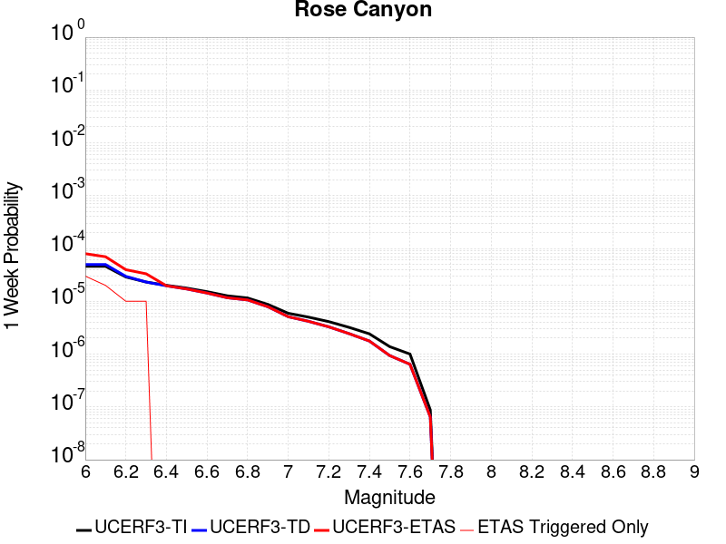 |  |  |  |

| Magnitude | 1 wk TI Prob | 1 wk TD Prob | 1 wk ETAS Prob | 1 wk ETAS/TD Gain | 1 wk ETAS Triggered Only | 1 mo TI Prob | 1 mo TD Prob | 1 mo ETAS Prob | 1 mo ETAS/TD Gain | 1 mo ETAS Triggered Only | 1 yr TI Prob | 1 yr TD Prob | 1 yr ETAS Prob | 1 yr ETAS/TD Gain | 1 yr ETAS Triggered Only | 10 yr TI Prob | 10 yr TD Prob | 10 yr ETAS Prob | 10 yr ETAS/TD Gain | 10 yr ETAS Triggered Only |
|-----|-----|-----|-----|-----|-----|-----|-----|-----|-----|-----|-----|-----|-----|-----|-----|-----|-----|-----|-----|-----|
| 6.0 | 4.5923203E-5 | 4.9714225E-5 | 7.159498E-5 | 1.4401306 | 2.1881839E-5 | 1.9679888E-4 | 2.1304491E-4 | 2.3492209E-4 | 1.1026881 | 2.1881839E-5 | 0.0023933933 | 0.0025909345 | 0.0026564097 | 1.0252709 | 6.5645516E-5 | 0.023677798 | 0.02563999 | 0.025703954 | 1.0024946 | 6.5645516E-5 |
| 6.1 | 4.5923203E-5 | 4.9714225E-5 | 7.159498E-5 | 1.4401306 | 2.1881839E-5 | 1.9679888E-4 | 2.1304491E-4 | 2.3492209E-4 | 1.1026881 | 2.1881839E-5 | 0.0023933933 | 0.0025909345 | 0.0026564097 | 1.0252709 | 6.5645516E-5 | 0.023677798 | 0.02563999 | 0.025703954 | 1.0024946 | 6.5645516E-5 |
| 6.2 | 2.8844734E-5 | 2.9668723E-5 | 2.9668723E-5 | 1.0 | 0.0 | 1.2361443E-4 | 1.2714567E-4 | 1.2714567E-4 | 1.0 | 0.0 | 0.0015039665 | 0.0015468939 | 0.0015687419 | 1.0141238 | 2.1881839E-5 | 0.0149382865 | 0.015374276 | 0.015395822 | 1.0014014 | 2.1881839E-5 |
| 6.3 | 2.3171577E-5 | 2.3161238E-5 | 2.3161238E-5 | 1.0 | 0.0 | 9.9302975E-5 | 9.9258745E-5 | 9.9258745E-5 | 1.0 | 0.0 | 0.0012083431 | 0.0012078186 | 0.0012296741 | 1.0180949 | 2.1881839E-5 | 0.012017938 | 0.012022437 | 0.012044055 | 1.0017982 | 2.1881839E-5 |
| 6.4 | 2.0066604E-5 | 1.9667024E-5 | 1.9667024E-5 | 1.0 | 0.0 | 8.599689E-5 | 8.4284584E-5 | 8.4284584E-5 | 1.0 | 0.0 | 0.0010465092 | 0.0010256917 | 0.0010475512 | 1.0213119 | 2.1881839E-5 | 0.010415946 | 0.010217559 | 0.0102392165 | 1.0021197 | 2.1881839E-5 |
| 6.5 | 1.776989E-5 | 1.7113807E-5 | 1.7113807E-5 | 1.0 | 0.0 | 7.615444E-5 | 7.334287E-5 | 7.334287E-5 | 1.0 | 0.0 | 9.267859E-4 | 8.925905E-4 | 8.925905E-4 | 1.0 | 0.0 | 0.009229303 | 0.008896211 | 0.008896211 | 1.0 | 0.0 |
| 6.6 | 1.5227364E-5 | 1.433926E-5 | 1.433926E-5 | 1.0 | 0.0 | 6.52585E-5 | 6.1452556E-5 | 6.1452556E-5 | 1.0 | 0.0 | 7.942326E-4 | 7.479332E-4 | 7.479332E-4 | 1.0 | 0.0 | 0.007914 | 0.007458359 | 0.007458359 | 1.0 | 0.0 |
| 6.7 | 1.2703898E-5 | 1.1673274E-5 | 1.1673274E-5 | 1.0 | 0.0 | 5.4444143E-5 | 5.0027378E-5 | 5.0027378E-5 | 1.0 | 0.0 | 6.626558E-4 | 6.089174E-4 | 6.089174E-4 | 1.0 | 0.0 | 0.006606833 | 0.0060750856 | 0.0060750856 | 1.0 | 0.0 |
| 6.8 | 1.1554917E-5 | 1.0609337E-5 | 1.0609337E-5 | 1.0 | 0.0 | 4.9520135E-5 | 4.546782E-5 | 4.546782E-5 | 1.0 | 0.0 | 6.0274085E-4 | 5.5343413E-4 | 5.5343413E-4 | 1.0 | 0.0 | 0.0060110865 | 0.0055225673 | 0.0055225673 | 1.0 | 0.0 |
| 6.9 | 8.732078E-6 | 7.881357E-6 | 7.881357E-6 | 1.0 | 0.0 | 3.7422655E-5 | 3.3776825E-5 | 3.3776825E-5 | 1.0 | 0.0 | 4.5552556E-4 | 4.111582E-4 | 4.111582E-4 | 1.0 | 0.0 | 0.0045459294 | 0.0041048084 | 0.0041048084 | 1.0 | 0.0 |
| 7.0 | 5.9337494E-6 | 5.1074853E-6 | 5.1074853E-6 | 1.0 | 0.0 | 2.5430107E-5 | 2.188904E-5 | 2.188904E-5 | 1.0 | 0.0 | 3.0956755E-4 | 2.664666E-4 | 2.664666E-4 | 1.0 | 0.0 | 0.0030913667 | 0.0026614866 | 0.0026614866 | 1.0 | 0.0 |
| 7.1 | 5.013409E-6 | 4.1773833E-6 | 4.1773833E-6 | 1.0 | 0.0 | 2.1485863E-5 | 1.7902948E-5 | 1.7902948E-5 | 1.0 | 0.0 | 2.6155898E-4 | 2.179467E-4 | 2.179467E-4 | 1.0 | 0.0 | 0.0026125133 | 0.0021773411 | 0.0021773411 | 1.0 | 0.0 |
| 7.2 | 4.120763E-6 | 3.2821383E-6 | 3.2821383E-6 | 1.0 | 0.0 | 1.7660293E-5 | 1.4066231E-5 | 1.4066231E-5 | 1.0 | 0.0 | 2.1499286E-4 | 1.7124301E-4 | 1.7124301E-4 | 1.0 | 0.0 | 0.0021478499 | 0.00171112 | 0.00171112 | 1.0 | 0.0 |
| 7.3 | 3.2081239E-6 | 2.4405372E-6 | 2.4405372E-6 | 1.0 | 0.0 | 1.374903E-5 | 1.0459404E-5 | 1.0459404E-5 | 1.0 | 0.0 | 1.6738157E-4 | 1.2733586E-4 | 1.2733586E-4 | 1.0 | 0.0 | 0.0016725556 | 0.001272636 | 0.001272636 | 1.0 | 0.0 |
| 7.4 | 2.4194755E-6 | 1.7680634E-6 | 1.7680634E-6 | 1.0 | 0.0 | 1.0369139E-5 | 7.577393E-6 | 7.577393E-6 | 1.0 | 0.0 | 1.2623696E-4 | 9.2250906E-5 | 9.2250906E-5 | 1.0 | 0.0 | 0.0012616527 | 9.2213147E-4 | 9.2213147E-4 | 1.0 | 0.0 |
| 7.5 | 1.3842889E-6 | 9.3786275E-7 | 9.3786275E-7 | 1.0 | 0.0 | 5.9326535E-6 | 4.019406E-6 | 4.019406E-6 | 1.0 | 0.0 | 7.222766E-5 | 4.8935202E-5 | 4.8935202E-5 | 1.0 | 0.0 | 7.220419E-4 | 4.892478E-4 | 4.892478E-4 | 1.0 | 0.0 |
| 7.6 | 1.0021575E-6 | 6.411463E-7 | 6.411463E-7 | 1.0 | 0.0 | 4.2949537E-6 | 2.7477672E-6 | 2.7477672E-6 | 1.0 | 0.0 | 5.2289808E-5 | 3.3453573E-5 | 3.3453573E-5 | 1.0 | 0.0 | 5.2277505E-4 | 3.344875E-4 | 3.344875E-4 | 1.0 | 0.0 |
| 7.7 | 8.7620116E-8 | 6.4492404E-8 | 6.4492404E-8 | 1.0 | 0.0 | 3.7551473E-7 | 2.76396E-7 | 2.76396E-7 | 1.0 | 0.0 | 4.5718825E-6 | 3.3651165E-6 | 3.3651165E-6 | 1.0 | 0.0 | 4.5717883E-5 | 3.3650686E-5 | 3.3650686E-5 | 1.0 | 0.0 |

## San Clemente
*[(top)](#table-of-contents)*

| 1 Week | 1 Month | 1 Year | 10 Year |
|-----|-----|-----|-----|
|  |  |  |  |

| Magnitude | 1 wk TI Prob | 1 wk TD Prob | 1 wk ETAS Prob | 1 wk ETAS/TD Gain | 1 wk ETAS Triggered Only | 1 mo TI Prob | 1 mo TD Prob | 1 mo ETAS Prob | 1 mo ETAS/TD Gain | 1 mo ETAS Triggered Only | 1 yr TI Prob | 1 yr TD Prob | 1 yr ETAS Prob | 1 yr ETAS/TD Gain | 1 yr ETAS Triggered Only | 10 yr TI Prob | 10 yr TD Prob | 10 yr ETAS Prob | 10 yr ETAS/TD Gain | 10 yr ETAS Triggered Only |
|-----|-----|-----|-----|-----|-----|-----|-----|-----|-----|-----|-----|-----|-----|-----|-----|-----|-----|-----|-----|-----|
| 6.0 | 6.681379E-5 | 8.163422E-5 | 1.0351428E-4 | 1.2680255 | 2.1881839E-5 | 2.8631336E-4 | 3.498173E-4 | 3.935657E-4 | 1.1250606 | 4.3763677E-5 | 0.003480294 | 0.0042512873 | 0.004316654 | 1.0153757 | 6.5645516E-5 | 0.03426291 | 0.041755714 | 0.04181862 | 1.0015064 | 6.5645516E-5 |
| 6.1 | 6.681379E-5 | 8.163422E-5 | 1.0351428E-4 | 1.2680255 | 2.1881839E-5 | 2.8631336E-4 | 3.498173E-4 | 3.7169148E-4 | 1.0625303 | 2.1881839E-5 | 0.003480294 | 0.0042512873 | 0.0042948653 | 1.0102504 | 4.3763677E-5 | 0.03426291 | 0.041755714 | 0.04179765 | 1.0010043 | 4.3763677E-5 |
| 6.2 | 3.9400576E-5 | 4.6451984E-5 | 4.6451984E-5 | 1.0 | 0.0 | 1.6884868E-4 | 1.9906509E-4 | 1.9906509E-4 | 1.0 | 0.0 | 0.0020537945 | 0.002420985 | 0.002420985 | 1.0 | 0.0 | 0.020349167 | 0.02395286 | 0.02395286 | 1.0 | 0.0 |
| 6.3 | 3.2590255E-5 | 3.7929087E-5 | 3.7929087E-5 | 1.0 | 0.0 | 1.3966505E-4 | 1.6254328E-4 | 1.6254328E-4 | 1.0 | 0.0 | 0.0016990956 | 0.0019771985 | 0.0019771985 | 1.0 | 0.0 | 0.01686163 | 0.019599866 | 0.019599866 | 1.0 | 0.0 |
| 6.4 | 2.9454652E-5 | 3.4097775E-5 | 3.4097775E-5 | 1.0 | 0.0 | 1.2622811E-4 | 1.4612528E-4 | 1.4612528E-4 | 1.0 | 0.0 | 0.0015357438 | 0.0017776482 | 0.0017776482 | 1.0 | 0.0 | 0.015251739 | 0.017637458 | 0.017637458 | 1.0 | 0.0 |
| 6.5 | 2.790836E-5 | 3.2247463E-5 | 3.2247463E-5 | 1.0 | 0.0 | 1.1960178E-4 | 1.3819622E-4 | 1.3819622E-4 | 1.0 | 0.0 | 0.001455179 | 0.0016812651 | 0.0016812651 | 1.0 | 0.0 | 0.014456868 | 0.016688475 | 0.016688475 | 1.0 | 0.0 |
| 6.6 | 2.2492153E-5 | 2.5762707E-5 | 2.5762707E-5 | 1.0 | 0.0 | 9.639138E-5 | 1.1040701E-4 | 1.1040701E-4 | 1.0 | 0.0 | 0.0011729331 | 0.0013433908 | 0.0013433908 | 1.0 | 0.0 | 0.011667615 | 0.013354415 | 0.013354415 | 1.0 | 0.0 |
| 6.7 | 1.9862755E-5 | 2.2666423E-5 | 2.2666423E-5 | 1.0 | 0.0 | 8.512331E-5 | 9.713826E-5 | 9.713826E-5 | 1.0 | 0.0 | 0.0010358836 | 0.0011820279 | 0.0011820279 | 1.0 | 0.0 | 0.010310682 | 0.011758701 | 0.011758701 | 1.0 | 0.0 |
| 6.8 | 1.6697575E-5 | 1.897771E-5 | 1.897771E-5 | 1.0 | 0.0 | 7.155907E-5 | 8.133056E-5 | 8.133056E-5 | 1.0 | 0.0 | 8.7088346E-4 | 9.897591E-4 | 9.897591E-4 | 1.0 | 0.0 | 0.008674784 | 0.0098545365 | 0.0098545365 | 1.0 | 0.0 |
| 6.9 | 1.5218415E-5 | 1.72694E-5 | 1.72694E-5 | 1.0 | 0.0 | 6.522015E-5 | 7.4009666E-5 | 7.4009666E-5 | 1.0 | 0.0 | 7.93766E-4 | 9.00704E-4 | 9.00704E-4 | 1.0 | 0.0 | 0.007909367 | 0.008971481 | 0.008971481 | 1.0 | 0.0 |
| 7.0 | 1.2392958E-5 | 1.4033016E-5 | 1.4033016E-5 | 1.0 | 0.0 | 5.3111595E-5 | 6.014015E-5 | 6.014015E-5 | 1.0 | 0.0 | 6.4644177E-4 | 7.319679E-4 | 7.319679E-4 | 1.0 | 0.0 | 0.0064456454 | 0.0072963564 | 0.0072963564 | 1.0 | 0.0 |
| 7.1 | 1.0934128E-5 | 1.2375138E-5 | 1.2375138E-5 | 1.0 | 0.0 | 4.6859706E-5 | 5.303527E-5 | 5.303527E-5 | 1.0 | 0.0 | 5.7036756E-4 | 6.455204E-4 | 6.455204E-4 | 1.0 | 0.0 | 0.0056890585 | 0.0064371997 | 0.0064371997 | 1.0 | 0.0 |
| 7.2 | 9.5798805E-6 | 1.0844935E-5 | 1.0844935E-5 | 1.0 | 0.0 | 4.1055984E-5 | 4.6477508E-5 | 4.6477508E-5 | 1.0 | 0.0 | 4.9974193E-4 | 5.657239E-4 | 5.657239E-4 | 1.0 | 0.0 | 0.0049861963 | 0.0056435615 | 0.0056435615 | 1.0 | 0.0 |
| 7.3 | 8.0167365E-6 | 9.083918E-6 | 9.083918E-6 | 1.0 | 0.0 | 3.4356988E-5 | 3.8930535E-5 | 3.8930535E-5 | 1.0 | 0.0 | 4.1821605E-4 | 4.7388324E-4 | 4.7388324E-4 | 1.0 | 0.0 | 0.0041742986 | 0.0047294297 | 0.0047294297 | 1.0 | 0.0 |
| 7.4 | 2.9581017E-6 | 3.3623792E-6 | 3.3623792E-6 | 1.0 | 0.0 | 1.2677518E-5 | 1.4410146E-5 | 1.4410146E-5 | 1.0 | 0.0 | 1.5433785E-4 | 1.7543444E-4 | 1.7543444E-4 | 1.0 | 0.0 | 0.001542307 | 0.0017534546 | 0.0017534546 | 1.0 | 0.0 |

## Dry Mountain
*[(top)](#table-of-contents)*

| 1 Week | 1 Month | 1 Year | 10 Year |
|-----|-----|-----|-----|
|  |  |  |  |

| Magnitude | 1 wk TI Prob | 1 wk TD Prob | 1 wk ETAS Prob | 1 wk ETAS/TD Gain | 1 wk ETAS Triggered Only | 1 mo TI Prob | 1 mo TD Prob | 1 mo ETAS Prob | 1 mo ETAS/TD Gain | 1 mo ETAS Triggered Only | 1 yr TI Prob | 1 yr TD Prob | 1 yr ETAS Prob | 1 yr ETAS/TD Gain | 1 yr ETAS Triggered Only | 10 yr TI Prob | 10 yr TD Prob | 10 yr ETAS Prob | 10 yr ETAS/TD Gain | 10 yr ETAS Triggered Only |
|-----|-----|-----|-----|-----|-----|-----|-----|-----|-----|-----|-----|-----|-----|-----|-----|-----|-----|-----|-----|-----|
| 6.0 | 6.222801E-6 | 6.439381E-6 | 5.0202776E-5 | 7.7962112 | 4.3763677E-5 | 2.6668875E-5 | 2.7597147E-5 | 9.324085E-5 | 3.378641 | 6.5645516E-5 | 3.2464517E-4 | 3.3595937E-4 | 4.0158283E-4 | 1.1953316 | 6.5645516E-5 | 0.0032417132 | 0.0033560768 | 0.003421502 | 1.0194945 | 6.5645516E-5 |
| 6.1 | 6.222801E-6 | 6.439381E-6 | 5.0202776E-5 | 7.7962112 | 4.3763677E-5 | 2.6668875E-5 | 2.7597147E-5 | 9.324085E-5 | 3.378641 | 6.5645516E-5 | 3.2464517E-4 | 3.3595937E-4 | 4.0158283E-4 | 1.1953316 | 6.5645516E-5 | 0.0032417132 | 0.0033560768 | 0.003421502 | 1.0194945 | 6.5645516E-5 |
| 6.2 | 6.222801E-6 | 6.439381E-6 | 5.0202776E-5 | 7.7962112 | 4.3763677E-5 | 2.6668875E-5 | 2.7597147E-5 | 9.324085E-5 | 3.378641 | 6.5645516E-5 | 3.2464517E-4 | 3.3595937E-4 | 4.0158283E-4 | 1.1953316 | 6.5645516E-5 | 0.0032417132 | 0.0033560768 | 0.003421502 | 1.0194945 | 6.5645516E-5 |
| 6.3 | 6.222801E-6 | 6.439381E-6 | 5.0202776E-5 | 7.7962112 | 4.3763677E-5 | 2.6668875E-5 | 2.7597147E-5 | 9.324085E-5 | 3.378641 | 6.5645516E-5 | 3.2464517E-4 | 3.3595937E-4 | 4.0158283E-4 | 1.1953316 | 6.5645516E-5 | 0.0032417132 | 0.0033560768 | 0.003421502 | 1.0194945 | 6.5645516E-5 |
| 6.4 | 6.222801E-6 | 6.439381E-6 | 5.0202776E-5 | 7.7962112 | 4.3763677E-5 | 2.6668875E-5 | 2.7597147E-5 | 9.324085E-5 | 3.378641 | 6.5645516E-5 | 3.2464517E-4 | 3.3595937E-4 | 4.0158283E-4 | 1.1953316 | 6.5645516E-5 | 0.0032417132 | 0.0033560768 | 0.003421502 | 1.0194945 | 6.5645516E-5 |
| 6.5 | 2.8528623E-6 | 2.9521684E-6 | 2.4833942E-5 | 8.412102 | 2.1881839E-5 | 1.22264955E-5 | 1.2652138E-5 | 5.641526E-5 | 4.458951 | 4.3763677E-5 | 1.4884741E-4 | 1.540376E-4 | 1.9779452E-4 | 1.2840666 | 4.3763677E-5 | 0.0014874774 | 0.0015401616 | 0.0015838579 | 1.0283712 | 4.3763677E-5 |
| 6.6 | 2.8528623E-6 | 2.9521684E-6 | 2.4833942E-5 | 8.412102 | 2.1881839E-5 | 1.22264955E-5 | 1.2652138E-5 | 5.641526E-5 | 4.458951 | 4.3763677E-5 | 1.4884741E-4 | 1.540376E-4 | 1.9779452E-4 | 1.2840666 | 4.3763677E-5 | 0.0014874774 | 0.0015401616 | 0.0015838579 | 1.0283712 | 4.3763677E-5 |
| 6.7 | 2.541E-6 | 2.6293578E-6 | 2.4511139E-5 | 9.322101 | 2.1881839E-5 | 1.0889954E-5 | 1.1268677E-5 | 5.503186E-5 | 4.8836136 | 4.3763677E-5 | 1.3257713E-4 | 1.3719614E-4 | 1.8095381E-4 | 1.3189424 | 4.3763677E-5 | 0.0013249806 | 0.0013719613 | 0.001415665 | 1.0318549 | 4.3763677E-5 |

## Pinto Mtn
*[(top)](#table-of-contents)*

| 1 Week | 1 Month | 1 Year | 10 Year |
|-----|-----|-----|-----|
|  |  |  |  |

| Magnitude | 1 wk TI Prob | 1 wk TD Prob | 1 wk ETAS Prob | 1 wk ETAS/TD Gain | 1 wk ETAS Triggered Only | 1 mo TI Prob | 1 mo TD Prob | 1 mo ETAS Prob | 1 mo ETAS/TD Gain | 1 mo ETAS Triggered Only | 1 yr TI Prob | 1 yr TD Prob | 1 yr ETAS Prob | 1 yr ETAS/TD Gain | 1 yr ETAS Triggered Only | 10 yr TI Prob | 10 yr TD Prob | 10 yr ETAS Prob | 10 yr ETAS/TD Gain | 10 yr ETAS Triggered Only |
|-----|-----|-----|-----|-----|-----|-----|-----|-----|-----|-----|-----|-----|-----|-----|-----|-----|-----|-----|-----|-----|
| 6.0 | 4.4194956E-5 | 4.785362E-5 | 9.16152E-5 | 1.9144884 | 4.3763677E-5 | 1.893932E-4 | 2.0507174E-4 | 2.4882646E-4 | 1.2133629 | 4.3763677E-5 | 0.0023034236 | 0.0024940541 | 0.002559536 | 1.0262551 | 6.5645516E-5 | 0.022796938 | 0.024678145 | 0.024742171 | 1.0025945 | 6.5645516E-5 |
| 6.1 | 4.4194956E-5 | 4.785362E-5 | 9.16152E-5 | 1.9144884 | 4.3763677E-5 | 1.893932E-4 | 2.0507174E-4 | 2.4882646E-4 | 1.2133629 | 4.3763677E-5 | 0.0023034236 | 0.0024940541 | 0.002559536 | 1.0262551 | 6.5645516E-5 | 0.022796938 | 0.024678145 | 0.024742171 | 1.0025945 | 6.5645516E-5 |
| 6.2 | 4.4194956E-5 | 4.785362E-5 | 9.16152E-5 | 1.9144884 | 4.3763677E-5 | 1.893932E-4 | 2.0507174E-4 | 2.4882646E-4 | 1.2133629 | 4.3763677E-5 | 0.0023034236 | 0.0024940541 | 0.002559536 | 1.0262551 | 6.5645516E-5 | 0.022796938 | 0.024678145 | 0.024742171 | 1.0025945 | 6.5645516E-5 |
| 6.3 | 4.4194956E-5 | 4.785362E-5 | 9.16152E-5 | 1.9144884 | 4.3763677E-5 | 1.893932E-4 | 2.0507174E-4 | 2.4882646E-4 | 1.2133629 | 4.3763677E-5 | 0.0023034236 | 0.0024940541 | 0.002559536 | 1.0262551 | 6.5645516E-5 | 0.022796938 | 0.024678145 | 0.024742171 | 1.0025945 | 6.5645516E-5 |
| 6.4 | 3.729929E-5 | 3.9603186E-5 | 6.1484156E-5 | 1.5525054 | 2.1881839E-5 | 1.5984432E-4 | 1.6971743E-4 | 1.9159555E-4 | 1.1289091 | 2.1881839E-5 | 0.0019443673 | 0.002064445 | 0.0020862818 | 1.0105774 | 2.1881839E-5 | 0.019274427 | 0.02046269 | 0.020484123 | 1.0010475 | 2.1881839E-5 |
| 6.5 | 3.729929E-5 | 3.9603186E-5 | 6.1484156E-5 | 1.5525054 | 2.1881839E-5 | 1.5984432E-4 | 1.6971743E-4 | 1.9159555E-4 | 1.1289091 | 2.1881839E-5 | 0.0019443673 | 0.002064445 | 0.0020862818 | 1.0105774 | 2.1881839E-5 | 0.019274427 | 0.02046269 | 0.020484123 | 1.0010475 | 2.1881839E-5 |
| 6.6 | 3.0204548E-5 | 3.1205298E-5 | 3.1205298E-5 | 1.0 | 0.0 | 1.2944164E-4 | 1.3373033E-4 | 1.3373033E-4 | 1.0 | 0.0 | 0.0015748127 | 0.0016269855 | 0.0016269855 | 1.0 | 0.0 | 0.015636992 | 0.01615461 | 0.01615461 | 1.0 | 0.0 |
| 6.7 | 2.9857754E-5 | 3.081468E-5 | 3.081468E-5 | 1.0 | 0.0 | 1.2795553E-4 | 1.3205643E-4 | 1.3205643E-4 | 1.0 | 0.0 | 0.0015567453 | 0.001606636 | 0.001606636 | 1.0 | 0.0 | 0.015458848 | 0.01595405 | 0.01595405 | 1.0 | 0.0 |
| 6.8 | 2.4819734E-5 | 2.5009364E-5 | 2.5009364E-5 | 1.0 | 0.0 | 1.0636595E-4 | 1.07178705E-4 | 1.07178705E-4 | 1.0 | 0.0 | 0.0012942362 | 0.0013041412 | 0.0013041412 | 1.0 | 0.0 | 0.012867244 | 0.0129672475 | 0.0129672475 | 1.0 | 0.0 |
| 6.9 | 2.331124E-5 | 2.3337643E-5 | 2.3337643E-5 | 1.0 | 0.0 | 9.990149E-5 | 1.00014746E-4 | 1.00014746E-4 | 1.0 | 0.0 | 0.001215622 | 0.0012170197 | 0.0012170197 | 1.0 | 0.0 | 0.012089936 | 0.012105742 | 0.012105742 | 1.0 | 0.0 |
| 7.0 | 2.1818534E-5 | 2.1760772E-5 | 2.1760772E-5 | 1.0 | 0.0 | 9.3504656E-5 | 9.325723E-5 | 9.325723E-5 | 1.0 | 0.0 | 0.0011378246 | 0.0011348352 | 0.0011348352 | 1.0 | 0.0 | 0.011320163 | 0.011292503 | 0.011292503 | 1.0 | 0.0 |
| 7.1 | 2.066081E-5 | 2.0540418E-5 | 2.0540418E-5 | 1.0 | 0.0 | 8.854332E-5 | 8.8027504E-5 | 8.8027504E-5 | 1.0 | 0.0 | 0.0010774818 | 0.0010712275 | 0.0010712275 | 1.0 | 0.0 | 0.010722724 | 0.010662688 | 0.010662688 | 1.0 | 0.0 |
| 7.2 | 1.8990233E-5 | 1.9053701E-5 | 1.9053701E-5 | 1.0 | 0.0 | 8.138417E-5 | 8.1656275E-5 | 8.1656275E-5 | 1.0 | 0.0 | 9.904018E-4 | 9.937311E-4 | 9.937311E-4 | 1.0 | 0.0 | 0.009859995 | 0.009894874 | 0.009894874 | 1.0 | 0.0 |
| 7.3 | 1.3335872E-5 | 1.4906372E-5 | 1.4906372E-5 | 1.0 | 0.0 | 5.7152483E-5 | 6.388296E-5 | 6.388296E-5 | 1.0 | 0.0 | 6.956093E-4 | 7.775102E-4 | 7.775102E-4 | 1.0 | 0.0 | 0.006934359 | 0.0077491994 | 0.0077491994 | 1.0 | 0.0 |
| 7.4 | 9.414066E-6 | 1.186061E-5 | 1.186061E-5 | 1.0 | 0.0 | 4.0345374E-5 | 5.0830247E-5 | 5.0830247E-5 | 1.0 | 0.0 | 4.910942E-4 | 6.1869196E-4 | 6.1869196E-4 | 1.0 | 0.0 | 0.0049001034 | 0.006170644 | 0.006170644 | 1.0 | 0.0 |
| 7.5 | 7.2101157E-6 | 9.157893E-6 | 9.157893E-6 | 1.0 | 0.0 | 3.090013E-5 | 3.924757E-5 | 3.924757E-5 | 1.0 | 0.0 | 3.7614413E-4 | 4.7774217E-4 | 4.7774217E-4 | 1.0 | 0.0 | 0.0037550807 | 0.004767927 | 0.004767927 | 1.0 | 0.0 |
| 7.6 | 3.296375E-6 | 4.5453176E-6 | 4.5453176E-6 | 1.0 | 0.0 | 1.4127245E-5 | 1.9479796E-5 | 1.9479796E-5 | 1.0 | 0.0 | 1.7198564E-4 | 2.3714209E-4 | 2.3714209E-4 | 1.0 | 0.0 | 0.0017185259 | 0.0023690276 | 0.0023690276 | 1.0 | 0.0 |
| 7.7 | 2.5741092E-6 | 3.584251E-6 | 3.584251E-6 | 1.0 | 0.0 | 1.103185E-5 | 1.5360993E-5 | 1.5360993E-5 | 1.0 | 0.0 | 1.3430449E-4 | 1.8700535E-4 | 1.8700535E-4 | 1.0 | 0.0 | 0.0013422335 | 0.0018686098 | 0.0018686098 | 1.0 | 0.0 |

## Deep Springs
*[(top)](#table-of-contents)*

| 1 Week | 1 Month | 1 Year | 10 Year |
|-----|-----|-----|-----|
|  |  |  |  |

| Magnitude | 1 wk TI Prob | 1 wk TD Prob | 1 wk ETAS Prob | 1 wk ETAS/TD Gain | 1 wk ETAS Triggered Only | 1 mo TI Prob | 1 mo TD Prob | 1 mo ETAS Prob | 1 mo ETAS/TD Gain | 1 mo ETAS Triggered Only | 1 yr TI Prob | 1 yr TD Prob | 1 yr ETAS Prob | 1 yr ETAS/TD Gain | 1 yr ETAS Triggered Only | 10 yr TI Prob | 10 yr TD Prob | 10 yr ETAS Prob | 10 yr ETAS/TD Gain | 10 yr ETAS Triggered Only |
|-----|-----|-----|-----|-----|-----|-----|-----|-----|-----|-----|-----|-----|-----|-----|-----|-----|-----|-----|-----|-----|
| 6.0 | 1.9810619E-5 | 2.311252E-5 | 4.4993852E-5 | 1.9467307 | 2.1881839E-5 | 8.489989E-5 | 9.905276E-5 | 1.2093243E-4 | 1.2208891 | 2.1881839E-5 | 0.001033166 | 0.0012058079 | 0.0012276634 | 1.0181252 | 2.1881839E-5 | 0.010283757 | 0.012042425 | 0.01210728 | 1.0053855 | 6.5645516E-5 |
| 6.1 | 1.9810619E-5 | 2.311252E-5 | 4.4993852E-5 | 1.9467307 | 2.1881839E-5 | 8.489989E-5 | 9.905276E-5 | 1.2093243E-4 | 1.2208891 | 2.1881839E-5 | 0.001033166 | 0.0012058079 | 0.0012276634 | 1.0181252 | 2.1881839E-5 | 0.010283757 | 0.012042425 | 0.01210728 | 1.0053855 | 6.5645516E-5 |
| 6.2 | 1.9810619E-5 | 2.311252E-5 | 4.4993852E-5 | 1.9467307 | 2.1881839E-5 | 8.489989E-5 | 9.905276E-5 | 1.2093243E-4 | 1.2208891 | 2.1881839E-5 | 0.001033166 | 0.0012058079 | 0.0012276634 | 1.0181252 | 2.1881839E-5 | 0.010283757 | 0.012042425 | 0.01210728 | 1.0053855 | 6.5645516E-5 |
| 6.3 | 1.9810619E-5 | 2.311252E-5 | 4.4993852E-5 | 1.9467307 | 2.1881839E-5 | 8.489989E-5 | 9.905276E-5 | 1.2093243E-4 | 1.2208891 | 2.1881839E-5 | 0.001033166 | 0.0012058079 | 0.0012276634 | 1.0181252 | 2.1881839E-5 | 0.010283757 | 0.012042425 | 0.01210728 | 1.0053855 | 6.5645516E-5 |
| 6.4 | 1.9810619E-5 | 2.311252E-5 | 4.4993852E-5 | 1.9467307 | 2.1881839E-5 | 8.489989E-5 | 9.905276E-5 | 1.2093243E-4 | 1.2208891 | 2.1881839E-5 | 0.001033166 | 0.0012058079 | 0.0012276634 | 1.0181252 | 2.1881839E-5 | 0.010283757 | 0.012042425 | 0.01210728 | 1.0053855 | 6.5645516E-5 |
| 6.5 | 1.7190405E-5 | 2.0050555E-5 | 4.1931955E-5 | 2.0913115 | 2.1881839E-5 | 7.367108E-5 | 8.593095E-5 | 1.0781091E-4 | 1.2546226 | 2.1881839E-5 | 8.9657627E-4 | 0.0010462094 | 0.0010680683 | 1.0208935 | 2.1881839E-5 | 0.008929676 | 0.010462056 | 0.010527015 | 1.006209 | 6.5645516E-5 |
| 6.6 | 1.7190405E-5 | 2.0050555E-5 | 4.1931955E-5 | 2.0913115 | 2.1881839E-5 | 7.367108E-5 | 8.593095E-5 | 1.0781091E-4 | 1.2546226 | 2.1881839E-5 | 8.9657627E-4 | 0.0010462094 | 0.0010680683 | 1.0208935 | 2.1881839E-5 | 0.008929676 | 0.010462056 | 0.010527015 | 1.006209 | 6.5645516E-5 |

## Pleito
*[(top)](#table-of-contents)*

| 1 Week | 1 Month | 1 Year | 10 Year |
|-----|-----|-----|-----|
| 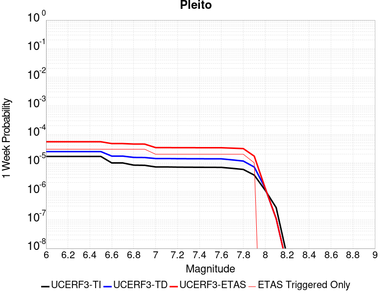 |  | 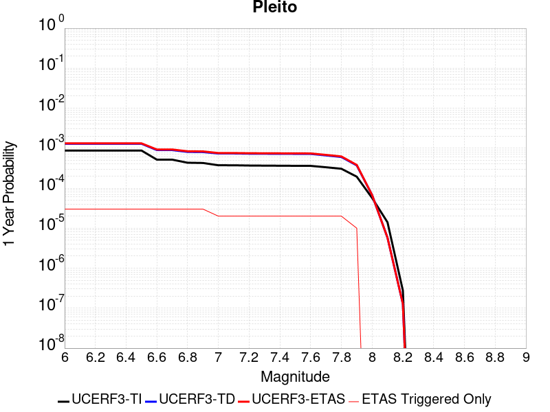 |  |

| Magnitude | 1 wk TI Prob | 1 wk TD Prob | 1 wk ETAS Prob | 1 wk ETAS/TD Gain | 1 wk ETAS Triggered Only | 1 mo TI Prob | 1 mo TD Prob | 1 mo ETAS Prob | 1 mo ETAS/TD Gain | 1 mo ETAS Triggered Only | 1 yr TI Prob | 1 yr TD Prob | 1 yr ETAS Prob | 1 yr ETAS/TD Gain | 1 yr ETAS Triggered Only | 10 yr TI Prob | 10 yr TD Prob | 10 yr ETAS Prob | 10 yr ETAS/TD Gain | 10 yr ETAS Triggered Only |
|-----|-----|-----|-----|-----|-----|-----|-----|-----|-----|-----|-----|-----|-----|-----|-----|-----|-----|-----|-----|-----|
| 6.0 | 1.6763008E-5 | 2.4763838E-5 | 9.0407724E-5 | 3.6507962 | 6.5645516E-5 | 7.183948E-5 | 1.0612683E-4 | 1.7176538E-4 | 1.6184915 | 6.5645516E-5 | 8.742947E-4 | 0.0012914003 | 0.0013569611 | 1.0507672 | 6.5645516E-5 | 0.00870863 | 0.0129538905 | 0.013018685 | 1.005002 | 6.5645516E-5 |
| 6.1 | 1.6763008E-5 | 2.4763838E-5 | 9.0407724E-5 | 3.6507962 | 6.5645516E-5 | 7.183948E-5 | 1.0612683E-4 | 1.7176538E-4 | 1.6184915 | 6.5645516E-5 | 8.742947E-4 | 0.0012914003 | 0.0013569611 | 1.0507672 | 6.5645516E-5 | 0.00870863 | 0.0129538905 | 0.013018685 | 1.005002 | 6.5645516E-5 |
| 6.2 | 1.6763008E-5 | 2.4763838E-5 | 9.0407724E-5 | 3.6507962 | 6.5645516E-5 | 7.183948E-5 | 1.0612683E-4 | 1.7176538E-4 | 1.6184915 | 6.5645516E-5 | 8.742947E-4 | 0.0012914003 | 0.0013569611 | 1.0507672 | 6.5645516E-5 | 0.00870863 | 0.0129538905 | 0.013018685 | 1.005002 | 6.5645516E-5 |
| 6.3 | 1.6763008E-5 | 2.4763838E-5 | 9.0407724E-5 | 3.6507962 | 6.5645516E-5 | 7.183948E-5 | 1.0612683E-4 | 1.7176538E-4 | 1.6184915 | 6.5645516E-5 | 8.742947E-4 | 0.0012914003 | 0.0013569611 | 1.0507672 | 6.5645516E-5 | 0.00870863 | 0.0129538905 | 0.013018685 | 1.005002 | 6.5645516E-5 |
| 6.4 | 1.6763008E-5 | 2.4763838E-5 | 9.0407724E-5 | 3.6507962 | 6.5645516E-5 | 7.183948E-5 | 1.0612683E-4 | 1.7176538E-4 | 1.6184915 | 6.5645516E-5 | 8.742947E-4 | 0.0012914003 | 0.0013569611 | 1.0507672 | 6.5645516E-5 | 0.00870863 | 0.0129538905 | 0.013018685 | 1.005002 | 6.5645516E-5 |
| 6.5 | 1.6763008E-5 | 2.4763838E-5 | 9.0407724E-5 | 3.6507962 | 6.5645516E-5 | 7.183948E-5 | 1.0612683E-4 | 1.7176538E-4 | 1.6184915 | 6.5645516E-5 | 8.742947E-4 | 0.0012914003 | 0.0013569611 | 1.0507672 | 6.5645516E-5 | 0.00870863 | 0.0129538905 | 0.013018685 | 1.005002 | 6.5645516E-5 |
| 6.6 | 9.910213E-6 | 1.7214623E-5 | 8.2859005E-5 | 4.813292 | 6.5645516E-5 | 4.247165E-5 | 7.377489E-5 | 1.3941557E-4 | 1.8897427 | 6.5645516E-5 | 5.169696E-4 | 8.978429E-4 | 9.6342945E-4 | 1.0730491 | 6.5645516E-5 | 0.0051576863 | 0.009050702 | 0.009115754 | 1.0071875 | 6.5645516E-5 |
| 6.7 | 9.910213E-6 | 1.7214623E-5 | 8.2859005E-5 | 4.813292 | 6.5645516E-5 | 4.247165E-5 | 7.377489E-5 | 1.3941557E-4 | 1.8897427 | 6.5645516E-5 | 5.169696E-4 | 8.978429E-4 | 9.6342945E-4 | 1.0730491 | 6.5645516E-5 | 0.0051576863 | 0.009050702 | 0.009115754 | 1.0071875 | 6.5645516E-5 |
| 6.8 | 8.300162E-6 | 1.5474232E-5 | 8.111873E-5 | 5.2421813 | 6.5645516E-5 | 3.557164E-5 | 6.631646E-5 | 1.3195763E-4 | 1.989817 | 6.5645516E-5 | 4.3299864E-4 | 8.071053E-4 | 8.726978E-4 | 1.0812689 | 6.5645516E-5 | 0.004321559 | 0.008150139 | 0.0082152495 | 1.0079889 | 6.5645516E-5 |
| 6.9 | 8.183114E-6 | 1.5345448E-5 | 8.098996E-5 | 5.277784 | 6.5645516E-5 | 3.5070017E-5 | 6.576455E-5 | 1.3140574E-4 | 1.9981242 | 6.5645516E-5 | 4.2689382E-4 | 8.003907E-4 | 8.659837E-4 | 1.0819511 | 6.5645516E-5 | 0.0042607468 | 0.008083483 | 0.0081485985 | 1.0080553 | 6.5645516E-5 |
| 7.0 | 7.1748823E-6 | 1.413244E-5 | 5.7895497E-5 | 4.0966387 | 4.3763677E-5 | 3.0749135E-5 | 6.0566195E-5 | 1.0432722E-4 | 1.7225322 | 4.3763677E-5 | 3.743064E-4 | 7.371445E-4 | 7.808759E-4 | 1.0593255 | 4.3763677E-5 | 0.0037367654 | 0.007454939 | 0.0074983765 | 1.0058267 | 4.3763677E-5 |
| 7.1 | 7.1671807E-6 | 1.412281E-5 | 5.7885867E-5 | 4.09875 | 4.3763677E-5 | 3.0716128E-5 | 6.052493E-5 | 1.0428596E-4 | 1.7230248 | 4.3763677E-5 | 3.7390468E-4 | 7.366424E-4 | 7.803738E-4 | 1.0593659 | 4.3763677E-5 | 0.0037327618 | 0.0074499524 | 0.00749339 | 1.0058306 | 4.3763677E-5 |
| 7.2 | 7.0649667E-6 | 1.39701015E-5 | 5.7733167E-5 | 4.132623 | 4.3763677E-5 | 3.0278077E-5 | 5.9870494E-5 | 1.0363155E-4 | 1.7309287 | 4.3763677E-5 | 3.6857324E-4 | 7.2868E-4 | 7.7241176E-4 | 1.0600151 | 4.3763677E-5 | 0.0036796255 | 0.0073707094 | 0.0074141505 | 1.0058937 | 4.3763677E-5 |
| 7.3 | 7.02082E-6 | 1.3913556E-5 | 5.7676625E-5 | 4.1453543 | 4.3763677E-5 | 3.008888E-5 | 5.9628168E-5 | 1.0338923E-4 | 1.7338992 | 4.3763677E-5 | 3.6627054E-4 | 7.2573166E-4 | 7.6946354E-4 | 1.0602591 | 4.3763677E-5 | 0.0036566744 | 0.007341209 | 0.0073846513 | 1.0059175 | 4.3763677E-5 |
| 7.4 | 6.987146E-6 | 1.3873118E-5 | 5.763619E-5 | 4.154523 | 4.3763677E-5 | 2.9944567E-5 | 5.945487E-5 | 1.0321594E-4 | 1.7360386 | 4.3763677E-5 | 3.6451413E-4 | 7.2362315E-4 | 7.6735514E-4 | 1.0604348 | 4.3763677E-5 | 0.0036391679 | 0.007320144 | 0.0073635876 | 1.0059347 | 4.3763677E-5 |
| 7.5 | 6.9494554E-6 | 1.3830024E-5 | 5.7593094E-5 | 4.1643524 | 4.3763677E-5 | 2.9783041E-5 | 5.9270187E-5 | 1.0303127E-4 | 1.7383322 | 4.3763677E-5 | 3.625482E-4 | 7.2137616E-4 | 7.651082E-4 | 1.0606232 | 4.3763677E-5 | 0.0036195726 | 0.0072977724 | 0.007341217 | 1.0059531 | 4.3763677E-5 |
| 7.6 | 6.92694E-6 | 1.3789138E-5 | 5.755221E-5 | 4.173735 | 4.3763677E-5 | 2.9686547E-5 | 5.909497E-5 | 1.0285606E-4 | 1.7405214 | 4.3763677E-5 | 3.6137376E-4 | 7.1924424E-4 | 7.629765E-4 | 1.0608029 | 4.3763677E-5 | 0.0036078666 | 0.0072765257 | 0.007319971 | 1.0059706 | 4.3763677E-5 |
| 7.7 | 6.395867E-6 | 1.2668219E-5 | 5.643134E-5 | 4.45456 | 4.3763677E-5 | 2.741057E-5 | 5.429124E-5 | 9.805254E-5 | 1.8060472 | 4.3763677E-5 | 3.336726E-4 | 6.6079566E-4 | 7.0453045E-4 | 1.066185 | 4.3763677E-5 | 0.0033317201 | 0.0066951844 | 0.0067386553 | 1.0064929 | 4.3763677E-5 |
| 7.8 | 5.8664327E-6 | 1.153586E-5 | 5.529903E-5 | 4.7936635 | 4.3763677E-5 | 2.5141611E-5 | 4.9438466E-5 | 9.3199975E-5 | 1.8851713 | 4.3763677E-5 | 3.060561E-4 | 6.017473E-4 | 6.4548466E-4 | 1.0726839 | 4.3763677E-5 | 0.0030563495 | 0.0061006667 | 0.006144163 | 1.0071298 | 4.3763677E-5 |
| 7.9 | 3.7167474E-6 | 7.1140853E-6 | 2.8995768E-5 | 4.075825 | 2.1881839E-5 | 1.592882E-5 | 3.0488582E-5 | 5.2369753E-5 | 1.7176841 | 2.1881839E-5 | 1.9391612E-4 | 3.7113542E-4 | 3.9300913E-4 | 1.0589373 | 2.1881839E-5 | 0.0019374699 | 0.0037674906 | 0.00378929 | 1.0057862 | 2.1881839E-5 |
| 8.0 | 1.0903841E-6 | 1.2879392E-6 | 1.2879392E-6 | 1.0 | 0.0 | 4.6730665E-6 | 5.5197274E-6 | 5.5197274E-6 | 1.0 | 0.0 | 5.68931E-5 | 6.720063E-5 | 6.720063E-5 | 1.0 | 0.0 | 5.6878536E-4 | 6.941948E-4 | 6.941948E-4 | 1.0 | 0.0 |
| 8.1 | 2.6894583E-7 | 1.1060341E-7 | 1.1060341E-7 | 1.0 | 0.0 | 1.1526245E-6 | 4.740145E-7 | 4.740145E-7 | 1.0 | 0.0 | 1.4033113E-5 | 5.7711113E-6 | 5.7711113E-6 | 1.0 | 0.0 | 1.4032227E-4 | 6.456908E-5 | 6.456908E-5 | 1.0 | 0.0 |
| 8.2 | 5.2967013E-9 | 2.4578228E-9 | 2.4578228E-9 | 1.0 | 0.0 | 2.2700148E-8 | 1.0533527E-8 | 1.0533527E-8 | 1.0 | 0.0 | 2.7637427E-7 | 1.2824569E-7 | 1.2824569E-7 | 1.0 | 0.0 | 2.7637393E-6 | 1.4592787E-6 | 1.4592787E-6 | 1.0 | 0.0 |

## San Jacinto (Borrego)
*[(top)](#table-of-contents)*

| 1 Week | 1 Month | 1 Year | 10 Year |
|-----|-----|-----|-----|
|  |  |  |  |

| Magnitude | 1 wk TI Prob | 1 wk TD Prob | 1 wk ETAS Prob | 1 wk ETAS/TD Gain | 1 wk ETAS Triggered Only | 1 mo TI Prob | 1 mo TD Prob | 1 mo ETAS Prob | 1 mo ETAS/TD Gain | 1 mo ETAS Triggered Only | 1 yr TI Prob | 1 yr TD Prob | 1 yr ETAS Prob | 1 yr ETAS/TD Gain | 1 yr ETAS Triggered Only | 10 yr TI Prob | 10 yr TD Prob | 10 yr ETAS Prob | 10 yr ETAS/TD Gain | 10 yr ETAS Triggered Only |
|-----|-----|-----|-----|-----|-----|-----|-----|-----|-----|-----|-----|-----|-----|-----|-----|-----|-----|-----|-----|-----|
| 6.0 | 3.543992E-5 | 2.7926513E-5 | 7.168897E-5 | 2.5670576 | 4.3763677E-5 | 1.5187653E-4 | 1.1967963E-4 | 1.6343808E-4 | 1.3656298 | 4.3763677E-5 | 0.0018475284 | 0.0014561379 | 0.0014998377 | 1.0300108 | 4.3763677E-5 | 0.018322436 | 0.014869647 | 0.014934316 | 1.0043491 | 6.5645516E-5 |
| 6.1 | 3.542281E-5 | 2.7926513E-5 | 7.168897E-5 | 2.5670576 | 4.3763677E-5 | 1.5180321E-4 | 1.1967963E-4 | 1.6343808E-4 | 1.3656298 | 4.3763677E-5 | 0.0018466372 | 0.0014561379 | 0.0014998377 | 1.0300108 | 4.3763677E-5 | 0.018313672 | 0.014869647 | 0.014934316 | 1.0043491 | 6.5645516E-5 |
| 6.2 | 3.4688688E-5 | 2.7926511E-5 | 7.168896E-5 | 2.5670576 | 4.3763677E-5 | 1.4865733E-4 | 1.1967963E-4 | 1.6343808E-4 | 1.3656298 | 4.3763677E-5 | 0.0018084005 | 0.0014561379 | 0.0014998377 | 1.0300108 | 4.3763677E-5 | 0.017937548 | 0.014869647 | 0.014934316 | 1.0043491 | 6.5645516E-5 |
| 6.3 | 3.2087122E-5 | 2.7771865E-5 | 7.153433E-5 | 2.575784 | 4.3763677E-5 | 1.3750899E-4 | 1.1901691E-4 | 1.6277538E-4 | 1.367666 | 4.3763677E-5 | 0.0016728862 | 0.00144808 | 0.0014917803 | 1.0301781 | 4.3763677E-5 | 0.016603488 | 0.014790683 | 0.014855358 | 1.0043726 | 6.5645516E-5 |
| 6.4 | 3.1828724E-5 | 2.7738852E-5 | 7.1501316E-5 | 2.5776596 | 4.3763677E-5 | 1.364017E-4 | 1.1887544E-4 | 1.6263392E-4 | 1.3681036 | 4.3763677E-5 | 0.0016594254 | 0.0014463598 | 0.0014900602 | 1.0302141 | 4.3763677E-5 | 0.016470885 | 0.014773762 | 0.014838438 | 1.0043777 | 6.5645516E-5 |
| 6.5 | 3.1563577E-5 | 2.747857E-5 | 7.124105E-5 | 2.5926037 | 4.3763677E-5 | 1.3526545E-4 | 1.1776006E-4 | 1.6151858E-4 | 1.3715905 | 4.3763677E-5 | 0.0016456128 | 0.0014327979 | 0.0014764989 | 1.0305004 | 4.3763677E-5 | 0.0163348 | 0.014640348 | 0.014705032 | 1.0044183 | 6.5645516E-5 |
| 6.6 | 3.1467625E-5 | 2.7322796E-5 | 7.108528E-5 | 2.6016839 | 4.3763677E-5 | 1.3485427E-4 | 1.1709251E-4 | 1.6085106E-4 | 1.3737092 | 4.3763677E-5 | 0.0016406142 | 0.0014246812 | 0.0014683825 | 1.0306745 | 4.3763677E-5 | 0.016285548 | 0.014560594 | 0.014625284 | 1.0044428 | 6.5645516E-5 |
| 6.7 | 3.1223695E-5 | 2.6940816E-5 | 7.070331E-5 | 2.624394 | 4.3763677E-5 | 1.3380898E-4 | 1.15455594E-4 | 1.5921422E-4 | 1.3790083 | 4.3763677E-5 | 0.0016279068 | 0.0014047775 | 0.0014484797 | 1.0311097 | 4.3763677E-5 | 0.01616033 | 0.014364966 | 0.014429669 | 1.0045042 | 6.5645516E-5 |
| 6.8 | 3.1015585E-5 | 2.6761822E-5 | 7.052433E-5 | 2.6352587 | 4.3763677E-5 | 1.3291716E-4 | 1.1468855E-4 | 1.584472E-4 | 1.3815434 | 4.3763677E-5 | 0.001617065 | 0.0013954508 | 0.0014391534 | 1.031318 | 4.3763677E-5 | 0.016053487 | 0.014272246 | 0.014336955 | 1.0045339 | 6.5645516E-5 |
| 6.9 | 2.6641965E-5 | 2.2184247E-5 | 6.594695E-5 | 2.972693 | 4.3763677E-5 | 1.1417485E-4 | 9.50719E-5 | 1.3883141E-4 | 1.4602782 | 4.3763677E-5 | 0.0013891924 | 0.0011568897 | 0.0012006027 | 1.0377849 | 4.3763677E-5 | 0.0138054015 | 0.011882438 | 0.011947304 | 1.005459 | 6.5645516E-5 |
| 7.0 | 2.3854353E-5 | 2.0479023E-5 | 6.42418E-5 | 3.1369565 | 4.3763677E-5 | 1.02228936E-4 | 8.77643E-5 | 1.3152414E-4 | 1.4986063 | 4.3763677E-5 | 0.0012439266 | 0.0010680092 | 0.0011117262 | 1.0409331 | 4.3763677E-5 | 0.012369866 | 0.0109828 | 0.011047726 | 1.0059115 | 6.5645516E-5 |
| 7.1 | 2.3672901E-5 | 2.031551E-5 | 6.40783E-5 | 3.1541564 | 4.3763677E-5 | 1.0145135E-4 | 8.7063585E-5 | 1.3082345E-4 | 1.5026196 | 4.3763677E-5 | 0.0012344702 | 0.0010594862 | 0.0011032035 | 1.0412627 | 4.3763677E-5 | 0.0122763505 | 0.010897976 | 0.010962906 | 1.005958 | 6.5645516E-5 |
| 7.2 | 2.2717244E-5 | 1.9542893E-5 | 6.330571E-5 | 3.2393215 | 4.3763677E-5 | 9.735599E-5 | 8.375258E-5 | 1.2751258E-4 | 1.5224915 | 4.3763677E-5 | 0.0011846646 | 0.001019213 | 0.0010629321 | 1.042895 | 4.3763677E-5 | 0.01178369 | 0.010495341 | 0.010560298 | 1.0061891 | 6.5645516E-5 |
| 7.3 | 2.1016205E-5 | 1.8384526E-5 | 6.2147396E-5 | 3.380419 | 4.3763677E-5 | 9.006634E-5 | 7.878846E-5 | 1.2254868E-4 | 1.5554142 | 4.3763677E-5 | 0.001096006 | 9.5882936E-4 | 0.001002551 | 1.0455991 | 4.3763677E-5 | 0.010906163 | 0.009890967 | 0.009955963 | 1.0065713 | 6.5645516E-5 |
| 7.4 | 2.0683625E-5 | 1.8187047E-5 | 6.1949926E-5 | 3.4062665 | 4.3763677E-5 | 8.86411E-5 | 7.794217E-5 | 1.2170243E-4 | 1.5614454 | 4.3763677E-5 | 0.001078671 | 9.485349E-4 | 9.92257E-4 | 1.0460944 | 4.3763677E-5 | 0.010734501 | 0.009787692 | 0.009852695 | 1.0066413 | 6.5645516E-5 |
| 7.5 | 1.9993966E-5 | 1.7782075E-5 | 6.1544975E-5 | 3.4610682 | 4.3763677E-5 | 8.568561E-5 | 7.620667E-5 | 1.19967015E-4 | 1.5742323 | 4.3763677E-5 | 0.001042723 | 9.2742336E-4 | 9.7114645E-4 | 1.0471447 | 4.3763677E-5 | 0.010378438 | 0.009574614 | 0.009639631 | 1.0067905 | 6.5645516E-5 |
| 7.6 | 1.788966E-5 | 1.6435291E-5 | 6.0198247E-5 | 3.662743 | 4.3763677E-5 | 7.666772E-5 | 7.043507E-5 | 1.1419566E-4 | 1.6212898 | 4.3763677E-5 | 9.3302975E-4 | 8.572113E-4 | 9.009375E-4 | 1.0510098 | 4.3763677E-5 | 0.00929122 | 0.008866487 | 0.00893155 | 1.0073382 | 6.5645516E-5 |
| 7.7 | 1.5125781E-5 | 1.4237377E-5 | 5.800043E-5 | 4.0738144 | 4.3763677E-5 | 6.4823165E-5 | 6.1015908E-5 | 1.0477692E-4 | 1.7172065 | 4.3763677E-5 | 7.889362E-4 | 7.426163E-4 | 7.863475E-4 | 1.058888 | 4.3763677E-5 | 0.007861412 | 0.0077142045 | 0.0077793435 | 1.0084441 | 6.5645516E-5 |
| 7.8 | 1.250089E-5 | 1.26304985E-5 | 5.6393623E-5 | 4.464877 | 4.3763677E-5 | 5.3574146E-5 | 5.412959E-5 | 9.7890894E-5 | 1.8084545 | 4.3763677E-5 | 6.5207E-4 | 6.588291E-4 | 7.025639E-4 | 1.0663826 | 4.3763677E-5 | 0.006501599 | 0.0068677636 | 0.0069329585 | 1.0094929 | 6.5645516E-5 |
| 7.9 | 9.561E-6 | 9.754616E-6 | 5.3517866E-5 | 5.486414 | 4.3763677E-5 | 4.0975072E-5 | 4.1804833E-5 | 8.556668E-5 | 2.046813 | 4.3763677E-5 | 4.987573E-4 | 5.088555E-4 | 5.5259693E-4 | 1.0859604 | 4.3763677E-5 | 0.0049763937 | 0.0053523467 | 0.005417641 | 1.0121992 | 6.5645516E-5 |
| 8.0 | 8.01699E-6 | 8.293488E-6 | 5.20568E-5 | 6.276829 | 4.3763677E-5 | 3.4358076E-5 | 3.554304E-5 | 7.930516E-5 | 2.2312431 | 4.3763677E-5 | 4.1822926E-4 | 4.3265108E-4 | 4.7639583E-4 | 1.1011086 | 4.3763677E-5 | 0.0041744304 | 0.004573375 | 0.0046387203 | 1.0142882 | 6.5645516E-5 |
| 8.1 | 6.541947E-6 | 6.4622354E-6 | 5.022563E-5 | 7.772176 | 4.3763677E-5 | 2.8036617E-5 | 2.7695003E-5 | 7.145747E-5 | 2.5801573 | 4.3763677E-5 | 3.4129233E-4 | 3.37135E-4 | 3.8088392E-4 | 1.1297668 | 4.3763677E-5 | 0.0034076865 | 0.0035806994 | 0.00364611 | 1.0182675 | 6.5645516E-5 |
| 8.2 | 1.7968189E-6 | 7.9713476E-7 | 7.9713476E-7 | 1.0 | 0.0 | 7.70063E-6 | 3.4162877E-6 | 3.4162877E-6 | 1.0 | 0.0 | 9.3751136E-5 | 4.159253E-5 | 4.159253E-5 | 1.0 | 0.0 | 9.371159E-4 | 4.712058E-4 | 4.712058E-4 | 1.0 | 0.0 |
| 8.3 | 1.5167889E-7 | 4.897714E-8 | 4.897714E-8 | 1.0 | 0.0 | 6.500522E-7 | 2.09902E-7 | 2.09902E-7 | 1.0 | 0.0 | 7.9143565E-6 | 2.5555544E-6 | 2.5555544E-6 | 1.0 | 0.0 | 7.914075E-5 | 2.969505E-5 | 2.969505E-5 | 1.0 | 0.0 |

## Oceanic - West Huasna
*[(top)](#table-of-contents)*

| 1 Week | 1 Month | 1 Year | 10 Year |
|-----|-----|-----|-----|
|  |  |  | 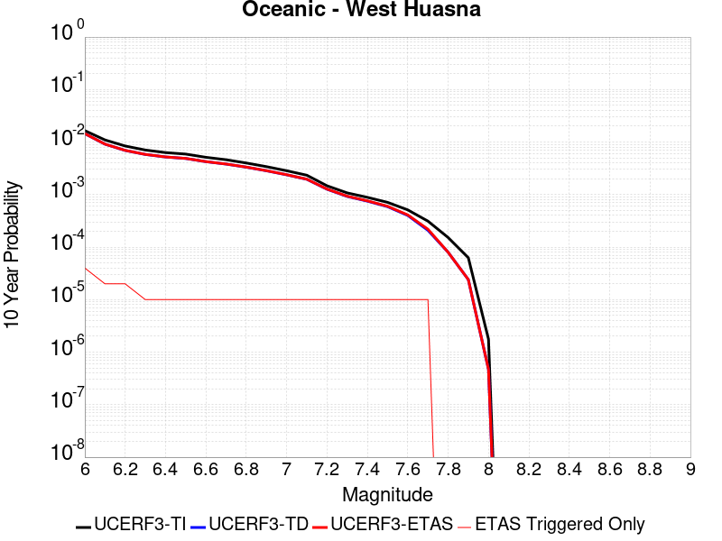 |

| Magnitude | 1 wk TI Prob | 1 wk TD Prob | 1 wk ETAS Prob | 1 wk ETAS/TD Gain | 1 wk ETAS Triggered Only | 1 mo TI Prob | 1 mo TD Prob | 1 mo ETAS Prob | 1 mo ETAS/TD Gain | 1 mo ETAS Triggered Only | 1 yr TI Prob | 1 yr TD Prob | 1 yr ETAS Prob | 1 yr ETAS/TD Gain | 1 yr ETAS Triggered Only | 10 yr TI Prob | 10 yr TD Prob | 10 yr ETAS Prob | 10 yr ETAS/TD Gain | 10 yr ETAS Triggered Only |
|-----|-----|-----|-----|-----|-----|-----|-----|-----|-----|-----|-----|-----|-----|-----|-----|-----|-----|-----|-----|-----|
| 6.0 | 3.195567E-5 | 2.7926868E-5 | 7.168932E-5 | 2.5670376 | 4.3763677E-5 | 1.3694567E-4 | 1.1968133E-4 | 1.6343976E-4 | 1.3656245 | 4.3763677E-5 | 0.0016660384 | 0.0014561893 | 0.0014998893 | 1.0300097 | 4.3763677E-5 | 0.016536033 | 0.014471028 | 0.014514158 | 1.0029805 | 4.3763677E-5 |
| 6.1 | 2.1156782E-5 | 1.7573486E-5 | 1.7573486E-5 | 1.0 | 0.0 | 9.066878E-5 | 7.531282E-5 | 7.531282E-5 | 1.0 | 0.0 | 0.0011033333 | 9.165572E-4 | 9.165572E-4 | 1.0 | 0.0 | 0.010978713 | 0.009128777 | 0.009128777 | 1.0 | 0.0 |
| 6.2 | 1.6195117E-5 | 1.3327152E-5 | 1.3327152E-5 | 1.0 | 0.0 | 6.9405796E-5 | 5.7115132E-5 | 5.7115132E-5 | 1.0 | 0.0 | 8.44688E-4 | 6.9515745E-4 | 6.9515745E-4 | 1.0 | 0.0 | 0.008414844 | 0.006930123 | 0.006930123 | 1.0 | 0.0 |
| 6.3 | 1.3559345E-5 | 1.1179142E-5 | 1.1179142E-5 | 1.0 | 0.0 | 5.811018E-5 | 4.7909736E-5 | 4.7909736E-5 | 1.0 | 0.0 | 7.072618E-4 | 5.831459E-4 | 5.831459E-4 | 1.0 | 0.0 | 0.0070501505 | 0.0058162753 | 0.0058162753 | 1.0 | 0.0 |
| 6.4 | 1.2120619E-5 | 1.0000977E-5 | 1.0000977E-5 | 1.0 | 0.0 | 5.1944477E-5 | 4.2860633E-5 | 4.2860633E-5 | 1.0 | 0.0 | 6.322405E-4 | 5.2170374E-4 | 5.2170374E-4 | 1.0 | 0.0 | 0.006304447 | 0.0052048573 | 0.0052048573 | 1.0 | 0.0 |
| 6.5 | 1.13511915E-5 | 9.3674735E-6 | 9.3674735E-6 | 1.0 | 0.0 | 4.8647056E-5 | 4.01457E-5 | 4.01457E-5 | 1.0 | 0.0 | 5.9211696E-4 | 4.886647E-4 | 4.886647E-4 | 1.0 | 0.0 | 0.0059054173 | 0.0048759608 | 0.0048759608 | 1.0 | 0.0 |
| 6.6 | 9.850605E-6 | 8.135418E-6 | 8.135418E-6 | 1.0 | 0.0 | 4.2216197E-5 | 3.4865614E-5 | 3.4865614E-5 | 1.0 | 0.0 | 5.1386096E-4 | 4.2440637E-4 | 4.2440637E-4 | 1.0 | 0.0 | 0.0051267436 | 0.004235991 | 0.004235991 | 1.0 | 0.0 |
| 6.7 | 8.8558645E-6 | 7.318433E-6 | 7.318433E-6 | 1.0 | 0.0 | 3.7953152E-5 | 3.1364336E-5 | 3.1364336E-5 | 1.0 | 0.0 | 4.6198163E-4 | 3.8179406E-4 | 3.8179406E-4 | 1.0 | 0.0 | 0.004610224 | 0.0038114067 | 0.0038114067 | 1.0 | 0.0 |
| 6.8 | 7.67136E-6 | 6.391756E-6 | 6.391756E-6 | 1.0 | 0.0 | 3.2876844E-5 | 2.7392953E-5 | 2.7392953E-5 | 1.0 | 0.0 | 4.0020206E-4 | 3.3345833E-4 | 3.3345833E-4 | 1.0 | 0.0 | 0.003994821 | 0.0033296007 | 0.0033296007 | 1.0 | 0.0 |
| 6.9 | 6.534529E-6 | 5.4583297E-6 | 5.4583297E-6 | 1.0 | 0.0 | 2.8004823E-5 | 2.3392633E-5 | 2.3392633E-5 | 1.0 | 0.0 | 3.4090536E-4 | 2.847682E-4 | 2.847682E-4 | 1.0 | 0.0 | 0.0034038287 | 0.0028440498 | 0.0028440498 | 1.0 | 0.0 |
| 7.0 | 5.460525E-6 | 4.5699517E-6 | 4.5699517E-6 | 1.0 | 0.0 | 2.3402039E-5 | 1.958536E-5 | 1.958536E-5 | 1.0 | 0.0 | 2.8488258E-4 | 2.3842578E-4 | 2.3842578E-4 | 1.0 | 0.0 | 0.0028451765 | 0.0023817138 | 0.0023817138 | 1.0 | 0.0 |
| 7.1 | 4.4825083E-6 | 3.7524428E-6 | 3.7524428E-6 | 1.0 | 0.0 | 1.9210609E-5 | 1.60818E-5 | 1.60818E-5 | 1.0 | 0.0 | 2.3386406E-4 | 1.9577841E-4 | 1.9577841E-4 | 1.0 | 0.0 | 0.002336181 | 0.0019560715 | 0.0019560715 | 1.0 | 0.0 |
| 7.2 | 2.821708E-6 | 2.4249334E-6 | 2.4249334E-6 | 1.0 | 0.0 | 1.2092979E-5 | 1.039253E-5 | 1.039253E-5 | 1.0 | 0.0 | 1.4722206E-4 | 1.2652173E-4 | 1.2652173E-4 | 1.0 | 0.0 | 0.0014712457 | 0.0012644994 | 0.0012644994 | 1.0 | 0.0 |
| 7.3 | 2.0644757E-6 | 1.7687412E-6 | 1.7687412E-6 | 1.0 | 0.0 | 8.847723E-6 | 7.5802973E-6 | 7.5802973E-6 | 1.0 | 0.0 | 1.0771569E-4 | 9.228622E-5 | 9.228622E-5 | 1.0 | 0.0 | 0.001076635 | 9.2248066E-4 | 9.2248066E-4 | 1.0 | 0.0 |
| 7.4 | 1.6980367E-6 | 1.4379892E-6 | 1.4379892E-6 | 1.0 | 0.0 | 7.27728E-6 | 6.162796E-6 | 6.162796E-6 | 1.0 | 0.0 | 8.8597284E-5 | 7.5029464E-5 | 7.5029464E-5 | 1.0 | 0.0 | 8.8561967E-4 | 7.500429E-4 | 7.500429E-4 | 1.0 | 0.0 |
| 7.5 | 1.3637683E-6 | 1.1302635E-6 | 1.1302635E-6 | 1.0 | 0.0 | 5.844708E-6 | 4.8439774E-6 | 4.8439774E-6 | 1.0 | 0.0 | 7.1156996E-5 | 5.897383E-5 | 5.897383E-5 | 1.0 | 0.0 | 7.1134215E-4 | 5.895833E-4 | 5.895833E-4 | 1.0 | 0.0 |
| 7.6 | 9.802994E-7 | 7.677247E-7 | 7.677247E-7 | 1.0 | 0.0 | 4.2012766E-6 | 3.2902446E-6 | 3.2902446E-6 | 1.0 | 0.0 | 5.1149345E-5 | 4.0057992E-5 | 4.0057992E-5 | 1.0 | 0.0 | 5.113757E-4 | 4.0050913E-4 | 4.0050913E-4 | 1.0 | 0.0 |
| 7.7 | 5.986191E-7 | 4.0050548E-7 | 4.0050548E-7 | 1.0 | 0.0 | 2.5655079E-6 | 1.7164509E-6 | 1.7164509E-6 | 1.0 | 0.0 | 3.1234613E-5 | 2.089759E-5 | 2.089759E-5 | 1.0 | 0.0 | 3.123022E-4 | 2.089576E-4 | 2.089576E-4 | 1.0 | 0.0 |
| 7.8 | 2.9189815E-7 | 1.5285792E-7 | 1.5285792E-7 | 1.0 | 0.0 | 1.2509914E-6 | 6.5510517E-7 | 6.5510517E-7 | 1.0 | 0.0 | 1.5230714E-5 | 7.9758765E-6 | 7.9758765E-6 | 1.0 | 0.0 | 1.522967E-4 | 7.9757214E-5 | 7.9757214E-5 | 1.0 | 0.0 |
| 7.9 | 1.2057845E-7 | 4.621248E-8 | 4.621248E-8 | 1.0 | 0.0 | 5.1676466E-7 | 1.9805347E-7 | 1.9805347E-7 | 1.0 | 0.0 | 6.2915915E-6 | 2.4112983E-6 | 2.4112983E-6 | 1.0 | 0.0 | 6.2914136E-5 | 2.4114026E-5 | 2.4114026E-5 | 1.0 | 0.0 |
| 8.0 | 3.3806387E-9 | 9.011393E-10 | 9.011393E-10 | 1.0 | 0.0 | 1.4488451E-8 | 3.8620254E-9 | 3.8620254E-9 | 1.0 | 0.0 | 1.7639688E-7 | 4.702016E-8 | 4.702016E-8 | 1.0 | 0.0 | 1.7639674E-6 | 4.7129527E-7 | 4.7129527E-7 | 1.0 | 0.0 |

## Whittier alt 1
*[(top)](#table-of-contents)*

| 1 Week | 1 Month | 1 Year | 10 Year |
|-----|-----|-----|-----|
|  |  |  |  |

| Magnitude | 1 wk TI Prob | 1 wk TD Prob | 1 wk ETAS Prob | 1 wk ETAS/TD Gain | 1 wk ETAS Triggered Only | 1 mo TI Prob | 1 mo TD Prob | 1 mo ETAS Prob | 1 mo ETAS/TD Gain | 1 mo ETAS Triggered Only | 1 yr TI Prob | 1 yr TD Prob | 1 yr ETAS Prob | 1 yr ETAS/TD Gain | 1 yr ETAS Triggered Only | 10 yr TI Prob | 10 yr TD Prob | 10 yr ETAS Prob | 10 yr ETAS/TD Gain | 10 yr ETAS Triggered Only |
|-----|-----|-----|-----|-----|-----|-----|-----|-----|-----|-----|-----|-----|-----|-----|-----|-----|-----|-----|-----|-----|
| 6.0 | 4.2554693E-5 | 4.725218E-5 | 9.101379E-5 | 1.9261289 | 4.3763677E-5 | 1.8236451E-4 | 2.0249544E-4 | 2.4625025E-4 | 1.216078 | 4.3763677E-5 | 0.002218027 | 0.0024629154 | 0.0025065711 | 1.0177253 | 4.3763677E-5 | 0.02196019 | 0.024390234 | 0.024432931 | 1.0017506 | 4.3763677E-5 |
| 6.1 | 4.2554693E-5 | 4.725218E-5 | 9.101379E-5 | 1.9261289 | 4.3763677E-5 | 1.8236451E-4 | 2.0249544E-4 | 2.4625025E-4 | 1.216078 | 4.3763677E-5 | 0.002218027 | 0.0024629154 | 0.0025065711 | 1.0177253 | 4.3763677E-5 | 0.02196019 | 0.024390234 | 0.024432931 | 1.0017506 | 4.3763677E-5 |
| 6.2 | 4.2554693E-5 | 4.725218E-5 | 9.101379E-5 | 1.9261289 | 4.3763677E-5 | 1.8236451E-4 | 2.0249544E-4 | 2.4625025E-4 | 1.216078 | 4.3763677E-5 | 0.002218027 | 0.0024629154 | 0.0025065711 | 1.0177253 | 4.3763677E-5 | 0.02196019 | 0.024390234 | 0.024432931 | 1.0017506 | 4.3763677E-5 |
| 6.3 | 1.9617712E-5 | 1.8268593E-5 | 1.8268593E-5 | 1.0 | 0.0 | 8.40732E-5 | 7.829172E-5 | 7.829172E-5 | 1.0 | 0.0 | 0.0010231105 | 9.52804E-4 | 9.52804E-4 | 1.0 | 0.0 | 0.01018413 | 0.009490474 | 0.009490474 | 1.0 | 0.0 |
| 6.4 | 1.5611336E-5 | 1.3604271E-5 | 1.3604271E-5 | 1.0 | 0.0 | 6.690401E-5 | 5.8302747E-5 | 5.8302747E-5 | 1.0 | 0.0 | 8.142519E-4 | 7.0961076E-4 | 7.0961076E-4 | 1.0 | 0.0 | 0.008112748 | 0.0070754145 | 0.0070754145 | 1.0 | 0.0 |
| 6.5 | 1.5150166E-5 | 1.3100925E-5 | 1.3100925E-5 | 1.0 | 0.0 | 6.492767E-5 | 5.6145647E-5 | 5.6145647E-5 | 1.0 | 0.0 | 7.9020765E-4 | 6.8336475E-4 | 6.8336475E-4 | 1.0 | 0.0 | 0.007874036 | 0.0068145846 | 0.0068145846 | 1.0 | 0.0 |
| 6.6 | 1.295588E-5 | 1.0380725E-5 | 1.0380725E-5 | 1.0 | 0.0 | 5.552402E-5 | 4.4488075E-5 | 4.4488075E-5 | 1.0 | 0.0 | 6.7579525E-4 | 5.4150965E-4 | 5.4150965E-4 | 1.0 | 0.0 | 0.006737438 | 0.0054033357 | 0.0054033357 | 1.0 | 0.0 |
| 6.7 | 1.2542085E-5 | 9.899369E-6 | 9.899369E-6 | 1.0 | 0.0 | 5.3750682E-5 | 4.242519E-5 | 4.242519E-5 | 1.0 | 0.0 | 6.542181E-4 | 5.164061E-4 | 5.164061E-4 | 1.0 | 0.0 | 0.006522954 | 0.0051534795 | 0.0051534795 | 1.0 | 0.0 |
| 6.8 | 1.2195878E-5 | 9.495415E-6 | 9.495415E-6 | 1.0 | 0.0 | 5.2267E-5 | 4.069401E-5 | 4.069401E-5 | 1.0 | 0.0 | 6.36165E-4 | 4.9533875E-4 | 4.9533875E-4 | 1.0 | 0.0 | 0.0063434686 | 0.004943688 | 0.004943688 | 1.0 | 0.0 |
| 6.9 | 1.1580298E-5 | 8.772933E-6 | 8.772933E-6 | 1.0 | 0.0 | 4.9628903E-5 | 3.7597754E-5 | 3.7597754E-5 | 1.0 | 0.0 | 6.040644E-4 | 4.5765814E-4 | 4.5765814E-4 | 1.0 | 0.0 | 0.00602425 | 0.0045684157 | 0.0045684157 | 1.0 | 0.0 |
| 7.0 | 1.0964795E-5 | 8.083994E-6 | 8.083994E-6 | 1.0 | 0.0 | 4.6991136E-5 | 3.4645236E-5 | 3.4645236E-5 | 1.0 | 0.0 | 5.7196687E-4 | 4.2172565E-4 | 4.2172565E-4 | 1.0 | 0.0 | 0.0057049696 | 0.004210462 | 0.004210462 | 1.0 | 0.0 |
| 7.1 | 1.0230601E-5 | 7.3266697E-6 | 7.3266697E-6 | 1.0 | 0.0 | 4.3844695E-5 | 3.1399642E-5 | 3.1399642E-5 | 1.0 | 0.0 | 5.336784E-4 | 3.8222488E-4 | 3.8222488E-4 | 1.0 | 0.0 | 0.005323986 | 0.0038168381 | 0.0038168381 | 1.0 | 0.0 |
| 7.2 | 9.40865E-6 | 6.543289E-6 | 6.543289E-6 | 1.0 | 0.0 | 4.032216E-5 | 2.8042374E-5 | 2.8042374E-5 | 1.0 | 0.0 | 4.908117E-4 | 3.4136363E-4 | 3.4136363E-4 | 1.0 | 0.0 | 0.0048972913 | 0.003409485 | 0.003409485 | 1.0 | 0.0 |
| 7.3 | 8.237384E-6 | 5.5977525E-6 | 5.5977525E-6 | 1.0 | 0.0 | 3.5302593E-5 | 2.3990153E-5 | 2.3990153E-5 | 1.0 | 0.0 | 4.2972428E-4 | 2.92042E-4 | 2.92042E-4 | 1.0 | 0.0 | 0.0042889426 | 0.002916903 | 0.002916903 | 1.0 | 0.0 |
| 7.4 | 7.5316966E-6 | 5.027819E-6 | 5.027819E-6 | 1.0 | 0.0 | 3.2278298E-5 | 2.1547625E-5 | 2.1547625E-5 | 1.0 | 0.0 | 3.9291743E-4 | 2.6231175E-4 | 2.6231175E-4 | 1.0 | 0.0 | 0.0039222343 | 0.0026201333 | 0.0026201333 | 1.0 | 0.0 |
| 7.5 | 6.149649E-6 | 3.933841E-6 | 3.933841E-6 | 1.0 | 0.0 | 2.6355372E-5 | 1.6859214E-5 | 1.6859214E-5 | 1.0 | 0.0 | 3.208294E-4 | 2.052425E-4 | 2.052425E-4 | 1.0 | 0.0 | 0.003203666 | 0.0020506186 | 0.0020506186 | 1.0 | 0.0 |
| 7.6 | 5.457711E-6 | 3.3953788E-6 | 3.3953788E-6 | 1.0 | 0.0 | 2.338998E-5 | 1.4551547E-5 | 1.4551547E-5 | 1.0 | 0.0 | 2.8473578E-4 | 1.771515E-4 | 1.771515E-4 | 1.0 | 0.0 | 0.0028437122 | 0.0017701836 | 0.0017701836 | 1.0 | 0.0 |
| 7.7 | 4.1676276E-6 | 2.3331952E-6 | 2.3331952E-6 | 1.0 | 0.0 | 1.7861139E-5 | 9.999374E-6 | 9.999374E-6 | 1.0 | 0.0 | 2.1743766E-4 | 1.2173632E-4 | 1.2173632E-4 | 1.0 | 0.0 | 0.0021722503 | 0.0012167693 | 0.0012167693 | 1.0 | 0.0 |
| 7.8 | 2.2692414E-7 | 9.3854695E-8 | 9.3854695E-8 | 1.0 | 0.0 | 9.725317E-7 | 4.0223435E-7 | 4.0223435E-7 | 1.0 | 0.0 | 1.1840509E-5 | 4.8971956E-6 | 4.8971956E-6 | 1.0 | 0.0 | 1.1839878E-4 | 4.8971204E-5 | 4.8971204E-5 | 1.0 | 0.0 |
| 7.9 | 6.676829E-9 | 3.439853E-9 | 3.439853E-9 | 1.0 | 0.0 | 2.861498E-8 | 1.4742227E-8 | 1.4742227E-8 | 1.0 | 0.0 | 3.4838732E-7 | 1.7948659E-7 | 1.7948659E-7 | 1.0 | 0.0 | 3.4838679E-6 | 1.7948646E-6 | 1.7948646E-6 | 1.0 | 0.0 |

## Coronado Bank alt1
*[(top)](#table-of-contents)*

| 1 Week | 1 Month | 1 Year | 10 Year |
|-----|-----|-----|-----|
|  |  |  |  |

| Magnitude | 1 wk TI Prob | 1 wk TD Prob | 1 wk ETAS Prob | 1 wk ETAS/TD Gain | 1 wk ETAS Triggered Only | 1 mo TI Prob | 1 mo TD Prob | 1 mo ETAS Prob | 1 mo ETAS/TD Gain | 1 mo ETAS Triggered Only | 1 yr TI Prob | 1 yr TD Prob | 1 yr ETAS Prob | 1 yr ETAS/TD Gain | 1 yr ETAS Triggered Only | 10 yr TI Prob | 10 yr TD Prob | 10 yr ETAS Prob | 10 yr ETAS/TD Gain | 10 yr ETAS Triggered Only |
|-----|-----|-----|-----|-----|-----|-----|-----|-----|-----|-----|-----|-----|-----|-----|-----|-----|-----|-----|-----|-----|
| 6.0 | 7.533492E-5 | 9.394913E-5 | 1.15828916E-4 | 1.2328897 | 2.1881839E-5 | 3.22824E-4 | 4.0258127E-4 | 4.2445428E-4 | 1.054332 | 2.1881839E-5 | 0.0039233007 | 0.0048909658 | 0.0049345153 | 1.0089041 | 4.3763677E-5 | 0.03854755 | 0.04790356 | 0.047945227 | 1.0008699 | 4.3763677E-5 |
| 6.1 | 4.1807285E-5 | 5.049283E-5 | 7.2373565E-5 | 1.4333434 | 2.1881839E-5 | 1.7916178E-4 | 2.1638049E-4 | 2.3825759E-4 | 1.1011047 | 2.1881839E-5 | 0.0021791123 | 0.0026313474 | 0.002674996 | 1.0165879 | 4.3763677E-5 | 0.021578677 | 0.026011046 | 0.026053673 | 1.0016388 | 4.3763677E-5 |
| 6.2 | 4.1807285E-5 | 5.049283E-5 | 7.2373565E-5 | 1.4333434 | 2.1881839E-5 | 1.7916178E-4 | 2.1638049E-4 | 2.3825759E-4 | 1.1011047 | 2.1881839E-5 | 0.0021791123 | 0.0026313474 | 0.002674996 | 1.0165879 | 4.3763677E-5 | 0.021578677 | 0.026011046 | 0.026053673 | 1.0016388 | 4.3763677E-5 |
| 6.3 | 3.1793104E-5 | 3.7711117E-5 | 5.959213E-5 | 1.5802271 | 2.1881839E-5 | 1.3624904E-4 | 1.6160926E-4 | 1.8348757E-4 | 1.1353778 | 2.1881839E-5 | 0.0016575698 | 0.001965848 | 0.0020095257 | 1.0222182 | 4.3763677E-5 | 0.016452603 | 0.019488465 | 0.019531375 | 1.0022019 | 4.3763677E-5 |
| 6.4 | 2.9878007E-5 | 3.5335794E-5 | 5.721686E-5 | 1.6192323 | 2.1881839E-5 | 1.2804232E-4 | 1.5143053E-4 | 1.7330906E-4 | 1.1444789 | 2.1881839E-5 | 0.0015578003 | 0.0018421387 | 0.0018858218 | 1.0237132 | 4.3763677E-5 | 0.015469253 | 0.01827244 | 0.018315405 | 1.0023513 | 4.3763677E-5 |
| 6.5 | 2.4512565E-5 | 2.8764043E-5 | 5.0645252E-5 | 1.7607139 | 2.1881839E-5 | 1.0504962E-4 | 1.2326881E-4 | 1.4514795E-4 | 1.1774913 | 2.1881839E-5 | 0.0012782287 | 0.0014997921 | 0.0015216412 | 1.0145681 | 2.1881839E-5 | 0.012709012 | 0.014899683 | 0.014921239 | 1.0014467 | 2.1881839E-5 |
| 6.6 | 2.1317413E-5 | 2.490667E-5 | 4.678796E-5 | 1.8785315 | 2.1881839E-5 | 9.135714E-5 | 1.0673863E-4 | 1.2861814E-4 | 1.204982 | 2.1881839E-5 | 0.0011117056 | 0.0012987906 | 0.0013206439 | 1.016826 | 2.1881839E-5 | 0.011061605 | 0.012914404 | 0.012936004 | 1.0016725 | 2.1881839E-5 |
| 6.7 | 1.8585655E-5 | 2.163488E-5 | 4.3516244E-5 | 2.0113928 | 2.1881839E-5 | 7.9650374E-5 | 9.271773E-5 | 1.1459754E-4 | 1.235983 | 2.1881839E-5 | 9.6931186E-4 | 0.0011282742 | 0.0011501315 | 1.0193722 | 2.1881839E-5 | 0.0096509475 | 0.011227623 | 0.011249258 | 1.001927 | 2.1881839E-5 |
| 6.8 | 1.5862879E-5 | 1.8419474E-5 | 4.030091E-5 | 2.187951 | 2.1881839E-5 | 6.798199E-5 | 7.893833E-5 | 1.0081843E-4 | 1.2771798 | 2.1881839E-5 | 8.273665E-4 | 9.6066965E-4 | 9.825304E-4 | 1.0227559 | 2.1881839E-5 | 0.008242928 | 0.00956715 | 0.009588823 | 1.0022653 | 2.1881839E-5 |
| 6.9 | 1.3021509E-5 | 1.5095265E-5 | 3.6976773E-5 | 2.449561 | 2.1881839E-5 | 5.5805274E-5 | 6.469249E-5 | 8.657291E-5 | 1.338222 | 2.1881839E-5 | 6.792174E-4 | 7.8736455E-4 | 8.0922915E-4 | 1.0277693 | 2.1881839E-5 | 0.006771452 | 0.007847573 | 0.007869283 | 1.0027665 | 2.1881839E-5 |
| 7.0 | 1.0974371E-5 | 1.2720104E-5 | 3.4601664E-5 | 2.7202344 | 2.1881839E-5 | 4.7032172E-5 | 5.451369E-5 | 7.639434E-5 | 1.4013789 | 2.1881839E-5 | 5.7246623E-4 | 6.6351966E-4 | 6.8538694E-4 | 1.0329566 | 2.1881839E-5 | 0.0057099373 | 0.006617135 | 0.006638872 | 1.0032849 | 2.1881839E-5 |
| 7.1 | 8.766221E-6 | 1.01638325E-5 | 3.204545E-5 | 3.1528902 | 2.1881839E-5 | 3.7568978E-5 | 4.355865E-5 | 6.543953E-5 | 1.5023316 | 2.1881839E-5 | 4.573063E-4 | 5.3021475E-4 | 5.52085E-4 | 1.0412478 | 2.1881839E-5 | 0.0045636636 | 0.0052911965 | 0.0053129625 | 1.0041137 | 2.1881839E-5 |
| 7.2 | 8.026024E-7 | 8.331765E-7 | 8.331765E-7 | 1.0 | 0.0 | 3.43972E-6 | 3.5707515E-6 | 3.5707515E-6 | 1.0 | 0.0 | 4.1877785E-5 | 4.3473043E-5 | 4.3473043E-5 | 1.0 | 0.0 | 4.1869894E-4 | 4.3464647E-4 | 4.3464647E-4 | 1.0 | 0.0 |
| 7.3 | 3.7293114E-7 | 3.7000953E-7 | 3.7000953E-7 | 1.0 | 0.0 | 1.5982754E-6 | 1.5857541E-6 | 1.5857541E-6 | 1.0 | 0.0 | 1.9458828E-5 | 1.9306386E-5 | 1.9306386E-5 | 1.0 | 0.0 | 1.9457124E-4 | 1.9304715E-4 | 1.9304715E-4 | 1.0 | 0.0 |
| 7.4 | 2.0557036E-7 | 1.9674363E-7 | 1.9674363E-7 | 1.0 | 0.0 | 8.810155E-7 | 8.431867E-7 | 8.431867E-7 | 1.0 | 0.0 | 1.0726311E-5 | 1.026575E-5 | 1.026575E-5 | 1.0 | 0.0 | 1.0725793E-4 | 1.0265279E-4 | 1.0265279E-4 | 1.0 | 0.0 |
| 7.5 | 6.845446E-8 | 6.279369E-8 | 6.279369E-8 | 1.0 | 0.0 | 2.9337625E-7 | 2.691158E-7 | 2.691158E-7 | 1.0 | 0.0 | 3.5718497E-6 | 3.2764797E-6 | 3.2764797E-6 | 1.0 | 0.0 | 3.5717923E-5 | 3.2764325E-5 | 3.2764325E-5 | 1.0 | 0.0 |
| 7.6 | 6.0975145E-9 | 5.53185E-9 | 5.53185E-9 | 1.0 | 0.0 | 2.6132206E-8 | 2.370793E-8 | 2.370793E-8 | 1.0 | 0.0 | 3.1815955E-7 | 2.88644E-7 | 2.88644E-7 | 1.0 | 0.0 | 3.181591E-6 | 2.8864374E-6 | 2.8864374E-6 | 1.0 | 0.0 |

## San Andreas (Creeping Section) 2011 CFM
*[(top)](#table-of-contents)*

| 1 Week | 1 Month | 1 Year | 10 Year |
|-----|-----|-----|-----|
|  |  |  | 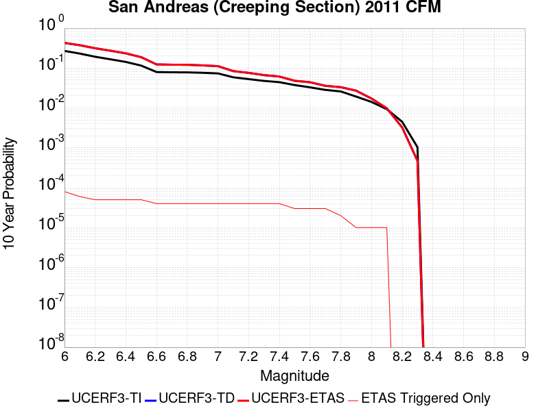 |

| Magnitude | 1 wk TI Prob | 1 wk TD Prob | 1 wk ETAS Prob | 1 wk ETAS/TD Gain | 1 wk ETAS Triggered Only | 1 mo TI Prob | 1 mo TD Prob | 1 mo ETAS Prob | 1 mo ETAS/TD Gain | 1 mo ETAS Triggered Only | 1 yr TI Prob | 1 yr TD Prob | 1 yr ETAS Prob | 1 yr ETAS/TD Gain | 1 yr ETAS Triggered Only | 10 yr TI Prob | 10 yr TD Prob | 10 yr ETAS Prob | 10 yr ETAS/TD Gain | 10 yr ETAS Triggered Only |
|-----|-----|-----|-----|-----|-----|-----|-----|-----|-----|-----|-----|-----|-----|-----|-----|-----|-----|-----|-----|-----|
| 6.0 | 5.986481E-4 | 0.001228691 | 0.0012724008 | 1.0355743 | 4.3763677E-5 | 0.0025631124 | 0.005246795 | 0.005290329 | 1.0082973 | 4.3763677E-5 | 0.030762846 | 0.061203245 | 0.06124433 | 1.0006713 | 4.3763677E-5 | 0.26835477 | 0.425928 | 0.42595312 | 1.000059 | 4.3763677E-5 |
| 6.1 | 5.015945E-4 | 0.0010230356 | 0.0010667545 | 1.0427345 | 4.3763677E-5 | 0.00214792 | 0.004369436 | 0.004413008 | 1.0099721 | 4.3763677E-5 | 0.025839351 | 0.051246606 | 0.051288128 | 1.0008103 | 4.3763677E-5 | 0.23032776 | 0.37284943 | 0.37287688 | 1.0000737 | 4.3763677E-5 |
| 6.2 | 4.073338E-4 | 8.1157376E-4 | 8.553019E-4 | 1.0538807 | 4.3763677E-5 | 0.0017445484 | 0.0034683137 | 0.0035119255 | 1.0125744 | 4.3763677E-5 | 0.021034058 | 0.04093177 | 0.04097374 | 1.0010254 | 4.3763677E-5 | 0.19150782 | 0.31302592 | 0.313056 | 1.0000961 | 4.3763677E-5 |
| 6.3 | 3.464099E-4 | 6.7455834E-4 | 7.182925E-4 | 1.0648338 | 4.3763677E-5 | 0.0014837692 | 0.0028832308 | 0.0029268684 | 1.0151349 | 4.3763677E-5 | 0.017915873 | 0.034187846 | 0.034230113 | 1.0012363 | 4.3763677E-5 | 0.16538359 | 0.27130842 | 0.2713403 | 1.0001175 | 4.3763677E-5 |
| 6.4 | 2.935057E-4 | 5.5516965E-4 | 5.9890904E-4 | 1.0787857 | 4.3763677E-5 | 0.0012572751 | 0.0023727308 | 0.0024163907 | 1.0184007 | 4.3763677E-5 | 0.015200248 | 0.02826279 | 0.028305316 | 1.0015047 | 4.3763677E-5 | 0.14201577 | 0.23297668 | 0.23301025 | 1.0001441 | 4.3763677E-5 |
| 6.5 | 2.3409708E-4 | 4.2132285E-4 | 4.650681E-4 | 1.1038283 | 4.3763677E-5 | 0.0010028875 | 0.0018017791 | 0.001845464 | 1.0242454 | 4.3763677E-5 | 0.012141965 | 0.021586355 | 0.021629173 | 1.0019836 | 4.3763677E-5 | 0.11499573 | 0.1868149 | 0.1868505 | 1.0001905 | 4.3763677E-5 |
| 6.6 | 1.5842178E-4 | 2.5068692E-4 | 2.944396E-4 | 1.1745312 | 4.3763677E-5 | 6.7877385E-4 | 0.0010739256 | 0.0011176423 | 1.0407073 | 4.3763677E-5 | 0.0082328 | 0.012995283 | 0.013038478 | 1.0033239 | 4.3763677E-5 | 0.07934396 | 0.12313759 | 0.12317597 | 1.0003116 | 4.3763677E-5 |
| 6.7 | 1.5616413E-4 | 2.4605254E-4 | 2.8980544E-4 | 1.1778194 | 4.3763677E-5 | 6.691031E-4 | 0.0010540807 | 0.0010977982 | 1.0414746 | 4.3763677E-5 | 0.0081159435 | 0.012757154 | 0.012800359 | 1.0033867 | 4.3763677E-5 | 0.0782586 | 0.12116472 | 0.12120318 | 1.0003175 | 4.3763677E-5 |
| 6.8 | 1.5538467E-4 | 2.442914E-4 | 2.880444E-4 | 1.1791016 | 4.3763677E-5 | 6.6576427E-4 | 0.001046539 | 0.001090257 | 1.0417738 | 4.3763677E-5 | 0.008075596 | 0.012666538 | 0.012709747 | 1.0034113 | 4.3763677E-5 | 0.07788358 | 0.12039561 | 0.1204341 | 1.0003197 | 4.3763677E-5 |
| 6.9 | 1.5153569E-4 | 2.3538464E-4 | 2.79138E-4 | 1.1858803 | 4.3763677E-5 | 6.49277E-4 | 0.0010084033 | 0.0010521228 | 1.0433552 | 4.3763677E-5 | 0.007876333 | 0.012208726 | 0.012251955 | 1.0035409 | 4.3763677E-5 | 0.07602952 | 0.11646574 | 0.11650441 | 1.000332 | 4.3763677E-5 |
| 7.0 | 1.4588932E-4 | 2.2395732E-4 | 2.677112E-4 | 1.195367 | 4.3763677E-5 | 6.250901E-4 | 9.59466E-4 | 0.0010031877 | 1.0455688 | 4.3763677E-5 | 0.0075839474 | 0.011619428 | 0.011662683 | 1.0037227 | 4.3763677E-5 | 0.073302895 | 0.11131206 | 0.11135095 | 1.0003494 | 4.3763677E-5 |
| 7.1 | 1.1565079E-4 | 1.6281323E-4 | 2.0656978E-4 | 1.268753 | 4.3763677E-5 | 4.955521E-4 | 6.9758523E-4 | 7.413184E-4 | 1.0626922 | 4.3763677E-5 | 0.006016669 | 0.008460228 | 0.008503621 | 1.0051291 | 4.3763677E-5 | 0.058563538 | 0.08366478 | 0.08370489 | 1.0004793 | 4.3763677E-5 |
| 7.2 | 1.0393792E-4 | 1.4615392E-4 | 1.899112E-4 | 1.2993917 | 4.3763677E-5 | 4.4537216E-4 | 6.262243E-4 | 6.6996063E-4 | 1.0698413 | 4.3763677E-5 | 0.005408933 | 0.0075977976 | 0.007641229 | 1.0057163 | 4.3763677E-5 | 0.052791595 | 0.07561503 | 0.07565549 | 1.000535 | 4.3763677E-5 |
| 7.3 | 9.332884E-5 | 1.2780601E-4 | 1.7156408E-4 | 1.342379 | 4.3763677E-5 | 3.999194E-4 | 5.4762565E-4 | 5.913654E-4 | 1.0798715 | 4.3763677E-5 | 0.0048581534 | 0.0066470946 | 0.0066905674 | 1.0065401 | 4.3763677E-5 | 0.047533102 | 0.06647954 | 0.0665204 | 1.0006145 | 4.3763677E-5 |
| 7.4 | 8.670252E-5 | 1.1702972E-4 | 1.6078827E-4 | 1.3739098 | 4.3763677E-5 | 3.715293E-4 | 5.014601E-4 | 5.452018E-4 | 1.0872288 | 4.3763677E-5 | 0.004513991 | 0.0060883067 | 0.006131804 | 1.0071443 | 4.3763677E-5 | 0.044233937 | 0.061148684 | 0.06118977 | 1.000672 | 4.3763677E-5 |
| 7.5 | 7.3036405E-5 | 9.005699E-5 | 1.3381672E-4 | 1.4859116 | 4.3763677E-5 | 3.129756E-4 | 3.859015E-4 | 4.296483E-4 | 1.1133626 | 4.3763677E-5 | 0.0038038217 | 0.0046882504 | 0.004731809 | 1.0092909 | 4.3763677E-5 | 0.03739367 | 0.047875606 | 0.047917277 | 1.0008703 | 4.3763677E-5 |
| 7.6 | 6.3935775E-5 | 8.280209E-5 | 1.2656214E-4 | 1.5284897 | 4.3763677E-5 | 2.7398168E-4 | 3.5481792E-4 | 3.9856607E-4 | 1.1232975 | 4.3763677E-5 | 0.0033306254 | 0.00431137 | 0.004354945 | 1.010107 | 4.3763677E-5 | 0.032811474 | 0.043990135 | 0.044031974 | 1.000951 | 4.3763677E-5 |
| 7.7 | 5.5050095E-5 | 6.661729E-5 | 1.1037805E-4 | 1.6568979 | 4.3763677E-5 | 2.3590765E-4 | 2.8547147E-4 | 3.2922265E-4 | 1.1532594 | 4.3763677E-5 | 0.0028683927 | 0.0034700802 | 0.003513692 | 1.012568 | 4.3763677E-5 | 0.0283165 | 0.03579509 | 0.035837285 | 1.0011789 | 4.3763677E-5 |
| 7.8 | 5.027131E-5 | 6.1627725E-5 | 1.053887E-4 | 1.710086 | 4.3763677E-5 | 2.1543067E-4 | 2.640921E-4 | 3.078442E-4 | 1.1656699 | 4.3763677E-5 | 0.0026197135 | 0.003210584 | 0.003254207 | 1.0135874 | 4.3763677E-5 | 0.025890453 | 0.03312572 | 0.033168033 | 1.0012773 | 4.3763677E-5 |
| 7.9 | 3.7271806E-5 | 5.0224386E-5 | 7.2105126E-5 | 1.4356596 | 2.1881839E-5 | 1.5972654E-4 | 2.1522962E-4 | 2.3710675E-4 | 1.1016455 | 2.1881839E-5 | 0.0019429359 | 0.0026172737 | 0.0026390983 | 1.0083387 | 2.1881839E-5 | 0.019260362 | 0.027066687 | 0.027087977 | 1.0007865 | 2.1881839E-5 |
| 8.0 | 2.7310243E-5 | 3.1428404E-5 | 5.3309555E-5 | 1.6962221 | 2.1881839E-5 | 1.17038646E-4 | 1.3468621E-4 | 1.565651E-4 | 1.1624434 | 2.1881839E-5 | 0.0014240141 | 0.0016385721 | 0.001660418 | 1.0133324 | 2.1881839E-5 | 0.014149235 | 0.01721387 | 0.017235374 | 1.0012493 | 2.1881839E-5 |
| 8.1 | 1.7940547E-5 | 1.7400796E-5 | 3.9282255E-5 | 2.2574975 | 2.1881839E-5 | 7.688579E-5 | 7.457271E-5 | 9.645292E-5 | 1.2934077 | 2.1881839E-5 | 9.3568244E-4 | 9.075451E-4 | 9.294071E-4 | 1.0240891 | 2.1881839E-5 | 0.009317525 | 0.009799073 | 0.009820741 | 1.0022112 | 2.1881839E-5 |
| 8.2 | 8.643924E-6 | 5.4748625E-6 | 5.4748625E-6 | 1.0 | 0.0 | 3.704486E-5 | 2.3463486E-5 | 2.3463486E-5 | 1.0 | 0.0 | 4.5092785E-4 | 2.8563058E-4 | 2.8563058E-4 | 1.0 | 0.0 | 0.0045001395 | 0.0032487072 | 0.0032487072 | 1.0 | 0.0 |
| 8.3 | 1.983087E-6 | 7.6599065E-7 | 7.6599065E-7 | 1.0 | 0.0 | 8.498917E-6 | 3.282813E-6 | 3.282813E-6 | 1.0 | 0.0 | 1.034694E-4 | 3.9967534E-5 | 3.9967534E-5 | 1.0 | 0.0 | 0.0010342124 | 4.719687E-4 | 4.719687E-4 | 1.0 | 0.0 |

## Chino alt 1
*[(top)](#table-of-contents)*

| 1 Week | 1 Month | 1 Year | 10 Year |
|-----|-----|-----|-----|
|  | 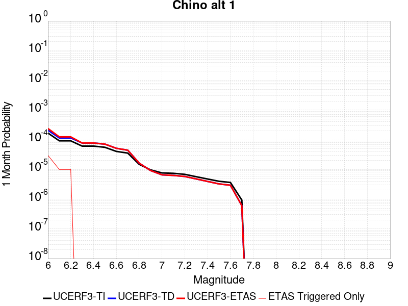 |  | 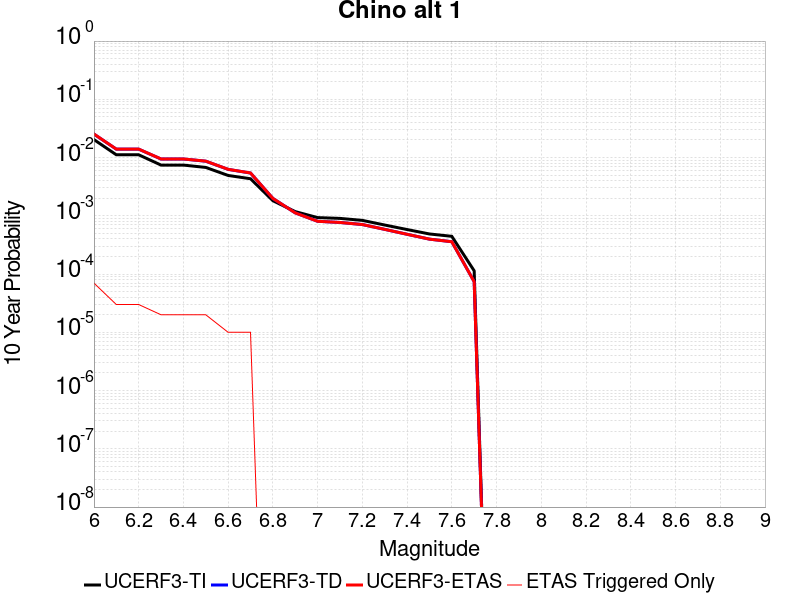 |

| Magnitude | 1 wk TI Prob | 1 wk TD Prob | 1 wk ETAS Prob | 1 wk ETAS/TD Gain | 1 wk ETAS Triggered Only | 1 mo TI Prob | 1 mo TD Prob | 1 mo ETAS Prob | 1 mo ETAS/TD Gain | 1 mo ETAS Triggered Only | 1 yr TI Prob | 1 yr TD Prob | 1 yr ETAS Prob | 1 yr ETAS/TD Gain | 1 yr ETAS Triggered Only | 10 yr TI Prob | 10 yr TD Prob | 10 yr ETAS Prob | 10 yr ETAS/TD Gain | 10 yr ETAS Triggered Only |
|-----|-----|-----|-----|-----|-----|-----|-----|-----|-----|-----|-----|-----|-----|-----|-----|-----|-----|-----|-----|-----|
| 6.0 | 3.939946E-5 | 4.8948554E-5 | 7.082932E-5 | 1.4470156 | 2.1881839E-5 | 1.6884391E-4 | 2.097656E-4 | 2.3164284E-4 | 1.1042938 | 2.1881839E-5 | 0.0020537362 | 0.0025513945 | 0.0025732205 | 1.0085546 | 2.1881839E-5 | 0.020348595 | 0.025277847 | 0.025320504 | 1.0016875 | 4.3763677E-5 |
| 6.1 | 2.1505624E-5 | 2.6879026E-5 | 4.8760274E-5 | 1.8140641 | 2.1881839E-5 | 9.2163704E-5 | 1.1519137E-4 | 1.3707069E-4 | 1.1899389 | 2.1881839E-5 | 0.0011215154 | 0.001401664 | 0.0014235151 | 1.0155895 | 2.1881839E-5 | 0.011158722 | 0.013945141 | 0.013966718 | 1.0015472 | 2.1881839E-5 |
| 6.2 | 2.1505624E-5 | 2.6879026E-5 | 4.8760274E-5 | 1.8140641 | 2.1881839E-5 | 9.2163704E-5 | 1.1519137E-4 | 1.3707069E-4 | 1.1899389 | 2.1881839E-5 | 0.0011215154 | 0.001401664 | 0.0014235151 | 1.0155895 | 2.1881839E-5 | 0.011158722 | 0.013945141 | 0.013966718 | 1.0015472 | 2.1881839E-5 |
| 6.3 | 1.4290785E-5 | 1.8165128E-5 | 1.8165128E-5 | 1.0 | 0.0 | 6.1244784E-5 | 7.784848E-5 | 7.784848E-5 | 1.0 | 0.0 | 7.454001E-4 | 9.4743853E-4 | 9.4743853E-4 | 1.0 | 0.0 | 0.007429048 | 0.0094444575 | 0.0094444575 | 1.0 | 0.0 |
| 6.4 | 1.4290785E-5 | 1.8165128E-5 | 1.8165128E-5 | 1.0 | 0.0 | 6.1244784E-5 | 7.784848E-5 | 7.784848E-5 | 1.0 | 0.0 | 7.454001E-4 | 9.4743853E-4 | 9.4743853E-4 | 1.0 | 0.0 | 0.007429048 | 0.0094444575 | 0.0094444575 | 1.0 | 0.0 |
| 6.5 | 1.3017944E-5 | 1.6652088E-5 | 1.6652088E-5 | 1.0 | 0.0 | 5.5789995E-5 | 7.136439E-5 | 7.136439E-5 | 1.0 | 0.0 | 6.790315E-4 | 8.685589E-4 | 8.685589E-4 | 1.0 | 0.0 | 0.0067696036 | 0.008661949 | 0.008661949 | 1.0 | 0.0 |
| 6.6 | 9.470016E-6 | 1.2039424E-5 | 1.2039424E-5 | 1.0 | 0.0 | 4.058515E-5 | 5.1596704E-5 | 5.1596704E-5 | 1.0 | 0.0 | 4.940122E-4 | 6.280428E-4 | 6.280428E-4 | 1.0 | 0.0 | 0.004929154 | 0.0062718987 | 0.0062718987 | 1.0 | 0.0 |
| 6.7 | 8.314155E-6 | 1.0407736E-5 | 1.0407736E-5 | 1.0 | 0.0 | 3.5631605E-5 | 4.4604003E-5 | 4.4604003E-5 | 1.0 | 0.0 | 4.3372845E-4 | 5.429507E-4 | 5.429507E-4 | 1.0 | 0.0 | 0.004328829 | 0.005425775 | 0.005425775 | 1.0 | 0.0 |
| 6.8 | 3.4856364E-6 | 3.8133708E-6 | 3.8133708E-6 | 1.0 | 0.0 | 1.4938357E-5 | 1.6342927E-5 | 1.6342927E-5 | 1.0 | 0.0 | 1.8185932E-4 | 1.9895904E-4 | 1.9895904E-4 | 1.0 | 0.0 | 0.0018171056 | 0.0019894864 | 0.0019894864 | 1.0 | 0.0 |
| 6.9 | 2.2645952E-6 | 2.1529022E-6 | 2.1529022E-6 | 1.0 | 0.0 | 9.705372E-6 | 9.226692E-6 | 9.226692E-6 | 1.0 | 0.0 | 1.18156495E-4 | 1.123294E-4 | 1.123294E-4 | 1.0 | 0.0 | 0.0011809369 | 0.0011233423 | 0.0011233423 | 1.0 | 0.0 |
| 7.0 | 1.7864003E-6 | 1.5430785E-6 | 1.5430785E-6 | 1.0 | 0.0 | 7.655979E-6 | 6.613177E-6 | 6.613177E-6 | 1.0 | 0.0 | 9.3207556E-5 | 8.051251E-5 | 8.051251E-5 | 1.0 | 0.0 | 9.316847E-4 | 8.0528046E-4 | 8.0528046E-4 | 1.0 | 0.0 |
| 7.1 | 1.7315456E-6 | 1.4733511E-6 | 1.4733511E-6 | 1.0 | 0.0 | 7.420889E-6 | 6.3143466E-6 | 6.3143466E-6 | 1.0 | 0.0 | 9.034557E-5 | 7.6874516E-5 | 7.6874516E-5 | 1.0 | 0.0 | 9.0308854E-4 | 7.6891703E-4 | 7.6891703E-4 | 1.0 | 0.0 |
| 7.2 | 1.6008337E-6 | 1.3574215E-6 | 1.3574215E-6 | 1.0 | 0.0 | 6.860698E-6 | 5.817508E-6 | 5.817508E-6 | 1.0 | 0.0 | 8.352579E-5 | 7.082591E-5 | 7.082591E-5 | 1.0 | 0.0 | 8.34944E-4 | 7.0845755E-4 | 7.0845755E-4 | 1.0 | 0.0 |
| 7.3 | 1.3320939E-6 | 1.121782E-6 | 1.121782E-6 | 1.0 | 0.0 | 5.7089615E-6 | 4.807629E-6 | 4.807629E-6 | 1.0 | 0.0 | 6.9504385E-5 | 5.8531357E-5 | 5.8531357E-5 | 1.0 | 0.0 | 6.9482654E-4 | 5.8530393E-4 | 5.8530393E-4 | 1.0 | 0.0 |
| 7.4 | 1.114294E-6 | 9.237111E-7 | 9.237111E-7 | 1.0 | 0.0 | 4.775537E-6 | 3.958756E-6 | 3.958756E-6 | 1.0 | 0.0 | 5.8140613E-5 | 4.8196827E-5 | 4.8196827E-5 | 1.0 | 0.0 | 5.81254E-4 | 4.8188053E-4 | 4.8188053E-4 | 1.0 | 0.0 |
| 7.5 | 9.354081E-7 | 7.6234323E-7 | 7.6234323E-7 | 1.0 | 0.0 | 4.0088858E-6 | 3.2671815E-6 | 3.2671815E-6 | 1.0 | 0.0 | 4.8807087E-5 | 3.9777242E-5 | 3.9777242E-5 | 1.0 | 0.0 | 4.879637E-4 | 3.977046E-4 | 3.977046E-4 | 1.0 | 0.0 |
| 7.6 | 8.521771E-7 | 6.88071E-7 | 6.88071E-7 | 1.0 | 0.0 | 3.6521824E-6 | 2.9488726E-6 | 2.9488726E-6 | 1.0 | 0.0 | 4.4464414E-5 | 3.5901965E-5 | 3.5901965E-5 | 1.0 | 0.0 | 4.4455516E-4 | 3.589648E-4 | 3.589648E-4 | 1.0 | 0.0 |
| 7.7 | 2.1803626E-7 | 1.418649E-7 | 1.418649E-7 | 1.0 | 0.0 | 9.344408E-7 | 6.079923E-7 | 6.079923E-7 | 1.0 | 0.0 | 1.1376757E-5 | 7.4022914E-6 | 7.4022914E-6 | 1.0 | 0.0 | 1.13761744E-4 | 7.402141E-5 | 7.402141E-5 | 1.0 | 0.0 |

## Santa Cruz Island
*[(top)](#table-of-contents)*

| 1 Week | 1 Month | 1 Year | 10 Year |
|-----|-----|-----|-----|
|  |  |  |  |

| Magnitude | 1 wk TI Prob | 1 wk TD Prob | 1 wk ETAS Prob | 1 wk ETAS/TD Gain | 1 wk ETAS Triggered Only | 1 mo TI Prob | 1 mo TD Prob | 1 mo ETAS Prob | 1 mo ETAS/TD Gain | 1 mo ETAS Triggered Only | 1 yr TI Prob | 1 yr TD Prob | 1 yr ETAS Prob | 1 yr ETAS/TD Gain | 1 yr ETAS Triggered Only | 10 yr TI Prob | 10 yr TD Prob | 10 yr ETAS Prob | 10 yr ETAS/TD Gain | 10 yr ETAS Triggered Only |
|-----|-----|-----|-----|-----|-----|-----|-----|-----|-----|-----|-----|-----|-----|-----|-----|-----|-----|-----|-----|-----|
| 6.0 | 2.9164563E-5 | 3.1599742E-5 | 7.536203E-5 | 2.384894 | 4.3763677E-5 | 1.2498499E-4 | 1.3542121E-4 | 1.7917895E-4 | 1.3231233 | 4.3763677E-5 | 0.0015206301 | 0.0016476426 | 0.0016913341 | 1.0265176 | 4.3763677E-5 | 0.015102667 | 0.016368 | 0.016411047 | 1.00263 | 4.3763677E-5 |
| 6.1 | 2.9164563E-5 | 3.1599742E-5 | 7.536203E-5 | 2.384894 | 4.3763677E-5 | 1.2498499E-4 | 1.3542121E-4 | 1.7917895E-4 | 1.3231233 | 4.3763677E-5 | 0.0015206301 | 0.0016476426 | 0.0016913341 | 1.0265176 | 4.3763677E-5 | 0.015102667 | 0.016368 | 0.016411047 | 1.00263 | 4.3763677E-5 |
| 6.2 | 2.9164563E-5 | 3.1599742E-5 | 7.536203E-5 | 2.384894 | 4.3763677E-5 | 1.2498499E-4 | 1.3542121E-4 | 1.7917895E-4 | 1.3231233 | 4.3763677E-5 | 0.0015206301 | 0.0016476426 | 0.0016913341 | 1.0265176 | 4.3763677E-5 | 0.015102667 | 0.016368 | 0.016411047 | 1.00263 | 4.3763677E-5 |
| 6.3 | 1.6635553E-5 | 1.780436E-5 | 1.780436E-5 | 1.0 | 0.0 | 7.1293274E-5 | 7.630226E-5 | 7.630226E-5 | 1.0 | 0.0 | 8.6765E-4 | 9.2860236E-4 | 9.2860236E-4 | 1.0 | 0.0 | 0.008642701 | 0.009249094 | 0.009249094 | 1.0 | 0.0 |
| 6.4 | 1.6635553E-5 | 1.780436E-5 | 1.780436E-5 | 1.0 | 0.0 | 7.1293274E-5 | 7.630226E-5 | 7.630226E-5 | 1.0 | 0.0 | 8.6765E-4 | 9.2860236E-4 | 9.2860236E-4 | 1.0 | 0.0 | 0.008642701 | 0.009249094 | 0.009249094 | 1.0 | 0.0 |
| 6.5 | 1.2238748E-5 | 1.3042995E-5 | 1.3042995E-5 | 1.0 | 0.0 | 5.2450723E-5 | 5.5897377E-5 | 5.5897377E-5 | 1.0 | 0.0 | 6.3840044E-4 | 6.8034173E-4 | 6.8034173E-4 | 1.0 | 0.0 | 0.0063656955 | 0.0067829876 | 0.0067829876 | 1.0 | 0.0 |
| 6.6 | 1.0489767E-5 | 1.1156636E-5 | 1.1156636E-5 | 1.0 | 0.0 | 4.495537E-5 | 4.781329E-5 | 4.781329E-5 | 1.0 | 0.0 | 5.4719415E-4 | 5.819735E-4 | 5.819735E-4 | 1.0 | 0.0 | 0.005458487 | 0.0058047357 | 0.0058047357 | 1.0 | 0.0 |
| 6.7 | 8.699222E-6 | 9.236782E-6 | 9.236782E-6 | 1.0 | 0.0 | 3.7281847E-5 | 3.958561E-5 | 3.958561E-5 | 1.0 | 0.0 | 4.5381195E-4 | 4.8184878E-4 | 4.8184878E-4 | 1.0 | 0.0 | 0.0045288634 | 0.004808108 | 0.004808108 | 1.0 | 0.0 |
| 6.8 | 8.307732E-6 | 8.8169045E-6 | 8.8169045E-6 | 1.0 | 0.0 | 3.560408E-5 | 3.7786187E-5 | 3.7786187E-5 | 1.0 | 0.0 | 4.3339343E-4 | 4.5995016E-4 | 4.5995016E-4 | 1.0 | 0.0 | 0.004325492 | 0.0045900354 | 0.0045900354 | 1.0 | 0.0 |
| 6.9 | 8.073121E-6 | 8.564939E-6 | 8.564939E-6 | 1.0 | 0.0 | 3.459863E-5 | 3.6706366E-5 | 3.6706366E-5 | 1.0 | 0.0 | 4.2115687E-4 | 4.468088E-4 | 4.468088E-4 | 1.0 | 0.0 | 0.004203596 | 0.004459156 | 0.004459156 | 1.0 | 0.0 |
| 7.0 | 7.617019E-6 | 8.074664E-6 | 8.074664E-6 | 1.0 | 0.0 | 3.264396E-5 | 3.4605247E-5 | 3.4605247E-5 | 1.0 | 0.0 | 3.9736772E-4 | 4.212378E-4 | 4.212378E-4 | 1.0 | 0.0 | 0.003966579 | 0.0042044413 | 0.0042044413 | 1.0 | 0.0 |
| 7.1 | 7.1224836E-6 | 7.545788E-6 | 7.545788E-6 | 1.0 | 0.0 | 3.052457E-5 | 3.2338692E-5 | 3.2338692E-5 | 1.0 | 0.0 | 3.715733E-4 | 3.936528E-4 | 3.936528E-4 | 1.0 | 0.0 | 0.003709526 | 0.003929598 | 0.003929598 | 1.0 | 0.0 |
| 7.2 | 6.441115E-6 | 6.8273835E-6 | 6.8273835E-6 | 1.0 | 0.0 | 2.7604487E-5 | 2.9259887E-5 | 2.9259887E-5 | 1.0 | 0.0 | 3.360328E-4 | 3.5618112E-4 | 3.5618112E-4 | 1.0 | 0.0 | 0.0033552512 | 0.003556131 | 0.003556131 | 1.0 | 0.0 |
| 7.3 | 5.494274E-6 | 5.8199944E-6 | 5.8199944E-6 | 1.0 | 0.0 | 2.3546674E-5 | 2.4942596E-5 | 2.4942596E-5 | 1.0 | 0.0 | 2.8664304E-4 | 3.0363398E-4 | 3.0363398E-4 | 1.0 | 0.0 | 0.002862736 | 0.0030322142 | 0.0030322142 | 1.0 | 0.0 |
| 7.4 | 4.0802624E-6 | 4.312256E-6 | 4.312256E-6 | 1.0 | 0.0 | 1.7486722E-5 | 1.8480967E-5 | 1.8480967E-5 | 1.0 | 0.0 | 2.1288003E-4 | 2.2498262E-4 | 2.2498262E-4 | 1.0 | 0.0 | 0.0021267622 | 0.0022475575 | 0.0022475575 | 1.0 | 0.0 |
| 7.5 | 2.3584746E-6 | 2.4753094E-6 | 2.4753094E-6 | 1.0 | 0.0 | 1.0107709E-5 | 1.0608426E-5 | 1.0608426E-5 | 1.0 | 0.0 | 1.2305441E-4 | 1.2915E-4 | 1.2915E-4 | 1.0 | 0.0 | 0.0012298629 | 0.0012907543 | 0.0012907543 | 1.0 | 0.0 |
| 7.6 | 9.4981914E-7 | 9.86093E-7 | 9.86093E-7 | 1.0 | 0.0 | 4.0706473E-6 | 4.2261063E-6 | 4.2261063E-6 | 1.0 | 0.0 | 4.9559E-5 | 5.145164E-5 | 5.145164E-5 | 1.0 | 0.0 | 4.954795E-4 | 5.1439856E-4 | 5.1439856E-4 | 1.0 | 0.0 |
| 7.7 | 2.6013532E-7 | 2.6416603E-7 | 2.6416603E-7 | 1.0 | 0.0 | 1.1148652E-6 | 1.1321397E-6 | 1.1321397E-6 | 1.0 | 0.0 | 1.3573399E-5 | 1.3783714E-5 | 1.3783714E-5 | 1.0 | 0.0 | 1.357257E-4 | 1.3782867E-4 | 1.3782867E-4 | 1.0 | 0.0 |
| 7.8 | 4.1522263E-8 | 3.965679E-8 | 3.965679E-8 | 1.0 | 0.0 | 1.7795254E-7 | 1.6995766E-7 | 1.6995766E-7 | 1.0 | 0.0 | 2.16657E-6 | 2.0692328E-6 | 2.0692328E-6 | 1.0 | 0.0 | 2.1665488E-5 | 2.0692156E-5 | 2.0692156E-5 | 1.0 | 0.0 |
| 7.9 | 7.7242046E-10 | 5.9468175E-10 | 5.9468175E-10 | 1.0 | 0.0 | 3.3103735E-9 | 2.5486364E-9 | 2.5486364E-9 | 1.0 | 0.0 | 4.0303796E-8 | 3.1029646E-8 | 3.1029646E-8 | 1.0 | 0.0 | 4.030379E-7 | 3.1029643E-7 | 3.1029643E-7 | 1.0 | 0.0 |

## Santa Rosa Island
*[(top)](#table-of-contents)*

| 1 Week | 1 Month | 1 Year | 10 Year |
|-----|-----|-----|-----|
|  |  |  |  |

| Magnitude | 1 wk TI Prob | 1 wk TD Prob | 1 wk ETAS Prob | 1 wk ETAS/TD Gain | 1 wk ETAS Triggered Only | 1 mo TI Prob | 1 mo TD Prob | 1 mo ETAS Prob | 1 mo ETAS/TD Gain | 1 mo ETAS Triggered Only | 1 yr TI Prob | 1 yr TD Prob | 1 yr ETAS Prob | 1 yr ETAS/TD Gain | 1 yr ETAS Triggered Only | 10 yr TI Prob | 10 yr TD Prob | 10 yr ETAS Prob | 10 yr ETAS/TD Gain | 10 yr ETAS Triggered Only |
|-----|-----|-----|-----|-----|-----|-----|-----|-----|-----|-----|-----|-----|-----|-----|-----|-----|-----|-----|-----|-----|
| 6.0 | 4.1143165E-5 | 4.7091133E-5 | 6.897194E-5 | 1.4646481 | 2.1881839E-5 | 1.7631594E-4 | 2.0180465E-4 | 2.2368207E-4 | 1.1084089 | 2.1881839E-5 | 0.002144533 | 0.0024544 | 0.0024980563 | 1.017787 | 4.3763677E-5 | 0.021239553 | 0.024293551 | 0.024336252 | 1.0017577 | 4.3763677E-5 |
| 6.1 | 2.1061249E-5 | 2.3864959E-5 | 4.5746274E-5 | 1.9168805 | 2.1881839E-5 | 9.0259375E-5 | 1.0227455E-4 | 1.2415415E-4 | 1.21393 | 2.1881839E-5 | 0.0010983539 | 0.0012445104 | 0.0012663649 | 1.0175608 | 2.1881839E-5 | 0.01092941 | 0.012378449 | 0.012400059 | 1.0017458 | 2.1881839E-5 |
| 6.2 | 2.1061249E-5 | 2.3864959E-5 | 4.5746274E-5 | 1.9168805 | 2.1881839E-5 | 9.0259375E-5 | 1.0227455E-4 | 1.2415415E-4 | 1.21393 | 2.1881839E-5 | 0.0010983539 | 0.0012445104 | 0.0012663649 | 1.0175608 | 2.1881839E-5 | 0.01092941 | 0.012378449 | 0.012400059 | 1.0017458 | 2.1881839E-5 |
| 6.3 | 1.5158236E-5 | 1.7074419E-5 | 3.8955885E-5 | 2.281535 | 2.1881839E-5 | 6.496225E-5 | 7.3174095E-5 | 9.505433E-5 | 1.2990161 | 2.1881839E-5 | 7.906284E-4 | 8.905424E-4 | 9.124048E-4 | 1.0245495 | 2.1881839E-5 | 0.007878214 | 0.008870989 | 0.008892677 | 1.0024447 | 2.1881839E-5 |
| 6.4 | 1.2341918E-5 | 1.3852917E-5 | 3.573445E-5 | 2.5795617 | 2.1881839E-5 | 5.2892858E-5 | 5.9368336E-5 | 8.124887E-5 | 1.3685557 | 2.1881839E-5 | 6.437803E-4 | 7.225779E-4 | 7.4444397E-4 | 1.0302612 | 2.1881839E-5 | 0.006419184 | 0.007203121 | 0.0072248457 | 1.003016 | 2.1881839E-5 |
| 6.5 | 9.061158E-6 | 1.0117031E-5 | 3.1998647E-5 | 3.1628497 | 2.1881839E-5 | 3.883296E-5 | 4.3358013E-5 | 6.5238906E-5 | 1.5046562 | 2.1881839E-5 | 4.726887E-4 | 5.277613E-4 | 5.496316E-4 | 1.0414398 | 2.1881839E-5 | 0.004716845 | 0.0052656173 | 0.005287384 | 1.0041337 | 2.1881839E-5 |
| 6.6 | 7.5461685E-6 | 8.400733E-6 | 8.400733E-6 | 1.0 | 0.0 | 3.2340322E-5 | 3.600267E-5 | 3.600267E-5 | 1.0 | 0.0 | 3.936723E-4 | 4.3824865E-4 | 4.3824865E-4 | 1.0 | 0.0 | 0.003929756 | 0.0043742736 | 0.0043742736 | 1.0 | 0.0 |
| 6.7 | 5.5023775E-6 | 6.087381E-6 | 6.087381E-6 | 1.0 | 0.0 | 2.3581404E-5 | 2.6088532E-5 | 2.6088532E-5 | 1.0 | 0.0 | 2.8706578E-4 | 3.1758484E-4 | 3.1758484E-4 | 1.0 | 0.0 | 0.0028669522 | 0.0031716314 | 0.0031716314 | 1.0 | 0.0 |
| 6.8 | 3.7351679E-6 | 4.0831405E-6 | 4.0831405E-6 | 1.0 | 0.0 | 1.6007763E-5 | 1.749907E-5 | 1.749907E-5 | 1.0 | 0.0 | 1.948771E-4 | 2.1303284E-4 | 2.1303284E-4 | 1.0 | 0.0 | 0.0019470629 | 0.0021285315 | 0.0021285315 | 1.0 | 0.0 |
| 6.9 | 2.456366E-6 | 2.6292705E-6 | 2.6292705E-6 | 1.0 | 0.0 | 1.0527241E-5 | 1.1268254E-5 | 1.1268254E-5 | 1.0 | 0.0 | 1.2816161E-4 | 1.3718237E-4 | 1.3718237E-4 | 1.0 | 0.0 | 0.0012808773 | 0.0013709799 | 0.0013709799 | 1.0 | 0.0 |
| 7.0 | 2.3245157E-6 | 2.4827782E-6 | 2.4827782E-6 | 1.0 | 0.0 | 9.962172E-6 | 1.0640435E-5 | 1.0640435E-5 | 1.0 | 0.0 | 1.2128269E-4 | 1.2953962E-4 | 1.2953962E-4 | 1.0 | 0.0 | 0.0012121652 | 0.0012946434 | 0.0012946434 | 1.0 | 0.0 |
| 7.1 | 2.2248344E-6 | 2.37325E-6 | 2.37325E-6 | 1.0 | 0.0 | 9.53497E-6 | 1.0171032E-5 | 1.0171032E-5 | 1.0 | 0.0 | 1.1608207E-4 | 1.2382529E-4 | 1.2382529E-4 | 1.0 | 0.0 | 0.0011602144 | 0.001237565 | 0.001237565 | 1.0 | 0.0 |
| 7.2 | 2.1350402E-6 | 2.276154E-6 | 2.276154E-6 | 1.0 | 0.0 | 9.150141E-6 | 9.754909E-6 | 9.754909E-6 | 1.0 | 0.0 | 1.1139726E-4 | 1.1875956E-4 | 1.1875956E-4 | 1.0 | 0.0 | 0.0011134144 | 0.0011869629 | 0.0011869629 | 1.0 | 0.0 |
| 7.3 | 1.9793572E-6 | 2.108719E-6 | 2.108719E-6 | 1.0 | 0.0 | 8.482932E-6 | 9.037336E-6 | 9.037336E-6 | 1.0 | 0.0 | 1.032748E-4 | 1.10024026E-4 | 1.10024026E-4 | 1.0 | 0.0 | 0.0010322682 | 0.0010996973 | 0.0010996973 | 1.0 | 0.0 |
| 7.4 | 1.6951194E-6 | 1.8045733E-6 | 1.8045733E-6 | 1.0 | 0.0 | 7.264777E-6 | 7.733863E-6 | 7.733863E-6 | 1.0 | 0.0 | 8.844508E-5 | 9.415573E-5 | 9.415573E-5 | 1.0 | 0.0 | 8.840988E-4 | 9.4116E-4 | 9.4116E-4 | 1.0 | 0.0 |
| 7.5 | 8.987207E-7 | 9.5122147E-7 | 9.5122147E-7 | 1.0 | 0.0 | 3.8516546E-6 | 4.076657E-6 | 4.076657E-6 | 1.0 | 0.0 | 4.6892885E-5 | 4.963218E-5 | 4.963218E-5 | 1.0 | 0.0 | 4.688299E-4 | 4.9621216E-4 | 4.9621216E-4 | 1.0 | 0.0 |
| 7.6 | 3.8783037E-7 | 4.052932E-7 | 4.052932E-7 | 1.0 | 0.0 | 1.6621291E-6 | 1.7369698E-6 | 1.7369698E-6 | 1.0 | 0.0 | 2.0236233E-5 | 2.1147409E-5 | 2.1147409E-5 | 1.0 | 0.0 | 2.023439E-4 | 2.1145462E-4 | 2.1145462E-4 | 1.0 | 0.0 |
| 7.7 | 6.181804E-8 | 6.339035E-8 | 6.339035E-8 | 1.0 | 0.0 | 2.6493444E-7 | 2.7167292E-7 | 2.7167292E-7 | 1.0 | 0.0 | 3.225572E-6 | 3.3076128E-6 | 3.3076128E-6 | 1.0 | 0.0 | 3.225525E-5 | 3.307564E-5 | 3.307564E-5 | 1.0 | 0.0 |
| 7.8 | 1.3704449E-9 | 1.3964153E-9 | 1.3964153E-9 | 1.0 | 0.0 | 5.873335E-9 | 5.984637E-9 | 5.984637E-9 | 1.0 | 0.0 | 7.1507856E-8 | 7.286295E-8 | 7.286295E-8 | 1.0 | 0.0 | 7.1507833E-7 | 7.286294E-7 | 7.286294E-7 | 1.0 | 0.0 |

## Santa Ynez (West)
*[(top)](#table-of-contents)*

| 1 Week | 1 Month | 1 Year | 10 Year |
|-----|-----|-----|-----|
|  |  |  |  |

| Magnitude | 1 wk TI Prob | 1 wk TD Prob | 1 wk ETAS Prob | 1 wk ETAS/TD Gain | 1 wk ETAS Triggered Only | 1 mo TI Prob | 1 mo TD Prob | 1 mo ETAS Prob | 1 mo ETAS/TD Gain | 1 mo ETAS Triggered Only | 1 yr TI Prob | 1 yr TD Prob | 1 yr ETAS Prob | 1 yr ETAS/TD Gain | 1 yr ETAS Triggered Only | 10 yr TI Prob | 10 yr TD Prob | 10 yr ETAS Prob | 10 yr ETAS/TD Gain | 10 yr ETAS Triggered Only |
|-----|-----|-----|-----|-----|-----|-----|-----|-----|-----|-----|-----|-----|-----|-----|-----|-----|-----|-----|-----|-----|
| 6.0 | 4.7352758E-5 | 5.4972126E-5 | 9.87334E-5 | 1.796063 | 4.3763677E-5 | 2.0292461E-4 | 2.3557522E-4 | 2.7932858E-4 | 1.18573 | 4.3763677E-5 | 0.0024678076 | 0.0028645284 | 0.0029081667 | 1.015234 | 4.3763677E-5 | 0.024405818 | 0.028304417 | 0.028346943 | 1.0015024 | 4.3763677E-5 |
| 6.1 | 4.7352758E-5 | 5.4972126E-5 | 7.685276E-5 | 1.3980315 | 2.1881839E-5 | 2.0292461E-4 | 2.3557522E-4 | 2.574519E-4 | 1.092865 | 2.1881839E-5 | 0.0024678076 | 0.0028645284 | 0.0028863475 | 1.007617 | 2.1881839E-5 | 0.024405818 | 0.028304417 | 0.028325679 | 1.0007513 | 2.1881839E-5 |
| 6.2 | 3.0415853E-5 | 3.392511E-5 | 5.5806206E-5 | 1.6449823 | 2.1881839E-5 | 1.3034715E-4 | 1.4538545E-4 | 1.6726411E-4 | 1.1504873 | 2.1881839E-5 | 0.0015858212 | 0.0017686661 | 0.0017905092 | 1.0123501 | 2.1881839E-5 | 0.015745522 | 0.017549807 | 0.017571304 | 1.001225 | 2.1881839E-5 |
| 6.3 | 3.0415853E-5 | 3.392511E-5 | 5.5806206E-5 | 1.6449823 | 2.1881839E-5 | 1.3034715E-4 | 1.4538545E-4 | 1.6726411E-4 | 1.1504873 | 2.1881839E-5 | 0.0015858212 | 0.0017686661 | 0.0017905092 | 1.0123501 | 2.1881839E-5 | 0.015745522 | 0.017549807 | 0.017571304 | 1.001225 | 2.1881839E-5 |
| 6.4 | 2.5452082E-5 | 2.7912422E-5 | 2.7912422E-5 | 1.0 | 0.0 | 1.09075794E-4 | 1.196193E-4 | 1.196193E-4 | 1.0 | 0.0 | 0.0013271887 | 0.0014554089 | 0.0014554089 | 1.0 | 0.0 | 0.013192902 | 0.014460951 | 0.014460951 | 1.0 | 0.0 |
| 6.5 | 2.3143784E-5 | 2.5128256E-5 | 2.5128256E-5 | 1.0 | 0.0 | 9.9183875E-5 | 1.0768817E-4 | 1.0768817E-4 | 1.0 | 0.0 | 0.0012068948 | 0.0013103267 | 0.0013103267 | 1.0 | 0.0 | 0.012003611 | 0.01302768 | 0.01302768 | 1.0 | 0.0 |
| 6.6 | 1.9118515E-5 | 2.035434E-5 | 2.035434E-5 | 1.0 | 0.0 | 8.193392E-5 | 8.7230015E-5 | 8.7230015E-5 | 1.0 | 0.0 | 9.97089E-4 | 0.001061516 | 0.001061516 | 1.0 | 0.0 | 0.00992627 | 0.010565365 | 0.010565365 | 1.0 | 0.0 |
| 6.7 | 1.722807E-5 | 1.8146347E-5 | 1.8146347E-5 | 1.0 | 0.0 | 7.3832496E-5 | 7.776777E-5 | 7.776777E-5 | 1.0 | 0.0 | 8.985399E-4 | 9.464169E-4 | 9.464169E-4 | 1.0 | 0.0 | 0.008949154 | 0.0094245095 | 0.0094245095 | 1.0 | 0.0 |
| 6.8 | 1.5317364E-5 | 1.5926486E-5 | 1.5926486E-5 | 1.0 | 0.0 | 6.56442E-5 | 6.82546E-5 | 6.82546E-5 | 1.0 | 0.0 | 7.98925E-4 | 8.306873E-4 | 8.306873E-4 | 1.0 | 0.0 | 0.007960589 | 0.00827631 | 0.00827631 | 1.0 | 0.0 |
| 6.9 | 1.3071226E-5 | 1.3329624E-5 | 1.3329624E-5 | 1.0 | 0.0 | 5.6018336E-5 | 5.7125722E-5 | 5.7125722E-5 | 1.0 | 0.0 | 6.8180985E-4 | 6.9528597E-4 | 6.9528597E-4 | 1.0 | 0.0 | 0.0067972173 | 0.006931367 | 0.006931367 | 1.0 | 0.0 |
| 7.0 | 1.1836986E-5 | 1.19327815E-5 | 1.19327815E-5 | 1.0 | 0.0 | 5.0728955E-5 | 5.11395E-5 | 5.11395E-5 | 1.0 | 0.0 | 6.1745E-4 | 6.2244723E-4 | 6.2244723E-4 | 1.0 | 0.0 | 0.006157372 | 0.006207231 | 0.006207231 | 1.0 | 0.0 |
| 7.1 | 1.0597169E-5 | 1.0542201E-5 | 1.0542201E-5 | 1.0 | 0.0 | 4.541565E-5 | 4.5180084E-5 | 4.5180084E-5 | 1.0 | 0.0 | 5.5279525E-4 | 5.4992986E-4 | 5.4992986E-4 | 1.0 | 0.0 | 0.0055142213 | 0.005485821 | 0.005485821 | 1.0 | 0.0 |
| 7.2 | 9.59113E-6 | 9.459144E-6 | 9.459144E-6 | 1.0 | 0.0 | 4.11042E-5 | 4.0538565E-5 | 4.0538565E-5 | 1.0 | 0.0 | 5.0032866E-4 | 4.934463E-4 | 4.934463E-4 | 1.0 | 0.0 | 0.004992037 | 0.0049236254 | 0.0049236254 | 1.0 | 0.0 |
| 7.3 | 8.586084E-6 | 8.379583E-6 | 8.379583E-6 | 1.0 | 0.0 | 3.679698E-5 | 3.5912013E-5 | 3.5912013E-5 | 1.0 | 0.0 | 4.4791115E-4 | 4.3714207E-4 | 4.3714207E-4 | 1.0 | 0.0 | 0.004470094 | 0.004362933 | 0.004362933 | 1.0 | 0.0 |
| 7.4 | 7.2622997E-6 | 6.9515427E-6 | 6.9515427E-6 | 1.0 | 0.0 | 3.112377E-5 | 2.979199E-5 | 2.979199E-5 | 1.0 | 0.0 | 3.78866E-4 | 3.626581E-4 | 3.626581E-4 | 1.0 | 0.0 | 0.0037822074 | 0.0036207628 | 0.0036207628 | 1.0 | 0.0 |
| 7.5 | 5.627296E-6 | 5.251588E-6 | 5.251588E-6 | 1.0 | 0.0 | 2.411676E-5 | 2.2506614E-5 | 2.2506614E-5 | 1.0 | 0.0 | 2.9358198E-4 | 2.739843E-4 | 2.739843E-4 | 1.0 | 0.0 | 0.0029319443 | 0.002736537 | 0.002736537 | 1.0 | 0.0 |
| 7.6 | 2.265244E-6 | 2.0608625E-6 | 2.0608625E-6 | 1.0 | 0.0 | 9.708152E-6 | 8.832238E-6 | 8.832238E-6 | 1.0 | 0.0 | 1.18190335E-4 | 1.0752728E-4 | 1.0752728E-4 | 1.0 | 0.0 | 0.001181275 | 0.0010747612 | 0.0010747612 | 1.0 | 0.0 |
| 7.7 | 1.3099874E-6 | 1.1016252E-6 | 1.1016252E-6 | 1.0 | 0.0 | 5.61422E-6 | 4.7212425E-6 | 4.7212425E-6 | 1.0 | 0.0 | 6.8350986E-5 | 5.7479636E-5 | 5.7479636E-5 | 1.0 | 0.0 | 6.832996E-4 | 5.7465007E-4 | 5.7465007E-4 | 1.0 | 0.0 |
| 7.8 | 7.903951E-7 | 6.0711415E-7 | 6.0711415E-7 | 1.0 | 0.0 | 3.3874032E-6 | 2.6019152E-6 | 2.6019152E-6 | 1.0 | 0.0 | 4.1240855E-5 | 3.167787E-5 | 3.167787E-5 | 1.0 | 0.0 | 4.12332E-4 | 3.167349E-4 | 3.167349E-4 | 1.0 | 0.0 |
| 7.9 | 7.0753297E-9 | 5.0899476E-9 | 5.0899476E-9 | 1.0 | 0.0 | 3.032284E-8 | 2.181406E-8 | 2.181406E-8 | 1.0 | 0.0 | 3.6918053E-7 | 2.6558615E-7 | 2.6558615E-7 | 1.0 | 0.0 | 3.691799E-6 | 2.6558594E-6 | 2.6558594E-6 | 1.0 | 0.0 |

## Palos Verdes
*[(top)](#table-of-contents)*

| 1 Week | 1 Month | 1 Year | 10 Year |
|-----|-----|-----|-----|
|  | 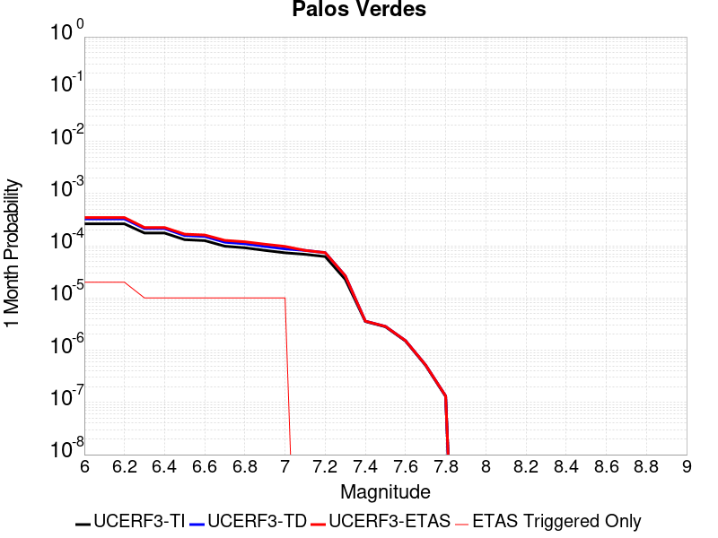 |  |  |

| Magnitude | 1 wk TI Prob | 1 wk TD Prob | 1 wk ETAS Prob | 1 wk ETAS/TD Gain | 1 wk ETAS Triggered Only | 1 mo TI Prob | 1 mo TD Prob | 1 mo ETAS Prob | 1 mo ETAS/TD Gain | 1 mo ETAS Triggered Only | 1 yr TI Prob | 1 yr TD Prob | 1 yr ETAS Prob | 1 yr ETAS/TD Gain | 1 yr ETAS Triggered Only | 10 yr TI Prob | 10 yr TD Prob | 10 yr ETAS Prob | 10 yr ETAS/TD Gain | 10 yr ETAS Triggered Only |
|-----|-----|-----|-----|-----|-----|-----|-----|-----|-----|-----|-----|-----|-----|-----|-----|-----|-----|-----|-----|-----|
| 6.0 | 6.126063E-5 | 7.622612E-5 | 9.810629E-5 | 1.287043 | 2.1881839E-5 | 2.6251914E-4 | 3.2664582E-4 | 3.485205E-4 | 1.0669676 | 2.1881839E-5 | 0.0031914865 | 0.003970174 | 0.0039919694 | 1.0054897 | 2.1881839E-5 | 0.031460393 | 0.039048895 | 0.03909095 | 1.0010769 | 4.3763677E-5 |
| 6.1 | 6.126063E-5 | 7.622612E-5 | 9.810629E-5 | 1.287043 | 2.1881839E-5 | 2.6251914E-4 | 3.2664582E-4 | 3.485205E-4 | 1.0669676 | 2.1881839E-5 | 0.0031914865 | 0.003970174 | 0.0039919694 | 1.0054897 | 2.1881839E-5 | 0.031460393 | 0.039048895 | 0.03909095 | 1.0010769 | 4.3763677E-5 |
| 6.2 | 6.126063E-5 | 7.622612E-5 | 9.810629E-5 | 1.287043 | 2.1881839E-5 | 2.6251914E-4 | 3.2664582E-4 | 3.485205E-4 | 1.0669676 | 2.1881839E-5 | 0.0031914865 | 0.003970174 | 0.0039919694 | 1.0054897 | 2.1881839E-5 | 0.031460393 | 0.039048895 | 0.03909095 | 1.0010769 | 4.3763677E-5 |
| 6.3 | 4.0838047E-5 | 4.9749437E-5 | 4.9749437E-5 | 1.0 | 0.0 | 1.7500846E-4 | 2.1319572E-4 | 2.1319572E-4 | 1.0 | 0.0 | 0.0021286458 | 0.0025927818 | 0.0025927818 | 1.0 | 0.0 | 0.021083709 | 0.025646681 | 0.025646681 | 1.0 | 0.0 |
| 6.4 | 4.0838047E-5 | 4.9749437E-5 | 4.9749437E-5 | 1.0 | 0.0 | 1.7500846E-4 | 2.1319572E-4 | 2.1319572E-4 | 1.0 | 0.0 | 0.0021286458 | 0.0025927818 | 0.0025927818 | 1.0 | 0.0 | 0.021083709 | 0.025646681 | 0.025646681 | 1.0 | 0.0 |
| 6.5 | 3.0512005E-5 | 3.656162E-5 | 3.656162E-5 | 1.0 | 0.0 | 1.3075917E-4 | 1.5668393E-4 | 1.5668393E-4 | 1.0 | 0.0 | 0.0015908304 | 0.0019060767 | 0.0019060767 | 1.0 | 0.0 | 0.015794903 | 0.018909154 | 0.018909154 | 1.0 | 0.0 |
| 6.6 | 2.9255087E-5 | 3.515442E-5 | 3.515442E-5 | 1.0 | 0.0 | 1.2537291E-4 | 1.5065377E-4 | 1.5065377E-4 | 1.0 | 0.0 | 0.0015253464 | 0.0018327828 | 0.0018327828 | 1.0 | 0.0 | 0.015149189 | 0.018188225 | 0.018188225 | 1.0 | 0.0 |
| 6.7 | 2.287198E-5 | 2.7248278E-5 | 2.7248278E-5 | 1.0 | 0.0 | 9.801909E-5 | 1.16773626E-4 | 1.16773626E-4 | 1.0 | 0.0 | 0.001192729 | 0.0014208833 | 0.0014208833 | 1.0 | 0.0 | 0.011863477 | 0.014127217 | 0.014127217 | 1.0 | 0.0 |
| 6.8 | 2.1325764E-5 | 2.5431877E-5 | 2.5431877E-5 | 1.0 | 0.0 | 9.139293E-5 | 1.0898971E-4 | 1.0898971E-4 | 1.0 | 0.0 | 0.001112141 | 0.0013262323 | 0.0013262323 | 1.0 | 0.0 | 0.011065915 | 0.013192211 | 0.013192211 | 1.0 | 0.0 |
| 6.9 | 1.9009392E-5 | 2.2613547E-5 | 2.2613547E-5 | 1.0 | 0.0 | 8.1466285E-5 | 9.6912096E-5 | 9.6912096E-5 | 1.0 | 0.0 | 9.914007E-4 | 0.0011793535 | 0.0011793535 | 1.0 | 0.0 | 0.009869894 | 0.011739632 | 0.011739632 | 1.0 | 0.0 |
| 7.0 | 1.7098473E-5 | 2.0319356E-5 | 2.0319356E-5 | 1.0 | 0.0 | 7.3277115E-5 | 8.708052E-5 | 8.708052E-5 | 1.0 | 0.0 | 8.917837E-4 | 0.001059775 | 0.001059775 | 1.0 | 0.0 | 0.008882134 | 0.010555646 | 0.010555646 | 1.0 | 0.0 |
| 7.1 | 1.5982785E-5 | 1.899476E-5 | 1.899476E-5 | 1.0 | 0.0 | 6.849585E-5 | 8.1404054E-5 | 8.1404054E-5 | 1.0 | 0.0 | 8.336179E-4 | 9.907284E-4 | 9.907284E-4 | 1.0 | 0.0 | 0.008304977 | 0.009871479 | 0.009871479 | 1.0 | 0.0 |
| 7.2 | 1.4468002E-5 | 1.7197237E-5 | 1.7197237E-5 | 1.0 | 0.0 | 6.200425E-5 | 7.370083E-5 | 7.370083E-5 | 1.0 | 0.0 | 7.546402E-4 | 8.970222E-4 | 8.970222E-4 | 1.0 | 0.0 | 0.007520827 | 0.008942284 | 0.008942284 | 1.0 | 0.0 |
| 7.3 | 5.288233E-6 | 6.2036747E-6 | 6.2036747E-6 | 1.0 | 0.0 | 2.2663658E-5 | 2.6587102E-5 | 2.6587102E-5 | 1.0 | 0.0 | 2.7589512E-4 | 3.236848E-4 | 3.236848E-4 | 1.0 | 0.0 | 0.0027555283 | 0.0032355562 | 0.0032355562 | 1.0 | 0.0 |
| 7.4 | 8.279556E-7 | 8.408347E-7 | 8.408347E-7 | 1.0 | 0.0 | 3.5483763E-6 | 3.6035726E-6 | 3.6035726E-6 | 1.0 | 0.0 | 4.3200624E-5 | 4.3872686E-5 | 4.3872686E-5 | 1.0 | 0.0 | 4.3192226E-4 | 4.3864746E-4 | 4.3864746E-4 | 1.0 | 0.0 |
| 7.5 | 6.559831E-7 | 6.667229E-7 | 6.667229E-7 | 1.0 | 0.0 | 2.8113532E-6 | 2.857381E-6 | 2.857381E-6 | 1.0 | 0.0 | 3.4227687E-5 | 3.4788125E-5 | 3.4788125E-5 | 1.0 | 0.0 | 3.4222414E-4 | 3.4783344E-4 | 3.4783344E-4 | 1.0 | 0.0 |
| 7.6 | 3.5018968E-7 | 3.5620027E-7 | 3.5620027E-7 | 1.0 | 0.0 | 1.500812E-6 | 1.526572E-6 | 1.526572E-6 | 1.0 | 0.0 | 1.8272232E-5 | 1.8585903E-5 | 1.8585903E-5 | 1.0 | 0.0 | 1.8270731E-4 | 1.8584808E-4 | 1.8584808E-4 | 1.0 | 0.0 |
| 7.7 | 1.1986104E-7 | 1.2198376E-7 | 1.2198376E-7 | 1.0 | 0.0 | 5.1369005E-7 | 5.2278745E-7 | 5.2278745E-7 | 1.0 | 0.0 | 6.2541585E-6 | 6.364919E-6 | 6.364919E-6 | 1.0 | 0.0 | 6.2539824E-5 | 6.364741E-5 | 6.364741E-5 | 1.0 | 0.0 |
| 7.8 | 3.0445005E-8 | 3.1027582E-8 | 3.1027582E-8 | 1.0 | 0.0 | 1.3047858E-7 | 1.3297536E-7 | 1.3297536E-7 | 1.0 | 0.0 | 1.5885756E-6 | 1.6189739E-6 | 1.6189739E-6 | 1.0 | 0.0 | 1.5885644E-5 | 1.6189642E-5 | 1.6189642E-5 | 1.0 | 0.0 |

## Santa Ynez (East)
*[(top)](#table-of-contents)*

| 1 Week | 1 Month | 1 Year | 10 Year |
|-----|-----|-----|-----|
| 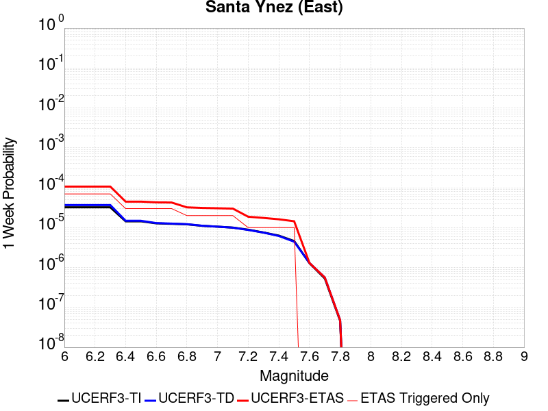 |  |  |  |

| Magnitude | 1 wk TI Prob | 1 wk TD Prob | 1 wk ETAS Prob | 1 wk ETAS/TD Gain | 1 wk ETAS Triggered Only | 1 mo TI Prob | 1 mo TD Prob | 1 mo ETAS Prob | 1 mo ETAS/TD Gain | 1 mo ETAS Triggered Only | 1 yr TI Prob | 1 yr TD Prob | 1 yr ETAS Prob | 1 yr ETAS/TD Gain | 1 yr ETAS Triggered Only | 10 yr TI Prob | 10 yr TD Prob | 10 yr ETAS Prob | 10 yr ETAS/TD Gain | 10 yr ETAS Triggered Only |
|-----|-----|-----|-----|-----|-----|-----|-----|-----|-----|-----|-----|-----|-----|-----|-----|-----|-----|-----|-----|-----|
| 6.0 | 3.2269712E-5 | 3.67505E-5 | 8.051257E-5 | 2.1907883 | 4.3763677E-5 | 1.3829143E-4 | 1.5749598E-4 | 2.0125275E-4 | 1.277828 | 4.3763677E-5 | 0.0016823979 | 0.0019164166 | 0.0019600964 | 1.0227925 | 4.3763677E-5 | 0.016697178 | 0.019056441 | 0.019099372 | 1.0022528 | 4.3763677E-5 |
| 6.1 | 3.2269712E-5 | 3.67505E-5 | 8.051257E-5 | 2.1907883 | 4.3763677E-5 | 1.3829143E-4 | 1.5749598E-4 | 2.0125275E-4 | 1.277828 | 4.3763677E-5 | 0.0016823979 | 0.0019164166 | 0.0019600964 | 1.0227925 | 4.3763677E-5 | 0.016697178 | 0.019056441 | 0.019099372 | 1.0022528 | 4.3763677E-5 |
| 6.2 | 3.2269712E-5 | 3.67505E-5 | 8.051257E-5 | 2.1907883 | 4.3763677E-5 | 1.3829143E-4 | 1.5749598E-4 | 2.0125275E-4 | 1.277828 | 4.3763677E-5 | 0.0016823979 | 0.0019164166 | 0.0019600964 | 1.0227925 | 4.3763677E-5 | 0.016697178 | 0.019056441 | 0.019099372 | 1.0022528 | 4.3763677E-5 |
| 6.3 | 3.2269712E-5 | 3.67505E-5 | 8.051257E-5 | 2.1907883 | 4.3763677E-5 | 1.3829143E-4 | 1.5749598E-4 | 2.0125275E-4 | 1.277828 | 4.3763677E-5 | 0.0016823979 | 0.0019164166 | 0.0019600964 | 1.0227925 | 4.3763677E-5 | 0.016697178 | 0.019056441 | 0.019099372 | 1.0022528 | 4.3763677E-5 |
| 6.4 | 1.4404779E-5 | 1.4849382E-5 | 3.6730897E-5 | 2.473564 | 2.1881839E-5 | 6.1733306E-5 | 6.363868E-5 | 8.551913E-5 | 1.3438231 | 2.1881839E-5 | 7.513438E-4 | 7.745306E-4 | 7.9639547E-4 | 1.0282298 | 2.1881839E-5 | 0.0074880854 | 0.007718862 | 0.007740575 | 1.002813 | 2.1881839E-5 |
| 6.5 | 1.4404779E-5 | 1.4849382E-5 | 3.6730897E-5 | 2.473564 | 2.1881839E-5 | 6.1733306E-5 | 6.363868E-5 | 8.551913E-5 | 1.3438231 | 2.1881839E-5 | 7.513438E-4 | 7.745306E-4 | 7.9639547E-4 | 1.0282298 | 2.1881839E-5 | 0.0074880854 | 0.007718862 | 0.007740575 | 1.002813 | 2.1881839E-5 |
| 6.6 | 1.280208E-5 | 1.3011947E-5 | 3.48935E-5 | 2.6816509 | 2.1881839E-5 | 5.4864904E-5 | 5.5764307E-5 | 7.764492E-5 | 1.3923768 | 2.1881839E-5 | 6.6777546E-4 | 6.787207E-4 | 7.005877E-4 | 1.032218 | 2.1881839E-5 | 0.006657724 | 0.0067666885 | 0.0067884224 | 1.0032119 | 2.1881839E-5 |
| 6.7 | 1.2457027E-5 | 1.2628468E-5 | 3.451003E-5 | 2.732717 | 2.1881839E-5 | 5.3386164E-5 | 5.412089E-5 | 7.600155E-5 | 1.4042922 | 2.1881839E-5 | 6.497827E-4 | 6.587243E-4 | 6.8059174E-4 | 1.0331966 | 2.1881839E-5 | 0.00647886 | 0.006567915 | 0.006589653 | 1.0033097 | 2.1881839E-5 |
| 6.8 | 1.2095134E-5 | 1.2230915E-5 | 1.2230915E-5 | 1.0 | 0.0 | 5.1835254E-5 | 5.241716E-5 | 5.241716E-5 | 1.0 | 0.0 | 6.309115E-4 | 6.379937E-4 | 6.379937E-4 | 1.0 | 0.0 | 0.0062912325 | 0.006361809 | 0.006361809 | 1.0 | 0.0 |
| 6.9 | 1.1104036E-5 | 1.1157347E-5 | 1.1157347E-5 | 1.0 | 0.0 | 4.758786E-5 | 4.781633E-5 | 4.781633E-5 | 1.0 | 0.0 | 5.7922816E-4 | 5.820096E-4 | 5.820096E-4 | 1.0 | 0.0 | 0.005777207 | 0.0058049993 | 0.0058049993 | 1.0 | 0.0 |
| 7.0 | 1.0577444E-5 | 1.058168E-5 | 1.058168E-5 | 1.0 | 0.0 | 4.5331115E-5 | 4.5349276E-5 | 4.5349276E-5 | 1.0 | 0.0 | 5.5176654E-4 | 5.519888E-4 | 5.519888E-4 | 1.0 | 0.0 | 0.0055039856 | 0.0055063153 | 0.0055063153 | 1.0 | 0.0 |
| 7.1 | 1.0021775E-5 | 9.980988E-6 | 9.980988E-6 | 1.0 | 0.0 | 4.294976E-5 | 4.2774966E-5 | 4.2774966E-5 | 1.0 | 0.0 | 5.2278786E-4 | 5.2066194E-4 | 5.2066194E-4 | 1.0 | 0.0 | 0.0052155964 | 0.0051945536 | 0.0051945536 | 1.0 | 0.0 |
| 7.2 | 8.874109E-6 | 8.748793E-6 | 8.748793E-6 | 1.0 | 0.0 | 3.8031343E-5 | 3.7494297E-5 | 3.7494297E-5 | 1.0 | 0.0 | 4.629332E-4 | 4.5639853E-4 | 4.5639853E-4 | 1.0 | 0.0 | 0.0046197 | 0.0045547304 | 0.0045547304 | 1.0 | 0.0 |
| 7.3 | 7.5504267E-6 | 7.5051175E-6 | 7.5051175E-6 | 1.0 | 0.0 | 3.235857E-5 | 3.21644E-5 | 3.21644E-5 | 1.0 | 0.0 | 3.9389438E-4 | 3.915322E-4 | 3.915322E-4 | 1.0 | 0.0 | 0.0039319694 | 0.003908531 | 0.003908531 | 1.0 | 0.0 |
| 7.4 | 6.309394E-6 | 6.1831556E-6 | 6.1831556E-6 | 1.0 | 0.0 | 2.703998E-5 | 2.6498974E-5 | 2.6498974E-5 | 1.0 | 0.0 | 3.2916202E-4 | 3.225782E-4 | 3.225782E-4 | 1.0 | 0.0 | 0.003286749 | 0.003221197 | 0.003221197 | 1.0 | 0.0 |
| 7.5 | 4.6103073E-6 | 4.4408903E-6 | 4.4408903E-6 | 1.0 | 0.0 | 1.975831E-5 | 1.9032252E-5 | 1.9032252E-5 | 1.0 | 0.0 | 2.4053088E-4 | 2.3169373E-4 | 2.3169373E-4 | 1.0 | 0.0 | 0.002402707 | 0.002314591 | 0.002314591 | 1.0 | 0.0 |
| 7.6 | 1.2858658E-6 | 1.3008173E-6 | 1.3008173E-6 | 1.0 | 0.0 | 5.5108417E-6 | 5.5749197E-6 | 5.5749197E-6 | 1.0 | 0.0 | 6.7092435E-5 | 6.78726E-5 | 6.78726E-5 | 1.0 | 0.0 | 6.707218E-4 | 6.785256E-4 | 6.785256E-4 | 1.0 | 0.0 |
| 7.7 | 5.3302307E-7 | 5.612138E-7 | 5.612138E-7 | 1.0 | 0.0 | 2.2843826E-6 | 2.4052001E-6 | 2.4052001E-6 | 1.0 | 0.0 | 2.7812002E-5 | 2.9282954E-5 | 2.9282954E-5 | 1.0 | 0.0 | 2.7808524E-4 | 2.9279452E-4 | 2.9279452E-4 | 1.0 | 0.0 |
| 7.8 | 4.613933E-8 | 4.80301E-8 | 4.80301E-8 | 1.0 | 0.0 | 1.9773998E-7 | 2.0584326E-7 | 2.0584326E-7 | 1.0 | 0.0 | 2.4074816E-6 | 2.5061388E-6 | 2.5061388E-6 | 1.0 | 0.0 | 2.4074554E-5 | 2.5061116E-5 | 2.5061116E-5 | 1.0 | 0.0 |

## San Jacinto (Clark) rev
*[(top)](#table-of-contents)*

| 1 Week | 1 Month | 1 Year | 10 Year |
|-----|-----|-----|-----|
|  |  | 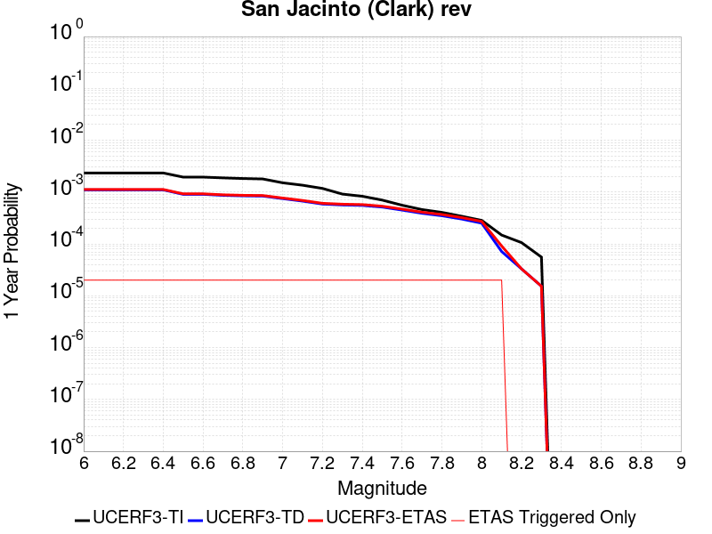 |  |

| Magnitude | 1 wk TI Prob | 1 wk TD Prob | 1 wk ETAS Prob | 1 wk ETAS/TD Gain | 1 wk ETAS Triggered Only | 1 mo TI Prob | 1 mo TD Prob | 1 mo ETAS Prob | 1 mo ETAS/TD Gain | 1 mo ETAS Triggered Only | 1 yr TI Prob | 1 yr TD Prob | 1 yr ETAS Prob | 1 yr ETAS/TD Gain | 1 yr ETAS Triggered Only | 10 yr TI Prob | 10 yr TD Prob | 10 yr ETAS Prob | 10 yr ETAS/TD Gain | 10 yr ETAS Triggered Only |
|-----|-----|-----|-----|-----|-----|-----|-----|-----|-----|-----|-----|-----|-----|-----|-----|-----|-----|-----|-----|-----|
| 6.0 | 4.482615E-5 | 2.1154196E-5 | 6.4916945E-5 | 3.0687504 | 4.3763677E-5 | 1.9209793E-4 | 9.065773E-5 | 1.3441744E-4 | 1.4826914 | 4.3763677E-5 | 0.0023362834 | 0.0011032083 | 0.0011469236 | 1.0396256 | 4.3763677E-5 | 0.02311874 | 0.011503847 | 0.011547107 | 1.0037605 | 4.3763677E-5 |
| 6.1 | 4.482615E-5 | 2.1154196E-5 | 6.4916945E-5 | 3.0687504 | 4.3763677E-5 | 1.9209793E-4 | 9.065773E-5 | 1.3441744E-4 | 1.4826914 | 4.3763677E-5 | 0.0023362834 | 0.0011032083 | 0.0011469236 | 1.0396256 | 4.3763677E-5 | 0.02311874 | 0.011503847 | 0.011547107 | 1.0037605 | 4.3763677E-5 |
| 6.2 | 4.482615E-5 | 2.1154196E-5 | 6.4916945E-5 | 3.0687504 | 4.3763677E-5 | 1.9209793E-4 | 9.065773E-5 | 1.3441744E-4 | 1.4826914 | 4.3763677E-5 | 0.0023362834 | 0.0011032083 | 0.0011469236 | 1.0396256 | 4.3763677E-5 | 0.02311874 | 0.011503847 | 0.011547107 | 1.0037605 | 4.3763677E-5 |
| 6.3 | 4.482615E-5 | 2.1154196E-5 | 6.4916945E-5 | 3.0687504 | 4.3763677E-5 | 1.9209793E-4 | 9.065773E-5 | 1.3441744E-4 | 1.4826914 | 4.3763677E-5 | 0.0023362834 | 0.0011032083 | 0.0011469236 | 1.0396256 | 4.3763677E-5 | 0.02311874 | 0.011503847 | 0.011547107 | 1.0037605 | 4.3763677E-5 |
| 6.4 | 4.482615E-5 | 2.1154196E-5 | 6.4916945E-5 | 3.0687504 | 4.3763677E-5 | 1.9209793E-4 | 9.065773E-5 | 1.3441744E-4 | 1.4826914 | 4.3763677E-5 | 0.0023362834 | 0.0011032083 | 0.0011469236 | 1.0396256 | 4.3763677E-5 | 0.02311874 | 0.011503847 | 0.011547107 | 1.0037605 | 4.3763677E-5 |
| 6.5 | 3.7294863E-5 | 1.7356087E-5 | 6.1119004E-5 | 3.5214736 | 4.3763677E-5 | 1.5982533E-4 | 7.438113E-5 | 1.1814156E-4 | 1.5883269 | 4.3763677E-5 | 0.0019441366 | 9.052186E-4 | 9.489426E-4 | 1.0483022 | 4.3763677E-5 | 0.01927216 | 0.0094941035 | 0.009537451 | 1.0045658 | 4.3763677E-5 |
| 6.6 | 3.7294863E-5 | 1.7356087E-5 | 6.1119004E-5 | 3.5214736 | 4.3763677E-5 | 1.5982533E-4 | 7.438113E-5 | 1.1814156E-4 | 1.5883269 | 4.3763677E-5 | 0.0019441366 | 9.052186E-4 | 9.489426E-4 | 1.0483022 | 4.3763677E-5 | 0.01927216 | 0.0094941035 | 0.009537451 | 1.0045658 | 4.3763677E-5 |
| 6.7 | 3.6039248E-5 | 1.6604314E-5 | 6.0367263E-5 | 3.6356375 | 4.3763677E-5 | 1.5444479E-4 | 7.1159426E-5 | 1.1491999E-4 | 1.6149651 | 4.3763677E-5 | 0.0018787434 | 8.6602574E-4 | 9.097515E-4 | 1.0504901 | 4.3763677E-5 | 0.01862939 | 0.009096047 | 0.009139412 | 1.0047675 | 4.3763677E-5 |
| 6.8 | 3.5031844E-5 | 1.6232942E-5 | 5.9995906E-5 | 3.6959357 | 4.3763677E-5 | 1.5012783E-4 | 6.956792E-5 | 1.1332855E-4 | 1.6290346 | 4.3763677E-5 | 0.0018262739 | 8.4666436E-4 | 8.9039095E-4 | 1.0516458 | 4.3763677E-5 | 0.01811338 | 0.008895969 | 0.0089393435 | 1.0048758 | 4.3763677E-5 |
| 6.9 | 3.435112E-5 | 1.6063195E-5 | 5.982617E-5 | 3.7244253 | 4.3763677E-5 | 1.4721078E-4 | 6.884047E-5 | 1.12601134E-4 | 1.6356822 | 4.3763677E-5 | 0.0017908178 | 8.3781447E-4 | 8.815415E-4 | 1.0521917 | 4.3763677E-5 | 0.017764548 | 0.008804181 | 0.008847559 | 1.004927 | 4.3763677E-5 |
| 7.0 | 2.8959772E-5 | 1.4336745E-5 | 5.8099795E-5 | 4.0525093 | 4.3763677E-5 | 1.241074E-4 | 6.144176E-5 | 1.0520275E-4 | 1.7122352 | 4.3763677E-5 | 0.0015099603 | 7.477995E-4 | 7.915305E-4 | 1.0584795 | 4.3763677E-5 | 0.014997416 | 0.007868037 | 0.007911456 | 1.0055184 | 4.3763677E-5 |
| 7.1 | 2.6002877E-5 | 1.2829002E-5 | 5.659212E-5 | 4.4112644 | 4.3763677E-5 | 1.11436144E-4 | 5.498029E-5 | 9.874156E-5 | 1.7959447 | 4.3763677E-5 | 0.0013558907 | 6.691816E-4 | 7.1291596E-4 | 1.0653551 | 4.3763677E-5 | 0.013476475 | 0.0070465137 | 0.0070899692 | 1.0061669 | 4.3763677E-5 |
| 7.2 | 2.2544838E-5 | 1.1262543E-5 | 5.502573E-5 | 4.8857284 | 4.3763677E-5 | 9.661716E-5 | 4.8267157E-5 | 9.202872E-5 | 1.906653 | 4.3763677E-5 | 0.001175679 | 5.874956E-4 | 6.312336E-4 | 1.0744481 | 4.3763677E-5 | 0.011694785 | 0.0061927503 | 0.0062362426 | 1.0070232 | 4.3763677E-5 |
| 7.3 | 1.75334E-5 | 1.0811715E-5 | 5.4574917E-5 | 5.047758 | 4.3763677E-5 | 7.514098E-5 | 4.6335106E-5 | 9.009675E-5 | 1.9444599 | 4.3763677E-5 | 9.144575E-4 | 5.6398526E-4 | 6.0772424E-4 | 1.0775534 | 4.3763677E-5 | 0.009107036 | 0.0059337732 | 0.0059772776 | 1.0073316 | 4.3763677E-5 |
| 7.4 | 1.5924552E-5 | 1.0611516E-5 | 5.4374726E-5 | 5.1241245 | 4.3763677E-5 | 6.82463E-5 | 4.547714E-5 | 8.923883E-5 | 1.9622787 | 4.3763677E-5 | 8.305819E-4 | 5.535449E-4 | 5.9728435E-4 | 1.079017 | 4.3763677E-5 | 0.008274844 | 0.0058210334 | 0.0058645424 | 1.0074744 | 4.3763677E-5 |
| 7.5 | 1.3428931E-5 | 9.8519E-6 | 5.3615146E-5 | 5.442112 | 4.3763677E-5 | 5.7551293E-5 | 4.2221753E-5 | 8.598358E-5 | 2.036476 | 4.3763677E-5 | 7.004617E-4 | 5.1392964E-4 | 5.5767084E-4 | 1.0851113 | 4.3763677E-5 | 0.006982579 | 0.0054066023 | 0.0054501295 | 1.0080507 | 4.3763677E-5 |
| 7.6 | 1.0688787E-5 | 8.614839E-6 | 5.237814E-5 | 6.07999 | 4.3763677E-5 | 4.5808283E-5 | 3.692022E-5 | 8.068228E-5 | 2.1853142 | 4.3763677E-5 | 5.5757316E-4 | 4.4941145E-4 | 4.9315544E-4 | 1.0973362 | 4.3763677E-5 | 0.005561762 | 0.0047416524 | 0.0047852085 | 1.0091859 | 4.3763677E-5 |
| 7.7 | 8.81236E-6 | 7.4680274E-6 | 5.1231378E-5 | 6.8600945 | 4.3763677E-5 | 3.776671E-5 | 3.2005442E-5 | 7.576772E-5 | 2.3673387 | 4.3763677E-5 | 4.597127E-4 | 3.8959677E-4 | 4.333434E-4 | 1.1122869 | 4.3763677E-5 | 0.0045876284 | 0.0041346536 | 0.0041782362 | 1.0105408 | 4.3763677E-5 |
| 7.8 | 7.780431E-6 | 6.696579E-6 | 5.0459963E-5 | 7.535185 | 4.3763677E-5 | 3.3344273E-5 | 2.8699309E-5 | 7.246173E-5 | 2.5248597 | 4.3763677E-5 | 4.0589093E-4 | 3.4935825E-4 | 3.9310663E-4 | 1.125225 | 4.3763677E-5 | 0.0040515037 | 0.0037227906 | 0.0037663914 | 1.0117118 | 4.3763677E-5 |
| 7.9 | 6.5437994E-6 | 5.780382E-6 | 4.9543803E-5 | 8.571027 | 4.3763677E-5 | 2.8044553E-5 | 2.477283E-5 | 6.8535424E-5 | 2.766556 | 4.3763677E-5 | 3.4138895E-4 | 3.0156763E-4 | 3.453181E-4 | 1.1450769 | 4.3763677E-5 | 0.0034086495 | 0.0032344845 | 0.0032781067 | 1.0134866 | 4.3763677E-5 |
| 8.0 | 5.4488164E-6 | 4.8133406E-6 | 4.8576807E-5 | 10.092119 | 4.3763677E-5 | 2.3351862E-5 | 2.062844E-5 | 6.439121E-5 | 3.1214776 | 4.3763677E-5 | 2.8427184E-4 | 2.5112246E-4 | 2.9487515E-4 | 1.1742284 | 4.3763677E-5 | 0.0028390845 | 0.002710839 | 0.002754484 | 1.0161002 | 4.3763677E-5 |
| 8.1 | 2.8397242E-6 | 1.3670389E-6 | 4.5130655E-5 | 33.01344 | 4.3763677E-5 | 1.217019E-5 | 5.858725E-6 | 4.9622144E-5 | 8.469786 | 4.3763677E-5 | 1.4816198E-4 | 7.132765E-5 | 1.1508821E-4 | 1.6135145 | 4.3763677E-5 | 0.0014806325 | 8.115382E-4 | 8.5526635E-4 | 1.0538831 | 4.3763677E-5 |
| 8.2 | 2.030244E-6 | 6.318974E-7 | 6.318974E-7 | 1.0 | 0.0 | 8.701017E-6 | 2.708129E-6 | 2.708129E-6 | 1.0 | 0.0 | 1.05929736E-4 | 3.2970976E-5 | 3.2970976E-5 | 1.0 | 0.0 | 0.0010587925 | 3.9486602E-4 | 3.9486602E-4 | 1.0 | 0.0 |
| 8.3 | 1.0659804E-6 | 2.9250086E-7 | 2.9250086E-7 | 1.0 | 0.0 | 4.568479E-6 | 1.2535745E-6 | 1.2535745E-6 | 1.0 | 0.0 | 5.5619817E-5 | 1.5262167E-5 | 1.5262167E-5 | 1.0 | 0.0 | 5.5605895E-4 | 1.8566217E-4 | 1.8566217E-4 | 1.0 | 0.0 |

## Elysian Park (Upper)
*[(top)](#table-of-contents)*

| 1 Week | 1 Month | 1 Year | 10 Year |
|-----|-----|-----|-----|
| 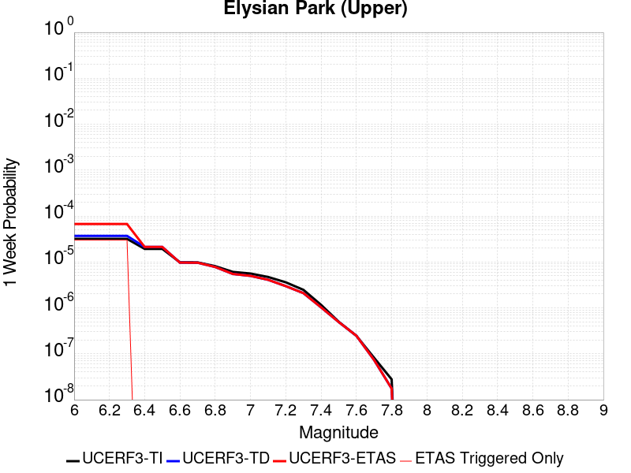 |  |  |  |

| Magnitude | 1 wk TI Prob | 1 wk TD Prob | 1 wk ETAS Prob | 1 wk ETAS/TD Gain | 1 wk ETAS Triggered Only | 1 mo TI Prob | 1 mo TD Prob | 1 mo ETAS Prob | 1 mo ETAS/TD Gain | 1 mo ETAS Triggered Only | 1 yr TI Prob | 1 yr TD Prob | 1 yr ETAS Prob | 1 yr ETAS/TD Gain | 1 yr ETAS Triggered Only | 10 yr TI Prob | 10 yr TD Prob | 10 yr ETAS Prob | 10 yr ETAS/TD Gain | 10 yr ETAS Triggered Only |
|-----|-----|-----|-----|-----|-----|-----|-----|-----|-----|-----|-----|-----|-----|-----|-----|-----|-----|-----|-----|-----|
| 6.0 | 3.1876025E-5 | 3.7035516E-5 | 5.8916543E-5 | 1.5908121 | 2.1881839E-5 | 1.3660437E-4 | 1.587167E-4 | 1.8059507E-4 | 1.1378454 | 2.1881839E-5 | 0.0016618895 | 0.0019311075 | 0.001952947 | 1.0113094 | 2.1881839E-5 | 0.016495159 | 0.019189782 | 0.019232707 | 1.0022368 | 4.3763677E-5 |
| 6.1 | 3.1876025E-5 | 3.7035516E-5 | 5.8916543E-5 | 1.5908121 | 2.1881839E-5 | 1.3660437E-4 | 1.587167E-4 | 1.8059507E-4 | 1.1378454 | 2.1881839E-5 | 0.0016618895 | 0.0019311075 | 0.001952947 | 1.0113094 | 2.1881839E-5 | 0.016495159 | 0.019189782 | 0.019232707 | 1.0022368 | 4.3763677E-5 |
| 6.2 | 3.1876025E-5 | 3.7035516E-5 | 5.8916543E-5 | 1.5908121 | 2.1881839E-5 | 1.3660437E-4 | 1.587167E-4 | 1.8059507E-4 | 1.1378454 | 2.1881839E-5 | 0.0016618895 | 0.0019311075 | 0.001952947 | 1.0113094 | 2.1881839E-5 | 0.016495159 | 0.019189782 | 0.019232707 | 1.0022368 | 4.3763677E-5 |
| 6.3 | 3.1876025E-5 | 3.7035516E-5 | 5.8916543E-5 | 1.5908121 | 2.1881839E-5 | 1.3660437E-4 | 1.587167E-4 | 1.8059507E-4 | 1.1378454 | 2.1881839E-5 | 0.0016618895 | 0.0019311075 | 0.001952947 | 1.0113094 | 2.1881839E-5 | 0.016495159 | 0.019189782 | 0.019232707 | 1.0022368 | 4.3763677E-5 |
| 6.4 | 1.9273462E-5 | 2.1202266E-5 | 2.1202266E-5 | 1.0 | 0.0 | 8.259794E-5 | 9.086466E-5 | 9.086466E-5 | 1.0 | 0.0 | 0.001005166 | 0.0011058892 | 0.0011058892 | 1.0 | 0.0 | 0.010006315 | 0.011020724 | 0.011042364 | 1.0019636 | 2.1881839E-5 |
| 6.5 | 1.9273462E-5 | 2.1202266E-5 | 2.1202266E-5 | 1.0 | 0.0 | 8.259794E-5 | 9.086466E-5 | 9.086466E-5 | 1.0 | 0.0 | 0.001005166 | 0.0011058892 | 0.0011058892 | 1.0 | 0.0 | 0.010006315 | 0.011020724 | 0.011042364 | 1.0019636 | 2.1881839E-5 |
| 6.6 | 9.813258E-6 | 9.665599E-6 | 9.665599E-6 | 1.0 | 0.0 | 4.205614E-5 | 4.1423376E-5 | 4.1423376E-5 | 1.0 | 0.0 | 5.119132E-4 | 5.0422014E-4 | 5.0422014E-4 | 1.0 | 0.0 | 0.005107356 | 0.0050314846 | 0.0050314846 | 1.0 | 0.0 |
| 6.7 | 9.801478E-6 | 9.653168E-6 | 9.653168E-6 | 1.0 | 0.0 | 4.2005657E-5 | 4.1370105E-5 | 4.1370105E-5 | 1.0 | 0.0 | 5.112989E-4 | 5.035719E-4 | 5.035719E-4 | 1.0 | 0.0 | 0.0051012407 | 0.0050250315 | 0.0050250315 | 1.0 | 0.0 |
| 6.8 | 8.102489E-6 | 7.773004E-6 | 7.773004E-6 | 1.0 | 0.0 | 3.4724493E-5 | 3.3312477E-5 | 3.3312477E-5 | 1.0 | 0.0 | 4.2268867E-4 | 4.055089E-4 | 4.055089E-4 | 1.0 | 0.0 | 0.004218856 | 0.0040481836 | 0.0040481836 | 1.0 | 0.0 |
| 6.9 | 6.08275E-6 | 5.4814514E-6 | 5.4814514E-6 | 1.0 | 0.0 | 2.6068668E-5 | 2.3491726E-5 | 2.3491726E-5 | 1.0 | 0.0 | 3.173398E-4 | 2.85975E-4 | 2.85975E-4 | 1.0 | 0.0 | 0.0031688702 | 0.0028561477 | 0.0028561477 | 1.0 | 0.0 |
| 7.0 | 5.5995934E-6 | 4.98278E-6 | 4.98278E-6 | 1.0 | 0.0 | 2.3998036E-5 | 2.13546E-5 | 2.13546E-5 | 1.0 | 0.0 | 2.9213692E-4 | 2.599619E-4 | 2.599619E-4 | 1.0 | 0.0 | 0.0029175316 | 0.0025966454 | 0.0025966454 | 1.0 | 0.0 |
| 7.1 | 4.709881E-6 | 4.0874015E-6 | 4.0874015E-6 | 1.0 | 0.0 | 2.0185047E-5 | 1.7517319E-5 | 1.7517319E-5 | 1.0 | 0.0 | 2.4572524E-4 | 2.132529E-4 | 2.132529E-4 | 1.0 | 0.0 | 0.002454537 | 0.002130524 | 0.002130524 | 1.0 | 0.0 |
| 7.2 | 3.6063436E-6 | 2.9779544E-6 | 2.9779544E-6 | 1.0 | 0.0 | 1.5455667E-5 | 1.27626E-5 | 1.27626E-5 | 1.0 | 0.0 | 1.881565E-4 | 1.5537368E-4 | 1.5537368E-4 | 1.0 | 0.0 | 0.0018799726 | 0.0015526618 | 0.0015526618 | 1.0 | 0.0 |
| 7.3 | 2.471135E-6 | 2.0954615E-6 | 2.0954615E-6 | 1.0 | 0.0 | 1.0590536E-5 | 8.980519E-6 | 8.980519E-6 | 1.0 | 0.0 | 1.2893214E-4 | 1.093324E-4 | 1.093324E-4 | 1.0 | 0.0 | 0.0012885736 | 0.0010927934 | 0.0010927934 | 1.0 | 0.0 |
| 7.4 | 1.163943E-6 | 1.0275091E-6 | 1.0275091E-6 | 1.0 | 0.0 | 4.988318E-6 | 4.4036033E-6 | 4.4036033E-6 | 1.0 | 0.0 | 6.0731076E-5 | 5.3612584E-5 | 5.3612584E-5 | 1.0 | 0.0 | 6.071448E-4 | 5.359995E-4 | 5.359995E-4 | 1.0 | 0.0 |
| 7.5 | 4.99459E-7 | 4.917604E-7 | 4.917604E-7 | 1.0 | 0.0 | 2.140537E-6 | 2.1075427E-6 | 2.1075427E-6 | 1.0 | 0.0 | 2.6060725E-5 | 2.5659048E-5 | 2.5659048E-5 | 1.0 | 0.0 | 2.605767E-4 | 2.5656243E-4 | 2.5656243E-4 | 1.0 | 0.0 |
| 7.6 | 2.4667852E-7 | 2.4778336E-7 | 2.4778336E-7 | 1.0 | 0.0 | 1.0571932E-6 | 1.0619283E-6 | 1.0619283E-6 | 1.0 | 0.0 | 1.2871251E-5 | 1.2928905E-5 | 1.2928905E-5 | 1.0 | 0.0 | 1.2870505E-4 | 1.2928189E-4 | 1.2928189E-4 | 1.0 | 0.0 |
| 7.7 | 8.2312795E-8 | 7.3864456E-8 | 7.3864456E-8 | 1.0 | 0.0 | 3.527691E-7 | 3.165619E-7 | 3.165619E-7 | 1.0 | 0.0 | 4.294955E-6 | 3.8541357E-6 | 3.8541357E-6 | 1.0 | 0.0 | 4.2948723E-5 | 3.8540802E-5 | 3.8540802E-5 | 1.0 | 0.0 |
| 7.8 | 2.7819295E-8 | 1.7566023E-8 | 1.7566023E-8 | 1.0 | 0.0 | 1.1922555E-7 | 7.5282955E-8 | 7.5282955E-8 | 1.0 | 0.0 | 1.45157E-6 | 9.165697E-7 | 9.165697E-7 | 1.0 | 0.0 | 1.45156055E-5 | 9.165675E-6 | 9.165675E-6 | 1.0 | 0.0 |

## Santa Cruz Catalina Ridge alt1
*[(top)](#table-of-contents)*

| 1 Week | 1 Month | 1 Year | 10 Year |
|-----|-----|-----|-----|
|  |  |  |  |

| Magnitude | 1 wk TI Prob | 1 wk TD Prob | 1 wk ETAS Prob | 1 wk ETAS/TD Gain | 1 wk ETAS Triggered Only | 1 mo TI Prob | 1 mo TD Prob | 1 mo ETAS Prob | 1 mo ETAS/TD Gain | 1 mo ETAS Triggered Only | 1 yr TI Prob | 1 yr TD Prob | 1 yr ETAS Prob | 1 yr ETAS/TD Gain | 1 yr ETAS Triggered Only | 10 yr TI Prob | 10 yr TD Prob | 10 yr ETAS Prob | 10 yr ETAS/TD Gain | 10 yr ETAS Triggered Only |
|-----|-----|-----|-----|-----|-----|-----|-----|-----|-----|-----|-----|-----|-----|-----|-----|-----|-----|-----|-----|-----|
| 6.0 | 3.2833184E-5 | 3.65584E-5 | 3.65584E-5 | 1.0 | 0.0 | 1.4070606E-4 | 1.5667039E-4 | 1.5667039E-4 | 1.0 | 0.0 | 0.00171175 | 0.0019059596 | 0.0019059596 | 1.0 | 0.0 | 0.016986247 | 0.018913029 | 0.018934498 | 1.0011351 | 2.1881839E-5 |
| 6.1 | 1.9835548E-5 | 2.1659505E-5 | 2.1659505E-5 | 1.0 | 0.0 | 8.500672E-5 | 9.282326E-5 | 9.282326E-5 | 1.0 | 0.0 | 0.0010344655 | 0.0011295575 | 0.0011295575 | 1.0 | 0.0 | 0.010296632 | 0.011240295 | 0.011240295 | 1.0 | 0.0 |
| 6.2 | 1.9835548E-5 | 2.1659505E-5 | 2.1659505E-5 | 1.0 | 0.0 | 8.500672E-5 | 9.282326E-5 | 9.282326E-5 | 1.0 | 0.0 | 0.0010344655 | 0.0011295575 | 0.0011295575 | 1.0 | 0.0 | 0.010296632 | 0.011240295 | 0.011240295 | 1.0 | 0.0 |
| 6.3 | 1.5728183E-5 | 1.703395E-5 | 1.703395E-5 | 1.0 | 0.0 | 6.7404755E-5 | 7.300063E-5 | 7.300063E-5 | 1.0 | 0.0 | 8.2034385E-4 | 8.884264E-4 | 8.884264E-4 | 1.0 | 0.0 | 0.008173222 | 0.008849427 | 0.008849427 | 1.0 | 0.0 |
| 6.4 | 1.5728183E-5 | 1.703395E-5 | 1.703395E-5 | 1.0 | 0.0 | 6.7404755E-5 | 7.300063E-5 | 7.300063E-5 | 1.0 | 0.0 | 8.2034385E-4 | 8.884264E-4 | 8.884264E-4 | 1.0 | 0.0 | 0.008173222 | 0.008849427 | 0.008849427 | 1.0 | 0.0 |
| 6.5 | 1.3707734E-5 | 1.4794522E-5 | 1.4794522E-5 | 1.0 | 0.0 | 5.8746107E-5 | 6.3403575E-5 | 6.3403575E-5 | 1.0 | 0.0 | 7.1499916E-4 | 7.716686E-4 | 7.716686E-4 | 1.0 | 0.0 | 0.0071270303 | 0.0076902895 | 0.0076902895 | 1.0 | 0.0 |
| 6.6 | 1.2539813E-5 | 1.3510219E-5 | 1.3510219E-5 | 1.0 | 0.0 | 5.3740947E-5 | 5.789967E-5 | 5.789967E-5 | 1.0 | 0.0 | 6.540996E-4 | 7.0470315E-4 | 7.0470315E-4 | 1.0 | 0.0 | 0.0065217763 | 0.0070249885 | 0.0070249885 | 1.0 | 0.0 |
| 6.7 | 1.1504083E-5 | 1.2377375E-5 | 1.2377375E-5 | 1.0 | 0.0 | 4.930228E-5 | 5.3044827E-5 | 5.3044827E-5 | 1.0 | 0.0 | 6.0008996E-4 | 6.456314E-4 | 6.456314E-4 | 1.0 | 0.0 | 0.005984721 | 0.006437786 | 0.006437786 | 1.0 | 0.0 |
| 6.8 | 1.012739E-5 | 1.0877071E-5 | 1.0877071E-5 | 1.0 | 0.0 | 4.340238E-5 | 4.6615194E-5 | 4.6615194E-5 | 1.0 | 0.0 | 5.282958E-4 | 5.673937E-4 | 5.673937E-4 | 1.0 | 0.0 | 0.0052704164 | 0.0056596193 | 0.0056596193 | 1.0 | 0.0 |
| 6.9 | 8.9607865E-6 | 9.609117E-6 | 9.609117E-6 | 1.0 | 0.0 | 3.8402806E-5 | 4.1181287E-5 | 4.1181287E-5 | 1.0 | 0.0 | 4.6745385E-4 | 5.012679E-4 | 5.012679E-4 | 1.0 | 0.0 | 0.0046647177 | 0.005001492 | 0.005001492 | 1.0 | 0.0 |
| 7.0 | 8.046829E-6 | 8.619746E-6 | 8.619746E-6 | 1.0 | 0.0 | 3.4485955E-5 | 3.694125E-5 | 3.694125E-5 | 1.0 | 0.0 | 4.1978562E-4 | 4.496677E-4 | 4.496677E-4 | 1.0 | 0.0 | 0.004189935 | 0.0044876686 | 0.0044876686 | 1.0 | 0.0 |
| 7.1 | 7.136131E-6 | 7.637656E-6 | 7.637656E-6 | 1.0 | 0.0 | 3.0583058E-5 | 3.2732405E-5 | 3.2732405E-5 | 1.0 | 0.0 | 3.7228514E-4 | 3.9844486E-4 | 3.9844486E-4 | 1.0 | 0.0 | 0.0037166206 | 0.003977381 | 0.003977381 | 1.0 | 0.0 |
| 7.2 | 6.362014E-6 | 6.8049585E-6 | 6.8049585E-6 | 1.0 | 0.0 | 2.726549E-5 | 2.9163786E-5 | 2.9163786E-5 | 1.0 | 0.0 | 3.3190678E-4 | 3.550119E-4 | 3.550119E-4 | 1.0 | 0.0 | 0.0033141149 | 0.003544516 | 0.003544516 | 1.0 | 0.0 |
| 7.3 | 5.004101E-6 | 5.351715E-6 | 5.351715E-6 | 1.0 | 0.0 | 2.1445969E-5 | 2.2935723E-5 | 2.2935723E-5 | 1.0 | 0.0 | 2.6107338E-4 | 2.792072E-4 | 2.792072E-4 | 1.0 | 0.0 | 0.002607669 | 0.0027886187 | 0.0027886187 | 1.0 | 0.0 |
| 7.4 | 3.4901443E-6 | 3.7320526E-6 | 3.7320526E-6 | 1.0 | 0.0 | 1.4957676E-5 | 1.5994416E-5 | 1.5994416E-5 | 1.0 | 0.0 | 1.8209449E-4 | 1.9471499E-4 | 1.9471499E-4 | 1.0 | 0.0 | 0.0018194534 | 0.0019454823 | 0.0019454823 | 1.0 | 0.0 |
| 7.5 | 1.1215045E-6 | 1.189387E-6 | 1.189387E-6 | 1.0 | 0.0 | 4.806439E-6 | 5.097363E-6 | 5.097363E-6 | 1.0 | 0.0 | 5.851682E-5 | 6.205866E-5 | 6.205866E-5 | 1.0 | 0.0 | 5.850142E-4 | 6.2041637E-4 | 6.2041637E-4 | 1.0 | 0.0 |
| 7.6 | 2.8599047E-7 | 2.9951994E-7 | 2.9951994E-7 | 1.0 | 0.0 | 1.2256729E-6 | 1.2836562E-6 | 1.2836562E-6 | 1.0 | 0.0 | 1.4922465E-5 | 1.5628404E-5 | 1.5628404E-5 | 1.0 | 0.0 | 1.4921463E-4 | 1.5627318E-4 | 1.5627318E-4 | 1.0 | 0.0 |
| 7.7 | 2.0781519E-7 | 2.1744323E-7 | 2.1744323E-7 | 1.0 | 0.0 | 8.906362E-7 | 9.3189925E-7 | 9.3189925E-7 | 1.0 | 0.0 | 1.08434415E-5 | 1.13458145E-5 | 1.13458145E-5 | 1.0 | 0.0 | 1.0842913E-4 | 1.1345245E-4 | 1.1345245E-4 | 1.0 | 0.0 |
| 7.8 | 3.614776E-8 | 3.764102E-8 | 3.764102E-8 | 1.0 | 0.0 | 1.5491896E-7 | 1.6131864E-7 | 1.6131864E-7 | 1.0 | 0.0 | 1.8861368E-6 | 1.9640527E-6 | 1.9640527E-6 | 1.0 | 0.0 | 1.8861208E-5 | 1.9640367E-5 | 1.9640367E-5 | 1.0 | 0.0 |

## Hunting Creek - Berryessa 2011 CFM
*[(top)](#table-of-contents)*

| 1 Week | 1 Month | 1 Year | 10 Year |
|-----|-----|-----|-----|
|  |  |  |  |

| Magnitude | 1 wk TI Prob | 1 wk TD Prob | 1 wk ETAS Prob | 1 wk ETAS/TD Gain | 1 wk ETAS Triggered Only | 1 mo TI Prob | 1 mo TD Prob | 1 mo ETAS Prob | 1 mo ETAS/TD Gain | 1 mo ETAS Triggered Only | 1 yr TI Prob | 1 yr TD Prob | 1 yr ETAS Prob | 1 yr ETAS/TD Gain | 1 yr ETAS Triggered Only | 10 yr TI Prob | 10 yr TD Prob | 10 yr ETAS Prob | 10 yr ETAS/TD Gain | 10 yr ETAS Triggered Only |
|-----|-----|-----|-----|-----|-----|-----|-----|-----|-----|-----|-----|-----|-----|-----|-----|-----|-----|-----|-----|-----|
| 6.0 | 1.1270982E-4 | 2.0012174E-4 | 2.219992E-4 | 1.1093208 | 2.1881839E-5 | 4.8295266E-4 | 8.5739547E-4 | 8.7925856E-4 | 1.0254995 | 2.1881839E-5 | 0.0058641075 | 0.010386313 | 0.0104079675 | 1.002085 | 2.1881839E-5 | 0.057117578 | 0.09803703 | 0.09805676 | 1.0002013 | 2.1881839E-5 |
| 6.1 | 1.1239393E-4 | 1.9960315E-4 | 2.2148062E-4 | 1.1096048 | 2.1881839E-5 | 4.8159933E-4 | 8.551744E-4 | 8.770375E-4 | 1.0255657 | 2.1881839E-5 | 0.0058477195 | 0.010359551 | 0.010381206 | 1.0020903 | 2.1881839E-5 | 0.056962132 | 0.09779551 | 0.097815245 | 1.0002018 | 2.1881839E-5 |
| 6.2 | 7.596265E-5 | 1.2940196E-4 | 1.5128097E-4 | 1.1690779 | 2.1881839E-5 | 3.2551357E-4 | 5.5444165E-4 | 5.763114E-4 | 1.0394446 | 2.1881839E-5 | 0.0039559277 | 0.0067210156 | 0.0067427508 | 1.0032339 | 2.1881839E-5 | 0.038862433 | 0.0645915 | 0.064611964 | 1.0003169 | 2.1881839E-5 |
| 6.3 | 6.78794E-5 | 1.145119E-4 | 1.3639123E-4 | 1.191066 | 2.1881839E-5 | 2.9087928E-4 | 4.906513E-4 | 5.1252235E-4 | 1.0445757 | 2.1881839E-5 | 0.003535705 | 0.005952679 | 0.0059744306 | 1.0036541 | 2.1881839E-5 | 0.034799766 | 0.057465393 | 0.057486016 | 1.0003589 | 2.1881839E-5 |
| 6.4 | 6.2165134E-5 | 1.0436625E-4 | 1.2624581E-4 | 1.209642 | 2.1881839E-5 | 2.6639478E-4 | 4.4721062E-4 | 4.6908268E-4 | 1.0489078 | 2.1881839E-5 | 0.0032385332 | 0.005427573 | 0.005449336 | 1.0040097 | 2.1881839E-5 | 0.03191742 | 0.052550517 | 0.05257125 | 1.0003945 | 2.1881839E-5 |
| 6.5 | 5.4368087E-5 | 9.071415E-5 | 1.12594E-4 | 1.2411956 | 2.1881839E-5 | 2.3298527E-4 | 3.8872007E-4 | 4.105934E-4 | 1.0562701 | 2.1881839E-5 | 0.0028329059 | 0.0047198683 | 0.0047416473 | 1.0046142 | 2.1881839E-5 | 0.027970633 | 0.045880128 | 0.045901004 | 1.000455 | 2.1881839E-5 |
| 6.6 | 4.729947E-5 | 7.847572E-5 | 1.0035584E-4 | 1.2788138 | 2.1881839E-5 | 2.0269625E-4 | 3.362842E-4 | 3.581587E-4 | 1.0650476 | 2.1881839E-5 | 0.002465034 | 0.0040849647 | 0.004106757 | 1.0053349 | 2.1881839E-5 | 0.02437869 | 0.03985155 | 0.039872557 | 1.0005271 | 2.1881839E-5 |
| 6.7 | 3.6875328E-5 | 6.0451803E-5 | 8.233232E-5 | 1.3619498 | 2.1881839E-5 | 1.5802756E-4 | 2.59056E-4 | 2.8093214E-4 | 1.0844457 | 2.1881839E-5 | 0.0019222875 | 0.0031482063 | 0.0031700192 | 1.0069287 | 2.1881839E-5 | 0.019057442 | 0.03089237 | 0.030913576 | 1.0006864 | 2.1881839E-5 |
| 6.8 | 2.0292036E-5 | 2.8976308E-5 | 5.0857514E-5 | 1.7551411 | 2.1881839E-5 | 8.6962966E-5 | 1.2417832E-4 | 1.4605744E-4 | 1.1761912 | 2.1881839E-5 | 0.0010582599 | 0.0015108072 | 0.001532656 | 1.0144616 | 2.1881839E-5 | 0.010532344 | 0.014978523 | 0.015000077 | 1.001439 | 2.1881839E-5 |
| 6.9 | 1.7871042E-5 | 2.4472254E-5 | 4.6353558E-5 | 1.894127 | 2.1881839E-5 | 7.658793E-5 | 1.048769E-4 | 1.2675644E-4 | 1.2086211 | 2.1881839E-5 | 9.320591E-4 | 0.0012761299 | 0.0012979838 | 1.0171251 | 2.1881839E-5 | 0.009281595 | 0.012679775 | 0.012701379 | 1.0017039 | 2.1881839E-5 |
| 7.0 | 1.6415532E-5 | 2.1906277E-5 | 4.3787637E-5 | 1.9988625 | 2.1881839E-5 | 7.035038E-5 | 9.3880684E-5 | 1.1576047E-4 | 1.2330595 | 2.1881839E-5 | 8.561793E-4 | 0.0011424015 | 0.0011642583 | 1.0191324 | 2.1881839E-5 | 0.008528882 | 0.01136452 | 0.011386152 | 1.0019035 | 2.1881839E-5 |
| 7.1 | 1.5409885E-5 | 2.0346342E-5 | 2.0346342E-5 | 1.0 | 0.0 | 6.6040695E-5 | 8.7195716E-5 | 8.7195716E-5 | 1.0 | 0.0 | 8.0374884E-4 | 0.0010610938 | 0.0010610938 | 1.0 | 0.0 | 0.00800848 | 0.010560595 | 0.010560595 | 1.0 | 0.0 |
| 7.2 | 1.4497423E-5 | 1.9054964E-5 | 1.9054964E-5 | 1.0 | 0.0 | 6.213033E-5 | 8.166159E-5 | 8.166159E-5 | 1.0 | 0.0 | 7.5617427E-4 | 9.937795E-4 | 9.937795E-4 | 1.0 | 0.0 | 0.0075360634 | 0.009893929 | 0.009893929 | 1.0 | 0.0 |
| 7.3 | 1.3615175E-5 | 1.7826127E-5 | 1.7826127E-5 | 1.0 | 0.0 | 5.8349444E-5 | 7.639547E-5 | 7.639547E-5 | 1.0 | 0.0 | 7.101729E-4 | 9.297209E-4 | 9.297209E-4 | 1.0 | 0.0 | 0.0070790765 | 0.009258823 | 0.009258823 | 1.0 | 0.0 |
| 7.4 | 1.2252825E-5 | 1.602625E-5 | 1.602625E-5 | 1.0 | 0.0 | 5.251105E-5 | 6.868213E-5 | 6.868213E-5 | 1.0 | 0.0 | 6.391345E-4 | 8.35887E-4 | 8.35887E-4 | 1.0 | 0.0 | 0.0063729943 | 0.008327872 | 0.008327872 | 1.0 | 0.0 |
| 7.5 | 1.0913301E-5 | 1.4241117E-5 | 1.4241117E-5 | 1.0 | 0.0 | 4.6770452E-5 | 6.1031948E-5 | 6.1031948E-5 | 1.0 | 0.0 | 5.6928146E-4 | 7.4281334E-4 | 7.4281334E-4 | 1.0 | 0.0 | 0.0056782532 | 0.0074036797 | 0.0074036797 | 1.0 | 0.0 |
| 7.6 | 8.623192E-6 | 1.12346415E-5 | 1.12346415E-5 | 1.0 | 0.0 | 3.6956015E-5 | 4.814759E-5 | 4.814759E-5 | 1.0 | 0.0 | 4.4984656E-4 | 5.8604183E-4 | 5.8604183E-4 | 1.0 | 0.0 | 0.00448937 | 0.0058452785 | 0.0058452785 | 1.0 | 0.0 |
| 7.7 | 2.0993634E-6 | 2.662584E-6 | 2.662584E-6 | 1.0 | 0.0 | 8.997241E-6 | 1.1411025E-5 | 1.1411025E-5 | 1.0 | 0.0 | 1.09535904E-4 | 1.3892044E-4 | 1.3892044E-4 | 1.0 | 0.0 | 0.0010948193 | 0.0013883426 | 0.0013883426 | 1.0 | 0.0 |
| 7.8 | 1.8428308E-7 | 2.167437E-7 | 2.167437E-7 | 1.0 | 0.0 | 7.897844E-7 | 9.289013E-7 | 9.289013E-7 | 1.0 | 0.0 | 9.615583E-6 | 1.1309318E-5 | 1.1309318E-5 | 1.0 | 0.0 | 9.615166E-5 | 1.13086026E-4 | 1.13086026E-4 | 1.0 | 0.0 |

## Kern Canyon (Lake Isabella) 2011
*[(top)](#table-of-contents)*

| 1 Week | 1 Month | 1 Year | 10 Year |
|-----|-----|-----|-----|
|  |  |  |  |

| Magnitude | 1 wk TI Prob | 1 wk TD Prob | 1 wk ETAS Prob | 1 wk ETAS/TD Gain | 1 wk ETAS Triggered Only | 1 mo TI Prob | 1 mo TD Prob | 1 mo ETAS Prob | 1 mo ETAS/TD Gain | 1 mo ETAS Triggered Only | 1 yr TI Prob | 1 yr TD Prob | 1 yr ETAS Prob | 1 yr ETAS/TD Gain | 1 yr ETAS Triggered Only | 10 yr TI Prob | 10 yr TD Prob | 10 yr ETAS Prob | 10 yr ETAS/TD Gain | 10 yr ETAS Triggered Only |
|-----|-----|-----|-----|-----|-----|-----|-----|-----|-----|-----|-----|-----|-----|-----|-----|-----|-----|-----|-----|-----|
| 6.0 | 4.2387383E-6 | 4.001639E-6 | 4.001639E-6 | 1.0 | 0.0 | 1.8165894E-5 | 1.7149778E-5 | 1.7149778E-5 | 1.0 | 0.0 | 2.2114732E-4 | 2.087804E-4 | 2.3065768E-4 | 1.104786 | 2.1881839E-5 | 0.0022092736 | 0.0020860266 | 0.0021078626 | 1.0104679 | 2.1881839E-5 |
| 6.1 | 4.2387383E-6 | 4.001639E-6 | 4.001639E-6 | 1.0 | 0.0 | 1.8165894E-5 | 1.7149778E-5 | 1.7149778E-5 | 1.0 | 0.0 | 2.2114732E-4 | 2.087804E-4 | 2.3065768E-4 | 1.104786 | 2.1881839E-5 | 0.0022092736 | 0.0020860266 | 0.0021078626 | 1.0104679 | 2.1881839E-5 |
| 6.2 | 4.2387383E-6 | 4.001639E-6 | 4.001639E-6 | 1.0 | 0.0 | 1.8165894E-5 | 1.7149778E-5 | 1.7149778E-5 | 1.0 | 0.0 | 2.2114732E-4 | 2.087804E-4 | 2.3065768E-4 | 1.104786 | 2.1881839E-5 | 0.0022092736 | 0.0020860266 | 0.0021078626 | 1.0104679 | 2.1881839E-5 |
| 6.3 | 4.2387383E-6 | 4.001639E-6 | 4.001639E-6 | 1.0 | 0.0 | 1.8165894E-5 | 1.7149778E-5 | 1.7149778E-5 | 1.0 | 0.0 | 2.2114732E-4 | 2.087804E-4 | 2.3065768E-4 | 1.104786 | 2.1881839E-5 | 0.0022092736 | 0.0020860266 | 0.0021078626 | 1.0104679 | 2.1881839E-5 |
| 6.4 | 4.2387383E-6 | 4.001639E-6 | 4.001639E-6 | 1.0 | 0.0 | 1.8165894E-5 | 1.7149778E-5 | 1.7149778E-5 | 1.0 | 0.0 | 2.2114732E-4 | 2.087804E-4 | 2.3065768E-4 | 1.104786 | 2.1881839E-5 | 0.0022092736 | 0.0020860266 | 0.0021078626 | 1.0104679 | 2.1881839E-5 |
| 6.5 | 2.7857532E-6 | 2.517867E-6 | 2.517867E-6 | 1.0 | 0.0 | 1.1938888E-5 | 1.0790815E-5 | 1.0790815E-5 | 1.0 | 0.0 | 1.4534626E-4 | 1.3137059E-4 | 1.3137059E-4 | 1.0 | 0.0 | 0.0014525123 | 0.001312962 | 0.001312962 | 1.0 | 0.0 |
| 6.6 | 2.2233348E-6 | 1.9441236E-6 | 1.9441236E-6 | 1.0 | 0.0 | 9.528543E-6 | 8.331932E-6 | 8.331932E-6 | 1.0 | 0.0 | 1.1600384E-4 | 1.01436635E-4 | 1.01436635E-4 | 1.0 | 0.0 | 0.001159433 | 0.001013912 | 0.001013912 | 1.0 | 0.0 |
| 6.7 | 2.1635126E-6 | 1.8835036E-6 | 1.8835036E-6 | 1.0 | 0.0 | 9.272164E-6 | 8.072134E-6 | 8.072134E-6 | 1.0 | 0.0 | 1.1288274E-4 | 9.827388E-5 | 9.827388E-5 | 1.0 | 0.0 | 0.0011282542 | 9.823124E-4 | 9.823124E-4 | 1.0 | 0.0 |
| 6.8 | 1.8685711E-6 | 1.5831425E-6 | 1.5831425E-6 | 1.0 | 0.0 | 8.008137E-6 | 6.784879E-6 | 6.784879E-6 | 1.0 | 0.0 | 9.74947E-5 | 8.260282E-5 | 8.260282E-5 | 1.0 | 0.0 | 9.745194E-4 | 8.2572614E-4 | 8.2572614E-4 | 1.0 | 0.0 |
| 6.9 | 1.5815071E-6 | 1.3064928E-6 | 1.3064928E-6 | 1.0 | 0.0 | 6.77787E-6 | 5.599243E-6 | 5.599243E-6 | 1.0 | 0.0 | 8.251744E-5 | 6.816868E-5 | 6.816868E-5 | 1.0 | 0.0 | 8.248681E-4 | 6.8148033E-4 | 6.8148033E-4 | 1.0 | 0.0 |
| 7.0 | 1.3772564E-6 | 1.1210718E-6 | 1.1210718E-6 | 1.0 | 0.0 | 5.9025137E-6 | 4.8045845E-6 | 4.8045845E-6 | 1.0 | 0.0 | 7.186073E-5 | 5.8494268E-5 | 5.8494268E-5 | 1.0 | 0.0 | 7.18375E-4 | 5.847908E-4 | 5.847908E-4 | 1.0 | 0.0 |
| 7.1 | 1.0916998E-6 | 8.763777E-7 | 8.763777E-7 | 1.0 | 0.0 | 4.678705E-6 | 3.7558991E-6 | 3.7558991E-6 | 1.0 | 0.0 | 5.6961744E-5 | 4.5727127E-5 | 4.5727127E-5 | 1.0 | 0.0 | 5.6947145E-4 | 4.571785E-4 | 4.571785E-4 | 1.0 | 0.0 |
| 7.2 | 7.6277024E-7 | 5.901454E-7 | 5.901454E-7 | 1.0 | 0.0 | 3.2690114E-6 | 2.5291922E-6 | 2.5291922E-6 | 1.0 | 0.0 | 3.9799485E-5 | 3.0792486E-5 | 3.0792486E-5 | 1.0 | 0.0 | 3.9792358E-4 | 3.0788282E-4 | 3.0788282E-4 | 1.0 | 0.0 |
| 7.3 | 5.3265916E-7 | 4.3824414E-7 | 4.3824414E-7 | 1.0 | 0.0 | 2.282823E-6 | 1.878188E-6 | 1.878188E-6 | 1.0 | 0.0 | 2.7793016E-5 | 2.2866701E-5 | 2.2866701E-5 | 1.0 | 0.0 | 2.778954E-4 | 2.2864387E-4 | 2.2864387E-4 | 1.0 | 0.0 |
| 7.4 | 3.4946007E-7 | 3.006571E-7 | 3.006571E-7 | 1.0 | 0.0 | 1.497685E-6 | 1.2885298E-6 | 1.2885298E-6 | 1.0 | 0.0 | 1.8234163E-5 | 1.568774E-5 | 1.568774E-5 | 1.0 | 0.0 | 1.8232666E-4 | 1.5686655E-4 | 1.5686655E-4 | 1.0 | 0.0 |
| 7.5 | 1.8317026E-7 | 1.4244812E-7 | 1.4244812E-7 | 1.0 | 0.0 | 7.850152E-7 | 6.104918E-7 | 6.104918E-7 | 1.0 | 0.0 | 9.557518E-6 | 7.432713E-6 | 7.432713E-6 | 1.0 | 0.0 | 9.5571064E-5 | 7.432472E-5 | 7.432472E-5 | 1.0 | 0.0 |
| 7.6 | 2.572245E-8 | 1.7352555E-8 | 1.7352555E-8 | 1.0 | 0.0 | 1.10239064E-7 | 7.436809E-8 | 7.436809E-8 | 1.0 | 0.0 | 1.3421597E-6 | 9.054312E-7 | 9.054312E-7 | 1.0 | 0.0 | 1.3421517E-5 | 9.05428E-6 | 9.05428E-6 | 1.0 | 0.0 |

## Emerson-Copper Mtn 2011
*[(top)](#table-of-contents)*

| 1 Week | 1 Month | 1 Year | 10 Year |
|-----|-----|-----|-----|
|  | 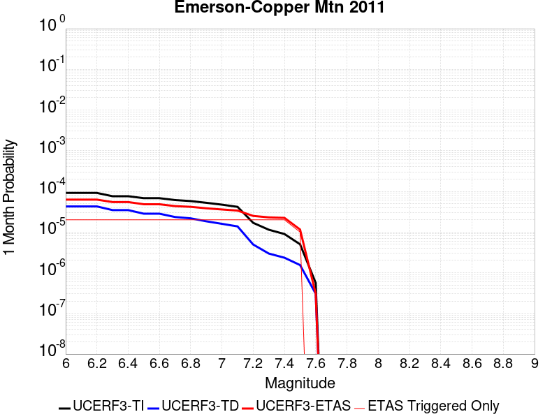 |  |  |

| Magnitude | 1 wk TI Prob | 1 wk TD Prob | 1 wk ETAS Prob | 1 wk ETAS/TD Gain | 1 wk ETAS Triggered Only | 1 mo TI Prob | 1 mo TD Prob | 1 mo ETAS Prob | 1 mo ETAS/TD Gain | 1 mo ETAS Triggered Only | 1 yr TI Prob | 1 yr TD Prob | 1 yr ETAS Prob | 1 yr ETAS/TD Gain | 1 yr ETAS Triggered Only | 10 yr TI Prob | 10 yr TD Prob | 10 yr ETAS Prob | 10 yr ETAS/TD Gain | 10 yr ETAS Triggered Only |
|-----|-----|-----|-----|-----|-----|-----|-----|-----|-----|-----|-----|-----|-----|-----|-----|-----|-----|-----|-----|-----|
| 6.0 | 2.1364202E-5 | 9.968114E-6 | 3.1849733E-5 | 3.1951616 | 2.1881839E-5 | 9.1557646E-5 | 4.2719836E-5 | 6.460074E-5 | 1.5121953 | 2.1881839E-5 | 0.0011141442 | 5.199986E-4 | 5.418691E-4 | 1.0420587 | 2.1881839E-5 | 0.011085749 | 0.005188688 | 0.0052104564 | 1.0041953 | 2.1881839E-5 |
| 6.1 | 2.1364202E-5 | 9.968114E-6 | 3.1849733E-5 | 3.1951616 | 2.1881839E-5 | 9.1557646E-5 | 4.2719836E-5 | 6.460074E-5 | 1.5121953 | 2.1881839E-5 | 0.0011141442 | 5.199986E-4 | 5.418691E-4 | 1.0420587 | 2.1881839E-5 | 0.011085749 | 0.005188688 | 0.0052104564 | 1.0041953 | 2.1881839E-5 |
| 6.2 | 2.1364202E-5 | 9.968114E-6 | 3.1849733E-5 | 3.1951616 | 2.1881839E-5 | 9.1557646E-5 | 4.2719836E-5 | 6.460074E-5 | 1.5121953 | 2.1881839E-5 | 0.0011141442 | 5.199986E-4 | 5.418691E-4 | 1.0420587 | 2.1881839E-5 | 0.011085749 | 0.005188688 | 0.0052104564 | 1.0041953 | 2.1881839E-5 |
| 6.3 | 1.7751237E-5 | 8.089227E-6 | 2.9970888E-5 | 3.7050374 | 2.1881839E-5 | 7.607452E-5 | 3.466769E-5 | 5.6548768E-5 | 1.6311663 | 2.1881839E-5 | 9.258136E-4 | 4.2200365E-4 | 4.4387626E-4 | 1.0518304 | 2.1881839E-5 | 0.00921966 | 0.0042126453 | 0.004234435 | 1.0051725 | 2.1881839E-5 |
| 6.4 | 1.7751237E-5 | 8.089227E-6 | 2.9970888E-5 | 3.7050374 | 2.1881839E-5 | 7.607452E-5 | 3.466769E-5 | 5.6548768E-5 | 1.6311663 | 2.1881839E-5 | 9.258136E-4 | 4.2200365E-4 | 4.4387626E-4 | 1.0518304 | 2.1881839E-5 | 0.00921966 | 0.0042126453 | 0.004234435 | 1.0051725 | 2.1881839E-5 |
| 6.5 | 1.5886664E-5 | 6.603819E-6 | 2.8485512E-5 | 4.313491 | 2.1881839E-5 | 6.808392E-5 | 2.8301802E-5 | 5.0183018E-5 | 1.7731388 | 2.1881839E-5 | 8.286065E-4 | 3.4452465E-4 | 3.6639895E-4 | 1.0634912 | 2.1881839E-5 | 0.008255237 | 0.0034403696 | 0.003462176 | 1.0063385 | 2.1881839E-5 |
| 6.6 | 1.5886664E-5 | 6.603819E-6 | 2.8485512E-5 | 4.313491 | 2.1881839E-5 | 6.808392E-5 | 2.8301802E-5 | 5.0183018E-5 | 1.7731388 | 2.1881839E-5 | 8.286065E-4 | 3.4452465E-4 | 3.6639895E-4 | 1.0634912 | 2.1881839E-5 | 0.008255237 | 0.0034403696 | 0.003462176 | 1.0063385 | 2.1881839E-5 |
| 6.7 | 1.428471E-5 | 5.470403E-6 | 2.7352122E-5 | 5.0000196 | 2.1881839E-5 | 6.121875E-5 | 2.3444394E-5 | 4.532572E-5 | 1.9333286 | 2.1881839E-5 | 7.450834E-4 | 2.8540206E-4 | 3.0727766E-4 | 1.0766484 | 2.1881839E-5 | 0.007425902 | 0.0028507432 | 0.0028725627 | 1.007654 | 2.1881839E-5 |
| 6.8 | 1.3490684E-5 | 5.073699E-6 | 2.6955426E-5 | 5.312776 | 2.1881839E-5 | 5.7815934E-5 | 2.1744265E-5 | 4.3625627E-5 | 2.006305 | 2.1881839E-5 | 7.0368167E-4 | 2.6470813E-4 | 2.8658417E-4 | 1.0826422 | 2.1881839E-5 | 0.007014576 | 0.002644309 | 0.002666133 | 1.0082532 | 2.1881839E-5 |
| 6.9 | 1.2235421E-5 | 4.289677E-6 | 2.6171421E-5 | 6.1010237 | 2.1881839E-5 | 5.2436466E-5 | 1.838422E-5 | 4.0265655E-5 | 2.1902292 | 2.1881839E-5 | 6.38227E-4 | 2.238085E-4 | 2.4568546E-4 | 1.0977485 | 2.1881839E-5 | 0.0063639707 | 0.0022361854 | 0.0022580184 | 1.0097635 | 2.1881839E-5 |
| 7.0 | 1.1009851E-5 | 3.7189886E-6 | 2.5600746E-5 | 6.8837924 | 2.1881839E-5 | 4.7184225E-5 | 1.5938444E-5 | 3.7819933E-5 | 2.3728747 | 2.1881839E-5 | 5.743165E-4 | 1.9403672E-4 | 2.1591432E-4 | 1.1127497 | 2.1881839E-5 | 0.005728345 | 0.0019390108 | 0.0019608503 | 1.0112631 | 2.1881839E-5 |
| 7.1 | 9.726373E-6 | 3.2117953E-6 | 2.5093563E-5 | 7.8129396 | 2.1881839E-5 | 4.168379E-5 | 1.3764783E-5 | 3.564632E-5 | 2.5896754 | 2.1881839E-5 | 5.07382E-4 | 1.6757673E-4 | 1.8945489E-4 | 1.1305561 | 2.1881839E-5 | 0.0050622504 | 0.0016748349 | 0.00169668 | 1.0130432 | 2.1881839E-5 |
| 7.2 | 3.9335127E-6 | 1.1524792E-6 | 2.3034292E-5 | 19.986732 | 2.1881839E-5 | 1.6857803E-5 | 4.9391874E-6 | 2.6820917E-5 | 5.4302287 | 2.1881839E-5 | 2.0522442E-4 | 6.0133007E-5 | 8.201353E-5 | 1.3638687 | 2.1881839E-5 | 0.00205035 | 6.011733E-4 | 6.23042E-4 | 1.0363767 | 2.1881839E-5 |
| 7.3 | 2.661632E-6 | 6.911505E-7 | 2.2572973E-5 | 32.659996 | 2.1881839E-5 | 1.14069435E-5 | 2.9620703E-6 | 2.4843843E-5 | 8.387324 | 2.1881839E-5 | 1.3887069E-4 | 3.6062618E-5 | 5.7943667E-5 | 1.6067516 | 2.1881839E-5 | 0.0013878393 | 3.605687E-4 | 3.8244264E-4 | 1.0606651 | 2.1881839E-5 |
| 7.4 | 2.0893426E-6 | 5.4618386E-7 | 2.242801E-5 | 41.063114 | 2.1881839E-5 | 8.954295E-6 | 2.3407858E-6 | 2.4222572E-5 | 10.348051 | 2.1881839E-5 | 1.0901308E-4 | 2.84987E-5 | 5.0379917E-5 | 1.7677969 | 2.1881839E-5 | 0.0010895962 | 2.84951E-4 | 3.068266E-4 | 1.0767697 | 2.1881839E-5 |
| 7.5 | 1.1681728E-6 | 3.6030585E-7 | 2.2242137E-5 | 61.731266 | 2.1881839E-5 | 5.0064455E-6 | 1.544167E-6 | 2.3425971E-5 | 15.17062 | 2.1881839E-5 | 6.0951766E-5 | 1.8800076E-5 | 4.06815E-5 | 2.1639009 | 2.1881839E-5 | 6.093505E-4 | 1.8798532E-4 | 2.0986305E-4 | 1.11638 | 2.1881839E-5 |
| 7.6 | 1.3154387E-7 | 7.1197384E-8 | 7.1197384E-8 | 1.0 | 0.0 | 5.6375933E-7 | 3.051316E-7 | 3.051316E-7 | 1.0 | 0.0 | 6.863748E-6 | 3.7149728E-6 | 3.7149728E-6 | 1.0 | 0.0 | 6.863536E-5 | 3.7149264E-5 | 3.7149264E-5 | 1.0 | 0.0 |

## Fitzhugh Creek
*[(top)](#table-of-contents)*

| 1 Week | 1 Month | 1 Year | 10 Year |
|-----|-----|-----|-----|
|  |  |  |  |

| Magnitude | 1 wk TI Prob | 1 wk TD Prob | 1 wk ETAS Prob | 1 wk ETAS/TD Gain | 1 wk ETAS Triggered Only | 1 mo TI Prob | 1 mo TD Prob | 1 mo ETAS Prob | 1 mo ETAS/TD Gain | 1 mo ETAS Triggered Only | 1 yr TI Prob | 1 yr TD Prob | 1 yr ETAS Prob | 1 yr ETAS/TD Gain | 1 yr ETAS Triggered Only | 10 yr TI Prob | 10 yr TD Prob | 10 yr ETAS Prob | 10 yr ETAS/TD Gain | 10 yr ETAS Triggered Only |
|-----|-----|-----|-----|-----|-----|-----|-----|-----|-----|-----|-----|-----|-----|-----|-----|-----|-----|-----|-----|-----|
| 6.0 | 6.1090436E-6 | 6.2101562E-6 | 2.8091858E-5 | 4.523535 | 2.1881839E-5 | 2.6181353E-5 | 2.6614709E-5 | 4.8495964E-5 | 1.822149 | 2.1881839E-5 | 3.1871133E-4 | 3.239904E-4 | 3.4586515E-4 | 1.0675167 | 2.1881839E-5 | 0.0031825465 | 0.0032356246 | 0.0032574355 | 1.0067409 | 2.1881839E-5 |
| 6.1 | 2.9741811E-6 | 3.021581E-6 | 3.021581E-6 | 1.0 | 0.0 | 1.2746428E-5 | 1.2949574E-5 | 1.2949574E-5 | 1.0 | 0.0 | 1.5517672E-4 | 1.576506E-4 | 1.576506E-4 | 1.0 | 0.0 | 0.001550684 | 0.0015754806 | 0.0015754806 | 1.0 | 0.0 |
| 6.2 | 2.9741811E-6 | 3.021581E-6 | 3.021581E-6 | 1.0 | 0.0 | 1.2746428E-5 | 1.2949574E-5 | 1.2949574E-5 | 1.0 | 0.0 | 1.5517672E-4 | 1.576506E-4 | 1.576506E-4 | 1.0 | 0.0 | 0.001550684 | 0.0015754806 | 0.0015754806 | 1.0 | 0.0 |
| 6.3 | 1.4781198E-6 | 1.5012708E-6 | 1.5012708E-6 | 1.0 | 0.0 | 6.3347834E-6 | 6.4340034E-6 | 6.4340034E-6 | 1.0 | 0.0 | 7.712326E-5 | 7.833137E-5 | 7.833137E-5 | 1.0 | 0.0 | 7.70965E-4 | 7.830576E-4 | 7.830576E-4 | 1.0 | 0.0 |
| 6.4 | 1.4781198E-6 | 1.5012708E-6 | 1.5012708E-6 | 1.0 | 0.0 | 6.3347834E-6 | 6.4340034E-6 | 6.4340034E-6 | 1.0 | 0.0 | 7.712326E-5 | 7.833137E-5 | 7.833137E-5 | 1.0 | 0.0 | 7.70965E-4 | 7.830576E-4 | 7.830576E-4 | 1.0 | 0.0 |
| 6.5 | 9.5176676E-7 | 9.66606E-7 | 9.66606E-7 | 1.0 | 0.0 | 4.078994E-6 | 4.142591E-6 | 4.142591E-6 | 1.0 | 0.0 | 4.9660623E-5 | 5.0434985E-5 | 5.0434985E-5 | 1.0 | 0.0 | 4.964952E-4 | 5.042458E-4 | 5.042458E-4 | 1.0 | 0.0 |
| 6.6 | 6.21145E-7 | 6.3085855E-7 | 6.3085855E-7 | 1.0 | 0.0 | 2.662047E-6 | 2.7036772E-6 | 2.7036772E-6 | 1.0 | 0.0 | 3.2409942E-5 | 3.291684E-5 | 3.291684E-5 | 1.0 | 0.0 | 3.2405215E-4 | 3.2912623E-4 | 3.2912623E-4 | 1.0 | 0.0 |
| 6.7 | 2.2377962E-7 | 2.2734636E-7 | 2.2734636E-7 | 1.0 | 0.0 | 9.590551E-7 | 9.743413E-7 | 9.743413E-7 | 1.0 | 0.0 | 1.1676434E-5 | 1.1862574E-5 | 1.1862574E-5 | 1.0 | 0.0 | 1.1675821E-4 | 1.1862254E-4 | 1.1862254E-4 | 1.0 | 0.0 |
| 6.8 | 1.4785022E-7 | 1.5021492E-7 | 1.5021492E-7 | 1.0 | 0.0 | 6.3364365E-7 | 6.4377826E-7 | 6.4377826E-7 | 1.0 | 0.0 | 7.714584E-6 | 7.838E-6 | 7.838E-6 | 1.0 | 0.0 | 7.714316E-5 | 7.838E-5 | 7.838E-5 | 1.0 | 0.0 |

## Green Valley 2011 CFM
*[(top)](#table-of-contents)*

| 1 Week | 1 Month | 1 Year | 10 Year |
|-----|-----|-----|-----|
|  |  |  |  |

| Magnitude | 1 wk TI Prob | 1 wk TD Prob | 1 wk ETAS Prob | 1 wk ETAS/TD Gain | 1 wk ETAS Triggered Only | 1 mo TI Prob | 1 mo TD Prob | 1 mo ETAS Prob | 1 mo ETAS/TD Gain | 1 mo ETAS Triggered Only | 1 yr TI Prob | 1 yr TD Prob | 1 yr ETAS Prob | 1 yr ETAS/TD Gain | 1 yr ETAS Triggered Only | 10 yr TI Prob | 10 yr TD Prob | 10 yr ETAS Prob | 10 yr ETAS/TD Gain | 10 yr ETAS Triggered Only |
|-----|-----|-----|-----|-----|-----|-----|-----|-----|-----|-----|-----|-----|-----|-----|-----|-----|-----|-----|-----|-----|
| 6.0 | 9.9629346E-5 | 1.7305532E-4 | 1.9493338E-4 | 1.1264223 | 2.1881839E-5 | 4.2691303E-4 | 7.4143766E-4 | 7.6330325E-4 | 1.0294908 | 2.1881839E-5 | 0.0051852856 | 0.008986705 | 0.00900839 | 1.002413 | 2.1881839E-5 | 0.050659515 | 0.085522056 | 0.08554207 | 1.000234 | 2.1881839E-5 |
| 6.1 | 9.88615E-5 | 1.7152846E-4 | 1.9340655E-4 | 1.1275479 | 2.1881839E-5 | 4.2362334E-4 | 7.348976E-4 | 7.567634E-4 | 1.0297534 | 2.1881839E-5 | 0.0051454236 | 0.0089077335 | 0.00892942 | 1.0024346 | 2.1881839E-5 | 0.050279044 | 0.084809676 | 0.0848297 | 1.0002362 | 2.1881839E-5 |
| 6.2 | 9.696895E-5 | 1.6791887E-4 | 1.8979704E-4 | 1.13029 | 2.1881839E-5 | 4.15515E-4 | 7.194366E-4 | 7.413027E-4 | 1.0303934 | 2.1881839E-5 | 0.0050471667 | 0.008721114 | 0.008742805 | 1.0024872 | 2.1881839E-5 | 0.04934063 | 0.0831186 | 0.08313867 | 1.0002414 | 2.1881839E-5 |
| 6.3 | 9.275224E-5 | 1.5971228E-4 | 1.8159061E-4 | 1.136986 | 2.1881839E-5 | 3.9744904E-4 | 6.842841E-4 | 7.0615095E-4 | 1.0319558 | 2.1881839E-5 | 0.0048282105 | 0.008296439 | 0.008318139 | 1.0026156 | 2.1881839E-5 | 0.047246475 | 0.07925707 | 0.07927722 | 1.0002542 | 2.1881839E-5 |
| 6.4 | 8.391499E-5 | 1.4367796E-4 | 1.6555666E-4 | 1.1522759 | 2.1881839E-5 | 3.595861E-4 | 6.156248E-4 | 6.3749315E-4 | 1.0355222 | 2.1881839E-5 | 0.004369175 | 0.0074670846 | 0.007488803 | 1.0029086 | 2.1881839E-5 | 0.04284265 | 0.071630865 | 0.071651176 | 1.0002836 | 2.1881839E-5 |
| 6.5 | 5.9519385E-5 | 9.9340905E-5 | 1.2122057E-4 | 1.2202483 | 2.1881839E-5 | 2.5505814E-4 | 4.2568138E-4 | 4.4755393E-4 | 1.0513824 | 2.1881839E-5 | 0.0031009112 | 0.005168295 | 0.0051900637 | 1.004212 | 2.1881839E-5 | 0.030579966 | 0.050145864 | 0.050166648 | 1.0004145 | 2.1881839E-5 |
| 6.6 | 4.5361558E-5 | 7.402609E-5 | 9.59063E-5 | 1.2955744 | 2.1881839E-5 | 1.9439218E-4 | 3.1721895E-4 | 3.3909385E-4 | 1.0689584 | 2.1881839E-5 | 0.0023641558 | 0.0038539418 | 0.0038757392 | 1.0056559 | 2.1881839E-5 | 0.023391623 | 0.037665963 | 0.037687022 | 1.0005591 | 2.1881839E-5 |
| 6.7 | 3.8808106E-5 | 6.2651976E-5 | 8.453244E-5 | 1.3492383 | 2.1881839E-5 | 1.6630985E-4 | 2.6848342E-4 | 2.903594E-4 | 1.0814798 | 2.1881839E-5 | 0.0020229418 | 0.0032626586 | 0.003284469 | 1.0066849 | 2.1881839E-5 | 0.020046256 | 0.032005914 | 0.032027096 | 1.0006618 | 2.1881839E-5 |
| 6.8 | 2.2284667E-5 | 3.1285235E-5 | 5.316639E-5 | 1.6994083 | 2.1881839E-5 | 9.550222E-5 | 1.3407279E-4 | 1.559517E-4 | 1.1631868 | 2.1881839E-5 | 0.0011621192 | 0.0016311078 | 0.0016529539 | 1.0133934 | 2.1881839E-5 | 0.011560607 | 0.016165998 | 0.016187526 | 1.0013317 | 2.1881839E-5 |
| 6.9 | 1.8050168E-5 | 2.4448054E-5 | 4.6329358E-5 | 1.895012 | 2.1881839E-5 | 7.735557E-5 | 1.047732E-4 | 1.2665274E-4 | 1.2088277 | 2.1881839E-5 | 9.4139716E-4 | 0.0012748708 | 0.0012967248 | 1.017142 | 2.1881839E-5 | 0.009374191 | 0.012667833 | 0.012689437 | 1.0017055 | 2.1881839E-5 |
| 7.0 | 1.4763166E-5 | 1.9582854E-5 | 4.1464264E-5 | 2.1173759 | 2.1881839E-5 | 6.326917E-5 | 8.3923835E-5 | 1.0580383E-4 | 1.2607126 | 2.1881839E-5 | 7.7002996E-4 | 0.0010212966 | 0.0010431561 | 1.0214037 | 2.1881839E-5 | 0.007673672 | 0.010165343 | 0.010187003 | 1.0021307 | 2.1881839E-5 |
| 7.1 | 1.2399713E-5 | 1.6303715E-5 | 1.6303715E-5 | 1.0 | 0.0 | 5.3140546E-5 | 6.98712E-5 | 6.98712E-5 | 1.0 | 0.0 | 6.467941E-4 | 8.503518E-4 | 8.503518E-4 | 1.0 | 0.0 | 0.006449148 | 0.008471259 | 0.008471259 | 1.0 | 0.0 |
| 7.2 | 1.0584195E-5 | 1.3921742E-5 | 1.3921742E-5 | 1.0 | 0.0 | 4.5360044E-5 | 5.9663253E-5 | 5.9663253E-5 | 1.0 | 0.0 | 5.521186E-4 | 7.261596E-4 | 7.261596E-4 | 1.0 | 0.0 | 0.0055074887 | 0.007238285 | 0.007238285 | 1.0 | 0.0 |
| 7.3 | 7.998173E-6 | 1.054402E-5 | 1.054402E-5 | 1.0 | 0.0 | 3.4277433E-5 | 4.518788E-5 | 4.518788E-5 | 1.0 | 0.0 | 4.1724785E-4 | 5.500247E-4 | 5.500247E-4 | 1.0 | 0.0 | 0.004164653 | 0.0054868995 | 0.0054868995 | 1.0 | 0.0 |
| 7.4 | 6.7571127E-6 | 8.932697E-6 | 8.932697E-6 | 1.0 | 0.0 | 2.8958733E-5 | 3.828243E-5 | 3.828243E-5 | 1.0 | 0.0 | 3.5251552E-4 | 4.6598984E-4 | 4.6598984E-4 | 1.0 | 0.0 | 0.0035195686 | 0.0046503306 | 0.0046503306 | 1.0 | 0.0 |
| 7.5 | 5.69878E-6 | 7.516314E-6 | 7.516314E-6 | 1.0 | 0.0 | 2.4423114E-5 | 3.221238E-5 | 3.221238E-5 | 1.0 | 0.0 | 2.9731085E-4 | 3.9211605E-4 | 3.9211605E-4 | 1.0 | 0.0 | 0.002969134 | 0.0039143935 | 0.0039143935 | 1.0 | 0.0 |
| 7.6 | 4.503664E-6 | 5.9356807E-6 | 5.9356807E-6 | 1.0 | 0.0 | 1.9301275E-5 | 2.5438389E-5 | 2.5438389E-5 | 1.0 | 0.0 | 2.3496768E-4 | 3.096692E-4 | 3.096692E-4 | 1.0 | 0.0 | 0.002347194 | 0.003092502 | 0.003092502 | 1.0 | 0.0 |
| 7.7 | 1.0873546E-6 | 1.4106979E-6 | 1.4106979E-6 | 1.0 | 0.0 | 4.6600826E-6 | 6.045834E-6 | 6.045834E-6 | 1.0 | 0.0 | 5.6735033E-5 | 7.360557E-5 | 7.360557E-5 | 1.0 | 0.0 | 5.672055E-4 | 7.35814E-4 | 7.35814E-4 | 1.0 | 0.0 |
| 7.8 | 4.9373917E-8 | 6.1777136E-8 | 6.1777136E-8 | 1.0 | 0.0 | 2.1160248E-7 | 2.6475914E-7 | 2.6475914E-7 | 1.0 | 0.0 | 2.5762572E-6 | 3.223439E-6 | 3.223439E-6 | 1.0 | 0.0 | 2.5762274E-5 | 3.2232296E-5 | 3.2232296E-5 | 1.0 | 0.0 |

## Great Valley 05 Pittsburg - Kirby Hills alt1
*[(top)](#table-of-contents)*

| 1 Week | 1 Month | 1 Year | 10 Year |
|-----|-----|-----|-----|
|  | 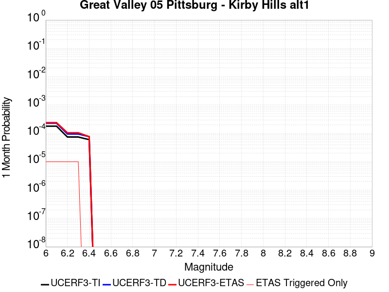 |  | 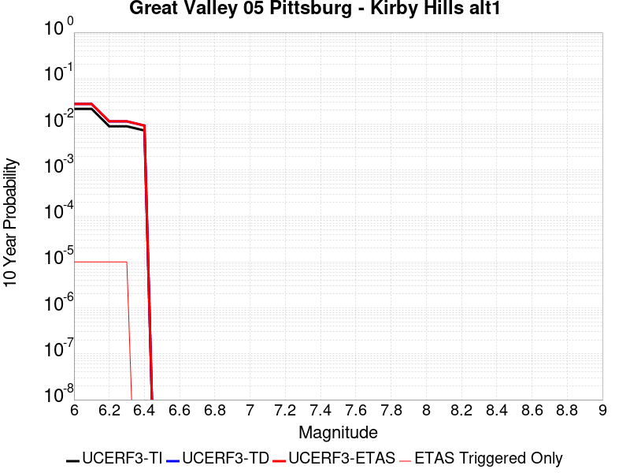 |

| Magnitude | 1 wk TI Prob | 1 wk TD Prob | 1 wk ETAS Prob | 1 wk ETAS/TD Gain | 1 wk ETAS Triggered Only | 1 mo TI Prob | 1 mo TD Prob | 1 mo ETAS Prob | 1 mo ETAS/TD Gain | 1 mo ETAS Triggered Only | 1 yr TI Prob | 1 yr TD Prob | 1 yr ETAS Prob | 1 yr ETAS/TD Gain | 1 yr ETAS Triggered Only | 10 yr TI Prob | 10 yr TD Prob | 10 yr ETAS Prob | 10 yr ETAS/TD Gain | 10 yr ETAS Triggered Only |
|-----|-----|-----|-----|-----|-----|-----|-----|-----|-----|-----|-----|-----|-----|-----|-----|-----|-----|-----|-----|-----|
| 6.0 | 4.187212E-5 | 5.3442072E-5 | 7.532274E-5 | 1.4094278 | 2.1881839E-5 | 1.794396E-4 | 2.290231E-4 | 2.5089993E-4 | 1.0955224 | 2.1881839E-5 | 0.002182488 | 0.0027857882 | 0.002807609 | 1.0078329 | 2.1881839E-5 | 0.021611776 | 0.02760304 | 0.027624317 | 1.0007708 | 2.1881839E-5 |
| 6.1 | 4.187212E-5 | 5.3442072E-5 | 7.532274E-5 | 1.4094278 | 2.1881839E-5 | 1.794396E-4 | 2.290231E-4 | 2.5089993E-4 | 1.0955224 | 2.1881839E-5 | 0.002182488 | 0.0027857882 | 0.002807609 | 1.0078329 | 2.1881839E-5 | 0.021611776 | 0.02760304 | 0.027624317 | 1.0007708 | 2.1881839E-5 |
| 6.2 | 1.7353306E-5 | 2.2154374E-5 | 4.4035725E-5 | 1.9876765 | 2.1881839E-5 | 7.436919E-5 | 9.494618E-5 | 1.1682594E-4 | 1.2304438 | 2.1881839E-5 | 9.050688E-4 | 0.0011557543 | 0.0011776108 | 1.0189111 | 2.1881839E-5 | 0.009013915 | 0.011535114 | 0.011556743 | 1.001875 | 2.1881839E-5 |
| 6.3 | 1.7353306E-5 | 2.2154374E-5 | 4.4035725E-5 | 1.9876765 | 2.1881839E-5 | 7.436919E-5 | 9.494618E-5 | 1.1682594E-4 | 1.2304438 | 2.1881839E-5 | 9.050688E-4 | 0.0011557543 | 0.0011776108 | 1.0189111 | 2.1881839E-5 | 0.009013915 | 0.011535114 | 0.011556743 | 1.001875 | 2.1881839E-5 |
| 6.4 | 1.4028824E-5 | 1.7900597E-5 | 1.7900597E-5 | 1.0 | 0.0 | 6.0122147E-5 | 7.671684E-5 | 7.671684E-5 | 1.0 | 0.0 | 7.3174125E-4 | 9.340275E-4 | 9.340275E-4 | 1.0 | 0.0 | 0.0072933645 | 0.009338138 | 0.009338138 | 1.0 | 0.0 |

## Mono Lake 2011 CFM
*[(top)](#table-of-contents)*

| 1 Week | 1 Month | 1 Year | 10 Year |
|-----|-----|-----|-----|
|  |  |  | 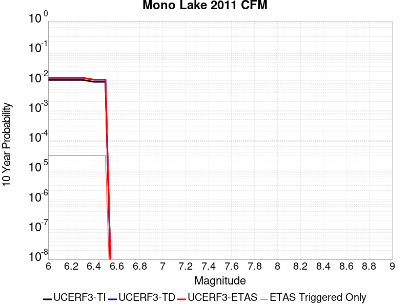 |

| Magnitude | 1 wk TI Prob | 1 wk TD Prob | 1 wk ETAS Prob | 1 wk ETAS/TD Gain | 1 wk ETAS Triggered Only | 1 mo TI Prob | 1 mo TD Prob | 1 mo ETAS Prob | 1 mo ETAS/TD Gain | 1 mo ETAS Triggered Only | 1 yr TI Prob | 1 yr TD Prob | 1 yr ETAS Prob | 1 yr ETAS/TD Gain | 1 yr ETAS Triggered Only | 10 yr TI Prob | 10 yr TD Prob | 10 yr ETAS Prob | 10 yr ETAS/TD Gain | 10 yr ETAS Triggered Only |
|-----|-----|-----|-----|-----|-----|-----|-----|-----|-----|-----|-----|-----|-----|-----|-----|-----|-----|-----|-----|-----|
| 6.0 | 2.0341662E-5 | 2.3828166E-5 | 4.5709483E-5 | 1.9182962 | 2.1881839E-5 | 8.717564E-5 | 1.0211971E-4 | 1.2399931E-4 | 1.2142545 | 2.1881839E-5 | 0.0010608466 | 0.0012431298 | 0.0012649845 | 1.0175804 | 2.1881839E-5 | 0.010557966 | 0.012413835 | 0.012435446 | 1.0017408 | 2.1881839E-5 |
| 6.1 | 2.0341662E-5 | 2.3828166E-5 | 4.5709483E-5 | 1.9182962 | 2.1881839E-5 | 8.717564E-5 | 1.0211971E-4 | 1.2399931E-4 | 1.2142545 | 2.1881839E-5 | 0.0010608466 | 0.0012431298 | 0.0012649845 | 1.0175804 | 2.1881839E-5 | 0.010557966 | 0.012413835 | 0.012435446 | 1.0017408 | 2.1881839E-5 |
| 6.2 | 2.0341662E-5 | 2.3828166E-5 | 4.5709483E-5 | 1.9182962 | 2.1881839E-5 | 8.717564E-5 | 1.0211971E-4 | 1.2399931E-4 | 1.2142545 | 2.1881839E-5 | 0.0010608466 | 0.0012431298 | 0.0012649845 | 1.0175804 | 2.1881839E-5 | 0.010557966 | 0.012413835 | 0.012435446 | 1.0017408 | 2.1881839E-5 |
| 6.3 | 2.0341662E-5 | 2.3828166E-5 | 4.5709483E-5 | 1.9182962 | 2.1881839E-5 | 8.717564E-5 | 1.0211971E-4 | 1.2399931E-4 | 1.2142545 | 2.1881839E-5 | 0.0010608466 | 0.0012431298 | 0.0012649845 | 1.0175804 | 2.1881839E-5 | 0.010557966 | 0.012413835 | 0.012435446 | 1.0017408 | 2.1881839E-5 |
| 6.4 | 1.749821E-5 | 2.0490985E-5 | 4.2372376E-5 | 2.0678544 | 2.1881839E-5 | 7.499018E-5 | 8.781851E-5 | 1.0969843E-4 | 1.2491492 | 2.1881839E-5 | 9.1262296E-4 | 0.0010691903 | 0.0010910488 | 1.0204439 | 2.1881839E-5 | 0.009088841 | 0.010691865 | 0.010713513 | 1.0020247 | 2.1881839E-5 |
| 6.5 | 1.749821E-5 | 2.0490985E-5 | 4.2372376E-5 | 2.0678544 | 2.1881839E-5 | 7.499018E-5 | 8.781851E-5 | 1.0969843E-4 | 1.2491492 | 2.1881839E-5 | 9.1262296E-4 | 0.0010691903 | 0.0010910488 | 1.0204439 | 2.1881839E-5 | 0.009088841 | 0.010691865 | 0.010713513 | 1.0020247 | 2.1881839E-5 |

## Sheephole
*[(top)](#table-of-contents)*

| 1 Week | 1 Month | 1 Year | 10 Year |
|-----|-----|-----|-----|
| 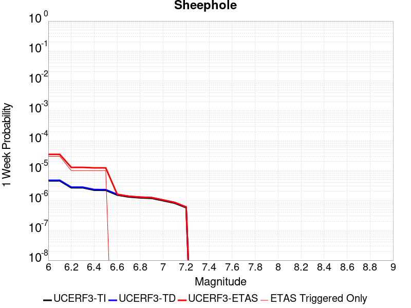 |  |  |  |

| Magnitude | 1 wk TI Prob | 1 wk TD Prob | 1 wk ETAS Prob | 1 wk ETAS/TD Gain | 1 wk ETAS Triggered Only | 1 mo TI Prob | 1 mo TD Prob | 1 mo ETAS Prob | 1 mo ETAS/TD Gain | 1 mo ETAS Triggered Only | 1 yr TI Prob | 1 yr TD Prob | 1 yr ETAS Prob | 1 yr ETAS/TD Gain | 1 yr ETAS Triggered Only | 10 yr TI Prob | 10 yr TD Prob | 10 yr ETAS Prob | 10 yr ETAS/TD Gain | 10 yr ETAS Triggered Only |
|-----|-----|-----|-----|-----|-----|-----|-----|-----|-----|-----|-----|-----|-----|-----|-----|-----|-----|-----|-----|-----|
| 6.0 | 4.5579695E-6 | 4.7412627E-6 | 2.6622996E-5 | 5.6151705 | 2.1881839E-5 | 1.9534009E-5 | 2.031957E-5 | 4.220096E-5 | 2.076863 | 2.1881839E-5 | 2.3780059E-4 | 2.473682E-4 | 2.6924466E-4 | 1.0884367 | 2.1881839E-5 | 0.0023754628 | 0.002471473 | 0.002493301 | 1.0088319 | 2.1881839E-5 |
| 6.1 | 4.5579695E-6 | 4.7412627E-6 | 2.6622996E-5 | 5.6151705 | 2.1881839E-5 | 1.9534009E-5 | 2.031957E-5 | 4.220096E-5 | 2.076863 | 2.1881839E-5 | 2.3780059E-4 | 2.473682E-4 | 2.6924466E-4 | 1.0884367 | 2.1881839E-5 | 0.0023754628 | 0.002471473 | 0.002493301 | 1.0088319 | 2.1881839E-5 |
| 6.2 | 2.6677674E-6 | 2.7873941E-6 | 2.7873941E-6 | 1.0 | 0.0 | 1.1433239E-5 | 1.1945926E-5 | 1.1945926E-5 | 1.0 | 0.0 | 1.3919079E-4 | 1.4543302E-4 | 1.4543302E-4 | 1.0 | 0.0 | 0.0013910364 | 0.0014534844 | 0.0014534844 | 1.0 | 0.0 |
| 6.3 | 2.6677674E-6 | 2.7873941E-6 | 2.7873941E-6 | 1.0 | 0.0 | 1.1433239E-5 | 1.1945926E-5 | 1.1945926E-5 | 1.0 | 0.0 | 1.3919079E-4 | 1.4543302E-4 | 1.4543302E-4 | 1.0 | 0.0 | 0.0013910364 | 0.0014534844 | 0.0014534844 | 1.0 | 0.0 |
| 6.4 | 2.2159759E-6 | 2.3228788E-6 | 2.3228788E-6 | 1.0 | 0.0 | 9.497005E-6 | 9.955161E-6 | 9.955161E-6 | 1.0 | 0.0 | 1.156199E-4 | 1.2119815E-4 | 1.2119815E-4 | 1.0 | 0.0 | 0.0011555976 | 0.0012113999 | 0.0012113999 | 1.0 | 0.0 |
| 6.5 | 2.1986082E-6 | 2.304759E-6 | 2.304759E-6 | 1.0 | 0.0 | 9.4225725E-6 | 9.877506E-6 | 9.877506E-6 | 1.0 | 0.0 | 1.1471378E-4 | 1.2025281E-4 | 1.2025281E-4 | 1.0 | 0.0 | 0.0011465458 | 0.0012019566 | 0.0012019566 | 1.0 | 0.0 |
| 6.6 | 1.5232331E-6 | 1.6018919E-6 | 1.6018919E-6 | 1.0 | 0.0 | 6.5281256E-6 | 6.865234E-6 | 6.865234E-6 | 1.0 | 0.0 | 7.947703E-5 | 8.35812E-5 | 8.35812E-5 | 1.0 | 0.0 | 7.9448614E-4 | 8.3551643E-4 | 8.3551643E-4 | 1.0 | 0.0 |
| 6.7 | 1.3137362E-6 | 1.382819E-6 | 1.382819E-6 | 1.0 | 0.0 | 5.6302856E-6 | 5.926355E-6 | 5.926355E-6 | 1.0 | 0.0 | 6.854657E-5 | 7.215112E-5 | 7.215112E-5 | 1.0 | 0.0 | 6.8525434E-4 | 7.212908E-4 | 7.212908E-4 | 1.0 | 0.0 |
| 6.8 | 1.2275751E-6 | 1.2922847E-6 | 1.2922847E-6 | 1.0 | 0.0 | 5.2610258E-6 | 5.5383516E-6 | 5.5383516E-6 | 1.0 | 0.0 | 6.4051106E-5 | 6.7427485E-5 | 6.7427485E-5 | 1.0 | 0.0 | 6.4032647E-4 | 6.740836E-4 | 6.740836E-4 | 1.0 | 0.0 |
| 6.9 | 1.1837088E-6 | 1.246102E-6 | 1.246102E-6 | 1.0 | 0.0 | 5.0730278E-6 | 5.340427E-6 | 5.340427E-6 | 1.0 | 0.0 | 6.176237E-5 | 6.501789E-5 | 6.501789E-5 | 1.0 | 0.0 | 6.17452E-4 | 6.5000186E-4 | 6.5000186E-4 | 1.0 | 0.0 |
| 7.0 | 9.849371E-7 | 1.0366288E-6 | 1.0366288E-6 | 1.0 | 0.0 | 4.2211523E-6 | 4.442688E-6 | 4.442688E-6 | 1.0 | 0.0 | 5.1391315E-5 | 5.4088487E-5 | 5.4088487E-5 | 1.0 | 0.0 | 5.137943E-4 | 5.407633E-4 | 5.407633E-4 | 1.0 | 0.0 |
| 7.1 | 8.1643645E-7 | 8.591669E-7 | 8.591669E-7 | 1.0 | 0.0 | 3.4990085E-6 | 3.682139E-6 | 3.682139E-6 | 1.0 | 0.0 | 4.2599597E-5 | 4.482921E-5 | 4.482921E-5 | 1.0 | 0.0 | 4.259143E-4 | 4.4821028E-4 | 4.4821028E-4 | 1.0 | 0.0 |
| 7.2 | 5.7295756E-7 | 6.029502E-7 | 6.029502E-7 | 1.0 | 0.0 | 2.45553E-6 | 2.58407E-6 | 2.58407E-6 | 1.0 | 0.0 | 2.9895667E-5 | 3.1460666E-5 | 3.1460666E-5 | 1.0 | 0.0 | 2.9891645E-4 | 3.145688E-4 | 3.145688E-4 | 1.0 | 0.0 |

## Great Valley 09 (Laguna Seca)
*[(top)](#table-of-contents)*

| 1 Week | 1 Month | 1 Year | 10 Year |
|-----|-----|-----|-----|
|  | 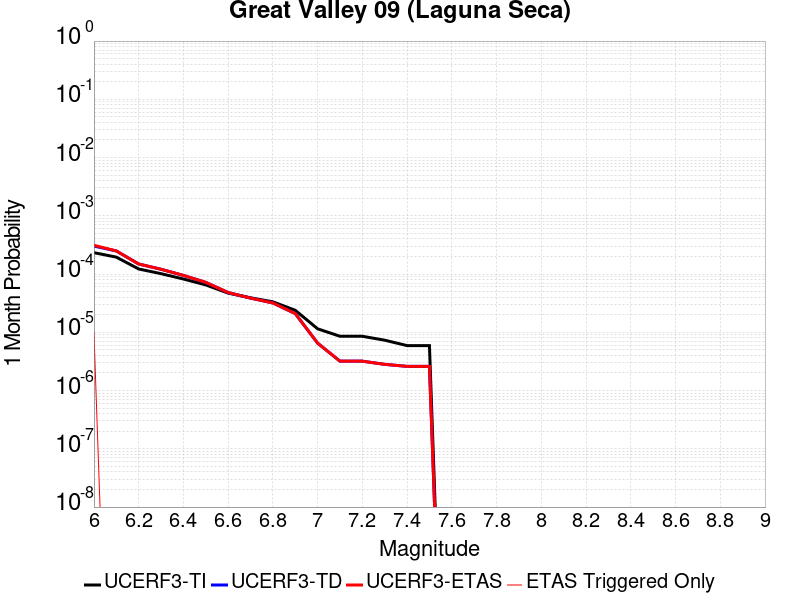 | 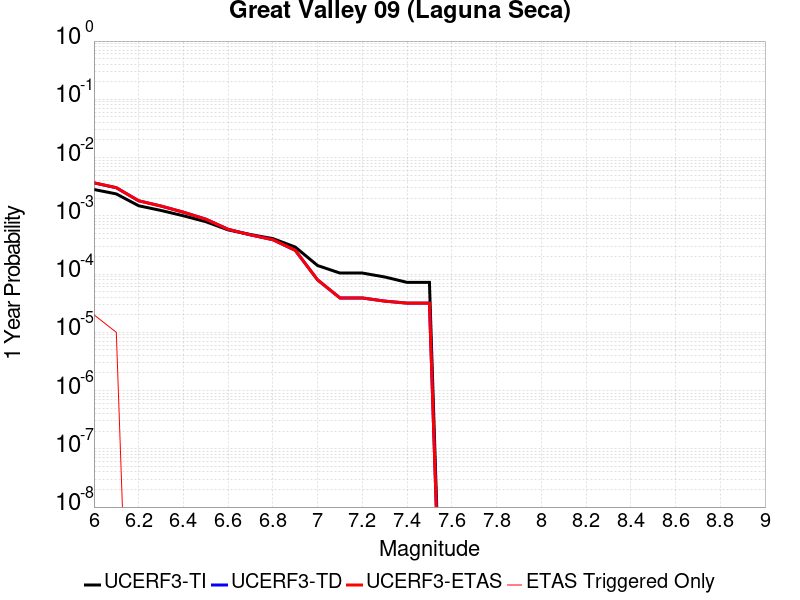 |  |

| Magnitude | 1 wk TI Prob | 1 wk TD Prob | 1 wk ETAS Prob | 1 wk ETAS/TD Gain | 1 wk ETAS Triggered Only | 1 mo TI Prob | 1 mo TD Prob | 1 mo ETAS Prob | 1 mo ETAS/TD Gain | 1 mo ETAS Triggered Only | 1 yr TI Prob | 1 yr TD Prob | 1 yr ETAS Prob | 1 yr ETAS/TD Gain | 1 yr ETAS Triggered Only | 10 yr TI Prob | 10 yr TD Prob | 10 yr ETAS Prob | 10 yr ETAS/TD Gain | 10 yr ETAS Triggered Only |
|-----|-----|-----|-----|-----|-----|-----|-----|-----|-----|-----|-----|-----|-----|-----|-----|-----|-----|-----|-----|-----|
| 6.0 | 5.4353277E-5 | 7.05022E-5 | 7.05022E-5 | 1.0 | 0.0 | 2.3292181E-4 | 3.0211566E-4 | 3.2399088E-4 | 1.0724068 | 2.1881839E-5 | 0.0028321352 | 0.0036721937 | 0.0036939953 | 1.0059369 | 2.1881839E-5 | 0.02796312 | 0.03611547 | 0.036136564 | 1.000584 | 2.1881839E-5 |
| 6.1 | 4.5578287E-5 | 5.822118E-5 | 5.822118E-5 | 1.0 | 0.0 | 1.953209E-4 | 2.4949326E-4 | 2.4949326E-4 | 1.0 | 0.0 | 0.0023754383 | 0.003033432 | 0.003033432 | 1.0 | 0.0 | 0.023502063 | 0.029919548 | 0.029919548 | 1.0 | 0.0 |
| 6.2 | 2.8536782E-5 | 3.4737273E-5 | 3.4737273E-5 | 1.0 | 0.0 | 1.2229476E-4 | 1.4886224E-4 | 1.4886224E-4 | 1.0 | 0.0 | 0.0014879217 | 0.001810813 | 0.001810813 | 1.0 | 0.0 | 0.014779986 | 0.017958116 | 0.017958116 | 1.0 | 0.0 |
| 6.3 | 2.3698774E-5 | 2.8213295E-5 | 2.8213295E-5 | 1.0 | 0.0 | 1.01562226E-4 | 1.20905075E-4 | 1.20905075E-4 | 1.0 | 0.0 | 0.0012358186 | 0.0014710218 | 0.0014710218 | 1.0 | 0.0 | 0.012289686 | 0.014611342 | 0.014611342 | 1.0 | 0.0 |
| 6.4 | 1.9191197E-5 | 2.2123184E-5 | 2.2123184E-5 | 1.0 | 0.0 | 8.2245395E-5 | 9.4806666E-5 | 9.4806666E-5 | 1.0 | 0.0 | 0.0010008777 | 0.0011536429 | 0.0011536429 | 1.0 | 0.0 | 0.009963818 | 0.011476948 | 0.011476948 | 1.0 | 0.0 |
| 6.5 | 1.5203241E-5 | 1.6802203E-5 | 1.6802203E-5 | 1.0 | 0.0 | 6.5155116E-5 | 7.200386E-5 | 7.200386E-5 | 1.0 | 0.0 | 7.9297484E-4 | 8.7626575E-4 | 8.7626575E-4 | 1.0 | 0.0 | 0.007901512 | 0.0087295165 | 0.0087295165 | 1.0 | 0.0 |
| 6.6 | 1.0984925E-5 | 1.1242595E-5 | 1.1242595E-5 | 1.0 | 0.0 | 4.70774E-5 | 4.8181686E-5 | 4.8181686E-5 | 1.0 | 0.0 | 5.730166E-4 | 5.8645656E-4 | 5.8645656E-4 | 1.0 | 0.0 | 0.005715413 | 0.0058494853 | 0.0058494853 | 1.0 | 0.0 |
| 6.7 | 9.134616E-6 | 9.019894E-6 | 9.019894E-6 | 1.0 | 0.0 | 3.9147766E-5 | 3.865613E-5 | 3.865613E-5 | 1.0 | 0.0 | 4.7651984E-4 | 4.7053912E-4 | 4.7053912E-4 | 1.0 | 0.0 | 0.004754993 | 0.0046956735 | 0.0046956735 | 1.0 | 0.0 |
| 6.8 | 7.785589E-6 | 7.4519444E-6 | 7.4519444E-6 | 1.0 | 0.0 | 3.3366385E-5 | 3.1936524E-5 | 3.1936524E-5 | 1.0 | 0.0 | 4.0616E-4 | 3.8875983E-4 | 3.8875983E-4 | 1.0 | 0.0 | 0.0040541845 | 0.0038810016 | 0.0038810016 | 1.0 | 0.0 |
| 6.9 | 5.579095E-6 | 4.898492E-6 | 4.898492E-6 | 1.0 | 0.0 | 2.3910188E-5 | 2.0993377E-5 | 2.0993377E-5 | 1.0 | 0.0 | 2.9106764E-4 | 2.5556577E-4 | 2.5556577E-4 | 1.0 | 0.0 | 0.002906867 | 0.002552856 | 0.002552856 | 1.0 | 0.0 |
| 7.0 | 2.6816688E-6 | 1.5216126E-6 | 1.5216126E-6 | 1.0 | 0.0 | 1.1492816E-5 | 6.521181E-6 | 6.521181E-6 | 1.0 | 0.0 | 1.3991605E-4 | 7.939258E-5 | 7.939258E-5 | 1.0 | 0.0 | 0.0013982799 | 7.9365086E-4 | 7.9365086E-4 | 1.0 | 0.0 |
| 7.1 | 1.9951021E-6 | 7.453827E-7 | 7.453827E-7 | 1.0 | 0.0 | 8.55041E-6 | 3.1944935E-6 | 3.1944935E-6 | 1.0 | 0.0 | 1.0409627E-4 | 3.8892307E-5 | 3.8892307E-5 | 1.0 | 0.0 | 0.0010404752 | 3.8885913E-4 | 3.8885913E-4 | 1.0 | 0.0 |
| 7.2 | 1.9951021E-6 | 7.453827E-7 | 7.453827E-7 | 1.0 | 0.0 | 8.55041E-6 | 3.1944935E-6 | 3.1944935E-6 | 1.0 | 0.0 | 1.0409627E-4 | 3.8892307E-5 | 3.8892307E-5 | 1.0 | 0.0 | 0.0010404752 | 3.8885913E-4 | 3.8885913E-4 | 1.0 | 0.0 |
| 7.3 | 1.7087556E-6 | 6.578881E-7 | 6.578881E-7 | 1.0 | 0.0 | 7.3232177E-6 | 2.8195177E-6 | 2.8195177E-6 | 1.0 | 0.0 | 8.915652E-5 | 3.4327128E-5 | 3.4327128E-5 | 1.0 | 0.0 | 8.9120766E-4 | 3.432223E-4 | 3.432223E-4 | 1.0 | 0.0 |
| 7.4 | 1.3804846E-6 | 6.073852E-7 | 6.073852E-7 | 1.0 | 0.0 | 5.916349E-6 | 2.6030768E-6 | 2.6030768E-6 | 1.0 | 0.0 | 7.2029165E-5 | 3.169204E-5 | 3.169204E-5 | 1.0 | 0.0 | 7.200583E-4 | 3.1687922E-4 | 3.1687922E-4 | 1.0 | 0.0 |
| 7.5 | 1.3804846E-6 | 6.073852E-7 | 6.073852E-7 | 1.0 | 0.0 | 5.916349E-6 | 2.6030768E-6 | 2.6030768E-6 | 1.0 | 0.0 | 7.2029165E-5 | 3.169204E-5 | 3.169204E-5 | 1.0 | 0.0 | 7.200583E-4 | 3.1687922E-4 | 3.1687922E-4 | 1.0 | 0.0 |

## Maacama 2011 CFM
*[(top)](#table-of-contents)*

| 1 Week | 1 Month | 1 Year | 10 Year |
|-----|-----|-----|-----|
|  | 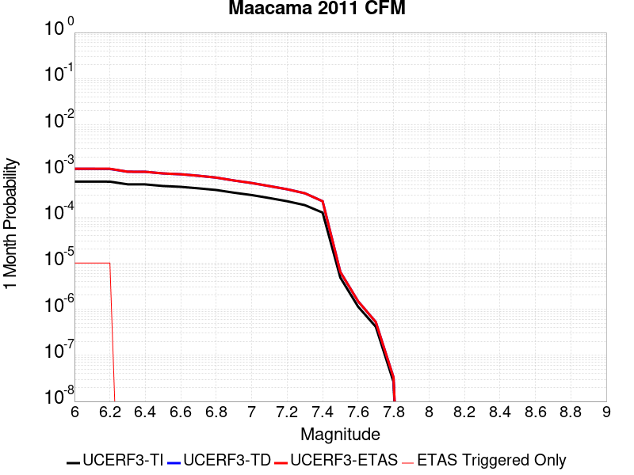 |  |  |

| Magnitude | 1 wk TI Prob | 1 wk TD Prob | 1 wk ETAS Prob | 1 wk ETAS/TD Gain | 1 wk ETAS Triggered Only | 1 mo TI Prob | 1 mo TD Prob | 1 mo ETAS Prob | 1 mo ETAS/TD Gain | 1 mo ETAS Triggered Only | 1 yr TI Prob | 1 yr TD Prob | 1 yr ETAS Prob | 1 yr ETAS/TD Gain | 1 yr ETAS Triggered Only | 10 yr TI Prob | 10 yr TD Prob | 10 yr ETAS Prob | 10 yr ETAS/TD Gain | 10 yr ETAS Triggered Only |
|-----|-----|-----|-----|-----|-----|-----|-----|-----|-----|-----|-----|-----|-----|-----|-----|-----|-----|-----|-----|-----|
| 6.0 | 1.368203E-4 | 2.5787868E-4 | 2.7975487E-4 | 1.0848314 | 2.1881839E-5 | 5.862409E-4 | 0.0011047312 | 0.0011265889 | 1.0197855 | 2.1881839E-5 | 0.0071141496 | 0.013350483 | 0.013372073 | 1.0016172 | 2.1881839E-5 | 0.06890667 | 0.124189645 | 0.12420881 | 1.0001543 | 2.1881839E-5 |
| 6.1 | 1.368203E-4 | 2.5787868E-4 | 2.7975487E-4 | 1.0848314 | 2.1881839E-5 | 5.862409E-4 | 0.0011047312 | 0.0011265889 | 1.0197855 | 2.1881839E-5 | 0.0071141496 | 0.013350483 | 0.013372073 | 1.0016172 | 2.1881839E-5 | 0.06890667 | 0.124189645 | 0.12420881 | 1.0001543 | 2.1881839E-5 |
| 6.2 | 1.360743E-4 | 2.566255E-4 | 2.785017E-4 | 1.0852457 | 2.1881839E-5 | 5.8304524E-4 | 0.001099365 | 0.0011212227 | 1.0198822 | 2.1881839E-5 | 0.007075496 | 0.013286048 | 0.0133076385 | 1.0016251 | 2.1881839E-5 | 0.06854413 | 0.12362404 | 0.12364322 | 1.0001551 | 2.1881839E-5 |
| 6.3 | 1.1917239E-4 | 2.235362E-4 | 2.235362E-4 | 1.0 | 0.0 | 5.1063887E-4 | 9.5765886E-4 | 9.5765886E-4 | 1.0 | 0.0 | 0.0061993203 | 0.011587509 | 0.011587509 | 1.0 | 0.0 | 0.060292065 | 0.10884413 | 0.10884413 | 1.0 | 0.0 |
| 6.4 | 1.1859289E-4 | 2.2257185E-4 | 2.2257185E-4 | 1.0 | 0.0 | 5.0815626E-4 | 9.535289E-4 | 9.535289E-4 | 1.0 | 0.0 | 0.006169266 | 0.0115378285 | 0.0115378285 | 1.0 | 0.0 | 0.06000784 | 0.108401 | 0.108401 | 1.0 | 0.0 |
| 6.5 | 1.09512424E-4 | 2.0515872E-4 | 2.0515872E-4 | 1.0 | 0.0 | 4.6925453E-4 | 8.789523E-4 | 8.789523E-4 | 1.0 | 0.0 | 0.005698218 | 0.01063927 | 0.01063927 | 1.0 | 0.0 | 0.055543028 | 0.100493506 | 0.100493506 | 1.0 | 0.0 |
| 6.6 | 1.0502928E-4 | 1.9674368E-4 | 1.9674368E-4 | 1.0 | 0.0 | 4.500478E-4 | 8.4291224E-4 | 8.4291224E-4 | 1.0 | 0.0 | 0.0054655746 | 0.01020536 | 0.01020536 | 1.0 | 0.0 | 0.053330887 | 0.096646085 | 0.096646085 | 1.0 | 0.0 |
| 6.7 | 9.739358E-5 | 1.825636E-4 | 1.825636E-4 | 1.0 | 0.0 | 4.173343E-4 | 7.821781E-4 | 7.821781E-4 | 1.0 | 0.0 | 0.0050692135 | 0.009475501 | 0.009475501 | 1.0 | 0.0 | 0.049551267 | 0.090118766 | 0.090118766 | 1.0 | 0.0 |
| 6.8 | 8.969524E-5 | 1.6657855E-4 | 1.6657855E-4 | 1.0 | 0.0 | 3.8435153E-4 | 7.1370887E-4 | 7.1370887E-4 | 1.0 | 0.0 | 0.0046694432 | 0.008649083 | 0.008649083 | 1.0 | 0.0 | 0.045725387 | 0.082651116 | 0.082651116 | 1.0 | 0.0 |
| 6.9 | 7.838291E-5 | 1.4417822E-4 | 1.4417822E-4 | 1.0 | 0.0 | 3.358835E-4 | 6.177581E-4 | 6.177581E-4 | 1.0 | 0.0 | 0.0040817154 | 0.007491799 | 0.007491799 | 1.0 | 0.0 | 0.04007554 | 0.07205178 | 0.07205178 | 1.0 | 0.0 |
| 7.0 | 6.961957E-5 | 1.270709E-4 | 1.270709E-4 | 1.0 | 0.0 | 2.9833548E-4 | 5.4447335E-4 | 5.4447335E-4 | 1.0 | 0.0 | 0.0036261857 | 0.006606736 | 0.006606736 | 1.0 | 0.0 | 0.035675827 | 0.063870616 | 0.063870616 | 1.0 | 0.0 |
| 7.1 | 5.999398E-5 | 1.0904674E-4 | 1.0904674E-4 | 1.0 | 0.0 | 2.570917E-4 | 4.6726142E-4 | 4.6726142E-4 | 1.0 | 0.0 | 0.0031255994 | 0.0056728474 | 0.0056728474 | 1.0 | 0.0 | 0.030820016 | 0.055138282 | 0.055138282 | 1.0 | 0.0 |
| 7.2 | 5.116532E-5 | 9.3055336E-5 | 9.3055336E-5 | 1.0 | 0.0 | 2.1926152E-4 | 3.9875024E-4 | 3.9875024E-4 | 1.0 | 0.0 | 0.002666241 | 0.004843103 | 0.004843103 | 1.0 | 0.0 | 0.026344774 | 0.04730284 | 0.04730284 | 1.0 | 0.0 |
| 7.3 | 4.2087835E-5 | 7.617328E-5 | 7.617328E-5 | 1.0 | 0.0 | 1.8036396E-4 | 3.2641852E-4 | 3.2641852E-4 | 1.0 | 0.0 | 0.0021937196 | 0.0039661685 | 0.0039661685 | 1.0 | 0.0 | 0.0217219 | 0.038904376 | 0.038904376 | 1.0 | 0.0 |
| 7.4 | 2.8991652E-5 | 5.1167233E-5 | 5.1167233E-5 | 1.0 | 0.0 | 1.2424402E-4 | 2.1927188E-4 | 2.1927188E-4 | 1.0 | 0.0 | 0.0015116213 | 0.0026660617 | 0.0026660617 | 1.0 | 0.0 | 0.015013801 | 0.026331667 | 0.026331667 | 1.0 | 0.0 |
| 7.5 | 1.1292299E-6 | 1.4950161E-6 | 1.4950161E-6 | 1.0 | 0.0 | 4.8395473E-6 | 6.4072037E-6 | 6.4072037E-6 | 1.0 | 0.0 | 5.8919897E-5 | 7.800615E-5 | 7.800615E-5 | 1.0 | 0.0 | 5.890428E-4 | 7.8048074E-4 | 7.8048074E-4 | 1.0 | 0.0 |
| 7.6 | 2.6535366E-7 | 3.4720597E-7 | 3.4720597E-7 | 1.0 | 0.0 | 1.1372296E-6 | 1.4880247E-6 | 1.4880247E-6 | 1.0 | 0.0 | 1.3845682E-5 | 1.8116552E-5 | 1.8116552E-5 | 1.0 | 0.0 | 1.3844819E-4 | 1.816747E-4 | 1.816747E-4 | 1.0 | 0.0 |
| 7.7 | 9.727789E-8 | 1.2302169E-7 | 1.2302169E-7 | 1.0 | 0.0 | 4.1690518E-7 | 5.2723567E-7 | 5.2723567E-7 | 1.0 | 0.0 | 5.0758085E-6 | 6.419076E-6 | 6.419076E-6 | 1.0 | 0.0 | 5.0756928E-5 | 6.45712E-5 | 6.45712E-5 | 1.0 | 0.0 |
| 7.8 | 6.1939325E-9 | 7.711523E-9 | 7.711523E-9 | 1.0 | 0.0 | 2.6545425E-8 | 3.3049385E-8 | 3.3049385E-8 | 1.0 | 0.0 | 3.231905E-7 | 4.0237617E-7 | 4.0237617E-7 | 1.0 | 0.0 | 3.2319003E-6 | 4.0598557E-6 | 4.0598557E-6 | 1.0 | 0.0 |

## Cleghorn
*[(top)](#table-of-contents)*

| 1 Week | 1 Month | 1 Year | 10 Year |
|-----|-----|-----|-----|
|  |  | 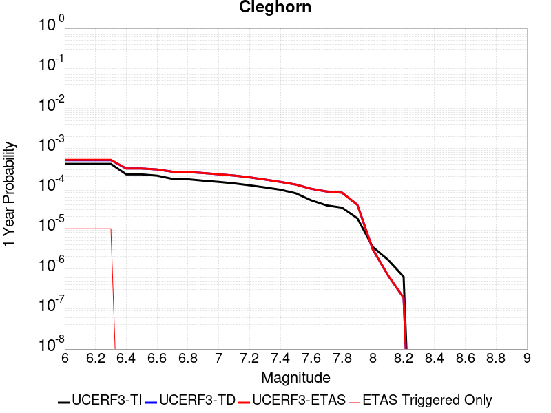 |  |

| Magnitude | 1 wk TI Prob | 1 wk TD Prob | 1 wk ETAS Prob | 1 wk ETAS/TD Gain | 1 wk ETAS Triggered Only | 1 mo TI Prob | 1 mo TD Prob | 1 mo ETAS Prob | 1 mo ETAS/TD Gain | 1 mo ETAS Triggered Only | 1 yr TI Prob | 1 yr TD Prob | 1 yr ETAS Prob | 1 yr ETAS/TD Gain | 1 yr ETAS Triggered Only | 10 yr TI Prob | 10 yr TD Prob | 10 yr ETAS Prob | 10 yr ETAS/TD Gain | 10 yr ETAS Triggered Only |
|-----|-----|-----|-----|-----|-----|-----|-----|-----|-----|-----|-----|-----|-----|-----|-----|-----|-----|-----|-----|-----|
| 6.0 | 7.9267165E-6 | 9.831582E-6 | 9.831582E-6 | 1.0 | 0.0 | 3.39712E-5 | 4.2134732E-5 | 4.2134732E-5 | 1.0 | 0.0 | 4.1352084E-4 | 5.128803E-4 | 5.128803E-4 | 1.0 | 0.0 | 0.004127522 | 0.0051320773 | 0.0051538465 | 1.0042418 | 2.1881839E-5 |
| 6.1 | 7.9267165E-6 | 9.831582E-6 | 9.831582E-6 | 1.0 | 0.0 | 3.39712E-5 | 4.2134732E-5 | 4.2134732E-5 | 1.0 | 0.0 | 4.1352084E-4 | 5.128803E-4 | 5.128803E-4 | 1.0 | 0.0 | 0.004127522 | 0.0051320773 | 0.0051538465 | 1.0042418 | 2.1881839E-5 |
| 6.2 | 7.9267165E-6 | 9.831582E-6 | 9.831582E-6 | 1.0 | 0.0 | 3.39712E-5 | 4.2134732E-5 | 4.2134732E-5 | 1.0 | 0.0 | 4.1352084E-4 | 5.128803E-4 | 5.128803E-4 | 1.0 | 0.0 | 0.004127522 | 0.0051320773 | 0.0051538465 | 1.0042418 | 2.1881839E-5 |
| 6.3 | 7.9267165E-6 | 9.831582E-6 | 9.831582E-6 | 1.0 | 0.0 | 3.39712E-5 | 4.2134732E-5 | 4.2134732E-5 | 1.0 | 0.0 | 4.1352084E-4 | 5.128803E-4 | 5.128803E-4 | 1.0 | 0.0 | 0.004127522 | 0.0051320773 | 0.0051538465 | 1.0042418 | 2.1881839E-5 |
| 6.4 | 4.3445207E-6 | 6.0914435E-6 | 6.0914435E-6 | 1.0 | 0.0 | 1.8619241E-5 | 2.610593E-5 | 2.610593E-5 | 1.0 | 0.0 | 2.2666567E-4 | 3.1779436E-4 | 3.1779436E-4 | 1.0 | 0.0 | 0.0022643462 | 0.0031875873 | 0.0031875873 | 1.0 | 0.0 |
| 6.5 | 4.3445207E-6 | 6.0914435E-6 | 6.0914435E-6 | 1.0 | 0.0 | 1.8619241E-5 | 2.610593E-5 | 2.610593E-5 | 1.0 | 0.0 | 2.2666567E-4 | 3.1779436E-4 | 3.1779436E-4 | 1.0 | 0.0 | 0.0022643462 | 0.0031875873 | 0.0031875873 | 1.0 | 0.0 |
| 6.6 | 4.040109E-6 | 5.773851E-6 | 5.773851E-6 | 1.0 | 0.0 | 1.7314638E-5 | 2.4744846E-5 | 2.4744846E-5 | 1.0 | 0.0 | 2.1078532E-4 | 3.012278E-4 | 3.012278E-4 | 1.0 | 0.0 | 0.002105855 | 0.003022377 | 0.003022377 | 1.0 | 0.0 |
| 6.7 | 3.3632055E-6 | 5.067348E-6 | 5.067348E-6 | 1.0 | 0.0 | 1.4413658E-5 | 2.1717027E-5 | 2.1717027E-5 | 1.0 | 0.0 | 1.7547216E-4 | 2.6437303E-4 | 2.6437303E-4 | 1.0 | 0.0 | 0.0017533366 | 0.0026547113 | 0.0026547113 | 1.0 | 0.0 |
| 6.8 | 3.2902772E-6 | 4.9892556E-6 | 4.9892556E-6 | 1.0 | 0.0 | 1.4101111E-5 | 2.1382351E-5 | 2.1382351E-5 | 1.0 | 0.0 | 1.716675E-4 | 2.6029933E-4 | 2.6029933E-4 | 1.0 | 0.0 | 0.0017153495 | 0.0026140702 | 0.0026140702 | 1.0 | 0.0 |
| 6.9 | 3.031547E-6 | 4.6910186E-6 | 4.6910186E-6 | 1.0 | 0.0 | 1.299228E-5 | 2.0104211E-5 | 2.0104211E-5 | 1.0 | 0.0 | 1.5816953E-4 | 2.4474156E-4 | 2.4474156E-4 | 1.0 | 0.0 | 0.00158057 | 0.0024588439 | 0.0024588439 | 1.0 | 0.0 |
| 7.0 | 2.8259715E-6 | 4.3705895E-6 | 4.3705895E-6 | 1.0 | 0.0 | 1.211125E-5 | 1.8730963E-5 | 1.8730963E-5 | 1.0 | 0.0 | 1.4744449E-4 | 2.2802586E-4 | 2.2802586E-4 | 1.0 | 0.0 | 0.001473467 | 0.0022920412 | 0.0022920412 | 1.0 | 0.0 |
| 7.1 | 2.5962665E-6 | 4.0658106E-6 | 4.0658106E-6 | 1.0 | 0.0 | 1.1126809E-5 | 1.7424789E-5 | 1.7424789E-5 | 1.0 | 0.0 | 1.3546048E-4 | 2.1212637E-4 | 2.1212637E-4 | 1.0 | 0.0 | 0.0013537793 | 0.002133366 | 0.002133366 | 1.0 | 0.0 |
| 7.2 | 2.3247253E-6 | 3.6763672E-6 | 3.6763672E-6 | 1.0 | 0.0 | 9.96307E-6 | 1.5755764E-5 | 1.5755764E-5 | 1.0 | 0.0 | 1.21293626E-4 | 1.9180974E-4 | 1.9180974E-4 | 1.0 | 0.0 | 0.0012122744 | 0.0019305905 | 0.0019305905 | 1.0 | 0.0 |
| 7.3 | 2.056928E-6 | 3.2350938E-6 | 3.2350938E-6 | 1.0 | 0.0 | 8.815376E-6 | 1.3864615E-5 | 1.3864615E-5 | 1.0 | 0.0 | 1.0732192E-4 | 1.6878877E-4 | 1.6878877E-4 | 1.0 | 0.0 | 0.001072701 | 0.0017008206 | 0.0017008206 | 1.0 | 0.0 |
| 7.4 | 1.8055999E-6 | 2.8255042E-6 | 2.8255042E-6 | 1.0 | 0.0 | 7.738263E-6 | 1.2109249E-5 | 1.2109249E-5 | 1.0 | 0.0 | 9.4209274E-5 | 1.4742027E-4 | 1.4742027E-4 | 1.0 | 0.0 | 9.4169343E-4 | 0.0014875771 | 0.0014875771 | 1.0 | 0.0 |
| 7.5 | 1.4683443E-6 | 2.4247483E-6 | 2.4247483E-6 | 1.0 | 0.0 | 6.292889E-6 | 1.0391738E-5 | 1.0391738E-5 | 1.0 | 0.0 | 7.661323E-5 | 1.2651215E-4 | 1.2651215E-4 | 1.0 | 0.0 | 7.658682E-4 | 0.0012787961 | 0.0012787961 | 1.0 | 0.0 |
| 7.6 | 9.804088E-7 | 1.900266E-6 | 1.900266E-6 | 1.0 | 0.0 | 4.201745E-6 | 8.143972E-6 | 8.143972E-6 | 1.0 | 0.0 | 5.1155046E-5 | 9.91484E-5 | 9.91484E-5 | 1.0 | 0.0 | 5.114327E-4 | 0.001005471 | 0.001005471 | 1.0 | 0.0 |
| 7.7 | 7.3434086E-7 | 1.6284146E-6 | 1.6284146E-6 | 1.0 | 0.0 | 3.1471714E-6 | 6.978901E-6 | 6.978901E-6 | 1.0 | 0.0 | 3.831614E-5 | 8.4964835E-5 | 8.4964835E-5 | 1.0 | 0.0 | 3.8309532E-4 | 8.6378685E-4 | 8.6378685E-4 | 1.0 | 0.0 |
| 7.8 | 6.434184E-7 | 1.5220047E-6 | 1.5220047E-6 | 1.0 | 0.0 | 2.7575045E-6 | 6.5228614E-6 | 6.5228614E-6 | 1.0 | 0.0 | 3.35721E-5 | 7.941297E-5 | 7.941297E-5 | 1.0 | 0.0 | 3.3567028E-4 | 8.079678E-4 | 8.079678E-4 | 1.0 | 0.0 |
| 7.9 | 3.4943926E-7 | 7.574459E-7 | 7.574459E-7 | 1.0 | 0.0 | 1.497596E-6 | 3.2461926E-6 | 3.2461926E-6 | 1.0 | 0.0 | 1.8233079E-5 | 3.952169E-5 | 3.952169E-5 | 1.0 | 0.0 | 1.8231584E-4 | 4.040099E-4 | 4.040099E-4 | 1.0 | 0.0 |
| 8.0 | 6.717524E-8 | 5.838828E-8 | 5.838828E-8 | 1.0 | 0.0 | 2.8789387E-7 | 2.5023547E-7 | 2.5023547E-7 | 1.0 | 0.0 | 3.505102E-6 | 3.0466126E-6 | 3.0466126E-6 | 1.0 | 0.0 | 3.5050467E-5 | 3.273506E-5 | 3.273506E-5 | 1.0 | 0.0 |
| 8.1 | 3.1984914E-8 | 1.2956093E-8 | 1.2956093E-8 | 1.0 | 0.0 | 1.370782E-7 | 5.552611E-8 | 5.552611E-8 | 1.0 | 0.0 | 1.6689258E-6 | 6.760302E-7 | 6.760302E-7 | 1.0 | 0.0 | 1.6689133E-5 | 7.74454E-6 | 7.74454E-6 | 1.0 | 0.0 |
| 8.2 | 1.21887656E-8 | 3.6495305E-9 | 3.6495305E-9 | 1.0 | 0.0 | 5.2237567E-8 | 1.5640845E-8 | 1.5640845E-8 | 1.0 | 0.0 | 6.359922E-7 | 1.9042727E-7 | 1.9042727E-7 | 1.0 | 0.0 | 6.3599036E-6 | 2.2470974E-6 | 2.2470974E-6 | 1.0 | 0.0 |

## Del Valle
*[(top)](#table-of-contents)*

| 1 Week | 1 Month | 1 Year | 10 Year |
|-----|-----|-----|-----|
|  |  |  | 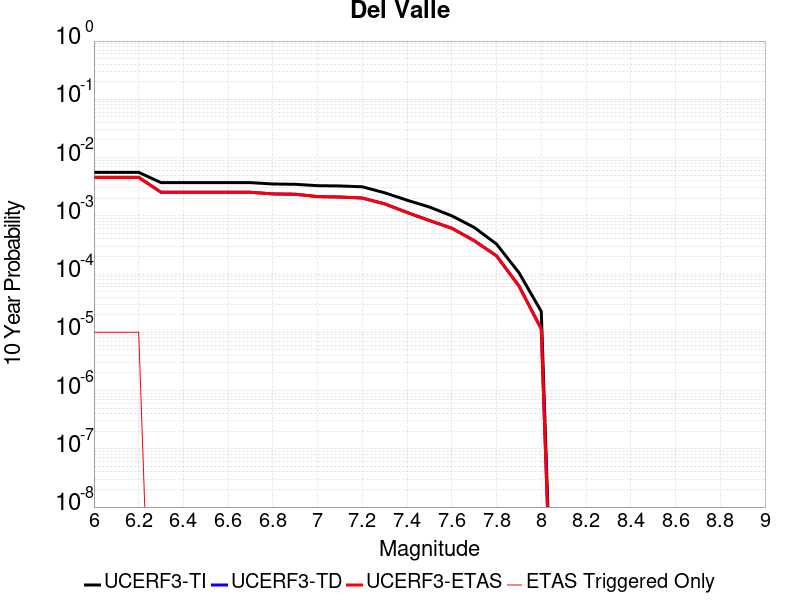 |

| Magnitude | 1 wk TI Prob | 1 wk TD Prob | 1 wk ETAS Prob | 1 wk ETAS/TD Gain | 1 wk ETAS Triggered Only | 1 mo TI Prob | 1 mo TD Prob | 1 mo ETAS Prob | 1 mo ETAS/TD Gain | 1 mo ETAS Triggered Only | 1 yr TI Prob | 1 yr TD Prob | 1 yr ETAS Prob | 1 yr ETAS/TD Gain | 1 yr ETAS Triggered Only | 10 yr TI Prob | 10 yr TD Prob | 10 yr ETAS Prob | 10 yr ETAS/TD Gain | 10 yr ETAS Triggered Only |
|-----|-----|-----|-----|-----|-----|-----|-----|-----|-----|-----|-----|-----|-----|-----|-----|-----|-----|-----|-----|-----|
| 6.0 | 1.0716125E-5 | 8.767882E-6 | 3.0649528E-5 | 3.4956594 | 2.1881839E-5 | 4.592544E-5 | 3.7576207E-5 | 5.9457223E-5 | 1.5823104 | 2.1881839E-5 | 5.589988E-4 | 4.5741405E-4 | 4.7928587E-4 | 1.0478163 | 2.1881839E-5 | 0.0055759475 | 0.00456668 | 0.0045884624 | 1.0047698 | 2.1881839E-5 |
| 6.1 | 1.0716125E-5 | 8.767882E-6 | 3.0649528E-5 | 3.4956594 | 2.1881839E-5 | 4.592544E-5 | 3.7576207E-5 | 5.9457223E-5 | 1.5823104 | 2.1881839E-5 | 5.589988E-4 | 4.5741405E-4 | 4.7928587E-4 | 1.0478163 | 2.1881839E-5 | 0.0055759475 | 0.00456668 | 0.0045884624 | 1.0047698 | 2.1881839E-5 |
| 6.2 | 1.0716125E-5 | 8.767882E-6 | 3.0649528E-5 | 3.4956594 | 2.1881839E-5 | 4.592544E-5 | 3.7576207E-5 | 5.9457223E-5 | 1.5823104 | 2.1881839E-5 | 5.589988E-4 | 4.5741405E-4 | 4.7928587E-4 | 1.0478163 | 2.1881839E-5 | 0.0055759475 | 0.00456668 | 0.0045884624 | 1.0047698 | 2.1881839E-5 |
| 6.3 | 7.1293784E-6 | 4.865823E-6 | 4.865823E-6 | 1.0 | 0.0 | 3.055412E-5 | 2.0853364E-5 | 2.0853364E-5 | 1.0 | 0.0 | 3.7193293E-4 | 2.5386087E-4 | 2.5386087E-4 | 1.0 | 0.0 | 0.0037131102 | 0.0025357946 | 0.0025357946 | 1.0 | 0.0 |
| 6.4 | 7.1293784E-6 | 4.865823E-6 | 4.865823E-6 | 1.0 | 0.0 | 3.055412E-5 | 2.0853364E-5 | 2.0853364E-5 | 1.0 | 0.0 | 3.7193293E-4 | 2.5386087E-4 | 2.5386087E-4 | 1.0 | 0.0 | 0.0037131102 | 0.0025357946 | 0.0025357946 | 1.0 | 0.0 |
| 6.5 | 7.1293784E-6 | 4.865823E-6 | 4.865823E-6 | 1.0 | 0.0 | 3.055412E-5 | 2.0853364E-5 | 2.0853364E-5 | 1.0 | 0.0 | 3.7193293E-4 | 2.5386087E-4 | 2.5386087E-4 | 1.0 | 0.0 | 0.0037131102 | 0.0025357946 | 0.0025357946 | 1.0 | 0.0 |
| 6.6 | 7.1293784E-6 | 4.865823E-6 | 4.865823E-6 | 1.0 | 0.0 | 3.055412E-5 | 2.0853364E-5 | 2.0853364E-5 | 1.0 | 0.0 | 3.7193293E-4 | 2.5386087E-4 | 2.5386087E-4 | 1.0 | 0.0 | 0.0037131102 | 0.0025357946 | 0.0025357946 | 1.0 | 0.0 |
| 6.7 | 7.12272E-6 | 4.8631987E-6 | 4.8631987E-6 | 1.0 | 0.0 | 3.0525585E-5 | 2.0842117E-5 | 2.0842117E-5 | 1.0 | 0.0 | 3.7158563E-4 | 2.5372396E-4 | 2.5372396E-4 | 1.0 | 0.0 | 0.003709649 | 0.0025344288 | 0.0025344288 | 1.0 | 0.0 |
| 6.8 | 6.7558703E-6 | 4.5594015E-6 | 4.5594015E-6 | 1.0 | 0.0 | 2.895341E-5 | 1.9540148E-5 | 1.9540148E-5 | 1.0 | 0.0 | 3.5245073E-4 | 2.3787597E-4 | 2.3787597E-4 | 1.0 | 0.0 | 0.0035189227 | 0.0023762889 | 0.0023762889 | 1.0 | 0.0 |
| 6.9 | 6.6700386E-6 | 4.502539E-6 | 4.502539E-6 | 1.0 | 0.0 | 2.8585566E-5 | 1.9296456E-5 | 1.9296456E-5 | 1.0 | 0.0 | 3.479737E-4 | 2.3490966E-4 | 2.3490966E-4 | 1.0 | 0.0 | 0.003474293 | 0.0023466884 | 0.0023466884 | 1.0 | 0.0 |
| 7.0 | 6.3181424E-6 | 4.0987034E-6 | 4.0987034E-6 | 1.0 | 0.0 | 2.7077473E-5 | 1.7565755E-5 | 1.7565755E-5 | 1.0 | 0.0 | 3.2961834E-4 | 2.1384252E-4 | 2.1384252E-4 | 1.0 | 0.0 | 0.0032912986 | 0.002136422 | 0.002136422 | 1.0 | 0.0 |
| 7.1 | 6.248759E-6 | 4.033895E-6 | 4.033895E-6 | 1.0 | 0.0 | 2.678012E-5 | 1.7288008E-5 | 1.7288008E-5 | 1.0 | 0.0 | 3.2599916E-4 | 2.104616E-4 | 2.104616E-4 | 1.0 | 0.0 | 0.0032552136 | 0.0021026772 | 0.0021026772 | 1.0 | 0.0 |
| 7.2 | 6.0411944E-6 | 3.869888E-6 | 3.869888E-6 | 1.0 | 0.0 | 2.5890577E-5 | 1.658513E-5 | 1.658513E-5 | 1.0 | 0.0 | 3.1517216E-4 | 2.0190567E-4 | 2.0190567E-4 | 1.0 | 0.0 | 0.0031472554 | 0.0020172757 | 0.0020172757 | 1.0 | 0.0 |
| 7.3 | 4.7691183E-6 | 3.0781202E-6 | 3.0781202E-6 | 1.0 | 0.0 | 2.0438918E-5 | 1.3191879E-5 | 1.3191879E-5 | 1.0 | 0.0 | 2.488154E-4 | 1.605995E-4 | 1.605995E-4 | 1.0 | 0.0 | 0.00248537 | 0.0016048603 | 0.0016048603 | 1.0 | 0.0 |
| 7.4 | 3.5524722E-6 | 2.1893363E-6 | 2.1893363E-6 | 1.0 | 0.0 | 1.5224792E-5 | 9.382837E-6 | 9.382837E-6 | 1.0 | 0.0 | 1.8534607E-4 | 1.1423013E-4 | 1.1423013E-4 | 1.0 | 0.0 | 0.0018519156 | 0.0011417224 | 0.0011417224 | 1.0 | 0.0 |
| 7.5 | 2.7133442E-6 | 1.5916097E-6 | 1.5916097E-6 | 1.0 | 0.0 | 1.1628566E-5 | 6.821167E-6 | 6.821167E-6 | 1.0 | 0.0 | 1.415686E-4 | 8.304456E-5 | 8.304456E-5 | 1.0 | 0.0 | 0.0014147845 | 8.301372E-4 | 8.301372E-4 | 1.0 | 0.0 |
| 7.6 | 1.915338E-6 | 1.173914E-6 | 1.173914E-6 | 1.0 | 0.0 | 8.208566E-6 | 5.0310505E-6 | 5.0310505E-6 | 1.0 | 0.0 | 9.993471E-5 | 6.125133E-5 | 6.125133E-5 | 1.0 | 0.0 | 9.988978E-4 | 6.123454E-4 | 6.123454E-4 | 1.0 | 0.0 |
| 7.7 | 1.2120448E-6 | 7.180313E-7 | 7.180313E-7 | 1.0 | 0.0 | 5.194467E-6 | 3.0772733E-6 | 3.0772733E-6 | 1.0 | 0.0 | 6.3240805E-5 | 3.746516E-5 | 3.746516E-5 | 1.0 | 0.0 | 6.322281E-4 | 3.7458882E-4 | 3.7458882E-4 | 1.0 | 0.0 |
| 7.8 | 6.272381E-7 | 3.932549E-7 | 3.932549E-7 | 1.0 | 0.0 | 2.6881603E-6 | 1.6853771E-6 | 1.6853771E-6 | 1.0 | 0.0 | 3.272786E-5 | 2.0519275E-5 | 2.0519275E-5 | 1.0 | 0.0 | 3.272304E-4 | 2.0517396E-4 | 2.0517396E-4 | 1.0 | 0.0 |
| 7.9 | 2.0292627E-7 | 1.2004622E-7 | 1.2004622E-7 | 1.0 | 0.0 | 8.6968373E-7 | 5.1448376E-7 | 5.1448376E-7 | 1.0 | 0.0 | 1.0588348E-5 | 6.263822E-6 | 6.263822E-6 | 1.0 | 0.0 | 1.0587843E-4 | 6.263647E-5 | 6.263647E-5 | 1.0 | 0.0 |
| 8.0 | 4.374492E-8 | 2.189964E-8 | 2.189964E-8 | 1.0 | 0.0 | 1.8747821E-7 | 9.385559E-8 | 9.385559E-8 | 1.0 | 0.0 | 2.2825448E-6 | 1.1426913E-6 | 1.1426913E-6 | 1.0 | 0.0 | 2.2825214E-5 | 1.1426858E-5 | 1.1426858E-5 | 1.0 | 0.0 |

## Lost Hills
*[(top)](#table-of-contents)*

| 1 Week | 1 Month | 1 Year | 10 Year |
|-----|-----|-----|-----|
|  |  |  |  |

| Magnitude | 1 wk TI Prob | 1 wk TD Prob | 1 wk ETAS Prob | 1 wk ETAS/TD Gain | 1 wk ETAS Triggered Only | 1 mo TI Prob | 1 mo TD Prob | 1 mo ETAS Prob | 1 mo ETAS/TD Gain | 1 mo ETAS Triggered Only | 1 yr TI Prob | 1 yr TD Prob | 1 yr ETAS Prob | 1 yr ETAS/TD Gain | 1 yr ETAS Triggered Only | 10 yr TI Prob | 10 yr TD Prob | 10 yr ETAS Prob | 10 yr ETAS/TD Gain | 10 yr ETAS Triggered Only |
|-----|-----|-----|-----|-----|-----|-----|-----|-----|-----|-----|-----|-----|-----|-----|-----|-----|-----|-----|-----|-----|
| 6.0 | 2.233523E-5 | 2.5106583E-5 | 4.6987872E-5 | 1.8715359 | 2.1881839E-5 | 9.571891E-5 | 1.0759615E-4 | 1.2947564E-4 | 1.2033482 | 2.1881839E-5 | 0.0011647546 | 0.001309364 | 0.0013312172 | 1.0166899 | 2.1881839E-5 | 0.011586686 | 0.013033091 | 0.0130546875 | 1.001657 | 2.1881839E-5 |
| 6.1 | 2.233523E-5 | 2.5106583E-5 | 4.6987872E-5 | 1.8715359 | 2.1881839E-5 | 9.571891E-5 | 1.0759615E-4 | 1.2947564E-4 | 1.2033482 | 2.1881839E-5 | 0.0011647546 | 0.001309364 | 0.0013312172 | 1.0166899 | 2.1881839E-5 | 0.011586686 | 0.013033091 | 0.0130546875 | 1.001657 | 2.1881839E-5 |
| 6.2 | 2.233523E-5 | 2.5106583E-5 | 4.6987872E-5 | 1.8715359 | 2.1881839E-5 | 9.571891E-5 | 1.0759615E-4 | 1.2947564E-4 | 1.2033482 | 2.1881839E-5 | 0.0011647546 | 0.001309364 | 0.0013312172 | 1.0166899 | 2.1881839E-5 | 0.011586686 | 0.013033091 | 0.0130546875 | 1.001657 | 2.1881839E-5 |
| 6.3 | 2.233523E-5 | 2.5106583E-5 | 4.6987872E-5 | 1.8715359 | 2.1881839E-5 | 9.571891E-5 | 1.0759615E-4 | 1.2947564E-4 | 1.2033482 | 2.1881839E-5 | 0.0011647546 | 0.001309364 | 0.0013312172 | 1.0166899 | 2.1881839E-5 | 0.011586686 | 0.013033091 | 0.0130546875 | 1.001657 | 2.1881839E-5 |
| 6.4 | 1.2288092E-5 | 1.3781108E-5 | 1.3781108E-5 | 1.0 | 0.0 | 5.2662188E-5 | 5.906108E-5 | 5.906108E-5 | 1.0 | 0.0 | 6.409735E-4 | 7.189252E-4 | 7.189252E-4 | 1.0 | 0.0 | 0.006391279 | 0.0071752006 | 0.0071752006 | 1.0 | 0.0 |
| 6.5 | 1.2288092E-5 | 1.3781108E-5 | 1.3781108E-5 | 1.0 | 0.0 | 5.2662188E-5 | 5.906108E-5 | 5.906108E-5 | 1.0 | 0.0 | 6.409735E-4 | 7.189252E-4 | 7.189252E-4 | 1.0 | 0.0 | 0.006391279 | 0.0071752006 | 0.0071752006 | 1.0 | 0.0 |
| 6.6 | 8.58281E-6 | 9.63377E-6 | 9.63377E-6 | 1.0 | 0.0 | 3.6782953E-5 | 4.12874E-5 | 4.12874E-5 | 1.0 | 0.0 | 4.4774043E-4 | 5.026414E-4 | 5.026414E-4 | 1.0 | 0.0 | 0.0044683935 | 0.005023205 | 0.005023205 | 1.0 | 0.0 |
| 6.7 | 7.205685E-6 | 8.088302E-6 | 8.088302E-6 | 1.0 | 0.0 | 3.088114E-5 | 3.466415E-5 | 3.466415E-5 | 1.0 | 0.0 | 3.7591302E-4 | 4.2203604E-4 | 4.2203604E-4 | 1.0 | 0.0 | 0.0037527776 | 0.0042203604 | 0.0042203604 | 1.0 | 0.0 |

## Cleghorn Pass
*[(top)](#table-of-contents)*

| 1 Week | 1 Month | 1 Year | 10 Year |
|-----|-----|-----|-----|
|  |  |  |  |

| Magnitude | 1 wk TI Prob | 1 wk TD Prob | 1 wk ETAS Prob | 1 wk ETAS/TD Gain | 1 wk ETAS Triggered Only | 1 mo TI Prob | 1 mo TD Prob | 1 mo ETAS Prob | 1 mo ETAS/TD Gain | 1 mo ETAS Triggered Only | 1 yr TI Prob | 1 yr TD Prob | 1 yr ETAS Prob | 1 yr ETAS/TD Gain | 1 yr ETAS Triggered Only | 10 yr TI Prob | 10 yr TD Prob | 10 yr ETAS Prob | 10 yr ETAS/TD Gain | 10 yr ETAS Triggered Only |
|-----|-----|-----|-----|-----|-----|-----|-----|-----|-----|-----|-----|-----|-----|-----|-----|-----|-----|-----|-----|-----|
| 6.0 | 1.0522846E-5 | 1.1040642E-5 | 1.1040642E-5 | 1.0 | 0.0 | 4.509713E-5 | 4.7316473E-5 | 6.9197275E-5 | 1.4624352 | 2.1881839E-5 | 5.4891926E-4 | 5.759784E-4 | 5.978477E-4 | 1.0379689 | 2.1881839E-5 | 0.0054756533 | 0.005750022 | 0.005771778 | 1.0037836 | 2.1881839E-5 |
| 6.1 | 1.0522846E-5 | 1.1040642E-5 | 1.1040642E-5 | 1.0 | 0.0 | 4.509713E-5 | 4.7316473E-5 | 6.9197275E-5 | 1.4624352 | 2.1881839E-5 | 5.4891926E-4 | 5.759784E-4 | 5.978477E-4 | 1.0379689 | 2.1881839E-5 | 0.0054756533 | 0.005750022 | 0.005771778 | 1.0037836 | 2.1881839E-5 |
| 6.2 | 2.1045846E-6 | 2.2082024E-6 | 2.2082024E-6 | 1.0 | 0.0 | 9.019617E-6 | 9.463714E-6 | 3.1345346E-5 | 3.312161 | 2.1881839E-5 | 1.098083E-4 | 1.1521882E-4 | 1.3709813E-4 | 1.1898936 | 2.1881839E-5 | 0.0010975406 | 0.0011520023 | 0.0011738589 | 1.0189728 | 2.1881839E-5 |
| 6.3 | 2.1045846E-6 | 2.2082024E-6 | 2.2082024E-6 | 1.0 | 0.0 | 9.019617E-6 | 9.463714E-6 | 3.1345346E-5 | 3.312161 | 2.1881839E-5 | 1.098083E-4 | 1.1521882E-4 | 1.3709813E-4 | 1.1898936 | 2.1881839E-5 | 0.0010975406 | 0.0011520023 | 0.0011738589 | 1.0189728 | 2.1881839E-5 |
| 6.4 | 1.7259927E-6 | 1.810877E-6 | 1.810877E-6 | 1.0 | 0.0 | 7.3970905E-6 | 7.760902E-6 | 2.964257E-5 | 3.819475 | 2.1881839E-5 | 9.005586E-5 | 9.4488976E-5 | 1.1636875E-4 | 1.2315589 | 2.1881839E-5 | 9.001937E-4 | 9.448898E-4 | 9.6675096E-4 | 1.0231363 | 2.1881839E-5 |

## Likely 2011 CFM
*[(top)](#table-of-contents)*

| 1 Week | 1 Month | 1 Year | 10 Year |
|-----|-----|-----|-----|
|  |  |  |  |

| Magnitude | 1 wk TI Prob | 1 wk TD Prob | 1 wk ETAS Prob | 1 wk ETAS/TD Gain | 1 wk ETAS Triggered Only | 1 mo TI Prob | 1 mo TD Prob | 1 mo ETAS Prob | 1 mo ETAS/TD Gain | 1 mo ETAS Triggered Only | 1 yr TI Prob | 1 yr TD Prob | 1 yr ETAS Prob | 1 yr ETAS/TD Gain | 1 yr ETAS Triggered Only | 10 yr TI Prob | 10 yr TD Prob | 10 yr ETAS Prob | 10 yr ETAS/TD Gain | 10 yr ETAS Triggered Only |
|-----|-----|-----|-----|-----|-----|-----|-----|-----|-----|-----|-----|-----|-----|-----|-----|-----|-----|-----|-----|-----|
| 6.0 | 2.5315949E-5 | 2.7104748E-5 | 4.8985992E-5 | 1.8072846 | 2.1881839E-5 | 1.0849241E-4 | 1.16158284E-4 | 1.3803758E-4 | 1.1883576 | 2.1881839E-5 | 0.0013200947 | 0.0014133542 | 0.0014352051 | 1.0154604 | 2.1881839E-5 | 0.013122803 | 0.01404831 | 0.014069885 | 1.0015358 | 2.1881839E-5 |
| 6.1 | 2.5315949E-5 | 2.7104748E-5 | 2.7104748E-5 | 1.0 | 0.0 | 1.0849241E-4 | 1.16158284E-4 | 1.16158284E-4 | 1.0 | 0.0 | 0.0013200947 | 0.0014133542 | 0.0014133542 | 1.0 | 0.0 | 0.013122803 | 0.01404831 | 0.01404831 | 1.0 | 0.0 |
| 6.2 | 1.6375941E-5 | 1.7465842E-5 | 1.7465842E-5 | 1.0 | 0.0 | 7.0180715E-5 | 7.485153E-5 | 7.485153E-5 | 1.0 | 0.0 | 8.5411523E-4 | 9.109487E-4 | 9.109487E-4 | 1.0 | 0.0 | 0.008508399 | 0.009073433 | 0.009073433 | 1.0 | 0.0 |
| 6.3 | 1.1945543E-5 | 1.2712587E-5 | 1.2712587E-5 | 1.0 | 0.0 | 5.119418E-5 | 5.4481407E-5 | 5.4481407E-5 | 1.0 | 0.0 | 6.2311086E-4 | 6.631146E-4 | 6.631146E-4 | 1.0 | 0.0 | 0.0062136655 | 0.0066119144 | 0.0066119144 | 1.0 | 0.0 |
| 6.4 | 9.192729E-6 | 9.768488E-6 | 9.768488E-6 | 1.0 | 0.0 | 3.939681E-5 | 4.1864292E-5 | 4.1864292E-5 | 1.0 | 0.0 | 4.7955062E-4 | 5.0958124E-4 | 5.0958124E-4 | 1.0 | 0.0 | 0.004785171 | 0.0050844094 | 0.0050844094 | 1.0 | 0.0 |
| 6.5 | 7.67906E-6 | 8.152622E-6 | 8.152622E-6 | 1.0 | 0.0 | 3.2909844E-5 | 3.4939352E-5 | 3.4939352E-5 | 1.0 | 0.0 | 4.006037E-4 | 4.2530545E-4 | 4.2530545E-4 | 1.0 | 0.0 | 0.0039988225 | 0.004245108 | 0.004245108 | 1.0 | 0.0 |
| 6.6 | 6.4884057E-6 | 6.8847507E-6 | 6.8847507E-6 | 1.0 | 0.0 | 2.7807157E-5 | 2.9505749E-5 | 2.9505749E-5 | 1.0 | 0.0 | 3.3849955E-4 | 3.591747E-4 | 3.591747E-4 | 1.0 | 0.0 | 0.003379844 | 0.0035860867 | 0.0035860867 | 1.0 | 0.0 |
| 6.7 | 4.6060636E-6 | 4.884041E-6 | 4.884041E-6 | 1.0 | 0.0 | 1.9740122E-5 | 2.0931442E-5 | 2.0931442E-5 | 1.0 | 0.0 | 2.403095E-4 | 2.5481134E-4 | 2.5481134E-4 | 1.0 | 0.0 | 0.002400498 | 0.0025452746 | 0.0025452746 | 1.0 | 0.0 |
| 6.8 | 3.2795615E-6 | 3.4773732E-6 | 3.4773732E-6 | 1.0 | 0.0 | 1.4055187E-5 | 1.4902946E-5 | 1.4902946E-5 | 1.0 | 0.0 | 1.7110848E-4 | 1.8142881E-4 | 1.8142881E-4 | 1.0 | 0.0 | 0.0017097679 | 0.0018128622 | 0.0018128622 | 1.0 | 0.0 |
| 6.9 | 2.3289967E-6 | 2.4705569E-6 | 2.4705569E-6 | 1.0 | 0.0 | 9.981376E-6 | 1.058806E-5 | 1.058806E-5 | 1.0 | 0.0 | 1.2151648E-4 | 1.2890245E-4 | 1.2890245E-4 | 1.0 | 0.0 | 0.0012145005 | 0.0012883197 | 0.0012883197 | 1.0 | 0.0 |
| 7.0 | 1.211292E-6 | 1.2863958E-6 | 1.2863958E-6 | 1.0 | 0.0 | 5.1912407E-6 | 5.5131145E-6 | 5.5131145E-6 | 1.0 | 0.0 | 6.320152E-5 | 6.712041E-5 | 6.712041E-5 | 1.0 | 0.0 | 6.3183554E-4 | 6.710312E-4 | 6.710312E-4 | 1.0 | 0.0 |

## Last Chance
*[(top)](#table-of-contents)*

| 1 Week | 1 Month | 1 Year | 10 Year |
|-----|-----|-----|-----|
|  |  |  |  |

| Magnitude | 1 wk TI Prob | 1 wk TD Prob | 1 wk ETAS Prob | 1 wk ETAS/TD Gain | 1 wk ETAS Triggered Only | 1 mo TI Prob | 1 mo TD Prob | 1 mo ETAS Prob | 1 mo ETAS/TD Gain | 1 mo ETAS Triggered Only | 1 yr TI Prob | 1 yr TD Prob | 1 yr ETAS Prob | 1 yr ETAS/TD Gain | 1 yr ETAS Triggered Only | 10 yr TI Prob | 10 yr TD Prob | 10 yr ETAS Prob | 10 yr ETAS/TD Gain | 10 yr ETAS Triggered Only |
|-----|-----|-----|-----|-----|-----|-----|-----|-----|-----|-----|-----|-----|-----|-----|-----|-----|-----|-----|-----|-----|
| 6.0 | 3.23929E-6 | 3.305131E-6 | 2.5186897E-5 | 7.6205444 | 2.1881839E-5 | 1.3882597E-5 | 1.4164784E-5 | 3.6046313E-5 | 2.5447838 | 2.1881839E-5 | 1.6900752E-4 | 1.7244508E-4 | 1.9432315E-4 | 1.1268698 | 2.1881839E-5 | 0.0016887904 | 0.0017233564 | 0.0017452006 | 1.0126753 | 2.1881839E-5 |
| 6.1 | 3.23929E-6 | 3.305131E-6 | 2.5186897E-5 | 7.6205444 | 2.1881839E-5 | 1.3882597E-5 | 1.4164784E-5 | 3.6046313E-5 | 2.5447838 | 2.1881839E-5 | 1.6900752E-4 | 1.7244508E-4 | 1.9432315E-4 | 1.1268698 | 2.1881839E-5 | 0.0016887904 | 0.0017233564 | 0.0017452006 | 1.0126753 | 2.1881839E-5 |
| 6.2 | 3.23929E-6 | 3.305131E-6 | 2.5186897E-5 | 7.6205444 | 2.1881839E-5 | 1.3882597E-5 | 1.4164784E-5 | 3.6046313E-5 | 2.5447838 | 2.1881839E-5 | 1.6900752E-4 | 1.7244508E-4 | 1.9432315E-4 | 1.1268698 | 2.1881839E-5 | 0.0016887904 | 0.0017233564 | 0.0017452006 | 1.0126753 | 2.1881839E-5 |
| 6.3 | 3.23929E-6 | 3.305131E-6 | 2.5186897E-5 | 7.6205444 | 2.1881839E-5 | 1.3882597E-5 | 1.4164784E-5 | 3.6046313E-5 | 2.5447838 | 2.1881839E-5 | 1.6900752E-4 | 1.7244508E-4 | 1.9432315E-4 | 1.1268698 | 2.1881839E-5 | 0.0016887904 | 0.0017233564 | 0.0017452006 | 1.0126753 | 2.1881839E-5 |
| 6.4 | 3.23929E-6 | 3.305131E-6 | 2.5186897E-5 | 7.6205444 | 2.1881839E-5 | 1.3882597E-5 | 1.4164784E-5 | 3.6046313E-5 | 2.5447838 | 2.1881839E-5 | 1.6900752E-4 | 1.7244508E-4 | 1.9432315E-4 | 1.1268698 | 2.1881839E-5 | 0.0016887904 | 0.0017233564 | 0.0017452006 | 1.0126753 | 2.1881839E-5 |
| 6.5 | 3.23929E-6 | 3.305131E-6 | 2.5186897E-5 | 7.6205444 | 2.1881839E-5 | 1.3882597E-5 | 1.4164784E-5 | 3.6046313E-5 | 2.5447838 | 2.1881839E-5 | 1.6900752E-4 | 1.7244508E-4 | 1.9432315E-4 | 1.1268698 | 2.1881839E-5 | 0.0016887904 | 0.0017233564 | 0.0017452006 | 1.0126753 | 2.1881839E-5 |
| 6.6 | 3.23929E-6 | 3.305131E-6 | 2.5186897E-5 | 7.6205444 | 2.1881839E-5 | 1.3882597E-5 | 1.4164784E-5 | 3.6046313E-5 | 2.5447838 | 2.1881839E-5 | 1.6900752E-4 | 1.7244508E-4 | 1.9432315E-4 | 1.1268698 | 2.1881839E-5 | 0.0016887904 | 0.0017233564 | 0.0017452006 | 1.0126753 | 2.1881839E-5 |
| 6.7 | 1.9639244E-6 | 2.004454E-6 | 2.004454E-6 | 1.0 | 0.0 | 8.416792E-6 | 8.590492E-6 | 8.590492E-6 | 1.0 | 0.0 | 1.02469625E-4 | 1.0458486E-4 | 1.0458486E-4 | 1.0 | 0.0 | 0.0010242239 | 0.0010454189 | 0.0010454189 | 1.0 | 0.0 |
| 6.8 | 1.8490592E-6 | 1.8874916E-6 | 1.8874916E-6 | 1.0 | 0.0 | 7.924516E-6 | 8.089228E-6 | 8.089228E-6 | 1.0 | 0.0 | 9.64767E-5 | 9.8482524E-5 | 9.8482524E-5 | 1.0 | 0.0 | 9.643483E-4 | 9.844499E-4 | 9.844499E-4 | 1.0 | 0.0 |
| 6.9 | 1.6283703E-6 | 1.6624386E-6 | 1.6624386E-6 | 1.0 | 0.0 | 6.9787116E-6 | 7.124721E-6 | 7.124721E-6 | 1.0 | 0.0 | 8.49625E-5 | 8.674058E-5 | 8.674058E-5 | 1.0 | 0.0 | 8.4930024E-4 | 8.6712214E-4 | 8.6712214E-4 | 1.0 | 0.0 |
| 7.0 | 1.1619308E-6 | 1.1869527E-6 | 1.1869527E-6 | 1.0 | 0.0 | 4.979694E-6 | 5.0869326E-6 | 5.0869326E-6 | 1.0 | 0.0 | 6.0626087E-5 | 6.1932085E-5 | 6.1932085E-5 | 1.0 | 0.0 | 6.060955E-4 | 6.19192E-4 | 6.19192E-4 | 1.0 | 0.0 |
| 7.1 | 7.8723247E-7 | 8.0469965E-7 | 8.0469965E-7 | 1.0 | 0.0 | 3.373849E-6 | 3.44871E-6 | 3.44871E-6 | 1.0 | 0.0 | 4.107584E-5 | 4.198754E-5 | 4.198754E-5 | 1.0 | 0.0 | 4.1068246E-4 | 4.1982596E-4 | 4.1982596E-4 | 1.0 | 0.0 |

## Tin Mountain
*[(top)](#table-of-contents)*

| 1 Week | 1 Month | 1 Year | 10 Year |
|-----|-----|-----|-----|
|  |  |  |  |

| Magnitude | 1 wk TI Prob | 1 wk TD Prob | 1 wk ETAS Prob | 1 wk ETAS/TD Gain | 1 wk ETAS Triggered Only | 1 mo TI Prob | 1 mo TD Prob | 1 mo ETAS Prob | 1 mo ETAS/TD Gain | 1 mo ETAS Triggered Only | 1 yr TI Prob | 1 yr TD Prob | 1 yr ETAS Prob | 1 yr ETAS/TD Gain | 1 yr ETAS Triggered Only | 10 yr TI Prob | 10 yr TD Prob | 10 yr ETAS Prob | 10 yr ETAS/TD Gain | 10 yr ETAS Triggered Only |
|-----|-----|-----|-----|-----|-----|-----|-----|-----|-----|-----|-----|-----|-----|-----|-----|-----|-----|-----|-----|-----|
| 6.0 | 4.083776E-6 | 4.1815365E-6 | 2.6063282E-5 | 6.232944 | 2.1881839E-5 | 1.750178E-5 | 1.792077E-5 | 3.9802217E-5 | 2.2210104 | 2.1881839E-5 | 2.1306332E-4 | 2.1816725E-4 | 2.400443E-4 | 1.1002766 | 2.1881839E-5 | 0.0021285915 | 0.0021798965 | 0.0022017306 | 1.0100161 | 2.1881839E-5 |
| 6.1 | 4.083776E-6 | 4.1815365E-6 | 2.6063282E-5 | 6.232944 | 2.1881839E-5 | 1.750178E-5 | 1.792077E-5 | 3.9802217E-5 | 2.2210104 | 2.1881839E-5 | 2.1306332E-4 | 2.1816725E-4 | 2.400443E-4 | 1.1002766 | 2.1881839E-5 | 0.0021285915 | 0.0021798965 | 0.0022017306 | 1.0100161 | 2.1881839E-5 |
| 6.2 | 4.083776E-6 | 4.1815365E-6 | 2.6063282E-5 | 6.232944 | 2.1881839E-5 | 1.750178E-5 | 1.792077E-5 | 3.9802217E-5 | 2.2210104 | 2.1881839E-5 | 2.1306332E-4 | 2.1816725E-4 | 2.400443E-4 | 1.1002766 | 2.1881839E-5 | 0.0021285915 | 0.0021798965 | 0.0022017306 | 1.0100161 | 2.1881839E-5 |
| 6.3 | 4.083776E-6 | 4.1815365E-6 | 2.6063282E-5 | 6.232944 | 2.1881839E-5 | 1.750178E-5 | 1.792077E-5 | 3.9802217E-5 | 2.2210104 | 2.1881839E-5 | 2.1306332E-4 | 2.1816725E-4 | 2.400443E-4 | 1.1002766 | 2.1881839E-5 | 0.0021285915 | 0.0021798965 | 0.0022017306 | 1.0100161 | 2.1881839E-5 |
| 6.4 | 4.083776E-6 | 4.1815365E-6 | 2.6063282E-5 | 6.232944 | 2.1881839E-5 | 1.750178E-5 | 1.792077E-5 | 3.9802217E-5 | 2.2210104 | 2.1881839E-5 | 2.1306332E-4 | 2.1816725E-4 | 2.400443E-4 | 1.1002766 | 2.1881839E-5 | 0.0021285915 | 0.0021798965 | 0.0022017306 | 1.0100161 | 2.1881839E-5 |
| 6.5 | 2.3143427E-6 | 2.3731573E-6 | 2.3731573E-6 | 1.0 | 0.0 | 9.9185745E-6 | 1.0170638E-5 | 1.0170638E-5 | 1.0 | 0.0 | 1.2075195E-4 | 1.2382126E-4 | 1.2382126E-4 | 1.0 | 0.0 | 0.0012068636 | 0.0012375986 | 0.0012375986 | 1.0 | 0.0 |
| 6.6 | 2.3143427E-6 | 2.3731573E-6 | 2.3731573E-6 | 1.0 | 0.0 | 9.9185745E-6 | 1.0170638E-5 | 1.0170638E-5 | 1.0 | 0.0 | 1.2075195E-4 | 1.2382126E-4 | 1.2382126E-4 | 1.0 | 0.0 | 0.0012068636 | 0.0012375986 | 0.0012375986 | 1.0 | 0.0 |
| 6.7 | 1.7029532E-6 | 1.7497915E-6 | 1.7497915E-6 | 1.0 | 0.0 | 7.2983503E-6 | 7.499088E-6 | 7.499088E-6 | 1.0 | 0.0 | 8.885379E-5 | 9.1298105E-5 | 9.1298105E-5 | 1.0 | 0.0 | 8.881827E-4 | 9.1265864E-4 | 9.1265864E-4 | 1.0 | 0.0 |
| 6.8 | 1.2914646E-6 | 1.3299378E-6 | 1.3299378E-6 | 1.0 | 0.0 | 5.534837E-6 | 5.6997237E-6 | 5.6997237E-6 | 1.0 | 0.0 | 6.738455E-5 | 6.939237E-5 | 6.939237E-5 | 1.0 | 0.0 | 6.736412E-4 | 6.9375033E-4 | 6.9375033E-4 | 1.0 | 0.0 |
| 6.9 | 5.8708974E-7 | 6.1169936E-7 | 6.1169936E-7 | 1.0 | 0.0 | 2.5160964E-6 | 2.6215664E-6 | 2.6215664E-6 | 1.0 | 0.0 | 3.0633044E-5 | 3.1917145E-5 | 3.1917145E-5 | 1.0 | 0.0 | 3.0628822E-4 | 3.191297E-4 | 3.191297E-4 | 1.0 | 0.0 |
| 7.0 | 4.6248786E-7 | 4.832015E-7 | 4.832015E-7 | 1.0 | 0.0 | 1.9820893E-6 | 2.0708624E-6 | 2.0708624E-6 | 1.0 | 0.0 | 2.413167E-5 | 2.5212494E-5 | 2.5212494E-5 | 1.0 | 0.0 | 2.412905E-4 | 2.5210003E-4 | 2.5210003E-4 | 1.0 | 0.0 |
| 7.1 | 3.804606E-7 | 3.987147E-7 | 3.987147E-7 | 1.0 | 0.0 | 1.6305444E-6 | 1.7087764E-6 | 1.7087764E-6 | 1.0 | 0.0 | 1.9851697E-5 | 2.0804187E-5 | 2.0804187E-5 | 1.0 | 0.0 | 1.9849923E-4 | 2.0802575E-4 | 2.0802575E-4 | 1.0 | 0.0 |
| 7.2 | 3.5864858E-7 | 3.7616863E-7 | 3.7616863E-7 | 1.0 | 0.0 | 1.5370645E-6 | 1.6121504E-6 | 1.6121504E-6 | 1.0 | 0.0 | 1.87136E-5 | 1.9627789E-5 | 1.9627789E-5 | 1.0 | 0.0 | 1.8712023E-4 | 1.9626386E-4 | 1.9626386E-4 | 1.0 | 0.0 |
| 7.3 | 3.342063E-7 | 3.506347E-7 | 3.506347E-7 | 1.0 | 0.0 | 1.4323119E-6 | 1.5027196E-6 | 1.5027196E-6 | 1.0 | 0.0 | 1.7438259E-5 | 1.829549E-5 | 1.829549E-5 | 1.0 | 0.0 | 1.743689E-4 | 1.8294314E-4 | 1.8294314E-4 | 1.0 | 0.0 |
| 7.4 | 2.971242E-7 | 3.1165817E-7 | 3.1165817E-7 | 1.0 | 0.0 | 1.2733886E-6 | 1.3356774E-6 | 1.3356774E-6 | 1.0 | 0.0 | 1.5503398E-5 | 1.6261785E-5 | 1.6261785E-5 | 1.0 | 0.0 | 1.5502315E-4 | 1.6260923E-4 | 1.6260923E-4 | 1.0 | 0.0 |
| 7.5 | 1.4326713E-7 | 1.5012525E-7 | 1.5012525E-7 | 1.0 | 0.0 | 6.140018E-7 | 6.433939E-7 | 6.433939E-7 | 1.0 | 0.0 | 7.4754466E-6 | 7.8333205E-6 | 7.8333205E-6 | 1.0 | 0.0 | 7.475195E-5 | 7.833321E-5 | 7.833321E-5 | 1.0 | 0.0 |

## San Andreas (Offshore) 2011 CFM
*[(top)](#table-of-contents)*

| 1 Week | 1 Month | 1 Year | 10 Year |
|-----|-----|-----|-----|
|  |  | 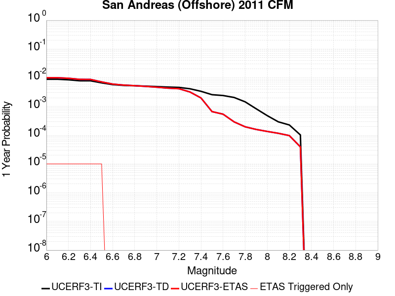 | 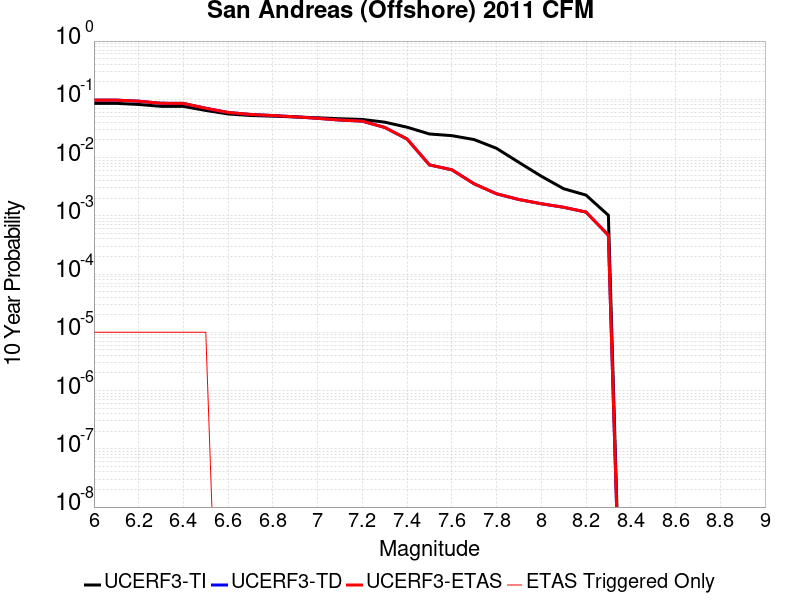 |

| Magnitude | 1 wk TI Prob | 1 wk TD Prob | 1 wk ETAS Prob | 1 wk ETAS/TD Gain | 1 wk ETAS Triggered Only | 1 mo TI Prob | 1 mo TD Prob | 1 mo ETAS Prob | 1 mo ETAS/TD Gain | 1 mo ETAS Triggered Only | 1 yr TI Prob | 1 yr TD Prob | 1 yr ETAS Prob | 1 yr ETAS/TD Gain | 1 yr ETAS Triggered Only | 10 yr TI Prob | 10 yr TD Prob | 10 yr ETAS Prob | 10 yr ETAS/TD Gain | 10 yr ETAS Triggered Only |
|-----|-----|-----|-----|-----|-----|-----|-----|-----|-----|-----|-----|-----|-----|-----|-----|-----|-----|-----|-----|-----|
| 6.0 | 1.7072787E-4 | 1.9226041E-4 | 2.1413805E-4 | 1.1137917 | 2.1881839E-5 | 7.3148566E-4 | 8.237154E-4 | 8.4557926E-4 | 1.0265429 | 2.1881839E-5 | 0.008869528 | 0.0099831335 | 0.010004797 | 1.00217 | 2.1881839E-5 | 0.085237645 | 0.09682738 | 0.09684715 | 1.0002041 | 2.1881839E-5 |
| 6.1 | 1.7072787E-4 | 1.9226041E-4 | 2.1413805E-4 | 1.1137917 | 2.1881839E-5 | 7.3148566E-4 | 8.237154E-4 | 8.4557926E-4 | 1.0265429 | 2.1881839E-5 | 0.008869528 | 0.0099831335 | 0.010004797 | 1.00217 | 2.1881839E-5 | 0.085237645 | 0.09682738 | 0.09684715 | 1.0002041 | 2.1881839E-5 |
| 6.2 | 1.6312556E-4 | 1.8407789E-4 | 2.0595569E-4 | 1.1188508 | 2.1881839E-5 | 6.989222E-4 | 7.8866904E-4 | 8.1053365E-4 | 1.0277234 | 2.1881839E-5 | 0.008476226 | 0.009560268 | 0.009581941 | 1.002267 | 2.1881839E-5 | 0.08160117 | 0.09284818 | 0.09286803 | 1.0002137 | 2.1881839E-5 |
| 6.3 | 1.5103363E-4 | 1.6880741E-4 | 1.9068555E-4 | 1.1296042 | 2.1881839E-5 | 6.471264E-4 | 7.232619E-4 | 7.451279E-4 | 1.0302325 | 2.1881839E-5 | 0.007850339 | 0.008770605 | 0.008792294 | 1.002473 | 2.1881839E-5 | 0.075787395 | 0.085489064 | 0.08550908 | 1.0002341 | 2.1881839E-5 |
| 6.4 | 1.5047993E-4 | 1.676667E-4 | 1.8954487E-4 | 1.1304861 | 2.1881839E-5 | 6.4475456E-4 | 7.1837584E-4 | 7.4024196E-4 | 1.0304383 | 2.1881839E-5 | 0.007821669 | 0.008711592 | 0.008733284 | 1.0024899 | 2.1881839E-5 | 0.0755203 | 0.08496926 | 0.08498929 | 1.0002357 | 2.1881839E-5 |
| 6.5 | 1.2760791E-4 | 1.3735025E-4 | 1.5922908E-4 | 1.1592922 | 2.1881839E-5 | 5.467764E-4 | 5.885125E-4 | 6.103815E-4 | 1.0371597 | 2.1881839E-5 | 0.0066367025 | 0.0071418737 | 0.007163599 | 1.003042 | 2.1881839E-5 | 0.064419635 | 0.07025001 | 0.07027036 | 1.0002896 | 2.1881839E-5 |
| 6.6 | 1.1063525E-4 | 1.15566356E-4 | 1.15566356E-4 | 1.0 | 0.0 | 4.740649E-4 | 4.9519143E-4 | 4.9519143E-4 | 1.0 | 0.0 | 0.0057564764 | 0.006012491 | 0.006012491 | 1.0 | 0.0 | 0.05609626 | 0.05948894 | 0.05948894 | 1.0 | 0.0 |
| 6.7 | 1.0391049E-4 | 1.0645922E-4 | 1.0645922E-4 | 1.0 | 0.0 | 4.4525467E-4 | 4.5617504E-4 | 4.5617504E-4 | 1.0 | 0.0 | 0.0054075094 | 0.005539975 | 0.005539975 | 1.0 | 0.0 | 0.052778035 | 0.05498876 | 0.05498876 | 1.0 | 0.0 |
| 6.8 | 1.0096706E-4 | 1.01582686E-4 | 1.01582686E-4 | 1.0 | 0.0 | 4.3264418E-4 | 4.3528268E-4 | 4.3528268E-4 | 1.0 | 0.0 | 0.0052547283 | 0.005286866 | 0.005286866 | 1.0 | 0.0 | 0.051321987 | 0.052687574 | 0.052687574 | 1.0 | 0.0 |
| 6.9 | 9.800265E-5 | 9.588748E-5 | 9.588748E-5 | 1.0 | 0.0 | 4.1994374E-4 | 4.1088252E-4 | 4.1088252E-4 | 1.0 | 0.0 | 0.0051008356 | 0.0049911886 | 0.0049911886 | 1.0 | 0.0 | 0.049853306 | 0.05001504 | 0.05001504 | 1.0 | 0.0 |
| 7.0 | 9.4642375E-5 | 9.002143E-5 | 9.002143E-5 | 1.0 | 0.0 | 4.0554712E-4 | 3.8574997E-4 | 3.8574997E-4 | 1.0 | 0.0 | 0.004926363 | 0.0046865544 | 0.0046865544 | 1.0 | 0.0 | 0.048185747 | 0.047196057 | 0.047196057 | 1.0 | 0.0 |
| 7.1 | 9.0996844E-5 | 8.354169E-5 | 8.354169E-5 | 1.0 | 0.0 | 3.8992817E-4 | 3.5798753E-4 | 3.5798753E-4 | 1.0 | 0.0 | 0.004737046 | 0.004349944 | 0.004349944 | 1.0 | 0.0 | 0.04637333 | 0.044047635 | 0.044047635 | 1.0 | 0.0 |
| 7.2 | 8.848287E-5 | 7.9818135E-5 | 7.9818135E-5 | 1.0 | 0.0 | 3.791572E-4 | 3.4203375E-4 | 3.4203375E-4 | 1.0 | 0.0 | 0.004606472 | 0.0041564633 | 0.0041564633 | 1.0 | 0.0 | 0.045121472 | 0.042191572 | 0.042191572 | 1.0 | 0.0 |
| 7.3 | 7.9280784E-5 | 6.1276216E-5 | 6.1276216E-5 | 1.0 | 0.0 | 3.3973053E-4 | 2.625865E-4 | 2.625865E-4 | 1.0 | 0.0 | 0.004128377 | 0.0031924061 | 0.0031924061 | 1.0 | 0.0 | 0.040525194 | 0.032904375 | 0.032904375 | 1.0 | 0.0 |
| 7.4 | 6.468038E-5 | 3.7933212E-5 | 3.7933212E-5 | 1.0 | 0.0 | 2.771722E-4 | 1.625611E-4 | 1.625611E-4 | 1.0 | 0.0 | 0.0033693502 | 0.0019774425 | 0.0019774425 | 1.0 | 0.0 | 0.0331872 | 0.02082181 | 0.02082181 | 1.0 | 0.0 |
| 7.5 | 4.930574E-5 | 1.2703362E-5 | 1.2703362E-5 | 1.0 | 0.0 | 2.1129321E-4 | 5.444185E-5 | 5.444185E-5 | 1.0 | 0.0 | 0.0025694598 | 6.6262955E-4 | 6.6262955E-4 | 1.0 | 0.0 | 0.02539953 | 0.007481418 | 0.007481418 | 1.0 | 0.0 |
| 7.6 | 4.612566E-5 | 1.0336213E-5 | 1.0336213E-5 | 1.0 | 0.0 | 1.9766642E-4 | 4.429731E-5 | 4.429731E-5 | 1.0 | 0.0 | 0.0024039324 | 5.391877E-4 | 5.391877E-4 | 1.0 | 0.0 | 0.023780935 | 0.006172099 | 0.006172099 | 1.0 | 0.0 |
| 7.7 | 3.9435414E-5 | 5.574925E-6 | 5.574925E-6 | 1.0 | 0.0 | 1.6899795E-4 | 2.3892318E-5 | 2.3892318E-5 | 1.0 | 0.0 | 0.0020556084 | 2.9085035E-4 | 2.9085035E-4 | 1.0 | 0.0 | 0.020366974 | 0.0035420412 | 0.0035420412 | 1.0 | 0.0 |
| 7.8 | 2.7787428E-5 | 3.7553348E-6 | 3.7553348E-6 | 1.0 | 0.0 | 1.1908354E-4 | 1.6094193E-5 | 1.6094193E-5 | 1.0 | 0.0 | 0.0014488777 | 1.9592921E-4 | 1.9592921E-4 | 1.0 | 0.0 | 0.014394675 | 0.0023877125 | 0.0023877125 | 1.0 | 0.0 |
| 7.9 | 1.590671E-5 | 3.04085E-6 | 3.04085E-6 | 1.0 | 0.0 | 6.816983E-5 | 1.303215E-5 | 1.303215E-5 | 1.0 | 0.0 | 8.2965166E-4 | 1.586549E-4 | 1.586549E-4 | 1.0 | 0.0 | 0.008265611 | 0.001904262 | 0.001904262 | 1.0 | 0.0 |
| 8.0 | 9.193638E-6 | 2.5920847E-6 | 2.5920847E-6 | 1.0 | 0.0 | 3.940071E-5 | 1.1108887E-5 | 1.1108887E-5 | 1.0 | 0.0 | 4.7959806E-4 | 1.3524233E-4 | 1.3524233E-4 | 1.0 | 0.0 | 0.0047856434 | 0.0016115032 | 0.0016115032 | 1.0 | 0.0 |
| 8.1 | 5.601576E-6 | 2.2343472E-6 | 2.2343472E-6 | 1.0 | 0.0 | 2.4006533E-5 | 9.575739E-6 | 9.575739E-6 | 1.0 | 0.0 | 2.9224035E-4 | 1.16578405E-4 | 1.16578405E-4 | 1.0 | 0.0 | 0.0029185633 | 0.0014020674 | 0.0014020674 | 1.0 | 0.0 |
| 8.2 | 4.3508785E-6 | 1.857566E-6 | 1.857566E-6 | 1.0 | 0.0 | 1.864649E-5 | 7.960973E-6 | 7.960973E-6 | 1.0 | 0.0 | 2.2699735E-4 | 9.692056E-5 | 9.692056E-5 | 1.0 | 0.0 | 0.0022676561 | 0.0011594221 | 0.0011594221 | 1.0 | 0.0 |
| 8.3 | 1.9573292E-6 | 7.514906E-7 | 7.514906E-7 | 1.0 | 0.0 | 8.388526E-6 | 3.22067E-6 | 3.22067E-6 | 1.0 | 0.0 | 1.0212552E-4 | 3.921097E-5 | 3.921097E-5 | 1.0 | 0.0 | 0.001020786 | 4.640846E-4 | 4.640846E-4 | 1.0 | 0.0 |

## Raymond
*[(top)](#table-of-contents)*

| 1 Week | 1 Month | 1 Year | 10 Year |
|-----|-----|-----|-----|
|  |  |  |  |

| Magnitude | 1 wk TI Prob | 1 wk TD Prob | 1 wk ETAS Prob | 1 wk ETAS/TD Gain | 1 wk ETAS Triggered Only | 1 mo TI Prob | 1 mo TD Prob | 1 mo ETAS Prob | 1 mo ETAS/TD Gain | 1 mo ETAS Triggered Only | 1 yr TI Prob | 1 yr TD Prob | 1 yr ETAS Prob | 1 yr ETAS/TD Gain | 1 yr ETAS Triggered Only | 10 yr TI Prob | 10 yr TD Prob | 10 yr ETAS Prob | 10 yr ETAS/TD Gain | 10 yr ETAS Triggered Only |
|-----|-----|-----|-----|-----|-----|-----|-----|-----|-----|-----|-----|-----|-----|-----|-----|-----|-----|-----|-----|-----|
| 6.0 | 1.5157413E-5 | 1.5810128E-5 | 3.769162E-5 | 2.3840175 | 2.1881839E-5 | 6.4958724E-5 | 6.7756075E-5 | 8.963643E-5 | 1.3229283 | 2.1881839E-5 | 7.905855E-4 | 8.2464307E-4 | 8.4650685E-4 | 1.026513 | 2.1881839E-5 | 0.007877788 | 0.008218348 | 0.00824005 | 1.0026407 | 2.1881839E-5 |
| 6.1 | 1.5157413E-5 | 1.5810128E-5 | 3.769162E-5 | 2.3840175 | 2.1881839E-5 | 6.4958724E-5 | 6.7756075E-5 | 8.963643E-5 | 1.3229283 | 2.1881839E-5 | 7.905855E-4 | 8.2464307E-4 | 8.4650685E-4 | 1.026513 | 2.1881839E-5 | 0.007877788 | 0.008218348 | 0.00824005 | 1.0026407 | 2.1881839E-5 |
| 6.2 | 1.5157413E-5 | 1.5810128E-5 | 3.769162E-5 | 2.3840175 | 2.1881839E-5 | 6.4958724E-5 | 6.7756075E-5 | 8.963643E-5 | 1.3229283 | 2.1881839E-5 | 7.905855E-4 | 8.2464307E-4 | 8.4650685E-4 | 1.026513 | 2.1881839E-5 | 0.007877788 | 0.008218348 | 0.00824005 | 1.0026407 | 2.1881839E-5 |
| 6.3 | 1.5157413E-5 | 1.5810128E-5 | 3.769162E-5 | 2.3840175 | 2.1881839E-5 | 6.4958724E-5 | 6.7756075E-5 | 8.963643E-5 | 1.3229283 | 2.1881839E-5 | 7.905855E-4 | 8.2464307E-4 | 8.4650685E-4 | 1.026513 | 2.1881839E-5 | 0.007877788 | 0.008218348 | 0.00824005 | 1.0026407 | 2.1881839E-5 |
| 6.4 | 1.3941944E-5 | 1.445469E-5 | 1.445469E-5 | 1.0 | 0.0 | 5.9749822E-5 | 6.1947336E-5 | 6.1947336E-5 | 1.0 | 0.0 | 7.2721124E-4 | 7.5397117E-4 | 7.5397117E-4 | 1.0 | 0.0 | 0.007248361 | 0.0075164647 | 0.0075164647 | 1.0 | 0.0 |
| 6.5 | 1.3941944E-5 | 1.445469E-5 | 1.445469E-5 | 1.0 | 0.0 | 5.9749822E-5 | 6.1947336E-5 | 6.1947336E-5 | 1.0 | 0.0 | 7.2721124E-4 | 7.5397117E-4 | 7.5397117E-4 | 1.0 | 0.0 | 0.007248361 | 0.0075164647 | 0.0075164647 | 1.0 | 0.0 |
| 6.6 | 1.0542609E-5 | 1.0671113E-5 | 1.0671113E-5 | 1.0 | 0.0 | 4.5181827E-5 | 4.573257E-5 | 4.573257E-5 | 1.0 | 0.0 | 5.499499E-4 | 5.5665727E-4 | 5.5665727E-4 | 1.0 | 0.0 | 0.005485909 | 0.00555319 | 0.00555319 | 1.0 | 0.0 |
| 6.7 | 1.0542609E-5 | 1.0671113E-5 | 1.0671113E-5 | 1.0 | 0.0 | 4.5181827E-5 | 4.573257E-5 | 4.573257E-5 | 1.0 | 0.0 | 5.499499E-4 | 5.5665727E-4 | 5.5665727E-4 | 1.0 | 0.0 | 0.005485909 | 0.00555319 | 0.00555319 | 1.0 | 0.0 |
| 6.8 | 1.0079132E-5 | 1.0176646E-5 | 1.0176646E-5 | 1.0 | 0.0 | 4.3195567E-5 | 4.3613498E-5 | 4.3613498E-5 | 1.0 | 0.0 | 5.257791E-4 | 5.3087034E-4 | 5.3087034E-4 | 1.0 | 0.0 | 0.0052453685 | 0.005296571 | 0.005296571 | 1.0 | 0.0 |
| 6.9 | 7.721598E-6 | 7.5489047E-6 | 7.5489047E-6 | 1.0 | 0.0 | 3.3092143E-5 | 3.2352054E-5 | 3.2352054E-5 | 1.0 | 0.0 | 4.0282236E-4 | 3.9381627E-4 | 3.9381627E-4 | 1.0 | 0.0 | 0.0040209293 | 0.0039313175 | 0.0039313175 | 1.0 | 0.0 |
| 7.0 | 7.137566E-6 | 6.9113057E-6 | 6.9113057E-6 | 1.0 | 0.0 | 3.058921E-5 | 2.961955E-5 | 2.961955E-5 | 1.0 | 0.0 | 3.7236E-4 | 3.6055944E-4 | 3.6055944E-4 | 1.0 | 0.0 | 0.0037173668 | 0.0035998628 | 0.0035998628 | 1.0 | 0.0 |
| 7.1 | 5.654976E-6 | 5.29954E-6 | 5.29954E-6 | 1.0 | 0.0 | 2.4235387E-5 | 2.2712118E-5 | 2.2712118E-5 | 1.0 | 0.0 | 2.9502588E-4 | 2.7648517E-4 | 2.7648517E-4 | 1.0 | 0.0 | 0.0029463451 | 0.002761443 | 0.002761443 | 1.0 | 0.0 |
| 7.2 | 4.9358455E-6 | 4.5266574E-6 | 4.5266574E-6 | 1.0 | 0.0 | 2.1153453E-5 | 1.9399817E-5 | 1.9399817E-5 | 1.0 | 0.0 | 2.5751285E-4 | 2.3616731E-4 | 2.3616731E-4 | 1.0 | 0.0 | 0.0025721465 | 0.0023591854 | 0.0023591854 | 1.0 | 0.0 |
| 7.3 | 4.2368597E-6 | 3.8056164E-6 | 3.8056164E-6 | 1.0 | 0.0 | 1.8157843E-5 | 1.6309683E-5 | 1.6309683E-5 | 1.0 | 0.0 | 2.2104931E-4 | 1.9855241E-4 | 1.9855241E-4 | 1.0 | 0.0 | 0.0022082955 | 0.0019837688 | 0.0019837688 | 1.0 | 0.0 |
| 7.4 | 3.4999923E-6 | 3.043744E-6 | 3.043744E-6 | 1.0 | 0.0 | 1.49998805E-5 | 1.3044552E-5 | 1.3044552E-5 | 1.0 | 0.0 | 1.8260824E-4 | 1.5880594E-4 | 1.5880594E-4 | 1.0 | 0.0 | 0.0018245826 | 0.0015869403 | 0.0015869403 | 1.0 | 0.0 |
| 7.5 | 2.738017E-6 | 2.3020468E-6 | 2.3020468E-6 | 1.0 | 0.0 | 1.1734306E-5 | 9.865878E-6 | 9.865878E-6 | 1.0 | 0.0 | 1.428558E-4 | 1.2011051E-4 | 1.2011051E-4 | 1.0 | 0.0 | 0.0014276401 | 0.0012004703 | 0.0012004703 | 1.0 | 0.0 |
| 7.6 | 1.8186392E-6 | 1.442312E-6 | 1.442312E-6 | 1.0 | 0.0 | 7.794145E-6 | 6.181323E-6 | 6.181323E-6 | 1.0 | 0.0 | 9.488958E-5 | 7.5255055E-5 | 7.5255055E-5 | 1.0 | 0.0 | 9.4849075E-4 | 7.523072E-4 | 7.523072E-4 | 1.0 | 0.0 |
| 7.7 | 1.0660348E-6 | 7.6438056E-7 | 7.6438056E-7 | 1.0 | 0.0 | 4.5687125E-6 | 3.2759126E-6 | 3.2759126E-6 | 1.0 | 0.0 | 5.5622655E-5 | 3.9883522E-5 | 3.9883522E-5 | 1.0 | 0.0 | 5.5608735E-4 | 3.9877277E-4 | 3.9877277E-4 | 1.0 | 0.0 |
| 7.8 | 6.913602E-7 | 4.3204133E-7 | 4.3204133E-7 | 1.0 | 0.0 | 2.962969E-6 | 1.8516045E-6 | 1.8516045E-6 | 1.0 | 0.0 | 3.607355E-5 | 2.2543056E-5 | 2.2543056E-5 | 1.0 | 0.0 | 3.6067693E-4 | 2.2541556E-4 | 2.2541556E-4 | 1.0 | 0.0 |
| 7.9 | 7.425201E-8 | 5.3222113E-8 | 5.3222113E-8 | 1.0 | 0.0 | 3.1822285E-7 | 2.2809476E-7 | 2.2809476E-7 | 1.0 | 0.0 | 3.874356E-6 | 2.7770516E-6 | 2.7770516E-6 | 1.0 | 0.0 | 3.8742884E-5 | 2.7770298E-5 | 2.7770298E-5 | 1.0 | 0.0 |

## Oceanside alt1
*[(top)](#table-of-contents)*

| 1 Week | 1 Month | 1 Year | 10 Year |
|-----|-----|-----|-----|
|  |  |  |  |

| Magnitude | 1 wk TI Prob | 1 wk TD Prob | 1 wk ETAS Prob | 1 wk ETAS/TD Gain | 1 wk ETAS Triggered Only | 1 mo TI Prob | 1 mo TD Prob | 1 mo ETAS Prob | 1 mo ETAS/TD Gain | 1 mo ETAS Triggered Only | 1 yr TI Prob | 1 yr TD Prob | 1 yr ETAS Prob | 1 yr ETAS/TD Gain | 1 yr ETAS Triggered Only | 10 yr TI Prob | 10 yr TD Prob | 10 yr ETAS Prob | 10 yr ETAS/TD Gain | 10 yr ETAS Triggered Only |
|-----|-----|-----|-----|-----|-----|-----|-----|-----|-----|-----|-----|-----|-----|-----|-----|-----|-----|-----|-----|-----|
| 6.0 | 1.1617542E-5 | 1.1423493E-5 | 3.330508E-5 | 2.9154902 | 2.1881839E-5 | 4.9788516E-5 | 4.8956997E-5 | 7.083776E-5 | 1.4469385 | 2.1881839E-5 | 6.060066E-4 | 5.9590454E-4 | 6.1777333E-4 | 1.0366985 | 2.1881839E-5 | 0.0060435664 | 0.005944664 | 0.005966416 | 1.003659 | 2.1881839E-5 |
| 6.1 | 1.1617542E-5 | 1.1423493E-5 | 3.330508E-5 | 2.9154902 | 2.1881839E-5 | 4.9788516E-5 | 4.8956997E-5 | 7.083776E-5 | 1.4469385 | 2.1881839E-5 | 6.060066E-4 | 5.9590454E-4 | 6.1777333E-4 | 1.0366985 | 2.1881839E-5 | 0.0060435664 | 0.005944664 | 0.005966416 | 1.003659 | 2.1881839E-5 |
| 6.2 | 1.1617542E-5 | 1.1423493E-5 | 3.330508E-5 | 2.9154902 | 2.1881839E-5 | 4.9788516E-5 | 4.8956997E-5 | 7.083776E-5 | 1.4469385 | 2.1881839E-5 | 6.060066E-4 | 5.9590454E-4 | 6.1777333E-4 | 1.0366985 | 2.1881839E-5 | 0.0060435664 | 0.005944664 | 0.005966416 | 1.003659 | 2.1881839E-5 |
| 6.3 | 1.1617542E-5 | 1.1423493E-5 | 3.330508E-5 | 2.9154902 | 2.1881839E-5 | 4.9788516E-5 | 4.8956997E-5 | 7.083776E-5 | 1.4469385 | 2.1881839E-5 | 6.060066E-4 | 5.9590454E-4 | 6.1777333E-4 | 1.0366985 | 2.1881839E-5 | 0.0060435664 | 0.005944664 | 0.005966416 | 1.003659 | 2.1881839E-5 |
| 6.4 | 1.1617542E-5 | 1.1423493E-5 | 3.330508E-5 | 2.9154902 | 2.1881839E-5 | 4.9788516E-5 | 4.8956997E-5 | 7.083776E-5 | 1.4469385 | 2.1881839E-5 | 6.060066E-4 | 5.9590454E-4 | 6.1777333E-4 | 1.0366985 | 2.1881839E-5 | 0.0060435664 | 0.005944664 | 0.005966416 | 1.003659 | 2.1881839E-5 |
| 6.5 | 1.1617542E-5 | 1.1423493E-5 | 3.330508E-5 | 2.9154902 | 2.1881839E-5 | 4.9788516E-5 | 4.8956997E-5 | 7.083776E-5 | 1.4469385 | 2.1881839E-5 | 6.060066E-4 | 5.9590454E-4 | 6.1777333E-4 | 1.0366985 | 2.1881839E-5 | 0.0060435664 | 0.005944664 | 0.005966416 | 1.003659 | 2.1881839E-5 |
| 6.6 | 7.561768E-6 | 7.1336153E-6 | 7.1336153E-6 | 1.0 | 0.0 | 3.2407173E-5 | 3.0572286E-5 | 3.0572286E-5 | 1.0 | 0.0 | 3.9448592E-4 | 3.7215507E-4 | 3.7215507E-4 | 1.0 | 0.0 | 0.0039378637 | 0.00371543 | 0.00371543 | 1.0 | 0.0 |
| 6.7 | 7.1042605E-6 | 6.6556854E-6 | 6.6556854E-6 | 1.0 | 0.0 | 3.0446476E-5 | 2.8524059E-5 | 2.8524059E-5 | 1.0 | 0.0 | 3.706228E-4 | 3.472259E-4 | 3.472259E-4 | 1.0 | 0.0 | 0.0037000529 | 0.003466917 | 0.003466917 | 1.0 | 0.0 |
| 6.8 | 6.285554E-6 | 5.799706E-6 | 5.799706E-6 | 1.0 | 0.0 | 2.693781E-5 | 2.4855648E-5 | 2.4855648E-5 | 1.0 | 0.0 | 3.2791847E-4 | 3.0257605E-4 | 3.0257605E-4 | 1.0 | 0.0 | 0.0032743502 | 0.0030216982 | 0.0030216982 | 1.0 | 0.0 |
| 6.9 | 6.148883E-6 | 5.6565445E-6 | 5.6565445E-6 | 1.0 | 0.0 | 2.635209E-5 | 2.424211E-5 | 2.424211E-5 | 1.0 | 0.0 | 3.2078946E-4 | 2.9510827E-4 | 2.9510827E-4 | 1.0 | 0.0 | 0.003203268 | 0.0029472208 | 0.0029472208 | 1.0 | 0.0 |
| 7.0 | 5.253857E-6 | 4.722404E-6 | 4.722404E-6 | 1.0 | 0.0 | 2.2516335E-5 | 2.0238718E-5 | 2.0238718E-5 | 1.0 | 0.0 | 2.7410188E-4 | 2.4637886E-4 | 2.4637886E-4 | 1.0 | 0.0 | 0.0027376404 | 0.0024610884 | 0.0024610884 | 1.0 | 0.0 |
| 7.1 | 4.730754E-6 | 4.17851E-6 | 4.17851E-6 | 1.0 | 0.0 | 2.0274503E-5 | 1.7907778E-5 | 1.7907778E-5 | 1.0 | 0.0 | 2.468141E-4 | 2.1800565E-4 | 2.1800565E-4 | 1.0 | 0.0 | 0.0024654015 | 0.0021779444 | 0.0021779444 | 1.0 | 0.0 |
| 7.2 | 3.7998386E-6 | 3.214026E-6 | 3.214026E-6 | 1.0 | 0.0 | 1.6284921E-5 | 1.37743245E-5 | 1.37743245E-5 | 1.0 | 0.0 | 1.9825088E-4 | 1.6768962E-4 | 1.6768962E-4 | 1.0 | 0.0 | 0.001980741 | 0.001675643 | 0.001675643 | 1.0 | 0.0 |
| 7.3 | 3.2656465E-6 | 2.698376E-6 | 2.698376E-6 | 1.0 | 0.0 | 1.3995553E-5 | 1.1564418E-5 | 1.1564418E-5 | 1.0 | 0.0 | 1.7038253E-4 | 1.407878E-4 | 1.407878E-4 | 1.0 | 0.0 | 0.0017025196 | 0.0014069972 | 0.0014069972 | 1.0 | 0.0 |
| 7.4 | 2.593703E-6 | 2.0680277E-6 | 2.0680277E-6 | 1.0 | 0.0 | 1.1115822E-5 | 8.862946E-6 | 8.862946E-6 | 1.0 | 0.0 | 1.3532673E-4 | 1.0790111E-4 | 1.0790111E-4 | 1.0 | 0.0 | 0.0013524436 | 0.0010784961 | 0.0010784961 | 1.0 | 0.0 |
| 7.5 | 1.8715585E-6 | 1.4137177E-6 | 1.4137177E-6 | 1.0 | 0.0 | 8.020941E-6 | 6.0587763E-6 | 6.0587763E-6 | 1.0 | 0.0 | 9.7650576E-5 | 7.376316E-5 | 7.376316E-5 | 1.0 | 0.0 | 9.7607676E-4 | 7.3739287E-4 | 7.3739287E-4 | 1.0 | 0.0 |
| 7.6 | 1.2246786E-6 | 8.5268175E-7 | 8.5268175E-7 | 1.0 | 0.0 | 5.248612E-6 | 3.6543456E-6 | 3.6543456E-6 | 1.0 | 0.0 | 6.389998E-5 | 4.4490793E-5 | 4.4490793E-5 | 1.0 | 0.0 | 6.3881604E-4 | 4.4482335E-4 | 4.4482335E-4 | 1.0 | 0.0 |
| 7.7 | 5.140719E-7 | 2.734703E-7 | 2.734703E-7 | 1.0 | 0.0 | 2.2031636E-6 | 1.1720151E-6 | 1.1720151E-6 | 1.0 | 0.0 | 2.6823185E-5 | 1.4269205E-5 | 1.4269205E-5 | 1.0 | 0.0 | 2.6819948E-4 | 1.4268424E-4 | 1.4268424E-4 | 1.0 | 0.0 |
| 7.8 | 1.16056995E-8 | 9.782373E-9 | 9.782373E-9 | 1.0 | 0.0 | 4.9738713E-8 | 4.1924455E-8 | 4.1924455E-8 | 1.0 | 0.0 | 6.0556863E-7 | 5.1043025E-7 | 5.1043025E-7 | 1.0 | 0.0 | 6.05567E-6 | 5.1043025E-6 | 5.1043025E-6 | 1.0 | 0.0 |

## Simi-Santa Rosa
*[(top)](#table-of-contents)*

| 1 Week | 1 Month | 1 Year | 10 Year |
|-----|-----|-----|-----|
| 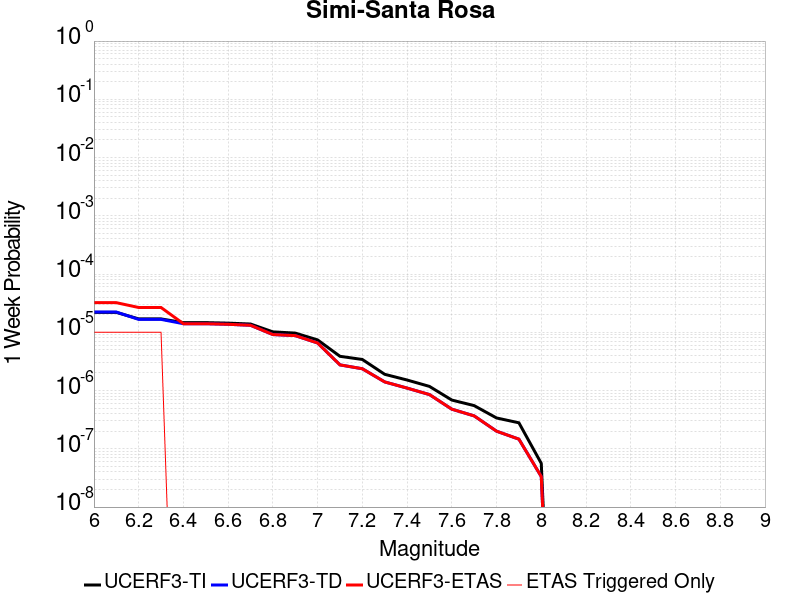 |  |  |  |

| Magnitude | 1 wk TI Prob | 1 wk TD Prob | 1 wk ETAS Prob | 1 wk ETAS/TD Gain | 1 wk ETAS Triggered Only | 1 mo TI Prob | 1 mo TD Prob | 1 mo ETAS Prob | 1 mo ETAS/TD Gain | 1 mo ETAS Triggered Only | 1 yr TI Prob | 1 yr TD Prob | 1 yr ETAS Prob | 1 yr ETAS/TD Gain | 1 yr ETAS Triggered Only | 10 yr TI Prob | 10 yr TD Prob | 10 yr ETAS Prob | 10 yr ETAS/TD Gain | 10 yr ETAS Triggered Only |
|-----|-----|-----|-----|-----|-----|-----|-----|-----|-----|-----|-----|-----|-----|-----|-----|-----|-----|-----|-----|-----|
| 6.0 | 2.198912E-5 | 2.2275442E-5 | 4.4156794E-5 | 1.9823083 | 2.1881839E-5 | 9.4235686E-5 | 9.5462936E-5 | 1.17342686E-4 | 1.2291963 | 2.1881839E-5 | 0.0011467156 | 0.0011616853 | 0.0011835418 | 1.0188144 | 2.1881839E-5 | 0.011408163 | 0.011560575 | 0.011582204 | 1.0018709 | 2.1881839E-5 |
| 6.1 | 2.198912E-5 | 2.2275442E-5 | 4.4156794E-5 | 1.9823083 | 2.1881839E-5 | 9.4235686E-5 | 9.5462936E-5 | 1.17342686E-4 | 1.2291963 | 2.1881839E-5 | 0.0011467156 | 0.0011616853 | 0.0011835418 | 1.0188144 | 2.1881839E-5 | 0.011408163 | 0.011560575 | 0.011582204 | 1.0018709 | 2.1881839E-5 |
| 6.2 | 1.69983E-5 | 1.6668559E-5 | 3.855003E-5 | 2.3127394 | 2.1881839E-5 | 7.284782E-5 | 7.143489E-5 | 9.331517E-5 | 1.3062967 | 2.1881839E-5 | 8.865613E-4 | 8.6940196E-4 | 8.9126476E-4 | 1.025147 | 2.1881839E-5 | 0.008830327 | 0.008662928 | 0.008684619 | 1.002504 | 2.1881839E-5 |
| 6.3 | 1.69983E-5 | 1.6668559E-5 | 3.855003E-5 | 2.3127394 | 2.1881839E-5 | 7.284782E-5 | 7.143489E-5 | 9.331517E-5 | 1.3062967 | 2.1881839E-5 | 8.865613E-4 | 8.6940196E-4 | 8.9126476E-4 | 1.025147 | 2.1881839E-5 | 0.008830327 | 0.008662928 | 0.008684619 | 1.002504 | 2.1881839E-5 |
| 6.4 | 1.4666188E-5 | 1.4052543E-5 | 1.4052543E-5 | 1.0 | 0.0 | 6.285358E-5 | 6.0223934E-5 | 6.0223934E-5 | 1.0 | 0.0 | 7.6497364E-4 | 7.3300465E-4 | 7.3300465E-4 | 1.0 | 0.0 | 0.0076234564 | 0.007308344 | 0.007308344 | 1.0 | 0.0 |
| 6.5 | 1.4666188E-5 | 1.4052543E-5 | 1.4052543E-5 | 1.0 | 0.0 | 6.285358E-5 | 6.0223934E-5 | 6.0223934E-5 | 1.0 | 0.0 | 7.6497364E-4 | 7.3300465E-4 | 7.3300465E-4 | 1.0 | 0.0 | 0.0076234564 | 0.007308344 | 0.007308344 | 1.0 | 0.0 |
| 6.6 | 1.4377586E-5 | 1.3729583E-5 | 1.3729583E-5 | 1.0 | 0.0 | 6.1616774E-5 | 5.883988E-5 | 5.883988E-5 | 1.0 | 0.0 | 7.4992597E-4 | 7.1616494E-4 | 7.1616494E-4 | 1.0 | 0.0 | 0.007474003 | 0.0071410383 | 0.0071410383 | 1.0 | 0.0 |
| 6.7 | 1.3881404E-5 | 1.320755E-5 | 1.320755E-5 | 1.0 | 0.0 | 5.9490372E-5 | 5.66027E-5 | 5.66027E-5 | 1.0 | 0.0 | 7.240546E-4 | 6.8894465E-4 | 6.8894465E-4 | 1.0 | 0.0 | 0.007217 | 0.006870538 | 0.006870538 | 1.0 | 0.0 |
| 6.8 | 1.0176516E-5 | 9.154151E-6 | 9.154151E-6 | 1.0 | 0.0 | 4.3612912E-5 | 3.9231574E-5 | 3.9231574E-5 | 1.0 | 0.0 | 5.308578E-4 | 4.7755634E-4 | 4.7755634E-4 | 1.0 | 0.0 | 0.0052959146 | 0.004766934 | 0.004766934 | 1.0 | 0.0 |
| 6.9 | 9.699797E-6 | 8.774719E-6 | 8.774719E-6 | 1.0 | 0.0 | 4.15699E-5 | 3.7605492E-5 | 3.7605492E-5 | 1.0 | 0.0 | 5.05996E-4 | 4.577671E-4 | 4.577671E-4 | 1.0 | 0.0 | 0.005048454 | 0.0045698597 | 0.0045698597 | 1.0 | 0.0 |
| 7.0 | 7.4049476E-6 | 6.559333E-6 | 6.559333E-6 | 1.0 | 0.0 | 3.1735104E-5 | 2.8111197E-5 | 2.8111197E-5 | 1.0 | 0.0 | 3.8630638E-4 | 3.422127E-4 | 3.422127E-4 | 1.0 | 0.0 | 0.0038563553 | 0.0034180996 | 0.0034180996 | 1.0 | 0.0 |
| 7.1 | 3.873439E-6 | 2.7595095E-6 | 2.7595095E-6 | 1.0 | 0.0 | 1.6600346E-5 | 1.1826417E-5 | 1.1826417E-5 | 1.0 | 0.0 | 2.0209046E-4 | 1.4397735E-4 | 1.4397735E-4 | 1.0 | 0.0 | 0.0020190678 | 0.0014388643 | 0.0014388643 | 1.0 | 0.0 |
| 7.2 | 3.417706E-6 | 2.3676484E-6 | 2.3676484E-6 | 1.0 | 0.0 | 1.4647229E-5 | 1.0147027E-5 | 1.0147027E-5 | 1.0 | 0.0 | 1.7831543E-4 | 1.2353327E-4 | 1.2353327E-4 | 1.0 | 0.0 | 0.0017817242 | 0.0012346683 | 0.0012346683 | 1.0 | 0.0 |
| 7.3 | 1.90225E-6 | 1.4073753E-6 | 1.4073753E-6 | 1.0 | 0.0 | 8.152474E-6 | 6.0315947E-6 | 6.0315947E-6 | 1.0 | 0.0 | 9.9251854E-5 | 7.343221E-5 | 7.343221E-5 | 1.0 | 0.0 | 9.920754E-4 | 7.340817E-4 | 7.340817E-4 | 1.0 | 0.0 |
| 7.4 | 1.5170556E-6 | 1.1024773E-6 | 1.1024773E-6 | 1.0 | 0.0 | 6.5016507E-6 | 4.724894E-6 | 4.724894E-6 | 1.0 | 0.0 | 7.915472E-5 | 5.7524077E-5 | 5.7524077E-5 | 1.0 | 0.0 | 7.9126534E-4 | 5.7509297E-4 | 5.7509297E-4 | 1.0 | 0.0 |
| 7.5 | 1.178732E-6 | 8.535102E-7 | 8.535102E-7 | 1.0 | 0.0 | 5.0516987E-6 | 3.6578958E-6 | 3.6578958E-6 | 1.0 | 0.0 | 6.1502695E-5 | 4.453398E-5 | 4.453398E-5 | 1.0 | 0.0 | 6.148568E-4 | 4.452515E-4 | 4.452515E-4 | 1.0 | 0.0 |
| 7.6 | 6.8722386E-7 | 4.793198E-7 | 4.793198E-7 | 1.0 | 0.0 | 2.9452417E-6 | 2.054226E-6 | 2.054226E-6 | 1.0 | 0.0 | 3.5857727E-5 | 2.5009915E-5 | 2.5009915E-5 | 1.0 | 0.0 | 3.5851944E-4 | 2.5007114E-4 | 2.5007114E-4 | 1.0 | 0.0 |
| 7.7 | 5.5126515E-7 | 3.6731157E-7 | 3.6731157E-7 | 1.0 | 0.0 | 2.3625628E-6 | 1.5741915E-6 | 1.5741915E-6 | 1.0 | 0.0 | 2.8763823E-5 | 1.9165615E-5 | 1.9165615E-5 | 1.0 | 0.0 | 2.87601E-4 | 1.9163972E-4 | 1.9163972E-4 | 1.0 | 0.0 |
| 7.8 | 3.3860243E-7 | 2.0075942E-7 | 2.0075942E-7 | 1.0 | 0.0 | 1.4511525E-6 | 8.6039717E-7 | 8.6039717E-7 | 1.0 | 0.0 | 1.7667637E-5 | 1.0475286E-5 | 1.0475286E-5 | 1.0 | 0.0 | 1.7666233E-4 | 1.04747975E-4 | 1.04747975E-4 | 1.0 | 0.0 |
| 7.9 | 2.7955386E-7 | 1.4649108E-7 | 1.4649108E-7 | 1.0 | 0.0 | 1.1980875E-6 | 6.278188E-7 | 6.278188E-7 | 1.0 | 0.0 | 1.4586617E-5 | 7.643667E-6 | 7.643667E-6 | 1.0 | 0.0 | 1.458566E-4 | 7.643409E-5 | 7.643409E-5 | 1.0 | 0.0 |
| 8.0 | 5.6259015E-8 | 3.3355324E-8 | 3.3355324E-8 | 1.0 | 0.0 | 2.4111003E-7 | 1.4295138E-7 | 1.4295138E-7 | 1.0 | 0.0 | 2.9355108E-6 | 1.7404317E-6 | 1.7404317E-6 | 1.0 | 0.0 | 2.935472E-5 | 1.7404194E-5 | 1.7404194E-5 | 1.0 | 0.0 |

## Ortigalita (North)
*[(top)](#table-of-contents)*

| 1 Week | 1 Month | 1 Year | 10 Year |
|-----|-----|-----|-----|
|  |  | 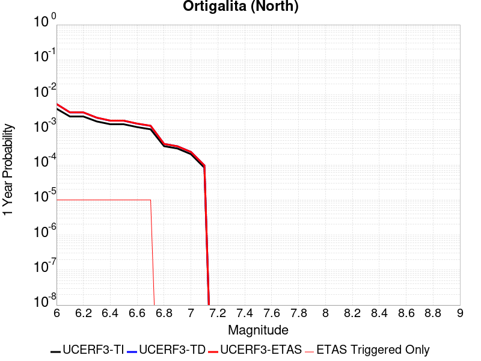 |  |

| Magnitude | 1 wk TI Prob | 1 wk TD Prob | 1 wk ETAS Prob | 1 wk ETAS/TD Gain | 1 wk ETAS Triggered Only | 1 mo TI Prob | 1 mo TD Prob | 1 mo ETAS Prob | 1 mo ETAS/TD Gain | 1 mo ETAS Triggered Only | 1 yr TI Prob | 1 yr TD Prob | 1 yr ETAS Prob | 1 yr ETAS/TD Gain | 1 yr ETAS Triggered Only | 10 yr TI Prob | 10 yr TD Prob | 10 yr ETAS Prob | 10 yr ETAS/TD Gain | 10 yr ETAS Triggered Only |
|-----|-----|-----|-----|-----|-----|-----|-----|-----|-----|-----|-----|-----|-----|-----|-----|-----|-----|-----|-----|-----|
| 6.0 | 7.711876E-5 | 1.05064966E-4 | 1.269445E-4 | 1.2082477 | 2.1881839E-5 | 3.3046713E-4 | 4.502116E-4 | 4.7208357E-4 | 1.0485816 | 2.1881839E-5 | 0.004016016 | 0.0054681194 | 0.0054898816 | 1.0039798 | 2.1881839E-5 | 0.039442103 | 0.053454787 | 0.0534755 | 1.0003874 | 2.1881839E-5 |
| 6.1 | 4.607858E-5 | 6.0239203E-5 | 8.2119725E-5 | 1.3632272 | 2.1881839E-5 | 1.9746469E-4 | 2.5814527E-4 | 2.8002146E-4 | 1.0847437 | 2.1881839E-5 | 0.0024014818 | 0.0031387596 | 0.0031605728 | 1.0069497 | 2.1881839E-5 | 0.023756953 | 0.030975068 | 0.030996272 | 1.0006845 | 2.1881839E-5 |
| 6.2 | 4.607858E-5 | 6.0239203E-5 | 8.2119725E-5 | 1.3632272 | 2.1881839E-5 | 1.9746469E-4 | 2.5814527E-4 | 2.8002146E-4 | 1.0847437 | 2.1881839E-5 | 0.0024014818 | 0.0031387596 | 0.0031605728 | 1.0069497 | 2.1881839E-5 | 0.023756953 | 0.030975068 | 0.030996272 | 1.0006845 | 2.1881839E-5 |
| 6.3 | 3.327423E-5 | 4.2475127E-5 | 6.4356034E-5 | 1.5151464 | 2.1881839E-5 | 1.4259605E-4 | 1.8202531E-4 | 2.0390317E-4 | 1.1201913 | 2.1881839E-5 | 0.0017347244 | 0.002214197 | 0.0022360305 | 1.0098606 | 2.1881839E-5 | 0.017212452 | 0.021945644 | 0.021967046 | 1.0009753 | 2.1881839E-5 |
| 6.4 | 2.7732503E-5 | 3.4998593E-5 | 5.6879668E-5 | 1.6251986 | 2.1881839E-5 | 1.1884817E-4 | 1.4998685E-4 | 1.7186541E-4 | 1.1458699 | 2.1881839E-5 | 0.001446016 | 0.0018248095 | 0.0018466514 | 1.0119694 | 2.1881839E-5 | 0.014366428 | 0.018121224 | 0.01814271 | 1.0011857 | 2.1881839E-5 |
| 6.5 | 2.7689714E-5 | 3.4948407E-5 | 5.682948E-5 | 1.6260965 | 2.1881839E-5 | 1.186648E-4 | 1.497718E-4 | 1.7165036E-4 | 1.1460793 | 2.1881839E-5 | 0.0014437864 | 0.0018221956 | 0.0018440376 | 1.0119866 | 2.1881839E-5 | 0.014344421 | 0.01809551 | 0.018116996 | 1.0011873 | 2.1881839E-5 |
| 6.6 | 2.2976905E-5 | 2.8718265E-5 | 5.0599476E-5 | 1.7619265 | 2.1881839E-5 | 9.846873E-5 | 1.230739E-4 | 1.4495305E-4 | 1.1777724 | 2.1881839E-5 | 0.0011981975 | 0.0014976363 | 0.0015194855 | 1.0145891 | 2.1881839E-5 | 0.011917574 | 0.014898697 | 0.014920253 | 1.0014468 | 2.1881839E-5 |
| 6.7 | 1.9871539E-5 | 2.4904411E-5 | 4.6785706E-5 | 1.8786111 | 2.1881839E-5 | 8.516096E-5 | 1.0673023E-4 | 1.2860974E-4 | 1.2049981 | 2.1881839E-5 | 0.0010363415 | 0.0012989145 | 0.001320768 | 1.0168244 | 2.1881839E-5 | 0.010315218 | 0.012936919 | 0.012958518 | 1.0016695 | 2.1881839E-5 |
| 6.8 | 6.5640475E-6 | 7.6054926E-6 | 7.6054926E-6 | 1.0 | 0.0 | 2.813133E-5 | 3.2594577E-5 | 3.2594577E-5 | 1.0 | 0.0 | 3.424451E-4 | 3.9676955E-4 | 3.9676955E-4 | 1.0 | 0.0 | 0.0034191788 | 0.003960899 | 0.003960899 | 1.0 | 0.0 |
| 6.9 | 5.6219683E-6 | 6.5018376E-6 | 6.5018376E-6 | 1.0 | 0.0 | 2.4093928E-5 | 2.7864735E-5 | 2.7864735E-5 | 1.0 | 0.0 | 2.933041E-4 | 3.3920293E-4 | 3.3920293E-4 | 1.0 | 0.0 | 0.0029291727 | 0.003387109 | 0.003387109 | 1.0 | 0.0 |
| 7.0 | 3.875591E-6 | 4.4847548E-6 | 4.4847548E-6 | 1.0 | 0.0 | 1.6609569E-5 | 1.9220248E-5 | 1.9220248E-5 | 1.0 | 0.0 | 2.0220275E-4 | 2.339835E-4 | 2.339835E-4 | 1.0 | 0.0 | 0.0020201886 | 0.0023375798 | 0.0023375798 | 1.0 | 0.0 |
| 7.1 | 1.6017933E-6 | 1.8570418E-6 | 1.8570418E-6 | 1.0 | 0.0 | 6.8648105E-6 | 7.958732E-6 | 7.958732E-6 | 1.0 | 0.0 | 8.357586E-5 | 9.689432E-5 | 9.689432E-5 | 1.0 | 0.0 | 8.3544437E-4 | 9.686254E-4 | 9.686254E-4 | 1.0 | 0.0 |

## San Andreas (Santa Cruz Mts) 2011 CFM
*[(top)](#table-of-contents)*

| 1 Week | 1 Month | 1 Year | 10 Year |
|-----|-----|-----|-----|
| 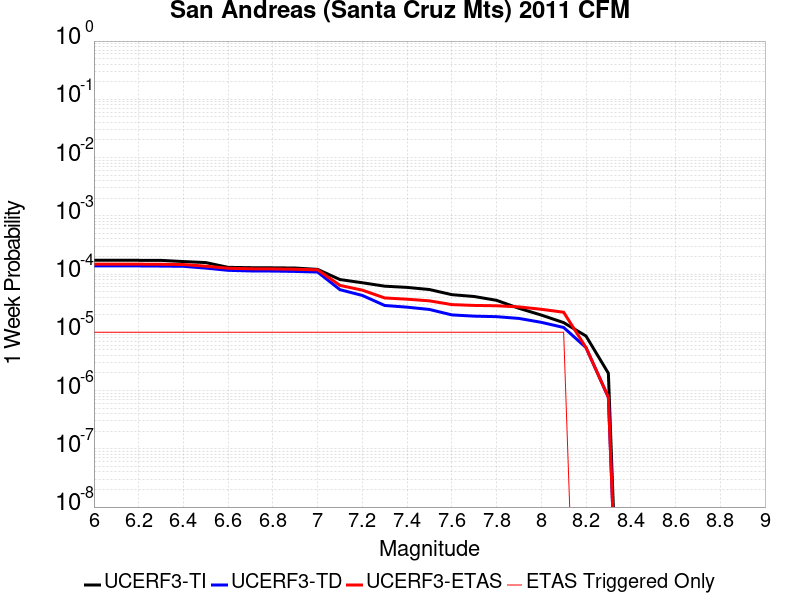 | 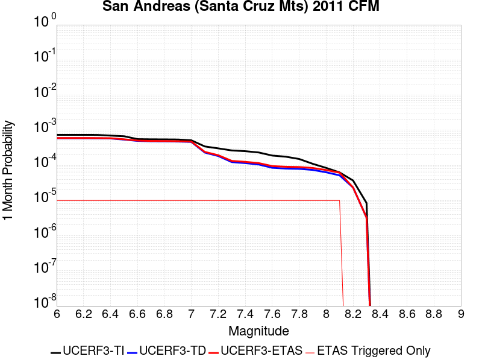 |  |  |

| Magnitude | 1 wk TI Prob | 1 wk TD Prob | 1 wk ETAS Prob | 1 wk ETAS/TD Gain | 1 wk ETAS Triggered Only | 1 mo TI Prob | 1 mo TD Prob | 1 mo ETAS Prob | 1 mo ETAS/TD Gain | 1 mo ETAS Triggered Only | 1 yr TI Prob | 1 yr TD Prob | 1 yr ETAS Prob | 1 yr ETAS/TD Gain | 1 yr ETAS Triggered Only | 10 yr TI Prob | 10 yr TD Prob | 10 yr ETAS Prob | 10 yr ETAS/TD Gain | 10 yr ETAS Triggered Only |
|-----|-----|-----|-----|-----|-----|-----|-----|-----|-----|-----|-----|-----|-----|-----|-----|-----|-----|-----|-----|-----|
| 6.0 | 1.7221631E-4 | 1.3793171E-4 | 1.5981053E-4 | 1.1586207 | 2.1881839E-5 | 7.378611E-4 | 5.9100403E-4 | 6.1287294E-4 | 1.0370029 | 2.1881839E-5 | 0.008946515 | 0.007172124 | 0.007193849 | 1.0030291 | 2.1881839E-5 | 0.08594794 | 0.0705551 | 0.07057543 | 1.0002882 | 2.1881839E-5 |
| 6.1 | 1.7221631E-4 | 1.3793171E-4 | 1.5981053E-4 | 1.1586207 | 2.1881839E-5 | 7.378611E-4 | 5.9100403E-4 | 6.1287294E-4 | 1.0370029 | 2.1881839E-5 | 0.008946515 | 0.007172124 | 0.007193849 | 1.0030291 | 2.1881839E-5 | 0.08594794 | 0.0705551 | 0.07057543 | 1.0002882 | 2.1881839E-5 |
| 6.2 | 1.7221631E-4 | 1.3793171E-4 | 1.5981053E-4 | 1.1586207 | 2.1881839E-5 | 7.378611E-4 | 5.9100403E-4 | 6.1287294E-4 | 1.0370029 | 2.1881839E-5 | 0.008946515 | 0.007172124 | 0.007193849 | 1.0030291 | 2.1881839E-5 | 0.08594794 | 0.0705551 | 0.07057543 | 1.0002882 | 2.1881839E-5 |
| 6.3 | 1.716926E-4 | 1.3712609E-4 | 1.5900492E-4 | 1.1595527 | 2.1881839E-5 | 7.3561794E-4 | 5.875529E-4 | 6.0942187E-4 | 1.0372205 | 2.1881839E-5 | 0.008919428 | 0.0071303817 | 0.007152107 | 1.003047 | 2.1881839E-5 | 0.08569809 | 0.070167266 | 0.07018761 | 1.0002899 | 2.1881839E-5 |
| 6.4 | 1.6392978E-4 | 1.3588481E-4 | 1.5776367E-4 | 1.1610104 | 2.1881839E-5 | 7.02367E-4 | 5.822355E-4 | 6.041046E-4 | 1.0375606 | 2.1881839E-5 | 0.008517839 | 0.007066063 | 0.0070877904 | 1.0030749 | 2.1881839E-5 | 0.08198654 | 0.06940135 | 0.069421716 | 1.0002934 | 2.1881839E-5 |
| 6.5 | 1.5742714E-4 | 1.2648388E-4 | 1.4836295E-4 | 1.1729791 | 2.1881839E-5 | 6.745133E-4 | 5.4196286E-4 | 5.638328E-4 | 1.0403533 | 2.1881839E-5 | 0.00818132 | 0.0065787593 | 0.0066004973 | 1.0033042 | 2.1881839E-5 | 0.078865945 | 0.06486309 | 0.06488356 | 1.0003154 | 2.1881839E-5 |
| 6.6 | 1.3038084E-4 | 1.1588213E-4 | 1.3776144E-4 | 1.1888065 | 2.1881839E-5 | 5.5865536E-4 | 4.9654447E-4 | 5.184155E-4 | 1.0440464 | 2.1881839E-5 | 0.006780438 | 0.0060289134 | 0.006050663 | 1.0036076 | 2.1881839E-5 | 0.0657725 | 0.05932738 | 0.05934796 | 1.0003469 | 2.1881839E-5 |
| 6.7 | 1.2867592E-4 | 1.1314701E-4 | 1.3502638E-4 | 1.193371 | 2.1881839E-5 | 5.5135164E-4 | 4.8482692E-4 | 5.0669815E-4 | 1.0451114 | 2.1881839E-5 | 0.0066920654 | 0.00588703 | 0.0059087835 | 1.0036951 | 2.1881839E-5 | 0.06494093 | 0.058038417 | 0.05805903 | 1.0003551 | 2.1881839E-5 |
| 6.8 | 1.2801298E-4 | 1.1252261E-4 | 1.3440198E-4 | 1.1944443 | 2.1881839E-5 | 5.485117E-4 | 4.8215193E-4 | 5.040232E-4 | 1.0453619 | 2.1881839E-5 | 0.0066577005 | 0.0058546383 | 0.005876392 | 1.0037156 | 2.1881839E-5 | 0.06461738 | 0.057752274 | 0.05777289 | 1.000357 | 2.1881839E-5 |
| 6.9 | 1.269149E-4 | 1.1094465E-4 | 1.3282406E-4 | 1.1972102 | 2.1881839E-5 | 5.4380763E-4 | 4.7539172E-4 | 4.9726316E-4 | 1.0460072 | 2.1881839E-5 | 0.006600777 | 0.005772772 | 0.0057945275 | 1.0037687 | 2.1881839E-5 | 0.06408122 | 0.0570241 | 0.057044733 | 1.0003618 | 2.1881839E-5 |
| 7.0 | 1.2030331E-4 | 1.0824504E-4 | 1.301245E-4 | 1.2021291 | 2.1881839E-5 | 5.154837E-4 | 4.638261E-4 | 4.856978E-4 | 1.0471549 | 2.1881839E-5 | 0.006257969 | 0.0056326967 | 0.005654455 | 1.0038629 | 2.1881839E-5 | 0.06084648 | 0.055696685 | 0.05571735 | 1.000371 | 2.1881839E-5 |
| 7.1 | 8.049617E-5 | 5.3926604E-5 | 7.5807264E-5 | 1.4057488 | 2.1881839E-5 | 3.4493793E-4 | 2.3109373E-4 | 2.5297052E-4 | 1.0946662 | 2.1881839E-5 | 0.0041915346 | 0.0028099709 | 0.0028317913 | 1.0077653 | 2.1881839E-5 | 0.041133516 | 0.029618956 | 0.02964019 | 1.0007169 | 2.1881839E-5 |
| 7.2 | 7.093979E-5 | 4.2937932E-5 | 6.481883E-5 | 1.5095937 | 2.1881839E-5 | 3.0399222E-4 | 1.8400686E-4 | 2.0588466E-4 | 1.1188967 | 2.1881839E-5 | 0.0036948253 | 0.0022380045 | 0.0022598375 | 1.0097555 | 2.1881839E-5 | 0.03633994 | 0.023941692 | 0.023963049 | 1.000892 | 2.1881839E-5 |
| 7.3 | 6.193693E-5 | 2.8894141E-5 | 5.0775347E-5 | 1.7572887 | 2.1881839E-5 | 2.6541698E-4 | 1.2382616E-4 | 1.457053E-4 | 1.1766922 | 2.1881839E-5 | 0.0032266637 | 0.0015065427 | 0.0015283916 | 1.0145026 | 2.1881839E-5 | 0.031802133 | 0.016499156 | 0.016520677 | 1.0013044 | 2.1881839E-5 |
| 7.4 | 5.906492E-5 | 2.702346E-5 | 4.890471E-5 | 1.809713 | 2.1881839E-5 | 2.5311083E-4 | 1.1580969E-4 | 1.37689E-4 | 1.1889247 | 2.1881839E-5 | 0.0030772698 | 0.0014090725 | 0.0014309235 | 1.0155073 | 2.1881839E-5 | 0.030350044 | 0.015471023 | 0.015492566 | 1.0013925 | 2.1881839E-5 |
| 7.5 | 5.424296E-5 | 2.4678277E-5 | 4.6559573E-5 | 1.8866624 | 2.1881839E-5 | 2.324491E-4 | 1.05759755E-4 | 1.2763929E-4 | 1.2068795 | 2.1881839E-5 | 0.002826395 | 0.0012868657 | 0.0013087194 | 1.0169821 | 2.1881839E-5 | 0.027907165 | 0.014163188 | 0.014184759 | 1.0015231 | 2.1881839E-5 |
| 7.6 | 4.43084E-5 | 1.990431E-5 | 4.178571E-5 | 2.09933 | 2.1881839E-5 | 1.8987931E-4 | 8.53014E-5 | 1.0718137E-4 | 1.2565019 | 2.1881839E-5 | 0.0023093296 | 0.0010380499 | 0.0010599091 | 1.0210578 | 2.1881839E-5 | 0.022854783 | 0.011412679 | 0.011434312 | 1.0018954 | 2.1881839E-5 |
| 7.7 | 4.118098E-5 | 1.8936442E-5 | 4.0817868E-5 | 2.1555192 | 2.1881839E-5 | 1.7647797E-4 | 8.115366E-5 | 1.0303372E-4 | 1.2696128 | 2.1881839E-5 | 0.002146502 | 9.875982E-4 | 0.0010094583 | 1.0221348 | 2.1881839E-5 | 0.021258866 | 0.010870468 | 0.010892112 | 1.001991 | 2.1881839E-5 |
| 7.8 | 3.5408906E-5 | 1.856446E-5 | 4.044589E-5 | 2.1786733 | 2.1881839E-5 | 1.5174363E-4 | 7.955955E-5 | 1.0143965E-4 | 1.2750154 | 2.1881839E-5 | 0.0018459131 | 9.682073E-4 | 9.90068E-4 | 1.0225785 | 2.1881839E-5 | 0.018306552 | 0.010652021 | 0.010673669 | 1.0020324 | 2.1881839E-5 |
| 7.9 | 2.5860836E-5 | 1.7315993E-5 | 3.9197454E-5 | 2.263656 | 2.1881839E-5 | 1.10827445E-4 | 7.420929E-5 | 9.6089505E-5 | 1.2948446 | 2.1881839E-5 | 0.001348489 | 9.031238E-4 | 9.249859E-4 | 1.0242071 | 2.1881839E-5 | 0.013403354 | 0.009907599 | 0.009929264 | 1.0021867 | 2.1881839E-5 |
| 8.0 | 1.9777332E-5 | 1.4839596E-5 | 3.672111E-5 | 2.4745357 | 2.1881839E-5 | 8.4757245E-5 | 6.3596715E-5 | 8.5477164E-5 | 1.3440499 | 2.1881839E-5 | 0.0010314309 | 7.740152E-4 | 7.958801E-4 | 1.0282487 | 2.1881839E-5 | 0.010266567 | 0.008508967 | 0.008530663 | 1.0025498 | 2.1881839E-5 |
| 8.1 | 1.468494E-5 | 1.2107374E-5 | 3.398895E-5 | 2.8072932 | 2.1881839E-5 | 6.293394E-5 | 5.1887713E-5 | 7.376842E-5 | 1.4216933 | 2.1881839E-5 | 7.6595135E-4 | 6.3155E-4 | 6.53418E-4 | 1.034626 | 2.1881839E-5 | 0.0076331664 | 0.006969149 | 0.0069908784 | 1.0031179 | 2.1881839E-5 |
| 8.2 | 8.63836E-6 | 5.469061E-6 | 5.469061E-6 | 1.0 | 0.0 | 3.7021015E-5 | 2.3438623E-5 | 2.3438623E-5 | 1.0 | 0.0 | 4.5063766E-4 | 2.8532793E-4 | 2.8532793E-4 | 1.0 | 0.0 | 0.004497249 | 0.00324569 | 0.00324569 | 1.0 | 0.0 |
| 8.3 | 1.983087E-6 | 7.6599065E-7 | 7.6599065E-7 | 1.0 | 0.0 | 8.498917E-6 | 3.282813E-6 | 3.282813E-6 | 1.0 | 0.0 | 1.034694E-4 | 3.9967534E-5 | 3.9967534E-5 | 1.0 | 0.0 | 0.0010342124 | 4.719687E-4 | 4.719687E-4 | 1.0 | 0.0 |

## Great Valley 04b Gordon Valley
*[(top)](#table-of-contents)*

| 1 Week | 1 Month | 1 Year | 10 Year |
|-----|-----|-----|-----|
|  |  |  |  |

| Magnitude | 1 wk TI Prob | 1 wk TD Prob | 1 wk ETAS Prob | 1 wk ETAS/TD Gain | 1 wk ETAS Triggered Only | 1 mo TI Prob | 1 mo TD Prob | 1 mo ETAS Prob | 1 mo ETAS/TD Gain | 1 mo ETAS Triggered Only | 1 yr TI Prob | 1 yr TD Prob | 1 yr ETAS Prob | 1 yr ETAS/TD Gain | 1 yr ETAS Triggered Only | 10 yr TI Prob | 10 yr TD Prob | 10 yr ETAS Prob | 10 yr ETAS/TD Gain | 10 yr ETAS Triggered Only |
|-----|-----|-----|-----|-----|-----|-----|-----|-----|-----|-----|-----|-----|-----|-----|-----|-----|-----|-----|-----|-----|
| 6.0 | 2.1181217E-5 | 2.3981953E-5 | 4.5863268E-5 | 1.9124075 | 2.1881839E-5 | 9.077348E-5 | 1.0277669E-4 | 1.2465628E-4 | 1.2128848 | 2.1881839E-5 | 0.0011046068 | 0.0012507546 | 0.0012726091 | 1.017473 | 2.1881839E-5 | 0.010991322 | 0.012453599 | 0.012475208 | 1.0017352 | 2.1881839E-5 |
| 6.1 | 2.1181217E-5 | 2.3981953E-5 | 4.5863268E-5 | 1.9124075 | 2.1881839E-5 | 9.077348E-5 | 1.0277669E-4 | 1.2465628E-4 | 1.2128848 | 2.1881839E-5 | 0.0011046068 | 0.0012507546 | 0.0012726091 | 1.017473 | 2.1881839E-5 | 0.010991322 | 0.012453599 | 0.012475208 | 1.0017352 | 2.1881839E-5 |
| 6.2 | 2.1181217E-5 | 2.3981953E-5 | 4.5863268E-5 | 1.9124075 | 2.1881839E-5 | 9.077348E-5 | 1.0277669E-4 | 1.2465628E-4 | 1.2128848 | 2.1881839E-5 | 0.0011046068 | 0.0012507546 | 0.0012726091 | 1.017473 | 2.1881839E-5 | 0.010991322 | 0.012453599 | 0.012475208 | 1.0017352 | 2.1881839E-5 |
| 6.3 | 2.1181217E-5 | 2.3981953E-5 | 4.5863268E-5 | 1.9124075 | 2.1881839E-5 | 9.077348E-5 | 1.0277669E-4 | 1.2465628E-4 | 1.2128848 | 2.1881839E-5 | 0.0011046068 | 0.0012507546 | 0.0012726091 | 1.017473 | 2.1881839E-5 | 0.010991322 | 0.012453599 | 0.012475208 | 1.0017352 | 2.1881839E-5 |
| 6.4 | 1.0988268E-5 | 1.2254499E-5 | 1.2254499E-5 | 1.0 | 0.0 | 4.7091726E-5 | 5.2518313E-5 | 5.2518313E-5 | 1.0 | 0.0 | 5.731909E-4 | 6.392388E-4 | 6.392388E-4 | 1.0 | 0.0 | 0.005717147 | 0.0063755875 | 0.0063755875 | 1.0 | 0.0 |
| 6.5 | 1.0988268E-5 | 1.2254499E-5 | 1.2254499E-5 | 1.0 | 0.0 | 4.7091726E-5 | 5.2518313E-5 | 5.2518313E-5 | 1.0 | 0.0 | 5.731909E-4 | 6.392388E-4 | 6.392388E-4 | 1.0 | 0.0 | 0.005717147 | 0.0063755875 | 0.0063755875 | 1.0 | 0.0 |
| 6.6 | 1.0517822E-5 | 1.1724062E-5 | 1.1724062E-5 | 1.0 | 0.0 | 4.5075605E-5 | 5.02451E-5 | 5.02451E-5 | 1.0 | 0.0 | 5.4865726E-4 | 6.11578E-4 | 6.11578E-4 | 1.0 | 0.0 | 0.0054730466 | 0.0061005033 | 0.0061005033 | 1.0 | 0.0 |
| 6.7 | 7.789219E-6 | 8.6776445E-6 | 8.6776445E-6 | 1.0 | 0.0 | 3.3381937E-5 | 3.7189402E-5 | 3.7189402E-5 | 1.0 | 0.0 | 4.063493E-4 | 4.526921E-4 | 4.526921E-4 | 1.0 | 0.0 | 0.004056071 | 0.0045182165 | 0.0045182165 | 1.0 | 0.0 |
| 6.8 | 7.5850853E-6 | 8.452389E-6 | 8.452389E-6 | 1.0 | 0.0 | 3.2507105E-5 | 3.622405E-5 | 3.622405E-5 | 1.0 | 0.0 | 3.957021E-4 | 4.409437E-4 | 4.409437E-4 | 1.0 | 0.0 | 0.0039499826 | 0.0044012 | 0.0044012 | 1.0 | 0.0 |
| 6.9 | 6.604105E-6 | 7.3585493E-6 | 7.3585493E-6 | 1.0 | 0.0 | 2.8303E-5 | 3.153628E-5 | 3.153628E-5 | 1.0 | 0.0 | 3.4453452E-4 | 3.8389044E-4 | 3.8389044E-4 | 1.0 | 0.0 | 0.0034400085 | 0.0038326595 | 0.0038326595 | 1.0 | 0.0 |
| 7.0 | 5.3701115E-6 | 5.9884183E-6 | 5.9884183E-6 | 1.0 | 0.0 | 2.301456E-5 | 2.5664414E-5 | 2.5664414E-5 | 1.0 | 0.0 | 2.8016625E-4 | 3.1242234E-4 | 3.1242234E-4 | 1.0 | 0.0 | 0.0027981328 | 0.00312012 | 0.00312012 | 1.0 | 0.0 |
| 7.1 | 4.4685607E-6 | 4.986478E-6 | 4.986478E-6 | 1.0 | 0.0 | 1.9150835E-5 | 2.1370459E-5 | 2.1370459E-5 | 1.0 | 0.0 | 2.3313647E-4 | 2.6015675E-4 | 2.6015675E-4 | 1.0 | 0.0 | 0.0023289204 | 0.0025987667 | 0.0025987667 | 1.0 | 0.0 |
| 7.2 | 2.833378E-6 | 3.164419E-6 | 3.164419E-6 | 1.0 | 0.0 | 1.2142991E-5 | 1.3561736E-5 | 1.3561736E-5 | 1.0 | 0.0 | 1.4783088E-4 | 1.6510337E-4 | 1.6510337E-4 | 1.0 | 0.0 | 0.0014773258 | 0.0016499789 | 0.0016499789 | 1.0 | 0.0 |
| 7.3 | 7.0087293E-7 | 7.7728157E-7 | 7.7728157E-7 | 1.0 | 0.0 | 3.0037377E-6 | 3.3312049E-6 | 3.3312049E-6 | 1.0 | 0.0 | 3.656989E-5 | 4.0557123E-5 | 4.0557123E-5 | 1.0 | 0.0 | 3.6563876E-4 | 4.055422E-4 | 4.055422E-4 | 1.0 | 0.0 |
| 7.4 | 3.112171E-8 | 3.2068368E-8 | 3.2068368E-8 | 1.0 | 0.0 | 1.3337875E-7 | 1.3743585E-7 | 1.3743585E-7 | 1.0 | 0.0 | 1.6238852E-6 | 1.6732803E-6 | 1.6732803E-6 | 1.0 | 0.0 | 1.6238733E-5 | 1.6732685E-5 | 1.6732685E-5 | 1.0 | 0.0 |

## San Juan
*[(top)](#table-of-contents)*

| 1 Week | 1 Month | 1 Year | 10 Year |
|-----|-----|-----|-----|
|  |  |  |  |

| Magnitude | 1 wk TI Prob | 1 wk TD Prob | 1 wk ETAS Prob | 1 wk ETAS/TD Gain | 1 wk ETAS Triggered Only | 1 mo TI Prob | 1 mo TD Prob | 1 mo ETAS Prob | 1 mo ETAS/TD Gain | 1 mo ETAS Triggered Only | 1 yr TI Prob | 1 yr TD Prob | 1 yr ETAS Prob | 1 yr ETAS/TD Gain | 1 yr ETAS Triggered Only | 10 yr TI Prob | 10 yr TD Prob | 10 yr ETAS Prob | 10 yr ETAS/TD Gain | 10 yr ETAS Triggered Only |
|-----|-----|-----|-----|-----|-----|-----|-----|-----|-----|-----|-----|-----|-----|-----|-----|-----|-----|-----|-----|-----|
| 6.0 | 8.682808E-6 | 8.7491635E-6 | 8.7491635E-6 | 1.0 | 0.0 | 3.72115E-5 | 3.74959E-5 | 3.74959E-5 | 1.0 | 0.0 | 4.5295584E-4 | 4.564218E-4 | 4.564218E-4 | 1.0 | 0.0 | 0.004520337 | 0.004555385 | 0.0045771673 | 1.0047816 | 2.1881839E-5 |
| 6.1 | 8.682808E-6 | 8.7491635E-6 | 8.7491635E-6 | 1.0 | 0.0 | 3.72115E-5 | 3.74959E-5 | 3.74959E-5 | 1.0 | 0.0 | 4.5295584E-4 | 4.564218E-4 | 4.564218E-4 | 1.0 | 0.0 | 0.004520337 | 0.004555385 | 0.0045771673 | 1.0047816 | 2.1881839E-5 |
| 6.2 | 8.682808E-6 | 8.7491635E-6 | 8.7491635E-6 | 1.0 | 0.0 | 3.72115E-5 | 3.74959E-5 | 3.74959E-5 | 1.0 | 0.0 | 4.5295584E-4 | 4.564218E-4 | 4.564218E-4 | 1.0 | 0.0 | 0.004520337 | 0.004555385 | 0.0045771673 | 1.0047816 | 2.1881839E-5 |
| 6.3 | 6.3054235E-6 | 6.2825848E-6 | 6.2825848E-6 | 1.0 | 0.0 | 2.7022963E-5 | 2.6925094E-5 | 2.6925094E-5 | 1.0 | 0.0 | 3.2895492E-4 | 3.2776513E-4 | 3.2776513E-4 | 1.0 | 0.0 | 0.003284684 | 0.003273017 | 0.003273017 | 1.0 | 0.0 |
| 6.4 | 6.1490473E-6 | 6.1144656E-6 | 6.1144656E-6 | 1.0 | 0.0 | 2.6352795E-5 | 2.6204598E-5 | 2.6204598E-5 | 1.0 | 0.0 | 3.2079802E-4 | 3.1899565E-4 | 3.1899565E-4 | 1.0 | 0.0 | 0.0032033534 | 0.0031855737 | 0.0031855737 | 1.0 | 0.0 |
| 6.5 | 5.204848E-6 | 5.137233E-6 | 5.137233E-6 | 1.0 | 0.0 | 2.23063E-5 | 2.2016533E-5 | 2.2016533E-5 | 1.0 | 0.0 | 2.7154534E-4 | 2.6801927E-4 | 2.6801927E-4 | 1.0 | 0.0 | 0.0027121378 | 0.0026771144 | 0.0026771144 | 1.0 | 0.0 |
| 6.6 | 4.5179986E-6 | 4.4150297E-6 | 4.4150297E-6 | 1.0 | 0.0 | 1.9362706E-5 | 1.8921424E-5 | 1.8921424E-5 | 1.0 | 0.0 | 2.3571544E-4 | 2.3034477E-4 | 2.3034477E-4 | 1.0 | 0.0 | 0.0023546559 | 0.0023011973 | 0.0023011973 | 1.0 | 0.0 |
| 6.7 | 3.9442616E-6 | 3.819828E-6 | 3.819828E-6 | 1.0 | 0.0 | 1.6903869E-5 | 1.6370592E-5 | 1.6370592E-5 | 1.0 | 0.0 | 2.0578515E-4 | 1.992944E-4 | 1.992944E-4 | 1.0 | 0.0 | 0.002055947 | 0.0019912818 | 0.0019912818 | 1.0 | 0.0 |
| 6.8 | 3.4536245E-6 | 3.3163353E-6 | 3.3163353E-6 | 1.0 | 0.0 | 1.4801163E-5 | 1.4212792E-5 | 1.4212792E-5 | 1.0 | 0.0 | 1.8018926E-4 | 1.7302761E-4 | 1.7302761E-4 | 1.0 | 0.0 | 0.0018004322 | 0.0017290477 | 0.0017290477 | 1.0 | 0.0 |
| 6.9 | 3.059865E-6 | 2.9120315E-6 | 2.9120315E-6 | 1.0 | 0.0 | 1.3113641E-5 | 1.2480078E-5 | 1.2480078E-5 | 1.0 | 0.0 | 1.596469E-4 | 1.5193493E-4 | 1.5193493E-4 | 1.0 | 0.0 | 0.0015953224 | 0.0015184252 | 0.0015184252 | 1.0 | 0.0 |
| 7.0 | 2.6504351E-6 | 2.4920002E-6 | 2.4920002E-6 | 1.0 | 0.0 | 1.1358958E-5 | 1.0679961E-5 | 1.0679961E-5 | 1.0 | 0.0 | 1.3828653E-4 | 1.300213E-4 | 1.300213E-4 | 1.0 | 0.0 | 0.0013820052 | 0.0012995641 | 0.0012995641 | 1.0 | 0.0 |
| 7.1 | 2.2039317E-6 | 2.0338296E-6 | 2.0338296E-6 | 1.0 | 0.0 | 9.445387E-6 | 8.716386E-6 | 8.716386E-6 | 1.0 | 0.0 | 1.1499152E-4 | 1.0611736E-4 | 1.0611736E-4 | 1.0 | 0.0 | 0.0011493203 | 0.0010607769 | 0.0010607769 | 1.0 | 0.0 |
| 7.2 | 1.0786707E-6 | 8.7701903E-7 | 8.7701903E-7 | 1.0 | 0.0 | 4.622866E-6 | 3.7586476E-6 | 3.7586476E-6 | 1.0 | 0.0 | 5.628194E-5 | 4.5760586E-5 | 4.5760586E-5 | 1.0 | 0.0 | 5.6267687E-4 | 4.5757066E-4 | 4.5757066E-4 | 1.0 | 0.0 |
| 7.3 | 6.846433E-7 | 4.868805E-7 | 4.868805E-7 | 1.0 | 0.0 | 2.9341822E-6 | 2.086629E-6 | 2.086629E-6 | 1.0 | 0.0 | 3.5723086E-5 | 2.5404412E-5 | 2.5404412E-5 | 1.0 | 0.0 | 3.571734E-4 | 2.540486E-4 | 2.540486E-4 | 1.0 | 0.0 |
| 7.4 | 5.23043E-7 | 3.2628162E-7 | 3.2628162E-7 | 1.0 | 0.0 | 2.2416111E-6 | 1.398349E-6 | 1.398349E-6 | 1.0 | 0.0 | 2.7291273E-5 | 1.7024766E-5 | 1.7024766E-5 | 1.0 | 0.0 | 2.7287923E-4 | 1.7026656E-4 | 1.7026656E-4 | 1.0 | 0.0 |
| 7.5 | 4.648444E-7 | 2.7234944E-7 | 2.7234944E-7 | 1.0 | 0.0 | 1.9921886E-6 | 1.1672114E-6 | 1.1672114E-6 | 1.0 | 0.0 | 2.4254627E-5 | 1.42107065E-5 | 1.42107065E-5 | 1.0 | 0.0 | 2.425198E-4 | 1.421276E-4 | 1.421276E-4 | 1.0 | 0.0 |
| 7.6 | 3.9906567E-7 | 2.2083314E-7 | 2.2083314E-7 | 1.0 | 0.0 | 1.7102802E-6 | 9.464274E-7 | 9.464274E-7 | 1.0 | 0.0 | 2.0822463E-5 | 1.1522693E-5 | 1.1522693E-5 | 1.0 | 0.0 | 2.0820512E-4 | 1.15245566E-4 | 1.15245566E-4 | 1.0 | 0.0 |
| 7.7 | 1.8784601E-7 | 5.3666906E-8 | 5.3666906E-8 | 1.0 | 0.0 | 8.0505407E-7 | 2.30001E-7 | 2.30001E-7 | 1.0 | 0.0 | 9.80149E-6 | 2.8002585E-6 | 2.8002585E-6 | 1.0 | 0.0 | 9.801057E-5 | 2.8011282E-5 | 2.8011282E-5 | 1.0 | 0.0 |
| 7.8 | 1.00154914E-7 | 1.2415832E-8 | 1.2415832E-8 | 1.0 | 0.0 | 4.2923529E-7 | 5.3210716E-8 | 5.3210716E-8 | 1.0 | 0.0 | 5.225927E-6 | 6.4784024E-7 | 6.4784024E-7 | 1.0 | 0.0 | 5.225804E-5 | 6.484273E-6 | 6.484273E-6 | 1.0 | 0.0 |
| 7.9 | 6.171429E-8 | 4.2966155E-9 | 4.2966155E-9 | 1.0 | 0.0 | 2.6448978E-7 | 1.8414067E-8 | 1.8414067E-8 | 1.0 | 0.0 | 3.2201583E-6 | 2.2419121E-7 | 2.2419121E-7 | 1.0 | 0.0 | 3.2201115E-5 | 2.2472002E-6 | 2.2472002E-6 | 1.0 | 0.0 |
| 8.0 | 1.3974572E-8 | 3.3788217E-10 | 3.3788217E-10 | 1.0 | 0.0 | 5.989102E-8 | 1.448067E-9 | 1.448067E-9 | 1.0 | 0.0 | 7.2917294E-7 | 1.763022E-8 | 1.763022E-8 | 1.0 | 0.0 | 7.2917055E-6 | 1.8060365E-7 | 1.8060365E-7 | 1.0 | 0.0 |
| 8.1 | 1.8403477E-9 | 1.1302803E-10 | 1.1302803E-10 | 1.0 | 0.0 | 7.887204E-9 | 4.844063E-10 | 4.844063E-10 | 1.0 | 0.0 | 9.602671E-8 | 5.8976446E-9 | 5.8976446E-9 | 1.0 | 0.0 | 9.602667E-7 | 6.021993E-8 | 6.021993E-8 | 1.0 | 0.0 |

## Swain Ravine - Spenceville
*[(top)](#table-of-contents)*

| 1 Week | 1 Month | 1 Year | 10 Year |
|-----|-----|-----|-----|
|  |  |  |  |

| Magnitude | 1 wk TI Prob | 1 wk TD Prob | 1 wk ETAS Prob | 1 wk ETAS/TD Gain | 1 wk ETAS Triggered Only | 1 mo TI Prob | 1 mo TD Prob | 1 mo ETAS Prob | 1 mo ETAS/TD Gain | 1 mo ETAS Triggered Only | 1 yr TI Prob | 1 yr TD Prob | 1 yr ETAS Prob | 1 yr ETAS/TD Gain | 1 yr ETAS Triggered Only | 10 yr TI Prob | 10 yr TD Prob | 10 yr ETAS Prob | 10 yr ETAS/TD Gain | 10 yr ETAS Triggered Only |
|-----|-----|-----|-----|-----|-----|-----|-----|-----|-----|-----|-----|-----|-----|-----|-----|-----|-----|-----|-----|-----|
| 6.0 | 5.596169E-6 | 5.663794E-6 | 5.663794E-6 | 1.0 | 0.0 | 2.398336E-5 | 2.4273193E-5 | 2.4273193E-5 | 1.0 | 0.0 | 2.9195828E-4 | 2.9548878E-4 | 3.1736415E-4 | 1.0740311 | 2.1881839E-5 | 0.00291575 | 0.002951228 | 0.0029730452 | 1.0073926 | 2.1881839E-5 |
| 6.1 | 5.596169E-6 | 5.663794E-6 | 5.663794E-6 | 1.0 | 0.0 | 2.398336E-5 | 2.4273193E-5 | 2.4273193E-5 | 1.0 | 0.0 | 2.9195828E-4 | 2.9548878E-4 | 3.1736415E-4 | 1.0740311 | 2.1881839E-5 | 0.00291575 | 0.002951228 | 0.0029730452 | 1.0073926 | 2.1881839E-5 |
| 6.2 | 5.596169E-6 | 5.663794E-6 | 5.663794E-6 | 1.0 | 0.0 | 2.398336E-5 | 2.4273193E-5 | 2.4273193E-5 | 1.0 | 0.0 | 2.9195828E-4 | 2.9548878E-4 | 3.1736415E-4 | 1.0740311 | 2.1881839E-5 | 0.00291575 | 0.002951228 | 0.0029730452 | 1.0073926 | 2.1881839E-5 |
| 6.3 | 5.596169E-6 | 5.663794E-6 | 5.663794E-6 | 1.0 | 0.0 | 2.398336E-5 | 2.4273193E-5 | 2.4273193E-5 | 1.0 | 0.0 | 2.9195828E-4 | 2.9548878E-4 | 3.1736415E-4 | 1.0740311 | 2.1881839E-5 | 0.00291575 | 0.002951228 | 0.0029730452 | 1.0073926 | 2.1881839E-5 |
| 6.4 | 2.8426775E-6 | 2.874144E-6 | 2.874144E-6 | 1.0 | 0.0 | 1.2182847E-5 | 1.2317704E-5 | 1.2317704E-5 | 1.0 | 0.0 | 1.4831607E-4 | 1.4995811E-4 | 1.7183667E-4 | 1.1458977 | 2.1881839E-5 | 0.0014821711 | 0.0014986077 | 0.0015204567 | 1.0145795 | 2.1881839E-5 |
| 6.5 | 1.9210793E-6 | 1.9414147E-6 | 1.9414147E-6 | 1.0 | 0.0 | 8.233172E-6 | 8.320323E-6 | 8.320323E-6 | 1.0 | 0.0 | 1.0023425E-4 | 1.0129536E-4 | 1.2317498E-4 | 1.2159983 | 2.1881839E-5 | 0.0010018905 | 0.0010125053 | 0.0010343649 | 1.0215898 | 2.1881839E-5 |
| 6.6 | 1.9210793E-6 | 1.9414147E-6 | 1.9414147E-6 | 1.0 | 0.0 | 8.233172E-6 | 8.320323E-6 | 8.320323E-6 | 1.0 | 0.0 | 1.0023425E-4 | 1.0129536E-4 | 1.2317498E-4 | 1.2159983 | 2.1881839E-5 | 0.0010018905 | 0.0010125053 | 0.0010343649 | 1.0215898 | 2.1881839E-5 |
| 6.7 | 1.4667394E-6 | 1.4818934E-6 | 1.4818934E-6 | 1.0 | 0.0 | 6.286011E-6 | 6.3509565E-6 | 6.3509565E-6 | 1.0 | 0.0 | 7.65295E-5 | 7.732023E-5 | 7.732023E-5 | 1.0 | 0.0 | 7.6503144E-4 | 7.72941E-4 | 7.72941E-4 | 1.0 | 0.0 |
| 6.8 | 1.1076943E-6 | 1.1189535E-6 | 1.1189535E-6 | 1.0 | 0.0 | 4.747252E-6 | 4.7955064E-6 | 4.7955064E-6 | 1.0 | 0.0 | 5.7796264E-5 | 5.838377E-5 | 5.838377E-5 | 1.0 | 0.0 | 5.778124E-4 | 5.836887E-4 | 5.836887E-4 | 1.0 | 0.0 |
| 6.9 | 8.514296E-7 | 8.600095E-7 | 8.600095E-7 | 1.0 | 0.0 | 3.648979E-6 | 3.6857498E-6 | 3.6857498E-6 | 1.0 | 0.0 | 4.442541E-5 | 4.4873108E-5 | 4.4873108E-5 | 1.0 | 0.0 | 4.441653E-4 | 4.4864335E-4 | 4.4864335E-4 | 1.0 | 0.0 |
| 7.0 | 4.8544706E-7 | 4.9033E-7 | 4.9033E-7 | 1.0 | 0.0 | 2.0804857E-6 | 2.1014127E-6 | 2.1014127E-6 | 1.0 | 0.0 | 2.532962E-5 | 2.5584413E-5 | 2.5584413E-5 | 1.0 | 0.0 | 2.5326732E-4 | 2.5581598E-4 | 2.5581598E-4 | 1.0 | 0.0 |
| 7.1 | 3.829186E-7 | 3.8678783E-7 | 3.8678783E-7 | 1.0 | 0.0 | 1.6410787E-6 | 1.6576612E-6 | 1.6576612E-6 | 1.0 | 0.0 | 1.997995E-5 | 2.0181848E-5 | 2.0181848E-5 | 1.0 | 0.0 | 1.9978154E-4 | 2.0180122E-4 | 2.0180122E-4 | 1.0 | 0.0 |
| 7.2 | 1.4726595E-7 | 1.4879437E-7 | 1.4879437E-7 | 1.0 | 0.0 | 6.3113964E-7 | 6.3769005E-7 | 6.3769005E-7 | 1.0 | 0.0 | 7.684098E-6 | 7.763854E-6 | 7.763854E-6 | 1.0 | 0.0 | 7.6838325E-5 | 7.763636E-5 | 7.763636E-5 | 1.0 | 0.0 |
| 7.3 | 4.1880604E-8 | 4.2324306E-8 | 4.2324306E-8 | 1.0 | 0.0 | 1.7948828E-7 | 1.8138988E-7 | 1.8138988E-7 | 1.0 | 0.0 | 2.1852677E-6 | 2.2084218E-6 | 2.2084218E-6 | 1.0 | 0.0 | 2.1852462E-5 | 2.2084218E-5 | 2.2084218E-5 | 1.0 | 0.0 |

## Goose Lake 2011 CFM
*[(top)](#table-of-contents)*

| 1 Week | 1 Month | 1 Year | 10 Year |
|-----|-----|-----|-----|
|  |  |  |  |

| Magnitude | 1 wk TI Prob | 1 wk TD Prob | 1 wk ETAS Prob | 1 wk ETAS/TD Gain | 1 wk ETAS Triggered Only | 1 mo TI Prob | 1 mo TD Prob | 1 mo ETAS Prob | 1 mo ETAS/TD Gain | 1 mo ETAS Triggered Only | 1 yr TI Prob | 1 yr TD Prob | 1 yr ETAS Prob | 1 yr ETAS/TD Gain | 1 yr ETAS Triggered Only | 10 yr TI Prob | 10 yr TD Prob | 10 yr ETAS Prob | 10 yr ETAS/TD Gain | 10 yr ETAS Triggered Only |
|-----|-----|-----|-----|-----|-----|-----|-----|-----|-----|-----|-----|-----|-----|-----|-----|-----|-----|-----|-----|-----|
| 6.0 | 3.780968E-6 | 3.8230223E-6 | 3.8230223E-6 | 1.0 | 0.0 | 1.6204049E-5 | 1.6384285E-5 | 1.6384285E-5 | 1.0 | 0.0 | 1.9726643E-4 | 1.994615E-4 | 2.2133897E-4 | 1.1096827 | 2.1881839E-5 | 0.001970914 | 0.001992933 | 0.0020147713 | 1.0109578 | 2.1881839E-5 |
| 6.1 | 2.2035124E-6 | 2.229801E-6 | 2.229801E-6 | 1.0 | 0.0 | 9.443591E-6 | 9.556257E-6 | 9.556257E-6 | 1.0 | 0.0 | 1.1496965E-4 | 1.163414E-4 | 1.163414E-4 | 1.0 | 0.0 | 0.0011491019 | 0.0011628233 | 0.0011628233 | 1.0 | 0.0 |
| 6.2 | 1.5624689E-6 | 1.5826923E-6 | 1.5826923E-6 | 1.0 | 0.0 | 6.6962784E-6 | 6.7829496E-6 | 6.7829496E-6 | 1.0 | 0.0 | 8.152414E-5 | 8.2579325E-5 | 8.2579325E-5 | 1.0 | 0.0 | 8.1494235E-4 | 8.2549086E-4 | 8.2549086E-4 | 1.0 | 0.0 |
| 6.3 | 1.5624689E-6 | 1.5826923E-6 | 1.5826923E-6 | 1.0 | 0.0 | 6.6962784E-6 | 6.7829496E-6 | 6.7829496E-6 | 1.0 | 0.0 | 8.152414E-5 | 8.2579325E-5 | 8.2579325E-5 | 1.0 | 0.0 | 8.1494235E-4 | 8.2549086E-4 | 8.2549086E-4 | 1.0 | 0.0 |
| 6.4 | 1.256464E-6 | 1.2738695E-6 | 1.2738695E-6 | 1.0 | 0.0 | 5.3848344E-6 | 5.4594293E-6 | 5.4594293E-6 | 1.0 | 0.0 | 6.5558386E-5 | 6.646655E-5 | 6.646655E-5 | 1.0 | 0.0 | 6.553905E-4 | 6.644687E-4 | 6.644687E-4 | 1.0 | 0.0 |
| 6.5 | 1.0910911E-6 | 1.1069404E-6 | 1.1069404E-6 | 1.0 | 0.0 | 4.6760965E-6 | 4.7440217E-6 | 4.7440217E-6 | 1.0 | 0.0 | 5.692999E-5 | 5.7756948E-5 | 5.7756948E-5 | 1.0 | 0.0 | 5.6915404E-4 | 5.7742064E-4 | 5.7742064E-4 | 1.0 | 0.0 |
| 6.6 | 9.546601E-7 | 9.691246E-7 | 9.691246E-7 | 1.0 | 0.0 | 4.091394E-6 | 4.1533845E-6 | 4.1533845E-6 | 1.0 | 0.0 | 4.9811584E-5 | 5.056629E-5 | 5.056629E-5 | 1.0 | 0.0 | 4.980042E-4 | 5.055487E-4 | 5.055487E-4 | 1.0 | 0.0 |
| 6.7 | 7.790316E-7 | 7.9159634E-7 | 7.9159634E-7 | 1.0 | 0.0 | 3.3387028E-6 | 3.3925514E-6 | 3.3925514E-6 | 1.0 | 0.0 | 4.0647945E-5 | 4.1303538E-5 | 4.1303538E-5 | 1.0 | 0.0 | 4.0640513E-4 | 4.129592E-4 | 4.129592E-4 | 1.0 | 0.0 |
| 6.8 | 6.3714384E-7 | 6.4787395E-7 | 6.4787395E-7 | 1.0 | 0.0 | 2.7306137E-6 | 2.7765998E-6 | 2.7765998E-6 | 1.0 | 0.0 | 3.3244716E-5 | 3.3804583E-5 | 3.3804583E-5 | 1.0 | 0.0 | 3.323974E-4 | 3.379949E-4 | 3.379949E-4 | 1.0 | 0.0 |
| 6.9 | 4.92586E-7 | 5.0139147E-7 | 5.0139147E-7 | 1.0 | 0.0 | 2.1110811E-6 | 2.1488188E-6 | 2.1488188E-6 | 1.0 | 0.0 | 2.5702111E-5 | 2.616156E-5 | 2.616156E-5 | 1.0 | 0.0 | 2.569914E-4 | 2.6158517E-4 | 2.6158517E-4 | 1.0 | 0.0 |
| 7.0 | 3.130245E-7 | 3.190354E-7 | 3.190354E-7 | 1.0 | 0.0 | 1.3415328E-6 | 1.3672939E-6 | 1.3672939E-6 | 1.0 | 0.0 | 1.6333039E-5 | 1.6646678E-5 | 1.6646678E-5 | 1.0 | 0.0 | 1.6331839E-4 | 1.6645451E-4 | 1.6645451E-4 | 1.0 | 0.0 |
| 7.1 | 1.7680084E-7 | 1.8023923E-7 | 1.8023923E-7 | 1.0 | 0.0 | 7.5771766E-7 | 7.724536E-7 | 7.724536E-7 | 1.0 | 0.0 | 9.225173E-6 | 9.404583E-6 | 9.404583E-6 | 1.0 | 0.0 | 9.22479E-5 | 9.4041956E-5 | 9.4041956E-5 | 1.0 | 0.0 |
| 7.2 | 4.8641045E-8 | 4.9402068E-8 | 4.9402068E-8 | 1.0 | 0.0 | 2.084616E-7 | 2.1172312E-7 | 2.1172312E-7 | 1.0 | 0.0 | 2.538017E-6 | 2.577726E-6 | 2.577726E-6 | 1.0 | 0.0 | 2.537988E-5 | 2.5776973E-5 | 2.5776973E-5 | 1.0 | 0.0 |
| 7.3 | 5.3911844E-9 | 5.4758145E-9 | 5.4758145E-9 | 1.0 | 0.0 | 2.3105075E-8 | 2.3467775E-8 | 2.3467775E-8 | 1.0 | 0.0 | 2.8130427E-7 | 2.8572015E-7 | 2.8572015E-7 | 1.0 | 0.0 | 2.8130391E-6 | 2.8571992E-6 | 2.8571992E-6 | 1.0 | 0.0 |

## Big Pine (East)
*[(top)](#table-of-contents)*

| 1 Week | 1 Month | 1 Year | 10 Year |
|-----|-----|-----|-----|
|  |  | 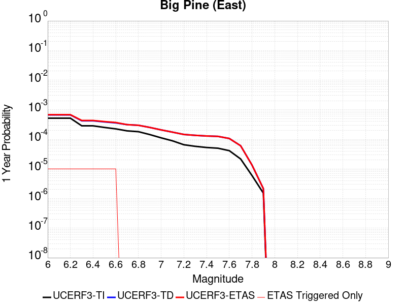 |  |

| Magnitude | 1 wk TI Prob | 1 wk TD Prob | 1 wk ETAS Prob | 1 wk ETAS/TD Gain | 1 wk ETAS Triggered Only | 1 mo TI Prob | 1 mo TD Prob | 1 mo ETAS Prob | 1 mo ETAS/TD Gain | 1 mo ETAS Triggered Only | 1 yr TI Prob | 1 yr TD Prob | 1 yr ETAS Prob | 1 yr ETAS/TD Gain | 1 yr ETAS Triggered Only | 10 yr TI Prob | 10 yr TD Prob | 10 yr ETAS Prob | 10 yr ETAS/TD Gain | 10 yr ETAS Triggered Only |
|-----|-----|-----|-----|-----|-----|-----|-----|-----|-----|-----|-----|-----|-----|-----|-----|-----|-----|-----|-----|-----|
| 6.0 | 9.916913E-6 | 1.2816984E-5 | 3.4698543E-5 | 2.7072313 | 2.1881839E-5 | 4.250036E-5 | 5.49289E-5 | 7.6809534E-5 | 1.3983446 | 2.1881839E-5 | 5.173191E-4 | 6.685763E-4 | 6.904435E-4 | 1.0327071 | 2.1881839E-5 | 0.0051611643 | 0.006670441 | 0.006692177 | 1.0032586 | 2.1881839E-5 |
| 6.1 | 9.916913E-6 | 1.2816984E-5 | 3.4698543E-5 | 2.7072313 | 2.1881839E-5 | 4.250036E-5 | 5.49289E-5 | 7.6809534E-5 | 1.3983446 | 2.1881839E-5 | 5.173191E-4 | 6.685763E-4 | 6.904435E-4 | 1.0327071 | 2.1881839E-5 | 0.0051611643 | 0.006670441 | 0.006692177 | 1.0032586 | 2.1881839E-5 |
| 6.2 | 9.916913E-6 | 1.2816984E-5 | 3.4698543E-5 | 2.7072313 | 2.1881839E-5 | 4.250036E-5 | 5.49289E-5 | 7.6809534E-5 | 1.3983446 | 2.1881839E-5 | 5.173191E-4 | 6.685763E-4 | 6.904435E-4 | 1.0327071 | 2.1881839E-5 | 0.0051611643 | 0.006670441 | 0.006692177 | 1.0032586 | 2.1881839E-5 |
| 6.3 | 5.479711E-6 | 8.112951E-6 | 2.9994611E-5 | 3.697127 | 2.1881839E-5 | 2.3484265E-5 | 3.4769346E-5 | 5.6650424E-5 | 1.629321 | 2.1881839E-5 | 2.858834E-4 | 4.2323777E-4 | 4.4511035E-4 | 1.0516791 | 2.1881839E-5 | 0.0028551589 | 0.004227244 | 0.004249033 | 1.0051545 | 2.1881839E-5 |
| 6.4 | 5.465009E-6 | 8.097245E-6 | 2.9978906E-5 | 3.7023587 | 2.1881839E-5 | 2.3421257E-5 | 3.4702036E-5 | 5.6583114E-5 | 1.6305417 | 2.1881839E-5 | 2.851165E-4 | 4.2241855E-4 | 4.4429116E-4 | 1.0517794 | 2.1881839E-5 | 0.0028475097 | 0.0042190826 | 0.0042408723 | 1.0051645 | 2.1881839E-5 |
| 6.5 | 4.826767E-6 | 7.422301E-6 | 2.9303977E-5 | 3.9480987 | 2.1881839E-5 | 2.068598E-5 | 3.180949E-5 | 5.3690634E-5 | 1.687881 | 2.1881839E-5 | 2.518227E-4 | 3.872145E-4 | 4.0908786E-4 | 1.056489 | 2.1881839E-5 | 0.0025153751 | 0.003868283 | 0.0038900801 | 1.0056349 | 2.1881839E-5 |
| 6.6 | 4.3146847E-6 | 6.8822374E-6 | 2.8763925E-5 | 4.179444 | 2.1881839E-5 | 1.8491375E-5 | 2.9494982E-5 | 5.1376177E-5 | 1.7418615 | 2.1881839E-5 | 2.2510924E-4 | 3.590447E-4 | 3.8091867E-4 | 1.0609227 | 2.1881839E-5 | 0.0022488134 | 0.0035874986 | 0.0036093018 | 1.0060776 | 2.1881839E-5 |
| 6.7 | 3.6968106E-6 | 5.9954727E-6 | 5.9954727E-6 | 1.0 | 0.0 | 1.5843378E-5 | 2.5694639E-5 | 2.5694639E-5 | 1.0 | 0.0 | 1.9287605E-4 | 3.1278885E-4 | 3.1278885E-4 | 1.0 | 0.0 | 0.0019270873 | 0.0031262483 | 0.0031262483 | 1.0 | 0.0 |
| 6.8 | 3.4671132E-6 | 5.702177E-6 | 5.702177E-6 | 1.0 | 0.0 | 1.4858972E-5 | 2.4437682E-5 | 2.4437682E-5 | 1.0 | 0.0 | 1.8089297E-4 | 2.974896E-4 | 2.974896E-4 | 1.0 | 0.0 | 0.0018074579 | 0.002973667 | 0.002973667 | 1.0 | 0.0 |
| 6.9 | 2.7686972E-6 | 4.825223E-6 | 4.825223E-6 | 1.0 | 0.0 | 1.1865792E-5 | 2.0679368E-5 | 2.0679368E-5 | 1.0 | 0.0 | 1.4445644E-4 | 2.5174298E-4 | 2.5174298E-4 | 1.0 | 0.0 | 0.0014436257 | 0.0025172636 | 0.0025172636 | 1.0 | 0.0 |
| 7.0 | 2.1472624E-6 | 3.9850406E-6 | 3.9850406E-6 | 1.0 | 0.0 | 9.20252E-6 | 1.7078637E-5 | 1.7078637E-5 | 1.0 | 0.0 | 1.12034926E-4 | 2.079131E-4 | 2.079131E-4 | 1.0 | 0.0 | 0.0011197845 | 0.0020798394 | 0.0020798394 | 1.0 | 0.0 |
| 7.1 | 1.7018335E-6 | 3.344876E-6 | 3.344876E-6 | 1.0 | 0.0 | 7.293552E-6 | 1.4335106E-5 | 1.4335106E-5 | 1.0 | 0.0 | 8.879537E-5 | 1.7451629E-4 | 1.7451629E-4 | 1.0 | 0.0 | 8.87599E-4 | 0.0017464145 | 0.0017464145 | 1.0 | 0.0 |
| 7.2 | 1.25603E-6 | 2.794484E-6 | 2.794484E-6 | 1.0 | 0.0 | 5.3829745E-6 | 1.1976307E-5 | 1.1976307E-5 | 1.0 | 0.0 | 6.553574E-5 | 1.4580201E-4 | 1.4580201E-4 | 1.0 | 0.0 | 6.551642E-4 | 0.001459661 | 0.001459661 | 1.0 | 0.0 |
| 7.3 | 1.112297E-6 | 2.610332E-6 | 2.610332E-6 | 1.0 | 0.0 | 4.7669787E-6 | 1.118709E-5 | 1.118709E-5 | 1.0 | 0.0 | 5.803642E-5 | 1.3619453E-4 | 1.3619453E-4 | 1.0 | 0.0 | 5.802127E-4 | 0.0013635408 | 0.0013635408 | 1.0 | 0.0 |
| 7.4 | 1.0137181E-6 | 2.4834917E-6 | 2.4834917E-6 | 1.0 | 0.0 | 4.3444993E-6 | 1.0643494E-5 | 1.0643494E-5 | 1.0 | 0.0 | 5.2892992E-5 | 1.2957705E-4 | 1.2957705E-4 | 1.0 | 0.0 | 5.288041E-4 | 0.0012972289 | 0.0012972289 | 1.0 | 0.0 |
| 7.5 | 9.598608E-7 | 2.4071483E-6 | 2.4071483E-6 | 1.0 | 0.0 | 4.1136827E-6 | 1.031631E-5 | 1.031631E-5 | 1.0 | 0.0 | 5.0082934E-5 | 1.2559404E-4 | 1.2559404E-4 | 1.0 | 0.0 | 5.007165E-4 | 0.0012572526 | 0.0012572526 | 1.0 | 0.0 |
| 7.6 | 7.929459E-7 | 2.0448588E-6 | 2.0448588E-6 | 1.0 | 0.0 | 3.3983351E-6 | 8.763653E-6 | 8.763653E-6 | 1.0 | 0.0 | 4.1373947E-5 | 1.06692416E-4 | 1.06692416E-4 | 1.0 | 0.0 | 4.1366243E-4 | 0.0010685222 | 0.0010685222 | 1.0 | 0.0 |
| 7.7 | 4.155788E-7 | 1.1605589E-6 | 1.1605589E-6 | 1.0 | 0.0 | 1.7810507E-6 | 4.9738146E-6 | 4.9738146E-6 | 1.0 | 0.0 | 2.1684076E-5 | 6.0554554E-5 | 6.0554554E-5 | 1.0 | 0.0 | 2.1681961E-4 | 6.0857297E-4 | 6.0857297E-4 | 1.0 | 0.0 |
| 7.8 | 1.14666925E-7 | 2.592015E-7 | 2.592015E-7 | 1.0 | 0.0 | 4.914296E-7 | 1.1108631E-6 | 1.1108631E-6 | 1.0 | 0.0 | 5.9831386E-6 | 1.3524678E-5 | 1.3524678E-5 | 1.0 | 0.0 | 5.9829777E-5 | 1.3634123E-4 | 1.3634123E-4 | 1.0 | 0.0 |
| 7.9 | 2.9231824E-8 | 4.1463963E-8 | 4.1463963E-8 | 1.0 | 0.0 | 1.2527924E-7 | 1.7770269E-7 | 1.7770269E-7 | 1.0 | 0.0 | 1.5252737E-6 | 2.1635283E-6 | 2.1635283E-6 | 1.0 | 0.0 | 1.5252632E-5 | 2.1967755E-5 | 2.1967755E-5 | 1.0 | 0.0 |

## Ventura-Pitas Point
*[(top)](#table-of-contents)*

| 1 Week | 1 Month | 1 Year | 10 Year |
|-----|-----|-----|-----|
|  |  |  |  |

| Magnitude | 1 wk TI Prob | 1 wk TD Prob | 1 wk ETAS Prob | 1 wk ETAS/TD Gain | 1 wk ETAS Triggered Only | 1 mo TI Prob | 1 mo TD Prob | 1 mo ETAS Prob | 1 mo ETAS/TD Gain | 1 mo ETAS Triggered Only | 1 yr TI Prob | 1 yr TD Prob | 1 yr ETAS Prob | 1 yr ETAS/TD Gain | 1 yr ETAS Triggered Only | 10 yr TI Prob | 10 yr TD Prob | 10 yr ETAS Prob | 10 yr ETAS/TD Gain | 10 yr ETAS Triggered Only |
|-----|-----|-----|-----|-----|-----|-----|-----|-----|-----|-----|-----|-----|-----|-----|-----|-----|-----|-----|-----|-----|
| 6.0 | 3.3179622E-5 | 3.3735185E-5 | 5.5616285E-5 | 1.6486136 | 2.1881839E-5 | 1.4219063E-4 | 1.445728E-4 | 1.6645147E-4 | 1.1513333 | 2.1881839E-5 | 0.0017297962 | 0.0017590096 | 0.0017808529 | 1.012418 | 2.1881839E-5 | 0.017163932 | 0.0174764 | 0.0174979 | 1.0012302 | 2.1881839E-5 |
| 6.1 | 3.3179622E-5 | 3.3735185E-5 | 5.5616285E-5 | 1.6486136 | 2.1881839E-5 | 1.4219063E-4 | 1.445728E-4 | 1.6645147E-4 | 1.1513333 | 2.1881839E-5 | 0.0017297962 | 0.0017590096 | 0.0017808529 | 1.012418 | 2.1881839E-5 | 0.017163932 | 0.0174764 | 0.0174979 | 1.0012302 | 2.1881839E-5 |
| 6.2 | 3.3179622E-5 | 3.3735185E-5 | 5.5616285E-5 | 1.6486136 | 2.1881839E-5 | 1.4219063E-4 | 1.445728E-4 | 1.6645147E-4 | 1.1513333 | 2.1881839E-5 | 0.0017297962 | 0.0017590096 | 0.0017808529 | 1.012418 | 2.1881839E-5 | 0.017163932 | 0.0174764 | 0.0174979 | 1.0012302 | 2.1881839E-5 |
| 6.3 | 3.3179622E-5 | 3.3735185E-5 | 5.5616285E-5 | 1.6486136 | 2.1881839E-5 | 1.4219063E-4 | 1.445728E-4 | 1.6645147E-4 | 1.1513333 | 2.1881839E-5 | 0.0017297962 | 0.0017590096 | 0.0017808529 | 1.012418 | 2.1881839E-5 | 0.017163932 | 0.0174764 | 0.0174979 | 1.0012302 | 2.1881839E-5 |
| 6.4 | 1.8754668E-5 | 1.701961E-5 | 1.701961E-5 | 1.0 | 0.0 | 8.037467E-5 | 7.293928E-5 | 7.293928E-5 | 1.0 | 0.0 | 9.781223E-4 | 8.8769704E-4 | 8.8769704E-4 | 1.0 | 0.0 | 0.009738282 | 0.008843848 | 0.008843848 | 1.0 | 0.0 |
| 6.5 | 1.8754668E-5 | 1.701961E-5 | 1.701961E-5 | 1.0 | 0.0 | 8.037467E-5 | 7.293928E-5 | 7.293928E-5 | 1.0 | 0.0 | 9.781223E-4 | 8.8769704E-4 | 8.8769704E-4 | 1.0 | 0.0 | 0.009738282 | 0.008843848 | 0.008843848 | 1.0 | 0.0 |
| 6.6 | 1.4361558E-5 | 1.2122275E-5 | 1.2122275E-5 | 1.0 | 0.0 | 6.154808E-5 | 5.1951585E-5 | 5.1951585E-5 | 1.0 | 0.0 | 7.490902E-4 | 6.3232926E-4 | 6.3232926E-4 | 1.0 | 0.0 | 0.0074657016 | 0.0063055577 | 0.0063055577 | 1.0 | 0.0 |
| 6.7 | 1.4361558E-5 | 1.2122275E-5 | 1.2122275E-5 | 1.0 | 0.0 | 6.154808E-5 | 5.1951585E-5 | 5.1951585E-5 | 1.0 | 0.0 | 7.490902E-4 | 6.3232926E-4 | 6.3232926E-4 | 1.0 | 0.0 | 0.0074657016 | 0.0063055577 | 0.0063055577 | 1.0 | 0.0 |
| 6.8 | 1.3663846E-5 | 1.13444175E-5 | 1.13444175E-5 | 1.0 | 0.0 | 5.8558027E-5 | 4.861804E-5 | 4.861804E-5 | 1.0 | 0.0 | 7.127108E-4 | 5.917658E-4 | 5.917658E-4 | 1.0 | 0.0 | 0.007104293 | 0.005902116 | 0.005902116 | 1.0 | 0.0 |
| 6.9 | 1.3644157E-5 | 1.1322519E-5 | 1.1322519E-5 | 1.0 | 0.0 | 5.8473648E-5 | 4.8524187E-5 | 4.8524187E-5 | 1.0 | 0.0 | 7.116841E-4 | 5.9062376E-4 | 5.9062376E-4 | 1.0 | 0.0 | 0.007094092 | 0.0058907564 | 0.0058907564 | 1.0 | 0.0 |
| 7.0 | 1.3568845E-5 | 1.1242086E-5 | 1.1242086E-5 | 1.0 | 0.0 | 5.8150898E-5 | 4.817949E-5 | 4.817949E-5 | 1.0 | 0.0 | 7.077572E-4 | 5.864293E-4 | 5.864293E-4 | 1.0 | 0.0 | 0.007055073 | 0.0058490336 | 0.0058490336 | 1.0 | 0.0 |
| 7.1 | 1.306572E-5 | 1.072054E-5 | 1.072054E-5 | 1.0 | 0.0 | 5.599474E-5 | 4.5944373E-5 | 4.5944373E-5 | 1.0 | 0.0 | 6.815227E-4 | 5.5923103E-4 | 5.5923103E-4 | 1.0 | 0.0 | 0.0067943637 | 0.0055784425 | 0.0055784425 | 1.0 | 0.0 |
| 7.2 | 1.232604E-5 | 9.995143E-6 | 9.995143E-6 | 1.0 | 0.0 | 5.2824813E-5 | 4.2835632E-5 | 4.2835632E-5 | 1.0 | 0.0 | 6.429523E-4 | 5.214008E-4 | 5.214008E-4 | 1.0 | 0.0 | 0.0064109527 | 0.005201967 | 0.005201967 | 1.0 | 0.0 |
| 7.3 | 1.0917261E-5 | 8.84384E-6 | 8.84384E-6 | 1.0 | 0.0 | 4.678742E-5 | 3.790163E-5 | 3.790163E-5 | 1.0 | 0.0 | 5.69488E-4 | 4.6135622E-4 | 4.6135622E-4 | 1.0 | 0.0 | 0.0056803077 | 0.00460415 | 0.00460415 | 1.0 | 0.0 |
| 7.4 | 1.039959E-5 | 8.423562E-6 | 8.423562E-6 | 1.0 | 0.0 | 4.456891E-5 | 3.610049E-5 | 3.610049E-5 | 1.0 | 0.0 | 5.424914E-4 | 4.3943635E-4 | 4.3943635E-4 | 1.0 | 0.0 | 0.0054116896 | 0.004385836 | 0.004385836 | 1.0 | 0.0 |
| 7.5 | 9.015877E-6 | 7.2975445E-6 | 7.2975445E-6 | 1.0 | 0.0 | 3.86389E-5 | 3.1274823E-5 | 3.1274823E-5 | 1.0 | 0.0 | 4.7032707E-4 | 3.8070587E-4 | 3.8070587E-4 | 1.0 | 0.0 | 0.004693329 | 0.0038006818 | 0.0038006818 | 1.0 | 0.0 |
| 7.6 | 4.900162E-6 | 3.8741155E-6 | 3.8741155E-6 | 1.0 | 0.0 | 2.1000526E-5 | 1.6603248E-5 | 1.6603248E-5 | 1.0 | 0.0 | 2.556514E-4 | 2.0212591E-4 | 2.0212591E-4 | 1.0 | 0.0 | 0.0025535747 | 0.0020194345 | 0.0020194345 | 1.0 | 0.0 |
| 7.7 | 3.8850626E-6 | 3.1267302E-6 | 3.1267302E-6 | 1.0 | 0.0 | 1.6650163E-5 | 1.3400205E-5 | 1.3400205E-5 | 1.0 | 0.0 | 2.0269687E-4 | 1.6313537E-4 | 1.6313537E-4 | 1.0 | 0.0 | 0.002025121 | 0.0016301654 | 0.0016301654 | 1.0 | 0.0 |
| 7.8 | 2.4654719E-6 | 2.029875E-6 | 2.029875E-6 | 1.0 | 0.0 | 1.0566265E-5 | 8.699436E-6 | 8.699436E-6 | 1.0 | 0.0 | 1.2863669E-4 | 1.0591053E-4 | 1.0591053E-4 | 1.0 | 0.0 | 0.0012856225 | 0.0010586053 | 0.0010586053 | 1.0 | 0.0 |
| 7.9 | 4.095894E-7 | 3.2764765E-7 | 3.2764765E-7 | 1.0 | 0.0 | 1.7553821E-6 | 1.4042034E-6 | 1.4042034E-6 | 1.0 | 0.0 | 2.1371567E-5 | 1.7096047E-5 | 1.7096047E-5 | 1.0 | 0.0 | 2.1369511E-4 | 1.7094762E-4 | 1.7094762E-4 | 1.0 | 0.0 |
| 8.0 | 7.791402E-9 | 5.683497E-9 | 5.683497E-9 | 1.0 | 0.0 | 3.3391725E-8 | 2.4357844E-8 | 2.4357844E-8 | 1.0 | 0.0 | 4.0654416E-7 | 2.9655675E-7 | 2.9655675E-7 | 1.0 | 0.0 | 4.065434E-6 | 2.9655655E-6 | 2.9655655E-6 | 1.0 | 0.0 |

## Cerro Prieto
*[(top)](#table-of-contents)*

| 1 Week | 1 Month | 1 Year | 10 Year |
|-----|-----|-----|-----|
|  | 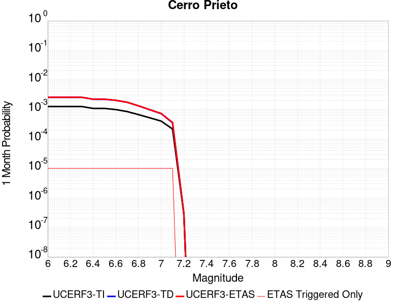 |  |  |

| Magnitude | 1 wk TI Prob | 1 wk TD Prob | 1 wk ETAS Prob | 1 wk ETAS/TD Gain | 1 wk ETAS Triggered Only | 1 mo TI Prob | 1 mo TD Prob | 1 mo ETAS Prob | 1 mo ETAS/TD Gain | 1 mo ETAS Triggered Only | 1 yr TI Prob | 1 yr TD Prob | 1 yr ETAS Prob | 1 yr ETAS/TD Gain | 1 yr ETAS Triggered Only | 10 yr TI Prob | 10 yr TD Prob | 10 yr ETAS Prob | 10 yr ETAS/TD Gain | 10 yr ETAS Triggered Only |
|-----|-----|-----|-----|-----|-----|-----|-----|-----|-----|-----|-----|-----|-----|-----|-----|-----|-----|-----|-----|-----|
| 6.0 | 2.9101528E-4 | 5.964804E-4 | 6.183492E-4 | 1.036663 | 2.1881839E-5 | 0.0012466122 | 0.002554082 | 0.002575908 | 1.0085455 | 2.1881839E-5 | 0.015072231 | 0.03064807 | 0.030669281 | 1.0006921 | 2.1881839E-5 | 0.14089979 | 0.25397858 | 0.2539949 | 1.0000643 | 2.1881839E-5 |
| 6.1 | 2.9101528E-4 | 5.964804E-4 | 6.183492E-4 | 1.036663 | 2.1881839E-5 | 0.0012466122 | 0.002554082 | 0.002575908 | 1.0085455 | 2.1881839E-5 | 0.015072231 | 0.03064807 | 0.030669281 | 1.0006921 | 2.1881839E-5 | 0.14089979 | 0.25397858 | 0.2539949 | 1.0000643 | 2.1881839E-5 |
| 6.2 | 2.9101528E-4 | 5.964804E-4 | 6.183492E-4 | 1.036663 | 2.1881839E-5 | 0.0012466122 | 0.002554082 | 0.002575908 | 1.0085455 | 2.1881839E-5 | 0.015072231 | 0.03064807 | 0.030669281 | 1.0006921 | 2.1881839E-5 | 0.14089979 | 0.25397858 | 0.2539949 | 1.0000643 | 2.1881839E-5 |
| 6.3 | 2.9101528E-4 | 5.964804E-4 | 6.183492E-4 | 1.036663 | 2.1881839E-5 | 0.0012466122 | 0.002554082 | 0.002575908 | 1.0085455 | 2.1881839E-5 | 0.015072231 | 0.03064807 | 0.030669281 | 1.0006921 | 2.1881839E-5 | 0.14089979 | 0.25397858 | 0.2539949 | 1.0000643 | 2.1881839E-5 |
| 6.4 | 2.508648E-4 | 5.1397446E-4 | 5.3584506E-4 | 1.0425519 | 2.1881839E-5 | 0.0010746918 | 0.0022010866 | 0.0022229203 | 1.0099195 | 2.1881839E-5 | 0.013006088 | 0.026471792 | 0.026493095 | 1.0008048 | 2.1881839E-5 | 0.12270685 | 0.22440416 | 0.22442113 | 1.0000756 | 2.1881839E-5 |
| 6.5 | 2.508648E-4 | 5.1397446E-4 | 5.3584506E-4 | 1.0425519 | 2.1881839E-5 | 0.0010746918 | 0.0022010866 | 0.0022229203 | 1.0099195 | 2.1881839E-5 | 0.013006088 | 0.026471792 | 0.026493095 | 1.0008048 | 2.1881839E-5 | 0.12270685 | 0.22440416 | 0.22442113 | 1.0000756 | 2.1881839E-5 |
| 6.6 | 2.294914E-4 | 4.7116808E-4 | 4.930396E-4 | 1.0464199 | 2.1881839E-5 | 9.831638E-4 | 0.0020179166 | 0.0020397543 | 1.0108219 | 2.1881839E-5 | 0.011904482 | 0.02429866 | 0.02432001 | 1.0008787 | 2.1881839E-5 | 0.11286586 | 0.20858558 | 0.20860289 | 1.000083 | 2.1881839E-5 |
| 6.7 | 1.9621674E-4 | 4.0419117E-4 | 4.2606416E-4 | 1.0541154 | 2.1881839E-5 | 8.4065786E-4 | 0.0017312564 | 0.0017531003 | 1.0126173 | 2.1881839E-5 | 0.010187071 | 0.020884845 | 0.02090627 | 1.0010259 | 2.1881839E-5 | 0.09732539 | 0.18290249 | 0.18292037 | 1.0000978 | 2.1881839E-5 |
| 6.8 | 1.5476145E-4 | 3.056516E-4 | 3.2752674E-4 | 1.0715688 | 2.1881839E-5 | 6.6309475E-4 | 0.00130938 | 0.0013312332 | 1.0166898 | 2.1881839E-5 | 0.008043335 | 0.015836509 | 0.015858043 | 1.0013598 | 2.1881839E-5 | 0.07758363 | 0.14336355 | 0.1433823 | 1.0001308 | 2.1881839E-5 |
| 6.9 | 1.20509176E-4 | 2.2582515E-4 | 2.4770203E-4 | 1.0968754 | 2.1881839E-5 | 5.1636563E-4 | 9.6752634E-4 | 9.89387E-4 | 1.0225943 | 2.1881839E-5 | 0.006268645 | 0.011726342 | 0.011747967 | 1.0018442 | 2.1881839E-5 | 0.060947374 | 0.109451205 | 0.10947069 | 1.0001781 | 2.1881839E-5 |
| 7.0 | 9.3269155E-5 | 1.6716642E-4 | 1.890446E-4 | 1.1308767 | 2.1881839E-5 | 3.9966372E-4 | 7.162739E-4 | 7.381401E-4 | 1.0305277 | 2.1881839E-5 | 0.0048550544 | 0.008693418 | 0.00871511 | 1.0024952 | 2.1881839E-5 | 0.04750344 | 0.08315912 | 0.083179176 | 1.0002413 | 2.1881839E-5 |
| 7.1 | 5.029709E-5 | 8.1718936E-5 | 1.03598984E-4 | 1.2677476 | 2.1881839E-5 | 2.1554115E-4 | 3.5019626E-4 | 3.7207044E-4 | 1.0624626 | 2.1881839E-5 | 0.0026210553 | 0.0042587193 | 0.004280508 | 1.0051162 | 2.1881839E-5 | 0.025903556 | 0.042365108 | 0.042386062 | 1.0004946 | 2.1881839E-5 |
| 7.2 | 6.5445185E-8 | 6.814903E-8 | 6.814903E-8 | 1.0 | 0.0 | 2.8047933E-7 | 2.9206726E-7 | 2.9206726E-7 | 1.0 | 0.0 | 3.4148304E-6 | 3.555919E-6 | 3.555919E-6 | 1.0 | 0.0 | 3.414778E-5 | 3.5559187E-5 | 3.5559187E-5 | 1.0 | 0.0 |

## Cedar Mtn-Mahogany Mtn
*[(top)](#table-of-contents)*

| 1 Week | 1 Month | 1 Year | 10 Year |
|-----|-----|-----|-----|
|  |  |  | 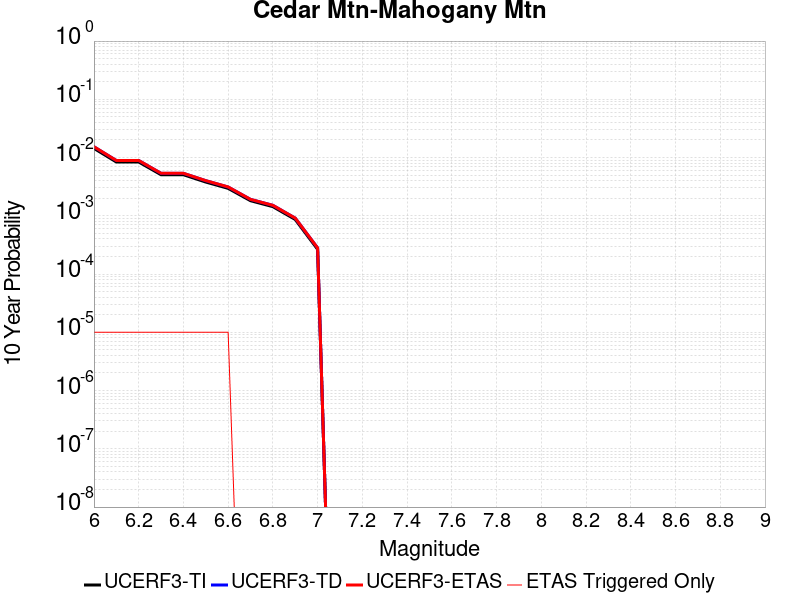 |

| Magnitude | 1 wk TI Prob | 1 wk TD Prob | 1 wk ETAS Prob | 1 wk ETAS/TD Gain | 1 wk ETAS Triggered Only | 1 mo TI Prob | 1 mo TD Prob | 1 mo ETAS Prob | 1 mo ETAS/TD Gain | 1 mo ETAS Triggered Only | 1 yr TI Prob | 1 yr TD Prob | 1 yr ETAS Prob | 1 yr ETAS/TD Gain | 1 yr ETAS Triggered Only | 10 yr TI Prob | 10 yr TD Prob | 10 yr ETAS Prob | 10 yr ETAS/TD Gain | 10 yr ETAS Triggered Only |
|-----|-----|-----|-----|-----|-----|-----|-----|-----|-----|-----|-----|-----|-----|-----|-----|-----|-----|-----|-----|-----|
| 6.0 | 2.7763876E-5 | 2.9588866E-5 | 5.1470055E-5 | 1.7395076 | 2.1881839E-5 | 1.1898261E-4 | 1.2680366E-4 | 1.4868272E-4 | 1.1725428 | 2.1881839E-5 | 0.0014476506 | 0.0015428112 | 0.0015646593 | 1.0141612 | 2.1881839E-5 | 0.0143825635 | 0.015328225 | 0.015349772 | 1.0014057 | 2.1881839E-5 |
| 6.1 | 1.6162443E-5 | 1.7142966E-5 | 3.9024428E-5 | 2.2764106 | 2.1881839E-5 | 6.926578E-5 | 7.346788E-5 | 9.5348114E-5 | 1.2978203 | 2.1881839E-5 | 8.4298453E-4 | 8.941221E-4 | 9.159844E-4 | 1.0244511 | 2.1881839E-5 | 0.008397939 | 0.008907059 | 0.008928746 | 1.0024348 | 2.1881839E-5 |
| 6.2 | 1.6162443E-5 | 1.7142966E-5 | 3.9024428E-5 | 2.2764106 | 2.1881839E-5 | 6.926578E-5 | 7.346788E-5 | 9.5348114E-5 | 1.2978203 | 2.1881839E-5 | 8.4298453E-4 | 8.941221E-4 | 9.159844E-4 | 1.0244511 | 2.1881839E-5 | 0.008397939 | 0.008907059 | 0.008928746 | 1.0024348 | 2.1881839E-5 |
| 6.3 | 9.746053E-6 | 1.0303152E-5 | 3.2184766E-5 | 3.1237786 | 2.1881839E-5 | 4.1768133E-5 | 4.415564E-5 | 6.603651E-5 | 1.4955397 | 2.1881839E-5 | 5.0840835E-4 | 5.3746643E-4 | 5.593365E-4 | 1.040691 | 2.1881839E-5 | 0.0050724675 | 0.005362084 | 0.0053838487 | 1.004059 | 2.1881839E-5 |
| 6.4 | 9.746053E-6 | 1.0303152E-5 | 3.2184766E-5 | 3.1237786 | 2.1881839E-5 | 4.1768133E-5 | 4.415564E-5 | 6.603651E-5 | 1.4955397 | 2.1881839E-5 | 5.0840835E-4 | 5.3746643E-4 | 5.593365E-4 | 1.040691 | 2.1881839E-5 | 0.0050724675 | 0.005362084 | 0.0053838487 | 1.004059 | 2.1881839E-5 |
| 6.5 | 7.290083E-6 | 7.695325E-6 | 2.9576993E-5 | 3.8435018 | 2.1881839E-5 | 3.124284E-5 | 3.297956E-5 | 5.4860673E-5 | 1.6634752 | 2.1881839E-5 | 3.8031515E-4 | 4.014543E-4 | 4.2332735E-4 | 1.0544845 | 2.1881839E-5 | 0.0037966494 | 0.004007511 | 0.004029305 | 1.0054383 | 2.1881839E-5 |
| 6.6 | 5.67907E-6 | 5.9891527E-6 | 2.787086E-5 | 4.6535563 | 2.1881839E-5 | 2.4338644E-5 | 2.5667552E-5 | 4.754883E-5 | 1.8524878 | 2.1881839E-5 | 2.962827E-4 | 3.12459E-4 | 3.34334E-4 | 1.0700092 | 2.1881839E-5 | 0.0029588798 | 0.003120333 | 0.0031421464 | 1.0069908 | 2.1881839E-5 |
| 6.7 | 3.4853963E-6 | 3.672631E-6 | 3.672631E-6 | 1.0 | 0.0 | 1.4937327E-5 | 1.5739755E-5 | 1.5739755E-5 | 1.0 | 0.0 | 1.8184677E-4 | 1.916153E-4 | 1.916153E-4 | 1.0 | 0.0 | 0.0018169804 | 0.0019145629 | 0.0019145629 | 1.0 | 0.0 |
| 6.8 | 2.7535168E-6 | 2.9015764E-6 | 2.9015764E-6 | 1.0 | 0.0 | 1.1800733E-5 | 1.2435271E-5 | 1.2435271E-5 | 1.0 | 0.0 | 1.4366445E-4 | 1.5138938E-4 | 1.5138938E-4 | 1.0 | 0.0 | 0.0014357162 | 0.0015129098 | 0.0015129098 | 1.0 | 0.0 |
| 6.9 | 1.6594106E-6 | 1.7496985E-6 | 1.7496985E-6 | 1.0 | 0.0 | 7.1117406E-6 | 7.4986883E-6 | 7.4986883E-6 | 1.0 | 0.0 | 8.6582E-5 | 9.129302E-5 | 9.129302E-5 | 1.0 | 0.0 | 8.654827E-4 | 9.125856E-4 | 9.125856E-4 | 1.0 | 0.0 |
| 7.0 | 5.10215E-7 | 5.389254E-7 | 5.389254E-7 | 1.0 | 0.0 | 2.186634E-6 | 2.3096788E-6 | 2.3096788E-6 | 1.0 | 0.0 | 2.6621943E-5 | 2.8120105E-5 | 2.8120105E-5 | 1.0 | 0.0 | 2.6618753E-4 | 2.81178E-4 | 2.81178E-4 | 1.0 | 0.0 |

## Ozena
*[(top)](#table-of-contents)*

| 1 Week | 1 Month | 1 Year | 10 Year |
|-----|-----|-----|-----|
| 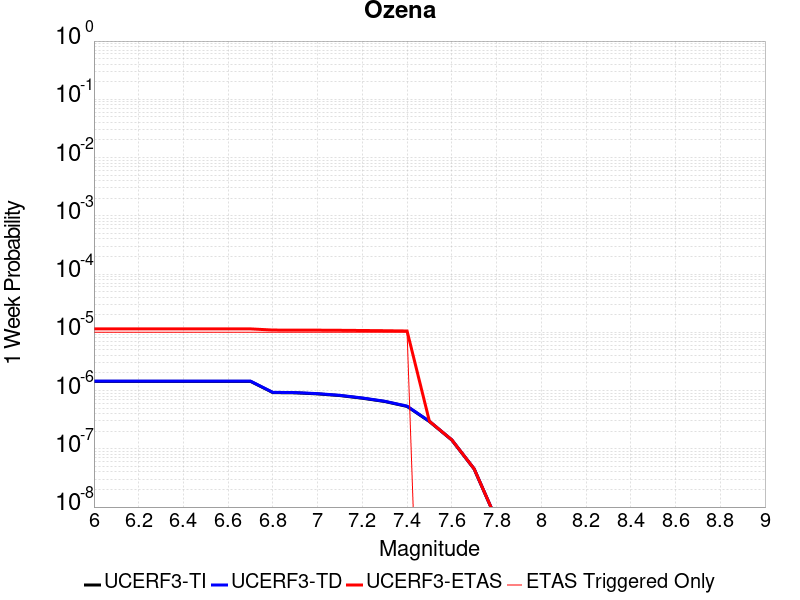 |  |  |  |

| Magnitude | 1 wk TI Prob | 1 wk TD Prob | 1 wk ETAS Prob | 1 wk ETAS/TD Gain | 1 wk ETAS Triggered Only | 1 mo TI Prob | 1 mo TD Prob | 1 mo ETAS Prob | 1 mo ETAS/TD Gain | 1 mo ETAS Triggered Only | 1 yr TI Prob | 1 yr TD Prob | 1 yr ETAS Prob | 1 yr ETAS/TD Gain | 1 yr ETAS Triggered Only | 10 yr TI Prob | 10 yr TD Prob | 10 yr ETAS Prob | 10 yr ETAS/TD Gain | 10 yr ETAS Triggered Only |
|-----|-----|-----|-----|-----|-----|-----|-----|-----|-----|-----|-----|-----|-----|-----|-----|-----|-----|-----|-----|-----|
| 6.0 | 1.4377547E-6 | 1.4513782E-6 | 2.3333185E-5 | 16.07657 | 2.1881839E-5 | 6.161791E-6 | 6.2201793E-6 | 2.8101882E-5 | 4.517857 | 2.1881839E-5 | 7.5017226E-5 | 7.572832E-5 | 9.760851E-5 | 1.2889299 | 2.1881839E-5 | 7.4991904E-4 | 7.570518E-4 | 7.7891705E-4 | 1.0288821 | 2.1881839E-5 |
| 6.1 | 1.4377547E-6 | 1.4513782E-6 | 2.3333185E-5 | 16.07657 | 2.1881839E-5 | 6.161791E-6 | 6.2201793E-6 | 2.8101882E-5 | 4.517857 | 2.1881839E-5 | 7.5017226E-5 | 7.572832E-5 | 9.760851E-5 | 1.2889299 | 2.1881839E-5 | 7.4991904E-4 | 7.570518E-4 | 7.7891705E-4 | 1.0288821 | 2.1881839E-5 |
| 6.2 | 1.4377547E-6 | 1.4513782E-6 | 2.3333185E-5 | 16.07657 | 2.1881839E-5 | 6.161791E-6 | 6.2201793E-6 | 2.8101882E-5 | 4.517857 | 2.1881839E-5 | 7.5017226E-5 | 7.572832E-5 | 9.760851E-5 | 1.2889299 | 2.1881839E-5 | 7.4991904E-4 | 7.570518E-4 | 7.7891705E-4 | 1.0288821 | 2.1881839E-5 |
| 6.3 | 1.4377547E-6 | 1.4513782E-6 | 2.3333185E-5 | 16.07657 | 2.1881839E-5 | 6.161791E-6 | 6.2201793E-6 | 2.8101882E-5 | 4.517857 | 2.1881839E-5 | 7.5017226E-5 | 7.572832E-5 | 9.760851E-5 | 1.2889299 | 2.1881839E-5 | 7.4991904E-4 | 7.570518E-4 | 7.7891705E-4 | 1.0288821 | 2.1881839E-5 |
| 6.4 | 1.4377547E-6 | 1.4513782E-6 | 2.3333185E-5 | 16.07657 | 2.1881839E-5 | 6.161791E-6 | 6.2201793E-6 | 2.8101882E-5 | 4.517857 | 2.1881839E-5 | 7.5017226E-5 | 7.572832E-5 | 9.760851E-5 | 1.2889299 | 2.1881839E-5 | 7.4991904E-4 | 7.570518E-4 | 7.7891705E-4 | 1.0288821 | 2.1881839E-5 |
| 6.5 | 1.4377547E-6 | 1.4513782E-6 | 2.3333185E-5 | 16.07657 | 2.1881839E-5 | 6.161791E-6 | 6.2201793E-6 | 2.8101882E-5 | 4.517857 | 2.1881839E-5 | 7.5017226E-5 | 7.572832E-5 | 9.760851E-5 | 1.2889299 | 2.1881839E-5 | 7.4991904E-4 | 7.570518E-4 | 7.7891705E-4 | 1.0288821 | 2.1881839E-5 |
| 6.6 | 1.4377547E-6 | 1.4513782E-6 | 2.3333185E-5 | 16.07657 | 2.1881839E-5 | 6.161791E-6 | 6.2201793E-6 | 2.8101882E-5 | 4.517857 | 2.1881839E-5 | 7.5017226E-5 | 7.572832E-5 | 9.760851E-5 | 1.2889299 | 2.1881839E-5 | 7.4991904E-4 | 7.570518E-4 | 7.7891705E-4 | 1.0288821 | 2.1881839E-5 |
| 6.7 | 1.4377547E-6 | 1.4513782E-6 | 2.3333185E-5 | 16.07657 | 2.1881839E-5 | 6.161791E-6 | 6.2201793E-6 | 2.8101882E-5 | 4.517857 | 2.1881839E-5 | 7.5017226E-5 | 7.572832E-5 | 9.760851E-5 | 1.2889299 | 2.1881839E-5 | 7.4991904E-4 | 7.570518E-4 | 7.7891705E-4 | 1.0288821 | 2.1881839E-5 |
| 6.8 | 9.223257E-7 | 9.317624E-7 | 2.281358E-5 | 24.484333 | 2.1881839E-5 | 3.9528186E-6 | 3.9932615E-6 | 2.5875011E-5 | 6.479669 | 2.1881839E-5 | 4.81245E-5 | 4.8616912E-5 | 7.0497685E-5 | 1.450065 | 2.1881839E-5 | 4.811408E-4 | 4.860668E-4 | 5.0793804E-4 | 1.0449963 | 2.1881839E-5 |
| 6.9 | 9.141515E-7 | 9.235371E-7 | 2.2805354E-5 | 24.693491 | 2.1881839E-5 | 3.917786E-6 | 3.9580104E-6 | 2.5839761E-5 | 6.5284724 | 2.1881839E-5 | 4.7698002E-5 | 4.818775E-5 | 7.0068534E-5 | 1.4540735 | 2.1881839E-5 | 4.7687767E-4 | 4.8177704E-4 | 5.0364836E-4 | 1.0453972 | 2.1881839E-5 |
| 7.0 | 8.767648E-7 | 8.8585773E-7 | 2.2767676E-5 | 25.701279 | 2.1881839E-5 | 3.757558E-6 | 3.7965276E-6 | 2.5678282E-5 | 6.763623 | 2.1881839E-5 | 4.5747307E-5 | 4.6221783E-5 | 6.8102614E-5 | 1.4733877 | 2.1881839E-5 | 4.5737892E-4 | 4.6212564E-4 | 4.8399737E-4 | 1.0473285 | 2.1881839E-5 |
| 7.1 | 8.199402E-7 | 8.2853984E-7 | 2.271036E-5 | 27.410099 | 2.1881839E-5 | 3.5140247E-6 | 3.5508804E-6 | 2.543264E-5 | 7.162348 | 2.1881839E-5 | 4.2782412E-5 | 4.323115E-5 | 6.511204E-5 | 1.5061371 | 2.1881839E-5 | 4.2774176E-4 | 4.322311E-4 | 4.541035E-4 | 1.0506034 | 2.1881839E-5 |
| 7.2 | 7.38705E-7 | 7.464262E-7 | 2.2628248E-5 | 30.31545 | 2.1881839E-5 | 3.1658747E-6 | 3.198966E-6 | 2.5080733E-5 | 7.840263 | 2.1881839E-5 | 3.8543843E-5 | 3.894675E-5 | 6.0827733E-5 | 1.561818 | 2.1881839E-5 | 3.853716E-4 | 3.8940276E-4 | 4.1127607E-4 | 1.0561714 | 2.1881839E-5 |
| 7.3 | 6.490017E-7 | 6.557802E-7 | 2.2537604E-5 | 34.36762 | 2.1881839E-5 | 2.7814328E-6 | 2.8104837E-6 | 2.4692261E-5 | 8.785769 | 2.1881839E-5 | 3.386342E-5 | 3.4217133E-5 | 5.6098223E-5 | 1.6394775 | 2.1881839E-5 | 3.3858258E-4 | 3.4212202E-4 | 3.6399637E-4 | 1.0639373 | 2.1881839E-5 |
| 7.4 | 5.346736E-7 | 5.4022604E-7 | 2.2422053E-5 | 41.504944 | 2.1881839E-5 | 2.291456E-6 | 2.3152527E-6 | 2.419704E-5 | 10.451144 | 2.1881839E-5 | 2.789812E-5 | 2.8187867E-5 | 5.0069088E-5 | 1.7762638 | 2.1881839E-5 | 2.789462E-4 | 2.8184598E-4 | 3.0372164E-4 | 1.0776157 | 2.1881839E-5 |
| 7.5 | 2.939325E-7 | 2.9666057E-7 | 2.9666057E-7 | 1.0 | 0.0 | 1.25971E-6 | 1.271402E-6 | 1.271402E-6 | 1.0 | 0.0 | 1.5336862E-5 | 1.5479225E-5 | 1.5479225E-5 | 1.0 | 0.0 | 1.5335804E-4 | 1.5478309E-4 | 1.5478309E-4 | 1.0 | 0.0 |
| 7.6 | 1.4151905E-7 | 1.4253266E-7 | 1.4253266E-7 | 1.0 | 0.0 | 6.065101E-7 | 6.108541E-7 | 6.108541E-7 | 1.0 | 0.0 | 7.3842357E-6 | 7.4371237E-6 | 7.4371237E-6 | 1.0 | 0.0 | 7.38399E-5 | 7.436883E-5 | 7.436883E-5 | 1.0 | 0.0 |
| 7.7 | 4.4957577E-8 | 4.5252243E-8 | 4.5252243E-8 | 1.0 | 0.0 | 1.9267533E-7 | 1.9393818E-7 | 1.9393818E-7 | 1.0 | 0.0 | 2.3458194E-6 | 2.3611947E-6 | 2.3611947E-6 | 1.0 | 0.0 | 2.3457947E-5 | 2.3611707E-5 | 2.3611707E-5 | 1.0 | 0.0 |
| 7.8 | 5.9993255E-9 | 6.0412972E-9 | 6.0412972E-9 | 1.0 | 0.0 | 2.5711394E-8 | 2.5891273E-8 | 2.5891273E-8 | 1.0 | 0.0 | 3.1303617E-7 | 3.1522623E-7 | 3.1522623E-7 | 1.0 | 0.0 | 3.1303573E-6 | 3.1522588E-6 | 3.1522588E-6 | 1.0 | 0.0 |

## Pine Mtn
*[(top)](#table-of-contents)*

| 1 Week | 1 Month | 1 Year | 10 Year |
|-----|-----|-----|-----|
|  |  |  |  |

| Magnitude | 1 wk TI Prob | 1 wk TD Prob | 1 wk ETAS Prob | 1 wk ETAS/TD Gain | 1 wk ETAS Triggered Only | 1 mo TI Prob | 1 mo TD Prob | 1 mo ETAS Prob | 1 mo ETAS/TD Gain | 1 mo ETAS Triggered Only | 1 yr TI Prob | 1 yr TD Prob | 1 yr ETAS Prob | 1 yr ETAS/TD Gain | 1 yr ETAS Triggered Only | 10 yr TI Prob | 10 yr TD Prob | 10 yr ETAS Prob | 10 yr ETAS/TD Gain | 10 yr ETAS Triggered Only |
|-----|-----|-----|-----|-----|-----|-----|-----|-----|-----|-----|-----|-----|-----|-----|-----|-----|-----|-----|-----|-----|
| 6.0 | 6.894797E-6 | 7.225461E-6 | 2.9107141E-5 | 4.028413 | 2.1881839E-5 | 2.9548795E-5 | 3.096591E-5 | 5.2847074E-5 | 1.7066209 | 2.1881839E-5 | 3.596972E-4 | 3.7694772E-4 | 3.988213E-4 | 1.0580282 | 2.1881839E-5 | 0.0035911554 | 0.003763381 | 0.0037851804 | 1.0057925 | 2.1881839E-5 |
| 6.1 | 6.894797E-6 | 7.225461E-6 | 2.9107141E-5 | 4.028413 | 2.1881839E-5 | 2.9548795E-5 | 3.096591E-5 | 5.2847074E-5 | 1.7066209 | 2.1881839E-5 | 3.596972E-4 | 3.7694772E-4 | 3.988213E-4 | 1.0580282 | 2.1881839E-5 | 0.0035911554 | 0.003763381 | 0.0037851804 | 1.0057925 | 2.1881839E-5 |
| 6.2 | 6.894797E-6 | 7.225461E-6 | 2.9107141E-5 | 4.028413 | 2.1881839E-5 | 2.9548795E-5 | 3.096591E-5 | 5.2847074E-5 | 1.7066209 | 2.1881839E-5 | 3.596972E-4 | 3.7694772E-4 | 3.988213E-4 | 1.0580282 | 2.1881839E-5 | 0.0035911554 | 0.003763381 | 0.0037851804 | 1.0057925 | 2.1881839E-5 |
| 6.3 | 6.894797E-6 | 7.225461E-6 | 2.9107141E-5 | 4.028413 | 2.1881839E-5 | 2.9548795E-5 | 3.096591E-5 | 5.2847074E-5 | 1.7066209 | 2.1881839E-5 | 3.596972E-4 | 3.7694772E-4 | 3.988213E-4 | 1.0580282 | 2.1881839E-5 | 0.0035911554 | 0.003763381 | 0.0037851804 | 1.0057925 | 2.1881839E-5 |
| 6.4 | 6.894797E-6 | 7.225461E-6 | 2.9107141E-5 | 4.028413 | 2.1881839E-5 | 2.9548795E-5 | 3.096591E-5 | 5.2847074E-5 | 1.7066209 | 2.1881839E-5 | 3.596972E-4 | 3.7694772E-4 | 3.988213E-4 | 1.0580282 | 2.1881839E-5 | 0.0035911554 | 0.003763381 | 0.0037851804 | 1.0057925 | 2.1881839E-5 |
| 6.5 | 6.894797E-6 | 7.225461E-6 | 2.9107141E-5 | 4.028413 | 2.1881839E-5 | 2.9548795E-5 | 3.096591E-5 | 5.2847074E-5 | 1.7066209 | 2.1881839E-5 | 3.596972E-4 | 3.7694772E-4 | 3.988213E-4 | 1.0580282 | 2.1881839E-5 | 0.0035911554 | 0.003763381 | 0.0037851804 | 1.0057925 | 2.1881839E-5 |
| 6.6 | 6.894797E-6 | 7.225461E-6 | 2.9107141E-5 | 4.028413 | 2.1881839E-5 | 2.9548795E-5 | 3.096591E-5 | 5.2847074E-5 | 1.7066209 | 2.1881839E-5 | 3.596972E-4 | 3.7694772E-4 | 3.988213E-4 | 1.0580282 | 2.1881839E-5 | 0.0035911554 | 0.003763381 | 0.0037851804 | 1.0057925 | 2.1881839E-5 |
| 6.7 | 6.0867933E-6 | 6.3971133E-6 | 2.8278811E-5 | 4.420558 | 2.1881839E-5 | 2.6085996E-5 | 2.7415923E-5 | 4.9297163E-5 | 1.7981215 | 2.1881839E-5 | 3.1755073E-4 | 3.3373994E-4 | 3.5561447E-4 | 1.0655437 | 2.1881839E-5 | 0.0031709734 | 0.0033326065 | 0.0033544153 | 1.0065441 | 2.1881839E-5 |
| 6.8 | 5.6530425E-6 | 5.9505956E-6 | 2.7832304E-5 | 4.67723 | 2.1881839E-5 | 2.42271E-5 | 2.5502315E-5 | 4.7383593E-5 | 1.8580115 | 2.1881839E-5 | 2.94925E-4 | 3.104485E-4 | 3.3232354E-4 | 1.0704627 | 2.1881839E-5 | 0.002945339 | 0.0031003528 | 0.0031221667 | 1.007036 | 2.1881839E-5 |
| 6.9 | 4.6015225E-6 | 4.863834E-6 | 2.6745565E-5 | 5.4988647 | 2.1881839E-5 | 1.9720663E-5 | 2.0844845E-5 | 4.2726228E-5 | 2.0497262 | 2.1881839E-5 | 2.4007261E-4 | 2.5375787E-4 | 2.7563417E-4 | 1.0862093 | 2.1881839E-5 | 0.0023981342 | 0.0025348254 | 0.0025566518 | 1.0086106 | 2.1881839E-5 |
| 7.0 | 4.4875965E-6 | 4.747473E-6 | 2.6629208E-5 | 5.609133 | 2.1881839E-5 | 1.9232413E-5 | 2.0346162E-5 | 4.2227555E-5 | 2.0754554 | 2.1881839E-5 | 2.3412947E-4 | 2.4768783E-4 | 2.6956425E-4 | 1.0883225 | 2.1881839E-5 | 0.0023388295 | 0.0024742614 | 0.002496089 | 1.0088218 | 2.1881839E-5 |
| 7.1 | 3.203907E-6 | 3.4294096E-6 | 2.5311172E-5 | 7.380621 | 2.1881839E-5 | 1.3730958E-5 | 1.4697391E-5 | 3.6578906E-5 | 2.488803 | 2.1881839E-5 | 1.6716159E-4 | 1.789267E-4 | 2.0080463E-4 | 1.1222731 | 2.1881839E-5 | 0.0016703589 | 0.0017878925 | 0.0018097353 | 1.012217 | 2.1881839E-5 |
| 7.2 | 2.2060601E-6 | 2.3784817E-6 | 2.4260267E-5 | 10.199898 | 2.1881839E-5 | 9.4545085E-6 | 1.0193455E-5 | 3.207507E-5 | 3.1466339 | 2.1881839E-5 | 1.15102564E-4 | 1.240987E-4 | 1.4597783E-4 | 1.1763042 | 2.1881839E-5 | 0.0011504296 | 0.0012403389 | 0.0012621935 | 1.01762 | 2.1881839E-5 |
| 7.3 | 1.3765207E-6 | 1.5216481E-6 | 2.3403452E-5 | 15.380332 | 2.1881839E-5 | 5.899361E-6 | 6.521333E-6 | 2.8403028E-5 | 4.3554025 | 2.1881839E-5 | 7.182235E-5 | 7.939443E-5 | 1.0127453E-4 | 1.2755873 | 2.1881839E-5 | 7.1799144E-4 | 7.936697E-4 | 8.155342E-4 | 1.0275486 | 2.1881839E-5 |
| 7.4 | 1.1245983E-6 | 1.2587075E-6 | 2.3140517E-5 | 18.384348 | 2.1881839E-5 | 4.819698E-6 | 5.39445E-6 | 2.727617E-5 | 5.0563393 | 2.1881839E-5 | 5.8678244E-5 | 6.567554E-5 | 8.7555934E-5 | 1.3331591 | 2.1881839E-5 | 5.866275E-4 | 6.5656955E-4 | 6.7843706E-4 | 1.0333056 | 2.1881839E-5 |
| 7.5 | 8.031682E-7 | 9.276951E-7 | 9.276951E-7 | 1.0 | 0.0 | 3.4421448E-6 | 3.9758306E-6 | 3.9758306E-6 | 1.0 | 0.0 | 4.1907308E-5 | 4.840473E-5 | 4.840473E-5 | 1.0 | 0.0 | 4.1899405E-4 | 4.8394862E-4 | 4.8394862E-4 | 1.0 | 0.0 |
| 7.6 | 4.8953444E-7 | 6.003009E-7 | 6.003009E-7 | 1.0 | 0.0 | 2.098003E-6 | 2.5727159E-6 | 2.5727159E-6 | 1.0 | 0.0 | 2.5542888E-5 | 3.1322415E-5 | 3.1322415E-5 | 1.0 | 0.0 | 2.5539953E-4 | 3.1318486E-4 | 3.1318486E-4 | 1.0 | 0.0 |
| 7.7 | 6.634529E-8 | 6.788826E-8 | 6.788826E-8 | 1.0 | 0.0 | 2.843369E-7 | 2.9094966E-7 | 2.9094966E-7 | 1.0 | 0.0 | 3.4617963E-6 | 3.5423066E-6 | 3.5423066E-6 | 1.0 | 0.0 | 3.4617424E-5 | 3.542255E-5 | 3.542255E-5 | 1.0 | 0.0 |
| 7.8 | 9.235578E-9 | 9.488566E-9 | 9.488566E-9 | 1.0 | 0.0 | 3.9581046E-8 | 4.0665284E-8 | 4.0665284E-8 | 1.0 | 0.0 | 4.818991E-7 | 4.950997E-7 | 4.950997E-7 | 1.0 | 0.0 | 4.8189804E-6 | 4.950988E-6 | 4.950988E-6 | 1.0 | 0.0 |

## Channel Islands Western Deep Ramp
*[(top)](#table-of-contents)*

| 1 Week | 1 Month | 1 Year | 10 Year |
|-----|-----|-----|-----|
|  |  |  |  |

| Magnitude | 1 wk TI Prob | 1 wk TD Prob | 1 wk ETAS Prob | 1 wk ETAS/TD Gain | 1 wk ETAS Triggered Only | 1 mo TI Prob | 1 mo TD Prob | 1 mo ETAS Prob | 1 mo ETAS/TD Gain | 1 mo ETAS Triggered Only | 1 yr TI Prob | 1 yr TD Prob | 1 yr ETAS Prob | 1 yr ETAS/TD Gain | 1 yr ETAS Triggered Only | 10 yr TI Prob | 10 yr TD Prob | 10 yr ETAS Prob | 10 yr ETAS/TD Gain | 10 yr ETAS Triggered Only |
|-----|-----|-----|-----|-----|-----|-----|-----|-----|-----|-----|-----|-----|-----|-----|-----|-----|-----|-----|-----|-----|
| 6.0 | 6.0213506E-6 | 6.2548684E-6 | 2.813657E-5 | 4.4983473 | 2.1881839E-5 | 2.5805533E-5 | 2.6806329E-5 | 4.868758E-5 | 1.8162719 | 2.1881839E-5 | 3.1413708E-4 | 3.2632265E-4 | 3.4819733E-4 | 1.067034 | 2.1881839E-5 | 0.0031369338 | 0.0032588763 | 0.003280687 | 1.0066926 | 2.1881839E-5 |
| 6.1 | 6.0213506E-6 | 6.2548684E-6 | 2.813657E-5 | 4.4983473 | 2.1881839E-5 | 2.5805533E-5 | 2.6806329E-5 | 4.868758E-5 | 1.8162719 | 2.1881839E-5 | 3.1413708E-4 | 3.2632265E-4 | 3.4819733E-4 | 1.067034 | 2.1881839E-5 | 0.0031369338 | 0.0032588763 | 0.003280687 | 1.0066926 | 2.1881839E-5 |
| 6.2 | 6.0213506E-6 | 6.2548684E-6 | 2.813657E-5 | 4.4983473 | 2.1881839E-5 | 2.5805533E-5 | 2.6806329E-5 | 4.868758E-5 | 1.8162719 | 2.1881839E-5 | 3.1413708E-4 | 3.2632265E-4 | 3.4819733E-4 | 1.067034 | 2.1881839E-5 | 0.0031369338 | 0.0032588763 | 0.003280687 | 1.0066926 | 2.1881839E-5 |
| 6.3 | 6.0213506E-6 | 6.2548684E-6 | 2.813657E-5 | 4.4983473 | 2.1881839E-5 | 2.5805533E-5 | 2.6806329E-5 | 4.868758E-5 | 1.8162719 | 2.1881839E-5 | 3.1413708E-4 | 3.2632265E-4 | 3.4819733E-4 | 1.067034 | 2.1881839E-5 | 0.0031369338 | 0.0032588763 | 0.003280687 | 1.0066926 | 2.1881839E-5 |
| 6.4 | 6.0213506E-6 | 6.2548684E-6 | 2.813657E-5 | 4.4983473 | 2.1881839E-5 | 2.5805533E-5 | 2.6806329E-5 | 4.868758E-5 | 1.8162719 | 2.1881839E-5 | 3.1413708E-4 | 3.2632265E-4 | 3.4819733E-4 | 1.067034 | 2.1881839E-5 | 0.0031369338 | 0.0032588763 | 0.003280687 | 1.0066926 | 2.1881839E-5 |
| 6.5 | 6.0213506E-6 | 6.2548684E-6 | 2.813657E-5 | 4.4983473 | 2.1881839E-5 | 2.5805533E-5 | 2.6806329E-5 | 4.868758E-5 | 1.8162719 | 2.1881839E-5 | 3.1413708E-4 | 3.2632265E-4 | 3.4819733E-4 | 1.067034 | 2.1881839E-5 | 0.0031369338 | 0.0032588763 | 0.003280687 | 1.0066926 | 2.1881839E-5 |
| 6.6 | 6.0213506E-6 | 6.2548684E-6 | 2.813657E-5 | 4.4983473 | 2.1881839E-5 | 2.5805533E-5 | 2.6806329E-5 | 4.868758E-5 | 1.8162719 | 2.1881839E-5 | 3.1413708E-4 | 3.2632265E-4 | 3.4819733E-4 | 1.067034 | 2.1881839E-5 | 0.0031369338 | 0.0032588763 | 0.003280687 | 1.0066926 | 2.1881839E-5 |
| 6.7 | 5.313309E-6 | 5.5252403E-6 | 2.7406957E-5 | 4.9603195 | 2.1881839E-5 | 2.2771126E-5 | 2.367941E-5 | 4.556073E-5 | 1.9240652 | 2.1881839E-5 | 2.772032E-4 | 2.8826276E-4 | 3.101383E-4 | 1.0758874 | 2.1881839E-5 | 0.0027685766 | 0.0028792918 | 0.0029011106 | 1.0075779 | 2.1881839E-5 |
| 6.8 | 5.313309E-6 | 5.5252403E-6 | 2.7406957E-5 | 4.9603195 | 2.1881839E-5 | 2.2771126E-5 | 2.367941E-5 | 4.556073E-5 | 1.9240652 | 2.1881839E-5 | 2.772032E-4 | 2.8826276E-4 | 3.101383E-4 | 1.0758874 | 2.1881839E-5 | 0.0027685766 | 0.0028792918 | 0.0029011106 | 1.0075779 | 2.1881839E-5 |
| 6.9 | 4.744377E-6 | 4.9394303E-6 | 2.682116E-5 | 5.430011 | 2.1881839E-5 | 2.0332885E-5 | 2.1168837E-5 | 4.305021E-5 | 2.0336597 | 2.1881839E-5 | 2.4752476E-4 | 2.5770385E-4 | 2.7958004E-4 | 1.0848889 | 2.1881839E-5 | 0.0024724922 | 0.0025744175 | 0.002596243 | 1.0084778 | 2.1881839E-5 |
| 7.0 | 4.722209E-6 | 4.9164732E-6 | 2.6798203E-5 | 5.4506965 | 2.1881839E-5 | 2.0237881E-5 | 2.107045E-5 | 4.2951826E-5 | 2.0384865 | 2.1881839E-5 | 2.4636835E-4 | 2.5650626E-4 | 2.7838247E-4 | 1.0852853 | 2.1881839E-5 | 0.002460954 | 0.0025624693 | 0.002584295 | 1.0085175 | 2.1881839E-5 |
| 7.1 | 4.611174E-6 | 4.801409E-6 | 2.6683141E-5 | 5.557357 | 2.1881839E-5 | 1.9762025E-5 | 2.0577325E-5 | 4.2458712E-5 | 2.0633738 | 2.1881839E-5 | 2.4057609E-4 | 2.5050386E-4 | 2.7238022E-4 | 1.0873294 | 2.1881839E-5 | 0.002403158 | 0.002502582 | 0.002524409 | 1.0087218 | 2.1881839E-5 |
| 7.2 | 4.043994E-6 | 4.2120264E-6 | 2.6093772E-5 | 6.1950636 | 2.1881839E-5 | 1.7331287E-5 | 1.8051438E-5 | 3.9932882E-5 | 2.2121718 | 2.1881839E-5 | 2.10988E-4 | 2.1975765E-4 | 2.4163468E-4 | 1.0995507 | 2.1881839E-5 | 0.002107878 | 0.0021957543 | 0.002217588 | 1.0099436 | 2.1881839E-5 |
| 7.3 | 2.1233036E-6 | 2.2297875E-6 | 2.2297875E-6 | 1.0 | 0.0 | 9.099841E-6 | 9.556197E-6 | 9.556197E-6 | 1.0 | 0.0 | 1.1078493E-4 | 1.1634055E-4 | 1.1634055E-4 | 1.0 | 0.0 | 0.0011072971 | 0.001162802 | 0.001162802 | 1.0 | 0.0 |
| 7.4 | 1.9051884E-6 | 2.0014973E-6 | 2.0014973E-6 | 1.0 | 0.0 | 8.165067E-6 | 8.577817E-6 | 8.577817E-6 | 1.0 | 0.0 | 9.940516E-5 | 1.0442998E-4 | 1.0442998E-4 | 1.0 | 0.0 | 9.93607E-4 | 0.0010438144 | 0.0010438144 | 1.0 | 0.0 |
| 7.5 | 1.2408497E-6 | 1.3038839E-6 | 1.3038839E-6 | 1.0 | 0.0 | 5.317916E-6 | 5.588062E-6 | 5.588062E-6 | 1.0 | 0.0 | 6.4743705E-5 | 6.8032554E-5 | 6.8032554E-5 | 1.0 | 0.0 | 6.4724847E-4 | 6.8011944E-4 | 6.8011944E-4 | 1.0 | 0.0 |
| 7.6 | 6.5440025E-7 | 6.886718E-7 | 6.886718E-7 | 1.0 | 0.0 | 2.8045695E-6 | 2.9514472E-6 | 2.9514472E-6 | 1.0 | 0.0 | 3.4145098E-5 | 3.593329E-5 | 3.593329E-5 | 1.0 | 0.0 | 3.4139853E-4 | 3.5927625E-4 | 3.5927625E-4 | 1.0 | 0.0 |
| 7.7 | 3.985963E-7 | 4.1930787E-7 | 4.1930787E-7 | 1.0 | 0.0 | 1.7082689E-6 | 1.7970326E-6 | 1.7970326E-6 | 1.0 | 0.0 | 2.0797976E-5 | 2.1878664E-5 | 2.1878664E-5 | 1.0 | 0.0 | 2.0796029E-4 | 2.1876628E-4 | 2.1876628E-4 | 1.0 | 0.0 |
| 7.8 | 3.706329E-8 | 3.8591796E-8 | 3.8591796E-8 | 1.0 | 0.0 | 1.5884267E-7 | 1.653934E-7 | 1.653934E-7 | 1.0 | 0.0 | 1.9339077E-6 | 2.0136629E-6 | 2.0136629E-6 | 1.0 | 0.0 | 1.933891E-5 | 2.0136458E-5 | 2.0136458E-5 | 1.0 | 0.0 |

## Hunting Creek - Bartlett Springs connector 2011
*[(top)](#table-of-contents)*

| 1 Week | 1 Month | 1 Year | 10 Year |
|-----|-----|-----|-----|
|  |  |  |  |

| Magnitude | 1 wk TI Prob | 1 wk TD Prob | 1 wk ETAS Prob | 1 wk ETAS/TD Gain | 1 wk ETAS Triggered Only | 1 mo TI Prob | 1 mo TD Prob | 1 mo ETAS Prob | 1 mo ETAS/TD Gain | 1 mo ETAS Triggered Only | 1 yr TI Prob | 1 yr TD Prob | 1 yr ETAS Prob | 1 yr ETAS/TD Gain | 1 yr ETAS Triggered Only | 10 yr TI Prob | 10 yr TD Prob | 10 yr ETAS Prob | 10 yr ETAS/TD Gain | 10 yr ETAS Triggered Only |
|-----|-----|-----|-----|-----|-----|-----|-----|-----|-----|-----|-----|-----|-----|-----|-----|-----|-----|-----|-----|-----|
| 6.0 | 4.940016E-5 | 6.786822E-5 | 8.9748566E-5 | 1.3223947 | 2.1881839E-5 | 2.1169778E-4 | 2.9083234E-4 | 3.127078E-4 | 1.0752168 | 2.1881839E-5 | 0.002574374 | 0.003535177 | 0.0035569817 | 1.0061679 | 2.1881839E-5 | 0.025447546 | 0.034773834 | 0.034794956 | 1.0006074 | 2.1881839E-5 |
| 6.1 | 4.940016E-5 | 6.786822E-5 | 8.9748566E-5 | 1.3223947 | 2.1881839E-5 | 2.1169778E-4 | 2.9083234E-4 | 3.127078E-4 | 1.0752168 | 2.1881839E-5 | 0.002574374 | 0.003535177 | 0.0035569817 | 1.0061679 | 2.1881839E-5 | 0.025447546 | 0.034773834 | 0.034794956 | 1.0006074 | 2.1881839E-5 |
| 6.2 | 4.472471E-5 | 6.1002804E-5 | 8.288331E-5 | 1.3586802 | 2.1881839E-5 | 1.9166325E-4 | 2.6141506E-4 | 2.8329119E-4 | 1.0836835 | 2.1881839E-5 | 0.0023310026 | 0.003178107 | 0.0031999194 | 1.0068634 | 2.1881839E-5 | 0.02306703 | 0.031316914 | 0.03133811 | 1.0006769 | 2.1881839E-5 |
| 6.3 | 4.472471E-5 | 6.1002804E-5 | 8.288331E-5 | 1.3586802 | 2.1881839E-5 | 1.9166325E-4 | 2.6141506E-4 | 2.8329119E-4 | 1.0836835 | 2.1881839E-5 | 0.0023310026 | 0.003178107 | 0.0031999194 | 1.0068634 | 2.1881839E-5 | 0.02306703 | 0.031316914 | 0.03133811 | 1.0006769 | 2.1881839E-5 |
| 6.4 | 4.0001003E-5 | 5.4103755E-5 | 7.598441E-5 | 1.4044203 | 2.1881839E-5 | 1.714216E-4 | 2.31853E-4 | 2.5372978E-4 | 1.0943562 | 2.1881839E-5 | 0.0020850603 | 0.0028191248 | 0.0028409448 | 1.00774 | 2.1881839E-5 | 0.02065605 | 0.027828315 | 0.027849589 | 1.0007645 | 2.1881839E-5 |
| 6.5 | 3.8033053E-5 | 5.1266547E-5 | 7.314726E-5 | 1.426803 | 2.1881839E-5 | 1.6298861E-4 | 2.1969559E-4 | 2.4157262E-4 | 1.0995789 | 2.1881839E-5 | 0.0019825802 | 0.0026714746 | 0.002693298 | 1.008169 | 2.1881839E-5 | 0.019649856 | 0.026390454 | 0.026411759 | 1.0008073 | 2.1881839E-5 |
| 6.6 | 3.653754E-5 | 4.913017E-5 | 7.101093E-5 | 1.445363 | 2.1881839E-5 | 1.5658008E-4 | 2.1054115E-4 | 2.3241839E-4 | 1.1039095 | 2.1881839E-5 | 0.0019046954 | 0.0025602852 | 0.0025821112 | 1.0085248 | 2.1881839E-5 | 0.018884527 | 0.025306415 | 0.025327742 | 1.0008428 | 2.1881839E-5 |
| 6.7 | 3.372024E-5 | 4.514011E-5 | 6.7020956E-5 | 1.4847319 | 2.1881839E-5 | 1.4450731E-4 | 1.9344354E-4 | 2.1532115E-4 | 1.1130955 | 2.1881839E-5 | 0.0017579567 | 0.002352639 | 0.0023744695 | 1.0092791 | 2.1881839E-5 | 0.017441148 | 0.023278099 | 0.02329947 | 1.0009181 | 2.1881839E-5 |
| 6.8 | 2.9650024E-5 | 3.9411374E-5 | 6.1292354E-5 | 1.5551944 | 2.1881839E-5 | 1.2706534E-4 | 1.6889503E-4 | 1.9077318E-4 | 1.1295369 | 2.1881839E-5 | 0.0015459227 | 0.0020543463 | 0.002076183 | 1.0106297 | 2.1881839E-5 | 0.015352124 | 0.020351216 | 0.020372653 | 1.0010533 | 2.1881839E-5 |
| 6.9 | 2.860775E-5 | 3.7812544E-5 | 5.9693553E-5 | 1.5786707 | 2.1881839E-5 | 1.2259888E-4 | 1.6204377E-4 | 1.8392206E-4 | 1.1350147 | 2.1881839E-5 | 0.0014916194 | 0.001971107 | 0.0019929458 | 1.0110794 | 2.1881839E-5 | 0.014816469 | 0.01953584 | 0.019557294 | 1.0010982 | 2.1881839E-5 |
| 7.0 | 2.6696067E-5 | 3.506726E-5 | 5.694833E-5 | 1.6239743 | 2.1881839E-5 | 1.144067E-4 | 1.5027967E-4 | 1.7215822E-4 | 1.1455855 | 2.1881839E-5 | 0.0013920115 | 0.0018281302 | 0.0018499721 | 1.0119476 | 2.1881839E-5 | 0.013833242 | 0.018131364 | 0.01815285 | 1.0011849 | 2.1881839E-5 |
| 7.1 | 2.456087E-5 | 3.2013093E-5 | 3.2013093E-5 | 1.0 | 0.0 | 1.0525662E-4 | 1.371918E-4 | 1.371918E-4 | 1.0 | 0.0 | 0.001280746 | 0.0016690396 | 0.0016690396 | 1.0 | 0.0 | 0.012733897 | 0.016566366 | 0.016566366 | 1.0 | 0.0 |
| 7.2 | 2.295761E-5 | 2.9822932E-5 | 2.9822932E-5 | 1.0 | 0.0 | 9.8386045E-5 | 1.2780636E-4 | 1.2780636E-4 | 1.0 | 0.0 | 0.0011971919 | 0.001554941 | 0.001554941 | 1.0 | 0.0 | 0.011907627 | 0.015442089 | 0.015442089 | 1.0 | 0.0 |
| 7.3 | 2.1256936E-5 | 2.7541912E-5 | 2.7541912E-5 | 1.0 | 0.0 | 9.109797E-5 | 1.1803147E-4 | 1.1803147E-4 | 1.0 | 0.0 | 0.0011085535 | 0.0014360948 | 0.0014360948 | 1.0 | 0.0 | 0.011030397 | 0.014269472 | 0.014269472 | 1.0 | 0.0 |
| 7.4 | 1.8784336E-5 | 2.4306766E-5 | 2.4306766E-5 | 1.0 | 0.0 | 8.050181E-5 | 1.0416774E-4 | 1.0416774E-4 | 1.0 | 0.0 | 9.796688E-4 | 0.001267512 | 0.001267512 | 1.0 | 0.0 | 0.009753612 | 0.012603902 | 0.012603902 | 1.0 | 0.0 |
| 7.5 | 1.7248298E-5 | 2.2268887E-5 | 2.2268887E-5 | 1.0 | 0.0 | 7.391918E-5 | 9.543464E-5 | 9.543464E-5 | 1.0 | 0.0 | 8.9959445E-4 | 0.0011613049 | 0.0011613049 | 1.0 | 0.0 | 0.008959615 | 0.01155334 | 0.01155334 | 1.0 | 0.0 |
| 7.6 | 1.0653709E-5 | 1.3722118E-5 | 1.3722118E-5 | 1.0 | 0.0 | 4.5657955E-5 | 5.8807767E-5 | 5.8807767E-5 | 1.0 | 0.0 | 5.557438E-4 | 7.157521E-4 | 7.157521E-4 | 1.0 | 0.0 | 0.0055435603 | 0.0071348166 | 0.0071348166 | 1.0 | 0.0 |
| 7.7 | 3.286316E-6 | 4.0903437E-6 | 4.0903437E-6 | 1.0 | 0.0 | 1.4084137E-5 | 1.7529928E-5 | 1.7529928E-5 | 1.0 | 0.0 | 1.7146087E-4 | 2.1340612E-4 | 2.1340612E-4 | 1.0 | 0.0 | 0.0017132863 | 0.0021320276 | 0.0021320276 | 1.0 | 0.0 |
| 7.8 | 5.1855085E-7 | 5.9720696E-7 | 5.9720696E-7 | 1.0 | 0.0 | 2.222359E-6 | 2.5594559E-6 | 2.5594559E-6 | 1.0 | 0.0 | 2.7056883E-5 | 3.116094E-5 | 3.116094E-5 | 1.0 | 0.0 | 2.705359E-4 | 3.1156495E-4 | 3.1156495E-4 | 1.0 | 0.0 |

## West Tahoe
*[(top)](#table-of-contents)*

| 1 Week | 1 Month | 1 Year | 10 Year |
|-----|-----|-----|-----|
|  |  |  |  |

| Magnitude | 1 wk TI Prob | 1 wk TD Prob | 1 wk ETAS Prob | 1 wk ETAS/TD Gain | 1 wk ETAS Triggered Only | 1 mo TI Prob | 1 mo TD Prob | 1 mo ETAS Prob | 1 mo ETAS/TD Gain | 1 mo ETAS Triggered Only | 1 yr TI Prob | 1 yr TD Prob | 1 yr ETAS Prob | 1 yr ETAS/TD Gain | 1 yr ETAS Triggered Only | 10 yr TI Prob | 10 yr TD Prob | 10 yr ETAS Prob | 10 yr ETAS/TD Gain | 10 yr ETAS Triggered Only |
|-----|-----|-----|-----|-----|-----|-----|-----|-----|-----|-----|-----|-----|-----|-----|-----|-----|-----|-----|-----|-----|
| 6.0 | 1.952444E-5 | 2.118317E-5 | 2.118317E-5 | 1.0 | 0.0 | 8.367348E-5 | 9.078217E-5 | 9.078217E-5 | 1.0 | 0.0 | 0.0010182485 | 0.0011047672 | 0.0011266248 | 1.0197848 | 2.1881839E-5 | 0.010135954 | 0.010998235 | 0.011019876 | 1.0019677 | 2.1881839E-5 |
| 6.1 | 1.952444E-5 | 2.118317E-5 | 2.118317E-5 | 1.0 | 0.0 | 8.367348E-5 | 9.078217E-5 | 9.078217E-5 | 1.0 | 0.0 | 0.0010182485 | 0.0011047672 | 0.0011266248 | 1.0197848 | 2.1881839E-5 | 0.010135954 | 0.010998235 | 0.011019876 | 1.0019677 | 2.1881839E-5 |
| 6.2 | 1.952444E-5 | 2.118317E-5 | 2.118317E-5 | 1.0 | 0.0 | 8.367348E-5 | 9.078217E-5 | 9.078217E-5 | 1.0 | 0.0 | 0.0010182485 | 0.0011047672 | 0.0011266248 | 1.0197848 | 2.1881839E-5 | 0.010135954 | 0.010998235 | 0.011019876 | 1.0019677 | 2.1881839E-5 |
| 6.3 | 1.952444E-5 | 2.118317E-5 | 2.118317E-5 | 1.0 | 0.0 | 8.367348E-5 | 9.078217E-5 | 9.078217E-5 | 1.0 | 0.0 | 0.0010182485 | 0.0011047672 | 0.0011266248 | 1.0197848 | 2.1881839E-5 | 0.010135954 | 0.010998235 | 0.011019876 | 1.0019677 | 2.1881839E-5 |
| 6.4 | 1.952444E-5 | 2.118317E-5 | 2.118317E-5 | 1.0 | 0.0 | 8.367348E-5 | 9.078217E-5 | 9.078217E-5 | 1.0 | 0.0 | 0.0010182485 | 0.0011047672 | 0.0011266248 | 1.0197848 | 2.1881839E-5 | 0.010135954 | 0.010998235 | 0.011019876 | 1.0019677 | 2.1881839E-5 |
| 6.5 | 1.2685271E-5 | 1.3690627E-5 | 1.3690627E-5 | 1.0 | 0.0 | 5.4364315E-5 | 5.8672893E-5 | 5.8672893E-5 | 1.0 | 0.0 | 6.616845E-4 | 7.141248E-4 | 7.35991E-4 | 1.0306196 | 2.1881839E-5 | 0.0065971776 | 0.00711995 | 0.007141676 | 1.0030514 | 2.1881839E-5 |
| 6.6 | 1.2685271E-5 | 1.3690627E-5 | 1.3690627E-5 | 1.0 | 0.0 | 5.4364315E-5 | 5.8672893E-5 | 5.8672893E-5 | 1.0 | 0.0 | 6.616845E-4 | 7.141248E-4 | 7.35991E-4 | 1.0306196 | 2.1881839E-5 | 0.0065971776 | 0.00711995 | 0.007141676 | 1.0030514 | 2.1881839E-5 |
| 6.7 | 9.117886E-6 | 9.809846E-6 | 9.809846E-6 | 1.0 | 0.0 | 3.9076072E-5 | 4.2041564E-5 | 4.2041564E-5 | 1.0 | 0.0 | 4.756473E-4 | 5.11743E-4 | 5.11743E-4 | 1.0 | 0.0 | 0.0047463053 | 0.0051063634 | 0.0051063634 | 1.0 | 0.0 |
| 6.8 | 8.786828E-6 | 9.457863E-6 | 9.457863E-6 | 1.0 | 0.0 | 3.7657293E-5 | 4.053311E-5 | 4.053311E-5 | 1.0 | 0.0 | 4.5838108E-4 | 4.933859E-4 | 4.933859E-4 | 1.0 | 0.0 | 0.0045743673 | 0.0049236063 | 0.0049236063 | 1.0 | 0.0 |
| 6.9 | 6.7562123E-6 | 7.2638086E-6 | 7.2638086E-6 | 1.0 | 0.0 | 2.8954875E-5 | 3.1130265E-5 | 3.1130265E-5 | 1.0 | 0.0 | 3.5246857E-4 | 3.789498E-4 | 3.789498E-4 | 1.0 | 0.0 | 0.0035191004 | 0.0037835082 | 0.0037835082 | 1.0 | 0.0 |
| 7.0 | 5.1792854E-6 | 5.567338E-6 | 5.567338E-6 | 1.0 | 0.0 | 2.2196748E-5 | 2.3859824E-5 | 2.3859824E-5 | 1.0 | 0.0 | 2.702119E-4 | 2.9045844E-4 | 2.9045844E-4 | 1.0 | 0.0 | 0.0026988357 | 0.0029011632 | 0.0029011632 | 1.0 | 0.0 |
| 7.1 | 4.090765E-6 | 4.3974223E-6 | 4.3974223E-6 | 1.0 | 0.0 | 1.7531731E-5 | 1.884598E-5 | 1.884598E-5 | 1.0 | 0.0 | 2.134279E-4 | 2.2942905E-4 | 2.2942905E-4 | 1.0 | 0.0 | 0.0021322304 | 0.0022922563 | 0.0022922563 | 1.0 | 0.0 |
| 7.2 | 2.2356758E-6 | 2.4023684E-6 | 2.4023684E-6 | 1.0 | 0.0 | 9.581432E-6 | 1.0295834E-5 | 1.0295834E-5 | 1.0 | 0.0 | 1.1664769E-4 | 1.2534647E-4 | 1.2534647E-4 | 1.0 | 0.0 | 0.0011658648 | 0.0012529434 | 0.0012529434 | 1.0 | 0.0 |

## Blue Cut
*[(top)](#table-of-contents)*

| 1 Week | 1 Month | 1 Year | 10 Year |
|-----|-----|-----|-----|
|  |  |  |  |

| Magnitude | 1 wk TI Prob | 1 wk TD Prob | 1 wk ETAS Prob | 1 wk ETAS/TD Gain | 1 wk ETAS Triggered Only | 1 mo TI Prob | 1 mo TD Prob | 1 mo ETAS Prob | 1 mo ETAS/TD Gain | 1 mo ETAS Triggered Only | 1 yr TI Prob | 1 yr TD Prob | 1 yr ETAS Prob | 1 yr ETAS/TD Gain | 1 yr ETAS Triggered Only | 10 yr TI Prob | 10 yr TD Prob | 10 yr ETAS Prob | 10 yr ETAS/TD Gain | 10 yr ETAS Triggered Only |
|-----|-----|-----|-----|-----|-----|-----|-----|-----|-----|-----|-----|-----|-----|-----|-----|-----|-----|-----|-----|-----|
| 6.0 | 2.1227985E-5 | 2.2719574E-5 | 4.4600914E-5 | 1.9631052 | 2.1881839E-5 | 9.097391E-5 | 9.73663E-5 | 1.19246004E-4 | 1.2247154 | 2.1881839E-5 | 0.0011070445 | 0.0011848481 | 0.0012067041 | 1.0184462 | 2.1881839E-5 | 0.011015458 | 0.011791152 | 0.011812775 | 1.0018339 | 2.1881839E-5 |
| 6.1 | 2.1227985E-5 | 2.2719574E-5 | 4.4600914E-5 | 1.9631052 | 2.1881839E-5 | 9.097391E-5 | 9.73663E-5 | 1.19246004E-4 | 1.2247154 | 2.1881839E-5 | 0.0011070445 | 0.0011848481 | 0.0012067041 | 1.0184462 | 2.1881839E-5 | 0.011015458 | 0.011791152 | 0.011812775 | 1.0018339 | 2.1881839E-5 |
| 6.2 | 2.1227985E-5 | 2.2719574E-5 | 4.4600914E-5 | 1.9631052 | 2.1881839E-5 | 9.097391E-5 | 9.73663E-5 | 1.19246004E-4 | 1.2247154 | 2.1881839E-5 | 0.0011070445 | 0.0011848481 | 0.0012067041 | 1.0184462 | 2.1881839E-5 | 0.011015458 | 0.011791152 | 0.011812775 | 1.0018339 | 2.1881839E-5 |
| 6.3 | 1.1613981E-5 | 1.2353542E-5 | 1.2353542E-5 | 1.0 | 0.0 | 4.9773254E-5 | 5.2942745E-5 | 5.2942745E-5 | 1.0 | 0.0 | 6.0582085E-4 | 6.443998E-4 | 6.443998E-4 | 1.0 | 0.0 | 0.0060417196 | 0.0064265593 | 0.0064265593 | 1.0 | 0.0 |
| 6.4 | 1.1613981E-5 | 1.2353542E-5 | 1.2353542E-5 | 1.0 | 0.0 | 4.9773254E-5 | 5.2942745E-5 | 5.2942745E-5 | 1.0 | 0.0 | 6.0582085E-4 | 6.443998E-4 | 6.443998E-4 | 1.0 | 0.0 | 0.0060417196 | 0.0064265593 | 0.0064265593 | 1.0 | 0.0 |
| 6.5 | 8.931326E-6 | 9.4816E-6 | 9.4816E-6 | 1.0 | 0.0 | 3.8276554E-5 | 4.0634844E-5 | 4.0634844E-5 | 1.0 | 0.0 | 4.6591737E-4 | 4.946261E-4 | 4.946261E-4 | 1.0 | 0.0 | 0.0046494175 | 0.004936161 | 0.004936161 | 1.0 | 0.0 |
| 6.6 | 7.345353E-6 | 7.79028E-6 | 7.79028E-6 | 1.0 | 0.0 | 3.1479703E-5 | 3.338653E-5 | 3.338653E-5 | 1.0 | 0.0 | 3.83198E-4 | 4.064132E-4 | 4.064132E-4 | 1.0 | 0.0 | 0.0038253788 | 0.0040574907 | 0.0040574907 | 1.0 | 0.0 |
| 6.7 | 6.2775666E-6 | 6.655149E-6 | 6.655149E-6 | 1.0 | 0.0 | 2.690358E-5 | 2.8521798E-5 | 2.8521798E-5 | 1.0 | 0.0 | 3.2750185E-4 | 3.472051E-4 | 3.472051E-4 | 1.0 | 0.0 | 0.0032701963 | 0.003467367 | 0.003467367 | 1.0 | 0.0 |
| 6.8 | 5.5234095E-6 | 5.8551113E-6 | 5.8551113E-6 | 1.0 | 0.0 | 2.367154E-5 | 2.5093133E-5 | 2.5093133E-5 | 1.0 | 0.0 | 2.8816288E-4 | 3.0547334E-4 | 3.0547334E-4 | 1.0 | 0.0 | 0.002877895 | 0.0030512505 | 0.0030512505 | 1.0 | 0.0 |
| 6.9 | 4.7780054E-6 | 5.0654203E-6 | 5.0654203E-6 | 1.0 | 0.0 | 2.0477004E-5 | 2.1708804E-5 | 2.1708804E-5 | 1.0 | 0.0 | 2.4927902E-4 | 2.642797E-4 | 2.642797E-4 | 1.0 | 0.0 | 0.0024899957 | 0.002640346 | 0.002640346 | 1.0 | 0.0 |
| 7.0 | 3.883171E-6 | 4.118487E-6 | 4.118487E-6 | 1.0 | 0.0 | 1.6642054E-5 | 1.7650578E-5 | 1.7650578E-5 | 1.0 | 0.0 | 2.0259817E-4 | 2.1488148E-4 | 2.1488148E-4 | 1.0 | 0.0 | 0.0020241356 | 0.0021474129 | 0.0021474129 | 1.0 | 0.0 |
| 7.1 | 2.8358215E-6 | 3.0097158E-6 | 3.0097158E-6 | 1.0 | 0.0 | 1.2153464E-5 | 1.2898756E-5 | 1.2898756E-5 | 1.0 | 0.0 | 1.4795837E-4 | 1.5703762E-4 | 1.5703762E-4 | 1.0 | 0.0 | 0.001478599 | 0.0015699116 | 0.0015699116 | 1.0 | 0.0 |

## San Andreas (Peninsula) 2011 CFM
*[(top)](#table-of-contents)*

| 1 Week | 1 Month | 1 Year | 10 Year |
|-----|-----|-----|-----|
|  |  |  |  |

| Magnitude | 1 wk TI Prob | 1 wk TD Prob | 1 wk ETAS Prob | 1 wk ETAS/TD Gain | 1 wk ETAS Triggered Only | 1 mo TI Prob | 1 mo TD Prob | 1 mo ETAS Prob | 1 mo ETAS/TD Gain | 1 mo ETAS Triggered Only | 1 yr TI Prob | 1 yr TD Prob | 1 yr ETAS Prob | 1 yr ETAS/TD Gain | 1 yr ETAS Triggered Only | 10 yr TI Prob | 10 yr TD Prob | 10 yr ETAS Prob | 10 yr ETAS/TD Gain | 10 yr ETAS Triggered Only |
|-----|-----|-----|-----|-----|-----|-----|-----|-----|-----|-----|-----|-----|-----|-----|-----|-----|-----|-----|-----|-----|
| 6.0 | 8.6200685E-5 | 2.52136E-5 | 4.7094887E-5 | 1.8678366 | 2.1881839E-5 | 3.6937918E-4 | 1.0805382E-4 | 1.299333E-4 | 1.2024869 | 2.1881839E-5 | 0.0044879215 | 0.001314763 | 0.001336616 | 1.0166214 | 2.1881839E-5 | 0.043983612 | 0.014774441 | 0.014795999 | 1.0014591 | 2.1881839E-5 |
| 6.1 | 8.6200685E-5 | 2.52136E-5 | 4.7094887E-5 | 1.8678366 | 2.1881839E-5 | 3.6937918E-4 | 1.0805382E-4 | 1.299333E-4 | 1.2024869 | 2.1881839E-5 | 0.0044879215 | 0.001314763 | 0.001336616 | 1.0166214 | 2.1881839E-5 | 0.043983612 | 0.014774441 | 0.014795999 | 1.0014591 | 2.1881839E-5 |
| 6.2 | 8.6200685E-5 | 2.52136E-5 | 4.7094887E-5 | 1.8678366 | 2.1881839E-5 | 3.6937918E-4 | 1.0805382E-4 | 1.299333E-4 | 1.2024869 | 2.1881839E-5 | 0.0044879215 | 0.001314763 | 0.001336616 | 1.0166214 | 2.1881839E-5 | 0.043983612 | 0.014774441 | 0.014795999 | 1.0014591 | 2.1881839E-5 |
| 6.3 | 8.551163E-5 | 2.490552E-5 | 4.6786812E-5 | 1.8785721 | 2.1881839E-5 | 3.6642692E-4 | 1.06733576E-4 | 1.2861309E-4 | 1.2049917 | 2.1881839E-5 | 0.004452125 | 0.0012987083 | 0.0013205617 | 1.016827 | 2.1881839E-5 | 0.043639794 | 0.014601416 | 0.014622979 | 1.0014768 | 2.1881839E-5 |
| 6.4 | 8.551163E-5 | 2.490552E-5 | 4.6786812E-5 | 1.8785721 | 2.1881839E-5 | 3.6642692E-4 | 1.06733576E-4 | 1.2861309E-4 | 1.2049917 | 2.1881839E-5 | 0.004452125 | 0.0012987083 | 0.0013205617 | 1.016827 | 2.1881839E-5 | 0.043639794 | 0.014601416 | 0.014622979 | 1.0014768 | 2.1881839E-5 |
| 6.5 | 8.511146E-5 | 2.4726973E-5 | 4.6608267E-5 | 1.8849162 | 2.1881839E-5 | 3.647124E-4 | 1.05968444E-4 | 1.2784796E-4 | 1.206472 | 2.1881839E-5 | 0.004431336 | 0.0012894038 | 0.0013112575 | 1.0169486 | 2.1881839E-5 | 0.04344007 | 0.0145011945 | 0.014522758 | 1.0014871 | 2.1881839E-5 |
| 6.6 | 8.4985084E-5 | 2.4657606E-5 | 4.6538906E-5 | 1.8874056 | 2.1881839E-5 | 3.6417096E-4 | 1.05671184E-4 | 1.2755071E-4 | 1.207053 | 2.1881839E-5 | 0.0044247704 | 0.001285789 | 0.0013076427 | 1.0169964 | 2.1881839E-5 | 0.043376986 | 0.014463263 | 0.014484827 | 1.0014911 | 2.1881839E-5 |
| 6.7 | 8.462618E-5 | 2.4486113E-5 | 4.6367415E-5 | 1.893621 | 2.1881839E-5 | 3.6263323E-4 | 1.0493627E-4 | 1.2681581E-4 | 1.2085031 | 2.1881839E-5 | 0.004406125 | 0.0012768519 | 0.0012987058 | 1.0171155 | 2.1881839E-5 | 0.043197807 | 0.01436807 | 0.014389638 | 1.0015011 | 2.1881839E-5 |
| 6.8 | 8.42337E-5 | 2.438192E-5 | 4.6263223E-5 | 1.8974397 | 2.1881839E-5 | 3.6095164E-4 | 1.04489765E-4 | 1.2636931E-4 | 1.2093942 | 2.1881839E-5 | 0.004385734 | 0.0012714221 | 0.0012932761 | 1.0171887 | 2.1881839E-5 | 0.043001823 | 0.014308756 | 0.014330325 | 1.0015074 | 2.1881839E-5 |
| 6.9 | 8.365989E-5 | 2.4186513E-5 | 4.606782E-5 | 1.9046905 | 2.1881839E-5 | 3.5849313E-4 | 1.03652375E-4 | 1.2553194E-4 | 1.211086 | 2.1881839E-5 | 0.004355922 | 0.0012612387 | 0.0012830929 | 1.0173275 | 2.1881839E-5 | 0.04271523 | 0.014201242 | 0.014222813 | 1.001519 | 2.1881839E-5 |
| 7.0 | 8.30936E-5 | 2.3948E-5 | 4.5829314E-5 | 1.9137012 | 2.1881839E-5 | 3.560668E-4 | 1.02630256E-4 | 1.2450984E-4 | 1.2131885 | 2.1881839E-5 | 0.004326499 | 0.0012488087 | 0.0012706632 | 1.0175003 | 2.1881839E-5 | 0.042432297 | 0.014072227 | 0.014093801 | 1.001533 | 2.1881839E-5 |
| 7.1 | 8.041264E-5 | 2.3634402E-5 | 4.5515724E-5 | 1.925825 | 2.1881839E-5 | 3.4458007E-4 | 1.0128637E-4 | 1.23166E-4 | 1.2160175 | 2.1881839E-5 | 0.0041871946 | 0.0012324656 | 0.0012543205 | 1.0177326 | 2.1881839E-5 | 0.041091725 | 0.013895032 | 0.01391661 | 1.0015529 | 2.1881839E-5 |
| 7.2 | 7.8427016E-5 | 2.3058019E-5 | 4.4939352E-5 | 1.9489685 | 2.1881839E-5 | 3.3607247E-4 | 9.8816345E-5 | 1.20696015E-4 | 1.2214175 | 2.1881839E-5 | 0.004084008 | 0.0012024266 | 0.0012242821 | 1.0181762 | 2.1881839E-5 | 0.040097635 | 0.013579085 | 0.013600669 | 1.0015895 | 2.1881839E-5 |
| 7.3 | 7.721087E-5 | 2.2842805E-5 | 4.4724144E-5 | 1.9579095 | 2.1881839E-5 | 3.3086175E-4 | 9.7894066E-5 | 1.19773766E-4 | 1.2235038 | 2.1881839E-5 | 0.004020803 | 0.0011912102 | 0.001213066 | 1.0183475 | 2.1881839E-5 | 0.03948827 | 0.013462781 | 0.013484368 | 1.0016035 | 2.1881839E-5 |
| 7.4 | 7.3536525E-5 | 2.0960428E-5 | 4.2841806E-5 | 2.0439377 | 2.1881839E-5 | 3.1511846E-4 | 8.982732E-5 | 1.11707195E-4 | 1.243577 | 2.1881839E-5 | 0.0038298194 | 0.0010931002 | 0.0011149581 | 1.0199963 | 2.1881839E-5 | 0.037644852 | 0.012419564 | 0.012441174 | 1.00174 | 2.1881839E-5 |
| 7.5 | 6.806207E-5 | 1.876674E-5 | 4.0648167E-5 | 2.1659684 | 2.1881839E-5 | 2.9166197E-4 | 8.042641E-5 | 1.0230649E-4 | 1.2720509 | 2.1881839E-5 | 0.0035452035 | 9.787527E-4 | 0.0010006132 | 1.0223349 | 2.1881839E-5 | 0.034891766 | 0.01117254 | 0.011194177 | 1.0019367 | 2.1881839E-5 |
| 7.6 | 5.6731416E-5 | 1.4177827E-5 | 3.6059355E-5 | 2.5433626 | 2.1881839E-5 | 2.43112E-4 | 6.07607E-5 | 8.264121E-5 | 1.3601096 | 2.1881839E-5 | 0.0029558712 | 7.395106E-4 | 7.613762E-4 | 1.0295677 | 2.1881839E-5 | 0.02916862 | 0.008485565 | 0.008507261 | 1.0025568 | 2.1881839E-5 |
| 7.7 | 4.946994E-5 | 1.3246218E-5 | 3.5127767E-5 | 2.651909 | 2.1881839E-5 | 2.1199681E-4 | 5.6768273E-5 | 7.864887E-5 | 1.385437 | 2.1881839E-5 | 0.002578006 | 6.9093466E-4 | 7.128014E-4 | 1.031648 | 2.1881839E-5 | 0.02548303 | 0.0079078935 | 0.007929603 | 1.0027452 | 2.1881839E-5 |
| 7.8 | 3.9718198E-5 | 1.2982541E-5 | 3.4864093E-5 | 2.68546 | 2.1881839E-5 | 1.7020974E-4 | 5.5638273E-5 | 7.75189E-5 | 1.3932656 | 2.1881839E-5 | 0.0020703338 | 6.771856E-4 | 6.990526E-4 | 1.032291 | 2.1881839E-5 | 0.020511515 | 0.0077184658 | 0.007740179 | 1.0028131 | 2.1881839E-5 |
| 7.9 | 2.4115114E-5 | 1.218559E-5 | 3.406716E-5 | 2.7956924 | 2.1881839E-5 | 1.0334639E-4 | 5.2222913E-5 | 7.4103606E-5 | 1.4189864 | 2.1881839E-5 | 0.001257516 | 6.3562865E-4 | 6.5749657E-4 | 1.0344037 | 2.1881839E-5 | 0.012504238 | 0.007159044 | 0.007180769 | 1.0030346 | 2.1881839E-5 |
| 8.0 | 1.7756569E-5 | 1.1410005E-5 | 3.3291595E-5 | 2.9177544 | 2.1881839E-5 | 7.6097356E-5 | 4.8899106E-5 | 7.0779875E-5 | 1.4474677 | 2.1881839E-5 | 9.260915E-4 | 5.951841E-4 | 6.1705295E-4 | 1.0367429 | 2.1881839E-5 | 0.009222416 | 0.006659493 | 0.006681229 | 1.003264 | 2.1881839E-5 |
| 8.1 | 1.3159258E-5 | 9.746194E-6 | 3.162782E-5 | 3.2451456 | 2.1881839E-5 | 5.6395602E-5 | 4.1768737E-5 | 6.364966E-5 | 1.5238589 | 2.1881839E-5 | 6.864001E-4 | 5.0841586E-4 | 5.302866E-4 | 1.0430174 | 2.1881839E-5 | 0.0068428386 | 0.005689538 | 0.005711295 | 1.0038241 | 2.1881839E-5 |
| 8.2 | 8.635426E-6 | 5.466912E-6 | 5.466912E-6 | 1.0 | 0.0 | 3.700844E-5 | 2.3429413E-5 | 2.3429413E-5 | 1.0 | 0.0 | 4.5048463E-4 | 2.8521585E-4 | 2.8521585E-4 | 1.0 | 0.0 | 0.004495725 | 0.0032445018 | 0.0032445018 | 1.0 | 0.0 |
| 8.3 | 1.983087E-6 | 7.6599065E-7 | 7.6599065E-7 | 1.0 | 0.0 | 8.498917E-6 | 3.282813E-6 | 3.282813E-6 | 1.0 | 0.0 | 1.034694E-4 | 3.9967534E-5 | 3.9967534E-5 | 1.0 | 0.0 | 0.0010342124 | 4.719687E-4 | 4.719687E-4 | 1.0 | 0.0 |

## Earthquake Valley (No  Extension)
*[(top)](#table-of-contents)*

| 1 Week | 1 Month | 1 Year | 10 Year |
|-----|-----|-----|-----|
|  |  |  |  |

| Magnitude | 1 wk TI Prob | 1 wk TD Prob | 1 wk ETAS Prob | 1 wk ETAS/TD Gain | 1 wk ETAS Triggered Only | 1 mo TI Prob | 1 mo TD Prob | 1 mo ETAS Prob | 1 mo ETAS/TD Gain | 1 mo ETAS Triggered Only | 1 yr TI Prob | 1 yr TD Prob | 1 yr ETAS Prob | 1 yr ETAS/TD Gain | 1 yr ETAS Triggered Only | 10 yr TI Prob | 10 yr TD Prob | 10 yr ETAS Prob | 10 yr ETAS/TD Gain | 10 yr ETAS Triggered Only |
|-----|-----|-----|-----|-----|-----|-----|-----|-----|-----|-----|-----|-----|-----|-----|-----|-----|-----|-----|-----|-----|
| 6.0 | 2.1859703E-5 | 2.5198362E-5 | 4.7079648E-5 | 1.8683615 | 2.1881839E-5 | 9.3681076E-5 | 1.07989326E-4 | 1.298688E-4 | 1.2026078 | 2.1881839E-5 | 0.0011399703 | 0.001314122 | 0.0013359751 | 1.0166295 | 2.1881839E-5 | 0.011341401 | 0.013077871 | 0.013099467 | 1.0016513 | 2.1881839E-5 |
| 6.1 | 2.1859703E-5 | 2.5198362E-5 | 4.7079648E-5 | 1.8683615 | 2.1881839E-5 | 9.3681076E-5 | 1.07989326E-4 | 1.298688E-4 | 1.2026078 | 2.1881839E-5 | 0.0011399703 | 0.001314122 | 0.0013359751 | 1.0166295 | 2.1881839E-5 | 0.011341401 | 0.013077871 | 0.013099467 | 1.0016513 | 2.1881839E-5 |
| 6.2 | 2.1859703E-5 | 2.5198362E-5 | 4.7079648E-5 | 1.8683615 | 2.1881839E-5 | 9.3681076E-5 | 1.07989326E-4 | 1.298688E-4 | 1.2026078 | 2.1881839E-5 | 0.0011399703 | 0.001314122 | 0.0013359751 | 1.0166295 | 2.1881839E-5 | 0.011341401 | 0.013077871 | 0.013099467 | 1.0016513 | 2.1881839E-5 |
| 6.3 | 2.1859703E-5 | 2.5198362E-5 | 4.7079648E-5 | 1.8683615 | 2.1881839E-5 | 9.3681076E-5 | 1.07989326E-4 | 1.298688E-4 | 1.2026078 | 2.1881839E-5 | 0.0011399703 | 0.001314122 | 0.0013359751 | 1.0166295 | 2.1881839E-5 | 0.011341401 | 0.013077871 | 0.013099467 | 1.0016513 | 2.1881839E-5 |
| 6.4 | 2.1859703E-5 | 2.5198362E-5 | 4.7079648E-5 | 1.8683615 | 2.1881839E-5 | 9.3681076E-5 | 1.07989326E-4 | 1.298688E-4 | 1.2026078 | 2.1881839E-5 | 0.0011399703 | 0.001314122 | 0.0013359751 | 1.0166295 | 2.1881839E-5 | 0.011341401 | 0.013077871 | 0.013099467 | 1.0016513 | 2.1881839E-5 |
| 6.5 | 2.1859703E-5 | 2.5198362E-5 | 4.7079648E-5 | 1.8683615 | 2.1881839E-5 | 9.3681076E-5 | 1.07989326E-4 | 1.298688E-4 | 1.2026078 | 2.1881839E-5 | 0.0011399703 | 0.001314122 | 0.0013359751 | 1.0166295 | 2.1881839E-5 | 0.011341401 | 0.013077871 | 0.013099467 | 1.0016513 | 2.1881839E-5 |
| 6.6 | 1.597E-5 | 1.8356275E-5 | 1.8356275E-5 | 1.0 | 0.0 | 6.8441055E-5 | 7.866787E-5 | 7.866787E-5 | 1.0 | 0.0 | 8.329513E-4 | 9.574478E-4 | 9.574478E-4 | 1.0 | 0.0 | 0.008298361 | 0.009541836 | 0.009541836 | 1.0 | 0.0 |
| 6.7 | 1.597E-5 | 1.8356275E-5 | 1.8356275E-5 | 1.0 | 0.0 | 6.8441055E-5 | 7.866787E-5 | 7.866787E-5 | 1.0 | 0.0 | 8.329513E-4 | 9.574478E-4 | 9.574478E-4 | 1.0 | 0.0 | 0.008298361 | 0.009541836 | 0.009541836 | 1.0 | 0.0 |
| 6.8 | 1.5315149E-5 | 1.7602091E-5 | 1.7602091E-5 | 1.0 | 0.0 | 6.5634704E-5 | 7.543584E-5 | 7.543584E-5 | 1.0 | 0.0 | 7.988095E-4 | 9.181311E-4 | 9.181311E-4 | 1.0 | 0.0 | 0.007959441 | 0.009151919 | 0.009151919 | 1.0 | 0.0 |
| 6.9 | 1.3634728E-5 | 1.5675821E-5 | 1.5675821E-5 | 1.0 | 0.0 | 5.8433237E-5 | 6.718082E-5 | 6.718082E-5 | 1.0 | 0.0 | 7.1119244E-4 | 8.177017E-4 | 8.177017E-4 | 1.0 | 0.0 | 0.007089207 | 0.008155 | 0.008155 | 1.0 | 0.0 |
| 7.0 | 1.3496271E-5 | 1.5517853E-5 | 1.5517853E-5 | 1.0 | 0.0 | 5.783988E-5 | 6.650385E-5 | 6.650385E-5 | 1.0 | 0.0 | 7.03973E-4 | 8.094657E-4 | 8.094657E-4 | 1.0 | 0.0 | 0.007017471 | 0.0080732405 | 0.0080732405 | 1.0 | 0.0 |
| 7.1 | 8.242798E-6 | 9.4726E-6 | 9.4726E-6 | 1.0 | 0.0 | 3.53258E-5 | 4.0596606E-5 | 4.0596606E-5 | 1.0 | 0.0 | 4.300067E-4 | 4.9421866E-4 | 4.9421866E-4 | 1.0 | 0.0 | 0.004291756 | 0.0049377717 | 0.0049377717 | 1.0 | 0.0 |
| 7.2 | 2.6506527E-7 | 2.2560312E-7 | 2.2560312E-7 | 1.0 | 0.0 | 1.1359936E-6 | 9.668702E-7 | 9.668702E-7 | 1.0 | 0.0 | 1.3830633E-5 | 1.17715845E-5 | 1.17715845E-5 | 1.0 | 0.0 | 1.3829772E-4 | 1.1771003E-4 | 1.1771003E-4 | 1.0 | 0.0 |
| 7.3 | 2.5810488E-7 | 2.1955442E-7 | 2.1955442E-7 | 1.0 | 0.0 | 1.1061633E-6 | 9.409472E-7 | 9.409472E-7 | 1.0 | 0.0 | 1.3467455E-5 | 1.1455976E-5 | 1.1455976E-5 | 1.0 | 0.0 | 1.3466639E-4 | 1.1455427E-4 | 1.1455427E-4 | 1.0 | 0.0 |
| 7.4 | 2.2676066E-7 | 1.9110601E-7 | 1.9110601E-7 | 1.0 | 0.0 | 9.71831E-7 | 8.190255E-7 | 8.190255E-7 | 1.0 | 0.0 | 1.1831979E-5 | 9.9715935E-6 | 9.9715935E-6 | 1.0 | 0.0 | 1.1831349E-4 | 9.9711855E-5 | 9.9711855E-5 | 1.0 | 0.0 |
| 7.5 | 1.5553917E-7 | 1.3112096E-7 | 1.3112096E-7 | 1.0 | 0.0 | 6.6659624E-7 | 5.619469E-7 | 5.619469E-7 | 1.0 | 0.0 | 8.115779E-6 | 6.8416834E-6 | 6.8416834E-6 | 1.0 | 0.0 | 8.115482E-5 | 6.841495E-5 | 6.841495E-5 | 1.0 | 0.0 |
| 7.6 | 1.3448629E-7 | 1.1288419E-7 | 1.1288419E-7 | 1.0 | 0.0 | 5.7636964E-7 | 4.837893E-7 | 4.837893E-7 | 1.0 | 0.0 | 7.017278E-6 | 5.890121E-6 | 5.890121E-6 | 1.0 | 0.0 | 7.0170565E-5 | 5.889986E-5 | 5.889986E-5 | 1.0 | 0.0 |
| 7.7 | 2.9719402E-8 | 1.458206E-8 | 1.458206E-8 | 1.0 | 0.0 | 1.2736886E-7 | 6.249454E-8 | 6.249454E-8 | 1.0 | 0.0 | 1.5507147E-6 | 7.608708E-7 | 7.608708E-7 | 1.0 | 0.0 | 1.550704E-5 | 7.6086876E-6 | 7.6086876E-6 | 1.0 | 0.0 |
| 7.8 | 7.4390196E-9 | 3.2502152E-9 | 3.2502152E-9 | 1.0 | 0.0 | 3.1881513E-8 | 1.3929493E-8 | 1.3929493E-8 | 1.0 | 0.0 | 3.8815733E-7 | 1.6959156E-7 | 1.6959156E-7 | 1.0 | 0.0 | 3.8815665E-6 | 1.6959145E-6 | 1.6959145E-6 | 1.0 | 0.0 |
| 7.9 | 1.5373532E-9 | 8.440161E-10 | 8.440161E-10 | 1.0 | 0.0 | 6.5886567E-9 | 3.6172119E-9 | 3.6172119E-9 | 1.0 | 0.0 | 8.021689E-8 | 4.4039556E-8 | 4.4039556E-8 | 1.0 | 0.0 | 8.0216864E-7 | 4.4039552E-7 | 4.4039552E-7 | 1.0 | 0.0 |

## Calaveras (So) 2011 CFM
*[(top)](#table-of-contents)*

| 1 Week | 1 Month | 1 Year | 10 Year |
|-----|-----|-----|-----|
|  |  |  |  |

| Magnitude | 1 wk TI Prob | 1 wk TD Prob | 1 wk ETAS Prob | 1 wk ETAS/TD Gain | 1 wk ETAS Triggered Only | 1 mo TI Prob | 1 mo TD Prob | 1 mo ETAS Prob | 1 mo ETAS/TD Gain | 1 mo ETAS Triggered Only | 1 yr TI Prob | 1 yr TD Prob | 1 yr ETAS Prob | 1 yr ETAS/TD Gain | 1 yr ETAS Triggered Only | 10 yr TI Prob | 10 yr TD Prob | 10 yr ETAS Prob | 10 yr ETAS/TD Gain | 10 yr ETAS Triggered Only |
|-----|-----|-----|-----|-----|-----|-----|-----|-----|-----|-----|-----|-----|-----|-----|-----|-----|-----|-----|-----|-----|
| 6.0 | 1.5950744E-4 | 3.071188E-4 | 3.2899392E-4 | 1.0712268 | 2.1881839E-5 | 6.834242E-4 | 0.0013155643 | 0.0013374173 | 1.0166112 | 2.1881839E-5 | 0.00828899 | 0.01585904 | 0.015880575 | 1.0013579 | 2.1881839E-5 | 0.079865426 | 0.14440064 | 0.14441937 | 1.0001297 | 2.1881839E-5 |
| 6.1 | 1.3584697E-4 | 2.6036944E-4 | 2.8224557E-4 | 1.0840197 | 2.1881839E-5 | 5.8207137E-4 | 0.0011153965 | 0.001137254 | 1.0195961 | 2.1881839E-5 | 0.007063716 | 0.013462106 | 0.013483693 | 1.0016036 | 2.1881839E-5 | 0.06843361 | 0.12402854 | 0.12404771 | 1.0001545 | 2.1881839E-5 |
| 6.2 | 1.14676266E-4 | 2.1726108E-4 | 2.3913817E-4 | 1.1006949 | 2.1881839E-5 | 4.9137714E-4 | 9.307893E-4 | 9.526508E-4 | 1.023487 | 2.1881839E-5 | 0.0059661185 | 0.011245592 | 0.011267227 | 1.0019239 | 2.1881839E-5 | 0.058084648 | 0.105019294 | 0.105038874 | 1.0001864 | 2.1881839E-5 |
| 6.3 | 8.691518E-5 | 1.5987165E-4 | 1.5987165E-4 | 1.0 | 0.0 | 3.7244044E-4 | 6.8496726E-4 | 6.8496726E-4 | 1.0 | 0.0 | 0.004525038 | 0.008300893 | 0.008300893 | 1.0 | 0.0 | 0.044339992 | 0.0793347 | 0.0793347 | 1.0 | 0.0 |
| 6.4 | 8.50982E-5 | 1.5693568E-4 | 1.5693568E-4 | 1.0 | 0.0 | 3.646556E-4 | 6.7239115E-4 | 6.7239115E-4 | 1.0 | 0.0 | 0.0044306475 | 0.008148931 | 0.008148931 | 1.0 | 0.0 | 0.04343345 | 0.077940844 | 0.077940844 | 1.0 | 0.0 |
| 6.5 | 8.4062965E-5 | 1.5518135E-4 | 1.5518135E-4 | 1.0 | 0.0 | 3.602201E-4 | 6.648764E-4 | 6.648764E-4 | 1.0 | 0.0 | 0.004376863 | 0.008058134 | 0.008058134 | 1.0 | 0.0 | 0.042916555 | 0.077112116 | 0.077112116 | 1.0 | 0.0 |
| 6.6 | 8.194716E-5 | 1.5154095E-4 | 1.5154095E-4 | 1.0 | 0.0 | 3.5115483E-4 | 6.492825E-4 | 6.492825E-4 | 1.0 | 0.0 | 0.0042669317 | 0.007869979 | 0.007869979 | 1.0 | 0.0 | 0.04185927 | 0.07539739 | 0.07539739 | 1.0 | 0.0 |
| 6.7 | 8.012326E-5 | 1.4821833E-4 | 1.4821833E-4 | 1.0 | 0.0 | 3.433402E-4 | 6.350497E-4 | 6.350497E-4 | 1.0 | 0.0 | 0.004172157 | 0.007698474 | 0.007698474 | 1.0 | 0.0 | 0.040946912 | 0.073839515 | 0.073839515 | 1.0 | 0.0 |
| 6.8 | 7.119773E-5 | 1.2880519E-4 | 1.2880519E-4 | 1.0 | 0.0 | 3.0509746E-4 | 5.519001E-4 | 5.519001E-4 | 1.0 | 0.0 | 0.0037082357 | 0.0066958875 | 0.0066958875 | 1.0 | 0.0 | 0.036469642 | 0.06468402 | 0.06468402 | 1.0 | 0.0 |
| 6.9 | 5.7343088E-5 | 9.9189E-5 | 9.9189E-5 | 1.0 | 0.0 | 2.4573295E-4 | 4.2502693E-4 | 4.2502693E-4 | 1.0 | 0.0 | 0.0029876942 | 0.0051625078 | 0.0051625078 | 1.0 | 0.0 | 0.02947844 | 0.050509132 | 0.050509132 | 1.0 | 0.0 |
| 7.0 | 4.8746577E-5 | 8.284751E-5 | 8.284751E-5 | 1.0 | 0.0 | 2.0889717E-4 | 3.550128E-4 | 3.550128E-4 | 1.0 | 0.0 | 0.0025403565 | 0.004313781 | 0.004313781 | 1.0 | 0.0 | 0.025115121 | 0.04248505 | 0.04248505 | 1.0 | 0.0 |
| 7.1 | 4.2998014E-5 | 7.264914E-5 | 7.264914E-5 | 1.0 | 0.0 | 1.8426418E-4 | 3.1131663E-4 | 3.1131663E-4 | 1.0 | 0.0 | 0.002241108 | 0.0037837527 | 0.0037837527 | 1.0 | 0.0 | 0.022186412 | 0.037423246 | 0.037423246 | 1.0 | 0.0 |
| 7.2 | 3.221292E-5 | 5.390566E-5 | 5.390566E-5 | 1.0 | 0.0 | 1.3804805E-4 | 2.3100396E-4 | 2.3100396E-4 | 1.0 | 0.0 | 0.0016794393 | 0.0028088738 | 0.0028088738 | 1.0 | 0.0 | 0.016668037 | 0.028035998 | 0.028035998 | 1.0 | 0.0 |
| 7.3 | 2.3756531E-5 | 3.9471706E-5 | 3.9471706E-5 | 1.0 | 0.0 | 1.0180973E-4 | 1.6915359E-4 | 1.6915359E-4 | 1.0 | 0.0 | 0.0012388286 | 0.0020575167 | 0.0020575167 | 1.0 | 0.0 | 0.012319452 | 0.02064345 | 0.02064345 | 1.0 | 0.0 |
| 7.4 | 1.5997684E-5 | 2.734085E-5 | 2.734085E-5 | 1.0 | 0.0 | 6.8559704E-5 | 1.1716982E-4 | 1.1716982E-4 | 1.0 | 0.0 | 8.343947E-4 | 0.0014256114 | 0.0014256114 | 1.0 | 0.0 | 0.008312687 | 0.014376549 | 0.014376549 | 1.0 | 0.0 |
| 7.5 | 1.3814293E-5 | 2.4782603E-5 | 2.4782603E-5 | 1.0 | 0.0 | 5.9202768E-5 | 1.0620684E-4 | 1.0620684E-4 | 1.0 | 0.0 | 7.205553E-4 | 0.0012923037 | 0.0012923037 | 1.0 | 0.0 | 0.007182234 | 0.013055766 | 0.013055766 | 1.0 | 0.0 |
| 7.6 | 8.817309E-6 | 1.6429829E-5 | 1.6429829E-5 | 1.0 | 0.0 | 3.7787922E-5 | 7.041166E-5 | 7.041166E-5 | 1.0 | 0.0 | 4.5997082E-4 | 8.5692614E-4 | 8.5692614E-4 | 1.0 | 0.0 | 0.004590199 | 0.008719863 | 0.008719863 | 1.0 | 0.0 |
| 7.7 | 4.0352206E-6 | 7.706877E-6 | 7.706877E-6 | 1.0 | 0.0 | 1.7293689E-5 | 3.3029053E-5 | 3.3029053E-5 | 1.0 | 0.0 | 2.1053031E-4 | 4.020546E-4 | 4.020546E-4 | 1.0 | 0.0 | 0.0021033096 | 0.0041649863 | 0.0041649863 | 1.0 | 0.0 |
| 7.8 | 3.413169E-6 | 6.7868646E-6 | 6.7868646E-6 | 1.0 | 0.0 | 1.4627784E-5 | 2.9086239E-5 | 2.9086239E-5 | 1.0 | 0.0 | 1.7807873E-4 | 3.5406748E-4 | 3.5406748E-4 | 1.0 | 0.0 | 0.0017793609 | 0.0036663096 | 0.0036663096 | 1.0 | 0.0 |
| 7.9 | 2.4740732E-6 | 5.278809E-6 | 5.278809E-6 | 1.0 | 0.0 | 1.06031275E-5 | 2.2623271E-5 | 2.2623271E-5 | 1.0 | 0.0 | 1.2908543E-4 | 2.7540355E-4 | 2.7540355E-4 | 1.0 | 0.0 | 0.0012901047 | 0.002834638 | 0.002834638 | 1.0 | 0.0 |
| 8.0 | 1.5231818E-6 | 3.2887135E-6 | 3.2887135E-6 | 1.0 | 0.0 | 6.527906E-6 | 1.409441E-5 | 1.409441E-5 | 1.0 | 0.0 | 7.9474354E-5 | 1.7158597E-4 | 1.7158597E-4 | 1.0 | 0.0 | 7.944594E-4 | 0.001756374 | 0.001756374 | 1.0 | 0.0 |
| 8.1 | 1.0104524E-6 | 2.0456548E-6 | 2.0456548E-6 | 1.0 | 0.0 | 4.330503E-6 | 8.767062E-6 | 8.767062E-6 | 1.0 | 0.0 | 5.2722597E-5 | 1.06733794E-4 | 1.06733794E-4 | 1.0 | 0.0 | 5.271009E-4 | 0.0010929212 | 0.0010929212 | 1.0 | 0.0 |

## Redondo Canyon alt 1
*[(top)](#table-of-contents)*

| 1 Week | 1 Month | 1 Year | 10 Year |
|-----|-----|-----|-----|
|  |  |  |  |

| Magnitude | 1 wk TI Prob | 1 wk TD Prob | 1 wk ETAS Prob | 1 wk ETAS/TD Gain | 1 wk ETAS Triggered Only | 1 mo TI Prob | 1 mo TD Prob | 1 mo ETAS Prob | 1 mo ETAS/TD Gain | 1 mo ETAS Triggered Only | 1 yr TI Prob | 1 yr TD Prob | 1 yr ETAS Prob | 1 yr ETAS/TD Gain | 1 yr ETAS Triggered Only | 10 yr TI Prob | 10 yr TD Prob | 10 yr ETAS Prob | 10 yr ETAS/TD Gain | 10 yr ETAS Triggered Only |
|-----|-----|-----|-----|-----|-----|-----|-----|-----|-----|-----|-----|-----|-----|-----|-----|-----|-----|-----|-----|-----|
| 6.0 | 1.0346246E-5 | 1.09813445E-5 | 3.2862943E-5 | 2.9926155 | 2.1881839E-5 | 4.43403E-5 | 4.7062502E-5 | 6.894331E-5 | 1.4649309 | 2.1881839E-5 | 5.3970946E-4 | 5.729142E-4 | 5.947835E-4 | 1.038172 | 2.1881839E-5 | 0.0053840056 | 0.005722111 | 0.0057438677 | 1.0038022 | 2.1881839E-5 |
| 6.1 | 1.0346246E-5 | 1.09813445E-5 | 3.2862943E-5 | 2.9926155 | 2.1881839E-5 | 4.43403E-5 | 4.7062502E-5 | 6.894331E-5 | 1.4649309 | 2.1881839E-5 | 5.3970946E-4 | 5.729142E-4 | 5.947835E-4 | 1.038172 | 2.1881839E-5 | 0.0053840056 | 0.005722111 | 0.0057438677 | 1.0038022 | 2.1881839E-5 |
| 6.2 | 1.0346246E-5 | 1.09813445E-5 | 3.2862943E-5 | 2.9926155 | 2.1881839E-5 | 4.43403E-5 | 4.7062502E-5 | 6.894331E-5 | 1.4649309 | 2.1881839E-5 | 5.3970946E-4 | 5.729142E-4 | 5.947835E-4 | 1.038172 | 2.1881839E-5 | 0.0053840056 | 0.005722111 | 0.0057438677 | 1.0038022 | 2.1881839E-5 |
| 6.3 | 3.2052794E-6 | 3.2361174E-6 | 3.2361174E-6 | 1.0 | 0.0 | 1.373684E-5 | 1.3869023E-5 | 1.3869023E-5 | 1.0 | 0.0 | 1.6723319E-4 | 1.6884625E-4 | 1.6884625E-4 | 1.0 | 0.0 | 0.001671074 | 0.0016875692 | 0.0016875692 | 1.0 | 0.0 |
| 6.4 | 3.2052794E-6 | 3.2361174E-6 | 3.2361174E-6 | 1.0 | 0.0 | 1.373684E-5 | 1.3869023E-5 | 1.3869023E-5 | 1.0 | 0.0 | 1.6723319E-4 | 1.6884625E-4 | 1.6884625E-4 | 1.0 | 0.0 | 0.001671074 | 0.0016875692 | 0.0016875692 | 1.0 | 0.0 |
| 6.5 | 3.2052794E-6 | 3.2361174E-6 | 3.2361174E-6 | 1.0 | 0.0 | 1.373684E-5 | 1.3869023E-5 | 1.3869023E-5 | 1.0 | 0.0 | 1.6723319E-4 | 1.6884625E-4 | 1.6884625E-4 | 1.0 | 0.0 | 0.001671074 | 0.0016875692 | 0.0016875692 | 1.0 | 0.0 |
| 6.6 | 1.948328E-6 | 1.8288681E-6 | 1.8288681E-6 | 1.0 | 0.0 | 8.349951E-6 | 7.837991E-6 | 7.837991E-6 | 1.0 | 0.0 | 1.016559E-4 | 9.542486E-5 | 9.542486E-5 | 1.0 | 0.0 | 0.0010160941 | 9.539858E-4 | 9.539858E-4 | 1.0 | 0.0 |
| 6.7 | 1.948328E-6 | 1.8288681E-6 | 1.8288681E-6 | 1.0 | 0.0 | 8.349951E-6 | 7.837991E-6 | 7.837991E-6 | 1.0 | 0.0 | 1.016559E-4 | 9.542486E-5 | 9.542486E-5 | 1.0 | 0.0 | 0.0010160941 | 9.539858E-4 | 9.539858E-4 | 1.0 | 0.0 |
| 6.8 | 1.1278219E-6 | 9.033076E-7 | 9.033076E-7 | 1.0 | 0.0 | 4.8335132E-6 | 3.871315E-6 | 3.871315E-6 | 1.0 | 0.0 | 5.8846435E-5 | 4.7132668E-5 | 4.7132668E-5 | 1.0 | 0.0 | 5.8830855E-4 | 4.7126875E-4 | 4.7126875E-4 | 1.0 | 0.0 |
| 6.9 | 1.1278219E-6 | 9.033076E-7 | 9.033076E-7 | 1.0 | 0.0 | 4.8335132E-6 | 3.871315E-6 | 3.871315E-6 | 1.0 | 0.0 | 5.8846435E-5 | 4.7132668E-5 | 4.7132668E-5 | 1.0 | 0.0 | 5.8830855E-4 | 4.7126875E-4 | 4.7126875E-4 | 1.0 | 0.0 |
| 7.0 | 1.1278219E-6 | 9.033076E-7 | 9.033076E-7 | 1.0 | 0.0 | 4.8335132E-6 | 3.871315E-6 | 3.871315E-6 | 1.0 | 0.0 | 5.8846435E-5 | 4.7132668E-5 | 4.7132668E-5 | 1.0 | 0.0 | 5.8830855E-4 | 4.7126875E-4 | 4.7126875E-4 | 1.0 | 0.0 |
| 7.1 | 1.0545139E-6 | 8.5692716E-7 | 8.5692716E-7 | 1.0 | 0.0 | 4.5193374E-6 | 3.6725423E-6 | 3.6725423E-6 | 1.0 | 0.0 | 5.5021545E-5 | 4.471271E-5 | 4.471271E-5 | 1.0 | 0.0 | 5.500792E-4 | 4.470789E-4 | 4.470789E-4 | 1.0 | 0.0 |
| 7.2 | 1.0545139E-6 | 8.5692716E-7 | 8.5692716E-7 | 1.0 | 0.0 | 4.5193374E-6 | 3.6725423E-6 | 3.6725423E-6 | 1.0 | 0.0 | 5.5021545E-5 | 4.471271E-5 | 4.471271E-5 | 1.0 | 0.0 | 5.500792E-4 | 4.470789E-4 | 4.470789E-4 | 1.0 | 0.0 |
| 7.3 | 9.505161E-8 | 5.8957607E-8 | 5.8957607E-8 | 1.0 | 0.0 | 4.0736398E-7 | 2.5267545E-7 | 2.5267545E-7 | 1.0 | 0.0 | 4.959645E-6 | 3.0763204E-6 | 3.0763204E-6 | 1.0 | 0.0 | 4.9595343E-5 | 3.0762894E-5 | 3.0762894E-5 | 1.0 | 0.0 |
| 7.4 | 3.9520785E-8 | 2.6987191E-8 | 2.6987191E-8 | 1.0 | 0.0 | 1.6937479E-7 | 1.1565938E-7 | 1.1565938E-7 | 1.0 | 0.0 | 2.062136E-6 | 1.4081523E-6 | 1.4081523E-6 | 1.0 | 0.0 | 2.062117E-5 | 1.4081461E-5 | 1.4081461E-5 | 1.0 | 0.0 |
| 7.5 | 5.6133214E-9 | 3.7368215E-9 | 3.7368215E-9 | 1.0 | 0.0 | 2.4057092E-8 | 1.601495E-8 | 1.601495E-8 | 1.0 | 0.0 | 2.9289507E-7 | 1.9498201E-7 | 1.9498201E-7 | 1.0 | 0.0 | 2.9289467E-6 | 1.9498186E-6 | 1.9498186E-6 | 1.0 | 0.0 |
| 7.6 | 4.1064334E-9 | 2.5957634E-9 | 2.5957634E-9 | 1.0 | 0.0 | 1.7599E-8 | 1.11247E-8 | 1.11247E-8 | 1.0 | 0.0 | 2.142678E-7 | 1.3544322E-7 | 1.3544322E-7 | 1.0 | 0.0 | 2.1426758E-6 | 1.3544316E-6 | 1.3544316E-6 | 1.0 | 0.0 |
| 7.7 | 1.361975E-9 | 6.360824E-10 | 6.360824E-10 | 1.0 | 0.0 | 5.8370353E-9 | 2.7260674E-9 | 2.7260674E-9 | 1.0 | 0.0 | 7.1065905E-8 | 3.318987E-8 | 3.318987E-8 | 1.0 | 0.0 | 7.106588E-7 | 3.318987E-7 | 3.318987E-7 | 1.0 | 0.0 |
| 7.8 | 1.361975E-9 | 6.360824E-10 | 6.360824E-10 | 1.0 | 0.0 | 5.8370353E-9 | 2.7260674E-9 | 2.7260674E-9 | 1.0 | 0.0 | 7.1065905E-8 | 3.318987E-8 | 3.318987E-8 | 1.0 | 0.0 | 7.106588E-7 | 3.318987E-7 | 3.318987E-7 | 1.0 | 0.0 |

