# Parent Section Magnitude-Probability Distributions

Only fault sections with at least one triggered aftershock are plotted. Sections are sorted by total supraseismogenic trigger rate (decreasing)

## Table Of Contents

* [Garlock (Central)](#garlock-central)
* [Tank Canyon](#tank-canyon)
* [Little Lake](#little-lake)
* [Airport Lake](#airport-lake)
* [Owl Lake](#owl-lake)
* [Panamint Valley](#panamint-valley)
* [Garlock (East)](#garlock-east)
* [Hunter Mountain-Saline Valley](#hunter-mountain-saline-valley)
* [Garlock (West)](#garlock-west)
* [Blackwater](#blackwater)
* [San Andreas (Mojave S)](#san-andreas-mojave-s)
* [Ash Hill](#ash-hill)
* [San Andreas (Mojave N)](#san-andreas-mojave-n)
* [Gravel Hills-Harper Lk](#gravel-hills-harper-lk)
* [San Andreas (San Bernardino N)](#san-andreas-san-bernardino-n)
* [Lenwood-Lockhart-Old Woman Springs](#lenwood-lockhart-old-woman-springs)
* [Goldstone Lake](#goldstone-lake)
* [McLean Lake](#mclean-lake)
* [So Sierra Nevada](#so-sierra-nevada)
* [Death Valley (So)](#death-valley-so)
* [San Andreas (San Bernardino S)](#san-andreas-san-bernardino-s)
* [Coyote Canyon](#coyote-canyon)
* [Towne Pass](#towne-pass)
* [Manix-Afton Hills](#manix-afton-hills)
* [Garlic Springs](#garlic-springs)
* [Bicycle Lake](#bicycle-lake)
* [San Jacinto (San Bernardino)](#san-jacinto-san-bernardino)
* [Helendale-So Lockhart](#helendale-so-lockhart)
* [Sierra Nevada  (No Extension)](#sierra-nevada--no-extension)
* [Death Valley (Black Mtns Frontal)](#death-valley-black-mtns-frontal)
* [San Andreas (San Gorgonio Pass-Garnet HIll)](#san-andreas-san-gorgonio-pass-garnet-hill)
* [Death Valley (No)](#death-valley-no)
* [San Jacinto (San Jacinto Valley) rev](#san-jacinto-san-jacinto-valley-rev)
* [San Jacinto (Stepovers Combined)](#san-jacinto-stepovers-combined)
* [Brawley (Seismic Zone) alt 1](#brawley-seismic-zone-alt-1)
* [Owens Valley](#owens-valley)
* [Palos Verdes](#palos-verdes)
* [Cleghorn Lake](#cleghorn-lake)
* [San Andreas (North Branch Mill Creek)](#san-andreas-north-branch-mill-creek)
* [San Jacinto (Coyote Creek)](#san-jacinto-coyote-creek)
* [Independence rev 2011](#independence-rev-2011)
* [Ludlow](#ludlow)
* [Mono Lake 2011 CFM](#mono-lake-2011-cfm)
* [Ozena](#ozena)
* [Rose Canyon](#rose-canyon)
* [Cerro Prieto](#cerro-prieto)
* [Pine Mtn](#pine-mtn)
* [Great Valley 07 (Orestimba)](#great-valley-07-orestimba)
* [San Clemente](#san-clemente)
* [Raymond](#raymond)
* [San Jacinto (Lytle Creek connector)](#san-jacinto-lytle-creek-connector)
* [Green Valley 2011 CFM](#green-valley-2011-cfm)
* [Imperial](#imperial)
* [Fitzhugh Creek](#fitzhugh-creek)
* [Deep Springs](#deep-springs)
* [Redondo Canyon alt 1](#redondo-canyon-alt-1)
* [Nelson Lake](#nelson-lake)
* [Death Valley (Fish Lake Valley)](#death-valley-fish-lake-valley)
* [Cady](#cady)
* [San Jacinto (Borrego)](#san-jacinto-borrego)
* [Santa Ynez (West)](#santa-ynez-west)
* [Hunting Creek - Bartlett Springs connector 2011](#hunting-creek---bartlett-springs-connector-2011)
* [Santa Ynez (East)](#santa-ynez-east)
* [San Jacinto (Anza) rev](#san-jacinto-anza-rev)
* [Whittier alt 1](#whittier-alt-1)
* [Paradise](#paradise)
* [Bullion Mountains](#bullion-mountains)
* [Hunting Creek - Berryessa 2011 CFM](#hunting-creek---berryessa-2011-cfm)
* [Likely 2011 CFM](#likely-2011-cfm)
* [San Andreas (Coachella) rev](#san-andreas-coachella-rev)
* [Lost Hills](#lost-hills)
* [Coyote Lake](#coyote-lake)

## Garlock (Central)
*[(top)](#table-of-contents)*

| 1 Week | 1 Month | 1 Year | 10 Year |
|-----|-----|-----|-----|
| 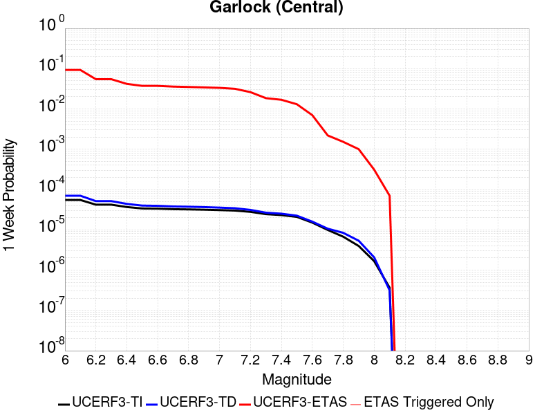 |  |  |  |

| Magnitude | 1 wk TI Prob | 1 wk TD Prob | 1 wk ETAS Prob | 1 wk ETAS/TD Gain | 1 wk ETAS Triggered Only | 1 mo TI Prob | 1 mo TD Prob | 1 mo ETAS Prob | 1 mo ETAS/TD Gain | 1 mo ETAS Triggered Only | 1 yr TI Prob | 1 yr TD Prob | 1 yr ETAS Prob | 1 yr ETAS/TD Gain | 1 yr ETAS Triggered Only | 10 yr TI Prob | 10 yr TD Prob | 10 yr ETAS Prob | 10 yr ETAS/TD Gain | 10 yr ETAS Triggered Only |
|-----|-----|-----|-----|-----|-----|-----|-----|-----|-----|-----|-----|-----|-----|-----|-----|-----|-----|-----|-----|-----|
| 6.0 | 5.5131142E-5 | 7.024681E-5 | 0.093214385 | 1326.9554 | 0.09315068 | 2.3625491E-4 | 3.010234E-4 | 0.1008187 | 334.91983 | 0.10054795 | 0.0028726095 | 0.0036588663 | 0.114621244 | 31.326982 | 0.11136986 | 0.028357591 | 0.036079824 | 0.14910936 | 4.132763 | 0.11726028 |
| 6.1 | 5.5131142E-5 | 7.024681E-5 | 0.093214385 | 1326.9554 | 0.09315068 | 2.3625491E-4 | 3.010234E-4 | 0.1008187 | 334.91983 | 0.10054795 | 0.0028726095 | 0.0036588663 | 0.114621244 | 31.326982 | 0.11136986 | 0.028357591 | 0.036079824 | 0.14910936 | 4.132763 | 0.11726028 |
| 6.2 | 4.216245E-5 | 5.1661493E-5 | 0.057582937 | 1114.62 | 0.057534248 | 1.806837E-4 | 2.2138779E-4 | 0.061988533 | 279.9998 | 0.06178082 | 0.0021976046 | 0.0026920962 | 0.07113747 | 26.424566 | 0.06863014 | 0.021759989 | 0.026689773 | 0.09642145 | 3.612674 | 0.07164384 |
| 6.3 | 4.216245E-5 | 5.1661493E-5 | 0.057582937 | 1114.62 | 0.057534248 | 1.806837E-4 | 2.2138779E-4 | 0.061988533 | 279.9998 | 0.06178082 | 0.0021976046 | 0.0026920962 | 0.07113747 | 26.424566 | 0.06863014 | 0.021759989 | 0.026689773 | 0.09642145 | 3.612674 | 0.07164384 |
| 6.4 | 3.6858168E-5 | 4.411054E-5 | 0.04387779 | 994.7235 | 0.043835618 | 1.5795401E-4 | 1.8903162E-4 | 0.04648165 | 245.89351 | 0.04630137 | 0.0019213937 | 0.002299056 | 0.053140804 | 23.114183 | 0.050958905 | 0.019048655 | 0.02284894 | 0.07518676 | 3.2906015 | 0.053561643 |
| 6.5 | 3.39199E-5 | 4.0018083E-5 | 0.039490495 | 986.8162 | 0.039452054 | 1.453629E-4 | 1.7149492E-4 | 0.042082116 | 245.38403 | 0.04191781 | 0.0017683565 | 0.002085973 | 0.047880657 | 22.953632 | 0.04589041 | 0.017543508 | 0.020759864 | 0.06770974 | 3.2615693 | 0.047945205 |
| 6.6 | 3.3571985E-5 | 3.9472274E-5 | 0.03948997 | 1000.44836 | 0.039452054 | 1.4387199E-4 | 1.6915603E-4 | 0.042079873 | 248.76366 | 0.04191781 | 0.0017502342 | 0.0020575512 | 0.04785354 | 23.257523 | 0.04589041 | 0.017365133 | 0.020481179 | 0.06744441 | 3.2929945 | 0.047945205 |
| 6.7 | 3.2580007E-5 | 3.8088703E-5 | 0.03798185 | 997.19464 | 0.037945207 | 1.3962112E-4 | 1.632272E-4 | 0.04056759 | 248.5345 | 0.04041096 | 0.0016985617 | 0.0019855013 | 0.04628094 | 23.309448 | 0.044383563 | 0.016856372 | 0.019773813 | 0.06529391 | 3.3020391 | 0.046438355 |
| 6.8 | 3.2185937E-5 | 3.7515918E-5 | 0.036885448 | 983.1946 | 0.036849316 | 1.3793244E-4 | 1.6077272E-4 | 0.03946952 | 245.49886 | 0.039315067 | 0.0016780337 | 0.001955672 | 0.04502197 | 23.021227 | 0.043150686 | 0.016654192 | 0.019480614 | 0.06380546 | 3.2753313 | 0.045205478 |
| 6.9 | 3.165394E-5 | 3.6720503E-5 | 0.035925813 | 978.3584 | 0.03589041 | 1.3565269E-4 | 1.5736422E-4 | 0.038370527 | 243.83261 | 0.038219176 | 0.0016503202 | 0.001914247 | 0.04388854 | 22.92731 | 0.042054795 | 0.01638118 | 0.019073246 | 0.062341522 | 3.2685323 | 0.04410959 |
| 7.0 | 3.0903822E-5 | 3.5625766E-5 | 0.035376832 | 993.0126 | 0.035342466 | 1.3243823E-4 | 1.5267303E-4 | 0.037544224 | 245.9126 | 0.03739726 | 0.0016112428 | 0.0018572307 | 0.043013528 | 23.160036 | 0.041232876 | 0.015996104 | 0.018512413 | 0.060998727 | 3.2950175 | 0.043287672 |
| 7.1 | 3.0069863E-5 | 3.4392073E-5 | 0.03427979 | 996.7352 | 0.034246575 | 1.2886449E-4 | 1.4738638E-4 | 0.03630644 | 246.3351 | 0.036164384 | 0.0015677959 | 0.0017929734 | 0.041584514 | 23.193047 | 0.039863013 | 0.01556781 | 0.017880075 | 0.058913853 | 3.2949443 | 0.041780822 |
| 7.2 | 2.7957109E-5 | 3.128145E-5 | 0.029208452 | 933.73065 | 0.029178083 | 1.1981068E-4 | 1.340566E-4 | 0.030951843 | 230.88638 | 0.030821918 | 0.0014577188 | 0.0016309366 | 0.035821658 | 21.963856 | 0.034246575 | 0.014481937 | 0.016283695 | 0.051724434 | 3.1764555 | 0.036027398 |
| 7.3 | 2.4519275E-5 | 2.6714795E-5 | 0.020163164 | 754.7564 | 0.020136986 | 1.0507837E-4 | 1.1448703E-4 | 0.021618875 | 188.8325 | 0.02150685 | 0.0012785783 | 0.001393003 | 0.025195416 | 18.087122 | 0.023835616 | 0.012712469 | 0.013928054 | 0.03891755 | 2.7941842 | 0.025342466 |
| 7.4 | 2.3225532E-5 | 2.51994E-5 | 0.018928833 | 751.16205 | 0.01890411 | 9.95342E-5 | 1.0799304E-4 | 0.020379776 | 188.71379 | 0.020273972 | 0.0012111551 | 0.0013140367 | 0.02375027 | 18.074282 | 0.022465754 | 0.012045753 | 0.013145725 | 0.036397636 | 2.768781 | 0.023561643 |
| 7.5 | 2.097765E-5 | 2.2483688E-5 | 0.013720806 | 610.25604 | 0.01369863 | 8.9901114E-5 | 9.635517E-5 | 0.015026423 | 155.94829 | 0.0149315065 | 0.0010939965 | 0.0011725046 | 0.01813889 | 15.470206 | 0.016986301 | 0.010886264 | 0.011740365 | 0.029610265 | 2.5220907 | 0.018082192 |
| 7.6 | 1.511254E-5 | 1.5991332E-5 | 0.0074131335 | 463.57196 | 0.00739726 | 6.476642E-5 | 6.853253E-5 | 0.008287148 | 120.92284 | 0.008219178 | 7.882459E-4 | 8.3407195E-4 | 0.010551987 | 12.651172 | 0.009726027 | 0.007854558 | 0.008383559 | 0.0185714 | 2.2152166 | 0.0102739725 |
| 7.7 | 9.934069E-6 | 1.0678794E-5 | 0.0024764058 | 231.89941 | 0.0024657534 | 4.2573887E-5 | 4.5765457E-5 | 0.002785366 | 60.861755 | 0.002739726 | 5.182138E-4 | 5.570524E-4 | 0.0038428921 | 6.898619 | 0.0032876711 | 0.00517007 | 0.005627684 | 0.009033068 | 1.605113 | 0.0034246575 |
| 7.8 | 6.7562896E-6 | 8.428449E-6 | 0.0015152651 | 179.77982 | 0.0015068493 | 2.8955206E-5 | 3.6121426E-5 | 0.001816879 | 50.299206 | 0.001780822 | 3.5247262E-4 | 4.3968976E-4 | 0.002767433 | 6.2940583 | 0.0023287672 | 0.0035191406 | 0.004446654 | 0.0069014435 | 1.5520531 | 0.0024657534 |
| 7.9 | 3.975453E-6 | 5.37103E-6 | 0.0011012555 | 205.03618 | 0.0010958904 | 1.7037546E-5 | 2.3018498E-5 | 0.00139285 | 60.51003 | 0.001369863 | 2.0741238E-4 | 2.8021427E-4 | 0.0019235893 | 6.8647084 | 0.0016438356 | 0.002072189 | 0.0028336283 | 0.004609404 | 1.6266792 | 0.001780822 |
| 8.0 | 1.6729537E-6 | 2.0775144E-6 | 2.7604954E-4 | 132.87491 | 2.739726E-4 | 7.169782E-6 | 8.903603E-6 | 2.8287378E-4 | 31.770708 | 2.739726E-4 | 8.7288594E-5 | 1.0839601E-4 | 5.1931036E-4 | 4.7908626 | 4.109589E-4 | 8.7254314E-4 | 0.0010969337 | 0.0015074419 | 1.3742324 | 4.109589E-4 |
| 8.1 | 3.6733252E-7 | 3.1489964E-7 | 1.3730116E-4 | 436.0156 | 1.369863E-4 | 1.5742813E-6 | 1.3495693E-6 | 1.3833569E-4 | 102.50358 | 1.369863E-4 | 1.9166706E-5 | 1.6430899E-5 | 1.5341495E-4 | 9.336979 | 1.369863E-4 | 1.9165053E-4 | 1.6638759E-4 | 3.033511E-4 | 1.8231595 | 1.369863E-4 |

## Tank Canyon
*[(top)](#table-of-contents)*

| 1 Week | 1 Month | 1 Year | 10 Year |
|-----|-----|-----|-----|
|  |  |  |  |

| Magnitude | 1 wk TI Prob | 1 wk TD Prob | 1 wk ETAS Prob | 1 wk ETAS/TD Gain | 1 wk ETAS Triggered Only | 1 mo TI Prob | 1 mo TD Prob | 1 mo ETAS Prob | 1 mo ETAS/TD Gain | 1 mo ETAS Triggered Only | 1 yr TI Prob | 1 yr TD Prob | 1 yr ETAS Prob | 1 yr ETAS/TD Gain | 1 yr ETAS Triggered Only | 10 yr TI Prob | 10 yr TD Prob | 10 yr ETAS Prob | 10 yr ETAS/TD Gain | 10 yr ETAS Triggered Only |
|-----|-----|-----|-----|-----|-----|-----|-----|-----|-----|-----|-----|-----|-----|-----|-----|-----|-----|-----|-----|-----|
| 6.0 | 4.8284557E-5 | 5.7964822E-5 | 0.041014496 | 707.5756 | 0.040958904 | 2.0691741E-4 | 2.4840087E-4 | 0.045168746 | 181.83812 | 0.04493151 | 0.0025163088 | 0.0030207601 | 0.054098874 | 17.909027 | 0.051232878 | 0.02488006 | 0.029863637 | 0.083154686 | 2.7844796 | 0.054931507 |
| 6.1 | 1.7796336E-5 | 2.0873314E-5 | 0.014541118 | 696.6367 | 0.014520548 | 7.626778E-5 | 8.945422E-5 | 0.015567522 | 174.02782 | 0.015479452 | 9.281647E-4 | 0.0010885983 | 0.018877432 | 17.341045 | 0.01780822 | 0.009242975 | 0.010836744 | 0.029806998 | 2.7505493 | 0.019178081 |
| 6.2 | 1.7796336E-5 | 2.0873314E-5 | 0.014541118 | 696.6367 | 0.014520548 | 7.626778E-5 | 8.945422E-5 | 0.015567522 | 174.02782 | 0.015479452 | 9.281647E-4 | 0.0010885983 | 0.018877432 | 17.341045 | 0.01780822 | 0.009242975 | 0.010836744 | 0.029806998 | 2.7505493 | 0.019178081 |
| 6.3 | 1.3515912E-5 | 1.5759564E-5 | 0.00960465 | 609.4489 | 0.009589041 | 5.792405E-5 | 6.753938E-5 | 0.010477795 | 155.1361 | 0.010410959 | 7.049971E-4 | 8.2200574E-4 | 0.012319396 | 14.986996 | 0.011506849 | 0.007027647 | 0.0081922645 | 0.020420032 | 2.492599 | 0.012328767 |
| 6.4 | 1.0870146E-5 | 1.2618021E-5 | 0.0078207385 | 619.80707 | 0.007808219 | 4.658551E-5 | 5.4076212E-5 | 0.008546768 | 158.05042 | 0.008493151 | 5.67031E-4 | 6.581969E-4 | 0.009693342 | 14.727116 | 0.009041096 | 0.005655863 | 0.0065644905 | 0.016362758 | 2.4926167 | 0.009863013 |
| 6.5 | 7.964826E-6 | 9.196094E-6 | 0.005488598 | 596.8401 | 0.005479452 | 3.4134522E-5 | 3.9411298E-5 | 0.006203552 | 157.40543 | 0.0061643836 | 4.1550855E-4 | 4.7973756E-4 | 0.006778084 | 14.128734 | 0.00630137 | 0.0041473247 | 0.004788321 | 0.011604839 | 2.4235716 | 0.006849315 |
| 6.6 | 6.6317E-6 | 7.6122988E-6 | 0.0045281257 | 594.8434 | 0.004520548 | 2.8421264E-5 | 3.2623782E-5 | 0.0051009515 | 156.35684 | 0.005068493 | 3.4597394E-4 | 3.9713128E-4 | 0.0056005437 | 14.102499 | 0.0052054795 | 0.0034543579 | 0.003965368 | 0.009559535 | 2.410756 | 0.0056164386 |
| 6.7 | 4.793663E-6 | 5.4307857E-6 | 0.0024711709 | 455.0301 | 0.0024657534 | 2.0544108E-5 | 2.3274613E-5 | 0.0026259539 | 112.824814 | 0.0026027397 | 2.500958E-4 | 2.8333595E-4 | 0.0028853382 | 10.183453 | 0.0026027397 | 0.0024981452 | 0.0028304397 | 0.0056990096 | 2.0134716 | 0.0028767122 |
| 6.8 | 4.382823E-6 | 4.9692567E-6 | 0.0021967392 | 442.06595 | 0.0021917808 | 1.8783392E-5 | 2.1296666E-5 | 0.0022130308 | 103.91443 | 0.0021917808 | 2.286638E-4 | 2.5926033E-4 | 0.002450473 | 9.451785 | 0.0021917808 | 0.0022842865 | 0.002590253 | 0.0050496194 | 1.9494697 | 0.0024657534 |
| 6.9 | 2.729601E-6 | 3.0735416E-6 | 0.0016469042 | 535.8327 | 0.0016438356 | 1.1698237E-5 | 1.3172262E-5 | 0.0016569862 | 125.793594 | 0.0016438356 | 1.4241673E-4 | 1.6036171E-4 | 0.0018039338 | 11.249155 | 0.0016438356 | 0.001423255 | 0.0016026258 | 0.0033805938 | 2.1094093 | 0.001780822 |
| 7.0 | 1.8987357E-6 | 2.126939E-6 | 4.1308496E-4 | 194.21571 | 4.109589E-4 | 8.137413E-6 | 9.115425E-6 | 4.2007057E-4 | 46.08349 | 4.109589E-4 | 9.90685E-5 | 1.1097535E-4 | 5.2188867E-4 | 4.702744 | 4.109589E-4 | 9.902435E-4 | 0.0011092679 | 0.0015197711 | 1.3700666 | 4.109589E-4 |
| 7.1 | 1.4928986E-6 | 1.6641272E-6 | 1.386502E-4 | 83.31707 | 1.369863E-4 | 6.398121E-6 | 7.1319573E-6 | 1.4411728E-4 | 20.207254 | 1.369863E-4 | 7.789434E-5 | 8.682871E-5 | 2.2380312E-4 | 2.5775244 | 1.369863E-4 | 7.786704E-4 | 8.6800574E-4 | 0.0010048732 | 1.1576803 | 1.369863E-4 |
| 7.2 | 1.069082E-6 | 1.1828573E-6 | 1.1828573E-6 | 1.0 | 0.0 | 4.581772E-6 | 5.0693816E-6 | 5.0693816E-6 | 1.0 | 0.0 | 5.5781646E-5 | 6.171851E-5 | 6.171851E-5 | 1.0 | 0.0 | 5.576765E-4 | 6.170659E-4 | 6.170659E-4 | 1.0 | 0.0 |
| 7.3 | 8.776551E-7 | 9.770005E-7 | 9.770005E-7 | 1.0 | 0.0 | 3.7613736E-6 | 4.1871413E-6 | 4.1871413E-6 | 1.0 | 0.0 | 4.579376E-5 | 5.097777E-5 | 5.097777E-5 | 1.0 | 0.0 | 4.5784327E-4 | 5.097118E-4 | 5.097118E-4 | 1.0 | 0.0 |
| 7.4 | 7.55721E-7 | 8.510244E-7 | 8.510244E-7 | 1.0 | 0.0 | 3.2388E-6 | 3.6472454E-6 | 3.6472454E-6 | 1.0 | 0.0 | 3.9431678E-5 | 4.4404827E-5 | 4.4404827E-5 | 1.0 | 0.0 | 3.942468E-4 | 4.440104E-4 | 4.440104E-4 | 1.0 | 0.0 |
| 7.5 | 5.587665E-7 | 6.305619E-7 | 6.305619E-7 | 1.0 | 0.0 | 2.3947114E-6 | 2.702408E-6 | 2.702408E-6 | 1.0 | 0.0 | 2.915522E-5 | 3.290182E-5 | 3.290182E-5 | 1.0 | 0.0 | 2.9151395E-4 | 3.290182E-4 | 3.290182E-4 | 1.0 | 0.0 |

## Little Lake
*[(top)](#table-of-contents)*

| 1 Week | 1 Month | 1 Year | 10 Year |
|-----|-----|-----|-----|
| 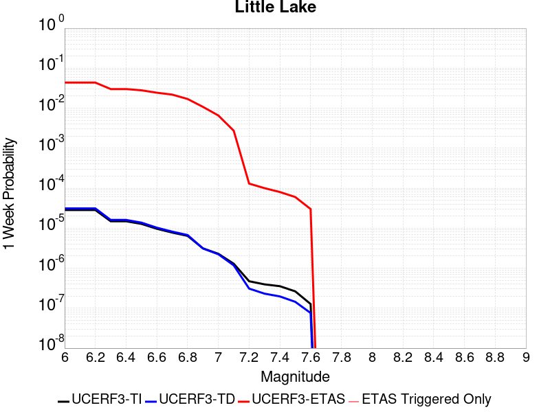 |  |  |  |

| Magnitude | 1 wk TI Prob | 1 wk TD Prob | 1 wk ETAS Prob | 1 wk ETAS/TD Gain | 1 wk ETAS Triggered Only | 1 mo TI Prob | 1 mo TD Prob | 1 mo ETAS Prob | 1 mo ETAS/TD Gain | 1 mo ETAS Triggered Only | 1 yr TI Prob | 1 yr TD Prob | 1 yr ETAS Prob | 1 yr ETAS/TD Gain | 1 yr ETAS Triggered Only | 10 yr TI Prob | 10 yr TD Prob | 10 yr ETAS Prob | 10 yr ETAS/TD Gain | 10 yr ETAS Triggered Only |
|-----|-----|-----|-----|-----|-----|-----|-----|-----|-----|-----|-----|-----|-----|-----|-----|-----|-----|-----|-----|-----|
| 6.0 | 2.8424427E-5 | 3.120572E-5 | 0.040577885 | 1300.3348 | 0.040547945 | 1.2181328E-4 | 1.337327E-4 | 0.04382652 | 327.7173 | 0.04369863 | 0.0014820677 | 0.0016271127 | 0.050314885 | 30.922804 | 0.048767123 | 0.014722223 | 0.016165402 | 0.06751348 | 4.176419 | 0.05219178 |
| 6.1 | 2.8424427E-5 | 3.120572E-5 | 0.040577885 | 1300.3348 | 0.040547945 | 1.2181328E-4 | 1.337327E-4 | 0.04382652 | 327.7173 | 0.04369863 | 0.0014820677 | 0.0016271127 | 0.050314885 | 30.922804 | 0.048767123 | 0.014722223 | 0.016165402 | 0.06751348 | 4.176419 | 0.05219178 |
| 6.2 | 2.8424427E-5 | 3.120572E-5 | 0.040577885 | 1300.3348 | 0.040547945 | 1.2181328E-4 | 1.337327E-4 | 0.04382652 | 327.7173 | 0.04369863 | 0.0014820677 | 0.0016271127 | 0.050314885 | 30.922804 | 0.048767123 | 0.014722223 | 0.016165402 | 0.06751348 | 4.176419 | 0.05219178 |
| 6.3 | 1.48860645E-5 | 1.6081389E-5 | 0.025769092 | 1602.417 | 0.025753425 | 6.379586E-5 | 6.8918576E-5 | 0.027601268 | 400.49097 | 0.027534246 | 7.7643775E-4 | 8.3878887E-4 | 0.03204547 | 38.20445 | 0.031232877 | 0.007737305 | 0.008359048 | 0.041096784 | 4.9164433 | 0.033013698 |
| 6.4 | 1.48860645E-5 | 1.6081389E-5 | 0.025769092 | 1602.417 | 0.025753425 | 6.379586E-5 | 6.8918576E-5 | 0.027601268 | 400.49097 | 0.027534246 | 7.7643775E-4 | 8.3878887E-4 | 0.03204547 | 38.20445 | 0.031232877 | 0.007737305 | 0.008359048 | 0.041096784 | 4.9164433 | 0.033013698 |
| 6.5 | 1.2797581E-5 | 1.3765565E-5 | 0.023849053 | 1732.5155 | 0.023835616 | 5.4845623E-5 | 5.899409E-5 | 0.025536943 | 432.87292 | 0.025479453 | 6.675408E-4 | 7.18042E-4 | 0.029327622 | 40.84388 | 0.028630137 | 0.006655392 | 0.00715977 | 0.03708098 | 5.1790743 | 0.030136986 |
| 6.6 | 9.661896E-6 | 1.0289038E-5 | 0.021379933 | 2077.933 | 0.021369863 | 4.1407468E-5 | 4.409522E-5 | 0.022919798 | 519.77966 | 0.022876712 | 5.040193E-4 | 5.367433E-4 | 0.026139433 | 48.70006 | 0.025616439 | 0.005028777 | 0.0053560743 | 0.032061584 | 5.9860225 | 0.026849315 |
| 6.7 | 7.767871E-6 | 8.199687E-6 | 0.018638184 | 2273.0361 | 0.018630138 | 3.329045E-5 | 3.5141118E-5 | 0.02017142 | 574.0119 | 0.020136986 | 4.0523586E-4 | 4.2777284E-4 | 0.022746988 | 53.175392 | 0.022328768 | 0.004044977 | 0.004270846 | 0.027731862 | 6.4932947 | 0.023561643 |
| 6.8 | 6.4235196E-6 | 6.7357446E-6 | 0.013979244 | 2075.3823 | 0.013972603 | 2.752908E-5 | 2.8867229E-5 | 0.0153708905 | 532.4685 | 0.015342466 | 3.35115E-4 | 3.5141467E-4 | 0.017331747 | 49.31993 | 0.016986301 | 0.003346101 | 0.00350985 | 0.02139207 | 6.094867 | 0.017945206 |
| 6.9 | 3.1283696E-6 | 3.1121804E-6 | 0.00904418 | 2906.059 | 0.009041096 | 1.3407229E-5 | 1.3337856E-5 | 0.010013204 | 750.73566 | 0.01 | 1.6322079E-4 | 1.6237781E-4 | 0.011393431 | 70.166176 | 0.011232877 | 0.0016310095 | 0.00162274 | 0.013521208 | 8.332333 | 0.011917808 |
| 7.0 | 2.290603E-6 | 2.2286815E-6 | 0.0047967387 | 2152.2764 | 0.0047945203 | 9.816834E-6 | 9.551463E-6 | 0.005488951 | 574.6712 | 0.005479452 | 1.19513395E-4 | 1.162839E-4 | 0.0062799505 | 54.005333 | 0.0061643836 | 0.0011944914 | 0.0011623327 | 0.0073195514 | 6.297294 | 0.0061643836 |
| 7.1 | 1.293693E-6 | 1.1776827E-6 | 0.0012340529 | 1047.8654 | 0.0012328767 | 5.5443866E-6 | 5.0472063E-6 | 0.0016488745 | 326.69055 | 0.0016438356 | 6.750081E-5 | 6.14487E-5 | 0.002116117 | 34.43713 | 0.0020547945 | 6.7480316E-4 | 6.143856E-4 | 0.0026679176 | 4.342416 | 0.0020547945 |
| 7.2 | 4.715842E-7 | 3.0917857E-7 | 2.742817E-4 | 887.1304 | 2.739726E-4 | 2.0210737E-6 | 1.3250503E-6 | 4.122834E-4 | 311.14545 | 4.109589E-4 | 2.4606294E-5 | 1.6132375E-5 | 5.6406873E-4 | 34.965015 | 5.479452E-4 | 2.460357E-4 | 1.6131258E-4 | 7.0916937E-4 | 4.3962436 | 5.479452E-4 |
| 7.3 | 3.9430947E-7 | 2.3097488E-7 | 2.742035E-4 | 1187.1573 | 2.739726E-4 | 1.6898966E-6 | 9.89892E-7 | 4.119484E-4 | 416.1549 | 4.109589E-4 | 2.0574296E-5 | 1.2051869E-5 | 4.230058E-4 | 35.098774 | 4.109589E-4 | 2.0572392E-4 | 1.20512224E-4 | 5.314216E-4 | 4.4096904 | 4.109589E-4 |
| 7.4 | 3.547123E-7 | 1.9679135E-7 | 2.7416935E-4 | 1393.1981 | 2.739726E-4 | 1.5201948E-6 | 8.4339126E-7 | 4.1180194E-4 | 488.26917 | 4.109589E-4 | 1.8508214E-5 | 1.0268241E-5 | 4.212229E-4 | 41.02192 | 4.109589E-4 | 1.8506673E-4 | 1.02677724E-4 | 5.135944E-4 | 5.002004 | 4.109589E-4 |
| 7.5 | 2.6354266E-7 | 1.4423138E-7 | 1.3713051E-4 | 950.7675 | 1.369863E-4 | 1.129468E-6 | 6.181344E-7 | 2.7459057E-4 | 444.22473 | 2.739726E-4 | 1.3751187E-5 | 7.5257603E-6 | 2.814963E-4 | 37.404366 | 2.739726E-4 | 1.3750336E-4 | 7.5255106E-5 | 3.4920708E-4 | 4.640311 | 2.739726E-4 |
| 7.6 | 1.269913E-7 | 7.572556E-8 | 1.3706202E-4 | 1809.9835 | 1.369863E-4 | 5.4424834E-7 | 3.245381E-7 | 2.7429705E-4 | 845.1922 | 2.739726E-4 | 6.6262032E-6 | 3.9512443E-6 | 2.7792275E-4 | 70.338036 | 2.739726E-4 | 6.626006E-5 | 3.9511775E-5 | 3.1347355E-4 | 7.933674 | 2.739726E-4 |

## Airport Lake
*[(top)](#table-of-contents)*

| 1 Week | 1 Month | 1 Year | 10 Year |
|-----|-----|-----|-----|
|  |  |  |  |

| Magnitude | 1 wk TI Prob | 1 wk TD Prob | 1 wk ETAS Prob | 1 wk ETAS/TD Gain | 1 wk ETAS Triggered Only | 1 mo TI Prob | 1 mo TD Prob | 1 mo ETAS Prob | 1 mo ETAS/TD Gain | 1 mo ETAS Triggered Only | 1 yr TI Prob | 1 yr TD Prob | 1 yr ETAS Prob | 1 yr ETAS/TD Gain | 1 yr ETAS Triggered Only | 10 yr TI Prob | 10 yr TD Prob | 10 yr ETAS Prob | 10 yr ETAS/TD Gain | 10 yr ETAS Triggered Only |
|-----|-----|-----|-----|-----|-----|-----|-----|-----|-----|-----|-----|-----|-----|-----|-----|-----|-----|-----|-----|-----|
| 6.0 | 1.2387061E-5 | 1.3103157E-5 | 0.03699892 | 2823.6646 | 0.036986303 | 5.3086325E-5 | 5.615534E-5 | 0.040327866 | 718.14844 | 0.04027397 | 6.461343E-4 | 6.8350515E-4 | 0.04599498 | 67.2928 | 0.045342464 | 0.0064425888 | 0.0068168393 | 0.054571263 | 8.005362 | 0.04808219 |
| 6.1 | 1.2387061E-5 | 1.3103157E-5 | 0.03699892 | 2823.6646 | 0.036986303 | 5.3086325E-5 | 5.615534E-5 | 0.040327866 | 718.14844 | 0.04027397 | 6.461343E-4 | 6.8350515E-4 | 0.04599498 | 67.2928 | 0.045342464 | 0.0064425888 | 0.0068168393 | 0.054571263 | 8.005362 | 0.04808219 |
| 6.2 | 1.2387061E-5 | 1.3103157E-5 | 0.03699892 | 2823.6646 | 0.036986303 | 5.3086325E-5 | 5.615534E-5 | 0.040327866 | 718.14844 | 0.04027397 | 6.461343E-4 | 6.8350515E-4 | 0.04599498 | 67.2928 | 0.045342464 | 0.0064425888 | 0.0068168393 | 0.054571263 | 8.005362 | 0.04808219 |
| 6.3 | 1.2387061E-5 | 1.3103157E-5 | 0.03699892 | 2823.6646 | 0.036986303 | 5.3086325E-5 | 5.615534E-5 | 0.040327866 | 718.14844 | 0.04027397 | 6.461343E-4 | 6.8350515E-4 | 0.04599498 | 67.2928 | 0.045342464 | 0.0064425888 | 0.0068168393 | 0.054571263 | 8.005362 | 0.04808219 |
| 6.4 | 1.2387061E-5 | 1.3103157E-5 | 0.03699892 | 2823.6646 | 0.036986303 | 5.3086325E-5 | 5.615534E-5 | 0.040327866 | 718.14844 | 0.04027397 | 6.461343E-4 | 6.8350515E-4 | 0.04599498 | 67.2928 | 0.045342464 | 0.0064425888 | 0.0068168393 | 0.054571263 | 8.005362 | 0.04808219 |
| 6.5 | 6.9922594E-6 | 7.384925E-6 | 0.027952384 | 3785.0598 | 0.027945206 | 2.996648E-5 | 3.1649324E-5 | 0.030441646 | 961.84186 | 0.030410958 | 3.6478083E-4 | 3.8526783E-4 | 0.034481715 | 89.50063 | 0.03410959 | 0.003641826 | 0.0038465366 | 0.039871812 | 10.36564 | 0.036164384 |
| 6.6 | 6.9922594E-6 | 7.384925E-6 | 0.027952384 | 3785.0598 | 0.027945206 | 2.996648E-5 | 3.1649324E-5 | 0.030441646 | 961.84186 | 0.030410958 | 3.6478083E-4 | 3.8526783E-4 | 0.034481715 | 89.50063 | 0.03410959 | 0.003641826 | 0.0038465366 | 0.039871812 | 10.36564 | 0.036164384 |
| 6.7 | 5.477277E-6 | 5.7860684E-6 | 0.02493715 | 4309.861 | 0.024931507 | 2.3473833E-5 | 2.4797222E-5 | 0.02701043 | 1089.2522 | 0.026986301 | 2.8575645E-4 | 3.0186825E-4 | 0.030292813 | 100.351105 | 0.03 | 0.0028538927 | 0.003014966 | 0.03483654 | 11.55454 | 0.031917807 |
| 6.8 | 3.9950432E-6 | 4.2190873E-6 | 0.018086335 | 4286.7886 | 0.018082192 | 1.7121502E-5 | 1.8081691E-5 | 0.019880736 | 1099.4954 | 0.019863013 | 2.0843433E-4 | 2.2012512E-4 | 0.022270065 | 101.17003 | 0.022054795 | 0.0020823893 | 0.0021993418 | 0.025435796 | 11.565186 | 0.02328767 |
| 6.9 | 2.95695E-6 | 3.1230243E-6 | 0.012879795 | 4124.1416 | 0.012876713 | 1.2672582E-5 | 1.3384334E-5 | 0.0139858 | 1044.9381 | 0.013972603 | 1.5427776E-4 | 1.6294434E-4 | 0.015913801 | 97.66403 | 0.015753424 | 0.001541707 | 0.0016284712 | 0.018040057 | 11.07791 | 0.016438356 |
| 7.0 | 1.456072E-6 | 1.540812E-6 | 0.0043850956 | 2845.964 | 0.0043835617 | 6.2402937E-6 | 6.603469E-6 | 0.0049380776 | 747.80054 | 0.0049315067 | 7.597293E-5 | 8.039528E-5 | 0.0055594067 | 69.15091 | 0.005479452 | 7.594696E-4 | 8.0376083E-4 | 0.0062788087 | 7.8117876 | 0.005479452 |
| 7.1 | 6.995192E-7 | 7.4089746E-7 | 8.2265807E-4 | 1110.3535 | 8.219178E-4 | 2.997936E-6 | 3.1752747E-6 | 0.0010990622 | 346.13138 | 0.0010958904 | 3.649926E-5 | 3.865897E-5 | 0.001408469 | 36.433174 | 0.001369863 | 3.6493264E-4 | 3.865897E-4 | 0.0017559231 | 4.5420847 | 0.001369863 |

## Owl Lake
*[(top)](#table-of-contents)*

| 1 Week | 1 Month | 1 Year | 10 Year |
|-----|-----|-----|-----|
|  |  |  |  |

| Magnitude | 1 wk TI Prob | 1 wk TD Prob | 1 wk ETAS Prob | 1 wk ETAS/TD Gain | 1 wk ETAS Triggered Only | 1 mo TI Prob | 1 mo TD Prob | 1 mo ETAS Prob | 1 mo ETAS/TD Gain | 1 mo ETAS Triggered Only | 1 yr TI Prob | 1 yr TD Prob | 1 yr ETAS Prob | 1 yr ETAS/TD Gain | 1 yr ETAS Triggered Only | 10 yr TI Prob | 10 yr TD Prob | 10 yr ETAS Prob | 10 yr ETAS/TD Gain | 10 yr ETAS Triggered Only |
|-----|-----|-----|-----|-----|-----|-----|-----|-----|-----|-----|-----|-----|-----|-----|-----|-----|-----|-----|-----|-----|
| 6.0 | 5.0320643E-5 | 6.635816E-5 | 0.01568176 | 236.32 | 0.015616438 | 2.1564208E-4 | 2.843674E-4 | 0.016991943 | 59.75349 | 0.016712328 | 0.0026222812 | 0.0034577388 | 0.02215997 | 6.408804 | 0.018767124 | 0.02591553 | 0.034140717 | 0.053193282 | 1.5580599 | 0.019726027 |
| 6.1 | 5.0320643E-5 | 6.635816E-5 | 0.01568176 | 236.32 | 0.015616438 | 2.1564208E-4 | 2.843674E-4 | 0.016991943 | 59.75349 | 0.016712328 | 0.0026222812 | 0.0034577388 | 0.02215997 | 6.408804 | 0.018767124 | 0.02591553 | 0.034140717 | 0.053193282 | 1.5580599 | 0.019726027 |
| 6.2 | 2.4125871E-5 | 3.0981035E-5 | 0.014140133 | 456.41254 | 0.014109589 | 1.0339249E-4 | 1.3277028E-4 | 0.014925326 | 112.414665 | 0.01479452 | 0.0012580766 | 0.001615439 | 0.01802724 | 11.159345 | 0.016438356 | 0.012509781 | 0.016070465 | 0.033188142 | 2.0651639 | 0.01739726 |
| 6.3 | 1.7433485E-5 | 2.2355514E-5 | 0.013583696 | 607.62177 | 0.013561644 | 7.471279E-5 | 9.580672E-5 | 0.014204044 | 148.25728 | 0.014109589 | 9.0924866E-4 | 0.0011659743 | 0.016901031 | 14.4952 | 0.015753424 | 0.009055373 | 0.011628896 | 0.02814688 | 2.4204257 | 0.016712328 |
| 6.4 | 1.7433485E-5 | 2.2355514E-5 | 0.013583696 | 607.62177 | 0.013561644 | 7.471279E-5 | 9.580672E-5 | 0.014204044 | 148.25728 | 0.014109589 | 9.0924866E-4 | 0.0011659743 | 0.016901031 | 14.4952 | 0.015753424 | 0.009055373 | 0.011628896 | 0.02814688 | 2.4204257 | 0.016712328 |
| 6.5 | 1.5182742E-5 | 1.9429144E-5 | 0.013443826 | 691.9412 | 0.013424657 | 6.506727E-5 | 8.326596E-5 | 0.014054705 | 168.79294 | 0.013972603 | 7.919061E-4 | 0.0010134429 | 0.01634036 | 16.123611 | 0.015342466 | 0.0078909 | 0.010118429 | 0.026119255 | 2.5813549 | 0.016164383 |
| 6.6 | 6.7271576E-6 | 8.547361E-6 | 0.011926253 | 1395.3141 | 0.011917808 | 2.8830356E-5 | 3.6631063E-5 | 0.012364946 | 337.55356 | 0.012328767 | 3.5095305E-4 | 4.458976E-4 | 0.013864569 | 31.093616 | 0.013424657 | 0.0035039932 | 0.004467813 | 0.018650737 | 4.174467 | 0.014246576 |
| 6.7 | 6.682835E-6 | 8.479807E-6 | 0.011926187 | 1406.422 | 0.011917808 | 2.8640408E-5 | 3.6341557E-5 | 0.01236466 | 340.23477 | 0.012328767 | 3.4864116E-4 | 4.4237426E-4 | 0.013861093 | 31.333406 | 0.013424657 | 0.003480947 | 0.0044327388 | 0.018616162 | 4.1996975 | 0.014246576 |
| 6.8 | 6.5774975E-6 | 8.32628E-6 | 0.011926035 | 1432.3364 | 0.011917808 | 2.8188972E-5 | 3.5683603E-5 | 0.01236401 | 346.49 | 0.012328767 | 3.4314668E-4 | 4.343669E-4 | 0.013853193 | 31.892838 | 0.013424657 | 0.0034261728 | 0.004352885 | 0.018537447 | 4.258658 | 0.014246576 |
| 6.9 | 6.363419E-6 | 7.999454E-6 | 0.011925712 | 1490.8157 | 0.011917808 | 2.727151E-5 | 3.428296E-5 | 0.012362627 | 360.60562 | 0.012328767 | 3.3198006E-4 | 4.1732067E-4 | 0.013836375 | 33.155262 | 0.013424657 | 0.0033148455 | 0.0041828766 | 0.018369861 | 4.391681 | 0.014246576 |
| 7.0 | 6.1342453E-6 | 7.6316555E-6 | 0.011925349 | 1562.6162 | 0.011917808 | 2.6289357E-5 | 3.2706717E-5 | 0.012224088 | 373.7486 | 0.012191781 | 3.2002592E-4 | 3.9813702E-4 | 0.013680518 | 34.361332 | 0.013287671 | 0.0031956544 | 0.003991571 | 0.01804484 | 4.5207367 | 0.014109589 |
| 7.1 | 5.842926E-6 | 7.142211E-6 | 0.011650895 | 1631.2728 | 0.011643835 | 2.504087E-5 | 3.0609146E-5 | 0.011948053 | 390.34253 | 0.011917808 | 3.0482994E-4 | 3.7260808E-4 | 0.013381458 | 35.912956 | 0.013013699 | 0.0030441214 | 0.0037370329 | 0.017384471 | 4.6519446 | 0.01369863 |
| 7.2 | 4.77173E-6 | 5.358483E-6 | 0.008224493 | 1534.8546 | 0.008219178 | 2.045011E-5 | 2.2964748E-5 | 0.008378937 | 364.8608 | 0.008356164 | 2.4895166E-4 | 2.79564E-4 | 0.009592028 | 34.31067 | 0.009315069 | 0.0024867293 | 0.002808645 | 0.012780558 | 4.5504355 | 0.01 |
| 7.3 | 3.0494948E-6 | 2.710463E-6 | 0.0016465416 | 607.47614 | 0.0016438356 | 1.3069198E-5 | 1.1616219E-5 | 0.0016554327 | 142.51047 | 0.0016438356 | 1.5910587E-4 | 1.4141845E-4 | 0.0019219886 | 13.590791 | 0.001780822 | 0.0015899199 | 0.0014232415 | 0.0036119027 | 2.5378006 | 0.0021917808 |
| 7.4 | 2.7263884E-6 | 2.3056762E-6 | 0.0012351796 | 535.71246 | 0.0012328767 | 1.1684469E-5 | 9.881433E-6 | 0.001242746 | 125.76576 | 0.0012328767 | 1.4224913E-4 | 1.20299905E-4 | 0.0013530283 | 11.247127 | 0.0012328767 | 0.0014215811 | 0.0012112238 | 0.002716248 | 2.242565 | 0.0015068493 |
| 7.5 | 2.6090431E-6 | 2.1656133E-6 | 0.0010980536 | 507.04053 | 0.0010958904 | 1.1181565E-5 | 9.281167E-6 | 0.0011051614 | 119.07569 | 0.0010958904 | 1.3612706E-4 | 1.1299244E-4 | 0.001208759 | 10.697698 | 0.0010958904 | 0.001360437 | 0.0011379806 | 0.0025062847 | 2.2023966 | 0.001369863 |
| 7.6 | 2.3008756E-6 | 1.8727933E-6 | 8.2378904E-4 | 439.87186 | 8.219178E-4 | 9.860858E-6 | 8.0262325E-6 | 8.2993746E-4 | 103.40311 | 8.219178E-4 | 1.20049335E-4 | 9.7715085E-5 | 9.195526E-4 | 9.410549 | 8.219178E-4 | 0.001199845 | 9.849932E-4 | 0.0018061014 | 1.8336182 | 8.219178E-4 |
| 7.7 | 1.7184348E-6 | 1.3419171E-6 | 6.862725E-4 | 511.412 | 6.849315E-4 | 7.3646997E-6 | 5.7510606E-6 | 6.906786E-4 | 120.09586 | 6.849315E-4 | 8.966153E-5 | 7.0016955E-5 | 7.549005E-4 | 10.781681 | 6.849315E-4 | 8.962536E-4 | 7.078345E-4 | 0.0013922811 | 1.9669586 | 6.849315E-4 |
| 7.8 | 8.4612907E-7 | 8.4058576E-7 | 2.7481295E-4 | 326.9303 | 2.739726E-4 | 3.6262625E-6 | 3.6025056E-6 | 2.7757412E-4 | 77.05029 | 2.739726E-4 | 4.4148852E-5 | 4.3859643E-5 | 3.1782023E-4 | 7.246302 | 2.739726E-4 | 4.414008E-4 | 4.4398365E-4 | 7.1783457E-4 | 1.6168042 | 2.739726E-4 |
| 7.9 | 2.716738E-7 | 3.768106E-7 | 3.768106E-7 | 1.0 | 0.0 | 1.1643157E-6 | 1.6149015E-6 | 1.6149015E-6 | 1.0 | 0.0 | 1.4175452E-5 | 1.966126E-5 | 1.966126E-5 | 1.0 | 0.0 | 1.4174548E-4 | 1.9836679E-4 | 1.9836679E-4 | 1.0 | 0.0 |
| 8.0 | 2.1995428E-8 | 3.384878E-8 | 3.384878E-8 | 1.0 | 0.0 | 9.426611E-8 | 1.4506621E-7 | 1.4506621E-7 | 1.0 | 0.0 | 1.1476893E-6 | 1.7661803E-6 | 1.7661803E-6 | 1.0 | 0.0 | 1.14768345E-5 | 1.7963059E-5 | 1.7963059E-5 | 1.0 | 0.0 |

## Panamint Valley
*[(top)](#table-of-contents)*

| 1 Week | 1 Month | 1 Year | 10 Year |
|-----|-----|-----|-----|
| 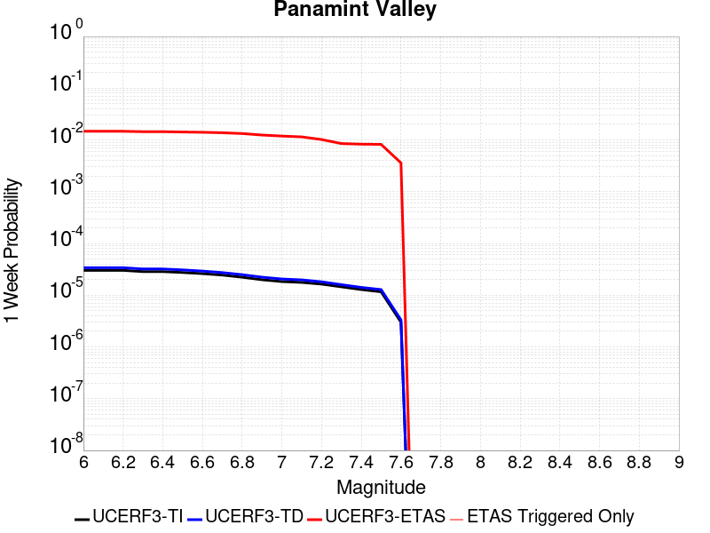 |  |  |  |

| Magnitude | 1 wk TI Prob | 1 wk TD Prob | 1 wk ETAS Prob | 1 wk ETAS/TD Gain | 1 wk ETAS Triggered Only | 1 mo TI Prob | 1 mo TD Prob | 1 mo ETAS Prob | 1 mo ETAS/TD Gain | 1 mo ETAS Triggered Only | 1 yr TI Prob | 1 yr TD Prob | 1 yr ETAS Prob | 1 yr ETAS/TD Gain | 1 yr ETAS Triggered Only | 10 yr TI Prob | 10 yr TD Prob | 10 yr ETAS Prob | 10 yr ETAS/TD Gain | 10 yr ETAS Triggered Only |
|-----|-----|-----|-----|-----|-----|-----|-----|-----|-----|-----|-----|-----|-----|-----|-----|-----|-----|-----|-----|-----|
| 6.0 | 3.0211835E-5 | 3.3984514E-5 | 0.015786873 | 464.53143 | 0.015753424 | 1.2947287E-4 | 1.4563995E-4 | 0.016855534 | 115.73428 | 0.016712328 | 0.0015751923 | 0.0017717537 | 0.02023214 | 11.419273 | 0.018493151 | 0.015640736 | 0.017583137 | 0.036827743 | 2.094492 | 0.01958904 |
| 6.1 | 3.0211835E-5 | 3.3984514E-5 | 0.015786873 | 464.53143 | 0.015753424 | 1.2947287E-4 | 1.4563995E-4 | 0.016855534 | 115.73428 | 0.016712328 | 0.0015751923 | 0.0017717537 | 0.02023214 | 11.419273 | 0.018493151 | 0.015640736 | 0.017583137 | 0.036827743 | 2.094492 | 0.01958904 |
| 6.2 | 3.0211835E-5 | 3.3984514E-5 | 0.015786873 | 464.53143 | 0.015753424 | 1.2947287E-4 | 1.4563995E-4 | 0.016855534 | 115.73428 | 0.016712328 | 0.0015751923 | 0.0017717537 | 0.02023214 | 11.419273 | 0.018493151 | 0.015640736 | 0.017583137 | 0.036827743 | 2.094492 | 0.01958904 |
| 6.3 | 2.8573924E-5 | 3.210268E-5 | 0.015648039 | 487.4372 | 0.015616438 | 1.2245393E-4 | 1.3757581E-4 | 0.016710637 | 121.464935 | 0.016575342 | 0.001489857 | 0.0016737265 | 0.019999167 | 11.948887 | 0.018356165 | 0.01479908 | 0.016617801 | 0.035746604 | 2.1511033 | 0.019452054 |
| 6.4 | 2.8573924E-5 | 3.210268E-5 | 0.015648039 | 487.4372 | 0.015616438 | 1.2245393E-4 | 1.3757581E-4 | 0.016710637 | 121.464935 | 0.016575342 | 0.001489857 | 0.0016737265 | 0.019999167 | 11.948887 | 0.018356165 | 0.01479908 | 0.016617801 | 0.035746604 | 2.1511033 | 0.019452054 |
| 6.5 | 2.7468774E-5 | 3.0828433E-5 | 0.015372821 | 498.65723 | 0.015342466 | 1.1771801E-4 | 1.3211532E-4 | 0.016431332 | 124.37113 | 0.01630137 | 0.0014322745 | 0.0016073446 | 0.019660473 | 12.2316475 | 0.018082192 | 0.014230782 | 0.015963677 | 0.034835607 | 2.1821795 | 0.019178081 |
| 6.6 | 2.6135967E-5 | 2.925248E-5 | 0.01537127 | 525.46893 | 0.015342466 | 1.1200648E-4 | 1.253619E-4 | 0.016424688 | 131.01819 | 0.01630137 | 0.0013628257 | 0.0015252391 | 0.019443074 | 12.747559 | 0.017945206 | 0.013544982 | 0.015154043 | 0.03390659 | 2.2374616 | 0.019041097 |
| 6.7 | 2.4498746E-5 | 2.7341335E-5 | 0.015232405 | 557.12 | 0.015205479 | 1.04990395E-4 | 1.1717203E-4 | 0.016279662 | 138.93813 | 0.016164383 | 0.0012775084 | 0.0014256609 | 0.01920849 | 13.473393 | 0.01780822 | 0.012701893 | 0.014171274 | 0.032672442 | 2.3055403 | 0.018767124 |
| 6.8 | 2.2244329E-5 | 2.4935423E-5 | 0.014271156 | 572.3245 | 0.014246576 | 9.532935E-5 | 1.0686185E-4 | 0.014899801 | 139.4305 | 0.01479452 | 0.0011600169 | 0.0013002884 | 0.017580463 | 13.520433 | 0.01630137 | 0.011539802 | 0.0129325185 | 0.029969575 | 2.3173811 | 0.017260274 |
| 6.9 | 1.9902658E-5 | 2.2290267E-5 | 0.013583632 | 609.39746 | 0.013561644 | 8.529431E-5 | 9.552632E-5 | 0.014066794 | 147.25569 | 0.013972603 | 0.0010379635 | 0.0011624309 | 0.01662389 | 14.30097 | 0.015479452 | 0.010331288 | 0.011568608 | 0.027681394 | 2.3928025 | 0.01630137 |
| 7.0 | 1.8353881E-5 | 2.0566185E-5 | 0.012212097 | 593.79486 | 0.012191781 | 7.865712E-5 | 8.813792E-5 | 0.0126897665 | 143.97624 | 0.01260274 | 9.5722964E-4 | 0.0010725686 | 0.015167024 | 14.140842 | 0.014109589 | 0.009531168 | 0.010678849 | 0.025315382 | 2.3706095 | 0.01479452 |
| 7.1 | 1.7667631E-5 | 1.9772613E-5 | 0.011800362 | 596.80334 | 0.011780822 | 7.571623E-5 | 8.473711E-5 | 0.012275484 | 144.86551 | 0.012191781 | 9.2145515E-4 | 0.0010312037 | 0.014715708 | 14.270418 | 0.01369863 | 0.009176437 | 0.010269073 | 0.024504928 | 2.3862846 | 0.014383562 |
| 7.2 | 1.6381597E-5 | 1.8158249E-5 | 0.010291944 | 566.7916 | 0.0102739725 | 7.020495E-5 | 7.781885E-5 | 0.010624943 | 136.53432 | 0.010547945 | 8.544101E-4 | 9.4704994E-4 | 0.012990428 | 13.71673 | 0.0120547945 | 0.008511325 | 0.009434792 | 0.021918628 | 2.3231702 | 0.01260274 |
| 7.3 | 1.4520491E-5 | 1.5966476E-5 | 0.008235013 | 515.769 | 0.008219178 | 6.222919E-5 | 6.842605E-5 | 0.008560996 | 125.113106 | 0.008493151 | 7.57377E-4 | 8.327849E-4 | 0.010824457 | 12.997902 | 0.01 | 0.0075480095 | 0.00829975 | 0.01876015 | 2.260327 | 0.010547945 |
| 7.4 | 1.2852287E-5 | 1.4145411E-5 | 0.008233207 | 582.0409 | 0.008219178 | 5.5080065E-5 | 6.062187E-5 | 0.008553258 | 141.09195 | 0.008493151 | 6.7039346E-4 | 7.378371E-4 | 0.010730458 | 14.543126 | 0.01 | 0.0066837464 | 0.0073567946 | 0.01782714 | 2.4232213 | 0.010547945 |
| 7.5 | 1.1637851E-5 | 1.2836797E-5 | 0.0080949245 | 630.60315 | 0.008082191 | 4.987555E-5 | 5.5013777E-5 | 0.008410718 | 152.88387 | 0.008356164 | 6.070656E-4 | 6.6960254E-4 | 0.010526012 | 15.71979 | 0.009863013 | 0.006054099 | 0.0066787465 | 0.017020173 | 2.5484083 | 0.010410959 |
| 7.6 | 3.0068115E-6 | 3.3330316E-6 | 0.003701951 | 1110.6858 | 0.00369863 | 1.2886271E-5 | 1.4284384E-5 | 0.003849846 | 269.5143 | 0.0038356164 | 1.5687906E-4 | 1.7390578E-4 | 0.0049675927 | 28.564852 | 0.0047945203 | 0.0015676835 | 0.0017391363 | 0.0069355625 | 3.987935 | 0.0052054795 |

## Garlock (East)
*[(top)](#table-of-contents)*

| 1 Week | 1 Month | 1 Year | 10 Year |
|-----|-----|-----|-----|
| 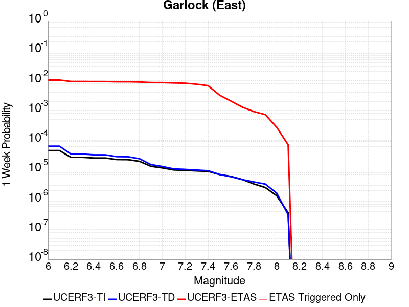 |  |  |  |

| Magnitude | 1 wk TI Prob | 1 wk TD Prob | 1 wk ETAS Prob | 1 wk ETAS/TD Gain | 1 wk ETAS Triggered Only | 1 mo TI Prob | 1 mo TD Prob | 1 mo ETAS Prob | 1 mo ETAS/TD Gain | 1 mo ETAS Triggered Only | 1 yr TI Prob | 1 yr TD Prob | 1 yr ETAS Prob | 1 yr ETAS/TD Gain | 1 yr ETAS Triggered Only | 10 yr TI Prob | 10 yr TD Prob | 10 yr ETAS Prob | 10 yr ETAS/TD Gain | 10 yr ETAS Triggered Only |
|-----|-----|-----|-----|-----|-----|-----|-----|-----|-----|-----|-----|-----|-----|-----|-----|-----|-----|-----|-----|-----|
| 6.0 | 4.5092507E-5 | 6.290325E-5 | 0.013075783 | 207.87135 | 0.013013699 | 1.9323928E-4 | 2.6956003E-4 | 0.014375346 | 53.328922 | 0.014109589 | 0.0023501497 | 0.0032774 | 0.018296508 | 5.5826287 | 0.015068493 | 0.023254504 | 0.032351844 | 0.047595616 | 1.4711871 | 0.015753424 |
| 6.1 | 4.5092507E-5 | 6.290325E-5 | 0.013075783 | 207.87135 | 0.013013699 | 1.9323928E-4 | 2.6956003E-4 | 0.014375346 | 53.328922 | 0.014109589 | 0.0023501497 | 0.0032774 | 0.018296508 | 5.5826287 | 0.015068493 | 0.023254504 | 0.032351844 | 0.047595616 | 1.4711871 | 0.015753424 |
| 6.2 | 2.6674514E-5 | 3.4509674E-5 | 0.011540961 | 334.42685 | 0.011506849 | 1.1431433E-4 | 1.4789042E-4 | 0.012748767 | 86.20415 | 0.01260274 | 0.0013908884 | 0.0017991117 | 0.015336357 | 8.524405 | 0.013561644 | 0.01382215 | 0.017890299 | 0.031747464 | 1.7745631 | 0.014109589 |
| 6.3 | 2.6674514E-5 | 3.4509674E-5 | 0.011540961 | 334.42685 | 0.011506849 | 1.1431433E-4 | 1.4789042E-4 | 0.012748767 | 86.20415 | 0.01260274 | 0.0013908884 | 0.0017991117 | 0.015336357 | 8.524405 | 0.013561644 | 0.01382215 | 0.017890299 | 0.031747464 | 1.7745631 | 0.014109589 |
| 6.4 | 2.5312667E-5 | 3.233893E-5 | 0.011401834 | 352.57303 | 0.011369863 | 1.0847834E-4 | 1.3858822E-4 | 0.012602614 | 90.935684 | 0.012465754 | 0.0013199237 | 0.0016860351 | 0.015088058 | 8.94884 | 0.013424657 | 0.013121112 | 0.016778335 | 0.030516502 | 1.8188039 | 0.013972603 |
| 6.5 | 2.5312667E-5 | 3.233893E-5 | 0.011401834 | 352.57303 | 0.011369863 | 1.0847834E-4 | 1.3858822E-4 | 0.012602614 | 90.935684 | 0.012465754 | 0.0013199237 | 0.0016860351 | 0.015088058 | 8.94884 | 0.013424657 | 0.013121112 | 0.016778335 | 0.030516502 | 1.8188039 | 0.013972603 |
| 6.6 | 2.246556E-5 | 2.8133776E-5 | 0.011260695 | 400.25534 | 0.011232877 | 9.627742E-5 | 1.20567885E-4 | 0.012447849 | 103.243484 | 0.012328767 | 0.0011715472 | 0.0014669491 | 0.014598343 | 9.951499 | 0.013150685 | 0.011653901 | 0.01461866 | 0.02798205 | 1.9141324 | 0.013561644 |
| 6.7 | 2.2241198E-5 | 2.7803519E-5 | 0.011260368 | 404.99792 | 0.011232877 | 9.531594E-5 | 1.1915263E-4 | 0.012446451 | 104.458046 | 0.012328767 | 0.0011598538 | 0.0014497414 | 0.014581361 | 10.057905 | 0.013150685 | 0.011538187 | 0.014448853 | 0.027814547 | 1.9250349 | 0.013561644 |
| 6.8 | 1.9528685E-5 | 2.389819E-5 | 0.01098254 | 459.5553 | 0.010958904 | 8.369167E-5 | 1.0241691E-4 | 0.012155977 | 118.69111 | 0.0120547945 | 0.0010184698 | 0.0012462323 | 0.014106898 | 11.319637 | 0.012876713 | 0.010138147 | 0.012436427 | 0.025558848 | 2.05516 | 0.013287671 |
| 6.9 | 1.3318621E-5 | 1.5198884E-5 | 0.010836952 | 713.0097 | 0.010821918 | 5.7078556E-5 | 6.513648E-5 | 0.011982168 | 183.9548 | 0.011917808 | 6.9470983E-4 | 7.927538E-4 | 0.01352238 | 17.057476 | 0.012739726 | 0.0069254204 | 0.007939888 | 0.020986158 | 2.6431303 | 0.013150685 |
| 7.0 | 1.1760853E-5 | 1.31077895E-5 | 0.010834884 | 826.5989 | 0.010821918 | 5.0402683E-5 | 5.6175057E-5 | 0.011973314 | 213.14288 | 0.011917808 | 6.134799E-4 | 6.8372174E-4 | 0.013414738 | 19.62017 | 0.012739726 | 0.0061178906 | 0.00685652 | 0.019917037 | 2.9048316 | 0.013150685 |
| 7.1 | 1.0064758E-5 | 1.0902931E-5 | 0.010558733 | 968.4308 | 0.010547945 | 4.3133965E-5 | 4.672603E-5 | 0.011690018 | 250.18214 | 0.011643835 | 5.2502943E-4 | 5.687444E-4 | 0.013027408 | 22.905558 | 0.012465754 | 0.005237907 | 0.0057129986 | 0.018516146 | 3.2410557 | 0.012876713 |
| 7.2 | 9.768808E-6 | 1.0498807E-5 | 0.010421349 | 992.6222 | 0.010410959 | 4.186565E-5 | 4.499413E-5 | 0.011551326 | 256.7296 | 0.011506849 | 5.095951E-4 | 5.4766936E-4 | 0.012732773 | 23.249016 | 0.012191781 | 0.0050842804 | 0.0055032647 | 0.018036649 | 3.277445 | 0.01260274 |
| 7.3 | 9.344516E-6 | 9.944468E-6 | 0.00959889 | 965.24927 | 0.009589041 | 4.004731E-5 | 4.261847E-5 | 0.010590114 | 248.4865 | 0.010547945 | 4.8746695E-4 | 5.1875977E-4 | 0.011608894 | 22.378168 | 0.011095891 | 0.0048639905 | 0.0052149445 | 0.016661786 | 3.1950073 | 0.011506849 |
| 7.4 | 9.023491E-6 | 9.490661E-6 | 0.009050501 | 953.62177 | 0.009041096 | 3.867153E-5 | 4.0673647E-5 | 0.010040267 | 246.84944 | 0.01 | 4.7072413E-4 | 4.950925E-4 | 0.011037815 | 22.294453 | 0.010547945 | 0.004697283 | 0.0049783974 | 0.015610135 | 3.1355743 | 0.010684932 |
| 7.5 | 7.081253E-6 | 7.087672E-6 | 0.0041166474 | 580.818 | 0.004109589 | 3.0347876E-5 | 3.0375388E-5 | 0.0049617323 | 163.34714 | 0.0049315067 | 3.6942272E-4 | 3.6975832E-4 | 0.005710249 | 15.443192 | 0.005342466 | 0.003688092 | 0.0037243143 | 0.009183359 | 2.4657853 | 0.005479452 |
| 7.6 | 6.116396E-6 | 5.959245E-6 | 0.002471698 | 414.767 | 0.0024657534 | 2.6212863E-5 | 2.5539372E-5 | 0.003039161 | 118.999054 | 0.0030136986 | 3.1909486E-4 | 3.1089774E-4 | 0.0037344906 | 12.011958 | 0.0034246575 | 0.0031863707 | 0.0031357552 | 0.0065496736 | 2.088707 | 0.0034246575 |
| 7.7 | 4.797145E-6 | 4.757281E-6 | 0.0016485851 | 346.53934 | 0.0016438356 | 2.055903E-5 | 2.0388188E-5 | 0.0019381572 | 95.06275 | 0.0019178082 | 2.5027743E-4 | 2.4819805E-4 | 0.0025763873 | 10.380368 | 0.0023287672 | 0.0024999576 | 0.0025093474 | 0.0048322706 | 1.9257082 | 0.0023287672 |
| 7.8 | 3.4028885E-6 | 3.978462E-6 | 0.0012368503 | 310.88657 | 0.0012328767 | 1.4583726E-5 | 1.7050439E-5 | 0.0015238741 | 89.37447 | 0.0015068493 | 1.775424E-4 | 2.0756939E-4 | 0.0021249796 | 10.237441 | 0.0019178082 | 0.0017740062 | 0.0021012232 | 0.0040150015 | 1.9107926 | 0.0019178082 |
| 7.9 | 2.5928412E-6 | 3.3724489E-6 | 0.0010992591 | 325.9528 | 0.0010958904 | 1.1112129E-5 | 1.4453272E-5 | 0.0013842965 | 95.777374 | 0.001369863 | 1.3528178E-4 | 1.7595445E-4 | 0.0016825387 | 9.562353 | 0.0015068493 | 0.0013519945 | 0.0017812408 | 0.0032854062 | 1.844448 | 0.0015068493 |
| 8.0 | 1.3743648E-6 | 1.6734747E-6 | 2.756456E-4 | 164.71454 | 2.739726E-4 | 5.8901214E-6 | 7.1720146E-6 | 2.8114265E-4 | 39.199955 | 2.739726E-4 | 7.1709874E-5 | 8.731581E-5 | 4.9823883E-4 | 5.7061696 | 4.109589E-4 | 7.1686733E-4 | 8.837234E-4 | 0.001294319 | 1.4646202 | 4.109589E-4 |
| 8.1 | 3.6733252E-7 | 3.1489964E-7 | 1.3730116E-4 | 436.0156 | 1.369863E-4 | 1.5742813E-6 | 1.3495693E-6 | 1.3833569E-4 | 102.50358 | 1.369863E-4 | 1.9166706E-5 | 1.6430899E-5 | 1.5341495E-4 | 9.336979 | 1.369863E-4 | 1.9165053E-4 | 1.6638759E-4 | 3.033511E-4 | 1.8231595 | 1.369863E-4 |

## Hunter Mountain-Saline Valley
*[(top)](#table-of-contents)*

| 1 Week | 1 Month | 1 Year | 10 Year |
|-----|-----|-----|-----|
|  |  |  |  |

| Magnitude | 1 wk TI Prob | 1 wk TD Prob | 1 wk ETAS Prob | 1 wk ETAS/TD Gain | 1 wk ETAS Triggered Only | 1 mo TI Prob | 1 mo TD Prob | 1 mo ETAS Prob | 1 mo ETAS/TD Gain | 1 mo ETAS Triggered Only | 1 yr TI Prob | 1 yr TD Prob | 1 yr ETAS Prob | 1 yr ETAS/TD Gain | 1 yr ETAS Triggered Only | 10 yr TI Prob | 10 yr TD Prob | 10 yr ETAS Prob | 10 yr ETAS/TD Gain | 10 yr ETAS Triggered Only |
|-----|-----|-----|-----|-----|-----|-----|-----|-----|-----|-----|-----|-----|-----|-----|-----|-----|-----|-----|-----|-----|
| 6.0 | 4.5103672E-5 | 5.4570177E-5 | 0.0082733 | 151.60844 | 0.008219178 | 1.9328714E-4 | 2.3385242E-4 | 0.008725017 | 37.309925 | 0.008493151 | 0.002350731 | 0.0028435152 | 0.012815081 | 4.506774 | 0.01 | 0.023260195 | 0.028091887 | 0.038476657 | 1.3696716 | 0.010684932 |
| 6.1 | 4.5103672E-5 | 5.4570177E-5 | 0.0082733 | 151.60844 | 0.008219178 | 1.9328714E-4 | 2.3385242E-4 | 0.008725017 | 37.309925 | 0.008493151 | 0.002350731 | 0.0028435152 | 0.012815081 | 4.506774 | 0.01 | 0.023260195 | 0.028091887 | 0.038476657 | 1.3696716 | 0.010684932 |
| 6.2 | 3.9363465E-5 | 4.706337E-5 | 0.008265855 | 175.63245 | 0.008219178 | 1.6868966E-4 | 2.0168544E-4 | 0.008693123 | 43.102383 | 0.008493151 | 0.002051862 | 0.0024528175 | 0.012428289 | 5.066944 | 0.01 | 0.020330196 | 0.024273481 | 0.034699053 | 1.4295045 | 0.010684932 |
| 6.3 | 3.9363465E-5 | 4.706337E-5 | 0.008265855 | 175.63245 | 0.008219178 | 1.6868966E-4 | 2.0168544E-4 | 0.008693123 | 43.102383 | 0.008493151 | 0.002051862 | 0.0024528175 | 0.012428289 | 5.066944 | 0.01 | 0.020330196 | 0.024273481 | 0.034699053 | 1.4295045 | 0.010684932 |
| 6.4 | 3.2311684E-5 | 3.795099E-5 | 0.008256817 | 217.56526 | 0.008219178 | 1.384713E-4 | 1.6263737E-4 | 0.008654406 | 53.212906 | 0.008493151 | 0.0016845843 | 0.0019783843 | 0.011958601 | 6.0446296 | 0.01 | 0.016718714 | 0.019616475 | 0.029957507 | 1.5271605 | 0.010547945 |
| 6.5 | 3.2311684E-5 | 3.795099E-5 | 0.008256817 | 217.56526 | 0.008219178 | 1.384713E-4 | 1.6263737E-4 | 0.008654406 | 53.212906 | 0.008493151 | 0.0016845843 | 0.0019783843 | 0.011958601 | 6.0446296 | 0.01 | 0.016718714 | 0.019616475 | 0.029957507 | 1.5271605 | 0.010547945 |
| 6.6 | 2.9305844E-5 | 3.418183E-5 | 0.008253079 | 241.44637 | 0.008219178 | 1.2559042E-4 | 1.4648569E-4 | 0.008638392 | 58.970894 | 0.008493151 | 0.0015279909 | 0.001782067 | 0.011764246 | 6.6014614 | 0.01 | 0.015175272 | 0.01768569 | 0.028047089 | 1.5858634 | 0.010547945 |
| 6.7 | 2.7826512E-5 | 3.2344276E-5 | 0.008251256 | 255.10716 | 0.008219178 | 1.19251024E-4 | 1.386113E-4 | 0.008630585 | 62.264656 | 0.008493151 | 0.0014509142 | 0.0016863465 | 0.011669483 | 6.9199796 | 0.01 | 0.014414776 | 0.016743187 | 0.027114525 | 1.6194364 | 0.010547945 |
| 6.8 | 2.3389874E-5 | 2.6866714E-5 | 0.008245824 | 306.916 | 0.008219178 | 1.0023846E-4 | 1.15138246E-4 | 0.008607311 | 74.75632 | 0.008493151 | 0.00121972 | 0.001400954 | 0.011386944 | 8.127994 | 0.01 | 0.01213047 | 0.013927434 | 0.024328474 | 1.7468023 | 0.010547945 |
| 6.9 | 2.069209E-5 | 2.3570032E-5 | 0.008242554 | 349.70486 | 0.008219178 | 8.867737E-5 | 1.01010715E-4 | 0.008593303 | 85.07319 | 0.008493151 | 0.0010791123 | 0.0012291478 | 0.011216857 | 9.125718 | 0.01 | 0.010738871 | 0.012228523 | 0.022647483 | 1.8520211 | 0.010547945 |
| 7.0 | 1.7462342E-5 | 1.9633546E-5 | 0.00823865 | 419.6211 | 0.008219178 | 7.483646E-5 | 8.414118E-5 | 0.0085765775 | 101.93079 | 0.008493151 | 9.1075303E-4 | 0.0010239601 | 0.01101372 | 10.756005 | 0.01 | 0.009070295 | 0.0101960525 | 0.02063645 | 2.0239646 | 0.010547945 |
| 7.1 | 1.4807709E-5 | 1.6441749E-5 | 0.008235484 | 500.88858 | 0.008219178 | 6.3460066E-5 | 7.046283E-5 | 0.008563015 | 121.525276 | 0.008493151 | 7.723524E-4 | 8.575638E-4 | 0.010848988 | 12.65094 | 0.01 | 0.007696735 | 0.008545532 | 0.01900334 | 2.223775 | 0.010547945 |
| 7.2 | 1.4180048E-5 | 1.5698337E-5 | 0.008234748 | 524.56177 | 0.008219178 | 6.077022E-5 | 6.727694E-5 | 0.008559857 | 127.23314 | 0.008493151 | 7.396263E-4 | 8.188051E-4 | 0.010810617 | 13.202918 | 0.01 | 0.0073716943 | 0.008160833 | 0.018622698 | 2.2819605 | 0.010547945 |
| 7.3 | 1.3730402E-5 | 1.5172075E-5 | 0.008234225 | 542.7224 | 0.008219178 | 5.8843252E-5 | 6.502165E-5 | 0.00855762 | 131.61186 | 0.008493151 | 7.161811E-4 | 7.9136714E-4 | 0.0107834535 | 13.62636 | 0.01 | 0.007138774 | 0.007888422 | 0.01835316 | 2.3265946 | 0.010547945 |
| 7.4 | 1.2810095E-5 | 1.4109277E-5 | 0.008233171 | 583.52893 | 0.008219178 | 5.489925E-5 | 6.0467017E-5 | 0.0085531045 | 141.45073 | 0.008493151 | 6.681934E-4 | 7.359531E-4 | 0.010728594 | 14.577823 | 0.01 | 0.006661878 | 0.007338053 | 0.017808598 | 2.426883 | 0.010547945 |
| 7.5 | 1.1595659E-5 | 1.2800664E-5 | 0.008094889 | 632.38043 | 0.008082191 | 4.9694736E-5 | 5.4858923E-5 | 0.008410565 | 153.31262 | 0.008356164 | 6.0486543E-4 | 6.6771836E-4 | 0.010524146 | 15.761355 | 0.009863013 | 0.006032217 | 0.0066599925 | 0.017001614 | 2.5527978 | 0.010410959 |
| 7.6 | 2.997694E-6 | 3.3251579E-6 | 0.003701943 | 1113.3135 | 0.00369863 | 1.28471975E-5 | 1.425064E-5 | 0.0038498123 | 270.15015 | 0.0038356164 | 1.564034E-4 | 1.73495E-4 | 0.004967184 | 28.630125 | 0.0047945203 | 0.0015629337 | 0.001735031 | 0.0069314786 | 3.9950173 | 0.0052054795 |

## Garlock (West)
*[(top)](#table-of-contents)*

| 1 Week | 1 Month | 1 Year | 10 Year |
|-----|-----|-----|-----|
|  |  |  |  |

| Magnitude | 1 wk TI Prob | 1 wk TD Prob | 1 wk ETAS Prob | 1 wk ETAS/TD Gain | 1 wk ETAS Triggered Only | 1 mo TI Prob | 1 mo TD Prob | 1 mo ETAS Prob | 1 mo ETAS/TD Gain | 1 mo ETAS Triggered Only | 1 yr TI Prob | 1 yr TD Prob | 1 yr ETAS Prob | 1 yr ETAS/TD Gain | 1 yr ETAS Triggered Only | 10 yr TI Prob | 10 yr TD Prob | 10 yr ETAS Prob | 10 yr ETAS/TD Gain | 10 yr ETAS Triggered Only |
|-----|-----|-----|-----|-----|-----|-----|-----|-----|-----|-----|-----|-----|-----|-----|-----|-----|-----|-----|-----|-----|
| 6.0 | 2.5181727E-5 | 2.51973E-5 | 0.0068743397 | 272.8205 | 0.006849315 | 1.0791722E-4 | 1.0798398E-4 | 0.00791536 | 73.30125 | 0.007808219 | 0.0013131002 | 0.0013139155 | 0.0096591 | 7.3513865 | 0.008356164 | 0.013053683 | 0.013141977 | 0.021929068 | 1.6686279 | 0.00890411 |
| 6.1 | 2.5077732E-5 | 2.5098372E-5 | 0.0068742414 | 273.89194 | 0.006849315 | 1.0747157E-4 | 1.0756004E-4 | 0.007914939 | 73.58624 | 0.007808219 | 0.001307681 | 0.0013087603 | 0.009653988 | 7.376438 | 0.008356164 | 0.013000126 | 0.013091032 | 0.021878578 | 1.6712645 | 0.00890411 |
| 6.2 | 2.494612E-5 | 2.498005E-5 | 0.006874124 | 275.18457 | 0.006849315 | 1.0690756E-4 | 1.0705298E-4 | 0.007914436 | 73.930084 | 0.007808219 | 0.0013008224 | 0.0013025942 | 0.009647874 | 7.406661 | 0.008356164 | 0.012932341 | 0.013030097 | 0.021818185 | 1.6744454 | 0.00890411 |
| 6.3 | 2.4733758E-5 | 2.479942E-5 | 0.006873945 | 277.18167 | 0.006849315 | 1.0599751E-4 | 1.06278916E-4 | 0.007913669 | 74.46132 | 0.007808219 | 0.0012897556 | 0.0012931811 | 0.0096385395 | 7.4533563 | 0.008356164 | 0.012822957 | 0.012937066 | 0.021725982 | 1.6793593 | 0.00890411 |
| 6.4 | 2.3237335E-5 | 2.317873E-5 | 0.006872335 | 296.49316 | 0.006849315 | 9.958477E-5 | 9.933365E-5 | 0.007906777 | 79.598175 | 0.007808219 | 0.0012117702 | 0.001208719 | 0.009554783 | 7.9048834 | 0.008356164 | 0.012051838 | 0.012101916 | 0.020898268 | 1.7268562 | 0.00890411 |
| 6.5 | 2.2732203E-5 | 2.2993298E-5 | 0.006872151 | 298.87625 | 0.006849315 | 9.742009E-5 | 9.8539E-5 | 0.007905989 | 80.23208 | 0.007808219 | 0.0011854442 | 0.0011990548 | 0.0095452 | 7.960603 | 0.008356164 | 0.011791403 | 0.012006322 | 0.020803526 | 1.7327143 | 0.00890411 |
| 6.6 | 2.1319436E-5 | 2.17735E-5 | 0.0068709394 | 315.56433 | 0.006849315 | 9.136581E-5 | 9.331167E-5 | 0.007900802 | 84.671104 | 0.007808219 | 0.001111811 | 0.0011354799 | 0.009482156 | 8.350792 | 0.008356164 | 0.011062649 | 0.011377227 | 0.020180032 | 1.7737216 | 0.00890411 |
| 6.7 | 1.970802E-5 | 2.0393396E-5 | 0.006869569 | 336.85263 | 0.006849315 | 8.446021E-5 | 8.739735E-5 | 0.007894934 | 90.33379 | 0.007808219 | 0.001027818 | 0.001063545 | 0.009410822 | 8.848541 | 0.008356164 | 0.010230771 | 0.010664964 | 0.019474111 | 1.8259894 | 0.00890411 |
| 6.8 | 1.8744462E-5 | 1.9901045E-5 | 0.00686908 | 345.16177 | 0.006849315 | 8.033094E-5 | 8.5287415E-5 | 0.007892841 | 92.54403 | 0.007808219 | 9.775903E-4 | 0.0010378812 | 0.0093853725 | 9.042819 | 0.008356164 | 0.009733009 | 0.01041075 | 0.019222163 | 1.8463762 | 0.00890411 |
| 6.9 | 1.7559682E-5 | 1.8953415E-5 | 0.0068681384 | 362.36948 | 0.006849315 | 7.5253614E-5 | 8.12264E-5 | 0.007888812 | 97.12128 | 0.007808219 | 9.158276E-4 | 9.884841E-4 | 0.009336389 | 9.445157 | 0.008356164 | 0.0091206245 | 0.009921231 | 0.018737001 | 1.8885761 | 0.00890411 |
| 7.0 | 1.6794445E-5 | 1.8216237E-5 | 0.0068674064 | 376.99368 | 0.006849315 | 7.197421E-5 | 7.8067256E-5 | 0.007885677 | 101.01132 | 0.007808219 | 8.759337E-4 | 9.5005584E-4 | 0.009298282 | 9.787089 | 0.008356164 | 0.008724891 | 0.009540141 | 0.018359303 | 1.9244269 | 0.00890411 |
| 7.1 | 1.6337795E-5 | 1.7717046E-5 | 0.006866911 | 387.5878 | 0.006849315 | 7.0017246E-5 | 7.5927994E-5 | 0.007883554 | 103.82935 | 0.007808219 | 8.521265E-4 | 9.240326E-4 | 0.009272476 | 10.034793 | 0.008356164 | 0.008488664 | 0.009281996 | 0.018103458 | 1.9503841 | 0.00890411 |
| 7.2 | 1.5780008E-5 | 1.7165687E-5 | 0.0068663633 | 400.00516 | 0.006849315 | 6.762685E-5 | 7.356516E-5 | 0.00788121 | 107.13237 | 0.007808219 | 8.2304585E-4 | 8.9528906E-4 | 0.009243973 | 10.325126 | 0.008356164 | 0.008200042 | 0.008996838 | 0.017820839 | 1.9807891 | 0.00890411 |
| 7.3 | 1.5058865E-5 | 1.6618762E-5 | 0.00686582 | 413.13666 | 0.006849315 | 6.45364E-5 | 7.122133E-5 | 0.007878885 | 110.62535 | 0.007808219 | 7.854473E-4 | 8.667759E-4 | 0.009215698 | 10.632157 | 0.008356164 | 0.00782677 | 0.008713539 | 0.017540062 | 2.0129666 | 0.00890411 |
| 7.4 | 1.4887923E-5 | 1.6454731E-5 | 0.006728673 | 408.92026 | 0.0067123286 | 6.380382E-5 | 7.051838E-5 | 0.0077412105 | 109.77578 | 0.007671233 | 7.7653467E-4 | 8.582243E-4 | 0.009070349 | 10.568739 | 0.008219178 | 0.0077382675 | 0.008628399 | 0.017319877 | 2.0073106 | 0.008767123 |
| 7.5 | 1.4509299E-5 | 1.6046748E-5 | 0.005632395 | 350.99915 | 0.0056164386 | 6.218123E-5 | 6.876997E-5 | 0.0066436604 | 96.606995 | 0.0065753423 | 7.567935E-4 | 8.36954E-4 | 0.00795428 | 9.503844 | 0.007123288 | 0.0075422134 | 0.008416704 | 0.016023371 | 1.9037583 | 0.007671233 |
| 7.6 | 1.2756717E-5 | 1.4050848E-5 | 0.003712629 | 264.22812 | 0.00369863 | 5.4670498E-5 | 6.0216535E-5 | 0.004443514 | 73.79226 | 0.0043835617 | 6.6541E-4 | 7.328904E-4 | 0.005660783 | 7.723915 | 0.0049315067 | 0.006634211 | 0.0073816874 | 0.012412767 | 1.6815622 | 0.005068493 |
| 7.7 | 1.0328985E-5 | 1.1460557E-5 | 0.0024771858 | 216.1488 | 0.0024657534 | 4.4266326E-5 | 4.911575E-5 | 0.0027887071 | 56.778267 | 0.002739726 | 5.388092E-4 | 5.978206E-4 | 0.0038835264 | 6.49614 | 0.0032876711 | 0.0053750467 | 0.006038511 | 0.009442489 | 1.5637114 | 0.0034246575 |
| 7.8 | 7.0306583E-6 | 8.899601E-6 | 0.0015157355 | 170.315 | 0.0015068493 | 3.0131043E-5 | 3.814059E-5 | 0.0018188946 | 47.68921 | 0.001780822 | 3.667837E-4 | 4.642629E-4 | 0.0027919488 | 6.013724 | 0.0023287672 | 0.003661789 | 0.0046952725 | 0.0071494486 | 1.5226909 | 0.0024657534 |
| 7.9 | 4.060633E-6 | 5.4653938E-6 | 0.0011013498 | 201.51335 | 0.0010958904 | 1.7402595E-5 | 2.3422906E-5 | 0.0013932538 | 59.482533 | 0.001369863 | 2.11856E-4 | 2.851367E-4 | 0.0019285036 | 6.763436 | 0.0016438356 | 0.0021165414 | 0.002884201 | 0.0046598865 | 1.6156595 | 0.001780822 |
| 8.0 | 1.6729537E-6 | 2.0775144E-6 | 2.7604954E-4 | 132.87491 | 2.739726E-4 | 7.169782E-6 | 8.903603E-6 | 2.8287378E-4 | 31.770708 | 2.739726E-4 | 8.7288594E-5 | 1.0839601E-4 | 5.1931036E-4 | 4.7908626 | 4.109589E-4 | 8.7254314E-4 | 0.0010969337 | 0.0015074419 | 1.3742324 | 4.109589E-4 |
| 8.1 | 3.6733252E-7 | 3.1489964E-7 | 1.3730116E-4 | 436.0156 | 1.369863E-4 | 1.5742813E-6 | 1.3495693E-6 | 1.3833569E-4 | 102.50358 | 1.369863E-4 | 1.9166706E-5 | 1.6430899E-5 | 1.5341495E-4 | 9.336979 | 1.369863E-4 | 1.9165053E-4 | 1.6638759E-4 | 3.033511E-4 | 1.8231595 | 1.369863E-4 |

## Blackwater
*[(top)](#table-of-contents)*

| 1 Week | 1 Month | 1 Year | 10 Year |
|-----|-----|-----|-----|
|  |  | 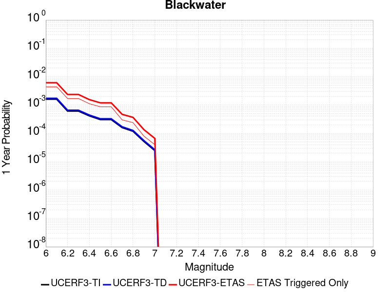 |  |

| Magnitude | 1 wk TI Prob | 1 wk TD Prob | 1 wk ETAS Prob | 1 wk ETAS/TD Gain | 1 wk ETAS Triggered Only | 1 mo TI Prob | 1 mo TD Prob | 1 mo ETAS Prob | 1 mo ETAS/TD Gain | 1 mo ETAS Triggered Only | 1 yr TI Prob | 1 yr TD Prob | 1 yr ETAS Prob | 1 yr ETAS/TD Gain | 1 yr ETAS Triggered Only | 10 yr TI Prob | 10 yr TD Prob | 10 yr ETAS Prob | 10 yr ETAS/TD Gain | 10 yr ETAS Triggered Only |
|-----|-----|-----|-----|-----|-----|-----|-----|-----|-----|-----|-----|-----|-----|-----|-----|-----|-----|-----|-----|-----|
| 6.0 | 3.0708583E-5 | 3.3095846E-5 | 0.004827458 | 145.86295 | 0.0047945203 | 1.3160157E-4 | 1.4183241E-4 | 0.0053465734 | 37.696415 | 0.0052054795 | 0.0016010714 | 0.0017255784 | 0.0074690753 | 4.328447 | 0.0057534245 | 0.015895851 | 0.017135633 | 0.023059746 | 1.345719 | 0.0060273972 |
| 6.1 | 3.0708583E-5 | 3.3095846E-5 | 0.004827458 | 145.86295 | 0.0047945203 | 1.3160157E-4 | 1.4183241E-4 | 0.0053465734 | 37.696415 | 0.0052054795 | 0.0016010714 | 0.0017255784 | 0.0074690753 | 4.328447 | 0.0057534245 | 0.015895851 | 0.017135633 | 0.023059746 | 1.345719 | 0.0060273972 |
| 6.2 | 1.1707779E-5 | 1.2545122E-5 | 0.0022042985 | 175.70961 | 0.0021917808 | 5.017523E-5 | 5.3763757E-5 | 0.0023824056 | 44.312485 | 0.0023287672 | 6.107122E-4 | 6.5438676E-4 | 0.0031185267 | 4.765571 | 0.0024657534 | 0.006090366 | 0.0065255696 | 0.008975233 | 1.3753945 | 0.0024657534 |
| 6.3 | 1.1707779E-5 | 1.2545122E-5 | 0.0022042985 | 175.70961 | 0.0021917808 | 5.017523E-5 | 5.3763757E-5 | 0.0023824056 | 44.312485 | 0.0023287672 | 6.107122E-4 | 6.5438676E-4 | 0.0031185267 | 4.765571 | 0.0024657534 | 0.006090366 | 0.0065255696 | 0.008975233 | 1.3753945 | 0.0024657534 |
| 6.4 | 7.929244E-6 | 8.480098E-6 | 0.0012413464 | 146.38348 | 0.0012328767 | 3.3982033E-5 | 3.6342793E-5 | 0.001406156 | 38.691467 | 0.001369863 | 4.136527E-4 | 4.423877E-4 | 0.0019485704 | 4.4046664 | 0.0015068493 | 0.0041288356 | 0.0044154758 | 0.005915672 | 1.3397586 | 0.0015068493 |
| 6.5 | 5.8832115E-6 | 6.285991E-6 | 0.001239155 | 197.12961 | 0.0012328767 | 2.521352E-5 | 2.6939697E-5 | 0.0013967658 | 51.847866 | 0.001369863 | 3.0693135E-4 | 3.27944E-4 | 0.0016973577 | 5.175755 | 0.001369863 | 0.0030650778 | 0.0032748538 | 0.004640231 | 1.4169276 | 0.001369863 |
| 6.6 | 5.8832115E-6 | 6.285991E-6 | 0.001239155 | 197.12961 | 0.0012328767 | 2.521352E-5 | 2.6939697E-5 | 0.0013967658 | 51.847866 | 0.001369863 | 3.0693135E-4 | 3.27944E-4 | 0.0016973577 | 5.175755 | 0.001369863 | 0.0030650778 | 0.0032748538 | 0.004640231 | 1.4169276 | 0.001369863 |
| 6.7 | 3.0715053E-6 | 3.2814662E-6 | 4.14239E-4 | 126.235954 | 4.109589E-4 | 1.3163528E-5 | 1.4063357E-5 | 4.2501648E-4 | 30.221552 | 4.109589E-4 | 1.6025416E-4 | 1.7120909E-4 | 5.820976E-4 | 3.3999226 | 4.109589E-4 | 0.0016013865 | 0.0017108864 | 0.002121142 | 1.2397914 | 4.109589E-4 |
| 6.8 | 2.2722281E-6 | 2.4287538E-6 | 4.1338665E-4 | 170.20526 | 4.109589E-4 | 9.738084E-6 | 1.0408908E-5 | 4.2136354E-4 | 40.481052 | 4.109589E-4 | 1.1855473E-4 | 1.26722E-4 | 5.3762883E-4 | 4.2425847 | 4.109589E-4 | 0.001184915 | 0.0012665876 | 0.0016770259 | 1.3240505 | 4.109589E-4 |
| 6.9 | 9.952399E-7 | 1.0653489E-6 | 1.380515E-4 | 129.58337 | 1.369863E-4 | 4.265307E-6 | 4.5657757E-6 | 1.4155146E-4 | 31.002716 | 1.369863E-4 | 5.1928873E-5 | 5.5587418E-5 | 1.925661E-4 | 3.4642031 | 1.369863E-4 | 5.191674E-4 | 5.557858E-4 | 6.926959E-4 | 1.2463362 | 1.369863E-4 |
| 7.0 | 4.7385504E-7 | 5.0755597E-7 | 1.3749379E-4 | 270.89386 | 1.369863E-4 | 2.0308057E-6 | 2.1752398E-6 | 1.3916125E-4 | 63.97513 | 1.369863E-4 | 2.4724779E-5 | 2.6483543E-5 | 1.6346622E-4 | 6.1723695 | 1.369863E-4 | 2.4722028E-4 | 2.6483546E-4 | 4.0178545E-4 | 1.5171137 | 1.369863E-4 |

## San Andreas (Mojave S)
*[(top)](#table-of-contents)*

| 1 Week | 1 Month | 1 Year | 10 Year |
|-----|-----|-----|-----|
|  |  |  | 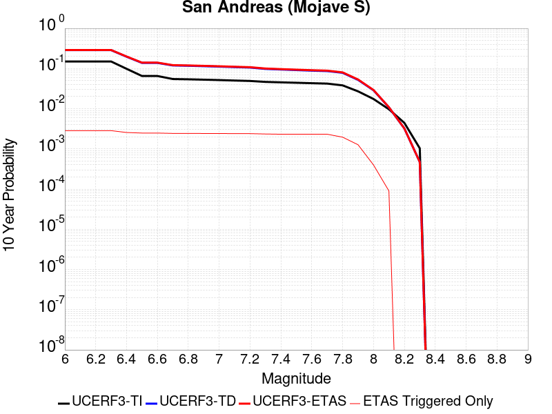 |

| Magnitude | 1 wk TI Prob | 1 wk TD Prob | 1 wk ETAS Prob | 1 wk ETAS/TD Gain | 1 wk ETAS Triggered Only | 1 mo TI Prob | 1 mo TD Prob | 1 mo ETAS Prob | 1 mo ETAS/TD Gain | 1 mo ETAS Triggered Only | 1 yr TI Prob | 1 yr TD Prob | 1 yr ETAS Prob | 1 yr ETAS/TD Gain | 1 yr ETAS Triggered Only | 10 yr TI Prob | 10 yr TD Prob | 10 yr ETAS Prob | 10 yr ETAS/TD Gain | 10 yr ETAS Triggered Only |
|-----|-----|-----|-----|-----|-----|-----|-----|-----|-----|-----|-----|-----|-----|-----|-----|-----|-----|-----|-----|-----|
| 6.0 | 3.1064058E-4 | 6.7460834E-4 | 0.003412486 | 5.0584702 | 0.002739726 | 0.0013306376 | 0.0028881032 | 0.005893098 | 2.0404735 | 0.0030136986 | 0.016080605 | 0.03462235 | 0.038192924 | 1.1031291 | 0.00369863 | 0.1496549 | 0.28660452 | 0.28943858 | 1.0098883 | 0.0039726025 |
| 6.1 | 3.1064058E-4 | 6.7460834E-4 | 0.003412486 | 5.0584702 | 0.002739726 | 0.0013306376 | 0.0028881032 | 0.005893098 | 2.0404735 | 0.0030136986 | 0.016080605 | 0.03462235 | 0.038192924 | 1.1031291 | 0.00369863 | 0.1496549 | 0.28660452 | 0.28943858 | 1.0098883 | 0.0039726025 |
| 6.2 | 3.1064058E-4 | 6.7460834E-4 | 0.003412486 | 5.0584702 | 0.002739726 | 0.0013306376 | 0.0028881032 | 0.005893098 | 2.0404735 | 0.0030136986 | 0.016080605 | 0.03462235 | 0.038192924 | 1.1031291 | 0.00369863 | 0.1496549 | 0.28660452 | 0.28943858 | 1.0098883 | 0.0039726025 |
| 6.3 | 3.1064058E-4 | 6.7460834E-4 | 0.003412486 | 5.0584702 | 0.002739726 | 0.0013306376 | 0.0028881032 | 0.005893098 | 2.0404735 | 0.0030136986 | 0.016080605 | 0.03462235 | 0.038192924 | 1.1031291 | 0.00369863 | 0.1496549 | 0.28660452 | 0.28943858 | 1.0098883 | 0.0039726025 |
| 6.4 | 1.9872203E-4 | 4.3179357E-4 | 0.0030334094 | 7.0251384 | 0.0026027397 | 8.5138786E-4 | 0.0018492596 | 0.004720652 | 2.5527256 | 0.0028767122 | 0.010316478 | 0.02228844 | 0.025636766 | 1.1502271 | 0.0034246575 | 0.098504856 | 0.19699748 | 0.19985749 | 1.014518 | 0.003561644 |
| 6.5 | 1.291105E-4 | 2.875267E-4 | 0.0027525711 | 9.573272 | 0.0024657534 | 5.5321335E-4 | 0.0012316781 | 0.0039680297 | 3.221645 | 0.002739726 | 0.006714592 | 0.0148934 | 0.018132105 | 1.2174592 | 0.0032876711 | 0.065152965 | 0.13803436 | 0.1409863 | 1.0213856 | 0.0034246575 |
| 6.6 | 1.291105E-4 | 2.875267E-4 | 0.0027525711 | 9.573272 | 0.0024657534 | 5.5321335E-4 | 0.0012316781 | 0.0039680297 | 3.221645 | 0.002739726 | 0.006714592 | 0.0148934 | 0.018132105 | 1.2174592 | 0.0032876711 | 0.065152965 | 0.13803436 | 0.1409863 | 1.0213856 | 0.0034246575 |
| 6.7 | 1.08001186E-4 | 2.4333889E-4 | 0.0025715393 | 10.567729 | 0.0023287672 | 4.6278012E-4 | 0.0010424647 | 0.003642491 | 3.4941146 | 0.0026027397 | 0.0056198016 | 0.012618446 | 0.015729373 | 1.2465382 | 0.003150685 | 0.054797906 | 0.119176775 | 0.12207263 | 1.0242988 | 0.0032876711 |
| 6.8 | 1.0624356E-4 | 2.3851555E-4 | 0.0025667273 | 10.761257 | 0.0023287672 | 4.5525006E-4 | 0.0010218095 | 0.0036218897 | 3.544584 | 0.0026027397 | 0.0055285925 | 0.012369843 | 0.015481555 | 1.2515563 | 0.003150685 | 0.053930566 | 0.11712591 | 0.12002851 | 1.0247818 | 0.0032876711 |
| 6.9 | 1.0393785E-4 | 2.3221898E-4 | 0.0025604453 | 11.025994 | 0.0023287672 | 4.4537184E-4 | 9.948451E-4 | 0.0035949955 | 3.6136234 | 0.0026027397 | 0.0054089287 | 0.012045221 | 0.015157956 | 1.2584207 | 0.003150685 | 0.05279156 | 0.11442335 | 0.117334835 | 1.0254449 | 0.0032876711 |
| 7.0 | 1.0155622E-4 | 2.2591476E-4 | 0.002554156 | 11.305839 | 0.0023287672 | 4.3516833E-4 | 9.6784724E-4 | 0.003568068 | 3.6866024 | 0.0026027397 | 0.005285311 | 0.0117200995 | 0.014833858 | 1.2656769 | 0.003150685 | 0.05161361 | 0.111683756 | 0.11460424 | 1.0261496 | 0.0032876711 |
| 7.1 | 9.885595E-5 | 2.1879886E-4 | 0.0025470564 | 11.641087 | 0.0023287672 | 4.2359953E-4 | 9.3737274E-4 | 0.0035376728 | 3.77403 | 0.0026027397 | 0.0051451353 | 0.011352993 | 0.014467908 | 1.2743695 | 0.003150685 | 0.05027629 | 0.1085682 | 0.11149894 | 1.0269945 | 0.0032876711 |
| 7.2 | 9.6411415E-5 | 2.124288E-4 | 0.0025407013 | 11.960248 | 0.0023287672 | 4.1312634E-4 | 9.1009185E-4 | 0.0035104628 | 3.8572621 | 0.0026027397 | 0.005018219 | 0.011024255 | 0.014140206 | 1.282645 | 0.003150685 | 0.049064007 | 0.105758004 | 0.10869797 | 1.027799 | 0.0032876711 |
| 7.3 | 9.1180635E-5 | 1.9471257E-4 | 0.0025230262 | 12.957695 | 0.0023287672 | 3.907156E-4 | 8.342157E-4 | 0.0034347842 | 4.1173816 | 0.0026027397 | 0.004746591 | 0.01010939 | 0.013228223 | 1.3085086 | 0.003150685 | 0.046464786 | 0.09795115 | 0.100916795 | 1.0302768 | 0.0032876711 |
| 7.4 | 8.887388E-5 | 1.8719878E-4 | 0.0023785692 | 12.706116 | 0.0021917808 | 3.8083247E-4 | 8.020339E-4 | 0.0032658097 | 4.07191 | 0.0024657534 | 0.0046267817 | 0.00972114 | 0.012705542 | 1.3070012 | 0.0030136986 | 0.045316286 | 0.09458615 | 0.09743882 | 1.0301595 | 0.003150685 |
| 7.5 | 8.6750515E-5 | 1.8051457E-4 | 0.0023718998 | 13.139658 | 0.0021917808 | 3.7173493E-4 | 7.7340455E-4 | 0.003237251 | 4.1857147 | 0.0024657534 | 0.004516484 | 0.009375632 | 0.012361075 | 1.3184258 | 0.0030136986 | 0.04425787 | 0.091549896 | 0.09441213 | 1.0312643 | 0.003150685 |
| 7.6 | 8.453092E-5 | 1.7439072E-4 | 0.0023657894 | 13.566028 | 0.0021917808 | 3.6222505E-4 | 7.471748E-4 | 0.003211086 | 4.297637 | 0.0024657534 | 0.0044011753 | 0.009058985 | 0.0120453825 | 1.3296614 | 0.0030136986 | 0.04315024 | 0.08870898 | 0.091580175 | 1.0323664 | 0.003150685 |
| 7.7 | 8.259102E-5 | 1.6961215E-4 | 0.0023610212 | 13.920118 | 0.0021917808 | 3.539135E-4 | 7.2670676E-4 | 0.0031906683 | 4.390586 | 0.0024657534 | 0.004300386 | 0.008811831 | 0.011798973 | 1.3389922 | 0.0030136986 | 0.042181134 | 0.08645982 | 0.0893381 | 1.0332904 | 0.003150685 |
| 7.8 | 7.444844E-5 | 1.5283503E-4 | 0.0016594541 | 10.857813 | 0.0015068493 | 3.1902574E-4 | 6.548429E-4 | 0.0024344986 | 3.7176836 | 0.001780822 | 0.0038772223 | 0.007943616 | 0.010253885 | 1.2908334 | 0.0023287672 | 0.03810269 | 0.078290746 | 0.080563456 | 1.0290291 | 0.0024657534 |
| 7.9 | 5.2586525E-5 | 1.00064186E-4 | 0.001195845 | 11.950779 | 0.0010958904 | 2.2535135E-4 | 4.2877605E-4 | 0.0017980516 | 4.193452 | 0.001369863 | 0.0027402006 | 0.005207864 | 0.0068431385 | 1.3140011 | 0.0016438356 | 0.027066574 | 0.052200034 | 0.053887896 | 1.0323346 | 0.001780822 |
| 8.0 | 3.379877E-5 | 5.4074168E-5 | 3.2803195E-4 | 6.066334 | 2.739726E-4 | 1.4484383E-4 | 2.3172585E-4 | 5.05635E-4 | 2.1820395 | 2.739726E-4 | 0.0017620471 | 0.002817614 | 0.003227415 | 1.1454426 | 4.109589E-4 | 0.017481409 | 0.028834904 | 0.029234013 | 1.0138412 | 4.109589E-4 |
| 8.1 | 1.8668277E-5 | 1.9309397E-5 | 1.5629306E-4 | 8.094145 | 1.369863E-4 | 8.000444E-5 | 8.275194E-5 | 2.197269E-4 | 2.655248 | 1.369863E-4 | 9.736188E-4 | 0.0010070398 | 0.0011438881 | 1.1358917 | 1.369863E-4 | 0.009693642 | 0.010798888 | 0.010934395 | 1.0125482 | 1.369863E-4 |
| 8.2 | 8.541571E-6 | 5.460819E-6 | 5.460819E-6 | 1.0 | 0.0 | 3.660622E-5 | 2.3403301E-5 | 2.3403301E-5 | 1.0 | 0.0 | 4.455896E-4 | 2.84898E-4 | 2.84898E-4 | 1.0 | 0.0 | 0.0044469717 | 0.0032408056 | 0.0032408056 | 1.0 | 0.0 |
| 8.3 | 1.983087E-6 | 7.6599065E-7 | 7.6599065E-7 | 1.0 | 0.0 | 8.498917E-6 | 3.282813E-6 | 3.282813E-6 | 1.0 | 0.0 | 1.034694E-4 | 3.9967534E-5 | 3.9967534E-5 | 1.0 | 0.0 | 0.0010342124 | 4.719687E-4 | 4.719687E-4 | 1.0 | 0.0 |

## Ash Hill
*[(top)](#table-of-contents)*

| 1 Week | 1 Month | 1 Year | 10 Year |
|-----|-----|-----|-----|
|  |  |  |  |

| Magnitude | 1 wk TI Prob | 1 wk TD Prob | 1 wk ETAS Prob | 1 wk ETAS/TD Gain | 1 wk ETAS Triggered Only | 1 mo TI Prob | 1 mo TD Prob | 1 mo ETAS Prob | 1 mo ETAS/TD Gain | 1 mo ETAS Triggered Only | 1 yr TI Prob | 1 yr TD Prob | 1 yr ETAS Prob | 1 yr ETAS/TD Gain | 1 yr ETAS Triggered Only | 10 yr TI Prob | 10 yr TD Prob | 10 yr ETAS Prob | 10 yr ETAS/TD Gain | 10 yr ETAS Triggered Only |
|-----|-----|-----|-----|-----|-----|-----|-----|-----|-----|-----|-----|-----|-----|-----|-----|-----|-----|-----|-----|-----|
| 6.0 | 2.1545662E-5 | 2.3194447E-5 | 0.0024888907 | 107.30546 | 0.0024657534 | 9.2335285E-5 | 9.940143E-5 | 0.0029758278 | 29.937473 | 0.0028767122 | 0.0011236023 | 0.0012096206 | 0.004766956 | 3.9408689 | 0.003561644 | 0.011179381 | 0.012038348 | 0.015963128 | 1.3260231 | 0.0039726025 |
| 6.1 | 2.1545662E-5 | 2.3194447E-5 | 0.0024888907 | 107.30546 | 0.0024657534 | 9.2335285E-5 | 9.940143E-5 | 0.0029758278 | 29.937473 | 0.0028767122 | 0.0011236023 | 0.0012096206 | 0.004766956 | 3.9408689 | 0.003561644 | 0.011179381 | 0.012038348 | 0.015963128 | 1.3260231 | 0.0039726025 |
| 6.2 | 2.1545662E-5 | 2.3194447E-5 | 0.0024888907 | 107.30546 | 0.0024657534 | 9.2335285E-5 | 9.940143E-5 | 0.0029758278 | 29.937473 | 0.0028767122 | 0.0011236023 | 0.0012096206 | 0.004766956 | 3.9408689 | 0.003561644 | 0.011179381 | 0.012038348 | 0.015963128 | 1.3260231 | 0.0039726025 |
| 6.3 | 1.0025529E-5 | 1.0746934E-5 | 0.00151758 | 141.21051 | 0.0015068493 | 4.2965847E-5 | 4.605755E-5 | 0.0016898174 | 36.68926 | 0.0016438356 | 5.229836E-4 | 5.6061964E-4 | 0.0024773527 | 4.4189544 | 0.0019178082 | 0.005217545 | 0.0055933665 | 0.0075004473 | 1.3409541 | 0.0019178082 |
| 6.4 | 1.0025529E-5 | 1.0746934E-5 | 0.00151758 | 141.21051 | 0.0015068493 | 4.2965847E-5 | 4.605755E-5 | 0.0016898174 | 36.68926 | 0.0016438356 | 5.229836E-4 | 5.6061964E-4 | 0.0024773527 | 4.4189544 | 0.0019178082 | 0.005217545 | 0.0055933665 | 0.0075004473 | 1.3409541 | 0.0019178082 |
| 6.5 | 6.9617327E-6 | 7.456634E-6 | 0.0012403241 | 166.33835 | 0.0012328767 | 2.9835655E-5 | 3.195666E-5 | 0.0014017759 | 43.864906 | 0.001369863 | 3.6318856E-4 | 3.8901155E-4 | 0.0020322078 | 5.224029 | 0.0016438356 | 0.0036259557 | 0.0038841602 | 0.005521611 | 1.4215714 | 0.0016438356 |
| 6.6 | 4.9919777E-6 | 5.3466883E-6 | 8.272601E-4 | 154.72383 | 8.219178E-4 | 2.1394015E-5 | 2.2914215E-5 | 9.817963E-4 | 42.846607 | 9.589041E-4 | 2.60441E-4 | 2.7895154E-4 | 0.0015114844 | 5.4184475 | 0.0012328767 | 0.0026013597 | 0.0027866727 | 0.0040161135 | 1.4411861 | 0.0012328767 |
| 6.7 | 3.6630722E-6 | 3.924624E-6 | 8.2583923E-4 | 210.42506 | 8.219178E-4 | 1.5698786E-5 | 1.681974E-5 | 9.757077E-4 | 58.00968 | 9.589041E-4 | 1.9111596E-4 | 2.0476682E-4 | 0.001437391 | 7.019648 | 0.0012328767 | 0.0019095168 | 0.0020463446 | 0.0032766983 | 1.6012447 | 0.0012328767 |
| 6.8 | 2.5599613E-6 | 2.744925E-6 | 5.5068865E-4 | 200.62064 | 5.479452E-4 | 1.0971216E-5 | 1.1763939E-5 | 6.966874E-4 | 59.222286 | 6.849315E-4 | 1.3356637E-4 | 1.4322149E-4 | 0.0011019883 | 7.694294 | 9.589041E-4 | 0.0013348613 | 0.0014317769 | 0.002389308 | 1.6687713 | 9.589041E-4 |
| 6.9 | 1.7684905E-6 | 1.8968707E-6 | 4.12855E-4 | 217.65057 | 4.109589E-4 | 7.579223E-6 | 8.129446E-6 | 5.560702E-4 | 68.40198 | 5.479452E-4 | 9.2273134E-5 | 9.8976E-5 | 9.208125E-4 | 9.3033905 | 8.219178E-4 | 9.223483E-4 | 9.8976E-4 | 0.0018108643 | 1.8295994 | 8.219178E-4 |

## San Andreas (Mojave N)
*[(top)](#table-of-contents)*

| 1 Week | 1 Month | 1 Year | 10 Year |
|-----|-----|-----|-----|
|  |  |  |  |

| Magnitude | 1 wk TI Prob | 1 wk TD Prob | 1 wk ETAS Prob | 1 wk ETAS/TD Gain | 1 wk ETAS Triggered Only | 1 mo TI Prob | 1 mo TD Prob | 1 mo ETAS Prob | 1 mo ETAS/TD Gain | 1 mo ETAS Triggered Only | 1 yr TI Prob | 1 yr TD Prob | 1 yr ETAS Prob | 1 yr ETAS/TD Gain | 1 yr ETAS Triggered Only | 10 yr TI Prob | 10 yr TD Prob | 10 yr ETAS Prob | 10 yr ETAS/TD Gain | 10 yr ETAS Triggered Only |
|-----|-----|-----|-----|-----|-----|-----|-----|-----|-----|-----|-----|-----|-----|-----|-----|-----|-----|-----|-----|-----|
| 6.0 | 9.877682E-5 | 1.9400702E-4 | 0.0029332016 | 15.119048 | 0.002739726 | 4.2326056E-4 | 8.311939E-4 | 0.00397926 | 4.7874026 | 0.003150685 | 0.0051410277 | 0.010072956 | 0.01373433 | 1.3634856 | 0.00369863 | 0.05023708 | 0.09831428 | 0.10177279 | 1.0351782 | 0.0038356164 |
| 6.1 | 9.877682E-5 | 1.9400702E-4 | 0.0029332016 | 15.119048 | 0.002739726 | 4.2326056E-4 | 8.311939E-4 | 0.00397926 | 4.7874026 | 0.003150685 | 0.0051410277 | 0.010072956 | 0.01373433 | 1.3634856 | 0.00369863 | 0.05023708 | 0.09831428 | 0.10177279 | 1.0351782 | 0.0038356164 |
| 6.2 | 9.877682E-5 | 1.9400702E-4 | 0.0029332016 | 15.119048 | 0.002739726 | 4.2326056E-4 | 8.311939E-4 | 0.00397926 | 4.7874026 | 0.003150685 | 0.0051410277 | 0.010072956 | 0.01373433 | 1.3634856 | 0.00369863 | 0.05023708 | 0.09831428 | 0.10177279 | 1.0351782 | 0.0038356164 |
| 6.3 | 9.877682E-5 | 1.9400702E-4 | 0.0029332016 | 15.119048 | 0.002739726 | 4.2326056E-4 | 8.311939E-4 | 0.00397926 | 4.7874026 | 0.003150685 | 0.0051410277 | 0.010072956 | 0.01373433 | 1.3634856 | 0.00369863 | 0.05023708 | 0.09831428 | 0.10177279 | 1.0351782 | 0.0038356164 |
| 6.4 | 9.877682E-5 | 1.9400702E-4 | 0.0029332016 | 15.119048 | 0.002739726 | 4.2326056E-4 | 8.311939E-4 | 0.00397926 | 4.7874026 | 0.003150685 | 0.0051410277 | 0.010072956 | 0.01373433 | 1.3634856 | 0.00369863 | 0.05023708 | 0.09831428 | 0.10177279 | 1.0351782 | 0.0038356164 |
| 6.5 | 9.861474E-5 | 1.9374468E-4 | 0.00293294 | 15.13817 | 0.002739726 | 4.2256617E-4 | 8.300703E-4 | 0.00397814 | 4.792534 | 0.003150685 | 0.0051326132 | 0.010059402 | 0.013720827 | 1.3639803 | 0.00369863 | 0.050156746 | 0.098192066 | 0.10165106 | 1.0352268 | 0.0038356164 |
| 6.6 | 9.861474E-5 | 1.9374468E-4 | 0.00293294 | 15.13817 | 0.002739726 | 4.2256617E-4 | 8.300703E-4 | 0.00397814 | 4.792534 | 0.003150685 | 0.0051326132 | 0.010059402 | 0.013720827 | 1.3639803 | 0.00369863 | 0.050156746 | 0.098192066 | 0.10165106 | 1.0352268 | 0.0038356164 |
| 6.7 | 9.8552715E-5 | 1.9364421E-4 | 0.0029328398 | 15.145507 | 0.002739726 | 4.223004E-4 | 8.2964E-4 | 0.003977711 | 4.7945023 | 0.003150685 | 0.0051293927 | 0.010054212 | 0.013715656 | 1.3641701 | 0.00369863 | 0.050125998 | 0.098145254 | 0.101604424 | 1.0352454 | 0.0038356164 |
| 6.8 | 9.8464974E-5 | 1.9349584E-4 | 0.0029326917 | 15.156355 | 0.002739726 | 4.219245E-4 | 8.290045E-4 | 0.0039770775 | 4.7974133 | 0.003150685 | 0.0051248376 | 0.010046546 | 0.013708019 | 1.3644508 | 0.00369863 | 0.05008251 | 0.09807528 | 0.10153472 | 1.0352733 | 0.0038356164 |
| 6.9 | 9.825824E-5 | 1.9317595E-4 | 0.0029323727 | 15.179803 | 0.002739726 | 4.2103877E-4 | 8.276344E-4 | 0.0039757118 | 4.803705 | 0.003150685 | 0.0051141046 | 0.010030019 | 0.013691552 | 1.3650575 | 0.00369863 | 0.049980022 | 0.09792438 | 0.101384394 | 1.0353335 | 0.0038356164 |
| 7.0 | 9.781462E-5 | 1.924896E-4 | 0.0029316882 | 15.230372 | 0.002739726 | 4.1913814E-4 | 8.246948E-4 | 0.0039727814 | 4.8172746 | 0.003150685 | 0.005091073 | 0.009994558 | 0.013656222 | 1.3663658 | 0.00369863 | 0.04976007 | 0.09760077 | 0.10106203 | 1.0354635 | 0.0038356164 |
| 7.1 | 9.7121134E-5 | 1.9150671E-4 | 0.002930708 | 15.303422 | 0.002739726 | 4.1616702E-4 | 8.204851E-4 | 0.003968585 | 4.8368764 | 0.003150685 | 0.005055068 | 0.009943774 | 0.013605626 | 1.3682557 | 0.00369863 | 0.04941613 | 0.09713728 | 0.10060032 | 1.035651 | 0.0038356164 |
| 7.2 | 9.663819E-5 | 1.9081456E-4 | 0.002930018 | 15.355315 | 0.002739726 | 4.1409794E-4 | 8.175206E-4 | 0.0039656297 | 4.850801 | 0.003150685 | 0.0050299936 | 0.00990801 | 0.013569995 | 1.3695983 | 0.00369863 | 0.049176537 | 0.09681055 | 0.10027484 | 1.0357842 | 0.0038356164 |
| 7.3 | 9.6277574E-5 | 1.9033969E-4 | 0.0029295443 | 15.391136 | 0.002739726 | 4.125529E-4 | 8.154867E-4 | 0.0039636022 | 4.860413 | 0.003150685 | 0.0050112694 | 0.009883473 | 0.013545548 | 1.3705251 | 0.00369863 | 0.04899759 | 0.09658401 | 0.10004916 | 1.0358771 | 0.0038356164 |
| 7.4 | 9.593308E-5 | 1.897375E-4 | 0.0029289436 | 15.43682 | 0.002739726 | 4.1107697E-4 | 8.129075E-4 | 0.0039610313 | 4.8726716 | 0.003150685 | 0.0049933824 | 0.009852355 | 0.013514546 | 1.3717071 | 0.00369863 | 0.04882661 | 0.09630218 | 0.09976842 | 1.0359933 | 0.0038356164 |
| 7.5 | 9.561707E-5 | 1.8919831E-4 | 0.002928406 | 15.477971 | 0.002739726 | 4.0972308E-4 | 8.1059814E-4 | 0.003958729 | 4.8837137 | 0.003150685 | 0.0049769743 | 0.009824493 | 0.013486786 | 1.3727717 | 0.00369863 | 0.048669744 | 0.09604836 | 0.09951557 | 1.0360986 | 0.0038356164 |
| 7.6 | 9.418194E-5 | 1.8572104E-4 | 0.0029249382 | 15.749094 | 0.002739726 | 4.0357444E-4 | 7.957047E-4 | 0.0039438824 | 4.9564652 | 0.003150685 | 0.004902454 | 0.009644784 | 0.013307742 | 1.3797864 | 0.00369863 | 0.047957025 | 0.094430685 | 0.0979041 | 1.0367827 | 0.0038356164 |
| 7.7 | 8.202141E-5 | 1.6021315E-4 | 0.0026255716 | 16.387989 | 0.0024657534 | 3.51473E-4 | 6.8644714E-4 | 0.0034242924 | 4.9884286 | 0.002739726 | 0.00427079 | 0.008325525 | 0.011585824 | 1.3916029 | 0.0032876711 | 0.04189639 | 0.08223219 | 0.085375234 | 1.0382215 | 0.0034246575 |
| 7.8 | 7.2859846E-5 | 1.4516473E-4 | 0.0016517953 | 11.378765 | 0.0015068493 | 3.1221908E-4 | 6.219862E-4 | 0.0024017005 | 3.8613403 | 0.001780822 | 0.003794643 | 0.0075464295 | 0.009857623 | 1.3062631 | 0.0023287672 | 0.037304975 | 0.07472468 | 0.07700618 | 1.0305321 | 0.0024657534 |
| 7.9 | 5.3874453E-5 | 1.0045676E-4 | 0.001196237 | 11.90798 | 0.0010958904 | 2.3087008E-4 | 4.3045796E-4 | 0.0017997313 | 4.1809688 | 0.001369863 | 0.0028072202 | 0.0052282433 | 0.006863484 | 1.3127707 | 0.0016438356 | 0.02772022 | 0.05242443 | 0.054111894 | 1.0321885 | 0.001780822 |
| 8.0 | 3.468538E-5 | 5.4260272E-5 | 3.28218E-4 | 6.0489564 | 2.739726E-4 | 1.4864317E-4 | 2.325233E-4 | 5.064322E-4 | 2.1779847 | 2.739726E-4 | 0.0018082283 | 0.002827298 | 0.0032370947 | 1.144943 | 4.109589E-4 | 0.017935853 | 0.028947512 | 0.029346574 | 1.0137857 | 4.109589E-4 |
| 8.1 | 1.9152367E-5 | 1.940263E-5 | 1.5638628E-4 | 8.060056 | 1.369863E-4 | 8.207899E-5 | 8.3151484E-5 | 2.201264E-4 | 2.6472936 | 1.369863E-4 | 9.988535E-4 | 0.0010118998 | 0.0011487474 | 1.1352384 | 1.369863E-4 | 0.009943757 | 0.01085625 | 0.010991749 | 1.0124812 | 1.369863E-4 |
| 8.2 | 8.643924E-6 | 5.4748625E-6 | 5.4748625E-6 | 1.0 | 0.0 | 3.704486E-5 | 2.3463486E-5 | 2.3463486E-5 | 1.0 | 0.0 | 4.5092785E-4 | 2.8563058E-4 | 2.8563058E-4 | 1.0 | 0.0 | 0.0045001395 | 0.0032487072 | 0.0032487072 | 1.0 | 0.0 |
| 8.3 | 1.983087E-6 | 7.6599065E-7 | 7.6599065E-7 | 1.0 | 0.0 | 8.498917E-6 | 3.282813E-6 | 3.282813E-6 | 1.0 | 0.0 | 1.034694E-4 | 3.9967534E-5 | 3.9967534E-5 | 1.0 | 0.0 | 0.0010342124 | 4.719687E-4 | 4.719687E-4 | 1.0 | 0.0 |

## Gravel Hills-Harper Lk
*[(top)](#table-of-contents)*

| 1 Week | 1 Month | 1 Year | 10 Year |
|-----|-----|-----|-----|
|  | 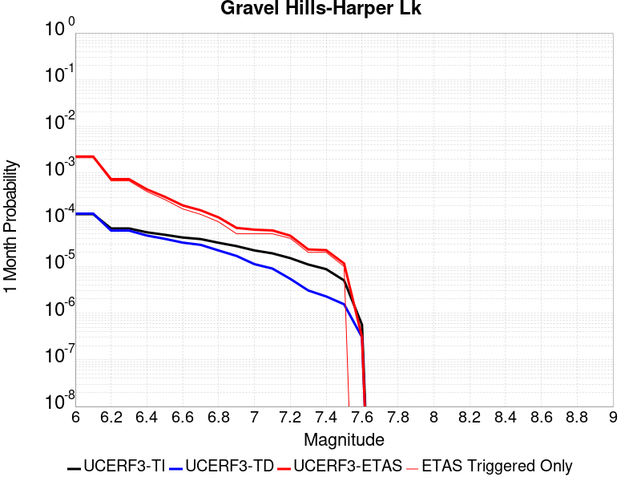 |  |  |

| Magnitude | 1 wk TI Prob | 1 wk TD Prob | 1 wk ETAS Prob | 1 wk ETAS/TD Gain | 1 wk ETAS Triggered Only | 1 mo TI Prob | 1 mo TD Prob | 1 mo ETAS Prob | 1 mo ETAS/TD Gain | 1 mo ETAS Triggered Only | 1 yr TI Prob | 1 yr TD Prob | 1 yr ETAS Prob | 1 yr ETAS/TD Gain | 1 yr ETAS Triggered Only | 10 yr TI Prob | 10 yr TD Prob | 10 yr ETAS Prob | 10 yr ETAS/TD Gain | 10 yr ETAS Triggered Only |
|-----|-----|-----|-----|-----|-----|-----|-----|-----|-----|-----|-----|-----|-----|-----|-----|-----|-----|-----|-----|-----|
| 6.0 | 3.0679566E-5 | 3.1464646E-5 | 0.0027711045 | 88.07042 | 0.002739726 | 1.3147724E-4 | 1.3484273E-4 | 0.0035590385 | 26.393995 | 0.0034246575 | 0.0015995599 | 0.0016406906 | 0.0053332523 | 3.2506144 | 0.00369863 | 0.015880952 | 0.01630734 | 0.019945653 | 1.2231091 | 0.00369863 |
| 6.1 | 3.0679566E-5 | 3.1464646E-5 | 0.0027711045 | 88.07042 | 0.002739726 | 1.3147724E-4 | 1.3484273E-4 | 0.0035590385 | 26.393995 | 0.0034246575 | 0.0015995599 | 0.0016406906 | 0.0053332523 | 3.2506144 | 0.00369863 | 0.015880952 | 0.01630734 | 0.019945653 | 1.2231091 | 0.00369863 |
| 6.2 | 1.514536E-5 | 1.3635206E-5 | 6.9855736E-4 | 51.231888 | 6.849315E-4 | 6.490707E-5 | 5.843536E-5 | 8.8030513E-4 | 15.064597 | 8.219178E-4 | 7.8995706E-4 | 7.1123015E-4 | 0.0015325634 | 2.1548066 | 8.219178E-4 | 0.007871548 | 0.0070907404 | 0.00790683 | 1.1150923 | 8.219178E-4 |
| 6.3 | 1.514536E-5 | 1.3635206E-5 | 6.9855736E-4 | 51.231888 | 6.849315E-4 | 6.490707E-5 | 5.843536E-5 | 8.8030513E-4 | 15.064597 | 8.219178E-4 | 7.8995706E-4 | 7.1123015E-4 | 0.0015325634 | 2.1548066 | 8.219178E-4 | 0.007871548 | 0.0070907404 | 0.00790683 | 1.1150923 | 8.219178E-4 |
| 6.4 | 1.2532521E-5 | 1.06896905E-5 | 4.216442E-4 | 39.444004 | 4.109589E-4 | 5.37097E-5 | 4.581219E-5 | 4.5675226E-4 | 9.970103 | 4.109589E-4 | 6.537194E-4 | 5.576265E-4 | 9.683562E-4 | 1.7365679 | 4.109589E-4 | 0.0065179965 | 0.005562863 | 0.0059715356 | 1.0734645 | 4.109589E-4 |
| 6.5 | 1.1094058E-5 | 9.083664E-6 | 1.4606872E-4 | 16.080376 | 1.369863E-4 | 4.7545094E-5 | 3.892943E-5 | 1.7591039E-4 | 4.5186996 | 1.369863E-4 | 5.787078E-4 | 4.7386673E-4 | 6.107881E-4 | 1.288945 | 1.369863E-4 | 0.0057720304 | 0.0047289706 | 0.0048653088 | 1.0288305 | 1.369863E-4 |
| 6.6 | 9.688328E-6 | 7.5316952E-6 | 1.4451696E-4 | 19.187841 | 1.369863E-4 | 4.1520743E-5 | 3.227831E-5 | 1.692602E-4 | 5.243775 | 1.369863E-4 | 5.053978E-4 | 3.9292008E-4 | 5.298526E-4 | 1.3484995 | 1.369863E-4 | 0.0050424994 | 0.0039225104 | 0.0040589594 | 1.0347861 | 1.369863E-4 |
| 6.7 | 8.974824E-6 | 6.749413E-6 | 6.749413E-6 | 1.0 | 0.0 | 3.8462964E-5 | 2.8925748E-5 | 2.8925748E-5 | 1.0 | 0.0 | 4.6818596E-4 | 3.5211627E-4 | 3.5211627E-4 | 1.0 | 0.0 | 0.004672008 | 0.0035158044 | 0.0035158044 | 1.0 | 0.0 |
| 6.8 | 7.4780046E-6 | 5.1161933E-6 | 5.1161933E-6 | 1.0 | 0.0 | 3.20482E-5 | 2.1926366E-5 | 2.1926366E-5 | 1.0 | 0.0 | 3.9011694E-4 | 2.669222E-4 | 2.669222E-4 | 1.0 | 0.0 | 0.0038943281 | 0.0026661542 | 0.0026661542 | 1.0 | 0.0 |
| 6.9 | 6.3409307E-6 | 3.9074966E-6 | 3.9074966E-6 | 1.0 | 0.0 | 2.7175134E-5 | 1.6746313E-5 | 1.6746313E-5 | 1.0 | 0.0 | 3.3080703E-4 | 2.0386827E-4 | 2.0386827E-4 | 1.0 | 0.0 | 0.0033031502 | 0.0020369107 | 0.0020369107 | 1.0 | 0.0 |
| 7.0 | 5.1239335E-6 | 2.6058565E-6 | 2.6058565E-6 | 1.0 | 0.0 | 2.195953E-5 | 1.116791E-5 | 1.116791E-5 | 1.0 | 0.0 | 2.6732447E-4 | 1.3596108E-4 | 1.3596108E-4 | 1.0 | 0.0 | 0.0026700313 | 0.0013588042 | 0.0013588042 | 1.0 | 0.0 |
| 7.1 | 4.438899E-6 | 2.0984728E-6 | 2.0984728E-6 | 1.0 | 0.0 | 1.9023713E-5 | 8.993425E-6 | 8.993425E-6 | 1.0 | 0.0 | 2.315891E-4 | 1.0948967E-4 | 1.0948967E-4 | 1.0 | 0.0 | 0.002313479 | 0.0010943791 | 0.0010943791 | 1.0 | 0.0 |
| 7.2 | 3.50367E-6 | 1.2615716E-6 | 1.2615716E-6 | 1.0 | 0.0 | 1.5015643E-5 | 5.4067245E-6 | 5.4067245E-6 | 1.0 | 0.0 | 1.8280011E-4 | 6.582497E-5 | 6.582497E-5 | 1.0 | 0.0 | 0.0018264982 | 6.580629E-4 | 6.580629E-4 | 1.0 | 0.0 |
| 7.3 | 2.561638E-6 | 7.1191585E-7 | 7.1191585E-7 | 1.0 | 0.0 | 1.0978401E-5 | 3.0510646E-6 | 3.0510646E-6 | 1.0 | 0.0 | 1.3365384E-4 | 3.71461E-5 | 3.71461E-5 | 1.0 | 0.0 | 0.0013357349 | 3.7140088E-4 | 3.7140088E-4 | 1.0 | 0.0 |
| 7.4 | 2.0368864E-6 | 5.304837E-7 | 5.304837E-7 | 1.0 | 0.0 | 8.729483E-6 | 2.2734996E-6 | 2.2734996E-6 | 1.0 | 0.0 | 1.06276275E-4 | 2.7679513E-5 | 2.7679513E-5 | 1.0 | 0.0 | 0.0010622547 | 2.767612E-4 | 2.767612E-4 | 1.0 | 0.0 |
| 7.5 | 1.1681728E-6 | 3.6030585E-7 | 3.6030585E-7 | 1.0 | 0.0 | 5.0064455E-6 | 1.544167E-6 | 1.544167E-6 | 1.0 | 0.0 | 6.0951766E-5 | 1.8800076E-5 | 1.8800076E-5 | 1.0 | 0.0 | 6.093505E-4 | 1.8798532E-4 | 1.8798532E-4 | 1.0 | 0.0 |
| 7.6 | 1.3154387E-7 | 7.1197384E-8 | 7.1197384E-8 | 1.0 | 0.0 | 5.6375933E-7 | 3.051316E-7 | 3.051316E-7 | 1.0 | 0.0 | 6.863748E-6 | 3.7149728E-6 | 3.7149728E-6 | 1.0 | 0.0 | 6.863536E-5 | 3.7149264E-5 | 3.7149264E-5 | 1.0 | 0.0 |

## San Andreas (San Bernardino N)
*[(top)](#table-of-contents)*

| 1 Week | 1 Month | 1 Year | 10 Year |
|-----|-----|-----|-----|
|  |  |  |  |

| Magnitude | 1 wk TI Prob | 1 wk TD Prob | 1 wk ETAS Prob | 1 wk ETAS/TD Gain | 1 wk ETAS Triggered Only | 1 mo TI Prob | 1 mo TD Prob | 1 mo ETAS Prob | 1 mo ETAS/TD Gain | 1 mo ETAS Triggered Only | 1 yr TI Prob | 1 yr TD Prob | 1 yr ETAS Prob | 1 yr ETAS/TD Gain | 1 yr ETAS Triggered Only | 10 yr TI Prob | 10 yr TD Prob | 10 yr ETAS Prob | 10 yr ETAS/TD Gain | 10 yr ETAS Triggered Only |
|-----|-----|-----|-----|-----|-----|-----|-----|-----|-----|-----|-----|-----|-----|-----|-----|-----|-----|-----|-----|-----|
| 6.0 | 1.4273766E-4 | 3.1606483E-4 | 0.0016854949 | 5.3327503 | 0.001369863 | 6.115894E-4 | 0.0013538664 | 0.0029954764 | 2.2125347 | 0.0016438356 | 0.0074207084 | 0.016360244 | 0.018246675 | 1.1153059 | 0.0019178082 | 0.07177748 | 0.15026689 | 0.15201291 | 1.0116194 | 0.0020547945 |
| 6.1 | 1.4273766E-4 | 3.1606483E-4 | 0.0016854949 | 5.3327503 | 0.001369863 | 6.115894E-4 | 0.0013538664 | 0.0029954764 | 2.2125347 | 0.0016438356 | 0.0074207084 | 0.016360244 | 0.018246675 | 1.1153059 | 0.0019178082 | 0.07177748 | 0.15026689 | 0.15201291 | 1.0116194 | 0.0020547945 |
| 6.2 | 1.4273766E-4 | 3.1606483E-4 | 0.0016854949 | 5.3327503 | 0.001369863 | 6.115894E-4 | 0.0013538664 | 0.0029954764 | 2.2125347 | 0.0016438356 | 0.0074207084 | 0.016360244 | 0.018246675 | 1.1153059 | 0.0019178082 | 0.07177748 | 0.15026689 | 0.15201291 | 1.0116194 | 0.0020547945 |
| 6.3 | 1.3730655E-4 | 3.0511338E-4 | 0.0016745584 | 5.488315 | 0.001369863 | 5.883239E-4 | 0.0013069791 | 0.0029486662 | 2.2560928 | 0.0016438356 | 0.0071393442 | 0.015797773 | 0.017685283 | 1.1194795 | 0.0019178082 | 0.06914291 | 0.14556676 | 0.14732245 | 1.012061 | 0.0020547945 |
| 6.4 | 1.3730655E-4 | 3.0511338E-4 | 0.0016745584 | 5.488315 | 0.001369863 | 5.883239E-4 | 0.0013069791 | 0.0029486662 | 2.2560928 | 0.0016438356 | 0.0071393442 | 0.015797773 | 0.017685283 | 1.1194795 | 0.0019178082 | 0.06914291 | 0.14556676 | 0.14732245 | 1.012061 | 0.0020547945 |
| 6.5 | 1.2942807E-4 | 2.8925808E-4 | 0.0016587249 | 5.7344117 | 0.001369863 | 5.545738E-4 | 0.0012390936 | 0.0028808925 | 2.3249998 | 0.0016438356 | 0.0067310524 | 0.01498286 | 0.016871935 | 1.1260823 | 0.0019178082 | 0.06530788 | 0.13870941 | 0.14047919 | 1.0127589 | 0.0020547945 |
| 6.6 | 1.1125901E-4 | 2.536472E-4 | 0.0016231628 | 6.399293 | 0.001369863 | 4.767372E-4 | 0.0010866089 | 0.0027286583 | 2.5111687 | 0.0016438356 | 0.005788839 | 0.013149847 | 0.015042436 | 1.1439248 | 0.0019178082 | 0.056403454 | 0.122999296 | 0.12480135 | 1.014651 | 0.0020547945 |
| 6.7 | 1.02209575E-4 | 2.3499702E-4 | 0.0016045381 | 6.8279085 | 0.001369863 | 4.3796748E-4 | 0.0010067427 | 0.0026489233 | 2.6311822 | 0.0016438356 | 0.0053192247 | 0.012188629 | 0.014083062 | 1.1554263 | 0.0019178082 | 0.051936906 | 0.114790924 | 0.11660984 | 1.0158455 | 0.0020547945 |
| 6.8 | 9.610582E-5 | 2.2025521E-4 | 0.0015898165 | 7.2180653 | 0.001369863 | 4.1181705E-4 | 9.436101E-4 | 0.0025858947 | 2.740427 | 0.0016438356 | 0.0050023515 | 0.011428202 | 0.013324092 | 1.1658958 | 0.0019178082 | 0.048912346 | 0.1081929 | 0.11002538 | 1.0169371 | 0.0020547945 |
| 6.9 | 9.3877505E-5 | 2.1481077E-4 | 0.0015843796 | 7.3756986 | 0.001369863 | 4.0227012E-4 | 9.2029345E-4 | 0.0025626163 | 2.7845643 | 0.0016438356 | 0.0048866454 | 0.011147255 | 0.013043686 | 1.1701252 | 0.0019178082 | 0.04780577 | 0.10578323 | 0.10762066 | 1.0173697 | 0.0020547945 |
| 7.0 | 9.1019785E-5 | 2.0808022E-4 | 0.0015776582 | 7.5819707 | 0.001369863 | 3.900265E-4 | 8.914682E-4 | 0.0025338384 | 2.8423204 | 0.0016438356 | 0.0047382377 | 0.010799837 | 0.012696933 | 1.1756597 | 0.0019178082 | 0.046384744 | 0.102753714 | 0.104597375 | 1.0179424 | 0.0020547945 |
| 7.1 | 8.771155E-5 | 1.9982594E-4 | 0.0015694152 | 7.853911 | 0.001369863 | 3.758525E-4 | 8.5611636E-4 | 0.0024985448 | 2.918464 | 0.0016438356 | 0.0045664064 | 0.0103736 | 0.012271513 | 1.1829561 | 0.0019178082 | 0.044737056 | 0.09906527 | 0.1009165 | 1.018687 | 0.0020547945 |
| 7.2 | 8.0830236E-5 | 1.8388197E-4 | 0.0015534931 | 8.448317 | 0.001369863 | 3.4636928E-4 | 7.8782777E-4 | 0.0024303682 | 3.084898 | 0.0016438356 | 0.0042088944 | 0.009549725 | 0.011449218 | 1.1989056 | 0.0019178082 | 0.041300658 | 0.09179615 | 0.09366232 | 1.0203295 | 0.0020547945 |
| 7.3 | 7.7668235E-5 | 1.7331762E-4 | 0.0015429432 | 8.902403 | 0.001369863 | 3.328214E-4 | 7.425784E-4 | 0.0023851935 | 3.2120423 | 0.0016438356 | 0.0040445733 | 0.009003494 | 0.0109040355 | 1.2110893 | 0.0019178082 | 0.03971748 | 0.08706327 | 0.08893916 | 1.0215464 | 0.0020547945 |
| 7.4 | 7.520177E-5 | 1.6551897E-4 | 0.0013981917 | 8.447319 | 0.0012328767 | 3.2225347E-4 | 7.0917426E-4 | 0.002214955 | 3.1232872 | 0.0015068493 | 0.0039163795 | 0.008600081 | 0.010365589 | 1.2052895 | 0.001780822 | 0.038480744 | 0.08351955 | 0.085277185 | 1.0210446 | 0.0019178082 |
| 7.5 | 7.274697E-5 | 1.5839566E-4 | 0.0013910771 | 8.782293 | 0.0012328767 | 3.1173544E-4 | 6.78662E-4 | 0.0021844886 | 3.218817 | 0.0015068493 | 0.003788775 | 0.008231463 | 0.009997626 | 1.2145625 | 0.001780822 | 0.03724827 | 0.08023631 | 0.08200024 | 1.0219842 | 0.0019178082 |
| 7.6 | 7.1185845E-5 | 1.540943E-4 | 0.001386781 | 8.99956 | 0.0012328767 | 3.0504653E-4 | 6.6023704E-4 | 0.0021660915 | 3.2807784 | 0.0015068493 | 0.0037076178 | 0.008008812 | 0.009775371 | 1.220577 | 0.001780822 | 0.036463667 | 0.07822598 | 0.07999376 | 1.0225985 | 0.0019178082 |
| 7.7 | 6.709961E-5 | 1.4318313E-4 | 0.0013758834 | 9.609256 | 0.0012328767 | 2.8753807E-4 | 6.1349774E-4 | 0.0021194227 | 3.4546545 | 0.0015068493 | 0.003495157 | 0.0074437927 | 0.009211359 | 1.237455 | 0.001780822 | 0.034406938 | 0.07305469 | 0.0748324 | 1.0243338 | 0.0019178082 |
| 7.8 | 6.300812E-5 | 1.3202413E-4 | 0.0012277699 | 9.299587 | 0.0010958904 | 2.7000686E-4 | 5.65695E-4 | 0.0019347831 | 3.4201877 | 0.001369863 | 0.0032823787 | 0.006865616 | 0.008498166 | 1.2377863 | 0.0016438356 | 0.032343175 | 0.06771354 | 0.06937377 | 1.0245185 | 0.001780822 |
| 7.9 | 4.983037E-5 | 9.723488E-5 | 0.0011930187 | 12.269452 | 0.0010958904 | 2.1354125E-4 | 4.1665437E-4 | 0.0017859467 | 4.2863984 | 0.001369863 | 0.0025967648 | 0.0050609782 | 0.0066964943 | 1.3231621 | 0.0016438356 | 0.025666296 | 0.05064886 | 0.052339487 | 1.0333793 | 0.001780822 |
| 8.0 | 3.2211527E-5 | 5.3304586E-5 | 3.272626E-4 | 6.1394825 | 2.739726E-4 | 1.380421E-4 | 2.2842824E-4 | 5.023382E-4 | 2.1991076 | 2.739726E-4 | 0.0016793669 | 0.0027775685 | 0.003187386 | 1.1475453 | 4.109589E-4 | 0.016667323 | 0.028361378 | 0.028760683 | 1.0140791 | 4.109589E-4 |
| 8.1 | 1.743376E-5 | 1.8824427E-5 | 1.5580814E-4 | 8.276914 | 1.369863E-4 | 7.471398E-5 | 8.067362E-5 | 2.1764888E-4 | 2.6978939 | 1.369863E-4 | 9.0926304E-4 | 9.817594E-4 | 0.0011186112 | 1.1393944 | 1.369863E-4 | 0.009055517 | 0.010484105 | 0.010619655 | 1.0129291 | 1.369863E-4 |
| 8.2 | 7.831616E-6 | 5.1551065E-6 | 5.1551065E-6 | 1.0 | 0.0 | 3.3563636E-5 | 2.2093127E-5 | 2.2093127E-5 | 1.0 | 0.0 | 4.0856065E-4 | 2.6895068E-4 | 2.6895068E-4 | 1.0 | 0.0 | 0.004078103 | 0.0030418145 | 0.0030418145 | 1.0 | 0.0 |
| 8.3 | 1.983087E-6 | 7.6599065E-7 | 7.6599065E-7 | 1.0 | 0.0 | 8.498917E-6 | 3.282813E-6 | 3.282813E-6 | 1.0 | 0.0 | 1.034694E-4 | 3.9967534E-5 | 3.9967534E-5 | 1.0 | 0.0 | 0.0010342124 | 4.719687E-4 | 4.719687E-4 | 1.0 | 0.0 |

## Lenwood-Lockhart-Old Woman Springs
*[(top)](#table-of-contents)*

| 1 Week | 1 Month | 1 Year | 10 Year |
|-----|-----|-----|-----|
|  |  |  |  |

| Magnitude | 1 wk TI Prob | 1 wk TD Prob | 1 wk ETAS Prob | 1 wk ETAS/TD Gain | 1 wk ETAS Triggered Only | 1 mo TI Prob | 1 mo TD Prob | 1 mo ETAS Prob | 1 mo ETAS/TD Gain | 1 mo ETAS Triggered Only | 1 yr TI Prob | 1 yr TD Prob | 1 yr ETAS Prob | 1 yr ETAS/TD Gain | 1 yr ETAS Triggered Only | 10 yr TI Prob | 10 yr TD Prob | 10 yr ETAS Prob | 10 yr ETAS/TD Gain | 10 yr ETAS Triggered Only |
|-----|-----|-----|-----|-----|-----|-----|-----|-----|-----|-----|-----|-----|-----|-----|-----|-----|-----|-----|-----|-----|
| 6.0 | 3.744542E-5 | 4.396252E-5 | 0.0011398047 | 25.926739 | 0.0010958904 | 1.604705E-4 | 1.8839816E-4 | 0.0015580031 | 8.269736 | 0.001369863 | 0.0019519776 | 0.0022915069 | 0.0042049205 | 1.8350023 | 0.0019178082 | 0.019349206 | 0.022696787 | 0.024704944 | 1.0884776 | 0.0020547945 |
| 6.1 | 3.744542E-5 | 4.396252E-5 | 0.0011398047 | 25.926739 | 0.0010958904 | 1.604705E-4 | 1.8839816E-4 | 0.0015580031 | 8.269736 | 0.001369863 | 0.0019519776 | 0.0022915069 | 0.0042049205 | 1.8350023 | 0.0019178082 | 0.019349206 | 0.022696787 | 0.024704944 | 1.0884776 | 0.0020547945 |
| 6.2 | 3.744542E-5 | 4.396252E-5 | 0.0011398047 | 25.926739 | 0.0010958904 | 1.604705E-4 | 1.8839816E-4 | 0.0015580031 | 8.269736 | 0.001369863 | 0.0019519776 | 0.0022915069 | 0.0042049205 | 1.8350023 | 0.0019178082 | 0.019349206 | 0.022696787 | 0.024704944 | 1.0884776 | 0.0020547945 |
| 6.3 | 2.1079984E-5 | 2.5353434E-5 | 5.7328475E-4 | 22.61172 | 5.479452E-4 | 9.0339665E-5 | 1.0865316E-4 | 6.565388E-4 | 6.0425196 | 5.479452E-4 | 0.0010993304 | 0.0013220694 | 0.0018692903 | 1.4139123 | 5.479452E-4 | 0.010939079 | 0.0131442575 | 0.013685 | 1.0411391 | 5.479452E-4 |
| 6.4 | 2.1079984E-5 | 2.5353434E-5 | 5.7328475E-4 | 22.61172 | 5.479452E-4 | 9.0339665E-5 | 1.0865316E-4 | 6.565388E-4 | 6.0425196 | 5.479452E-4 | 0.0010993304 | 0.0013220694 | 0.0018692903 | 1.4139123 | 5.479452E-4 | 0.010939079 | 0.0131442575 | 0.013685 | 1.0411391 | 5.479452E-4 |
| 6.5 | 1.7397282E-5 | 2.066241E-5 | 5.685963E-4 | 27.518393 | 5.479452E-4 | 7.455765E-5 | 8.8550245E-5 | 6.3644693E-4 | 7.18741 | 5.479452E-4 | 9.073613E-4 | 0.0010775778 | 0.0016249325 | 1.5079492 | 5.479452E-4 | 0.009036654 | 0.010724821 | 0.01126689 | 1.0505434 | 5.479452E-4 |
| 6.6 | 1.52050325E-5 | 1.7679693E-5 | 4.2863132E-4 | 24.244274 | 4.109589E-4 | 6.51628E-5 | 7.576796E-5 | 4.8669573E-4 | 6.423503 | 4.109589E-4 | 7.9306826E-4 | 9.220924E-4 | 0.0013326723 | 1.4452698 | 4.109589E-4 | 0.007902439 | 0.009183526 | 0.009590711 | 1.0443386 | 4.109589E-4 |
| 6.7 | 1.332523E-5 | 1.5264002E-5 | 4.2621663E-4 | 27.922993 | 4.109589E-4 | 5.7106878E-5 | 6.5415545E-5 | 4.7634757E-4 | 7.281871 | 4.109589E-4 | 6.950544E-4 | 7.961491E-4 | 0.0012067808 | 1.5157723 | 4.109589E-4 | 0.006928845 | 0.007933599 | 0.0083412975 | 1.0513889 | 4.109589E-4 |
| 6.8 | 1.1525329E-5 | 1.3030979E-5 | 2.87E-4 | 22.024439 | 2.739726E-4 | 4.9393333E-5 | 5.584588E-5 | 3.2980318E-4 | 5.9055953 | 2.739726E-4 | 6.011979E-4 | 6.797157E-4 | 9.5350214E-4 | 1.4027954 | 2.739726E-4 | 0.00599574 | 0.006776819 | 0.007048935 | 1.040154 | 2.739726E-4 |
| 6.9 | 1.0253909E-5 | 1.15144385E-5 | 2.854839E-4 | 24.793556 | 2.739726E-4 | 4.3944583E-5 | 4.9346683E-5 | 3.2330575E-4 | 6.5517225 | 2.739726E-4 | 5.3489394E-4 | 6.0063385E-4 | 8.744419E-4 | 1.4558651 | 2.739726E-4 | 0.0053360825 | 0.0059904843 | 0.0062628156 | 1.0454607 | 2.739726E-4 |
| 7.0 | 8.104563E-6 | 8.991279E-6 | 1.4597634E-4 | 16.235327 | 1.369863E-4 | 3.4733377E-5 | 3.8533497E-5 | 1.7551452E-4 | 4.554856 | 1.369863E-4 | 4.2279682E-4 | 4.6904673E-4 | 6.059688E-4 | 1.2919155 | 1.369863E-4 | 0.0042199334 | 0.0046808156 | 0.004817161 | 1.0291284 | 1.369863E-4 |
| 7.1 | 6.7986157E-6 | 7.515816E-6 | 1.4450109E-4 | 19.226267 | 1.369863E-4 | 2.91366E-5 | 3.2210253E-5 | 1.6919215E-4 | 5.252742 | 1.369863E-4 | 3.5468035E-4 | 3.920914E-4 | 5.29024E-4 | 1.3492364 | 1.369863E-4 | 0.003541148 | 0.003914213 | 0.0040506627 | 1.0348601 | 1.369863E-4 |
| 7.2 | 5.6893327E-6 | 6.2800136E-6 | 1.4326545E-4 | 22.812922 | 1.369863E-4 | 2.4382627E-5 | 2.6914078E-5 | 1.638967E-4 | 6.089627 | 1.369863E-4 | 2.9681803E-4 | 3.2763163E-4 | 4.6457304E-4 | 1.4179738 | 1.369863E-4 | 0.002964219 | 0.0032716845 | 0.0034082227 | 1.0417333 | 1.369863E-4 |
| 7.3 | 4.253348E-6 | 4.7069107E-6 | 4.7069107E-6 | 1.0 | 0.0 | 1.8228506E-5 | 2.0172329E-5 | 2.0172329E-5 | 1.0 | 0.0 | 2.2190946E-4 | 2.4557224E-4 | 2.4557224E-4 | 1.0 | 0.0 | 0.00221688 | 0.0024531898 | 0.0024531898 | 1.0 | 0.0 |
| 7.4 | 2.5448119E-6 | 2.852045E-6 | 2.852045E-6 | 1.0 | 0.0 | 1.0906291E-5 | 1.2223002E-5 | 1.2223002E-5 | 1.0 | 0.0 | 1.3277601E-4 | 1.4880655E-4 | 1.4880655E-4 | 1.0 | 0.0 | 0.001326967 | 0.0014872311 | 0.0014872311 | 1.0 | 0.0 |
| 7.5 | 4.3706837E-8 | 4.562909E-8 | 4.562909E-8 | 1.0 | 0.0 | 1.8731501E-7 | 1.9555324E-7 | 1.9555324E-7 | 1.0 | 0.0 | 2.2805577E-6 | 2.3808586E-6 | 2.3808586E-6 | 1.0 | 0.0 | 2.2805343E-5 | 2.3808387E-5 | 2.3808387E-5 | 1.0 | 0.0 |

## Goldstone Lake
*[(top)](#table-of-contents)*

| 1 Week | 1 Month | 1 Year | 10 Year |
|-----|-----|-----|-----|
|  |  | 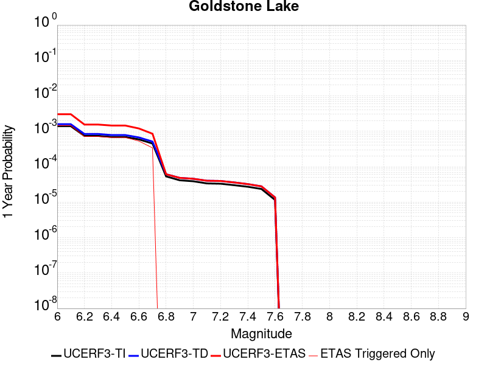 |  |

| Magnitude | 1 wk TI Prob | 1 wk TD Prob | 1 wk ETAS Prob | 1 wk ETAS/TD Gain | 1 wk ETAS Triggered Only | 1 mo TI Prob | 1 mo TD Prob | 1 mo ETAS Prob | 1 mo ETAS/TD Gain | 1 mo ETAS Triggered Only | 1 yr TI Prob | 1 yr TD Prob | 1 yr ETAS Prob | 1 yr ETAS/TD Gain | 1 yr ETAS Triggered Only | 10 yr TI Prob | 10 yr TD Prob | 10 yr ETAS Prob | 10 yr ETAS/TD Gain | 10 yr ETAS Triggered Only |
|-----|-----|-----|-----|-----|-----|-----|-----|-----|-----|-----|-----|-----|-----|-----|-----|-----|-----|-----|-----|-----|
| 6.0 | 2.671352E-5 | 3.037609E-5 | 0.0012632153 | 41.585846 | 0.0012328767 | 1.1448149E-4 | 1.3017785E-4 | 0.0014998625 | 11.521642 | 0.001369863 | 0.001392921 | 0.0015839594 | 0.003088422 | 1.9498112 | 0.0015068493 | 0.013842222 | 0.015746197 | 0.017498977 | 1.1113145 | 0.001780822 |
| 6.1 | 2.671352E-5 | 3.037609E-5 | 0.0012632153 | 41.585846 | 0.0012328767 | 1.1448149E-4 | 1.3017785E-4 | 0.0014998625 | 11.521642 | 0.001369863 | 0.001392921 | 0.0015839594 | 0.003088422 | 1.9498112 | 0.0015068493 | 0.013842222 | 0.015746197 | 0.017498977 | 1.1113145 | 0.001780822 |
| 6.2 | 1.4197047E-5 | 1.6096245E-5 | 7.0101675E-4 | 43.55157 | 6.849315E-4 | 6.0843064E-5 | 6.8982634E-5 | 7.538669E-4 | 10.928357 | 6.849315E-4 | 7.4051257E-4 | 8.3963864E-4 | 0.0015239951 | 1.8150606 | 6.849315E-4 | 0.007380498 | 0.0083743585 | 0.009325232 | 1.1135459 | 9.589041E-4 |
| 6.3 | 1.4197047E-5 | 1.6096245E-5 | 7.0101675E-4 | 43.55157 | 6.849315E-4 | 6.0843064E-5 | 6.8982634E-5 | 7.538669E-4 | 10.928357 | 6.849315E-4 | 7.4051257E-4 | 8.3963864E-4 | 0.0015239951 | 1.8150606 | 6.849315E-4 | 0.007380498 | 0.0083743585 | 0.009325232 | 1.1135459 | 9.589041E-4 |
| 6.4 | 1.3238931E-5 | 1.500846E-5 | 4.259612E-4 | 28.381407 | 4.109589E-4 | 5.6737044E-5 | 6.4320935E-5 | 4.7525342E-4 | 7.3887825 | 4.109589E-4 | 6.9055456E-4 | 7.82924E-4 | 0.0011935611 | 1.5244917 | 4.109589E-4 | 0.006884126 | 0.0078112837 | 0.008354949 | 1.0696 | 5.479452E-4 |
| 6.5 | 1.3238931E-5 | 1.500846E-5 | 4.259612E-4 | 28.381407 | 4.109589E-4 | 5.6737044E-5 | 6.4320935E-5 | 4.7525342E-4 | 7.3887825 | 4.109589E-4 | 6.9055456E-4 | 7.82924E-4 | 0.0011935611 | 1.5244917 | 4.109589E-4 | 0.006884126 | 0.0078112837 | 0.008354949 | 1.0696 | 5.479452E-4 |
| 6.6 | 1.1328278E-5 | 1.2855166E-5 | 4.238088E-4 | 32.967976 | 4.109589E-4 | 4.8548856E-5 | 5.5092944E-5 | 4.6602922E-4 | 8.458963 | 4.109589E-4 | 5.90922E-4 | 6.7064585E-4 | 0.0010813292 | 1.6123699 | 4.109589E-4 | 0.0058935313 | 0.0066956086 | 0.0072398847 | 1.0812886 | 5.479452E-4 |
| 6.7 | 8.651175E-6 | 9.824565E-6 | 4.2077943E-4 | 42.829323 | 4.109589E-4 | 3.707594E-5 | 4.2105108E-5 | 4.530467E-4 | 10.759899 | 4.109589E-4 | 4.5130608E-4 | 5.1259965E-4 | 9.233479E-4 | 1.8013042 | 4.109589E-4 | 0.0045039062 | 0.005123051 | 0.0056681894 | 1.1064088 | 5.479452E-4 |
| 6.8 | 1.0215377E-6 | 1.1754702E-6 | 1.1754702E-6 | 1.0 | 0.0 | 4.378012E-6 | 5.0377203E-6 | 5.0377203E-6 | 1.0 | 0.0 | 5.3300988E-5 | 6.1332634E-5 | 6.1332634E-5 | 1.0 | 0.0 | 5.3288206E-4 | 6.1316835E-4 | 6.1316835E-4 | 1.0 | 0.0 |
| 6.9 | 7.9360774E-7 | 9.2833966E-7 | 9.2833966E-7 | 1.0 | 0.0 | 3.4011714E-6 | 3.9785928E-6 | 3.9785928E-6 | 1.0 | 0.0 | 4.1408475E-5 | 4.843836E-5 | 4.843836E-5 | 1.0 | 0.0 | 4.140076E-4 | 4.8428503E-4 | 4.8428503E-4 | 1.0 | 0.0 |
| 7.0 | 7.4382757E-7 | 8.7473285E-7 | 8.7473285E-7 | 1.0 | 0.0 | 3.1878285E-6 | 3.74885E-6 | 3.74885E-6 | 1.0 | 0.0 | 3.8811122E-5 | 4.564136E-5 | 4.564136E-5 | 1.0 | 0.0 | 3.8804344E-4 | 4.5632652E-4 | 4.5632652E-4 | 1.0 | 0.0 |
| 7.1 | 6.4709513E-7 | 7.7113E-7 | 7.7113E-7 | 1.0 | 0.0 | 2.773262E-6 | 3.3048389E-6 | 3.3048389E-6 | 1.0 | 0.0 | 3.376394E-5 | 4.0235733E-5 | 4.0235733E-5 | 1.0 | 0.0 | 3.375881E-4 | 4.0229043E-4 | 4.0229043E-4 | 1.0 | 0.0 |
| 7.2 | 6.356704E-7 | 7.5883594E-7 | 7.5883594E-7 | 1.0 | 0.0 | 2.7242988E-6 | 3.2521505E-6 | 3.2521505E-6 | 1.0 | 0.0 | 3.3167835E-5 | 3.959427E-5 | 3.959427E-5 | 1.0 | 0.0 | 3.3162883E-4 | 3.958781E-4 | 3.958781E-4 | 1.0 | 0.0 |
| 7.3 | 5.7695723E-7 | 6.8965653E-7 | 6.8965653E-7 | 1.0 | 0.0 | 2.4726714E-6 | 2.9556677E-6 | 2.9556677E-6 | 1.0 | 0.0 | 3.0104358E-5 | 3.5984718E-5 | 3.5984718E-5 | 1.0 | 0.0 | 3.0100282E-4 | 3.5979465E-4 | 3.5979465E-4 | 1.0 | 0.0 |
| 7.4 | 5.209647E-7 | 6.193514E-7 | 6.193514E-7 | 1.0 | 0.0 | 2.232704E-6 | 2.6543607E-6 | 2.6543607E-6 | 1.0 | 0.0 | 2.718283E-5 | 3.2316417E-5 | 3.2316417E-5 | 1.0 | 0.0 | 2.7179506E-4 | 3.2312275E-4 | 3.2312275E-4 | 1.0 | 0.0 |
| 7.5 | 4.512955E-7 | 5.348885E-7 | 5.348885E-7 | 1.0 | 0.0 | 1.934122E-6 | 2.2923775E-6 | 2.2923775E-6 | 1.0 | 0.0 | 2.3547682E-5 | 2.7909393E-5 | 2.7909393E-5 | 1.0 | 0.0 | 2.3545188E-4 | 2.7906417E-4 | 2.7906417E-4 | 1.0 | 0.0 |
| 7.6 | 2.21172E-7 | 2.603961E-7 | 2.603961E-7 | 1.0 | 0.0 | 9.478797E-7 | 1.1159829E-6 | 1.1159829E-6 | 1.0 | 0.0 | 1.1540374E-5 | 1.3587036E-5 | 1.3587036E-5 | 1.0 | 0.0 | 1.1539775E-4 | 1.3586486E-4 | 1.3586486E-4 | 1.0 | 0.0 |

## McLean Lake
*[(top)](#table-of-contents)*

| 1 Week | 1 Month | 1 Year | 10 Year |
|-----|-----|-----|-----|
|  |  |  |  |

| Magnitude | 1 wk TI Prob | 1 wk TD Prob | 1 wk ETAS Prob | 1 wk ETAS/TD Gain | 1 wk ETAS Triggered Only | 1 mo TI Prob | 1 mo TD Prob | 1 mo ETAS Prob | 1 mo ETAS/TD Gain | 1 mo ETAS Triggered Only | 1 yr TI Prob | 1 yr TD Prob | 1 yr ETAS Prob | 1 yr ETAS/TD Gain | 1 yr ETAS Triggered Only | 10 yr TI Prob | 10 yr TD Prob | 10 yr ETAS Prob | 10 yr ETAS/TD Gain | 10 yr ETAS Triggered Only |
|-----|-----|-----|-----|-----|-----|-----|-----|-----|-----|-----|-----|-----|-----|-----|-----|-----|-----|-----|-----|-----|
| 6.0 | 1.7360222E-5 | 1.8501627E-5 | 0.0012513555 | 67.63489 | 0.0012328767 | 7.439883E-5 | 7.9290556E-5 | 0.0013120695 | 16.547615 | 0.0012328767 | 9.0542925E-4 | 9.6498354E-4 | 0.002607233 | 2.7018418 | 0.0016438356 | 0.009017491 | 0.0096127745 | 0.011240808 | 1.1693615 | 0.0016438356 |
| 6.1 | 9.062689E-6 | 9.592193E-6 | 5.575321E-4 | 58.12353 | 5.479452E-4 | 3.8839516E-5 | 4.1108804E-5 | 5.890315E-4 | 14.328597 | 5.479452E-4 | 4.727685E-4 | 5.003936E-4 | 0.0010480647 | 2.0944805 | 5.479452E-4 | 0.0047176396 | 0.004993552 | 0.0055387607 | 1.1091826 | 5.479452E-4 |
| 6.2 | 9.062689E-6 | 9.592193E-6 | 5.575321E-4 | 58.12353 | 5.479452E-4 | 3.8839516E-5 | 4.1108804E-5 | 5.890315E-4 | 14.328597 | 5.479452E-4 | 4.727685E-4 | 5.003936E-4 | 0.0010480647 | 2.0944805 | 5.479452E-4 | 0.0047176396 | 0.004993552 | 0.0055387607 | 1.1091826 | 5.479452E-4 |
| 6.3 | 7.2575485E-6 | 7.66771E-6 | 5.556087E-4 | 72.460846 | 5.479452E-4 | 3.110341E-5 | 3.2861237E-5 | 5.807884E-4 | 17.673967 | 5.479452E-4 | 3.786182E-4 | 4.0001926E-4 | 9.477453E-4 | 2.369249 | 5.479452E-4 | 0.0037797375 | 0.0039936965 | 0.0045394534 | 1.1366546 | 5.479452E-4 |
| 6.4 | 7.2575485E-6 | 7.66771E-6 | 5.556087E-4 | 72.460846 | 5.479452E-4 | 3.110341E-5 | 3.2861237E-5 | 5.807884E-4 | 17.673967 | 5.479452E-4 | 3.786182E-4 | 4.0001926E-4 | 9.477453E-4 | 2.369249 | 5.479452E-4 | 0.0037797375 | 0.0039936965 | 0.0045394534 | 1.1366546 | 5.479452E-4 |
| 6.5 | 6.06582E-6 | 6.4038773E-6 | 4.1736016E-4 | 65.17304 | 4.109589E-4 | 2.5996113E-5 | 2.7444936E-5 | 4.3839257E-4 | 15.973533 | 4.109589E-4 | 3.164567E-4 | 3.3409733E-4 | 7.4491894E-4 | 2.2296464 | 4.109589E-4 | 0.0031600643 | 0.0033365893 | 0.0037461768 | 1.1227564 | 4.109589E-4 |
| 6.6 | 5.598744E-6 | 5.910262E-6 | 4.1686674E-4 | 70.5327 | 4.109589E-4 | 2.3994397E-5 | 2.5329486E-5 | 4.3627797E-4 | 17.224115 | 4.109589E-4 | 2.9209262E-4 | 3.0834923E-4 | 7.1918144E-4 | 2.33236 | 4.109589E-4 | 0.0029170897 | 0.003079843 | 0.0034895362 | 1.1330241 | 4.109589E-4 |
| 6.7 | 5.246996E-6 | 5.539162E-6 | 4.1649578E-4 | 75.19112 | 4.109589E-4 | 2.2486933E-5 | 2.3739085E-5 | 4.3468823E-4 | 18.311077 | 4.109589E-4 | 2.73744E-4 | 2.8899137E-4 | 6.998315E-4 | 2.4216347 | 4.109589E-4 | 0.0027340704 | 0.0028867796 | 0.0032965522 | 1.141948 | 4.109589E-4 |
| 6.8 | 4.02324E-6 | 4.2469046E-6 | 4.1520406E-4 | 97.76628 | 4.109589E-4 | 1.7242342E-5 | 1.8200926E-5 | 4.2915234E-4 | 23.5786 | 4.109589E-4 | 2.099053E-4 | 2.2157968E-4 | 6.3244754E-4 | 2.8542666 | 4.109589E-4 | 0.0020970714 | 0.002214172 | 0.002624221 | 1.185193 | 4.109589E-4 |
| 6.9 | 6.835972E-7 | 7.1399285E-7 | 1.3770019E-4 | 192.85936 | 1.369863E-4 | 2.9296991E-6 | 3.0599674E-6 | 1.4004586E-4 | 45.767105 | 1.369863E-4 | 3.56685E-5 | 3.7254784E-5 | 1.7423599E-4 | 4.676875 | 1.369863E-4 | 3.5662777E-4 | 3.7251666E-4 | 5.0945196E-4 | 1.3675951 | 1.369863E-4 |

## So Sierra Nevada
*[(top)](#table-of-contents)*

| 1 Week | 1 Month | 1 Year | 10 Year |
|-----|-----|-----|-----|
|  |  |  | 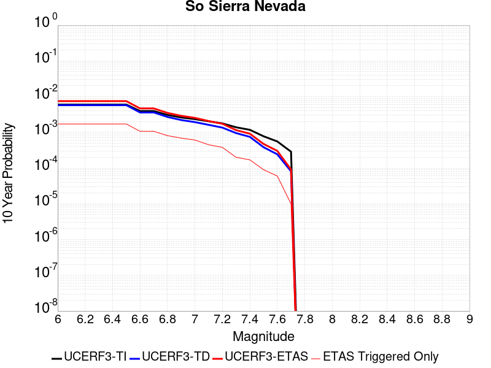 |

| Magnitude | 1 wk TI Prob | 1 wk TD Prob | 1 wk ETAS Prob | 1 wk ETAS/TD Gain | 1 wk ETAS Triggered Only | 1 mo TI Prob | 1 mo TD Prob | 1 mo ETAS Prob | 1 mo ETAS/TD Gain | 1 mo ETAS Triggered Only | 1 yr TI Prob | 1 yr TD Prob | 1 yr ETAS Prob | 1 yr ETAS/TD Gain | 1 yr ETAS Triggered Only | 10 yr TI Prob | 10 yr TD Prob | 10 yr ETAS Prob | 10 yr ETAS/TD Gain | 10 yr ETAS Triggered Only |
|-----|-----|-----|-----|-----|-----|-----|-----|-----|-----|-----|-----|-----|-----|-----|-----|-----|-----|-----|-----|-----|
| 6.0 | 1.15488665E-5 | 1.1079643E-5 | 0.0012439427 | 112.27282 | 0.0012328767 | 4.9494203E-5 | 4.748339E-5 | 0.0014172813 | 29.84794 | 0.001369863 | 6.024253E-4 | 5.7796965E-4 | 0.002083948 | 3.6056356 | 0.0015068493 | 0.006007948 | 0.005765934 | 0.0074002915 | 1.2834506 | 0.0016438356 |
| 6.1 | 1.15488665E-5 | 1.1079643E-5 | 0.0012439427 | 112.27282 | 0.0012328767 | 4.9494203E-5 | 4.748339E-5 | 0.0014172813 | 29.84794 | 0.001369863 | 6.024253E-4 | 5.7796965E-4 | 0.002083948 | 3.6056356 | 0.0015068493 | 0.006007948 | 0.005765934 | 0.0074002915 | 1.2834506 | 0.0016438356 |
| 6.2 | 1.15488665E-5 | 1.1079643E-5 | 0.0012439427 | 112.27282 | 0.0012328767 | 4.9494203E-5 | 4.748339E-5 | 0.0014172813 | 29.84794 | 0.001369863 | 6.024253E-4 | 5.7796965E-4 | 0.002083948 | 3.6056356 | 0.0015068493 | 0.006007948 | 0.005765934 | 0.0074002915 | 1.2834506 | 0.0016438356 |
| 6.3 | 1.15488665E-5 | 1.1079643E-5 | 0.0012439427 | 112.27282 | 0.0012328767 | 4.9494203E-5 | 4.748339E-5 | 0.0014172813 | 29.84794 | 0.001369863 | 6.024253E-4 | 5.7796965E-4 | 0.002083948 | 3.6056356 | 0.0015068493 | 0.006007948 | 0.005765934 | 0.0074002915 | 1.2834506 | 0.0016438356 |
| 6.4 | 1.15488665E-5 | 1.1079643E-5 | 0.0012439427 | 112.27282 | 0.0012328767 | 4.9494203E-5 | 4.748339E-5 | 0.0014172813 | 29.84794 | 0.001369863 | 6.024253E-4 | 5.7796965E-4 | 0.002083948 | 3.6056356 | 0.0015068493 | 0.006007948 | 0.005765934 | 0.0074002915 | 1.2834506 | 0.0016438356 |
| 6.5 | 1.15488665E-5 | 1.1079643E-5 | 0.0012439427 | 112.27282 | 0.0012328767 | 4.9494203E-5 | 4.748339E-5 | 0.0014172813 | 29.84794 | 0.001369863 | 6.024253E-4 | 5.7796965E-4 | 0.002083948 | 3.6056356 | 0.0015068493 | 0.006007948 | 0.005765934 | 0.0074002915 | 1.2834506 | 0.0016438356 |
| 6.6 | 7.587044E-6 | 6.935635E-6 | 0.0011028184 | 159.00757 | 0.0010958904 | 3.2515498E-5 | 2.9723828E-5 | 0.0012625639 | 42.47649 | 0.0012328767 | 3.9580427E-4 | 3.6183043E-4 | 0.0017311978 | 4.7845554 | 0.001369863 | 0.003951 | 0.0036127048 | 0.00511411 | 1.4155904 | 0.0015068493 |
| 6.7 | 7.587044E-6 | 6.935635E-6 | 0.0011028184 | 159.00757 | 0.0010958904 | 3.2515498E-5 | 2.9723828E-5 | 0.0012625639 | 42.47649 | 0.0012328767 | 3.9580427E-4 | 3.6183043E-4 | 0.0017311978 | 4.7845554 | 0.001369863 | 0.003951 | 0.0036127048 | 0.00511411 | 1.4155904 | 0.0015068493 |
| 6.8 | 5.9026956E-6 | 5.1793927E-6 | 6.9010735E-4 | 133.24098 | 6.849315E-4 | 2.5297022E-5 | 2.2197215E-5 | 8.4409676E-4 | 38.02715 | 8.219178E-4 | 3.0794772E-4 | 2.7021873E-4 | 0.0012288637 | 4.5476627 | 9.589041E-4 | 0.0030752132 | 0.002699018 | 0.0037919506 | 1.4049371 | 0.0010958904 |
| 6.9 | 5.0118915E-6 | 4.2524252E-6 | 6.8918103E-4 | 162.06775 | 6.849315E-4 | 2.1479358E-5 | 1.8224557E-5 | 8.401274E-4 | 46.098644 | 8.219178E-4 | 2.614798E-4 | 2.2186211E-4 | 0.0011805535 | 5.3211136 | 9.589041E-4 | 0.0026117235 | 0.0022164788 | 0.0033099402 | 1.4933326 | 0.0010958904 |
| 7.0 | 4.4924795E-6 | 3.7139177E-6 | 5.516571E-4 | 148.53778 | 5.479452E-4 | 1.925334E-5 | 1.5916696E-5 | 7.008373E-4 | 44.03158 | 6.849315E-4 | 2.3438422E-4 | 1.9376918E-4 | 0.0010155278 | 5.240915 | 8.219178E-4 | 0.0023413717 | 0.0019360651 | 0.0028931128 | 1.4943261 | 9.589041E-4 |
| 7.1 | 3.9118436E-6 | 3.1119775E-6 | 5.510555E-4 | 177.07565 | 5.479452E-4 | 1.6764936E-5 | 1.3336982E-5 | 6.9825933E-4 | 52.355125 | 6.849315E-4 | 2.0409399E-4 | 1.6236622E-4 | 9.841506E-4 | 6.061301 | 8.219178E-4 | 0.0020390663 | 0.001622532 | 0.0025798802 | 1.5900335 | 9.589041E-4 |
| 7.2 | 3.4200818E-6 | 2.6054543E-6 | 2.7657734E-4 | 106.15321 | 2.739726E-4 | 1.4657411E-5 | 1.11661875E-5 | 4.221205E-4 | 37.80346 | 4.109589E-4 | 1.7843937E-4 | 1.3594035E-4 | 6.838111E-4 | 5.0302286 | 5.479452E-4 | 0.0017829615 | 0.0013586218 | 0.0020426228 | 1.5034521 | 6.849315E-4 |
| 7.3 | 2.6593618E-6 | 1.8284203E-6 | 2.7580053E-4 | 150.84088 | 2.739726E-4 | 1.13972155E-5 | 7.836065E-6 | 4.1879175E-4 | 53.444138 | 4.109589E-4 | 1.3875226E-4 | 9.540021E-5 | 5.063199E-4 | 5.307325 | 4.109589E-4 | 0.0013866565 | 9.5362146E-4 | 0.0013641885 | 1.4305346 | 4.109589E-4 |
| 7.4 | 2.2577992E-6 | 1.436438E-6 | 2.7540865E-4 | 191.73027 | 2.739726E-4 | 9.676246E-6 | 6.15615E-6 | 4.1711252E-4 | 67.755424 | 4.109589E-4 | 1.1780193E-4 | 7.49488E-5 | 4.858769E-4 | 6.4827843 | 4.109589E-4 | 0.001177395 | 7.492603E-4 | 0.0011599113 | 1.5480752 | 4.109589E-4 |
| 7.5 | 1.489319E-6 | 7.353936E-7 | 1.377216E-4 | 187.27603 | 1.369863E-4 | 6.3827797E-6 | 3.1516831E-6 | 2.771234E-4 | 87.92871 | 2.739726E-4 | 7.770758E-5 | 3.8371072E-5 | 3.1233317E-4 | 8.139809 | 2.739726E-4 | 7.7680405E-4 | 3.836449E-4 | 6.575124E-4 | 1.7138568 | 2.739726E-4 |
| 7.6 | 1.0680322E-6 | 4.6596554E-7 | 1.374522E-4 | 294.9836 | 1.369863E-4 | 4.577273E-6 | 1.9969937E-6 | 2.7596904E-4 | 138.19225 | 2.739726E-4 | 5.5726876E-5 | 2.4313129E-5 | 2.9827908E-4 | 12.26823 | 2.739726E-4 | 5.5712904E-4 | 2.4310495E-4 | 5.17011E-4 | 2.1266985 | 2.739726E-4 |
| 7.7 | 5.509146E-7 | 1.5580486E-7 | 1.5580486E-7 | 1.0 | 0.0 | 2.3610605E-6 | 6.677349E-7 | 6.677349E-7 | 1.0 | 0.0 | 2.8745531E-5 | 8.129644E-6 | 8.129644E-6 | 1.0 | 0.0 | 2.8741814E-4 | 8.1293576E-5 | 8.1293576E-5 | 1.0 | 0.0 |

## Death Valley (So)
*[(top)](#table-of-contents)*

| 1 Week | 1 Month | 1 Year | 10 Year |
|-----|-----|-----|-----|
|  | 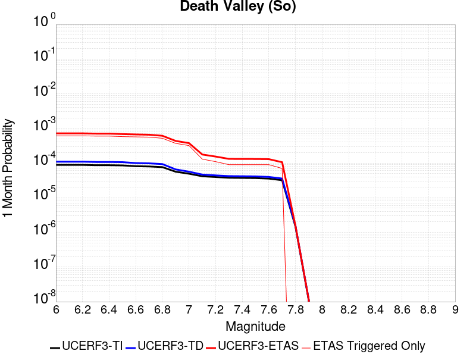 |  |  |

| Magnitude | 1 wk TI Prob | 1 wk TD Prob | 1 wk ETAS Prob | 1 wk ETAS/TD Gain | 1 wk ETAS Triggered Only | 1 mo TI Prob | 1 mo TD Prob | 1 mo ETAS Prob | 1 mo ETAS/TD Gain | 1 mo ETAS Triggered Only | 1 yr TI Prob | 1 yr TD Prob | 1 yr ETAS Prob | 1 yr ETAS/TD Gain | 1 yr ETAS Triggered Only | 10 yr TI Prob | 10 yr TD Prob | 10 yr ETAS Prob | 10 yr ETAS/TD Gain | 10 yr ETAS Triggered Only |
|-----|-----|-----|-----|-----|-----|-----|-----|-----|-----|-----|-----|-----|-----|-----|-----|-----|-----|-----|-----|-----|
| 6.0 | 2.0684236E-5 | 2.5617775E-5 | 8.4751454E-4 | 33.083065 | 8.219178E-4 | 8.864371E-5 | 1.0978594E-4 | 0.0010685847 | 9.733348 | 9.589041E-4 | 0.0010787029 | 0.0013358411 | 0.002567071 | 1.9216888 | 0.0012328767 | 0.010734817 | 0.013281397 | 0.014497899 | 1.0915945 | 0.0012328767 |
| 6.1 | 2.0684236E-5 | 2.5617775E-5 | 8.4751454E-4 | 33.083065 | 8.219178E-4 | 8.864371E-5 | 1.0978594E-4 | 0.0010685847 | 9.733348 | 9.589041E-4 | 0.0010787029 | 0.0013358411 | 0.002567071 | 1.9216888 | 0.0012328767 | 0.010734817 | 0.013281397 | 0.014497899 | 1.0915945 | 0.0012328767 |
| 6.2 | 2.0684236E-5 | 2.5617775E-5 | 8.4751454E-4 | 33.083065 | 8.219178E-4 | 8.864371E-5 | 1.0978594E-4 | 0.0010685847 | 9.733348 | 9.589041E-4 | 0.0010787029 | 0.0013358411 | 0.002567071 | 1.9216888 | 0.0012328767 | 0.010734817 | 0.013281397 | 0.014497899 | 1.0915945 | 0.0012328767 |
| 6.3 | 2.0240292E-5 | 2.511786E-5 | 8.47015E-4 | 33.721622 | 8.219178E-4 | 8.6741224E-5 | 1.07643624E-4 | 0.0010664446 | 9.907178 | 9.589041E-4 | 0.0010555626 | 0.00130979 | 0.002541052 | 1.9400452 | 0.0012328767 | 0.010505628 | 0.013023956 | 0.014240776 | 1.0934293 | 0.0012328767 |
| 6.4 | 2.0240292E-5 | 2.511786E-5 | 8.47015E-4 | 33.721622 | 8.219178E-4 | 8.6741224E-5 | 1.07643624E-4 | 0.0010664446 | 9.907178 | 9.589041E-4 | 0.0010555626 | 0.00130979 | 0.002541052 | 1.9400452 | 0.0012328767 | 0.010505628 | 0.013023956 | 0.014240776 | 1.0934293 | 0.0012328767 |
| 6.5 | 1.9962767E-5 | 2.4807114E-5 | 7.0972164E-4 | 28.609602 | 6.849315E-4 | 8.55519E-5 | 1.0631196E-4 | 9.281424E-4 | 8.730367 | 8.219178E-4 | 0.0010410968 | 0.0012935963 | 0.0023880692 | 1.8460698 | 0.0010958904 | 0.010362327 | 0.012863902 | 0.013945696 | 1.0840952 | 0.0010958904 |
| 6.6 | 1.8937297E-5 | 2.3310964E-5 | 7.082265E-4 | 30.38169 | 6.849315E-4 | 8.115732E-5 | 9.990039E-5 | 9.2173606E-4 | 9.226551 | 8.219178E-4 | 9.876423E-4 | 0.0012156231 | 0.0023101813 | 1.9004091 | 0.0010958904 | 0.009832645 | 0.012092789 | 0.013175427 | 1.0895276 | 0.0010958904 |
| 6.7 | 1.8621096E-5 | 2.2911607E-5 | 7.078274E-4 | 30.893837 | 6.849315E-4 | 7.980225E-5 | 9.818898E-5 | 9.200261E-4 | 9.369952 | 8.219178E-4 | 9.711593E-4 | 0.0011948098 | 0.002289391 | 1.9161133 | 0.0010958904 | 0.009669261 | 0.011886904 | 0.012969768 | 1.0910972 | 0.0010958904 |
| 6.8 | 1.7830353E-5 | 2.1805688E-5 | 7.0672226E-4 | 32.409996 | 6.849315E-4 | 7.641356E-5 | 9.344968E-5 | 9.152907E-4 | 9.7944765 | 8.219178E-4 | 9.29938E-4 | 0.00113717 | 0.0022318142 | 1.9626038 | 0.0010958904 | 0.009260561 | 0.011316354 | 0.012399843 | 1.0957454 | 0.0010958904 |
| 6.9 | 1.3135183E-5 | 1.5303925E-5 | 5.632407E-4 | 36.80368 | 5.479452E-4 | 5.6292425E-5 | 6.558664E-5 | 7.5047323E-4 | 11.4424715 | 6.849315E-4 | 6.8514474E-4 | 7.982312E-4 | 0.001619493 | 2.028852 | 8.219178E-4 | 0.006830362 | 0.007954649 | 0.008770028 | 1.1025035 | 8.219178E-4 |
| 7.0 | 1.1507512E-5 | 1.3154199E-5 | 5.610922E-4 | 42.654987 | 5.479452E-4 | 4.9316975E-5 | 5.6373956E-5 | 7.412669E-4 | 13.149101 | 6.849315E-4 | 6.002687E-4 | 6.8614254E-4 | 0.0015074963 | 2.19706 | 8.219178E-4 | 0.0059864987 | 0.0068409415 | 0.007657237 | 1.1193249 | 8.219178E-4 |
| 7.1 | 9.715903E-6 | 1.0865278E-5 | 2.848349E-4 | 26.21515 | 2.739726E-4 | 4.1638916E-5 | 4.656467E-5 | 3.2052453E-4 | 6.883427 | 2.739726E-4 | 5.068359E-4 | 5.667817E-4 | 9.775077E-4 | 1.7246635 | 4.109589E-4 | 0.0050568148 | 0.0056538144 | 0.00606245 | 1.072276 | 4.109589E-4 |
| 7.2 | 9.233269E-6 | 1.02863105E-5 | 2.842561E-4 | 27.634407 | 2.739726E-4 | 3.9570554E-5 | 4.4083466E-5 | 3.1804398E-4 | 7.2145867 | 2.739726E-4 | 4.81665E-4 | 5.3658825E-4 | 8.1041385E-4 | 1.5103086 | 2.739726E-4 | 0.0048062233 | 0.0053533576 | 0.0056258636 | 1.0509038 | 2.739726E-4 |
| 7.3 | 8.8041315E-6 | 9.808164E-6 | 1.4679313E-4 | 14.966422 | 1.369863E-4 | 3.7731446E-5 | 4.2034335E-5 | 1.7901488E-4 | 4.2587776 | 1.369863E-4 | 4.592835E-4 | 5.1165203E-4 | 6.4856827E-4 | 1.2675964 | 1.369863E-4 | 0.0045833546 | 0.005105167 | 0.005241454 | 1.0266958 | 1.369863E-4 |
| 7.4 | 8.708749E-6 | 9.707175E-6 | 1.4669215E-4 | 15.111724 | 1.369863E-4 | 3.7322676E-5 | 4.160154E-5 | 1.7858214E-4 | 4.292681 | 1.369863E-4 | 4.5430884E-4 | 5.0638523E-4 | 6.4330216E-4 | 1.270381 | 1.369863E-4 | 0.004533812 | 0.0050527398 | 0.0051890337 | 1.0269743 | 1.369863E-4 |
| 7.5 | 8.612678E-6 | 9.604817E-6 | 1.4658981E-4 | 15.262113 | 1.369863E-4 | 3.6910955E-5 | 4.1162875E-5 | 1.7814354E-4 | 4.3277717 | 1.369863E-4 | 4.492982E-4 | 5.01047E-4 | 6.3796464E-4 | 1.2732631 | 1.369863E-4 | 0.004483909 | 0.0049995985 | 0.0051359003 | 1.0272624 | 1.369863E-4 |
| 7.6 | 8.319024E-6 | 9.283916E-6 | 1.4626894E-4 | 15.755091 | 1.369863E-4 | 3.5652476E-5 | 3.978763E-5 | 1.7676849E-4 | 4.4428 | 1.369863E-4 | 4.3398244E-4 | 4.8431093E-4 | 6.2123087E-4 | 1.2827109 | 1.369863E-4 | 0.0043313587 | 0.0048329784 | 0.0049693026 | 1.0282071 | 1.369863E-4 |
| 7.7 | 7.4718328E-6 | 8.34517E-6 | 1.4533033E-4 | 17.414904 | 1.369863E-4 | 3.2021748E-5 | 3.5764548E-5 | 1.7274595E-4 | 4.830089 | 1.369863E-4 | 3.8979502E-4 | 4.353504E-4 | 5.7227706E-4 | 1.3145206 | 1.369863E-4 | 0.00389112 | 0.0043453807 | 0.0044817715 | 1.0313876 | 1.369863E-4 |
| 7.8 | 3.4586725E-7 | 3.6482615E-7 | 3.6482615E-7 | 1.0 | 0.0 | 1.4822873E-6 | 1.5635396E-6 | 1.5635396E-6 | 1.0 | 0.0 | 1.80467E-5 | 1.9035933E-5 | 1.9035933E-5 | 1.0 | 0.0 | 1.8045233E-4 | 1.9034347E-4 | 1.9034347E-4 | 1.0 | 0.0 |
| 7.9 | 2.5591178E-9 | 2.6696718E-9 | 2.6696718E-9 | 1.0 | 0.0 | 1.0967647E-8 | 1.14414505E-8 | 1.14414505E-8 | 1.0 | 0.0 | 1.335311E-7 | 1.3929966E-7 | 1.3929966E-7 | 1.0 | 0.0 | 1.3353102E-6 | 1.3929966E-6 | 1.3929966E-6 | 1.0 | 0.0 |

## San Andreas (San Bernardino S)
*[(top)](#table-of-contents)*

| 1 Week | 1 Month | 1 Year | 10 Year |
|-----|-----|-----|-----|
| 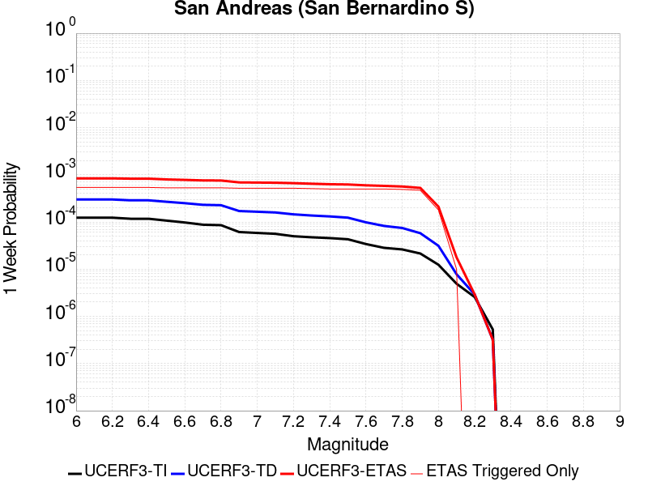 |  |  |  |

| Magnitude | 1 wk TI Prob | 1 wk TD Prob | 1 wk ETAS Prob | 1 wk ETAS/TD Gain | 1 wk ETAS Triggered Only | 1 mo TI Prob | 1 mo TD Prob | 1 mo ETAS Prob | 1 mo ETAS/TD Gain | 1 mo ETAS Triggered Only | 1 yr TI Prob | 1 yr TD Prob | 1 yr ETAS Prob | 1 yr ETAS/TD Gain | 1 yr ETAS Triggered Only | 10 yr TI Prob | 10 yr TD Prob | 10 yr ETAS Prob | 10 yr ETAS/TD Gain | 10 yr ETAS Triggered Only |
|-----|-----|-----|-----|-----|-----|-----|-----|-----|-----|-----|-----|-----|-----|-----|-----|-----|-----|-----|-----|-----|
| 6.0 | 1.2336002E-4 | 3.0004102E-4 | 7.108766E-4 | 2.3692648 | 4.109589E-4 | 5.2857865E-4 | 0.0012852824 | 0.0016957131 | 1.3193312 | 4.109589E-4 | 0.006416472 | 0.015540994 | 0.016215282 | 1.0433877 | 6.849315E-4 | 0.06234337 | 0.14283717 | 0.1435417 | 1.0049323 | 8.219178E-4 |
| 6.1 | 1.2336002E-4 | 3.0004102E-4 | 7.108766E-4 | 2.3692648 | 4.109589E-4 | 5.2857865E-4 | 0.0012852824 | 0.0016957131 | 1.3193312 | 4.109589E-4 | 0.006416472 | 0.015540994 | 0.016215282 | 1.0433877 | 6.849315E-4 | 0.06234337 | 0.14283717 | 0.1435417 | 1.0049323 | 8.219178E-4 |
| 6.2 | 1.2336002E-4 | 3.0004102E-4 | 7.108766E-4 | 2.3692648 | 4.109589E-4 | 5.2857865E-4 | 0.0012852824 | 0.0016957131 | 1.3193312 | 4.109589E-4 | 0.006416472 | 0.015540994 | 0.016215282 | 1.0433877 | 6.849315E-4 | 0.06234337 | 0.14283717 | 0.1435417 | 1.0049323 | 8.219178E-4 |
| 6.3 | 1.1712257E-4 | 2.8792414E-4 | 6.987647E-4 | 2.4269056 | 4.109589E-4 | 5.018573E-4 | 0.0012334028 | 0.0016438548 | 1.3327802 | 4.109589E-4 | 0.006093008 | 0.014918125 | 0.015457896 | 1.0361822 | 5.479452E-4 | 0.059286322 | 0.13754563 | 0.13813636 | 1.0042948 | 6.849315E-4 |
| 6.4 | 1.1712257E-4 | 2.8792414E-4 | 6.987647E-4 | 2.4269056 | 4.109589E-4 | 5.018573E-4 | 0.0012334028 | 0.0016438548 | 1.3327802 | 4.109589E-4 | 0.006093008 | 0.014918125 | 0.015457896 | 1.0361822 | 5.479452E-4 | 0.059286322 | 0.13754563 | 0.13813636 | 1.0042948 | 6.849315E-4 |
| 6.5 | 1.0689076E-4 | 2.680528E-4 | 6.7890156E-4 | 2.5327158 | 4.109589E-4 | 4.5802278E-4 | 0.0011483167 | 0.0015588037 | 1.3574685 | 4.109589E-4 | 0.0055621783 | 0.01389575 | 0.014436081 | 1.0388846 | 5.479452E-4 | 0.05425003 | 0.12879294 | 0.12938966 | 1.0046332 | 6.849315E-4 |
| 6.6 | 9.7648895E-5 | 2.50501E-4 | 6.6135696E-4 | 2.640137 | 4.109589E-4 | 4.1842813E-4 | 0.0010731576 | 0.0014836756 | 1.3825327 | 4.109589E-4 | 0.005082469 | 0.012991785 | 0.013532612 | 1.0416284 | 5.479452E-4 | 0.049677886 | 0.12095292 | 0.121555 | 1.0049778 | 6.849315E-4 |
| 6.7 | 8.757013E-5 | 2.3120902E-4 | 6.4207293E-4 | 2.7770236 | 4.109589E-4 | 3.7524657E-4 | 9.905418E-4 | 0.0014010937 | 1.414472 | 4.109589E-4 | 0.00455906 | 0.011997245 | 0.012538617 | 1.0451247 | 5.479452E-4 | 0.04466656 | 0.11226123 | 0.11286927 | 1.0054163 | 6.849315E-4 |
| 6.8 | 8.562978E-5 | 2.2680782E-4 | 6.3767354E-4 | 2.8115146 | 4.109589E-4 | 3.6693315E-4 | 9.7169366E-4 | 0.0013822532 | 1.4225196 | 4.109589E-4 | 0.004458263 | 0.011770263 | 0.012311759 | 1.0460054 | 5.479452E-4 | 0.043698758 | 0.11027153 | 0.11088093 | 1.0055264 | 6.849315E-4 |
| 6.9 | 6.124075E-5 | 1.7065753E-4 | 5.815463E-4 | 3.4076803 | 4.109589E-4 | 2.6243398E-4 | 7.311852E-4 | 0.0011418436 | 1.561634 | 4.109589E-4 | 0.0031904527 | 0.008866051 | 0.009409138 | 1.0612546 | 5.479452E-4 | 0.031450346 | 0.08418263 | 0.0848099 | 1.0074513 | 6.849315E-4 |
| 7.0 | 5.8598747E-5 | 1.649477E-4 | 5.7583884E-4 | 3.4910386 | 4.109589E-4 | 2.5111332E-4 | 7.06728E-4 | 0.0011173965 | 1.5810841 | 4.109589E-4 | 0.0030530186 | 0.008570663 | 0.009113912 | 1.0633847 | 5.479452E-4 | 0.03011414 | 0.081500374 | 0.08212948 | 1.007719 | 6.849315E-4 |
| 7.1 | 5.613814E-5 | 1.5913323E-4 | 5.7002675E-4 | 3.5820723 | 4.109589E-4 | 2.4056983E-4 | 6.818221E-4 | 0.0010925008 | 1.6023253 | 4.109589E-4 | 0.0029250039 | 0.008269769 | 0.008813183 | 1.0657109 | 5.479452E-4 | 0.028868021 | 0.07879931 | 0.07943027 | 1.0080072 | 6.849315E-4 |
| 7.2 | 4.991222E-5 | 1.4519796E-4 | 5.560972E-4 | 3.8299243 | 4.109589E-4 | 2.1389198E-4 | 6.2212895E-4 | 0.0010328322 | 1.6601578 | 4.109589E-4 | 0.002601025 | 0.007548217 | 0.008092026 | 1.0720447 | 5.479452E-4 | 0.025707912 | 0.07225321 | 0.07288865 | 1.0087947 | 6.849315E-4 |
| 7.3 | 4.7410045E-5 | 1.3714004E-4 | 5.480426E-4 | 3.996226 | 4.109589E-4 | 2.0317009E-4 | 5.8761094E-4 | 9.983283E-4 | 1.6989615 | 4.109589E-4 | 0.0024707897 | 0.0071307817 | 0.0076748193 | 1.0762943 | 5.479452E-4 | 0.024434982 | 0.06853558 | 0.06917357 | 1.0093089 | 6.849315E-4 |
| 7.4 | 4.5556746E-5 | 1.3121912E-4 | 5.421241E-4 | 4.1314416 | 4.109589E-4 | 1.952286E-4 | 5.622468E-4 | 9.729746E-4 | 1.7305117 | 4.109589E-4 | 0.002374317 | 0.0068239477 | 0.007368154 | 1.0797495 | 5.479452E-4 | 0.023491086 | 0.065788016 | 0.06642789 | 1.0097263 | 6.849315E-4 |
| 7.5 | 4.3084514E-5 | 1.2357246E-4 | 5.344806E-4 | 4.32524 | 4.109589E-4 | 1.8463485E-4 | 5.2948913E-4 | 9.402304E-4 | 1.7757313 | 4.109589E-4 | 0.0022456115 | 0.0064275465 | 0.0069719697 | 1.0847015 | 5.479452E-4 | 0.022230545 | 0.062188786 | 0.06283112 | 1.0103288 | 6.849315E-4 |
| 7.6 | 3.408608E-5 | 9.83552E-5 | 5.0927367E-4 | 5.177903 | 4.109589E-4 | 1.4607502E-4 | 4.214543E-4 | 8.3224E-4 | 1.9746863 | 4.109589E-4 | 0.0017770125 | 0.0051191594 | 0.0056642992 | 1.1064901 | 5.479452E-4 | 0.017628696 | 0.050020292 | 0.050670963 | 1.0130081 | 6.849315E-4 |
| 7.7 | 2.8315713E-5 | 8.248679E-5 | 4.934118E-4 | 5.9817066 | 4.109589E-4 | 1.2134742E-4 | 3.5346695E-4 | 7.642806E-4 | 2.1622405 | 4.109589E-4 | 0.0014764034 | 0.0042949775 | 0.004840569 | 1.1270301 | 5.479452E-4 | 0.01466633 | 0.0422714 | 0.04292738 | 1.0155183 | 6.849315E-4 |
| 7.8 | 2.6222975E-5 | 7.463088E-5 | 3.4858304E-4 | 4.6707616 | 2.739726E-4 | 1.1237934E-4 | 3.1980744E-4 | 5.936924E-4 | 1.856406 | 2.739726E-4 | 0.0013673597 | 0.0038867102 | 0.004296072 | 1.1053234 | 4.109589E-4 | 0.013589768 | 0.03843674 | 0.038963627 | 1.0137079 | 5.479452E-4 |
| 7.9 | 2.1469694E-5 | 5.787864E-5 | 3.3183538E-4 | 5.7332964 | 2.739726E-4 | 9.200973E-5 | 2.4802773E-4 | 5.219324E-4 | 2.1043308 | 2.739726E-4 | 0.0011196428 | 0.0030155594 | 0.003425279 | 1.1358685 | 4.109589E-4 | 0.011140184 | 0.030152109 | 0.030683532 | 1.0176247 | 5.479452E-4 |
| 8.0 | 1.2420249E-5 | 3.131896E-5 | 1.6830098E-4 | 5.3737726 | 1.369863E-4 | 5.322855E-5 | 1.342172E-4 | 2.7118513E-4 | 2.0204945 | 1.369863E-4 | 6.478649E-4 | 0.0016328706 | 0.0017696333 | 1.083756 | 1.369863E-4 | 0.0064597935 | 0.016522504 | 0.016657226 | 1.0081539 | 1.369863E-4 |
| 8.1 | 4.9197724E-6 | 7.822348E-6 | 7.822348E-6 | 1.0 | 0.0 | 2.1084568E-5 | 3.352392E-5 | 3.352392E-5 | 1.0 | 0.0 | 2.566744E-4 | 4.0807744E-4 | 4.0807744E-4 | 1.0 | 0.0 | 0.002563781 | 0.0043843705 | 0.0043843705 | 1.0 | 0.0 |
| 8.2 | 2.5634774E-6 | 2.9067196E-6 | 2.9067196E-6 | 1.0 | 0.0 | 1.0986286E-5 | 1.2457311E-5 | 1.2457311E-5 | 1.0 | 0.0 | 1.3374983E-4 | 1.5165724E-4 | 1.5165724E-4 | 1.0 | 0.0 | 0.0013366934 | 0.0017049741 | 0.0017049741 | 1.0 | 0.0 |
| 8.3 | 5.2850464E-7 | 3.2088764E-7 | 3.2088764E-7 | 1.0 | 0.0 | 2.2650179E-6 | 1.375232E-6 | 1.375232E-6 | 1.0 | 0.0 | 2.7576245E-5 | 1.6743334E-5 | 1.6743334E-5 | 1.0 | 0.0 | 2.7572823E-4 | 1.9870348E-4 | 1.9870348E-4 | 1.0 | 0.0 |

## Coyote Canyon
*[(top)](#table-of-contents)*

| 1 Week | 1 Month | 1 Year | 10 Year |
|-----|-----|-----|-----|
|  |  |  |  |

| Magnitude | 1 wk TI Prob | 1 wk TD Prob | 1 wk ETAS Prob | 1 wk ETAS/TD Gain | 1 wk ETAS Triggered Only | 1 mo TI Prob | 1 mo TD Prob | 1 mo ETAS Prob | 1 mo ETAS/TD Gain | 1 mo ETAS Triggered Only | 1 yr TI Prob | 1 yr TD Prob | 1 yr ETAS Prob | 1 yr ETAS/TD Gain | 1 yr ETAS Triggered Only | 10 yr TI Prob | 10 yr TD Prob | 10 yr ETAS Prob | 10 yr ETAS/TD Gain | 10 yr ETAS Triggered Only |
|-----|-----|-----|-----|-----|-----|-----|-----|-----|-----|-----|-----|-----|-----|-----|-----|-----|-----|-----|-----|-----|
| 6.0 | 3.5090034E-5 | 4.0364324E-5 | 7.252682E-4 | 17.96805 | 6.849315E-4 | 1.503772E-4 | 1.7297994E-4 | 8.5779297E-4 | 4.9589157 | 6.849315E-4 | 0.0018293047 | 0.0021042528 | 0.002787743 | 1.3248137 | 6.849315E-4 | 0.018143194 | 0.020869201 | 0.021539839 | 1.0321352 | 6.849315E-4 |
| 6.1 | 3.5090034E-5 | 4.0364324E-5 | 7.252682E-4 | 17.96805 | 6.849315E-4 | 1.503772E-4 | 1.7297994E-4 | 8.5779297E-4 | 4.9589157 | 6.849315E-4 | 0.0018293047 | 0.0021042528 | 0.002787743 | 1.3248137 | 6.849315E-4 | 0.018143194 | 0.020869201 | 0.021539839 | 1.0321352 | 6.849315E-4 |
| 6.2 | 1.841879E-5 | 2.1059794E-5 | 2.9502664E-4 | 14.008999 | 2.739726E-4 | 7.8935285E-5 | 9.0253714E-5 | 3.6420158E-4 | 4.035309 | 2.739726E-4 | 9.606133E-4 | 0.001098387 | 0.0013720586 | 1.2491578 | 2.739726E-4 | 0.0095647145 | 0.010939667 | 0.011210643 | 1.02477 | 2.739726E-4 |
| 6.3 | 1.841879E-5 | 2.1059794E-5 | 2.9502664E-4 | 14.008999 | 2.739726E-4 | 7.8935285E-5 | 9.0253714E-5 | 3.6420158E-4 | 4.035309 | 2.739726E-4 | 9.606133E-4 | 0.001098387 | 0.0013720586 | 1.2491578 | 2.739726E-4 | 0.0095647145 | 0.010939667 | 0.011210643 | 1.02477 | 2.739726E-4 |
| 6.4 | 1.712201E-5 | 1.9565212E-5 | 2.9353244E-4 | 15.002774 | 2.739726E-4 | 7.337798E-5 | 8.3848776E-5 | 3.5779842E-4 | 4.2671866 | 2.739726E-4 | 8.930107E-4 | 0.0010204813 | 0.0012941743 | 1.2681999 | 2.739726E-4 | 0.008894307 | 0.010167871 | 0.010439058 | 1.0266709 | 2.739726E-4 |
| 6.5 | 1.4744935E-5 | 1.6836972E-5 | 2.9080495E-4 | 17.271809 | 2.739726E-4 | 6.3191044E-5 | 7.215698E-5 | 3.4610982E-4 | 4.7966228 | 2.739726E-4 | 7.6907943E-4 | 8.7825063E-4 | 0.0011519826 | 1.3116786 | 2.739726E-4 | 0.007664232 | 0.008756994 | 0.009028568 | 1.0310122 | 2.739726E-4 |
| 6.6 | 1.2017839E-5 | 1.37240895E-5 | 2.8769294E-4 | 20.962626 | 2.739726E-4 | 5.150401E-5 | 5.88167E-5 | 3.327732E-4 | 5.657801 | 2.739726E-4 | 6.268809E-4 | 7.159466E-4 | 9.89723E-4 | 1.3823979 | 2.739726E-4 | 0.0062511545 | 0.0071450938 | 0.007417109 | 1.0380702 | 2.739726E-4 |
| 6.7 | 1.00956095E-5 | 1.1533517E-5 | 2.8550296E-4 | 24.754198 | 2.739726E-4 | 4.326618E-5 | 4.942891E-5 | 3.2338797E-4 | 6.542486 | 2.739726E-4 | 5.266384E-4 | 6.017178E-4 | 8.755255E-4 | 1.4550434 | 2.739726E-4 | 0.005253921 | 0.0060094125 | 0.0062817386 | 1.0453166 | 2.739726E-4 |

## Towne Pass
*[(top)](#table-of-contents)*

| 1 Week | 1 Month | 1 Year | 10 Year |
|-----|-----|-----|-----|
|  |  |  |  |

| Magnitude | 1 wk TI Prob | 1 wk TD Prob | 1 wk ETAS Prob | 1 wk ETAS/TD Gain | 1 wk ETAS Triggered Only | 1 mo TI Prob | 1 mo TD Prob | 1 mo ETAS Prob | 1 mo ETAS/TD Gain | 1 mo ETAS Triggered Only | 1 yr TI Prob | 1 yr TD Prob | 1 yr ETAS Prob | 1 yr ETAS/TD Gain | 1 yr ETAS Triggered Only | 10 yr TI Prob | 10 yr TD Prob | 10 yr ETAS Prob | 10 yr ETAS/TD Gain | 10 yr ETAS Triggered Only |
|-----|-----|-----|-----|-----|-----|-----|-----|-----|-----|-----|-----|-----|-----|-----|-----|-----|-----|-----|-----|-----|
| 6.0 | 3.849728E-6 | 3.8945414E-6 | 2.778661E-4 | 71.34757 | 2.739726E-4 | 1.649873E-5 | 1.669081E-5 | 2.9065885E-4 | 17.414305 | 2.739726E-4 | 2.0085352E-4 | 2.0319603E-4 | 6.1407144E-4 | 3.0220642 | 4.109589E-4 | 0.0020067208 | 0.0020305314 | 0.002577364 | 1.2693051 | 5.479452E-4 |
| 6.1 | 3.849728E-6 | 3.8945414E-6 | 2.778661E-4 | 71.34757 | 2.739726E-4 | 1.649873E-5 | 1.669081E-5 | 2.9065885E-4 | 17.414305 | 2.739726E-4 | 2.0085352E-4 | 2.0319603E-4 | 6.1407144E-4 | 3.0220642 | 4.109589E-4 | 0.0020067208 | 0.0020305314 | 0.002577364 | 1.2693051 | 5.479452E-4 |
| 6.2 | 3.849728E-6 | 3.8945414E-6 | 2.778661E-4 | 71.34757 | 2.739726E-4 | 1.649873E-5 | 1.669081E-5 | 2.9065885E-4 | 17.414305 | 2.739726E-4 | 2.0085352E-4 | 2.0319603E-4 | 6.1407144E-4 | 3.0220642 | 4.109589E-4 | 0.0020067208 | 0.0020305314 | 0.002577364 | 1.2693051 | 5.479452E-4 |
| 6.3 | 3.849728E-6 | 3.8945414E-6 | 2.778661E-4 | 71.34757 | 2.739726E-4 | 1.649873E-5 | 1.669081E-5 | 2.9065885E-4 | 17.414305 | 2.739726E-4 | 2.0085352E-4 | 2.0319603E-4 | 6.1407144E-4 | 3.0220642 | 4.109589E-4 | 0.0020067208 | 0.0020305314 | 0.002577364 | 1.2693051 | 5.479452E-4 |
| 6.4 | 3.849728E-6 | 3.8945414E-6 | 2.778661E-4 | 71.34757 | 2.739726E-4 | 1.649873E-5 | 1.669081E-5 | 2.9065885E-4 | 17.414305 | 2.739726E-4 | 2.0085352E-4 | 2.0319603E-4 | 6.1407144E-4 | 3.0220642 | 4.109589E-4 | 0.0020067208 | 0.0020305314 | 0.002577364 | 1.2693051 | 5.479452E-4 |
| 6.5 | 1.1953545E-6 | 1.203052E-6 | 1.3818919E-4 | 114.86552 | 1.369863E-4 | 5.1229376E-6 | 5.1559277E-6 | 1.4214152E-4 | 27.568563 | 1.369863E-4 | 6.236998E-5 | 6.277173E-5 | 1.9974944E-4 | 3.1821558 | 1.369863E-4 | 6.235248E-4 | 6.275517E-4 | 7.6445204E-4 | 1.2181499 | 1.369863E-4 |
| 6.6 | 1.1953545E-6 | 1.203052E-6 | 1.3818919E-4 | 114.86552 | 1.369863E-4 | 5.1229376E-6 | 5.1559277E-6 | 1.4214152E-4 | 27.568563 | 1.369863E-4 | 6.236998E-5 | 6.277173E-5 | 1.9974944E-4 | 3.1821558 | 1.369863E-4 | 6.235248E-4 | 6.275517E-4 | 7.6445204E-4 | 1.2181499 | 1.369863E-4 |
| 6.7 | 8.375951E-7 | 8.4106705E-7 | 8.4106705E-7 | 1.0 | 0.0 | 3.5896885E-6 | 3.6045683E-6 | 3.6045683E-6 | 1.0 | 0.0 | 4.370358E-5 | 4.3884793E-5 | 4.3884793E-5 | 1.0 | 0.0 | 4.3694986E-4 | 4.38767E-4 | 4.38767E-4 | 1.0 | 0.0 |
| 6.8 | 6.38041E-7 | 6.392156E-7 | 6.392156E-7 | 1.0 | 0.0 | 2.7344586E-6 | 2.7394929E-6 | 2.7394929E-6 | 1.0 | 0.0 | 3.3291526E-5 | 3.3352855E-5 | 3.3352855E-5 | 1.0 | 0.0 | 3.3286537E-4 | 3.334823E-4 | 3.334823E-4 | 1.0 | 0.0 |
| 6.9 | 5.3460053E-7 | 5.345333E-7 | 5.345333E-7 | 1.0 | 0.0 | 2.2911431E-6 | 2.2908553E-6 | 2.2908553E-6 | 1.0 | 0.0 | 2.789431E-5 | 2.789084E-5 | 2.789084E-5 | 1.0 | 0.0 | 2.789081E-4 | 2.7887672E-4 | 2.7887672E-4 | 1.0 | 0.0 |
| 7.0 | 3.557783E-7 | 3.5324226E-7 | 3.5324226E-7 | 1.0 | 0.0 | 1.5247632E-6 | 1.5138945E-6 | 1.5138945E-6 | 1.0 | 0.0 | 1.8563835E-5 | 1.843152E-5 | 1.843152E-5 | 1.0 | 0.0 | 1.8562283E-4 | 1.8430075E-4 | 1.8430075E-4 | 1.0 | 0.0 |
| 7.1 | 3.037942E-7 | 3.0002218E-7 | 3.0002218E-7 | 1.0 | 0.0 | 1.3019744E-6 | 1.2858087E-6 | 1.2858087E-6 | 1.0 | 0.0 | 1.5851423E-5 | 1.5654618E-5 | 1.5654618E-5 | 1.0 | 0.0 | 1.5850292E-4 | 1.5653588E-4 | 1.5653588E-4 | 1.0 | 0.0 |
| 7.2 | 2.0808248E-7 | 2.0217689E-7 | 2.0217689E-7 | 1.0 | 0.0 | 8.917818E-7 | 8.6647213E-7 | 8.6647213E-7 | 1.0 | 0.0 | 1.0857389E-5 | 1.0549252E-5 | 1.0549252E-5 | 1.0 | 0.0 | 1.0856859E-4 | 1.0548797E-4 | 1.0548797E-4 | 1.0 | 0.0 |
| 7.3 | 1.1162073E-7 | 1.0636894E-7 | 1.0636894E-7 | 1.0 | 0.0 | 4.7837443E-7 | 4.558668E-7 | 4.558668E-7 | 1.0 | 0.0 | 5.8241935E-6 | 5.550166E-6 | 5.550166E-6 | 1.0 | 0.0 | 5.8240406E-5 | 5.5500474E-5 | 5.5500474E-5 | 1.0 | 0.0 |

## Manix-Afton Hills
*[(top)](#table-of-contents)*

| 1 Week | 1 Month | 1 Year | 10 Year |
|-----|-----|-----|-----|
|  |  |  |  |

| Magnitude | 1 wk TI Prob | 1 wk TD Prob | 1 wk ETAS Prob | 1 wk ETAS/TD Gain | 1 wk ETAS Triggered Only | 1 mo TI Prob | 1 mo TD Prob | 1 mo ETAS Prob | 1 mo ETAS/TD Gain | 1 mo ETAS Triggered Only | 1 yr TI Prob | 1 yr TD Prob | 1 yr ETAS Prob | 1 yr ETAS/TD Gain | 1 yr ETAS Triggered Only | 10 yr TI Prob | 10 yr TD Prob | 10 yr ETAS Prob | 10 yr ETAS/TD Gain | 10 yr ETAS Triggered Only |
|-----|-----|-----|-----|-----|-----|-----|-----|-----|-----|-----|-----|-----|-----|-----|-----|-----|-----|-----|-----|-----|
| 6.0 | 1.3783202E-5 | 1.47110895E-5 | 2.8867967E-4 | 19.623268 | 2.739726E-4 | 5.906953E-5 | 6.30461E-5 | 3.3700143E-4 | 5.3453174 | 2.739726E-4 | 7.189342E-4 | 7.6733343E-4 | 0.0013148582 | 1.7135421 | 5.479452E-4 | 0.0071661277 | 0.007648596 | 0.00819235 | 1.071092 | 5.479452E-4 |
| 6.1 | 1.3783202E-5 | 1.47110895E-5 | 2.8867967E-4 | 19.623268 | 2.739726E-4 | 5.906953E-5 | 6.30461E-5 | 3.3700143E-4 | 5.3453174 | 2.739726E-4 | 7.189342E-4 | 7.6733343E-4 | 0.0013148582 | 1.7135421 | 5.479452E-4 | 0.0071661277 | 0.007648596 | 0.00819235 | 1.071092 | 5.479452E-4 |
| 6.2 | 1.3783202E-5 | 1.47110895E-5 | 2.8867967E-4 | 19.623268 | 2.739726E-4 | 5.906953E-5 | 6.30461E-5 | 3.3700143E-4 | 5.3453174 | 2.739726E-4 | 7.189342E-4 | 7.6733343E-4 | 0.0013148582 | 1.7135421 | 5.479452E-4 | 0.0071661277 | 0.007648596 | 0.00819235 | 1.071092 | 5.479452E-4 |
| 6.3 | 1.10494875E-5 | 1.1793136E-5 | 2.857625E-4 | 24.231258 | 2.739726E-4 | 4.7354086E-5 | 5.054109E-5 | 3.2449985E-4 | 6.4205155 | 2.739726E-4 | 5.763835E-4 | 6.151744E-4 | 0.0011627825 | 1.8901672 | 5.479452E-4 | 0.005748908 | 0.0061357557 | 0.0066803386 | 1.0887557 | 5.479452E-4 |
| 6.4 | 1.10494875E-5 | 1.1793136E-5 | 2.857625E-4 | 24.231258 | 2.739726E-4 | 4.7354086E-5 | 5.054109E-5 | 3.2449985E-4 | 6.4205155 | 2.739726E-4 | 5.763835E-4 | 6.151744E-4 | 0.0011627825 | 1.8901672 | 5.479452E-4 | 0.005748908 | 0.0061357557 | 0.0066803386 | 1.0887557 | 5.479452E-4 |
| 6.5 | 9.788949E-6 | 1.045432E-5 | 2.8442405E-4 | 27.206367 | 2.739726E-4 | 4.1951964E-5 | 4.480351E-5 | 3.1876384E-4 | 7.114707 | 2.739726E-4 | 5.1064545E-4 | 5.453555E-4 | 0.0010930019 | 2.0042007 | 5.479452E-4 | 0.0050947363 | 0.0054410985 | 0.0059860623 | 1.1001569 | 5.479452E-4 |
| 6.6 | 8.810006E-6 | 9.4136285E-6 | 2.8338365E-4 | 30.103552 | 2.739726E-4 | 3.775662E-5 | 4.0343548E-5 | 3.143051E-4 | 7.7907157 | 2.739726E-4 | 4.5958988E-4 | 4.9108086E-4 | 0.001038757 | 2.1152463 | 5.479452E-4 | 0.0045864056 | 0.004900839 | 0.0054460987 | 1.1112585 | 5.479452E-4 |
| 6.7 | 8.80128E-6 | 9.404108E-6 | 2.8337413E-4 | 30.133017 | 2.739726E-4 | 3.7719226E-5 | 4.0302748E-5 | 3.142643E-4 | 7.7975903 | 2.739726E-4 | 4.591348E-4 | 4.9058435E-4 | 0.0010382608 | 2.1163757 | 5.479452E-4 | 0.004581874 | 0.0048958957 | 0.0054411585 | 1.1113714 | 5.479452E-4 |
| 6.8 | 6.8994877E-6 | 7.380076E-6 | 2.8135066E-4 | 38.123 | 2.739726E-4 | 2.9568899E-5 | 3.162856E-5 | 3.055925E-4 | 9.661917 | 2.739726E-4 | 3.5994186E-4 | 3.8501783E-4 | 9.327521E-4 | 2.4226205 | 5.479452E-4 | 0.003593594 | 0.0038443129 | 0.0043901517 | 1.141986 | 5.479452E-4 |
| 6.9 | 4.9328037E-6 | 5.2709615E-6 | 5.2709615E-6 | 1.0 | 0.0 | 2.1140417E-5 | 2.2589675E-5 | 2.2589675E-5 | 1.0 | 0.0 | 2.5735417E-4 | 2.7500073E-4 | 5.48898E-4 | 1.9959874 | 2.739726E-4 | 0.0025705635 | 0.0027472095 | 0.0030204293 | 1.0994536 | 2.739726E-4 |
| 7.0 | 3.347973E-6 | 3.59003E-6 | 3.59003E-6 | 1.0 | 0.0 | 1.4348378E-5 | 1.5385775E-5 | 1.5385775E-5 | 1.0 | 0.0 | 1.746775E-4 | 1.8730981E-4 | 3.2427046E-4 | 1.7311984 | 1.369863E-4 | 0.0017454025 | 0.0018719219 | 0.0020086518 | 1.0730425 | 1.369863E-4 |
| 7.1 | 1.2073567E-6 | 1.293482E-6 | 1.293482E-6 | 1.0 | 0.0 | 5.1743755E-6 | 5.543492E-6 | 5.543492E-6 | 1.0 | 0.0 | 6.29962E-5 | 6.749156E-5 | 6.749156E-5 | 1.0 | 0.0 | 6.297835E-4 | 6.7487074E-4 | 6.7487074E-4 | 1.0 | 0.0 |

## Garlic Springs
*[(top)](#table-of-contents)*

| 1 Week | 1 Month | 1 Year | 10 Year |
|-----|-----|-----|-----|
|  |  | 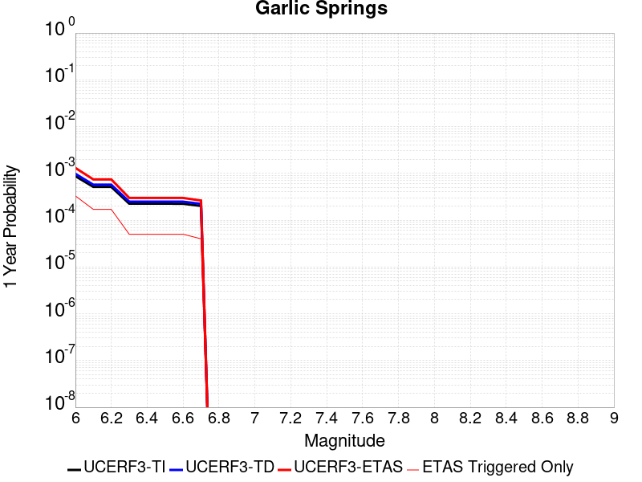 |  |

| Magnitude | 1 wk TI Prob | 1 wk TD Prob | 1 wk ETAS Prob | 1 wk ETAS/TD Gain | 1 wk ETAS Triggered Only | 1 mo TI Prob | 1 mo TD Prob | 1 mo ETAS Prob | 1 mo ETAS/TD Gain | 1 mo ETAS Triggered Only | 1 yr TI Prob | 1 yr TD Prob | 1 yr ETAS Prob | 1 yr ETAS/TD Gain | 1 yr ETAS Triggered Only | 10 yr TI Prob | 10 yr TD Prob | 10 yr ETAS Prob | 10 yr ETAS/TD Gain | 10 yr ETAS Triggered Only |
|-----|-----|-----|-----|-----|-----|-----|-----|-----|-----|-----|-----|-----|-----|-----|-----|-----|-----|-----|-----|-----|
| 6.0 | 1.6760017E-5 | 1.8776833E-5 | 5.6671177E-4 | 30.181435 | 5.479452E-4 | 7.182667E-5 | 8.0470316E-5 | 6.2837143E-4 | 7.8087354 | 5.479452E-4 | 8.7413884E-4 | 9.794032E-4 | 0.0015268117 | 1.5589205 | 5.479452E-4 | 0.008707083 | 0.009762413 | 0.010305009 | 1.0555801 | 5.479452E-4 |
| 6.1 | 9.852767E-6 | 1.09735865E-5 | 2.8494318E-4 | 25.966276 | 2.739726E-4 | 4.222546E-5 | 4.702921E-5 | 3.2098894E-4 | 6.8253098 | 2.739726E-4 | 5.139737E-4 | 5.7250116E-4 | 8.463169E-4 | 1.4782798 | 2.739726E-4 | 0.005127866 | 0.005717221 | 0.0059896274 | 1.0476466 | 2.739726E-4 |
| 6.2 | 9.852767E-6 | 1.09735865E-5 | 2.8494318E-4 | 25.966276 | 2.739726E-4 | 4.222546E-5 | 4.702921E-5 | 3.2098894E-4 | 6.8253098 | 2.739726E-4 | 5.139737E-4 | 5.7250116E-4 | 8.463169E-4 | 1.4782798 | 2.739726E-4 | 0.005127866 | 0.005717221 | 0.0059896274 | 1.0476466 | 2.739726E-4 |
| 6.3 | 4.3167724E-6 | 4.7780286E-6 | 1.4176368E-4 | 29.669909 | 1.369863E-4 | 1.8500323E-5 | 2.0477235E-5 | 1.5746073E-4 | 7.6895504 | 1.369863E-4 | 2.2521814E-4 | 2.4930484E-4 | 3.86257E-4 | 1.5493361 | 1.369863E-4 | 0.0022499003 | 0.00249251 | 0.0026291548 | 1.0548222 | 1.369863E-4 |
| 6.4 | 4.3167724E-6 | 4.7780286E-6 | 1.4176368E-4 | 29.669909 | 1.369863E-4 | 1.8500323E-5 | 2.0477235E-5 | 1.5746073E-4 | 7.6895504 | 1.369863E-4 | 2.2521814E-4 | 2.4930484E-4 | 3.86257E-4 | 1.5493361 | 1.369863E-4 | 0.0022499003 | 0.00249251 | 0.0026291548 | 1.0548222 | 1.369863E-4 |
| 6.5 | 4.3167724E-6 | 4.7780286E-6 | 1.4176368E-4 | 29.669909 | 1.369863E-4 | 1.8500323E-5 | 2.0477235E-5 | 1.5746073E-4 | 7.6895504 | 1.369863E-4 | 2.2521814E-4 | 2.4930484E-4 | 3.86257E-4 | 1.5493361 | 1.369863E-4 | 0.0022499003 | 0.00249251 | 0.0026291548 | 1.0548222 | 1.369863E-4 |
| 6.6 | 4.301311E-6 | 4.760897E-6 | 1.4174654E-4 | 29.773075 | 1.369863E-4 | 1.8434059E-5 | 2.0403815E-5 | 1.5738732E-4 | 7.7136226 | 1.369863E-4 | 2.2441156E-4 | 2.4841115E-4 | 3.8536344E-4 | 1.5513129 | 1.369863E-4 | 0.0022418506 | 0.002483593 | 0.0026202393 | 1.0550195 | 1.369863E-4 |
| 6.7 | 3.8599724E-6 | 4.27106E-6 | 1.4125678E-4 | 33.073 | 1.369863E-4 | 1.6542634E-5 | 1.8304541E-5 | 1.5528833E-4 | 8.483596 | 1.369863E-4 | 2.0138794E-4 | 2.228578E-4 | 3.5981357E-4 | 1.6145433 | 1.369863E-4 | 0.0020120554 | 0.002228578 | 0.002365259 | 1.061331 | 1.369863E-4 |

## Bicycle Lake
*[(top)](#table-of-contents)*

| 1 Week | 1 Month | 1 Year | 10 Year |
|-----|-----|-----|-----|
|  | 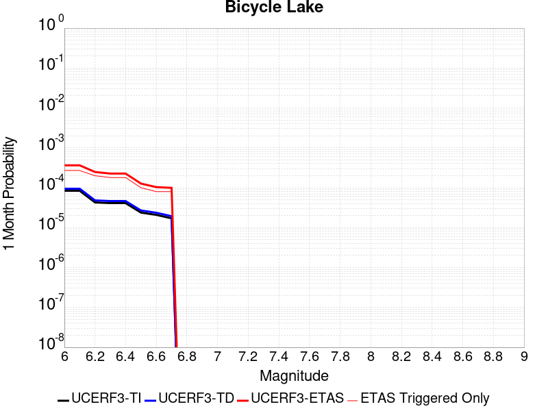 |  |  |

| Magnitude | 1 wk TI Prob | 1 wk TD Prob | 1 wk ETAS Prob | 1 wk ETAS/TD Gain | 1 wk ETAS Triggered Only | 1 mo TI Prob | 1 mo TD Prob | 1 mo ETAS Prob | 1 mo ETAS/TD Gain | 1 mo ETAS Triggered Only | 1 yr TI Prob | 1 yr TD Prob | 1 yr ETAS Prob | 1 yr ETAS/TD Gain | 1 yr ETAS Triggered Only | 10 yr TI Prob | 10 yr TD Prob | 10 yr ETAS Prob | 10 yr ETAS/TD Gain | 10 yr ETAS Triggered Only |
|-----|-----|-----|-----|-----|-----|-----|-----|-----|-----|-----|-----|-----|-----|-----|-----|-----|-----|-----|-----|-----|
| 6.0 | 1.9621975E-5 | 2.2097078E-5 | 2.9606363E-4 | 13.398315 | 2.739726E-4 | 8.4091465E-5 | 9.4699084E-5 | 3.6864573E-4 | 3.892812 | 2.739726E-4 | 0.0010233327 | 0.0011524865 | 0.0015629719 | 1.3561736 | 4.109589E-4 | 0.01018633 | 0.011478408 | 0.011884649 | 1.0353918 | 4.109589E-4 |
| 6.1 | 1.9621975E-5 | 2.2097078E-5 | 2.9606363E-4 | 13.398315 | 2.739726E-4 | 8.4091465E-5 | 9.4699084E-5 | 3.6864573E-4 | 3.892812 | 2.739726E-4 | 0.0010233327 | 0.0011524865 | 0.0015629719 | 1.3561736 | 4.109589E-4 | 0.01018633 | 0.011478408 | 0.011884649 | 1.0353918 | 4.109589E-4 |
| 6.2 | 9.9971285E-6 | 1.1255639E-5 | 2.8522516E-4 | 25.340645 | 2.739726E-4 | 4.2844134E-5 | 4.8237856E-5 | 3.2219724E-4 | 6.679344 | 2.739726E-4 | 5.2150246E-4 | 5.871896E-4 | 9.979072E-4 | 1.6994632 | 4.109589E-4 | 0.0052028033 | 0.005861487 | 0.0062700366 | 1.0697007 | 4.109589E-4 |
| 6.3 | 9.589428E-6 | 1.0798346E-5 | 2.84768E-4 | 26.371445 | 2.739726E-4 | 4.10969E-5 | 4.62781E-5 | 3.2023803E-4 | 6.9198613 | 2.739726E-4 | 5.002399E-4 | 5.6334207E-4 | 9.7406947E-4 | 1.7290906 | 4.109589E-4 | 0.0049911533 | 0.0056242296 | 0.006032877 | 1.0726584 | 4.109589E-4 |
| 6.4 | 9.589428E-6 | 1.0798346E-5 | 2.84768E-4 | 26.371445 | 2.739726E-4 | 4.10969E-5 | 4.62781E-5 | 3.2023803E-4 | 6.9198613 | 2.739726E-4 | 5.002399E-4 | 5.6334207E-4 | 9.7406947E-4 | 1.7290906 | 4.109589E-4 | 0.0049911533 | 0.0056242296 | 0.006032877 | 1.0726584 | 4.109589E-4 |
| 6.5 | 5.557707E-6 | 6.2856016E-6 | 1.4327104E-4 | 22.79353 | 1.369863E-4 | 2.3818526E-5 | 2.6938165E-5 | 1.6392078E-4 | 6.085076 | 1.369863E-4 | 2.8995197E-4 | 3.2794967E-4 | 4.6489105E-4 | 1.4175682 | 1.369863E-4 | 0.0028957394 | 0.0032772934 | 0.003413831 | 1.0416616 | 1.369863E-4 |
| 6.6 | 4.8742945E-6 | 5.5132896E-6 | 1.4249883E-4 | 25.846426 | 1.369863E-4 | 2.0889667E-5 | 2.3628318E-5 | 1.6061138E-4 | 6.7974105 | 1.369863E-4 | 2.54302E-4 | 2.87663E-4 | 4.246099E-4 | 1.4760671 | 1.369863E-4 | 0.002540112 | 0.0028754752 | 0.0030120676 | 1.0475025 | 1.369863E-4 |
| 6.7 | 3.991108E-6 | 4.5159104E-6 | 1.4150159E-4 | 31.334013 | 1.369863E-4 | 1.7104636E-5 | 1.9353902E-5 | 1.5633756E-4 | 8.077831 | 1.369863E-4 | 2.0822904E-4 | 2.3563375E-4 | 3.7258776E-4 | 1.5812156 | 1.369863E-4 | 0.0020803404 | 0.0023563374 | 0.002493001 | 1.0579983 | 1.369863E-4 |

## San Jacinto (San Bernardino)
*[(top)](#table-of-contents)*

| 1 Week | 1 Month | 1 Year | 10 Year |
|-----|-----|-----|-----|
|  |  |  |  |

| Magnitude | 1 wk TI Prob | 1 wk TD Prob | 1 wk ETAS Prob | 1 wk ETAS/TD Gain | 1 wk ETAS Triggered Only | 1 mo TI Prob | 1 mo TD Prob | 1 mo ETAS Prob | 1 mo ETAS/TD Gain | 1 mo ETAS Triggered Only | 1 yr TI Prob | 1 yr TD Prob | 1 yr ETAS Prob | 1 yr ETAS/TD Gain | 1 yr ETAS Triggered Only | 10 yr TI Prob | 10 yr TD Prob | 10 yr ETAS Prob | 10 yr ETAS/TD Gain | 10 yr ETAS Triggered Only |
|-----|-----|-----|-----|-----|-----|-----|-----|-----|-----|-----|-----|-----|-----|-----|-----|-----|-----|-----|-----|-----|
| 6.0 | 3.409352E-5 | 3.5986508E-5 | 3.0994925E-4 | 8.612929 | 2.739726E-4 | 1.461069E-4 | 1.542188E-4 | 5.651143E-4 | 3.6643674 | 4.109589E-4 | 0.0017774 | 0.0018759987 | 0.0022861867 | 1.2186505 | 4.109589E-4 | 0.01763251 | 0.019349935 | 0.019752942 | 1.0208273 | 4.109589E-4 |
| 6.1 | 3.409352E-5 | 3.5986508E-5 | 3.0994925E-4 | 8.612929 | 2.739726E-4 | 1.461069E-4 | 1.542188E-4 | 5.651143E-4 | 3.6643674 | 4.109589E-4 | 0.0017774 | 0.0018759987 | 0.0022861867 | 1.2186505 | 4.109589E-4 | 0.01763251 | 0.019349935 | 0.019752942 | 1.0208273 | 4.109589E-4 |
| 6.2 | 3.409352E-5 | 3.5986508E-5 | 3.0994925E-4 | 8.612929 | 2.739726E-4 | 1.461069E-4 | 1.542188E-4 | 5.651143E-4 | 3.6643674 | 4.109589E-4 | 0.0017774 | 0.0018759987 | 0.0022861867 | 1.2186505 | 4.109589E-4 | 0.01763251 | 0.019349935 | 0.019752942 | 1.0208273 | 4.109589E-4 |
| 6.3 | 3.409352E-5 | 3.5986508E-5 | 3.0994925E-4 | 8.612929 | 2.739726E-4 | 1.461069E-4 | 1.542188E-4 | 5.651143E-4 | 3.6643674 | 4.109589E-4 | 0.0017774 | 0.0018759987 | 0.0022861867 | 1.2186505 | 4.109589E-4 | 0.01763251 | 0.019349935 | 0.019752942 | 1.0208273 | 4.109589E-4 |
| 6.4 | 3.400795E-5 | 3.5879173E-5 | 3.0984194E-4 | 8.635705 | 2.739726E-4 | 1.4574021E-4 | 1.5375883E-4 | 5.6465453E-4 | 3.672339 | 4.109589E-4 | 0.0017729428 | 0.0018704084 | 0.0022805987 | 1.2193052 | 4.109589E-4 | 0.017588645 | 0.019295016 | 0.019698046 | 1.0208877 | 4.109589E-4 |
| 6.5 | 3.341482E-5 | 3.5139812E-5 | 3.091028E-4 | 8.7963705 | 2.739726E-4 | 1.4319851E-4 | 1.5059051E-4 | 5.614875E-4 | 3.728572 | 4.109589E-4 | 0.0017420477 | 0.0018318989 | 0.002242105 | 1.2239239 | 4.109589E-4 | 0.017284546 | 0.018916558 | 0.019319743 | 1.0213139 | 4.109589E-4 |
| 6.6 | 3.3364955E-5 | 3.5077028E-5 | 3.0904E-4 | 8.810325 | 2.739726E-4 | 1.4298483E-4 | 1.5032147E-4 | 5.612186E-4 | 3.733456 | 4.109589E-4 | 0.0017394501 | 0.001828629 | 0.0022388364 | 1.2243251 | 4.109589E-4 | 0.017258976 | 0.018884424 | 0.019287622 | 1.0213509 | 4.109589E-4 |
| 6.7 | 3.335922E-5 | 3.5066805E-5 | 3.090298E-4 | 8.812602 | 2.739726E-4 | 1.4296026E-4 | 1.5027766E-4 | 5.611748E-4 | 3.7342532 | 4.109589E-4 | 0.0017391514 | 0.0018280965 | 0.0022383041 | 1.2243906 | 4.109589E-4 | 0.017256035 | 0.018879214 | 0.019282416 | 1.0213568 | 4.109589E-4 |
| 6.8 | 3.327683E-5 | 3.496087E-5 | 3.089239E-4 | 8.836276 | 2.739726E-4 | 1.4260718E-4 | 1.498237E-4 | 5.6072103E-4 | 3.742539 | 4.109589E-4 | 0.0017348597 | 0.0018225788 | 0.0022327888 | 1.2250712 | 4.109589E-4 | 0.017213784 | 0.018824987 | 0.019228209 | 1.0214195 | 4.109589E-4 |
| 6.9 | 3.3235785E-5 | 3.4901823E-5 | 3.0886487E-4 | 8.849534 | 2.739726E-4 | 1.4243131E-4 | 1.4957068E-4 | 5.604681E-4 | 3.747179 | 4.109589E-4 | 0.0017327217 | 0.0018195034 | 0.0022297145 | 1.2254523 | 4.109589E-4 | 0.017192734 | 0.018794855 | 0.01919809 | 1.0214546 | 4.109589E-4 |
| 7.0 | 3.3197095E-5 | 3.4841752E-5 | 3.0880483E-4 | 8.863068 | 2.739726E-4 | 1.422655E-4 | 1.4931326E-4 | 5.602108E-4 | 3.751916 | 4.109589E-4 | 0.0017307063 | 0.0018163746 | 0.0022265872 | 1.2258413 | 4.109589E-4 | 0.017172894 | 0.018764233 | 0.019167481 | 1.0214902 | 4.109589E-4 |
| 7.1 | 3.3129716E-5 | 3.4721965E-5 | 3.0868506E-4 | 8.890196 | 2.739726E-4 | 1.4197677E-4 | 1.4879994E-4 | 5.596977E-4 | 3.7614107 | 4.109589E-4 | 0.0017271966 | 0.0018101353 | 0.0022203503 | 1.2266212 | 4.109589E-4 | 0.017138338 | 0.018703312 | 0.019106586 | 1.0215615 | 4.109589E-4 |
| 7.2 | 3.3034008E-5 | 3.458941E-5 | 3.0855252E-4 | 8.920433 | 2.739726E-4 | 1.4156665E-4 | 1.4823192E-4 | 5.591299E-4 | 3.7719939 | 4.109589E-4 | 0.0017222111 | 0.0018032312 | 0.002213449 | 1.2274904 | 4.109589E-4 | 0.017089253 | 0.018635705 | 0.019039005 | 1.0216413 | 4.109589E-4 |
| 7.3 | 3.2956614E-5 | 3.445717E-5 | 3.0842033E-4 | 8.950831 | 2.739726E-4 | 1.4123498E-4 | 1.4766524E-4 | 5.5856345E-4 | 3.7826335 | 4.109589E-4 | 0.0017181796 | 0.0017963431 | 0.0022065637 | 1.2283643 | 4.109589E-4 | 0.017049557 | 0.018568452 | 0.01897178 | 1.0217211 | 4.109589E-4 |
| 7.4 | 3.2915937E-5 | 3.4378863E-5 | 3.0834205E-4 | 8.968942 | 2.739726E-4 | 1.4106068E-4 | 1.4732967E-4 | 5.5822806E-4 | 3.7889721 | 4.109589E-4 | 0.0017160608 | 0.0017922645 | 0.0022024869 | 1.2288849 | 4.109589E-4 | 0.017028693 | 0.018528719 | 0.018932063 | 1.0217686 | 4.109589E-4 |
| 7.5 | 3.281791E-5 | 3.4243778E-5 | 3.08207E-4 | 9.00038 | 2.739726E-4 | 1.406406E-4 | 1.4675081E-4 | 5.576494E-4 | 3.7999752 | 4.109589E-4 | 0.0017109542 | 0.0017852283 | 0.0021954535 | 1.2297887 | 4.109589E-4 | 0.016978411 | 0.018459605 | 0.018862978 | 1.0218517 | 4.109589E-4 |
| 7.6 | 3.2521442E-5 | 3.396873E-5 | 3.0793203E-4 | 9.065162 | 2.739726E-4 | 1.3937015E-4 | 1.4557215E-4 | 5.5647123E-4 | 3.8226488 | 4.109589E-4 | 0.0016955109 | 0.0017709016 | 0.0021811328 | 1.231651 | 4.109589E-4 | 0.016826328 | 0.018317232 | 0.018720664 | 1.0220246 | 4.109589E-4 |
| 7.7 | 3.0287873E-5 | 3.245276E-5 | 3.0641648E-4 | 9.441923 | 2.739726E-4 | 1.297987E-4 | 1.3907586E-4 | 5.499776E-4 | 3.9545152 | 4.109589E-4 | 0.0015791537 | 0.0016919347 | 0.0021021983 | 1.242482 | 4.109589E-4 | 0.01567979 | 0.01752809 | 0.017931847 | 1.0230348 | 4.109589E-4 |
| 7.8 | 2.6316151E-5 | 2.9663592E-5 | 3.0362807E-4 | 10.235715 | 2.739726E-4 | 1.1277862E-4 | 1.2712348E-4 | 5.380302E-4 | 4.2323427 | 4.109589E-4 | 0.0013722149 | 0.0015466306 | 0.001956954 | 1.2653015 | 4.109589E-4 | 0.013637724 | 0.016069634 | 0.016473988 | 1.0251627 | 4.109589E-4 |
| 7.9 | 2.0761147E-5 | 2.34181E-5 | 2.9738428E-4 | 12.698907 | 2.739726E-4 | 8.897331E-5 | 1.0035944E-4 | 5.112771E-4 | 5.0944595 | 4.109589E-4 | 0.0010827117 | 0.0012211921 | 0.0016316491 | 1.3361118 | 4.109589E-4 | 0.010774517 | 0.012793174 | 0.013198876 | 1.0317123 | 4.109589E-4 |
| 8.0 | 1.5738568E-5 | 1.6033575E-5 | 1.5301768E-4 | 9.543578 | 1.369863E-4 | 6.744926E-5 | 6.871352E-5 | 2.056904E-4 | 2.993449 | 1.369863E-4 | 8.2088535E-4 | 8.3626667E-4 | 9.731384E-4 | 1.16367 | 1.369863E-4 | 0.008178596 | 0.008865921 | 0.009001693 | 1.0153139 | 1.369863E-4 |
| 8.1 | 1.0105832E-5 | 8.3304985E-6 | 1.4531566E-4 | 17.443813 | 1.369863E-4 | 4.3309992E-5 | 3.570165E-5 | 1.7268307E-4 | 4.836837 | 1.369863E-4 | 5.2717153E-4 | 4.345814E-4 | 5.715082E-4 | 1.3150774 | 1.369863E-4 | 0.005259227 | 0.004677232 | 0.0048135775 | 1.029151 | 1.369863E-4 |
| 8.2 | 4.189207E-6 | 1.5784357E-6 | 1.5784357E-6 | 1.0 | 0.0 | 1.7953622E-5 | 6.7647065E-6 | 6.7647065E-6 | 1.0 | 0.0 | 2.1856341E-4 | 8.235722E-5 | 8.235722E-5 | 1.0 | 0.0 | 0.0021834858 | 9.565867E-4 | 9.565867E-4 | 1.0 | 0.0 |
| 8.3 | 1.2758221E-6 | 3.6149942E-7 | 3.6149942E-7 | 1.0 | 0.0 | 5.4677976E-6 | 1.5492824E-6 | 1.5492824E-6 | 1.0 | 0.0 | 6.65684E-5 | 1.8862354E-5 | 1.8862354E-5 | 1.0 | 0.0 | 6.6548464E-4 | 2.2751294E-4 | 2.2751294E-4 | 1.0 | 0.0 |

## Helendale-So Lockhart
*[(top)](#table-of-contents)*

| 1 Week | 1 Month | 1 Year | 10 Year |
|-----|-----|-----|-----|
|  |  |  |  |

| Magnitude | 1 wk TI Prob | 1 wk TD Prob | 1 wk ETAS Prob | 1 wk ETAS/TD Gain | 1 wk ETAS Triggered Only | 1 mo TI Prob | 1 mo TD Prob | 1 mo ETAS Prob | 1 mo ETAS/TD Gain | 1 mo ETAS Triggered Only | 1 yr TI Prob | 1 yr TD Prob | 1 yr ETAS Prob | 1 yr ETAS/TD Gain | 1 yr ETAS Triggered Only | 10 yr TI Prob | 10 yr TD Prob | 10 yr ETAS Prob | 10 yr ETAS/TD Gain | 10 yr ETAS Triggered Only |
|-----|-----|-----|-----|-----|-----|-----|-----|-----|-----|-----|-----|-----|-----|-----|-----|-----|-----|-----|-----|-----|
| 6.0 | 1.7296055E-5 | 1.8103729E-5 | 4.290552E-4 | 23.699823 | 4.109589E-4 | 7.412385E-5 | 7.7585224E-5 | 4.885122E-4 | 6.29646 | 4.109589E-4 | 9.0208417E-4 | 9.4421144E-4 | 0.0013547823 | 1.4348294 | 4.109589E-4 | 0.008984311 | 0.009404116 | 0.00981121 | 1.043289 | 4.109589E-4 |
| 6.1 | 1.7296055E-5 | 1.8103729E-5 | 4.290552E-4 | 23.699823 | 4.109589E-4 | 7.412385E-5 | 7.7585224E-5 | 4.885122E-4 | 6.29646 | 4.109589E-4 | 9.0208417E-4 | 9.4421144E-4 | 0.0013547823 | 1.4348294 | 4.109589E-4 | 0.008984311 | 0.009404116 | 0.00981121 | 1.043289 | 4.109589E-4 |
| 6.2 | 1.7296055E-5 | 1.8103729E-5 | 4.290552E-4 | 23.699823 | 4.109589E-4 | 7.412385E-5 | 7.7585224E-5 | 4.885122E-4 | 6.29646 | 4.109589E-4 | 9.0208417E-4 | 9.4421144E-4 | 0.0013547823 | 1.4348294 | 4.109589E-4 | 0.008984311 | 0.009404116 | 0.00981121 | 1.043289 | 4.109589E-4 |
| 6.3 | 1.0669118E-5 | 1.1135425E-5 | 2.8510496E-4 | 25.603422 | 2.739726E-4 | 4.5723988E-5 | 4.772239E-5 | 3.2168193E-4 | 6.7406917 | 2.739726E-4 | 5.5654737E-4 | 5.80868E-4 | 8.546815E-4 | 1.4713867 | 2.739726E-4 | 0.0055515557 | 0.0057937936 | 0.006066179 | 1.0470133 | 2.739726E-4 |
| 6.4 | 1.0669118E-5 | 1.1135425E-5 | 2.8510496E-4 | 25.603422 | 2.739726E-4 | 4.5723988E-5 | 4.772239E-5 | 3.2168193E-4 | 6.7406917 | 2.739726E-4 | 5.5654737E-4 | 5.80868E-4 | 8.546815E-4 | 1.4713867 | 2.739726E-4 | 0.0055515557 | 0.0057937936 | 0.006066179 | 1.0470133 | 2.739726E-4 |
| 6.5 | 8.790038E-6 | 9.170197E-6 | 2.8314028E-4 | 30.87614 | 2.739726E-4 | 3.767105E-5 | 3.930026E-5 | 3.132621E-4 | 7.970993 | 2.739726E-4 | 4.585485E-4 | 4.7837716E-4 | 7.522187E-4 | 1.5724386 | 2.739726E-4 | 0.0045760344 | 0.004773638 | 0.005046303 | 1.0571189 | 2.739726E-4 |
| 6.6 | 7.396949E-6 | 7.715537E-6 | 1.4470078E-4 | 18.754467 | 1.369863E-4 | 3.1700827E-5 | 3.3066175E-5 | 1.7004795E-4 | 5.142656 | 1.369863E-4 | 3.858892E-4 | 4.025073E-4 | 5.3943845E-4 | 1.3401954 | 1.369863E-4 | 0.003852198 | 0.00401789 | 0.0041543255 | 1.0339571 | 1.369863E-4 |
| 6.7 | 6.4600285E-6 | 6.738031E-6 | 1.437234E-4 | 21.33018 | 1.369863E-4 | 2.7685543E-5 | 2.887696E-5 | 1.6585931E-4 | 5.743655 | 1.369863E-4 | 3.3701936E-4 | 3.5152107E-4 | 4.884592E-4 | 1.3895589 | 1.369863E-4 | 0.0033650869 | 0.003509732 | 0.0036462375 | 1.0388935 | 1.369863E-4 |
| 6.8 | 5.600104E-6 | 5.836009E-6 | 1.4282152E-4 | 24.472462 | 1.369863E-4 | 2.4000226E-5 | 2.5011232E-5 | 1.619941E-4 | 6.4768543 | 1.369863E-4 | 2.9216358E-4 | 3.044698E-4 | 4.414144E-4 | 1.4497806 | 1.369863E-4 | 0.0029177975 | 0.003040588 | 0.0031771578 | 1.0449156 | 1.369863E-4 |
| 6.9 | 4.839122E-6 | 5.0395092E-6 | 1.4202512E-4 | 28.182331 | 1.369863E-4 | 2.0738931E-5 | 2.159772E-5 | 1.5858107E-4 | 7.3424907 | 1.369863E-4 | 2.5246723E-4 | 2.6292098E-4 | 3.9987126E-4 | 1.52088 | 1.369863E-4 | 0.002521806 | 0.002626147 | 0.0027627733 | 1.0520254 | 1.369863E-4 |
| 7.0 | 3.6937633E-6 | 3.845208E-6 | 1.4083098E-4 | 36.62506 | 1.369863E-4 | 1.5830317E-5 | 1.647936E-5 | 1.534634E-4 | 9.312461 | 1.369863E-4 | 1.9271708E-4 | 2.0061806E-4 | 3.3757687E-4 | 1.6826844 | 1.369863E-4 | 0.0019255003 | 0.002004401 | 0.0021411127 | 1.0682058 | 1.369863E-4 |
| 7.1 | 2.7858857E-6 | 2.8978538E-6 | 1.3988376E-4 | 48.271503 | 1.369863E-4 | 1.1939455E-5 | 1.2419316E-5 | 1.4940392E-4 | 12.0299635 | 1.369863E-4 | 1.4535317E-4 | 1.511949E-4 | 2.881605E-4 | 1.9058877 | 1.369863E-4 | 0.0014525814 | 0.0015109418 | 0.001647721 | 1.0905259 | 1.369863E-4 |
| 7.2 | 2.1672065E-6 | 2.2540128E-6 | 1.3924E-4 | 61.774273 | 1.369863E-4 | 9.2879945E-6 | 9.66002E-6 | 1.46645E-4 | 15.18061 | 1.369863E-4 | 1.1307546E-4 | 1.1760458E-4 | 2.5457478E-4 | 2.1646671 | 1.369863E-4 | 0.0011301794 | 0.0011754417 | 0.0013122669 | 1.1164033 | 1.369863E-4 |
| 7.3 | 1.4823496E-6 | 1.5422102E-6 | 1.5422102E-6 | 1.0 | 0.0 | 6.3529114E-6 | 6.6094562E-6 | 6.6094562E-6 | 1.0 | 0.0 | 7.734395E-5 | 8.046731E-5 | 8.046731E-5 | 1.0 | 0.0 | 7.731704E-4 | 8.0439687E-4 | 8.0439687E-4 | 1.0 | 0.0 |
| 7.4 | 4.2321457E-7 | 4.4108765E-7 | 4.4108765E-7 | 1.0 | 0.0 | 1.8137755E-6 | 1.8903745E-6 | 1.8903745E-6 | 1.0 | 0.0 | 2.2082493E-5 | 2.3015113E-5 | 2.3015113E-5 | 1.0 | 0.0 | 2.2080299E-4 | 2.3013182E-4 | 2.3013182E-4 | 1.0 | 0.0 |
| 7.5 | 5.6942316E-8 | 5.9415648E-8 | 5.9415648E-8 | 1.0 | 0.0 | 2.440385E-7 | 2.5463845E-7 | 2.5463845E-7 | 1.0 | 0.0 | 2.9711643E-6 | 3.1002196E-6 | 3.1002196E-6 | 1.0 | 0.0 | 2.9711247E-5 | 3.1001844E-5 | 3.1001844E-5 | 1.0 | 0.0 |

## Sierra Nevada  (No Extension)
*[(top)](#table-of-contents)*

| 1 Week | 1 Month | 1 Year | 10 Year |
|-----|-----|-----|-----|
|  |  |  |  |

| Magnitude | 1 wk TI Prob | 1 wk TD Prob | 1 wk ETAS Prob | 1 wk ETAS/TD Gain | 1 wk ETAS Triggered Only | 1 mo TI Prob | 1 mo TD Prob | 1 mo ETAS Prob | 1 mo ETAS/TD Gain | 1 mo ETAS Triggered Only | 1 yr TI Prob | 1 yr TD Prob | 1 yr ETAS Prob | 1 yr ETAS/TD Gain | 1 yr ETAS Triggered Only | 10 yr TI Prob | 10 yr TD Prob | 10 yr ETAS Prob | 10 yr ETAS/TD Gain | 10 yr ETAS Triggered Only |
|-----|-----|-----|-----|-----|-----|-----|-----|-----|-----|-----|-----|-----|-----|-----|-----|-----|-----|-----|-----|-----|
| 6.0 | 7.7690465E-6 | 6.976322E-6 | 2.8094702E-4 | 40.27151 | 2.739726E-4 | 3.329549E-5 | 2.9898381E-5 | 4.40845E-4 | 14.744779 | 4.109589E-4 | 4.0529718E-4 | 3.6398784E-4 | 7.7479717E-4 | 2.1286347 | 4.109589E-4 | 0.004045588 | 0.0036374326 | 0.004046897 | 1.1125696 | 4.109589E-4 |
| 6.1 | 7.7690465E-6 | 6.976322E-6 | 2.8094702E-4 | 40.27151 | 2.739726E-4 | 3.329549E-5 | 2.9898381E-5 | 4.40845E-4 | 14.744779 | 4.109589E-4 | 4.0529718E-4 | 3.6398784E-4 | 7.7479717E-4 | 2.1286347 | 4.109589E-4 | 0.004045588 | 0.0036374326 | 0.004046897 | 1.1125696 | 4.109589E-4 |
| 6.2 | 7.7690465E-6 | 6.976322E-6 | 2.8094702E-4 | 40.27151 | 2.739726E-4 | 3.329549E-5 | 2.9898381E-5 | 4.40845E-4 | 14.744779 | 4.109589E-4 | 4.0529718E-4 | 3.6398784E-4 | 7.7479717E-4 | 2.1286347 | 4.109589E-4 | 0.004045588 | 0.0036374326 | 0.004046897 | 1.1125696 | 4.109589E-4 |
| 6.3 | 7.7690465E-6 | 6.976322E-6 | 2.8094702E-4 | 40.27151 | 2.739726E-4 | 3.329549E-5 | 2.9898381E-5 | 4.40845E-4 | 14.744779 | 4.109589E-4 | 4.0529718E-4 | 3.6398784E-4 | 7.7479717E-4 | 2.1286347 | 4.109589E-4 | 0.004045588 | 0.0036374326 | 0.004046897 | 1.1125696 | 4.109589E-4 |
| 6.4 | 7.7690465E-6 | 6.976322E-6 | 2.8094702E-4 | 40.27151 | 2.739726E-4 | 3.329549E-5 | 2.9898381E-5 | 4.40845E-4 | 14.744779 | 4.109589E-4 | 4.0529718E-4 | 3.6398784E-4 | 7.7479717E-4 | 2.1286347 | 4.109589E-4 | 0.004045588 | 0.0036374326 | 0.004046897 | 1.1125696 | 4.109589E-4 |
| 6.5 | 7.7690465E-6 | 6.976322E-6 | 2.8094702E-4 | 40.27151 | 2.739726E-4 | 3.329549E-5 | 2.9898381E-5 | 4.40845E-4 | 14.744779 | 4.109589E-4 | 4.0529718E-4 | 3.6398784E-4 | 7.7479717E-4 | 2.1286347 | 4.109589E-4 | 0.004045588 | 0.0036374326 | 0.004046897 | 1.1125696 | 4.109589E-4 |
| 6.6 | 2.653E-6 | 1.614854E-6 | 2.7558702E-4 | 170.65755 | 2.739726E-4 | 1.136995E-5 | 6.9207845E-6 | 4.1787684E-4 | 60.379982 | 4.109589E-4 | 1.3842035E-4 | 8.425733E-5 | 4.951816E-4 | 5.877015 | 4.109589E-4 | 0.0013833415 | 8.422573E-4 | 0.0012528701 | 1.4875146 | 4.109589E-4 |
| 6.7 | 2.5902466E-6 | 1.5501876E-6 | 2.7552235E-4 | 177.73486 | 2.739726E-4 | 1.11010095E-5 | 6.643644E-6 | 4.175998E-4 | 62.857044 | 4.109589E-4 | 1.351464E-4 | 8.0883394E-5 | 4.9180904E-4 | 6.08047 | 4.109589E-4 | 0.0013506424 | 8.0854254E-4 | 0.0012191691 | 1.5078603 | 4.109589E-4 |
| 6.8 | 2.5853892E-6 | 1.5469877E-6 | 2.7551915E-4 | 178.10042 | 2.739726E-4 | 1.1080193E-5 | 6.629931E-6 | 4.175861E-4 | 62.98499 | 4.109589E-4 | 1.34893E-4 | 8.071645E-5 | 4.9164216E-4 | 6.090979 | 4.109589E-4 | 0.0013481114 | 8.068743E-4 | 0.0012175016 | 1.5089111 | 4.109589E-4 |
| 6.9 | 2.458257E-6 | 1.4220619E-6 | 2.7539427E-4 | 193.65842 | 2.739726E-4 | 1.0535345E-5 | 6.094537E-6 | 4.1705093E-4 | 68.43029 | 4.109589E-4 | 1.2826028E-4 | 7.4198484E-5 | 4.851269E-4 | 6.538232 | 4.109589E-4 | 0.0012818627 | 7.4173906E-4 | 0.0011523932 | 1.5536369 | 4.109589E-4 |
| 7.0 | 2.4341468E-6 | 1.3990258E-6 | 2.7537125E-4 | 196.8307 | 2.739726E-4 | 1.0432016E-5 | 5.9958115E-6 | 4.1695224E-4 | 69.54059 | 4.109589E-4 | 1.270024E-4 | 7.2996576E-5 | 4.8392548E-4 | 6.629427 | 4.109589E-4 | 0.0012692984 | 7.297279E-4 | 0.0011403869 | 1.5627563 | 4.109589E-4 |
| 7.1 | 2.3652476E-6 | 1.3339754E-6 | 2.753062E-4 | 206.38026 | 2.739726E-4 | 1.0136736E-5 | 5.717025E-6 | 4.1667357E-4 | 72.882935 | 4.109589E-4 | 1.2340778E-4 | 6.9602575E-5 | 4.8053288E-4 | 6.9039526 | 4.109589E-4 | 0.0012333926 | 6.9580943E-4 | 0.0011064825 | 1.5902089 | 4.109589E-4 |
| 7.2 | 2.272158E-6 | 1.2502821E-6 | 2.7522256E-4 | 220.12834 | 2.739726E-4 | 9.737784E-6 | 5.3583412E-6 | 4.1631504E-4 | 77.69476 | 4.109589E-4 | 1.1855107E-4 | 6.5235865E-5 | 4.7616797E-4 | 7.2991743 | 4.109589E-4 | 0.0011848784 | 6.5216864E-4 | 0.0010628595 | 1.629731 | 4.109589E-4 |
| 7.3 | 2.1382127E-6 | 1.1419703E-6 | 2.7511426E-4 | 240.91193 | 2.739726E-4 | 9.163737E-6 | 4.8941492E-6 | 4.1585104E-4 | 84.96902 | 4.109589E-4 | 1.1156279E-4 | 5.958465E-5 | 4.7051907E-4 | 7.8966494 | 4.109589E-4 | 0.001115068 | 5.956879E-4 | 0.001006402 | 1.6894786 | 4.109589E-4 |
| 7.4 | 1.9048055E-6 | 9.575242E-7 | 2.7492986E-4 | 287.12576 | 2.739726E-4 | 8.163426E-6 | 4.1036687E-6 | 4.1506087E-4 | 101.14385 | 4.109589E-4 | 9.9385186E-5 | 4.996103E-5 | 4.608994E-4 | 9.225178 | 4.109589E-4 | 9.934074E-4 | 4.994987E-4 | 9.1025233E-4 | 1.8223318 | 4.109589E-4 |
| 7.5 | 1.5373403E-6 | 7.560042E-7 | 1.377422E-4 | 182.19766 | 1.369863E-4 | 6.5885843E-6 | 3.2400142E-6 | 2.7721172E-4 | 85.5588 | 2.739726E-4 | 8.021306E-5 | 3.9446462E-5 | 3.1340827E-4 | 7.9451547 | 2.739726E-4 | 8.0184115E-4 | 3.943951E-4 | 6.682596E-4 | 1.6943914 | 2.739726E-4 |
| 7.6 | 1.0680322E-6 | 4.6596554E-7 | 1.374522E-4 | 294.9836 | 1.369863E-4 | 4.577273E-6 | 1.9969937E-6 | 2.7596904E-4 | 138.19225 | 2.739726E-4 | 5.5726876E-5 | 2.4313129E-5 | 2.9827908E-4 | 12.26823 | 2.739726E-4 | 5.5712904E-4 | 2.4310495E-4 | 5.17011E-4 | 2.1266985 | 2.739726E-4 |
| 7.7 | 5.509146E-7 | 1.5580486E-7 | 1.5580486E-7 | 1.0 | 0.0 | 2.3610605E-6 | 6.677349E-7 | 6.677349E-7 | 1.0 | 0.0 | 2.8745531E-5 | 8.129644E-6 | 8.129644E-6 | 1.0 | 0.0 | 2.8741814E-4 | 8.1293576E-5 | 8.1293576E-5 | 1.0 | 0.0 |

## Death Valley (Black Mtns Frontal)
*[(top)](#table-of-contents)*

| 1 Week | 1 Month | 1 Year | 10 Year |
|-----|-----|-----|-----|
|  |  |  |  |

| Magnitude | 1 wk TI Prob | 1 wk TD Prob | 1 wk ETAS Prob | 1 wk ETAS/TD Gain | 1 wk ETAS Triggered Only | 1 mo TI Prob | 1 mo TD Prob | 1 mo ETAS Prob | 1 mo ETAS/TD Gain | 1 mo ETAS Triggered Only | 1 yr TI Prob | 1 yr TD Prob | 1 yr ETAS Prob | 1 yr ETAS/TD Gain | 1 yr ETAS Triggered Only | 10 yr TI Prob | 10 yr TD Prob | 10 yr ETAS Prob | 10 yr ETAS/TD Gain | 10 yr ETAS Triggered Only |
|-----|-----|-----|-----|-----|-----|-----|-----|-----|-----|-----|-----|-----|-----|-----|-----|-----|-----|-----|-----|-----|
| 6.0 | 1.6707214E-5 | 1.867027E-5 | 4.296215E-4 | 23.010998 | 4.109589E-4 | 7.160038E-5 | 8.001302E-5 | 4.9093907E-4 | 6.135739 | 4.109589E-4 | 8.71386E-4 | 9.737309E-4 | 0.0013842896 | 1.4216347 | 4.109589E-4 | 0.00867977 | 0.009695496 | 0.010102471 | 1.0419756 | 4.109589E-4 |
| 6.1 | 1.6707214E-5 | 1.867027E-5 | 4.296215E-4 | 23.010998 | 4.109589E-4 | 7.160038E-5 | 8.001302E-5 | 4.9093907E-4 | 6.135739 | 4.109589E-4 | 8.71386E-4 | 9.737309E-4 | 0.0013842896 | 1.4216347 | 4.109589E-4 | 0.00867977 | 0.009695496 | 0.010102471 | 1.0419756 | 4.109589E-4 |
| 6.2 | 1.6707214E-5 | 1.867027E-5 | 4.296215E-4 | 23.010998 | 4.109589E-4 | 7.160038E-5 | 8.001302E-5 | 4.9093907E-4 | 6.135739 | 4.109589E-4 | 8.71386E-4 | 9.737309E-4 | 0.0013842896 | 1.4216347 | 4.109589E-4 | 0.00867977 | 0.009695496 | 0.010102471 | 1.0419756 | 4.109589E-4 |
| 6.3 | 1.6707214E-5 | 1.867027E-5 | 4.296215E-4 | 23.010998 | 4.109589E-4 | 7.160038E-5 | 8.001302E-5 | 4.9093907E-4 | 6.135739 | 4.109589E-4 | 8.71386E-4 | 9.737309E-4 | 0.0013842896 | 1.4216347 | 4.109589E-4 | 0.00867977 | 0.009695496 | 0.010102471 | 1.0419756 | 4.109589E-4 |
| 6.4 | 1.5515609E-5 | 1.7338214E-5 | 2.9130606E-4 | 16.80139 | 2.739726E-4 | 6.649377E-5 | 7.4304546E-5 | 3.4825678E-4 | 4.686884 | 2.739726E-4 | 8.0926094E-4 | 9.042885E-4 | 0.0011780134 | 1.3026963 | 2.739726E-4 | 0.008063202 | 0.009006773 | 0.009278278 | 1.0301446 | 2.739726E-4 |
| 6.5 | 1.5515609E-5 | 1.7338214E-5 | 2.9130606E-4 | 16.80139 | 2.739726E-4 | 6.649377E-5 | 7.4304546E-5 | 3.4825678E-4 | 4.686884 | 2.739726E-4 | 8.0926094E-4 | 9.042885E-4 | 0.0011780134 | 1.3026963 | 2.739726E-4 | 0.008063202 | 0.009006773 | 0.009278278 | 1.0301446 | 2.739726E-4 |
| 6.6 | 1.5041828E-5 | 1.6809145E-5 | 2.9077716E-4 | 17.298748 | 2.739726E-4 | 6.4463384E-5 | 7.203723E-5 | 3.459901E-4 | 4.802934 | 2.739726E-4 | 7.8455906E-4 | 8.767063E-4 | 0.0011504387 | 1.3122282 | 2.739726E-4 | 0.00781795 | 0.008733132 | 0.009004712 | 1.0310977 | 2.739726E-4 |
| 6.7 | 1.4634985E-5 | 1.6356016E-5 | 2.9032413E-4 | 17.750296 | 2.739726E-4 | 6.271985E-5 | 7.009536E-5 | 3.4404875E-4 | 4.9082956 | 2.739726E-4 | 7.6334673E-4 | 8.5308263E-4 | 0.0011268215 | 1.320882 | 2.739726E-4 | 0.007607299 | 0.008498715 | 0.00877036 | 1.031963 | 2.739726E-4 |
| 6.8 | 1.4209158E-5 | 1.5882048E-5 | 2.898503E-4 | 18.250185 | 2.739726E-4 | 6.089497E-5 | 6.8064175E-5 | 3.4201812E-4 | 5.024936 | 2.739726E-4 | 7.4114406E-4 | 8.2837185E-4 | 0.0011021175 | 1.3304622 | 2.739726E-4 | 0.007386771 | 0.008253456 | 0.008525168 | 1.032921 | 2.739726E-4 |
| 6.9 | 1.3780098E-5 | 1.5404594E-5 | 2.8937298E-4 | 18.784851 | 2.739726E-4 | 5.9056227E-5 | 6.6018045E-5 | 3.3997255E-4 | 5.1496916 | 2.739726E-4 | 7.1877235E-4 | 8.0347876E-4 | 0.0010772313 | 1.3407091 | 2.739726E-4 | 0.0071645193 | 0.008006332 | 0.008278112 | 1.0339456 | 2.739726E-4 |
| 7.0 | 1.3585064E-5 | 1.5188155E-5 | 1.5217238E-4 | 10.019148 | 1.369863E-4 | 5.8220405E-5 | 6.50905E-5 | 2.0206788E-4 | 3.1044145 | 1.369863E-4 | 7.086029E-4 | 7.9219416E-4 | 9.29072E-4 | 1.1727831 | 1.369863E-4 | 0.007063476 | 0.007894293 | 0.0080301985 | 1.0172156 | 1.369863E-4 |
| 7.1 | 1.3398601E-5 | 1.49813395E-5 | 1.5196559E-4 | 10.143659 | 1.369863E-4 | 5.742131E-5 | 6.420419E-5 | 2.011817E-4 | 3.1334667 | 1.369863E-4 | 6.9888023E-4 | 7.8141113E-4 | 9.182904E-4 | 1.1751693 | 1.369863E-4 | 0.0069668638 | 0.007787224 | 0.007923144 | 1.0174541 | 1.369863E-4 |
| 7.2 | 1.3126312E-5 | 1.4679561E-5 | 1.5166384E-4 | 10.3316345 | 1.369863E-4 | 5.6254412E-5 | 6.291092E-5 | 1.998886E-4 | 3.1773276 | 1.369863E-4 | 6.846822E-4 | 7.6567667E-4 | 9.025581E-4 | 1.1787719 | 1.369863E-4 | 0.006825765 | 0.00763097 | 0.007766911 | 1.0178144 | 1.369863E-4 |
| 7.3 | 1.2922429E-5 | 1.4453788E-5 | 1.5143811E-4 | 10.4774 | 1.369863E-4 | 5.5380664E-5 | 6.194336E-5 | 1.9892119E-4 | 3.2113395 | 1.369863E-4 | 6.74051E-4 | 7.53905E-4 | 8.90788E-4 | 1.1815654 | 1.369863E-4 | 0.006720101 | 0.007514055 | 0.0076500117 | 1.0180937 | 1.369863E-4 |
| 7.4 | 1.2768878E-5 | 1.4283772E-5 | 1.5126812E-4 | 10.590208 | 1.369863E-4 | 5.4722615E-5 | 6.1214756E-5 | 1.9819268E-4 | 3.2376616 | 1.369863E-4 | 6.660441E-4 | 7.4504025E-4 | 8.8192447E-4 | 1.1837273 | 1.369863E-4 | 0.0066405144 | 0.0074260035 | 0.0075619724 | 1.0183098 | 1.369863E-4 |
| 7.5 | 1.2521929E-5 | 1.40120155E-5 | 1.5099639E-4 | 10.776209 | 1.369863E-4 | 5.366431E-5 | 6.005014E-5 | 1.9702822E-4 | 3.2810616 | 1.369863E-4 | 6.531671E-4 | 7.3087064E-4 | 8.6775684E-4 | 1.187292 | 1.369863E-4 | 0.006512506 | 0.0072852457 | 0.007421234 | 1.0186663 | 1.369863E-4 |
| 7.6 | 1.1301089E-5 | 1.2648149E-5 | 1.4963272E-4 | 11.830404 | 1.369863E-4 | 4.8432343E-5 | 5.4205255E-5 | 1.9118412E-4 | 3.5270405 | 1.369863E-4 | 5.895042E-4 | 6.5975444E-4 | 7.9665036E-4 | 1.2074952 | 1.369863E-4 | 0.0058794282 | 0.00657851 | 0.0067145955 | 1.0206863 | 1.369863E-4 |
| 7.7 | 9.189108E-6 | 1.0283358E-5 | 1.4726825E-4 | 14.321027 | 1.369863E-4 | 3.93813E-5 | 4.407082E-5 | 1.8105109E-4 | 4.1081853 | 1.369863E-4 | 4.7936183E-4 | 5.3643517E-4 | 6.7334797E-4 | 1.2552271 | 1.369863E-4 | 0.004783291 | 0.005351914 | 0.005488167 | 1.0254588 | 1.369863E-4 |
| 7.8 | 3.4586725E-7 | 3.6482615E-7 | 3.6482615E-7 | 1.0 | 0.0 | 1.4822873E-6 | 1.5635396E-6 | 1.5635396E-6 | 1.0 | 0.0 | 1.80467E-5 | 1.9035933E-5 | 1.9035933E-5 | 1.0 | 0.0 | 1.8045233E-4 | 1.9034347E-4 | 1.9034347E-4 | 1.0 | 0.0 |
| 7.9 | 2.5591178E-9 | 2.6696718E-9 | 2.6696718E-9 | 1.0 | 0.0 | 1.0967647E-8 | 1.14414505E-8 | 1.14414505E-8 | 1.0 | 0.0 | 1.335311E-7 | 1.3929966E-7 | 1.3929966E-7 | 1.0 | 0.0 | 1.3353102E-6 | 1.3929966E-6 | 1.3929966E-6 | 1.0 | 0.0 |

## San Andreas (San Gorgonio Pass-Garnet HIll)
*[(top)](#table-of-contents)*

| 1 Week | 1 Month | 1 Year | 10 Year |
|-----|-----|-----|-----|
|  |  |  |  |

| Magnitude | 1 wk TI Prob | 1 wk TD Prob | 1 wk ETAS Prob | 1 wk ETAS/TD Gain | 1 wk ETAS Triggered Only | 1 mo TI Prob | 1 mo TD Prob | 1 mo ETAS Prob | 1 mo ETAS/TD Gain | 1 mo ETAS Triggered Only | 1 yr TI Prob | 1 yr TD Prob | 1 yr ETAS Prob | 1 yr ETAS/TD Gain | 1 yr ETAS Triggered Only | 10 yr TI Prob | 10 yr TD Prob | 10 yr ETAS Prob | 10 yr ETAS/TD Gain | 10 yr ETAS Triggered Only |
|-----|-----|-----|-----|-----|-----|-----|-----|-----|-----|-----|-----|-----|-----|-----|-----|-----|-----|-----|-----|-----|
| 6.0 | 8.31567E-5 | 2.3382473E-4 | 5.0773326E-4 | 2.1714268 | 2.739726E-4 | 3.5633717E-4 | 0.0010017233 | 0.0012754216 | 1.2732273 | 2.739726E-4 | 0.004329778 | 0.012127888 | 0.012398538 | 1.0223163 | 2.739726E-4 | 0.042463828 | 0.11257892 | 0.11282205 | 1.0021596 | 2.739726E-4 |
| 6.1 | 8.31567E-5 | 2.3382473E-4 | 5.0773326E-4 | 2.1714268 | 2.739726E-4 | 3.5633717E-4 | 0.0010017233 | 0.0012754216 | 1.2732273 | 2.739726E-4 | 0.004329778 | 0.012127888 | 0.012398538 | 1.0223163 | 2.739726E-4 | 0.042463828 | 0.11257892 | 0.11282205 | 1.0021596 | 2.739726E-4 |
| 6.2 | 8.31567E-5 | 2.3382473E-4 | 5.0773326E-4 | 2.1714268 | 2.739726E-4 | 3.5633717E-4 | 0.0010017233 | 0.0012754216 | 1.2732273 | 2.739726E-4 | 0.004329778 | 0.012127888 | 0.012398538 | 1.0223163 | 2.739726E-4 | 0.042463828 | 0.11257892 | 0.11282205 | 1.0021596 | 2.739726E-4 |
| 6.3 | 8.31567E-5 | 2.3382473E-4 | 5.0773326E-4 | 2.1714268 | 2.739726E-4 | 3.5633717E-4 | 0.0010017233 | 0.0012754216 | 1.2732273 | 2.739726E-4 | 0.004329778 | 0.012127888 | 0.012398538 | 1.0223163 | 2.739726E-4 | 0.042463828 | 0.11257892 | 0.11282205 | 1.0021596 | 2.739726E-4 |
| 6.4 | 8.059055E-5 | 2.2940808E-4 | 5.0331786E-4 | 2.1939847 | 2.739726E-4 | 3.4534236E-4 | 9.828096E-4 | 0.0012565128 | 1.2784908 | 2.739726E-4 | 0.0041964394 | 0.011900152 | 0.012170864 | 1.0227486 | 2.739726E-4 | 0.041180745 | 0.11056015 | 0.11080383 | 1.0022041 | 2.739726E-4 |
| 6.5 | 8.059055E-5 | 2.2940808E-4 | 5.0331786E-4 | 2.1939847 | 2.739726E-4 | 3.4534236E-4 | 9.828096E-4 | 0.0012565128 | 1.2784908 | 2.739726E-4 | 0.0041964394 | 0.011900152 | 0.012170864 | 1.0227486 | 2.739726E-4 | 0.041180745 | 0.11056015 | 0.11080383 | 1.0022041 | 2.739726E-4 |
| 6.6 | 7.619237E-5 | 2.218517E-4 | 4.9576355E-4 | 2.2346618 | 2.739726E-4 | 3.2649786E-4 | 9.5044886E-4 | 0.0012241611 | 1.287982 | 2.739726E-4 | 0.0039678677 | 0.01151087 | 0.011781689 | 1.0235273 | 2.739726E-4 | 0.03897764 | 0.10709683 | 0.10734146 | 1.0022842 | 2.739726E-4 |
| 6.7 | 7.440636E-5 | 2.1860997E-4 | 4.9252267E-4 | 2.2529745 | 2.739726E-4 | 3.188454E-4 | 9.3656575E-4 | 0.0012102817 | 1.292255 | 2.739726E-4 | 0.0038750346 | 0.011343609 | 0.011614473 | 1.0238782 | 2.739726E-4 | 0.038081564 | 0.105605274 | 0.10585032 | 1.0023203 | 2.739726E-4 |
| 6.8 | 7.3735864E-5 | 2.1708169E-4 | 4.9099483E-4 | 2.2617974 | 2.739726E-4 | 3.1597257E-4 | 9.3002064E-4 | 0.0012037384 | 1.2943137 | 2.739726E-4 | 0.0038401815 | 0.011264749 | 0.011535635 | 1.0240473 | 2.739726E-4 | 0.03774495 | 0.10490683 | 0.105152056 | 1.0023376 | 2.739726E-4 |
| 6.9 | 7.27575E-5 | 2.1477141E-4 | 4.8868515E-4 | 2.2753735 | 2.739726E-4 | 3.117806E-4 | 9.201265E-4 | 0.001193847 | 1.2974814 | 2.739726E-4 | 0.003789323 | 0.011145527 | 0.0114164455 | 1.0243074 | 2.739726E-4 | 0.037253562 | 0.103854746 | 0.104100265 | 1.002364 | 2.739726E-4 |
| 7.0 | 7.102591E-5 | 2.1061185E-4 | 4.8452674E-4 | 2.3005674 | 2.739726E-4 | 3.0436125E-4 | 9.023122E-4 | 0.0011760376 | 1.30336 | 2.739726E-4 | 0.003699303 | 0.010930831 | 0.011201809 | 1.0247903 | 2.739726E-4 | 0.03638325 | 0.10195695 | 0.10220299 | 1.0024132 | 2.739726E-4 |
| 7.1 | 7.028513E-5 | 2.0896831E-4 | 4.8288365E-4 | 2.3107984 | 2.739726E-4 | 3.0118722E-4 | 8.9527335E-4 | 0.0011690006 | 1.3057472 | 2.739726E-4 | 0.0036607897 | 0.010845989 | 0.011116991 | 1.0249863 | 2.739726E-4 | 0.036010686 | 0.101199985 | 0.10144623 | 1.0024333 | 2.739726E-4 |
| 7.2 | 6.8498244E-5 | 2.0504706E-4 | 4.7896348E-4 | 2.335871 | 2.739726E-4 | 2.9353087E-4 | 8.784794E-4 | 0.0011522113 | 1.3115975 | 2.739726E-4 | 0.003567883 | 0.010643536 | 0.010914593 | 1.0254668 | 2.739726E-4 | 0.035111405 | 0.09939202 | 0.09963876 | 1.0024825 | 2.739726E-4 |
| 7.3 | 6.622592E-5 | 1.9732013E-4 | 4.7123866E-4 | 2.3881936 | 2.739726E-4 | 2.8379448E-4 | 8.453858E-4 | 0.0011191268 | 1.323806 | 2.739726E-4 | 0.0034497243 | 0.0102444785 | 0.010515645 | 1.0264695 | 2.739726E-4 | 0.033966612 | 0.095888525 | 0.09613623 | 1.0025833 | 2.739726E-4 |
| 7.4 | 5.1050705E-5 | 1.4689034E-4 | 4.208227E-4 | 2.8648767 | 2.739726E-4 | 2.1877038E-4 | 6.29379E-4 | 9.0317917E-4 | 1.4350322 | 2.739726E-4 | 0.002660276 | 0.0076359594 | 0.00790784 | 1.0356053 | 2.739726E-4 | 0.02628654 | 0.07286301 | 0.073117025 | 1.0034862 | 2.739726E-4 |
| 7.5 | 3.9302922E-5 | 1.1129847E-4 | 3.8524056E-4 | 3.4613287 | 2.739726E-4 | 1.6843023E-4 | 4.7690657E-4 | 7.507485E-4 | 1.5742046 | 2.739726E-4 | 0.0020487092 | 0.005790949 | 0.0060633346 | 1.0470365 | 2.739726E-4 | 0.020299247 | 0.05600951 | 0.056268137 | 1.0046176 | 2.739726E-4 |
| 7.6 | 2.9851626E-5 | 8.4949745E-5 | 3.5889907E-4 | 4.22484 | 2.739726E-4 | 1.2792926E-4 | 3.6401965E-4 | 6.378925E-4 | 1.7523574 | 2.739726E-4 | 0.0015564259 | 0.0044229585 | 0.004695719 | 1.0616693 | 2.739726E-4 | 0.0154556995 | 0.04319374 | 0.043455876 | 1.006069 | 2.739726E-4 |
| 7.7 | 2.1135214E-5 | 6.3529005E-5 | 3.374842E-4 | 5.3122854 | 2.739726E-4 | 9.0576345E-5 | 2.7223877E-4 | 5.4613675E-4 | 2.006095 | 2.739726E-4 | 0.0011022091 | 0.0033094748 | 0.0035825407 | 1.0825104 | 2.739726E-4 | 0.010967582 | 0.032582592 | 0.03284764 | 1.0081346 | 2.739726E-4 |
| 7.8 | 1.883379E-5 | 5.564028E-5 | 1.9261896E-4 | 3.4618618 | 1.369863E-4 | 8.0713755E-5 | 2.3843657E-4 | 3.753902E-4 | 1.5743818 | 1.369863E-4 | 9.822468E-4 | 0.0028991038 | 0.003035693 | 1.0471143 | 1.369863E-4 | 0.0097791655 | 0.028695205 | 0.028828261 | 1.0046369 | 1.369863E-4 |
| 7.9 | 1.5156185E-5 | 4.1658426E-5 | 1.7863902E-4 | 4.2881846 | 1.369863E-4 | 6.495346E-5 | 1.785239E-4 | 3.1548575E-4 | 1.7671906 | 1.369863E-4 | 7.9052144E-4 | 0.0021713632 | 0.002308052 | 1.0629507 | 1.369863E-4 | 0.007877152 | 0.021759422 | 0.021893429 | 1.0061585 | 1.369863E-4 |
| 8.0 | 1.1405907E-5 | 2.9974231E-5 | 1.6695642E-4 | 5.5699987 | 1.369863E-4 | 4.8881542E-5 | 1.2845467E-4 | 2.6542338E-4 | 2.0662804 | 1.369863E-4 | 5.9497025E-4 | 0.0015628147 | 0.0016995869 | 1.0875165 | 1.369863E-4 | 0.005933798 | 0.015772851 | 0.015907675 | 1.0085479 | 1.369863E-4 |
| 8.1 | 4.3511436E-6 | 7.369219E-6 | 7.369219E-6 | 1.0 | 0.0 | 1.8647626E-5 | 3.1581985E-5 | 3.1581985E-5 | 1.0 | 0.0 | 2.2701119E-4 | 3.8444297E-4 | 3.8444297E-4 | 1.0 | 0.0 | 0.0022677942 | 0.0041163345 | 0.0041163345 | 1.0 | 0.0 |
| 8.2 | 2.3042528E-6 | 2.7329415E-6 | 2.7329415E-6 | 1.0 | 0.0 | 9.875332E-6 | 1.1712554E-5 | 1.1712554E-5 | 1.0 | 0.0 | 1.2022553E-4 | 1.4259106E-4 | 1.4259106E-4 | 1.0 | 0.0 | 0.0012016051 | 0.0015979785 | 0.0015979785 | 1.0 | 0.0 |
| 8.3 | 5.202968E-7 | 3.1598344E-7 | 3.1598344E-7 | 1.0 | 0.0 | 2.2298414E-6 | 1.3542141E-6 | 1.3542141E-6 | 1.0 | 0.0 | 2.714798E-5 | 1.6487444E-5 | 1.6487444E-5 | 1.0 | 0.0 | 2.7144665E-4 | 1.9563142E-4 | 1.9563142E-4 | 1.0 | 0.0 |

## Death Valley (No)
*[(top)](#table-of-contents)*

| 1 Week | 1 Month | 1 Year | 10 Year |
|-----|-----|-----|-----|
|  |  |  |  |

| Magnitude | 1 wk TI Prob | 1 wk TD Prob | 1 wk ETAS Prob | 1 wk ETAS/TD Gain | 1 wk ETAS Triggered Only | 1 mo TI Prob | 1 mo TD Prob | 1 mo ETAS Prob | 1 mo ETAS/TD Gain | 1 mo ETAS Triggered Only | 1 yr TI Prob | 1 yr TD Prob | 1 yr ETAS Prob | 1 yr ETAS/TD Gain | 1 yr ETAS Triggered Only | 10 yr TI Prob | 10 yr TD Prob | 10 yr ETAS Prob | 10 yr ETAS/TD Gain | 10 yr ETAS Triggered Only |
|-----|-----|-----|-----|-----|-----|-----|-----|-----|-----|-----|-----|-----|-----|-----|-----|-----|-----|-----|-----|-----|
| 6.0 | 2.0074807E-5 | 2.2500084E-5 | 2.9646652E-4 | 13.176241 | 2.739726E-4 | 8.603206E-5 | 9.642541E-5 | 3.703716E-4 | 3.8410165 | 2.739726E-4 | 0.001046937 | 0.0011733545 | 0.0014470057 | 1.2332212 | 2.739726E-4 | 0.010420183 | 0.011672506 | 0.011943281 | 1.0231977 | 2.739726E-4 |
| 6.1 | 2.0074807E-5 | 2.2500084E-5 | 2.9646652E-4 | 13.176241 | 2.739726E-4 | 8.603206E-5 | 9.642541E-5 | 3.703716E-4 | 3.8410165 | 2.739726E-4 | 0.001046937 | 0.0011733545 | 0.0014470057 | 1.2332212 | 2.739726E-4 | 0.010420183 | 0.011672506 | 0.011943281 | 1.0231977 | 2.739726E-4 |
| 6.2 | 2.0074807E-5 | 2.2500084E-5 | 2.9646652E-4 | 13.176241 | 2.739726E-4 | 8.603206E-5 | 9.642541E-5 | 3.703716E-4 | 3.8410165 | 2.739726E-4 | 0.001046937 | 0.0011733545 | 0.0014470057 | 1.2332212 | 2.739726E-4 | 0.010420183 | 0.011672506 | 0.011943281 | 1.0231977 | 2.739726E-4 |
| 6.3 | 1.9050609E-5 | 2.1336948E-5 | 2.953037E-4 | 13.840016 | 2.739726E-4 | 8.164292E-5 | 9.1440896E-5 | 3.6538843E-4 | 3.9958975 | 2.739726E-4 | 9.935491E-4 | 0.001112731 | 0.0013863988 | 1.2459424 | 2.739726E-4 | 0.009891188 | 0.011072419 | 0.011343358 | 1.0244697 | 2.739726E-4 |
| 6.4 | 1.9050609E-5 | 2.1336948E-5 | 2.953037E-4 | 13.840016 | 2.739726E-4 | 8.164292E-5 | 9.1440896E-5 | 3.6538843E-4 | 3.9958975 | 2.739726E-4 | 9.935491E-4 | 0.001112731 | 0.0013863988 | 1.2459424 | 2.739726E-4 | 0.009891188 | 0.011072419 | 0.011343358 | 1.0244697 | 2.739726E-4 |
| 6.5 | 1.8367004E-5 | 2.0561009E-5 | 2.9452797E-4 | 14.324588 | 2.739726E-4 | 7.8713354E-5 | 8.811567E-5 | 3.6206414E-4 | 4.1089644 | 2.739726E-4 | 9.5791375E-4 | 0.0010722869 | 0.0013459657 | 1.2552291 | 2.739726E-4 | 0.009537951 | 0.0106719155 | 0.010942964 | 1.0253984 | 2.739726E-4 |
| 6.6 | 1.779439E-5 | 1.9910927E-5 | 2.9387808E-4 | 14.759637 | 2.739726E-4 | 7.625944E-5 | 8.53298E-5 | 3.5927902E-4 | 4.2104754 | 2.739726E-4 | 9.280632E-4 | 0.0010384015 | 0.0013120896 | 1.2635667 | 2.739726E-4 | 0.009241969 | 0.010336253 | 0.010607393 | 1.026232 | 2.739726E-4 |
| 6.7 | 1.7025437E-5 | 1.9043426E-5 | 2.9301082E-4 | 15.386456 | 2.739726E-4 | 7.296412E-5 | 8.161216E-5 | 3.555624E-4 | 4.356733 | 2.739726E-4 | 8.87976E-4 | 9.931813E-4 | 0.0012668818 | 1.2755796 | 2.739726E-4 | 0.008844362 | 0.009888145 | 0.010159409 | 1.0274332 | 2.739726E-4 |
| 6.8 | 1.6545107E-5 | 1.8512545E-5 | 2.9248008E-4 | 15.79902 | 2.739726E-4 | 7.090568E-5 | 7.93371E-5 | 3.5328796E-4 | 4.452998 | 2.739726E-4 | 8.629347E-4 | 9.655073E-4 | 0.0012392154 | 1.2834862 | 2.739726E-4 | 0.008595915 | 0.009613829 | 0.009885168 | 1.0282238 | 2.739726E-4 |
| 6.9 | 1.615478E-5 | 1.8087594E-5 | 2.9205525E-4 | 16.146715 | 2.739726E-4 | 6.9232934E-5 | 7.751599E-5 | 3.5146734E-4 | 4.534127 | 2.739726E-4 | 8.4258494E-4 | 9.433546E-4 | 0.0012170688 | 1.2901498 | 2.739726E-4 | 0.008393973 | 0.009394196 | 0.009665594 | 1.02889 | 2.739726E-4 |
| 7.0 | 1.5894311E-5 | 1.780555E-5 | 1.547894E-4 | 8.693324 | 1.369863E-4 | 6.81167E-5 | 7.6307304E-5 | 2.1328314E-4 | 2.7950556 | 1.369863E-4 | 8.2900526E-4 | 9.286515E-4 | 0.0010655106 | 1.147374 | 1.369863E-4 | 0.008259195 | 0.009248397 | 0.009384117 | 1.0146749 | 1.369863E-4 |
| 7.1 | 1.5602263E-5 | 1.7483504E-5 | 1.5446742E-4 | 8.835037 | 1.369863E-4 | 6.6865134E-5 | 7.492718E-5 | 2.1190321E-4 | 2.8281221 | 1.369863E-4 | 8.137789E-4 | 9.118627E-4 | 0.001048724 | 1.1500899 | 1.369863E-4 | 0.008108052 | 0.009081894 | 0.009217636 | 1.0149465 | 1.369863E-4 |
| 7.2 | 1.5323829E-5 | 1.717063E-5 | 1.5415458E-4 | 8.977805 | 1.369863E-4 | 6.56719E-5 | 7.358637E-5 | 2.1056259E-4 | 2.8614347 | 1.369863E-4 | 7.99262E-4 | 8.9555193E-4 | 0.0010324155 | 1.152826 | 1.369863E-4 | 0.007963934 | 0.008920107 | 0.009055871 | 1.01522 | 1.369863E-4 |
| 7.3 | 1.4556212E-5 | 1.6302456E-5 | 1.5328653E-4 | 9.402665 | 1.369863E-4 | 6.238227E-5 | 6.9865826E-5 | 2.0684255E-4 | 2.9605684 | 1.369863E-4 | 7.592395E-4 | 8.5029035E-4 | 9.871601E-4 | 1.1609683 | 1.369863E-4 | 0.0075665074 | 0.008471014 | 0.00860684 | 1.0160342 | 1.369863E-4 |
| 7.4 | 1.411725E-5 | 1.580796E-5 | 1.527921E-4 | 9.665516 | 1.369863E-4 | 6.0501097E-5 | 6.7746674E-5 | 2.0472369E-4 | 3.0219004 | 1.369863E-4 | 7.363519E-4 | 8.245094E-4 | 9.613828E-4 | 1.1660058 | 1.369863E-4 | 0.0073391674 | 0.008215138 | 0.008350999 | 1.0165379 | 1.369863E-4 |
| 7.5 | 1.3503312E-5 | 1.5126289E-5 | 1.5211052E-4 | 10.056037 | 1.369863E-4 | 5.7870053E-5 | 6.482538E-5 | 2.018028E-4 | 3.1130216 | 1.369863E-4 | 7.043401E-4 | 7.8896893E-4 | 9.2584715E-4 | 1.17349 | 1.369863E-4 | 0.007021119 | 0.007862304 | 0.007998213 | 1.0172862 | 1.369863E-4 |
| 7.6 | 1.1279839E-5 | 1.2626327E-5 | 1.496109E-4 | 11.849123 | 1.369863E-4 | 4.834127E-5 | 5.4111737E-5 | 1.9109063E-4 | 3.531408 | 1.369863E-4 | 5.88396E-4 | 6.5861654E-4 | 7.9551263E-4 | 1.207854 | 1.369863E-4 | 0.005868405 | 0.006567199 | 0.006703285 | 1.0207222 | 1.369863E-4 |
| 7.7 | 9.189108E-6 | 1.0283358E-5 | 1.4726825E-4 | 14.321027 | 1.369863E-4 | 3.93813E-5 | 4.407082E-5 | 1.8105109E-4 | 4.1081853 | 1.369863E-4 | 4.7936183E-4 | 5.3643517E-4 | 6.7334797E-4 | 1.2552271 | 1.369863E-4 | 0.004783291 | 0.005351914 | 0.005488167 | 1.0254588 | 1.369863E-4 |
| 7.8 | 3.4586725E-7 | 3.6482615E-7 | 3.6482615E-7 | 1.0 | 0.0 | 1.4822873E-6 | 1.5635396E-6 | 1.5635396E-6 | 1.0 | 0.0 | 1.80467E-5 | 1.9035933E-5 | 1.9035933E-5 | 1.0 | 0.0 | 1.8045233E-4 | 1.9034347E-4 | 1.9034347E-4 | 1.0 | 0.0 |
| 7.9 | 2.5591178E-9 | 2.6696718E-9 | 2.6696718E-9 | 1.0 | 0.0 | 1.0967647E-8 | 1.14414505E-8 | 1.14414505E-8 | 1.0 | 0.0 | 1.335311E-7 | 1.3929966E-7 | 1.3929966E-7 | 1.0 | 0.0 | 1.3353102E-6 | 1.3929966E-6 | 1.3929966E-6 | 1.0 | 0.0 |

## San Jacinto (San Jacinto Valley) rev
*[(top)](#table-of-contents)*

| 1 Week | 1 Month | 1 Year | 10 Year |
|-----|-----|-----|-----|
|  |  |  |  |

| Magnitude | 1 wk TI Prob | 1 wk TD Prob | 1 wk ETAS Prob | 1 wk ETAS/TD Gain | 1 wk ETAS Triggered Only | 1 mo TI Prob | 1 mo TD Prob | 1 mo ETAS Prob | 1 mo ETAS/TD Gain | 1 mo ETAS Triggered Only | 1 yr TI Prob | 1 yr TD Prob | 1 yr ETAS Prob | 1 yr ETAS/TD Gain | 1 yr ETAS Triggered Only | 10 yr TI Prob | 10 yr TD Prob | 10 yr ETAS Prob | 10 yr ETAS/TD Gain | 10 yr ETAS Triggered Only |
|-----|-----|-----|-----|-----|-----|-----|-----|-----|-----|-----|-----|-----|-----|-----|-----|-----|-----|-----|-----|-----|
| 6.0 | 3.652694E-5 | 3.4402394E-5 | 3.0836556E-4 | 8.963492 | 2.739726E-4 | 1.5653463E-4 | 1.474305E-4 | 4.2136273E-4 | 2.858043 | 2.739726E-4 | 0.0019041431 | 0.00179349 | 0.0020669713 | 1.1524855 | 2.739726E-4 | 0.018879099 | 0.018526595 | 0.018795492 | 1.0145141 | 2.739726E-4 |
| 6.1 | 3.652694E-5 | 3.4402394E-5 | 3.0836556E-4 | 8.963492 | 2.739726E-4 | 1.5653463E-4 | 1.474305E-4 | 4.2136273E-4 | 2.858043 | 2.739726E-4 | 0.0019041431 | 0.00179349 | 0.0020669713 | 1.1524855 | 2.739726E-4 | 0.018879099 | 0.018526595 | 0.018795492 | 1.0145141 | 2.739726E-4 |
| 6.2 | 3.652694E-5 | 3.4402394E-5 | 3.0836556E-4 | 8.963492 | 2.739726E-4 | 1.5653463E-4 | 1.474305E-4 | 4.2136273E-4 | 2.858043 | 2.739726E-4 | 0.0019041431 | 0.00179349 | 0.0020669713 | 1.1524855 | 2.739726E-4 | 0.018879099 | 0.018526595 | 0.018795492 | 1.0145141 | 2.739726E-4 |
| 6.3 | 3.652694E-5 | 3.4402394E-5 | 3.0836556E-4 | 8.963492 | 2.739726E-4 | 1.5653463E-4 | 1.474305E-4 | 4.2136273E-4 | 2.858043 | 2.739726E-4 | 0.0019041431 | 0.00179349 | 0.0020669713 | 1.1524855 | 2.739726E-4 | 0.018879099 | 0.018526595 | 0.018795492 | 1.0145141 | 2.739726E-4 |
| 6.4 | 3.646941E-5 | 3.432397E-5 | 3.0828716E-4 | 8.981688 | 2.739726E-4 | 1.5628811E-4 | 1.4709444E-4 | 4.2102675E-4 | 2.8622885 | 2.739726E-4 | 0.0019011468 | 0.0017894056 | 0.002062888 | 1.1528342 | 2.739726E-4 | 0.018849645 | 0.018486476 | 0.018755384 | 1.0145462 | 2.739726E-4 |
| 6.5 | 3.646941E-5 | 3.432397E-5 | 3.0828716E-4 | 8.981688 | 2.739726E-4 | 1.5628811E-4 | 1.4709444E-4 | 4.2102675E-4 | 2.8622885 | 2.739726E-4 | 0.0019011468 | 0.0017894056 | 0.002062888 | 1.1528342 | 2.739726E-4 | 0.018849645 | 0.018486476 | 0.018755384 | 1.0145462 | 2.739726E-4 |
| 6.6 | 3.6442503E-5 | 3.4287354E-5 | 3.0825057E-4 | 8.9902115 | 2.739726E-4 | 1.561728E-4 | 1.4693754E-4 | 4.2086988E-4 | 2.8642774 | 2.739726E-4 | 0.0018997455 | 0.0017874985 | 0.0020609815 | 1.1529975 | 2.739726E-4 | 0.018835869 | 0.018467745 | 0.018736659 | 1.0145612 | 2.739726E-4 |
| 6.7 | 3.6432113E-5 | 3.4272925E-5 | 3.0823614E-4 | 8.993575 | 2.739726E-4 | 1.5612828E-4 | 1.4687571E-4 | 4.2080806E-4 | 2.8650622 | 2.739726E-4 | 0.0018992044 | 0.0017867472 | 0.0020602304 | 1.153062 | 2.739726E-4 | 0.018830549 | 0.018460369 | 0.018729284 | 1.0145671 | 2.739726E-4 |
| 6.8 | 3.6409598E-5 | 3.424198E-5 | 3.082052E-4 | 9.000799 | 2.739726E-4 | 1.560318E-4 | 1.4674311E-4 | 4.206755E-4 | 2.8667479 | 2.739726E-4 | 0.0018980318 | 0.0017851355 | 0.002058619 | 1.1532004 | 2.739726E-4 | 0.018819023 | 0.018444523 | 0.018713443 | 1.0145799 | 2.739726E-4 |
| 6.9 | 3.638078E-5 | 3.4202407E-5 | 3.0816565E-4 | 9.010057 | 2.739726E-4 | 1.5590832E-4 | 1.4657351E-4 | 4.2050597E-4 | 2.8689082 | 2.739726E-4 | 0.0018965311 | 0.001783074 | 0.0020565582 | 1.1533779 | 2.739726E-4 | 0.018804269 | 0.018424258 | 0.018693183 | 1.0145962 | 2.739726E-4 |
| 7.0 | 3.6294874E-5 | 3.408442E-5 | 3.080477E-4 | 9.037786 | 2.739726E-4 | 1.5554018E-4 | 1.4606792E-4 | 4.200005E-4 | 2.8753781 | 2.739726E-4 | 0.0018920569 | 0.001776929 | 0.0020504147 | 1.1539092 | 2.739726E-4 | 0.018760284 | 0.018363839 | 0.01863278 | 1.0146452 | 2.739726E-4 |
| 7.1 | 3.6260717E-5 | 3.4040702E-5 | 3.0800398E-4 | 9.048109 | 2.739726E-4 | 1.5539382E-4 | 1.4588058E-4 | 4.198132E-4 | 2.8777869 | 2.739726E-4 | 0.001890278 | 0.0017746518 | 0.0020481383 | 1.1541071 | 2.739726E-4 | 0.018742796 | 0.018341439 | 0.018610388 | 1.0146633 | 2.739726E-4 |
| 7.2 | 3.6210204E-5 | 3.397492E-5 | 3.0793823E-4 | 9.063692 | 2.739726E-4 | 1.5517735E-4 | 1.455987E-4 | 4.195314E-4 | 2.8814228 | 2.739726E-4 | 0.001887647 | 0.0017712255 | 0.002044713 | 1.1544057 | 2.739726E-4 | 0.01871693 | 0.01830772 | 0.018576676 | 1.0146909 | 2.739726E-4 |
| 7.3 | 3.6119454E-5 | 3.386321E-5 | 3.0782653E-4 | 9.090295 | 2.739726E-4 | 1.5478847E-4 | 1.4511998E-4 | 4.190528E-4 | 2.8876302 | 2.739726E-4 | 0.0018829206 | 0.0017654065 | 0.0020388954 | 1.1549156 | 2.739726E-4 | 0.018670462 | 0.018250274 | 0.018519245 | 1.014738 | 2.739726E-4 |
| 7.4 | 3.607848E-5 | 3.381071E-5 | 3.0777405E-4 | 9.102858 | 2.739726E-4 | 1.5461289E-4 | 1.44895E-4 | 4.188279E-4 | 2.8905613 | 2.739726E-4 | 0.0018807866 | 0.0017626719 | 0.0020361615 | 1.1551564 | 2.739726E-4 | 0.018649481 | 0.018223269 | 0.018492248 | 1.0147603 | 2.739726E-4 |
| 7.5 | 3.5856774E-5 | 3.3620483E-5 | 3.0758386E-4 | 9.1487055 | 2.739726E-4 | 1.5366284E-4 | 1.4407984E-4 | 4.1801296E-4 | 2.9012594 | 2.739726E-4 | 0.0018692396 | 0.0017527633 | 0.0020262557 | 1.156035 | 2.739726E-4 | 0.018535944 | 0.018124366 | 0.018393373 | 1.0148423 | 2.739726E-4 |
| 7.6 | 3.286655E-5 | 3.2143445E-5 | 3.0610725E-4 | 9.523162 | 2.739726E-4 | 1.4084904E-4 | 1.3775036E-4 | 4.1168524E-4 | 2.9886327 | 2.739726E-4 | 0.001713488 | 0.0016758227 | 0.001949336 | 1.1632115 | 2.739726E-4 | 0.017003361 | 0.017344031 | 0.017613253 | 1.0155224 | 2.739726E-4 |
| 7.7 | 2.8882527E-5 | 2.9236293E-5 | 3.0320088E-4 | 10.370702 | 2.739726E-4 | 1.237764E-4 | 1.2529238E-4 | 3.9923066E-4 | 3.186392 | 2.739726E-4 | 0.0015059357 | 0.0015243685 | 0.0017979235 | 1.1794546 | 2.739726E-4 | 0.014957713 | 0.015830461 | 0.016100096 | 1.0170327 | 2.739726E-4 |
| 7.8 | 2.4950225E-5 | 2.6527203E-5 | 3.0049254E-4 | 11.327713 | 2.739726E-4 | 1.0692515E-4 | 1.1368306E-4 | 3.8762452E-4 | 3.4096944 | 2.739726E-4 | 0.0013010362 | 0.0013832134 | 0.001656807 | 1.1977956 | 2.739726E-4 | 0.012934455 | 0.014411755 | 0.014681779 | 1.0187364 | 2.739726E-4 |
| 7.9 | 1.9881603E-5 | 2.1507445E-5 | 2.9547416E-4 | 13.738227 | 2.739726E-4 | 8.520408E-5 | 9.217151E-5 | 3.6611885E-4 | 3.9721477 | 2.739726E-4 | 0.001036866 | 0.0011216112 | 0.0013952765 | 1.243993 | 2.739726E-4 | 0.010320415 | 0.011777027 | 0.012047772 | 1.0229894 | 2.739726E-4 |
| 8.0 | 1.563292E-5 | 1.5937347E-5 | 1.5292146E-4 | 9.595165 | 1.369863E-4 | 6.6996516E-5 | 6.8301124E-5 | 2.0527808E-4 | 3.0054858 | 1.369863E-4 | 8.153773E-4 | 8.3124964E-4 | 9.681221E-4 | 1.1646587 | 1.369863E-4 | 0.00812392 | 0.008810506 | 0.008946286 | 1.015411 | 1.369863E-4 |
| 8.1 | 1.0045313E-5 | 8.301802E-6 | 1.4528696E-4 | 17.500652 | 1.369863E-4 | 4.305063E-5 | 3.5578672E-5 | 1.725601E-4 | 4.8500996 | 1.369863E-4 | 5.2401534E-4 | 4.3308473E-4 | 5.7001173E-4 | 1.3161668 | 1.369863E-4 | 0.0052278144 | 0.0046591135 | 0.004795462 | 1.0292648 | 1.369863E-4 |
| 8.2 | 4.1554413E-6 | 1.5655598E-6 | 1.5655598E-6 | 1.0 | 0.0 | 1.7808914E-5 | 6.709525E-6 | 6.709525E-6 | 1.0 | 0.0 | 2.1680194E-4 | 8.168544E-5 | 8.168544E-5 | 1.0 | 0.0 | 0.0021659054 | 9.482903E-4 | 9.482903E-4 | 1.0 | 0.0 |
| 8.3 | 1.2758221E-6 | 3.6149942E-7 | 3.6149942E-7 | 1.0 | 0.0 | 5.4677976E-6 | 1.5492824E-6 | 1.5492824E-6 | 1.0 | 0.0 | 6.65684E-5 | 1.8862354E-5 | 1.8862354E-5 | 1.0 | 0.0 | 6.6548464E-4 | 2.2751294E-4 | 2.2751294E-4 | 1.0 | 0.0 |

## San Jacinto (Stepovers Combined)
*[(top)](#table-of-contents)*

| 1 Week | 1 Month | 1 Year | 10 Year |
|-----|-----|-----|-----|
|  |  |  |  |

| Magnitude | 1 wk TI Prob | 1 wk TD Prob | 1 wk ETAS Prob | 1 wk ETAS/TD Gain | 1 wk ETAS Triggered Only | 1 mo TI Prob | 1 mo TD Prob | 1 mo ETAS Prob | 1 mo ETAS/TD Gain | 1 mo ETAS Triggered Only | 1 yr TI Prob | 1 yr TD Prob | 1 yr ETAS Prob | 1 yr ETAS/TD Gain | 1 yr ETAS Triggered Only | 10 yr TI Prob | 10 yr TD Prob | 10 yr ETAS Prob | 10 yr ETAS/TD Gain | 10 yr ETAS Triggered Only |
|-----|-----|-----|-----|-----|-----|-----|-----|-----|-----|-----|-----|-----|-----|-----|-----|-----|-----|-----|-----|-----|
| 6.0 | 4.0667746E-5 | 3.5272755E-5 | 3.092357E-4 | 8.766984 | 2.739726E-4 | 1.742787E-4 | 1.5116022E-4 | 4.250914E-4 | 2.812191 | 2.739726E-4 | 0.0021197782 | 0.0018388226 | 0.0021122915 | 1.1487195 | 2.739726E-4 | 0.020996714 | 0.018986892 | 0.019255662 | 1.0141556 | 2.739726E-4 |
| 6.1 | 4.0667746E-5 | 3.5272755E-5 | 3.092357E-4 | 8.766984 | 2.739726E-4 | 1.742787E-4 | 1.5116022E-4 | 4.250914E-4 | 2.812191 | 2.739726E-4 | 0.0021197782 | 0.0018388226 | 0.0021122915 | 1.1487195 | 2.739726E-4 | 0.020996714 | 0.018986892 | 0.019255662 | 1.0141556 | 2.739726E-4 |
| 6.2 | 4.0667746E-5 | 3.5272755E-5 | 3.092357E-4 | 8.766984 | 2.739726E-4 | 1.742787E-4 | 1.5116022E-4 | 4.250914E-4 | 2.812191 | 2.739726E-4 | 0.0021197782 | 0.0018388226 | 0.0021122915 | 1.1487195 | 2.739726E-4 | 0.020996714 | 0.018986892 | 0.019255662 | 1.0141556 | 2.739726E-4 |
| 6.3 | 4.0667746E-5 | 3.5272755E-5 | 3.092357E-4 | 8.766984 | 2.739726E-4 | 1.742787E-4 | 1.5116022E-4 | 4.250914E-4 | 2.812191 | 2.739726E-4 | 0.0021197782 | 0.0018388226 | 0.0021122915 | 1.1487195 | 2.739726E-4 | 0.020996714 | 0.018986892 | 0.019255662 | 1.0141556 | 2.739726E-4 |
| 6.4 | 4.0577226E-5 | 3.5144654E-5 | 3.0910762E-4 | 8.795296 | 2.739726E-4 | 1.738908E-4 | 1.5061127E-4 | 4.245426E-4 | 2.818797 | 2.739726E-4 | 0.0021150648 | 0.0018321523 | 0.002105623 | 1.149262 | 2.739726E-4 | 0.020950472 | 0.018921461 | 0.019190248 | 1.0142055 | 2.739726E-4 |
| 6.5 | 4.0577226E-5 | 3.5144654E-5 | 3.0910762E-4 | 8.795296 | 2.739726E-4 | 1.738908E-4 | 1.5061127E-4 | 4.245426E-4 | 2.818797 | 2.739726E-4 | 0.0021150648 | 0.0018321523 | 0.002105623 | 1.149262 | 2.739726E-4 | 0.020950472 | 0.018921461 | 0.019190248 | 1.0142055 | 2.739726E-4 |
| 6.6 | 4.053861E-5 | 3.509E-5 | 3.09053E-4 | 8.807437 | 2.739726E-4 | 1.7372532E-4 | 1.5037706E-4 | 4.2430847E-4 | 2.8216302 | 2.739726E-4 | 0.0021130538 | 0.0018293057 | 0.0021027771 | 1.1494946 | 2.739726E-4 | 0.020930743 | 0.018893538 | 0.019162335 | 1.0142269 | 2.739726E-4 |
| 6.7 | 4.0516545E-5 | 3.5059067E-5 | 3.0902206E-4 | 8.814326 | 2.739726E-4 | 1.7363077E-4 | 1.5024451E-4 | 4.2417596E-4 | 2.8232374 | 2.739726E-4 | 0.002111905 | 0.001827695 | 0.0021011669 | 1.1496266 | 2.739726E-4 | 0.020919468 | 0.018877735 | 0.019146536 | 1.0142391 | 2.739726E-4 |
| 6.8 | 4.049434E-5 | 3.5030633E-5 | 3.0899362E-4 | 8.82067 | 2.739726E-4 | 1.7353562E-4 | 1.5012265E-4 | 4.2405413E-4 | 2.8247178 | 2.739726E-4 | 0.0021107488 | 0.0018262138 | 0.002099686 | 1.1497482 | 2.739726E-4 | 0.020908125 | 0.018863149 | 0.019131953 | 1.0142503 | 2.739726E-4 |
| 6.9 | 4.046386E-5 | 3.499319E-5 | 3.089562E-4 | 8.829038 | 2.739726E-4 | 1.73405E-4 | 1.4996222E-4 | 4.2389374E-4 | 2.8266702 | 2.739726E-4 | 0.0021091616 | 0.0018242638 | 0.0020977366 | 1.1499085 | 2.739726E-4 | 0.020892553 | 0.01884392 | 0.01911273 | 1.0142651 | 2.739726E-4 |
| 7.0 | 4.036382E-5 | 3.487376E-5 | 3.088368E-4 | 8.855851 | 2.739726E-4 | 1.7297632E-4 | 1.4945042E-4 | 4.2338207E-4 | 2.8329268 | 2.739726E-4 | 0.0021039525 | 0.0018180435 | 0.0020915181 | 1.1504225 | 2.739726E-4 | 0.02084144 | 0.018782536 | 0.019051362 | 1.0143126 | 2.739726E-4 |
| 7.1 | 4.0343282E-5 | 3.4852223E-5 | 3.0881527E-4 | 8.860705 | 2.739726E-4 | 1.7288832E-4 | 1.4935812E-4 | 4.232898E-4 | 2.8340595 | 2.739726E-4 | 0.002102883 | 0.0018169218 | 0.0020903966 | 1.1505154 | 2.739726E-4 | 0.020830948 | 0.018771412 | 0.019040242 | 1.0143212 | 2.739726E-4 |
| 7.2 | 4.0257353E-5 | 3.4756722E-5 | 3.087198E-4 | 8.882305 | 2.739726E-4 | 1.725201E-4 | 1.489489E-4 | 4.228807E-4 | 2.8390992 | 2.739726E-4 | 0.0020984085 | 0.0018119477 | 0.0020854238 | 1.1509295 | 2.739726E-4 | 0.020787042 | 0.018722152 | 0.018990995 | 1.0143596 | 2.739726E-4 |
| 7.3 | 3.9940667E-5 | 3.4584376E-5 | 3.0854752E-4 | 8.921586 | 2.739726E-4 | 1.7116306E-4 | 1.4821035E-4 | 4.2214236E-4 | 2.848265 | 2.739726E-4 | 0.0020819185 | 0.0018029709 | 0.0020764496 | 1.1516823 | 2.739726E-4 | 0.020625217 | 0.018630784 | 0.018899653 | 1.0144314 | 2.739726E-4 |
| 7.4 | 3.9721202E-5 | 3.4469766E-5 | 3.0843294E-4 | 8.9479265 | 2.739726E-4 | 1.7022261E-4 | 1.4771923E-4 | 4.2165135E-4 | 2.854411 | 2.739726E-4 | 0.0020704903 | 0.0017970012 | 0.0020704814 | 1.152187 | 2.739726E-4 | 0.020513052 | 0.018569905 | 0.018838791 | 1.0144796 | 2.739726E-4 |
| 7.5 | 3.7036873E-5 | 3.3537188E-5 | 3.075006E-4 | 9.168944 | 2.739726E-4 | 1.5871979E-4 | 1.437229E-4 | 4.1765612E-4 | 2.9059818 | 2.739726E-4 | 0.0019307006 | 0.0017484248 | 0.0020219183 | 1.1564229 | 2.739726E-4 | 0.019140124 | 0.018071463 | 0.018340485 | 1.0148865 | 2.739726E-4 |
| 7.6 | 3.2940967E-5 | 3.1317984E-5 | 3.05282E-4 | 9.747817 | 2.739726E-4 | 1.4116794E-4 | 1.3421304E-4 | 4.081489E-4 | 3.041052 | 2.739726E-4 | 0.0017173645 | 0.0016328214 | 0.0019063466 | 1.167517 | 2.739726E-4 | 0.01704153 | 0.016904354 | 0.017173694 | 1.0159333 | 2.739726E-4 |
| 7.7 | 2.8236149E-5 | 2.7883889E-5 | 3.0184886E-4 | 10.825206 | 2.739726E-4 | 1.2100645E-4 | 1.19496915E-4 | 3.9343679E-4 | 3.292443 | 2.739726E-4 | 0.0014722579 | 0.001453905 | 0.0017274793 | 1.1881652 | 2.739726E-4 | 0.014625421 | 0.015115095 | 0.015384926 | 1.0178518 | 2.739726E-4 |
| 7.8 | 2.4329287E-5 | 2.5207537E-5 | 2.9917323E-4 | 11.868404 | 2.739726E-4 | 1.042642E-4 | 1.0802783E-4 | 3.8197084E-4 | 3.5358558 | 2.739726E-4 | 0.0012686774 | 0.0013144462 | 0.0015880587 | 1.208158 | 2.739726E-4 | 0.012614589 | 0.013712396 | 0.013982612 | 1.0197059 | 2.739726E-4 |
| 7.9 | 1.9370926E-5 | 2.0421452E-5 | 2.9438845E-4 | 14.415648 | 2.739726E-4 | 8.301561E-5 | 8.7517576E-5 | 3.614662E-4 | 4.130213 | 2.739726E-4 | 0.0010102465 | 0.0010650064 | 0.0013386873 | 1.2569758 | 2.739726E-4 | 0.0100566605 | 0.011199483 | 0.011470387 | 1.024189 | 2.739726E-4 |
| 8.0 | 1.5583017E-5 | 1.588647E-5 | 1.5287059E-4 | 9.622692 | 1.369863E-4 | 6.6782646E-5 | 6.808309E-5 | 2.0506007E-4 | 3.0119088 | 1.369863E-4 | 8.127754E-4 | 8.285971E-4 | 9.6546987E-4 | 1.1651862 | 1.369863E-4 | 0.008098091 | 0.008781809 | 0.008917593 | 1.0154619 | 1.369863E-4 |
| 8.1 | 1.0024873E-5 | 8.292404E-6 | 1.4527758E-4 | 17.519354 | 1.369863E-4 | 4.2963035E-5 | 3.5538393E-5 | 1.7251982E-4 | 4.854463 | 1.369863E-4 | 5.229494E-4 | 4.3259456E-4 | 5.6952157E-4 | 1.3165251 | 1.369863E-4 | 0.0052172043 | 0.0046534105 | 0.0047897594 | 1.0293008 | 1.369863E-4 |
| 8.2 | 4.142796E-6 | 1.5610041E-6 | 1.5610041E-6 | 1.0 | 0.0 | 1.775472E-5 | 6.69E-6 | 6.69E-6 | 1.0 | 0.0 | 2.1614227E-4 | 8.144774E-5 | 8.144774E-5 | 1.0 | 0.0 | 0.0021593217 | 9.454649E-4 | 9.454649E-4 | 1.0 | 0.0 |
| 8.3 | 1.2750878E-6 | 3.612133E-7 | 3.612133E-7 | 1.0 | 0.0 | 5.4646503E-6 | 1.548056E-6 | 1.548056E-6 | 1.0 | 0.0 | 6.653009E-5 | 1.8847424E-5 | 1.8847424E-5 | 1.0 | 0.0 | 6.6510175E-4 | 2.2734253E-4 | 2.2734253E-4 | 1.0 | 0.0 |

## Brawley (Seismic Zone) alt 1
*[(top)](#table-of-contents)*

| 1 Week | 1 Month | 1 Year | 10 Year |
|-----|-----|-----|-----|
| 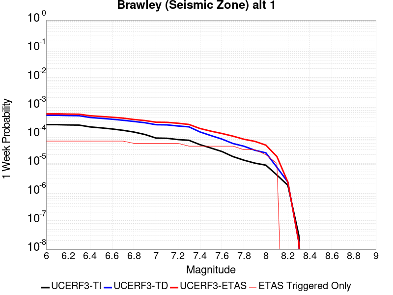 |  | 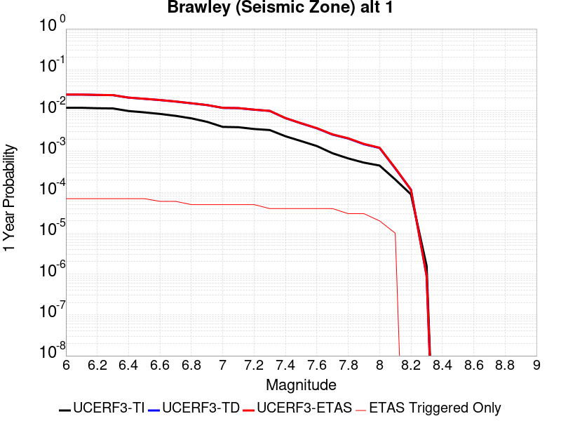 |  |

| Magnitude | 1 wk TI Prob | 1 wk TD Prob | 1 wk ETAS Prob | 1 wk ETAS/TD Gain | 1 wk ETAS Triggered Only | 1 mo TI Prob | 1 mo TD Prob | 1 mo ETAS Prob | 1 mo ETAS/TD Gain | 1 mo ETAS Triggered Only | 1 yr TI Prob | 1 yr TD Prob | 1 yr ETAS Prob | 1 yr ETAS/TD Gain | 1 yr ETAS Triggered Only | 10 yr TI Prob | 10 yr TD Prob | 10 yr ETAS Prob | 10 yr ETAS/TD Gain | 10 yr ETAS Triggered Only |
|-----|-----|-----|-----|-----|-----|-----|-----|-----|-----|-----|-----|-----|-----|-----|-----|-----|-----|-----|-----|-----|
| 6.0 | 2.2521618E-4 | 4.7632487E-4 | 6.1324594E-4 | 1.287453 | 1.369863E-4 | 9.6485513E-4 | 0.0020398323 | 0.0021765393 | 1.0670186 | 1.369863E-4 | 0.011683988 | 0.024546238 | 0.02467986 | 1.0054438 | 1.369863E-4 | 0.11088423 | 0.21350002 | 0.21371551 | 1.0010092 | 2.739726E-4 |
| 6.1 | 2.2521618E-4 | 4.7632487E-4 | 6.1324594E-4 | 1.287453 | 1.369863E-4 | 9.6485513E-4 | 0.0020398323 | 0.0021765393 | 1.0670186 | 1.369863E-4 | 0.011683988 | 0.024546238 | 0.02467986 | 1.0054438 | 1.369863E-4 | 0.11088423 | 0.21350002 | 0.21360776 | 1.0005046 | 1.369863E-4 |
| 6.2 | 2.198148E-4 | 4.6717093E-4 | 6.0409325E-4 | 1.2930882 | 1.369863E-4 | 9.417233E-4 | 0.0020006616 | 0.0021373737 | 1.0683335 | 1.369863E-4 | 0.011405343 | 0.024080504 | 0.02421419 | 1.0055517 | 1.369863E-4 | 0.10837428 | 0.20993657 | 0.2100448 | 1.0005156 | 1.369863E-4 |
| 6.3 | 2.1704129E-4 | 4.615278E-4 | 5.9845083E-4 | 1.2966735 | 1.369863E-4 | 9.298453E-4 | 0.0019765133 | 0.002113229 | 1.0691701 | 1.369863E-4 | 0.011262234 | 0.02379366 | 0.023927387 | 1.0056202 | 1.369863E-4 | 0.107082725 | 0.20782755 | 0.20793606 | 1.0005221 | 1.369863E-4 |
| 6.4 | 1.876142E-4 | 4.00449E-4 | 5.3738046E-4 | 1.3419448 | 1.369863E-4 | 8.038131E-4 | 0.0017150956 | 0.0018518469 | 1.079734 | 1.369863E-4 | 0.00974259 | 0.020680401 | 0.020814555 | 1.006487 | 1.369863E-4 | 0.093263686 | 0.18457815 | 0.18468985 | 1.0006052 | 1.369863E-4 |
| 6.5 | 1.7390939E-4 | 3.7477075E-4 | 5.117057E-4 | 1.3653833 | 1.369863E-4 | 7.45113E-4 | 0.0016051838 | 0.0017419503 | 1.0852029 | 1.369863E-4 | 0.009034078 | 0.019368723 | 0.019503057 | 1.0069356 | 1.369863E-4 | 0.086755216 | 0.17440031 | 0.17451341 | 1.0006485 | 1.369863E-4 |
| 6.6 | 1.591791E-4 | 3.4891962E-4 | 4.8585812E-4 | 1.3924643 | 1.369863E-4 | 6.8201777E-4 | 0.0014945229 | 0.0016313045 | 1.0915219 | 1.369863E-4 | 0.008271996 | 0.018045569 | 0.018180083 | 1.0074542 | 1.369863E-4 | 0.07970774 | 0.16380852 | 0.16392307 | 1.0006993 | 1.369863E-4 |
| 6.7 | 1.4268003E-4 | 3.20582E-4 | 4.575244E-4 | 1.427168 | 1.369863E-4 | 6.1134255E-4 | 0.0013732077 | 0.0015100058 | 1.0996195 | 1.369863E-4 | 0.007417723 | 0.016592601 | 0.016727315 | 1.0081189 | 1.369863E-4 | 0.07174956 | 0.15193306 | 0.15204924 | 1.0007646 | 1.369863E-4 |
| 6.8 | 1.239713E-4 | 2.9053655E-4 | 4.2748306E-4 | 1.4713572 | 1.369863E-4 | 5.3119735E-4 | 0.0012445687 | 0.0013813844 | 1.1099303 | 1.369863E-4 | 0.0064481674 | 0.015048777 | 0.015183702 | 1.0089658 | 1.369863E-4 | 0.06264243 | 0.13837762 | 0.13849565 | 1.000853 | 1.369863E-4 |
| 6.9 | 1.0180238E-4 | 2.625439E-4 | 3.9949425E-4 | 1.5216283 | 1.369863E-4 | 4.3622297E-4 | 0.0011247073 | 0.0012615395 | 1.1216604 | 1.369863E-4 | 0.005298089 | 0.013608336 | 0.013743458 | 1.0099294 | 1.369863E-4 | 0.05173543 | 0.124961674 | 0.12508154 | 1.0009593 | 1.369863E-4 |
| 7.0 | 7.6619996E-5 | 2.23993E-4 | 3.6094862E-4 | 1.6114281 | 1.369863E-4 | 3.283301E-4 | 9.5962E-4 | 0.0010964748 | 1.1426135 | 1.369863E-4 | 0.0039900932 | 0.011621496 | 0.0117568895 | 1.0116503 | 1.369863E-4 | 0.039192066 | 0.107266866 | 0.10738916 | 1.0011401 | 1.369863E-4 |
| 7.1 | 7.5127435E-5 | 2.2082464E-4 | 3.577807E-4 | 1.6202028 | 1.369863E-4 | 3.2193496E-4 | 9.4605127E-4 | 0.0010829079 | 1.144661 | 1.369863E-4 | 0.0039125155 | 0.011458045 | 0.011593461 | 1.0118185 | 1.369863E-4 | 0.038443442 | 0.10583085 | 0.105953336 | 1.0011574 | 1.369863E-4 |
| 7.2 | 6.788582E-5 | 2.0210193E-4 | 3.3906056E-4 | 1.677671 | 1.369863E-4 | 2.9090676E-4 | 8.6586666E-4 | 0.0010027344 | 1.1580702 | 1.369863E-4 | 0.0035360386 | 0.0104916105 | 0.01062716 | 1.0129198 | 1.369863E-4 | 0.034803 | 0.09750131 | 0.09762494 | 1.001268 | 1.369863E-4 |
| 7.3 | 6.399602E-5 | 1.8841137E-4 | 3.2537186E-4 | 1.7269226 | 1.369863E-4 | 2.7423984E-4 | 8.072303E-4 | 9.44106E-4 | 1.1695622 | 1.369863E-4 | 0.0033337586 | 0.009784332 | 0.009919977 | 1.0138636 | 1.369863E-4 | 0.03284188 | 0.09139617 | 0.09152063 | 1.0013618 | 1.369863E-4 |
| 7.4 | 4.506759E-5 | 1.2529209E-4 | 2.6226122E-4 | 2.0931985 | 1.369863E-4 | 1.9313251E-4 | 5.368565E-4 | 6.737692E-4 | 1.2550267 | 1.369863E-4 | 0.0023488526 | 0.0065168133 | 0.006652907 | 1.0208834 | 1.369863E-4 | 0.023241805 | 0.062363707 | 0.062492147 | 1.0020596 | 1.369863E-4 |
| 7.5 | 3.43289E-5 | 9.33541E-5 | 2.3032761E-4 | 2.4672468 | 1.369863E-4 | 1.4711556E-4 | 4.00028E-4 | 5.369595E-4 | 1.3423048 | 1.369863E-4 | 0.0017896603 | 0.0048595266 | 0.004995847 | 1.0280522 | 1.369863E-4 | 0.01775316 | 0.04705519 | 0.04718573 | 1.0027742 | 1.369863E-4 |
| 7.6 | 2.5980507E-5 | 7.053101E-5 | 2.0750765E-4 | 2.9420767 | 1.369863E-4 | 1.1134028E-4 | 3.0224086E-4 | 4.3918577E-4 | 1.4530985 | 1.369863E-4 | 0.001354725 | 0.003673598 | 0.003810081 | 1.0371524 | 1.369863E-4 | 0.013464959 | 0.035840835 | 0.035972912 | 1.0036851 | 1.369863E-4 |
| 7.7 | 1.7292105E-5 | 4.9407296E-5 | 1.8638682E-4 | 3.7724555 | 1.369863E-4 | 7.4106916E-5 | 2.117284E-4 | 3.486857E-4 | 1.6468537 | 1.369863E-4 | 9.018782E-4 | 0.0025747516 | 0.0027113853 | 1.0530667 | 1.369863E-4 | 0.008982267 | 0.025290398 | 0.02542392 | 1.0052795 | 1.369863E-4 |
| 7.8 | 1.2927471E-5 | 3.9693266E-5 | 3.9693266E-5 | 1.0 | 0.0 | 5.5402274E-5 | 1.7010293E-4 | 1.7010293E-4 | 1.0 | 0.0 | 6.743139E-4 | 0.0020690386 | 0.0020690386 | 1.0 | 0.0 | 0.0067227143 | 0.020431727 | 0.020431727 | 1.0 | 0.0 |
| 7.9 | 1.0200774E-5 | 2.874569E-5 | 2.874569E-5 | 1.0 | 0.0 | 4.371687E-5 | 1.2319001E-4 | 1.2319001E-4 | 1.0 | 0.0 | 5.321229E-4 | 0.0014988075 | 0.0014988075 | 1.0 | 0.0 | 0.005308505 | 0.014991644 | 0.014991644 | 1.0 | 0.0 |
| 8.0 | 8.650396E-6 | 2.3277367E-5 | 2.3277367E-5 | 1.0 | 0.0 | 3.70726E-5 | 9.975634E-5 | 9.975634E-5 | 1.0 | 0.0 | 4.5126543E-4 | 0.0012138576 | 0.0012138576 | 1.0 | 0.0 | 0.0045035016 | 0.012211097 | 0.012211097 | 1.0 | 0.0 |
| 8.1 | 3.9368224E-6 | 7.3279825E-6 | 7.3279825E-6 | 1.0 | 0.0 | 1.6871985E-5 | 3.140526E-5 | 3.140526E-5 | 1.0 | 0.0 | 2.0539707E-4 | 3.8229208E-4 | 3.8229208E-4 | 1.0 | 0.0 | 0.0020520731 | 0.004001185 | 0.004001185 | 1.0 | 0.0 |
| 8.2 | 1.7101195E-6 | 2.217876E-6 | 2.217876E-6 | 1.0 | 0.0 | 7.329063E-6 | 9.505149E-6 | 9.505149E-6 | 1.0 | 0.0 | 8.922769E-5 | 1.1571907E-4 | 1.1571907E-4 | 1.0 | 0.0 | 8.9191867E-4 | 0.0012666774 | 0.0012666774 | 1.0 | 0.0 |
| 8.3 | 3.0346666E-8 | 1.721586E-8 | 1.721586E-8 | 1.0 | 0.0 | 1.3005713E-7 | 7.378226E-8 | 7.378226E-8 | 1.0 | 0.0 | 1.5834444E-6 | 8.9829894E-7 | 8.9829894E-7 | 1.0 | 0.0 | 1.5834332E-5 | 9.367729E-6 | 9.367729E-6 | 1.0 | 0.0 |

## Owens Valley
*[(top)](#table-of-contents)*

| 1 Week | 1 Month | 1 Year | 10 Year |
|-----|-----|-----|-----|
|  |  |  |  |

| Magnitude | 1 wk TI Prob | 1 wk TD Prob | 1 wk ETAS Prob | 1 wk ETAS/TD Gain | 1 wk ETAS Triggered Only | 1 mo TI Prob | 1 mo TD Prob | 1 mo ETAS Prob | 1 mo ETAS/TD Gain | 1 mo ETAS Triggered Only | 1 yr TI Prob | 1 yr TD Prob | 1 yr ETAS Prob | 1 yr ETAS/TD Gain | 1 yr ETAS Triggered Only | 10 yr TI Prob | 10 yr TD Prob | 10 yr ETAS Prob | 10 yr ETAS/TD Gain | 10 yr ETAS Triggered Only |
|-----|-----|-----|-----|-----|-----|-----|-----|-----|-----|-----|-----|-----|-----|-----|-----|-----|-----|-----|-----|-----|
| 6.0 | 4.83821E-5 | 3.626567E-6 | 1.4061238E-4 | 38.77286 | 1.369863E-4 | 2.0733538E-4 | 1.5542342E-5 | 2.8951067E-4 | 18.627224 | 2.739726E-4 | 0.002521386 | 1.8921259E-4 | 4.6313336E-4 | 2.4476879 | 2.739726E-4 | 0.024929691 | 0.001925011 | 0.002198456 | 1.1420486 | 2.739726E-4 |
| 6.1 | 4.83821E-5 | 3.626567E-6 | 1.4061238E-4 | 38.77286 | 1.369863E-4 | 2.0733538E-4 | 1.5542342E-5 | 2.8951067E-4 | 18.627224 | 2.739726E-4 | 0.002521386 | 1.8921259E-4 | 4.6313336E-4 | 2.4476879 | 2.739726E-4 | 0.024929691 | 0.001925011 | 0.002198456 | 1.1420486 | 2.739726E-4 |
| 6.2 | 4.83821E-5 | 3.626567E-6 | 1.4061238E-4 | 38.77286 | 1.369863E-4 | 2.0733538E-4 | 1.5542342E-5 | 2.8951067E-4 | 18.627224 | 2.739726E-4 | 0.002521386 | 1.8921259E-4 | 4.6313336E-4 | 2.4476879 | 2.739726E-4 | 0.024929691 | 0.001925011 | 0.002198456 | 1.1420486 | 2.739726E-4 |
| 6.3 | 3.953008E-5 | 3.1553948E-6 | 1.4014126E-4 | 44.413227 | 1.369863E-4 | 1.6940363E-4 | 1.3523055E-5 | 2.8749194E-4 | 21.259394 | 2.739726E-4 | 0.002060538 | 1.6463149E-4 | 4.38559E-4 | 2.6638827 | 2.739726E-4 | 0.020415364 | 0.0016592 | 0.001932718 | 1.1648494 | 2.739726E-4 |
| 6.4 | 3.953008E-5 | 3.1553948E-6 | 1.4014126E-4 | 44.413227 | 1.369863E-4 | 1.6940363E-4 | 1.3523055E-5 | 2.8749194E-4 | 21.259394 | 2.739726E-4 | 0.002060538 | 1.6463149E-4 | 4.38559E-4 | 2.6638827 | 2.739726E-4 | 0.020415364 | 0.0016592 | 0.001932718 | 1.1648494 | 2.739726E-4 |
| 6.5 | 3.457342E-5 | 2.9715961E-6 | 1.399575E-4 | 47.098423 | 1.369863E-4 | 1.4816338E-4 | 1.2735354E-5 | 2.8670445E-4 | 22.512486 | 2.739726E-4 | 0.0018023965 | 1.550426E-4 | 4.2897274E-4 | 2.7668054 | 2.739726E-4 | 0.017878477 | 0.001555719 | 0.0018292654 | 1.1758327 | 2.739726E-4 |
| 6.6 | 3.1127765E-5 | 2.8744932E-6 | 1.398604E-4 | 48.65567 | 1.369863E-4 | 1.3339789E-4 | 1.2319203E-5 | 2.8628844E-4 | 23.2392 | 2.739726E-4 | 0.0016229092 | 1.4997667E-4 | 4.2390818E-4 | 2.8264942 | 2.739726E-4 | 0.016111081 | 0.0015012559 | 0.0017748171 | 1.1822217 | 2.739726E-4 |
| 6.7 | 2.806885E-5 | 2.8104134E-6 | 1.3979634E-4 | 49.742268 | 1.369863E-4 | 1.2028952E-4 | 1.20445775E-5 | 2.8601388E-4 | 23.746279 | 2.739726E-4 | 0.001463541 | 1.4663354E-4 | 4.2056598E-4 | 2.868143 | 2.739726E-4 | 0.014539397 | 0.0014657511 | 0.0017393221 | 1.1866422 | 2.739726E-4 |
| 6.8 | 2.524524E-5 | 2.2353688E-6 | 1.3922136E-4 | 62.281162 | 1.369863E-4 | 1.0818939E-4 | 9.580118E-6 | 2.835501E-4 | 29.597765 | 2.739726E-4 | 0.0013164099 | 1.16632E-4 | 3.9057265E-4 | 3.3487606 | 2.739726E-4 | 0.01308639 | 0.0011659812 | 0.0014396344 | 1.2346977 | 2.739726E-4 |
| 6.9 | 2.2704568E-5 | 1.6081682E-6 | 1.3859425E-4 | 86.181435 | 1.369863E-4 | 9.730166E-5 | 6.8921313E-6 | 2.8086285E-4 | 40.751232 | 2.739726E-4 | 0.0011840039 | 8.390849E-5 | 3.578581E-4 | 4.2648616 | 2.739726E-4 | 0.011777153 | 8.3897985E-4 | 0.0011127226 | 1.3262805 | 2.739726E-4 |
| 7.0 | 2.0871712E-5 | 1.5395453E-6 | 1.3852563E-4 | 89.97828 | 1.369863E-4 | 8.944713E-5 | 6.598035E-6 | 2.8056884E-4 | 42.52309 | 2.739726E-4 | 0.0010884746 | 8.032813E-5 | 3.5427872E-4 | 4.410394 | 2.739726E-4 | 0.010831586 | 8.0316263E-4 | 0.0010769152 | 1.3408432 | 2.739726E-4 |
| 7.1 | 1.944928E-5 | 1.3864178E-6 | 1.3837253E-4 | 99.80579 | 1.369863E-4 | 8.335139E-5 | 5.941777E-6 | 2.7991275E-4 | 47.109264 | 2.739726E-4 | 0.0010143308 | 7.233874E-5 | 3.4629152E-4 | 4.787082 | 2.739726E-4 | 0.010097133 | 7.2330976E-4 | 9.970842E-4 | 1.3785024 | 2.739726E-4 |
| 7.2 | 1.7876306E-5 | 1.2489141E-6 | 1.3823505E-4 | 110.68419 | 1.369863E-4 | 7.6610486E-5 | 5.352478E-6 | 2.793236E-4 | 52.18585 | 2.739726E-4 | 9.3233347E-4 | 6.516448E-5 | 3.3911923E-4 | 5.20405 | 2.739726E-4 | 0.009284316 | 6.5159105E-4 | 9.253851E-4 | 1.4201932 | 2.739726E-4 |
| 7.3 | 1.2618672E-5 | 1.1115209E-6 | 1.3809768E-4 | 124.24208 | 1.369863E-4 | 5.40789E-5 | 4.763652E-6 | 2.7873495E-4 | 58.512867 | 2.739726E-4 | 6.582117E-4 | 5.799593E-5 | 3.3195264E-4 | 5.723723 | 2.739726E-4 | 0.0065626553 | 5.7994033E-4 | 8.5375406E-4 | 1.4721411 | 2.739726E-4 |
| 7.4 | 7.4874442E-6 | 8.5486437E-7 | 1.3784105E-4 | 161.24318 | 1.369863E-4 | 3.208865E-5 | 3.6636993E-6 | 2.776353E-4 | 75.780045 | 2.739726E-4 | 3.906093E-4 | 4.4604632E-5 | 3.1856503E-4 | 7.1419716 | 2.739726E-4 | 0.003899234 | 4.4604883E-4 | 7.1989925E-4 | 1.6139472 | 2.739726E-4 |
| 7.5 | 2.4734156E-6 | 6.068616E-7 | 6.068616E-7 | 1.0 | 0.0 | 1.060031E-5 | 2.6008327E-6 | 1.3958677E-4 | 53.670033 | 1.369863E-4 | 1.2905113E-4 | 3.166468E-5 | 1.6864664E-4 | 5.3260174 | 1.369863E-4 | 0.0012897621 | 3.1660203E-4 | 4.5354496E-4 | 1.4325397 | 1.369863E-4 |
| 7.6 | 1.1328841E-6 | 3.196531E-7 | 3.196531E-7 | 1.0 | 0.0 | 4.8552088E-6 | 1.3699412E-6 | 1.3835606E-4 | 100.994156 | 1.369863E-4 | 5.9110564E-5 | 1.6678909E-5 | 1.5366293E-4 | 9.213009 | 1.369863E-4 | 5.9094845E-4 | 1.6677675E-4 | 3.037402E-4 | 1.8212383 | 1.369863E-4 |
| 7.7 | 4.8613185E-7 | 8.964689E-8 | 8.964689E-8 | 1.0 | 0.0 | 2.0834207E-6 | 3.8420092E-7 | 3.8420092E-7 | 1.0 | 0.0 | 2.536535E-5 | 4.6776368E-6 | 4.6776368E-6 | 1.0 | 0.0 | 2.5362454E-4 | 4.677545E-5 | 4.677545E-5 | 1.0 | 0.0 |

## Palos Verdes
*[(top)](#table-of-contents)*

| 1 Week | 1 Month | 1 Year | 10 Year |
|-----|-----|-----|-----|
|  |  |  |  |

| Magnitude | 1 wk TI Prob | 1 wk TD Prob | 1 wk ETAS Prob | 1 wk ETAS/TD Gain | 1 wk ETAS Triggered Only | 1 mo TI Prob | 1 mo TD Prob | 1 mo ETAS Prob | 1 mo ETAS/TD Gain | 1 mo ETAS Triggered Only | 1 yr TI Prob | 1 yr TD Prob | 1 yr ETAS Prob | 1 yr ETAS/TD Gain | 1 yr ETAS Triggered Only | 10 yr TI Prob | 10 yr TD Prob | 10 yr ETAS Prob | 10 yr ETAS/TD Gain | 10 yr ETAS Triggered Only |
|-----|-----|-----|-----|-----|-----|-----|-----|-----|-----|-----|-----|-----|-----|-----|-----|-----|-----|-----|-----|-----|
| 6.0 | 6.126063E-5 | 7.622612E-5 | 2.1320197E-4 | 2.7969675 | 1.369863E-4 | 2.6251914E-4 | 3.2664582E-4 | 4.6358738E-4 | 1.4192356 | 1.369863E-4 | 0.0031914865 | 0.003970174 | 0.0041066166 | 1.0343668 | 1.369863E-4 | 0.031460393 | 0.039048895 | 0.039180532 | 1.0033711 | 1.369863E-4 |
| 6.1 | 6.126063E-5 | 7.622612E-5 | 2.1320197E-4 | 2.7969675 | 1.369863E-4 | 2.6251914E-4 | 3.2664582E-4 | 4.6358738E-4 | 1.4192356 | 1.369863E-4 | 0.0031914865 | 0.003970174 | 0.0041066166 | 1.0343668 | 1.369863E-4 | 0.031460393 | 0.039048895 | 0.039180532 | 1.0033711 | 1.369863E-4 |
| 6.2 | 6.126063E-5 | 7.622612E-5 | 2.1320197E-4 | 2.7969675 | 1.369863E-4 | 2.6251914E-4 | 3.2664582E-4 | 4.6358738E-4 | 1.4192356 | 1.369863E-4 | 0.0031914865 | 0.003970174 | 0.0041066166 | 1.0343668 | 1.369863E-4 | 0.031460393 | 0.039048895 | 0.039180532 | 1.0033711 | 1.369863E-4 |
| 6.3 | 4.0838047E-5 | 4.9749437E-5 | 4.9749437E-5 | 1.0 | 0.0 | 1.7500846E-4 | 2.1319572E-4 | 2.1319572E-4 | 1.0 | 0.0 | 0.0021286458 | 0.0025927818 | 0.0025927818 | 1.0 | 0.0 | 0.021083709 | 0.025646681 | 0.025646681 | 1.0 | 0.0 |
| 6.4 | 4.0838047E-5 | 4.9749437E-5 | 4.9749437E-5 | 1.0 | 0.0 | 1.7500846E-4 | 2.1319572E-4 | 2.1319572E-4 | 1.0 | 0.0 | 0.0021286458 | 0.0025927818 | 0.0025927818 | 1.0 | 0.0 | 0.021083709 | 0.025646681 | 0.025646681 | 1.0 | 0.0 |
| 6.5 | 3.0512005E-5 | 3.656162E-5 | 3.656162E-5 | 1.0 | 0.0 | 1.3075917E-4 | 1.5668393E-4 | 1.5668393E-4 | 1.0 | 0.0 | 0.0015908304 | 0.0019060767 | 0.0019060767 | 1.0 | 0.0 | 0.015794903 | 0.018909154 | 0.018909154 | 1.0 | 0.0 |
| 6.6 | 2.9255087E-5 | 3.515442E-5 | 3.515442E-5 | 1.0 | 0.0 | 1.2537291E-4 | 1.5065377E-4 | 1.5065377E-4 | 1.0 | 0.0 | 0.0015253464 | 0.0018327828 | 0.0018327828 | 1.0 | 0.0 | 0.015149189 | 0.018188225 | 0.018188225 | 1.0 | 0.0 |
| 6.7 | 2.287198E-5 | 2.7248278E-5 | 2.7248278E-5 | 1.0 | 0.0 | 9.801909E-5 | 1.16773626E-4 | 1.16773626E-4 | 1.0 | 0.0 | 0.001192729 | 0.0014208833 | 0.0014208833 | 1.0 | 0.0 | 0.011863477 | 0.014127217 | 0.014127217 | 1.0 | 0.0 |
| 6.8 | 2.1325764E-5 | 2.5431877E-5 | 2.5431877E-5 | 1.0 | 0.0 | 9.139293E-5 | 1.0898971E-4 | 1.0898971E-4 | 1.0 | 0.0 | 0.001112141 | 0.0013262323 | 0.0013262323 | 1.0 | 0.0 | 0.011065915 | 0.013192211 | 0.013192211 | 1.0 | 0.0 |
| 6.9 | 1.9009392E-5 | 2.2613547E-5 | 2.2613547E-5 | 1.0 | 0.0 | 8.1466285E-5 | 9.6912096E-5 | 9.6912096E-5 | 1.0 | 0.0 | 9.914007E-4 | 0.0011793535 | 0.0011793535 | 1.0 | 0.0 | 0.009869894 | 0.011739632 | 0.011739632 | 1.0 | 0.0 |
| 7.0 | 1.7098473E-5 | 2.0319356E-5 | 2.0319356E-5 | 1.0 | 0.0 | 7.3277115E-5 | 8.708052E-5 | 8.708052E-5 | 1.0 | 0.0 | 8.917837E-4 | 0.001059775 | 0.001059775 | 1.0 | 0.0 | 0.008882134 | 0.010555646 | 0.010555646 | 1.0 | 0.0 |
| 7.1 | 1.5982785E-5 | 1.899476E-5 | 1.899476E-5 | 1.0 | 0.0 | 6.849585E-5 | 8.1404054E-5 | 8.1404054E-5 | 1.0 | 0.0 | 8.336179E-4 | 9.907284E-4 | 9.907284E-4 | 1.0 | 0.0 | 0.008304977 | 0.009871479 | 0.009871479 | 1.0 | 0.0 |
| 7.2 | 1.4468002E-5 | 1.7197237E-5 | 1.7197237E-5 | 1.0 | 0.0 | 6.200425E-5 | 7.370083E-5 | 7.370083E-5 | 1.0 | 0.0 | 7.546402E-4 | 8.970222E-4 | 8.970222E-4 | 1.0 | 0.0 | 0.007520827 | 0.008942284 | 0.008942284 | 1.0 | 0.0 |
| 7.3 | 5.288233E-6 | 6.2036747E-6 | 6.2036747E-6 | 1.0 | 0.0 | 2.2663658E-5 | 2.6587102E-5 | 2.6587102E-5 | 1.0 | 0.0 | 2.7589512E-4 | 3.236848E-4 | 3.236848E-4 | 1.0 | 0.0 | 0.0027555283 | 0.0032355562 | 0.0032355562 | 1.0 | 0.0 |
| 7.4 | 8.279556E-7 | 8.408347E-7 | 8.408347E-7 | 1.0 | 0.0 | 3.5483763E-6 | 3.6035726E-6 | 3.6035726E-6 | 1.0 | 0.0 | 4.3200624E-5 | 4.3872686E-5 | 4.3872686E-5 | 1.0 | 0.0 | 4.3192226E-4 | 4.3864746E-4 | 4.3864746E-4 | 1.0 | 0.0 |
| 7.5 | 6.559831E-7 | 6.667229E-7 | 6.667229E-7 | 1.0 | 0.0 | 2.8113532E-6 | 2.857381E-6 | 2.857381E-6 | 1.0 | 0.0 | 3.4227687E-5 | 3.4788125E-5 | 3.4788125E-5 | 1.0 | 0.0 | 3.4222414E-4 | 3.4783344E-4 | 3.4783344E-4 | 1.0 | 0.0 |
| 7.6 | 3.5018968E-7 | 3.5620027E-7 | 3.5620027E-7 | 1.0 | 0.0 | 1.500812E-6 | 1.526572E-6 | 1.526572E-6 | 1.0 | 0.0 | 1.8272232E-5 | 1.8585903E-5 | 1.8585903E-5 | 1.0 | 0.0 | 1.8270731E-4 | 1.8584808E-4 | 1.8584808E-4 | 1.0 | 0.0 |
| 7.7 | 1.1986104E-7 | 1.2198376E-7 | 1.2198376E-7 | 1.0 | 0.0 | 5.1369005E-7 | 5.2278745E-7 | 5.2278745E-7 | 1.0 | 0.0 | 6.2541585E-6 | 6.364919E-6 | 6.364919E-6 | 1.0 | 0.0 | 6.2539824E-5 | 6.364741E-5 | 6.364741E-5 | 1.0 | 0.0 |
| 7.8 | 3.0445005E-8 | 3.1027582E-8 | 3.1027582E-8 | 1.0 | 0.0 | 1.3047858E-7 | 1.3297536E-7 | 1.3297536E-7 | 1.0 | 0.0 | 1.5885756E-6 | 1.6189739E-6 | 1.6189739E-6 | 1.0 | 0.0 | 1.5885644E-5 | 1.6189642E-5 | 1.6189642E-5 | 1.0 | 0.0 |

## Cleghorn Lake
*[(top)](#table-of-contents)*

| 1 Week | 1 Month | 1 Year | 10 Year |
|-----|-----|-----|-----|
|  |  | 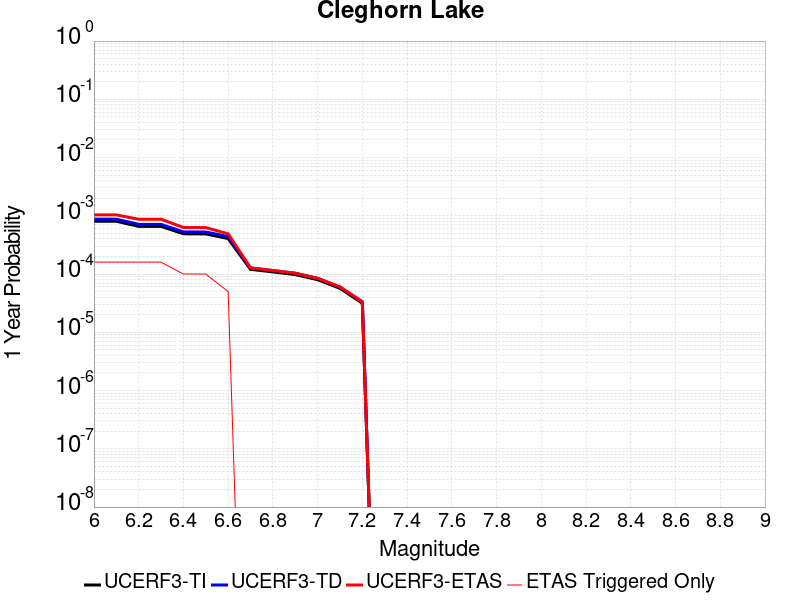 |  |

| Magnitude | 1 wk TI Prob | 1 wk TD Prob | 1 wk ETAS Prob | 1 wk ETAS/TD Gain | 1 wk ETAS Triggered Only | 1 mo TI Prob | 1 mo TD Prob | 1 mo ETAS Prob | 1 mo ETAS/TD Gain | 1 mo ETAS Triggered Only | 1 yr TI Prob | 1 yr TD Prob | 1 yr ETAS Prob | 1 yr ETAS/TD Gain | 1 yr ETAS Triggered Only | 10 yr TI Prob | 10 yr TD Prob | 10 yr ETAS Prob | 10 yr ETAS/TD Gain | 10 yr ETAS Triggered Only |
|-----|-----|-----|-----|-----|-----|-----|-----|-----|-----|-----|-----|-----|-----|-----|-----|-----|-----|-----|-----|-----|
| 6.0 | 1.5467183E-5 | 1.6794203E-5 | 1.5377821E-4 | 9.156624 | 1.369863E-4 | 6.6286244E-5 | 7.197348E-5 | 2.0894992E-4 | 2.9031515 | 1.369863E-4 | 8.067362E-4 | 8.759797E-4 | 0.001012846 | 1.1562437 | 1.369863E-4 | 0.008038137 | 0.008730696 | 0.008866486 | 1.0155532 | 1.369863E-4 |
| 6.1 | 1.5467183E-5 | 1.6794203E-5 | 1.5377821E-4 | 9.156624 | 1.369863E-4 | 6.6286244E-5 | 7.197348E-5 | 2.0894992E-4 | 2.9031515 | 1.369863E-4 | 8.067362E-4 | 8.759797E-4 | 0.001012846 | 1.1562437 | 1.369863E-4 | 0.008038137 | 0.008730696 | 0.008866486 | 1.0155532 | 1.369863E-4 |
| 6.2 | 1.2624631E-5 | 1.3681544E-5 | 1.5066598E-4 | 11.012351 | 1.369863E-4 | 5.410444E-5 | 5.863415E-5 | 1.9561242E-4 | 3.3361518 | 1.369863E-4 | 6.585225E-4 | 7.1368564E-4 | 8.505742E-4 | 1.1918051 | 1.369863E-4 | 0.0065657445 | 0.0071187317 | 0.007254743 | 1.0191061 | 1.369863E-4 |
| 6.3 | 1.2624631E-5 | 1.3681544E-5 | 1.5066598E-4 | 11.012351 | 1.369863E-4 | 5.410444E-5 | 5.863415E-5 | 1.9561242E-4 | 3.3361518 | 1.369863E-4 | 6.585225E-4 | 7.1368564E-4 | 8.505742E-4 | 1.1918051 | 1.369863E-4 | 0.0065657445 | 0.0071187317 | 0.007254743 | 1.0191061 | 1.369863E-4 |
| 6.4 | 9.417684E-6 | 1.0170118E-5 | 1.0170118E-5 | 1.0 | 0.0 | 4.036088E-5 | 4.3585722E-5 | 4.3585722E-5 | 1.0 | 0.0 | 4.912829E-4 | 5.3056807E-4 | 5.3056807E-4 | 1.0 | 0.0 | 0.004901982 | 0.005297049 | 0.005297049 | 1.0 | 0.0 |
| 6.5 | 9.368219E-6 | 1.0117545E-5 | 1.0117545E-5 | 1.0 | 0.0 | 4.014889E-5 | 4.3360415E-5 | 4.3360415E-5 | 1.0 | 0.0 | 4.8870314E-4 | 5.2782625E-4 | 5.2782625E-4 | 1.0 | 0.0 | 0.004876298 | 0.0052697617 | 0.0052697617 | 1.0 | 0.0 |
| 6.6 | 7.803798E-6 | 8.441831E-6 | 8.441831E-6 | 1.0 | 0.0 | 3.3444423E-5 | 3.6179E-5 | 3.6179E-5 | 1.0 | 0.0 | 4.0710976E-4 | 4.4043022E-4 | 4.4043022E-4 | 1.0 | 0.0 | 0.0040636472 | 0.0043994905 | 0.0043994905 | 1.0 | 0.0 |
| 6.7 | 2.3108669E-6 | 2.4438336E-6 | 2.4438336E-6 | 1.0 | 0.0 | 9.903678E-6 | 1.0473532E-5 | 1.0473532E-5 | 1.0 | 0.0 | 1.205706E-4 | 1.2750797E-4 | 1.2750797E-4 | 1.0 | 0.0 | 0.001205052 | 0.0012743667 | 0.0012743667 | 1.0 | 0.0 |
| 6.8 | 2.0882828E-6 | 2.2062823E-6 | 2.2062823E-6 | 1.0 | 0.0 | 8.949753E-6 | 9.455462E-6 | 9.455462E-6 | 1.0 | 0.0 | 1.08957785E-4 | 1.1511434E-4 | 1.1511434E-4 | 1.0 | 0.0 | 0.0010890438 | 0.0011505639 | 0.0011505639 | 1.0 | 0.0 |
| 6.9 | 1.876935E-6 | 1.981051E-6 | 1.981051E-6 | 1.0 | 0.0 | 8.043982E-6 | 8.490192E-6 | 8.490192E-6 | 1.0 | 0.0 | 9.7931086E-5 | 1.03363345E-4 | 1.03363345E-4 | 1.0 | 0.0 | 9.788794E-4 | 0.0010331686 | 0.0010331686 | 1.0 | 0.0 |
| 7.0 | 1.5357559E-6 | 1.6202807E-6 | 1.6202807E-6 | 1.0 | 0.0 | 6.5817944E-6 | 6.9440425E-6 | 6.9440425E-6 | 1.0 | 0.0 | 8.01304E-5 | 8.454057E-5 | 8.454057E-5 | 1.0 | 0.0 | 8.010151E-4 | 8.450965E-4 | 8.450965E-4 | 1.0 | 0.0 |
| 7.1 | 1.0905424E-6 | 1.1497619E-6 | 1.1497619E-6 | 1.0 | 0.0 | 4.6737446E-6 | 4.9275427E-6 | 4.9275427E-6 | 1.0 | 0.0 | 5.6901354E-5 | 5.999128E-5 | 5.999128E-5 | 1.0 | 0.0 | 5.6886784E-4 | 5.997606E-4 | 5.997606E-4 | 1.0 | 0.0 |
| 7.2 | 6.06668E-7 | 6.387277E-7 | 6.387277E-7 | 1.0 | 0.0 | 2.600003E-6 | 2.7374022E-6 | 2.7374022E-6 | 1.0 | 0.0 | 3.1654577E-5 | 3.3327433E-5 | 3.3327433E-5 | 1.0 | 0.0 | 3.1650066E-4 | 3.3323118E-4 | 3.3323118E-4 | 1.0 | 0.0 |

## San Andreas (North Branch Mill Creek)
*[(top)](#table-of-contents)*

| 1 Week | 1 Month | 1 Year | 10 Year |
|-----|-----|-----|-----|
|  |  |  |  |

| Magnitude | 1 wk TI Prob | 1 wk TD Prob | 1 wk ETAS Prob | 1 wk ETAS/TD Gain | 1 wk ETAS Triggered Only | 1 mo TI Prob | 1 mo TD Prob | 1 mo ETAS Prob | 1 mo ETAS/TD Gain | 1 mo ETAS Triggered Only | 1 yr TI Prob | 1 yr TD Prob | 1 yr ETAS Prob | 1 yr ETAS/TD Gain | 1 yr ETAS Triggered Only | 10 yr TI Prob | 10 yr TD Prob | 10 yr ETAS Prob | 10 yr ETAS/TD Gain | 10 yr ETAS Triggered Only |
|-----|-----|-----|-----|-----|-----|-----|-----|-----|-----|-----|-----|-----|-----|-----|-----|-----|-----|-----|-----|-----|
| 6.0 | 1.3461156E-5 | 2.3499893E-5 | 2.3499893E-5 | 1.0 | 0.0 | 5.7689394E-5 | 1.00709956E-4 | 1.00709956E-4 | 1.0 | 0.0 | 7.02142E-4 | 0.0012254574 | 0.0013622758 | 1.1116468 | 1.369863E-4 | 0.0069992766 | 0.01222957 | 0.012364881 | 1.0110643 | 1.369863E-4 |
| 6.1 | 1.3461156E-5 | 2.3499893E-5 | 2.3499893E-5 | 1.0 | 0.0 | 5.7689394E-5 | 1.00709956E-4 | 1.00709956E-4 | 1.0 | 0.0 | 7.02142E-4 | 0.0012254574 | 0.0013622758 | 1.1116468 | 1.369863E-4 | 0.0069992766 | 0.01222957 | 0.012364881 | 1.0110643 | 1.369863E-4 |
| 6.2 | 1.3461156E-5 | 2.3499893E-5 | 2.3499893E-5 | 1.0 | 0.0 | 5.7689394E-5 | 1.00709956E-4 | 1.00709956E-4 | 1.0 | 0.0 | 7.02142E-4 | 0.0012254574 | 0.0013622758 | 1.1116468 | 1.369863E-4 | 0.0069992766 | 0.01222957 | 0.012364881 | 1.0110643 | 1.369863E-4 |
| 6.3 | 1.3461156E-5 | 2.3499893E-5 | 2.3499893E-5 | 1.0 | 0.0 | 5.7689394E-5 | 1.00709956E-4 | 1.00709956E-4 | 1.0 | 0.0 | 7.02142E-4 | 0.0012254574 | 0.0013622758 | 1.1116468 | 1.369863E-4 | 0.0069992766 | 0.01222957 | 0.012364881 | 1.0110643 | 1.369863E-4 |
| 6.4 | 1.3461156E-5 | 2.3499893E-5 | 2.3499893E-5 | 1.0 | 0.0 | 5.7689394E-5 | 1.00709956E-4 | 1.00709956E-4 | 1.0 | 0.0 | 7.02142E-4 | 0.0012254574 | 0.0013622758 | 1.1116468 | 1.369863E-4 | 0.0069992766 | 0.01222957 | 0.012364881 | 1.0110643 | 1.369863E-4 |
| 6.5 | 1.3450706E-5 | 2.3488852E-5 | 2.3488852E-5 | 1.0 | 0.0 | 5.764461E-5 | 1.0066265E-4 | 1.0066265E-4 | 1.0 | 0.0 | 7.0159714E-4 | 0.001224882 | 0.0013617005 | 1.1116993 | 1.369863E-4 | 0.006993862 | 0.01222388 | 0.012359192 | 1.0110694 | 1.369863E-4 |
| 6.6 | 1.3074523E-5 | 2.3103135E-5 | 2.3103135E-5 | 1.0 | 0.0 | 5.6032466E-5 | 9.9009696E-5 | 9.9009696E-5 | 1.0 | 0.0 | 6.8198174E-4 | 0.0012047797 | 0.001341601 | 1.1135653 | 1.369863E-4 | 0.006798926 | 0.012025044 | 0.012160383 | 1.0112548 | 1.369863E-4 |
| 6.7 | 1.3050216E-5 | 2.3078432E-5 | 2.3078432E-5 | 1.0 | 0.0 | 5.59283E-5 | 9.890384E-5 | 9.890384E-5 | 1.0 | 0.0 | 6.8071426E-4 | 0.0012034923 | 0.0013403137 | 1.113687 | 1.369863E-4 | 0.0067863287 | 0.012012309 | 0.01214765 | 1.0112668 | 1.369863E-4 |
| 6.8 | 1.29049395E-5 | 2.292684E-5 | 2.292684E-5 | 1.0 | 0.0 | 5.530571E-5 | 9.825421E-5 | 9.825421E-5 | 1.0 | 0.0 | 6.73139E-4 | 0.0011955918 | 0.0013324142 | 1.1144391 | 1.369863E-4 | 0.0067110364 | 0.011934154 | 0.012069506 | 1.0113416 | 1.369863E-4 |
| 6.9 | 1.2867369E-5 | 2.2886245E-5 | 2.2886245E-5 | 1.0 | 0.0 | 5.51447E-5 | 9.8080236E-5 | 9.8080236E-5 | 1.0 | 0.0 | 6.711799E-4 | 0.0011934759 | 0.0013302987 | 1.1146423 | 1.369863E-4 | 0.006691564 | 0.011913223 | 0.012048578 | 1.0113617 | 1.369863E-4 |
| 7.0 | 1.2495996E-5 | 2.2286325E-5 | 2.2286325E-5 | 1.0 | 0.0 | 5.3553173E-5 | 9.550934E-5 | 9.550934E-5 | 1.0 | 0.0 | 6.518148E-4 | 0.0011622087 | 0.0012990359 | 1.1177303 | 1.369863E-4 | 0.0064990623 | 0.0116038285 | 0.011739225 | 1.0116683 | 1.369863E-4 |
| 7.1 | 1.2452067E-5 | 2.2231397E-5 | 2.2231397E-5 | 1.0 | 0.0 | 5.3364907E-5 | 9.527396E-5 | 9.527396E-5 | 1.0 | 0.0 | 6.4952404E-4 | 0.0011593461 | 0.0012961735 | 1.1180212 | 1.369863E-4 | 0.0064762887 | 0.0115755 | 0.011710901 | 1.0116972 | 1.369863E-4 |
| 7.2 | 1.2002777E-5 | 2.1609963E-5 | 2.1609963E-5 | 1.0 | 0.0 | 5.143946E-5 | 9.2610855E-5 | 9.2610855E-5 | 1.0 | 0.0 | 6.2609545E-4 | 0.0011269567 | 0.0012637886 | 1.1214172 | 1.369863E-4 | 0.006243344 | 0.011254923 | 0.0113903675 | 1.0120343 | 1.369863E-4 |
| 7.3 | 1.1923425E-5 | 2.1479793E-5 | 2.1479793E-5 | 1.0 | 0.0 | 5.109939E-5 | 9.205302E-5 | 9.205302E-5 | 1.0 | 0.0 | 6.219575E-4 | 0.001120172 | 0.0012570048 | 1.1221534 | 1.369863E-4 | 0.0062021962 | 0.011187789 | 0.011323242 | 1.0121073 | 1.369863E-4 |
| 7.4 | 1.16105175E-5 | 2.0853771E-5 | 2.0853771E-5 | 1.0 | 0.0 | 4.975841E-5 | 8.937026E-5 | 8.937026E-5 | 1.0 | 0.0 | 6.0564023E-4 | 0.0010875424 | 0.0012243796 | 1.1258225 | 1.369863E-4 | 0.006039923 | 0.010865397 | 0.011000894 | 1.0124706 | 1.369863E-4 |
| 7.5 | 1.1037265E-5 | 1.9553907E-5 | 1.9553907E-5 | 1.0 | 0.0 | 4.7301706E-5 | 8.379978E-5 | 8.379978E-5 | 1.0 | 0.0 | 5.757461E-4 | 0.0010197869 | 0.0011566336 | 1.1341914 | 1.369863E-4 | 0.005742567 | 0.010194898 | 0.010330487 | 1.0132998 | 1.369863E-4 |
| 7.6 | 1.0720915E-5 | 1.899582E-5 | 1.899582E-5 | 1.0 | 0.0 | 4.5945973E-5 | 8.140812E-5 | 8.140812E-5 | 1.0 | 0.0 | 5.592486E-4 | 9.906954E-4 | 0.001127546 | 1.1381359 | 1.369863E-4 | 0.005578433 | 0.009906623 | 0.010042251 | 1.0136907 | 1.369863E-4 |
| 7.7 | 9.276279E-6 | 1.6441649E-5 | 1.6441649E-5 | 1.0 | 0.0 | 3.9754876E-5 | 7.0462316E-5 | 7.0462316E-5 | 1.0 | 0.0 | 4.839081E-4 | 8.575427E-4 | 9.944115E-4 | 1.1596059 | 1.369863E-4 | 0.0048285574 | 0.008586041 | 0.008721851 | 1.0158175 | 1.369863E-4 |
| 7.8 | 5.8346777E-6 | 1.1155013E-5 | 1.1155013E-5 | 1.0 | 0.0 | 2.5005522E-5 | 4.7806327E-5 | 4.7806327E-5 | 1.0 | 0.0 | 3.043997E-4 | 5.818867E-4 | 7.1879325E-4 | 1.2352805 | 1.369863E-4 | 0.0030398308 | 0.0058469265 | 0.005983112 | 1.0232918 | 1.369863E-4 |
| 7.9 | 4.690204E-6 | 8.509093E-6 | 8.509093E-6 | 1.0 | 0.0 | 2.0100719E-5 | 3.6467034E-5 | 3.6467034E-5 | 1.0 | 0.0 | 2.4469878E-4 | 4.4389578E-4 | 5.808213E-4 | 1.3084631 | 1.369863E-4 | 0.002444295 | 0.0044707474 | 0.004607121 | 1.0305036 | 1.369863E-4 |
| 8.0 | 2.9570454E-6 | 4.846947E-6 | 4.846947E-6 | 1.0 | 0.0 | 1.267299E-5 | 2.0772464E-5 | 2.0772464E-5 | 1.0 | 0.0 | 1.5428272E-4 | 2.5287544E-4 | 3.898271E-4 | 1.5415776 | 1.369863E-4 | 0.0015417566 | 0.002549644 | 0.0026862812 | 1.0535907 | 1.369863E-4 |
| 8.1 | 1.6376824E-6 | 2.1968929E-6 | 2.1968929E-6 | 1.0 | 0.0 | 7.01862E-6 | 9.41522E-6 | 9.41522E-6 | 1.0 | 0.0 | 8.544835E-5 | 1.14624294E-4 | 1.14624294E-4 | 1.0 | 0.0 | 8.54155E-4 | 0.0011606582 | 0.0011606582 | 1.0 | 0.0 |
| 8.2 | 6.9631557E-7 | 4.5360213E-7 | 4.5360213E-7 | 1.0 | 0.0 | 2.984206E-6 | 1.9440076E-6 | 1.9440076E-6 | 1.0 | 0.0 | 3.63321E-5 | 2.3668037E-5 | 2.3668037E-5 | 1.0 | 0.0 | 3.6326164E-4 | 2.451564E-4 | 2.451564E-4 | 1.0 | 0.0 |
| 8.3 | 1.7876137E-7 | 8.360375E-8 | 8.360375E-8 | 1.0 | 0.0 | 7.661199E-7 | 3.5830175E-7 | 3.5830175E-7 | 1.0 | 0.0 | 9.32747E-6 | 4.3623154E-6 | 4.3623154E-6 | 1.0 | 0.0 | 9.3270784E-5 | 4.5817014E-5 | 4.5817014E-5 | 1.0 | 0.0 |

## San Jacinto (Coyote Creek)
*[(top)](#table-of-contents)*

| 1 Week | 1 Month | 1 Year | 10 Year |
|-----|-----|-----|-----|
|  |  | 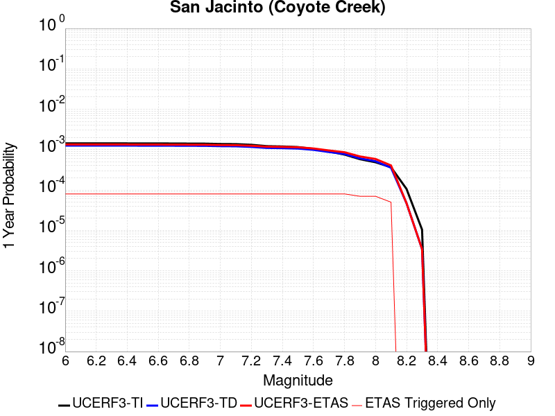 |  |

| Magnitude | 1 wk TI Prob | 1 wk TD Prob | 1 wk ETAS Prob | 1 wk ETAS/TD Gain | 1 wk ETAS Triggered Only | 1 mo TI Prob | 1 mo TD Prob | 1 mo ETAS Prob | 1 mo ETAS/TD Gain | 1 mo ETAS Triggered Only | 1 yr TI Prob | 1 yr TD Prob | 1 yr ETAS Prob | 1 yr ETAS/TD Gain | 1 yr ETAS Triggered Only | 10 yr TI Prob | 10 yr TD Prob | 10 yr ETAS Prob | 10 yr ETAS/TD Gain | 10 yr ETAS Triggered Only |
|-----|-----|-----|-----|-----|-----|-----|-----|-----|-----|-----|-----|-----|-----|-----|-----|-----|-----|-----|-----|-----|
| 6.0 | 2.7374346E-5 | 2.4145214E-5 | 1.611282E-4 | 6.673298 | 1.369863E-4 | 1.1731335E-4 | 1.034754E-4 | 2.4044752E-4 | 2.3237169 | 1.369863E-4 | 0.0014273542 | 0.0012590875 | 0.0013959013 | 1.108661 | 1.369863E-4 | 0.01418221 | 0.012928318 | 0.013063533 | 1.0104588 | 1.369863E-4 |
| 6.1 | 2.7374346E-5 | 2.4145214E-5 | 1.611282E-4 | 6.673298 | 1.369863E-4 | 1.1731335E-4 | 1.034754E-4 | 2.4044752E-4 | 2.3237169 | 1.369863E-4 | 0.0014273542 | 0.0012590875 | 0.0013959013 | 1.108661 | 1.369863E-4 | 0.01418221 | 0.012928318 | 0.013063533 | 1.0104588 | 1.369863E-4 |
| 6.2 | 2.7374346E-5 | 2.4145214E-5 | 1.611282E-4 | 6.673298 | 1.369863E-4 | 1.1731335E-4 | 1.034754E-4 | 2.4044752E-4 | 2.3237169 | 1.369863E-4 | 0.0014273542 | 0.0012590875 | 0.0013959013 | 1.108661 | 1.369863E-4 | 0.01418221 | 0.012928318 | 0.013063533 | 1.0104588 | 1.369863E-4 |
| 6.3 | 2.7374346E-5 | 2.4145214E-5 | 1.611282E-4 | 6.673298 | 1.369863E-4 | 1.1731335E-4 | 1.034754E-4 | 2.4044752E-4 | 2.3237169 | 1.369863E-4 | 0.0014273542 | 0.0012590875 | 0.0013959013 | 1.108661 | 1.369863E-4 | 0.01418221 | 0.012928318 | 0.013063533 | 1.0104588 | 1.369863E-4 |
| 6.4 | 2.7374346E-5 | 2.4145214E-5 | 1.611282E-4 | 6.673298 | 1.369863E-4 | 1.1731335E-4 | 1.034754E-4 | 2.4044752E-4 | 2.3237169 | 1.369863E-4 | 0.0014273542 | 0.0012590875 | 0.0013959013 | 1.108661 | 1.369863E-4 | 0.01418221 | 0.012928318 | 0.013063533 | 1.0104588 | 1.369863E-4 |
| 6.5 | 2.7282445E-5 | 2.4031293E-5 | 1.6101431E-4 | 6.7001934 | 1.369863E-4 | 1.16919524E-4 | 1.029872E-4 | 2.399594E-4 | 2.3299923 | 1.369863E-4 | 0.0014225657 | 0.0012531505 | 0.0013899652 | 1.1091765 | 1.369863E-4 | 0.014134934 | 0.012869646 | 0.013004869 | 1.0105071 | 1.369863E-4 |
| 6.6 | 2.7282445E-5 | 2.4031293E-5 | 1.6101431E-4 | 6.7001934 | 1.369863E-4 | 1.16919524E-4 | 1.029872E-4 | 2.399594E-4 | 2.3299923 | 1.369863E-4 | 0.0014225657 | 0.0012531505 | 0.0013899652 | 1.1091765 | 1.369863E-4 | 0.014134934 | 0.012869646 | 0.013004869 | 1.0105071 | 1.369863E-4 |
| 6.7 | 2.7216198E-5 | 2.3956412E-5 | 1.6093944E-4 | 6.7180104 | 1.369863E-4 | 1.1663563E-4 | 1.02666316E-4 | 2.3963855E-4 | 2.3341498 | 1.369863E-4 | 0.0014191137 | 0.0012492483 | 0.0013860635 | 1.109518 | 1.369863E-4 | 0.014100855 | 0.0128310565 | 0.012966285 | 1.0105392 | 1.369863E-4 |
| 6.8 | 2.7078617E-5 | 2.387363E-5 | 1.6085667E-4 | 6.7378383 | 1.369863E-4 | 1.1604605E-4 | 1.0231156E-4 | 2.3928385E-4 | 2.3387764 | 1.369863E-4 | 0.001411945 | 0.0012449342 | 0.0013817499 | 1.109898 | 1.369863E-4 | 0.014030075 | 0.012788199 | 0.012923433 | 1.0105749 | 1.369863E-4 |
| 6.9 | 2.6982952E-5 | 2.3793142E-5 | 1.6077618E-4 | 6.757249 | 1.369863E-4 | 1.15636096E-4 | 1.0196664E-4 | 2.3893897E-4 | 2.3433053 | 1.369863E-4 | 0.0014069602 | 0.0012407395 | 0.0013775558 | 1.11027 | 1.369863E-4 | 0.013980856 | 0.012746515 | 0.012881755 | 1.01061 | 1.369863E-4 |
| 7.0 | 2.6449972E-5 | 2.3370165E-5 | 1.6035326E-4 | 6.861452 | 1.369863E-4 | 1.1335209E-4 | 1.00154015E-4 | 2.371266E-4 | 2.3676195 | 1.369863E-4 | 0.001379188 | 0.0012186957 | 0.001355515 | 1.112267 | 1.369863E-4 | 0.0137065975 | 0.0125278765 | 0.012663147 | 1.0107975 | 1.369863E-4 |
| 7.1 | 2.6257849E-5 | 2.3196202E-5 | 1.6017932E-4 | 6.9054117 | 1.369863E-4 | 1.1252879E-4 | 9.940852E-5 | 2.3638121E-4 | 2.3778768 | 1.369863E-4 | 0.0013691769 | 0.0012096294 | 0.00134645 | 1.1131095 | 1.369863E-4 | 0.013607717 | 0.012437741 | 0.012573024 | 1.0108768 | 1.369863E-4 |
| 7.2 | 2.5270041E-5 | 2.2390966E-5 | 1.593742E-4 | 7.11779 | 1.369863E-4 | 1.0829568E-4 | 9.595777E-5 | 2.3293092E-4 | 2.4274316 | 1.369863E-4 | 0.0013177024 | 0.0011676621 | 0.0013044884 | 1.1171798 | 1.369863E-4 | 0.013099162 | 0.012018777 | 0.012154117 | 1.0112607 | 1.369863E-4 |
| 7.3 | 2.339701E-5 | 2.1122814E-5 | 1.5810622E-4 | 7.4850926 | 1.369863E-4 | 1.0026905E-4 | 9.0523215E-5 | 2.2749712E-4 | 2.5131357 | 1.369863E-4 | 0.001220092 | 0.0011015651 | 0.0012384005 | 1.1242191 | 1.369863E-4 | 0.012134149 | 0.011357696 | 0.011493126 | 1.0119241 | 1.369863E-4 |
| 7.4 | 2.296333E-5 | 2.0853171E-5 | 1.5783662E-4 | 7.5689507 | 1.369863E-4 | 9.841056E-5 | 8.936768E-5 | 2.2634174E-4 | 2.5327024 | 1.369863E-4 | 0.0011974899 | 0.0010875105 | 0.0012243477 | 1.1258262 | 1.369863E-4 | 0.011910575 | 0.01121681 | 0.01135226 | 1.0120757 | 1.369863E-4 |
| 7.5 | 2.2188895E-5 | 2.0376096E-5 | 1.5735961E-4 | 7.7227554 | 1.369863E-4 | 9.50918E-5 | 8.732321E-5 | 2.2429755E-4 | 2.5685902 | 1.369863E-4 | 0.0011571277 | 0.0010626436 | 0.0011994843 | 1.1287739 | 1.369863E-4 | 0.011511209 | 0.010966429 | 0.011101913 | 1.0123545 | 1.369863E-4 |
| 7.6 | 2.0013189E-5 | 1.8962366E-5 | 1.5594607E-4 | 8.223978 | 1.369863E-4 | 8.5767984E-5 | 8.1264756E-5 | 2.1823993E-4 | 2.685542 | 1.369863E-4 | 0.001043725 | 9.889511E-4 | 0.0011258019 | 1.1383798 | 1.369863E-4 | 0.010388365 | 0.010224434 | 0.010360019 | 1.013261 | 1.369863E-4 |
| 7.7 | 1.7230794E-5 | 1.674371E-5 | 1.5372771E-4 | 9.181222 | 1.369863E-4 | 7.384417E-5 | 7.175679E-5 | 2.0873325E-4 | 2.908899 | 1.369863E-4 | 8.986819E-4 | 8.7328954E-4 | 0.0010101562 | 1.1567254 | 1.369863E-4 | 0.008950562 | 0.009062956 | 0.009198701 | 1.0149779 | 1.369863E-4 |
| 7.8 | 1.4478809E-5 | 1.4990978E-5 | 1.5197523E-4 | 10.137779 | 1.369863E-4 | 6.205057E-5 | 6.424547E-5 | 2.0122297E-4 | 3.1320958 | 1.369863E-4 | 7.552038E-4 | 7.819085E-4 | 9.1878773E-4 | 1.1750578 | 1.369863E-4 | 0.0075264242 | 0.008141387 | 0.008277258 | 1.016689 | 1.369863E-4 |
| 7.9 | 1.1114467E-5 | 1.1645102E-5 | 1.4862981E-4 | 12.763289 | 1.369863E-4 | 4.7632562E-5 | 4.990663E-5 | 1.868861E-4 | 3.7447147 | 1.369863E-4 | 5.797721E-4 | 6.074444E-4 | 7.4434746E-4 | 1.2253755 | 1.369863E-4 | 0.0057826187 | 0.0063803247 | 0.006516437 | 1.0213331 | 1.369863E-4 |
| 8.0 | 9.327402E-6 | 9.899186E-6 | 1.4688414E-4 | 14.838 | 1.369863E-4 | 3.9973966E-5 | 4.2424395E-5 | 1.7940489E-4 | 4.228814 | 1.369863E-4 | 4.8657437E-4 | 5.1639514E-4 | 6.5331074E-4 | 1.2651372 | 1.369863E-4 | 0.0048551033 | 0.0054499684 | 0.0055862083 | 1.0249983 | 1.369863E-4 |
| 8.1 | 7.0235833E-6 | 6.827495E-6 | 1.4381287E-4 | 21.063782 | 1.369863E-4 | 3.0100724E-5 | 2.9260367E-5 | 1.6624267E-4 | 5.681496 | 1.369863E-4 | 3.664147E-4 | 3.5618723E-4 | 4.9312477E-4 | 1.3844538 | 1.369863E-4 | 0.003658111 | 0.0037876023 | 0.00392407 | 1.03603 | 1.369863E-4 |
| 8.2 | 2.0358202E-6 | 8.994527E-7 | 8.994527E-7 | 1.0 | 0.0 | 8.724915E-6 | 3.854792E-6 | 3.854792E-6 | 1.0 | 0.0 | 1.06220665E-4 | 4.69311E-5 | 4.69311E-5 | 1.0 | 0.0 | 0.001061699 | 5.3254166E-4 | 5.3254166E-4 | 1.0 | 0.0 |
| 8.3 | 2.0051264E-7 | 6.617272E-8 | 6.617272E-8 | 1.0 | 0.0 | 8.5933965E-7 | 2.8359733E-7 | 2.8359733E-7 | 1.0 | 0.0 | 1.046241E-5 | 3.4527925E-6 | 3.4527925E-6 | 1.0 | 0.0 | 1.0461917E-4 | 4.01389E-5 | 4.01389E-5 | 1.0 | 0.0 |

## Independence rev 2011
*[(top)](#table-of-contents)*

| 1 Week | 1 Month | 1 Year | 10 Year |
|-----|-----|-----|-----|
|  |  |  |  |

| Magnitude | 1 wk TI Prob | 1 wk TD Prob | 1 wk ETAS Prob | 1 wk ETAS/TD Gain | 1 wk ETAS Triggered Only | 1 mo TI Prob | 1 mo TD Prob | 1 mo ETAS Prob | 1 mo ETAS/TD Gain | 1 mo ETAS Triggered Only | 1 yr TI Prob | 1 yr TD Prob | 1 yr ETAS Prob | 1 yr ETAS/TD Gain | 1 yr ETAS Triggered Only | 10 yr TI Prob | 10 yr TD Prob | 10 yr ETAS Prob | 10 yr ETAS/TD Gain | 10 yr ETAS Triggered Only |
|-----|-----|-----|-----|-----|-----|-----|-----|-----|-----|-----|-----|-----|-----|-----|-----|-----|-----|-----|-----|-----|
| 6.0 | 4.422171E-6 | 4.326227E-6 | 1.4131193E-4 | 32.664013 | 1.369863E-4 | 1.8952025E-5 | 1.8540857E-5 | 1.5552461E-4 | 8.38821 | 1.369863E-4 | 2.3071647E-4 | 2.2571455E-4 | 3.6266993E-4 | 1.6067636 | 1.369863E-4 | 0.0023047708 | 0.0022551466 | 0.0023918238 | 1.0606068 | 1.369863E-4 |
| 6.1 | 4.422171E-6 | 4.326227E-6 | 1.4131193E-4 | 32.664013 | 1.369863E-4 | 1.8952025E-5 | 1.8540857E-5 | 1.5552461E-4 | 8.38821 | 1.369863E-4 | 2.3071647E-4 | 2.2571455E-4 | 3.6266993E-4 | 1.6067636 | 1.369863E-4 | 0.0023047708 | 0.0022551466 | 0.0023918238 | 1.0606068 | 1.369863E-4 |
| 6.2 | 4.422171E-6 | 4.326227E-6 | 1.4131193E-4 | 32.664013 | 1.369863E-4 | 1.8952025E-5 | 1.8540857E-5 | 1.5552461E-4 | 8.38821 | 1.369863E-4 | 2.3071647E-4 | 2.2571455E-4 | 3.6266993E-4 | 1.6067636 | 1.369863E-4 | 0.0023047708 | 0.0022551466 | 0.0023918238 | 1.0606068 | 1.369863E-4 |
| 6.3 | 4.422171E-6 | 4.326227E-6 | 1.4131193E-4 | 32.664013 | 1.369863E-4 | 1.8952025E-5 | 1.8540857E-5 | 1.5552461E-4 | 8.38821 | 1.369863E-4 | 2.3071647E-4 | 2.2571455E-4 | 3.6266993E-4 | 1.6067636 | 1.369863E-4 | 0.0023047708 | 0.0022551466 | 0.0023918238 | 1.0606068 | 1.369863E-4 |
| 6.4 | 4.422171E-6 | 4.326227E-6 | 1.4131193E-4 | 32.664013 | 1.369863E-4 | 1.8952025E-5 | 1.8540857E-5 | 1.5552461E-4 | 8.38821 | 1.369863E-4 | 2.3071647E-4 | 2.2571455E-4 | 3.6266993E-4 | 1.6067636 | 1.369863E-4 | 0.0023047708 | 0.0022551466 | 0.0023918238 | 1.0606068 | 1.369863E-4 |
| 6.5 | 4.422171E-6 | 4.326227E-6 | 1.4131193E-4 | 32.664013 | 1.369863E-4 | 1.8952025E-5 | 1.8540857E-5 | 1.5552461E-4 | 8.38821 | 1.369863E-4 | 2.3071647E-4 | 2.2571455E-4 | 3.6266993E-4 | 1.6067636 | 1.369863E-4 | 0.0023047708 | 0.0022551466 | 0.0023918238 | 1.0606068 | 1.369863E-4 |
| 6.6 | 2.663744E-6 | 2.5319862E-6 | 1.3951794E-4 | 55.102173 | 1.369863E-4 | 1.1415996E-5 | 1.0851327E-5 | 1.4783614E-4 | 13.623785 | 1.369863E-4 | 1.3898089E-4 | 1.3210738E-4 | 2.690756E-4 | 2.0367944 | 1.369863E-4 | 0.0013889399 | 0.0013203367 | 0.0014571422 | 1.1036141 | 1.369863E-4 |
| 6.7 | 2.663744E-6 | 2.5319862E-6 | 1.3951794E-4 | 55.102173 | 1.369863E-4 | 1.1415996E-5 | 1.0851327E-5 | 1.4783614E-4 | 13.623785 | 1.369863E-4 | 1.3898089E-4 | 1.3210738E-4 | 2.690756E-4 | 2.0367944 | 1.369863E-4 | 0.0013889399 | 0.0013203367 | 0.0014571422 | 1.1036141 | 1.369863E-4 |
| 6.8 | 1.9716529E-6 | 1.8322585E-6 | 1.3881832E-4 | 75.7635 | 1.369863E-4 | 8.449913E-6 | 7.852514E-6 | 1.4483774E-4 | 18.444761 | 1.369863E-4 | 1.0287284E-4 | 9.5600284E-5 | 2.325735E-4 | 2.4327698 | 1.369863E-4 | 0.0010282523 | 9.556045E-4 | 0.0010924599 | 1.1432134 | 1.369863E-4 |
| 6.9 | 1.8788617E-6 | 1.7429993E-6 | 1.3872907E-4 | 79.59215 | 1.369863E-4 | 8.0522395E-6 | 7.4699765E-6 | 1.4445525E-4 | 19.338114 | 1.369863E-4 | 9.80316E-5 | 9.0943286E-5 | 2.2791713E-4 | 2.5061457 | 1.369863E-4 | 9.798837E-4 | 9.0907275E-4 | 0.0010459345 | 1.150551 | 1.369863E-4 |
| 7.0 | 1.5045488E-6 | 1.3849503E-6 | 1.3837106E-4 | 99.910484 | 1.369863E-4 | 6.44805E-6 | 5.9354884E-6 | 1.4292098E-4 | 24.07906 | 1.369863E-4 | 7.8502184E-5 | 7.226223E-5 | 2.0923863E-4 | 2.8955464 | 1.369863E-4 | 7.8474457E-4 | 7.2239246E-4 | 8.5927977E-4 | 1.1894916 | 1.369863E-4 |
| 7.1 | 1.272341E-6 | 1.1625096E-6 | 1.3814865E-4 | 118.83656 | 1.369863E-4 | 5.4528787E-6 | 4.982175E-6 | 1.419678E-4 | 28.495144 | 1.369863E-4 | 6.6386776E-5 | 6.0656326E-5 | 1.9763432E-4 | 3.258264 | 1.369863E-4 | 6.636695E-4 | 6.064009E-4 | 7.4330415E-4 | 1.2257636 | 1.369863E-4 |
| 7.2 | 1.0416892E-6 | 9.4098806E-7 | 1.3792716E-4 | 146.57695 | 1.369863E-4 | 4.464375E-6 | 4.0328E-6 | 1.4101855E-4 | 34.967903 | 1.369863E-4 | 5.4352407E-5 | 4.909825E-5 | 1.8607783E-4 | 3.7899075 | 1.369863E-4 | 5.4339116E-4 | 4.9087586E-4 | 6.2779494E-4 | 1.278928 | 1.369863E-4 |
| 7.3 | 7.9450155E-7 | 7.235002E-7 | 1.377097E-4 | 190.33818 | 1.369863E-4 | 3.4050022E-6 | 3.1007114E-6 | 1.4008659E-4 | 45.178852 | 1.369863E-4 | 4.1455114E-5 | 3.775052E-5 | 1.7473164E-4 | 4.628589 | 1.369863E-4 | 4.144738E-4 | 3.7744216E-4 | 5.143768E-4 | 1.3627962 | 1.369863E-4 |
| 7.4 | 5.3893444E-7 | 5.019512E-7 | 1.3748818E-4 | 273.90747 | 1.369863E-4 | 2.309717E-6 | 2.1512178E-6 | 1.3913722E-4 | 64.67835 | 1.369863E-4 | 2.8120441E-5 | 2.6190766E-5 | 1.6317348E-4 | 6.230191 | 1.369863E-4 | 2.8116882E-4 | 2.6187726E-4 | 3.988277E-4 | 1.5229566 | 1.369863E-4 |
| 7.5 | 3.8852085E-7 | 3.682554E-7 | 1.3735451E-4 | 372.9871 | 1.369863E-4 | 1.6650882E-6 | 1.5782365E-6 | 1.3856433E-4 | 87.796936 | 1.369863E-4 | 2.027226E-5 | 1.9214862E-5 | 1.5619853E-4 | 8.129048 | 1.369863E-4 | 2.0270412E-4 | 1.9213221E-4 | 3.290922E-4 | 1.7128423 | 1.369863E-4 |
| 7.6 | 2.414929E-7 | 2.345755E-7 | 1.3722085E-4 | 584.97516 | 1.369863E-4 | 1.0349692E-6 | 1.0053232E-6 | 1.3799149E-4 | 137.26082 | 1.369863E-4 | 1.2600677E-5 | 1.2239742E-5 | 1.4922436E-4 | 12.19179 | 1.369863E-4 | 1.2599962E-4 | 1.223908E-4 | 2.5936033E-4 | 2.1191163 | 1.369863E-4 |
| 7.7 | 6.8298014E-8 | 6.85897E-8 | 6.85897E-8 | 1.0 | 0.0 | 2.9270575E-7 | 2.9395582E-7 | 2.9395582E-7 | 1.0 | 0.0 | 3.5636867E-6 | 3.5789067E-6 | 3.5789067E-6 | 1.0 | 0.0 | 3.5636294E-5 | 3.5788536E-5 | 3.5788536E-5 | 1.0 | 0.0 |

## Ludlow
*[(top)](#table-of-contents)*

| 1 Week | 1 Month | 1 Year | 10 Year |
|-----|-----|-----|-----|
|  |  |  |  |

| Magnitude | 1 wk TI Prob | 1 wk TD Prob | 1 wk ETAS Prob | 1 wk ETAS/TD Gain | 1 wk ETAS Triggered Only | 1 mo TI Prob | 1 mo TD Prob | 1 mo ETAS Prob | 1 mo ETAS/TD Gain | 1 mo ETAS Triggered Only | 1 yr TI Prob | 1 yr TD Prob | 1 yr ETAS Prob | 1 yr ETAS/TD Gain | 1 yr ETAS Triggered Only | 10 yr TI Prob | 10 yr TD Prob | 10 yr ETAS Prob | 10 yr ETAS/TD Gain | 10 yr ETAS Triggered Only |
|-----|-----|-----|-----|-----|-----|-----|-----|-----|-----|-----|-----|-----|-----|-----|-----|-----|-----|-----|-----|-----|
| 6.0 | 2.2407607E-5 | 2.3657254E-5 | 1.6064031E-4 | 6.7903194 | 1.369863E-4 | 9.602906E-5 | 1.0138454E-4 | 2.3835695E-4 | 2.3510187 | 1.369863E-4 | 0.0011685267 | 0.001233702 | 0.0013705193 | 1.1108998 | 1.369863E-4 | 0.011624013 | 0.012273042 | 0.012408347 | 1.0110246 | 1.369863E-4 |
| 6.1 | 2.2407607E-5 | 2.3657254E-5 | 1.6064031E-4 | 6.7903194 | 1.369863E-4 | 9.602906E-5 | 1.0138454E-4 | 2.3835695E-4 | 2.3510187 | 1.369863E-4 | 0.0011685267 | 0.001233702 | 0.0013705193 | 1.1108998 | 1.369863E-4 | 0.011624013 | 0.012273042 | 0.012408347 | 1.0110246 | 1.369863E-4 |
| 6.2 | 1.0781252E-5 | 1.1365663E-5 | 1.1365663E-5 | 1.0 | 0.0 | 4.620455E-5 | 4.8709102E-5 | 4.8709102E-5 | 1.0 | 0.0 | 5.623952E-4 | 5.9287593E-4 | 5.9287593E-4 | 1.0 | 0.0 | 0.00560974 | 0.0059133614 | 0.0059133614 | 1.0 | 0.0 |
| 6.3 | 1.0781252E-5 | 1.1365663E-5 | 1.1365663E-5 | 1.0 | 0.0 | 4.620455E-5 | 4.8709102E-5 | 4.8709102E-5 | 1.0 | 0.0 | 5.623952E-4 | 5.9287593E-4 | 5.9287593E-4 | 1.0 | 0.0 | 0.00560974 | 0.0059133614 | 0.0059133614 | 1.0 | 0.0 |
| 6.4 | 7.814439E-6 | 8.237729E-6 | 8.237729E-6 | 1.0 | 0.0 | 3.3490025E-5 | 3.530408E-5 | 3.530408E-5 | 1.0 | 0.0 | 4.0766477E-4 | 4.2974384E-4 | 4.2974384E-4 | 1.0 | 0.0 | 0.0040691774 | 0.0042892746 | 0.0042892746 | 1.0 | 0.0 |
| 6.5 | 6.4986366E-6 | 6.85092E-6 | 6.85092E-6 | 1.0 | 0.0 | 2.7851002E-5 | 2.9360759E-5 | 2.9360759E-5 | 1.0 | 0.0 | 3.390332E-4 | 3.5740953E-4 | 3.5740953E-4 | 1.0 | 0.0 | 0.003385164 | 0.0035684432 | 0.0035684432 | 1.0 | 0.0 |
| 6.6 | 5.582177E-6 | 5.8860055E-6 | 5.8860055E-6 | 1.0 | 0.0 | 2.3923398E-5 | 2.5225498E-5 | 2.5225498E-5 | 1.0 | 0.0 | 2.9122844E-4 | 3.0707786E-4 | 3.0707786E-4 | 1.0 | 0.0 | 0.0029084706 | 0.003066609 | 0.003066609 | 1.0 | 0.0 |
| 6.7 | 4.6858763E-6 | 4.940427E-6 | 4.940427E-6 | 1.0 | 0.0 | 2.0082172E-5 | 2.1173091E-5 | 2.1173091E-5 | 1.0 | 0.0 | 2.4447302E-4 | 2.5775246E-4 | 2.5775246E-4 | 1.0 | 0.0 | 0.0024420423 | 0.0025745912 | 0.0025745912 | 1.0 | 0.0 |
| 6.8 | 3.5584908E-6 | 3.7520183E-6 | 3.7520183E-6 | 1.0 | 0.0 | 1.5250586E-5 | 1.6079981E-5 | 1.6079981E-5 | 1.0 | 0.0 | 1.8566006E-4 | 1.957566E-4 | 1.957566E-4 | 1.0 | 0.0 | 0.0018550502 | 0.0019558826 | 0.0019558826 | 1.0 | 0.0 |
| 6.9 | 2.532834E-6 | 2.6710034E-6 | 2.6710034E-6 | 1.0 | 0.0 | 1.0854958E-5 | 1.1447109E-5 | 1.1447109E-5 | 1.0 | 0.0 | 1.3215111E-4 | 1.3935992E-4 | 1.3935992E-4 | 1.0 | 0.0 | 0.0013207254 | 0.0013927529 | 0.0013927529 | 1.0 | 0.0 |
| 7.0 | 1.7083285E-6 | 1.8019439E-6 | 1.8019439E-6 | 1.0 | 0.0 | 7.3213873E-6 | 7.722595E-6 | 7.722595E-6 | 1.0 | 0.0 | 8.913424E-5 | 9.40187E-5 | 9.40187E-5 | 1.0 | 0.0 | 8.9098496E-4 | 9.3980576E-4 | 9.3980576E-4 | 1.0 | 0.0 |
| 7.1 | 1.0905424E-6 | 1.1497619E-6 | 1.1497619E-6 | 1.0 | 0.0 | 4.6737446E-6 | 4.9275427E-6 | 4.9275427E-6 | 1.0 | 0.0 | 5.6901354E-5 | 5.999128E-5 | 5.999128E-5 | 1.0 | 0.0 | 5.6886784E-4 | 5.997606E-4 | 5.997606E-4 | 1.0 | 0.0 |
| 7.2 | 6.06668E-7 | 6.387277E-7 | 6.387277E-7 | 1.0 | 0.0 | 2.600003E-6 | 2.7374022E-6 | 2.7374022E-6 | 1.0 | 0.0 | 3.1654577E-5 | 3.3327433E-5 | 3.3327433E-5 | 1.0 | 0.0 | 3.1650066E-4 | 3.3323118E-4 | 3.3323118E-4 | 1.0 | 0.0 |

## Mono Lake 2011 CFM
*[(top)](#table-of-contents)*

| 1 Week | 1 Month | 1 Year | 10 Year |
|-----|-----|-----|-----|
|  |  |  |  |

| Magnitude | 1 wk TI Prob | 1 wk TD Prob | 1 wk ETAS Prob | 1 wk ETAS/TD Gain | 1 wk ETAS Triggered Only | 1 mo TI Prob | 1 mo TD Prob | 1 mo ETAS Prob | 1 mo ETAS/TD Gain | 1 mo ETAS Triggered Only | 1 yr TI Prob | 1 yr TD Prob | 1 yr ETAS Prob | 1 yr ETAS/TD Gain | 1 yr ETAS Triggered Only | 10 yr TI Prob | 10 yr TD Prob | 10 yr ETAS Prob | 10 yr ETAS/TD Gain | 10 yr ETAS Triggered Only |
|-----|-----|-----|-----|-----|-----|-----|-----|-----|-----|-----|-----|-----|-----|-----|-----|-----|-----|-----|-----|-----|
| 6.0 | 2.0341662E-5 | 2.3828166E-5 | 1.608112E-4 | 6.7487864 | 1.369863E-4 | 8.717564E-5 | 1.0211971E-4 | 2.3909203E-4 | 2.3412917 | 1.369863E-4 | 0.0010608466 | 0.0012431298 | 0.0013799458 | 1.1100577 | 1.369863E-4 | 0.010557966 | 0.012413835 | 0.012549121 | 1.010898 | 1.369863E-4 |
| 6.1 | 2.0341662E-5 | 2.3828166E-5 | 1.608112E-4 | 6.7487864 | 1.369863E-4 | 8.717564E-5 | 1.0211971E-4 | 2.3909203E-4 | 2.3412917 | 1.369863E-4 | 0.0010608466 | 0.0012431298 | 0.0013799458 | 1.1100577 | 1.369863E-4 | 0.010557966 | 0.012413835 | 0.012549121 | 1.010898 | 1.369863E-4 |
| 6.2 | 2.0341662E-5 | 2.3828166E-5 | 1.608112E-4 | 6.7487864 | 1.369863E-4 | 8.717564E-5 | 1.0211971E-4 | 2.3909203E-4 | 2.3412917 | 1.369863E-4 | 0.0010608466 | 0.0012431298 | 0.0013799458 | 1.1100577 | 1.369863E-4 | 0.010557966 | 0.012413835 | 0.012549121 | 1.010898 | 1.369863E-4 |
| 6.3 | 2.0341662E-5 | 2.3828166E-5 | 1.608112E-4 | 6.7487864 | 1.369863E-4 | 8.717564E-5 | 1.0211971E-4 | 2.3909203E-4 | 2.3412917 | 1.369863E-4 | 0.0010608466 | 0.0012431298 | 0.0013799458 | 1.1100577 | 1.369863E-4 | 0.010557966 | 0.012413835 | 0.012549121 | 1.010898 | 1.369863E-4 |
| 6.4 | 1.749821E-5 | 2.0490985E-5 | 1.5747448E-4 | 7.6850615 | 1.369863E-4 | 7.499018E-5 | 8.781851E-5 | 2.2479278E-4 | 2.5597427 | 1.369863E-4 | 9.1262296E-4 | 0.0010691903 | 0.0012060301 | 1.1279845 | 1.369863E-4 | 0.009088841 | 0.010691865 | 0.010827387 | 1.0126752 | 1.369863E-4 |
| 6.5 | 1.749821E-5 | 2.0490985E-5 | 1.5747448E-4 | 7.6850615 | 1.369863E-4 | 7.499018E-5 | 8.781851E-5 | 2.2479278E-4 | 2.5597427 | 1.369863E-4 | 9.1262296E-4 | 0.0010691903 | 0.0012060301 | 1.1279845 | 1.369863E-4 | 0.009088841 | 0.010691865 | 0.010827387 | 1.0126752 | 1.369863E-4 |

## Ozena
*[(top)](#table-of-contents)*

| 1 Week | 1 Month | 1 Year | 10 Year |
|-----|-----|-----|-----|
|  |  |  |  |

| Magnitude | 1 wk TI Prob | 1 wk TD Prob | 1 wk ETAS Prob | 1 wk ETAS/TD Gain | 1 wk ETAS Triggered Only | 1 mo TI Prob | 1 mo TD Prob | 1 mo ETAS Prob | 1 mo ETAS/TD Gain | 1 mo ETAS Triggered Only | 1 yr TI Prob | 1 yr TD Prob | 1 yr ETAS Prob | 1 yr ETAS/TD Gain | 1 yr ETAS Triggered Only | 10 yr TI Prob | 10 yr TD Prob | 10 yr ETAS Prob | 10 yr ETAS/TD Gain | 10 yr ETAS Triggered Only |
|-----|-----|-----|-----|-----|-----|-----|-----|-----|-----|-----|-----|-----|-----|-----|-----|-----|-----|-----|-----|-----|
| 6.0 | 1.4377547E-6 | 1.4513782E-6 | 1.3843748E-4 | 95.38346 | 1.369863E-4 | 6.161791E-6 | 6.2201793E-6 | 1.4320563E-4 | 23.022749 | 1.369863E-4 | 7.5017226E-5 | 7.572832E-5 | 2.1270425E-4 | 2.8087807 | 1.369863E-4 | 7.4991904E-4 | 7.570518E-4 | 8.939344E-4 | 1.1808101 | 1.369863E-4 |
| 6.1 | 1.4377547E-6 | 1.4513782E-6 | 1.3843748E-4 | 95.38346 | 1.369863E-4 | 6.161791E-6 | 6.2201793E-6 | 1.4320563E-4 | 23.022749 | 1.369863E-4 | 7.5017226E-5 | 7.572832E-5 | 2.1270425E-4 | 2.8087807 | 1.369863E-4 | 7.4991904E-4 | 7.570518E-4 | 8.939344E-4 | 1.1808101 | 1.369863E-4 |
| 6.2 | 1.4377547E-6 | 1.4513782E-6 | 1.3843748E-4 | 95.38346 | 1.369863E-4 | 6.161791E-6 | 6.2201793E-6 | 1.4320563E-4 | 23.022749 | 1.369863E-4 | 7.5017226E-5 | 7.572832E-5 | 2.1270425E-4 | 2.8087807 | 1.369863E-4 | 7.4991904E-4 | 7.570518E-4 | 8.939344E-4 | 1.1808101 | 1.369863E-4 |
| 6.3 | 1.4377547E-6 | 1.4513782E-6 | 1.3843748E-4 | 95.38346 | 1.369863E-4 | 6.161791E-6 | 6.2201793E-6 | 1.4320563E-4 | 23.022749 | 1.369863E-4 | 7.5017226E-5 | 7.572832E-5 | 2.1270425E-4 | 2.8087807 | 1.369863E-4 | 7.4991904E-4 | 7.570518E-4 | 8.939344E-4 | 1.1808101 | 1.369863E-4 |
| 6.4 | 1.4377547E-6 | 1.4513782E-6 | 1.3843748E-4 | 95.38346 | 1.369863E-4 | 6.161791E-6 | 6.2201793E-6 | 1.4320563E-4 | 23.022749 | 1.369863E-4 | 7.5017226E-5 | 7.572832E-5 | 2.1270425E-4 | 2.8087807 | 1.369863E-4 | 7.4991904E-4 | 7.570518E-4 | 8.939344E-4 | 1.1808101 | 1.369863E-4 |
| 6.5 | 1.4377547E-6 | 1.4513782E-6 | 1.3843748E-4 | 95.38346 | 1.369863E-4 | 6.161791E-6 | 6.2201793E-6 | 1.4320563E-4 | 23.022749 | 1.369863E-4 | 7.5017226E-5 | 7.572832E-5 | 2.1270425E-4 | 2.8087807 | 1.369863E-4 | 7.4991904E-4 | 7.570518E-4 | 8.939344E-4 | 1.1808101 | 1.369863E-4 |
| 6.6 | 1.4377547E-6 | 1.4513782E-6 | 1.3843748E-4 | 95.38346 | 1.369863E-4 | 6.161791E-6 | 6.2201793E-6 | 1.4320563E-4 | 23.022749 | 1.369863E-4 | 7.5017226E-5 | 7.572832E-5 | 2.1270425E-4 | 2.8087807 | 1.369863E-4 | 7.4991904E-4 | 7.570518E-4 | 8.939344E-4 | 1.1808101 | 1.369863E-4 |
| 6.7 | 1.4377547E-6 | 1.4513782E-6 | 1.3843748E-4 | 95.38346 | 1.369863E-4 | 6.161791E-6 | 6.2201793E-6 | 1.4320563E-4 | 23.022749 | 1.369863E-4 | 7.5017226E-5 | 7.572832E-5 | 2.1270425E-4 | 2.8087807 | 1.369863E-4 | 7.4991904E-4 | 7.570518E-4 | 8.939344E-4 | 1.1808101 | 1.369863E-4 |
| 6.8 | 9.223257E-7 | 9.317624E-7 | 1.3791793E-4 | 148.01836 | 1.369863E-4 | 3.9528186E-6 | 3.9932615E-6 | 1.4097901E-4 | 35.30423 | 1.369863E-4 | 4.81245E-5 | 4.8616912E-5 | 1.8559655E-4 | 3.8175306 | 1.369863E-4 | 4.811408E-4 | 4.860668E-4 | 6.229865E-4 | 1.281689 | 1.369863E-4 |
| 6.9 | 9.141515E-7 | 9.235371E-7 | 1.3790971E-4 | 149.32774 | 1.369863E-4 | 3.917786E-6 | 3.9580104E-6 | 1.4094377E-4 | 35.609753 | 1.369863E-4 | 4.7698002E-5 | 4.818775E-5 | 1.8516745E-4 | 3.842625 | 1.369863E-4 | 4.7687767E-4 | 4.8177704E-4 | 6.186973E-4 | 1.2841985 | 1.369863E-4 |
| 7.0 | 8.767648E-7 | 8.8585773E-7 | 1.3787203E-4 | 155.63678 | 1.369863E-4 | 3.757558E-6 | 3.7965276E-6 | 1.4078231E-4 | 37.08186 | 1.369863E-4 | 4.5747307E-5 | 4.6221783E-5 | 1.8320176E-4 | 3.963537 | 1.369863E-4 | 4.5737892E-4 | 4.6212564E-4 | 5.990486E-4 | 1.2962896 | 1.369863E-4 |
| 7.1 | 8.199402E-7 | 8.2853984E-7 | 1.3781473E-4 | 166.33446 | 1.369863E-4 | 3.5140247E-6 | 3.5508804E-6 | 1.405367E-4 | 39.577984 | 1.369863E-4 | 4.2782412E-5 | 4.323115E-5 | 1.8021153E-4 | 4.168557 | 1.369863E-4 | 4.2774176E-4 | 4.322311E-4 | 5.6915823E-4 | 1.3167914 | 1.369863E-4 |
| 7.2 | 7.38705E-7 | 7.464262E-7 | 1.3773263E-4 | 184.52275 | 1.369863E-4 | 3.1658747E-6 | 3.198966E-6 | 1.4018483E-4 | 43.821922 | 1.369863E-4 | 3.8543843E-5 | 3.894675E-5 | 1.7592772E-4 | 4.5171347 | 1.369863E-4 | 3.853716E-4 | 3.8940276E-4 | 5.2633573E-4 | 1.3516487 | 1.369863E-4 |
| 7.3 | 6.490017E-7 | 6.557802E-7 | 1.37642E-4 | 209.89044 | 1.369863E-4 | 2.7814328E-6 | 2.8104837E-6 | 1.397964E-4 | 49.741047 | 1.369863E-4 | 3.386342E-5 | 3.4217133E-5 | 1.7119874E-4 | 5.0033045 | 1.369863E-4 | 3.3858258E-4 | 3.4212202E-4 | 4.7906148E-4 | 1.4002649 | 1.369863E-4 |
| 7.4 | 5.346736E-7 | 5.4022604E-7 | 1.3752645E-4 | 254.57205 | 1.369863E-4 | 2.291456E-6 | 2.3152527E-6 | 1.3930124E-4 | 60.16675 | 1.369863E-4 | 2.789812E-5 | 2.8187867E-5 | 1.651703E-4 | 5.859624 | 1.369863E-4 | 2.789462E-4 | 2.8184598E-4 | 4.1879367E-4 | 1.4858955 | 1.369863E-4 |
| 7.5 | 2.939325E-7 | 2.9666057E-7 | 2.9666057E-7 | 1.0 | 0.0 | 1.25971E-6 | 1.271402E-6 | 1.271402E-6 | 1.0 | 0.0 | 1.5336862E-5 | 1.5479225E-5 | 1.5479225E-5 | 1.0 | 0.0 | 1.5335804E-4 | 1.5478309E-4 | 1.5478309E-4 | 1.0 | 0.0 |
| 7.6 | 1.4151905E-7 | 1.4253266E-7 | 1.4253266E-7 | 1.0 | 0.0 | 6.065101E-7 | 6.108541E-7 | 6.108541E-7 | 1.0 | 0.0 | 7.3842357E-6 | 7.4371237E-6 | 7.4371237E-6 | 1.0 | 0.0 | 7.38399E-5 | 7.436883E-5 | 7.436883E-5 | 1.0 | 0.0 |
| 7.7 | 4.4957577E-8 | 4.5252243E-8 | 4.5252243E-8 | 1.0 | 0.0 | 1.9267533E-7 | 1.9393818E-7 | 1.9393818E-7 | 1.0 | 0.0 | 2.3458194E-6 | 2.3611947E-6 | 2.3611947E-6 | 1.0 | 0.0 | 2.3457947E-5 | 2.3611707E-5 | 2.3611707E-5 | 1.0 | 0.0 |
| 7.8 | 5.9993255E-9 | 6.0412972E-9 | 6.0412972E-9 | 1.0 | 0.0 | 2.5711394E-8 | 2.5891273E-8 | 2.5891273E-8 | 1.0 | 0.0 | 3.1303617E-7 | 3.1522623E-7 | 3.1522623E-7 | 1.0 | 0.0 | 3.1303573E-6 | 3.1522588E-6 | 3.1522588E-6 | 1.0 | 0.0 |

## Rose Canyon
*[(top)](#table-of-contents)*

| 1 Week | 1 Month | 1 Year | 10 Year |
|-----|-----|-----|-----|
|  |  |  |  |

| Magnitude | 1 wk TI Prob | 1 wk TD Prob | 1 wk ETAS Prob | 1 wk ETAS/TD Gain | 1 wk ETAS Triggered Only | 1 mo TI Prob | 1 mo TD Prob | 1 mo ETAS Prob | 1 mo ETAS/TD Gain | 1 mo ETAS Triggered Only | 1 yr TI Prob | 1 yr TD Prob | 1 yr ETAS Prob | 1 yr ETAS/TD Gain | 1 yr ETAS Triggered Only | 10 yr TI Prob | 10 yr TD Prob | 10 yr ETAS Prob | 10 yr ETAS/TD Gain | 10 yr ETAS Triggered Only |
|-----|-----|-----|-----|-----|-----|-----|-----|-----|-----|-----|-----|-----|-----|-----|-----|-----|-----|-----|-----|-----|
| 6.0 | 4.5923203E-5 | 4.9714225E-5 | 4.9714225E-5 | 1.0 | 0.0 | 1.9679888E-4 | 2.1304491E-4 | 2.1304491E-4 | 1.0 | 0.0 | 0.0023933933 | 0.0025909345 | 0.0027275658 | 1.0527344 | 1.369863E-4 | 0.023677798 | 0.02563999 | 0.025773466 | 1.0052058 | 1.369863E-4 |
| 6.1 | 4.5923203E-5 | 4.9714225E-5 | 4.9714225E-5 | 1.0 | 0.0 | 1.9679888E-4 | 2.1304491E-4 | 2.1304491E-4 | 1.0 | 0.0 | 0.0023933933 | 0.0025909345 | 0.0027275658 | 1.0527344 | 1.369863E-4 | 0.023677798 | 0.02563999 | 0.025773466 | 1.0052058 | 1.369863E-4 |
| 6.2 | 2.8844734E-5 | 2.9668723E-5 | 2.9668723E-5 | 1.0 | 0.0 | 1.2361443E-4 | 1.2714567E-4 | 1.2714567E-4 | 1.0 | 0.0 | 0.0015039665 | 0.0015468939 | 0.0015468939 | 1.0 | 0.0 | 0.0149382865 | 0.015374276 | 0.015374276 | 1.0 | 0.0 |
| 6.3 | 2.3171577E-5 | 2.3161238E-5 | 2.3161238E-5 | 1.0 | 0.0 | 9.9302975E-5 | 9.9258745E-5 | 9.9258745E-5 | 1.0 | 0.0 | 0.0012083431 | 0.0012078186 | 0.0012078186 | 1.0 | 0.0 | 0.012017938 | 0.012022437 | 0.012022437 | 1.0 | 0.0 |
| 6.4 | 2.0066604E-5 | 1.9667024E-5 | 1.9667024E-5 | 1.0 | 0.0 | 8.599689E-5 | 8.4284584E-5 | 8.4284584E-5 | 1.0 | 0.0 | 0.0010465092 | 0.0010256917 | 0.0010256917 | 1.0 | 0.0 | 0.010415946 | 0.010217559 | 0.010217559 | 1.0 | 0.0 |
| 6.5 | 1.776989E-5 | 1.7113807E-5 | 1.7113807E-5 | 1.0 | 0.0 | 7.615444E-5 | 7.334287E-5 | 7.334287E-5 | 1.0 | 0.0 | 9.267859E-4 | 8.925905E-4 | 8.925905E-4 | 1.0 | 0.0 | 0.009229303 | 0.008896211 | 0.008896211 | 1.0 | 0.0 |
| 6.6 | 1.5227364E-5 | 1.433926E-5 | 1.433926E-5 | 1.0 | 0.0 | 6.52585E-5 | 6.1452556E-5 | 6.1452556E-5 | 1.0 | 0.0 | 7.942326E-4 | 7.479332E-4 | 7.479332E-4 | 1.0 | 0.0 | 0.007914 | 0.007458359 | 0.007458359 | 1.0 | 0.0 |
| 6.7 | 1.2703898E-5 | 1.1673274E-5 | 1.1673274E-5 | 1.0 | 0.0 | 5.4444143E-5 | 5.0027378E-5 | 5.0027378E-5 | 1.0 | 0.0 | 6.626558E-4 | 6.089174E-4 | 6.089174E-4 | 1.0 | 0.0 | 0.006606833 | 0.0060750856 | 0.0060750856 | 1.0 | 0.0 |
| 6.8 | 1.1554917E-5 | 1.0609337E-5 | 1.0609337E-5 | 1.0 | 0.0 | 4.9520135E-5 | 4.546782E-5 | 4.546782E-5 | 1.0 | 0.0 | 6.0274085E-4 | 5.5343413E-4 | 5.5343413E-4 | 1.0 | 0.0 | 0.0060110865 | 0.0055225673 | 0.0055225673 | 1.0 | 0.0 |
| 6.9 | 8.732078E-6 | 7.881357E-6 | 7.881357E-6 | 1.0 | 0.0 | 3.7422655E-5 | 3.3776825E-5 | 3.3776825E-5 | 1.0 | 0.0 | 4.5552556E-4 | 4.111582E-4 | 4.111582E-4 | 1.0 | 0.0 | 0.0045459294 | 0.0041048084 | 0.0041048084 | 1.0 | 0.0 |
| 7.0 | 5.9337494E-6 | 5.1074853E-6 | 5.1074853E-6 | 1.0 | 0.0 | 2.5430107E-5 | 2.188904E-5 | 2.188904E-5 | 1.0 | 0.0 | 3.0956755E-4 | 2.664666E-4 | 2.664666E-4 | 1.0 | 0.0 | 0.0030913667 | 0.0026614866 | 0.0026614866 | 1.0 | 0.0 |
| 7.1 | 5.013409E-6 | 4.1773833E-6 | 4.1773833E-6 | 1.0 | 0.0 | 2.1485863E-5 | 1.7902948E-5 | 1.7902948E-5 | 1.0 | 0.0 | 2.6155898E-4 | 2.179467E-4 | 2.179467E-4 | 1.0 | 0.0 | 0.0026125133 | 0.0021773411 | 0.0021773411 | 1.0 | 0.0 |
| 7.2 | 4.120763E-6 | 3.2821383E-6 | 3.2821383E-6 | 1.0 | 0.0 | 1.7660293E-5 | 1.4066231E-5 | 1.4066231E-5 | 1.0 | 0.0 | 2.1499286E-4 | 1.7124301E-4 | 1.7124301E-4 | 1.0 | 0.0 | 0.0021478499 | 0.00171112 | 0.00171112 | 1.0 | 0.0 |
| 7.3 | 3.2081239E-6 | 2.4405372E-6 | 2.4405372E-6 | 1.0 | 0.0 | 1.374903E-5 | 1.0459404E-5 | 1.0459404E-5 | 1.0 | 0.0 | 1.6738157E-4 | 1.2733586E-4 | 1.2733586E-4 | 1.0 | 0.0 | 0.0016725556 | 0.001272636 | 0.001272636 | 1.0 | 0.0 |
| 7.4 | 2.4194755E-6 | 1.7680634E-6 | 1.7680634E-6 | 1.0 | 0.0 | 1.0369139E-5 | 7.577393E-6 | 7.577393E-6 | 1.0 | 0.0 | 1.2623696E-4 | 9.2250906E-5 | 9.2250906E-5 | 1.0 | 0.0 | 0.0012616527 | 9.2213147E-4 | 9.2213147E-4 | 1.0 | 0.0 |
| 7.5 | 1.3842889E-6 | 9.3786275E-7 | 9.3786275E-7 | 1.0 | 0.0 | 5.9326535E-6 | 4.019406E-6 | 4.019406E-6 | 1.0 | 0.0 | 7.222766E-5 | 4.8935202E-5 | 4.8935202E-5 | 1.0 | 0.0 | 7.220419E-4 | 4.892478E-4 | 4.892478E-4 | 1.0 | 0.0 |
| 7.6 | 1.0021575E-6 | 6.411463E-7 | 6.411463E-7 | 1.0 | 0.0 | 4.2949537E-6 | 2.7477672E-6 | 2.7477672E-6 | 1.0 | 0.0 | 5.2289808E-5 | 3.3453573E-5 | 3.3453573E-5 | 1.0 | 0.0 | 5.2277505E-4 | 3.344875E-4 | 3.344875E-4 | 1.0 | 0.0 |
| 7.7 | 8.7620116E-8 | 6.4492404E-8 | 6.4492404E-8 | 1.0 | 0.0 | 3.7551473E-7 | 2.76396E-7 | 2.76396E-7 | 1.0 | 0.0 | 4.5718825E-6 | 3.3651165E-6 | 3.3651165E-6 | 1.0 | 0.0 | 4.5717883E-5 | 3.3650686E-5 | 3.3650686E-5 | 1.0 | 0.0 |

## Cerro Prieto
*[(top)](#table-of-contents)*

| 1 Week | 1 Month | 1 Year | 10 Year |
|-----|-----|-----|-----|
|  |  |  |  |

| Magnitude | 1 wk TI Prob | 1 wk TD Prob | 1 wk ETAS Prob | 1 wk ETAS/TD Gain | 1 wk ETAS Triggered Only | 1 mo TI Prob | 1 mo TD Prob | 1 mo ETAS Prob | 1 mo ETAS/TD Gain | 1 mo ETAS Triggered Only | 1 yr TI Prob | 1 yr TD Prob | 1 yr ETAS Prob | 1 yr ETAS/TD Gain | 1 yr ETAS Triggered Only | 10 yr TI Prob | 10 yr TD Prob | 10 yr ETAS Prob | 10 yr ETAS/TD Gain | 10 yr ETAS Triggered Only |
|-----|-----|-----|-----|-----|-----|-----|-----|-----|-----|-----|-----|-----|-----|-----|-----|-----|-----|-----|-----|-----|
| 6.0 | 2.9101528E-4 | 5.964804E-4 | 7.33385E-4 | 1.2295207 | 1.369863E-4 | 0.0012466122 | 0.002554082 | 0.0026907185 | 1.0534973 | 1.369863E-4 | 0.015072231 | 0.03064807 | 0.030780857 | 1.0043327 | 1.369863E-4 | 0.14089979 | 0.25397858 | 0.25408077 | 1.0004023 | 1.369863E-4 |
| 6.1 | 2.9101528E-4 | 5.964804E-4 | 7.33385E-4 | 1.2295207 | 1.369863E-4 | 0.0012466122 | 0.002554082 | 0.0026907185 | 1.0534973 | 1.369863E-4 | 0.015072231 | 0.03064807 | 0.030780857 | 1.0043327 | 1.369863E-4 | 0.14089979 | 0.25397858 | 0.25408077 | 1.0004023 | 1.369863E-4 |
| 6.2 | 2.9101528E-4 | 5.964804E-4 | 7.33385E-4 | 1.2295207 | 1.369863E-4 | 0.0012466122 | 0.002554082 | 0.0026907185 | 1.0534973 | 1.369863E-4 | 0.015072231 | 0.03064807 | 0.030780857 | 1.0043327 | 1.369863E-4 | 0.14089979 | 0.25397858 | 0.25408077 | 1.0004023 | 1.369863E-4 |
| 6.3 | 2.9101528E-4 | 5.964804E-4 | 7.33385E-4 | 1.2295207 | 1.369863E-4 | 0.0012466122 | 0.002554082 | 0.0026907185 | 1.0534973 | 1.369863E-4 | 0.015072231 | 0.03064807 | 0.030780857 | 1.0043327 | 1.369863E-4 | 0.14089979 | 0.25397858 | 0.25408077 | 1.0004023 | 1.369863E-4 |
| 6.4 | 2.508648E-4 | 5.1397446E-4 | 6.5089035E-4 | 1.2663866 | 1.369863E-4 | 0.0010746918 | 0.0022010866 | 0.0023377715 | 1.0620987 | 1.369863E-4 | 0.013006088 | 0.026471792 | 0.026605152 | 1.0050378 | 1.369863E-4 | 0.12270685 | 0.22440416 | 0.2245104 | 1.0004735 | 1.369863E-4 |
| 6.5 | 2.508648E-4 | 5.1397446E-4 | 6.5089035E-4 | 1.2663866 | 1.369863E-4 | 0.0010746918 | 0.0022010866 | 0.0023377715 | 1.0620987 | 1.369863E-4 | 0.013006088 | 0.026471792 | 0.026605152 | 1.0050378 | 1.369863E-4 | 0.12270685 | 0.22440416 | 0.2245104 | 1.0004735 | 1.369863E-4 |
| 6.6 | 2.294914E-4 | 4.7116808E-4 | 6.0808985E-4 | 1.2906007 | 1.369863E-4 | 9.831638E-4 | 0.0020179166 | 0.0021546264 | 1.0677481 | 1.369863E-4 | 0.011904482 | 0.02429866 | 0.024432318 | 1.0055007 | 1.369863E-4 | 0.11286586 | 0.20858558 | 0.20869398 | 1.0005198 | 1.369863E-4 |
| 6.7 | 1.9621674E-4 | 4.0419117E-4 | 5.411221E-4 | 1.3387777 | 1.369863E-4 | 8.4065786E-4 | 0.0017312564 | 0.0018680055 | 1.0789884 | 1.369863E-4 | 0.010187071 | 0.020884845 | 0.02101897 | 1.0064222 | 1.369863E-4 | 0.09732539 | 0.18290249 | 0.18301442 | 1.000612 | 1.369863E-4 |
| 6.8 | 1.5476145E-4 | 3.056516E-4 | 4.42596E-4 | 1.448041 | 1.369863E-4 | 6.6309475E-4 | 0.00130938 | 0.0014461869 | 1.1044822 | 1.369863E-4 | 0.008043335 | 0.015836509 | 0.015971325 | 1.0085131 | 1.369863E-4 | 0.07758363 | 0.14336355 | 0.1434809 | 1.0008185 | 1.369863E-4 |
| 6.9 | 1.20509176E-4 | 2.2582515E-4 | 3.6278053E-4 | 1.6064664 | 1.369863E-4 | 5.1636563E-4 | 9.6752634E-4 | 0.0011043801 | 1.1414471 | 1.369863E-4 | 0.006268645 | 0.011726342 | 0.011861722 | 1.011545 | 1.369863E-4 | 0.060947374 | 0.109451205 | 0.10957319 | 1.0011146 | 1.369863E-4 |
| 7.0 | 9.3269155E-5 | 1.6716642E-4 | 3.0412982E-4 | 1.8193237 | 1.369863E-4 | 3.9966372E-4 | 7.162739E-4 | 8.531621E-4 | 1.1911114 | 1.369863E-4 | 0.0048550544 | 0.008693418 | 0.008829214 | 1.0156205 | 1.369863E-4 | 0.04750344 | 0.08315912 | 0.08328471 | 1.0015103 | 1.369863E-4 |
| 7.1 | 5.029709E-5 | 8.1718936E-5 | 2.1869404E-4 | 2.6761734 | 1.369863E-4 | 2.1554115E-4 | 3.5019626E-4 | 4.871346E-4 | 1.391033 | 1.369863E-4 | 0.0026210553 | 0.0042587193 | 0.004395122 | 1.0320292 | 1.369863E-4 | 0.025903556 | 0.042365108 | 0.04249629 | 1.0030965 | 1.369863E-4 |
| 7.2 | 6.5445185E-8 | 6.814903E-8 | 6.814903E-8 | 1.0 | 0.0 | 2.8047933E-7 | 2.9206726E-7 | 2.9206726E-7 | 1.0 | 0.0 | 3.4148304E-6 | 3.555919E-6 | 3.555919E-6 | 1.0 | 0.0 | 3.414778E-5 | 3.5559187E-5 | 3.5559187E-5 | 1.0 | 0.0 |

## Pine Mtn
*[(top)](#table-of-contents)*

| 1 Week | 1 Month | 1 Year | 10 Year |
|-----|-----|-----|-----|
|  |  |  |  |

| Magnitude | 1 wk TI Prob | 1 wk TD Prob | 1 wk ETAS Prob | 1 wk ETAS/TD Gain | 1 wk ETAS Triggered Only | 1 mo TI Prob | 1 mo TD Prob | 1 mo ETAS Prob | 1 mo ETAS/TD Gain | 1 mo ETAS Triggered Only | 1 yr TI Prob | 1 yr TD Prob | 1 yr ETAS Prob | 1 yr ETAS/TD Gain | 1 yr ETAS Triggered Only | 10 yr TI Prob | 10 yr TD Prob | 10 yr ETAS Prob | 10 yr ETAS/TD Gain | 10 yr ETAS Triggered Only |
|-----|-----|-----|-----|-----|-----|-----|-----|-----|-----|-----|-----|-----|-----|-----|-----|-----|-----|-----|-----|-----|
| 6.0 | 6.894797E-6 | 7.225461E-6 | 1.4421078E-4 | 19.958694 | 1.369863E-4 | 2.9548795E-5 | 3.096591E-5 | 1.6794798E-4 | 5.4236403 | 1.369863E-4 | 3.596972E-4 | 3.7694772E-4 | 5.138824E-4 | 1.3632723 | 1.369863E-4 | 0.0035911554 | 0.003763381 | 0.0038998518 | 1.0362628 | 1.369863E-4 |
| 6.1 | 6.894797E-6 | 7.225461E-6 | 1.4421078E-4 | 19.958694 | 1.369863E-4 | 2.9548795E-5 | 3.096591E-5 | 1.6794798E-4 | 5.4236403 | 1.369863E-4 | 3.596972E-4 | 3.7694772E-4 | 5.138824E-4 | 1.3632723 | 1.369863E-4 | 0.0035911554 | 0.003763381 | 0.0038998518 | 1.0362628 | 1.369863E-4 |
| 6.2 | 6.894797E-6 | 7.225461E-6 | 1.4421078E-4 | 19.958694 | 1.369863E-4 | 2.9548795E-5 | 3.096591E-5 | 1.6794798E-4 | 5.4236403 | 1.369863E-4 | 3.596972E-4 | 3.7694772E-4 | 5.138824E-4 | 1.3632723 | 1.369863E-4 | 0.0035911554 | 0.003763381 | 0.0038998518 | 1.0362628 | 1.369863E-4 |
| 6.3 | 6.894797E-6 | 7.225461E-6 | 1.4421078E-4 | 19.958694 | 1.369863E-4 | 2.9548795E-5 | 3.096591E-5 | 1.6794798E-4 | 5.4236403 | 1.369863E-4 | 3.596972E-4 | 3.7694772E-4 | 5.138824E-4 | 1.3632723 | 1.369863E-4 | 0.0035911554 | 0.003763381 | 0.0038998518 | 1.0362628 | 1.369863E-4 |
| 6.4 | 6.894797E-6 | 7.225461E-6 | 1.4421078E-4 | 19.958694 | 1.369863E-4 | 2.9548795E-5 | 3.096591E-5 | 1.6794798E-4 | 5.4236403 | 1.369863E-4 | 3.596972E-4 | 3.7694772E-4 | 5.138824E-4 | 1.3632723 | 1.369863E-4 | 0.0035911554 | 0.003763381 | 0.0038998518 | 1.0362628 | 1.369863E-4 |
| 6.5 | 6.894797E-6 | 7.225461E-6 | 1.4421078E-4 | 19.958694 | 1.369863E-4 | 2.9548795E-5 | 3.096591E-5 | 1.6794798E-4 | 5.4236403 | 1.369863E-4 | 3.596972E-4 | 3.7694772E-4 | 5.138824E-4 | 1.3632723 | 1.369863E-4 | 0.0035911554 | 0.003763381 | 0.0038998518 | 1.0362628 | 1.369863E-4 |
| 6.6 | 6.894797E-6 | 7.225461E-6 | 1.4421078E-4 | 19.958694 | 1.369863E-4 | 2.9548795E-5 | 3.096591E-5 | 1.6794798E-4 | 5.4236403 | 1.369863E-4 | 3.596972E-4 | 3.7694772E-4 | 5.138824E-4 | 1.3632723 | 1.369863E-4 | 0.0035911554 | 0.003763381 | 0.0038998518 | 1.0362628 | 1.369863E-4 |
| 6.7 | 6.0867933E-6 | 6.3971133E-6 | 1.4338254E-4 | 22.413631 | 1.369863E-4 | 2.6085996E-5 | 2.7415923E-5 | 1.6439847E-4 | 5.996459 | 1.369863E-4 | 3.1755073E-4 | 3.3373994E-4 | 4.7068053E-4 | 1.4103212 | 1.369863E-4 | 0.0031709734 | 0.0033326065 | 0.003469136 | 1.0409678 | 1.369863E-4 |
| 6.8 | 5.6530425E-6 | 5.9505956E-6 | 1.4293609E-4 | 24.020466 | 1.369863E-4 | 2.42271E-5 | 2.5502315E-5 | 1.6248513E-4 | 6.3713875 | 1.369863E-4 | 2.94925E-4 | 3.104485E-4 | 4.4739226E-4 | 1.4411159 | 1.369863E-4 | 0.002945339 | 0.0031003528 | 0.0032369145 | 1.0440471 | 1.369863E-4 |
| 6.9 | 4.6015225E-6 | 4.863834E-6 | 1.4184946E-4 | 29.164125 | 1.369863E-4 | 1.9720663E-5 | 2.0844845E-5 | 1.578283E-4 | 7.571574 | 1.369863E-4 | 2.4007261E-4 | 2.5375787E-4 | 3.907094E-4 | 1.5396937 | 1.369863E-4 | 0.0023981342 | 0.0025348254 | 0.0026714646 | 1.0539048 | 1.369863E-4 |
| 7.0 | 4.4875965E-6 | 4.747473E-6 | 1.4173312E-4 | 29.854435 | 1.369863E-4 | 1.9232413E-5 | 2.0346162E-5 | 1.5732968E-4 | 7.732646 | 1.369863E-4 | 2.3412947E-4 | 2.4768783E-4 | 3.8464018E-4 | 1.5529233 | 1.369863E-4 | 0.0023388295 | 0.0024742614 | 0.0026109088 | 1.0552275 | 1.369863E-4 |
| 7.1 | 3.203907E-6 | 3.4294096E-6 | 1.4041524E-4 | 40.944435 | 1.369863E-4 | 1.3730958E-5 | 1.4697391E-5 | 1.5168168E-4 | 10.320313 | 1.369863E-4 | 1.6716159E-4 | 1.789267E-4 | 3.158885E-4 | 1.7654631 | 1.369863E-4 | 0.0016703589 | 0.0017878925 | 0.001924634 | 1.0764819 | 1.369863E-4 |
| 7.2 | 2.2060601E-6 | 2.3784817E-6 | 1.3936446E-4 | 58.593876 | 1.369863E-4 | 9.4545085E-6 | 1.0193455E-5 | 1.4717836E-4 | 14.438516 | 1.369863E-4 | 1.15102564E-4 | 1.240987E-4 | 2.61068E-4 | 2.1037126 | 1.369863E-4 | 0.0011504296 | 0.0012403389 | 0.0013771553 | 1.1103057 | 1.369863E-4 |
| 7.3 | 1.3765207E-6 | 1.5216481E-6 | 1.3850773E-4 | 91.02482 | 1.369863E-4 | 5.899361E-6 | 6.521333E-6 | 1.4350674E-4 | 22.005737 | 1.369863E-4 | 7.182235E-5 | 7.939443E-5 | 2.1636985E-4 | 2.7252524 | 1.369863E-4 | 7.1799144E-4 | 7.936697E-4 | 9.305473E-4 | 1.1724616 | 1.369863E-4 |
| 7.4 | 1.1245983E-6 | 1.2587075E-6 | 1.3824484E-4 | 109.83079 | 1.369863E-4 | 4.819698E-6 | 5.39445E-6 | 1.4238001E-4 | 26.393795 | 1.369863E-4 | 5.8678244E-5 | 6.567554E-5 | 2.0265284E-4 | 3.0856671 | 1.369863E-4 | 5.866275E-4 | 6.5656955E-4 | 7.9346594E-4 | 1.2085024 | 1.369863E-4 |
| 7.5 | 8.031682E-7 | 9.276951E-7 | 9.276951E-7 | 1.0 | 0.0 | 3.4421448E-6 | 3.9758306E-6 | 3.9758306E-6 | 1.0 | 0.0 | 4.1907308E-5 | 4.840473E-5 | 4.840473E-5 | 1.0 | 0.0 | 4.1899405E-4 | 4.8394862E-4 | 4.8394862E-4 | 1.0 | 0.0 |
| 7.6 | 4.8953444E-7 | 6.003009E-7 | 6.003009E-7 | 1.0 | 0.0 | 2.098003E-6 | 2.5727159E-6 | 2.5727159E-6 | 1.0 | 0.0 | 2.5542888E-5 | 3.1322415E-5 | 3.1322415E-5 | 1.0 | 0.0 | 2.5539953E-4 | 3.1318486E-4 | 3.1318486E-4 | 1.0 | 0.0 |
| 7.7 | 6.634529E-8 | 6.788826E-8 | 6.788826E-8 | 1.0 | 0.0 | 2.843369E-7 | 2.9094966E-7 | 2.9094966E-7 | 1.0 | 0.0 | 3.4617963E-6 | 3.5423066E-6 | 3.5423066E-6 | 1.0 | 0.0 | 3.4617424E-5 | 3.542255E-5 | 3.542255E-5 | 1.0 | 0.0 |
| 7.8 | 9.235578E-9 | 9.488566E-9 | 9.488566E-9 | 1.0 | 0.0 | 3.9581046E-8 | 4.0665284E-8 | 4.0665284E-8 | 1.0 | 0.0 | 4.818991E-7 | 4.950997E-7 | 4.950997E-7 | 1.0 | 0.0 | 4.8189804E-6 | 4.950988E-6 | 4.950988E-6 | 1.0 | 0.0 |

## Great Valley 07 (Orestimba)
*[(top)](#table-of-contents)*

| 1 Week | 1 Month | 1 Year | 10 Year |
|-----|-----|-----|-----|
|  |  |  |  |

| Magnitude | 1 wk TI Prob | 1 wk TD Prob | 1 wk ETAS Prob | 1 wk ETAS/TD Gain | 1 wk ETAS Triggered Only | 1 mo TI Prob | 1 mo TD Prob | 1 mo ETAS Prob | 1 mo ETAS/TD Gain | 1 mo ETAS Triggered Only | 1 yr TI Prob | 1 yr TD Prob | 1 yr ETAS Prob | 1 yr ETAS/TD Gain | 1 yr ETAS Triggered Only | 10 yr TI Prob | 10 yr TD Prob | 10 yr ETAS Prob | 10 yr ETAS/TD Gain | 10 yr ETAS Triggered Only |
|-----|-----|-----|-----|-----|-----|-----|-----|-----|-----|-----|-----|-----|-----|-----|-----|-----|-----|-----|-----|-----|
| 6.0 | 2.9687902E-5 | 3.27575E-5 | 1.6973932E-4 | 5.181693 | 1.369863E-4 | 1.2722766E-4 | 1.4038214E-4 | 2.773492E-4 | 1.9756731 | 1.369863E-4 | 0.0015478961 | 0.0017078844 | 0.0018446367 | 1.0800712 | 1.369863E-4 | 0.015371585 | 0.016955135 | 0.017089799 | 1.0079423 | 1.369863E-4 |
| 6.1 | 2.9687902E-5 | 3.27575E-5 | 1.6973932E-4 | 5.181693 | 1.369863E-4 | 1.2722766E-4 | 1.4038214E-4 | 2.773492E-4 | 1.9756731 | 1.369863E-4 | 0.0015478961 | 0.0017078844 | 0.0018446367 | 1.0800712 | 1.369863E-4 | 0.015371585 | 0.016955135 | 0.017089799 | 1.0079423 | 1.369863E-4 |
| 6.2 | 1.9231524E-5 | 2.1159167E-5 | 1.5814257E-4 | 7.473951 | 1.369863E-4 | 8.2418206E-5 | 9.067912E-5 | 2.27653E-4 | 2.5105338 | 1.369863E-4 | 0.0010029797 | 0.0011034822 | 0.0012403174 | 1.124003 | 1.369863E-4 | 0.00998465 | 0.01098244 | 0.011117922 | 1.0123363 | 1.369863E-4 |
| 6.3 | 1.324766E-5 | 1.4548534E-5 | 1.4548534E-5 | 1.0 | 0.0 | 5.6774446E-5 | 6.234942E-5 | 6.234942E-5 | 1.0 | 0.0 | 6.910097E-4 | 7.5884897E-4 | 7.5884897E-4 | 1.0 | 0.0 | 0.006888649 | 0.0075635235 | 0.0075635235 | 1.0 | 0.0 |
| 6.4 | 7.818645E-6 | 8.57284E-6 | 8.57284E-6 | 1.0 | 0.0 | 3.3508048E-5 | 3.6740246E-5 | 3.6740246E-5 | 1.0 | 0.0 | 4.078841E-4 | 4.4722404E-4 | 4.4722404E-4 | 1.0 | 0.0 | 0.004071363 | 0.0044635804 | 0.0044635804 | 1.0 | 0.0 |
| 6.5 | 5.3076565E-6 | 5.8178007E-6 | 5.8178007E-6 | 1.0 | 0.0 | 2.27469E-5 | 2.4933206E-5 | 2.4933206E-5 | 1.0 | 0.0 | 2.7690834E-4 | 3.035216E-4 | 3.035216E-4 | 1.0 | 0.0 | 0.0027656353 | 0.00303128 | 0.00303128 | 1.0 | 0.0 |
| 6.6 | 3.6003578E-6 | 3.9484953E-6 | 3.9484953E-6 | 1.0 | 0.0 | 1.5430012E-5 | 1.6922022E-5 | 1.6922022E-5 | 1.0 | 0.0 | 1.8784421E-4 | 2.0600771E-4 | 2.0600771E-4 | 1.0 | 0.0 | 0.0018768552 | 0.0020583214 | 0.0020583214 | 1.0 | 0.0 |
| 6.7 | 2.5361826E-6 | 2.7834678E-6 | 2.7834678E-6 | 1.0 | 0.0 | 1.0869308E-5 | 1.1929101E-5 | 1.1929101E-5 | 1.0 | 0.0 | 1.3232579E-4 | 1.4522845E-4 | 1.4522845E-4 | 1.0 | 0.0 | 0.0013224703 | 0.0014514653 | 0.0014514653 | 1.0 | 0.0 |
| 6.8 | 1.2115831E-6 | 1.3313797E-6 | 1.3313797E-6 | 1.0 | 0.0 | 5.1924885E-6 | 5.7059065E-6 | 5.7059065E-6 | 1.0 | 0.0 | 6.3216714E-5 | 6.9468166E-5 | 6.9468166E-5 | 1.0 | 0.0 | 6.3198735E-4 | 6.945596E-4 | 6.945596E-4 | 1.0 | 0.0 |

## San Clemente
*[(top)](#table-of-contents)*

| 1 Week | 1 Month | 1 Year | 10 Year |
|-----|-----|-----|-----|
|  |  |  |  |

| Magnitude | 1 wk TI Prob | 1 wk TD Prob | 1 wk ETAS Prob | 1 wk ETAS/TD Gain | 1 wk ETAS Triggered Only | 1 mo TI Prob | 1 mo TD Prob | 1 mo ETAS Prob | 1 mo ETAS/TD Gain | 1 mo ETAS Triggered Only | 1 yr TI Prob | 1 yr TD Prob | 1 yr ETAS Prob | 1 yr ETAS/TD Gain | 1 yr ETAS Triggered Only | 10 yr TI Prob | 10 yr TD Prob | 10 yr ETAS Prob | 10 yr ETAS/TD Gain | 10 yr ETAS Triggered Only |
|-----|-----|-----|-----|-----|-----|-----|-----|-----|-----|-----|-----|-----|-----|-----|-----|-----|-----|-----|-----|-----|
| 6.0 | 6.681379E-5 | 8.163422E-5 | 2.1860935E-4 | 2.677913 | 1.369863E-4 | 2.8631336E-4 | 3.498173E-4 | 4.8675569E-4 | 1.3914568 | 1.369863E-4 | 0.003480294 | 0.0042512873 | 0.0043876916 | 1.0320853 | 1.369863E-4 | 0.03426291 | 0.041755714 | 0.04188698 | 1.0031437 | 1.369863E-4 |
| 6.1 | 6.681379E-5 | 8.163422E-5 | 2.1860935E-4 | 2.677913 | 1.369863E-4 | 2.8631336E-4 | 3.498173E-4 | 4.8675569E-4 | 1.3914568 | 1.369863E-4 | 0.003480294 | 0.0042512873 | 0.0043876916 | 1.0320853 | 1.369863E-4 | 0.03426291 | 0.041755714 | 0.04188698 | 1.0031437 | 1.369863E-4 |
| 6.2 | 3.9400576E-5 | 4.6451984E-5 | 4.6451984E-5 | 1.0 | 0.0 | 1.6884868E-4 | 1.9906509E-4 | 1.9906509E-4 | 1.0 | 0.0 | 0.0020537945 | 0.002420985 | 0.002420985 | 1.0 | 0.0 | 0.020349167 | 0.02395286 | 0.02395286 | 1.0 | 0.0 |
| 6.3 | 3.2590255E-5 | 3.7929087E-5 | 3.7929087E-5 | 1.0 | 0.0 | 1.3966505E-4 | 1.6254328E-4 | 1.6254328E-4 | 1.0 | 0.0 | 0.0016990956 | 0.0019771985 | 0.0019771985 | 1.0 | 0.0 | 0.01686163 | 0.019599866 | 0.019599866 | 1.0 | 0.0 |
| 6.4 | 2.9454652E-5 | 3.4097775E-5 | 3.4097775E-5 | 1.0 | 0.0 | 1.2622811E-4 | 1.4612528E-4 | 1.4612528E-4 | 1.0 | 0.0 | 0.0015357438 | 0.0017776482 | 0.0017776482 | 1.0 | 0.0 | 0.015251739 | 0.017637458 | 0.017637458 | 1.0 | 0.0 |
| 6.5 | 2.790836E-5 | 3.2247463E-5 | 3.2247463E-5 | 1.0 | 0.0 | 1.1960178E-4 | 1.3819622E-4 | 1.3819622E-4 | 1.0 | 0.0 | 0.001455179 | 0.0016812651 | 0.0016812651 | 1.0 | 0.0 | 0.014456868 | 0.016688475 | 0.016688475 | 1.0 | 0.0 |
| 6.6 | 2.2492153E-5 | 2.5762707E-5 | 2.5762707E-5 | 1.0 | 0.0 | 9.639138E-5 | 1.1040701E-4 | 1.1040701E-4 | 1.0 | 0.0 | 0.0011729331 | 0.0013433908 | 0.0013433908 | 1.0 | 0.0 | 0.011667615 | 0.013354415 | 0.013354415 | 1.0 | 0.0 |
| 6.7 | 1.9862755E-5 | 2.2666423E-5 | 2.2666423E-5 | 1.0 | 0.0 | 8.512331E-5 | 9.713826E-5 | 9.713826E-5 | 1.0 | 0.0 | 0.0010358836 | 0.0011820279 | 0.0011820279 | 1.0 | 0.0 | 0.010310682 | 0.011758701 | 0.011758701 | 1.0 | 0.0 |
| 6.8 | 1.6697575E-5 | 1.897771E-5 | 1.897771E-5 | 1.0 | 0.0 | 7.155907E-5 | 8.133056E-5 | 8.133056E-5 | 1.0 | 0.0 | 8.7088346E-4 | 9.897591E-4 | 9.897591E-4 | 1.0 | 0.0 | 0.008674784 | 0.0098545365 | 0.0098545365 | 1.0 | 0.0 |
| 6.9 | 1.5218415E-5 | 1.72694E-5 | 1.72694E-5 | 1.0 | 0.0 | 6.522015E-5 | 7.4009666E-5 | 7.4009666E-5 | 1.0 | 0.0 | 7.93766E-4 | 9.00704E-4 | 9.00704E-4 | 1.0 | 0.0 | 0.007909367 | 0.008971481 | 0.008971481 | 1.0 | 0.0 |
| 7.0 | 1.2392958E-5 | 1.4033016E-5 | 1.4033016E-5 | 1.0 | 0.0 | 5.3111595E-5 | 6.014015E-5 | 6.014015E-5 | 1.0 | 0.0 | 6.4644177E-4 | 7.319679E-4 | 7.319679E-4 | 1.0 | 0.0 | 0.0064456454 | 0.0072963564 | 0.0072963564 | 1.0 | 0.0 |
| 7.1 | 1.0934128E-5 | 1.2375138E-5 | 1.2375138E-5 | 1.0 | 0.0 | 4.6859706E-5 | 5.303527E-5 | 5.303527E-5 | 1.0 | 0.0 | 5.7036756E-4 | 6.455204E-4 | 6.455204E-4 | 1.0 | 0.0 | 0.0056890585 | 0.0064371997 | 0.0064371997 | 1.0 | 0.0 |
| 7.2 | 9.5798805E-6 | 1.0844935E-5 | 1.0844935E-5 | 1.0 | 0.0 | 4.1055984E-5 | 4.6477508E-5 | 4.6477508E-5 | 1.0 | 0.0 | 4.9974193E-4 | 5.657239E-4 | 5.657239E-4 | 1.0 | 0.0 | 0.0049861963 | 0.0056435615 | 0.0056435615 | 1.0 | 0.0 |
| 7.3 | 8.0167365E-6 | 9.083918E-6 | 9.083918E-6 | 1.0 | 0.0 | 3.4356988E-5 | 3.8930535E-5 | 3.8930535E-5 | 1.0 | 0.0 | 4.1821605E-4 | 4.7388324E-4 | 4.7388324E-4 | 1.0 | 0.0 | 0.0041742986 | 0.0047294297 | 0.0047294297 | 1.0 | 0.0 |
| 7.4 | 2.9581017E-6 | 3.3623792E-6 | 3.3623792E-6 | 1.0 | 0.0 | 1.2677518E-5 | 1.4410146E-5 | 1.4410146E-5 | 1.0 | 0.0 | 1.5433785E-4 | 1.7543444E-4 | 1.7543444E-4 | 1.0 | 0.0 | 0.001542307 | 0.0017534546 | 0.0017534546 | 1.0 | 0.0 |

## Raymond
*[(top)](#table-of-contents)*

| 1 Week | 1 Month | 1 Year | 10 Year |
|-----|-----|-----|-----|
|  |  |  |  |

| Magnitude | 1 wk TI Prob | 1 wk TD Prob | 1 wk ETAS Prob | 1 wk ETAS/TD Gain | 1 wk ETAS Triggered Only | 1 mo TI Prob | 1 mo TD Prob | 1 mo ETAS Prob | 1 mo ETAS/TD Gain | 1 mo ETAS Triggered Only | 1 yr TI Prob | 1 yr TD Prob | 1 yr ETAS Prob | 1 yr ETAS/TD Gain | 1 yr ETAS Triggered Only | 10 yr TI Prob | 10 yr TD Prob | 10 yr ETAS Prob | 10 yr ETAS/TD Gain | 10 yr ETAS Triggered Only |
|-----|-----|-----|-----|-----|-----|-----|-----|-----|-----|-----|-----|-----|-----|-----|-----|-----|-----|-----|-----|-----|
| 6.0 | 1.5157413E-5 | 1.5810128E-5 | 1.5279427E-4 | 9.664328 | 1.369863E-4 | 6.4958724E-5 | 6.7756075E-5 | 2.0473309E-4 | 3.0216198 | 1.369863E-4 | 7.905855E-4 | 8.2464307E-4 | 9.615164E-4 | 1.1659789 | 1.369863E-4 | 0.007877788 | 0.008218348 | 0.008354208 | 1.0165313 | 1.369863E-4 |
| 6.1 | 1.5157413E-5 | 1.5810128E-5 | 1.5279427E-4 | 9.664328 | 1.369863E-4 | 6.4958724E-5 | 6.7756075E-5 | 2.0473309E-4 | 3.0216198 | 1.369863E-4 | 7.905855E-4 | 8.2464307E-4 | 9.615164E-4 | 1.1659789 | 1.369863E-4 | 0.007877788 | 0.008218348 | 0.008354208 | 1.0165313 | 1.369863E-4 |
| 6.2 | 1.5157413E-5 | 1.5810128E-5 | 1.5279427E-4 | 9.664328 | 1.369863E-4 | 6.4958724E-5 | 6.7756075E-5 | 2.0473309E-4 | 3.0216198 | 1.369863E-4 | 7.905855E-4 | 8.2464307E-4 | 9.615164E-4 | 1.1659789 | 1.369863E-4 | 0.007877788 | 0.008218348 | 0.008354208 | 1.0165313 | 1.369863E-4 |
| 6.3 | 1.5157413E-5 | 1.5810128E-5 | 1.5279427E-4 | 9.664328 | 1.369863E-4 | 6.4958724E-5 | 6.7756075E-5 | 2.0473309E-4 | 3.0216198 | 1.369863E-4 | 7.905855E-4 | 8.2464307E-4 | 9.615164E-4 | 1.1659789 | 1.369863E-4 | 0.007877788 | 0.008218348 | 0.008354208 | 1.0165313 | 1.369863E-4 |
| 6.4 | 1.3941944E-5 | 1.445469E-5 | 1.445469E-5 | 1.0 | 0.0 | 5.9749822E-5 | 6.1947336E-5 | 6.1947336E-5 | 1.0 | 0.0 | 7.2721124E-4 | 7.5397117E-4 | 7.5397117E-4 | 1.0 | 0.0 | 0.007248361 | 0.0075164647 | 0.0075164647 | 1.0 | 0.0 |
| 6.5 | 1.3941944E-5 | 1.445469E-5 | 1.445469E-5 | 1.0 | 0.0 | 5.9749822E-5 | 6.1947336E-5 | 6.1947336E-5 | 1.0 | 0.0 | 7.2721124E-4 | 7.5397117E-4 | 7.5397117E-4 | 1.0 | 0.0 | 0.007248361 | 0.0075164647 | 0.0075164647 | 1.0 | 0.0 |
| 6.6 | 1.0542609E-5 | 1.0671113E-5 | 1.0671113E-5 | 1.0 | 0.0 | 4.5181827E-5 | 4.573257E-5 | 4.573257E-5 | 1.0 | 0.0 | 5.499499E-4 | 5.5665727E-4 | 5.5665727E-4 | 1.0 | 0.0 | 0.005485909 | 0.00555319 | 0.00555319 | 1.0 | 0.0 |
| 6.7 | 1.0542609E-5 | 1.0671113E-5 | 1.0671113E-5 | 1.0 | 0.0 | 4.5181827E-5 | 4.573257E-5 | 4.573257E-5 | 1.0 | 0.0 | 5.499499E-4 | 5.5665727E-4 | 5.5665727E-4 | 1.0 | 0.0 | 0.005485909 | 0.00555319 | 0.00555319 | 1.0 | 0.0 |
| 6.8 | 1.0079132E-5 | 1.0176646E-5 | 1.0176646E-5 | 1.0 | 0.0 | 4.3195567E-5 | 4.3613498E-5 | 4.3613498E-5 | 1.0 | 0.0 | 5.257791E-4 | 5.3087034E-4 | 5.3087034E-4 | 1.0 | 0.0 | 0.0052453685 | 0.005296571 | 0.005296571 | 1.0 | 0.0 |
| 6.9 | 7.721598E-6 | 7.5489047E-6 | 7.5489047E-6 | 1.0 | 0.0 | 3.3092143E-5 | 3.2352054E-5 | 3.2352054E-5 | 1.0 | 0.0 | 4.0282236E-4 | 3.9381627E-4 | 3.9381627E-4 | 1.0 | 0.0 | 0.0040209293 | 0.0039313175 | 0.0039313175 | 1.0 | 0.0 |
| 7.0 | 7.137566E-6 | 6.9113057E-6 | 6.9113057E-6 | 1.0 | 0.0 | 3.058921E-5 | 2.961955E-5 | 2.961955E-5 | 1.0 | 0.0 | 3.7236E-4 | 3.6055944E-4 | 3.6055944E-4 | 1.0 | 0.0 | 0.0037173668 | 0.0035998628 | 0.0035998628 | 1.0 | 0.0 |
| 7.1 | 5.654976E-6 | 5.29954E-6 | 5.29954E-6 | 1.0 | 0.0 | 2.4235387E-5 | 2.2712118E-5 | 2.2712118E-5 | 1.0 | 0.0 | 2.9502588E-4 | 2.7648517E-4 | 2.7648517E-4 | 1.0 | 0.0 | 0.0029463451 | 0.002761443 | 0.002761443 | 1.0 | 0.0 |
| 7.2 | 4.9358455E-6 | 4.5266574E-6 | 4.5266574E-6 | 1.0 | 0.0 | 2.1153453E-5 | 1.9399817E-5 | 1.9399817E-5 | 1.0 | 0.0 | 2.5751285E-4 | 2.3616731E-4 | 2.3616731E-4 | 1.0 | 0.0 | 0.0025721465 | 0.0023591854 | 0.0023591854 | 1.0 | 0.0 |
| 7.3 | 4.2368597E-6 | 3.8056164E-6 | 3.8056164E-6 | 1.0 | 0.0 | 1.8157843E-5 | 1.6309683E-5 | 1.6309683E-5 | 1.0 | 0.0 | 2.2104931E-4 | 1.9855241E-4 | 1.9855241E-4 | 1.0 | 0.0 | 0.0022082955 | 0.0019837688 | 0.0019837688 | 1.0 | 0.0 |
| 7.4 | 3.4999923E-6 | 3.043744E-6 | 3.043744E-6 | 1.0 | 0.0 | 1.49998805E-5 | 1.3044552E-5 | 1.3044552E-5 | 1.0 | 0.0 | 1.8260824E-4 | 1.5880594E-4 | 1.5880594E-4 | 1.0 | 0.0 | 0.0018245826 | 0.0015869403 | 0.0015869403 | 1.0 | 0.0 |
| 7.5 | 2.738017E-6 | 2.3020468E-6 | 2.3020468E-6 | 1.0 | 0.0 | 1.1734306E-5 | 9.865878E-6 | 9.865878E-6 | 1.0 | 0.0 | 1.428558E-4 | 1.2011051E-4 | 1.2011051E-4 | 1.0 | 0.0 | 0.0014276401 | 0.0012004703 | 0.0012004703 | 1.0 | 0.0 |
| 7.6 | 1.8186392E-6 | 1.442312E-6 | 1.442312E-6 | 1.0 | 0.0 | 7.794145E-6 | 6.181323E-6 | 6.181323E-6 | 1.0 | 0.0 | 9.488958E-5 | 7.5255055E-5 | 7.5255055E-5 | 1.0 | 0.0 | 9.4849075E-4 | 7.523072E-4 | 7.523072E-4 | 1.0 | 0.0 |
| 7.7 | 1.0660348E-6 | 7.6438056E-7 | 7.6438056E-7 | 1.0 | 0.0 | 4.5687125E-6 | 3.2759126E-6 | 3.2759126E-6 | 1.0 | 0.0 | 5.5622655E-5 | 3.9883522E-5 | 3.9883522E-5 | 1.0 | 0.0 | 5.5608735E-4 | 3.9877277E-4 | 3.9877277E-4 | 1.0 | 0.0 |
| 7.8 | 6.913602E-7 | 4.3204133E-7 | 4.3204133E-7 | 1.0 | 0.0 | 2.962969E-6 | 1.8516045E-6 | 1.8516045E-6 | 1.0 | 0.0 | 3.607355E-5 | 2.2543056E-5 | 2.2543056E-5 | 1.0 | 0.0 | 3.6067693E-4 | 2.2541556E-4 | 2.2541556E-4 | 1.0 | 0.0 |
| 7.9 | 7.425201E-8 | 5.3222113E-8 | 5.3222113E-8 | 1.0 | 0.0 | 3.1822285E-7 | 2.2809476E-7 | 2.2809476E-7 | 1.0 | 0.0 | 3.874356E-6 | 2.7770516E-6 | 2.7770516E-6 | 1.0 | 0.0 | 3.8742884E-5 | 2.7770298E-5 | 2.7770298E-5 | 1.0 | 0.0 |

## San Jacinto (Lytle Creek connector)
*[(top)](#table-of-contents)*

| 1 Week | 1 Month | 1 Year | 10 Year |
|-----|-----|-----|-----|
|  |  |  |  |

| Magnitude | 1 wk TI Prob | 1 wk TD Prob | 1 wk ETAS Prob | 1 wk ETAS/TD Gain | 1 wk ETAS Triggered Only | 1 mo TI Prob | 1 mo TD Prob | 1 mo ETAS Prob | 1 mo ETAS/TD Gain | 1 mo ETAS Triggered Only | 1 yr TI Prob | 1 yr TD Prob | 1 yr ETAS Prob | 1 yr ETAS/TD Gain | 1 yr ETAS Triggered Only | 10 yr TI Prob | 10 yr TD Prob | 10 yr ETAS Prob | 10 yr ETAS/TD Gain | 10 yr ETAS Triggered Only |
|-----|-----|-----|-----|-----|-----|-----|-----|-----|-----|-----|-----|-----|-----|-----|-----|-----|-----|-----|-----|-----|
| 6.0 | 6.693995E-6 | 6.660216E-6 | 1.4364561E-4 | 21.567709 | 1.369863E-4 | 2.8688235E-5 | 2.854347E-5 | 1.6552587E-4 | 5.7990794 | 1.369863E-4 | 3.492233E-4 | 3.4746144E-4 | 4.8440014E-4 | 1.394112 | 1.369863E-4 | 0.00348675 | 0.0035493854 | 0.0036858853 | 1.0384574 | 1.369863E-4 |
| 6.1 | 6.693995E-6 | 6.660216E-6 | 1.4364561E-4 | 21.567709 | 1.369863E-4 | 2.8688235E-5 | 2.854347E-5 | 1.6552587E-4 | 5.7990794 | 1.369863E-4 | 3.492233E-4 | 3.4746144E-4 | 4.8440014E-4 | 1.394112 | 1.369863E-4 | 0.00348675 | 0.0035493854 | 0.0036858853 | 1.0384574 | 1.369863E-4 |
| 6.2 | 6.693995E-6 | 6.660216E-6 | 1.4364561E-4 | 21.567709 | 1.369863E-4 | 2.8688235E-5 | 2.854347E-5 | 1.6552587E-4 | 5.7990794 | 1.369863E-4 | 3.492233E-4 | 3.4746144E-4 | 4.8440014E-4 | 1.394112 | 1.369863E-4 | 0.00348675 | 0.0035493854 | 0.0036858853 | 1.0384574 | 1.369863E-4 |
| 6.3 | 6.693995E-6 | 6.660216E-6 | 1.4364561E-4 | 21.567709 | 1.369863E-4 | 2.8688235E-5 | 2.854347E-5 | 1.6552587E-4 | 5.7990794 | 1.369863E-4 | 3.492233E-4 | 3.4746144E-4 | 4.8440014E-4 | 1.394112 | 1.369863E-4 | 0.00348675 | 0.0035493854 | 0.0036858853 | 1.0384574 | 1.369863E-4 |
| 6.4 | 6.693995E-6 | 6.660216E-6 | 1.4364561E-4 | 21.567709 | 1.369863E-4 | 2.8688235E-5 | 2.854347E-5 | 1.6552587E-4 | 5.7990794 | 1.369863E-4 | 3.492233E-4 | 3.4746144E-4 | 4.8440014E-4 | 1.394112 | 1.369863E-4 | 0.00348675 | 0.0035493854 | 0.0036858853 | 1.0384574 | 1.369863E-4 |
| 6.5 | 6.6561875E-6 | 6.6204343E-6 | 1.4360582E-4 | 21.691301 | 1.369863E-4 | 2.8526205E-5 | 2.837298E-5 | 1.6535539E-4 | 5.8279176 | 1.369863E-4 | 3.472512E-4 | 3.4538636E-4 | 4.8232535E-4 | 1.3964806 | 1.369863E-4 | 0.0034670907 | 0.003528701 | 0.0036652037 | 1.0386837 | 1.369863E-4 |
| 6.6 | 6.6561875E-6 | 6.6204343E-6 | 1.4360582E-4 | 21.691301 | 1.369863E-4 | 2.8526205E-5 | 2.837298E-5 | 1.6535539E-4 | 5.8279176 | 1.369863E-4 | 3.472512E-4 | 3.4538636E-4 | 4.8232535E-4 | 1.3964806 | 1.369863E-4 | 0.0034670907 | 0.003528701 | 0.0036652037 | 1.0386837 | 1.369863E-4 |
| 6.7 | 6.5802237E-6 | 6.539611E-6 | 1.4352502E-4 | 21.947027 | 1.369863E-4 | 2.8200653E-5 | 2.8026603E-5 | 1.6500907E-4 | 5.887587 | 1.369863E-4 | 3.4328885E-4 | 3.4117055E-4 | 4.781101E-4 | 1.4013816 | 1.369863E-4 | 0.0034275902 | 0.0034866752 | 0.0036231838 | 1.0391515 | 1.369863E-4 |
| 6.8 | 6.575632E-6 | 6.5341005E-6 | 1.435195E-4 | 21.964691 | 1.369863E-4 | 2.8180975E-5 | 2.8002989E-5 | 1.6498545E-4 | 5.891709 | 1.369863E-4 | 3.4304935E-4 | 3.4088313E-4 | 4.7782273E-4 | 1.4017202 | 1.369863E-4 | 0.0034252026 | 0.00348381 | 0.003620319 | 1.0391839 | 1.369863E-4 |
| 6.9 | 6.570433E-6 | 6.525495E-6 | 1.435109E-4 | 21.99234 | 1.369863E-4 | 2.8158694E-5 | 2.7966107E-5 | 1.6494858E-4 | 5.89816 | 1.369863E-4 | 3.4277816E-4 | 3.4043423E-4 | 4.773739E-4 | 1.40225 | 1.369863E-4 | 0.0034224992 | 0.0034793352 | 0.003615845 | 1.0392344 | 1.369863E-4 |
| 7.0 | 6.5643826E-6 | 6.515616E-6 | 1.4350102E-4 | 22.024168 | 1.369863E-4 | 2.8132765E-5 | 2.792377E-5 | 1.6490625E-4 | 5.9055867 | 1.369863E-4 | 3.424626E-4 | 3.3991894E-4 | 4.7685867E-4 | 1.40286 | 1.369863E-4 | 0.0034193532 | 0.0034741985 | 0.0036107088 | 1.0392926 | 1.369863E-4 |
| 7.1 | 6.557402E-6 | 6.5043278E-6 | 1.4348974E-4 | 22.060656 | 1.369863E-4 | 2.8102848E-5 | 2.7875392E-5 | 1.6485788E-4 | 5.9141006 | 1.369863E-4 | 3.4209844E-4 | 3.3933012E-4 | 4.7626995E-4 | 1.4035592 | 1.369863E-4 | 0.0034157229 | 0.0034683298 | 0.003604841 | 1.0393593 | 1.369863E-4 |
| 7.2 | 6.546394E-6 | 6.4862943E-6 | 1.4347171E-4 | 22.11921 | 1.369863E-4 | 2.8055672E-5 | 2.7798109E-5 | 1.647806E-4 | 5.927763 | 1.369863E-4 | 3.4152428E-4 | 3.3838948E-4 | 4.7532943E-4 | 1.4046814 | 1.369863E-4 | 0.0034099987 | 0.0034589572 | 0.0035954695 | 1.0394664 | 1.369863E-4 |
| 7.3 | 6.5364216E-6 | 6.4670803E-6 | 1.4345249E-4 | 22.181957 | 1.369863E-4 | 2.8012933E-5 | 2.7715765E-5 | 1.6469827E-4 | 5.942404 | 1.369863E-4 | 3.4100408E-4 | 3.3738726E-4 | 4.7432733E-4 | 1.405884 | 1.369863E-4 | 0.003404813 | 0.0034489788 | 0.0035854925 | 1.039581 | 1.369863E-4 |
| 7.4 | 6.5269523E-6 | 6.4481674E-6 | 1.4343359E-4 | 22.244085 | 1.369863E-4 | 2.7972354E-5 | 2.7634711E-5 | 1.6461723E-4 | 5.9569006 | 1.369863E-4 | 3.4051016E-4 | 3.3640073E-4 | 4.7334097E-4 | 1.4070747 | 1.369863E-4 | 0.0033998888 | 0.003439161 | 0.0035756761 | 1.0396943 | 1.369863E-4 |
| 7.5 | 6.5111835E-6 | 6.424442E-6 | 1.4340987E-4 | 22.32254 | 1.369863E-4 | 2.7904773E-5 | 2.7533031E-5 | 1.6451556E-4 | 5.975207 | 1.369863E-4 | 3.3968766E-4 | 3.3516317E-4 | 4.7210357E-4 | 1.4085783 | 1.369863E-4 | 0.0033916887 | 0.003426834 | 0.003563351 | 1.0398376 | 1.369863E-4 |
| 7.6 | 6.4768806E-6 | 6.383551E-6 | 1.4336898E-4 | 22.459126 | 1.369863E-4 | 2.7757764E-5 | 2.735779E-5 | 1.6434034E-4 | 6.0070767 | 1.369863E-4 | 3.3789838E-4 | 3.3303024E-4 | 4.6997092E-4 | 1.4111959 | 1.369863E-4 | 0.0033738504 | 0.0034055663 | 0.003542086 | 1.0400872 | 1.369863E-4 |
| 7.7 | 6.1655364E-6 | 6.1760365E-6 | 1.431615E-4 | 23.180157 | 1.369863E-4 | 2.642346E-5 | 2.646846E-5 | 1.6345113E-4 | 6.1753173 | 1.369863E-4 | 3.2165812E-4 | 3.2220592E-4 | 4.5914808E-4 | 1.4250145 | 1.369863E-4 | 0.0032119295 | 0.0032971818 | 0.0034337163 | 1.0414095 | 1.369863E-4 |
| 7.8 | 5.5043524E-6 | 5.737097E-6 | 1.4272261E-4 | 24.87715 | 1.369863E-4 | 2.3589868E-5 | 2.4587327E-5 | 1.6157026E-4 | 6.571282 | 1.369863E-4 | 2.871688E-4 | 2.9930964E-4 | 4.3625495E-4 | 1.4575372 | 1.369863E-4 | 0.0028679797 | 0.0030672832 | 0.0032038493 | 1.0445235 | 1.369863E-4 |
| 7.9 | 3.889249E-6 | 4.076761E-6 | 1.410625E-4 | 34.601612 | 1.369863E-4 | 1.6668104E-5 | 1.7471715E-5 | 1.5445563E-4 | 8.840323 | 1.369863E-4 | 2.0291525E-4 | 2.1269741E-4 | 3.4965458E-4 | 1.6439061 | 1.369863E-4 | 0.0020273007 | 0.0021943315 | 0.0023310173 | 1.0622903 | 1.369863E-4 |
| 8.0 | 2.668535E-6 | 2.5315155E-6 | 1.3951748E-4 | 55.112232 | 1.369863E-4 | 1.1436528E-5 | 1.0849307E-5 | 1.4783413E-4 | 13.626135 | 1.369863E-4 | 1.3923083E-4 | 1.3208234E-4 | 2.6905054E-4 | 2.0369911 | 1.369863E-4 | 0.0013914363 | 0.0013757964 | 0.0015125942 | 1.0994318 | 1.369863E-4 |
| 8.1 | 1.5911459E-6 | 1.218661E-6 | 1.3820479E-4 | 113.40709 | 1.369863E-4 | 6.8191785E-6 | 5.2228224E-6 | 1.422084E-4 | 27.228268 | 1.369863E-4 | 8.3020335E-5 | 6.3586034E-5 | 2.0056362E-4 | 3.154209 | 1.369863E-4 | 8.298933E-4 | 6.6932244E-4 | 8.062171E-4 | 1.2045271 | 1.369863E-4 |
| 8.2 | 6.1294963E-7 | 2.1812275E-7 | 2.1812275E-7 | 1.0 | 0.0 | 2.6269242E-6 | 9.3481145E-7 | 9.3481145E-7 | 1.0 | 0.0 | 3.1982334E-5 | 1.138127E-5 | 1.138127E-5 | 1.0 | 0.0 | 3.1977732E-4 | 1.2784546E-4 | 1.2784546E-4 | 1.0 | 0.0 |
| 8.3 | 1.762871E-7 | 4.7546838E-8 | 4.7546838E-8 | 1.0 | 0.0 | 7.5551594E-7 | 2.0377215E-7 | 2.0377215E-7 | 1.0 | 0.0 | 9.1983675E-6 | 2.480923E-6 | 2.480923E-6 | 1.0 | 0.0 | 9.197987E-5 | 2.868753E-5 | 2.868753E-5 | 1.0 | 0.0 |

## Green Valley 2011 CFM
*[(top)](#table-of-contents)*

| 1 Week | 1 Month | 1 Year | 10 Year |
|-----|-----|-----|-----|
|  |  |  |  |

| Magnitude | 1 wk TI Prob | 1 wk TD Prob | 1 wk ETAS Prob | 1 wk ETAS/TD Gain | 1 wk ETAS Triggered Only | 1 mo TI Prob | 1 mo TD Prob | 1 mo ETAS Prob | 1 mo ETAS/TD Gain | 1 mo ETAS Triggered Only | 1 yr TI Prob | 1 yr TD Prob | 1 yr ETAS Prob | 1 yr ETAS/TD Gain | 1 yr ETAS Triggered Only | 10 yr TI Prob | 10 yr TD Prob | 10 yr ETAS Prob | 10 yr ETAS/TD Gain | 10 yr ETAS Triggered Only |
|-----|-----|-----|-----|-----|-----|-----|-----|-----|-----|-----|-----|-----|-----|-----|-----|-----|-----|-----|-----|-----|
| 6.0 | 9.9629346E-5 | 1.7305532E-4 | 3.1001793E-4 | 1.7914382 | 1.369863E-4 | 4.2691303E-4 | 7.4143766E-4 | 8.783224E-4 | 1.1846207 | 1.369863E-4 | 0.0051852856 | 0.008986705 | 0.00912246 | 1.0151062 | 1.369863E-4 | 0.050659515 | 0.085522056 | 0.08564733 | 1.0014647 | 1.369863E-4 |
| 6.1 | 9.88615E-5 | 1.7152846E-4 | 3.0849126E-4 | 1.7984844 | 1.369863E-4 | 4.2362334E-4 | 7.348976E-4 | 8.717833E-4 | 1.1862649 | 1.369863E-4 | 0.0051454236 | 0.0089077335 | 0.0090435 | 1.0152414 | 1.369863E-4 | 0.050279044 | 0.084809676 | 0.08493505 | 1.0014782 | 1.369863E-4 |
| 6.2 | 9.696895E-5 | 1.6791887E-4 | 3.0488218E-4 | 1.8156515 | 1.369863E-4 | 4.15515E-4 | 7.194366E-4 | 8.5632433E-4 | 1.1902708 | 1.369863E-4 | 0.0050471667 | 0.008721114 | 0.008856906 | 1.0155704 | 1.369863E-4 | 0.04934063 | 0.0831186 | 0.083244205 | 1.0015111 | 1.369863E-4 |
| 6.3 | 9.275224E-5 | 1.5971228E-4 | 2.966767E-4 | 1.8575698 | 1.369863E-4 | 3.9744904E-4 | 6.842841E-4 | 8.211766E-4 | 1.2000523 | 1.369863E-4 | 0.0048282105 | 0.008296439 | 0.008432289 | 1.0163745 | 1.369863E-4 | 0.047246475 | 0.07925707 | 0.079383194 | 1.0015914 | 1.369863E-4 |
| 6.4 | 8.391499E-5 | 1.4367796E-4 | 2.8064457E-4 | 1.953289 | 1.369863E-4 | 3.595861E-4 | 6.156248E-4 | 7.525268E-4 | 1.2223788 | 1.369863E-4 | 0.004369175 | 0.0074670846 | 0.007603048 | 1.0182084 | 1.369863E-4 | 0.04284265 | 0.071630865 | 0.07175804 | 1.0017754 | 1.369863E-4 |
| 6.5 | 5.9519385E-5 | 9.9340905E-5 | 2.363136E-4 | 2.3788147 | 1.369863E-4 | 2.5505814E-4 | 4.2568138E-4 | 5.626094E-4 | 1.3216678 | 1.369863E-4 | 0.0031009112 | 0.005168295 | 0.0053045736 | 1.0263681 | 1.369863E-4 | 0.030579966 | 0.050145864 | 0.05027598 | 1.0025948 | 1.369863E-4 |
| 6.6 | 4.5361558E-5 | 7.402609E-5 | 2.1100225E-4 | 2.8503768 | 1.369863E-4 | 1.9439218E-4 | 3.1721895E-4 | 4.541618E-4 | 1.4316982 | 1.369863E-4 | 0.0023641558 | 0.0038539418 | 0.0039904 | 1.0354074 | 1.369863E-4 | 0.023391623 | 0.037665963 | 0.03779779 | 1.0034999 | 1.369863E-4 |
| 6.7 | 3.8808106E-5 | 6.2651976E-5 | 1.9962969E-4 | 3.1863272 | 1.369863E-4 | 1.6630985E-4 | 2.6848342E-4 | 4.0543295E-4 | 1.5100856 | 1.369863E-4 | 0.0020229418 | 0.0032626586 | 0.003399198 | 1.0418491 | 1.369863E-4 | 0.020046256 | 0.032005914 | 0.032138515 | 1.004143 | 1.369863E-4 |
| 6.8 | 2.2284667E-5 | 3.1285235E-5 | 1.6826726E-4 | 5.3784876 | 1.369863E-4 | 9.550222E-5 | 1.3407279E-4 | 2.710407E-4 | 2.0215938 | 1.369863E-4 | 0.0011621192 | 0.0016311078 | 0.0017678706 | 1.0838466 | 1.369863E-4 | 0.011560607 | 0.016165998 | 0.01630077 | 1.0083368 | 1.369863E-4 |
| 6.9 | 1.8050168E-5 | 2.4448054E-5 | 1.61431E-4 | 6.6030207 | 1.369863E-4 | 7.735557E-5 | 1.047732E-4 | 2.4174515E-4 | 2.3073187 | 1.369863E-4 | 9.4139716E-4 | 0.0012748708 | 0.0014116826 | 1.1073141 | 1.369863E-4 | 0.009374191 | 0.012667833 | 0.012803083 | 1.0106767 | 1.369863E-4 |
| 7.0 | 1.4763166E-5 | 1.9582854E-5 | 1.5656647E-4 | 7.9950795 | 1.369863E-4 | 6.326917E-5 | 8.3923835E-5 | 2.2089864E-4 | 2.6321323 | 1.369863E-4 | 7.7002996E-4 | 0.0010212966 | 0.001158143 | 1.1339928 | 1.369863E-4 | 0.007673672 | 0.010165343 | 0.010300937 | 1.0133388 | 1.369863E-4 |
| 7.1 | 1.2399713E-5 | 1.6303715E-5 | 1.6303715E-5 | 1.0 | 0.0 | 5.3140546E-5 | 6.98712E-5 | 6.98712E-5 | 1.0 | 0.0 | 6.467941E-4 | 8.503518E-4 | 8.503518E-4 | 1.0 | 0.0 | 0.006449148 | 0.008471259 | 0.008471259 | 1.0 | 0.0 |
| 7.2 | 1.0584195E-5 | 1.3921742E-5 | 1.3921742E-5 | 1.0 | 0.0 | 4.5360044E-5 | 5.9663253E-5 | 5.9663253E-5 | 1.0 | 0.0 | 5.521186E-4 | 7.261596E-4 | 7.261596E-4 | 1.0 | 0.0 | 0.0055074887 | 0.007238285 | 0.007238285 | 1.0 | 0.0 |
| 7.3 | 7.998173E-6 | 1.054402E-5 | 1.054402E-5 | 1.0 | 0.0 | 3.4277433E-5 | 4.518788E-5 | 4.518788E-5 | 1.0 | 0.0 | 4.1724785E-4 | 5.500247E-4 | 5.500247E-4 | 1.0 | 0.0 | 0.004164653 | 0.0054868995 | 0.0054868995 | 1.0 | 0.0 |
| 7.4 | 6.7571127E-6 | 8.932697E-6 | 8.932697E-6 | 1.0 | 0.0 | 2.8958733E-5 | 3.828243E-5 | 3.828243E-5 | 1.0 | 0.0 | 3.5251552E-4 | 4.6598984E-4 | 4.6598984E-4 | 1.0 | 0.0 | 0.0035195686 | 0.0046503306 | 0.0046503306 | 1.0 | 0.0 |
| 7.5 | 5.69878E-6 | 7.516314E-6 | 7.516314E-6 | 1.0 | 0.0 | 2.4423114E-5 | 3.221238E-5 | 3.221238E-5 | 1.0 | 0.0 | 2.9731085E-4 | 3.9211605E-4 | 3.9211605E-4 | 1.0 | 0.0 | 0.002969134 | 0.0039143935 | 0.0039143935 | 1.0 | 0.0 |
| 7.6 | 4.503664E-6 | 5.9356807E-6 | 5.9356807E-6 | 1.0 | 0.0 | 1.9301275E-5 | 2.5438389E-5 | 2.5438389E-5 | 1.0 | 0.0 | 2.3496768E-4 | 3.096692E-4 | 3.096692E-4 | 1.0 | 0.0 | 0.002347194 | 0.003092502 | 0.003092502 | 1.0 | 0.0 |
| 7.7 | 1.0873546E-6 | 1.4106979E-6 | 1.4106979E-6 | 1.0 | 0.0 | 4.6600826E-6 | 6.045834E-6 | 6.045834E-6 | 1.0 | 0.0 | 5.6735033E-5 | 7.360557E-5 | 7.360557E-5 | 1.0 | 0.0 | 5.672055E-4 | 7.35814E-4 | 7.35814E-4 | 1.0 | 0.0 |
| 7.8 | 4.9373917E-8 | 6.1777136E-8 | 6.1777136E-8 | 1.0 | 0.0 | 2.1160248E-7 | 2.6475914E-7 | 2.6475914E-7 | 1.0 | 0.0 | 2.5762572E-6 | 3.223439E-6 | 3.223439E-6 | 1.0 | 0.0 | 2.5762274E-5 | 3.2232296E-5 | 3.2232296E-5 | 1.0 | 0.0 |

## Imperial
*[(top)](#table-of-contents)*

| 1 Week | 1 Month | 1 Year | 10 Year |
|-----|-----|-----|-----|
|  |  |  |  |

| Magnitude | 1 wk TI Prob | 1 wk TD Prob | 1 wk ETAS Prob | 1 wk ETAS/TD Gain | 1 wk ETAS Triggered Only | 1 mo TI Prob | 1 mo TD Prob | 1 mo ETAS Prob | 1 mo ETAS/TD Gain | 1 mo ETAS Triggered Only | 1 yr TI Prob | 1 yr TD Prob | 1 yr ETAS Prob | 1 yr ETAS/TD Gain | 1 yr ETAS Triggered Only | 10 yr TI Prob | 10 yr TD Prob | 10 yr ETAS Prob | 10 yr ETAS/TD Gain | 10 yr ETAS Triggered Only |
|-----|-----|-----|-----|-----|-----|-----|-----|-----|-----|-----|-----|-----|-----|-----|-----|-----|-----|-----|-----|-----|
| 6.0 | 2.7496446E-4 | 5.0552754E-4 | 6.424446E-4 | 1.2708399 | 1.369863E-4 | 0.0011778869 | 0.002164787 | 0.0023014767 | 1.0631423 | 1.369863E-4 | 0.0142467655 | 0.026038699 | 0.026172118 | 1.0051239 | 1.369863E-4 | 0.13367249 | 0.2280438 | 0.22814953 | 1.0004637 | 1.369863E-4 |
| 6.1 | 2.5356023E-4 | 4.8656776E-4 | 6.234874E-4 | 1.2813989 | 1.369863E-4 | 0.001086234 | 0.0020836622 | 0.0022203631 | 1.0656061 | 1.369863E-4 | 0.013144928 | 0.025071215 | 0.025204767 | 1.0053269 | 1.369863E-4 | 0.123940155 | 0.21947981 | 0.21958673 | 1.0004872 | 1.369863E-4 |
| 6.2 | 2.4820742E-4 | 4.7752203E-4 | 6.144429E-4 | 1.2867321 | 1.369863E-4 | 0.0010633124 | 0.0020449557 | 0.002181662 | 1.0668504 | 1.369863E-4 | 0.01286919 | 0.024611235 | 0.02474485 | 1.005429 | 1.369863E-4 | 0.12148927 | 0.21598552 | 0.21609293 | 1.0004972 | 1.369863E-4 |
| 6.3 | 2.3205351E-4 | 4.5890483E-4 | 5.958283E-4 | 1.29837 | 1.369863E-4 | 9.94136E-4 | 0.0019652895 | 0.0021020065 | 1.0695659 | 1.369863E-4 | 0.012036599 | 0.02366133 | 0.023795076 | 1.0056524 | 1.369863E-4 | 0.11405133 | 0.20793462 | 0.20804311 | 1.0005218 | 1.369863E-4 |
| 6.4 | 2.0304754E-4 | 3.987652E-4 | 5.3569686E-4 | 1.3433893 | 1.369863E-4 | 8.6991355E-4 | 0.0017078889 | 0.0018446413 | 1.080071 | 1.369863E-4 | 0.010539869 | 0.020595672 | 0.020729836 | 1.0065142 | 1.369863E-4 | 0.100537635 | 0.1850669 | 0.18517853 | 1.0006032 | 1.369863E-4 |
| 6.5 | 1.854992E-4 | 3.6988858E-4 | 5.0682423E-4 | 1.3702078 | 1.369863E-4 | 7.9475436E-4 | 0.0015842861 | 0.0017210554 | 1.0863286 | 1.369863E-4 | 0.009633281 | 0.01911948 | 0.019253848 | 1.0070277 | 1.369863E-4 | 0.0922623 | 0.173298 | 0.17341125 | 1.0006535 | 1.369863E-4 |
| 6.6 | 1.6586106E-4 | 3.403506E-4 | 4.772903E-4 | 1.4023489 | 1.369863E-4 | 7.106394E-4 | 0.0014578402 | 0.0015946268 | 1.0938282 | 1.369863E-4 | 0.008617763 | 0.01760642 | 0.017740995 | 1.0076435 | 1.369863E-4 | 0.08291132 | 0.16077545 | 0.16089042 | 1.000715 | 1.369863E-4 |
| 6.7 | 1.4224656E-4 | 3.076692E-4 | 4.4461334E-4 | 1.445102 | 1.369863E-4 | 6.094856E-4 | 0.001317924 | 0.0014547298 | 1.103804 | 1.369863E-4 | 0.0073952693 | 0.015929576 | 0.016064381 | 1.0084625 | 1.369863E-4 | 0.07153955 | 0.14648417 | 0.14660108 | 1.0007982 | 1.369863E-4 |
| 6.8 | 1.2317259E-4 | 2.779122E-4 | 4.148604E-4 | 1.4927752 | 1.369863E-4 | 5.2777573E-4 | 0.0011905148 | 0.0013273379 | 1.1149278 | 1.369863E-4 | 0.0064067547 | 0.0143995695 | 0.014534583 | 1.0093763 | 1.369863E-4 | 0.06225166 | 0.13293684 | 0.13305561 | 1.0008935 | 1.369863E-4 |
| 6.9 | 9.859898E-5 | 2.5014306E-4 | 3.870951E-4 | 1.5474949 | 1.369863E-4 | 4.2249862E-4 | 0.0010716055 | 0.0012084449 | 1.1276958 | 1.369863E-4 | 0.0051317946 | 0.012969712 | 0.013104921 | 1.010425 | 1.369863E-4 | 0.05014893 | 0.11940631 | 0.119526945 | 1.0010103 | 1.369863E-4 |
| 7.0 | 7.3191884E-5 | 2.1266776E-4 | 3.4962493E-4 | 1.6439959 | 1.369863E-4 | 3.136418E-4 | 9.1111806E-4 | 0.0010479796 | 1.1502126 | 1.369863E-4 | 0.003811904 | 0.011037128 | 0.011172602 | 1.0122744 | 1.369863E-4 | 0.037471764 | 0.10206493 | 0.10218793 | 1.0012052 | 1.369863E-4 |
| 7.1 | 7.1760296E-5 | 2.0968143E-4 | 3.46639E-4 | 1.6531699 | 1.369863E-4 | 3.0750787E-4 | 8.983284E-4 | 0.0010351916 | 1.1523533 | 1.369863E-4 | 0.003737482 | 0.010882978 | 0.011018474 | 1.0124502 | 1.369863E-4 | 0.03675245 | 0.10070146 | 0.10082465 | 1.0012233 | 1.369863E-4 |
| 7.2 | 6.46614E-5 | 1.9136685E-4 | 3.2832695E-4 | 1.7156938 | 1.369863E-4 | 2.7709085E-4 | 8.1988896E-4 | 9.5676293E-4 | 1.1669421 | 1.369863E-4 | 0.0033683628 | 0.0099370815 | 0.010072706 | 1.0136484 | 1.369863E-4 | 0.033177625 | 0.09250898 | 0.09263329 | 1.0013438 | 1.369863E-4 |
| 7.3 | 6.088115E-5 | 1.78084E-4 | 3.150459E-4 | 1.769086 | 1.369863E-4 | 2.6089314E-4 | 7.6299673E-4 | 8.998785E-4 | 1.1794002 | 1.369863E-4 | 0.0031717476 | 0.009250494 | 0.009386213 | 1.0146716 | 1.369863E-4 | 0.031268585 | 0.08655989 | 0.086685024 | 1.0014455 | 1.369863E-4 |
| 7.4 | 4.199346E-5 | 1.1510366E-4 | 2.520742E-4 | 2.1899755 | 1.369863E-4 | 1.7995955E-4 | 4.9320905E-4 | 6.301278E-4 | 1.2776079 | 1.369863E-4 | 0.0021888057 | 0.0059884563 | 0.006124622 | 1.0227381 | 1.369863E-4 | 0.02167372 | 0.057439793 | 0.05756891 | 1.0022479 | 1.369863E-4 |
| 7.5 | 3.130448E-5 | 8.33328E-5 | 2.2030769E-4 | 2.6437092 | 1.369863E-4 | 1.3415517E-4 | 3.57092E-4 | 4.940294E-4 | 1.3834792 | 1.369863E-4 | 0.0016321153 | 0.004338988 | 0.00447538 | 1.031434 | 1.369863E-4 | 0.016201803 | 0.04213201 | 0.04226322 | 1.0031143 | 1.369863E-4 |
| 7.6 | 2.3074248E-5 | 6.0844646E-5 | 1.9782262E-4 | 3.2512739 | 1.369863E-4 | 9.888588E-5 | 2.6073685E-4 | 3.9768743E-4 | 1.5252445 | 1.369863E-4 | 0.0012032706 | 0.0031698733 | 0.0033064254 | 1.0430781 | 1.369863E-4 | 0.011967761 | 0.031026395 | 0.03115913 | 1.0042782 | 1.369863E-4 |
| 7.7 | 1.45864815E-5 | 4.0124698E-5 | 1.7710551E-4 | 4.4138775 | 1.369863E-4 | 6.2511994E-5 | 1.7195169E-4 | 3.0891443E-4 | 1.7965188 | 1.369863E-4 | 7.608177E-4 | 0.0020915072 | 0.002228207 | 1.0653595 | 1.369863E-4 | 0.007582182 | 0.020627763 | 0.020761924 | 1.0065039 | 1.369863E-4 |
| 7.8 | 1.0352979E-5 | 3.0960902E-5 | 3.0960902E-5 | 1.0 | 0.0 | 4.4369157E-5 | 1.3268284E-4 | 1.3268284E-4 | 1.0 | 0.0 | 5.400606E-4 | 0.0016142189 | 0.0016142189 | 1.0 | 0.0 | 0.0053875 | 0.016016833 | 0.016016833 | 1.0 | 0.0 |
| 7.9 | 8.137906E-6 | 2.2149103E-5 | 2.2149103E-5 | 1.0 | 0.0 | 3.4876273E-5 | 9.492128E-5 | 9.492128E-5 | 1.0 | 0.0 | 4.2453592E-4 | 0.0011550548 | 0.0011550548 | 1.0 | 0.0 | 0.004237258 | 0.011617903 | 0.011617903 | 1.0 | 0.0 |
| 8.0 | 6.93792E-6 | 1.8008766E-5 | 1.8008766E-5 | 1.0 | 0.0 | 2.9733603E-5 | 7.717814E-5 | 7.717814E-5 | 1.0 | 0.0 | 3.6194647E-4 | 9.3923963E-4 | 9.3923963E-4 | 1.0 | 0.0 | 0.0036135751 | 0.00950155 | 0.00950155 | 1.0 | 0.0 |
| 8.1 | 3.4286315E-6 | 6.379872E-6 | 6.379872E-6 | 1.0 | 0.0 | 1.4694053E-5 | 2.7342023E-5 | 2.7342023E-5 | 1.0 | 0.0 | 1.7888541E-4 | 3.328384E-4 | 3.328384E-4 | 1.0 | 0.0 | 0.0017874148 | 0.003486031 | 0.003486031 | 1.0 | 0.0 |
| 8.2 | 1.4906886E-6 | 1.9366646E-6 | 1.9366646E-6 | 1.0 | 0.0 | 6.3886496E-6 | 8.299965E-6 | 8.299965E-6 | 1.0 | 0.0 | 7.7779034E-5 | 1.0104742E-4 | 1.0104742E-4 | 1.0 | 0.0 | 7.775182E-4 | 0.0011075331 | 0.0011075331 | 1.0 | 0.0 |
| 8.3 | 2.5758007E-8 | 1.4500102E-8 | 1.4500102E-8 | 1.0 | 0.0 | 1.10391454E-7 | 6.214329E-8 | 6.214329E-8 | 1.0 | 0.0 | 1.3440151E-6 | 7.565946E-7 | 7.565946E-7 | 1.0 | 0.0 | 1.344007E-5 | 7.887763E-6 | 7.887763E-6 | 1.0 | 0.0 |

## Fitzhugh Creek
*[(top)](#table-of-contents)*

| 1 Week | 1 Month | 1 Year | 10 Year |
|-----|-----|-----|-----|
| 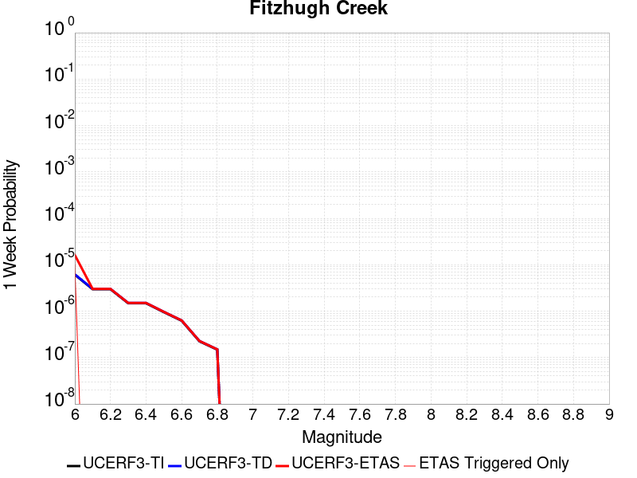 |  |  |  |

| Magnitude | 1 wk TI Prob | 1 wk TD Prob | 1 wk ETAS Prob | 1 wk ETAS/TD Gain | 1 wk ETAS Triggered Only | 1 mo TI Prob | 1 mo TD Prob | 1 mo ETAS Prob | 1 mo ETAS/TD Gain | 1 mo ETAS Triggered Only | 1 yr TI Prob | 1 yr TD Prob | 1 yr ETAS Prob | 1 yr ETAS/TD Gain | 1 yr ETAS Triggered Only | 10 yr TI Prob | 10 yr TD Prob | 10 yr ETAS Prob | 10 yr ETAS/TD Gain | 10 yr ETAS Triggered Only |
|-----|-----|-----|-----|-----|-----|-----|-----|-----|-----|-----|-----|-----|-----|-----|-----|-----|-----|-----|-----|-----|
| 6.0 | 6.1090436E-6 | 6.2101562E-6 | 1.431956E-4 | 23.058294 | 1.369863E-4 | 2.6181353E-5 | 2.6614709E-5 | 1.6359736E-4 | 6.146878 | 1.369863E-4 | 3.1871133E-4 | 3.239904E-4 | 4.6093232E-4 | 1.4226727 | 1.369863E-4 | 0.0031825465 | 0.0032356246 | 0.0033721677 | 1.0421999 | 1.369863E-4 |
| 6.1 | 2.9741811E-6 | 3.021581E-6 | 3.021581E-6 | 1.0 | 0.0 | 1.2746428E-5 | 1.2949574E-5 | 1.2949574E-5 | 1.0 | 0.0 | 1.5517672E-4 | 1.576506E-4 | 1.576506E-4 | 1.0 | 0.0 | 0.001550684 | 0.0015754806 | 0.0015754806 | 1.0 | 0.0 |
| 6.2 | 2.9741811E-6 | 3.021581E-6 | 3.021581E-6 | 1.0 | 0.0 | 1.2746428E-5 | 1.2949574E-5 | 1.2949574E-5 | 1.0 | 0.0 | 1.5517672E-4 | 1.576506E-4 | 1.576506E-4 | 1.0 | 0.0 | 0.001550684 | 0.0015754806 | 0.0015754806 | 1.0 | 0.0 |
| 6.3 | 1.4781198E-6 | 1.5012708E-6 | 1.5012708E-6 | 1.0 | 0.0 | 6.3347834E-6 | 6.4340034E-6 | 6.4340034E-6 | 1.0 | 0.0 | 7.712326E-5 | 7.833137E-5 | 7.833137E-5 | 1.0 | 0.0 | 7.70965E-4 | 7.830576E-4 | 7.830576E-4 | 1.0 | 0.0 |
| 6.4 | 1.4781198E-6 | 1.5012708E-6 | 1.5012708E-6 | 1.0 | 0.0 | 6.3347834E-6 | 6.4340034E-6 | 6.4340034E-6 | 1.0 | 0.0 | 7.712326E-5 | 7.833137E-5 | 7.833137E-5 | 1.0 | 0.0 | 7.70965E-4 | 7.830576E-4 | 7.830576E-4 | 1.0 | 0.0 |
| 6.5 | 9.5176676E-7 | 9.66606E-7 | 9.66606E-7 | 1.0 | 0.0 | 4.078994E-6 | 4.142591E-6 | 4.142591E-6 | 1.0 | 0.0 | 4.9660623E-5 | 5.0434985E-5 | 5.0434985E-5 | 1.0 | 0.0 | 4.964952E-4 | 5.042458E-4 | 5.042458E-4 | 1.0 | 0.0 |
| 6.6 | 6.21145E-7 | 6.3085855E-7 | 6.3085855E-7 | 1.0 | 0.0 | 2.662047E-6 | 2.7036772E-6 | 2.7036772E-6 | 1.0 | 0.0 | 3.2409942E-5 | 3.291684E-5 | 3.291684E-5 | 1.0 | 0.0 | 3.2405215E-4 | 3.2912623E-4 | 3.2912623E-4 | 1.0 | 0.0 |
| 6.7 | 2.2377962E-7 | 2.2734636E-7 | 2.2734636E-7 | 1.0 | 0.0 | 9.590551E-7 | 9.743413E-7 | 9.743413E-7 | 1.0 | 0.0 | 1.1676434E-5 | 1.1862574E-5 | 1.1862574E-5 | 1.0 | 0.0 | 1.1675821E-4 | 1.1862254E-4 | 1.1862254E-4 | 1.0 | 0.0 |
| 6.8 | 1.4785022E-7 | 1.5021492E-7 | 1.5021492E-7 | 1.0 | 0.0 | 6.3364365E-7 | 6.4377826E-7 | 6.4377826E-7 | 1.0 | 0.0 | 7.714584E-6 | 7.838E-6 | 7.838E-6 | 1.0 | 0.0 | 7.714316E-5 | 7.838E-5 | 7.838E-5 | 1.0 | 0.0 |

## Deep Springs
*[(top)](#table-of-contents)*

| 1 Week | 1 Month | 1 Year | 10 Year |
|-----|-----|-----|-----|
|  |  |  |  |

| Magnitude | 1 wk TI Prob | 1 wk TD Prob | 1 wk ETAS Prob | 1 wk ETAS/TD Gain | 1 wk ETAS Triggered Only | 1 mo TI Prob | 1 mo TD Prob | 1 mo ETAS Prob | 1 mo ETAS/TD Gain | 1 mo ETAS Triggered Only | 1 yr TI Prob | 1 yr TD Prob | 1 yr ETAS Prob | 1 yr ETAS/TD Gain | 1 yr ETAS Triggered Only | 10 yr TI Prob | 10 yr TD Prob | 10 yr ETAS Prob | 10 yr ETAS/TD Gain | 10 yr ETAS Triggered Only |
|-----|-----|-----|-----|-----|-----|-----|-----|-----|-----|-----|-----|-----|-----|-----|-----|-----|-----|-----|-----|-----|
| 6.0 | 1.9810619E-5 | 2.311252E-5 | 1.6009566E-4 | 6.9267936 | 1.369863E-4 | 8.489989E-5 | 9.905276E-5 | 2.3602549E-4 | 2.382826 | 1.369863E-4 | 0.001033166 | 0.0012058079 | 0.0013426291 | 1.1134684 | 1.369863E-4 | 0.010283757 | 0.012042425 | 0.012177762 | 1.0112383 | 1.369863E-4 |
| 6.1 | 1.9810619E-5 | 2.311252E-5 | 1.6009566E-4 | 6.9267936 | 1.369863E-4 | 8.489989E-5 | 9.905276E-5 | 2.3602549E-4 | 2.382826 | 1.369863E-4 | 0.001033166 | 0.0012058079 | 0.0013426291 | 1.1134684 | 1.369863E-4 | 0.010283757 | 0.012042425 | 0.012177762 | 1.0112383 | 1.369863E-4 |
| 6.2 | 1.9810619E-5 | 2.311252E-5 | 1.6009566E-4 | 6.9267936 | 1.369863E-4 | 8.489989E-5 | 9.905276E-5 | 2.3602549E-4 | 2.382826 | 1.369863E-4 | 0.001033166 | 0.0012058079 | 0.0013426291 | 1.1134684 | 1.369863E-4 | 0.010283757 | 0.012042425 | 0.012177762 | 1.0112383 | 1.369863E-4 |
| 6.3 | 1.9810619E-5 | 2.311252E-5 | 1.6009566E-4 | 6.9267936 | 1.369863E-4 | 8.489989E-5 | 9.905276E-5 | 2.3602549E-4 | 2.382826 | 1.369863E-4 | 0.001033166 | 0.0012058079 | 0.0013426291 | 1.1134684 | 1.369863E-4 | 0.010283757 | 0.012042425 | 0.012177762 | 1.0112383 | 1.369863E-4 |
| 6.4 | 1.9810619E-5 | 2.311252E-5 | 1.6009566E-4 | 6.9267936 | 1.369863E-4 | 8.489989E-5 | 9.905276E-5 | 2.3602549E-4 | 2.382826 | 1.369863E-4 | 0.001033166 | 0.0012058079 | 0.0013426291 | 1.1134684 | 1.369863E-4 | 0.010283757 | 0.012042425 | 0.012177762 | 1.0112383 | 1.369863E-4 |
| 6.5 | 1.7190405E-5 | 2.0050555E-5 | 1.5703411E-4 | 7.831908 | 1.369863E-4 | 7.367108E-5 | 8.593095E-5 | 2.2290548E-4 | 2.5940068 | 1.369863E-4 | 8.9657627E-4 | 0.0010462094 | 0.0011830523 | 1.1307988 | 1.369863E-4 | 0.008929676 | 0.010462056 | 0.010597609 | 1.0129566 | 1.369863E-4 |
| 6.6 | 1.7190405E-5 | 2.0050555E-5 | 1.5703411E-4 | 7.831908 | 1.369863E-4 | 7.367108E-5 | 8.593095E-5 | 2.2290548E-4 | 2.5940068 | 1.369863E-4 | 8.9657627E-4 | 0.0010462094 | 0.0011830523 | 1.1307988 | 1.369863E-4 | 0.008929676 | 0.010462056 | 0.010597609 | 1.0129566 | 1.369863E-4 |

## Redondo Canyon alt 1
*[(top)](#table-of-contents)*

| 1 Week | 1 Month | 1 Year | 10 Year |
|-----|-----|-----|-----|
|  |  |  |  |

| Magnitude | 1 wk TI Prob | 1 wk TD Prob | 1 wk ETAS Prob | 1 wk ETAS/TD Gain | 1 wk ETAS Triggered Only | 1 mo TI Prob | 1 mo TD Prob | 1 mo ETAS Prob | 1 mo ETAS/TD Gain | 1 mo ETAS Triggered Only | 1 yr TI Prob | 1 yr TD Prob | 1 yr ETAS Prob | 1 yr ETAS/TD Gain | 1 yr ETAS Triggered Only | 10 yr TI Prob | 10 yr TD Prob | 10 yr ETAS Prob | 10 yr ETAS/TD Gain | 10 yr ETAS Triggered Only |
|-----|-----|-----|-----|-----|-----|-----|-----|-----|-----|-----|-----|-----|-----|-----|-----|-----|-----|-----|-----|-----|
| 6.0 | 1.0346246E-5 | 1.09813445E-5 | 1.4796614E-4 | 13.474319 | 1.369863E-4 | 4.43403E-5 | 4.7062502E-5 | 1.8404235E-4 | 3.9105945 | 1.369863E-4 | 5.3970946E-4 | 5.729142E-4 | 7.0982205E-4 | 1.2389674 | 1.369863E-4 | 0.0053840056 | 0.005722111 | 0.0058583138 | 1.0238029 | 1.369863E-4 |
| 6.1 | 1.0346246E-5 | 1.09813445E-5 | 1.4796614E-4 | 13.474319 | 1.369863E-4 | 4.43403E-5 | 4.7062502E-5 | 1.8404235E-4 | 3.9105945 | 1.369863E-4 | 5.3970946E-4 | 5.729142E-4 | 7.0982205E-4 | 1.2389674 | 1.369863E-4 | 0.0053840056 | 0.005722111 | 0.0058583138 | 1.0238029 | 1.369863E-4 |
| 6.2 | 1.0346246E-5 | 1.09813445E-5 | 1.4796614E-4 | 13.474319 | 1.369863E-4 | 4.43403E-5 | 4.7062502E-5 | 1.8404235E-4 | 3.9105945 | 1.369863E-4 | 5.3970946E-4 | 5.729142E-4 | 7.0982205E-4 | 1.2389674 | 1.369863E-4 | 0.0053840056 | 0.005722111 | 0.0058583138 | 1.0238029 | 1.369863E-4 |
| 6.3 | 3.2052794E-6 | 3.2361174E-6 | 3.2361174E-6 | 1.0 | 0.0 | 1.373684E-5 | 1.3869023E-5 | 1.3869023E-5 | 1.0 | 0.0 | 1.6723319E-4 | 1.6884625E-4 | 1.6884625E-4 | 1.0 | 0.0 | 0.001671074 | 0.0016875692 | 0.0016875692 | 1.0 | 0.0 |
| 6.4 | 3.2052794E-6 | 3.2361174E-6 | 3.2361174E-6 | 1.0 | 0.0 | 1.373684E-5 | 1.3869023E-5 | 1.3869023E-5 | 1.0 | 0.0 | 1.6723319E-4 | 1.6884625E-4 | 1.6884625E-4 | 1.0 | 0.0 | 0.001671074 | 0.0016875692 | 0.0016875692 | 1.0 | 0.0 |
| 6.5 | 3.2052794E-6 | 3.2361174E-6 | 3.2361174E-6 | 1.0 | 0.0 | 1.373684E-5 | 1.3869023E-5 | 1.3869023E-5 | 1.0 | 0.0 | 1.6723319E-4 | 1.6884625E-4 | 1.6884625E-4 | 1.0 | 0.0 | 0.001671074 | 0.0016875692 | 0.0016875692 | 1.0 | 0.0 |
| 6.6 | 1.948328E-6 | 1.8288681E-6 | 1.8288681E-6 | 1.0 | 0.0 | 8.349951E-6 | 7.837991E-6 | 7.837991E-6 | 1.0 | 0.0 | 1.016559E-4 | 9.542486E-5 | 9.542486E-5 | 1.0 | 0.0 | 0.0010160941 | 9.539858E-4 | 9.539858E-4 | 1.0 | 0.0 |
| 6.7 | 1.948328E-6 | 1.8288681E-6 | 1.8288681E-6 | 1.0 | 0.0 | 8.349951E-6 | 7.837991E-6 | 7.837991E-6 | 1.0 | 0.0 | 1.016559E-4 | 9.542486E-5 | 9.542486E-5 | 1.0 | 0.0 | 0.0010160941 | 9.539858E-4 | 9.539858E-4 | 1.0 | 0.0 |
| 6.8 | 1.1278219E-6 | 9.033076E-7 | 9.033076E-7 | 1.0 | 0.0 | 4.8335132E-6 | 3.871315E-6 | 3.871315E-6 | 1.0 | 0.0 | 5.8846435E-5 | 4.7132668E-5 | 4.7132668E-5 | 1.0 | 0.0 | 5.8830855E-4 | 4.7126875E-4 | 4.7126875E-4 | 1.0 | 0.0 |
| 6.9 | 1.1278219E-6 | 9.033076E-7 | 9.033076E-7 | 1.0 | 0.0 | 4.8335132E-6 | 3.871315E-6 | 3.871315E-6 | 1.0 | 0.0 | 5.8846435E-5 | 4.7132668E-5 | 4.7132668E-5 | 1.0 | 0.0 | 5.8830855E-4 | 4.7126875E-4 | 4.7126875E-4 | 1.0 | 0.0 |
| 7.0 | 1.1278219E-6 | 9.033076E-7 | 9.033076E-7 | 1.0 | 0.0 | 4.8335132E-6 | 3.871315E-6 | 3.871315E-6 | 1.0 | 0.0 | 5.8846435E-5 | 4.7132668E-5 | 4.7132668E-5 | 1.0 | 0.0 | 5.8830855E-4 | 4.7126875E-4 | 4.7126875E-4 | 1.0 | 0.0 |
| 7.1 | 1.0545139E-6 | 8.5692716E-7 | 8.5692716E-7 | 1.0 | 0.0 | 4.5193374E-6 | 3.6725423E-6 | 3.6725423E-6 | 1.0 | 0.0 | 5.5021545E-5 | 4.471271E-5 | 4.471271E-5 | 1.0 | 0.0 | 5.500792E-4 | 4.470789E-4 | 4.470789E-4 | 1.0 | 0.0 |
| 7.2 | 1.0545139E-6 | 8.5692716E-7 | 8.5692716E-7 | 1.0 | 0.0 | 4.5193374E-6 | 3.6725423E-6 | 3.6725423E-6 | 1.0 | 0.0 | 5.5021545E-5 | 4.471271E-5 | 4.471271E-5 | 1.0 | 0.0 | 5.500792E-4 | 4.470789E-4 | 4.470789E-4 | 1.0 | 0.0 |
| 7.3 | 9.505161E-8 | 5.8957607E-8 | 5.8957607E-8 | 1.0 | 0.0 | 4.0736398E-7 | 2.5267545E-7 | 2.5267545E-7 | 1.0 | 0.0 | 4.959645E-6 | 3.0763204E-6 | 3.0763204E-6 | 1.0 | 0.0 | 4.9595343E-5 | 3.0762894E-5 | 3.0762894E-5 | 1.0 | 0.0 |
| 7.4 | 3.9520785E-8 | 2.6987191E-8 | 2.6987191E-8 | 1.0 | 0.0 | 1.6937479E-7 | 1.1565938E-7 | 1.1565938E-7 | 1.0 | 0.0 | 2.062136E-6 | 1.4081523E-6 | 1.4081523E-6 | 1.0 | 0.0 | 2.062117E-5 | 1.4081461E-5 | 1.4081461E-5 | 1.0 | 0.0 |
| 7.5 | 5.6133214E-9 | 3.7368215E-9 | 3.7368215E-9 | 1.0 | 0.0 | 2.4057092E-8 | 1.601495E-8 | 1.601495E-8 | 1.0 | 0.0 | 2.9289507E-7 | 1.9498201E-7 | 1.9498201E-7 | 1.0 | 0.0 | 2.9289467E-6 | 1.9498186E-6 | 1.9498186E-6 | 1.0 | 0.0 |
| 7.6 | 4.1064334E-9 | 2.5957634E-9 | 2.5957634E-9 | 1.0 | 0.0 | 1.7599E-8 | 1.11247E-8 | 1.11247E-8 | 1.0 | 0.0 | 2.142678E-7 | 1.3544322E-7 | 1.3544322E-7 | 1.0 | 0.0 | 2.1426758E-6 | 1.3544316E-6 | 1.3544316E-6 | 1.0 | 0.0 |
| 7.7 | 1.361975E-9 | 6.360824E-10 | 6.360824E-10 | 1.0 | 0.0 | 5.8370353E-9 | 2.7260674E-9 | 2.7260674E-9 | 1.0 | 0.0 | 7.1065905E-8 | 3.318987E-8 | 3.318987E-8 | 1.0 | 0.0 | 7.106588E-7 | 3.318987E-7 | 3.318987E-7 | 1.0 | 0.0 |
| 7.8 | 1.361975E-9 | 6.360824E-10 | 6.360824E-10 | 1.0 | 0.0 | 5.8370353E-9 | 2.7260674E-9 | 2.7260674E-9 | 1.0 | 0.0 | 7.1065905E-8 | 3.318987E-8 | 3.318987E-8 | 1.0 | 0.0 | 7.106588E-7 | 3.318987E-7 | 3.318987E-7 | 1.0 | 0.0 |

## Nelson Lake
*[(top)](#table-of-contents)*

| 1 Week | 1 Month | 1 Year | 10 Year |
|-----|-----|-----|-----|
|  |  |  |  |

| Magnitude | 1 wk TI Prob | 1 wk TD Prob | 1 wk ETAS Prob | 1 wk ETAS/TD Gain | 1 wk ETAS Triggered Only | 1 mo TI Prob | 1 mo TD Prob | 1 mo ETAS Prob | 1 mo ETAS/TD Gain | 1 mo ETAS Triggered Only | 1 yr TI Prob | 1 yr TD Prob | 1 yr ETAS Prob | 1 yr ETAS/TD Gain | 1 yr ETAS Triggered Only | 10 yr TI Prob | 10 yr TD Prob | 10 yr ETAS Prob | 10 yr ETAS/TD Gain | 10 yr ETAS Triggered Only |
|-----|-----|-----|-----|-----|-----|-----|-----|-----|-----|-----|-----|-----|-----|-----|-----|-----|-----|-----|-----|-----|
| 6.0 | 9.913453E-6 | 1.0192255E-5 | 1.4717715E-4 | 14.440098 | 1.369863E-4 | 4.2485535E-5 | 4.3680422E-5 | 1.8066073E-4 | 4.135966 | 1.369863E-4 | 5.1713863E-4 | 5.316897E-4 | 6.6860317E-4 | 1.2575064 | 1.369863E-4 | 0.0051593683 | 0.005305204 | 0.0054414636 | 1.0256841 | 1.369863E-4 |
| 6.1 | 9.913453E-6 | 1.0192255E-5 | 1.4717715E-4 | 14.440098 | 1.369863E-4 | 4.2485535E-5 | 4.3680422E-5 | 1.8066073E-4 | 4.135966 | 1.369863E-4 | 5.1713863E-4 | 5.316897E-4 | 6.6860317E-4 | 1.2575064 | 1.369863E-4 | 0.0051593683 | 0.005305204 | 0.0054414636 | 1.0256841 | 1.369863E-4 |
| 6.2 | 4.5596407E-6 | 4.696313E-6 | 1.4168197E-4 | 30.168766 | 1.369863E-4 | 1.954117E-5 | 2.0126909E-5 | 1.5711045E-4 | 7.8059907 | 1.369863E-4 | 2.3788778E-4 | 2.4501883E-4 | 3.8197156E-4 | 1.5589478 | 1.369863E-4 | 0.0023763329 | 0.0024476128 | 0.002584264 | 1.0558304 | 1.369863E-4 |
| 6.3 | 4.5596407E-6 | 4.696313E-6 | 1.4168197E-4 | 30.168766 | 1.369863E-4 | 1.954117E-5 | 2.0126909E-5 | 1.5711045E-4 | 7.8059907 | 1.369863E-4 | 2.3788778E-4 | 2.4501883E-4 | 3.8197156E-4 | 1.5589478 | 1.369863E-4 | 0.0023763329 | 0.0024476128 | 0.002584264 | 1.0558304 | 1.369863E-4 |
| 6.4 | 3.4025713E-6 | 3.5098972E-6 | 1.4049571E-4 | 40.028442 | 1.369863E-4 | 1.4582367E-5 | 1.5042335E-5 | 1.5202658E-4 | 10.106581 | 1.369863E-4 | 1.7752586E-4 | 1.8312587E-4 | 3.200871E-4 | 1.7479075 | 1.369863E-4 | 0.001773841 | 0.0018298327 | 0.0019665684 | 1.0747257 | 1.369863E-4 |
| 6.5 | 2.8352947E-6 | 2.927856E-6 | 1.3991375E-4 | 47.7871 | 1.369863E-4 | 1.2151207E-5 | 1.2547898E-5 | 1.4953248E-4 | 11.916934 | 1.369863E-4 | 1.479309E-4 | 1.5276071E-4 | 2.8972607E-4 | 1.8966008 | 1.369863E-4 | 0.0014783246 | 0.0015266308 | 0.001663408 | 1.0895941 | 1.369863E-4 |
| 6.6 | 2.251518E-6 | 2.3290677E-6 | 1.3931505E-4 | 59.815804 | 1.369863E-4 | 9.649328E-6 | 9.981683E-6 | 1.4696662E-4 | 14.72363 | 1.369863E-4 | 1.1747423E-4 | 1.2152085E-4 | 2.584905E-4 | 2.1271288 | 1.369863E-4 | 0.0011741214 | 0.0012146058 | 0.0013514257 | 1.1126455 | 1.369863E-4 |
| 6.7 | 1.8911853E-6 | 1.9591396E-6 | 1.3894518E-4 | 70.921524 | 1.369863E-4 | 8.105055E-6 | 8.39629E-6 | 1.4538145E-4 | 17.314964 | 1.369863E-4 | 9.867457E-5 | 1.0222061E-4 | 2.3919292E-4 | 2.3399675 | 1.369863E-4 | 9.863076E-4 | 0.0010217935 | 0.0011586398 | 1.1339276 | 1.369863E-4 |
| 6.8 | 1.4874814E-6 | 1.5438305E-6 | 1.3852993E-4 | 89.7313 | 1.369863E-4 | 6.374905E-6 | 6.6164025E-6 | 1.4360179E-4 | 21.703909 | 1.369863E-4 | 7.76117E-5 | 8.055224E-5 | 2.1752751E-4 | 2.7004526 | 1.369863E-4 | 7.75846E-4 | 8.0528157E-4 | 9.421575E-4 | 1.1699728 | 1.369863E-4 |
| 6.9 | 6.835972E-7 | 7.1399285E-7 | 1.3770019E-4 | 192.85936 | 1.369863E-4 | 2.9296991E-6 | 3.0599674E-6 | 1.4004586E-4 | 45.767105 | 1.369863E-4 | 3.56685E-5 | 3.7254784E-5 | 1.7423599E-4 | 4.676875 | 1.369863E-4 | 3.5662777E-4 | 3.7251666E-4 | 5.0945196E-4 | 1.3675951 | 1.369863E-4 |

## Death Valley (Fish Lake Valley)
*[(top)](#table-of-contents)*

| 1 Week | 1 Month | 1 Year | 10 Year |
|-----|-----|-----|-----|
|  |  |  |  |

| Magnitude | 1 wk TI Prob | 1 wk TD Prob | 1 wk ETAS Prob | 1 wk ETAS/TD Gain | 1 wk ETAS Triggered Only | 1 mo TI Prob | 1 mo TD Prob | 1 mo ETAS Prob | 1 mo ETAS/TD Gain | 1 mo ETAS Triggered Only | 1 yr TI Prob | 1 yr TD Prob | 1 yr ETAS Prob | 1 yr ETAS/TD Gain | 1 yr ETAS Triggered Only | 10 yr TI Prob | 10 yr TD Prob | 10 yr ETAS Prob | 10 yr ETAS/TD Gain | 10 yr ETAS Triggered Only |
|-----|-----|-----|-----|-----|-----|-----|-----|-----|-----|-----|-----|-----|-----|-----|-----|-----|-----|-----|-----|-----|
| 6.0 | 3.872328E-5 | 4.7267473E-5 | 1.842473E-4 | 3.8979723 | 1.369863E-4 | 1.6594635E-4 | 2.0256084E-4 | 3.395194E-4 | 1.6761354 | 1.369863E-4 | 0.0020185246 | 0.002463534 | 0.0026001828 | 1.0554687 | 1.369863E-4 | 0.02000288 | 0.024388181 | 0.024521826 | 1.0054799 | 1.369863E-4 |
| 6.1 | 3.872328E-5 | 4.7267473E-5 | 1.842473E-4 | 3.8979723 | 1.369863E-4 | 1.6594635E-4 | 2.0256084E-4 | 3.395194E-4 | 1.6761354 | 1.369863E-4 | 0.0020185246 | 0.002463534 | 0.0026001828 | 1.0554687 | 1.369863E-4 | 0.02000288 | 0.024388181 | 0.024521826 | 1.0054799 | 1.369863E-4 |
| 6.2 | 3.872328E-5 | 4.7267473E-5 | 1.842473E-4 | 3.8979723 | 1.369863E-4 | 1.6594635E-4 | 2.0256084E-4 | 3.395194E-4 | 1.6761354 | 1.369863E-4 | 0.0020185246 | 0.002463534 | 0.0026001828 | 1.0554687 | 1.369863E-4 | 0.02000288 | 0.024388181 | 0.024521826 | 1.0054799 | 1.369863E-4 |
| 6.3 | 2.8356371E-5 | 3.3609853E-5 | 1.7059155E-4 | 5.075641 | 1.369863E-4 | 1.2152165E-4 | 1.4403471E-4 | 2.810013E-4 | 1.9509275 | 1.369863E-4 | 0.0014785219 | 0.0017522911 | 0.0018890373 | 1.0780386 | 1.369863E-4 | 0.014687235 | 0.017391782 | 0.017526386 | 1.0077395 | 1.369863E-4 |
| 6.4 | 2.8356371E-5 | 3.3609853E-5 | 1.7059155E-4 | 5.075641 | 1.369863E-4 | 1.2152165E-4 | 1.4403471E-4 | 2.810013E-4 | 1.9509275 | 1.369863E-4 | 0.0014785219 | 0.0017522911 | 0.0018890373 | 1.0780386 | 1.369863E-4 | 0.014687235 | 0.017391782 | 0.017526386 | 1.0077395 | 1.369863E-4 |
| 6.5 | 2.4448687E-5 | 2.8607552E-5 | 1.6558994E-4 | 5.788329 | 1.369863E-4 | 1.0477588E-4 | 1.2259831E-4 | 2.5956784E-4 | 2.1172218 | 1.369863E-4 | 0.0012748998 | 0.0014916632 | 0.0016284451 | 1.0916976 | 1.369863E-4 | 0.012676105 | 0.014821377 | 0.014956333 | 1.0091054 | 1.369863E-4 |
| 6.6 | 2.1298161E-5 | 2.4660083E-5 | 1.6164301E-4 | 6.5548444 | 1.369863E-4 | 9.127464E-5 | 1.0568198E-4 | 2.4265381E-4 | 2.2960753 | 1.369863E-4 | 0.0011107022 | 0.0012859525 | 0.0014227626 | 1.1063882 | 1.369863E-4 | 0.011051672 | 0.012788526 | 0.012923759 | 1.0105747 | 1.369863E-4 |
| 6.7 | 1.8959729E-5 | 2.1781025E-5 | 1.5876435E-4 | 7.2891126 | 1.369863E-4 | 8.125345E-5 | 9.334405E-5 | 2.3031757E-4 | 2.4674048 | 1.369863E-4 | 9.888117E-4 | 0.001135897 | 0.0012727276 | 1.1204605 | 1.369863E-4 | 0.009844234 | 0.01130357 | 0.011439008 | 1.0119818 | 1.369863E-4 |
| 6.8 | 1.6691629E-5 | 1.9018353E-5 | 1.5600205E-4 | 8.202711 | 1.369863E-4 | 7.153359E-5 | 8.150477E-5 | 2.1847991E-4 | 2.6805782 | 1.369863E-4 | 8.7057345E-4 | 9.918857E-4 | 0.0011287361 | 1.13797 | 1.369863E-4 | 0.008671708 | 0.009876343 | 0.010011977 | 1.0137331 | 1.369863E-4 |
| 6.9 | 1.450505E-5 | 1.638954E-5 | 1.5337359E-4 | 9.358017 | 1.369863E-4 | 6.216302E-5 | 7.0239046E-5 | 2.0721572E-4 | 2.9501503 | 1.369863E-4 | 7.5657194E-4 | 8.5483363E-4 | 9.917028E-4 | 1.1601121 | 1.369863E-4 | 0.007540013 | 0.008516385 | 0.008652206 | 1.015948 | 1.369863E-4 |
| 7.0 | 1.2940855E-5 | 1.4537972E-5 | 1.5152228E-4 | 10.422519 | 1.369863E-4 | 5.545963E-5 | 6.230414E-5 | 1.992819E-4 | 3.198534 | 1.369863E-4 | 6.750118E-4 | 7.5829466E-4 | 8.9517713E-4 | 1.1805135 | 1.369863E-4 | 0.006729651 | 0.0075576897 | 0.007693641 | 1.0179884 | 1.369863E-4 |
| 7.1 | 1.2544658E-5 | 1.4078208E-5 | 1.5106257E-4 | 10.730243 | 1.369863E-4 | 5.3761712E-5 | 6.0333812E-5 | 1.9731185E-4 | 3.2703362 | 1.369863E-4 | 6.5435225E-4 | 7.343222E-4 | 8.712079E-4 | 1.186411 | 1.369863E-4 | 0.006524288 | 0.007319551 | 0.0074555343 | 1.0185782 | 1.369863E-4 |
| 7.2 | 1.2489416E-5 | 1.4015674E-5 | 1.5100006E-4 | 10.773656 | 1.369863E-4 | 5.3524967E-5 | 6.0065824E-5 | 1.970439E-4 | 3.280466 | 1.369863E-4 | 6.514716E-4 | 7.310616E-4 | 8.6794776E-4 | 1.187243 | 1.369863E-4 | 0.006495651 | 0.0072871596 | 0.0074231476 | 1.0186614 | 1.369863E-4 |
| 7.3 | 1.2368307E-5 | 1.3879812E-5 | 1.5086422E-4 | 10.869327 | 1.369863E-4 | 5.3005948E-5 | 5.9483587E-5 | 1.9646174E-4 | 3.302789 | 1.369863E-4 | 6.451563E-4 | 7.2397763E-4 | 8.6086476E-4 | 1.1890764 | 1.369863E-4 | 0.0064328653 | 0.007216782 | 0.0073527796 | 1.0188446 | 1.369863E-4 |
| 7.4 | 1.2161707E-5 | 1.36478675E-5 | 1.506323E-4 | 11.037057 | 1.369863E-4 | 5.212056E-5 | 5.8489582E-5 | 1.9546787E-4 | 3.3419263 | 1.369863E-4 | 6.3438306E-4 | 7.118836E-4 | 8.4877235E-4 | 1.192291 | 1.369863E-4 | 0.006325751 | 0.0070966207 | 0.007232635 | 1.019166 | 1.369863E-4 |
| 7.5 | 1.1707948E-5 | 1.3145515E-5 | 1.5013001E-4 | 11.420627 | 1.369863E-4 | 5.0175953E-5 | 5.6336736E-5 | 1.9331533E-4 | 3.4314256 | 1.369863E-4 | 6.10721E-4 | 6.856895E-4 | 8.225819E-4 | 1.199642 | 1.369863E-4 | 0.0060904534 | 0.006836321 | 0.006972371 | 1.019901 | 1.369863E-4 |
| 7.6 | 1.0319538E-5 | 1.1579622E-5 | 1.4856434E-4 | 12.829808 | 1.369863E-4 | 4.4225842E-5 | 4.9626036E-5 | 1.8660554E-4 | 3.7602346 | 1.369863E-4 | 5.383166E-4 | 6.040347E-4 | 7.4093824E-4 | 1.2266484 | 1.369863E-4 | 0.0053701443 | 0.0060244603 | 0.0061606215 | 1.0226014 | 1.369863E-4 |
| 7.7 | 8.937764E-6 | 1.0022779E-5 | 1.4700771E-4 | 14.667359 | 1.369863E-4 | 3.830414E-5 | 4.295409E-5 | 1.799345E-4 | 4.188996 | 1.369863E-4 | 4.6625308E-4 | 5.228456E-4 | 6.5976026E-4 | 1.2618644 | 1.369863E-4 | 0.0046527605 | 0.005216664 | 0.0053529358 | 1.0261223 | 1.369863E-4 |
| 7.8 | 3.108007E-7 | 3.284654E-7 | 3.284654E-7 | 1.0 | 0.0 | 1.3320023E-6 | 1.407708E-6 | 1.407708E-6 | 1.0 | 0.0 | 1.6217007E-5 | 1.7138715E-5 | 1.7138715E-5 | 1.0 | 0.0 | 1.6215823E-4 | 1.7137431E-4 | 1.7137431E-4 | 1.0 | 0.0 |
| 7.9 | 2.5591178E-9 | 2.6696718E-9 | 2.6696718E-9 | 1.0 | 0.0 | 1.0967647E-8 | 1.14414505E-8 | 1.14414505E-8 | 1.0 | 0.0 | 1.335311E-7 | 1.3929966E-7 | 1.3929966E-7 | 1.0 | 0.0 | 1.3353102E-6 | 1.3929966E-6 | 1.3929966E-6 | 1.0 | 0.0 |

## Cady
*[(top)](#table-of-contents)*

| 1 Week | 1 Month | 1 Year | 10 Year |
|-----|-----|-----|-----|
|  |  |  |  |

| Magnitude | 1 wk TI Prob | 1 wk TD Prob | 1 wk ETAS Prob | 1 wk ETAS/TD Gain | 1 wk ETAS Triggered Only | 1 mo TI Prob | 1 mo TD Prob | 1 mo ETAS Prob | 1 mo ETAS/TD Gain | 1 mo ETAS Triggered Only | 1 yr TI Prob | 1 yr TD Prob | 1 yr ETAS Prob | 1 yr ETAS/TD Gain | 1 yr ETAS Triggered Only | 10 yr TI Prob | 10 yr TD Prob | 10 yr ETAS Prob | 10 yr ETAS/TD Gain | 10 yr ETAS Triggered Only |
|-----|-----|-----|-----|-----|-----|-----|-----|-----|-----|-----|-----|-----|-----|-----|-----|-----|-----|-----|-----|-----|
| 6.0 | 1.9892565E-5 | 2.1858728E-5 | 2.1858728E-5 | 1.0 | 0.0 | 8.525106E-5 | 9.3677416E-5 | 9.3677416E-5 | 1.0 | 0.0 | 0.0010374374 | 0.0011400167 | 0.0012768469 | 1.1200247 | 1.369863E-4 | 0.010326075 | 0.011350701 | 0.011486132 | 1.0119315 | 1.369863E-4 |
| 6.1 | 1.9892565E-5 | 2.1858728E-5 | 2.1858728E-5 | 1.0 | 0.0 | 8.525106E-5 | 9.3677416E-5 | 9.3677416E-5 | 1.0 | 0.0 | 0.0010374374 | 0.0011400167 | 0.0012768469 | 1.1200247 | 1.369863E-4 | 0.010326075 | 0.011350701 | 0.011486132 | 1.0119315 | 1.369863E-4 |
| 6.2 | 1.9892565E-5 | 2.1858728E-5 | 2.1858728E-5 | 1.0 | 0.0 | 8.525106E-5 | 9.3677416E-5 | 9.3677416E-5 | 1.0 | 0.0 | 0.0010374374 | 0.0011400167 | 0.0012768469 | 1.1200247 | 1.369863E-4 | 0.010326075 | 0.011350701 | 0.011486132 | 1.0119315 | 1.369863E-4 |
| 6.3 | 1.1117327E-5 | 1.2176583E-5 | 1.2176583E-5 | 1.0 | 0.0 | 4.764482E-5 | 5.2184492E-5 | 5.2184492E-5 | 1.0 | 0.0 | 5.7992124E-4 | 6.351925E-4 | 7.720918E-4 | 1.2155241 | 1.369863E-4 | 0.0057841022 | 0.0063368753 | 0.0064729936 | 1.0214803 | 1.369863E-4 |
| 6.4 | 1.1117327E-5 | 1.2176583E-5 | 1.2176583E-5 | 1.0 | 0.0 | 4.764482E-5 | 5.2184492E-5 | 5.2184492E-5 | 1.0 | 0.0 | 5.7992124E-4 | 6.351925E-4 | 7.720918E-4 | 1.2155241 | 1.369863E-4 | 0.0057841022 | 0.0063368753 | 0.0064729936 | 1.0214803 | 1.369863E-4 |
| 6.5 | 6.103093E-6 | 6.672021E-6 | 6.672021E-6 | 1.0 | 0.0 | 2.615585E-5 | 2.8594131E-5 | 2.8594131E-5 | 1.0 | 0.0 | 3.1840094E-4 | 3.480905E-4 | 4.8502913E-4 | 1.3933995 | 1.369863E-4 | 0.0031794512 | 0.0034766865 | 0.0036131968 | 1.0392644 | 1.369863E-4 |
| 6.6 | 5.817237E-6 | 6.3656585E-6 | 6.3656585E-6 | 1.0 | 0.0 | 2.4930776E-5 | 2.728118E-5 | 2.728118E-5 | 1.0 | 0.0 | 3.034899E-4 | 3.3211018E-4 | 4.6905098E-4 | 1.4123355 | 1.369863E-4 | 0.0030307577 | 0.0033173605 | 0.0034538924 | 1.0411568 | 1.369863E-4 |
| 6.7 | 4.8846314E-6 | 5.3405684E-6 | 5.3405684E-6 | 1.0 | 0.0 | 2.0933967E-5 | 2.2888014E-5 | 2.2888014E-5 | 1.0 | 0.0 | 2.5484123E-4 | 2.7863772E-4 | 4.1558585E-4 | 1.4914917 | 1.369863E-4 | 0.0025454918 | 0.0027840391 | 0.0029206441 | 1.0490671 | 1.369863E-4 |
| 6.8 | 1.7788773E-6 | 1.9399079E-6 | 1.9399079E-6 | 1.0 | 0.0 | 7.6237375E-6 | 8.313874E-6 | 8.313874E-6 | 1.0 | 0.0 | 9.281505E-5 | 1.01218284E-4 | 1.01218284E-4 | 1.0 | 0.0 | 9.2776294E-4 | 0.0010118765 | 0.0010118765 | 1.0 | 0.0 |
| 6.9 | 7.5455404E-7 | 8.297092E-7 | 8.297092E-7 | 1.0 | 0.0 | 3.233799E-6 | 3.5558937E-6 | 3.5558937E-6 | 1.0 | 0.0 | 3.937079E-5 | 4.3292483E-5 | 4.3292483E-5 | 1.0 | 0.0 | 3.9363815E-4 | 4.3287344E-4 | 4.3287344E-4 | 1.0 | 0.0 |
| 7.0 | 6.8578805E-7 | 7.541816E-7 | 7.541816E-7 | 1.0 | 0.0 | 2.9390883E-6 | 3.2322048E-6 | 3.2322048E-6 | 1.0 | 0.0 | 3.578281E-5 | 3.9351715E-5 | 3.9351715E-5 | 1.0 | 0.0 | 3.577705E-4 | 3.9347992E-4 | 3.9347992E-4 | 1.0 | 0.0 |

## San Jacinto (Borrego)
*[(top)](#table-of-contents)*

| 1 Week | 1 Month | 1 Year | 10 Year |
|-----|-----|-----|-----|
|  |  |  |  |

| Magnitude | 1 wk TI Prob | 1 wk TD Prob | 1 wk ETAS Prob | 1 wk ETAS/TD Gain | 1 wk ETAS Triggered Only | 1 mo TI Prob | 1 mo TD Prob | 1 mo ETAS Prob | 1 mo ETAS/TD Gain | 1 mo ETAS Triggered Only | 1 yr TI Prob | 1 yr TD Prob | 1 yr ETAS Prob | 1 yr ETAS/TD Gain | 1 yr ETAS Triggered Only | 10 yr TI Prob | 10 yr TD Prob | 10 yr ETAS Prob | 10 yr ETAS/TD Gain | 10 yr ETAS Triggered Only |
|-----|-----|-----|-----|-----|-----|-----|-----|-----|-----|-----|-----|-----|-----|-----|-----|-----|-----|-----|-----|-----|
| 6.0 | 3.543992E-5 | 2.7926513E-5 | 1.6490898E-4 | 5.905105 | 1.369863E-4 | 1.5187653E-4 | 1.1967963E-4 | 2.5664954E-4 | 2.1444714 | 1.369863E-4 | 0.0018475284 | 0.0014561379 | 0.0015929247 | 1.0939381 | 1.369863E-4 | 0.018322436 | 0.014869647 | 0.015004597 | 1.0090755 | 1.369863E-4 |
| 6.1 | 3.542281E-5 | 2.7926513E-5 | 1.6490898E-4 | 5.905105 | 1.369863E-4 | 1.5180321E-4 | 1.1967963E-4 | 2.5664954E-4 | 2.1444714 | 1.369863E-4 | 0.0018466372 | 0.0014561379 | 0.0015929247 | 1.0939381 | 1.369863E-4 | 0.018313672 | 0.014869647 | 0.015004597 | 1.0090755 | 1.369863E-4 |
| 6.2 | 3.4688688E-5 | 2.7926511E-5 | 1.6490898E-4 | 5.905105 | 1.369863E-4 | 1.4865733E-4 | 1.1967963E-4 | 2.5664954E-4 | 2.1444714 | 1.369863E-4 | 0.0018084005 | 0.0014561379 | 0.0015929247 | 1.0939381 | 1.369863E-4 | 0.017937548 | 0.014869647 | 0.015004597 | 1.0090755 | 1.369863E-4 |
| 6.3 | 3.2087122E-5 | 2.7771865E-5 | 1.6475435E-4 | 5.93242 | 1.369863E-4 | 1.3750899E-4 | 1.1901691E-4 | 2.559869E-4 | 2.1508448 | 1.369863E-4 | 0.0016728862 | 0.00144808 | 0.001584868 | 1.0944616 | 1.369863E-4 | 0.016603488 | 0.014790683 | 0.014925643 | 1.0091246 | 1.369863E-4 |
| 6.4 | 3.1828724E-5 | 2.7738852E-5 | 1.6472135E-4 | 5.9382906 | 1.369863E-4 | 1.364017E-4 | 1.1887544E-4 | 2.5584546E-4 | 2.1522145 | 1.369863E-4 | 0.0016594254 | 0.0014463598 | 0.001583148 | 1.0945741 | 1.369863E-4 | 0.016470885 | 0.014773762 | 0.014908724 | 1.0091352 | 1.369863E-4 |
| 6.5 | 3.1563577E-5 | 2.747857E-5 | 1.644611E-4 | 5.985068 | 1.369863E-4 | 1.3526545E-4 | 1.1776006E-4 | 2.5473023E-4 | 2.1631293 | 1.369863E-4 | 0.0016456128 | 0.0014327979 | 0.001569588 | 1.0954705 | 1.369863E-4 | 0.0163348 | 0.014640348 | 0.014775328 | 1.0092198 | 1.369863E-4 |
| 6.6 | 3.1467625E-5 | 2.7322796E-5 | 1.6430535E-4 | 6.0134897 | 1.369863E-4 | 1.3485427E-4 | 1.1709251E-4 | 2.5406276E-4 | 2.1697612 | 1.369863E-4 | 0.0016406142 | 0.0014246812 | 0.0015614723 | 1.0960152 | 1.369863E-4 | 0.016285548 | 0.014560594 | 0.014695586 | 1.009271 | 1.369863E-4 |
| 6.7 | 3.1223695E-5 | 2.6940816E-5 | 1.6392343E-4 | 6.0845757 | 1.369863E-4 | 1.3380898E-4 | 1.15455594E-4 | 2.5242608E-4 | 2.1863477 | 1.369863E-4 | 0.0016279068 | 0.0014047775 | 0.0015415715 | 1.0973777 | 1.369863E-4 | 0.01616033 | 0.014364966 | 0.014499985 | 1.0093992 | 1.369863E-4 |
| 6.8 | 3.1015585E-5 | 2.6761822E-5 | 1.6374445E-4 | 6.118584 | 1.369863E-4 | 1.3291716E-4 | 1.1468855E-4 | 2.5165913E-4 | 2.194283 | 1.369863E-4 | 0.001617065 | 0.0013954508 | 0.0015322459 | 1.0980294 | 1.369863E-4 | 0.016053487 | 0.014272246 | 0.014407277 | 1.009461 | 1.369863E-4 |
| 6.9 | 2.6641965E-5 | 2.2184247E-5 | 1.5916751E-4 | 7.174799 | 1.369863E-4 | 1.1417485E-4 | 9.50719E-5 | 2.3204517E-4 | 2.4407337 | 1.369863E-4 | 0.0013891924 | 0.0011568897 | 0.0012937175 | 1.1182722 | 1.369863E-4 | 0.0138054015 | 0.011882438 | 0.012017798 | 1.0113915 | 1.369863E-4 |
| 7.0 | 2.3854353E-5 | 2.0479023E-5 | 1.5746252E-4 | 7.6889663 | 1.369863E-4 | 1.02228936E-4 | 8.77643E-5 | 2.2473859E-4 | 2.560706 | 1.369863E-4 | 0.0012439266 | 0.0010680092 | 0.0012048492 | 1.1281263 | 1.369863E-4 | 0.012369866 | 0.0109828 | 0.011118283 | 1.0123358 | 1.369863E-4 |
| 7.1 | 2.3672901E-5 | 2.031551E-5 | 1.5729903E-4 | 7.7428045 | 1.369863E-4 | 1.0145135E-4 | 8.7063585E-5 | 2.2403795E-4 | 2.5732682 | 1.369863E-4 | 0.0012344702 | 0.0010594862 | 0.0011963274 | 1.129158 | 1.369863E-4 | 0.0122763505 | 0.010897976 | 0.01103347 | 1.0124329 | 1.369863E-4 |
| 7.2 | 2.2717244E-5 | 1.9542893E-5 | 1.5652651E-4 | 8.009383 | 1.369863E-4 | 9.735599E-5 | 8.375258E-5 | 2.2072741E-4 | 2.63547 | 1.369863E-4 | 0.0011846646 | 0.001019213 | 0.0011560597 | 1.134267 | 1.369863E-4 | 0.01178369 | 0.010495341 | 0.01063089 | 1.0129151 | 1.369863E-4 |
| 7.3 | 2.1016205E-5 | 1.8384526E-5 | 1.5536831E-4 | 8.451037 | 1.369863E-4 | 9.006634E-5 | 7.878846E-5 | 2.1576397E-4 | 2.7385225 | 1.369863E-4 | 0.001096006 | 9.5882936E-4 | 0.0010956844 | 1.1427313 | 1.369863E-4 | 0.010906163 | 0.009890967 | 0.010026598 | 1.0137126 | 1.369863E-4 |
| 7.4 | 2.0683625E-5 | 1.8187047E-5 | 1.5517086E-4 | 8.531943 | 1.369863E-4 | 8.86411E-5 | 7.794217E-5 | 2.1491779E-4 | 2.7574008 | 1.369863E-4 | 0.001078671 | 9.485349E-4 | 0.0010853912 | 1.1442819 | 1.369863E-4 | 0.010734501 | 0.009787692 | 0.009923338 | 1.0138588 | 1.369863E-4 |
| 7.5 | 1.9993966E-5 | 1.7782075E-5 | 1.5476593E-4 | 8.703481 | 1.369863E-4 | 8.568561E-5 | 7.620667E-5 | 2.1318253E-4 | 2.797426 | 1.369863E-4 | 0.001042723 | 9.2742336E-4 | 0.0010642826 | 1.1475693 | 1.369863E-4 | 0.010378438 | 0.009574614 | 0.00971029 | 1.0141703 | 1.369863E-4 |
| 7.6 | 1.788966E-5 | 1.6435291E-5 | 1.5341934E-4 | 9.334751 | 1.369863E-4 | 7.666772E-5 | 7.043507E-5 | 2.0741172E-4 | 2.9447224 | 1.369863E-4 | 9.3302975E-4 | 8.572113E-4 | 9.940802E-4 | 1.1596676 | 1.369863E-4 | 0.00929122 | 0.008866487 | 0.009002258 | 1.0153129 | 1.369863E-4 |
| 7.7 | 1.5125781E-5 | 1.4237377E-5 | 1.5122173E-4 | 10.62146 | 1.369863E-4 | 6.4823165E-5 | 6.1015908E-5 | 1.9799385E-4 | 3.2449546 | 1.369863E-4 | 7.889362E-4 | 7.426163E-4 | 8.795009E-4 | 1.1843275 | 1.369863E-4 | 0.007861412 | 0.0077142045 | 0.007850134 | 1.0176207 | 1.369863E-4 |
| 7.8 | 1.250089E-5 | 1.26304985E-5 | 1.4961507E-4 | 11.84554 | 1.369863E-4 | 5.3574146E-5 | 5.412959E-5 | 1.9110847E-4 | 3.5305731 | 1.369863E-4 | 6.5207E-4 | 6.588291E-4 | 7.9572515E-4 | 1.2077869 | 1.369863E-4 | 0.006501599 | 0.0068677636 | 0.0070038093 | 1.0198092 | 1.369863E-4 |
| 7.9 | 9.561E-6 | 9.754616E-6 | 1.4673958E-4 | 15.043091 | 1.369863E-4 | 4.0975072E-5 | 4.1804833E-5 | 1.7878541E-4 | 4.2766685 | 1.369863E-4 | 4.987573E-4 | 5.088555E-4 | 6.4577215E-4 | 1.2690678 | 1.369863E-4 | 0.0049763937 | 0.0053523467 | 0.0054885997 | 1.0254567 | 1.369863E-4 |
| 8.0 | 8.01699E-6 | 8.293488E-6 | 1.4527865E-4 | 17.517197 | 1.369863E-4 | 3.4358076E-5 | 3.554304E-5 | 1.7252447E-4 | 4.8539596 | 1.369863E-4 | 4.1822926E-4 | 4.3265108E-4 | 5.695781E-4 | 1.3164837 | 1.369863E-4 | 0.0041744304 | 0.004573375 | 0.004709735 | 1.029816 | 1.369863E-4 |
| 8.1 | 6.541947E-6 | 6.4622354E-6 | 1.4344766E-4 | 22.197838 | 1.369863E-4 | 2.8036617E-5 | 2.7695003E-5 | 1.646775E-4 | 5.9461093 | 1.369863E-4 | 3.4129233E-4 | 3.37135E-4 | 4.7407512E-4 | 1.4061878 | 1.369863E-4 | 0.0034076865 | 0.0035806994 | 0.0037171952 | 1.0381199 | 1.369863E-4 |
| 8.2 | 1.7968189E-6 | 7.9713476E-7 | 7.9713476E-7 | 1.0 | 0.0 | 7.70063E-6 | 3.4162877E-6 | 3.4162877E-6 | 1.0 | 0.0 | 9.3751136E-5 | 4.159253E-5 | 4.159253E-5 | 1.0 | 0.0 | 9.371159E-4 | 4.712058E-4 | 4.712058E-4 | 1.0 | 0.0 |
| 8.3 | 1.5167889E-7 | 4.897714E-8 | 4.897714E-8 | 1.0 | 0.0 | 6.500522E-7 | 2.09902E-7 | 2.09902E-7 | 1.0 | 0.0 | 7.9143565E-6 | 2.5555544E-6 | 2.5555544E-6 | 1.0 | 0.0 | 7.914075E-5 | 2.969505E-5 | 2.969505E-5 | 1.0 | 0.0 |

## Santa Ynez (West)
*[(top)](#table-of-contents)*

| 1 Week | 1 Month | 1 Year | 10 Year |
|-----|-----|-----|-----|
|  |  |  |  |

| Magnitude | 1 wk TI Prob | 1 wk TD Prob | 1 wk ETAS Prob | 1 wk ETAS/TD Gain | 1 wk ETAS Triggered Only | 1 mo TI Prob | 1 mo TD Prob | 1 mo ETAS Prob | 1 mo ETAS/TD Gain | 1 mo ETAS Triggered Only | 1 yr TI Prob | 1 yr TD Prob | 1 yr ETAS Prob | 1 yr ETAS/TD Gain | 1 yr ETAS Triggered Only | 10 yr TI Prob | 10 yr TD Prob | 10 yr ETAS Prob | 10 yr ETAS/TD Gain | 10 yr ETAS Triggered Only |
|-----|-----|-----|-----|-----|-----|-----|-----|-----|-----|-----|-----|-----|-----|-----|-----|-----|-----|-----|-----|-----|
| 6.0 | 4.7352758E-5 | 5.4972126E-5 | 1.919509E-4 | 3.491786 | 1.369863E-4 | 2.0292461E-4 | 2.3557522E-4 | 3.7252923E-4 | 1.5813601 | 1.369863E-4 | 0.0024678076 | 0.0028645284 | 0.0030011223 | 1.0476846 | 1.369863E-4 | 0.024405818 | 0.028304417 | 0.028437527 | 1.0047028 | 1.369863E-4 |
| 6.1 | 4.7352758E-5 | 5.4972126E-5 | 5.4972126E-5 | 1.0 | 0.0 | 2.0292461E-4 | 2.3557522E-4 | 2.3557522E-4 | 1.0 | 0.0 | 0.0024678076 | 0.0028645284 | 0.0028645284 | 1.0 | 0.0 | 0.024405818 | 0.028304417 | 0.028304417 | 1.0 | 0.0 |
| 6.2 | 3.0415853E-5 | 3.392511E-5 | 3.392511E-5 | 1.0 | 0.0 | 1.3034715E-4 | 1.4538545E-4 | 1.4538545E-4 | 1.0 | 0.0 | 0.0015858212 | 0.0017686661 | 0.0017686661 | 1.0 | 0.0 | 0.015745522 | 0.017549807 | 0.017549807 | 1.0 | 0.0 |
| 6.3 | 3.0415853E-5 | 3.392511E-5 | 3.392511E-5 | 1.0 | 0.0 | 1.3034715E-4 | 1.4538545E-4 | 1.4538545E-4 | 1.0 | 0.0 | 0.0015858212 | 0.0017686661 | 0.0017686661 | 1.0 | 0.0 | 0.015745522 | 0.017549807 | 0.017549807 | 1.0 | 0.0 |
| 6.4 | 2.5452082E-5 | 2.7912422E-5 | 2.7912422E-5 | 1.0 | 0.0 | 1.09075794E-4 | 1.196193E-4 | 1.196193E-4 | 1.0 | 0.0 | 0.0013271887 | 0.0014554089 | 0.0014554089 | 1.0 | 0.0 | 0.013192902 | 0.014460951 | 0.014460951 | 1.0 | 0.0 |
| 6.5 | 2.3143784E-5 | 2.5128256E-5 | 2.5128256E-5 | 1.0 | 0.0 | 9.9183875E-5 | 1.0768817E-4 | 1.0768817E-4 | 1.0 | 0.0 | 0.0012068948 | 0.0013103267 | 0.0013103267 | 1.0 | 0.0 | 0.012003611 | 0.01302768 | 0.01302768 | 1.0 | 0.0 |
| 6.6 | 1.9118515E-5 | 2.035434E-5 | 2.035434E-5 | 1.0 | 0.0 | 8.193392E-5 | 8.7230015E-5 | 8.7230015E-5 | 1.0 | 0.0 | 9.97089E-4 | 0.001061516 | 0.001061516 | 1.0 | 0.0 | 0.00992627 | 0.010565365 | 0.010565365 | 1.0 | 0.0 |
| 6.7 | 1.722807E-5 | 1.8146347E-5 | 1.8146347E-5 | 1.0 | 0.0 | 7.3832496E-5 | 7.776777E-5 | 7.776777E-5 | 1.0 | 0.0 | 8.985399E-4 | 9.464169E-4 | 9.464169E-4 | 1.0 | 0.0 | 0.008949154 | 0.0094245095 | 0.0094245095 | 1.0 | 0.0 |
| 6.8 | 1.5317364E-5 | 1.5926486E-5 | 1.5926486E-5 | 1.0 | 0.0 | 6.56442E-5 | 6.82546E-5 | 6.82546E-5 | 1.0 | 0.0 | 7.98925E-4 | 8.306873E-4 | 8.306873E-4 | 1.0 | 0.0 | 0.007960589 | 0.00827631 | 0.00827631 | 1.0 | 0.0 |
| 6.9 | 1.3071226E-5 | 1.3329624E-5 | 1.3329624E-5 | 1.0 | 0.0 | 5.6018336E-5 | 5.7125722E-5 | 5.7125722E-5 | 1.0 | 0.0 | 6.8180985E-4 | 6.9528597E-4 | 6.9528597E-4 | 1.0 | 0.0 | 0.0067972173 | 0.006931367 | 0.006931367 | 1.0 | 0.0 |
| 7.0 | 1.1836986E-5 | 1.19327815E-5 | 1.19327815E-5 | 1.0 | 0.0 | 5.0728955E-5 | 5.11395E-5 | 5.11395E-5 | 1.0 | 0.0 | 6.1745E-4 | 6.2244723E-4 | 6.2244723E-4 | 1.0 | 0.0 | 0.006157372 | 0.006207231 | 0.006207231 | 1.0 | 0.0 |
| 7.1 | 1.0597169E-5 | 1.0542201E-5 | 1.0542201E-5 | 1.0 | 0.0 | 4.541565E-5 | 4.5180084E-5 | 4.5180084E-5 | 1.0 | 0.0 | 5.5279525E-4 | 5.4992986E-4 | 5.4992986E-4 | 1.0 | 0.0 | 0.0055142213 | 0.005485821 | 0.005485821 | 1.0 | 0.0 |
| 7.2 | 9.59113E-6 | 9.459144E-6 | 9.459144E-6 | 1.0 | 0.0 | 4.11042E-5 | 4.0538565E-5 | 4.0538565E-5 | 1.0 | 0.0 | 5.0032866E-4 | 4.934463E-4 | 4.934463E-4 | 1.0 | 0.0 | 0.004992037 | 0.0049236254 | 0.0049236254 | 1.0 | 0.0 |
| 7.3 | 8.586084E-6 | 8.379583E-6 | 8.379583E-6 | 1.0 | 0.0 | 3.679698E-5 | 3.5912013E-5 | 3.5912013E-5 | 1.0 | 0.0 | 4.4791115E-4 | 4.3714207E-4 | 4.3714207E-4 | 1.0 | 0.0 | 0.004470094 | 0.004362933 | 0.004362933 | 1.0 | 0.0 |
| 7.4 | 7.2622997E-6 | 6.9515427E-6 | 6.9515427E-6 | 1.0 | 0.0 | 3.112377E-5 | 2.979199E-5 | 2.979199E-5 | 1.0 | 0.0 | 3.78866E-4 | 3.626581E-4 | 3.626581E-4 | 1.0 | 0.0 | 0.0037822074 | 0.0036207628 | 0.0036207628 | 1.0 | 0.0 |
| 7.5 | 5.627296E-6 | 5.251588E-6 | 5.251588E-6 | 1.0 | 0.0 | 2.411676E-5 | 2.2506614E-5 | 2.2506614E-5 | 1.0 | 0.0 | 2.9358198E-4 | 2.739843E-4 | 2.739843E-4 | 1.0 | 0.0 | 0.0029319443 | 0.002736537 | 0.002736537 | 1.0 | 0.0 |
| 7.6 | 2.265244E-6 | 2.0608625E-6 | 2.0608625E-6 | 1.0 | 0.0 | 9.708152E-6 | 8.832238E-6 | 8.832238E-6 | 1.0 | 0.0 | 1.18190335E-4 | 1.0752728E-4 | 1.0752728E-4 | 1.0 | 0.0 | 0.001181275 | 0.0010747612 | 0.0010747612 | 1.0 | 0.0 |
| 7.7 | 1.3099874E-6 | 1.1016252E-6 | 1.1016252E-6 | 1.0 | 0.0 | 5.61422E-6 | 4.7212425E-6 | 4.7212425E-6 | 1.0 | 0.0 | 6.8350986E-5 | 5.7479636E-5 | 5.7479636E-5 | 1.0 | 0.0 | 6.832996E-4 | 5.7465007E-4 | 5.7465007E-4 | 1.0 | 0.0 |
| 7.8 | 7.903951E-7 | 6.0711415E-7 | 6.0711415E-7 | 1.0 | 0.0 | 3.3874032E-6 | 2.6019152E-6 | 2.6019152E-6 | 1.0 | 0.0 | 4.1240855E-5 | 3.167787E-5 | 3.167787E-5 | 1.0 | 0.0 | 4.12332E-4 | 3.167349E-4 | 3.167349E-4 | 1.0 | 0.0 |
| 7.9 | 7.0753297E-9 | 5.0899476E-9 | 5.0899476E-9 | 1.0 | 0.0 | 3.032284E-8 | 2.181406E-8 | 2.181406E-8 | 1.0 | 0.0 | 3.6918053E-7 | 2.6558615E-7 | 2.6558615E-7 | 1.0 | 0.0 | 3.691799E-6 | 2.6558594E-6 | 2.6558594E-6 | 1.0 | 0.0 |

## Hunting Creek - Bartlett Springs connector 2011
*[(top)](#table-of-contents)*

| 1 Week | 1 Month | 1 Year | 10 Year |
|-----|-----|-----|-----|
|  |  |  |  |

| Magnitude | 1 wk TI Prob | 1 wk TD Prob | 1 wk ETAS Prob | 1 wk ETAS/TD Gain | 1 wk ETAS Triggered Only | 1 mo TI Prob | 1 mo TD Prob | 1 mo ETAS Prob | 1 mo ETAS/TD Gain | 1 mo ETAS Triggered Only | 1 yr TI Prob | 1 yr TD Prob | 1 yr ETAS Prob | 1 yr ETAS/TD Gain | 1 yr ETAS Triggered Only | 10 yr TI Prob | 10 yr TD Prob | 10 yr ETAS Prob | 10 yr ETAS/TD Gain | 10 yr ETAS Triggered Only |
|-----|-----|-----|-----|-----|-----|-----|-----|-----|-----|-----|-----|-----|-----|-----|-----|-----|-----|-----|-----|-----|
| 6.0 | 4.940016E-5 | 6.786822E-5 | 2.0484522E-4 | 3.018279 | 1.369863E-4 | 2.1169778E-4 | 2.9083234E-4 | 4.2777878E-4 | 1.4708778 | 1.369863E-4 | 0.002574374 | 0.003535177 | 0.0036716792 | 1.0386125 | 1.369863E-4 | 0.025447546 | 0.034773834 | 0.03490606 | 1.0038024 | 1.369863E-4 |
| 6.1 | 4.940016E-5 | 6.786822E-5 | 2.0484522E-4 | 3.018279 | 1.369863E-4 | 2.1169778E-4 | 2.9083234E-4 | 4.2777878E-4 | 1.4708778 | 1.369863E-4 | 0.002574374 | 0.003535177 | 0.0036716792 | 1.0386125 | 1.369863E-4 | 0.025447546 | 0.034773834 | 0.03490606 | 1.0038024 | 1.369863E-4 |
| 6.2 | 4.472471E-5 | 6.1002804E-5 | 1.9798074E-4 | 3.245437 | 1.369863E-4 | 1.9166325E-4 | 2.6141506E-4 | 3.9836555E-4 | 1.5238814 | 1.369863E-4 | 0.0023310026 | 0.003178107 | 0.003314658 | 1.0429661 | 1.369863E-4 | 0.02306703 | 0.031316914 | 0.03144961 | 1.0042372 | 1.369863E-4 |
| 6.3 | 4.472471E-5 | 6.1002804E-5 | 1.9798074E-4 | 3.245437 | 1.369863E-4 | 1.9166325E-4 | 2.6141506E-4 | 3.9836555E-4 | 1.5238814 | 1.369863E-4 | 0.0023310026 | 0.003178107 | 0.003314658 | 1.0429661 | 1.369863E-4 | 0.02306703 | 0.031316914 | 0.03144961 | 1.0042372 | 1.369863E-4 |
| 6.4 | 4.0001003E-5 | 5.4103755E-5 | 1.9108265E-4 | 3.5317814 | 1.369863E-4 | 1.714216E-4 | 2.31853E-4 | 3.6880755E-4 | 1.5906955 | 1.369863E-4 | 0.0020850603 | 0.0028191248 | 0.002955725 | 1.0484548 | 1.369863E-4 | 0.02065605 | 0.027828315 | 0.02796149 | 1.0047855 | 1.369863E-4 |
| 6.5 | 3.8033053E-5 | 5.1266547E-5 | 1.8824583E-4 | 3.6719038 | 1.369863E-4 | 1.6298861E-4 | 2.1969559E-4 | 3.5665178E-4 | 1.6233908 | 1.369863E-4 | 0.0019825802 | 0.0026714746 | 0.002808095 | 1.0511404 | 1.369863E-4 | 0.019649856 | 0.026390454 | 0.026523825 | 1.0050538 | 1.369863E-4 |
| 6.6 | 3.653754E-5 | 4.913017E-5 | 1.8610974E-4 | 3.788095 | 1.369863E-4 | 1.5658008E-4 | 2.1054115E-4 | 3.4749863E-4 | 1.6505021 | 1.369863E-4 | 0.0019046954 | 0.0025602852 | 0.002696921 | 1.0533674 | 1.369863E-4 | 0.018884527 | 0.025306415 | 0.025439933 | 1.0052761 | 1.369863E-4 |
| 6.7 | 3.372024E-5 | 4.514011E-5 | 1.8212023E-4 | 4.0345545 | 1.369863E-4 | 1.4450731E-4 | 1.9344354E-4 | 3.3040336E-4 | 1.7080091 | 1.369863E-4 | 0.0017579567 | 0.002352639 | 0.0024893032 | 1.0580896 | 1.369863E-4 | 0.017441148 | 0.023278099 | 0.023411896 | 1.0057478 | 1.369863E-4 |
| 6.8 | 2.9650024E-5 | 3.9411374E-5 | 1.7639228E-4 | 4.475669 | 1.369863E-4 | 1.2706534E-4 | 1.6889503E-4 | 3.058582E-4 | 1.8109366 | 1.369863E-4 | 0.0015459227 | 0.0020543463 | 0.0021910511 | 1.0665442 | 1.369863E-4 | 0.015352124 | 0.020351216 | 0.020485414 | 1.0065942 | 1.369863E-4 |
| 6.9 | 2.860775E-5 | 3.7812544E-5 | 1.7479366E-4 | 4.622637 | 1.369863E-4 | 1.2259888E-4 | 1.6204377E-4 | 2.9900786E-4 | 1.845229 | 1.369863E-4 | 0.0014916194 | 0.001971107 | 0.0021078233 | 1.0693601 | 1.369863E-4 | 0.014816469 | 0.01953584 | 0.01967015 | 1.006875 | 1.369863E-4 |
| 7.0 | 2.6696067E-5 | 3.506726E-5 | 1.7204876E-4 | 4.9062505 | 1.369863E-4 | 1.144067E-4 | 1.5027967E-4 | 2.8724538E-4 | 1.9114056 | 1.369863E-4 | 0.0013920115 | 0.0018281302 | 0.0019648662 | 1.0747955 | 1.369863E-4 | 0.013833242 | 0.018131364 | 0.018265868 | 1.0074183 | 1.369863E-4 |
| 7.1 | 2.456087E-5 | 3.2013093E-5 | 3.2013093E-5 | 1.0 | 0.0 | 1.0525662E-4 | 1.371918E-4 | 1.371918E-4 | 1.0 | 0.0 | 0.001280746 | 0.0016690396 | 0.0016690396 | 1.0 | 0.0 | 0.012733897 | 0.016566366 | 0.016566366 | 1.0 | 0.0 |
| 7.2 | 2.295761E-5 | 2.9822932E-5 | 2.9822932E-5 | 1.0 | 0.0 | 9.8386045E-5 | 1.2780636E-4 | 1.2780636E-4 | 1.0 | 0.0 | 0.0011971919 | 0.001554941 | 0.001554941 | 1.0 | 0.0 | 0.011907627 | 0.015442089 | 0.015442089 | 1.0 | 0.0 |
| 7.3 | 2.1256936E-5 | 2.7541912E-5 | 2.7541912E-5 | 1.0 | 0.0 | 9.109797E-5 | 1.1803147E-4 | 1.1803147E-4 | 1.0 | 0.0 | 0.0011085535 | 0.0014360948 | 0.0014360948 | 1.0 | 0.0 | 0.011030397 | 0.014269472 | 0.014269472 | 1.0 | 0.0 |
| 7.4 | 1.8784336E-5 | 2.4306766E-5 | 2.4306766E-5 | 1.0 | 0.0 | 8.050181E-5 | 1.0416774E-4 | 1.0416774E-4 | 1.0 | 0.0 | 9.796688E-4 | 0.001267512 | 0.001267512 | 1.0 | 0.0 | 0.009753612 | 0.012603902 | 0.012603902 | 1.0 | 0.0 |
| 7.5 | 1.7248298E-5 | 2.2268887E-5 | 2.2268887E-5 | 1.0 | 0.0 | 7.391918E-5 | 9.543464E-5 | 9.543464E-5 | 1.0 | 0.0 | 8.9959445E-4 | 0.0011613049 | 0.0011613049 | 1.0 | 0.0 | 0.008959615 | 0.01155334 | 0.01155334 | 1.0 | 0.0 |
| 7.6 | 1.0653709E-5 | 1.3722118E-5 | 1.3722118E-5 | 1.0 | 0.0 | 4.5657955E-5 | 5.8807767E-5 | 5.8807767E-5 | 1.0 | 0.0 | 5.557438E-4 | 7.157521E-4 | 7.157521E-4 | 1.0 | 0.0 | 0.0055435603 | 0.0071348166 | 0.0071348166 | 1.0 | 0.0 |
| 7.7 | 3.286316E-6 | 4.0903437E-6 | 4.0903437E-6 | 1.0 | 0.0 | 1.4084137E-5 | 1.7529928E-5 | 1.7529928E-5 | 1.0 | 0.0 | 1.7146087E-4 | 2.1340612E-4 | 2.1340612E-4 | 1.0 | 0.0 | 0.0017132863 | 0.0021320276 | 0.0021320276 | 1.0 | 0.0 |
| 7.8 | 5.1855085E-7 | 5.9720696E-7 | 5.9720696E-7 | 1.0 | 0.0 | 2.222359E-6 | 2.5594559E-6 | 2.5594559E-6 | 1.0 | 0.0 | 2.7056883E-5 | 3.116094E-5 | 3.116094E-5 | 1.0 | 0.0 | 2.705359E-4 | 3.1156495E-4 | 3.1156495E-4 | 1.0 | 0.0 |

## Santa Ynez (East)
*[(top)](#table-of-contents)*

| 1 Week | 1 Month | 1 Year | 10 Year |
|-----|-----|-----|-----|
|  |  |  |  |

| Magnitude | 1 wk TI Prob | 1 wk TD Prob | 1 wk ETAS Prob | 1 wk ETAS/TD Gain | 1 wk ETAS Triggered Only | 1 mo TI Prob | 1 mo TD Prob | 1 mo ETAS Prob | 1 mo ETAS/TD Gain | 1 mo ETAS Triggered Only | 1 yr TI Prob | 1 yr TD Prob | 1 yr ETAS Prob | 1 yr ETAS/TD Gain | 1 yr ETAS Triggered Only | 10 yr TI Prob | 10 yr TD Prob | 10 yr ETAS Prob | 10 yr ETAS/TD Gain | 10 yr ETAS Triggered Only |
|-----|-----|-----|-----|-----|-----|-----|-----|-----|-----|-----|-----|-----|-----|-----|-----|-----|-----|-----|-----|-----|
| 6.0 | 3.2269712E-5 | 3.67505E-5 | 1.7373177E-4 | 4.72733 | 1.369863E-4 | 1.3829143E-4 | 1.5749598E-4 | 2.944607E-4 | 1.8696395 | 1.369863E-4 | 0.0016823979 | 0.0019164166 | 0.0020531404 | 1.0713434 | 1.369863E-4 | 0.016697178 | 0.019056441 | 0.019190818 | 1.0070515 | 1.369863E-4 |
| 6.1 | 3.2269712E-5 | 3.67505E-5 | 1.7373177E-4 | 4.72733 | 1.369863E-4 | 1.3829143E-4 | 1.5749598E-4 | 2.944607E-4 | 1.8696395 | 1.369863E-4 | 0.0016823979 | 0.0019164166 | 0.0020531404 | 1.0713434 | 1.369863E-4 | 0.016697178 | 0.019056441 | 0.019190818 | 1.0070515 | 1.369863E-4 |
| 6.2 | 3.2269712E-5 | 3.67505E-5 | 1.7373177E-4 | 4.72733 | 1.369863E-4 | 1.3829143E-4 | 1.5749598E-4 | 2.944607E-4 | 1.8696395 | 1.369863E-4 | 0.0016823979 | 0.0019164166 | 0.0020531404 | 1.0713434 | 1.369863E-4 | 0.016697178 | 0.019056441 | 0.019190818 | 1.0070515 | 1.369863E-4 |
| 6.3 | 3.2269712E-5 | 3.67505E-5 | 1.7373177E-4 | 4.72733 | 1.369863E-4 | 1.3829143E-4 | 1.5749598E-4 | 2.944607E-4 | 1.8696395 | 1.369863E-4 | 0.0016823979 | 0.0019164166 | 0.0020531404 | 1.0713434 | 1.369863E-4 | 0.016697178 | 0.019056441 | 0.019190818 | 1.0070515 | 1.369863E-4 |
| 6.4 | 1.4404779E-5 | 1.4849382E-5 | 1.5183365E-4 | 10.224914 | 1.369863E-4 | 6.1733306E-5 | 6.363868E-5 | 2.0061627E-4 | 3.1524262 | 1.369863E-4 | 7.513438E-4 | 7.745306E-4 | 9.114108E-4 | 1.1767267 | 1.369863E-4 | 0.0074880854 | 0.007718862 | 0.00785479 | 1.01761 | 1.369863E-4 |
| 6.5 | 1.4404779E-5 | 1.4849382E-5 | 1.5183365E-4 | 10.224914 | 1.369863E-4 | 6.1733306E-5 | 6.363868E-5 | 2.0061627E-4 | 3.1524262 | 1.369863E-4 | 7.513438E-4 | 7.745306E-4 | 9.114108E-4 | 1.1767267 | 1.369863E-4 | 0.0074880854 | 0.007718862 | 0.00785479 | 1.01761 | 1.369863E-4 |
| 6.6 | 1.280208E-5 | 1.3011947E-5 | 1.4999647E-4 | 11.5275955 | 1.369863E-4 | 5.4864904E-5 | 5.5764307E-5 | 1.9274297E-4 | 3.456386 | 1.369863E-4 | 6.6777546E-4 | 6.787207E-4 | 8.15614E-4 | 1.2016932 | 1.369863E-4 | 0.006657724 | 0.0067666885 | 0.006902748 | 1.0201073 | 1.369863E-4 |
| 6.7 | 1.2457027E-5 | 1.2628468E-5 | 1.4961304E-4 | 11.847283 | 1.369863E-4 | 5.3386164E-5 | 5.412089E-5 | 1.9109978E-4 | 3.5309799 | 1.369863E-4 | 6.497827E-4 | 6.587243E-4 | 7.956204E-4 | 1.2078199 | 1.369863E-4 | 0.00647886 | 0.006567915 | 0.0067040017 | 1.0207199 | 1.369863E-4 |
| 6.8 | 1.2095134E-5 | 1.2230915E-5 | 1.2230915E-5 | 1.0 | 0.0 | 5.1835254E-5 | 5.241716E-5 | 5.241716E-5 | 1.0 | 0.0 | 6.309115E-4 | 6.379937E-4 | 6.379937E-4 | 1.0 | 0.0 | 0.0062912325 | 0.006361809 | 0.006361809 | 1.0 | 0.0 |
| 6.9 | 1.1104036E-5 | 1.1157347E-5 | 1.1157347E-5 | 1.0 | 0.0 | 4.758786E-5 | 4.781633E-5 | 4.781633E-5 | 1.0 | 0.0 | 5.7922816E-4 | 5.820096E-4 | 5.820096E-4 | 1.0 | 0.0 | 0.005777207 | 0.0058049993 | 0.0058049993 | 1.0 | 0.0 |
| 7.0 | 1.0577444E-5 | 1.058168E-5 | 1.058168E-5 | 1.0 | 0.0 | 4.5331115E-5 | 4.5349276E-5 | 4.5349276E-5 | 1.0 | 0.0 | 5.5176654E-4 | 5.519888E-4 | 5.519888E-4 | 1.0 | 0.0 | 0.0055039856 | 0.0055063153 | 0.0055063153 | 1.0 | 0.0 |
| 7.1 | 1.0021775E-5 | 9.980988E-6 | 9.980988E-6 | 1.0 | 0.0 | 4.294976E-5 | 4.2774966E-5 | 4.2774966E-5 | 1.0 | 0.0 | 5.2278786E-4 | 5.2066194E-4 | 5.2066194E-4 | 1.0 | 0.0 | 0.0052155964 | 0.0051945536 | 0.0051945536 | 1.0 | 0.0 |
| 7.2 | 8.874109E-6 | 8.748793E-6 | 8.748793E-6 | 1.0 | 0.0 | 3.8031343E-5 | 3.7494297E-5 | 3.7494297E-5 | 1.0 | 0.0 | 4.629332E-4 | 4.5639853E-4 | 4.5639853E-4 | 1.0 | 0.0 | 0.0046197 | 0.0045547304 | 0.0045547304 | 1.0 | 0.0 |
| 7.3 | 7.5504267E-6 | 7.5051175E-6 | 7.5051175E-6 | 1.0 | 0.0 | 3.235857E-5 | 3.21644E-5 | 3.21644E-5 | 1.0 | 0.0 | 3.9389438E-4 | 3.915322E-4 | 3.915322E-4 | 1.0 | 0.0 | 0.0039319694 | 0.003908531 | 0.003908531 | 1.0 | 0.0 |
| 7.4 | 6.309394E-6 | 6.1831556E-6 | 6.1831556E-6 | 1.0 | 0.0 | 2.703998E-5 | 2.6498974E-5 | 2.6498974E-5 | 1.0 | 0.0 | 3.2916202E-4 | 3.225782E-4 | 3.225782E-4 | 1.0 | 0.0 | 0.003286749 | 0.003221197 | 0.003221197 | 1.0 | 0.0 |
| 7.5 | 4.6103073E-6 | 4.4408903E-6 | 4.4408903E-6 | 1.0 | 0.0 | 1.975831E-5 | 1.9032252E-5 | 1.9032252E-5 | 1.0 | 0.0 | 2.4053088E-4 | 2.3169373E-4 | 2.3169373E-4 | 1.0 | 0.0 | 0.002402707 | 0.002314591 | 0.002314591 | 1.0 | 0.0 |
| 7.6 | 1.2858658E-6 | 1.3008173E-6 | 1.3008173E-6 | 1.0 | 0.0 | 5.5108417E-6 | 5.5749197E-6 | 5.5749197E-6 | 1.0 | 0.0 | 6.7092435E-5 | 6.78726E-5 | 6.78726E-5 | 1.0 | 0.0 | 6.707218E-4 | 6.785256E-4 | 6.785256E-4 | 1.0 | 0.0 |
| 7.7 | 5.3302307E-7 | 5.612138E-7 | 5.612138E-7 | 1.0 | 0.0 | 2.2843826E-6 | 2.4052001E-6 | 2.4052001E-6 | 1.0 | 0.0 | 2.7812002E-5 | 2.9282954E-5 | 2.9282954E-5 | 1.0 | 0.0 | 2.7808524E-4 | 2.9279452E-4 | 2.9279452E-4 | 1.0 | 0.0 |
| 7.8 | 4.613933E-8 | 4.80301E-8 | 4.80301E-8 | 1.0 | 0.0 | 1.9773998E-7 | 2.0584326E-7 | 2.0584326E-7 | 1.0 | 0.0 | 2.4074816E-6 | 2.5061388E-6 | 2.5061388E-6 | 1.0 | 0.0 | 2.4074554E-5 | 2.5061116E-5 | 2.5061116E-5 | 1.0 | 0.0 |

## San Jacinto (Anza) rev
*[(top)](#table-of-contents)*

| 1 Week | 1 Month | 1 Year | 10 Year |
|-----|-----|-----|-----|
|  |  |  |  |

| Magnitude | 1 wk TI Prob | 1 wk TD Prob | 1 wk ETAS Prob | 1 wk ETAS/TD Gain | 1 wk ETAS Triggered Only | 1 mo TI Prob | 1 mo TD Prob | 1 mo ETAS Prob | 1 mo ETAS/TD Gain | 1 mo ETAS Triggered Only | 1 yr TI Prob | 1 yr TD Prob | 1 yr ETAS Prob | 1 yr ETAS/TD Gain | 1 yr ETAS Triggered Only | 10 yr TI Prob | 10 yr TD Prob | 10 yr ETAS Prob | 10 yr ETAS/TD Gain | 10 yr ETAS Triggered Only |
|-----|-----|-----|-----|-----|-----|-----|-----|-----|-----|-----|-----|-----|-----|-----|-----|-----|-----|-----|-----|-----|
| 6.0 | 6.3015636E-5 | 4.3302647E-5 | 1.8028302E-4 | 4.1633253 | 1.369863E-4 | 2.7003905E-4 | 1.8556965E-4 | 3.225305E-4 | 1.7380565 | 1.369863E-4 | 0.0032827691 | 0.0022569813 | 0.0023936583 | 1.0605575 | 1.369863E-4 | 0.032346968 | 0.023296192 | 0.023429988 | 1.0057433 | 1.369863E-4 |
| 6.1 | 6.3015636E-5 | 4.3302647E-5 | 1.8028302E-4 | 4.1633253 | 1.369863E-4 | 2.7003905E-4 | 1.8556965E-4 | 3.225305E-4 | 1.7380565 | 1.369863E-4 | 0.0032827691 | 0.0022569813 | 0.0023936583 | 1.0605575 | 1.369863E-4 | 0.032346968 | 0.023296192 | 0.023429988 | 1.0057433 | 1.369863E-4 |
| 6.2 | 6.3015636E-5 | 4.3302647E-5 | 1.8028302E-4 | 4.1633253 | 1.369863E-4 | 2.7003905E-4 | 1.8556965E-4 | 3.225305E-4 | 1.7380565 | 1.369863E-4 | 0.0032827691 | 0.0022569813 | 0.0023936583 | 1.0605575 | 1.369863E-4 | 0.032346968 | 0.023296192 | 0.023429988 | 1.0057433 | 1.369863E-4 |
| 6.3 | 6.3015636E-5 | 4.3302647E-5 | 1.8028302E-4 | 4.1633253 | 1.369863E-4 | 2.7003905E-4 | 1.8556965E-4 | 3.225305E-4 | 1.7380565 | 1.369863E-4 | 0.0032827691 | 0.0022569813 | 0.0023936583 | 1.0605575 | 1.369863E-4 | 0.032346968 | 0.023296192 | 0.023429988 | 1.0057433 | 1.369863E-4 |
| 6.4 | 6.3015636E-5 | 4.3302647E-5 | 1.8028302E-4 | 4.1633253 | 1.369863E-4 | 2.7003905E-4 | 1.8556965E-4 | 3.225305E-4 | 1.7380565 | 1.369863E-4 | 0.0032827691 | 0.0022569813 | 0.0023936583 | 1.0605575 | 1.369863E-4 | 0.032346968 | 0.023296192 | 0.023429988 | 1.0057433 | 1.369863E-4 |
| 6.5 | 5.811017E-5 | 4.0082516E-5 | 1.7706332E-4 | 4.4174705 | 1.369863E-4 | 2.4901982E-4 | 1.7177092E-4 | 3.087337E-4 | 1.7973571 | 1.369863E-4 | 0.0030276014 | 0.002089311 | 0.002226011 | 1.0654284 | 1.369863E-4 | 0.02986684 | 0.021593736 | 0.021727765 | 1.0062069 | 1.369863E-4 |
| 6.6 | 5.811017E-5 | 4.0082516E-5 | 1.7706332E-4 | 4.4174705 | 1.369863E-4 | 2.4901982E-4 | 1.7177092E-4 | 3.087337E-4 | 1.7973571 | 1.369863E-4 | 0.0030276014 | 0.002089311 | 0.002226011 | 1.0654284 | 1.369863E-4 | 0.02986684 | 0.021593736 | 0.021727765 | 1.0062069 | 1.369863E-4 |
| 6.7 | 5.712442E-5 | 3.9505223E-5 | 1.7648611E-4 | 4.467412 | 1.369863E-4 | 2.4479596E-4 | 1.6929714E-4 | 3.0626025E-4 | 1.8090101 | 1.369863E-4 | 0.0029763177 | 0.0020592497 | 0.0021959539 | 1.0663855 | 1.369863E-4 | 0.029367693 | 0.021285562 | 0.021419633 | 1.0062987 | 1.369863E-4 |
| 6.8 | 5.6967532E-5 | 3.9361643E-5 | 1.7634255E-4 | 4.4800606 | 1.369863E-4 | 2.4412372E-4 | 1.6868189E-4 | 3.0564508E-4 | 1.8119615 | 1.369863E-4 | 0.0029681553 | 0.002051773 | 0.0021884781 | 1.0666279 | 1.369863E-4 | 0.029288229 | 0.021210281 | 0.021344362 | 1.0063215 | 1.369863E-4 |
| 6.9 | 5.6211324E-5 | 3.9066435E-5 | 1.7604738E-4 | 4.506359 | 1.369863E-4 | 2.4088343E-4 | 1.6741687E-4 | 3.0438023E-4 | 1.8180977 | 1.369863E-4 | 0.0029288116 | 0.0020364004 | 0.0021731076 | 1.0671319 | 1.369863E-4 | 0.028905109 | 0.021049714 | 0.021183817 | 1.0063708 | 1.369863E-4 |
| 7.0 | 5.4383527E-5 | 3.792697E-5 | 1.7490807E-4 | 4.611707 | 1.369863E-4 | 2.3305144E-4 | 1.6253405E-4 | 2.994981E-4 | 1.842679 | 1.369863E-4 | 0.0028337094 | 0.001977061 | 0.0021137765 | 1.0691508 | 1.369863E-4 | 0.027978465 | 0.020440677 | 0.020574862 | 1.0065646 | 1.369863E-4 |
| 7.1 | 5.1393665E-5 | 3.6389913E-5 | 1.7337123E-4 | 4.764266 | 1.369863E-4 | 2.2023996E-4 | 1.5594746E-4 | 2.9291242E-4 | 1.8782761 | 1.369863E-4 | 0.0026781242 | 0.0018970112 | 0.0020337377 | 1.0720747 | 1.369863E-4 | 0.026460782 | 0.019614287 | 0.019748585 | 1.006847 | 1.369863E-4 |
| 7.2 | 4.785222E-5 | 3.4741795E-5 | 1.7172334E-4 | 4.942846 | 1.369863E-4 | 2.0506482E-4 | 1.4888494E-4 | 2.8585084E-4 | 1.9199446 | 1.369863E-4 | 0.0024938055 | 0.0018111705 | 0.0019479087 | 1.0754972 | 1.369863E-4 | 0.024660049 | 0.018728992 | 0.018863412 | 1.0071771 | 1.369863E-4 |
| 7.3 | 4.2143256E-5 | 3.383628E-5 | 1.7081795E-4 | 5.0483665 | 1.369863E-4 | 1.8060145E-4 | 1.4500458E-4 | 2.81971E-4 | 1.9445662 | 1.369863E-4 | 0.002196605 | 0.0017640047 | 0.0019007493 | 1.0775194 | 1.369863E-4 | 0.02175019 | 0.01823724 | 0.01837173 | 1.0073744 | 1.369863E-4 |
| 7.4 | 4.0264713E-5 | 3.347446E-5 | 1.7045617E-4 | 5.092126 | 1.369863E-4 | 1.7255165E-4 | 1.4345412E-4 | 2.8042076E-4 | 1.9547768 | 1.369863E-4 | 0.002098792 | 0.0017451581 | 0.0018819054 | 1.078358 | 1.369863E-4 | 0.020790804 | 0.018041821 | 0.018176336 | 1.0074557 | 1.369863E-4 |
| 7.5 | 3.694492E-5 | 3.218847E-5 | 1.6917037E-4 | 5.25562 | 1.369863E-4 | 1.5832575E-4 | 1.379433E-4 | 2.749107E-4 | 1.9929254 | 1.369863E-4 | 0.0019259118 | 0.001678169 | 0.0018149253 | 1.0814915 | 1.369863E-4 | 0.01909306 | 0.01735827 | 0.01749288 | 1.0077547 | 1.369863E-4 |
| 7.6 | 3.200565E-5 | 2.9504106E-5 | 1.6648637E-4 | 5.64282 | 1.369863E-4 | 1.3715986E-4 | 1.2644005E-4 | 2.6340905E-4 | 2.083272 | 1.369863E-4 | 0.001668642 | 0.0015383229 | 0.0016750984 | 1.0889121 | 1.369863E-4 | 0.01656168 | 0.0159463 | 0.016081102 | 1.0084535 | 1.369863E-4 |
| 7.7 | 2.731642E-5 | 2.6092788E-5 | 1.6307551E-4 | 6.249831 | 1.369863E-4 | 1.1706512E-4 | 1.1182144E-4 | 2.4879244E-4 | 2.224908 | 1.369863E-4 | 0.001424336 | 0.0013605768 | 0.0014973768 | 1.1005455 | 1.369863E-4 | 0.014152412 | 0.014167004 | 0.014302051 | 1.0095325 | 1.369863E-4 |
| 7.8 | 2.3466424E-5 | 2.3504817E-5 | 1.6048789E-4 | 6.8278723 | 1.369863E-4 | 1.0056651E-4 | 1.0073105E-4 | 2.3770356E-4 | 2.3597844 | 1.369863E-4 | 0.0012237094 | 0.0012257113 | 0.0013625297 | 1.1116236 | 1.369863E-4 | 0.012169928 | 0.012808893 | 0.012944125 | 1.0105577 | 1.369863E-4 |
| 7.9 | 1.8611925E-5 | 1.8908117E-5 | 1.5589183E-4 | 8.244704 | 1.369863E-4 | 7.9762955E-5 | 8.1032274E-5 | 2.1800748E-4 | 2.6903784 | 1.369863E-4 | 9.7068126E-4 | 9.861222E-4 | 0.0011229734 | 1.1387771 | 1.369863E-4 | 0.0096645225 | 0.010393824 | 0.010529387 | 1.0130426 | 1.369863E-4 |
| 8.0 | 1.5460775E-5 | 1.5740965E-5 | 1.5272512E-4 | 9.702398 | 1.369863E-4 | 6.6258784E-5 | 6.7459536E-5 | 2.044366E-4 | 3.030507 | 1.369863E-4 | 8.0640207E-4 | 8.21011E-4 | 9.578849E-4 | 1.1667137 | 1.369863E-4 | 0.008034821 | 0.0087028835 | 0.008838678 | 1.0156033 | 1.369863E-4 |
| 8.1 | 9.983884E-6 | 8.269952E-6 | 1.4525512E-4 | 17.564203 | 1.369863E-4 | 4.2787375E-5 | 3.544217E-5 | 1.7242362E-4 | 4.8649282 | 1.369863E-4 | 5.2081177E-4 | 4.314235E-4 | 5.683507E-4 | 1.3173846 | 1.369863E-4 | 0.0051959283 | 0.004640022 | 0.0047763726 | 1.0293858 | 1.369863E-4 |
| 8.2 | 4.1226E-6 | 1.5529788E-6 | 1.5529788E-6 | 1.0 | 0.0 | 1.7668166E-5 | 6.6556063E-6 | 6.6556063E-6 | 1.0 | 0.0 | 2.1508869E-4 | 8.102902E-5 | 8.102902E-5 | 1.0 | 0.0 | 0.0021488064 | 9.4050163E-4 | 9.4050163E-4 | 1.0 | 0.0 |
| 8.3 | 1.2750878E-6 | 3.612133E-7 | 3.612133E-7 | 1.0 | 0.0 | 5.4646503E-6 | 1.548056E-6 | 1.548056E-6 | 1.0 | 0.0 | 6.653009E-5 | 1.8847424E-5 | 1.8847424E-5 | 1.0 | 0.0 | 6.6510175E-4 | 2.2734253E-4 | 2.2734253E-4 | 1.0 | 0.0 |

## Whittier alt 1
*[(top)](#table-of-contents)*

| 1 Week | 1 Month | 1 Year | 10 Year |
|-----|-----|-----|-----|
| 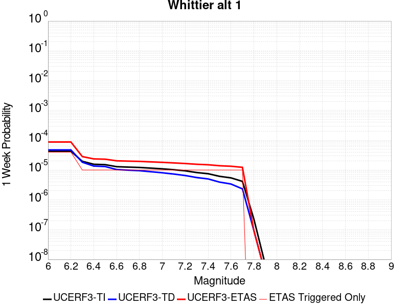 |  |  |  |

| Magnitude | 1 wk TI Prob | 1 wk TD Prob | 1 wk ETAS Prob | 1 wk ETAS/TD Gain | 1 wk ETAS Triggered Only | 1 mo TI Prob | 1 mo TD Prob | 1 mo ETAS Prob | 1 mo ETAS/TD Gain | 1 mo ETAS Triggered Only | 1 yr TI Prob | 1 yr TD Prob | 1 yr ETAS Prob | 1 yr ETAS/TD Gain | 1 yr ETAS Triggered Only | 10 yr TI Prob | 10 yr TD Prob | 10 yr ETAS Prob | 10 yr ETAS/TD Gain | 10 yr ETAS Triggered Only |
|-----|-----|-----|-----|-----|-----|-----|-----|-----|-----|-----|-----|-----|-----|-----|-----|-----|-----|-----|-----|-----|
| 6.0 | 4.2554693E-5 | 4.725218E-5 | 1.84232E-4 | 3.8989103 | 1.369863E-4 | 1.8236451E-4 | 2.0249544E-4 | 3.39454E-4 | 1.6763538 | 1.369863E-4 | 0.002218027 | 0.0024629154 | 0.0025995641 | 1.0554826 | 1.369863E-4 | 0.02196019 | 0.024390234 | 0.02452388 | 1.0054795 | 1.369863E-4 |
| 6.1 | 4.2554693E-5 | 4.725218E-5 | 1.84232E-4 | 3.8989103 | 1.369863E-4 | 1.8236451E-4 | 2.0249544E-4 | 3.39454E-4 | 1.6763538 | 1.369863E-4 | 0.002218027 | 0.0024629154 | 0.0025995641 | 1.0554826 | 1.369863E-4 | 0.02196019 | 0.024390234 | 0.02452388 | 1.0054795 | 1.369863E-4 |
| 6.2 | 4.2554693E-5 | 4.725218E-5 | 1.84232E-4 | 3.8989103 | 1.369863E-4 | 1.8236451E-4 | 2.0249544E-4 | 3.39454E-4 | 1.6763538 | 1.369863E-4 | 0.002218027 | 0.0024629154 | 0.0025995641 | 1.0554826 | 1.369863E-4 | 0.02196019 | 0.024390234 | 0.02452388 | 1.0054795 | 1.369863E-4 |
| 6.3 | 1.9617712E-5 | 1.8268593E-5 | 1.8268593E-5 | 1.0 | 0.0 | 8.40732E-5 | 7.829172E-5 | 7.829172E-5 | 1.0 | 0.0 | 0.0010231105 | 9.52804E-4 | 9.52804E-4 | 1.0 | 0.0 | 0.01018413 | 0.009490474 | 0.009490474 | 1.0 | 0.0 |
| 6.4 | 1.5611336E-5 | 1.3604271E-5 | 1.3604271E-5 | 1.0 | 0.0 | 6.690401E-5 | 5.8302747E-5 | 5.8302747E-5 | 1.0 | 0.0 | 8.142519E-4 | 7.0961076E-4 | 7.0961076E-4 | 1.0 | 0.0 | 0.008112748 | 0.0070754145 | 0.0070754145 | 1.0 | 0.0 |
| 6.5 | 1.5150166E-5 | 1.3100925E-5 | 1.3100925E-5 | 1.0 | 0.0 | 6.492767E-5 | 5.6145647E-5 | 5.6145647E-5 | 1.0 | 0.0 | 7.9020765E-4 | 6.8336475E-4 | 6.8336475E-4 | 1.0 | 0.0 | 0.007874036 | 0.0068145846 | 0.0068145846 | 1.0 | 0.0 |
| 6.6 | 1.295588E-5 | 1.0380725E-5 | 1.0380725E-5 | 1.0 | 0.0 | 5.552402E-5 | 4.4488075E-5 | 4.4488075E-5 | 1.0 | 0.0 | 6.7579525E-4 | 5.4150965E-4 | 5.4150965E-4 | 1.0 | 0.0 | 0.006737438 | 0.0054033357 | 0.0054033357 | 1.0 | 0.0 |
| 6.7 | 1.2542085E-5 | 9.899369E-6 | 9.899369E-6 | 1.0 | 0.0 | 5.3750682E-5 | 4.242519E-5 | 4.242519E-5 | 1.0 | 0.0 | 6.542181E-4 | 5.164061E-4 | 5.164061E-4 | 1.0 | 0.0 | 0.006522954 | 0.0051534795 | 0.0051534795 | 1.0 | 0.0 |
| 6.8 | 1.2195878E-5 | 9.495415E-6 | 9.495415E-6 | 1.0 | 0.0 | 5.2267E-5 | 4.069401E-5 | 4.069401E-5 | 1.0 | 0.0 | 6.36165E-4 | 4.9533875E-4 | 4.9533875E-4 | 1.0 | 0.0 | 0.0063434686 | 0.004943688 | 0.004943688 | 1.0 | 0.0 |
| 6.9 | 1.1580298E-5 | 8.772933E-6 | 8.772933E-6 | 1.0 | 0.0 | 4.9628903E-5 | 3.7597754E-5 | 3.7597754E-5 | 1.0 | 0.0 | 6.040644E-4 | 4.5765814E-4 | 4.5765814E-4 | 1.0 | 0.0 | 0.00602425 | 0.0045684157 | 0.0045684157 | 1.0 | 0.0 |
| 7.0 | 1.0964795E-5 | 8.083994E-6 | 8.083994E-6 | 1.0 | 0.0 | 4.6991136E-5 | 3.4645236E-5 | 3.4645236E-5 | 1.0 | 0.0 | 5.7196687E-4 | 4.2172565E-4 | 4.2172565E-4 | 1.0 | 0.0 | 0.0057049696 | 0.004210462 | 0.004210462 | 1.0 | 0.0 |
| 7.1 | 1.0230601E-5 | 7.3266697E-6 | 7.3266697E-6 | 1.0 | 0.0 | 4.3844695E-5 | 3.1399642E-5 | 3.1399642E-5 | 1.0 | 0.0 | 5.336784E-4 | 3.8222488E-4 | 3.8222488E-4 | 1.0 | 0.0 | 0.005323986 | 0.0038168381 | 0.0038168381 | 1.0 | 0.0 |
| 7.2 | 9.40865E-6 | 6.543289E-6 | 6.543289E-6 | 1.0 | 0.0 | 4.032216E-5 | 2.8042374E-5 | 2.8042374E-5 | 1.0 | 0.0 | 4.908117E-4 | 3.4136363E-4 | 3.4136363E-4 | 1.0 | 0.0 | 0.0048972913 | 0.003409485 | 0.003409485 | 1.0 | 0.0 |
| 7.3 | 8.237384E-6 | 5.5977525E-6 | 5.5977525E-6 | 1.0 | 0.0 | 3.5302593E-5 | 2.3990153E-5 | 2.3990153E-5 | 1.0 | 0.0 | 4.2972428E-4 | 2.92042E-4 | 2.92042E-4 | 1.0 | 0.0 | 0.0042889426 | 0.002916903 | 0.002916903 | 1.0 | 0.0 |
| 7.4 | 7.5316966E-6 | 5.027819E-6 | 5.027819E-6 | 1.0 | 0.0 | 3.2278298E-5 | 2.1547625E-5 | 2.1547625E-5 | 1.0 | 0.0 | 3.9291743E-4 | 2.6231175E-4 | 2.6231175E-4 | 1.0 | 0.0 | 0.0039222343 | 0.0026201333 | 0.0026201333 | 1.0 | 0.0 |
| 7.5 | 6.149649E-6 | 3.933841E-6 | 3.933841E-6 | 1.0 | 0.0 | 2.6355372E-5 | 1.6859214E-5 | 1.6859214E-5 | 1.0 | 0.0 | 3.208294E-4 | 2.052425E-4 | 2.052425E-4 | 1.0 | 0.0 | 0.003203666 | 0.0020506186 | 0.0020506186 | 1.0 | 0.0 |
| 7.6 | 5.457711E-6 | 3.3953788E-6 | 3.3953788E-6 | 1.0 | 0.0 | 2.338998E-5 | 1.4551547E-5 | 1.4551547E-5 | 1.0 | 0.0 | 2.8473578E-4 | 1.771515E-4 | 1.771515E-4 | 1.0 | 0.0 | 0.0028437122 | 0.0017701836 | 0.0017701836 | 1.0 | 0.0 |
| 7.7 | 4.1676276E-6 | 2.3331952E-6 | 2.3331952E-6 | 1.0 | 0.0 | 1.7861139E-5 | 9.999374E-6 | 9.999374E-6 | 1.0 | 0.0 | 2.1743766E-4 | 1.2173632E-4 | 1.2173632E-4 | 1.0 | 0.0 | 0.0021722503 | 0.0012167693 | 0.0012167693 | 1.0 | 0.0 |
| 7.8 | 2.2692414E-7 | 9.3854695E-8 | 9.3854695E-8 | 1.0 | 0.0 | 9.725317E-7 | 4.0223435E-7 | 4.0223435E-7 | 1.0 | 0.0 | 1.1840509E-5 | 4.8971956E-6 | 4.8971956E-6 | 1.0 | 0.0 | 1.1839878E-4 | 4.8971204E-5 | 4.8971204E-5 | 1.0 | 0.0 |
| 7.9 | 6.676829E-9 | 3.439853E-9 | 3.439853E-9 | 1.0 | 0.0 | 2.861498E-8 | 1.4742227E-8 | 1.4742227E-8 | 1.0 | 0.0 | 3.4838732E-7 | 1.7948659E-7 | 1.7948659E-7 | 1.0 | 0.0 | 3.4838679E-6 | 1.7948646E-6 | 1.7948646E-6 | 1.0 | 0.0 |

## Paradise
*[(top)](#table-of-contents)*

| 1 Week | 1 Month | 1 Year | 10 Year |
|-----|-----|-----|-----|
| 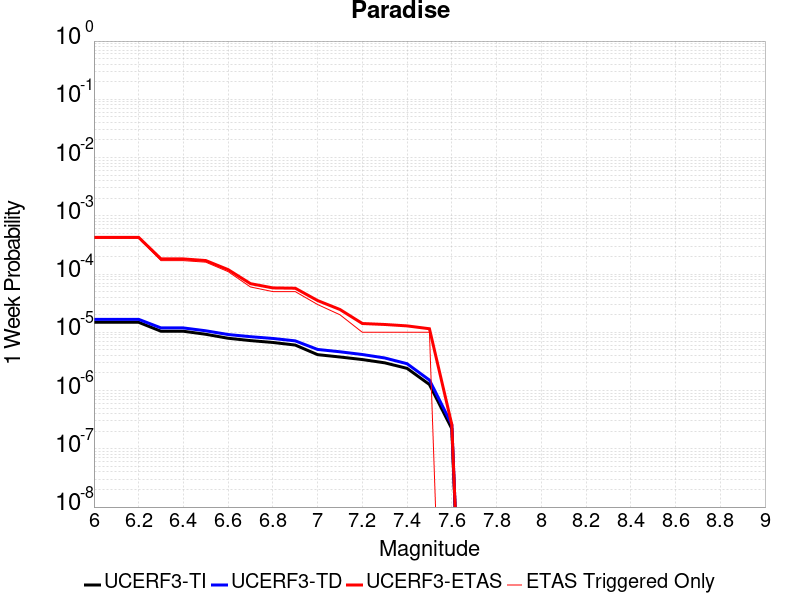 |  |  |  |

| Magnitude | 1 wk TI Prob | 1 wk TD Prob | 1 wk ETAS Prob | 1 wk ETAS/TD Gain | 1 wk ETAS Triggered Only | 1 mo TI Prob | 1 mo TD Prob | 1 mo ETAS Prob | 1 mo ETAS/TD Gain | 1 mo ETAS Triggered Only | 1 yr TI Prob | 1 yr TD Prob | 1 yr ETAS Prob | 1 yr ETAS/TD Gain | 1 yr ETAS Triggered Only | 10 yr TI Prob | 10 yr TD Prob | 10 yr ETAS Prob | 10 yr ETAS/TD Gain | 10 yr ETAS Triggered Only |
|-----|-----|-----|-----|-----|-----|-----|-----|-----|-----|-----|-----|-----|-----|-----|-----|-----|-----|-----|-----|-----|
| 6.0 | 1.4851273E-5 | 1.6694692E-5 | 1.536787E-4 | 9.205244 | 1.369863E-4 | 6.364676E-5 | 7.154685E-5 | 2.0852334E-4 | 2.9145007 | 1.369863E-4 | 7.7462377E-4 | 8.707584E-4 | 0.0010076254 | 1.1571814 | 1.369863E-4 | 0.0077192914 | 0.008675844 | 0.008811642 | 1.0156524 | 1.369863E-4 |
| 6.1 | 1.4851273E-5 | 1.6694692E-5 | 1.536787E-4 | 9.205244 | 1.369863E-4 | 6.364676E-5 | 7.154685E-5 | 2.0852334E-4 | 2.9145007 | 1.369863E-4 | 7.7462377E-4 | 8.707584E-4 | 0.0010076254 | 1.1571814 | 1.369863E-4 | 0.0077192914 | 0.008675844 | 0.008811642 | 1.0156524 | 1.369863E-4 |
| 6.2 | 1.4851273E-5 | 1.6694692E-5 | 1.536787E-4 | 9.205244 | 1.369863E-4 | 6.364676E-5 | 7.154685E-5 | 2.0852334E-4 | 2.9145007 | 1.369863E-4 | 7.7462377E-4 | 8.707584E-4 | 0.0010076254 | 1.1571814 | 1.369863E-4 | 0.0077192914 | 0.008675844 | 0.008811642 | 1.0156524 | 1.369863E-4 |
| 6.3 | 1.0426831E-5 | 1.188862E-5 | 1.188862E-5 | 1.0 | 0.0 | 4.4685654E-5 | 5.0950268E-5 | 5.0950268E-5 | 1.0 | 0.0 | 5.43912E-4 | 6.201489E-4 | 6.201489E-4 | 1.0 | 0.0 | 0.0054258266 | 0.0061847917 | 0.0061847917 | 1.0 | 0.0 |
| 6.4 | 1.0426831E-5 | 1.188862E-5 | 1.188862E-5 | 1.0 | 0.0 | 4.4685654E-5 | 5.0950268E-5 | 5.0950268E-5 | 1.0 | 0.0 | 5.43912E-4 | 6.201489E-4 | 6.201489E-4 | 1.0 | 0.0 | 0.0054258266 | 0.0061847917 | 0.0061847917 | 1.0 | 0.0 |
| 6.5 | 9.25027E-6 | 1.06199595E-5 | 1.06199595E-5 | 1.0 | 0.0 | 3.964341E-5 | 4.551335E-5 | 4.551335E-5 | 1.0 | 0.0 | 4.8255164E-4 | 5.53989E-4 | 5.53989E-4 | 1.0 | 0.0 | 0.0048150513 | 0.0055265795 | 0.0055265795 | 1.0 | 0.0 |
| 6.6 | 7.904275E-6 | 9.159525E-6 | 9.159525E-6 | 1.0 | 0.0 | 3.3875025E-5 | 3.9254537E-5 | 3.9254537E-5 | 1.0 | 0.0 | 4.1235037E-4 | 4.7782314E-4 | 4.7782314E-4 | 1.0 | 0.0 | 0.0041158604 | 0.0047683544 | 0.0047683544 | 1.0 | 0.0 |
| 6.7 | 7.2061953E-6 | 8.407248E-6 | 8.407248E-6 | 1.0 | 0.0 | 3.088333E-5 | 3.6030586E-5 | 3.6030586E-5 | 1.0 | 0.0 | 3.7593965E-4 | 4.3858777E-4 | 4.3858777E-4 | 1.0 | 0.0 | 0.003753043 | 0.004377591 | 0.004377591 | 1.0 | 0.0 |
| 6.8 | 6.6948724E-6 | 7.842166E-6 | 7.842166E-6 | 1.0 | 0.0 | 2.8691995E-5 | 3.360887E-5 | 3.360887E-5 | 1.0 | 0.0 | 3.4926904E-4 | 4.0911473E-4 | 4.0911473E-4 | 1.0 | 0.0 | 0.003487206 | 0.0040839734 | 0.0040839734 | 1.0 | 0.0 |
| 6.9 | 6.0421025E-6 | 7.130621E-6 | 7.130621E-6 | 1.0 | 0.0 | 2.5894467E-5 | 3.0559466E-5 | 3.0559466E-5 | 1.0 | 0.0 | 3.1521954E-4 | 3.7200135E-4 | 3.7200135E-4 | 1.0 | 0.0 | 0.0031477278 | 0.0037141247 | 0.0037141247 | 1.0 | 0.0 |
| 7.0 | 4.134091E-6 | 5.0803087E-6 | 5.0803087E-6 | 1.0 | 0.0 | 1.7717413E-5 | 2.177258E-5 | 2.177258E-5 | 1.0 | 0.0 | 2.1568815E-4 | 2.6505045E-4 | 2.6505045E-4 | 1.0 | 0.0 | 0.0021547892 | 0.0026474963 | 0.0026474963 | 1.0 | 0.0 |
| 7.1 | 3.7674888E-6 | 4.6318696E-6 | 4.6318696E-6 | 1.0 | 0.0 | 1.6146281E-5 | 1.9850726E-5 | 1.9850726E-5 | 1.0 | 0.0 | 1.9656324E-4 | 2.4165731E-4 | 2.4165731E-4 | 1.0 | 0.0 | 0.0019638946 | 0.002414096 | 0.002414096 | 1.0 | 0.0 |
| 7.2 | 3.4065345E-6 | 4.156723E-6 | 4.156723E-6 | 1.0 | 0.0 | 1.4599351E-5 | 1.7814415E-5 | 1.7814415E-5 | 1.0 | 0.0 | 1.777326E-4 | 2.1687041E-4 | 2.1687041E-4 | 1.0 | 0.0 | 0.0017759053 | 0.002166736 | 0.002166736 | 1.0 | 0.0 |
| 7.3 | 2.9934936E-6 | 3.6293168E-6 | 3.6293168E-6 | 1.0 | 0.0 | 1.2829195E-5 | 1.555413E-5 | 1.555413E-5 | 1.0 | 0.0 | 1.5618425E-4 | 1.8935655E-4 | 1.8935655E-4 | 1.0 | 0.0 | 0.0015607453 | 0.0018920974 | 0.0018920974 | 1.0 | 0.0 |
| 7.4 | 2.4049796E-6 | 2.8889842E-6 | 2.8889842E-6 | 1.0 | 0.0 | 1.0307015E-5 | 1.238131E-5 | 1.238131E-5 | 1.0 | 0.0 | 1.2548068E-4 | 1.5073347E-4 | 1.5073347E-4 | 1.0 | 0.0 | 0.0012540985 | 0.0015064536 | 0.0015064536 | 1.0 | 0.0 |
| 7.5 | 1.2710091E-6 | 1.5134682E-6 | 1.5134682E-6 | 1.0 | 0.0 | 5.44717E-6 | 6.4862834E-6 | 6.4862834E-6 | 1.0 | 0.0 | 6.631728E-5 | 7.8968886E-5 | 7.8968886E-5 | 1.0 | 0.0 | 6.6297496E-4 | 7.8953087E-4 | 7.8953087E-4 | 1.0 | 0.0 |
| 7.6 | 2.21172E-7 | 2.603961E-7 | 2.603961E-7 | 1.0 | 0.0 | 9.478797E-7 | 1.1159829E-6 | 1.1159829E-6 | 1.0 | 0.0 | 1.1540374E-5 | 1.3587036E-5 | 1.3587036E-5 | 1.0 | 0.0 | 1.1539775E-4 | 1.3586486E-4 | 1.3586486E-4 | 1.0 | 0.0 |

## Bullion Mountains
*[(top)](#table-of-contents)*

| 1 Week | 1 Month | 1 Year | 10 Year |
|-----|-----|-----|-----|
|  | 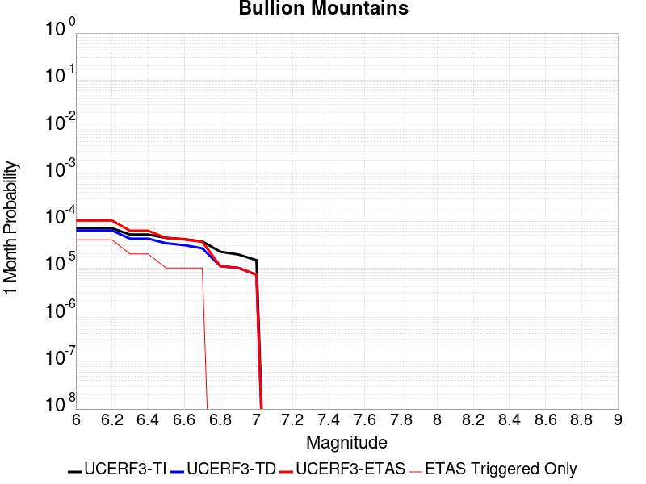 | 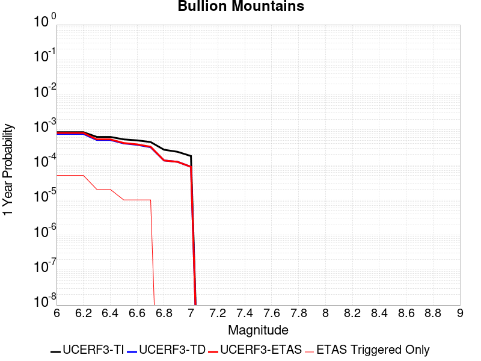 |  |

| Magnitude | 1 wk TI Prob | 1 wk TD Prob | 1 wk ETAS Prob | 1 wk ETAS/TD Gain | 1 wk ETAS Triggered Only | 1 mo TI Prob | 1 mo TD Prob | 1 mo ETAS Prob | 1 mo ETAS/TD Gain | 1 mo ETAS Triggered Only | 1 yr TI Prob | 1 yr TD Prob | 1 yr ETAS Prob | 1 yr ETAS/TD Gain | 1 yr ETAS Triggered Only | 10 yr TI Prob | 10 yr TD Prob | 10 yr ETAS Prob | 10 yr ETAS/TD Gain | 10 yr ETAS Triggered Only |
|-----|-----|-----|-----|-----|-----|-----|-----|-----|-----|-----|-----|-----|-----|-----|-----|-----|-----|-----|-----|-----|
| 6.0 | 1.6420427E-5 | 1.4692089E-5 | 1.4692089E-5 | 1.0 | 0.0 | 7.037136E-5 | 6.296479E-5 | 1.9994247E-4 | 3.1754646 | 1.369863E-4 | 8.5643446E-4 | 7.663651E-4 | 9.032464E-4 | 1.1786112 | 1.369863E-4 | 0.008531413 | 0.007641016 | 0.0077769556 | 1.0177908 | 1.369863E-4 |
| 6.1 | 1.6420427E-5 | 1.4692089E-5 | 1.4692089E-5 | 1.0 | 0.0 | 7.037136E-5 | 6.296479E-5 | 1.9994247E-4 | 3.1754646 | 1.369863E-4 | 8.5643446E-4 | 7.663651E-4 | 9.032464E-4 | 1.1786112 | 1.369863E-4 | 0.008531413 | 0.007641016 | 0.0077769556 | 1.0177908 | 1.369863E-4 |
| 6.2 | 1.6420427E-5 | 1.4692089E-5 | 1.4692089E-5 | 1.0 | 0.0 | 7.037136E-5 | 6.296479E-5 | 1.9994247E-4 | 3.1754646 | 1.369863E-4 | 8.5643446E-4 | 7.663651E-4 | 9.032464E-4 | 1.1786112 | 1.369863E-4 | 0.008531413 | 0.007641016 | 0.0077769556 | 1.0177908 | 1.369863E-4 |
| 6.3 | 1.2046778E-5 | 9.862335E-6 | 9.862335E-6 | 1.0 | 0.0 | 5.1628023E-5 | 4.2266598E-5 | 4.2266598E-5 | 1.0 | 0.0 | 6.283899E-4 | 5.144975E-4 | 5.144975E-4 | 1.0 | 0.0 | 0.0062661595 | 0.005135345 | 0.005135345 | 1.0 | 0.0 |
| 6.4 | 1.2046778E-5 | 9.862335E-6 | 9.862335E-6 | 1.0 | 0.0 | 5.1628023E-5 | 4.2266598E-5 | 4.2266598E-5 | 1.0 | 0.0 | 6.283899E-4 | 5.144975E-4 | 5.144975E-4 | 1.0 | 0.0 | 0.0062661595 | 0.005135345 | 0.005135345 | 1.0 | 0.0 |
| 6.5 | 1.0244343E-5 | 7.879458E-6 | 7.879458E-6 | 1.0 | 0.0 | 4.390359E-5 | 3.3768785E-5 | 3.3768785E-5 | 1.0 | 0.0 | 5.343951E-4 | 4.110781E-4 | 4.110781E-4 | 1.0 | 0.0 | 0.005331118 | 0.004105208 | 0.004105208 | 1.0 | 0.0 |
| 6.6 | 9.605408E-6 | 7.1774966E-6 | 7.1774966E-6 | 1.0 | 0.0 | 4.1165385E-5 | 3.076045E-5 | 3.076045E-5 | 1.0 | 0.0 | 5.010733E-4 | 3.744645E-4 | 3.744645E-4 | 1.0 | 0.0 | 0.00499945 | 0.003740332 | 0.003740332 | 1.0 | 0.0 |
| 6.7 | 8.60418E-6 | 6.1240044E-6 | 6.1240044E-6 | 1.0 | 0.0 | 3.687454E-5 | 2.624558E-5 | 2.624558E-5 | 1.0 | 0.0 | 4.48855E-4 | 3.1951256E-4 | 3.1951256E-4 | 1.0 | 0.0 | 0.004479495 | 0.0031924439 | 0.0031924439 | 1.0 | 0.0 |
| 6.8 | 5.187994E-6 | 2.5631666E-6 | 2.5631666E-6 | 1.0 | 0.0 | 2.223407E-5 | 1.0984976E-5 | 1.0984976E-5 | 1.0 | 0.0 | 2.7066618E-4 | 1.3373788E-4 | 1.3373788E-4 | 1.0 | 0.0 | 0.0027033675 | 0.0013369655 | 0.0013369655 | 1.0 | 0.0 |
| 6.9 | 4.5302368E-6 | 2.3443165E-6 | 2.3443165E-6 | 1.0 | 0.0 | 1.9415156E-5 | 1.0047055E-5 | 1.0047055E-5 | 1.0 | 0.0 | 2.3635388E-4 | 1.2232E-4 | 1.2232E-4 | 1.0 | 0.0 | 0.0023610266 | 0.0012229157 | 0.0012229157 | 1.0 | 0.0 |
| 7.0 | 3.431668E-6 | 1.6882402E-6 | 1.6882402E-6 | 1.0 | 0.0 | 1.4707065E-5 | 7.235315E-6 | 7.235315E-6 | 1.0 | 0.0 | 1.7904381E-4 | 8.808996E-5 | 8.808996E-5 | 1.0 | 0.0 | 0.0017889962 | 8.808996E-4 | 8.808996E-4 | 1.0 | 0.0 |

## Hunting Creek - Berryessa 2011 CFM
*[(top)](#table-of-contents)*

| 1 Week | 1 Month | 1 Year | 10 Year |
|-----|-----|-----|-----|
|  |  |  | 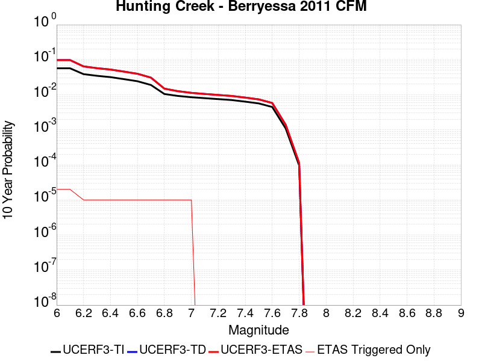 |

| Magnitude | 1 wk TI Prob | 1 wk TD Prob | 1 wk ETAS Prob | 1 wk ETAS/TD Gain | 1 wk ETAS Triggered Only | 1 mo TI Prob | 1 mo TD Prob | 1 mo ETAS Prob | 1 mo ETAS/TD Gain | 1 mo ETAS Triggered Only | 1 yr TI Prob | 1 yr TD Prob | 1 yr ETAS Prob | 1 yr ETAS/TD Gain | 1 yr ETAS Triggered Only | 10 yr TI Prob | 10 yr TD Prob | 10 yr ETAS Prob | 10 yr ETAS/TD Gain | 10 yr ETAS Triggered Only |
|-----|-----|-----|-----|-----|-----|-----|-----|-----|-----|-----|-----|-----|-----|-----|-----|-----|-----|-----|-----|-----|
| 6.0 | 1.1270982E-4 | 2.0012174E-4 | 3.3708062E-4 | 1.6843779 | 1.369863E-4 | 4.8295266E-4 | 8.5739547E-4 | 9.942644E-4 | 1.1596333 | 1.369863E-4 | 0.0058641075 | 0.010386313 | 0.010521877 | 1.0130521 | 1.369863E-4 | 0.057117578 | 0.09803703 | 0.09816058 | 1.0012603 | 1.369863E-4 |
| 6.1 | 1.1239393E-4 | 1.9960315E-4 | 3.365621E-4 | 1.6861563 | 1.369863E-4 | 4.8159933E-4 | 8.551744E-4 | 9.920435E-4 | 1.1600482 | 1.369863E-4 | 0.0058477195 | 0.010359551 | 0.010495118 | 1.0130862 | 1.369863E-4 | 0.056962132 | 0.09779551 | 0.09791909 | 1.0012637 | 1.369863E-4 |
| 6.2 | 7.596265E-5 | 1.2940196E-4 | 2.6637054E-4 | 2.0584736 | 1.369863E-4 | 3.2551357E-4 | 5.5444165E-4 | 6.91352E-4 | 1.2469337 | 1.369863E-4 | 0.0039559277 | 0.0067210156 | 0.0068570813 | 1.0202448 | 1.369863E-4 | 0.038862433 | 0.0645915 | 0.06471963 | 1.0019839 | 1.369863E-4 |
| 6.3 | 6.78794E-5 | 1.145119E-4 | 2.514825E-4 | 2.1961255 | 1.369863E-4 | 2.9087928E-4 | 4.906513E-4 | 6.275704E-4 | 1.2790558 | 1.369863E-4 | 0.003535705 | 0.005952679 | 0.00608885 | 1.0228755 | 1.369863E-4 | 0.034799766 | 0.057465393 | 0.057594508 | 1.0022469 | 1.369863E-4 |
| 6.4 | 6.2165134E-5 | 1.0436625E-4 | 2.4133826E-4 | 2.3124166 | 1.369863E-4 | 2.6639478E-4 | 4.4721062E-4 | 5.8413565E-4 | 1.3061757 | 1.369863E-4 | 0.0032385332 | 0.005427573 | 0.0055638156 | 1.025102 | 1.369863E-4 | 0.03191742 | 0.052550517 | 0.052680306 | 1.0024698 | 1.369863E-4 |
| 6.5 | 5.4368087E-5 | 9.071415E-5 | 2.2768803E-4 | 2.5099504 | 1.369863E-4 | 2.3298527E-4 | 3.8872007E-4 | 5.2565313E-4 | 1.3522664 | 1.369863E-4 | 0.0028329059 | 0.0047198683 | 0.0048562083 | 1.0288863 | 1.369863E-4 | 0.027970633 | 0.045880128 | 0.04601083 | 1.0028487 | 1.369863E-4 |
| 6.6 | 4.729947E-5 | 7.847572E-5 | 2.1545128E-4 | 2.7454512 | 1.369863E-4 | 2.0269625E-4 | 3.362842E-4 | 4.7322444E-4 | 1.4072158 | 1.369863E-4 | 0.002465034 | 0.0040849647 | 0.004221392 | 1.0333973 | 1.369863E-4 | 0.02437869 | 0.03985155 | 0.039983075 | 1.0033004 | 1.369863E-4 |
| 6.7 | 3.6875328E-5 | 6.0451803E-5 | 1.9742982E-4 | 3.2659047 | 1.369863E-4 | 1.5802756E-4 | 2.59056E-4 | 3.960068E-4 | 1.5286534 | 1.369863E-4 | 0.0019222875 | 0.0031482063 | 0.0032847614 | 1.0433755 | 1.369863E-4 | 0.019057442 | 0.03089237 | 0.031025125 | 1.0042974 | 1.369863E-4 |
| 6.8 | 2.0292036E-5 | 2.8976308E-5 | 1.6595864E-4 | 5.727391 | 1.369863E-4 | 8.6962966E-5 | 1.2417832E-4 | 2.6114762E-4 | 2.103005 | 1.369863E-4 | 0.0010582599 | 0.0015108072 | 0.0016475866 | 1.090534 | 1.369863E-4 | 0.010532344 | 0.014978523 | 0.015113458 | 1.0090085 | 1.369863E-4 |
| 6.9 | 1.7871042E-5 | 2.4472254E-5 | 1.614552E-4 | 6.59748 | 1.369863E-4 | 7.658793E-5 | 1.048769E-4 | 2.4184883E-4 | 2.3060257 | 1.369863E-4 | 9.320591E-4 | 0.0012761299 | 0.0014129414 | 1.1072081 | 1.369863E-4 | 0.009281595 | 0.012679775 | 0.012815025 | 1.0106665 | 1.369863E-4 |
| 7.0 | 1.6415532E-5 | 2.1906277E-5 | 1.5888958E-4 | 7.253153 | 1.369863E-4 | 7.035038E-5 | 9.3880684E-5 | 2.3085413E-4 | 2.459016 | 1.369863E-4 | 8.561793E-4 | 0.0011424015 | 0.0012792313 | 1.1197739 | 1.369863E-4 | 0.008528882 | 0.01136452 | 0.011499949 | 1.0119169 | 1.369863E-4 |
| 7.1 | 1.5409885E-5 | 2.0346342E-5 | 2.0346342E-5 | 1.0 | 0.0 | 6.6040695E-5 | 8.7195716E-5 | 8.7195716E-5 | 1.0 | 0.0 | 8.0374884E-4 | 0.0010610938 | 0.0010610938 | 1.0 | 0.0 | 0.00800848 | 0.010560595 | 0.010560595 | 1.0 | 0.0 |
| 7.2 | 1.4497423E-5 | 1.9054964E-5 | 1.9054964E-5 | 1.0 | 0.0 | 6.213033E-5 | 8.166159E-5 | 8.166159E-5 | 1.0 | 0.0 | 7.5617427E-4 | 9.937795E-4 | 9.937795E-4 | 1.0 | 0.0 | 0.0075360634 | 0.009893929 | 0.009893929 | 1.0 | 0.0 |
| 7.3 | 1.3615175E-5 | 1.7826127E-5 | 1.7826127E-5 | 1.0 | 0.0 | 5.8349444E-5 | 7.639547E-5 | 7.639547E-5 | 1.0 | 0.0 | 7.101729E-4 | 9.297209E-4 | 9.297209E-4 | 1.0 | 0.0 | 0.0070790765 | 0.009258823 | 0.009258823 | 1.0 | 0.0 |
| 7.4 | 1.2252825E-5 | 1.602625E-5 | 1.602625E-5 | 1.0 | 0.0 | 5.251105E-5 | 6.868213E-5 | 6.868213E-5 | 1.0 | 0.0 | 6.391345E-4 | 8.35887E-4 | 8.35887E-4 | 1.0 | 0.0 | 0.0063729943 | 0.008327872 | 0.008327872 | 1.0 | 0.0 |
| 7.5 | 1.0913301E-5 | 1.4241117E-5 | 1.4241117E-5 | 1.0 | 0.0 | 4.6770452E-5 | 6.1031948E-5 | 6.1031948E-5 | 1.0 | 0.0 | 5.6928146E-4 | 7.4281334E-4 | 7.4281334E-4 | 1.0 | 0.0 | 0.0056782532 | 0.0074036797 | 0.0074036797 | 1.0 | 0.0 |
| 7.6 | 8.623192E-6 | 1.12346415E-5 | 1.12346415E-5 | 1.0 | 0.0 | 3.6956015E-5 | 4.814759E-5 | 4.814759E-5 | 1.0 | 0.0 | 4.4984656E-4 | 5.8604183E-4 | 5.8604183E-4 | 1.0 | 0.0 | 0.00448937 | 0.0058452785 | 0.0058452785 | 1.0 | 0.0 |
| 7.7 | 2.0993634E-6 | 2.662584E-6 | 2.662584E-6 | 1.0 | 0.0 | 8.997241E-6 | 1.1411025E-5 | 1.1411025E-5 | 1.0 | 0.0 | 1.09535904E-4 | 1.3892044E-4 | 1.3892044E-4 | 1.0 | 0.0 | 0.0010948193 | 0.0013883426 | 0.0013883426 | 1.0 | 0.0 |
| 7.8 | 1.8428308E-7 | 2.167437E-7 | 2.167437E-7 | 1.0 | 0.0 | 7.897844E-7 | 9.289013E-7 | 9.289013E-7 | 1.0 | 0.0 | 9.615583E-6 | 1.1309318E-5 | 1.1309318E-5 | 1.0 | 0.0 | 9.615166E-5 | 1.13086026E-4 | 1.13086026E-4 | 1.0 | 0.0 |

## Likely 2011 CFM
*[(top)](#table-of-contents)*

| 1 Week | 1 Month | 1 Year | 10 Year |
|-----|-----|-----|-----|
|  |  |  |  |

| Magnitude | 1 wk TI Prob | 1 wk TD Prob | 1 wk ETAS Prob | 1 wk ETAS/TD Gain | 1 wk ETAS Triggered Only | 1 mo TI Prob | 1 mo TD Prob | 1 mo ETAS Prob | 1 mo ETAS/TD Gain | 1 mo ETAS Triggered Only | 1 yr TI Prob | 1 yr TD Prob | 1 yr ETAS Prob | 1 yr ETAS/TD Gain | 1 yr ETAS Triggered Only | 10 yr TI Prob | 10 yr TD Prob | 10 yr ETAS Prob | 10 yr ETAS/TD Gain | 10 yr ETAS Triggered Only |
|-----|-----|-----|-----|-----|-----|-----|-----|-----|-----|-----|-----|-----|-----|-----|-----|-----|-----|-----|-----|-----|
| 6.0 | 2.5315949E-5 | 2.7104748E-5 | 1.6408734E-4 | 6.0538225 | 1.369863E-4 | 1.0849241E-4 | 1.16158284E-4 | 2.5312867E-4 | 2.1791701 | 1.369863E-4 | 0.0013200947 | 0.0014133542 | 0.0015501468 | 1.0967859 | 1.369863E-4 | 0.013122803 | 0.01404831 | 0.014183372 | 1.0096141 | 1.369863E-4 |
| 6.1 | 2.5315949E-5 | 2.7104748E-5 | 2.7104748E-5 | 1.0 | 0.0 | 1.0849241E-4 | 1.16158284E-4 | 1.16158284E-4 | 1.0 | 0.0 | 0.0013200947 | 0.0014133542 | 0.0014133542 | 1.0 | 0.0 | 0.013122803 | 0.01404831 | 0.01404831 | 1.0 | 0.0 |
| 6.2 | 1.6375941E-5 | 1.7465842E-5 | 1.7465842E-5 | 1.0 | 0.0 | 7.0180715E-5 | 7.485153E-5 | 7.485153E-5 | 1.0 | 0.0 | 8.5411523E-4 | 9.109487E-4 | 9.109487E-4 | 1.0 | 0.0 | 0.008508399 | 0.009073433 | 0.009073433 | 1.0 | 0.0 |
| 6.3 | 1.1945543E-5 | 1.2712587E-5 | 1.2712587E-5 | 1.0 | 0.0 | 5.119418E-5 | 5.4481407E-5 | 5.4481407E-5 | 1.0 | 0.0 | 6.2311086E-4 | 6.631146E-4 | 6.631146E-4 | 1.0 | 0.0 | 0.0062136655 | 0.0066119144 | 0.0066119144 | 1.0 | 0.0 |
| 6.4 | 9.192729E-6 | 9.768488E-6 | 9.768488E-6 | 1.0 | 0.0 | 3.939681E-5 | 4.1864292E-5 | 4.1864292E-5 | 1.0 | 0.0 | 4.7955062E-4 | 5.0958124E-4 | 5.0958124E-4 | 1.0 | 0.0 | 0.004785171 | 0.0050844094 | 0.0050844094 | 1.0 | 0.0 |
| 6.5 | 7.67906E-6 | 8.152622E-6 | 8.152622E-6 | 1.0 | 0.0 | 3.2909844E-5 | 3.4939352E-5 | 3.4939352E-5 | 1.0 | 0.0 | 4.006037E-4 | 4.2530545E-4 | 4.2530545E-4 | 1.0 | 0.0 | 0.0039988225 | 0.004245108 | 0.004245108 | 1.0 | 0.0 |
| 6.6 | 6.4884057E-6 | 6.8847507E-6 | 6.8847507E-6 | 1.0 | 0.0 | 2.7807157E-5 | 2.9505749E-5 | 2.9505749E-5 | 1.0 | 0.0 | 3.3849955E-4 | 3.591747E-4 | 3.591747E-4 | 1.0 | 0.0 | 0.003379844 | 0.0035860867 | 0.0035860867 | 1.0 | 0.0 |
| 6.7 | 4.6060636E-6 | 4.884041E-6 | 4.884041E-6 | 1.0 | 0.0 | 1.9740122E-5 | 2.0931442E-5 | 2.0931442E-5 | 1.0 | 0.0 | 2.403095E-4 | 2.5481134E-4 | 2.5481134E-4 | 1.0 | 0.0 | 0.002400498 | 0.0025452746 | 0.0025452746 | 1.0 | 0.0 |
| 6.8 | 3.2795615E-6 | 3.4773732E-6 | 3.4773732E-6 | 1.0 | 0.0 | 1.4055187E-5 | 1.4902946E-5 | 1.4902946E-5 | 1.0 | 0.0 | 1.7110848E-4 | 1.8142881E-4 | 1.8142881E-4 | 1.0 | 0.0 | 0.0017097679 | 0.0018128622 | 0.0018128622 | 1.0 | 0.0 |
| 6.9 | 2.3289967E-6 | 2.4705569E-6 | 2.4705569E-6 | 1.0 | 0.0 | 9.981376E-6 | 1.058806E-5 | 1.058806E-5 | 1.0 | 0.0 | 1.2151648E-4 | 1.2890245E-4 | 1.2890245E-4 | 1.0 | 0.0 | 0.0012145005 | 0.0012883197 | 0.0012883197 | 1.0 | 0.0 |
| 7.0 | 1.211292E-6 | 1.2863958E-6 | 1.2863958E-6 | 1.0 | 0.0 | 5.1912407E-6 | 5.5131145E-6 | 5.5131145E-6 | 1.0 | 0.0 | 6.320152E-5 | 6.712041E-5 | 6.712041E-5 | 1.0 | 0.0 | 6.3183554E-4 | 6.710312E-4 | 6.710312E-4 | 1.0 | 0.0 |

## San Andreas (Coachella) rev
*[(top)](#table-of-contents)*

| 1 Week | 1 Month | 1 Year | 10 Year |
|-----|-----|-----|-----|
| 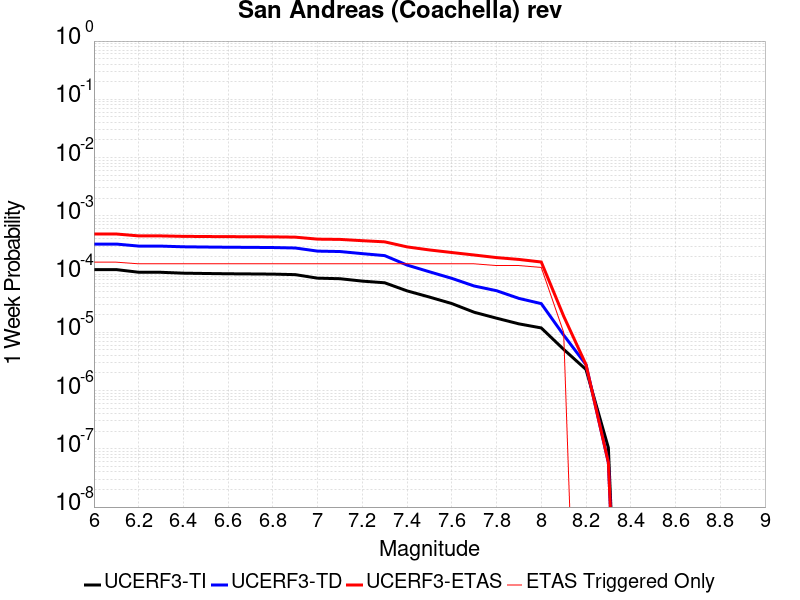 |  | 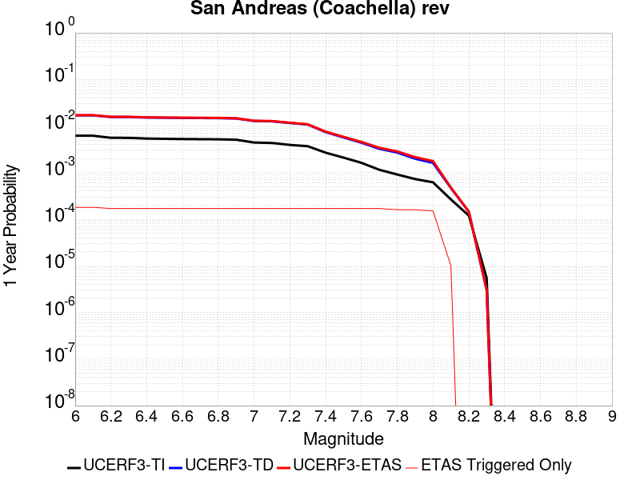 |  |

| Magnitude | 1 wk TI Prob | 1 wk TD Prob | 1 wk ETAS Prob | 1 wk ETAS/TD Gain | 1 wk ETAS Triggered Only | 1 mo TI Prob | 1 mo TD Prob | 1 mo ETAS Prob | 1 mo ETAS/TD Gain | 1 mo ETAS Triggered Only | 1 yr TI Prob | 1 yr TD Prob | 1 yr ETAS Prob | 1 yr ETAS/TD Gain | 1 yr ETAS Triggered Only | 10 yr TI Prob | 10 yr TD Prob | 10 yr ETAS Prob | 10 yr ETAS/TD Gain | 10 yr ETAS Triggered Only |
|-----|-----|-----|-----|-----|-----|-----|-----|-----|-----|-----|-----|-----|-----|-----|-----|-----|-----|-----|-----|-----|
| 6.0 | 1.1925945E-4 | 3.2729402E-4 | 4.642355E-4 | 1.418405 | 1.369863E-4 | 5.110118E-4 | 0.0014019393 | 0.0015387336 | 1.0975751 | 1.369863E-4 | 0.0062038354 | 0.016936364 | 0.017071031 | 1.0079513 | 1.369863E-4 | 0.060334753 | 0.15265316 | 0.15276922 | 1.0007604 | 1.369863E-4 |
| 6.1 | 1.1925945E-4 | 3.2729402E-4 | 4.642355E-4 | 1.418405 | 1.369863E-4 | 5.110118E-4 | 0.0014019393 | 0.0015387336 | 1.0975751 | 1.369863E-4 | 0.0062038354 | 0.016936364 | 0.017071031 | 1.0079513 | 1.369863E-4 | 0.060334753 | 0.15265316 | 0.15276922 | 1.0007604 | 1.369863E-4 |
| 6.2 | 1.07432395E-4 | 3.0230157E-4 | 4.3924645E-4 | 1.4530076 | 1.369863E-4 | 4.603433E-4 | 0.0012949388 | 0.0014317478 | 1.105649 | 1.369863E-4 | 0.005590286 | 0.015653009 | 0.015787851 | 1.0086144 | 1.369863E-4 | 0.05451731 | 0.14182423 | 0.1419418 | 1.0008289 | 1.369863E-4 |
| 6.3 | 1.0718766E-4 | 3.0175463E-4 | 4.386996E-4 | 1.4538289 | 1.369863E-4 | 4.592948E-4 | 0.0012925972 | 0.0014294063 | 1.1058406 | 1.369863E-4 | 0.005577586 | 0.015624908 | 0.015759753 | 1.0086302 | 1.369863E-4 | 0.054396555 | 0.14159249 | 0.14171009 | 1.0008305 | 1.369863E-4 |
| 6.4 | 1.0355944E-4 | 2.9383553E-4 | 4.3078157E-4 | 1.4660636 | 1.369863E-4 | 4.4375064E-4 | 0.0012586913 | 0.0013955052 | 1.1086954 | 1.369863E-4 | 0.0053892885 | 0.015217941 | 0.015352843 | 1.0088646 | 1.369863E-4 | 0.052604496 | 0.13815255 | 0.13827062 | 1.0008546 | 1.369863E-4 |
| 6.5 | 1.0227914E-4 | 2.9102986E-4 | 4.279763E-4 | 1.470558 | 1.369863E-4 | 4.382655E-4 | 0.0012466786 | 0.0013834941 | 1.1097441 | 1.369863E-4 | 0.0053228354 | 0.01507372 | 0.015208642 | 1.0089508 | 1.369863E-4 | 0.051971316 | 0.13693172 | 0.13704994 | 1.0008634 | 1.369863E-4 |
| 6.6 | 1.0116757E-4 | 2.8868738E-4 | 4.2563415E-4 | 1.4743774 | 1.369863E-4 | 4.3350324E-4 | 0.0012366489 | 0.0013734659 | 1.1106352 | 1.369863E-4 | 0.0052651367 | 0.01495329 | 0.0150882285 | 1.0090239 | 1.369863E-4 | 0.051421247 | 0.1359099 | 0.13602826 | 1.000871 | 1.369863E-4 |
| 6.7 | 1.0050676E-4 | 2.8727303E-4 | 4.2421996E-4 | 1.4767135 | 1.369863E-4 | 4.3067214E-4 | 0.0012305931 | 0.0013674108 | 1.1111803 | 1.369863E-4 | 0.005230834 | 0.014880571 | 0.015015518 | 1.0090687 | 1.369863E-4 | 0.051094085 | 0.13529462 | 0.13541307 | 1.0008755 | 1.369863E-4 |
| 6.8 | 9.976819E-5 | 2.853096E-4 | 4.222568E-4 | 1.4799951 | 1.369863E-4 | 4.2750788E-4 | 0.0012221863 | 0.0013590052 | 1.111946 | 1.369863E-4 | 0.0051924936 | 0.0147796115 | 0.014914573 | 1.0091317 | 1.369863E-4 | 0.050728295 | 0.13444631 | 0.13456488 | 1.0008819 | 1.369863E-4 |
| 6.9 | 9.77719E-5 | 2.8027873E-4 | 4.1722663E-4 | 1.4886132 | 1.369863E-4 | 4.1895514E-4 | 0.0012006456 | 0.0013374673 | 1.1139569 | 1.369863E-4 | 0.0050888555 | 0.014520878 | 0.014655875 | 1.0092968 | 1.369863E-4 | 0.049738888 | 0.1322748 | 0.13239367 | 1.0008986 | 1.369863E-4 |
| 7.0 | 8.500761E-5 | 2.4762485E-4 | 3.8457723E-4 | 1.553064 | 1.369863E-4 | 3.6426744E-4 | 0.001060821 | 0.001197662 | 1.1289953 | 1.369863E-4 | 0.0044259406 | 0.012839786 | 0.012975013 | 1.0105319 | 1.369863E-4 | 0.04338823 | 0.11813272 | 0.11825352 | 1.0010226 | 1.369863E-4 |
| 7.1 | 8.319876E-5 | 2.4365232E-4 | 3.8060526E-4 | 1.5620834 | 1.369863E-4 | 3.5651738E-4 | 0.0010438096 | 0.0011806529 | 1.1310999 | 1.369863E-4 | 0.004331963 | 0.012635092 | 0.012770348 | 1.0107048 | 1.369863E-4 | 0.042484846 | 0.116353 | 0.11647405 | 1.0010403 | 1.369863E-4 |
| 7.2 | 7.563917E-5 | 2.2413683E-4 | 3.6109245E-4 | 1.6110357 | 1.369863E-4 | 3.2412758E-4 | 9.602359E-4 | 0.0010970907 | 1.142522 | 1.369863E-4 | 0.0039391145 | 0.011628893 | 0.011764287 | 1.0116428 | 1.369863E-4 | 0.03870018 | 0.10775925 | 0.10788147 | 1.0011343 | 1.369863E-4 |
| 7.3 | 7.082985E-5 | 2.0729867E-4 | 3.4425658E-4 | 1.6606791 | 1.369863E-4 | 3.0352117E-4 | 8.881233E-4 | 0.0010249879 | 1.1541054 | 1.369863E-4 | 0.0036891096 | 0.010759917 | 0.010895429 | 1.0125942 | 1.369863E-4 | 0.03628465 | 0.100282 | 0.100405246 | 1.001229 | 1.369863E-4 |
| 7.4 | 5.146215E-5 | 1.4273795E-4 | 2.797047E-4 | 1.9595679 | 1.369863E-4 | 2.2053342E-4 | 6.115915E-4 | 7.48494E-4 | 1.2238463 | 1.369863E-4 | 0.0026816884 | 0.0074208933 | 0.007556863 | 1.0183226 | 1.369863E-4 | 0.02649557 | 0.070849575 | 0.07097686 | 1.0017965 | 1.369863E-4 |
| 7.5 | 4.0285166E-5 | 1.09416E-4 | 2.4638732E-4 | 2.2518399 | 1.369863E-4 | 1.7263928E-4 | 4.6884175E-4 | 6.0576387E-4 | 1.2920432 | 1.369863E-4 | 0.002099857 | 0.0056932783 | 0.0058294847 | 1.0239241 | 1.369863E-4 | 0.020801254 | 0.055011146 | 0.055140596 | 1.0023532 | 1.369863E-4 |
| 7.6 | 3.1168736E-5 | 8.4389096E-5 | 2.2136384E-4 | 2.6231332 | 1.369863E-4 | 1.3357346E-4 | 3.6161754E-4 | 4.985543E-4 | 1.3786784 | 1.369863E-4 | 0.0016250437 | 0.0043938323 | 0.0045302166 | 1.03104 | 1.369863E-4 | 0.016132116 | 0.04281005 | 0.04294117 | 1.0030628 | 1.369863E-4 |
| 7.7 | 2.2100989E-5 | 6.238755E-5 | 1.9936531E-4 | 3.1955943 | 1.369863E-4 | 9.4715084E-5 | 2.6734784E-4 | 4.0429752E-4 | 1.5122528 | 1.369863E-4 | 0.001152546 | 0.0032501083 | 0.0033866495 | 1.0420113 | 1.369863E-4 | 0.011465867 | 0.0319002 | 0.032032814 | 1.0041572 | 1.369863E-4 |
| 7.8 | 1.7484861E-5 | 5.179572E-5 | 5.179572E-5 | 1.0 | 0.0 | 7.493296E-5 | 2.2196278E-4 | 2.2196278E-4 | 1.0 | 0.0 | 9.1192697E-4 | 0.0026990508 | 0.0026990508 | 1.0 | 0.0 | 0.009081938 | 0.026640115 | 0.026640115 | 1.0 | 0.0 |
| 7.9 | 1.3967285E-5 | 3.822255E-5 | 3.822255E-5 | 1.0 | 0.0 | 5.985842E-5 | 1.6380067E-4 | 1.6380067E-4 | 1.0 | 0.0 | 7.2853256E-4 | 0.00199245 | 0.00199245 | 1.0 | 0.0 | 0.0072614877 | 0.019909438 | 0.019909438 | 1.0 | 0.0 |
| 8.0 | 1.1887396E-5 | 3.106521E-5 | 3.106521E-5 | 1.0 | 0.0 | 5.094499E-5 | 1.3312983E-4 | 1.3312983E-4 | 1.0 | 0.0 | 6.200787E-4 | 0.0016196516 | 0.0016196516 | 1.0 | 0.0 | 0.006183513 | 0.016279267 | 0.016279267 | 1.0 | 0.0 |
| 8.1 | 5.100864E-6 | 8.973418E-6 | 8.973418E-6 | 1.0 | 0.0 | 2.1860664E-5 | 3.8456936E-5 | 3.8456936E-5 | 1.0 | 0.0 | 2.6612106E-4 | 4.6811273E-4 | 4.6811273E-4 | 1.0 | 0.0 | 0.002658026 | 0.004917731 | 0.004917731 | 1.0 | 0.0 |
| 8.2 | 2.3004484E-6 | 2.7864487E-6 | 2.7864487E-6 | 1.0 | 0.0 | 9.859027E-6 | 1.1941868E-5 | 1.1941868E-5 | 1.0 | 0.0 | 1.2002704E-4 | 1.4538258E-4 | 1.4538258E-4 | 1.0 | 0.0 | 0.0011996223 | 0.0015973912 | 0.0015973912 | 1.0 | 0.0 |
| 8.3 | 1.0424446E-7 | 5.8161504E-8 | 5.8161504E-8 | 1.0 | 0.0 | 4.4676187E-7 | 2.4926356E-7 | 2.4926356E-7 | 1.0 | 0.0 | 5.439312E-6 | 3.03478E-6 | 3.03478E-6 | 1.0 | 0.0 | 5.4391792E-5 | 3.190716E-5 | 3.190716E-5 | 1.0 | 0.0 |

## Lost Hills
*[(top)](#table-of-contents)*

| 1 Week | 1 Month | 1 Year | 10 Year |
|-----|-----|-----|-----|
|  | 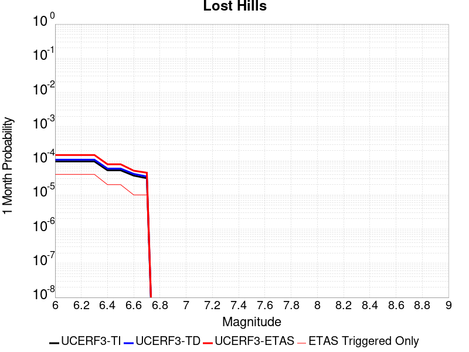 | 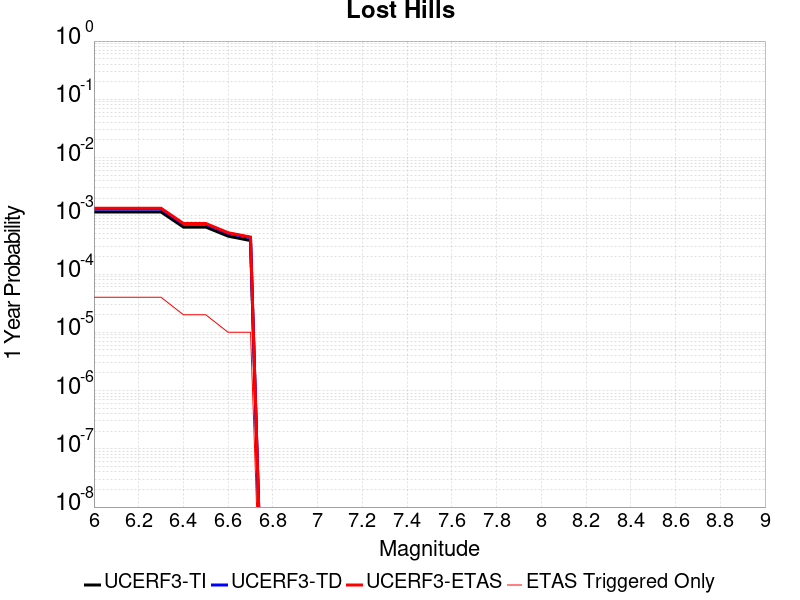 |  |

| Magnitude | 1 wk TI Prob | 1 wk TD Prob | 1 wk ETAS Prob | 1 wk ETAS/TD Gain | 1 wk ETAS Triggered Only | 1 mo TI Prob | 1 mo TD Prob | 1 mo ETAS Prob | 1 mo ETAS/TD Gain | 1 mo ETAS Triggered Only | 1 yr TI Prob | 1 yr TD Prob | 1 yr ETAS Prob | 1 yr ETAS/TD Gain | 1 yr ETAS Triggered Only | 10 yr TI Prob | 10 yr TD Prob | 10 yr ETAS Prob | 10 yr ETAS/TD Gain | 10 yr ETAS Triggered Only |
|-----|-----|-----|-----|-----|-----|-----|-----|-----|-----|-----|-----|-----|-----|-----|-----|-----|-----|-----|-----|-----|
| 6.0 | 2.233523E-5 | 2.5106583E-5 | 1.6208945E-4 | 6.4560537 | 1.369863E-4 | 9.571891E-5 | 1.0759615E-4 | 2.4456772E-4 | 2.2730155 | 1.369863E-4 | 0.0011647546 | 0.001309364 | 0.001446171 | 1.1044835 | 1.369863E-4 | 0.011586686 | 0.013033091 | 0.013168292 | 1.0103737 | 1.369863E-4 |
| 6.1 | 2.233523E-5 | 2.5106583E-5 | 1.6208945E-4 | 6.4560537 | 1.369863E-4 | 9.571891E-5 | 1.0759615E-4 | 2.4456772E-4 | 2.2730155 | 1.369863E-4 | 0.0011647546 | 0.001309364 | 0.001446171 | 1.1044835 | 1.369863E-4 | 0.011586686 | 0.013033091 | 0.013168292 | 1.0103737 | 1.369863E-4 |
| 6.2 | 2.233523E-5 | 2.5106583E-5 | 1.6208945E-4 | 6.4560537 | 1.369863E-4 | 9.571891E-5 | 1.0759615E-4 | 2.4456772E-4 | 2.2730155 | 1.369863E-4 | 0.0011647546 | 0.001309364 | 0.001446171 | 1.1044835 | 1.369863E-4 | 0.011586686 | 0.013033091 | 0.013168292 | 1.0103737 | 1.369863E-4 |
| 6.3 | 2.233523E-5 | 2.5106583E-5 | 1.6208945E-4 | 6.4560537 | 1.369863E-4 | 9.571891E-5 | 1.0759615E-4 | 2.4456772E-4 | 2.2730155 | 1.369863E-4 | 0.0011647546 | 0.001309364 | 0.001446171 | 1.1044835 | 1.369863E-4 | 0.011586686 | 0.013033091 | 0.013168292 | 1.0103737 | 1.369863E-4 |
| 6.4 | 1.2288092E-5 | 1.3781108E-5 | 1.3781108E-5 | 1.0 | 0.0 | 5.2662188E-5 | 5.906108E-5 | 5.906108E-5 | 1.0 | 0.0 | 6.409735E-4 | 7.189252E-4 | 7.189252E-4 | 1.0 | 0.0 | 0.006391279 | 0.0071752006 | 0.0071752006 | 1.0 | 0.0 |
| 6.5 | 1.2288092E-5 | 1.3781108E-5 | 1.3781108E-5 | 1.0 | 0.0 | 5.2662188E-5 | 5.906108E-5 | 5.906108E-5 | 1.0 | 0.0 | 6.409735E-4 | 7.189252E-4 | 7.189252E-4 | 1.0 | 0.0 | 0.006391279 | 0.0071752006 | 0.0071752006 | 1.0 | 0.0 |
| 6.6 | 8.58281E-6 | 9.63377E-6 | 9.63377E-6 | 1.0 | 0.0 | 3.6782953E-5 | 4.12874E-5 | 4.12874E-5 | 1.0 | 0.0 | 4.4774043E-4 | 5.026414E-4 | 5.026414E-4 | 1.0 | 0.0 | 0.0044683935 | 0.005023205 | 0.005023205 | 1.0 | 0.0 |
| 6.7 | 7.205685E-6 | 8.088302E-6 | 8.088302E-6 | 1.0 | 0.0 | 3.088114E-5 | 3.466415E-5 | 3.466415E-5 | 1.0 | 0.0 | 3.7591302E-4 | 4.2203604E-4 | 4.2203604E-4 | 1.0 | 0.0 | 0.0037527776 | 0.0042203604 | 0.0042203604 | 1.0 | 0.0 |

## Coyote Lake
*[(top)](#table-of-contents)*

| 1 Week | 1 Month | 1 Year | 10 Year |
|-----|-----|-----|-----|
|  |  |  |  |

| Magnitude | 1 wk TI Prob | 1 wk TD Prob | 1 wk ETAS Prob | 1 wk ETAS/TD Gain | 1 wk ETAS Triggered Only | 1 mo TI Prob | 1 mo TD Prob | 1 mo ETAS Prob | 1 mo ETAS/TD Gain | 1 mo ETAS Triggered Only | 1 yr TI Prob | 1 yr TD Prob | 1 yr ETAS Prob | 1 yr ETAS/TD Gain | 1 yr ETAS Triggered Only | 10 yr TI Prob | 10 yr TD Prob | 10 yr ETAS Prob | 10 yr ETAS/TD Gain | 10 yr ETAS Triggered Only |
|-----|-----|-----|-----|-----|-----|-----|-----|-----|-----|-----|-----|-----|-----|-----|-----|-----|-----|-----|-----|-----|
| 6.0 | 1.980352E-5 | 2.1706745E-5 | 1.5869008E-4 | 7.310634 | 1.369863E-4 | 8.486947E-5 | 9.302599E-5 | 2.2999955E-4 | 2.4724224 | 1.369863E-4 | 0.0010327959 | 0.0011320751 | 0.0012689063 | 1.1208676 | 1.369863E-4 | 0.010280091 | 0.011270258 | 0.011405701 | 1.0120177 | 1.369863E-4 |
| 6.1 | 1.980352E-5 | 2.1706745E-5 | 1.5869008E-4 | 7.310634 | 1.369863E-4 | 8.486947E-5 | 9.302599E-5 | 2.2999955E-4 | 2.4724224 | 1.369863E-4 | 0.0010327959 | 0.0011320751 | 0.0012689063 | 1.1208676 | 1.369863E-4 | 0.010280091 | 0.011270258 | 0.011405701 | 1.0120177 | 1.369863E-4 |
| 6.2 | 1.980352E-5 | 2.1706745E-5 | 1.5869008E-4 | 7.310634 | 1.369863E-4 | 8.486947E-5 | 9.302599E-5 | 2.2999955E-4 | 2.4724224 | 1.369863E-4 | 0.0010327959 | 0.0011320751 | 0.0012689063 | 1.1208676 | 1.369863E-4 | 0.010280091 | 0.011270258 | 0.011405701 | 1.0120177 | 1.369863E-4 |
| 6.3 | 1.5344787E-5 | 1.682067E-5 | 1.5380466E-4 | 9.14379 | 1.369863E-4 | 6.576172E-5 | 7.2086936E-5 | 2.0906336E-4 | 2.900156 | 1.369863E-4 | 8.003548E-4 | 8.773662E-4 | 0.0010142324 | 1.1559966 | 1.369863E-4 | 0.007974784 | 0.00874507 | 0.008880857 | 1.0155274 | 1.369863E-4 |
| 6.4 | 1.5344787E-5 | 1.682067E-5 | 1.5380466E-4 | 9.14379 | 1.369863E-4 | 6.576172E-5 | 7.2086936E-5 | 2.0906336E-4 | 2.900156 | 1.369863E-4 | 8.003548E-4 | 8.773662E-4 | 0.0010142324 | 1.1559966 | 1.369863E-4 | 0.007974784 | 0.00874507 | 0.008880857 | 1.0155274 | 1.369863E-4 |
| 6.5 | 1.4189697E-5 | 1.5557987E-5 | 1.5254215E-4 | 9.8047495 | 1.369863E-4 | 6.081157E-5 | 6.6675726E-5 | 2.0365289E-4 | 3.0543785 | 1.369863E-4 | 7.401293E-4 | 8.115349E-4 | 9.4841E-4 | 1.1686621 | 1.369863E-4 | 0.0073766913 | 0.008091656 | 0.008227534 | 1.0167923 | 1.369863E-4 |
| 6.6 | 1.3469301E-5 | 1.4771577E-5 | 1.5175586E-4 | 10.273503 | 1.369863E-4 | 5.7724297E-5 | 6.330556E-5 | 2.0028319E-4 | 3.1637535 | 1.369863E-4 | 7.025667E-4 | 7.7053264E-4 | 9.0741337E-4 | 1.1776444 | 1.369863E-4 | 0.0070034964 | 0.0076845144 | 0.007820448 | 1.0176893 | 1.369863E-4 |
| 6.7 | 1.3027966E-5 | 1.4281745E-5 | 1.512661E-4 | 10.591569 | 1.369863E-4 | 5.5832945E-5 | 6.120638E-5 | 1.981843E-4 | 3.237968 | 1.369863E-4 | 6.7955407E-4 | 7.4499263E-4 | 8.8187685E-4 | 1.1837391 | 1.369863E-4 | 0.006774798 | 0.0074308286 | 0.007566797 | 1.0182979 | 1.369863E-4 |
| 6.8 | 5.695434E-6 | 6.2244176E-6 | 6.2244176E-6 | 1.0 | 0.0 | 2.4408775E-5 | 2.6675973E-5 | 2.6675973E-5 | 1.0 | 0.0 | 2.971363E-4 | 3.2476155E-4 | 3.2476155E-4 | 1.0 | 0.0 | 0.0029673933 | 0.0032458105 | 0.0032458105 | 1.0 | 0.0 |
| 6.9 | 4.385688E-6 | 4.7930553E-6 | 4.7930553E-6 | 1.0 | 0.0 | 1.879567E-5 | 2.0541665E-5 | 2.0541665E-5 | 1.0 | 0.0 | 2.2881327E-4 | 2.5009477E-4 | 2.5009477E-4 | 1.0 | 0.0 | 0.002285778 | 0.0025009478 | 0.0025009478 | 1.0 | 0.0 |

