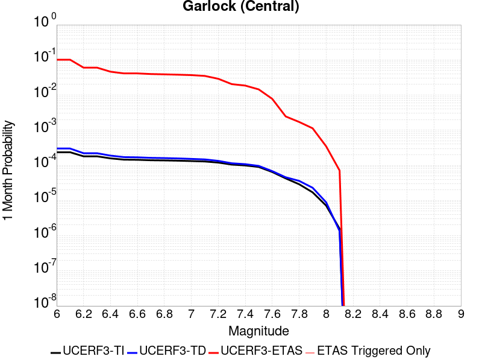
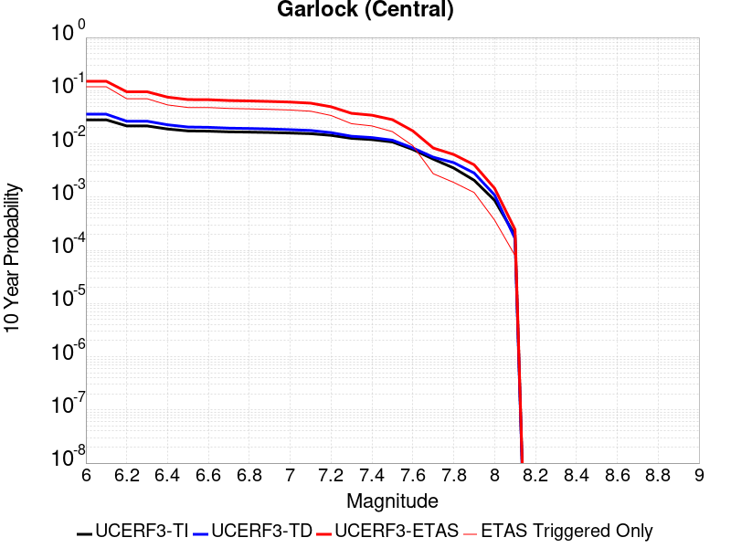
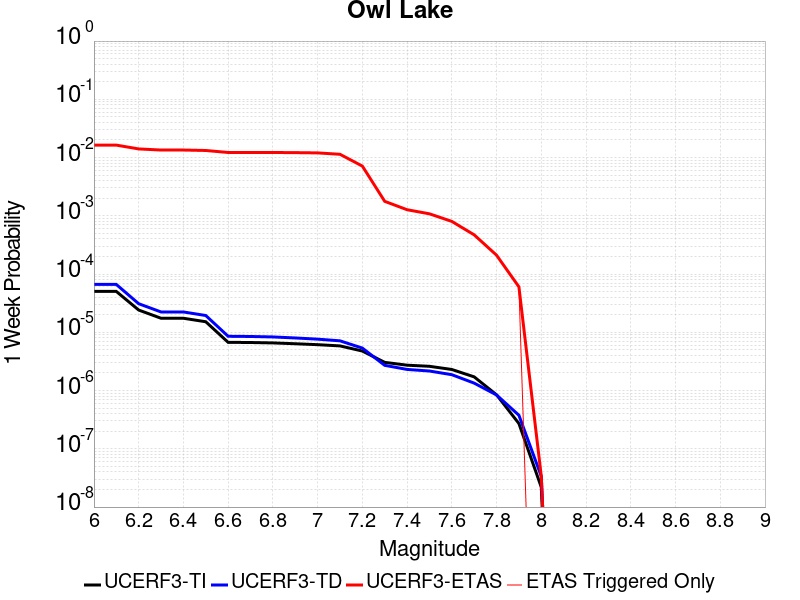
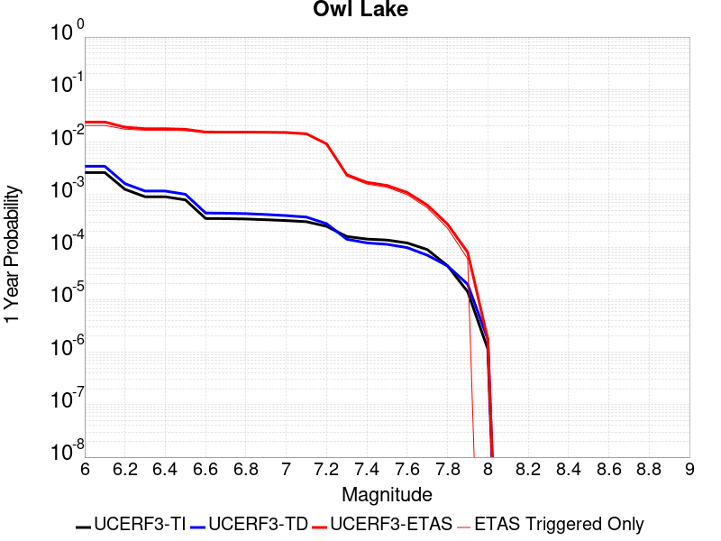
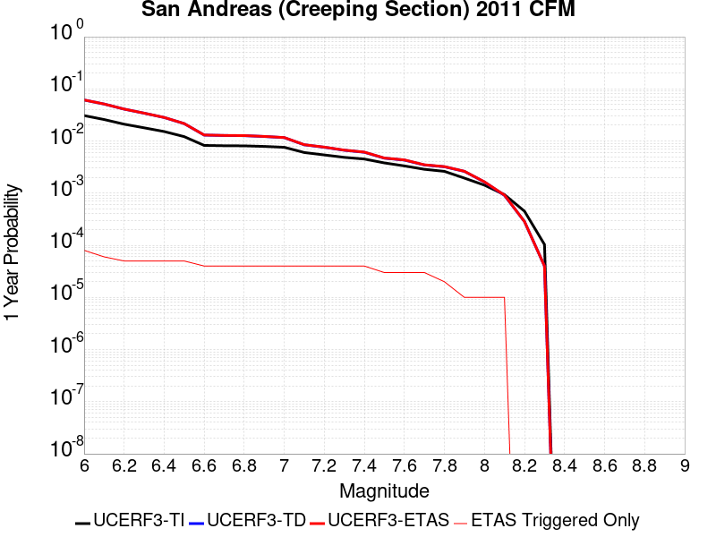
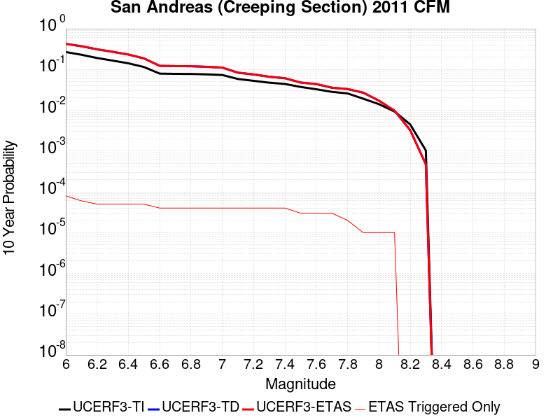
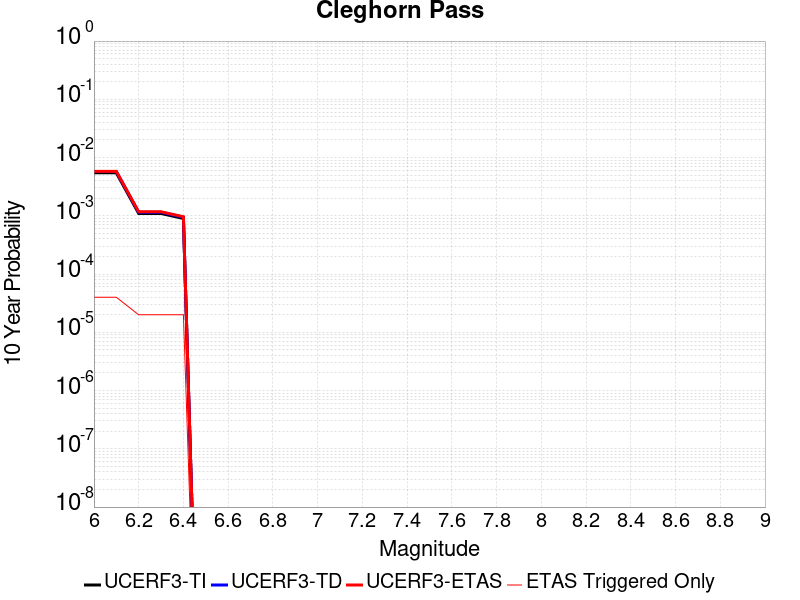
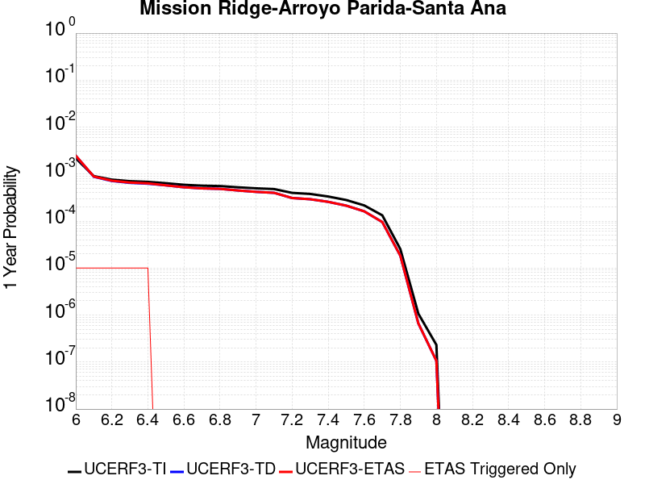
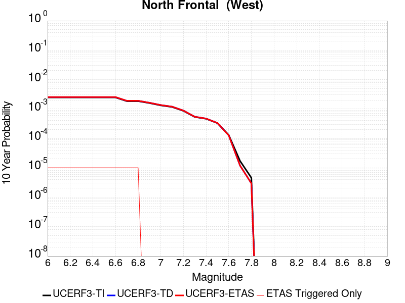

# Parent Section Magnitude-Probability Distributions

Only fault sections with at least one triggered aftershock are plotted. Sections are sorted by total supraseismogenic trigger rate (decreasing)

## Table Of Contents

* [Garlock (Central)](#garlock-central)
* [Little Lake](#little-lake)
* [Tank Canyon](#tank-canyon)
* [Airport Lake](#airport-lake)
* [Owl Lake](#owl-lake)
* [Panamint Valley](#panamint-valley)
* [Garlock (East)](#garlock-east)
* [Hunter Mountain-Saline Valley](#hunter-mountain-saline-valley)
* [Garlock (West)](#garlock-west)
* [Blackwater](#blackwater)
* [Ash Hill](#ash-hill)
* [San Andreas (Mojave N)](#san-andreas-mojave-n)
* [San Andreas (Mojave S)](#san-andreas-mojave-s)
* [Gravel Hills-Harper Lk](#gravel-hills-harper-lk)
* [So Sierra Nevada](#so-sierra-nevada)
* [San Andreas (San Bernardino N)](#san-andreas-san-bernardino-n)
* [Goldstone Lake](#goldstone-lake)
* [McLean Lake](#mclean-lake)
* [Lenwood-Lockhart-Old Woman Springs](#lenwood-lockhart-old-woman-springs)
* [Coyote Canyon](#coyote-canyon)
* [Death Valley (So)](#death-valley-so)
* [San Andreas (San Bernardino S)](#san-andreas-san-bernardino-s)
* [Paradise](#paradise)
* [Towne Pass](#towne-pass)
* [Nelson Lake](#nelson-lake)
* [Helendale-So Lockhart](#helendale-so-lockhart)
* [Garlic Springs](#garlic-springs)
* [Bicycle Lake](#bicycle-lake)
* [Death Valley (Black Mtns Frontal)](#death-valley-black-mtns-frontal)
* [San Andreas (San Gorgonio Pass-Garnet HIll)](#san-andreas-san-gorgonio-pass-garnet-hill)
* [San Jacinto (San Bernardino)](#san-jacinto-san-bernardino)
* [Scodie Lineament](#scodie-lineament)
* [Lake Isabella (Seismicity)](#lake-isabella-seismicity)
* [Manix-Afton Hills](#manix-afton-hills)
* [San Andreas (Coachella) rev](#san-andreas-coachella-rev)
* [Coyote Lake](#coyote-lake)
* [Sierra Nevada  (No Extension)](#sierra-nevada--no-extension)
* [San Andreas (North Branch Mill Creek)](#san-andreas-north-branch-mill-creek)
* [Cleghorn Lake](#cleghorn-lake)
* [San Jacinto (Stepovers Combined)](#san-jacinto-stepovers-combined)
* [Red Pass](#red-pass)
* [San Andreas (Big Bend)](#san-andreas-big-bend)
* [Elsinore (Glen Ivy) rev](#elsinore-glen-ivy-rev)
* [San Jacinto (San Jacinto Valley) rev](#san-jacinto-san-jacinto-valley-rev)
* [White Wolf (Extension)](#white-wolf-extension)
* [San Andreas (Carrizo) rev](#san-andreas-carrizo-rev)
* [Death Valley (No)](#death-valley-no)
* [San Jacinto (Anza) rev](#san-jacinto-anza-rev)
* [San Andreas (Cholame) rev](#san-andreas-cholame-rev)
* [Mission Creek](#mission-creek)
* [Cady](#cady)
* [Calico-Hidalgo](#calico-hidalgo)
* [San Andreas (Parkfield)](#san-andreas-parkfield)
* [Owens Valley](#owens-valley)
* [San Jacinto (Coyote Creek)](#san-jacinto-coyote-creek)
* [Kern Canyon (North Kern) 2011](#kern-canyon-north-kern-2011)
* [Death Valley (Fish Lake Valley)](#death-valley-fish-lake-valley)
* [Santa Ynez (East)](#santa-ynez-east)
* [Independence rev 2011](#independence-rev-2011)
* [San Andreas (Creeping Section) 2011 CFM](#san-andreas-creeping-section-2011-cfm)
* [White Mountains](#white-mountains)
* [Santa Ynez (West)](#santa-ynez-west)
* [Brawley (Seismic Zone) alt 1](#brawley-seismic-zone-alt-1)
* [San Jacinto (Lytle Creek connector)](#san-jacinto-lytle-creek-connector)
* [Imperial](#imperial)
* [Chino alt 1](#chino-alt-1)
* [San Jacinto (Borrego)](#san-jacinto-borrego)
* [Ludlow](#ludlow)
* [Hosgri](#hosgri)
* [Deep Springs](#deep-springs)
* [Rose Canyon](#rose-canyon)
* [Santa Rosa Island](#santa-rosa-island)
* [Camp Rock 2011](#camp-rock-2011)
* [Dry Mountain](#dry-mountain)
* [Great Valley 07 (Orestimba)](#great-valley-07-orestimba)
* [Baker](#baker)
* [Bullion Mountains](#bullion-mountains)
* [San Pedro Basin](#san-pedro-basin)
* [San Clemente](#san-clemente)
* [Kern Canyon (South Kern) 2011](#kern-canyon-south-kern-2011)
* [Lost Hills](#lost-hills)
* [Whittier alt 1](#whittier-alt-1)
* [Cleghorn Pass](#cleghorn-pass)
* [Oceanic - West Huasna](#oceanic---west-huasna)
* [Pinto Mtn](#pinto-mtn)
* [Elysian Park (Upper)](#elysian-park-upper)
* [Red Mountain](#red-mountain)
* [Palos Verdes](#palos-verdes)
* [Santa Cruz Island](#santa-cruz-island)
* [Coronado Bank alt1](#coronado-bank-alt1)
* [Pleito](#pleito)
* [Sheephole](#sheephole)
* [Pisgah-Bullion Mtn-Mesquite Lk](#pisgah-bullion-mtn-mesquite-lk)
* [Mono Lake 2011 CFM](#mono-lake-2011-cfm)
* [Blue Cut](#blue-cut)
* [Santa Cruz Catalina Ridge alt1](#santa-cruz-catalina-ridge-alt1)
* [Pine Mtn](#pine-mtn)
* [Cleghorn](#cleghorn)
* [Davis Creek](#davis-creek)
* [Channel Islands Western Deep Ramp](#channel-islands-western-deep-ramp)
* [Great Valley 09 (Laguna Seca)](#great-valley-09-laguna-seca)
* [Emerson-Copper Mtn 2011](#emerson-copper-mtn-2011)
* [San Jacinto (Clark) rev](#san-jacinto-clark-rev)
* [San Diego Trough north alt1](#san-diego-trough-north-alt1)
* [Kern Canyon (Lake Isabella) 2011](#kern-canyon-lake-isabella-2011)
* [Big Pine (Central)](#big-pine-central)
* [Hunting Creek - Berryessa 2011 CFM](#hunting-creek---berryessa-2011-cfm)
* [Honey Lake 2011 CFM](#honey-lake-2011-cfm)
* [Tin Mountain](#tin-mountain)
* [Oceanside alt1](#oceanside-alt1)
* [Elsinore (Julian)](#elsinore-julian)
* [Santa Ynez River](#santa-ynez-river)
* [Ventura-Pitas Point](#ventura-pitas-point)
* [Simi-Santa Rosa](#simi-santa-rosa)
* [Cedar Mtn-Mahogany Mtn](#cedar-mtn-mahogany-mtn)
* [San Andreas (Santa Cruz Mts) 2011 CFM](#san-andreas-santa-cruz-mts-2011-cfm)
* [San Gregorio (South) 2011 CFM](#san-gregorio-south-2011-cfm)
* [San Cayetano](#san-cayetano)
* [Cerro Prieto](#cerro-prieto)
* [Rinconada 2011 CFM](#rinconada-2011-cfm)
* [Green Valley 2011 CFM](#green-valley-2011-cfm)
* [West Tahoe](#west-tahoe)
* [Anaheim](#anaheim)
* [Raymond](#raymond)
* [Goose Lake 2011 CFM](#goose-lake-2011-cfm)
* [Ozena](#ozena)
* [Big Pine (East)](#big-pine-east)
* [Reliz 2011 CFM](#reliz-2011-cfm)
* [Elsinore (Coyote Mountains)](#elsinore-coyote-mountains)
* [San Gregorio (North) 2011 CFM](#san-gregorio-north-2011-cfm)
* [Yorba Linda](#yorba-linda)
* [Hunting Creek - Bartlett Springs connector 2011](#hunting-creek---bartlett-springs-connector-2011)
* [Del Valle](#del-valle)
* [Ortigalita (North)](#ortigalita-north)
* [Pittville 2011 CFM](#pittville-2011-cfm)
* [San Juan](#san-juan)
* [Robinson Creek](#robinson-creek)
* [San Gabriel](#san-gabriel)
* [Las Positas](#las-positas)
* [Hosgri (Extension)](#hosgri-extension)
* [Eaton Roughs 2011 CFM](#eaton-roughs-2011-cfm)
* [Fitzhugh Creek](#fitzhugh-creek)
* [San Jacinto (Superstition Mtn)](#san-jacinto-superstition-mtn)
* [Carlsbad](#carlsbad)
* [Likely 2011 CFM](#likely-2011-cfm)
* [Swain Ravine - Spenceville](#swain-ravine---spenceville)
* [San Andreas (Offshore) 2011 CFM](#san-andreas-offshore-2011-cfm)
* [Elsinore (Stepovers Combined)](#elsinore-stepovers-combined)
* [Big Lagoon - Bald Mtn 2011 CFM](#big-lagoon---bald-mtn-2011-cfm)
* [Almanor 2011 CFM](#almanor-2011-cfm)
* [Redondo Canyon alt 1](#redondo-canyon-alt-1)
* [Maacama 2011 CFM](#maacama-2011-cfm)
* [Calaveras (So) 2011 CFM](#calaveras-so-2011-cfm)
* [Great Valley 05 Pittsburg - Kirby Hills alt1](#great-valley-05-pittsburg---kirby-hills-alt1)
* [Hartley Springs 2011 CFM](#hartley-springs-2011-cfm)
* [Los Osos 2011](#los-osos-2011)
* [Earthquake Valley (No  Extension)](#earthquake-valley-no--extension)
* [Mission Ridge-Arroyo Parida-Santa Ana](#mission-ridge-arroyo-parida-santa-ana)
* [San Andreas (Peninsula) 2011 CFM](#san-andreas-peninsula-2011-cfm)
* [North Frontal  (West)](#north-frontal--west)
* [Great Valley 04b Gordon Valley](#great-valley-04b-gordon-valley)
* [Last Chance](#last-chance)
* [Elsinore (Temecula) rev](#elsinore-temecula-rev)

## Garlock (Central)
*[(top)](#table-of-contents)*

| 1 Week | 1 Month | 1 Year | 10 Year |
|-----|-----|-----|-----|
|  |  |  |  |

| Magnitude | 1 wk TI Prob | 1 wk TD Prob | 1 wk ETAS Prob | 1 wk ETAS/TD Gain | 1 wk ETAS Triggered Only | 1 mo TI Prob | 1 mo TD Prob | 1 mo ETAS Prob | 1 mo ETAS/TD Gain | 1 mo ETAS Triggered Only | 1 yr TI Prob | 1 yr TD Prob | 1 yr ETAS Prob | 1 yr ETAS/TD Gain | 1 yr ETAS Triggered Only | 10 yr TI Prob | 10 yr TD Prob | 10 yr ETAS Prob | 10 yr ETAS/TD Gain | 10 yr ETAS Triggered Only |
|-----|-----|-----|-----|-----|-----|-----|-----|-----|-----|-----|-----|-----|-----|-----|-----|-----|-----|-----|-----|-----|
| 6.0 | 5.5131142E-5 | 7.02476E-5 | 0.092903726 | 1322.5182 | 0.09284 | 2.3625491E-4 | 3.0102677E-4 | 0.10149056 | 337.14795 | 0.10122 | 0.0028726095 | 0.003658906 | 0.11509966 | 31.457397 | 0.11185 | 0.028357591 | 0.036136657 | 0.15039302 | 4.1617856 | 0.11854 |
| 6.1 | 5.5131142E-5 | 7.02476E-5 | 0.092903726 | 1322.5182 | 0.09284 | 2.3625491E-4 | 3.0102677E-4 | 0.10149056 | 337.14795 | 0.10122 | 0.0028726095 | 0.003658906 | 0.11509966 | 31.457397 | 0.11185 | 0.028357591 | 0.036136657 | 0.15039302 | 4.1617856 | 0.11854 |
| 6.2 | 4.216245E-5 | 5.1661802E-5 | 0.054838832 | 1061.4967 | 0.05479 | 1.806837E-4 | 2.213891E-4 | 0.060338076 | 272.54312 | 0.06013 | 0.0021976046 | 0.002692112 | 0.06898317 | 25.624182 | 0.06647 | 0.021759989 | 0.026701318 | 0.09543567 | 3.5741932 | 0.07062 |
| 6.3 | 4.216245E-5 | 5.1661802E-5 | 0.054838832 | 1061.4967 | 0.05479 | 1.806837E-4 | 2.213891E-4 | 0.060338076 | 272.54312 | 0.06013 | 0.0021976046 | 0.002692112 | 0.06898317 | 25.624182 | 0.06647 | 0.021759989 | 0.026701318 | 0.09543567 | 3.5741932 | 0.07062 |
| 6.4 | 3.6858168E-5 | 4.411026E-5 | 0.04199226 | 951.98395 | 0.04195 | 1.5795401E-4 | 1.8903041E-4 | 0.04620033 | 244.40686 | 0.04602 | 0.0019213937 | 0.0022990413 | 0.052862525 | 22.99329 | 0.05068 | 0.019048655 | 0.022866098 | 0.07565087 | 3.3084292 | 0.05402 |
| 6.5 | 3.39199E-5 | 4.0018425E-5 | 0.03746852 | 936.28174 | 0.03743 | 1.453629E-4 | 1.7149639E-4 | 0.041334435 | 241.0222 | 0.04117 | 0.0017683565 | 0.0020859907 | 0.047231622 | 22.642296 | 0.04524 | 0.017543508 | 0.020758783 | 0.068085514 | 3.2798412 | 0.04833 |
| 6.6 | 3.3571985E-5 | 3.947258E-5 | 0.037447996 | 948.7091 | 0.03741 | 1.4387199E-4 | 1.6915736E-4 | 0.041312195 | 244.22348 | 0.04115 | 0.0017502342 | 0.0020575672 | 0.047184523 | 22.932192 | 0.04522 | 0.017365133 | 0.020480042 | 0.06780065 | 3.310572 | 0.04831 |
| 6.7 | 3.2580007E-5 | 3.808902E-5 | 0.035946723 | 943.7555 | 0.03591 | 1.3962112E-4 | 1.6322857E-4 | 0.03966678 | 243.01372 | 0.03951 | 0.0016985617 | 0.0019855178 | 0.045369208 | 22.850063 | 0.04347 | 0.016856372 | 0.019770874 | 0.065292716 | 3.30247 | 0.04644 |
| 6.8 | 3.2185937E-5 | 3.7516216E-5 | 0.035186198 | 937.89307 | 0.03515 | 1.3793244E-4 | 1.60774E-4 | 0.038894545 | 241.92064 | 0.03874 | 0.0016780337 | 0.0019556875 | 0.044522278 | 22.76554 | 0.04265 | 0.016654192 | 0.019477878 | 0.06419949 | 3.296021 | 0.04561 |
| 6.9 | 3.165394E-5 | 3.672075E-5 | 0.03436546 | 935.85944 | 0.03433 | 1.3565269E-4 | 1.5736527E-4 | 0.037991412 | 241.42181 | 0.03784 | 0.0016503202 | 0.00191426 | 0.04350449 | 22.726534 | 0.04167 | 0.01638118 | 0.019071518 | 0.062762074 | 3.2908797 | 0.04454 |
| 7.0 | 3.0903822E-5 | 3.562591E-5 | 0.033444434 | 938.7672 | 0.03341 | 1.3243823E-4 | 1.5267366E-4 | 0.036957055 | 242.06569 | 0.03681 | 0.0016112428 | 0.0018572382 | 0.042371854 | 22.814442 | 0.04059 | 0.015996104 | 0.018513493 | 0.06111982 | 3.3013663 | 0.04341 |
| 7.1 | 3.0069863E-5 | 3.4392175E-5 | 0.031683303 | 921.23584 | 0.03165 | 1.2886449E-4 | 1.4738683E-4 | 0.03504224 | 237.75696 | 0.0349 | 0.0015677959 | 0.0017929787 | 0.040194 | 22.417446 | 0.03847 | 0.01556781 | 0.01788099 | 0.05831483 | 3.2612753 | 0.04117 |
| 7.2 | 2.7957109E-5 | 3.128141E-5 | 0.026170464 | 836.61383 | 0.02614 | 1.1981068E-4 | 1.3405642E-4 | 0.029020183 | 216.47739 | 0.02889 | 0.0014577188 | 0.0016309345 | 0.03347891 | 20.527437 | 0.0319 | 0.014481937 | 0.016284352 | 0.04990775 | 3.0647676 | 0.03418 |
| 7.3 | 2.4519275E-5 | 2.6714602E-5 | 0.01855622 | 694.6096 | 0.01853 | 1.0507837E-4 | 1.1448621E-4 | 0.020462157 | 178.73032 | 0.02035 | 0.0012785783 | 0.001392993 | 0.02371186 | 17.022238 | 0.02235 | 0.012712469 | 0.01392861 | 0.03756474 | 2.6969483 | 0.02397 |
| 7.4 | 2.3225532E-5 | 2.5199166E-5 | 0.016924772 | 671.6402 | 0.0169 | 9.95342E-5 | 1.0799204E-4 | 0.018595995 | 172.19783 | 0.01849 | 0.0012111551 | 0.0013140244 | 0.021597337 | 16.436024 | 0.02031 | 0.012045753 | 0.013146196 | 0.034630004 | 2.6342223 | 0.02177 |
| 7.5 | 2.097765E-5 | 2.2483406E-5 | 0.013122189 | 583.6388 | 0.0131 | 8.9901114E-5 | 9.6353964E-5 | 0.014494967 | 150.43456 | 0.0144 | 0.0010939965 | 0.00117249 | 0.017033871 | 14.5279455 | 0.01588 | 0.010886264 | 0.0117406575 | 0.028560832 | 2.4326434 | 0.01702 |
| 7.6 | 1.511254E-5 | 1.5990969E-5 | 0.007015879 | 438.74008 | 0.007 | 6.476642E-5 | 6.8530964E-5 | 0.0078080003 | 113.9339 | 0.00774 | 7.882459E-4 | 8.34053E-4 | 0.009406897 | 11.278537 | 0.00858 | 0.007854558 | 0.008383867 | 0.0175464 | 2.0928767 | 0.00924 |
| 7.7 | 9.934069E-6 | 1.0678523E-5 | 0.0022006552 | 206.08235 | 0.00219 | 4.2573887E-5 | 4.5764296E-5 | 0.0024656535 | 53.877228 | 0.00242 | 5.182138E-4 | 5.570383E-4 | 0.0031655843 | 5.682885 | 0.00261 | 0.00517007 | 0.005627419 | 0.008361944 | 1.4859288 | 0.00275 |
| 7.8 | 6.7562896E-6 | 8.42837E-6 | 0.0015284156 | 181.34178 | 0.00152 | 2.8955206E-5 | 3.6121084E-5 | 0.0017160604 | 47.50855 | 0.00168 | 3.5247262E-4 | 4.3968562E-4 | 0.0022288987 | 5.0693007 | 0.00179 | 0.0035191406 | 0.004446416 | 0.0063280123 | 1.4231714 | 0.00189 |
| 7.9 | 3.975453E-6 | 5.3710532E-6 | 0.0010053656 | 187.18224 | 0.001 | 1.7037546E-5 | 2.3018596E-5 | 0.001132993 | 49.22077 | 0.00111 | 2.0741238E-4 | 2.8021546E-4 | 0.0014398905 | 5.1385117 | 0.00116 | 0.002072189 | 0.0028335669 | 0.00405011 | 1.4293327 | 0.00122 |
| 8.0 | 1.6729537E-6 | 2.0775192E-6 | 3.1207688E-4 | 150.21613 | 3.1E-4 | 7.169782E-6 | 8.903624E-6 | 3.489006E-4 | 39.18636 | 3.4E-4 | 8.7288594E-5 | 1.0839626E-4 | 4.5835832E-4 | 4.2285438 | 3.5E-4 | 8.7254314E-4 | 0.001096854 | 0.0014664482 | 1.3369584 | 3.7E-4 |
| 8.1 | 3.6733252E-7 | 3.1489736E-7 | 7.0314876E-5 | 223.29457 | 7.0E-5 | 1.5742813E-6 | 1.3495595E-6 | 7.134947E-5 | 52.868706 | 7.0E-5 | 1.9166706E-5 | 1.643078E-5 | 8.642963E-5 | 5.2602267 | 7.0E-5 | 1.9165053E-4 | 1.662928E-4 | 2.462795E-4 | 1.4809992 | 8.0E-5 |

## Little Lake
*[(top)](#table-of-contents)*

| 1 Week | 1 Month | 1 Year | 10 Year |
|-----|-----|-----|-----|
|  |  |  |  |

| Magnitude | 1 wk TI Prob | 1 wk TD Prob | 1 wk ETAS Prob | 1 wk ETAS/TD Gain | 1 wk ETAS Triggered Only | 1 mo TI Prob | 1 mo TD Prob | 1 mo ETAS Prob | 1 mo ETAS/TD Gain | 1 mo ETAS Triggered Only | 1 yr TI Prob | 1 yr TD Prob | 1 yr ETAS Prob | 1 yr ETAS/TD Gain | 1 yr ETAS Triggered Only | 10 yr TI Prob | 10 yr TD Prob | 10 yr ETAS Prob | 10 yr ETAS/TD Gain | 10 yr ETAS Triggered Only |
|-----|-----|-----|-----|-----|-----|-----|-----|-----|-----|-----|-----|-----|-----|-----|-----|-----|-----|-----|-----|-----|
| 6.0 | 2.8424427E-5 | 3.1205716E-5 | 0.043639846 | 1398.4568 | 0.04361 | 1.2181328E-4 | 1.3373268E-4 | 0.047657378 | 356.36298 | 0.04753 | 0.0014820677 | 0.0016271125 | 0.054530893 | 33.513905 | 0.05299 | 0.014722223 | 0.016165398 | 0.071496256 | 4.422796 | 0.05624 |
| 6.1 | 2.8424427E-5 | 3.1205716E-5 | 0.043639846 | 1398.4568 | 0.04361 | 1.2181328E-4 | 1.3373268E-4 | 0.047657378 | 356.36298 | 0.04753 | 0.0014820677 | 0.0016271125 | 0.054530893 | 33.513905 | 0.05299 | 0.014722223 | 0.016165398 | 0.071496256 | 4.422796 | 0.05624 |
| 6.2 | 2.8424427E-5 | 3.1205716E-5 | 0.043639846 | 1398.4568 | 0.04361 | 1.2181328E-4 | 1.3373268E-4 | 0.047657378 | 356.36298 | 0.04753 | 0.0014820677 | 0.0016271125 | 0.054530893 | 33.513905 | 0.05299 | 0.014722223 | 0.016165398 | 0.071496256 | 4.422796 | 0.05624 |
| 6.3 | 1.48860645E-5 | 1.6081383E-5 | 0.030095598 | 1871.4557 | 0.03008 | 6.379586E-5 | 6.8918554E-5 | 0.032776665 | 475.58548 | 0.03271 | 7.7643775E-4 | 8.387886E-4 | 0.037388105 | 44.573933 | 0.03658 | 0.007737305 | 0.008359045 | 0.046834715 | 5.6028786 | 0.0388 |
| 6.4 | 1.48860645E-5 | 1.6081383E-5 | 0.030095598 | 1871.4557 | 0.03008 | 6.379586E-5 | 6.8918554E-5 | 0.032776665 | 475.58548 | 0.03271 | 7.7643775E-4 | 8.387886E-4 | 0.037388105 | 44.573933 | 0.03658 | 0.007737305 | 0.008359045 | 0.046834715 | 5.6028786 | 0.0388 |
| 6.5 | 1.2797581E-5 | 1.376556E-5 | 0.02798338 | 2032.8546 | 0.02797 | 5.4845623E-5 | 5.8994065E-5 | 0.030487198 | 516.7842 | 0.03043 | 6.675408E-4 | 7.1804173E-4 | 0.03470362 | 48.330925 | 0.03401 | 0.006655392 | 0.007159767 | 0.04288216 | 5.989323 | 0.03598 |
| 6.6 | 9.661896E-6 | 1.0289033E-5 | 0.024380038 | 2369.517 | 0.02437 | 4.1407468E-5 | 4.40952E-5 | 0.026622923 | 603.76013 | 0.02658 | 5.040193E-4 | 5.36743E-4 | 0.030210808 | 56.28542 | 0.02969 | 0.005028777 | 0.0053560715 | 0.036627676 | 6.838534 | 0.03144 |
| 6.7 | 7.767871E-6 | 8.199681E-6 | 0.021848021 | 2664.4963 | 0.02184 | 3.329045E-5 | 3.5141096E-5 | 0.023854304 | 678.81506 | 0.02382 | 4.0523586E-4 | 4.2777258E-4 | 0.02690644 | 62.89894 | 0.02649 | 0.004044977 | 0.004270843 | 0.03211143 | 7.5187564 | 0.02796 |
| 6.8 | 6.4235196E-6 | 6.735739E-6 | 0.016996622 | 2523.349 | 0.01699 | 2.752908E-5 | 2.8867207E-5 | 0.018558333 | 642.88635 | 0.01853 | 3.35115E-4 | 3.5141438E-4 | 0.0208742 | 59.400528 | 0.02053 | 0.003346101 | 0.0035098472 | 0.025143648 | 7.1637444 | 0.02171 |
| 6.9 | 3.1283696E-6 | 3.1121751E-6 | 0.010783079 | 3464.8047 | 0.01078 | 1.3407229E-5 | 1.33378335E-5 | 0.01184318 | 887.93884 | 0.01183 | 1.6322079E-4 | 1.6237753E-4 | 0.01326025 | 81.663086 | 0.0131 | 0.0016310095 | 0.0016227372 | 0.01547023 | 9.533417 | 0.01387 |
| 7.0 | 2.290603E-6 | 2.2286763E-6 | 0.006572214 | 2948.932 | 0.00657 | 9.816834E-6 | 9.551441E-6 | 0.007259482 | 760.0406 | 0.00725 | 1.19513395E-4 | 1.1628362E-4 | 0.008115353 | 69.78931 | 0.008 | 0.0011944914 | 0.0011623299 | 0.009582532 | 8.244245 | 0.00843 |
| 7.1 | 1.293693E-6 | 1.1776774E-6 | 0.0027311745 | 2319.1194 | 0.00273 | 5.5443866E-6 | 5.047183E-6 | 0.0031050316 | 615.20087 | 0.0031 | 6.750081E-5 | 6.1448416E-5 | 0.0035012371 | 56.978474 | 0.00344 | 6.7480316E-4 | 6.1438273E-4 | 0.0042921216 | 6.9860716 | 0.00368 |
| 7.2 | 4.715842E-7 | 3.091732E-7 | 1.3030913E-4 | 421.47617 | 1.3E-4 | 2.0210737E-6 | 1.3250274E-6 | 1.5132483E-4 | 114.20506 | 1.5E-4 | 2.4606294E-5 | 1.6132095E-5 | 1.8612936E-4 | 11.537829 | 1.7E-4 | 2.460357E-4 | 1.6130977E-4 | 3.4128074E-4 | 2.1156855 | 1.8E-4 |
| 7.3 | 3.9430947E-7 | 2.3096938E-7 | 1.00230944E-4 | 433.9577 | 1.0E-4 | 1.6898966E-6 | 9.898685E-7 | 1.2098975E-4 | 122.22811 | 1.2E-4 | 2.0574296E-5 | 1.2051582E-5 | 1.3205013E-4 | 10.957079 | 1.2E-4 | 2.0572392E-4 | 1.2050936E-4 | 2.404949E-4 | 1.9956533 | 1.2E-4 |
| 7.4 | 3.547123E-7 | 1.9678579E-7 | 8.019677E-5 | 407.53333 | 8.0E-5 | 1.5201948E-6 | 8.433674E-7 | 1.0084328E-4 | 119.57219 | 1.0E-4 | 1.8508214E-5 | 1.02679505E-5 | 1.1026693E-4 | 10.738942 | 1.0E-4 | 1.8506673E-4 | 1.0267482E-4 | 2.0266455E-4 | 1.9738486 | 1.0E-4 |
| 7.5 | 2.6354266E-7 | 1.4422719E-7 | 6.014422E-5 | 417.01028 | 6.0E-5 | 1.129468E-6 | 6.1811636E-7 | 7.061807E-5 | 114.247215 | 7.0E-5 | 1.3751187E-5 | 7.525541E-6 | 7.7525016E-5 | 10.301586 | 7.0E-5 | 1.3750336E-4 | 7.5252916E-5 | 1.4524764E-4 | 1.9301265 | 7.0E-5 |
| 7.6 | 1.269913E-7 | 7.572344E-8 | 3.0075722E-5 | 397.17847 | 3.0E-5 | 5.4424834E-7 | 3.24529E-7 | 4.0324518E-5 | 124.25551 | 4.0E-5 | 6.6262032E-6 | 3.9511337E-6 | 4.3950975E-5 | 11.123636 | 4.0E-5 | 6.626006E-5 | 3.9510673E-5 | 7.950909E-5 | 2.0123448 | 4.0E-5 |

## Tank Canyon
*[(top)](#table-of-contents)*

| 1 Week | 1 Month | 1 Year | 10 Year |
|-----|-----|-----|-----|
|  |  |  |  |

| Magnitude | 1 wk TI Prob | 1 wk TD Prob | 1 wk ETAS Prob | 1 wk ETAS/TD Gain | 1 wk ETAS Triggered Only | 1 mo TI Prob | 1 mo TD Prob | 1 mo ETAS Prob | 1 mo ETAS/TD Gain | 1 mo ETAS Triggered Only | 1 yr TI Prob | 1 yr TD Prob | 1 yr ETAS Prob | 1 yr ETAS/TD Gain | 1 yr ETAS Triggered Only | 10 yr TI Prob | 10 yr TD Prob | 10 yr ETAS Prob | 10 yr ETAS/TD Gain | 10 yr ETAS Triggered Only |
|-----|-----|-----|-----|-----|-----|-----|-----|-----|-----|-----|-----|-----|-----|-----|-----|-----|-----|-----|-----|-----|
| 6.0 | 4.8284557E-5 | 5.796445E-5 | 0.039745662 | 685.69037 | 0.03969 | 2.0691741E-4 | 2.4839927E-4 | 0.0437076 | 175.95705 | 0.04347 | 0.0025163088 | 0.0030207336 | 0.05183284 | 17.159023 | 0.04896 | 0.02488006 | 0.029863616 | 0.08102861 | 2.7132885 | 0.05274 |
| 6.1 | 1.7796336E-5 | 2.0873378E-5 | 0.012580611 | 602.7109 | 0.01256 | 7.626778E-5 | 8.945448E-5 | 0.013988211 | 156.37239 | 0.0139 | 9.281647E-4 | 0.0010886024 | 0.016931336 | 15.553281 | 0.01586 | 0.009242975 | 0.010836642 | 0.027810685 | 2.5663564 | 0.01716 |
| 6.2 | 1.7796336E-5 | 2.0873378E-5 | 0.012580611 | 602.7109 | 0.01256 | 7.626778E-5 | 8.945448E-5 | 0.013988211 | 156.37239 | 0.0139 | 9.281647E-4 | 0.0010886024 | 0.016931336 | 15.553281 | 0.01586 | 0.009242975 | 0.010836642 | 0.027810685 | 2.5663564 | 0.01716 |
| 6.3 | 1.3515912E-5 | 1.5759651E-5 | 0.009035617 | 573.3386 | 0.00902 | 5.792405E-5 | 6.7539746E-5 | 0.0101368595 | 150.08731 | 0.01007 | 7.049971E-4 | 8.2200987E-4 | 0.012292573 | 14.954289 | 0.01148 | 0.007027647 | 0.008192157 | 0.020550083 | 2.508507 | 0.01246 |
| 6.4 | 1.0870146E-5 | 1.2618114E-5 | 0.006762533 | 535.9385 | 0.00675 | 4.658551E-5 | 5.4076605E-5 | 0.0076236674 | 140.97902 | 0.00757 | 5.67031E-4 | 6.582015E-4 | 0.009202573 | 13.981393 | 0.00855 | 0.005655863 | 0.006564382 | 0.015823202 | 2.4104633 | 0.00932 |
| 6.5 | 7.964826E-6 | 9.196184E-6 | 0.0044391556 | 482.71713 | 0.00443 | 3.4134522E-5 | 3.941168E-5 | 0.005029215 | 127.60722 | 0.00499 | 4.1550855E-4 | 4.797421E-4 | 0.006057065 | 12.6256695 | 0.00558 | 0.0041473247 | 0.004788209 | 0.010849049 | 2.2657843 | 0.00609 |
| 6.6 | 6.6317E-6 | 7.612378E-6 | 0.0032975874 | 433.18753 | 0.00329 | 2.8421264E-5 | 3.262412E-5 | 0.0037325034 | 114.40932 | 0.0037 | 3.4597394E-4 | 3.9713533E-4 | 0.004505503 | 11.345007 | 0.00411 | 0.0034543579 | 0.0039652516 | 0.008457368 | 2.1328707 | 0.00451 |
| 6.7 | 4.793663E-6 | 5.4308593E-6 | 0.0017854212 | 328.75482 | 0.00178 | 2.0544108E-5 | 2.3274928E-5 | 0.0020232284 | 86.927376 | 0.002 | 2.500958E-4 | 2.833398E-4 | 0.0024527248 | 8.65648 | 0.00217 | 0.0024981452 | 0.0028303189 | 0.005193611 | 1.8349915 | 0.00237 |
| 6.8 | 4.382823E-6 | 4.969325E-6 | 0.0016349612 | 329.01074 | 0.00163 | 1.8783392E-5 | 2.1296957E-5 | 0.0018612578 | 87.39548 | 0.00184 | 2.286638E-4 | 2.5926388E-4 | 0.0022587453 | 8.712149 | 0.002 | 0.0022842865 | 0.0025901233 | 0.004764477 | 1.8394787 | 0.00218 |
| 6.9 | 2.729601E-6 | 3.0735862E-6 | 8.0307113E-4 | 261.28146 | 8.0E-4 | 1.1698237E-5 | 1.3172453E-5 | 8.931609E-4 | 67.80521 | 8.8E-4 | 1.4241673E-4 | 1.6036403E-4 | 0.0011102117 | 6.9230714 | 9.5E-4 | 0.001423255 | 0.0016024808 | 0.0026408143 | 1.6479537 | 0.00104 |
| 7.0 | 1.8987357E-6 | 2.126971E-6 | 4.021261E-4 | 189.06047 | 4.0E-4 | 8.137413E-6 | 9.115562E-6 | 4.2911174E-4 | 47.074635 | 4.2E-4 | 9.90685E-5 | 1.1097702E-4 | 5.609271E-4 | 5.054444 | 4.5E-4 | 9.902435E-4 | 0.0011092846 | 0.00160873 | 1.450241 | 5.0E-4 |
| 7.1 | 1.4928986E-6 | 1.6641525E-6 | 2.4166376E-4 | 145.21732 | 2.4E-4 | 6.398121E-6 | 7.132066E-6 | 2.671302E-4 | 37.454815 | 2.6E-4 | 7.789434E-5 | 8.6830034E-5 | 3.6680573E-4 | 4.2244105 | 2.8E-4 | 7.786704E-4 | 8.6801895E-4 | 0.0011877412 | 1.3683356 | 3.2E-4 |
| 7.2 | 1.069082E-6 | 1.1828765E-6 | 1.01182755E-4 | 85.53957 | 1.0E-4 | 4.581772E-6 | 5.0694644E-6 | 1.0506896E-4 | 20.725851 | 1.0E-4 | 5.5781646E-5 | 6.171951E-5 | 1.6171334E-4 | 2.6201332 | 1.0E-4 | 5.576765E-4 | 6.1707594E-4 | 7.270081E-4 | 1.17815 | 1.1E-4 |
| 7.3 | 8.776551E-7 | 9.770151E-7 | 5.0976967E-5 | 52.17623 | 5.0E-5 | 3.7613736E-6 | 4.187204E-6 | 5.4186996E-5 | 12.9410925 | 5.0E-5 | 4.579376E-5 | 5.0978535E-5 | 1.0097599E-4 | 1.980755 | 5.0E-5 | 4.5784327E-4 | 5.097194E-4 | 5.5969396E-4 | 1.0980432 | 5.0E-5 |
| 7.4 | 7.55721E-7 | 8.5103835E-7 | 5.0850995E-5 | 59.751705 | 5.0E-5 | 3.2388E-6 | 3.6473052E-6 | 5.3647123E-5 | 14.708701 | 5.0E-5 | 3.9431678E-5 | 4.4405555E-5 | 9.440333E-5 | 2.1259353 | 5.0E-5 | 3.942468E-4 | 4.4401767E-4 | 4.9399544E-4 | 1.1125581 | 5.0E-5 |
| 7.5 | 5.587665E-7 | 6.305732E-7 | 3.0630556E-5 | 48.575733 | 3.0E-5 | 2.3947114E-6 | 2.7024564E-6 | 3.2702377E-5 | 12.100982 | 3.0E-5 | 2.915522E-5 | 3.2902408E-5 | 6.290142E-5 | 1.9117573 | 3.0E-5 | 2.9151395E-4 | 3.2902407E-4 | 3.590142E-4 | 1.0911487 | 3.0E-5 |

## Airport Lake
*[(top)](#table-of-contents)*

| 1 Week | 1 Month | 1 Year | 10 Year |
|-----|-----|-----|-----|
|  |  |  |  |

| Magnitude | 1 wk TI Prob | 1 wk TD Prob | 1 wk ETAS Prob | 1 wk ETAS/TD Gain | 1 wk ETAS Triggered Only | 1 mo TI Prob | 1 mo TD Prob | 1 mo ETAS Prob | 1 mo ETAS/TD Gain | 1 mo ETAS Triggered Only | 1 yr TI Prob | 1 yr TD Prob | 1 yr ETAS Prob | 1 yr ETAS/TD Gain | 1 yr ETAS Triggered Only | 10 yr TI Prob | 10 yr TD Prob | 10 yr ETAS Prob | 10 yr ETAS/TD Gain | 10 yr ETAS Triggered Only |
|-----|-----|-----|-----|-----|-----|-----|-----|-----|-----|-----|-----|-----|-----|-----|-----|-----|-----|-----|-----|-----|
| 6.0 | 1.2387061E-5 | 1.3103157E-5 | 0.042082552 | 3211.6345 | 0.04207 | 5.3086325E-5 | 5.615534E-5 | 0.046063572 | 820.2884 | 0.04601 | 6.461343E-4 | 6.8350515E-4 | 0.05172859 | 75.68134 | 0.05108 | 0.0064425888 | 0.0068168393 | 0.06048846 | 8.873387 | 0.05404 |
| 6.1 | 1.2387061E-5 | 1.3103157E-5 | 0.042082552 | 3211.6345 | 0.04207 | 5.3086325E-5 | 5.615534E-5 | 0.046063572 | 820.2884 | 0.04601 | 6.461343E-4 | 6.8350515E-4 | 0.05172859 | 75.68134 | 0.05108 | 0.0064425888 | 0.0068168393 | 0.06048846 | 8.873387 | 0.05404 |
| 6.2 | 1.2387061E-5 | 1.3103157E-5 | 0.042082552 | 3211.6345 | 0.04207 | 5.3086325E-5 | 5.615534E-5 | 0.046063572 | 820.2884 | 0.04601 | 6.461343E-4 | 6.8350515E-4 | 0.05172859 | 75.68134 | 0.05108 | 0.0064425888 | 0.0068168393 | 0.06048846 | 8.873387 | 0.05404 |
| 6.3 | 1.2387061E-5 | 1.3103157E-5 | 0.042082552 | 3211.6345 | 0.04207 | 5.3086325E-5 | 5.615534E-5 | 0.046063572 | 820.2884 | 0.04601 | 6.461343E-4 | 6.8350515E-4 | 0.05172859 | 75.68134 | 0.05108 | 0.0064425888 | 0.0068168393 | 0.06048846 | 8.873387 | 0.05404 |
| 6.4 | 1.2387061E-5 | 1.3103157E-5 | 0.042082552 | 3211.6345 | 0.04207 | 5.3086325E-5 | 5.615534E-5 | 0.046063572 | 820.2884 | 0.04601 | 6.461343E-4 | 6.8350515E-4 | 0.05172859 | 75.68134 | 0.05108 | 0.0064425888 | 0.0068168393 | 0.06048846 | 8.873387 | 0.05404 |
| 6.5 | 6.9922594E-6 | 7.384925E-6 | 0.031797152 | 4305.6836 | 0.03179 | 2.996648E-5 | 3.1649324E-5 | 0.034810547 | 1099.8828 | 0.03478 | 3.6478083E-4 | 3.8526783E-4 | 0.039110344 | 101.51469 | 0.03874 | 0.003641826 | 0.0038465366 | 0.04470875 | 11.623118 | 0.04102 |
| 6.6 | 6.9922594E-6 | 7.384925E-6 | 0.031797152 | 4305.6836 | 0.03179 | 2.996648E-5 | 3.1649324E-5 | 0.034810547 | 1099.8828 | 0.03478 | 3.6478083E-4 | 3.8526783E-4 | 0.039110344 | 101.51469 | 0.03874 | 0.003641826 | 0.0038465366 | 0.04470875 | 11.623118 | 0.04102 |
| 6.7 | 5.477277E-6 | 5.7860684E-6 | 0.027355628 | 4727.8438 | 0.02735 | 2.3473833E-5 | 2.4797222E-5 | 0.029974055 | 1208.7666 | 0.02995 | 2.8575645E-4 | 3.0186825E-4 | 0.033551827 | 111.147255 | 0.03326 | 0.0028538927 | 0.003014966 | 0.038029082 | 12.613437 | 0.03512 |
| 6.8 | 3.9950432E-6 | 4.2190873E-6 | 0.020804131 | 4930.9556 | 0.0208 | 1.7121502E-5 | 1.8081691E-5 | 0.02275767 | 1258.6029 | 0.02274 | 2.0843433E-4 | 2.2012512E-4 | 0.025394583 | 115.36431 | 0.02518 | 0.0020823893 | 0.0021993418 | 0.02878075 | 13.086075 | 0.02664 |
| 6.9 | 2.95695E-6 | 3.1230243E-6 | 0.014823076 | 4746.3853 | 0.01482 | 1.2672582E-5 | 1.3384334E-5 | 0.016303167 | 1218.0782 | 0.01629 | 1.5427776E-4 | 1.6294434E-4 | 0.018210003 | 111.75597 | 0.01805 | 0.001541707 | 0.0016284712 | 0.020667417 | 12.6913 | 0.01907 |
| 7.0 | 1.456072E-6 | 1.540812E-6 | 0.006281531 | 4076.7668 | 0.00628 | 6.2402937E-6 | 6.603469E-6 | 0.0069365576 | 1050.4415 | 0.00693 | 7.597293E-5 | 8.039528E-5 | 0.0077297804 | 96.147194 | 0.00765 | 7.594696E-4 | 8.0376083E-4 | 0.008867274 | 11.03223 | 0.00807 |
| 7.1 | 6.995192E-7 | 7.4089746E-7 | 0.002560739 | 3456.2666 | 0.00256 | 2.997936E-6 | 3.1752747E-6 | 0.002913166 | 917.45325 | 0.00291 | 3.649926E-5 | 3.865897E-5 | 0.003268534 | 84.54788 | 0.00323 | 3.6493264E-4 | 3.865897E-4 | 0.003845252 | 9.946597 | 0.00346 |

## Owl Lake
*[(top)](#table-of-contents)*

| 1 Week | 1 Month | 1 Year | 10 Year |
|-----|-----|-----|-----|
|  |  |  |  |

| Magnitude | 1 wk TI Prob | 1 wk TD Prob | 1 wk ETAS Prob | 1 wk ETAS/TD Gain | 1 wk ETAS Triggered Only | 1 mo TI Prob | 1 mo TD Prob | 1 mo ETAS Prob | 1 mo ETAS/TD Gain | 1 mo ETAS Triggered Only | 1 yr TI Prob | 1 yr TD Prob | 1 yr ETAS Prob | 1 yr ETAS/TD Gain | 1 yr ETAS Triggered Only | 10 yr TI Prob | 10 yr TD Prob | 10 yr ETAS Prob | 10 yr ETAS/TD Gain | 10 yr ETAS Triggered Only |
|-----|-----|-----|-----|-----|-----|-----|-----|-----|-----|-----|-----|-----|-----|-----|-----|-----|-----|-----|-----|-----|
| 6.0 | 5.0320643E-5 | 6.6358676E-5 | 0.016355278 | 246.46782 | 0.01629 | 2.1564208E-4 | 2.843643E-4 | 0.018709123 | 65.7928 | 0.01843 | 0.0026222812 | 0.003457547 | 0.024056079 | 6.9575567 | 0.02067 | 0.02591553 | 0.034141295 | 0.055602677 | 1.6286048 | 0.02222 |
| 6.1 | 5.0320643E-5 | 6.6358676E-5 | 0.016355278 | 246.46782 | 0.01629 | 2.1564208E-4 | 2.843643E-4 | 0.018709123 | 65.7928 | 0.01843 | 0.0026222812 | 0.003457547 | 0.024056079 | 6.9575567 | 0.02067 | 0.02591553 | 0.034141295 | 0.055602677 | 1.6286048 | 0.02222 |
| 6.2 | 2.4125871E-5 | 3.0980515E-5 | 0.014070545 | 454.17404 | 0.01404 | 1.0339249E-4 | 1.3276804E-4 | 0.015850682 | 119.38627 | 0.01572 | 0.0012580766 | 0.0016154252 | 0.019196978 | 11.883544 | 0.01761 | 0.012509781 | 0.016070755 | 0.034696534 | 2.158986 | 0.01893 |
| 6.3 | 1.7433485E-5 | 2.2355545E-5 | 0.0134620555 | 602.1797 | 0.01344 | 7.471279E-5 | 9.580685E-5 | 0.015154364 | 158.17621 | 0.01506 | 9.0924866E-4 | 0.001165962 | 0.017956363 | 15.40047 | 0.01681 | 0.009055373 | 0.0116291465 | 0.029409938 | 2.528985 | 0.01799 |
| 6.4 | 1.7433485E-5 | 2.2355545E-5 | 0.0134620555 | 602.1797 | 0.01344 | 7.471279E-5 | 9.580685E-5 | 0.015154364 | 158.17621 | 0.01506 | 9.0924866E-4 | 0.001165962 | 0.017956363 | 15.40047 | 0.01681 | 0.009055373 | 0.0116291465 | 0.029409938 | 2.528985 | 0.01799 |
| 6.5 | 1.5182742E-5 | 1.9429277E-5 | 0.013229173 | 680.8886 | 0.01321 | 6.506727E-5 | 8.3266525E-5 | 0.014882035 | 178.72769 | 0.0148 | 7.919061E-4 | 0.0010134344 | 0.017506702 | 17.27463 | 0.01651 | 0.0078909 | 0.010118678 | 0.027599981 | 2.7276273 | 0.01766 |
| 6.6 | 6.7271576E-6 | 8.547518E-6 | 0.012228443 | 1430.6426 | 0.01222 | 2.8830356E-5 | 3.6631736E-5 | 0.013626134 | 371.9762 | 0.01359 | 3.5095305E-4 | 4.4590578E-4 | 0.015529177 | 34.82614 | 0.01509 | 0.0035039932 | 0.0044680187 | 0.02052595 | 4.5939713 | 0.01613 |
| 6.7 | 6.682835E-6 | 8.479961E-6 | 0.012218377 | 1440.8529 | 0.01221 | 2.8640408E-5 | 3.6342215E-5 | 0.0136158485 | 374.65656 | 0.01358 | 3.4864116E-4 | 4.423823E-4 | 0.015515711 | 35.073082 | 0.01508 | 0.003480947 | 0.0044329325 | 0.020481473 | 4.620299 | 0.01612 |
| 6.8 | 6.5774975E-6 | 8.326427E-6 | 0.012218225 | 1467.4031 | 0.01221 | 2.8188972E-5 | 3.5684232E-5 | 0.013615199 | 381.54666 | 0.01358 | 3.4314668E-4 | 4.3437455E-4 | 0.015497829 | 35.67849 | 0.01507 | 0.0034261728 | 0.0043531056 | 0.020392977 | 4.684696 | 0.01611 |
| 6.9 | 6.363419E-6 | 7.999591E-6 | 0.0121479025 | 1518.5656 | 0.01214 | 2.727151E-5 | 3.428354E-5 | 0.01354382 | 395.05316 | 0.01351 | 3.3198006E-4 | 4.1732774E-4 | 0.015391076 | 36.88007 | 0.01498 | 0.0033148455 | 0.0041830647 | 0.020136053 | 4.813708 | 0.01602 |
| 7.0 | 6.1342453E-6 | 7.631779E-6 | 0.01202754 | 1575.9811 | 0.01202 | 2.6289357E-5 | 3.2707245E-5 | 0.01340227 | 409.76456 | 0.01337 | 3.2002592E-4 | 3.9814346E-4 | 0.015212243 | 38.207943 | 0.01482 | 0.0031956544 | 0.003991739 | 0.019788431 | 4.9573455 | 0.01586 |
| 7.1 | 5.842926E-6 | 7.142312E-6 | 0.011377061 | 1592.9102 | 0.01137 | 2.504087E-5 | 3.060958E-5 | 0.012670223 | 413.92996 | 0.01264 | 3.0482994E-4 | 3.7261334E-4 | 0.0143973855 | 38.638943 | 0.01403 | 0.0030441214 | 0.0037371595 | 0.018691065 | 5.0014095 | 0.01501 |
| 7.2 | 4.77173E-6 | 5.358478E-6 | 0.00714532 | 1333.4607 | 0.00714 | 2.045011E-5 | 2.2964727E-5 | 0.0080727795 | 351.52954 | 0.00805 | 2.4895166E-4 | 2.7956374E-4 | 0.009257053 | 33.112495 | 0.00898 | 0.0024867293 | 0.0028086212 | 0.012431518 | 4.4261994 | 0.00965 |
| 7.3 | 3.0494948E-6 | 2.710356E-6 | 0.0017727056 | 654.04895 | 0.00177 | 1.3069198E-5 | 1.1615762E-5 | 0.0020315922 | 174.89963 | 0.00202 | 1.5910587E-4 | 1.4141288E-4 | 0.0023910948 | 16.908606 | 0.00225 | 0.0015899199 | 0.0014231089 | 0.0038596366 | 2.712116 | 0.00244 |
| 7.4 | 2.7263884E-6 | 2.3055634E-6 | 0.0012723026 | 551.8403 | 0.00127 | 1.1684469E-5 | 9.880949E-6 | 0.0014498667 | 146.73355 | 0.00144 | 1.4224913E-4 | 1.2029401E-4 | 0.0017101028 | 14.216025 | 0.00159 | 0.0014215811 | 0.0012110578 | 0.0029189868 | 2.4102788 | 0.00171 |
| 7.5 | 2.6090431E-6 | 2.1655019E-6 | 0.0010821632 | 499.72858 | 0.00108 | 1.1181565E-5 | 9.2806895E-6 | 0.0012592691 | 135.68701 | 0.00125 | 1.3612706E-4 | 1.1298663E-4 | 0.0014928307 | 13.212454 | 0.00138 | 0.001360437 | 0.0011378126 | 0.0026161287 | 2.2992613 | 0.00148 |
| 7.6 | 2.3008756E-6 | 1.8726826E-6 | 8.018712E-4 | 428.19388 | 8.0E-4 | 9.860858E-6 | 8.025758E-6 | 8.980186E-4 | 111.89206 | 8.9E-4 | 1.20049335E-4 | 9.770931E-5 | 0.0010976116 | 11.233439 | 0.001 | 0.001199845 | 9.848307E-4 | 0.002063767 | 2.0955553 | 0.00108 |
| 7.7 | 1.7184348E-6 | 1.341808E-6 | 4.713412E-4 | 351.2732 | 4.7E-4 | 7.3646997E-6 | 5.750593E-6 | 5.0574774E-4 | 87.94705 | 5.0E-4 | 8.966153E-5 | 7.0011265E-5 | 6.299721E-4 | 8.998153 | 5.6E-4 | 8.962536E-4 | 7.0769014E-4 | 0.0012772868 | 1.8048673 | 5.7E-4 |
| 7.8 | 8.4612907E-7 | 8.4054994E-7 | 2.1084037E-4 | 250.83621 | 2.1E-4 | 3.6262625E-6 | 3.602352E-6 | 2.2360156E-4 | 62.070988 | 2.2E-4 | 4.4148852E-5 | 4.3857777E-5 | 2.738477E-4 | 6.2439938 | 2.3E-4 | 4.414008E-4 | 4.4386165E-4 | 6.837551E-4 | 1.540469 | 2.4E-4 |
| 7.9 | 2.716738E-7 | 3.7681625E-7 | 6.0376795E-5 | 160.22874 | 6.0E-5 | 1.1643157E-6 | 1.6149258E-6 | 6.161483E-5 | 38.15335 | 6.0E-5 | 1.4175452E-5 | 1.9661555E-5 | 7.966038E-5 | 4.0515804 | 6.0E-5 | 1.4174548E-4 | 1.9829652E-4 | 2.5828462E-4 | 1.3025172 | 6.0E-5 |
| 8.0 | 2.1995428E-8 | 3.3853325E-8 | 3.3853325E-8 | 1.0 | 0.0 | 9.426611E-8 | 1.4508568E-7 | 1.4508568E-7 | 1.0 | 0.0 | 1.1476893E-6 | 1.7664173E-6 | 1.7664173E-6 | 1.0 | 0.0 | 1.14768345E-5 | 1.7869768E-5 | 1.7869768E-5 | 1.0 | 0.0 |

## Panamint Valley
*[(top)](#table-of-contents)*

| 1 Week | 1 Month | 1 Year | 10 Year |
|-----|-----|-----|-----|
|  |  |  |  |

| Magnitude | 1 wk TI Prob | 1 wk TD Prob | 1 wk ETAS Prob | 1 wk ETAS/TD Gain | 1 wk ETAS Triggered Only | 1 mo TI Prob | 1 mo TD Prob | 1 mo ETAS Prob | 1 mo ETAS/TD Gain | 1 mo ETAS Triggered Only | 1 yr TI Prob | 1 yr TD Prob | 1 yr ETAS Prob | 1 yr ETAS/TD Gain | 1 yr ETAS Triggered Only | 10 yr TI Prob | 10 yr TD Prob | 10 yr ETAS Prob | 10 yr ETAS/TD Gain | 10 yr ETAS Triggered Only |
|-----|-----|-----|-----|-----|-----|-----|-----|-----|-----|-----|-----|-----|-----|-----|-----|-----|-----|-----|-----|-----|
| 6.0 | 3.0211835E-5 | 3.3984263E-5 | 0.014713486 | 432.94998 | 0.01468 | 1.2947287E-4 | 1.4563887E-4 | 0.01627329 | 111.73727 | 0.01613 | 0.0015751923 | 0.0017717406 | 0.019669974 | 11.102061 | 0.01793 | 0.015640736 | 0.017583003 | 0.03641594 | 2.0710874 | 0.01917 |
| 6.1 | 3.0211835E-5 | 3.3984263E-5 | 0.014713486 | 432.94998 | 0.01468 | 1.2947287E-4 | 1.4563887E-4 | 0.01627329 | 111.73727 | 0.01613 | 0.0015751923 | 0.0017717406 | 0.019669974 | 11.102061 | 0.01793 | 0.015640736 | 0.017583003 | 0.03641594 | 2.0710874 | 0.01917 |
| 6.2 | 3.0211835E-5 | 3.3984263E-5 | 0.014713486 | 432.94998 | 0.01468 | 1.2947287E-4 | 1.4563887E-4 | 0.01627329 | 111.73727 | 0.01613 | 0.0015751923 | 0.0017717406 | 0.019669974 | 11.102061 | 0.01793 | 0.015640736 | 0.017583003 | 0.03641594 | 2.0710874 | 0.01917 |
| 6.3 | 2.8573924E-5 | 3.2102445E-5 | 0.014461639 | 450.48407 | 0.01443 | 1.2245393E-4 | 1.375748E-4 | 0.015975395 | 116.12152 | 0.01584 | 0.001489857 | 0.0016737141 | 0.01922429 | 11.486006 | 0.01758 | 0.01479908 | 0.016618038 | 0.03510562 | 2.112501 | 0.0188 |
| 6.4 | 2.8573924E-5 | 3.2102445E-5 | 0.014461639 | 450.48407 | 0.01443 | 1.2245393E-4 | 1.375748E-4 | 0.015975395 | 116.12152 | 0.01584 | 0.001489857 | 0.0016737141 | 0.01922429 | 11.486006 | 0.01758 | 0.01479908 | 0.016618038 | 0.03510562 | 2.112501 | 0.0188 |
| 6.5 | 2.7468774E-5 | 3.0828138E-5 | 0.014250389 | 462.25266 | 0.01422 | 1.1771801E-4 | 1.3211406E-4 | 0.01575005 | 119.21555 | 0.01562 | 0.0014322745 | 0.0016073292 | 0.01894941 | 11.789376 | 0.01737 | 0.014230782 | 0.015963882 | 0.03424727 | 2.1452973 | 0.01858 |
| 6.6 | 2.6135967E-5 | 2.9252153E-5 | 0.014078842 | 481.29248 | 0.01405 | 1.1200648E-4 | 1.2536049E-4 | 0.015553426 | 124.0696 | 0.01543 | 0.0013628257 | 0.0015252219 | 0.018599141 | 12.194384 | 0.0171 | 0.013544982 | 0.015154343 | 0.033157323 | 2.187975 | 0.01828 |
| 6.7 | 2.4498746E-5 | 2.7341044E-5 | 0.013786965 | 504.25888 | 0.01376 | 1.04990395E-4 | 1.17170785E-4 | 0.015215402 | 129.85661 | 0.0151 | 0.0012775084 | 0.0014256459 | 0.018121809 | 12.711298 | 0.01672 | 0.012701893 | 0.014171593 | 0.03177849 | 2.2424078 | 0.01786 |
| 6.8 | 2.2244329E-5 | 2.4935374E-5 | 0.013314604 | 533.9645 | 0.01329 | 9.532935E-5 | 1.0686163E-4 | 0.014675304 | 137.32997 | 0.01457 | 0.0011600169 | 0.0013002857 | 0.017379351 | 13.365794 | 0.0161 | 0.011539802 | 0.012932955 | 0.029900638 | 2.3119726 | 0.01719 |
| 6.9 | 1.9902658E-5 | 2.2290182E-5 | 0.012452013 | 558.6322 | 0.01243 | 8.529431E-5 | 9.552596E-5 | 0.01365423 | 142.93738 | 0.01356 | 0.0010379635 | 0.0011624265 | 0.01614499 | 13.889042 | 0.015 | 0.010331288 | 0.011569021 | 0.027374033 | 2.3661494 | 0.01599 |
| 7.0 | 1.8353881E-5 | 2.056605E-5 | 0.011900322 | 578.6391 | 0.01188 | 7.865712E-5 | 8.813734E-5 | 0.013016998 | 147.68993 | 0.01293 | 9.5722964E-4 | 0.0010725616 | 0.015377202 | 14.336895 | 0.01432 | 0.009531168 | 0.01067939 | 0.02576653 | 2.4127343 | 0.01525 |
| 7.1 | 1.7667631E-5 | 1.9772435E-5 | 0.011469546 | 580.0776 | 0.01145 | 7.571623E-5 | 8.4736355E-5 | 0.012583677 | 148.50388 | 0.0125 | 9.2145515E-4 | 0.0010311945 | 0.014876902 | 14.426865 | 0.01386 | 0.009176437 | 0.0102695925 | 0.024878014 | 2.4224927 | 0.01476 |
| 7.2 | 1.6381597E-5 | 1.8158042E-5 | 0.010197973 | 561.6229 | 0.01018 | 7.020495E-5 | 7.781795E-5 | 0.011156956 | 143.37251 | 0.01108 | 8.544101E-4 | 9.470391E-4 | 0.013275352 | 14.017745 | 0.01234 | 0.008511325 | 0.009435269 | 0.022431478 | 2.3774073 | 0.01312 |
| 7.3 | 1.4520491E-5 | 1.596657E-5 | 0.008525831 | 533.9801 | 0.00851 | 6.222919E-5 | 6.842646E-5 | 0.009327793 | 136.31851 | 0.00926 | 7.57377E-4 | 8.327899E-4 | 0.011124212 | 13.357765 | 0.0103 | 0.0075480095 | 0.008300399 | 0.01918926 | 2.311848 | 0.01098 |
| 7.4 | 1.2852287E-5 | 1.41454875E-5 | 0.008294028 | 586.3374 | 0.00828 | 5.5080065E-5 | 6.06222E-5 | 0.009080076 | 149.78136 | 0.00902 | 6.7039346E-4 | 7.378411E-4 | 0.010770434 | 14.597225 | 0.01004 | 0.0066837464 | 0.007357429 | 0.017998558 | 2.4463108 | 0.01072 |
| 7.5 | 1.1637851E-5 | 1.2836868E-5 | 0.008212731 | 639.7769 | 0.0082 | 4.987555E-5 | 5.5014076E-5 | 0.0089945225 | 163.49492 | 0.00894 | 6.070656E-4 | 6.696062E-4 | 0.010622937 | 15.864453 | 0.00996 | 0.006054099 | 0.0066793845 | 0.017238382 | 2.5808342 | 0.01063 |
| 7.6 | 3.0068115E-6 | 3.3330623E-6 | 0.003603321 | 1081.0842 | 0.0036 | 1.2886271E-5 | 1.4284516E-5 | 0.003954228 | 276.8192 | 0.00394 | 1.5687906E-4 | 1.7390738E-4 | 0.00464313 | 26.698868 | 0.00447 | 0.0015676835 | 0.0017397973 | 0.0065314462 | 3.754142 | 0.0048 |

## Garlock (East)
*[(top)](#table-of-contents)*

| 1 Week | 1 Month | 1 Year | 10 Year |
|-----|-----|-----|-----|
|  |  |  |  |

| Magnitude | 1 wk TI Prob | 1 wk TD Prob | 1 wk ETAS Prob | 1 wk ETAS/TD Gain | 1 wk ETAS Triggered Only | 1 mo TI Prob | 1 mo TD Prob | 1 mo ETAS Prob | 1 mo ETAS/TD Gain | 1 mo ETAS Triggered Only | 1 yr TI Prob | 1 yr TD Prob | 1 yr ETAS Prob | 1 yr ETAS/TD Gain | 1 yr ETAS Triggered Only | 10 yr TI Prob | 10 yr TD Prob | 10 yr ETAS Prob | 10 yr ETAS/TD Gain | 10 yr ETAS Triggered Only |
|-----|-----|-----|-----|-----|-----|-----|-----|-----|-----|-----|-----|-----|-----|-----|-----|-----|-----|-----|-----|-----|
| 6.0 | 4.5092507E-5 | 6.2904815E-5 | 0.010452251 | 166.15979 | 0.01039 | 1.9323928E-4 | 2.6956675E-4 | 0.011746472 | 43.57538 | 0.01148 | 0.0023501497 | 0.003277482 | 0.01596576 | 4.8713493 | 0.01273 | 0.023254504 | 0.03235377 | 0.045687936 | 1.4121363 | 0.01378 |
| 6.1 | 4.5092507E-5 | 6.2904815E-5 | 0.010452251 | 166.15979 | 0.01039 | 1.9323928E-4 | 2.6956675E-4 | 0.011746472 | 43.57538 | 0.01148 | 0.0023501497 | 0.003277482 | 0.01596576 | 4.8713493 | 0.01273 | 0.023254504 | 0.03235377 | 0.045687936 | 1.4121363 | 0.01378 |
| 6.2 | 2.6674514E-5 | 3.4511588E-5 | 0.00936419 | 271.33466 | 0.00933 | 1.1431433E-4 | 1.4789861E-4 | 0.010446375 | 70.632 | 0.0103 | 0.0013908884 | 0.0017992114 | 0.013018988 | 7.2359414 | 0.01124 | 0.01382215 | 0.017872788 | 0.029825276 | 1.6687534 | 0.01217 |
| 6.3 | 2.6674514E-5 | 3.4511588E-5 | 0.00936419 | 271.33466 | 0.00933 | 1.1431433E-4 | 1.4789861E-4 | 0.010446375 | 70.632 | 0.0103 | 0.0013908884 | 0.0017992114 | 0.013018988 | 7.2359414 | 0.01124 | 0.01382215 | 0.017872788 | 0.029825276 | 1.6687534 | 0.01217 |
| 6.4 | 2.5312667E-5 | 3.2340467E-5 | 0.009292041 | 287.3193 | 0.00926 | 1.0847834E-4 | 1.3859481E-4 | 0.010357179 | 74.72991 | 0.01022 | 0.0013199237 | 0.0016861152 | 0.012817315 | 7.601684 | 0.01115 | 0.013121112 | 0.016772287 | 0.02862018 | 1.706397 | 0.01205 |
| 6.5 | 2.5312667E-5 | 3.2340467E-5 | 0.009292041 | 287.3193 | 0.00926 | 1.0847834E-4 | 1.3859481E-4 | 0.010357179 | 74.72991 | 0.01022 | 0.0013199237 | 0.0016861152 | 0.012817315 | 7.601684 | 0.01115 | 0.013121112 | 0.016772287 | 0.02862018 | 1.706397 | 0.01205 |
| 6.6 | 2.246556E-5 | 2.8134691E-5 | 0.009137878 | 324.79044 | 0.00911 | 9.627742E-5 | 1.2057181E-4 | 0.010159361 | 84.25984 | 0.01004 | 0.0011715472 | 0.0014669969 | 0.012390948 | 8.446472 | 0.01094 | 0.011653901 | 0.014613169 | 0.026270295 | 1.7977138 | 0.01183 |
| 6.7 | 2.2241198E-5 | 2.7804432E-5 | 0.009137551 | 328.6365 | 0.00911 | 9.531594E-5 | 1.1915654E-4 | 0.0101579605 | 85.24887 | 0.01004 | 0.0011598538 | 0.0014497889 | 0.012373928 | 8.5349865 | 0.01094 | 0.011538187 | 0.014442829 | 0.026101971 | 1.8072616 | 0.01183 |
| 6.8 | 1.9528685E-5 | 2.3898969E-5 | 0.008983685 | 375.90262 | 0.00896 | 8.369167E-5 | 1.0242024E-4 | 0.009971409 | 97.3578 | 0.00987 | 0.0010184698 | 0.0012462728 | 0.011982875 | 9.61497 | 0.01075 | 0.010138147 | 0.012436723 | 0.023912208 | 1.9227097 | 0.01162 |
| 6.9 | 1.3318621E-5 | 1.5198818E-5 | 0.008625068 | 567.4828 | 0.00861 | 5.7078556E-5 | 6.51362E-5 | 0.009544519 | 146.53171 | 0.00948 | 6.9470983E-4 | 7.927504E-4 | 0.011084585 | 13.98244 | 0.0103 | 0.0069254204 | 0.007940721 | 0.01897242 | 2.3892567 | 0.01112 |
| 7.0 | 1.1760853E-5 | 1.3107653E-5 | 0.008582995 | 654.808 | 0.00857 | 5.0402683E-5 | 5.6174475E-5 | 0.009465646 | 168.5044 | 0.00941 | 6.134799E-4 | 6.8371464E-4 | 0.010896727 | 15.937537 | 0.01022 | 0.0061178906 | 0.006857401 | 0.017811764 | 2.597451 | 0.01103 |
| 7.1 | 1.0064758E-5 | 1.0902761E-5 | 0.008340812 | 765.0184 | 0.00833 | 4.3133965E-5 | 4.67253E-5 | 0.009196298 | 196.81624 | 0.00915 | 5.2502943E-4 | 5.6873553E-4 | 0.010503083 | 18.467428 | 0.00994 | 0.005237907 | 0.0057133473 | 0.016362157 | 2.8638477 | 0.01071 |
| 7.2 | 9.768808E-6 | 1.0498628E-5 | 0.008170413 | 778.2362 | 0.00816 | 4.186565E-5 | 4.499337E-5 | 0.00900459 | 200.1315 | 0.00896 | 5.095951E-4 | 5.4766005E-4 | 0.010272332 | 18.756765 | 0.00973 | 0.0050842804 | 0.005503584 | 0.015945796 | 2.8973477 | 0.0105 |
| 7.3 | 9.344516E-6 | 9.9442705E-6 | 0.007559869 | 760.2236 | 0.00755 | 4.004731E-5 | 4.2617627E-5 | 0.008312265 | 195.0429 | 0.00827 | 4.8746695E-4 | 5.187495E-4 | 0.0094741015 | 18.263346 | 0.00896 | 0.0048639905 | 0.005215269 | 0.014804994 | 2.8387785 | 0.00964 |
| 7.4 | 9.023491E-6 | 9.490441E-6 | 0.0067494265 | 711.1815 | 0.00674 | 3.867153E-5 | 4.0672705E-5 | 0.007390374 | 181.70352 | 0.00735 | 4.7072413E-4 | 4.95081E-4 | 0.0084511405 | 17.070217 | 0.00796 | 0.004697283 | 0.0049787266 | 0.013496108 | 2.710755 | 0.00856 |
| 7.5 | 7.081253E-6 | 7.0873994E-6 | 0.0032570644 | 459.55707 | 0.00325 | 3.0347876E-5 | 3.0374218E-5 | 0.0036102654 | 118.859535 | 0.00358 | 3.6942272E-4 | 3.697441E-4 | 0.004238313 | 11.462829 | 0.00387 | 0.003688092 | 0.0037244745 | 0.007878943 | 2.115451 | 0.00417 |
| 7.6 | 6.116396E-6 | 5.9589424E-6 | 0.0020559467 | 345.01874 | 0.00205 | 2.6212863E-5 | 2.5538076E-5 | 0.0022854803 | 89.49305 | 0.00226 | 3.1909486E-4 | 3.1088197E-4 | 0.0027201327 | 8.749728 | 0.00241 | 0.0031863707 | 0.0031359126 | 0.0057177907 | 1.8233259 | 0.00259 |
| 7.7 | 4.797145E-6 | 4.7571157E-6 | 0.001284751 | 270.06934 | 0.00128 | 2.055903E-5 | 2.0387479E-5 | 0.0014203589 | 69.6682 | 0.0014 | 2.5027743E-4 | 2.481894E-4 | 0.0017278221 | 6.9617076 | 0.00148 | 0.0024999576 | 0.0025094065 | 0.0040455423 | 1.6121509 | 0.00154 |
| 7.8 | 3.4028885E-6 | 3.978375E-6 | 9.1397477E-4 | 229.73572 | 9.1E-4 | 1.4583726E-5 | 1.7050066E-5 | 0.0010070332 | 59.0633 | 9.9E-4 | 1.775424E-4 | 2.0756487E-4 | 0.001247349 | 6.009442 | 0.00104 | 0.0017740062 | 0.0021012141 | 0.0031589868 | 1.5034102 | 0.00106 |
| 7.9 | 2.5928412E-6 | 3.372436E-6 | 7.2337E-4 | 214.49481 | 7.2E-4 | 1.1112129E-5 | 1.4453217E-5 | 7.9444196E-4 | 54.966446 | 7.8E-4 | 1.3528178E-4 | 1.7595377E-4 | 9.858112E-4 | 5.602672 | 8.1E-4 | 0.0013519945 | 0.0017812426 | 0.0026097642 | 1.4651369 | 8.3E-4 |
| 8.0 | 1.3743648E-6 | 1.6734741E-6 | 2.7167302E-4 | 162.34074 | 2.7E-4 | 5.8901214E-6 | 7.1720124E-6 | 2.9716993E-4 | 41.434666 | 2.9E-4 | 7.1709874E-5 | 8.731578E-5 | 3.872896E-4 | 4.435505 | 3.0E-4 | 7.1686733E-4 | 8.837377E-4 | 0.0012034549 | 1.3617784 | 3.2E-4 |
| 8.1 | 3.6733252E-7 | 3.1489736E-7 | 7.0314876E-5 | 223.29457 | 7.0E-5 | 1.5742813E-6 | 1.3495595E-6 | 7.134947E-5 | 52.868706 | 7.0E-5 | 1.9166706E-5 | 1.643078E-5 | 8.642963E-5 | 5.2602267 | 7.0E-5 | 1.9165053E-4 | 1.662928E-4 | 2.462795E-4 | 1.4809992 | 8.0E-5 |

## Hunter Mountain-Saline Valley
*[(top)](#table-of-contents)*

| 1 Week | 1 Month | 1 Year | 10 Year |
|-----|-----|-----|-----|
|  |  |  |  |

| Magnitude | 1 wk TI Prob | 1 wk TD Prob | 1 wk ETAS Prob | 1 wk ETAS/TD Gain | 1 wk ETAS Triggered Only | 1 mo TI Prob | 1 mo TD Prob | 1 mo ETAS Prob | 1 mo ETAS/TD Gain | 1 mo ETAS Triggered Only | 1 yr TI Prob | 1 yr TD Prob | 1 yr ETAS Prob | 1 yr ETAS/TD Gain | 1 yr ETAS Triggered Only | 10 yr TI Prob | 10 yr TD Prob | 10 yr ETAS Prob | 10 yr ETAS/TD Gain | 10 yr ETAS Triggered Only |
|-----|-----|-----|-----|-----|-----|-----|-----|-----|-----|-----|-----|-----|-----|-----|-----|-----|-----|-----|-----|-----|
| 6.0 | 4.5103672E-5 | 5.456906E-5 | 0.008494109 | 155.65796 | 0.00844 | 1.9328714E-4 | 2.3384714E-4 | 0.009431696 | 40.33274 | 0.0092 | 0.002350731 | 0.0028435462 | 0.013064399 | 4.594404 | 0.01025 | 0.023260195 | 0.028092625 | 0.03874473 | 1.379178 | 0.01096 |
| 6.1 | 4.5103672E-5 | 5.456906E-5 | 0.008494109 | 155.65796 | 0.00844 | 1.9328714E-4 | 2.3384714E-4 | 0.009431696 | 40.33274 | 0.0092 | 0.002350731 | 0.0028435462 | 0.013064399 | 4.594404 | 0.01025 | 0.023260195 | 0.028092625 | 0.03874473 | 1.379178 | 0.01096 |
| 6.2 | 3.9363465E-5 | 4.706271E-5 | 0.008466667 | 179.90181 | 0.00842 | 1.6868966E-4 | 2.016826E-4 | 0.009369833 | 46.45831 | 0.00917 | 0.002051862 | 0.0024528534 | 0.012647785 | 5.1563563 | 0.01022 | 0.020330196 | 0.024274187 | 0.03493887 | 1.4393425 | 0.01093 |
| 6.3 | 3.9363465E-5 | 4.706271E-5 | 0.008466667 | 179.90181 | 0.00842 | 1.6868966E-4 | 2.016826E-4 | 0.009369833 | 46.45831 | 0.00917 | 0.002051862 | 0.0024528534 | 0.012647785 | 5.1563563 | 0.01022 | 0.020330196 | 0.024274187 | 0.03493887 | 1.4393425 | 0.01093 |
| 6.4 | 3.2311684E-5 | 3.795112E-5 | 0.008427633 | 222.06546 | 0.00839 | 1.384713E-4 | 1.6263791E-4 | 0.009301151 | 57.18932 | 0.00914 | 0.0016845843 | 0.001978387 | 0.012148228 | 6.1404705 | 0.01019 | 0.016718714 | 0.019617118 | 0.030293489 | 1.5442374 | 0.01089 |
| 6.5 | 3.2311684E-5 | 3.795112E-5 | 0.008427633 | 222.06546 | 0.00839 | 1.384713E-4 | 1.6263791E-4 | 0.009301151 | 57.18932 | 0.00914 | 0.0016845843 | 0.001978387 | 0.012148228 | 6.1404705 | 0.01019 | 0.016718714 | 0.019617118 | 0.030293489 | 1.5442374 | 0.01089 |
| 6.6 | 2.9305844E-5 | 3.418196E-5 | 0.008413896 | 246.15016 | 0.00838 | 1.2559042E-4 | 1.4648624E-4 | 0.009275149 | 63.31754 | 0.00913 | 0.0015279909 | 0.0017820727 | 0.011943931 | 6.7022696 | 0.01018 | 0.015175272 | 0.017686324 | 0.028373897 | 1.6042845 | 0.01088 |
| 6.7 | 2.7826512E-5 | 3.2344353E-5 | 0.008412073 | 260.07858 | 0.00838 | 1.19251024E-4 | 1.3861163E-4 | 0.009267346 | 66.85836 | 0.00913 | 0.0014509142 | 0.0016863506 | 0.011839201 | 7.0206046 | 0.01017 | 0.014414776 | 0.016743818 | 0.027421981 | 1.6377376 | 0.01086 |
| 6.8 | 2.3389874E-5 | 2.6866792E-5 | 0.0083666425 | 311.41205 | 0.00834 | 1.0023846E-4 | 1.1513857E-4 | 0.0092040915 | 79.939255 | 0.00909 | 0.00121972 | 0.001400958 | 0.011516767 | 8.220636 | 0.01013 | 0.01213047 | 0.013928067 | 0.024597365 | 1.7660286 | 0.01082 |
| 6.9 | 2.069209E-5 | 2.357011E-5 | 0.008333374 | 353.5569 | 0.00831 | 8.867737E-5 | 1.0101105E-4 | 0.009160096 | 90.6841 | 0.00906 | 0.0010791123 | 0.0012291519 | 0.01130675 | 9.198823 | 0.01009 | 0.010738871 | 0.012229158 | 0.022877326 | 1.8707198 | 0.01078 |
| 7.0 | 1.7462342E-5 | 1.9633622E-5 | 0.0083094705 | 423.22656 | 0.00829 | 7.483646E-5 | 8.414151E-5 | 0.009113382 | 108.31017 | 0.00903 | 9.1075303E-4 | 0.0010239641 | 0.011073663 | 10.814503 | 0.01006 | 0.009070295 | 0.010196688 | 0.020837072 | 2.043514 | 0.01075 |
| 7.1 | 1.4807709E-5 | 1.6441827E-5 | 0.008286306 | 503.9772 | 0.00827 | 6.3460066E-5 | 7.046316E-5 | 0.009079828 | 128.85922 | 0.00901 | 7.723524E-4 | 8.575678E-4 | 0.010888957 | 12.697489 | 0.01004 | 0.007696735 | 0.008546168 | 0.019174553 | 2.2436435 | 0.01072 |
| 7.2 | 1.4180048E-5 | 1.5698413E-5 | 0.008265569 | 526.5226 | 0.00825 | 6.077022E-5 | 6.727727E-5 | 0.009056672 | 134.61713 | 0.00899 | 7.396263E-4 | 8.1880915E-4 | 0.0108306045 | 13.227263 | 0.01002 | 0.0073716943 | 0.008161469 | 0.018774142 | 2.3003385 | 0.0107 |
| 7.3 | 1.3730402E-5 | 1.5172151E-5 | 0.008245047 | 543.433 | 0.00823 | 5.8843252E-5 | 6.502197E-5 | 0.009034439 | 138.9444 | 0.00897 | 7.161811E-4 | 7.9137104E-4 | 0.010783457 | 13.626297 | 0.01 | 0.007138774 | 0.007889058 | 0.018484803 | 2.3430939 | 0.01068 |
| 7.4 | 1.2810095E-5 | 1.4109353E-5 | 0.008233993 | 583.58405 | 0.00822 | 5.489925E-5 | 6.0467344E-5 | 0.009009927 | 149.00482 | 0.00895 | 6.681934E-4 | 7.3595706E-4 | 0.010698619 | 14.537016 | 0.00997 | 0.006661878 | 0.0073386896 | 0.017910533 | 2.4405627 | 0.01065 |
| 7.5 | 1.1595659E-5 | 1.2800734E-5 | 0.008152696 | 636.8929 | 0.00814 | 4.9694736E-5 | 5.485922E-5 | 0.0089243725 | 162.6777 | 0.00887 | 6.0486543E-4 | 6.67722E-4 | 0.010551118 | 15.801662 | 0.00989 | 0.006032217 | 0.006660632 | 0.017150296 | 2.574875 | 0.01056 |
| 7.6 | 2.997694E-6 | 3.3251877E-6 | 0.0035933133 | 1080.6348 | 0.00359 | 1.28471975E-5 | 1.4250767E-5 | 0.003944195 | 276.7707 | 0.00393 | 1.564034E-4 | 1.7349655E-4 | 0.0046327226 | 26.702103 | 0.00446 | 0.0015629337 | 0.0017356955 | 0.0065173814 | 3.7549107 | 0.00479 |

## Garlock (West)
*[(top)](#table-of-contents)*

| 1 Week | 1 Month | 1 Year | 10 Year |
|-----|-----|-----|-----|
|  |  |  |  |

| Magnitude | 1 wk TI Prob | 1 wk TD Prob | 1 wk ETAS Prob | 1 wk ETAS/TD Gain | 1 wk ETAS Triggered Only | 1 mo TI Prob | 1 mo TD Prob | 1 mo ETAS Prob | 1 mo ETAS/TD Gain | 1 mo ETAS Triggered Only | 1 yr TI Prob | 1 yr TD Prob | 1 yr ETAS Prob | 1 yr ETAS/TD Gain | 1 yr ETAS Triggered Only | 10 yr TI Prob | 10 yr TD Prob | 10 yr ETAS Prob | 10 yr ETAS/TD Gain | 10 yr ETAS Triggered Only |
|-----|-----|-----|-----|-----|-----|-----|-----|-----|-----|-----|-----|-----|-----|-----|-----|-----|-----|-----|-----|-----|
| 6.0 | 2.5181727E-5 | 2.5197181E-5 | 0.0060050464 | 238.32214 | 0.00598 | 1.0791722E-4 | 1.0798347E-4 | 0.0067772632 | 62.762043 | 0.00667 | 0.0013131002 | 0.0013139093 | 0.008504449 | 6.4726305 | 0.0072 | 0.013053683 | 0.013141794 | 0.020789945 | 1.5819716 | 0.00775 |
| 6.1 | 2.5077732E-5 | 2.5098223E-5 | 0.006004948 | 239.25789 | 0.00598 | 1.0747157E-4 | 1.075594E-4 | 0.006776842 | 63.005577 | 0.00667 | 0.001307681 | 0.0013087525 | 0.008499329 | 6.494222 | 0.0072 | 0.013000126 | 0.013090835 | 0.02073938 | 1.5842673 | 0.00775 |
| 6.2 | 2.494612E-5 | 2.4979914E-5 | 0.0060048304 | 240.38635 | 0.00598 | 1.0690756E-4 | 1.070524E-4 | 0.0067763384 | 63.299263 | 0.00667 | 0.0013008224 | 0.0013025872 | 0.008493208 | 6.5202613 | 0.0072 | 0.012932341 | 0.013029906 | 0.020678924 | 1.5870355 | 0.00775 |
| 6.3 | 2.4733758E-5 | 2.4799276E-5 | 0.006004651 | 242.13008 | 0.00598 | 1.0599751E-4 | 1.06278305E-4 | 0.0067755696 | 63.753082 | 0.00667 | 0.0012897556 | 0.0012931736 | 0.0084838625 | 6.5604978 | 0.0072 | 0.012822957 | 0.0129368715 | 0.020586612 | 1.5913129 | 0.00775 |
| 6.4 | 2.3237335E-5 | 2.3178607E-5 | 0.0059930403 | 258.5591 | 0.00597 | 9.958477E-5 | 9.933313E-5 | 0.0067586717 | 68.04046 | 0.00666 | 0.0012117702 | 0.0012087126 | 0.008390022 | 6.9412875 | 0.00719 | 0.012051838 | 0.012101731 | 0.019748064 | 1.6318378 | 0.00774 |
| 6.5 | 2.2732203E-5 | 2.2992977E-5 | 0.005992856 | 260.63855 | 0.00597 | 9.742009E-5 | 9.8537625E-5 | 0.0067578815 | 68.58174 | 0.00666 | 0.0011854442 | 0.0011990381 | 0.008380417 | 6.9892836 | 0.00719 | 0.011791403 | 0.012006035 | 0.019653108 | 1.6369357 | 0.00774 |
| 6.6 | 2.1319436E-5 | 2.1773201E-5 | 0.0059916433 | 275.1843 | 0.00597 | 9.136581E-5 | 9.3310395E-5 | 0.006752689 | 72.36802 | 0.00666 | 0.001111811 | 0.0011354643 | 0.0083173 | 7.3250213 | 0.00719 | 0.011062649 | 0.011376952 | 0.019028895 | 1.6725829 | 0.00774 |
| 6.7 | 1.970802E-5 | 2.0393094E-5 | 0.0059902715 | 293.74017 | 0.00597 | 8.446021E-5 | 8.739606E-5 | 0.006746814 | 77.19815 | 0.00666 | 0.001027818 | 0.0010635294 | 0.008245883 | 7.7533193 | 0.00719 | 0.010230771 | 0.0106646875 | 0.018322144 | 1.7180196 | 0.00774 |
| 6.8 | 1.8744462E-5 | 1.9900775E-5 | 0.005979782 | 300.47986 | 0.00596 | 8.033094E-5 | 8.528626E-5 | 0.006734719 | 78.96606 | 0.00665 | 9.775903E-4 | 0.0010378672 | 0.008210415 | 7.9108534 | 0.00718 | 0.009733009 | 0.010410495 | 0.018060021 | 1.73479 | 0.00773 |
| 6.9 | 1.7559682E-5 | 1.8953151E-5 | 0.0059688403 | 314.92603 | 0.00595 | 7.5253614E-5 | 8.122527E-5 | 0.006720686 | 82.74132 | 0.00664 | 9.158276E-4 | 9.884704E-4 | 0.008151383 | 8.246461 | 0.00717 | 0.0091206245 | 0.009921073 | 0.017564483 | 1.7704216 | 0.00772 |
| 7.0 | 1.6794445E-5 | 1.8215967E-5 | 0.005938108 | 325.98367 | 0.00592 | 7.197421E-5 | 7.806611E-5 | 0.00668755 | 85.66522 | 0.00661 | 8.759337E-4 | 9.5004175E-4 | 0.008083259 | 8.508319 | 0.00714 | 0.008724891 | 0.009539958 | 0.017156595 | 1.7983932 | 0.00769 |
| 7.1 | 1.6337795E-5 | 1.771677E-5 | 0.0059076124 | 333.4475 | 0.00589 | 7.0017246E-5 | 7.592681E-5 | 0.006655427 | 87.65583 | 0.00658 | 8.521265E-4 | 9.2401815E-4 | 0.008017458 | 8.676731 | 0.0071 | 0.008488664 | 0.009281721 | 0.016860716 | 1.8165506 | 0.00765 |
| 7.2 | 1.5780008E-5 | 1.71654E-5 | 0.0058870646 | 342.96115 | 0.00587 | 6.762685E-5 | 7.3563926E-5 | 0.0066330815 | 90.16758 | 0.00656 | 8.2304585E-4 | 8.952741E-4 | 0.007958945 | 8.889953 | 0.00707 | 0.008200042 | 0.008996559 | 0.016548006 | 1.8393705 | 0.00762 |
| 7.3 | 1.5058865E-5 | 1.6618484E-5 | 0.005846522 | 351.80838 | 0.00583 | 6.45364E-5 | 7.122013E-5 | 0.0065807565 | 92.40023 | 0.00651 | 7.854473E-4 | 8.667614E-4 | 0.007880677 | 9.092095 | 0.00702 | 0.00782677 | 0.008713263 | 0.016207391 | 1.8600827 | 0.00756 |
| 7.4 | 1.4887923E-5 | 1.6454453E-5 | 0.0057263607 | 348.01282 | 0.00571 | 6.380382E-5 | 7.0517184E-5 | 0.0064200694 | 91.042625 | 0.00635 | 7.7653467E-4 | 8.5820974E-4 | 0.007702331 | 8.974882 | 0.00685 | 0.0077382675 | 0.008628101 | 0.015934512 | 1.8468156 | 0.00737 |
| 7.5 | 1.4509299E-5 | 1.6046468E-5 | 0.005165964 | 321.93774 | 0.00515 | 6.218123E-5 | 6.876877E-5 | 0.005838372 | 84.89859 | 0.00577 | 7.567935E-4 | 8.369394E-4 | 0.0070817084 | 8.461435 | 0.00625 | 0.0075422134 | 0.008416411 | 0.015089768 | 1.7928983 | 0.00673 |
| 7.6 | 1.2756717E-5 | 1.4050529E-5 | 0.0034240026 | 243.6921 | 0.00341 | 5.4670498E-5 | 6.0215163E-5 | 0.003879985 | 64.43535 | 0.00382 | 6.6541E-4 | 7.328737E-4 | 0.004859847 | 6.6312203 | 0.00413 | 0.006634211 | 0.007381374 | 0.011808453 | 1.5997635 | 0.00446 |
| 7.7 | 1.0328985E-5 | 1.146033E-5 | 0.0022014352 | 192.09178 | 0.00219 | 4.4266326E-5 | 4.9114777E-5 | 0.002468996 | 50.26992 | 0.00242 | 5.388092E-4 | 5.9780874E-4 | 0.0032062484 | 5.3633347 | 0.00261 | 0.0053750467 | 0.006038286 | 0.00877168 | 1.4526772 | 0.00275 |
| 7.8 | 7.0306583E-6 | 8.899537E-6 | 0.001528886 | 171.79388 | 0.00152 | 3.0131043E-5 | 3.8140315E-5 | 0.0017180763 | 45.0462 | 0.00168 | 3.667837E-4 | 4.6425956E-4 | 0.0022534286 | 4.8538117 | 0.00179 | 0.003661789 | 0.0046950667 | 0.006576193 | 1.4006602 | 0.00189 |
| 7.9 | 4.060633E-6 | 5.465412E-6 | 0.0010054599 | 183.96782 | 0.001 | 1.7402595E-5 | 2.3422985E-5 | 0.001133397 | 48.388237 | 0.00111 | 2.11856E-4 | 2.8513762E-4 | 0.0014448068 | 5.067051 | 0.00116 | 0.0021165414 | 0.002884143 | 0.0041006245 | 1.4217826 | 0.00122 |
| 8.0 | 1.6729537E-6 | 2.0775192E-6 | 3.1207688E-4 | 150.21613 | 3.1E-4 | 7.169782E-6 | 8.903624E-6 | 3.489006E-4 | 39.18636 | 3.4E-4 | 8.7288594E-5 | 1.0839626E-4 | 4.5835832E-4 | 4.2285438 | 3.5E-4 | 8.7254314E-4 | 0.001096854 | 0.0014664482 | 1.3369584 | 3.7E-4 |
| 8.1 | 3.6733252E-7 | 3.1489736E-7 | 7.0314876E-5 | 223.29457 | 7.0E-5 | 1.5742813E-6 | 1.3495595E-6 | 7.134947E-5 | 52.868706 | 7.0E-5 | 1.9166706E-5 | 1.643078E-5 | 8.642963E-5 | 5.2602267 | 7.0E-5 | 1.9165053E-4 | 1.662928E-4 | 2.462795E-4 | 1.4809992 | 8.0E-5 |

## Blackwater
*[(top)](#table-of-contents)*

| 1 Week | 1 Month | 1 Year | 10 Year |
|-----|-----|-----|-----|
|  |  |  |  |

| Magnitude | 1 wk TI Prob | 1 wk TD Prob | 1 wk ETAS Prob | 1 wk ETAS/TD Gain | 1 wk ETAS Triggered Only | 1 mo TI Prob | 1 mo TD Prob | 1 mo ETAS Prob | 1 mo ETAS/TD Gain | 1 mo ETAS Triggered Only | 1 yr TI Prob | 1 yr TD Prob | 1 yr ETAS Prob | 1 yr ETAS/TD Gain | 1 yr ETAS Triggered Only | 10 yr TI Prob | 10 yr TD Prob | 10 yr ETAS Prob | 10 yr ETAS/TD Gain | 10 yr ETAS Triggered Only |
|-----|-----|-----|-----|-----|-----|-----|-----|-----|-----|-----|-----|-----|-----|-----|-----|-----|-----|-----|-----|-----|
| 6.0 | 3.0708583E-5 | 3.3095846E-5 | 0.0034229837 | 103.42638 | 0.00339 | 1.3160157E-4 | 1.4183241E-4 | 0.0039412933 | 27.788383 | 0.0038 | 0.0016010714 | 0.0017255784 | 0.006117986 | 3.5454695 | 0.0044 | 0.015895851 | 0.017135633 | 0.021922182 | 1.2793331 | 0.00487 |
| 6.1 | 3.0708583E-5 | 3.3095846E-5 | 0.0034229837 | 103.42638 | 0.00339 | 1.3160157E-4 | 1.4183241E-4 | 0.0039412933 | 27.788383 | 0.0038 | 0.0016010714 | 0.0017255784 | 0.006117986 | 3.5454695 | 0.0044 | 0.015895851 | 0.017135633 | 0.021922182 | 1.2793331 | 0.00487 |
| 6.2 | 1.1707779E-5 | 1.2545122E-5 | 0.0013225287 | 105.421745 | 0.00131 | 5.017523E-5 | 5.3763757E-5 | 0.0015236847 | 28.34037 | 0.00147 | 6.107122E-4 | 6.5438676E-4 | 0.0023532743 | 3.596152 | 0.0017 | 0.006090366 | 0.0065255696 | 0.008393302 | 1.2862175 | 0.00188 |
| 6.3 | 1.1707779E-5 | 1.2545122E-5 | 0.0013225287 | 105.421745 | 0.00131 | 5.017523E-5 | 5.3763757E-5 | 0.0015236847 | 28.34037 | 0.00147 | 6.107122E-4 | 6.5438676E-4 | 0.0023532743 | 3.596152 | 0.0017 | 0.006090366 | 0.0065255696 | 0.008393302 | 1.2862175 | 0.00188 |
| 6.4 | 7.929244E-6 | 8.480098E-6 | 8.48473E-4 | 100.05462 | 8.4E-4 | 3.3982033E-5 | 3.6342793E-5 | 0.0010063075 | 27.689327 | 9.7E-4 | 4.136527E-4 | 4.423877E-4 | 0.0015518967 | 3.5080013 | 0.00111 | 0.0041288356 | 0.0044154758 | 0.005630089 | 1.2750809 | 0.00122 |
| 6.5 | 5.8832115E-6 | 6.285991E-6 | 6.7628175E-4 | 107.58555 | 6.7E-4 | 2.521352E-5 | 2.6939697E-5 | 8.0691866E-4 | 29.952774 | 7.8E-4 | 3.0693135E-4 | 3.27944E-4 | 0.0011976587 | 3.652022 | 8.7E-4 | 0.0030650778 | 0.0032748538 | 0.004241677 | 1.2952265 | 9.7E-4 |
| 6.6 | 5.8832115E-6 | 6.285991E-6 | 6.7628175E-4 | 107.58555 | 6.7E-4 | 2.521352E-5 | 2.6939697E-5 | 8.0691866E-4 | 29.952774 | 7.8E-4 | 3.0693135E-4 | 3.27944E-4 | 0.0011976587 | 3.652022 | 8.7E-4 | 0.0030650778 | 0.0032748538 | 0.004241677 | 1.2952265 | 9.7E-4 |
| 6.7 | 3.0715053E-6 | 3.2814662E-6 | 2.2328075E-4 | 68.042984 | 2.2E-4 | 1.3163528E-5 | 1.4063357E-5 | 2.8405956E-4 | 20.198559 | 2.7E-4 | 1.6025416E-4 | 1.7120909E-4 | 4.7115772E-4 | 2.7519433 | 3.0E-4 | 0.0016013865 | 0.0017108864 | 0.0020403217 | 1.1925524 | 3.3E-4 |
| 6.8 | 2.2722281E-6 | 2.4287538E-6 | 1.8242831E-4 | 75.11191 | 1.8E-4 | 9.738084E-6 | 1.0408908E-5 | 2.3040661E-4 | 22.135523 | 2.2E-4 | 1.1855473E-4 | 1.26722E-4 | 3.666916E-4 | 2.8936694 | 2.4E-4 | 0.001184915 | 0.0012665876 | 0.0015262583 | 1.205016 | 2.6E-4 |
| 6.9 | 9.952399E-7 | 1.0653489E-6 | 6.1065286E-5 | 57.31952 | 6.0E-5 | 4.265307E-6 | 4.5657757E-6 | 8.4565414E-5 | 18.521587 | 8.0E-5 | 5.1928873E-5 | 5.5587418E-5 | 1.3558297E-4 | 2.4390945 | 8.0E-5 | 5.191674E-4 | 5.557858E-4 | 6.457357E-4 | 1.161843 | 9.0E-5 |
| 7.0 | 4.7385504E-7 | 5.0755597E-7 | 3.0507541E-5 | 60.106754 | 3.0E-5 | 2.0308057E-6 | 2.1752398E-6 | 4.2175154E-5 | 19.388737 | 4.0E-5 | 2.4724779E-5 | 2.6483543E-5 | 6.6482484E-5 | 2.5103319 | 4.0E-5 | 2.4722028E-4 | 2.6483546E-4 | 3.148222E-4 | 1.1887465 | 5.0E-5 |

## Ash Hill
*[(top)](#table-of-contents)*

| 1 Week | 1 Month | 1 Year | 10 Year |
|-----|-----|-----|-----|
|  |  |  |  |

| Magnitude | 1 wk TI Prob | 1 wk TD Prob | 1 wk ETAS Prob | 1 wk ETAS/TD Gain | 1 wk ETAS Triggered Only | 1 mo TI Prob | 1 mo TD Prob | 1 mo ETAS Prob | 1 mo ETAS/TD Gain | 1 mo ETAS Triggered Only | 1 yr TI Prob | 1 yr TD Prob | 1 yr ETAS Prob | 1 yr ETAS/TD Gain | 1 yr ETAS Triggered Only | 10 yr TI Prob | 10 yr TD Prob | 10 yr ETAS Prob | 10 yr ETAS/TD Gain | 10 yr ETAS Triggered Only |
|-----|-----|-----|-----|-----|-----|-----|-----|-----|-----|-----|-----|-----|-----|-----|-----|-----|-----|-----|-----|-----|
| 6.0 | 2.1545662E-5 | 2.3194447E-5 | 0.0027731308 | 119.56011 | 0.00275 | 9.2335285E-5 | 9.940143E-5 | 0.0031690963 | 31.881796 | 0.00307 | 0.0011236023 | 0.0012096206 | 0.0047053867 | 3.8899693 | 0.0035 | 0.011179381 | 0.012038348 | 0.015812362 | 1.3134992 | 0.00382 |
| 6.1 | 2.1545662E-5 | 2.3194447E-5 | 0.0027731308 | 119.56011 | 0.00275 | 9.2335285E-5 | 9.940143E-5 | 0.0031690963 | 31.881796 | 0.00307 | 0.0011236023 | 0.0012096206 | 0.0047053867 | 3.8899693 | 0.0035 | 0.011179381 | 0.012038348 | 0.015812362 | 1.3134992 | 0.00382 |
| 6.2 | 2.1545662E-5 | 2.3194447E-5 | 0.0027731308 | 119.56011 | 0.00275 | 9.2335285E-5 | 9.940143E-5 | 0.0031690963 | 31.881796 | 0.00307 | 0.0011236023 | 0.0012096206 | 0.0047053867 | 3.8899693 | 0.0035 | 0.011179381 | 0.012038348 | 0.015812362 | 1.3134992 | 0.00382 |
| 6.3 | 1.0025529E-5 | 1.0746934E-5 | 0.0010607357 | 98.70123 | 0.00105 | 4.2965847E-5 | 4.605755E-5 | 0.0011860051 | 25.750502 | 0.00114 | 5.229836E-4 | 5.6061964E-4 | 0.0018698853 | 3.33539 | 0.00131 | 0.005217545 | 0.0055933665 | 0.006985536 | 1.2488965 | 0.0014 |
| 6.4 | 1.0025529E-5 | 1.0746934E-5 | 0.0010607357 | 98.70123 | 0.00105 | 4.2965847E-5 | 4.605755E-5 | 0.0011860051 | 25.750502 | 0.00114 | 5.229836E-4 | 5.6061964E-4 | 0.0018698853 | 3.33539 | 0.00131 | 0.005217545 | 0.0055933665 | 0.006985536 | 1.2488965 | 0.0014 |
| 6.5 | 6.9617327E-6 | 7.456634E-6 | 7.5745105E-4 | 101.580826 | 7.5E-4 | 2.9835655E-5 | 3.195666E-5 | 8.419308E-4 | 26.346018 | 8.1E-4 | 3.6318856E-4 | 3.8901155E-4 | 0.0013186497 | 3.3897445 | 9.3E-4 | 0.0036259557 | 0.0038841602 | 0.0048503927 | 1.2487622 | 9.7E-4 |
| 6.6 | 4.9919777E-6 | 5.3466883E-6 | 5.853436E-4 | 109.47778 | 5.8E-4 | 2.1394015E-5 | 2.2914215E-5 | 6.429E-4 | 28.05682 | 6.2E-4 | 2.60441E-4 | 2.7895154E-4 | 9.6875906E-4 | 3.4728577 | 6.9E-4 | 0.0026013597 | 0.0027866727 | 0.0035046663 | 1.2576526 | 7.2E-4 |
| 6.7 | 3.6630722E-6 | 3.924624E-6 | 4.939227E-4 | 125.85224 | 4.9E-4 | 1.5698786E-5 | 1.681974E-5 | 5.36811E-4 | 31.915535 | 5.2E-4 | 1.9111596E-4 | 2.0476682E-4 | 7.9464604E-4 | 3.880736 | 5.9E-4 | 0.0019095168 | 0.0020463446 | 0.0026451168 | 1.2926058 | 6.0E-4 |
| 6.8 | 2.5599613E-6 | 2.744925E-6 | 3.827439E-4 | 139.43692 | 3.8E-4 | 1.0971216E-5 | 1.1763939E-5 | 4.2175912E-4 | 35.85186 | 4.1E-4 | 1.3356637E-4 | 1.4322149E-4 | 6.0315564E-4 | 4.2113485 | 4.6E-4 | 0.0013348613 | 0.0014317769 | 0.001901104 | 1.3277935 | 4.7E-4 |
| 6.9 | 1.7684905E-6 | 1.8968707E-6 | 3.118963E-4 | 164.42674 | 3.1E-4 | 7.579223E-6 | 8.129446E-6 | 3.3812676E-4 | 41.592842 | 3.3E-4 | 9.2273134E-5 | 9.8976E-5 | 4.789384E-4 | 4.8389344 | 3.8E-4 | 9.223483E-4 | 9.8976E-4 | 0.0013793741 | 1.3936449 | 3.9E-4 |

## San Andreas (Mojave N)
*[(top)](#table-of-contents)*

| 1 Week | 1 Month | 1 Year | 10 Year |
|-----|-----|-----|-----|
|  |  |  |  |

| Magnitude | 1 wk TI Prob | 1 wk TD Prob | 1 wk ETAS Prob | 1 wk ETAS/TD Gain | 1 wk ETAS Triggered Only | 1 mo TI Prob | 1 mo TD Prob | 1 mo ETAS Prob | 1 mo ETAS/TD Gain | 1 mo ETAS Triggered Only | 1 yr TI Prob | 1 yr TD Prob | 1 yr ETAS Prob | 1 yr ETAS/TD Gain | 1 yr ETAS Triggered Only | 10 yr TI Prob | 10 yr TD Prob | 10 yr ETAS Prob | 10 yr ETAS/TD Gain | 10 yr ETAS Triggered Only |
|-----|-----|-----|-----|-----|-----|-----|-----|-----|-----|-----|-----|-----|-----|-----|-----|-----|-----|-----|-----|-----|
| 6.0 | 9.877682E-5 | 1.9402112E-4 | 0.0026035535 | 13.418919 | 0.00241 | 4.2326056E-4 | 8.312543E-4 | 0.0035290099 | 4.245404 | 0.0027 | 0.0051410277 | 0.010073684 | 0.01295437 | 1.2859615 | 0.00291 | 0.05023708 | 0.09832245 | 0.10110864 | 1.0283372 | 0.00309 |
| 6.1 | 9.877682E-5 | 1.9402112E-4 | 0.0026035535 | 13.418919 | 0.00241 | 4.2326056E-4 | 8.312543E-4 | 0.0035290099 | 4.245404 | 0.0027 | 0.0051410277 | 0.010073684 | 0.01295437 | 1.2859615 | 0.00291 | 0.05023708 | 0.09832245 | 0.10110864 | 1.0283372 | 0.00309 |
| 6.2 | 9.877682E-5 | 1.9402112E-4 | 0.0026035535 | 13.418919 | 0.00241 | 4.2326056E-4 | 8.312543E-4 | 0.0035290099 | 4.245404 | 0.0027 | 0.0051410277 | 0.010073684 | 0.01295437 | 1.2859615 | 0.00291 | 0.05023708 | 0.09832245 | 0.10110864 | 1.0283372 | 0.00309 |
| 6.3 | 9.877682E-5 | 1.9402112E-4 | 0.0026035535 | 13.418919 | 0.00241 | 4.2326056E-4 | 8.312543E-4 | 0.0035290099 | 4.245404 | 0.0027 | 0.0051410277 | 0.010073684 | 0.01295437 | 1.2859615 | 0.00291 | 0.05023708 | 0.09832245 | 0.10110864 | 1.0283372 | 0.00309 |
| 6.4 | 9.877682E-5 | 1.9402112E-4 | 0.0026035535 | 13.418919 | 0.00241 | 4.2326056E-4 | 8.312543E-4 | 0.0035290099 | 4.245404 | 0.0027 | 0.0051410277 | 0.010073684 | 0.01295437 | 1.2859615 | 0.00291 | 0.05023708 | 0.09832245 | 0.10110864 | 1.0283372 | 0.00309 |
| 6.5 | 9.861474E-5 | 1.937588E-4 | 0.0026032918 | 13.435735 | 0.00241 | 4.2256617E-4 | 8.3013077E-4 | 0.0035278895 | 4.2497997 | 0.0027 | 0.0051326132 | 0.0100601325 | 0.012940858 | 1.2863506 | 0.00291 | 0.050156746 | 0.09820035 | 0.100986905 | 1.0283763 | 0.00309 |
| 6.6 | 9.861474E-5 | 1.937588E-4 | 0.0026032918 | 13.435735 | 0.00241 | 4.2256617E-4 | 8.3013077E-4 | 0.0035278895 | 4.2497997 | 0.0027 | 0.0051326132 | 0.0100601325 | 0.012940858 | 1.2863506 | 0.00291 | 0.050156746 | 0.09820035 | 0.100986905 | 1.0283763 | 0.00309 |
| 6.7 | 9.8552715E-5 | 1.9365833E-4 | 0.0026031916 | 13.442188 | 0.00241 | 4.223004E-4 | 8.2970044E-4 | 0.0035274602 | 4.2514863 | 0.0027 | 0.0051293927 | 0.010054941 | 0.012935681 | 1.2865 | 0.00291 | 0.050125998 | 0.09815356 | 0.100940265 | 1.0283912 | 0.00309 |
| 6.8 | 9.8464974E-5 | 1.9350994E-4 | 0.0026030436 | 13.451731 | 0.00241 | 4.219245E-4 | 8.290649E-4 | 0.0035268264 | 4.253981 | 0.0027 | 0.0051248376 | 0.010047276 | 0.012928038 | 1.2867208 | 0.00291 | 0.05008251 | 0.09808378 | 0.1008707 | 1.0284137 | 0.00309 |
| 6.9 | 9.825824E-5 | 1.9319002E-4 | 0.0026027244 | 13.472355 | 0.00241 | 4.2103877E-4 | 8.276947E-4 | 0.00352546 | 4.259372 | 0.0027 | 0.0051141046 | 0.010030746 | 0.012911557 | 1.2871981 | 0.00291 | 0.049980022 | 0.097932965 | 0.10072035 | 1.0284622 | 0.00309 |
| 7.0 | 9.781462E-5 | 1.9250368E-4 | 0.0026020398 | 13.516831 | 0.00241 | 4.1913814E-4 | 8.247551E-4 | 0.0035225283 | 4.270999 | 0.0027 | 0.005091073 | 0.009995285 | 0.0128762 | 1.2882272 | 0.00291 | 0.04976007 | 0.09760912 | 0.10039751 | 1.0285668 | 0.00309 |
| 7.1 | 9.7121134E-5 | 1.9152075E-4 | 0.0026010592 | 13.581083 | 0.00241 | 4.1616702E-4 | 8.205452E-4 | 0.0035183297 | 4.287795 | 0.0027 | 0.005055068 | 0.0099444995 | 0.012825561 | 1.2897141 | 0.00291 | 0.04941613 | 0.09714571 | 0.099935524 | 1.0287179 | 0.00309 |
| 7.2 | 9.663819E-5 | 1.9082859E-4 | 0.0026003686 | 13.626725 | 0.00241 | 4.1409794E-4 | 8.175807E-4 | 0.0035153732 | 4.2997265 | 0.0027 | 0.0050299936 | 0.009908735 | 0.0127899 | 1.2907703 | 0.00291 | 0.049176537 | 0.09681883 | 0.09960966 | 1.0288253 | 0.00309 |
| 7.3 | 9.6277574E-5 | 1.9035369E-4 | 0.002599895 | 13.658233 | 0.00241 | 4.125529E-4 | 8.1554666E-4 | 0.0035133446 | 4.307963 | 0.0027 | 0.0050112694 | 0.009884195 | 0.012765433 | 1.2914994 | 0.00291 | 0.04899759 | 0.09659228 | 0.09938381 | 1.0289001 | 0.00309 |
| 7.4 | 9.593308E-5 | 1.8975153E-4 | 0.0025992943 | 13.69841 | 0.00241 | 4.1107697E-4 | 8.129676E-4 | 0.0035107725 | 4.3184657 | 0.0027 | 0.0049933824 | 0.009853081 | 0.012734408 | 1.2924291 | 0.00291 | 0.04882661 | 0.09630986 | 0.099102266 | 1.028994 | 0.00309 |
| 7.5 | 9.561707E-5 | 1.8921228E-4 | 0.0025987562 | 13.734607 | 0.00241 | 4.0972308E-4 | 8.106579E-4 | 0.003508469 | 4.327928 | 0.0027 | 0.0049769743 | 0.009825215 | 0.012706623 | 1.2932668 | 0.00291 | 0.048669744 | 0.096056245 | 0.09884943 | 1.0290786 | 0.00309 |
| 7.6 | 9.418194E-5 | 1.8573487E-4 | 0.0025952873 | 13.973075 | 0.00241 | 4.0357444E-4 | 7.95764E-4 | 0.0034936154 | 4.390266 | 0.0027 | 0.004902454 | 0.009645499 | 0.01252743 | 1.2987851 | 0.00291 | 0.047957025 | 0.094437465 | 0.09723565 | 1.0296301 | 0.00309 |
| 7.7 | 8.202141E-5 | 1.6022482E-4 | 0.0024198627 | 15.102921 | 0.00226 | 3.51473E-4 | 6.8649714E-4 | 0.0031747879 | 4.624619 | 0.00249 | 0.00427079 | 0.008326128 | 0.0109838145 | 1.3191983 | 0.00268 | 0.04189639 | 0.082237914 | 0.08483518 | 1.0315824 | 0.00283 |
| 7.8 | 7.2859846E-5 | 1.4517571E-4 | 0.0017249463 | 11.8817835 | 0.00158 | 3.1221908E-4 | 6.2203326E-4 | 0.002360951 | 3.795538 | 0.00174 | 0.003794643 | 0.0075469986 | 0.009383037 | 1.2432805 | 0.00185 | 0.037304975 | 0.07472766 | 0.07653195 | 1.0241448 | 0.00195 |
| 7.9 | 5.3874453E-5 | 1.00462625E-4 | 0.0011503572 | 11.450598 | 0.00105 | 2.3087008E-4 | 4.3048308E-4 | 0.0015899837 | 3.6934872 | 0.00116 | 0.0028072202 | 0.0052285474 | 0.0064322213 | 1.2302119 | 0.00121 | 0.02772022 | 0.052425884 | 0.0536293 | 1.0229547 | 0.00127 |
| 8.0 | 3.468538E-5 | 5.4261534E-5 | 3.9424308E-4 | 7.265609 | 3.4E-4 | 1.4864317E-4 | 2.3252872E-4 | 6.024427E-4 | 2.5908313 | 3.7E-4 | 0.0018082283 | 0.0028273636 | 0.0032062891 | 1.1340208 | 3.8E-4 | 0.017935853 | 0.028948462 | 0.029336883 | 1.0134176 | 4.0E-4 |
| 8.1 | 1.9152367E-5 | 1.9401303E-5 | 9.939975E-5 | 5.1233544 | 8.0E-5 | 8.207899E-5 | 8.3145795E-5 | 1.6313914E-4 | 1.9620854 | 8.0E-5 | 9.988535E-4 | 0.0010118305 | 0.0010917496 | 1.0789846 | 8.0E-5 | 0.009943757 | 0.01085595 | 0.010944974 | 1.0082004 | 9.0E-5 |
| 8.2 | 8.643924E-6 | 5.473668E-6 | 5.473668E-6 | 1.0 | 0.0 | 3.704486E-5 | 2.3458366E-5 | 2.3458366E-5 | 1.0 | 0.0 | 4.5092785E-4 | 2.8556827E-4 | 2.8556827E-4 | 1.0 | 0.0 | 0.0045001395 | 0.0032481793 | 0.0032481793 | 1.0 | 0.0 |
| 8.3 | 1.983087E-6 | 7.6564595E-7 | 7.6564595E-7 | 1.0 | 0.0 | 8.498917E-6 | 3.281336E-6 | 3.281336E-6 | 1.0 | 0.0 | 1.034694E-4 | 3.9949547E-5 | 3.9949547E-5 | 1.0 | 0.0 | 0.0010342124 | 4.717979E-4 | 4.717979E-4 | 1.0 | 0.0 |

## San Andreas (Mojave S)
*[(top)](#table-of-contents)*

| 1 Week | 1 Month | 1 Year | 10 Year |
|-----|-----|-----|-----|
|  |  |  |  |

| Magnitude | 1 wk TI Prob | 1 wk TD Prob | 1 wk ETAS Prob | 1 wk ETAS/TD Gain | 1 wk ETAS Triggered Only | 1 mo TI Prob | 1 mo TD Prob | 1 mo ETAS Prob | 1 mo ETAS/TD Gain | 1 mo ETAS Triggered Only | 1 yr TI Prob | 1 yr TD Prob | 1 yr ETAS Prob | 1 yr ETAS/TD Gain | 1 yr ETAS Triggered Only | 10 yr TI Prob | 10 yr TD Prob | 10 yr ETAS Prob | 10 yr ETAS/TD Gain | 10 yr ETAS Triggered Only |
|-----|-----|-----|-----|-----|-----|-----|-----|-----|-----|-----|-----|-----|-----|-----|-----|-----|-----|-----|-----|-----|
| 6.0 | 3.1064058E-4 | 6.7462435E-4 | 0.0029330996 | 4.3477526 | 0.00226 | 0.0013306376 | 0.002888172 | 0.0053909225 | 1.8665519 | 0.00251 | 0.016080605 | 0.034565594 | 0.03717227 | 1.0754124 | 0.0027 | 0.1496549 | 0.28654557 | 0.28857893 | 1.007096 | 0.00285 |
| 6.1 | 3.1064058E-4 | 6.7462435E-4 | 0.0029330996 | 4.3477526 | 0.00226 | 0.0013306376 | 0.002888172 | 0.0053909225 | 1.8665519 | 0.00251 | 0.016080605 | 0.034565594 | 0.03717227 | 1.0754124 | 0.0027 | 0.1496549 | 0.28654557 | 0.28857893 | 1.007096 | 0.00285 |
| 6.2 | 3.1064058E-4 | 6.7462435E-4 | 0.0029330996 | 4.3477526 | 0.00226 | 0.0013306376 | 0.002888172 | 0.0053909225 | 1.8665519 | 0.00251 | 0.016080605 | 0.034565594 | 0.03717227 | 1.0754124 | 0.0027 | 0.1496549 | 0.28654557 | 0.28857893 | 1.007096 | 0.00285 |
| 6.3 | 3.1064058E-4 | 6.7462435E-4 | 0.0029330996 | 4.3477526 | 0.00226 | 0.0013306376 | 0.002888172 | 0.0053909225 | 1.8665519 | 0.00251 | 0.016080605 | 0.034565594 | 0.03717227 | 1.0754124 | 0.0027 | 0.1496549 | 0.28654557 | 0.28857893 | 1.007096 | 0.00285 |
| 6.4 | 1.9872203E-4 | 4.3181062E-4 | 0.0024709296 | 5.7222533 | 0.00204 | 8.5138786E-4 | 0.0018493326 | 0.0041251164 | 2.2305973 | 0.00228 | 0.010316478 | 0.02228931 | 0.024665147 | 1.1065909 | 0.00243 | 0.098504856 | 0.19686839 | 0.1989244 | 1.0104436 | 0.00256 |
| 6.5 | 1.291105E-4 | 2.8754136E-4 | 0.0022769691 | 7.918753 | 0.00199 | 5.5321335E-4 | 0.0012317409 | 0.0034390187 | 2.7919984 | 0.00221 | 0.006714592 | 0.014894155 | 0.017219005 | 1.1560915 | 0.00236 | 0.065152965 | 0.13800792 | 0.14014567 | 1.0154899 | 0.00248 |
| 6.6 | 1.291105E-4 | 2.8754136E-4 | 0.0022769691 | 7.918753 | 0.00199 | 5.5321335E-4 | 0.0012317409 | 0.0034390187 | 2.7919984 | 0.00221 | 0.006714592 | 0.014894155 | 0.017219005 | 1.1560915 | 0.00236 | 0.065152965 | 0.13800792 | 0.14014567 | 1.0154899 | 0.00248 |
| 6.7 | 1.08001186E-4 | 2.4335351E-4 | 0.0021828813 | 8.970001 | 0.00194 | 4.6278012E-4 | 0.0010425274 | 0.0032002756 | 3.0697281 | 0.00216 | 0.0056198016 | 0.0126192 | 0.014900049 | 1.1807444 | 0.00231 | 0.054797906 | 0.11918431 | 0.12132469 | 1.0179586 | 0.00243 |
| 6.8 | 1.0624356E-4 | 2.3853009E-4 | 0.0021780673 | 9.131206 | 0.00194 | 4.5525006E-4 | 0.0010218718 | 0.0031796645 | 3.111608 | 0.00216 | 0.0055285925 | 0.012370593 | 0.014652017 | 1.1844232 | 0.00231 | 0.053930566 | 0.11713308 | 0.119278446 | 1.0183157 | 0.00243 |
| 6.9 | 1.0393785E-4 | 2.3223337E-4 | 0.0021617853 | 9.308676 | 0.00193 | 4.4537184E-4 | 9.949068E-4 | 0.0031427676 | 3.1588566 | 0.00215 | 0.0054089287 | 0.012045963 | 0.014318258 | 1.1886353 | 0.0023 | 0.05279156 | 0.114433445 | 0.116576515 | 1.0187277 | 0.00242 |
| 7.0 | 1.0155622E-4 | 2.2592908E-4 | 0.002155493 | 9.540574 | 0.00193 | 4.3516833E-4 | 9.6790853E-4 | 0.0031158275 | 3.2191343 | 0.00215 | 0.005285311 | 0.011720838 | 0.01399388 | 1.1939317 | 0.0023 | 0.05161361 | 0.11169745 | 0.113847144 | 1.0192456 | 0.00242 |
| 7.1 | 9.885595E-5 | 2.188132E-4 | 0.0021283953 | 9.726996 | 0.00191 | 4.2359953E-4 | 9.374342E-4 | 0.0030654375 | 3.2700295 | 0.00213 | 0.0051451353 | 0.011353733 | 0.013607847 | 1.198535 | 0.00228 | 0.05027629 | 0.10857607 | 0.110715486 | 1.0197043 | 0.0024 |
| 7.2 | 9.6411415E-5 | 2.1244297E-4 | 0.002122037 | 9.988738 | 0.00191 | 4.1312634E-4 | 9.101525E-4 | 0.0030382138 | 3.3381371 | 0.00213 | 0.005018219 | 0.011024987 | 0.01327985 | 1.204523 | 0.00228 | 0.049064007 | 0.1057697 | 0.107915856 | 1.0202909 | 0.0024 |
| 7.3 | 9.1180635E-5 | 1.9472656E-4 | 0.0020643624 | 10.601339 | 0.00187 | 3.907156E-4 | 8.342756E-4 | 0.0029125402 | 3.491101 | 0.00208 | 0.004746591 | 0.010110112 | 0.012317566 | 1.2183412 | 0.00223 | 0.046464786 | 0.09796176 | 0.10008155 | 1.021639 | 0.00235 |
| 7.4 | 8.887388E-5 | 1.872126E-4 | 0.0020368663 | 10.879963 | 0.00185 | 3.8083247E-4 | 8.020931E-4 | 0.0028604409 | 3.5662203 | 0.00206 | 0.0046267817 | 0.009721855 | 0.011900467 | 1.2240943 | 0.0022 | 0.045316286 | 0.094593845 | 0.09669439 | 1.022206 | 0.00232 |
| 7.5 | 8.6750515E-5 | 1.80528E-4 | 0.002030194 | 11.245868 | 0.00185 | 3.7173493E-4 | 7.734621E-4 | 0.0028318688 | 3.6612897 | 0.00206 | 0.004516484 | 0.009376327 | 0.011555699 | 1.2324334 | 0.0022 | 0.04425787 | 0.09155606 | 0.09366365 | 1.0230197 | 0.00232 |
| 7.6 | 8.453092E-5 | 1.7440386E-4 | 0.0020240813 | 11.605713 | 0.00185 | 3.6222505E-4 | 7.4723107E-4 | 0.0028056917 | 3.7547846 | 0.00206 | 0.0044011753 | 0.009059664 | 0.011239733 | 1.2406346 | 0.0022 | 0.04315024 | 0.08871447 | 0.09082866 | 1.0238314 | 0.00232 |
| 7.7 | 8.259102E-5 | 1.6962511E-4 | 0.0020193113 | 11.904554 | 0.00185 | 3.539135E-4 | 7.267622E-4 | 0.0027852652 | 3.8324294 | 0.00206 | 0.004300386 | 0.0088125 | 0.010993113 | 1.2474453 | 0.0022 | 0.042181134 | 0.086465426 | 0.08858483 | 1.0245116 | 0.00232 |
| 7.8 | 7.444844E-5 | 1.528469E-4 | 0.0017326054 | 11.335561 | 0.00158 | 3.1902574E-4 | 6.5489375E-4 | 0.0024037478 | 3.6704392 | 0.00175 | 0.0038772223 | 0.007944231 | 0.009789455 | 1.2322721 | 0.00186 | 0.03810269 | 0.078293875 | 0.08010042 | 1.0230739 | 0.00196 |
| 7.9 | 5.2586525E-5 | 1.0007023E-4 | 0.0011499652 | 11.491581 | 0.00105 | 2.2535135E-4 | 4.2880196E-4 | 0.0015883045 | 3.7040515 | 0.00116 | 0.0027402006 | 0.005208178 | 0.006411876 | 1.2311169 | 0.00121 | 0.027066574 | 0.052201588 | 0.053405292 | 1.0230588 | 0.00127 |
| 8.0 | 3.379877E-5 | 5.4075565E-5 | 3.940572E-4 | 7.287158 | 3.4E-4 | 1.4484383E-4 | 2.3173184E-4 | 6.016461E-4 | 2.5963032 | 3.7E-4 | 0.0017620471 | 0.0028176866 | 0.003196616 | 1.1344824 | 3.8E-4 | 0.017481409 | 0.028835917 | 0.029224383 | 1.0134716 | 4.0E-4 |
| 8.1 | 1.8668277E-5 | 1.9308145E-5 | 9.93066E-5 | 5.1432495 | 8.0E-5 | 8.000444E-5 | 8.274657E-5 | 1.6273995E-4 | 1.9667275 | 8.0E-5 | 9.736188E-4 | 0.0010069745 | 0.001086894 | 1.0793658 | 8.0E-5 | 0.009693642 | 0.010798624 | 0.010887652 | 1.0082444 | 9.0E-5 |
| 8.2 | 8.541571E-6 | 5.4596358E-6 | 5.4596358E-6 | 1.0 | 0.0 | 3.660622E-5 | 2.339823E-5 | 2.339823E-5 | 1.0 | 0.0 | 4.455896E-4 | 2.848363E-4 | 2.848363E-4 | 1.0 | 0.0 | 0.0044469717 | 0.003240283 | 0.003240283 | 1.0 | 0.0 |
| 8.3 | 1.983087E-6 | 7.6564595E-7 | 7.6564595E-7 | 1.0 | 0.0 | 8.498917E-6 | 3.281336E-6 | 3.281336E-6 | 1.0 | 0.0 | 1.034694E-4 | 3.9949547E-5 | 3.9949547E-5 | 1.0 | 0.0 | 0.0010342124 | 4.717979E-4 | 4.717979E-4 | 1.0 | 0.0 |

## Gravel Hills-Harper Lk
*[(top)](#table-of-contents)*

| 1 Week | 1 Month | 1 Year | 10 Year |
|-----|-----|-----|-----|
|  |  |  |  |

| Magnitude | 1 wk TI Prob | 1 wk TD Prob | 1 wk ETAS Prob | 1 wk ETAS/TD Gain | 1 wk ETAS Triggered Only | 1 mo TI Prob | 1 mo TD Prob | 1 mo ETAS Prob | 1 mo ETAS/TD Gain | 1 mo ETAS Triggered Only | 1 yr TI Prob | 1 yr TD Prob | 1 yr ETAS Prob | 1 yr ETAS/TD Gain | 1 yr ETAS Triggered Only | 10 yr TI Prob | 10 yr TD Prob | 10 yr ETAS Prob | 10 yr ETAS/TD Gain | 10 yr ETAS Triggered Only |
|-----|-----|-----|-----|-----|-----|-----|-----|-----|-----|-----|-----|-----|-----|-----|-----|-----|-----|-----|-----|-----|
| 6.0 | 3.0679566E-5 | 3.1464628E-5 | 0.0019714036 | 62.654602 | 0.00194 | 1.3147724E-4 | 1.3484266E-4 | 0.0022545569 | 16.719908 | 0.00212 | 0.0015995599 | 0.00164069 | 0.004066703 | 2.4786541 | 0.00243 | 0.015880952 | 0.016307337 | 0.01892396 | 1.1604568 | 0.00266 |
| 6.1 | 3.0679566E-5 | 3.1464628E-5 | 0.0019714036 | 62.654602 | 0.00194 | 1.3147724E-4 | 1.3484266E-4 | 0.0022545569 | 16.719908 | 0.00212 | 0.0015995599 | 0.00164069 | 0.004066703 | 2.4786541 | 0.00243 | 0.015880952 | 0.016307337 | 0.01892396 | 1.1604568 | 0.00266 |
| 6.2 | 1.514536E-5 | 1.36352E-5 | 6.2362687E-4 | 45.73654 | 6.1E-4 | 6.490707E-5 | 5.843533E-5 | 7.383956E-4 | 12.636116 | 6.8E-4 | 7.8995706E-4 | 7.112298E-4 | 0.0014706893 | 2.0678117 | 7.6E-4 | 0.007871548 | 0.007090737 | 0.007954568 | 1.1218253 | 8.7E-4 |
| 6.3 | 1.514536E-5 | 1.36352E-5 | 6.2362687E-4 | 45.73654 | 6.1E-4 | 6.490707E-5 | 5.843533E-5 | 7.383956E-4 | 12.636116 | 6.8E-4 | 7.8995706E-4 | 7.112298E-4 | 0.0014706893 | 2.0678117 | 7.6E-4 | 0.007871548 | 0.007090737 | 0.007954568 | 1.1218253 | 8.7E-4 |
| 6.4 | 1.2532521E-5 | 1.0689684E-5 | 3.8068573E-4 | 35.61244 | 3.7E-4 | 5.37097E-5 | 4.581216E-5 | 4.4579385E-4 | 9.7309065 | 4.0E-4 | 6.537194E-4 | 5.5762613E-4 | 0.0010373584 | 1.8603117 | 4.8E-4 | 0.0065179965 | 0.005562859 | 0.0061097997 | 1.09832 | 5.5E-4 |
| 6.5 | 1.1094058E-5 | 9.083657E-6 | 2.690813E-4 | 29.622576 | 2.6E-4 | 4.7545094E-5 | 3.89294E-5 | 3.0891888E-4 | 7.9353623 | 2.7E-4 | 5.787078E-4 | 4.7386638E-4 | 8.0371E-4 | 1.6960689 | 3.3E-4 | 0.0057720304 | 0.004728967 | 0.0050972174 | 1.0778712 | 3.7E-4 |
| 6.6 | 9.688328E-6 | 7.531688E-6 | 1.7753041E-4 | 23.57113 | 1.7E-4 | 4.1520743E-5 | 3.227828E-5 | 2.0227279E-4 | 6.2665296 | 1.7E-4 | 5.053978E-4 | 3.9291973E-4 | 6.0283724E-4 | 1.5342503 | 2.1E-4 | 0.0050424994 | 0.0039225067 | 0.0041615656 | 1.0609454 | 2.4E-4 |
| 6.7 | 8.974824E-6 | 6.749406E-6 | 1.3674852E-4 | 20.260824 | 1.3E-4 | 3.8462964E-5 | 2.8925719E-5 | 1.5892196E-4 | 5.4941406 | 1.3E-4 | 4.6818596E-4 | 3.5211592E-4 | 5.020631E-4 | 1.4258461 | 1.5E-4 | 0.004672008 | 0.003515801 | 0.0036852031 | 1.0481831 | 1.7E-4 |
| 6.8 | 7.4780046E-6 | 5.1161865E-6 | 9.511573E-5 | 18.591139 | 9.0E-5 | 3.20482E-5 | 2.1926337E-5 | 1.1192436E-4 | 5.1045628 | 9.0E-5 | 3.9011694E-4 | 2.6692182E-4 | 3.7689248E-4 | 1.4119956 | 1.1E-4 | 0.0038943281 | 0.0026661505 | 0.0027858305 | 1.0448887 | 1.2E-4 |
| 6.9 | 6.3409307E-6 | 3.907489E-6 | 5.3907293E-5 | 13.795891 | 5.0E-5 | 2.7175134E-5 | 1.674628E-5 | 6.6745444E-5 | 3.9856877 | 5.0E-5 | 3.3080703E-4 | 2.0386786E-4 | 2.738536E-4 | 1.3432896 | 7.0E-5 | 0.0033031502 | 0.0020369065 | 0.0021167437 | 1.0391953 | 8.0E-5 |
| 7.0 | 5.1239335E-6 | 2.6058492E-6 | 5.260572E-5 | 20.187551 | 5.0E-5 | 2.195953E-5 | 1.1167879E-5 | 6.1167324E-5 | 5.477076 | 5.0E-5 | 2.6732447E-4 | 1.359607E-4 | 1.9595254E-4 | 1.441244 | 6.0E-5 | 0.0026700313 | 0.0013588005 | 0.001418719 | 1.0440966 | 6.0E-5 |
| 7.1 | 4.438899E-6 | 2.0984692E-6 | 5.2098363E-5 | 24.826841 | 5.0E-5 | 1.9023713E-5 | 8.99341E-6 | 5.899296E-5 | 6.5595765 | 5.0E-5 | 2.315891E-4 | 1.0948948E-4 | 1.6948291E-4 | 1.5479379 | 6.0E-5 | 0.002313479 | 0.0010943774 | 0.0011543117 | 1.0547657 | 6.0E-5 |
| 7.2 | 3.50367E-6 | 1.2615715E-6 | 4.1261523E-5 | 32.706448 | 4.0E-5 | 1.5015643E-5 | 5.406724E-6 | 4.540651E-5 | 8.398155 | 4.0E-5 | 1.8280011E-4 | 6.5824956E-5 | 1.1582167E-4 | 1.7595403 | 5.0E-5 | 0.0018264982 | 6.580628E-4 | 7.0802995E-4 | 1.0759306 | 5.0E-5 |
| 7.3 | 2.561638E-6 | 7.118686E-7 | 2.0711854E-5 | 29.095053 | 2.0E-5 | 1.0978401E-5 | 3.050862E-6 | 2.3050801E-5 | 7.5555043 | 2.0E-5 | 1.3365384E-4 | 3.7143633E-5 | 5.714289E-5 | 1.5384303 | 2.0E-5 | 0.0013357349 | 3.7137623E-4 | 3.913688E-4 | 1.0538337 | 2.0E-5 |
| 7.4 | 2.0368864E-6 | 5.304471E-7 | 2.0530437E-5 | 38.70402 | 2.0E-5 | 8.729483E-6 | 2.2733427E-6 | 2.2273298E-5 | 9.797598 | 2.0E-5 | 1.06276275E-4 | 2.76776E-5 | 4.7677047E-5 | 1.7225859 | 2.0E-5 | 0.0010622547 | 2.767421E-4 | 2.9673654E-4 | 1.0722494 | 2.0E-5 |
| 7.5 | 1.1681728E-6 | 3.6028484E-7 | 1.03602815E-5 | 28.755806 | 1.0E-5 | 5.0064455E-6 | 1.544077E-6 | 1.1544062E-5 | 7.476351 | 1.0E-5 | 6.0951766E-5 | 1.879898E-5 | 2.8798791E-5 | 1.5319338 | 1.0E-5 | 6.093505E-4 | 1.8797436E-4 | 1.9797249E-4 | 1.0531888 | 1.0E-5 |
| 7.6 | 1.3154387E-7 | 7.1196716E-8 | 7.1196716E-8 | 1.0 | 0.0 | 5.6375933E-7 | 3.0512876E-7 | 3.0512876E-7 | 1.0 | 0.0 | 6.863748E-6 | 3.714938E-6 | 3.714938E-6 | 1.0 | 0.0 | 6.863536E-5 | 3.7148915E-5 | 3.7148915E-5 | 1.0 | 0.0 |

## So Sierra Nevada
*[(top)](#table-of-contents)*

| 1 Week | 1 Month | 1 Year | 10 Year |
|-----|-----|-----|-----|
|  |  |  |  |

| Magnitude | 1 wk TI Prob | 1 wk TD Prob | 1 wk ETAS Prob | 1 wk ETAS/TD Gain | 1 wk ETAS Triggered Only | 1 mo TI Prob | 1 mo TD Prob | 1 mo ETAS Prob | 1 mo ETAS/TD Gain | 1 mo ETAS Triggered Only | 1 yr TI Prob | 1 yr TD Prob | 1 yr ETAS Prob | 1 yr ETAS/TD Gain | 1 yr ETAS Triggered Only | 10 yr TI Prob | 10 yr TD Prob | 10 yr ETAS Prob | 10 yr ETAS/TD Gain | 10 yr ETAS Triggered Only |
|-----|-----|-----|-----|-----|-----|-----|-----|-----|-----|-----|-----|-----|-----|-----|-----|-----|-----|-----|-----|-----|
| 6.0 | 1.15488665E-5 | 1.1079612E-5 | 0.001331065 | 120.13643 | 0.00132 | 4.9494203E-5 | 4.7483256E-5 | 0.0015074139 | 31.74622 | 0.00146 | 6.024253E-4 | 5.779681E-4 | 0.0021970319 | 3.8013031 | 0.00162 | 0.006007948 | 0.005765918 | 0.0074760006 | 1.2965846 | 0.00172 |
| 6.1 | 1.15488665E-5 | 1.1079612E-5 | 0.001331065 | 120.13643 | 0.00132 | 4.9494203E-5 | 4.7483256E-5 | 0.0015074139 | 31.74622 | 0.00146 | 6.024253E-4 | 5.779681E-4 | 0.0021970319 | 3.8013031 | 0.00162 | 0.006007948 | 0.005765918 | 0.0074760006 | 1.2965846 | 0.00172 |
| 6.2 | 1.15488665E-5 | 1.1079612E-5 | 0.001331065 | 120.13643 | 0.00132 | 4.9494203E-5 | 4.7483256E-5 | 0.0015074139 | 31.74622 | 0.00146 | 6.024253E-4 | 5.779681E-4 | 0.0021970319 | 3.8013031 | 0.00162 | 0.006007948 | 0.005765918 | 0.0074760006 | 1.2965846 | 0.00172 |
| 6.3 | 1.15488665E-5 | 1.1079612E-5 | 0.001331065 | 120.13643 | 0.00132 | 4.9494203E-5 | 4.7483256E-5 | 0.0015074139 | 31.74622 | 0.00146 | 6.024253E-4 | 5.779681E-4 | 0.0021970319 | 3.8013031 | 0.00162 | 0.006007948 | 0.005765918 | 0.0074760006 | 1.2965846 | 0.00172 |
| 6.4 | 1.15488665E-5 | 1.1079612E-5 | 0.001331065 | 120.13643 | 0.00132 | 4.9494203E-5 | 4.7483256E-5 | 0.0015074139 | 31.74622 | 0.00146 | 6.024253E-4 | 5.779681E-4 | 0.0021970319 | 3.8013031 | 0.00162 | 0.006007948 | 0.005765918 | 0.0074760006 | 1.2965846 | 0.00172 |
| 6.5 | 1.15488665E-5 | 1.1079612E-5 | 0.001331065 | 120.13643 | 0.00132 | 4.9494203E-5 | 4.7483256E-5 | 0.0015074139 | 31.74622 | 0.00146 | 6.024253E-4 | 5.779681E-4 | 0.0021970319 | 3.8013031 | 0.00162 | 0.006007948 | 0.005765918 | 0.0074760006 | 1.2965846 | 0.00172 |
| 6.6 | 7.587044E-6 | 6.9356042E-6 | 8.6692965E-4 | 124.99699 | 8.6E-4 | 3.2515498E-5 | 2.9723697E-5 | 9.4969635E-4 | 31.950817 | 9.2E-4 | 3.9580427E-4 | 3.6182883E-4 | 0.001361467 | 3.7627378 | 0.001 | 0.003951 | 0.0036126887 | 0.004678823 | 1.2951083 | 0.00107 |
| 6.7 | 7.587044E-6 | 6.9356042E-6 | 8.6692965E-4 | 124.99699 | 8.6E-4 | 3.2515498E-5 | 2.9723697E-5 | 9.4969635E-4 | 31.950817 | 9.2E-4 | 3.9580427E-4 | 3.6182883E-4 | 0.001361467 | 3.7627378 | 0.001 | 0.003951 | 0.0036126887 | 0.004678823 | 1.2951083 | 0.00107 |
| 6.8 | 5.9026956E-6 | 5.179362E-6 | 6.55176E-4 | 126.49744 | 6.5E-4 | 2.5297022E-5 | 2.2197082E-5 | 7.121818E-4 | 32.084476 | 6.9E-4 | 3.0794772E-4 | 2.7021713E-4 | 0.0010300118 | 3.8117929 | 7.6E-4 | 0.0030752132 | 0.002699002 | 0.0035068158 | 1.2993009 | 8.1E-4 |
| 6.9 | 5.0118915E-6 | 4.2523943E-6 | 5.5425003E-4 | 130.33835 | 5.5E-4 | 2.1479358E-5 | 1.8224424E-5 | 6.0821365E-4 | 33.373547 | 5.9E-4 | 2.614798E-4 | 2.2186051E-4 | 8.617185E-4 | 3.8840554 | 6.4E-4 | 0.0026117235 | 0.0022164627 | 0.0029049334 | 1.3106169 | 6.9E-4 |
| 7.0 | 4.4924795E-6 | 3.7138868E-6 | 4.7371213E-4 | 127.55158 | 4.7E-4 | 1.925334E-5 | 1.5916565E-5 | 5.259084E-4 | 33.04158 | 5.1E-4 | 2.3438422E-4 | 1.9376757E-4 | 7.5365906E-4 | 3.8895004 | 5.6E-4 | 0.0023413717 | 0.0019360491 | 0.002544868 | 1.3144647 | 6.1E-4 |
| 7.1 | 3.9118436E-6 | 3.1119469E-6 | 3.3311092E-4 | 107.04261 | 3.3E-4 | 1.6764936E-5 | 1.333685E-5 | 3.7333206E-4 | 27.99252 | 3.6E-4 | 2.0409399E-4 | 1.6236462E-4 | 5.622997E-4 | 3.4631908 | 4.0E-4 | 0.0020390663 | 0.0016225161 | 0.002071786 | 1.2768971 | 4.5E-4 |
| 7.2 | 3.4200818E-6 | 2.6054236E-6 | 2.7260472E-4 | 104.62971 | 2.7E-4 | 1.4657411E-5 | 1.11660565E-5 | 3.111627E-4 | 27.86684 | 3.0E-4 | 1.7843937E-4 | 1.3593875E-4 | 4.7589254E-4 | 3.5007863 | 3.4E-4 | 0.0017829615 | 0.0013586058 | 0.0017380895 | 1.2793185 | 3.8E-4 |
| 7.3 | 2.6593618E-6 | 1.8283897E-6 | 1.618281E-4 | 88.50854 | 1.6E-4 | 1.13972155E-5 | 7.8359335E-6 | 1.9783445E-4 | 25.24708 | 1.9E-4 | 1.3875226E-4 | 9.539862E-5 | 2.9537952E-4 | 3.0962665 | 2.0E-4 | 0.0013866565 | 9.536055E-4 | 0.0011534148 | 1.2095304 | 2.0E-4 |
| 7.4 | 2.2577992E-6 | 1.4364078E-6 | 1.3143622E-4 | 91.50342 | 1.3E-4 | 9.676246E-6 | 6.1560204E-6 | 1.6615503E-4 | 26.990658 | 1.6E-4 | 1.1780193E-4 | 7.4947224E-5 | 2.449345E-4 | 3.2680929 | 1.7E-4 | 0.001177395 | 7.4924453E-4 | 9.191172E-4 | 1.2267252 | 1.7E-4 |
| 7.5 | 1.489319E-6 | 7.353661E-7 | 7.073532E-5 | 96.19061 | 7.0E-5 | 6.3827797E-6 | 3.1515651E-6 | 8.315131E-5 | 26.384132 | 8.0E-5 | 7.770758E-5 | 3.8369635E-5 | 1.2836618E-4 | 3.3455148 | 9.0E-5 | 7.7680405E-4 | 3.8363054E-4 | 4.73596E-4 | 1.2345108 | 9.0E-5 |
| 7.6 | 1.0680322E-6 | 4.65941E-7 | 4.0465922E-5 | 86.84774 | 4.0E-5 | 4.577273E-6 | 1.9968884E-6 | 5.1996787E-5 | 26.038904 | 5.0E-5 | 5.5726876E-5 | 2.4311848E-5 | 8.431039E-5 | 3.4678724 | 6.0E-5 | 5.5712904E-4 | 2.4309216E-4 | 3.0307757E-4 | 1.24676 | 6.0E-5 |
| 7.7 | 5.509146E-7 | 1.5578539E-7 | 1.01557835E-5 | 65.190865 | 1.0E-5 | 2.3610605E-6 | 6.676515E-7 | 1.0667645E-5 | 15.977864 | 1.0E-5 | 2.8745531E-5 | 8.128628E-6 | 1.8128547E-5 | 2.2302098 | 1.0E-5 | 2.8741814E-4 | 8.128342E-5 | 9.128261E-5 | 1.1230164 | 1.0E-5 |

## San Andreas (San Bernardino N)
*[(top)](#table-of-contents)*

| 1 Week | 1 Month | 1 Year | 10 Year |
|-----|-----|-----|-----|
|  |  |  |  |

| Magnitude | 1 wk TI Prob | 1 wk TD Prob | 1 wk ETAS Prob | 1 wk ETAS/TD Gain | 1 wk ETAS Triggered Only | 1 mo TI Prob | 1 mo TD Prob | 1 mo ETAS Prob | 1 mo ETAS/TD Gain | 1 mo ETAS Triggered Only | 1 yr TI Prob | 1 yr TD Prob | 1 yr ETAS Prob | 1 yr ETAS/TD Gain | 1 yr ETAS Triggered Only | 10 yr TI Prob | 10 yr TD Prob | 10 yr ETAS Prob | 10 yr ETAS/TD Gain | 10 yr ETAS Triggered Only |
|-----|-----|-----|-----|-----|-----|-----|-----|-----|-----|-----|-----|-----|-----|-----|-----|-----|-----|-----|-----|-----|
| 6.0 | 1.4273766E-4 | 3.160784E-4 | 0.001585677 | 5.0167203 | 0.00127 | 6.115894E-4 | 0.0013539245 | 0.0027620154 | 2.040007 | 0.00141 | 0.0074207084 | 0.016360939 | 0.01782656 | 1.0895805 | 0.00149 | 0.07177748 | 0.15021163 | 0.1515458 | 1.0088819 | 0.00157 |
| 6.1 | 1.4273766E-4 | 3.160784E-4 | 0.001585677 | 5.0167203 | 0.00127 | 6.115894E-4 | 0.0013539245 | 0.0027620154 | 2.040007 | 0.00141 | 0.0074207084 | 0.016360939 | 0.01782656 | 1.0895805 | 0.00149 | 0.07177748 | 0.15021163 | 0.1515458 | 1.0088819 | 0.00157 |
| 6.2 | 1.4273766E-4 | 3.160784E-4 | 0.001585677 | 5.0167203 | 0.00127 | 6.115894E-4 | 0.0013539245 | 0.0027620154 | 2.040007 | 0.00141 | 0.0074207084 | 0.016360939 | 0.01782656 | 1.0895805 | 0.00149 | 0.07177748 | 0.15021163 | 0.1515458 | 1.0088819 | 0.00157 |
| 6.3 | 1.3730655E-4 | 3.0512668E-4 | 0.0015647422 | 5.1281724 | 0.00126 | 5.883239E-4 | 0.001307036 | 0.0027052062 | 2.0697258 | 0.0014 | 0.0071393442 | 0.015798455 | 0.017255073 | 1.0922 | 0.00148 | 0.06914291 | 0.1455135 | 0.1468465 | 1.0091606 | 0.00156 |
| 6.4 | 1.3730655E-4 | 3.0512668E-4 | 0.0015647422 | 5.1281724 | 0.00126 | 5.883239E-4 | 0.001307036 | 0.0027052062 | 2.0697258 | 0.0014 | 0.0071393442 | 0.015798455 | 0.017255073 | 1.0922 | 0.00148 | 0.06914291 | 0.1455135 | 0.1468465 | 1.0091606 | 0.00156 |
| 6.5 | 1.2942807E-4 | 2.8927144E-4 | 0.0015489069 | 5.3545103 | 0.00126 | 5.545738E-4 | 0.0012391509 | 0.0026374161 | 2.1284058 | 0.0014 | 0.0067310524 | 0.014983548 | 0.016441371 | 1.097295 | 0.00148 | 0.06530788 | 0.13865088 | 0.13999458 | 1.0096912 | 0.00156 |
| 6.6 | 1.1125901E-4 | 2.5365927E-4 | 0.0015033422 | 5.9266205 | 0.00125 | 4.767372E-4 | 0.0010866605 | 0.00247515 | 2.2777584 | 0.00139 | 0.005788839 | 0.0131504685 | 0.0146011375 | 1.110313 | 0.00147 | 0.056403454 | 0.12300496 | 0.1243643 | 1.011051 | 0.00155 |
| 6.7 | 1.02209575E-4 | 2.3500937E-4 | 0.001474718 | 6.275145 | 0.00124 | 4.3796748E-4 | 0.0010067957 | 0.0023854063 | 2.3693054 | 0.00138 | 0.0053192247 | 0.012189267 | 0.0136314705 | 1.1183175 | 0.00146 | 0.051936906 | 0.114792764 | 0.11615599 | 1.0118755 | 0.00154 |
| 6.8 | 9.610582E-5 | 2.2026796E-4 | 0.0014599948 | 6.628267 | 0.00124 | 4.1181705E-4 | 9.436647E-4 | 0.0023223625 | 2.4610038 | 0.00138 | 0.0050023515 | 0.011428859 | 0.012872173 | 1.1262867 | 0.00146 | 0.048912346 | 0.10820469 | 0.10957806 | 1.0126923 | 0.00154 |
| 6.9 | 9.3877505E-5 | 2.1482339E-4 | 0.0014545571 | 6.770943 | 0.00124 | 4.0227012E-4 | 9.203475E-4 | 0.0022990773 | 2.4980536 | 0.00138 | 0.0048866454 | 0.011147907 | 0.012591631 | 1.1295062 | 0.00146 | 0.04780577 | 0.105798274 | 0.10717534 | 1.013016 | 0.00154 |
| 7.0 | 9.1019785E-5 | 2.0809306E-4 | 0.001447835 | 6.9576325 | 0.00124 | 3.900265E-4 | 8.915232E-4 | 0.002270293 | 2.5465326 | 0.00138 | 0.0047382377 | 0.0108004995 | 0.012244731 | 1.133719 | 0.00146 | 0.046384744 | 0.10276815 | 0.10414989 | 1.0134451 | 0.00154 |
| 7.1 | 8.771155E-5 | 1.9983841E-4 | 0.0014195946 | 7.1037126 | 0.00122 | 3.758525E-4 | 8.5616973E-4 | 0.0022150055 | 2.58711 | 0.00136 | 0.0045664064 | 0.010374243 | 0.011799304 | 1.1373653 | 0.00144 | 0.044737056 | 0.09907644 | 0.100445844 | 1.0138217 | 0.00152 |
| 7.2 | 8.0830236E-5 | 1.8389444E-4 | 0.0014036701 | 7.633021 | 0.00122 | 3.4636928E-4 | 7.8788114E-4 | 0.0021468096 | 2.7247887 | 0.00136 | 0.0042088944 | 0.009550368 | 0.010976616 | 1.1493396 | 0.00144 | 0.041300658 | 0.09180518 | 0.09318564 | 1.0150368 | 0.00152 |
| 7.3 | 7.7668235E-5 | 1.7333007E-4 | 0.0013831203 | 7.9796906 | 0.00121 | 3.328214E-4 | 7.426318E-4 | 0.0020916292 | 2.8165092 | 0.00135 | 0.0040445733 | 0.009004138 | 0.010421262 | 1.1573858 | 0.00143 | 0.03971748 | 0.08706761 | 0.08844614 | 1.0158329 | 0.00151 |
| 7.4 | 7.520177E-5 | 1.655312E-4 | 0.0013553342 | 8.187788 | 0.00119 | 3.2225347E-4 | 7.092266E-4 | 0.0020382833 | 2.8739522 | 0.00133 | 0.0039163795 | 0.008600714 | 0.009988672 | 1.1613772 | 0.0014 | 0.038480744 | 0.08352157 | 0.08487795 | 1.01624 | 0.00148 |
| 7.5 | 7.274697E-5 | 1.584075E-4 | 0.001348219 | 8.511081 | 0.00119 | 3.1173544E-4 | 6.7871273E-4 | 0.00200781 | 2.958262 | 0.00133 | 0.003788775 | 0.008232076 | 0.009620551 | 1.1686665 | 0.0014 | 0.03724827 | 0.08023654 | 0.08159779 | 1.0169655 | 0.00148 |
| 7.6 | 7.1185845E-5 | 1.5410586E-4 | 0.0013439225 | 8.720775 | 0.00119 | 3.0504653E-4 | 6.602866E-4 | 0.0019894084 | 3.012947 | 0.00133 | 0.0037076178 | 0.0080094095 | 0.009398196 | 1.1733944 | 0.0014 | 0.036463667 | 0.07822661 | 0.079590835 | 1.0174394 | 0.00148 |
| 7.7 | 6.709961E-5 | 1.4319421E-4 | 0.0013330238 | 9.309201 | 0.00119 | 2.8753807E-4 | 6.135452E-4 | 0.0019427291 | 3.1663995 | 0.00133 | 0.003495157 | 0.0074443663 | 0.008833944 | 1.1866617 | 0.0014 | 0.034406938 | 0.07305558 | 0.074427456 | 1.0187786 | 0.00148 |
| 7.8 | 6.300812E-5 | 1.320343E-4 | 0.0013118786 | 9.935891 | 0.00118 | 2.7000686E-4 | 5.657386E-4 | 0.0018849919 | 3.331913 | 0.00132 | 0.0032823787 | 0.006866143 | 0.0082466 | 1.2010527 | 0.00139 | 0.032343175 | 0.06771385 | 0.06908431 | 1.020239 | 0.00147 |
| 7.9 | 4.983037E-5 | 9.7241085E-5 | 0.001147139 | 11.796855 | 0.00105 | 2.1354125E-4 | 4.1668097E-4 | 0.0015761976 | 3.7827446 | 0.00116 | 0.0025967648 | 0.0050613005 | 0.006265176 | 1.237859 | 0.00121 | 0.025666296 | 0.050650507 | 0.051856183 | 1.0238038 | 0.00127 |
| 8.0 | 3.2211527E-5 | 5.3306234E-5 | 3.932881E-4 | 7.377901 | 3.4E-4 | 1.380421E-4 | 2.2843528E-4 | 5.983508E-4 | 2.6193447 | 3.7E-4 | 0.0016793669 | 0.0027776542 | 0.0031565987 | 1.1364261 | 3.8E-4 | 0.016667323 | 0.028362568 | 0.028751224 | 1.0137031 | 4.0E-4 |
| 8.1 | 1.743376E-5 | 1.8823403E-5 | 9.8821896E-5 | 5.249949 | 8.0E-5 | 7.471398E-5 | 8.066923E-5 | 1.6066278E-4 | 1.991624 | 8.0E-5 | 9.0926304E-4 | 9.81706E-4 | 0.0010616274 | 1.0814108 | 8.0E-5 | 0.009055517 | 0.010483979 | 0.010573036 | 1.0084945 | 9.0E-5 |
| 8.2 | 7.831616E-6 | 5.1540533E-6 | 5.1540533E-6 | 1.0 | 0.0 | 3.3563636E-5 | 2.2088612E-5 | 2.2088612E-5 | 1.0 | 0.0 | 4.0856065E-4 | 2.6889573E-4 | 2.6889573E-4 | 1.0 | 0.0 | 0.004078103 | 0.0030413668 | 0.0030413668 | 1.0 | 0.0 |
| 8.3 | 1.983087E-6 | 7.6564595E-7 | 7.6564595E-7 | 1.0 | 0.0 | 8.498917E-6 | 3.281336E-6 | 3.281336E-6 | 1.0 | 0.0 | 1.034694E-4 | 3.9949547E-5 | 3.9949547E-5 | 1.0 | 0.0 | 0.0010342124 | 4.717979E-4 | 4.717979E-4 | 1.0 | 0.0 |

## Goldstone Lake
*[(top)](#table-of-contents)*

| 1 Week | 1 Month | 1 Year | 10 Year |
|-----|-----|-----|-----|
|  |  |  |  |

| Magnitude | 1 wk TI Prob | 1 wk TD Prob | 1 wk ETAS Prob | 1 wk ETAS/TD Gain | 1 wk ETAS Triggered Only | 1 mo TI Prob | 1 mo TD Prob | 1 mo ETAS Prob | 1 mo ETAS/TD Gain | 1 mo ETAS Triggered Only | 1 yr TI Prob | 1 yr TD Prob | 1 yr ETAS Prob | 1 yr ETAS/TD Gain | 1 yr ETAS Triggered Only | 10 yr TI Prob | 10 yr TD Prob | 10 yr ETAS Prob | 10 yr ETAS/TD Gain | 10 yr ETAS Triggered Only |
|-----|-----|-----|-----|-----|-----|-----|-----|-----|-----|-----|-----|-----|-----|-----|-----|-----|-----|-----|-----|-----|
| 6.0 | 2.671352E-5 | 3.0376103E-5 | 0.0010403454 | 34.24881 | 0.00101 | 1.1448149E-4 | 1.3017791E-4 | 0.0013100243 | 10.063338 | 0.00118 | 0.001392921 | 0.0015839601 | 0.0030316634 | 1.9139771 | 0.00145 | 0.013842222 | 0.015746202 | 0.017281638 | 1.0975115 | 0.00156 |
| 6.1 | 2.671352E-5 | 3.0376103E-5 | 0.0010403454 | 34.24881 | 0.00101 | 1.1448149E-4 | 1.3017791E-4 | 0.0013100243 | 10.063338 | 0.00118 | 0.001392921 | 0.0015839601 | 0.0030316634 | 1.9139771 | 0.00145 | 0.013842222 | 0.015746202 | 0.017281638 | 1.0975115 | 0.00156 |
| 6.2 | 1.4197047E-5 | 1.6096254E-5 | 5.160882E-4 | 32.062626 | 5.0E-4 | 6.0843064E-5 | 6.898268E-5 | 6.3894334E-4 | 9.262374 | 5.7E-4 | 7.4051257E-4 | 8.3963916E-4 | 0.001549043 | 1.8448913 | 7.1E-4 | 0.007380498 | 0.008374364 | 0.009157748 | 1.0935456 | 7.9E-4 |
| 6.3 | 1.4197047E-5 | 1.6096254E-5 | 5.160882E-4 | 32.062626 | 5.0E-4 | 6.0843064E-5 | 6.898268E-5 | 6.3894334E-4 | 9.262374 | 5.7E-4 | 7.4051257E-4 | 8.3963916E-4 | 0.001549043 | 1.8448913 | 7.1E-4 | 0.007380498 | 0.008374364 | 0.009157748 | 1.0935456 | 7.9E-4 |
| 6.4 | 1.3238931E-5 | 1.500847E-5 | 4.9500127E-4 | 32.98146 | 4.8E-4 | 5.6737044E-5 | 6.432098E-5 | 6.0428627E-4 | 9.394855 | 5.4E-4 | 6.9055456E-4 | 7.8292453E-4 | 0.0014524 | 1.8550957 | 6.7E-4 | 0.006884126 | 0.007811289 | 0.008535586 | 1.0927244 | 7.3E-4 |
| 6.5 | 1.3238931E-5 | 1.500847E-5 | 4.9500127E-4 | 32.98146 | 4.8E-4 | 5.6737044E-5 | 6.432098E-5 | 6.0428627E-4 | 9.394855 | 5.4E-4 | 6.9055456E-4 | 7.8292453E-4 | 0.0014524 | 1.8550957 | 6.7E-4 | 0.006884126 | 0.007811289 | 0.008535586 | 1.0927244 | 7.3E-4 |
| 6.6 | 1.1328278E-5 | 1.2855176E-5 | 3.9285028E-4 | 30.559698 | 3.8E-4 | 4.8548856E-5 | 5.5092984E-5 | 4.650704E-4 | 8.441554 | 4.1E-4 | 5.90922E-4 | 6.706464E-4 | 0.0012002909 | 1.7897524 | 5.3E-4 | 0.0058935313 | 0.0066956137 | 0.0072816634 | 1.0875274 | 5.9E-4 |
| 6.7 | 8.651175E-6 | 9.824575E-6 | 2.5982212E-4 | 26.446144 | 2.5E-4 | 3.707594E-5 | 4.2105148E-5 | 3.120938E-4 | 7.412247 | 2.7E-4 | 4.5130608E-4 | 5.126002E-4 | 8.524259E-4 | 1.662945 | 3.4E-4 | 0.0045039062 | 0.0051230565 | 0.0055110585 | 1.0757364 | 3.9E-4 |
| 6.8 | 1.0215377E-6 | 1.1754802E-6 | 1.1754802E-6 | 1.0 | 0.0 | 4.378012E-6 | 5.037763E-6 | 5.037763E-6 | 1.0 | 0.0 | 5.3300988E-5 | 6.133315E-5 | 6.133315E-5 | 1.0 | 0.0 | 5.3288206E-4 | 6.131735E-4 | 6.131735E-4 | 1.0 | 0.0 |
| 6.9 | 7.9360774E-7 | 9.283496E-7 | 9.283496E-7 | 1.0 | 0.0 | 3.4011714E-6 | 3.9786355E-6 | 3.9786355E-6 | 1.0 | 0.0 | 4.1408475E-5 | 4.843888E-5 | 4.843888E-5 | 1.0 | 0.0 | 4.140076E-4 | 4.842902E-4 | 4.842902E-4 | 1.0 | 0.0 |
| 7.0 | 7.4382757E-7 | 8.747428E-7 | 8.747428E-7 | 1.0 | 0.0 | 3.1878285E-6 | 3.7488926E-6 | 3.7488926E-6 | 1.0 | 0.0 | 3.8811122E-5 | 4.564188E-5 | 4.564188E-5 | 1.0 | 0.0 | 3.8804344E-4 | 4.563317E-4 | 4.563317E-4 | 1.0 | 0.0 |
| 7.1 | 6.4709513E-7 | 7.711399E-7 | 7.711399E-7 | 1.0 | 0.0 | 2.773262E-6 | 3.3048816E-6 | 3.3048816E-6 | 1.0 | 0.0 | 3.376394E-5 | 4.023625E-5 | 4.023625E-5 | 1.0 | 0.0 | 3.375881E-4 | 4.022956E-4 | 4.022956E-4 | 1.0 | 0.0 |
| 7.2 | 6.356704E-7 | 7.588459E-7 | 7.588459E-7 | 1.0 | 0.0 | 2.7242988E-6 | 3.252193E-6 | 3.252193E-6 | 1.0 | 0.0 | 3.3167835E-5 | 3.959479E-5 | 3.959479E-5 | 1.0 | 0.0 | 3.3162883E-4 | 3.9588328E-4 | 3.9588328E-4 | 1.0 | 0.0 |
| 7.3 | 5.7695723E-7 | 6.896648E-7 | 6.896648E-7 | 1.0 | 0.0 | 2.4726714E-6 | 2.9557032E-6 | 2.9557032E-6 | 1.0 | 0.0 | 3.0104358E-5 | 3.598515E-5 | 3.598515E-5 | 1.0 | 0.0 | 3.0100282E-4 | 3.5979896E-4 | 3.5979896E-4 | 1.0 | 0.0 |
| 7.4 | 5.209647E-7 | 6.193583E-7 | 6.193583E-7 | 1.0 | 0.0 | 2.232704E-6 | 2.6543903E-6 | 2.6543903E-6 | 1.0 | 0.0 | 2.718283E-5 | 3.2316777E-5 | 3.2316777E-5 | 1.0 | 0.0 | 2.7179506E-4 | 3.2312635E-4 | 3.2312635E-4 | 1.0 | 0.0 |
| 7.5 | 4.512955E-7 | 5.3489487E-7 | 5.3489487E-7 | 1.0 | 0.0 | 1.934122E-6 | 2.2924048E-6 | 2.2924048E-6 | 1.0 | 0.0 | 2.3547682E-5 | 2.7909726E-5 | 2.7909726E-5 | 1.0 | 0.0 | 2.3545188E-4 | 2.7906752E-4 | 2.7906752E-4 | 1.0 | 0.0 |
| 7.6 | 2.21172E-7 | 2.6040198E-7 | 2.6040198E-7 | 1.0 | 0.0 | 9.478797E-7 | 1.1160082E-6 | 1.1160082E-6 | 1.0 | 0.0 | 1.1540374E-5 | 1.3587343E-5 | 1.3587343E-5 | 1.0 | 0.0 | 1.1539775E-4 | 1.3586794E-4 | 1.3586794E-4 | 1.0 | 0.0 |

## McLean Lake
*[(top)](#table-of-contents)*

| 1 Week | 1 Month | 1 Year | 10 Year |
|-----|-----|-----|-----|
|  |  |  |  |

| Magnitude | 1 wk TI Prob | 1 wk TD Prob | 1 wk ETAS Prob | 1 wk ETAS/TD Gain | 1 wk ETAS Triggered Only | 1 mo TI Prob | 1 mo TD Prob | 1 mo ETAS Prob | 1 mo ETAS/TD Gain | 1 mo ETAS Triggered Only | 1 yr TI Prob | 1 yr TD Prob | 1 yr ETAS Prob | 1 yr ETAS/TD Gain | 1 yr ETAS Triggered Only | 10 yr TI Prob | 10 yr TD Prob | 10 yr ETAS Prob | 10 yr ETAS/TD Gain | 10 yr ETAS Triggered Only |
|-----|-----|-----|-----|-----|-----|-----|-----|-----|-----|-----|-----|-----|-----|-----|-----|-----|-----|-----|-----|-----|
| 6.0 | 1.7360222E-5 | 1.8501627E-5 | 8.7848573E-4 | 47.481537 | 8.6E-4 | 7.439883E-5 | 7.9290556E-5 | 0.001119208 | 14.115276 | 0.00104 | 9.0542925E-4 | 9.6498354E-4 | 0.0022437484 | 2.3251674 | 0.00128 | 0.009017491 | 0.0096127745 | 0.010969605 | 1.1411487 | 0.00137 |
| 6.1 | 9.062689E-6 | 9.592193E-6 | 3.1958922E-4 | 33.31764 | 3.1E-4 | 3.8839516E-5 | 4.1108804E-5 | 4.4109236E-4 | 10.729876 | 4.0E-4 | 4.727685E-4 | 5.003936E-4 | 0.0010101384 | 2.0186877 | 5.1E-4 | 0.0047176396 | 0.004993552 | 0.005570655 | 1.1155698 | 5.8E-4 |
| 6.2 | 9.062689E-6 | 9.592193E-6 | 3.1958922E-4 | 33.31764 | 3.1E-4 | 3.8839516E-5 | 4.1108804E-5 | 4.4109236E-4 | 10.729876 | 4.0E-4 | 4.727685E-4 | 5.003936E-4 | 0.0010101384 | 2.0186877 | 5.1E-4 | 0.0047176396 | 0.004993552 | 0.005570655 | 1.1155698 | 5.8E-4 |
| 6.3 | 7.2575485E-6 | 7.66771E-6 | 2.4766586E-4 | 32.29985 | 2.4E-4 | 3.110341E-5 | 3.2861237E-5 | 3.3285137E-4 | 10.128997 | 3.0E-4 | 3.786182E-4 | 4.0001926E-4 | 8.0985524E-4 | 2.0245407 | 4.1E-4 | 0.0037797375 | 0.0039936965 | 0.0044518597 | 1.1147215 | 4.6E-4 |
| 6.4 | 7.2575485E-6 | 7.66771E-6 | 2.4766586E-4 | 32.29985 | 2.4E-4 | 3.110341E-5 | 3.2861237E-5 | 3.3285137E-4 | 10.128997 | 3.0E-4 | 3.786182E-4 | 4.0001926E-4 | 8.0985524E-4 | 2.0245407 | 4.1E-4 | 0.0037797375 | 0.0039936965 | 0.0044518597 | 1.1147215 | 4.6E-4 |
| 6.5 | 6.06582E-6 | 6.4038773E-6 | 2.1640254E-4 | 33.792423 | 2.1E-4 | 2.5996113E-5 | 2.7444936E-5 | 2.9743754E-4 | 10.83761 | 2.7E-4 | 3.164567E-4 | 3.3409733E-4 | 7.139704E-4 | 2.1370132 | 3.8E-4 | 0.0031600643 | 0.0033365893 | 0.0037551878 | 1.125457 | 4.2E-4 |
| 6.6 | 5.598744E-6 | 5.910262E-6 | 1.9590915E-4 | 33.147285 | 1.9E-4 | 2.3994397E-5 | 2.5329486E-5 | 2.7532317E-4 | 10.86967 | 2.5E-4 | 2.9209262E-4 | 3.0834923E-4 | 6.682382E-4 | 2.1671474 | 3.6E-4 | 0.0029170897 | 0.003079843 | 0.003468642 | 1.1262398 | 3.9E-4 |
| 6.7 | 5.246996E-6 | 5.539162E-6 | 1.9553812E-4 | 35.301025 | 1.9E-4 | 2.2486933E-5 | 2.3739085E-5 | 2.7373314E-4 | 11.530906 | 2.5E-4 | 2.73744E-4 | 2.8899137E-4 | 6.4888736E-4 | 2.2453518 | 3.6E-4 | 0.0027340704 | 0.0028867796 | 0.0032756538 | 1.1347086 | 3.9E-4 |
| 6.8 | 4.02324E-6 | 4.2469046E-6 | 1.1424644E-4 | 26.901108 | 1.1E-4 | 1.7242342E-5 | 1.8200926E-5 | 1.4819855E-4 | 8.142364 | 1.3E-4 | 2.099053E-4 | 2.2157968E-4 | 4.4153095E-4 | 1.9926507 | 2.2E-4 | 0.0020970714 | 0.002214172 | 0.0024536406 | 1.1081526 | 2.4E-4 |
| 6.9 | 6.835972E-7 | 7.1399285E-7 | 3.071397E-5 | 43.0172 | 3.0E-5 | 2.9296991E-6 | 3.0599674E-6 | 3.3059874E-5 | 10.803996 | 3.0E-5 | 3.56685E-5 | 3.7254784E-5 | 9.725255E-5 | 2.6104712 | 6.0E-5 | 3.5662777E-4 | 3.7251666E-4 | 4.324943E-4 | 1.1610066 | 6.0E-5 |

## Lenwood-Lockhart-Old Woman Springs
*[(top)](#table-of-contents)*

| 1 Week | 1 Month | 1 Year | 10 Year |
|-----|-----|-----|-----|
|  |  |  |  |

| Magnitude | 1 wk TI Prob | 1 wk TD Prob | 1 wk ETAS Prob | 1 wk ETAS/TD Gain | 1 wk ETAS Triggered Only | 1 mo TI Prob | 1 mo TD Prob | 1 mo ETAS Prob | 1 mo ETAS/TD Gain | 1 mo ETAS Triggered Only | 1 yr TI Prob | 1 yr TD Prob | 1 yr ETAS Prob | 1 yr ETAS/TD Gain | 1 yr ETAS Triggered Only | 10 yr TI Prob | 10 yr TD Prob | 10 yr ETAS Prob | 10 yr ETAS/TD Gain | 10 yr ETAS Triggered Only |
|-----|-----|-----|-----|-----|-----|-----|-----|-----|-----|-----|-----|-----|-----|-----|-----|-----|-----|-----|-----|-----|
| 6.0 | 3.744542E-5 | 4.396349E-5 | 0.0010239204 | 23.290245 | 9.8E-4 | 1.604705E-4 | 1.8840231E-4 | 0.0012482026 | 6.625198 | 0.00106 | 0.0019519776 | 0.0022915571 | 0.0035287156 | 1.5398767 | 0.00124 | 0.019349206 | 0.022697281 | 0.023977548 | 1.0564061 | 0.00131 |
| 6.1 | 3.744542E-5 | 4.396349E-5 | 0.0010239204 | 23.290245 | 9.8E-4 | 1.604705E-4 | 1.8840231E-4 | 0.0012482026 | 6.625198 | 0.00106 | 0.0019519776 | 0.0022915571 | 0.0035287156 | 1.5398767 | 0.00124 | 0.019349206 | 0.022697281 | 0.023977548 | 1.0564061 | 0.00131 |
| 6.2 | 3.744542E-5 | 4.396349E-5 | 0.0010239204 | 23.290245 | 9.8E-4 | 1.604705E-4 | 1.8840231E-4 | 0.0012482026 | 6.625198 | 0.00106 | 0.0019519776 | 0.0022915571 | 0.0035287156 | 1.5398767 | 0.00124 | 0.019349206 | 0.022697281 | 0.023977548 | 1.0564061 | 0.00131 |
| 6.3 | 2.1079984E-5 | 2.5354384E-5 | 5.253417E-4 | 20.719955 | 5.0E-4 | 9.0339665E-5 | 1.0865723E-4 | 6.286007E-4 | 5.7851715 | 5.2E-4 | 0.0010993304 | 0.0013221189 | 0.0019013522 | 1.4381098 | 5.8E-4 | 0.010939079 | 0.013144747 | 0.013746729 | 1.0457964 | 6.1E-4 |
| 6.4 | 2.1079984E-5 | 2.5354384E-5 | 5.253417E-4 | 20.719955 | 5.0E-4 | 9.0339665E-5 | 1.0865723E-4 | 6.286007E-4 | 5.7851715 | 5.2E-4 | 0.0010993304 | 0.0013221189 | 0.0019013522 | 1.4381098 | 5.8E-4 | 0.010939079 | 0.013144747 | 0.013746729 | 1.0457964 | 6.1E-4 |
| 6.5 | 1.7397282E-5 | 2.0663285E-5 | 3.7065605E-4 | 17.937906 | 3.5E-4 | 7.455765E-5 | 8.8554E-5 | 4.5852124E-4 | 5.1778717 | 3.7E-4 | 9.073613E-4 | 0.0010776235 | 0.0014771924 | 1.3707871 | 4.0E-4 | 0.009036654 | 0.010725273 | 0.011140768 | 1.0387398 | 4.2E-4 |
| 6.6 | 1.52050325E-5 | 1.7680086E-5 | 3.0767496E-4 | 17.402346 | 2.9E-4 | 6.51628E-5 | 7.576964E-5 | 3.757469E-4 | 4.9590697 | 3.0E-4 | 7.9306826E-4 | 9.221128E-4 | 0.0012518085 | 1.3575438 | 3.3E-4 | 0.007902439 | 0.009183729 | 0.009520606 | 1.036682 | 3.4E-4 |
| 6.7 | 1.332523E-5 | 1.5264379E-5 | 2.552607E-4 | 16.72264 | 2.4E-4 | 5.7106878E-5 | 6.541716E-5 | 3.154008E-4 | 4.8213773 | 2.5E-4 | 6.950544E-4 | 7.9616875E-4 | 0.0010659538 | 1.3388541 | 2.7E-4 | 0.006928845 | 0.0079337945 | 0.008211573 | 1.0350121 | 2.8E-4 |
| 6.8 | 1.1525329E-5 | 1.3031365E-5 | 2.0302889E-4 | 15.580017 | 1.9E-4 | 4.9393333E-5 | 5.5847537E-5 | 2.5583638E-4 | 4.580979 | 2.0E-4 | 6.011979E-4 | 6.7973585E-4 | 8.995863E-4 | 1.3234352 | 2.2E-4 | 0.00599574 | 0.0067770192 | 0.0070054606 | 1.0337082 | 2.3E-4 |
| 6.9 | 1.0253909E-5 | 1.1514835E-5 | 1.7151299E-4 | 14.894959 | 1.6E-4 | 4.3944583E-5 | 4.934838E-5 | 2.1933999E-4 | 4.4447255 | 1.7E-4 | 5.3489394E-4 | 6.006545E-4 | 7.9054036E-4 | 1.3161316 | 1.9E-4 | 0.0053360825 | 0.0059906896 | 0.0061894916 | 1.0331851 | 2.0E-4 |
| 7.0 | 8.104563E-6 | 8.99143E-6 | 9.899062E-5 | 11.00944 | 9.0E-5 | 3.4733377E-5 | 3.853415E-5 | 1.3853029E-4 | 3.595001 | 1.0E-4 | 4.2279682E-4 | 4.6905465E-4 | 5.6900777E-4 | 1.2130948 | 1.0E-4 | 0.0042199334 | 0.0046808943 | 0.0047903797 | 1.0233898 | 1.1E-4 |
| 7.1 | 6.7986157E-6 | 7.5159796E-6 | 5.7515605E-5 | 7.6524425 | 5.0E-5 | 2.91366E-5 | 3.2210955E-5 | 9.2209026E-5 | 2.8626602 | 6.0E-5 | 3.5468035E-4 | 3.9209996E-4 | 4.5207643E-4 | 1.1529622 | 6.0E-5 | 0.003541148 | 0.003914298 | 0.003984024 | 1.0178132 | 7.0E-5 |
| 7.2 | 5.6893327E-6 | 6.280132E-6 | 4.627988E-5 | 7.3692527 | 4.0E-5 | 2.4382627E-5 | 2.6914584E-5 | 6.691351E-5 | 2.486143 | 4.0E-5 | 2.9681803E-4 | 3.276378E-4 | 3.6762469E-4 | 1.122046 | 4.0E-5 | 0.002964219 | 0.003271746 | 0.0033215825 | 1.0152323 | 5.0E-5 |
| 7.3 | 4.253348E-6 | 4.707075E-6 | 2.470698E-5 | 5.2489033 | 2.0E-5 | 1.8228506E-5 | 2.017303E-5 | 4.017263E-5 | 1.9914026 | 2.0E-5 | 2.2190946E-4 | 2.455808E-4 | 2.655759E-4 | 1.0814196 | 2.0E-5 | 0.00221688 | 0.0024532753 | 0.002473226 | 1.0081323 | 2.0E-5 |
| 7.4 | 2.5448119E-6 | 2.8520594E-6 | 1.28520305E-5 | 4.5062284 | 1.0E-5 | 1.0906291E-5 | 1.2223064E-5 | 2.2222941E-5 | 1.8181155 | 1.0E-5 | 1.3277601E-4 | 1.4880729E-4 | 1.5880581E-4 | 1.067191 | 1.0E-5 | 0.001326967 | 0.0014872387 | 0.0014972239 | 1.0067139 | 1.0E-5 |
| 7.5 | 4.3706837E-8 | 4.562909E-8 | 4.562909E-8 | 1.0 | 0.0 | 1.8731501E-7 | 1.9555324E-7 | 1.9555324E-7 | 1.0 | 0.0 | 2.2805577E-6 | 2.3808586E-6 | 2.3808586E-6 | 1.0 | 0.0 | 2.2805343E-5 | 2.3808387E-5 | 2.3808387E-5 | 1.0 | 0.0 |

## Coyote Canyon
*[(top)](#table-of-contents)*

| 1 Week | 1 Month | 1 Year | 10 Year |
|-----|-----|-----|-----|
|  |  |  |  |

| Magnitude | 1 wk TI Prob | 1 wk TD Prob | 1 wk ETAS Prob | 1 wk ETAS/TD Gain | 1 wk ETAS Triggered Only | 1 mo TI Prob | 1 mo TD Prob | 1 mo ETAS Prob | 1 mo ETAS/TD Gain | 1 mo ETAS Triggered Only | 1 yr TI Prob | 1 yr TD Prob | 1 yr ETAS Prob | 1 yr ETAS/TD Gain | 1 yr ETAS Triggered Only | 10 yr TI Prob | 10 yr TD Prob | 10 yr ETAS Prob | 10 yr ETAS/TD Gain | 10 yr ETAS Triggered Only |
|-----|-----|-----|-----|-----|-----|-----|-----|-----|-----|-----|-----|-----|-----|-----|-----|-----|-----|-----|-----|-----|
| 6.0 | 3.5090034E-5 | 4.0364317E-5 | 6.903381E-4 | 17.102682 | 6.5E-4 | 1.503772E-4 | 1.7297991E-4 | 9.128519E-4 | 5.2772136 | 7.4E-4 | 0.0018293047 | 0.0021042533 | 0.002882612 | 1.3698978 | 7.8E-4 | 0.018143194 | 0.020869205 | 0.021681882 | 1.0389415 | 8.3E-4 |
| 6.1 | 3.5090034E-5 | 4.0364317E-5 | 6.903381E-4 | 17.102682 | 6.5E-4 | 1.503772E-4 | 1.7297991E-4 | 9.128519E-4 | 5.2772136 | 7.4E-4 | 0.0018293047 | 0.0021042533 | 0.002882612 | 1.3698978 | 7.8E-4 | 0.018143194 | 0.020869205 | 0.021681882 | 1.0389415 | 8.3E-4 |
| 6.2 | 1.841879E-5 | 2.1059794E-5 | 2.910541E-4 | 13.820369 | 2.7E-4 | 7.8935285E-5 | 9.025371E-5 | 4.30223E-4 | 4.766818 | 3.4E-4 | 9.606133E-4 | 0.0010983871 | 0.0014579915 | 1.3273933 | 3.6E-4 | 0.0095647145 | 0.010939668 | 0.011325401 | 1.0352601 | 3.9E-4 |
| 6.3 | 1.841879E-5 | 2.1059794E-5 | 2.910541E-4 | 13.820369 | 2.7E-4 | 7.8935285E-5 | 9.025371E-5 | 4.30223E-4 | 4.766818 | 3.4E-4 | 9.606133E-4 | 0.0010983871 | 0.0014579915 | 1.3273933 | 3.6E-4 | 0.0095647145 | 0.010939668 | 0.011325401 | 1.0352601 | 3.9E-4 |
| 6.4 | 1.712201E-5 | 1.9565212E-5 | 2.6956032E-4 | 13.777532 | 2.5E-4 | 7.337798E-5 | 8.3848776E-5 | 3.938228E-4 | 4.696822 | 3.1E-4 | 8.930107E-4 | 0.0010204813 | 0.0013501446 | 1.3230468 | 3.3E-4 | 0.008894307 | 0.010167871 | 0.0105242105 | 1.0350456 | 3.6E-4 |
| 6.5 | 1.4744935E-5 | 1.6836972E-5 | 2.2683344E-4 | 13.472342 | 2.1E-4 | 6.3191044E-5 | 7.215698E-5 | 3.421375E-4 | 4.7415714 | 2.7E-4 | 7.6907943E-4 | 8.782507E-4 | 0.001167996 | 1.3299118 | 2.9E-4 | 0.007664232 | 0.008756994 | 0.0090741925 | 1.0362222 | 3.2E-4 |
| 6.6 | 1.2017839E-5 | 1.3724089E-5 | 1.6372203E-4 | 11.929537 | 1.5E-4 | 5.150401E-5 | 5.88167E-5 | 2.6880435E-4 | 4.5702047 | 2.1E-4 | 6.268809E-4 | 7.159466E-4 | 9.357891E-4 | 1.3070655 | 2.2E-4 | 0.0062511545 | 0.0071450938 | 0.0073933075 | 1.034739 | 2.5E-4 |
| 6.7 | 1.00956095E-5 | 1.1533517E-5 | 1.6153179E-4 | 14.005424 | 1.5E-4 | 4.326618E-5 | 4.942891E-5 | 2.5941854E-4 | 5.248316 | 2.1E-4 | 5.266384E-4 | 6.017178E-4 | 8.215854E-4 | 1.3654 | 2.2E-4 | 0.005253921 | 0.0060094125 | 0.0062479703 | 1.0396973 | 2.4E-4 |

## Death Valley (So)
*[(top)](#table-of-contents)*

| 1 Week | 1 Month | 1 Year | 10 Year |
|-----|-----|-----|-----|
|  |  |  |  |

| Magnitude | 1 wk TI Prob | 1 wk TD Prob | 1 wk ETAS Prob | 1 wk ETAS/TD Gain | 1 wk ETAS Triggered Only | 1 mo TI Prob | 1 mo TD Prob | 1 mo ETAS Prob | 1 mo ETAS/TD Gain | 1 mo ETAS Triggered Only | 1 yr TI Prob | 1 yr TD Prob | 1 yr ETAS Prob | 1 yr ETAS/TD Gain | 1 yr ETAS Triggered Only | 10 yr TI Prob | 10 yr TD Prob | 10 yr ETAS Prob | 10 yr ETAS/TD Gain | 10 yr ETAS Triggered Only |
|-----|-----|-----|-----|-----|-----|-----|-----|-----|-----|-----|-----|-----|-----|-----|-----|-----|-----|-----|-----|-----|
| 6.0 | 2.0684236E-5 | 2.5618314E-5 | 5.156058E-4 | 20.126451 | 4.9E-4 | 8.864371E-5 | 1.0978825E-4 | 7.1972125E-4 | 6.55554 | 6.1E-4 | 0.0010787029 | 0.0013358692 | 0.0020549074 | 1.5382549 | 7.2E-4 | 0.010734817 | 0.013279985 | 0.014059493 | 1.058698 | 7.9E-4 |
| 6.1 | 2.0684236E-5 | 2.5618314E-5 | 5.156058E-4 | 20.126451 | 4.9E-4 | 8.864371E-5 | 1.0978825E-4 | 7.1972125E-4 | 6.55554 | 6.1E-4 | 0.0010787029 | 0.0013358692 | 0.0020549074 | 1.5382549 | 7.2E-4 | 0.010734817 | 0.013279985 | 0.014059493 | 1.058698 | 7.9E-4 |
| 6.2 | 2.0684236E-5 | 2.5618314E-5 | 5.156058E-4 | 20.126451 | 4.9E-4 | 8.864371E-5 | 1.0978825E-4 | 7.1972125E-4 | 6.55554 | 6.1E-4 | 0.0010787029 | 0.0013358692 | 0.0020549074 | 1.5382549 | 7.2E-4 | 0.010734817 | 0.013279985 | 0.014059493 | 1.058698 | 7.9E-4 |
| 6.3 | 2.0240292E-5 | 2.51184E-5 | 5.151061E-4 | 20.507124 | 4.9E-4 | 8.6741224E-5 | 1.0764593E-4 | 7.0758135E-4 | 6.573229 | 6.0E-4 | 0.0010555626 | 0.001309818 | 0.0020089012 | 1.5337254 | 7.0E-4 | 0.010505628 | 0.013022543 | 0.013782516 | 1.0583582 | 7.7E-4 |
| 6.4 | 2.0240292E-5 | 2.51184E-5 | 5.151061E-4 | 20.507124 | 4.9E-4 | 8.6741224E-5 | 1.0764593E-4 | 7.0758135E-4 | 6.573229 | 6.0E-4 | 0.0010555626 | 0.001309818 | 0.0020089012 | 1.5337254 | 7.0E-4 | 0.010505628 | 0.013022543 | 0.013782516 | 1.0583582 | 7.7E-4 |
| 6.5 | 1.9962767E-5 | 2.4807652E-5 | 4.9479597E-4 | 19.945297 | 4.7E-4 | 8.55519E-5 | 1.0631427E-4 | 6.862526E-4 | 6.4549437 | 5.8E-4 | 0.0010410968 | 0.0012936244 | 0.0019727447 | 1.524975 | 6.8E-4 | 0.010362327 | 0.01286249 | 0.0135929715 | 1.0567917 | 7.4E-4 |
| 6.6 | 1.8937297E-5 | 2.3311462E-5 | 4.8330074E-4 | 20.732323 | 4.6E-4 | 8.115732E-5 | 9.990252E-5 | 6.6984555E-4 | 6.7049913 | 5.7E-4 | 9.876423E-4 | 0.0012156491 | 0.0018848346 | 1.5504758 | 6.7E-4 | 0.009832645 | 0.0120915035 | 0.012812677 | 1.059643 | 7.3E-4 |
| 6.7 | 1.8621096E-5 | 2.2912098E-5 | 4.729018E-4 | 20.63983 | 4.5E-4 | 7.980225E-5 | 9.8191085E-5 | 6.581361E-4 | 6.7026052 | 5.6E-4 | 9.711593E-4 | 0.0011948354 | 0.0018540468 | 1.5517174 | 6.6E-4 | 0.009669261 | 0.011885625 | 0.012597067 | 1.0598574 | 7.2E-4 |
| 6.8 | 1.7830353E-5 | 2.1806083E-5 | 4.3179715E-4 | 19.801682 | 4.1E-4 | 7.641356E-5 | 9.3451374E-5 | 6.134028E-4 | 6.563871 | 5.2E-4 | 9.29938E-4 | 0.0011371907 | 0.0017564857 | 1.5445832 | 6.2E-4 | 0.009260561 | 0.01131609 | 0.011988395 | 1.0594114 | 6.8E-4 |
| 6.9 | 1.3135183E-5 | 1.5304031E-5 | 2.9529975E-4 | 19.295555 | 2.8E-4 | 5.6292425E-5 | 6.558709E-5 | 4.3556283E-4 | 6.6409845 | 3.7E-4 | 6.8514474E-4 | 7.982367E-4 | 0.0012179015 | 1.5257397 | 4.2E-4 | 0.006830362 | 0.007955158 | 0.008421419 | 1.0586112 | 4.7E-4 |
| 7.0 | 1.1507512E-5 | 1.3154237E-5 | 2.7315083E-4 | 20.765234 | 2.6E-4 | 4.9316975E-5 | 5.637412E-5 | 3.7635607E-4 | 6.6760435 | 3.2E-4 | 6.002687E-4 | 6.861445E-4 | 0.0010359044 | 1.5097467 | 3.5E-4 | 0.0059864987 | 0.0068414924 | 0.0072188927 | 1.0551634 | 3.8E-4 |
| 7.1 | 9.715903E-6 | 1.0865287E-5 | 1.2086409E-4 | 11.123875 | 1.1E-4 | 4.1638916E-5 | 4.6564706E-5 | 1.7655865E-4 | 3.791684 | 1.3E-4 | 5.068359E-4 | 5.667821E-4 | 7.266914E-4 | 1.2821355 | 1.6E-4 | 0.0050568148 | 0.005653834 | 0.0058228727 | 1.029898 | 1.7E-4 |
| 7.2 | 9.233269E-6 | 1.0286314E-5 | 1.10285284E-4 | 10.721556 | 1.0E-4 | 3.9570554E-5 | 4.408348E-5 | 1.5407863E-4 | 3.4951558 | 1.1E-4 | 4.81665E-4 | 5.365884E-4 | 6.665187E-4 | 1.2421414 | 1.3E-4 | 0.0048062233 | 0.0053533595 | 0.0054826634 | 1.0241538 | 1.3E-4 |
| 7.3 | 8.8041315E-6 | 9.808164E-6 | 9.980728E-5 | 10.17594 | 9.0E-5 | 3.7731446E-5 | 4.2034335E-5 | 1.3203055E-4 | 3.1410167 | 9.0E-5 | 4.592835E-4 | 5.1165203E-4 | 6.2159577E-4 | 1.2148799 | 1.1E-4 | 0.0045833546 | 0.005105167 | 0.0052146055 | 1.0214368 | 1.1E-4 |
| 7.4 | 8.708749E-6 | 9.707175E-6 | 9.97063E-5 | 10.271402 | 9.0E-5 | 3.7322676E-5 | 4.160154E-5 | 1.315978E-4 | 3.1632915 | 9.0E-5 | 4.5430884E-4 | 5.0638523E-4 | 6.063346E-4 | 1.1973782 | 1.0E-4 | 0.004533812 | 0.0050527398 | 0.0051522343 | 1.0196912 | 1.0E-4 |
| 7.5 | 8.612678E-6 | 9.604817E-6 | 9.960395E-5 | 10.370208 | 9.0E-5 | 3.6910955E-5 | 4.1162875E-5 | 1.3115918E-4 | 3.186346 | 9.0E-5 | 4.492982E-4 | 5.01047E-4 | 6.009969E-4 | 1.1994821 | 1.0E-4 | 0.004483909 | 0.0049995985 | 0.0050990987 | 1.0199016 | 1.0E-4 |
| 7.6 | 8.319024E-6 | 9.283916E-6 | 9.928308E-5 | 10.694095 | 9.0E-5 | 3.5652476E-5 | 3.978763E-5 | 1.2978405E-4 | 3.2619195 | 9.0E-5 | 4.3398244E-4 | 4.8431093E-4 | 5.842625E-4 | 1.2063789 | 1.0E-4 | 0.0043313587 | 0.0048329784 | 0.004932495 | 1.0205911 | 1.0E-4 |
| 7.7 | 7.4718328E-6 | 8.34517E-6 | 7.834459E-5 | 9.388016 | 7.0E-5 | 3.2021748E-5 | 3.5764548E-5 | 1.0576204E-4 | 2.9571755 | 7.0E-5 | 3.8979502E-4 | 4.353504E-4 | 5.1531557E-4 | 1.18368 | 8.0E-5 | 0.00389112 | 0.0043453807 | 0.004425033 | 1.0183303 | 8.0E-5 |
| 7.8 | 3.4586725E-7 | 3.6482615E-7 | 3.6482615E-7 | 1.0 | 0.0 | 1.4822873E-6 | 1.5635396E-6 | 1.5635396E-6 | 1.0 | 0.0 | 1.80467E-5 | 1.9035933E-5 | 2.9035744E-5 | 1.5253123 | 1.0E-5 | 1.8045233E-4 | 1.9034347E-4 | 2.0034157E-4 | 1.0525266 | 1.0E-5 |
| 7.9 | 2.5591178E-9 | 2.6696718E-9 | 2.6696718E-9 | 1.0 | 0.0 | 1.0967647E-8 | 1.14414505E-8 | 1.14414505E-8 | 1.0 | 0.0 | 1.335311E-7 | 1.3929966E-7 | 1.3929966E-7 | 1.0 | 0.0 | 1.3353102E-6 | 1.3929966E-6 | 1.3929966E-6 | 1.0 | 0.0 |

## San Andreas (San Bernardino S)
*[(top)](#table-of-contents)*

| 1 Week | 1 Month | 1 Year | 10 Year |
|-----|-----|-----|-----|
|  |  |  |  |

| Magnitude | 1 wk TI Prob | 1 wk TD Prob | 1 wk ETAS Prob | 1 wk ETAS/TD Gain | 1 wk ETAS Triggered Only | 1 mo TI Prob | 1 mo TD Prob | 1 mo ETAS Prob | 1 mo ETAS/TD Gain | 1 mo ETAS Triggered Only | 1 yr TI Prob | 1 yr TD Prob | 1 yr ETAS Prob | 1 yr ETAS/TD Gain | 1 yr ETAS Triggered Only | 10 yr TI Prob | 10 yr TD Prob | 10 yr ETAS Prob | 10 yr ETAS/TD Gain | 10 yr ETAS Triggered Only |
|-----|-----|-----|-----|-----|-----|-----|-----|-----|-----|-----|-----|-----|-----|-----|-----|-----|-----|-----|-----|-----|
| 6.0 | 1.2336002E-4 | 3.0005194E-4 | 8.398899E-4 | 2.7991486 | 5.4E-4 | 5.2857865E-4 | 0.0012853292 | 0.001884558 | 1.4662064 | 6.0E-4 | 0.006416472 | 0.015541554 | 0.016181452 | 1.0411733 | 6.5E-4 | 0.06234337 | 0.14294699 | 0.1435555 | 1.0042568 | 7.1E-4 |
| 6.1 | 1.2336002E-4 | 3.0005194E-4 | 8.398899E-4 | 2.7991486 | 5.4E-4 | 5.2857865E-4 | 0.0012853292 | 0.001884558 | 1.4662064 | 6.0E-4 | 0.006416472 | 0.015541554 | 0.016181452 | 1.0411733 | 6.5E-4 | 0.06234337 | 0.14294699 | 0.1435555 | 1.0042568 | 7.1E-4 |
| 6.2 | 1.2336002E-4 | 3.0005194E-4 | 8.398899E-4 | 2.7991486 | 5.4E-4 | 5.2857865E-4 | 0.0012853292 | 0.001884558 | 1.4662064 | 6.0E-4 | 0.006416472 | 0.015541554 | 0.016181452 | 1.0411733 | 6.5E-4 | 0.06234337 | 0.14294699 | 0.1435555 | 1.0042568 | 7.1E-4 |
| 6.3 | 1.1712257E-4 | 2.8793467E-4 | 8.277792E-4 | 2.8748856 | 5.4E-4 | 5.018573E-4 | 0.0012334478 | 0.0018327077 | 1.4858414 | 6.0E-4 | 0.006093008 | 0.014918666 | 0.015549118 | 1.0422593 | 6.4E-4 | 0.059286322 | 0.13765779 | 0.13826142 | 1.0043851 | 7.0E-4 |
| 6.4 | 1.1712257E-4 | 2.8793467E-4 | 8.277792E-4 | 2.8748856 | 5.4E-4 | 5.018573E-4 | 0.0012334478 | 0.0018327077 | 1.4858414 | 6.0E-4 | 0.006093008 | 0.014918666 | 0.015549118 | 1.0422593 | 6.4E-4 | 0.059286322 | 0.13765779 | 0.13826142 | 1.0043851 | 7.0E-4 |
| 6.5 | 1.0689076E-4 | 2.6806415E-4 | 7.979221E-4 | 2.9766085 | 5.3E-4 | 4.5802278E-4 | 0.0011483653 | 0.0017376879 | 1.5131838 | 5.9E-4 | 0.0055621783 | 0.013896335 | 0.014517581 | 1.0447057 | 6.3E-4 | 0.05425003 | 0.1288989 | 0.12949996 | 1.004663 | 6.9E-4 |
| 6.6 | 9.7648895E-5 | 2.505129E-4 | 7.8038016E-4 | 3.1151295 | 5.3E-4 | 4.1842813E-4 | 0.0010732086 | 0.0016625754 | 1.5491633 | 5.9E-4 | 0.005082469 | 0.012992399 | 0.013614213 | 1.0478599 | 6.3E-4 | 0.049677886 | 0.121077746 | 0.1216842 | 1.0050088 | 6.9E-4 |
| 6.7 | 8.757013E-5 | 2.3122175E-4 | 7.610992E-4 | 3.291642 | 5.3E-4 | 3.7524657E-4 | 9.905964E-4 | 0.0015800119 | 1.5950109 | 5.9E-4 | 0.00455906 | 0.011997902 | 0.012620343 | 1.0518792 | 6.3E-4 | 0.04466656 | 0.112373024 | 0.112985484 | 1.0054502 | 6.9E-4 |
| 6.8 | 8.562978E-5 | 2.2682057E-4 | 7.5670035E-4 | 3.3361187 | 5.3E-4 | 3.6693315E-4 | 9.7174826E-4 | 0.0015611749 | 1.6065631 | 5.9E-4 | 0.004458263 | 0.011770921 | 0.012393505 | 1.0528917 | 6.3E-4 | 0.043698758 | 0.11037863 | 0.11099247 | 1.0055612 | 6.9E-4 |
| 6.9 | 6.124075E-5 | 1.7066885E-4 | 6.905801E-4 | 4.046316 | 5.2E-4 | 2.6243398E-4 | 7.312337E-4 | 0.0013108096 | 1.7926 | 5.8E-4 | 0.0031904527 | 0.008866636 | 0.0094811395 | 1.0693051 | 6.2E-4 | 0.031450346 | 0.08420262 | 0.08482536 | 1.0073957 | 6.8E-4 |
| 7.0 | 5.8598747E-5 | 1.6495936E-4 | 6.8487355E-4 | 4.1517715 | 5.2E-4 | 2.5111332E-4 | 7.067779E-4 | 0.001286368 | 1.8200455 | 5.8E-4 | 0.0030530186 | 0.008571265 | 0.009185951 | 1.0717148 | 6.2E-4 | 0.03011414 | 0.08151562 | 0.082140185 | 1.0076619 | 6.8E-4 |
| 7.1 | 5.613814E-5 | 1.5914452E-4 | 6.7906175E-4 | 4.2669506 | 5.2E-4 | 2.4056983E-4 | 6.818704E-4 | 0.0012614749 | 1.8500215 | 5.8E-4 | 0.0029250039 | 0.008270353 | 0.008875308 | 1.0731474 | 6.1E-4 | 0.028868021 | 0.07881268 | 0.07942988 | 1.0078312 | 6.7E-4 |
| 7.2 | 4.991222E-5 | 1.4520933E-4 | 6.651338E-4 | 4.5805173 | 5.2E-4 | 2.1389198E-4 | 6.221777E-4 | 0.0012018168 | 1.9316297 | 5.8E-4 | 0.002601025 | 0.0075488063 | 0.008154201 | 1.0801975 | 6.1E-4 | 0.025707912 | 0.07226191 | 0.07288349 | 1.0086018 | 6.7E-4 |
| 7.3 | 4.7410045E-5 | 1.371513E-4 | 6.4708135E-4 | 4.718011 | 5.1E-4 | 2.0317009E-4 | 5.8765925E-4 | 0.0011573243 | 1.9693799 | 5.7E-4 | 0.0024707897 | 0.0071313656 | 0.0077270865 | 1.0835353 | 6.0E-4 | 0.024434982 | 0.068541944 | 0.06915671 | 1.0089692 | 6.6E-4 |
| 7.4 | 4.5556746E-5 | 1.3123035E-4 | 6.311647E-4 | 4.8095946 | 5.0E-4 | 1.952286E-4 | 5.6229485E-4 | 0.0011219799 | 1.9953588 | 5.6E-4 | 0.002374317 | 0.0068245293 | 0.0074005714 | 1.0844076 | 5.8E-4 | 0.023491086 | 0.06579143 | 0.06638932 | 1.0090877 | 6.4E-4 |
| 7.5 | 4.3084514E-5 | 1.2358342E-4 | 6.235216E-4 | 5.04535 | 5.0E-4 | 1.8463485E-4 | 5.2953605E-4 | 0.0010892395 | 2.0569696 | 5.6E-4 | 0.0022456115 | 0.0064281146 | 0.0070043863 | 1.0896486 | 5.8E-4 | 0.022230545 | 0.062190283 | 0.06279048 | 1.009651 | 6.4E-4 |
| 7.6 | 3.408608E-5 | 9.836477E-5 | 5.9831556E-4 | 6.0826206 | 5.0E-4 | 1.4607502E-4 | 4.214953E-4 | 9.812593E-4 | 2.3280432 | 5.6E-4 | 0.0017770125 | 0.005119656 | 0.0056966865 | 1.1127088 | 5.8E-4 | 0.017628696 | 0.05002244 | 0.050630424 | 1.0121542 | 6.4E-4 |
| 7.7 | 2.8315713E-5 | 8.2495724E-5 | 5.824545E-4 | 7.06042 | 5.0E-4 | 1.2134742E-4 | 3.5350522E-4 | 9.1330725E-4 | 2.583575 | 5.6E-4 | 0.0014764034 | 0.004295442 | 0.0048729503 | 1.1344469 | 5.8E-4 | 0.01466633 | 0.042272415 | 0.042885363 | 1.0144999 | 6.4E-4 |
| 7.8 | 2.6222975E-5 | 7.463898E-5 | 5.646024E-4 | 7.5644445 | 4.9E-4 | 1.1237934E-4 | 3.1984213E-4 | 8.696662E-4 | 2.7190483 | 5.5E-4 | 0.0013673597 | 0.003887131 | 0.0044549154 | 1.1460677 | 5.7E-4 | 0.013589768 | 0.038437475 | 0.03904326 | 1.0157603 | 6.3E-4 |
| 7.9 | 2.1469694E-5 | 5.7884805E-5 | 5.2785757E-4 | 9.119104 | 4.7E-4 | 9.200973E-5 | 2.4805416E-4 | 7.779227E-4 | 3.1361 | 5.3E-4 | 0.0011196428 | 0.00301588 | 0.0035642213 | 1.181818 | 5.5E-4 | 0.011140184 | 0.030153265 | 0.030735174 | 1.0192983 | 6.0E-4 |
| 8.0 | 1.2420249E-5 | 3.1321662E-5 | 2.1131603E-4 | 6.746641 | 1.8E-4 | 5.322855E-5 | 1.342288E-4 | 3.442006E-4 | 2.564283 | 2.1E-4 | 6.478649E-4 | 0.0016330116 | 0.0018426686 | 1.1283867 | 2.1E-4 | 0.0064597935 | 0.01652369 | 0.016740056 | 1.0130942 | 2.2E-4 |
| 8.1 | 4.9197724E-6 | 7.822525E-6 | 1.7822445E-5 | 2.2783496 | 1.0E-5 | 2.1084568E-5 | 3.3524673E-5 | 4.352434E-5 | 1.2982777 | 1.0E-5 | 2.566744E-4 | 4.080866E-4 | 4.1808252E-4 | 1.0244946 | 1.0E-5 | 0.002563781 | 0.004384557 | 0.004394513 | 1.0022707 | 1.0E-5 |
| 8.2 | 2.5634774E-6 | 2.9065757E-6 | 2.9065757E-6 | 1.0 | 0.0 | 1.0986286E-5 | 1.2456694E-5 | 1.2456694E-5 | 1.0 | 0.0 | 1.3374983E-4 | 1.5164974E-4 | 1.5164974E-4 | 1.0 | 0.0 | 0.0013366934 | 0.001704941 | 0.001704941 | 1.0 | 0.0 |
| 8.3 | 5.2850464E-7 | 3.2080476E-7 | 3.2080476E-7 | 1.0 | 0.0 | 2.2650179E-6 | 1.3748769E-6 | 1.3748769E-6 | 1.0 | 0.0 | 2.7576245E-5 | 1.673901E-5 | 1.673901E-5 | 1.0 | 0.0 | 2.7572823E-4 | 1.986671E-4 | 1.986671E-4 | 1.0 | 0.0 |

## Paradise
*[(top)](#table-of-contents)*

| 1 Week | 1 Month | 1 Year | 10 Year |
|-----|-----|-----|-----|
|  |  |  |  |

| Magnitude | 1 wk TI Prob | 1 wk TD Prob | 1 wk ETAS Prob | 1 wk ETAS/TD Gain | 1 wk ETAS Triggered Only | 1 mo TI Prob | 1 mo TD Prob | 1 mo ETAS Prob | 1 mo ETAS/TD Gain | 1 mo ETAS Triggered Only | 1 yr TI Prob | 1 yr TD Prob | 1 yr ETAS Prob | 1 yr ETAS/TD Gain | 1 yr ETAS Triggered Only | 10 yr TI Prob | 10 yr TD Prob | 10 yr ETAS Prob | 10 yr ETAS/TD Gain | 10 yr ETAS Triggered Only |
|-----|-----|-----|-----|-----|-----|-----|-----|-----|-----|-----|-----|-----|-----|-----|-----|-----|-----|-----|-----|-----|
| 6.0 | 1.4851273E-5 | 1.6694768E-5 | 4.266879E-4 | 25.558182 | 4.1E-4 | 6.364676E-5 | 7.154718E-5 | 5.21515E-4 | 7.289106 | 4.5E-4 | 7.7462377E-4 | 8.707624E-4 | 0.0013803183 | 1.5851836 | 5.1E-4 | 0.0077192914 | 0.008675884 | 0.009221112 | 1.0628442 | 5.5E-4 |
| 6.1 | 1.4851273E-5 | 1.6694768E-5 | 4.266879E-4 | 25.558182 | 4.1E-4 | 6.364676E-5 | 7.154718E-5 | 5.21515E-4 | 7.289106 | 4.5E-4 | 7.7462377E-4 | 8.707624E-4 | 0.0013803183 | 1.5851836 | 5.1E-4 | 0.0077192914 | 0.008675884 | 0.009221112 | 1.0628442 | 5.5E-4 |
| 6.2 | 1.4851273E-5 | 1.6694768E-5 | 4.266879E-4 | 25.558182 | 4.1E-4 | 6.364676E-5 | 7.154718E-5 | 5.21515E-4 | 7.289106 | 4.5E-4 | 7.7462377E-4 | 8.707624E-4 | 0.0013803183 | 1.5851836 | 5.1E-4 | 0.0077192914 | 0.008675884 | 0.009221112 | 1.0628442 | 5.5E-4 |
| 6.3 | 1.0426831E-5 | 1.1888697E-5 | 1.8188667E-4 | 15.299126 | 1.7E-4 | 4.4685654E-5 | 5.09506E-5 | 2.5094041E-4 | 4.925171 | 2.0E-4 | 5.43912E-4 | 6.201529E-4 | 8.400165E-4 | 1.3545312 | 2.2E-4 | 0.0054258266 | 0.0061848317 | 0.0064233476 | 1.0385646 | 2.4E-4 |
| 6.4 | 1.0426831E-5 | 1.1888697E-5 | 1.8188667E-4 | 15.299126 | 1.7E-4 | 4.4685654E-5 | 5.09506E-5 | 2.5094041E-4 | 4.925171 | 2.0E-4 | 5.43912E-4 | 6.201529E-4 | 8.400165E-4 | 1.3545312 | 2.2E-4 | 0.0054258266 | 0.0061848317 | 0.0064233476 | 1.0385646 | 2.4E-4 |
| 6.5 | 9.25027E-6 | 1.0620037E-5 | 1.7061834E-4 | 16.0657 | 1.6E-4 | 3.964341E-5 | 4.551368E-5 | 2.3550504E-4 | 5.1743793 | 1.9E-4 | 4.8255164E-4 | 5.5399304E-4 | 7.638767E-4 | 1.3788562 | 2.1E-4 | 0.0048150513 | 0.0055266195 | 0.0057553486 | 1.0413867 | 2.3E-4 |
| 6.6 | 7.904275E-6 | 9.159602E-6 | 1.191586E-4 | 13.009145 | 1.1E-4 | 3.3875025E-5 | 3.925487E-5 | 1.4925055E-4 | 3.80209 | 1.1E-4 | 4.1235037E-4 | 4.7782718E-4 | 6.0776505E-4 | 1.2719349 | 1.3E-4 | 0.0041158604 | 0.004768395 | 0.0048977747 | 1.0271329 | 1.3E-4 |
| 6.7 | 7.2061953E-6 | 8.407326E-6 | 6.840682E-5 | 8.136573 | 6.0E-5 | 3.088333E-5 | 3.603092E-5 | 9.602876E-5 | 2.6651764 | 6.0E-5 | 3.7593965E-4 | 4.3859181E-4 | 5.085611E-4 | 1.1595317 | 7.0E-5 | 0.003753043 | 0.004377631 | 0.0044473247 | 1.0159204 | 7.0E-5 |
| 6.8 | 6.6948724E-6 | 7.842242E-6 | 5.784185E-5 | 7.375678 | 5.0E-5 | 2.8691995E-5 | 3.3609194E-5 | 8.360751E-5 | 2.487638 | 5.0E-5 | 3.4926904E-4 | 4.091187E-4 | 4.6909414E-4 | 1.1465967 | 6.0E-5 | 0.003487206 | 0.0040840125 | 0.0041437675 | 1.0146314 | 6.0E-5 |
| 6.9 | 6.0421025E-6 | 7.1306963E-6 | 5.713034E-5 | 8.0118885 | 5.0E-5 | 2.5894467E-5 | 3.0559786E-5 | 8.055826E-5 | 2.636087 | 5.0E-5 | 3.1521954E-4 | 3.7200528E-4 | 4.3198297E-4 | 1.1612281 | 6.0E-5 | 0.0031477278 | 0.0037141638 | 0.003773941 | 1.0160943 | 6.0E-5 |
| 7.0 | 4.134091E-6 | 5.0803824E-6 | 3.508023E-5 | 6.905037 | 3.0E-5 | 1.7717413E-5 | 2.1772896E-5 | 5.177224E-5 | 2.37783 | 3.0E-5 | 2.1568815E-4 | 2.650543E-4 | 2.9504634E-4 | 1.1131544 | 3.0E-5 | 0.0021547892 | 0.0026475347 | 0.0026774553 | 1.0113013 | 3.0E-5 |
| 7.1 | 3.7674888E-6 | 4.631936E-6 | 2.4631843E-5 | 5.317829 | 2.0E-5 | 1.6146281E-5 | 1.9851012E-5 | 3.9850616E-5 | 2.0074854 | 2.0E-5 | 1.9656324E-4 | 2.4166079E-4 | 2.6165595E-4 | 1.0827407 | 2.0E-5 | 0.0019638946 | 0.0024141306 | 0.0024340823 | 1.0082645 | 2.0E-5 |
| 7.2 | 3.4065345E-6 | 4.156782E-6 | 1.4156741E-5 | 3.405697 | 1.0E-5 | 1.4599351E-5 | 1.7814667E-5 | 2.7814489E-5 | 1.5613252 | 1.0E-5 | 1.777326E-4 | 2.168735E-4 | 2.2687131E-4 | 1.0460998 | 1.0E-5 | 0.0017759053 | 0.0021667667 | 0.0021767449 | 1.0046052 | 1.0E-5 |
| 7.3 | 2.9934936E-6 | 3.6293673E-6 | 1.3629331E-5 | 3.7552912 | 1.0E-5 | 1.2829195E-5 | 1.5554348E-5 | 2.555419E-5 | 1.6428971 | 1.0E-5 | 1.5618425E-4 | 1.8935918E-4 | 1.993573E-4 | 1.0527997 | 1.0E-5 | 0.0015607453 | 0.0018921237 | 0.0019021048 | 1.005275 | 1.0E-5 |
| 7.4 | 2.4049796E-6 | 2.8890186E-6 | 1.288899E-5 | 4.4613733 | 1.0E-5 | 1.0307015E-5 | 1.2381457E-5 | 2.2381333E-5 | 1.8076494 | 1.0E-5 | 1.2548068E-4 | 1.5073526E-4 | 1.6073375E-4 | 1.0663315 | 1.0E-5 | 0.0012540985 | 0.0015064715 | 0.0015164565 | 1.006628 | 1.0E-5 |
| 7.5 | 1.2710091E-6 | 1.5134859E-6 | 1.1513471E-5 | 7.6072536 | 1.0E-5 | 5.44717E-6 | 6.4863593E-6 | 1.6486294E-5 | 2.541687 | 1.0E-5 | 6.631728E-5 | 7.896981E-5 | 8.896902E-5 | 1.1266207 | 1.0E-5 | 6.6297496E-4 | 7.895401E-4 | 7.995322E-4 | 1.0126556 | 1.0E-5 |
| 7.6 | 2.21172E-7 | 2.6040198E-7 | 2.6040198E-7 | 1.0 | 0.0 | 9.478797E-7 | 1.1160082E-6 | 1.1160082E-6 | 1.0 | 0.0 | 1.1540374E-5 | 1.3587343E-5 | 1.3587343E-5 | 1.0 | 0.0 | 1.1539775E-4 | 1.3586794E-4 | 1.3586794E-4 | 1.0 | 0.0 |

## Towne Pass
*[(top)](#table-of-contents)*

| 1 Week | 1 Month | 1 Year | 10 Year |
|-----|-----|-----|-----|
|  |  |  |  |

| Magnitude | 1 wk TI Prob | 1 wk TD Prob | 1 wk ETAS Prob | 1 wk ETAS/TD Gain | 1 wk ETAS Triggered Only | 1 mo TI Prob | 1 mo TD Prob | 1 mo ETAS Prob | 1 mo ETAS/TD Gain | 1 mo ETAS Triggered Only | 1 yr TI Prob | 1 yr TD Prob | 1 yr ETAS Prob | 1 yr ETAS/TD Gain | 1 yr ETAS Triggered Only | 10 yr TI Prob | 10 yr TD Prob | 10 yr ETAS Prob | 10 yr ETAS/TD Gain | 10 yr ETAS Triggered Only |
|-----|-----|-----|-----|-----|-----|-----|-----|-----|-----|-----|-----|-----|-----|-----|-----|-----|-----|-----|-----|-----|
| 6.0 | 3.849728E-6 | 3.894542E-6 | 3.4389322E-4 | 88.30132 | 3.4E-4 | 1.649873E-5 | 1.6690812E-5 | 3.8668464E-4 | 23.167515 | 3.7E-4 | 2.0085352E-4 | 2.0319606E-4 | 6.830985E-4 | 3.3617706 | 4.8E-4 | 0.0020067208 | 0.0020305319 | 0.002579415 | 1.270315 | 5.5E-4 |
| 6.1 | 3.849728E-6 | 3.894542E-6 | 3.4389322E-4 | 88.30132 | 3.4E-4 | 1.649873E-5 | 1.6690812E-5 | 3.8668464E-4 | 23.167515 | 3.7E-4 | 2.0085352E-4 | 2.0319606E-4 | 6.830985E-4 | 3.3617706 | 4.8E-4 | 0.0020067208 | 0.0020305319 | 0.002579415 | 1.270315 | 5.5E-4 |
| 6.2 | 3.849728E-6 | 3.894542E-6 | 3.4389322E-4 | 88.30132 | 3.4E-4 | 1.649873E-5 | 1.6690812E-5 | 3.8668464E-4 | 23.167515 | 3.7E-4 | 2.0085352E-4 | 2.0319606E-4 | 6.830985E-4 | 3.3617706 | 4.8E-4 | 0.0020067208 | 0.0020305319 | 0.002579415 | 1.270315 | 5.5E-4 |
| 6.3 | 3.849728E-6 | 3.894542E-6 | 3.4389322E-4 | 88.30132 | 3.4E-4 | 1.649873E-5 | 1.6690812E-5 | 3.8668464E-4 | 23.167515 | 3.7E-4 | 2.0085352E-4 | 2.0319606E-4 | 6.830985E-4 | 3.3617706 | 4.8E-4 | 0.0020067208 | 0.0020305319 | 0.002579415 | 1.270315 | 5.5E-4 |
| 6.4 | 3.849728E-6 | 3.894542E-6 | 3.4389322E-4 | 88.30132 | 3.4E-4 | 1.649873E-5 | 1.6690812E-5 | 3.8668464E-4 | 23.167515 | 3.7E-4 | 2.0085352E-4 | 2.0319606E-4 | 6.830985E-4 | 3.3617706 | 4.8E-4 | 0.0020067208 | 0.0020305319 | 0.002579415 | 1.270315 | 5.5E-4 |
| 6.5 | 1.1953545E-6 | 1.2030526E-6 | 1.0120293E-4 | 84.12179 | 1.0E-4 | 5.1229376E-6 | 5.15593E-6 | 1.0515541E-4 | 20.395042 | 1.0E-4 | 6.236998E-5 | 6.277176E-5 | 1.8276423E-4 | 2.9115677 | 1.2E-4 | 6.235248E-4 | 6.2755204E-4 | 7.5747044E-4 | 1.2070241 | 1.3E-4 |
| 6.6 | 1.1953545E-6 | 1.2030526E-6 | 1.0120293E-4 | 84.12179 | 1.0E-4 | 5.1229376E-6 | 5.15593E-6 | 1.0515541E-4 | 20.395042 | 1.0E-4 | 6.236998E-5 | 6.277176E-5 | 1.8276423E-4 | 2.9115677 | 1.2E-4 | 6.235248E-4 | 6.2755204E-4 | 7.5747044E-4 | 1.2070241 | 1.3E-4 |
| 6.7 | 8.375951E-7 | 8.410676E-7 | 6.0841016E-5 | 72.337845 | 6.0E-5 | 3.5896885E-6 | 3.6045708E-6 | 6.3604355E-5 | 17.645472 | 6.0E-5 | 4.370358E-5 | 4.3884826E-5 | 1.1388175E-4 | 2.5950143 | 7.0E-5 | 4.3694986E-4 | 4.3876728E-4 | 5.187322E-4 | 1.182249 | 8.0E-5 |
| 6.8 | 6.38041E-7 | 6.3921624E-7 | 4.0639192E-5 | 63.576595 | 4.0E-5 | 2.7344586E-6 | 2.7394954E-6 | 4.2739386E-5 | 15.601189 | 4.0E-5 | 3.3291526E-5 | 3.3352884E-5 | 8.335122E-5 | 2.4990706 | 5.0E-5 | 3.3286537E-4 | 3.334826E-4 | 3.934626E-4 | 1.1798594 | 6.0E-5 |
| 6.9 | 5.3460053E-7 | 5.345339E-7 | 3.0534517E-5 | 57.123634 | 3.0E-5 | 2.2911431E-6 | 2.2908578E-6 | 3.2290787E-5 | 14.095502 | 3.0E-5 | 2.789431E-5 | 2.7890868E-5 | 5.7890033E-5 | 2.0755908 | 3.0E-5 | 2.789081E-4 | 2.78877E-4 | 3.1886584E-4 | 1.1433924 | 4.0E-5 |
| 7.0 | 3.557783E-7 | 3.5324283E-7 | 2.0353236E-5 | 57.618256 | 2.0E-5 | 1.5247632E-6 | 1.513897E-6 | 2.1513866E-5 | 14.210917 | 2.0E-5 | 1.8563835E-5 | 1.8431549E-5 | 3.843118E-5 | 2.085076 | 2.0E-5 | 1.8562283E-4 | 1.8430105E-4 | 2.1429552E-4 | 1.1627471 | 3.0E-5 |
| 7.1 | 3.037942E-7 | 3.0002275E-7 | 2.0300016E-5 | 67.66159 | 2.0E-5 | 1.3019744E-6 | 1.2858112E-6 | 2.1285785E-5 | 16.554363 | 2.0E-5 | 1.5851423E-5 | 1.5654647E-5 | 3.5654335E-5 | 2.277556 | 2.0E-5 | 1.5850292E-4 | 1.5653619E-4 | 1.865315E-4 | 1.1916189 | 3.0E-5 |
| 7.2 | 2.0808248E-7 | 2.0217735E-7 | 1.0202175E-5 | 50.461517 | 1.0E-5 | 8.917818E-7 | 8.6647407E-7 | 1.0866465E-5 | 12.541017 | 1.0E-5 | 1.0857389E-5 | 1.0549275E-5 | 2.054917E-5 | 1.9479225 | 1.0E-5 | 1.0856859E-4 | 1.0548821E-4 | 1.254861E-4 | 1.1895746 | 2.0E-5 |
| 7.3 | 1.1162073E-7 | 1.0636902E-7 | 1.0106368E-5 | 95.01232 | 1.0E-5 | 4.7837443E-7 | 4.5586717E-7 | 1.0455863E-5 | 22.936205 | 1.0E-5 | 5.8241935E-6 | 5.5501705E-6 | 1.5550115E-5 | 2.8017364 | 1.0E-5 | 5.8240406E-5 | 5.550052E-5 | 6.549997E-5 | 1.1801685 | 1.0E-5 |

## Nelson Lake
*[(top)](#table-of-contents)*

| 1 Week | 1 Month | 1 Year | 10 Year |
|-----|-----|-----|-----|
|  |  |  |  |

| Magnitude | 1 wk TI Prob | 1 wk TD Prob | 1 wk ETAS Prob | 1 wk ETAS/TD Gain | 1 wk ETAS Triggered Only | 1 mo TI Prob | 1 mo TD Prob | 1 mo ETAS Prob | 1 mo ETAS/TD Gain | 1 mo ETAS Triggered Only | 1 yr TI Prob | 1 yr TD Prob | 1 yr ETAS Prob | 1 yr ETAS/TD Gain | 1 yr ETAS Triggered Only | 10 yr TI Prob | 10 yr TD Prob | 10 yr ETAS Prob | 10 yr ETAS/TD Gain | 10 yr ETAS Triggered Only |
|-----|-----|-----|-----|-----|-----|-----|-----|-----|-----|-----|-----|-----|-----|-----|-----|-----|-----|-----|-----|-----|
| 6.0 | 9.913453E-6 | 1.0192255E-5 | 3.3018898E-4 | 32.39607 | 3.2E-4 | 4.2485535E-5 | 4.3680422E-5 | 4.2366382E-4 | 9.69917 | 3.8E-4 | 5.1713863E-4 | 5.316897E-4 | 0.0010414185 | 1.9586961 | 5.1E-4 | 0.0051593683 | 0.005305204 | 0.0058423392 | 1.1012468 | 5.4E-4 |
| 6.1 | 9.913453E-6 | 1.0192255E-5 | 3.3018898E-4 | 32.39607 | 3.2E-4 | 4.2485535E-5 | 4.3680422E-5 | 4.2366382E-4 | 9.69917 | 3.8E-4 | 5.1713863E-4 | 5.316897E-4 | 0.0010414185 | 1.9586961 | 5.1E-4 | 0.0051593683 | 0.005305204 | 0.0058423392 | 1.1012468 | 5.4E-4 |
| 6.2 | 4.5596407E-6 | 4.696313E-6 | 1.14695795E-4 | 24.42252 | 1.1E-4 | 1.954117E-5 | 2.0126909E-5 | 1.601241E-4 | 7.9557223 | 1.4E-4 | 2.3788778E-4 | 2.4501883E-4 | 4.6496492E-4 | 1.8976703 | 2.2E-4 | 0.0023763329 | 0.0024476128 | 0.00267705 | 1.0937392 | 2.3E-4 |
| 6.3 | 4.5596407E-6 | 4.696313E-6 | 1.14695795E-4 | 24.42252 | 1.1E-4 | 1.954117E-5 | 2.0126909E-5 | 1.601241E-4 | 7.9557223 | 1.4E-4 | 2.3788778E-4 | 2.4501883E-4 | 4.6496492E-4 | 1.8976703 | 2.2E-4 | 0.0023763329 | 0.0024476128 | 0.00267705 | 1.0937392 | 2.3E-4 |
| 6.4 | 3.4025713E-6 | 3.5098972E-6 | 1.1350951E-4 | 32.33984 | 1.1E-4 | 1.4582367E-5 | 1.5042335E-5 | 1.4504038E-4 | 9.642145 | 1.3E-4 | 1.7752586E-4 | 1.8312587E-4 | 3.7309108E-4 | 2.0373478 | 1.9E-4 | 0.001773841 | 0.0018298327 | 0.0020294667 | 1.1090996 | 2.0E-4 |
| 6.5 | 2.8352947E-6 | 2.927856E-6 | 1.02927566E-4 | 35.154583 | 1.0E-4 | 1.2151207E-5 | 1.2547898E-5 | 1.325464E-4 | 10.563234 | 1.2E-4 | 1.479309E-4 | 1.5276071E-4 | 3.2273473E-4 | 2.1126816 | 1.7E-4 | 0.0014783246 | 0.0015266308 | 0.0016963714 | 1.1111863 | 1.7E-4 |
| 6.6 | 2.251518E-6 | 2.3290677E-6 | 1.02328835E-4 | 43.935535 | 1.0E-4 | 9.649328E-6 | 9.981683E-6 | 1.2998049E-4 | 13.0219 | 1.2E-4 | 1.1747423E-4 | 1.2152085E-4 | 2.9150018E-4 | 2.398767 | 1.7E-4 | 0.0011741214 | 0.0012146058 | 0.0013843992 | 1.1397932 | 1.7E-4 |
| 6.7 | 1.8911853E-6 | 1.9591396E-6 | 7.1959E-5 | 36.7299 | 7.0E-5 | 8.105055E-6 | 8.39629E-6 | 9.839553E-5 | 11.718931 | 9.0E-5 | 9.867457E-5 | 1.0222061E-4 | 2.422063E-4 | 2.3694468 | 1.4E-4 | 9.863076E-4 | 0.0010217935 | 0.0011616504 | 1.136874 | 1.4E-4 |
| 6.8 | 1.4874814E-6 | 1.5438305E-6 | 4.1543768E-5 | 26.90954 | 4.0E-5 | 6.374905E-6 | 6.6164025E-6 | 6.6616005E-5 | 10.068312 | 6.0E-5 | 7.76117E-5 | 8.055224E-5 | 1.8054419E-4 | 2.2413304 | 1.0E-4 | 7.75846E-4 | 8.0528157E-4 | 9.05201E-4 | 1.1240802 | 1.0E-4 |
| 6.9 | 6.835972E-7 | 7.1399285E-7 | 3.071397E-5 | 43.0172 | 3.0E-5 | 2.9296991E-6 | 3.0599674E-6 | 3.3059874E-5 | 10.803996 | 3.0E-5 | 3.56685E-5 | 3.7254784E-5 | 9.725255E-5 | 2.6104712 | 6.0E-5 | 3.5662777E-4 | 3.7251666E-4 | 4.324943E-4 | 1.1610066 | 6.0E-5 |

## Helendale-So Lockhart
*[(top)](#table-of-contents)*

| 1 Week | 1 Month | 1 Year | 10 Year |
|-----|-----|-----|-----|
|  |  |  |  |

| Magnitude | 1 wk TI Prob | 1 wk TD Prob | 1 wk ETAS Prob | 1 wk ETAS/TD Gain | 1 wk ETAS Triggered Only | 1 mo TI Prob | 1 mo TD Prob | 1 mo ETAS Prob | 1 mo ETAS/TD Gain | 1 mo ETAS Triggered Only | 1 yr TI Prob | 1 yr TD Prob | 1 yr ETAS Prob | 1 yr ETAS/TD Gain | 1 yr ETAS Triggered Only | 10 yr TI Prob | 10 yr TD Prob | 10 yr ETAS Prob | 10 yr ETAS/TD Gain | 10 yr ETAS Triggered Only |
|-----|-----|-----|-----|-----|-----|-----|-----|-----|-----|-----|-----|-----|-----|-----|-----|-----|-----|-----|-----|-----|
| 6.0 | 1.7296055E-5 | 1.8103729E-5 | 3.780972E-4 | 20.885046 | 3.6E-4 | 7.412385E-5 | 7.7585224E-5 | 4.5755573E-4 | 5.89746 | 3.8E-4 | 9.0208417E-4 | 9.4421144E-4 | 0.0013738055 | 1.4549764 | 4.3E-4 | 0.008984311 | 0.009404116 | 0.009849885 | 1.0474014 | 4.5E-4 |
| 6.1 | 1.7296055E-5 | 1.8103729E-5 | 3.780972E-4 | 20.885046 | 3.6E-4 | 7.412385E-5 | 7.7585224E-5 | 4.5755573E-4 | 5.89746 | 3.8E-4 | 9.0208417E-4 | 9.4421144E-4 | 0.0013738055 | 1.4549764 | 4.3E-4 | 0.008984311 | 0.009404116 | 0.009849885 | 1.0474014 | 4.5E-4 |
| 6.2 | 1.7296055E-5 | 1.8103729E-5 | 3.780972E-4 | 20.885046 | 3.6E-4 | 7.412385E-5 | 7.7585224E-5 | 4.5755573E-4 | 5.89746 | 3.8E-4 | 9.0208417E-4 | 9.4421144E-4 | 0.0013738055 | 1.4549764 | 4.3E-4 | 0.008984311 | 0.009404116 | 0.009849885 | 1.0474014 | 4.5E-4 |
| 6.3 | 1.0669118E-5 | 1.1135425E-5 | 2.7113254E-4 | 24.348648 | 2.6E-4 | 4.5723988E-5 | 4.772239E-5 | 3.27709E-4 | 6.8669868 | 2.8E-4 | 5.5654737E-4 | 5.80868E-4 | 8.806937E-4 | 1.5161685 | 3.0E-4 | 0.0055515557 | 0.0057937936 | 0.0061119394 | 1.0549115 | 3.2E-4 |
| 6.4 | 1.0669118E-5 | 1.1135425E-5 | 2.7113254E-4 | 24.348648 | 2.6E-4 | 4.5723988E-5 | 4.772239E-5 | 3.27709E-4 | 6.8669868 | 2.8E-4 | 5.5654737E-4 | 5.80868E-4 | 8.806937E-4 | 1.5161685 | 3.0E-4 | 0.0055515557 | 0.0057937936 | 0.0061119394 | 1.0549115 | 3.2E-4 |
| 6.5 | 8.790038E-6 | 9.170197E-6 | 2.591679E-4 | 28.261978 | 2.5E-4 | 3.767105E-5 | 3.930026E-5 | 3.0928964E-4 | 7.8699136 | 2.7E-4 | 4.585485E-4 | 4.7837716E-4 | 7.582432E-4 | 1.5850322 | 2.8E-4 | 0.0045760344 | 0.004773638 | 0.0050722063 | 1.0625452 | 3.0E-4 |
| 6.6 | 7.396949E-6 | 7.715537E-6 | 2.07714E-4 | 26.921522 | 2.0E-4 | 3.1700827E-5 | 3.3066175E-5 | 2.3305956E-4 | 7.0482774 | 2.0E-4 | 3.858892E-4 | 4.025073E-4 | 6.024268E-4 | 1.4966854 | 2.0E-4 | 0.003852198 | 0.00401789 | 0.004227046 | 1.0520562 | 2.1E-4 |
| 6.7 | 6.4600285E-6 | 6.738031E-6 | 1.7673688E-4 | 26.229752 | 1.7E-4 | 2.7685543E-5 | 2.887696E-5 | 1.9887205E-4 | 6.886876 | 1.7E-4 | 3.3701936E-4 | 3.5152107E-4 | 5.214613E-4 | 1.4834425 | 1.7E-4 | 0.0033650869 | 0.003509732 | 0.0036891003 | 1.051106 | 1.8E-4 |
| 6.8 | 5.600104E-6 | 5.836009E-6 | 1.7583501E-4 | 30.129324 | 1.7E-4 | 2.4000226E-5 | 2.5011232E-5 | 1.9500699E-4 | 7.7967763 | 1.7E-4 | 2.9216358E-4 | 3.044698E-4 | 4.7441805E-4 | 1.5581777 | 1.7E-4 | 0.0029177975 | 0.003040588 | 0.0032200408 | 1.0590191 | 1.8E-4 |
| 6.9 | 4.839122E-6 | 5.0395092E-6 | 1.3503885E-4 | 26.796032 | 1.3E-4 | 2.0738931E-5 | 2.159772E-5 | 1.5159491E-4 | 7.019024 | 1.3E-4 | 2.5246723E-4 | 2.6292098E-4 | 3.928868E-4 | 1.4943151 | 1.3E-4 | 0.002521806 | 0.002626147 | 0.0027657792 | 1.0531701 | 1.4E-4 |
| 7.0 | 3.6937633E-6 | 3.845208E-6 | 7.384494E-5 | 19.204407 | 7.0E-5 | 1.5830317E-5 | 1.647936E-5 | 8.6478205E-5 | 5.247668 | 7.0E-5 | 1.9271708E-4 | 2.0061806E-4 | 2.70604E-4 | 1.3488517 | 7.0E-5 | 0.0019255003 | 0.002004401 | 0.0020842406 | 1.0398321 | 8.0E-5 |
| 7.1 | 2.7858857E-6 | 2.8978538E-6 | 4.2897736E-5 | 14.803279 | 4.0E-5 | 1.1939455E-5 | 1.2419316E-5 | 5.2418818E-5 | 4.2207494 | 4.0E-5 | 1.4535317E-4 | 1.511949E-4 | 1.9118884E-4 | 1.2645192 | 4.0E-5 | 0.0014525814 | 0.0015109418 | 0.0015608663 | 1.033042 | 5.0E-5 |
| 7.2 | 2.1672065E-6 | 2.2540128E-6 | 4.2253923E-5 | 18.746088 | 4.0E-5 | 9.2879945E-6 | 9.66002E-6 | 4.9659633E-5 | 5.140738 | 4.0E-5 | 1.1307546E-4 | 1.1760458E-4 | 1.5759988E-4 | 1.3400828 | 4.0E-5 | 0.0011301794 | 0.0011754417 | 0.0012253829 | 1.0424871 | 5.0E-5 |
| 7.3 | 1.4823496E-6 | 1.5422102E-6 | 2.1542179E-5 | 13.968381 | 2.0E-5 | 6.3529114E-6 | 6.6094562E-6 | 2.6609325E-5 | 4.0259476 | 2.0E-5 | 7.734395E-5 | 8.046731E-5 | 1.004657E-4 | 1.2485281 | 2.0E-5 | 7.731704E-4 | 8.0439687E-4 | 8.243808E-4 | 1.0248433 | 2.0E-5 |
| 7.4 | 4.2321457E-7 | 4.4108765E-7 | 1.0441083E-5 | 23.67122 | 1.0E-5 | 1.8137755E-6 | 1.8903745E-6 | 1.1890355E-5 | 6.289947 | 1.0E-5 | 2.2082493E-5 | 2.3015113E-5 | 3.3014883E-5 | 1.4344871 | 1.0E-5 | 2.2080299E-4 | 2.3013182E-4 | 2.4012952E-4 | 1.0434433 | 1.0E-5 |
| 7.5 | 5.6942316E-8 | 5.9415648E-8 | 5.9415648E-8 | 1.0 | 0.0 | 2.440385E-7 | 2.5463845E-7 | 2.5463845E-7 | 1.0 | 0.0 | 2.9711643E-6 | 3.1002196E-6 | 3.1002196E-6 | 1.0 | 0.0 | 2.9711247E-5 | 3.1001844E-5 | 3.1001844E-5 | 1.0 | 0.0 |

## Garlic Springs
*[(top)](#table-of-contents)*

| 1 Week | 1 Month | 1 Year | 10 Year |
|-----|-----|-----|-----|
|  |  |  |  |

| Magnitude | 1 wk TI Prob | 1 wk TD Prob | 1 wk ETAS Prob | 1 wk ETAS/TD Gain | 1 wk ETAS Triggered Only | 1 mo TI Prob | 1 mo TD Prob | 1 mo ETAS Prob | 1 mo ETAS/TD Gain | 1 mo ETAS Triggered Only | 1 yr TI Prob | 1 yr TD Prob | 1 yr ETAS Prob | 1 yr ETAS/TD Gain | 1 yr ETAS Triggered Only | 10 yr TI Prob | 10 yr TD Prob | 10 yr ETAS Prob | 10 yr ETAS/TD Gain | 10 yr ETAS Triggered Only |
|-----|-----|-----|-----|-----|-----|-----|-----|-----|-----|-----|-----|-----|-----|-----|-----|-----|-----|-----|-----|-----|
| 6.0 | 1.6760017E-5 | 1.8776833E-5 | 2.587723E-4 | 13.781468 | 2.4E-4 | 7.182667E-5 | 8.0470316E-5 | 3.7044697E-4 | 4.6035233 | 2.9E-4 | 8.7413884E-4 | 9.794032E-4 | 0.0013090799 | 1.3366098 | 3.3E-4 | 0.008707083 | 0.009762413 | 0.010099093 | 1.0344875 | 3.4E-4 |
| 6.1 | 9.852767E-6 | 1.0973587E-5 | 1.009726E-4 | 9.201422 | 9.0E-5 | 4.222546E-5 | 4.702921E-5 | 1.770231E-4 | 3.7641094 | 1.3E-4 | 5.139737E-4 | 5.7250116E-4 | 7.4240385E-4 | 1.2967726 | 1.7E-4 | 0.005127866 | 0.005717221 | 0.0058862497 | 1.0295647 | 1.7E-4 |
| 6.2 | 9.852767E-6 | 1.0973587E-5 | 1.009726E-4 | 9.201422 | 9.0E-5 | 4.222546E-5 | 4.702921E-5 | 1.770231E-4 | 3.7641094 | 1.3E-4 | 5.139737E-4 | 5.7250116E-4 | 7.4240385E-4 | 1.2967726 | 1.7E-4 | 0.005127866 | 0.005717221 | 0.0058862497 | 1.0295647 | 1.7E-4 |
| 6.3 | 4.3167724E-6 | 4.7780286E-6 | 2.4777934E-5 | 5.1858068 | 2.0E-5 | 1.8500323E-5 | 2.0477235E-5 | 6.0476414E-5 | 2.9533489 | 4.0E-5 | 2.2521814E-4 | 2.4930484E-4 | 2.9929238E-4 | 1.2005076 | 5.0E-5 | 0.0022499003 | 0.00249251 | 0.0025423854 | 1.0200101 | 5.0E-5 |
| 6.4 | 4.3167724E-6 | 4.7780286E-6 | 2.4777934E-5 | 5.1858068 | 2.0E-5 | 1.8500323E-5 | 2.0477235E-5 | 6.0476414E-5 | 2.9533489 | 4.0E-5 | 2.2521814E-4 | 2.4930484E-4 | 2.9929238E-4 | 1.2005076 | 5.0E-5 | 0.0022499003 | 0.00249251 | 0.0025423854 | 1.0200101 | 5.0E-5 |
| 6.5 | 4.3167724E-6 | 4.7780286E-6 | 2.4777934E-5 | 5.1858068 | 2.0E-5 | 1.8500323E-5 | 2.0477235E-5 | 6.0476414E-5 | 2.9533489 | 4.0E-5 | 2.2521814E-4 | 2.4930484E-4 | 2.9929238E-4 | 1.2005076 | 5.0E-5 | 0.0022499003 | 0.00249251 | 0.0025423854 | 1.0200101 | 5.0E-5 |
| 6.6 | 4.301311E-6 | 4.760897E-6 | 2.4760802E-5 | 5.200869 | 2.0E-5 | 1.8434059E-5 | 2.0403815E-5 | 6.0403E-5 | 2.9603777 | 4.0E-5 | 2.2441156E-4 | 2.4841115E-4 | 2.9839872E-4 | 1.2012292 | 5.0E-5 | 0.0022418506 | 0.002483593 | 0.0025334689 | 1.0200821 | 5.0E-5 |
| 6.7 | 3.8599724E-6 | 4.27106E-6 | 2.4270974E-5 | 5.6826587 | 2.0E-5 | 1.6542634E-5 | 1.8304541E-5 | 5.830381E-5 | 3.18521 | 4.0E-5 | 2.0138794E-4 | 2.228578E-4 | 2.628489E-4 | 1.1794467 | 4.0E-5 | 0.0020120554 | 0.002228578 | 0.0022684888 | 1.0179087 | 4.0E-5 |

## Bicycle Lake
*[(top)](#table-of-contents)*

| 1 Week | 1 Month | 1 Year | 10 Year |
|-----|-----|-----|-----|
|  |  |  |  |

| Magnitude | 1 wk TI Prob | 1 wk TD Prob | 1 wk ETAS Prob | 1 wk ETAS/TD Gain | 1 wk ETAS Triggered Only | 1 mo TI Prob | 1 mo TD Prob | 1 mo ETAS Prob | 1 mo ETAS/TD Gain | 1 mo ETAS Triggered Only | 1 yr TI Prob | 1 yr TD Prob | 1 yr ETAS Prob | 1 yr ETAS/TD Gain | 1 yr ETAS Triggered Only | 10 yr TI Prob | 10 yr TD Prob | 10 yr ETAS Prob | 10 yr ETAS/TD Gain | 10 yr ETAS Triggered Only |
|-----|-----|-----|-----|-----|-----|-----|-----|-----|-----|-----|-----|-----|-----|-----|-----|-----|-----|-----|-----|-----|
| 6.0 | 1.9621975E-5 | 2.2097078E-5 | 2.4209221E-4 | 10.955848 | 2.2E-4 | 8.4091465E-5 | 9.4699084E-5 | 3.6467353E-4 | 3.8508663 | 2.7E-4 | 0.0010233327 | 0.0011524865 | 0.0014621293 | 1.2686737 | 3.1E-4 | 0.01018633 | 0.011478408 | 0.011814506 | 1.0292808 | 3.4E-4 |
| 6.1 | 1.9621975E-5 | 2.2097078E-5 | 2.4209221E-4 | 10.955848 | 2.2E-4 | 8.4091465E-5 | 9.4699084E-5 | 3.6467353E-4 | 3.8508663 | 2.7E-4 | 0.0010233327 | 0.0011524865 | 0.0014621293 | 1.2686737 | 3.1E-4 | 0.01018633 | 0.011478408 | 0.011814506 | 1.0292808 | 3.4E-4 |
| 6.2 | 9.9971285E-6 | 1.125564E-5 | 1.8125372E-4 | 16.103369 | 1.7E-4 | 4.2844134E-5 | 4.8237856E-5 | 2.482282E-4 | 5.145921 | 2.0E-4 | 5.2150246E-4 | 5.871897E-4 | 8.0706045E-4 | 1.374446 | 2.2E-4 | 0.0052028033 | 0.005861487 | 0.00610008 | 1.0407052 | 2.4E-4 |
| 6.3 | 9.589428E-6 | 1.0798346E-5 | 1.6079673E-4 | 14.890866 | 1.5E-4 | 4.10969E-5 | 4.62781E-5 | 2.2626977E-4 | 4.889349 | 1.8E-4 | 5.002399E-4 | 5.6334207E-4 | 7.632294E-4 | 1.3548241 | 2.0E-4 | 0.0049911533 | 0.0056242296 | 0.005842992 | 1.0388964 | 2.2E-4 |
| 6.4 | 9.589428E-6 | 1.0798346E-5 | 1.6079673E-4 | 14.890866 | 1.5E-4 | 4.10969E-5 | 4.62781E-5 | 2.2626977E-4 | 4.889349 | 1.8E-4 | 5.002399E-4 | 5.6334207E-4 | 7.632294E-4 | 1.3548241 | 2.0E-4 | 0.0049911533 | 0.0056242296 | 0.005842992 | 1.0388964 | 2.2E-4 |
| 6.5 | 5.557707E-6 | 6.2856016E-6 | 7.628516E-5 | 12.136494 | 7.0E-5 | 2.3818526E-5 | 2.6938165E-5 | 1.2693547E-4 | 4.7121053 | 1.0E-4 | 2.8995197E-4 | 3.279497E-4 | 4.279169E-4 | 1.3048248 | 1.0E-4 | 0.0028957394 | 0.0032772934 | 0.003386933 | 1.0334543 | 1.1E-4 |
| 6.6 | 4.8742945E-6 | 5.5132896E-6 | 5.5513014E-5 | 10.068946 | 5.0E-5 | 2.0889667E-5 | 2.3628318E-5 | 1.0362643E-4 | 4.385688 | 8.0E-5 | 2.54302E-4 | 2.87663E-4 | 3.6764E-4 | 1.2780232 | 8.0E-5 | 0.002540112 | 0.0028754752 | 0.0029652165 | 1.0312092 | 9.0E-5 |
| 6.7 | 3.991108E-6 | 4.5159104E-6 | 5.4515684E-5 | 12.071915 | 5.0E-5 | 1.7104636E-5 | 1.9353902E-5 | 9.935235E-5 | 5.1334534 | 8.0E-5 | 2.0822904E-4 | 2.3563375E-4 | 3.156149E-4 | 1.33943 | 8.0E-5 | 0.0020803404 | 0.0023563374 | 0.0024461255 | 1.0381049 | 9.0E-5 |

## Death Valley (Black Mtns Frontal)
*[(top)](#table-of-contents)*

| 1 Week | 1 Month | 1 Year | 10 Year |
|-----|-----|-----|-----|
|  |  |  |  |

| Magnitude | 1 wk TI Prob | 1 wk TD Prob | 1 wk ETAS Prob | 1 wk ETAS/TD Gain | 1 wk ETAS Triggered Only | 1 mo TI Prob | 1 mo TD Prob | 1 mo ETAS Prob | 1 mo ETAS/TD Gain | 1 mo ETAS Triggered Only | 1 yr TI Prob | 1 yr TD Prob | 1 yr ETAS Prob | 1 yr ETAS/TD Gain | 1 yr ETAS Triggered Only | 10 yr TI Prob | 10 yr TD Prob | 10 yr ETAS Prob | 10 yr ETAS/TD Gain | 10 yr ETAS Triggered Only |
|-----|-----|-----|-----|-----|-----|-----|-----|-----|-----|-----|-----|-----|-----|-----|-----|-----|-----|-----|-----|-----|
| 6.0 | 1.6707214E-5 | 1.867027E-5 | 2.686656E-4 | 14.390023 | 2.5E-4 | 7.160038E-5 | 8.001303E-5 | 3.3999223E-4 | 4.249211 | 2.6E-4 | 8.71386E-4 | 9.737309E-4 | 0.0012734387 | 1.3077934 | 3.0E-4 | 0.00867977 | 0.009695496 | 0.0100322 | 1.0347278 | 3.4E-4 |
| 6.1 | 1.6707214E-5 | 1.867027E-5 | 2.686656E-4 | 14.390023 | 2.5E-4 | 7.160038E-5 | 8.001303E-5 | 3.3999223E-4 | 4.249211 | 2.6E-4 | 8.71386E-4 | 9.737309E-4 | 0.0012734387 | 1.3077934 | 3.0E-4 | 0.00867977 | 0.009695496 | 0.0100322 | 1.0347278 | 3.4E-4 |
| 6.2 | 1.6707214E-5 | 1.867027E-5 | 2.686656E-4 | 14.390023 | 2.5E-4 | 7.160038E-5 | 8.001303E-5 | 3.3999223E-4 | 4.249211 | 2.6E-4 | 8.71386E-4 | 9.737309E-4 | 0.0012734387 | 1.3077934 | 3.0E-4 | 0.00867977 | 0.009695496 | 0.0100322 | 1.0347278 | 3.4E-4 |
| 6.3 | 1.6707214E-5 | 1.867027E-5 | 2.686656E-4 | 14.390023 | 2.5E-4 | 7.160038E-5 | 8.001303E-5 | 3.3999223E-4 | 4.249211 | 2.6E-4 | 8.71386E-4 | 9.737309E-4 | 0.0012734387 | 1.3077934 | 3.0E-4 | 0.00867977 | 0.009695496 | 0.0100322 | 1.0347278 | 3.4E-4 |
| 6.4 | 1.5515609E-5 | 1.7338214E-5 | 1.8733526E-4 | 10.804762 | 1.7E-4 | 6.649377E-5 | 7.4304546E-5 | 2.5429117E-4 | 3.4222827 | 1.8E-4 | 8.0926094E-4 | 9.042885E-4 | 0.0011140986 | 1.2320168 | 2.1E-4 | 0.008063202 | 0.009006773 | 0.0092446115 | 1.0264066 | 2.4E-4 |
| 6.5 | 1.5515609E-5 | 1.7338214E-5 | 1.8733526E-4 | 10.804762 | 1.7E-4 | 6.649377E-5 | 7.4304546E-5 | 2.5429117E-4 | 3.4222827 | 1.8E-4 | 8.0926094E-4 | 9.042885E-4 | 0.0011140986 | 1.2320168 | 2.1E-4 | 0.008063202 | 0.009006773 | 0.0092446115 | 1.0264066 | 2.4E-4 |
| 6.6 | 1.5041828E-5 | 1.6809145E-5 | 1.6680663E-4 | 9.923564 | 1.5E-4 | 6.4463384E-5 | 7.203723E-5 | 2.320257E-4 | 3.2209136 | 1.6E-4 | 7.8455906E-4 | 8.767063E-4 | 0.0010665398 | 1.2165302 | 1.9E-4 | 0.00781795 | 0.008733132 | 0.008951211 | 1.0249714 | 2.2E-4 |
| 6.7 | 1.4634985E-5 | 1.6356016E-5 | 1.463539E-4 | 8.948015 | 1.3E-4 | 6.271985E-5 | 7.009536E-5 | 2.1008555E-4 | 2.997139 | 1.4E-4 | 7.6334673E-4 | 8.5308263E-4 | 0.0010229376 | 1.1991073 | 1.7E-4 | 0.007607299 | 0.008498715 | 0.008697016 | 1.023333 | 2.0E-4 |
| 6.8 | 1.4209158E-5 | 1.5882048E-5 | 1.3588014E-4 | 8.555581 | 1.2E-4 | 6.089497E-5 | 6.8064175E-5 | 1.9805532E-4 | 2.9098322 | 1.3E-4 | 7.4114406E-4 | 8.2837185E-4 | 9.882393E-4 | 1.19299 | 1.6E-4 | 0.007386771 | 0.008253456 | 0.008431971 | 1.0216291 | 1.8E-4 |
| 6.9 | 1.3780098E-5 | 1.5404594E-5 | 1.3540275E-4 | 8.789764 | 1.2E-4 | 5.9056227E-5 | 6.6018045E-5 | 1.9600947E-4 | 2.9690287 | 1.3E-4 | 7.1877235E-4 | 8.0347876E-4 | 9.633502E-4 | 1.1989741 | 1.6E-4 | 0.0071645193 | 0.008006332 | 0.008184891 | 1.0223022 | 1.8E-4 |
| 7.0 | 1.3585064E-5 | 1.5188155E-5 | 1.2518649E-4 | 8.242375 | 1.1E-4 | 5.8220405E-5 | 6.50905E-5 | 1.7508335E-4 | 2.6898448 | 1.1E-4 | 7.086029E-4 | 7.9219416E-4 | 9.320833E-4 | 1.1765844 | 1.4E-4 | 0.007063476 | 0.007894293 | 0.008053031 | 1.0201077 | 1.6E-4 |
| 7.1 | 1.3398601E-5 | 1.49813395E-5 | 1.1497984E-4 | 7.6748705 | 1.0E-4 | 5.742131E-5 | 6.420419E-5 | 1.6419777E-4 | 2.5574307 | 1.0E-4 | 6.9888023E-4 | 7.8141113E-4 | 9.1130956E-4 | 1.1662357 | 1.3E-4 | 0.0069668638 | 0.007787224 | 0.007936056 | 1.0191123 | 1.5E-4 |
| 7.2 | 1.3126312E-5 | 1.4679561E-5 | 1.0467824E-4 | 7.1308837 | 9.0E-5 | 5.6254412E-5 | 6.291092E-5 | 1.5290525E-4 | 2.4305043 | 9.0E-5 | 6.846822E-4 | 7.6567667E-4 | 8.855848E-4 | 1.1566042 | 1.2E-4 | 0.006825765 | 0.00763097 | 0.007759978 | 1.0169058 | 1.3E-4 |
| 7.3 | 1.2922429E-5 | 1.4453788E-5 | 1.0445249E-4 | 7.226651 | 9.0E-5 | 5.5380664E-5 | 6.194336E-5 | 1.5193778E-4 | 2.45285 | 9.0E-5 | 6.74051E-4 | 7.53905E-4 | 8.738145E-4 | 1.1590513 | 1.2E-4 | 0.006720101 | 0.007514055 | 0.007643078 | 1.0171709 | 1.3E-4 |
| 7.4 | 1.2768878E-5 | 1.4283772E-5 | 1.0428249E-4 | 7.300767 | 9.0E-5 | 5.4722615E-5 | 6.1214756E-5 | 1.5120924E-4 | 2.4701438 | 9.0E-5 | 6.660441E-4 | 7.4504025E-4 | 8.549583E-4 | 1.147533 | 1.1E-4 | 0.0066405144 | 0.0074260035 | 0.007545112 | 1.0160395 | 1.2E-4 |
| 7.5 | 1.2521929E-5 | 1.40120155E-5 | 1.0401075E-4 | 7.422969 | 9.0E-5 | 5.366431E-5 | 6.005014E-5 | 1.5004474E-4 | 2.4986575 | 9.0E-5 | 6.531671E-4 | 7.3087064E-4 | 8.407903E-4 | 1.1503954 | 1.1E-4 | 0.006512506 | 0.0072852457 | 0.0074043716 | 1.0163517 | 1.2E-4 |
| 7.6 | 1.1301089E-5 | 1.2648149E-5 | 1.0264701E-4 | 8.115576 | 9.0E-5 | 4.8432343E-5 | 5.4205255E-5 | 1.4420037E-4 | 2.6602657 | 9.0E-5 | 5.895042E-4 | 6.5975444E-4 | 7.596885E-4 | 1.1514715 | 1.0E-4 | 0.0058794282 | 0.00657851 | 0.0066778525 | 1.015101 | 1.0E-4 |
| 7.7 | 9.189108E-6 | 1.0283358E-5 | 8.028264E-5 | 7.8070445 | 7.0E-5 | 3.93813E-5 | 4.407082E-5 | 1.14067734E-4 | 2.5882826 | 7.0E-5 | 4.7936183E-4 | 5.3643517E-4 | 6.1639224E-4 | 1.1490526 | 8.0E-5 | 0.004783291 | 0.005351914 | 0.005431486 | 1.0148679 | 8.0E-5 |
| 7.8 | 3.4586725E-7 | 3.6482615E-7 | 3.6482615E-7 | 1.0 | 0.0 | 1.4822873E-6 | 1.5635396E-6 | 1.5635396E-6 | 1.0 | 0.0 | 1.80467E-5 | 1.9035933E-5 | 2.9035744E-5 | 1.5253123 | 1.0E-5 | 1.8045233E-4 | 1.9034347E-4 | 2.0034157E-4 | 1.0525266 | 1.0E-5 |
| 7.9 | 2.5591178E-9 | 2.6696718E-9 | 2.6696718E-9 | 1.0 | 0.0 | 1.0967647E-8 | 1.14414505E-8 | 1.14414505E-8 | 1.0 | 0.0 | 1.335311E-7 | 1.3929966E-7 | 1.3929966E-7 | 1.0 | 0.0 | 1.3353102E-6 | 1.3929966E-6 | 1.3929966E-6 | 1.0 | 0.0 |

## San Andreas (San Gorgonio Pass-Garnet HIll)
*[(top)](#table-of-contents)*

| 1 Week | 1 Month | 1 Year | 10 Year |
|-----|-----|-----|-----|
|  |  |  |  |

| Magnitude | 1 wk TI Prob | 1 wk TD Prob | 1 wk ETAS Prob | 1 wk ETAS/TD Gain | 1 wk ETAS Triggered Only | 1 mo TI Prob | 1 mo TD Prob | 1 mo ETAS Prob | 1 mo ETAS/TD Gain | 1 mo ETAS Triggered Only | 1 yr TI Prob | 1 yr TD Prob | 1 yr ETAS Prob | 1 yr ETAS/TD Gain | 1 yr ETAS Triggered Only | 10 yr TI Prob | 10 yr TD Prob | 10 yr ETAS Prob | 10 yr ETAS/TD Gain | 10 yr ETAS Triggered Only |
|-----|-----|-----|-----|-----|-----|-----|-----|-----|-----|-----|-----|-----|-----|-----|-----|-----|-----|-----|-----|-----|
| 6.0 | 8.31567E-5 | 2.3384395E-4 | 4.837855E-4 | 2.068839 | 2.5E-4 | 3.5633717E-4 | 0.0010018025 | 0.001281522 | 1.2792162 | 2.8E-4 | 0.004329778 | 0.012128622 | 0.012405226 | 1.0228059 | 2.8E-4 | 0.042463828 | 0.11258187 | 0.112848096 | 1.0023648 | 3.0E-4 |
| 6.1 | 8.31567E-5 | 2.3384395E-4 | 4.837855E-4 | 2.068839 | 2.5E-4 | 3.5633717E-4 | 0.0010018025 | 0.001281522 | 1.2792162 | 2.8E-4 | 0.004329778 | 0.012128622 | 0.012405226 | 1.0228059 | 2.8E-4 | 0.042463828 | 0.11258187 | 0.112848096 | 1.0023648 | 3.0E-4 |
| 6.2 | 8.31567E-5 | 2.3384395E-4 | 4.837855E-4 | 2.068839 | 2.5E-4 | 3.5633717E-4 | 0.0010018025 | 0.001281522 | 1.2792162 | 2.8E-4 | 0.004329778 | 0.012128622 | 0.012405226 | 1.0228059 | 2.8E-4 | 0.042463828 | 0.11258187 | 0.112848096 | 1.0023648 | 3.0E-4 |
| 6.3 | 8.31567E-5 | 2.3384395E-4 | 4.837855E-4 | 2.068839 | 2.5E-4 | 3.5633717E-4 | 0.0010018025 | 0.001281522 | 1.2792162 | 2.8E-4 | 0.004329778 | 0.012128622 | 0.012405226 | 1.0228059 | 2.8E-4 | 0.042463828 | 0.11258187 | 0.112848096 | 1.0023648 | 3.0E-4 |
| 6.4 | 8.059055E-5 | 2.2941893E-4 | 4.7936157E-4 | 2.0894597 | 2.5E-4 | 3.4534236E-4 | 9.828559E-4 | 0.0012625807 | 1.2846041 | 2.8E-4 | 0.0041964394 | 0.011900819 | 0.012177487 | 1.0232478 | 2.8E-4 | 0.041180745 | 0.110562965 | 0.11082979 | 1.0024134 | 3.0E-4 |
| 6.5 | 8.059055E-5 | 2.2941893E-4 | 4.7936157E-4 | 2.0894597 | 2.5E-4 | 3.4534236E-4 | 9.828559E-4 | 0.0012625807 | 1.2846041 | 2.8E-4 | 0.0041964394 | 0.011900819 | 0.012177487 | 1.0232478 | 2.8E-4 | 0.041180745 | 0.110562965 | 0.11082979 | 1.0024134 | 3.0E-4 |
| 6.6 | 7.619237E-5 | 2.2186468E-4 | 4.718092E-4 | 2.126563 | 2.5E-4 | 3.2649786E-4 | 9.5050444E-4 | 0.0012302382 | 1.2943004 | 2.8E-4 | 0.0039678677 | 0.0115115335 | 0.0117883105 | 1.0240434 | 2.8E-4 | 0.03897764 | 0.10709954 | 0.10736741 | 1.0025011 | 3.0E-4 |
| 6.7 | 7.440636E-5 | 2.1862281E-4 | 4.6856815E-4 | 2.143272 | 2.5E-4 | 3.188454E-4 | 9.3662075E-4 | 0.0012163585 | 1.2986671 | 2.8E-4 | 0.0038750346 | 0.011344268 | 0.0116210915 | 1.024402 | 2.8E-4 | 0.038081564 | 0.1056081 | 0.105876416 | 1.0025407 | 3.0E-4 |
| 6.8 | 7.3735864E-5 | 2.1709445E-4 | 4.6704017E-4 | 2.1513226 | 2.5E-4 | 3.1597257E-4 | 9.300753E-4 | 0.0012098149 | 1.3007709 | 2.8E-4 | 0.0038401815 | 0.011265406 | 0.011542252 | 1.0245749 | 2.8E-4 | 0.03774495 | 0.104909696 | 0.10517822 | 1.0025597 | 3.0E-4 |
| 6.9 | 7.27575E-5 | 2.1478413E-4 | 4.6473043E-4 | 2.1637094 | 2.5E-4 | 3.117806E-4 | 9.20181E-4 | 0.0011999233 | 1.304008 | 2.8E-4 | 0.003789323 | 0.011146182 | 0.011423061 | 1.0248407 | 2.8E-4 | 0.037253562 | 0.10385753 | 0.10412637 | 1.0025886 | 3.0E-4 |
| 7.0 | 7.102591E-5 | 2.1062451E-4 | 4.6057184E-4 | 2.1866963 | 2.5E-4 | 3.0436125E-4 | 9.023664E-4 | 0.0011821138 | 1.3100152 | 2.8E-4 | 0.003699303 | 0.010931484 | 0.011208423 | 1.0253341 | 2.8E-4 | 0.03638325 | 0.101959534 | 0.10222895 | 1.0026424 | 3.0E-4 |
| 7.1 | 7.028513E-5 | 2.0898094E-4 | 4.589287E-4 | 2.1960313 | 2.5E-4 | 3.0118722E-4 | 8.953274E-4 | 0.0011750767 | 1.3124548 | 2.8E-4 | 0.0036607897 | 0.010846641 | 0.011123604 | 1.0255344 | 2.8E-4 | 0.036010686 | 0.10120243 | 0.10147207 | 1.0026643 | 3.0E-4 |
| 7.2 | 6.8498244E-5 | 2.050596E-4 | 4.5500832E-4 | 2.2189078 | 2.5E-4 | 2.9353087E-4 | 8.7853306E-4 | 0.001158287 | 1.318433 | 2.8E-4 | 0.003567883 | 0.0106441835 | 0.010921203 | 1.0260254 | 2.8E-4 | 0.035111405 | 0.09939449 | 0.09966467 | 1.0027183 | 3.0E-4 |
| 7.3 | 6.622592E-5 | 1.9733235E-4 | 4.4728303E-4 | 2.266648 | 2.5E-4 | 2.8379448E-4 | 8.4543816E-4 | 0.0011252015 | 1.3309093 | 2.8E-4 | 0.0034497243 | 0.010245111 | 0.010522242 | 1.0270501 | 2.8E-4 | 0.033966612 | 0.095891245 | 0.09616248 | 1.0028286 | 3.0E-4 |
| 7.4 | 5.1050705E-5 | 1.4690042E-4 | 3.8686517E-4 | 2.63352 | 2.4E-4 | 2.1877038E-4 | 6.294222E-4 | 8.9925225E-4 | 1.4286948 | 2.7E-4 | 0.002660276 | 0.007636482 | 0.007904421 | 1.0350866 | 2.7E-4 | 0.02628654 | 0.07286554 | 0.07313441 | 1.0036899 | 2.9E-4 |
| 7.5 | 3.9302922E-5 | 1.11307076E-4 | 3.5128035E-4 | 3.1559572 | 2.4E-4 | 1.6843023E-4 | 4.7694342E-4 | 7.4681465E-4 | 1.5658349 | 2.7E-4 | 0.0020487092 | 0.0057913954 | 0.0060598315 | 1.0463508 | 2.7E-4 | 0.020299247 | 0.05601151 | 0.056285266 | 1.0048875 | 2.9E-4 |
| 7.6 | 2.9851626E-5 | 8.4956984E-5 | 3.2493658E-4 | 3.824719 | 2.4E-4 | 1.2792926E-4 | 3.6405068E-4 | 6.339524E-4 | 1.741385 | 2.7E-4 | 0.0015564259 | 0.0044233347 | 0.0046921405 | 1.0607699 | 2.7E-4 | 0.0154556995 | 0.043196145 | 0.04347362 | 1.0064236 | 2.9E-4 |
| 7.7 | 2.1135214E-5 | 6.353527E-5 | 3.0352E-4 | 4.7771897 | 2.4E-4 | 9.0576345E-5 | 2.722656E-4 | 5.421921E-4 | 1.9914087 | 2.7E-4 | 0.0011022091 | 0.0033098008 | 0.003578907 | 1.0813059 | 2.7E-4 | 0.010967582 | 0.03258456 | 0.03286511 | 1.0086099 | 2.9E-4 |
| 7.8 | 1.883379E-5 | 5.564576E-5 | 2.8563297E-4 | 5.133059 | 2.3E-4 | 8.0713755E-5 | 2.3846005E-4 | 4.9839803E-4 | 2.0900693 | 2.6E-4 | 9.822468E-4 | 0.002899389 | 0.0031586352 | 1.0894141 | 2.6E-4 | 0.0097791655 | 0.028696978 | 0.028968943 | 1.0094771 | 2.8E-4 |
| 7.9 | 1.5156185E-5 | 4.1662403E-5 | 2.7165283E-4 | 6.5203347 | 2.3E-4 | 6.495346E-5 | 1.7854095E-4 | 4.3849452E-4 | 2.4559886 | 2.6E-4 | 7.9052144E-4 | 0.0021715704 | 0.0024310057 | 1.119469 | 2.6E-4 | 0.007877152 | 0.021760946 | 0.022034852 | 1.0125871 | 2.8E-4 |
| 8.0 | 1.1405907E-5 | 2.9976925E-5 | 1.8997212E-4 | 6.3372784 | 1.6E-4 | 4.8881542E-5 | 1.2846621E-4 | 3.184418E-4 | 2.478798 | 1.9E-4 | 5.9497025E-4 | 0.0015629551 | 0.001752658 | 1.1213746 | 1.9E-4 | 0.005933798 | 0.015774013 | 0.015970858 | 1.0124791 | 2.0E-4 |
| 8.1 | 4.3511436E-6 | 7.369465E-6 | 1.7369392E-5 | 2.3569405 | 1.0E-5 | 1.8647626E-5 | 3.158304E-5 | 4.1582723E-5 | 1.3166156 | 1.0E-5 | 2.2701119E-4 | 3.844558E-4 | 3.9445196E-4 | 1.0260007 | 1.0E-5 | 0.0022677942 | 0.0041165445 | 0.004126503 | 1.0024192 | 1.0E-5 |
| 8.2 | 2.3042528E-6 | 2.7328301E-6 | 2.7328301E-6 | 1.0 | 0.0 | 9.875332E-6 | 1.1712076E-5 | 1.1712076E-5 | 1.0 | 0.0 | 1.2022553E-4 | 1.4258524E-4 | 1.4258524E-4 | 1.0 | 0.0 | 0.0012016051 | 0.0015979637 | 0.0015979637 | 1.0 | 0.0 |
| 8.3 | 5.202968E-7 | 3.1590292E-7 | 3.1590292E-7 | 1.0 | 0.0 | 2.2298414E-6 | 1.353869E-6 | 1.353869E-6 | 1.0 | 0.0 | 2.714798E-5 | 1.6483244E-5 | 1.6483244E-5 | 1.0 | 0.0 | 2.7144665E-4 | 1.955901E-4 | 1.955901E-4 | 1.0 | 0.0 |

## San Jacinto (San Bernardino)
*[(top)](#table-of-contents)*

| 1 Week | 1 Month | 1 Year | 10 Year |
|-----|-----|-----|-----|
|  |  |  |  |

| Magnitude | 1 wk TI Prob | 1 wk TD Prob | 1 wk ETAS Prob | 1 wk ETAS/TD Gain | 1 wk ETAS Triggered Only | 1 mo TI Prob | 1 mo TD Prob | 1 mo ETAS Prob | 1 mo ETAS/TD Gain | 1 mo ETAS Triggered Only | 1 yr TI Prob | 1 yr TD Prob | 1 yr ETAS Prob | 1 yr ETAS/TD Gain | 1 yr ETAS Triggered Only | 10 yr TI Prob | 10 yr TD Prob | 10 yr ETAS Prob | 10 yr ETAS/TD Gain | 10 yr ETAS Triggered Only |
|-----|-----|-----|-----|-----|-----|-----|-----|-----|-----|-----|-----|-----|-----|-----|-----|-----|-----|-----|-----|-----|
| 6.0 | 3.409352E-5 | 3.598562E-5 | 2.4597807E-4 | 6.8354545 | 2.1E-4 | 1.461069E-4 | 1.5421498E-4 | 3.841795E-4 | 2.4911945 | 2.3E-4 | 0.0017774 | 0.0018759521 | 0.0021155018 | 1.1276951 | 2.4E-4 | 0.01763251 | 0.019349992 | 0.019595155 | 1.0126699 | 2.5E-4 |
| 6.1 | 3.409352E-5 | 3.598562E-5 | 2.4597807E-4 | 6.8354545 | 2.1E-4 | 1.461069E-4 | 1.5421498E-4 | 3.841795E-4 | 2.4911945 | 2.3E-4 | 0.0017774 | 0.0018759521 | 0.0021155018 | 1.1276951 | 2.4E-4 | 0.01763251 | 0.019349992 | 0.019595155 | 1.0126699 | 2.5E-4 |
| 6.2 | 3.409352E-5 | 3.598562E-5 | 2.4597807E-4 | 6.8354545 | 2.1E-4 | 1.461069E-4 | 1.5421498E-4 | 3.841795E-4 | 2.4911945 | 2.3E-4 | 0.0017774 | 0.0018759521 | 0.0021155018 | 1.1276951 | 2.4E-4 | 0.01763251 | 0.019349992 | 0.019595155 | 1.0126699 | 2.5E-4 |
| 6.3 | 3.409352E-5 | 3.598562E-5 | 2.4597807E-4 | 6.8354545 | 2.1E-4 | 1.461069E-4 | 1.5421498E-4 | 3.841795E-4 | 2.4911945 | 2.3E-4 | 0.0017774 | 0.0018759521 | 0.0021155018 | 1.1276951 | 2.4E-4 | 0.01763251 | 0.019349992 | 0.019595155 | 1.0126699 | 2.5E-4 |
| 6.4 | 3.400795E-5 | 3.5878285E-5 | 2.4587076E-4 | 6.852913 | 2.1E-4 | 1.4574021E-4 | 1.5375503E-4 | 3.8371966E-4 | 2.495656 | 2.3E-4 | 0.0017729428 | 0.0018703619 | 0.002109913 | 1.1280774 | 2.4E-4 | 0.017588645 | 0.019295074 | 0.01954025 | 1.0127066 | 2.5E-4 |
| 6.5 | 3.341482E-5 | 3.5138914E-5 | 2.4513152E-4 | 6.97607 | 2.1E-4 | 1.4319851E-4 | 1.5058667E-4 | 3.8055202E-4 | 2.5271297 | 2.3E-4 | 0.0017420477 | 0.0018318522 | 0.0020714125 | 1.130775 | 2.4E-4 | 0.017284546 | 0.018916616 | 0.019161887 | 1.0129659 | 2.5E-4 |
| 6.6 | 3.3364955E-5 | 3.5076133E-5 | 2.4506878E-4 | 6.986767 | 2.1E-4 | 1.4298483E-4 | 1.5031763E-4 | 3.8028305E-4 | 2.5298634 | 2.3E-4 | 0.0017394501 | 0.0018285823 | 0.0020681433 | 1.1310092 | 2.4E-4 | 0.017258976 | 0.01888448 | 0.019129759 | 1.0129883 | 2.5E-4 |
| 6.7 | 3.335922E-5 | 3.5065907E-5 | 2.4505853E-4 | 6.988513 | 2.1E-4 | 1.4296026E-4 | 1.5027382E-4 | 3.8023925E-4 | 2.5303094 | 2.3E-4 | 0.0017391514 | 0.0018280497 | 0.0020676109 | 1.1310475 | 2.4E-4 | 0.017256035 | 0.018879272 | 0.019124553 | 1.012992 | 2.5E-4 |
| 6.8 | 3.327683E-5 | 3.4959972E-5 | 2.4495262E-4 | 7.0066595 | 2.1E-4 | 1.4260718E-4 | 1.4981985E-4 | 3.797854E-4 | 2.534947 | 2.3E-4 | 0.0017348597 | 0.001822532 | 0.0020620946 | 1.1314449 | 2.4E-4 | 0.017213784 | 0.018825045 | 0.019070338 | 1.0130302 | 2.5E-4 |
| 6.9 | 3.3235785E-5 | 3.4900928E-5 | 2.448936E-4 | 7.0168223 | 2.1E-4 | 1.4243131E-4 | 1.4956683E-4 | 3.7953243E-4 | 2.537544 | 2.3E-4 | 0.0017327217 | 0.0018194567 | 0.0020590199 | 1.1316675 | 2.4E-4 | 0.017192734 | 0.018794911 | 0.019040212 | 1.0130515 | 2.5E-4 |
| 7.0 | 3.3197095E-5 | 3.4840854E-5 | 2.4483353E-4 | 7.0271964 | 2.1E-4 | 1.422655E-4 | 1.4930942E-4 | 3.7927506E-4 | 2.5401952 | 2.3E-4 | 0.0017307063 | 0.0018163278 | 0.002055892 | 1.1318947 | 2.4E-4 | 0.017172894 | 0.01876429 | 0.019009598 | 1.0130732 | 2.5E-4 |
| 7.1 | 3.3129716E-5 | 3.4721066E-5 | 2.4471377E-4 | 7.0479918 | 2.1E-4 | 1.4197677E-4 | 1.4879608E-4 | 3.7876185E-4 | 2.5455096 | 2.3E-4 | 0.0017271966 | 0.0018100884 | 0.002049654 | 1.1323502 | 2.4E-4 | 0.017138338 | 0.018703366 | 0.01894869 | 1.0131166 | 2.5E-4 |
| 7.2 | 3.3034008E-5 | 3.4588513E-5 | 2.4458126E-4 | 7.0711703 | 2.1E-4 | 1.4156665E-4 | 1.4822806E-4 | 3.7819397E-4 | 2.551433 | 2.3E-4 | 0.0017222111 | 0.0018031843 | 0.0020427515 | 1.1328579 | 2.4E-4 | 0.017089253 | 0.01863575 | 0.01888109 | 1.0131651 | 2.5E-4 |
| 7.3 | 3.2956614E-5 | 3.4456265E-5 | 2.4444904E-4 | 7.0944724 | 2.1E-4 | 1.4123498E-4 | 1.4766137E-4 | 3.776274E-4 | 2.557388 | 2.3E-4 | 0.0017181796 | 0.0017962961 | 0.002035865 | 1.1333683 | 2.4E-4 | 0.017049557 | 0.018568495 | 0.018813854 | 1.0132136 | 2.5E-4 |
| 7.4 | 3.2915937E-5 | 3.4377957E-5 | 2.4437075E-4 | 7.108355 | 2.1E-4 | 1.4106068E-4 | 1.473258E-4 | 3.772919E-4 | 2.5609357 | 2.3E-4 | 0.0017160608 | 0.0017922173 | 0.002031787 | 1.1336724 | 2.4E-4 | 0.017028693 | 0.018528769 | 0.018774137 | 1.0132425 | 2.5E-4 |
| 7.5 | 3.281791E-5 | 3.424287E-5 | 2.4423568E-4 | 7.1324534 | 2.1E-4 | 1.406406E-4 | 1.4674691E-4 | 3.7671317E-4 | 2.5670943 | 2.3E-4 | 0.0017109542 | 0.0017851809 | 0.0020247526 | 1.1342001 | 2.4E-4 | 0.016978411 | 0.018459652 | 0.018705036 | 1.013293 | 2.5E-4 |
| 7.6 | 3.2521442E-5 | 3.396782E-5 | 2.4396069E-4 | 7.182112 | 2.1E-4 | 1.3937015E-4 | 1.4556825E-4 | 3.755348E-4 | 2.5797849 | 2.3E-4 | 0.0016955109 | 0.0017708542 | 0.0020104293 | 1.1352878 | 2.4E-4 | 0.016826328 | 0.018317295 | 0.018562716 | 1.0133983 | 2.5E-4 |
| 7.7 | 3.0287873E-5 | 3.245191E-5 | 2.424451E-4 | 7.4709034 | 2.1E-4 | 1.297987E-4 | 1.3907222E-4 | 3.6904024E-4 | 2.653587 | 2.3E-4 | 0.0015791537 | 0.0016918903 | 0.0019314842 | 1.1416131 | 2.4E-4 | 0.01567979 | 0.017528199 | 0.017773816 | 1.0140127 | 2.5E-4 |
| 7.8 | 2.6316151E-5 | 2.9662837E-5 | 2.3965661E-4 | 8.079356 | 2.1E-4 | 1.1277862E-4 | 1.2712025E-4 | 3.5709102E-4 | 2.8090804 | 2.3E-4 | 0.0013722149 | 0.0015465913 | 0.0017862201 | 1.15494 | 2.4E-4 | 0.013637724 | 0.016069878 | 0.01631586 | 1.0153071 | 2.5E-4 |
| 7.9 | 2.0761147E-5 | 2.3417291E-5 | 2.234126E-4 | 9.540498 | 2.0E-4 | 8.897331E-5 | 1.0035596E-4 | 3.103349E-4 | 3.0923412 | 2.1E-4 | 0.0010827117 | 0.0012211498 | 0.0014408812 | 1.1799381 | 2.2E-4 | 0.010774517 | 0.012793272 | 0.013020329 | 1.0177482 | 2.3E-4 |
| 8.0 | 1.5738568E-5 | 1.6032505E-5 | 1.2603075E-4 | 7.860951 | 1.1E-4 | 6.744926E-5 | 6.8708934E-5 | 1.7870138E-4 | 2.6008463 | 1.1E-4 | 8.2088535E-4 | 8.3621085E-4 | 9.461189E-4 | 1.1314358 | 1.1E-4 | 0.008178596 | 0.008865741 | 0.008984677 | 1.0134152 | 1.2E-4 |
| 8.1 | 1.0105832E-5 | 8.329479E-6 | 7.832889E-5 | 9.403817 | 7.0E-5 | 4.3309992E-5 | 3.569728E-5 | 1.0569478E-4 | 2.9608638 | 7.0E-5 | 5.2717153E-4 | 4.3452822E-4 | 5.044978E-4 | 1.1610242 | 7.0E-5 | 0.005259227 | 0.0046768794 | 0.004756505 | 1.0170255 | 8.0E-5 |
| 8.2 | 4.189207E-6 | 1.577699E-6 | 1.577699E-6 | 1.0 | 0.0 | 1.7953622E-5 | 6.7615497E-6 | 6.7615497E-6 | 1.0 | 0.0 | 2.1856341E-4 | 8.231879E-5 | 8.231879E-5 | 1.0 | 0.0 | 0.0021834858 | 9.562628E-4 | 9.562628E-4 | 1.0 | 0.0 |
| 8.3 | 1.2758221E-6 | 3.612677E-7 | 3.612677E-7 | 1.0 | 0.0 | 5.4677976E-6 | 1.5482892E-6 | 1.5482892E-6 | 1.0 | 0.0 | 6.65684E-5 | 1.8850264E-5 | 1.8850264E-5 | 1.0 | 0.0 | 6.6548464E-4 | 2.2739546E-4 | 2.2739546E-4 | 1.0 | 0.0 |

## Scodie Lineament
*[(top)](#table-of-contents)*

| 1 Week | 1 Month | 1 Year | 10 Year |
|-----|-----|-----|-----|
|  |  |  |  |

| Magnitude | 1 wk TI Prob | 1 wk TD Prob | 1 wk ETAS Prob | 1 wk ETAS/TD Gain | 1 wk ETAS Triggered Only | 1 mo TI Prob | 1 mo TD Prob | 1 mo ETAS Prob | 1 mo ETAS/TD Gain | 1 mo ETAS Triggered Only | 1 yr TI Prob | 1 yr TD Prob | 1 yr ETAS Prob | 1 yr ETAS/TD Gain | 1 yr ETAS Triggered Only | 10 yr TI Prob | 10 yr TD Prob | 10 yr ETAS Prob | 10 yr ETAS/TD Gain | 10 yr ETAS Triggered Only |
|-----|-----|-----|-----|-----|-----|-----|-----|-----|-----|-----|-----|-----|-----|-----|-----|-----|-----|-----|-----|-----|
| 6.0 | 3.2919327E-6 | 3.0133303E-6 | 1.7301281E-4 | 57.415813 | 1.7E-4 | 1.4108206E-5 | 1.2914227E-5 | 2.0291177E-4 | 15.712266 | 1.9E-4 | 1.7175387E-4 | 1.5722254E-4 | 3.7718797E-4 | 2.3990703 | 2.2E-4 | 0.0017162118 | 0.0015714248 | 0.0018010633 | 1.146134 | 2.3E-4 |
| 6.1 | 1.8663811E-6 | 1.5490382E-6 | 4.1548978E-5 | 26.822435 | 4.0E-5 | 7.998751E-6 | 6.6387206E-6 | 4.6638455E-5 | 7.025217 | 4.0E-5 | 9.738045E-5 | 8.082393E-5 | 1.3081988E-4 | 1.6185787 | 5.0E-5 | 9.7337784E-4 | 8.079941E-4 | 8.579537E-4 | 1.0618316 | 5.0E-5 |
| 6.2 | 1.8663811E-6 | 1.5490382E-6 | 4.1548978E-5 | 26.822435 | 4.0E-5 | 7.998751E-6 | 6.6387206E-6 | 4.6638455E-5 | 7.025217 | 4.0E-5 | 9.738045E-5 | 8.082393E-5 | 1.3081988E-4 | 1.6185787 | 5.0E-5 | 9.7337784E-4 | 8.079941E-4 | 8.579537E-4 | 1.0618316 | 5.0E-5 |
| 6.3 | 1.8663811E-6 | 1.5490382E-6 | 4.1548978E-5 | 26.822435 | 4.0E-5 | 7.998751E-6 | 6.6387206E-6 | 4.6638455E-5 | 7.025217 | 4.0E-5 | 9.738045E-5 | 8.082393E-5 | 1.3081988E-4 | 1.6185787 | 5.0E-5 | 9.7337784E-4 | 8.079941E-4 | 8.579537E-4 | 1.0618316 | 5.0E-5 |
| 6.4 | 1.8663811E-6 | 1.5490382E-6 | 4.1548978E-5 | 26.822435 | 4.0E-5 | 7.998751E-6 | 6.6387206E-6 | 4.6638455E-5 | 7.025217 | 4.0E-5 | 9.738045E-5 | 8.082393E-5 | 1.3081988E-4 | 1.6185787 | 5.0E-5 | 9.7337784E-4 | 8.079941E-4 | 8.579537E-4 | 1.0618316 | 5.0E-5 |
| 6.5 | 1.8106311E-6 | 1.4909722E-6 | 4.1490912E-5 | 27.828094 | 4.0E-5 | 7.759824E-6 | 6.389868E-6 | 4.6389614E-5 | 7.2598705 | 4.0E-5 | 9.447177E-5 | 7.779436E-5 | 1.2779047E-4 | 1.6426702 | 5.0E-5 | 9.4431615E-4 | 7.7771995E-4 | 8.2768104E-4 | 1.0642405 | 5.0E-5 |
| 6.6 | 1.2414679E-6 | 8.9974395E-7 | 1.0899735E-5 | 12.114263 | 1.0E-5 | 5.320566E-6 | 3.85604E-6 | 1.3856002E-5 | 3.593324 | 1.0E-5 | 6.477596E-5 | 4.6946367E-5 | 5.6945897E-5 | 1.212999 | 1.0E-5 | 6.475708E-4 | 4.6937316E-4 | 4.7936846E-4 | 1.021295 | 1.0E-5 |
| 6.7 | 1.1062215E-6 | 7.594193E-7 | 1.0759411E-5 | 14.167946 | 1.0E-5 | 4.7409408E-6 | 3.2546504E-6 | 1.3254618E-5 | 4.0725164 | 1.0E-5 | 5.7719422E-5 | 3.962472E-5 | 4.9624323E-5 | 1.2523577 | 1.0E-5 | 5.770443E-4 | 3.9618355E-4 | 4.0617958E-4 | 1.0252309 | 1.0E-5 |
| 6.8 | 1.0006736E-6 | 6.5002786E-7 | 1.0650021E-5 | 16.383945 | 1.0E-5 | 4.288594E-6 | 2.7858312E-6 | 1.2785803E-5 | 4.589583 | 1.0E-5 | 5.221238E-5 | 3.391703E-5 | 4.3916687E-5 | 1.2948271 | 1.0E-5 | 5.220012E-4 | 3.3912458E-4 | 3.491212E-4 | 1.0294777 | 1.0E-5 |
| 6.9 | 9.167364E-7 | 5.6315065E-7 | 5.6315065E-7 | 1.0 | 0.0 | 3.9288643E-6 | 2.413501E-6 | 2.413501E-6 | 1.0 | 0.0 | 4.7832873E-5 | 2.9384037E-5 | 2.9384037E-5 | 1.0 | 0.0 | 4.782258E-4 | 2.9380718E-4 | 2.9380718E-4 | 1.0 | 0.0 |
| 7.0 | 7.6987664E-7 | 4.113265E-7 | 4.113265E-7 | 1.0 | 0.0 | 3.2994672E-6 | 1.7628269E-6 | 1.7628269E-6 | 1.0 | 0.0 | 4.0170275E-5 | 2.1462245E-5 | 2.1462245E-5 | 1.0 | 0.0 | 4.0163012E-4 | 2.1460558E-4 | 2.1460558E-4 | 1.0 | 0.0 |
| 7.1 | 7.1038727E-7 | 3.5210306E-7 | 3.5210306E-7 | 1.0 | 0.0 | 3.0445133E-6 | 1.5090123E-6 | 1.5090123E-6 | 1.0 | 0.0 | 3.706632E-5 | 1.8372106E-5 | 1.8372106E-5 | 1.0 | 0.0 | 3.7060137E-4 | 1.8370937E-4 | 1.8370937E-4 | 1.0 | 0.0 |
| 7.2 | 2.0799602E-7 | 3.1178534E-8 | 3.1178534E-8 | 1.0 | 0.0 | 8.914113E-7 | 1.3362228E-7 | 1.3362228E-7 | 1.0 | 0.0 | 1.0852878E-5 | 1.6268501E-6 | 1.6268501E-6 | 1.0 | 0.0 | 1.08523476E-4 | 1.626839E-5 | 1.626839E-5 | 1.0 | 0.0 |
| 7.3 | 1.5048182E-7 | 1.5939106E-8 | 1.5939106E-8 | 1.0 | 0.0 | 6.449219E-7 | 6.8310456E-8 | 6.8310456E-8 | 1.0 | 0.0 | 7.851896E-6 | 8.316795E-7 | 8.316795E-7 | 1.0 | 0.0 | 7.851618E-5 | 8.316767E-6 | 8.316767E-6 | 1.0 | 0.0 |
| 7.4 | 5.9334678E-8 | 4.8638475E-9 | 4.8638475E-9 | 1.0 | 0.0 | 2.5429145E-7 | 2.084506E-8 | 2.084506E-8 | 1.0 | 0.0 | 3.095994E-6 | 2.5378858E-7 | 2.5378858E-7 | 1.0 | 0.0 | 3.095951E-5 | 2.5378843E-6 | 2.5378843E-6 | 1.0 | 0.0 |

## Lake Isabella (Seismicity)
*[(top)](#table-of-contents)*

| 1 Week | 1 Month | 1 Year | 10 Year |
|-----|-----|-----|-----|
|  |  |  |  |

| Magnitude | 1 wk TI Prob | 1 wk TD Prob | 1 wk ETAS Prob | 1 wk ETAS/TD Gain | 1 wk ETAS Triggered Only | 1 mo TI Prob | 1 mo TD Prob | 1 mo ETAS Prob | 1 mo ETAS/TD Gain | 1 mo ETAS Triggered Only | 1 yr TI Prob | 1 yr TD Prob | 1 yr ETAS Prob | 1 yr ETAS/TD Gain | 1 yr ETAS Triggered Only | 10 yr TI Prob | 10 yr TD Prob | 10 yr ETAS Prob | 10 yr ETAS/TD Gain | 10 yr ETAS Triggered Only |
|-----|-----|-----|-----|-----|-----|-----|-----|-----|-----|-----|-----|-----|-----|-----|-----|-----|-----|-----|-----|-----|
| 6.0 | 9.431637E-6 | 9.741651E-6 | 1.5974019E-4 | 16.39765 | 1.5E-4 | 4.0420677E-5 | 4.1749343E-5 | 2.2174182E-4 | 5.3112655 | 1.8E-4 | 4.920106E-4 | 5.0819275E-4 | 6.980962E-4 | 1.3736839 | 1.9E-4 | 0.004909227 | 0.005071599 | 0.0052705845 | 1.0392354 | 2.0E-4 |
| 6.1 | 9.431637E-6 | 9.741651E-6 | 1.5974019E-4 | 16.39765 | 1.5E-4 | 4.0420677E-5 | 4.1749343E-5 | 2.2174182E-4 | 5.3112655 | 1.8E-4 | 4.920106E-4 | 5.0819275E-4 | 6.980962E-4 | 1.3736839 | 1.9E-4 | 0.004909227 | 0.005071599 | 0.0052705845 | 1.0392354 | 2.0E-4 |
| 6.2 | 9.431637E-6 | 9.741651E-6 | 1.5974019E-4 | 16.39765 | 1.5E-4 | 4.0420677E-5 | 4.1749343E-5 | 2.2174182E-4 | 5.3112655 | 1.8E-4 | 4.920106E-4 | 5.0819275E-4 | 6.980962E-4 | 1.3736839 | 1.9E-4 | 0.004909227 | 0.005071599 | 0.0052705845 | 1.0392354 | 2.0E-4 |
| 6.3 | 9.431637E-6 | 9.741651E-6 | 1.5974019E-4 | 16.39765 | 1.5E-4 | 4.0420677E-5 | 4.1749343E-5 | 2.2174182E-4 | 5.3112655 | 1.8E-4 | 4.920106E-4 | 5.0819275E-4 | 6.980962E-4 | 1.3736839 | 1.9E-4 | 0.004909227 | 0.005071599 | 0.0052705845 | 1.0392354 | 2.0E-4 |
| 6.4 | 5.144063E-6 | 5.3000763E-6 | 9.52996E-5 | 17.980799 | 9.0E-5 | 2.2045799E-5 | 2.2714434E-5 | 1.2271217E-4 | 5.402387 | 1.0E-4 | 2.6837454E-4 | 2.765166E-4 | 3.7648893E-4 | 1.361542 | 1.0E-4 | 0.0026805066 | 0.0027620657 | 0.0028617894 | 1.0361048 | 1.0E-4 |
| 6.5 | 5.144063E-6 | 5.3000763E-6 | 9.52996E-5 | 17.980799 | 9.0E-5 | 2.2045799E-5 | 2.2714434E-5 | 1.2271217E-4 | 5.402387 | 1.0E-4 | 2.6837454E-4 | 2.765166E-4 | 3.7648893E-4 | 1.361542 | 1.0E-4 | 0.0026805066 | 0.0027620657 | 0.0028617894 | 1.0361048 | 1.0E-4 |
| 6.6 | 3.4009804E-6 | 3.498786E-6 | 4.3498647E-5 | 12.432496 | 4.0E-5 | 1.4575549E-5 | 1.4994721E-5 | 5.499412E-5 | 3.6675656 | 4.0E-5 | 1.7744285E-4 | 1.8254704E-4 | 2.2253973E-4 | 1.2190816 | 4.0E-5 | 0.0017730123 | 0.0018241286 | 0.0018640556 | 1.0218883 | 4.0E-5 |
| 6.7 | 3.3880428E-6 | 3.4856528E-6 | 4.3485514E-5 | 12.475573 | 4.0E-5 | 1.4520103E-5 | 1.4938435E-5 | 5.493784E-5 | 3.6776166 | 4.0E-5 | 1.767679E-4 | 1.8186188E-4 | 2.218546E-4 | 1.2199072 | 4.0E-5 | 0.0017662736 | 0.0018172882 | 0.0018572155 | 1.0219709 | 4.0E-5 |
| 6.8 | 2.6582E-6 | 2.7337003E-6 | 4.273359E-5 | 15.632142 | 4.0E-5 | 1.1392236E-5 | 1.1715813E-5 | 5.1715346E-5 | 4.414149 | 4.0E-5 | 1.3869164E-4 | 1.4263204E-4 | 1.8262633E-4 | 1.280402 | 4.0E-5 | 0.0013860512 | 0.0014255369 | 0.00146548 | 1.0280195 | 4.0E-5 |
| 6.9 | 2.406011E-6 | 2.4743288E-6 | 4.247423E-5 | 17.16596 | 4.0E-5 | 1.0311434E-5 | 1.0604231E-5 | 5.0603805E-5 | 4.7720394 | 4.0E-5 | 1.2553448E-4 | 1.2910018E-4 | 1.6909502E-4 | 1.3097969 | 4.0E-5 | 0.0012546359 | 0.0012903814 | 0.0013303298 | 1.0309585 | 4.0E-5 |
| 7.0 | 1.6953097E-6 | 1.7429371E-6 | 3.1742886E-5 | 18.212294 | 3.0E-5 | 7.265593E-6 | 7.469715E-6 | 3.746949E-5 | 5.016187 | 3.0E-5 | 8.8455E-5 | 9.094104E-5 | 1.20938304E-4 | 1.3298541 | 3.0E-5 | 8.84198E-4 | 9.09141E-4 | 9.3911367E-4 | 1.0329682 | 3.0E-5 |
| 7.1 | 3.5013824E-7 | 3.5714822E-7 | 3.5714822E-7 | 1.0 | 0.0 | 1.5005916E-6 | 1.5306344E-6 | 1.5306344E-6 | 1.0 | 0.0 | 1.826955E-5 | 1.8635317E-5 | 1.8635317E-5 | 1.0 | 0.0 | 1.8268047E-4 | 1.863378E-4 | 1.863378E-4 | 1.0 | 0.0 |
| 7.2 | 2.2321095E-7 | 2.2750574E-7 | 2.2750574E-7 | 1.0 | 0.0 | 9.56618E-7 | 9.750242E-7 | 9.750242E-7 | 1.0 | 0.0 | 1.1646762E-5 | 1.1870856E-5 | 1.1870856E-5 | 1.0 | 0.0 | 1.1646151E-4 | 1.1870232E-4 | 1.1870232E-4 | 1.0 | 0.0 |
| 7.3 | 1.5760406E-7 | 1.6060922E-7 | 1.6060922E-7 | 1.0 | 0.0 | 6.7544585E-7 | 6.8832503E-7 | 6.8832503E-7 | 1.0 | 0.0 | 8.223522E-6 | 8.380326E-6 | 8.380326E-6 | 1.0 | 0.0 | 8.2232174E-5 | 8.3800165E-5 | 8.3800165E-5 | 1.0 | 0.0 |
| 7.4 | 1.1216497E-7 | 1.1431706E-7 | 1.1431706E-7 | 1.0 | 0.0 | 4.8070694E-7 | 4.899302E-7 | 4.899302E-7 | 1.0 | 0.0 | 5.852591E-6 | 5.964884E-6 | 5.964884E-6 | 1.0 | 0.0 | 5.8524372E-5 | 5.9647282E-5 | 5.9647282E-5 | 1.0 | 0.0 |
| 7.5 | 4.885185E-8 | 4.9787737E-8 | 4.9787737E-8 | 1.0 | 0.0 | 2.0936506E-7 | 2.13376E-7 | 2.13376E-7 | 1.0 | 0.0 | 2.5490165E-6 | 2.59785E-6 | 2.59785E-6 | 1.0 | 0.0 | 2.5489873E-5 | 2.5978214E-5 | 2.5978214E-5 | 1.0 | 0.0 |
| 7.6 | 1.504641E-9 | 1.5317903E-9 | 1.5317903E-9 | 1.0 | 0.0 | 6.4484613E-9 | 6.5648154E-9 | 6.5648154E-9 | 1.0 | 0.0 | 7.851001E-8 | 7.992663E-8 | 7.992663E-8 | 1.0 | 0.0 | 7.8509987E-7 | 7.992663E-7 | 7.992663E-7 | 1.0 | 0.0 |

## Manix-Afton Hills
*[(top)](#table-of-contents)*

| 1 Week | 1 Month | 1 Year | 10 Year |
|-----|-----|-----|-----|
|  |  |  |  |

| Magnitude | 1 wk TI Prob | 1 wk TD Prob | 1 wk ETAS Prob | 1 wk ETAS/TD Gain | 1 wk ETAS Triggered Only | 1 mo TI Prob | 1 mo TD Prob | 1 mo ETAS Prob | 1 mo ETAS/TD Gain | 1 mo ETAS Triggered Only | 1 yr TI Prob | 1 yr TD Prob | 1 yr ETAS Prob | 1 yr ETAS/TD Gain | 1 yr ETAS Triggered Only | 10 yr TI Prob | 10 yr TD Prob | 10 yr ETAS Prob | 10 yr ETAS/TD Gain | 10 yr ETAS Triggered Only |
|-----|-----|-----|-----|-----|-----|-----|-----|-----|-----|-----|-----|-----|-----|-----|-----|-----|-----|-----|-----|-----|
| 6.0 | 1.3783202E-5 | 1.47110895E-5 | 1.2470948E-4 | 8.477242 | 1.1E-4 | 5.906953E-5 | 6.30461E-5 | 1.9303791E-4 | 3.0618532 | 1.3E-4 | 7.189342E-4 | 7.6733343E-4 | 9.2721067E-4 | 1.2083544 | 1.6E-4 | 0.0071661277 | 0.007648596 | 0.007837143 | 1.0246512 | 1.9E-4 |
| 6.1 | 1.3783202E-5 | 1.47110895E-5 | 1.2470948E-4 | 8.477242 | 1.1E-4 | 5.906953E-5 | 6.30461E-5 | 1.9303791E-4 | 3.0618532 | 1.3E-4 | 7.189342E-4 | 7.6733343E-4 | 9.2721067E-4 | 1.2083544 | 1.6E-4 | 0.0071661277 | 0.007648596 | 0.007837143 | 1.0246512 | 1.9E-4 |
| 6.2 | 1.3783202E-5 | 1.47110895E-5 | 1.2470948E-4 | 8.477242 | 1.1E-4 | 5.906953E-5 | 6.30461E-5 | 1.9303791E-4 | 3.0618532 | 1.3E-4 | 7.189342E-4 | 7.6733343E-4 | 9.2721067E-4 | 1.2083544 | 1.6E-4 | 0.0071661277 | 0.007648596 | 0.007837143 | 1.0246512 | 1.9E-4 |
| 6.3 | 1.10494875E-5 | 1.1793136E-5 | 9.179219E-5 | 7.7835274 | 8.0E-5 | 4.7354086E-5 | 5.054109E-5 | 1.5053604E-4 | 2.9784882 | 1.0E-4 | 5.763835E-4 | 6.151744E-4 | 7.4509444E-4 | 1.2111921 | 1.3E-4 | 0.005748908 | 0.0061357557 | 0.006294774 | 1.0259167 | 1.6E-4 |
| 6.4 | 1.10494875E-5 | 1.1793136E-5 | 9.179219E-5 | 7.7835274 | 8.0E-5 | 4.7354086E-5 | 5.054109E-5 | 1.5053604E-4 | 2.9784882 | 1.0E-4 | 5.763835E-4 | 6.151744E-4 | 7.4509444E-4 | 1.2111921 | 1.3E-4 | 0.005748908 | 0.0061357557 | 0.006294774 | 1.0259167 | 1.6E-4 |
| 6.5 | 9.788949E-6 | 1.045432E-5 | 8.045359E-5 | 7.695727 | 7.0E-5 | 4.1951964E-5 | 4.480351E-5 | 1.3479948E-4 | 3.0086813 | 9.0E-5 | 5.1064545E-4 | 5.453555E-4 | 6.6529005E-4 | 1.2199199 | 1.2E-4 | 0.0050947363 | 0.0054410985 | 0.005580337 | 1.0255901 | 1.4E-4 |
| 6.6 | 8.810006E-6 | 9.4136285E-6 | 7.941297E-5 | 8.435958 | 7.0E-5 | 3.775662E-5 | 4.0343548E-5 | 1.3033992E-4 | 3.23075 | 9.0E-5 | 4.5958988E-4 | 4.9108086E-4 | 6.1102194E-4 | 1.244239 | 1.2E-4 | 0.0045864056 | 0.004900839 | 0.005030202 | 1.026396 | 1.3E-4 |
| 6.7 | 8.80128E-6 | 9.404108E-6 | 7.940345E-5 | 8.443485 | 7.0E-5 | 3.7719226E-5 | 4.0302748E-5 | 1.3029911E-4 | 3.2330084 | 9.0E-5 | 4.591348E-4 | 4.9058435E-4 | 6.105255E-4 | 1.2444862 | 1.2E-4 | 0.004581874 | 0.0048958957 | 0.005025259 | 1.0264229 | 1.3E-4 |
| 6.8 | 6.8994877E-6 | 7.380076E-6 | 5.7379708E-5 | 7.774948 | 5.0E-5 | 2.9568899E-5 | 3.162856E-5 | 9.1626665E-5 | 2.8969598 | 6.0E-5 | 3.5994186E-4 | 3.8501783E-4 | 4.749832E-4 | 1.2336653 | 9.0E-5 | 0.003593594 | 0.0038443129 | 0.0039439285 | 1.0259124 | 1.0E-4 |
| 6.9 | 4.9328037E-6 | 5.2709615E-6 | 1.5270909E-5 | 2.897177 | 1.0E-5 | 2.1140417E-5 | 2.2589675E-5 | 4.258922E-5 | 1.8853403 | 2.0E-5 | 2.5735417E-4 | 2.7500073E-4 | 3.24987E-4 | 1.1817677 | 5.0E-5 | 0.0025705635 | 0.0027472095 | 0.0028070447 | 1.0217804 | 6.0E-5 |
| 7.0 | 3.347973E-6 | 3.59003E-6 | 1.35899945E-5 | 3.7854822 | 1.0E-5 | 1.4348378E-5 | 1.5385775E-5 | 3.5385467E-5 | 2.299882 | 2.0E-5 | 1.746775E-4 | 1.8730981E-4 | 2.2730233E-4 | 1.2135099 | 4.0E-5 | 0.0017454025 | 0.0018719219 | 0.0019218284 | 1.0266606 | 5.0E-5 |
| 7.1 | 1.2073567E-6 | 1.293482E-6 | 1.293482E-6 | 1.0 | 0.0 | 5.1743755E-6 | 5.543492E-6 | 1.5543437E-5 | 2.8039072 | 1.0E-5 | 6.29962E-5 | 6.749156E-5 | 7.7490884E-5 | 1.1481566 | 1.0E-5 | 6.297835E-4 | 6.7487074E-4 | 6.84864E-4 | 1.0148077 | 1.0E-5 |

## San Andreas (Coachella) rev
*[(top)](#table-of-contents)*

| 1 Week | 1 Month | 1 Year | 10 Year |
|-----|-----|-----|-----|
|  |  |  |  |

| Magnitude | 1 wk TI Prob | 1 wk TD Prob | 1 wk ETAS Prob | 1 wk ETAS/TD Gain | 1 wk ETAS Triggered Only | 1 mo TI Prob | 1 mo TD Prob | 1 mo ETAS Prob | 1 mo ETAS/TD Gain | 1 mo ETAS Triggered Only | 1 yr TI Prob | 1 yr TD Prob | 1 yr ETAS Prob | 1 yr ETAS/TD Gain | 1 yr ETAS Triggered Only | 10 yr TI Prob | 10 yr TD Prob | 10 yr ETAS Prob | 10 yr ETAS/TD Gain | 10 yr ETAS Triggered Only |
|-----|-----|-----|-----|-----|-----|-----|-----|-----|-----|-----|-----|-----|-----|-----|-----|-----|-----|-----|-----|-----|
| 6.0 | 1.1925945E-4 | 3.273077E-4 | 4.8725534E-4 | 1.4886767 | 1.6E-4 | 5.110118E-4 | 0.001401998 | 0.0015817456 | 1.1282082 | 1.8E-4 | 0.0062038354 | 0.016937068 | 0.017114019 | 1.0104476 | 1.8E-4 | 0.060334753 | 0.15267672 | 0.15282923 | 1.000999 | 1.8E-4 |
| 6.1 | 1.1925945E-4 | 3.273077E-4 | 4.8725534E-4 | 1.4886767 | 1.6E-4 | 5.110118E-4 | 0.001401998 | 0.0015817456 | 1.1282082 | 1.8E-4 | 0.0062038354 | 0.016937068 | 0.017114019 | 1.0104476 | 1.8E-4 | 0.060334753 | 0.15267672 | 0.15282923 | 1.000999 | 1.8E-4 |
| 6.2 | 1.07432395E-4 | 3.0231563E-4 | 4.5227027E-4 | 1.4960202 | 1.5E-4 | 4.603433E-4 | 0.001294999 | 0.0014647789 | 1.1311042 | 1.7E-4 | 0.005590286 | 0.015653731 | 0.01582107 | 1.01069 | 1.7E-4 | 0.05451731 | 0.14182784 | 0.14197372 | 1.0010287 | 1.7E-4 |
| 6.3 | 1.0718766E-4 | 3.0176868E-4 | 4.517234E-4 | 1.4969195 | 1.5E-4 | 4.592948E-4 | 0.0012926573 | 0.0014624376 | 1.131342 | 1.7E-4 | 0.005577586 | 0.01562563 | 0.015792973 | 1.0107095 | 1.7E-4 | 0.054396555 | 0.14159605 | 0.14174199 | 1.0010306 | 1.7E-4 |
| 6.4 | 1.0355944E-4 | 2.9384956E-4 | 4.4380547E-4 | 1.5103153 | 1.5E-4 | 4.4375064E-4 | 0.0012587514 | 0.0014285373 | 1.1348845 | 1.7E-4 | 0.0053892885 | 0.015218662 | 0.015386075 | 1.0110005 | 1.7E-4 | 0.052604496 | 0.13815795 | 0.13830447 | 1.0010605 | 1.7E-4 |
| 6.5 | 1.0227914E-4 | 2.9104383E-4 | 4.410002E-4 | 1.5152363 | 1.5E-4 | 4.382655E-4 | 0.0012467385 | 0.0014165265 | 1.1361858 | 1.7E-4 | 0.0053228354 | 0.015074439 | 0.015241876 | 1.0111073 | 1.7E-4 | 0.051971316 | 0.13694239 | 0.1370891 | 1.0010715 | 1.7E-4 |
| 6.6 | 1.0116757E-4 | 2.8870135E-4 | 4.3865805E-4 | 1.5194181 | 1.5E-4 | 4.3350324E-4 | 0.0012367087 | 0.0014064985 | 1.1372917 | 1.7E-4 | 0.0052651367 | 0.014954008 | 0.0151214665 | 1.0111982 | 1.7E-4 | 0.051421247 | 0.13591973 | 0.13606663 | 1.0010808 | 1.7E-4 |
| 6.7 | 1.0050676E-4 | 2.8728697E-4 | 4.3724387E-4 | 1.521976 | 1.5E-4 | 4.3067214E-4 | 0.0012306528 | 0.0014004436 | 1.1379681 | 1.7E-4 | 0.005230834 | 0.014881288 | 0.015048758 | 1.0112537 | 1.7E-4 | 0.051094085 | 0.13530464 | 0.13545164 | 1.0010865 | 1.7E-4 |
| 6.8 | 9.976819E-5 | 2.8532353E-4 | 4.3528073E-4 | 1.525569 | 1.5E-4 | 4.2750788E-4 | 0.001222246 | 0.0013920382 | 1.1389182 | 1.7E-4 | 0.0051924936 | 0.014780328 | 0.014947815 | 1.0113318 | 1.7E-4 | 0.050728295 | 0.13445628 | 0.13460341 | 1.0010943 | 1.7E-4 |
| 6.9 | 9.77719E-5 | 2.802926E-4 | 4.3025054E-4 | 1.5350051 | 1.5E-4 | 4.1895514E-4 | 0.0012007048 | 0.0013705007 | 1.1414135 | 1.7E-4 | 0.0050888555 | 0.0145215895 | 0.014689121 | 1.0115367 | 1.7E-4 | 0.049738888 | 0.13228476 | 0.13243227 | 1.0011151 | 1.7E-4 |
| 7.0 | 8.500761E-5 | 2.4763815E-4 | 3.97601E-4 | 1.6055725 | 1.5E-4 | 3.6426744E-4 | 0.0010608779 | 0.0012306975 | 1.1600746 | 1.7E-4 | 0.0044259406 | 0.01284047 | 0.013008287 | 1.0130694 | 1.7E-4 | 0.04338823 | 0.11813616 | 0.11828607 | 1.001269 | 1.7E-4 |
| 7.1 | 8.319876E-5 | 2.4366553E-4 | 3.93629E-4 | 1.615448 | 1.5E-4 | 3.5651738E-4 | 0.0010438662 | 0.0012136886 | 1.1626861 | 1.7E-4 | 0.004331963 | 0.012635773 | 0.012803625 | 1.0132838 | 1.7E-4 | 0.042484846 | 0.11635632 | 0.11650654 | 1.001291 | 1.7E-4 |
| 7.2 | 7.563917E-5 | 2.2414974E-4 | 3.7411612E-4 | 1.6690454 | 1.5E-4 | 3.2412758E-4 | 9.602912E-4 | 0.0011301279 | 1.1768596 | 1.7E-4 | 0.0039391145 | 0.011629559 | 0.011797583 | 1.0144479 | 1.7E-4 | 0.03870018 | 0.10776202 | 0.107913695 | 1.0014075 | 1.7E-4 |
| 7.3 | 7.082985E-5 | 2.07311E-4 | 3.572799E-4 | 1.7234006 | 1.5E-4 | 3.0352117E-4 | 8.881761E-4 | 0.001058025 | 1.1912335 | 1.7E-4 | 0.0036891096 | 0.010760553 | 0.010928724 | 1.0156285 | 1.7E-4 | 0.03628465 | 0.10028403 | 0.100436985 | 1.0015252 | 1.7E-4 |
| 7.4 | 5.146215E-5 | 1.4274761E-4 | 2.927262E-4 | 2.0506556 | 1.5E-4 | 2.2053342E-4 | 6.1163295E-4 | 7.8152894E-4 | 1.2777745 | 1.7E-4 | 0.0026816884 | 0.0074213943 | 0.0075901328 | 1.0227368 | 1.7E-4 | 0.02649557 | 0.07085049 | 0.071008444 | 1.0022295 | 1.7E-4 |
| 7.5 | 4.0285166E-5 | 1.0942422E-4 | 2.594078E-4 | 2.3706617 | 1.5E-4 | 1.7263928E-4 | 4.6887697E-4 | 6.3879724E-4 | 1.3623985 | 1.7E-4 | 0.002099857 | 0.0056937044 | 0.0058627366 | 1.0296875 | 1.7E-4 | 0.020801254 | 0.055013083 | 0.05517373 | 1.0029202 | 1.7E-4 |
| 7.6 | 3.1168736E-5 | 8.439599E-5 | 2.3438333E-4 | 2.7771854 | 1.5E-4 | 1.3357346E-4 | 3.616471E-4 | 5.3158565E-4 | 1.4699014 | 1.7E-4 | 0.0016250437 | 0.004394191 | 0.004563444 | 1.0385175 | 1.7E-4 | 0.016132116 | 0.042812478 | 0.0429752 | 1.0038007 | 1.7E-4 |
| 7.7 | 2.2100989E-5 | 6.239345E-5 | 2.123841E-4 | 3.4039485 | 1.5E-4 | 9.4715084E-5 | 2.6737314E-4 | 4.3732766E-4 | 1.6356456 | 1.7E-4 | 0.001152546 | 0.0032504152 | 0.0034198626 | 1.052131 | 1.7E-4 | 0.011465867 | 0.031902168 | 0.032066748 | 1.0051588 | 1.7E-4 |
| 7.8 | 1.7484861E-5 | 5.180078E-5 | 1.9179353E-4 | 3.7025218 | 1.4E-4 | 7.493296E-5 | 2.2198448E-4 | 3.8194895E-4 | 1.7206111 | 1.6E-4 | 9.1192697E-4 | 0.0026993142 | 0.0028588823 | 1.0591143 | 1.6E-4 | 0.009081938 | 0.026641788 | 0.026797526 | 1.0058455 | 1.6E-4 |
| 7.9 | 1.3967285E-5 | 3.8226146E-5 | 1.782208E-4 | 4.662275 | 1.4E-4 | 5.985842E-5 | 1.6381606E-4 | 3.2378986E-4 | 1.9765452 | 1.6E-4 | 7.2853256E-4 | 0.0019926373 | 0.0021523186 | 1.0801356 | 1.6E-4 | 0.0072614877 | 0.019911002 | 0.020067817 | 1.0078758 | 1.6E-4 |
| 8.0 | 1.1887396E-5 | 3.106798E-5 | 1.6106394E-4 | 5.1842422 | 1.3E-4 | 5.094499E-5 | 1.331417E-4 | 2.831217E-4 | 2.1264694 | 1.5E-4 | 6.200787E-4 | 0.0016197958 | 0.0017695528 | 1.0924543 | 1.5E-4 | 0.006183513 | 0.016280567 | 0.016428124 | 1.0090635 | 1.5E-4 |
| 8.1 | 5.100864E-6 | 8.973766E-6 | 1.8973677E-5 | 2.1143494 | 1.0E-5 | 2.1860664E-5 | 3.845843E-5 | 4.8458045E-5 | 1.2600111 | 1.0E-5 | 2.6612106E-4 | 4.6813092E-4 | 4.7812623E-4 | 1.0213516 | 1.0E-5 | 0.002658026 | 0.004918092 | 0.0049280426 | 1.0020233 | 1.0E-5 |
| 8.2 | 2.3004484E-6 | 2.7863473E-6 | 2.7863473E-6 | 1.0 | 0.0 | 9.859027E-6 | 1.19414335E-5 | 1.19414335E-5 | 1.0 | 0.0 | 1.2002704E-4 | 1.4537729E-4 | 1.4537729E-4 | 1.0 | 0.0 | 0.0011996223 | 0.0015973782 | 0.0015973782 | 1.0 | 0.0 |
| 8.3 | 1.0424446E-7 | 5.814421E-8 | 5.814421E-8 | 1.0 | 0.0 | 4.4676187E-7 | 2.4918944E-7 | 2.4918944E-7 | 1.0 | 0.0 | 5.439312E-6 | 3.0338776E-6 | 3.0338776E-6 | 1.0 | 0.0 | 5.4391792E-5 | 3.189592E-5 | 3.189592E-5 | 1.0 | 0.0 |

## Coyote Lake
*[(top)](#table-of-contents)*

| 1 Week | 1 Month | 1 Year | 10 Year |
|-----|-----|-----|-----|
|  |  |  |  |

| Magnitude | 1 wk TI Prob | 1 wk TD Prob | 1 wk ETAS Prob | 1 wk ETAS/TD Gain | 1 wk ETAS Triggered Only | 1 mo TI Prob | 1 mo TD Prob | 1 mo ETAS Prob | 1 mo ETAS/TD Gain | 1 mo ETAS Triggered Only | 1 yr TI Prob | 1 yr TD Prob | 1 yr ETAS Prob | 1 yr ETAS/TD Gain | 1 yr ETAS Triggered Only | 10 yr TI Prob | 10 yr TD Prob | 10 yr ETAS Prob | 10 yr ETAS/TD Gain | 10 yr ETAS Triggered Only |
|-----|-----|-----|-----|-----|-----|-----|-----|-----|-----|-----|-----|-----|-----|-----|-----|-----|-----|-----|-----|-----|
| 6.0 | 1.980352E-5 | 2.1706745E-5 | 1.5170392E-4 | 6.988792 | 1.3E-4 | 8.486947E-5 | 9.302599E-5 | 2.4301204E-4 | 2.6123025 | 1.5E-4 | 0.0010327959 | 0.0011320751 | 0.0013118713 | 1.15882 | 1.8E-4 | 0.010280091 | 0.011270258 | 0.01144823 | 1.0157913 | 1.8E-4 |
| 6.1 | 1.980352E-5 | 2.1706745E-5 | 1.5170392E-4 | 6.988792 | 1.3E-4 | 8.486947E-5 | 9.302599E-5 | 2.4301204E-4 | 2.6123025 | 1.5E-4 | 0.0010327959 | 0.0011320751 | 0.0013118713 | 1.15882 | 1.8E-4 | 0.010280091 | 0.011270258 | 0.01144823 | 1.0157913 | 1.8E-4 |
| 6.2 | 1.980352E-5 | 2.1706745E-5 | 1.5170392E-4 | 6.988792 | 1.3E-4 | 8.486947E-5 | 9.302599E-5 | 2.4301204E-4 | 2.6123025 | 1.5E-4 | 0.0010327959 | 0.0011320751 | 0.0013118713 | 1.15882 | 1.8E-4 | 0.010280091 | 0.011270258 | 0.01144823 | 1.0157913 | 1.8E-4 |
| 6.3 | 1.5344787E-5 | 1.682067E-5 | 9.681932E-5 | 5.7559733 | 8.0E-5 | 6.576172E-5 | 7.2086936E-5 | 1.7207973E-4 | 2.3871138 | 1.0E-4 | 8.003548E-4 | 8.773662E-4 | 0.0010072521 | 1.1480408 | 1.3E-4 | 0.007974784 | 0.00874507 | 0.008873932 | 1.0147355 | 1.3E-4 |
| 6.4 | 1.5344787E-5 | 1.682067E-5 | 9.681932E-5 | 5.7559733 | 8.0E-5 | 6.576172E-5 | 7.2086936E-5 | 1.7207973E-4 | 2.3871138 | 1.0E-4 | 8.003548E-4 | 8.773662E-4 | 0.0010072521 | 1.1480408 | 1.3E-4 | 0.007974784 | 0.00874507 | 0.008873932 | 1.0147355 | 1.3E-4 |
| 6.5 | 1.4189697E-5 | 1.5557987E-5 | 7.555705E-5 | 4.85648 | 6.0E-5 | 6.081157E-5 | 6.6675726E-5 | 1.4667038E-4 | 2.199757 | 8.0E-5 | 7.401293E-4 | 8.115349E-4 | 9.214456E-4 | 1.1354356 | 1.1E-4 | 0.0073766913 | 0.008091656 | 0.008200766 | 1.0134842 | 1.1E-4 |
| 6.6 | 1.3469301E-5 | 1.4771577E-5 | 7.4770694E-5 | 5.0617948 | 6.0E-5 | 5.7724297E-5 | 6.330556E-5 | 1.433005E-4 | 2.263632 | 8.0E-5 | 7.025667E-4 | 7.7053264E-4 | 8.8044786E-4 | 1.1426483 | 1.1E-4 | 0.0070034964 | 0.0076845144 | 0.007793669 | 1.0142045 | 1.1E-4 |
| 6.7 | 1.3027966E-5 | 1.4281745E-5 | 7.428089E-5 | 5.2011075 | 6.0E-5 | 5.5832945E-5 | 6.120638E-5 | 1.4120148E-4 | 2.3069732 | 8.0E-5 | 6.7955407E-4 | 7.4499263E-4 | 8.4491813E-4 | 1.1341295 | 1.0E-4 | 0.006774798 | 0.0074308286 | 0.0075300857 | 1.0133574 | 1.0E-4 |
| 6.8 | 5.695434E-6 | 6.2244176E-6 | 3.622423E-5 | 5.819698 | 3.0E-5 | 2.4408775E-5 | 2.6675973E-5 | 5.6675173E-5 | 2.1245775 | 3.0E-5 | 2.971363E-4 | 3.2476155E-4 | 3.7474532E-4 | 1.1539091 | 5.0E-5 | 0.0029673933 | 0.0032458105 | 0.0032956481 | 1.0153545 | 5.0E-5 |
| 6.9 | 4.385688E-6 | 4.7930553E-6 | 1.4793008E-5 | 3.0863419 | 1.0E-5 | 1.879567E-5 | 2.0541665E-5 | 3.054146E-5 | 1.4868054 | 1.0E-5 | 2.2881327E-4 | 2.5009477E-4 | 2.800873E-4 | 1.1199245 | 3.0E-5 | 0.002285778 | 0.0025009478 | 0.0025308728 | 1.0119654 | 3.0E-5 |

## Sierra Nevada  (No Extension)
*[(top)](#table-of-contents)*

| 1 Week | 1 Month | 1 Year | 10 Year |
|-----|-----|-----|-----|
|  |  |  |  |

| Magnitude | 1 wk TI Prob | 1 wk TD Prob | 1 wk ETAS Prob | 1 wk ETAS/TD Gain | 1 wk ETAS Triggered Only | 1 mo TI Prob | 1 mo TD Prob | 1 mo ETAS Prob | 1 mo ETAS/TD Gain | 1 mo ETAS Triggered Only | 1 yr TI Prob | 1 yr TD Prob | 1 yr ETAS Prob | 1 yr ETAS/TD Gain | 1 yr ETAS Triggered Only | 10 yr TI Prob | 10 yr TD Prob | 10 yr ETAS Prob | 10 yr ETAS/TD Gain | 10 yr ETAS Triggered Only |
|-----|-----|-----|-----|-----|-----|-----|-----|-----|-----|-----|-----|-----|-----|-----|-----|-----|-----|-----|-----|-----|
| 6.0 | 7.7690465E-6 | 6.9762887E-6 | 1.3697539E-4 | 19.63442 | 1.3E-4 | 3.329549E-5 | 2.989824E-5 | 1.7989376E-4 | 6.0168676 | 1.5E-4 | 4.0529718E-4 | 3.6398612E-4 | 5.2392785E-4 | 1.4394172 | 1.6E-4 | 0.004045588 | 0.0036374154 | 0.0038167608 | 1.0493057 | 1.8E-4 |
| 6.1 | 7.7690465E-6 | 6.9762887E-6 | 1.3697539E-4 | 19.63442 | 1.3E-4 | 3.329549E-5 | 2.989824E-5 | 1.7989376E-4 | 6.0168676 | 1.5E-4 | 4.0529718E-4 | 3.6398612E-4 | 5.2392785E-4 | 1.4394172 | 1.6E-4 | 0.004045588 | 0.0036374154 | 0.0038167608 | 1.0493057 | 1.8E-4 |
| 6.2 | 7.7690465E-6 | 6.9762887E-6 | 1.3697539E-4 | 19.63442 | 1.3E-4 | 3.329549E-5 | 2.989824E-5 | 1.7989376E-4 | 6.0168676 | 1.5E-4 | 4.0529718E-4 | 3.6398612E-4 | 5.2392785E-4 | 1.4394172 | 1.6E-4 | 0.004045588 | 0.0036374154 | 0.0038167608 | 1.0493057 | 1.8E-4 |
| 6.3 | 7.7690465E-6 | 6.9762887E-6 | 1.3697539E-4 | 19.63442 | 1.3E-4 | 3.329549E-5 | 2.989824E-5 | 1.7989376E-4 | 6.0168676 | 1.5E-4 | 4.0529718E-4 | 3.6398612E-4 | 5.2392785E-4 | 1.4394172 | 1.6E-4 | 0.004045588 | 0.0036374154 | 0.0038167608 | 1.0493057 | 1.8E-4 |
| 6.4 | 7.7690465E-6 | 6.9762887E-6 | 1.3697539E-4 | 19.63442 | 1.3E-4 | 3.329549E-5 | 2.989824E-5 | 1.7989376E-4 | 6.0168676 | 1.5E-4 | 4.0529718E-4 | 3.6398612E-4 | 5.2392785E-4 | 1.4394172 | 1.6E-4 | 0.004045588 | 0.0036374154 | 0.0038167608 | 1.0493057 | 1.8E-4 |
| 6.5 | 7.7690465E-6 | 6.9762887E-6 | 1.3697539E-4 | 19.63442 | 1.3E-4 | 3.329549E-5 | 2.989824E-5 | 1.7989376E-4 | 6.0168676 | 1.5E-4 | 4.0529718E-4 | 3.6398612E-4 | 5.2392785E-4 | 1.4394172 | 1.6E-4 | 0.004045588 | 0.0036374154 | 0.0038167608 | 1.0493057 | 1.8E-4 |
| 6.6 | 2.653E-6 | 1.6148208E-6 | 1.11614645E-4 | 69.118904 | 1.1E-4 | 1.136995E-5 | 6.9206426E-6 | 1.3691974E-4 | 19.784252 | 1.3E-4 | 1.3842035E-4 | 8.42556E-5 | 2.242438E-4 | 2.6614707 | 1.4E-4 | 0.0013833415 | 8.4224E-4 | 9.82122E-4 | 1.1660835 | 1.4E-4 |
| 6.7 | 2.5902466E-6 | 1.5501544E-6 | 1.1154998E-4 | 71.96056 | 1.1E-4 | 1.11010095E-5 | 6.643502E-6 | 1.3664264E-4 | 20.567863 | 1.3E-4 | 1.351464E-4 | 8.088166E-5 | 2.2087034E-4 | 2.7307837 | 1.4E-4 | 0.0013506424 | 8.0852525E-4 | 9.4841205E-4 | 1.1730148 | 1.4E-4 |
| 6.8 | 2.5853892E-6 | 1.5469546E-6 | 1.1154678E-4 | 72.10734 | 1.1E-4 | 1.1080193E-5 | 6.629789E-6 | 1.3662892E-4 | 20.608337 | 1.3E-4 | 1.34893E-4 | 8.071472E-5 | 2.2070343E-4 | 2.734364 | 1.4E-4 | 0.0013481114 | 8.06857E-4 | 9.4674405E-4 | 1.1733727 | 1.4E-4 |
| 6.9 | 2.458257E-6 | 1.422029E-6 | 1.11421876E-4 | 78.35416 | 1.1E-4 | 1.0535345E-5 | 6.0943958E-6 | 1.360936E-4 | 22.330944 | 1.3E-4 | 1.2826028E-4 | 7.419676E-5 | 2.1418637E-4 | 2.886735 | 1.4E-4 | 0.0012818627 | 7.4172183E-4 | 8.81618E-4 | 1.18861 | 1.4E-4 |
| 7.0 | 2.4341468E-6 | 1.3989927E-6 | 1.1139884E-4 | 79.62789 | 1.1E-4 | 1.0432016E-5 | 5.9956697E-6 | 1.359949E-4 | 22.682186 | 1.3E-4 | 1.270024E-4 | 7.299485E-5 | 2.1298463E-4 | 2.9178035 | 1.4E-4 | 0.0012692984 | 7.297107E-4 | 8.696085E-4 | 1.1917169 | 1.4E-4 |
| 7.1 | 2.3652476E-6 | 1.3339427E-6 | 1.1133379E-4 | 83.462204 | 1.1E-4 | 1.0136736E-5 | 5.716885E-6 | 1.3571614E-4 | 23.739527 | 1.3E-4 | 1.2340778E-4 | 6.9600865E-5 | 2.0959112E-4 | 3.0113292 | 1.4E-4 | 0.0012333926 | 6.957924E-4 | 8.3569495E-4 | 1.2010695 | 1.4E-4 |
| 7.2 | 2.272158E-6 | 1.2502497E-6 | 1.1125011E-4 | 88.982315 | 1.1E-4 | 9.737784E-6 | 5.358202E-6 | 1.353575E-4 | 25.26174 | 1.3E-4 | 1.1855107E-4 | 6.523417E-5 | 2.0522503E-4 | 3.1459744 | 1.4E-4 | 0.0011848784 | 6.5215176E-4 | 7.9206045E-4 | 1.2145339 | 1.4E-4 |
| 7.3 | 2.1382127E-6 | 1.1419382E-6 | 1.1114181E-4 | 97.32734 | 1.1E-4 | 9.163737E-6 | 4.894012E-6 | 1.3489337E-4 | 27.562944 | 1.3E-4 | 1.1156279E-4 | 5.9582977E-5 | 1.9957464E-4 | 3.3495245 | 1.4E-4 | 0.001115068 | 5.956712E-4 | 7.355878E-4 | 1.234889 | 1.4E-4 |
| 7.4 | 1.9048055E-6 | 9.574928E-7 | 9.095741E-5 | 94.99539 | 9.0E-5 | 8.163426E-6 | 4.103534E-6 | 1.1410308E-4 | 27.806051 | 1.1E-4 | 9.9385186E-5 | 4.995939E-5 | 1.6995339E-4 | 3.4018307 | 1.2E-4 | 9.934074E-4 | 4.9948227E-4 | 6.1942235E-4 | 1.2401288 | 1.2E-4 |
| 7.5 | 1.5373403E-6 | 7.559763E-7 | 7.075592E-5 | 93.59542 | 7.0E-5 | 6.5885843E-6 | 3.2398946E-6 | 8.323963E-5 | 25.692081 | 8.0E-5 | 8.021306E-5 | 3.9445007E-5 | 1.2944145E-4 | 3.2815676 | 9.0E-5 | 8.0184115E-4 | 3.9438053E-4 | 4.8434502E-4 | 1.228116 | 9.0E-5 |
| 7.6 | 1.0680322E-6 | 4.65941E-7 | 4.0465922E-5 | 86.84774 | 4.0E-5 | 4.577273E-6 | 1.9968884E-6 | 5.1996787E-5 | 26.038904 | 5.0E-5 | 5.5726876E-5 | 2.4311848E-5 | 8.431039E-5 | 3.4678724 | 6.0E-5 | 5.5712904E-4 | 2.4309216E-4 | 3.0307757E-4 | 1.24676 | 6.0E-5 |
| 7.7 | 5.509146E-7 | 1.5578539E-7 | 1.01557835E-5 | 65.190865 | 1.0E-5 | 2.3610605E-6 | 6.676515E-7 | 1.0667645E-5 | 15.977864 | 1.0E-5 | 2.8745531E-5 | 8.128628E-6 | 1.8128547E-5 | 2.2302098 | 1.0E-5 | 2.8741814E-4 | 8.128342E-5 | 9.128261E-5 | 1.1230164 | 1.0E-5 |

## San Andreas (North Branch Mill Creek)
*[(top)](#table-of-contents)*

| 1 Week | 1 Month | 1 Year | 10 Year |
|-----|-----|-----|-----|
|  |  |  |  |

| Magnitude | 1 wk TI Prob | 1 wk TD Prob | 1 wk ETAS Prob | 1 wk ETAS/TD Gain | 1 wk ETAS Triggered Only | 1 mo TI Prob | 1 mo TD Prob | 1 mo ETAS Prob | 1 mo ETAS/TD Gain | 1 mo ETAS Triggered Only | 1 yr TI Prob | 1 yr TD Prob | 1 yr ETAS Prob | 1 yr ETAS/TD Gain | 1 yr ETAS Triggered Only | 10 yr TI Prob | 10 yr TD Prob | 10 yr ETAS Prob | 10 yr ETAS/TD Gain | 10 yr ETAS Triggered Only |
|-----|-----|-----|-----|-----|-----|-----|-----|-----|-----|-----|-----|-----|-----|-----|-----|-----|-----|-----|-----|-----|
| 6.0 | 1.3461156E-5 | 2.3500992E-5 | 1.7349746E-4 | 7.3825593 | 1.5E-4 | 5.7689394E-5 | 1.00714664E-4 | 2.7069755E-4 | 2.6877668 | 1.7E-4 | 7.02142E-4 | 0.0012255146 | 0.001405294 | 1.146697 | 1.8E-4 | 0.0069992766 | 0.012228744 | 0.012406543 | 1.0145394 | 1.8E-4 |
| 6.1 | 1.3461156E-5 | 2.3500992E-5 | 1.7349746E-4 | 7.3825593 | 1.5E-4 | 5.7689394E-5 | 1.00714664E-4 | 2.7069755E-4 | 2.6877668 | 1.7E-4 | 7.02142E-4 | 0.0012255146 | 0.001405294 | 1.146697 | 1.8E-4 | 0.0069992766 | 0.012228744 | 0.012406543 | 1.0145394 | 1.8E-4 |
| 6.2 | 1.3461156E-5 | 2.3500992E-5 | 1.7349746E-4 | 7.3825593 | 1.5E-4 | 5.7689394E-5 | 1.00714664E-4 | 2.7069755E-4 | 2.6877668 | 1.7E-4 | 7.02142E-4 | 0.0012255146 | 0.001405294 | 1.146697 | 1.8E-4 | 0.0069992766 | 0.012228744 | 0.012406543 | 1.0145394 | 1.8E-4 |
| 6.3 | 1.3461156E-5 | 2.3500992E-5 | 1.7349746E-4 | 7.3825593 | 1.5E-4 | 5.7689394E-5 | 1.00714664E-4 | 2.7069755E-4 | 2.6877668 | 1.7E-4 | 7.02142E-4 | 0.0012255146 | 0.001405294 | 1.146697 | 1.8E-4 | 0.0069992766 | 0.012228744 | 0.012406543 | 1.0145394 | 1.8E-4 |
| 6.4 | 1.3461156E-5 | 2.3500992E-5 | 1.7349746E-4 | 7.3825593 | 1.5E-4 | 5.7689394E-5 | 1.00714664E-4 | 2.7069755E-4 | 2.6877668 | 1.7E-4 | 7.02142E-4 | 0.0012255146 | 0.001405294 | 1.146697 | 1.8E-4 | 0.0069992766 | 0.012228744 | 0.012406543 | 1.0145394 | 1.8E-4 |
| 6.5 | 1.3450706E-5 | 2.348995E-5 | 1.7348643E-4 | 7.385559 | 1.5E-4 | 5.764461E-5 | 1.00667356E-4 | 2.7065023E-4 | 2.6885602 | 1.7E-4 | 7.0159714E-4 | 0.0012249392 | 0.0014047187 | 1.1467661 | 1.8E-4 | 0.006993862 | 0.012223054 | 0.012400853 | 1.0145463 | 1.8E-4 |
| 6.6 | 1.3074523E-5 | 2.3104236E-5 | 1.7310077E-4 | 7.492166 | 1.5E-4 | 5.6032466E-5 | 9.901441E-5 | 2.6899757E-4 | 2.7167518 | 1.7E-4 | 6.8198174E-4 | 0.001204837 | 0.0013846202 | 1.1492178 | 1.8E-4 | 0.006798926 | 0.012024219 | 0.012202055 | 1.0147898 | 1.8E-4 |
| 6.7 | 1.3050216E-5 | 2.3079532E-5 | 1.7307607E-4 | 7.499115 | 1.5E-4 | 5.59283E-5 | 9.890855E-5 | 2.6889174E-4 | 2.7185893 | 1.7E-4 | 6.8071426E-4 | 0.0012035496 | 0.001383333 | 1.1493776 | 1.8E-4 | 0.0067863287 | 0.012011484 | 0.012189322 | 1.0148057 | 1.8E-4 |
| 6.8 | 1.29049395E-5 | 2.2927941E-5 | 1.729245E-4 | 7.542086 | 1.5E-4 | 5.530571E-5 | 9.825892E-5 | 2.682422E-4 | 2.7299528 | 1.7E-4 | 6.73139E-4 | 0.001195649 | 0.0013754338 | 1.1503658 | 1.8E-4 | 0.0067110364 | 0.011933329 | 0.01211118 | 1.0149038 | 1.8E-4 |
| 6.9 | 1.2867369E-5 | 2.2887343E-5 | 1.7288391E-4 | 7.5536904 | 1.5E-4 | 5.51447E-5 | 9.808494E-5 | 2.6806828E-4 | 2.7330215 | 1.7E-4 | 6.711799E-4 | 0.0011935332 | 0.0013733184 | 1.1506327 | 1.8E-4 | 0.006691564 | 0.011912397 | 0.012090254 | 1.0149304 | 1.8E-4 |
| 7.0 | 1.2495996E-5 | 2.2287419E-5 | 1.7228408E-4 | 7.7301044 | 1.5E-4 | 5.3553173E-5 | 9.551403E-5 | 2.654978E-4 | 2.7796733 | 1.7E-4 | 6.518148E-4 | 0.0011622658 | 0.0013420566 | 1.1546899 | 1.8E-4 | 0.0064990623 | 0.011603 | 0.011780911 | 1.0153332 | 1.8E-4 |
| 7.1 | 1.2452067E-5 | 2.2232492E-5 | 1.7222916E-4 | 7.746732 | 1.5E-4 | 5.3364907E-5 | 9.527864E-5 | 2.6526244E-4 | 2.7840703 | 1.7E-4 | 6.4952404E-4 | 0.001159403 | 0.0013391944 | 1.1550723 | 1.8E-4 | 0.0064762887 | 0.011574671 | 0.011752588 | 1.0153712 | 1.8E-4 |
| 7.2 | 1.2002777E-5 | 2.1611015E-5 | 1.7160777E-4 | 7.940755 | 1.5E-4 | 5.143946E-5 | 9.261536E-5 | 2.625996E-4 | 2.8353786 | 1.7E-4 | 6.2609545E-4 | 0.0011270114 | 0.0013068086 | 1.1595345 | 1.8E-4 | 0.006243344 | 0.011254058 | 0.011432032 | 1.0158142 | 1.8E-4 |
| 7.3 | 1.1923425E-5 | 2.1480853E-5 | 1.7147763E-4 | 7.9828124 | 1.5E-4 | 5.109939E-5 | 9.205757E-5 | 2.6204193E-4 | 2.8465006 | 1.7E-4 | 6.219575E-4 | 0.0011202273 | 0.0013000256 | 1.1605017 | 1.8E-4 | 0.0062021962 | 0.011186945 | 0.011364931 | 1.0159101 | 1.8E-4 |
| 7.4 | 1.16105175E-5 | 2.0854808E-5 | 1.7085168E-4 | 8.192436 | 1.5E-4 | 4.975841E-5 | 8.93747E-5 | 2.593595E-4 | 2.9019344 | 1.7E-4 | 6.0564023E-4 | 0.0010875963 | 0.0012674006 | 1.1653225 | 1.8E-4 | 0.006039923 | 0.010864409 | 0.011042453 | 1.0163878 | 1.8E-4 |
| 7.5 | 1.1037265E-5 | 1.9554842E-5 | 1.695519E-4 | 8.670585 | 1.5E-4 | 4.7301706E-5 | 8.380379E-5 | 2.5378953E-4 | 3.028378 | 1.7E-4 | 5.757461E-4 | 0.0010198357 | 0.0011996521 | 1.176319 | 1.8E-4 | 0.005742567 | 0.010195527 | 0.010373692 | 1.0174748 | 1.8E-4 |
| 7.6 | 1.0720915E-5 | 1.8996727E-5 | 1.6899388E-4 | 8.8959465 | 1.5E-4 | 4.5945973E-5 | 8.141202E-5 | 2.513982E-4 | 3.0879738 | 1.7E-4 | 5.592486E-4 | 9.907428E-4 | 0.0011705644 | 1.1815019 | 1.8E-4 | 0.005578433 | 0.009907238 | 0.010085455 | 1.0179886 | 1.8E-4 |
| 7.7 | 9.276279E-6 | 1.6442464E-5 | 1.6644E-4 | 10.12257 | 1.5E-4 | 3.9754876E-5 | 7.046581E-5 | 2.4045382E-4 | 3.4123476 | 1.7E-4 | 4.839081E-4 | 8.5758517E-4 | 0.0010374308 | 1.2097117 | 1.8E-4 | 0.0048285574 | 0.008586576 | 0.008765031 | 1.020783 | 1.8E-4 |
| 7.8 | 5.8346777E-6 | 1.11555855E-5 | 1.6115392E-4 | 14.44603 | 1.5E-4 | 2.5005522E-5 | 4.7808775E-5 | 2.1780065E-4 | 4.5556626 | 1.7E-4 | 3.043997E-4 | 5.819165E-4 | 7.6181174E-4 | 1.3091427 | 1.8E-4 | 0.0030398308 | 0.0058473335 | 0.0060262806 | 1.0306033 | 1.8E-4 |
| 7.9 | 4.690204E-6 | 8.509473E-6 | 1.4850828E-4 | 17.452112 | 1.4E-4 | 2.0100719E-5 | 3.6468664E-5 | 1.9646283E-4 | 5.3871684 | 1.6E-4 | 2.4469878E-4 | 4.439156E-4 | 6.138401E-4 | 1.3827857 | 1.7E-4 | 0.002444295 | 0.004471165 | 0.0046404046 | 1.0378515 | 1.7E-4 |
| 8.0 | 2.9570454E-6 | 4.8470656E-6 | 5.4846823E-5 | 11.31547 | 5.0E-5 | 1.267299E-5 | 2.0772974E-5 | 7.077194E-5 | 3.4069238 | 5.0E-5 | 1.5428272E-4 | 2.5288164E-4 | 3.1286647E-4 | 1.2372051 | 6.0E-5 | 0.0015417566 | 0.002549932 | 0.0026097791 | 1.02347 | 6.0E-5 |
| 8.1 | 1.6376824E-6 | 2.1968672E-6 | 2.1968672E-6 | 1.0 | 0.0 | 7.01862E-6 | 9.415111E-6 | 9.415111E-6 | 1.0 | 0.0 | 8.544835E-5 | 1.1462297E-4 | 1.1462297E-4 | 1.0 | 0.0 | 8.54155E-4 | 0.0011607445 | 0.0011607445 | 1.0 | 0.0 |
| 8.2 | 6.9631557E-7 | 4.535001E-7 | 4.535001E-7 | 1.0 | 0.0 | 2.984206E-6 | 1.9435704E-6 | 1.9435704E-6 | 1.0 | 0.0 | 3.63321E-5 | 2.3662713E-5 | 2.3662713E-5 | 1.0 | 0.0 | 3.6326164E-4 | 2.4510184E-4 | 2.4510184E-4 | 1.0 | 0.0 |
| 8.3 | 1.7876137E-7 | 8.357368E-8 | 8.357368E-8 | 1.0 | 0.0 | 7.661199E-7 | 3.5817288E-7 | 3.5817288E-7 | 1.0 | 0.0 | 9.32747E-6 | 4.3607465E-6 | 4.3607465E-6 | 1.0 | 0.0 | 9.3270784E-5 | 4.5800018E-5 | 4.5800018E-5 | 1.0 | 0.0 |

## Cleghorn Lake
*[(top)](#table-of-contents)*

| 1 Week | 1 Month | 1 Year | 10 Year |
|-----|-----|-----|-----|
|  |  |  |  |

| Magnitude | 1 wk TI Prob | 1 wk TD Prob | 1 wk ETAS Prob | 1 wk ETAS/TD Gain | 1 wk ETAS Triggered Only | 1 mo TI Prob | 1 mo TD Prob | 1 mo ETAS Prob | 1 mo ETAS/TD Gain | 1 mo ETAS Triggered Only | 1 yr TI Prob | 1 yr TD Prob | 1 yr ETAS Prob | 1 yr ETAS/TD Gain | 1 yr ETAS Triggered Only | 10 yr TI Prob | 10 yr TD Prob | 10 yr ETAS Prob | 10 yr ETAS/TD Gain | 10 yr ETAS Triggered Only |
|-----|-----|-----|-----|-----|-----|-----|-----|-----|-----|-----|-----|-----|-----|-----|-----|-----|-----|-----|-----|-----|
| 6.0 | 1.5467183E-5 | 1.6794203E-5 | 1.4679202E-4 | 8.740636 | 1.3E-4 | 6.6286244E-5 | 7.197348E-5 | 2.0196413E-4 | 2.8060908 | 1.3E-4 | 8.067362E-4 | 8.759797E-4 | 0.0010358396 | 1.1824926 | 1.6E-4 | 0.008038137 | 0.008730696 | 0.008899211 | 1.0193015 | 1.7E-4 |
| 6.1 | 1.5467183E-5 | 1.6794203E-5 | 1.4679202E-4 | 8.740636 | 1.3E-4 | 6.6286244E-5 | 7.197348E-5 | 2.0196413E-4 | 2.8060908 | 1.3E-4 | 8.067362E-4 | 8.759797E-4 | 0.0010358396 | 1.1824926 | 1.6E-4 | 0.008038137 | 0.008730696 | 0.008899211 | 1.0193015 | 1.7E-4 |
| 6.2 | 1.2624631E-5 | 1.3681544E-5 | 1.4367976E-4 | 10.501721 | 1.3E-4 | 5.410444E-5 | 5.863415E-5 | 1.8862652E-4 | 3.217008 | 1.3E-4 | 6.585225E-4 | 7.1368564E-4 | 8.7357144E-4 | 1.2240283 | 1.6E-4 | 0.0065657445 | 0.0071187317 | 0.0072875214 | 1.0237106 | 1.7E-4 |
| 6.3 | 1.2624631E-5 | 1.3681544E-5 | 1.4367976E-4 | 10.501721 | 1.3E-4 | 5.410444E-5 | 5.863415E-5 | 1.8862652E-4 | 3.217008 | 1.3E-4 | 6.585225E-4 | 7.1368564E-4 | 8.7357144E-4 | 1.2240283 | 1.6E-4 | 0.0065657445 | 0.0071187317 | 0.0072875214 | 1.0237106 | 1.7E-4 |
| 6.4 | 9.417684E-6 | 1.0170118E-5 | 8.0169404E-5 | 7.8828397 | 7.0E-5 | 4.036088E-5 | 4.3585722E-5 | 1.1358267E-4 | 2.6059606 | 7.0E-5 | 4.912829E-4 | 5.3056807E-4 | 6.30515E-4 | 1.1883773 | 1.0E-4 | 0.004901982 | 0.005297049 | 0.0054064663 | 1.0206562 | 1.1E-4 |
| 6.5 | 9.368219E-6 | 1.0117545E-5 | 8.0116835E-5 | 7.918605 | 7.0E-5 | 4.014889E-5 | 4.3360415E-5 | 1.1335738E-4 | 2.6143057 | 7.0E-5 | 4.8870314E-4 | 5.2782625E-4 | 6.2777346E-4 | 1.1893563 | 1.0E-4 | 0.004876298 | 0.0052697617 | 0.005379182 | 1.0207638 | 1.1E-4 |
| 6.6 | 7.803798E-6 | 8.441831E-6 | 3.8441576E-5 | 4.5537014 | 3.0E-5 | 3.3444423E-5 | 3.6179E-5 | 6.617791E-5 | 1.8291804 | 3.0E-5 | 4.0710976E-4 | 4.4043022E-4 | 4.904082E-4 | 1.1134753 | 5.0E-5 | 0.0040636472 | 0.0043994905 | 0.0044592265 | 1.0135779 | 6.0E-5 |
| 6.7 | 2.3108669E-6 | 2.4438336E-6 | 2.4438336E-6 | 1.0 | 0.0 | 9.903678E-6 | 1.0473532E-5 | 1.0473532E-5 | 1.0 | 0.0 | 1.205706E-4 | 1.2750797E-4 | 1.2750797E-4 | 1.0 | 0.0 | 0.001205052 | 0.0012743667 | 0.0012743667 | 1.0 | 0.0 |
| 6.8 | 2.0882828E-6 | 2.2062823E-6 | 2.2062823E-6 | 1.0 | 0.0 | 8.949753E-6 | 9.455462E-6 | 9.455462E-6 | 1.0 | 0.0 | 1.08957785E-4 | 1.1511434E-4 | 1.1511434E-4 | 1.0 | 0.0 | 0.0010890438 | 0.0011505639 | 0.0011505639 | 1.0 | 0.0 |
| 6.9 | 1.876935E-6 | 1.981051E-6 | 1.981051E-6 | 1.0 | 0.0 | 8.043982E-6 | 8.490192E-6 | 8.490192E-6 | 1.0 | 0.0 | 9.7931086E-5 | 1.03363345E-4 | 1.03363345E-4 | 1.0 | 0.0 | 9.788794E-4 | 0.0010331686 | 0.0010331686 | 1.0 | 0.0 |
| 7.0 | 1.5357559E-6 | 1.6202807E-6 | 1.6202807E-6 | 1.0 | 0.0 | 6.5817944E-6 | 6.9440425E-6 | 6.9440425E-6 | 1.0 | 0.0 | 8.01304E-5 | 8.454057E-5 | 8.454057E-5 | 1.0 | 0.0 | 8.010151E-4 | 8.450965E-4 | 8.450965E-4 | 1.0 | 0.0 |
| 7.1 | 1.0905424E-6 | 1.1497619E-6 | 1.1497619E-6 | 1.0 | 0.0 | 4.6737446E-6 | 4.9275427E-6 | 4.9275427E-6 | 1.0 | 0.0 | 5.6901354E-5 | 5.999128E-5 | 5.999128E-5 | 1.0 | 0.0 | 5.6886784E-4 | 5.997606E-4 | 5.997606E-4 | 1.0 | 0.0 |
| 7.2 | 6.06668E-7 | 6.387277E-7 | 6.387277E-7 | 1.0 | 0.0 | 2.600003E-6 | 2.7374022E-6 | 2.7374022E-6 | 1.0 | 0.0 | 3.1654577E-5 | 3.3327433E-5 | 3.3327433E-5 | 1.0 | 0.0 | 3.1650066E-4 | 3.3323118E-4 | 3.3323118E-4 | 1.0 | 0.0 |

## San Jacinto (Stepovers Combined)
*[(top)](#table-of-contents)*

| 1 Week | 1 Month | 1 Year | 10 Year |
|-----|-----|-----|-----|
|  |  |  |  |

| Magnitude | 1 wk TI Prob | 1 wk TD Prob | 1 wk ETAS Prob | 1 wk ETAS/TD Gain | 1 wk ETAS Triggered Only | 1 mo TI Prob | 1 mo TD Prob | 1 mo ETAS Prob | 1 mo ETAS/TD Gain | 1 mo ETAS Triggered Only | 1 yr TI Prob | 1 yr TD Prob | 1 yr ETAS Prob | 1 yr ETAS/TD Gain | 1 yr ETAS Triggered Only | 10 yr TI Prob | 10 yr TD Prob | 10 yr ETAS Prob | 10 yr ETAS/TD Gain | 10 yr ETAS Triggered Only |
|-----|-----|-----|-----|-----|-----|-----|-----|-----|-----|-----|-----|-----|-----|-----|-----|-----|-----|-----|-----|-----|
| 6.0 | 4.0667746E-5 | 3.5271103E-5 | 1.6526652E-4 | 4.685607 | 1.3E-4 | 1.742787E-4 | 1.5115313E-4 | 2.9113196E-4 | 1.9260731 | 1.4E-4 | 0.0021197782 | 0.0018387372 | 0.0019884615 | 1.0814277 | 1.5E-4 | 0.020996714 | 0.018986495 | 0.019143457 | 1.008267 | 1.6E-4 |
| 6.1 | 4.0667746E-5 | 3.5271103E-5 | 1.6526652E-4 | 4.685607 | 1.3E-4 | 1.742787E-4 | 1.5115313E-4 | 2.9113196E-4 | 1.9260731 | 1.4E-4 | 0.0021197782 | 0.0018387372 | 0.0019884615 | 1.0814277 | 1.5E-4 | 0.020996714 | 0.018986495 | 0.019143457 | 1.008267 | 1.6E-4 |
| 6.2 | 4.0667746E-5 | 3.5271103E-5 | 1.6526652E-4 | 4.685607 | 1.3E-4 | 1.742787E-4 | 1.5115313E-4 | 2.9113196E-4 | 1.9260731 | 1.4E-4 | 0.0021197782 | 0.0018387372 | 0.0019884615 | 1.0814277 | 1.5E-4 | 0.020996714 | 0.018986495 | 0.019143457 | 1.008267 | 1.6E-4 |
| 6.3 | 4.0667746E-5 | 3.5271103E-5 | 1.6526652E-4 | 4.685607 | 1.3E-4 | 1.742787E-4 | 1.5115313E-4 | 2.9113196E-4 | 1.9260731 | 1.4E-4 | 0.0021197782 | 0.0018387372 | 0.0019884615 | 1.0814277 | 1.5E-4 | 0.020996714 | 0.018986495 | 0.019143457 | 1.008267 | 1.6E-4 |
| 6.4 | 4.0577226E-5 | 3.5143014E-5 | 1.6513845E-4 | 4.6990404 | 1.3E-4 | 1.738908E-4 | 1.5060425E-4 | 2.9058315E-4 | 1.9294487 | 1.4E-4 | 0.0021150648 | 0.0018320669 | 0.001981792 | 1.0817248 | 1.5E-4 | 0.020950472 | 0.018921062 | 0.019078035 | 1.0082961 | 1.6E-4 |
| 6.5 | 4.0577226E-5 | 3.5143014E-5 | 1.6513845E-4 | 4.6990404 | 1.3E-4 | 1.738908E-4 | 1.5060425E-4 | 2.9058315E-4 | 1.9294487 | 1.4E-4 | 0.0021150648 | 0.0018320669 | 0.001981792 | 1.0817248 | 1.5E-4 | 0.020950472 | 0.018921062 | 0.019078035 | 1.0082961 | 1.6E-4 |
| 6.6 | 4.053861E-5 | 3.5088357E-5 | 1.650838E-4 | 4.7048025 | 1.3E-4 | 1.7372532E-4 | 1.5037002E-4 | 2.9034898E-4 | 1.9308966 | 1.4E-4 | 0.0021130538 | 0.0018292206 | 0.0019789462 | 1.0818521 | 1.5E-4 | 0.020930743 | 0.01889314 | 0.019050118 | 1.0083086 | 1.6E-4 |
| 6.7 | 4.0516545E-5 | 3.505743E-5 | 1.6505287E-4 | 4.7080708 | 1.3E-4 | 1.7363077E-4 | 1.502375E-4 | 2.9021647E-4 | 1.9317179 | 1.4E-4 | 0.002111905 | 0.0018276101 | 0.001977336 | 1.0819244 | 1.5E-4 | 0.020919468 | 0.018877337 | 0.019034317 | 1.0083158 | 1.6E-4 |
| 6.8 | 4.049434E-5 | 3.5028992E-5 | 1.6502444E-4 | 4.7110815 | 1.3E-4 | 1.7353562E-4 | 1.5011564E-4 | 2.900946E-4 | 1.9324744 | 1.4E-4 | 0.0021107488 | 0.0018261289 | 0.001975855 | 1.081991 | 1.5E-4 | 0.020908125 | 0.018862749 | 0.01901973 | 1.0083224 | 1.6E-4 |
| 6.9 | 4.046386E-5 | 3.4991554E-5 | 1.6498701E-4 | 4.715052 | 1.3E-4 | 1.73405E-4 | 1.499552E-4 | 2.899342E-4 | 1.9334722 | 1.4E-4 | 0.0021091616 | 0.0018241788 | 0.0019739051 | 1.0820788 | 1.5E-4 | 0.020892553 | 0.018843522 | 0.019000508 | 1.008331 | 1.6E-4 |
| 7.0 | 4.036382E-5 | 3.4872126E-5 | 1.648676E-4 | 4.727776 | 1.3E-4 | 1.7297632E-4 | 1.4944343E-4 | 2.894225E-4 | 1.9366693 | 1.4E-4 | 0.0021039525 | 0.0018179584 | 0.0019676858 | 1.0823601 | 1.5E-4 | 0.02084144 | 0.018782137 | 0.018939132 | 1.0083587 | 1.6E-4 |
| 7.1 | 4.0343282E-5 | 3.485059E-5 | 1.6484606E-4 | 4.7300797 | 1.3E-4 | 1.7288832E-4 | 1.4935112E-4 | 2.8933023E-4 | 1.9372483 | 1.4E-4 | 0.002102883 | 0.0018168368 | 0.0019665642 | 1.082411 | 1.5E-4 | 0.020830948 | 0.018771008 | 0.018928004 | 1.0083638 | 1.6E-4 |
| 7.2 | 4.0257353E-5 | 3.475509E-5 | 1.6475057E-4 | 4.7403297 | 1.3E-4 | 1.725201E-4 | 1.489419E-4 | 2.8892103E-4 | 1.9398239 | 1.4E-4 | 0.0020984085 | 0.0018118626 | 0.0019615907 | 1.0826378 | 1.5E-4 | 0.020787042 | 0.018721746 | 0.01887875 | 1.0083863 | 1.6E-4 |
| 7.3 | 3.9940667E-5 | 3.458276E-5 | 1.6457826E-4 | 4.7589684 | 1.3E-4 | 1.7116306E-4 | 1.4820343E-4 | 2.8818267E-4 | 1.9445075 | 1.4E-4 | 0.0020819185 | 0.0018028866 | 0.0019526163 | 1.0830499 | 1.5E-4 | 0.020625217 | 0.018630387 | 0.018787406 | 1.0084281 | 1.6E-4 |
| 7.4 | 3.9721202E-5 | 3.4468165E-5 | 1.6446368E-4 | 4.7714663 | 1.3E-4 | 1.7022261E-4 | 1.4771236E-4 | 2.8769168E-4 | 1.9476479 | 1.4E-4 | 0.0020704903 | 0.0017969179 | 0.0019466483 | 1.0833262 | 1.5E-4 | 0.020513052 | 0.018569522 | 0.01872655 | 1.0084562 | 1.6E-4 |
| 7.5 | 3.7036873E-5 | 3.3535776E-5 | 1.6353141E-4 | 4.8763275 | 1.3E-4 | 1.5871979E-4 | 1.4371685E-4 | 2.8369672E-4 | 1.9739977 | 1.4E-4 | 0.0019307006 | 0.0017483513 | 0.0018980891 | 1.0856451 | 1.5E-4 | 0.019140124 | 0.018071128 | 0.018228237 | 1.0086939 | 1.6E-4 |
| 7.6 | 3.2940967E-5 | 3.13167E-5 | 1.6131264E-4 | 5.1510096 | 1.3E-4 | 1.4116794E-4 | 1.3420754E-4 | 2.7418876E-4 | 2.0430205 | 1.4E-4 | 0.0017173645 | 0.0016327545 | 0.0017825095 | 1.0917193 | 1.5E-4 | 0.01704153 | 0.016904091 | 0.017061386 | 1.0093051 | 1.6E-4 |
| 7.7 | 2.8236149E-5 | 2.7882697E-5 | 1.5787907E-4 | 5.6622596 | 1.3E-4 | 1.2100645E-4 | 1.1949181E-4 | 2.5947508E-4 | 2.1714885 | 1.4E-4 | 0.0014722579 | 0.0014538429 | 0.0016036248 | 1.1030248 | 1.5E-4 | 0.014625421 | 0.015114912 | 0.0152724935 | 1.0104256 | 1.6E-4 |
| 7.8 | 2.4329287E-5 | 2.5206451E-5 | 1.5520318E-4 | 6.15728 | 1.3E-4 | 1.042642E-4 | 1.08023174E-4 | 2.4800806E-4 | 2.2958782 | 1.4E-4 | 0.0012686774 | 0.0013143895 | 0.0014641924 | 1.1139715 | 1.5E-4 | 0.012614589 | 0.013712341 | 0.013870146 | 1.0115083 | 1.6E-4 |
| 7.9 | 1.9370926E-5 | 2.0420413E-5 | 1.5041776E-4 | 7.366049 | 1.3E-4 | 8.301561E-5 | 8.751312E-5 | 2.1750174E-4 | 2.4853616 | 1.3E-4 | 0.0010102465 | 0.0010649522 | 0.0012048031 | 1.1313213 | 1.4E-4 | 0.0100566605 | 0.011199402 | 0.011347721 | 1.0132436 | 1.5E-4 |
| 8.0 | 1.5583017E-5 | 1.5885415E-5 | 1.2588367E-4 | 7.924481 | 1.1E-4 | 6.6782646E-5 | 6.807858E-5 | 1.7807109E-4 | 2.61567 | 1.1E-4 | 8.127754E-4 | 8.2854216E-4 | 9.3845103E-4 | 1.1326534 | 1.1E-4 | 0.008098091 | 0.008781636 | 0.008900583 | 1.0135449 | 1.2E-4 |
| 8.1 | 1.0024873E-5 | 8.291399E-6 | 7.829082E-5 | 9.442413 | 7.0E-5 | 4.2963035E-5 | 3.553409E-5 | 1.055316E-4 | 2.9698694 | 7.0E-5 | 5.229494E-4 | 4.3254215E-4 | 5.0251186E-4 | 1.1617639 | 7.0E-5 | 0.0052172043 | 0.0046530655 | 0.0047326935 | 1.017113 | 8.0E-5 |
| 8.2 | 4.142796E-6 | 1.5602761E-6 | 1.5602761E-6 | 1.0 | 0.0 | 1.775472E-5 | 6.6868806E-6 | 6.6868806E-6 | 1.0 | 0.0 | 2.1614227E-4 | 8.140976E-5 | 8.140976E-5 | 1.0 | 0.0 | 0.0021593217 | 9.4514614E-4 | 9.4514614E-4 | 1.0 | 0.0 |
| 8.3 | 1.2750878E-6 | 3.609817E-7 | 3.609817E-7 | 1.0 | 0.0 | 5.4646503E-6 | 1.5470634E-6 | 1.5470634E-6 | 1.0 | 0.0 | 6.653009E-5 | 1.8835339E-5 | 1.8835339E-5 | 1.0 | 0.0 | 6.6510175E-4 | 2.272251E-4 | 2.272251E-4 | 1.0 | 0.0 |

## Red Pass
*[(top)](#table-of-contents)*

| 1 Week | 1 Month | 1 Year | 10 Year |
|-----|-----|-----|-----|
|  |  |  |  |

| Magnitude | 1 wk TI Prob | 1 wk TD Prob | 1 wk ETAS Prob | 1 wk ETAS/TD Gain | 1 wk ETAS Triggered Only | 1 mo TI Prob | 1 mo TD Prob | 1 mo ETAS Prob | 1 mo ETAS/TD Gain | 1 mo ETAS Triggered Only | 1 yr TI Prob | 1 yr TD Prob | 1 yr ETAS Prob | 1 yr ETAS/TD Gain | 1 yr ETAS Triggered Only | 10 yr TI Prob | 10 yr TD Prob | 10 yr ETAS Prob | 10 yr ETAS/TD Gain | 10 yr ETAS Triggered Only |
|-----|-----|-----|-----|-----|-----|-----|-----|-----|-----|-----|-----|-----|-----|-----|-----|-----|-----|-----|-----|-----|
| 6.0 | 8.258278E-6 | 8.551265E-6 | 1.1855033E-4 | 13.863484 | 1.1E-4 | 3.539214E-5 | 3.6647863E-5 | 1.4664383E-4 | 4.001429 | 1.1E-4 | 4.308141E-4 | 4.4611428E-4 | 5.8605184E-4 | 1.3136809 | 1.4E-4 | 0.0042997985 | 0.004453945 | 0.0046132323 | 1.0357633 | 1.6E-4 |
| 6.1 | 3.649988E-6 | 3.7753161E-6 | 3.3775203E-5 | 8.946324 | 3.0E-5 | 1.5642712E-5 | 1.6179853E-5 | 4.6179368E-5 | 2.854128 | 3.0E-5 | 1.9043336E-4 | 1.9697666E-4 | 2.2697075E-4 | 1.1522723 | 3.0E-5 | 0.0019027026 | 0.001968488 | 0.0020183895 | 1.0253502 | 5.0E-5 |
| 6.2 | 3.649988E-6 | 3.7753161E-6 | 3.3775203E-5 | 8.946324 | 3.0E-5 | 1.5642712E-5 | 1.6179853E-5 | 4.6179368E-5 | 2.854128 | 3.0E-5 | 1.9043336E-4 | 1.9697666E-4 | 2.2697075E-4 | 1.1522723 | 3.0E-5 | 0.0019027026 | 0.001968488 | 0.0020183895 | 1.0253502 | 5.0E-5 |
| 6.3 | 1.3924937E-6 | 1.4411166E-6 | 1.1441102E-5 | 7.9390535 | 1.0E-5 | 5.9678164E-6 | 6.1762075E-6 | 1.6176145E-5 | 2.6191065 | 1.0E-5 | 7.265574E-5 | 7.519415E-5 | 8.5193395E-5 | 1.132979 | 1.0E-5 | 7.263199E-4 | 7.518258E-4 | 7.6181826E-4 | 1.013291 | 1.0E-5 |
| 6.4 | 1.3924937E-6 | 1.4411166E-6 | 1.1441102E-5 | 7.9390535 | 1.0E-5 | 5.9678164E-6 | 6.1762075E-6 | 1.6176145E-5 | 2.6191065 | 1.0E-5 | 7.265574E-5 | 7.519415E-5 | 8.5193395E-5 | 1.132979 | 1.0E-5 | 7.263199E-4 | 7.518258E-4 | 7.6181826E-4 | 1.013291 | 1.0E-5 |
| 6.5 | 9.876812E-7 | 1.0221912E-6 | 1.1022181E-5 | 10.782895 | 1.0E-5 | 4.2329125E-6 | 4.3808195E-6 | 1.4380776E-5 | 3.2826679 | 1.0E-5 | 5.153449E-5 | 5.3336476E-5 | 6.3335945E-5 | 1.1874789 | 1.0E-5 | 5.1522546E-4 | 5.333648E-4 | 5.4335943E-4 | 1.0187389 | 1.0E-5 |

## San Andreas (Big Bend)
*[(top)](#table-of-contents)*

| 1 Week | 1 Month | 1 Year | 10 Year |
|-----|-----|-----|-----|
|  |  |  |  |

| Magnitude | 1 wk TI Prob | 1 wk TD Prob | 1 wk ETAS Prob | 1 wk ETAS/TD Gain | 1 wk ETAS Triggered Only | 1 mo TI Prob | 1 mo TD Prob | 1 mo ETAS Prob | 1 mo ETAS/TD Gain | 1 mo ETAS Triggered Only | 1 yr TI Prob | 1 yr TD Prob | 1 yr ETAS Prob | 1 yr ETAS/TD Gain | 1 yr ETAS Triggered Only | 10 yr TI Prob | 10 yr TD Prob | 10 yr ETAS Prob | 10 yr ETAS/TD Gain | 10 yr ETAS Triggered Only |
|-----|-----|-----|-----|-----|-----|-----|-----|-----|-----|-----|-----|-----|-----|-----|-----|-----|-----|-----|-----|-----|
| 6.0 | 1.0179969E-4 | 2.0073925E-4 | 3.1071718E-4 | 1.5478646 | 1.1E-4 | 4.362114E-4 | 8.6002843E-4 | 9.899166E-4 | 1.1510278 | 1.3E-4 | 0.0052979486 | 0.010420859 | 0.010559401 | 1.0132946 | 1.4E-4 | 0.051734097 | 0.101455905 | 0.10159968 | 1.001417 | 1.6E-4 |
| 6.1 | 1.0179969E-4 | 2.0073925E-4 | 3.1071718E-4 | 1.5478646 | 1.1E-4 | 4.362114E-4 | 8.6002843E-4 | 9.899166E-4 | 1.1510278 | 1.3E-4 | 0.0052979486 | 0.010420859 | 0.010559401 | 1.0132946 | 1.4E-4 | 0.051734097 | 0.101455905 | 0.10159968 | 1.001417 | 1.6E-4 |
| 6.2 | 1.0179969E-4 | 2.0073925E-4 | 3.1071718E-4 | 1.5478646 | 1.1E-4 | 4.362114E-4 | 8.6002843E-4 | 9.899166E-4 | 1.1510278 | 1.3E-4 | 0.0052979486 | 0.010420859 | 0.010559401 | 1.0132946 | 1.4E-4 | 0.051734097 | 0.101455905 | 0.10159968 | 1.001417 | 1.6E-4 |
| 6.3 | 1.0179969E-4 | 2.0073925E-4 | 3.1071718E-4 | 1.5478646 | 1.1E-4 | 4.362114E-4 | 8.6002843E-4 | 9.899166E-4 | 1.1510278 | 1.3E-4 | 0.0052979486 | 0.010420859 | 0.010559401 | 1.0132946 | 1.4E-4 | 0.051734097 | 0.101455905 | 0.10159968 | 1.001417 | 1.6E-4 |
| 6.4 | 9.1639464E-5 | 1.8430917E-4 | 2.7429257E-4 | 1.48822 | 9.0E-5 | 3.9268145E-4 | 7.896575E-4 | 8.895786E-4 | 1.1265372 | 1.0E-4 | 0.0047704205 | 0.009571818 | 0.009680765 | 1.0113821 | 1.1E-4 | 0.046693064 | 0.09378695 | 0.093904756 | 1.0012561 | 1.3E-4 |
| 6.5 | 9.1639464E-5 | 1.8430917E-4 | 2.7429257E-4 | 1.48822 | 9.0E-5 | 3.9268145E-4 | 7.896575E-4 | 8.895786E-4 | 1.1265372 | 1.0E-4 | 0.0047704205 | 0.009571818 | 0.009680765 | 1.0113821 | 1.1E-4 | 0.046693064 | 0.09378695 | 0.093904756 | 1.0012561 | 1.3E-4 |
| 6.6 | 9.042622E-5 | 1.8238011E-4 | 2.6236553E-4 | 1.4385643 | 8.0E-5 | 3.8748336E-4 | 7.813951E-4 | 8.713248E-4 | 1.1150886 | 9.0E-5 | 0.0047074095 | 0.0094721 | 0.009561247 | 1.0094116 | 9.0E-5 | 0.046089325 | 0.09287721 | 0.092976995 | 1.0010743 | 1.1E-4 |
| 6.7 | 8.9836685E-5 | 1.8152347E-4 | 2.5151076E-4 | 1.385555 | 7.0E-5 | 3.8495753E-4 | 7.7772595E-4 | 8.5766375E-4 | 1.102784 | 8.0E-5 | 0.00467679 | 0.009427815 | 0.00950706 | 1.0084056 | 8.0E-5 | 0.045795817 | 0.09247148 | 0.092562236 | 1.0009815 | 1.0E-4 |
| 6.8 | 8.9471854E-5 | 1.8099119E-4 | 2.5097854E-4 | 1.3866892 | 7.0E-5 | 3.8339442E-4 | 7.754462E-4 | 8.5538416E-4 | 1.1030865 | 8.0E-5 | 0.004657841 | 0.009400298 | 0.009479546 | 1.0084304 | 8.0E-5 | 0.04561414 | 0.0922192 | 0.09230998 | 1.0009844 | 1.0E-4 |
| 6.9 | 8.858234E-5 | 1.7981093E-4 | 2.4979832E-4 | 1.3892279 | 7.0E-5 | 3.7958333E-4 | 7.7039085E-4 | 8.5032923E-4 | 1.1037633 | 8.0E-5 | 0.004611638 | 0.009339278 | 0.009418531 | 1.0084859 | 8.0E-5 | 0.04517103 | 0.09165911 | 0.09174994 | 1.000991 | 1.0E-4 |
| 7.0 | 8.7433385E-5 | 1.7819891E-4 | 2.4818644E-4 | 1.3927494 | 7.0E-5 | 3.746607E-4 | 7.6348626E-4 | 8.4342516E-4 | 1.1047025 | 8.0E-5 | 0.004551957 | 0.009255932 | 0.009335191 | 1.0085632 | 8.0E-5 | 0.044598386 | 0.09089323 | 0.090984136 | 1.0010002 | 1.0E-4 |
| 7.1 | 8.684964E-5 | 1.7731842E-4 | 2.4730602E-4 | 1.3947 | 7.0E-5 | 3.7215967E-4 | 7.597149E-4 | 8.396542E-4 | 1.1052227 | 8.0E-5 | 0.0045216335 | 0.009210405 | 0.009289668 | 1.0086058 | 8.0E-5 | 0.04430731 | 0.09047475 | 0.090565704 | 1.0010053 | 1.0E-4 |
| 7.2 | 8.606521E-5 | 1.7622454E-4 | 2.462122E-4 | 1.3971505 | 7.0E-5 | 3.6879873E-4 | 7.550296E-4 | 8.3496916E-4 | 1.1058761 | 8.0E-5 | 0.0044808835 | 0.009153842 | 0.00923311 | 1.0086595 | 8.0E-5 | 0.043916024 | 0.08995518 | 0.09004618 | 1.0010116 | 1.0E-4 |
| 7.3 | 8.568266E-5 | 1.7564454E-4 | 2.4563225E-4 | 1.3984622 | 7.0E-5 | 3.6715972E-4 | 7.5254537E-4 | 8.3248515E-4 | 1.1062258 | 8.0E-5 | 0.0044610105 | 0.00912385 | 0.00920312 | 1.0086882 | 8.0E-5 | 0.043725148 | 0.08967623 | 0.08976726 | 1.0010151 | 1.0E-4 |
| 7.4 | 8.5432206E-5 | 1.752704E-4 | 2.4525812E-4 | 1.3993129 | 7.0E-5 | 3.6608664E-4 | 7.509428E-4 | 8.308827E-4 | 1.1064527 | 8.0E-5 | 0.004447999 | 0.009104501 | 0.009183774 | 1.0087068 | 8.0E-5 | 0.043600157 | 0.08949642 | 0.08958747 | 1.0010173 | 1.0E-4 |
| 7.5 | 8.4791965E-5 | 1.7396381E-4 | 2.4395164E-4 | 1.4023125 | 7.0E-5 | 3.633435E-4 | 7.4534636E-4 | 8.252867E-4 | 1.1072526 | 8.0E-5 | 0.0044147377 | 0.009036932 | 0.00911621 | 1.0087726 | 8.0E-5 | 0.043280575 | 0.08887209 | 0.0889632 | 1.0010252 | 1.0E-4 |
| 7.6 | 8.241105E-5 | 1.6841735E-4 | 2.3840556E-4 | 1.4155642 | 7.0E-5 | 3.531424E-4 | 7.2158914E-4 | 8.0153137E-4 | 1.1107864 | 8.0E-5 | 0.0042910352 | 0.008750047 | 0.008829347 | 1.0090628 | 8.0E-5 | 0.042091176 | 0.08625032 | 0.086341694 | 1.0010594 | 1.0E-4 |
| 7.7 | 7.00432E-5 | 1.4205615E-4 | 2.120462E-4 | 1.492693 | 7.0E-5 | 3.001506E-4 | 6.0867006E-4 | 6.7862746E-4 | 1.1149348 | 7.0E-5 | 0.0036482112 | 0.0073854174 | 0.0074549005 | 1.0094081 | 7.0E-5 | 0.035888977 | 0.07352299 | 0.07359711 | 1.0010082 | 8.0E-5 |
| 7.8 | 6.415362E-5 | 1.2969968E-4 | 1.896919E-4 | 1.4625472 | 6.0E-5 | 2.749151E-4 | 5.557374E-4 | 6.1570405E-4 | 1.1079047 | 6.0E-5 | 0.0033419547 | 0.0067451415 | 0.006804737 | 1.0088353 | 6.0E-5 | 0.03292141 | 0.06725514 | 0.0673111 | 1.0008321 | 6.0E-5 |
| 7.9 | 4.939911E-5 | 9.341721E-5 | 1.4341254E-4 | 1.5351832 | 5.0E-5 | 2.116933E-4 | 4.0029807E-4 | 4.5027805E-4 | 1.124857 | 5.0E-5 | 0.0025743195 | 0.004862747 | 0.004912504 | 1.0102322 | 5.0E-5 | 0.025447013 | 0.048915803 | 0.048963357 | 1.0009722 | 5.0E-5 |
| 8.0 | 3.344983E-5 | 5.2228E-5 | 8.2226434E-5 | 1.5743746 | 3.0E-5 | 1.4334853E-4 | 2.2381509E-4 | 2.5380836E-4 | 1.1340092 | 3.0E-5 | 0.0017438711 | 0.0027215453 | 0.0027514638 | 1.0109931 | 3.0E-5 | 0.017302496 | 0.027923161 | 0.027952325 | 1.0010444 | 3.0E-5 |
| 8.1 | 1.9104898E-5 | 1.9171663E-5 | 2.917147E-5 | 1.5215932 | 1.0E-5 | 8.1875565E-5 | 8.2161685E-5 | 9.216086E-5 | 1.1217012 | 1.0E-5 | 9.963791E-4 | 9.9986E-4 | 0.0010098501 | 1.0099914 | 1.0E-5 | 0.009919235 | 0.010749552 | 0.010759445 | 1.0009203 | 1.0E-5 |
| 8.2 | 8.643924E-6 | 5.473668E-6 | 5.473668E-6 | 1.0 | 0.0 | 3.704486E-5 | 2.3458366E-5 | 2.3458366E-5 | 1.0 | 0.0 | 4.5092785E-4 | 2.8556827E-4 | 2.8556827E-4 | 1.0 | 0.0 | 0.0045001395 | 0.0032481793 | 0.0032481793 | 1.0 | 0.0 |
| 8.3 | 1.983087E-6 | 7.6564595E-7 | 7.6564595E-7 | 1.0 | 0.0 | 8.498917E-6 | 3.281336E-6 | 3.281336E-6 | 1.0 | 0.0 | 1.034694E-4 | 3.9949547E-5 | 3.9949547E-5 | 1.0 | 0.0 | 0.0010342124 | 4.717979E-4 | 4.717979E-4 | 1.0 | 0.0 |

## Elsinore (Glen Ivy) rev
*[(top)](#table-of-contents)*

| 1 Week | 1 Month | 1 Year | 10 Year |
|-----|-----|-----|-----|
|  |  |  |  |

| Magnitude | 1 wk TI Prob | 1 wk TD Prob | 1 wk ETAS Prob | 1 wk ETAS/TD Gain | 1 wk ETAS Triggered Only | 1 mo TI Prob | 1 mo TD Prob | 1 mo ETAS Prob | 1 mo ETAS/TD Gain | 1 mo ETAS Triggered Only | 1 yr TI Prob | 1 yr TD Prob | 1 yr ETAS Prob | 1 yr ETAS/TD Gain | 1 yr ETAS Triggered Only | 10 yr TI Prob | 10 yr TD Prob | 10 yr ETAS Prob | 10 yr ETAS/TD Gain | 10 yr ETAS Triggered Only |
|-----|-----|-----|-----|-----|-----|-----|-----|-----|-----|-----|-----|-----|-----|-----|-----|-----|-----|-----|-----|-----|
| 6.0 | 1.6204086E-4 | 2.937271E-4 | 3.737036E-4 | 1.2722816 | 8.0E-5 | 6.94276E-4 | 0.0012583778 | 0.001358252 | 1.0793674 | 1.0E-4 | 0.008420097 | 0.0152346175 | 0.015362637 | 1.0084032 | 1.3E-4 | 0.081081145 | 0.13962454 | 0.1397622 | 1.000986 | 1.6E-4 |
| 6.1 | 1.6204086E-4 | 2.937271E-4 | 3.737036E-4 | 1.2722816 | 8.0E-5 | 6.94276E-4 | 0.0012583778 | 0.001358252 | 1.0793674 | 1.0E-4 | 0.008420097 | 0.0152346175 | 0.015362637 | 1.0084032 | 1.3E-4 | 0.081081145 | 0.13962454 | 0.1397622 | 1.000986 | 1.6E-4 |
| 6.2 | 1.6204086E-4 | 2.937271E-4 | 3.737036E-4 | 1.2722816 | 8.0E-5 | 6.94276E-4 | 0.0012583778 | 0.001358252 | 1.0793674 | 1.0E-4 | 0.008420097 | 0.0152346175 | 0.015362637 | 1.0084032 | 1.3E-4 | 0.081081145 | 0.13962454 | 0.1397622 | 1.000986 | 1.6E-4 |
| 6.3 | 1.0111737E-4 | 1.7703463E-4 | 2.2702577E-4 | 1.2823806 | 5.0E-5 | 4.332882E-4 | 7.5861585E-4 | 8.185704E-4 | 1.0790315 | 6.0E-5 | 0.005262531 | 0.0092177205 | 0.009306891 | 1.0096738 | 9.0E-5 | 0.0513964 | 0.08707393 | 0.087174356 | 1.0011533 | 1.1E-4 |
| 6.4 | 1.0111737E-4 | 1.7703463E-4 | 2.2702577E-4 | 1.2823806 | 5.0E-5 | 4.332882E-4 | 7.5861585E-4 | 8.185704E-4 | 1.0790315 | 6.0E-5 | 0.005262531 | 0.0092177205 | 0.009306891 | 1.0096738 | 9.0E-5 | 0.0513964 | 0.08707393 | 0.087174356 | 1.0011533 | 1.1E-4 |
| 6.5 | 3.6624708E-5 | 4.6391986E-5 | 5.639152E-5 | 1.2155445 | 1.0E-5 | 1.569536E-4 | 1.9880968E-4 | 2.0880769E-4 | 1.0502894 | 1.0E-5 | 0.001909235 | 0.0024181814 | 0.002438133 | 1.0082507 | 2.0E-5 | 0.01892915 | 0.023697061 | 0.023736114 | 1.001648 | 4.0E-5 |
| 6.6 | 2.5051324E-5 | 2.6147465E-5 | 3.61472E-5 | 1.3824363 | 1.0E-5 | 1.073584E-4 | 1.12056E-4 | 1.2205488E-4 | 1.0892311 | 1.0E-5 | 0.0013063047 | 0.0013634725 | 0.0013734589 | 1.0073242 | 1.0E-5 | 0.012986525 | 0.013565759 | 0.013585488 | 1.0014544 | 2.0E-5 |
| 6.7 | 2.2189772E-5 | 2.2072489E-5 | 3.207227E-5 | 1.4530426 | 1.0E-5 | 9.509556E-5 | 9.459316E-5 | 1.0459221E-4 | 1.1057059 | 1.0E-5 | 0.0011571734 | 0.0011510996 | 0.0011610881 | 1.0086774 | 1.0E-5 | 0.011511663 | 0.0114663225 | 0.0114860935 | 1.0017242 | 2.0E-5 |
| 6.8 | 1.6654378E-5 | 1.44376E-5 | 2.4437455E-5 | 1.6926259 | 1.0E-5 | 7.137396E-5 | 6.187399E-5 | 7.187337E-5 | 1.1616088 | 1.0E-5 | 8.686314E-4 | 7.5306057E-4 | 7.630531E-4 | 1.0132692 | 1.0E-5 | 0.008652439 | 0.0075100763 | 0.0075200014 | 1.0013216 | 1.0E-5 |
| 6.9 | 1.5042909E-5 | 1.2331886E-5 | 2.2331762E-5 | 1.810896 | 1.0E-5 | 6.446802E-5 | 5.2849886E-5 | 6.284936E-5 | 1.1892052 | 1.0E-5 | 7.8461546E-4 | 6.4326054E-4 | 6.532541E-4 | 1.0155358 | 1.0E-5 | 0.007818509 | 0.006417925 | 0.006427861 | 1.0015482 | 1.0E-5 |
| 7.0 | 1.4361385E-5 | 1.1451172E-5 | 2.1451058E-5 | 1.8732631 | 1.0E-5 | 6.154734E-5 | 4.9075545E-5 | 5.9075053E-5 | 1.2037575 | 1.0E-5 | 7.490812E-4 | 5.973339E-4 | 6.073279E-4 | 1.016731 | 1.0E-5 | 0.007465612 | 0.005960982 | 0.0059709223 | 1.0016676 | 1.0E-5 |
| 7.1 | 1.3265571E-5 | 1.0244736E-5 | 2.0244634E-5 | 1.9761012 | 1.0E-5 | 5.6851208E-5 | 4.3905282E-5 | 5.3904845E-5 | 1.227753 | 1.0E-5 | 6.919436E-4 | 5.344183E-4 | 5.4441293E-4 | 1.0187019 | 1.0E-5 | 0.006897931 | 0.0053346003 | 0.005344547 | 1.0018646 | 1.0E-5 |
| 7.2 | 1.1596403E-5 | 8.504847E-6 | 1.8504763E-5 | 2.17579 | 1.0E-5 | 4.9697923E-5 | 3.6448844E-5 | 4.644848E-5 | 1.2743471 | 1.0E-5 | 6.049042E-4 | 4.4367602E-4 | 4.536716E-4 | 1.022529 | 1.0E-5 | 0.006032603 | 0.004429357 | 0.0044393125 | 1.0022477 | 1.0E-5 |
| 7.3 | 1.0150827E-5 | 7.238537E-6 | 1.7238464E-5 | 2.3814845 | 1.0E-5 | 4.3502816E-5 | 3.102194E-5 | 4.102163E-5 | 1.3223425 | 1.0E-5 | 5.2951806E-4 | 3.776281E-4 | 3.8762434E-4 | 1.0264711 | 1.0E-5 | 0.005282581 | 0.003770271 | 0.0037802334 | 1.0026423 | 1.0E-5 |
| 7.4 | 9.080705E-6 | 6.352307E-6 | 1.6352244E-5 | 2.5742211 | 1.0E-5 | 3.8916725E-5 | 2.7223898E-5 | 3.7223625E-5 | 1.3673143 | 1.0E-5 | 4.7370812E-4 | 3.314019E-4 | 3.4139858E-4 | 1.0301648 | 1.0E-5 | 0.004726996 | 0.0033092257 | 0.0033191924 | 1.0030118 | 1.0E-5 |
| 7.5 | 7.671649E-6 | 5.225419E-6 | 1.5225367E-5 | 2.913712 | 1.0E-5 | 3.287808E-5 | 2.2394468E-5 | 3.2394244E-5 | 1.4465289 | 1.0E-5 | 4.0021708E-4 | 2.7261977E-4 | 2.8261705E-4 | 1.0366712 | 1.0E-5 | 0.0039949706 | 0.0027229784 | 0.0027329512 | 1.0036625 | 1.0E-5 |
| 7.6 | 6.990086E-6 | 4.687336E-6 | 1.4687289E-5 | 3.133398 | 1.0E-5 | 2.9957167E-5 | 2.0088435E-5 | 3.0088233E-5 | 1.4977889 | 1.0E-5 | 3.6466747E-4 | 2.445504E-4 | 2.5454795E-4 | 1.0408814 | 1.0E-5 | 0.0036406964 | 0.0024429292 | 0.0024529048 | 1.0040834 | 1.0E-5 |
| 7.7 | 4.163505E-6 | 2.329331E-6 | 1.23293075E-5 | 5.2930684 | 1.0E-5 | 1.7843471E-5 | 9.982813E-6 | 1.9982714E-5 | 2.0017116 | 1.0E-5 | 2.172226E-4 | 1.2153471E-4 | 1.315335E-4 | 1.082271 | 1.0E-5 | 0.0021701038 | 0.0012147555 | 0.0012247433 | 1.0082221 | 1.0E-5 |
| 7.8 | 2.2692414E-7 | 9.384417E-8 | 9.384417E-8 | 1.0 | 0.0 | 9.725317E-7 | 4.0218927E-7 | 4.0218927E-7 | 1.0 | 0.0 | 1.1840509E-5 | 4.8966467E-6 | 4.8966467E-6 | 1.0 | 0.0 | 1.1839878E-4 | 4.8965718E-5 | 4.8965718E-5 | 1.0 | 0.0 |
| 7.9 | 6.676829E-9 | 3.4397174E-9 | 3.4397174E-9 | 1.0 | 0.0 | 2.861498E-8 | 1.4741646E-8 | 1.4741646E-8 | 1.0 | 0.0 | 3.4838732E-7 | 1.7947953E-7 | 1.7947953E-7 | 1.0 | 0.0 | 3.4838679E-6 | 1.794794E-6 | 1.794794E-6 | 1.0 | 0.0 |

## San Jacinto (San Jacinto Valley) rev
*[(top)](#table-of-contents)*

| 1 Week | 1 Month | 1 Year | 10 Year |
|-----|-----|-----|-----|
|  |  |  |  |

| Magnitude | 1 wk TI Prob | 1 wk TD Prob | 1 wk ETAS Prob | 1 wk ETAS/TD Gain | 1 wk ETAS Triggered Only | 1 mo TI Prob | 1 mo TD Prob | 1 mo ETAS Prob | 1 mo ETAS/TD Gain | 1 mo ETAS Triggered Only | 1 yr TI Prob | 1 yr TD Prob | 1 yr ETAS Prob | 1 yr ETAS/TD Gain | 1 yr ETAS Triggered Only | 10 yr TI Prob | 10 yr TD Prob | 10 yr ETAS Prob | 10 yr ETAS/TD Gain | 10 yr ETAS Triggered Only |
|-----|-----|-----|-----|-----|-----|-----|-----|-----|-----|-----|-----|-----|-----|-----|-----|-----|-----|-----|-----|-----|
| 6.0 | 3.652694E-5 | 3.4401106E-5 | 1.6439664E-4 | 4.778818 | 1.3E-4 | 1.5653463E-4 | 1.4742499E-4 | 2.8740434E-4 | 1.9494954 | 1.4E-4 | 0.0019041431 | 0.0017934233 | 0.0019431544 | 1.083489 | 1.5E-4 | 0.018879099 | 0.018526303 | 0.018683337 | 1.0084764 | 1.6E-4 |
| 6.1 | 3.652694E-5 | 3.4401106E-5 | 1.6439664E-4 | 4.778818 | 1.3E-4 | 1.5653463E-4 | 1.4742499E-4 | 2.8740434E-4 | 1.9494954 | 1.4E-4 | 0.0019041431 | 0.0017934233 | 0.0019431544 | 1.083489 | 1.5E-4 | 0.018879099 | 0.018526303 | 0.018683337 | 1.0084764 | 1.6E-4 |
| 6.2 | 3.652694E-5 | 3.4401106E-5 | 1.6439664E-4 | 4.778818 | 1.3E-4 | 1.5653463E-4 | 1.4742499E-4 | 2.8740434E-4 | 1.9494954 | 1.4E-4 | 0.0019041431 | 0.0017934233 | 0.0019431544 | 1.083489 | 1.5E-4 | 0.018879099 | 0.018526303 | 0.018683337 | 1.0084764 | 1.6E-4 |
| 6.3 | 3.652694E-5 | 3.4401106E-5 | 1.6439664E-4 | 4.778818 | 1.3E-4 | 1.5653463E-4 | 1.4742499E-4 | 2.8740434E-4 | 1.9494954 | 1.4E-4 | 0.0019041431 | 0.0017934233 | 0.0019431544 | 1.083489 | 1.5E-4 | 0.018879099 | 0.018526303 | 0.018683337 | 1.0084764 | 1.6E-4 |
| 6.4 | 3.646941E-5 | 3.432268E-5 | 1.6431822E-4 | 4.787453 | 1.3E-4 | 1.5628811E-4 | 1.4708891E-4 | 2.870683E-4 | 1.9516653 | 1.4E-4 | 0.0019011468 | 0.0017893389 | 0.0019390704 | 1.0836798 | 1.5E-4 | 0.018849645 | 0.018486181 | 0.018643225 | 1.0084951 | 1.6E-4 |
| 6.5 | 3.646941E-5 | 3.432268E-5 | 1.6431822E-4 | 4.787453 | 1.3E-4 | 1.5628811E-4 | 1.4708891E-4 | 2.870683E-4 | 1.9516653 | 1.4E-4 | 0.0019011468 | 0.0017893389 | 0.0019390704 | 1.0836798 | 1.5E-4 | 0.018849645 | 0.018486181 | 0.018643225 | 1.0084951 | 1.6E-4 |
| 6.6 | 3.6442503E-5 | 3.4286066E-5 | 1.642816E-4 | 4.7914977 | 1.3E-4 | 1.561728E-4 | 1.4693203E-4 | 2.8691144E-4 | 1.9526815 | 1.4E-4 | 0.0018997455 | 0.001787432 | 0.0019371639 | 1.0837693 | 1.5E-4 | 0.018835869 | 0.01846745 | 0.018624496 | 1.0085039 | 1.6E-4 |
| 6.7 | 3.6432113E-5 | 3.427164E-5 | 1.6426719E-4 | 4.7930937 | 1.3E-4 | 1.5612828E-4 | 1.4687021E-4 | 2.8684965E-4 | 1.9530826 | 1.4E-4 | 0.0018992044 | 0.0017866807 | 0.0019364126 | 1.0838046 | 1.5E-4 | 0.018830549 | 0.018460074 | 0.018617122 | 1.0085074 | 1.6E-4 |
| 6.8 | 3.6409598E-5 | 3.4240697E-5 | 1.6423625E-4 | 4.7965217 | 1.3E-4 | 1.560318E-4 | 1.4673761E-4 | 2.8671706E-4 | 1.953944 | 1.4E-4 | 0.0018980318 | 0.0017850689 | 0.0019348011 | 1.0838804 | 1.5E-4 | 0.018819023 | 0.018444229 | 0.018601278 | 1.0085148 | 1.6E-4 |
| 6.9 | 3.638078E-5 | 3.4201123E-5 | 1.6419668E-4 | 4.800915 | 1.3E-4 | 1.5590832E-4 | 1.4656801E-4 | 2.865475E-4 | 1.955048 | 1.4E-4 | 0.0018965311 | 0.0017830075 | 0.0019327401 | 1.0839775 | 1.5E-4 | 0.018804269 | 0.018423963 | 0.018581014 | 1.0085243 | 1.6E-4 |
| 7.0 | 3.6294874E-5 | 3.408314E-5 | 1.6407871E-4 | 4.8140726 | 1.3E-4 | 1.5554018E-4 | 1.4606243E-4 | 2.86042E-4 | 1.9583542 | 1.4E-4 | 0.0018920569 | 0.0017768623 | 0.0019265957 | 1.0842685 | 1.5E-4 | 0.018760284 | 0.018363545 | 0.018520607 | 1.0085529 | 1.6E-4 |
| 7.1 | 3.6260717E-5 | 3.403942E-5 | 1.64035E-4 | 4.818971 | 1.3E-4 | 1.5539382E-4 | 1.4587509E-4 | 2.8585468E-4 | 1.9595852 | 1.4E-4 | 0.001890278 | 0.0017745851 | 0.001924319 | 1.0843768 | 1.5E-4 | 0.018742796 | 0.018341139 | 0.018498205 | 1.0085635 | 1.6E-4 |
| 7.2 | 3.6210204E-5 | 3.397364E-5 | 1.6396922E-4 | 4.826366 | 1.3E-4 | 1.5517735E-4 | 1.455932E-4 | 2.8557284E-4 | 1.9614433 | 1.4E-4 | 0.001887647 | 0.0017711588 | 0.0019208931 | 1.0845404 | 1.5E-4 | 0.01871693 | 0.018307408 | 0.01846448 | 1.0085796 | 1.6E-4 |
| 7.3 | 3.6119454E-5 | 3.386193E-5 | 1.6385752E-4 | 4.8389897 | 1.3E-4 | 1.5478847E-4 | 1.4511449E-4 | 2.8509417E-4 | 1.9646155 | 1.4E-4 | 0.0018829206 | 0.0017653398 | 0.001915075 | 1.0848194 | 1.5E-4 | 0.018670462 | 0.01824996 | 0.018407041 | 1.0086071 | 1.6E-4 |
| 7.4 | 3.607848E-5 | 3.380943E-5 | 1.6380503E-4 | 4.844951 | 1.3E-4 | 1.5461289E-4 | 1.4488952E-4 | 2.8486922E-4 | 1.9661134 | 1.4E-4 | 0.0018807866 | 0.0017626052 | 0.0019123408 | 1.0849513 | 1.5E-4 | 0.018649481 | 0.018222956 | 0.01838004 | 1.0086201 | 1.6E-4 |
| 7.5 | 3.5856774E-5 | 3.3619202E-5 | 1.6361484E-4 | 4.866708 | 1.3E-4 | 1.5366284E-4 | 1.4407437E-4 | 2.840542E-4 | 1.9715804 | 1.4E-4 | 0.0018692396 | 0.0017526967 | 0.0019024338 | 1.0854324 | 1.5E-4 | 0.018535944 | 0.018124057 | 0.018281156 | 1.0086681 | 1.6E-4 |
| 7.6 | 3.286655E-5 | 3.2142278E-5 | 1.621381E-4 | 5.0443873 | 1.3E-4 | 1.4084904E-4 | 1.3774536E-4 | 2.7772607E-4 | 2.0162282 | 1.4E-4 | 0.001713488 | 0.0016757617 | 0.0018255103 | 1.0893615 | 1.5E-4 | 0.017003361 | 0.017343804 | 0.017501028 | 1.0090652 | 1.6E-4 |
| 7.7 | 2.8882527E-5 | 2.9235205E-5 | 1.5923141E-4 | 5.4465637 | 1.3E-4 | 1.237764E-4 | 1.2528773E-4 | 2.6527018E-4 | 2.1172879 | 1.4E-4 | 0.0015059357 | 0.0015243118 | 0.0016740832 | 1.098255 | 1.5E-4 | 0.014957713 | 0.015830338 | 0.015987804 | 1.0099472 | 1.6E-4 |
| 7.8 | 2.4950225E-5 | 2.6526219E-5 | 1.5652277E-4 | 5.9006815 | 1.3E-4 | 1.0692515E-4 | 1.1367885E-4 | 2.5366293E-4 | 2.2313995 | 1.4E-4 | 0.0013010362 | 0.0013831621 | 0.0015329546 | 1.1082971 | 1.5E-4 | 0.012934455 | 0.01441176 | 0.014569454 | 1.0109421 | 1.6E-4 |
| 7.9 | 1.9881603E-5 | 2.150649E-5 | 1.515037E-4 | 7.0445566 | 1.3E-4 | 8.520408E-5 | 9.216742E-5 | 2.2215545E-4 | 2.4103467 | 1.3E-4 | 0.001036866 | 0.0011215615 | 0.0012614045 | 1.124686 | 1.4E-4 | 0.010320415 | 0.011776998 | 0.011925232 | 1.0125867 | 1.5E-4 |
| 8.0 | 1.563292E-5 | 1.5936288E-5 | 1.2593453E-4 | 7.9023757 | 1.1E-4 | 6.6996516E-5 | 6.829659E-5 | 1.7828908E-4 | 2.610512 | 1.1E-4 | 8.153773E-4 | 8.3119445E-4 | 9.4110303E-4 | 1.1322297 | 1.1E-4 | 0.00812392 | 0.008810331 | 0.008929274 | 1.0135003 | 1.2E-4 |
| 8.1 | 1.0045313E-5 | 8.300794E-6 | 7.830021E-5 | 9.4328575 | 7.0E-5 | 4.305063E-5 | 3.557435E-5 | 1.0557186E-4 | 2.96764 | 7.0E-5 | 5.2401534E-4 | 4.3303217E-4 | 5.0300185E-4 | 1.1615808 | 7.0E-5 | 0.0052278144 | 0.0046587666 | 0.004738394 | 1.0170919 | 8.0E-5 |
| 8.2 | 4.1554413E-6 | 1.5648296E-6 | 1.5648296E-6 | 1.0 | 0.0 | 1.7808914E-5 | 6.7063957E-6 | 6.7063957E-6 | 1.0 | 0.0 | 2.1680194E-4 | 8.164734E-5 | 8.164734E-5 | 1.0 | 0.0 | 0.0021659054 | 9.479703E-4 | 9.479703E-4 | 1.0 | 0.0 |
| 8.3 | 1.2758221E-6 | 3.612677E-7 | 3.612677E-7 | 1.0 | 0.0 | 5.4677976E-6 | 1.5482892E-6 | 1.5482892E-6 | 1.0 | 0.0 | 6.65684E-5 | 1.8850264E-5 | 1.8850264E-5 | 1.0 | 0.0 | 6.6548464E-4 | 2.2739546E-4 | 2.2739546E-4 | 1.0 | 0.0 |

## White Wolf (Extension)
*[(top)](#table-of-contents)*

| 1 Week | 1 Month | 1 Year | 10 Year |
|-----|-----|-----|-----|
|  |  |  |  |

| Magnitude | 1 wk TI Prob | 1 wk TD Prob | 1 wk ETAS Prob | 1 wk ETAS/TD Gain | 1 wk ETAS Triggered Only | 1 mo TI Prob | 1 mo TD Prob | 1 mo ETAS Prob | 1 mo ETAS/TD Gain | 1 mo ETAS Triggered Only | 1 yr TI Prob | 1 yr TD Prob | 1 yr ETAS Prob | 1 yr ETAS/TD Gain | 1 yr ETAS Triggered Only | 10 yr TI Prob | 10 yr TD Prob | 10 yr ETAS Prob | 10 yr ETAS/TD Gain | 10 yr ETAS Triggered Only |
|-----|-----|-----|-----|-----|-----|-----|-----|-----|-----|-----|-----|-----|-----|-----|-----|-----|-----|-----|-----|-----|
| 6.0 | 8.222555E-6 | 6.066615E-6 | 1.3606582E-4 | 22.428625 | 1.3E-4 | 3.5239045E-5 | 2.5999556E-5 | 1.5599618E-4 | 5.999955 | 1.3E-4 | 4.289509E-4 | 3.1650523E-4 | 4.5646093E-4 | 1.4421908 | 1.4E-4 | 0.0042812387 | 0.0031611966 | 0.0033107223 | 1.0473003 | 1.5E-4 |
| 6.1 | 8.222555E-6 | 6.066615E-6 | 1.3606582E-4 | 22.428625 | 1.3E-4 | 3.5239045E-5 | 2.5999556E-5 | 1.5599618E-4 | 5.999955 | 1.3E-4 | 4.289509E-4 | 3.1650523E-4 | 4.5646093E-4 | 1.4421908 | 1.4E-4 | 0.0042812387 | 0.0031611966 | 0.0033107223 | 1.0473003 | 1.5E-4 |
| 6.2 | 8.222555E-6 | 6.066615E-6 | 1.3606582E-4 | 22.428625 | 1.3E-4 | 3.5239045E-5 | 2.5999556E-5 | 1.5599618E-4 | 5.999955 | 1.3E-4 | 4.289509E-4 | 3.1650523E-4 | 4.5646093E-4 | 1.4421908 | 1.4E-4 | 0.0042812387 | 0.0031611966 | 0.0033107223 | 1.0473003 | 1.5E-4 |
| 6.3 | 8.222555E-6 | 6.066615E-6 | 1.3606582E-4 | 22.428625 | 1.3E-4 | 3.5239045E-5 | 2.5999556E-5 | 1.5599618E-4 | 5.999955 | 1.3E-4 | 4.289509E-4 | 3.1650523E-4 | 4.5646093E-4 | 1.4421908 | 1.4E-4 | 0.0042812387 | 0.0031611966 | 0.0033107223 | 1.0473003 | 1.5E-4 |
| 6.4 | 5.821773E-6 | 3.5571256E-6 | 6.3556916E-5 | 17.86749 | 6.0E-5 | 2.4950215E-5 | 1.5244741E-5 | 7.524383E-5 | 4.9357233 | 6.0E-5 | 3.0372653E-4 | 1.8559002E-4 | 2.5557703E-4 | 1.3771055 | 7.0E-5 | 0.0030331176 | 0.0018544586 | 0.0019243287 | 1.0376768 | 7.0E-5 |
| 6.5 | 5.766023E-6 | 3.4990599E-6 | 6.349885E-5 | 18.147404 | 6.0E-5 | 2.4711293E-5 | 1.49958905E-5 | 7.499499E-5 | 5.001036 | 6.0E-5 | 3.0081844E-4 | 1.8256076E-4 | 2.52548E-4 | 1.383364 | 7.0E-5 | 0.0030041158 | 0.0018242161 | 0.0018940885 | 1.0383027 | 7.0E-5 |
| 6.6 | 4.643576E-6 | 2.3325733E-6 | 2.2332526E-5 | 9.574202 | 2.0E-5 | 1.9900888E-5 | 9.9967065E-6 | 2.9996507E-5 | 3.000639 | 2.0E-5 | 2.4226638E-4 | 1.2170354E-4 | 1.4170111E-4 | 1.1643138 | 2.0E-5 | 0.0024200242 | 0.0012164112 | 0.001236387 | 1.0164218 | 2.0E-5 |
| 6.7 | 3.9529173E-6 | 1.6482975E-6 | 1.1648281E-5 | 7.066856 | 1.0E-5 | 1.6940963E-5 | 7.064114E-6 | 1.7064043E-5 | 2.4155958 | 1.0E-5 | 2.0623671E-4 | 8.600239E-5 | 9.6001524E-5 | 1.1162659 | 1.0E-5 | 0.002060454 | 8.597095E-4 | 8.697009E-4 | 1.0116218 | 1.0E-5 |
| 6.8 | 3.4377522E-6 | 1.2244764E-6 | 1.1224464E-5 | 9.166746 | 1.0E-5 | 1.473314E-5 | 5.247746E-6 | 1.5247693E-5 | 2.90557 | 1.0E-5 | 1.7936122E-4 | 6.388952E-5 | 7.3888885E-5 | 1.1565102 | 1.0E-5 | 0.0017921652 | 6.3872064E-4 | 6.4871425E-4 | 1.0156463 | 1.0E-5 |
| 6.9 | 3.1367306E-6 | 1.0033316E-6 | 1.0033316E-6 | 1.0 | 0.0 | 1.3443062E-5 | 4.299986E-6 | 4.299986E-6 | 1.0 | 0.0 | 1.63657E-4 | 5.2351144E-5 | 5.2351144E-5 | 1.0 | 0.0 | 0.0016353652 | 5.233958E-4 | 5.233958E-4 | 1.0 | 0.0 |
| 7.0 | 2.8298145E-6 | 7.4282326E-7 | 7.4282326E-7 | 1.0 | 0.0 | 1.2127721E-5 | 3.1835248E-6 | 3.1835248E-6 | 1.0 | 0.0 | 1.47645E-4 | 3.8758775E-5 | 3.8758775E-5 | 1.0 | 0.0 | 0.0014754693 | 3.8752513E-4 | 3.8752513E-4 | 1.0 | 0.0 |
| 7.1 | 2.4091064E-6 | 5.4223835E-7 | 5.4223835E-7 | 1.0 | 0.0 | 1.03247E-5 | 2.3238767E-6 | 2.3238767E-6 | 1.0 | 0.0 | 1.2569598E-4 | 2.8292874E-5 | 2.8292874E-5 | 1.0 | 0.0 | 0.001256249 | 2.8289677E-4 | 2.8289677E-4 | 1.0 | 0.0 |
| 7.2 | 1.3875518E-6 | 1.0740268E-7 | 1.0740268E-7 | 1.0 | 0.0 | 5.9466374E-6 | 4.6029712E-7 | 4.6029712E-7 | 1.0 | 0.0 | 7.23979E-5 | 5.604104E-6 | 5.604104E-6 | 1.0 | 0.0 | 7.2374323E-4 | 5.6039742E-5 | 5.6039742E-5 | 1.0 | 0.0 |
| 7.3 | 7.056077E-7 | 5.0002956E-8 | 5.0002956E-8 | 1.0 | 0.0 | 3.0240296E-6 | 2.1429837E-7 | 2.1429837E-7 | 1.0 | 0.0 | 3.681694E-5 | 2.60908E-6 | 2.60908E-6 | 1.0 | 0.0 | 3.681084E-4 | 2.609054E-5 | 2.609054E-5 | 1.0 | 0.0 |
| 7.4 | 5.9334678E-8 | 4.8638475E-9 | 4.8638475E-9 | 1.0 | 0.0 | 2.5429145E-7 | 2.084506E-8 | 2.084506E-8 | 1.0 | 0.0 | 3.095994E-6 | 2.5378858E-7 | 2.5378858E-7 | 1.0 | 0.0 | 3.095951E-5 | 2.5378843E-6 | 2.5378843E-6 | 1.0 | 0.0 |

## San Andreas (Carrizo) rev
*[(top)](#table-of-contents)*

| 1 Week | 1 Month | 1 Year | 10 Year |
|-----|-----|-----|-----|
|  |  |  |  |

| Magnitude | 1 wk TI Prob | 1 wk TD Prob | 1 wk ETAS Prob | 1 wk ETAS/TD Gain | 1 wk ETAS Triggered Only | 1 mo TI Prob | 1 mo TD Prob | 1 mo ETAS Prob | 1 mo ETAS/TD Gain | 1 mo ETAS Triggered Only | 1 yr TI Prob | 1 yr TD Prob | 1 yr ETAS Prob | 1 yr ETAS/TD Gain | 1 yr ETAS Triggered Only | 10 yr TI Prob | 10 yr TD Prob | 10 yr ETAS Prob | 10 yr ETAS/TD Gain | 10 yr ETAS Triggered Only |
|-----|-----|-----|-----|-----|-----|-----|-----|-----|-----|-----|-----|-----|-----|-----|-----|-----|-----|-----|-----|-----|
| 6.0 | 1.1674632E-4 | 2.4324407E-4 | 3.6321487E-4 | 1.4932116 | 1.2E-4 | 5.002454E-4 | 0.0010420597 | 0.0011719243 | 1.124623 | 1.3E-4 | 0.006073493 | 0.012613757 | 0.012742117 | 1.0101762 | 1.3E-4 | 0.0591016 | 0.120640226 | 0.12077213 | 1.0010934 | 1.5E-4 |
| 6.1 | 1.1674632E-4 | 2.4324407E-4 | 3.6321487E-4 | 1.4932116 | 1.2E-4 | 5.002454E-4 | 0.0010420597 | 0.0011719243 | 1.124623 | 1.3E-4 | 0.006073493 | 0.012613757 | 0.012742117 | 1.0101762 | 1.3E-4 | 0.0591016 | 0.120640226 | 0.12077213 | 1.0010934 | 1.5E-4 |
| 6.2 | 1.1674632E-4 | 2.4324407E-4 | 3.6321487E-4 | 1.4932116 | 1.2E-4 | 5.002454E-4 | 0.0010420597 | 0.0011719243 | 1.124623 | 1.3E-4 | 0.006073493 | 0.012613757 | 0.012742117 | 1.0101762 | 1.3E-4 | 0.0591016 | 0.120640226 | 0.12077213 | 1.0010934 | 1.5E-4 |
| 6.3 | 1.1674632E-4 | 2.4324407E-4 | 3.6321487E-4 | 1.4932116 | 1.2E-4 | 5.002454E-4 | 0.0010420597 | 0.0011719243 | 1.124623 | 1.3E-4 | 0.006073493 | 0.012613757 | 0.012742117 | 1.0101762 | 1.3E-4 | 0.0591016 | 0.120640226 | 0.12077213 | 1.0010934 | 1.5E-4 |
| 6.4 | 1.1674632E-4 | 2.4324407E-4 | 3.6321487E-4 | 1.4932116 | 1.2E-4 | 5.002454E-4 | 0.0010420597 | 0.0011719243 | 1.124623 | 1.3E-4 | 0.006073493 | 0.012613757 | 0.012742117 | 1.0101762 | 1.3E-4 | 0.0591016 | 0.120640226 | 0.12077213 | 1.0010934 | 1.5E-4 |
| 6.5 | 1.13136164E-4 | 2.3644442E-4 | 3.5641604E-4 | 1.5073988 | 1.2E-4 | 4.847792E-4 | 0.0010129412 | 0.0011428095 | 1.1282091 | 1.3E-4 | 0.0058862255 | 0.012263271 | 0.012391677 | 1.0104707 | 1.3E-4 | 0.057327334 | 0.11761008 | 0.11774244 | 1.0011255 | 1.5E-4 |
| 6.6 | 1.13136164E-4 | 2.3644442E-4 | 3.5641604E-4 | 1.5073988 | 1.2E-4 | 4.847792E-4 | 0.0010129412 | 0.0011428095 | 1.1282091 | 1.3E-4 | 0.0058862255 | 0.012263271 | 0.012391677 | 1.0104707 | 1.3E-4 | 0.057327334 | 0.11761008 | 0.11774244 | 1.0011255 | 1.5E-4 |
| 6.7 | 1.1149675E-4 | 2.3335687E-4 | 3.433312E-4 | 1.471271 | 1.1E-4 | 4.777557E-4 | 9.997191E-4 | 0.0011195991 | 1.1199137 | 1.2E-4 | 0.0058011734 | 0.012104088 | 0.012222636 | 1.009794 | 1.2E-4 | 0.05652051 | 0.1162291 | 0.116352834 | 1.0010645 | 1.4E-4 |
| 6.8 | 1.1103589E-4 | 2.3237852E-4 | 3.4235296E-4 | 1.4732556 | 1.1E-4 | 4.7578133E-4 | 9.955293E-4 | 0.0011154098 | 1.1204189 | 1.2E-4 | 0.005777263 | 0.012053643 | 0.012172197 | 1.0098355 | 1.2E-4 | 0.056293584 | 0.11578894 | 0.11591273 | 1.0010691 | 1.4E-4 |
| 6.9 | 1.1053259E-4 | 2.3130233E-4 | 3.412769E-4 | 1.475458 | 1.1E-4 | 4.7362508E-4 | 9.909206E-4 | 0.0011108017 | 1.1209795 | 1.2E-4 | 0.0057511497 | 0.011998152 | 0.0121167125 | 1.0098815 | 1.2E-4 | 0.05604569 | 0.11530445 | 0.115428306 | 1.0010742 | 1.4E-4 |
| 7.0 | 1.1005377E-4 | 2.3031076E-4 | 3.4028542E-4 | 1.4775056 | 1.1E-4 | 4.7157376E-4 | 9.866742E-4 | 0.0011065559 | 1.1215007 | 1.2E-4 | 0.0057263062 | 0.011947021 | 0.012065588 | 1.0099243 | 1.2E-4 | 0.055809796 | 0.11485658 | 0.114980504 | 1.001079 | 1.4E-4 |
| 7.1 | 1.0308142E-4 | 2.1540876E-4 | 3.153872E-4 | 1.4641336 | 1.0E-4 | 4.417027E-4 | 9.228548E-4 | 0.0010327533 | 1.1190853 | 1.1E-4 | 0.0053644776 | 0.011178188 | 0.011286959 | 1.0097306 | 1.1E-4 | 0.052368138 | 0.10809042 | 0.10820638 | 1.0010726 | 1.3E-4 |
| 7.2 | 1.0027479E-4 | 2.094876E-4 | 3.0946665E-4 | 1.4772552 | 1.0E-4 | 4.296783E-4 | 8.9749607E-4 | 0.0010073973 | 1.1224532 | 1.1E-4 | 0.0052187922 | 0.010872566 | 0.010981371 | 1.0100073 | 1.1E-4 | 0.050979212 | 0.10539086 | 0.10550716 | 1.0011035 | 1.3E-4 |
| 7.3 | 9.816942E-5 | 2.0423878E-4 | 3.0421835E-4 | 1.4895229 | 1.0E-4 | 4.2065824E-4 | 8.7501644E-4 | 9.849202E-4 | 1.1256019 | 1.1E-4 | 0.005109493 | 0.010601572 | 0.010710406 | 1.0102658 | 1.1E-4 | 0.049935985 | 0.10297546 | 0.10309207 | 1.0011325 | 1.3E-4 |
| 7.4 | 9.5634205E-5 | 1.9793298E-4 | 2.8791517E-4 | 1.4546094 | 9.0E-5 | 4.0979648E-4 | 8.4800937E-4 | 9.4792456E-4 | 1.1178232 | 1.0E-4 | 0.0049778637 | 0.010275901 | 0.010374874 | 1.0096315 | 1.0E-4 | 0.048678253 | 0.100067884 | 0.10017587 | 1.0010792 | 1.2E-4 |
| 7.5 | 8.052417E-5 | 1.6113915E-4 | 2.2112949E-4 | 1.372289 | 6.0E-5 | 3.4505792E-4 | 6.9041376E-4 | 7.6036545E-4 | 1.1013185 | 7.0E-5 | 0.0041929903 | 0.008373471 | 0.008442885 | 1.0082897 | 7.0E-5 | 0.04114753 | 0.082815245 | 0.08289779 | 1.0009967 | 9.0E-5 |
| 7.6 | 7.897024E-5 | 1.5767086E-4 | 2.1766139E-4 | 1.3804796 | 6.0E-5 | 3.384E-4 | 6.755574E-4 | 7.4551016E-4 | 1.1035482 | 7.0E-5 | 0.0041122385 | 0.00819397 | 0.008263396 | 1.0084729 | 7.0E-5 | 0.040369697 | 0.08115866 | 0.081241354 | 1.0010189 | 9.0E-5 |
| 7.7 | 6.707427E-5 | 1.3277122E-4 | 1.9276325E-4 | 1.4518452 | 6.0E-5 | 2.8742946E-4 | 5.688955E-4 | 6.2886137E-4 | 1.1054075 | 6.0E-5 | 0.003493839 | 0.0069043385 | 0.006963924 | 1.0086302 | 6.0E-5 | 0.034394164 | 0.06905339 | 0.06911856 | 1.0009437 | 7.0E-5 |
| 7.8 | 6.147705E-5 | 1.2198445E-4 | 1.7197835E-4 | 1.4098383 | 5.0E-5 | 2.6344648E-4 | 5.226858E-4 | 5.7265966E-4 | 1.0956098 | 5.0E-5 | 0.0032027436 | 0.006345156 | 0.006394839 | 1.00783 | 5.0E-5 | 0.031569764 | 0.0635172 | 0.06356402 | 1.0007372 | 5.0E-5 |
| 7.9 | 4.7636717E-5 | 8.8802946E-5 | 1.287994E-4 | 1.4503955 | 4.0E-5 | 2.0414138E-4 | 3.8052857E-4 | 4.2051336E-4 | 1.1050769 | 4.0E-5 | 0.0024825884 | 0.004623101 | 0.0046629165 | 1.0086122 | 4.0E-5 | 0.024550365 | 0.046629366 | 0.0466675 | 1.0008178 | 4.0E-5 |
| 8.0 | 3.3554235E-5 | 5.2138024E-5 | 8.213646E-5 | 1.5753658 | 3.0E-5 | 1.4379594E-4 | 2.2342955E-4 | 2.5342286E-4 | 1.1342405 | 3.0E-5 | 0.0017493097 | 0.002716863 | 0.0027467816 | 1.0110122 | 3.0E-5 | 0.017356034 | 0.027881905 | 0.027911069 | 1.001046 | 3.0E-5 |
| 8.1 | 1.9175432E-5 | 1.9183564E-5 | 2.9183373E-5 | 1.5212696 | 1.0E-5 | 8.217783E-5 | 8.221269E-5 | 9.221186E-5 | 1.1216258 | 1.0E-5 | 0.0010000558 | 0.0010004805 | 0.0010104704 | 1.0099852 | 1.0E-5 | 0.009955673 | 0.010757771 | 0.010767664 | 1.0009196 | 1.0E-5 |
| 8.2 | 8.643924E-6 | 5.473668E-6 | 5.473668E-6 | 1.0 | 0.0 | 3.704486E-5 | 2.3458366E-5 | 2.3458366E-5 | 1.0 | 0.0 | 4.5092785E-4 | 2.8556827E-4 | 2.8556827E-4 | 1.0 | 0.0 | 0.0045001395 | 0.0032481793 | 0.0032481793 | 1.0 | 0.0 |
| 8.3 | 1.983087E-6 | 7.6564595E-7 | 7.6564595E-7 | 1.0 | 0.0 | 8.498917E-6 | 3.281336E-6 | 3.281336E-6 | 1.0 | 0.0 | 1.034694E-4 | 3.9949547E-5 | 3.9949547E-5 | 1.0 | 0.0 | 0.0010342124 | 4.717979E-4 | 4.717979E-4 | 1.0 | 0.0 |

## Death Valley (No)
*[(top)](#table-of-contents)*

| 1 Week | 1 Month | 1 Year | 10 Year |
|-----|-----|-----|-----|
|  |  |  |  |

| Magnitude | 1 wk TI Prob | 1 wk TD Prob | 1 wk ETAS Prob | 1 wk ETAS/TD Gain | 1 wk ETAS Triggered Only | 1 mo TI Prob | 1 mo TD Prob | 1 mo ETAS Prob | 1 mo ETAS/TD Gain | 1 mo ETAS Triggered Only | 1 yr TI Prob | 1 yr TD Prob | 1 yr ETAS Prob | 1 yr ETAS/TD Gain | 1 yr ETAS Triggered Only | 10 yr TI Prob | 10 yr TD Prob | 10 yr ETAS Prob | 10 yr ETAS/TD Gain | 10 yr ETAS Triggered Only |
|-----|-----|-----|-----|-----|-----|-----|-----|-----|-----|-----|-----|-----|-----|-----|-----|-----|-----|-----|-----|-----|
| 6.0 | 2.0074807E-5 | 2.2500084E-5 | 1.4249739E-4 | 6.3331933 | 1.2E-4 | 8.603206E-5 | 9.642541E-5 | 2.1641384E-4 | 2.2443652 | 1.2E-4 | 0.001046937 | 0.0011733545 | 0.0013131902 | 1.119176 | 1.4E-4 | 0.010420183 | 0.011672506 | 0.011820756 | 1.0127007 | 1.5E-4 |
| 6.1 | 2.0074807E-5 | 2.2500084E-5 | 1.4249739E-4 | 6.3331933 | 1.2E-4 | 8.603206E-5 | 9.642541E-5 | 2.1641384E-4 | 2.2443652 | 1.2E-4 | 0.001046937 | 0.0011733545 | 0.0013131902 | 1.119176 | 1.4E-4 | 0.010420183 | 0.011672506 | 0.011820756 | 1.0127007 | 1.5E-4 |
| 6.2 | 2.0074807E-5 | 2.2500084E-5 | 1.4249739E-4 | 6.3331933 | 1.2E-4 | 8.603206E-5 | 9.642541E-5 | 2.1641384E-4 | 2.2443652 | 1.2E-4 | 0.001046937 | 0.0011733545 | 0.0013131902 | 1.119176 | 1.4E-4 | 0.010420183 | 0.011672506 | 0.011820756 | 1.0127007 | 1.5E-4 |
| 6.3 | 1.9050609E-5 | 2.1336948E-5 | 1.1133503E-4 | 5.2179456 | 9.0E-5 | 8.164292E-5 | 9.1440896E-5 | 1.8143267E-4 | 1.9841523 | 9.0E-5 | 9.935491E-4 | 0.001112731 | 0.0012226086 | 1.0987458 | 1.1E-4 | 0.009891188 | 0.011072419 | 0.011191091 | 1.0107177 | 1.2E-4 |
| 6.4 | 1.9050609E-5 | 2.1336948E-5 | 1.1133503E-4 | 5.2179456 | 9.0E-5 | 8.164292E-5 | 9.1440896E-5 | 1.8143267E-4 | 1.9841523 | 9.0E-5 | 9.935491E-4 | 0.001112731 | 0.0012226086 | 1.0987458 | 1.1E-4 | 0.009891188 | 0.011072419 | 0.011191091 | 1.0107177 | 1.2E-4 |
| 6.5 | 1.8367004E-5 | 2.0561009E-5 | 1.1055916E-4 | 5.377127 | 9.0E-5 | 7.8713354E-5 | 8.811567E-5 | 1.7810774E-4 | 2.0212948 | 9.0E-5 | 9.5791375E-4 | 0.0010722869 | 0.0011821688 | 1.1024745 | 1.1E-4 | 0.009537951 | 0.0106719155 | 0.010790635 | 1.0111245 | 1.2E-4 |
| 6.6 | 1.779439E-5 | 1.9910927E-5 | 1.0990914E-4 | 5.520041 | 9.0E-5 | 7.625944E-5 | 8.53298E-5 | 1.7532211E-4 | 2.0546412 | 9.0E-5 | 9.280632E-4 | 0.0010384015 | 0.0011482873 | 1.1058221 | 1.1E-4 | 0.009241969 | 0.010336253 | 0.010455012 | 1.0114896 | 1.2E-4 |
| 6.7 | 1.7025437E-5 | 1.9043426E-5 | 1.0904171E-4 | 5.7259507 | 9.0E-5 | 7.296412E-5 | 8.161216E-5 | 1.7160481E-4 | 2.102687 | 9.0E-5 | 8.87976E-4 | 9.931813E-4 | 0.0011030721 | 1.1106452 | 1.1E-4 | 0.008844362 | 0.009888145 | 0.010006959 | 1.0120157 | 1.2E-4 |
| 6.8 | 1.6545107E-5 | 1.8512545E-5 | 1.0851088E-4 | 5.861478 | 9.0E-5 | 7.090568E-5 | 7.93371E-5 | 1.6932996E-4 | 2.13431 | 9.0E-5 | 8.629347E-4 | 9.655073E-4 | 0.0010754011 | 1.1138197 | 1.1E-4 | 0.008595915 | 0.009613829 | 0.009732675 | 1.012362 | 1.2E-4 |
| 6.9 | 1.615478E-5 | 1.8087594E-5 | 1.08085966E-4 | 5.975696 | 9.0E-5 | 6.9232934E-5 | 7.751599E-5 | 1.6750902E-4 | 2.1609607 | 9.0E-5 | 8.4258494E-4 | 9.433546E-4 | 0.0010532509 | 1.1164951 | 1.1E-4 | 0.008393973 | 0.009394196 | 0.009513068 | 1.0126538 | 1.2E-4 |
| 7.0 | 1.5894311E-5 | 1.780555E-5 | 9.780413E-5 | 5.4929013 | 8.0E-5 | 6.81167E-5 | 7.6307304E-5 | 1.5630119E-4 | 2.0483124 | 8.0E-5 | 8.2900526E-4 | 9.286515E-4 | 0.0010285586 | 1.107583 | 1.0E-4 | 0.008259195 | 0.009248397 | 0.00935738 | 1.011784 | 1.1E-4 |
| 7.1 | 1.5602263E-5 | 1.7483504E-5 | 9.74821E-5 | 5.575662 | 8.0E-5 | 6.6865134E-5 | 7.492718E-5 | 1.5492119E-4 | 2.0676234 | 8.0E-5 | 8.137789E-4 | 9.118627E-4 | 0.0010117715 | 1.1095656 | 1.0E-4 | 0.008108052 | 0.009081894 | 0.009190895 | 1.012002 | 1.1E-4 |
| 7.2 | 1.5323829E-5 | 1.717063E-5 | 9.716926E-5 | 5.6590385 | 8.0E-5 | 6.56719E-5 | 7.358637E-5 | 1.5358049E-4 | 2.0870779 | 8.0E-5 | 7.99262E-4 | 8.9555193E-4 | 9.954623E-4 | 1.111563 | 1.0E-4 | 0.007963934 | 0.008920107 | 0.009029126 | 1.0122217 | 1.1E-4 |
| 7.3 | 1.4556212E-5 | 1.6302456E-5 | 9.630115E-5 | 5.9071565 | 8.0E-5 | 6.238227E-5 | 6.9865826E-5 | 1.4986024E-4 | 2.1449718 | 8.0E-5 | 7.592395E-4 | 8.5029035E-4 | 9.502053E-4 | 1.1175069 | 1.0E-4 | 0.0075665074 | 0.008471014 | 0.008580082 | 1.0128754 | 1.1E-4 |
| 7.4 | 1.411725E-5 | 1.580796E-5 | 9.5806696E-5 | 6.0606613 | 8.0E-5 | 6.0501097E-5 | 6.7746674E-5 | 1.4774126E-4 | 2.1807897 | 8.0E-5 | 7.363519E-4 | 8.245094E-4 | 9.24427E-4 | 1.1211842 | 1.0E-4 | 0.0073391674 | 0.008215138 | 0.008324235 | 1.0132799 | 1.1E-4 |
| 7.5 | 1.3503312E-5 | 1.5126289E-5 | 9.512508E-5 | 6.2887254 | 8.0E-5 | 5.7870053E-5 | 6.482538E-5 | 1.448202E-4 | 2.2340047 | 8.0E-5 | 7.043401E-4 | 7.8896893E-4 | 8.8889006E-4 | 1.1266477 | 1.0E-4 | 0.007021119 | 0.007862304 | 0.0079714395 | 1.0138808 | 1.1E-4 |
| 7.6 | 1.1279839E-5 | 1.2626327E-5 | 9.262532E-5 | 7.335888 | 8.0E-5 | 4.834127E-5 | 5.4111737E-5 | 1.3410741E-4 | 2.4783423 | 8.0E-5 | 5.88396E-4 | 6.5861654E-4 | 7.485573E-4 | 1.1365601 | 9.0E-5 | 0.005868405 | 0.006567199 | 0.0066566076 | 1.0136144 | 9.0E-5 |
| 7.7 | 9.189108E-6 | 1.0283358E-5 | 8.028264E-5 | 7.8070445 | 7.0E-5 | 3.93813E-5 | 4.407082E-5 | 1.14067734E-4 | 2.5882826 | 7.0E-5 | 4.7936183E-4 | 5.3643517E-4 | 6.1639224E-4 | 1.1490526 | 8.0E-5 | 0.004783291 | 0.005351914 | 0.005431486 | 1.0148679 | 8.0E-5 |
| 7.8 | 3.4586725E-7 | 3.6482615E-7 | 3.6482615E-7 | 1.0 | 0.0 | 1.4822873E-6 | 1.5635396E-6 | 1.5635396E-6 | 1.0 | 0.0 | 1.80467E-5 | 1.9035933E-5 | 2.9035744E-5 | 1.5253123 | 1.0E-5 | 1.8045233E-4 | 1.9034347E-4 | 2.0034157E-4 | 1.0525266 | 1.0E-5 |
| 7.9 | 2.5591178E-9 | 2.6696718E-9 | 2.6696718E-9 | 1.0 | 0.0 | 1.0967647E-8 | 1.14414505E-8 | 1.14414505E-8 | 1.0 | 0.0 | 1.335311E-7 | 1.3929966E-7 | 1.3929966E-7 | 1.0 | 0.0 | 1.3353102E-6 | 1.3929966E-6 | 1.3929966E-6 | 1.0 | 0.0 |

## San Jacinto (Anza) rev
*[(top)](#table-of-contents)*

| 1 Week | 1 Month | 1 Year | 10 Year |
|-----|-----|-----|-----|
|  |  |  |  |

| Magnitude | 1 wk TI Prob | 1 wk TD Prob | 1 wk ETAS Prob | 1 wk ETAS/TD Gain | 1 wk ETAS Triggered Only | 1 mo TI Prob | 1 mo TD Prob | 1 mo ETAS Prob | 1 mo ETAS/TD Gain | 1 mo ETAS Triggered Only | 1 yr TI Prob | 1 yr TD Prob | 1 yr ETAS Prob | 1 yr ETAS/TD Gain | 1 yr ETAS Triggered Only | 10 yr TI Prob | 10 yr TD Prob | 10 yr ETAS Prob | 10 yr ETAS/TD Gain | 10 yr ETAS Triggered Only |
|-----|-----|-----|-----|-----|-----|-----|-----|-----|-----|-----|-----|-----|-----|-----|-----|-----|-----|-----|-----|-----|
| 6.0 | 6.3015636E-5 | 4.3298347E-5 | 1.5329359E-4 | 3.5404027 | 1.1E-4 | 2.7003905E-4 | 1.8555121E-4 | 3.0552896E-4 | 1.6466017 | 1.2E-4 | 0.0032827691 | 0.0022567573 | 0.0023764865 | 1.0530536 | 1.2E-4 | 0.032346968 | 0.02329361 | 0.023420583 | 1.005451 | 1.3E-4 |
| 6.1 | 6.3015636E-5 | 4.3298347E-5 | 1.5329359E-4 | 3.5404027 | 1.1E-4 | 2.7003905E-4 | 1.8555121E-4 | 3.0552896E-4 | 1.6466017 | 1.2E-4 | 0.0032827691 | 0.0022567573 | 0.0023764865 | 1.0530536 | 1.2E-4 | 0.032346968 | 0.02329361 | 0.023420583 | 1.005451 | 1.3E-4 |
| 6.2 | 6.3015636E-5 | 4.3298347E-5 | 1.5329359E-4 | 3.5404027 | 1.1E-4 | 2.7003905E-4 | 1.8555121E-4 | 3.0552896E-4 | 1.6466017 | 1.2E-4 | 0.0032827691 | 0.0022567573 | 0.0023764865 | 1.0530536 | 1.2E-4 | 0.032346968 | 0.02329361 | 0.023420583 | 1.005451 | 1.3E-4 |
| 6.3 | 6.3015636E-5 | 4.3298347E-5 | 1.5329359E-4 | 3.5404027 | 1.1E-4 | 2.7003905E-4 | 1.8555121E-4 | 3.0552896E-4 | 1.6466017 | 1.2E-4 | 0.0032827691 | 0.0022567573 | 0.0023764865 | 1.0530536 | 1.2E-4 | 0.032346968 | 0.02329361 | 0.023420583 | 1.005451 | 1.3E-4 |
| 6.4 | 6.3015636E-5 | 4.3298347E-5 | 1.5329359E-4 | 3.5404027 | 1.1E-4 | 2.7003905E-4 | 1.8555121E-4 | 3.0552896E-4 | 1.6466017 | 1.2E-4 | 0.0032827691 | 0.0022567573 | 0.0023764865 | 1.0530536 | 1.2E-4 | 0.032346968 | 0.02329361 | 0.023420583 | 1.005451 | 1.3E-4 |
| 6.5 | 5.811017E-5 | 4.0080286E-5 | 1.5007588E-4 | 3.7443814 | 1.1E-4 | 2.4901982E-4 | 1.7176138E-4 | 2.9174075E-4 | 1.6985236 | 1.2E-4 | 0.0030276014 | 0.0020891947 | 0.002208944 | 1.0573184 | 1.2E-4 | 0.02986684 | 0.021590833 | 0.021718027 | 1.0058911 | 1.3E-4 |
| 6.6 | 5.811017E-5 | 4.0080286E-5 | 1.5007588E-4 | 3.7443814 | 1.1E-4 | 2.4901982E-4 | 1.7176138E-4 | 2.9174075E-4 | 1.6985236 | 1.2E-4 | 0.0030276014 | 0.0020891947 | 0.002208944 | 1.0573184 | 1.2E-4 | 0.02986684 | 0.021590833 | 0.021718027 | 1.0058911 | 1.3E-4 |
| 6.7 | 5.712442E-5 | 3.950301E-5 | 1.4949866E-4 | 3.7844877 | 1.1E-4 | 2.4479596E-4 | 1.6928767E-4 | 2.8926737E-4 | 1.7087326 | 1.2E-4 | 0.0029763177 | 0.0020591344 | 0.0021788874 | 1.058157 | 1.2E-4 | 0.029367693 | 0.021282919 | 0.02141015 | 1.0059782 | 1.3E-4 |
| 6.8 | 5.6967532E-5 | 3.93593E-5 | 1.4935496E-4 | 3.7946553 | 1.1E-4 | 2.4412372E-4 | 1.6867183E-4 | 2.886516E-4 | 1.7113206 | 1.2E-4 | 0.0029681553 | 0.0020516508 | 0.0021714047 | 1.0583695 | 1.2E-4 | 0.029288229 | 0.02120852 | 0.021335762 | 1.0059996 | 1.3E-4 |
| 6.9 | 5.6211324E-5 | 3.9064216E-5 | 1.4905992E-4 | 3.8157663 | 1.1E-4 | 2.4088343E-4 | 1.6740736E-4 | 2.8738726E-4 | 1.7166944 | 1.2E-4 | 0.0029288116 | 0.0020362847 | 0.0021560404 | 1.0588108 | 1.2E-4 | 0.028905109 | 0.021047527 | 0.021174792 | 1.0060465 | 1.3E-4 |
| 7.0 | 5.4383527E-5 | 3.7925012E-5 | 1.4792084E-4 | 3.9003506 | 1.1E-4 | 2.3305144E-4 | 1.6252567E-4 | 2.8250617E-4 | 1.738225 | 1.2E-4 | 0.0028337094 | 0.001976959 | 0.0020967217 | 1.0605793 | 1.2E-4 | 0.027978465 | 0.02044095 | 0.020568293 | 1.0062298 | 1.3E-4 |
| 7.1 | 5.1393665E-5 | 3.638787E-5 | 1.4638387E-4 | 4.0228753 | 1.1E-4 | 2.2023996E-4 | 1.5593872E-4 | 2.7592E-4 | 1.7694131 | 1.2E-4 | 0.0026781242 | 0.0018969048 | 0.0020166773 | 1.063141 | 1.2E-4 | 0.026460782 | 0.019616077 | 0.019743526 | 1.0064973 | 1.3E-4 |
| 7.2 | 4.785222E-5 | 3.4738845E-5 | 1.4473502E-4 | 4.166374 | 1.1E-4 | 2.0506482E-4 | 1.4887229E-4 | 2.6885443E-4 | 1.80594 | 1.2E-4 | 0.0024938055 | 0.0018110167 | 0.0019307995 | 1.0661411 | 1.2E-4 | 0.024660049 | 0.018728783 | 0.018856348 | 1.0068111 | 1.3E-4 |
| 7.3 | 4.2143256E-5 | 3.3834414E-5 | 1.438307E-4 | 4.2510176 | 1.1E-4 | 1.8060145E-4 | 1.449966E-4 | 2.649792E-4 | 1.8274857 | 1.2E-4 | 0.002196605 | 0.0017639075 | 0.0018836958 | 1.0679108 | 1.2E-4 | 0.02175019 | 0.018236695 | 0.018364325 | 1.0069985 | 1.3E-4 |
| 7.4 | 4.0264713E-5 | 3.3472694E-5 | 1.43469E-4 | 4.286151 | 1.1E-4 | 1.7255165E-4 | 1.4344654E-4 | 2.6342933E-4 | 1.8364286 | 1.2E-4 | 0.002098792 | 0.0017450659 | 0.0018648566 | 1.0686454 | 1.2E-4 | 0.020790804 | 0.018041389 | 0.018169044 | 1.0070757 | 1.3E-4 |
| 7.5 | 3.694492E-5 | 3.2186905E-5 | 1.4218336E-4 | 4.417429 | 1.1E-4 | 1.5832575E-4 | 1.379366E-4 | 2.5792007E-4 | 1.8698449 | 1.2E-4 | 0.0019259118 | 0.0016780876 | 0.0017978862 | 1.0713899 | 1.2E-4 | 0.01909306 | 0.017357888 | 0.017485632 | 1.0073594 | 1.3E-4 |
| 7.6 | 3.200565E-5 | 2.9502702E-5 | 1.3949946E-4 | 4.728362 | 1.1E-4 | 1.3715986E-4 | 1.2643404E-4 | 2.4641887E-4 | 1.9489915 | 1.2E-4 | 0.001668642 | 0.0015382497 | 0.0016580651 | 1.0778908 | 1.2E-4 | 0.01656168 | 0.015946016 | 0.016073944 | 1.0080225 | 1.3E-4 |
| 7.7 | 2.731642E-5 | 2.6091477E-5 | 1.3608861E-4 | 5.2158265 | 1.1E-4 | 1.1706512E-4 | 1.11815825E-4 | 2.318024E-4 | 2.0730734 | 1.2E-4 | 0.001424336 | 0.0013605085 | 0.0014803453 | 1.0880823 | 1.2E-4 | 0.014152412 | 0.0141668 | 0.014294958 | 1.0090464 | 1.3E-4 |
| 7.8 | 2.3466424E-5 | 2.3503619E-5 | 1.3350103E-4 | 5.6800203 | 1.1E-4 | 1.0056651E-4 | 1.0072591E-4 | 2.2071383E-4 | 2.1912317 | 1.2E-4 | 0.0012237094 | 0.0012256489 | 0.0013455019 | 1.0977874 | 1.2E-4 | 0.012169928 | 0.012808796 | 0.012937131 | 1.0100193 | 1.3E-4 |
| 7.9 | 1.8611925E-5 | 1.890698E-5 | 1.289049E-4 | 6.8178473 | 1.1E-4 | 7.9762955E-5 | 8.10274E-5 | 1.910185E-4 | 2.3574555 | 1.1E-4 | 9.7068126E-4 | 9.860628E-4 | 0.0010959544 | 1.1114447 | 1.1E-4 | 0.0096645225 | 0.010393705 | 0.010512458 | 1.0114255 | 1.2E-4 |
| 8.0 | 1.5460775E-5 | 1.5739915E-5 | 1.2573818E-4 | 7.9884915 | 1.1E-4 | 6.6258784E-5 | 6.745504E-5 | 1.7744763E-4 | 2.6306057 | 1.1E-4 | 8.0640207E-4 | 8.2095637E-4 | 9.3086605E-4 | 1.13388 | 1.1E-4 | 0.008034821 | 0.008702706 | 0.008821662 | 1.0136688 | 1.2E-4 |
| 8.1 | 9.983884E-6 | 8.268954E-6 | 7.826838E-5 | 9.465329 | 7.0E-5 | 4.2787375E-5 | 3.5437897E-5 | 1.05435414E-4 | 2.9752166 | 7.0E-5 | 5.2081177E-4 | 4.313715E-4 | 5.013413E-4 | 1.1622031 | 7.0E-5 | 0.0051959283 | 0.00463968 | 0.004719309 | 1.0171626 | 8.0E-5 |
| 8.2 | 4.1226E-6 | 1.5522551E-6 | 1.5522551E-6 | 1.0 | 0.0 | 1.7668166E-5 | 6.6525045E-6 | 6.6525045E-6 | 1.0 | 0.0 | 2.1508869E-4 | 8.099126E-5 | 8.099126E-5 | 1.0 | 0.0 | 0.0021488064 | 9.401847E-4 | 9.401847E-4 | 1.0 | 0.0 |
| 8.3 | 1.2750878E-6 | 3.609817E-7 | 3.609817E-7 | 1.0 | 0.0 | 5.4646503E-6 | 1.5470634E-6 | 1.5470634E-6 | 1.0 | 0.0 | 6.653009E-5 | 1.8835339E-5 | 1.8835339E-5 | 1.0 | 0.0 | 6.6510175E-4 | 2.272251E-4 | 2.272251E-4 | 1.0 | 0.0 |

## San Andreas (Cholame) rev
*[(top)](#table-of-contents)*

| 1 Week | 1 Month | 1 Year | 10 Year |
|-----|-----|-----|-----|
|  |  |  |  |

| Magnitude | 1 wk TI Prob | 1 wk TD Prob | 1 wk ETAS Prob | 1 wk ETAS/TD Gain | 1 wk ETAS Triggered Only | 1 mo TI Prob | 1 mo TD Prob | 1 mo ETAS Prob | 1 mo ETAS/TD Gain | 1 mo ETAS Triggered Only | 1 yr TI Prob | 1 yr TD Prob | 1 yr ETAS Prob | 1 yr ETAS/TD Gain | 1 yr ETAS Triggered Only | 10 yr TI Prob | 10 yr TD Prob | 10 yr ETAS Prob | 10 yr ETAS/TD Gain | 10 yr ETAS Triggered Only |
|-----|-----|-----|-----|-----|-----|-----|-----|-----|-----|-----|-----|-----|-----|-----|-----|-----|-----|-----|-----|-----|
| 6.0 | 1.2302514E-4 | 2.5205986E-4 | 3.5203467E-4 | 1.3966311 | 1.0E-4 | 5.27144E-4 | 0.0010798109 | 0.0011896922 | 1.1017597 | 1.1E-4 | 0.0063991086 | 0.013067958 | 0.01317652 | 1.0083076 | 1.1E-4 | 0.06217949 | 0.12438412 | 0.12449795 | 1.0009152 | 1.3E-4 |
| 6.1 | 1.2302514E-4 | 2.5205986E-4 | 3.5203467E-4 | 1.3966311 | 1.0E-4 | 5.27144E-4 | 0.0010798109 | 0.0011896922 | 1.1017597 | 1.1E-4 | 0.0063991086 | 0.013067958 | 0.01317652 | 1.0083076 | 1.1E-4 | 0.06217949 | 0.12438412 | 0.12449795 | 1.0009152 | 1.3E-4 |
| 6.2 | 1.2203569E-4 | 2.502277E-4 | 3.5020267E-4 | 1.399536 | 1.0E-4 | 5.2290526E-4 | 0.0010719653 | 0.0011818474 | 1.1025052 | 1.1E-4 | 0.006347804 | 0.012973578 | 0.013082151 | 1.0083687 | 1.1E-4 | 0.061695136 | 0.123571314 | 0.12368525 | 1.000922 | 1.3E-4 |
| 6.3 | 1.2142645E-4 | 2.4908737E-4 | 3.4906247E-4 | 1.4013655 | 1.0E-4 | 5.202953E-4 | 0.0010670823 | 0.0011769648 | 1.1029749 | 1.1E-4 | 0.006316212 | 0.012914834 | 0.013023413 | 1.0084074 | 1.1E-4 | 0.06139677 | 0.12306532 | 0.123179324 | 1.0009264 | 1.3E-4 |
| 6.4 | 1.1865206E-4 | 2.4414246E-4 | 3.4411805E-4 | 1.4094969 | 1.0E-4 | 5.0840975E-4 | 0.0010459068 | 0.0011557918 | 1.1050619 | 1.1E-4 | 0.006172335 | 0.012660044 | 0.012768651 | 1.0085788 | 1.1E-4 | 0.060036868 | 0.12085904 | 0.12097333 | 1.0009457 | 1.3E-4 |
| 6.5 | 1.17443946E-4 | 2.4207575E-4 | 3.4205156E-4 | 1.4129938 | 1.0E-4 | 5.032341E-4 | 0.0010370566 | 0.0011469425 | 1.1059594 | 1.1E-4 | 0.006109677 | 0.012553536 | 0.012662155 | 1.0086524 | 1.1E-4 | 0.059444077 | 0.11993008 | 0.12004449 | 1.0009539 | 1.3E-4 |
| 6.6 | 1.13579066E-4 | 2.3516564E-4 | 3.3514213E-4 | 1.4251322 | 1.0E-4 | 4.866766E-4 | 0.001007465 | 0.0011173541 | 1.109075 | 1.1E-4 | 0.0059092017 | 0.012197345 | 0.012306003 | 1.0089084 | 1.1E-4 | 0.057545185 | 0.1168492 | 0.11696401 | 1.0009825 | 1.3E-4 |
| 6.7 | 1.1271412E-4 | 2.336088E-4 | 3.3358543E-4 | 1.4279661 | 1.0E-4 | 4.829711E-4 | 0.001000798 | 0.0011106879 | 1.1098022 | 1.1E-4 | 0.005864331 | 0.012117079 | 0.012225746 | 1.0089681 | 1.1E-4 | 0.057119697 | 0.11615275 | 0.11626765 | 1.0009892 | 1.3E-4 |
| 6.8 | 1.1217975E-4 | 2.3249313E-4 | 3.3246988E-4 | 1.4300202 | 1.0E-4 | 4.8068175E-4 | 9.960202E-4 | 0.0011059105 | 1.1103295 | 1.1E-4 | 0.005836608 | 0.012059555 | 0.012168229 | 1.0090114 | 1.1E-4 | 0.056856725 | 0.11565061 | 0.11576558 | 1.0009941 | 1.3E-4 |
| 6.9 | 1.1146753E-4 | 2.3098059E-4 | 3.309575E-4 | 1.4328368 | 1.0E-4 | 4.7763053E-4 | 9.895428E-4 | 0.0010994339 | 1.1110524 | 1.1E-4 | 0.0057996577 | 0.011981564 | 0.012090245 | 1.0090708 | 1.1E-4 | 0.056506127 | 0.11497027 | 0.11508532 | 1.0010008 | 1.3E-4 |
| 7.0 | 1.0965793E-4 | 2.2721413E-4 | 3.271914E-4 | 1.4400135 | 1.0E-4 | 4.698779E-4 | 9.734129E-4 | 0.0010833058 | 1.1128944 | 1.1E-4 | 0.005705768 | 0.011787324 | 0.011896027 | 1.009222 | 1.1E-4 | 0.055614736 | 0.11327011 | 0.11338539 | 1.0010177 | 1.3E-4 |
| 7.1 | 9.927982E-5 | 2.0540332E-4 | 2.9538485E-4 | 1.4380723 | 9.0E-5 | 4.2541555E-4 | 8.8000396E-4 | 9.79916E-4 | 1.1135359 | 1.0E-4 | 0.0051671406 | 0.010661708 | 0.010760643 | 1.0092794 | 1.0E-4 | 0.05048634 | 0.10336573 | 0.10347333 | 1.0010409 | 1.2E-4 |
| 7.2 | 9.696786E-5 | 2.0044584E-4 | 2.904278E-4 | 1.448909 | 9.0E-5 | 4.1551032E-4 | 8.587718E-4 | 9.586859E-4 | 1.1163454 | 1.0E-4 | 0.00504711 | 0.010405703 | 0.010504663 | 1.0095102 | 1.0E-4 | 0.04934009 | 0.10110233 | 0.1012102 | 1.0010669 | 1.2E-4 |
| 7.3 | 9.4727984E-5 | 1.9473763E-4 | 2.847201E-4 | 1.4620703 | 9.0E-5 | 4.0591392E-4 | 8.343239E-4 | 9.342404E-4 | 1.1197575 | 1.0E-4 | 0.0049308087 | 0.010110851 | 0.01020984 | 1.0097904 | 1.0E-4 | 0.048228268 | 0.09847412 | 0.098582305 | 1.0010986 | 1.2E-4 |
| 7.4 | 9.220358E-5 | 1.8844259E-4 | 2.684275E-4 | 1.4244525 | 8.0E-5 | 3.9509835E-4 | 8.07362E-4 | 8.9728937E-4 | 1.1113842 | 9.0E-5 | 0.004799717 | 0.009785578 | 0.009874697 | 1.0091072 | 9.0E-5 | 0.046973653 | 0.09555831 | 0.095657796 | 1.0010412 | 1.1E-4 |
| 7.5 | 7.71631E-5 | 1.5179155E-4 | 2.0178396E-4 | 1.329349 | 5.0E-5 | 3.306571E-4 | 6.5037323E-4 | 7.1033416E-4 | 1.0921947 | 6.0E-5 | 0.0040183207 | 0.007889617 | 0.007949144 | 1.0075449 | 6.0E-5 | 0.03946433 | 0.078289196 | 0.078362934 | 1.0009419 | 8.0E-5 |
| 7.6 | 7.5634416E-5 | 1.4838556E-4 | 1.9837814E-4 | 1.33691 | 5.0E-5 | 3.241072E-4 | 6.357833E-4 | 6.9574517E-4 | 1.0943118 | 6.0E-5 | 0.0039388672 | 0.007713256 | 0.007772793 | 1.0077188 | 6.0E-5 | 0.038697794 | 0.076654874 | 0.07672875 | 1.0009637 | 8.0E-5 |
| 7.7 | 6.3783E-5 | 1.2359623E-4 | 1.7359004E-4 | 1.4044931 | 5.0E-5 | 2.7332708E-4 | 5.2959064E-4 | 5.7956413E-4 | 1.0943625 | 5.0E-5 | 0.0033226798 | 0.0064287307 | 0.0064784093 | 1.0077276 | 5.0E-5 | 0.032734364 | 0.06454488 | 0.064601004 | 1.0008696 | 6.0E-5 |
| 7.8 | 5.863422E-5 | 1.14169685E-4 | 1.5416511E-4 | 1.3503157 | 4.0E-5 | 2.512653E-4 | 4.892069E-4 | 5.291874E-4 | 1.081725 | 4.0E-5 | 0.003054864 | 0.0059398497 | 0.005979612 | 1.0066942 | 4.0E-5 | 0.030132094 | 0.05966162 | 0.059699234 | 1.0006305 | 4.0E-5 |
| 7.9 | 4.595283E-5 | 8.426815E-5 | 1.14265626E-4 | 1.3559763 | 3.0E-5 | 1.9692584E-4 | 3.6109926E-4 | 3.910884E-4 | 1.0830497 | 3.0E-5 | 0.0023949358 | 0.0043875277 | 0.004417396 | 1.0068076 | 3.0E-5 | 0.023692891 | 0.044363137 | 0.044391807 | 1.0006462 | 3.0E-5 |
| 8.0 | 3.2950178E-5 | 5.077396E-5 | 7.077295E-5 | 1.3938826 | 2.0E-5 | 1.412074E-4 | 2.1758456E-4 | 2.375802E-4 | 1.0918983 | 2.0E-5 | 0.0017178444 | 0.0026458753 | 0.0026658224 | 1.0075389 | 2.0E-5 | 0.017046256 | 0.027181072 | 0.02720053 | 1.0007159 | 2.0E-5 |
| 8.1 | 1.9177472E-5 | 1.9183733E-5 | 2.9183542E-5 | 1.5212649 | 1.0E-5 | 8.218658E-5 | 8.221342E-5 | 9.221259E-5 | 1.1216247 | 1.0E-5 | 0.0010001622 | 0.0010004893 | 0.0010104793 | 1.0099851 | 1.0E-5 | 0.009956728 | 0.010757887 | 0.010767779 | 1.0009196 | 1.0E-5 |
| 8.2 | 8.643924E-6 | 5.473668E-6 | 5.473668E-6 | 1.0 | 0.0 | 3.704486E-5 | 2.3458366E-5 | 2.3458366E-5 | 1.0 | 0.0 | 4.5092785E-4 | 2.8556827E-4 | 2.8556827E-4 | 1.0 | 0.0 | 0.0045001395 | 0.0032481793 | 0.0032481793 | 1.0 | 0.0 |
| 8.3 | 1.983087E-6 | 7.6564595E-7 | 7.6564595E-7 | 1.0 | 0.0 | 8.498917E-6 | 3.281336E-6 | 3.281336E-6 | 1.0 | 0.0 | 1.034694E-4 | 3.9949547E-5 | 3.9949547E-5 | 1.0 | 0.0 | 0.0010342124 | 4.717979E-4 | 4.717979E-4 | 1.0 | 0.0 |

## Mission Creek
*[(top)](#table-of-contents)*

| 1 Week | 1 Month | 1 Year | 10 Year |
|-----|-----|-----|-----|
|  |  |  |  |

| Magnitude | 1 wk TI Prob | 1 wk TD Prob | 1 wk ETAS Prob | 1 wk ETAS/TD Gain | 1 wk ETAS Triggered Only | 1 mo TI Prob | 1 mo TD Prob | 1 mo ETAS Prob | 1 mo ETAS/TD Gain | 1 mo ETAS Triggered Only | 1 yr TI Prob | 1 yr TD Prob | 1 yr ETAS Prob | 1 yr ETAS/TD Gain | 1 yr ETAS Triggered Only | 10 yr TI Prob | 10 yr TD Prob | 10 yr ETAS Prob | 10 yr ETAS/TD Gain | 10 yr ETAS Triggered Only |
|-----|-----|-----|-----|-----|-----|-----|-----|-----|-----|-----|-----|-----|-----|-----|-----|-----|-----|-----|-----|-----|
| 6.0 | 1.1549387E-5 | 1.6322783E-5 | 1.0632131E-4 | 6.5136757 | 9.0E-5 | 4.9496433E-5 | 6.995299E-5 | 1.69946E-4 | 2.4294314 | 1.0E-4 | 6.0245243E-4 | 8.5135986E-4 | 9.612662E-4 | 1.1290951 | 1.1E-4 | 0.006008218 | 0.008510157 | 0.008629135 | 1.0139807 | 1.2E-4 |
| 6.1 | 1.1549387E-5 | 1.6322783E-5 | 1.0632131E-4 | 6.5136757 | 9.0E-5 | 4.9496433E-5 | 6.995299E-5 | 1.69946E-4 | 2.4294314 | 1.0E-4 | 6.0245243E-4 | 8.5135986E-4 | 9.612662E-4 | 1.1290951 | 1.1E-4 | 0.006008218 | 0.008510157 | 0.008629135 | 1.0139807 | 1.2E-4 |
| 6.2 | 1.1549387E-5 | 1.6322783E-5 | 1.0632131E-4 | 6.5136757 | 9.0E-5 | 4.9496433E-5 | 6.995299E-5 | 1.69946E-4 | 2.4294314 | 1.0E-4 | 6.0245243E-4 | 8.5135986E-4 | 9.612662E-4 | 1.1290951 | 1.1E-4 | 0.006008218 | 0.008510157 | 0.008629135 | 1.0139807 | 1.2E-4 |
| 6.3 | 1.1549387E-5 | 1.6322783E-5 | 1.0632131E-4 | 6.5136757 | 9.0E-5 | 4.9496433E-5 | 6.995299E-5 | 1.69946E-4 | 2.4294314 | 1.0E-4 | 6.0245243E-4 | 8.5135986E-4 | 9.612662E-4 | 1.1290951 | 1.1E-4 | 0.006008218 | 0.008510157 | 0.008629135 | 1.0139807 | 1.2E-4 |
| 6.4 | 1.1549387E-5 | 1.6322783E-5 | 1.0632131E-4 | 6.5136757 | 9.0E-5 | 4.9496433E-5 | 6.995299E-5 | 1.69946E-4 | 2.4294314 | 1.0E-4 | 6.0245243E-4 | 8.5135986E-4 | 9.612662E-4 | 1.1290951 | 1.1E-4 | 0.006008218 | 0.008510157 | 0.008629135 | 1.0139807 | 1.2E-4 |
| 6.5 | 1.1549387E-5 | 1.6322783E-5 | 1.0632131E-4 | 6.5136757 | 9.0E-5 | 4.9496433E-5 | 6.995299E-5 | 1.69946E-4 | 2.4294314 | 1.0E-4 | 6.0245243E-4 | 8.5135986E-4 | 9.612662E-4 | 1.1290951 | 1.1E-4 | 0.006008218 | 0.008510157 | 0.008629135 | 1.0139807 | 1.2E-4 |
| 6.6 | 9.202681E-6 | 1.3846059E-5 | 1.0384481E-4 | 7.4999547 | 9.0E-5 | 3.9439463E-5 | 5.9338956E-5 | 1.5933302E-4 | 2.6851337 | 1.0E-4 | 4.800697E-4 | 7.2222133E-4 | 8.321419E-4 | 1.1521978 | 1.1E-4 | 0.004790339 | 0.0072273402 | 0.0073464727 | 1.0164837 | 1.2E-4 |
| 6.7 | 9.019164E-6 | 1.3651728E-5 | 1.036505E-4 | 7.5924816 | 9.0E-5 | 3.8652986E-5 | 5.8506146E-5 | 1.5850029E-4 | 2.7091222 | 1.0E-4 | 4.7049852E-4 | 7.1208854E-4 | 8.220102E-4 | 1.1543652 | 1.1E-4 | 0.004695036 | 0.0071266647 | 0.0072458093 | 1.0167181 | 1.2E-4 |
| 6.8 | 8.673558E-6 | 1.3273839E-5 | 1.0327264E-4 | 7.7801642 | 9.0E-5 | 3.717186E-5 | 5.688669E-5 | 1.56881E-4 | 2.7577806 | 1.0E-4 | 4.524734E-4 | 6.923842E-4 | 8.0230803E-4 | 1.1587614 | 1.1E-4 | 0.0045155324 | 0.0069308523 | 0.0070500206 | 1.0171939 | 1.2E-4 |
| 6.9 | 7.002255E-6 | 1.1478069E-5 | 1.0147704E-4 | 8.840951 | 9.0E-5 | 3.000932E-5 | 4.9190832E-5 | 1.4918591E-4 | 3.0327992 | 1.0E-4 | 3.653022E-4 | 5.9874065E-4 | 7.086748E-4 | 1.1836089 | 1.1E-4 | 0.0036470229 | 0.005999676 | 0.0061189556 | 1.0198811 | 1.2E-4 |
| 7.0 | 5.84644E-6 | 9.675359E-6 | 9.9674486E-5 | 10.30189 | 9.0E-5 | 2.5055931E-5 | 4.146519E-5 | 1.4146105E-4 | 3.4115613 | 1.0E-4 | 3.0501327E-4 | 5.047263E-4 | 6.146708E-4 | 1.21783 | 1.1E-4 | 0.0030459496 | 0.005063994 | 0.005183386 | 1.0235767 | 1.2E-4 |
| 7.1 | 5.54703E-6 | 9.329834E-6 | 9.9328994E-5 | 10.646384 | 9.0E-5 | 2.377277E-5 | 3.9984414E-5 | 1.3998042E-4 | 3.5008745 | 1.0E-4 | 2.8939504E-4 | 4.8670598E-4 | 5.9665245E-4 | 1.2258991 | 1.1E-4 | 0.0028901845 | 0.0048845876 | 0.0050040013 | 1.0244471 | 1.2E-4 |
| 7.2 | 4.384709E-6 | 7.681918E-6 | 9.768123E-5 | 12.7157345 | 9.0E-5 | 1.8791474E-5 | 3.292211E-5 | 1.3291882E-4 | 4.037372 | 1.0E-4 | 2.2876218E-4 | 4.0075663E-4 | 5.1071256E-4 | 1.2743708 | 1.1E-4 | 0.0022852682 | 0.004028542 | 0.0041480586 | 1.0296675 | 1.2E-4 |
| 7.3 | 3.7888456E-6 | 6.915788E-6 | 9.6915166E-5 | 14.013611 | 9.0E-5 | 1.623781E-5 | 2.9638775E-5 | 1.2963581E-4 | 4.3738585 | 1.0E-4 | 1.9767738E-4 | 3.6079568E-4 | 4.70756E-4 | 1.3047717 | 1.1E-4 | 0.0019750162 | 0.00363027 | 0.0037498344 | 1.0329354 | 1.2E-4 |
| 7.4 | 2.1982462E-6 | 5.0241033E-6 | 9.502365E-5 | 18.913555 | 9.0E-5 | 9.421021E-6 | 2.1531694E-5 | 1.2152954E-4 | 5.6442165 | 1.0E-4 | 1.1469489E-4 | 2.6211704E-4 | 3.720882E-4 | 1.4195498 | 1.1E-4 | 0.0011463572 | 0.0026460327 | 0.0027657151 | 1.0452309 | 1.2E-4 |
| 7.5 | 2.051923E-6 | 4.6153277E-6 | 9.4614916E-5 | 20.50015 | 9.0E-5 | 8.793926E-6 | 1.9779825E-5 | 1.1977785E-4 | 6.0555563 | 1.0E-4 | 1.0706078E-4 | 2.4079291E-4 | 3.507664E-4 | 1.456714 | 1.1E-4 | 0.0010700922 | 0.0024335932 | 0.002553301 | 1.0491898 | 1.2E-4 |
| 7.6 | 1.8733427E-6 | 4.1236603E-6 | 9.412329E-5 | 22.825178 | 9.0E-5 | 8.028587E-6 | 1.7672712E-5 | 1.1767094E-4 | 6.6583414 | 1.0E-4 | 9.774366E-5 | 2.151441E-4 | 3.2512043E-4 | 1.5111753 | 1.1E-4 | 9.770069E-4 | 0.0021782513 | 0.0022979898 | 1.05497 | 1.2E-4 |
| 7.7 | 1.8411953E-6 | 4.0433315E-6 | 9.404297E-5 | 23.258781 | 9.0E-5 | 7.890813E-6 | 1.732845E-5 | 1.17326716E-4 | 6.7707567 | 1.0E-4 | 9.606641E-5 | 2.1095353E-4 | 3.2093032E-4 | 1.5213319 | 1.1E-4 | 9.6024893E-4 | 0.0021365292 | 0.0022562726 | 1.0560459 | 1.2E-4 |
| 7.8 | 1.7194251E-6 | 3.71068E-6 | 9.371035E-5 | 25.254225 | 9.0E-5 | 7.368944E-6 | 1.5902819E-5 | 1.15901224E-4 | 7.2880936 | 1.0E-4 | 8.97132E-5 | 1.9359968E-4 | 3.035784E-4 | 1.5680728 | 1.1E-4 | 8.967699E-4 | 0.0019624757 | 0.00208224 | 1.0610273 | 1.2E-4 |
| 7.9 | 1.4035052E-6 | 2.9502596E-6 | 9.2949995E-5 | 31.5057 | 9.0E-5 | 6.0150082E-6 | 1.2643909E-5 | 1.1264264E-4 | 8.908847 | 1.0E-4 | 7.3230265E-5 | 1.5392878E-4 | 2.6391185E-4 | 1.7145061 | 1.1E-4 | 7.3206134E-4 | 0.0015631174 | 0.0016829298 | 1.0766497 | 1.2E-4 |
| 8.0 | 3.9318823E-7 | 5.528477E-7 | 2.0552836E-5 | 37.176304 | 2.0E-5 | 1.6850913E-6 | 2.3693453E-6 | 2.2369299E-5 | 9.44113 | 2.0E-5 | 2.0515794E-5 | 2.8846403E-5 | 4.8845828E-5 | 1.6933073 | 2.0E-5 | 2.0513899E-4 | 2.990952E-4 | 3.1908925E-4 | 1.0668484 | 2.0E-5 |
| 8.1 | 1.596793E-7 | 1.13775044E-7 | 1.13775044E-7 | 1.0 | 0.0 | 6.8433974E-7 | 4.876072E-7 | 4.876072E-7 | 1.0 | 0.0 | 8.331805E-6 | 5.936602E-6 | 5.936602E-6 | 1.0 | 0.0 | 8.331492E-5 | 6.5494125E-5 | 6.5494125E-5 | 1.0 | 0.0 |
| 8.2 | 4.9003038E-8 | 2.5435753E-8 | 2.5435753E-8 | 1.0 | 0.0 | 2.10013E-7 | 1.09010365E-7 | 1.09010365E-7 | 1.0 | 0.0 | 2.5569052E-6 | 1.3272004E-6 | 1.3272004E-6 | 1.0 | 0.0 | 2.556876E-5 | 1.4952613E-5 | 1.4952613E-5 | 1.0 | 0.0 |

## Cady
*[(top)](#table-of-contents)*

| 1 Week | 1 Month | 1 Year | 10 Year |
|-----|-----|-----|-----|
|  |  |  |  |

| Magnitude | 1 wk TI Prob | 1 wk TD Prob | 1 wk ETAS Prob | 1 wk ETAS/TD Gain | 1 wk ETAS Triggered Only | 1 mo TI Prob | 1 mo TD Prob | 1 mo ETAS Prob | 1 mo ETAS/TD Gain | 1 mo ETAS Triggered Only | 1 yr TI Prob | 1 yr TD Prob | 1 yr ETAS Prob | 1 yr ETAS/TD Gain | 1 yr ETAS Triggered Only | 10 yr TI Prob | 10 yr TD Prob | 10 yr ETAS Prob | 10 yr ETAS/TD Gain | 10 yr ETAS Triggered Only |
|-----|-----|-----|-----|-----|-----|-----|-----|-----|-----|-----|-----|-----|-----|-----|-----|-----|-----|-----|-----|-----|
| 6.0 | 1.9892565E-5 | 2.1858728E-5 | 1.0185698E-4 | 4.6597853 | 8.0E-5 | 8.525106E-5 | 9.3677416E-5 | 1.9366805E-4 | 2.067393 | 1.0E-4 | 0.0010374374 | 0.0011400167 | 0.0012498914 | 1.0963798 | 1.1E-4 | 0.010326075 | 0.011350701 | 0.011459452 | 1.0095811 | 1.1E-4 |
| 6.1 | 1.9892565E-5 | 2.1858728E-5 | 1.0185698E-4 | 4.6597853 | 8.0E-5 | 8.525106E-5 | 9.3677416E-5 | 1.9366805E-4 | 2.067393 | 1.0E-4 | 0.0010374374 | 0.0011400167 | 0.0012498914 | 1.0963798 | 1.1E-4 | 0.010326075 | 0.011350701 | 0.011459452 | 1.0095811 | 1.1E-4 |
| 6.2 | 1.9892565E-5 | 2.1858728E-5 | 1.0185698E-4 | 4.6597853 | 8.0E-5 | 8.525106E-5 | 9.3677416E-5 | 1.9366805E-4 | 2.067393 | 1.0E-4 | 0.0010374374 | 0.0011400167 | 0.0012498914 | 1.0963798 | 1.1E-4 | 0.010326075 | 0.011350701 | 0.011459452 | 1.0095811 | 1.1E-4 |
| 6.3 | 1.1117327E-5 | 1.2176583E-5 | 6.2175975E-5 | 5.106192 | 5.0E-5 | 4.764482E-5 | 5.2184492E-5 | 1.2218083E-4 | 2.3413246 | 7.0E-5 | 5.7992124E-4 | 6.351925E-4 | 7.1514165E-4 | 1.125866 | 8.0E-5 | 0.0057841022 | 0.0063368753 | 0.0064163683 | 1.0125445 | 8.0E-5 |
| 6.4 | 1.1117327E-5 | 1.2176583E-5 | 6.2175975E-5 | 5.106192 | 5.0E-5 | 4.764482E-5 | 5.2184492E-5 | 1.2218083E-4 | 2.3413246 | 7.0E-5 | 5.7992124E-4 | 6.351925E-4 | 7.1514165E-4 | 1.125866 | 8.0E-5 | 0.0057841022 | 0.0063368753 | 0.0064163683 | 1.0125445 | 8.0E-5 |
| 6.5 | 6.103093E-6 | 6.672021E-6 | 2.6671887E-5 | 3.9975727 | 2.0E-5 | 2.615585E-5 | 2.8594131E-5 | 5.8593272E-5 | 2.0491364 | 3.0E-5 | 3.1840094E-4 | 3.480905E-4 | 3.880766E-4 | 1.1148727 | 4.0E-5 | 0.0031794512 | 0.0034766865 | 0.0035165476 | 1.0114652 | 4.0E-5 |
| 6.6 | 5.817237E-6 | 6.3656585E-6 | 2.6365531E-5 | 4.1418386 | 2.0E-5 | 2.4930776E-5 | 2.728118E-5 | 5.7280362E-5 | 2.0996292 | 3.0E-5 | 3.034899E-4 | 3.3211018E-4 | 3.720969E-4 | 1.120402 | 4.0E-5 | 0.0030307577 | 0.0033173605 | 0.003357228 | 1.0120177 | 4.0E-5 |
| 6.7 | 4.8846314E-6 | 5.3405684E-6 | 1.5340514E-5 | 2.8724499 | 1.0E-5 | 2.0933967E-5 | 2.2888014E-5 | 4.2887557E-5 | 1.8737998 | 2.0E-5 | 2.5484123E-4 | 2.7863772E-4 | 3.0862936E-4 | 1.1076367 | 3.0E-5 | 0.0025454918 | 0.0027840391 | 0.0028139555 | 1.0107458 | 3.0E-5 |
| 6.8 | 1.7788773E-6 | 1.9399079E-6 | 1.9399079E-6 | 1.0 | 0.0 | 7.6237375E-6 | 8.313874E-6 | 8.313874E-6 | 1.0 | 0.0 | 9.281505E-5 | 1.01218284E-4 | 1.01218284E-4 | 1.0 | 0.0 | 9.2776294E-4 | 0.0010118765 | 0.0010118765 | 1.0 | 0.0 |
| 6.9 | 7.5455404E-7 | 8.297092E-7 | 8.297092E-7 | 1.0 | 0.0 | 3.233799E-6 | 3.5558937E-6 | 3.5558937E-6 | 1.0 | 0.0 | 3.937079E-5 | 4.3292483E-5 | 4.3292483E-5 | 1.0 | 0.0 | 3.9363815E-4 | 4.3287344E-4 | 4.3287344E-4 | 1.0 | 0.0 |
| 7.0 | 6.8578805E-7 | 7.541816E-7 | 7.541816E-7 | 1.0 | 0.0 | 2.9390883E-6 | 3.2322048E-6 | 3.2322048E-6 | 1.0 | 0.0 | 3.578281E-5 | 3.9351715E-5 | 3.9351715E-5 | 1.0 | 0.0 | 3.577705E-4 | 3.9347992E-4 | 3.9347992E-4 | 1.0 | 0.0 |

## Calico-Hidalgo
*[(top)](#table-of-contents)*

| 1 Week | 1 Month | 1 Year | 10 Year |
|-----|-----|-----|-----|
|  |  |  |  |

| Magnitude | 1 wk TI Prob | 1 wk TD Prob | 1 wk ETAS Prob | 1 wk ETAS/TD Gain | 1 wk ETAS Triggered Only | 1 mo TI Prob | 1 mo TD Prob | 1 mo ETAS Prob | 1 mo ETAS/TD Gain | 1 mo ETAS Triggered Only | 1 yr TI Prob | 1 yr TD Prob | 1 yr ETAS Prob | 1 yr ETAS/TD Gain | 1 yr ETAS Triggered Only | 10 yr TI Prob | 10 yr TD Prob | 10 yr ETAS Prob | 10 yr ETAS/TD Gain | 10 yr ETAS Triggered Only |
|-----|-----|-----|-----|-----|-----|-----|-----|-----|-----|-----|-----|-----|-----|-----|-----|-----|-----|-----|-----|-----|
| 6.0 | 4.0906612E-5 | 5.0704355E-5 | 1.307003E-4 | 2.5776937 | 8.0E-5 | 1.7530227E-4 | 2.1728857E-4 | 3.0726902E-4 | 1.4141058 | 9.0E-5 | 0.0021322158 | 0.002642678 | 0.002742414 | 1.0377403 | 1.0E-4 | 0.02111873 | 0.026152814 | 0.026250198 | 1.0037236 | 1.0E-4 |
| 6.1 | 4.0906612E-5 | 5.0704355E-5 | 1.307003E-4 | 2.5776937 | 8.0E-5 | 1.7530227E-4 | 2.1728857E-4 | 3.0726902E-4 | 1.4141058 | 9.0E-5 | 0.0021322158 | 0.002642678 | 0.002742414 | 1.0377403 | 1.0E-4 | 0.02111873 | 0.026152814 | 0.026250198 | 1.0037236 | 1.0E-4 |
| 6.2 | 4.0906612E-5 | 5.0704355E-5 | 1.307003E-4 | 2.5776937 | 8.0E-5 | 1.7530227E-4 | 2.1728857E-4 | 3.0726902E-4 | 1.4141058 | 9.0E-5 | 0.0021322158 | 0.002642678 | 0.002742414 | 1.0377403 | 1.0E-4 | 0.02111873 | 0.026152814 | 0.026250198 | 1.0037236 | 1.0E-4 |
| 6.3 | 2.4242801E-5 | 3.0090967E-5 | 9.008916E-5 | 2.9938939 | 6.0E-5 | 1.0389358E-4 | 1.289551E-4 | 1.9894607E-4 | 1.5427545 | 7.0E-5 | 0.0012641704 | 0.0015689312 | 0.0016488057 | 1.0509101 | 8.0E-5 | 0.01257003 | 0.015582229 | 0.015660983 | 1.005054 | 8.0E-5 |
| 6.4 | 2.4242801E-5 | 3.0090967E-5 | 9.008916E-5 | 2.9938939 | 6.0E-5 | 1.0389358E-4 | 1.289551E-4 | 1.9894607E-4 | 1.5427545 | 7.0E-5 | 0.0012641704 | 0.0015689312 | 0.0016488057 | 1.0509101 | 8.0E-5 | 0.01257003 | 0.015582229 | 0.015660983 | 1.005054 | 8.0E-5 |
| 6.5 | 2.0286952E-5 | 2.5316054E-5 | 7.531479E-5 | 2.9749813 | 5.0E-5 | 8.694118E-5 | 1.0849296E-4 | 1.6848645E-4 | 1.5529712 | 6.0E-5 | 0.0010579949 | 0.0013201186 | 0.0013900261 | 1.0529555 | 7.0E-5 | 0.010529719 | 0.013124701 | 0.0131937815 | 1.0052634 | 7.0E-5 |
| 6.6 | 2.0269223E-5 | 2.5297004E-5 | 7.529574E-5 | 2.9764686 | 5.0E-5 | 8.6865206E-5 | 1.08411325E-4 | 1.6840482E-4 | 1.5533878 | 6.0E-5 | 0.0010570707 | 0.0013191258 | 0.0013890334 | 1.0529954 | 7.0E-5 | 0.010520565 | 0.01311489 | 0.013183972 | 1.0052675 | 7.0E-5 |
| 6.7 | 1.799852E-5 | 2.2540933E-5 | 6.2540035E-5 | 2.7745094 | 4.0E-5 | 7.713423E-5 | 9.660051E-5 | 1.4659567E-4 | 1.5175456 | 5.0E-5 | 9.3870464E-4 | 0.0011754911 | 0.0012354207 | 1.0509825 | 6.0E-5 | 0.009347493 | 0.011694346 | 0.011753644 | 1.0050707 | 6.0E-5 |
| 6.8 | 1.7458793E-5 | 2.184258E-5 | 6.18417E-5 | 2.8312454 | 4.0E-5 | 7.4821255E-5 | 9.360778E-5 | 1.436031E-4 | 1.5340936 | 5.0E-5 | 9.10568E-4 | 0.0011390933 | 0.001199025 | 1.0526135 | 6.0E-5 | 0.009068459 | 0.011334131 | 0.01139345 | 1.0052338 | 6.0E-5 |
| 6.9 | 1.542884E-5 | 1.9026285E-5 | 4.9025715E-5 | 2.576736 | 3.0E-5 | 6.612192E-5 | 8.153875E-5 | 1.21535486E-4 | 1.4905243 | 4.0E-5 | 8.04737E-4 | 9.922953E-4 | 0.0010322556 | 1.0402706 | 4.0E-5 | 0.008018291 | 0.009880043 | 0.009919648 | 1.0040085 | 4.0E-5 |
| 7.0 | 1.468253E-5 | 1.803109E-5 | 4.803055E-5 | 2.6637628 | 3.0E-5 | 6.292361E-5 | 7.727389E-5 | 1.172708E-4 | 1.5175992 | 4.0E-5 | 7.658257E-4 | 9.4041653E-4 | 9.80379E-4 | 1.0424943 | 4.0E-5 | 0.0076319184 | 0.009365736 | 0.0094053615 | 1.0042309 | 4.0E-5 |
| 7.1 | 1.3139281E-5 | 1.620139E-5 | 3.6201065E-5 | 2.234442 | 2.0E-5 | 5.6309986E-5 | 6.943275E-5 | 9.943067E-5 | 1.4320427 | 3.0E-5 | 6.853584E-4 | 8.4502844E-4 | 8.7500305E-4 | 1.0354718 | 3.0E-5 | 0.0068324856 | 0.008419449 | 0.008449197 | 1.0035331 | 3.0E-5 |
| 7.2 | 1.1127404E-5 | 1.3867038E-5 | 2.38669E-5 | 1.7211245 | 1.0E-5 | 4.7688E-5 | 5.9428872E-5 | 6.942828E-5 | 1.1682584 | 1.0E-5 | 5.8044674E-4 | 7.233172E-4 | 7.3331E-4 | 1.0138152 | 1.0E-5 | 0.0057893298 | 0.007210737 | 0.007220665 | 1.0013769 | 1.0E-5 |
| 7.3 | 9.808154E-6 | 1.2176586E-5 | 2.2176464E-5 | 1.8212383 | 1.0E-5 | 4.2034266E-5 | 5.2184383E-5 | 6.218386E-5 | 1.1916182 | 1.0E-5 | 5.11647E-4 | 6.351704E-4 | 6.4516405E-4 | 1.0157338 | 1.0E-5 | 0.0051047057 | 0.006334625 | 0.006344562 | 1.0015687 | 1.0E-5 |
| 7.4 | 7.942452E-6 | 9.792348E-6 | 1.979225E-5 | 2.0211957 | 1.0E-5 | 3.4038632E-5 | 4.1966585E-5 | 5.1966163E-5 | 1.2382748 | 1.0E-5 | 4.1434157E-4 | 5.108328E-4 | 5.208277E-4 | 1.0195658 | 1.0E-5 | 0.0041356985 | 0.005097527 | 0.0051074764 | 1.0019517 | 1.0E-5 |
| 7.5 | 4.7121216E-6 | 5.7729717E-6 | 1.5772914E-5 | 2.7322001 | 1.0E-5 | 2.019465E-5 | 2.4741115E-5 | 3.4740868E-5 | 1.4041755 | 1.0E-5 | 2.4584212E-4 | 3.011891E-4 | 3.111861E-4 | 1.0331917 | 1.0E-5 | 0.0024557032 | 0.0030085614 | 0.0030185315 | 1.0033139 | 1.0E-5 |
| 7.6 | 2.21172E-7 | 2.6040198E-7 | 2.6040198E-7 | 1.0 | 0.0 | 9.478797E-7 | 1.1160082E-6 | 1.1160082E-6 | 1.0 | 0.0 | 1.1540374E-5 | 1.3587343E-5 | 1.3587343E-5 | 1.0 | 0.0 | 1.1539775E-4 | 1.3586794E-4 | 1.3586794E-4 | 1.0 | 0.0 |

## San Andreas (Parkfield)
*[(top)](#table-of-contents)*

| 1 Week | 1 Month | 1 Year | 10 Year |
|-----|-----|-----|-----|
|  |  |  |  |

| Magnitude | 1 wk TI Prob | 1 wk TD Prob | 1 wk ETAS Prob | 1 wk ETAS/TD Gain | 1 wk ETAS Triggered Only | 1 mo TI Prob | 1 mo TD Prob | 1 mo ETAS Prob | 1 mo ETAS/TD Gain | 1 mo ETAS Triggered Only | 1 yr TI Prob | 1 yr TD Prob | 1 yr ETAS Prob | 1 yr ETAS/TD Gain | 1 yr ETAS Triggered Only | 10 yr TI Prob | 10 yr TD Prob | 10 yr ETAS Prob | 10 yr ETAS/TD Gain | 10 yr ETAS Triggered Only |
|-----|-----|-----|-----|-----|-----|-----|-----|-----|-----|-----|-----|-----|-----|-----|-----|-----|-----|-----|-----|-----|
| 6.0 | 5.556969E-4 | 7.778562E-4 | 8.478018E-4 | 1.0899209 | 7.0E-5 | 0.0023793848 | 0.0033299583 | 0.0034096919 | 1.0239444 | 8.0E-5 | 0.028586963 | 0.040235043 | 0.040311825 | 1.0019083 | 8.0E-5 | 0.25176284 | 0.3371973 | 0.33725694 | 1.0001769 | 9.0E-5 |
| 6.1 | 1.925858E-4 | 3.0278185E-4 | 3.6276368E-4 | 1.1981025 | 6.0E-5 | 8.2510663E-4 | 0.001297085 | 0.0013669941 | 1.0538971 | 7.0E-5 | 0.0099994885 | 0.01577393 | 0.015842825 | 1.0043677 | 7.0E-5 | 0.095613256 | 0.14975825 | 0.14981776 | 1.0003974 | 7.0E-5 |
| 6.2 | 9.4306815E-5 | 1.8243887E-4 | 2.4242792E-4 | 1.3288172 | 6.0E-5 | 4.0410945E-4 | 7.8164786E-4 | 8.515931E-4 | 1.0894845 | 7.0E-5 | 0.0049089384 | 0.009475246 | 0.009544583 | 1.0073177 | 7.0E-5 | 0.048019063 | 0.0918565 | 0.09192008 | 1.000692 | 7.0E-5 |
| 6.3 | 9.283051E-5 | 1.794041E-4 | 2.3939334E-4 | 1.3343805 | 6.0E-5 | 3.9778434E-4 | 7.686494E-4 | 8.3859556E-4 | 1.0909989 | 7.0E-5 | 0.0048322747 | 0.009318355 | 0.009387702 | 1.007442 | 7.0E-5 | 0.047285385 | 0.090509474 | 0.09057313 | 1.0007035 | 7.0E-5 |
| 6.4 | 9.138826E-5 | 1.7702584E-4 | 2.370152E-4 | 1.3388736 | 6.0E-5 | 3.916052E-4 | 7.5846276E-4 | 8.284096E-4 | 1.092222 | 7.0E-5 | 0.0047573745 | 0.009195387 | 0.009264744 | 1.0075425 | 7.0E-5 | 0.046568092 | 0.0894136 | 0.08947734 | 1.0007129 | 7.0E-5 |
| 6.5 | 9.000255E-5 | 1.746064E-4 | 2.3459591E-4 | 1.34357 | 6.0E-5 | 3.8566816E-4 | 7.4809964E-4 | 8.1804727E-4 | 1.0935004 | 7.0E-5 | 0.0046854047 | 0.009070284 | 0.00913965 | 1.0076475 | 7.0E-5 | 0.045878403 | 0.08829608 | 0.08835989 | 1.0007228 | 7.0E-5 |
| 6.6 | 8.8109264E-5 | 1.7141816E-4 | 2.3140787E-4 | 1.3499613 | 6.0E-5 | 3.7755648E-4 | 7.3444354E-4 | 8.0439216E-4 | 1.0952402 | 7.0E-5 | 0.0045870654 | 0.008905404 | 0.008974781 | 1.0077904 | 7.0E-5 | 0.04493529 | 0.08682707 | 0.086890996 | 1.0007362 | 7.0E-5 |
| 6.7 | 8.738073E-5 | 1.7008898E-4 | 2.3007879E-4 | 1.3526965 | 6.0E-5 | 3.7443507E-4 | 7.287503E-4 | 7.9869933E-4 | 1.0959848 | 7.0E-5 | 0.0045492216 | 0.008836695 | 0.008906076 | 1.0078515 | 7.0E-5 | 0.04457213 | 0.0862268 | 0.08629076 | 1.0007418 | 7.0E-5 |
| 6.8 | 8.710195E-5 | 1.6954402E-4 | 2.2953385E-4 | 1.3538305 | 6.0E-5 | 3.7324068E-4 | 7.26416E-4 | 7.9636514E-4 | 1.0962936 | 7.0E-5 | 0.0045347405 | 0.008808513 | 0.008877897 | 1.0078769 | 7.0E-5 | 0.04443313 | 0.08597436 | 0.08603834 | 1.0007442 | 7.0E-5 |
| 6.9 | 8.6801556E-5 | 1.6895356E-4 | 2.2894342E-4 | 1.3550671 | 6.0E-5 | 3.7195362E-4 | 7.238869E-4 | 7.938362E-4 | 1.0966302 | 7.0E-5 | 0.0045191357 | 0.0087779695 | 0.008847355 | 1.0079045 | 7.0E-5 | 0.044283327 | 0.08570042 | 0.08576442 | 1.0007468 | 7.0E-5 |
| 7.0 | 8.5571606E-5 | 1.664819E-4 | 2.2647191E-4 | 1.3603395 | 6.0E-5 | 3.6668387E-4 | 7.132999E-4 | 7.8324997E-4 | 1.0980655 | 7.0E-5 | 0.004455241 | 0.008650103 | 0.008719497 | 1.0080224 | 7.0E-5 | 0.043669727 | 0.08454836 | 0.084612444 | 1.0007579 | 7.0E-5 |
| 7.1 | 7.82589E-5 | 1.5128969E-4 | 2.112806E-4 | 1.3965302 | 6.0E-5 | 3.3535215E-4 | 6.4822397E-4 | 7.181786E-4 | 1.1079174 | 7.0E-5 | 0.0040752706 | 0.007863738 | 0.007933187 | 1.0088316 | 7.0E-5 | 0.040013418 | 0.077460445 | 0.07752502 | 1.0008336 | 7.0E-5 |
| 7.2 | 7.690929E-5 | 1.4866212E-4 | 2.0865319E-4 | 1.4035398 | 6.0E-5 | 3.2956956E-4 | 6.369685E-4 | 7.069239E-4 | 1.1098255 | 7.0E-5 | 0.004005129 | 0.0077276826 | 0.0077971416 | 1.0089884 | 7.0E-5 | 0.0393371 | 0.07623341 | 0.07629807 | 1.0008482 | 7.0E-5 |
| 7.3 | 7.5543794E-5 | 1.4562748E-4 | 2.0561874E-4 | 1.4119501 | 6.0E-5 | 3.2371894E-4 | 6.239692E-4 | 6.9392554E-4 | 1.112115 | 7.0E-5 | 0.003934157 | 0.0075705256 | 0.007639996 | 1.0091764 | 7.0E-5 | 0.038652334 | 0.07479777 | 0.07486253 | 1.0008658 | 7.0E-5 |
| 7.4 | 7.4214564E-5 | 1.4263717E-4 | 2.0262861E-4 | 1.4205877 | 6.0E-5 | 3.1802364E-4 | 6.1115966E-4 | 6.811169E-4 | 1.1144663 | 7.0E-5 | 0.003865065 | 0.0074156416 | 0.0074851224 | 1.0093695 | 7.0E-5 | 0.03798529 | 0.07337152 | 0.07343639 | 1.000884 | 7.0E-5 |
| 7.5 | 6.149578E-5 | 1.1191443E-4 | 1.5190995E-4 | 1.357376 | 4.0E-5 | 2.6352672E-4 | 4.795452E-4 | 5.295212E-4 | 1.1042155 | 5.0E-5 | 0.0032037178 | 0.005822865 | 0.0058725737 | 1.0085368 | 5.0E-5 | 0.03157923 | 0.058559462 | 0.058606535 | 1.0008038 | 5.0E-5 |
| 7.6 | 6.0643448E-5 | 1.102009E-4 | 1.5019649E-4 | 1.3629334 | 4.0E-5 | 2.598746E-4 | 4.7220418E-4 | 5.221806E-4 | 1.1058364 | 5.0E-5 | 0.0031593828 | 0.005733962 | 0.0057836752 | 1.00867 | 5.0E-5 | 0.031148417 | 0.05772042 | 0.057767533 | 1.0008162 | 5.0E-5 |
| 7.7 | 5.1652263E-5 | 9.175265E-5 | 1.3174898E-4 | 1.4359148 | 4.0E-5 | 2.2134806E-4 | 3.9316638E-4 | 4.3315065E-4 | 1.101698 | 4.0E-5 | 0.002691582 | 0.0047763046 | 0.0048161135 | 1.0083346 | 4.0E-5 | 0.026592141 | 0.04853641 | 0.048574466 | 1.0007842 | 4.0E-5 |
| 7.8 | 4.8090482E-5 | 8.560165E-5 | 1.1559908E-4 | 1.3504305 | 3.0E-5 | 2.060858E-4 | 3.6681266E-4 | 3.9680165E-4 | 1.0817556 | 3.0E-5 | 0.0025062072 | 0.004456807 | 0.0044866735 | 1.0067012 | 3.0E-5 | 0.024781305 | 0.045302264 | 0.04533091 | 1.0006322 | 3.0E-5 |
| 7.9 | 3.970278E-5 | 6.7507375E-5 | 8.750602E-5 | 1.2962439 | 2.0E-5 | 1.7014367E-4 | 2.8928524E-4 | 3.0927945E-4 | 1.0691159 | 2.0E-5 | 0.002069531 | 0.0035163634 | 0.0035362933 | 1.0056677 | 2.0E-5 | 0.020503636 | 0.03588176 | 0.035901044 | 1.0005374 | 2.0E-5 |
| 8.0 | 2.8982335E-5 | 4.0698153E-5 | 6.069734E-5 | 1.4914027 | 2.0E-5 | 1.2420409E-4 | 1.7440901E-4 | 1.9440551E-4 | 1.114653 | 2.0E-5 | 0.0015111357 | 0.0021213628 | 0.0021413204 | 1.0094079 | 2.0E-5 | 0.015009012 | 0.02201118 | 0.02203074 | 1.0008886 | 2.0E-5 |
| 8.1 | 1.8836186E-5 | 1.867974E-5 | 2.8679553E-5 | 1.5353293 | 1.0E-5 | 8.0724014E-5 | 8.005358E-5 | 9.0052774E-5 | 1.1249063 | 1.0E-5 | 9.823717E-4 | 9.742171E-4 | 9.842074E-4 | 1.0102546 | 1.0E-5 | 0.009780403 | 0.010487711 | 0.010497605 | 1.0009435 | 1.0E-5 |
| 8.2 | 8.643924E-6 | 5.473668E-6 | 5.473668E-6 | 1.0 | 0.0 | 3.704486E-5 | 2.3458366E-5 | 2.3458366E-5 | 1.0 | 0.0 | 4.5092785E-4 | 2.8556827E-4 | 2.8556827E-4 | 1.0 | 0.0 | 0.0045001395 | 0.0032481793 | 0.0032481793 | 1.0 | 0.0 |
| 8.3 | 1.983087E-6 | 7.6564595E-7 | 7.6564595E-7 | 1.0 | 0.0 | 8.498917E-6 | 3.281336E-6 | 3.281336E-6 | 1.0 | 0.0 | 1.034694E-4 | 3.9949547E-5 | 3.9949547E-5 | 1.0 | 0.0 | 0.0010342124 | 4.717979E-4 | 4.717979E-4 | 1.0 | 0.0 |

## Owens Valley
*[(top)](#table-of-contents)*

| 1 Week | 1 Month | 1 Year | 10 Year |
|-----|-----|-----|-----|
|  |  |  |  |

| Magnitude | 1 wk TI Prob | 1 wk TD Prob | 1 wk ETAS Prob | 1 wk ETAS/TD Gain | 1 wk ETAS Triggered Only | 1 mo TI Prob | 1 mo TD Prob | 1 mo ETAS Prob | 1 mo ETAS/TD Gain | 1 mo ETAS Triggered Only | 1 yr TI Prob | 1 yr TD Prob | 1 yr ETAS Prob | 1 yr ETAS/TD Gain | 1 yr ETAS Triggered Only | 10 yr TI Prob | 10 yr TD Prob | 10 yr ETAS Prob | 10 yr ETAS/TD Gain | 10 yr ETAS Triggered Only |
|-----|-----|-----|-----|-----|-----|-----|-----|-----|-----|-----|-----|-----|-----|-----|-----|-----|-----|-----|-----|-----|
| 6.0 | 4.83821E-5 | 3.6210524E-6 | 7.36208E-5 | 20.331327 | 7.0E-5 | 2.0733538E-4 | 1.551871E-5 | 1.0551731E-4 | 6.799361 | 9.0E-5 | 0.002521386 | 1.889249E-4 | 2.88906E-4 | 1.5292109 | 1.0E-4 | 0.024929691 | 0.0019297141 | 0.0020295212 | 1.0517211 | 1.0E-4 |
| 6.1 | 4.83821E-5 | 3.6210524E-6 | 7.36208E-5 | 20.331327 | 7.0E-5 | 2.0733538E-4 | 1.551871E-5 | 1.0551731E-4 | 6.799361 | 9.0E-5 | 0.002521386 | 1.889249E-4 | 2.88906E-4 | 1.5292109 | 1.0E-4 | 0.024929691 | 0.0019297141 | 0.0020295212 | 1.0517211 | 1.0E-4 |
| 6.2 | 4.83821E-5 | 3.6210524E-6 | 7.36208E-5 | 20.331327 | 7.0E-5 | 2.0733538E-4 | 1.551871E-5 | 1.0551731E-4 | 6.799361 | 9.0E-5 | 0.002521386 | 1.889249E-4 | 2.88906E-4 | 1.5292109 | 1.0E-4 | 0.024929691 | 0.0019297141 | 0.0020295212 | 1.0517211 | 1.0E-4 |
| 6.3 | 3.953008E-5 | 3.1530958E-6 | 6.3152904E-5 | 20.028856 | 6.0E-5 | 1.6940363E-4 | 1.3513202E-5 | 9.351212E-5 | 6.9200563 | 8.0E-5 | 0.002060538 | 1.6451156E-4 | 2.5449676E-4 | 1.5469841 | 9.0E-5 | 0.020415364 | 0.0016621627 | 0.0017520131 | 1.0540563 | 9.0E-5 |
| 6.4 | 3.953008E-5 | 3.1530958E-6 | 6.3152904E-5 | 20.028856 | 6.0E-5 | 1.6940363E-4 | 1.3513202E-5 | 9.351212E-5 | 6.9200563 | 8.0E-5 | 0.002060538 | 1.6451156E-4 | 2.5449676E-4 | 1.5469841 | 9.0E-5 | 0.020415364 | 0.0016621627 | 0.0017520131 | 1.0540563 | 9.0E-5 |
| 6.5 | 3.457342E-5 | 2.9707387E-6 | 6.297056E-5 | 21.196936 | 6.0E-5 | 1.4816338E-4 | 1.273168E-5 | 9.273066E-5 | 7.2834587 | 8.0E-5 | 0.0018023965 | 1.5499788E-4 | 2.3498548E-4 | 1.5160562 | 8.0E-5 | 0.017878477 | 0.0015563119 | 0.0016361873 | 1.0513235 | 8.0E-5 |
| 6.6 | 3.1127765E-5 | 2.8737306E-6 | 5.2873587E-5 | 18.398935 | 5.0E-5 | 1.3339789E-4 | 1.2315934E-5 | 8.231507E-5 | 6.683624 | 7.0E-5 | 0.0016229092 | 1.4993687E-4 | 2.1992637E-4 | 1.4667932 | 7.0E-5 | 0.016111081 | 0.0015013438 | 0.0015712386 | 1.0465549 | 7.0E-5 |
| 6.7 | 2.806885E-5 | 2.8101606E-6 | 5.281002E-5 | 18.792528 | 5.0E-5 | 1.2028952E-4 | 1.2043493E-5 | 8.204265E-5 | 6.812197 | 7.0E-5 | 0.001463541 | 1.4662035E-4 | 2.1661009E-4 | 1.4773535 | 7.0E-5 | 0.014539397 | 0.0014656087 | 0.0015355061 | 1.0476917 | 7.0E-5 |
| 6.8 | 2.524524E-5 | 2.2351392E-6 | 5.2235027E-5 | 23.369923 | 5.0E-5 | 1.0818939E-4 | 9.579134E-6 | 7.9578465E-5 | 8.30748 | 7.0E-5 | 0.0013164099 | 1.16620016E-4 | 1.8661185E-4 | 1.60017 | 7.0E-5 | 0.01308639 | 0.001165827 | 0.0012357455 | 1.0599732 | 7.0E-5 |
| 6.9 | 2.2704568E-5 | 1.6079711E-6 | 5.160789E-5 | 32.095036 | 5.0E-5 | 9.730166E-5 | 6.8912864E-6 | 7.689081E-5 | 11.157685 | 7.0E-5 | 0.0011840039 | 8.38982E-5 | 1.5389232E-4 | 1.8342745 | 7.0E-5 | 0.011777153 | 8.38853E-4 | 9.0879435E-4 | 1.0833772 | 7.0E-5 |
| 7.0 | 2.0871712E-5 | 1.5393621E-6 | 5.1539286E-5 | 33.480938 | 5.0E-5 | 8.944713E-5 | 6.5972495E-6 | 7.6596785E-5 | 11.610413 | 7.0E-5 | 0.0010884746 | 8.031857E-5 | 1.5031295E-4 | 1.8714595 | 7.0E-5 | 0.010831586 | 8.030395E-4 | 8.729833E-4 | 1.0870988 | 7.0E-5 |
| 7.1 | 1.944928E-5 | 1.3862556E-6 | 5.1386185E-5 | 37.068336 | 5.0E-5 | 8.335139E-5 | 5.941082E-6 | 7.594067E-5 | 12.782296 | 7.0E-5 | 0.0010143308 | 7.233028E-5 | 1.4232521E-4 | 1.9677128 | 7.0E-5 | 0.010097133 | 7.2319806E-4 | 7.931474E-4 | 1.0967222 | 7.0E-5 |
| 7.2 | 1.7876306E-5 | 1.2487686E-6 | 5.1248706E-5 | 41.039394 | 5.0E-5 | 7.6610486E-5 | 5.3518543E-6 | 7.535148E-5 | 14.079509 | 7.0E-5 | 9.3233347E-4 | 6.515689E-5 | 1.3515232E-4 | 2.07426 | 7.0E-5 | 0.009284316 | 6.5148395E-4 | 7.214383E-4 | 1.107377 | 7.0E-5 |
| 7.3 | 1.2618672E-5 | 1.1113839E-6 | 5.111133E-5 | 45.988903 | 5.0E-5 | 5.40789E-5 | 4.763065E-6 | 7.4762735E-5 | 15.696348 | 7.0E-5 | 6.582117E-4 | 5.7988782E-5 | 1.2798472E-4 | 2.20706 | 7.0E-5 | 0.0065626553 | 5.7983754E-4 | 6.49797E-4 | 1.1206535 | 7.0E-5 |
| 7.4 | 7.4874442E-6 | 8.547518E-7 | 4.0854717E-5 | 47.797173 | 4.0E-5 | 3.208865E-5 | 3.6632168E-6 | 6.3663E-5 | 17.378986 | 6.0E-5 | 3.906093E-4 | 4.4598757E-5 | 1.0459608E-4 | 2.345269 | 6.0E-5 | 0.003899234 | 4.459579E-4 | 5.0593115E-4 | 1.1344818 | 6.0E-5 |
| 7.5 | 2.4734156E-6 | 6.0679935E-7 | 2.0606787E-5 | 33.959805 | 2.0E-5 | 1.060031E-5 | 2.6005662E-6 | 3.260049E-5 | 12.535919 | 3.0E-5 | 1.2905113E-4 | 3.1661435E-5 | 6.166049E-5 | 1.947495 | 3.0E-5 | 0.0012897621 | 3.1656958E-4 | 3.465601E-4 | 1.0947359 | 3.0E-5 |
| 7.6 | 1.1328841E-6 | 3.1961991E-7 | 1.0319617E-5 | 32.28715 | 1.0E-5 | 4.8552088E-6 | 1.369799E-6 | 2.1369771E-5 | 15.600662 | 2.0E-5 | 5.9110564E-5 | 1.6677177E-5 | 3.6676844E-5 | 2.1992238 | 2.0E-5 | 5.9094845E-4 | 1.6675945E-4 | 1.8675611E-4 | 1.1199132 | 2.0E-5 |
| 7.7 | 4.8613185E-7 | 8.962742E-8 | 1.0089627E-5 | 112.57299 | 1.0E-5 | 2.0834207E-6 | 3.8411747E-7 | 1.0384114E-5 | 27.033693 | 1.0E-5 | 2.536535E-5 | 4.676621E-6 | 1.4676574E-5 | 3.138286 | 1.0E-5 | 2.5362454E-4 | 4.676529E-5 | 5.6764824E-5 | 1.2138238 | 1.0E-5 |

## San Jacinto (Coyote Creek)
*[(top)](#table-of-contents)*

| 1 Week | 1 Month | 1 Year | 10 Year |
|-----|-----|-----|-----|
|  |  |  |  |

| Magnitude | 1 wk TI Prob | 1 wk TD Prob | 1 wk ETAS Prob | 1 wk ETAS/TD Gain | 1 wk ETAS Triggered Only | 1 mo TI Prob | 1 mo TD Prob | 1 mo ETAS Prob | 1 mo ETAS/TD Gain | 1 mo ETAS Triggered Only | 1 yr TI Prob | 1 yr TD Prob | 1 yr ETAS Prob | 1 yr ETAS/TD Gain | 1 yr ETAS Triggered Only | 10 yr TI Prob | 10 yr TD Prob | 10 yr ETAS Prob | 10 yr ETAS/TD Gain | 10 yr ETAS Triggered Only |
|-----|-----|-----|-----|-----|-----|-----|-----|-----|-----|-----|-----|-----|-----|-----|-----|-----|-----|-----|-----|-----|
| 6.0 | 2.7374346E-5 | 2.41444E-5 | 9.4142706E-5 | 3.8991532 | 7.0E-5 | 1.1731335E-4 | 1.034719E-4 | 1.8346362E-4 | 1.7730768 | 8.0E-5 | 0.0014273542 | 0.001259045 | 0.0013389443 | 1.0634602 | 8.0E-5 | 0.01418221 | 0.012928195 | 0.013017031 | 1.0068716 | 9.0E-5 |
| 6.1 | 2.7374346E-5 | 2.41444E-5 | 9.4142706E-5 | 3.8991532 | 7.0E-5 | 1.1731335E-4 | 1.034719E-4 | 1.8346362E-4 | 1.7730768 | 8.0E-5 | 0.0014273542 | 0.001259045 | 0.0013389443 | 1.0634602 | 8.0E-5 | 0.01418221 | 0.012928195 | 0.013017031 | 1.0068716 | 9.0E-5 |
| 6.2 | 2.7374346E-5 | 2.41444E-5 | 9.4142706E-5 | 3.8991532 | 7.0E-5 | 1.1731335E-4 | 1.034719E-4 | 1.8346362E-4 | 1.7730768 | 8.0E-5 | 0.0014273542 | 0.001259045 | 0.0013389443 | 1.0634602 | 8.0E-5 | 0.01418221 | 0.012928195 | 0.013017031 | 1.0068716 | 9.0E-5 |
| 6.3 | 2.7374346E-5 | 2.41444E-5 | 9.4142706E-5 | 3.8991532 | 7.0E-5 | 1.1731335E-4 | 1.034719E-4 | 1.8346362E-4 | 1.7730768 | 8.0E-5 | 0.0014273542 | 0.001259045 | 0.0013389443 | 1.0634602 | 8.0E-5 | 0.01418221 | 0.012928195 | 0.013017031 | 1.0068716 | 9.0E-5 |
| 6.4 | 2.7374346E-5 | 2.41444E-5 | 9.4142706E-5 | 3.8991532 | 7.0E-5 | 1.1731335E-4 | 1.034719E-4 | 1.8346362E-4 | 1.7730768 | 8.0E-5 | 0.0014273542 | 0.001259045 | 0.0013389443 | 1.0634602 | 8.0E-5 | 0.01418221 | 0.012928195 | 0.013017031 | 1.0068716 | 9.0E-5 |
| 6.5 | 2.7282445E-5 | 2.4030476E-5 | 9.4028794E-5 | 3.9128976 | 7.0E-5 | 1.16919524E-4 | 1.0298371E-4 | 1.8297546E-4 | 1.7767419 | 8.0E-5 | 0.0014225657 | 0.001253108 | 0.0013330078 | 1.0637612 | 8.0E-5 | 0.014134934 | 0.012869522 | 0.012958364 | 1.0069033 | 9.0E-5 |
| 6.6 | 2.7282445E-5 | 2.4030476E-5 | 9.4028794E-5 | 3.9128976 | 7.0E-5 | 1.16919524E-4 | 1.0298371E-4 | 1.8297546E-4 | 1.7767419 | 8.0E-5 | 0.0014225657 | 0.001253108 | 0.0013330078 | 1.0637612 | 8.0E-5 | 0.014134934 | 0.012869522 | 0.012958364 | 1.0069033 | 9.0E-5 |
| 6.7 | 2.7216198E-5 | 2.3955597E-5 | 9.395392E-5 | 3.9220028 | 7.0E-5 | 1.1663563E-4 | 1.02662816E-4 | 1.826546E-4 | 1.77917 | 8.0E-5 | 0.0014191137 | 0.0012492058 | 0.0013291058 | 1.0639607 | 8.0E-5 | 0.014100855 | 0.012830934 | 0.012919779 | 1.0069243 | 9.0E-5 |
| 6.8 | 2.7078617E-5 | 2.3872815E-5 | 9.3871146E-5 | 3.9321353 | 7.0E-5 | 1.1604605E-4 | 1.0230807E-4 | 1.8229989E-4 | 1.781872 | 8.0E-5 | 0.001411945 | 0.0012448917 | 0.001324792 | 1.0641826 | 8.0E-5 | 0.014030075 | 0.0127880825 | 0.012876932 | 1.0069478 | 9.0E-5 |
| 6.9 | 2.6982952E-5 | 2.3792329E-5 | 9.3790666E-5 | 3.9420547 | 7.0E-5 | 1.15636096E-4 | 1.0196315E-4 | 1.81955E-4 | 1.7845172 | 8.0E-5 | 0.0014069602 | 0.0012406971 | 0.0013205978 | 1.0643998 | 8.0E-5 | 0.013980856 | 0.012746378 | 0.012835231 | 1.0069709 | 9.0E-5 |
| 7.0 | 2.6449972E-5 | 2.3369357E-5 | 9.336772E-5 | 3.9953055 | 7.0E-5 | 1.1335209E-4 | 1.0015055E-4 | 1.8014254E-4 | 1.7987174 | 8.0E-5 | 0.001379188 | 0.0012186535 | 0.0012985561 | 1.0655662 | 8.0E-5 | 0.0137065975 | 0.012527733 | 0.0126166055 | 1.007094 | 9.0E-5 |
| 7.1 | 2.6257849E-5 | 2.3195396E-5 | 9.3193776E-5 | 4.0177703 | 7.0E-5 | 1.1252879E-4 | 9.940507E-5 | 1.7939712E-4 | 1.8047079 | 8.0E-5 | 0.0013691769 | 0.0012095873 | 0.0012894906 | 1.0660583 | 8.0E-5 | 0.013607717 | 0.012437661 | 0.012526541 | 1.0071461 | 9.0E-5 |
| 7.2 | 2.5270041E-5 | 2.2390155E-5 | 9.238859E-5 | 4.126304 | 7.0E-5 | 1.0829568E-4 | 9.5954296E-5 | 1.7594661E-4 | 1.8336502 | 8.0E-5 | 0.0013177024 | 0.0011676198 | 0.0012475264 | 1.0684354 | 8.0E-5 | 0.013099162 | 0.0120187905 | 0.0121077085 | 1.0073982 | 9.0E-5 |
| 7.3 | 2.339701E-5 | 2.1122027E-5 | 9.112055E-5 | 4.314006 | 7.0E-5 | 1.0026905E-4 | 9.051985E-5 | 1.705126E-4 | 1.8837041 | 8.0E-5 | 0.001220092 | 0.001101524 | 0.0011814359 | 1.0725466 | 8.0E-5 | 0.012134149 | 0.011357642 | 0.011446619 | 1.0078342 | 9.0E-5 |
| 7.4 | 2.296333E-5 | 2.0852396E-5 | 9.085094E-5 | 4.3568583 | 7.0E-5 | 9.841056E-5 | 8.936436E-5 | 1.6935721E-4 | 1.8951315 | 8.0E-5 | 0.0011974899 | 0.0010874701 | 0.001167383 | 1.0734853 | 8.0E-5 | 0.011910575 | 0.011216754 | 0.011305744 | 1.0079337 | 9.0E-5 |
| 7.5 | 2.2188895E-5 | 2.037534E-5 | 9.037391E-5 | 4.4354553 | 7.0E-5 | 9.50918E-5 | 8.731998E-5 | 1.6731299E-4 | 1.9160906 | 8.0E-5 | 0.0011571277 | 0.0010626042 | 0.0011425193 | 1.0752068 | 8.0E-5 | 0.011511209 | 0.010966369 | 0.011055382 | 1.008117 | 9.0E-5 |
| 7.6 | 2.0013189E-5 | 1.8961666E-5 | 8.896034E-5 | 4.691589 | 7.0E-5 | 8.5767984E-5 | 8.126176E-5 | 1.6125526E-4 | 1.9843929 | 8.0E-5 | 0.001043725 | 9.889146E-4 | 0.0010688355 | 1.0808167 | 8.0E-5 | 0.010388365 | 0.010224371 | 0.010313451 | 1.0087125 | 9.0E-5 |
| 7.7 | 1.7230794E-5 | 1.6743043E-5 | 8.674187E-5 | 5.180771 | 7.0E-5 | 7.384417E-5 | 7.175393E-5 | 1.5174819E-4 | 2.1148415 | 8.0E-5 | 8.986819E-4 | 8.732547E-4 | 9.531849E-4 | 1.0915313 | 8.0E-5 | 0.008950562 | 0.00906292 | 0.009152104 | 1.0098406 | 9.0E-5 |
| 7.8 | 1.4478809E-5 | 1.499039E-5 | 8.498934E-5 | 5.6695886 | 7.0E-5 | 6.205057E-5 | 6.424295E-5 | 1.4423781E-4 | 2.2451928 | 8.0E-5 | 7.552038E-4 | 7.8187784E-4 | 8.618153E-4 | 1.1022378 | 8.0E-5 | 0.0075264242 | 0.008141388 | 0.008230655 | 1.0109646 | 9.0E-5 |
| 7.9 | 1.1114467E-5 | 1.1644517E-5 | 8.16437E-5 | 7.011343 | 7.0E-5 | 4.7632562E-5 | 4.990412E-5 | 1.1990063E-4 | 2.4026198 | 7.0E-5 | 5.797721E-4 | 6.074139E-4 | 6.7737134E-4 | 1.1151726 | 7.0E-5 | 0.0057826187 | 0.0063803545 | 0.0064598443 | 1.0124584 | 8.0E-5 |
| 8.0 | 9.327402E-6 | 9.8986575E-6 | 7.989797E-5 | 8.071596 | 7.0E-5 | 3.9973966E-5 | 4.2422133E-5 | 1.1241916E-4 | 2.650012 | 7.0E-5 | 4.8657437E-4 | 5.163676E-4 | 5.863315E-4 | 1.1354923 | 7.0E-5 | 0.0048551033 | 0.00544994 | 0.0055295043 | 1.0145991 | 8.0E-5 |
| 8.1 | 7.0235833E-6 | 6.826985E-6 | 5.6826644E-5 | 8.323827 | 5.0E-5 | 3.0100724E-5 | 2.9258183E-5 | 7.925672E-5 | 2.7088737 | 5.0E-5 | 3.664147E-4 | 3.5616063E-4 | 4.0614285E-4 | 1.140336 | 5.0E-5 | 0.003658111 | 0.0037874572 | 0.00384723 | 1.0157818 | 6.0E-5 |
| 8.2 | 2.0358202E-6 | 8.9912584E-7 | 8.9912584E-7 | 1.0 | 0.0 | 8.724915E-6 | 3.853391E-6 | 3.853391E-6 | 1.0 | 0.0 | 1.06220665E-4 | 4.6914047E-5 | 4.6914047E-5 | 1.0 | 0.0 | 0.001061699 | 5.3239096E-4 | 5.3239096E-4 | 1.0 | 0.0 |
| 8.3 | 2.0051264E-7 | 6.61379E-8 | 6.61379E-8 | 1.0 | 0.0 | 8.5933965E-7 | 2.8344812E-7 | 2.8344812E-7 | 1.0 | 0.0 | 1.046241E-5 | 3.450976E-6 | 3.450976E-6 | 1.0 | 0.0 | 1.0461917E-4 | 4.0120205E-5 | 4.0120205E-5 | 1.0 | 0.0 |

## Kern Canyon (North Kern) 2011
*[(top)](#table-of-contents)*

| 1 Week | 1 Month | 1 Year | 10 Year |
|-----|-----|-----|-----|
|  |  |  |  |

| Magnitude | 1 wk TI Prob | 1 wk TD Prob | 1 wk ETAS Prob | 1 wk ETAS/TD Gain | 1 wk ETAS Triggered Only | 1 mo TI Prob | 1 mo TD Prob | 1 mo ETAS Prob | 1 mo ETAS/TD Gain | 1 mo ETAS Triggered Only | 1 yr TI Prob | 1 yr TD Prob | 1 yr ETAS Prob | 1 yr ETAS/TD Gain | 1 yr ETAS Triggered Only | 10 yr TI Prob | 10 yr TD Prob | 10 yr ETAS Prob | 10 yr ETAS/TD Gain | 10 yr ETAS Triggered Only |
|-----|-----|-----|-----|-----|-----|-----|-----|-----|-----|-----|-----|-----|-----|-----|-----|-----|-----|-----|-----|-----|
| 6.0 | 6.6264497E-6 | 6.75733E-6 | 8.675679E-5 | 12.838915 | 8.0E-5 | 2.8398761E-5 | 2.895971E-5 | 1.0895739E-4 | 3.7623787 | 8.0E-5 | 3.4570007E-4 | 3.5253543E-4 | 4.425037E-4 | 1.2552035 | 9.0E-5 | 0.0034516277 | 0.0035205502 | 0.0036102335 | 1.0254742 | 9.0E-5 |
| 6.1 | 6.6264497E-6 | 6.75733E-6 | 8.675679E-5 | 12.838915 | 8.0E-5 | 2.8398761E-5 | 2.895971E-5 | 1.0895739E-4 | 3.7623787 | 8.0E-5 | 3.4570007E-4 | 3.5253543E-4 | 4.425037E-4 | 1.2552035 | 9.0E-5 | 0.0034516277 | 0.0035205502 | 0.0036102335 | 1.0254742 | 9.0E-5 |
| 6.2 | 6.6264497E-6 | 6.75733E-6 | 8.675679E-5 | 12.838915 | 8.0E-5 | 2.8398761E-5 | 2.895971E-5 | 1.0895739E-4 | 3.7623787 | 8.0E-5 | 3.4570007E-4 | 3.5253543E-4 | 4.425037E-4 | 1.2552035 | 9.0E-5 | 0.0034516277 | 0.0035205502 | 0.0036102335 | 1.0254742 | 9.0E-5 |
| 6.3 | 6.6264497E-6 | 6.75733E-6 | 8.675679E-5 | 12.838915 | 8.0E-5 | 2.8398761E-5 | 2.895971E-5 | 1.0895739E-4 | 3.7623787 | 8.0E-5 | 3.4570007E-4 | 3.5253543E-4 | 4.425037E-4 | 1.2552035 | 9.0E-5 | 0.0034516277 | 0.0035205502 | 0.0036102335 | 1.0254742 | 9.0E-5 |
| 6.4 | 6.6264497E-6 | 6.75733E-6 | 8.675679E-5 | 12.838915 | 8.0E-5 | 2.8398761E-5 | 2.895971E-5 | 1.0895739E-4 | 3.7623787 | 8.0E-5 | 3.4570007E-4 | 3.5253543E-4 | 4.425037E-4 | 1.2552035 | 9.0E-5 | 0.0034516277 | 0.0035205502 | 0.0036102335 | 1.0254742 | 9.0E-5 |
| 6.5 | 3.2162225E-6 | 3.2570915E-6 | 6.32569E-5 | 19.421284 | 6.0E-5 | 1.3783738E-5 | 1.3958894E-5 | 7.395806E-5 | 5.298275 | 6.0E-5 | 1.6780409E-4 | 1.6993708E-4 | 2.2992688E-4 | 1.3530118 | 6.0E-5 | 0.0016767744 | 0.001698151 | 0.0017580491 | 1.0352726 | 6.0E-5 |
| 6.6 | 3.2162225E-6 | 3.2570915E-6 | 6.32569E-5 | 19.421284 | 6.0E-5 | 1.3783738E-5 | 1.3958894E-5 | 7.395806E-5 | 5.298275 | 6.0E-5 | 1.6780409E-4 | 1.6993708E-4 | 2.2992688E-4 | 1.3530118 | 6.0E-5 | 0.0016767744 | 0.001698151 | 0.0017580491 | 1.0352726 | 6.0E-5 |
| 6.7 | 2.1908265E-6 | 2.2071222E-6 | 4.2207033E-5 | 19.123106 | 4.0E-5 | 9.389223E-6 | 9.459062E-6 | 4.9458682E-5 | 5.228709 | 4.0E-5 | 1.1430779E-4 | 1.1515819E-4 | 1.5515358E-4 | 1.3473083 | 4.0E-5 | 0.0011424901 | 0.0011510046 | 0.0011909585 | 1.0347122 | 4.0E-5 |
| 6.8 | 1.7303895E-6 | 1.736553E-6 | 4.1736483E-5 | 24.034098 | 4.0E-5 | 7.415934E-6 | 7.442349E-6 | 4.7442052E-5 | 6.374607 | 4.0E-5 | 9.028525E-5 | 9.060693E-5 | 1.3060331E-4 | 1.4414274 | 4.0E-5 | 9.024858E-4 | 9.0570963E-4 | 9.456734E-4 | 1.0441242 | 4.0E-5 |
| 6.9 | 1.3700314E-6 | 1.3688623E-6 | 3.136882E-5 | 22.91598 | 3.0E-5 | 5.87155E-6 | 5.86654E-6 | 3.5866364E-5 | 6.113717 | 3.0E-5 | 7.148377E-5 | 7.142283E-5 | 1.0142069E-4 | 1.4200038 | 3.0E-5 | 7.146078E-4 | 7.140033E-4 | 7.4398186E-4 | 1.0419866 | 3.0E-5 |
| 7.0 | 1.1467797E-6 | 1.1413805E-6 | 1.1141369E-5 | 9.76131 | 1.0E-5 | 4.9147607E-6 | 4.8916218E-6 | 1.4891573E-5 | 3.0443017 | 1.0E-5 | 5.983557E-5 | 5.95539E-5 | 6.95533E-5 | 1.1679051 | 1.0E-5 | 5.981946E-4 | 5.9538253E-4 | 6.053766E-4 | 1.016786 | 1.0E-5 |
| 7.1 | 9.3952065E-7 | 9.3026915E-7 | 1.093026E-5 | 11.749567 | 1.0E-5 | 4.026511E-6 | 3.986862E-6 | 1.3986822E-5 | 3.5082285 | 1.0E-5 | 4.9021666E-5 | 4.853898E-5 | 5.853849E-5 | 1.20601 | 1.0E-5 | 4.901085E-4 | 4.8528553E-4 | 4.9528066E-4 | 1.0205964 | 1.0E-5 |
| 7.2 | 6.858055E-7 | 6.7193014E-7 | 1.06719235E-5 | 15.882489 | 1.0E-5 | 2.939163E-6 | 2.8796974E-6 | 1.2879668E-5 | 4.472577 | 1.0E-5 | 3.5783723E-5 | 3.5059762E-5 | 4.5059413E-5 | 1.2852173 | 1.0E-5 | 3.5777962E-4 | 3.5054318E-4 | 3.6053968E-4 | 1.0285171 | 1.0E-5 |
| 7.3 | 5.1101983E-7 | 4.939301E-7 | 1.0493925E-5 | 21.245771 | 1.0E-5 | 2.1900833E-6 | 2.1168414E-6 | 1.21168205E-5 | 5.7240095 | 1.0E-5 | 2.6663936E-5 | 2.5772246E-5 | 3.5771987E-5 | 1.3880043 | 1.0E-5 | 2.6660739E-4 | 2.5769303E-4 | 2.6769046E-4 | 1.0387958 | 1.0E-5 |
| 7.4 | 3.4999414E-7 | 3.2995916E-7 | 3.2995916E-7 | 1.0 | 0.0 | 1.499974E-6 | 1.4141099E-6 | 1.4141099E-6 | 1.0 | 0.0 | 1.8262032E-5 | 1.7216655E-5 | 1.7216655E-5 | 1.0 | 0.0 | 1.826053E-4 | 1.7215345E-4 | 1.7215345E-4 | 1.0 | 0.0 |
| 7.5 | 1.7021522E-7 | 1.4750053E-7 | 1.4750053E-7 | 1.0 | 0.0 | 7.2949354E-7 | 6.32145E-7 | 6.32145E-7 | 1.0 | 0.0 | 8.881548E-6 | 7.696339E-6 | 7.696339E-6 | 1.0 | 0.0 | 8.8811925E-5 | 7.696081E-5 | 7.696081E-5 | 1.0 | 0.0 |
| 7.6 | 2.572245E-8 | 1.735264E-8 | 1.735264E-8 | 1.0 | 0.0 | 1.10239064E-7 | 7.436845E-8 | 7.436845E-8 | 1.0 | 0.0 | 1.3421597E-6 | 9.0543557E-7 | 9.0543557E-7 | 1.0 | 0.0 | 1.3421517E-5 | 9.054324E-6 | 9.054324E-6 | 1.0 | 0.0 |

## Death Valley (Fish Lake Valley)
*[(top)](#table-of-contents)*

| 1 Week | 1 Month | 1 Year | 10 Year |
|-----|-----|-----|-----|
|  |  |  |  |

| Magnitude | 1 wk TI Prob | 1 wk TD Prob | 1 wk ETAS Prob | 1 wk ETAS/TD Gain | 1 wk ETAS Triggered Only | 1 mo TI Prob | 1 mo TD Prob | 1 mo ETAS Prob | 1 mo ETAS/TD Gain | 1 mo ETAS Triggered Only | 1 yr TI Prob | 1 yr TD Prob | 1 yr ETAS Prob | 1 yr ETAS/TD Gain | 1 yr ETAS Triggered Only | 10 yr TI Prob | 10 yr TD Prob | 10 yr ETAS Prob | 10 yr ETAS/TD Gain | 10 yr ETAS Triggered Only |
|-----|-----|-----|-----|-----|-----|-----|-----|-----|-----|-----|-----|-----|-----|-----|-----|-----|-----|-----|-----|-----|
| 6.0 | 3.872328E-5 | 4.7265705E-5 | 1.17262396E-4 | 2.4809194 | 7.0E-5 | 1.6594635E-4 | 2.0255324E-4 | 2.7253907E-4 | 1.3455181 | 7.0E-5 | 0.0020185246 | 0.0024635606 | 0.0025433635 | 1.0323933 | 8.0E-5 | 0.02000288 | 0.024388338 | 0.024476143 | 1.0036002 | 9.0E-5 |
| 6.1 | 3.872328E-5 | 4.7265705E-5 | 1.17262396E-4 | 2.4809194 | 7.0E-5 | 1.6594635E-4 | 2.0255324E-4 | 2.7253907E-4 | 1.3455181 | 7.0E-5 | 0.0020185246 | 0.0024635606 | 0.0025433635 | 1.0323933 | 8.0E-5 | 0.02000288 | 0.024388338 | 0.024476143 | 1.0036002 | 9.0E-5 |
| 6.2 | 3.872328E-5 | 4.7265705E-5 | 1.17262396E-4 | 2.4809194 | 7.0E-5 | 1.6594635E-4 | 2.0255324E-4 | 2.7253907E-4 | 1.3455181 | 7.0E-5 | 0.0020185246 | 0.0024635606 | 0.0025433635 | 1.0323933 | 8.0E-5 | 0.02000288 | 0.024388338 | 0.024476143 | 1.0036002 | 9.0E-5 |
| 6.3 | 2.8356371E-5 | 3.360979E-5 | 1.0360744E-4 | 3.0826564 | 7.0E-5 | 1.2152165E-4 | 1.4403443E-4 | 2.1402435E-4 | 1.4859248 | 7.0E-5 | 0.0014785219 | 0.0017522788 | 0.0018321386 | 1.0455748 | 8.0E-5 | 0.014687235 | 0.017391816 | 0.01748025 | 1.0050849 | 9.0E-5 |
| 6.4 | 2.8356371E-5 | 3.360979E-5 | 1.0360744E-4 | 3.0826564 | 7.0E-5 | 1.2152165E-4 | 1.4403443E-4 | 2.1402435E-4 | 1.4859248 | 7.0E-5 | 0.0014785219 | 0.0017522788 | 0.0018321386 | 1.0455748 | 8.0E-5 | 0.014687235 | 0.017391816 | 0.01748025 | 1.0050849 | 9.0E-5 |
| 6.5 | 2.4448687E-5 | 2.8607585E-5 | 9.860558E-5 | 3.4468336 | 7.0E-5 | 1.0477588E-4 | 1.2259845E-4 | 1.9258987E-4 | 1.5708997 | 7.0E-5 | 0.0012748998 | 0.0014916616 | 0.0015715424 | 1.0535514 | 8.0E-5 | 0.012676105 | 0.014821392 | 0.014910057 | 1.0059823 | 9.0E-5 |
| 6.6 | 2.1298161E-5 | 2.4660083E-5 | 9.465836E-5 | 3.8385253 | 7.0E-5 | 9.127464E-5 | 1.0568197E-4 | 1.7567456E-4 | 1.6622946 | 7.0E-5 | 0.0011107022 | 0.0012859512 | 0.0013658484 | 1.0621308 | 8.0E-5 | 0.011051672 | 0.01278853 | 0.01287738 | 1.0069475 | 9.0E-5 |
| 6.7 | 1.8959729E-5 | 2.1781027E-5 | 9.1779504E-5 | 4.2137365 | 7.0E-5 | 8.125345E-5 | 9.334406E-5 | 1.6333752E-4 | 1.7498438 | 7.0E-5 | 9.888117E-4 | 0.001135897 | 0.0012158061 | 1.070349 | 8.0E-5 | 0.009844234 | 0.01130357 | 0.011392552 | 1.0078721 | 9.0E-5 |
| 6.8 | 1.6691629E-5 | 1.9018351E-5 | 8.901702E-5 | 4.6805854 | 7.0E-5 | 7.153359E-5 | 8.150477E-5 | 1.5149907E-4 | 1.8587754 | 7.0E-5 | 8.7057345E-4 | 9.918857E-4 | 0.0010718063 | 1.0805745 | 8.0E-5 | 0.008671708 | 0.009876343 | 0.009965455 | 1.0090227 | 9.0E-5 |
| 6.9 | 1.450505E-5 | 1.638954E-5 | 8.638839E-5 | 5.270947 | 7.0E-5 | 6.216302E-5 | 7.0239046E-5 | 1.4023413E-4 | 1.9965267 | 7.0E-5 | 7.5657194E-4 | 8.5483363E-4 | 9.3476527E-4 | 1.0935055 | 8.0E-5 | 0.007540013 | 0.008516386 | 0.008605619 | 1.0104779 | 9.0E-5 |
| 7.0 | 1.2940855E-5 | 1.4537972E-5 | 8.453696E-5 | 5.814907 | 7.0E-5 | 5.545963E-5 | 6.230414E-5 | 1.3229977E-4 | 2.123451 | 7.0E-5 | 6.750118E-4 | 7.5829466E-4 | 8.3823403E-4 | 1.1054199 | 8.0E-5 | 0.006729651 | 0.0075576897 | 0.0076470096 | 1.0118184 | 9.0E-5 |
| 7.1 | 1.2544658E-5 | 1.4078208E-5 | 8.407722E-5 | 5.9721537 | 7.0E-5 | 5.3761712E-5 | 6.0333812E-5 | 1.3032959E-4 | 2.1601417 | 7.0E-5 | 6.5435225E-4 | 7.343222E-4 | 8.142634E-4 | 1.108864 | 8.0E-5 | 0.006524288 | 0.007319551 | 0.0074088923 | 1.0122058 | 9.0E-5 |
| 7.2 | 1.2489416E-5 | 1.4015674E-5 | 8.40147E-5 | 5.9943385 | 7.0E-5 | 5.3524967E-5 | 6.0065824E-5 | 1.3006161E-4 | 2.1653183 | 7.0E-5 | 6.514716E-4 | 7.310616E-4 | 8.1100315E-4 | 1.1093498 | 8.0E-5 | 0.006495651 | 0.0072871596 | 0.0073765037 | 1.0122604 | 9.0E-5 |
| 7.3 | 1.2368307E-5 | 1.3879812E-5 | 8.387884E-5 | 6.043226 | 7.0E-5 | 5.3005948E-5 | 5.9483587E-5 | 1.2947942E-4 | 2.1767251 | 7.0E-5 | 6.451563E-4 | 7.2397763E-4 | 8.039197E-4 | 1.1104207 | 8.0E-5 | 0.0064328653 | 0.007216782 | 0.0073061325 | 1.012381 | 9.0E-5 |
| 7.4 | 1.2161707E-5 | 1.36478675E-5 | 8.364691E-5 | 6.1289363 | 7.0E-5 | 5.212056E-5 | 5.8489582E-5 | 1.284855E-4 | 2.1967244 | 7.0E-5 | 6.3438306E-4 | 7.118836E-4 | 7.9182663E-4 | 1.1122979 | 8.0E-5 | 0.006325751 | 0.0070966207 | 0.007185982 | 1.0125921 | 9.0E-5 |
| 7.5 | 1.1707948E-5 | 1.3145515E-5 | 8.3144594E-5 | 6.32494 | 7.0E-5 | 5.0175953E-5 | 5.6336736E-5 | 1.2633279E-4 | 2.2424586 | 7.0E-5 | 6.10721E-4 | 6.856895E-4 | 7.6563464E-4 | 1.1165909 | 8.0E-5 | 0.0060904534 | 0.006836321 | 0.006925706 | 1.013075 | 9.0E-5 |
| 7.6 | 1.0319538E-5 | 1.1579622E-5 | 8.1578815E-5 | 7.045032 | 7.0E-5 | 4.4225842E-5 | 4.9626036E-5 | 1.19622564E-4 | 2.4104798 | 7.0E-5 | 5.383166E-4 | 6.040347E-4 | 6.8398635E-4 | 1.1323627 | 8.0E-5 | 0.0053701443 | 0.0060244603 | 0.0061039785 | 1.0131992 | 8.0E-5 |
| 7.7 | 8.937764E-6 | 1.0022779E-5 | 8.002208E-5 | 7.9840207 | 7.0E-5 | 3.830414E-5 | 4.295409E-5 | 1.12951086E-4 | 2.629577 | 7.0E-5 | 4.6625308E-4 | 5.228456E-4 | 6.028038E-4 | 1.1529288 | 8.0E-5 | 0.0046527605 | 0.005216664 | 0.005296247 | 1.0152555 | 8.0E-5 |
| 7.8 | 3.108007E-7 | 3.284654E-7 | 3.284654E-7 | 1.0 | 0.0 | 1.3320023E-6 | 1.407708E-6 | 1.407708E-6 | 1.0 | 0.0 | 1.6217007E-5 | 1.7138715E-5 | 2.7138543E-5 | 1.5834643 | 1.0E-5 | 1.6215823E-4 | 1.7137431E-4 | 1.813726E-4 | 1.0583419 | 1.0E-5 |
| 7.9 | 2.5591178E-9 | 2.6696718E-9 | 2.6696718E-9 | 1.0 | 0.0 | 1.0967647E-8 | 1.14414505E-8 | 1.14414505E-8 | 1.0 | 0.0 | 1.335311E-7 | 1.3929966E-7 | 1.3929966E-7 | 1.0 | 0.0 | 1.3353102E-6 | 1.3929966E-6 | 1.3929966E-6 | 1.0 | 0.0 |

## Santa Ynez (East)
*[(top)](#table-of-contents)*

| 1 Week | 1 Month | 1 Year | 10 Year |
|-----|-----|-----|-----|
|  |  |  |  |

| Magnitude | 1 wk TI Prob | 1 wk TD Prob | 1 wk ETAS Prob | 1 wk ETAS/TD Gain | 1 wk ETAS Triggered Only | 1 mo TI Prob | 1 mo TD Prob | 1 mo ETAS Prob | 1 mo ETAS/TD Gain | 1 mo ETAS Triggered Only | 1 yr TI Prob | 1 yr TD Prob | 1 yr ETAS Prob | 1 yr ETAS/TD Gain | 1 yr ETAS Triggered Only | 10 yr TI Prob | 10 yr TD Prob | 10 yr ETAS Prob | 10 yr ETAS/TD Gain | 10 yr ETAS Triggered Only |
|-----|-----|-----|-----|-----|-----|-----|-----|-----|-----|-----|-----|-----|-----|-----|-----|-----|-----|-----|-----|-----|
| 6.0 | 3.2269712E-5 | 3.6750775E-5 | 1.067482E-4 | 2.9046519 | 7.0E-5 | 1.3829143E-4 | 1.5749714E-4 | 2.274861E-4 | 1.4443825 | 7.0E-5 | 0.0016823979 | 0.0019164253 | 0.001996272 | 1.0416644 | 8.0E-5 | 0.016697178 | 0.019056438 | 0.019134915 | 1.0041181 | 8.0E-5 |
| 6.1 | 3.2269712E-5 | 3.6750775E-5 | 1.067482E-4 | 2.9046519 | 7.0E-5 | 1.3829143E-4 | 1.5749714E-4 | 2.274861E-4 | 1.4443825 | 7.0E-5 | 0.0016823979 | 0.0019164253 | 0.001996272 | 1.0416644 | 8.0E-5 | 0.016697178 | 0.019056438 | 0.019134915 | 1.0041181 | 8.0E-5 |
| 6.2 | 3.2269712E-5 | 3.6750775E-5 | 1.067482E-4 | 2.9046519 | 7.0E-5 | 1.3829143E-4 | 1.5749714E-4 | 2.274861E-4 | 1.4443825 | 7.0E-5 | 0.0016823979 | 0.0019164253 | 0.001996272 | 1.0416644 | 8.0E-5 | 0.016697178 | 0.019056438 | 0.019134915 | 1.0041181 | 8.0E-5 |
| 6.3 | 3.2269712E-5 | 3.6750775E-5 | 1.067482E-4 | 2.9046519 | 7.0E-5 | 1.3829143E-4 | 1.5749714E-4 | 2.274861E-4 | 1.4443825 | 7.0E-5 | 0.0016823979 | 0.0019164253 | 0.001996272 | 1.0416644 | 8.0E-5 | 0.016697178 | 0.019056438 | 0.019134915 | 1.0041181 | 8.0E-5 |
| 6.4 | 1.4404779E-5 | 1.48492945E-5 | 4.484885E-5 | 3.020268 | 3.0E-5 | 6.1733306E-5 | 6.363831E-5 | 9.36364E-5 | 1.4713842 | 3.0E-5 | 7.513438E-4 | 7.7452604E-4 | 8.144951E-4 | 1.0516045 | 4.0E-5 | 0.0074880854 | 0.007718817 | 0.007758508 | 1.0051421 | 4.0E-5 |
| 6.5 | 1.4404779E-5 | 1.48492945E-5 | 4.484885E-5 | 3.020268 | 3.0E-5 | 6.1733306E-5 | 6.363831E-5 | 9.36364E-5 | 1.4713842 | 3.0E-5 | 7.513438E-4 | 7.7452604E-4 | 8.144951E-4 | 1.0516045 | 4.0E-5 | 0.0074880854 | 0.007718817 | 0.007758508 | 1.0051421 | 4.0E-5 |
| 6.6 | 1.280208E-5 | 1.301186E-5 | 4.301147E-5 | 3.305559 | 3.0E-5 | 5.4864904E-5 | 5.5763932E-5 | 8.576226E-5 | 1.5379522 | 3.0E-5 | 6.6777546E-4 | 6.7871617E-4 | 7.086958E-4 | 1.0441711 | 3.0E-5 | 0.006657724 | 0.0067666434 | 0.00679644 | 1.0044035 | 3.0E-5 |
| 6.7 | 1.2457027E-5 | 1.262838E-5 | 4.2628002E-5 | 3.3755715 | 3.0E-5 | 5.3386164E-5 | 5.4120515E-5 | 8.4118896E-5 | 1.5542884 | 3.0E-5 | 6.497827E-4 | 6.5871974E-4 | 6.887E-4 | 1.0455129 | 3.0E-5 | 0.00647886 | 0.00656787 | 0.0065976726 | 1.0045377 | 3.0E-5 |
| 6.8 | 1.2095134E-5 | 1.2230827E-5 | 3.2230582E-5 | 2.6351924 | 2.0E-5 | 5.1835254E-5 | 5.2416784E-5 | 7.2415736E-5 | 1.3815372 | 2.0E-5 | 6.309115E-4 | 6.3798914E-4 | 6.579764E-4 | 1.0313284 | 2.0E-5 | 0.0062912325 | 0.006361764 | 0.0063816365 | 1.0031238 | 2.0E-5 |
| 6.9 | 1.1104036E-5 | 1.115726E-5 | 3.1157037E-5 | 2.7925348 | 2.0E-5 | 4.758786E-5 | 4.781596E-5 | 6.7815E-5 | 1.4182504 | 2.0E-5 | 5.7922816E-4 | 5.82005E-4 | 6.019934E-4 | 1.034344 | 2.0E-5 | 0.005777207 | 0.0058049536 | 0.005824838 | 1.0034254 | 2.0E-5 |
| 7.0 | 1.0577444E-5 | 1.05815925E-5 | 3.058138E-5 | 2.8900547 | 2.0E-5 | 4.5331115E-5 | 4.53489E-5 | 6.5347995E-5 | 1.441005 | 2.0E-5 | 5.5176654E-4 | 5.5198424E-4 | 5.7197316E-4 | 1.0362129 | 2.0E-5 | 0.0055039856 | 0.00550627 | 0.00552616 | 1.0036123 | 2.0E-5 |
| 7.1 | 1.0021775E-5 | 9.9809E-6 | 2.99807E-5 | 3.0038073 | 2.0E-5 | 4.294976E-5 | 4.277459E-5 | 6.277374E-5 | 1.4675473 | 2.0E-5 | 5.2278786E-4 | 5.206574E-4 | 5.4064696E-4 | 1.038393 | 2.0E-5 | 0.0052155964 | 0.005194508 | 0.0052144043 | 1.0038302 | 2.0E-5 |
| 7.2 | 8.874109E-6 | 8.748706E-6 | 1.8748618E-5 | 2.143016 | 1.0E-5 | 3.8031343E-5 | 3.7493923E-5 | 4.7493548E-5 | 1.2666999 | 1.0E-5 | 4.629332E-4 | 4.56394E-4 | 4.6638944E-4 | 1.0219009 | 1.0E-5 | 0.0046197 | 0.0045546847 | 0.004564639 | 1.0021856 | 1.0E-5 |
| 7.3 | 7.5504267E-6 | 7.5050243E-6 | 1.750495E-5 | 2.3324308 | 1.0E-5 | 3.235857E-5 | 3.2164E-5 | 4.2163676E-5 | 1.3108966 | 1.0E-5 | 3.9389438E-4 | 3.9152734E-4 | 4.0152343E-4 | 1.025531 | 1.0E-5 | 0.0039319694 | 0.0039084824 | 0.0039184433 | 1.0025486 | 1.0E-5 |
| 7.4 | 6.309394E-6 | 6.183062E-6 | 1.6183E-5 | 2.6173117 | 1.0E-5 | 2.703998E-5 | 2.6498574E-5 | 3.649831E-5 | 1.3773688 | 1.0E-5 | 3.2916202E-4 | 3.2257332E-4 | 3.325701E-4 | 1.0309907 | 1.0E-5 | 0.003286749 | 0.0032211484 | 0.003231116 | 1.0030944 | 1.0E-5 |
| 7.5 | 4.6103073E-6 | 4.4408016E-6 | 1.4440757E-5 | 3.2518356 | 1.0E-5 | 1.975831E-5 | 1.9031871E-5 | 2.9031682E-5 | 1.5254244 | 1.0E-5 | 2.4053088E-4 | 2.316891E-4 | 2.4168678E-4 | 1.0431513 | 1.0E-5 | 0.002402707 | 0.002314545 | 0.0023245218 | 1.0043105 | 1.0E-5 |
| 7.6 | 1.2858658E-6 | 1.3008196E-6 | 1.3008196E-6 | 1.0 | 0.0 | 5.5108417E-6 | 5.574929E-6 | 5.574929E-6 | 1.0 | 0.0 | 6.7092435E-5 | 6.787272E-5 | 6.787272E-5 | 1.0 | 0.0 | 6.707218E-4 | 6.7852676E-4 | 6.7852676E-4 | 1.0 | 0.0 |
| 7.7 | 5.3302307E-7 | 5.612138E-7 | 5.612138E-7 | 1.0 | 0.0 | 2.2843826E-6 | 2.4052001E-6 | 2.4052001E-6 | 1.0 | 0.0 | 2.7812002E-5 | 2.9282955E-5 | 2.9282955E-5 | 1.0 | 0.0 | 2.7808524E-4 | 2.9279455E-4 | 2.9279455E-4 | 1.0 | 0.0 |
| 7.8 | 4.613933E-8 | 4.80301E-8 | 4.80301E-8 | 1.0 | 0.0 | 1.9773998E-7 | 2.0584326E-7 | 2.0584326E-7 | 1.0 | 0.0 | 2.4074816E-6 | 2.5061388E-6 | 2.5061388E-6 | 1.0 | 0.0 | 2.4074554E-5 | 2.5061116E-5 | 2.5061116E-5 | 1.0 | 0.0 |

## Independence rev 2011
*[(top)](#table-of-contents)*

| 1 Week | 1 Month | 1 Year | 10 Year |
|-----|-----|-----|-----|
|  |  |  |  |

| Magnitude | 1 wk TI Prob | 1 wk TD Prob | 1 wk ETAS Prob | 1 wk ETAS/TD Gain | 1 wk ETAS Triggered Only | 1 mo TI Prob | 1 mo TD Prob | 1 mo ETAS Prob | 1 mo ETAS/TD Gain | 1 mo ETAS Triggered Only | 1 yr TI Prob | 1 yr TD Prob | 1 yr ETAS Prob | 1 yr ETAS/TD Gain | 1 yr ETAS Triggered Only | 10 yr TI Prob | 10 yr TD Prob | 10 yr ETAS Prob | 10 yr ETAS/TD Gain | 10 yr ETAS Triggered Only |
|-----|-----|-----|-----|-----|-----|-----|-----|-----|-----|-----|-----|-----|-----|-----|-----|-----|-----|-----|-----|-----|
| 6.0 | 4.422171E-6 | 4.3262253E-6 | 7.432592E-5 | 17.180317 | 7.0E-5 | 1.8952025E-5 | 1.8540852E-5 | 8.853956E-5 | 4.775377 | 7.0E-5 | 2.3071647E-4 | 2.2571447E-4 | 3.056964E-4 | 1.3543501 | 8.0E-5 | 0.0023047708 | 0.0022551457 | 0.0023349652 | 1.0353944 | 8.0E-5 |
| 6.1 | 4.422171E-6 | 4.3262253E-6 | 7.432592E-5 | 17.180317 | 7.0E-5 | 1.8952025E-5 | 1.8540852E-5 | 8.853956E-5 | 4.775377 | 7.0E-5 | 2.3071647E-4 | 2.2571447E-4 | 3.056964E-4 | 1.3543501 | 8.0E-5 | 0.0023047708 | 0.0022551457 | 0.0023349652 | 1.0353944 | 8.0E-5 |
| 6.2 | 4.422171E-6 | 4.3262253E-6 | 7.432592E-5 | 17.180317 | 7.0E-5 | 1.8952025E-5 | 1.8540852E-5 | 8.853956E-5 | 4.775377 | 7.0E-5 | 2.3071647E-4 | 2.2571447E-4 | 3.056964E-4 | 1.3543501 | 8.0E-5 | 0.0023047708 | 0.0022551457 | 0.0023349652 | 1.0353944 | 8.0E-5 |
| 6.3 | 4.422171E-6 | 4.3262253E-6 | 7.432592E-5 | 17.180317 | 7.0E-5 | 1.8952025E-5 | 1.8540852E-5 | 8.853956E-5 | 4.775377 | 7.0E-5 | 2.3071647E-4 | 2.2571447E-4 | 3.056964E-4 | 1.3543501 | 8.0E-5 | 0.0023047708 | 0.0022551457 | 0.0023349652 | 1.0353944 | 8.0E-5 |
| 6.4 | 4.422171E-6 | 4.3262253E-6 | 7.432592E-5 | 17.180317 | 7.0E-5 | 1.8952025E-5 | 1.8540852E-5 | 8.853956E-5 | 4.775377 | 7.0E-5 | 2.3071647E-4 | 2.2571447E-4 | 3.056964E-4 | 1.3543501 | 8.0E-5 | 0.0023047708 | 0.0022551457 | 0.0023349652 | 1.0353944 | 8.0E-5 |
| 6.5 | 4.422171E-6 | 4.3262253E-6 | 7.432592E-5 | 17.180317 | 7.0E-5 | 1.8952025E-5 | 1.8540852E-5 | 8.853956E-5 | 4.775377 | 7.0E-5 | 2.3071647E-4 | 2.2571447E-4 | 3.056964E-4 | 1.3543501 | 8.0E-5 | 0.0023047708 | 0.0022551457 | 0.0023349652 | 1.0353944 | 8.0E-5 |
| 6.6 | 2.663744E-6 | 2.5319846E-6 | 7.253181E-5 | 28.646229 | 7.0E-5 | 1.1415996E-5 | 1.08513195E-5 | 8.085056E-5 | 7.450758 | 7.0E-5 | 1.3898089E-4 | 1.321073E-4 | 2.1209673E-4 | 1.6054883 | 8.0E-5 | 0.0013889399 | 0.0013203359 | 0.0014002303 | 1.0605106 | 8.0E-5 |
| 6.7 | 2.663744E-6 | 2.5319846E-6 | 7.253181E-5 | 28.646229 | 7.0E-5 | 1.1415996E-5 | 1.08513195E-5 | 8.085056E-5 | 7.450758 | 7.0E-5 | 1.3898089E-4 | 1.321073E-4 | 2.1209673E-4 | 1.6054883 | 8.0E-5 | 0.0013889399 | 0.0013203359 | 0.0014002303 | 1.0605106 | 8.0E-5 |
| 6.8 | 1.9716529E-6 | 1.8322567E-6 | 7.183213E-5 | 39.204185 | 7.0E-5 | 8.449913E-6 | 7.852505E-6 | 7.785195E-5 | 9.914282 | 7.0E-5 | 1.0287284E-4 | 9.560019E-5 | 1.7559255E-4 | 1.8367385 | 8.0E-5 | 0.0010282523 | 9.5560355E-4 | 0.0010355271 | 1.0836368 | 8.0E-5 |
| 6.9 | 1.8788617E-6 | 1.7429976E-6 | 7.174288E-5 | 41.16063 | 7.0E-5 | 8.0522395E-6 | 7.4699688E-6 | 7.746945E-5 | 10.370786 | 7.0E-5 | 9.80316E-5 | 9.09432E-5 | 1.7093592E-4 | 1.87959 | 8.0E-5 | 9.798837E-4 | 9.090718E-4 | 9.889991E-4 | 1.0879219 | 8.0E-5 |
| 7.0 | 1.5045488E-6 | 1.3849498E-6 | 7.138485E-5 | 51.54328 | 7.0E-5 | 6.44805E-6 | 5.9354857E-6 | 7.593507E-5 | 12.793405 | 7.0E-5 | 7.8502184E-5 | 7.226219E-5 | 1.5225641E-4 | 2.1069996 | 8.0E-5 | 7.8474457E-4 | 7.223921E-4 | 8.023343E-4 | 1.1106632 | 8.0E-5 |
| 7.1 | 1.272341E-6 | 1.1625089E-6 | 7.116243E-5 | 61.214523 | 7.0E-5 | 5.4528787E-6 | 4.9821715E-6 | 7.498182E-5 | 15.050029 | 7.0E-5 | 6.6386776E-5 | 6.0656283E-5 | 1.4065143E-4 | 2.3188272 | 8.0E-5 | 6.636695E-4 | 6.064005E-4 | 6.8635197E-4 | 1.1318461 | 8.0E-5 |
| 7.2 | 1.0416892E-6 | 9.409871E-7 | 7.094092E-5 | 75.3899 | 7.0E-5 | 4.464375E-6 | 4.032796E-6 | 7.403251E-5 | 18.357616 | 7.0E-5 | 5.4352407E-5 | 4.9098202E-5 | 1.2909427E-4 | 2.6293075 | 8.0E-5 | 5.4339116E-4 | 4.908754E-4 | 5.708361E-4 | 1.1628941 | 8.0E-5 |
| 7.3 | 7.9450155E-7 | 7.2350036E-7 | 6.0723458E-5 | 83.9301 | 6.0E-5 | 3.4050022E-6 | 3.1007123E-6 | 6.3100524E-5 | 20.350332 | 6.0E-5 | 4.1455114E-5 | 3.7750528E-5 | 1.0774789E-4 | 2.8542087 | 7.0E-5 | 4.144738E-4 | 3.7744228E-4 | 4.4741586E-4 | 1.1853888 | 7.0E-5 |
| 7.4 | 5.3893444E-7 | 5.0195166E-7 | 5.0501927E-5 | 100.61114 | 5.0E-5 | 2.309717E-6 | 2.1512196E-6 | 5.2151114E-5 | 24.24258 | 5.0E-5 | 2.8120441E-5 | 2.6190788E-5 | 8.618922E-5 | 3.2908218 | 6.0E-5 | 2.8116882E-4 | 2.6187746E-4 | 3.2186176E-4 | 1.2290548 | 6.0E-5 |
| 7.5 | 3.8852085E-7 | 3.6825622E-7 | 5.036824E-5 | 136.77498 | 5.0E-5 | 1.6650882E-6 | 1.57824E-6 | 5.157816E-5 | 32.68081 | 5.0E-5 | 2.027226E-5 | 1.9214905E-5 | 7.921375E-5 | 4.1225157 | 6.0E-5 | 2.0270412E-4 | 1.9213265E-4 | 2.5212113E-4 | 1.3122243 | 6.0E-5 |
| 7.6 | 2.414929E-7 | 2.3457605E-7 | 3.0234569E-5 | 128.89026 | 3.0E-5 | 1.0349692E-6 | 1.0053255E-6 | 3.1005296E-5 | 30.84105 | 3.0E-5 | 1.2600677E-5 | 1.2239771E-5 | 5.223928E-5 | 4.267995 | 4.0E-5 | 1.2599962E-4 | 1.223911E-4 | 1.6238619E-4 | 1.3267812 | 4.0E-5 |
| 7.7 | 6.8298014E-8 | 6.8589785E-8 | 6.8589785E-8 | 1.0 | 0.0 | 2.9270575E-7 | 2.939562E-7 | 2.939562E-7 | 1.0 | 0.0 | 3.5636867E-6 | 3.5789112E-6 | 3.5789112E-6 | 1.0 | 0.0 | 3.5636294E-5 | 3.5788584E-5 | 3.5788584E-5 | 1.0 | 0.0 |

## San Andreas (Creeping Section) 2011 CFM
*[(top)](#table-of-contents)*

| 1 Week | 1 Month | 1 Year | 10 Year |
|-----|-----|-----|-----|
|  |  |  |  |

| Magnitude | 1 wk TI Prob | 1 wk TD Prob | 1 wk ETAS Prob | 1 wk ETAS/TD Gain | 1 wk ETAS Triggered Only | 1 mo TI Prob | 1 mo TD Prob | 1 mo ETAS Prob | 1 mo ETAS/TD Gain | 1 mo ETAS Triggered Only | 1 yr TI Prob | 1 yr TD Prob | 1 yr ETAS Prob | 1 yr ETAS/TD Gain | 1 yr ETAS Triggered Only | 10 yr TI Prob | 10 yr TD Prob | 10 yr ETAS Prob | 10 yr ETAS/TD Gain | 10 yr ETAS Triggered Only |
|-----|-----|-----|-----|-----|-----|-----|-----|-----|-----|-----|-----|-----|-----|-----|-----|-----|-----|-----|-----|-----|
| 6.0 | 5.986481E-4 | 0.0012275929 | 0.0013074947 | 1.0650882 | 8.0E-5 | 0.0025631124 | 0.005245547 | 0.005325127 | 1.015171 | 8.0E-5 | 0.030762846 | 0.06120491 | 0.061280016 | 1.0012271 | 8.0E-5 | 0.26835477 | 0.42593494 | 0.42598087 | 1.0001078 | 8.0E-5 |
| 6.1 | 5.015945E-4 | 0.0010217986 | 0.0010817372 | 1.05866 | 6.0E-5 | 0.00214792 | 0.0043678596 | 0.0044275974 | 1.0136768 | 6.0E-5 | 0.025839351 | 0.05124837 | 0.051305294 | 1.0011108 | 6.0E-5 | 0.23032776 | 0.37285668 | 0.37289432 | 1.000101 | 6.0E-5 |
| 6.2 | 4.073338E-4 | 8.1073755E-4 | 8.60697E-4 | 1.0616223 | 5.0E-5 | 0.0017445484 | 0.0034671477 | 0.0035169744 | 1.014371 | 5.0E-5 | 0.021034058 | 0.04093317 | 0.04098112 | 1.0011715 | 5.0E-5 | 0.19150782 | 0.31303346 | 0.31306782 | 1.0001097 | 5.0E-5 |
| 6.3 | 3.464099E-4 | 6.7391695E-4 | 7.238833E-4 | 1.0741432 | 5.0E-5 | 0.0014837692 | 0.0028829593 | 0.002932815 | 1.0172933 | 5.0E-5 | 0.017915873 | 0.034189582 | 0.034237873 | 1.0014124 | 5.0E-5 | 0.16538359 | 0.2713166 | 0.271353 | 1.0001342 | 5.0E-5 |
| 6.4 | 2.935057E-4 | 5.5442745E-4 | 6.043997E-4 | 1.0901331 | 5.0E-5 | 0.0012572751 | 0.0023725363 | 0.0024224177 | 1.0210245 | 5.0E-5 | 0.015200248 | 0.02826451 | 0.028313097 | 1.001719 | 5.0E-5 | 0.14201577 | 0.23298529 | 0.23302363 | 1.0001646 | 5.0E-5 |
| 6.5 | 2.3409708E-4 | 4.2093755E-4 | 4.709165E-4 | 1.1187325 | 5.0E-5 | 0.0010028875 | 0.0018019684 | 0.0018518784 | 1.0276974 | 5.0E-5 | 0.012141965 | 0.021587461 | 0.021636382 | 1.0022662 | 5.0E-5 | 0.11499573 | 0.18682368 | 0.18686435 | 1.0002177 | 5.0E-5 |
| 6.6 | 1.5842178E-4 | 2.506933E-4 | 2.9068327E-4 | 1.1595175 | 4.0E-5 | 6.7877385E-4 | 0.0010739497 | 0.0011139067 | 1.0372057 | 4.0E-5 | 0.0082328 | 0.012995575 | 0.013035055 | 1.0030379 | 4.0E-5 | 0.07934396 | 0.12314638 | 0.123181455 | 1.0002848 | 4.0E-5 |
| 6.7 | 1.5616413E-4 | 2.4605883E-4 | 2.8604898E-4 | 1.1625228 | 4.0E-5 | 6.691031E-4 | 0.0010541069 | 0.0010940647 | 1.0379068 | 4.0E-5 | 0.0081159435 | 0.01275744 | 0.01279693 | 1.0030954 | 4.0E-5 | 0.0782586 | 0.12117351 | 0.12120866 | 1.0002902 | 4.0E-5 |
| 6.8 | 1.5538467E-4 | 2.4429744E-4 | 2.8428767E-4 | 1.1636949 | 4.0E-5 | 6.6576427E-4 | 0.0010465645 | 0.0010865227 | 1.0381802 | 4.0E-5 | 0.008075596 | 0.012666838 | 0.012706332 | 1.0031178 | 4.0E-5 | 0.07788358 | 0.120404355 | 0.12043954 | 1.0002922 | 4.0E-5 |
| 6.9 | 1.5153569E-4 | 2.3539034E-4 | 2.753809E-4 | 1.1698905 | 4.0E-5 | 6.49277E-4 | 0.0010084276 | 0.0010483873 | 1.0396258 | 4.0E-5 | 0.007876333 | 0.01220901 | 0.012248523 | 1.0032363 | 4.0E-5 | 0.07602952 | 0.11647445 | 0.11650979 | 1.0003034 | 4.0E-5 |
| 7.0 | 1.4588932E-4 | 2.2396253E-4 | 2.6395358E-4 | 1.1785613 | 4.0E-5 | 6.250901E-4 | 9.5948833E-4 | 9.9945E-4 | 1.0416489 | 4.0E-5 | 0.0075839474 | 0.011619697 | 0.011659232 | 1.0034025 | 4.0E-5 | 0.073302895 | 0.11132046 | 0.111356005 | 1.0003194 | 4.0E-5 |
| 7.1 | 1.1565079E-4 | 1.6281738E-4 | 2.0281087E-4 | 1.245634 | 4.0E-5 | 4.955521E-4 | 6.9760304E-4 | 7.375751E-4 | 1.0572993 | 4.0E-5 | 0.006016669 | 0.0084604435 | 0.008500105 | 1.0046879 | 4.0E-5 | 0.058563538 | 0.08367046 | 0.08370712 | 1.0004381 | 4.0E-5 |
| 7.2 | 1.0393792E-4 | 1.4615769E-4 | 1.8615184E-4 | 1.273637 | 4.0E-5 | 4.4537216E-4 | 6.2624045E-4 | 6.6621543E-4 | 1.0638332 | 4.0E-5 | 0.005408933 | 0.0075979927 | 0.007637689 | 1.0052246 | 4.0E-5 | 0.052791595 | 0.07561969 | 0.07565667 | 1.000489 | 4.0E-5 |
| 7.3 | 9.332884E-5 | 1.2780898E-4 | 1.6780387E-4 | 1.312927 | 4.0E-5 | 3.999194E-4 | 5.4763845E-4 | 5.876165E-4 | 1.0730009 | 4.0E-5 | 0.0048581534 | 0.006647249 | 0.006686983 | 1.0059775 | 4.0E-5 | 0.047533102 | 0.06648326 | 0.066520594 | 1.0005617 | 4.0E-5 |
| 7.4 | 8.670252E-5 | 1.17032345E-4 | 1.5702767E-4 | 1.3417459 | 4.0E-5 | 3.715293E-4 | 5.0147134E-4 | 5.414513E-4 | 1.0797253 | 4.0E-5 | 0.004513991 | 0.006088443 | 0.0061281994 | 1.0065298 | 4.0E-5 | 0.044233937 | 0.061151642 | 0.061189197 | 1.0006142 | 4.0E-5 |
| 7.5 | 7.3036405E-5 | 9.005856E-5 | 1.2005586E-4 | 1.3330866 | 3.0E-5 | 3.129756E-4 | 3.8590826E-4 | 4.1589668E-4 | 1.0777087 | 3.0E-5 | 0.0038038217 | 0.0046883323 | 0.004718192 | 1.0063689 | 3.0E-5 | 0.03739367 | 0.047877792 | 0.047906358 | 1.0005966 | 3.0E-5 |
| 7.6 | 6.3935775E-5 | 8.280385E-5 | 1.1280136E-4 | 1.362272 | 3.0E-5 | 2.7398168E-4 | 3.5482543E-4 | 3.848148E-4 | 1.0845187 | 3.0E-5 | 0.0033306254 | 0.004311461 | 0.004341332 | 1.0069282 | 3.0E-5 | 0.032811474 | 0.04399201 | 0.04402069 | 1.000652 | 3.0E-5 |
| 7.7 | 5.5050095E-5 | 6.6618326E-5 | 9.661633E-5 | 1.4502965 | 3.0E-5 | 2.3590765E-4 | 2.854759E-4 | 3.1546733E-4 | 1.1050577 | 3.0E-5 | 0.0028683927 | 0.003470134 | 0.00350003 | 1.0086153 | 3.0E-5 | 0.0283165 | 0.035796214 | 0.03582514 | 1.0008081 | 3.0E-5 |
| 7.8 | 5.027131E-5 | 6.162871E-5 | 8.162747E-5 | 1.3245041 | 2.0E-5 | 2.1543067E-4 | 2.640963E-4 | 2.8409102E-4 | 1.0757099 | 2.0E-5 | 0.0026197135 | 0.003210635 | 0.0032305708 | 1.0062093 | 2.0E-5 | 0.025890453 | 0.03312666 | 0.033145998 | 1.0005838 | 2.0E-5 |
| 7.9 | 3.7271806E-5 | 5.022507E-5 | 6.0224567E-5 | 1.1990938 | 1.0E-5 | 1.5972654E-4 | 2.1523255E-4 | 2.252304E-4 | 1.0464513 | 1.0E-5 | 0.0019429359 | 0.002617309 | 0.002627283 | 1.0038108 | 1.0E-5 | 0.019260362 | 0.027067466 | 0.027077194 | 1.0003594 | 1.0E-5 |
| 8.0 | 2.7310243E-5 | 3.1427757E-5 | 4.1427444E-5 | 1.3181801 | 1.0E-5 | 1.17038646E-4 | 1.3468343E-4 | 1.446821E-4 | 1.0742382 | 1.0E-5 | 0.0014240141 | 0.0016385383 | 0.001648522 | 1.006093 | 1.0E-5 | 0.014149235 | 0.01721386 | 0.017223688 | 1.0005709 | 1.0E-5 |
| 8.1 | 1.7940547E-5 | 1.7399378E-5 | 2.7399203E-5 | 1.5747232 | 1.0E-5 | 7.688579E-5 | 7.456663E-5 | 8.456589E-5 | 1.1340983 | 1.0E-5 | 9.3568244E-4 | 9.074711E-4 | 9.1746205E-4 | 1.0110097 | 1.0E-5 | 0.009317525 | 0.009798636 | 0.009808538 | 1.0010105 | 1.0E-5 |
| 8.2 | 8.643924E-6 | 5.473668E-6 | 5.473668E-6 | 1.0 | 0.0 | 3.704486E-5 | 2.3458366E-5 | 2.3458366E-5 | 1.0 | 0.0 | 4.5092785E-4 | 2.8556827E-4 | 2.8556827E-4 | 1.0 | 0.0 | 0.0045001395 | 0.0032481793 | 0.0032481793 | 1.0 | 0.0 |
| 8.3 | 1.983087E-6 | 7.6564595E-7 | 7.6564595E-7 | 1.0 | 0.0 | 8.498917E-6 | 3.281336E-6 | 3.281336E-6 | 1.0 | 0.0 | 1.034694E-4 | 3.9949547E-5 | 3.9949547E-5 | 1.0 | 0.0 | 0.0010342124 | 4.717979E-4 | 4.717979E-4 | 1.0 | 0.0 |

## White Mountains
*[(top)](#table-of-contents)*

| 1 Week | 1 Month | 1 Year | 10 Year |
|-----|-----|-----|-----|
|  |  |  |  |

| Magnitude | 1 wk TI Prob | 1 wk TD Prob | 1 wk ETAS Prob | 1 wk ETAS/TD Gain | 1 wk ETAS Triggered Only | 1 mo TI Prob | 1 mo TD Prob | 1 mo ETAS Prob | 1 mo ETAS/TD Gain | 1 mo ETAS Triggered Only | 1 yr TI Prob | 1 yr TD Prob | 1 yr ETAS Prob | 1 yr ETAS/TD Gain | 1 yr ETAS Triggered Only | 10 yr TI Prob | 10 yr TD Prob | 10 yr ETAS Prob | 10 yr ETAS/TD Gain | 10 yr ETAS Triggered Only |
|-----|-----|-----|-----|-----|-----|-----|-----|-----|-----|-----|-----|-----|-----|-----|-----|-----|-----|-----|-----|-----|
| 6.0 | 3.503579E-5 | 3.3784127E-5 | 1.0378176E-4 | 3.0719092 | 7.0E-5 | 1.5014476E-4 | 1.4478175E-4 | 2.2477016E-4 | 1.5524758 | 8.0E-5 | 0.0018264796 | 0.0017614134 | 0.0018412725 | 1.045338 | 8.0E-5 | 0.018115403 | 0.017486857 | 0.017565457 | 1.0044949 | 8.0E-5 |
| 6.1 | 3.503579E-5 | 3.3784127E-5 | 1.0378176E-4 | 3.0719092 | 7.0E-5 | 1.5014476E-4 | 1.4478175E-4 | 2.2477016E-4 | 1.5524758 | 8.0E-5 | 0.0018264796 | 0.0017614134 | 0.0018412725 | 1.045338 | 8.0E-5 | 0.018115403 | 0.017486857 | 0.017565457 | 1.0044949 | 8.0E-5 |
| 6.2 | 3.503579E-5 | 3.3784127E-5 | 1.0378176E-4 | 3.0719092 | 7.0E-5 | 1.5014476E-4 | 1.4478175E-4 | 2.2477016E-4 | 1.5524758 | 8.0E-5 | 0.0018264796 | 0.0017614134 | 0.0018412725 | 1.045338 | 8.0E-5 | 0.018115403 | 0.017486857 | 0.017565457 | 1.0044949 | 8.0E-5 |
| 6.3 | 1.7818425E-5 | 1.591616E-5 | 2.5916E-5 | 1.6282823 | 1.0E-5 | 7.636245E-5 | 6.821041E-5 | 8.8209046E-5 | 1.2931904 | 2.0E-5 | 9.293162E-4 | 8.301596E-4 | 8.5014297E-4 | 1.0240718 | 2.0E-5 | 0.009254395 | 0.0082720425 | 0.008291877 | 1.0023978 | 2.0E-5 |
| 6.4 | 1.7818425E-5 | 1.591616E-5 | 2.5916E-5 | 1.6282823 | 1.0E-5 | 7.636245E-5 | 6.821041E-5 | 8.8209046E-5 | 1.2931904 | 2.0E-5 | 9.293162E-4 | 8.301596E-4 | 8.5014297E-4 | 1.0240718 | 2.0E-5 | 0.009254395 | 0.0082720425 | 0.008291877 | 1.0023978 | 2.0E-5 |
| 6.5 | 1.3397557E-5 | 1.1336374E-5 | 2.133626E-5 | 1.8821063 | 1.0E-5 | 5.741684E-5 | 4.8583595E-5 | 5.8583108E-5 | 1.2058208 | 1.0E-5 | 6.988258E-4 | 5.913517E-4 | 6.013458E-4 | 1.0169004 | 1.0E-5 | 0.006966323 | 0.005898487 | 0.0059084278 | 1.0016854 | 1.0E-5 |
| 6.6 | 1.0818695E-5 | 8.625434E-6 | 8.625434E-6 | 1.0 | 0.0 | 4.6365014E-5 | 3.6965648E-5 | 3.6965648E-5 | 1.0 | 0.0 | 5.6434784E-4 | 4.4996818E-4 | 4.4996818E-4 | 1.0 | 0.0 | 0.005629168 | 0.0044910074 | 0.0044910074 | 1.0 | 0.0 |
| 6.7 | 9.067908E-6 | 6.802476E-6 | 6.802476E-6 | 1.0 | 0.0 | 3.8861883E-5 | 2.915316E-5 | 2.915316E-5 | 1.0 | 0.0 | 4.7304068E-4 | 3.548851E-4 | 3.548851E-4 | 1.0 | 0.0 | 0.00472035 | 0.003543501 | 0.003543501 | 1.0 | 0.0 |
| 6.8 | 7.295947E-6 | 4.9364285E-6 | 4.9364285E-6 | 1.0 | 0.0 | 3.126797E-5 | 2.1155956E-5 | 2.1155956E-5 | 1.0 | 0.0 | 3.8062103E-4 | 2.5754445E-4 | 2.5754445E-4 | 1.0 | 0.0 | 0.0037996976 | 0.0025725728 | 0.0025725728 | 1.0 | 0.0 |
| 6.9 | 6.2243444E-6 | 3.8322546E-6 | 3.8322546E-6 | 1.0 | 0.0 | 2.6675489E-5 | 1.6423846E-5 | 1.6423846E-5 | 1.0 | 0.0 | 3.2472567E-4 | 1.9994251E-4 | 1.9994251E-4 | 1.0 | 0.0 | 0.0032425157 | 0.001997679 | 0.001997679 | 1.0 | 0.0 |
| 7.0 | 4.9878413E-6 | 2.679564E-6 | 2.679564E-6 | 1.0 | 0.0 | 2.1376287E-5 | 1.1483797E-5 | 1.1483797E-5 | 1.0 | 0.0 | 2.602252E-4 | 1.3980652E-4 | 1.3980652E-4 | 1.0 | 0.0 | 0.002599207 | 0.0013972119 | 0.0013972119 | 1.0 | 0.0 |
| 7.1 | 4.0252844E-6 | 1.885702E-6 | 1.885702E-6 | 1.0 | 0.0 | 1.7251105E-5 | 8.081555E-6 | 8.081555E-6 | 1.0 | 0.0 | 2.1001195E-4 | 9.838863E-5 | 9.838863E-5 | 1.0 | 0.0 | 0.0020981359 | 9.834635E-4 | 9.834635E-4 | 1.0 | 0.0 |
| 7.2 | 3.3284066E-6 | 1.2818929E-6 | 1.2818929E-6 | 1.0 | 0.0 | 1.4264522E-5 | 5.4938155E-6 | 5.4938155E-6 | 1.0 | 0.0 | 1.736567E-4 | 6.688525E-5 | 6.688525E-5 | 1.0 | 0.0 | 0.0017352107 | 6.6866126E-4 | 6.6866126E-4 | 1.0 | 0.0 |
| 7.3 | 2.458226E-6 | 6.056684E-7 | 6.056684E-7 | 1.0 | 0.0 | 1.0535211E-5 | 2.5957193E-6 | 2.5957193E-6 | 1.0 | 0.0 | 1.2825865E-4 | 3.160246E-5 | 3.160246E-5 | 1.0 | 0.0 | 0.0012818464 | 3.1598343E-4 | 3.1598343E-4 | 1.0 | 0.0 |
| 7.4 | 1.965953E-6 | 3.1084684E-7 | 3.1084684E-7 | 1.0 | 0.0 | 8.425486E-6 | 1.3322001E-6 | 1.3322001E-6 | 1.0 | 0.0 | 1.0257547E-4 | 1.6219417E-5 | 1.6219417E-5 | 1.0 | 0.0 | 0.0010252813 | 1.6218246E-4 | 1.6218246E-4 | 1.0 | 0.0 |
| 7.5 | 1.2014192E-6 | 1.8241002E-7 | 1.8241002E-7 | 1.0 | 0.0 | 5.148929E-6 | 7.8175697E-7 | 7.8175697E-7 | 1.0 | 0.0 | 6.2686406E-5 | 9.51785E-6 | 9.51785E-6 | 1.0 | 0.0 | 6.266873E-4 | 9.517451E-5 | 9.517451E-5 | 1.0 | 0.0 |
| 7.6 | 2.5612175E-7 | 4.893784E-8 | 4.893784E-8 | 1.0 | 0.0 | 1.0976642E-6 | 2.0973359E-7 | 2.0973359E-7 | 1.0 | 0.0 | 1.3363979E-5 | 2.5535037E-6 | 2.5535037E-6 | 1.0 | 0.0 | 1.3363175E-4 | 2.553478E-5 | 2.553478E-5 | 1.0 | 0.0 |

## Santa Ynez (West)
*[(top)](#table-of-contents)*

| 1 Week | 1 Month | 1 Year | 10 Year |
|-----|-----|-----|-----|
|  |  |  |  |

| Magnitude | 1 wk TI Prob | 1 wk TD Prob | 1 wk ETAS Prob | 1 wk ETAS/TD Gain | 1 wk ETAS Triggered Only | 1 mo TI Prob | 1 mo TD Prob | 1 mo ETAS Prob | 1 mo ETAS/TD Gain | 1 mo ETAS Triggered Only | 1 yr TI Prob | 1 yr TD Prob | 1 yr ETAS Prob | 1 yr ETAS/TD Gain | 1 yr ETAS Triggered Only | 10 yr TI Prob | 10 yr TD Prob | 10 yr ETAS Prob | 10 yr ETAS/TD Gain | 10 yr ETAS Triggered Only |
|-----|-----|-----|-----|-----|-----|-----|-----|-----|-----|-----|-----|-----|-----|-----|-----|-----|-----|-----|-----|-----|
| 6.0 | 4.7352758E-5 | 5.497084E-5 | 1.14967545E-4 | 2.0914278 | 6.0E-5 | 2.0292461E-4 | 2.3556968E-4 | 2.9555554E-4 | 1.2546418 | 6.0E-5 | 0.0024678076 | 0.002864558 | 0.0029343574 | 1.0243666 | 7.0E-5 | 0.024405818 | 0.028304456 | 0.028382191 | 1.0027465 | 8.0E-5 |
| 6.1 | 4.7352758E-5 | 5.497084E-5 | 1.04968094E-4 | 1.9095231 | 5.0E-5 | 2.0292461E-4 | 2.3556968E-4 | 2.855579E-4 | 1.2122015 | 5.0E-5 | 0.0024678076 | 0.002864558 | 0.0029243862 | 1.0208856 | 6.0E-5 | 0.024405818 | 0.028304456 | 0.028372474 | 1.0024031 | 7.0E-5 |
| 6.2 | 3.0415853E-5 | 3.3925004E-5 | 8.39233E-5 | 2.4737892 | 5.0E-5 | 1.3034715E-4 | 1.4538495E-4 | 1.953777E-4 | 1.3438646 | 5.0E-5 | 0.0015858212 | 0.0017686592 | 0.001828553 | 1.033864 | 6.0E-5 | 0.015745522 | 0.01754978 | 0.01761855 | 1.0039186 | 7.0E-5 |
| 6.3 | 3.0415853E-5 | 3.3925004E-5 | 8.39233E-5 | 2.4737892 | 5.0E-5 | 1.3034715E-4 | 1.4538495E-4 | 1.953777E-4 | 1.3438646 | 5.0E-5 | 0.0015858212 | 0.0017686592 | 0.001828553 | 1.033864 | 6.0E-5 | 0.015745522 | 0.01754978 | 0.01761855 | 1.0039186 | 7.0E-5 |
| 6.4 | 2.5452082E-5 | 2.7912318E-5 | 5.7911482E-5 | 2.0747643 | 3.0E-5 | 1.09075794E-4 | 1.1961885E-4 | 1.4961527E-4 | 1.2507666 | 3.0E-5 | 0.0013271887 | 0.0014554056 | 0.0014953474 | 1.0274438 | 4.0E-5 | 0.013192902 | 0.01446091 | 0.014500331 | 1.0027261 | 4.0E-5 |
| 6.5 | 2.3143784E-5 | 2.5128133E-5 | 5.5127377E-5 | 2.193851 | 3.0E-5 | 9.9183875E-5 | 1.07687636E-4 | 1.376844E-4 | 1.2785535 | 3.0E-5 | 0.0012068948 | 0.001310323 | 0.0013502706 | 1.0304868 | 4.0E-5 | 0.012003611 | 0.013027638 | 0.013067117 | 1.0030304 | 4.0E-5 |
| 6.6 | 1.9118515E-5 | 2.0354244E-5 | 5.0353636E-5 | 2.473864 | 3.0E-5 | 8.193392E-5 | 8.722961E-5 | 1.1722699E-4 | 1.34389 | 3.0E-5 | 9.97089E-4 | 0.001061511 | 0.0010914791 | 1.0282316 | 3.0E-5 | 0.00992627 | 0.010565317 | 0.010595 | 1.0028095 | 3.0E-5 |
| 6.7 | 1.722807E-5 | 1.8146253E-5 | 4.814571E-5 | 2.653204 | 3.0E-5 | 7.3832496E-5 | 7.776737E-5 | 1.0776504E-4 | 1.3857359 | 3.0E-5 | 8.985399E-4 | 9.4641204E-4 | 9.763836E-4 | 1.0316687 | 3.0E-5 | 0.008949154 | 0.009424461 | 0.009454179 | 1.0031532 | 3.0E-5 |
| 6.8 | 1.5317364E-5 | 1.5926391E-5 | 3.5926074E-5 | 2.2557573 | 2.0E-5 | 6.56442E-5 | 6.82542E-5 | 8.825283E-5 | 1.2930022 | 2.0E-5 | 7.98925E-4 | 8.3068234E-4 | 8.5066573E-4 | 1.0240566 | 2.0E-5 | 0.007960589 | 0.008276261 | 0.008296096 | 1.0023966 | 2.0E-5 |
| 6.9 | 1.3071226E-5 | 1.332953E-5 | 3.3329263E-5 | 2.500408 | 2.0E-5 | 5.6018336E-5 | 5.712532E-5 | 7.7124176E-5 | 1.3500874 | 2.0E-5 | 6.8180985E-4 | 6.952811E-4 | 7.1526715E-4 | 1.0287453 | 2.0E-5 | 0.0067972173 | 0.0069313184 | 0.00695118 | 1.0028654 | 2.0E-5 |
| 7.0 | 1.1836986E-5 | 1.1932688E-5 | 3.193245E-5 | 2.6760483 | 2.0E-5 | 5.0728955E-5 | 5.1139097E-5 | 7.113807E-5 | 1.3910702 | 2.0E-5 | 6.1745E-4 | 6.2244234E-4 | 6.4242986E-4 | 1.0321115 | 2.0E-5 | 0.006157372 | 0.0062071825 | 0.0062270584 | 1.0032021 | 2.0E-5 |
| 7.1 | 1.0597169E-5 | 1.0542107E-5 | 3.0541898E-5 | 2.8971338 | 2.0E-5 | 4.541565E-5 | 4.5179684E-5 | 6.517878E-5 | 1.4426569 | 2.0E-5 | 5.5279525E-4 | 5.4992497E-4 | 5.6991394E-4 | 1.0363486 | 2.0E-5 | 0.0055142213 | 0.005485772 | 0.0055056624 | 1.0036258 | 2.0E-5 |
| 7.2 | 9.59113E-6 | 9.45905E-6 | 1.9458956E-5 | 2.0571787 | 1.0E-5 | 4.11042E-5 | 4.053816E-5 | 5.0537757E-5 | 1.2466712 | 1.0E-5 | 5.0032866E-4 | 4.934414E-4 | 5.034365E-4 | 1.0202558 | 1.0E-5 | 0.004992037 | 0.0049235765 | 0.004933527 | 1.0020211 | 1.0E-5 |
| 7.3 | 8.586084E-6 | 8.379489E-6 | 1.8379405E-5 | 2.19338 | 1.0E-5 | 3.679698E-5 | 3.591161E-5 | 4.591125E-5 | 1.2784514 | 1.0E-5 | 4.4791115E-4 | 4.3713715E-4 | 4.4713277E-4 | 1.0228661 | 1.0E-5 | 0.004470094 | 0.004362884 | 0.0043728403 | 1.002282 | 1.0E-5 |
| 7.4 | 7.2622997E-6 | 6.9514485E-6 | 1.6951379E-5 | 2.438539 | 1.0E-5 | 3.112377E-5 | 2.9791589E-5 | 3.9791288E-5 | 1.3356552 | 1.0E-5 | 3.78866E-4 | 3.6265317E-4 | 3.7264955E-4 | 1.0275645 | 1.0E-5 | 0.0037822074 | 0.003620714 | 0.0036306777 | 1.0027518 | 1.0E-5 |
| 7.5 | 5.627296E-6 | 5.2514984E-6 | 1.5251446E-5 | 2.9042084 | 1.0E-5 | 2.411676E-5 | 2.2506232E-5 | 3.2506006E-5 | 1.4443114 | 1.0E-5 | 2.9358198E-4 | 2.7397962E-4 | 2.839769E-4 | 1.036489 | 1.0E-5 | 0.0029319443 | 0.0027364905 | 0.002746463 | 1.0036443 | 1.0E-5 |
| 7.6 | 2.265244E-6 | 2.0608632E-6 | 2.0608632E-6 | 1.0 | 0.0 | 9.708152E-6 | 8.832241E-6 | 8.832241E-6 | 1.0 | 0.0 | 1.18190335E-4 | 1.0752732E-4 | 1.0752732E-4 | 1.0 | 0.0 | 0.001181275 | 0.0010747615 | 0.0010747615 | 1.0 | 0.0 |
| 7.7 | 1.3099874E-6 | 1.1016228E-6 | 1.1016228E-6 | 1.0 | 0.0 | 5.61422E-6 | 4.7212325E-6 | 4.7212325E-6 | 1.0 | 0.0 | 6.8350986E-5 | 5.7479516E-5 | 5.7479516E-5 | 1.0 | 0.0 | 6.832996E-4 | 5.7464885E-4 | 5.7464885E-4 | 1.0 | 0.0 |
| 7.8 | 7.903951E-7 | 6.0710704E-7 | 6.0710704E-7 | 1.0 | 0.0 | 3.3874032E-6 | 2.601885E-6 | 2.601885E-6 | 1.0 | 0.0 | 4.1240855E-5 | 3.16775E-5 | 3.16775E-5 | 1.0 | 0.0 | 4.12332E-4 | 3.167312E-4 | 3.167312E-4 | 1.0 | 0.0 |
| 7.9 | 7.0753297E-9 | 5.090092E-9 | 5.090092E-9 | 1.0 | 0.0 | 3.032284E-8 | 2.181468E-8 | 2.181468E-8 | 1.0 | 0.0 | 3.6918053E-7 | 2.655937E-7 | 2.655937E-7 | 1.0 | 0.0 | 3.691799E-6 | 2.6559348E-6 | 2.6559348E-6 | 1.0 | 0.0 |

## Brawley (Seismic Zone) alt 1
*[(top)](#table-of-contents)*

| 1 Week | 1 Month | 1 Year | 10 Year |
|-----|-----|-----|-----|
|  |  |  |  |

| Magnitude | 1 wk TI Prob | 1 wk TD Prob | 1 wk ETAS Prob | 1 wk ETAS/TD Gain | 1 wk ETAS Triggered Only | 1 mo TI Prob | 1 mo TD Prob | 1 mo ETAS Prob | 1 mo ETAS/TD Gain | 1 mo ETAS Triggered Only | 1 yr TI Prob | 1 yr TD Prob | 1 yr ETAS Prob | 1 yr ETAS/TD Gain | 1 yr ETAS Triggered Only | 10 yr TI Prob | 10 yr TD Prob | 10 yr ETAS Prob | 10 yr ETAS/TD Gain | 10 yr ETAS Triggered Only |
|-----|-----|-----|-----|-----|-----|-----|-----|-----|-----|-----|-----|-----|-----|-----|-----|-----|-----|-----|-----|-----|
| 6.0 | 2.2521618E-4 | 4.763429E-4 | 5.363143E-4 | 1.1258997 | 6.0E-5 | 9.6485513E-4 | 0.0020399094 | 0.0021097667 | 1.0342453 | 7.0E-5 | 0.011683988 | 0.024544531 | 0.024612814 | 1.002782 | 7.0E-5 | 0.11088423 | 0.21349923 | 0.21356215 | 1.0002947 | 8.0E-5 |
| 6.1 | 2.2521618E-4 | 4.763429E-4 | 5.363143E-4 | 1.1258997 | 6.0E-5 | 9.6485513E-4 | 0.0020399094 | 0.0021097667 | 1.0342453 | 7.0E-5 | 0.011683988 | 0.024544531 | 0.024612814 | 1.002782 | 7.0E-5 | 0.11088423 | 0.21349923 | 0.21355428 | 1.0002578 | 7.0E-5 |
| 6.2 | 2.198148E-4 | 4.6718874E-4 | 5.271607E-4 | 1.1283678 | 6.0E-5 | 9.417233E-4 | 0.0020007377 | 0.0020705976 | 1.0349171 | 7.0E-5 | 0.011405343 | 0.024078513 | 0.024146827 | 1.0028372 | 7.0E-5 | 0.10837428 | 0.20993572 | 0.20999104 | 1.0002635 | 7.0E-5 |
| 6.3 | 2.1704129E-4 | 4.615455E-4 | 5.215178E-4 | 1.129938 | 6.0E-5 | 9.298453E-4 | 0.0019765892 | 0.002046451 | 1.0353445 | 7.0E-5 | 0.011262234 | 0.023792034 | 0.023860369 | 1.0028721 | 7.0E-5 | 0.107082725 | 0.20782684 | 0.20788229 | 1.0002668 | 7.0E-5 |
| 6.4 | 1.876142E-4 | 4.004663E-4 | 4.6044227E-4 | 1.1497654 | 6.0E-5 | 8.038131E-4 | 0.0017151695 | 0.0017850494 | 1.0407423 | 7.0E-5 | 0.00974259 | 0.020678662 | 0.020747213 | 1.0033151 | 7.0E-5 | 0.093263686 | 0.18457787 | 0.18463495 | 1.0003092 | 7.0E-5 |
| 6.5 | 1.7390939E-4 | 3.7478763E-4 | 4.3476516E-4 | 1.1600306 | 6.0E-5 | 7.45113E-4 | 0.0016052561 | 0.0016751437 | 1.0435368 | 7.0E-5 | 0.009034078 | 0.019367293 | 0.019435937 | 1.0035443 | 7.0E-5 | 0.086755216 | 0.17440015 | 0.17445794 | 1.0003314 | 7.0E-5 |
| 6.6 | 1.591791E-4 | 3.4893592E-4 | 4.08915E-4 | 1.1718913 | 6.0E-5 | 6.8201777E-4 | 0.0014945926 | 0.001554503 | 1.0400847 | 6.0E-5 | 0.008271996 | 0.018045008 | 0.018103926 | 1.003265 | 6.0E-5 | 0.07970774 | 0.16380787 | 0.16385804 | 1.0003062 | 6.0E-5 |
| 6.7 | 1.4268003E-4 | 3.2059717E-4 | 3.8057796E-4 | 1.1870908 | 6.0E-5 | 6.1134255E-4 | 0.0013732726 | 0.0014331902 | 1.0436312 | 6.0E-5 | 0.007417723 | 0.01659171 | 0.016650714 | 1.0035563 | 6.0E-5 | 0.07174956 | 0.15193594 | 0.15198681 | 1.0003349 | 6.0E-5 |
| 6.8 | 1.239713E-4 | 2.9055026E-4 | 3.4053574E-4 | 1.1720372 | 5.0E-5 | 5.3119735E-4 | 0.0012446274 | 0.0012945652 | 1.0401226 | 5.0E-5 | 0.0064481674 | 0.015049482 | 0.015098729 | 1.0032724 | 5.0E-5 | 0.06264243 | 0.13838051 | 0.13842359 | 1.0003114 | 5.0E-5 |
| 6.9 | 1.0180238E-4 | 2.6255674E-4 | 3.1254362E-4 | 1.190385 | 5.0E-5 | 4.3622297E-4 | 0.0011247622 | 0.001174706 | 1.0444038 | 5.0E-5 | 0.005298089 | 0.013608998 | 0.013658317 | 1.0036241 | 5.0E-5 | 0.05173543 | 0.12496473 | 0.12500848 | 1.0003501 | 5.0E-5 |
| 7.0 | 7.6619996E-5 | 2.2400476E-4 | 2.7399356E-4 | 1.2231596 | 5.0E-5 | 3.283301E-4 | 9.596704E-4 | 0.0010096225 | 1.0520512 | 5.0E-5 | 0.0039900932 | 0.011622103 | 0.011671522 | 1.0042522 | 5.0E-5 | 0.039192066 | 0.10726982 | 0.10731446 | 1.0004162 | 5.0E-5 |
| 7.1 | 7.5127435E-5 | 2.2083633E-4 | 2.708253E-4 | 1.226362 | 5.0E-5 | 3.2193496E-4 | 9.461013E-4 | 9.96054E-4 | 1.0527985 | 5.0E-5 | 0.0039125155 | 0.011458648 | 0.011508075 | 1.0043135 | 5.0E-5 | 0.038443442 | 0.10583378 | 0.10587849 | 1.0004225 | 5.0E-5 |
| 7.2 | 6.788582E-5 | 2.0211334E-4 | 2.5210323E-4 | 1.2473359 | 5.0E-5 | 2.9090676E-4 | 8.6591556E-4 | 9.158722E-4 | 1.0576924 | 5.0E-5 | 0.0035360386 | 0.0104922 | 0.010541675 | 1.0047154 | 5.0E-5 | 0.034803 | 0.097503684 | 0.09754881 | 1.0004628 | 5.0E-5 |
| 7.3 | 6.399602E-5 | 1.8842232E-4 | 2.2841478E-4 | 1.212249 | 4.0E-5 | 2.7423984E-4 | 8.0727716E-4 | 8.4724487E-4 | 1.0495093 | 4.0E-5 | 0.0033337586 | 0.009784897 | 0.009824505 | 1.004048 | 4.0E-5 | 0.03284188 | 0.091397986 | 0.09143433 | 1.0003977 | 4.0E-5 |
| 7.4 | 4.506759E-5 | 1.2530042E-4 | 1.6529541E-4 | 1.3191928 | 4.0E-5 | 1.9313251E-4 | 5.3689216E-4 | 5.768707E-4 | 1.0744629 | 4.0E-5 | 0.0023488526 | 0.006517245 | 0.0065569845 | 1.0060976 | 4.0E-5 | 0.023241805 | 0.062364522 | 0.06240203 | 1.0006014 | 4.0E-5 |
| 7.5 | 3.43289E-5 | 9.336103E-5 | 1.333573E-4 | 1.4284043 | 4.0E-5 | 1.4711556E-4 | 4.0005764E-4 | 4.4004165E-4 | 1.0999455 | 4.0E-5 | 0.0017896603 | 0.004859886 | 0.004899692 | 1.0081906 | 4.0E-5 | 0.01775316 | 0.047057066 | 0.047095183 | 1.00081 | 4.0E-5 |
| 7.6 | 2.5980507E-5 | 7.053672E-5 | 1.105339E-4 | 1.5670404 | 4.0E-5 | 1.1134028E-4 | 3.0226534E-4 | 3.4225325E-4 | 1.132294 | 4.0E-5 | 0.001354725 | 0.0036738948 | 0.003713748 | 1.0108476 | 4.0E-5 | 0.013464959 | 0.03584298 | 0.035881545 | 1.001076 | 4.0E-5 |
| 7.7 | 1.7292105E-5 | 4.9412036E-5 | 8.941006E-5 | 1.8094794 | 4.0E-5 | 7.4106916E-5 | 2.1174872E-4 | 2.5174025E-4 | 1.1888632 | 4.0E-5 | 9.018782E-4 | 0.0025749984 | 0.0026148953 | 1.015494 | 4.0E-5 | 0.008982267 | 0.025292097 | 0.025331084 | 1.0015415 | 4.0E-5 |
| 7.8 | 1.2927471E-5 | 3.9697254E-5 | 6.969606E-5 | 1.7556897 | 3.0E-5 | 5.5402274E-5 | 1.7012001E-4 | 2.0011491E-4 | 1.1763161 | 3.0E-5 | 6.743139E-4 | 0.0020692463 | 0.002099184 | 1.0144681 | 3.0E-5 | 0.0067227143 | 0.020433145 | 0.020462532 | 1.0014383 | 3.0E-5 |
| 7.9 | 1.0200774E-5 | 2.8748475E-5 | 5.8747613E-5 | 2.0435035 | 3.0E-5 | 4.371687E-5 | 1.2320194E-4 | 1.5319824E-4 | 1.2434727 | 3.0E-5 | 5.321229E-4 | 0.0014989526 | 0.0015289077 | 1.019984 | 3.0E-5 | 0.005308505 | 0.014992895 | 0.015022445 | 1.001971 | 3.0E-5 |
| 8.0 | 8.650396E-6 | 2.3279512E-5 | 4.3279044E-5 | 1.8591045 | 2.0E-5 | 3.70726E-5 | 9.976552E-5 | 1.1976353E-4 | 1.2004501 | 2.0E-5 | 4.5126543E-4 | 0.0012139693 | 0.001233945 | 1.0164549 | 2.0E-5 | 0.0045035016 | 0.012212164 | 0.01223192 | 1.0016177 | 2.0E-5 |
| 8.1 | 3.9368224E-6 | 7.3283345E-6 | 1.732826E-5 | 2.3645566 | 1.0E-5 | 1.6871985E-5 | 3.1406773E-5 | 4.1406456E-5 | 1.3183926 | 1.0E-5 | 2.0539707E-4 | 3.8231048E-4 | 3.9230665E-4 | 1.0261468 | 1.0E-5 | 0.0020520731 | 0.0040015313 | 0.0040114913 | 1.0024891 | 1.0E-5 |
| 8.2 | 1.7101195E-6 | 2.2178374E-6 | 2.2178374E-6 | 1.0 | 0.0 | 7.329063E-6 | 9.504983E-6 | 9.504983E-6 | 1.0 | 0.0 | 8.922769E-5 | 1.15717055E-4 | 1.15717055E-4 | 1.0 | 0.0 | 8.9191867E-4 | 0.00126669 | 0.00126669 | 1.0 | 0.0 |
| 8.3 | 3.0346666E-8 | 1.721086E-8 | 1.721086E-8 | 1.0 | 0.0 | 1.3005713E-7 | 7.376083E-8 | 7.376083E-8 | 1.0 | 0.0 | 1.5834444E-6 | 8.98038E-7 | 8.98038E-7 | 1.0 | 0.0 | 1.5834332E-5 | 9.36379E-6 | 9.36379E-6 | 1.0 | 0.0 |

## San Jacinto (Lytle Creek connector)
*[(top)](#table-of-contents)*

| 1 Week | 1 Month | 1 Year | 10 Year |
|-----|-----|-----|-----|
|  |  |  |  |

| Magnitude | 1 wk TI Prob | 1 wk TD Prob | 1 wk ETAS Prob | 1 wk ETAS/TD Gain | 1 wk ETAS Triggered Only | 1 mo TI Prob | 1 mo TD Prob | 1 mo ETAS Prob | 1 mo ETAS/TD Gain | 1 mo ETAS Triggered Only | 1 yr TI Prob | 1 yr TD Prob | 1 yr ETAS Prob | 1 yr ETAS/TD Gain | 1 yr ETAS Triggered Only | 10 yr TI Prob | 10 yr TD Prob | 10 yr ETAS Prob | 10 yr ETAS/TD Gain | 10 yr ETAS Triggered Only |
|-----|-----|-----|-----|-----|-----|-----|-----|-----|-----|-----|-----|-----|-----|-----|-----|-----|-----|-----|-----|-----|
| 6.0 | 6.693995E-6 | 6.660123E-6 | 7.665966E-5 | 11.510246 | 7.0E-5 | 2.8688235E-5 | 2.8543072E-5 | 9.854107E-5 | 3.452364 | 7.0E-5 | 3.492233E-4 | 3.4745657E-4 | 4.1743225E-4 | 1.2013941 | 7.0E-5 | 0.00348675 | 0.0035491167 | 0.0036188683 | 1.0196532 | 7.0E-5 |
| 6.1 | 6.693995E-6 | 6.660123E-6 | 7.665966E-5 | 11.510246 | 7.0E-5 | 2.8688235E-5 | 2.8543072E-5 | 9.854107E-5 | 3.452364 | 7.0E-5 | 3.492233E-4 | 3.4745657E-4 | 4.1743225E-4 | 1.2013941 | 7.0E-5 | 0.00348675 | 0.0035491167 | 0.0036188683 | 1.0196532 | 7.0E-5 |
| 6.2 | 6.693995E-6 | 6.660123E-6 | 7.665966E-5 | 11.510246 | 7.0E-5 | 2.8688235E-5 | 2.8543072E-5 | 9.854107E-5 | 3.452364 | 7.0E-5 | 3.492233E-4 | 3.4745657E-4 | 4.1743225E-4 | 1.2013941 | 7.0E-5 | 0.00348675 | 0.0035491167 | 0.0036188683 | 1.0196532 | 7.0E-5 |
| 6.3 | 6.693995E-6 | 6.660123E-6 | 7.665966E-5 | 11.510246 | 7.0E-5 | 2.8688235E-5 | 2.8543072E-5 | 9.854107E-5 | 3.452364 | 7.0E-5 | 3.492233E-4 | 3.4745657E-4 | 4.1743225E-4 | 1.2013941 | 7.0E-5 | 0.00348675 | 0.0035491167 | 0.0036188683 | 1.0196532 | 7.0E-5 |
| 6.4 | 6.693995E-6 | 6.660123E-6 | 7.665966E-5 | 11.510246 | 7.0E-5 | 2.8688235E-5 | 2.8543072E-5 | 9.854107E-5 | 3.452364 | 7.0E-5 | 3.492233E-4 | 3.4745657E-4 | 4.1743225E-4 | 1.2013941 | 7.0E-5 | 0.00348675 | 0.0035491167 | 0.0036188683 | 1.0196532 | 7.0E-5 |
| 6.5 | 6.6561875E-6 | 6.620341E-6 | 7.661988E-5 | 11.573403 | 7.0E-5 | 2.8526205E-5 | 2.8372582E-5 | 9.83706E-5 | 3.4671006 | 7.0E-5 | 3.472512E-4 | 3.453815E-4 | 4.1535732E-4 | 1.2026044 | 7.0E-5 | 0.0034670907 | 0.0035284322 | 0.0035981853 | 1.0197688 | 7.0E-5 |
| 6.6 | 6.6561875E-6 | 6.620341E-6 | 7.661988E-5 | 11.573403 | 7.0E-5 | 2.8526205E-5 | 2.8372582E-5 | 9.83706E-5 | 3.4671006 | 7.0E-5 | 3.472512E-4 | 3.453815E-4 | 4.1535732E-4 | 1.2026044 | 7.0E-5 | 0.0034670907 | 0.0035284322 | 0.0035981853 | 1.0197688 | 7.0E-5 |
| 6.7 | 6.5802237E-6 | 6.539518E-6 | 7.653906E-5 | 11.704083 | 7.0E-5 | 2.8200653E-5 | 2.8026205E-5 | 9.802424E-5 | 3.4975924 | 7.0E-5 | 3.4328885E-4 | 3.4116567E-4 | 4.111418E-4 | 1.2051089 | 7.0E-5 | 0.0034275902 | 0.0034864065 | 0.0035561626 | 1.020008 | 7.0E-5 |
| 6.8 | 6.575632E-6 | 6.5340073E-6 | 7.653355E-5 | 11.71311 | 7.0E-5 | 2.8180975E-5 | 2.8002589E-5 | 9.800063E-5 | 3.4996989 | 7.0E-5 | 3.4304935E-4 | 3.4087826E-4 | 4.1085438E-4 | 1.2052819 | 7.0E-5 | 0.0034252026 | 0.0034835413 | 0.0035532976 | 1.0200245 | 7.0E-5 |
| 6.9 | 6.570433E-6 | 6.525401E-6 | 7.652494E-5 | 11.72724 | 7.0E-5 | 2.8158694E-5 | 2.7965707E-5 | 9.796375E-5 | 3.5029957 | 7.0E-5 | 3.4277816E-4 | 3.4042934E-4 | 4.104055E-4 | 1.2055527 | 7.0E-5 | 0.0034224992 | 0.0034790665 | 0.003548823 | 1.0200503 | 7.0E-5 |
| 7.0 | 6.5643826E-6 | 6.5155223E-6 | 7.651507E-5 | 11.743505 | 7.0E-5 | 2.8132765E-5 | 2.7923368E-5 | 9.792142E-5 | 3.5067909 | 7.0E-5 | 3.424626E-4 | 3.3991406E-4 | 4.0989026E-4 | 1.2058644 | 7.0E-5 | 0.0034193532 | 0.0034739296 | 0.0035436864 | 1.0200801 | 7.0E-5 |
| 7.1 | 6.557402E-6 | 6.504234E-6 | 7.650378E-5 | 11.762151 | 7.0E-5 | 2.8102848E-5 | 2.7874992E-5 | 9.787304E-5 | 3.5111415 | 7.0E-5 | 3.4209844E-4 | 3.3932526E-4 | 4.093015E-4 | 1.2062217 | 7.0E-5 | 0.0034157229 | 0.0034680606 | 0.0035378179 | 1.0201142 | 7.0E-5 |
| 7.2 | 6.546394E-6 | 6.4862006E-6 | 7.648575E-5 | 11.792072 | 7.0E-5 | 2.8055672E-5 | 2.7797707E-5 | 9.779576E-5 | 3.5181234 | 7.0E-5 | 3.4152428E-4 | 3.383846E-4 | 4.083609E-4 | 1.2067952 | 7.0E-5 | 0.0034099987 | 0.0034586883 | 0.003528446 | 1.0201689 | 7.0E-5 |
| 7.3 | 6.5364216E-6 | 6.4669857E-6 | 7.646653E-5 | 11.824139 | 7.0E-5 | 2.8012933E-5 | 2.771536E-5 | 9.771342E-5 | 3.5256054 | 7.0E-5 | 3.4100408E-4 | 3.373823E-4 | 4.073587E-4 | 1.2074097 | 7.0E-5 | 0.003404813 | 0.0034487103 | 0.003518469 | 1.0202274 | 7.0E-5 |
| 7.4 | 6.5269523E-6 | 6.4480723E-6 | 7.644762E-5 | 11.855887 | 7.0E-5 | 2.7972354E-5 | 2.7634303E-5 | 9.763237E-5 | 3.5330136 | 7.0E-5 | 3.4051016E-4 | 3.3639578E-4 | 4.0637222E-4 | 1.2080182 | 7.0E-5 | 0.0033998888 | 0.0034388923 | 0.0035086514 | 1.0202854 | 7.0E-5 |
| 7.5 | 6.5111835E-6 | 6.424346E-6 | 7.6423894E-5 | 11.895981 | 7.0E-5 | 2.7904773E-5 | 2.753262E-5 | 9.753069E-5 | 3.5423687 | 7.0E-5 | 3.3968766E-4 | 3.3515817E-4 | 4.0513472E-4 | 1.2087866 | 7.0E-5 | 0.0033916887 | 0.0034265644 | 0.0034963244 | 1.0203587 | 7.0E-5 |
| 7.6 | 6.4768806E-6 | 6.383454E-6 | 7.638301E-5 | 11.965779 | 7.0E-5 | 2.7757764E-5 | 2.7357375E-5 | 9.7355456E-5 | 3.558655 | 7.0E-5 | 3.3789838E-4 | 3.330252E-4 | 4.030019E-4 | 1.2101243 | 7.0E-5 | 0.0033738504 | 0.0034052972 | 0.0034750588 | 1.0204862 | 7.0E-5 |
| 7.7 | 6.1655364E-6 | 6.1759456E-6 | 7.6175515E-5 | 12.334227 | 7.0E-5 | 2.642346E-5 | 2.646807E-5 | 9.646622E-5 | 3.6446261 | 7.0E-5 | 3.2165812E-4 | 3.2220117E-4 | 3.921786E-4 | 1.2171856 | 7.0E-5 | 0.0032119295 | 0.0032969362 | 0.0033667055 | 1.0211618 | 7.0E-5 |
| 7.8 | 5.5043524E-6 | 5.7370175E-6 | 7.5736614E-5 | 13.201391 | 7.0E-5 | 2.3589868E-5 | 2.4586987E-5 | 9.4585266E-5 | 3.8469646 | 7.0E-5 | 2.871688E-4 | 2.993055E-4 | 3.6928456E-4 | 1.2338047 | 7.0E-5 | 0.0028679797 | 0.0030670585 | 0.003136844 | 1.0227531 | 7.0E-5 |
| 7.9 | 3.889249E-6 | 4.0766436E-6 | 6.40764E-5 | 15.71793 | 6.0E-5 | 1.6668104E-5 | 1.7471213E-5 | 7.747016E-5 | 4.4341607 | 6.0E-5 | 2.0291525E-4 | 2.126913E-4 | 2.7267853E-4 | 1.2820389 | 6.0E-5 | 0.0020273007 | 0.0021941073 | 0.0022539757 | 1.0272859 | 6.0E-5 |
| 8.0 | 2.668535E-6 | 2.5313454E-6 | 6.2531195E-5 | 24.702751 | 6.0E-5 | 1.1436528E-5 | 1.0848577E-5 | 7.084793E-5 | 6.5306187 | 6.0E-5 | 1.3923083E-4 | 1.3207346E-4 | 1.9206553E-4 | 1.4542327 | 6.0E-5 | 0.0013914363 | 0.0013755665 | 0.0014354839 | 1.0435584 | 6.0E-5 |
| 8.1 | 1.5911459E-6 | 1.2185134E-6 | 5.1218452E-5 | 42.033558 | 5.0E-5 | 6.8191785E-6 | 5.2221894E-6 | 5.5221928E-5 | 10.574478 | 5.0E-5 | 8.3020335E-5 | 6.357832E-5 | 1.13575144E-4 | 1.7863815 | 5.0E-5 | 8.298933E-4 | 6.6911156E-4 | 7.190781E-4 | 1.0746759 | 5.0E-5 |
| 8.2 | 6.1294963E-7 | 2.1802066E-7 | 2.1802066E-7 | 1.0 | 0.0 | 2.6269242E-6 | 9.3437393E-7 | 9.3437393E-7 | 1.0 | 0.0 | 3.1982334E-5 | 1.1375943E-5 | 1.1375943E-5 | 1.0 | 0.0 | 3.1977732E-4 | 1.2778955E-4 | 1.2778955E-4 | 1.0 | 0.0 |
| 8.3 | 1.762871E-7 | 4.7516316E-8 | 4.7516316E-8 | 1.0 | 0.0 | 7.5551594E-7 | 2.0364133E-7 | 2.0364133E-7 | 1.0 | 0.0 | 9.1983675E-6 | 2.4793305E-6 | 2.4793305E-6 | 1.0 | 0.0 | 9.197987E-5 | 2.8671833E-5 | 2.8671833E-5 | 1.0 | 0.0 |

## Imperial
*[(top)](#table-of-contents)*

| 1 Week | 1 Month | 1 Year | 10 Year |
|-----|-----|-----|-----|
|  |  |  |  |

| Magnitude | 1 wk TI Prob | 1 wk TD Prob | 1 wk ETAS Prob | 1 wk ETAS/TD Gain | 1 wk ETAS Triggered Only | 1 mo TI Prob | 1 mo TD Prob | 1 mo ETAS Prob | 1 mo ETAS/TD Gain | 1 mo ETAS Triggered Only | 1 yr TI Prob | 1 yr TD Prob | 1 yr ETAS Prob | 1 yr ETAS/TD Gain | 1 yr ETAS Triggered Only | 10 yr TI Prob | 10 yr TD Prob | 10 yr ETAS Prob | 10 yr ETAS/TD Gain | 10 yr ETAS Triggered Only |
|-----|-----|-----|-----|-----|-----|-----|-----|-----|-----|-----|-----|-----|-----|-----|-----|-----|-----|-----|-----|-----|
| 6.0 | 2.7496446E-4 | 5.055345E-4 | 5.655042E-4 | 1.1186262 | 6.0E-5 | 0.0011778869 | 0.002164817 | 0.0022346654 | 1.0322653 | 7.0E-5 | 0.0142467655 | 0.026048409 | 0.026116585 | 1.0026174 | 7.0E-5 | 0.13367249 | 0.22807029 | 0.22812432 | 1.0002369 | 7.0E-5 |
| 6.1 | 2.5356023E-4 | 4.8657708E-4 | 5.465479E-4 | 1.1232504 | 6.0E-5 | 0.001086234 | 0.002083702 | 0.002153556 | 1.033524 | 7.0E-5 | 0.013144928 | 0.02507094 | 0.025139183 | 1.002722 | 7.0E-5 | 0.123940155 | 0.21949561 | 0.21955025 | 1.0002489 | 7.0E-5 |
| 6.2 | 2.4820742E-4 | 4.775311E-4 | 5.3750246E-4 | 1.1255863 | 6.0E-5 | 0.0010633124 | 0.0020449946 | 0.0021148515 | 1.0341599 | 7.0E-5 | 0.01286919 | 0.024610676 | 0.024678953 | 1.0027742 | 7.0E-5 | 0.12148927 | 0.21600136 | 0.21605624 | 1.000254 | 7.0E-5 |
| 6.3 | 2.3205351E-4 | 4.5892023E-4 | 5.188927E-4 | 1.1306816 | 6.0E-5 | 9.94136E-4 | 0.0019653554 | 0.0020352178 | 1.035547 | 7.0E-5 | 0.012036599 | 0.023661187 | 0.02372953 | 1.0028884 | 7.0E-5 | 0.11405133 | 0.20793827 | 0.20799372 | 1.0002667 | 7.0E-5 |
| 6.4 | 2.0304754E-4 | 3.9878016E-4 | 4.5875623E-4 | 1.1503989 | 6.0E-5 | 8.6991355E-4 | 0.0017079529 | 0.0017778334 | 1.0409148 | 7.0E-5 | 0.010539869 | 0.020595418 | 0.020663977 | 1.0033288 | 7.0E-5 | 0.100537635 | 0.18507113 | 0.18512817 | 1.0003083 | 7.0E-5 |
| 6.5 | 1.854992E-4 | 3.6990462E-4 | 4.2988244E-4 | 1.162144 | 6.0E-5 | 7.9475436E-4 | 0.0015843548 | 0.0016542438 | 1.044112 | 7.0E-5 | 0.009633281 | 0.01911443 | 0.01918309 | 1.0035921 | 7.0E-5 | 0.0922623 | 0.1733039 | 0.17336176 | 1.0003339 | 7.0E-5 |
| 6.6 | 1.6586106E-4 | 3.4036173E-4 | 4.0034132E-4 | 1.176223 | 6.0E-5 | 7.106394E-4 | 0.0014578878 | 0.0015178004 | 1.0410954 | 6.0E-5 | 0.008617763 | 0.017607626 | 0.017666569 | 1.0033476 | 6.0E-5 | 0.08291132 | 0.16078055 | 0.1608309 | 1.0003132 | 6.0E-5 |
| 6.7 | 1.4224656E-4 | 3.076812E-4 | 3.6766275E-4 | 1.194947 | 6.0E-5 | 6.094856E-4 | 0.0013179756 | 0.0013778964 | 1.0454644 | 6.0E-5 | 0.0073952693 | 0.015928522 | 0.015987566 | 1.0037068 | 6.0E-5 | 0.07153955 | 0.14648798 | 0.1465392 | 1.0003496 | 6.0E-5 |
| 6.8 | 1.2317259E-4 | 2.779231E-4 | 3.279092E-4 | 1.1798558 | 5.0E-5 | 5.2777573E-4 | 0.0011905615 | 0.0012405019 | 1.041947 | 5.0E-5 | 0.0064067547 | 0.014400131 | 0.014449411 | 1.0034221 | 5.0E-5 | 0.06225166 | 0.13294089 | 0.13298424 | 1.0003262 | 5.0E-5 |
| 6.9 | 9.859898E-5 | 2.5015484E-4 | 3.0014233E-4 | 1.1998262 | 5.0E-5 | 4.2249862E-4 | 0.0010716559 | 0.0011216024 | 1.0466068 | 5.0E-5 | 0.0051317946 | 0.012970319 | 0.01301967 | 1.0038049 | 5.0E-5 | 0.05014893 | 0.119408876 | 0.1194529 | 1.0003687 | 5.0E-5 |
| 7.0 | 7.3191884E-5 | 2.1267848E-4 | 2.6266786E-4 | 1.2350466 | 5.0E-5 | 3.136418E-4 | 9.11164E-4 | 9.6111844E-4 | 1.0548248 | 5.0E-5 | 0.003811904 | 0.011037681 | 0.011087129 | 1.0044799 | 5.0E-5 | 0.037471764 | 0.10206756 | 0.10211246 | 1.0004399 | 5.0E-5 |
| 7.1 | 7.1760296E-5 | 2.0969207E-4 | 2.5968158E-4 | 1.2383949 | 5.0E-5 | 3.0750787E-4 | 8.9837395E-4 | 9.4832905E-4 | 1.0556061 | 5.0E-5 | 0.003737482 | 0.010883528 | 0.010932984 | 1.0045441 | 5.0E-5 | 0.03675245 | 0.10070406 | 0.10074902 | 1.0004466 | 5.0E-5 |
| 7.2 | 6.46614E-5 | 1.9137723E-4 | 2.4136766E-4 | 1.2612141 | 5.0E-5 | 2.7709085E-4 | 8.199333E-4 | 8.6989236E-4 | 1.0609306 | 5.0E-5 | 0.0033683628 | 0.009937617 | 0.0099871205 | 1.0049814 | 5.0E-5 | 0.033177625 | 0.092511006 | 0.09255638 | 1.0004904 | 5.0E-5 |
| 7.3 | 6.088115E-5 | 1.780939E-4 | 2.1808677E-4 | 1.2245606 | 4.0E-5 | 2.6089314E-4 | 7.6303916E-4 | 8.030087E-4 | 1.052382 | 4.0E-5 | 0.0031717476 | 0.009251006 | 0.009290636 | 1.0042839 | 4.0E-5 | 0.031268585 | 0.08656135 | 0.08659789 | 1.0004221 | 4.0E-5 |
| 7.4 | 4.199346E-5 | 1.1511097E-4 | 1.5510636E-4 | 1.3474507 | 4.0E-5 | 1.7995955E-4 | 4.932403E-4 | 5.332206E-4 | 1.0810564 | 4.0E-5 | 0.0021888057 | 0.005988835 | 0.0060285954 | 1.0066391 | 4.0E-5 | 0.02167372 | 0.05744024 | 0.057477944 | 1.0006564 | 4.0E-5 |
| 7.5 | 3.130448E-5 | 8.333871E-5 | 1.2333538E-4 | 1.479929 | 4.0E-5 | 1.3415517E-4 | 3.5711733E-4 | 3.9710305E-4 | 1.111968 | 4.0E-5 | 0.0016321153 | 0.0043392954 | 0.0043791216 | 1.009178 | 4.0E-5 | 0.016201803 | 0.042133506 | 0.04217182 | 1.0009093 | 4.0E-5 |
| 7.6 | 2.3074248E-5 | 6.0849357E-5 | 1.00846926E-4 | 1.6573211 | 4.0E-5 | 9.888588E-5 | 2.6075702E-4 | 3.007466E-4 | 1.1533595 | 4.0E-5 | 0.0012032706 | 0.0031701182 | 0.0032099916 | 1.0125778 | 4.0E-5 | 0.011967761 | 0.03102816 | 0.03106692 | 1.0012492 | 4.0E-5 |
| 7.7 | 1.45864815E-5 | 4.0128452E-5 | 8.012685E-5 | 1.9967589 | 4.0E-5 | 6.2511994E-5 | 1.7196777E-4 | 2.119609E-4 | 1.2325617 | 4.0E-5 | 7.608177E-4 | 0.0020917025 | 0.0021316188 | 1.0190831 | 4.0E-5 | 0.007582182 | 0.02062909 | 0.020668264 | 1.001899 | 4.0E-5 |
| 7.8 | 1.0352979E-5 | 3.096395E-5 | 6.0963022E-5 | 1.9688387 | 3.0E-5 | 4.4369157E-5 | 1.326959E-4 | 1.6269193E-4 | 1.2260509 | 3.0E-5 | 5.400606E-4 | 0.0016143778 | 0.0016443294 | 1.018553 | 3.0E-5 | 0.0053875 | 0.016017893 | 0.016047413 | 1.0018429 | 3.0E-5 |
| 7.9 | 8.137906E-6 | 2.2151205E-5 | 5.2150543E-5 | 2.354298 | 3.0E-5 | 3.4876273E-5 | 9.493029E-5 | 1.2492744E-4 | 1.3159914 | 3.0E-5 | 4.2453592E-4 | 0.0011551644 | 0.0011851297 | 1.0259403 | 3.0E-5 | 0.004237258 | 0.011618842 | 0.011648494 | 1.002552 | 3.0E-5 |
| 8.0 | 6.93792E-6 | 1.8010365E-5 | 3.8010006E-5 | 2.1104517 | 2.0E-5 | 2.9733603E-5 | 7.7185E-5 | 9.718346E-5 | 1.2590977 | 2.0E-5 | 3.6194647E-4 | 9.3932304E-4 | 9.593042E-4 | 1.021272 | 2.0E-5 | 0.0036135751 | 0.009502415 | 0.009522225 | 1.0020847 | 2.0E-5 |
| 8.1 | 3.4286315E-6 | 6.380179E-6 | 1.6380116E-5 | 2.5673442 | 1.0E-5 | 1.4694053E-5 | 2.734334E-5 | 3.7343067E-5 | 1.3657098 | 1.0E-5 | 1.7888541E-4 | 3.3285443E-4 | 3.428511E-4 | 1.0300331 | 1.0E-5 | 0.0017874148 | 0.0034863674 | 0.0034963326 | 1.0028583 | 1.0E-5 |
| 8.2 | 1.4906886E-6 | 1.936633E-6 | 1.936633E-6 | 1.0 | 0.0 | 6.3886496E-6 | 8.2998295E-6 | 8.2998295E-6 | 1.0 | 0.0 | 7.7779034E-5 | 1.0104576E-4 | 1.0104576E-4 | 1.0 | 0.0 | 7.775182E-4 | 0.0011075423 | 0.0011075423 | 1.0 | 0.0 |
| 8.3 | 2.5758007E-8 | 1.4495866E-8 | 1.4495866E-8 | 1.0 | 0.0 | 1.10391454E-7 | 6.212514E-8 | 6.212514E-8 | 1.0 | 0.0 | 1.3440151E-6 | 7.563736E-7 | 7.563736E-7 | 1.0 | 0.0 | 1.344007E-5 | 7.884359E-6 | 7.884359E-6 | 1.0 | 0.0 |

## Chino alt 1
*[(top)](#table-of-contents)*

| 1 Week | 1 Month | 1 Year | 10 Year |
|-----|-----|-----|-----|
|  |  |  |  |

| Magnitude | 1 wk TI Prob | 1 wk TD Prob | 1 wk ETAS Prob | 1 wk ETAS/TD Gain | 1 wk ETAS Triggered Only | 1 mo TI Prob | 1 mo TD Prob | 1 mo ETAS Prob | 1 mo ETAS/TD Gain | 1 mo ETAS Triggered Only | 1 yr TI Prob | 1 yr TD Prob | 1 yr ETAS Prob | 1 yr ETAS/TD Gain | 1 yr ETAS Triggered Only | 10 yr TI Prob | 10 yr TD Prob | 10 yr ETAS Prob | 10 yr ETAS/TD Gain | 10 yr ETAS Triggered Only |
|-----|-----|-----|-----|-----|-----|-----|-----|-----|-----|-----|-----|-----|-----|-----|-----|-----|-----|-----|-----|-----|
| 6.0 | 3.939946E-5 | 4.894798E-5 | 6.8947E-5 | 1.4085771 | 2.0E-5 | 1.6884391E-4 | 2.0976314E-4 | 2.3975683E-4 | 1.1429884 | 3.0E-5 | 0.0020537362 | 0.002551385 | 0.0025813086 | 1.0117283 | 3.0E-5 | 0.020348595 | 0.025280168 | 0.025348399 | 1.002699 | 7.0E-5 |
| 6.1 | 2.1505624E-5 | 2.6878823E-5 | 3.6878555E-5 | 1.3720301 | 1.0E-5 | 9.2163704E-5 | 1.15190494E-4 | 1.2518934E-4 | 1.0868027 | 1.0E-5 | 0.0011215154 | 0.0014016517 | 0.0014116376 | 1.0071244 | 1.0E-5 | 0.011158722 | 0.013947425 | 0.013977007 | 1.002121 | 3.0E-5 |
| 6.2 | 2.1505624E-5 | 2.6878823E-5 | 3.6878555E-5 | 1.3720301 | 1.0E-5 | 9.2163704E-5 | 1.15190494E-4 | 1.2518934E-4 | 1.0868027 | 1.0E-5 | 0.0011215154 | 0.0014016517 | 0.0014116376 | 1.0071244 | 1.0E-5 | 0.011158722 | 0.013947425 | 0.013977007 | 1.002121 | 3.0E-5 |
| 6.3 | 1.4290785E-5 | 1.8164832E-5 | 1.8164832E-5 | 1.0 | 0.0 | 6.1244784E-5 | 7.784722E-5 | 7.784722E-5 | 1.0 | 0.0 | 7.454001E-4 | 9.4742293E-4 | 9.4742293E-4 | 1.0 | 0.0 | 0.007429048 | 0.00944674 | 0.009466551 | 1.0020971 | 2.0E-5 |
| 6.4 | 1.4290785E-5 | 1.8164832E-5 | 1.8164832E-5 | 1.0 | 0.0 | 6.1244784E-5 | 7.784722E-5 | 7.784722E-5 | 1.0 | 0.0 | 7.454001E-4 | 9.4742293E-4 | 9.4742293E-4 | 1.0 | 0.0 | 0.007429048 | 0.00944674 | 0.009466551 | 1.0020971 | 2.0E-5 |
| 6.5 | 1.3017944E-5 | 1.6651793E-5 | 1.6651793E-5 | 1.0 | 0.0 | 5.5789995E-5 | 7.1363116E-5 | 7.1363116E-5 | 1.0 | 0.0 | 6.790315E-4 | 8.6854334E-4 | 8.6854334E-4 | 1.0 | 0.0 | 0.0067696036 | 0.008664233 | 0.00868406 | 1.0022883 | 2.0E-5 |
| 6.6 | 9.470016E-6 | 1.2039209E-5 | 1.2039209E-5 | 1.0 | 0.0 | 4.058515E-5 | 5.159578E-5 | 5.159578E-5 | 1.0 | 0.0 | 4.940122E-4 | 6.280315E-4 | 6.280315E-4 | 1.0 | 0.0 | 0.004929154 | 0.006273248 | 0.006283185 | 1.001584 | 1.0E-5 |
| 6.7 | 8.314155E-6 | 1.040749E-5 | 1.040749E-5 | 1.0 | 0.0 | 3.5631605E-5 | 4.4602948E-5 | 4.4602948E-5 | 1.0 | 0.0 | 4.3372845E-4 | 5.4293784E-4 | 5.4293784E-4 | 1.0 | 0.0 | 0.004328829 | 0.0054270807 | 0.0054370263 | 1.0018326 | 1.0E-5 |
| 6.8 | 3.4856364E-6 | 3.8134033E-6 | 3.8134033E-6 | 1.0 | 0.0 | 1.4938357E-5 | 1.6343065E-5 | 1.6343065E-5 | 1.0 | 0.0 | 1.8185932E-4 | 1.9896074E-4 | 1.9896074E-4 | 1.0 | 0.0 | 0.0018171056 | 0.0019894529 | 0.0019894529 | 1.0 | 0.0 |
| 6.9 | 2.2645952E-6 | 2.152909E-6 | 2.152909E-6 | 1.0 | 0.0 | 9.705372E-6 | 9.226722E-6 | 9.226722E-6 | 1.0 | 0.0 | 1.18156495E-4 | 1.12329755E-4 | 1.12329755E-4 | 1.0 | 0.0 | 0.0011809369 | 0.0011233138 | 0.0011233138 | 1.0 | 0.0 |
| 7.0 | 1.7864003E-6 | 1.5430741E-6 | 1.5430741E-6 | 1.0 | 0.0 | 7.655979E-6 | 6.613158E-6 | 6.613158E-6 | 1.0 | 0.0 | 9.3207556E-5 | 8.051228E-5 | 8.051228E-5 | 1.0 | 0.0 | 9.316847E-4 | 8.052856E-4 | 8.052856E-4 | 1.0 | 0.0 |
| 7.1 | 1.7315456E-6 | 1.4733466E-6 | 1.4733466E-6 | 1.0 | 0.0 | 7.420889E-6 | 6.314328E-6 | 6.314328E-6 | 1.0 | 0.0 | 9.034557E-5 | 7.687428E-5 | 7.687428E-5 | 1.0 | 0.0 | 9.0308854E-4 | 7.68921E-4 | 7.68921E-4 | 1.0 | 0.0 |
| 7.2 | 1.6008337E-6 | 1.3574178E-6 | 1.3574178E-6 | 1.0 | 0.0 | 6.860698E-6 | 5.817492E-6 | 5.817492E-6 | 1.0 | 0.0 | 8.352579E-5 | 7.082572E-5 | 7.082572E-5 | 1.0 | 0.0 | 8.34944E-4 | 7.0846075E-4 | 7.0846075E-4 | 1.0 | 0.0 |
| 7.3 | 1.3320939E-6 | 1.1217794E-6 | 1.1217794E-6 | 1.0 | 0.0 | 5.7089615E-6 | 4.8076176E-6 | 4.8076176E-6 | 1.0 | 0.0 | 6.9504385E-5 | 5.853122E-5 | 5.853122E-5 | 1.0 | 0.0 | 6.9482654E-4 | 5.8530655E-4 | 5.8530655E-4 | 1.0 | 0.0 |
| 7.4 | 1.114294E-6 | 9.237087E-7 | 9.237087E-7 | 1.0 | 0.0 | 4.775537E-6 | 3.9587458E-6 | 3.9587458E-6 | 1.0 | 0.0 | 5.8140613E-5 | 4.81967E-5 | 4.81967E-5 | 1.0 | 0.0 | 5.81254E-4 | 4.8187698E-4 | 4.8187698E-4 | 1.0 | 0.0 |
| 7.5 | 9.354081E-7 | 7.6233886E-7 | 7.6233886E-7 | 1.0 | 0.0 | 4.0088858E-6 | 3.2671626E-6 | 3.2671626E-6 | 1.0 | 0.0 | 4.8807087E-5 | 3.9777013E-5 | 3.9777013E-5 | 1.0 | 0.0 | 4.879637E-4 | 3.9770233E-4 | 3.9770233E-4 | 1.0 | 0.0 |
| 7.6 | 8.521771E-7 | 6.880688E-7 | 6.880688E-7 | 1.0 | 0.0 | 3.6521824E-6 | 2.948863E-6 | 2.948863E-6 | 1.0 | 0.0 | 4.4464414E-5 | 3.590185E-5 | 3.590185E-5 | 1.0 | 0.0 | 4.4455516E-4 | 3.5896365E-4 | 3.5896365E-4 | 1.0 | 0.0 |
| 7.7 | 2.1803626E-7 | 1.4186368E-7 | 1.4186368E-7 | 1.0 | 0.0 | 9.344408E-7 | 6.0798715E-7 | 6.0798715E-7 | 1.0 | 0.0 | 1.1376757E-5 | 7.4022278E-6 | 7.4022278E-6 | 1.0 | 0.0 | 1.13761744E-4 | 7.402077E-5 | 7.402077E-5 | 1.0 | 0.0 |

## San Jacinto (Borrego)
*[(top)](#table-of-contents)*

| 1 Week | 1 Month | 1 Year | 10 Year |
|-----|-----|-----|-----|
|  |  |  |  |

| Magnitude | 1 wk TI Prob | 1 wk TD Prob | 1 wk ETAS Prob | 1 wk ETAS/TD Gain | 1 wk ETAS Triggered Only | 1 mo TI Prob | 1 mo TD Prob | 1 mo ETAS Prob | 1 mo ETAS/TD Gain | 1 mo ETAS Triggered Only | 1 yr TI Prob | 1 yr TD Prob | 1 yr ETAS Prob | 1 yr ETAS/TD Gain | 1 yr ETAS Triggered Only | 10 yr TI Prob | 10 yr TD Prob | 10 yr ETAS Prob | 10 yr ETAS/TD Gain | 10 yr ETAS Triggered Only |
|-----|-----|-----|-----|-----|-----|-----|-----|-----|-----|-----|-----|-----|-----|-----|-----|-----|-----|-----|-----|-----|
| 6.0 | 3.543992E-5 | 2.7925962E-5 | 7.792457E-5 | 2.7903986 | 5.0E-5 | 1.5187653E-4 | 1.1967727E-4 | 1.796701E-4 | 1.5012883 | 6.0E-5 | 0.0018475284 | 0.0014561092 | 0.0015160218 | 1.0411457 | 6.0E-5 | 0.018322436 | 0.01486815 | 0.01493711 | 1.0046381 | 7.0E-5 |
| 6.1 | 3.542281E-5 | 2.7925962E-5 | 7.792457E-5 | 2.7903986 | 5.0E-5 | 1.5180321E-4 | 1.1967727E-4 | 1.796701E-4 | 1.5012883 | 6.0E-5 | 0.0018466372 | 0.0014561092 | 0.0015160218 | 1.0411457 | 6.0E-5 | 0.018313672 | 0.01486815 | 0.01493711 | 1.0046381 | 7.0E-5 |
| 6.2 | 3.4688688E-5 | 2.7925962E-5 | 7.792457E-5 | 2.7903986 | 5.0E-5 | 1.4865733E-4 | 1.1967727E-4 | 1.796701E-4 | 1.5012883 | 6.0E-5 | 0.0018084005 | 0.0014561091 | 0.0015160218 | 1.0411457 | 6.0E-5 | 0.017937548 | 0.01486815 | 0.014937109 | 1.0046381 | 7.0E-5 |
| 6.3 | 3.2087122E-5 | 2.7771312E-5 | 7.7769924E-5 | 2.800369 | 5.0E-5 | 1.3750899E-4 | 1.1901455E-4 | 1.790074E-4 | 1.50408 | 6.0E-5 | 0.0016728862 | 0.0014480512 | 0.0015079643 | 1.041375 | 6.0E-5 | 0.016603488 | 0.014789308 | 0.014858273 | 1.0046631 | 7.0E-5 |
| 6.4 | 3.1828724E-5 | 2.773829E-5 | 7.77369E-5 | 2.8025126 | 5.0E-5 | 1.364017E-4 | 1.1887303E-4 | 1.788659E-4 | 1.5046802 | 6.0E-5 | 0.0016594254 | 0.0014463306 | 0.0015062437 | 1.0414243 | 6.0E-5 | 0.016470885 | 0.014772502 | 0.014841467 | 1.0046686 | 7.0E-5 |
| 6.5 | 3.1563577E-5 | 2.7477974E-5 | 7.74766E-5 | 2.8195894 | 5.0E-5 | 1.3526545E-4 | 1.17757496E-4 | 1.7775044E-4 | 1.5094616 | 6.0E-5 | 0.0016456128 | 0.0014327668 | 0.0014926809 | 1.0418171 | 6.0E-5 | 0.0163348 | 0.01463991 | 0.014708885 | 1.0047115 | 7.0E-5 |
| 6.6 | 3.1467625E-5 | 2.7322194E-5 | 7.732083E-5 | 2.8299642 | 5.0E-5 | 1.3485427E-4 | 1.17089934E-4 | 1.7708291E-4 | 1.5123667 | 6.0E-5 | 0.0016406142 | 0.0014246498 | 0.0014845644 | 1.0420556 | 6.0E-5 | 0.016285548 | 0.014560228 | 0.0146292085 | 1.0047376 | 7.0E-5 |
| 6.7 | 3.1223695E-5 | 2.6940217E-5 | 7.693887E-5 | 2.8559113 | 5.0E-5 | 1.3380898E-4 | 1.1545303E-4 | 1.7544611E-4 | 1.5196319 | 6.0E-5 | 0.0016279068 | 0.0014047464 | 0.0014646621 | 1.0426524 | 6.0E-5 | 0.01616033 | 0.01436451 | 0.014433504 | 1.0048032 | 7.0E-5 |
| 6.8 | 3.1015585E-5 | 2.6761221E-5 | 7.675988E-5 | 2.8683252 | 5.0E-5 | 1.3291716E-4 | 1.1468597E-4 | 1.746791E-4 | 1.5231078 | 6.0E-5 | 0.001617065 | 0.0013954195 | 0.0014553358 | 1.0429379 | 6.0E-5 | 0.016053487 | 0.014271772 | 0.014340772 | 1.0048348 | 7.0E-5 |
| 6.9 | 2.6641965E-5 | 2.2183434E-5 | 7.218232E-5 | 3.253884 | 5.0E-5 | 1.1417485E-4 | 9.506842E-5 | 1.5506272E-4 | 1.6310644 | 6.0E-5 | 0.0013891924 | 0.0011568473 | 0.001216778 | 1.0518051 | 6.0E-5 | 0.0138054015 | 0.011882191 | 0.011951359 | 1.0058212 | 7.0E-5 |
| 7.0 | 2.3854353E-5 | 2.047825E-5 | 7.0477225E-5 | 3.4415648 | 5.0E-5 | 1.02228936E-4 | 8.776099E-5 | 1.4775572E-4 | 1.6836151 | 6.0E-5 | 0.0012439266 | 0.0010679689 | 0.0011279049 | 1.0561215 | 6.0E-5 | 0.012369866 | 0.0109826205 | 0.011051851 | 1.0063037 | 7.0E-5 |
| 7.1 | 2.3672901E-5 | 2.0314741E-5 | 7.031373E-5 | 3.461217 | 5.0E-5 | 1.0145135E-4 | 8.706028E-5 | 1.4705506E-4 | 1.6891177 | 6.0E-5 | 0.0012344702 | 0.0010594461 | 0.0011193826 | 1.0565734 | 6.0E-5 | 0.0122763505 | 0.010897858 | 0.010967095 | 1.0063533 | 7.0E-5 |
| 7.2 | 2.2717244E-5 | 1.9542116E-5 | 6.9541136E-5 | 3.5585265 | 5.0E-5 | 9.735599E-5 | 8.3749255E-5 | 1.4374423E-4 | 1.7163643 | 6.0E-5 | 0.0011846646 | 0.0010191725 | 0.0010791114 | 1.0588113 | 6.0E-5 | 0.01178369 | 0.010495322 | 0.010564587 | 1.0065997 | 7.0E-5 |
| 7.3 | 2.1016205E-5 | 1.8383771E-5 | 6.8382855E-5 | 3.7197402 | 5.0E-5 | 9.006634E-5 | 7.878522E-5 | 1.387805E-4 | 1.7615042 | 6.0E-5 | 0.001096006 | 9.5879E-4 | 0.0010187326 | 1.0625188 | 6.0E-5 | 0.010906163 | 0.009890901 | 0.009960209 | 1.0070072 | 7.0E-5 |
| 7.4 | 2.0683625E-5 | 1.8186302E-5 | 6.818539E-5 | 3.749272 | 5.0E-5 | 8.86411E-5 | 7.7938974E-5 | 1.379343E-4 | 1.769773 | 6.0E-5 | 0.001078671 | 9.48496E-4 | 0.0010084391 | 1.0631981 | 6.0E-5 | 0.010734501 | 0.0097876275 | 0.009856943 | 1.0070819 | 7.0E-5 |
| 7.5 | 1.9993966E-5 | 1.7781347E-5 | 6.778046E-5 | 3.8118854 | 5.0E-5 | 8.568561E-5 | 7.6203556E-5 | 1.3619899E-4 | 1.7873048 | 6.0E-5 | 0.001042723 | 9.2738547E-4 | 9.873298E-4 | 1.064638 | 6.0E-5 | 0.010378438 | 0.009574548 | 0.009643878 | 1.007241 | 7.0E-5 |
| 7.6 | 1.788966E-5 | 1.6434618E-5 | 6.643379E-5 | 4.0423083 | 5.0E-5 | 7.666772E-5 | 7.043219E-5 | 1.3042796E-4 | 1.8518232 | 6.0E-5 | 9.3302975E-4 | 8.5717626E-4 | 9.171248E-4 | 1.0699372 | 6.0E-5 | 0.00929122 | 0.008866415 | 0.008935795 | 1.007825 | 7.0E-5 |
| 7.7 | 1.5125781E-5 | 1.4236738E-5 | 6.4236025E-5 | 4.5119905 | 5.0E-5 | 6.4823165E-5 | 6.101317E-5 | 1.2100951E-4 | 1.9833343 | 6.0E-5 | 7.889362E-4 | 7.4258295E-4 | 8.025384E-4 | 1.080739 | 6.0E-5 | 0.007861412 | 0.007714161 | 0.007783621 | 1.0090042 | 7.0E-5 |
| 7.8 | 1.250089E-5 | 1.262994E-5 | 6.262931E-5 | 4.958797 | 5.0E-5 | 5.3574146E-5 | 5.4127195E-5 | 1.1412395E-4 | 2.1084402 | 6.0E-5 | 6.5207E-4 | 6.588E-4 | 7.187605E-4 | 1.0910147 | 6.0E-5 | 0.006501599 | 0.006867759 | 0.0069372784 | 1.0101225 | 7.0E-5 |
| 7.9 | 9.561E-6 | 9.754065E-6 | 5.9753576E-5 | 6.126018 | 5.0E-5 | 4.0975072E-5 | 4.180247E-5 | 9.180038E-5 | 2.1960516 | 5.0E-5 | 4.987573E-4 | 5.0882675E-4 | 5.5880134E-4 | 1.0982152 | 5.0E-5 | 0.0049763937 | 0.0053523607 | 0.0054120393 | 1.01115 | 6.0E-5 |
| 8.0 | 8.01699E-6 | 8.292994E-6 | 5.829258E-5 | 7.0291357 | 5.0E-5 | 3.4358076E-5 | 3.554092E-5 | 8.553914E-5 | 2.406779 | 5.0E-5 | 4.1822926E-4 | 4.3262533E-4 | 4.8260367E-4 | 1.1155235 | 5.0E-5 | 0.0041744304 | 0.0045733186 | 0.0046330444 | 1.0130596 | 6.0E-5 |
| 8.1 | 6.541947E-6 | 6.461784E-6 | 5.646146E-5 | 8.737751 | 5.0E-5 | 2.8036617E-5 | 2.7693068E-5 | 7.7691686E-5 | 2.805456 | 5.0E-5 | 3.4129233E-4 | 3.3711144E-4 | 3.870946E-4 | 1.1482689 | 5.0E-5 | 0.0034076865 | 0.0035805756 | 0.0036403607 | 1.016697 | 6.0E-5 |
| 8.2 | 1.7968189E-6 | 7.9684827E-7 | 7.9684827E-7 | 1.0 | 0.0 | 7.70063E-6 | 3.4150596E-6 | 3.4150596E-6 | 1.0 | 0.0 | 9.3751136E-5 | 4.157758E-5 | 4.157758E-5 | 1.0 | 0.0 | 9.371159E-4 | 4.7107413E-4 | 4.7107413E-4 | 1.0 | 0.0 |
| 8.3 | 1.5167889E-7 | 4.8951257E-8 | 4.8951257E-8 | 1.0 | 0.0 | 6.500522E-7 | 2.0979108E-7 | 2.0979108E-7 | 1.0 | 0.0 | 7.9143565E-6 | 2.5542038E-6 | 2.5542038E-6 | 1.0 | 0.0 | 7.914075E-5 | 2.9679897E-5 | 2.9679897E-5 | 1.0 | 0.0 |

## Ludlow
*[(top)](#table-of-contents)*

| 1 Week | 1 Month | 1 Year | 10 Year |
|-----|-----|-----|-----|
|  |  |  |  |

| Magnitude | 1 wk TI Prob | 1 wk TD Prob | 1 wk ETAS Prob | 1 wk ETAS/TD Gain | 1 wk ETAS Triggered Only | 1 mo TI Prob | 1 mo TD Prob | 1 mo ETAS Prob | 1 mo ETAS/TD Gain | 1 mo ETAS Triggered Only | 1 yr TI Prob | 1 yr TD Prob | 1 yr ETAS Prob | 1 yr ETAS/TD Gain | 1 yr ETAS Triggered Only | 10 yr TI Prob | 10 yr TD Prob | 10 yr ETAS Prob | 10 yr ETAS/TD Gain | 10 yr ETAS Triggered Only |
|-----|-----|-----|-----|-----|-----|-----|-----|-----|-----|-----|-----|-----|-----|-----|-----|-----|-----|-----|-----|-----|
| 6.0 | 2.2407607E-5 | 2.3657254E-5 | 8.365583E-5 | 3.53616 | 6.0E-5 | 9.602906E-5 | 1.0138454E-4 | 1.6137846E-4 | 1.5917462 | 6.0E-5 | 0.0011685267 | 0.001233702 | 0.0012936279 | 1.0485741 | 6.0E-5 | 0.011624013 | 0.012273042 | 0.012332305 | 1.0048288 | 6.0E-5 |
| 6.1 | 2.2407607E-5 | 2.3657254E-5 | 8.365583E-5 | 3.53616 | 6.0E-5 | 9.602906E-5 | 1.0138454E-4 | 1.6137846E-4 | 1.5917462 | 6.0E-5 | 0.0011685267 | 0.001233702 | 0.0012936279 | 1.0485741 | 6.0E-5 | 0.011624013 | 0.012273042 | 0.012332305 | 1.0048288 | 6.0E-5 |
| 6.2 | 1.0781252E-5 | 1.1365663E-5 | 3.1365435E-5 | 2.759666 | 2.0E-5 | 4.620455E-5 | 4.8709102E-5 | 6.870813E-5 | 1.4105809 | 2.0E-5 | 5.623952E-4 | 5.9287593E-4 | 6.128641E-4 | 1.0337138 | 2.0E-5 | 0.00560974 | 0.0059133614 | 0.005933243 | 1.0033622 | 2.0E-5 |
| 6.3 | 1.0781252E-5 | 1.1365663E-5 | 3.1365435E-5 | 2.759666 | 2.0E-5 | 4.620455E-5 | 4.8709102E-5 | 6.870813E-5 | 1.4105809 | 2.0E-5 | 5.623952E-4 | 5.9287593E-4 | 6.128641E-4 | 1.0337138 | 2.0E-5 | 0.00560974 | 0.0059133614 | 0.005933243 | 1.0033622 | 2.0E-5 |
| 6.4 | 7.814439E-6 | 8.237729E-6 | 1.8237646E-5 | 2.2139168 | 1.0E-5 | 3.3490025E-5 | 3.530408E-5 | 4.530373E-5 | 1.2832434 | 1.0E-5 | 4.0766477E-4 | 4.2974384E-4 | 4.3973952E-4 | 1.0232596 | 1.0E-5 | 0.0040691774 | 0.0042892746 | 0.004299232 | 1.0023214 | 1.0E-5 |
| 6.5 | 6.4986366E-6 | 6.85092E-6 | 1.685085E-5 | 2.4596481 | 1.0E-5 | 2.7851002E-5 | 2.9360759E-5 | 3.9360464E-5 | 1.3405807 | 1.0E-5 | 3.390332E-4 | 3.5740953E-4 | 3.6740597E-4 | 1.0279691 | 1.0E-5 | 0.003385164 | 0.0035684432 | 0.0035784077 | 1.0027924 | 1.0E-5 |
| 6.6 | 5.582177E-6 | 5.8860055E-6 | 1.5885948E-5 | 2.698935 | 1.0E-5 | 2.3923398E-5 | 2.5225498E-5 | 3.5225246E-5 | 1.3964143 | 1.0E-5 | 2.9122844E-4 | 3.0707786E-4 | 3.170748E-4 | 1.032555 | 1.0E-5 | 0.0029084706 | 0.003066609 | 0.0030765783 | 1.003251 | 1.0E-5 |
| 6.7 | 4.6858763E-6 | 4.940427E-6 | 1.4940378E-5 | 3.0241065 | 1.0E-5 | 2.0082172E-5 | 2.1173091E-5 | 3.117288E-5 | 1.4722877 | 1.0E-5 | 2.4447302E-4 | 2.5775246E-4 | 2.6774986E-4 | 1.0387869 | 1.0E-5 | 0.0024420423 | 0.0025745912 | 0.0025845657 | 1.0038741 | 1.0E-5 |
| 6.8 | 3.5584908E-6 | 3.7520183E-6 | 1.3751981E-5 | 3.6652222 | 1.0E-5 | 1.5250586E-5 | 1.6079981E-5 | 2.607982E-5 | 1.6218812 | 1.0E-5 | 1.8566006E-4 | 1.957566E-4 | 2.0575464E-4 | 1.0510738 | 1.0E-5 | 0.0018550502 | 0.0019558826 | 0.0019658632 | 1.0051028 | 1.0E-5 |
| 6.9 | 2.532834E-6 | 2.6710034E-6 | 2.6710034E-6 | 1.0 | 0.0 | 1.0854958E-5 | 1.1447109E-5 | 1.1447109E-5 | 1.0 | 0.0 | 1.3215111E-4 | 1.3935992E-4 | 1.3935992E-4 | 1.0 | 0.0 | 0.0013207254 | 0.0013927529 | 0.0013927529 | 1.0 | 0.0 |
| 7.0 | 1.7083285E-6 | 1.8019439E-6 | 1.8019439E-6 | 1.0 | 0.0 | 7.3213873E-6 | 7.722595E-6 | 7.722595E-6 | 1.0 | 0.0 | 8.913424E-5 | 9.40187E-5 | 9.40187E-5 | 1.0 | 0.0 | 8.9098496E-4 | 9.3980576E-4 | 9.3980576E-4 | 1.0 | 0.0 |
| 7.1 | 1.0905424E-6 | 1.1497619E-6 | 1.1497619E-6 | 1.0 | 0.0 | 4.6737446E-6 | 4.9275427E-6 | 4.9275427E-6 | 1.0 | 0.0 | 5.6901354E-5 | 5.999128E-5 | 5.999128E-5 | 1.0 | 0.0 | 5.6886784E-4 | 5.997606E-4 | 5.997606E-4 | 1.0 | 0.0 |
| 7.2 | 6.06668E-7 | 6.387277E-7 | 6.387277E-7 | 1.0 | 0.0 | 2.600003E-6 | 2.7374022E-6 | 2.7374022E-6 | 1.0 | 0.0 | 3.1654577E-5 | 3.3327433E-5 | 3.3327433E-5 | 1.0 | 0.0 | 3.1650066E-4 | 3.3323118E-4 | 3.3323118E-4 | 1.0 | 0.0 |

## Hosgri
*[(top)](#table-of-contents)*

| 1 Week | 1 Month | 1 Year | 10 Year |
|-----|-----|-----|-----|
|  |  |  |  |

| Magnitude | 1 wk TI Prob | 1 wk TD Prob | 1 wk ETAS Prob | 1 wk ETAS/TD Gain | 1 wk ETAS Triggered Only | 1 mo TI Prob | 1 mo TD Prob | 1 mo ETAS Prob | 1 mo ETAS/TD Gain | 1 mo ETAS Triggered Only | 1 yr TI Prob | 1 yr TD Prob | 1 yr ETAS Prob | 1 yr ETAS/TD Gain | 1 yr ETAS Triggered Only | 10 yr TI Prob | 10 yr TD Prob | 10 yr ETAS Prob | 10 yr ETAS/TD Gain | 10 yr ETAS Triggered Only |
|-----|-----|-----|-----|-----|-----|-----|-----|-----|-----|-----|-----|-----|-----|-----|-----|-----|-----|-----|-----|-----|
| 6.0 | 2.883978E-5 | 2.9128403E-5 | 7.912695E-5 | 2.7164876 | 5.0E-5 | 1.235932E-4 | 1.248302E-4 | 1.7482394E-4 | 1.4004941 | 5.0E-5 | 0.0015037085 | 0.0015187752 | 0.0015786842 | 1.0394455 | 6.0E-5 | 0.01493574 | 0.01508773 | 0.0151468245 | 1.0039167 | 6.0E-5 |
| 6.1 | 2.883978E-5 | 2.9128403E-5 | 7.912695E-5 | 2.7164876 | 5.0E-5 | 1.235932E-4 | 1.248302E-4 | 1.7482394E-4 | 1.4004941 | 5.0E-5 | 0.0015037085 | 0.0015187752 | 0.0015786842 | 1.0394455 | 6.0E-5 | 0.01493574 | 0.01508773 | 0.0151468245 | 1.0039167 | 6.0E-5 |
| 6.2 | 2.883978E-5 | 2.9128403E-5 | 7.912695E-5 | 2.7164876 | 5.0E-5 | 1.235932E-4 | 1.248302E-4 | 1.7482394E-4 | 1.4004941 | 5.0E-5 | 0.0015037085 | 0.0015187752 | 0.0015786842 | 1.0394455 | 6.0E-5 | 0.01493574 | 0.01508773 | 0.0151468245 | 1.0039167 | 6.0E-5 |
| 6.3 | 2.2914428E-5 | 2.2641956E-5 | 3.264173E-5 | 1.441648 | 1.0E-5 | 9.8200995E-5 | 9.703337E-5 | 1.0703241E-4 | 1.1030474 | 1.0E-5 | 0.0011949413 | 0.001180746 | 0.0012007224 | 1.0169184 | 2.0E-5 | 0.011885363 | 0.011746123 | 0.011765888 | 1.0016826 | 2.0E-5 |
| 6.4 | 2.0195741E-5 | 1.9696547E-5 | 2.969635E-5 | 1.5076932 | 1.0E-5 | 8.65503E-5 | 8.4411055E-5 | 9.441021E-5 | 1.1184579 | 1.0E-5 | 0.0010532405 | 0.001027222 | 0.0010472015 | 1.01945 | 2.0E-5 | 0.010482626 | 0.010225783 | 0.010245578 | 1.0019358 | 2.0E-5 |
| 6.5 | 1.9924333E-5 | 1.9408968E-5 | 2.9408775E-5 | 1.5152158 | 1.0E-5 | 8.53872E-5 | 8.317865E-5 | 9.317782E-5 | 1.1202132 | 1.0E-5 | 0.0010390934 | 0.0010122315 | 0.0010322112 | 1.0197383 | 2.0E-5 | 0.010342481 | 0.010077244 | 0.010097042 | 1.0019647 | 2.0E-5 |
| 6.6 | 1.809694E-5 | 1.7458287E-5 | 2.7458113E-5 | 1.5727838 | 1.0E-5 | 7.7556004E-5 | 7.4819094E-5 | 8.481834E-5 | 1.1336458 | 1.0E-5 | 9.438353E-4 | 9.105431E-4 | 9.3052484E-4 | 1.0219449 | 2.0E-5 | 0.009398366 | 0.009069063 | 0.009088881 | 1.0021853 | 2.0E-5 |
| 6.7 | 1.675989E-5 | 1.6042752E-5 | 2.6042591E-5 | 1.6233245 | 1.0E-5 | 7.182612E-5 | 6.8752845E-5 | 7.875216E-5 | 1.1454386 | 1.0E-5 | 8.7413215E-4 | 8.3674554E-4 | 8.567288E-4 | 1.0238822 | 2.0E-5 | 0.008707017 | 0.008336853 | 0.008356687 | 1.002379 | 2.0E-5 |
| 6.8 | 1.5401129E-5 | 1.4614069E-5 | 2.4613923E-5 | 1.6842622 | 1.0E-5 | 6.6003166E-5 | 6.263023E-5 | 7.26296E-5 | 1.1596574 | 1.0E-5 | 8.032922E-4 | 7.6225714E-4 | 7.8224187E-4 | 1.0262178 | 2.0E-5 | 0.008003947 | 0.0075972863 | 0.0076171346 | 1.0026125 | 2.0E-5 |
| 6.9 | 1.356559E-5 | 1.2689955E-5 | 2.2689828E-5 | 1.7880149 | 1.0E-5 | 5.8136946E-5 | 5.438439E-5 | 6.438384E-5 | 1.1838663 | 1.0E-5 | 7.0758746E-4 | 6.6192925E-4 | 6.7192264E-4 | 1.0150974 | 1.0E-5 | 0.007053386 | 0.006600378 | 0.006610312 | 1.001505 | 1.0E-5 |
| 7.0 | 1.2030819E-5 | 1.1095949E-5 | 2.1095839E-5 | 1.9012198 | 1.0E-5 | 5.155963E-5 | 4.75532E-5 | 5.7552727E-5 | 1.2102808 | 1.0E-5 | 6.275577E-4 | 5.788065E-4 | 5.8880076E-4 | 1.017267 | 1.0E-5 | 0.006257884 | 0.0057737473 | 0.0057836897 | 1.001722 | 1.0E-5 |
| 7.1 | 1.0972698E-5 | 1.0022167E-5 | 2.0022067E-5 | 1.9977782 | 1.0E-5 | 4.7025E-5 | 4.2951437E-5 | 5.2951007E-5 | 1.2328111 | 1.0E-5 | 5.72379E-4 | 5.2280835E-4 | 5.328031E-4 | 1.0191175 | 1.0E-5 | 0.0057090693 | 0.005216533 | 0.005226481 | 1.001907 | 1.0E-5 |
| 7.2 | 9.961926E-6 | 9.034732E-6 | 1.9034642E-5 | 2.1068296 | 1.0E-5 | 4.2693267E-5 | 3.8719707E-5 | 4.871932E-5 | 1.2582564 | 1.0E-5 | 5.1966653E-4 | 4.7131052E-4 | 4.8130582E-4 | 1.0212075 | 1.0E-5 | 0.00518453 | 0.0047038523 | 0.0047138054 | 1.002116 | 1.0E-5 |
| 7.3 | 8.700929E-6 | 7.828089E-6 | 1.782801E-5 | 2.277441 | 1.0E-5 | 3.7289166E-5 | 3.354852E-5 | 4.3548185E-5 | 1.2980658 | 1.0E-5 | 4.53901E-4 | 4.083767E-4 | 4.1837263E-4 | 1.0244772 | 1.0E-5 | 0.00452975 | 0.004076999 | 0.0040869582 | 1.0024428 | 1.0E-5 |
| 7.4 | 7.866285E-6 | 6.9987263E-6 | 1.6998656E-5 | 2.4288213 | 1.0E-5 | 3.3712215E-5 | 2.9994197E-5 | 3.9993898E-5 | 1.3333879 | 1.0E-5 | 4.103689E-4 | 3.6511818E-4 | 3.7511453E-4 | 1.0273784 | 1.0E-5 | 0.004096119 | 0.0036459167 | 0.0036558805 | 1.0027328 | 1.0E-5 |
| 7.5 | 6.8381305E-6 | 5.9596814E-6 | 1.5959622E-5 | 2.677932 | 1.0E-5 | 2.9305946E-5 | 2.5541241E-5 | 3.5540987E-5 | 1.3915136 | 1.0E-5 | 3.5674145E-4 | 3.1092027E-4 | 3.2091717E-4 | 1.0321525 | 1.0E-5 | 0.0035616932 | 0.003105584 | 0.0031155532 | 1.00321 | 1.0E-5 |
| 7.6 | 5.503376E-6 | 4.595227E-6 | 1.4595181E-5 | 3.176161 | 1.0E-5 | 2.3585684E-5 | 1.9693682E-5 | 2.9693483E-5 | 1.5077671 | 1.0E-5 | 2.8711787E-4 | 2.397442E-4 | 2.497418E-4 | 1.0417011 | 1.0E-5 | 0.002867472 | 0.0023955852 | 0.0024055613 | 1.0041643 | 1.0E-5 |
| 7.7 | 3.6144982E-6 | 2.6521896E-6 | 1.2652163E-5 | 4.7704597 | 1.0E-5 | 1.5490614E-5 | 1.1366477E-5 | 2.1366364E-5 | 1.87977 | 1.0E-5 | 1.8858191E-4 | 1.3837808E-4 | 1.483767E-4 | 1.0722557 | 1.0E-5 | 0.0018842196 | 0.001383647 | 0.0013936331 | 1.0072173 | 1.0E-5 |
| 7.8 | 1.9853494E-6 | 1.1360784E-6 | 1.1360784E-6 | 1.0 | 0.0 | 8.508612E-6 | 4.8688985E-6 | 4.8688985E-6 | 1.0 | 0.0 | 1.0358743E-4 | 5.9277223E-5 | 5.9277223E-5 | 1.0 | 0.0 | 0.0010353916 | 5.933389E-4 | 5.933389E-4 | 1.0 | 0.0 |
| 7.9 | 1.1818757E-6 | 5.29477E-7 | 5.29477E-7 | 1.0 | 0.0 | 5.0651715E-6 | 2.269185E-6 | 2.269185E-6 | 1.0 | 0.0 | 6.1666724E-5 | 2.7626977E-5 | 2.7626977E-5 | 1.0 | 0.0 | 6.1649614E-4 | 2.7691363E-4 | 2.7691363E-4 | 1.0 | 0.0 |
| 8.0 | 6.962958E-7 | 2.71365E-7 | 2.71365E-7 | 1.0 | 0.0 | 2.9841215E-6 | 1.1629924E-6 | 1.1629924E-6 | 1.0 | 0.0 | 3.6331072E-5 | 1.415934E-5 | 1.415934E-5 | 1.0 | 0.0 | 3.6325134E-4 | 1.4215276E-4 | 1.4215276E-4 | 1.0 | 0.0 |
| 8.1 | 1.5033264E-7 | 6.52693E-8 | 6.52693E-8 | 1.0 | 0.0 | 6.442826E-7 | 2.7972553E-7 | 2.7972553E-7 | 1.0 | 0.0 | 7.844113E-6 | 3.4056532E-6 | 3.4056532E-6 | 1.0 | 0.0 | 7.843835E-5 | 3.4072833E-5 | 3.4072833E-5 | 1.0 | 0.0 |

## Deep Springs
*[(top)](#table-of-contents)*

| 1 Week | 1 Month | 1 Year | 10 Year |
|-----|-----|-----|-----|
|  |  |  |  |

| Magnitude | 1 wk TI Prob | 1 wk TD Prob | 1 wk ETAS Prob | 1 wk ETAS/TD Gain | 1 wk ETAS Triggered Only | 1 mo TI Prob | 1 mo TD Prob | 1 mo ETAS Prob | 1 mo ETAS/TD Gain | 1 mo ETAS Triggered Only | 1 yr TI Prob | 1 yr TD Prob | 1 yr ETAS Prob | 1 yr ETAS/TD Gain | 1 yr ETAS Triggered Only | 10 yr TI Prob | 10 yr TD Prob | 10 yr ETAS Prob | 10 yr ETAS/TD Gain | 10 yr ETAS Triggered Only |
|-----|-----|-----|-----|-----|-----|-----|-----|-----|-----|-----|-----|-----|-----|-----|-----|-----|-----|-----|-----|-----|
| 6.0 | 1.9810619E-5 | 2.311252E-5 | 6.31116E-5 | 2.7306237 | 4.0E-5 | 8.489989E-5 | 9.9052755E-5 | 1.3904879E-4 | 1.4037852 | 4.0E-5 | 0.001033166 | 0.0012058078 | 0.0012457595 | 1.0331328 | 4.0E-5 | 0.010283757 | 0.01204243 | 0.012101708 | 1.0049224 | 6.0E-5 |
| 6.1 | 1.9810619E-5 | 2.311252E-5 | 6.31116E-5 | 2.7306237 | 4.0E-5 | 8.489989E-5 | 9.9052755E-5 | 1.3904879E-4 | 1.4037852 | 4.0E-5 | 0.001033166 | 0.0012058078 | 0.0012457595 | 1.0331328 | 4.0E-5 | 0.010283757 | 0.01204243 | 0.012101708 | 1.0049224 | 6.0E-5 |
| 6.2 | 1.9810619E-5 | 2.311252E-5 | 6.31116E-5 | 2.7306237 | 4.0E-5 | 8.489989E-5 | 9.9052755E-5 | 1.3904879E-4 | 1.4037852 | 4.0E-5 | 0.001033166 | 0.0012058078 | 0.0012457595 | 1.0331328 | 4.0E-5 | 0.010283757 | 0.01204243 | 0.012101708 | 1.0049224 | 6.0E-5 |
| 6.3 | 1.9810619E-5 | 2.311252E-5 | 6.31116E-5 | 2.7306237 | 4.0E-5 | 8.489989E-5 | 9.9052755E-5 | 1.3904879E-4 | 1.4037852 | 4.0E-5 | 0.001033166 | 0.0012058078 | 0.0012457595 | 1.0331328 | 4.0E-5 | 0.010283757 | 0.01204243 | 0.012101708 | 1.0049224 | 6.0E-5 |
| 6.4 | 1.9810619E-5 | 2.311252E-5 | 6.31116E-5 | 2.7306237 | 4.0E-5 | 8.489989E-5 | 9.9052755E-5 | 1.3904879E-4 | 1.4037852 | 4.0E-5 | 0.001033166 | 0.0012058078 | 0.0012457595 | 1.0331328 | 4.0E-5 | 0.010283757 | 0.01204243 | 0.012101708 | 1.0049224 | 6.0E-5 |
| 6.5 | 1.7190405E-5 | 2.0050558E-5 | 6.0049755E-5 | 2.994917 | 4.0E-5 | 7.367108E-5 | 8.593096E-5 | 1.2592753E-4 | 1.4654499 | 4.0E-5 | 8.9657627E-4 | 0.0010462092 | 0.0010861674 | 1.0381932 | 4.0E-5 | 0.008929676 | 0.010462061 | 0.010521433 | 1.005675 | 6.0E-5 |
| 6.6 | 1.7190405E-5 | 2.0050558E-5 | 6.0049755E-5 | 2.994917 | 4.0E-5 | 7.367108E-5 | 8.593096E-5 | 1.2592753E-4 | 1.4654499 | 4.0E-5 | 8.9657627E-4 | 0.0010462092 | 0.0010861674 | 1.0381932 | 4.0E-5 | 0.008929676 | 0.010462061 | 0.010521433 | 1.005675 | 6.0E-5 |

## Rose Canyon
*[(top)](#table-of-contents)*

| 1 Week | 1 Month | 1 Year | 10 Year |
|-----|-----|-----|-----|
|  |  |  |  |

| Magnitude | 1 wk TI Prob | 1 wk TD Prob | 1 wk ETAS Prob | 1 wk ETAS/TD Gain | 1 wk ETAS Triggered Only | 1 mo TI Prob | 1 mo TD Prob | 1 mo ETAS Prob | 1 mo ETAS/TD Gain | 1 mo ETAS Triggered Only | 1 yr TI Prob | 1 yr TD Prob | 1 yr ETAS Prob | 1 yr ETAS/TD Gain | 1 yr ETAS Triggered Only | 10 yr TI Prob | 10 yr TD Prob | 10 yr ETAS Prob | 10 yr ETAS/TD Gain | 10 yr ETAS Triggered Only |
|-----|-----|-----|-----|-----|-----|-----|-----|-----|-----|-----|-----|-----|-----|-----|-----|-----|-----|-----|-----|-----|
| 6.0 | 4.5923203E-5 | 4.9714607E-5 | 7.9713114E-5 | 1.6034144 | 3.0E-5 | 1.9679888E-4 | 2.1304654E-4 | 2.5303802E-4 | 1.1877124 | 4.0E-5 | 0.0023933933 | 0.0025909478 | 0.0026507925 | 1.0230975 | 6.0E-5 | 0.023677798 | 0.025618518 | 0.02567698 | 1.002282 | 6.0E-5 |
| 6.1 | 4.5923203E-5 | 4.9714607E-5 | 6.971361E-5 | 1.4022763 | 2.0E-5 | 1.9679888E-4 | 2.1304654E-4 | 2.4304015E-4 | 1.1407843 | 3.0E-5 | 0.0023933933 | 0.0025909478 | 0.0026408182 | 1.019248 | 5.0E-5 | 0.023677798 | 0.025618518 | 0.025667237 | 1.0019017 | 5.0E-5 |
| 6.2 | 2.8844734E-5 | 2.9669678E-5 | 3.9669383E-5 | 1.3370345 | 1.0E-5 | 1.2361443E-4 | 1.2714976E-4 | 1.4714722E-4 | 1.1572748 | 2.0E-5 | 0.0015039665 | 0.001546976 | 0.0015769297 | 1.0193627 | 3.0E-5 | 0.0149382865 | 0.015364873 | 0.015394412 | 1.0019225 | 3.0E-5 |
| 6.3 | 2.3171577E-5 | 2.3162425E-5 | 3.3162192E-5 | 1.4317237 | 1.0E-5 | 9.9302975E-5 | 9.926383E-5 | 1.19261844E-4 | 1.2014632 | 2.0E-5 | 0.0012083431 | 0.0012078804 | 0.0012378442 | 1.0248069 | 3.0E-5 | 0.012017938 | 0.012012152 | 0.012041792 | 1.0024675 | 3.0E-5 |
| 6.4 | 2.0066604E-5 | 1.9668067E-5 | 1.9668067E-5 | 1.0 | 0.0 | 8.599689E-5 | 8.428905E-5 | 8.428905E-5 | 1.0 | 0.0 | 0.0010465092 | 0.001025746 | 0.0010357358 | 1.009739 | 1.0E-5 | 0.010415946 | 0.010211479 | 0.010221377 | 1.0009693 | 1.0E-5 |
| 6.5 | 1.776989E-5 | 1.7115402E-5 | 1.7115402E-5 | 1.0 | 0.0 | 7.615444E-5 | 7.33497E-5 | 7.33497E-5 | 1.0 | 0.0 | 9.267859E-4 | 8.926737E-4 | 8.926737E-4 | 1.0 | 0.0 | 0.009229303 | 0.008874663 | 0.008874663 | 1.0 | 0.0 |
| 6.6 | 1.5227364E-5 | 1.4340872E-5 | 1.4340872E-5 | 1.0 | 0.0 | 6.52585E-5 | 6.145947E-5 | 6.145947E-5 | 1.0 | 0.0 | 7.942326E-4 | 7.480173E-4 | 7.480173E-4 | 1.0 | 0.0 | 0.007914 | 0.0074410336 | 0.0074410336 | 1.0 | 0.0 |
| 6.7 | 1.2703898E-5 | 1.1674277E-5 | 1.1674277E-5 | 1.0 | 0.0 | 5.4444143E-5 | 5.0031682E-5 | 5.0031682E-5 | 1.0 | 0.0 | 6.626558E-4 | 6.089697E-4 | 6.089697E-4 | 1.0 | 0.0 | 0.006606833 | 0.0060623093 | 0.0060623093 | 1.0 | 0.0 |
| 6.8 | 1.1554917E-5 | 1.0610384E-5 | 1.0610384E-5 | 1.0 | 0.0 | 4.9520135E-5 | 4.547231E-5 | 4.547231E-5 | 1.0 | 0.0 | 6.0274085E-4 | 5.5348873E-4 | 5.5348873E-4 | 1.0 | 0.0 | 0.0060110865 | 0.005504414 | 0.005504414 | 1.0 | 0.0 |
| 6.9 | 8.732078E-6 | 7.882285E-6 | 7.882285E-6 | 1.0 | 0.0 | 3.7422655E-5 | 3.37808E-5 | 3.37808E-5 | 1.0 | 0.0 | 4.5552556E-4 | 4.112066E-4 | 4.112066E-4 | 1.0 | 0.0 | 0.0045459294 | 0.004089515 | 0.004089515 | 1.0 | 0.0 |
| 7.0 | 5.9337494E-6 | 5.107436E-6 | 5.107436E-6 | 1.0 | 0.0 | 2.5430107E-5 | 2.1888829E-5 | 2.1888829E-5 | 1.0 | 0.0 | 3.0956755E-4 | 2.6646405E-4 | 2.6646405E-4 | 1.0 | 0.0 | 0.0030913667 | 0.002661461 | 0.002661461 | 1.0 | 0.0 |
| 7.1 | 5.013409E-6 | 4.17734E-6 | 4.17734E-6 | 1.0 | 0.0 | 2.1485863E-5 | 1.7902763E-5 | 1.7902763E-5 | 1.0 | 0.0 | 2.6155898E-4 | 2.1794444E-4 | 2.1794444E-4 | 1.0 | 0.0 | 0.0026125133 | 0.0021773188 | 0.0021773188 | 1.0 | 0.0 |
| 7.2 | 4.120763E-6 | 3.2820917E-6 | 3.2820917E-6 | 1.0 | 0.0 | 1.7660293E-5 | 1.4066032E-5 | 1.4066032E-5 | 1.0 | 0.0 | 2.1499286E-4 | 1.7124058E-4 | 1.7124058E-4 | 1.0 | 0.0 | 0.0021478499 | 0.0017110958 | 0.0017110958 | 1.0 | 0.0 |
| 7.3 | 3.2081239E-6 | 2.4404965E-6 | 2.4404965E-6 | 1.0 | 0.0 | 1.374903E-5 | 1.0459229E-5 | 1.0459229E-5 | 1.0 | 0.0 | 1.6738157E-4 | 1.2733374E-4 | 1.2733374E-4 | 1.0 | 0.0 | 0.0016725556 | 0.0012726148 | 0.0012726148 | 1.0 | 0.0 |
| 7.4 | 2.4194755E-6 | 1.7680321E-6 | 1.7680321E-6 | 1.0 | 0.0 | 1.0369139E-5 | 7.5772587E-6 | 7.5772587E-6 | 1.0 | 0.0 | 1.2623696E-4 | 9.224927E-5 | 9.224927E-5 | 1.0 | 0.0 | 0.0012616527 | 9.221151E-4 | 9.221151E-4 | 1.0 | 0.0 |
| 7.5 | 1.3842889E-6 | 9.3782967E-7 | 9.3782967E-7 | 1.0 | 0.0 | 5.9326535E-6 | 4.019264E-6 | 4.019264E-6 | 1.0 | 0.0 | 7.222766E-5 | 4.8933474E-5 | 4.8933474E-5 | 1.0 | 0.0 | 7.220419E-4 | 4.8923056E-4 | 4.8923056E-4 | 1.0 | 0.0 |
| 7.6 | 1.0021575E-6 | 6.4113493E-7 | 6.4113493E-7 | 1.0 | 0.0 | 4.2949537E-6 | 2.7477186E-6 | 2.7477186E-6 | 1.0 | 0.0 | 5.2289808E-5 | 3.345298E-5 | 3.345298E-5 | 1.0 | 0.0 | 5.2277505E-4 | 3.344816E-4 | 3.344816E-4 | 1.0 | 0.0 |
| 7.7 | 8.7620116E-8 | 6.449304E-8 | 6.449304E-8 | 1.0 | 0.0 | 3.7551473E-7 | 2.763987E-7 | 2.763987E-7 | 1.0 | 0.0 | 4.5718825E-6 | 3.3651493E-6 | 3.3651493E-6 | 1.0 | 0.0 | 4.5717883E-5 | 3.3651013E-5 | 3.3651013E-5 | 1.0 | 0.0 |

## Santa Rosa Island
*[(top)](#table-of-contents)*

| 1 Week | 1 Month | 1 Year | 10 Year |
|-----|-----|-----|-----|
|  |  |  |  |

| Magnitude | 1 wk TI Prob | 1 wk TD Prob | 1 wk ETAS Prob | 1 wk ETAS/TD Gain | 1 wk ETAS Triggered Only | 1 mo TI Prob | 1 mo TD Prob | 1 mo ETAS Prob | 1 mo ETAS/TD Gain | 1 mo ETAS Triggered Only | 1 yr TI Prob | 1 yr TD Prob | 1 yr ETAS Prob | 1 yr ETAS/TD Gain | 1 yr ETAS Triggered Only | 10 yr TI Prob | 10 yr TD Prob | 10 yr ETAS Prob | 10 yr ETAS/TD Gain | 10 yr ETAS Triggered Only |
|-----|-----|-----|-----|-----|-----|-----|-----|-----|-----|-----|-----|-----|-----|-----|-----|-----|-----|-----|-----|-----|
| 6.0 | 4.1143165E-5 | 4.709113E-5 | 9.708877E-5 | 2.061721 | 5.0E-5 | 1.7631594E-4 | 2.0180462E-4 | 2.5179452E-4 | 1.2477144 | 5.0E-5 | 0.002144533 | 0.0024543991 | 0.0025142517 | 1.0243859 | 6.0E-5 | 0.021239553 | 0.024293557 | 0.0243521 | 1.0024098 | 6.0E-5 |
| 6.1 | 2.1061249E-5 | 2.3864959E-5 | 5.386424E-5 | 2.2570431 | 3.0E-5 | 9.0259375E-5 | 1.0227455E-4 | 1.3227148E-4 | 1.2932981 | 3.0E-5 | 0.0010983539 | 0.0012445103 | 0.001274473 | 1.0240759 | 3.0E-5 | 0.01092941 | 0.01237845 | 0.012408079 | 1.0023936 | 3.0E-5 |
| 6.2 | 2.1061249E-5 | 2.3864959E-5 | 5.386424E-5 | 2.2570431 | 3.0E-5 | 9.0259375E-5 | 1.0227455E-4 | 1.3227148E-4 | 1.2932981 | 3.0E-5 | 0.0010983539 | 0.0012445103 | 0.001274473 | 1.0240759 | 3.0E-5 | 0.01092941 | 0.01237845 | 0.012408079 | 1.0023936 | 3.0E-5 |
| 6.3 | 1.5158236E-5 | 1.7074419E-5 | 3.7074078E-5 | 2.171323 | 2.0E-5 | 6.496225E-5 | 7.3174095E-5 | 9.317263E-5 | 1.2733008 | 2.0E-5 | 7.906284E-4 | 8.9054246E-4 | 9.105246E-4 | 1.0224382 | 2.0E-5 | 0.007878214 | 0.00887099 | 0.008890812 | 1.0022346 | 2.0E-5 |
| 6.4 | 1.2341918E-5 | 1.3852917E-5 | 3.385264E-5 | 2.4437194 | 2.0E-5 | 5.2892858E-5 | 5.9368336E-5 | 7.936715E-5 | 1.33686 | 2.0E-5 | 6.437803E-4 | 7.225779E-4 | 7.4256345E-4 | 1.0276587 | 2.0E-5 | 0.006419184 | 0.0072031217 | 0.0072229775 | 1.0027566 | 2.0E-5 |
| 6.5 | 9.061158E-6 | 1.0117032E-5 | 3.011683E-5 | 2.9768445 | 2.0E-5 | 3.883296E-5 | 4.3358017E-5 | 6.335715E-5 | 1.4612557 | 2.0E-5 | 4.726887E-4 | 5.277613E-4 | 5.4775074E-4 | 1.0378759 | 2.0E-5 | 0.004716845 | 0.0052656177 | 0.005285512 | 1.0037782 | 2.0E-5 |
| 6.6 | 7.5461685E-6 | 8.400734E-6 | 1.840065E-5 | 2.1903622 | 1.0E-5 | 3.2340322E-5 | 3.600267E-5 | 4.600231E-5 | 1.2777472 | 1.0E-5 | 3.936723E-4 | 4.3824868E-4 | 4.4824427E-4 | 1.0228081 | 1.0E-5 | 0.003929756 | 0.0043742736 | 0.00438423 | 1.0022761 | 1.0E-5 |
| 6.7 | 5.5023775E-6 | 6.087381E-6 | 6.087381E-6 | 1.0 | 0.0 | 2.3581404E-5 | 2.6088532E-5 | 2.6088532E-5 | 1.0 | 0.0 | 2.8706578E-4 | 3.1758484E-4 | 3.1758484E-4 | 1.0 | 0.0 | 0.0028669522 | 0.0031716316 | 0.0031716316 | 1.0 | 0.0 |
| 6.8 | 3.7351679E-6 | 4.0831405E-6 | 4.0831405E-6 | 1.0 | 0.0 | 1.6007763E-5 | 1.7499071E-5 | 1.7499071E-5 | 1.0 | 0.0 | 1.948771E-4 | 2.1303285E-4 | 2.1303285E-4 | 1.0 | 0.0 | 0.0019470629 | 0.0021285315 | 0.0021285315 | 1.0 | 0.0 |
| 6.9 | 2.456366E-6 | 2.6292707E-6 | 2.6292707E-6 | 1.0 | 0.0 | 1.0527241E-5 | 1.1268255E-5 | 1.1268255E-5 | 1.0 | 0.0 | 1.2816161E-4 | 1.3718239E-4 | 1.3718239E-4 | 1.0 | 0.0 | 0.0012808773 | 0.0013709799 | 0.0013709799 | 1.0 | 0.0 |
| 7.0 | 2.3245157E-6 | 2.4827784E-6 | 2.4827784E-6 | 1.0 | 0.0 | 9.962172E-6 | 1.0640436E-5 | 1.0640436E-5 | 1.0 | 0.0 | 1.2128269E-4 | 1.2953962E-4 | 1.2953962E-4 | 1.0 | 0.0 | 0.0012121652 | 0.0012946434 | 0.0012946434 | 1.0 | 0.0 |
| 7.1 | 2.2248344E-6 | 2.37325E-6 | 2.37325E-6 | 1.0 | 0.0 | 9.53497E-6 | 1.0171032E-5 | 1.0171032E-5 | 1.0 | 0.0 | 1.1608207E-4 | 1.238253E-4 | 1.238253E-4 | 1.0 | 0.0 | 0.0011602144 | 0.0012375651 | 0.0012375651 | 1.0 | 0.0 |
| 7.2 | 2.1350402E-6 | 2.2761542E-6 | 2.2761542E-6 | 1.0 | 0.0 | 9.150141E-6 | 9.75491E-6 | 9.75491E-6 | 1.0 | 0.0 | 1.1139726E-4 | 1.1875957E-4 | 1.1875957E-4 | 1.0 | 0.0 | 0.0011134144 | 0.0011869629 | 0.0011869629 | 1.0 | 0.0 |
| 7.3 | 1.9793572E-6 | 2.1087192E-6 | 2.1087192E-6 | 1.0 | 0.0 | 8.482932E-6 | 9.037337E-6 | 9.037337E-6 | 1.0 | 0.0 | 1.032748E-4 | 1.1002403E-4 | 1.1002403E-4 | 1.0 | 0.0 | 0.0010322682 | 0.0010996974 | 0.0010996974 | 1.0 | 0.0 |
| 7.4 | 1.6951194E-6 | 1.8045735E-6 | 1.8045735E-6 | 1.0 | 0.0 | 7.264777E-6 | 7.733864E-6 | 7.733864E-6 | 1.0 | 0.0 | 8.844508E-5 | 9.415574E-5 | 9.415574E-5 | 1.0 | 0.0 | 8.840988E-4 | 9.411601E-4 | 9.411601E-4 | 1.0 | 0.0 |
| 7.5 | 8.987207E-7 | 9.512216E-7 | 9.512216E-7 | 1.0 | 0.0 | 3.8516546E-6 | 4.0766577E-6 | 4.0766577E-6 | 1.0 | 0.0 | 4.6892885E-5 | 4.9632188E-5 | 4.9632188E-5 | 1.0 | 0.0 | 4.688299E-4 | 4.962122E-4 | 4.962122E-4 | 1.0 | 0.0 |
| 7.6 | 3.8783037E-7 | 4.0529335E-7 | 4.0529335E-7 | 1.0 | 0.0 | 1.6621291E-6 | 1.7369704E-6 | 1.7369704E-6 | 1.0 | 0.0 | 2.0236233E-5 | 2.1147416E-5 | 2.1147416E-5 | 1.0 | 0.0 | 2.023439E-4 | 2.114547E-4 | 2.114547E-4 | 1.0 | 0.0 |
| 7.7 | 6.181804E-8 | 6.339047E-8 | 6.339047E-8 | 1.0 | 0.0 | 2.6493444E-7 | 2.7167343E-7 | 2.7167343E-7 | 1.0 | 0.0 | 3.225572E-6 | 3.307619E-6 | 3.307619E-6 | 1.0 | 0.0 | 3.225525E-5 | 3.3075703E-5 | 3.3075703E-5 | 1.0 | 0.0 |
| 7.8 | 1.3704449E-9 | 1.3964153E-9 | 1.3964153E-9 | 1.0 | 0.0 | 5.873335E-9 | 5.984637E-9 | 5.984637E-9 | 1.0 | 0.0 | 7.1507856E-8 | 7.286295E-8 | 7.286295E-8 | 1.0 | 0.0 | 7.1507833E-7 | 7.286294E-7 | 7.286294E-7 | 1.0 | 0.0 |

## Camp Rock 2011
*[(top)](#table-of-contents)*

| 1 Week | 1 Month | 1 Year | 10 Year |
|-----|-----|-----|-----|
|  |  |  |  |

| Magnitude | 1 wk TI Prob | 1 wk TD Prob | 1 wk ETAS Prob | 1 wk ETAS/TD Gain | 1 wk ETAS Triggered Only | 1 mo TI Prob | 1 mo TD Prob | 1 mo ETAS Prob | 1 mo ETAS/TD Gain | 1 mo ETAS Triggered Only | 1 yr TI Prob | 1 yr TD Prob | 1 yr ETAS Prob | 1 yr ETAS/TD Gain | 1 yr ETAS Triggered Only | 10 yr TI Prob | 10 yr TD Prob | 10 yr ETAS Prob | 10 yr ETAS/TD Gain | 10 yr ETAS Triggered Only |
|-----|-----|-----|-----|-----|-----|-----|-----|-----|-----|-----|-----|-----|-----|-----|-----|-----|-----|-----|-----|-----|
| 6.0 | 1.6710783E-5 | 4.249999E-6 | 5.4249787E-5 | 12.764658 | 5.0E-5 | 7.161568E-5 | 1.8214158E-5 | 6.8213245E-5 | 3.7450674 | 5.0E-5 | 8.7157206E-4 | 2.2173533E-4 | 2.8172202E-4 | 1.2705328 | 6.0E-5 | 0.008681616 | 0.0022151938 | 0.0022750609 | 1.0270257 | 6.0E-5 |
| 6.1 | 1.6710783E-5 | 4.249999E-6 | 5.4249787E-5 | 12.764658 | 5.0E-5 | 7.161568E-5 | 1.8214158E-5 | 6.8213245E-5 | 3.7450674 | 5.0E-5 | 8.7157206E-4 | 2.2173533E-4 | 2.8172202E-4 | 1.2705328 | 6.0E-5 | 0.008681616 | 0.0022151938 | 0.0022750609 | 1.0270257 | 6.0E-5 |
| 6.2 | 1.6710783E-5 | 4.249999E-6 | 5.4249787E-5 | 12.764658 | 5.0E-5 | 7.161568E-5 | 1.8214158E-5 | 6.8213245E-5 | 3.7450674 | 5.0E-5 | 8.7157206E-4 | 2.2173533E-4 | 2.8172202E-4 | 1.2705328 | 6.0E-5 | 0.008681616 | 0.0022151938 | 0.0022750609 | 1.0270257 | 6.0E-5 |
| 6.3 | 1.6710783E-5 | 4.249999E-6 | 5.4249787E-5 | 12.764658 | 5.0E-5 | 7.161568E-5 | 1.8214158E-5 | 6.8213245E-5 | 3.7450674 | 5.0E-5 | 8.7157206E-4 | 2.2173533E-4 | 2.8172202E-4 | 1.2705328 | 6.0E-5 | 0.008681616 | 0.0022151938 | 0.0022750609 | 1.0270257 | 6.0E-5 |
| 6.4 | 7.982846E-6 | 3.6820359E-6 | 5.368185E-5 | 14.579394 | 5.0E-5 | 3.421175E-5 | 1.578006E-5 | 6.577927E-5 | 4.1685057 | 5.0E-5 | 4.1644843E-4 | 1.9210564E-4 | 2.5209412E-4 | 1.3122681 | 6.0E-5 | 0.0041566887 | 0.0019194306 | 0.0019793154 | 1.0311992 | 6.0E-5 |
| 6.5 | 7.982846E-6 | 3.6820359E-6 | 5.368185E-5 | 14.579394 | 5.0E-5 | 3.421175E-5 | 1.578006E-5 | 6.577927E-5 | 4.1685057 | 5.0E-5 | 4.1644843E-4 | 1.9210564E-4 | 2.5209412E-4 | 1.3122681 | 6.0E-5 | 0.0041566887 | 0.0019194306 | 0.0019793154 | 1.0311992 | 6.0E-5 |
| 6.6 | 7.048869E-6 | 3.4242998E-6 | 5.342413E-5 | 15.601475 | 5.0E-5 | 3.0209088E-5 | 1.467549E-5 | 6.467476E-5 | 4.406991 | 5.0E-5 | 3.677336E-4 | 1.7865976E-4 | 2.3864904E-4 | 1.3357738 | 6.0E-5 | 0.0036712566 | 0.0017851929 | 0.0018450858 | 1.0335498 | 6.0E-5 |
| 6.7 | 6.987307E-6 | 3.3622775E-6 | 5.336211E-5 | 15.870823 | 5.0E-5 | 2.9945259E-5 | 1.4409683E-5 | 6.440896E-5 | 4.469839 | 5.0E-5 | 3.6452254E-4 | 1.7542407E-4 | 2.3541355E-4 | 1.3419683 | 6.0E-5 | 0.0036392517 | 0.0017528872 | 0.0018127819 | 1.0341692 | 6.0E-5 |
| 6.8 | 6.3737602E-6 | 3.1178672E-6 | 5.311771E-5 | 17.036552 | 5.0E-5 | 2.731583E-5 | 1.3362222E-5 | 6.336156E-5 | 4.7418427 | 5.0E-5 | 3.3251947E-4 | 1.6267318E-4 | 2.2266342E-4 | 1.3687776 | 6.0E-5 | 0.0033202237 | 0.0016255698 | 0.0016854722 | 1.0368501 | 6.0E-5 |
| 6.9 | 6.112211E-6 | 2.933078E-6 | 5.293293E-5 | 18.046888 | 5.0E-5 | 2.6194928E-5 | 1.2570275E-5 | 6.256965E-5 | 4.9775877 | 5.0E-5 | 3.1887658E-4 | 1.5303263E-4 | 2.1302345E-4 | 1.3920132 | 6.0E-5 | 0.003184194 | 0.0015293002 | 0.0015892085 | 1.0391736 | 6.0E-5 |
| 7.0 | 5.5140117E-6 | 2.64191E-6 | 5.264178E-5 | 19.925652 | 5.0E-5 | 2.3631264E-5 | 1.1322423E-5 | 6.132186E-5 | 5.415966 | 5.0E-5 | 2.8767265E-4 | 1.3784204E-4 | 1.9783377E-4 | 1.4352208 | 6.0E-5 | 0.0028730053 | 0.0013775907 | 0.001437508 | 1.0434943 | 6.0E-5 |
| 7.1 | 4.8151105E-6 | 2.1342612E-6 | 5.2134154E-5 | 24.427261 | 5.0E-5 | 2.0636026E-5 | 9.146803E-6 | 5.9146347E-5 | 6.466341 | 5.0E-5 | 2.5121463E-4 | 1.1135685E-4 | 1.7135017E-4 | 1.5387484 | 6.0E-5 | 0.0025093083 | 0.0011130325 | 0.0011729656 | 1.0538468 | 6.0E-5 |
| 7.2 | 3.818335E-6 | 1.2937372E-6 | 4.1293686E-5 | 31.918139 | 4.0E-5 | 1.6364189E-5 | 5.5445767E-6 | 4.5544355E-5 | 8.214216 | 4.0E-5 | 1.9921579E-4 | 6.750321E-5 | 1.1749984E-4 | 1.7406554 | 5.0E-5 | 0.0019903728 | 6.7483535E-4 | 7.248016E-4 | 1.0740422 | 5.0E-5 |
| 7.3 | 2.7166698E-6 | 7.383078E-7 | 2.0738293E-5 | 28.088953 | 2.0E-5 | 1.1642818E-5 | 3.1641725E-6 | 2.316411E-5 | 7.320748 | 2.0E-5 | 1.4174209E-4 | 3.852314E-5 | 5.852237E-5 | 1.5191485 | 2.0E-5 | 0.0014165172 | 3.8516664E-4 | 4.0515893E-4 | 1.0519056 | 2.0E-5 |
| 7.4 | 2.0893426E-6 | 5.4614605E-7 | 2.0546135E-5 | 37.62022 | 2.0E-5 | 8.954295E-6 | 2.340624E-6 | 2.2340577E-5 | 9.54471 | 2.0E-5 | 1.0901308E-4 | 2.8496728E-5 | 4.849616E-5 | 1.7018149 | 2.0E-5 | 0.0010895962 | 2.849313E-4 | 3.0492558E-4 | 1.0701723 | 2.0E-5 |
| 7.5 | 1.1681728E-6 | 3.6028484E-7 | 1.03602815E-5 | 28.755806 | 1.0E-5 | 5.0064455E-6 | 1.544077E-6 | 1.1544062E-5 | 7.476351 | 1.0E-5 | 6.0951766E-5 | 1.879898E-5 | 2.8798791E-5 | 1.5319338 | 1.0E-5 | 6.093505E-4 | 1.8797436E-4 | 1.9797249E-4 | 1.0531888 | 1.0E-5 |
| 7.6 | 1.3154387E-7 | 7.1196716E-8 | 7.1196716E-8 | 1.0 | 0.0 | 5.6375933E-7 | 3.0512876E-7 | 3.0512876E-7 | 1.0 | 0.0 | 6.863748E-6 | 3.714938E-6 | 3.714938E-6 | 1.0 | 0.0 | 6.863536E-5 | 3.7148915E-5 | 3.7148915E-5 | 1.0 | 0.0 |

## Dry Mountain
*[(top)](#table-of-contents)*

| 1 Week | 1 Month | 1 Year | 10 Year |
|-----|-----|-----|-----|
|  |  |  |  |

| Magnitude | 1 wk TI Prob | 1 wk TD Prob | 1 wk ETAS Prob | 1 wk ETAS/TD Gain | 1 wk ETAS Triggered Only | 1 mo TI Prob | 1 mo TD Prob | 1 mo ETAS Prob | 1 mo ETAS/TD Gain | 1 mo ETAS Triggered Only | 1 yr TI Prob | 1 yr TD Prob | 1 yr ETAS Prob | 1 yr ETAS/TD Gain | 1 yr ETAS Triggered Only | 10 yr TI Prob | 10 yr TD Prob | 10 yr ETAS Prob | 10 yr ETAS/TD Gain | 10 yr ETAS Triggered Only |
|-----|-----|-----|-----|-----|-----|-----|-----|-----|-----|-----|-----|-----|-----|-----|-----|-----|-----|-----|-----|-----|
| 6.0 | 6.222801E-6 | 6.439381E-6 | 4.6439123E-5 | 7.211737 | 4.0E-5 | 2.6668875E-5 | 2.7597147E-5 | 7.759577E-5 | 2.8117316 | 5.0E-5 | 3.2464517E-4 | 3.3595937E-4 | 3.8594258E-4 | 1.1487775 | 5.0E-5 | 0.0032417132 | 0.0033560768 | 0.003405909 | 1.0148484 | 5.0E-5 |
| 6.1 | 6.222801E-6 | 6.439381E-6 | 4.6439123E-5 | 7.211737 | 4.0E-5 | 2.6668875E-5 | 2.7597147E-5 | 7.759577E-5 | 2.8117316 | 5.0E-5 | 3.2464517E-4 | 3.3595937E-4 | 3.8594258E-4 | 1.1487775 | 5.0E-5 | 0.0032417132 | 0.0033560768 | 0.003405909 | 1.0148484 | 5.0E-5 |
| 6.2 | 6.222801E-6 | 6.439381E-6 | 4.6439123E-5 | 7.211737 | 4.0E-5 | 2.6668875E-5 | 2.7597147E-5 | 7.759577E-5 | 2.8117316 | 5.0E-5 | 3.2464517E-4 | 3.3595937E-4 | 3.8594258E-4 | 1.1487775 | 5.0E-5 | 0.0032417132 | 0.0033560768 | 0.003405909 | 1.0148484 | 5.0E-5 |
| 6.3 | 6.222801E-6 | 6.439381E-6 | 4.6439123E-5 | 7.211737 | 4.0E-5 | 2.6668875E-5 | 2.7597147E-5 | 7.759577E-5 | 2.8117316 | 5.0E-5 | 3.2464517E-4 | 3.3595937E-4 | 3.8594258E-4 | 1.1487775 | 5.0E-5 | 0.0032417132 | 0.0033560768 | 0.003405909 | 1.0148484 | 5.0E-5 |
| 6.4 | 6.222801E-6 | 6.439381E-6 | 4.6439123E-5 | 7.211737 | 4.0E-5 | 2.6668875E-5 | 2.7597147E-5 | 7.759577E-5 | 2.8117316 | 5.0E-5 | 3.2464517E-4 | 3.3595937E-4 | 3.8594258E-4 | 1.1487775 | 5.0E-5 | 0.0032417132 | 0.0033560768 | 0.003405909 | 1.0148484 | 5.0E-5 |
| 6.5 | 2.8528623E-6 | 2.9521684E-6 | 2.295211E-5 | 7.7746615 | 2.0E-5 | 1.22264955E-5 | 1.2652138E-5 | 4.2651758E-5 | 3.3711107 | 3.0E-5 | 1.4884741E-4 | 1.540376E-4 | 1.8403298E-4 | 1.1947277 | 3.0E-5 | 0.0014874774 | 0.0015401616 | 0.0015701154 | 1.0194485 | 3.0E-5 |
| 6.6 | 2.8528623E-6 | 2.9521684E-6 | 2.295211E-5 | 7.7746615 | 2.0E-5 | 1.22264955E-5 | 1.2652138E-5 | 4.2651758E-5 | 3.3711107 | 3.0E-5 | 1.4884741E-4 | 1.540376E-4 | 1.8403298E-4 | 1.1947277 | 3.0E-5 | 0.0014874774 | 0.0015401616 | 0.0015701154 | 1.0194485 | 3.0E-5 |
| 6.7 | 2.541E-6 | 2.6293578E-6 | 2.2629305E-5 | 8.6064 | 2.0E-5 | 1.0889954E-5 | 1.1268677E-5 | 4.126834E-5 | 3.662217 | 3.0E-5 | 1.3257713E-4 | 1.3719614E-4 | 1.6719202E-4 | 1.2186351 | 3.0E-5 | 0.0013249806 | 0.0013719613 | 0.0014019202 | 1.0218365 | 3.0E-5 |

## Great Valley 07 (Orestimba)
*[(top)](#table-of-contents)*

| 1 Week | 1 Month | 1 Year | 10 Year |
|-----|-----|-----|-----|
|  |  |  |  |

| Magnitude | 1 wk TI Prob | 1 wk TD Prob | 1 wk ETAS Prob | 1 wk ETAS/TD Gain | 1 wk ETAS Triggered Only | 1 mo TI Prob | 1 mo TD Prob | 1 mo ETAS Prob | 1 mo ETAS/TD Gain | 1 mo ETAS Triggered Only | 1 yr TI Prob | 1 yr TD Prob | 1 yr ETAS Prob | 1 yr ETAS/TD Gain | 1 yr ETAS Triggered Only | 10 yr TI Prob | 10 yr TD Prob | 10 yr ETAS Prob | 10 yr ETAS/TD Gain | 10 yr ETAS Triggered Only |
|-----|-----|-----|-----|-----|-----|-----|-----|-----|-----|-----|-----|-----|-----|-----|-----|-----|-----|-----|-----|-----|
| 6.0 | 2.9687902E-5 | 3.27575E-5 | 7.2756186E-5 | 2.2210546 | 4.0E-5 | 1.2722766E-4 | 1.4038214E-4 | 1.8037652E-4 | 1.2848965 | 4.0E-5 | 0.0015478961 | 0.0017078844 | 0.0017577991 | 1.029226 | 5.0E-5 | 0.015371585 | 0.016955135 | 0.017004289 | 1.0028989 | 5.0E-5 |
| 6.1 | 2.9687902E-5 | 3.27575E-5 | 6.275652E-5 | 1.9157908 | 3.0E-5 | 1.2722766E-4 | 1.4038214E-4 | 1.7037793E-4 | 1.2136724 | 3.0E-5 | 0.0015478961 | 0.0017078844 | 0.0017478161 | 1.0233808 | 4.0E-5 | 0.015371585 | 0.016955135 | 0.016994458 | 1.0023192 | 4.0E-5 |
| 6.2 | 1.9231524E-5 | 2.1159167E-5 | 4.1158743E-5 | 1.9451969 | 2.0E-5 | 8.2418206E-5 | 9.067912E-5 | 1.10677305E-4 | 1.2205379 | 2.0E-5 | 0.0010029797 | 0.0011034822 | 0.0011234601 | 1.0181044 | 2.0E-5 | 0.00998465 | 0.010982441 | 0.01100222 | 1.0018011 | 2.0E-5 |
| 6.3 | 1.324766E-5 | 1.4548534E-5 | 1.4548534E-5 | 1.0 | 0.0 | 5.6774446E-5 | 6.234942E-5 | 6.234942E-5 | 1.0 | 0.0 | 6.910097E-4 | 7.5884897E-4 | 7.5884897E-4 | 1.0 | 0.0 | 0.006888649 | 0.0075635235 | 0.0075635235 | 1.0 | 0.0 |
| 6.4 | 7.818645E-6 | 8.57284E-6 | 8.57284E-6 | 1.0 | 0.0 | 3.3508048E-5 | 3.6740246E-5 | 3.6740246E-5 | 1.0 | 0.0 | 4.078841E-4 | 4.4722404E-4 | 4.4722404E-4 | 1.0 | 0.0 | 0.004071363 | 0.0044635804 | 0.0044635804 | 1.0 | 0.0 |
| 6.5 | 5.3076565E-6 | 5.8178007E-6 | 5.8178007E-6 | 1.0 | 0.0 | 2.27469E-5 | 2.4933206E-5 | 2.4933206E-5 | 1.0 | 0.0 | 2.7690834E-4 | 3.035216E-4 | 3.035216E-4 | 1.0 | 0.0 | 0.0027656353 | 0.00303128 | 0.00303128 | 1.0 | 0.0 |
| 6.6 | 3.6003578E-6 | 3.9484953E-6 | 3.9484953E-6 | 1.0 | 0.0 | 1.5430012E-5 | 1.6922022E-5 | 1.6922022E-5 | 1.0 | 0.0 | 1.8784421E-4 | 2.0600771E-4 | 2.0600771E-4 | 1.0 | 0.0 | 0.0018768552 | 0.0020583214 | 0.0020583214 | 1.0 | 0.0 |
| 6.7 | 2.5361826E-6 | 2.7834678E-6 | 2.7834678E-6 | 1.0 | 0.0 | 1.0869308E-5 | 1.1929101E-5 | 1.1929101E-5 | 1.0 | 0.0 | 1.3232579E-4 | 1.4522845E-4 | 1.4522845E-4 | 1.0 | 0.0 | 0.0013224703 | 0.0014514653 | 0.0014514653 | 1.0 | 0.0 |
| 6.8 | 1.2115831E-6 | 1.3313797E-6 | 1.3313797E-6 | 1.0 | 0.0 | 5.1924885E-6 | 5.7059065E-6 | 5.7059065E-6 | 1.0 | 0.0 | 6.3216714E-5 | 6.9468166E-5 | 6.9468166E-5 | 1.0 | 0.0 | 6.3198735E-4 | 6.945596E-4 | 6.945596E-4 | 1.0 | 0.0 |

## Baker
*[(top)](#table-of-contents)*

| 1 Week | 1 Month | 1 Year | 10 Year |
|-----|-----|-----|-----|
|  |  |  |  |

| Magnitude | 1 wk TI Prob | 1 wk TD Prob | 1 wk ETAS Prob | 1 wk ETAS/TD Gain | 1 wk ETAS Triggered Only | 1 mo TI Prob | 1 mo TD Prob | 1 mo ETAS Prob | 1 mo ETAS/TD Gain | 1 mo ETAS Triggered Only | 1 yr TI Prob | 1 yr TD Prob | 1 yr ETAS Prob | 1 yr ETAS/TD Gain | 1 yr ETAS Triggered Only | 10 yr TI Prob | 10 yr TD Prob | 10 yr ETAS Prob | 10 yr ETAS/TD Gain | 10 yr ETAS Triggered Only |
|-----|-----|-----|-----|-----|-----|-----|-----|-----|-----|-----|-----|-----|-----|-----|-----|-----|-----|-----|-----|-----|
| 6.0 | 5.695525E-6 | 5.8348373E-6 | 4.5834604E-5 | 7.8553357 | 4.0E-5 | 2.4409164E-5 | 2.5006228E-5 | 6.5005224E-5 | 2.5995615 | 4.0E-5 | 2.9714106E-4 | 3.044123E-4 | 3.5439708E-4 | 1.1642009 | 5.0E-5 | 0.0029674405 | 0.0030403486 | 0.0030901968 | 1.0163954 | 5.0E-5 |
| 6.1 | 5.695525E-6 | 5.8348373E-6 | 4.5834604E-5 | 7.8553357 | 4.0E-5 | 2.4409164E-5 | 2.5006228E-5 | 6.5005224E-5 | 2.5995615 | 4.0E-5 | 2.9714106E-4 | 3.044123E-4 | 3.5439708E-4 | 1.1642009 | 5.0E-5 | 0.0029674405 | 0.0030403486 | 0.0030901968 | 1.0163954 | 5.0E-5 |
| 6.2 | 5.695525E-6 | 5.8348373E-6 | 4.5834604E-5 | 7.8553357 | 4.0E-5 | 2.4409164E-5 | 2.5006228E-5 | 6.5005224E-5 | 2.5995615 | 4.0E-5 | 2.9714106E-4 | 3.044123E-4 | 3.5439708E-4 | 1.1642009 | 5.0E-5 | 0.0029674405 | 0.0030403486 | 0.0030901968 | 1.0163954 | 5.0E-5 |
| 6.3 | 3.2995713E-6 | 3.383667E-6 | 3.3383567E-5 | 9.866091 | 3.0E-5 | 1.4140943E-5 | 1.4501353E-5 | 4.4500917E-5 | 3.0687425 | 3.0E-5 | 1.7215237E-4 | 1.7654014E-4 | 2.1653308E-4 | 1.2265373 | 4.0E-5 | 0.0017201907 | 0.001764046 | 0.0018039754 | 1.0226351 | 4.0E-5 |
| 6.4 | 3.2995713E-6 | 3.383667E-6 | 3.3383567E-5 | 9.866091 | 3.0E-5 | 1.4140943E-5 | 1.4501353E-5 | 4.4500917E-5 | 3.0687425 | 3.0E-5 | 1.7215237E-4 | 1.7654014E-4 | 2.1653308E-4 | 1.2265373 | 4.0E-5 | 0.0017201907 | 0.001764046 | 0.0018039754 | 1.0226351 | 4.0E-5 |
| 6.5 | 2.782202E-6 | 2.8558404E-6 | 3.2855754E-5 | 11.504759 | 3.0E-5 | 1.1923668E-5 | 1.223926E-5 | 4.2238895E-5 | 3.4510984 | 3.0E-5 | 1.4516099E-4 | 1.4900314E-4 | 1.8899718E-4 | 1.2684107 | 4.0E-5 | 0.001450662 | 0.0014890651 | 0.0015290055 | 1.0268224 | 4.0E-5 |
| 6.6 | 2.3163404E-6 | 2.38092E-6 | 3.238085E-5 | 13.600142 | 3.0E-5 | 9.927136E-6 | 1.0203904E-5 | 4.02036E-5 | 3.9400213 | 3.0E-5 | 1.20856166E-4 | 1.2422565E-4 | 1.6422068E-4 | 1.3219547 | 4.0E-5 | 0.0012079047 | 0.0012415823 | 0.0012815327 | 1.032177 | 4.0E-5 |
| 6.7 | 2.037056E-6 | 2.0965003E-6 | 3.209644E-5 | 15.30953 | 3.0E-5 | 8.7302105E-6 | 8.984972E-6 | 3.89847E-5 | 4.3388786 | 3.0E-5 | 1.0628513E-4 | 1.093867E-4 | 1.4938232E-4 | 1.3656352 | 4.0E-5 | 0.0010623431 | 0.0010933448 | 0.0011333011 | 1.036545 | 4.0E-5 |
| 6.8 | 1.8356744E-6 | 1.8915287E-6 | 1.18915095E-5 | 6.2867193 | 1.0E-5 | 7.867153E-6 | 8.106527E-6 | 1.8106446E-5 | 2.233564 | 1.0E-5 | 9.577837E-5 | 9.869264E-5 | 1.1869067E-4 | 1.2026293 | 2.0E-5 | 9.57371E-4 | 9.86502E-4 | 0.0010064823 | 1.0202537 | 2.0E-5 |
| 6.9 | 1.6310546E-6 | 1.6832072E-6 | 1.1683191E-5 | 6.941029 | 1.0E-5 | 6.9902153E-6 | 7.213726E-6 | 1.7213653E-5 | 2.3862362 | 1.0E-5 | 8.510255E-5 | 8.782368E-5 | 1.0782193E-4 | 1.227709 | 2.0E-5 | 8.5069967E-4 | 8.7790104E-4 | 8.978835E-4 | 1.0227616 | 2.0E-5 |
| 7.0 | 1.2058036E-6 | 1.2508665E-6 | 1.1250854E-5 | 8.994448 | 1.0E-5 | 5.1677193E-6 | 5.3608455E-6 | 1.5360793E-5 | 2.8653674 | 1.0E-5 | 6.291517E-5 | 6.5266366E-5 | 8.526506E-5 | 1.3064165 | 2.0E-5 | 6.289736E-4 | 6.524743E-4 | 6.7246123E-4 | 1.0306325 | 2.0E-5 |
| 7.1 | 1.052382E-6 | 1.0951609E-6 | 1.109515E-5 | 10.131069 | 1.0E-5 | 4.5102006E-6 | 4.693538E-6 | 1.4693491E-5 | 3.1305788 | 1.0E-5 | 5.491031E-5 | 5.7142337E-5 | 7.7141194E-5 | 1.3499832 | 2.0E-5 | 5.4896745E-4 | 5.7127734E-4 | 5.912659E-4 | 1.0349892 | 2.0E-5 |
| 7.2 | 1.0067454E-6 | 1.0487711E-6 | 1.1048761E-5 | 10.53496 | 1.0E-5 | 4.3146156E-6 | 4.4947255E-6 | 1.4494681E-5 | 3.22482 | 1.0E-5 | 5.252918E-5 | 5.4721917E-5 | 7.4720825E-5 | 1.3654643 | 2.0E-5 | 5.251676E-4 | 5.470853E-4 | 5.6707434E-4 | 1.0365374 | 2.0E-5 |
| 7.3 | 9.3596316E-7 | 9.767723E-7 | 1.09767625E-5 | 11.23779 | 1.0E-5 | 4.0112645E-6 | 4.1861604E-6 | 1.4186118E-5 | 3.3888137 | 1.0E-5 | 4.8836053E-5 | 5.096532E-5 | 7.09643E-5 | 1.3924037 | 2.0E-5 | 4.8825322E-4 | 5.095371E-4 | 5.295269E-4 | 1.0392313 | 2.0E-5 |
| 7.4 | 8.8117395E-7 | 9.2076635E-7 | 1.0920757E-5 | 11.860509 | 1.0E-5 | 3.7764542E-6 | 3.9461356E-6 | 1.3946096E-5 | 3.5341148 | 1.0E-5 | 4.5977362E-5 | 4.8043148E-5 | 6.804219E-5 | 1.4162724 | 2.0E-5 | 4.596785E-4 | 4.8032837E-4 | 5.0031877E-4 | 1.0416182 | 2.0E-5 |
| 7.5 | 8.292386E-7 | 8.6745956E-7 | 1.0867451E-5 | 12.5279045 | 1.0E-5 | 3.5538749E-6 | 3.7176785E-6 | 1.3717641E-5 | 3.6898406 | 1.0E-5 | 4.326757E-5 | 4.5261804E-5 | 6.52609E-5 | 1.4418536 | 2.0E-5 | 4.3259145E-4 | 4.5252658E-4 | 4.7251754E-4 | 1.0441763 | 2.0E-5 |
| 7.6 | 7.553842E-7 | 7.9144706E-7 | 1.0791439E-5 | 13.635074 | 1.0E-5 | 3.2373566E-6 | 3.3919116E-6 | 1.33918775E-5 | 3.94818 | 1.0E-5 | 3.9414106E-5 | 4.129575E-5 | 6.129492E-5 | 1.4842913 | 2.0E-5 | 3.9407116E-4 | 4.1288146E-4 | 4.328732E-4 | 1.0484201 | 2.0E-5 |
| 7.7 | 6.5285366E-7 | 6.852797E-7 | 6.852797E-7 | 1.0 | 0.0 | 2.797941E-6 | 2.9369096E-6 | 2.9369096E-6 | 1.0 | 0.0 | 3.40644E-5 | 3.5756293E-5 | 4.5755936E-5 | 1.279661 | 1.0E-5 | 3.405918E-4 | 3.5750607E-4 | 3.675025E-4 | 1.0279616 | 1.0E-5 |
| 7.8 | 3.4586725E-7 | 3.6482615E-7 | 3.6482615E-7 | 1.0 | 0.0 | 1.4822873E-6 | 1.5635396E-6 | 1.5635396E-6 | 1.0 | 0.0 | 1.80467E-5 | 1.9035933E-5 | 2.9035744E-5 | 1.5253123 | 1.0E-5 | 1.8045233E-4 | 1.9034347E-4 | 2.0034157E-4 | 1.0525266 | 1.0E-5 |
| 7.9 | 2.5591178E-9 | 2.6696718E-9 | 2.6696718E-9 | 1.0 | 0.0 | 1.0967647E-8 | 1.14414505E-8 | 1.14414505E-8 | 1.0 | 0.0 | 1.335311E-7 | 1.3929966E-7 | 1.3929966E-7 | 1.0 | 0.0 | 1.3353102E-6 | 1.3929966E-6 | 1.3929966E-6 | 1.0 | 0.0 |

## Bullion Mountains
*[(top)](#table-of-contents)*

| 1 Week | 1 Month | 1 Year | 10 Year |
|-----|-----|-----|-----|
|  |  |  |  |

| Magnitude | 1 wk TI Prob | 1 wk TD Prob | 1 wk ETAS Prob | 1 wk ETAS/TD Gain | 1 wk ETAS Triggered Only | 1 mo TI Prob | 1 mo TD Prob | 1 mo ETAS Prob | 1 mo ETAS/TD Gain | 1 mo ETAS Triggered Only | 1 yr TI Prob | 1 yr TD Prob | 1 yr ETAS Prob | 1 yr ETAS/TD Gain | 1 yr ETAS Triggered Only | 10 yr TI Prob | 10 yr TD Prob | 10 yr ETAS Prob | 10 yr ETAS/TD Gain | 10 yr ETAS Triggered Only |
|-----|-----|-----|-----|-----|-----|-----|-----|-----|-----|-----|-----|-----|-----|-----|-----|-----|-----|-----|-----|-----|
| 6.0 | 1.6420427E-5 | 1.4692009E-5 | 4.469157E-5 | 3.0418963 | 3.0E-5 | 7.037136E-5 | 6.296445E-5 | 1.0296193E-4 | 1.6352391 | 4.0E-5 | 8.5643446E-4 | 7.6636096E-4 | 8.1632263E-4 | 1.0651934 | 5.0E-5 | 0.008531413 | 0.0076409746 | 0.0076905927 | 1.0064937 | 5.0E-5 |
| 6.1 | 1.6420427E-5 | 1.4692009E-5 | 4.469157E-5 | 3.0418963 | 3.0E-5 | 7.037136E-5 | 6.296445E-5 | 1.0296193E-4 | 1.6352391 | 4.0E-5 | 8.5643446E-4 | 7.6636096E-4 | 8.1632263E-4 | 1.0651934 | 5.0E-5 | 0.008531413 | 0.0076409746 | 0.0076905927 | 1.0064937 | 5.0E-5 |
| 6.2 | 1.6420427E-5 | 1.4692009E-5 | 4.469157E-5 | 3.0418963 | 3.0E-5 | 7.037136E-5 | 6.296445E-5 | 1.0296193E-4 | 1.6352391 | 4.0E-5 | 8.5643446E-4 | 7.6636096E-4 | 8.1632263E-4 | 1.0651934 | 5.0E-5 | 0.008531413 | 0.0076409746 | 0.0076905927 | 1.0064937 | 5.0E-5 |
| 6.3 | 1.2046778E-5 | 9.862255E-6 | 2.9862058E-5 | 3.0279138 | 2.0E-5 | 5.1628023E-5 | 4.2266256E-5 | 6.226541E-5 | 1.4731708 | 2.0E-5 | 6.283899E-4 | 5.144933E-4 | 5.3448306E-4 | 1.0388532 | 2.0E-5 | 0.0062661595 | 0.0051353034 | 0.0051552006 | 1.0038747 | 2.0E-5 |
| 6.4 | 1.2046778E-5 | 9.862255E-6 | 2.9862058E-5 | 3.0279138 | 2.0E-5 | 5.1628023E-5 | 4.2266256E-5 | 6.226541E-5 | 1.4731708 | 2.0E-5 | 6.283899E-4 | 5.144933E-4 | 5.3448306E-4 | 1.0388532 | 2.0E-5 | 0.0062661595 | 0.0051353034 | 0.0051552006 | 1.0038747 | 2.0E-5 |
| 6.5 | 1.0244343E-5 | 7.879378E-6 | 1.78793E-5 | 2.2691257 | 1.0E-5 | 4.390359E-5 | 3.3768443E-5 | 4.376811E-5 | 1.2961245 | 1.0E-5 | 5.343951E-4 | 4.1107394E-4 | 4.2106982E-4 | 1.0243165 | 1.0E-5 | 0.005331118 | 0.0041051665 | 0.0041151256 | 1.0024259 | 1.0E-5 |
| 6.6 | 9.605408E-6 | 7.1774166E-6 | 1.7177344E-5 | 2.393249 | 1.0E-5 | 4.1165385E-5 | 3.0760108E-5 | 4.07598E-5 | 1.3250864 | 1.0E-5 | 5.010733E-4 | 3.7446033E-4 | 3.8445657E-4 | 1.0266951 | 1.0E-5 | 0.00499945 | 0.0037402906 | 0.0037502532 | 1.0026636 | 1.0E-5 |
| 6.7 | 8.60418E-6 | 6.123926E-6 | 1.6123866E-5 | 2.6329293 | 1.0E-5 | 3.687454E-5 | 2.6245243E-5 | 3.6244983E-5 | 1.3810114 | 1.0E-5 | 4.48855E-4 | 3.195085E-4 | 3.295053E-4 | 1.031288 | 1.0E-5 | 0.004479495 | 0.0031924031 | 0.003202371 | 1.0031224 | 1.0E-5 |
| 6.8 | 5.187994E-6 | 2.563117E-6 | 2.563117E-6 | 1.0 | 0.0 | 2.223407E-5 | 1.0984763E-5 | 1.0984763E-5 | 1.0 | 0.0 | 2.7066618E-4 | 1.3373529E-4 | 1.3373529E-4 | 1.0 | 0.0 | 0.0027033675 | 0.0013369396 | 0.0013369396 | 1.0 | 0.0 |
| 6.9 | 4.5302368E-6 | 2.3442778E-6 | 2.3442778E-6 | 1.0 | 0.0 | 1.9415156E-5 | 1.0046889E-5 | 1.0046889E-5 | 1.0 | 0.0 | 2.3635388E-4 | 1.2231797E-4 | 1.2231797E-4 | 1.0 | 0.0 | 0.0023610266 | 0.0012228956 | 0.0012228956 | 1.0 | 0.0 |
| 7.0 | 3.431668E-6 | 1.6882177E-6 | 1.6882177E-6 | 1.0 | 0.0 | 1.4707065E-5 | 7.2352186E-6 | 7.2352186E-6 | 1.0 | 0.0 | 1.7904381E-4 | 8.808879E-5 | 8.808879E-5 | 1.0 | 0.0 | 0.0017889962 | 8.8088785E-4 | 8.8088785E-4 | 1.0 | 0.0 |

## San Pedro Basin
*[(top)](#table-of-contents)*

| 1 Week | 1 Month | 1 Year | 10 Year |
|-----|-----|-----|-----|
|  |  |  |  |

| Magnitude | 1 wk TI Prob | 1 wk TD Prob | 1 wk ETAS Prob | 1 wk ETAS/TD Gain | 1 wk ETAS Triggered Only | 1 mo TI Prob | 1 mo TD Prob | 1 mo ETAS Prob | 1 mo ETAS/TD Gain | 1 mo ETAS Triggered Only | 1 yr TI Prob | 1 yr TD Prob | 1 yr ETAS Prob | 1 yr ETAS/TD Gain | 1 yr ETAS Triggered Only | 10 yr TI Prob | 10 yr TD Prob | 10 yr ETAS Prob | 10 yr ETAS/TD Gain | 10 yr ETAS Triggered Only |
|-----|-----|-----|-----|-----|-----|-----|-----|-----|-----|-----|-----|-----|-----|-----|-----|-----|-----|-----|-----|-----|
| 6.0 | 5.3449043E-5 | 6.337018E-5 | 1.03367645E-4 | 1.6311717 | 4.0E-5 | 2.2904722E-4 | 2.7156167E-4 | 3.115508E-4 | 1.1472561 | 4.0E-5 | 0.0027850836 | 0.0033018515 | 0.0033516863 | 1.015093 | 5.0E-5 | 0.027504366 | 0.03258948 | 0.032637853 | 1.0014843 | 5.0E-5 |
| 6.1 | 5.3449043E-5 | 6.337018E-5 | 1.03367645E-4 | 1.6311717 | 4.0E-5 | 2.2904722E-4 | 2.7156167E-4 | 3.115508E-4 | 1.1472561 | 4.0E-5 | 0.0027850836 | 0.0033018515 | 0.0033516863 | 1.015093 | 5.0E-5 | 0.027504366 | 0.03258948 | 0.032637853 | 1.0014843 | 5.0E-5 |
| 6.2 | 2.3189454E-5 | 2.6642829E-5 | 3.6642563E-5 | 1.3753256 | 1.0E-5 | 9.9379584E-5 | 1.1417881E-4 | 1.2417766E-4 | 1.087572 | 1.0E-5 | 0.0012092749 | 0.0013892875 | 0.0013992736 | 1.007188 | 1.0E-5 | 0.012027155 | 0.01381089 | 0.013820752 | 1.0007141 | 1.0E-5 |
| 6.3 | 2.3189454E-5 | 2.6642829E-5 | 3.6642563E-5 | 1.3753256 | 1.0E-5 | 9.9379584E-5 | 1.1417881E-4 | 1.2417766E-4 | 1.087572 | 1.0E-5 | 0.0012092749 | 0.0013892875 | 0.0013992736 | 1.007188 | 1.0E-5 | 0.012027155 | 0.01381089 | 0.013820752 | 1.0007141 | 1.0E-5 |
| 6.4 | 1.966056E-5 | 2.246342E-5 | 3.2463195E-5 | 1.4451581 | 1.0E-5 | 8.425682E-5 | 9.626848E-5 | 1.06267515E-4 | 1.1038662 | 1.0E-5 | 0.001025344 | 0.0011714787 | 0.001181467 | 1.0085262 | 1.0E-5 | 0.010206259 | 0.011657119 | 0.011667003 | 1.0008478 | 1.0E-5 |
| 6.5 | 1.7342953E-5 | 1.9745152E-5 | 2.9744955E-5 | 1.5064434 | 1.0E-5 | 7.4324824E-5 | 8.461954E-5 | 9.46187E-5 | 1.118166 | 1.0E-5 | 9.04529E-4 | 0.0010297929 | 0.0010397827 | 1.0097007 | 1.0E-5 | 0.009008561 | 0.010253932 | 0.01026383 | 1.0009652 | 1.0E-5 |
| 6.6 | 1.439804E-5 | 1.6322716E-5 | 2.6322554E-5 | 1.6126331 | 1.0E-5 | 6.170443E-5 | 6.99528E-5 | 7.995211E-5 | 1.1429435 | 1.0E-5 | 7.509924E-4 | 8.513747E-4 | 8.613662E-4 | 1.0117357 | 1.0E-5 | 0.0074845953 | 0.008484333 | 0.008494249 | 1.0011686 | 1.0E-5 |
| 6.7 | 1.2634884E-5 | 1.4285298E-5 | 2.4285155E-5 | 1.7000104 | 1.0E-5 | 5.414838E-5 | 6.122144E-5 | 7.122083E-5 | 1.1633315 | 1.0E-5 | 6.590571E-4 | 7.451466E-4 | 7.5513916E-4 | 1.0134102 | 1.0E-5 | 0.006571059 | 0.007429502 | 0.0074394275 | 1.001336 | 1.0E-5 |
| 6.8 | 1.146091E-5 | 1.2933193E-5 | 1.2933193E-5 | 1.0 | 0.0 | 4.911726E-5 | 5.542696E-5 | 5.542696E-5 | 1.0 | 0.0 | 5.9783855E-4 | 6.74644E-4 | 6.74644E-4 | 1.0 | 0.0 | 0.0059623276 | 0.0067288997 | 0.0067288997 | 1.0 | 0.0 |
| 6.9 | 9.109035E-6 | 1.0235013E-5 | 1.0235013E-5 | 1.0 | 0.0 | 3.9038136E-5 | 4.386376E-5 | 4.386376E-5 | 1.0 | 0.0 | 4.7518566E-4 | 5.339384E-4 | 5.339384E-4 | 1.0 | 0.0 | 0.0047417083 | 0.0053293095 | 0.0053293095 | 1.0 | 0.0 |
| 7.0 | 5.9351028E-6 | 6.583965E-6 | 6.583965E-6 | 1.0 | 0.0 | 2.5435906E-5 | 2.821682E-5 | 2.821682E-5 | 1.0 | 0.0 | 3.0963816E-4 | 3.4350925E-4 | 3.4350925E-4 | 1.0 | 0.0 | 0.0030920706 | 0.0034320997 | 0.0034320997 | 1.0 | 0.0 |
| 7.1 | 2.1557585E-6 | 2.2096492E-6 | 2.2096492E-6 | 1.0 | 0.0 | 9.238933E-6 | 9.469892E-6 | 9.469892E-6 | 1.0 | 0.0 | 1.1247819E-4 | 1.15289986E-4 | 1.15289986E-4 | 1.0 | 0.0 | 0.0011242128 | 0.0011523172 | 0.0011523172 | 1.0 | 0.0 |
| 7.2 | 2.1251979E-6 | 2.1779954E-6 | 2.1779954E-6 | 1.0 | 0.0 | 9.107958E-6 | 9.334234E-6 | 9.334234E-6 | 1.0 | 0.0 | 1.1088375E-4 | 1.13638525E-4 | 1.13638525E-4 | 1.0 | 0.0 | 0.0011082845 | 0.0011358195 | 0.0011358195 | 1.0 | 0.0 |
| 7.3 | 1.7145798E-6 | 1.7442885E-6 | 1.7442885E-6 | 1.0 | 0.0 | 7.3481783E-6 | 7.475501E-6 | 7.475501E-6 | 1.0 | 0.0 | 8.94604E-5 | 9.1010515E-5 | 9.1010515E-5 | 1.0 | 0.0 | 8.9424395E-4 | 9.0974156E-4 | 9.0974156E-4 | 1.0 | 0.0 |
| 7.4 | 1.4467993E-6 | 1.4641878E-6 | 1.4641878E-6 | 1.0 | 0.0 | 6.200554E-6 | 6.275076E-6 | 6.275076E-6 | 1.0 | 0.0 | 7.548913E-5 | 7.639644E-5 | 7.639644E-5 | 1.0 | 0.0 | 7.546349E-4 | 7.6370913E-4 | 7.6370913E-4 | 1.0 | 0.0 |
| 7.5 | 1.2803735E-6 | 1.2931506E-6 | 1.2931506E-6 | 1.0 | 0.0 | 5.487303E-6 | 5.5420624E-6 | 5.5420624E-6 | 1.0 | 0.0 | 6.680587E-5 | 6.747259E-5 | 6.747259E-5 | 1.0 | 0.0 | 6.678579E-4 | 6.745281E-4 | 6.745281E-4 | 1.0 | 0.0 |
| 7.6 | 6.755009E-7 | 6.76947E-7 | 6.76947E-7 | 1.0 | 0.0 | 2.8950008E-6 | 2.9011985E-6 | 2.9011985E-6 | 1.0 | 0.0 | 3.5246063E-5 | 3.532158E-5 | 3.532158E-5 | 1.0 | 0.0 | 3.5240475E-4 | 3.5316538E-4 | 3.5316538E-4 | 1.0 | 0.0 |
| 7.7 | 6.211885E-8 | 4.5699714E-8 | 4.5699714E-8 | 1.0 | 0.0 | 2.6622362E-7 | 1.9585592E-7 | 1.9585592E-7 | 1.0 | 0.0 | 3.2412677E-6 | 2.3845432E-6 | 2.3845432E-6 | 1.0 | 0.0 | 3.2412205E-5 | 2.3845198E-5 | 2.3845198E-5 | 1.0 | 0.0 |
| 7.8 | 2.6580573E-9 | 1.5138054E-9 | 1.5138054E-9 | 1.0 | 0.0 | 1.1391674E-8 | 6.4877375E-9 | 6.4877375E-9 | 1.0 | 0.0 | 1.3869362E-7 | 7.89882E-8 | 7.89882E-8 | 1.0 | 0.0 | 1.3869354E-6 | 7.89882E-7 | 7.89882E-7 | 1.0 | 0.0 |

## San Clemente
*[(top)](#table-of-contents)*

| 1 Week | 1 Month | 1 Year | 10 Year |
|-----|-----|-----|-----|
|  |  |  |  |

| Magnitude | 1 wk TI Prob | 1 wk TD Prob | 1 wk ETAS Prob | 1 wk ETAS/TD Gain | 1 wk ETAS Triggered Only | 1 mo TI Prob | 1 mo TD Prob | 1 mo ETAS Prob | 1 mo ETAS/TD Gain | 1 mo ETAS Triggered Only | 1 yr TI Prob | 1 yr TD Prob | 1 yr ETAS Prob | 1 yr ETAS/TD Gain | 1 yr ETAS Triggered Only | 10 yr TI Prob | 10 yr TD Prob | 10 yr ETAS Prob | 10 yr ETAS/TD Gain | 10 yr ETAS Triggered Only |
|-----|-----|-----|-----|-----|-----|-----|-----|-----|-----|-----|-----|-----|-----|-----|-----|-----|-----|-----|-----|-----|
| 6.0 | 6.681379E-5 | 8.163834E-5 | 1.016367E-4 | 1.2449629 | 2.0E-5 | 2.8631336E-4 | 3.4983488E-4 | 3.798244E-4 | 1.0857247 | 3.0E-5 | 0.003480294 | 0.00425141 | 0.00429124 | 1.0093687 | 4.0E-5 | 0.03426291 | 0.04175603 | 0.04179436 | 1.0009179 | 4.0E-5 |
| 6.1 | 6.681379E-5 | 8.163834E-5 | 9.163752E-5 | 1.1224815 | 1.0E-5 | 2.8631336E-4 | 3.4983488E-4 | 3.598314E-4 | 1.028575 | 1.0E-5 | 0.003480294 | 0.00425141 | 0.0042713247 | 1.0046843 | 2.0E-5 | 0.03426291 | 0.04175603 | 0.041775193 | 1.000459 | 2.0E-5 |
| 6.2 | 3.9400576E-5 | 4.6452373E-5 | 4.6452373E-5 | 1.0 | 0.0 | 1.6884868E-4 | 1.9906677E-4 | 1.9906677E-4 | 1.0 | 0.0 | 0.0020537945 | 0.0024209984 | 0.0024209984 | 1.0 | 0.0 | 0.020349167 | 0.023952903 | 0.023952903 | 1.0 | 0.0 |
| 6.3 | 3.2590255E-5 | 3.792912E-5 | 3.792912E-5 | 1.0 | 0.0 | 1.3966505E-4 | 1.6254342E-4 | 1.6254342E-4 | 1.0 | 0.0 | 0.0016990956 | 0.0019772002 | 0.0019772002 | 1.0 | 0.0 | 0.01686163 | 0.019599883 | 0.019599883 | 1.0 | 0.0 |
| 6.4 | 2.9454652E-5 | 3.4097764E-5 | 3.4097764E-5 | 1.0 | 0.0 | 1.2622811E-4 | 1.4612524E-4 | 1.4612524E-4 | 1.0 | 0.0 | 0.0015357438 | 0.0017776493 | 0.0017776493 | 1.0 | 0.0 | 0.015251739 | 0.01763747 | 0.01763747 | 1.0 | 0.0 |
| 6.5 | 2.790836E-5 | 3.2247463E-5 | 3.2247463E-5 | 1.0 | 0.0 | 1.1960178E-4 | 1.3819624E-4 | 1.3819624E-4 | 1.0 | 0.0 | 0.001455179 | 0.0016812662 | 0.0016812662 | 1.0 | 0.0 | 0.014456868 | 0.016688485 | 0.016688485 | 1.0 | 0.0 |
| 6.6 | 2.2492153E-5 | 2.5762702E-5 | 2.5762702E-5 | 1.0 | 0.0 | 9.639138E-5 | 1.1040699E-4 | 1.1040699E-4 | 1.0 | 0.0 | 0.0011729331 | 0.0013433909 | 0.0013433909 | 1.0 | 0.0 | 0.011667615 | 0.013354417 | 0.013354417 | 1.0 | 0.0 |
| 6.7 | 1.9862755E-5 | 2.2666423E-5 | 2.2666423E-5 | 1.0 | 0.0 | 8.512331E-5 | 9.713826E-5 | 9.713826E-5 | 1.0 | 0.0 | 0.0010358836 | 0.0011820279 | 0.0011820279 | 1.0 | 0.0 | 0.010310682 | 0.011758701 | 0.011758701 | 1.0 | 0.0 |
| 6.8 | 1.6697575E-5 | 1.897771E-5 | 1.897771E-5 | 1.0 | 0.0 | 7.155907E-5 | 8.133056E-5 | 8.133056E-5 | 1.0 | 0.0 | 8.7088346E-4 | 9.897591E-4 | 9.897591E-4 | 1.0 | 0.0 | 0.008674784 | 0.0098545365 | 0.0098545365 | 1.0 | 0.0 |
| 6.9 | 1.5218415E-5 | 1.72694E-5 | 1.72694E-5 | 1.0 | 0.0 | 6.522015E-5 | 7.4009666E-5 | 7.4009666E-5 | 1.0 | 0.0 | 7.93766E-4 | 9.00704E-4 | 9.00704E-4 | 1.0 | 0.0 | 0.007909367 | 0.008971481 | 0.008971481 | 1.0 | 0.0 |
| 7.0 | 1.2392958E-5 | 1.4033016E-5 | 1.4033016E-5 | 1.0 | 0.0 | 5.3111595E-5 | 6.014015E-5 | 6.014015E-5 | 1.0 | 0.0 | 6.4644177E-4 | 7.319679E-4 | 7.319679E-4 | 1.0 | 0.0 | 0.0064456454 | 0.0072963564 | 0.0072963564 | 1.0 | 0.0 |
| 7.1 | 1.0934128E-5 | 1.2375138E-5 | 1.2375138E-5 | 1.0 | 0.0 | 4.6859706E-5 | 5.303527E-5 | 5.303527E-5 | 1.0 | 0.0 | 5.7036756E-4 | 6.455204E-4 | 6.455204E-4 | 1.0 | 0.0 | 0.0056890585 | 0.0064371997 | 0.0064371997 | 1.0 | 0.0 |
| 7.2 | 9.5798805E-6 | 1.0844935E-5 | 1.0844935E-5 | 1.0 | 0.0 | 4.1055984E-5 | 4.6477508E-5 | 4.6477508E-5 | 1.0 | 0.0 | 4.9974193E-4 | 5.657239E-4 | 5.657239E-4 | 1.0 | 0.0 | 0.0049861963 | 0.0056435615 | 0.0056435615 | 1.0 | 0.0 |
| 7.3 | 8.0167365E-6 | 9.083918E-6 | 9.083918E-6 | 1.0 | 0.0 | 3.4356988E-5 | 3.8930535E-5 | 3.8930535E-5 | 1.0 | 0.0 | 4.1821605E-4 | 4.7388324E-4 | 4.7388324E-4 | 1.0 | 0.0 | 0.0041742986 | 0.0047294297 | 0.0047294297 | 1.0 | 0.0 |
| 7.4 | 2.9581017E-6 | 3.3623792E-6 | 3.3623792E-6 | 1.0 | 0.0 | 1.2677518E-5 | 1.4410146E-5 | 1.4410146E-5 | 1.0 | 0.0 | 1.5433785E-4 | 1.7543444E-4 | 1.7543444E-4 | 1.0 | 0.0 | 0.001542307 | 0.0017534546 | 0.0017534546 | 1.0 | 0.0 |

## Kern Canyon (South Kern) 2011
*[(top)](#table-of-contents)*

| 1 Week | 1 Month | 1 Year | 10 Year |
|-----|-----|-----|-----|
|  |  |  |  |

| Magnitude | 1 wk TI Prob | 1 wk TD Prob | 1 wk ETAS Prob | 1 wk ETAS/TD Gain | 1 wk ETAS Triggered Only | 1 mo TI Prob | 1 mo TD Prob | 1 mo ETAS Prob | 1 mo ETAS/TD Gain | 1 mo ETAS Triggered Only | 1 yr TI Prob | 1 yr TD Prob | 1 yr ETAS Prob | 1 yr ETAS/TD Gain | 1 yr ETAS Triggered Only | 10 yr TI Prob | 10 yr TD Prob | 10 yr ETAS Prob | 10 yr ETAS/TD Gain | 10 yr ETAS Triggered Only |
|-----|-----|-----|-----|-----|-----|-----|-----|-----|-----|-----|-----|-----|-----|-----|-----|-----|-----|-----|-----|-----|
| 6.0 | 4.105075E-6 | 4.113726E-6 | 4.411356E-5 | 10.723505 | 4.0E-5 | 1.7593058E-5 | 1.7630138E-5 | 5.7629433E-5 | 3.2688022 | 4.0E-5 | 2.1417443E-4 | 2.1462643E-4 | 2.5461786E-4 | 1.1863303 | 4.0E-5 | 0.0021396813 | 0.0021442554 | 0.0021841696 | 1.0186145 | 4.0E-5 |
| 6.1 | 4.105075E-6 | 4.113726E-6 | 4.411356E-5 | 10.723505 | 4.0E-5 | 1.7593058E-5 | 1.7630138E-5 | 5.7629433E-5 | 3.2688022 | 4.0E-5 | 2.1417443E-4 | 2.1462643E-4 | 2.5461786E-4 | 1.1863303 | 4.0E-5 | 0.0021396813 | 0.0021442554 | 0.0021841696 | 1.0186145 | 4.0E-5 |
| 6.2 | 4.105075E-6 | 4.113726E-6 | 4.411356E-5 | 10.723505 | 4.0E-5 | 1.7593058E-5 | 1.7630138E-5 | 5.7629433E-5 | 3.2688022 | 4.0E-5 | 2.1417443E-4 | 2.1462643E-4 | 2.5461786E-4 | 1.1863303 | 4.0E-5 | 0.0021396813 | 0.0021442554 | 0.0021841696 | 1.0186145 | 4.0E-5 |
| 6.3 | 4.105075E-6 | 4.113726E-6 | 4.411356E-5 | 10.723505 | 4.0E-5 | 1.7593058E-5 | 1.7630138E-5 | 5.7629433E-5 | 3.2688022 | 4.0E-5 | 2.1417443E-4 | 2.1462643E-4 | 2.5461786E-4 | 1.1863303 | 4.0E-5 | 0.0021396813 | 0.0021442554 | 0.0021841696 | 1.0186145 | 4.0E-5 |
| 6.4 | 4.105075E-6 | 4.113726E-6 | 4.411356E-5 | 10.723505 | 4.0E-5 | 1.7593058E-5 | 1.7630138E-5 | 5.7629433E-5 | 3.2688022 | 4.0E-5 | 2.1417443E-4 | 2.1462643E-4 | 2.5461786E-4 | 1.1863303 | 4.0E-5 | 0.0021396813 | 0.0021442554 | 0.0021841696 | 1.0186145 | 4.0E-5 |
| 6.5 | 2.9849807E-6 | 2.973154E-6 | 4.2973035E-5 | 14.453686 | 4.0E-5 | 1.2792712E-5 | 1.2742028E-5 | 5.2741518E-5 | 4.139178 | 4.0E-5 | 1.5574014E-4 | 1.551233E-4 | 1.9511709E-4 | 1.2578194 | 4.0E-5 | 0.0015563103 | 0.0015501654 | 0.0015901033 | 1.0257638 | 4.0E-5 |
| 6.6 | 2.9849807E-6 | 2.973154E-6 | 4.2973035E-5 | 14.453686 | 4.0E-5 | 1.2792712E-5 | 1.2742028E-5 | 5.2741518E-5 | 4.139178 | 4.0E-5 | 1.5574014E-4 | 1.551233E-4 | 1.9511709E-4 | 1.2578194 | 4.0E-5 | 0.0015563103 | 0.0015501654 | 0.0015901033 | 1.0257638 | 4.0E-5 |
| 6.7 | 2.6756725E-6 | 2.6582202E-6 | 4.2658114E-5 | 16.047623 | 4.0E-5 | 1.1467117E-5 | 1.1392323E-5 | 5.1391868E-5 | 4.5110965 | 4.0E-5 | 1.396032E-4 | 1.386928E-4 | 1.7868726E-4 | 1.2883672 | 4.0E-5 | 0.0013951553 | 0.0013860734 | 0.0014260181 | 1.0288185 | 4.0E-5 |
| 6.8 | 2.3283721E-6 | 2.3047783E-6 | 4.2304688E-5 | 18.35521 | 4.0E-5 | 9.9787E-6 | 9.877584E-6 | 4.9877188E-5 | 5.0495334 | 4.0E-5 | 1.214839E-4 | 1.2025302E-4 | 1.6024821E-4 | 1.332592 | 4.0E-5 | 0.001214175 | 0.001201887 | 0.0012418389 | 1.033241 | 4.0E-5 |
| 6.9 | 2.0972677E-6 | 2.0696405E-6 | 3.206958E-5 | 15.495241 | 3.0E-5 | 8.988259E-6 | 8.869858E-6 | 3.886959E-5 | 4.382211 | 3.0E-5 | 1.0942656E-4 | 1.0798523E-4 | 1.3798199E-4 | 1.2777858 | 3.0E-5 | 0.0010937268 | 0.0010793334 | 0.001109301 | 1.0277649 | 3.0E-5 |
| 7.0 | 1.7132242E-6 | 1.6787029E-6 | 1.1678686E-5 | 6.95697 | 1.0E-5 | 7.3423685E-6 | 7.1944214E-6 | 1.719435E-5 | 2.3899558 | 1.0E-5 | 8.938967E-5 | 8.75886E-5 | 9.758773E-5 | 1.1141601 | 1.0E-5 | 8.935372E-4 | 8.755446E-4 | 8.855359E-4 | 1.0114114 | 1.0E-5 |
| 7.1 | 1.4215541E-6 | 1.3815746E-6 | 1.138156E-5 | 8.238108 | 1.0E-5 | 6.0923603E-6 | 5.9210206E-6 | 1.5920961E-5 | 2.688888 | 1.0E-5 | 7.417196E-5 | 7.208607E-5 | 8.2085346E-5 | 1.138713 | 1.0E-5 | 7.414721E-4 | 7.206296E-4 | 7.306224E-4 | 1.0138668 | 1.0E-5 |
| 7.2 | 9.097853E-7 | 8.60377E-7 | 1.0860368E-5 | 12.622803 | 1.0E-5 | 3.899074E-6 | 3.6873246E-6 | 1.3687288E-5 | 3.7119834 | 1.0E-5 | 4.7470192E-5 | 4.4892266E-5 | 5.4891814E-5 | 1.2227455 | 1.0E-5 | 4.7460053E-4 | 4.4883305E-4 | 4.5882855E-4 | 1.02227 | 1.0E-5 |
| 7.3 | 6.144169E-7 | 5.628199E-7 | 1.0562814E-5 | 18.767664 | 1.0E-5 | 2.6332125E-6 | 2.4120832E-6 | 1.2412059E-5 | 5.1457844 | 1.0E-5 | 3.205889E-5 | 2.9366722E-5 | 3.9366427E-5 | 1.3405116 | 1.0E-5 | 3.2054266E-4 | 2.9362892E-4 | 3.0362597E-4 | 1.0340466 | 1.0E-5 |
| 7.4 | 4.049844E-7 | 3.5728252E-7 | 3.5728252E-7 | 1.0 | 0.0 | 1.7356463E-6 | 1.5312098E-6 | 1.5312098E-6 | 1.0 | 0.0 | 2.1131287E-5 | 1.8642324E-5 | 1.8642324E-5 | 1.0 | 0.0 | 2.1129279E-4 | 1.8640784E-4 | 1.8640784E-4 | 1.0 | 0.0 |
| 7.5 | 1.9871162E-7 | 1.5830383E-7 | 1.5830383E-7 | 1.0 | 0.0 | 8.5162094E-7 | 6.784448E-7 | 6.784448E-7 | 1.0 | 0.0 | 1.0368436E-5 | 8.260035E-6 | 8.260035E-6 | 1.0 | 0.0 | 1.0367952E-4 | 8.259736E-5 | 8.259736E-5 | 1.0 | 0.0 |
| 7.6 | 2.572245E-8 | 1.735264E-8 | 1.735264E-8 | 1.0 | 0.0 | 1.10239064E-7 | 7.436845E-8 | 7.436845E-8 | 1.0 | 0.0 | 1.3421597E-6 | 9.0543557E-7 | 9.0543557E-7 | 1.0 | 0.0 | 1.3421517E-5 | 9.054324E-6 | 9.054324E-6 | 1.0 | 0.0 |

## Lost Hills
*[(top)](#table-of-contents)*

| 1 Week | 1 Month | 1 Year | 10 Year |
|-----|-----|-----|-----|
|  |  |  |  |

| Magnitude | 1 wk TI Prob | 1 wk TD Prob | 1 wk ETAS Prob | 1 wk ETAS/TD Gain | 1 wk ETAS Triggered Only | 1 mo TI Prob | 1 mo TD Prob | 1 mo ETAS Prob | 1 mo ETAS/TD Gain | 1 mo ETAS Triggered Only | 1 yr TI Prob | 1 yr TD Prob | 1 yr ETAS Prob | 1 yr ETAS/TD Gain | 1 yr ETAS Triggered Only | 10 yr TI Prob | 10 yr TD Prob | 10 yr ETAS Prob | 10 yr ETAS/TD Gain | 10 yr ETAS Triggered Only |
|-----|-----|-----|-----|-----|-----|-----|-----|-----|-----|-----|-----|-----|-----|-----|-----|-----|-----|-----|-----|-----|
| 6.0 | 2.233523E-5 | 2.5106583E-5 | 5.510583E-5 | 2.1948757 | 3.0E-5 | 9.571891E-5 | 1.0759615E-4 | 1.4759184E-4 | 1.3717206 | 4.0E-5 | 0.0011647546 | 0.001309364 | 0.0013493117 | 1.0305092 | 4.0E-5 | 0.011586686 | 0.013033091 | 0.01307257 | 1.0030291 | 4.0E-5 |
| 6.1 | 2.233523E-5 | 2.5106583E-5 | 5.510583E-5 | 2.1948757 | 3.0E-5 | 9.571891E-5 | 1.0759615E-4 | 1.4759184E-4 | 1.3717206 | 4.0E-5 | 0.0011647546 | 0.001309364 | 0.0013493117 | 1.0305092 | 4.0E-5 | 0.011586686 | 0.013033091 | 0.01307257 | 1.0030291 | 4.0E-5 |
| 6.2 | 2.233523E-5 | 2.5106583E-5 | 5.510583E-5 | 2.1948757 | 3.0E-5 | 9.571891E-5 | 1.0759615E-4 | 1.4759184E-4 | 1.3717206 | 4.0E-5 | 0.0011647546 | 0.001309364 | 0.0013493117 | 1.0305092 | 4.0E-5 | 0.011586686 | 0.013033091 | 0.01307257 | 1.0030291 | 4.0E-5 |
| 6.3 | 2.233523E-5 | 2.5106583E-5 | 5.510583E-5 | 2.1948757 | 3.0E-5 | 9.571891E-5 | 1.0759615E-4 | 1.4759184E-4 | 1.3717206 | 4.0E-5 | 0.0011647546 | 0.001309364 | 0.0013493117 | 1.0305092 | 4.0E-5 | 0.011586686 | 0.013033091 | 0.01307257 | 1.0030291 | 4.0E-5 |
| 6.4 | 1.2288092E-5 | 1.3781108E-5 | 2.3780969E-5 | 1.7256211 | 1.0E-5 | 5.2662188E-5 | 5.906108E-5 | 7.90599E-5 | 1.3386124 | 2.0E-5 | 6.409735E-4 | 7.189252E-4 | 7.3891087E-4 | 1.0277992 | 2.0E-5 | 0.006391279 | 0.0071752006 | 0.0071950573 | 1.0027673 | 2.0E-5 |
| 6.5 | 1.2288092E-5 | 1.3781108E-5 | 2.3780969E-5 | 1.7256211 | 1.0E-5 | 5.2662188E-5 | 5.906108E-5 | 7.90599E-5 | 1.3386124 | 2.0E-5 | 6.409735E-4 | 7.189252E-4 | 7.3891087E-4 | 1.0277992 | 2.0E-5 | 0.006391279 | 0.0071752006 | 0.0071950573 | 1.0027673 | 2.0E-5 |
| 6.6 | 8.58281E-6 | 9.63377E-6 | 1.9633673E-5 | 2.0380054 | 1.0E-5 | 3.6782953E-5 | 4.12874E-5 | 5.128699E-5 | 1.2421947 | 1.0E-5 | 4.4774043E-4 | 5.026414E-4 | 5.126363E-4 | 1.019885 | 1.0E-5 | 0.0044683935 | 0.005023205 | 0.005033155 | 1.0019808 | 1.0E-5 |
| 6.7 | 7.205685E-6 | 8.088302E-6 | 1.8088222E-5 | 2.2363434 | 1.0E-5 | 3.088114E-5 | 3.466415E-5 | 4.4663804E-5 | 1.2884725 | 1.0E-5 | 3.7591302E-4 | 4.2203604E-4 | 4.320318E-4 | 1.0236846 | 1.0E-5 | 0.0037527776 | 0.0042203604 | 0.004230318 | 1.0023595 | 1.0E-5 |

## Whittier alt 1
*[(top)](#table-of-contents)*

| 1 Week | 1 Month | 1 Year | 10 Year |
|-----|-----|-----|-----|
|  |  |  |  |

| Magnitude | 1 wk TI Prob | 1 wk TD Prob | 1 wk ETAS Prob | 1 wk ETAS/TD Gain | 1 wk ETAS Triggered Only | 1 mo TI Prob | 1 mo TD Prob | 1 mo ETAS Prob | 1 mo ETAS/TD Gain | 1 mo ETAS Triggered Only | 1 yr TI Prob | 1 yr TD Prob | 1 yr ETAS Prob | 1 yr ETAS/TD Gain | 1 yr ETAS Triggered Only | 10 yr TI Prob | 10 yr TD Prob | 10 yr ETAS Prob | 10 yr ETAS/TD Gain | 10 yr ETAS Triggered Only |
|-----|-----|-----|-----|-----|-----|-----|-----|-----|-----|-----|-----|-----|-----|-----|-----|-----|-----|-----|-----|-----|
| 6.0 | 4.2554693E-5 | 4.7252182E-5 | 8.725029E-5 | 1.8464817 | 4.0E-5 | 1.8236451E-4 | 2.0249544E-4 | 2.4248734E-4 | 1.1974953 | 4.0E-5 | 0.002218027 | 0.0024629163 | 0.002502818 | 1.0162009 | 4.0E-5 | 0.02196019 | 0.024390263 | 0.024429288 | 1.0016 | 4.0E-5 |
| 6.1 | 4.2554693E-5 | 4.7252182E-5 | 8.725029E-5 | 1.8464817 | 4.0E-5 | 1.8236451E-4 | 2.0249544E-4 | 2.4248734E-4 | 1.1974953 | 4.0E-5 | 0.002218027 | 0.0024629163 | 0.002502818 | 1.0162009 | 4.0E-5 | 0.02196019 | 0.024390263 | 0.024429288 | 1.0016 | 4.0E-5 |
| 6.2 | 4.2554693E-5 | 4.7252182E-5 | 8.725029E-5 | 1.8464817 | 4.0E-5 | 1.8236451E-4 | 2.0249544E-4 | 2.4248734E-4 | 1.1974953 | 4.0E-5 | 0.002218027 | 0.0024629163 | 0.002502818 | 1.0162009 | 4.0E-5 | 0.02196019 | 0.024390263 | 0.024429288 | 1.0016 | 4.0E-5 |
| 6.3 | 1.9617712E-5 | 1.826841E-5 | 2.8268229E-5 | 1.547383 | 1.0E-5 | 8.40732E-5 | 7.829095E-5 | 8.8290166E-5 | 1.1277187 | 1.0E-5 | 0.0010231105 | 9.527944E-4 | 9.6278486E-4 | 1.0104854 | 1.0E-5 | 0.01018413 | 0.0094904 | 0.009500304 | 1.0010437 | 1.0E-5 |
| 6.4 | 1.5611336E-5 | 1.3604089E-5 | 2.3603954E-5 | 1.7350631 | 1.0E-5 | 6.690401E-5 | 5.8301972E-5 | 6.8301386E-5 | 1.1715108 | 1.0E-5 | 8.142519E-4 | 7.096013E-4 | 7.195942E-4 | 1.0140824 | 1.0E-5 | 0.008112748 | 0.0070753377 | 0.007085267 | 1.0014033 | 1.0E-5 |
| 6.5 | 1.5150166E-5 | 1.3100744E-5 | 2.3100612E-5 | 1.7633054 | 1.0E-5 | 6.492767E-5 | 5.614487E-5 | 6.6144305E-5 | 1.1781007 | 1.0E-5 | 7.9020765E-4 | 6.8335526E-4 | 6.9334847E-4 | 1.0146236 | 1.0E-5 | 0.007874036 | 0.006814508 | 0.0068244394 | 1.0014575 | 1.0E-5 |
| 6.6 | 1.295588E-5 | 1.0380544E-5 | 2.0380441E-5 | 1.9633306 | 1.0E-5 | 5.552402E-5 | 4.44873E-5 | 5.4486853E-5 | 1.2247733 | 1.0E-5 | 6.7579525E-4 | 5.415002E-4 | 5.5149477E-4 | 1.0184572 | 1.0E-5 | 0.006737438 | 0.005403343 | 0.005413289 | 1.0018407 | 1.0E-5 |
| 6.7 | 1.2542085E-5 | 9.899189E-6 | 1.989909E-5 | 2.0101738 | 1.0E-5 | 5.3750682E-5 | 4.2424414E-5 | 5.242399E-5 | 1.2357033 | 1.0E-5 | 6.542181E-4 | 5.163967E-4 | 5.2639155E-4 | 1.0193549 | 1.0E-5 | 0.006522954 | 0.005153464 | 0.0051634125 | 1.0019305 | 1.0E-5 |
| 6.8 | 1.2195878E-5 | 9.49523E-6 | 1.9495135E-5 | 2.0531504 | 1.0E-5 | 5.2267E-5 | 4.069322E-5 | 5.069281E-5 | 1.2457312 | 1.0E-5 | 6.36165E-4 | 4.9532915E-4 | 5.053242E-4 | 1.0201786 | 1.0E-5 | 0.0063434686 | 0.0049436963 | 0.004953647 | 1.0020127 | 1.0E-5 |
| 6.9 | 1.1580298E-5 | 8.772739E-6 | 1.8772653E-5 | 2.1398847 | 1.0E-5 | 4.9628903E-5 | 3.759692E-5 | 4.7596546E-5 | 1.2659692 | 1.0E-5 | 6.040644E-4 | 4.5764804E-4 | 4.6764346E-4 | 1.0218408 | 1.0E-5 | 0.00602425 | 0.0045684646 | 0.0045784186 | 1.0021789 | 1.0E-5 |
| 7.0 | 1.0964795E-5 | 8.083794E-6 | 1.8083712E-5 | 2.237033 | 1.0E-5 | 4.6991136E-5 | 3.4644378E-5 | 4.464403E-5 | 1.2886372 | 1.0E-5 | 5.7196687E-4 | 4.217152E-4 | 4.3171097E-4 | 1.0237027 | 1.0E-5 | 0.0057049696 | 0.004210459 | 0.004220417 | 1.002365 | 1.0E-5 |
| 7.1 | 1.0230601E-5 | 7.32646E-6 | 1.7326387E-5 | 2.3649056 | 1.0E-5 | 4.3844695E-5 | 3.1398744E-5 | 4.139843E-5 | 1.318474 | 1.0E-5 | 5.336784E-4 | 3.8221394E-4 | 3.9221012E-4 | 1.0261533 | 1.0E-5 | 0.005323986 | 0.0038167592 | 0.003826721 | 1.00261 | 1.0E-5 |
| 7.2 | 9.40865E-6 | 6.5430822E-6 | 1.6543017E-5 | 2.5283217 | 1.0E-5 | 4.032216E-5 | 2.8041486E-5 | 3.8041206E-5 | 1.3566045 | 1.0E-5 | 4.908117E-4 | 3.4135283E-4 | 3.5134942E-4 | 1.0292852 | 1.0E-5 | 0.0048972913 | 0.0034094024 | 0.0034193683 | 1.002923 | 1.0E-5 |
| 7.3 | 8.237384E-6 | 5.5975433E-6 | 1.5597487E-5 | 2.786488 | 1.0E-5 | 3.5302593E-5 | 2.3989258E-5 | 3.3989018E-5 | 1.4168433 | 1.0E-5 | 4.2972428E-4 | 2.920311E-4 | 3.020282E-4 | 1.034233 | 1.0E-5 | 0.0042889426 | 0.0029167992 | 0.0029267701 | 1.0034184 | 1.0E-5 |
| 7.4 | 7.5316966E-6 | 5.0276153E-6 | 1.5027565E-5 | 2.9890046 | 1.0E-5 | 3.2278298E-5 | 2.154675E-5 | 3.1546533E-5 | 1.4640971 | 1.0E-5 | 3.9291743E-4 | 2.623011E-4 | 2.722985E-4 | 1.0381141 | 1.0E-5 | 0.0039222343 | 0.0026200267 | 0.0026300005 | 1.0038067 | 1.0E-5 |
| 7.5 | 6.149649E-6 | 3.9336355E-6 | 1.3933596E-5 | 3.5421674 | 1.0E-5 | 2.6355372E-5 | 1.6858336E-5 | 2.6858166E-5 | 1.5931684 | 1.0E-5 | 3.208294E-4 | 2.052318E-4 | 2.1522974E-4 | 1.0487154 | 1.0E-5 | 0.003203666 | 0.0020505118 | 0.0020604914 | 1.0048668 | 1.0E-5 |
| 7.6 | 5.457711E-6 | 3.3951796E-6 | 1.3395145E-5 | 3.9453423 | 1.0E-5 | 2.338998E-5 | 1.4550694E-5 | 2.4550549E-5 | 1.6872425 | 1.0E-5 | 2.8473578E-4 | 1.771411E-4 | 1.8713933E-4 | 1.0564421 | 1.0E-5 | 0.0028437122 | 0.0017700798 | 0.0017800621 | 1.0056394 | 1.0E-5 |
| 7.7 | 4.1676276E-6 | 2.3329922E-6 | 1.2332969E-5 | 5.286331 | 1.0E-5 | 1.7861139E-5 | 9.998504E-6 | 1.9998404E-5 | 2.0001397 | 1.0E-5 | 2.1743766E-4 | 1.2172572E-4 | 1.317245E-4 | 1.0821419 | 1.0E-5 | 0.0021722503 | 0.0012166635 | 0.0012266514 | 1.0082092 | 1.0E-5 |
| 7.8 | 2.2692414E-7 | 9.384417E-8 | 9.384417E-8 | 1.0 | 0.0 | 9.725317E-7 | 4.0218927E-7 | 4.0218927E-7 | 1.0 | 0.0 | 1.1840509E-5 | 4.8966467E-6 | 4.8966467E-6 | 1.0 | 0.0 | 1.1839878E-4 | 4.8965718E-5 | 4.8965718E-5 | 1.0 | 0.0 |
| 7.9 | 6.676829E-9 | 3.4397174E-9 | 3.4397174E-9 | 1.0 | 0.0 | 2.861498E-8 | 1.4741646E-8 | 1.4741646E-8 | 1.0 | 0.0 | 3.4838732E-7 | 1.7947953E-7 | 1.7947953E-7 | 1.0 | 0.0 | 3.4838679E-6 | 1.794794E-6 | 1.794794E-6 | 1.0 | 0.0 |

## Cleghorn Pass
*[(top)](#table-of-contents)*

| 1 Week | 1 Month | 1 Year | 10 Year |
|-----|-----|-----|-----|
|  |  |  |  |

| Magnitude | 1 wk TI Prob | 1 wk TD Prob | 1 wk ETAS Prob | 1 wk ETAS/TD Gain | 1 wk ETAS Triggered Only | 1 mo TI Prob | 1 mo TD Prob | 1 mo ETAS Prob | 1 mo ETAS/TD Gain | 1 mo ETAS Triggered Only | 1 yr TI Prob | 1 yr TD Prob | 1 yr ETAS Prob | 1 yr ETAS/TD Gain | 1 yr ETAS Triggered Only | 10 yr TI Prob | 10 yr TD Prob | 10 yr ETAS Prob | 10 yr ETAS/TD Gain | 10 yr ETAS Triggered Only |
|-----|-----|-----|-----|-----|-----|-----|-----|-----|-----|-----|-----|-----|-----|-----|-----|-----|-----|-----|-----|-----|
| 6.0 | 1.0522846E-5 | 1.1040642E-5 | 4.104031E-5 | 3.7172034 | 3.0E-5 | 4.509713E-5 | 4.7316473E-5 | 8.7314584E-5 | 1.8453315 | 4.0E-5 | 5.4891926E-4 | 5.759784E-4 | 6.159554E-4 | 1.069407 | 4.0E-5 | 0.0054756533 | 0.005750022 | 0.0057897917 | 1.0069165 | 4.0E-5 |
| 6.1 | 1.0522846E-5 | 1.1040642E-5 | 4.104031E-5 | 3.7172034 | 3.0E-5 | 4.509713E-5 | 4.7316473E-5 | 8.7314584E-5 | 1.8453315 | 4.0E-5 | 5.4891926E-4 | 5.759784E-4 | 6.159554E-4 | 1.069407 | 4.0E-5 | 0.0054756533 | 0.005750022 | 0.0057897917 | 1.0069165 | 4.0E-5 |
| 6.2 | 2.1045846E-6 | 2.2082024E-6 | 1.220818E-5 | 5.52856 | 1.0E-5 | 9.019617E-6 | 9.463714E-6 | 2.9463525E-5 | 3.113315 | 2.0E-5 | 1.098083E-4 | 1.1521882E-4 | 1.3521651E-4 | 1.1735628 | 2.0E-5 | 0.0010975406 | 0.0011520023 | 0.0011719792 | 1.017341 | 2.0E-5 |
| 6.3 | 2.1045846E-6 | 2.2082024E-6 | 1.220818E-5 | 5.52856 | 1.0E-5 | 9.019617E-6 | 9.463714E-6 | 2.9463525E-5 | 3.113315 | 2.0E-5 | 1.098083E-4 | 1.1521882E-4 | 1.3521651E-4 | 1.1735628 | 2.0E-5 | 0.0010975406 | 0.0011520023 | 0.0011719792 | 1.017341 | 2.0E-5 |
| 6.4 | 1.7259927E-6 | 1.810877E-6 | 1.1810859E-5 | 6.522176 | 1.0E-5 | 7.3970905E-6 | 7.760902E-6 | 2.7760747E-5 | 3.5770001 | 2.0E-5 | 9.005586E-5 | 9.4488976E-5 | 1.1448709E-4 | 1.2116449 | 2.0E-5 | 9.001937E-4 | 9.448898E-4 | 9.648709E-4 | 1.0211465 | 2.0E-5 |

## Oceanic - West Huasna
*[(top)](#table-of-contents)*

| 1 Week | 1 Month | 1 Year | 10 Year |
|-----|-----|-----|-----|
|  |  |  |  |

| Magnitude | 1 wk TI Prob | 1 wk TD Prob | 1 wk ETAS Prob | 1 wk ETAS/TD Gain | 1 wk ETAS Triggered Only | 1 mo TI Prob | 1 mo TD Prob | 1 mo ETAS Prob | 1 mo ETAS/TD Gain | 1 mo ETAS Triggered Only | 1 yr TI Prob | 1 yr TD Prob | 1 yr ETAS Prob | 1 yr ETAS/TD Gain | 1 yr ETAS Triggered Only | 10 yr TI Prob | 10 yr TD Prob | 10 yr ETAS Prob | 10 yr ETAS/TD Gain | 10 yr ETAS Triggered Only |
|-----|-----|-----|-----|-----|-----|-----|-----|-----|-----|-----|-----|-----|-----|-----|-----|-----|-----|-----|-----|-----|
| 6.0 | 3.195567E-5 | 2.7926368E-5 | 6.792525E-5 | 2.4322982 | 4.0E-5 | 1.3694567E-4 | 1.19679185E-4 | 1.596744E-4 | 1.3341869 | 4.0E-5 | 0.0016660384 | 0.0014561634 | 0.0014961051 | 1.0274295 | 4.0E-5 | 0.016536033 | 0.01447077 | 0.014510191 | 1.0027242 | 4.0E-5 |
| 6.1 | 2.1156782E-5 | 1.7573117E-5 | 3.7572765E-5 | 2.138082 | 2.0E-5 | 9.066878E-5 | 7.531123E-5 | 9.530973E-5 | 1.2655447 | 2.0E-5 | 0.0011033333 | 9.1653795E-4 | 9.3651965E-4 | 1.0218012 | 2.0E-5 | 0.010978713 | 0.009128587 | 0.009148404 | 1.0021709 | 2.0E-5 |
| 6.2 | 1.6195117E-5 | 1.3327227E-5 | 3.332696E-5 | 2.5006673 | 2.0E-5 | 6.9405796E-5 | 5.7115452E-5 | 7.711431E-5 | 1.350148 | 2.0E-5 | 8.44688E-4 | 6.9516135E-4 | 7.151475E-4 | 1.0287503 | 2.0E-5 | 0.008414844 | 0.0069301617 | 0.006950023 | 1.0028659 | 2.0E-5 |
| 6.3 | 1.3559345E-5 | 1.1179013E-5 | 2.1178901E-5 | 1.8945234 | 1.0E-5 | 5.811018E-5 | 4.7909183E-5 | 5.7908703E-5 | 1.2087183 | 1.0E-5 | 7.072618E-4 | 5.8313913E-4 | 5.931333E-4 | 1.0171386 | 1.0E-5 | 0.0070501505 | 0.005816208 | 0.0058261496 | 1.0017093 | 1.0E-5 |
| 6.4 | 1.2120619E-5 | 1.0000874E-5 | 2.0000774E-5 | 1.9999026 | 1.0E-5 | 5.1944477E-5 | 4.2860185E-5 | 5.285976E-5 | 1.2333068 | 1.0E-5 | 6.322405E-4 | 5.216983E-4 | 5.316931E-4 | 1.0191581 | 1.0E-5 | 0.006304447 | 0.005204804 | 0.0052147517 | 1.0019113 | 1.0E-5 |
| 6.5 | 1.13511915E-5 | 9.367378E-6 | 1.9367284E-5 | 2.0675244 | 1.0E-5 | 4.8647056E-5 | 4.0145293E-5 | 5.0144892E-5 | 1.2490852 | 1.0E-5 | 5.9211696E-4 | 4.886598E-4 | 4.9865484E-4 | 1.0204542 | 1.0E-5 | 0.0059054173 | 0.0048759114 | 0.0048858626 | 1.0020409 | 1.0E-5 |
| 6.6 | 9.850605E-6 | 8.1353155E-6 | 1.8135233E-5 | 2.2291987 | 1.0E-5 | 4.2216197E-5 | 3.4865174E-5 | 4.4864824E-5 | 1.2868092 | 1.0E-5 | 5.1386096E-4 | 4.2440102E-4 | 4.343968E-4 | 1.0235527 | 1.0E-5 | 0.0051267436 | 0.0042359377 | 0.0042458954 | 1.0023508 | 1.0E-5 |
| 6.7 | 8.8558645E-6 | 7.318341E-6 | 1.7318267E-5 | 2.36642 | 1.0E-5 | 3.7953152E-5 | 3.1363943E-5 | 4.136363E-5 | 1.3188275 | 1.0E-5 | 4.6198163E-4 | 3.8178926E-4 | 3.9178543E-4 | 1.0261824 | 1.0E-5 | 0.004610224 | 0.0038113592 | 0.003821321 | 1.0026138 | 1.0E-5 |
| 6.8 | 7.67136E-6 | 6.39169E-6 | 1.6391627E-5 | 2.5645216 | 1.0E-5 | 3.2876844E-5 | 2.739267E-5 | 3.7392398E-5 | 1.3650512 | 1.0E-5 | 4.0020206E-4 | 3.3345487E-4 | 3.4345154E-4 | 1.0299791 | 1.0E-5 | 0.003994821 | 0.0033295664 | 0.003339533 | 1.0029933 | 1.0E-5 |
| 6.9 | 6.534529E-6 | 5.458261E-6 | 1.5458207E-5 | 2.8320754 | 1.0E-5 | 2.8004823E-5 | 2.3392338E-5 | 3.3392105E-5 | 1.4274805 | 1.0E-5 | 3.4090536E-4 | 2.8476462E-4 | 2.9476176E-4 | 1.0351068 | 1.0E-5 | 0.0034038287 | 0.002844014 | 0.0028539856 | 1.0035062 | 1.0E-5 |
| 7.0 | 5.460525E-6 | 4.5699203E-6 | 1.4569874E-5 | 3.1882122 | 1.0E-5 | 2.3402039E-5 | 1.9585226E-5 | 2.958503E-5 | 1.510579 | 1.0E-5 | 2.8488258E-4 | 2.3842414E-4 | 2.4842177E-4 | 1.0419321 | 1.0E-5 | 0.0028451765 | 0.0023816973 | 0.0023916736 | 1.0041887 | 1.0E-5 |
| 7.1 | 4.4825083E-6 | 3.7524153E-6 | 1.37523775E-5 | 3.66494 | 1.0E-5 | 1.9210609E-5 | 1.6081682E-5 | 2.6081521E-5 | 1.6218156 | 1.0E-5 | 2.3386406E-4 | 1.9577699E-4 | 2.0577502E-4 | 1.0510685 | 1.0E-5 | 0.002336181 | 0.001956057 | 0.0019660376 | 1.0051023 | 1.0E-5 |
| 7.2 | 2.821708E-6 | 2.424941E-6 | 1.2424916E-5 | 5.1238017 | 1.0E-5 | 1.2092979E-5 | 1.0392562E-5 | 2.039246E-5 | 1.9622166 | 1.0E-5 | 1.4722206E-4 | 1.265221E-4 | 1.3652084E-4 | 1.0790275 | 1.0E-5 | 0.0014712457 | 0.0012645032 | 0.0012744906 | 1.0078982 | 1.0E-5 |
| 7.3 | 2.0644757E-6 | 1.7687502E-6 | 1.1768732E-5 | 6.6537 | 1.0E-5 | 8.847723E-6 | 7.580336E-6 | 1.758026E-5 | 2.3191926 | 1.0E-5 | 1.0771569E-4 | 9.228668E-5 | 1.0228576E-4 | 1.108348 | 1.0E-5 | 0.001076635 | 9.224854E-4 | 9.324762E-4 | 1.0108303 | 1.0E-5 |
| 7.4 | 1.6980367E-6 | 1.4379966E-6 | 1.1437983E-5 | 7.954109 | 1.0E-5 | 7.27728E-6 | 6.1628284E-6 | 1.6162767E-5 | 2.6226215 | 1.0E-5 | 8.8597284E-5 | 7.502986E-5 | 8.50291E-5 | 1.1332703 | 1.0E-5 | 8.8561967E-4 | 7.5004686E-4 | 7.600394E-4 | 1.0133225 | 1.0E-5 |
| 7.5 | 1.3637683E-6 | 1.1302697E-6 | 1.1130258E-5 | 9.847437 | 1.0E-5 | 5.844708E-6 | 4.844004E-6 | 1.4843955E-5 | 3.064398 | 1.0E-5 | 7.1156996E-5 | 5.897415E-5 | 6.897356E-5 | 1.1695558 | 1.0E-5 | 7.1134215E-4 | 5.8958656E-4 | 5.995807E-4 | 1.0169511 | 1.0E-5 |
| 7.6 | 9.802994E-7 | 7.6772847E-7 | 1.0767721E-5 | 14.025428 | 1.0E-5 | 4.2012766E-6 | 3.2902608E-6 | 1.3290228E-5 | 4.039263 | 1.0E-5 | 5.1149345E-5 | 4.005819E-5 | 5.0057788E-5 | 1.2496269 | 1.0E-5 | 5.113757E-4 | 4.0051117E-4 | 4.1050717E-4 | 1.0249581 | 1.0E-5 |
| 7.7 | 5.986191E-7 | 4.0050708E-7 | 1.0400503E-5 | 25.968338 | 1.0E-5 | 2.5655079E-6 | 1.7164577E-6 | 1.1716441E-5 | 6.8259416 | 1.0E-5 | 3.1234613E-5 | 2.0897673E-5 | 3.0897463E-5 | 1.4785122 | 1.0E-5 | 3.123022E-4 | 2.0895849E-4 | 2.189564E-4 | 1.0478464 | 1.0E-5 |
| 7.8 | 2.9189815E-7 | 1.5285202E-7 | 1.5285202E-7 | 1.0 | 0.0 | 1.2509914E-6 | 6.5507993E-7 | 6.5507993E-7 | 1.0 | 0.0 | 1.5230714E-5 | 7.975569E-6 | 7.975569E-6 | 1.0 | 0.0 | 1.522967E-4 | 7.97542E-5 | 7.97542E-5 | 1.0 | 0.0 |
| 7.9 | 1.2057845E-7 | 4.6208047E-8 | 4.6208047E-8 | 1.0 | 0.0 | 5.1676466E-7 | 1.9803447E-7 | 1.9803447E-7 | 1.0 | 0.0 | 6.2915915E-6 | 2.411067E-6 | 2.411067E-6 | 1.0 | 0.0 | 6.2914136E-5 | 2.4111772E-5 | 2.4111772E-5 | 1.0 | 0.0 |
| 8.0 | 3.3806387E-9 | 9.0093144E-10 | 9.0093144E-10 | 1.0 | 0.0 | 1.4488451E-8 | 3.8611354E-9 | 3.8611354E-9 | 1.0 | 0.0 | 1.7639688E-7 | 4.7009323E-8 | 4.7009323E-8 | 1.0 | 0.0 | 1.7639674E-6 | 4.712806E-7 | 4.712806E-7 | 1.0 | 0.0 |

## Pinto Mtn
*[(top)](#table-of-contents)*

| 1 Week | 1 Month | 1 Year | 10 Year |
|-----|-----|-----|-----|
|  |  |  |  |

| Magnitude | 1 wk TI Prob | 1 wk TD Prob | 1 wk ETAS Prob | 1 wk ETAS/TD Gain | 1 wk ETAS Triggered Only | 1 mo TI Prob | 1 mo TD Prob | 1 mo ETAS Prob | 1 mo ETAS/TD Gain | 1 mo ETAS Triggered Only | 1 yr TI Prob | 1 yr TD Prob | 1 yr ETAS Prob | 1 yr ETAS/TD Gain | 1 yr ETAS Triggered Only | 10 yr TI Prob | 10 yr TD Prob | 10 yr ETAS Prob | 10 yr ETAS/TD Gain | 10 yr ETAS Triggered Only |
|-----|-----|-----|-----|-----|-----|-----|-----|-----|-----|-----|-----|-----|-----|-----|-----|-----|-----|-----|-----|-----|
| 6.0 | 4.4194956E-5 | 4.7853926E-5 | 6.785297E-5 | 1.4179186 | 2.0E-5 | 1.893932E-4 | 2.0507304E-4 | 2.350669E-4 | 1.1462593 | 3.0E-5 | 0.0023034236 | 0.0024940688 | 0.002533969 | 1.015998 | 4.0E-5 | 0.022796938 | 0.024678305 | 0.024717318 | 1.0015808 | 4.0E-5 |
| 6.1 | 4.4194956E-5 | 4.7853926E-5 | 6.785297E-5 | 1.4179186 | 2.0E-5 | 1.893932E-4 | 2.0507304E-4 | 2.350669E-4 | 1.1462593 | 3.0E-5 | 0.0023034236 | 0.0024940688 | 0.002533969 | 1.015998 | 4.0E-5 | 0.022796938 | 0.024678305 | 0.024717318 | 1.0015808 | 4.0E-5 |
| 6.2 | 4.4194956E-5 | 4.7853926E-5 | 6.785297E-5 | 1.4179186 | 2.0E-5 | 1.893932E-4 | 2.0507304E-4 | 2.350669E-4 | 1.1462593 | 3.0E-5 | 0.0023034236 | 0.0024940688 | 0.002533969 | 1.015998 | 4.0E-5 | 0.022796938 | 0.024678305 | 0.024717318 | 1.0015808 | 4.0E-5 |
| 6.3 | 4.4194956E-5 | 4.7853926E-5 | 6.785297E-5 | 1.4179186 | 2.0E-5 | 1.893932E-4 | 2.0507304E-4 | 2.350669E-4 | 1.1462593 | 3.0E-5 | 0.0023034236 | 0.0024940688 | 0.002533969 | 1.015998 | 4.0E-5 | 0.022796938 | 0.024678305 | 0.024717318 | 1.0015808 | 4.0E-5 |
| 6.4 | 3.729929E-5 | 3.960349E-5 | 4.9603095E-5 | 1.252493 | 1.0E-5 | 1.5984432E-4 | 1.6971873E-4 | 1.8971533E-4 | 1.117822 | 2.0E-5 | 0.0019443673 | 0.0020644604 | 0.0020844191 | 1.0096678 | 2.0E-5 | 0.019274427 | 0.020462848 | 0.02048244 | 1.0009574 | 2.0E-5 |
| 6.5 | 3.729929E-5 | 3.960349E-5 | 4.9603095E-5 | 1.252493 | 1.0E-5 | 1.5984432E-4 | 1.6971873E-4 | 1.8971533E-4 | 1.117822 | 2.0E-5 | 0.0019443673 | 0.0020644604 | 0.0020844191 | 1.0096678 | 2.0E-5 | 0.019274427 | 0.020462848 | 0.02048244 | 1.0009574 | 2.0E-5 |
| 6.6 | 3.0204548E-5 | 3.12056E-5 | 3.12056E-5 | 1.0 | 0.0 | 1.2944164E-4 | 1.3373162E-4 | 1.4373029E-4 | 1.0747666 | 1.0E-5 | 0.0015748127 | 0.0016270012 | 0.001636985 | 1.0061363 | 1.0E-5 | 0.015636992 | 0.016154764 | 0.016164603 | 1.000609 | 1.0E-5 |
| 6.7 | 2.9857754E-5 | 3.0814987E-5 | 3.0814987E-5 | 1.0 | 0.0 | 1.2795553E-4 | 1.3205773E-4 | 1.4205641E-4 | 1.0757145 | 1.0E-5 | 0.0015567453 | 0.0016066517 | 0.0016166356 | 1.0062141 | 1.0E-5 | 0.015458848 | 0.015954204 | 0.015964044 | 1.0006168 | 1.0E-5 |
| 6.8 | 2.4819734E-5 | 2.5009665E-5 | 2.5009665E-5 | 1.0 | 0.0 | 1.0636595E-4 | 1.0718E-4 | 1.17178926E-4 | 1.093291 | 1.0E-5 | 0.0012942362 | 0.001304157 | 0.001314144 | 1.0076578 | 1.0E-5 | 0.012867244 | 0.012967403 | 0.012977273 | 1.0007612 | 1.0E-5 |
| 6.9 | 2.331124E-5 | 2.3337945E-5 | 2.3337945E-5 | 1.0 | 0.0 | 9.990149E-5 | 1.0001605E-4 | 1.1001505E-4 | 1.0999739 | 1.0E-5 | 0.001215622 | 0.0012170355 | 0.0012270233 | 1.0082067 | 1.0E-5 | 0.012089936 | 0.012105897 | 0.012115777 | 1.000816 | 1.0E-5 |
| 7.0 | 2.1818534E-5 | 2.1761074E-5 | 2.1761074E-5 | 1.0 | 0.0 | 9.3504656E-5 | 9.3258524E-5 | 1.0325759E-4 | 1.1072189 | 1.0E-5 | 0.0011378246 | 0.0011348509 | 0.0011448396 | 1.0088017 | 1.0E-5 | 0.011320163 | 0.01129266 | 0.011302547 | 1.0008755 | 1.0E-5 |
| 7.1 | 2.066081E-5 | 2.0540718E-5 | 2.0540718E-5 | 1.0 | 0.0 | 8.854332E-5 | 8.8028784E-5 | 9.802791E-5 | 1.1135892 | 1.0E-5 | 0.0010774818 | 0.0010712431 | 0.0010812324 | 1.0093249 | 1.0E-5 | 0.010722724 | 0.0106628435 | 0.010672737 | 1.0009278 | 1.0E-5 |
| 7.2 | 1.8990233E-5 | 1.9054001E-5 | 1.9054001E-5 | 1.0 | 0.0 | 8.138417E-5 | 8.165756E-5 | 9.1656744E-5 | 1.1224526 | 1.0E-5 | 9.904018E-4 | 9.937467E-4 | 0.0010037367 | 1.0100529 | 1.0E-5 | 0.009859995 | 0.009895029 | 0.00990493 | 1.0010006 | 1.0E-5 |
| 7.3 | 1.3335872E-5 | 1.4906713E-5 | 1.4906713E-5 | 1.0 | 0.0 | 5.7152483E-5 | 6.388442E-5 | 6.388442E-5 | 1.0 | 0.0 | 6.956093E-4 | 7.77528E-4 | 7.77528E-4 | 1.0 | 0.0 | 0.006934359 | 0.007749376 | 0.007749376 | 1.0 | 0.0 |
| 7.4 | 9.414066E-6 | 1.186096E-5 | 1.186096E-5 | 1.0 | 0.0 | 4.0345374E-5 | 5.083175E-5 | 5.083175E-5 | 1.0 | 0.0 | 4.910942E-4 | 6.1871024E-4 | 6.1871024E-4 | 1.0 | 0.0 | 0.0049001034 | 0.0061708256 | 0.0061708256 | 1.0 | 0.0 |
| 7.5 | 7.2101157E-6 | 9.158192E-6 | 9.158192E-6 | 1.0 | 0.0 | 3.090013E-5 | 3.9248847E-5 | 3.9248847E-5 | 1.0 | 0.0 | 3.7614413E-4 | 4.7775774E-4 | 4.7775774E-4 | 1.0 | 0.0 | 0.0037550807 | 0.004768082 | 0.004768082 | 1.0 | 0.0 |
| 7.6 | 3.296375E-6 | 4.5455017E-6 | 4.5455017E-6 | 1.0 | 0.0 | 1.4127245E-5 | 1.9480583E-5 | 1.9480583E-5 | 1.0 | 0.0 | 1.7198564E-4 | 2.3715167E-4 | 2.3715167E-4 | 1.0 | 0.0 | 0.0017185259 | 0.0023691233 | 0.0023691233 | 1.0 | 0.0 |
| 7.7 | 2.5741092E-6 | 3.5844084E-6 | 3.5844084E-6 | 1.0 | 0.0 | 1.103185E-5 | 1.5361667E-5 | 1.5361667E-5 | 1.0 | 0.0 | 1.3430449E-4 | 1.8701357E-4 | 1.8701357E-4 | 1.0 | 0.0 | 0.0013422335 | 0.0018686918 | 0.0018686918 | 1.0 | 0.0 |

## Elysian Park (Upper)
*[(top)](#table-of-contents)*

| 1 Week | 1 Month | 1 Year | 10 Year |
|-----|-----|-----|-----|
|  |  |  |  |

| Magnitude | 1 wk TI Prob | 1 wk TD Prob | 1 wk ETAS Prob | 1 wk ETAS/TD Gain | 1 wk ETAS Triggered Only | 1 mo TI Prob | 1 mo TD Prob | 1 mo ETAS Prob | 1 mo ETAS/TD Gain | 1 mo ETAS Triggered Only | 1 yr TI Prob | 1 yr TD Prob | 1 yr ETAS Prob | 1 yr ETAS/TD Gain | 1 yr ETAS Triggered Only | 10 yr TI Prob | 10 yr TD Prob | 10 yr ETAS Prob | 10 yr ETAS/TD Gain | 10 yr ETAS Triggered Only |
|-----|-----|-----|-----|-----|-----|-----|-----|-----|-----|-----|-----|-----|-----|-----|-----|-----|-----|-----|-----|-----|
| 6.0 | 3.1876025E-5 | 3.7035275E-5 | 6.703416E-5 | 1.8100085 | 3.0E-5 | 1.3660437E-4 | 1.5871569E-4 | 1.8871092E-4 | 1.1889873 | 3.0E-5 | 0.0016618895 | 0.001931122 | 0.001961064 | 1.015505 | 3.0E-5 | 0.016495159 | 0.019189863 | 0.019229094 | 1.0020444 | 4.0E-5 |
| 6.1 | 3.1876025E-5 | 3.7035275E-5 | 6.703416E-5 | 1.8100085 | 3.0E-5 | 1.3660437E-4 | 1.5871569E-4 | 1.8871092E-4 | 1.1889873 | 3.0E-5 | 0.0016618895 | 0.001931122 | 0.001961064 | 1.015505 | 3.0E-5 | 0.016495159 | 0.019189863 | 0.019229094 | 1.0020444 | 4.0E-5 |
| 6.2 | 3.1876025E-5 | 3.7035275E-5 | 6.703416E-5 | 1.8100085 | 3.0E-5 | 1.3660437E-4 | 1.5871569E-4 | 1.8871092E-4 | 1.1889873 | 3.0E-5 | 0.0016618895 | 0.001931122 | 0.001961064 | 1.015505 | 3.0E-5 | 0.016495159 | 0.019189863 | 0.019229094 | 1.0020444 | 4.0E-5 |
| 6.3 | 3.1876025E-5 | 3.7035275E-5 | 6.703416E-5 | 1.8100085 | 3.0E-5 | 1.3660437E-4 | 1.5871569E-4 | 1.8871092E-4 | 1.1889873 | 3.0E-5 | 0.0016618895 | 0.001931122 | 0.001961064 | 1.015505 | 3.0E-5 | 0.016495159 | 0.019189863 | 0.019229094 | 1.0020444 | 4.0E-5 |
| 6.4 | 1.9273462E-5 | 2.120244E-5 | 2.120244E-5 | 1.0 | 0.0 | 8.259794E-5 | 9.086542E-5 | 9.086542E-5 | 1.0 | 0.0 | 0.001005166 | 0.0011058967 | 0.0011058967 | 1.0 | 0.0 | 0.010006315 | 0.011020744 | 0.011030634 | 1.0008974 | 1.0E-5 |
| 6.5 | 1.9273462E-5 | 2.120244E-5 | 2.120244E-5 | 1.0 | 0.0 | 8.259794E-5 | 9.086542E-5 | 9.086542E-5 | 1.0 | 0.0 | 0.001005166 | 0.0011058967 | 0.0011058967 | 1.0 | 0.0 | 0.010006315 | 0.011020744 | 0.011030634 | 1.0008974 | 1.0E-5 |
| 6.6 | 9.813258E-6 | 9.665589E-6 | 9.665589E-6 | 1.0 | 0.0 | 4.205614E-5 | 4.1423333E-5 | 4.1423333E-5 | 1.0 | 0.0 | 5.119132E-4 | 5.042196E-4 | 5.042196E-4 | 1.0 | 0.0 | 0.005107356 | 0.0050314795 | 0.0050314795 | 1.0 | 0.0 |
| 6.7 | 9.801478E-6 | 9.653158E-6 | 9.653158E-6 | 1.0 | 0.0 | 4.2005657E-5 | 4.137006E-5 | 4.137006E-5 | 1.0 | 0.0 | 5.112989E-4 | 5.0357135E-4 | 5.0357135E-4 | 1.0 | 0.0 | 0.0051012407 | 0.005025026 | 0.005025026 | 1.0 | 0.0 |
| 6.8 | 8.102489E-6 | 7.772994E-6 | 7.772994E-6 | 1.0 | 0.0 | 3.4724493E-5 | 3.3312434E-5 | 3.3312434E-5 | 1.0 | 0.0 | 4.2268867E-4 | 4.0550836E-4 | 4.0550836E-4 | 1.0 | 0.0 | 0.004218856 | 0.0040481784 | 0.0040481784 | 1.0 | 0.0 |
| 6.9 | 6.08275E-6 | 5.481441E-6 | 5.481441E-6 | 1.0 | 0.0 | 2.6068668E-5 | 2.3491682E-5 | 2.3491682E-5 | 1.0 | 0.0 | 3.173398E-4 | 2.8597447E-4 | 2.8597447E-4 | 1.0 | 0.0 | 0.0031688702 | 0.0028561424 | 0.0028561424 | 1.0 | 0.0 |
| 7.0 | 5.5995934E-6 | 4.9827686E-6 | 4.9827686E-6 | 1.0 | 0.0 | 2.3998036E-5 | 2.1354552E-5 | 2.1354552E-5 | 1.0 | 0.0 | 2.9213692E-4 | 2.5996132E-4 | 2.5996132E-4 | 1.0 | 0.0 | 0.0029175316 | 0.0025966396 | 0.0025966396 | 1.0 | 0.0 |
| 7.1 | 4.709881E-6 | 4.0873906E-6 | 4.0873906E-6 | 1.0 | 0.0 | 2.0185047E-5 | 1.7517272E-5 | 1.7517272E-5 | 1.0 | 0.0 | 2.4572524E-4 | 2.1325232E-4 | 2.1325232E-4 | 1.0 | 0.0 | 0.002454537 | 0.0021305184 | 0.0021305184 | 1.0 | 0.0 |
| 7.2 | 3.6063436E-6 | 2.9779412E-6 | 2.9779412E-6 | 1.0 | 0.0 | 1.5455667E-5 | 1.27625435E-5 | 1.27625435E-5 | 1.0 | 0.0 | 1.881565E-4 | 1.55373E-4 | 1.55373E-4 | 1.0 | 0.0 | 0.0018799726 | 0.0015526549 | 0.0015526549 | 1.0 | 0.0 |
| 7.3 | 2.471135E-6 | 2.0954562E-6 | 2.0954562E-6 | 1.0 | 0.0 | 1.0590536E-5 | 8.980496E-6 | 8.980496E-6 | 1.0 | 0.0 | 1.2893214E-4 | 1.0933213E-4 | 1.0933213E-4 | 1.0 | 0.0 | 0.0012885736 | 0.0010927906 | 0.0010927906 | 1.0 | 0.0 |
| 7.4 | 1.163943E-6 | 1.0275061E-6 | 1.0275061E-6 | 1.0 | 0.0 | 4.988318E-6 | 4.40359E-6 | 4.40359E-6 | 1.0 | 0.0 | 6.0731076E-5 | 5.361242E-5 | 5.361242E-5 | 1.0 | 0.0 | 6.071448E-4 | 5.3599785E-4 | 5.3599785E-4 | 1.0 | 0.0 |
| 7.5 | 4.99459E-7 | 4.917601E-7 | 4.917601E-7 | 1.0 | 0.0 | 2.140537E-6 | 2.1075416E-6 | 2.1075416E-6 | 1.0 | 0.0 | 2.6060725E-5 | 2.5659032E-5 | 2.5659032E-5 | 1.0 | 0.0 | 2.605767E-4 | 2.5656226E-4 | 2.5656226E-4 | 1.0 | 0.0 |
| 7.6 | 2.4667852E-7 | 2.4778313E-7 | 2.4778313E-7 | 1.0 | 0.0 | 1.0571932E-6 | 1.0619274E-6 | 1.0619274E-6 | 1.0 | 0.0 | 1.2871251E-5 | 1.2928893E-5 | 1.2928893E-5 | 1.0 | 0.0 | 1.2870505E-4 | 1.2928178E-4 | 1.2928178E-4 | 1.0 | 0.0 |
| 7.7 | 8.2312795E-8 | 7.3864214E-8 | 7.3864214E-8 | 1.0 | 0.0 | 3.527691E-7 | 3.165609E-7 | 3.165609E-7 | 1.0 | 0.0 | 4.294955E-6 | 3.854123E-6 | 3.854123E-6 | 1.0 | 0.0 | 4.2948723E-5 | 3.854068E-5 | 3.854068E-5 | 1.0 | 0.0 |
| 7.8 | 2.7819295E-8 | 1.7565618E-8 | 1.7565618E-8 | 1.0 | 0.0 | 1.1922555E-7 | 7.528122E-8 | 7.528122E-8 | 1.0 | 0.0 | 1.45157E-6 | 9.1654863E-7 | 9.1654863E-7 | 1.0 | 0.0 | 1.45156055E-5 | 9.165463E-6 | 9.165463E-6 | 1.0 | 0.0 |

## Red Mountain
*[(top)](#table-of-contents)*

| 1 Week | 1 Month | 1 Year | 10 Year |
|-----|-----|-----|-----|
|  |  |  |  |

| Magnitude | 1 wk TI Prob | 1 wk TD Prob | 1 wk ETAS Prob | 1 wk ETAS/TD Gain | 1 wk ETAS Triggered Only | 1 mo TI Prob | 1 mo TD Prob | 1 mo ETAS Prob | 1 mo ETAS/TD Gain | 1 mo ETAS Triggered Only | 1 yr TI Prob | 1 yr TD Prob | 1 yr ETAS Prob | 1 yr ETAS/TD Gain | 1 yr ETAS Triggered Only | 10 yr TI Prob | 10 yr TD Prob | 10 yr ETAS Prob | 10 yr ETAS/TD Gain | 10 yr ETAS Triggered Only |
|-----|-----|-----|-----|-----|-----|-----|-----|-----|-----|-----|-----|-----|-----|-----|-----|-----|-----|-----|-----|-----|
| 6.0 | 4.1810763E-5 | 4.7590016E-5 | 5.758954E-5 | 1.210118 | 1.0E-5 | 1.7917668E-4 | 2.039422E-4 | 2.1394016E-4 | 1.0490235 | 1.0E-5 | 0.0021792934 | 0.0024803334 | 0.002510259 | 1.0120652 | 3.0E-5 | 0.021580452 | 0.02454411 | 0.02458313 | 1.0015898 | 4.0E-5 |
| 6.1 | 4.1810763E-5 | 4.7590016E-5 | 5.758954E-5 | 1.210118 | 1.0E-5 | 1.7917668E-4 | 2.039422E-4 | 2.1394016E-4 | 1.0490235 | 1.0E-5 | 0.0021792934 | 0.0024803334 | 0.002510259 | 1.0120652 | 3.0E-5 | 0.021580452 | 0.02454411 | 0.02458313 | 1.0015898 | 4.0E-5 |
| 6.2 | 4.1810763E-5 | 4.7590016E-5 | 5.758954E-5 | 1.210118 | 1.0E-5 | 1.7917668E-4 | 2.039422E-4 | 2.1394016E-4 | 1.0490235 | 1.0E-5 | 0.0021792934 | 0.0024803334 | 0.002510259 | 1.0120652 | 3.0E-5 | 0.021580452 | 0.02454411 | 0.02458313 | 1.0015898 | 4.0E-5 |
| 6.3 | 4.1810763E-5 | 4.7590016E-5 | 5.758954E-5 | 1.210118 | 1.0E-5 | 1.7917668E-4 | 2.039422E-4 | 2.1394016E-4 | 1.0490235 | 1.0E-5 | 0.0021792934 | 0.0024803334 | 0.002510259 | 1.0120652 | 3.0E-5 | 0.021580452 | 0.02454411 | 0.02458313 | 1.0015898 | 4.0E-5 |
| 6.4 | 4.1810763E-5 | 4.7590016E-5 | 5.758954E-5 | 1.210118 | 1.0E-5 | 1.7917668E-4 | 2.039422E-4 | 2.1394016E-4 | 1.0490235 | 1.0E-5 | 0.0021792934 | 0.0024803334 | 0.002510259 | 1.0120652 | 3.0E-5 | 0.021580452 | 0.02454411 | 0.02458313 | 1.0015898 | 4.0E-5 |
| 6.5 | 3.154503E-5 | 3.5359757E-5 | 3.5359757E-5 | 1.0 | 0.0 | 1.3518598E-4 | 1.5153353E-4 | 1.5153353E-4 | 1.0 | 0.0 | 0.0016446467 | 0.0018434518 | 0.0018534333 | 1.0054146 | 1.0E-5 | 0.01632528 | 0.018291244 | 0.018310878 | 1.0010734 | 2.0E-5 |
| 6.6 | 3.1535834E-5 | 3.5349138E-5 | 3.5349138E-5 | 1.0 | 0.0 | 1.3514658E-4 | 1.5148803E-4 | 1.5148803E-4 | 1.0 | 0.0 | 0.0016441676 | 0.0018428987 | 0.0018528802 | 1.0054163 | 1.0E-5 | 0.01632056 | 0.018285805 | 0.01830544 | 1.0010737 | 2.0E-5 |
| 6.7 | 2.8267326E-5 | 3.1469353E-5 | 3.1469353E-5 | 1.0 | 0.0 | 1.2114006E-4 | 1.3486217E-4 | 1.3486217E-4 | 1.0 | 0.0 | 0.0014738824 | 0.0016407954 | 0.0016407954 | 1.0 | 0.0 | 0.014641452 | 0.01629557 | 0.01630541 | 1.0006037 | 1.0E-5 |
| 6.8 | 2.8212884E-5 | 3.1407242E-5 | 3.1407242E-5 | 1.0 | 0.0 | 1.20906756E-4 | 1.3459599E-4 | 1.3459599E-4 | 1.0 | 0.0 | 0.0014710457 | 0.0016375595 | 0.0016375595 | 1.0 | 0.0 | 0.014613459 | 0.016263688 | 0.016273525 | 1.0006049 | 1.0E-5 |
| 6.9 | 2.4227871E-5 | 2.6706994E-5 | 2.6706994E-5 | 1.0 | 0.0 | 1.03829596E-4 | 1.1445395E-4 | 1.1445395E-4 | 1.0 | 0.0 | 0.0012633923 | 0.0013926621 | 0.0013926621 | 1.0 | 0.0 | 0.012562336 | 0.0138470335 | 0.0138470335 | 1.0 | 0.0 |
| 7.0 | 2.348524E-5 | 2.5835778E-5 | 2.5835778E-5 | 1.0 | 0.0 | 1.0064714E-4 | 1.10720495E-4 | 1.10720495E-4 | 1.0 | 0.0 | 0.0012246901 | 0.001347264 | 0.001347264 | 1.0 | 0.0 | 0.012179627 | 0.013398598 | 0.013398598 | 1.0 | 0.0 |
| 7.1 | 2.2311642E-5 | 2.4462845E-5 | 2.4462845E-5 | 1.0 | 0.0 | 9.561782E-5 | 1.04836974E-4 | 1.04836974E-4 | 1.0 | 0.0 | 0.0011635252 | 0.0012757176 | 0.0012757176 | 1.0 | 0.0 | 0.01157452 | 0.01269146 | 0.01269146 | 1.0 | 0.0 |
| 7.2 | 1.6533986E-5 | 1.7670362E-5 | 1.7670362E-5 | 1.0 | 0.0 | 7.085802E-5 | 7.572828E-5 | 7.572828E-5 | 1.0 | 0.0 | 8.623549E-4 | 9.2166534E-4 | 9.2166534E-4 | 1.0 | 0.0 | 0.008590161 | 0.009184707 | 0.009184707 | 1.0 | 0.0 |
| 7.3 | 1.4703092E-5 | 1.5559537E-5 | 1.5559537E-5 | 1.0 | 0.0 | 6.301173E-5 | 6.668237E-5 | 6.668237E-5 | 1.0 | 0.0 | 7.668978E-4 | 8.1161706E-4 | 8.1161706E-4 | 1.0 | 0.0 | 0.0076425658 | 0.008092604 | 0.008092604 | 1.0 | 0.0 |
| 7.4 | 6.1331984E-6 | 5.5288874E-6 | 5.5288874E-6 | 1.0 | 0.0 | 2.6284872E-5 | 2.3695018E-5 | 2.3695018E-5 | 1.0 | 0.0 | 3.199713E-4 | 2.884492E-4 | 2.884492E-4 | 1.0 | 0.0 | 0.0031951098 | 0.0028808024 | 0.0028808024 | 1.0 | 0.0 |
| 7.5 | 5.954766E-6 | 5.338517E-6 | 5.338517E-6 | 1.0 | 0.0 | 2.5520176E-5 | 2.2879161E-5 | 2.2879161E-5 | 1.0 | 0.0 | 3.1066386E-4 | 2.785187E-4 | 2.785187E-4 | 1.0 | 0.0 | 0.003102299 | 0.0027817504 | 0.0027817504 | 1.0 | 0.0 |
| 7.6 | 4.9726646E-6 | 4.315309E-6 | 4.315309E-6 | 1.0 | 0.0 | 2.1311245E-5 | 1.8494053E-5 | 1.8494053E-5 | 1.0 | 0.0 | 2.5943352E-4 | 2.2514217E-4 | 2.2514217E-4 | 1.0 | 0.0 | 0.0025913084 | 0.0022491754 | 0.0022491754 | 1.0 | 0.0 |
| 7.7 | 3.3613894E-6 | 2.8526886E-6 | 2.8526886E-6 | 1.0 | 0.0 | 1.4405875E-5 | 1.22257525E-5 | 1.22257525E-5 | 1.0 | 0.0 | 1.7537741E-4 | 1.4883863E-4 | 1.4883863E-4 | 1.0 | 0.0 | 0.0017523908 | 0.0014874157 | 0.0014874157 | 1.0 | 0.0 |
| 7.8 | 1.1828961E-6 | 1.0122935E-6 | 1.0122935E-6 | 1.0 | 0.0 | 5.069545E-6 | 4.338394E-6 | 4.338394E-6 | 1.0 | 0.0 | 6.171996E-5 | 5.281869E-5 | 5.281869E-5 | 1.0 | 0.0 | 6.170282E-4 | 5.280643E-4 | 5.280643E-4 | 1.0 | 0.0 |
| 7.9 | 2.2967266E-7 | 1.861919E-7 | 1.861919E-7 | 1.0 | 0.0 | 9.843111E-7 | 7.97965E-7 | 7.97965E-7 | 1.0 | 0.0 | 1.19839215E-5 | 9.715184E-6 | 9.715184E-6 | 1.0 | 0.0 | 1.1983275E-4 | 9.714788E-5 | 9.714788E-5 | 1.0 | 0.0 |

## Palos Verdes
*[(top)](#table-of-contents)*

| 1 Week | 1 Month | 1 Year | 10 Year |
|-----|-----|-----|-----|
|  |  |  |  |

| Magnitude | 1 wk TI Prob | 1 wk TD Prob | 1 wk ETAS Prob | 1 wk ETAS/TD Gain | 1 wk ETAS Triggered Only | 1 mo TI Prob | 1 mo TD Prob | 1 mo ETAS Prob | 1 mo ETAS/TD Gain | 1 mo ETAS Triggered Only | 1 yr TI Prob | 1 yr TD Prob | 1 yr ETAS Prob | 1 yr ETAS/TD Gain | 1 yr ETAS Triggered Only | 10 yr TI Prob | 10 yr TD Prob | 10 yr ETAS Prob | 10 yr ETAS/TD Gain | 10 yr ETAS Triggered Only |
|-----|-----|-----|-----|-----|-----|-----|-----|-----|-----|-----|-----|-----|-----|-----|-----|-----|-----|-----|-----|-----|
| 6.0 | 6.126063E-5 | 7.622572E-5 | 9.62242E-5 | 1.2623587 | 2.0E-5 | 2.6251914E-4 | 3.266441E-4 | 3.466376E-4 | 1.0612087 | 2.0E-5 | 0.0031914865 | 0.0039701737 | 0.0039900946 | 1.0050175 | 2.0E-5 | 0.031460393 | 0.03904909 | 0.039077915 | 1.0007383 | 3.0E-5 |
| 6.1 | 6.126063E-5 | 7.622572E-5 | 9.62242E-5 | 1.2623587 | 2.0E-5 | 2.6251914E-4 | 3.266441E-4 | 3.466376E-4 | 1.0612087 | 2.0E-5 | 0.0031914865 | 0.0039701737 | 0.0039900946 | 1.0050175 | 2.0E-5 | 0.031460393 | 0.03904909 | 0.039077915 | 1.0007383 | 3.0E-5 |
| 6.2 | 6.126063E-5 | 7.622572E-5 | 9.62242E-5 | 1.2623587 | 2.0E-5 | 2.6251914E-4 | 3.266441E-4 | 3.466376E-4 | 1.0612087 | 2.0E-5 | 0.0031914865 | 0.0039701737 | 0.0039900946 | 1.0050175 | 2.0E-5 | 0.031460393 | 0.03904909 | 0.039077915 | 1.0007383 | 3.0E-5 |
| 6.3 | 4.0838047E-5 | 4.9749007E-5 | 5.974851E-5 | 1.200999 | 1.0E-5 | 1.7500846E-4 | 2.1319388E-4 | 2.2319175E-4 | 1.0468956 | 1.0E-5 | 0.0021286458 | 0.002592754 | 0.0026027283 | 1.0038469 | 1.0E-5 | 0.021083709 | 0.025646746 | 0.02565649 | 1.0003799 | 1.0E-5 |
| 6.4 | 4.0838047E-5 | 4.9749007E-5 | 5.974851E-5 | 1.200999 | 1.0E-5 | 1.7500846E-4 | 2.1319388E-4 | 2.2319175E-4 | 1.0468956 | 1.0E-5 | 0.0021286458 | 0.002592754 | 0.0026027283 | 1.0038469 | 1.0E-5 | 0.021083709 | 0.025646746 | 0.02565649 | 1.0003799 | 1.0E-5 |
| 6.5 | 3.0512005E-5 | 3.6561592E-5 | 4.656123E-5 | 1.273501 | 1.0E-5 | 1.3075917E-4 | 1.566838E-4 | 1.6668225E-4 | 1.0638129 | 1.0E-5 | 0.0015908304 | 0.001906072 | 0.001916053 | 1.0052364 | 1.0E-5 | 0.015794903 | 0.018909173 | 0.018918984 | 1.0005188 | 1.0E-5 |
| 6.6 | 2.9255087E-5 | 3.5154393E-5 | 4.515404E-5 | 1.2844495 | 1.0E-5 | 1.2537291E-4 | 1.5065364E-4 | 1.6065213E-4 | 1.0663674 | 1.0E-5 | 0.0015253464 | 0.0018327782 | 0.0018427599 | 1.0054462 | 1.0E-5 | 0.015149189 | 0.018188244 | 0.018198062 | 1.0005398 | 1.0E-5 |
| 6.7 | 2.287198E-5 | 2.724828E-5 | 3.7248006E-5 | 1.3669857 | 1.0E-5 | 9.801909E-5 | 1.16773626E-4 | 1.2677246E-4 | 1.0856258 | 1.0E-5 | 0.001192729 | 0.0014208833 | 0.0014308692 | 1.0070279 | 1.0E-5 | 0.011863477 | 0.014127217 | 0.014137076 | 1.0006979 | 1.0E-5 |
| 6.8 | 2.1325764E-5 | 2.5431878E-5 | 3.5431625E-5 | 1.3931973 | 1.0E-5 | 9.139293E-5 | 1.0898972E-4 | 1.18988624E-4 | 1.0917418 | 1.0E-5 | 0.001112141 | 0.0013262323 | 0.001336219 | 1.0075302 | 1.0E-5 | 0.011065915 | 0.013192211 | 0.01320208 | 1.000748 | 1.0E-5 |
| 6.9 | 1.9009392E-5 | 2.2613547E-5 | 3.2613323E-5 | 1.4422028 | 1.0E-5 | 8.1466285E-5 | 9.6912096E-5 | 1.0691113E-4 | 1.1031762 | 1.0E-5 | 9.914007E-4 | 0.0011793535 | 0.0011893417 | 1.0084692 | 1.0E-5 | 0.009869894 | 0.011739633 | 0.011749515 | 1.0008419 | 1.0E-5 |
| 7.0 | 1.7098473E-5 | 2.0319356E-5 | 3.0319152E-5 | 1.4921316 | 1.0E-5 | 7.3277115E-5 | 8.708052E-5 | 9.7079654E-5 | 1.1148262 | 1.0E-5 | 8.917837E-4 | 0.001059775 | 0.0010697644 | 1.009426 | 1.0E-5 | 0.008882134 | 0.010555646 | 0.010565541 | 1.0009373 | 1.0E-5 |
| 7.1 | 1.5982785E-5 | 1.899476E-5 | 1.899476E-5 | 1.0 | 0.0 | 6.849585E-5 | 8.1404054E-5 | 8.1404054E-5 | 1.0 | 0.0 | 8.336179E-4 | 9.907284E-4 | 9.907284E-4 | 1.0 | 0.0 | 0.008304977 | 0.009871479 | 0.009871479 | 1.0 | 0.0 |
| 7.2 | 1.4468002E-5 | 1.7197237E-5 | 1.7197237E-5 | 1.0 | 0.0 | 6.200425E-5 | 7.370083E-5 | 7.370083E-5 | 1.0 | 0.0 | 7.546402E-4 | 8.970222E-4 | 8.970222E-4 | 1.0 | 0.0 | 0.007520827 | 0.008942284 | 0.008942284 | 1.0 | 0.0 |
| 7.3 | 5.288233E-6 | 6.2036747E-6 | 6.2036747E-6 | 1.0 | 0.0 | 2.2663658E-5 | 2.6587102E-5 | 2.6587102E-5 | 1.0 | 0.0 | 2.7589512E-4 | 3.236848E-4 | 3.236848E-4 | 1.0 | 0.0 | 0.0027555283 | 0.0032355562 | 0.0032355562 | 1.0 | 0.0 |
| 7.4 | 8.279556E-7 | 8.408347E-7 | 8.408347E-7 | 1.0 | 0.0 | 3.5483763E-6 | 3.6035726E-6 | 3.6035726E-6 | 1.0 | 0.0 | 4.3200624E-5 | 4.3872686E-5 | 4.3872686E-5 | 1.0 | 0.0 | 4.3192226E-4 | 4.3864746E-4 | 4.3864746E-4 | 1.0 | 0.0 |
| 7.5 | 6.559831E-7 | 6.667229E-7 | 6.667229E-7 | 1.0 | 0.0 | 2.8113532E-6 | 2.857381E-6 | 2.857381E-6 | 1.0 | 0.0 | 3.4227687E-5 | 3.4788125E-5 | 3.4788125E-5 | 1.0 | 0.0 | 3.4222414E-4 | 3.4783344E-4 | 3.4783344E-4 | 1.0 | 0.0 |
| 7.6 | 3.5018968E-7 | 3.5620027E-7 | 3.5620027E-7 | 1.0 | 0.0 | 1.500812E-6 | 1.526572E-6 | 1.526572E-6 | 1.0 | 0.0 | 1.8272232E-5 | 1.8585903E-5 | 1.8585903E-5 | 1.0 | 0.0 | 1.8270731E-4 | 1.8584808E-4 | 1.8584808E-4 | 1.0 | 0.0 |
| 7.7 | 1.1986104E-7 | 1.2198376E-7 | 1.2198376E-7 | 1.0 | 0.0 | 5.1369005E-7 | 5.2278745E-7 | 5.2278745E-7 | 1.0 | 0.0 | 6.2541585E-6 | 6.364919E-6 | 6.364919E-6 | 1.0 | 0.0 | 6.2539824E-5 | 6.364741E-5 | 6.364741E-5 | 1.0 | 0.0 |
| 7.8 | 3.0445005E-8 | 3.1027582E-8 | 3.1027582E-8 | 1.0 | 0.0 | 1.3047858E-7 | 1.3297536E-7 | 1.3297536E-7 | 1.0 | 0.0 | 1.5885756E-6 | 1.6189739E-6 | 1.6189739E-6 | 1.0 | 0.0 | 1.5885644E-5 | 1.6189642E-5 | 1.6189642E-5 | 1.0 | 0.0 |

## Santa Cruz Island
*[(top)](#table-of-contents)*

| 1 Week | 1 Month | 1 Year | 10 Year |
|-----|-----|-----|-----|
|  |  |  |  |

| Magnitude | 1 wk TI Prob | 1 wk TD Prob | 1 wk ETAS Prob | 1 wk ETAS/TD Gain | 1 wk ETAS Triggered Only | 1 mo TI Prob | 1 mo TD Prob | 1 mo ETAS Prob | 1 mo ETAS/TD Gain | 1 mo ETAS Triggered Only | 1 yr TI Prob | 1 yr TD Prob | 1 yr ETAS Prob | 1 yr ETAS/TD Gain | 1 yr ETAS Triggered Only | 10 yr TI Prob | 10 yr TD Prob | 10 yr ETAS Prob | 10 yr ETAS/TD Gain | 10 yr ETAS Triggered Only |
|-----|-----|-----|-----|-----|-----|-----|-----|-----|-----|-----|-----|-----|-----|-----|-----|-----|-----|-----|-----|-----|
| 6.0 | 2.9164563E-5 | 3.1599742E-5 | 6.1598796E-5 | 1.9493448 | 3.0E-5 | 1.2498499E-4 | 1.3542121E-4 | 1.6541715E-4 | 1.221501 | 3.0E-5 | 0.0015206301 | 0.0016476426 | 0.0016775931 | 1.0181779 | 3.0E-5 | 0.015102667 | 0.016368 | 0.016397508 | 1.0018028 | 3.0E-5 |
| 6.1 | 2.9164563E-5 | 3.1599742E-5 | 6.1598796E-5 | 1.9493448 | 3.0E-5 | 1.2498499E-4 | 1.3542121E-4 | 1.6541715E-4 | 1.221501 | 3.0E-5 | 0.0015206301 | 0.0016476426 | 0.0016775931 | 1.0181779 | 3.0E-5 | 0.015102667 | 0.016368 | 0.016397508 | 1.0018028 | 3.0E-5 |
| 6.2 | 2.9164563E-5 | 3.1599742E-5 | 6.1598796E-5 | 1.9493448 | 3.0E-5 | 1.2498499E-4 | 1.3542121E-4 | 1.6541715E-4 | 1.221501 | 3.0E-5 | 0.0015206301 | 0.0016476426 | 0.0016775931 | 1.0181779 | 3.0E-5 | 0.015102667 | 0.016368 | 0.016397508 | 1.0018028 | 3.0E-5 |
| 6.3 | 1.6635553E-5 | 1.780436E-5 | 1.780436E-5 | 1.0 | 0.0 | 7.1293274E-5 | 7.630227E-5 | 7.630227E-5 | 1.0 | 0.0 | 8.6765E-4 | 9.286024E-4 | 9.286024E-4 | 1.0 | 0.0 | 0.008642701 | 0.009249094 | 0.009249094 | 1.0 | 0.0 |
| 6.4 | 1.6635553E-5 | 1.780436E-5 | 1.780436E-5 | 1.0 | 0.0 | 7.1293274E-5 | 7.630227E-5 | 7.630227E-5 | 1.0 | 0.0 | 8.6765E-4 | 9.286024E-4 | 9.286024E-4 | 1.0 | 0.0 | 0.008642701 | 0.009249094 | 0.009249094 | 1.0 | 0.0 |
| 6.5 | 1.2238748E-5 | 1.3042996E-5 | 1.3042996E-5 | 1.0 | 0.0 | 5.2450723E-5 | 5.5897377E-5 | 5.5897377E-5 | 1.0 | 0.0 | 6.3840044E-4 | 6.8034173E-4 | 6.8034173E-4 | 1.0 | 0.0 | 0.0063656955 | 0.006782988 | 0.006782988 | 1.0 | 0.0 |
| 6.6 | 1.0489767E-5 | 1.1156636E-5 | 1.1156636E-5 | 1.0 | 0.0 | 4.495537E-5 | 4.781329E-5 | 4.781329E-5 | 1.0 | 0.0 | 5.4719415E-4 | 5.819736E-4 | 5.819736E-4 | 1.0 | 0.0 | 0.005458487 | 0.005804736 | 0.005804736 | 1.0 | 0.0 |
| 6.7 | 8.699222E-6 | 9.236783E-6 | 9.236783E-6 | 1.0 | 0.0 | 3.7281847E-5 | 3.958561E-5 | 3.958561E-5 | 1.0 | 0.0 | 4.5381195E-4 | 4.818488E-4 | 4.818488E-4 | 1.0 | 0.0 | 0.0045288634 | 0.004808108 | 0.004808108 | 1.0 | 0.0 |
| 6.8 | 8.307732E-6 | 8.8169045E-6 | 8.8169045E-6 | 1.0 | 0.0 | 3.560408E-5 | 3.7786187E-5 | 3.7786187E-5 | 1.0 | 0.0 | 4.3339343E-4 | 4.5995016E-4 | 4.5995016E-4 | 1.0 | 0.0 | 0.004325492 | 0.0045900354 | 0.0045900354 | 1.0 | 0.0 |
| 6.9 | 8.073121E-6 | 8.564939E-6 | 8.564939E-6 | 1.0 | 0.0 | 3.459863E-5 | 3.670637E-5 | 3.670637E-5 | 1.0 | 0.0 | 4.2115687E-4 | 4.4680882E-4 | 4.4680882E-4 | 1.0 | 0.0 | 0.004203596 | 0.004459156 | 0.004459156 | 1.0 | 0.0 |
| 7.0 | 7.617019E-6 | 8.074665E-6 | 8.074665E-6 | 1.0 | 0.0 | 3.264396E-5 | 3.4605247E-5 | 3.4605247E-5 | 1.0 | 0.0 | 3.9736772E-4 | 4.2123784E-4 | 4.2123784E-4 | 1.0 | 0.0 | 0.003966579 | 0.0042044413 | 0.0042044413 | 1.0 | 0.0 |
| 7.1 | 7.1224836E-6 | 7.5457883E-6 | 7.5457883E-6 | 1.0 | 0.0 | 3.052457E-5 | 3.2338692E-5 | 3.2338692E-5 | 1.0 | 0.0 | 3.715733E-4 | 3.9365282E-4 | 3.9365282E-4 | 1.0 | 0.0 | 0.003709526 | 0.0039295983 | 0.0039295983 | 1.0 | 0.0 |
| 7.2 | 6.441115E-6 | 6.8273835E-6 | 6.8273835E-6 | 1.0 | 0.0 | 2.7604487E-5 | 2.9259889E-5 | 2.9259889E-5 | 1.0 | 0.0 | 3.360328E-4 | 3.5618115E-4 | 3.5618115E-4 | 1.0 | 0.0 | 0.0033552512 | 0.0035561312 | 0.0035561312 | 1.0 | 0.0 |
| 7.3 | 5.494274E-6 | 5.8199944E-6 | 5.8199944E-6 | 1.0 | 0.0 | 2.3546674E-5 | 2.4942596E-5 | 2.4942596E-5 | 1.0 | 0.0 | 2.8664304E-4 | 3.03634E-4 | 3.03634E-4 | 1.0 | 0.0 | 0.002862736 | 0.0030322145 | 0.0030322145 | 1.0 | 0.0 |
| 7.4 | 4.0802624E-6 | 4.3122564E-6 | 4.3122564E-6 | 1.0 | 0.0 | 1.7486722E-5 | 1.8480969E-5 | 1.8480969E-5 | 1.0 | 0.0 | 2.1288003E-4 | 2.2498264E-4 | 2.2498264E-4 | 1.0 | 0.0 | 0.0021267622 | 0.0022475577 | 0.0022475577 | 1.0 | 0.0 |
| 7.5 | 2.3584746E-6 | 2.4753099E-6 | 2.4753099E-6 | 1.0 | 0.0 | 1.0107709E-5 | 1.0608428E-5 | 1.0608428E-5 | 1.0 | 0.0 | 1.2305441E-4 | 1.2915001E-4 | 1.2915001E-4 | 1.0 | 0.0 | 0.0012298629 | 0.0012907545 | 0.0012907545 | 1.0 | 0.0 |
| 7.6 | 9.4981914E-7 | 9.860934E-7 | 9.860934E-7 | 1.0 | 0.0 | 4.0706473E-6 | 4.2261076E-6 | 4.2261076E-6 | 1.0 | 0.0 | 4.9559E-5 | 5.1451658E-5 | 5.1451658E-5 | 1.0 | 0.0 | 4.954795E-4 | 5.1439874E-4 | 5.1439874E-4 | 1.0 | 0.0 |
| 7.7 | 2.6013532E-7 | 2.6416632E-7 | 2.6416632E-7 | 1.0 | 0.0 | 1.1148652E-6 | 1.1321408E-6 | 1.1321408E-6 | 1.0 | 0.0 | 1.3573399E-5 | 1.3783729E-5 | 1.3783729E-5 | 1.0 | 0.0 | 1.357257E-4 | 1.378288E-4 | 1.378288E-4 | 1.0 | 0.0 |
| 7.8 | 4.1522263E-8 | 3.965698E-8 | 3.965698E-8 | 1.0 | 0.0 | 1.7795254E-7 | 1.6995848E-7 | 1.6995848E-7 | 1.0 | 0.0 | 2.16657E-6 | 2.0692428E-6 | 2.0692428E-6 | 1.0 | 0.0 | 2.1665488E-5 | 2.0692256E-5 | 2.0692256E-5 | 1.0 | 0.0 |
| 7.9 | 7.7242046E-10 | 5.9475225E-10 | 5.9475225E-10 | 1.0 | 0.0 | 3.3103735E-9 | 2.5489382E-9 | 2.5489382E-9 | 1.0 | 0.0 | 4.0303796E-8 | 3.1033323E-8 | 3.1033323E-8 | 1.0 | 0.0 | 4.030379E-7 | 3.103332E-7 | 3.103332E-7 | 1.0 | 0.0 |

## Coronado Bank alt1
*[(top)](#table-of-contents)*

| 1 Week | 1 Month | 1 Year | 10 Year |
|-----|-----|-----|-----|
|  |  |  |  |

| Magnitude | 1 wk TI Prob | 1 wk TD Prob | 1 wk ETAS Prob | 1 wk ETAS/TD Gain | 1 wk ETAS Triggered Only | 1 mo TI Prob | 1 mo TD Prob | 1 mo ETAS Prob | 1 mo ETAS/TD Gain | 1 mo ETAS Triggered Only | 1 yr TI Prob | 1 yr TD Prob | 1 yr ETAS Prob | 1 yr ETAS/TD Gain | 1 yr ETAS Triggered Only | 10 yr TI Prob | 10 yr TD Prob | 10 yr ETAS Prob | 10 yr ETAS/TD Gain | 10 yr ETAS Triggered Only |
|-----|-----|-----|-----|-----|-----|-----|-----|-----|-----|-----|-----|-----|-----|-----|-----|-----|-----|-----|-----|-----|
| 6.0 | 7.533492E-5 | 9.3951705E-5 | 1.0395077E-4 | 1.1064277 | 1.0E-5 | 3.22824E-4 | 4.025903E-4 | 4.1258626E-4 | 1.0248291 | 1.0E-5 | 0.0039233007 | 0.004891121 | 0.0049209744 | 1.0061035 | 3.0E-5 | 0.03854755 | 0.047904 | 0.04793256 | 1.0005963 | 3.0E-5 |
| 6.1 | 4.1807285E-5 | 5.0493105E-5 | 6.04926E-5 | 1.1980368 | 1.0E-5 | 1.7916178E-4 | 2.1638138E-4 | 2.2637921E-4 | 1.0462047 | 1.0E-5 | 0.0021791123 | 0.0026313365 | 0.0026612575 | 1.011371 | 3.0E-5 | 0.021578677 | 0.026011124 | 0.026040344 | 1.0011233 | 3.0E-5 |
| 6.2 | 4.1807285E-5 | 5.0493105E-5 | 6.04926E-5 | 1.1980368 | 1.0E-5 | 1.7916178E-4 | 2.1638138E-4 | 2.2637921E-4 | 1.0462047 | 1.0E-5 | 0.0021791123 | 0.0026313365 | 0.0026612575 | 1.011371 | 3.0E-5 | 0.021578677 | 0.026011124 | 0.026040344 | 1.0011233 | 3.0E-5 |
| 6.3 | 3.1793104E-5 | 3.7711125E-5 | 4.771075E-5 | 1.2651638 | 1.0E-5 | 1.3624904E-4 | 1.6160926E-4 | 1.7160765E-4 | 1.0618676 | 1.0E-5 | 0.0016575698 | 0.001965849 | 0.00199579 | 1.0152305 | 3.0E-5 | 0.016452603 | 0.019488495 | 0.01951791 | 1.0015094 | 3.0E-5 |
| 6.4 | 2.9878007E-5 | 3.5335797E-5 | 4.5335444E-5 | 1.2829891 | 1.0E-5 | 1.2804232E-4 | 1.5143053E-4 | 1.6142902E-4 | 1.0660269 | 1.0E-5 | 0.0015578003 | 0.0018421395 | 0.0018621027 | 1.010837 | 2.0E-5 | 0.015469253 | 0.018272463 | 0.0182921 | 1.0010746 | 2.0E-5 |
| 6.5 | 2.4512565E-5 | 2.8764101E-5 | 3.8763814E-5 | 1.3476455 | 1.0E-5 | 1.0504962E-4 | 1.2326906E-4 | 1.3326782E-4 | 1.0811133 | 1.0E-5 | 0.0012782287 | 0.0014997943 | 0.0015097794 | 1.0066576 | 1.0E-5 | 0.012709012 | 0.0148996925 | 0.014909544 | 1.0006611 | 1.0E-5 |
| 6.6 | 2.1317413E-5 | 2.490667E-5 | 3.490642E-5 | 1.4014889 | 1.0E-5 | 9.135714E-5 | 1.0673863E-4 | 1.1673757E-4 | 1.0936768 | 1.0E-5 | 0.0011117056 | 0.0012987903 | 0.0013087774 | 1.0076895 | 1.0E-5 | 0.011061605 | 0.012914407 | 0.012924278 | 1.0007644 | 1.0E-5 |
| 6.7 | 1.8585655E-5 | 2.1634882E-5 | 3.1634663E-5 | 1.4622066 | 1.0E-5 | 7.9650374E-5 | 9.271774E-5 | 1.0271681E-4 | 1.1078442 | 1.0E-5 | 9.6931186E-4 | 0.0011282744 | 0.001138263 | 1.0088531 | 1.0E-5 | 0.0096509475 | 0.011227623 | 0.0112375105 | 1.0008807 | 1.0E-5 |
| 6.8 | 1.5862879E-5 | 1.8419476E-5 | 2.8419292E-5 | 1.5428936 | 1.0E-5 | 6.798199E-5 | 7.8938334E-5 | 8.8937544E-5 | 1.1266712 | 1.0E-5 | 8.273665E-4 | 9.606697E-4 | 9.7066007E-4 | 1.0103995 | 1.0E-5 | 0.008242928 | 0.009567151 | 0.0095770545 | 1.0010352 | 1.0E-5 |
| 6.9 | 1.3021509E-5 | 1.5095266E-5 | 2.5095114E-5 | 1.6624494 | 1.0E-5 | 5.5805274E-5 | 6.46925E-5 | 7.4691845E-5 | 1.1545675 | 1.0E-5 | 6.792174E-4 | 7.873646E-4 | 7.973567E-4 | 1.0126905 | 1.0E-5 | 0.006771452 | 0.007847573 | 0.007857494 | 1.0012643 | 1.0E-5 |
| 7.0 | 1.0974371E-5 | 1.2720105E-5 | 2.2719978E-5 | 1.786147 | 1.0E-5 | 4.7032172E-5 | 5.4513697E-5 | 6.451315E-5 | 1.1834302 | 1.0E-5 | 5.7246623E-4 | 6.635197E-4 | 6.7351304E-4 | 1.0150611 | 1.0E-5 | 0.0057099373 | 0.0066171354 | 0.0066270693 | 1.0015012 | 1.0E-5 |
| 7.1 | 8.766221E-6 | 1.0163833E-5 | 2.0163732E-5 | 1.9838707 | 1.0E-5 | 3.7568978E-5 | 4.3558655E-5 | 5.355822E-5 | 1.2295655 | 1.0E-5 | 4.573063E-4 | 5.302148E-4 | 5.4020947E-4 | 1.0188503 | 1.0E-5 | 0.0045636636 | 0.005291197 | 0.0053011444 | 1.0018799 | 1.0E-5 |
| 7.2 | 8.026024E-7 | 8.331776E-7 | 8.331776E-7 | 1.0 | 0.0 | 3.43972E-6 | 3.5707562E-6 | 3.5707562E-6 | 1.0 | 0.0 | 4.1877785E-5 | 4.34731E-5 | 4.34731E-5 | 1.0 | 0.0 | 4.1869894E-4 | 4.3464705E-4 | 4.3464705E-4 | 1.0 | 0.0 |
| 7.3 | 3.7293114E-7 | 3.700106E-7 | 3.700106E-7 | 1.0 | 0.0 | 1.5982754E-6 | 1.5857588E-6 | 1.5857588E-6 | 1.0 | 0.0 | 1.9458828E-5 | 1.9306442E-5 | 1.9306442E-5 | 1.0 | 0.0 | 1.9457124E-4 | 1.9304773E-4 | 1.9304773E-4 | 1.0 | 0.0 |
| 7.4 | 2.0557036E-7 | 1.9674441E-7 | 1.9674441E-7 | 1.0 | 0.0 | 8.810155E-7 | 8.4319004E-7 | 8.4319004E-7 | 1.0 | 0.0 | 1.0726311E-5 | 1.02657905E-5 | 1.02657905E-5 | 1.0 | 0.0 | 1.0725793E-4 | 1.026532E-4 | 1.026532E-4 | 1.0 | 0.0 |
| 7.5 | 6.845446E-8 | 6.2794086E-8 | 6.2794086E-8 | 1.0 | 0.0 | 2.9337625E-7 | 2.6911746E-7 | 2.6911746E-7 | 1.0 | 0.0 | 3.5718497E-6 | 3.2765004E-6 | 3.2765004E-6 | 1.0 | 0.0 | 3.5717923E-5 | 3.276453E-5 | 3.276453E-5 | 1.0 | 0.0 |
| 7.6 | 6.0975145E-9 | 5.531901E-9 | 5.531901E-9 | 1.0 | 0.0 | 2.6132206E-8 | 2.3708148E-8 | 2.3708148E-8 | 1.0 | 0.0 | 3.1815955E-7 | 2.8864667E-7 | 2.8864667E-7 | 1.0 | 0.0 | 3.181591E-6 | 2.886464E-6 | 2.886464E-6 | 1.0 | 0.0 |

## Pleito
*[(top)](#table-of-contents)*

| 1 Week | 1 Month | 1 Year | 10 Year |
|-----|-----|-----|-----|
|  |  |  |  |

| Magnitude | 1 wk TI Prob | 1 wk TD Prob | 1 wk ETAS Prob | 1 wk ETAS/TD Gain | 1 wk ETAS Triggered Only | 1 mo TI Prob | 1 mo TD Prob | 1 mo ETAS Prob | 1 mo ETAS/TD Gain | 1 mo ETAS Triggered Only | 1 yr TI Prob | 1 yr TD Prob | 1 yr ETAS Prob | 1 yr ETAS/TD Gain | 1 yr ETAS Triggered Only | 10 yr TI Prob | 10 yr TD Prob | 10 yr ETAS Prob | 10 yr ETAS/TD Gain | 10 yr ETAS Triggered Only |
|-----|-----|-----|-----|-----|-----|-----|-----|-----|-----|-----|-----|-----|-----|-----|-----|-----|-----|-----|-----|-----|
| 6.0 | 1.6763008E-5 | 2.4764735E-5 | 5.4763994E-5 | 2.21137 | 3.0E-5 | 7.183948E-5 | 1.0613067E-4 | 1.3612749E-4 | 1.2826405 | 3.0E-5 | 8.742947E-4 | 0.001291447 | 0.0013214083 | 1.0231998 | 3.0E-5 | 0.00870863 | 0.012954412 | 0.012984023 | 1.0022858 | 3.0E-5 |
| 6.1 | 1.6763008E-5 | 2.4764735E-5 | 5.4763994E-5 | 2.21137 | 3.0E-5 | 7.183948E-5 | 1.0613067E-4 | 1.3612749E-4 | 1.2826405 | 3.0E-5 | 8.742947E-4 | 0.001291447 | 0.0013214083 | 1.0231998 | 3.0E-5 | 0.00870863 | 0.012954412 | 0.012984023 | 1.0022858 | 3.0E-5 |
| 6.2 | 1.6763008E-5 | 2.4764735E-5 | 5.4763994E-5 | 2.21137 | 3.0E-5 | 7.183948E-5 | 1.0613067E-4 | 1.3612749E-4 | 1.2826405 | 3.0E-5 | 8.742947E-4 | 0.001291447 | 0.0013214083 | 1.0231998 | 3.0E-5 | 0.00870863 | 0.012954412 | 0.012984023 | 1.0022858 | 3.0E-5 |
| 6.3 | 1.6763008E-5 | 2.4764735E-5 | 5.4763994E-5 | 2.21137 | 3.0E-5 | 7.183948E-5 | 1.0613067E-4 | 1.3612749E-4 | 1.2826405 | 3.0E-5 | 8.742947E-4 | 0.001291447 | 0.0013214083 | 1.0231998 | 3.0E-5 | 0.00870863 | 0.012954412 | 0.012984023 | 1.0022858 | 3.0E-5 |
| 6.4 | 1.6763008E-5 | 2.4764735E-5 | 5.4763994E-5 | 2.21137 | 3.0E-5 | 7.183948E-5 | 1.0613067E-4 | 1.3612749E-4 | 1.2826405 | 3.0E-5 | 8.742947E-4 | 0.001291447 | 0.0013214083 | 1.0231998 | 3.0E-5 | 0.00870863 | 0.012954412 | 0.012984023 | 1.0022858 | 3.0E-5 |
| 6.5 | 1.6763008E-5 | 2.4764735E-5 | 5.4763994E-5 | 2.21137 | 3.0E-5 | 7.183948E-5 | 1.0613067E-4 | 1.3612749E-4 | 1.2826405 | 3.0E-5 | 8.742947E-4 | 0.001291447 | 0.0013214083 | 1.0231998 | 3.0E-5 | 0.00870863 | 0.012954412 | 0.012984023 | 1.0022858 | 3.0E-5 |
| 6.6 | 9.910213E-6 | 1.721552E-5 | 4.7215002E-5 | 2.7425835 | 3.0E-5 | 4.247165E-5 | 7.3778734E-5 | 1.03776525E-4 | 1.4065912 | 3.0E-5 | 5.169696E-4 | 8.9788967E-4 | 9.278627E-4 | 1.0333817 | 3.0E-5 | 0.0051576863 | 0.009051226 | 0.009080954 | 1.0032845 | 3.0E-5 |
| 6.7 | 9.910213E-6 | 1.721552E-5 | 4.7215002E-5 | 2.7425835 | 3.0E-5 | 4.247165E-5 | 7.3778734E-5 | 1.03776525E-4 | 1.4065912 | 3.0E-5 | 5.169696E-4 | 8.9788967E-4 | 9.278627E-4 | 1.0333817 | 3.0E-5 | 0.0051576863 | 0.009051226 | 0.009080954 | 1.0032845 | 3.0E-5 |
| 6.8 | 8.300162E-6 | 1.5475129E-5 | 4.5474666E-5 | 2.9385645 | 3.0E-5 | 3.557164E-5 | 6.63203E-5 | 9.631831E-5 | 1.4523202 | 3.0E-5 | 4.3299864E-4 | 8.07152E-4 | 8.371278E-4 | 1.0371377 | 3.0E-5 | 0.004321559 | 0.008150663 | 0.008180419 | 1.0036507 | 3.0E-5 |
| 6.9 | 8.183114E-6 | 1.5346344E-5 | 4.5345885E-5 | 2.954833 | 3.0E-5 | 3.5070017E-5 | 6.57684E-5 | 9.576642E-5 | 1.4561161 | 3.0E-5 | 4.2689382E-4 | 8.0043747E-4 | 8.304135E-4 | 1.0374495 | 3.0E-5 | 0.0042607468 | 0.008084008 | 0.008113765 | 1.0036811 | 3.0E-5 |
| 7.0 | 7.1748823E-6 | 1.4133306E-5 | 3.4133023E-5 | 2.4150772 | 2.0E-5 | 3.0749135E-5 | 6.0569906E-5 | 8.0568694E-5 | 1.330177 | 2.0E-5 | 3.743064E-4 | 7.3718966E-4 | 7.571749E-4 | 1.0271101 | 2.0E-5 | 0.0037367654 | 0.0074553755 | 0.0074752267 | 1.0026627 | 2.0E-5 |
| 7.1 | 7.1671807E-6 | 1.4123676E-5 | 3.4123394E-5 | 2.416042 | 2.0E-5 | 3.0716128E-5 | 6.0528637E-5 | 8.0527425E-5 | 1.3304021 | 2.0E-5 | 3.7390468E-4 | 7.366875E-4 | 7.5667276E-4 | 1.0271286 | 2.0E-5 | 0.0037327618 | 0.0074503883 | 0.007470239 | 1.0026644 | 2.0E-5 |
| 7.2 | 7.0649667E-6 | 1.3970962E-5 | 3.3970682E-5 | 2.4315207 | 2.0E-5 | 3.0278077E-5 | 5.987418E-5 | 7.987298E-5 | 1.3340138 | 2.0E-5 | 3.6857324E-4 | 7.287248E-4 | 7.4871024E-4 | 1.0274252 | 2.0E-5 | 0.0036796255 | 0.0073711374 | 0.00739099 | 1.0026933 | 2.0E-5 |
| 7.3 | 7.02082E-6 | 1.3914415E-5 | 3.3914137E-5 | 2.4373384 | 2.0E-5 | 3.008888E-5 | 5.9631846E-5 | 7.9630656E-5 | 1.3353713 | 2.0E-5 | 3.6627054E-4 | 7.257764E-4 | 7.457619E-4 | 1.0275367 | 2.0E-5 | 0.0036566744 | 0.0073416373 | 0.0073614907 | 1.0027041 | 2.0E-5 |
| 7.4 | 6.987146E-6 | 1.3873975E-5 | 3.3873697E-5 | 2.4415278 | 2.0E-5 | 2.9944567E-5 | 5.9458544E-5 | 7.945735E-5 | 1.3363488 | 2.0E-5 | 3.6451413E-4 | 7.2366785E-4 | 7.4365333E-4 | 1.027617 | 2.0E-5 | 0.0036391679 | 0.007320571 | 0.007340425 | 1.002712 | 2.0E-5 |
| 7.5 | 6.9494554E-6 | 1.383088E-5 | 3.38306E-5 | 2.4460196 | 2.0E-5 | 2.9783041E-5 | 5.9273858E-5 | 7.927267E-5 | 1.3373969 | 2.0E-5 | 3.625482E-4 | 7.2142074E-4 | 7.4140634E-4 | 1.027703 | 2.0E-5 | 0.0036195726 | 0.007298199 | 0.007318053 | 1.0027204 | 2.0E-5 |
| 7.6 | 6.92694E-6 | 1.3789992E-5 | 3.3789715E-5 | 2.4503071 | 2.0E-5 | 2.9686547E-5 | 5.909863E-5 | 7.9097445E-5 | 1.3383973 | 2.0E-5 | 3.6137376E-4 | 7.192888E-4 | 7.3927443E-4 | 1.0277853 | 2.0E-5 | 0.0036078666 | 0.007276951 | 0.0072968053 | 1.0027285 | 2.0E-5 |
| 7.7 | 6.395867E-6 | 1.26690065E-5 | 3.2668755E-5 | 2.5786357 | 2.0E-5 | 2.741057E-5 | 5.4294615E-5 | 7.429353E-5 | 1.3683406 | 2.0E-5 | 3.336726E-4 | 6.6083675E-4 | 6.808235E-4 | 1.0302447 | 2.0E-5 | 0.0033317201 | 0.0066955453 | 0.0067154113 | 1.0029671 | 2.0E-5 |
| 7.8 | 5.8664327E-6 | 1.1536581E-5 | 3.153635E-5 | 2.7335958 | 2.0E-5 | 2.5141611E-5 | 4.9441554E-5 | 6.944056E-5 | 1.404498 | 2.0E-5 | 3.060561E-4 | 6.0178485E-4 | 6.2177284E-4 | 1.0332144 | 2.0E-5 | 0.0030563495 | 0.0061010164 | 0.0061208946 | 1.0032581 | 2.0E-5 |
| 7.9 | 3.7167474E-6 | 7.1145205E-6 | 1.711445E-5 | 2.405566 | 1.0E-5 | 1.592882E-5 | 3.0490448E-5 | 4.0490144E-5 | 1.3279616 | 1.0E-5 | 1.9391612E-4 | 3.7115812E-4 | 3.8115442E-4 | 1.0269327 | 1.0E-5 | 0.0019374699 | 0.0037676243 | 0.0037775866 | 1.0026442 | 1.0E-5 |
| 8.0 | 1.0903841E-6 | 1.2879104E-6 | 1.2879104E-6 | 1.0 | 0.0 | 4.6730665E-6 | 5.5196047E-6 | 5.5196047E-6 | 1.0 | 0.0 | 5.68931E-5 | 6.719913E-5 | 6.719913E-5 | 1.0 | 0.0 | 5.6878536E-4 | 6.942094E-4 | 6.942094E-4 | 1.0 | 0.0 |
| 8.1 | 2.6894583E-7 | 1.1056095E-7 | 1.1056095E-7 | 1.0 | 0.0 | 1.1526245E-6 | 4.7383253E-7 | 4.7383253E-7 | 1.0 | 0.0 | 1.4033113E-5 | 5.768896E-6 | 5.768896E-6 | 1.0 | 0.0 | 1.4032227E-4 | 6.454915E-5 | 6.454915E-5 | 1.0 | 0.0 |
| 8.2 | 5.2967013E-9 | 2.4567874E-9 | 2.4567874E-9 | 1.0 | 0.0 | 2.2700148E-8 | 1.0529089E-8 | 1.0529089E-8 | 1.0 | 0.0 | 2.7637427E-7 | 1.2819166E-7 | 1.2819166E-7 | 1.0 | 0.0 | 2.7637393E-6 | 1.4588004E-6 | 1.4588004E-6 | 1.0 | 0.0 |

## Sheephole
*[(top)](#table-of-contents)*

| 1 Week | 1 Month | 1 Year | 10 Year |
|-----|-----|-----|-----|
|  |  |  |  |

| Magnitude | 1 wk TI Prob | 1 wk TD Prob | 1 wk ETAS Prob | 1 wk ETAS/TD Gain | 1 wk ETAS Triggered Only | 1 mo TI Prob | 1 mo TD Prob | 1 mo ETAS Prob | 1 mo ETAS/TD Gain | 1 mo ETAS Triggered Only | 1 yr TI Prob | 1 yr TD Prob | 1 yr ETAS Prob | 1 yr ETAS/TD Gain | 1 yr ETAS Triggered Only | 10 yr TI Prob | 10 yr TD Prob | 10 yr ETAS Prob | 10 yr ETAS/TD Gain | 10 yr ETAS Triggered Only |
|-----|-----|-----|-----|-----|-----|-----|-----|-----|-----|-----|-----|-----|-----|-----|-----|-----|-----|-----|-----|-----|
| 6.0 | 4.5579695E-6 | 4.7412627E-6 | 3.474112E-5 | 7.3273983 | 3.0E-5 | 1.9534009E-5 | 2.031957E-5 | 5.031896E-5 | 2.4763792 | 3.0E-5 | 2.3780059E-4 | 2.473682E-4 | 2.7736078E-4 | 1.1212467 | 3.0E-5 | 0.0023754628 | 0.002471473 | 0.002501399 | 1.0121086 | 3.0E-5 |
| 6.1 | 4.5579695E-6 | 4.7412627E-6 | 3.474112E-5 | 7.3273983 | 3.0E-5 | 1.9534009E-5 | 2.031957E-5 | 5.031896E-5 | 2.4763792 | 3.0E-5 | 2.3780059E-4 | 2.473682E-4 | 2.7736078E-4 | 1.1212467 | 3.0E-5 | 0.0023754628 | 0.002471473 | 0.002501399 | 1.0121086 | 3.0E-5 |
| 6.2 | 2.6677674E-6 | 2.7873941E-6 | 1.2787366E-5 | 4.58757 | 1.0E-5 | 1.1433239E-5 | 1.1945926E-5 | 2.1945807E-5 | 1.8370954 | 1.0E-5 | 1.3919079E-4 | 1.4543302E-4 | 1.5543157E-4 | 1.0687501 | 1.0E-5 | 0.0013910364 | 0.0014534844 | 0.0014634698 | 1.00687 | 1.0E-5 |
| 6.3 | 2.6677674E-6 | 2.7873941E-6 | 1.2787366E-5 | 4.58757 | 1.0E-5 | 1.1433239E-5 | 1.1945926E-5 | 2.1945807E-5 | 1.8370954 | 1.0E-5 | 1.3919079E-4 | 1.4543302E-4 | 1.5543157E-4 | 1.0687501 | 1.0E-5 | 0.0013910364 | 0.0014534844 | 0.0014634698 | 1.00687 | 1.0E-5 |
| 6.4 | 2.2159759E-6 | 2.3228788E-6 | 1.2322856E-5 | 5.304993 | 1.0E-5 | 9.497005E-6 | 9.955161E-6 | 1.9955061E-5 | 2.0044942 | 1.0E-5 | 1.156199E-4 | 1.2119815E-4 | 1.3119694E-4 | 1.0824995 | 1.0E-5 | 0.0011555976 | 0.0012113999 | 0.0012213878 | 1.0082449 | 1.0E-5 |
| 6.5 | 2.1986082E-6 | 2.304759E-6 | 1.2304736E-5 | 5.3388386 | 1.0E-5 | 9.4225725E-6 | 9.877506E-6 | 1.9877407E-5 | 2.0123913 | 1.0E-5 | 1.1471378E-4 | 1.2025281E-4 | 1.302516E-4 | 1.0831481 | 1.0E-5 | 0.0011465458 | 0.0012019566 | 0.0012119446 | 1.0083097 | 1.0E-5 |
| 6.6 | 1.5232331E-6 | 1.6018919E-6 | 1.6018919E-6 | 1.0 | 0.0 | 6.5281256E-6 | 6.865234E-6 | 6.865234E-6 | 1.0 | 0.0 | 7.947703E-5 | 8.35812E-5 | 8.35812E-5 | 1.0 | 0.0 | 7.9448614E-4 | 8.3551643E-4 | 8.3551643E-4 | 1.0 | 0.0 |
| 6.7 | 1.3137362E-6 | 1.382819E-6 | 1.382819E-6 | 1.0 | 0.0 | 5.6302856E-6 | 5.926355E-6 | 5.926355E-6 | 1.0 | 0.0 | 6.854657E-5 | 7.215112E-5 | 7.215112E-5 | 1.0 | 0.0 | 6.8525434E-4 | 7.212908E-4 | 7.212908E-4 | 1.0 | 0.0 |
| 6.8 | 1.2275751E-6 | 1.2922847E-6 | 1.2922847E-6 | 1.0 | 0.0 | 5.2610258E-6 | 5.5383516E-6 | 5.5383516E-6 | 1.0 | 0.0 | 6.4051106E-5 | 6.7427485E-5 | 6.7427485E-5 | 1.0 | 0.0 | 6.4032647E-4 | 6.740836E-4 | 6.740836E-4 | 1.0 | 0.0 |
| 6.9 | 1.1837088E-6 | 1.246102E-6 | 1.246102E-6 | 1.0 | 0.0 | 5.0730278E-6 | 5.340427E-6 | 5.340427E-6 | 1.0 | 0.0 | 6.176237E-5 | 6.501789E-5 | 6.501789E-5 | 1.0 | 0.0 | 6.17452E-4 | 6.5000186E-4 | 6.5000186E-4 | 1.0 | 0.0 |
| 7.0 | 9.849371E-7 | 1.0366288E-6 | 1.0366288E-6 | 1.0 | 0.0 | 4.2211523E-6 | 4.442688E-6 | 4.442688E-6 | 1.0 | 0.0 | 5.1391315E-5 | 5.4088487E-5 | 5.4088487E-5 | 1.0 | 0.0 | 5.137943E-4 | 5.407633E-4 | 5.407633E-4 | 1.0 | 0.0 |
| 7.1 | 8.1643645E-7 | 8.591669E-7 | 8.591669E-7 | 1.0 | 0.0 | 3.4990085E-6 | 3.682139E-6 | 3.682139E-6 | 1.0 | 0.0 | 4.2599597E-5 | 4.482921E-5 | 4.482921E-5 | 1.0 | 0.0 | 4.259143E-4 | 4.4821028E-4 | 4.4821028E-4 | 1.0 | 0.0 |
| 7.2 | 5.7295756E-7 | 6.029502E-7 | 6.029502E-7 | 1.0 | 0.0 | 2.45553E-6 | 2.58407E-6 | 2.58407E-6 | 1.0 | 0.0 | 2.9895667E-5 | 3.1460666E-5 | 3.1460666E-5 | 1.0 | 0.0 | 2.9891645E-4 | 3.145688E-4 | 3.145688E-4 | 1.0 | 0.0 |

## Pisgah-Bullion Mtn-Mesquite Lk
*[(top)](#table-of-contents)*

| 1 Week | 1 Month | 1 Year | 10 Year |
|-----|-----|-----|-----|
|  |  |  |  |

| Magnitude | 1 wk TI Prob | 1 wk TD Prob | 1 wk ETAS Prob | 1 wk ETAS/TD Gain | 1 wk ETAS Triggered Only | 1 mo TI Prob | 1 mo TD Prob | 1 mo ETAS Prob | 1 mo ETAS/TD Gain | 1 mo ETAS Triggered Only | 1 yr TI Prob | 1 yr TD Prob | 1 yr ETAS Prob | 1 yr ETAS/TD Gain | 1 yr ETAS Triggered Only | 10 yr TI Prob | 10 yr TD Prob | 10 yr ETAS Prob | 10 yr ETAS/TD Gain | 10 yr ETAS Triggered Only |
|-----|-----|-----|-----|-----|-----|-----|-----|-----|-----|-----|-----|-----|-----|-----|-----|-----|-----|-----|-----|-----|
| 6.0 | 3.0240792E-5 | 2.40909E-5 | 5.409018E-5 | 2.2452536 | 3.0E-5 | 1.2959696E-4 | 1.032432E-4 | 1.332401E-4 | 1.2905461 | 3.0E-5 | 0.0015767008 | 0.0012563618 | 0.0012863241 | 1.0238484 | 3.0E-5 | 0.015655609 | 0.012502613 | 0.012532238 | 1.0023695 | 3.0E-5 |
| 6.1 | 3.0240792E-5 | 2.40909E-5 | 5.409018E-5 | 2.2452536 | 3.0E-5 | 1.2959696E-4 | 1.032432E-4 | 1.332401E-4 | 1.2905461 | 3.0E-5 | 0.0015767008 | 0.0012563618 | 0.0012863241 | 1.0238484 | 3.0E-5 | 0.015655609 | 0.012502613 | 0.012532238 | 1.0023695 | 3.0E-5 |
| 6.2 | 3.0240792E-5 | 2.40909E-5 | 5.409018E-5 | 2.2452536 | 3.0E-5 | 1.2959696E-4 | 1.032432E-4 | 1.332401E-4 | 1.2905461 | 3.0E-5 | 0.0015767008 | 0.0012563618 | 0.0012863241 | 1.0238484 | 3.0E-5 | 0.015655609 | 0.012502613 | 0.012532238 | 1.0023695 | 3.0E-5 |
| 6.3 | 2.0498217E-5 | 1.3638054E-5 | 3.363778E-5 | 2.4664648 | 2.0E-5 | 8.784654E-5 | 5.8447586E-5 | 7.8446414E-5 | 1.3421669 | 2.0E-5 | 0.0010690069 | 7.1138324E-4 | 7.31369E-4 | 1.0280943 | 2.0E-5 | 0.01063879 | 0.0070926864 | 0.007112545 | 1.0027997 | 2.0E-5 |
| 6.4 | 2.0498217E-5 | 1.3638054E-5 | 3.363778E-5 | 2.4664648 | 2.0E-5 | 8.784654E-5 | 5.8447586E-5 | 7.8446414E-5 | 1.3421669 | 2.0E-5 | 0.0010690069 | 7.1138324E-4 | 7.31369E-4 | 1.0280943 | 2.0E-5 | 0.01063879 | 0.0070926864 | 0.007112545 | 1.0027997 | 2.0E-5 |
| 6.5 | 1.7316182E-5 | 1.04769715E-5 | 3.0476762E-5 | 2.9089286 | 2.0E-5 | 7.42101E-5 | 4.490059E-5 | 6.4899694E-5 | 1.4454085 | 2.0E-5 | 9.0313336E-4 | 5.465376E-4 | 5.665266E-4 | 1.036574 | 2.0E-5 | 0.008994718 | 0.00545293 | 0.005472821 | 1.0036478 | 2.0E-5 |
| 6.6 | 1.5251077E-5 | 8.414133E-6 | 1.8414048E-5 | 2.1884665 | 1.0E-5 | 6.536012E-5 | 3.606011E-5 | 4.605975E-5 | 1.2773048 | 1.0E-5 | 7.9546886E-4 | 4.3895066E-4 | 4.4894626E-4 | 1.0227716 | 1.0E-5 | 0.007926274 | 0.0043815537 | 0.0043915096 | 1.0022722 | 1.0E-5 |
| 6.7 | 1.2997425E-5 | 6.4112146E-6 | 1.641115E-5 | 2.5597568 | 1.0E-5 | 5.570206E-5 | 2.7476372E-5 | 3.7476097E-5 | 1.363939 | 1.0E-5 | 6.7796157E-4 | 3.3447813E-4 | 3.4447477E-4 | 1.0298873 | 1.0E-5 | 0.0067589693 | 0.003340207 | 0.0033501738 | 1.0029838 | 1.0E-5 |
| 6.8 | 1.035386E-5 | 4.333145E-6 | 1.4333102E-5 | 3.3077824 | 1.0E-5 | 4.437293E-5 | 1.8570496E-5 | 2.857031E-5 | 1.5384786 | 1.0E-5 | 5.401065E-4 | 2.260732E-4 | 2.3607093E-4 | 1.0442234 | 1.0E-5 | 0.0053879567 | 0.002258519 | 0.0022684964 | 1.0044177 | 1.0E-5 |
| 6.9 | 8.816252E-6 | 3.5805879E-6 | 1.3580552E-5 | 3.7928274 | 1.0E-5 | 3.778339E-5 | 1.534529E-5 | 2.5345136E-5 | 1.6516558 | 1.0E-5 | 4.5991567E-4 | 1.8681347E-4 | 1.9681161E-4 | 1.0535194 | 1.0E-5 | 0.00458965 | 0.0018666228 | 0.0018766042 | 1.0053473 | 1.0E-5 |
| 7.0 | 6.8232207E-6 | 2.5674399E-6 | 2.5674399E-6 | 1.0 | 0.0 | 2.9242048E-5 | 1.100327E-5 | 1.100327E-5 | 1.0 | 0.0 | 3.5596377E-4 | 1.3395688E-4 | 1.3395688E-4 | 1.0 | 0.0 | 0.0035539411 | 0.0013387925 | 0.0013387925 | 1.0 | 0.0 |
| 7.1 | 5.837013E-6 | 2.2273143E-6 | 2.2273143E-6 | 1.0 | 0.0 | 2.501553E-5 | 9.5456E-6 | 9.5456E-6 | 1.0 | 0.0 | 3.045215E-4 | 1.1621177E-4 | 1.1621177E-4 | 1.0 | 0.0 | 0.0030410455 | 0.001161539 | 0.001161539 | 1.0 | 0.0 |
| 7.2 | 4.278052E-6 | 1.6275065E-6 | 1.6275065E-6 | 1.0 | 0.0 | 1.833438E-5 | 6.975011E-6 | 6.975011E-6 | 1.0 | 0.0 | 2.231982E-4 | 8.491768E-5 | 8.491768E-5 | 1.0 | 0.0 | 0.0022297418 | 8.4887556E-4 | 8.4887556E-4 | 1.0 | 0.0 |
| 7.3 | 1.8803692E-6 | 8.344788E-7 | 8.344788E-7 | 1.0 | 0.0 | 8.0587E-6 | 3.5763337E-6 | 3.5763337E-6 | 1.0 | 0.0 | 9.811026E-5 | 4.354114E-5 | 4.354114E-5 | 1.0 | 0.0 | 9.806695E-4 | 4.3534054E-4 | 4.3534054E-4 | 1.0 | 0.0 |

## Mono Lake 2011 CFM
*[(top)](#table-of-contents)*

| 1 Week | 1 Month | 1 Year | 10 Year |
|-----|-----|-----|-----|
|  |  |  |  |

| Magnitude | 1 wk TI Prob | 1 wk TD Prob | 1 wk ETAS Prob | 1 wk ETAS/TD Gain | 1 wk ETAS Triggered Only | 1 mo TI Prob | 1 mo TD Prob | 1 mo ETAS Prob | 1 mo ETAS/TD Gain | 1 mo ETAS Triggered Only | 1 yr TI Prob | 1 yr TD Prob | 1 yr ETAS Prob | 1 yr ETAS/TD Gain | 1 yr ETAS Triggered Only | 10 yr TI Prob | 10 yr TD Prob | 10 yr ETAS Prob | 10 yr ETAS/TD Gain | 10 yr ETAS Triggered Only |
|-----|-----|-----|-----|-----|-----|-----|-----|-----|-----|-----|-----|-----|-----|-----|-----|-----|-----|-----|-----|-----|
| 6.0 | 2.0341662E-5 | 2.3828192E-5 | 4.3827713E-5 | 1.839322 | 2.0E-5 | 8.717564E-5 | 1.0211982E-4 | 1.2211778E-4 | 1.1958283 | 2.0E-5 | 0.0010608466 | 0.0012431308 | 0.0012631059 | 1.0160685 | 2.0E-5 | 0.010557966 | 0.012413842 | 0.012443469 | 1.0023867 | 3.0E-5 |
| 6.1 | 2.0341662E-5 | 2.3828192E-5 | 4.3827713E-5 | 1.839322 | 2.0E-5 | 8.717564E-5 | 1.0211982E-4 | 1.2211778E-4 | 1.1958283 | 2.0E-5 | 0.0010608466 | 0.0012431308 | 0.0012631059 | 1.0160685 | 2.0E-5 | 0.010557966 | 0.012413842 | 0.012443469 | 1.0023867 | 3.0E-5 |
| 6.2 | 2.0341662E-5 | 2.3828192E-5 | 4.3827713E-5 | 1.839322 | 2.0E-5 | 8.717564E-5 | 1.0211982E-4 | 1.2211778E-4 | 1.1958283 | 2.0E-5 | 0.0010608466 | 0.0012431308 | 0.0012631059 | 1.0160685 | 2.0E-5 | 0.010557966 | 0.012413842 | 0.012443469 | 1.0023867 | 3.0E-5 |
| 6.3 | 2.0341662E-5 | 2.3828192E-5 | 4.3827713E-5 | 1.839322 | 2.0E-5 | 8.717564E-5 | 1.0211982E-4 | 1.2211778E-4 | 1.1958283 | 2.0E-5 | 0.0010608466 | 0.0012431308 | 0.0012631059 | 1.0160685 | 2.0E-5 | 0.010557966 | 0.012413842 | 0.012443469 | 1.0023867 | 3.0E-5 |
| 6.4 | 1.749821E-5 | 2.049101E-5 | 4.04906E-5 | 1.9760178 | 2.0E-5 | 7.499018E-5 | 8.781861E-5 | 1.0781686E-4 | 1.2277222 | 2.0E-5 | 9.1262296E-4 | 0.0010691914 | 0.00108917 | 1.0186857 | 2.0E-5 | 0.009088841 | 0.01069187 | 0.010721549 | 1.0027759 | 3.0E-5 |
| 6.5 | 1.749821E-5 | 2.049101E-5 | 4.04906E-5 | 1.9760178 | 2.0E-5 | 7.499018E-5 | 8.781861E-5 | 1.0781686E-4 | 1.2277222 | 2.0E-5 | 9.1262296E-4 | 0.0010691914 | 0.00108917 | 1.0186857 | 2.0E-5 | 0.009088841 | 0.01069187 | 0.010721549 | 1.0027759 | 3.0E-5 |

## Blue Cut
*[(top)](#table-of-contents)*

| 1 Week | 1 Month | 1 Year | 10 Year |
|-----|-----|-----|-----|
|  |  |  |  |

| Magnitude | 1 wk TI Prob | 1 wk TD Prob | 1 wk ETAS Prob | 1 wk ETAS/TD Gain | 1 wk ETAS Triggered Only | 1 mo TI Prob | 1 mo TD Prob | 1 mo ETAS Prob | 1 mo ETAS/TD Gain | 1 mo ETAS Triggered Only | 1 yr TI Prob | 1 yr TD Prob | 1 yr ETAS Prob | 1 yr ETAS/TD Gain | 1 yr ETAS Triggered Only | 10 yr TI Prob | 10 yr TD Prob | 10 yr ETAS Prob | 10 yr ETAS/TD Gain | 10 yr ETAS Triggered Only |
|-----|-----|-----|-----|-----|-----|-----|-----|-----|-----|-----|-----|-----|-----|-----|-----|-----|-----|-----|-----|-----|
| 6.0 | 2.1227985E-5 | 2.2719574E-5 | 4.271912E-5 | 1.8802782 | 2.0E-5 | 9.097391E-5 | 9.73663E-5 | 1.17364354E-4 | 1.2053899 | 2.0E-5 | 0.0011070445 | 0.0011848481 | 0.0012048244 | 1.0168598 | 2.0E-5 | 0.011015458 | 0.011791152 | 0.011810916 | 1.0016762 | 2.0E-5 |
| 6.1 | 2.1227985E-5 | 2.2719574E-5 | 4.271912E-5 | 1.8802782 | 2.0E-5 | 9.097391E-5 | 9.73663E-5 | 1.17364354E-4 | 1.2053899 | 2.0E-5 | 0.0011070445 | 0.0011848481 | 0.0012048244 | 1.0168598 | 2.0E-5 | 0.011015458 | 0.011791152 | 0.011810916 | 1.0016762 | 2.0E-5 |
| 6.2 | 2.1227985E-5 | 2.2719574E-5 | 4.271912E-5 | 1.8802782 | 2.0E-5 | 9.097391E-5 | 9.73663E-5 | 1.17364354E-4 | 1.2053899 | 2.0E-5 | 0.0011070445 | 0.0011848481 | 0.0012048244 | 1.0168598 | 2.0E-5 | 0.011015458 | 0.011791152 | 0.011810916 | 1.0016762 | 2.0E-5 |
| 6.3 | 1.1613981E-5 | 1.2353542E-5 | 1.2353542E-5 | 1.0 | 0.0 | 4.9773254E-5 | 5.2942745E-5 | 5.2942745E-5 | 1.0 | 0.0 | 6.0582085E-4 | 6.443998E-4 | 6.443998E-4 | 1.0 | 0.0 | 0.0060417196 | 0.0064265593 | 0.0064265593 | 1.0 | 0.0 |
| 6.4 | 1.1613981E-5 | 1.2353542E-5 | 1.2353542E-5 | 1.0 | 0.0 | 4.9773254E-5 | 5.2942745E-5 | 5.2942745E-5 | 1.0 | 0.0 | 6.0582085E-4 | 6.443998E-4 | 6.443998E-4 | 1.0 | 0.0 | 0.0060417196 | 0.0064265593 | 0.0064265593 | 1.0 | 0.0 |
| 6.5 | 8.931326E-6 | 9.4816E-6 | 9.4816E-6 | 1.0 | 0.0 | 3.8276554E-5 | 4.0634844E-5 | 4.0634844E-5 | 1.0 | 0.0 | 4.6591737E-4 | 4.946261E-4 | 4.946261E-4 | 1.0 | 0.0 | 0.0046494175 | 0.004936161 | 0.004936161 | 1.0 | 0.0 |
| 6.6 | 7.345353E-6 | 7.79028E-6 | 7.79028E-6 | 1.0 | 0.0 | 3.1479703E-5 | 3.338653E-5 | 3.338653E-5 | 1.0 | 0.0 | 3.83198E-4 | 4.064132E-4 | 4.064132E-4 | 1.0 | 0.0 | 0.0038253788 | 0.0040574907 | 0.0040574907 | 1.0 | 0.0 |
| 6.7 | 6.2775666E-6 | 6.655149E-6 | 6.655149E-6 | 1.0 | 0.0 | 2.690358E-5 | 2.8521798E-5 | 2.8521798E-5 | 1.0 | 0.0 | 3.2750185E-4 | 3.472051E-4 | 3.472051E-4 | 1.0 | 0.0 | 0.0032701963 | 0.003467367 | 0.003467367 | 1.0 | 0.0 |
| 6.8 | 5.5234095E-6 | 5.8551113E-6 | 5.8551113E-6 | 1.0 | 0.0 | 2.367154E-5 | 2.5093133E-5 | 2.5093133E-5 | 1.0 | 0.0 | 2.8816288E-4 | 3.0547334E-4 | 3.0547334E-4 | 1.0 | 0.0 | 0.002877895 | 0.0030512505 | 0.0030512505 | 1.0 | 0.0 |
| 6.9 | 4.7780054E-6 | 5.0654203E-6 | 5.0654203E-6 | 1.0 | 0.0 | 2.0477004E-5 | 2.1708804E-5 | 2.1708804E-5 | 1.0 | 0.0 | 2.4927902E-4 | 2.642797E-4 | 2.642797E-4 | 1.0 | 0.0 | 0.0024899957 | 0.002640346 | 0.002640346 | 1.0 | 0.0 |
| 7.0 | 3.883171E-6 | 4.118487E-6 | 4.118487E-6 | 1.0 | 0.0 | 1.6642054E-5 | 1.7650578E-5 | 1.7650578E-5 | 1.0 | 0.0 | 2.0259817E-4 | 2.1488148E-4 | 2.1488148E-4 | 1.0 | 0.0 | 0.0020241356 | 0.0021474129 | 0.0021474129 | 1.0 | 0.0 |
| 7.1 | 2.8358215E-6 | 3.0097158E-6 | 3.0097158E-6 | 1.0 | 0.0 | 1.2153464E-5 | 1.2898756E-5 | 1.2898756E-5 | 1.0 | 0.0 | 1.4795837E-4 | 1.5703762E-4 | 1.5703762E-4 | 1.0 | 0.0 | 0.001478599 | 0.0015699116 | 0.0015699116 | 1.0 | 0.0 |

## Santa Cruz Catalina Ridge alt1
*[(top)](#table-of-contents)*

| 1 Week | 1 Month | 1 Year | 10 Year |
|-----|-----|-----|-----|
|  |  |  |  |

| Magnitude | 1 wk TI Prob | 1 wk TD Prob | 1 wk ETAS Prob | 1 wk ETAS/TD Gain | 1 wk ETAS Triggered Only | 1 mo TI Prob | 1 mo TD Prob | 1 mo ETAS Prob | 1 mo ETAS/TD Gain | 1 mo ETAS Triggered Only | 1 yr TI Prob | 1 yr TD Prob | 1 yr ETAS Prob | 1 yr ETAS/TD Gain | 1 yr ETAS Triggered Only | 10 yr TI Prob | 10 yr TD Prob | 10 yr ETAS Prob | 10 yr ETAS/TD Gain | 10 yr ETAS Triggered Only |
|-----|-----|-----|-----|-----|-----|-----|-----|-----|-----|-----|-----|-----|-----|-----|-----|-----|-----|-----|-----|-----|
| 6.0 | 3.2833184E-5 | 3.6558402E-5 | 4.6558034E-5 | 1.273525 | 1.0E-5 | 1.4070606E-4 | 1.5667039E-4 | 1.6666882E-4 | 1.0638182 | 1.0E-5 | 0.00171175 | 0.0019059594 | 0.0019159403 | 1.0052367 | 1.0E-5 | 0.016986247 | 0.018913032 | 0.018932655 | 1.0010375 | 2.0E-5 |
| 6.1 | 1.9835548E-5 | 2.1659505E-5 | 2.1659505E-5 | 1.0 | 0.0 | 8.500672E-5 | 9.282326E-5 | 9.282326E-5 | 1.0 | 0.0 | 0.0010344655 | 0.0011295575 | 0.0011295575 | 1.0 | 0.0 | 0.010296632 | 0.011240296 | 0.011240296 | 1.0 | 0.0 |
| 6.2 | 1.9835548E-5 | 2.1659505E-5 | 2.1659505E-5 | 1.0 | 0.0 | 8.500672E-5 | 9.282326E-5 | 9.282326E-5 | 1.0 | 0.0 | 0.0010344655 | 0.0011295575 | 0.0011295575 | 1.0 | 0.0 | 0.010296632 | 0.011240296 | 0.011240296 | 1.0 | 0.0 |
| 6.3 | 1.5728183E-5 | 1.703395E-5 | 1.703395E-5 | 1.0 | 0.0 | 6.7404755E-5 | 7.300063E-5 | 7.300063E-5 | 1.0 | 0.0 | 8.2034385E-4 | 8.884264E-4 | 8.884264E-4 | 1.0 | 0.0 | 0.008173222 | 0.008849427 | 0.008849427 | 1.0 | 0.0 |
| 6.4 | 1.5728183E-5 | 1.703395E-5 | 1.703395E-5 | 1.0 | 0.0 | 6.7404755E-5 | 7.300063E-5 | 7.300063E-5 | 1.0 | 0.0 | 8.2034385E-4 | 8.884264E-4 | 8.884264E-4 | 1.0 | 0.0 | 0.008173222 | 0.008849427 | 0.008849427 | 1.0 | 0.0 |
| 6.5 | 1.3707734E-5 | 1.4794522E-5 | 1.4794522E-5 | 1.0 | 0.0 | 5.8746107E-5 | 6.3403575E-5 | 6.3403575E-5 | 1.0 | 0.0 | 7.1499916E-4 | 7.716686E-4 | 7.716686E-4 | 1.0 | 0.0 | 0.0071270303 | 0.0076902895 | 0.0076902895 | 1.0 | 0.0 |
| 6.6 | 1.2539813E-5 | 1.3510219E-5 | 1.3510219E-5 | 1.0 | 0.0 | 5.3740947E-5 | 5.789967E-5 | 5.789967E-5 | 1.0 | 0.0 | 6.540996E-4 | 7.0470315E-4 | 7.0470315E-4 | 1.0 | 0.0 | 0.0065217763 | 0.0070249885 | 0.0070249885 | 1.0 | 0.0 |
| 6.7 | 1.1504083E-5 | 1.2377375E-5 | 1.2377375E-5 | 1.0 | 0.0 | 4.930228E-5 | 5.3044827E-5 | 5.3044827E-5 | 1.0 | 0.0 | 6.0008996E-4 | 6.456314E-4 | 6.456314E-4 | 1.0 | 0.0 | 0.005984721 | 0.006437786 | 0.006437786 | 1.0 | 0.0 |
| 6.8 | 1.012739E-5 | 1.0877071E-5 | 1.0877071E-5 | 1.0 | 0.0 | 4.340238E-5 | 4.6615194E-5 | 4.6615194E-5 | 1.0 | 0.0 | 5.282958E-4 | 5.673937E-4 | 5.673937E-4 | 1.0 | 0.0 | 0.0052704164 | 0.0056596193 | 0.0056596193 | 1.0 | 0.0 |
| 6.9 | 8.9607865E-6 | 9.609117E-6 | 9.609117E-6 | 1.0 | 0.0 | 3.8402806E-5 | 4.1181287E-5 | 4.1181287E-5 | 1.0 | 0.0 | 4.6745385E-4 | 5.012679E-4 | 5.012679E-4 | 1.0 | 0.0 | 0.0046647177 | 0.005001492 | 0.005001492 | 1.0 | 0.0 |
| 7.0 | 8.046829E-6 | 8.619746E-6 | 8.619746E-6 | 1.0 | 0.0 | 3.4485955E-5 | 3.694125E-5 | 3.694125E-5 | 1.0 | 0.0 | 4.1978562E-4 | 4.496677E-4 | 4.496677E-4 | 1.0 | 0.0 | 0.004189935 | 0.0044876686 | 0.0044876686 | 1.0 | 0.0 |
| 7.1 | 7.136131E-6 | 7.637656E-6 | 7.637656E-6 | 1.0 | 0.0 | 3.0583058E-5 | 3.2732405E-5 | 3.2732405E-5 | 1.0 | 0.0 | 3.7228514E-4 | 3.9844486E-4 | 3.9844486E-4 | 1.0 | 0.0 | 0.0037166206 | 0.003977381 | 0.003977381 | 1.0 | 0.0 |
| 7.2 | 6.362014E-6 | 6.8049585E-6 | 6.8049585E-6 | 1.0 | 0.0 | 2.726549E-5 | 2.9163786E-5 | 2.9163786E-5 | 1.0 | 0.0 | 3.3190678E-4 | 3.550119E-4 | 3.550119E-4 | 1.0 | 0.0 | 0.0033141149 | 0.003544516 | 0.003544516 | 1.0 | 0.0 |
| 7.3 | 5.004101E-6 | 5.351715E-6 | 5.351715E-6 | 1.0 | 0.0 | 2.1445969E-5 | 2.2935723E-5 | 2.2935723E-5 | 1.0 | 0.0 | 2.6107338E-4 | 2.792072E-4 | 2.792072E-4 | 1.0 | 0.0 | 0.002607669 | 0.0027886187 | 0.0027886187 | 1.0 | 0.0 |
| 7.4 | 3.4901443E-6 | 3.7320526E-6 | 3.7320526E-6 | 1.0 | 0.0 | 1.4957676E-5 | 1.5994416E-5 | 1.5994416E-5 | 1.0 | 0.0 | 1.8209449E-4 | 1.9471499E-4 | 1.9471499E-4 | 1.0 | 0.0 | 0.0018194534 | 0.0019454823 | 0.0019454823 | 1.0 | 0.0 |
| 7.5 | 1.1215045E-6 | 1.189387E-6 | 1.189387E-6 | 1.0 | 0.0 | 4.806439E-6 | 5.097363E-6 | 5.097363E-6 | 1.0 | 0.0 | 5.851682E-5 | 6.205866E-5 | 6.205866E-5 | 1.0 | 0.0 | 5.850142E-4 | 6.2041637E-4 | 6.2041637E-4 | 1.0 | 0.0 |
| 7.6 | 2.8599047E-7 | 2.9951994E-7 | 2.9951994E-7 | 1.0 | 0.0 | 1.2256729E-6 | 1.2836562E-6 | 1.2836562E-6 | 1.0 | 0.0 | 1.4922465E-5 | 1.5628404E-5 | 1.5628404E-5 | 1.0 | 0.0 | 1.4921463E-4 | 1.5627318E-4 | 1.5627318E-4 | 1.0 | 0.0 |
| 7.7 | 2.0781519E-7 | 2.1744323E-7 | 2.1744323E-7 | 1.0 | 0.0 | 8.906362E-7 | 9.3189925E-7 | 9.3189925E-7 | 1.0 | 0.0 | 1.08434415E-5 | 1.13458145E-5 | 1.13458145E-5 | 1.0 | 0.0 | 1.0842913E-4 | 1.1345245E-4 | 1.1345245E-4 | 1.0 | 0.0 |
| 7.8 | 3.614776E-8 | 3.764102E-8 | 3.764102E-8 | 1.0 | 0.0 | 1.5491896E-7 | 1.6131864E-7 | 1.6131864E-7 | 1.0 | 0.0 | 1.8861368E-6 | 1.9640527E-6 | 1.9640527E-6 | 1.0 | 0.0 | 1.8861208E-5 | 1.9640367E-5 | 1.9640367E-5 | 1.0 | 0.0 |

## Pine Mtn
*[(top)](#table-of-contents)*

| 1 Week | 1 Month | 1 Year | 10 Year |
|-----|-----|-----|-----|
|  |  |  |  |

| Magnitude | 1 wk TI Prob | 1 wk TD Prob | 1 wk ETAS Prob | 1 wk ETAS/TD Gain | 1 wk ETAS Triggered Only | 1 mo TI Prob | 1 mo TD Prob | 1 mo ETAS Prob | 1 mo ETAS/TD Gain | 1 mo ETAS Triggered Only | 1 yr TI Prob | 1 yr TD Prob | 1 yr ETAS Prob | 1 yr ETAS/TD Gain | 1 yr ETAS Triggered Only | 10 yr TI Prob | 10 yr TD Prob | 10 yr ETAS Prob | 10 yr ETAS/TD Gain | 10 yr ETAS Triggered Only |
|-----|-----|-----|-----|-----|-----|-----|-----|-----|-----|-----|-----|-----|-----|-----|-----|-----|-----|-----|-----|-----|
| 6.0 | 6.894797E-6 | 7.2254716E-6 | 2.7225327E-5 | 3.7679653 | 2.0E-5 | 2.9548795E-5 | 3.0965955E-5 | 5.0965336E-5 | 1.6458505 | 2.0E-5 | 3.596972E-4 | 3.7694827E-4 | 3.9694074E-4 | 1.0530376 | 2.0E-5 | 0.0035911554 | 0.0037633865 | 0.0037833112 | 1.0052943 | 2.0E-5 |
| 6.1 | 6.894797E-6 | 7.2254716E-6 | 2.7225327E-5 | 3.7679653 | 2.0E-5 | 2.9548795E-5 | 3.0965955E-5 | 5.0965336E-5 | 1.6458505 | 2.0E-5 | 3.596972E-4 | 3.7694827E-4 | 3.9694074E-4 | 1.0530376 | 2.0E-5 | 0.0035911554 | 0.0037633865 | 0.0037833112 | 1.0052943 | 2.0E-5 |
| 6.2 | 6.894797E-6 | 7.2254716E-6 | 2.7225327E-5 | 3.7679653 | 2.0E-5 | 2.9548795E-5 | 3.0965955E-5 | 5.0965336E-5 | 1.6458505 | 2.0E-5 | 3.596972E-4 | 3.7694827E-4 | 3.9694074E-4 | 1.0530376 | 2.0E-5 | 0.0035911554 | 0.0037633865 | 0.0037833112 | 1.0052943 | 2.0E-5 |
| 6.3 | 6.894797E-6 | 7.2254716E-6 | 2.7225327E-5 | 3.7679653 | 2.0E-5 | 2.9548795E-5 | 3.0965955E-5 | 5.0965336E-5 | 1.6458505 | 2.0E-5 | 3.596972E-4 | 3.7694827E-4 | 3.9694074E-4 | 1.0530376 | 2.0E-5 | 0.0035911554 | 0.0037633865 | 0.0037833112 | 1.0052943 | 2.0E-5 |
| 6.4 | 6.894797E-6 | 7.2254716E-6 | 2.7225327E-5 | 3.7679653 | 2.0E-5 | 2.9548795E-5 | 3.0965955E-5 | 5.0965336E-5 | 1.6458505 | 2.0E-5 | 3.596972E-4 | 3.7694827E-4 | 3.9694074E-4 | 1.0530376 | 2.0E-5 | 0.0035911554 | 0.0037633865 | 0.0037833112 | 1.0052943 | 2.0E-5 |
| 6.5 | 6.894797E-6 | 7.2254716E-6 | 2.7225327E-5 | 3.7679653 | 2.0E-5 | 2.9548795E-5 | 3.0965955E-5 | 5.0965336E-5 | 1.6458505 | 2.0E-5 | 3.596972E-4 | 3.7694827E-4 | 3.9694074E-4 | 1.0530376 | 2.0E-5 | 0.0035911554 | 0.0037633865 | 0.0037833112 | 1.0052943 | 2.0E-5 |
| 6.6 | 6.894797E-6 | 7.2254716E-6 | 2.7225327E-5 | 3.7679653 | 2.0E-5 | 2.9548795E-5 | 3.0965955E-5 | 5.0965336E-5 | 1.6458505 | 2.0E-5 | 3.596972E-4 | 3.7694827E-4 | 3.9694074E-4 | 1.0530376 | 2.0E-5 | 0.0035911554 | 0.0037633865 | 0.0037833112 | 1.0052943 | 2.0E-5 |
| 6.7 | 6.0867933E-6 | 6.397124E-6 | 2.6396996E-5 | 4.126385 | 2.0E-5 | 2.6085996E-5 | 2.7415968E-5 | 4.741542E-5 | 1.7294818 | 2.0E-5 | 3.1755073E-4 | 3.337405E-4 | 3.537338E-4 | 1.0599068 | 2.0E-5 | 0.0031709734 | 0.0033326119 | 0.0033525452 | 1.0059813 | 2.0E-5 |
| 6.8 | 5.6530425E-6 | 5.950606E-6 | 2.5950487E-5 | 4.3609824 | 2.0E-5 | 2.42271E-5 | 2.5502359E-5 | 4.550185E-5 | 1.7842212 | 2.0E-5 | 2.94925E-4 | 3.1044905E-4 | 3.3044282E-4 | 1.0644028 | 2.0E-5 | 0.002945339 | 0.0031003582 | 0.0031202962 | 1.0064309 | 2.0E-5 |
| 6.9 | 4.6015225E-6 | 4.8638444E-6 | 2.4863748E-5 | 5.1119537 | 2.0E-5 | 1.9720663E-5 | 2.084489E-5 | 4.0844472E-5 | 1.9594477 | 2.0E-5 | 2.4007261E-4 | 2.5375842E-4 | 2.7375337E-4 | 1.0787951 | 2.0E-5 | 0.0023981342 | 0.002534831 | 0.00255478 | 1.0078701 | 2.0E-5 |
| 7.0 | 4.4875965E-6 | 4.7474837E-6 | 2.4747389E-5 | 5.212738 | 2.0E-5 | 1.9232413E-5 | 2.0346208E-5 | 4.03458E-5 | 1.9829642 | 2.0E-5 | 2.3412947E-4 | 2.4768838E-4 | 2.676834E-4 | 1.0807266 | 2.0E-5 | 0.0023388295 | 0.0024742668 | 0.0024942174 | 1.0080632 | 2.0E-5 |
| 7.1 | 3.203907E-6 | 3.42942E-6 | 2.3429351E-5 | 6.83187 | 2.0E-5 | 1.3730958E-5 | 1.4697435E-5 | 3.4697143E-5 | 2.3607616 | 2.0E-5 | 1.6716159E-4 | 1.7892725E-4 | 1.9892366E-4 | 1.1117573 | 2.0E-5 | 0.0016703589 | 0.001787898 | 0.0018078622 | 1.0111663 | 2.0E-5 |
| 7.2 | 2.2060601E-6 | 2.3784874E-6 | 2.237844E-5 | 9.408686 | 2.0E-5 | 9.4545085E-6 | 1.019348E-5 | 3.0193276E-5 | 2.9620185 | 2.0E-5 | 1.15102564E-4 | 1.2409901E-4 | 1.4409653E-4 | 1.1611416 | 2.0E-5 | 0.0011504296 | 0.0012403419 | 0.0012603172 | 1.0161046 | 2.0E-5 |
| 7.3 | 1.3765207E-6 | 1.5216535E-6 | 1.1521638E-5 | 7.5717883 | 1.0E-5 | 5.899361E-6 | 6.5213567E-6 | 1.6521291E-5 | 2.5334132 | 1.0E-5 | 7.182235E-5 | 7.939472E-5 | 8.939392E-5 | 1.125943 | 1.0E-5 | 7.1799144E-4 | 7.9367263E-4 | 8.036647E-4 | 1.0125897 | 1.0E-5 |
| 7.4 | 1.1245983E-6 | 1.2587126E-6 | 1.12587E-5 | 8.944615 | 1.0E-5 | 4.819698E-6 | 5.394472E-6 | 1.5394418E-5 | 2.8537395 | 1.0E-5 | 5.8678244E-5 | 6.56758E-5 | 7.567515E-5 | 1.152253 | 1.0E-5 | 5.866275E-4 | 6.565722E-4 | 6.6656567E-4 | 1.0152206 | 1.0E-5 |
| 7.5 | 8.031682E-7 | 9.276999E-7 | 9.276999E-7 | 1.0 | 0.0 | 3.4421448E-6 | 3.975851E-6 | 3.975851E-6 | 1.0 | 0.0 | 4.1907308E-5 | 4.840498E-5 | 4.840498E-5 | 1.0 | 0.0 | 4.1899405E-4 | 4.8395112E-4 | 4.8395112E-4 | 1.0 | 0.0 |
| 7.6 | 4.8953444E-7 | 6.0030544E-7 | 6.0030544E-7 | 1.0 | 0.0 | 2.098003E-6 | 2.5727354E-6 | 2.5727354E-6 | 1.0 | 0.0 | 2.5542888E-5 | 3.1322652E-5 | 3.1322652E-5 | 1.0 | 0.0 | 2.5539953E-4 | 3.1318725E-4 | 3.1318725E-4 | 1.0 | 0.0 |
| 7.7 | 6.634529E-8 | 6.788826E-8 | 6.788826E-8 | 1.0 | 0.0 | 2.843369E-7 | 2.9094966E-7 | 2.9094966E-7 | 1.0 | 0.0 | 3.4617963E-6 | 3.5423066E-6 | 3.5423066E-6 | 1.0 | 0.0 | 3.4617424E-5 | 3.542255E-5 | 3.542255E-5 | 1.0 | 0.0 |
| 7.8 | 9.235578E-9 | 9.488566E-9 | 9.488566E-9 | 1.0 | 0.0 | 3.9581046E-8 | 4.0665284E-8 | 4.0665284E-8 | 1.0 | 0.0 | 4.818991E-7 | 4.950997E-7 | 4.950997E-7 | 1.0 | 0.0 | 4.8189804E-6 | 4.950988E-6 | 4.950988E-6 | 1.0 | 0.0 |

## Cleghorn
*[(top)](#table-of-contents)*

| 1 Week | 1 Month | 1 Year | 10 Year |
|-----|-----|-----|-----|
|  |  |  |  |

| Magnitude | 1 wk TI Prob | 1 wk TD Prob | 1 wk ETAS Prob | 1 wk ETAS/TD Gain | 1 wk ETAS Triggered Only | 1 mo TI Prob | 1 mo TD Prob | 1 mo ETAS Prob | 1 mo ETAS/TD Gain | 1 mo ETAS Triggered Only | 1 yr TI Prob | 1 yr TD Prob | 1 yr ETAS Prob | 1 yr ETAS/TD Gain | 1 yr ETAS Triggered Only | 10 yr TI Prob | 10 yr TD Prob | 10 yr ETAS Prob | 10 yr ETAS/TD Gain | 10 yr ETAS Triggered Only |
|-----|-----|-----|-----|-----|-----|-----|-----|-----|-----|-----|-----|-----|-----|-----|-----|-----|-----|-----|-----|-----|
| 6.0 | 7.9267165E-6 | 9.831764E-6 | 1.9831667E-5 | 2.0171015 | 1.0E-5 | 3.39712E-5 | 4.2135514E-5 | 5.2135092E-5 | 1.2373195 | 1.0E-5 | 4.1352084E-4 | 5.1288976E-4 | 5.228846E-4 | 1.0194874 | 1.0E-5 | 0.004127522 | 0.005132214 | 0.0051521114 | 1.0038769 | 2.0E-5 |
| 6.1 | 7.9267165E-6 | 9.831764E-6 | 1.9831667E-5 | 2.0171015 | 1.0E-5 | 3.39712E-5 | 4.2135514E-5 | 5.2135092E-5 | 1.2373195 | 1.0E-5 | 4.1352084E-4 | 5.1288976E-4 | 5.228846E-4 | 1.0194874 | 1.0E-5 | 0.004127522 | 0.005132214 | 0.0051521114 | 1.0038769 | 2.0E-5 |
| 6.2 | 7.9267165E-6 | 9.831764E-6 | 1.9831667E-5 | 2.0171015 | 1.0E-5 | 3.39712E-5 | 4.2135514E-5 | 5.2135092E-5 | 1.2373195 | 1.0E-5 | 4.1352084E-4 | 5.1288976E-4 | 5.228846E-4 | 1.0194874 | 1.0E-5 | 0.004127522 | 0.005132214 | 0.0051521114 | 1.0038769 | 2.0E-5 |
| 6.3 | 7.9267165E-6 | 9.831764E-6 | 1.9831667E-5 | 2.0171015 | 1.0E-5 | 3.39712E-5 | 4.2135514E-5 | 5.2135092E-5 | 1.2373195 | 1.0E-5 | 4.1352084E-4 | 5.1288976E-4 | 5.228846E-4 | 1.0194874 | 1.0E-5 | 0.004127522 | 0.005132214 | 0.0051521114 | 1.0038769 | 2.0E-5 |
| 6.4 | 4.3445207E-6 | 6.0916254E-6 | 6.0916254E-6 | 1.0 | 0.0 | 1.8619241E-5 | 2.6106709E-5 | 2.6106709E-5 | 1.0 | 0.0 | 2.2666567E-4 | 3.1780385E-4 | 3.1780385E-4 | 1.0 | 0.0 | 0.0022643462 | 0.0031877246 | 0.0031877246 | 1.0 | 0.0 |
| 6.5 | 4.3445207E-6 | 6.0916254E-6 | 6.0916254E-6 | 1.0 | 0.0 | 1.8619241E-5 | 2.6106709E-5 | 2.6106709E-5 | 1.0 | 0.0 | 2.2666567E-4 | 3.1780385E-4 | 3.1780385E-4 | 1.0 | 0.0 | 0.0022643462 | 0.0031877246 | 0.0031877246 | 1.0 | 0.0 |
| 6.6 | 4.040109E-6 | 5.774033E-6 | 5.774033E-6 | 1.0 | 0.0 | 1.7314638E-5 | 2.4745626E-5 | 2.4745626E-5 | 1.0 | 0.0 | 2.1078532E-4 | 3.0123728E-4 | 3.0123728E-4 | 1.0 | 0.0 | 0.002105855 | 0.0030225143 | 0.0030225143 | 1.0 | 0.0 |
| 6.7 | 3.3632055E-6 | 5.06753E-6 | 5.06753E-6 | 1.0 | 0.0 | 1.4413658E-5 | 2.1717806E-5 | 2.1717806E-5 | 1.0 | 0.0 | 1.7547216E-4 | 2.643825E-4 | 2.643825E-4 | 1.0 | 0.0 | 0.0017533366 | 0.0026548486 | 0.0026548486 | 1.0 | 0.0 |
| 6.8 | 3.2902772E-6 | 4.9894375E-6 | 4.9894375E-6 | 1.0 | 0.0 | 1.4101111E-5 | 2.138313E-5 | 2.138313E-5 | 1.0 | 0.0 | 1.716675E-4 | 2.6030882E-4 | 2.6030882E-4 | 1.0 | 0.0 | 0.0017153495 | 0.0026142076 | 0.0026142076 | 1.0 | 0.0 |
| 6.9 | 3.031547E-6 | 4.6911987E-6 | 4.6911987E-6 | 1.0 | 0.0 | 1.299228E-5 | 2.0104984E-5 | 2.0104984E-5 | 1.0 | 0.0 | 1.5816953E-4 | 2.4475096E-4 | 2.4475096E-4 | 1.0 | 0.0 | 0.00158057 | 0.0024589805 | 0.0024589805 | 1.0 | 0.0 |
| 7.0 | 2.8259715E-6 | 4.3707637E-6 | 4.3707637E-6 | 1.0 | 0.0 | 1.211125E-5 | 1.8731711E-5 | 1.8731711E-5 | 1.0 | 0.0 | 1.4744449E-4 | 2.2803496E-4 | 2.2803496E-4 | 1.0 | 0.0 | 0.001473467 | 0.0022921748 | 0.0022921748 | 1.0 | 0.0 |
| 7.1 | 2.5962665E-6 | 4.065983E-6 | 4.065983E-6 | 1.0 | 0.0 | 1.1126809E-5 | 1.7425526E-5 | 1.7425526E-5 | 1.0 | 0.0 | 1.3546048E-4 | 2.1213535E-4 | 2.1213535E-4 | 1.0 | 0.0 | 0.0013537793 | 0.0021334959 | 0.0021334959 | 1.0 | 0.0 |
| 7.2 | 2.3247253E-6 | 3.6765352E-6 | 3.6765352E-6 | 1.0 | 0.0 | 9.96307E-6 | 1.5756486E-5 | 1.5756486E-5 | 1.0 | 0.0 | 1.21293626E-4 | 1.9181852E-4 | 1.9181852E-4 | 1.0 | 0.0 | 0.0012122744 | 0.0019307166 | 0.0019307166 | 1.0 | 0.0 |
| 7.3 | 2.056928E-6 | 3.235253E-6 | 3.235253E-6 | 1.0 | 0.0 | 8.815376E-6 | 1.3865297E-5 | 1.3865297E-5 | 1.0 | 0.0 | 1.0732192E-4 | 1.6879707E-4 | 1.6879707E-4 | 1.0 | 0.0 | 0.001072701 | 0.0017009423 | 0.0017009423 | 1.0 | 0.0 |
| 7.4 | 1.8055999E-6 | 2.8256538E-6 | 2.8256538E-6 | 1.0 | 0.0 | 7.738263E-6 | 1.210989E-5 | 1.210989E-5 | 1.0 | 0.0 | 9.4209274E-5 | 1.4742807E-4 | 1.4742807E-4 | 1.0 | 0.0 | 9.4169343E-4 | 0.0014876705 | 0.0014876705 | 1.0 | 0.0 |
| 7.5 | 1.4683443E-6 | 2.4248943E-6 | 2.4248943E-6 | 1.0 | 0.0 | 6.292889E-6 | 1.0392363E-5 | 1.0392363E-5 | 1.0 | 0.0 | 7.661323E-5 | 1.2651978E-4 | 1.2651978E-4 | 1.0 | 0.0 | 7.658682E-4 | 0.0012788812 | 0.0012788812 | 1.0 | 0.0 |
| 7.6 | 9.804088E-7 | 1.9004091E-6 | 1.9004091E-6 | 1.0 | 0.0 | 4.201745E-6 | 8.144585E-6 | 8.144585E-6 | 1.0 | 0.0 | 5.1155046E-5 | 9.915586E-5 | 9.915586E-5 | 1.0 | 0.0 | 5.114327E-4 | 0.0010055583 | 0.0010055583 | 1.0 | 0.0 |
| 7.7 | 7.3434086E-7 | 1.6285549E-6 | 1.6285549E-6 | 1.0 | 0.0 | 3.1471714E-6 | 6.9795024E-6 | 6.9795024E-6 | 1.0 | 0.0 | 3.831614E-5 | 8.4972155E-5 | 8.4972155E-5 | 1.0 | 0.0 | 3.8309532E-4 | 8.6387293E-4 | 8.6387293E-4 | 1.0 | 0.0 |
| 7.8 | 6.434184E-7 | 1.5221389E-6 | 1.5221389E-6 | 1.0 | 0.0 | 2.7575045E-6 | 6.523436E-6 | 6.523436E-6 | 1.0 | 0.0 | 3.35721E-5 | 7.9419966E-5 | 7.9419966E-5 | 1.0 | 0.0 | 3.3567028E-4 | 8.080443E-4 | 8.080443E-4 | 1.0 | 0.0 |
| 7.9 | 3.4943926E-7 | 7.5750586E-7 | 7.5750586E-7 | 1.0 | 0.0 | 1.497596E-6 | 3.2464498E-6 | 3.2464498E-6 | 1.0 | 0.0 | 1.8233079E-5 | 3.9524817E-5 | 3.9524817E-5 | 1.0 | 0.0 | 1.8231584E-4 | 4.0401975E-4 | 4.0401975E-4 | 1.0 | 0.0 |
| 8.0 | 6.717524E-8 | 5.837515E-8 | 5.837515E-8 | 1.0 | 0.0 | 2.8789387E-7 | 2.501792E-7 | 2.501792E-7 | 1.0 | 0.0 | 3.505102E-6 | 3.0459275E-6 | 3.0459275E-6 | 1.0 | 0.0 | 3.5050467E-5 | 3.2751934E-5 | 3.2751934E-5 | 1.0 | 0.0 |
| 8.1 | 3.1984914E-8 | 1.2949885E-8 | 1.2949885E-8 | 1.0 | 0.0 | 1.370782E-7 | 5.549951E-8 | 5.549951E-8 | 1.0 | 0.0 | 1.6689258E-6 | 6.757063E-7 | 6.757063E-7 | 1.0 | 0.0 | 1.6689133E-5 | 7.741151E-6 | 7.741151E-6 | 1.0 | 0.0 |
| 8.2 | 1.21887656E-8 | 3.6471115E-9 | 3.6471115E-9 | 1.0 | 0.0 | 5.2237567E-8 | 1.563048E-8 | 1.563048E-8 | 1.0 | 0.0 | 6.359922E-7 | 1.9030107E-7 | 1.9030107E-7 | 1.0 | 0.0 | 6.3599036E-6 | 2.245849E-6 | 2.245849E-6 | 1.0 | 0.0 |

## Davis Creek
*[(top)](#table-of-contents)*

| 1 Week | 1 Month | 1 Year | 10 Year |
|-----|-----|-----|-----|
|  |  |  |  |

| Magnitude | 1 wk TI Prob | 1 wk TD Prob | 1 wk ETAS Prob | 1 wk ETAS/TD Gain | 1 wk ETAS Triggered Only | 1 mo TI Prob | 1 mo TD Prob | 1 mo ETAS Prob | 1 mo ETAS/TD Gain | 1 mo ETAS Triggered Only | 1 yr TI Prob | 1 yr TD Prob | 1 yr ETAS Prob | 1 yr ETAS/TD Gain | 1 yr ETAS Triggered Only | 10 yr TI Prob | 10 yr TD Prob | 10 yr ETAS Prob | 10 yr ETAS/TD Gain | 10 yr ETAS Triggered Only |
|-----|-----|-----|-----|-----|-----|-----|-----|-----|-----|-----|-----|-----|-----|-----|-----|-----|-----|-----|-----|-----|
| 6.0 | 2.331472E-5 | 2.5417214E-5 | 4.5416706E-5 | 1.7868483 | 2.0E-5 | 9.99164E-5 | 1.0892704E-4 | 1.2892486E-4 | 1.1835891 | 2.0E-5 | 0.0012158032 | 0.0013254983 | 0.0013454718 | 1.0150687 | 2.0E-5 | 0.01209173 | 0.013187704 | 0.01320744 | 1.0014966 | 2.0E-5 |
| 6.1 | 1.0407654E-5 | 1.1316986E-5 | 2.1316873E-5 | 1.8836174 | 1.0E-5 | 4.4603472E-5 | 4.8500624E-5 | 5.8500136E-5 | 1.206173 | 1.0E-5 | 5.4291193E-4 | 5.9036224E-4 | 6.003563E-4 | 1.0169288 | 1.0E-5 | 0.0054158745 | 0.005890611 | 0.005900552 | 1.0016876 | 1.0E-5 |
| 6.2 | 1.0407654E-5 | 1.1316986E-5 | 2.1316873E-5 | 1.8836174 | 1.0E-5 | 4.4603472E-5 | 4.8500624E-5 | 5.8500136E-5 | 1.206173 | 1.0E-5 | 5.4291193E-4 | 5.9036224E-4 | 6.003563E-4 | 1.0169288 | 1.0E-5 | 0.0054158745 | 0.005890611 | 0.005900552 | 1.0016876 | 1.0E-5 |
| 6.3 | 5.1323277E-6 | 5.568556E-6 | 1.5568501E-5 | 2.7957878 | 1.0E-5 | 2.1995505E-5 | 2.386507E-5 | 3.386483E-5 | 1.4190124 | 1.0E-5 | 2.6776237E-4 | 2.905271E-4 | 3.005242E-4 | 1.0344102 | 1.0E-5 | 0.0026743996 | 0.0029023192 | 0.0029122902 | 1.0034355 | 1.0E-5 |
| 6.4 | 2.4985154E-6 | 2.704538E-6 | 2.704538E-6 | 1.0 | 0.0 | 1.07078795E-5 | 1.1590847E-5 | 1.1590847E-5 | 1.0 | 0.0 | 1.3036063E-4 | 1.4111304E-4 | 1.4111304E-4 | 1.0 | 0.0 | 0.0013028418 | 0.001410589 | 0.001410589 | 1.0 | 0.0 |
| 6.5 | 2.4846438E-6 | 2.6904722E-6 | 2.6904722E-6 | 1.0 | 0.0 | 1.064843E-5 | 1.1530565E-5 | 1.1530565E-5 | 1.0 | 0.0 | 1.2963692E-4 | 1.403792E-4 | 1.403792E-4 | 1.0 | 0.0 | 0.0012956132 | 0.0014032599 | 0.0014032599 | 1.0 | 0.0 |
| 6.6 | 2.072566E-7 | 2.1018087E-7 | 2.1018087E-7 | 1.0 | 0.0 | 8.882423E-7 | 9.0077486E-7 | 9.0077486E-7 | 1.0 | 0.0 | 1.0814296E-5 | 1.0966881E-5 | 1.0966881E-5 | 1.0 | 0.0 | 1.081377E-4 | 1.09663575E-4 | 1.09663575E-4 | 1.0 | 0.0 |
| 6.7 | 1.7544528E-7 | 1.7790826E-7 | 1.7790826E-7 | 1.0 | 0.0 | 7.5190815E-7 | 7.6246374E-7 | 7.6246374E-7 | 1.0 | 0.0 | 9.154443E-6 | 9.282958E-6 | 9.282958E-6 | 1.0 | 0.0 | 9.1540656E-5 | 9.282586E-5 | 9.282586E-5 | 1.0 | 0.0 |
| 6.8 | 1.2320395E-7 | 1.2481138E-7 | 1.2481138E-7 | 1.0 | 0.0 | 5.280168E-7 | 5.349058E-7 | 5.349058E-7 | 1.0 | 0.0 | 6.428586E-6 | 6.5124595E-6 | 6.5124595E-6 | 1.0 | 0.0 | 6.4284E-5 | 6.5122804E-5 | 6.5122804E-5 | 1.0 | 0.0 |
| 6.9 | 6.399997E-8 | 6.486058E-8 | 6.486058E-8 | 1.0 | 0.0 | 2.7428555E-7 | 2.7797387E-7 | 2.7797387E-7 | 1.0 | 0.0 | 3.3394215E-6 | 3.3843273E-6 | 3.3843273E-6 | 1.0 | 0.0 | 3.3393713E-5 | 3.384282E-5 | 3.384282E-5 | 1.0 | 0.0 |
| 7.0 | 6.4455685E-9 | 6.535264E-9 | 6.535264E-9 | 1.0 | 0.0 | 2.7623864E-8 | 2.8008275E-8 | 2.8008275E-8 | 1.0 | 0.0 | 3.3632048E-7 | 3.4100074E-7 | 3.4100074E-7 | 1.0 | 0.0 | 3.3631998E-6 | 3.4100074E-6 | 3.4100074E-6 | 1.0 | 0.0 |

## Channel Islands Western Deep Ramp
*[(top)](#table-of-contents)*

| 1 Week | 1 Month | 1 Year | 10 Year |
|-----|-----|-----|-----|
|  |  |  |  |

| Magnitude | 1 wk TI Prob | 1 wk TD Prob | 1 wk ETAS Prob | 1 wk ETAS/TD Gain | 1 wk ETAS Triggered Only | 1 mo TI Prob | 1 mo TD Prob | 1 mo ETAS Prob | 1 mo ETAS/TD Gain | 1 mo ETAS Triggered Only | 1 yr TI Prob | 1 yr TD Prob | 1 yr ETAS Prob | 1 yr ETAS/TD Gain | 1 yr ETAS Triggered Only | 10 yr TI Prob | 10 yr TD Prob | 10 yr ETAS Prob | 10 yr ETAS/TD Gain | 10 yr ETAS Triggered Only |
|-----|-----|-----|-----|-----|-----|-----|-----|-----|-----|-----|-----|-----|-----|-----|-----|-----|-----|-----|-----|-----|
| 6.0 | 6.0213506E-6 | 6.2548684E-6 | 2.6254744E-5 | 4.1974893 | 2.0E-5 | 2.5805533E-5 | 2.6806329E-5 | 4.680579E-5 | 1.7460725 | 2.0E-5 | 3.1413708E-4 | 3.2632265E-4 | 3.463161E-4 | 1.061269 | 2.0E-5 | 0.0031369338 | 0.0032588763 | 0.003278811 | 1.0061171 | 2.0E-5 |
| 6.1 | 6.0213506E-6 | 6.2548684E-6 | 2.6254744E-5 | 4.1974893 | 2.0E-5 | 2.5805533E-5 | 2.6806329E-5 | 4.680579E-5 | 1.7460725 | 2.0E-5 | 3.1413708E-4 | 3.2632265E-4 | 3.463161E-4 | 1.061269 | 2.0E-5 | 0.0031369338 | 0.0032588763 | 0.003278811 | 1.0061171 | 2.0E-5 |
| 6.2 | 6.0213506E-6 | 6.2548684E-6 | 2.6254744E-5 | 4.1974893 | 2.0E-5 | 2.5805533E-5 | 2.6806329E-5 | 4.680579E-5 | 1.7460725 | 2.0E-5 | 3.1413708E-4 | 3.2632265E-4 | 3.463161E-4 | 1.061269 | 2.0E-5 | 0.0031369338 | 0.0032588763 | 0.003278811 | 1.0061171 | 2.0E-5 |
| 6.3 | 6.0213506E-6 | 6.2548684E-6 | 2.6254744E-5 | 4.1974893 | 2.0E-5 | 2.5805533E-5 | 2.6806329E-5 | 4.680579E-5 | 1.7460725 | 2.0E-5 | 3.1413708E-4 | 3.2632265E-4 | 3.463161E-4 | 1.061269 | 2.0E-5 | 0.0031369338 | 0.0032588763 | 0.003278811 | 1.0061171 | 2.0E-5 |
| 6.4 | 6.0213506E-6 | 6.2548684E-6 | 2.6254744E-5 | 4.1974893 | 2.0E-5 | 2.5805533E-5 | 2.6806329E-5 | 4.680579E-5 | 1.7460725 | 2.0E-5 | 3.1413708E-4 | 3.2632265E-4 | 3.463161E-4 | 1.061269 | 2.0E-5 | 0.0031369338 | 0.0032588763 | 0.003278811 | 1.0061171 | 2.0E-5 |
| 6.5 | 6.0213506E-6 | 6.2548684E-6 | 2.6254744E-5 | 4.1974893 | 2.0E-5 | 2.5805533E-5 | 2.6806329E-5 | 4.680579E-5 | 1.7460725 | 2.0E-5 | 3.1413708E-4 | 3.2632265E-4 | 3.463161E-4 | 1.061269 | 2.0E-5 | 0.0031369338 | 0.0032588763 | 0.003278811 | 1.0061171 | 2.0E-5 |
| 6.6 | 6.0213506E-6 | 6.2548684E-6 | 2.6254744E-5 | 4.1974893 | 2.0E-5 | 2.5805533E-5 | 2.6806329E-5 | 4.680579E-5 | 1.7460725 | 2.0E-5 | 3.1413708E-4 | 3.2632265E-4 | 3.463161E-4 | 1.061269 | 2.0E-5 | 0.0031369338 | 0.0032588763 | 0.003278811 | 1.0061171 | 2.0E-5 |
| 6.7 | 5.313309E-6 | 5.5252403E-6 | 2.552513E-5 | 4.619732 | 2.0E-5 | 2.2771126E-5 | 2.367941E-5 | 4.3678938E-5 | 1.8445957 | 2.0E-5 | 2.772032E-4 | 2.8826276E-4 | 3.08257E-4 | 1.0693611 | 2.0E-5 | 0.0027685766 | 0.0028792918 | 0.0028992342 | 1.0069262 | 2.0E-5 |
| 6.8 | 5.313309E-6 | 5.5252403E-6 | 2.552513E-5 | 4.619732 | 2.0E-5 | 2.2771126E-5 | 2.367941E-5 | 4.3678938E-5 | 1.8445957 | 2.0E-5 | 2.772032E-4 | 2.8826276E-4 | 3.08257E-4 | 1.0693611 | 2.0E-5 | 0.0027685766 | 0.0028792918 | 0.0028992342 | 1.0069262 | 2.0E-5 |
| 6.9 | 4.744377E-6 | 4.9394303E-6 | 2.4939332E-5 | 5.04903 | 2.0E-5 | 2.0332885E-5 | 2.1168837E-5 | 4.1168412E-5 | 1.944765 | 2.0E-5 | 2.4752476E-4 | 2.5770385E-4 | 2.7769868E-4 | 1.0775884 | 2.0E-5 | 0.0024724922 | 0.0025744175 | 0.002594366 | 1.0077487 | 2.0E-5 |
| 7.0 | 4.722209E-6 | 4.9164732E-6 | 2.4916375E-5 | 5.067937 | 2.0E-5 | 2.0237881E-5 | 2.107045E-5 | 4.1070027E-5 | 1.9491767 | 2.0E-5 | 2.4636835E-4 | 2.5650626E-4 | 2.7650114E-4 | 1.0779508 | 2.0E-5 | 0.002460954 | 0.0025624693 | 0.002582418 | 1.007785 | 2.0E-5 |
| 7.1 | 4.611174E-6 | 4.801409E-6 | 2.4801313E-5 | 5.165424 | 2.0E-5 | 1.9762025E-5 | 2.0577325E-5 | 4.0576913E-5 | 1.9719236 | 2.0E-5 | 2.4057609E-4 | 2.5050386E-4 | 2.7049886E-4 | 1.0798191 | 2.0E-5 | 0.002403158 | 0.002502582 | 0.002522532 | 1.0079718 | 2.0E-5 |
| 7.2 | 4.043994E-6 | 4.2120264E-6 | 2.4211942E-5 | 5.748288 | 2.0E-5 | 1.7331287E-5 | 1.8051438E-5 | 3.8051076E-5 | 2.107925 | 2.0E-5 | 2.10988E-4 | 2.1975765E-4 | 2.3975327E-4 | 1.0909894 | 2.0E-5 | 0.002107878 | 0.0021957543 | 0.0022157102 | 1.0090885 | 2.0E-5 |
| 7.3 | 2.1233036E-6 | 2.2297875E-6 | 2.2297875E-6 | 1.0 | 0.0 | 9.099841E-6 | 9.556197E-6 | 9.556197E-6 | 1.0 | 0.0 | 1.1078493E-4 | 1.1634055E-4 | 1.1634055E-4 | 1.0 | 0.0 | 0.0011072971 | 0.001162802 | 0.001162802 | 1.0 | 0.0 |
| 7.4 | 1.9051884E-6 | 2.0014973E-6 | 2.0014973E-6 | 1.0 | 0.0 | 8.165067E-6 | 8.577817E-6 | 8.577817E-6 | 1.0 | 0.0 | 9.940516E-5 | 1.0442998E-4 | 1.0442998E-4 | 1.0 | 0.0 | 9.93607E-4 | 0.0010438144 | 0.0010438144 | 1.0 | 0.0 |
| 7.5 | 1.2408497E-6 | 1.3038839E-6 | 1.3038839E-6 | 1.0 | 0.0 | 5.317916E-6 | 5.588062E-6 | 5.588062E-6 | 1.0 | 0.0 | 6.4743705E-5 | 6.8032554E-5 | 6.8032554E-5 | 1.0 | 0.0 | 6.4724847E-4 | 6.8011944E-4 | 6.8011944E-4 | 1.0 | 0.0 |
| 7.6 | 6.5440025E-7 | 6.886718E-7 | 6.886718E-7 | 1.0 | 0.0 | 2.8045695E-6 | 2.9514472E-6 | 2.9514472E-6 | 1.0 | 0.0 | 3.4145098E-5 | 3.593329E-5 | 3.593329E-5 | 1.0 | 0.0 | 3.4139853E-4 | 3.5927625E-4 | 3.5927625E-4 | 1.0 | 0.0 |
| 7.7 | 3.985963E-7 | 4.1930787E-7 | 4.1930787E-7 | 1.0 | 0.0 | 1.7082689E-6 | 1.7970326E-6 | 1.7970326E-6 | 1.0 | 0.0 | 2.0797976E-5 | 2.1878664E-5 | 2.1878664E-5 | 1.0 | 0.0 | 2.0796029E-4 | 2.1876628E-4 | 2.1876628E-4 | 1.0 | 0.0 |
| 7.8 | 3.706329E-8 | 3.8591796E-8 | 3.8591796E-8 | 1.0 | 0.0 | 1.5884267E-7 | 1.653934E-7 | 1.653934E-7 | 1.0 | 0.0 | 1.9339077E-6 | 2.0136629E-6 | 2.0136629E-6 | 1.0 | 0.0 | 1.933891E-5 | 2.0136458E-5 | 2.0136458E-5 | 1.0 | 0.0 |

## Great Valley 09 (Laguna Seca)
*[(top)](#table-of-contents)*

| 1 Week | 1 Month | 1 Year | 10 Year |
|-----|-----|-----|-----|
|  |  |  |  |

| Magnitude | 1 wk TI Prob | 1 wk TD Prob | 1 wk ETAS Prob | 1 wk ETAS/TD Gain | 1 wk ETAS Triggered Only | 1 mo TI Prob | 1 mo TD Prob | 1 mo ETAS Prob | 1 mo ETAS/TD Gain | 1 mo ETAS Triggered Only | 1 yr TI Prob | 1 yr TD Prob | 1 yr ETAS Prob | 1 yr ETAS/TD Gain | 1 yr ETAS Triggered Only | 10 yr TI Prob | 10 yr TD Prob | 10 yr ETAS Prob | 10 yr ETAS/TD Gain | 10 yr ETAS Triggered Only |
|-----|-----|-----|-----|-----|-----|-----|-----|-----|-----|-----|-----|-----|-----|-----|-----|-----|-----|-----|-----|-----|
| 6.0 | 5.4353277E-5 | 7.050019E-5 | 7.050019E-5 | 1.0 | 0.0 | 2.3292181E-4 | 3.0211007E-4 | 3.1210706E-4 | 1.0330905 | 1.0E-5 | 0.0028321352 | 0.0036720056 | 0.0036919322 | 1.0054266 | 2.0E-5 | 0.02796312 | 0.036115844 | 0.036135122 | 1.0005338 | 2.0E-5 |
| 6.1 | 4.5578287E-5 | 5.822054E-5 | 5.822054E-5 | 1.0 | 0.0 | 1.953209E-4 | 2.4949352E-4 | 2.4949352E-4 | 1.0 | 0.0 | 0.0023754383 | 0.0030333549 | 0.0030433247 | 1.0032867 | 1.0E-5 | 0.023502063 | 0.029919893 | 0.029929593 | 1.0003242 | 1.0E-5 |
| 6.2 | 2.8536782E-5 | 3.4736422E-5 | 3.4736422E-5 | 1.0 | 0.0 | 1.2229476E-4 | 1.4886161E-4 | 1.4886161E-4 | 1.0 | 0.0 | 0.0014879217 | 0.0018108576 | 0.0018108576 | 1.0 | 0.0 | 0.014779986 | 0.017958276 | 0.017958276 | 1.0 | 0.0 |
| 6.3 | 2.3698774E-5 | 2.8213344E-5 | 2.8213344E-5 | 1.0 | 0.0 | 1.01562226E-4 | 1.2090833E-4 | 1.2090833E-4 | 1.0 | 0.0 | 0.0012358186 | 0.001471051 | 0.001471051 | 1.0 | 0.0 | 0.012289686 | 0.014611455 | 0.014611455 | 1.0 | 0.0 |
| 6.4 | 1.9191197E-5 | 2.212289E-5 | 2.212289E-5 | 1.0 | 0.0 | 8.2245395E-5 | 9.4808805E-5 | 9.4808805E-5 | 1.0 | 0.0 | 0.0010008777 | 0.0011536906 | 0.0011536906 | 1.0 | 0.0 | 0.009963818 | 0.011477022 | 0.011477022 | 1.0 | 0.0 |
| 6.5 | 1.5203241E-5 | 1.6801298E-5 | 1.6801298E-5 | 1.0 | 0.0 | 6.5155116E-5 | 7.200338E-5 | 7.200338E-5 | 1.0 | 0.0 | 7.9297484E-4 | 8.76301E-4 | 8.76301E-4 | 1.0 | 0.0 | 0.007901512 | 0.008729581 | 0.008729581 | 1.0 | 0.0 |
| 6.6 | 1.0984925E-5 | 1.12425605E-5 | 1.12425605E-5 | 1.0 | 0.0 | 4.70774E-5 | 4.8181533E-5 | 4.8181533E-5 | 1.0 | 0.0 | 5.730166E-4 | 5.8645604E-4 | 5.8645604E-4 | 1.0 | 0.0 | 0.005715413 | 0.0058494755 | 0.0058494755 | 1.0 | 0.0 |
| 6.7 | 9.134616E-6 | 9.019868E-6 | 9.019868E-6 | 1.0 | 0.0 | 3.9147766E-5 | 3.865602E-5 | 3.865602E-5 | 1.0 | 0.0 | 4.7651984E-4 | 4.7053778E-4 | 4.7053778E-4 | 1.0 | 0.0 | 0.004754993 | 0.00469566 | 0.00469566 | 1.0 | 0.0 |
| 6.8 | 7.785589E-6 | 7.4519185E-6 | 7.4519185E-6 | 1.0 | 0.0 | 3.3366385E-5 | 3.1936415E-5 | 3.1936415E-5 | 1.0 | 0.0 | 4.0616E-4 | 3.887585E-4 | 3.887585E-4 | 1.0 | 0.0 | 0.0040541845 | 0.003880988 | 0.003880988 | 1.0 | 0.0 |
| 6.9 | 5.579095E-6 | 4.8984666E-6 | 4.8984666E-6 | 1.0 | 0.0 | 2.3910188E-5 | 2.0993268E-5 | 2.0993268E-5 | 1.0 | 0.0 | 2.9106764E-4 | 2.5556443E-4 | 2.5556443E-4 | 1.0 | 0.0 | 0.002906867 | 0.0025528427 | 0.0025528427 | 1.0 | 0.0 |
| 7.0 | 2.6816688E-6 | 1.521587E-6 | 1.521587E-6 | 1.0 | 0.0 | 1.1492816E-5 | 6.521071E-6 | 6.521071E-6 | 1.0 | 0.0 | 1.3991605E-4 | 7.939124E-5 | 7.939124E-5 | 1.0 | 0.0 | 0.0013982799 | 7.936375E-4 | 7.936375E-4 | 1.0 | 0.0 |
| 7.1 | 1.9951021E-6 | 7.45357E-7 | 7.45357E-7 | 1.0 | 0.0 | 8.55041E-6 | 3.1943835E-6 | 3.1943835E-6 | 1.0 | 0.0 | 1.0409627E-4 | 3.889097E-5 | 3.889097E-5 | 1.0 | 0.0 | 0.0010404752 | 3.8884574E-4 | 3.8884574E-4 | 1.0 | 0.0 |
| 7.2 | 1.9951021E-6 | 7.45357E-7 | 7.45357E-7 | 1.0 | 0.0 | 8.55041E-6 | 3.1943835E-6 | 3.1943835E-6 | 1.0 | 0.0 | 1.0409627E-4 | 3.889097E-5 | 3.889097E-5 | 1.0 | 0.0 | 0.0010404752 | 3.8884574E-4 | 3.8884574E-4 | 1.0 | 0.0 |
| 7.3 | 1.7087556E-6 | 6.578663E-7 | 6.578663E-7 | 1.0 | 0.0 | 7.3232177E-6 | 2.819424E-6 | 2.819424E-6 | 1.0 | 0.0 | 8.915652E-5 | 3.432599E-5 | 3.432599E-5 | 1.0 | 0.0 | 8.9120766E-4 | 3.432109E-4 | 3.432109E-4 | 1.0 | 0.0 |
| 7.4 | 1.3804846E-6 | 6.0737113E-7 | 6.0737113E-7 | 1.0 | 0.0 | 5.916349E-6 | 2.6030168E-6 | 2.6030168E-6 | 1.0 | 0.0 | 7.2029165E-5 | 3.169131E-5 | 3.169131E-5 | 1.0 | 0.0 | 7.200583E-4 | 3.168719E-4 | 3.168719E-4 | 1.0 | 0.0 |
| 7.5 | 1.3804846E-6 | 6.0737113E-7 | 6.0737113E-7 | 1.0 | 0.0 | 5.916349E-6 | 2.6030168E-6 | 2.6030168E-6 | 1.0 | 0.0 | 7.2029165E-5 | 3.169131E-5 | 3.169131E-5 | 1.0 | 0.0 | 7.200583E-4 | 3.168719E-4 | 3.168719E-4 | 1.0 | 0.0 |

## Emerson-Copper Mtn 2011
*[(top)](#table-of-contents)*

| 1 Week | 1 Month | 1 Year | 10 Year |
|-----|-----|-----|-----|
|  |  |  |  |

| Magnitude | 1 wk TI Prob | 1 wk TD Prob | 1 wk ETAS Prob | 1 wk ETAS/TD Gain | 1 wk ETAS Triggered Only | 1 mo TI Prob | 1 mo TD Prob | 1 mo ETAS Prob | 1 mo ETAS/TD Gain | 1 mo ETAS Triggered Only | 1 yr TI Prob | 1 yr TD Prob | 1 yr ETAS Prob | 1 yr ETAS/TD Gain | 1 yr ETAS Triggered Only | 10 yr TI Prob | 10 yr TD Prob | 10 yr ETAS Prob | 10 yr ETAS/TD Gain | 10 yr ETAS Triggered Only |
|-----|-----|-----|-----|-----|-----|-----|-----|-----|-----|-----|-----|-----|-----|-----|-----|-----|-----|-----|-----|-----|
| 6.0 | 2.1364202E-5 | 9.967999E-6 | 2.99678E-5 | 3.0064008 | 2.0E-5 | 9.1557646E-5 | 4.2719344E-5 | 6.271849E-5 | 1.4681519 | 2.0E-5 | 0.0011141442 | 5.1999267E-4 | 5.399822E-4 | 1.0384421 | 2.0E-5 | 0.011085749 | 0.0051886286 | 0.005208525 | 1.0038346 | 2.0E-5 |
| 6.1 | 2.1364202E-5 | 9.967999E-6 | 2.99678E-5 | 3.0064008 | 2.0E-5 | 9.1557646E-5 | 4.2719344E-5 | 6.271849E-5 | 1.4681519 | 2.0E-5 | 0.0011141442 | 5.1999267E-4 | 5.399822E-4 | 1.0384421 | 2.0E-5 | 0.011085749 | 0.0051886286 | 0.005208525 | 1.0038346 | 2.0E-5 |
| 6.2 | 2.1364202E-5 | 9.967999E-6 | 2.99678E-5 | 3.0064008 | 2.0E-5 | 9.1557646E-5 | 4.2719344E-5 | 6.271849E-5 | 1.4681519 | 2.0E-5 | 0.0011141442 | 5.1999267E-4 | 5.399822E-4 | 1.0384421 | 2.0E-5 | 0.011085749 | 0.0051886286 | 0.005208525 | 1.0038346 | 2.0E-5 |
| 6.3 | 1.7751237E-5 | 8.089109E-6 | 2.8088947E-5 | 3.4724402 | 2.0E-5 | 7.607452E-5 | 3.4667184E-5 | 5.466649E-5 | 1.5768945 | 2.0E-5 | 9.258136E-4 | 4.2199748E-4 | 4.4198905E-4 | 1.0473737 | 2.0E-5 | 0.00921966 | 0.004212584 | 0.0042324997 | 1.0047277 | 2.0E-5 |
| 6.4 | 1.7751237E-5 | 8.089109E-6 | 2.8088947E-5 | 3.4724402 | 2.0E-5 | 7.607452E-5 | 3.4667184E-5 | 5.466649E-5 | 1.5768945 | 2.0E-5 | 9.258136E-4 | 4.2199748E-4 | 4.4198905E-4 | 1.0473737 | 2.0E-5 | 0.00921966 | 0.004212584 | 0.0042324997 | 1.0047277 | 2.0E-5 |
| 6.5 | 1.5886664E-5 | 6.6037437E-6 | 2.6603611E-5 | 4.028565 | 2.0E-5 | 6.808392E-5 | 2.830148E-5 | 4.8300913E-5 | 1.7066568 | 2.0E-5 | 8.286065E-4 | 3.4452073E-4 | 3.6451383E-4 | 1.0580317 | 2.0E-5 | 0.008255237 | 0.0034403303 | 0.0034602615 | 1.0057935 | 2.0E-5 |
| 6.6 | 1.5886664E-5 | 6.6037437E-6 | 2.6603611E-5 | 4.028565 | 2.0E-5 | 6.808392E-5 | 2.830148E-5 | 4.8300913E-5 | 1.7066568 | 2.0E-5 | 8.286065E-4 | 3.4452073E-4 | 3.6451383E-4 | 1.0580317 | 2.0E-5 | 0.008255237 | 0.0034403303 | 0.0034602615 | 1.0057935 | 2.0E-5 |
| 6.7 | 1.428471E-5 | 5.4703055E-6 | 2.5470195E-5 | 4.656083 | 2.0E-5 | 6.121875E-5 | 2.3443978E-5 | 4.344351E-5 | 1.8530775 | 2.0E-5 | 7.450834E-4 | 2.8539696E-4 | 3.0539127E-4 | 1.0700579 | 2.0E-5 | 0.007425902 | 0.0028506925 | 0.0028706356 | 1.0069958 | 2.0E-5 |
| 6.8 | 1.3490684E-5 | 5.0735894E-6 | 2.5073488E-5 | 4.9419622 | 2.0E-5 | 5.7815934E-5 | 2.1743796E-5 | 4.1743362E-5 | 1.9197826 | 2.0E-5 | 7.0368167E-4 | 2.6470242E-4 | 2.8469713E-4 | 1.0755365 | 2.0E-5 | 0.007014576 | 0.002644252 | 0.002664199 | 1.0075436 | 2.0E-5 |
| 6.9 | 1.2235421E-5 | 4.289545E-6 | 2.4289458E-5 | 5.6624794 | 2.0E-5 | 5.2436466E-5 | 1.8383655E-5 | 3.8383285E-5 | 2.087903 | 2.0E-5 | 6.38227E-4 | 2.238016E-4 | 2.4379713E-4 | 1.0893449 | 2.0E-5 | 0.0063639707 | 0.0022361164 | 0.0022560717 | 1.0089241 | 2.0E-5 |
| 7.0 | 1.1009851E-5 | 3.7188345E-6 | 2.371876E-5 | 6.3780093 | 2.0E-5 | 4.7184225E-5 | 1.5937783E-5 | 3.5937464E-5 | 2.2548597 | 2.0E-5 | 5.743165E-4 | 1.9402867E-4 | 2.140248E-4 | 1.1030575 | 2.0E-5 | 0.005728345 | 0.0019389305 | 0.0019588917 | 1.0102949 | 2.0E-5 |
| 7.1 | 9.726373E-6 | 3.2115693E-6 | 2.3211505E-5 | 7.227465 | 2.0E-5 | 4.168379E-5 | 1.3763814E-5 | 3.376354E-5 | 2.4530656 | 2.0E-5 | 5.07382E-4 | 1.6756494E-4 | 1.8756159E-4 | 1.1193367 | 2.0E-5 | 0.0050622504 | 0.0016747171 | 0.0016946836 | 1.0119224 | 2.0E-5 |
| 7.2 | 3.9335127E-6 | 1.1524114E-6 | 2.115239E-5 | 18.354893 | 2.0E-5 | 1.6857803E-5 | 4.9388973E-6 | 2.4938798E-5 | 5.049467 | 2.0E-5 | 2.0522442E-4 | 6.0129474E-5 | 8.012827E-5 | 1.3325956 | 2.0E-5 | 0.00205035 | 6.01138E-4 | 6.21126E-4 | 1.0332502 | 2.0E-5 |
| 7.3 | 2.661632E-6 | 6.91098E-7 | 2.0691085E-5 | 29.939436 | 2.0E-5 | 1.14069435E-5 | 2.9618452E-6 | 2.2961785E-5 | 7.752527 | 2.0E-5 | 1.3887069E-4 | 3.605988E-5 | 5.6059158E-5 | 1.554613 | 2.0E-5 | 0.0013878393 | 3.6054134E-4 | 3.8053413E-4 | 1.0554521 | 2.0E-5 |
| 7.4 | 2.0893426E-6 | 5.4614605E-7 | 2.0546135E-5 | 37.62022 | 2.0E-5 | 8.954295E-6 | 2.340624E-6 | 2.2340577E-5 | 9.54471 | 2.0E-5 | 1.0901308E-4 | 2.8496728E-5 | 4.849616E-5 | 1.7018149 | 2.0E-5 | 0.0010895962 | 2.849313E-4 | 3.0492558E-4 | 1.0701723 | 2.0E-5 |
| 7.5 | 1.1681728E-6 | 3.6028484E-7 | 1.03602815E-5 | 28.755806 | 1.0E-5 | 5.0064455E-6 | 1.544077E-6 | 1.1544062E-5 | 7.476351 | 1.0E-5 | 6.0951766E-5 | 1.879898E-5 | 2.8798791E-5 | 1.5319338 | 1.0E-5 | 6.093505E-4 | 1.8797436E-4 | 1.9797249E-4 | 1.0531888 | 1.0E-5 |
| 7.6 | 1.3154387E-7 | 7.1196716E-8 | 7.1196716E-8 | 1.0 | 0.0 | 5.6375933E-7 | 3.0512876E-7 | 3.0512876E-7 | 1.0 | 0.0 | 6.863748E-6 | 3.714938E-6 | 3.714938E-6 | 1.0 | 0.0 | 6.863536E-5 | 3.7148915E-5 | 3.7148915E-5 | 1.0 | 0.0 |

## San Jacinto (Clark) rev
*[(top)](#table-of-contents)*

| 1 Week | 1 Month | 1 Year | 10 Year |
|-----|-----|-----|-----|
|  |  |  |  |

| Magnitude | 1 wk TI Prob | 1 wk TD Prob | 1 wk ETAS Prob | 1 wk ETAS/TD Gain | 1 wk ETAS Triggered Only | 1 mo TI Prob | 1 mo TD Prob | 1 mo ETAS Prob | 1 mo ETAS/TD Gain | 1 mo ETAS Triggered Only | 1 yr TI Prob | 1 yr TD Prob | 1 yr ETAS Prob | 1 yr ETAS/TD Gain | 1 yr ETAS Triggered Only | 10 yr TI Prob | 10 yr TD Prob | 10 yr ETAS Prob | 10 yr ETAS/TD Gain | 10 yr ETAS Triggered Only |
|-----|-----|-----|-----|-----|-----|-----|-----|-----|-----|-----|-----|-----|-----|-----|-----|-----|-----|-----|-----|-----|
| 6.0 | 4.482615E-5 | 2.1153059E-5 | 4.1152634E-5 | 1.9454697 | 2.0E-5 | 1.9209793E-4 | 9.065287E-5 | 1.1065105E-4 | 1.2206018 | 2.0E-5 | 0.0023362834 | 0.0011031491 | 0.0011231271 | 1.0181099 | 2.0E-5 | 0.02311874 | 0.011485709 | 0.011505479 | 1.0017213 | 2.0E-5 |
| 6.1 | 4.482615E-5 | 2.1153059E-5 | 4.1152634E-5 | 1.9454697 | 2.0E-5 | 1.9209793E-4 | 9.065287E-5 | 1.1065105E-4 | 1.2206018 | 2.0E-5 | 0.0023362834 | 0.0011031491 | 0.0011231271 | 1.0181099 | 2.0E-5 | 0.02311874 | 0.011485709 | 0.011505479 | 1.0017213 | 2.0E-5 |
| 6.2 | 4.482615E-5 | 2.1153059E-5 | 4.1152634E-5 | 1.9454697 | 2.0E-5 | 1.9209793E-4 | 9.065287E-5 | 1.1065105E-4 | 1.2206018 | 2.0E-5 | 0.0023362834 | 0.0011031491 | 0.0011231271 | 1.0181099 | 2.0E-5 | 0.02311874 | 0.011485709 | 0.011505479 | 1.0017213 | 2.0E-5 |
| 6.3 | 4.482615E-5 | 2.1153059E-5 | 4.1152634E-5 | 1.9454697 | 2.0E-5 | 1.9209793E-4 | 9.065287E-5 | 1.1065105E-4 | 1.2206018 | 2.0E-5 | 0.0023362834 | 0.0011031491 | 0.0011231271 | 1.0181099 | 2.0E-5 | 0.02311874 | 0.011485709 | 0.011505479 | 1.0017213 | 2.0E-5 |
| 6.4 | 4.482615E-5 | 2.1153059E-5 | 4.1152634E-5 | 1.9454697 | 2.0E-5 | 1.9209793E-4 | 9.065287E-5 | 1.1065105E-4 | 1.2206018 | 2.0E-5 | 0.0023362834 | 0.0011031491 | 0.0011231271 | 1.0181099 | 2.0E-5 | 0.02311874 | 0.011485709 | 0.011505479 | 1.0017213 | 2.0E-5 |
| 6.5 | 3.7294863E-5 | 1.7354667E-5 | 3.735432E-5 | 2.152408 | 2.0E-5 | 1.5982533E-4 | 7.437504E-5 | 9.437356E-5 | 1.2688874 | 2.0E-5 | 0.0019441366 | 9.051445E-4 | 9.2512637E-4 | 1.0220759 | 2.0E-5 | 0.01927216 | 0.009485902 | 0.009505713 | 1.0020884 | 2.0E-5 |
| 6.6 | 3.7294863E-5 | 1.7354667E-5 | 3.735432E-5 | 2.152408 | 2.0E-5 | 1.5982533E-4 | 7.437504E-5 | 9.437356E-5 | 1.2688874 | 2.0E-5 | 0.0019441366 | 9.051445E-4 | 9.2512637E-4 | 1.0220759 | 2.0E-5 | 0.01927216 | 0.009485902 | 0.009505713 | 1.0020884 | 2.0E-5 |
| 6.7 | 3.6039248E-5 | 1.6602684E-5 | 3.6602352E-5 | 2.2046046 | 2.0E-5 | 1.5444479E-4 | 7.115244E-5 | 9.1151014E-5 | 1.2810667 | 2.0E-5 | 0.0018787434 | 8.659408E-4 | 8.859235E-4 | 1.0230763 | 2.0E-5 | 0.01862939 | 0.009088189 | 0.009108008 | 1.0021807 | 2.0E-5 |
| 6.8 | 3.5031844E-5 | 1.6231123E-5 | 3.62308E-5 | 2.2321806 | 2.0E-5 | 1.5012783E-4 | 6.956012E-5 | 8.955873E-5 | 1.2875011 | 2.0E-5 | 0.0018262739 | 8.4656954E-4 | 8.665526E-4 | 1.0236048 | 2.0E-5 | 0.01811338 | 0.008888788 | 0.00890861 | 1.00223 | 2.0E-5 |
| 6.9 | 3.435112E-5 | 1.6061658E-5 | 3.6061338E-5 | 2.2451813 | 2.0E-5 | 1.4721078E-4 | 6.8833884E-5 | 8.883251E-5 | 1.2905346 | 2.0E-5 | 0.0017908178 | 8.377344E-4 | 8.5771765E-4 | 1.0238539 | 2.0E-5 | 0.017764548 | 0.008796512 | 0.008816336 | 1.0022537 | 2.0E-5 |
| 7.0 | 2.8959772E-5 | 1.43355255E-5 | 3.4335237E-5 | 2.3951156 | 2.0E-5 | 1.241074E-4 | 6.1436534E-5 | 8.1435304E-5 | 1.3255192 | 2.0E-5 | 0.0015099603 | 7.477359E-4 | 7.677209E-4 | 1.0267274 | 2.0E-5 | 0.014997416 | 0.007868331 | 0.007888174 | 1.0025219 | 2.0E-5 |
| 7.1 | 2.6002877E-5 | 1.2827699E-5 | 3.2827444E-5 | 2.559106 | 2.0E-5 | 1.11436144E-4 | 5.4974706E-5 | 7.497361E-5 | 1.3637837 | 2.0E-5 | 0.0013558907 | 6.6911365E-4 | 6.8910024E-4 | 1.0298703 | 2.0E-5 | 0.013476475 | 0.0070483433 | 0.0070682024 | 1.0028175 | 2.0E-5 |
| 7.2 | 2.2544838E-5 | 1.1260331E-5 | 3.1260108E-5 | 2.7761266 | 2.0E-5 | 9.661716E-5 | 4.825768E-5 | 6.825671E-5 | 1.4144218 | 2.0E-5 | 0.001175679 | 5.873803E-4 | 6.0736854E-4 | 1.0340295 | 2.0E-5 | 0.011694785 | 0.00619256 | 0.006212436 | 1.0032097 | 2.0E-5 |
| 7.3 | 1.75334E-5 | 1.0810585E-5 | 3.081037E-5 | 2.8500187 | 2.0E-5 | 7.514098E-5 | 4.6330264E-5 | 6.632934E-5 | 1.4316633 | 2.0E-5 | 9.144575E-4 | 5.6392635E-4 | 5.839151E-4 | 1.0354456 | 2.0E-5 | 0.009107036 | 0.0059332196 | 0.0059531005 | 1.0033509 | 2.0E-5 |
| 7.4 | 1.5924552E-5 | 1.0610475E-5 | 3.0610263E-5 | 2.8849096 | 2.0E-5 | 6.82463E-5 | 4.547268E-5 | 6.547177E-5 | 1.4398046 | 2.0E-5 | 8.305819E-4 | 5.534906E-4 | 5.7347957E-4 | 1.0361143 | 2.0E-5 | 0.008274844 | 0.0058205863 | 0.0058404696 | 1.0034161 | 2.0E-5 |
| 7.5 | 1.3428931E-5 | 9.851045E-6 | 2.9850848E-5 | 3.0302215 | 2.0E-5 | 5.7551293E-5 | 4.221809E-5 | 6.2217245E-5 | 1.4737105 | 2.0E-5 | 7.004617E-4 | 5.1388505E-4 | 5.338748E-4 | 1.0388992 | 2.0E-5 | 0.006982579 | 0.005406209 | 0.0054261005 | 1.0036794 | 2.0E-5 |
| 7.6 | 1.0688787E-5 | 8.614091E-6 | 2.8613918E-5 | 3.3217573 | 2.0E-5 | 4.5808283E-5 | 3.6917012E-5 | 5.6916273E-5 | 1.5417356 | 2.0E-5 | 5.5757316E-4 | 4.4937237E-4 | 4.6936338E-4 | 1.0444865 | 2.0E-5 | 0.005561762 | 0.0047413614 | 0.0047612665 | 1.0041982 | 2.0E-5 |
| 7.7 | 8.81236E-6 | 7.4673385E-6 | 2.746719E-5 | 3.6783104 | 2.0E-5 | 3.776671E-5 | 3.200249E-5 | 5.2001848E-5 | 1.6249315 | 2.0E-5 | 4.597127E-4 | 3.8956082E-4 | 4.0955303E-4 | 1.0513198 | 2.0E-5 | 0.0045876284 | 0.0041344194 | 0.0041543366 | 1.0048175 | 2.0E-5 |
| 7.8 | 7.780431E-6 | 6.695928E-6 | 2.6695794E-5 | 3.98687 | 2.0E-5 | 3.3344273E-5 | 2.8696519E-5 | 4.8695943E-5 | 1.6969286 | 2.0E-5 | 4.0589093E-4 | 3.4932428E-4 | 3.693173E-4 | 1.0572333 | 2.0E-5 | 0.0040515037 | 0.0037226272 | 0.0037425528 | 1.0053525 | 2.0E-5 |
| 7.9 | 6.5437994E-6 | 5.7797783E-6 | 2.5779662E-5 | 4.4603205 | 2.0E-5 | 2.8044553E-5 | 2.4770245E-5 | 4.476975E-5 | 1.8074003 | 2.0E-5 | 3.4138895E-4 | 3.0153614E-4 | 3.2153013E-4 | 1.0663071 | 2.0E-5 | 0.0034086495 | 0.0032343294 | 0.0032542646 | 1.0061637 | 2.0E-5 |
| 8.0 | 5.4488164E-6 | 4.812793E-6 | 2.4812696E-5 | 5.155571 | 2.0E-5 | 2.3351862E-5 | 2.0626094E-5 | 4.062568E-5 | 1.9696256 | 2.0E-5 | 2.8427184E-4 | 2.510939E-4 | 2.7108888E-4 | 1.0796314 | 2.0E-5 | 0.0028390845 | 0.0027107038 | 0.0027306494 | 1.0073582 | 2.0E-5 |
| 8.1 | 2.8397242E-6 | 1.3665673E-6 | 2.136654E-5 | 15.635191 | 2.0E-5 | 1.217019E-5 | 5.856704E-6 | 2.5856587E-5 | 4.4148703 | 2.0E-5 | 1.4816198E-4 | 7.1303046E-5 | 9.130162E-5 | 1.2804729 | 2.0E-5 | 0.0014806325 | 8.113543E-4 | 8.313381E-4 | 1.0246302 | 2.0E-5 |
| 8.2 | 2.030244E-6 | 6.3151083E-7 | 6.3151083E-7 | 1.0 | 0.0 | 8.701017E-6 | 2.7064723E-6 | 2.7064723E-6 | 1.0 | 0.0 | 1.05929736E-4 | 3.2950808E-5 | 3.2950808E-5 | 1.0 | 0.0 | 0.0010587925 | 3.9470522E-4 | 3.9470522E-4 | 1.0 | 0.0 |
| 8.3 | 1.0659804E-6 | 2.9230563E-7 | 2.9230563E-7 | 1.0 | 0.0 | 4.568479E-6 | 1.2527379E-6 | 1.2527379E-6 | 1.0 | 0.0 | 5.5619817E-5 | 1.5251981E-5 | 1.5251981E-5 | 1.0 | 0.0 | 5.5605895E-4 | 1.8556409E-4 | 1.8556409E-4 | 1.0 | 0.0 |

## San Diego Trough north alt1
*[(top)](#table-of-contents)*

| 1 Week | 1 Month | 1 Year | 10 Year |
|-----|-----|-----|-----|
|  |  |  |  |

| Magnitude | 1 wk TI Prob | 1 wk TD Prob | 1 wk ETAS Prob | 1 wk ETAS/TD Gain | 1 wk ETAS Triggered Only | 1 mo TI Prob | 1 mo TD Prob | 1 mo ETAS Prob | 1 mo ETAS/TD Gain | 1 mo ETAS Triggered Only | 1 yr TI Prob | 1 yr TD Prob | 1 yr ETAS Prob | 1 yr ETAS/TD Gain | 1 yr ETAS Triggered Only | 10 yr TI Prob | 10 yr TD Prob | 10 yr ETAS Prob | 10 yr ETAS/TD Gain | 10 yr ETAS Triggered Only |
|-----|-----|-----|-----|-----|-----|-----|-----|-----|-----|-----|-----|-----|-----|-----|-----|-----|-----|-----|-----|-----|
| 6.0 | 7.329252E-5 | 8.821269E-5 | 1.0821093E-4 | 1.2267047 | 2.0E-5 | 3.14073E-4 | 3.7800326E-4 | 3.979957E-4 | 1.0528896 | 2.0E-5 | 0.0038171355 | 0.0045930487 | 0.0046129567 | 1.0043344 | 2.0E-5 | 0.03752231 | 0.045045137 | 0.045064237 | 1.000424 | 2.0E-5 |
| 6.1 | 3.7940346E-5 | 4.4884906E-5 | 4.4884906E-5 | 1.0 | 0.0 | 1.6259136E-4 | 1.9235026E-4 | 1.9235026E-4 | 1.0 | 0.0 | 0.0019777524 | 0.002339431 | 0.002339431 | 1.0 | 0.0 | 0.019602431 | 0.023156732 | 0.023156732 | 1.0 | 0.0 |
| 6.2 | 2.8645263E-5 | 3.329672E-5 | 3.329672E-5 | 1.0 | 0.0 | 1.2275964E-4 | 1.4269259E-4 | 1.4269259E-4 | 1.0 | 0.0 | 0.0014935739 | 0.0017359206 | 0.0017359206 | 1.0 | 0.0 | 0.0148357535 | 0.017226268 | 0.017226268 | 1.0 | 0.0 |
| 6.3 | 2.8645263E-5 | 3.329672E-5 | 3.329672E-5 | 1.0 | 0.0 | 1.2275964E-4 | 1.4269259E-4 | 1.4269259E-4 | 1.0 | 0.0 | 0.0014935739 | 0.0017359206 | 0.0017359206 | 1.0 | 0.0 | 0.0148357535 | 0.017226268 | 0.017226268 | 1.0 | 0.0 |
| 6.4 | 2.2204576E-5 | 2.544832E-5 | 2.544832E-5 | 1.0 | 0.0 | 9.5159E-5 | 1.0905972E-4 | 1.0905972E-4 | 1.0 | 0.0 | 0.001157945 | 0.0013270028 | 0.0013270028 | 1.0 | 0.0 | 0.011519298 | 0.013191959 | 0.013191959 | 1.0 | 0.0 |
| 6.5 | 2.1004838E-5 | 2.4024695E-5 | 2.4024695E-5 | 1.0 | 0.0 | 9.0017624E-5 | 1.0295897E-4 | 1.0295897E-4 | 1.0 | 0.0 | 0.0010954136 | 0.0012528135 | 0.0012528135 | 1.0 | 0.0 | 0.010900296 | 0.012458592 | 0.012458592 | 1.0 | 0.0 |
| 6.6 | 1.820557E-5 | 2.070479E-5 | 2.070479E-5 | 1.0 | 0.0 | 7.802154E-5 | 8.8731824E-5 | 8.8731824E-5 | 1.0 | 0.0 | 9.4949827E-4 | 0.0010797799 | 0.0010797799 | 1.0 | 0.0 | 0.009454516 | 0.010746005 | 0.010746005 | 1.0 | 0.0 |
| 6.7 | 1.5884485E-5 | 1.7983646E-5 | 1.7983646E-5 | 1.0 | 0.0 | 6.807459E-5 | 7.707051E-5 | 7.707051E-5 | 1.0 | 0.0 | 8.284929E-4 | 9.3793223E-4 | 9.3793223E-4 | 1.0 | 0.0 | 0.008254109 | 0.009340104 | 0.009340104 | 1.0 | 0.0 |
| 6.8 | 1.4331171E-5 | 1.6201066E-5 | 1.6201066E-5 | 1.0 | 0.0 | 6.141786E-5 | 6.94313E-5 | 6.94313E-5 | 1.0 | 0.0 | 7.4750587E-4 | 8.450002E-4 | 8.450002E-4 | 1.0 | 0.0 | 0.0074499645 | 0.008418139 | 0.008418139 | 1.0 | 0.0 |
| 6.9 | 1.2574203E-5 | 1.4205835E-5 | 1.4205835E-5 | 1.0 | 0.0 | 5.3888325E-5 | 6.0880735E-5 | 6.0880735E-5 | 1.0 | 0.0 | 6.558929E-4 | 7.409723E-4 | 7.409723E-4 | 1.0 | 0.0 | 0.0065396037 | 0.007385203 | 0.007385203 | 1.0 | 0.0 |
| 7.0 | 1.0883844E-5 | 1.2289262E-5 | 1.2289262E-5 | 1.0 | 0.0 | 4.664421E-5 | 5.2667205E-5 | 5.2667205E-5 | 1.0 | 0.0 | 5.677453E-4 | 6.4103556E-4 | 6.4103556E-4 | 1.0 | 0.0 | 0.00566297 | 0.006391993 | 0.006391993 | 1.0 | 0.0 |
| 7.1 | 9.393088E-6 | 1.060702E-5 | 1.060702E-5 | 1.0 | 0.0 | 4.025547E-5 | 4.545787E-5 | 4.545787E-5 | 1.0 | 0.0 | 4.900001E-4 | 5.533098E-4 | 5.533098E-4 | 1.0 | 0.0 | 0.0048892107 | 0.005519418 | 0.005519418 | 1.0 | 0.0 |
| 7.2 | 8.190791E-6 | 9.258625E-6 | 9.258625E-6 | 1.0 | 0.0 | 3.510292E-5 | 3.9679224E-5 | 3.9679224E-5 | 1.0 | 0.0 | 4.2729423E-4 | 4.8298817E-4 | 4.8298817E-4 | 1.0 | 0.0 | 0.0042647356 | 0.004819465 | 0.004819465 | 1.0 | 0.0 |
| 7.3 | 6.268162E-6 | 7.089716E-6 | 7.089716E-6 | 1.0 | 0.0 | 2.6863276E-5 | 3.0384144E-5 | 3.0384144E-5 | 1.0 | 0.0 | 3.2701128E-4 | 3.6986457E-4 | 3.6986457E-4 | 1.0 | 0.0 | 0.003265305 | 0.003692536 | 0.003692536 | 1.0 | 0.0 |
| 7.4 | 4.985186E-6 | 5.6426816E-6 | 5.6426816E-6 | 1.0 | 0.0 | 2.1364907E-5 | 2.4182698E-5 | 2.4182698E-5 | 1.0 | 0.0 | 2.600867E-4 | 2.9438498E-4 | 2.9438498E-4 | 1.0 | 0.0 | 0.002597825 | 0.0029399914 | 0.0029399914 | 1.0 | 0.0 |
| 7.5 | 1.7489613E-6 | 1.969678E-6 | 1.969678E-6 | 1.0 | 0.0 | 7.495527E-6 | 8.4414505E-6 | 8.4414505E-6 | 1.0 | 0.0 | 9.125422E-5 | 1.02770035E-4 | 1.02770035E-4 | 1.0 | 0.0 | 9.1216754E-4 | 0.0010272472 | 0.0010272472 | 1.0 | 0.0 |
| 7.6 | 1.6988751E-7 | 1.7533823E-7 | 1.7533823E-7 | 1.0 | 0.0 | 7.2808916E-7 | 7.5144936E-7 | 7.5144936E-7 | 1.0 | 0.0 | 8.864449E-6 | 9.14886E-6 | 9.14886E-6 | 1.0 | 0.0 | 8.8640954E-5 | 9.1485024E-5 | 9.1485024E-5 | 1.0 | 0.0 |

## Kern Canyon (Lake Isabella) 2011
*[(top)](#table-of-contents)*

| 1 Week | 1 Month | 1 Year | 10 Year |
|-----|-----|-----|-----|
|  |  |  |  |

| Magnitude | 1 wk TI Prob | 1 wk TD Prob | 1 wk ETAS Prob | 1 wk ETAS/TD Gain | 1 wk ETAS Triggered Only | 1 mo TI Prob | 1 mo TD Prob | 1 mo ETAS Prob | 1 mo ETAS/TD Gain | 1 mo ETAS Triggered Only | 1 yr TI Prob | 1 yr TD Prob | 1 yr ETAS Prob | 1 yr ETAS/TD Gain | 1 yr ETAS Triggered Only | 10 yr TI Prob | 10 yr TD Prob | 10 yr ETAS Prob | 10 yr ETAS/TD Gain | 10 yr ETAS Triggered Only |
|-----|-----|-----|-----|-----|-----|-----|-----|-----|-----|-----|-----|-----|-----|-----|-----|-----|-----|-----|-----|-----|
| 6.0 | 4.2387383E-6 | 4.0016344E-6 | 4.0016344E-6 | 1.0 | 0.0 | 1.8165894E-5 | 1.7149758E-5 | 1.7149758E-5 | 1.0 | 0.0 | 2.2114732E-4 | 2.0878017E-4 | 2.1877808E-4 | 1.0478873 | 1.0E-5 | 0.0022092736 | 0.002086024 | 0.0021059825 | 1.0095676 | 2.0E-5 |
| 6.1 | 4.2387383E-6 | 4.0016344E-6 | 4.0016344E-6 | 1.0 | 0.0 | 1.8165894E-5 | 1.7149758E-5 | 1.7149758E-5 | 1.0 | 0.0 | 2.2114732E-4 | 2.0878017E-4 | 2.1877808E-4 | 1.0478873 | 1.0E-5 | 0.0022092736 | 0.002086024 | 0.0021059825 | 1.0095676 | 2.0E-5 |
| 6.2 | 4.2387383E-6 | 4.0016344E-6 | 4.0016344E-6 | 1.0 | 0.0 | 1.8165894E-5 | 1.7149758E-5 | 1.7149758E-5 | 1.0 | 0.0 | 2.2114732E-4 | 2.0878017E-4 | 2.1877808E-4 | 1.0478873 | 1.0E-5 | 0.0022092736 | 0.002086024 | 0.0021059825 | 1.0095676 | 2.0E-5 |
| 6.3 | 4.2387383E-6 | 4.0016344E-6 | 4.0016344E-6 | 1.0 | 0.0 | 1.8165894E-5 | 1.7149758E-5 | 1.7149758E-5 | 1.0 | 0.0 | 2.2114732E-4 | 2.0878017E-4 | 2.1877808E-4 | 1.0478873 | 1.0E-5 | 0.0022092736 | 0.002086024 | 0.0021059825 | 1.0095676 | 2.0E-5 |
| 6.4 | 4.2387383E-6 | 4.0016344E-6 | 4.0016344E-6 | 1.0 | 0.0 | 1.8165894E-5 | 1.7149758E-5 | 1.7149758E-5 | 1.0 | 0.0 | 2.2114732E-4 | 2.0878017E-4 | 2.1877808E-4 | 1.0478873 | 1.0E-5 | 0.0022092736 | 0.002086024 | 0.0021059825 | 1.0095676 | 2.0E-5 |
| 6.5 | 2.7857532E-6 | 2.5178624E-6 | 2.5178624E-6 | 1.0 | 0.0 | 1.1938888E-5 | 1.0790796E-5 | 1.0790796E-5 | 1.0 | 0.0 | 1.4534626E-4 | 1.3137035E-4 | 1.3137035E-4 | 1.0 | 0.0 | 0.0014525123 | 0.0013129596 | 0.0013229465 | 1.0076064 | 1.0E-5 |
| 6.6 | 2.2233348E-6 | 1.944119E-6 | 1.944119E-6 | 1.0 | 0.0 | 9.528543E-6 | 8.331913E-6 | 8.331913E-6 | 1.0 | 0.0 | 1.1600384E-4 | 1.014364E-4 | 1.014364E-4 | 1.0 | 0.0 | 0.001159433 | 0.0010139096 | 0.0010238995 | 1.0098528 | 1.0E-5 |
| 6.7 | 2.1635126E-6 | 1.8834991E-6 | 1.8834991E-6 | 1.0 | 0.0 | 9.272164E-6 | 8.072114E-6 | 8.072114E-6 | 1.0 | 0.0 | 1.1288274E-4 | 9.827364E-5 | 9.827364E-5 | 1.0 | 0.0 | 0.0011282542 | 9.8231E-4 | 9.923001E-4 | 1.0101701 | 1.0E-5 |
| 6.8 | 1.8685711E-6 | 1.583138E-6 | 1.583138E-6 | 1.0 | 0.0 | 8.008137E-6 | 6.7848596E-6 | 6.7848596E-6 | 1.0 | 0.0 | 9.74947E-5 | 8.2602586E-5 | 8.2602586E-5 | 1.0 | 0.0 | 9.745194E-4 | 8.2572375E-4 | 8.357155E-4 | 1.0121006 | 1.0E-5 |
| 6.9 | 1.5815071E-6 | 1.3064887E-6 | 1.3064887E-6 | 1.0 | 0.0 | 6.77787E-6 | 5.5992255E-6 | 5.5992255E-6 | 1.0 | 0.0 | 8.251744E-5 | 6.816846E-5 | 6.816846E-5 | 1.0 | 0.0 | 8.248681E-4 | 6.8147824E-4 | 6.8147824E-4 | 1.0 | 0.0 |
| 7.0 | 1.3772564E-6 | 1.1210681E-6 | 1.1210681E-6 | 1.0 | 0.0 | 5.9025137E-6 | 4.8045686E-6 | 4.8045686E-6 | 1.0 | 0.0 | 7.186073E-5 | 5.8494075E-5 | 5.8494075E-5 | 1.0 | 0.0 | 7.18375E-4 | 5.8478885E-4 | 5.8478885E-4 | 1.0 | 0.0 |
| 7.1 | 1.0916998E-6 | 8.7637505E-7 | 8.7637505E-7 | 1.0 | 0.0 | 4.678705E-6 | 3.7558877E-6 | 3.7558877E-6 | 1.0 | 0.0 | 5.6961744E-5 | 4.5726985E-5 | 4.5726985E-5 | 1.0 | 0.0 | 5.6947145E-4 | 4.571771E-4 | 4.571771E-4 | 1.0 | 0.0 |
| 7.2 | 7.6277024E-7 | 5.901439E-7 | 5.901439E-7 | 1.0 | 0.0 | 3.2690114E-6 | 2.5291856E-6 | 2.5291856E-6 | 1.0 | 0.0 | 3.9799485E-5 | 3.0792406E-5 | 3.0792406E-5 | 1.0 | 0.0 | 3.9792358E-4 | 3.07882E-4 | 3.07882E-4 | 1.0 | 0.0 |
| 7.3 | 5.3265916E-7 | 4.3824264E-7 | 4.3824264E-7 | 1.0 | 0.0 | 2.282823E-6 | 1.8781814E-6 | 1.8781814E-6 | 1.0 | 0.0 | 2.7793016E-5 | 2.2866623E-5 | 2.2866623E-5 | 1.0 | 0.0 | 2.778954E-4 | 2.2864307E-4 | 2.2864307E-4 | 1.0 | 0.0 |
| 7.4 | 3.4946007E-7 | 3.0065647E-7 | 3.0065647E-7 | 1.0 | 0.0 | 1.497685E-6 | 1.2885271E-6 | 1.2885271E-6 | 1.0 | 0.0 | 1.8234163E-5 | 1.5687707E-5 | 1.5687707E-5 | 1.0 | 0.0 | 1.8232666E-4 | 1.5686621E-4 | 1.5686621E-4 | 1.0 | 0.0 |
| 7.5 | 1.8317026E-7 | 1.4244755E-7 | 1.4244755E-7 | 1.0 | 0.0 | 7.850152E-7 | 6.1048934E-7 | 6.1048934E-7 | 1.0 | 0.0 | 9.557518E-6 | 7.432683E-6 | 7.432683E-6 | 1.0 | 0.0 | 9.5571064E-5 | 7.432442E-5 | 7.432442E-5 | 1.0 | 0.0 |
| 7.6 | 2.572245E-8 | 1.735264E-8 | 1.735264E-8 | 1.0 | 0.0 | 1.10239064E-7 | 7.436845E-8 | 7.436845E-8 | 1.0 | 0.0 | 1.3421597E-6 | 9.0543557E-7 | 9.0543557E-7 | 1.0 | 0.0 | 1.3421517E-5 | 9.054324E-6 | 9.054324E-6 | 1.0 | 0.0 |

## Big Pine (Central)
*[(top)](#table-of-contents)*

| 1 Week | 1 Month | 1 Year | 10 Year |
|-----|-----|-----|-----|
|  |  |  |  |

| Magnitude | 1 wk TI Prob | 1 wk TD Prob | 1 wk ETAS Prob | 1 wk ETAS/TD Gain | 1 wk ETAS Triggered Only | 1 mo TI Prob | 1 mo TD Prob | 1 mo ETAS Prob | 1 mo ETAS/TD Gain | 1 mo ETAS Triggered Only | 1 yr TI Prob | 1 yr TD Prob | 1 yr ETAS Prob | 1 yr ETAS/TD Gain | 1 yr ETAS Triggered Only | 10 yr TI Prob | 10 yr TD Prob | 10 yr ETAS Prob | 10 yr ETAS/TD Gain | 10 yr ETAS Triggered Only |
|-----|-----|-----|-----|-----|-----|-----|-----|-----|-----|-----|-----|-----|-----|-----|-----|-----|-----|-----|-----|-----|
| 6.0 | 1.2706755E-5 | 1.4250602E-5 | 2.425046E-5 | 1.7017148 | 1.0E-5 | 5.4456385E-5 | 6.107279E-5 | 7.107217E-5 | 1.1637291 | 1.0E-5 | 6.628048E-4 | 7.433441E-4 | 7.633292E-4 | 1.0268854 | 2.0E-5 | 0.006608314 | 0.007413639 | 0.007433491 | 1.0026777 | 2.0E-5 |
| 6.1 | 8.342579E-6 | 9.510835E-6 | 9.510835E-6 | 1.0 | 0.0 | 3.5753423E-5 | 4.076021E-5 | 4.076021E-5 | 1.0 | 0.0 | 4.3521097E-4 | 4.9616426E-4 | 5.061593E-4 | 1.0201446 | 1.0E-5 | 0.0043435963 | 0.004954155 | 0.0049641053 | 1.0020086 | 1.0E-5 |
| 6.2 | 6.923899E-6 | 7.967221E-6 | 7.967221E-6 | 1.0 | 0.0 | 2.9673516E-5 | 3.4144894E-5 | 3.4144894E-5 | 1.0 | 0.0 | 3.6121515E-4 | 4.1565404E-4 | 4.1565404E-4 | 1.0 | 0.0 | 0.003606286 | 0.0041521094 | 0.0041521094 | 1.0 | 0.0 |
| 6.3 | 2.728396E-6 | 3.4243646E-6 | 3.4243646E-6 | 1.0 | 0.0 | 1.1693074E-5 | 1.4675771E-5 | 1.4675771E-5 | 1.0 | 0.0 | 1.4235388E-4 | 1.7866373E-4 | 1.7866373E-4 | 1.0 | 0.0 | 0.0014226272 | 0.0017867433 | 0.0017867433 | 1.0 | 0.0 |
| 6.4 | 2.7136944E-6 | 3.4086581E-6 | 3.4086581E-6 | 1.0 | 0.0 | 1.1630066E-5 | 1.4608458E-5 | 1.4608458E-5 | 1.0 | 0.0 | 1.4158686E-4 | 1.7784433E-4 | 1.7784433E-4 | 1.0 | 0.0 | 0.0014149669 | 0.0017785623 | 0.0017785623 | 1.0 | 0.0 |
| 6.5 | 2.6971882E-6 | 3.3910032E-6 | 3.3910032E-6 | 1.0 | 0.0 | 1.1559327E-5 | 1.4532795E-5 | 1.4532795E-5 | 1.0 | 0.0 | 1.4072572E-4 | 1.7692328E-4 | 1.7692328E-4 | 1.0 | 0.0 | 0.0014063664 | 0.0017693666 | 0.0017693666 | 1.0 | 0.0 |
| 6.6 | 2.669092E-6 | 3.3610236E-6 | 3.3610236E-6 | 1.0 | 0.0 | 1.1438916E-5 | 1.4404312E-5 | 1.4404312E-5 | 1.0 | 0.0 | 1.3925991E-4 | 1.7535927E-4 | 1.7535927E-4 | 1.0 | 0.0 | 0.0013917267 | 0.0017537511 | 0.0017537511 | 1.0 | 0.0 |
| 6.7 | 2.6408059E-6 | 3.3310494E-6 | 3.3310494E-6 | 1.0 | 0.0 | 1.1317691E-5 | 1.4275853E-5 | 1.4275853E-5 | 1.0 | 0.0 | 1.3778417E-4 | 1.737955E-4 | 1.737955E-4 | 1.0 | 0.0 | 0.0013769877 | 0.0017381381 | 0.0017381381 | 1.0 | 0.0 |
| 6.8 | 2.1786943E-6 | 2.8545066E-6 | 2.8545066E-6 | 1.0 | 0.0 | 9.337228E-6 | 1.2233547E-5 | 1.2233547E-5 | 1.0 | 0.0 | 1.1367482E-4 | 1.4893398E-4 | 1.4893398E-4 | 1.0 | 0.0 | 0.0011361669 | 0.0014898704 | 0.0014898704 | 1.0 | 0.0 |
| 6.9 | 1.4411696E-6 | 2.0685677E-6 | 2.0685677E-6 | 1.0 | 0.0 | 6.1764263E-6 | 8.865261E-6 | 8.865261E-6 | 1.0 | 0.0 | 7.51954E-5 | 1.0792949E-4 | 1.0792949E-4 | 1.0 | 0.0 | 7.5169955E-4 | 0.0010802548 | 0.0010802548 | 1.0 | 0.0 |
| 7.0 | 1.0073411E-6 | 1.5543274E-6 | 1.5543274E-6 | 1.0 | 0.0 | 4.317169E-6 | 6.661387E-6 | 6.661387E-6 | 1.0 | 0.0 | 5.2560266E-5 | 8.109952E-5 | 8.109952E-5 | 1.0 | 0.0 | 5.2547833E-4 | 8.1217213E-4 | 8.1217213E-4 | 1.0 | 0.0 |
| 7.1 | 8.947104E-7 | 1.430316E-6 | 1.430316E-6 | 1.0 | 0.0 | 3.834468E-6 | 6.1299124E-6 | 6.1299124E-6 | 1.0 | 0.0 | 4.6683643E-5 | 7.462928E-5 | 7.462928E-5 | 1.0 | 0.0 | 4.6673836E-4 | 7.4751483E-4 | 7.4751483E-4 | 1.0 | 0.0 |
| 7.2 | 5.215166E-7 | 1.0112277E-6 | 1.0112277E-6 | 1.0 | 0.0 | 2.2350691E-6 | 4.333826E-6 | 4.333826E-6 | 1.0 | 0.0 | 2.7211627E-5 | 5.27631E-5 | 5.27631E-5 | 1.0 | 0.0 | 2.7208295E-4 | 5.289683E-4 | 5.289683E-4 | 1.0 | 0.0 |
| 7.3 | 4.4024807E-7 | 9.220183E-7 | 9.220183E-7 | 1.0 | 0.0 | 1.8867761E-6 | 3.951501E-6 | 3.951501E-6 | 1.0 | 0.0 | 2.2971257E-5 | 4.8108504E-5 | 4.8108504E-5 | 1.0 | 0.0 | 2.2968883E-4 | 4.824433E-4 | 4.824433E-4 | 1.0 | 0.0 |
| 7.4 | 3.6130905E-7 | 8.359109E-7 | 8.359109E-7 | 1.0 | 0.0 | 1.5484665E-6 | 3.5824705E-6 | 3.5824705E-6 | 1.0 | 0.0 | 1.8852415E-5 | 4.3615746E-5 | 4.3615746E-5 | 1.0 | 0.0 | 1.8850817E-4 | 4.3752496E-4 | 4.3752496E-4 | 1.0 | 0.0 |
| 7.5 | 3.408184E-7 | 8.1087245E-7 | 8.1087245E-7 | 1.0 | 0.0 | 1.4606494E-6 | 3.475163E-6 | 3.475163E-6 | 1.0 | 0.0 | 1.7783263E-5 | 4.230933E-5 | 4.230933E-5 | 1.0 | 0.0 | 1.778184E-4 | 4.2444657E-4 | 4.2444657E-4 | 1.0 | 0.0 |
| 7.6 | 3.1428627E-7 | 7.732167E-7 | 7.732167E-7 | 1.0 | 0.0 | 1.3469405E-6 | 3.313782E-6 | 3.313782E-6 | 1.0 | 0.0 | 1.6398877E-5 | 4.0344585E-5 | 4.0344585E-5 | 1.0 | 0.0 | 1.6397667E-4 | 4.0477706E-4 | 4.0477706E-4 | 1.0 | 0.0 |
| 7.7 | 1.7972785E-7 | 5.0782415E-7 | 5.0782415E-7 | 1.0 | 0.0 | 7.70262E-7 | 2.1763874E-6 | 2.1763874E-6 | 1.0 | 0.0 | 9.377899E-6 | 2.6497206E-5 | 2.6497206E-5 | 1.0 | 0.0 | 9.377503E-5 | 2.6633305E-4 | 2.6633305E-4 | 1.0 | 0.0 |
| 7.8 | 4.9230927E-8 | 1.1981747E-7 | 1.1981747E-7 | 1.0 | 0.0 | 2.1098968E-7 | 5.135033E-7 | 5.135033E-7 | 1.0 | 0.0 | 2.5687964E-6 | 6.2518866E-6 | 6.2518866E-6 | 1.0 | 0.0 | 2.5687666E-5 | 6.2971965E-5 | 6.2971965E-5 | 1.0 | 0.0 |
| 7.9 | 3.6805972E-9 | 4.1051638E-9 | 4.1051638E-9 | 1.0 | 0.0 | 1.5773987E-8 | 1.7593557E-8 | 1.7593557E-8 | 1.0 | 0.0 | 1.9204828E-7 | 2.1420155E-7 | 2.1420155E-7 | 1.0 | 0.0 | 1.920481E-6 | 2.1898923E-6 | 2.1898923E-6 | 1.0 | 0.0 |

## Hunting Creek - Berryessa 2011 CFM
*[(top)](#table-of-contents)*

| 1 Week | 1 Month | 1 Year | 10 Year |
|-----|-----|-----|-----|
|  |  |  |  |

| Magnitude | 1 wk TI Prob | 1 wk TD Prob | 1 wk ETAS Prob | 1 wk ETAS/TD Gain | 1 wk ETAS Triggered Only | 1 mo TI Prob | 1 mo TD Prob | 1 mo ETAS Prob | 1 mo ETAS/TD Gain | 1 mo ETAS Triggered Only | 1 yr TI Prob | 1 yr TD Prob | 1 yr ETAS Prob | 1 yr ETAS/TD Gain | 1 yr ETAS Triggered Only | 10 yr TI Prob | 10 yr TD Prob | 10 yr ETAS Prob | 10 yr ETAS/TD Gain | 10 yr ETAS Triggered Only |
|-----|-----|-----|-----|-----|-----|-----|-----|-----|-----|-----|-----|-----|-----|-----|-----|-----|-----|-----|-----|-----|
| 6.0 | 1.1270982E-4 | 2.0028367E-4 | 2.2027966E-4 | 1.0998384 | 2.0E-5 | 4.8295266E-4 | 8.579912E-4 | 8.779741E-4 | 1.0232903 | 2.0E-5 | 0.0058641075 | 0.010386173 | 0.010405965 | 1.0019057 | 2.0E-5 | 0.057117578 | 0.09804048 | 0.098058514 | 1.0001839 | 2.0E-5 |
| 6.1 | 1.1239393E-4 | 1.9976508E-4 | 2.1976109E-4 | 1.1000975 | 2.0E-5 | 4.8159933E-4 | 8.557703E-4 | 8.757532E-4 | 1.0233507 | 2.0E-5 | 0.0058477195 | 0.010359417 | 0.010379209 | 1.0019106 | 2.0E-5 | 0.056962132 | 0.09779895 | 0.097817 | 1.0001845 | 2.0E-5 |
| 6.2 | 7.596265E-5 | 1.2933646E-4 | 1.3933517E-4 | 1.0773077 | 1.0E-5 | 3.2551357E-4 | 5.5415573E-4 | 5.6415016E-4 | 1.0180354 | 1.0E-5 | 0.0039559277 | 0.0067213587 | 0.006731292 | 1.0014778 | 1.0E-5 | 0.038862433 | 0.06459229 | 0.064601645 | 1.0001448 | 1.0E-5 |
| 6.3 | 6.78794E-5 | 1.1448377E-4 | 1.2448263E-4 | 1.0873386 | 1.0E-5 | 2.9087928E-4 | 4.9052597E-4 | 5.0052104E-4 | 1.0203763 | 1.0E-5 | 0.003535705 | 0.005952661 | 0.0059626014 | 1.0016699 | 1.0E-5 | 0.034799766 | 0.057466213 | 0.057475638 | 1.000164 | 1.0E-5 |
| 6.4 | 6.2165134E-5 | 1.0434825E-4 | 1.143472E-4 | 1.0958229 | 1.0E-5 | 2.6639478E-4 | 4.4711027E-4 | 4.5710578E-4 | 1.0223558 | 1.0E-5 | 0.0032385332 | 0.0054274183 | 0.005437364 | 1.0018325 | 1.0E-5 | 0.03191742 | 0.05255138 | 0.052560855 | 1.0001802 | 1.0E-5 |
| 6.5 | 5.4368087E-5 | 9.070258E-5 | 1.00701676E-4 | 1.1102405 | 1.0E-5 | 2.3298527E-4 | 3.886537E-4 | 3.986498E-4 | 1.0257199 | 1.0E-5 | 0.0028329059 | 0.0047197016 | 0.0047296546 | 1.0021088 | 1.0E-5 | 0.027970633 | 0.045881182 | 0.045890722 | 1.0002079 | 1.0E-5 |
| 6.6 | 4.729947E-5 | 7.847101E-5 | 8.8470224E-5 | 1.1274256 | 1.0E-5 | 2.0269625E-4 | 3.3624718E-4 | 3.4624382E-4 | 1.0297301 | 1.0E-5 | 0.002465034 | 0.004084746 | 0.004094705 | 1.0024382 | 1.0E-5 | 0.02437869 | 0.03985269 | 0.03986229 | 1.0002409 | 1.0E-5 |
| 6.7 | 3.6875328E-5 | 6.0443555E-5 | 7.044295E-5 | 1.1654336 | 1.0E-5 | 1.5802756E-4 | 2.5900968E-4 | 2.6900708E-4 | 1.0385985 | 1.0E-5 | 0.0019222875 | 0.0031482724 | 0.0031582408 | 1.0031663 | 1.0E-5 | 0.019057442 | 0.03089371 | 0.0309034 | 1.0003136 | 1.0E-5 |
| 6.8 | 2.0292036E-5 | 2.8976721E-5 | 3.8976432E-5 | 1.3450946 | 1.0E-5 | 8.6962966E-5 | 1.2417998E-4 | 1.3417873E-4 | 1.0805182 | 1.0E-5 | 0.0010582599 | 0.0015108302 | 0.0015208151 | 1.0066088 | 1.0E-5 | 0.010532344 | 0.0149790775 | 0.014988927 | 1.0006576 | 1.0E-5 |
| 6.9 | 1.7871042E-5 | 2.4472653E-5 | 3.447241E-5 | 1.4086094 | 1.0E-5 | 7.658793E-5 | 1.04878585E-4 | 1.1487754E-4 | 1.0953383 | 1.0E-5 | 9.320591E-4 | 0.0012761486 | 0.0012861358 | 1.0078261 | 1.0E-5 | 0.009281595 | 0.012680395 | 0.0126902675 | 1.0007787 | 1.0E-5 |
| 7.0 | 1.6415532E-5 | 2.1906566E-5 | 3.1906347E-5 | 1.4564742 | 1.0E-5 | 7.035038E-5 | 9.388191E-5 | 1.0388097E-4 | 1.1065068 | 1.0E-5 | 8.561793E-4 | 0.0011424144 | 0.001152403 | 1.0087434 | 1.0E-5 | 0.008528882 | 0.011365017 | 0.011374903 | 1.0008699 | 1.0E-5 |
| 7.1 | 1.5409885E-5 | 2.0346588E-5 | 2.0346588E-5 | 1.0 | 0.0 | 6.6040695E-5 | 8.719676E-5 | 8.719676E-5 | 1.0 | 0.0 | 8.0374884E-4 | 0.0010611062 | 0.0010611062 | 1.0 | 0.0 | 0.00800848 | 0.010560924 | 0.010560924 | 1.0 | 0.0 |
| 7.2 | 1.4497423E-5 | 1.905519E-5 | 1.905519E-5 | 1.0 | 0.0 | 6.213033E-5 | 8.166256E-5 | 8.166256E-5 | 1.0 | 0.0 | 7.5617427E-4 | 9.937913E-4 | 9.937913E-4 | 1.0 | 0.0 | 0.0075360634 | 0.00989425 | 0.00989425 | 1.0 | 0.0 |
| 7.3 | 1.3615175E-5 | 1.7826347E-5 | 1.7826347E-5 | 1.0 | 0.0 | 5.8349444E-5 | 7.6396405E-5 | 7.6396405E-5 | 1.0 | 0.0 | 7.101729E-4 | 9.297323E-4 | 9.297323E-4 | 1.0 | 0.0 | 0.0070790765 | 0.009259124 | 0.009259124 | 1.0 | 0.0 |
| 7.4 | 1.2252825E-5 | 1.6026455E-5 | 1.6026455E-5 | 1.0 | 0.0 | 5.251105E-5 | 6.868302E-5 | 6.868302E-5 | 1.0 | 0.0 | 6.391345E-4 | 8.3589775E-4 | 8.3589775E-4 | 1.0 | 0.0 | 0.0063729943 | 0.008328172 | 0.008328172 | 1.0 | 0.0 |
| 7.5 | 1.0913301E-5 | 1.4241286E-5 | 1.4241286E-5 | 1.0 | 0.0 | 4.6770452E-5 | 6.103267E-5 | 6.103267E-5 | 1.0 | 0.0 | 5.6928146E-4 | 7.428222E-4 | 7.428222E-4 | 1.0 | 0.0 | 0.0056782532 | 0.0074039865 | 0.0074039865 | 1.0 | 0.0 |
| 7.6 | 8.623192E-6 | 1.12347825E-5 | 1.12347825E-5 | 1.0 | 0.0 | 3.6956015E-5 | 4.8148195E-5 | 4.8148195E-5 | 1.0 | 0.0 | 4.4984656E-4 | 5.8604917E-4 | 5.8604917E-4 | 1.0 | 0.0 | 0.00448937 | 0.005845504 | 0.005845504 | 1.0 | 0.0 |
| 7.7 | 2.0993634E-6 | 2.66264E-6 | 2.66264E-6 | 1.0 | 0.0 | 8.997241E-6 | 1.1411265E-5 | 1.1411265E-5 | 1.0 | 0.0 | 1.09535904E-4 | 1.3892337E-4 | 1.3892337E-4 | 1.0 | 0.0 | 0.0010948193 | 0.0013883994 | 0.0013883994 | 1.0 | 0.0 |
| 7.8 | 1.8428308E-7 | 2.1674624E-7 | 2.1674624E-7 | 1.0 | 0.0 | 7.897844E-7 | 9.289122E-7 | 9.289122E-7 | 1.0 | 0.0 | 9.615583E-6 | 1.130945E-5 | 1.130945E-5 | 1.0 | 0.0 | 9.615166E-5 | 1.1308173E-4 | 1.1308173E-4 | 1.0 | 0.0 |

## Honey Lake 2011 CFM
*[(top)](#table-of-contents)*

| 1 Week | 1 Month | 1 Year | 10 Year |
|-----|-----|-----|-----|
|  |  |  |  |

| Magnitude | 1 wk TI Prob | 1 wk TD Prob | 1 wk ETAS Prob | 1 wk ETAS/TD Gain | 1 wk ETAS Triggered Only | 1 mo TI Prob | 1 mo TD Prob | 1 mo ETAS Prob | 1 mo ETAS/TD Gain | 1 mo ETAS Triggered Only | 1 yr TI Prob | 1 yr TD Prob | 1 yr ETAS Prob | 1 yr ETAS/TD Gain | 1 yr ETAS Triggered Only | 10 yr TI Prob | 10 yr TD Prob | 10 yr ETAS Prob | 10 yr ETAS/TD Gain | 10 yr ETAS Triggered Only |
|-----|-----|-----|-----|-----|-----|-----|-----|-----|-----|-----|-----|-----|-----|-----|-----|-----|-----|-----|-----|-----|
| 6.0 | 6.155506E-5 | 7.954708E-5 | 9.954548E-5 | 1.2514035 | 2.0E-5 | 2.6378073E-4 | 3.4087323E-4 | 3.6086643E-4 | 1.0586529 | 2.0E-5 | 0.0032068014 | 0.0041426765 | 0.0041625937 | 1.0048078 | 2.0E-5 | 0.03160919 | 0.040703055 | 0.04072224 | 1.0004714 | 2.0E-5 |
| 6.1 | 6.155506E-5 | 7.954708E-5 | 9.954548E-5 | 1.2514035 | 2.0E-5 | 2.6378073E-4 | 3.4087323E-4 | 3.6086643E-4 | 1.0586529 | 2.0E-5 | 0.0032068014 | 0.0041426765 | 0.0041625937 | 1.0048078 | 2.0E-5 | 0.03160919 | 0.040703055 | 0.04072224 | 1.0004714 | 2.0E-5 |
| 6.2 | 4.1335024E-5 | 5.257652E-5 | 7.257547E-5 | 1.3803779 | 2.0E-5 | 1.7713808E-4 | 2.2530954E-4 | 2.4530504E-4 | 1.0887468 | 2.0E-5 | 0.0021545228 | 0.0027398444 | 0.0027597896 | 1.0072796 | 2.0E-5 | 0.021337535 | 0.027076809 | 0.027096266 | 1.0007186 | 2.0E-5 |
| 6.3 | 4.1335024E-5 | 5.257652E-5 | 7.257547E-5 | 1.3803779 | 2.0E-5 | 1.7713808E-4 | 2.2530954E-4 | 2.4530504E-4 | 1.0887468 | 2.0E-5 | 0.0021545228 | 0.0027398444 | 0.0027597896 | 1.0072796 | 2.0E-5 | 0.021337535 | 0.027076809 | 0.027096266 | 1.0007186 | 2.0E-5 |
| 6.4 | 3.2393702E-5 | 4.0887273E-5 | 4.0887273E-5 | 1.0 | 0.0 | 1.3882275E-4 | 1.7522006E-4 | 1.7522006E-4 | 1.0 | 0.0 | 0.0016888566 | 0.0021313233 | 0.0021313233 | 1.0 | 0.0 | 0.016760793 | 0.021119867 | 0.021119867 | 1.0 | 0.0 |
| 6.5 | 2.7205504E-5 | 3.4211767E-5 | 3.4211767E-5 | 1.0 | 0.0 | 1.1658981E-4 | 1.4661417E-4 | 1.4661417E-4 | 1.0 | 0.0 | 0.0014185566 | 0.0017836596 | 0.0017836596 | 1.0 | 0.0 | 0.014095354 | 0.017702963 | 0.017702963 | 1.0 | 0.0 |
| 6.6 | 2.069265E-5 | 2.5955416E-5 | 2.5955416E-5 | 1.0 | 0.0 | 8.867977E-5 | 1.1123324E-4 | 1.1123324E-4 | 1.0 | 0.0 | 0.0010791414 | 0.0013535074 | 0.0013535074 | 1.0 | 0.0 | 0.010739161 | 0.0134610105 | 0.0134610105 | 1.0 | 0.0 |
| 6.7 | 1.8060919E-5 | 2.265683E-5 | 2.265683E-5 | 1.0 | 0.0 | 7.7401644E-5 | 9.7097545E-5 | 9.7097545E-5 | 1.0 | 0.0 | 9.419576E-4 | 0.0011816025 | 0.0011816025 | 1.0 | 0.0 | 0.009379748 | 0.0117612425 | 0.0117612425 | 1.0 | 0.0 |
| 6.8 | 1.4474663E-5 | 1.8181274E-5 | 1.8181274E-5 | 1.0 | 0.0 | 6.203279E-5 | 7.791785E-5 | 7.791785E-5 | 1.0 | 0.0 | 7.5498753E-4 | 9.4831345E-4 | 9.4831345E-4 | 1.0 | 0.0 | 0.007524277 | 0.009450195 | 0.009450195 | 1.0 | 0.0 |
| 6.9 | 8.564552E-6 | 1.0802311E-5 | 1.0802311E-5 | 1.0 | 0.0 | 3.6704707E-5 | 4.6295176E-5 | 4.6295176E-5 | 1.0 | 0.0 | 4.4678818E-4 | 5.635644E-4 | 5.635644E-4 | 1.0 | 0.0 | 0.0044589094 | 0.0056278505 | 0.0056278505 | 1.0 | 0.0 |

## Tin Mountain
*[(top)](#table-of-contents)*

| 1 Week | 1 Month | 1 Year | 10 Year |
|-----|-----|-----|-----|
|  |  |  |  |

| Magnitude | 1 wk TI Prob | 1 wk TD Prob | 1 wk ETAS Prob | 1 wk ETAS/TD Gain | 1 wk ETAS Triggered Only | 1 mo TI Prob | 1 mo TD Prob | 1 mo ETAS Prob | 1 mo ETAS/TD Gain | 1 mo ETAS Triggered Only | 1 yr TI Prob | 1 yr TD Prob | 1 yr ETAS Prob | 1 yr ETAS/TD Gain | 1 yr ETAS Triggered Only | 10 yr TI Prob | 10 yr TD Prob | 10 yr ETAS Prob | 10 yr ETAS/TD Gain | 10 yr ETAS Triggered Only |
|-----|-----|-----|-----|-----|-----|-----|-----|-----|-----|-----|-----|-----|-----|-----|-----|-----|-----|-----|-----|-----|
| 6.0 | 4.083776E-6 | 4.1815365E-6 | 2.4181452E-5 | 5.782911 | 2.0E-5 | 1.750178E-5 | 1.792077E-5 | 3.792041E-5 | 2.1160035 | 2.0E-5 | 2.1306332E-4 | 2.1816725E-4 | 2.3816289E-4 | 1.0916528 | 2.0E-5 | 0.0021285915 | 0.0021798965 | 0.0021998528 | 1.0091548 | 2.0E-5 |
| 6.1 | 4.083776E-6 | 4.1815365E-6 | 2.4181452E-5 | 5.782911 | 2.0E-5 | 1.750178E-5 | 1.792077E-5 | 3.792041E-5 | 2.1160035 | 2.0E-5 | 2.1306332E-4 | 2.1816725E-4 | 2.3816289E-4 | 1.0916528 | 2.0E-5 | 0.0021285915 | 0.0021798965 | 0.0021998528 | 1.0091548 | 2.0E-5 |
| 6.2 | 4.083776E-6 | 4.1815365E-6 | 2.4181452E-5 | 5.782911 | 2.0E-5 | 1.750178E-5 | 1.792077E-5 | 3.792041E-5 | 2.1160035 | 2.0E-5 | 2.1306332E-4 | 2.1816725E-4 | 2.3816289E-4 | 1.0916528 | 2.0E-5 | 0.0021285915 | 0.0021798965 | 0.0021998528 | 1.0091548 | 2.0E-5 |
| 6.3 | 4.083776E-6 | 4.1815365E-6 | 2.4181452E-5 | 5.782911 | 2.0E-5 | 1.750178E-5 | 1.792077E-5 | 3.792041E-5 | 2.1160035 | 2.0E-5 | 2.1306332E-4 | 2.1816725E-4 | 2.3816289E-4 | 1.0916528 | 2.0E-5 | 0.0021285915 | 0.0021798965 | 0.0021998528 | 1.0091548 | 2.0E-5 |
| 6.4 | 4.083776E-6 | 4.1815365E-6 | 2.4181452E-5 | 5.782911 | 2.0E-5 | 1.750178E-5 | 1.792077E-5 | 3.792041E-5 | 2.1160035 | 2.0E-5 | 2.1306332E-4 | 2.1816725E-4 | 2.3816289E-4 | 1.0916528 | 2.0E-5 | 0.0021285915 | 0.0021798965 | 0.0021998528 | 1.0091548 | 2.0E-5 |
| 6.5 | 2.3143427E-6 | 2.3731573E-6 | 2.3731573E-6 | 1.0 | 0.0 | 9.9185745E-6 | 1.0170638E-5 | 1.0170638E-5 | 1.0 | 0.0 | 1.2075195E-4 | 1.2382126E-4 | 1.2382126E-4 | 1.0 | 0.0 | 0.0012068636 | 0.0012375986 | 0.0012375986 | 1.0 | 0.0 |
| 6.6 | 2.3143427E-6 | 2.3731573E-6 | 2.3731573E-6 | 1.0 | 0.0 | 9.9185745E-6 | 1.0170638E-5 | 1.0170638E-5 | 1.0 | 0.0 | 1.2075195E-4 | 1.2382126E-4 | 1.2382126E-4 | 1.0 | 0.0 | 0.0012068636 | 0.0012375986 | 0.0012375986 | 1.0 | 0.0 |
| 6.7 | 1.7029532E-6 | 1.7497915E-6 | 1.7497915E-6 | 1.0 | 0.0 | 7.2983503E-6 | 7.499088E-6 | 7.499088E-6 | 1.0 | 0.0 | 8.885379E-5 | 9.1298105E-5 | 9.1298105E-5 | 1.0 | 0.0 | 8.881827E-4 | 9.1265864E-4 | 9.1265864E-4 | 1.0 | 0.0 |
| 6.8 | 1.2914646E-6 | 1.3299378E-6 | 1.3299378E-6 | 1.0 | 0.0 | 5.534837E-6 | 5.6997237E-6 | 5.6997237E-6 | 1.0 | 0.0 | 6.738455E-5 | 6.939237E-5 | 6.939237E-5 | 1.0 | 0.0 | 6.736412E-4 | 6.9375033E-4 | 6.9375033E-4 | 1.0 | 0.0 |
| 6.9 | 5.8708974E-7 | 6.1169936E-7 | 6.1169936E-7 | 1.0 | 0.0 | 2.5160964E-6 | 2.6215664E-6 | 2.6215664E-6 | 1.0 | 0.0 | 3.0633044E-5 | 3.1917145E-5 | 3.1917145E-5 | 1.0 | 0.0 | 3.0628822E-4 | 3.191297E-4 | 3.191297E-4 | 1.0 | 0.0 |
| 7.0 | 4.6248786E-7 | 4.832015E-7 | 4.832015E-7 | 1.0 | 0.0 | 1.9820893E-6 | 2.0708624E-6 | 2.0708624E-6 | 1.0 | 0.0 | 2.413167E-5 | 2.5212494E-5 | 2.5212494E-5 | 1.0 | 0.0 | 2.412905E-4 | 2.5210003E-4 | 2.5210003E-4 | 1.0 | 0.0 |
| 7.1 | 3.804606E-7 | 3.987147E-7 | 3.987147E-7 | 1.0 | 0.0 | 1.6305444E-6 | 1.7087764E-6 | 1.7087764E-6 | 1.0 | 0.0 | 1.9851697E-5 | 2.0804187E-5 | 2.0804187E-5 | 1.0 | 0.0 | 1.9849923E-4 | 2.0802575E-4 | 2.0802575E-4 | 1.0 | 0.0 |
| 7.2 | 3.5864858E-7 | 3.7616863E-7 | 3.7616863E-7 | 1.0 | 0.0 | 1.5370645E-6 | 1.6121504E-6 | 1.6121504E-6 | 1.0 | 0.0 | 1.87136E-5 | 1.9627789E-5 | 1.9627789E-5 | 1.0 | 0.0 | 1.8712023E-4 | 1.9626386E-4 | 1.9626386E-4 | 1.0 | 0.0 |
| 7.3 | 3.342063E-7 | 3.506347E-7 | 3.506347E-7 | 1.0 | 0.0 | 1.4323119E-6 | 1.5027196E-6 | 1.5027196E-6 | 1.0 | 0.0 | 1.7438259E-5 | 1.829549E-5 | 1.829549E-5 | 1.0 | 0.0 | 1.743689E-4 | 1.8294314E-4 | 1.8294314E-4 | 1.0 | 0.0 |
| 7.4 | 2.971242E-7 | 3.1165817E-7 | 3.1165817E-7 | 1.0 | 0.0 | 1.2733886E-6 | 1.3356774E-6 | 1.3356774E-6 | 1.0 | 0.0 | 1.5503398E-5 | 1.6261785E-5 | 1.6261785E-5 | 1.0 | 0.0 | 1.5502315E-4 | 1.6260923E-4 | 1.6260923E-4 | 1.0 | 0.0 |
| 7.5 | 1.4326713E-7 | 1.5012525E-7 | 1.5012525E-7 | 1.0 | 0.0 | 6.140018E-7 | 6.433939E-7 | 6.433939E-7 | 1.0 | 0.0 | 7.4754466E-6 | 7.8333205E-6 | 7.8333205E-6 | 1.0 | 0.0 | 7.475195E-5 | 7.833321E-5 | 7.833321E-5 | 1.0 | 0.0 |

## Oceanside alt1
*[(top)](#table-of-contents)*

| 1 Week | 1 Month | 1 Year | 10 Year |
|-----|-----|-----|-----|
|  |  |  |  |

| Magnitude | 1 wk TI Prob | 1 wk TD Prob | 1 wk ETAS Prob | 1 wk ETAS/TD Gain | 1 wk ETAS Triggered Only | 1 mo TI Prob | 1 mo TD Prob | 1 mo ETAS Prob | 1 mo ETAS/TD Gain | 1 mo ETAS Triggered Only | 1 yr TI Prob | 1 yr TD Prob | 1 yr ETAS Prob | 1 yr ETAS/TD Gain | 1 yr ETAS Triggered Only | 10 yr TI Prob | 10 yr TD Prob | 10 yr ETAS Prob | 10 yr ETAS/TD Gain | 10 yr ETAS Triggered Only |
|-----|-----|-----|-----|-----|-----|-----|-----|-----|-----|-----|-----|-----|-----|-----|-----|-----|-----|-----|-----|-----|
| 6.0 | 1.1617542E-5 | 1.1423485E-5 | 3.1423257E-5 | 2.7507591 | 2.0E-5 | 4.9788516E-5 | 4.8956965E-5 | 6.895599E-5 | 1.4085021 | 2.0E-5 | 6.060066E-4 | 5.9590413E-4 | 6.1589223E-4 | 1.0335424 | 2.0E-5 | 0.0060435664 | 0.0059446604 | 0.005964542 | 1.0033444 | 2.0E-5 |
| 6.1 | 1.1617542E-5 | 1.1423485E-5 | 3.1423257E-5 | 2.7507591 | 2.0E-5 | 4.9788516E-5 | 4.8956965E-5 | 6.895599E-5 | 1.4085021 | 2.0E-5 | 6.060066E-4 | 5.9590413E-4 | 6.1589223E-4 | 1.0335424 | 2.0E-5 | 0.0060435664 | 0.0059446604 | 0.005964542 | 1.0033444 | 2.0E-5 |
| 6.2 | 1.1617542E-5 | 1.1423485E-5 | 3.1423257E-5 | 2.7507591 | 2.0E-5 | 4.9788516E-5 | 4.8956965E-5 | 6.895599E-5 | 1.4085021 | 2.0E-5 | 6.060066E-4 | 5.9590413E-4 | 6.1589223E-4 | 1.0335424 | 2.0E-5 | 0.0060435664 | 0.0059446604 | 0.005964542 | 1.0033444 | 2.0E-5 |
| 6.3 | 1.1617542E-5 | 1.1423485E-5 | 3.1423257E-5 | 2.7507591 | 2.0E-5 | 4.9788516E-5 | 4.8956965E-5 | 6.895599E-5 | 1.4085021 | 2.0E-5 | 6.060066E-4 | 5.9590413E-4 | 6.1589223E-4 | 1.0335424 | 2.0E-5 | 0.0060435664 | 0.0059446604 | 0.005964542 | 1.0033444 | 2.0E-5 |
| 6.4 | 1.1617542E-5 | 1.1423485E-5 | 3.1423257E-5 | 2.7507591 | 2.0E-5 | 4.9788516E-5 | 4.8956965E-5 | 6.895599E-5 | 1.4085021 | 2.0E-5 | 6.060066E-4 | 5.9590413E-4 | 6.1589223E-4 | 1.0335424 | 2.0E-5 | 0.0060435664 | 0.0059446604 | 0.005964542 | 1.0033444 | 2.0E-5 |
| 6.5 | 1.1617542E-5 | 1.1423485E-5 | 3.1423257E-5 | 2.7507591 | 2.0E-5 | 4.9788516E-5 | 4.8956965E-5 | 6.895599E-5 | 1.4085021 | 2.0E-5 | 6.060066E-4 | 5.9590413E-4 | 6.1589223E-4 | 1.0335424 | 2.0E-5 | 0.0060435664 | 0.0059446604 | 0.005964542 | 1.0033444 | 2.0E-5 |
| 6.6 | 7.561768E-6 | 7.1336085E-6 | 1.7133538E-5 | 2.4018052 | 1.0E-5 | 3.2407173E-5 | 3.0572253E-5 | 4.0571947E-5 | 1.327084 | 1.0E-5 | 3.9448592E-4 | 3.721547E-4 | 3.82151E-4 | 1.0268606 | 1.0E-5 | 0.0039378637 | 0.0037154262 | 0.003725389 | 1.0026815 | 1.0E-5 |
| 6.7 | 7.1042605E-6 | 6.6556786E-6 | 1.6655611E-5 | 2.5024664 | 1.0E-5 | 3.0446476E-5 | 2.852403E-5 | 3.8523744E-5 | 1.3505716 | 1.0E-5 | 3.706228E-4 | 3.4722552E-4 | 3.5722204E-4 | 1.0287898 | 1.0E-5 | 0.0037000529 | 0.0034669132 | 0.0034768786 | 1.0028744 | 1.0E-5 |
| 6.8 | 6.285554E-6 | 5.7996986E-6 | 5.7996986E-6 | 1.0 | 0.0 | 2.693781E-5 | 2.4855617E-5 | 2.4855617E-5 | 1.0 | 0.0 | 3.2791847E-4 | 3.0257567E-4 | 3.0257567E-4 | 1.0 | 0.0 | 0.0032743502 | 0.0030216945 | 0.0030216945 | 1.0 | 0.0 |
| 6.9 | 6.148883E-6 | 5.6565373E-6 | 5.6565373E-6 | 1.0 | 0.0 | 2.635209E-5 | 2.4242081E-5 | 2.4242081E-5 | 1.0 | 0.0 | 3.2078946E-4 | 2.951079E-4 | 2.951079E-4 | 1.0 | 0.0 | 0.003203268 | 0.002947217 | 0.002947217 | 1.0 | 0.0 |
| 7.0 | 5.253857E-6 | 4.7223966E-6 | 4.7223966E-6 | 1.0 | 0.0 | 2.2516335E-5 | 2.0238687E-5 | 2.0238687E-5 | 1.0 | 0.0 | 2.7410188E-4 | 2.4637848E-4 | 2.4637848E-4 | 1.0 | 0.0 | 0.0027376404 | 0.0024610846 | 0.0024610846 | 1.0 | 0.0 |
| 7.1 | 4.730754E-6 | 4.1785024E-6 | 4.1785024E-6 | 1.0 | 0.0 | 2.0274503E-5 | 1.7907745E-5 | 1.7907745E-5 | 1.0 | 0.0 | 2.468141E-4 | 2.1800524E-4 | 2.1800524E-4 | 1.0 | 0.0 | 0.0024654015 | 0.0021779404 | 0.0021779404 | 1.0 | 0.0 |
| 7.2 | 3.7998386E-6 | 3.2140165E-6 | 3.2140165E-6 | 1.0 | 0.0 | 1.6284921E-5 | 1.37742845E-5 | 1.37742845E-5 | 1.0 | 0.0 | 1.9825088E-4 | 1.6768913E-4 | 1.6768913E-4 | 1.0 | 0.0 | 0.001980741 | 0.0016756381 | 0.0016756381 | 1.0 | 0.0 |
| 7.3 | 3.2656465E-6 | 2.6983669E-6 | 2.6983669E-6 | 1.0 | 0.0 | 1.3995553E-5 | 1.1564379E-5 | 1.1564379E-5 | 1.0 | 0.0 | 1.7038253E-4 | 1.4078732E-4 | 1.4078732E-4 | 1.0 | 0.0 | 0.0017025196 | 0.0014069924 | 0.0014069924 | 1.0 | 0.0 |
| 7.4 | 2.593703E-6 | 2.0680227E-6 | 2.0680227E-6 | 1.0 | 0.0 | 1.1115822E-5 | 8.862925E-6 | 8.862925E-6 | 1.0 | 0.0 | 1.3532673E-4 | 1.0790086E-4 | 1.0790086E-4 | 1.0 | 0.0 | 0.0013524436 | 0.0010784935 | 0.0010784935 | 1.0 | 0.0 |
| 7.5 | 1.8715585E-6 | 1.4137277E-6 | 1.4137277E-6 | 1.0 | 0.0 | 8.020941E-6 | 6.058819E-6 | 6.058819E-6 | 1.0 | 0.0 | 9.7650576E-5 | 7.376369E-5 | 7.376369E-5 | 1.0 | 0.0 | 9.7607676E-4 | 7.373981E-4 | 7.373981E-4 | 1.0 | 0.0 |
| 7.6 | 1.2246786E-6 | 8.526946E-7 | 8.526946E-7 | 1.0 | 0.0 | 5.248612E-6 | 3.6544006E-6 | 3.6544006E-6 | 1.0 | 0.0 | 6.389998E-5 | 4.4491466E-5 | 4.4491466E-5 | 1.0 | 0.0 | 6.3881604E-4 | 4.4483008E-4 | 4.4483008E-4 | 1.0 | 0.0 |
| 7.7 | 5.140719E-7 | 2.7346528E-7 | 2.7346528E-7 | 1.0 | 0.0 | 2.2031636E-6 | 1.1719936E-6 | 1.1719936E-6 | 1.0 | 0.0 | 2.6823185E-5 | 1.4268943E-5 | 1.4268943E-5 | 1.0 | 0.0 | 2.6819948E-4 | 1.4268162E-4 | 1.4268162E-4 | 1.0 | 0.0 |
| 7.8 | 1.16056995E-8 | 9.782997E-9 | 9.782997E-9 | 1.0 | 0.0 | 4.9738713E-8 | 4.1927127E-8 | 4.1927127E-8 | 1.0 | 0.0 | 6.0556863E-7 | 5.1046277E-7 | 5.1046277E-7 | 1.0 | 0.0 | 6.05567E-6 | 5.1046277E-6 | 5.1046277E-6 | 1.0 | 0.0 |

## Elsinore (Julian)
*[(top)](#table-of-contents)*

| 1 Week | 1 Month | 1 Year | 10 Year |
|-----|-----|-----|-----|
|  |  |  |  |

| Magnitude | 1 wk TI Prob | 1 wk TD Prob | 1 wk ETAS Prob | 1 wk ETAS/TD Gain | 1 wk ETAS Triggered Only | 1 mo TI Prob | 1 mo TD Prob | 1 mo ETAS Prob | 1 mo ETAS/TD Gain | 1 mo ETAS Triggered Only | 1 yr TI Prob | 1 yr TD Prob | 1 yr ETAS Prob | 1 yr ETAS/TD Gain | 1 yr ETAS Triggered Only | 10 yr TI Prob | 10 yr TD Prob | 10 yr ETAS Prob | 10 yr ETAS/TD Gain | 10 yr ETAS Triggered Only |
|-----|-----|-----|-----|-----|-----|-----|-----|-----|-----|-----|-----|-----|-----|-----|-----|-----|-----|-----|-----|-----|
| 6.0 | 1.1710231E-5 | 8.845315E-6 | 1.8845227E-5 | 2.130532 | 1.0E-5 | 5.0185736E-5 | 3.7907954E-5 | 4.7907575E-5 | 1.2637869 | 1.0E-5 | 6.1084004E-4 | 4.614333E-4 | 4.7142868E-4 | 1.0216616 | 1.0E-5 | 0.006091637 | 0.0046049724 | 0.0046149264 | 1.0021616 | 1.0E-5 |
| 6.1 | 1.1710231E-5 | 8.845315E-6 | 1.8845227E-5 | 2.130532 | 1.0E-5 | 5.0185736E-5 | 3.7907954E-5 | 4.7907575E-5 | 1.2637869 | 1.0E-5 | 6.1084004E-4 | 4.614333E-4 | 4.7142868E-4 | 1.0216616 | 1.0E-5 | 0.006091637 | 0.0046049724 | 0.0046149264 | 1.0021616 | 1.0E-5 |
| 6.2 | 1.1710231E-5 | 8.845315E-6 | 1.8845227E-5 | 2.130532 | 1.0E-5 | 5.0185736E-5 | 3.7907954E-5 | 4.7907575E-5 | 1.2637869 | 1.0E-5 | 6.1084004E-4 | 4.614333E-4 | 4.7142868E-4 | 1.0216616 | 1.0E-5 | 0.006091637 | 0.0046049724 | 0.0046149264 | 1.0021616 | 1.0E-5 |
| 6.3 | 1.1710231E-5 | 8.845315E-6 | 1.8845227E-5 | 2.130532 | 1.0E-5 | 5.0185736E-5 | 3.7907954E-5 | 4.7907575E-5 | 1.2637869 | 1.0E-5 | 6.1084004E-4 | 4.614333E-4 | 4.7142868E-4 | 1.0216616 | 1.0E-5 | 0.006091637 | 0.0046049724 | 0.0046149264 | 1.0021616 | 1.0E-5 |
| 6.4 | 1.1710231E-5 | 8.845315E-6 | 1.8845227E-5 | 2.130532 | 1.0E-5 | 5.0185736E-5 | 3.7907954E-5 | 4.7907575E-5 | 1.2637869 | 1.0E-5 | 6.1084004E-4 | 4.614333E-4 | 4.7142868E-4 | 1.0216616 | 1.0E-5 | 0.006091637 | 0.0046049724 | 0.0046149264 | 1.0021616 | 1.0E-5 |
| 6.5 | 1.1710231E-5 | 8.845315E-6 | 1.8845227E-5 | 2.130532 | 1.0E-5 | 5.0185736E-5 | 3.7907954E-5 | 4.7907575E-5 | 1.2637869 | 1.0E-5 | 6.1084004E-4 | 4.614333E-4 | 4.7142868E-4 | 1.0216616 | 1.0E-5 | 0.006091637 | 0.0046049724 | 0.0046149264 | 1.0021616 | 1.0E-5 |
| 6.6 | 1.1650619E-5 | 8.777691E-6 | 1.8777604E-5 | 2.1392417 | 1.0E-5 | 4.993027E-5 | 3.761814E-5 | 4.7617767E-5 | 1.2658192 | 1.0E-5 | 6.0773146E-4 | 4.5790634E-4 | 4.6790176E-4 | 1.0218285 | 1.0E-5 | 0.0060607214 | 0.004569848 | 0.0045798025 | 1.0021783 | 1.0E-5 |
| 6.7 | 1.1650619E-5 | 8.777691E-6 | 1.8777604E-5 | 2.1392417 | 1.0E-5 | 4.993027E-5 | 3.761814E-5 | 4.7617767E-5 | 1.2658192 | 1.0E-5 | 6.0773146E-4 | 4.5790634E-4 | 4.6790176E-4 | 1.0218285 | 1.0E-5 | 0.0060607214 | 0.004569848 | 0.0045798025 | 1.0021783 | 1.0E-5 |
| 6.8 | 1.1442698E-5 | 8.560841E-6 | 1.8560755E-5 | 2.1680994 | 1.0E-5 | 4.9039216E-5 | 3.6688813E-5 | 4.6688445E-5 | 1.2725526 | 1.0E-5 | 5.968889E-4 | 4.4659642E-4 | 4.5659195E-4 | 1.0223815 | 1.0E-5 | 0.0059528816 | 0.004457207 | 0.004467163 | 1.0022335 | 1.0E-5 |
| 6.9 | 1.1300589E-5 | 8.408708E-6 | 1.8408624E-5 | 2.1892333 | 1.0E-5 | 4.8430196E-5 | 3.603683E-5 | 4.6036468E-5 | 1.2774839 | 1.0E-5 | 5.894781E-4 | 4.3866172E-4 | 4.4865735E-4 | 1.0227866 | 1.0E-5 | 0.005879169 | 0.0043781744 | 0.0043881307 | 1.002274 | 1.0E-5 |
| 7.0 | 1.1117729E-5 | 8.225868E-6 | 1.8225786E-5 | 2.215667 | 1.0E-5 | 4.764654E-5 | 3.5253255E-5 | 4.5252902E-5 | 1.2836517 | 1.0E-5 | 5.799422E-4 | 4.291255E-4 | 4.391212E-4 | 1.0232933 | 1.0E-5 | 0.0057843104 | 0.0042831833 | 0.0042931405 | 1.0023247 | 1.0E-5 |
| 7.1 | 1.08053955E-5 | 7.911498E-6 | 1.791142E-5 | 2.263973 | 1.0E-5 | 4.6308014E-5 | 3.3905988E-5 | 4.390565E-5 | 1.2949232 | 1.0E-5 | 5.6365423E-4 | 4.1272887E-4 | 4.2272473E-4 | 1.024219 | 1.0E-5 | 0.005622267 | 0.004119835 | 0.004129794 | 1.0024173 | 1.0E-5 |
| 7.2 | 1.032804E-5 | 7.432751E-6 | 1.7432676E-5 | 2.345387 | 1.0E-5 | 4.4262277E-5 | 3.1854266E-5 | 4.1853946E-5 | 1.3139197 | 1.0E-5 | 5.387599E-4 | 3.8775822E-4 | 3.9775437E-4 | 1.0257792 | 1.0E-5 | 0.0053745564 | 0.00387102 | 0.0038809814 | 1.0025733 | 1.0E-5 |
| 7.3 | 9.622426E-6 | 6.897587E-6 | 1.6897518E-5 | 2.4497724 | 1.0E-5 | 4.1238312E-5 | 2.956076E-5 | 3.9560466E-5 | 1.3382763 | 1.0E-5 | 5.019608E-4 | 3.5984424E-4 | 3.6984065E-4 | 1.0277798 | 1.0E-5 | 0.005008285 | 0.0035928036 | 0.0036027676 | 1.0027733 | 1.0E-5 |
| 7.4 | 9.144434E-6 | 6.496142E-6 | 1.6496077E-5 | 2.5393653 | 1.0E-5 | 3.9189843E-5 | 2.7840319E-5 | 3.784004E-5 | 1.3591813 | 1.0E-5 | 4.7703186E-4 | 3.3890453E-4 | 3.4890114E-4 | 1.0294968 | 1.0E-5 | 0.0047600917 | 0.0033840172 | 0.0033939832 | 1.0029451 | 1.0E-5 |
| 7.5 | 7.988981E-6 | 5.498105E-6 | 1.549805E-5 | 2.8187985 | 1.0E-5 | 3.4238044E-5 | 2.3563101E-5 | 3.3562865E-5 | 1.4243823 | 1.0E-5 | 4.1676845E-4 | 2.8684427E-4 | 2.968414E-4 | 1.0348521 | 1.0E-5 | 0.0041598766 | 0.0028648674 | 0.002874839 | 1.0034806 | 1.0E-5 |
| 7.6 | 6.9554876E-6 | 4.6623254E-6 | 1.4662279E-5 | 3.1448424 | 1.0E-5 | 2.9808893E-5 | 1.998125E-5 | 2.9981049E-5 | 1.5004592 | 1.0E-5 | 3.6286283E-4 | 2.4324573E-4 | 2.5324328E-4 | 1.0411007 | 1.0E-5 | 0.0036227088 | 0.002429911 | 0.0024398866 | 1.0041053 | 1.0E-5 |
| 7.7 | 4.1557314E-6 | 2.3244427E-6 | 1.232442E-5 | 5.3020964 | 1.0E-5 | 1.7810156E-5 | 9.961864E-6 | 1.9961764E-5 | 2.0038183 | 1.0E-5 | 2.1681708E-4 | 1.2127968E-4 | 1.3127847E-4 | 1.0824441 | 1.0E-5 | 0.0021660565 | 0.001212208 | 0.0012221958 | 1.0082394 | 1.0E-5 |
| 7.8 | 2.2597293E-7 | 9.331864E-8 | 9.331864E-8 | 1.0 | 0.0 | 9.684551E-7 | 3.99937E-7 | 3.99937E-7 | 1.0 | 0.0 | 1.1790877E-5 | 4.8692254E-6 | 4.8692254E-6 | 1.0 | 0.0 | 1.17902506E-4 | 4.8691512E-5 | 4.8691512E-5 | 1.0 | 0.0 |
| 7.9 | 6.676829E-9 | 3.4397174E-9 | 3.4397174E-9 | 1.0 | 0.0 | 2.861498E-8 | 1.4741646E-8 | 1.4741646E-8 | 1.0 | 0.0 | 3.4838732E-7 | 1.7947953E-7 | 1.7947953E-7 | 1.0 | 0.0 | 3.4838679E-6 | 1.794794E-6 | 1.794794E-6 | 1.0 | 0.0 |

## Santa Ynez River
*[(top)](#table-of-contents)*

| 1 Week | 1 Month | 1 Year | 10 Year |
|-----|-----|-----|-----|
|  |  |  |  |

| Magnitude | 1 wk TI Prob | 1 wk TD Prob | 1 wk ETAS Prob | 1 wk ETAS/TD Gain | 1 wk ETAS Triggered Only | 1 mo TI Prob | 1 mo TD Prob | 1 mo ETAS Prob | 1 mo ETAS/TD Gain | 1 mo ETAS Triggered Only | 1 yr TI Prob | 1 yr TD Prob | 1 yr ETAS Prob | 1 yr ETAS/TD Gain | 1 yr ETAS Triggered Only | 10 yr TI Prob | 10 yr TD Prob | 10 yr ETAS Prob | 10 yr ETAS/TD Gain | 10 yr ETAS Triggered Only |
|-----|-----|-----|-----|-----|-----|-----|-----|-----|-----|-----|-----|-----|-----|-----|-----|-----|-----|-----|-----|-----|
| 6.0 | 1.6396456E-5 | 1.7209444E-5 | 2.7209273E-5 | 1.5810663 | 1.0E-5 | 7.026863E-5 | 7.3752875E-5 | 8.375214E-5 | 1.1355779 | 1.0E-5 | 8.551848E-4 | 8.976069E-4 | 9.0759795E-4 | 1.0111307 | 1.0E-5 | 0.0085190125 | 0.008943363 | 0.008953273 | 1.0011082 | 1.0E-5 |
| 6.1 | 1.6396456E-5 | 1.7209444E-5 | 2.7209273E-5 | 1.5810663 | 1.0E-5 | 7.026863E-5 | 7.3752875E-5 | 8.375214E-5 | 1.1355779 | 1.0E-5 | 8.551848E-4 | 8.976069E-4 | 9.0759795E-4 | 1.0111307 | 1.0E-5 | 0.0085190125 | 0.008943363 | 0.008953273 | 1.0011082 | 1.0E-5 |
| 6.2 | 1.6396456E-5 | 1.7209444E-5 | 2.7209273E-5 | 1.5810663 | 1.0E-5 | 7.026863E-5 | 7.3752875E-5 | 8.375214E-5 | 1.1355779 | 1.0E-5 | 8.551848E-4 | 8.976069E-4 | 9.0759795E-4 | 1.0111307 | 1.0E-5 | 0.0085190125 | 0.008943363 | 0.008953273 | 1.0011082 | 1.0E-5 |
| 6.3 | 9.736976E-6 | 1.01223395E-5 | 1.01223395E-5 | 1.0 | 0.0 | 4.172923E-5 | 4.338076E-5 | 4.338076E-5 | 1.0 | 0.0 | 5.0793495E-4 | 5.280378E-4 | 5.280378E-4 | 1.0 | 0.0 | 0.005067755 | 0.0052683367 | 0.0052683367 | 1.0 | 0.0 |
| 6.4 | 9.736976E-6 | 1.01223395E-5 | 1.01223395E-5 | 1.0 | 0.0 | 4.172923E-5 | 4.338076E-5 | 4.338076E-5 | 1.0 | 0.0 | 5.0793495E-4 | 5.280378E-4 | 5.280378E-4 | 1.0 | 0.0 | 0.005067755 | 0.0052683367 | 0.0052683367 | 1.0 | 0.0 |
| 6.5 | 7.081964E-6 | 7.329905E-6 | 7.329905E-6 | 1.0 | 0.0 | 3.035092E-5 | 3.141351E-5 | 3.141351E-5 | 1.0 | 0.0 | 3.694598E-4 | 3.8239395E-4 | 3.8239395E-4 | 1.0 | 0.0 | 0.0036884616 | 0.0038175215 | 0.0038175215 | 1.0 | 0.0 |
| 6.6 | 5.873247E-6 | 6.0597517E-6 | 6.0597517E-6 | 1.0 | 0.0 | 2.5170815E-5 | 2.5970112E-5 | 2.5970112E-5 | 1.0 | 0.0 | 3.064116E-4 | 3.161411E-4 | 3.161411E-4 | 1.0 | 0.0 | 0.0030598943 | 0.003157001 | 0.003157001 | 1.0 | 0.0 |
| 6.7 | 4.973277E-6 | 5.11591E-6 | 5.11591E-6 | 1.0 | 0.0 | 2.1313872E-5 | 2.1925147E-5 | 2.1925147E-5 | 1.0 | 0.0 | 2.5946548E-4 | 2.6690646E-4 | 2.6690646E-4 | 1.0 | 0.0 | 0.0025916274 | 0.0026659078 | 0.0026659078 | 1.0 | 0.0 |
| 6.8 | 4.396492E-6 | 4.510987E-6 | 4.510987E-6 | 1.0 | 0.0 | 1.884197E-5 | 1.933266E-5 | 1.933266E-5 | 1.0 | 0.0 | 2.2937685E-4 | 2.3535005E-4 | 2.3535005E-4 | 1.0 | 0.0 | 0.0022914023 | 0.0023510433 | 0.0023510433 | 1.0 | 0.0 |
| 6.9 | 3.5255632E-6 | 3.6013423E-6 | 3.6013423E-6 | 1.0 | 0.0 | 1.5109469E-5 | 1.5434234E-5 | 1.5434234E-5 | 1.0 | 0.0 | 1.8394225E-4 | 1.8789574E-4 | 1.8789574E-4 | 1.0 | 0.0 | 0.0018379007 | 0.001877385 | 0.001877385 | 1.0 | 0.0 |
| 7.0 | 3.211603E-6 | 3.273663E-6 | 3.273663E-6 | 1.0 | 0.0 | 1.376394E-5 | 1.402991E-5 | 1.402991E-5 | 1.0 | 0.0 | 1.6756308E-4 | 1.708009E-4 | 1.708009E-4 | 1.0 | 0.0 | 0.0016743679 | 0.0017067104 | 0.0017067104 | 1.0 | 0.0 |
| 7.1 | 2.5094619E-6 | 2.5409295E-6 | 2.5409295E-6 | 1.0 | 0.0 | 1.0754793E-5 | 1.0889652E-5 | 1.0889652E-5 | 1.0 | 0.0 | 1.3093173E-4 | 1.325735E-4 | 1.325735E-4 | 1.0 | 0.0 | 0.0013085462 | 0.0013249503 | 0.0013249503 | 1.0 | 0.0 |
| 7.2 | 2.0515774E-6 | 2.0619466E-6 | 2.0619466E-6 | 1.0 | 0.0 | 8.792445E-6 | 8.836884E-6 | 8.836884E-6 | 1.0 | 0.0 | 1.0704277E-4 | 1.0758379E-4 | 1.0758379E-4 | 1.0 | 0.0 | 0.0010699122 | 0.0010753215 | 0.0010753215 | 1.0 | 0.0 |
| 7.3 | 1.6845745E-6 | 1.6773996E-6 | 1.6773996E-6 | 1.0 | 0.0 | 7.219585E-6 | 7.1888358E-6 | 7.1888358E-6 | 1.0 | 0.0 | 8.78949E-5 | 8.752059E-5 | 8.752059E-5 | 1.0 | 0.0 | 8.7860145E-4 | 8.7486405E-4 | 8.7486405E-4 | 1.0 | 0.0 |
| 7.4 | 1.3600285E-6 | 1.3333447E-6 | 1.3333447E-6 | 1.0 | 0.0 | 5.82868E-6 | 5.714322E-6 | 5.714322E-6 | 1.0 | 0.0 | 7.096187E-5 | 6.956967E-5 | 6.956967E-5 | 1.0 | 0.0 | 7.0939213E-4 | 6.9548114E-4 | 6.9548114E-4 | 1.0 | 0.0 |
| 7.5 | 9.735342E-7 | 9.2901894E-7 | 9.2901894E-7 | 1.0 | 0.0 | 4.172283E-6 | 3.9815036E-6 | 3.9815036E-6 | 1.0 | 0.0 | 5.079636E-5 | 4.8473747E-5 | 4.8473747E-5 | 1.0 | 0.0 | 5.0784746E-4 | 4.8463346E-4 | 4.8463346E-4 | 1.0 | 0.0 |
| 7.6 | 5.067187E-7 | 4.778609E-7 | 4.778609E-7 | 1.0 | 0.0 | 2.1716498E-6 | 2.0479738E-6 | 2.0479738E-6 | 1.0 | 0.0 | 2.6439517E-5 | 2.4933803E-5 | 2.4933803E-5 | 1.0 | 0.0 | 2.643637E-4 | 2.493108E-4 | 2.493108E-4 | 1.0 | 0.0 |
| 7.7 | 2.769089E-7 | 2.5759346E-7 | 2.5759346E-7 | 1.0 | 0.0 | 1.1867519E-6 | 1.1039714E-6 | 1.1039714E-6 | 1.0 | 0.0 | 1.4448608E-5 | 1.344077E-5 | 1.344077E-5 | 1.0 | 0.0 | 1.444767E-4 | 1.343996E-4 | 1.343996E-4 | 1.0 | 0.0 |
| 7.8 | 1.7044663E-7 | 1.5449208E-7 | 1.5449208E-7 | 1.0 | 0.0 | 7.3048534E-7 | 6.6210873E-7 | 6.6210873E-7 | 1.0 | 0.0 | 8.893623E-6 | 8.061144E-6 | 8.061144E-6 | 1.0 | 0.0 | 8.893267E-5 | 8.060854E-5 | 8.060854E-5 | 1.0 | 0.0 |
| 7.9 | 4.8344287E-8 | 4.0911143E-8 | 4.0911143E-8 | 1.0 | 0.0 | 2.0718979E-7 | 1.7533345E-7 | 1.7533345E-7 | 1.0 | 0.0 | 2.5225327E-6 | 2.1346827E-6 | 2.1346827E-6 | 1.0 | 0.0 | 2.5225041E-5 | 2.1346626E-5 | 2.1346626E-5 | 1.0 | 0.0 |

## Ventura-Pitas Point
*[(top)](#table-of-contents)*

| 1 Week | 1 Month | 1 Year | 10 Year |
|-----|-----|-----|-----|
|  |  |  |  |

| Magnitude | 1 wk TI Prob | 1 wk TD Prob | 1 wk ETAS Prob | 1 wk ETAS/TD Gain | 1 wk ETAS Triggered Only | 1 mo TI Prob | 1 mo TD Prob | 1 mo ETAS Prob | 1 mo ETAS/TD Gain | 1 mo ETAS Triggered Only | 1 yr TI Prob | 1 yr TD Prob | 1 yr ETAS Prob | 1 yr ETAS/TD Gain | 1 yr ETAS Triggered Only | 10 yr TI Prob | 10 yr TD Prob | 10 yr ETAS Prob | 10 yr ETAS/TD Gain | 10 yr ETAS Triggered Only |
|-----|-----|-----|-----|-----|-----|-----|-----|-----|-----|-----|-----|-----|-----|-----|-----|-----|-----|-----|-----|-----|
| 6.0 | 3.3179622E-5 | 3.373519E-5 | 4.373485E-5 | 1.2964164 | 1.0E-5 | 1.4219063E-4 | 1.4457281E-4 | 1.5457136E-4 | 1.0691593 | 1.0E-5 | 0.0017297962 | 0.0017590097 | 0.001768992 | 1.005675 | 1.0E-5 | 0.017163932 | 0.017476497 | 0.017486323 | 1.0005622 | 1.0E-5 |
| 6.1 | 3.3179622E-5 | 3.373519E-5 | 4.373485E-5 | 1.2964164 | 1.0E-5 | 1.4219063E-4 | 1.4457281E-4 | 1.5457136E-4 | 1.0691593 | 1.0E-5 | 0.0017297962 | 0.0017590097 | 0.001768992 | 1.005675 | 1.0E-5 | 0.017163932 | 0.017476497 | 0.017486323 | 1.0005622 | 1.0E-5 |
| 6.2 | 3.3179622E-5 | 3.373519E-5 | 4.373485E-5 | 1.2964164 | 1.0E-5 | 1.4219063E-4 | 1.4457281E-4 | 1.5457136E-4 | 1.0691593 | 1.0E-5 | 0.0017297962 | 0.0017590097 | 0.001768992 | 1.005675 | 1.0E-5 | 0.017163932 | 0.017476497 | 0.017486323 | 1.0005622 | 1.0E-5 |
| 6.3 | 3.3179622E-5 | 3.373519E-5 | 4.373485E-5 | 1.2964164 | 1.0E-5 | 1.4219063E-4 | 1.4457281E-4 | 1.5457136E-4 | 1.0691593 | 1.0E-5 | 0.0017297962 | 0.0017590097 | 0.001768992 | 1.005675 | 1.0E-5 | 0.017163932 | 0.017476497 | 0.017486323 | 1.0005622 | 1.0E-5 |
| 6.4 | 1.8754668E-5 | 1.7019594E-5 | 1.7019594E-5 | 1.0 | 0.0 | 8.037467E-5 | 7.2939205E-5 | 7.2939205E-5 | 1.0 | 0.0 | 9.781223E-4 | 8.8769617E-4 | 8.8769617E-4 | 1.0 | 0.0 | 0.009738282 | 0.008843943 | 0.008843943 | 1.0 | 0.0 |
| 6.5 | 1.8754668E-5 | 1.7019594E-5 | 1.7019594E-5 | 1.0 | 0.0 | 8.037467E-5 | 7.2939205E-5 | 7.2939205E-5 | 1.0 | 0.0 | 9.781223E-4 | 8.8769617E-4 | 8.8769617E-4 | 1.0 | 0.0 | 0.009738282 | 0.008843943 | 0.008843943 | 1.0 | 0.0 |
| 6.6 | 1.4361558E-5 | 1.2122258E-5 | 1.2122258E-5 | 1.0 | 0.0 | 6.154808E-5 | 5.1951512E-5 | 5.1951512E-5 | 1.0 | 0.0 | 7.490902E-4 | 6.323284E-4 | 6.323284E-4 | 1.0 | 0.0 | 0.0074657016 | 0.006305652 | 0.006305652 | 1.0 | 0.0 |
| 6.7 | 1.4361558E-5 | 1.2122258E-5 | 1.2122258E-5 | 1.0 | 0.0 | 6.154808E-5 | 5.1951512E-5 | 5.1951512E-5 | 1.0 | 0.0 | 7.490902E-4 | 6.323284E-4 | 6.323284E-4 | 1.0 | 0.0 | 0.0074657016 | 0.006305652 | 0.006305652 | 1.0 | 0.0 |
| 6.8 | 1.3663846E-5 | 1.1344401E-5 | 1.1344401E-5 | 1.0 | 0.0 | 5.8558027E-5 | 4.8617967E-5 | 4.8617967E-5 | 1.0 | 0.0 | 7.127108E-4 | 5.917649E-4 | 5.917649E-4 | 1.0 | 0.0 | 0.007104293 | 0.0059022107 | 0.0059022107 | 1.0 | 0.0 |
| 6.9 | 1.3644157E-5 | 1.1322501E-5 | 1.1322501E-5 | 1.0 | 0.0 | 5.8473648E-5 | 4.8524114E-5 | 4.8524114E-5 | 1.0 | 0.0 | 7.116841E-4 | 5.906229E-4 | 5.906229E-4 | 1.0 | 0.0 | 0.007094092 | 0.0058908514 | 0.0058908514 | 1.0 | 0.0 |
| 7.0 | 1.3568845E-5 | 1.12420685E-5 | 1.12420685E-5 | 1.0 | 0.0 | 5.8150898E-5 | 4.8179416E-5 | 4.8179416E-5 | 1.0 | 0.0 | 7.077572E-4 | 5.8642845E-4 | 5.8642845E-4 | 1.0 | 0.0 | 0.007055073 | 0.005849128 | 0.005849128 | 1.0 | 0.0 |
| 7.1 | 1.306572E-5 | 1.0720521E-5 | 1.0720521E-5 | 1.0 | 0.0 | 5.599474E-5 | 4.594429E-5 | 4.594429E-5 | 1.0 | 0.0 | 6.815227E-4 | 5.5923004E-4 | 5.5923004E-4 | 1.0 | 0.0 | 0.0067943637 | 0.005578536 | 0.005578536 | 1.0 | 0.0 |
| 7.2 | 1.232604E-5 | 9.995121E-6 | 9.995121E-6 | 1.0 | 0.0 | 5.2824813E-5 | 4.283554E-5 | 4.283554E-5 | 1.0 | 0.0 | 6.429523E-4 | 5.2139966E-4 | 5.2139966E-4 | 1.0 | 0.0 | 0.0064109527 | 0.005202059 | 0.005202059 | 1.0 | 0.0 |
| 7.3 | 1.0917261E-5 | 8.843812E-6 | 8.843812E-6 | 1.0 | 0.0 | 4.678742E-5 | 3.7901507E-5 | 3.7901507E-5 | 1.0 | 0.0 | 5.69488E-4 | 4.6135474E-4 | 4.6135474E-4 | 1.0 | 0.0 | 0.0056803077 | 0.004604239 | 0.004604239 | 1.0 | 0.0 |
| 7.4 | 1.039959E-5 | 8.42354E-6 | 8.42354E-6 | 1.0 | 0.0 | 4.456891E-5 | 3.6100395E-5 | 3.6100395E-5 | 1.0 | 0.0 | 5.424914E-4 | 4.394352E-4 | 4.394352E-4 | 1.0 | 0.0 | 0.0054116896 | 0.0043859277 | 0.0043859277 | 1.0 | 0.0 |
| 7.5 | 9.015877E-6 | 7.29752E-6 | 7.29752E-6 | 1.0 | 0.0 | 3.86389E-5 | 3.1274718E-5 | 3.1274718E-5 | 1.0 | 0.0 | 4.7032707E-4 | 3.8070456E-4 | 3.8070456E-4 | 1.0 | 0.0 | 0.004693329 | 0.003800772 | 0.003800772 | 1.0 | 0.0 |
| 7.6 | 4.900162E-6 | 3.874119E-6 | 3.874119E-6 | 1.0 | 0.0 | 2.1000526E-5 | 1.6603262E-5 | 1.6603262E-5 | 1.0 | 0.0 | 2.556514E-4 | 2.0212609E-4 | 2.0212609E-4 | 1.0 | 0.0 | 0.0025535747 | 0.002019436 | 0.002019436 | 1.0 | 0.0 |
| 7.7 | 3.8850626E-6 | 3.12676E-6 | 3.12676E-6 | 1.0 | 0.0 | 1.6650163E-5 | 1.3400332E-5 | 1.3400332E-5 | 1.0 | 0.0 | 2.0269687E-4 | 1.6313691E-4 | 1.6313691E-4 | 1.0 | 0.0 | 0.002025121 | 0.0016301809 | 0.0016301809 | 1.0 | 0.0 |
| 7.8 | 2.4654719E-6 | 2.029902E-6 | 2.029902E-6 | 1.0 | 0.0 | 1.0566265E-5 | 8.699551E-6 | 8.699551E-6 | 1.0 | 0.0 | 1.2863669E-4 | 1.0591193E-4 | 1.0591193E-4 | 1.0 | 0.0 | 0.0012856225 | 0.0010586192 | 0.0010586192 | 1.0 | 0.0 |
| 7.9 | 4.095894E-7 | 3.2765078E-7 | 3.2765078E-7 | 1.0 | 0.0 | 1.7553821E-6 | 1.4042168E-6 | 1.4042168E-6 | 1.0 | 0.0 | 2.1371567E-5 | 1.709621E-5 | 1.709621E-5 | 1.0 | 0.0 | 2.1369511E-4 | 1.7094925E-4 | 1.7094925E-4 | 1.0 | 0.0 |
| 8.0 | 7.791402E-9 | 5.6836056E-9 | 5.6836056E-9 | 1.0 | 0.0 | 3.3391725E-8 | 2.4358311E-8 | 2.4358311E-8 | 1.0 | 0.0 | 4.0654416E-7 | 2.965624E-7 | 2.965624E-7 | 1.0 | 0.0 | 4.065434E-6 | 2.9656223E-6 | 2.9656223E-6 | 1.0 | 0.0 |

## Simi-Santa Rosa
*[(top)](#table-of-contents)*

| 1 Week | 1 Month | 1 Year | 10 Year |
|-----|-----|-----|-----|
|  |  |  |  |

| Magnitude | 1 wk TI Prob | 1 wk TD Prob | 1 wk ETAS Prob | 1 wk ETAS/TD Gain | 1 wk ETAS Triggered Only | 1 mo TI Prob | 1 mo TD Prob | 1 mo ETAS Prob | 1 mo ETAS/TD Gain | 1 mo ETAS Triggered Only | 1 yr TI Prob | 1 yr TD Prob | 1 yr ETAS Prob | 1 yr ETAS/TD Gain | 1 yr ETAS Triggered Only | 10 yr TI Prob | 10 yr TD Prob | 10 yr ETAS Prob | 10 yr ETAS/TD Gain | 10 yr ETAS Triggered Only |
|-----|-----|-----|-----|-----|-----|-----|-----|-----|-----|-----|-----|-----|-----|-----|-----|-----|-----|-----|-----|-----|
| 6.0 | 2.198912E-5 | 2.2275388E-5 | 3.2275166E-5 | 1.448916 | 1.0E-5 | 9.4235686E-5 | 9.54627E-5 | 1.0546175E-4 | 1.104743 | 1.0E-5 | 0.0011467156 | 0.0011616825 | 0.001171671 | 1.0085982 | 1.0E-5 | 0.011408163 | 0.011560547 | 0.011570432 | 1.000855 | 1.0E-5 |
| 6.1 | 2.198912E-5 | 2.2275388E-5 | 3.2275166E-5 | 1.448916 | 1.0E-5 | 9.4235686E-5 | 9.54627E-5 | 1.0546175E-4 | 1.104743 | 1.0E-5 | 0.0011467156 | 0.0011616825 | 0.001171671 | 1.0085982 | 1.0E-5 | 0.011408163 | 0.011560547 | 0.011570432 | 1.000855 | 1.0E-5 |
| 6.2 | 1.69983E-5 | 1.6668506E-5 | 2.6668338E-5 | 1.5999238 | 1.0E-5 | 7.284782E-5 | 7.143466E-5 | 8.1433944E-5 | 1.139978 | 1.0E-5 | 8.865613E-4 | 8.6939917E-4 | 8.7939046E-4 | 1.0114923 | 1.0E-5 | 0.008830327 | 0.0086629 | 0.008672813 | 1.0011443 | 1.0E-5 |
| 6.3 | 1.69983E-5 | 1.6668506E-5 | 2.6668338E-5 | 1.5999238 | 1.0E-5 | 7.284782E-5 | 7.143466E-5 | 8.1433944E-5 | 1.139978 | 1.0E-5 | 8.865613E-4 | 8.6939917E-4 | 8.7939046E-4 | 1.0114923 | 1.0E-5 | 0.008830327 | 0.0086629 | 0.008672813 | 1.0011443 | 1.0E-5 |
| 6.4 | 1.4666188E-5 | 1.4052489E-5 | 1.4052489E-5 | 1.0 | 0.0 | 6.285358E-5 | 6.0223705E-5 | 6.0223705E-5 | 1.0 | 0.0 | 7.6497364E-4 | 7.330018E-4 | 7.330018E-4 | 1.0 | 0.0 | 0.0076234564 | 0.0073083164 | 0.0073083164 | 1.0 | 0.0 |
| 6.5 | 1.4666188E-5 | 1.4052489E-5 | 1.4052489E-5 | 1.0 | 0.0 | 6.285358E-5 | 6.0223705E-5 | 6.0223705E-5 | 1.0 | 0.0 | 7.6497364E-4 | 7.330018E-4 | 7.330018E-4 | 1.0 | 0.0 | 0.0076234564 | 0.0073083164 | 0.0073083164 | 1.0 | 0.0 |
| 6.6 | 1.4377586E-5 | 1.3729529E-5 | 1.3729529E-5 | 1.0 | 0.0 | 6.1616774E-5 | 5.883965E-5 | 5.883965E-5 | 1.0 | 0.0 | 7.4992597E-4 | 7.1616215E-4 | 7.1616215E-4 | 1.0 | 0.0 | 0.007474003 | 0.0071410104 | 0.0071410104 | 1.0 | 0.0 |
| 6.7 | 1.3881404E-5 | 1.3207497E-5 | 1.3207497E-5 | 1.0 | 0.0 | 5.9490372E-5 | 5.6602472E-5 | 5.6602472E-5 | 1.0 | 0.0 | 7.240546E-4 | 6.889419E-4 | 6.889419E-4 | 1.0 | 0.0 | 0.007217 | 0.0068705105 | 0.0068705105 | 1.0 | 0.0 |
| 6.8 | 1.0176516E-5 | 9.1541E-6 | 9.1541E-6 | 1.0 | 0.0 | 4.3612912E-5 | 3.923136E-5 | 3.923136E-5 | 1.0 | 0.0 | 5.308578E-4 | 4.775537E-4 | 4.775537E-4 | 1.0 | 0.0 | 0.0052959146 | 0.004766908 | 0.004766908 | 1.0 | 0.0 |
| 6.9 | 9.699797E-6 | 8.774672E-6 | 8.774672E-6 | 1.0 | 0.0 | 4.15699E-5 | 3.760529E-5 | 3.760529E-5 | 1.0 | 0.0 | 5.05996E-4 | 4.5776463E-4 | 4.5776463E-4 | 1.0 | 0.0 | 0.005048454 | 0.0045698346 | 0.0045698346 | 1.0 | 0.0 |
| 7.0 | 7.4049476E-6 | 6.559291E-6 | 6.559291E-6 | 1.0 | 0.0 | 3.1735104E-5 | 2.8111013E-5 | 2.8111013E-5 | 1.0 | 0.0 | 3.8630638E-4 | 3.422105E-4 | 3.422105E-4 | 1.0 | 0.0 | 0.0038563553 | 0.0034180775 | 0.0034180775 | 1.0 | 0.0 |
| 7.1 | 3.873439E-6 | 2.759473E-6 | 2.759473E-6 | 1.0 | 0.0 | 1.6600346E-5 | 1.1826261E-5 | 1.1826261E-5 | 1.0 | 0.0 | 2.0209046E-4 | 1.4397544E-4 | 1.4397544E-4 | 1.0 | 0.0 | 0.0020190678 | 0.0014388453 | 0.0014388453 | 1.0 | 0.0 |
| 7.2 | 3.417706E-6 | 2.367616E-6 | 2.367616E-6 | 1.0 | 0.0 | 1.4647229E-5 | 1.0146887E-5 | 1.0146887E-5 | 1.0 | 0.0 | 1.7831543E-4 | 1.2353157E-4 | 1.2353157E-4 | 1.0 | 0.0 | 0.0017817242 | 0.0012346513 | 0.0012346513 | 1.0 | 0.0 |
| 7.3 | 1.90225E-6 | 1.4073756E-6 | 1.4073756E-6 | 1.0 | 0.0 | 8.152474E-6 | 6.031596E-6 | 6.031596E-6 | 1.0 | 0.0 | 9.9251854E-5 | 7.343223E-5 | 7.343223E-5 | 1.0 | 0.0 | 9.920754E-4 | 7.340819E-4 | 7.340819E-4 | 1.0 | 0.0 |
| 7.4 | 1.5170556E-6 | 1.1024792E-6 | 1.1024792E-6 | 1.0 | 0.0 | 6.5016507E-6 | 4.7249023E-6 | 4.7249023E-6 | 1.0 | 0.0 | 7.915472E-5 | 5.752418E-5 | 5.752418E-5 | 1.0 | 0.0 | 7.9126534E-4 | 5.75094E-4 | 5.75094E-4 | 1.0 | 0.0 |
| 7.5 | 1.178732E-6 | 8.5351127E-7 | 8.5351127E-7 | 1.0 | 0.0 | 5.0516987E-6 | 3.6579004E-6 | 3.6579004E-6 | 1.0 | 0.0 | 6.1502695E-5 | 4.4534037E-5 | 4.4534037E-5 | 1.0 | 0.0 | 6.148568E-4 | 4.4525208E-4 | 4.4525208E-4 | 1.0 | 0.0 |
| 7.6 | 6.8722386E-7 | 4.793211E-7 | 4.793211E-7 | 1.0 | 0.0 | 2.9452417E-6 | 2.0542318E-6 | 2.0542318E-6 | 1.0 | 0.0 | 3.5857727E-5 | 2.5009986E-5 | 2.5009986E-5 | 1.0 | 0.0 | 3.5851944E-4 | 2.5007184E-4 | 2.5007184E-4 | 1.0 | 0.0 |
| 7.7 | 5.5126515E-7 | 3.6731117E-7 | 3.6731117E-7 | 1.0 | 0.0 | 2.3625628E-6 | 1.5741898E-6 | 1.5741898E-6 | 1.0 | 0.0 | 2.8763823E-5 | 1.9165593E-5 | 1.9165593E-5 | 1.0 | 0.0 | 2.87601E-4 | 1.9163951E-4 | 1.9163951E-4 | 1.0 | 0.0 |
| 7.8 | 3.3860243E-7 | 2.0075514E-7 | 2.0075514E-7 | 1.0 | 0.0 | 1.4511525E-6 | 8.6037886E-7 | 8.6037886E-7 | 1.0 | 0.0 | 1.7667637E-5 | 1.0475063E-5 | 1.0475063E-5 | 1.0 | 0.0 | 1.7666233E-4 | 1.0474575E-4 | 1.0474575E-4 | 1.0 | 0.0 |
| 7.9 | 2.7955386E-7 | 1.4648724E-7 | 1.4648724E-7 | 1.0 | 0.0 | 1.1980875E-6 | 6.278023E-7 | 6.278023E-7 | 1.0 | 0.0 | 1.4586617E-5 | 7.643467E-6 | 7.643467E-6 | 1.0 | 0.0 | 1.458566E-4 | 7.643208E-5 | 7.643208E-5 | 1.0 | 0.0 |
| 8.0 | 5.6259015E-8 | 3.335318E-8 | 3.335318E-8 | 1.0 | 0.0 | 2.4111003E-7 | 1.429422E-7 | 1.429422E-7 | 1.0 | 0.0 | 2.9355108E-6 | 1.7403199E-6 | 1.7403199E-6 | 1.0 | 0.0 | 2.935472E-5 | 1.7403077E-5 | 1.7403077E-5 | 1.0 | 0.0 |

## Cedar Mtn-Mahogany Mtn
*[(top)](#table-of-contents)*

| 1 Week | 1 Month | 1 Year | 10 Year |
|-----|-----|-----|-----|
|  |  |  |  |

| Magnitude | 1 wk TI Prob | 1 wk TD Prob | 1 wk ETAS Prob | 1 wk ETAS/TD Gain | 1 wk ETAS Triggered Only | 1 mo TI Prob | 1 mo TD Prob | 1 mo ETAS Prob | 1 mo ETAS/TD Gain | 1 mo ETAS Triggered Only | 1 yr TI Prob | 1 yr TD Prob | 1 yr ETAS Prob | 1 yr ETAS/TD Gain | 1 yr ETAS Triggered Only | 10 yr TI Prob | 10 yr TD Prob | 10 yr ETAS Prob | 10 yr ETAS/TD Gain | 10 yr ETAS Triggered Only |
|-----|-----|-----|-----|-----|-----|-----|-----|-----|-----|-----|-----|-----|-----|-----|-----|-----|-----|-----|-----|-----|
| 6.0 | 2.7763876E-5 | 2.9588866E-5 | 3.958857E-5 | 1.337955 | 1.0E-5 | 1.1898261E-4 | 1.2680366E-4 | 1.3680238E-4 | 1.078852 | 1.0E-5 | 0.0014476506 | 0.0015428112 | 0.0015527958 | 1.0064716 | 1.0E-5 | 0.0143825635 | 0.015328225 | 0.015338072 | 1.0006424 | 1.0E-5 |
| 6.1 | 1.6162443E-5 | 1.7142966E-5 | 2.7142794E-5 | 1.5833197 | 1.0E-5 | 6.926578E-5 | 7.346788E-5 | 8.346715E-5 | 1.1361039 | 1.0E-5 | 8.4298453E-4 | 8.941221E-4 | 9.0411317E-4 | 1.0111742 | 1.0E-5 | 0.008397939 | 0.008907059 | 0.008916969 | 1.0011127 | 1.0E-5 |
| 6.2 | 1.6162443E-5 | 1.7142966E-5 | 2.7142794E-5 | 1.5833197 | 1.0E-5 | 6.926578E-5 | 7.346788E-5 | 8.346715E-5 | 1.1361039 | 1.0E-5 | 8.4298453E-4 | 8.941221E-4 | 9.0411317E-4 | 1.0111742 | 1.0E-5 | 0.008397939 | 0.008907059 | 0.008916969 | 1.0011127 | 1.0E-5 |
| 6.3 | 9.746053E-6 | 1.0303152E-5 | 2.0303049E-5 | 1.9705667 | 1.0E-5 | 4.1768133E-5 | 4.415564E-5 | 5.41552E-5 | 1.2264616 | 1.0E-5 | 5.0840835E-4 | 5.3746643E-4 | 5.4746104E-4 | 1.0185958 | 1.0E-5 | 0.0050724675 | 0.005362084 | 0.0053720307 | 1.0018549 | 1.0E-5 |
| 6.4 | 9.746053E-6 | 1.0303152E-5 | 2.0303049E-5 | 1.9705667 | 1.0E-5 | 4.1768133E-5 | 4.415564E-5 | 5.41552E-5 | 1.2264616 | 1.0E-5 | 5.0840835E-4 | 5.3746643E-4 | 5.4746104E-4 | 1.0185958 | 1.0E-5 | 0.0050724675 | 0.005362084 | 0.0053720307 | 1.0018549 | 1.0E-5 |
| 6.5 | 7.290083E-6 | 7.695325E-6 | 1.7695247E-5 | 2.2994804 | 1.0E-5 | 3.124284E-5 | 3.297956E-5 | 4.2979227E-5 | 1.3032081 | 1.0E-5 | 3.8031515E-4 | 4.014543E-4 | 4.1145028E-4 | 1.0248995 | 1.0E-5 | 0.0037966494 | 0.004007511 | 0.004017471 | 1.0024853 | 1.0E-5 |
| 6.6 | 5.67907E-6 | 5.9891527E-6 | 1.5989093E-5 | 2.6696754 | 1.0E-5 | 2.4338644E-5 | 2.5667552E-5 | 3.5667297E-5 | 1.3895869 | 1.0E-5 | 2.962827E-4 | 3.12459E-4 | 3.2245586E-4 | 1.0319942 | 1.0E-5 | 0.0029588798 | 0.003120333 | 0.0031303016 | 1.0031948 | 1.0E-5 |
| 6.7 | 3.4853963E-6 | 3.672631E-6 | 3.672631E-6 | 1.0 | 0.0 | 1.4937327E-5 | 1.5739755E-5 | 1.5739755E-5 | 1.0 | 0.0 | 1.8184677E-4 | 1.916153E-4 | 1.916153E-4 | 1.0 | 0.0 | 0.0018169804 | 0.0019145629 | 0.0019145629 | 1.0 | 0.0 |
| 6.8 | 2.7535168E-6 | 2.9015764E-6 | 2.9015764E-6 | 1.0 | 0.0 | 1.1800733E-5 | 1.2435271E-5 | 1.2435271E-5 | 1.0 | 0.0 | 1.4366445E-4 | 1.5138938E-4 | 1.5138938E-4 | 1.0 | 0.0 | 0.0014357162 | 0.0015129098 | 0.0015129098 | 1.0 | 0.0 |
| 6.9 | 1.6594106E-6 | 1.7496985E-6 | 1.7496985E-6 | 1.0 | 0.0 | 7.1117406E-6 | 7.4986883E-6 | 7.4986883E-6 | 1.0 | 0.0 | 8.6582E-5 | 9.129302E-5 | 9.129302E-5 | 1.0 | 0.0 | 8.654827E-4 | 9.125856E-4 | 9.125856E-4 | 1.0 | 0.0 |
| 7.0 | 5.10215E-7 | 5.389254E-7 | 5.389254E-7 | 1.0 | 0.0 | 2.186634E-6 | 2.3096788E-6 | 2.3096788E-6 | 1.0 | 0.0 | 2.6621943E-5 | 2.8120105E-5 | 2.8120105E-5 | 1.0 | 0.0 | 2.6618753E-4 | 2.81178E-4 | 2.81178E-4 | 1.0 | 0.0 |

## San Andreas (Santa Cruz Mts) 2011 CFM
*[(top)](#table-of-contents)*

| 1 Week | 1 Month | 1 Year | 10 Year |
|-----|-----|-----|-----|
|  |  |  |  |

| Magnitude | 1 wk TI Prob | 1 wk TD Prob | 1 wk ETAS Prob | 1 wk ETAS/TD Gain | 1 wk ETAS Triggered Only | 1 mo TI Prob | 1 mo TD Prob | 1 mo ETAS Prob | 1 mo ETAS/TD Gain | 1 mo ETAS Triggered Only | 1 yr TI Prob | 1 yr TD Prob | 1 yr ETAS Prob | 1 yr ETAS/TD Gain | 1 yr ETAS Triggered Only | 10 yr TI Prob | 10 yr TD Prob | 10 yr ETAS Prob | 10 yr ETAS/TD Gain | 10 yr ETAS Triggered Only |
|-----|-----|-----|-----|-----|-----|-----|-----|-----|-----|-----|-----|-----|-----|-----|-----|-----|-----|-----|-----|-----|
| 6.0 | 1.7221631E-4 | 1.3792426E-4 | 1.4792288E-4 | 1.0724936 | 1.0E-5 | 7.378611E-4 | 5.9097214E-4 | 6.009662E-4 | 1.0169113 | 1.0E-5 | 0.008946515 | 0.0071717235 | 0.007181652 | 1.0013844 | 1.0E-5 | 0.08594794 | 0.07054796 | 0.07055726 | 1.0001317 | 1.0E-5 |
| 6.1 | 1.7221631E-4 | 1.3792426E-4 | 1.4792288E-4 | 1.0724936 | 1.0E-5 | 7.378611E-4 | 5.9097214E-4 | 6.009662E-4 | 1.0169113 | 1.0E-5 | 0.008946515 | 0.0071717235 | 0.007181652 | 1.0013844 | 1.0E-5 | 0.08594794 | 0.07054796 | 0.07055726 | 1.0001317 | 1.0E-5 |
| 6.2 | 1.7221631E-4 | 1.3792426E-4 | 1.4792288E-4 | 1.0724936 | 1.0E-5 | 7.378611E-4 | 5.9097214E-4 | 6.009662E-4 | 1.0169113 | 1.0E-5 | 0.008946515 | 0.0071717235 | 0.007181652 | 1.0013844 | 1.0E-5 | 0.08594794 | 0.07054796 | 0.07055726 | 1.0001317 | 1.0E-5 |
| 6.3 | 1.716926E-4 | 1.3711878E-4 | 1.4711742E-4 | 1.0729195 | 1.0E-5 | 7.3561794E-4 | 5.8752164E-4 | 5.975158E-4 | 1.0170107 | 1.0E-5 | 0.008919428 | 0.007129989 | 0.007139918 | 1.0013925 | 1.0E-5 | 0.08569809 | 0.07015993 | 0.070169225 | 1.0001326 | 1.0E-5 |
| 6.4 | 1.6392978E-4 | 1.3587909E-4 | 1.4587774E-4 | 1.0735848 | 1.0E-5 | 7.02367E-4 | 5.82211E-4 | 5.922052E-4 | 1.0171659 | 1.0E-5 | 0.008517839 | 0.0070657525 | 0.007075682 | 1.0014052 | 1.0E-5 | 0.08198654 | 0.069394976 | 0.06940428 | 1.0001341 | 1.0E-5 |
| 6.5 | 1.5742714E-4 | 1.2647794E-4 | 1.3647668E-4 | 1.0790552 | 1.0E-5 | 6.745133E-4 | 5.419374E-4 | 5.51932E-4 | 1.0184423 | 1.0E-5 | 0.00818132 | 0.0065784375 | 0.0065883715 | 1.0015101 | 1.0E-5 | 0.078865945 | 0.06486093 | 0.06487028 | 1.0001441 | 1.0E-5 |
| 6.6 | 1.3038084E-4 | 1.1587992E-4 | 1.2587877E-4 | 1.0862862 | 1.0E-5 | 5.5865536E-4 | 4.96535E-4 | 5.0653005E-4 | 1.0201296 | 1.0E-5 | 0.006780438 | 0.006028784 | 0.006038724 | 1.0016487 | 1.0E-5 | 0.0657725 | 0.059330538 | 0.059339944 | 1.0001585 | 1.0E-5 |
| 6.7 | 1.2867592E-4 | 1.1314491E-4 | 1.2314378E-4 | 1.0883722 | 1.0E-5 | 5.5135164E-4 | 4.8481792E-4 | 4.948131E-4 | 1.0206163 | 1.0E-5 | 0.0066920654 | 0.005886907 | 0.005896848 | 1.0016887 | 1.0E-5 | 0.06494093 | 0.058041416 | 0.058050834 | 1.0001622 | 1.0E-5 |
| 6.8 | 1.2801298E-4 | 1.12520516E-4 | 1.2251938E-4 | 1.0888627 | 1.0E-5 | 5.485117E-4 | 4.8214293E-4 | 4.921381E-4 | 1.0207307 | 1.0E-5 | 0.0066577005 | 0.0058545293 | 0.0058644707 | 1.0016981 | 1.0E-5 | 0.06461738 | 0.05775524 | 0.057764664 | 1.0001632 | 1.0E-5 |
| 6.9 | 1.269149E-4 | 1.1094256E-4 | 1.2094145E-4 | 1.0901268 | 1.0E-5 | 5.4380763E-4 | 4.7538272E-4 | 4.8537797E-4 | 1.0210257 | 1.0E-5 | 0.006600777 | 0.005772663 | 0.005782605 | 1.0017223 | 1.0E-5 | 0.06408122 | 0.057027116 | 0.057036545 | 1.0001653 | 1.0E-5 |
| 7.0 | 1.2030331E-4 | 1.0824356E-4 | 1.1824248E-4 | 1.0923742 | 1.0E-5 | 5.154837E-4 | 4.638198E-4 | 4.7381516E-4 | 1.02155 | 1.0E-5 | 0.006257969 | 0.0056326203 | 0.005642564 | 1.0017654 | 1.0E-5 | 0.06084648 | 0.055699922 | 0.055709366 | 1.0001695 | 1.0E-5 |
| 7.1 | 8.049617E-5 | 5.392429E-5 | 6.392375E-5 | 1.1854352 | 1.0E-5 | 3.4493793E-4 | 2.3108382E-4 | 2.410815E-4 | 1.0432644 | 1.0E-5 | 0.0041915346 | 0.0028098505 | 0.0028198224 | 1.0035489 | 1.0E-5 | 0.041133516 | 0.029618833 | 0.029628536 | 1.0003276 | 1.0E-5 |
| 7.2 | 7.093979E-5 | 4.2935415E-5 | 5.2934985E-5 | 1.232898 | 1.0E-5 | 3.0399222E-4 | 1.8399608E-4 | 1.9399423E-4 | 1.0543389 | 1.0E-5 | 0.0036948253 | 0.0022378736 | 0.002247851 | 1.0044585 | 1.0E-5 | 0.03633994 | 0.023941126 | 0.023950886 | 1.0004077 | 1.0E-5 |
| 7.3 | 6.193693E-5 | 2.8891074E-5 | 3.8890787E-5 | 1.3461176 | 1.0E-5 | 2.6541698E-4 | 1.2381302E-4 | 1.3381179E-4 | 1.0807569 | 1.0E-5 | 0.0032266637 | 0.001506383 | 0.0015163679 | 1.0066284 | 1.0E-5 | 0.031802133 | 0.016497677 | 0.016507512 | 1.0005962 | 1.0E-5 |
| 7.4 | 5.906492E-5 | 2.7020369E-5 | 3.7020098E-5 | 1.3700812 | 1.0E-5 | 2.5311083E-4 | 1.1579645E-4 | 1.2579528E-4 | 1.0863484 | 1.0E-5 | 0.0030772698 | 0.0014089114 | 0.0014188973 | 1.0070877 | 1.0E-5 | 0.030350044 | 0.0154695045 | 0.0154793495 | 1.0006365 | 1.0E-5 |
| 7.5 | 5.424296E-5 | 2.4675093E-5 | 3.4674846E-5 | 1.405257 | 1.0E-5 | 2.324491E-4 | 1.0574612E-4 | 1.1574506E-4 | 1.0945561 | 1.0E-5 | 0.002826395 | 0.0012866998 | 0.0012966869 | 1.0077618 | 1.0E-5 | 0.027907165 | 0.014161854 | 0.014171712 | 1.0006961 | 1.0E-5 |
| 7.6 | 4.43084E-5 | 1.990151E-5 | 2.9901312E-5 | 1.5024644 | 1.0E-5 | 1.8987931E-4 | 8.528939E-5 | 9.5288546E-5 | 1.1172379 | 1.0E-5 | 0.0023093296 | 0.001037904 | 0.0010478937 | 1.0096248 | 1.0E-5 | 0.022854783 | 0.011411123 | 0.011421009 | 1.0008663 | 1.0E-5 |
| 7.7 | 4.118098E-5 | 1.8933848E-5 | 2.8933659E-5 | 1.5281447 | 1.0E-5 | 1.7647797E-4 | 8.1142534E-5 | 9.114172E-5 | 1.12323 | 1.0E-5 | 0.002146502 | 9.874629E-4 | 9.97453E-4 | 1.0101169 | 1.0E-5 | 0.021258866 | 0.010868995 | 0.010878887 | 1.00091 | 1.0E-5 |
| 7.8 | 3.5408906E-5 | 1.856201E-5 | 2.8561824E-5 | 1.5387248 | 1.0E-5 | 1.5174363E-4 | 7.954905E-5 | 8.954825E-5 | 1.1256986 | 1.0E-5 | 0.0018459131 | 9.6807955E-4 | 9.780698E-4 | 1.0103197 | 1.0E-5 | 0.018306552 | 0.0106506655 | 0.010660559 | 1.0009289 | 1.0E-5 |
| 7.9 | 2.5860836E-5 | 1.7313954E-5 | 2.7313781E-5 | 1.5775588 | 1.0E-5 | 1.10827445E-4 | 7.420055E-5 | 8.419981E-5 | 1.1347599 | 1.0E-5 | 0.001348489 | 9.030175E-4 | 9.130085E-4 | 1.0110639 | 1.0E-5 | 0.013403354 | 0.009906601 | 0.009916502 | 1.0009995 | 1.0E-5 |
| 8.0 | 1.9777332E-5 | 1.4837888E-5 | 2.4837738E-5 | 1.6739404 | 1.0E-5 | 8.4757245E-5 | 6.3589396E-5 | 7.358876E-5 | 1.157249 | 1.0E-5 | 0.0010314309 | 7.739261E-4 | 7.8391837E-4 | 1.0129111 | 1.0E-5 | 0.010266567 | 0.008508087 | 0.008518002 | 1.0011654 | 1.0E-5 |
| 8.1 | 1.468494E-5 | 1.2105831E-5 | 2.210571E-5 | 1.8260382 | 1.0E-5 | 6.293394E-5 | 5.1881103E-5 | 6.1880586E-5 | 1.1927384 | 1.0E-5 | 7.6595135E-4 | 6.3146953E-4 | 6.414632E-4 | 1.0158261 | 1.0E-5 | 0.0076331664 | 0.0069684954 | 0.006978426 | 1.001425 | 1.0E-5 |
| 8.2 | 8.63836E-6 | 5.4678667E-6 | 5.4678667E-6 | 1.0 | 0.0 | 3.7021015E-5 | 2.3433504E-5 | 2.3433504E-5 | 1.0 | 0.0 | 4.5063766E-4 | 2.8526565E-4 | 2.8526565E-4 | 1.0 | 0.0 | 0.004497249 | 0.003245162 | 0.003245162 | 1.0 | 0.0 |
| 8.3 | 1.983087E-6 | 7.6564595E-7 | 7.6564595E-7 | 1.0 | 0.0 | 8.498917E-6 | 3.281336E-6 | 3.281336E-6 | 1.0 | 0.0 | 1.034694E-4 | 3.9949547E-5 | 3.9949547E-5 | 1.0 | 0.0 | 0.0010342124 | 4.717979E-4 | 4.717979E-4 | 1.0 | 0.0 |

## San Gregorio (South) 2011 CFM
*[(top)](#table-of-contents)*

| 1 Week | 1 Month | 1 Year | 10 Year |
|-----|-----|-----|-----|
|  |  |  |  |

| Magnitude | 1 wk TI Prob | 1 wk TD Prob | 1 wk ETAS Prob | 1 wk ETAS/TD Gain | 1 wk ETAS Triggered Only | 1 mo TI Prob | 1 mo TD Prob | 1 mo ETAS Prob | 1 mo ETAS/TD Gain | 1 mo ETAS Triggered Only | 1 yr TI Prob | 1 yr TD Prob | 1 yr ETAS Prob | 1 yr ETAS/TD Gain | 1 yr ETAS Triggered Only | 10 yr TI Prob | 10 yr TD Prob | 10 yr ETAS Prob | 10 yr ETAS/TD Gain | 10 yr ETAS Triggered Only |
|-----|-----|-----|-----|-----|-----|-----|-----|-----|-----|-----|-----|-----|-----|-----|-----|-----|-----|-----|-----|-----|
| 6.0 | 1.8770423E-5 | 1.6279559E-5 | 2.6279396E-5 | 1.6142572 | 1.0E-5 | 8.044219E-5 | 6.9767695E-5 | 7.976699E-5 | 1.1433228 | 1.0E-5 | 9.789435E-4 | 8.490944E-4 | 8.5908594E-4 | 1.0117673 | 1.0E-5 | 0.009746423 | 0.008471475 | 0.008481391 | 1.0011704 | 1.0E-5 |
| 6.1 | 1.8770423E-5 | 1.6279559E-5 | 2.6279396E-5 | 1.6142572 | 1.0E-5 | 8.044219E-5 | 6.9767695E-5 | 7.976699E-5 | 1.1433228 | 1.0E-5 | 9.789435E-4 | 8.490944E-4 | 8.5908594E-4 | 1.0117673 | 1.0E-5 | 0.009746423 | 0.008471475 | 0.008481391 | 1.0011704 | 1.0E-5 |
| 6.2 | 1.7508692E-5 | 1.4899064E-5 | 2.4898914E-5 | 1.6711731 | 1.0E-5 | 7.5035096E-5 | 6.3851585E-5 | 7.385095E-5 | 1.1566032 | 1.0E-5 | 9.1316935E-4 | 7.7711884E-4 | 7.8711106E-4 | 1.012858 | 1.0E-5 | 0.00909426 | 0.007756904 | 0.007766826 | 1.0012791 | 1.0E-5 |
| 6.3 | 1.7508692E-5 | 1.4899064E-5 | 2.4898914E-5 | 1.6711731 | 1.0E-5 | 7.5035096E-5 | 6.3851585E-5 | 7.385095E-5 | 1.1566032 | 1.0E-5 | 9.1316935E-4 | 7.7711884E-4 | 7.8711106E-4 | 1.012858 | 1.0E-5 | 0.00909426 | 0.007756904 | 0.007766826 | 1.0012791 | 1.0E-5 |
| 6.4 | 1.6004591E-5 | 1.3248901E-5 | 2.324877E-5 | 1.7547696 | 1.0E-5 | 6.85893E-5 | 5.6779776E-5 | 6.677921E-5 | 1.1761091 | 1.0E-5 | 8.347548E-4 | 6.910755E-4 | 7.010686E-4 | 1.0144602 | 1.0E-5 | 0.008316261 | 0.0069019548 | 0.006911886 | 1.0014389 | 1.0E-5 |
| 6.5 | 1.6004591E-5 | 1.3248901E-5 | 2.324877E-5 | 1.7547696 | 1.0E-5 | 6.85893E-5 | 5.6779776E-5 | 6.677921E-5 | 1.1761091 | 1.0E-5 | 8.347548E-4 | 6.910755E-4 | 7.010686E-4 | 1.0144602 | 1.0E-5 | 0.008316261 | 0.0069019548 | 0.006911886 | 1.0014389 | 1.0E-5 |
| 6.6 | 1.5442201E-5 | 1.2633533E-5 | 2.2633407E-5 | 1.7915342 | 1.0E-5 | 6.617918E-5 | 5.414259E-5 | 6.414205E-5 | 1.1846875 | 1.0E-5 | 8.0543366E-4 | 6.5898756E-4 | 6.6898094E-4 | 1.0151649 | 1.0E-5 | 0.008025207 | 0.0065830066 | 0.0065929405 | 1.0015091 | 1.0E-5 |
| 6.7 | 1.489921E-5 | 1.2042042E-5 | 2.204192E-5 | 1.8304139 | 1.0E-5 | 6.3852196E-5 | 5.1607734E-5 | 6.1607214E-5 | 1.1937594 | 1.0E-5 | 7.7712315E-4 | 6.281437E-4 | 6.3813746E-4 | 1.0159099 | 1.0E-5 | 0.0077441116 | 0.0062763398 | 0.006286277 | 1.0015833 | 1.0E-5 |
| 6.8 | 1.3876024E-5 | 1.0920992E-5 | 2.0920883E-5 | 1.9156578 | 1.0E-5 | 5.9467322E-5 | 4.6803412E-5 | 5.6802946E-5 | 1.2136496 | 1.0E-5 | 7.237741E-4 | 5.696829E-4 | 5.7967723E-4 | 1.0175437 | 1.0E-5 | 0.0072142133 | 0.005694849 | 0.0057047918 | 1.0017459 | 1.0E-5 |
| 6.9 | 1.33922495E-5 | 1.0392495E-5 | 2.039239E-5 | 1.9622229 | 1.0E-5 | 5.7394092E-5 | 4.4538505E-5 | 5.4538057E-5 | 1.2245148 | 1.0E-5 | 6.9854903E-4 | 5.4212165E-4 | 5.521162E-4 | 1.0184361 | 1.0E-5 | 0.0069635725 | 0.0054206066 | 0.005430552 | 1.0018349 | 1.0E-5 |
| 7.0 | 1.2807324E-5 | 9.752456E-6 | 1.9752359E-5 | 2.0253727 | 1.0E-5 | 5.4887376E-5 | 4.179557E-5 | 5.1795152E-5 | 1.2392498 | 1.0E-5 | 6.680489E-4 | 5.0874247E-4 | 5.1873736E-4 | 1.0196463 | 1.0E-5 | 0.006660442 | 0.0050883847 | 0.005098334 | 1.0019553 | 1.0E-5 |
| 7.1 | 1.2191438E-5 | 9.061344E-6 | 1.9061254E-5 | 2.103579 | 1.0E-5 | 5.224797E-5 | 3.8833754E-5 | 4.8833364E-5 | 1.2574979 | 1.0E-5 | 6.3593336E-4 | 4.7269845E-4 | 4.8269372E-4 | 1.0211451 | 1.0E-5 | 0.0063411663 | 0.004729529 | 0.0047394815 | 1.0021044 | 1.0E-5 |
| 7.2 | 1.1769438E-5 | 8.581538E-6 | 1.8581453E-5 | 2.1652822 | 1.0E-5 | 5.0439474E-5 | 3.6777503E-5 | 4.6777135E-5 | 1.2718953 | 1.0E-5 | 6.1392755E-4 | 4.476742E-4 | 4.576697E-4 | 1.0223277 | 1.0E-5 | 0.0061223423 | 0.0044803214 | 0.004490277 | 1.002222 | 1.0E-5 |
| 7.3 | 1.150374E-5 | 8.296966E-6 | 1.8296883E-5 | 2.2052498 | 1.0E-5 | 4.9300812E-5 | 3.5557943E-5 | 4.5557586E-5 | 1.2812212 | 1.0E-5 | 6.0007203E-4 | 4.3283202E-4 | 4.4282767E-4 | 1.0230937 | 1.0E-5 | 0.0059845424 | 0.004332466 | 0.004342423 | 1.0022981 | 1.0E-5 |
| 7.4 | 1.12514E-5 | 8.042707E-6 | 1.8042627E-5 | 2.2433524 | 1.0E-5 | 4.8219394E-5 | 3.446829E-5 | 4.4467943E-5 | 1.2901118 | 1.0E-5 | 5.8691297E-4 | 4.1957066E-4 | 4.2956645E-4 | 1.0238239 | 1.0E-5 | 0.005853653 | 0.0042003556 | 0.004210314 | 1.0023707 | 1.0E-5 |
| 7.5 | 1.059696E-5 | 7.39299E-6 | 1.7392917E-5 | 2.3526227 | 1.0E-5 | 4.5414752E-5 | 3.168386E-5 | 4.1683543E-5 | 1.3156081 | 1.0E-5 | 5.5278436E-4 | 3.8568274E-4 | 3.956789E-4 | 1.025918 | 1.0E-5 | 0.0055141128 | 0.003862607 | 0.0038725685 | 1.002579 | 1.0E-5 |
| 7.6 | 9.018592E-6 | 5.836751E-6 | 1.5836693E-5 | 2.7132719 | 1.0E-5 | 3.8650534E-5 | 2.5014408E-5 | 3.5014156E-5 | 1.3997597 | 1.0E-5 | 4.7046866E-4 | 3.0450788E-4 | 3.1450484E-4 | 1.0328299 | 1.0E-5 | 0.004694739 | 0.0030530049 | 0.0030629744 | 1.0032655 | 1.0E-5 |
| 7.7 | 6.243489E-6 | 3.239351E-6 | 1.3239319E-5 | 4.087028 | 1.0E-5 | 2.6757538E-5 | 1.3882858E-5 | 2.388272E-5 | 1.7203027 | 1.0E-5 | 3.257243E-4 | 1.690107E-4 | 1.7900902E-4 | 1.0591578 | 1.0E-5 | 0.003252473 | 0.0016990631 | 0.0017090462 | 1.0058756 | 1.0E-5 |
| 7.8 | 3.1941963E-6 | 1.380876E-6 | 1.380876E-6 | 1.0 | 0.0 | 1.368934E-5 | 5.9180265E-6 | 5.9180265E-6 | 1.0 | 0.0 | 1.6665498E-4 | 7.2049595E-5 | 7.2049595E-5 | 1.0 | 0.0 | 0.0016653005 | 7.2625576E-4 | 7.2625576E-4 | 1.0 | 0.0 |
| 7.9 | 2.0098398E-6 | 6.915071E-7 | 6.915071E-7 | 1.0 | 0.0 | 8.6135715E-6 | 2.9635985E-6 | 2.9635985E-6 | 1.0 | 0.0 | 1.0486518E-4 | 3.6081216E-5 | 3.6081216E-5 | 1.0 | 0.0 | 0.0010481571 | 3.6566515E-4 | 3.6566515E-4 | 1.0 | 0.0 |
| 8.0 | 8.353119E-7 | 3.1619197E-7 | 3.1619197E-7 | 1.0 | 0.0 | 3.579903E-6 | 1.3551078E-6 | 1.3551078E-6 | 1.0 | 0.0 | 4.358445E-5 | 1.6498312E-5 | 1.6498312E-5 | 1.0 | 0.0 | 4.3575902E-4 | 1.6616881E-4 | 1.6616881E-4 | 1.0 | 0.0 |
| 8.1 | 1.5033264E-7 | 6.52693E-8 | 6.52693E-8 | 1.0 | 0.0 | 6.442826E-7 | 2.7972553E-7 | 2.7972553E-7 | 1.0 | 0.0 | 7.844113E-6 | 3.4056532E-6 | 3.4056532E-6 | 1.0 | 0.0 | 7.843835E-5 | 3.4072833E-5 | 3.4072833E-5 | 1.0 | 0.0 |

## San Cayetano
*[(top)](#table-of-contents)*

| 1 Week | 1 Month | 1 Year | 10 Year |
|-----|-----|-----|-----|
|  |  |  |  |

| Magnitude | 1 wk TI Prob | 1 wk TD Prob | 1 wk ETAS Prob | 1 wk ETAS/TD Gain | 1 wk ETAS Triggered Only | 1 mo TI Prob | 1 mo TD Prob | 1 mo ETAS Prob | 1 mo ETAS/TD Gain | 1 mo ETAS Triggered Only | 1 yr TI Prob | 1 yr TD Prob | 1 yr ETAS Prob | 1 yr ETAS/TD Gain | 1 yr ETAS Triggered Only | 10 yr TI Prob | 10 yr TD Prob | 10 yr ETAS Prob | 10 yr ETAS/TD Gain | 10 yr ETAS Triggered Only |
|-----|-----|-----|-----|-----|-----|-----|-----|-----|-----|-----|-----|-----|-----|-----|-----|-----|-----|-----|-----|-----|
| 6.0 | 2.3476267E-5 | 1.8169216E-5 | 2.8169034E-5 | 1.5503715 | 1.0E-5 | 1.0060869E-4 | 7.786576E-5 | 8.786499E-5 | 1.1284162 | 1.0E-5 | 0.0012242225 | 9.4760704E-4 | 9.575976E-4 | 1.0105429 | 1.0E-5 | 0.012175002 | 0.00943675 | 0.009446655 | 1.0010496 | 1.0E-5 |
| 6.1 | 2.3476267E-5 | 1.8169216E-5 | 2.8169034E-5 | 1.5503715 | 1.0E-5 | 1.0060869E-4 | 7.786576E-5 | 8.786499E-5 | 1.1284162 | 1.0E-5 | 0.0012242225 | 9.4760704E-4 | 9.575976E-4 | 1.0105429 | 1.0E-5 | 0.012175002 | 0.00943675 | 0.009446655 | 1.0010496 | 1.0E-5 |
| 6.2 | 2.3476267E-5 | 1.8169216E-5 | 2.8169034E-5 | 1.5503715 | 1.0E-5 | 1.0060869E-4 | 7.786576E-5 | 8.786499E-5 | 1.1284162 | 1.0E-5 | 0.0012242225 | 9.4760704E-4 | 9.575976E-4 | 1.0105429 | 1.0E-5 | 0.012175002 | 0.00943675 | 0.009446655 | 1.0010496 | 1.0E-5 |
| 6.3 | 2.3476267E-5 | 1.8169216E-5 | 2.8169034E-5 | 1.5503715 | 1.0E-5 | 1.0060869E-4 | 7.786576E-5 | 8.786499E-5 | 1.1284162 | 1.0E-5 | 0.0012242225 | 9.4760704E-4 | 9.575976E-4 | 1.0105429 | 1.0E-5 | 0.012175002 | 0.00943675 | 0.009446655 | 1.0010496 | 1.0E-5 |
| 6.4 | 2.3476267E-5 | 1.8169216E-5 | 2.8169034E-5 | 1.5503715 | 1.0E-5 | 1.0060869E-4 | 7.786576E-5 | 8.786499E-5 | 1.1284162 | 1.0E-5 | 0.0012242225 | 9.4760704E-4 | 9.575976E-4 | 1.0105429 | 1.0E-5 | 0.012175002 | 0.00943675 | 0.009446655 | 1.0010496 | 1.0E-5 |
| 6.5 | 2.3476267E-5 | 1.8169216E-5 | 2.8169034E-5 | 1.5503715 | 1.0E-5 | 1.0060869E-4 | 7.786576E-5 | 8.786499E-5 | 1.1284162 | 1.0E-5 | 0.0012242225 | 9.4760704E-4 | 9.575976E-4 | 1.0105429 | 1.0E-5 | 0.012175002 | 0.00943675 | 0.009446655 | 1.0010496 | 1.0E-5 |
| 6.6 | 2.3476267E-5 | 1.8169216E-5 | 2.8169034E-5 | 1.5503715 | 1.0E-5 | 1.0060869E-4 | 7.786576E-5 | 8.786499E-5 | 1.1284162 | 1.0E-5 | 0.0012242225 | 9.4760704E-4 | 9.575976E-4 | 1.0105429 | 1.0E-5 | 0.012175002 | 0.00943675 | 0.009446655 | 1.0010496 | 1.0E-5 |
| 6.7 | 2.3476267E-5 | 1.8169216E-5 | 2.8169034E-5 | 1.5503715 | 1.0E-5 | 1.0060869E-4 | 7.786576E-5 | 8.786499E-5 | 1.1284162 | 1.0E-5 | 0.0012242225 | 9.4760704E-4 | 9.575976E-4 | 1.0105429 | 1.0E-5 | 0.012175002 | 0.00943675 | 0.009446655 | 1.0010496 | 1.0E-5 |
| 6.8 | 2.3241924E-5 | 1.7936945E-5 | 2.7936767E-5 | 1.5574985 | 1.0E-5 | 9.960445E-5 | 7.687038E-5 | 8.6869615E-5 | 1.1300792 | 1.0E-5 | 0.0012120095 | 9.354987E-4 | 9.4548933E-4 | 1.0106795 | 1.0E-5 | 0.012054204 | 0.0093166195 | 0.009326526 | 1.0010633 | 1.0E-5 |
| 6.9 | 2.2761007E-5 | 1.7432383E-5 | 2.743221E-5 | 1.573635 | 1.0E-5 | 9.7543525E-5 | 7.47081E-5 | 8.470735E-5 | 1.1338443 | 1.0E-5 | 0.0011869454 | 9.09195E-4 | 9.1918587E-4 | 1.0109887 | 1.0E-5 | 0.011806256 | 0.009055741 | 0.00906565 | 1.0010942 | 1.0E-5 |
| 7.0 | 2.240283E-5 | 1.7066137E-5 | 2.7065966E-5 | 1.5859457 | 1.0E-5 | 9.600859E-5 | 7.313856E-5 | 8.313783E-5 | 1.1367168 | 1.0E-5 | 0.0011682777 | 8.9010154E-4 | 9.0009265E-4 | 1.0112246 | 1.0E-5 | 0.011621549 | 0.008866336 | 0.008876247 | 1.0011178 | 1.0E-5 |
| 7.1 | 2.1871154E-5 | 1.658602E-5 | 2.6585854E-5 | 1.6029074 | 1.0E-5 | 9.373015E-5 | 7.108103E-5 | 8.108031E-5 | 1.1406745 | 1.0E-5 | 0.0011405671 | 8.6507126E-4 | 8.750626E-4 | 1.0115497 | 1.0E-5 | 0.011347309 | 0.008617996 | 0.00862791 | 1.0011504 | 1.0E-5 |
| 7.2 | 2.0714133E-5 | 1.5564563E-5 | 2.5564406E-5 | 1.6424751 | 1.0E-5 | 8.8771834E-5 | 6.670358E-5 | 7.670291E-5 | 1.149907 | 1.0E-5 | 0.0010802611 | 8.118168E-4 | 8.2180864E-4 | 1.012308 | 1.0E-5 | 0.010750249 | 0.008089443 | 0.008099362 | 1.0012262 | 1.0E-5 |
| 7.3 | 1.8408395E-5 | 1.3996829E-5 | 2.3996688E-5 | 1.7144376 | 1.0E-5 | 7.8890735E-5 | 5.9985046E-5 | 6.9984446E-5 | 1.1666982 | 1.0E-5 | 9.600714E-4 | 7.300762E-4 | 7.400689E-4 | 1.0136873 | 1.0E-5 | 0.009559342 | 0.0072776447 | 0.0072875717 | 1.0013641 | 1.0E-5 |
| 7.4 | 1.6856795E-5 | 1.285006E-5 | 2.284993E-5 | 1.7781966 | 1.0E-5 | 7.2241404E-5 | 5.5070537E-5 | 6.506999E-5 | 1.1815753 | 1.0E-5 | 8.7918417E-4 | 6.7028037E-4 | 6.802737E-4 | 1.0149091 | 1.0E-5 | 0.00875714 | 0.0066834087 | 0.006693342 | 1.0014863 | 1.0E-5 |
| 7.5 | 1.2822778E-5 | 9.577415E-6 | 1.957732E-5 | 2.0441132 | 1.0E-5 | 5.495361E-5 | 4.1045427E-5 | 5.1045015E-5 | 1.2436225 | 1.0E-5 | 6.688548E-4 | 4.9961504E-4 | 5.0961005E-4 | 1.0200055 | 1.0E-5 | 0.006668452 | 0.0049851923 | 0.004995142 | 1.0019959 | 1.0E-5 |
| 7.6 | 5.6272684E-6 | 3.854899E-6 | 3.854899E-6 | 1.0 | 0.0 | 2.4116642E-5 | 1.6520893E-5 | 1.6520893E-5 | 1.0 | 0.0 | 2.9358055E-4 | 2.0112342E-4 | 2.0112342E-4 | 1.0 | 0.0 | 0.0029319301 | 0.0020094248 | 0.0020094248 | 1.0 | 0.0 |
| 7.7 | 3.5261346E-6 | 2.3407094E-6 | 2.3407094E-6 | 1.0 | 0.0 | 1.5111918E-5 | 1.0031574E-5 | 1.0031574E-5 | 1.0 | 0.0 | 1.8397206E-4 | 1.2212765E-4 | 1.2212765E-4 | 1.0 | 0.0 | 0.0018381984 | 0.0012206127 | 0.0012206127 | 1.0 | 0.0 |
| 7.8 | 1.4826929E-6 | 1.0564395E-6 | 1.0564395E-6 | 1.0 | 0.0 | 6.354383E-6 | 4.52759E-6 | 4.52759E-6 | 1.0 | 0.0 | 7.736187E-5 | 5.5122033E-5 | 5.5122033E-5 | 1.0 | 0.0 | 7.733494E-4 | 5.510856E-4 | 5.510856E-4 | 1.0 | 0.0 |
| 7.9 | 2.7568166E-7 | 1.6977887E-7 | 1.6977887E-7 | 1.0 | 0.0 | 1.1814923E-6 | 7.276235E-7 | 7.276235E-7 | 1.0 | 0.0 | 1.4384574E-5 | 8.85878E-6 | 8.85878E-6 | 1.0 | 0.0 | 1.4383643E-4 | 8.858431E-5 | 8.858431E-5 | 1.0 | 0.0 |
| 8.0 | 5.407832E-8 | 2.688677E-8 | 2.688677E-8 | 1.0 | 0.0 | 2.3176422E-7 | 1.15229014E-7 | 1.15229014E-7 | 1.0 | 0.0 | 2.8217257E-6 | 1.4029123E-6 | 1.4029123E-6 | 1.0 | 0.0 | 2.8216898E-5 | 1.40290385E-5 | 1.40290385E-5 | 1.0 | 0.0 |

## Cerro Prieto
*[(top)](#table-of-contents)*

| 1 Week | 1 Month | 1 Year | 10 Year |
|-----|-----|-----|-----|
|  |  |  |  |

| Magnitude | 1 wk TI Prob | 1 wk TD Prob | 1 wk ETAS Prob | 1 wk ETAS/TD Gain | 1 wk ETAS Triggered Only | 1 mo TI Prob | 1 mo TD Prob | 1 mo ETAS Prob | 1 mo ETAS/TD Gain | 1 mo ETAS Triggered Only | 1 yr TI Prob | 1 yr TD Prob | 1 yr ETAS Prob | 1 yr ETAS/TD Gain | 1 yr ETAS Triggered Only | 10 yr TI Prob | 10 yr TD Prob | 10 yr ETAS Prob | 10 yr ETAS/TD Gain | 10 yr ETAS Triggered Only |
|-----|-----|-----|-----|-----|-----|-----|-----|-----|-----|-----|-----|-----|-----|-----|-----|-----|-----|-----|-----|-----|
| 6.0 | 2.9101528E-4 | 5.9654453E-4 | 6.0653855E-4 | 1.0167532 | 1.0E-5 | 0.0012466122 | 0.0025543566 | 0.002564331 | 1.0039049 | 1.0E-5 | 0.015072231 | 0.030802928 | 0.03081262 | 1.0003146 | 1.0E-5 | 0.14089979 | 0.25386256 | 0.25387004 | 1.0000294 | 1.0E-5 |
| 6.1 | 2.9101528E-4 | 5.9654453E-4 | 6.0653855E-4 | 1.0167532 | 1.0E-5 | 0.0012466122 | 0.0025543566 | 0.002564331 | 1.0039049 | 1.0E-5 | 0.015072231 | 0.030802928 | 0.03081262 | 1.0003146 | 1.0E-5 | 0.14089979 | 0.25386256 | 0.25387004 | 1.0000294 | 1.0E-5 |
| 6.2 | 2.9101528E-4 | 5.9654453E-4 | 6.0653855E-4 | 1.0167532 | 1.0E-5 | 0.0012466122 | 0.0025543566 | 0.002564331 | 1.0039049 | 1.0E-5 | 0.015072231 | 0.030802928 | 0.03081262 | 1.0003146 | 1.0E-5 | 0.14089979 | 0.25386256 | 0.25387004 | 1.0000294 | 1.0E-5 |
| 6.3 | 2.9101528E-4 | 5.9654453E-4 | 6.0653855E-4 | 1.0167532 | 1.0E-5 | 0.0012466122 | 0.0025543566 | 0.002564331 | 1.0039049 | 1.0E-5 | 0.015072231 | 0.030802928 | 0.03081262 | 1.0003146 | 1.0E-5 | 0.14089979 | 0.25386256 | 0.25387004 | 1.0000294 | 1.0E-5 |
| 6.4 | 2.508648E-4 | 5.140412E-4 | 5.240361E-4 | 1.0194438 | 1.0E-5 | 0.0010746918 | 0.0022013725 | 0.0022113505 | 1.0045326 | 1.0E-5 | 0.013006088 | 0.026629416 | 0.02663915 | 1.0003655 | 1.0E-5 | 0.12270685 | 0.2242222 | 0.22422995 | 1.0000346 | 1.0E-5 |
| 6.5 | 2.508648E-4 | 5.140412E-4 | 5.240361E-4 | 1.0194438 | 1.0E-5 | 0.0010746918 | 0.0022013725 | 0.0022113505 | 1.0045326 | 1.0E-5 | 0.013006088 | 0.026629416 | 0.02663915 | 1.0003655 | 1.0E-5 | 0.12270685 | 0.2242222 | 0.22422995 | 1.0000346 | 1.0E-5 |
| 6.6 | 2.294914E-4 | 4.7123645E-4 | 4.8123175E-4 | 1.0212108 | 1.0E-5 | 9.831638E-4 | 0.0020182093 | 0.0020281891 | 1.0049449 | 1.0E-5 | 0.011904482 | 0.024394194 | 0.02440395 | 1.0004 | 1.0E-5 | 0.11286586 | 0.20837563 | 0.20838355 | 1.000038 | 1.0E-5 |
| 6.7 | 1.9621674E-4 | 4.0426268E-4 | 4.1425863E-4 | 1.0247264 | 1.0E-5 | 8.4065786E-4 | 0.0017315624 | 0.001741545 | 1.0057651 | 1.0E-5 | 0.010187071 | 0.020888962 | 0.020898754 | 1.0004687 | 1.0E-5 | 0.09732539 | 0.18264732 | 0.18265548 | 1.0000447 | 1.0E-5 |
| 6.8 | 1.5476145E-4 | 3.0572579E-4 | 3.1572272E-4 | 1.0326991 | 1.0E-5 | 6.6309475E-4 | 0.0013096977 | 0.0013196847 | 1.0076253 | 1.0E-5 | 0.008043335 | 0.015826825 | 0.015836667 | 1.0006218 | 1.0E-5 | 0.07758363 | 0.14310057 | 0.14310914 | 1.0000598 | 1.0E-5 |
| 6.9 | 1.20509176E-4 | 2.2588465E-4 | 2.358824E-4 | 1.0442604 | 1.0E-5 | 5.1636563E-4 | 9.6778123E-4 | 9.777716E-4 | 1.0103229 | 1.0E-5 | 0.006268645 | 0.011734025 | 0.011743907 | 1.0008422 | 1.0E-5 | 0.060947374 | 0.10917958 | 0.10918849 | 1.0000815 | 1.0E-5 |
| 7.0 | 9.3269155E-5 | 1.6721459E-4 | 1.7721292E-4 | 1.0597934 | 1.0E-5 | 3.9966372E-4 | 7.1648025E-4 | 7.264731E-4 | 1.0139471 | 1.0E-5 | 0.0048550544 | 0.008695914 | 0.008705827 | 1.00114 | 1.0E-5 | 0.04750344 | 0.082943216 | 0.08295239 | 1.0001105 | 1.0E-5 |
| 7.1 | 5.029709E-5 | 8.174011E-5 | 9.173929E-5 | 1.122329 | 1.0E-5 | 2.1554115E-4 | 3.50287E-4 | 3.602835E-4 | 1.028538 | 1.0E-5 | 0.0026210553 | 0.004259821 | 0.0042697787 | 1.0023376 | 1.0E-5 | 0.025903556 | 0.04226813 | 0.04227771 | 1.0002266 | 1.0E-5 |
| 7.2 | 6.5445185E-8 | 6.824737E-8 | 6.824737E-8 | 1.0 | 0.0 | 2.8047933E-7 | 2.9248872E-7 | 2.9248872E-7 | 1.0 | 0.0 | 3.4148304E-6 | 3.56105E-6 | 3.56105E-6 | 1.0 | 0.0 | 3.414778E-5 | 3.56105E-5 | 3.56105E-5 | 1.0 | 0.0 |

## Rinconada 2011 CFM
*[(top)](#table-of-contents)*

| 1 Week | 1 Month | 1 Year | 10 Year |
|-----|-----|-----|-----|
|  |  |  |  |

| Magnitude | 1 wk TI Prob | 1 wk TD Prob | 1 wk ETAS Prob | 1 wk ETAS/TD Gain | 1 wk ETAS Triggered Only | 1 mo TI Prob | 1 mo TD Prob | 1 mo ETAS Prob | 1 mo ETAS/TD Gain | 1 mo ETAS Triggered Only | 1 yr TI Prob | 1 yr TD Prob | 1 yr ETAS Prob | 1 yr ETAS/TD Gain | 1 yr ETAS Triggered Only | 10 yr TI Prob | 10 yr TD Prob | 10 yr ETAS Prob | 10 yr ETAS/TD Gain | 10 yr ETAS Triggered Only |
|-----|-----|-----|-----|-----|-----|-----|-----|-----|-----|-----|-----|-----|-----|-----|-----|-----|-----|-----|-----|-----|
| 6.0 | 1.5752368E-5 | 1.6274716E-5 | 2.6274553E-5 | 1.6144401 | 1.0E-5 | 6.75084E-5 | 6.974694E-5 | 7.9746234E-5 | 1.1433655 | 1.0E-5 | 8.2160486E-4 | 8.488413E-4 | 8.5883273E-4 | 1.0117707 | 1.0E-5 | 0.008185739 | 0.00845637 | 0.008466286 | 1.0011725 | 1.0E-5 |
| 6.1 | 1.0966133E-5 | 1.1323029E-5 | 2.1322916E-5 | 1.8831459 | 1.0E-5 | 4.6996865E-5 | 4.852637E-5 | 5.8525886E-5 | 1.2060635 | 1.0E-5 | 5.720366E-4 | 5.9064914E-4 | 6.006432E-4 | 1.0169206 | 1.0E-5 | 0.0057056635 | 0.005890889 | 0.00590083 | 1.0016875 | 1.0E-5 |
| 6.2 | 1.0966133E-5 | 1.1323029E-5 | 2.1322916E-5 | 1.8831459 | 1.0E-5 | 4.6996865E-5 | 4.852637E-5 | 5.8525886E-5 | 1.2060635 | 1.0E-5 | 5.720366E-4 | 5.9064914E-4 | 6.006432E-4 | 1.0169206 | 1.0E-5 | 0.0057056635 | 0.005890889 | 0.00590083 | 1.0016875 | 1.0E-5 |
| 6.3 | 8.926149E-6 | 9.212772E-6 | 1.9212679E-5 | 2.0854397 | 1.0E-5 | 3.8254362E-5 | 3.948271E-5 | 4.9482318E-5 | 1.2532654 | 1.0E-5 | 4.6564735E-4 | 4.8059633E-4 | 4.905915E-4 | 1.0207975 | 1.0E-5 | 0.0046467283 | 0.0047956146 | 0.0048055667 | 1.0020752 | 1.0E-5 |
| 6.4 | 7.676955E-6 | 7.920191E-6 | 1.7920112E-5 | 2.2625859 | 1.0E-5 | 3.290082E-5 | 3.3943234E-5 | 4.3942895E-5 | 1.2945995 | 1.0E-5 | 4.0049385E-4 | 4.131807E-4 | 4.2317656E-4 | 1.0241925 | 1.0E-5 | 0.0039977287 | 0.004124151 | 0.00413411 | 1.0024147 | 1.0E-5 |
| 6.5 | 6.1671026E-6 | 6.358955E-6 | 1.6358892E-5 | 2.5725753 | 1.0E-5 | 2.6430173E-5 | 2.725238E-5 | 3.7252106E-5 | 1.3669305 | 1.0E-5 | 3.2173982E-4 | 3.317473E-4 | 3.4174396E-4 | 1.0301335 | 1.0E-5 | 0.003212744 | 0.0033125326 | 0.0033224996 | 1.0030088 | 1.0E-5 |
| 6.6 | 5.553456E-6 | 5.7248126E-6 | 1.5724756E-5 | 2.746772 | 1.0E-5 | 2.3800309E-5 | 2.4534682E-5 | 3.4534438E-5 | 1.4075763 | 1.0E-5 | 2.897302E-4 | 2.9866886E-4 | 3.0866588E-4 | 1.033472 | 1.0E-5 | 0.0028935277 | 0.0029826832 | 0.0029926535 | 1.0033426 | 1.0E-5 |
| 6.7 | 4.787857E-6 | 4.93331E-6 | 1.493326E-5 | 3.0270267 | 1.0E-5 | 2.0519226E-5 | 2.1142585E-5 | 3.1142372E-5 | 1.472969 | 1.0E-5 | 2.4979294E-4 | 2.573806E-4 | 2.6737803E-4 | 1.0388429 | 1.0E-5 | 0.0024951235 | 0.002570831 | 0.0025808052 | 1.0038798 | 1.0E-5 |
| 6.8 | 3.9955166E-6 | 4.1134763E-6 | 1.4113435E-5 | 3.4310238 | 1.0E-5 | 1.7123532E-5 | 1.7629065E-5 | 2.7628888E-5 | 1.567235 | 1.0E-5 | 2.0845905E-4 | 2.1461275E-4 | 2.2461062E-4 | 1.0465856 | 1.0E-5 | 0.002082636 | 0.0021440587 | 0.0021540371 | 1.004654 | 1.0E-5 |
| 6.9 | 3.4250072E-6 | 3.5224466E-6 | 1.3522412E-5 | 3.8389258 | 1.0E-5 | 1.46785205E-5 | 1.5096112E-5 | 2.5095962E-5 | 1.6624122 | 1.0E-5 | 1.7869633E-4 | 1.8377969E-4 | 1.9377784E-4 | 1.054403 | 1.0E-5 | 0.001785527 | 0.0018362795 | 0.0018462611 | 1.0054358 | 1.0E-5 |
| 7.0 | 2.7712713E-6 | 2.8467002E-6 | 1.2846672E-5 | 4.5128293 | 1.0E-5 | 1.1876823E-5 | 1.22000865E-5 | 2.2199965E-5 | 1.8196563 | 1.0E-5 | 1.4459073E-4 | 1.4852594E-4 | 1.5852446E-4 | 1.0673183 | 1.0E-5 | 0.0014449668 | 0.0014842683 | 0.0014942535 | 1.0067273 | 1.0E-5 |
| 7.1 | 2.227358E-6 | 2.2856987E-6 | 2.2856987E-6 | 1.0 | 0.0 | 9.545785E-6 | 9.795815E-6 | 9.795815E-6 | 1.0 | 0.0 | 1.16213734E-4 | 1.1925753E-4 | 1.1925753E-4 | 1.0 | 0.0 | 0.0011615298 | 0.0011919363 | 0.0011919363 | 1.0 | 0.0 |
| 7.2 | 1.581796E-6 | 1.6209015E-6 | 1.6209015E-6 | 1.0 | 0.0 | 6.779108E-6 | 6.946702E-6 | 6.946702E-6 | 1.0 | 0.0 | 8.253252E-5 | 8.4572814E-5 | 8.4572814E-5 | 1.0 | 0.0 | 8.250187E-4 | 8.4540684E-4 | 8.4540684E-4 | 1.0 | 0.0 |
| 7.3 | 1.0306567E-6 | 1.054648E-6 | 1.054648E-6 | 1.0 | 0.0 | 4.4170924E-6 | 4.519912E-6 | 4.519912E-6 | 1.0 | 0.0 | 5.3776774E-5 | 5.502854E-5 | 5.502854E-5 | 1.0 | 0.0 | 5.376376E-4 | 5.501494E-4 | 5.501494E-4 | 1.0 | 0.0 |
| 7.4 | 6.535541E-7 | 6.682744E-7 | 6.682744E-7 | 1.0 | 0.0 | 2.800943E-6 | 2.8640302E-6 | 2.8640302E-6 | 1.0 | 0.0 | 3.4100947E-5 | 3.4869012E-5 | 3.4869012E-5 | 1.0 | 0.0 | 3.4095717E-4 | 3.486355E-4 | 3.486355E-4 | 1.0 | 0.0 |
| 7.5 | 3.2656962E-7 | 3.3316712E-7 | 3.3316712E-7 | 1.0 | 0.0 | 1.3995833E-6 | 1.4278584E-6 | 1.4278584E-6 | 1.0 | 0.0 | 1.7039794E-5 | 1.7384036E-5 | 1.7384036E-5 | 1.0 | 0.0 | 1.7038487E-4 | 1.738268E-4 | 1.738268E-4 | 1.0 | 0.0 |
| 7.6 | 9.754343E-8 | 9.821017E-8 | 9.821017E-8 | 1.0 | 0.0 | 4.180432E-7 | 4.2090065E-7 | 4.2090065E-7 | 1.0 | 0.0 | 5.089664E-6 | 5.1244533E-6 | 5.1244533E-6 | 1.0 | 0.0 | 5.0895473E-5 | 5.124336E-5 | 5.124336E-5 | 1.0 | 0.0 |
| 7.7 | 6.0001453E-9 | 5.8491207E-9 | 5.8491207E-9 | 1.0 | 0.0 | 2.5714908E-8 | 2.506766E-8 | 2.506766E-8 | 1.0 | 0.0 | 3.1307894E-7 | 3.051987E-7 | 3.051987E-7 | 1.0 | 0.0 | 3.1307852E-6 | 3.0519832E-6 | 3.0519832E-6 | 1.0 | 0.0 |
| 7.8 | 7.400003E-11 | 7.4654505E-11 | 7.4654505E-11 | 1.0 | 0.0 | 3.171432E-10 | 3.1994773E-10 | 3.1994773E-10 | 1.0 | 0.0 | 3.861218E-9 | 3.895363E-9 | 3.895363E-9 | 1.0 | 0.0 | 3.861218E-8 | 3.895363E-8 | 3.895363E-8 | 1.0 | 0.0 |

## Green Valley 2011 CFM
*[(top)](#table-of-contents)*

| 1 Week | 1 Month | 1 Year | 10 Year |
|-----|-----|-----|-----|
|  |  |  |  |

| Magnitude | 1 wk TI Prob | 1 wk TD Prob | 1 wk ETAS Prob | 1 wk ETAS/TD Gain | 1 wk ETAS Triggered Only | 1 mo TI Prob | 1 mo TD Prob | 1 mo ETAS Prob | 1 mo ETAS/TD Gain | 1 mo ETAS Triggered Only | 1 yr TI Prob | 1 yr TD Prob | 1 yr ETAS Prob | 1 yr ETAS/TD Gain | 1 yr ETAS Triggered Only | 10 yr TI Prob | 10 yr TD Prob | 10 yr ETAS Prob | 10 yr ETAS/TD Gain | 10 yr ETAS Triggered Only |
|-----|-----|-----|-----|-----|-----|-----|-----|-----|-----|-----|-----|-----|-----|-----|-----|-----|-----|-----|-----|-----|
| 6.0 | 9.9629346E-5 | 1.7302863E-4 | 1.8302689E-4 | 1.057784 | 1.0E-5 | 4.2691303E-4 | 7.41326E-4 | 7.513186E-4 | 1.0134794 | 1.0E-5 | 0.0051852856 | 0.00898692 | 0.008996829 | 1.0011027 | 1.0E-5 | 0.050659515 | 0.08553951 | 0.085548654 | 1.0001069 | 1.0E-5 |
| 6.1 | 9.88615E-5 | 1.7150163E-4 | 1.8149991E-4 | 1.0582985 | 1.0E-5 | 4.2362334E-4 | 7.347854E-4 | 7.447781E-4 | 1.0135994 | 1.0E-5 | 0.0051454236 | 0.008907947 | 0.008917858 | 1.0011126 | 1.0E-5 | 0.050279044 | 0.08482712 | 0.08483627 | 1.0001079 | 1.0E-5 |
| 6.2 | 9.696895E-5 | 1.6789208E-4 | 1.7789041E-4 | 1.0595521 | 1.0E-5 | 4.15515E-4 | 7.1932544E-4 | 7.2931824E-4 | 1.0138919 | 1.0E-5 | 0.0050471667 | 0.00872133 | 0.008731242 | 1.0011367 | 1.0E-5 | 0.04934063 | 0.08313578 | 0.083144955 | 1.0001103 | 1.0E-5 |
| 6.3 | 9.275224E-5 | 1.5968543E-4 | 1.6968383E-4 | 1.0626131 | 1.0E-5 | 3.9744904E-4 | 6.841728E-4 | 6.9416594E-4 | 1.0146062 | 1.0E-5 | 0.0048282105 | 0.008296652 | 0.0083065685 | 1.0011953 | 1.0E-5 | 0.047246475 | 0.07927481 | 0.07928401 | 1.0001161 | 1.0E-5 |
| 6.4 | 8.391499E-5 | 1.4365884E-4 | 1.536574E-4 | 1.0695994 | 1.0E-5 | 3.595861E-4 | 6.155238E-4 | 6.255176E-4 | 1.0162363 | 1.0E-5 | 0.004369175 | 0.007467181 | 0.007477106 | 1.0013292 | 1.0E-5 | 0.04284265 | 0.07164672 | 0.071656 | 1.0001296 | 1.0E-5 |
| 6.5 | 5.9519385E-5 | 9.932622E-5 | 1.0932523E-4 | 1.1006683 | 1.0E-5 | 2.5505814E-4 | 4.2560388E-4 | 4.3559962E-4 | 1.023486 | 1.0E-5 | 0.0031009112 | 0.005168341 | 0.0051782895 | 1.0019249 | 1.0E-5 | 0.030579966 | 0.05014692 | 0.05015642 | 1.0001894 | 1.0E-5 |
| 6.6 | 4.5361558E-5 | 7.4019794E-5 | 8.4019055E-5 | 1.135089 | 1.0E-5 | 1.9439218E-4 | 3.1717744E-4 | 3.2717426E-4 | 1.0315181 | 1.0E-5 | 0.0023641558 | 0.0038538678 | 0.0038638292 | 1.0025848 | 1.0E-5 | 0.023391623 | 0.03766727 | 0.037676893 | 1.0002555 | 1.0E-5 |
| 6.7 | 3.8808106E-5 | 6.264382E-5 | 7.264319E-5 | 1.1596227 | 1.0E-5 | 1.6630985E-4 | 2.6843755E-4 | 2.7843486E-4 | 1.0372427 | 1.0E-5 | 0.0020229418 | 0.0032627317 | 0.003272699 | 1.0030549 | 1.0E-5 | 0.020046256 | 0.032007415 | 0.032017097 | 1.0003024 | 1.0E-5 |
| 6.8 | 2.2284667E-5 | 3.128574E-5 | 4.1285428E-5 | 1.3196244 | 1.0E-5 | 9.550222E-5 | 1.3407487E-4 | 1.4407352E-4 | 1.0745752 | 1.0E-5 | 0.0011621192 | 0.0016311383 | 0.0016411219 | 1.0061207 | 1.0E-5 | 0.011560607 | 0.01616672 | 0.016176559 | 1.0006086 | 1.0E-5 |
| 6.9 | 1.8050168E-5 | 2.4448536E-5 | 3.444829E-5 | 1.4090124 | 1.0E-5 | 7.735557E-5 | 1.0477527E-4 | 1.14774215E-4 | 1.0954324 | 1.0E-5 | 9.4139716E-4 | 0.0012748954 | 0.0012848827 | 1.0078338 | 1.0E-5 | 0.009374191 | 0.012669067 | 0.01267894 | 1.0007793 | 1.0E-5 |
| 7.0 | 1.4763166E-5 | 1.9583236E-5 | 2.9583041E-5 | 1.5106308 | 1.0E-5 | 6.326917E-5 | 8.3925464E-5 | 9.3924624E-5 | 1.1191434 | 1.0E-5 | 7.7002996E-4 | 0.001021315 | 0.0010313048 | 1.0097812 | 1.0E-5 | 0.007673672 | 0.01016625 | 0.010176148 | 1.0009737 | 1.0E-5 |
| 7.1 | 1.2399713E-5 | 1.6304042E-5 | 1.6304042E-5 | 1.0 | 0.0 | 5.3140546E-5 | 6.987261E-5 | 6.987261E-5 | 1.0 | 0.0 | 6.467941E-4 | 8.5036893E-4 | 8.5036893E-4 | 1.0 | 0.0 | 0.006449148 | 0.008471781 | 0.008471781 | 1.0 | 0.0 |
| 7.2 | 1.0584195E-5 | 1.39220465E-5 | 1.39220465E-5 | 1.0 | 0.0 | 4.5360044E-5 | 5.966456E-5 | 5.966456E-5 | 1.0 | 0.0 | 5.521186E-4 | 7.2617555E-4 | 7.2617555E-4 | 1.0 | 0.0 | 0.0055074887 | 0.0072386027 | 0.0072386027 | 1.0 | 0.0 |
| 7.3 | 7.998173E-6 | 1.0544255E-5 | 1.0544255E-5 | 1.0 | 0.0 | 3.4277433E-5 | 4.5188888E-5 | 4.5188888E-5 | 1.0 | 0.0 | 4.1724785E-4 | 5.500369E-4 | 5.500369E-4 | 1.0 | 0.0 | 0.004164653 | 0.005487135 | 0.005487135 | 1.0 | 0.0 |
| 7.4 | 6.7571127E-6 | 8.932903E-6 | 8.932903E-6 | 1.0 | 0.0 | 2.8958733E-5 | 3.8283313E-5 | 3.8283313E-5 | 1.0 | 0.0 | 3.5251552E-4 | 4.660006E-4 | 4.660006E-4 | 1.0 | 0.0 | 0.0035195686 | 0.004650633 | 0.004650633 | 1.0 | 0.0 |
| 7.5 | 5.69878E-6 | 7.516483E-6 | 7.516483E-6 | 1.0 | 0.0 | 2.4423114E-5 | 3.2213105E-5 | 3.2213105E-5 | 1.0 | 0.0 | 2.9731085E-4 | 3.9212484E-4 | 3.9212484E-4 | 1.0 | 0.0 | 0.002969134 | 0.0039147018 | 0.0039147018 | 1.0 | 0.0 |
| 7.6 | 4.503664E-6 | 5.9358217E-6 | 5.9358217E-6 | 1.0 | 0.0 | 1.9301275E-5 | 2.5438992E-5 | 2.5438992E-5 | 1.0 | 0.0 | 2.3496768E-4 | 3.0967654E-4 | 3.0967654E-4 | 1.0 | 0.0 | 0.002347194 | 0.0030927279 | 0.0030927279 | 1.0 | 0.0 |
| 7.7 | 1.0873546E-6 | 1.410754E-6 | 1.410754E-6 | 1.0 | 0.0 | 4.6600826E-6 | 6.0460743E-6 | 6.0460743E-6 | 1.0 | 0.0 | 5.6735033E-5 | 7.36085E-5 | 7.36085E-5 | 1.0 | 0.0 | 5.672055E-4 | 7.3587085E-4 | 7.3587085E-4 | 1.0 | 0.0 |
| 7.8 | 4.9373917E-8 | 6.177967E-8 | 6.177967E-8 | 1.0 | 0.0 | 2.1160248E-7 | 2.6477002E-7 | 2.6477002E-7 | 1.0 | 0.0 | 2.5762572E-6 | 3.2235714E-6 | 3.2235714E-6 | 1.0 | 0.0 | 2.5762274E-5 | 3.2228E-5 | 3.2228E-5 | 1.0 | 0.0 |

## West Tahoe
*[(top)](#table-of-contents)*

| 1 Week | 1 Month | 1 Year | 10 Year |
|-----|-----|-----|-----|
|  |  |  |  |

| Magnitude | 1 wk TI Prob | 1 wk TD Prob | 1 wk ETAS Prob | 1 wk ETAS/TD Gain | 1 wk ETAS Triggered Only | 1 mo TI Prob | 1 mo TD Prob | 1 mo ETAS Prob | 1 mo ETAS/TD Gain | 1 mo ETAS Triggered Only | 1 yr TI Prob | 1 yr TD Prob | 1 yr ETAS Prob | 1 yr ETAS/TD Gain | 1 yr ETAS Triggered Only | 10 yr TI Prob | 10 yr TD Prob | 10 yr ETAS Prob | 10 yr ETAS/TD Gain | 10 yr ETAS Triggered Only |
|-----|-----|-----|-----|-----|-----|-----|-----|-----|-----|-----|-----|-----|-----|-----|-----|-----|-----|-----|-----|-----|
| 6.0 | 1.952444E-5 | 2.118317E-5 | 2.118317E-5 | 1.0 | 0.0 | 8.367348E-5 | 9.078217E-5 | 9.078217E-5 | 1.0 | 0.0 | 0.0010182485 | 0.0011047672 | 0.0011147561 | 1.0090417 | 1.0E-5 | 0.010135954 | 0.010998235 | 0.011008126 | 1.0008992 | 1.0E-5 |
| 6.1 | 1.952444E-5 | 2.118317E-5 | 2.118317E-5 | 1.0 | 0.0 | 8.367348E-5 | 9.078217E-5 | 9.078217E-5 | 1.0 | 0.0 | 0.0010182485 | 0.0011047672 | 0.0011147561 | 1.0090417 | 1.0E-5 | 0.010135954 | 0.010998235 | 0.011008126 | 1.0008992 | 1.0E-5 |
| 6.2 | 1.952444E-5 | 2.118317E-5 | 2.118317E-5 | 1.0 | 0.0 | 8.367348E-5 | 9.078217E-5 | 9.078217E-5 | 1.0 | 0.0 | 0.0010182485 | 0.0011047672 | 0.0011147561 | 1.0090417 | 1.0E-5 | 0.010135954 | 0.010998235 | 0.011008126 | 1.0008992 | 1.0E-5 |
| 6.3 | 1.952444E-5 | 2.118317E-5 | 2.118317E-5 | 1.0 | 0.0 | 8.367348E-5 | 9.078217E-5 | 9.078217E-5 | 1.0 | 0.0 | 0.0010182485 | 0.0011047672 | 0.0011147561 | 1.0090417 | 1.0E-5 | 0.010135954 | 0.010998235 | 0.011008126 | 1.0008992 | 1.0E-5 |
| 6.4 | 1.952444E-5 | 2.118317E-5 | 2.118317E-5 | 1.0 | 0.0 | 8.367348E-5 | 9.078217E-5 | 9.078217E-5 | 1.0 | 0.0 | 0.0010182485 | 0.0011047672 | 0.0011147561 | 1.0090417 | 1.0E-5 | 0.010135954 | 0.010998235 | 0.011008126 | 1.0008992 | 1.0E-5 |
| 6.5 | 1.2685271E-5 | 1.3690627E-5 | 1.3690627E-5 | 1.0 | 0.0 | 5.4364315E-5 | 5.8672893E-5 | 5.8672893E-5 | 1.0 | 0.0 | 6.616845E-4 | 7.141248E-4 | 7.241177E-4 | 1.0139931 | 1.0E-5 | 0.0065971776 | 0.00711995 | 0.0071298787 | 1.0013945 | 1.0E-5 |
| 6.6 | 1.2685271E-5 | 1.3690627E-5 | 1.3690627E-5 | 1.0 | 0.0 | 5.4364315E-5 | 5.8672893E-5 | 5.8672893E-5 | 1.0 | 0.0 | 6.616845E-4 | 7.141248E-4 | 7.241177E-4 | 1.0139931 | 1.0E-5 | 0.0065971776 | 0.00711995 | 0.0071298787 | 1.0013945 | 1.0E-5 |
| 6.7 | 9.117886E-6 | 9.809846E-6 | 9.809846E-6 | 1.0 | 0.0 | 3.9076072E-5 | 4.2041564E-5 | 4.2041564E-5 | 1.0 | 0.0 | 4.756473E-4 | 5.11743E-4 | 5.11743E-4 | 1.0 | 0.0 | 0.0047463053 | 0.0051063634 | 0.0051063634 | 1.0 | 0.0 |
| 6.8 | 8.786828E-6 | 9.457863E-6 | 9.457863E-6 | 1.0 | 0.0 | 3.7657293E-5 | 4.053311E-5 | 4.053311E-5 | 1.0 | 0.0 | 4.5838108E-4 | 4.933859E-4 | 4.933859E-4 | 1.0 | 0.0 | 0.0045743673 | 0.0049236063 | 0.0049236063 | 1.0 | 0.0 |
| 6.9 | 6.7562123E-6 | 7.2638086E-6 | 7.2638086E-6 | 1.0 | 0.0 | 2.8954875E-5 | 3.1130265E-5 | 3.1130265E-5 | 1.0 | 0.0 | 3.5246857E-4 | 3.789498E-4 | 3.789498E-4 | 1.0 | 0.0 | 0.0035191004 | 0.0037835082 | 0.0037835082 | 1.0 | 0.0 |
| 7.0 | 5.1792854E-6 | 5.567338E-6 | 5.567338E-6 | 1.0 | 0.0 | 2.2196748E-5 | 2.3859824E-5 | 2.3859824E-5 | 1.0 | 0.0 | 2.702119E-4 | 2.9045844E-4 | 2.9045844E-4 | 1.0 | 0.0 | 0.0026988357 | 0.0029011632 | 0.0029011632 | 1.0 | 0.0 |
| 7.1 | 4.090765E-6 | 4.3974223E-6 | 4.3974223E-6 | 1.0 | 0.0 | 1.7531731E-5 | 1.884598E-5 | 1.884598E-5 | 1.0 | 0.0 | 2.134279E-4 | 2.2942905E-4 | 2.2942905E-4 | 1.0 | 0.0 | 0.0021322304 | 0.0022922563 | 0.0022922563 | 1.0 | 0.0 |
| 7.2 | 2.2356758E-6 | 2.4023684E-6 | 2.4023684E-6 | 1.0 | 0.0 | 9.581432E-6 | 1.0295834E-5 | 1.0295834E-5 | 1.0 | 0.0 | 1.1664769E-4 | 1.2534647E-4 | 1.2534647E-4 | 1.0 | 0.0 | 0.0011658648 | 0.0012529434 | 0.0012529434 | 1.0 | 0.0 |

## Anaheim
*[(top)](#table-of-contents)*

| 1 Week | 1 Month | 1 Year | 10 Year |
|-----|-----|-----|-----|
|  |  |  |  |

| Magnitude | 1 wk TI Prob | 1 wk TD Prob | 1 wk ETAS Prob | 1 wk ETAS/TD Gain | 1 wk ETAS Triggered Only | 1 mo TI Prob | 1 mo TD Prob | 1 mo ETAS Prob | 1 mo ETAS/TD Gain | 1 mo ETAS Triggered Only | 1 yr TI Prob | 1 yr TD Prob | 1 yr ETAS Prob | 1 yr ETAS/TD Gain | 1 yr ETAS Triggered Only | 10 yr TI Prob | 10 yr TD Prob | 10 yr ETAS Prob | 10 yr ETAS/TD Gain | 10 yr ETAS Triggered Only |
|-----|-----|-----|-----|-----|-----|-----|-----|-----|-----|-----|-----|-----|-----|-----|-----|-----|-----|-----|-----|-----|
| 6.0 | 2.9254998E-6 | 2.5122672E-6 | 1.2512242E-5 | 4.9804583 | 1.0E-5 | 1.25377965E-5 | 1.0766828E-5 | 2.076672E-5 | 1.9287686 | 1.0E-5 | 1.5263697E-4 | 1.310806E-4 | 1.4107929E-4 | 1.0762789 | 1.0E-5 | 0.0015253217 | 0.001310263 | 0.0013202499 | 1.007622 | 1.0E-5 |
| 6.1 | 1.6729715E-6 | 1.2337158E-6 | 1.1233704E-5 | 9.105584 | 1.0E-5 | 7.1698582E-6 | 5.287345E-6 | 1.5287293E-5 | 2.8912983 | 1.0E-5 | 8.7289525E-5 | 6.437194E-5 | 7.4371295E-5 | 1.1553372 | 1.0E-5 | 8.7255245E-4 | 6.435739E-4 | 6.5356743E-4 | 1.0155282 | 1.0E-5 |
| 6.2 | 1.6729715E-6 | 1.2337158E-6 | 1.1233704E-5 | 9.105584 | 1.0E-5 | 7.1698582E-6 | 5.287345E-6 | 1.5287293E-5 | 2.8912983 | 1.0E-5 | 8.7289525E-5 | 6.437194E-5 | 7.4371295E-5 | 1.1553372 | 1.0E-5 | 8.7255245E-4 | 6.435739E-4 | 6.5356743E-4 | 1.0155282 | 1.0E-5 |
| 6.3 | 1.1444064E-6 | 6.9594773E-7 | 6.9594773E-7 | 1.0 | 0.0 | 4.9045893E-6 | 2.9826301E-6 | 2.9826301E-6 | 1.0 | 0.0 | 5.971174E-5 | 3.6312973E-5 | 3.6312973E-5 | 1.0 | 0.0 | 5.96957E-4 | 3.6307587E-4 | 3.6307587E-4 | 1.0 | 0.0 |
| 6.4 | 1.1444064E-6 | 6.9594773E-7 | 6.9594773E-7 | 1.0 | 0.0 | 4.9045893E-6 | 2.9826301E-6 | 2.9826301E-6 | 1.0 | 0.0 | 5.971174E-5 | 3.6312973E-5 | 3.6312973E-5 | 1.0 | 0.0 | 5.96957E-4 | 3.6307587E-4 | 3.6307587E-4 | 1.0 | 0.0 |
| 6.5 | 1.1385318E-6 | 6.9001607E-7 | 6.9001607E-7 | 1.0 | 0.0 | 4.879413E-6 | 2.9572088E-6 | 2.9572088E-6 | 1.0 | 0.0 | 5.9405233E-5 | 3.600348E-5 | 3.600348E-5 | 1.0 | 0.0 | 5.938936E-4 | 3.5998193E-4 | 3.5998193E-4 | 1.0 | 0.0 |
| 6.6 | 1.1165511E-6 | 6.678032E-7 | 6.678032E-7 | 1.0 | 0.0 | 4.78521E-6 | 2.862011E-6 | 2.862011E-6 | 1.0 | 0.0 | 5.8258374E-5 | 3.484448E-5 | 3.484448E-5 | 1.0 | 0.0 | 5.8243104E-4 | 3.483956E-4 | 3.483956E-4 | 1.0 | 0.0 |
| 6.7 | 1.1098243E-6 | 6.610226E-7 | 6.610226E-7 | 1.0 | 0.0 | 4.7563813E-6 | 2.8329514E-6 | 2.8329514E-6 | 1.0 | 0.0 | 5.7907404E-5 | 3.449069E-5 | 3.449069E-5 | 1.0 | 0.0 | 5.7892315E-4 | 3.4485882E-4 | 3.4485882E-4 | 1.0 | 0.0 |
| 6.8 | 1.1077587E-6 | 6.5894295E-7 | 6.5894295E-7 | 1.0 | 0.0 | 4.7475287E-6 | 2.8240383E-6 | 2.8240383E-6 | 1.0 | 0.0 | 5.779963E-5 | 3.438218E-5 | 3.438218E-5 | 1.0 | 0.0 | 5.77846E-4 | 3.4377404E-4 | 3.4377404E-4 | 1.0 | 0.0 |
| 6.9 | 1.1024468E-6 | 6.5360064E-7 | 6.5360064E-7 | 1.0 | 0.0 | 4.7247636E-6 | 2.801143E-6 | 2.801143E-6 | 1.0 | 0.0 | 5.752248E-5 | 3.4103436E-5 | 3.4103436E-5 | 1.0 | 0.0 | 5.750759E-4 | 3.4098746E-4 | 3.4098746E-4 | 1.0 | 0.0 |
| 7.0 | 1.0993066E-6 | 6.5101136E-7 | 6.5101136E-7 | 1.0 | 0.0 | 4.7113053E-6 | 2.790046E-6 | 2.790046E-6 | 1.0 | 0.0 | 5.7358633E-5 | 3.3968336E-5 | 3.3968336E-5 | 1.0 | 0.0 | 5.734383E-4 | 3.3963687E-4 | 3.3963687E-4 | 1.0 | 0.0 |
| 7.1 | 8.334877E-7 | 4.4046894E-7 | 4.4046894E-7 | 1.0 | 0.0 | 3.5720855E-6 | 1.8877229E-6 | 1.8877229E-6 | 1.0 | 0.0 | 4.348927E-5 | 2.2982806E-5 | 2.2982806E-5 | 1.0 | 0.0 | 4.3480762E-4 | 2.2980652E-4 | 2.2980652E-4 | 1.0 | 0.0 |
| 7.2 | 7.794411E-7 | 3.997425E-7 | 3.997425E-7 | 1.0 | 0.0 | 3.3404576E-6 | 1.7131812E-6 | 1.7131812E-6 | 1.0 | 0.0 | 4.0669314E-5 | 2.0857802E-5 | 2.0857802E-5 | 1.0 | 0.0 | 4.066187E-4 | 2.085605E-4 | 2.085605E-4 | 1.0 | 0.0 |
| 7.3 | 5.01704E-7 | 2.5571964E-7 | 2.5571964E-7 | 1.0 | 0.0 | 2.150158E-6 | 1.095941E-6 | 1.095941E-6 | 1.0 | 0.0 | 2.617786E-5 | 1.3343012E-5 | 1.3343012E-5 | 1.0 | 0.0 | 2.6174777E-4 | 1.3342335E-4 | 1.3342335E-4 | 1.0 | 0.0 |
| 7.4 | 2.4008182E-7 | 1.2367195E-7 | 1.2367195E-7 | 1.0 | 0.0 | 1.0289217E-6 | 5.300226E-7 | 5.300226E-7 | 1.0 | 0.0 | 1.252705E-5 | 6.4530136E-6 | 6.4530136E-6 | 1.0 | 0.0 | 1.2526344E-4 | 6.452902E-5 | 6.452902E-5 | 1.0 | 0.0 |
| 7.5 | 2.0263876E-8 | 1.6121012E-8 | 1.6121012E-8 | 1.0 | 0.0 | 8.684518E-8 | 6.909005E-8 | 6.909005E-8 | 1.0 | 0.0 | 1.0573395E-6 | 8.4117113E-7 | 8.4117113E-7 | 1.0 | 0.0 | 1.0573345E-5 | 8.411688E-6 | 8.411688E-6 | 1.0 | 0.0 |
| 7.6 | 1.4871431E-9 | 1.508418E-9 | 1.508418E-9 | 1.0 | 0.0 | 6.37347E-9 | 6.4646484E-9 | 6.4646484E-9 | 1.0 | 0.0 | 7.7596994E-8 | 7.870709E-8 | 7.870709E-8 | 1.0 | 0.0 | 7.759697E-7 | 7.8707063E-7 | 7.8707063E-7 | 1.0 | 0.0 |
| 7.7 | 1.5093293E-10 | 1.5333512E-10 | 1.5333512E-10 | 1.0 | 0.0 | 6.4685546E-10 | 6.571509E-10 | 6.571509E-10 | 1.0 | 0.0 | 7.875465E-9 | 8.0008125E-9 | 8.0008125E-9 | 1.0 | 0.0 | 7.8754645E-8 | 8.000812E-8 | 8.000812E-8 | 1.0 | 0.0 |

## Raymond
*[(top)](#table-of-contents)*

| 1 Week | 1 Month | 1 Year | 10 Year |
|-----|-----|-----|-----|
|  |  |  |  |

| Magnitude | 1 wk TI Prob | 1 wk TD Prob | 1 wk ETAS Prob | 1 wk ETAS/TD Gain | 1 wk ETAS Triggered Only | 1 mo TI Prob | 1 mo TD Prob | 1 mo ETAS Prob | 1 mo ETAS/TD Gain | 1 mo ETAS Triggered Only | 1 yr TI Prob | 1 yr TD Prob | 1 yr ETAS Prob | 1 yr ETAS/TD Gain | 1 yr ETAS Triggered Only | 10 yr TI Prob | 10 yr TD Prob | 10 yr ETAS Prob | 10 yr ETAS/TD Gain | 10 yr ETAS Triggered Only |
|-----|-----|-----|-----|-----|-----|-----|-----|-----|-----|-----|-----|-----|-----|-----|-----|-----|-----|-----|-----|-----|
| 6.0 | 1.5157413E-5 | 1.5810125E-5 | 2.5809968E-5 | 1.632496 | 1.0E-5 | 6.4958724E-5 | 6.775606E-5 | 7.775539E-5 | 1.1475782 | 1.0E-5 | 7.905855E-4 | 8.246429E-4 | 8.3463464E-4 | 1.0121164 | 1.0E-5 | 0.007877788 | 0.008218355 | 0.008228272 | 1.0012068 | 1.0E-5 |
| 6.1 | 1.5157413E-5 | 1.5810125E-5 | 2.5809968E-5 | 1.632496 | 1.0E-5 | 6.4958724E-5 | 6.775606E-5 | 7.775539E-5 | 1.1475782 | 1.0E-5 | 7.905855E-4 | 8.246429E-4 | 8.3463464E-4 | 1.0121164 | 1.0E-5 | 0.007877788 | 0.008218355 | 0.008228272 | 1.0012068 | 1.0E-5 |
| 6.2 | 1.5157413E-5 | 1.5810125E-5 | 2.5809968E-5 | 1.632496 | 1.0E-5 | 6.4958724E-5 | 6.775606E-5 | 7.775539E-5 | 1.1475782 | 1.0E-5 | 7.905855E-4 | 8.246429E-4 | 8.3463464E-4 | 1.0121164 | 1.0E-5 | 0.007877788 | 0.008218355 | 0.008228272 | 1.0012068 | 1.0E-5 |
| 6.3 | 1.5157413E-5 | 1.5810125E-5 | 2.5809968E-5 | 1.632496 | 1.0E-5 | 6.4958724E-5 | 6.775606E-5 | 7.775539E-5 | 1.1475782 | 1.0E-5 | 7.905855E-4 | 8.246429E-4 | 8.3463464E-4 | 1.0121164 | 1.0E-5 | 0.007877788 | 0.008218355 | 0.008228272 | 1.0012068 | 1.0E-5 |
| 6.4 | 1.3941944E-5 | 1.4454688E-5 | 1.4454688E-5 | 1.0 | 0.0 | 5.9749822E-5 | 6.194732E-5 | 6.194732E-5 | 1.0 | 0.0 | 7.2721124E-4 | 7.53971E-4 | 7.53971E-4 | 1.0 | 0.0 | 0.007248361 | 0.007516471 | 0.007516471 | 1.0 | 0.0 |
| 6.5 | 1.3941944E-5 | 1.4454688E-5 | 1.4454688E-5 | 1.0 | 0.0 | 5.9749822E-5 | 6.194732E-5 | 6.194732E-5 | 1.0 | 0.0 | 7.2721124E-4 | 7.53971E-4 | 7.53971E-4 | 1.0 | 0.0 | 0.007248361 | 0.007516471 | 0.007516471 | 1.0 | 0.0 |
| 6.6 | 1.0542609E-5 | 1.067111E-5 | 1.067111E-5 | 1.0 | 0.0 | 4.5181827E-5 | 4.573256E-5 | 4.573256E-5 | 1.0 | 0.0 | 5.499499E-4 | 5.566571E-4 | 5.566571E-4 | 1.0 | 0.0 | 0.005485909 | 0.0055531966 | 0.0055531966 | 1.0 | 0.0 |
| 6.7 | 1.0542609E-5 | 1.067111E-5 | 1.067111E-5 | 1.0 | 0.0 | 4.5181827E-5 | 4.573256E-5 | 4.573256E-5 | 1.0 | 0.0 | 5.499499E-4 | 5.566571E-4 | 5.566571E-4 | 1.0 | 0.0 | 0.005485909 | 0.0055531966 | 0.0055531966 | 1.0 | 0.0 |
| 6.8 | 1.0079132E-5 | 1.0176644E-5 | 1.0176644E-5 | 1.0 | 0.0 | 4.3195567E-5 | 4.3613487E-5 | 4.3613487E-5 | 1.0 | 0.0 | 5.257791E-4 | 5.308702E-4 | 5.308702E-4 | 1.0 | 0.0 | 0.0052453685 | 0.0052965777 | 0.0052965777 | 1.0 | 0.0 |
| 6.9 | 7.721598E-6 | 7.548902E-6 | 7.548902E-6 | 1.0 | 0.0 | 3.3092143E-5 | 3.2352043E-5 | 3.2352043E-5 | 1.0 | 0.0 | 4.0282236E-4 | 3.9381615E-4 | 3.9381615E-4 | 1.0 | 0.0 | 0.0040209293 | 0.003931324 | 0.003931324 | 1.0 | 0.0 |
| 7.0 | 7.137566E-6 | 6.911303E-6 | 6.911303E-6 | 1.0 | 0.0 | 3.058921E-5 | 2.961954E-5 | 2.961954E-5 | 1.0 | 0.0 | 3.7236E-4 | 3.605593E-4 | 3.605593E-4 | 1.0 | 0.0 | 0.0037173668 | 0.003599869 | 0.003599869 | 1.0 | 0.0 |
| 7.1 | 5.654976E-6 | 5.299538E-6 | 5.299538E-6 | 1.0 | 0.0 | 2.4235387E-5 | 2.2712107E-5 | 2.2712107E-5 | 1.0 | 0.0 | 2.9502588E-4 | 2.7648505E-4 | 2.7648505E-4 | 1.0 | 0.0 | 0.0029463451 | 0.0027614492 | 0.0027614492 | 1.0 | 0.0 |
| 7.2 | 4.9358455E-6 | 4.526655E-6 | 4.526655E-6 | 1.0 | 0.0 | 2.1153453E-5 | 1.9399806E-5 | 1.9399806E-5 | 1.0 | 0.0 | 2.5751285E-4 | 2.3616718E-4 | 2.3616718E-4 | 1.0 | 0.0 | 0.0025721465 | 0.002359192 | 0.002359192 | 1.0 | 0.0 |
| 7.3 | 4.2368597E-6 | 3.8056128E-6 | 3.8056128E-6 | 1.0 | 0.0 | 1.8157843E-5 | 1.6309668E-5 | 1.6309668E-5 | 1.0 | 0.0 | 2.2104931E-4 | 1.9855222E-4 | 1.9855222E-4 | 1.0 | 0.0 | 0.0022082955 | 0.0019837746 | 0.0019837746 | 1.0 | 0.0 |
| 7.4 | 3.4999923E-6 | 3.0437407E-6 | 3.0437407E-6 | 1.0 | 0.0 | 1.49998805E-5 | 1.3044538E-5 | 1.3044538E-5 | 1.0 | 0.0 | 1.8260824E-4 | 1.5880575E-4 | 1.5880575E-4 | 1.0 | 0.0 | 0.0018245826 | 0.0015869461 | 0.0015869461 | 1.0 | 0.0 |
| 7.5 | 2.738017E-6 | 2.3020405E-6 | 2.3020405E-6 | 1.0 | 0.0 | 1.1734306E-5 | 9.865851E-6 | 9.865851E-6 | 1.0 | 0.0 | 1.428558E-4 | 1.20110184E-4 | 1.20110184E-4 | 1.0 | 0.0 | 0.0014276401 | 0.0012004747 | 0.0012004747 | 1.0 | 0.0 |
| 7.6 | 1.8186392E-6 | 1.442302E-6 | 1.442302E-6 | 1.0 | 0.0 | 7.794145E-6 | 6.1812802E-6 | 6.1812802E-6 | 1.0 | 0.0 | 9.488958E-5 | 7.5254524E-5 | 7.5254524E-5 | 1.0 | 0.0 | 9.4849075E-4 | 7.5230957E-4 | 7.5230957E-4 | 1.0 | 0.0 |
| 7.7 | 1.0660348E-6 | 7.6437E-7 | 7.6437E-7 | 1.0 | 0.0 | 4.5687125E-6 | 3.2758674E-6 | 3.2758674E-6 | 1.0 | 0.0 | 5.5622655E-5 | 3.988297E-5 | 3.988297E-5 | 1.0 | 0.0 | 5.5608735E-4 | 3.9877492E-4 | 3.9877492E-4 | 1.0 | 0.0 |
| 7.8 | 6.913602E-7 | 4.3202903E-7 | 4.3202903E-7 | 1.0 | 0.0 | 2.962969E-6 | 1.8515517E-6 | 1.8515517E-6 | 1.0 | 0.0 | 3.607355E-5 | 2.2542416E-5 | 2.2542416E-5 | 1.0 | 0.0 | 3.6067693E-4 | 2.2541684E-4 | 2.2541684E-4 | 1.0 | 0.0 |
| 7.9 | 7.425201E-8 | 5.322267E-8 | 5.322267E-8 | 1.0 | 0.0 | 3.1822285E-7 | 2.2809714E-7 | 2.2809714E-7 | 1.0 | 0.0 | 3.874356E-6 | 2.7770805E-6 | 2.7770805E-6 | 1.0 | 0.0 | 3.8742884E-5 | 2.7770588E-5 | 2.7770588E-5 | 1.0 | 0.0 |

## Goose Lake 2011 CFM
*[(top)](#table-of-contents)*

| 1 Week | 1 Month | 1 Year | 10 Year |
|-----|-----|-----|-----|
|  |  |  |  |

| Magnitude | 1 wk TI Prob | 1 wk TD Prob | 1 wk ETAS Prob | 1 wk ETAS/TD Gain | 1 wk ETAS Triggered Only | 1 mo TI Prob | 1 mo TD Prob | 1 mo ETAS Prob | 1 mo ETAS/TD Gain | 1 mo ETAS Triggered Only | 1 yr TI Prob | 1 yr TD Prob | 1 yr ETAS Prob | 1 yr ETAS/TD Gain | 1 yr ETAS Triggered Only | 10 yr TI Prob | 10 yr TD Prob | 10 yr ETAS Prob | 10 yr ETAS/TD Gain | 10 yr ETAS Triggered Only |
|-----|-----|-----|-----|-----|-----|-----|-----|-----|-----|-----|-----|-----|-----|-----|-----|-----|-----|-----|-----|-----|
| 6.0 | 3.780968E-6 | 3.8230223E-6 | 3.8230223E-6 | 1.0 | 0.0 | 1.6204049E-5 | 1.6384285E-5 | 1.6384285E-5 | 1.0 | 0.0 | 1.9726643E-4 | 1.994615E-4 | 2.0945951E-4 | 1.050125 | 1.0E-5 | 0.001970914 | 0.001992933 | 0.002002913 | 1.0050077 | 1.0E-5 |
| 6.1 | 2.2035124E-6 | 2.229801E-6 | 2.229801E-6 | 1.0 | 0.0 | 9.443591E-6 | 9.556257E-6 | 9.556257E-6 | 1.0 | 0.0 | 1.1496965E-4 | 1.163414E-4 | 1.163414E-4 | 1.0 | 0.0 | 0.0011491019 | 0.0011628233 | 0.0011628233 | 1.0 | 0.0 |
| 6.2 | 1.5624689E-6 | 1.5826923E-6 | 1.5826923E-6 | 1.0 | 0.0 | 6.6962784E-6 | 6.7829496E-6 | 6.7829496E-6 | 1.0 | 0.0 | 8.152414E-5 | 8.2579325E-5 | 8.2579325E-5 | 1.0 | 0.0 | 8.1494235E-4 | 8.2549086E-4 | 8.2549086E-4 | 1.0 | 0.0 |
| 6.3 | 1.5624689E-6 | 1.5826923E-6 | 1.5826923E-6 | 1.0 | 0.0 | 6.6962784E-6 | 6.7829496E-6 | 6.7829496E-6 | 1.0 | 0.0 | 8.152414E-5 | 8.2579325E-5 | 8.2579325E-5 | 1.0 | 0.0 | 8.1494235E-4 | 8.2549086E-4 | 8.2549086E-4 | 1.0 | 0.0 |
| 6.4 | 1.256464E-6 | 1.2738695E-6 | 1.2738695E-6 | 1.0 | 0.0 | 5.3848344E-6 | 5.4594293E-6 | 5.4594293E-6 | 1.0 | 0.0 | 6.5558386E-5 | 6.646655E-5 | 6.646655E-5 | 1.0 | 0.0 | 6.553905E-4 | 6.644687E-4 | 6.644687E-4 | 1.0 | 0.0 |
| 6.5 | 1.0910911E-6 | 1.1069404E-6 | 1.1069404E-6 | 1.0 | 0.0 | 4.6760965E-6 | 4.7440217E-6 | 4.7440217E-6 | 1.0 | 0.0 | 5.692999E-5 | 5.7756948E-5 | 5.7756948E-5 | 1.0 | 0.0 | 5.6915404E-4 | 5.7742064E-4 | 5.7742064E-4 | 1.0 | 0.0 |
| 6.6 | 9.546601E-7 | 9.691246E-7 | 9.691246E-7 | 1.0 | 0.0 | 4.091394E-6 | 4.1533845E-6 | 4.1533845E-6 | 1.0 | 0.0 | 4.9811584E-5 | 5.056629E-5 | 5.056629E-5 | 1.0 | 0.0 | 4.980042E-4 | 5.055487E-4 | 5.055487E-4 | 1.0 | 0.0 |
| 6.7 | 7.790316E-7 | 7.9159634E-7 | 7.9159634E-7 | 1.0 | 0.0 | 3.3387028E-6 | 3.3925514E-6 | 3.3925514E-6 | 1.0 | 0.0 | 4.0647945E-5 | 4.1303538E-5 | 4.1303538E-5 | 1.0 | 0.0 | 4.0640513E-4 | 4.129592E-4 | 4.129592E-4 | 1.0 | 0.0 |
| 6.8 | 6.3714384E-7 | 6.4787395E-7 | 6.4787395E-7 | 1.0 | 0.0 | 2.7306137E-6 | 2.7765998E-6 | 2.7765998E-6 | 1.0 | 0.0 | 3.3244716E-5 | 3.3804583E-5 | 3.3804583E-5 | 1.0 | 0.0 | 3.323974E-4 | 3.379949E-4 | 3.379949E-4 | 1.0 | 0.0 |
| 6.9 | 4.92586E-7 | 5.0139147E-7 | 5.0139147E-7 | 1.0 | 0.0 | 2.1110811E-6 | 2.1488188E-6 | 2.1488188E-6 | 1.0 | 0.0 | 2.5702111E-5 | 2.616156E-5 | 2.616156E-5 | 1.0 | 0.0 | 2.569914E-4 | 2.6158517E-4 | 2.6158517E-4 | 1.0 | 0.0 |
| 7.0 | 3.130245E-7 | 3.190354E-7 | 3.190354E-7 | 1.0 | 0.0 | 1.3415328E-6 | 1.3672939E-6 | 1.3672939E-6 | 1.0 | 0.0 | 1.6333039E-5 | 1.6646678E-5 | 1.6646678E-5 | 1.0 | 0.0 | 1.6331839E-4 | 1.6645451E-4 | 1.6645451E-4 | 1.0 | 0.0 |
| 7.1 | 1.7680084E-7 | 1.8023923E-7 | 1.8023923E-7 | 1.0 | 0.0 | 7.5771766E-7 | 7.724536E-7 | 7.724536E-7 | 1.0 | 0.0 | 9.225173E-6 | 9.404583E-6 | 9.404583E-6 | 1.0 | 0.0 | 9.22479E-5 | 9.4041956E-5 | 9.4041956E-5 | 1.0 | 0.0 |
| 7.2 | 4.8641045E-8 | 4.9402068E-8 | 4.9402068E-8 | 1.0 | 0.0 | 2.084616E-7 | 2.1172312E-7 | 2.1172312E-7 | 1.0 | 0.0 | 2.538017E-6 | 2.577726E-6 | 2.577726E-6 | 1.0 | 0.0 | 2.537988E-5 | 2.5776973E-5 | 2.5776973E-5 | 1.0 | 0.0 |
| 7.3 | 5.3911844E-9 | 5.4758145E-9 | 5.4758145E-9 | 1.0 | 0.0 | 2.3105075E-8 | 2.3467775E-8 | 2.3467775E-8 | 1.0 | 0.0 | 2.8130427E-7 | 2.8572015E-7 | 2.8572015E-7 | 1.0 | 0.0 | 2.8130391E-6 | 2.8571992E-6 | 2.8571992E-6 | 1.0 | 0.0 |

## Ozena
*[(top)](#table-of-contents)*

| 1 Week | 1 Month | 1 Year | 10 Year |
|-----|-----|-----|-----|
|  |  |  |  |

| Magnitude | 1 wk TI Prob | 1 wk TD Prob | 1 wk ETAS Prob | 1 wk ETAS/TD Gain | 1 wk ETAS Triggered Only | 1 mo TI Prob | 1 mo TD Prob | 1 mo ETAS Prob | 1 mo ETAS/TD Gain | 1 mo ETAS Triggered Only | 1 yr TI Prob | 1 yr TD Prob | 1 yr ETAS Prob | 1 yr ETAS/TD Gain | 1 yr ETAS Triggered Only | 10 yr TI Prob | 10 yr TD Prob | 10 yr ETAS Prob | 10 yr ETAS/TD Gain | 10 yr ETAS Triggered Only |
|-----|-----|-----|-----|-----|-----|-----|-----|-----|-----|-----|-----|-----|-----|-----|-----|-----|-----|-----|-----|-----|
| 6.0 | 1.4377547E-6 | 1.4513782E-6 | 1.1451364E-5 | 7.889992 | 1.0E-5 | 6.161791E-6 | 6.2201793E-6 | 1.6220118E-5 | 2.6076608 | 1.0E-5 | 7.5017226E-5 | 7.572832E-5 | 8.5727566E-5 | 1.132041 | 1.0E-5 | 7.4991904E-4 | 7.570518E-4 | 7.670442E-4 | 1.0131991 | 1.0E-5 |
| 6.1 | 1.4377547E-6 | 1.4513782E-6 | 1.1451364E-5 | 7.889992 | 1.0E-5 | 6.161791E-6 | 6.2201793E-6 | 1.6220118E-5 | 2.6076608 | 1.0E-5 | 7.5017226E-5 | 7.572832E-5 | 8.5727566E-5 | 1.132041 | 1.0E-5 | 7.4991904E-4 | 7.570518E-4 | 7.670442E-4 | 1.0131991 | 1.0E-5 |
| 6.2 | 1.4377547E-6 | 1.4513782E-6 | 1.1451364E-5 | 7.889992 | 1.0E-5 | 6.161791E-6 | 6.2201793E-6 | 1.6220118E-5 | 2.6076608 | 1.0E-5 | 7.5017226E-5 | 7.572832E-5 | 8.5727566E-5 | 1.132041 | 1.0E-5 | 7.4991904E-4 | 7.570518E-4 | 7.670442E-4 | 1.0131991 | 1.0E-5 |
| 6.3 | 1.4377547E-6 | 1.4513782E-6 | 1.1451364E-5 | 7.889992 | 1.0E-5 | 6.161791E-6 | 6.2201793E-6 | 1.6220118E-5 | 2.6076608 | 1.0E-5 | 7.5017226E-5 | 7.572832E-5 | 8.5727566E-5 | 1.132041 | 1.0E-5 | 7.4991904E-4 | 7.570518E-4 | 7.670442E-4 | 1.0131991 | 1.0E-5 |
| 6.4 | 1.4377547E-6 | 1.4513782E-6 | 1.1451364E-5 | 7.889992 | 1.0E-5 | 6.161791E-6 | 6.2201793E-6 | 1.6220118E-5 | 2.6076608 | 1.0E-5 | 7.5017226E-5 | 7.572832E-5 | 8.5727566E-5 | 1.132041 | 1.0E-5 | 7.4991904E-4 | 7.570518E-4 | 7.670442E-4 | 1.0131991 | 1.0E-5 |
| 6.5 | 1.4377547E-6 | 1.4513782E-6 | 1.1451364E-5 | 7.889992 | 1.0E-5 | 6.161791E-6 | 6.2201793E-6 | 1.6220118E-5 | 2.6076608 | 1.0E-5 | 7.5017226E-5 | 7.572832E-5 | 8.5727566E-5 | 1.132041 | 1.0E-5 | 7.4991904E-4 | 7.570518E-4 | 7.670442E-4 | 1.0131991 | 1.0E-5 |
| 6.6 | 1.4377547E-6 | 1.4513782E-6 | 1.1451364E-5 | 7.889992 | 1.0E-5 | 6.161791E-6 | 6.2201793E-6 | 1.6220118E-5 | 2.6076608 | 1.0E-5 | 7.5017226E-5 | 7.572832E-5 | 8.5727566E-5 | 1.132041 | 1.0E-5 | 7.4991904E-4 | 7.570518E-4 | 7.670442E-4 | 1.0131991 | 1.0E-5 |
| 6.7 | 1.4377547E-6 | 1.4513782E-6 | 1.1451364E-5 | 7.889992 | 1.0E-5 | 6.161791E-6 | 6.2201793E-6 | 1.6220118E-5 | 2.6076608 | 1.0E-5 | 7.5017226E-5 | 7.572832E-5 | 8.5727566E-5 | 1.132041 | 1.0E-5 | 7.4991904E-4 | 7.570518E-4 | 7.670442E-4 | 1.0131991 | 1.0E-5 |
| 6.8 | 9.223257E-7 | 9.317624E-7 | 1.0931753E-5 | 11.73234 | 1.0E-5 | 3.9528186E-6 | 3.9932615E-6 | 1.3993222E-5 | 3.5042088 | 1.0E-5 | 4.81245E-5 | 4.8616912E-5 | 5.8616428E-5 | 1.2056798 | 1.0E-5 | 4.811408E-4 | 4.860668E-4 | 4.960619E-4 | 1.0205632 | 1.0E-5 |
| 6.9 | 9.141515E-7 | 9.235371E-7 | 1.0923528E-5 | 11.827926 | 1.0E-5 | 3.917786E-6 | 3.9580104E-6 | 1.3957971E-5 | 3.526512 | 1.0E-5 | 4.7698002E-5 | 4.818775E-5 | 5.818727E-5 | 1.2075117 | 1.0E-5 | 4.7687767E-4 | 4.8177704E-4 | 4.917722E-4 | 1.0207465 | 1.0E-5 |
| 7.0 | 8.767648E-7 | 8.8585773E-7 | 1.08858485E-5 | 12.288485 | 1.0E-5 | 3.757558E-6 | 3.7965276E-6 | 1.379649E-5 | 3.6339757 | 1.0E-5 | 4.5747307E-5 | 4.6221783E-5 | 5.622132E-5 | 1.2163382 | 1.0E-5 | 4.5737892E-4 | 4.6212564E-4 | 4.7212103E-4 | 1.0216291 | 1.0E-5 |
| 7.1 | 8.199402E-7 | 8.2853984E-7 | 1.0828531E-5 | 13.069415 | 1.0E-5 | 3.5140247E-6 | 3.5508804E-6 | 1.3550845E-5 | 3.8161929 | 1.0E-5 | 4.2782412E-5 | 4.323115E-5 | 5.3230717E-5 | 1.2313046 | 1.0E-5 | 4.2774176E-4 | 4.322311E-4 | 4.422268E-4 | 1.0231258 | 1.0E-5 |
| 7.2 | 7.38705E-7 | 7.464262E-7 | 1.0746418E-5 | 14.3971615 | 1.0E-5 | 3.1658747E-6 | 3.198966E-6 | 1.3198934E-5 | 4.1260004 | 1.0E-5 | 3.8543843E-5 | 3.894675E-5 | 4.894636E-5 | 1.2567508 | 1.0E-5 | 3.853716E-4 | 3.8940276E-4 | 3.9939885E-4 | 1.0256704 | 1.0E-5 |
| 7.3 | 6.490017E-7 | 6.557802E-7 | 1.0655774E-5 | 16.249002 | 1.0E-5 | 2.7814328E-6 | 2.8104837E-6 | 1.2810456E-5 | 4.5580964 | 1.0E-5 | 3.386342E-5 | 3.4217133E-5 | 4.421679E-5 | 1.2922412 | 1.0E-5 | 3.3858258E-4 | 3.4212202E-4 | 3.521186E-4 | 1.0292194 | 1.0E-5 |
| 7.4 | 5.346736E-7 | 5.4022604E-7 | 1.05402205E-5 | 19.51076 | 1.0E-5 | 2.291456E-6 | 2.3152527E-6 | 1.23152295E-5 | 5.319173 | 1.0E-5 | 2.789812E-5 | 2.8187867E-5 | 3.8187587E-5 | 1.3547525 | 1.0E-5 | 2.789462E-4 | 2.8184598E-4 | 2.9184314E-4 | 1.0354704 | 1.0E-5 |
| 7.5 | 2.939325E-7 | 2.9666057E-7 | 2.9666057E-7 | 1.0 | 0.0 | 1.25971E-6 | 1.271402E-6 | 1.271402E-6 | 1.0 | 0.0 | 1.5336862E-5 | 1.5479225E-5 | 1.5479225E-5 | 1.0 | 0.0 | 1.5335804E-4 | 1.5478309E-4 | 1.5478309E-4 | 1.0 | 0.0 |
| 7.6 | 1.4151905E-7 | 1.4253266E-7 | 1.4253266E-7 | 1.0 | 0.0 | 6.065101E-7 | 6.108541E-7 | 6.108541E-7 | 1.0 | 0.0 | 7.3842357E-6 | 7.4371237E-6 | 7.4371237E-6 | 1.0 | 0.0 | 7.38399E-5 | 7.436883E-5 | 7.436883E-5 | 1.0 | 0.0 |
| 7.7 | 4.4957577E-8 | 4.5252243E-8 | 4.5252243E-8 | 1.0 | 0.0 | 1.9267533E-7 | 1.9393818E-7 | 1.9393818E-7 | 1.0 | 0.0 | 2.3458194E-6 | 2.3611947E-6 | 2.3611947E-6 | 1.0 | 0.0 | 2.3457947E-5 | 2.3611707E-5 | 2.3611707E-5 | 1.0 | 0.0 |
| 7.8 | 5.9993255E-9 | 6.0412972E-9 | 6.0412972E-9 | 1.0 | 0.0 | 2.5711394E-8 | 2.5891273E-8 | 2.5891273E-8 | 1.0 | 0.0 | 3.1303617E-7 | 3.1522623E-7 | 3.1522623E-7 | 1.0 | 0.0 | 3.1303573E-6 | 3.1522588E-6 | 3.1522588E-6 | 1.0 | 0.0 |

## Big Pine (East)
*[(top)](#table-of-contents)*

| 1 Week | 1 Month | 1 Year | 10 Year |
|-----|-----|-----|-----|
|  |  |  |  |

| Magnitude | 1 wk TI Prob | 1 wk TD Prob | 1 wk ETAS Prob | 1 wk ETAS/TD Gain | 1 wk ETAS Triggered Only | 1 mo TI Prob | 1 mo TD Prob | 1 mo ETAS Prob | 1 mo ETAS/TD Gain | 1 mo ETAS Triggered Only | 1 yr TI Prob | 1 yr TD Prob | 1 yr ETAS Prob | 1 yr ETAS/TD Gain | 1 yr ETAS Triggered Only | 10 yr TI Prob | 10 yr TD Prob | 10 yr ETAS Prob | 10 yr ETAS/TD Gain | 10 yr ETAS Triggered Only |
|-----|-----|-----|-----|-----|-----|-----|-----|-----|-----|-----|-----|-----|-----|-----|-----|-----|-----|-----|-----|-----|
| 6.0 | 9.916913E-6 | 1.28172705E-5 | 2.2817143E-5 | 1.7801872 | 1.0E-5 | 4.250036E-5 | 5.493013E-5 | 6.4929576E-5 | 1.1820395 | 1.0E-5 | 5.173191E-4 | 6.685912E-4 | 6.785845E-4 | 1.0149468 | 1.0E-5 | 0.0051611643 | 0.006670449 | 0.006680382 | 1.0014892 | 1.0E-5 |
| 6.1 | 9.916913E-6 | 1.28172705E-5 | 2.2817143E-5 | 1.7801872 | 1.0E-5 | 4.250036E-5 | 5.493013E-5 | 6.4929576E-5 | 1.1820395 | 1.0E-5 | 5.173191E-4 | 6.685912E-4 | 6.785845E-4 | 1.0149468 | 1.0E-5 | 0.0051611643 | 0.006670449 | 0.006680382 | 1.0014892 | 1.0E-5 |
| 6.2 | 9.916913E-6 | 1.28172705E-5 | 2.2817143E-5 | 1.7801872 | 1.0E-5 | 4.250036E-5 | 5.493013E-5 | 6.4929576E-5 | 1.1820395 | 1.0E-5 | 5.173191E-4 | 6.685912E-4 | 6.785845E-4 | 1.0149468 | 1.0E-5 | 0.0051611643 | 0.006670449 | 0.006680382 | 1.0014892 | 1.0E-5 |
| 6.3 | 5.479711E-6 | 8.1132375E-6 | 1.8113156E-5 | 2.2325435 | 1.0E-5 | 2.3484265E-5 | 3.4770575E-5 | 4.4770226E-5 | 1.2875896 | 1.0E-5 | 2.858834E-4 | 4.232527E-4 | 4.3324847E-4 | 1.0236166 | 1.0E-5 | 0.0028551589 | 0.0042272513 | 0.004237209 | 1.0023556 | 1.0E-5 |
| 6.4 | 5.465009E-6 | 8.0975315E-6 | 1.8097451E-5 | 2.2349343 | 1.0E-5 | 2.3421257E-5 | 3.4703262E-5 | 4.4702916E-5 | 1.2881473 | 1.0E-5 | 2.851165E-4 | 4.2243348E-4 | 4.3242925E-4 | 1.0236623 | 1.0E-5 | 0.0028475097 | 0.00421909 | 0.0042290483 | 1.0023602 | 1.0E-5 |
| 6.5 | 4.826767E-6 | 7.4225877E-6 | 1.7422513E-5 | 2.347229 | 1.0E-5 | 2.068598E-5 | 3.1810716E-5 | 4.18104E-5 | 1.3143494 | 1.0E-5 | 2.518227E-4 | 3.8722943E-4 | 3.9722555E-4 | 1.0258145 | 1.0E-5 | 0.0025153751 | 0.0038682907 | 0.0038782519 | 1.0025752 | 1.0E-5 |
| 6.6 | 4.3146847E-6 | 6.8825234E-6 | 1.6882455E-5 | 2.4529455 | 1.0E-5 | 1.8491375E-5 | 2.949621E-5 | 3.9495913E-5 | 1.3390166 | 1.0E-5 | 2.2510924E-4 | 3.5905963E-4 | 3.6905604E-4 | 1.0278405 | 1.0E-5 | 0.0022488134 | 0.0035875062 | 0.0035974702 | 1.0027775 | 1.0E-5 |
| 6.7 | 3.6968106E-6 | 5.9957474E-6 | 5.9957474E-6 | 1.0 | 0.0 | 1.5843378E-5 | 2.5695816E-5 | 2.5695816E-5 | 1.0 | 0.0 | 1.9287605E-4 | 3.128032E-4 | 3.128032E-4 | 1.0 | 0.0 | 0.0019270873 | 0.0031262499 | 0.0031262499 | 1.0 | 0.0 |
| 6.8 | 3.4671132E-6 | 5.7024477E-6 | 5.7024477E-6 | 1.0 | 0.0 | 1.4858972E-5 | 2.4438841E-5 | 2.4438841E-5 | 1.0 | 0.0 | 1.8089297E-4 | 2.9750372E-4 | 2.9750372E-4 | 1.0 | 0.0 | 0.0018074579 | 0.0029736666 | 0.0029736666 | 1.0 | 0.0 |
| 6.9 | 2.7686972E-6 | 4.8254797E-6 | 4.8254797E-6 | 1.0 | 0.0 | 1.1865792E-5 | 2.0680467E-5 | 2.0680467E-5 | 1.0 | 0.0 | 1.4445644E-4 | 2.5175634E-4 | 2.5175634E-4 | 1.0 | 0.0 | 0.0014436257 | 0.002517256 | 0.002517256 | 1.0 | 0.0 |
| 7.0 | 2.1472624E-6 | 3.985277E-6 | 3.985277E-6 | 1.0 | 0.0 | 9.20252E-6 | 1.707965E-5 | 1.707965E-5 | 1.0 | 0.0 | 1.12034926E-4 | 2.0792543E-4 | 2.0792543E-4 | 1.0 | 0.0 | 0.0011197845 | 0.0020798238 | 0.0020798238 | 1.0 | 0.0 |
| 7.1 | 1.7018335E-6 | 3.3450835E-6 | 3.3450835E-6 | 1.0 | 0.0 | 7.293552E-6 | 1.4335996E-5 | 1.4335996E-5 | 1.0 | 0.0 | 8.879537E-5 | 1.7452713E-4 | 1.7452713E-4 | 1.0 | 0.0 | 8.87599E-4 | 0.0017463792 | 0.0017463792 | 1.0 | 0.0 |
| 7.2 | 1.25603E-6 | 2.794679E-6 | 2.794679E-6 | 1.0 | 0.0 | 5.3829745E-6 | 1.1977142E-5 | 1.1977142E-5 | 1.0 | 0.0 | 6.553574E-5 | 1.4581217E-4 | 1.4581217E-4 | 1.0 | 0.0 | 6.551642E-4 | 0.0014596173 | 0.0014596173 | 1.0 | 0.0 |
| 7.3 | 1.112297E-6 | 2.610519E-6 | 2.610519E-6 | 1.0 | 0.0 | 4.7669787E-6 | 1.1187892E-5 | 1.1187892E-5 | 1.0 | 0.0 | 5.803642E-5 | 1.3620428E-4 | 1.3620428E-4 | 1.0 | 0.0 | 5.802127E-4 | 0.001363502 | 0.001363502 | 1.0 | 0.0 |
| 7.4 | 1.0137181E-6 | 2.4836752E-6 | 2.4836752E-6 | 1.0 | 0.0 | 4.3444993E-6 | 1.064428E-5 | 1.064428E-5 | 1.0 | 0.0 | 5.2892992E-5 | 1.2958662E-4 | 1.2958662E-4 | 1.0 | 0.0 | 5.288041E-4 | 0.0012971918 | 0.0012971918 | 1.0 | 0.0 |
| 7.5 | 9.598608E-7 | 2.407328E-6 | 2.407328E-6 | 1.0 | 0.0 | 4.1136827E-6 | 1.03170805E-5 | 1.03170805E-5 | 1.0 | 0.0 | 5.0082934E-5 | 1.2560343E-4 | 1.2560343E-4 | 1.0 | 0.0 | 5.007165E-4 | 0.0012572132 | 0.0012572132 | 1.0 | 0.0 |
| 7.6 | 7.929459E-7 | 2.0450152E-6 | 2.0450152E-6 | 1.0 | 0.0 | 3.3983351E-6 | 8.764322E-6 | 8.764322E-6 | 1.0 | 0.0 | 4.1373947E-5 | 1.0670057E-4 | 1.0670057E-4 | 1.0 | 0.0 | 4.1366243E-4 | 0.0010685825 | 0.0010685825 | 1.0 | 0.0 |
| 7.7 | 4.155788E-7 | 1.1606729E-6 | 1.1606729E-6 | 1.0 | 0.0 | 1.7810507E-6 | 4.974303E-6 | 4.974303E-6 | 1.0 | 0.0 | 2.1684076E-5 | 6.05605E-5 | 6.05605E-5 | 1.0 | 0.0 | 2.1681961E-4 | 6.085995E-4 | 6.085995E-4 | 1.0 | 0.0 |
| 7.8 | 1.14666925E-7 | 2.592197E-7 | 2.592197E-7 | 1.0 | 0.0 | 4.914296E-7 | 1.1109411E-6 | 1.1109411E-6 | 1.0 | 0.0 | 5.9831386E-6 | 1.3525627E-5 | 1.3525627E-5 | 1.0 | 0.0 | 5.9829777E-5 | 1.3636416E-4 | 1.3636416E-4 | 1.0 | 0.0 |
| 7.9 | 2.9231824E-8 | 4.1462318E-8 | 4.1462318E-8 | 1.0 | 0.0 | 1.2527924E-7 | 1.7769564E-7 | 1.7769564E-7 | 1.0 | 0.0 | 1.5252737E-6 | 2.1634426E-6 | 2.1634426E-6 | 1.0 | 0.0 | 1.5252632E-5 | 2.197062E-5 | 2.197062E-5 | 1.0 | 0.0 |

## Reliz 2011 CFM
*[(top)](#table-of-contents)*

| 1 Week | 1 Month | 1 Year | 10 Year |
|-----|-----|-----|-----|
|  |  |  |  |

| Magnitude | 1 wk TI Prob | 1 wk TD Prob | 1 wk ETAS Prob | 1 wk ETAS/TD Gain | 1 wk ETAS Triggered Only | 1 mo TI Prob | 1 mo TD Prob | 1 mo ETAS Prob | 1 mo ETAS/TD Gain | 1 mo ETAS Triggered Only | 1 yr TI Prob | 1 yr TD Prob | 1 yr ETAS Prob | 1 yr ETAS/TD Gain | 1 yr ETAS Triggered Only | 10 yr TI Prob | 10 yr TD Prob | 10 yr ETAS Prob | 10 yr ETAS/TD Gain | 10 yr ETAS Triggered Only |
|-----|-----|-----|-----|-----|-----|-----|-----|-----|-----|-----|-----|-----|-----|-----|-----|-----|-----|-----|-----|-----|
| 6.0 | 1.6002472E-5 | 1.6282795E-5 | 2.628263E-5 | 1.6141351 | 1.0E-5 | 6.8580215E-5 | 6.978165E-5 | 7.978095E-5 | 1.1432941 | 1.0E-5 | 8.3464425E-4 | 8.492802E-4 | 8.5927173E-4 | 1.0117646 | 1.0E-5 | 0.008315164 | 0.008462543 | 0.008472458 | 1.0011717 | 1.0E-5 |
| 6.1 | 1.6002472E-5 | 1.6282795E-5 | 2.628263E-5 | 1.6141351 | 1.0E-5 | 6.8580215E-5 | 6.978165E-5 | 7.978095E-5 | 1.1432941 | 1.0E-5 | 8.3464425E-4 | 8.492802E-4 | 8.5927173E-4 | 1.0117646 | 1.0E-5 | 0.008315164 | 0.008462543 | 0.008472458 | 1.0011717 | 1.0E-5 |
| 6.2 | 1.6002472E-5 | 1.6282795E-5 | 2.628263E-5 | 1.6141351 | 1.0E-5 | 6.8580215E-5 | 6.978165E-5 | 7.978095E-5 | 1.1432941 | 1.0E-5 | 8.3464425E-4 | 8.492802E-4 | 8.5927173E-4 | 1.0117646 | 1.0E-5 | 0.008315164 | 0.008462543 | 0.008472458 | 1.0011717 | 1.0E-5 |
| 6.3 | 7.792404E-6 | 7.803792E-6 | 1.7803713E-5 | 2.2814183 | 1.0E-5 | 3.339559E-5 | 3.3444398E-5 | 4.3444066E-5 | 1.2989937 | 1.0E-5 | 4.0651546E-4 | 4.0711026E-4 | 4.1710617E-4 | 1.0245534 | 1.0E-5 | 0.0040577264 | 0.0040639215 | 0.004073881 | 1.0024507 | 1.0E-5 |
| 6.4 | 7.792404E-6 | 7.803792E-6 | 1.7803713E-5 | 2.2814183 | 1.0E-5 | 3.339559E-5 | 3.3444398E-5 | 4.3444066E-5 | 1.2989937 | 1.0E-5 | 4.0651546E-4 | 4.0711026E-4 | 4.1710617E-4 | 1.0245534 | 1.0E-5 | 0.0040577264 | 0.0040639215 | 0.004073881 | 1.0024507 | 1.0E-5 |
| 6.5 | 5.9659374E-6 | 5.928728E-6 | 1.5928668E-5 | 2.6866925 | 1.0E-5 | 2.5568053E-5 | 2.5408588E-5 | 3.5408335E-5 | 1.3935577 | 1.0E-5 | 3.1124658E-4 | 3.0930588E-4 | 3.1930278E-4 | 1.0323205 | 1.0E-5 | 0.00310811 | 0.003088972 | 0.0030989412 | 1.0032274 | 1.0E-5 |
| 6.6 | 5.2350692E-6 | 5.178976E-6 | 1.51789245E-5 | 2.9308736 | 1.0E-5 | 2.2435817E-5 | 2.2195423E-5 | 3.21952E-5 | 1.4505334 | 1.0E-5 | 2.7312184E-4 | 2.7019592E-4 | 2.801932E-4 | 1.0370002 | 1.0E-5 | 0.002727864 | 0.0026988846 | 0.0027088576 | 1.0036952 | 1.0E-5 |
| 6.7 | 4.580206E-6 | 4.50611E-6 | 1.4506065E-5 | 3.219199 | 1.0E-5 | 1.9629308E-5 | 1.931176E-5 | 2.9311566E-5 | 1.5178093 | 1.0E-5 | 2.389606E-4 | 2.3509537E-4 | 2.4509302E-4 | 1.0425259 | 1.0E-5 | 0.002387038 | 0.002348669 | 0.0023586457 | 1.0042478 | 1.0E-5 |
| 6.8 | 4.0765017E-6 | 3.988228E-6 | 1.3988189E-5 | 3.5073693 | 1.0E-5 | 1.7470604E-5 | 1.7092294E-5 | 2.7092123E-5 | 1.5850489 | 1.0E-5 | 2.1268385E-4 | 2.0807884E-4 | 2.1807676E-4 | 1.0480487 | 1.0E-5 | 0.002124804 | 0.0020790389 | 0.002089018 | 1.0048 | 1.0E-5 |
| 6.9 | 3.5752896E-6 | 3.4725074E-6 | 1.3472472E-5 | 3.8797534 | 1.0E-5 | 1.532258E-5 | 1.488209E-5 | 2.4881941E-5 | 1.6719387 | 1.0E-5 | 1.8653645E-4 | 1.811744E-4 | 1.911726E-4 | 1.0551854 | 1.0E-5 | 0.0018637994 | 0.001810464 | 0.0018204459 | 1.0055134 | 1.0E-5 |
| 7.0 | 3.0259848E-6 | 2.9079317E-6 | 1.2907903E-5 | 4.4388604 | 1.0E-5 | 1.2968442E-5 | 1.2462505E-5 | 2.246238E-5 | 1.8023969 | 1.0E-5 | 1.5787935E-4 | 1.5172044E-4 | 1.6171893E-4 | 1.0659007 | 1.0E-5 | 0.0015776722 | 0.0015163644 | 0.0015263492 | 1.0065848 | 1.0E-5 |
| 7.1 | 2.5861116E-6 | 2.455157E-6 | 2.455157E-6 | 1.0 | 0.0 | 1.1083288E-5 | 1.0522059E-5 | 1.0522059E-5 | 1.0 | 0.0 | 1.3493067E-4 | 1.2809855E-4 | 1.2809855E-4 | 1.0 | 0.0 | 0.0013484878 | 0.0012804423 | 0.0012804423 | 1.0 | 0.0 |
| 7.2 | 2.1482588E-6 | 2.0032267E-6 | 2.0032267E-6 | 1.0 | 0.0 | 9.20679E-6 | 8.585229E-6 | 8.585229E-6 | 1.0 | 0.0 | 1.12086906E-4 | 1.0452016E-4 | 1.0452016E-4 | 1.0 | 0.0 | 0.0011203039 | 0.0010449048 | 0.0010449048 | 1.0 | 0.0 |
| 7.3 | 1.7194744E-6 | 1.561114E-6 | 1.561114E-6 | 1.0 | 0.0 | 7.3691554E-6 | 6.6904713E-6 | 6.6904713E-6 | 1.0 | 0.0 | 8.971577E-5 | 8.145344E-5 | 8.145344E-5 | 1.0 | 0.0 | 8.967956E-4 | 8.144305E-4 | 8.144305E-4 | 1.0 | 0.0 |
| 7.4 | 1.2755178E-6 | 1.1056196E-6 | 1.1056196E-6 | 1.0 | 0.0 | 5.4664933E-6 | 4.738361E-6 | 4.738361E-6 | 1.0 | 0.0 | 6.655252E-5 | 5.768802E-5 | 5.768802E-5 | 1.0 | 0.0 | 6.6532596E-4 | 5.769249E-4 | 5.769249E-4 | 1.0 | 0.0 |
| 7.5 | 8.8463224E-7 | 7.0579193E-7 | 7.0579193E-7 | 1.0 | 0.0 | 3.7912755E-6 | 3.0248189E-6 | 3.0248189E-6 | 1.0 | 0.0 | 4.6157802E-5 | 3.682655E-5 | 3.682655E-5 | 1.0 | 0.0 | 4.6148215E-4 | 3.683988E-4 | 3.683988E-4 | 1.0 | 0.0 |
| 7.6 | 5.291355E-7 | 3.5006548E-7 | 3.5006548E-7 | 1.0 | 0.0 | 2.2677216E-6 | 1.5002796E-6 | 1.5002796E-6 | 1.0 | 0.0 | 2.760916E-5 | 1.8265751E-5 | 1.8265751E-5 | 1.0 | 0.0 | 2.760573E-4 | 1.8283579E-4 | 1.8283579E-4 | 1.0 | 0.0 |
| 7.7 | 2.9663357E-7 | 1.3509886E-7 | 1.3509886E-7 | 1.0 | 0.0 | 1.2712861E-6 | 5.7899496E-7 | 5.7899496E-7 | 1.0 | 0.0 | 1.5477797E-5 | 7.0492406E-6 | 7.0492406E-6 | 1.0 | 0.0 | 1.547672E-4 | 7.0675895E-5 | 7.0675895E-5 | 1.0 | 0.0 |
| 7.8 | 1.2509386E-7 | 2.7148959E-8 | 2.7148959E-8 | 1.0 | 0.0 | 5.3611643E-7 | 1.1635268E-7 | 1.1635268E-7 | 1.0 | 0.0 | 6.527198E-6 | 1.4165929E-6 | 1.4165929E-6 | 1.0 | 0.0 | 6.527006E-5 | 1.4322827E-5 | 1.4322827E-5 | 1.0 | 0.0 |
| 7.9 | 6.213493E-8 | 1.1477568E-8 | 1.1477568E-8 | 1.0 | 0.0 | 2.6629255E-7 | 4.9189577E-8 | 4.9189577E-8 | 1.0 | 0.0 | 3.242107E-6 | 5.9888293E-7 | 5.9888293E-7 | 1.0 | 0.0 | 3.2420594E-5 | 6.1203536E-6 | 6.1203536E-6 | 1.0 | 0.0 |
| 8.0 | 5.92383E-9 | 1.6775827E-9 | 1.6775827E-9 | 1.0 | 0.0 | 2.5387841E-8 | 7.18964E-9 | 7.18964E-9 | 1.0 | 0.0 | 3.0909692E-7 | 8.753386E-8 | 8.753386E-8 | 1.0 | 0.0 | 3.090965E-6 | 8.992677E-7 | 8.992677E-7 | 1.0 | 0.0 |

## Elsinore (Coyote Mountains)
*[(top)](#table-of-contents)*

| 1 Week | 1 Month | 1 Year | 10 Year |
|-----|-----|-----|-----|
|  |  |  |  |

| Magnitude | 1 wk TI Prob | 1 wk TD Prob | 1 wk ETAS Prob | 1 wk ETAS/TD Gain | 1 wk ETAS Triggered Only | 1 mo TI Prob | 1 mo TD Prob | 1 mo ETAS Prob | 1 mo ETAS/TD Gain | 1 mo ETAS Triggered Only | 1 yr TI Prob | 1 yr TD Prob | 1 yr ETAS Prob | 1 yr ETAS/TD Gain | 1 yr ETAS Triggered Only | 10 yr TI Prob | 10 yr TD Prob | 10 yr ETAS Prob | 10 yr ETAS/TD Gain | 10 yr ETAS Triggered Only |
|-----|-----|-----|-----|-----|-----|-----|-----|-----|-----|-----|-----|-----|-----|-----|-----|-----|-----|-----|-----|-----|
| 6.0 | 4.20513E-5 | 4.8630944E-5 | 5.8630456E-5 | 1.2056204 | 1.0E-5 | 1.8020741E-4 | 2.0840492E-4 | 2.1840284E-4 | 1.0479735 | 1.0E-5 | 0.0021918174 | 0.0025349057 | 0.0025448804 | 1.0039349 | 1.0E-5 | 0.021703249 | 0.025111204 | 0.025120951 | 1.0003883 | 1.0E-5 |
| 6.1 | 4.20513E-5 | 4.8630944E-5 | 5.8630456E-5 | 1.2056204 | 1.0E-5 | 1.8020741E-4 | 2.0840492E-4 | 2.1840284E-4 | 1.0479735 | 1.0E-5 | 0.0021918174 | 0.0025349057 | 0.0025448804 | 1.0039349 | 1.0E-5 | 0.021703249 | 0.025111204 | 0.025120951 | 1.0003883 | 1.0E-5 |
| 6.2 | 2.3413893E-5 | 2.4695422E-5 | 3.4695175E-5 | 1.4049233 | 1.0E-5 | 1.0034139E-4 | 1.0583377E-4 | 1.15832714E-4 | 1.0944778 | 1.0E-5 | 0.0012209718 | 0.0012878523 | 0.0012978393 | 1.0077549 | 1.0E-5 | 0.012142851 | 0.012812569 | 0.012822441 | 1.0007704 | 1.0E-5 |
| 6.3 | 2.3413893E-5 | 2.4695422E-5 | 3.4695175E-5 | 1.4049233 | 1.0E-5 | 1.0034139E-4 | 1.0583377E-4 | 1.15832714E-4 | 1.0944778 | 1.0E-5 | 0.0012209718 | 0.0012878523 | 0.0012978393 | 1.0077549 | 1.0E-5 | 0.012142851 | 0.012812569 | 0.012822441 | 1.0007704 | 1.0E-5 |
| 6.4 | 1.6894814E-5 | 1.6568214E-5 | 2.6568048E-5 | 1.6035554 | 1.0E-5 | 7.240433E-5 | 7.100491E-5 | 8.1004204E-5 | 1.1408253 | 1.0E-5 | 8.811662E-4 | 8.641788E-4 | 8.7417016E-4 | 1.0115616 | 1.0E-5 | 0.0087768035 | 0.008611842 | 0.008621756 | 1.0011512 | 1.0E-5 |
| 6.5 | 1.6894814E-5 | 1.6568214E-5 | 2.6568048E-5 | 1.6035554 | 1.0E-5 | 7.240433E-5 | 7.100491E-5 | 8.1004204E-5 | 1.1408253 | 1.0E-5 | 8.811662E-4 | 8.641788E-4 | 8.7417016E-4 | 1.0115616 | 1.0E-5 | 0.0087768035 | 0.008611842 | 0.008621756 | 1.0011512 | 1.0E-5 |
| 6.6 | 1.1910969E-5 | 1.0530538E-5 | 2.0530433E-5 | 1.9496092 | 1.0E-5 | 5.1046012E-5 | 4.513017E-5 | 5.512972E-5 | 1.2215712 | 1.0E-5 | 6.21308E-4 | 5.493346E-4 | 5.593291E-4 | 1.0181938 | 1.0E-5 | 0.0061957375 | 0.0054810685 | 0.0054910136 | 1.0018145 | 1.0E-5 |
| 6.7 | 9.1486E-6 | 7.2026473E-6 | 1.7202576E-5 | 2.3883684 | 1.0E-5 | 3.9207694E-5 | 3.0868145E-5 | 4.0867835E-5 | 1.3239486 | 1.0E-5 | 4.7724912E-4 | 3.7575865E-4 | 3.857549E-4 | 1.0266029 | 1.0E-5 | 0.0047622547 | 0.0037516125 | 0.0037615749 | 1.0026555 | 1.0E-5 |
| 6.8 | 7.90441E-6 | 5.7288153E-6 | 1.5728758E-5 | 2.7455516 | 1.0E-5 | 3.3875604E-5 | 2.4551842E-5 | 3.45516E-5 | 1.4072914 | 1.0E-5 | 4.1235742E-4 | 2.9887896E-4 | 3.0887598E-4 | 1.0334483 | 1.0E-5 | 0.0041159308 | 0.0029848986 | 0.0029948687 | 1.0033402 | 1.0E-5 |
| 6.9 | 7.77015E-6 | 5.5827695E-6 | 1.5582715E-5 | 2.7912157 | 1.0E-5 | 3.3300217E-5 | 2.3925944E-5 | 3.3925706E-5 | 1.4179463 | 1.0E-5 | 4.0535472E-4 | 2.912607E-4 | 3.012578E-4 | 1.0343235 | 1.0E-5 | 0.004046161 | 0.0029089167 | 0.0029188877 | 1.0034277 | 1.0E-5 |
| 7.0 | 7.675798E-6 | 5.4796283E-6 | 1.5479574E-5 | 2.8249314 | 1.0E-5 | 3.289586E-5 | 2.3483917E-5 | 3.348368E-5 | 1.4258133 | 1.0E-5 | 4.004335E-4 | 2.8588044E-4 | 2.9587757E-4 | 1.0349697 | 1.0E-5 | 0.003997127 | 0.0028552532 | 0.0028652246 | 1.0034924 | 1.0E-5 |
| 7.1 | 7.447814E-6 | 5.2385003E-6 | 1.5238447E-5 | 2.9089334 | 1.0E-5 | 3.191881E-5 | 2.245053E-5 | 3.2450305E-5 | 1.4454138 | 1.0E-5 | 3.8854225E-4 | 2.7330214E-4 | 2.8329942E-4 | 1.0365795 | 1.0E-5 | 0.003878636 | 0.0027297847 | 0.0027397575 | 1.0036533 | 1.0E-5 |
| 7.2 | 7.128185E-6 | 4.905146E-6 | 1.49050975E-5 | 3.0386653 | 1.0E-5 | 3.0549007E-5 | 2.1021891E-5 | 3.1021682E-5 | 1.4756845 | 1.0E-5 | 3.7187067E-4 | 2.5591266E-4 | 2.6591012E-4 | 1.0390658 | 1.0E-5 | 0.00371249 | 0.002556298 | 0.0025662724 | 1.003902 | 1.0E-5 |
| 7.3 | 7.0913875E-6 | 4.873821E-6 | 1.4873773E-5 | 3.0517683 | 1.0E-5 | 3.0391306E-5 | 2.0887644E-5 | 3.0887437E-5 | 1.4787419 | 1.0E-5 | 3.6995133E-4 | 2.542786E-4 | 2.6427605E-4 | 1.0393169 | 1.0E-5 | 0.0036933604 | 0.0025399947 | 0.0025499694 | 1.003927 | 1.0E-5 |
| 7.4 | 7.051521E-6 | 4.837673E-6 | 1.4837625E-5 | 3.0670996 | 1.0E-5 | 3.0220453E-5 | 2.0732725E-5 | 3.0732517E-5 | 1.4823192 | 1.0E-5 | 3.6787192E-4 | 2.5239287E-4 | 2.6239036E-4 | 1.0396107 | 1.0E-5 | 0.0036726352 | 0.0025211805 | 0.0025311552 | 1.0039564 | 1.0E-5 |
| 7.5 | 6.910666E-6 | 4.7332255E-6 | 1.4733178E-5 | 3.1127143 | 1.0E-5 | 2.9616802E-5 | 2.02851E-5 | 3.0284898E-5 | 1.4929627 | 1.0E-5 | 3.605249E-4 | 2.4694428E-4 | 2.5694183E-4 | 1.0404849 | 1.0E-5 | 0.0035994058 | 0.002466817 | 0.0024767923 | 1.0040438 | 1.0E-5 |
| 7.6 | 6.341753E-6 | 4.306345E-6 | 1.4306303E-5 | 3.3221447 | 1.0E-5 | 2.7178658E-5 | 1.8455641E-5 | 2.8455457E-5 | 1.5418297 | 1.0E-5 | 3.3084993E-4 | 2.2467543E-4 | 2.3467318E-4 | 1.0444987 | 1.0E-5 | 0.0033035777 | 0.002244598 | 0.0022545755 | 1.0044452 | 1.0E-5 |
| 7.7 | 3.9205916E-6 | 2.2437468E-6 | 1.2243724E-5 | 5.456821 | 1.0E-5 | 1.6802427E-5 | 9.616027E-6 | 1.961593E-5 | 2.0399206 | 1.0E-5 | 2.0455034E-4 | 1.17069576E-4 | 1.270684E-4 | 1.0854093 | 1.0E-5 | 0.0020436216 | 0.001170152 | 0.0011801403 | 1.0085359 | 1.0E-5 |
| 7.8 | 2.0846227E-7 | 8.4853966E-8 | 8.4853966E-8 | 1.0 | 0.0 | 8.9340944E-7 | 3.6365984E-7 | 3.6365984E-7 | 1.0 | 0.0 | 1.0877206E-5 | 4.427553E-6 | 4.427553E-6 | 1.0 | 0.0 | 1.0876673E-4 | 4.4274973E-5 | 4.4274973E-5 | 1.0 | 0.0 |
| 7.9 | 4.4969806E-9 | 2.269088E-9 | 2.269088E-9 | 1.0 | 0.0 | 1.9272775E-8 | 9.724664E-9 | 9.724664E-9 | 1.0 | 0.0 | 2.3464601E-7 | 1.1839777E-7 | 1.1839777E-7 | 1.0 | 0.0 | 2.3464577E-6 | 1.1839772E-6 | 1.1839772E-6 | 1.0 | 0.0 |

## San Gregorio (North) 2011 CFM
*[(top)](#table-of-contents)*

| 1 Week | 1 Month | 1 Year | 10 Year |
|-----|-----|-----|-----|
|  |  |  |  |

| Magnitude | 1 wk TI Prob | 1 wk TD Prob | 1 wk ETAS Prob | 1 wk ETAS/TD Gain | 1 wk ETAS Triggered Only | 1 mo TI Prob | 1 mo TD Prob | 1 mo ETAS Prob | 1 mo ETAS/TD Gain | 1 mo ETAS Triggered Only | 1 yr TI Prob | 1 yr TD Prob | 1 yr ETAS Prob | 1 yr ETAS/TD Gain | 1 yr ETAS Triggered Only | 10 yr TI Prob | 10 yr TD Prob | 10 yr ETAS Prob | 10 yr ETAS/TD Gain | 10 yr ETAS Triggered Only |
|-----|-----|-----|-----|-----|-----|-----|-----|-----|-----|-----|-----|-----|-----|-----|-----|-----|-----|-----|-----|-----|
| 6.0 | 5.0283932E-5 | 4.3057098E-5 | 5.305667E-5 | 1.2322397 | 1.0E-5 | 2.1548476E-4 | 1.8451746E-4 | 1.9451561E-4 | 1.0541854 | 1.0E-5 | 0.0026203706 | 0.002244199 | 0.0022541767 | 1.0044459 | 1.0E-5 | 0.02589687 | 0.022295918 | 0.022305695 | 1.0004386 | 1.0E-5 |
| 6.1 | 5.0283932E-5 | 4.3057098E-5 | 5.305667E-5 | 1.2322397 | 1.0E-5 | 2.1548476E-4 | 1.8451746E-4 | 1.9451561E-4 | 1.0541854 | 1.0E-5 | 0.0026203706 | 0.002244199 | 0.0022541767 | 1.0044459 | 1.0E-5 | 0.02589687 | 0.022295918 | 0.022305695 | 1.0004386 | 1.0E-5 |
| 6.2 | 4.2998647E-5 | 3.4440873E-5 | 4.4440527E-5 | 1.2903427 | 1.0E-5 | 1.842669E-4 | 1.4759546E-4 | 1.5759398E-4 | 1.0677427 | 1.0E-5 | 0.0022411412 | 0.001795506 | 0.001805488 | 1.0055594 | 1.0E-5 | 0.022186736 | 0.017884884 | 0.017894706 | 1.0005491 | 1.0E-5 |
| 6.3 | 4.2998647E-5 | 3.4440873E-5 | 4.4440527E-5 | 1.2903427 | 1.0E-5 | 1.842669E-4 | 1.4759546E-4 | 1.5759398E-4 | 1.0677427 | 1.0E-5 | 0.0022411412 | 0.001795506 | 0.001805488 | 1.0055594 | 1.0E-5 | 0.022186736 | 0.017884884 | 0.017894706 | 1.0005491 | 1.0E-5 |
| 6.4 | 4.1101295E-5 | 3.2326076E-5 | 4.232575E-5 | 1.3093379 | 1.0E-5 | 1.7613651E-4 | 1.3853304E-4 | 1.4853165E-4 | 1.0721749 | 1.0E-5 | 0.0021423528 | 0.0016853481 | 0.0016953313 | 1.0059235 | 1.0E-5 | 0.02121817 | 0.016800618 | 0.01681045 | 1.0005852 | 1.0E-5 |
| 6.5 | 4.1032585E-5 | 3.224411E-5 | 4.2243788E-5 | 1.3101242 | 1.0E-5 | 1.7584208E-4 | 1.381818E-4 | 1.4818042E-4 | 1.0723585 | 1.0E-5 | 0.0021387753 | 0.0016810785 | 0.0016910617 | 1.0059385 | 1.0E-5 | 0.021183075 | 0.01675857 | 0.016768403 | 1.0005867 | 1.0E-5 |
| 6.6 | 4.011629E-5 | 3.1265718E-5 | 4.1265404E-5 | 1.3198291 | 1.0E-5 | 1.7191563E-4 | 1.3398913E-4 | 1.4398778E-4 | 1.0746229 | 1.0E-5 | 0.0020910634 | 0.0016301107 | 0.0016400943 | 1.0061245 | 1.0E-5 | 0.020714961 | 0.016257357 | 0.016267195 | 1.0006051 | 1.0E-5 |
| 6.7 | 3.8583938E-5 | 2.9452754E-5 | 3.945246E-5 | 1.3395168 | 1.0E-5 | 1.6534925E-4 | 1.2622007E-4 | 1.362188E-4 | 1.0792167 | 1.0E-5 | 0.0020112682 | 0.0015356604 | 0.001545645 | 1.0065019 | 1.0E-5 | 0.019931622 | 0.015326062 | 0.015335909 | 1.0006425 | 1.0E-5 |
| 6.8 | 3.44341E-5 | 2.4450024E-5 | 3.444978E-5 | 1.4089875 | 1.0E-5 | 1.4756636E-4 | 1.0478167E-4 | 1.1478062E-4 | 1.0954266 | 1.0E-5 | 0.0017951399 | 0.0012749807 | 0.001284968 | 1.0078332 | 1.0E-5 | 0.017807078 | 0.012751525 | 0.012761398 | 1.0007743 | 1.0E-5 |
| 6.9 | 3.221199E-5 | 2.1777196E-5 | 3.1776977E-5 | 1.459186 | 1.0E-5 | 1.3804408E-4 | 9.3327544E-5 | 1.0332661E-4 | 1.1071395 | 1.0E-5 | 0.0016793909 | 0.0011356788 | 0.0011456675 | 1.0087953 | 1.0E-5 | 0.01666756 | 0.011372544 | 0.01138243 | 1.0008693 | 1.0E-5 |
| 7.0 | 2.9186718E-5 | 1.814604E-5 | 2.814586E-5 | 1.5510744 | 1.0E-5 | 1.2507994E-4 | 7.776645E-5 | 8.776567E-5 | 1.1285802 | 1.0E-5 | 0.0015217843 | 9.463997E-4 | 9.563902E-4 | 1.0105563 | 1.0E-5 | 0.015114053 | 0.0094966395 | 0.009506545 | 1.001043 | 1.0E-5 |
| 7.1 | 2.6840138E-5 | 1.5283675E-5 | 2.5283522E-5 | 1.6542829 | 1.0E-5 | 1.1502409E-4 | 6.549983E-5 | 7.549918E-5 | 1.1526622 | 1.0E-5 | 0.0013995186 | 7.971706E-4 | 8.0716267E-4 | 1.0125344 | 1.0E-5 | 0.013907375 | 0.0080155255 | 0.008025446 | 1.0012376 | 1.0E-5 |
| 7.2 | 2.453002E-5 | 1.2605825E-5 | 2.2605698E-5 | 1.793274 | 1.0E-5 | 1.05124425E-4 | 5.4023847E-5 | 6.4023305E-5 | 1.1850934 | 1.0E-5 | 0.0012791384 | 6.5754243E-4 | 6.675359E-4 | 1.0151981 | 1.0E-5 | 0.012718005 | 0.006627395 | 0.0066373283 | 1.0014989 | 1.0E-5 |
| 7.3 | 2.3330727E-5 | 1.1487833E-5 | 2.1487718E-5 | 1.8704762 | 1.0E-5 | 9.9985E-5 | 4.923264E-5 | 5.923215E-5 | 1.2031072 | 1.0E-5 | 0.0012166376 | 5.99243E-4 | 6.09237E-4 | 1.0166777 | 1.0E-5 | 0.012099981 | 0.0060462817 | 0.006056221 | 1.0016439 | 1.0E-5 |
| 7.4 | 2.2136466E-5 | 1.0368137E-5 | 2.0368032E-5 | 1.9644835 | 1.0E-5 | 9.486712E-5 | 4.4434113E-5 | 5.443367E-5 | 1.2250423 | 1.0E-5 | 0.0011543952 | 5.408513E-4 | 5.508459E-4 | 1.0184793 | 1.0E-5 | 0.011484168 | 0.0054640025 | 0.005473948 | 1.0018202 | 1.0E-5 |
| 7.5 | 2.0994974E-5 | 9.426374E-6 | 1.9426281E-5 | 2.0608432 | 1.0E-5 | 8.997535E-5 | 4.0398125E-5 | 5.039772E-5 | 1.2475263 | 1.0E-5 | 0.0010948994 | 4.917364E-4 | 5.0173147E-4 | 1.0203261 | 1.0E-5 | 0.010895205 | 0.004973108 | 0.004983058 | 1.0020008 | 1.0E-5 |
| 7.6 | 1.7091823E-5 | 6.892992E-6 | 1.6892924E-5 | 2.4507387 | 1.0E-5 | 7.3248615E-5 | 2.9541061E-5 | 3.9540766E-5 | 1.3385019 | 1.0E-5 | 8.9143694E-4 | 3.5960317E-4 | 3.6959955E-4 | 1.0277984 | 1.0E-5 | 0.008878695 | 0.0036480771 | 0.0036580407 | 1.0027312 | 1.0E-5 |
| 7.7 | 1.2772179E-5 | 4.0202267E-6 | 1.4020186E-5 | 3.487412 | 1.0E-5 | 5.473676E-5 | 1.722943E-5 | 2.7229256E-5 | 1.5803922 | 1.0E-5 | 6.6621625E-4 | 2.0974813E-4 | 2.1974604E-4 | 1.0476662 | 1.0E-5 | 0.006642225 | 0.0021365841 | 0.0021465628 | 1.0046704 | 1.0E-5 |
| 7.8 | 7.041923E-6 | 1.9402341E-6 | 1.9402341E-6 | 1.0 | 0.0 | 3.017932E-5 | 8.315263E-6 | 8.315263E-6 | 1.0 | 0.0 | 3.6737128E-4 | 1.01233614E-4 | 1.01233614E-4 | 1.0 | 0.0 | 0.0036676454 | 0.0010376878 | 0.0010376878 | 1.0 | 0.0 |
| 7.9 | 2.946768E-6 | 1.0031822E-6 | 1.0031822E-6 | 1.0 | 0.0 | 1.2628945E-5 | 4.299345E-6 | 4.299345E-6 | 1.0 | 0.0 | 1.5374656E-4 | 5.2343268E-5 | 5.2343268E-5 | 1.0 | 0.0 | 0.0015364023 | 5.339059E-4 | 5.339059E-4 | 1.0 | 0.0 |
| 8.0 | 1.1433375E-6 | 5.180804E-7 | 5.180804E-7 | 1.0 | 0.0 | 4.9000087E-6 | 2.2203426E-6 | 2.2203426E-6 | 1.0 | 0.0 | 5.965597E-5 | 2.7032334E-5 | 2.7032334E-5 | 1.0 | 0.0 | 5.963996E-4 | 2.7394458E-4 | 2.7394458E-4 | 1.0 | 0.0 |
| 8.1 | 2.6675295E-7 | 1.6288074E-7 | 1.6288074E-7 | 1.0 | 0.0 | 1.1432264E-6 | 6.9806015E-7 | 6.9806015E-7 | 1.0 | 0.0 | 1.3918692E-5 | 8.498849E-6 | 8.498849E-6 | 1.0 | 0.0 | 1.391782E-4 | 8.6366665E-5 | 8.6366665E-5 | 1.0 | 0.0 |
| 8.2 | 1.2704569E-8 | 9.429871E-9 | 9.429871E-9 | 1.0 | 0.0 | 5.444815E-8 | 4.041373E-8 | 4.041373E-8 | 1.0 | 0.0 | 6.629061E-7 | 4.920371E-7 | 4.920371E-7 | 1.0 | 0.0 | 6.629041E-6 | 5.1106863E-6 | 5.1106863E-6 | 1.0 | 0.0 |

## Yorba Linda
*[(top)](#table-of-contents)*

| 1 Week | 1 Month | 1 Year | 10 Year |
|-----|-----|-----|-----|
|  |  |  |  |

| Magnitude | 1 wk TI Prob | 1 wk TD Prob | 1 wk ETAS Prob | 1 wk ETAS/TD Gain | 1 wk ETAS Triggered Only | 1 mo TI Prob | 1 mo TD Prob | 1 mo ETAS Prob | 1 mo ETAS/TD Gain | 1 mo ETAS Triggered Only | 1 yr TI Prob | 1 yr TD Prob | 1 yr ETAS Prob | 1 yr ETAS/TD Gain | 1 yr ETAS Triggered Only | 10 yr TI Prob | 10 yr TD Prob | 10 yr ETAS Prob | 10 yr ETAS/TD Gain | 10 yr ETAS Triggered Only |
|-----|-----|-----|-----|-----|-----|-----|-----|-----|-----|-----|-----|-----|-----|-----|-----|-----|-----|-----|-----|-----|
| 6.0 | 1.9346849E-6 | 1.6909112E-6 | 1.6909112E-6 | 1.0 | 0.0 | 8.29148E-6 | 7.2467474E-6 | 1.7246675E-5 | 2.3799195 | 1.0E-5 | 1.009441E-4 | 8.822652E-5 | 9.8225646E-5 | 1.1133347 | 1.0E-5 | 0.0010089825 | 8.8200805E-4 | 8.919992E-4 | 1.0113277 | 1.0E-5 |
| 6.1 | 1.9346849E-6 | 1.6909112E-6 | 1.6909112E-6 | 1.0 | 0.0 | 8.29148E-6 | 7.2467474E-6 | 1.7246675E-5 | 2.3799195 | 1.0E-5 | 1.009441E-4 | 8.822652E-5 | 9.8225646E-5 | 1.1133347 | 1.0E-5 | 0.0010089825 | 8.8200805E-4 | 8.919992E-4 | 1.0113277 | 1.0E-5 |
| 6.2 | 1.9346849E-6 | 1.6909112E-6 | 1.6909112E-6 | 1.0 | 0.0 | 8.29148E-6 | 7.2467474E-6 | 1.7246675E-5 | 2.3799195 | 1.0E-5 | 1.009441E-4 | 8.822652E-5 | 9.8225646E-5 | 1.1133347 | 1.0E-5 | 0.0010089825 | 8.8200805E-4 | 8.919992E-4 | 1.0113277 | 1.0E-5 |
| 6.3 | 1.1028608E-6 | 8.481863E-7 | 8.481863E-7 | 1.0 | 0.0 | 4.7265376E-6 | 3.6350793E-6 | 3.6350793E-6 | 1.0 | 0.0 | 5.754407E-5 | 4.425626E-5 | 4.425626E-5 | 1.0 | 0.0 | 5.7529175E-4 | 4.42481E-4 | 4.42481E-4 | 1.0 | 0.0 |
| 6.4 | 1.1028608E-6 | 8.481863E-7 | 8.481863E-7 | 1.0 | 0.0 | 4.7265376E-6 | 3.6350793E-6 | 3.6350793E-6 | 1.0 | 0.0 | 5.754407E-5 | 4.425626E-5 | 4.425626E-5 | 1.0 | 0.0 | 5.7529175E-4 | 4.42481E-4 | 4.42481E-4 | 1.0 | 0.0 |
| 6.5 | 8.4451364E-7 | 5.869109E-7 | 5.869109E-7 | 1.0 | 0.0 | 3.619339E-6 | 2.5153304E-6 | 2.5153304E-6 | 1.0 | 0.0 | 4.406456E-5 | 3.0623738E-5 | 3.0623738E-5 | 1.0 | 0.0 | 4.4055824E-4 | 3.0619733E-4 | 3.0619733E-4 | 1.0 | 0.0 |
| 6.6 | 8.422957E-7 | 5.844643E-7 | 5.844643E-7 | 1.0 | 0.0 | 3.6098338E-6 | 2.5048448E-6 | 2.5048448E-6 | 1.0 | 0.0 | 4.3948843E-5 | 3.049608E-5 | 3.049608E-5 | 1.0 | 0.0 | 4.394015E-4 | 3.049211E-4 | 3.049211E-4 | 1.0 | 0.0 |
| 6.7 | 8.4119705E-7 | 5.832485E-7 | 5.832485E-7 | 1.0 | 0.0 | 3.6051254E-6 | 2.499634E-6 | 2.499634E-6 | 1.0 | 0.0 | 4.3891516E-5 | 3.0432642E-5 | 3.0432642E-5 | 1.0 | 0.0 | 4.388285E-4 | 3.042869E-4 | 3.042869E-4 | 1.0 | 0.0 |
| 6.8 | 7.5919155E-7 | 4.9949944E-7 | 4.9949944E-7 | 1.0 | 0.0 | 3.253674E-6 | 2.1407102E-6 | 2.1407102E-6 | 1.0 | 0.0 | 3.961276E-5 | 2.6062853E-5 | 2.6062853E-5 | 1.0 | 0.0 | 3.9605703E-4 | 2.6059969E-4 | 2.6059969E-4 | 1.0 | 0.0 |
| 6.9 | 7.5804564E-7 | 4.981178E-7 | 4.981178E-7 | 1.0 | 0.0 | 3.248763E-6 | 2.134789E-6 | 2.134789E-6 | 1.0 | 0.0 | 3.955297E-5 | 2.5990763E-5 | 2.5990763E-5 | 1.0 | 0.0 | 3.9545933E-4 | 2.5987893E-4 | 2.5987893E-4 | 1.0 | 0.0 |
| 7.0 | 7.539293E-7 | 4.943313E-7 | 4.943313E-7 | 1.0 | 0.0 | 3.2311218E-6 | 2.118561E-6 | 2.118561E-6 | 1.0 | 0.0 | 3.9338196E-5 | 2.5793192E-5 | 2.5793192E-5 | 1.0 | 0.0 | 3.9331234E-4 | 2.579037E-4 | 2.579037E-4 | 1.0 | 0.0 |
| 7.1 | 6.0900885E-7 | 3.7817128E-7 | 3.7817128E-7 | 1.0 | 0.0 | 2.6100352E-6 | 1.6207331E-6 | 1.6207331E-6 | 1.0 | 0.0 | 3.1776715E-5 | 1.973225E-5 | 1.973225E-5 | 1.0 | 0.0 | 3.1772171E-4 | 1.9730533E-4 | 1.9730533E-4 | 1.0 | 0.0 |
| 7.2 | 5.849925E-7 | 3.5878818E-7 | 3.5878818E-7 | 1.0 | 0.0 | 2.5071083E-6 | 1.5376628E-6 | 1.5376628E-6 | 1.0 | 0.0 | 3.0523614E-5 | 1.8720886E-5 | 1.8720886E-5 | 1.0 | 0.0 | 3.0519423E-4 | 1.8719342E-4 | 1.8719342E-4 | 1.0 | 0.0 |
| 7.3 | 4.89808E-7 | 3.0379488E-7 | 3.0379488E-7 | 1.0 | 0.0 | 2.0991754E-6 | 1.3019775E-6 | 1.3019775E-6 | 1.0 | 0.0 | 2.5557161E-5 | 1.5851463E-5 | 1.5851463E-5 | 1.0 | 0.0 | 2.5554223E-4 | 1.5850355E-4 | 1.5850355E-4 | 1.0 | 0.0 |
| 7.4 | 3.8700415E-7 | 2.4722343E-7 | 2.4722343E-7 | 1.0 | 0.0 | 1.6585881E-6 | 1.0595286E-6 | 1.0595286E-6 | 1.0 | 0.0 | 2.0193123E-5 | 1.2899685E-5 | 1.2899685E-5 | 1.0 | 0.0 | 2.0191289E-4 | 1.2898949E-4 | 1.2898949E-4 | 1.0 | 0.0 |
| 7.5 | 2.900565E-7 | 1.8637462E-7 | 1.8637462E-7 | 1.0 | 0.0 | 1.2430987E-6 | 7.9874815E-7 | 7.9874815E-7 | 1.0 | 0.0 | 1.5134622E-5 | 9.724716E-6 | 9.724716E-6 | 1.0 | 0.0 | 1.5133592E-4 | 9.7242984E-5 | 9.7242984E-5 | 1.0 | 0.0 |
| 7.6 | 2.2770318E-7 | 1.4814276E-7 | 1.4814276E-7 | 1.0 | 0.0 | 9.758704E-7 | 6.348974E-7 | 6.348974E-7 | 1.0 | 0.0 | 1.1881158E-5 | 7.729848E-6 | 7.729848E-6 | 1.0 | 0.0 | 1.1880523E-4 | 7.729585E-5 | 7.729585E-5 | 1.0 | 0.0 |
| 7.7 | 1.5017194E-7 | 8.7355275E-8 | 8.7355275E-8 | 1.0 | 0.0 | 6.4359386E-7 | 3.7437968E-7 | 3.7437968E-7 | 1.0 | 0.0 | 7.835727E-6 | 4.5580637E-6 | 4.5580637E-6 | 1.0 | 0.0 | 7.835451E-5 | 4.5579727E-5 | 4.5579727E-5 | 1.0 | 0.0 |
| 7.8 | 3.895753E-8 | 1.8532088E-8 | 1.8532088E-8 | 1.0 | 0.0 | 1.6696083E-7 | 7.942323E-8 | 7.942323E-8 | 1.0 | 0.0 | 2.0327461E-6 | 9.669774E-7 | 9.669774E-7 | 1.0 | 0.0 | 2.0327276E-5 | 9.669734E-6 | 9.669734E-6 | 1.0 | 0.0 |
| 7.9 | 6.648505E-9 | 3.4183114E-9 | 3.4183114E-9 | 1.0 | 0.0 | 2.8493591E-8 | 1.4649906E-8 | 1.4649906E-8 | 1.0 | 0.0 | 3.4690942E-7 | 1.783626E-7 | 1.783626E-7 | 1.0 | 0.0 | 3.4690888E-6 | 1.7836247E-6 | 1.7836247E-6 | 1.0 | 0.0 |

## Hunting Creek - Bartlett Springs connector 2011
*[(top)](#table-of-contents)*

| 1 Week | 1 Month | 1 Year | 10 Year |
|-----|-----|-----|-----|
|  |  |  |  |

| Magnitude | 1 wk TI Prob | 1 wk TD Prob | 1 wk ETAS Prob | 1 wk ETAS/TD Gain | 1 wk ETAS Triggered Only | 1 mo TI Prob | 1 mo TD Prob | 1 mo ETAS Prob | 1 mo ETAS/TD Gain | 1 mo ETAS Triggered Only | 1 yr TI Prob | 1 yr TD Prob | 1 yr ETAS Prob | 1 yr ETAS/TD Gain | 1 yr ETAS Triggered Only | 10 yr TI Prob | 10 yr TD Prob | 10 yr ETAS Prob | 10 yr ETAS/TD Gain | 10 yr ETAS Triggered Only |
|-----|-----|-----|-----|-----|-----|-----|-----|-----|-----|-----|-----|-----|-----|-----|-----|-----|-----|-----|-----|-----|
| 6.0 | 4.940016E-5 | 6.7870766E-5 | 7.7870085E-5 | 1.1473289 | 1.0E-5 | 2.1169778E-4 | 2.9084194E-4 | 3.0083905E-4 | 1.0343729 | 1.0E-5 | 0.002574374 | 0.0035350819 | 0.0035450463 | 1.0028188 | 1.0E-5 | 0.025447546 | 0.03477475 | 0.034784403 | 1.0002775 | 1.0E-5 |
| 6.1 | 4.940016E-5 | 6.7870766E-5 | 7.7870085E-5 | 1.1473289 | 1.0E-5 | 2.1169778E-4 | 2.9084194E-4 | 3.0083905E-4 | 1.0343729 | 1.0E-5 | 0.002574374 | 0.0035350819 | 0.0035450463 | 1.0028188 | 1.0E-5 | 0.025447546 | 0.03477475 | 0.034784403 | 1.0002775 | 1.0E-5 |
| 6.2 | 4.472471E-5 | 6.100572E-5 | 7.100511E-5 | 1.1639091 | 1.0E-5 | 1.9166325E-4 | 2.6142647E-4 | 2.7142384E-4 | 1.0382416 | 1.0E-5 | 0.0023310026 | 0.0031781218 | 0.0031880902 | 1.0031365 | 1.0E-5 | 0.02306703 | 0.031317808 | 0.031327493 | 1.0003093 | 1.0E-5 |
| 6.3 | 4.472471E-5 | 6.100572E-5 | 7.100511E-5 | 1.1639091 | 1.0E-5 | 1.9166325E-4 | 2.6142647E-4 | 2.7142384E-4 | 1.0382416 | 1.0E-5 | 0.0023310026 | 0.0031781218 | 0.0031880902 | 1.0031365 | 1.0E-5 | 0.02306703 | 0.031317808 | 0.031327493 | 1.0003093 | 1.0E-5 |
| 6.4 | 4.0001003E-5 | 5.410516E-5 | 6.410462E-5 | 1.1848153 | 1.0E-5 | 1.714216E-4 | 2.318579E-4 | 2.418556E-4 | 1.0431199 | 1.0E-5 | 0.0020850603 | 0.0028191686 | 0.0028291403 | 1.0035372 | 1.0E-5 | 0.02065605 | 0.027829198 | 0.027838921 | 1.0003493 | 1.0E-5 |
| 6.5 | 3.8033053E-5 | 5.126649E-5 | 6.126598E-5 | 1.1950492 | 1.0E-5 | 1.6298861E-4 | 2.1969521E-4 | 2.2969302E-4 | 1.0455076 | 1.0E-5 | 0.0019825802 | 0.0026714848 | 0.0026814581 | 1.0037333 | 1.0E-5 | 0.019649856 | 0.026391273 | 0.02640101 | 1.000369 | 1.0E-5 |
| 6.6 | 3.653754E-5 | 4.912955E-5 | 5.912906E-5 | 1.2035335 | 1.0E-5 | 1.5658008E-4 | 2.1053842E-4 | 2.2053631E-4 | 1.0474873 | 1.0E-5 | 0.0019046954 | 0.0025602889 | 0.002570263 | 1.0038958 | 1.0E-5 | 0.018884527 | 0.025307199 | 0.025316946 | 1.0003852 | 1.0E-5 |
| 6.7 | 3.372024E-5 | 4.5140216E-5 | 5.5139764E-5 | 1.221522 | 1.0E-5 | 1.4450731E-4 | 1.9344388E-4 | 2.0344194E-4 | 1.0516846 | 1.0E-5 | 0.0017579567 | 0.0023526535 | 0.00236263 | 1.0042405 | 1.0E-5 | 0.017441148 | 0.023278862 | 0.023288628 | 1.0004196 | 1.0E-5 |
| 6.8 | 2.9650024E-5 | 3.9411647E-5 | 4.9411254E-5 | 1.2537221 | 1.0E-5 | 1.2706534E-4 | 1.6889606E-4 | 1.7889438E-4 | 1.059198 | 1.0E-5 | 0.0015459227 | 0.0020543607 | 0.00206434 | 1.0048577 | 1.0E-5 | 0.015352124 | 0.020351961 | 0.020361759 | 1.0004814 | 1.0E-5 |
| 6.9 | 2.860775E-5 | 3.7812886E-5 | 4.781251E-5 | 1.2644501 | 1.0E-5 | 1.2259888E-4 | 1.620452E-4 | 1.7204358E-4 | 1.0617012 | 1.0E-5 | 0.0014916194 | 0.0019711219 | 0.0019811022 | 1.0050633 | 1.0E-5 | 0.014816469 | 0.019536555 | 0.01954636 | 1.0005019 | 1.0E-5 |
| 7.0 | 2.6696067E-5 | 3.5067544E-5 | 4.5067194E-5 | 1.285154 | 1.0E-5 | 1.144067E-4 | 1.5028086E-4 | 1.6027936E-4 | 1.066532 | 1.0E-5 | 0.0013920115 | 0.0018281427 | 0.0018381244 | 1.00546 | 1.0E-5 | 0.013833242 | 0.01813184 | 0.018141657 | 1.0005416 | 1.0E-5 |
| 7.1 | 2.456087E-5 | 3.2013326E-5 | 3.2013326E-5 | 1.0 | 0.0 | 1.0525662E-4 | 1.3719281E-4 | 1.3719281E-4 | 1.0 | 0.0 | 0.001280746 | 0.0016690517 | 0.0016690517 | 1.0 | 0.0 | 0.012733897 | 0.016566671 | 0.016566671 | 1.0 | 0.0 |
| 7.2 | 2.295761E-5 | 2.9823148E-5 | 2.9823148E-5 | 1.0 | 0.0 | 9.8386045E-5 | 1.2780727E-4 | 1.2780727E-4 | 1.0 | 0.0 | 0.0011971919 | 0.0015549522 | 0.0015549522 | 1.0 | 0.0 | 0.011907627 | 0.015442378 | 0.015442378 | 1.0 | 0.0 |
| 7.3 | 2.1256936E-5 | 2.7542124E-5 | 2.7542124E-5 | 1.0 | 0.0 | 9.109797E-5 | 1.1803238E-4 | 1.1803238E-4 | 1.0 | 0.0 | 0.0011085535 | 0.0014361058 | 0.0014361058 | 1.0 | 0.0 | 0.011030397 | 0.014269741 | 0.014269741 | 1.0 | 0.0 |
| 7.4 | 1.8784336E-5 | 2.430697E-5 | 2.430697E-5 | 1.0 | 0.0 | 8.050181E-5 | 1.0416861E-4 | 1.0416861E-4 | 1.0 | 0.0 | 9.796688E-4 | 0.0012675226 | 0.0012675226 | 1.0 | 0.0 | 0.009753612 | 0.012604194 | 0.012604194 | 1.0 | 0.0 |
| 7.5 | 1.7248298E-5 | 2.2269056E-5 | 2.2269056E-5 | 1.0 | 0.0 | 7.391918E-5 | 9.543537E-5 | 9.543537E-5 | 1.0 | 0.0 | 8.9959445E-4 | 0.0011613137 | 0.0011613137 | 1.0 | 0.0 | 0.008959615 | 0.011553645 | 0.011553645 | 1.0 | 0.0 |
| 7.6 | 1.0653709E-5 | 1.3722259E-5 | 1.3722259E-5 | 1.0 | 0.0 | 4.5657955E-5 | 5.880837E-5 | 5.880837E-5 | 1.0 | 0.0 | 5.557438E-4 | 7.157594E-4 | 7.157594E-4 | 1.0 | 0.0 | 0.0055435603 | 0.0071350415 | 0.0071350415 | 1.0 | 0.0 |
| 7.7 | 3.286316E-6 | 4.0903997E-6 | 4.0903997E-6 | 1.0 | 0.0 | 1.4084137E-5 | 1.7530168E-5 | 1.7530168E-5 | 1.0 | 0.0 | 1.7146087E-4 | 2.1340905E-4 | 2.1340905E-4 | 1.0 | 0.0 | 0.0017132863 | 0.0021320845 | 0.0021320845 | 1.0 | 0.0 |
| 7.8 | 5.1855085E-7 | 5.972095E-7 | 5.972095E-7 | 1.0 | 0.0 | 2.222359E-6 | 2.5594668E-6 | 2.5594668E-6 | 1.0 | 0.0 | 2.7056883E-5 | 3.1161075E-5 | 3.1161075E-5 | 1.0 | 0.0 | 2.705359E-4 | 3.1156064E-4 | 3.1156064E-4 | 1.0 | 0.0 |

## Del Valle
*[(top)](#table-of-contents)*

| 1 Week | 1 Month | 1 Year | 10 Year |
|-----|-----|-----|-----|
|  |  |  |  |

| Magnitude | 1 wk TI Prob | 1 wk TD Prob | 1 wk ETAS Prob | 1 wk ETAS/TD Gain | 1 wk ETAS Triggered Only | 1 mo TI Prob | 1 mo TD Prob | 1 mo ETAS Prob | 1 mo ETAS/TD Gain | 1 mo ETAS Triggered Only | 1 yr TI Prob | 1 yr TD Prob | 1 yr ETAS Prob | 1 yr ETAS/TD Gain | 1 yr ETAS Triggered Only | 10 yr TI Prob | 10 yr TD Prob | 10 yr ETAS Prob | 10 yr ETAS/TD Gain | 10 yr ETAS Triggered Only |
|-----|-----|-----|-----|-----|-----|-----|-----|-----|-----|-----|-----|-----|-----|-----|-----|-----|-----|-----|-----|-----|
| 6.0 | 1.0716125E-5 | 8.767882E-6 | 1.8767794E-5 | 2.1405163 | 1.0E-5 | 4.592544E-5 | 3.7576207E-5 | 4.7575828E-5 | 1.2661159 | 1.0E-5 | 5.589988E-4 | 4.5741402E-4 | 4.6740944E-4 | 1.021852 | 1.0E-5 | 0.0055759475 | 0.004566694 | 0.0045766486 | 1.0021797 | 1.0E-5 |
| 6.1 | 1.0716125E-5 | 8.767882E-6 | 1.8767794E-5 | 2.1405163 | 1.0E-5 | 4.592544E-5 | 3.7576207E-5 | 4.7575828E-5 | 1.2661159 | 1.0E-5 | 5.589988E-4 | 4.5741402E-4 | 4.6740944E-4 | 1.021852 | 1.0E-5 | 0.0055759475 | 0.004566694 | 0.0045766486 | 1.0021797 | 1.0E-5 |
| 6.2 | 1.0716125E-5 | 8.767882E-6 | 1.8767794E-5 | 2.1405163 | 1.0E-5 | 4.592544E-5 | 3.7576207E-5 | 4.7575828E-5 | 1.2661159 | 1.0E-5 | 5.589988E-4 | 4.5741402E-4 | 4.6740944E-4 | 1.021852 | 1.0E-5 | 0.0055759475 | 0.004566694 | 0.0045766486 | 1.0021797 | 1.0E-5 |
| 6.3 | 7.1293784E-6 | 4.8658226E-6 | 4.8658226E-6 | 1.0 | 0.0 | 3.055412E-5 | 2.0853362E-5 | 2.0853362E-5 | 1.0 | 0.0 | 3.7193293E-4 | 2.5386084E-4 | 2.5386084E-4 | 1.0 | 0.0 | 0.0037131102 | 0.0025358086 | 0.0025358086 | 1.0 | 0.0 |
| 6.4 | 7.1293784E-6 | 4.8658226E-6 | 4.8658226E-6 | 1.0 | 0.0 | 3.055412E-5 | 2.0853362E-5 | 2.0853362E-5 | 1.0 | 0.0 | 3.7193293E-4 | 2.5386084E-4 | 2.5386084E-4 | 1.0 | 0.0 | 0.0037131102 | 0.0025358086 | 0.0025358086 | 1.0 | 0.0 |
| 6.5 | 7.1293784E-6 | 4.8658226E-6 | 4.8658226E-6 | 1.0 | 0.0 | 3.055412E-5 | 2.0853362E-5 | 2.0853362E-5 | 1.0 | 0.0 | 3.7193293E-4 | 2.5386084E-4 | 2.5386084E-4 | 1.0 | 0.0 | 0.0037131102 | 0.0025358086 | 0.0025358086 | 1.0 | 0.0 |
| 6.6 | 7.1293784E-6 | 4.8658226E-6 | 4.8658226E-6 | 1.0 | 0.0 | 3.055412E-5 | 2.0853362E-5 | 2.0853362E-5 | 1.0 | 0.0 | 3.7193293E-4 | 2.5386084E-4 | 2.5386084E-4 | 1.0 | 0.0 | 0.0037131102 | 0.0025358086 | 0.0025358086 | 1.0 | 0.0 |
| 6.7 | 7.12272E-6 | 4.8631982E-6 | 4.8631982E-6 | 1.0 | 0.0 | 3.0525585E-5 | 2.0842115E-5 | 2.0842115E-5 | 1.0 | 0.0 | 3.7158563E-4 | 2.5372393E-4 | 2.5372393E-4 | 1.0 | 0.0 | 0.003709649 | 0.0025344428 | 0.0025344428 | 1.0 | 0.0 |
| 6.8 | 6.7558703E-6 | 4.559404E-6 | 4.559404E-6 | 1.0 | 0.0 | 2.895341E-5 | 1.954016E-5 | 1.954016E-5 | 1.0 | 0.0 | 3.5245073E-4 | 2.3787611E-4 | 2.3787611E-4 | 1.0 | 0.0 | 0.0035189227 | 0.0023763045 | 0.0023763045 | 1.0 | 0.0 |
| 6.9 | 6.6700386E-6 | 4.5025436E-6 | 4.5025436E-6 | 1.0 | 0.0 | 2.8585566E-5 | 1.9296476E-5 | 1.9296476E-5 | 1.0 | 0.0 | 3.479737E-4 | 2.349099E-4 | 2.349099E-4 | 1.0 | 0.0 | 0.003474293 | 0.0023467052 | 0.0023467052 | 1.0 | 0.0 |
| 7.0 | 6.3181424E-6 | 4.098708E-6 | 4.098708E-6 | 1.0 | 0.0 | 2.7077473E-5 | 1.7565775E-5 | 1.7565775E-5 | 1.0 | 0.0 | 3.2961834E-4 | 2.1384275E-4 | 2.1384275E-4 | 1.0 | 0.0 | 0.0032912986 | 0.0021364389 | 0.0021364389 | 1.0 | 0.0 |
| 7.1 | 6.248759E-6 | 4.033899E-6 | 4.033899E-6 | 1.0 | 0.0 | 2.678012E-5 | 1.7288028E-5 | 1.7288028E-5 | 1.0 | 0.0 | 3.2599916E-4 | 2.1046183E-4 | 2.1046183E-4 | 1.0 | 0.0 | 0.0032552136 | 0.0021026938 | 0.0021026938 | 1.0 | 0.0 |
| 7.2 | 6.0411944E-6 | 3.869892E-6 | 3.869892E-6 | 1.0 | 0.0 | 2.5890577E-5 | 1.658515E-5 | 1.658515E-5 | 1.0 | 0.0 | 3.1517216E-4 | 2.019059E-4 | 2.019059E-4 | 1.0 | 0.0 | 0.0031472554 | 0.0020172922 | 0.0020172922 | 1.0 | 0.0 |
| 7.3 | 4.7691183E-6 | 3.0780905E-6 | 3.0780905E-6 | 1.0 | 0.0 | 2.0438918E-5 | 1.3191751E-5 | 1.3191751E-5 | 1.0 | 0.0 | 2.488154E-4 | 1.6059795E-4 | 1.6059795E-4 | 1.0 | 0.0 | 0.00248537 | 0.0016048512 | 0.0016048512 | 1.0 | 0.0 |
| 7.4 | 3.5524722E-6 | 2.1893159E-6 | 2.1893159E-6 | 1.0 | 0.0 | 1.5224792E-5 | 9.382749E-6 | 9.382749E-6 | 1.0 | 0.0 | 1.8534607E-4 | 1.14229064E-4 | 1.14229064E-4 | 1.0 | 0.0 | 0.0018519156 | 0.0011417117 | 0.0011417117 | 1.0 | 0.0 |
| 7.5 | 2.7133442E-6 | 1.5915855E-6 | 1.5915855E-6 | 1.0 | 0.0 | 1.1628566E-5 | 6.821063E-6 | 6.821063E-6 | 1.0 | 0.0 | 1.415686E-4 | 8.30433E-5 | 8.30433E-5 | 1.0 | 0.0 | 0.0014147845 | 8.301246E-4 | 8.301246E-4 | 1.0 | 0.0 |
| 7.6 | 1.915338E-6 | 1.1738952E-6 | 1.1738952E-6 | 1.0 | 0.0 | 8.208566E-6 | 5.0309695E-6 | 5.0309695E-6 | 1.0 | 0.0 | 9.993471E-5 | 6.125034E-5 | 6.125034E-5 | 1.0 | 0.0 | 9.988978E-4 | 6.123355E-4 | 6.123355E-4 | 1.0 | 0.0 |
| 7.7 | 1.2120448E-6 | 7.1801645E-7 | 7.1801645E-7 | 1.0 | 0.0 | 5.194467E-6 | 3.0772098E-6 | 3.0772098E-6 | 1.0 | 0.0 | 6.3240805E-5 | 3.746439E-5 | 3.746439E-5 | 1.0 | 0.0 | 6.322281E-4 | 3.745811E-4 | 3.745811E-4 | 1.0 | 0.0 |
| 7.8 | 6.272381E-7 | 3.93245E-7 | 3.93245E-7 | 1.0 | 0.0 | 2.6881603E-6 | 1.6853346E-6 | 1.6853346E-6 | 1.0 | 0.0 | 3.272786E-5 | 2.0518757E-5 | 2.0518757E-5 | 1.0 | 0.0 | 3.272304E-4 | 2.0516879E-4 | 2.0516879E-4 | 1.0 | 0.0 |
| 7.9 | 2.0292627E-7 | 1.2004223E-7 | 1.2004223E-7 | 1.0 | 0.0 | 8.6968373E-7 | 5.144666E-7 | 5.144666E-7 | 1.0 | 0.0 | 1.0588348E-5 | 6.2636127E-6 | 6.2636127E-6 | 1.0 | 0.0 | 1.0587843E-4 | 6.263438E-5 | 6.263438E-5 | 1.0 | 0.0 |
| 8.0 | 4.374492E-8 | 2.1898856E-8 | 2.1898856E-8 | 1.0 | 0.0 | 1.8747821E-7 | 9.3852236E-8 | 9.3852236E-8 | 1.0 | 0.0 | 2.2825448E-6 | 1.1426505E-6 | 1.1426505E-6 | 1.0 | 0.0 | 2.2825214E-5 | 1.1426449E-5 | 1.1426449E-5 | 1.0 | 0.0 |

## Ortigalita (North)
*[(top)](#table-of-contents)*

| 1 Week | 1 Month | 1 Year | 10 Year |
|-----|-----|-----|-----|
|  |  |  |  |

| Magnitude | 1 wk TI Prob | 1 wk TD Prob | 1 wk ETAS Prob | 1 wk ETAS/TD Gain | 1 wk ETAS Triggered Only | 1 mo TI Prob | 1 mo TD Prob | 1 mo ETAS Prob | 1 mo ETAS/TD Gain | 1 mo ETAS Triggered Only | 1 yr TI Prob | 1 yr TD Prob | 1 yr ETAS Prob | 1 yr ETAS/TD Gain | 1 yr ETAS Triggered Only | 10 yr TI Prob | 10 yr TD Prob | 10 yr ETAS Prob | 10 yr ETAS/TD Gain | 10 yr ETAS Triggered Only |
|-----|-----|-----|-----|-----|-----|-----|-----|-----|-----|-----|-----|-----|-----|-----|-----|-----|-----|-----|-----|-----|
| 6.0 | 7.711876E-5 | 1.0505308E-4 | 1.15052026E-4 | 1.09518 | 1.0E-5 | 3.3046713E-4 | 4.501601E-4 | 4.601556E-4 | 1.0222043 | 1.0E-5 | 0.004016016 | 0.0054680547 | 0.0054780003 | 1.0018188 | 1.0E-5 | 0.039442103 | 0.053455614 | 0.05346508 | 1.000177 | 1.0E-5 |
| 6.1 | 4.607858E-5 | 6.0239887E-5 | 7.0239286E-5 | 1.165993 | 1.0E-5 | 1.9746469E-4 | 2.5814763E-4 | 2.6814506E-4 | 1.0387275 | 1.0E-5 | 0.0024014818 | 0.0031387366 | 0.0031487052 | 1.003176 | 1.0E-5 | 0.023756953 | 0.030975312 | 0.030985001 | 1.0003128 | 1.0E-5 |
| 6.2 | 4.607858E-5 | 6.0239887E-5 | 7.0239286E-5 | 1.165993 | 1.0E-5 | 1.9746469E-4 | 2.5814763E-4 | 2.6814506E-4 | 1.0387275 | 1.0E-5 | 0.0024014818 | 0.0031387366 | 0.0031487052 | 1.003176 | 1.0E-5 | 0.023756953 | 0.030975312 | 0.030985001 | 1.0003128 | 1.0E-5 |
| 6.3 | 3.327423E-5 | 4.2476124E-5 | 5.2475698E-5 | 1.2354164 | 1.0E-5 | 1.4259605E-4 | 1.8202956E-4 | 1.9202773E-4 | 1.0549262 | 1.0E-5 | 0.0017347244 | 0.002214206 | 0.0022241839 | 1.0045063 | 1.0E-5 | 0.017212452 | 0.02194574 | 0.02195552 | 1.0004457 | 1.0E-5 |
| 6.4 | 2.7732503E-5 | 3.4999008E-5 | 4.4998655E-5 | 1.2857124 | 1.0E-5 | 1.1884817E-4 | 1.499886E-4 | 1.599871E-4 | 1.0666617 | 1.0E-5 | 0.001446016 | 0.0018248158 | 0.0018347976 | 1.00547 | 1.0E-5 | 0.014366428 | 0.018121297 | 0.018131116 | 1.0005418 | 1.0E-5 |
| 6.5 | 2.7689714E-5 | 3.4948822E-5 | 4.4948472E-5 | 1.2861227 | 1.0E-5 | 1.186648E-4 | 1.4977354E-4 | 1.5977204E-4 | 1.0667574 | 1.0E-5 | 0.0014437864 | 0.0018222018 | 0.0018321836 | 1.0054779 | 1.0E-5 | 0.014344421 | 0.018095585 | 0.018105403 | 1.0005426 | 1.0E-5 |
| 6.6 | 2.2976905E-5 | 2.871829E-5 | 3.8718004E-5 | 1.3482001 | 1.0E-5 | 9.846873E-5 | 1.23074E-4 | 1.3307277E-4 | 1.081242 | 1.0E-5 | 0.0011981975 | 0.0014976348 | 0.0015076199 | 1.0066671 | 1.0E-5 | 0.011917574 | 0.014898733 | 0.014908585 | 1.0006613 | 1.0E-5 |
| 6.7 | 1.9871539E-5 | 2.4904637E-5 | 3.4904388E-5 | 1.4015217 | 1.0E-5 | 8.516096E-5 | 1.067312E-4 | 1.1673012E-4 | 1.0936834 | 1.0E-5 | 0.0010363415 | 0.0012989199 | 0.0013089069 | 1.0076888 | 1.0E-5 | 0.010315218 | 0.012936938 | 0.012946809 | 1.0007629 | 1.0E-5 |
| 6.8 | 6.5640475E-6 | 7.6054926E-6 | 7.6054926E-6 | 1.0 | 0.0 | 2.813133E-5 | 3.2594577E-5 | 3.2594577E-5 | 1.0 | 0.0 | 3.424451E-4 | 3.9676955E-4 | 3.9676955E-4 | 1.0 | 0.0 | 0.0034191788 | 0.003960899 | 0.003960899 | 1.0 | 0.0 |
| 6.9 | 5.6219683E-6 | 6.5018376E-6 | 6.5018376E-6 | 1.0 | 0.0 | 2.4093928E-5 | 2.7864735E-5 | 2.7864735E-5 | 1.0 | 0.0 | 2.933041E-4 | 3.3920293E-4 | 3.3920293E-4 | 1.0 | 0.0 | 0.0029291727 | 0.003387109 | 0.003387109 | 1.0 | 0.0 |
| 7.0 | 3.875591E-6 | 4.4847548E-6 | 4.4847548E-6 | 1.0 | 0.0 | 1.6609569E-5 | 1.9220248E-5 | 1.9220248E-5 | 1.0 | 0.0 | 2.0220275E-4 | 2.339835E-4 | 2.339835E-4 | 1.0 | 0.0 | 0.0020201886 | 0.0023375798 | 0.0023375798 | 1.0 | 0.0 |
| 7.1 | 1.6017933E-6 | 1.8570418E-6 | 1.8570418E-6 | 1.0 | 0.0 | 6.8648105E-6 | 7.958732E-6 | 7.958732E-6 | 1.0 | 0.0 | 8.357586E-5 | 9.689432E-5 | 9.689432E-5 | 1.0 | 0.0 | 8.3544437E-4 | 9.686254E-4 | 9.686254E-4 | 1.0 | 0.0 |

## Pittville 2011 CFM
*[(top)](#table-of-contents)*

| 1 Week | 1 Month | 1 Year | 10 Year |
|-----|-----|-----|-----|
|  |  |  |  |

| Magnitude | 1 wk TI Prob | 1 wk TD Prob | 1 wk ETAS Prob | 1 wk ETAS/TD Gain | 1 wk ETAS Triggered Only | 1 mo TI Prob | 1 mo TD Prob | 1 mo ETAS Prob | 1 mo ETAS/TD Gain | 1 mo ETAS Triggered Only | 1 yr TI Prob | 1 yr TD Prob | 1 yr ETAS Prob | 1 yr ETAS/TD Gain | 1 yr ETAS Triggered Only | 10 yr TI Prob | 10 yr TD Prob | 10 yr ETAS Prob | 10 yr ETAS/TD Gain | 10 yr ETAS Triggered Only |
|-----|-----|-----|-----|-----|-----|-----|-----|-----|-----|-----|-----|-----|-----|-----|-----|-----|-----|-----|-----|-----|
| 6.0 | 2.5031832E-5 | 2.7056969E-5 | 3.70567E-5 | 1.3695805 | 1.0E-5 | 1.0727487E-4 | 1.1595384E-4 | 1.2595268E-4 | 1.0862312 | 1.0E-5 | 0.001305289 | 0.0014109211 | 0.001420907 | 1.0070776 | 1.0E-5 | 0.012976485 | 0.014029415 | 0.014039275 | 1.0007027 | 1.0E-5 |
| 6.1 | 1.2540113E-5 | 1.3513067E-5 | 1.3513067E-5 | 1.0 | 0.0 | 5.3742235E-5 | 5.7911984E-5 | 5.7911984E-5 | 1.0 | 0.0 | 6.541153E-4 | 7.048728E-4 | 7.048728E-4 | 1.0 | 0.0 | 0.0065219323 | 0.0070286044 | 0.0070286044 | 1.0 | 0.0 |
| 6.2 | 6.603218E-6 | 7.107189E-6 | 7.107189E-6 | 1.0 | 0.0 | 2.8299199E-5 | 3.0459063E-5 | 3.0459063E-5 | 1.0 | 0.0 | 3.4448825E-4 | 3.7078248E-4 | 3.7078248E-4 | 1.0 | 0.0 | 0.0034395473 | 0.0037022792 | 0.0037022792 | 1.0 | 0.0 |
| 6.3 | 6.603218E-6 | 7.107189E-6 | 7.107189E-6 | 1.0 | 0.0 | 2.8299199E-5 | 3.0459063E-5 | 3.0459063E-5 | 1.0 | 0.0 | 3.4448825E-4 | 3.7078248E-4 | 3.7078248E-4 | 1.0 | 0.0 | 0.0034395473 | 0.0037022792 | 0.0037022792 | 1.0 | 0.0 |
| 6.4 | 3.9389015E-6 | 4.239175E-6 | 4.239175E-6 | 1.0 | 0.0 | 1.6880897E-5 | 1.8167784E-5 | 1.8167784E-5 | 1.0 | 0.0 | 2.0550552E-4 | 2.2117342E-4 | 2.2117342E-4 | 1.0 | 0.0 | 0.0020531558 | 0.002209838 | 0.002209838 | 1.0 | 0.0 |
| 6.5 | 2.4533072E-6 | 2.6412686E-6 | 2.6412686E-6 | 1.0 | 0.0 | 1.0514132E-5 | 1.1319685E-5 | 1.1319685E-5 | 1.0 | 0.0 | 1.2800204E-4 | 1.3781038E-4 | 1.3781038E-4 | 1.0 | 0.0 | 0.0012792832 | 0.0013774394 | 0.0013774394 | 1.0 | 0.0 |
| 6.6 | 1.3482367E-6 | 1.452993E-6 | 1.452993E-6 | 1.0 | 0.0 | 5.778144E-6 | 6.2271047E-6 | 6.2271047E-6 | 1.0 | 0.0 | 7.0346636E-5 | 7.58135E-5 | 7.58135E-5 | 1.0 | 0.0 | 7.032437E-4 | 7.5798744E-4 | 7.5798744E-4 | 1.0 | 0.0 |

## San Juan
*[(top)](#table-of-contents)*

| 1 Week | 1 Month | 1 Year | 10 Year |
|-----|-----|-----|-----|
|  |  |  |  |

| Magnitude | 1 wk TI Prob | 1 wk TD Prob | 1 wk ETAS Prob | 1 wk ETAS/TD Gain | 1 wk ETAS Triggered Only | 1 mo TI Prob | 1 mo TD Prob | 1 mo ETAS Prob | 1 mo ETAS/TD Gain | 1 mo ETAS Triggered Only | 1 yr TI Prob | 1 yr TD Prob | 1 yr ETAS Prob | 1 yr ETAS/TD Gain | 1 yr ETAS Triggered Only | 10 yr TI Prob | 10 yr TD Prob | 10 yr ETAS Prob | 10 yr ETAS/TD Gain | 10 yr ETAS Triggered Only |
|-----|-----|-----|-----|-----|-----|-----|-----|-----|-----|-----|-----|-----|-----|-----|-----|-----|-----|-----|-----|-----|
| 6.0 | 8.682808E-6 | 8.74917E-6 | 8.74917E-6 | 1.0 | 0.0 | 3.72115E-5 | 3.749593E-5 | 3.749593E-5 | 1.0 | 0.0 | 4.5295584E-4 | 4.5642213E-4 | 4.5642213E-4 | 1.0 | 0.0 | 0.004520337 | 0.004555389 | 0.0045653433 | 1.0021852 | 1.0E-5 |
| 6.1 | 8.682808E-6 | 8.74917E-6 | 8.74917E-6 | 1.0 | 0.0 | 3.72115E-5 | 3.749593E-5 | 3.749593E-5 | 1.0 | 0.0 | 4.5295584E-4 | 4.5642213E-4 | 4.5642213E-4 | 1.0 | 0.0 | 0.004520337 | 0.004555389 | 0.0045653433 | 1.0021852 | 1.0E-5 |
| 6.2 | 8.682808E-6 | 8.74917E-6 | 8.74917E-6 | 1.0 | 0.0 | 3.72115E-5 | 3.749593E-5 | 3.749593E-5 | 1.0 | 0.0 | 4.5295584E-4 | 4.5642213E-4 | 4.5642213E-4 | 1.0 | 0.0 | 0.004520337 | 0.004555389 | 0.0045653433 | 1.0021852 | 1.0E-5 |
| 6.3 | 6.3054235E-6 | 6.282591E-6 | 6.282591E-6 | 1.0 | 0.0 | 2.7022963E-5 | 2.692512E-5 | 2.692512E-5 | 1.0 | 0.0 | 3.2895492E-4 | 3.2776545E-4 | 3.2776545E-4 | 1.0 | 0.0 | 0.003284684 | 0.0032730205 | 0.0032730205 | 1.0 | 0.0 |
| 6.4 | 6.1490473E-6 | 6.1144706E-6 | 6.1144706E-6 | 1.0 | 0.0 | 2.6352795E-5 | 2.6204618E-5 | 2.6204618E-5 | 1.0 | 0.0 | 3.2079802E-4 | 3.189959E-4 | 3.189959E-4 | 1.0 | 0.0 | 0.0032033534 | 0.0031855768 | 0.0031855768 | 1.0 | 0.0 |
| 6.5 | 5.204848E-6 | 5.137238E-6 | 5.137238E-6 | 1.0 | 0.0 | 2.23063E-5 | 2.2016555E-5 | 2.2016555E-5 | 1.0 | 0.0 | 2.7154534E-4 | 2.6801953E-4 | 2.6801953E-4 | 1.0 | 0.0 | 0.0027121378 | 0.0026771172 | 0.0026771172 | 1.0 | 0.0 |
| 6.6 | 4.5179986E-6 | 4.415036E-6 | 4.415036E-6 | 1.0 | 0.0 | 1.9362706E-5 | 1.892145E-5 | 1.892145E-5 | 1.0 | 0.0 | 2.3571544E-4 | 2.303451E-4 | 2.303451E-4 | 1.0 | 0.0 | 0.0023546559 | 0.0023012008 | 0.0023012008 | 1.0 | 0.0 |
| 6.7 | 3.9442616E-6 | 3.8198336E-6 | 3.8198336E-6 | 1.0 | 0.0 | 1.6903869E-5 | 1.6370615E-5 | 1.6370615E-5 | 1.0 | 0.0 | 2.0578515E-4 | 1.9929469E-4 | 1.9929469E-4 | 1.0 | 0.0 | 0.002055947 | 0.001991285 | 0.001991285 | 1.0 | 0.0 |
| 6.8 | 3.4536245E-6 | 3.3163408E-6 | 3.3163408E-6 | 1.0 | 0.0 | 1.4801163E-5 | 1.4212815E-5 | 1.4212815E-5 | 1.0 | 0.0 | 1.8018926E-4 | 1.7302789E-4 | 1.7302789E-4 | 1.0 | 0.0 | 0.0018004322 | 0.001729051 | 0.001729051 | 1.0 | 0.0 |
| 6.9 | 3.059865E-6 | 2.9120363E-6 | 2.9120363E-6 | 1.0 | 0.0 | 1.3113641E-5 | 1.2480099E-5 | 1.2480099E-5 | 1.0 | 0.0 | 1.596469E-4 | 1.5193518E-4 | 1.5193518E-4 | 1.0 | 0.0 | 0.0015953224 | 0.0015184281 | 0.0015184281 | 1.0 | 0.0 |
| 7.0 | 2.6504351E-6 | 2.492005E-6 | 2.492005E-6 | 1.0 | 0.0 | 1.1358958E-5 | 1.0679981E-5 | 1.0679981E-5 | 1.0 | 0.0 | 1.3828653E-4 | 1.3002155E-4 | 1.3002155E-4 | 1.0 | 0.0 | 0.0013820052 | 0.001299567 | 0.001299567 | 1.0 | 0.0 |
| 7.1 | 2.2039317E-6 | 2.0338366E-6 | 2.0338366E-6 | 1.0 | 0.0 | 9.445387E-6 | 8.716416E-6 | 8.716416E-6 | 1.0 | 0.0 | 1.1499152E-4 | 1.0611773E-4 | 1.0611773E-4 | 1.0 | 0.0 | 0.0011493203 | 0.0010607811 | 0.0010607811 | 1.0 | 0.0 |
| 7.2 | 1.0786707E-6 | 8.770239E-7 | 8.770239E-7 | 1.0 | 0.0 | 4.622866E-6 | 3.7586685E-6 | 3.7586685E-6 | 1.0 | 0.0 | 5.628194E-5 | 4.576084E-5 | 4.576084E-5 | 1.0 | 0.0 | 5.6267687E-4 | 4.5757365E-4 | 4.5757365E-4 | 1.0 | 0.0 |
| 7.3 | 6.846433E-7 | 4.868812E-7 | 4.868812E-7 | 1.0 | 0.0 | 2.9341822E-6 | 2.086632E-6 | 2.086632E-6 | 1.0 | 0.0 | 3.5723086E-5 | 2.5404452E-5 | 2.5404452E-5 | 1.0 | 0.0 | 3.571734E-4 | 2.5405022E-4 | 2.5405022E-4 | 1.0 | 0.0 |
| 7.4 | 5.23043E-7 | 3.2627884E-7 | 3.2627884E-7 | 1.0 | 0.0 | 2.2416111E-6 | 1.3983371E-6 | 1.3983371E-6 | 1.0 | 0.0 | 2.7291273E-5 | 1.7024622E-5 | 1.7024622E-5 | 1.0 | 0.0 | 2.7287923E-4 | 1.7026608E-4 | 1.7026608E-4 | 1.0 | 0.0 |
| 7.5 | 4.648444E-7 | 2.723464E-7 | 2.723464E-7 | 1.0 | 0.0 | 1.9921886E-6 | 1.1671983E-6 | 1.1671983E-6 | 1.0 | 0.0 | 2.4254627E-5 | 1.4210547E-5 | 1.4210547E-5 | 1.0 | 0.0 | 2.425198E-4 | 1.4212691E-4 | 1.4212691E-4 | 1.0 | 0.0 |
| 7.6 | 3.9906567E-7 | 2.2083036E-7 | 2.2083036E-7 | 1.0 | 0.0 | 1.7102802E-6 | 9.4641547E-7 | 9.4641547E-7 | 1.0 | 0.0 | 2.0822463E-5 | 1.1522548E-5 | 1.1522548E-5 | 1.0 | 0.0 | 2.0820512E-4 | 1.15244526E-4 | 1.15244526E-4 | 1.0 | 0.0 |
| 7.7 | 1.8784601E-7 | 5.366277E-8 | 5.366277E-8 | 1.0 | 0.0 | 8.0505407E-7 | 2.2998329E-7 | 2.2998329E-7 | 1.0 | 0.0 | 9.80149E-6 | 2.800043E-6 | 2.800043E-6 | 1.0 | 0.0 | 9.801057E-5 | 2.8008939E-5 | 2.8008939E-5 | 1.0 | 0.0 |
| 7.8 | 1.00154914E-7 | 1.2412917E-8 | 1.2412917E-8 | 1.0 | 0.0 | 4.2923529E-7 | 5.3198217E-8 | 5.3198217E-8 | 1.0 | 0.0 | 5.225927E-6 | 6.476881E-7 | 6.476881E-7 | 1.0 | 0.0 | 5.225804E-5 | 6.4827886E-6 | 6.4827886E-6 | 1.0 | 0.0 |
| 7.9 | 6.171429E-8 | 4.2946513E-9 | 4.2946513E-9 | 1.0 | 0.0 | 2.6448978E-7 | 1.8405647E-8 | 1.8405647E-8 | 1.0 | 0.0 | 3.2201583E-6 | 2.2408874E-7 | 2.2408874E-7 | 1.0 | 0.0 | 3.2201115E-5 | 2.2462114E-6 | 2.2462114E-6 | 1.0 | 0.0 |
| 8.0 | 1.3974572E-8 | 3.3737857E-10 | 3.3737857E-10 | 1.0 | 0.0 | 5.989102E-8 | 1.4459075E-9 | 1.4459075E-9 | 1.0 | 0.0 | 7.2917294E-7 | 1.760392E-8 | 1.760392E-8 | 1.0 | 0.0 | 7.2917055E-6 | 1.8038004E-7 | 1.8038004E-7 | 1.0 | 0.0 |
| 8.1 | 1.8403477E-9 | 1.1291601E-10 | 1.1291601E-10 | 1.0 | 0.0 | 7.887204E-9 | 4.839261E-10 | 4.839261E-10 | 1.0 | 0.0 | 9.602671E-8 | 5.8917977E-9 | 5.8917977E-9 | 1.0 | 0.0 | 9.602667E-7 | 6.0206084E-8 | 6.0206084E-8 | 1.0 | 0.0 |

## Robinson Creek
*[(top)](#table-of-contents)*

| 1 Week | 1 Month | 1 Year | 10 Year |
|-----|-----|-----|-----|
|  |  |  |  |

| Magnitude | 1 wk TI Prob | 1 wk TD Prob | 1 wk ETAS Prob | 1 wk ETAS/TD Gain | 1 wk ETAS Triggered Only | 1 mo TI Prob | 1 mo TD Prob | 1 mo ETAS Prob | 1 mo ETAS/TD Gain | 1 mo ETAS Triggered Only | 1 yr TI Prob | 1 yr TD Prob | 1 yr ETAS Prob | 1 yr ETAS/TD Gain | 1 yr ETAS Triggered Only | 10 yr TI Prob | 10 yr TD Prob | 10 yr ETAS Prob | 10 yr ETAS/TD Gain | 10 yr ETAS Triggered Only |
|-----|-----|-----|-----|-----|-----|-----|-----|-----|-----|-----|-----|-----|-----|-----|-----|-----|-----|-----|-----|-----|
| 6.0 | 1.3705327E-5 | 1.5285013E-5 | 2.528486E-5 | 1.6542256 | 1.0E-5 | 5.8735794E-5 | 6.55072E-5 | 7.550655E-5 | 1.152645 | 1.0E-5 | 7.1487366E-4 | 7.9755014E-4 | 8.075422E-4 | 1.0125284 | 1.0E-5 | 0.0071257832 | 0.007975501 | 0.007985421 | 1.0012438 | 1.0E-5 |
| 6.1 | 1.3705327E-5 | 1.5285013E-5 | 2.528486E-5 | 1.6542256 | 1.0E-5 | 5.8735794E-5 | 6.55072E-5 | 7.550655E-5 | 1.152645 | 1.0E-5 | 7.1487366E-4 | 7.9755014E-4 | 8.075422E-4 | 1.0125284 | 1.0E-5 | 0.0071257832 | 0.007975501 | 0.007985421 | 1.0012438 | 1.0E-5 |
| 6.2 | 1.3705327E-5 | 1.5285013E-5 | 2.528486E-5 | 1.6542256 | 1.0E-5 | 5.8735794E-5 | 6.55072E-5 | 7.550655E-5 | 1.152645 | 1.0E-5 | 7.1487366E-4 | 7.9755014E-4 | 8.075422E-4 | 1.0125284 | 1.0E-5 | 0.0071257832 | 0.007975501 | 0.007985421 | 1.0012438 | 1.0E-5 |
| 6.3 | 1.3705327E-5 | 1.5285013E-5 | 2.528486E-5 | 1.6542256 | 1.0E-5 | 5.8735794E-5 | 6.55072E-5 | 7.550655E-5 | 1.152645 | 1.0E-5 | 7.1487366E-4 | 7.9755014E-4 | 8.075422E-4 | 1.0125284 | 1.0E-5 | 0.0071257832 | 0.007975501 | 0.007985421 | 1.0012438 | 1.0E-5 |
| 6.4 | 1.3705327E-5 | 1.5285013E-5 | 2.528486E-5 | 1.6542256 | 1.0E-5 | 5.8735794E-5 | 6.55072E-5 | 7.550655E-5 | 1.152645 | 1.0E-5 | 7.1487366E-4 | 7.9755014E-4 | 8.075422E-4 | 1.0125284 | 1.0E-5 | 0.0071257832 | 0.007975501 | 0.007985421 | 1.0012438 | 1.0E-5 |

## San Gabriel
*[(top)](#table-of-contents)*

| 1 Week | 1 Month | 1 Year | 10 Year |
|-----|-----|-----|-----|
|  |  |  |  |

| Magnitude | 1 wk TI Prob | 1 wk TD Prob | 1 wk ETAS Prob | 1 wk ETAS/TD Gain | 1 wk ETAS Triggered Only | 1 mo TI Prob | 1 mo TD Prob | 1 mo ETAS Prob | 1 mo ETAS/TD Gain | 1 mo ETAS Triggered Only | 1 yr TI Prob | 1 yr TD Prob | 1 yr ETAS Prob | 1 yr ETAS/TD Gain | 1 yr ETAS Triggered Only | 10 yr TI Prob | 10 yr TD Prob | 10 yr ETAS Prob | 10 yr ETAS/TD Gain | 10 yr ETAS Triggered Only |
|-----|-----|-----|-----|-----|-----|-----|-----|-----|-----|-----|-----|-----|-----|-----|-----|-----|-----|-----|-----|-----|
| 6.0 | 1.083775E-5 | 1.198525E-5 | 2.198513E-5 | 1.8343489 | 1.0E-5 | 4.6446676E-5 | 5.1364408E-5 | 6.13639E-5 | 1.1946774 | 1.0E-5 | 5.653415E-4 | 6.251936E-4 | 6.351873E-4 | 1.015985 | 1.0E-5 | 0.0056390543 | 0.0062463325 | 0.00625627 | 1.001591 | 1.0E-5 |
| 6.1 | 1.083775E-5 | 1.198525E-5 | 2.198513E-5 | 1.8343489 | 1.0E-5 | 4.6446676E-5 | 5.1364408E-5 | 6.13639E-5 | 1.1946774 | 1.0E-5 | 5.653415E-4 | 6.251936E-4 | 6.351873E-4 | 1.015985 | 1.0E-5 | 0.0056390543 | 0.0062463325 | 0.00625627 | 1.001591 | 1.0E-5 |
| 6.2 | 1.083775E-5 | 1.198525E-5 | 2.198513E-5 | 1.8343489 | 1.0E-5 | 4.6446676E-5 | 5.1364408E-5 | 6.13639E-5 | 1.1946774 | 1.0E-5 | 5.653415E-4 | 6.251936E-4 | 6.351873E-4 | 1.015985 | 1.0E-5 | 0.0056390543 | 0.0062463325 | 0.00625627 | 1.001591 | 1.0E-5 |
| 6.3 | 1.083775E-5 | 1.198525E-5 | 2.198513E-5 | 1.8343489 | 1.0E-5 | 4.6446676E-5 | 5.1364408E-5 | 6.13639E-5 | 1.1946774 | 1.0E-5 | 5.653415E-4 | 6.251936E-4 | 6.351873E-4 | 1.015985 | 1.0E-5 | 0.0056390543 | 0.0062463325 | 0.00625627 | 1.001591 | 1.0E-5 |
| 6.4 | 1.083775E-5 | 1.198525E-5 | 2.198513E-5 | 1.8343489 | 1.0E-5 | 4.6446676E-5 | 5.1364408E-5 | 6.13639E-5 | 1.1946774 | 1.0E-5 | 5.653415E-4 | 6.251936E-4 | 6.351873E-4 | 1.015985 | 1.0E-5 | 0.0056390543 | 0.0062463325 | 0.00625627 | 1.001591 | 1.0E-5 |
| 6.5 | 6.7317824E-6 | 7.717007E-6 | 1.771693E-5 | 2.295829 | 1.0E-5 | 2.8850178E-5 | 3.3072472E-5 | 4.3072145E-5 | 1.3023562 | 1.0E-5 | 3.511943E-4 | 4.0258403E-4 | 4.1258E-4 | 1.0248295 | 1.0E-5 | 0.003506398 | 0.004029533 | 0.0040394925 | 1.0024717 | 1.0E-5 |
| 6.6 | 6.7317824E-6 | 7.717007E-6 | 1.771693E-5 | 2.295829 | 1.0E-5 | 2.8850178E-5 | 3.3072472E-5 | 4.3072145E-5 | 1.3023562 | 1.0E-5 | 3.511943E-4 | 4.0258403E-4 | 4.1258E-4 | 1.0248295 | 1.0E-5 | 0.003506398 | 0.004029533 | 0.0040394925 | 1.0024717 | 1.0E-5 |
| 6.7 | 6.274881E-6 | 7.2459275E-6 | 7.2459275E-6 | 1.0 | 0.0 | 2.6892068E-5 | 3.105361E-5 | 3.105361E-5 | 1.0 | 0.0 | 3.2736175E-4 | 3.7801306E-4 | 3.7801306E-4 | 1.0 | 0.0 | 0.0032687993 | 0.0037846796 | 0.0037846796 | 1.0 | 0.0 |
| 6.8 | 5.996209E-6 | 6.958647E-6 | 6.958647E-6 | 1.0 | 0.0 | 2.5697784E-5 | 2.9822439E-5 | 2.9822439E-5 | 1.0 | 0.0 | 3.128256E-4 | 3.6302864E-4 | 3.6302864E-4 | 1.0 | 0.0 | 0.003123856 | 0.0036353325 | 0.0036353325 | 1.0 | 0.0 |
| 6.9 | 5.686331E-6 | 6.6236917E-6 | 6.6236917E-6 | 1.0 | 0.0 | 2.4369761E-5 | 2.8386947E-5 | 2.8386947E-5 | 1.0 | 0.0 | 2.9666146E-4 | 3.4555717E-4 | 3.4555717E-4 | 1.0 | 0.0 | 0.0029626573 | 0.0034611735 | 0.0034611735 | 1.0 | 0.0 |
| 7.0 | 5.2329838E-6 | 6.1475757E-6 | 6.1475757E-6 | 1.0 | 0.0 | 2.242688E-5 | 2.6346492E-5 | 2.6346492E-5 | 1.0 | 0.0 | 2.7301308E-4 | 3.207221E-4 | 3.207221E-4 | 1.0 | 0.0 | 0.002726779 | 0.0032135549 | 0.0032135549 | 1.0 | 0.0 |
| 7.1 | 5.135671E-6 | 6.0377E-6 | 6.0377E-6 | 1.0 | 0.0 | 2.2009834E-5 | 2.5875606E-5 | 2.5875606E-5 | 1.0 | 0.0 | 2.6793676E-4 | 3.1499073E-4 | 3.1499073E-4 | 1.0 | 0.0 | 0.0026761394 | 0.0031564054 | 0.0031564054 | 1.0 | 0.0 |
| 7.2 | 4.989062E-6 | 5.8710784E-6 | 5.8710784E-6 | 1.0 | 0.0 | 2.1381518E-5 | 2.5161527E-5 | 2.5161527E-5 | 1.0 | 0.0 | 2.6028889E-4 | 3.0629928E-4 | 3.0629928E-4 | 1.0 | 0.0 | 0.0025998424 | 0.003069734 | 0.003069734 | 1.0 | 0.0 |
| 7.3 | 4.8219395E-6 | 5.7026323E-6 | 5.7026323E-6 | 1.0 | 0.0 | 2.0665291E-5 | 2.4439627E-5 | 2.4439627E-5 | 1.0 | 0.0 | 2.5157086E-4 | 2.975126E-4 | 2.975126E-4 | 1.0 | 0.0 | 0.0025128627 | 0.002982106 | 0.002982106 | 1.0 | 0.0 |
| 7.4 | 4.7118383E-6 | 5.5911896E-6 | 5.5911896E-6 | 1.0 | 0.0 | 2.0193436E-5 | 2.3962024E-5 | 2.3962024E-5 | 1.0 | 0.0 | 2.4582737E-4 | 2.9169934E-4 | 2.9169934E-4 | 1.0 | 0.0 | 0.002455556 | 0.0029241266 | 0.0029241266 | 1.0 | 0.0 |
| 7.5 | 4.5506545E-6 | 5.4365555E-6 | 5.4365555E-6 | 1.0 | 0.0 | 1.9502659E-5 | 2.329932E-5 | 2.329932E-5 | 1.0 | 0.0 | 2.37419E-4 | 2.8363304E-4 | 2.8363304E-4 | 1.0 | 0.0 | 0.002371655 | 0.0028436715 | 0.0028436715 | 1.0 | 0.0 |
| 7.6 | 4.343636E-6 | 5.2294336E-6 | 5.2294336E-6 | 1.0 | 0.0 | 1.861545E-5 | 2.241167E-5 | 2.241167E-5 | 1.0 | 0.0 | 2.2661954E-4 | 2.7282868E-4 | 2.7282868E-4 | 1.0 | 0.0 | 0.0022638857 | 0.0027358893 | 0.0027358893 | 1.0 | 0.0 |
| 7.7 | 2.936235E-6 | 2.743946E-6 | 2.743946E-6 | 1.0 | 0.0 | 1.2583803E-5 | 1.1759716E-5 | 1.1759716E-5 | 1.0 | 0.0 | 1.5319703E-4 | 1.4316518E-4 | 1.4316518E-4 | 1.0 | 0.0 | 0.0015309147 | 0.0014379849 | 0.0014379849 | 1.0 | 0.0 |
| 7.8 | 1.4541639E-6 | 9.122518E-7 | 9.122518E-7 | 1.0 | 0.0 | 6.232116E-6 | 3.9096444E-6 | 3.9096444E-6 | 1.0 | 0.0 | 7.587337E-5 | 4.7598885E-5 | 4.7598885E-5 | 1.0 | 0.0 | 7.584747E-4 | 4.8078224E-4 | 4.8078224E-4 | 1.0 | 0.0 |
| 7.9 | 8.098958E-7 | 2.4165956E-7 | 2.4165956E-7 | 1.0 | 0.0 | 3.4709774E-6 | 1.0356835E-6 | 1.0356835E-6 | 1.0 | 0.0 | 4.225833E-5 | 1.2609373E-5 | 1.2609373E-5 | 1.0 | 0.0 | 4.2250296E-4 | 1.2917137E-4 | 1.2917137E-4 | 1.0 | 0.0 |
| 8.0 | 5.2473234E-7 | 7.672734E-8 | 7.672734E-8 | 1.0 | 0.0 | 2.248851E-6 | 3.2883142E-7 | 3.2883142E-7 | 1.0 | 0.0 | 2.7379416E-5 | 4.003515E-6 | 4.003515E-6 | 1.0 | 0.0 | 2.7376044E-4 | 4.215796E-5 | 4.215796E-5 | 1.0 | 0.0 |
| 8.1 | 3.3162388E-7 | 4.1457096E-8 | 4.1457096E-8 | 1.0 | 0.0 | 1.4212444E-6 | 1.7767324E-7 | 1.7767324E-7 | 1.0 | 0.0 | 1.7303513E-5 | 2.1631695E-6 | 2.1631695E-6 | 1.0 | 0.0 | 1.7302166E-4 | 2.294416E-5 | 2.294416E-5 | 1.0 | 0.0 |
| 8.2 | 1.0235345E-7 | 1.4032201E-8 | 1.4032201E-8 | 1.0 | 0.0 | 4.3865757E-7 | 6.013801E-8 | 6.013801E-8 | 1.0 | 0.0 | 5.340643E-6 | 7.3217996E-7 | 7.3217996E-7 | 1.0 | 0.0 | 5.3405143E-5 | 7.921925E-6 | 7.921925E-6 | 1.0 | 0.0 |

## Las Positas
*[(top)](#table-of-contents)*

| 1 Week | 1 Month | 1 Year | 10 Year |
|-----|-----|-----|-----|
|  |  |  |  |

| Magnitude | 1 wk TI Prob | 1 wk TD Prob | 1 wk ETAS Prob | 1 wk ETAS/TD Gain | 1 wk ETAS Triggered Only | 1 mo TI Prob | 1 mo TD Prob | 1 mo ETAS Prob | 1 mo ETAS/TD Gain | 1 mo ETAS Triggered Only | 1 yr TI Prob | 1 yr TD Prob | 1 yr ETAS Prob | 1 yr ETAS/TD Gain | 1 yr ETAS Triggered Only | 10 yr TI Prob | 10 yr TD Prob | 10 yr ETAS Prob | 10 yr ETAS/TD Gain | 10 yr ETAS Triggered Only |
|-----|-----|-----|-----|-----|-----|-----|-----|-----|-----|-----|-----|-----|-----|-----|-----|-----|-----|-----|-----|-----|
| 6.0 | 1.0659424E-5 | 1.15911225E-5 | 1.15911225E-5 | 1.0 | 0.0 | 4.568245E-5 | 4.9676237E-5 | 4.9676237E-5 | 1.0 | 0.0 | 5.560419E-4 | 6.048082E-4 | 6.148022E-4 | 1.0165242 | 1.0E-5 | 0.005546526 | 0.006048082 | 0.0060580214 | 1.0016434 | 1.0E-5 |
| 6.1 | 1.0659424E-5 | 1.15911225E-5 | 1.15911225E-5 | 1.0 | 0.0 | 4.568245E-5 | 4.9676237E-5 | 4.9676237E-5 | 1.0 | 0.0 | 5.560419E-4 | 6.048082E-4 | 6.148022E-4 | 1.0165242 | 1.0E-5 | 0.005546526 | 0.006048082 | 0.0060580214 | 1.0016434 | 1.0E-5 |
| 6.2 | 1.0659424E-5 | 1.15911225E-5 | 1.15911225E-5 | 1.0 | 0.0 | 4.568245E-5 | 4.9676237E-5 | 4.9676237E-5 | 1.0 | 0.0 | 5.560419E-4 | 6.048082E-4 | 6.148022E-4 | 1.0165242 | 1.0E-5 | 0.005546526 | 0.006048082 | 0.0060580214 | 1.0016434 | 1.0E-5 |
| 6.3 | 1.0659424E-5 | 1.15911225E-5 | 1.15911225E-5 | 1.0 | 0.0 | 4.568245E-5 | 4.9676237E-5 | 4.9676237E-5 | 1.0 | 0.0 | 5.560419E-4 | 6.048082E-4 | 6.148022E-4 | 1.0165242 | 1.0E-5 | 0.005546526 | 0.006048082 | 0.0060580214 | 1.0016434 | 1.0E-5 |

## Hosgri (Extension)
*[(top)](#table-of-contents)*

| 1 Week | 1 Month | 1 Year | 10 Year |
|-----|-----|-----|-----|
|  |  |  |  |

| Magnitude | 1 wk TI Prob | 1 wk TD Prob | 1 wk ETAS Prob | 1 wk ETAS/TD Gain | 1 wk ETAS Triggered Only | 1 mo TI Prob | 1 mo TD Prob | 1 mo ETAS Prob | 1 mo ETAS/TD Gain | 1 mo ETAS Triggered Only | 1 yr TI Prob | 1 yr TD Prob | 1 yr ETAS Prob | 1 yr ETAS/TD Gain | 1 yr ETAS Triggered Only | 10 yr TI Prob | 10 yr TD Prob | 10 yr ETAS Prob | 10 yr ETAS/TD Gain | 10 yr ETAS Triggered Only |
|-----|-----|-----|-----|-----|-----|-----|-----|-----|-----|-----|-----|-----|-----|-----|-----|-----|-----|-----|-----|-----|
| 6.0 | 1.1369135E-5 | 1.2083073E-5 | 2.2082952E-5 | 1.827594 | 1.0E-5 | 4.8723956E-5 | 5.17837E-5 | 6.178318E-5 | 1.1931009 | 1.0E-5 | 5.9305265E-4 | 6.303069E-4 | 6.4030057E-4 | 1.0158553 | 1.0E-5 | 0.005914725 | 0.00628744 | 0.0062973774 | 1.0015805 | 1.0E-5 |
| 6.1 | 6.934979E-6 | 7.324556E-6 | 7.324556E-6 | 1.0 | 0.0 | 2.9721E-5 | 3.13906E-5 | 3.13906E-5 | 1.0 | 0.0 | 3.617931E-4 | 3.821177E-4 | 3.821177E-4 | 1.0 | 0.0 | 0.0036120464 | 0.003815019 | 0.003815019 | 1.0 | 0.0 |
| 6.2 | 6.934979E-6 | 7.324556E-6 | 7.324556E-6 | 1.0 | 0.0 | 2.9721E-5 | 3.13906E-5 | 3.13906E-5 | 1.0 | 0.0 | 3.617931E-4 | 3.821177E-4 | 3.821177E-4 | 1.0 | 0.0 | 0.0036120464 | 0.003815019 | 0.003815019 | 1.0 | 0.0 |
| 6.3 | 4.5484676E-6 | 4.769331E-6 | 4.769331E-6 | 1.0 | 0.0 | 1.9493287E-5 | 2.0439833E-5 | 2.0439833E-5 | 1.0 | 0.0 | 2.3730492E-4 | 2.4882698E-4 | 2.4882698E-4 | 1.0 | 0.0 | 0.0023705168 | 0.0024855263 | 0.0024855263 | 1.0 | 0.0 |
| 6.4 | 4.218095E-6 | 4.416863E-6 | 4.416863E-6 | 1.0 | 0.0 | 1.8077424E-5 | 1.8929275E-5 | 1.8929275E-5 | 1.0 | 0.0 | 2.2007042E-4 | 2.3043988E-4 | 2.3043988E-4 | 1.0 | 0.0 | 0.002198526 | 0.002302043 | 0.002302043 | 1.0 | 0.0 |
| 6.5 | 3.717374E-6 | 3.883879E-6 | 3.883879E-6 | 1.0 | 0.0 | 1.5931506E-5 | 1.664509E-5 | 1.664509E-5 | 1.0 | 0.0 | 1.9394881E-4 | 2.026353E-4 | 2.026353E-4 | 1.0 | 0.0 | 0.0019377962 | 0.0020245241 | 0.0020245241 | 1.0 | 0.0 |
| 6.6 | 3.4605036E-6 | 3.6083072E-6 | 3.6083072E-6 | 1.0 | 0.0 | 1.4830645E-5 | 1.5464082E-5 | 1.5464082E-5 | 1.0 | 0.0 | 1.8054814E-4 | 1.8825909E-4 | 1.8825909E-4 | 1.0 | 0.0 | 0.0018040152 | 0.0018810107 | 0.0018810107 | 1.0 | 0.0 |
| 6.7 | 3.123439E-6 | 3.2465698E-6 | 3.2465698E-6 | 1.0 | 0.0 | 1.33860985E-5 | 1.39137965E-5 | 1.39137965E-5 | 1.0 | 0.0 | 1.6296357E-4 | 1.6938741E-4 | 1.6938741E-4 | 1.0 | 0.0 | 0.001628441 | 0.001692594 | 0.001692594 | 1.0 | 0.0 |
| 6.8 | 2.8290783E-6 | 2.9305413E-6 | 2.9305413E-6 | 1.0 | 0.0 | 1.2124565E-5 | 1.2559403E-5 | 1.2559403E-5 | 1.0 | 0.0 | 1.4760658E-4 | 1.5290009E-4 | 1.5290009E-4 | 1.0 | 0.0 | 0.0014750857 | 0.0015279576 | 0.0015279576 | 1.0 | 0.0 |
| 6.9 | 2.454112E-6 | 2.5283207E-6 | 2.5283207E-6 | 1.0 | 0.0 | 1.0517581E-5 | 1.0835615E-5 | 1.0835615E-5 | 1.0 | 0.0 | 1.2804402E-4 | 1.3191569E-4 | 1.3191569E-4 | 1.0 | 0.0 | 0.0012797028 | 0.0013183799 | 0.0013183799 | 1.0 | 0.0 |
| 7.0 | 2.1008145E-6 | 2.1498715E-6 | 2.1498715E-6 | 1.0 | 0.0 | 9.003459E-6 | 9.2137025E-6 | 9.2137025E-6 | 1.0 | 0.0 | 1.096116E-4 | 1.1217109E-4 | 1.1217109E-4 | 1.0 | 0.0 | 0.0010955755 | 0.0011211485 | 0.0011211485 | 1.0 | 0.0 |
| 7.1 | 1.744384E-6 | 1.7686364E-6 | 1.7686364E-6 | 1.0 | 0.0 | 7.47591E-6 | 7.579848E-6 | 7.579848E-6 | 1.0 | 0.0 | 9.1015405E-5 | 9.228076E-5 | 9.228076E-5 | 1.0 | 0.0 | 9.097813E-4 | 9.224261E-4 | 9.224261E-4 | 1.0 | 0.0 |
| 7.2 | 1.5456587E-6 | 1.5562894E-6 | 1.5562894E-6 | 1.0 | 0.0 | 6.6242346E-6 | 6.6697944E-6 | 6.6697944E-6 | 1.0 | 0.0 | 8.064707E-5 | 8.120173E-5 | 8.120173E-5 | 1.0 | 0.0 | 8.0617814E-4 | 8.117219E-4 | 8.117219E-4 | 1.0 | 0.0 |
| 7.3 | 1.3775123E-6 | 1.3766092E-6 | 1.3766092E-6 | 1.0 | 0.0 | 5.9036106E-6 | 5.8997407E-6 | 5.8997407E-6 | 1.0 | 0.0 | 7.187409E-5 | 7.182699E-5 | 7.182699E-5 | 1.0 | 0.0 | 7.185085E-4 | 7.180387E-4 | 7.180387E-4 | 1.0 | 0.0 |
| 7.4 | 1.214491E-6 | 1.2023471E-6 | 1.2023471E-6 | 1.0 | 0.0 | 5.2049513E-6 | 5.152906E-6 | 5.152906E-6 | 1.0 | 0.0 | 6.336844E-5 | 6.2734835E-5 | 6.2734835E-5 | 1.0 | 0.0 | 6.335037E-4 | 6.2717206E-4 | 6.2717206E-4 | 1.0 | 0.0 |
| 7.5 | 1.0101123E-6 | 9.842256E-7 | 9.842256E-7 | 1.0 | 0.0 | 4.3290456E-6 | 4.218103E-6 | 4.218103E-6 | 1.0 | 0.0 | 5.2704854E-5 | 5.13542E-5 | 5.13542E-5 | 1.0 | 0.0 | 5.2692357E-4 | 5.1342393E-4 | 5.1342393E-4 | 1.0 | 0.0 |
| 7.6 | 8.1558215E-7 | 7.765977E-7 | 7.765977E-7 | 1.0 | 0.0 | 3.4953473E-6 | 3.3282718E-6 | 3.3282718E-6 | 1.0 | 0.0 | 4.255502E-5 | 4.0520958E-5 | 4.0520958E-5 | 1.0 | 0.0 | 4.2546875E-4 | 4.0513615E-4 | 4.0513615E-4 | 1.0 | 0.0 |
| 7.7 | 4.757816E-7 | 4.1308996E-7 | 4.1308996E-7 | 1.0 | 0.0 | 2.0390623E-6 | 1.7703843E-6 | 1.7703843E-6 | 1.0 | 0.0 | 2.4825302E-5 | 2.1554217E-5 | 2.1554217E-5 | 1.0 | 0.0 | 2.482253E-4 | 2.1552139E-4 | 2.1552139E-4 | 1.0 | 0.0 |
| 7.8 | 2.782787E-7 | 2.004783E-7 | 2.004783E-7 | 1.0 | 0.0 | 1.1926223E-6 | 8.591924E-7 | 8.591924E-7 | 1.0 | 0.0 | 1.452008E-5 | 1.0460618E-5 | 1.0460618E-5 | 1.0 | 0.0 | 1.4519131E-4 | 1.04601284E-4 | 1.04601284E-4 | 1.0 | 0.0 |
| 7.9 | 1.6948086E-7 | 9.243938E-8 | 9.243938E-8 | 1.0 | 0.0 | 7.2634634E-7 | 3.961687E-7 | 3.961687E-7 | 1.0 | 0.0 | 8.843231E-6 | 4.8233433E-6 | 4.8233433E-6 | 1.0 | 0.0 | 8.842879E-5 | 4.8232392E-5 | 4.8232392E-5 | 1.0 | 0.0 |
| 8.0 | 1.0225492E-7 | 4.473497E-8 | 4.473497E-8 | 1.0 | 0.0 | 4.382353E-7 | 1.917213E-7 | 1.917213E-7 | 1.0 | 0.0 | 5.335502E-6 | 2.3342043E-6 | 2.3342043E-6 | 1.0 | 0.0 | 5.335374E-5 | 2.33418E-5 | 2.33418E-5 | 1.0 | 0.0 |
| 8.1 | 1.43711345E-8 | 5.78716E-9 | 5.78716E-9 | 1.0 | 0.0 | 6.1590576E-8 | 2.4802116E-8 | 2.4802116E-8 | 1.0 | 0.0 | 7.4986497E-7 | 3.019657E-7 | 3.019657E-7 | 1.0 | 0.0 | 7.4986247E-6 | 3.0196536E-6 | 3.0196536E-6 | 1.0 | 0.0 |

## Eaton Roughs 2011 CFM
*[(top)](#table-of-contents)*

| 1 Week | 1 Month | 1 Year | 10 Year |
|-----|-----|-----|-----|
|  |  |  |  |

| Magnitude | 1 wk TI Prob | 1 wk TD Prob | 1 wk ETAS Prob | 1 wk ETAS/TD Gain | 1 wk ETAS Triggered Only | 1 mo TI Prob | 1 mo TD Prob | 1 mo ETAS Prob | 1 mo ETAS/TD Gain | 1 mo ETAS Triggered Only | 1 yr TI Prob | 1 yr TD Prob | 1 yr ETAS Prob | 1 yr ETAS/TD Gain | 1 yr ETAS Triggered Only | 10 yr TI Prob | 10 yr TD Prob | 10 yr ETAS Prob | 10 yr ETAS/TD Gain | 10 yr ETAS Triggered Only |
|-----|-----|-----|-----|-----|-----|-----|-----|-----|-----|-----|-----|-----|-----|-----|-----|-----|-----|-----|-----|-----|
| 6.0 | 6.8044945E-5 | 8.8434645E-5 | 8.8434645E-5 | 1.0 | 0.0 | 2.9158857E-4 | 3.7895713E-4 | 3.7895713E-4 | 1.0 | 0.0 | 0.0035443127 | 0.0046046837 | 0.0046046837 | 1.0 | 0.0 | 0.03488314 | 0.04516368 | 0.045173228 | 1.0002114 | 1.0E-5 |
| 6.1 | 6.8044945E-5 | 8.8434645E-5 | 8.8434645E-5 | 1.0 | 0.0 | 2.9158857E-4 | 3.7895713E-4 | 3.7895713E-4 | 1.0 | 0.0 | 0.0035443127 | 0.0046046837 | 0.0046046837 | 1.0 | 0.0 | 0.03488314 | 0.04516368 | 0.045173228 | 1.0002114 | 1.0E-5 |
| 6.2 | 6.8044945E-5 | 8.8434645E-5 | 8.8434645E-5 | 1.0 | 0.0 | 2.9158857E-4 | 3.7895713E-4 | 3.7895713E-4 | 1.0 | 0.0 | 0.0035443127 | 0.0046046837 | 0.0046046837 | 1.0 | 0.0 | 0.03488314 | 0.04516368 | 0.045173228 | 1.0002114 | 1.0E-5 |
| 6.3 | 6.8044945E-5 | 8.8434645E-5 | 8.8434645E-5 | 1.0 | 0.0 | 2.9158857E-4 | 3.7895713E-4 | 3.7895713E-4 | 1.0 | 0.0 | 0.0035443127 | 0.0046046837 | 0.0046046837 | 1.0 | 0.0 | 0.03488314 | 0.04516368 | 0.045173228 | 1.0002114 | 1.0E-5 |
| 6.4 | 4.5830013E-5 | 5.71553E-5 | 5.71553E-5 | 1.0 | 0.0 | 1.9639956E-4 | 2.4493135E-4 | 2.4493135E-4 | 1.0 | 0.0 | 0.0023885423 | 0.002978342 | 0.002978342 | 1.0 | 0.0 | 0.023630321 | 0.029421948 | 0.029431652 | 1.0003299 | 1.0E-5 |
| 6.5 | 4.5830013E-5 | 5.71553E-5 | 5.71553E-5 | 1.0 | 0.0 | 1.9639956E-4 | 2.4493135E-4 | 2.4493135E-4 | 1.0 | 0.0 | 0.0023885423 | 0.002978342 | 0.002978342 | 1.0 | 0.0 | 0.023630321 | 0.029421948 | 0.029431652 | 1.0003299 | 1.0E-5 |
| 6.6 | 3.222194E-5 | 3.8262962E-5 | 3.8262962E-5 | 1.0 | 0.0 | 1.3808672E-4 | 1.6397446E-4 | 1.6397446E-4 | 1.0 | 0.0 | 0.0016799092 | 0.0019946485 | 0.0019946485 | 1.0 | 0.0 | 0.016672665 | 0.019776754 | 0.019786557 | 1.0004957 | 1.0E-5 |
| 6.7 | 2.4155654E-5 | 2.7786275E-5 | 2.7786275E-5 | 1.0 | 0.0 | 1.0352012E-4 | 1.1907864E-4 | 1.1907864E-4 | 1.0 | 0.0 | 0.0012596287 | 0.0014488265 | 0.0014488265 | 1.0 | 0.0 | 0.012525126 | 0.01439499 | 0.014404845 | 1.0006847 | 1.0E-5 |
| 6.8 | 2.1814667E-5 | 2.4940904E-5 | 2.4940904E-5 | 1.0 | 0.0 | 9.348808E-5 | 1.0688523E-4 | 1.0688523E-4 | 1.0 | 0.0 | 0.001137623 | 0.0013005546 | 0.0013005546 | 1.0 | 0.0 | 0.011318169 | 0.012930086 | 0.012939956 | 1.0007634 | 1.0E-5 |
| 6.9 | 2.0700467E-5 | 2.362897E-5 | 2.362897E-5 | 1.0 | 0.0 | 8.871327E-5 | 1.01263104E-4 | 1.01263104E-4 | 1.0 | 0.0 | 0.0010795488 | 0.0012321841 | 0.0012321841 | 1.0 | 0.0 | 0.010743194 | 0.012254083 | 0.01226396 | 1.0008061 | 1.0E-5 |
| 7.0 | 2.0104066E-5 | 2.2936536E-5 | 2.2936536E-5 | 1.0 | 0.0 | 8.615744E-5 | 9.829576E-5 | 9.829576E-5 | 1.0 | 0.0 | 0.0010484619 | 0.0011960969 | 0.0011960969 | 1.0 | 0.0 | 0.010435291 | 0.01189712 | 0.011907001 | 1.0008305 | 1.0E-5 |
| 7.1 | 1.8225232E-5 | 2.0773083E-5 | 2.0773083E-5 | 1.0 | 0.0 | 7.81058E-5 | 8.902447E-5 | 8.902447E-5 | 1.0 | 0.0 | 9.5052324E-4 | 0.0010833355 | 0.0010833355 | 1.0 | 0.0 | 0.009464677 | 0.010780873 | 0.010780873 | 1.0 | 0.0 |
| 7.2 | 1.7526572E-5 | 1.9993524E-5 | 1.9993524E-5 | 1.0 | 0.0 | 7.511172E-5 | 8.568373E-5 | 8.568373E-5 | 1.0 | 0.0 | 9.141015E-4 | 0.0010427017 | 0.0010427017 | 1.0 | 0.0 | 0.009103506 | 0.010378398 | 0.010378398 | 1.0 | 0.0 |
| 7.3 | 1.5727232E-5 | 1.8021543E-5 | 1.8021543E-5 | 1.0 | 0.0 | 6.740067E-5 | 7.72329E-5 | 7.72329E-5 | 1.0 | 0.0 | 8.2029426E-4 | 9.399062E-4 | 9.399062E-4 | 1.0 | 0.0 | 0.008172729 | 0.009359558 | 0.009359558 | 1.0 | 0.0 |
| 7.4 | 1.4457361E-5 | 1.6598395E-5 | 1.6598395E-5 | 1.0 | 0.0 | 6.195865E-5 | 7.113405E-5 | 7.113405E-5 | 1.0 | 0.0 | 7.540854E-4 | 8.657138E-4 | 8.657138E-4 | 1.0 | 0.0 | 0.007515317 | 0.008623603 | 0.008623603 | 1.0 | 0.0 |
| 7.5 | 1.33280955E-5 | 1.5345471E-5 | 1.5345471E-5 | 1.0 | 0.0 | 5.711916E-5 | 6.576465E-5 | 6.576465E-5 | 1.0 | 0.0 | 6.9520384E-4 | 8.0039137E-4 | 8.0039137E-4 | 1.0 | 0.0 | 0.00693033 | 0.007975256 | 0.007975256 | 1.0 | 0.0 |
| 7.6 | 1.0699478E-5 | 1.2387852E-5 | 1.2387852E-5 | 1.0 | 0.0 | 4.5854096E-5 | 5.3089716E-5 | 5.3089716E-5 | 1.0 | 0.0 | 5.581306E-4 | 6.461761E-4 | 6.461761E-4 | 1.0 | 0.0 | 0.005567309 | 0.0064430824 | 0.0064430824 | 1.0 | 0.0 |
| 7.7 | 5.9390236E-6 | 6.8529853E-6 | 6.8529853E-6 | 1.0 | 0.0 | 2.545271E-5 | 2.9369607E-5 | 2.9369607E-5 | 1.0 | 0.0 | 3.0984267E-4 | 3.5751655E-4 | 3.5751655E-4 | 1.0 | 0.0 | 0.0030941102 | 0.0035694393 | 0.0035694393 | 1.0 | 0.0 |
| 7.8 | 2.1622036E-6 | 2.329702E-6 | 2.329702E-6 | 1.0 | 0.0 | 9.266554E-6 | 9.984399E-6 | 9.984399E-6 | 1.0 | 0.0 | 1.1281446E-4 | 1.21553356E-4 | 1.21553356E-4 | 1.0 | 0.0 | 0.001127572 | 0.0012148687 | 0.0012148687 | 1.0 | 0.0 |
| 7.9 | 4.9586197E-7 | 5.2189216E-7 | 5.2189216E-7 | 1.0 | 0.0 | 2.125121E-6 | 2.2366787E-6 | 2.2366787E-6 | 1.0 | 0.0 | 2.5873042E-5 | 2.7231245E-5 | 2.7231245E-5 | 1.0 | 0.0 | 2.5870028E-4 | 2.7228118E-4 | 2.7228118E-4 | 1.0 | 0.0 |

## Fitzhugh Creek
*[(top)](#table-of-contents)*

| 1 Week | 1 Month | 1 Year | 10 Year |
|-----|-----|-----|-----|
|  |  |  |  |

| Magnitude | 1 wk TI Prob | 1 wk TD Prob | 1 wk ETAS Prob | 1 wk ETAS/TD Gain | 1 wk ETAS Triggered Only | 1 mo TI Prob | 1 mo TD Prob | 1 mo ETAS Prob | 1 mo ETAS/TD Gain | 1 mo ETAS Triggered Only | 1 yr TI Prob | 1 yr TD Prob | 1 yr ETAS Prob | 1 yr ETAS/TD Gain | 1 yr ETAS Triggered Only | 10 yr TI Prob | 10 yr TD Prob | 10 yr ETAS Prob | 10 yr ETAS/TD Gain | 10 yr ETAS Triggered Only |
|-----|-----|-----|-----|-----|-----|-----|-----|-----|-----|-----|-----|-----|-----|-----|-----|-----|-----|-----|-----|-----|
| 6.0 | 6.1090436E-6 | 6.2101562E-6 | 1.6210093E-5 | 2.6102555 | 1.0E-5 | 2.6181353E-5 | 2.6614709E-5 | 3.661444E-5 | 1.375722 | 1.0E-5 | 3.1871133E-4 | 3.239904E-4 | 3.3398715E-4 | 1.0308551 | 1.0E-5 | 0.0031825465 | 0.0032356246 | 0.0032455921 | 1.0030806 | 1.0E-5 |
| 6.1 | 2.9741811E-6 | 3.021581E-6 | 3.021581E-6 | 1.0 | 0.0 | 1.2746428E-5 | 1.2949574E-5 | 1.2949574E-5 | 1.0 | 0.0 | 1.5517672E-4 | 1.576506E-4 | 1.576506E-4 | 1.0 | 0.0 | 0.001550684 | 0.0015754806 | 0.0015754806 | 1.0 | 0.0 |
| 6.2 | 2.9741811E-6 | 3.021581E-6 | 3.021581E-6 | 1.0 | 0.0 | 1.2746428E-5 | 1.2949574E-5 | 1.2949574E-5 | 1.0 | 0.0 | 1.5517672E-4 | 1.576506E-4 | 1.576506E-4 | 1.0 | 0.0 | 0.001550684 | 0.0015754806 | 0.0015754806 | 1.0 | 0.0 |
| 6.3 | 1.4781198E-6 | 1.5012708E-6 | 1.5012708E-6 | 1.0 | 0.0 | 6.3347834E-6 | 6.4340034E-6 | 6.4340034E-6 | 1.0 | 0.0 | 7.712326E-5 | 7.833137E-5 | 7.833137E-5 | 1.0 | 0.0 | 7.70965E-4 | 7.830576E-4 | 7.830576E-4 | 1.0 | 0.0 |
| 6.4 | 1.4781198E-6 | 1.5012708E-6 | 1.5012708E-6 | 1.0 | 0.0 | 6.3347834E-6 | 6.4340034E-6 | 6.4340034E-6 | 1.0 | 0.0 | 7.712326E-5 | 7.833137E-5 | 7.833137E-5 | 1.0 | 0.0 | 7.70965E-4 | 7.830576E-4 | 7.830576E-4 | 1.0 | 0.0 |
| 6.5 | 9.5176676E-7 | 9.66606E-7 | 9.66606E-7 | 1.0 | 0.0 | 4.078994E-6 | 4.142591E-6 | 4.142591E-6 | 1.0 | 0.0 | 4.9660623E-5 | 5.0434985E-5 | 5.0434985E-5 | 1.0 | 0.0 | 4.964952E-4 | 5.042458E-4 | 5.042458E-4 | 1.0 | 0.0 |
| 6.6 | 6.21145E-7 | 6.3085855E-7 | 6.3085855E-7 | 1.0 | 0.0 | 2.662047E-6 | 2.7036772E-6 | 2.7036772E-6 | 1.0 | 0.0 | 3.2409942E-5 | 3.291684E-5 | 3.291684E-5 | 1.0 | 0.0 | 3.2405215E-4 | 3.2912623E-4 | 3.2912623E-4 | 1.0 | 0.0 |
| 6.7 | 2.2377962E-7 | 2.2734636E-7 | 2.2734636E-7 | 1.0 | 0.0 | 9.590551E-7 | 9.743413E-7 | 9.743413E-7 | 1.0 | 0.0 | 1.1676434E-5 | 1.1862574E-5 | 1.1862574E-5 | 1.0 | 0.0 | 1.1675821E-4 | 1.1862254E-4 | 1.1862254E-4 | 1.0 | 0.0 |
| 6.8 | 1.4785022E-7 | 1.5021492E-7 | 1.5021492E-7 | 1.0 | 0.0 | 6.3364365E-7 | 6.4377826E-7 | 6.4377826E-7 | 1.0 | 0.0 | 7.714584E-6 | 7.838E-6 | 7.838E-6 | 1.0 | 0.0 | 7.714316E-5 | 7.838E-5 | 7.838E-5 | 1.0 | 0.0 |

## San Jacinto (Superstition Mtn)
*[(top)](#table-of-contents)*

| 1 Week | 1 Month | 1 Year | 10 Year |
|-----|-----|-----|-----|
|  |  |  |  |

| Magnitude | 1 wk TI Prob | 1 wk TD Prob | 1 wk ETAS Prob | 1 wk ETAS/TD Gain | 1 wk ETAS Triggered Only | 1 mo TI Prob | 1 mo TD Prob | 1 mo ETAS Prob | 1 mo ETAS/TD Gain | 1 mo ETAS Triggered Only | 1 yr TI Prob | 1 yr TD Prob | 1 yr ETAS Prob | 1 yr ETAS/TD Gain | 1 yr ETAS Triggered Only | 10 yr TI Prob | 10 yr TD Prob | 10 yr ETAS Prob | 10 yr ETAS/TD Gain | 10 yr ETAS Triggered Only |
|-----|-----|-----|-----|-----|-----|-----|-----|-----|-----|-----|-----|-----|-----|-----|-----|-----|-----|-----|-----|-----|
| 6.0 | 6.4193904E-5 | 9.599558E-5 | 9.599558E-5 | 1.0 | 0.0 | 2.7508775E-4 | 4.1135435E-4 | 4.2135024E-4 | 1.0243 | 1.0E-5 | 0.0033440501 | 0.0049981694 | 0.005008119 | 1.0019907 | 1.0E-5 | 0.03294174 | 0.048820045 | 0.048829556 | 1.0001948 | 1.0E-5 |
| 6.1 | 6.4193904E-5 | 9.599558E-5 | 9.599558E-5 | 1.0 | 0.0 | 2.7508775E-4 | 4.1135435E-4 | 4.2135024E-4 | 1.0243 | 1.0E-5 | 0.0033440501 | 0.0049981694 | 0.005008119 | 1.0019907 | 1.0E-5 | 0.03294174 | 0.048820045 | 0.048829556 | 1.0001948 | 1.0E-5 |
| 6.2 | 5.7023593E-5 | 8.3144616E-5 | 8.3144616E-5 | 1.0 | 0.0 | 2.4436394E-4 | 3.5629462E-4 | 3.6629106E-4 | 1.0280566 | 1.0E-5 | 0.002971072 | 0.0043309047 | 0.0043408615 | 1.002299 | 1.0E-5 | 0.029316625 | 0.042502448 | 0.042512026 | 1.0002253 | 1.0E-5 |
| 6.3 | 5.6940098E-5 | 8.298998E-5 | 8.298998E-5 | 1.0 | 0.0 | 2.4400617E-4 | 3.5563204E-4 | 3.656285E-4 | 1.028109 | 1.0E-5 | 0.002966728 | 0.00432287 | 0.004332827 | 1.0023032 | 1.0E-5 | 0.029274331 | 0.04242582 | 0.042435396 | 1.0002257 | 1.0E-5 |
| 6.4 | 5.4171585E-5 | 7.748391E-5 | 7.748391E-5 | 1.0 | 0.0 | 2.3214328E-4 | 3.3204095E-4 | 3.4203762E-4 | 1.0301068 | 1.0E-5 | 0.0028226813 | 0.0040367534 | 0.004046713 | 1.0024673 | 1.0E-5 | 0.02787096 | 0.039715026 | 0.03972463 | 1.0002418 | 1.0E-5 |
| 6.5 | 4.375144E-5 | 5.6421442E-5 | 5.6421442E-5 | 1.0 | 0.0 | 1.874927E-4 | 2.417904E-4 | 2.5178798E-4 | 1.0413481 | 1.0E-5 | 0.0022803338 | 0.002941 | 0.0029509705 | 1.0033902 | 1.0E-5 | 0.022570757 | 0.029235592 | 0.0292453 | 1.000332 | 1.0E-5 |
| 6.6 | 2.772192E-5 | 2.5488029E-5 | 2.5488029E-5 | 1.0 | 0.0 | 1.1880282E-4 | 1.0922994E-4 | 1.1922885E-4 | 1.09154 | 1.0E-5 | 0.0014454646 | 0.0013290826 | 0.0013390693 | 1.007514 | 1.0E-5 | 0.014360986 | 0.013540891 | 0.013550756 | 1.0007285 | 1.0E-5 |
| 6.7 | 2.7124124E-5 | 2.4699055E-5 | 2.4699055E-5 | 1.0 | 0.0 | 1.1624106E-4 | 1.0584891E-4 | 1.1584785E-4 | 1.0944643 | 1.0E-5 | 0.0014143161 | 0.0012879678 | 0.0012979549 | 1.0077542 | 1.0E-5 | 0.014053487 | 0.013134248 | 0.013144117 | 1.0007514 | 1.0E-5 |
| 6.8 | 2.5475807E-5 | 2.2164071E-5 | 2.2164071E-5 | 1.0 | 0.0 | 1.0917746E-4 | 9.498548E-5 | 1.0498453E-4 | 1.1052692 | 1.0E-5 | 0.001328425 | 0.0011558468 | 0.0011658352 | 1.0086417 | 1.0E-5 | 0.0132051185 | 0.011821818 | 0.0118317 | 1.0008359 | 1.0E-5 |
| 6.9 | 2.1162023E-5 | 1.762564E-5 | 1.762564E-5 | 1.0 | 0.0 | 9.069123E-5 | 7.553629E-5 | 8.553554E-5 | 1.1323767 | 1.0E-5 | 0.0011036064 | 9.1927015E-4 | 9.29261E-4 | 1.0108682 | 1.0E-5 | 0.010981417 | 0.009446762 | 0.009456667 | 1.0010486 | 1.0E-5 |
| 7.0 | 1.8754288E-5 | 1.616099E-5 | 1.616099E-5 | 1.0 | 0.0 | 8.037304E-5 | 6.9259564E-5 | 7.925887E-5 | 1.1443744 | 1.0E-5 | 9.781026E-4 | 8.429114E-4 | 8.5290294E-4 | 1.0118537 | 1.0E-5 | 0.009738087 | 0.008669995 | 0.008679908 | 1.0011435 | 1.0E-5 |
| 7.1 | 1.8678527E-5 | 1.6086136E-5 | 1.6086136E-5 | 1.0 | 0.0 | 8.0048376E-5 | 6.8938774E-5 | 7.893809E-5 | 1.1450462 | 1.0E-5 | 9.7415317E-4 | 8.3900883E-4 | 8.490004E-4 | 1.0119088 | 1.0E-5 | 0.009698939 | 0.008631011 | 0.0086409245 | 1.0011486 | 1.0E-5 |
| 7.2 | 1.7804578E-5 | 1.5380709E-5 | 1.5380709E-5 | 1.0 | 0.0 | 7.6303106E-5 | 6.591567E-5 | 7.591501E-5 | 1.151699 | 1.0E-5 | 9.285943E-4 | 8.022301E-4 | 8.122221E-4 | 1.0124552 | 1.0E-5 | 0.009247236 | 0.008262424 | 0.0082723405 | 1.0012003 | 1.0E-5 |
| 7.3 | 1.6583685E-5 | 1.4529837E-5 | 1.4529837E-5 | 1.0 | 0.0 | 7.1070994E-5 | 6.226926E-5 | 7.226864E-5 | 1.1605829 | 1.0E-5 | 8.649459E-4 | 7.5786654E-4 | 7.6785893E-4 | 1.0131849 | 1.0E-5 | 0.00861587 | 0.007817646 | 0.007827568 | 1.0012691 | 1.0E-5 |
| 7.4 | 1.6387552E-5 | 1.4394727E-5 | 1.4394727E-5 | 1.0 | 0.0 | 7.023047E-5 | 6.169024E-5 | 7.1689625E-5 | 1.1620902 | 1.0E-5 | 8.5472054E-4 | 7.508219E-4 | 7.6081435E-4 | 1.0133088 | 1.0E-5 | 0.008514405 | 0.0077470187 | 0.007756941 | 1.0012808 | 1.0E-5 |
| 7.5 | 1.5790754E-5 | 1.40354305E-5 | 1.40354305E-5 | 1.0 | 0.0 | 6.767291E-5 | 6.015047E-5 | 7.0149865E-5 | 1.1662397 | 1.0E-5 | 8.236062E-4 | 7.320879E-4 | 7.4208056E-4 | 1.0136496 | 1.0E-5 | 0.008205604 | 0.007557581 | 0.007567506 | 1.0013132 | 1.0E-5 |
| 7.6 | 1.4248672E-5 | 1.3054444E-5 | 1.3054444E-5 | 1.0 | 0.0 | 6.106431E-5 | 5.5946428E-5 | 6.594587E-5 | 1.1787324 | 1.0E-5 | 7.432043E-4 | 6.809366E-4 | 6.909298E-4 | 1.0146756 | 1.0E-5 | 0.007407237 | 0.007040175 | 0.007050105 | 1.0014104 | 1.0E-5 |
| 7.7 | 1.15449975E-5 | 1.0903222E-5 | 1.0903222E-5 | 1.0 | 0.0 | 4.947762E-5 | 4.672726E-5 | 5.6726793E-5 | 1.2139978 | 1.0E-5 | 6.022235E-4 | 5.6875666E-4 | 5.78751E-4 | 1.0175722 | 1.0E-5 | 0.006005941 | 0.0059102564 | 0.0059201973 | 1.0016819 | 1.0E-5 |
| 7.8 | 9.1391985E-6 | 9.5139185E-6 | 9.5139185E-6 | 1.0 | 0.0 | 3.9167408E-5 | 4.0773306E-5 | 5.07729E-5 | 1.2452486 | 1.0E-5 | 4.767588E-4 | 4.963025E-4 | 5.062975E-4 | 1.020139 | 1.0E-5 | 0.0047573727 | 0.005176809 | 0.0051867575 | 1.0019217 | 1.0E-5 |
| 7.9 | 6.973017E-6 | 7.3817937E-6 | 7.3817937E-6 | 1.0 | 0.0 | 2.9884017E-5 | 3.163588E-5 | 3.163588E-5 | 1.0 | 0.0 | 3.6377716E-4 | 3.8509927E-4 | 3.8509927E-4 | 1.0 | 0.0 | 0.0036318225 | 0.004051976 | 0.004051976 | 1.0 | 0.0 |
| 8.0 | 5.7638235E-6 | 6.259641E-6 | 6.259641E-6 | 1.0 | 0.0 | 2.4701867E-5 | 2.682676E-5 | 2.682676E-5 | 1.0 | 0.0 | 3.0070372E-4 | 3.2656736E-4 | 3.2656736E-4 | 1.0 | 0.0 | 0.0030029714 | 0.0034535413 | 0.0034535413 | 1.0 | 0.0 |
| 8.1 | 5.1124434E-6 | 5.4953657E-6 | 5.4953657E-6 | 1.0 | 0.0 | 2.1910288E-5 | 2.3551356E-5 | 2.3551356E-5 | 1.0 | 0.0 | 2.6672508E-4 | 2.8670052E-4 | 2.8670052E-4 | 1.0 | 0.0 | 0.0026640517 | 0.0030403896 | 0.0030403896 | 1.0 | 0.0 |
| 8.2 | 1.1075938E-6 | 5.3348367E-7 | 5.3348367E-7 | 1.0 | 0.0 | 4.7468216E-6 | 2.2863567E-6 | 2.2863567E-6 | 1.0 | 0.0 | 5.779102E-5 | 2.7836059E-5 | 2.7836059E-5 | 1.0 | 0.0 | 5.777599E-4 | 3.133962E-4 | 3.133962E-4 | 1.0 | 0.0 |
| 8.3 | 1.3584393E-8 | 4.4718784E-9 | 4.4718784E-9 | 1.0 | 0.0 | 5.8218827E-8 | 1.9165192E-8 | 1.9165192E-8 | 1.0 | 0.0 | 7.0881396E-7 | 2.3333622E-7 | 2.3333622E-7 | 1.0 | 0.0 | 7.0881174E-6 | 2.6140672E-6 | 2.6140672E-6 | 1.0 | 0.0 |

## Carlsbad
*[(top)](#table-of-contents)*

| 1 Week | 1 Month | 1 Year | 10 Year |
|-----|-----|-----|-----|
|  |  |  |  |

| Magnitude | 1 wk TI Prob | 1 wk TD Prob | 1 wk ETAS Prob | 1 wk ETAS/TD Gain | 1 wk ETAS Triggered Only | 1 mo TI Prob | 1 mo TD Prob | 1 mo ETAS Prob | 1 mo ETAS/TD Gain | 1 mo ETAS Triggered Only | 1 yr TI Prob | 1 yr TD Prob | 1 yr ETAS Prob | 1 yr ETAS/TD Gain | 1 yr ETAS Triggered Only | 10 yr TI Prob | 10 yr TD Prob | 10 yr ETAS Prob | 10 yr ETAS/TD Gain | 10 yr ETAS Triggered Only |
|-----|-----|-----|-----|-----|-----|-----|-----|-----|-----|-----|-----|-----|-----|-----|-----|-----|-----|-----|-----|-----|
| 6.0 | 4.9038536E-6 | 4.9872688E-6 | 4.9872688E-6 | 1.0 | 0.0 | 2.1016345E-5 | 2.1373837E-5 | 2.1373837E-5 | 1.0 | 0.0 | 2.5584397E-4 | 2.6019584E-4 | 2.7019324E-4 | 1.0384226 | 1.0E-5 | 0.002555496 | 0.002598959 | 0.002608933 | 1.0038377 | 1.0E-5 |
| 6.1 | 4.9038536E-6 | 4.9872688E-6 | 4.9872688E-6 | 1.0 | 0.0 | 2.1016345E-5 | 2.1373837E-5 | 2.1373837E-5 | 1.0 | 0.0 | 2.5584397E-4 | 2.6019584E-4 | 2.7019324E-4 | 1.0384226 | 1.0E-5 | 0.002555496 | 0.002598959 | 0.002608933 | 1.0038377 | 1.0E-5 |
| 6.2 | 4.3820614E-6 | 4.4547814E-6 | 4.4547814E-6 | 1.0 | 0.0 | 1.8780129E-5 | 1.9091782E-5 | 1.9091782E-5 | 1.0 | 0.0 | 2.2862408E-4 | 2.3241801E-4 | 2.4241568E-4 | 1.043016 | 1.0E-5 | 0.00228389 | 0.002321785 | 0.0023317619 | 1.004297 | 1.0E-5 |
| 6.3 | 4.302872E-6 | 4.373019E-6 | 4.373019E-6 | 1.0 | 0.0 | 1.8440749E-5 | 1.8741377E-5 | 1.8741377E-5 | 1.0 | 0.0 | 2.24493E-4 | 2.2815271E-4 | 2.3815043E-4 | 1.0438203 | 1.0E-5 | 0.0022426634 | 0.0022792201 | 0.0022891972 | 1.0043775 | 1.0E-5 |
| 6.4 | 4.0835243E-6 | 4.147667E-6 | 4.147667E-6 | 1.0 | 0.0 | 1.75007E-5 | 1.7775597E-5 | 1.7775597E-5 | 1.0 | 0.0 | 2.1305021E-4 | 2.1639673E-4 | 2.1639673E-4 | 1.0 | 0.0 | 0.0021284607 | 0.0021618942 | 0.0021618942 | 1.0 | 0.0 |
| 6.5 | 3.987806E-6 | 4.048899E-6 | 4.048899E-6 | 1.0 | 0.0 | 1.7090486E-5 | 1.7352311E-5 | 1.7352311E-5 | 1.0 | 0.0 | 2.080568E-4 | 2.1124425E-4 | 2.1124425E-4 | 1.0 | 0.0 | 0.002078621 | 0.0021104682 | 0.0021104682 | 1.0 | 0.0 |
| 6.6 | 3.8707576E-6 | 3.927501E-6 | 3.927501E-6 | 1.0 | 0.0 | 1.6588854E-5 | 1.683204E-5 | 1.683204E-5 | 1.0 | 0.0 | 2.0195059E-4 | 2.0491115E-4 | 2.0491115E-4 | 1.0 | 0.0 | 0.0020176715 | 0.0020472556 | 0.0020472556 | 1.0 | 0.0 |
| 6.7 | 3.3093434E-6 | 3.3424044E-6 | 3.3424044E-6 | 1.0 | 0.0 | 1.4182823E-5 | 1.4324512E-5 | 1.4324512E-5 | 1.0 | 0.0 | 1.7266218E-4 | 1.7438704E-4 | 1.7438704E-4 | 1.0 | 0.0 | 0.001725281 | 0.001742508 | 0.001742508 | 1.0 | 0.0 |
| 6.8 | 3.136983E-6 | 3.1664663E-6 | 3.1664663E-6 | 1.0 | 0.0 | 1.3444143E-5 | 1.35704995E-5 | 1.35704995E-5 | 1.0 | 0.0 | 1.6367015E-4 | 1.6520836E-4 | 1.6520836E-4 | 1.0 | 0.0 | 0.0016354966 | 0.0016508611 | 0.0016508611 | 1.0 | 0.0 |
| 6.9 | 2.9056644E-6 | 2.9267715E-6 | 2.9267715E-6 | 1.0 | 0.0 | 1.2452788E-5 | 1.2543246E-5 | 1.2543246E-5 | 1.0 | 0.0 | 1.5160214E-4 | 1.5270336E-4 | 1.5270336E-4 | 1.0 | 0.0 | 0.0015149876 | 0.0015259896 | 0.0015259896 | 1.0 | 0.0 |
| 7.0 | 2.5071035E-6 | 2.51141E-6 | 2.51141E-6 | 1.0 | 0.0 | 1.0744685E-5 | 1.0763142E-5 | 1.0763142E-5 | 1.0 | 0.0 | 1.308087E-4 | 1.310334E-4 | 1.310334E-4 | 1.0 | 0.0 | 0.0013073172 | 0.0013095647 | 0.0013095647 | 1.0 | 0.0 |
| 7.1 | 2.1786877E-6 | 2.1678952E-6 | 2.1678952E-6 | 1.0 | 0.0 | 9.3372E-6 | 9.290947E-6 | 9.290947E-6 | 1.0 | 0.0 | 1.13674476E-4 | 1.13111426E-4 | 1.13111426E-4 | 1.0 | 0.0 | 0.0011361635 | 0.0011305414 | 0.0011305414 | 1.0 | 0.0 |
| 7.2 | 1.6628418E-6 | 1.6213987E-6 | 1.6213987E-6 | 1.0 | 0.0 | 7.1264453E-6 | 6.9488333E-6 | 6.9488333E-6 | 1.0 | 0.0 | 8.676102E-5 | 8.459878E-5 | 8.459878E-5 | 1.0 | 0.0 | 8.672715E-4 | 8.4566796E-4 | 8.4566796E-4 | 1.0 | 0.0 |
| 7.3 | 1.0595926E-6 | 9.816912E-7 | 9.816912E-7 | 1.0 | 0.0 | 4.541103E-6 | 4.207241E-6 | 4.207241E-6 | 1.0 | 0.0 | 5.5286528E-5 | 5.1221967E-5 | 5.1221967E-5 | 1.0 | 0.0 | 5.527277E-4 | 5.121025E-4 | 5.121025E-4 | 1.0 | 0.0 |
| 7.4 | 7.956623E-7 | 7.173889E-7 | 7.173889E-7 | 1.0 | 0.0 | 3.4099767E-6 | 3.0745202E-6 | 3.0745202E-6 | 1.0 | 0.0 | 4.1515676E-5 | 3.7431648E-5 | 3.7431648E-5 | 1.0 | 0.0 | 4.150792E-4 | 3.7425413E-4 | 3.7425413E-4 | 1.0 | 0.0 |
| 7.5 | 5.1043804E-7 | 4.448447E-7 | 4.448447E-7 | 1.0 | 0.0 | 2.1875896E-6 | 1.9064759E-6 | 1.9064759E-6 | 1.0 | 0.0 | 2.663358E-5 | 2.3211102E-5 | 2.3211102E-5 | 1.0 | 0.0 | 2.6630386E-4 | 2.3208735E-4 | 2.3208735E-4 | 1.0 | 0.0 |
| 7.6 | 2.3723294E-7 | 1.9896439E-7 | 1.9896439E-7 | 1.0 | 0.0 | 1.0167122E-6 | 8.527042E-7 | 8.527042E-7 | 1.0 | 0.0 | 1.2378401E-5 | 1.0381627E-5 | 1.0381627E-5 | 1.0 | 0.0 | 1.237771E-4 | 1.038117E-4 | 1.038117E-4 | 1.0 | 0.0 |
| 7.7 | 1.9992152E-8 | 9.860285E-9 | 9.860285E-9 | 1.0 | 0.0 | 8.568065E-8 | 4.2258364E-8 | 4.2258364E-8 | 1.0 | 0.0 | 1.0431614E-6 | 5.144956E-7 | 5.144956E-7 | 1.0 | 0.0 | 1.0431565E-5 | 5.144956E-6 | 5.144956E-6 | 1.0 | 0.0 |

## Likely 2011 CFM
*[(top)](#table-of-contents)*

| 1 Week | 1 Month | 1 Year | 10 Year |
|-----|-----|-----|-----|
|  |  |  |  |

| Magnitude | 1 wk TI Prob | 1 wk TD Prob | 1 wk ETAS Prob | 1 wk ETAS/TD Gain | 1 wk ETAS Triggered Only | 1 mo TI Prob | 1 mo TD Prob | 1 mo ETAS Prob | 1 mo ETAS/TD Gain | 1 mo ETAS Triggered Only | 1 yr TI Prob | 1 yr TD Prob | 1 yr ETAS Prob | 1 yr ETAS/TD Gain | 1 yr ETAS Triggered Only | 10 yr TI Prob | 10 yr TD Prob | 10 yr ETAS Prob | 10 yr ETAS/TD Gain | 10 yr ETAS Triggered Only |
|-----|-----|-----|-----|-----|-----|-----|-----|-----|-----|-----|-----|-----|-----|-----|-----|-----|-----|-----|-----|-----|
| 6.0 | 2.5315949E-5 | 2.7104748E-5 | 3.7104477E-5 | 1.368929 | 1.0E-5 | 1.0849241E-4 | 1.16158284E-4 | 1.2615713E-4 | 1.0860795 | 1.0E-5 | 0.0013200947 | 0.0014133542 | 0.00142334 | 1.0070654 | 1.0E-5 | 0.013122803 | 0.01404831 | 0.01405817 | 1.0007018 | 1.0E-5 |
| 6.1 | 2.5315949E-5 | 2.7104748E-5 | 2.7104748E-5 | 1.0 | 0.0 | 1.0849241E-4 | 1.16158284E-4 | 1.16158284E-4 | 1.0 | 0.0 | 0.0013200947 | 0.0014133542 | 0.0014133542 | 1.0 | 0.0 | 0.013122803 | 0.01404831 | 0.01404831 | 1.0 | 0.0 |
| 6.2 | 1.6375941E-5 | 1.7465842E-5 | 1.7465842E-5 | 1.0 | 0.0 | 7.0180715E-5 | 7.485153E-5 | 7.485153E-5 | 1.0 | 0.0 | 8.5411523E-4 | 9.109487E-4 | 9.109487E-4 | 1.0 | 0.0 | 0.008508399 | 0.009073433 | 0.009073433 | 1.0 | 0.0 |
| 6.3 | 1.1945543E-5 | 1.2712587E-5 | 1.2712587E-5 | 1.0 | 0.0 | 5.119418E-5 | 5.4481407E-5 | 5.4481407E-5 | 1.0 | 0.0 | 6.2311086E-4 | 6.631146E-4 | 6.631146E-4 | 1.0 | 0.0 | 0.0062136655 | 0.0066119144 | 0.0066119144 | 1.0 | 0.0 |
| 6.4 | 9.192729E-6 | 9.768488E-6 | 9.768488E-6 | 1.0 | 0.0 | 3.939681E-5 | 4.1864292E-5 | 4.1864292E-5 | 1.0 | 0.0 | 4.7955062E-4 | 5.0958124E-4 | 5.0958124E-4 | 1.0 | 0.0 | 0.004785171 | 0.0050844094 | 0.0050844094 | 1.0 | 0.0 |
| 6.5 | 7.67906E-6 | 8.152622E-6 | 8.152622E-6 | 1.0 | 0.0 | 3.2909844E-5 | 3.4939352E-5 | 3.4939352E-5 | 1.0 | 0.0 | 4.006037E-4 | 4.2530545E-4 | 4.2530545E-4 | 1.0 | 0.0 | 0.0039988225 | 0.004245108 | 0.004245108 | 1.0 | 0.0 |
| 6.6 | 6.4884057E-6 | 6.8847507E-6 | 6.8847507E-6 | 1.0 | 0.0 | 2.7807157E-5 | 2.9505749E-5 | 2.9505749E-5 | 1.0 | 0.0 | 3.3849955E-4 | 3.591747E-4 | 3.591747E-4 | 1.0 | 0.0 | 0.003379844 | 0.0035860867 | 0.0035860867 | 1.0 | 0.0 |
| 6.7 | 4.6060636E-6 | 4.884041E-6 | 4.884041E-6 | 1.0 | 0.0 | 1.9740122E-5 | 2.0931442E-5 | 2.0931442E-5 | 1.0 | 0.0 | 2.403095E-4 | 2.5481134E-4 | 2.5481134E-4 | 1.0 | 0.0 | 0.002400498 | 0.0025452746 | 0.0025452746 | 1.0 | 0.0 |
| 6.8 | 3.2795615E-6 | 3.4773732E-6 | 3.4773732E-6 | 1.0 | 0.0 | 1.4055187E-5 | 1.4902946E-5 | 1.4902946E-5 | 1.0 | 0.0 | 1.7110848E-4 | 1.8142881E-4 | 1.8142881E-4 | 1.0 | 0.0 | 0.0017097679 | 0.0018128622 | 0.0018128622 | 1.0 | 0.0 |
| 6.9 | 2.3289967E-6 | 2.4705569E-6 | 2.4705569E-6 | 1.0 | 0.0 | 9.981376E-6 | 1.058806E-5 | 1.058806E-5 | 1.0 | 0.0 | 1.2151648E-4 | 1.2890245E-4 | 1.2890245E-4 | 1.0 | 0.0 | 0.0012145005 | 0.0012883197 | 0.0012883197 | 1.0 | 0.0 |
| 7.0 | 1.211292E-6 | 1.2863958E-6 | 1.2863958E-6 | 1.0 | 0.0 | 5.1912407E-6 | 5.5131145E-6 | 5.5131145E-6 | 1.0 | 0.0 | 6.320152E-5 | 6.712041E-5 | 6.712041E-5 | 1.0 | 0.0 | 6.3183554E-4 | 6.710312E-4 | 6.710312E-4 | 1.0 | 0.0 |

## Swain Ravine - Spenceville
*[(top)](#table-of-contents)*

| 1 Week | 1 Month | 1 Year | 10 Year |
|-----|-----|-----|-----|
|  |  |  |  |

| Magnitude | 1 wk TI Prob | 1 wk TD Prob | 1 wk ETAS Prob | 1 wk ETAS/TD Gain | 1 wk ETAS Triggered Only | 1 mo TI Prob | 1 mo TD Prob | 1 mo ETAS Prob | 1 mo ETAS/TD Gain | 1 mo ETAS Triggered Only | 1 yr TI Prob | 1 yr TD Prob | 1 yr ETAS Prob | 1 yr ETAS/TD Gain | 1 yr ETAS Triggered Only | 10 yr TI Prob | 10 yr TD Prob | 10 yr ETAS Prob | 10 yr ETAS/TD Gain | 10 yr ETAS Triggered Only |
|-----|-----|-----|-----|-----|-----|-----|-----|-----|-----|-----|-----|-----|-----|-----|-----|-----|-----|-----|-----|-----|
| 6.0 | 5.596169E-6 | 5.663794E-6 | 5.663794E-6 | 1.0 | 0.0 | 2.398336E-5 | 2.4273193E-5 | 2.4273193E-5 | 1.0 | 0.0 | 2.9195828E-4 | 2.9548878E-4 | 3.0548582E-4 | 1.0338322 | 1.0E-5 | 0.00291575 | 0.002951228 | 0.0029611986 | 1.0033784 | 1.0E-5 |
| 6.1 | 5.596169E-6 | 5.663794E-6 | 5.663794E-6 | 1.0 | 0.0 | 2.398336E-5 | 2.4273193E-5 | 2.4273193E-5 | 1.0 | 0.0 | 2.9195828E-4 | 2.9548878E-4 | 3.0548582E-4 | 1.0338322 | 1.0E-5 | 0.00291575 | 0.002951228 | 0.0029611986 | 1.0033784 | 1.0E-5 |
| 6.2 | 5.596169E-6 | 5.663794E-6 | 5.663794E-6 | 1.0 | 0.0 | 2.398336E-5 | 2.4273193E-5 | 2.4273193E-5 | 1.0 | 0.0 | 2.9195828E-4 | 2.9548878E-4 | 3.0548582E-4 | 1.0338322 | 1.0E-5 | 0.00291575 | 0.002951228 | 0.0029611986 | 1.0033784 | 1.0E-5 |
| 6.3 | 5.596169E-6 | 5.663794E-6 | 5.663794E-6 | 1.0 | 0.0 | 2.398336E-5 | 2.4273193E-5 | 2.4273193E-5 | 1.0 | 0.0 | 2.9195828E-4 | 2.9548878E-4 | 3.0548582E-4 | 1.0338322 | 1.0E-5 | 0.00291575 | 0.002951228 | 0.0029611986 | 1.0033784 | 1.0E-5 |
| 6.4 | 2.8426775E-6 | 2.874144E-6 | 2.874144E-6 | 1.0 | 0.0 | 1.2182847E-5 | 1.2317704E-5 | 1.2317704E-5 | 1.0 | 0.0 | 1.4831607E-4 | 1.4995811E-4 | 1.5995662E-4 | 1.0666753 | 1.0E-5 | 0.0014821711 | 0.0014986077 | 0.0015085926 | 1.0066628 | 1.0E-5 |
| 6.5 | 1.9210793E-6 | 1.9414147E-6 | 1.9414147E-6 | 1.0 | 0.0 | 8.233172E-6 | 8.320323E-6 | 8.320323E-6 | 1.0 | 0.0 | 1.0023425E-4 | 1.0129536E-4 | 1.1129434E-4 | 1.0987113 | 1.0E-5 | 0.0010018905 | 0.0010125053 | 0.0010224952 | 1.0098665 | 1.0E-5 |
| 6.6 | 1.9210793E-6 | 1.9414147E-6 | 1.9414147E-6 | 1.0 | 0.0 | 8.233172E-6 | 8.320323E-6 | 8.320323E-6 | 1.0 | 0.0 | 1.0023425E-4 | 1.0129536E-4 | 1.1129434E-4 | 1.0987113 | 1.0E-5 | 0.0010018905 | 0.0010125053 | 0.0010224952 | 1.0098665 | 1.0E-5 |
| 6.7 | 1.4667394E-6 | 1.4818934E-6 | 1.4818934E-6 | 1.0 | 0.0 | 6.286011E-6 | 6.3509565E-6 | 6.3509565E-6 | 1.0 | 0.0 | 7.65295E-5 | 7.732023E-5 | 7.732023E-5 | 1.0 | 0.0 | 7.6503144E-4 | 7.72941E-4 | 7.72941E-4 | 1.0 | 0.0 |
| 6.8 | 1.1076943E-6 | 1.1189535E-6 | 1.1189535E-6 | 1.0 | 0.0 | 4.747252E-6 | 4.7955064E-6 | 4.7955064E-6 | 1.0 | 0.0 | 5.7796264E-5 | 5.838377E-5 | 5.838377E-5 | 1.0 | 0.0 | 5.778124E-4 | 5.836887E-4 | 5.836887E-4 | 1.0 | 0.0 |
| 6.9 | 8.514296E-7 | 8.600095E-7 | 8.600095E-7 | 1.0 | 0.0 | 3.648979E-6 | 3.6857498E-6 | 3.6857498E-6 | 1.0 | 0.0 | 4.442541E-5 | 4.4873108E-5 | 4.4873108E-5 | 1.0 | 0.0 | 4.441653E-4 | 4.4864335E-4 | 4.4864335E-4 | 1.0 | 0.0 |
| 7.0 | 4.8544706E-7 | 4.9033E-7 | 4.9033E-7 | 1.0 | 0.0 | 2.0804857E-6 | 2.1014127E-6 | 2.1014127E-6 | 1.0 | 0.0 | 2.532962E-5 | 2.5584413E-5 | 2.5584413E-5 | 1.0 | 0.0 | 2.5326732E-4 | 2.5581598E-4 | 2.5581598E-4 | 1.0 | 0.0 |
| 7.1 | 3.829186E-7 | 3.8678783E-7 | 3.8678783E-7 | 1.0 | 0.0 | 1.6410787E-6 | 1.6576612E-6 | 1.6576612E-6 | 1.0 | 0.0 | 1.997995E-5 | 2.0181848E-5 | 2.0181848E-5 | 1.0 | 0.0 | 1.9978154E-4 | 2.0180122E-4 | 2.0180122E-4 | 1.0 | 0.0 |
| 7.2 | 1.4726595E-7 | 1.4879437E-7 | 1.4879437E-7 | 1.0 | 0.0 | 6.3113964E-7 | 6.3769005E-7 | 6.3769005E-7 | 1.0 | 0.0 | 7.684098E-6 | 7.763854E-6 | 7.763854E-6 | 1.0 | 0.0 | 7.6838325E-5 | 7.763636E-5 | 7.763636E-5 | 1.0 | 0.0 |
| 7.3 | 4.1880604E-8 | 4.2324306E-8 | 4.2324306E-8 | 1.0 | 0.0 | 1.7948828E-7 | 1.8138988E-7 | 1.8138988E-7 | 1.0 | 0.0 | 2.1852677E-6 | 2.2084218E-6 | 2.2084218E-6 | 1.0 | 0.0 | 2.1852462E-5 | 2.2084218E-5 | 2.2084218E-5 | 1.0 | 0.0 |

## San Andreas (Offshore) 2011 CFM
*[(top)](#table-of-contents)*

| 1 Week | 1 Month | 1 Year | 10 Year |
|-----|-----|-----|-----|
|  |  |  |  |

| Magnitude | 1 wk TI Prob | 1 wk TD Prob | 1 wk ETAS Prob | 1 wk ETAS/TD Gain | 1 wk ETAS Triggered Only | 1 mo TI Prob | 1 mo TD Prob | 1 mo ETAS Prob | 1 mo ETAS/TD Gain | 1 mo ETAS Triggered Only | 1 yr TI Prob | 1 yr TD Prob | 1 yr ETAS Prob | 1 yr ETAS/TD Gain | 1 yr ETAS Triggered Only | 10 yr TI Prob | 10 yr TD Prob | 10 yr ETAS Prob | 10 yr ETAS/TD Gain | 10 yr ETAS Triggered Only |
|-----|-----|-----|-----|-----|-----|-----|-----|-----|-----|-----|-----|-----|-----|-----|-----|-----|-----|-----|-----|-----|
| 6.0 | 1.7072787E-4 | 1.9226626E-4 | 2.0226435E-4 | 1.0520012 | 1.0E-5 | 7.3148566E-4 | 8.237405E-4 | 8.3373225E-4 | 1.0121298 | 1.0E-5 | 0.008869528 | 0.009983436 | 0.009993336 | 1.0009917 | 1.0E-5 | 0.085237645 | 0.09681613 | 0.09682517 | 1.0000933 | 1.0E-5 |
| 6.1 | 1.7072787E-4 | 1.9226626E-4 | 2.0226435E-4 | 1.0520012 | 1.0E-5 | 7.3148566E-4 | 8.237405E-4 | 8.3373225E-4 | 1.0121298 | 1.0E-5 | 0.008869528 | 0.009983436 | 0.009993336 | 1.0009917 | 1.0E-5 | 0.085237645 | 0.09681613 | 0.09682517 | 1.0000933 | 1.0E-5 |
| 6.2 | 1.6312556E-4 | 1.8408237E-4 | 1.9408052E-4 | 1.0543135 | 1.0E-5 | 6.989222E-4 | 7.8868825E-4 | 7.9868035E-4 | 1.0126693 | 1.0E-5 | 0.008476226 | 0.0095605 | 0.009570405 | 1.0010359 | 1.0E-5 | 0.08160117 | 0.092837214 | 0.09284629 | 1.0000978 | 1.0E-5 |
| 6.3 | 1.5103363E-4 | 1.6881147E-4 | 1.7880979E-4 | 1.0592277 | 1.0E-5 | 6.471264E-4 | 7.232793E-4 | 7.332721E-4 | 1.0138159 | 1.0E-5 | 0.007850339 | 0.008770814 | 0.008780727 | 1.0011301 | 1.0E-5 | 0.075787395 | 0.08546859 | 0.08547774 | 1.000107 | 1.0E-5 |
| 6.4 | 1.5047993E-4 | 1.6767075E-4 | 1.7766906E-4 | 1.0596308 | 1.0E-5 | 6.4475456E-4 | 7.183932E-4 | 7.28386E-4 | 1.0139099 | 1.0E-5 | 0.007821669 | 0.008711802 | 0.008721715 | 1.0011379 | 1.0E-5 | 0.0755203 | 0.08494888 | 0.08495803 | 1.0001078 | 1.0E-5 |
| 6.5 | 1.2760791E-4 | 1.3734949E-4 | 1.4734811E-4 | 1.072797 | 1.0E-5 | 5.467764E-4 | 5.8850925E-4 | 5.985034E-4 | 1.0169821 | 1.0E-5 | 0.0066367025 | 0.007141834 | 0.007151763 | 1.0013902 | 1.0E-5 | 0.064419635 | 0.07024954 | 0.07025884 | 1.0001323 | 1.0E-5 |
| 6.6 | 1.1063525E-4 | 1.15565475E-4 | 1.15565475E-4 | 1.0 | 0.0 | 4.740649E-4 | 4.9518765E-4 | 4.9518765E-4 | 1.0 | 0.0 | 0.0057564764 | 0.006012446 | 0.006012446 | 1.0 | 0.0 | 0.05609626 | 0.059496127 | 0.059496127 | 1.0 | 0.0 |
| 6.7 | 1.0391049E-4 | 1.0645875E-4 | 1.0645875E-4 | 1.0 | 0.0 | 4.4525467E-4 | 4.56173E-4 | 4.56173E-4 | 1.0 | 0.0 | 0.0054075094 | 0.0055399504 | 0.0055399504 | 1.0 | 0.0 | 0.052778035 | 0.05498844 | 0.05498844 | 1.0 | 0.0 |
| 6.8 | 1.0096706E-4 | 1.01582154E-4 | 1.01582154E-4 | 1.0 | 0.0 | 4.3264418E-4 | 4.3528038E-4 | 4.3528038E-4 | 1.0 | 0.0 | 0.0052547283 | 0.0052868384 | 0.0052868384 | 1.0 | 0.0 | 0.051321987 | 0.052686825 | 0.052686825 | 1.0 | 0.0 |
| 6.9 | 9.800265E-5 | 9.588697E-5 | 9.588697E-5 | 1.0 | 0.0 | 4.1994374E-4 | 4.1088034E-4 | 4.1088034E-4 | 1.0 | 0.0 | 0.0051008356 | 0.004991162 | 0.004991162 | 1.0 | 0.0 | 0.049853306 | 0.05001508 | 0.05001508 | 1.0 | 0.0 |
| 7.0 | 9.4642375E-5 | 9.002096E-5 | 9.002096E-5 | 1.0 | 0.0 | 4.0554712E-4 | 3.8574796E-4 | 3.8574796E-4 | 1.0 | 0.0 | 0.004926363 | 0.00468653 | 0.00468653 | 1.0 | 0.0 | 0.048185747 | 0.047194667 | 0.047194667 | 1.0 | 0.0 |
| 7.1 | 9.0996844E-5 | 8.354119E-5 | 8.354119E-5 | 1.0 | 0.0 | 3.8992817E-4 | 3.579854E-4 | 3.579854E-4 | 1.0 | 0.0 | 0.004737046 | 0.0043499186 | 0.0043499186 | 1.0 | 0.0 | 0.04637333 | 0.04404688 | 0.04404688 | 1.0 | 0.0 |
| 7.2 | 8.848287E-5 | 7.981761E-5 | 7.981761E-5 | 1.0 | 0.0 | 3.791572E-4 | 3.420315E-4 | 3.420315E-4 | 1.0 | 0.0 | 0.004606472 | 0.0041564363 | 0.0041564363 | 1.0 | 0.0 | 0.045121472 | 0.042189904 | 0.042189904 | 1.0 | 0.0 |
| 7.3 | 7.9280784E-5 | 6.1274885E-5 | 6.1274885E-5 | 1.0 | 0.0 | 3.3973053E-4 | 2.6258078E-4 | 2.6258078E-4 | 1.0 | 0.0 | 0.004128377 | 0.003192337 | 0.003192337 | 1.0 | 0.0 | 0.040525194 | 0.03290183 | 0.03290183 | 1.0 | 0.0 |
| 7.4 | 6.468038E-5 | 3.7930724E-5 | 3.7930724E-5 | 1.0 | 0.0 | 2.771722E-4 | 1.6255044E-4 | 1.6255044E-4 | 1.0 | 0.0 | 0.0033693502 | 0.0019773128 | 0.0019773128 | 1.0 | 0.0 | 0.0331872 | 0.02081734 | 0.02081734 | 1.0 | 0.0 |
| 7.5 | 4.930574E-5 | 1.2699263E-5 | 1.2699263E-5 | 1.0 | 0.0 | 2.1129321E-4 | 5.4424287E-5 | 5.4424287E-5 | 1.0 | 0.0 | 0.0025694598 | 6.6241587E-4 | 6.6241587E-4 | 1.0 | 0.0 | 0.02539953 | 0.0074798525 | 0.0074798525 | 1.0 | 0.0 |
| 7.6 | 4.612566E-5 | 1.0332297E-5 | 1.0332297E-5 | 1.0 | 0.0 | 1.9766642E-4 | 4.428053E-5 | 4.428053E-5 | 1.0 | 0.0 | 0.0024039324 | 5.3898344E-4 | 5.3898344E-4 | 1.0 | 0.0 | 0.023780935 | 0.006170428 | 0.006170428 | 1.0 | 0.0 |
| 7.7 | 3.9435414E-5 | 5.5710498E-6 | 5.5710498E-6 | 1.0 | 0.0 | 1.6899795E-4 | 2.3875711E-5 | 2.3875711E-5 | 1.0 | 0.0 | 0.0020556084 | 2.906482E-4 | 2.906482E-4 | 1.0 | 0.0 | 0.020366974 | 0.0035397834 | 0.0035397834 | 1.0 | 0.0 |
| 7.8 | 2.7787428E-5 | 3.7526645E-6 | 3.7526645E-6 | 1.0 | 0.0 | 1.1908354E-4 | 1.6082748E-5 | 1.6082748E-5 | 1.0 | 0.0 | 0.0014488777 | 1.9578991E-4 | 1.9578991E-4 | 1.0 | 0.0 | 0.014394675 | 0.0023862 | 0.0023862 | 1.0 | 0.0 |
| 7.9 | 1.590671E-5 | 3.0391298E-6 | 3.0391298E-6 | 1.0 | 0.0 | 6.816983E-5 | 1.3024777E-5 | 1.3024777E-5 | 1.0 | 0.0 | 8.2965166E-4 | 1.5856515E-4 | 1.5856515E-4 | 1.0 | 0.0 | 0.008265611 | 0.0019033558 | 0.0019033558 | 1.0 | 0.0 |
| 8.0 | 9.193638E-6 | 2.5908973E-6 | 2.5908973E-6 | 1.0 | 0.0 | 3.940071E-5 | 1.1103798E-5 | 1.1103798E-5 | 1.0 | 0.0 | 4.7959806E-4 | 1.3518038E-4 | 1.3518038E-4 | 1.0 | 0.0 | 0.0047856434 | 0.0016108477 | 0.0016108477 | 1.0 | 0.0 |
| 8.1 | 5.601576E-6 | 2.2333788E-6 | 2.2333788E-6 | 1.0 | 0.0 | 2.4006533E-5 | 9.571589E-6 | 9.571589E-6 | 1.0 | 0.0 | 2.9224035E-4 | 1.1652788E-4 | 1.1652788E-4 | 1.0 | 0.0 | 0.0029185633 | 0.0014015464 | 0.0014015464 | 1.0 | 0.0 |
| 8.2 | 4.3508785E-6 | 1.8568232E-6 | 1.8568232E-6 | 1.0 | 0.0 | 1.864649E-5 | 7.957789E-6 | 7.957789E-6 | 1.0 | 0.0 | 2.2699735E-4 | 9.6881806E-5 | 9.6881806E-5 | 1.0 | 0.0 | 0.0022676561 | 0.0011590312 | 0.0011590312 | 1.0 | 0.0 |
| 8.3 | 1.9573292E-6 | 7.511501E-7 | 7.511501E-7 | 1.0 | 0.0 | 8.388526E-6 | 3.2192108E-6 | 3.2192108E-6 | 1.0 | 0.0 | 1.0212552E-4 | 3.9193204E-5 | 3.9193204E-5 | 1.0 | 0.0 | 0.001020786 | 4.6391718E-4 | 4.6391718E-4 | 1.0 | 0.0 |

## Elsinore (Stepovers Combined)
*[(top)](#table-of-contents)*

| 1 Week | 1 Month | 1 Year | 10 Year |
|-----|-----|-----|-----|
|  |  |  |  |

| Magnitude | 1 wk TI Prob | 1 wk TD Prob | 1 wk ETAS Prob | 1 wk ETAS/TD Gain | 1 wk ETAS Triggered Only | 1 mo TI Prob | 1 mo TD Prob | 1 mo ETAS Prob | 1 mo ETAS/TD Gain | 1 mo ETAS Triggered Only | 1 yr TI Prob | 1 yr TD Prob | 1 yr ETAS Prob | 1 yr ETAS/TD Gain | 1 yr ETAS Triggered Only | 10 yr TI Prob | 10 yr TD Prob | 10 yr ETAS Prob | 10 yr ETAS/TD Gain | 10 yr ETAS Triggered Only |
|-----|-----|-----|-----|-----|-----|-----|-----|-----|-----|-----|-----|-----|-----|-----|-----|-----|-----|-----|-----|-----|
| 6.0 | 2.144392E-5 | 1.976007E-5 | 2.9759873E-5 | 1.5060611 | 1.0E-5 | 9.189928E-5 | 8.468338E-5 | 9.468253E-5 | 1.1180769 | 1.0E-5 | 0.0011182994 | 0.0010305515 | 0.0010405412 | 1.0096935 | 1.0E-5 | 0.011126885 | 0.010264617 | 0.010274515 | 1.0009642 | 1.0E-5 |
| 6.1 | 2.144392E-5 | 1.976007E-5 | 2.9759873E-5 | 1.5060611 | 1.0E-5 | 9.189928E-5 | 8.468338E-5 | 9.468253E-5 | 1.1180769 | 1.0E-5 | 0.0011182994 | 0.0010305515 | 0.0010405412 | 1.0096935 | 1.0E-5 | 0.011126885 | 0.010264617 | 0.010274515 | 1.0009642 | 1.0E-5 |
| 6.2 | 2.144392E-5 | 1.976007E-5 | 2.9759873E-5 | 1.5060611 | 1.0E-5 | 9.189928E-5 | 8.468338E-5 | 9.468253E-5 | 1.1180769 | 1.0E-5 | 0.0011182994 | 0.0010305515 | 0.0010405412 | 1.0096935 | 1.0E-5 | 0.011126885 | 0.010264617 | 0.010274515 | 1.0009642 | 1.0E-5 |
| 6.3 | 1.9751555E-5 | 1.7741326E-5 | 2.7741147E-5 | 1.5636457 | 1.0E-5 | 8.4646774E-5 | 7.603211E-5 | 8.603135E-5 | 1.1315134 | 1.0E-5 | 0.0010300872 | 9.25312E-4 | 9.353027E-4 | 1.0107971 | 1.0E-5 | 0.010253254 | 0.0092209745 | 0.009230883 | 1.0010744 | 1.0E-5 |
| 6.4 | 1.9751555E-5 | 1.7741326E-5 | 2.7741147E-5 | 1.5636457 | 1.0E-5 | 8.4646774E-5 | 7.603211E-5 | 8.603135E-5 | 1.1315134 | 1.0E-5 | 0.0010300872 | 9.25312E-4 | 9.353027E-4 | 1.0107971 | 1.0E-5 | 0.010253254 | 0.0092209745 | 0.009230883 | 1.0010744 | 1.0E-5 |
| 6.5 | 1.9751555E-5 | 1.7741326E-5 | 2.7741147E-5 | 1.5636457 | 1.0E-5 | 8.4646774E-5 | 7.603211E-5 | 8.603135E-5 | 1.1315134 | 1.0E-5 | 0.0010300872 | 9.25312E-4 | 9.353027E-4 | 1.0107971 | 1.0E-5 | 0.010253254 | 0.0092209745 | 0.009230883 | 1.0010744 | 1.0E-5 |
| 6.6 | 1.9188685E-5 | 1.7003247E-5 | 2.7003076E-5 | 1.588113 | 1.0E-5 | 8.2234634E-5 | 7.2869116E-5 | 8.2868384E-5 | 1.1372224 | 1.0E-5 | 0.0010007467 | 8.8683655E-4 | 8.9682767E-4 | 1.011266 | 1.0E-5 | 0.00996252 | 0.008839546 | 0.008849458 | 1.0011213 | 1.0E-5 |
| 6.7 | 1.7608272E-5 | 1.4732402E-5 | 2.4732255E-5 | 1.6787659 | 1.0E-5 | 7.546184E-5 | 6.313739E-5 | 7.313676E-5 | 1.1583748 | 1.0E-5 | 9.183606E-4 | 7.684364E-4 | 7.7842874E-4 | 1.0130035 | 1.0E-5 | 0.009145746 | 0.007664441 | 0.0076743644 | 1.0012947 | 1.0E-5 |
| 6.8 | 1.697165E-5 | 1.3783126E-5 | 2.3782988E-5 | 1.7255148 | 1.0E-5 | 7.273361E-5 | 5.906925E-5 | 6.9068665E-5 | 1.1692828 | 1.0E-5 | 8.8517193E-4 | 7.189395E-4 | 7.289323E-4 | 1.0138993 | 1.0E-5 | 0.008816543 | 0.0071722106 | 0.007182139 | 1.0013843 | 1.0E-5 |
| 6.9 | 1.600365E-5 | 1.2846429E-5 | 2.2846301E-5 | 1.7784164 | 1.0E-5 | 6.858527E-5 | 5.5055007E-5 | 6.505445E-5 | 1.1816266 | 1.0E-5 | 8.347058E-4 | 6.700963E-4 | 6.8008964E-4 | 1.0149132 | 1.0E-5 | 0.008315775 | 0.006686422 | 0.006696355 | 1.0014856 | 1.0E-5 |
| 7.0 | 1.3314581E-5 | 1.044738E-5 | 2.0447276E-5 | 1.9571677 | 1.0E-5 | 5.7061243E-5 | 4.4773733E-5 | 5.4773285E-5 | 1.2233353 | 1.0E-5 | 6.944992E-4 | 5.449866E-4 | 5.549811E-4 | 1.018339 | 1.0E-5 | 0.006923327 | 0.005440055 | 0.005450001 | 1.0018282 | 1.0E-5 |
| 7.1 | 1.2865345E-5 | 9.937339E-6 | 1.993724E-5 | 2.0062954 | 1.0E-5 | 5.5136024E-5 | 4.258792E-5 | 5.2587493E-5 | 1.2347984 | 1.0E-5 | 6.710743E-4 | 5.1838707E-4 | 5.283819E-4 | 1.0192806 | 1.0E-5 | 0.0066905143 | 0.005175021 | 0.0051849694 | 1.0019224 | 1.0E-5 |
| 7.2 | 1.1650051E-5 | 8.633585E-6 | 1.8633498E-5 | 2.1582575 | 1.0E-5 | 4.9927836E-5 | 3.7000562E-5 | 4.7000194E-5 | 1.2702562 | 1.0E-5 | 6.0770183E-4 | 4.503905E-4 | 4.60386E-4 | 1.022193 | 1.0E-5 | 0.0060604266 | 0.00449624 | 0.0045061954 | 1.0022141 | 1.0E-5 |
| 7.3 | 1.0008533E-5 | 7.2008215E-6 | 1.720075E-5 | 2.3887205 | 1.0E-5 | 4.2893007E-5 | 3.0860305E-5 | 4.086E-5 | 1.3240309 | 1.0E-5 | 5.220972E-4 | 3.756609E-4 | 3.8565713E-4 | 1.0266098 | 1.0E-5 | 0.005208723 | 0.0037506663 | 0.0037606286 | 1.0026562 | 1.0E-5 |
| 7.4 | 9.116759E-6 | 6.409854E-6 | 1.640979E-5 | 2.560088 | 1.0E-5 | 3.907124E-5 | 2.7470522E-5 | 3.7470247E-5 | 1.3640165 | 1.0E-5 | 4.7558855E-4 | 3.3440365E-4 | 3.444003E-4 | 1.029894 | 1.0E-5 | 0.00474572 | 0.0033391542 | 0.0033491207 | 1.0029848 | 1.0E-5 |
| 7.5 | 7.870524E-6 | 5.382316E-6 | 1.5382262E-5 | 2.8579264 | 1.0E-5 | 3.3730383E-5 | 2.306687E-5 | 3.306664E-5 | 1.4335122 | 1.0E-5 | 4.1059E-4 | 2.8080423E-4 | 2.9080143E-4 | 1.035602 | 1.0E-5 | 0.0040983222 | 0.0028046207 | 0.0028145926 | 1.0035555 | 1.0E-5 |
| 7.6 | 6.9774537E-6 | 4.677398E-6 | 1.4677352E-5 | 3.1379306 | 1.0E-5 | 2.990303E-5 | 2.0045845E-5 | 3.0045645E-5 | 1.4988465 | 1.0E-5 | 3.640086E-4 | 2.44032E-4 | 2.5402955E-4 | 1.0409682 | 1.0E-5 | 0.003634129 | 0.0024377564 | 0.002447732 | 1.0040921 | 1.0E-5 |
| 7.7 | 4.1616954E-6 | 2.3281368E-6 | 1.2328113E-5 | 5.29527 | 1.0E-5 | 1.7835715E-5 | 9.977695E-6 | 1.9977595E-5 | 2.0022254 | 1.0E-5 | 2.171282E-4 | 1.2147242E-4 | 1.314712E-4 | 1.0823132 | 1.0E-5 | 0.0021691616 | 0.0012141332 | 0.0012241211 | 1.0082263 | 1.0E-5 |
| 7.8 | 2.2692414E-7 | 9.384417E-8 | 9.384417E-8 | 1.0 | 0.0 | 9.725317E-7 | 4.0218927E-7 | 4.0218927E-7 | 1.0 | 0.0 | 1.1840509E-5 | 4.8966467E-6 | 4.8966467E-6 | 1.0 | 0.0 | 1.1839878E-4 | 4.8965718E-5 | 4.8965718E-5 | 1.0 | 0.0 |
| 7.9 | 6.676829E-9 | 3.4397174E-9 | 3.4397174E-9 | 1.0 | 0.0 | 2.861498E-8 | 1.4741646E-8 | 1.4741646E-8 | 1.0 | 0.0 | 3.4838732E-7 | 1.7947953E-7 | 1.7947953E-7 | 1.0 | 0.0 | 3.4838679E-6 | 1.794794E-6 | 1.794794E-6 | 1.0 | 0.0 |

## Big Lagoon - Bald Mtn 2011 CFM
*[(top)](#table-of-contents)*

| 1 Week | 1 Month | 1 Year | 10 Year |
|-----|-----|-----|-----|
|  |  |  |  |

| Magnitude | 1 wk TI Prob | 1 wk TD Prob | 1 wk ETAS Prob | 1 wk ETAS/TD Gain | 1 wk ETAS Triggered Only | 1 mo TI Prob | 1 mo TD Prob | 1 mo ETAS Prob | 1 mo ETAS/TD Gain | 1 mo ETAS Triggered Only | 1 yr TI Prob | 1 yr TD Prob | 1 yr ETAS Prob | 1 yr ETAS/TD Gain | 1 yr ETAS Triggered Only | 10 yr TI Prob | 10 yr TD Prob | 10 yr ETAS Prob | 10 yr ETAS/TD Gain | 10 yr ETAS Triggered Only |
|-----|-----|-----|-----|-----|-----|-----|-----|-----|-----|-----|-----|-----|-----|-----|-----|-----|-----|-----|-----|-----|
| 6.0 | 1.8699735E-5 | 1.985018E-5 | 2.9849982E-5 | 1.5037638 | 1.0E-5 | 8.013926E-5 | 8.5069645E-5 | 9.506879E-5 | 1.1175407 | 1.0E-5 | 9.752587E-4 | 0.0010352687 | 0.0010452583 | 1.0096493 | 1.0E-5 | 0.009709897 | 0.010308274 | 0.010318171 | 1.0009601 | 1.0E-5 |
| 6.1 | 1.8699735E-5 | 1.985018E-5 | 2.9849982E-5 | 1.5037638 | 1.0E-5 | 8.013926E-5 | 8.5069645E-5 | 9.506879E-5 | 1.1175407 | 1.0E-5 | 9.752587E-4 | 0.0010352687 | 0.0010452583 | 1.0096493 | 1.0E-5 | 0.009709897 | 0.010308274 | 0.010318171 | 1.0009601 | 1.0E-5 |
| 6.2 | 1.8699735E-5 | 1.985018E-5 | 2.9849982E-5 | 1.5037638 | 1.0E-5 | 8.013926E-5 | 8.5069645E-5 | 9.506879E-5 | 1.1175407 | 1.0E-5 | 9.752587E-4 | 0.0010352687 | 0.0010452583 | 1.0096493 | 1.0E-5 | 0.009709897 | 0.010308274 | 0.010318171 | 1.0009601 | 1.0E-5 |
| 6.3 | 1.8699735E-5 | 1.985018E-5 | 2.9849982E-5 | 1.5037638 | 1.0E-5 | 8.013926E-5 | 8.5069645E-5 | 9.506879E-5 | 1.1175407 | 1.0E-5 | 9.752587E-4 | 0.0010352687 | 0.0010452583 | 1.0096493 | 1.0E-5 | 0.009709897 | 0.010308274 | 0.010318171 | 1.0009601 | 1.0E-5 |
| 6.4 | 1.8699735E-5 | 1.985018E-5 | 2.9849982E-5 | 1.5037638 | 1.0E-5 | 8.013926E-5 | 8.5069645E-5 | 9.506879E-5 | 1.1175407 | 1.0E-5 | 9.752587E-4 | 0.0010352687 | 0.0010452583 | 1.0096493 | 1.0E-5 | 0.009709897 | 0.010308274 | 0.010318171 | 1.0009601 | 1.0E-5 |
| 6.5 | 1.8699735E-5 | 1.985018E-5 | 2.9849982E-5 | 1.5037638 | 1.0E-5 | 8.013926E-5 | 8.5069645E-5 | 9.506879E-5 | 1.1175407 | 1.0E-5 | 9.752587E-4 | 0.0010352687 | 0.0010452583 | 1.0096493 | 1.0E-5 | 0.009709897 | 0.010308274 | 0.010318171 | 1.0009601 | 1.0E-5 |
| 6.6 | 1.8699735E-5 | 1.985018E-5 | 2.9849982E-5 | 1.5037638 | 1.0E-5 | 8.013926E-5 | 8.5069645E-5 | 9.506879E-5 | 1.1175407 | 1.0E-5 | 9.752587E-4 | 0.0010352687 | 0.0010452583 | 1.0096493 | 1.0E-5 | 0.009709897 | 0.010308274 | 0.010318171 | 1.0009601 | 1.0E-5 |
| 6.7 | 1.8699735E-5 | 1.985018E-5 | 2.9849982E-5 | 1.5037638 | 1.0E-5 | 8.013926E-5 | 8.5069645E-5 | 9.506879E-5 | 1.1175407 | 1.0E-5 | 9.752587E-4 | 0.0010352687 | 0.0010452583 | 1.0096493 | 1.0E-5 | 0.009709897 | 0.010308274 | 0.010318171 | 1.0009601 | 1.0E-5 |
| 6.8 | 1.18505095E-5 | 1.2499804E-5 | 2.2499678E-5 | 1.8000026 | 1.0E-5 | 5.078691E-5 | 5.3569514E-5 | 6.356898E-5 | 1.1866634 | 1.0E-5 | 6.181552E-4 | 6.520185E-4 | 6.6201197E-4 | 1.015327 | 1.0E-5 | 0.006164385 | 0.0065015587 | 0.0065114936 | 1.0015281 | 1.0E-5 |
| 6.9 | 1.18505095E-5 | 1.2499804E-5 | 2.2499678E-5 | 1.8000026 | 1.0E-5 | 5.078691E-5 | 5.3569514E-5 | 6.356898E-5 | 1.1866634 | 1.0E-5 | 6.181552E-4 | 6.520185E-4 | 6.6201197E-4 | 1.015327 | 1.0E-5 | 0.006164385 | 0.0065015587 | 0.0065114936 | 1.0015281 | 1.0E-5 |
| 7.0 | 9.719786E-6 | 1.0235487E-5 | 1.0235487E-5 | 1.0 | 0.0 | 4.1655563E-5 | 4.386565E-5 | 4.386565E-5 | 1.0 | 0.0 | 5.0703844E-4 | 5.3393573E-4 | 5.3393573E-4 | 1.0 | 0.0 | 0.005058831 | 0.0053267754 | 0.0053267754 | 1.0 | 0.0 |
| 7.1 | 8.523418E-6 | 8.969463E-6 | 8.969463E-6 | 1.0 | 0.0 | 3.652842E-5 | 3.844E-5 | 3.844E-5 | 1.0 | 0.0 | 4.4464276E-4 | 4.6790804E-4 | 4.6790804E-4 | 1.0 | 0.0 | 0.0044375416 | 0.004669392 | 0.004669392 | 1.0 | 0.0 |
| 7.2 | 7.378894E-6 | 7.761112E-6 | 7.761112E-6 | 1.0 | 0.0 | 3.162345E-5 | 3.326149E-5 | 3.326149E-5 | 1.0 | 0.0 | 3.8494746E-4 | 4.048843E-4 | 4.048843E-4 | 1.0 | 0.0 | 0.0038428132 | 0.0040415623 | 0.0040415623 | 1.0 | 0.0 |
| 7.3 | 6.4640294E-6 | 6.7924434E-6 | 6.7924434E-6 | 1.0 | 0.0 | 2.7702688E-5 | 2.9110151E-5 | 2.9110151E-5 | 1.0 | 0.0 | 3.3722803E-4 | 3.5435913E-4 | 3.5435913E-4 | 1.0 | 0.0 | 0.0033671674 | 0.0035380109 | 0.0035380109 | 1.0 | 0.0 |
| 7.4 | 5.9959093E-6 | 6.2988E-6 | 6.2988E-6 | 1.0 | 0.0 | 2.5696501E-5 | 2.6994581E-5 | 2.6994581E-5 | 1.0 | 0.0 | 3.1280998E-4 | 3.2861007E-4 | 3.2861007E-4 | 1.0 | 0.0 | 0.0031237002 | 0.0032813034 | 0.0032813034 | 1.0 | 0.0 |
| 7.5 | 4.929265E-6 | 5.176396E-6 | 5.176396E-6 | 1.0 | 0.0 | 2.112525E-5 | 2.2184367E-5 | 2.2184367E-5 | 1.0 | 0.0 | 2.5716957E-4 | 2.700616E-4 | 2.700616E-4 | 1.0 | 0.0 | 0.0025687215 | 0.002697375 | 0.002697375 | 1.0 | 0.0 |
| 7.6 | 3.8982403E-6 | 4.0889267E-6 | 4.0889267E-6 | 1.0 | 0.0 | 1.6706637E-5 | 1.7523857E-5 | 1.7523857E-5 | 1.0 | 0.0 | 2.0338432E-4 | 2.1333233E-4 | 2.1333233E-4 | 1.0 | 0.0 | 0.0020319829 | 0.002131303 | 0.002131303 | 1.0 | 0.0 |
| 7.7 | 2.820968E-6 | 2.9572116E-6 | 2.9572116E-6 | 1.0 | 0.0 | 1.2089806E-5 | 1.2673704E-5 | 1.2673704E-5 | 1.0 | 0.0 | 1.4718344E-4 | 1.5429159E-4 | 1.5429159E-4 | 1.0 | 0.0 | 0.00147086 | 0.0015418624 | 0.0015418624 | 1.0 | 0.0 |
| 7.8 | 1.9314455E-6 | 2.0260186E-6 | 2.0260186E-6 | 1.0 | 0.0 | 8.277597E-6 | 8.682909E-6 | 8.682909E-6 | 1.0 | 0.0 | 1.0077508E-4 | 1.0570941E-4 | 1.0570941E-4 | 1.0 | 0.0 | 0.0010072939 | 0.0010566041 | 0.0010566041 | 1.0 | 0.0 |
| 7.9 | 4.9586197E-7 | 5.2189216E-7 | 5.2189216E-7 | 1.0 | 0.0 | 2.125121E-6 | 2.2366787E-6 | 2.2366787E-6 | 1.0 | 0.0 | 2.5873042E-5 | 2.7231245E-5 | 2.7231245E-5 | 1.0 | 0.0 | 2.5870028E-4 | 2.7228118E-4 | 2.7228118E-4 | 1.0 | 0.0 |

## Almanor 2011 CFM
*[(top)](#table-of-contents)*

| 1 Week | 1 Month | 1 Year | 10 Year |
|-----|-----|-----|-----|
|  |  |  |  |

| Magnitude | 1 wk TI Prob | 1 wk TD Prob | 1 wk ETAS Prob | 1 wk ETAS/TD Gain | 1 wk ETAS Triggered Only | 1 mo TI Prob | 1 mo TD Prob | 1 mo ETAS Prob | 1 mo ETAS/TD Gain | 1 mo ETAS Triggered Only | 1 yr TI Prob | 1 yr TD Prob | 1 yr ETAS Prob | 1 yr ETAS/TD Gain | 1 yr ETAS Triggered Only | 10 yr TI Prob | 10 yr TD Prob | 10 yr ETAS Prob | 10 yr ETAS/TD Gain | 10 yr ETAS Triggered Only |
|-----|-----|-----|-----|-----|-----|-----|-----|-----|-----|-----|-----|-----|-----|-----|-----|-----|-----|-----|-----|-----|
| 6.0 | 6.1479834E-5 | 8.327245E-5 | 8.327245E-5 | 1.0 | 0.0 | 2.6345838E-4 | 3.5683523E-4 | 3.5683523E-4 | 1.0 | 0.0 | 0.0032028882 | 0.004336495 | 0.0043464517 | 1.002296 | 1.0E-5 | 0.031571172 | 0.04258658 | 0.042596154 | 1.0002248 | 1.0E-5 |
| 6.1 | 4.4387216E-5 | 5.9767433E-5 | 5.9767433E-5 | 1.0 | 0.0 | 1.9021705E-4 | 2.561236E-4 | 2.561236E-4 | 1.0 | 0.0 | 0.0023134327 | 0.003114351 | 0.003114351 | 1.0 | 0.0 | 0.022894967 | 0.030755581 | 0.030755581 | 1.0 | 0.0 |
| 6.2 | 4.4387216E-5 | 5.9767433E-5 | 5.9767433E-5 | 1.0 | 0.0 | 1.9021705E-4 | 2.561236E-4 | 2.561236E-4 | 1.0 | 0.0 | 0.0023134327 | 0.003114351 | 0.003114351 | 1.0 | 0.0 | 0.022894967 | 0.030755581 | 0.030755581 | 1.0 | 0.0 |
| 6.3 | 2.9523822E-5 | 3.9546965E-5 | 3.9546965E-5 | 1.0 | 0.0 | 1.2652454E-4 | 1.6947731E-4 | 1.6947731E-4 | 1.0 | 0.0 | 0.0015393476 | 0.0020617929 | 0.0020617929 | 1.0 | 0.0 | 0.015287281 | 0.020461112 | 0.020461112 | 1.0 | 0.0 |
| 6.4 | 2.0512744E-5 | 2.7430639E-5 | 2.7430639E-5 | 1.0 | 0.0 | 8.79088E-5 | 1.17555675E-4 | 1.17555675E-4 | 1.0 | 0.0 | 0.001069764 | 0.0014306171 | 0.0014306171 | 1.0 | 0.0 | 0.010646289 | 0.01424458 | 0.01424458 | 1.0 | 0.0 |
| 6.5 | 1.6750226E-5 | 2.2390364E-5 | 2.2390364E-5 | 1.0 | 0.0 | 7.178471E-5 | 9.595619E-5 | 9.595619E-5 | 1.0 | 0.0 | 8.7362836E-4 | 0.0011679606 | 0.0011679606 | 1.0 | 0.0 | 0.008702018 | 0.011649196 | 0.011649196 | 1.0 | 0.0 |
| 6.6 | 1.4745303E-5 | 1.970686E-5 | 1.970686E-5 | 1.0 | 0.0 | 6.319262E-5 | 8.445639E-5 | 8.445639E-5 | 1.0 | 0.0 | 7.690986E-4 | 0.0010280984 | 0.0010280984 | 1.0 | 0.0 | 0.0076644225 | 0.01026513 | 0.01026513 | 1.0 | 0.0 |
| 6.7 | 9.951145E-7 | 1.1616347E-6 | 1.1616347E-6 | 1.0 | 0.0 | 4.26477E-6 | 4.9784257E-6 | 4.9784257E-6 | 1.0 | 0.0 | 5.1922336E-5 | 6.0610826E-5 | 6.0610826E-5 | 1.0 | 0.0 | 5.1910203E-4 | 6.059602E-4 | 6.059602E-4 | 1.0 | 0.0 |
| 6.8 | 5.866312E-7 | 6.849384E-7 | 6.849384E-7 | 1.0 | 0.0 | 2.5141312E-6 | 2.9354478E-6 | 2.9354478E-6 | 1.0 | 0.0 | 3.0609117E-5 | 3.5738623E-5 | 3.5738623E-5 | 1.0 | 0.0 | 3.06049E-4 | 3.5734157E-4 | 3.5734157E-4 | 1.0 | 0.0 |

## Redondo Canyon alt 1
*[(top)](#table-of-contents)*

| 1 Week | 1 Month | 1 Year | 10 Year |
|-----|-----|-----|-----|
|  |  |  |  |

| Magnitude | 1 wk TI Prob | 1 wk TD Prob | 1 wk ETAS Prob | 1 wk ETAS/TD Gain | 1 wk ETAS Triggered Only | 1 mo TI Prob | 1 mo TD Prob | 1 mo ETAS Prob | 1 mo ETAS/TD Gain | 1 mo ETAS Triggered Only | 1 yr TI Prob | 1 yr TD Prob | 1 yr ETAS Prob | 1 yr ETAS/TD Gain | 1 yr ETAS Triggered Only | 10 yr TI Prob | 10 yr TD Prob | 10 yr ETAS Prob | 10 yr ETAS/TD Gain | 10 yr ETAS Triggered Only |
|-----|-----|-----|-----|-----|-----|-----|-----|-----|-----|-----|-----|-----|-----|-----|-----|-----|-----|-----|-----|-----|
| 6.0 | 1.0346246E-5 | 1.0981325E-5 | 2.0981215E-5 | 1.9106269 | 1.0E-5 | 4.43403E-5 | 4.7062418E-5 | 5.706195E-5 | 1.2124738 | 1.0E-5 | 5.3970946E-4 | 5.729132E-4 | 5.8290747E-4 | 1.0174446 | 1.0E-5 | 0.0053840056 | 0.0057221013 | 0.005732044 | 1.0017376 | 1.0E-5 |
| 6.1 | 1.0346246E-5 | 1.0981325E-5 | 2.0981215E-5 | 1.9106269 | 1.0E-5 | 4.43403E-5 | 4.7062418E-5 | 5.706195E-5 | 1.2124738 | 1.0E-5 | 5.3970946E-4 | 5.729132E-4 | 5.8290747E-4 | 1.0174446 | 1.0E-5 | 0.0053840056 | 0.0057221013 | 0.005732044 | 1.0017376 | 1.0E-5 |
| 6.2 | 1.0346246E-5 | 1.0981325E-5 | 2.0981215E-5 | 1.9106269 | 1.0E-5 | 4.43403E-5 | 4.7062418E-5 | 5.706195E-5 | 1.2124738 | 1.0E-5 | 5.3970946E-4 | 5.729132E-4 | 5.8290747E-4 | 1.0174446 | 1.0E-5 | 0.0053840056 | 0.0057221013 | 0.005732044 | 1.0017376 | 1.0E-5 |
| 6.3 | 3.2052794E-6 | 3.2360983E-6 | 3.2360983E-6 | 1.0 | 0.0 | 1.373684E-5 | 1.3868941E-5 | 1.3868941E-5 | 1.0 | 0.0 | 1.6723319E-4 | 1.6884525E-4 | 1.6884525E-4 | 1.0 | 0.0 | 0.001671074 | 0.0016875593 | 0.0016875593 | 1.0 | 0.0 |
| 6.4 | 3.2052794E-6 | 3.2360983E-6 | 3.2360983E-6 | 1.0 | 0.0 | 1.373684E-5 | 1.3868941E-5 | 1.3868941E-5 | 1.0 | 0.0 | 1.6723319E-4 | 1.6884525E-4 | 1.6884525E-4 | 1.0 | 0.0 | 0.001671074 | 0.0016875593 | 0.0016875593 | 1.0 | 0.0 |
| 6.5 | 3.2052794E-6 | 3.2360983E-6 | 3.2360983E-6 | 1.0 | 0.0 | 1.373684E-5 | 1.3868941E-5 | 1.3868941E-5 | 1.0 | 0.0 | 1.6723319E-4 | 1.6884525E-4 | 1.6884525E-4 | 1.0 | 0.0 | 0.001671074 | 0.0016875593 | 0.0016875593 | 1.0 | 0.0 |
| 6.6 | 1.948328E-6 | 1.8288489E-6 | 1.8288489E-6 | 1.0 | 0.0 | 8.349951E-6 | 7.837909E-6 | 7.837909E-6 | 1.0 | 0.0 | 1.016559E-4 | 9.5423864E-5 | 9.5423864E-5 | 1.0 | 0.0 | 0.0010160941 | 9.5397583E-4 | 9.5397583E-4 | 1.0 | 0.0 |
| 6.7 | 1.948328E-6 | 1.8288489E-6 | 1.8288489E-6 | 1.0 | 0.0 | 8.349951E-6 | 7.837909E-6 | 7.837909E-6 | 1.0 | 0.0 | 1.016559E-4 | 9.5423864E-5 | 9.5423864E-5 | 1.0 | 0.0 | 0.0010160941 | 9.5397583E-4 | 9.5397583E-4 | 1.0 | 0.0 |
| 6.8 | 1.1278219E-6 | 9.032885E-7 | 9.032885E-7 | 1.0 | 0.0 | 4.8335132E-6 | 3.871233E-6 | 3.871233E-6 | 1.0 | 0.0 | 5.8846435E-5 | 4.713167E-5 | 4.713167E-5 | 1.0 | 0.0 | 5.8830855E-4 | 4.7125877E-4 | 4.7125877E-4 | 1.0 | 0.0 |
| 6.9 | 1.1278219E-6 | 9.032885E-7 | 9.032885E-7 | 1.0 | 0.0 | 4.8335132E-6 | 3.871233E-6 | 3.871233E-6 | 1.0 | 0.0 | 5.8846435E-5 | 4.713167E-5 | 4.713167E-5 | 1.0 | 0.0 | 5.8830855E-4 | 4.7125877E-4 | 4.7125877E-4 | 1.0 | 0.0 |
| 7.0 | 1.1278219E-6 | 9.032885E-7 | 9.032885E-7 | 1.0 | 0.0 | 4.8335132E-6 | 3.871233E-6 | 3.871233E-6 | 1.0 | 0.0 | 5.8846435E-5 | 4.713167E-5 | 4.713167E-5 | 1.0 | 0.0 | 5.8830855E-4 | 4.7125877E-4 | 4.7125877E-4 | 1.0 | 0.0 |
| 7.1 | 1.0545139E-6 | 8.5690925E-7 | 8.5690925E-7 | 1.0 | 0.0 | 4.5193374E-6 | 3.6724655E-6 | 3.6724655E-6 | 1.0 | 0.0 | 5.5021545E-5 | 4.4711775E-5 | 4.4711775E-5 | 1.0 | 0.0 | 5.500792E-4 | 4.4706953E-4 | 4.4706953E-4 | 1.0 | 0.0 |
| 7.2 | 1.0545139E-6 | 8.5690925E-7 | 8.5690925E-7 | 1.0 | 0.0 | 4.5193374E-6 | 3.6724655E-6 | 3.6724655E-6 | 1.0 | 0.0 | 5.5021545E-5 | 4.4711775E-5 | 4.4711775E-5 | 1.0 | 0.0 | 5.500792E-4 | 4.4706953E-4 | 4.4706953E-4 | 1.0 | 0.0 |
| 7.3 | 9.505161E-8 | 5.8955752E-8 | 5.8955752E-8 | 1.0 | 0.0 | 4.0736398E-7 | 2.526675E-7 | 2.526675E-7 | 1.0 | 0.0 | 4.959645E-6 | 3.0762235E-6 | 3.0762235E-6 | 1.0 | 0.0 | 4.9595343E-5 | 3.076193E-5 | 3.076193E-5 | 1.0 | 0.0 |
| 7.4 | 3.9520785E-8 | 2.6987088E-8 | 2.6987088E-8 | 1.0 | 0.0 | 1.6937479E-7 | 1.1565894E-7 | 1.1565894E-7 | 1.0 | 0.0 | 2.062136E-6 | 1.408147E-6 | 1.408147E-6 | 1.0 | 0.0 | 2.062117E-5 | 1.4081407E-5 | 1.4081407E-5 | 1.0 | 0.0 |
| 7.5 | 5.6133214E-9 | 3.7367687E-9 | 3.7367687E-9 | 1.0 | 0.0 | 2.4057092E-8 | 1.6014722E-8 | 1.6014722E-8 | 1.0 | 0.0 | 2.9289507E-7 | 1.9497922E-7 | 1.9497922E-7 | 1.0 | 0.0 | 2.9289467E-6 | 1.9497909E-6 | 1.9497909E-6 | 1.0 | 0.0 |
| 7.6 | 4.1064334E-9 | 2.5957205E-9 | 2.5957205E-9 | 1.0 | 0.0 | 1.7599E-8 | 1.1124517E-8 | 1.1124517E-8 | 1.0 | 0.0 | 2.142678E-7 | 1.3544098E-7 | 1.3544098E-7 | 1.0 | 0.0 | 2.1426758E-6 | 1.3544093E-6 | 1.3544093E-6 | 1.0 | 0.0 |
| 7.7 | 1.361975E-9 | 6.360521E-10 | 6.360521E-10 | 1.0 | 0.0 | 5.8370353E-9 | 2.7259377E-9 | 2.7259377E-9 | 1.0 | 0.0 | 7.1065905E-8 | 3.318829E-8 | 3.318829E-8 | 1.0 | 0.0 | 7.106588E-7 | 3.3188286E-7 | 3.3188286E-7 | 1.0 | 0.0 |
| 7.8 | 1.361975E-9 | 6.360521E-10 | 6.360521E-10 | 1.0 | 0.0 | 5.8370353E-9 | 2.7259377E-9 | 2.7259377E-9 | 1.0 | 0.0 | 7.1065905E-8 | 3.318829E-8 | 3.318829E-8 | 1.0 | 0.0 | 7.106588E-7 | 3.3188286E-7 | 3.3188286E-7 | 1.0 | 0.0 |

## Maacama 2011 CFM
*[(top)](#table-of-contents)*

| 1 Week | 1 Month | 1 Year | 10 Year |
|-----|-----|-----|-----|
|  |  |  |  |

| Magnitude | 1 wk TI Prob | 1 wk TD Prob | 1 wk ETAS Prob | 1 wk ETAS/TD Gain | 1 wk ETAS Triggered Only | 1 mo TI Prob | 1 mo TD Prob | 1 mo ETAS Prob | 1 mo ETAS/TD Gain | 1 mo ETAS Triggered Only | 1 yr TI Prob | 1 yr TD Prob | 1 yr ETAS Prob | 1 yr ETAS/TD Gain | 1 yr ETAS Triggered Only | 10 yr TI Prob | 10 yr TD Prob | 10 yr ETAS Prob | 10 yr ETAS/TD Gain | 10 yr ETAS Triggered Only |
|-----|-----|-----|-----|-----|-----|-----|-----|-----|-----|-----|-----|-----|-----|-----|-----|-----|-----|-----|-----|-----|
| 6.0 | 1.368203E-4 | 2.579087E-4 | 2.679061E-4 | 1.0387634 | 1.0E-5 | 5.862409E-4 | 0.0011047592 | 0.0011147481 | 1.0090418 | 1.0E-5 | 0.0071141496 | 0.013350345 | 0.013360212 | 1.0007391 | 1.0E-5 | 0.06890667 | 0.1241916 | 0.12420036 | 1.0000706 | 1.0E-5 |
| 6.1 | 1.368203E-4 | 2.579087E-4 | 2.679061E-4 | 1.0387634 | 1.0E-5 | 5.862409E-4 | 0.0011047592 | 0.0011147481 | 1.0090418 | 1.0E-5 | 0.0071141496 | 0.013350345 | 0.013360212 | 1.0007391 | 1.0E-5 | 0.06890667 | 0.1241916 | 0.12420036 | 1.0000706 | 1.0E-5 |
| 6.2 | 1.360743E-4 | 2.566557E-4 | 2.6665317E-4 | 1.0389527 | 1.0E-5 | 5.8304524E-4 | 0.001099394 | 0.0011093831 | 1.0090859 | 1.0E-5 | 0.007075496 | 0.013285898 | 0.013295765 | 1.0007427 | 1.0E-5 | 0.06854413 | 0.123625994 | 0.123634756 | 1.0000709 | 1.0E-5 |
| 6.3 | 1.1917239E-4 | 2.236021E-4 | 2.236021E-4 | 1.0 | 0.0 | 5.1063887E-4 | 9.578717E-4 | 9.578717E-4 | 1.0 | 0.0 | 0.0061993203 | 0.0115873255 | 0.0115873255 | 1.0 | 0.0 | 0.060292065 | 0.108845875 | 0.108845875 | 1.0 | 0.0 |
| 6.4 | 1.1859289E-4 | 2.2263796E-4 | 2.2263796E-4 | 1.0 | 0.0 | 5.0815626E-4 | 9.537432E-4 | 9.537432E-4 | 1.0 | 0.0 | 0.006169266 | 0.011537647 | 0.011537647 | 1.0 | 0.0 | 0.06000784 | 0.10840272 | 0.10840272 | 1.0 | 0.0 |
| 6.5 | 1.09512424E-4 | 2.0517908E-4 | 2.0517908E-4 | 1.0 | 0.0 | 4.6925453E-4 | 8.7897904E-4 | 8.7897904E-4 | 1.0 | 0.0 | 0.005698218 | 0.010639169 | 0.010639169 | 1.0 | 0.0 | 0.055543028 | 0.1004949 | 0.1004949 | 1.0 | 0.0 |
| 6.6 | 1.0502928E-4 | 1.9675294E-4 | 1.9675294E-4 | 1.0 | 0.0 | 4.500478E-4 | 8.429031E-4 | 8.429031E-4 | 1.0 | 0.0 | 0.0054655746 | 0.010205293 | 0.010205293 | 1.0 | 0.0 | 0.053330887 | 0.0966474 | 0.0966474 | 1.0 | 0.0 |
| 6.7 | 9.739358E-5 | 1.8259176E-4 | 1.8259176E-4 | 1.0 | 0.0 | 4.173343E-4 | 7.822563E-4 | 7.822563E-4 | 1.0 | 0.0 | 0.0050692135 | 0.009475343 | 0.009475343 | 1.0 | 0.0 | 0.049551267 | 0.09012011 | 0.09012011 | 1.0 | 0.0 |
| 6.8 | 8.969524E-5 | 1.6658378E-4 | 1.6658378E-4 | 1.0 | 0.0 | 3.8435153E-4 | 7.1369443E-4 | 7.1369443E-4 | 1.0 | 0.0 | 0.0046694432 | 0.00864909 | 0.00864909 | 1.0 | 0.0 | 0.045725387 | 0.08265246 | 0.08265246 | 1.0 | 0.0 |
| 6.9 | 7.838291E-5 | 1.4418772E-4 | 1.4418772E-4 | 1.0 | 0.0 | 3.358835E-4 | 6.1778206E-4 | 6.1778206E-4 | 1.0 | 0.0 | 0.0040817154 | 0.007491724 | 0.007491724 | 1.0 | 0.0 | 0.04007554 | 0.07205298 | 0.07205298 | 1.0 | 0.0 |
| 7.0 | 6.961957E-5 | 1.2708071E-4 | 1.2708071E-4 | 1.0 | 0.0 | 2.9833548E-4 | 5.445059E-4 | 5.445059E-4 | 1.0 | 0.0 | 0.0036261857 | 0.006606692 | 0.006606692 | 1.0 | 0.0 | 0.035675827 | 0.063871816 | 0.063871816 | 1.0 | 0.0 |
| 7.1 | 5.999398E-5 | 1.09053384E-4 | 1.09053384E-4 | 1.0 | 0.0 | 2.570917E-4 | 4.6728246E-4 | 4.6728246E-4 | 1.0 | 0.0 | 0.0031255994 | 0.00567284 | 0.00567284 | 1.0 | 0.0 | 0.030820016 | 0.055139277 | 0.055139277 | 1.0 | 0.0 |
| 7.2 | 5.116532E-5 | 9.305489E-5 | 9.305489E-5 | 1.0 | 0.0 | 2.1926152E-4 | 3.9874107E-4 | 3.9874107E-4 | 1.0 | 0.0 | 0.002666241 | 0.00484315 | 0.00484315 | 1.0 | 0.0 | 0.026344774 | 0.047303654 | 0.047303654 | 1.0 | 0.0 |
| 7.3 | 4.2087835E-5 | 7.617064E-5 | 7.617064E-5 | 1.0 | 0.0 | 1.8036396E-4 | 3.264016E-4 | 3.264016E-4 | 1.0 | 0.0 | 0.0021937196 | 0.0039662397 | 0.0039662397 | 1.0 | 0.0 | 0.0217219 | 0.038905017 | 0.038905017 | 1.0 | 0.0 |
| 7.4 | 2.8991652E-5 | 5.1163643E-5 | 5.1163643E-5 | 1.0 | 0.0 | 1.2424402E-4 | 2.1925455E-4 | 2.1925455E-4 | 1.0 | 0.0 | 0.0015116213 | 0.0026661097 | 0.0026661097 | 1.0 | 0.0 | 0.015013801 | 0.026332043 | 0.026332043 | 1.0 | 0.0 |
| 7.5 | 1.1292299E-6 | 1.4950216E-6 | 1.4950216E-6 | 1.0 | 0.0 | 4.8395473E-6 | 6.407227E-6 | 6.407227E-6 | 1.0 | 0.0 | 5.8919897E-5 | 7.8006444E-5 | 7.8006444E-5 | 1.0 | 0.0 | 5.890428E-4 | 7.805042E-4 | 7.805042E-4 | 1.0 | 0.0 |
| 7.6 | 2.6535366E-7 | 3.4720998E-7 | 3.4720998E-7 | 1.0 | 0.0 | 1.1372296E-6 | 1.4880419E-6 | 1.4880419E-6 | 1.0 | 0.0 | 1.3845682E-5 | 1.811676E-5 | 1.811676E-5 | 1.0 | 0.0 | 1.3844819E-4 | 1.8170691E-4 | 1.8170691E-4 | 1.0 | 0.0 |
| 7.7 | 9.727789E-8 | 1.2302418E-7 | 1.2302418E-7 | 1.0 | 0.0 | 4.1690518E-7 | 5.2724636E-7 | 5.2724636E-7 | 1.0 | 0.0 | 5.0758085E-6 | 6.419206E-6 | 6.419206E-6 | 1.0 | 0.0 | 5.0756928E-5 | 6.456404E-5 | 6.456404E-5 | 1.0 | 0.0 |
| 7.8 | 6.1939325E-9 | 7.711711E-9 | 7.711711E-9 | 1.0 | 0.0 | 2.6545425E-8 | 3.305019E-8 | 3.305019E-8 | 1.0 | 0.0 | 3.231905E-7 | 4.0238598E-7 | 4.0238598E-7 | 1.0 | 0.0 | 3.2319003E-6 | 4.0597915E-6 | 4.0597915E-6 | 1.0 | 0.0 |

## Calaveras (So) 2011 CFM
*[(top)](#table-of-contents)*

| 1 Week | 1 Month | 1 Year | 10 Year |
|-----|-----|-----|-----|
|  |  |  |  |

| Magnitude | 1 wk TI Prob | 1 wk TD Prob | 1 wk ETAS Prob | 1 wk ETAS/TD Gain | 1 wk ETAS Triggered Only | 1 mo TI Prob | 1 mo TD Prob | 1 mo ETAS Prob | 1 mo ETAS/TD Gain | 1 mo ETAS Triggered Only | 1 yr TI Prob | 1 yr TD Prob | 1 yr ETAS Prob | 1 yr ETAS/TD Gain | 1 yr ETAS Triggered Only | 10 yr TI Prob | 10 yr TD Prob | 10 yr ETAS Prob | 10 yr ETAS/TD Gain | 10 yr ETAS Triggered Only |
|-----|-----|-----|-----|-----|-----|-----|-----|-----|-----|-----|-----|-----|-----|-----|-----|-----|-----|-----|-----|-----|
| 6.0 | 1.5950744E-4 | 3.0713255E-4 | 3.1712948E-4 | 1.0325493 | 1.0E-5 | 6.834242E-4 | 0.001315409 | 0.0013253958 | 1.0075922 | 1.0E-5 | 0.00828899 | 0.015858326 | 0.015868168 | 1.0006206 | 1.0E-5 | 0.079865426 | 0.14440185 | 0.1444104 | 1.0000592 | 1.0E-5 |
| 6.1 | 1.3584697E-4 | 2.603514E-4 | 2.7034877E-4 | 1.0383996 | 1.0E-5 | 5.8207137E-4 | 0.0011151754 | 0.0011251643 | 1.0089571 | 1.0E-5 | 0.007063716 | 0.013461385 | 0.01347125 | 1.0007329 | 1.0E-5 | 0.06843361 | 0.124029994 | 0.124038756 | 1.0000706 | 1.0E-5 |
| 6.2 | 1.14676266E-4 | 2.1714384E-4 | 2.2714166E-4 | 1.0460424 | 1.0E-5 | 4.9137714E-4 | 9.30223E-4 | 9.402137E-4 | 1.0107402 | 1.0E-5 | 0.0059661185 | 0.011245058 | 0.011254946 | 1.0008793 | 1.0E-5 | 0.058084648 | 0.10502057 | 0.105029516 | 1.0000852 | 1.0E-5 |
| 6.3 | 8.691518E-5 | 1.5987935E-4 | 1.5987935E-4 | 1.0 | 0.0 | 3.7244044E-4 | 6.849807E-4 | 6.849807E-4 | 1.0 | 0.0 | 0.004525038 | 0.008301122 | 0.008301122 | 1.0 | 0.0 | 0.044339992 | 0.0793365 | 0.0793365 | 1.0 | 0.0 |
| 6.4 | 8.50982E-5 | 1.5694331E-4 | 1.5694331E-4 | 1.0 | 0.0 | 3.646556E-4 | 6.724042E-4 | 6.724042E-4 | 1.0 | 0.0 | 0.0044306475 | 0.008149155 | 0.008149155 | 1.0 | 0.0 | 0.04343345 | 0.07794268 | 0.07794268 | 1.0 | 0.0 |
| 6.5 | 8.4062965E-5 | 1.5518743E-4 | 1.5518743E-4 | 1.0 | 0.0 | 3.602201E-4 | 6.6488347E-4 | 6.6488347E-4 | 1.0 | 0.0 | 0.004376863 | 0.008058365 | 0.008058365 | 1.0 | 0.0 | 0.042916555 | 0.07711388 | 0.07711388 | 1.0 | 0.0 |
| 6.6 | 8.194716E-5 | 1.5154552E-4 | 1.5154552E-4 | 1.0 | 0.0 | 3.5115483E-4 | 6.492843E-4 | 6.492843E-4 | 1.0 | 0.0 | 0.0042669317 | 0.007870209 | 0.007870209 | 1.0 | 0.0 | 0.04185927 | 0.07539919 | 0.07539919 | 1.0 | 0.0 |
| 6.7 | 8.012326E-5 | 1.4822475E-4 | 1.4822475E-4 | 1.0 | 0.0 | 3.433402E-4 | 6.350612E-4 | 6.350612E-4 | 1.0 | 0.0 | 0.004172157 | 0.007698701 | 0.007698701 | 1.0 | 0.0 | 0.040946912 | 0.07384132 | 0.07384132 | 1.0 | 0.0 |
| 6.8 | 7.119773E-5 | 1.2881879E-4 | 1.2881879E-4 | 1.0 | 0.0 | 3.0509746E-4 | 5.519494E-4 | 5.519494E-4 | 1.0 | 0.0 | 0.0037082357 | 0.006696066 | 0.006696066 | 1.0 | 0.0 | 0.036469642 | 0.06468575 | 0.06468575 | 1.0 | 0.0 |
| 6.9 | 5.7343088E-5 | 9.919277E-5 | 9.919277E-5 | 1.0 | 0.0 | 2.4573295E-4 | 4.25043E-4 | 4.25043E-4 | 1.0 | 0.0 | 0.0029876942 | 0.005162694 | 0.005162694 | 1.0 | 0.0 | 0.02947844 | 0.05051036 | 0.05051036 | 1.0 | 0.0 |
| 7.0 | 4.8746577E-5 | 8.2850725E-5 | 8.2850725E-5 | 1.0 | 0.0 | 2.0889717E-4 | 3.5502657E-4 | 3.5502657E-4 | 1.0 | 0.0 | 0.0025403565 | 0.004313948 | 0.004313948 | 1.0 | 0.0 | 0.025115121 | 0.042485245 | 0.042485245 | 1.0 | 0.0 |
| 7.1 | 4.2998014E-5 | 7.265203E-5 | 7.265203E-5 | 1.0 | 0.0 | 1.8426418E-4 | 3.1132903E-4 | 3.1132903E-4 | 1.0 | 0.0 | 0.002241108 | 0.003783903 | 0.003783903 | 1.0 | 0.0 | 0.022186412 | 0.037423562 | 0.037423562 | 1.0 | 0.0 |
| 7.2 | 3.221292E-5 | 5.390791E-5 | 5.390791E-5 | 1.0 | 0.0 | 1.3804805E-4 | 2.3101359E-4 | 2.3101359E-4 | 1.0 | 0.0 | 0.0016794393 | 0.0028089907 | 0.0028089907 | 1.0 | 0.0 | 0.016668037 | 0.02803602 | 0.02803602 | 1.0 | 0.0 |
| 7.3 | 2.3756531E-5 | 3.9473416E-5 | 3.9473416E-5 | 1.0 | 0.0 | 1.0180973E-4 | 1.6916092E-4 | 1.6916092E-4 | 1.0 | 0.0 | 0.0012388286 | 0.0020576057 | 0.0020576057 | 1.0 | 0.0 | 0.012319452 | 0.020643145 | 0.020643145 | 1.0 | 0.0 |
| 7.4 | 1.5997684E-5 | 2.7342163E-5 | 2.7342163E-5 | 1.0 | 0.0 | 6.8559704E-5 | 1.1717545E-4 | 1.1717545E-4 | 1.0 | 0.0 | 8.343947E-4 | 0.00142568 | 0.00142568 | 1.0 | 0.0 | 0.008312687 | 0.014376011 | 0.014376011 | 1.0 | 0.0 |
| 7.5 | 1.3814293E-5 | 2.4783874E-5 | 2.4783874E-5 | 1.0 | 0.0 | 5.9202768E-5 | 1.062123E-4 | 1.062123E-4 | 1.0 | 0.0 | 7.205553E-4 | 0.00129237 | 0.00129237 | 1.0 | 0.0 | 0.007182234 | 0.013055085 | 0.013055085 | 1.0 | 0.0 |
| 7.6 | 8.817309E-6 | 1.6430757E-5 | 1.6430757E-5 | 1.0 | 0.0 | 3.7787922E-5 | 7.0415634E-5 | 7.0415634E-5 | 1.0 | 0.0 | 4.5997082E-4 | 8.569745E-4 | 8.569745E-4 | 1.0 | 0.0 | 0.004590199 | 0.008719284 | 0.008719284 | 1.0 | 0.0 |
| 7.7 | 4.0352206E-6 | 7.707318E-6 | 7.707318E-6 | 1.0 | 0.0 | 1.7293689E-5 | 3.3030945E-5 | 3.3030945E-5 | 1.0 | 0.0 | 2.1053031E-4 | 4.0207763E-4 | 4.0207763E-4 | 1.0 | 0.0 | 0.0021033096 | 0.004165172 | 0.004165172 | 1.0 | 0.0 |
| 7.8 | 3.413169E-6 | 6.787282E-6 | 6.787282E-6 | 1.0 | 0.0 | 1.4627784E-5 | 2.9088029E-5 | 2.9088029E-5 | 1.0 | 0.0 | 1.7807873E-4 | 3.5408925E-4 | 3.5408925E-4 | 1.0 | 0.0 | 0.0017793609 | 0.0036665166 | 0.0036665166 | 1.0 | 0.0 |
| 7.9 | 2.4740732E-6 | 5.2791843E-6 | 5.2791843E-6 | 1.0 | 0.0 | 1.06031275E-5 | 2.262488E-5 | 2.262488E-5 | 1.0 | 0.0 | 1.2908543E-4 | 2.7542314E-4 | 2.7542314E-4 | 1.0 | 0.0 | 0.0012901047 | 0.0028347955 | 0.0028347955 | 1.0 | 0.0 |
| 8.0 | 1.5231818E-6 | 3.2889548E-6 | 3.2889548E-6 | 1.0 | 0.0 | 6.527906E-6 | 1.40954435E-5 | 1.40954435E-5 | 1.0 | 0.0 | 7.9474354E-5 | 1.7159856E-4 | 1.7159856E-4 | 1.0 | 0.0 | 7.944594E-4 | 0.0017564303 | 0.0017564303 | 1.0 | 0.0 |
| 8.1 | 1.0104524E-6 | 2.045782E-6 | 2.045782E-6 | 1.0 | 0.0 | 4.330503E-6 | 8.767608E-6 | 8.767608E-6 | 1.0 | 0.0 | 5.2722597E-5 | 1.0674043E-4 | 1.0674043E-4 | 1.0 | 0.0 | 5.271009E-4 | 0.001092934 | 0.001092934 | 1.0 | 0.0 |

## Great Valley 05 Pittsburg - Kirby Hills alt1
*[(top)](#table-of-contents)*

| 1 Week | 1 Month | 1 Year | 10 Year |
|-----|-----|-----|-----|
|  |  |  |  |

| Magnitude | 1 wk TI Prob | 1 wk TD Prob | 1 wk ETAS Prob | 1 wk ETAS/TD Gain | 1 wk ETAS Triggered Only | 1 mo TI Prob | 1 mo TD Prob | 1 mo ETAS Prob | 1 mo ETAS/TD Gain | 1 mo ETAS Triggered Only | 1 yr TI Prob | 1 yr TD Prob | 1 yr ETAS Prob | 1 yr ETAS/TD Gain | 1 yr ETAS Triggered Only | 10 yr TI Prob | 10 yr TD Prob | 10 yr ETAS Prob | 10 yr ETAS/TD Gain | 10 yr ETAS Triggered Only |
|-----|-----|-----|-----|-----|-----|-----|-----|-----|-----|-----|-----|-----|-----|-----|-----|-----|-----|-----|-----|-----|
| 6.0 | 4.187212E-5 | 5.344289E-5 | 6.3442356E-5 | 1.1871057 | 1.0E-5 | 1.794396E-4 | 2.2902661E-4 | 2.3902432E-4 | 1.043653 | 1.0E-5 | 0.002182488 | 0.0027857998 | 0.002795772 | 1.0035796 | 1.0E-5 | 0.021611776 | 0.027603218 | 0.027612941 | 1.0003523 | 1.0E-5 |
| 6.1 | 4.187212E-5 | 5.344289E-5 | 6.3442356E-5 | 1.1871057 | 1.0E-5 | 1.794396E-4 | 2.2902661E-4 | 2.3902432E-4 | 1.043653 | 1.0E-5 | 0.002182488 | 0.0027857998 | 0.002795772 | 1.0035796 | 1.0E-5 | 0.021611776 | 0.027603218 | 0.027612941 | 1.0003523 | 1.0E-5 |
| 6.2 | 1.7353306E-5 | 2.2154672E-5 | 3.215445E-5 | 1.451362 | 1.0E-5 | 7.436919E-5 | 9.4947456E-5 | 1.04946506E-4 | 1.1053114 | 1.0E-5 | 9.050688E-4 | 0.0011557573 | 0.0011657458 | 1.0086423 | 1.0E-5 | 0.009013915 | 0.0115352 | 0.011545085 | 1.0008569 | 1.0E-5 |
| 6.3 | 1.7353306E-5 | 2.2154672E-5 | 3.215445E-5 | 1.451362 | 1.0E-5 | 7.436919E-5 | 9.4947456E-5 | 1.04946506E-4 | 1.1053114 | 1.0E-5 | 9.050688E-4 | 0.0011557573 | 0.0011657458 | 1.0086423 | 1.0E-5 | 0.009013915 | 0.0115352 | 0.011545085 | 1.0008569 | 1.0E-5 |
| 6.4 | 1.4028824E-5 | 1.7901062E-5 | 1.7901062E-5 | 1.0 | 0.0 | 6.0122147E-5 | 7.671883E-5 | 7.671883E-5 | 1.0 | 0.0 | 7.3174125E-4 | 9.340303E-4 | 9.340303E-4 | 1.0 | 0.0 | 0.0072933645 | 0.009338211 | 0.009338211 | 1.0 | 0.0 |

## Hartley Springs 2011 CFM
*[(top)](#table-of-contents)*

| 1 Week | 1 Month | 1 Year | 10 Year |
|-----|-----|-----|-----|
|  |  |  |  |

| Magnitude | 1 wk TI Prob | 1 wk TD Prob | 1 wk ETAS Prob | 1 wk ETAS/TD Gain | 1 wk ETAS Triggered Only | 1 mo TI Prob | 1 mo TD Prob | 1 mo ETAS Prob | 1 mo ETAS/TD Gain | 1 mo ETAS Triggered Only | 1 yr TI Prob | 1 yr TD Prob | 1 yr ETAS Prob | 1 yr ETAS/TD Gain | 1 yr ETAS Triggered Only | 10 yr TI Prob | 10 yr TD Prob | 10 yr ETAS Prob | 10 yr ETAS/TD Gain | 10 yr ETAS Triggered Only |
|-----|-----|-----|-----|-----|-----|-----|-----|-----|-----|-----|-----|-----|-----|-----|-----|-----|-----|-----|-----|-----|
| 6.0 | 1.4352418E-5 | 1.4434111E-5 | 2.4433966E-5 | 1.6927933 | 1.0E-5 | 6.1508916E-5 | 6.185994E-5 | 7.185932E-5 | 1.1616455 | 1.0E-5 | 7.486137E-4 | 7.5304887E-4 | 7.630413E-4 | 1.0132693 | 1.0E-5 | 0.007460968 | 0.007521092 | 0.0075310166 | 1.0013196 | 1.0E-5 |
| 6.1 | 1.4352418E-5 | 1.4434111E-5 | 2.4433966E-5 | 1.6927933 | 1.0E-5 | 6.1508916E-5 | 6.185994E-5 | 7.185932E-5 | 1.1616455 | 1.0E-5 | 7.486137E-4 | 7.5304887E-4 | 7.630413E-4 | 1.0132693 | 1.0E-5 | 0.007460968 | 0.007521092 | 0.0075310166 | 1.0013196 | 1.0E-5 |
| 6.2 | 1.4352418E-5 | 1.4434111E-5 | 2.4433966E-5 | 1.6927933 | 1.0E-5 | 6.1508916E-5 | 6.185994E-5 | 7.185932E-5 | 1.1616455 | 1.0E-5 | 7.486137E-4 | 7.5304887E-4 | 7.630413E-4 | 1.0132693 | 1.0E-5 | 0.007460968 | 0.007521092 | 0.0075310166 | 1.0013196 | 1.0E-5 |
| 6.3 | 1.4352418E-5 | 1.4434111E-5 | 2.4433966E-5 | 1.6927933 | 1.0E-5 | 6.1508916E-5 | 6.185994E-5 | 7.185932E-5 | 1.1616455 | 1.0E-5 | 7.486137E-4 | 7.5304887E-4 | 7.630413E-4 | 1.0132693 | 1.0E-5 | 0.007460968 | 0.007521092 | 0.0075310166 | 1.0013196 | 1.0E-5 |
| 6.4 | 1.4352418E-5 | 1.4434111E-5 | 2.4433966E-5 | 1.6927933 | 1.0E-5 | 6.1508916E-5 | 6.185994E-5 | 7.185932E-5 | 1.1616455 | 1.0E-5 | 7.486137E-4 | 7.5304887E-4 | 7.630413E-4 | 1.0132693 | 1.0E-5 | 0.007460968 | 0.007521092 | 0.0075310166 | 1.0013196 | 1.0E-5 |
| 6.5 | 1.2279858E-5 | 1.2133036E-5 | 2.2132914E-5 | 1.8241861 | 1.0E-5 | 5.26269E-5 | 5.199858E-5 | 6.199806E-5 | 1.192303 | 1.0E-5 | 6.4054417E-4 | 6.33057E-4 | 6.4305065E-4 | 1.0157864 | 1.0E-5 | 0.0063870098 | 0.006328048 | 0.006337985 | 1.0015702 | 1.0E-5 |
| 6.6 | 1.2279858E-5 | 1.2133036E-5 | 2.2132914E-5 | 1.8241861 | 1.0E-5 | 5.26269E-5 | 5.199858E-5 | 6.199806E-5 | 1.192303 | 1.0E-5 | 6.4054417E-4 | 6.33057E-4 | 6.4305065E-4 | 1.0157864 | 1.0E-5 | 0.0063870098 | 0.006328048 | 0.006337985 | 1.0015702 | 1.0E-5 |
| 6.7 | 2.1282601E-6 | 8.894127E-7 | 8.894127E-7 | 1.0 | 0.0 | 9.121083E-6 | 3.8117648E-6 | 3.8117648E-6 | 1.0 | 0.0 | 1.11043526E-4 | 4.6407506E-5 | 4.6407506E-5 | 1.0 | 0.0 | 0.0011098806 | 4.6400347E-4 | 4.6400347E-4 | 1.0 | 0.0 |
| 6.8 | 2.00516E-6 | 8.516916E-7 | 8.516916E-7 | 1.0 | 0.0 | 8.593515E-6 | 3.6501033E-6 | 3.6501033E-6 | 1.0 | 0.0 | 1.04621024E-4 | 4.443936E-5 | 4.443936E-5 | 1.0 | 0.0 | 0.0010457177 | 4.4432987E-4 | 4.4432987E-4 | 1.0 | 0.0 |
| 6.9 | 2.00516E-6 | 8.516916E-7 | 8.516916E-7 | 1.0 | 0.0 | 8.593515E-6 | 3.6501033E-6 | 3.6501033E-6 | 1.0 | 0.0 | 1.04621024E-4 | 4.443936E-5 | 4.443936E-5 | 1.0 | 0.0 | 0.0010457177 | 4.4432987E-4 | 4.4432987E-4 | 1.0 | 0.0 |
| 7.0 | 1.8366732E-6 | 8.2366813E-7 | 8.2366813E-7 | 1.0 | 0.0 | 7.871433E-6 | 3.5300031E-6 | 3.5300031E-6 | 1.0 | 0.0 | 9.583048E-5 | 4.2977194E-5 | 4.2977194E-5 | 1.0 | 0.0 | 9.5789164E-4 | 4.297139E-4 | 4.297139E-4 | 1.0 | 0.0 |
| 7.1 | 1.5097997E-6 | 7.1897E-7 | 7.1897E-7 | 1.0 | 0.0 | 6.470554E-6 | 3.0812978E-6 | 3.0812978E-6 | 1.0 | 0.0 | 7.877615E-5 | 3.7514397E-5 | 3.7514397E-5 | 1.0 | 0.0 | 7.874823E-4 | 3.7510434E-4 | 3.7510434E-4 | 1.0 | 0.0 |
| 7.2 | 1.3490993E-6 | 6.404769E-7 | 6.404769E-7 | 1.0 | 0.0 | 5.7818415E-6 | 2.7448996E-6 | 2.7448996E-6 | 1.0 | 0.0 | 7.0391645E-5 | 3.3418873E-5 | 3.3418873E-5 | 1.0 | 0.0 | 7.0369354E-4 | 3.3416142E-4 | 3.3416142E-4 | 1.0 | 0.0 |
| 7.3 | 7.900015E-7 | 4.0888176E-7 | 4.0888176E-7 | 1.0 | 0.0 | 3.3857161E-6 | 1.7523504E-6 | 1.7523504E-6 | 1.0 | 0.0 | 4.1220315E-5 | 2.1334865E-5 | 2.1334865E-5 | 1.0 | 0.0 | 4.121267E-4 | 2.1334866E-4 | 2.1334866E-4 | 1.0 | 0.0 |

## Los Osos 2011
*[(top)](#table-of-contents)*

| 1 Week | 1 Month | 1 Year | 10 Year |
|-----|-----|-----|-----|
|  |  |  |  |

| Magnitude | 1 wk TI Prob | 1 wk TD Prob | 1 wk ETAS Prob | 1 wk ETAS/TD Gain | 1 wk ETAS Triggered Only | 1 mo TI Prob | 1 mo TD Prob | 1 mo ETAS Prob | 1 mo ETAS/TD Gain | 1 mo ETAS Triggered Only | 1 yr TI Prob | 1 yr TD Prob | 1 yr ETAS Prob | 1 yr ETAS/TD Gain | 1 yr ETAS Triggered Only | 10 yr TI Prob | 10 yr TD Prob | 10 yr ETAS Prob | 10 yr ETAS/TD Gain | 10 yr ETAS Triggered Only |
|-----|-----|-----|-----|-----|-----|-----|-----|-----|-----|-----|-----|-----|-----|-----|-----|-----|-----|-----|-----|-----|
| 6.0 | 4.8871775E-6 | 4.9814826E-6 | 1.4981433E-5 | 3.0074244 | 1.0E-5 | 2.0944879E-5 | 2.1349053E-5 | 3.1348838E-5 | 1.4683949 | 1.0E-5 | 2.5497406E-4 | 2.598965E-4 | 2.698939E-4 | 1.0384668 | 1.0E-5 | 0.002546817 | 0.0025962 | 0.002606174 | 1.0038418 | 1.0E-5 |
| 6.1 | 4.8871775E-6 | 4.9814826E-6 | 1.4981433E-5 | 3.0074244 | 1.0E-5 | 2.0944879E-5 | 2.1349053E-5 | 3.1348838E-5 | 1.4683949 | 1.0E-5 | 2.5497406E-4 | 2.598965E-4 | 2.698939E-4 | 1.0384668 | 1.0E-5 | 0.002546817 | 0.0025962 | 0.002606174 | 1.0038418 | 1.0E-5 |
| 6.2 | 4.8871775E-6 | 4.9814826E-6 | 1.4981433E-5 | 3.0074244 | 1.0E-5 | 2.0944879E-5 | 2.1349053E-5 | 3.1348838E-5 | 1.4683949 | 1.0E-5 | 2.5497406E-4 | 2.598965E-4 | 2.698939E-4 | 1.0384668 | 1.0E-5 | 0.002546817 | 0.0025962 | 0.002606174 | 1.0038418 | 1.0E-5 |
| 6.3 | 4.8871775E-6 | 4.9814826E-6 | 1.4981433E-5 | 3.0074244 | 1.0E-5 | 2.0944879E-5 | 2.1349053E-5 | 3.1348838E-5 | 1.4683949 | 1.0E-5 | 2.5497406E-4 | 2.598965E-4 | 2.698939E-4 | 1.0384668 | 1.0E-5 | 0.002546817 | 0.0025962 | 0.002606174 | 1.0038418 | 1.0E-5 |
| 6.4 | 4.8871775E-6 | 4.9814826E-6 | 1.4981433E-5 | 3.0074244 | 1.0E-5 | 2.0944879E-5 | 2.1349053E-5 | 3.1348838E-5 | 1.4683949 | 1.0E-5 | 2.5497406E-4 | 2.598965E-4 | 2.698939E-4 | 1.0384668 | 1.0E-5 | 0.002546817 | 0.0025962 | 0.002606174 | 1.0038418 | 1.0E-5 |
| 6.5 | 3.1724062E-6 | 3.2233943E-6 | 3.2233943E-6 | 1.0 | 0.0 | 1.3595956E-5 | 1.3814474E-5 | 1.3814474E-5 | 1.0 | 0.0 | 1.6551818E-4 | 1.6817838E-4 | 1.6817838E-4 | 1.0 | 0.0 | 0.0016539496 | 0.0016805246 | 0.0016805246 | 1.0 | 0.0 |
| 6.6 | 3.1022591E-6 | 3.1511038E-6 | 3.1511038E-6 | 1.0 | 0.0 | 1.3295328E-5 | 1.3504661E-5 | 1.3504661E-5 | 1.0 | 0.0 | 1.618586E-4 | 1.6440697E-4 | 1.6440697E-4 | 1.0 | 0.0 | 0.0016174077 | 0.0016428662 | 0.0016428662 | 1.0 | 0.0 |
| 6.7 | 2.611518E-6 | 2.6491825E-6 | 2.6491825E-6 | 1.0 | 0.0 | 1.1192172E-5 | 1.1353591E-5 | 1.1353591E-5 | 1.0 | 0.0 | 1.3625617E-4 | 1.3822124E-4 | 1.3822124E-4 | 1.0 | 0.0 | 0.0013617266 | 0.0013813572 | 0.0013813572 | 1.0 | 0.0 |
| 6.8 | 2.4780884E-6 | 2.5121587E-6 | 2.5121587E-6 | 1.0 | 0.0 | 1.0620336E-5 | 1.076635E-5 | 1.076635E-5 | 1.0 | 0.0 | 1.2929492E-4 | 1.3107246E-4 | 1.3107246E-4 | 1.0 | 0.0 | 0.0012921972 | 0.0013099556 | 0.0013099556 | 1.0 | 0.0 |
| 6.9 | 2.1376322E-6 | 2.1635049E-6 | 2.1635049E-6 | 1.0 | 0.0 | 9.161248E-6 | 9.272131E-6 | 9.272131E-6 | 1.0 | 0.0 | 1.1153249E-4 | 1.1288237E-4 | 1.1288237E-4 | 1.0 | 0.0 | 0.0011147653 | 0.0011282521 | 0.0011282521 | 1.0 | 0.0 |
| 7.0 | 1.9282882E-6 | 1.949458E-6 | 1.949458E-6 | 1.0 | 0.0 | 8.264066E-6 | 8.354793E-6 | 8.354793E-6 | 1.0 | 0.0 | 1.0061036E-4 | 1.0171487E-4 | 1.0171487E-4 | 1.0 | 0.0 | 0.0010056482 | 0.0010166845 | 0.0010166845 | 1.0 | 0.0 |
| 7.1 | 1.6353226E-6 | 1.6501111E-6 | 1.6501111E-6 | 1.0 | 0.0 | 7.0085066E-6 | 7.0718856E-6 | 7.0718856E-6 | 1.0 | 0.0 | 8.532523E-5 | 8.6096814E-5 | 8.6096814E-5 | 1.0 | 0.0 | 8.529247E-4 | 8.6063537E-4 | 8.6063537E-4 | 1.0 | 0.0 |
| 7.2 | 1.4446276E-6 | 1.4553335E-6 | 1.4553335E-6 | 1.0 | 0.0 | 6.191247E-6 | 6.2371287E-6 | 6.2371287E-6 | 1.0 | 0.0 | 7.537582E-5 | 7.59344E-5 | 7.59344E-5 | 1.0 | 0.0 | 7.535026E-4 | 7.590851E-4 | 7.590851E-4 | 1.0 | 0.0 |
| 7.3 | 1.2014582E-6 | 1.2069066E-6 | 1.2069066E-6 | 1.0 | 0.0 | 5.149096E-6 | 5.172447E-6 | 5.172447E-6 | 1.0 | 0.0 | 6.268844E-5 | 6.297272E-5 | 6.297272E-5 | 1.0 | 0.0 | 6.267076E-4 | 6.295492E-4 | 6.295492E-4 | 1.0 | 0.0 |
| 7.4 | 9.707733E-7 | 9.709767E-7 | 9.709767E-7 | 1.0 | 0.0 | 4.16045E-6 | 4.161322E-6 | 4.161322E-6 | 1.0 | 0.0 | 5.0652303E-5 | 5.066292E-5 | 5.066292E-5 | 1.0 | 0.0 | 5.064076E-4 | 5.065139E-4 | 5.065139E-4 | 1.0 | 0.0 |
| 7.5 | 7.174908E-7 | 7.114907E-7 | 7.114907E-7 | 1.0 | 0.0 | 3.074957E-6 | 3.0492424E-6 | 3.0492424E-6 | 1.0 | 0.0 | 3.743696E-5 | 3.7123897E-5 | 3.7123897E-5 | 1.0 | 0.0 | 3.7430652E-4 | 3.7117713E-4 | 3.7117713E-4 | 1.0 | 0.0 |
| 7.6 | 4.5535776E-7 | 4.4207857E-7 | 4.4207857E-7 | 1.0 | 0.0 | 1.9515319E-6 | 1.8946212E-6 | 1.8946212E-6 | 1.0 | 0.0 | 2.3759641E-5 | 2.3066768E-5 | 2.3066768E-5 | 1.0 | 0.0 | 2.37571E-4 | 2.3064384E-4 | 2.3064384E-4 | 1.0 | 0.0 |
| 7.7 | 2.1173553E-7 | 1.9060734E-7 | 1.9060734E-7 | 1.0 | 0.0 | 9.0743765E-7 | 8.1688836E-7 | 8.1688836E-7 | 1.0 | 0.0 | 1.1047998E-5 | 9.94557E-6 | 9.94557E-6 | 1.0 | 0.0 | 1.1047449E-4 | 9.945128E-5 | 9.945128E-5 | 1.0 | 0.0 |
| 7.8 | 9.873608E-8 | 7.367457E-8 | 7.367457E-8 | 1.0 | 0.0 | 4.2315455E-7 | 3.1574814E-7 | 3.1574814E-7 | 1.0 | 0.0 | 5.1518946E-6 | 3.8442267E-6 | 3.8442267E-6 | 1.0 | 0.0 | 5.1517753E-5 | 3.844161E-5 | 3.844161E-5 | 1.0 | 0.0 |
| 7.9 | 5.4399106E-8 | 3.187941E-8 | 3.187941E-8 | 1.0 | 0.0 | 2.33139E-7 | 1.3662603E-7 | 1.3662603E-7 | 1.0 | 0.0 | 2.8384638E-6 | 1.6634207E-6 | 1.6634207E-6 | 1.0 | 0.0 | 2.8384275E-5 | 1.6634083E-5 | 1.6634083E-5 | 1.0 | 0.0 |
| 8.0 | 1.817203E-8 | 8.420079E-9 | 8.420079E-9 | 1.0 | 0.0 | 7.7880124E-8 | 3.6086053E-8 | 3.6086053E-8 | 1.0 | 0.0 | 9.481901E-7 | 4.393476E-7 | 4.393476E-7 | 1.0 | 0.0 | 9.481861E-6 | 4.393468E-6 | 4.393468E-6 | 1.0 | 0.0 |

## Earthquake Valley (No  Extension)
*[(top)](#table-of-contents)*

| 1 Week | 1 Month | 1 Year | 10 Year |
|-----|-----|-----|-----|
|  |  |  |  |

| Magnitude | 1 wk TI Prob | 1 wk TD Prob | 1 wk ETAS Prob | 1 wk ETAS/TD Gain | 1 wk ETAS Triggered Only | 1 mo TI Prob | 1 mo TD Prob | 1 mo ETAS Prob | 1 mo ETAS/TD Gain | 1 mo ETAS Triggered Only | 1 yr TI Prob | 1 yr TD Prob | 1 yr ETAS Prob | 1 yr ETAS/TD Gain | 1 yr ETAS Triggered Only | 10 yr TI Prob | 10 yr TD Prob | 10 yr ETAS Prob | 10 yr ETAS/TD Gain | 10 yr ETAS Triggered Only |
|-----|-----|-----|-----|-----|-----|-----|-----|-----|-----|-----|-----|-----|-----|-----|-----|-----|-----|-----|-----|-----|
| 6.0 | 2.1859703E-5 | 2.5198351E-5 | 3.51981E-5 | 1.3968414 | 1.0E-5 | 9.3681076E-5 | 1.0798928E-4 | 1.179882E-4 | 1.0925918 | 1.0E-5 | 0.0011399703 | 0.0013141216 | 0.0013241085 | 1.0075996 | 1.0E-5 | 0.011341401 | 0.013077869 | 0.013087738 | 1.0007546 | 1.0E-5 |
| 6.1 | 2.1859703E-5 | 2.5198351E-5 | 3.51981E-5 | 1.3968414 | 1.0E-5 | 9.3681076E-5 | 1.0798928E-4 | 1.179882E-4 | 1.0925918 | 1.0E-5 | 0.0011399703 | 0.0013141216 | 0.0013241085 | 1.0075996 | 1.0E-5 | 0.011341401 | 0.013077869 | 0.013087738 | 1.0007546 | 1.0E-5 |
| 6.2 | 2.1859703E-5 | 2.5198351E-5 | 3.51981E-5 | 1.3968414 | 1.0E-5 | 9.3681076E-5 | 1.0798928E-4 | 1.179882E-4 | 1.0925918 | 1.0E-5 | 0.0011399703 | 0.0013141216 | 0.0013241085 | 1.0075996 | 1.0E-5 | 0.011341401 | 0.013077869 | 0.013087738 | 1.0007546 | 1.0E-5 |
| 6.3 | 2.1859703E-5 | 2.5198351E-5 | 3.51981E-5 | 1.3968414 | 1.0E-5 | 9.3681076E-5 | 1.0798928E-4 | 1.179882E-4 | 1.0925918 | 1.0E-5 | 0.0011399703 | 0.0013141216 | 0.0013241085 | 1.0075996 | 1.0E-5 | 0.011341401 | 0.013077869 | 0.013087738 | 1.0007546 | 1.0E-5 |
| 6.4 | 2.1859703E-5 | 2.5198351E-5 | 3.51981E-5 | 1.3968414 | 1.0E-5 | 9.3681076E-5 | 1.0798928E-4 | 1.179882E-4 | 1.0925918 | 1.0E-5 | 0.0011399703 | 0.0013141216 | 0.0013241085 | 1.0075996 | 1.0E-5 | 0.011341401 | 0.013077869 | 0.013087738 | 1.0007546 | 1.0E-5 |
| 6.5 | 2.1859703E-5 | 2.5198351E-5 | 3.51981E-5 | 1.3968414 | 1.0E-5 | 9.3681076E-5 | 1.0798928E-4 | 1.179882E-4 | 1.0925918 | 1.0E-5 | 0.0011399703 | 0.0013141216 | 0.0013241085 | 1.0075996 | 1.0E-5 | 0.011341401 | 0.013077869 | 0.013087738 | 1.0007546 | 1.0E-5 |
| 6.6 | 1.597E-5 | 1.835627E-5 | 1.835627E-5 | 1.0 | 0.0 | 6.8441055E-5 | 7.866784E-5 | 7.866784E-5 | 1.0 | 0.0 | 8.329513E-4 | 9.5744745E-4 | 9.5744745E-4 | 1.0 | 0.0 | 0.008298361 | 0.009541833 | 0.009541833 | 1.0 | 0.0 |
| 6.7 | 1.597E-5 | 1.835627E-5 | 1.835627E-5 | 1.0 | 0.0 | 6.8441055E-5 | 7.866784E-5 | 7.866784E-5 | 1.0 | 0.0 | 8.329513E-4 | 9.5744745E-4 | 9.5744745E-4 | 1.0 | 0.0 | 0.008298361 | 0.009541833 | 0.009541833 | 1.0 | 0.0 |
| 6.8 | 1.5315149E-5 | 1.7602086E-5 | 1.7602086E-5 | 1.0 | 0.0 | 6.5634704E-5 | 7.543582E-5 | 7.543582E-5 | 1.0 | 0.0 | 7.988095E-4 | 9.1813074E-4 | 9.1813074E-4 | 1.0 | 0.0 | 0.007959441 | 0.009151915 | 0.009151915 | 1.0 | 0.0 |
| 6.9 | 1.3634728E-5 | 1.5675814E-5 | 1.5675814E-5 | 1.0 | 0.0 | 5.8433237E-5 | 6.7180794E-5 | 6.7180794E-5 | 1.0 | 0.0 | 7.1119244E-4 | 8.1770134E-4 | 8.1770134E-4 | 1.0 | 0.0 | 0.007089207 | 0.008154998 | 0.008154998 | 1.0 | 0.0 |
| 7.0 | 1.3496271E-5 | 1.5517848E-5 | 1.5517848E-5 | 1.0 | 0.0 | 5.783988E-5 | 6.6503824E-5 | 6.6503824E-5 | 1.0 | 0.0 | 7.03973E-4 | 8.0946536E-4 | 8.0946536E-4 | 1.0 | 0.0 | 0.007017471 | 0.008073238 | 0.008073238 | 1.0 | 0.0 |
| 7.1 | 8.242798E-6 | 9.472594E-6 | 9.472594E-6 | 1.0 | 0.0 | 3.53258E-5 | 4.0596577E-5 | 4.0596577E-5 | 1.0 | 0.0 | 4.300067E-4 | 4.9421826E-4 | 4.9421826E-4 | 1.0 | 0.0 | 0.004291756 | 0.0049377684 | 0.0049377684 | 1.0 | 0.0 |
| 7.2 | 2.6506527E-7 | 2.2559628E-7 | 2.2559628E-7 | 1.0 | 0.0 | 1.1359936E-6 | 9.668408E-7 | 9.668408E-7 | 1.0 | 0.0 | 1.3830633E-5 | 1.1771229E-5 | 1.1771229E-5 | 1.0 | 0.0 | 1.3829772E-4 | 1.1770646E-4 | 1.1770646E-4 | 1.0 | 0.0 |
| 7.3 | 2.5810488E-7 | 2.1954757E-7 | 2.1954757E-7 | 1.0 | 0.0 | 1.1061633E-6 | 9.4091786E-7 | 9.4091786E-7 | 1.0 | 0.0 | 1.3467455E-5 | 1.1455619E-5 | 1.1455619E-5 | 1.0 | 0.0 | 1.3466639E-4 | 1.145507E-4 | 1.145507E-4 | 1.0 | 0.0 |
| 7.4 | 2.2676066E-7 | 1.9109943E-7 | 1.9109943E-7 | 1.0 | 0.0 | 9.71831E-7 | 8.189973E-7 | 8.189973E-7 | 1.0 | 0.0 | 1.1831979E-5 | 9.971251E-6 | 9.971251E-6 | 1.0 | 0.0 | 1.1831349E-4 | 9.970842E-5 | 9.970842E-5 | 1.0 | 0.0 |
| 7.5 | 1.5553917E-7 | 1.311138E-7 | 1.311138E-7 | 1.0 | 0.0 | 6.6659624E-7 | 5.619162E-7 | 5.619162E-7 | 1.0 | 0.0 | 8.115779E-6 | 6.84131E-6 | 6.84131E-6 | 1.0 | 0.0 | 8.115482E-5 | 6.841121E-5 | 6.841121E-5 | 1.0 | 0.0 |
| 7.6 | 1.3448629E-7 | 1.1287708E-7 | 1.1287708E-7 | 1.0 | 0.0 | 5.7636964E-7 | 4.8375887E-7 | 4.8375887E-7 | 1.0 | 0.0 | 7.017278E-6 | 5.8897504E-6 | 5.8897504E-6 | 1.0 | 0.0 | 7.0170565E-5 | 5.8896156E-5 | 5.8896156E-5 | 1.0 | 0.0 |
| 7.7 | 2.9719402E-8 | 1.4581234E-8 | 1.4581234E-8 | 1.0 | 0.0 | 1.2736886E-7 | 6.2491004E-8 | 6.2491004E-8 | 1.0 | 0.0 | 1.5507147E-6 | 7.6082773E-7 | 7.6082773E-7 | 1.0 | 0.0 | 1.550704E-5 | 7.608257E-6 | 7.608257E-6 | 1.0 | 0.0 |
| 7.8 | 7.4390196E-9 | 3.249962E-9 | 3.249962E-9 | 1.0 | 0.0 | 3.1881513E-8 | 1.39284095E-8 | 1.39284095E-8 | 1.0 | 0.0 | 3.8815733E-7 | 1.6957837E-7 | 1.6957837E-7 | 1.0 | 0.0 | 3.8815665E-6 | 1.6957828E-6 | 1.6957828E-6 | 1.0 | 0.0 |
| 7.9 | 1.5373532E-9 | 8.4400953E-10 | 8.4400953E-10 | 1.0 | 0.0 | 6.5886567E-9 | 3.6171839E-9 | 3.6171839E-9 | 1.0 | 0.0 | 8.021689E-8 | 4.403921E-8 | 4.403921E-8 | 1.0 | 0.0 | 8.0216864E-7 | 4.403921E-7 | 4.403921E-7 | 1.0 | 0.0 |

## Mission Ridge-Arroyo Parida-Santa Ana
*[(top)](#table-of-contents)*

| 1 Week | 1 Month | 1 Year | 10 Year |
|-----|-----|-----|-----|
|  |  |  |  |

| Magnitude | 1 wk TI Prob | 1 wk TD Prob | 1 wk ETAS Prob | 1 wk ETAS/TD Gain | 1 wk ETAS Triggered Only | 1 mo TI Prob | 1 mo TD Prob | 1 mo ETAS Prob | 1 mo ETAS/TD Gain | 1 mo ETAS Triggered Only | 1 yr TI Prob | 1 yr TD Prob | 1 yr ETAS Prob | 1 yr ETAS/TD Gain | 1 yr ETAS Triggered Only | 10 yr TI Prob | 10 yr TD Prob | 10 yr ETAS Prob | 10 yr ETAS/TD Gain | 10 yr ETAS Triggered Only |
|-----|-----|-----|-----|-----|-----|-----|-----|-----|-----|-----|-----|-----|-----|-----|-----|-----|-----|-----|-----|-----|
| 6.0 | 4.169034E-5 | 4.7137048E-5 | 5.7136574E-5 | 1.2121373 | 1.0E-5 | 1.7866064E-4 | 2.0200513E-4 | 2.1200311E-4 | 1.0494937 | 1.0E-5 | 0.0021730233 | 0.0024574657 | 0.0024674411 | 1.0040592 | 1.0E-5 | 0.021518968 | 0.02438483 | 0.024394587 | 1.0004001 | 1.0E-5 |
| 6.1 | 1.73813E-5 | 1.6854203E-5 | 2.6854035E-5 | 1.5933138 | 1.0E-5 | 7.4489166E-5 | 7.223036E-5 | 8.2229635E-5 | 1.138436 | 1.0E-5 | 9.065282E-4 | 8.790605E-4 | 8.890517E-4 | 1.0113658 | 1.0E-5 | 0.009028391 | 0.008757128 | 0.008767041 | 1.0011319 | 1.0E-5 |
| 6.2 | 1.4622182E-5 | 1.3673262E-5 | 2.3673127E-5 | 1.7313443 | 1.0E-5 | 6.2664985E-5 | 5.85984E-5 | 6.8597816E-5 | 1.1706431 | 1.0E-5 | 7.6267915E-4 | 7.132059E-4 | 7.2319875E-4 | 1.0140111 | 1.0E-5 | 0.007600669 | 0.007109767 | 0.007119696 | 1.0013965 | 1.0E-5 |
| 6.3 | 1.3552434E-5 | 1.2482174E-5 | 2.2482049E-5 | 1.8011326 | 1.0E-5 | 5.8080568E-5 | 5.349395E-5 | 6.349342E-5 | 1.1869271 | 1.0E-5 | 7.069015E-4 | 6.510974E-4 | 6.610909E-4 | 1.0153487 | 1.0E-5 | 0.00704657 | 0.006492415 | 0.00650235 | 1.0015303 | 1.0E-5 |
| 6.4 | 1.30977305E-5 | 1.1979128E-5 | 2.1979009E-5 | 1.8347752 | 1.0E-5 | 5.613192E-5 | 5.133813E-5 | 6.133762E-5 | 1.194777 | 1.0E-5 | 6.831918E-4 | 6.2486547E-4 | 6.3485926E-4 | 1.0159935 | 1.0E-5 | 0.006810953 | 0.006231584 | 0.006241522 | 1.0015948 | 1.0E-5 |
| 6.5 | 1.225205E-5 | 1.1048776E-5 | 1.1048776E-5 | 1.0 | 0.0 | 5.2507727E-5 | 4.735105E-5 | 4.735105E-5 | 1.0 | 0.0 | 6.3909404E-4 | 5.7634927E-4 | 5.7634927E-4 | 1.0 | 0.0 | 0.006372592 | 0.005749009 | 0.005749009 | 1.0 | 0.0 |
| 6.6 | 1.1352241E-5 | 1.0063508E-5 | 1.0063508E-5 | 1.0 | 0.0 | 4.8651553E-5 | 4.3128617E-5 | 4.3128617E-5 | 1.0 | 0.0 | 5.921717E-4 | 5.249665E-4 | 5.249665E-4 | 1.0 | 0.0 | 0.0059059616 | 0.0052376646 | 0.0052376646 | 1.0 | 0.0 |
| 6.7 | 1.0864116E-5 | 9.517E-6 | 9.517E-6 | 1.0 | 0.0 | 4.6559664E-5 | 4.0786515E-5 | 4.0786515E-5 | 1.0 | 0.0 | 5.667165E-4 | 4.964647E-4 | 4.964647E-4 | 1.0 | 0.0 | 0.005652734 | 0.0049539437 | 0.0049539437 | 1.0 | 0.0 |
| 6.8 | 1.0666365E-5 | 9.299752E-6 | 9.299752E-6 | 1.0 | 0.0 | 4.571219E-5 | 3.985548E-5 | 3.985548E-5 | 1.0 | 0.0 | 5.564038E-4 | 4.8513446E-4 | 4.8513446E-4 | 1.0 | 0.0 | 0.005550127 | 0.00484114 | 0.00484114 | 1.0 | 0.0 |
| 6.9 | 1.0038665E-5 | 8.592018E-6 | 8.592018E-6 | 1.0 | 0.0 | 4.302214E-5 | 3.682243E-5 | 3.682243E-5 | 1.0 | 0.0 | 5.236687E-4 | 4.4822265E-4 | 4.4822265E-4 | 1.0 | 0.0 | 0.005224364 | 0.0044735507 | 0.0044735507 | 1.0 | 0.0 |
| 7.0 | 9.5379955E-6 | 8.025047E-6 | 8.025047E-6 | 1.0 | 0.0 | 4.0876483E-5 | 3.439261E-5 | 3.439261E-5 | 1.0 | 0.0 | 4.975576E-4 | 4.1865133E-4 | 4.1865133E-4 | 1.0 | 0.0 | 0.00496445 | 0.00417898 | 0.00417898 | 1.0 | 0.0 |
| 7.1 | 9.207389E-6 | 7.652347E-6 | 7.652347E-6 | 1.0 | 0.0 | 3.945964E-5 | 3.2795375E-5 | 3.2795375E-5 | 1.0 | 0.0 | 4.803152E-4 | 3.992122E-4 | 3.992122E-4 | 1.0 | 0.0 | 0.004792784 | 0.003985301 | 0.003985301 | 1.0 | 0.0 |
| 7.2 | 7.638091E-6 | 5.9310923E-6 | 5.9310923E-6 | 1.0 | 0.0 | 3.2734264E-5 | 2.5418722E-5 | 2.5418722E-5 | 1.0 | 0.0 | 3.984668E-4 | 3.094293E-4 | 3.094293E-4 | 1.0 | 0.0 | 0.0039775306 | 0.0030901956 | 0.0030901956 | 1.0 | 0.0 |
| 7.3 | 7.2500147E-6 | 5.596131E-6 | 5.596131E-6 | 1.0 | 0.0 | 3.1071122E-5 | 2.3983199E-5 | 2.3983199E-5 | 1.0 | 0.0 | 3.7822526E-4 | 2.9195662E-4 | 2.9195662E-4 | 1.0 | 0.0 | 0.0037758215 | 0.0029159402 | 0.0029159402 | 1.0 | 0.0 |
| 7.4 | 6.3899715E-6 | 4.9184864E-6 | 4.9184864E-6 | 1.0 | 0.0 | 2.7385306E-5 | 2.1079059E-5 | 2.1079059E-5 | 1.0 | 0.0 | 3.3336508E-4 | 2.566075E-4 | 2.566075E-4 | 1.0 | 0.0 | 0.0033286542 | 0.002563311 | 0.002563311 | 1.0 | 0.0 |
| 7.5 | 5.379025E-6 | 4.0838477E-6 | 4.0838477E-6 | 1.0 | 0.0 | 2.305276E-5 | 1.7502087E-5 | 1.7502087E-5 | 1.0 | 0.0 | 2.806312E-4 | 2.1306718E-4 | 2.1306718E-4 | 1.0 | 0.0 | 0.0028027708 | 0.0021286402 | 0.0021286402 | 1.0 | 0.0 |
| 7.6 | 4.1270696E-6 | 3.0883373E-6 | 3.0883373E-6 | 1.0 | 0.0 | 1.768732E-5 | 1.32356645E-5 | 1.32356645E-5 | 1.0 | 0.0 | 2.1532185E-4 | 1.6113237E-4 | 1.6113237E-4 | 1.0 | 0.0 | 0.0021511333 | 0.0016101635 | 0.0016101635 | 1.0 | 0.0 |
| 7.7 | 2.5406805E-6 | 1.8282044E-6 | 1.8282044E-6 | 1.0 | 0.0 | 1.0888585E-5 | 7.835139E-6 | 7.835139E-6 | 1.0 | 0.0 | 1.3256045E-4 | 9.53887E-5 | 9.53887E-5 | 1.0 | 0.0 | 0.0013248142 | 9.534837E-4 | 9.534837E-4 | 1.0 | 0.0 |
| 7.8 | 4.8608285E-7 | 3.509864E-7 | 3.509864E-7 | 1.0 | 0.0 | 2.0832106E-6 | 1.5042266E-6 | 1.5042266E-6 | 1.0 | 0.0 | 2.5362791E-5 | 1.8313805E-5 | 1.8313805E-5 | 1.0 | 0.0 | 2.5359896E-4 | 1.8312308E-4 | 1.8312308E-4 | 1.0 | 0.0 |
| 7.9 | 2.0472514E-8 | 1.2688718E-8 | 1.2688718E-8 | 1.0 | 0.0 | 8.7739345E-8 | 5.438022E-8 | 5.438022E-8 | 1.0 | 0.0 | 1.068226E-6 | 6.6207895E-7 | 6.6207895E-7 | 1.0 | 0.0 | 1.0682209E-5 | 6.620771E-6 | 6.620771E-6 | 1.0 | 0.0 |
| 8.0 | 4.443582E-9 | 2.032067E-9 | 2.032067E-9 | 1.0 | 0.0 | 1.9043922E-8 | 8.7088585E-9 | 8.7088585E-9 | 1.0 | 0.0 | 2.3185973E-7 | 1.0603035E-7 | 1.0603035E-7 | 1.0 | 0.0 | 2.3185949E-6 | 1.0603031E-6 | 1.0603031E-6 | 1.0 | 0.0 |

## San Andreas (Peninsula) 2011 CFM
*[(top)](#table-of-contents)*

| 1 Week | 1 Month | 1 Year | 10 Year |
|-----|-----|-----|-----|
|  |  |  |  |

| Magnitude | 1 wk TI Prob | 1 wk TD Prob | 1 wk ETAS Prob | 1 wk ETAS/TD Gain | 1 wk ETAS Triggered Only | 1 mo TI Prob | 1 mo TD Prob | 1 mo ETAS Prob | 1 mo ETAS/TD Gain | 1 mo ETAS Triggered Only | 1 yr TI Prob | 1 yr TD Prob | 1 yr ETAS Prob | 1 yr ETAS/TD Gain | 1 yr ETAS Triggered Only | 10 yr TI Prob | 10 yr TD Prob | 10 yr ETAS Prob | 10 yr ETAS/TD Gain | 10 yr ETAS Triggered Only |
|-----|-----|-----|-----|-----|-----|-----|-----|-----|-----|-----|-----|-----|-----|-----|-----|-----|-----|-----|-----|-----|
| 6.0 | 8.6200685E-5 | 2.5207937E-5 | 3.5207686E-5 | 1.3966905 | 1.0E-5 | 3.6937918E-4 | 1.0802955E-4 | 1.1802847E-4 | 1.0925573 | 1.0E-5 | 0.0044879215 | 0.0013144679 | 0.0013244547 | 1.0075977 | 1.0E-5 | 0.043983612 | 0.01477218 | 0.014782031 | 1.000667 | 1.0E-5 |
| 6.1 | 8.6200685E-5 | 2.5207937E-5 | 3.5207686E-5 | 1.3966905 | 1.0E-5 | 3.6937918E-4 | 1.0802955E-4 | 1.1802847E-4 | 1.0925573 | 1.0E-5 | 0.0044879215 | 0.0013144679 | 0.0013244547 | 1.0075977 | 1.0E-5 | 0.043983612 | 0.01477218 | 0.014782031 | 1.000667 | 1.0E-5 |
| 6.2 | 8.6200685E-5 | 2.5207937E-5 | 3.5207686E-5 | 1.3966905 | 1.0E-5 | 3.6937918E-4 | 1.0802955E-4 | 1.1802847E-4 | 1.0925573 | 1.0E-5 | 0.0044879215 | 0.0013144679 | 0.0013244547 | 1.0075977 | 1.0E-5 | 0.043983612 | 0.01477218 | 0.014782031 | 1.000667 | 1.0E-5 |
| 6.3 | 8.551163E-5 | 2.4899866E-5 | 3.4899615E-5 | 1.4015986 | 1.0E-5 | 3.6642692E-4 | 1.06709354E-4 | 1.1670828E-4 | 1.0937026 | 1.0E-5 | 0.004452125 | 0.0012984137 | 0.0013084006 | 1.0076917 | 1.0E-5 | 0.043639794 | 0.01459892 | 0.014608774 | 1.000675 | 1.0E-5 |
| 6.4 | 8.551163E-5 | 2.4899866E-5 | 3.4899615E-5 | 1.4015986 | 1.0E-5 | 3.6642692E-4 | 1.06709354E-4 | 1.1670828E-4 | 1.0937026 | 1.0E-5 | 0.004452125 | 0.0012984137 | 0.0013084006 | 1.0076917 | 1.0E-5 | 0.043639794 | 0.01459892 | 0.014608774 | 1.000675 | 1.0E-5 |
| 6.5 | 8.511146E-5 | 2.4721267E-5 | 3.472102E-5 | 1.4045 | 1.0E-5 | 3.647124E-4 | 1.0594399E-4 | 1.1594293E-4 | 1.0943795 | 1.0E-5 | 0.004431336 | 0.0012891064 | 0.0012990936 | 1.0077473 | 1.0E-5 | 0.04344007 | 0.014498963 | 0.014508818 | 1.0006797 | 1.0E-5 |
| 6.6 | 8.4985084E-5 | 2.4651948E-5 | 3.46517E-5 | 1.4056375 | 1.0E-5 | 3.6417096E-4 | 1.0564694E-4 | 1.1564588E-4 | 1.0946449 | 1.0E-5 | 0.0044247704 | 0.0012854942 | 0.0012954812 | 1.0077691 | 1.0E-5 | 0.043376986 | 0.0144609315 | 0.014470788 | 1.0006815 | 1.0E-5 |
| 6.7 | 8.462618E-5 | 2.4480485E-5 | 3.448024E-5 | 1.4084786 | 1.0E-5 | 3.6263323E-4 | 1.0491216E-4 | 1.14911105E-4 | 1.0953078 | 1.0E-5 | 0.004406125 | 0.0012765586 | 0.0012865459 | 1.0078236 | 1.0E-5 | 0.043197807 | 0.014365727 | 0.014375583 | 1.000686 | 1.0E-5 |
| 6.8 | 8.42337E-5 | 2.4376272E-5 | 3.437603E-5 | 1.410225 | 1.0E-5 | 3.6095164E-4 | 1.04465566E-4 | 1.14464514E-4 | 1.0957153 | 1.0E-5 | 0.004385734 | 0.0012711277 | 0.001281115 | 1.0078571 | 1.0E-5 | 0.043001823 | 0.014306363 | 0.01431622 | 1.000689 | 1.0E-5 |
| 6.9 | 8.365989E-5 | 2.4180892E-5 | 3.418065E-5 | 1.4135396 | 1.0E-5 | 3.5849313E-4 | 1.0362829E-4 | 1.13627255E-4 | 1.0964887 | 1.0E-5 | 0.004355922 | 0.0012609458 | 0.0012709332 | 1.0079205 | 1.0E-5 | 0.04271523 | 0.014198911 | 0.014208769 | 1.0006943 | 1.0E-5 |
| 7.0 | 8.30936E-5 | 2.3942457E-5 | 3.394222E-5 | 1.4176581 | 1.0E-5 | 3.560668E-4 | 1.026065E-4 | 1.1260548E-4 | 1.0974497 | 1.0E-5 | 0.004326499 | 0.0012485199 | 0.0012585074 | 1.0079995 | 1.0E-5 | 0.042432297 | 0.014069902 | 0.014079762 | 1.0007007 | 1.0E-5 |
| 7.1 | 8.041264E-5 | 2.3628894E-5 | 3.3628658E-5 | 1.4232006 | 1.0E-5 | 3.4458007E-4 | 1.0126277E-4 | 1.1126176E-4 | 1.098743 | 1.0E-5 | 0.0041871946 | 0.0012321785 | 0.0012421663 | 1.0081058 | 1.0E-5 | 0.041091725 | 0.013892905 | 0.013902767 | 1.0007098 | 1.0E-5 |
| 7.2 | 7.8427016E-5 | 2.3052688E-5 | 3.3052456E-5 | 1.4337789 | 1.0E-5 | 3.3607247E-4 | 9.87935E-5 | 1.08792505E-4 | 1.1012112 | 1.0E-5 | 0.004084008 | 0.0012021487 | 0.0012121367 | 1.0083084 | 1.0E-5 | 0.040097635 | 0.013576745 | 0.01358661 | 1.0007266 | 1.0E-5 |
| 7.3 | 7.721087E-5 | 2.2837554E-5 | 3.2837324E-5 | 1.4378653 | 1.0E-5 | 3.3086175E-4 | 9.787157E-5 | 1.0787059E-4 | 1.1021647 | 1.0E-5 | 0.004020803 | 0.0011909365 | 0.0012009246 | 1.0083867 | 1.0E-5 | 0.03948827 | 0.013460464 | 0.013470329 | 1.0007329 | 1.0E-5 |
| 7.4 | 7.3536525E-5 | 2.095521E-5 | 3.0955E-5 | 1.4771982 | 1.0E-5 | 3.1511846E-4 | 8.980496E-5 | 9.980406E-5 | 1.1113424 | 1.0E-5 | 0.0038298194 | 0.0010928282 | 0.0011028174 | 1.0091406 | 1.0E-5 | 0.037644852 | 0.0124172745 | 0.01242715 | 1.0007954 | 1.0E-5 |
| 7.5 | 6.806207E-5 | 1.876151E-5 | 2.8761322E-5 | 1.5329962 | 1.0E-5 | 2.9166197E-4 | 8.0404E-5 | 9.04032E-5 | 1.1243619 | 1.0E-5 | 0.0035452035 | 9.784801E-4 | 9.884704E-4 | 1.0102099 | 1.0E-5 | 0.034891766 | 0.011170478 | 0.011180365 | 1.0008852 | 1.0E-5 |
| 7.6 | 5.6731416E-5 | 1.4173155E-5 | 2.4173014E-5 | 1.7055492 | 1.0E-5 | 2.43112E-4 | 6.074068E-5 | 7.0740076E-5 | 1.1646243 | 1.0E-5 | 0.0029558712 | 7.3926704E-4 | 7.492596E-4 | 1.0135169 | 1.0E-5 | 0.02916862 | 0.00848332 | 0.008493234 | 1.0011687 | 1.0E-5 |
| 7.7 | 4.946994E-5 | 1.3242368E-5 | 2.3242235E-5 | 1.755142 | 1.0E-5 | 2.1199681E-4 | 5.675177E-5 | 6.675121E-5 | 1.176196 | 1.0E-5 | 0.002578006 | 6.907339E-4 | 7.00727E-4 | 1.0144674 | 1.0E-5 | 0.02548303 | 0.007905742 | 0.007915663 | 1.0012549 | 1.0E-5 |
| 7.8 | 3.9718198E-5 | 1.2979126E-5 | 2.2978997E-5 | 1.7704579 | 1.0E-5 | 1.7020974E-4 | 5.562364E-5 | 6.5623084E-5 | 1.1797696 | 1.0E-5 | 0.0020703338 | 6.7700754E-4 | 6.8700075E-4 | 1.0147609 | 1.0E-5 | 0.020511515 | 0.007716547 | 0.00772647 | 1.0012859 | 1.0E-5 |
| 7.9 | 2.4115114E-5 | 1.2183215E-5 | 2.2183094E-5 | 1.8207914 | 1.0E-5 | 1.0334639E-4 | 5.2212738E-5 | 6.221222E-5 | 1.1915141 | 1.0E-5 | 0.001257516 | 6.355048E-4 | 6.4549845E-4 | 1.0157255 | 1.0E-5 | 0.012504238 | 0.0071578487 | 0.007167777 | 1.0013871 | 1.0E-5 |
| 8.0 | 1.7756569E-5 | 1.1408184E-5 | 2.140807E-5 | 1.8765537 | 1.0E-5 | 7.6097356E-5 | 4.8891303E-5 | 5.8890815E-5 | 1.2045254 | 1.0E-5 | 9.260915E-4 | 5.9508916E-4 | 6.0508325E-4 | 1.0167942 | 1.0E-5 | 0.009222416 | 0.006658535 | 0.006668468 | 1.0014918 | 1.0E-5 |
| 8.1 | 1.3159258E-5 | 9.744603E-6 | 1.9744506E-5 | 2.026199 | 1.0E-5 | 5.6395602E-5 | 4.1761916E-5 | 5.1761497E-5 | 1.2394426 | 1.0E-5 | 6.864001E-4 | 5.083328E-4 | 5.1832775E-4 | 1.0196621 | 1.0E-5 | 0.0068428386 | 0.005688865 | 0.0056988085 | 1.0017478 | 1.0E-5 |
| 8.2 | 8.635426E-6 | 5.465718E-6 | 5.465718E-6 | 1.0 | 0.0 | 3.700844E-5 | 2.3424296E-5 | 2.3424296E-5 | 1.0 | 0.0 | 4.5048463E-4 | 2.8515357E-4 | 2.8515357E-4 | 1.0 | 0.0 | 0.004495725 | 0.0032439749 | 0.0032439749 | 1.0 | 0.0 |
| 8.3 | 1.983087E-6 | 7.6564595E-7 | 7.6564595E-7 | 1.0 | 0.0 | 8.498917E-6 | 3.281336E-6 | 3.281336E-6 | 1.0 | 0.0 | 1.034694E-4 | 3.9949547E-5 | 3.9949547E-5 | 1.0 | 0.0 | 0.0010342124 | 4.717979E-4 | 4.717979E-4 | 1.0 | 0.0 |

## North Frontal  (West)
*[(top)](#table-of-contents)*

| 1 Week | 1 Month | 1 Year | 10 Year |
|-----|-----|-----|-----|
|  |  |  |  |

| Magnitude | 1 wk TI Prob | 1 wk TD Prob | 1 wk ETAS Prob | 1 wk ETAS/TD Gain | 1 wk ETAS Triggered Only | 1 mo TI Prob | 1 mo TD Prob | 1 mo ETAS Prob | 1 mo ETAS/TD Gain | 1 mo ETAS Triggered Only | 1 yr TI Prob | 1 yr TD Prob | 1 yr ETAS Prob | 1 yr ETAS/TD Gain | 1 yr ETAS Triggered Only | 10 yr TI Prob | 10 yr TD Prob | 10 yr ETAS Prob | 10 yr ETAS/TD Gain | 10 yr ETAS Triggered Only |
|-----|-----|-----|-----|-----|-----|-----|-----|-----|-----|-----|-----|-----|-----|-----|-----|-----|-----|-----|-----|-----|
| 6.0 | 4.7316266E-6 | 4.852674E-6 | 1.4852625E-5 | 3.0607095 | 1.0E-5 | 2.0278241E-5 | 2.0797017E-5 | 3.0796808E-5 | 1.4808282 | 1.0E-5 | 2.4685962E-4 | 2.5317573E-4 | 2.631732E-4 | 1.0394883 | 1.0E-5 | 0.0024658558 | 0.002529019 | 0.0025389937 | 1.0039442 | 1.0E-5 |
| 6.1 | 4.7316266E-6 | 4.852674E-6 | 1.4852625E-5 | 3.0607095 | 1.0E-5 | 2.0278241E-5 | 2.0797017E-5 | 3.0796808E-5 | 1.4808282 | 1.0E-5 | 2.4685962E-4 | 2.5317573E-4 | 2.631732E-4 | 1.0394883 | 1.0E-5 | 0.0024658558 | 0.002529019 | 0.0025389937 | 1.0039442 | 1.0E-5 |
| 6.2 | 4.7316266E-6 | 4.852674E-6 | 1.4852625E-5 | 3.0607095 | 1.0E-5 | 2.0278241E-5 | 2.0797017E-5 | 3.0796808E-5 | 1.4808282 | 1.0E-5 | 2.4685962E-4 | 2.5317573E-4 | 2.631732E-4 | 1.0394883 | 1.0E-5 | 0.0024658558 | 0.002529019 | 0.0025389937 | 1.0039442 | 1.0E-5 |
| 6.3 | 4.7316266E-6 | 4.852674E-6 | 1.4852625E-5 | 3.0607095 | 1.0E-5 | 2.0278241E-5 | 2.0797017E-5 | 3.0796808E-5 | 1.4808282 | 1.0E-5 | 2.4685962E-4 | 2.5317573E-4 | 2.631732E-4 | 1.0394883 | 1.0E-5 | 0.0024658558 | 0.002529019 | 0.0025389937 | 1.0039442 | 1.0E-5 |
| 6.4 | 4.7316266E-6 | 4.852674E-6 | 1.4852625E-5 | 3.0607095 | 1.0E-5 | 2.0278241E-5 | 2.0797017E-5 | 3.0796808E-5 | 1.4808282 | 1.0E-5 | 2.4685962E-4 | 2.5317573E-4 | 2.631732E-4 | 1.0394883 | 1.0E-5 | 0.0024658558 | 0.002529019 | 0.0025389937 | 1.0039442 | 1.0E-5 |
| 6.5 | 4.7316266E-6 | 4.852674E-6 | 1.4852625E-5 | 3.0607095 | 1.0E-5 | 2.0278241E-5 | 2.0797017E-5 | 3.0796808E-5 | 1.4808282 | 1.0E-5 | 2.4685962E-4 | 2.5317573E-4 | 2.631732E-4 | 1.0394883 | 1.0E-5 | 0.0024658558 | 0.002529019 | 0.0025389937 | 1.0039442 | 1.0E-5 |
| 6.6 | 4.7316266E-6 | 4.852674E-6 | 1.4852625E-5 | 3.0607095 | 1.0E-5 | 2.0278241E-5 | 2.0797017E-5 | 3.0796808E-5 | 1.4808282 | 1.0E-5 | 2.4685962E-4 | 2.5317573E-4 | 2.631732E-4 | 1.0394883 | 1.0E-5 | 0.0024658558 | 0.002529019 | 0.0025389937 | 1.0039442 | 1.0E-5 |
| 6.7 | 3.5382777E-6 | 3.6308872E-6 | 1.3630851E-5 | 3.7541378 | 1.0E-5 | 1.516396E-5 | 1.5560858E-5 | 2.5560701E-5 | 1.6426281 | 1.0E-5 | 1.8460557E-4 | 1.8943775E-4 | 1.9943585E-4 | 1.0527778 | 1.0E-5 | 0.0018445229 | 0.0018928396 | 0.0019028207 | 1.0052731 | 1.0E-5 |
| 6.8 | 3.5382777E-6 | 3.6308872E-6 | 1.3630851E-5 | 3.7541378 | 1.0E-5 | 1.516396E-5 | 1.5560858E-5 | 2.5560701E-5 | 1.6426281 | 1.0E-5 | 1.8460557E-4 | 1.8943775E-4 | 1.9943585E-4 | 1.0527778 | 1.0E-5 | 0.0018445229 | 0.0018928396 | 0.0019028207 | 1.0052731 | 1.0E-5 |
| 6.9 | 3.0428037E-6 | 3.1227619E-6 | 3.1227619E-6 | 1.0 | 0.0 | 1.30405215E-5 | 1.3383201E-5 | 1.3383201E-5 | 1.0 | 0.0 | 1.5875678E-4 | 1.6292896E-4 | 1.6292896E-4 | 1.0 | 0.0 | 0.0015864341 | 0.0016281622 | 0.0016281622 | 1.0 | 0.0 |
| 7.0 | 2.538778E-6 | 2.6060916E-6 | 2.6060916E-6 | 1.0 | 0.0 | 1.0880432E-5 | 1.116892E-5 | 1.116892E-5 | 1.0 | 0.0 | 1.324612E-4 | 1.3597358E-4 | 1.3597358E-4 | 1.0 | 0.0 | 0.0013238228 | 0.0013589506 | 0.0013589506 | 1.0 | 0.0 |
| 7.1 | 2.2418935E-6 | 2.3012087E-6 | 2.3012087E-6 | 1.0 | 0.0 | 9.60808E-6 | 9.862288E-6 | 9.862288E-6 | 1.0 | 0.0 | 1.1697209E-4 | 1.2006718E-4 | 1.2006718E-4 | 1.0 | 0.0 | 0.0011691054 | 0.0012000671 | 0.0012000671 | 1.0 | 0.0 |
| 7.2 | 1.6526745E-6 | 1.6924864E-6 | 1.6924864E-6 | 1.0 | 0.0 | 7.082872E-6 | 7.2534945E-6 | 7.2534945E-6 | 1.0 | 0.0 | 8.623055E-5 | 8.830797E-5 | 8.830797E-5 | 1.0 | 0.0 | 8.61971E-4 | 8.8275387E-4 | 8.8275387E-4 | 1.0 | 0.0 |
| 7.3 | 1.0246019E-6 | 1.0442274E-6 | 1.0442274E-6 | 1.0 | 0.0 | 4.391144E-6 | 4.4752533E-6 | 4.4752533E-6 | 1.0 | 0.0 | 5.3460866E-5 | 5.4484964E-5 | 5.4484964E-5 | 1.0 | 0.0 | 5.344801E-4 | 5.4472755E-4 | 5.4472755E-4 | 1.0 | 0.0 |
| 7.4 | 8.9045164E-7 | 9.056572E-7 | 9.056572E-7 | 1.0 | 0.0 | 3.8162157E-6 | 3.881383E-6 | 3.881383E-6 | 1.0 | 0.0 | 4.646144E-5 | 4.725492E-5 | 4.725492E-5 | 1.0 | 0.0 | 4.6451724E-4 | 4.7245962E-4 | 4.7245962E-4 | 1.0 | 0.0 |
| 7.5 | 6.3357E-7 | 6.4027137E-7 | 6.4027137E-7 | 1.0 | 0.0 | 2.7152971E-6 | 2.7440176E-6 | 2.7440176E-6 | 1.0 | 0.0 | 3.305824E-5 | 3.340797E-5 | 3.340797E-5 | 1.0 | 0.0 | 3.3053322E-4 | 3.3403604E-4 | 3.3403604E-4 | 1.0 | 0.0 |
| 7.6 | 2.5087024E-7 | 2.436123E-7 | 2.436123E-7 | 1.0 | 0.0 | 1.0751578E-6 | 1.0440525E-6 | 1.0440525E-6 | 1.0 | 0.0 | 1.3089967E-5 | 1.2711286E-5 | 1.2711286E-5 | 1.0 | 0.0 | 1.3089196E-4 | 1.2710765E-4 | 1.2710765E-4 | 1.0 | 0.0 |
| 7.7 | 3.282987E-8 | 2.2875435E-8 | 2.2875435E-8 | 1.0 | 0.0 | 1.4069944E-7 | 9.8037575E-8 | 9.8037575E-8 | 1.0 | 0.0 | 1.7130144E-6 | 1.193607E-6 | 1.193607E-6 | 1.0 | 0.0 | 1.7130013E-5 | 1.1936014E-5 | 1.1936014E-5 | 1.0 | 0.0 |
| 7.8 | 8.77499E-9 | 5.6817466E-9 | 5.6817466E-9 | 1.0 | 0.0 | 3.7607098E-8 | 2.4350342E-8 | 2.4350342E-8 | 1.0 | 0.0 | 4.578663E-7 | 2.964654E-7 | 2.964654E-7 | 1.0 | 0.0 | 4.5786537E-6 | 2.9646512E-6 | 2.9646512E-6 | 1.0 | 0.0 |

## Great Valley 04b Gordon Valley
*[(top)](#table-of-contents)*

| 1 Week | 1 Month | 1 Year | 10 Year |
|-----|-----|-----|-----|
|  |  |  |  |

| Magnitude | 1 wk TI Prob | 1 wk TD Prob | 1 wk ETAS Prob | 1 wk ETAS/TD Gain | 1 wk ETAS Triggered Only | 1 mo TI Prob | 1 mo TD Prob | 1 mo ETAS Prob | 1 mo ETAS/TD Gain | 1 mo ETAS Triggered Only | 1 yr TI Prob | 1 yr TD Prob | 1 yr ETAS Prob | 1 yr ETAS/TD Gain | 1 yr ETAS Triggered Only | 10 yr TI Prob | 10 yr TD Prob | 10 yr ETAS Prob | 10 yr ETAS/TD Gain | 10 yr ETAS Triggered Only |
|-----|-----|-----|-----|-----|-----|-----|-----|-----|-----|-----|-----|-----|-----|-----|-----|-----|-----|-----|-----|-----|
| 6.0 | 2.1181217E-5 | 2.3981951E-5 | 3.3981712E-5 | 1.4169703 | 1.0E-5 | 9.077348E-5 | 1.02776685E-4 | 1.12775655E-4 | 1.0972884 | 1.0E-5 | 0.0011046068 | 0.0012507545 | 0.001260742 | 1.0079851 | 1.0E-5 | 0.010991322 | 0.0124536 | 0.012463476 | 1.000793 | 1.0E-5 |
| 6.1 | 2.1181217E-5 | 2.3981951E-5 | 3.3981712E-5 | 1.4169703 | 1.0E-5 | 9.077348E-5 | 1.02776685E-4 | 1.12775655E-4 | 1.0972884 | 1.0E-5 | 0.0011046068 | 0.0012507545 | 0.001260742 | 1.0079851 | 1.0E-5 | 0.010991322 | 0.0124536 | 0.012463476 | 1.000793 | 1.0E-5 |
| 6.2 | 2.1181217E-5 | 2.3981951E-5 | 3.3981712E-5 | 1.4169703 | 1.0E-5 | 9.077348E-5 | 1.02776685E-4 | 1.12775655E-4 | 1.0972884 | 1.0E-5 | 0.0011046068 | 0.0012507545 | 0.001260742 | 1.0079851 | 1.0E-5 | 0.010991322 | 0.0124536 | 0.012463476 | 1.000793 | 1.0E-5 |
| 6.3 | 2.1181217E-5 | 2.3981951E-5 | 3.3981712E-5 | 1.4169703 | 1.0E-5 | 9.077348E-5 | 1.02776685E-4 | 1.12775655E-4 | 1.0972884 | 1.0E-5 | 0.0011046068 | 0.0012507545 | 0.001260742 | 1.0079851 | 1.0E-5 | 0.010991322 | 0.0124536 | 0.012463476 | 1.000793 | 1.0E-5 |
| 6.4 | 1.0988268E-5 | 1.2254499E-5 | 1.2254499E-5 | 1.0 | 0.0 | 4.7091726E-5 | 5.2518313E-5 | 5.2518313E-5 | 1.0 | 0.0 | 5.731909E-4 | 6.392388E-4 | 6.392388E-4 | 1.0 | 0.0 | 0.005717147 | 0.0063755875 | 0.0063755875 | 1.0 | 0.0 |
| 6.5 | 1.0988268E-5 | 1.2254499E-5 | 1.2254499E-5 | 1.0 | 0.0 | 4.7091726E-5 | 5.2518313E-5 | 5.2518313E-5 | 1.0 | 0.0 | 5.731909E-4 | 6.392388E-4 | 6.392388E-4 | 1.0 | 0.0 | 0.005717147 | 0.0063755875 | 0.0063755875 | 1.0 | 0.0 |
| 6.6 | 1.0517822E-5 | 1.1724062E-5 | 1.1724062E-5 | 1.0 | 0.0 | 4.5075605E-5 | 5.02451E-5 | 5.02451E-5 | 1.0 | 0.0 | 5.4865726E-4 | 6.11578E-4 | 6.11578E-4 | 1.0 | 0.0 | 0.0054730466 | 0.0061005033 | 0.0061005033 | 1.0 | 0.0 |
| 6.7 | 7.789219E-6 | 8.6776445E-6 | 8.6776445E-6 | 1.0 | 0.0 | 3.3381937E-5 | 3.7189402E-5 | 3.7189402E-5 | 1.0 | 0.0 | 4.063493E-4 | 4.526921E-4 | 4.526921E-4 | 1.0 | 0.0 | 0.004056071 | 0.0045182165 | 0.0045182165 | 1.0 | 0.0 |
| 6.8 | 7.5850853E-6 | 8.452389E-6 | 8.452389E-6 | 1.0 | 0.0 | 3.2507105E-5 | 3.622405E-5 | 3.622405E-5 | 1.0 | 0.0 | 3.957021E-4 | 4.409437E-4 | 4.409437E-4 | 1.0 | 0.0 | 0.0039499826 | 0.0044012 | 0.0044012 | 1.0 | 0.0 |
| 6.9 | 6.604105E-6 | 7.3585493E-6 | 7.3585493E-6 | 1.0 | 0.0 | 2.8303E-5 | 3.153628E-5 | 3.153628E-5 | 1.0 | 0.0 | 3.4453452E-4 | 3.8389044E-4 | 3.8389044E-4 | 1.0 | 0.0 | 0.0034400085 | 0.0038326595 | 0.0038326595 | 1.0 | 0.0 |
| 7.0 | 5.3701115E-6 | 5.9884183E-6 | 5.9884183E-6 | 1.0 | 0.0 | 2.301456E-5 | 2.5664414E-5 | 2.5664414E-5 | 1.0 | 0.0 | 2.8016625E-4 | 3.1242234E-4 | 3.1242234E-4 | 1.0 | 0.0 | 0.0027981328 | 0.00312012 | 0.00312012 | 1.0 | 0.0 |
| 7.1 | 4.4685607E-6 | 4.986478E-6 | 4.986478E-6 | 1.0 | 0.0 | 1.9150835E-5 | 2.1370459E-5 | 2.1370459E-5 | 1.0 | 0.0 | 2.3313647E-4 | 2.6015675E-4 | 2.6015675E-4 | 1.0 | 0.0 | 0.0023289204 | 0.0025987667 | 0.0025987667 | 1.0 | 0.0 |
| 7.2 | 2.833378E-6 | 3.164419E-6 | 3.164419E-6 | 1.0 | 0.0 | 1.2142991E-5 | 1.3561736E-5 | 1.3561736E-5 | 1.0 | 0.0 | 1.4783088E-4 | 1.6510337E-4 | 1.6510337E-4 | 1.0 | 0.0 | 0.0014773258 | 0.0016499789 | 0.0016499789 | 1.0 | 0.0 |
| 7.3 | 7.0087293E-7 | 7.7728157E-7 | 7.7728157E-7 | 1.0 | 0.0 | 3.0037377E-6 | 3.3312049E-6 | 3.3312049E-6 | 1.0 | 0.0 | 3.656989E-5 | 4.0557123E-5 | 4.0557123E-5 | 1.0 | 0.0 | 3.6563876E-4 | 4.055422E-4 | 4.055422E-4 | 1.0 | 0.0 |
| 7.4 | 3.112171E-8 | 3.2068368E-8 | 3.2068368E-8 | 1.0 | 0.0 | 1.3337875E-7 | 1.3743585E-7 | 1.3743585E-7 | 1.0 | 0.0 | 1.6238852E-6 | 1.6732803E-6 | 1.6732803E-6 | 1.0 | 0.0 | 1.6238733E-5 | 1.6732685E-5 | 1.6732685E-5 | 1.0 | 0.0 |

## Last Chance
*[(top)](#table-of-contents)*

| 1 Week | 1 Month | 1 Year | 10 Year |
|-----|-----|-----|-----|
|  |  |  |  |

| Magnitude | 1 wk TI Prob | 1 wk TD Prob | 1 wk ETAS Prob | 1 wk ETAS/TD Gain | 1 wk ETAS Triggered Only | 1 mo TI Prob | 1 mo TD Prob | 1 mo ETAS Prob | 1 mo ETAS/TD Gain | 1 mo ETAS Triggered Only | 1 yr TI Prob | 1 yr TD Prob | 1 yr ETAS Prob | 1 yr ETAS/TD Gain | 1 yr ETAS Triggered Only | 10 yr TI Prob | 10 yr TD Prob | 10 yr ETAS Prob | 10 yr ETAS/TD Gain | 10 yr ETAS Triggered Only |
|-----|-----|-----|-----|-----|-----|-----|-----|-----|-----|-----|-----|-----|-----|-----|-----|-----|-----|-----|-----|-----|
| 6.0 | 3.23929E-6 | 3.305131E-6 | 1.3305098E-5 | 4.0255885 | 1.0E-5 | 1.3882597E-5 | 1.4164784E-5 | 2.4164643E-5 | 1.7059661 | 1.0E-5 | 1.6900752E-4 | 1.7244508E-4 | 1.8244336E-4 | 1.0579795 | 1.0E-5 | 0.0016887904 | 0.0017233564 | 0.0017333392 | 1.0057926 | 1.0E-5 |
| 6.1 | 3.23929E-6 | 3.305131E-6 | 1.3305098E-5 | 4.0255885 | 1.0E-5 | 1.3882597E-5 | 1.4164784E-5 | 2.4164643E-5 | 1.7059661 | 1.0E-5 | 1.6900752E-4 | 1.7244508E-4 | 1.8244336E-4 | 1.0579795 | 1.0E-5 | 0.0016887904 | 0.0017233564 | 0.0017333392 | 1.0057926 | 1.0E-5 |
| 6.2 | 3.23929E-6 | 3.305131E-6 | 1.3305098E-5 | 4.0255885 | 1.0E-5 | 1.3882597E-5 | 1.4164784E-5 | 2.4164643E-5 | 1.7059661 | 1.0E-5 | 1.6900752E-4 | 1.7244508E-4 | 1.8244336E-4 | 1.0579795 | 1.0E-5 | 0.0016887904 | 0.0017233564 | 0.0017333392 | 1.0057926 | 1.0E-5 |
| 6.3 | 3.23929E-6 | 3.305131E-6 | 1.3305098E-5 | 4.0255885 | 1.0E-5 | 1.3882597E-5 | 1.4164784E-5 | 2.4164643E-5 | 1.7059661 | 1.0E-5 | 1.6900752E-4 | 1.7244508E-4 | 1.8244336E-4 | 1.0579795 | 1.0E-5 | 0.0016887904 | 0.0017233564 | 0.0017333392 | 1.0057926 | 1.0E-5 |
| 6.4 | 3.23929E-6 | 3.305131E-6 | 1.3305098E-5 | 4.0255885 | 1.0E-5 | 1.3882597E-5 | 1.4164784E-5 | 2.4164643E-5 | 1.7059661 | 1.0E-5 | 1.6900752E-4 | 1.7244508E-4 | 1.8244336E-4 | 1.0579795 | 1.0E-5 | 0.0016887904 | 0.0017233564 | 0.0017333392 | 1.0057926 | 1.0E-5 |
| 6.5 | 3.23929E-6 | 3.305131E-6 | 1.3305098E-5 | 4.0255885 | 1.0E-5 | 1.3882597E-5 | 1.4164784E-5 | 2.4164643E-5 | 1.7059661 | 1.0E-5 | 1.6900752E-4 | 1.7244508E-4 | 1.8244336E-4 | 1.0579795 | 1.0E-5 | 0.0016887904 | 0.0017233564 | 0.0017333392 | 1.0057926 | 1.0E-5 |
| 6.6 | 3.23929E-6 | 3.305131E-6 | 1.3305098E-5 | 4.0255885 | 1.0E-5 | 1.3882597E-5 | 1.4164784E-5 | 2.4164643E-5 | 1.7059661 | 1.0E-5 | 1.6900752E-4 | 1.7244508E-4 | 1.8244336E-4 | 1.0579795 | 1.0E-5 | 0.0016887904 | 0.0017233564 | 0.0017333392 | 1.0057926 | 1.0E-5 |
| 6.7 | 1.9639244E-6 | 2.004454E-6 | 2.004454E-6 | 1.0 | 0.0 | 8.416792E-6 | 8.590492E-6 | 8.590492E-6 | 1.0 | 0.0 | 1.02469625E-4 | 1.0458486E-4 | 1.0458486E-4 | 1.0 | 0.0 | 0.0010242239 | 0.0010454189 | 0.0010454189 | 1.0 | 0.0 |
| 6.8 | 1.8490592E-6 | 1.8874916E-6 | 1.8874916E-6 | 1.0 | 0.0 | 7.924516E-6 | 8.089228E-6 | 8.089228E-6 | 1.0 | 0.0 | 9.64767E-5 | 9.8482524E-5 | 9.8482524E-5 | 1.0 | 0.0 | 9.643483E-4 | 9.844499E-4 | 9.844499E-4 | 1.0 | 0.0 |
| 6.9 | 1.6283703E-6 | 1.6624386E-6 | 1.6624386E-6 | 1.0 | 0.0 | 6.9787116E-6 | 7.124721E-6 | 7.124721E-6 | 1.0 | 0.0 | 8.49625E-5 | 8.674058E-5 | 8.674058E-5 | 1.0 | 0.0 | 8.4930024E-4 | 8.6712214E-4 | 8.6712214E-4 | 1.0 | 0.0 |
| 7.0 | 1.1619308E-6 | 1.1869527E-6 | 1.1869527E-6 | 1.0 | 0.0 | 4.979694E-6 | 5.0869326E-6 | 5.0869326E-6 | 1.0 | 0.0 | 6.0626087E-5 | 6.1932085E-5 | 6.1932085E-5 | 1.0 | 0.0 | 6.060955E-4 | 6.19192E-4 | 6.19192E-4 | 1.0 | 0.0 |
| 7.1 | 7.8723247E-7 | 8.0469965E-7 | 8.0469965E-7 | 1.0 | 0.0 | 3.373849E-6 | 3.44871E-6 | 3.44871E-6 | 1.0 | 0.0 | 4.107584E-5 | 4.198754E-5 | 4.198754E-5 | 1.0 | 0.0 | 4.1068246E-4 | 4.1982596E-4 | 4.1982596E-4 | 1.0 | 0.0 |

## Elsinore (Temecula) rev
*[(top)](#table-of-contents)*

| 1 Week | 1 Month | 1 Year | 10 Year |
|-----|-----|-----|-----|
|  |  |  |  |

| Magnitude | 1 wk TI Prob | 1 wk TD Prob | 1 wk ETAS Prob | 1 wk ETAS/TD Gain | 1 wk ETAS Triggered Only | 1 mo TI Prob | 1 mo TD Prob | 1 mo ETAS Prob | 1 mo ETAS/TD Gain | 1 mo ETAS Triggered Only | 1 yr TI Prob | 1 yr TD Prob | 1 yr ETAS Prob | 1 yr ETAS/TD Gain | 1 yr ETAS Triggered Only | 10 yr TI Prob | 10 yr TD Prob | 10 yr ETAS Prob | 10 yr ETAS/TD Gain | 10 yr ETAS Triggered Only |
|-----|-----|-----|-----|-----|-----|-----|-----|-----|-----|-----|-----|-----|-----|-----|-----|-----|-----|-----|-----|-----|
| 6.0 | 2.9514995E-5 | 2.251887E-5 | 3.2518645E-5 | 1.444062 | 1.0E-5 | 1.264867E-4 | 9.6505995E-5 | 1.0650503E-4 | 1.1036105 | 1.0E-5 | 0.0015388876 | 0.0011743492 | 0.0011843374 | 1.0085053 | 1.0E-5 | 0.015282745 | 0.011688135 | 0.011698018 | 1.0008456 | 1.0E-5 |
| 6.1 | 2.9514995E-5 | 2.251887E-5 | 3.2518645E-5 | 1.444062 | 1.0E-5 | 1.264867E-4 | 9.6505995E-5 | 1.0650503E-4 | 1.1036105 | 1.0E-5 | 0.0015388876 | 0.0011743492 | 0.0011843374 | 1.0085053 | 1.0E-5 | 0.015282745 | 0.011688135 | 0.011698018 | 1.0008456 | 1.0E-5 |
| 6.2 | 2.9514995E-5 | 2.251887E-5 | 3.2518645E-5 | 1.444062 | 1.0E-5 | 1.264867E-4 | 9.6505995E-5 | 1.0650503E-4 | 1.1036105 | 1.0E-5 | 0.0015388876 | 0.0011743492 | 0.0011843374 | 1.0085053 | 1.0E-5 | 0.015282745 | 0.011688135 | 0.011698018 | 1.0008456 | 1.0E-5 |
| 6.3 | 2.3223649E-5 | 1.840822E-5 | 2.8408034E-5 | 1.5432256 | 1.0E-5 | 9.952613E-5 | 7.889008E-5 | 8.888929E-5 | 1.1267487 | 1.0E-5 | 0.001211057 | 9.600807E-4 | 9.700711E-4 | 1.0104058 | 1.0E-5 | 0.012044783 | 0.009551284 | 0.0095611885 | 1.001037 | 1.0E-5 |
| 6.4 | 2.3223649E-5 | 1.840822E-5 | 2.8408034E-5 | 1.5432256 | 1.0E-5 | 9.952613E-5 | 7.889008E-5 | 8.888929E-5 | 1.1267487 | 1.0E-5 | 0.001211057 | 9.600807E-4 | 9.700711E-4 | 1.0104058 | 1.0E-5 | 0.012044783 | 0.009551284 | 0.0095611885 | 1.001037 | 1.0E-5 |
| 6.5 | 1.8338875E-5 | 1.4750074E-5 | 2.4749927E-5 | 1.6779526 | 1.0E-5 | 7.8592806E-5 | 6.321312E-5 | 7.321249E-5 | 1.158185 | 1.0E-5 | 9.5644733E-4 | 7.6935673E-4 | 7.7934907E-4 | 1.0129879 | 1.0E-5 | 0.009523412 | 0.0076699676 | 0.007679891 | 1.0012938 | 1.0E-5 |
| 6.6 | 1.8223333E-5 | 1.461263E-5 | 2.4612484E-5 | 1.6843295 | 1.0E-5 | 7.809766E-5 | 6.26241E-5 | 7.262348E-5 | 1.159673 | 1.0E-5 | 9.504242E-4 | 7.621905E-4 | 7.721829E-4 | 1.01311 | 1.0E-5 | 0.009463696 | 0.007598796 | 0.00760872 | 1.001306 | 1.0E-5 |
| 6.7 | 1.7512752E-5 | 1.4026963E-5 | 2.4026822E-5 | 1.7129027 | 1.0E-5 | 7.505249E-5 | 6.0114216E-5 | 7.0113616E-5 | 1.16634 | 1.0E-5 | 9.13381E-4 | 7.316534E-4 | 7.416461E-4 | 1.0136577 | 1.0E-5 | 0.00909636 | 0.0072983317 | 0.0073082587 | 1.0013602 | 1.0E-5 |
| 6.8 | 1.7417142E-5 | 1.395093E-5 | 2.395079E-5 | 1.716788 | 1.0E-5 | 7.4642754E-5 | 5.978838E-5 | 6.9787784E-5 | 1.1672466 | 1.0E-5 | 9.083966E-4 | 7.27689E-4 | 7.376817E-4 | 1.0137321 | 1.0E-5 | 0.009046922 | 0.007259359 | 0.0072692866 | 1.0013676 | 1.0E-5 |
| 6.9 | 1.6402591E-5 | 1.29883665E-5 | 2.2988237E-5 | 1.7699097 | 1.0E-5 | 7.0294926E-5 | 5.5663284E-5 | 6.566273E-5 | 1.1796416 | 1.0E-5 | 8.5550465E-4 | 6.774974E-4 | 6.874907E-4 | 1.0147502 | 1.0E-5 | 0.008522186 | 0.0067598647 | 0.006769797 | 1.0014694 | 1.0E-5 |
| 7.0 | 1.3912486E-5 | 1.0878067E-5 | 2.0877958E-5 | 1.919271 | 1.0E-5 | 5.9623577E-5 | 4.661947E-5 | 5.6619003E-5 | 1.2144927 | 1.0E-5 | 7.2567526E-4 | 5.674469E-4 | 5.774413E-4 | 1.0176128 | 1.0E-5 | 0.0072331014 | 0.0056635314 | 0.005673475 | 1.0017557 | 1.0E-5 |
| 7.1 | 1.3405147E-5 | 1.0327192E-5 | 2.0327088E-5 | 1.9683074 | 1.0E-5 | 5.7449364E-5 | 4.4258657E-5 | 5.4258217E-5 | 1.2259345 | 1.0E-5 | 6.9922156E-4 | 5.3871854E-4 | 5.4871314E-4 | 1.0185525 | 1.0E-5 | 0.0069702556 | 0.005377366 | 0.0053873123 | 1.0018497 | 1.0E-5 |
| 7.2 | 1.21402E-5 | 8.996479E-6 | 1.8996388E-5 | 2.111536 | 1.0E-5 | 5.202839E-5 | 3.8555776E-5 | 4.855539E-5 | 1.2593545 | 1.0E-5 | 6.332616E-4 | 4.6931725E-4 | 4.7931256E-4 | 1.0212976 | 1.0E-5 | 0.0063146 | 0.0046847262 | 0.0046946793 | 1.0021245 | 1.0E-5 |
| 7.3 | 1.05047775E-5 | 7.571515E-6 | 1.757144E-5 | 2.3207295 | 1.0E-5 | 4.5019697E-5 | 3.2448956E-5 | 4.244863E-5 | 1.3081663 | 1.0E-5 | 5.4797693E-4 | 3.9499588E-4 | 4.0499194E-4 | 1.0253067 | 1.0E-5 | 0.005466277 | 0.003943348 | 0.0039533083 | 1.0025259 | 1.0E-5 |
| 7.4 | 9.624483E-6 | 6.786621E-6 | 1.6786553E-5 | 2.4734774 | 1.0E-5 | 4.124713E-5 | 2.90852E-5 | 3.908491E-5 | 1.3438075 | 1.0E-5 | 5.0206814E-4 | 3.5405616E-4 | 3.6405263E-4 | 1.0282341 | 1.0E-5 | 0.005009353 | 0.0035350726 | 0.0035450372 | 1.0028188 | 1.0E-5 |
| 7.5 | 8.215151E-6 | 5.6353133E-6 | 1.5635256E-5 | 2.7745142 | 1.0E-5 | 3.5207315E-5 | 2.4151126E-5 | 3.4150886E-5 | 1.4140494 | 1.0E-5 | 4.2856473E-4 | 2.9400157E-4 | 3.0399862E-4 | 1.0340034 | 1.0E-5 | 0.004277392 | 0.002936254 | 0.0029462245 | 1.0033957 | 1.0E-5 |
| 7.6 | 6.975058E-6 | 4.675836E-6 | 1.4675789E-5 | 3.138645 | 1.0E-5 | 2.9892764E-5 | 2.003915E-5 | 3.003895E-5 | 1.4990132 | 1.0E-5 | 3.6388362E-4 | 2.439505E-4 | 2.5394806E-4 | 1.0409819 | 1.0E-5 | 0.0036328835 | 0.0024369434 | 0.002446919 | 1.0040935 | 1.0E-5 |
| 7.7 | 4.159604E-6 | 2.326789E-6 | 1.23267655E-5 | 5.2977586 | 1.0E-5 | 1.7826753E-5 | 9.971919E-6 | 1.997182E-5 | 2.002806 | 1.0E-5 | 2.1701909E-4 | 1.2140209E-4 | 1.3140087E-4 | 1.0823609 | 1.0E-5 | 0.0021680726 | 0.0012134308 | 0.0012234186 | 1.008231 | 1.0E-5 |
| 7.8 | 2.2692414E-7 | 9.384417E-8 | 9.384417E-8 | 1.0 | 0.0 | 9.725317E-7 | 4.0218927E-7 | 4.0218927E-7 | 1.0 | 0.0 | 1.1840509E-5 | 4.8966467E-6 | 4.8966467E-6 | 1.0 | 0.0 | 1.1839878E-4 | 4.8965718E-5 | 4.8965718E-5 | 1.0 | 0.0 |
| 7.9 | 6.676829E-9 | 3.4397174E-9 | 3.4397174E-9 | 1.0 | 0.0 | 2.861498E-8 | 1.4741646E-8 | 1.4741646E-8 | 1.0 | 0.0 | 3.4838732E-7 | 1.7947953E-7 | 1.7947953E-7 | 1.0 | 0.0 | 3.4838679E-6 | 1.794794E-6 | 1.794794E-6 | 1.0 | 0.0 |

