# ComCat M7.1 (ci38457511), ShakeMap Surface (Version 10) Results

|   | ComCat M7.1 (ci38457511), ShakeMap Surface (Version 10) |
|-----|-----|
| Num Simulations | 2565 (incomplete) |
| Start Time | 2019/07/06 03:19:54 UTC |
| Start Time Epoch Milliseconds | 1562383194040 |
| Duration | 10 Years |
| Includes Spontaneous? | false |
| Trigger Ruptures | 269 Trigger Ruptures |
|   | First: M3.98 at 2019/07/04 17:02:55 UTC |
|   | Last: M7.1 at 2019/07/06 03:19:53 UTC |
|   | Largest: M7.1 at 2019/07/06 03:19:53 UTC |
| Historical Ruptures | *(none)* |
| Config Generated With | u3etas_comcat_event_config_builder.sh --event-id ci38457511 --num-simulations 100000 --days-before 7 --mag-complete 3.5 --finite-surf-shakemap --finite-surf-shakemap-version 10 --finite-surf-shakemap-min-mag 7 --hpc-site USC_HPC --nodes 36 --hours 24 --queue scec |

## Table Of Contents

* [Probabilities Summary Table](#probabilities-summary-table)
* [Magnitude Number Distribution](#magnitude-number-distribution)
  * [10 Year Magnitude Number Distribution](#10-year-magnitude-number-distribution)
  * [1 Year Magnitude Number Distribution](#1-year-magnitude-number-distribution)
  * [1 Month Magnitude Number Distribution](#1-month-magnitude-number-distribution)
  * [1 Week Magnitude Number Distribution](#1-week-magnitude-number-distribution)
  * [1 Day Magnitude Number Distribution](#1-day-magnitude-number-distribution)
  * [1 Hour Magnitude Number Distribution](#1-hour-magnitude-number-distribution)
* [Hazard Change Over Time](#hazard-change-over-time)
  * [M&ge;5.0 Hazard Change Over Time](#m50-hazard-change-over-time)
  * [M&ge;6.0 Hazard Change Over Time](#m60-hazard-change-over-time)
  * [M&ge;7.0 Hazard Change Over Time](#m70-hazard-change-over-time)
  * [M&ge;8.0 Hazard Change Over Time](#m80-hazard-change-over-time)
* [Trigger Rupture Fault Map](#trigger-rupture-fault-map)
* [Trigger Rupture Depth Map](#trigger-rupture-depth-map)
* [Fault Distances To Triggers](#fault-distances-to-triggers)
* [Individual Simulated Catalog Maps](#individual-simulated-catalog-maps)
* [ComCat Data Comparisons](#comcat-data-comparisons)
  * [ComCat Magnitude-Number Distributions](#comcat-magnitude-number-distributions)
  * [ComCat Cumulative Number Vs Time](#comcat-cumulative-number-vs-time)
  * [ComCat Cumulative Number Simulation Percentiles](#comcat-cumulative-number-simulation-percentiles)
  * [ComCat Mean Spatial Distribution](#comcat-mean-spatial-distribution)
  * [ComCat Depth Distribution](#comcat-depth-distribution)
* [Section Participation](#section-participation)
  * [Section Participation Plots](#section-participation-plots)
  * [Supra-Seismogenic Parent Sections Table](#supra-seismogenic-parent-sections-table)
  * [M≥6.5 Parent Sections Table](#m65-parent-sections-table)
  * [M≥7 Parent Sections Table](#m7-parent-sections-table)
  * [M≥7.5 Parent Sections Table](#m75-parent-sections-table)
  * [M≥8 Parent Sections Table](#m8-parent-sections-table)
  * [Fault Magnitude-Probability Distributions](#fault-magnitude-probability-distributions)
* [Gridded Nucleation](#gridded-nucleation)
* [JSON Input File](#json-input-file)

## Probabilities Summary Table
*[(top)](#table-of-contents)*

| Magnitude | 1 Hour Prob | 1 Day Prob | 1 Week Prob | 1 Month Prob | 1 Year Prob | 10 Year Prob |
|-----|-----|-----|-----|-----|-----|-----|
| **M&ge;4** | 1.000 (100.00%) | 1.000 (100.00%) | 1.000 (100.00%) | 1.000 (100.00%) | 1.000 (100.00%) | 1.000 (100.00%) |
| **M&ge;4.5** | 0.991 (99.14%) | 1.000 (100.00%) | 1.000 (100.00%) | 1.000 (100.00%) | 1.000 (100.00%) | 1.000 (100.00%) |
| **M&ge;5** | 0.772 (77.15%) | 0.982 (98.17%) | 0.998 (99.81%) | 1.000 (100.00%) | 1.000 (100.00%) | 1.000 (100.00%) |
| **M&ge;5.5** | 0.372 (37.23%) | 0.710 (70.99%) | 0.836 (83.59%) | 0.895 (89.47%) | 0.952 (95.17%) | 0.975 (97.54%) |
| **M&ge;6** | 0.129 (12.94%) | 0.287 (28.65%) | 0.391 (39.06%) | 0.462 (46.24%) | 0.580 (57.97%) | 0.660 (66.04%) |
| **M&ge;6.5** | 0.031 (3.08%) | 0.073 (7.29%) | 0.110 (11.03%) | 0.140 (14.04%) | 0.184 (18.40%) | 0.219 (21.95%) |
| **M&ge;7** | 0.013 (1.33%) | 0.032 (3.16%) | 0.051 (5.07%) | 0.065 (6.51%) | 0.084 (8.42%) | 0.104 (10.41%) |
| **M&ge;7.1** | 0.012 (1.25%) | 0.029 (2.92%) | 0.047 (4.68%) | 0.058 (5.77%) | 0.074 (7.45%) | 0.092 (9.24%) |
| **M&ge;7.5** | 3.90E-3 (0.39%) | 0.011 (1.09%) | 0.019 (1.95%) | 0.024 (2.42%) | 0.032 (3.24%) | 0.039 (3.94%) |
| **M&ge;8** | 0.000 (0.00%) | 0.000 (0.00%) | 0.000 (0.00%) | 0.000 (0.00%) | 7.80E-4 (0.08%) | 1.17E-3 (0.12%) |

## Magnitude Number Distribution
*[(top)](#table-of-contents)*

### 10 Year Magnitude Number Distribution
*[(top)](#table-of-contents)*

**Legend**
* **Mean** (thick black line): mean expected number across all 2565 catalogs
* **2.5%,97.5%** (thin black lines): expected number percentiles across all 2565 catalogs
* **Median** (thin blue line): median expected number across all 2565 catalogs
* **Mode** (thin cyan line): modal expected number across all 2565 catalogs
* **10 yr Probability** (thin red line): 10 year probability calculated as the fraction of catalogs with at least 1 occurrence
* **10 yr Supraseismogenic Probability** (thin dashed red line): same as above, but only for supraseismogenic ruptures on explicitly modeled UCERF3 faults
* **95% Conf** (light red shaded region): binomial 95% confidence bounds on probability
* **Primary** (thin green line): mean expected number from primary triggered aftershocks only (no secondary, tertiary, etc...) across all 2565 catalogs


| Mag | Mean | 2.5 %ile | 97.5 %ile | Median | Mode | 10 yr Probability | 10 yr Supra-Seis Prob | Primary Aftershocks Mean |
|-----|-----|-----|-----|-----|-----|-----|-----|-----|
| **M&ge;2.5** | 5819.863 | 3702.000 | 18074.000 | 4661.000 | 4268.000 | 1.000 (100.00%) | 0.386 (38.56%) | 2394.219 |
| **M&ge;2.6** | 4623.029 | 2927.000 | 14302.000 | 3706.000 | 3453.000 | 1.000 (100.00%) | 0.386 (38.56%) | 1902.014 |
| **M&ge;2.7** | 3673.046 | 2323.000 | 11368.000 | 2947.000 | 2553.000 | 1.000 (100.00%) | 0.386 (38.56%) | 1510.633 |
| **M&ge;2.8** | 2917.755 | 1842.000 | 9020.000 | 2344.000 | 2077.000 | 1.000 (100.00%) | 0.386 (38.56%) | 1200.412 |
| **M&ge;2.9** | 2317.731 | 1461.000 | 7111.000 | 1862.000 | 1710.000 | 1.000 (100.00%) | 0.386 (38.56%) | 953.382 |
| **M&ge;3** | 1841.162 | 1155.000 | 5675.000 | 1479.000 | 1287.000 | 1.000 (100.00%) | 0.386 (38.56%) | 757.468 |
| **M&ge;3.1** | 1462.544 | 913.000 | 4485.000 | 1175.000 | 1058.000 | 1.000 (100.00%) | 0.386 (38.56%) | 602.009 |
| **M&ge;3.2** | 1162.253 | 721.000 | 3583.000 | 934.000 | 819.000 | 1.000 (100.00%) | 0.386 (38.56%) | 478.589 |
| **M&ge;3.3** | 923.429 | 570.000 | 2862.000 | 744.000 | 677.000 | 1.000 (100.00%) | 0.386 (38.56%) | 380.410 |
| **M&ge;3.4** | 733.634 | 451.000 | 2282.000 | 591.000 | 565.000 | 1.000 (100.00%) | 0.386 (38.56%) | 302.138 |
| **M&ge;3.5** | 582.379 | 355.000 | 1803.000 | 470.000 | 404.000 | 1.000 (100.00%) | 0.386 (38.56%) | 239.759 |
| **M&ge;3.6** | 462.326 | 280.000 | 1413.000 | 373.000 | 330.000 | 1.000 (100.00%) | 0.386 (38.56%) | 190.357 |
| **M&ge;3.7** | 367.269 | 218.000 | 1117.000 | 296.000 | 270.000 | 1.000 (100.00%) | 0.386 (38.56%) | 151.178 |
| **M&ge;3.8** | 291.709 | 170.000 | 896.000 | 237.000 | 210.000 | 1.000 (100.00%) | 0.386 (38.56%) | 120.251 |
| **M&ge;3.9** | 231.773 | 133.000 | 713.000 | 188.000 | 166.000 | 1.000 (100.00%) | 0.386 (38.56%) | 95.632 |
| **M&ge;4** | 184.005 | 102.000 | 554.000 | 150.000 | 137.000 | 1.000 (100.00%) | 0.386 (38.56%) | 75.922 |
| **M&ge;4.1** | 146.020 | 80.000 | 443.000 | 119.000 | 107.000 | 1.000 (100.00%) | 0.386 (38.56%) | 60.218 |
| **M&ge;4.2** | 116.037 | 62.000 | 350.000 | 95.000 | 87.000 | 1.000 (100.00%) | 0.386 (38.56%) | 47.914 |
| **M&ge;4.3** | 92.167 | 47.000 | 284.000 | 75.000 | 67.000 | 1.000 (100.00%) | 0.386 (38.56%) | 38.087 |
| **M&ge;4.4** | 72.997 | 36.000 | 221.000 | 60.000 | 53.000 | 1.000 (100.00%) | 0.386 (38.56%) | 30.203 |
| **M&ge;4.5** | 57.892 | 28.000 | 175.000 | 47.000 | 43.000 | 1.000 (100.00%) | 0.386 (38.56%) | 23.950 |
| **M&ge;4.6** | 45.932 | 21.000 | 141.000 | 38.000 | 35.000 | 1.000 (100.00%) | 0.386 (38.56%) | 18.978 |
| **M&ge;4.7** | 36.532 | 15.000 | 115.000 | 30.000 | 25.000 | 1.000 (100.00%) | 0.386 (38.56%) | 15.052 |
| **M&ge;4.8** | 28.963 | 11.000 | 92.000 | 24.000 | 23.000 | 1.000 (100.00%) | 0.386 (38.56%) | 11.901 |
| **M&ge;4.9** | 22.927 | 8.000 | 73.000 | 19.000 | 17.000 | 1.000 (100.00%) | 0.386 (38.56%) | 9.442 |
| **M&ge;5** | 18.117 | 6.000 | 59.000 | 15.000 | 13.000 | 1.000 (100.00%) | 0.386 (38.56%) | 7.448 |
| **M&ge;5.1** | 14.366 | 4.000 | 46.000 | 12.000 | 9.000 | 1.000 (100.00%) | 0.386 (38.56%) | 5.935 |
| **M&ge;5.2** | 11.301 | 3.000 | 37.000 | 9.000 | 8.000 | 1.000 (100.00%) | 0.386 (38.56%) | 4.677 |
| **M&ge;5.3** | 8.855 | 2.000 | 29.000 | 7.000 | 6.000 | 0.998 (99.81%) | 0.386 (38.56%) | 3.678 |
| **M&ge;5.4** | 6.950 | 1.000 | 22.000 | 6.000 | 4.000 | 0.993 (99.26%) | 0.386 (38.56%) | 2.896 |
| **M&ge;5.5** | 5.412 | 1.000 | 18.000 | 4.000 | 3.000 | 0.975 (97.54%) | 0.386 (38.56%) | 2.267 |
| **M&ge;5.6** | 4.212 | 0.000 | 14.000 | 3.000 | 2.000 | 0.949 (94.89%) | 0.386 (38.56%) | 1.783 |
| **M&ge;5.7** | 3.220 | 0.000 | 11.000 | 3.000 | 2.000 | 0.897 (89.71%) | 0.386 (38.56%) | 1.365 |
| **M&ge;5.8** | 2.478 | 0.000 | 9.000 | 2.000 | 1.000 | 0.837 (83.66%) | 0.386 (38.56%) | 1.044 |
| **M&ge;5.9** | 1.871 | 0.000 | 7.000 | 1.000 | 1.000 | 0.749 (74.89%) | 0.385 (38.52%) | 0.783 |
| **M&ge;6** | 1.454 | 0.000 | 6.000 | 1.000 | 0.000 | 0.660 (66.04%) | 0.385 (38.48%) | 0.600 |
| **M&ge;6.1** | 1.071 | 0.000 | 5.000 | 1.000 | 0.000 | 0.557 (55.67%) | 0.349 (34.85%) | 0.459 |
| **M&ge;6.2** | 0.706 | 0.000 | 4.000 | 0.000 | 0.000 | 0.424 (42.38%) | 0.268 (26.82%) | 0.300 |
| **M&ge;6.3** | 0.520 | 0.000 | 3.000 | 0.000 | 0.000 | 0.340 (33.96%) | 0.227 (22.73%) | 0.221 |
| **M&ge;6.4** | 0.403 | 0.000 | 3.000 | 0.000 | 0.000 | 0.273 (27.29%) | 0.194 (19.42%) | 0.168 |
| **M&ge;6.5** | 0.309 | 0.000 | 2.000 | 0.000 | 0.000 | 0.219 (21.95%) | 0.173 (17.27%) | 0.134 |
| **M&ge;6.6** | 0.248 | 0.000 | 2.000 | 0.000 | 0.000 | 0.190 (19.03%) | 0.157 (15.71%) | 0.116 |
| **M&ge;6.7** | 0.207 | 0.000 | 2.000 | 0.000 | 0.000 | 0.165 (16.45%) | 0.142 (14.19%) | 0.099 |
| **M&ge;6.8** | 0.172 | 0.000 | 1.000 | 0.000 | 0.000 | 0.145 (14.50%) | 0.129 (12.90%) | 0.087 |
| **M&ge;6.9** | 0.135 | 0.000 | 1.000 | 0.000 | 0.000 | 0.120 (12.05%) | 0.110 (10.96%) | 0.068 |
| **M&ge;7** | 0.113 | 0.000 | 1.000 | 0.000 | 0.000 | 0.104 (10.41%) | 0.099 (9.86%) | 0.057 |
| **M&ge;7.1** | 0.099 | 0.000 | 1.000 | 0.000 | 0.000 | 0.092 (9.24%) | 0.089 (8.89%) | 0.051 |
| **M&ge;7.2** | 0.078 | 0.000 | 1.000 | 0.000 | 0.000 | 0.074 (7.37%) | 0.072 (7.17%) | 0.037 |
| **M&ge;7.3** | 0.057 | 0.000 | 1.000 | 0.000 | 0.000 | 0.055 (5.46%) | 0.053 (5.34%) | 0.028 |
| **M&ge;7.4** | 0.051 | 0.000 | 1.000 | 0.000 | 0.000 | 0.049 (4.87%) | 0.048 (4.80%) | 0.026 |
| **M&ge;7.5** | 0.041 | 0.000 | 1.000 | 0.000 | 0.000 | 0.039 (3.94%) | 0.039 (3.94%) | 0.021 |
| **M&ge;7.6** | 0.021 | 0.000 | 0.000 | 0.000 | 0.000 | 0.020 (2.03%) | 0.020 (2.03%) | 0.012 |
| **M&ge;7.7** | 6.24E-3 | 0.000 | 0.000 | 0.000 | 0.000 | 6.24E-3 (0.62%) | 6.24E-3 (0.62%) | 2.34E-3 |
| **M&ge;7.8** | 1.95E-3 | 0.000 | 0.000 | 0.000 | 0.000 | 1.95E-3 (0.19%) | 1.95E-3 (0.19%) | 7.80E-4 |
| **M&ge;7.9** | 1.17E-3 | 0.000 | 0.000 | 0.000 | 0.000 | 1.17E-3 (0.12%) | 1.17E-3 (0.12%) | 3.90E-4 |
| **M&ge;8** | 1.17E-3 | 0.000 | 0.000 | 0.000 | 0.000 | 1.17E-3 (0.12%) | 1.17E-3 (0.12%) | 3.90E-4 |
| **M&ge;8.1** | 0.000 | 0.000 | 0.000 | 0.000 | 0.000 | 0.000 (0.00%) | 0.000 (0.00%) | 0.000 |
| **M&ge;8.2** | 0.000 | 0.000 | 0.000 | 0.000 | 0.000 | 0.000 (0.00%) | 0.000 (0.00%) | 0.000 |
| **M&ge;8.3** | 0.000 | 0.000 | 0.000 | 0.000 | 0.000 | 0.000 (0.00%) | 0.000 (0.00%) | 0.000 |
| **M&ge;8.4** | 0.000 | 0.000 | 0.000 | 0.000 | 0.000 | 0.000 (0.00%) | 0.000 (0.00%) | 0.000 |
| **M&ge;8.5** | 0.000 | 0.000 | 0.000 | 0.000 | 0.000 | 0.000 (0.00%) | 0.000 (0.00%) | 0.000 |
| **M&ge;8.6** | 0.000 | 0.000 | 0.000 | 0.000 | 0.000 | 0.000 (0.00%) | 0.000 (0.00%) | 0.000 |
| **M&ge;8.7** | 0.000 | 0.000 | 0.000 | 0.000 | 0.000 | 0.000 (0.00%) | 0.000 (0.00%) | 0.000 |
| **M&ge;8.8** | 0.000 | 0.000 | 0.000 | 0.000 | 0.000 | 0.000 (0.00%) | 0.000 (0.00%) | 0.000 |
| **M&ge;8.9** | 0.000 | 0.000 | 0.000 | 0.000 | 0.000 | 0.000 (0.00%) | 0.000 (0.00%) | 0.000 |
| **M&ge;9** | 0.000 | 0.000 | 0.000 | 0.000 | 0.000 | 0.000 (0.00%) | 0.000 (0.00%) | 0.000 |

### 1 Year Magnitude Number Distribution
*[(top)](#table-of-contents)*

**Legend**
* **Mean** (thick black line): mean expected number across all 2565 catalogs
* **2.5%,97.5%** (thin black lines): expected number percentiles across all 2565 catalogs
* **Median** (thin blue line): median expected number across all 2565 catalogs
* **Mode** (thin cyan line): modal expected number across all 2565 catalogs
* **1 yr Probability** (thin red line): 1 year probability calculated as the fraction of catalogs with at least 1 occurrence
* **1 yr Supraseismogenic Probability** (thin dashed red line): same as above, but only for supraseismogenic ruptures on explicitly modeled UCERF3 faults
* **95% Conf** (light red shaded region): binomial 95% confidence bounds on probability
* **Primary** (thin green line): mean expected number from primary triggered aftershocks only (no secondary, tertiary, etc...) across all 2565 catalogs


| Mag | Mean | 2.5 %ile | 97.5 %ile | Median | Mode | 1 yr Probability | 1 yr Supra-Seis Prob | Primary Aftershocks Mean |
|-----|-----|-----|-----|-----|-----|-----|-----|-----|
| **M&ge;2.5** | 4383.429 | 2963.000 | 12903.000 | 3632.000 | 3444.000 | 1.000 (100.00%) | 0.322 (32.24%) | 2085.496 |
| **M&ge;2.6** | 3481.807 | 2354.000 | 10274.000 | 2888.000 | 2609.000 | 1.000 (100.00%) | 0.322 (32.24%) | 1656.714 |
| **M&ge;2.7** | 2766.366 | 1863.000 | 8198.000 | 2294.000 | 2020.000 | 1.000 (100.00%) | 0.322 (32.24%) | 1315.800 |
| **M&ge;2.8** | 2197.698 | 1474.000 | 6473.000 | 1822.000 | 1657.000 | 1.000 (100.00%) | 0.322 (32.24%) | 1045.742 |
| **M&ge;2.9** | 1745.632 | 1167.000 | 5115.000 | 1448.000 | 1321.000 | 1.000 (100.00%) | 0.322 (32.24%) | 830.575 |
| **M&ge;3** | 1386.920 | 923.000 | 4039.000 | 1149.000 | 1082.000 | 1.000 (100.00%) | 0.322 (32.24%) | 659.887 |
| **M&ge;3.1** | 1101.542 | 730.000 | 3251.000 | 915.000 | 869.000 | 1.000 (100.00%) | 0.322 (32.24%) | 524.505 |
| **M&ge;3.2** | 875.520 | 579.000 | 2589.000 | 727.000 | 679.000 | 1.000 (100.00%) | 0.322 (32.24%) | 416.924 |
| **M&ge;3.3** | 695.501 | 455.000 | 2060.000 | 577.000 | 521.000 | 1.000 (100.00%) | 0.322 (32.24%) | 331.296 |
| **M&ge;3.4** | 552.542 | 358.000 | 1637.000 | 459.000 | 459.000 | 1.000 (100.00%) | 0.322 (32.24%) | 263.103 |
| **M&ge;3.5** | 438.659 | 282.000 | 1300.000 | 365.000 | 349.000 | 1.000 (100.00%) | 0.322 (32.24%) | 208.755 |
| **M&ge;3.6** | 348.286 | 221.000 | 1030.000 | 290.000 | 268.000 | 1.000 (100.00%) | 0.322 (32.24%) | 165.705 |
| **M&ge;3.7** | 276.594 | 173.000 | 814.000 | 231.000 | 215.000 | 1.000 (100.00%) | 0.322 (32.24%) | 131.606 |
| **M&ge;3.8** | 219.723 | 135.000 | 650.000 | 184.000 | 167.000 | 1.000 (100.00%) | 0.322 (32.24%) | 104.633 |
| **M&ge;3.9** | 174.520 | 104.000 | 520.000 | 146.000 | 140.000 | 1.000 (100.00%) | 0.322 (32.24%) | 83.179 |
| **M&ge;4** | 138.607 | 81.000 | 413.000 | 116.000 | 107.000 | 1.000 (100.00%) | 0.322 (32.24%) | 66.053 |
| **M&ge;4.1** | 110.016 | 63.000 | 330.000 | 93.000 | 89.000 | 1.000 (100.00%) | 0.322 (32.24%) | 52.381 |
| **M&ge;4.2** | 87.399 | 48.000 | 258.000 | 74.000 | 66.000 | 1.000 (100.00%) | 0.322 (32.24%) | 41.691 |
| **M&ge;4.3** | 69.445 | 37.000 | 203.000 | 59.000 | 55.000 | 1.000 (100.00%) | 0.322 (32.24%) | 33.138 |
| **M&ge;4.4** | 54.982 | 28.000 | 162.000 | 46.000 | 42.000 | 1.000 (100.00%) | 0.322 (32.24%) | 26.237 |
| **M&ge;4.5** | 43.602 | 21.000 | 128.000 | 37.000 | 34.000 | 1.000 (100.00%) | 0.322 (32.24%) | 20.795 |
| **M&ge;4.6** | 34.621 | 15.000 | 101.000 | 29.000 | 25.000 | 1.000 (100.00%) | 0.322 (32.24%) | 16.499 |
| **M&ge;4.7** | 27.539 | 11.000 | 82.000 | 24.000 | 21.000 | 1.000 (100.00%) | 0.322 (32.24%) | 13.090 |
| **M&ge;4.8** | 21.827 | 8.000 | 66.000 | 19.000 | 16.000 | 1.000 (100.00%) | 0.322 (32.24%) | 10.349 |
| **M&ge;4.9** | 17.296 | 6.000 | 53.000 | 15.000 | 14.000 | 1.000 (100.00%) | 0.322 (32.24%) | 8.208 |
| **M&ge;5** | 13.660 | 4.000 | 42.000 | 12.000 | 10.000 | 1.000 (100.00%) | 0.322 (32.24%) | 6.476 |
| **M&ge;5.1** | 10.809 | 3.000 | 34.000 | 9.000 | 9.000 | 1.000 (100.00%) | 0.322 (32.24%) | 5.161 |
| **M&ge;5.2** | 8.496 | 2.000 | 27.000 | 7.000 | 6.000 | 0.999 (99.88%) | 0.322 (32.24%) | 4.065 |
| **M&ge;5.3** | 6.662 | 1.000 | 21.000 | 6.000 | 5.000 | 0.994 (99.38%) | 0.322 (32.24%) | 3.193 |
| **M&ge;5.4** | 5.228 | 1.000 | 16.000 | 4.000 | 3.000 | 0.981 (98.09%) | 0.322 (32.24%) | 2.515 |
| **M&ge;5.5** | 4.076 | 0.000 | 13.000 | 3.000 | 2.000 | 0.952 (95.17%) | 0.322 (32.24%) | 1.974 |
| **M&ge;5.6** | 3.191 | 0.000 | 10.000 | 3.000 | 2.000 | 0.907 (90.72%) | 0.322 (32.24%) | 1.553 |
| **M&ge;5.7** | 2.464 | 0.000 | 9.000 | 2.000 | 1.000 | 0.843 (84.29%) | 0.322 (32.24%) | 1.197 |
| **M&ge;5.8** | 1.892 | 0.000 | 7.000 | 1.000 | 1.000 | 0.769 (76.92%) | 0.322 (32.24%) | 0.914 |
| **M&ge;5.9** | 1.432 | 0.000 | 6.000 | 1.000 | 0.000 | 0.674 (67.45%) | 0.322 (32.24%) | 0.691 |
| **M&ge;6** | 1.113 | 0.000 | 5.000 | 1.000 | 0.000 | 0.580 (57.97%) | 0.322 (32.20%) | 0.528 |
| **M&ge;6.1** | 0.823 | 0.000 | 4.000 | 0.000 | 0.000 | 0.482 (48.23%) | 0.297 (29.71%) | 0.403 |
| **M&ge;6.2** | 0.544 | 0.000 | 3.000 | 0.000 | 0.000 | 0.363 (36.30%) | 0.225 (22.46%) | 0.260 |
| **M&ge;6.3** | 0.402 | 0.000 | 2.000 | 0.000 | 0.000 | 0.287 (28.69%) | 0.188 (18.79%) | 0.193 |
| **M&ge;6.4** | 0.310 | 0.000 | 2.000 | 0.000 | 0.000 | 0.229 (22.88%) | 0.161 (16.14%) | 0.146 |
| **M&ge;6.5** | 0.238 | 0.000 | 2.000 | 0.000 | 0.000 | 0.184 (18.40%) | 0.145 (14.50%) | 0.119 |
| **M&ge;6.6** | 0.193 | 0.000 | 2.000 | 0.000 | 0.000 | 0.161 (16.06%) | 0.133 (13.29%) | 0.103 |
| **M&ge;6.7** | 0.162 | 0.000 | 1.000 | 0.000 | 0.000 | 0.138 (13.80%) | 0.120 (11.97%) | 0.088 |
| **M&ge;6.8** | 0.137 | 0.000 | 1.000 | 0.000 | 0.000 | 0.120 (12.05%) | 0.107 (10.68%) | 0.077 |
| **M&ge;6.9** | 0.107 | 0.000 | 1.000 | 0.000 | 0.000 | 0.098 (9.82%) | 0.089 (8.89%) | 0.060 |
| **M&ge;7** | 0.090 | 0.000 | 1.000 | 0.000 | 0.000 | 0.084 (8.42%) | 0.080 (7.99%) | 0.050 |
| **M&ge;7.1** | 0.079 | 0.000 | 1.000 | 0.000 | 0.000 | 0.074 (7.45%) | 0.072 (7.21%) | 0.044 |
| **M&ge;7.2** | 0.062 | 0.000 | 1.000 | 0.000 | 0.000 | 0.059 (5.93%) | 0.058 (5.81%) | 0.030 |
| **M&ge;7.3** | 0.046 | 0.000 | 1.000 | 0.000 | 0.000 | 0.044 (4.37%) | 0.043 (4.29%) | 0.023 |
| **M&ge;7.4** | 0.041 | 0.000 | 1.000 | 0.000 | 0.000 | 0.040 (3.98%) | 0.039 (3.94%) | 0.021 |
| **M&ge;7.5** | 0.034 | 0.000 | 1.000 | 0.000 | 0.000 | 0.032 (3.24%) | 0.032 (3.24%) | 0.017 |
| **M&ge;7.6** | 0.016 | 0.000 | 0.000 | 0.000 | 0.000 | 0.015 (1.52%) | 0.015 (1.52%) | 9.36E-3 |
| **M&ge;7.7** | 4.29E-3 | 0.000 | 0.000 | 0.000 | 0.000 | 4.29E-3 (0.43%) | 4.29E-3 (0.43%) | 1.56E-3 |
| **M&ge;7.8** | 1.56E-3 | 0.000 | 0.000 | 0.000 | 0.000 | 1.56E-3 (0.16%) | 1.56E-3 (0.16%) | 3.90E-4 |
| **M&ge;7.9** | 7.80E-4 | 0.000 | 0.000 | 0.000 | 0.000 | 7.80E-4 (0.08%) | 7.80E-4 (0.08%) | 0.000 |
| **M&ge;8** | 7.80E-4 | 0.000 | 0.000 | 0.000 | 0.000 | 7.80E-4 (0.08%) | 7.80E-4 (0.08%) | 0.000 |
| **M&ge;8.1** | 0.000 | 0.000 | 0.000 | 0.000 | 0.000 | 0.000 (0.00%) | 0.000 (0.00%) | 0.000 |
| **M&ge;8.2** | 0.000 | 0.000 | 0.000 | 0.000 | 0.000 | 0.000 (0.00%) | 0.000 (0.00%) | 0.000 |
| **M&ge;8.3** | 0.000 | 0.000 | 0.000 | 0.000 | 0.000 | 0.000 (0.00%) | 0.000 (0.00%) | 0.000 |
| **M&ge;8.4** | 0.000 | 0.000 | 0.000 | 0.000 | 0.000 | 0.000 (0.00%) | 0.000 (0.00%) | 0.000 |
| **M&ge;8.5** | 0.000 | 0.000 | 0.000 | 0.000 | 0.000 | 0.000 (0.00%) | 0.000 (0.00%) | 0.000 |
| **M&ge;8.6** | 0.000 | 0.000 | 0.000 | 0.000 | 0.000 | 0.000 (0.00%) | 0.000 (0.00%) | 0.000 |
| **M&ge;8.7** | 0.000 | 0.000 | 0.000 | 0.000 | 0.000 | 0.000 (0.00%) | 0.000 (0.00%) | 0.000 |
| **M&ge;8.8** | 0.000 | 0.000 | 0.000 | 0.000 | 0.000 | 0.000 (0.00%) | 0.000 (0.00%) | 0.000 |
| **M&ge;8.9** | 0.000 | 0.000 | 0.000 | 0.000 | 0.000 | 0.000 (0.00%) | 0.000 (0.00%) | 0.000 |
| **M&ge;9** | 0.000 | 0.000 | 0.000 | 0.000 | 0.000 | 0.000 (0.00%) | 0.000 (0.00%) | 0.000 |

### 1 Month Magnitude Number Distribution
*[(top)](#table-of-contents)*

**Legend**
* **Mean** (thick black line): mean expected number across all 2565 catalogs
* **2.5%,97.5%** (thin black lines): expected number percentiles across all 2565 catalogs
* **Median** (thin blue line): median expected number across all 2565 catalogs
* **Mode** (thin cyan line): modal expected number across all 2565 catalogs
* **1 mo Probability** (thin red line): 1 month probability calculated as the fraction of catalogs with at least 1 occurrence
* **1 mo Supraseismogenic Probability** (thin dashed red line): same as above, but only for supraseismogenic ruptures on explicitly modeled UCERF3 faults
* **95% Conf** (light red shaded region): binomial 95% confidence bounds on probability
* **Primary** (thin green line): mean expected number from primary triggered aftershocks only (no secondary, tertiary, etc...) across all 2565 catalogs


| Mag | Mean | 2.5 %ile | 97.5 %ile | Median | Mode | 1 mo Probability | 1 mo Supra-Seis Prob | Primary Aftershocks Mean |
|-----|-----|-----|-----|-----|-----|-----|-----|-----|
| **M&ge;2.5** | 3009.211 | 2201.000 | 8589.000 | 2578.000 | 2470.000 | 1.000 (100.00%) | 0.251 (25.15%) | 1690.711 |
| **M&ge;2.6** | 2389.991 | 1745.000 | 6815.000 | 2048.000 | 1887.000 | 1.000 (100.00%) | 0.251 (25.15%) | 1343.151 |
| **M&ge;2.7** | 1898.789 | 1379.000 | 5416.000 | 1630.000 | 1541.000 | 1.000 (100.00%) | 0.251 (25.15%) | 1066.816 |
| **M&ge;2.8** | 1508.457 | 1092.000 | 4271.000 | 1293.000 | 1248.000 | 1.000 (100.00%) | 0.251 (25.15%) | 847.770 |
| **M&ge;2.9** | 1198.227 | 865.000 | 3375.000 | 1028.000 | 983.000 | 1.000 (100.00%) | 0.251 (25.15%) | 673.317 |
| **M&ge;3** | 951.929 | 686.000 | 2688.000 | 817.000 | 772.000 | 1.000 (100.00%) | 0.251 (25.15%) | 534.954 |
| **M&ge;3.1** | 756.159 | 539.000 | 2155.000 | 649.000 | 610.000 | 1.000 (100.00%) | 0.251 (25.15%) | 425.203 |
| **M&ge;3.2** | 600.968 | 426.000 | 1716.000 | 515.000 | 495.000 | 1.000 (100.00%) | 0.251 (25.15%) | 338.027 |
| **M&ge;3.3** | 477.340 | 335.000 | 1371.000 | 410.000 | 384.000 | 1.000 (100.00%) | 0.251 (25.15%) | 268.559 |
| **M&ge;3.4** | 379.370 | 263.000 | 1083.000 | 327.000 | 318.000 | 1.000 (100.00%) | 0.251 (25.15%) | 213.315 |
| **M&ge;3.5** | 301.344 | 206.000 | 848.000 | 259.000 | 252.000 | 1.000 (100.00%) | 0.251 (25.15%) | 169.326 |
| **M&ge;3.6** | 239.162 | 161.000 | 675.000 | 206.000 | 200.000 | 1.000 (100.00%) | 0.251 (25.15%) | 134.392 |
| **M&ge;3.7** | 189.908 | 126.000 | 540.000 | 164.000 | 162.000 | 1.000 (100.00%) | 0.251 (25.15%) | 106.716 |
| **M&ge;3.8** | 150.864 | 98.000 | 422.000 | 130.000 | 129.000 | 1.000 (100.00%) | 0.251 (25.15%) | 84.778 |
| **M&ge;3.9** | 119.874 | 76.000 | 335.000 | 104.000 | 97.000 | 1.000 (100.00%) | 0.251 (25.15%) | 67.396 |
| **M&ge;4** | 95.226 | 58.000 | 265.000 | 83.000 | 76.000 | 1.000 (100.00%) | 0.251 (25.15%) | 53.551 |
| **M&ge;4.1** | 75.567 | 45.000 | 211.000 | 66.000 | 62.000 | 1.000 (100.00%) | 0.251 (25.15%) | 42.441 |
| **M&ge;4.2** | 59.976 | 34.000 | 168.000 | 52.000 | 49.000 | 1.000 (100.00%) | 0.251 (25.15%) | 33.760 |
| **M&ge;4.3** | 47.690 | 26.000 | 133.000 | 42.000 | 42.000 | 1.000 (100.00%) | 0.251 (25.15%) | 26.835 |
| **M&ge;4.4** | 37.736 | 19.000 | 105.000 | 33.000 | 32.000 | 1.000 (100.00%) | 0.251 (25.15%) | 21.241 |
| **M&ge;4.5** | 29.920 | 14.000 | 83.000 | 26.000 | 24.000 | 1.000 (100.00%) | 0.251 (25.15%) | 16.832 |
| **M&ge;4.6** | 23.797 | 10.000 | 67.000 | 21.000 | 19.000 | 1.000 (100.00%) | 0.251 (25.15%) | 13.365 |
| **M&ge;4.7** | 18.940 | 7.000 | 53.000 | 17.000 | 17.000 | 1.000 (100.00%) | 0.251 (25.15%) | 10.629 |
| **M&ge;4.8** | 14.999 | 5.000 | 43.000 | 13.000 | 12.000 | 1.000 (100.00%) | 0.251 (25.15%) | 8.407 |
| **M&ge;4.9** | 11.875 | 4.000 | 35.000 | 10.000 | 10.000 | 1.000 (100.00%) | 0.251 (25.15%) | 6.669 |
| **M&ge;5** | 9.378 | 3.000 | 27.000 | 8.000 | 8.000 | 1.000 (100.00%) | 0.251 (25.15%) | 5.256 |
| **M&ge;5.1** | 7.432 | 2.000 | 22.000 | 6.000 | 5.000 | 0.997 (99.73%) | 0.251 (25.15%) | 4.186 |
| **M&ge;5.2** | 5.837 | 1.000 | 18.000 | 5.000 | 4.000 | 0.991 (99.06%) | 0.251 (25.15%) | 3.288 |
| **M&ge;5.3** | 4.570 | 0.000 | 15.000 | 4.000 | 3.000 | 0.973 (97.35%) | 0.251 (25.15%) | 2.582 |
| **M&ge;5.4** | 3.602 | 0.000 | 12.000 | 3.000 | 2.000 | 0.949 (94.93%) | 0.251 (25.15%) | 2.049 |
| **M&ge;5.5** | 2.812 | 0.000 | 9.000 | 2.000 | 1.000 | 0.895 (89.47%) | 0.251 (25.15%) | 1.607 |
| **M&ge;5.6** | 2.197 | 0.000 | 8.000 | 2.000 | 1.000 | 0.829 (82.88%) | 0.251 (25.15%) | 1.267 |
| **M&ge;5.7** | 1.700 | 0.000 | 6.000 | 1.000 | 1.000 | 0.748 (74.78%) | 0.251 (25.15%) | 0.978 |
| **M&ge;5.8** | 1.303 | 0.000 | 5.000 | 1.000 | 0.000 | 0.659 (65.89%) | 0.251 (25.15%) | 0.750 |
| **M&ge;5.9** | 0.985 | 0.000 | 4.000 | 1.000 | 0.000 | 0.556 (55.56%) | 0.251 (25.15%) | 0.567 |
| **M&ge;6** | 0.760 | 0.000 | 4.000 | 0.000 | 0.000 | 0.462 (46.24%) | 0.251 (25.11%) | 0.430 |
| **M&ge;6.1** | 0.573 | 0.000 | 3.000 | 0.000 | 0.000 | 0.384 (38.44%) | 0.234 (23.43%) | 0.331 |
| **M&ge;6.2** | 0.376 | 0.000 | 2.000 | 0.000 | 0.000 | 0.278 (27.80%) | 0.176 (17.62%) | 0.212 |
| **M&ge;6.3** | 0.278 | 0.000 | 2.000 | 0.000 | 0.000 | 0.217 (21.72%) | 0.148 (14.78%) | 0.158 |
| **M&ge;6.4** | 0.216 | 0.000 | 2.000 | 0.000 | 0.000 | 0.173 (17.35%) | 0.126 (12.59%) | 0.120 |
| **M&ge;6.5** | 0.170 | 0.000 | 1.000 | 0.000 | 0.000 | 0.140 (14.04%) | 0.114 (11.42%) | 0.099 |
| **M&ge;6.6** | 0.142 | 0.000 | 1.000 | 0.000 | 0.000 | 0.124 (12.36%) | 0.106 (10.57%) | 0.087 |
| **M&ge;6.7** | 0.121 | 0.000 | 1.000 | 0.000 | 0.000 | 0.107 (10.72%) | 0.096 (9.55%) | 0.074 |
| **M&ge;6.8** | 0.103 | 0.000 | 1.000 | 0.000 | 0.000 | 0.094 (9.40%) | 0.085 (8.50%) | 0.066 |
| **M&ge;6.9** | 0.081 | 0.000 | 1.000 | 0.000 | 0.000 | 0.076 (7.56%) | 0.070 (7.02%) | 0.051 |
| **M&ge;7** | 0.069 | 0.000 | 1.000 | 0.000 | 0.000 | 0.065 (6.51%) | 0.063 (6.28%) | 0.042 |
| **M&ge;7.1** | 0.061 | 0.000 | 1.000 | 0.000 | 0.000 | 0.058 (5.77%) | 0.057 (5.65%) | 0.038 |
| **M&ge;7.2** | 0.047 | 0.000 | 1.000 | 0.000 | 0.000 | 0.045 (4.52%) | 0.044 (4.44%) | 0.027 |
| **M&ge;7.3** | 0.035 | 0.000 | 1.000 | 0.000 | 0.000 | 0.034 (3.39%) | 0.033 (3.31%) | 0.020 |
| **M&ge;7.4** | 0.032 | 0.000 | 1.000 | 0.000 | 0.000 | 0.030 (3.04%) | 0.030 (3.00%) | 0.018 |
| **M&ge;7.5** | 0.025 | 0.000 | 0.000 | 0.000 | 0.000 | 0.024 (2.42%) | 0.024 (2.42%) | 0.014 |
| **M&ge;7.6** | 0.012 | 0.000 | 0.000 | 0.000 | 0.000 | 0.011 (1.13%) | 0.011 (1.13%) | 8.19E-3 |
| **M&ge;7.7** | 1.95E-3 | 0.000 | 0.000 | 0.000 | 0.000 | 1.95E-3 (0.19%) | 1.95E-3 (0.19%) | 1.17E-3 |
| **M&ge;7.8** | 3.90E-4 | 0.000 | 0.000 | 0.000 | 0.000 | 3.90E-4 (0.04%) | 3.90E-4 (0.04%) | 3.90E-4 |
| **M&ge;7.9** | 0.000 | 0.000 | 0.000 | 0.000 | 0.000 | 0.000 (0.00%) | 0.000 (0.00%) | 0.000 |
| **M&ge;8** | 0.000 | 0.000 | 0.000 | 0.000 | 0.000 | 0.000 (0.00%) | 0.000 (0.00%) | 0.000 |
| **M&ge;8.1** | 0.000 | 0.000 | 0.000 | 0.000 | 0.000 | 0.000 (0.00%) | 0.000 (0.00%) | 0.000 |
| **M&ge;8.2** | 0.000 | 0.000 | 0.000 | 0.000 | 0.000 | 0.000 (0.00%) | 0.000 (0.00%) | 0.000 |
| **M&ge;8.3** | 0.000 | 0.000 | 0.000 | 0.000 | 0.000 | 0.000 (0.00%) | 0.000 (0.00%) | 0.000 |
| **M&ge;8.4** | 0.000 | 0.000 | 0.000 | 0.000 | 0.000 | 0.000 (0.00%) | 0.000 (0.00%) | 0.000 |
| **M&ge;8.5** | 0.000 | 0.000 | 0.000 | 0.000 | 0.000 | 0.000 (0.00%) | 0.000 (0.00%) | 0.000 |
| **M&ge;8.6** | 0.000 | 0.000 | 0.000 | 0.000 | 0.000 | 0.000 (0.00%) | 0.000 (0.00%) | 0.000 |
| **M&ge;8.7** | 0.000 | 0.000 | 0.000 | 0.000 | 0.000 | 0.000 (0.00%) | 0.000 (0.00%) | 0.000 |
| **M&ge;8.8** | 0.000 | 0.000 | 0.000 | 0.000 | 0.000 | 0.000 (0.00%) | 0.000 (0.00%) | 0.000 |
| **M&ge;8.9** | 0.000 | 0.000 | 0.000 | 0.000 | 0.000 | 0.000 (0.00%) | 0.000 (0.00%) | 0.000 |
| **M&ge;9** | 0.000 | 0.000 | 0.000 | 0.000 | 0.000 | 0.000 (0.00%) | 0.000 (0.00%) | 0.000 |

### 1 Week Magnitude Number Distribution
*[(top)](#table-of-contents)*

**Legend**
* **Mean** (thick black line): mean expected number across all 2565 catalogs
* **2.5%,97.5%** (thin black lines): expected number percentiles across all 2565 catalogs
* **Median** (thin blue line): median expected number across all 2565 catalogs
* **Mode** (thin cyan line): modal expected number across all 2565 catalogs
* **1 wk Probability** (thin red line): 1 week probability calculated as the fraction of catalogs with at least 1 occurrence
* **1 wk Supraseismogenic Probability** (thin dashed red line): same as above, but only for supraseismogenic ruptures on explicitly modeled UCERF3 faults
* **95% Conf** (light red shaded region): binomial 95% confidence bounds on probability
* **Primary** (thin green line): mean expected number from primary triggered aftershocks only (no secondary, tertiary, etc...) across all 2565 catalogs


| Mag | Mean | 2.5 %ile | 97.5 %ile | Median | Mode | 1 wk Probability | 1 wk Supra-Seis Prob | Primary Aftershocks Mean |
|-----|-----|-----|-----|-----|-----|-----|-----|-----|
| **M&ge;2.5** | 2299.216 | 1758.000 | 5637.000 | 2018.000 | 1933.000 | 1.000 (100.00%) | 0.200 (20.04%) | 1431.274 |
| **M&ge;2.6** | 1826.157 | 1393.000 | 4443.000 | 1602.000 | 1501.000 | 1.000 (100.00%) | 0.200 (20.04%) | 1136.941 |
| **M&ge;2.7** | 1450.892 | 1101.000 | 3506.000 | 1275.000 | 1222.000 | 1.000 (100.00%) | 0.200 (20.04%) | 903.161 |
| **M&ge;2.8** | 1152.395 | 870.000 | 2835.000 | 1012.000 | 944.000 | 1.000 (100.00%) | 0.200 (20.04%) | 717.604 |
| **M&ge;2.9** | 915.508 | 687.000 | 2232.000 | 806.000 | 781.000 | 1.000 (100.00%) | 0.200 (20.04%) | 570.200 |
| **M&ge;3** | 727.247 | 542.000 | 1796.000 | 642.000 | 649.000 | 1.000 (100.00%) | 0.200 (20.04%) | 453.063 |
| **M&ge;3.1** | 577.730 | 427.000 | 1434.000 | 510.000 | 473.000 | 1.000 (100.00%) | 0.200 (20.04%) | 360.063 |
| **M&ge;3.2** | 459.248 | 337.000 | 1113.000 | 407.000 | 419.000 | 1.000 (100.00%) | 0.200 (20.04%) | 286.335 |
| **M&ge;3.3** | 364.743 | 265.000 | 878.000 | 323.000 | 320.000 | 1.000 (100.00%) | 0.200 (20.04%) | 227.458 |
| **M&ge;3.4** | 289.891 | 208.000 | 719.000 | 257.000 | 244.000 | 1.000 (100.00%) | 0.200 (20.04%) | 180.641 |
| **M&ge;3.5** | 230.354 | 162.000 | 572.000 | 204.000 | 200.000 | 1.000 (100.00%) | 0.200 (20.04%) | 143.367 |
| **M&ge;3.6** | 182.817 | 126.000 | 451.000 | 162.000 | 164.000 | 1.000 (100.00%) | 0.200 (20.04%) | 113.719 |
| **M&ge;3.7** | 145.142 | 98.000 | 363.000 | 129.000 | 125.000 | 1.000 (100.00%) | 0.200 (20.04%) | 90.294 |
| **M&ge;3.8** | 115.308 | 76.000 | 286.000 | 103.000 | 99.000 | 1.000 (100.00%) | 0.200 (20.04%) | 71.758 |
| **M&ge;3.9** | 91.682 | 59.000 | 230.000 | 82.000 | 76.000 | 1.000 (100.00%) | 0.200 (20.04%) | 57.069 |
| **M&ge;4** | 72.906 | 45.000 | 183.000 | 65.000 | 60.000 | 1.000 (100.00%) | 0.200 (20.04%) | 45.403 |
| **M&ge;4.1** | 57.842 | 35.000 | 148.000 | 52.000 | 52.000 | 1.000 (100.00%) | 0.200 (20.04%) | 35.987 |
| **M&ge;4.2** | 45.899 | 27.000 | 119.000 | 41.000 | 38.000 | 1.000 (100.00%) | 0.200 (20.04%) | 28.619 |
| **M&ge;4.3** | 36.532 | 20.000 | 92.000 | 33.000 | 30.000 | 1.000 (100.00%) | 0.200 (20.04%) | 22.748 |
| **M&ge;4.4** | 28.871 | 15.000 | 74.000 | 26.000 | 25.000 | 1.000 (100.00%) | 0.200 (20.04%) | 18.007 |
| **M&ge;4.5** | 22.912 | 11.000 | 60.000 | 21.000 | 21.000 | 1.000 (100.00%) | 0.200 (20.04%) | 14.280 |
| **M&ge;4.6** | 18.195 | 8.000 | 48.000 | 16.000 | 17.000 | 1.000 (100.00%) | 0.200 (20.04%) | 11.335 |
| **M&ge;4.7** | 14.455 | 5.000 | 38.000 | 13.000 | 13.000 | 1.000 (100.00%) | 0.200 (20.04%) | 8.980 |
| **M&ge;4.8** | 11.426 | 4.000 | 30.000 | 10.000 | 10.000 | 1.000 (100.00%) | 0.200 (20.04%) | 7.086 |
| **M&ge;4.9** | 9.026 | 3.000 | 25.000 | 8.000 | 7.000 | 1.000 (99.96%) | 0.200 (20.04%) | 5.616 |
| **M&ge;5** | 7.146 | 2.000 | 20.000 | 6.000 | 6.000 | 0.998 (99.81%) | 0.200 (20.04%) | 4.426 |
| **M&ge;5.1** | 5.669 | 1.000 | 16.000 | 5.000 | 4.000 | 0.993 (99.26%) | 0.200 (20.04%) | 3.535 |
| **M&ge;5.2** | 4.453 | 1.000 | 13.000 | 4.000 | 3.000 | 0.977 (97.74%) | 0.200 (20.04%) | 2.783 |
| **M&ge;5.3** | 3.497 | 0.000 | 10.000 | 3.000 | 2.000 | 0.944 (94.39%) | 0.200 (20.04%) | 2.187 |
| **M&ge;5.4** | 2.765 | 0.000 | 9.000 | 2.000 | 1.000 | 0.900 (89.98%) | 0.200 (20.04%) | 1.732 |
| **M&ge;5.5** | 2.152 | 0.000 | 7.000 | 2.000 | 1.000 | 0.836 (83.59%) | 0.200 (20.04%) | 1.357 |
| **M&ge;5.6** | 1.683 | 0.000 | 6.000 | 1.000 | 1.000 | 0.759 (75.87%) | 0.200 (20.04%) | 1.072 |
| **M&ge;5.7** | 1.302 | 0.000 | 5.000 | 1.000 | 0.000 | 0.668 (66.82%) | 0.200 (20.04%) | 0.829 |
| **M&ge;5.8** | 1.003 | 0.000 | 4.000 | 1.000 | 0.000 | 0.579 (57.86%) | 0.200 (20.04%) | 0.638 |
| **M&ge;5.9** | 0.756 | 0.000 | 3.000 | 0.000 | 0.000 | 0.474 (47.41%) | 0.200 (20.04%) | 0.480 |
| **M&ge;6** | 0.582 | 0.000 | 3.000 | 0.000 | 0.000 | 0.391 (39.06%) | 0.200 (20.00%) | 0.365 |
| **M&ge;6.1** | 0.441 | 0.000 | 2.000 | 0.000 | 0.000 | 0.322 (32.16%) | 0.187 (18.67%) | 0.282 |
| **M&ge;6.2** | 0.288 | 0.000 | 2.000 | 0.000 | 0.000 | 0.225 (22.50%) | 0.141 (14.07%) | 0.182 |
| **M&ge;6.3** | 0.212 | 0.000 | 2.000 | 0.000 | 0.000 | 0.174 (17.39%) | 0.116 (11.62%) | 0.135 |
| **M&ge;6.4** | 0.163 | 0.000 | 1.000 | 0.000 | 0.000 | 0.135 (13.53%) | 0.098 (9.79%) | 0.102 |
| **M&ge;6.5** | 0.131 | 0.000 | 1.000 | 0.000 | 0.000 | 0.110 (11.03%) | 0.090 (9.01%) | 0.084 |
| **M&ge;6.6** | 0.109 | 0.000 | 1.000 | 0.000 | 0.000 | 0.097 (9.67%) | 0.083 (8.30%) | 0.073 |
| **M&ge;6.7** | 0.093 | 0.000 | 1.000 | 0.000 | 0.000 | 0.083 (8.34%) | 0.075 (7.49%) | 0.062 |
| **M&ge;6.8** | 0.080 | 0.000 | 1.000 | 0.000 | 0.000 | 0.073 (7.29%) | 0.067 (6.71%) | 0.056 |
| **M&ge;6.9** | 0.064 | 0.000 | 1.000 | 0.000 | 0.000 | 0.059 (5.93%) | 0.056 (5.61%) | 0.044 |
| **M&ge;7** | 0.055 | 0.000 | 1.000 | 0.000 | 0.000 | 0.051 (5.07%) | 0.050 (5.03%) | 0.036 |
| **M&ge;7.1** | 0.050 | 0.000 | 1.000 | 0.000 | 0.000 | 0.047 (4.68%) | 0.046 (4.64%) | 0.034 |
| **M&ge;7.2** | 0.039 | 0.000 | 1.000 | 0.000 | 0.000 | 0.037 (3.66%) | 0.036 (3.63%) | 0.023 |
| **M&ge;7.3** | 0.029 | 0.000 | 1.000 | 0.000 | 0.000 | 0.028 (2.77%) | 0.027 (2.73%) | 0.018 |
| **M&ge;7.4** | 0.027 | 0.000 | 0.000 | 0.000 | 0.000 | 0.025 (2.50%) | 0.025 (2.46%) | 0.016 |
| **M&ge;7.5** | 0.021 | 0.000 | 0.000 | 0.000 | 0.000 | 0.019 (1.95%) | 0.019 (1.95%) | 0.012 |
| **M&ge;7.6** | 8.97E-3 | 0.000 | 0.000 | 0.000 | 0.000 | 8.58E-3 (0.86%) | 8.58E-3 (0.86%) | 6.63E-3 |
| **M&ge;7.7** | 1.56E-3 | 0.000 | 0.000 | 0.000 | 0.000 | 1.56E-3 (0.16%) | 1.56E-3 (0.16%) | 7.80E-4 |
| **M&ge;7.8** | 3.90E-4 | 0.000 | 0.000 | 0.000 | 0.000 | 3.90E-4 (0.04%) | 3.90E-4 (0.04%) | 3.90E-4 |
| **M&ge;7.9** | 0.000 | 0.000 | 0.000 | 0.000 | 0.000 | 0.000 (0.00%) | 0.000 (0.00%) | 0.000 |
| **M&ge;8** | 0.000 | 0.000 | 0.000 | 0.000 | 0.000 | 0.000 (0.00%) | 0.000 (0.00%) | 0.000 |
| **M&ge;8.1** | 0.000 | 0.000 | 0.000 | 0.000 | 0.000 | 0.000 (0.00%) | 0.000 (0.00%) | 0.000 |
| **M&ge;8.2** | 0.000 | 0.000 | 0.000 | 0.000 | 0.000 | 0.000 (0.00%) | 0.000 (0.00%) | 0.000 |
| **M&ge;8.3** | 0.000 | 0.000 | 0.000 | 0.000 | 0.000 | 0.000 (0.00%) | 0.000 (0.00%) | 0.000 |
| **M&ge;8.4** | 0.000 | 0.000 | 0.000 | 0.000 | 0.000 | 0.000 (0.00%) | 0.000 (0.00%) | 0.000 |
| **M&ge;8.5** | 0.000 | 0.000 | 0.000 | 0.000 | 0.000 | 0.000 (0.00%) | 0.000 (0.00%) | 0.000 |
| **M&ge;8.6** | 0.000 | 0.000 | 0.000 | 0.000 | 0.000 | 0.000 (0.00%) | 0.000 (0.00%) | 0.000 |
| **M&ge;8.7** | 0.000 | 0.000 | 0.000 | 0.000 | 0.000 | 0.000 (0.00%) | 0.000 (0.00%) | 0.000 |
| **M&ge;8.8** | 0.000 | 0.000 | 0.000 | 0.000 | 0.000 | 0.000 (0.00%) | 0.000 (0.00%) | 0.000 |
| **M&ge;8.9** | 0.000 | 0.000 | 0.000 | 0.000 | 0.000 | 0.000 (0.00%) | 0.000 (0.00%) | 0.000 |
| **M&ge;9** | 0.000 | 0.000 | 0.000 | 0.000 | 0.000 | 0.000 (0.00%) | 0.000 (0.00%) | 0.000 |

### 1 Day Magnitude Number Distribution
*[(top)](#table-of-contents)*

**Legend**
* **Mean** (thick black line): mean expected number across all 2565 catalogs
* **2.5%,97.5%** (thin black lines): expected number percentiles across all 2565 catalogs
* **Median** (thin blue line): median expected number across all 2565 catalogs
* **Mode** (thin cyan line): modal expected number across all 2565 catalogs
* **1 d Probability** (thin red line): 1 day probability calculated as the fraction of catalogs with at least 1 occurrence
* **1 d Supraseismogenic Probability** (thin dashed red line): same as above, but only for supraseismogenic ruptures on explicitly modeled UCERF3 faults
* **95% Conf** (light red shaded region): binomial 95% confidence bounds on probability
* **Primary** (thin green line): mean expected number from primary triggered aftershocks only (no secondary, tertiary, etc...) across all 2565 catalogs


| Mag | Mean | 2.5 %ile | 97.5 %ile | Median | Mode | 1 d Probability | 1 d Supra-Seis Prob | Primary Aftershocks Mean |
|-----|-----|-----|-----|-----|-----|-----|-----|-----|
| **M&ge;2.5** | 1479.938 | 1209.000 | 2787.000 | 1354.000 | 1350.000 | 1.000 (100.00%) | 0.140 (14.00%) | 1064.344 |
| **M&ge;2.6** | 1175.666 | 954.000 | 2205.000 | 1076.000 | 1065.000 | 1.000 (100.00%) | 0.140 (14.00%) | 845.473 |
| **M&ge;2.7** | 933.990 | 755.000 | 1750.000 | 855.000 | 835.000 | 1.000 (100.00%) | 0.140 (14.00%) | 671.537 |
| **M&ge;2.8** | 741.801 | 596.000 | 1396.000 | 679.000 | 665.000 | 1.000 (100.00%) | 0.140 (14.00%) | 533.523 |
| **M&ge;2.9** | 589.299 | 468.000 | 1097.000 | 541.000 | 527.000 | 1.000 (100.00%) | 0.140 (14.00%) | 423.850 |
| **M&ge;3** | 468.140 | 366.000 | 869.000 | 431.000 | 409.000 | 1.000 (100.00%) | 0.140 (14.00%) | 336.691 |
| **M&ge;3.1** | 371.864 | 288.000 | 685.000 | 343.000 | 345.000 | 1.000 (100.00%) | 0.140 (14.00%) | 267.550 |
| **M&ge;3.2** | 295.658 | 227.000 | 549.000 | 273.000 | 254.000 | 1.000 (100.00%) | 0.140 (14.00%) | 212.836 |
| **M&ge;3.3** | 234.809 | 178.000 | 436.000 | 217.000 | 212.000 | 1.000 (100.00%) | 0.140 (14.00%) | 169.107 |
| **M&ge;3.4** | 186.465 | 138.000 | 351.000 | 172.000 | 162.000 | 1.000 (100.00%) | 0.140 (14.00%) | 134.239 |
| **M&ge;3.5** | 148.112 | 108.000 | 282.000 | 137.000 | 135.000 | 1.000 (100.00%) | 0.140 (14.00%) | 106.438 |
| **M&ge;3.6** | 117.603 | 83.000 | 220.000 | 109.000 | 107.000 | 1.000 (100.00%) | 0.140 (14.00%) | 84.483 |
| **M&ge;3.7** | 93.401 | 64.000 | 179.000 | 86.000 | 83.000 | 1.000 (100.00%) | 0.140 (14.00%) | 67.124 |
| **M&ge;3.8** | 74.193 | 49.000 | 140.000 | 69.000 | 63.000 | 1.000 (100.00%) | 0.140 (14.00%) | 53.366 |
| **M&ge;3.9** | 59.000 | 38.000 | 113.000 | 55.000 | 52.000 | 1.000 (100.00%) | 0.140 (14.00%) | 42.427 |
| **M&ge;4** | 46.855 | 29.000 | 91.000 | 43.000 | 44.000 | 1.000 (100.00%) | 0.140 (14.00%) | 33.739 |
| **M&ge;4.1** | 37.161 | 22.000 | 73.000 | 34.000 | 34.000 | 1.000 (100.00%) | 0.140 (14.00%) | 26.729 |
| **M&ge;4.2** | 29.471 | 16.000 | 56.000 | 27.000 | 27.000 | 1.000 (100.00%) | 0.140 (14.00%) | 21.248 |
| **M&ge;4.3** | 23.526 | 12.000 | 46.000 | 22.000 | 22.000 | 1.000 (100.00%) | 0.140 (14.00%) | 16.952 |
| **M&ge;4.4** | 18.595 | 9.000 | 37.000 | 17.000 | 18.000 | 1.000 (100.00%) | 0.140 (14.00%) | 13.412 |
| **M&ge;4.5** | 14.771 | 6.000 | 30.000 | 14.000 | 13.000 | 1.000 (100.00%) | 0.140 (14.00%) | 10.637 |
| **M&ge;4.6** | 11.731 | 4.000 | 25.000 | 11.000 | 10.000 | 1.000 (100.00%) | 0.140 (14.00%) | 8.427 |
| **M&ge;4.7** | 9.322 | 3.000 | 20.000 | 9.000 | 7.000 | 1.000 (100.00%) | 0.140 (14.00%) | 6.676 |
| **M&ge;4.8** | 7.365 | 2.000 | 16.000 | 7.000 | 6.000 | 0.998 (99.84%) | 0.140 (14.00%) | 5.278 |
| **M&ge;4.9** | 5.815 | 1.000 | 14.000 | 5.000 | 4.000 | 0.993 (99.30%) | 0.140 (14.00%) | 4.179 |
| **M&ge;5** | 4.604 | 1.000 | 12.000 | 4.000 | 4.000 | 0.982 (98.17%) | 0.140 (14.00%) | 3.290 |
| **M&ge;5.1** | 3.657 | 0.000 | 10.000 | 3.000 | 3.000 | 0.962 (96.22%) | 0.140 (14.00%) | 2.627 |
| **M&ge;5.2** | 2.876 | 0.000 | 8.000 | 2.000 | 2.000 | 0.921 (92.12%) | 0.140 (14.00%) | 2.069 |
| **M&ge;5.3** | 2.254 | 0.000 | 7.000 | 2.000 | 1.000 | 0.864 (86.39%) | 0.140 (14.00%) | 1.627 |
| **M&ge;5.4** | 1.773 | 0.000 | 6.000 | 1.000 | 1.000 | 0.788 (78.75%) | 0.140 (14.00%) | 1.289 |
| **M&ge;5.5** | 1.382 | 0.000 | 5.000 | 1.000 | 1.000 | 0.710 (70.99%) | 0.140 (14.00%) | 1.012 |
| **M&ge;5.6** | 1.091 | 0.000 | 4.000 | 1.000 | 0.000 | 0.625 (62.53%) | 0.140 (14.00%) | 0.807 |
| **M&ge;5.7** | 0.844 | 0.000 | 3.000 | 1.000 | 0.000 | 0.538 (53.76%) | 0.140 (14.00%) | 0.627 |
| **M&ge;5.8** | 0.647 | 0.000 | 3.000 | 0.000 | 0.000 | 0.450 (44.99%) | 0.140 (14.00%) | 0.476 |
| **M&ge;5.9** | 0.483 | 0.000 | 3.000 | 0.000 | 0.000 | 0.356 (35.56%) | 0.140 (14.00%) | 0.354 |
| **M&ge;6** | 0.368 | 0.000 | 2.000 | 0.000 | 0.000 | 0.287 (28.65%) | 0.140 (13.96%) | 0.271 |
| **M&ge;6.1** | 0.278 | 0.000 | 2.000 | 0.000 | 0.000 | 0.226 (22.57%) | 0.131 (13.06%) | 0.206 |
| **M&ge;6.2** | 0.181 | 0.000 | 1.000 | 0.000 | 0.000 | 0.154 (15.36%) | 0.095 (9.51%) | 0.135 |
| **M&ge;6.3** | 0.135 | 0.000 | 1.000 | 0.000 | 0.000 | 0.117 (11.73%) | 0.080 (7.95%) | 0.102 |
| **M&ge;6.4** | 0.102 | 0.000 | 1.000 | 0.000 | 0.000 | 0.090 (9.01%) | 0.066 (6.63%) | 0.076 |
| **M&ge;6.5** | 0.081 | 0.000 | 1.000 | 0.000 | 0.000 | 0.073 (7.29%) | 0.061 (6.12%) | 0.063 |
| **M&ge;6.6** | 0.070 | 0.000 | 1.000 | 0.000 | 0.000 | 0.065 (6.47%) | 0.056 (5.58%) | 0.054 |
| **M&ge;6.7** | 0.058 | 0.000 | 1.000 | 0.000 | 0.000 | 0.055 (5.46%) | 0.050 (4.95%) | 0.046 |
| **M&ge;6.8** | 0.050 | 0.000 | 1.000 | 0.000 | 0.000 | 0.047 (4.72%) | 0.044 (4.41%) | 0.040 |
| **M&ge;6.9** | 0.039 | 0.000 | 1.000 | 0.000 | 0.000 | 0.037 (3.66%) | 0.035 (3.47%) | 0.031 |
| **M&ge;7** | 0.034 | 0.000 | 1.000 | 0.000 | 0.000 | 0.032 (3.16%) | 0.031 (3.12%) | 0.026 |
| **M&ge;7.1** | 0.031 | 0.000 | 1.000 | 0.000 | 0.000 | 0.029 (2.92%) | 0.029 (2.88%) | 0.024 |
| **M&ge;7.2** | 0.023 | 0.000 | 0.000 | 0.000 | 0.000 | 0.022 (2.22%) | 0.022 (2.18%) | 0.017 |
| **M&ge;7.3** | 0.018 | 0.000 | 0.000 | 0.000 | 0.000 | 0.017 (1.68%) | 0.016 (1.64%) | 0.012 |
| **M&ge;7.4** | 0.016 | 0.000 | 0.000 | 0.000 | 0.000 | 0.015 (1.52%) | 0.015 (1.48%) | 0.011 |
| **M&ge;7.5** | 0.011 | 0.000 | 0.000 | 0.000 | 0.000 | 0.011 (1.09%) | 0.011 (1.09%) | 7.02E-3 |
| **M&ge;7.6** | 5.46E-3 | 0.000 | 0.000 | 0.000 | 0.000 | 5.46E-3 (0.55%) | 5.46E-3 (0.55%) | 4.68E-3 |
| **M&ge;7.7** | 3.90E-4 | 0.000 | 0.000 | 0.000 | 0.000 | 3.90E-4 (0.04%) | 3.90E-4 (0.04%) | 3.90E-4 |
| **M&ge;7.8** | 3.90E-4 | 0.000 | 0.000 | 0.000 | 0.000 | 3.90E-4 (0.04%) | 3.90E-4 (0.04%) | 3.90E-4 |
| **M&ge;7.9** | 0.000 | 0.000 | 0.000 | 0.000 | 0.000 | 0.000 (0.00%) | 0.000 (0.00%) | 0.000 |
| **M&ge;8** | 0.000 | 0.000 | 0.000 | 0.000 | 0.000 | 0.000 (0.00%) | 0.000 (0.00%) | 0.000 |
| **M&ge;8.1** | 0.000 | 0.000 | 0.000 | 0.000 | 0.000 | 0.000 (0.00%) | 0.000 (0.00%) | 0.000 |
| **M&ge;8.2** | 0.000 | 0.000 | 0.000 | 0.000 | 0.000 | 0.000 (0.00%) | 0.000 (0.00%) | 0.000 |
| **M&ge;8.3** | 0.000 | 0.000 | 0.000 | 0.000 | 0.000 | 0.000 (0.00%) | 0.000 (0.00%) | 0.000 |
| **M&ge;8.4** | 0.000 | 0.000 | 0.000 | 0.000 | 0.000 | 0.000 (0.00%) | 0.000 (0.00%) | 0.000 |
| **M&ge;8.5** | 0.000 | 0.000 | 0.000 | 0.000 | 0.000 | 0.000 (0.00%) | 0.000 (0.00%) | 0.000 |
| **M&ge;8.6** | 0.000 | 0.000 | 0.000 | 0.000 | 0.000 | 0.000 (0.00%) | 0.000 (0.00%) | 0.000 |
| **M&ge;8.7** | 0.000 | 0.000 | 0.000 | 0.000 | 0.000 | 0.000 (0.00%) | 0.000 (0.00%) | 0.000 |
| **M&ge;8.8** | 0.000 | 0.000 | 0.000 | 0.000 | 0.000 | 0.000 (0.00%) | 0.000 (0.00%) | 0.000 |
| **M&ge;8.9** | 0.000 | 0.000 | 0.000 | 0.000 | 0.000 | 0.000 (0.00%) | 0.000 (0.00%) | 0.000 |
| **M&ge;9** | 0.000 | 0.000 | 0.000 | 0.000 | 0.000 | 0.000 (0.00%) | 0.000 (0.00%) | 0.000 |

### 1 Hour Magnitude Number Distribution
*[(top)](#table-of-contents)*

**Legend**
* **Mean** (thick black line): mean expected number across all 2565 catalogs
* **2.5%,97.5%** (thin black lines): expected number percentiles across all 2565 catalogs
* **Median** (thin blue line): median expected number across all 2565 catalogs
* **Mode** (thin cyan line): modal expected number across all 2565 catalogs
* **1 hr Probability** (thin red line): 1 hour probability calculated as the fraction of catalogs with at least 1 occurrence
* **1 hr Supraseismogenic Probability** (thin dashed red line): same as above, but only for supraseismogenic ruptures on explicitly modeled UCERF3 faults
* **95% Conf** (light red shaded region): binomial 95% confidence bounds on probability
* **Primary** (thin green line): mean expected number from primary triggered aftershocks only (no secondary, tertiary, etc...) across all 2565 catalogs


| Mag | Mean | 2.5 %ile | 97.5 %ile | Median | Mode | 1 hr Probability | 1 hr Supra-Seis Prob | Primary Aftershocks Mean |
|-----|-----|-----|-----|-----|-----|-----|-----|-----|
| **M&ge;2.5** | 511.719 | 445.000 | 683.000 | 496.000 | 488.000 | 1.000 (100.00%) | 0.062 (6.24%) | 457.549 |
| **M&ge;2.6** | 406.289 | 349.000 | 537.000 | 394.000 | 402.000 | 1.000 (100.00%) | 0.062 (6.24%) | 363.221 |
| **M&ge;2.7** | 322.689 | 274.000 | 429.000 | 313.000 | 308.000 | 1.000 (100.00%) | 0.062 (6.24%) | 288.478 |
| **M&ge;2.8** | 256.455 | 214.000 | 341.000 | 250.000 | 254.000 | 1.000 (100.00%) | 0.062 (6.24%) | 229.291 |
| **M&ge;2.9** | 203.678 | 167.000 | 274.000 | 198.000 | 204.000 | 1.000 (100.00%) | 0.062 (6.24%) | 182.149 |
| **M&ge;3** | 161.660 | 130.000 | 220.000 | 157.000 | 159.000 | 1.000 (100.00%) | 0.062 (6.24%) | 144.590 |
| **M&ge;3.1** | 128.465 | 101.000 | 169.000 | 125.000 | 125.000 | 1.000 (100.00%) | 0.062 (6.24%) | 114.889 |
| **M&ge;3.2** | 102.095 | 78.000 | 136.000 | 100.000 | 101.000 | 1.000 (100.00%) | 0.062 (6.24%) | 91.297 |
| **M&ge;3.3** | 81.148 | 60.000 | 110.000 | 79.000 | 75.000 | 1.000 (100.00%) | 0.062 (6.24%) | 72.572 |
| **M&ge;3.4** | 64.391 | 46.000 | 89.000 | 63.000 | 61.000 | 1.000 (100.00%) | 0.062 (6.24%) | 57.583 |
| **M&ge;3.5** | 51.120 | 35.000 | 72.000 | 50.000 | 46.000 | 1.000 (100.00%) | 0.062 (6.24%) | 45.689 |
| **M&ge;3.6** | 40.571 | 27.000 | 58.000 | 39.000 | 38.000 | 1.000 (100.00%) | 0.062 (6.24%) | 36.253 |
| **M&ge;3.7** | 32.214 | 21.000 | 47.000 | 31.000 | 29.000 | 1.000 (100.00%) | 0.062 (6.24%) | 28.777 |
| **M&ge;3.8** | 25.591 | 15.000 | 40.000 | 25.000 | 25.000 | 1.000 (100.00%) | 0.062 (6.24%) | 22.849 |
| **M&ge;3.9** | 20.393 | 11.000 | 32.000 | 20.000 | 20.000 | 1.000 (100.00%) | 0.062 (6.24%) | 18.183 |
| **M&ge;4** | 16.214 | 8.000 | 26.000 | 16.000 | 16.000 | 1.000 (100.00%) | 0.062 (6.24%) | 14.470 |
| **M&ge;4.1** | 12.886 | 6.000 | 22.000 | 12.000 | 12.000 | 1.000 (100.00%) | 0.062 (6.24%) | 11.505 |
| **M&ge;4.2** | 10.254 | 4.000 | 18.000 | 10.000 | 9.000 | 1.000 (100.00%) | 0.062 (6.24%) | 9.158 |
| **M&ge;4.3** | 8.177 | 3.000 | 16.000 | 8.000 | 7.000 | 1.000 (99.96%) | 0.062 (6.24%) | 7.304 |
| **M&ge;4.4** | 6.457 | 2.000 | 13.000 | 6.000 | 6.000 | 0.998 (99.77%) | 0.062 (6.24%) | 5.764 |
| **M&ge;4.5** | 5.143 | 1.000 | 11.000 | 5.000 | 4.000 | 0.991 (99.14%) | 0.062 (6.24%) | 4.589 |
| **M&ge;4.6** | 4.073 | 1.000 | 9.000 | 4.000 | 3.000 | 0.982 (98.21%) | 0.062 (6.24%) | 3.630 |
| **M&ge;4.7** | 3.221 | 0.000 | 8.000 | 3.000 | 3.000 | 0.950 (95.05%) | 0.062 (6.24%) | 2.869 |
| **M&ge;4.8** | 2.547 | 0.000 | 7.000 | 2.000 | 2.000 | 0.904 (90.45%) | 0.062 (6.24%) | 2.263 |
| **M&ge;4.9** | 2.003 | 0.000 | 6.000 | 2.000 | 1.000 | 0.844 (84.41%) | 0.062 (6.24%) | 1.784 |
| **M&ge;5** | 1.598 | 0.000 | 5.000 | 1.000 | 1.000 | 0.772 (77.15%) | 0.062 (6.24%) | 1.420 |
| **M&ge;5.1** | 1.286 | 0.000 | 4.000 | 1.000 | 1.000 | 0.699 (69.94%) | 0.062 (6.24%) | 1.147 |
| **M&ge;5.2** | 0.999 | 0.000 | 4.000 | 1.000 | 0.000 | 0.611 (61.13%) | 0.062 (6.24%) | 0.894 |
| **M&ge;5.3** | 0.784 | 0.000 | 3.000 | 1.000 | 0.000 | 0.527 (52.75%) | 0.062 (6.24%) | 0.701 |
| **M&ge;5.4** | 0.620 | 0.000 | 3.000 | 0.000 | 0.000 | 0.446 (44.56%) | 0.062 (6.24%) | 0.556 |
| **M&ge;5.5** | 0.482 | 0.000 | 2.000 | 0.000 | 0.000 | 0.372 (37.23%) | 0.062 (6.24%) | 0.437 |
| **M&ge;5.6** | 0.391 | 0.000 | 2.000 | 0.000 | 0.000 | 0.319 (31.89%) | 0.062 (6.24%) | 0.357 |
| **M&ge;5.7** | 0.305 | 0.000 | 2.000 | 0.000 | 0.000 | 0.258 (25.85%) | 0.062 (6.24%) | 0.279 |
| **M&ge;5.8** | 0.237 | 0.000 | 1.000 | 0.000 | 0.000 | 0.211 (21.05%) | 0.062 (6.24%) | 0.215 |
| **M&ge;5.9** | 0.177 | 0.000 | 1.000 | 0.000 | 0.000 | 0.163 (16.30%) | 0.062 (6.24%) | 0.161 |
| **M&ge;6** | 0.140 | 0.000 | 1.000 | 0.000 | 0.000 | 0.129 (12.94%) | 0.062 (6.24%) | 0.128 |
| **M&ge;6.1** | 0.106 | 0.000 | 1.000 | 0.000 | 0.000 | 0.100 (10.02%) | 0.059 (5.89%) | 0.097 |
| **M&ge;6.2** | 0.069 | 0.000 | 1.000 | 0.000 | 0.000 | 0.065 (6.55%) | 0.041 (4.13%) | 0.063 |
| **M&ge;6.3** | 0.049 | 0.000 | 1.000 | 0.000 | 0.000 | 0.048 (4.83%) | 0.034 (3.39%) | 0.046 |
| **M&ge;6.4** | 0.038 | 0.000 | 1.000 | 0.000 | 0.000 | 0.038 (3.78%) | 0.028 (2.85%) | 0.036 |
| **M&ge;6.5** | 0.031 | 0.000 | 1.000 | 0.000 | 0.000 | 0.031 (3.08%) | 0.026 (2.61%) | 0.030 |
| **M&ge;6.6** | 0.027 | 0.000 | 1.000 | 0.000 | 0.000 | 0.027 (2.69%) | 0.023 (2.34%) | 0.027 |
| **M&ge;6.7** | 0.023 | 0.000 | 0.000 | 0.000 | 0.000 | 0.023 (2.34%) | 0.021 (2.07%) | 0.023 |
| **M&ge;6.8** | 0.020 | 0.000 | 0.000 | 0.000 | 0.000 | 0.020 (2.03%) | 0.018 (1.83%) | 0.020 |
| **M&ge;6.9** | 0.016 | 0.000 | 0.000 | 0.000 | 0.000 | 0.016 (1.56%) | 0.014 (1.44%) | 0.015 |
| **M&ge;7** | 0.013 | 0.000 | 0.000 | 0.000 | 0.000 | 0.013 (1.33%) | 0.012 (1.25%) | 0.013 |
| **M&ge;7.1** | 0.012 | 0.000 | 0.000 | 0.000 | 0.000 | 0.012 (1.25%) | 0.012 (1.17%) | 0.012 |
| **M&ge;7.2** | 7.80E-3 | 0.000 | 0.000 | 0.000 | 0.000 | 7.80E-3 (0.78%) | 7.41E-3 (0.74%) | 7.41E-3 |
| **M&ge;7.3** | 6.24E-3 | 0.000 | 0.000 | 0.000 | 0.000 | 6.24E-3 (0.62%) | 5.85E-3 (0.58%) | 5.85E-3 |
| **M&ge;7.4** | 5.46E-3 | 0.000 | 0.000 | 0.000 | 0.000 | 5.46E-3 (0.55%) | 5.07E-3 (0.51%) | 5.07E-3 |
| **M&ge;7.5** | 3.90E-3 | 0.000 | 0.000 | 0.000 | 0.000 | 3.90E-3 (0.39%) | 3.90E-3 (0.39%) | 3.51E-3 |
| **M&ge;7.6** | 3.12E-3 | 0.000 | 0.000 | 0.000 | 0.000 | 3.12E-3 (0.31%) | 3.12E-3 (0.31%) | 2.73E-3 |
| **M&ge;7.7** | 0.000 | 0.000 | 0.000 | 0.000 | 0.000 | 0.000 (0.00%) | 0.000 (0.00%) | 0.000 |
| **M&ge;7.8** | 0.000 | 0.000 | 0.000 | 0.000 | 0.000 | 0.000 (0.00%) | 0.000 (0.00%) | 0.000 |
| **M&ge;7.9** | 0.000 | 0.000 | 0.000 | 0.000 | 0.000 | 0.000 (0.00%) | 0.000 (0.00%) | 0.000 |
| **M&ge;8** | 0.000 | 0.000 | 0.000 | 0.000 | 0.000 | 0.000 (0.00%) | 0.000 (0.00%) | 0.000 |
| **M&ge;8.1** | 0.000 | 0.000 | 0.000 | 0.000 | 0.000 | 0.000 (0.00%) | 0.000 (0.00%) | 0.000 |
| **M&ge;8.2** | 0.000 | 0.000 | 0.000 | 0.000 | 0.000 | 0.000 (0.00%) | 0.000 (0.00%) | 0.000 |
| **M&ge;8.3** | 0.000 | 0.000 | 0.000 | 0.000 | 0.000 | 0.000 (0.00%) | 0.000 (0.00%) | 0.000 |
| **M&ge;8.4** | 0.000 | 0.000 | 0.000 | 0.000 | 0.000 | 0.000 (0.00%) | 0.000 (0.00%) | 0.000 |
| **M&ge;8.5** | 0.000 | 0.000 | 0.000 | 0.000 | 0.000 | 0.000 (0.00%) | 0.000 (0.00%) | 0.000 |
| **M&ge;8.6** | 0.000 | 0.000 | 0.000 | 0.000 | 0.000 | 0.000 (0.00%) | 0.000 (0.00%) | 0.000 |
| **M&ge;8.7** | 0.000 | 0.000 | 0.000 | 0.000 | 0.000 | 0.000 (0.00%) | 0.000 (0.00%) | 0.000 |
| **M&ge;8.8** | 0.000 | 0.000 | 0.000 | 0.000 | 0.000 | 0.000 (0.00%) | 0.000 (0.00%) | 0.000 |
| **M&ge;8.9** | 0.000 | 0.000 | 0.000 | 0.000 | 0.000 | 0.000 (0.00%) | 0.000 (0.00%) | 0.000 |
| **M&ge;9** | 0.000 | 0.000 | 0.000 | 0.000 | 0.000 | 0.000 (0.00%) | 0.000 (0.00%) | 0.000 |


## Hazard Change Over Time
*[(top)](#table-of-contents)*

These plots show how the probability of ruptures of various magnitudes within 100km of any scenario rupture changes over time

### M&ge;5.0 Hazard Change Over Time
*[(top)](#table-of-contents)*


| Forecast Duration | UCERF3-ETAS [95% Conf] | UCERF3-ETAS Triggered Only | UCERF3-TD | UCERF3-ETAS/TD Gain | UCERF3-TI |
|-----|-----|-----|-----|-----|-----|
| 1 Hour | 0.771 [0.754 - 0.787] | 0.771 | 7.25E-5 | 10640.75 | 7.20E-5 |
| 1 Day | 0.981 [0.975 - 0.986] | 0.981 | 1.74E-3 | 564.43 | 1.73E-3 |
| 1 Week | 0.998 [0.995 - 0.999] | 0.998 | 0.012 | 82.44 | 0.012 |
| 1 Month | 1.000 [0.998 - 1.000] | 1.000 | 0.051 | 19.67 | 0.050 |
| 1 Year | 1.000 [0.999 - 1.000] | 1.000 | 0.470 | 2.13 | 0.468 |
| 10 Years | 1.000 [1.000 - 1.000] | 1.000 | 0.998 | 1 | 0.998 |
| 30 Years | 1.000 [1.000 - 1.000] \* | \* | 1.000 | 1 \* | 1.000 |
| 100 Years | 1.000 [1.000 - 1.000] \* | \* | 1.000 | 1 \* | 1.000 |

\* *forecast duration is longer than simulation length, only ETAS ruptures from the first 10 years are included*
### M&ge;6.0 Hazard Change Over Time
*[(top)](#table-of-contents)*


| Forecast Duration | UCERF3-ETAS [95% Conf] | UCERF3-ETAS Triggered Only | UCERF3-TD | UCERF3-ETAS/TD Gain | UCERF3-TI |
|-----|-----|-----|-----|-----|-----|
| 1 Hour | 0.129 [0.116 - 0.143] | 0.129 | 7.95E-6 | 16224.51 | 7.44E-6 |
| 1 Day | 0.285 [0.268 - 0.303] | 0.285 | 1.91E-4 | 1493.74 | 1.79E-4 |
| 1 Week | 0.389 [0.370 - 0.408] | 0.388 | 1.34E-3 | 291.1 | 1.25E-3 |
| 1 Month | 0.461 [0.442 - 0.481] | 0.458 | 5.71E-3 | 80.76 | 5.35E-3 |
| 1 Year | 0.603 [0.585 - 0.621] | 0.575 | 0.067 | 8.96 | 0.063 |
| 10 Years | 0.828 [0.819 - 0.838] | 0.655 | 0.502 | 1.65 | 0.479 |
| 30 Years | 0.958 [0.955 - 0.960] \* | \* | 0.877 | 1.09 \* | 0.859 |
| 100 Years | 1.000 [1.000 - 1.000] \* | \* | 0.999 | 1 \* | 0.999 |

\* *forecast duration is longer than simulation length, only ETAS ruptures from the first 10 years are included*
### M&ge;7.0 Hazard Change Over Time
*[(top)](#table-of-contents)*


| Forecast Duration | UCERF3-ETAS [95% Conf] | UCERF3-ETAS Triggered Only | UCERF3-TD | UCERF3-ETAS/TD Gain | UCERF3-TI |
|-----|-----|-----|-----|-----|-----|
| 1 Hour | 0.013 [9.34E-3 - 0.019] | 0.013 | 7.19E-7 | 18427.36 | 6.51E-7 |
| 1 Day | 0.032 [0.025 - 0.039] | 0.032 | 1.73E-5 | 1830.07 | 1.56E-5 |
| 1 Week | 0.051 [0.043 - 0.060] | 0.051 | 1.21E-4 | 420.34 | 1.09E-4 |
| 1 Month | 0.066 [0.057 - 0.076] | 0.065 | 5.18E-4 | 126.67 | 4.69E-4 |
| 1 Year | 0.090 [0.079 - 0.101] | 0.084 | 6.29E-3 | 14.25 | 5.69E-3 |
| 10 Years | 0.159 [0.148 - 0.170] | 0.104 | 0.061 | 2.59 | 0.055 |
| 30 Years | 0.260 [0.251 - 0.271] \* | \* | 0.175 | 1.49 \* | 0.157 |
| 100 Years | 0.540 [0.534 - 0.546] \* | \* | 0.486 | 1.11 \* | 0.435 |

\* *forecast duration is longer than simulation length, only ETAS ruptures from the first 10 years are included*
### M&ge;8.0 Hazard Change Over Time
*[(top)](#table-of-contents)*


| Forecast Duration | UCERF3-ETAS [95% Conf] | UCERF3-ETAS Triggered Only | UCERF3-TD | UCERF3-ETAS/TD Gain | UCERF3-TI |
|-----|-----|-----|-----|-----|-----|
| 1 Hour | 1.24E-8 [1.24E-8 - 1.86E-3] | 0.000 | 1.24E-8 | 1 | 1.06E-8 |
| 1 Day | 2.97E-7 [2.97E-7 - 1.86E-3] | 0.000 | 2.97E-7 | 1 | 2.54E-7 |
| 1 Week | 2.08E-6 [2.08E-6 - 1.87E-3] | 0.000 | 2.08E-6 | 1 | 1.78E-6 |
| 1 Month | 8.90E-6 [8.90E-6 - 1.87E-3] | 0.000 | 8.90E-6 | 1 | 7.63E-6 |
| 1 Year | 8.88E-4 [2.43E-4 - 3.25E-3] | 7.80E-4 | 1.08E-4 | 8.19 | 9.29E-5 |
| 10 Years | 2.27E-3 [1.40E-3 - 4.81E-3] | 1.17E-3 | 1.10E-3 | 2.07 | 9.29E-4 |
| 30 Years | 4.67E-3 [3.80E-3 - 7.21E-3] \* | \* | 3.50E-3 | 1.33 \* | 2.78E-3 |
| 100 Years | 0.015 [0.014 - 0.017] \* | \* | 0.014 | 1.08 \* | 9.25E-3 |

\* *forecast duration is longer than simulation length, only ETAS ruptures from the first 10 years are included*

## Trigger Rupture Fault Map
*[(top)](#table-of-contents)*


## Trigger Rupture Depth Map
*[(top)](#table-of-contents)*


## Fault Distances To Triggers
*[(top)](#table-of-contents)*

| Section Name | Strike, Dip, Rake | # Hypos In Poly | Max Mag w/ Hypo In Poly | # Surfs In Poly | Max Mag w/ Surf In Poly | Min Dist To Any (km) | Min Poly Dist To Any (km) | Min Dist To Largest (km) | Min Poly Dist To Largest (km) | Min Hypo Dist To Largest (km) | Min Hypo Poly Dist To Largest (km) |
|-----|-----|-----|-----|-----|-----|-----|-----|-----|-----|-----|-----|
| Airport Lake | 359, 50, -90 | 90 | 7.1 | 90 | 7.1 | 0.259 | 0.000 | 0.259 | 0.000 | 5.612 | 0.000 |
| Little Lake | 327, 90, 180 | 16 | 3.75 | 17 | 7.1 | 2.268 | 0.000 | 8.432 | 0.000 | 13.471 | 1.469 |
| Garlock (Central) | 71, 90, 0 | 2 | 3.21 | 3 | 7.1 | 3.023 | 0.000 | 3.023 | 0.000 | 31.947 | 19.940 |
| So Sierra Nevada | 2, 50, -90 | 1 | 2.75 | 2 | 7.1 | 0.251 | 0.000 | 0.251 | 0.000 | 16.191 | 15.188 |
| Tank Canyon | 189, 50, -90 | 0 |  | 0 |  | 10.550 | 10.162 | 10.550 | 10.162 | 23.737 | 23.674 |
| Blackwater | 323, 90, 180 | 0 |  | 0 |  | 11.636 | 6.544 | 11.636 | 6.544 | 39.380 | 38.300 |
| Scodie Lineament | 221, 68, 0 | 0 |  | 0 |  | 16.722 | 15.781 | 27.087 | 25.862 | 36.559 | 32.668 |

## Individual Simulated Catalog Maps
*[(top)](#table-of-contents)*

These are map plots of individual catalogs from the simulations, selected as the closest catalog to each of the given percentiles in terms of total number of events.

| Duration | p0.0 %-ile | p25.0 %-ile | p50.0 %-ile | p75.0 %-ile | p90.0 %-ile | p95.0 %-ile | p97.5 %-ile | p98.0 %-ile | p99.0 %-ile | p99.5 %-ile | p99.9 %-ile | p100.0 %-ile |
|-----|-----|-----|-----|-----|-----|-----|-----|-----|-----|-----|-----|-----|
| **1 Week** |  |  |  |  |  | 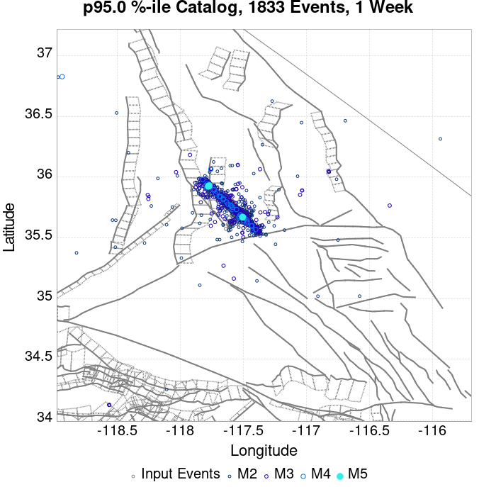 | 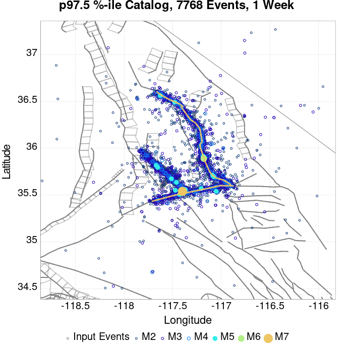 | 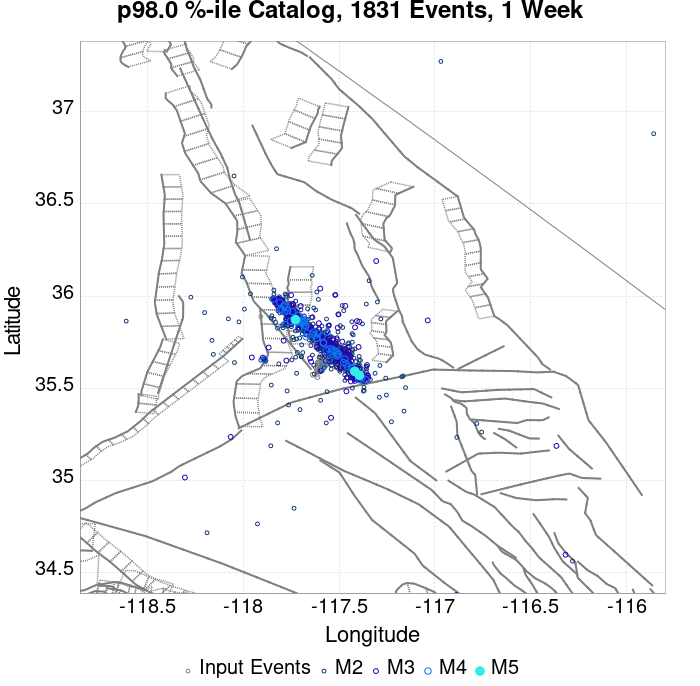 |  | 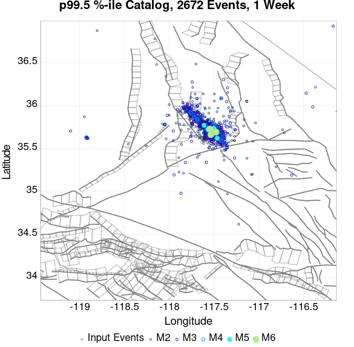 |  |  |
| **1 Month** |  |  |  |  |  |  |  |  | 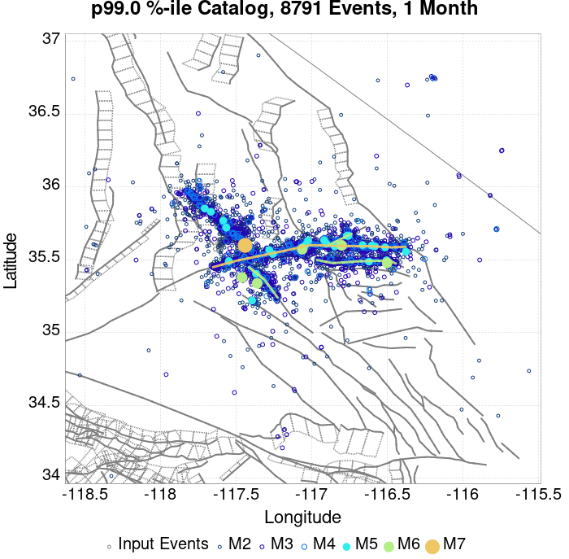 |  | 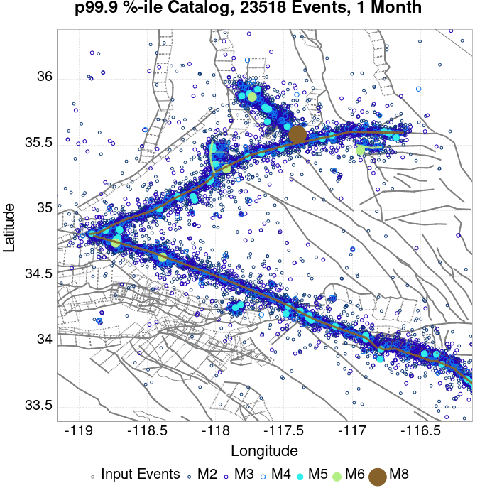 | 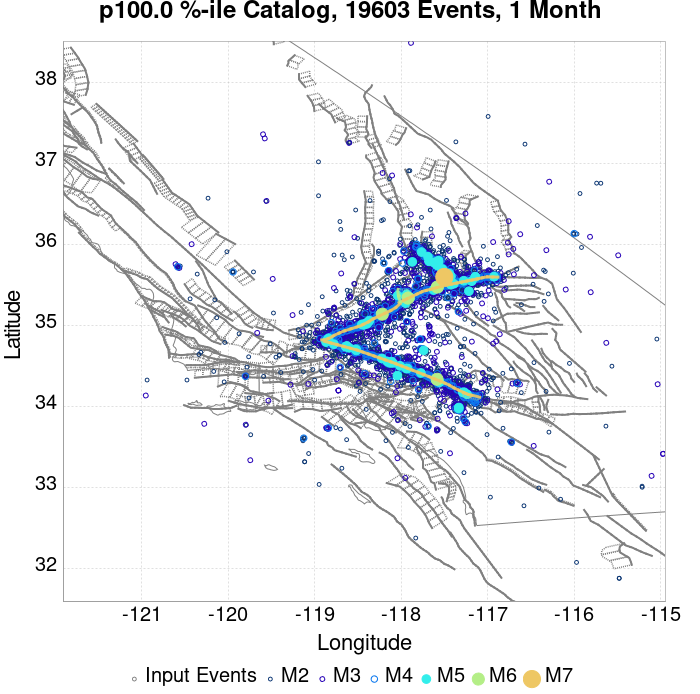 |
| **1 Year** |  |  |  | 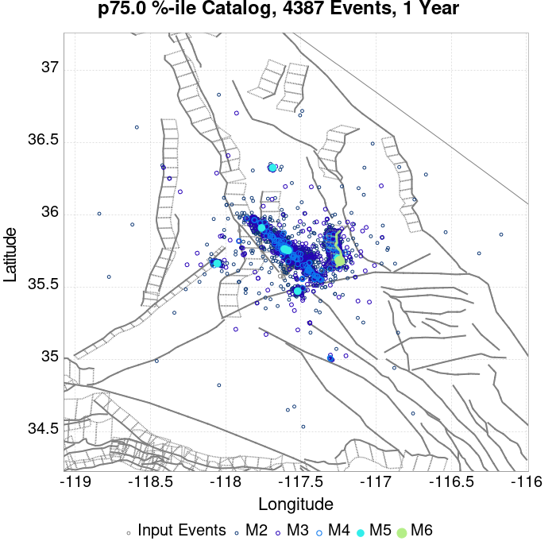 |  |  |  |  |  |  |  |  |
| **10 Year** |  |  |  |  |  |  |  | 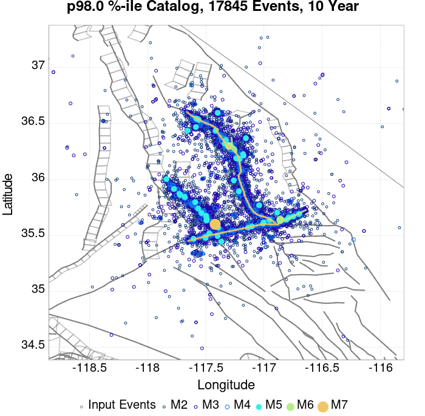 | 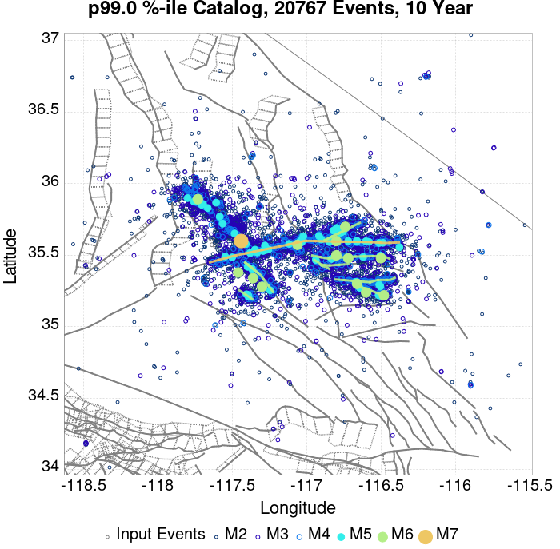 |  |  |  |

## ComCat Data Comparisons
*[(top)](#table-of-contents)*

These plots compare simulated sequences with data from ComCat. All plots only consider events with hypocenters inside the ComCat region defined in the JSON input file, and consider ruptures above Mc=3.5

Last updated at 2019/08/31 08:35:20 UTC, 8 wk after the simulation start time

### ComCat Magnitude-Number Distributions
*[(top)](#table-of-contents)*

| Incremental MND | Cumulative MND |
|-----|-----|
|  |  |

### ComCat Cumulative Number Vs Time
*[(top)](#table-of-contents)*

| M&ge;3.5 | M&ge;4 | M&ge;5 | M&ge;6 | M&ge;7 |
|-----|-----|-----|-----|-----|
|  |  |  |  |  |

### ComCat Cumulative Number Simulation Percentiles
*[(top)](#table-of-contents)*


### ComCat Mean Spatial Distribution
*[(top)](#table-of-contents)*

|  | 1 Day | 1 Week | 1 Month | 8 Week |
|-----|-----|-----|-----|-----|
| **M≥3.5** |  |  |  |  |
| **M≥4** |  |  |  |  |
| **M≥5** |  |  |  |  |
| **M≥6** |  | 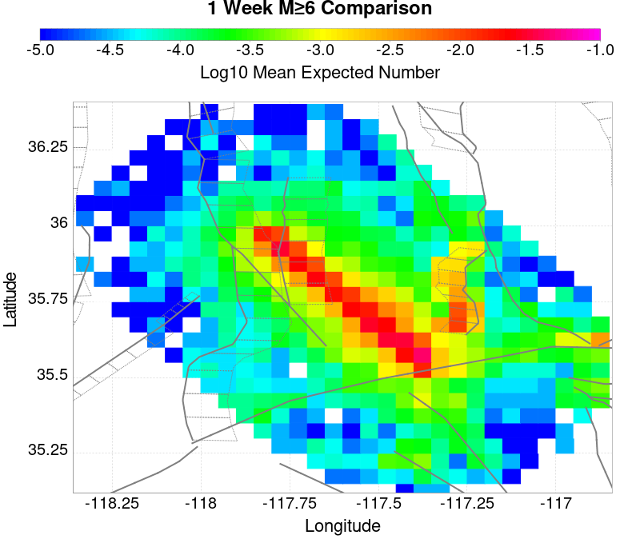 |  |  |
| **M≥7** |  |  |  |  |
| **M≥8** |  |  | 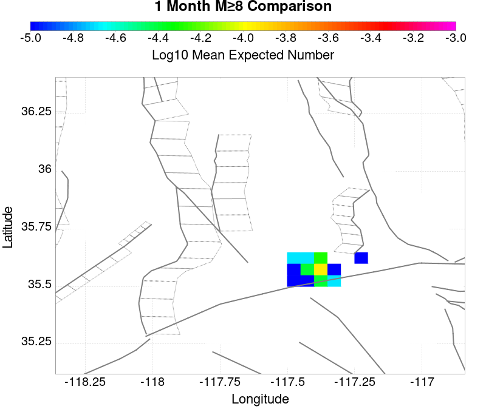 |  |

### ComCat Depth Distribution
*[(top)](#table-of-contents)*

| M&ge;3.5 | M&ge;4 | M&ge;5 | M&ge;6 | M&ge;7 | M&ge;8 |
|-----|-----|-----|-----|-----|-----|
|  |  |  |  |  |  |

## Section Participation
*[(top)](#table-of-contents)*

### Section Participation Plots
*[(top)](#table-of-contents)*

| Min Mag | 1 yr Triggered Ruptures (no spontaneous) | 10 yr Triggered Ruptures (no spontaneous) | 10 yr Triggered Ruptures (primary aftershocks only) |
|-----|-----|-----|-----|
| **All Supra. Seis.** |  |  |  |
| **M&ge;6.5** |  |  |  |
| **M&ge;7** |  |  |  |
| **M&ge;7.5** |  |  |  |
| **M&ge;8** |  |  |  |

### Supra-Seismogenic Parent Sections Table
*[(top)](#table-of-contents)*

*First 10 of 70 with matching ruptures shown*

| Parent Name | Triggered 10 Year Mean Count | Triggered 1 Day Prob | Triggered 1 Week Prob | Triggered 1 Month Prob | Triggered 1 Year Prob | Triggered 10 Year Prob | Triggered 10 Year Primary Mean Count |
|-----|-----|-----|-----|-----|-----|-----|-----|
| Garlock (Central) | 0.22962964 | 0.0748538 | 0.11189084 | 0.13957115 | 0.18011697 | 0.22105263 | 0.14035088 |
| Tank Canyon | 0.11578947 | 0.019103315 | 0.03274854 | 0.04795322 | 0.06939571 | 0.09668616 | 0.024951268 |
| Little Lake | 0.09395712 | 0.035867445 | 0.051072124 | 0.060038988 | 0.075633526 | 0.091617934 | 0.060038988 |
| Owl Lake | 0.07953216 | 0.018323587 | 0.028460039 | 0.034697857 | 0.049902536 | 0.0662768 | 0.01871345 |
| Garlock (East) | 0.046783626 | 0.0116959065 | 0.015984405 | 0.020662768 | 0.028849902 | 0.04288499 | 0.013255361 |
| Panamint Valley | 0.043664716 | 0.0101364525 | 0.019103315 | 0.026510721 | 0.035867445 | 0.043274853 | 0.016764132 |
| Airport Lake | 0.042495128 | 0.014424951 | 0.021442495 | 0.027680311 | 0.034307994 | 0.042495128 | 0.027290449 |
| Blackwater | 0.022612086 | 0.0038986355 | 0.007017544 | 0.0101364525 | 0.015204678 | 0.021052632 | 0.0054580895 |
| Hunter Mountain-Saline Valley | 0.020272905 | 0.0054580895 | 0.010526316 | 0.014424951 | 0.018323587 | 0.020272905 | 0.010916179 |
| Garlock (West) | 0.019493178 | 0.0058479533 | 0.0101364525 | 0.010526316 | 0.014814815 | 0.019493178 | 0.010526316 |

### M≥6.5 Parent Sections Table
*[(top)](#table-of-contents)*

*First 10 of 62 with matching ruptures shown*

| Parent Name | Triggered 10 Year Mean Count | Triggered 1 Day Prob | Triggered 1 Week Prob | Triggered 1 Month Prob | Triggered 1 Year Prob | Triggered 10 Year Prob | Triggered 10 Year Primary Mean Count |
|-----|-----|-----|-----|-----|-----|-----|-----|
| Garlock (Central) | 0.09551657 | 0.030019494 | 0.04951267 | 0.05964912 | 0.07641326 | 0.09434698 | 0.052241717 |
| Little Lake | 0.04834308 | 0.01988304 | 0.02534113 | 0.031189084 | 0.038986355 | 0.04756335 | 0.03274854 |
| Owl Lake | 0.042105265 | 0.01208577 | 0.019493178 | 0.023391813 | 0.031189084 | 0.0417154 | 0.01754386 |
| Panamint Valley | 0.042105265 | 0.009746589 | 0.01871345 | 0.026120858 | 0.034307994 | 0.0417154 | 0.016764132 |
| Garlock (East) | 0.03079922 | 0.008966861 | 0.012475634 | 0.015204678 | 0.020662768 | 0.029239766 | 0.012865497 |
| Airport Lake | 0.029239766 | 0.011306043 | 0.01637427 | 0.020272905 | 0.024561403 | 0.029239766 | 0.01988304 |
| Hunter Mountain-Saline Valley | 0.01988304 | 0.0054580895 | 0.0101364525 | 0.014035088 | 0.017933723 | 0.01988304 | 0.010526316 |
| Garlock (West) | 0.019103315 | 0.0058479533 | 0.0101364525 | 0.010526316 | 0.014424951 | 0.019103315 | 0.010526316 |
| Tank Canyon | 0.01208577 | 0.0031189085 | 0.0046783625 | 0.007797271 | 0.008966861 | 0.01208577 | 0.0023391813 |
| So Sierra Nevada | 0.010526316 | 0.0011695906 | 0.003508772 | 0.0054580895 | 0.009356725 | 0.010526316 | 0.0019493178 |

### M≥7 Parent Sections Table
*[(top)](#table-of-contents)*

*First 10 of 36 with matching ruptures shown*

| Parent Name | Triggered 10 Year Mean Count | Triggered 1 Day Prob | Triggered 1 Week Prob | Triggered 1 Month Prob | Triggered 1 Year Prob | Triggered 10 Year Prob | Triggered 10 Year Primary Mean Count |
|-----|-----|-----|-----|-----|-----|-----|-----|
| Garlock (Central) | 0.08732943 | 0.028070176 | 0.0460039 | 0.05497076 | 0.06978557 | 0.08693957 | 0.04795322 |
| Owl Lake | 0.032358676 | 0.011306043 | 0.016764132 | 0.019493178 | 0.02534113 | 0.032358676 | 0.017153997 |
| Panamint Valley | 0.03079922 | 0.008187135 | 0.015984405 | 0.020662768 | 0.026510721 | 0.03079922 | 0.015984405 |
| Garlock (East) | 0.022222223 | 0.008187135 | 0.010916179 | 0.012475634 | 0.014814815 | 0.022222223 | 0.01208577 |
| Hunter Mountain-Saline Valley | 0.01988304 | 0.0054580895 | 0.0101364525 | 0.014035088 | 0.017933723 | 0.01988304 | 0.010526316 |
| Garlock (West) | 0.019103315 | 0.0058479533 | 0.0101364525 | 0.010526316 | 0.014424951 | 0.019103315 | 0.010526316 |
| Little Lake | 0.0074074073 | 0.0027290448 | 0.0038986355 | 0.0050682263 | 0.0066276803 | 0.0074074073 | 0.0046783625 |
| Airport Lake | 0.006237817 | 0.0027290448 | 0.003508772 | 0.0046783625 | 0.0054580895 | 0.006237817 | 0.0038986355 |
| San Andreas (Mojave N) | 0.006237817 | 7.797271E-4 | 0.0023391813 | 0.0027290448 | 0.0046783625 | 0.006237817 | 0.0031189085 |
| So Sierra Nevada | 0.0042884992 | 0.0 | 0.0011695906 | 0.0027290448 | 0.0038986355 | 0.0042884992 | 0.0011695906 |

### M≥7.5 Parent Sections Table
*[(top)](#table-of-contents)*

*First 10 of 27 with matching ruptures shown*

| Parent Name | Triggered 10 Year Mean Count | Triggered 1 Day Prob | Triggered 1 Week Prob | Triggered 1 Month Prob | Triggered 1 Year Prob | Triggered 10 Year Prob | Triggered 10 Year Primary Mean Count |
|-----|-----|-----|-----|-----|-----|-----|-----|
| Garlock (Central) | 0.037037037 | 0.010526316 | 0.01871345 | 0.02300195 | 0.030409357 | 0.037037037 | 0.020272905 |
| Panamint Valley | 0.020272905 | 0.0054580895 | 0.0101364525 | 0.014035088 | 0.017933723 | 0.020272905 | 0.010916179 |
| Hunter Mountain-Saline Valley | 0.01988304 | 0.0054580895 | 0.0101364525 | 0.014035088 | 0.017933723 | 0.01988304 | 0.010526316 |
| Garlock (West) | 0.017933723 | 0.0054580895 | 0.009356725 | 0.009746589 | 0.013255361 | 0.017933723 | 0.009746589 |
| Garlock (East) | 0.010916179 | 0.0038986355 | 0.0058479533 | 0.006237817 | 0.007797271 | 0.010916179 | 0.006237817 |
| San Andreas (Mojave N) | 0.006237817 | 7.797271E-4 | 0.0023391813 | 0.0027290448 | 0.0046783625 | 0.006237817 | 0.0031189085 |
| Owl Lake | 0.0046783625 | 0.0011695906 | 0.0019493178 | 0.0019493178 | 0.003508772 | 0.0046783625 | 0.0019493178 |
| San Andreas (Mojave S) | 0.003508772 | 3.8986356E-4 | 7.797271E-4 | 0.0011695906 | 0.0031189085 | 0.003508772 | 0.0015594542 |
| San Andreas (San Bernardino N) | 0.0015594542 | 3.8986356E-4 | 3.8986356E-4 | 3.8986356E-4 | 0.0011695906 | 0.0015594542 | 7.797271E-4 |
| Death Valley (Black Mtns Frontal) | 0.0011695906 | 3.8986356E-4 | 7.797271E-4 | 7.797271E-4 | 0.0011695906 | 0.0011695906 | 0.0 |

### M≥8 Parent Sections Table
*[(top)](#table-of-contents)*

| Parent Name | Triggered 10 Year Mean Count | Triggered 1 Day Prob | Triggered 1 Week Prob | Triggered 1 Month Prob | Triggered 1 Year Prob | Triggered 10 Year Prob | Triggered 10 Year Primary Mean Count |
|-----|-----|-----|-----|-----|-----|-----|-----|
| Garlock (Central) | 0.0011695906 | 0.0 | 0.0 | 0.0 | 7.797271E-4 | 0.0011695906 | 3.8986356E-4 |
| Garlock (West) | 0.0011695906 | 0.0 | 0.0 | 0.0 | 7.797271E-4 | 0.0011695906 | 3.8986356E-4 |
| San Andreas (Mojave N) | 0.0011695906 | 0.0 | 0.0 | 0.0 | 7.797271E-4 | 0.0011695906 | 3.8986356E-4 |
| San Andreas (Mojave S) | 0.0011695906 | 0.0 | 0.0 | 0.0 | 7.797271E-4 | 0.0011695906 | 3.8986356E-4 |
| San Andreas (San Bernardino N) | 0.0011695906 | 0.0 | 0.0 | 0.0 | 7.797271E-4 | 0.0011695906 | 3.8986356E-4 |
| Garlock (East) | 7.797271E-4 | 0.0 | 0.0 | 0.0 | 3.8986356E-4 | 7.797271E-4 | 3.8986356E-4 |
| San Andreas (North Branch Mill Creek) | 7.797271E-4 | 0.0 | 0.0 | 0.0 | 7.797271E-4 | 7.797271E-4 | 0.0 |
| San Andreas (Coachella) rev | 3.8986356E-4 | 0.0 | 0.0 | 0.0 | 3.8986356E-4 | 3.8986356E-4 | 0.0 |
| San Andreas (San Bernardino S) | 3.8986356E-4 | 0.0 | 0.0 | 0.0 | 0.0 | 3.8986356E-4 | 3.8986356E-4 |
| San Andreas (San Gorgonio Pass-Garnet HIll) | 3.8986356E-4 | 0.0 | 0.0 | 0.0 | 0.0 | 3.8986356E-4 | 3.8986356E-4 |

### Fault Magnitude-Probability Distributions
*[(top)](#table-of-contents)*

The first 5 sections (sorted by trigger rate) are plotted below. All fault MPDs are available [here](plots/parent_sect_mpds/README.md)

| 1 Week | 1 Month | 1 Year | 10 Year |
|-----|-----|-----|-----|
|  |  |  |  |
|  |  |  |  |
|  |  |  |  |
|  |  |  |  |
|  |  |  |  |

## Gridded Nucleation
*[(top)](#table-of-contents)*

| Min Mag | Triggered Ruptures (no spontaneous) | Triggered Ruptures (primary aftershocks only) |
|-----|-----|-----|
| **M&ge;2.5** |  |  |
| **M&ge;5** |  |  |
| **M&ge;6** | 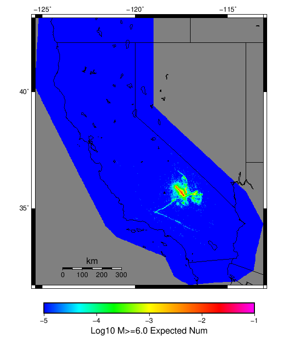 |  |
| **M&ge;7** |  |  |


## JSON Input File
*[(top)](#table-of-contents)*

```
{
  "numSimulations": 100000,
  "duration": 10.0,
  "startTimeMillis": 1562383194040,
  "includeSpontaneous": false,
  "randomSeed": 1567213554363,
  "binaryOutput": true,
  "binaryOutputFilters": [
    {
      "prefix": "results_complete",
      "descendantsOnly": false
    },
    {
      "prefix": "results_m5_preserve_chain",
      "minMag": 5.0,
      "preserveChainBelowMag": true,
      "descendantsOnly": false
    }
  ],
  "forceRecalc": false,
  "simulationName": "ComCat M7.1 (ci38457511), ShakeMap Surface (Version 10)",
  "numRetries": 3,
  "outputDir": "${ETAS_SIM_DIR}/2019_08_30-ComCatM7p1_ci38457511_ShakeMapSurface_Version10-noSpont-full_td-scale1.14",
  "triggerRuptures": [
    {
      "occurrenceTimeMillis": 1562259775340,
      "comcatEventID": "ci38443095",
      "mag": 3.98,
      "latitude": 35.708,
      "longitude": -117.5036667,
      "depth": 10.58
    },
    {
      "occurrenceTimeMillis": 1562261629000,
      "comcatEventID": "ci38443183",
      "mag": 6.4,
      "latitude": 35.7053333,
      "longitude": -117.5038333,
      "depth": 10.5
    },
    {
      "occurrenceTimeMillis": 1562261701660,
      "comcatEventID": "ci38443191",
      "mag": 4.49,
      "latitude": 35.644,
      "longitude": -117.56716670000002,
      "depth": 4.64
    },
    {
      "occurrenceTimeMillis": 1562261746340,
      "comcatEventID": "ci37222356",
      "mag": 3.63,
      "latitude": 35.6936667,
      "longitude": -117.437,
      "depth": 7.65
    },
    {
      "occurrenceTimeMillis": 1562261752170,
      "comcatEventID": "ci37218988",
      "mag": 4.28,
      "latitude": 35.687,
      "longitude": -117.50616670000001,
      "depth": 1.6
    },
    {
      "occurrenceTimeMillis": 1562261818950,
      "comcatEventID": "ci37222380",
      "mag": 3.41,
      "latitude": 35.7258333,
      "longitude": -117.55933330000002,
      "depth": 5.3
    },
    {
      "occurrenceTimeMillis": 1562261821140,
      "comcatEventID": "ci37222372",
      "mag": 3.66,
      "latitude": 35.7105,
      "longitude": -117.4773333,
      "depth": 1.57
    },
    {
      "occurrenceTimeMillis": 1562261834850,
      "comcatEventID": "ci37222364",
      "mag": 3.97,
      "latitude": 35.6655,
      "longitude": -117.516,
      "depth": 1.64
    },
    {
      "occurrenceTimeMillis": 1562261845640,
      "comcatEventID": "ci37218996",
      "mag": 4.01,
      "latitude": 35.6758333,
      "longitude": -117.45750000000001,
      "depth": 15.82
    },
    {
      "occurrenceTimeMillis": 1562261875500,
      "comcatEventID": "ci38443199",
      "mag": 3.86,
      "latitude": 35.7456667,
      "longitude": -117.5516667,
      "depth": 8.29
    },
    {
      "occurrenceTimeMillis": 1562261901450,
      "comcatEventID": "ci37421941",
      "mag": 3.73,
      "latitude": 35.714,
      "longitude": -117.476,
      "depth": 1.74
    },
    {
      "occurrenceTimeMillis": 1562261927500,
      "comcatEventID": "us70004a0n",
      "mag": 3.5,
      "latitude": 35.6215,
      "longitude": -117.5782,
      "depth": 9.7
    },
    {
      "occurrenceTimeMillis": 1562261927760,
      "comcatEventID": "ci37222396",
      "mag": 3.5,
      "latitude": 35.6235,
      "longitude": -117.596,
      "depth": 8.55
    },
    {
      "occurrenceTimeMillis": 1562261973310,
      "comcatEventID": "ci37222404",
      "mag": 3.11,
      "latitude": 35.5743333,
      "longitude": -117.63666670000002,
      "depth": 6.85
    },
    {
      "occurrenceTimeMillis": 1562261975360,
      "comcatEventID": "ci38443215",
      "mag": 3.69,
      "latitude": 35.6873333,
      "longitude": -117.4935,
      "depth": 10.86
    },
    {
      "occurrenceTimeMillis": 1562262002250,
      "comcatEventID": "ci38443223",
      "mag": 3.8,
      "latitude": 35.7253333,
      "longitude": -117.57083329999999,
      "depth": 6.63
    },
    {
      "occurrenceTimeMillis": 1562262018520,
      "comcatEventID": "ci38443231",
      "mag": 4.13,
      "latitude": 35.707,
      "longitude": -117.5101667,
      "depth": 8.66
    },
    {
      "occurrenceTimeMillis": 1562262034900,
      "comcatEventID": "ci37222508",
      "mag": 3.54,
      "latitude": 35.6948333,
      "longitude": -117.50183330000002,
      "depth": 2.04
    },
    {
      "occurrenceTimeMillis": 1562262046140,
      "comcatEventID": "ci37222516",
      "mag": 3.42,
      "latitude": 35.7298333,
      "longitude": -117.55483330000001,
      "depth": 7.72
    },
    {
      "occurrenceTimeMillis": 1562262080850,
      "comcatEventID": "ci37421957",
      "mag": 3.3,
      "latitude": 35.7266667,
      "longitude": -117.5288333,
      "depth": 1.97
    },
    {
      "occurrenceTimeMillis": 1562262174130,
      "comcatEventID": "ci38443239",
      "mag": 3.22,
      "latitude": 35.7301667,
      "longitude": -117.55866669999999,
      "depth": 7.84
    },
    {
      "occurrenceTimeMillis": 1562262209200,
      "comcatEventID": "us70004a0z",
      "mag": 3.6,
      "latitude": 35.6783,
      "longitude": -117.5488,
      "depth": 5.15
    },
    {
      "occurrenceTimeMillis": 1562262264020,
      "comcatEventID": "ci37421981",
      "mag": 2.77,
      "latitude": 35.7478333,
      "longitude": -117.54000000000002,
      "depth": 9.4
    },
    {
      "occurrenceTimeMillis": 1562262272820,
      "comcatEventID": "ci38443255",
      "mag": 3.86,
      "latitude": 35.6875,
      "longitude": -117.5071667,
      "depth": 1.54
    },
    {
      "occurrenceTimeMillis": 1562262305780,
      "comcatEventID": "ci37421997",
      "mag": 3.03,
      "latitude": 35.6976667,
      "longitude": -117.48649999999999,
      "depth": 2.24
    },
    {
      "occurrenceTimeMillis": 1562262323950,
      "comcatEventID": "ci37421989",
      "mag": 3.03,
      "latitude": 35.7151667,
      "longitude": -117.5473333,
      "depth": 7.21
    },
    {
      "occurrenceTimeMillis": 1562262328630,
      "comcatEventID": "ci37222524",
      "mag": 3.21,
      "latitude": 35.7348333,
      "longitude": -117.53683330000001,
      "depth": 10.34
    },
    {
      "occurrenceTimeMillis": 1562262363710,
      "comcatEventID": "ci38443263",
      "mag": 2.96,
      "latitude": 35.6431667,
      "longitude": -117.6101667,
      "depth": 10.14
    },
    {
      "occurrenceTimeMillis": 1562262380320,
      "comcatEventID": "ci37222532",
      "mag": 2.56,
      "latitude": 35.6563333,
      "longitude": -117.5325,
      "depth": 1.52
    },
    {
      "occurrenceTimeMillis": 1562262409960,
      "comcatEventID": "ci38443271",
      "mag": 3.07,
      "latitude": 35.6385,
      "longitude": -117.6108333,
      "depth": 10.97
    },
    {
      "occurrenceTimeMillis": 1562262437810,
      "comcatEventID": "ci38443279",
      "mag": 3.5,
      "latitude": 35.7455,
      "longitude": -117.5465,
      "depth": 7.11
    },
    {
      "occurrenceTimeMillis": 1562262460970,
      "comcatEventID": "ci37222548",
      "mag": 3.11,
      "latitude": 35.726,
      "longitude": -117.55849999999998,
      "depth": 3.58
    },
    {
      "occurrenceTimeMillis": 1562262474970,
      "comcatEventID": "ci37222556",
      "mag": 3.4,
      "latitude": 35.7286667,
      "longitude": -117.56066670000001,
      "depth": 5.25
    },
    {
      "occurrenceTimeMillis": 1562262483160,
      "comcatEventID": "ci37222564",
      "mag": 3.27,
      "latitude": 35.6365,
      "longitude": -117.55183330000001,
      "depth": 6.62
    },
    {
      "occurrenceTimeMillis": 1562262495680,
      "comcatEventID": "ci37222572",
      "mag": 3.11,
      "latitude": 35.7053333,
      "longitude": -117.5245,
      "depth": 5.52
    },
    {
      "occurrenceTimeMillis": 1562262504150,
      "comcatEventID": "ci37222580",
      "mag": 2.96,
      "latitude": 35.6593333,
      "longitude": -117.52633330000002,
      "depth": 2.68
    },
    {
      "occurrenceTimeMillis": 1562262575190,
      "comcatEventID": "ci37222596",
      "mag": 2.52,
      "latitude": 35.7335,
      "longitude": -117.50683330000001,
      "depth": 3.91
    },
    {
      "occurrenceTimeMillis": 1562262578950,
      "comcatEventID": "ci37222668",
      "mag": 2.57,
      "latitude": 35.687,
      "longitude": -117.49066670000002,
      "depth": 10.66
    },
    {
      "occurrenceTimeMillis": 1562262648290,
      "comcatEventID": "ci37222692",
      "mag": 2.73,
      "latitude": 35.738,
      "longitude": -117.52933329999999,
      "depth": 7.72
    },
    {
      "occurrenceTimeMillis": 1562262648960,
      "comcatEventID": "ci38443303",
      "mag": 2.79,
      "latitude": 35.678,
      "longitude": -117.49916670000002,
      "depth": 1.14
    },
    {
      "occurrenceTimeMillis": 1562262706650,
      "comcatEventID": "ci38443287",
      "mag": 3.46,
      "latitude": 35.674,
      "longitude": -117.52349999999998,
      "depth": 5.3
    },
    {
      "occurrenceTimeMillis": 1562262761700,
      "comcatEventID": "ci38443295",
      "mag": 2.92,
      "latitude": 35.7218333,
      "longitude": -117.5251667,
      "depth": 7.04
    },
    {
      "occurrenceTimeMillis": 1562262899560,
      "comcatEventID": "ci38443327",
      "mag": 2.53,
      "latitude": 35.6391667,
      "longitude": -117.5628333,
      "depth": 10.48
    },
    {
      "occurrenceTimeMillis": 1562262930800,
      "comcatEventID": "ci37222876",
      "mag": 2.57,
      "latitude": 35.6705,
      "longitude": -117.5221667,
      "depth": 3.91
    },
    {
      "occurrenceTimeMillis": 1562263051460,
      "comcatEventID": "ci38443311",
      "mag": 2.95,
      "latitude": 35.6595,
      "longitude": -117.5223333,
      "depth": 2.3
    },
    {
      "occurrenceTimeMillis": 1562263063060,
      "comcatEventID": "ci37222932",
      "mag": 2.78,
      "latitude": 35.6725,
      "longitude": -117.4743333,
      "depth": 8.76
    },
    {
      "occurrenceTimeMillis": 1562263082640,
      "comcatEventID": "ci38443319",
      "mag": 3.33,
      "latitude": 35.702,
      "longitude": -117.50833330000002,
      "depth": 4.77
    },
    {
      "occurrenceTimeMillis": 1562263240190,
      "comcatEventID": "ci38443335",
      "mag": 2.67,
      "latitude": 35.6303333,
      "longitude": -117.569,
      "depth": 1.64
    },
    {
      "occurrenceTimeMillis": 1562263261190,
      "comcatEventID": "ci37223148",
      "mag": 2.59,
      "latitude": 35.6733333,
      "longitude": -117.5118333,
      "depth": 1.49
    },
    {
      "occurrenceTimeMillis": 1562263283180,
      "comcatEventID": "ci37422005",
      "mag": 3.53,
      "latitude": 35.6876667,
      "longitude": -117.50849999999998,
      "depth": 1.26
    },
    {
      "occurrenceTimeMillis": 1562263291230,
      "comcatEventID": "ci37223156",
      "mag": 3.42,
      "latitude": 35.5978333,
      "longitude": -117.5905,
      "depth": 6.79
    },
    {
      "occurrenceTimeMillis": 1562263374110,
      "comcatEventID": "ci38443351",
      "mag": 2.53,
      "latitude": 35.6066667,
      "longitude": -117.58216670000002,
      "depth": 5.8
    },
    {
      "occurrenceTimeMillis": 1562263398590,
      "comcatEventID": "ci38443359",
      "mag": 2.85,
      "latitude": 35.7478333,
      "longitude": -117.5425,
      "depth": 6.85
    },
    {
      "occurrenceTimeMillis": 1562263541830,
      "comcatEventID": "ci38443375",
      "mag": 2.76,
      "latitude": 35.7153333,
      "longitude": -117.5295,
      "depth": 4.54
    },
    {
      "occurrenceTimeMillis": 1562263555910,
      "comcatEventID": "ci37223228",
      "mag": 2.61,
      "latitude": 35.7266667,
      "longitude": -117.5165,
      "depth": 8.96
    },
    {
      "occurrenceTimeMillis": 1562263576110,
      "comcatEventID": "ci38443383",
      "mag": 3.79,
      "latitude": 35.6606667,
      "longitude": -117.523,
      "depth": 2.14
    },
    {
      "occurrenceTimeMillis": 1562263611050,
      "comcatEventID": "ci37223236",
      "mag": 2.6,
      "latitude": 35.6931667,
      "longitude": -117.46200000000002,
      "depth": 11.56
    },
    {
      "occurrenceTimeMillis": 1562263629270,
      "comcatEventID": "ci38443391",
      "mag": 3.51,
      "latitude": 35.5991667,
      "longitude": -117.6101667,
      "depth": 2.12
    },
    {
      "occurrenceTimeMillis": 1562263630910,
      "comcatEventID": "ci37223244",
      "mag": 3.49,
      "latitude": 35.6508333,
      "longitude": -117.54200000000002,
      "depth": 2.77
    },
    {
      "occurrenceTimeMillis": 1562263670810,
      "comcatEventID": "ci37223252",
      "mag": 2.55,
      "latitude": 35.72950000000001,
      "longitude": -117.533,
      "depth": 7.25
    },
    {
      "occurrenceTimeMillis": 1562263713160,
      "comcatEventID": "ci38443407",
      "mag": 3.38,
      "latitude": 35.6678333,
      "longitude": -117.50616670000001,
      "depth": 2.27
    },
    {
      "occurrenceTimeMillis": 1562263725070,
      "comcatEventID": "ci37223308",
      "mag": 3.55,
      "latitude": 35.7108333,
      "longitude": -117.47683329999998,
      "depth": 1.17
    },
    {
      "occurrenceTimeMillis": 1562263832710,
      "comcatEventID": "ci38443415",
      "mag": 3.46,
      "latitude": 35.6598333,
      "longitude": -117.53483330000002,
      "depth": 10.25
    },
    {
      "occurrenceTimeMillis": 1562263882870,
      "comcatEventID": "ci38443423",
      "mag": 2.69,
      "latitude": 35.6003333,
      "longitude": -117.5951667,
      "depth": 7.33
    },
    {
      "occurrenceTimeMillis": 1562263972070,
      "comcatEventID": "ci38443431",
      "mag": 3.44,
      "latitude": 35.6703333,
      "longitude": -117.5605,
      "depth": 6.91
    },
    {
      "occurrenceTimeMillis": 1562264025530,
      "comcatEventID": "ci37223380",
      "mag": 2.89,
      "latitude": 35.7003333,
      "longitude": -117.4873333,
      "depth": 10.98
    },
    {
      "occurrenceTimeMillis": 1562264031400,
      "comcatEventID": "ci38443439",
      "mag": 3.5,
      "latitude": 35.7081667,
      "longitude": -117.485,
      "depth": 6.44
    },
    {
      "occurrenceTimeMillis": 1562264104970,
      "comcatEventID": "ci38443447",
      "mag": 2.75,
      "latitude": 35.6103333,
      "longitude": -117.59500000000001,
      "depth": 4.94
    },
    {
      "occurrenceTimeMillis": 1562264112820,
      "comcatEventID": "ci37420701",
      "mag": 3.23,
      "latitude": 35.6691667,
      "longitude": -117.5203333,
      "depth": 1.84
    },
    {
      "occurrenceTimeMillis": 1562264193730,
      "comcatEventID": "ci38443463",
      "mag": 2.94,
      "latitude": 35.7251667,
      "longitude": -117.53350000000002,
      "depth": 6.74
    },
    {
      "occurrenceTimeMillis": 1562264235320,
      "comcatEventID": "ci38443471",
      "mag": 2.87,
      "latitude": 35.7185,
      "longitude": -117.5336667,
      "depth": 4.94
    },
    {
      "occurrenceTimeMillis": 1562264325720,
      "comcatEventID": "ci38443487",
      "mag": 3.38,
      "latitude": 35.638,
      "longitude": -117.611,
      "depth": 9.43
    },
    {
      "occurrenceTimeMillis": 1562264332070,
      "comcatEventID": "ci37223676",
      "mag": 2.98,
      "latitude": 35.6123333,
      "longitude": -117.624,
      "depth": 0.0
    },
    {
      "occurrenceTimeMillis": 1562264348090,
      "comcatEventID": "ci37223684",
      "mag": 2.6,
      "latitude": 35.7236667,
      "longitude": -117.50849999999998,
      "depth": 11.57
    },
    {
      "occurrenceTimeMillis": 1562264485340,
      "comcatEventID": "ci38443495",
      "mag": 2.61,
      "latitude": 35.67883330000001,
      "longitude": -117.51533330000001,
      "depth": 2.91
    },
    {
      "occurrenceTimeMillis": 1562264763750,
      "comcatEventID": "ci38443519",
      "mag": 3.13,
      "latitude": 35.6638333,
      "longitude": -117.5245,
      "depth": 2.53
    },
    {
      "occurrenceTimeMillis": 1562264846770,
      "comcatEventID": "ci38443527",
      "mag": 3.29,
      "latitude": 35.6748333,
      "longitude": -117.51433329999999,
      "depth": 2.68
    },
    {
      "occurrenceTimeMillis": 1562264879440,
      "comcatEventID": "ci38443535",
      "mag": 4.23,
      "latitude": 35.745,
      "longitude": -117.55216669999999,
      "depth": 6.64
    },
    {
      "occurrenceTimeMillis": 1562264923640,
      "comcatEventID": "ci38443543",
      "mag": 3.75,
      "latitude": 35.6661667,
      "longitude": -117.5656667,
      "depth": 7.14
    },
    {
      "occurrenceTimeMillis": 1562265289010,
      "comcatEventID": "ci37224604",
      "mag": 2.59,
      "latitude": 35.6895,
      "longitude": -117.4883333,
      "depth": 0.63
    },
    {
      "occurrenceTimeMillis": 1562265344040,
      "comcatEventID": "ci38443575",
      "mag": 2.5,
      "latitude": 35.7215,
      "longitude": -117.56550000000001,
      "depth": 0.16
    },
    {
      "occurrenceTimeMillis": 1562265451500,
      "comcatEventID": "ci38443591",
      "mag": 2.64,
      "latitude": 35.72,
      "longitude": -117.5723333,
      "depth": 1.34
    },
    {
      "occurrenceTimeMillis": 1562265525650,
      "comcatEventID": "ci38443599",
      "mag": 2.69,
      "latitude": 35.7046661,
      "longitude": -117.49666600000002,
      "depth": 3.96
    },
    {
      "occurrenceTimeMillis": 1562265584440,
      "comcatEventID": "ci38443607",
      "mag": 4.59,
      "latitude": 35.6013333,
      "longitude": -117.59700000000001,
      "depth": 2.81
    },
    {
      "occurrenceTimeMillis": 1562265656740,
      "comcatEventID": "ci37224612",
      "mag": 3.05,
      "latitude": 35.652,
      "longitude": -117.53683330000001,
      "depth": 2.03
    },
    {
      "occurrenceTimeMillis": 1562265674270,
      "comcatEventID": "ci38443615",
      "mag": 3.07,
      "latitude": 35.6763333,
      "longitude": -117.5115,
      "depth": 2.13
    },
    {
      "occurrenceTimeMillis": 1562265865000,
      "comcatEventID": "ci38443631",
      "mag": 3.09,
      "latitude": 35.719,
      "longitude": -117.55866669999999,
      "depth": 2.06
    },
    {
      "occurrenceTimeMillis": 1562266026590,
      "comcatEventID": "ci38443647",
      "mag": 4.34,
      "latitude": 35.6758333,
      "longitude": -117.48533330000001,
      "depth": 8.53
    },
    {
      "occurrenceTimeMillis": 1562266042600,
      "comcatEventID": "ci37421213",
      "mag": 4.02,
      "latitude": 35.6755,
      "longitude": -117.472,
      "depth": 10.27
    },
    {
      "occurrenceTimeMillis": 1562266207160,
      "comcatEventID": "ci38443663",
      "mag": 2.73,
      "latitude": 35.641,
      "longitude": -117.56266670000001,
      "depth": 8.95
    },
    {
      "occurrenceTimeMillis": 1562266215910,
      "comcatEventID": "ci38443671",
      "mag": 3.7,
      "latitude": 35.682,
      "longitude": -117.4961667,
      "depth": 1.26
    },
    {
      "occurrenceTimeMillis": 1562266333530,
      "comcatEventID": "ci38443679",
      "mag": 2.78,
      "latitude": 35.6543333,
      "longitude": -117.53983330000001,
      "depth": 0.88
    },
    {
      "occurrenceTimeMillis": 1562266376130,
      "comcatEventID": "ci38443687",
      "mag": 2.93,
      "latitude": 35.741,
      "longitude": -117.561,
      "depth": 0.23
    },
    {
      "occurrenceTimeMillis": 1562266407670,
      "comcatEventID": "ci38443695",
      "mag": 3.36,
      "latitude": 35.7285,
      "longitude": -117.5605,
      "depth": 7.87
    },
    {
      "occurrenceTimeMillis": 1562266453990,
      "comcatEventID": "ci38443703",
      "mag": 4.07,
      "latitude": 35.5975,
      "longitude": -117.5996667,
      "depth": 5.33
    },
    {
      "occurrenceTimeMillis": 1562266527680,
      "comcatEventID": "ci38443711",
      "mag": 3.03,
      "latitude": 35.6753333,
      "longitude": -117.4795,
      "depth": 10.71
    },
    {
      "occurrenceTimeMillis": 1562266566420,
      "comcatEventID": "ci38443719",
      "mag": 4.58,
      "latitude": 35.716,
      "longitude": -117.56000000000002,
      "depth": 1.92
    },
    {
      "occurrenceTimeMillis": 1562266582030,
      "comcatEventID": "ci37420717",
      "mag": 4.21,
      "latitude": 35.7086667,
      "longitude": -117.55416669999998,
      "depth": 1.16
    },
    {
      "occurrenceTimeMillis": 1562266687790,
      "comcatEventID": "ci38443727",
      "mag": 2.85,
      "latitude": 35.7266667,
      "longitude": -117.56516670000002,
      "depth": 0.09
    },
    {
      "occurrenceTimeMillis": 1562266809670,
      "comcatEventID": "ci38443751",
      "mag": 3.22,
      "latitude": 35.7111667,
      "longitude": -117.55133329999998,
      "depth": 1.99
    },
    {
      "occurrenceTimeMillis": 1562266870800,
      "comcatEventID": "ci38443759",
      "mag": 3.03,
      "latitude": 35.7086667,
      "longitude": -117.5565,
      "depth": 2.15
    },
    {
      "occurrenceTimeMillis": 1562266944640,
      "comcatEventID": "ci38443775",
      "mag": 2.56,
      "latitude": 35.645,
      "longitude": -117.5373333,
      "depth": 0.01
    },
    {
      "occurrenceTimeMillis": 1562267419820,
      "comcatEventID": "ci38443823",
      "mag": 3.29,
      "latitude": 35.694,
      "longitude": -117.4901667,
      "depth": 1.58
    },
    {
      "occurrenceTimeMillis": 1562267699490,
      "comcatEventID": "ci38443831",
      "mag": 3.0,
      "latitude": 35.6548333,
      "longitude": -117.53883330000001,
      "depth": 2.42
    },
    {
      "occurrenceTimeMillis": 1562267766200,
      "comcatEventID": "ci38443839",
      "mag": 2.5,
      "latitude": 35.721,
      "longitude": -117.56650000000002,
      "depth": 0.12
    },
    {
      "occurrenceTimeMillis": 1562267871360,
      "comcatEventID": "ci38443855",
      "mag": 2.98,
      "latitude": 35.6951667,
      "longitude": -117.50966670000001,
      "depth": 1.46
    },
    {
      "occurrenceTimeMillis": 1562267878140,
      "comcatEventID": "ci37224620",
      "mag": 3.26,
      "latitude": 35.6268333,
      "longitude": -117.601,
      "depth": 10.4
    },
    {
      "occurrenceTimeMillis": 1562268051750,
      "comcatEventID": "ci38443863",
      "mag": 2.8,
      "latitude": 35.6389999,
      "longitude": -117.5526657,
      "depth": 1.11
    },
    {
      "occurrenceTimeMillis": 1562268092090,
      "comcatEventID": "ci38443871",
      "mag": 4.5,
      "latitude": 35.6715,
      "longitude": -117.4788333,
      "depth": 5.16
    },
    {
      "occurrenceTimeMillis": 1562268380340,
      "comcatEventID": "ci38443879",
      "mag": 2.69,
      "latitude": 35.7086667,
      "longitude": -117.48333330000001,
      "depth": 1.39
    },
    {
      "occurrenceTimeMillis": 1562268438340,
      "comcatEventID": "ci38443895",
      "mag": 2.81,
      "latitude": 35.6696667,
      "longitude": -117.47999999999999,
      "depth": 6.24
    },
    {
      "occurrenceTimeMillis": 1562269189760,
      "comcatEventID": "ci38443983",
      "mag": 2.63,
      "latitude": 35.683,
      "longitude": -117.5195,
      "depth": 5.84
    },
    {
      "occurrenceTimeMillis": 1562269229180,
      "comcatEventID": "ci38443991",
      "mag": 2.65,
      "latitude": 35.6556667,
      "longitude": -117.5158333,
      "depth": 1.76
    },
    {
      "occurrenceTimeMillis": 1562269744980,
      "comcatEventID": "ci38444047",
      "mag": 3.26,
      "latitude": 35.683,
      "longitude": -117.4895,
      "depth": 1.04
    },
    {
      "occurrenceTimeMillis": 1562269876980,
      "comcatEventID": "ci38444063",
      "mag": 3.35,
      "latitude": 35.71,
      "longitude": -117.5561667,
      "depth": 2.09
    },
    {
      "occurrenceTimeMillis": 1562269933070,
      "comcatEventID": "ci38444071",
      "mag": 2.86,
      "latitude": 35.6101667,
      "longitude": -117.5861667,
      "depth": 6.38
    },
    {
      "occurrenceTimeMillis": 1562270160500,
      "comcatEventID": "ci38444103",
      "mag": 4.16,
      "latitude": 35.6623333,
      "longitude": -117.524,
      "depth": 1.49
    },
    {
      "occurrenceTimeMillis": 1562270280220,
      "comcatEventID": "ci38444119",
      "mag": 2.65,
      "latitude": 35.7131667,
      "longitude": -117.5561667,
      "depth": 0.16
    },
    {
      "occurrenceTimeMillis": 1562270492930,
      "comcatEventID": "ci38444135",
      "mag": 2.5,
      "latitude": 35.678,
      "longitude": -117.589,
      "depth": 7.89
    },
    {
      "occurrenceTimeMillis": 1562270655500,
      "comcatEventID": "ci38444143",
      "mag": 2.56,
      "latitude": 35.7048333,
      "longitude": -117.48683330000001,
      "depth": 1.23
    },
    {
      "occurrenceTimeMillis": 1562270768250,
      "comcatEventID": "ci38444159",
      "mag": 3.39,
      "latitude": 35.6991667,
      "longitude": -117.48916669999998,
      "depth": 10.27
    },
    {
      "occurrenceTimeMillis": 1562271091460,
      "comcatEventID": "ci38444191",
      "mag": 2.61,
      "latitude": 35.683,
      "longitude": -117.50483330000002,
      "depth": 1.69
    },
    {
      "occurrenceTimeMillis": 1562271290340,
      "comcatEventID": "ci38444215",
      "mag": 3.99,
      "latitude": 35.6991667,
      "longitude": -117.5125,
      "depth": 5.75
    },
    {
      "occurrenceTimeMillis": 1562271456830,
      "comcatEventID": "ci38444231",
      "mag": 3.09,
      "latitude": 35.7,
      "longitude": -117.4836667,
      "depth": 1.25
    },
    {
      "occurrenceTimeMillis": 1562271789930,
      "comcatEventID": "ci38444263",
      "mag": 3.43,
      "latitude": 35.6408333,
      "longitude": -117.59733329999999,
      "depth": 10.39
    },
    {
      "occurrenceTimeMillis": 1562271838650,
      "comcatEventID": "ci38444271",
      "mag": 2.53,
      "latitude": 35.6583333,
      "longitude": -117.56233329999999,
      "depth": 4.39
    },
    {
      "occurrenceTimeMillis": 1562272472100,
      "comcatEventID": "ci38444311",
      "mag": 2.61,
      "latitude": 35.640667,
      "longitude": -117.5833359,
      "depth": 8.68
    },
    {
      "occurrenceTimeMillis": 1562273126710,
      "comcatEventID": "ci38444407",
      "mag": 3.1,
      "latitude": 35.70283330000001,
      "longitude": -117.4775,
      "depth": 1.31
    },
    {
      "occurrenceTimeMillis": 1562273725070,
      "comcatEventID": "ci38444487",
      "mag": 3.4,
      "latitude": 35.7116667,
      "longitude": -117.4808333,
      "depth": 2.39
    },
    {
      "occurrenceTimeMillis": 1562273832360,
      "comcatEventID": "ci38444503",
      "mag": 2.54,
      "latitude": 35.6585,
      "longitude": -117.53199999999998,
      "depth": 8.73
    },
    {
      "occurrenceTimeMillis": 1562274175820,
      "comcatEventID": "ci38444543",
      "mag": 3.47,
      "latitude": 35.69,
      "longitude": -117.4831667,
      "depth": 7.89
    },
    {
      "occurrenceTimeMillis": 1562274428600,
      "comcatEventID": "ci38444559",
      "mag": 2.52,
      "latitude": 35.5995,
      "longitude": -117.59783330000002,
      "depth": 4.74
    },
    {
      "occurrenceTimeMillis": 1562275395050,
      "comcatEventID": "ci38444687",
      "mag": 2.8,
      "latitude": 35.6951667,
      "longitude": -117.4893333,
      "depth": 1.65
    },
    {
      "occurrenceTimeMillis": 1562275595000,
      "comcatEventID": "ci38444719",
      "mag": 2.98,
      "latitude": 35.6748333,
      "longitude": -117.5253333,
      "depth": 9.41
    },
    {
      "occurrenceTimeMillis": 1562275966060,
      "comcatEventID": "ci38444783",
      "mag": 2.62,
      "latitude": 35.725,
      "longitude": -117.56916670000001,
      "depth": 2.03
    },
    {
      "occurrenceTimeMillis": 1562276014350,
      "comcatEventID": "ci38444791",
      "mag": 3.15,
      "latitude": 35.617,
      "longitude": -117.58983330000001,
      "depth": 7.45
    },
    {
      "occurrenceTimeMillis": 1562276433420,
      "comcatEventID": "ci38444823",
      "mag": 3.44,
      "latitude": 35.67016670000001,
      "longitude": -117.51816670000001,
      "depth": 1.78
    },
    {
      "occurrenceTimeMillis": 1562276519830,
      "comcatEventID": "ci38444847",
      "mag": 2.74,
      "latitude": 35.7193333,
      "longitude": -117.53216670000002,
      "depth": 2.19
    },
    {
      "occurrenceTimeMillis": 1562276794030,
      "comcatEventID": "ci38444895",
      "mag": 2.5,
      "latitude": 35.7011667,
      "longitude": -117.47866669999999,
      "depth": 0.93
    },
    {
      "occurrenceTimeMillis": 1562276824370,
      "comcatEventID": "ci38444903",
      "mag": 3.25,
      "latitude": 35.6335,
      "longitude": -117.606,
      "depth": 9.67
    },
    {
      "occurrenceTimeMillis": 1562277755060,
      "comcatEventID": "ci38445015",
      "mag": 3.44,
      "latitude": 35.6768333,
      "longitude": -117.5128333,
      "depth": 2.88
    },
    {
      "occurrenceTimeMillis": 1562277922533,
      "comcatEventID": "us70004ach",
      "mag": 3.3,
      "latitude": 35.7232,
      "longitude": -117.4508,
      "depth": 9.45
    },
    {
      "occurrenceTimeMillis": 1562278328280,
      "comcatEventID": "ci38445087",
      "mag": 4.47,
      "latitude": 35.7443333,
      "longitude": -117.56633329999998,
      "depth": 1.97
    },
    {
      "occurrenceTimeMillis": 1562279346560,
      "comcatEventID": "ci38445183",
      "mag": 2.51,
      "latitude": 35.7038333,
      "longitude": -117.49499999999999,
      "depth": 9.8
    },
    {
      "occurrenceTimeMillis": 1562279407880,
      "comcatEventID": "ci38445199",
      "mag": 2.62,
      "latitude": 35.7008333,
      "longitude": -117.4893333,
      "depth": 1.85
    },
    {
      "occurrenceTimeMillis": 1562280141780,
      "comcatEventID": "ci38445295",
      "mag": 3.23,
      "latitude": 35.7221667,
      "longitude": -117.52349999999998,
      "depth": 4.41
    },
    {
      "occurrenceTimeMillis": 1562281630780,
      "comcatEventID": "ci38445463",
      "mag": 2.59,
      "latitude": 35.7041667,
      "longitude": -117.4886667,
      "depth": 1.92
    },
    {
      "occurrenceTimeMillis": 1562281960400,
      "comcatEventID": "ci38445495",
      "mag": 3.53,
      "latitude": 35.6731667,
      "longitude": -117.4713333,
      "depth": 9.01
    },
    {
      "occurrenceTimeMillis": 1562281985010,
      "comcatEventID": "ci38445503",
      "mag": 3.04,
      "latitude": 35.7461667,
      "longitude": -117.5775,
      "depth": 4.4
    },
    {
      "occurrenceTimeMillis": 1562283240630,
      "comcatEventID": "ci37420973",
      "mag": 3.82,
      "latitude": 35.6623333,
      "longitude": -117.5245,
      "depth": 2.61
    },
    {
      "occurrenceTimeMillis": 1562283242380,
      "comcatEventID": "ci38445703",
      "mag": 4.04,
      "latitude": 35.6011667,
      "longitude": -117.61066670000001,
      "depth": 4.75
    },
    {
      "occurrenceTimeMillis": 1562283753830,
      "comcatEventID": "ci38445751",
      "mag": 3.72,
      "latitude": 35.7478333,
      "longitude": -117.56783330000002,
      "depth": 4.36
    },
    {
      "occurrenceTimeMillis": 1562284476440,
      "comcatEventID": "ci38445839",
      "mag": 3.33,
      "latitude": 35.6571655,
      "longitude": -117.52183530000002,
      "depth": 1.67
    },
    {
      "occurrenceTimeMillis": 1562285645640,
      "comcatEventID": "ci38445935",
      "mag": 2.76,
      "latitude": 35.6458333,
      "longitude": -117.54716670000002,
      "depth": 0.29
    },
    {
      "occurrenceTimeMillis": 1562285881410,
      "comcatEventID": "ci38445975",
      "mag": 4.04,
      "latitude": 35.7718333,
      "longitude": -117.61783330000002,
      "depth": 2.59
    },
    {
      "occurrenceTimeMillis": 1562286529030,
      "comcatEventID": "ci38446031",
      "mag": 2.8,
      "latitude": 35.7215,
      "longitude": -117.5465,
      "depth": 7.03
    },
    {
      "occurrenceTimeMillis": 1562286726670,
      "comcatEventID": "ci38446071",
      "mag": 4.02,
      "latitude": 35.7033333,
      "longitude": -117.4828333,
      "depth": 1.0
    },
    {
      "occurrenceTimeMillis": 1562286799610,
      "comcatEventID": "ci38446079",
      "mag": 2.66,
      "latitude": 35.7436676,
      "longitude": -117.55566409999999,
      "depth": 5.42
    },
    {
      "occurrenceTimeMillis": 1562287539420,
      "comcatEventID": "ci38446159",
      "mag": 3.95,
      "latitude": 35.6910019,
      "longitude": -117.50966640000001,
      "depth": 3.68
    },
    {
      "occurrenceTimeMillis": 1562287780920,
      "comcatEventID": "ci38446175",
      "mag": 2.52,
      "latitude": 35.7096667,
      "longitude": -117.47866669999999,
      "depth": 1.91
    },
    {
      "occurrenceTimeMillis": 1562288933460,
      "comcatEventID": "ci38446343",
      "mag": 2.99,
      "latitude": 35.7254982,
      "longitude": -117.55117030000001,
      "depth": 1.29
    },
    {
      "occurrenceTimeMillis": 1562289493410,
      "comcatEventID": "ci38446391",
      "mag": 3.12,
      "latitude": 35.6580009,
      "longitude": -117.52216339999998,
      "depth": 1.38
    },
    {
      "occurrenceTimeMillis": 1562291154030,
      "comcatEventID": "ci38446527",
      "mag": 2.55,
      "latitude": 35.5946655,
      "longitude": -117.5978317,
      "depth": 4.1
    },
    {
      "occurrenceTimeMillis": 1562291887280,
      "comcatEventID": "ci38446615",
      "mag": 2.68,
      "latitude": 35.7118333,
      "longitude": -117.46816670000001,
      "depth": 0.68
    },
    {
      "occurrenceTimeMillis": 1562292100910,
      "comcatEventID": "ci38446639",
      "mag": 3.21,
      "latitude": 35.7734985,
      "longitude": -117.6149979,
      "depth": 0.22
    },
    {
      "occurrenceTimeMillis": 1562292119010,
      "comcatEventID": "ci38446647",
      "mag": 3.98,
      "latitude": 35.6401667,
      "longitude": -117.5461667,
      "depth": 11.3
    },
    {
      "occurrenceTimeMillis": 1562292319160,
      "comcatEventID": "ci38446671",
      "mag": 3.34,
      "latitude": 35.6558342,
      "longitude": -117.5234985,
      "depth": 1.57
    },
    {
      "occurrenceTimeMillis": 1562292831940,
      "comcatEventID": "ci38446767",
      "mag": 2.65,
      "latitude": 35.6405,
      "longitude": -117.55783329999998,
      "depth": 10.3
    },
    {
      "occurrenceTimeMillis": 1562293181860,
      "comcatEventID": "ci38446807",
      "mag": 3.25,
      "latitude": 35.7746658,
      "longitude": -117.6169968,
      "depth": 2.35
    },
    {
      "occurrenceTimeMillis": 1562293435650,
      "comcatEventID": "ci38446831",
      "mag": 2.8,
      "latitude": 35.7128333,
      "longitude": -117.4743333,
      "depth": 0.81
    },
    {
      "occurrenceTimeMillis": 1562295589610,
      "comcatEventID": "ci38447047",
      "mag": 2.81,
      "latitude": 35.661,
      "longitude": -117.519,
      "depth": 0.21
    },
    {
      "occurrenceTimeMillis": 1562295673270,
      "comcatEventID": "ci38447055",
      "mag": 2.72,
      "latitude": 35.744,
      "longitude": -117.5648333,
      "depth": 5.49
    },
    {
      "occurrenceTimeMillis": 1562296518720,
      "comcatEventID": "ci38447143",
      "mag": 3.27,
      "latitude": 35.6286659,
      "longitude": -117.5633316,
      "depth": 3.95
    },
    {
      "occurrenceTimeMillis": 1562296793710,
      "comcatEventID": "ci38447191",
      "mag": 3.32,
      "latitude": 35.6426659,
      "longitude": -117.529335,
      "depth": 0.61
    },
    {
      "occurrenceTimeMillis": 1562296893030,
      "comcatEventID": "ci38447207",
      "mag": 2.53,
      "latitude": 35.7783333,
      "longitude": -117.6173333,
      "depth": 1.76
    },
    {
      "occurrenceTimeMillis": 1562297120610,
      "comcatEventID": "ci38447231",
      "mag": 2.54,
      "latitude": 35.6911667,
      "longitude": -117.5123333,
      "depth": 4.17
    },
    {
      "occurrenceTimeMillis": 1562298372730,
      "comcatEventID": "ci38447383",
      "mag": 2.56,
      "latitude": 35.698,
      "longitude": -117.48033330000001,
      "depth": 1.34
    },
    {
      "occurrenceTimeMillis": 1562298414390,
      "comcatEventID": "ci38447391",
      "mag": 3.07,
      "latitude": 35.6823349,
      "longitude": -117.5,
      "depth": 0.59
    },
    {
      "occurrenceTimeMillis": 1562298613940,
      "comcatEventID": "ci38447407",
      "mag": 2.52,
      "latitude": 35.7093333,
      "longitude": -117.4758333,
      "depth": 0.41
    },
    {
      "occurrenceTimeMillis": 1562299898470,
      "comcatEventID": "ci38447591",
      "mag": 3.53,
      "latitude": 35.7226677,
      "longitude": -117.55300139999999,
      "depth": 1.02
    },
    {
      "occurrenceTimeMillis": 1562299981170,
      "comcatEventID": "ci38447599",
      "mag": 2.62,
      "latitude": 35.6773333,
      "longitude": -117.551,
      "depth": 7.07
    },
    {
      "occurrenceTimeMillis": 1562300085340,
      "comcatEventID": "ci38447623",
      "mag": 3.48,
      "latitude": 35.6983337,
      "longitude": -117.481163,
      "depth": 1.26
    },
    {
      "occurrenceTimeMillis": 1562301184910,
      "comcatEventID": "ci38447727",
      "mag": 2.54,
      "latitude": 35.6588333,
      "longitude": -117.51783330000002,
      "depth": 2.08
    },
    {
      "occurrenceTimeMillis": 1562302565260,
      "comcatEventID": "ci38447911",
      "mag": 2.52,
      "latitude": 35.6596667,
      "longitude": -117.54183330000001,
      "depth": 7.89
    },
    {
      "occurrenceTimeMillis": 1562302899770,
      "comcatEventID": "ci38447927",
      "mag": 2.61,
      "latitude": 35.5718333,
      "longitude": -117.6181667,
      "depth": 4.86
    },
    {
      "occurrenceTimeMillis": 1562303437620,
      "comcatEventID": "ci38447999",
      "mag": 3.19,
      "latitude": 35.7073326,
      "longitude": -117.47533420000002,
      "depth": 6.11
    },
    {
      "occurrenceTimeMillis": 1562303905370,
      "comcatEventID": "ci38448031",
      "mag": 3.45,
      "latitude": 35.7700005,
      "longitude": -117.61250310000001,
      "depth": 2.34
    },
    {
      "occurrenceTimeMillis": 1562304556070,
      "comcatEventID": "ci38448071",
      "mag": 2.64,
      "latitude": 35.636,
      "longitude": -117.58783330000001,
      "depth": 6.71
    },
    {
      "occurrenceTimeMillis": 1562305212140,
      "comcatEventID": "ci38448143",
      "mag": 2.82,
      "latitude": 35.6776667,
      "longitude": -117.51066670000002,
      "depth": 2.02
    },
    {
      "occurrenceTimeMillis": 1562305958100,
      "comcatEventID": "ci38448183",
      "mag": 2.5,
      "latitude": 35.70283330000001,
      "longitude": -117.4845,
      "depth": 0.25
    },
    {
      "occurrenceTimeMillis": 1562306963130,
      "comcatEventID": "ci38448295",
      "mag": 3.65,
      "latitude": 35.6223335,
      "longitude": -117.57333369999999,
      "depth": 6.19
    },
    {
      "occurrenceTimeMillis": 1562308842510,
      "comcatEventID": "ci38448487",
      "mag": 3.2,
      "latitude": 35.7036667,
      "longitude": -117.50849909999998,
      "depth": 2.33
    },
    {
      "occurrenceTimeMillis": 1562309940440,
      "comcatEventID": "ci38448591",
      "mag": 2.64,
      "latitude": 35.7166667,
      "longitude": -117.54133330000002,
      "depth": 0.35
    },
    {
      "occurrenceTimeMillis": 1562309973610,
      "comcatEventID": "ci38448599",
      "mag": 2.58,
      "latitude": 35.6706667,
      "longitude": -117.4831667,
      "depth": 6.7
    },
    {
      "occurrenceTimeMillis": 1562310142290,
      "comcatEventID": "ci38448631",
      "mag": 3.17,
      "latitude": 35.7268333,
      "longitude": -117.56416320000001,
      "depth": 1.54
    },
    {
      "occurrenceTimeMillis": 1562311657020,
      "comcatEventID": "ci38448791",
      "mag": 3.72,
      "latitude": 35.75,
      "longitude": -117.56416320000001,
      "depth": 3.38
    },
    {
      "occurrenceTimeMillis": 1562312353540,
      "comcatEventID": "ci38448863",
      "mag": 3.46,
      "latitude": 35.68600080000001,
      "longitude": -117.4801636,
      "depth": 9.49
    },
    {
      "occurrenceTimeMillis": 1562313643330,
      "comcatEventID": "ci38449015",
      "mag": 2.9,
      "latitude": 35.7501667,
      "longitude": -117.56216670000002,
      "depth": 7.07
    },
    {
      "occurrenceTimeMillis": 1562314864840,
      "comcatEventID": "ci38449191",
      "mag": 3.46,
      "latitude": 35.6011658,
      "longitude": -117.6039963,
      "depth": 4.2
    },
    {
      "occurrenceTimeMillis": 1562316409740,
      "comcatEventID": "ci38449335",
      "mag": 3.09,
      "latitude": 35.6926651,
      "longitude": -117.49099730000002,
      "depth": 7.04
    },
    {
      "occurrenceTimeMillis": 1562316842500,
      "comcatEventID": "ci38449351",
      "mag": 3.55,
      "latitude": 35.7039986,
      "longitude": -117.50250240000001,
      "depth": 7.27
    },
    {
      "occurrenceTimeMillis": 1562317880610,
      "comcatEventID": "ci38449503",
      "mag": 2.9,
      "latitude": 35.6663333,
      "longitude": -117.52766670000001,
      "depth": 6.61
    },
    {
      "occurrenceTimeMillis": 1562319989260,
      "comcatEventID": "ci38449719",
      "mag": 3.51,
      "latitude": 35.6479988,
      "longitude": -117.54533390000002,
      "depth": 3.76
    },
    {
      "occurrenceTimeMillis": 1562321794490,
      "comcatEventID": "ci38449919",
      "mag": 3.1,
      "latitude": 35.663166,
      "longitude": -117.50299840000001,
      "depth": 6.09
    },
    {
      "occurrenceTimeMillis": 1562322437720,
      "comcatEventID": "ci38449999",
      "mag": 2.53,
      "latitude": 35.7246667,
      "longitude": -117.5358333,
      "depth": 6.6
    },
    {
      "occurrenceTimeMillis": 1562322796080,
      "comcatEventID": "ci38450047",
      "mag": 2.75,
      "latitude": 35.68050000000001,
      "longitude": -117.4775,
      "depth": 0.83
    },
    {
      "occurrenceTimeMillis": 1562324246570,
      "comcatEventID": "ci38450215",
      "mag": 2.89,
      "latitude": 35.7433333,
      "longitude": -117.54933329999999,
      "depth": 10.81
    },
    {
      "occurrenceTimeMillis": 1562324378860,
      "comcatEventID": "ci38450223",
      "mag": 3.54,
      "latitude": 35.6041679,
      "longitude": -117.5926666,
      "depth": 1.97
    },
    {
      "occurrenceTimeMillis": 1562324873040,
      "comcatEventID": "ci38450263",
      "mag": 5.36,
      "latitude": 35.7603333,
      "longitude": -117.57500000000002,
      "depth": 6.95
    },
    {
      "occurrenceTimeMillis": 1562325009580,
      "comcatEventID": "ci38450271",
      "mag": 3.44,
      "latitude": 35.746666,
      "longitude": -117.59333039999999,
      "depth": 6.49
    },
    {
      "occurrenceTimeMillis": 1562325091820,
      "comcatEventID": "ci38450279",
      "mag": 2.96,
      "latitude": 35.7498333,
      "longitude": -117.56949999999999,
      "depth": 4.28
    },
    {
      "occurrenceTimeMillis": 1562325139080,
      "comcatEventID": "ci38450287",
      "mag": 2.93,
      "latitude": 35.7505,
      "longitude": -117.5688333,
      "depth": 3.62
    },
    {
      "occurrenceTimeMillis": 1562325439580,
      "comcatEventID": "ci38450295",
      "mag": 2.55,
      "latitude": 35.777,
      "longitude": -117.56699999999998,
      "depth": 4.93
    },
    {
      "occurrenceTimeMillis": 1562325624920,
      "comcatEventID": "ci38450319",
      "mag": 2.56,
      "latitude": 35.7588333,
      "longitude": -117.57466670000001,
      "depth": 7.08
    },
    {
      "occurrenceTimeMillis": 1562325908730,
      "comcatEventID": "ci38450367",
      "mag": 2.6,
      "latitude": 35.6436667,
      "longitude": -117.5891667,
      "depth": 8.26
    },
    {
      "occurrenceTimeMillis": 1562326154790,
      "comcatEventID": "ci38450415",
      "mag": 3.05,
      "latitude": 35.7718315,
      "longitude": -117.5686646,
      "depth": 3.75
    },
    {
      "occurrenceTimeMillis": 1562326291390,
      "comcatEventID": "ci38450447",
      "mag": 2.52,
      "latitude": 35.758,
      "longitude": -117.58216670000002,
      "depth": 7.12
    },
    {
      "occurrenceTimeMillis": 1562326563920,
      "comcatEventID": "ci38450511",
      "mag": 3.19,
      "latitude": 35.7631667,
      "longitude": -117.5838333,
      "depth": 7.91
    },
    {
      "occurrenceTimeMillis": 1562327510810,
      "comcatEventID": "ci38450631",
      "mag": 2.72,
      "latitude": 35.6008333,
      "longitude": -117.60383329999999,
      "depth": 4.64
    },
    {
      "occurrenceTimeMillis": 1562327929210,
      "comcatEventID": "ci38450663",
      "mag": 2.88,
      "latitude": 35.648,
      "longitude": -117.585,
      "depth": 6.77
    },
    {
      "occurrenceTimeMillis": 1562329437990,
      "comcatEventID": "ci38450935",
      "mag": 3.26,
      "latitude": 35.7228317,
      "longitude": -117.52850340000002,
      "depth": 3.14
    },
    {
      "occurrenceTimeMillis": 1562330310020,
      "comcatEventID": "ci38451079",
      "mag": 4.09,
      "latitude": 35.7716667,
      "longitude": -117.57066670000002,
      "depth": 6.82
    },
    {
      "occurrenceTimeMillis": 1562331000450,
      "comcatEventID": "ci38451175",
      "mag": 2.65,
      "latitude": 35.758,
      "longitude": -117.57366670000002,
      "depth": 6.92
    },
    {
      "occurrenceTimeMillis": 1562331304830,
      "comcatEventID": "ci38451239",
      "mag": 3.65,
      "latitude": 35.7508316,
      "longitude": -117.5633316,
      "depth": 6.9
    },
    {
      "occurrenceTimeMillis": 1562332343380,
      "comcatEventID": "ci38451383",
      "mag": 2.75,
      "latitude": 35.7586667,
      "longitude": -117.5676667,
      "depth": 5.07
    },
    {
      "occurrenceTimeMillis": 1562334063040,
      "comcatEventID": "ci38451623",
      "mag": 2.75,
      "latitude": 35.7051667,
      "longitude": -117.5111667,
      "depth": 6.82
    },
    {
      "occurrenceTimeMillis": 1562334453490,
      "comcatEventID": "ci38451671",
      "mag": 2.61,
      "latitude": 35.7465,
      "longitude": -117.5656667,
      "depth": 3.19
    },
    {
      "occurrenceTimeMillis": 1562334941070,
      "comcatEventID": "ci38451727",
      "mag": 2.63,
      "latitude": 35.7153333,
      "longitude": -117.5081667,
      "depth": 9.68
    },
    {
      "occurrenceTimeMillis": 1562335307420,
      "comcatEventID": "ci38451775",
      "mag": 2.53,
      "latitude": 35.7918333,
      "longitude": -117.61550000000001,
      "depth": 1.03
    },
    {
      "occurrenceTimeMillis": 1562337573410,
      "comcatEventID": "ci38452095",
      "mag": 3.94,
      "latitude": 35.7428322,
      "longitude": -117.56749730000001,
      "depth": 2.33
    },
    {
      "occurrenceTimeMillis": 1562337629890,
      "comcatEventID": "ci38452103",
      "mag": 3.21,
      "latitude": 35.5613327,
      "longitude": -117.6133347,
      "depth": 3.28
    },
    {
      "occurrenceTimeMillis": 1562338809210,
      "comcatEventID": "ci38452247",
      "mag": 2.78,
      "latitude": 35.6818333,
      "longitude": -117.59733329999999,
      "depth": 0.27
    },
    {
      "occurrenceTimeMillis": 1562339017620,
      "comcatEventID": "ci38452271",
      "mag": 2.76,
      "latitude": 35.663000000000004,
      "longitude": -117.5275,
      "depth": 2.81
    },
    {
      "occurrenceTimeMillis": 1562339537840,
      "comcatEventID": "ci38452367",
      "mag": 2.57,
      "latitude": 35.7438316,
      "longitude": -117.5596695,
      "depth": 1.17
    },
    {
      "occurrenceTimeMillis": 1562339943630,
      "comcatEventID": "ci38452431",
      "mag": 2.55,
      "latitude": 35.7223333,
      "longitude": -117.551,
      "depth": 0.33
    },
    {
      "occurrenceTimeMillis": 1562341563870,
      "comcatEventID": "ci38452607",
      "mag": 2.98,
      "latitude": 35.6993332,
      "longitude": -117.48300170000002,
      "depth": 1.21
    },
    {
      "occurrenceTimeMillis": 1562346156530,
      "comcatEventID": "ci38453279",
      "mag": 3.84,
      "latitude": 35.6175003,
      "longitude": -117.5821686,
      "depth": 9.91
    },
    {
      "occurrenceTimeMillis": 1562349432530,
      "comcatEventID": "ci38453711",
      "mag": 2.51,
      "latitude": 35.7163333,
      "longitude": -117.47483329999999,
      "depth": 1.51
    },
    {
      "occurrenceTimeMillis": 1562349596220,
      "comcatEventID": "ci38453719",
      "mag": 3.42,
      "latitude": 35.7924995,
      "longitude": -117.6153336,
      "depth": 3.33
    },
    {
      "occurrenceTimeMillis": 1562350192590,
      "comcatEventID": "ci38453815",
      "mag": 2.71,
      "latitude": 35.6693333,
      "longitude": -117.5243333,
      "depth": 2.25
    },
    {
      "occurrenceTimeMillis": 1562352030950,
      "comcatEventID": "ci38454007",
      "mag": 2.6,
      "latitude": 35.7251667,
      "longitude": -117.56066670000001,
      "depth": 2.79
    },
    {
      "occurrenceTimeMillis": 1562356776960,
      "comcatEventID": "ci38454567",
      "mag": 2.74,
      "latitude": 35.7391667,
      "longitude": -117.5648333,
      "depth": 2.68
    },
    {
      "occurrenceTimeMillis": 1562359878730,
      "comcatEventID": "ci38454919",
      "mag": 2.74,
      "latitude": 35.6678333,
      "longitude": -117.51833329999998,
      "depth": 4.44
    },
    {
      "occurrenceTimeMillis": 1562359898360,
      "comcatEventID": "ci38454927",
      "mag": 2.64,
      "latitude": 35.6696667,
      "longitude": -117.51499999999999,
      "depth": 2.7
    },
    {
      "occurrenceTimeMillis": 1562361217630,
      "comcatEventID": "ci38455103",
      "mag": 2.82,
      "latitude": 35.7436667,
      "longitude": -117.551,
      "depth": 6.78
    },
    {
      "occurrenceTimeMillis": 1562361451180,
      "comcatEventID": "ci38455135",
      "mag": 2.83,
      "latitude": 35.717,
      "longitude": -117.52466670000001,
      "depth": 4.96
    },
    {
      "occurrenceTimeMillis": 1562362226100,
      "comcatEventID": "ci38455199",
      "mag": 2.77,
      "latitude": 35.6113333,
      "longitude": -117.59233330000002,
      "depth": 7.55
    },
    {
      "occurrenceTimeMillis": 1562364310410,
      "comcatEventID": "ci38455447",
      "mag": 2.83,
      "latitude": 35.6968333,
      "longitude": -117.51066670000002,
      "depth": 2.59
    },
    {
      "occurrenceTimeMillis": 1562364448340,
      "comcatEventID": "ci38455463",
      "mag": 2.8,
      "latitude": 35.6841667,
      "longitude": -117.49983330000002,
      "depth": 6.8
    },
    {
      "occurrenceTimeMillis": 1562364622690,
      "comcatEventID": "ci38455487",
      "mag": 2.57,
      "latitude": 35.7351667,
      "longitude": -117.5451667,
      "depth": 4.51
    },
    {
      "occurrenceTimeMillis": 1562366303380,
      "comcatEventID": "ci38455679",
      "mag": 3.03,
      "latitude": 35.7750015,
      "longitude": -117.6006699,
      "depth": 2.38
    },
    {
      "occurrenceTimeMillis": 1562367667890,
      "comcatEventID": "ci38455855",
      "mag": 2.51,
      "latitude": 35.683,
      "longitude": -117.50616670000001,
      "depth": 0.73
    },
    {
      "occurrenceTimeMillis": 1562368051440,
      "comcatEventID": "ci38455903",
      "mag": 2.63,
      "latitude": 35.7975,
      "longitude": -117.611,
      "depth": 4.21
    },
    {
      "occurrenceTimeMillis": 1562371859260,
      "comcatEventID": "ci38456327",
      "mag": 2.58,
      "latitude": 35.7625,
      "longitude": -117.5686667,
      "depth": 4.19
    },
    {
      "occurrenceTimeMillis": 1562371982560,
      "comcatEventID": "ci38456351",
      "mag": 3.46,
      "latitude": 35.7248344,
      "longitude": -117.55516819999998,
      "depth": 2.11
    },
    {
      "occurrenceTimeMillis": 1562372032500,
      "comcatEventID": "ci38456359",
      "mag": 2.78,
      "latitude": 35.7443333,
      "longitude": -117.5468333,
      "depth": 10.57
    },
    {
      "occurrenceTimeMillis": 1562372081700,
      "comcatEventID": "ci38456367",
      "mag": 2.8,
      "latitude": 35.771,
      "longitude": -117.60016669999999,
      "depth": 2.52
    },
    {
      "occurrenceTimeMillis": 1562372139190,
      "comcatEventID": "ci38456375",
      "mag": 2.97,
      "latitude": 35.7733345,
      "longitude": -117.60250090000001,
      "depth": 2.91
    },
    {
      "occurrenceTimeMillis": 1562372337740,
      "comcatEventID": "ci38456391",
      "mag": 2.68,
      "latitude": 35.7708333,
      "longitude": -117.6183333,
      "depth": 2.46
    },
    {
      "occurrenceTimeMillis": 1562372410300,
      "comcatEventID": "ci38456407",
      "mag": 2.75,
      "latitude": 35.88850000000001,
      "longitude": -117.9086667,
      "depth": 1.93
    },
    {
      "occurrenceTimeMillis": 1562374285720,
      "comcatEventID": "ci38456615",
      "mag": 3.63,
      "latitude": 35.7471657,
      "longitude": -117.58049770000001,
      "depth": 4.9
    },
    {
      "occurrenceTimeMillis": 1562374285720,
      "comcatEventID": "us70004bkq",
      "mag": 3.8,
      "latitude": 35.7472,
      "longitude": -117.5805,
      "depth": 4.9
    },
    {
      "occurrenceTimeMillis": 1562374313780,
      "comcatEventID": "ci38456623",
      "mag": 3.01,
      "latitude": 35.68650050000001,
      "longitude": -117.4781647,
      "depth": 6.98
    },
    {
      "occurrenceTimeMillis": 1562378010760,
      "comcatEventID": "ci38457015",
      "mag": 2.8,
      "latitude": 35.716,
      "longitude": -117.53350000000002,
      "depth": 4.66
    },
    {
      "occurrenceTimeMillis": 1562379072280,
      "comcatEventID": "ci38457103",
      "mag": 2.53,
      "latitude": 35.6246667,
      "longitude": -117.59700000000001,
      "depth": 7.04
    },
    {
      "occurrenceTimeMillis": 1562380934090,
      "comcatEventID": "ci38457263",
      "mag": 2.63,
      "latitude": 35.5985,
      "longitude": -117.5873333,
      "depth": 4.32
    },
    {
      "occurrenceTimeMillis": 1562381713060,
      "comcatEventID": "ci38457343",
      "mag": 2.81,
      "latitude": 35.7715,
      "longitude": -117.6006667,
      "depth": 2.2
    },
    {
      "occurrenceTimeMillis": 1562382992480,
      "comcatEventID": "ci38457487",
      "mag": 4.97,
      "latitude": 35.7253333,
      "longitude": -117.55350000000001,
      "depth": 0.88
    },
    {
      "occurrenceTimeMillis": 1562383193040,
      "comcatEventID": "ci38457511",
      "mag": 7.1,
      "latitude": 35.7695,
      "longitude": -117.59933329999998,
      "depth": 8.0,
      "ruptureSurfaces": [
        {
          "outline": [
            {
              "latitude": 35.98,
              "longitude": -117.82,
              "depth": 0.36
            },
            {
              "latitude": 35.55,
              "longitude": -117.37,
              "depth": 0.36
            },
            {
              "latitude": 35.55,
              "longitude": -117.38,
              "depth": 15.64
            },
            {
              "latitude": 35.97,
              "longitude": -117.83,
              "depth": 15.64
            },
            {
              "latitude": 35.98,
              "longitude": -117.82,
              "depth": 0.36
            }
          ]
        }
      ]
    }
  ],
  "cacheDir": "${ETAS_LAUNCHER}/inputs/cache_fm3p1_ba",
  "fssFile": "${ETAS_LAUNCHER}/inputs/2013_05_10-ucerf3p3-production-10runs_COMPOUND_SOL_FM3_1_SpatSeisU3_MEAN_BRANCH_AVG_SOL.zip",
  "probModel": "FULL_TD",
  "applySubSeisForSupraNucl": true,
  "totRateScaleFactor": 1.14,
  "gridSeisCorr": true,
  "timeIndependentERF": false,
  "griddedOnly": false,
  "imposeGR": false,
  "includeIndirectTriggering": true,
  "gridSeisDiscr": 0.1,
  "catalogCompletenessModel": "RELAXED",
  "configCommand": "u3etas_comcat_event_config_builder.sh --event-id ci38457511 --num-simulations 100000 --days-before 7 --mag-complete 3.5 --finite-surf-shakemap --finite-surf-shakemap-version 10 --finite-surf-shakemap-min-mag 7 --hpc-site USC_HPC --nodes 36 --hours 24 --queue scec",
  "configTime": 1567213554363,
  "comcatMetadata": {
    "region": {
      "border": [
        {
          "latitude": 35.127038051100286,
          "longitude": -117.47117845073245
        },
        {
          "latitude": 35.146313783381444,
          "longitude": -117.55962923370963
        },
        {
          "latitude": 35.17779839726359,
          "longitude": -117.64270253224528
        },
        {
          "latitude": 35.2205487540082,
          "longitude": -117.71790243926873
        },
        {
          "latitude": 35.268655743162164,
          "longitude": -117.77725140682269
        },
        {
          "latitude": 35.26865574316217,
          "longitude": -117.77725140682269
        },
        {
          "latitude": 35.268655743162164,
          "longitude": -117.77725140682269
        },
        {
          "latitude": 35.268316459242385,
          "longitude": -117.77773328108556
        },
        {
          "latitude": 35.686824078701214,
          "longitude": -118.22821692553563
        },
        {
          "latitude": 35.68725488200793,
          "longitude": -118.22760750560386
        },
        {
          "latitude": 35.693272097618404,
          "longitude": -118.23507059069543
        },
        {
          "latitude": 35.754401896844655,
          "longitude": -118.2882913275223
        },
        {
          "latitude": 35.82209052427318,
          "longitude": -118.32769987637849
        },
        {
          "latitude": 35.89429539380957,
          "longitude": -118.3520706719216
        },
        {
          "latitude": 35.96883197009642,
          "longitude": -118.36062472978874
        },
        {
          "latitude": 36.043438981800406,
          "longitude": -118.35305785715042
        },
        {
          "latitude": 36.11584666391447,
          "longitude": -118.32955519631004
        },
        {
          "latitude": 36.18384602364399,
          "longitude": -118.29079103166137
        },
        {
          "latitude": 36.23905244094636,
          "longitude": -118.2433329097308
        },
        {
          "latitude": 36.23943294560757,
          "longitude": -118.24391394104201
        },
        {
          "latitude": 36.249467028309084,
          "longitude": -118.23393273810201
        },
        {
          "latitude": 36.24908841471104,
          "longitude": -118.23335464240712
        },
        {
          "latitude": 36.24908841471103,
          "longitude": -118.23335464240712
        },
        {
          "latitude": 36.24908841471103,
          "longitude": -118.2333546424071
        },
        {
          "latitude": 36.24908841471104,
          "longitude": -118.2333546424071
        },
        {
          "latitude": 36.24908841471104,
          "longitude": -118.23335464240712
        },
        {
          "latitude": 36.25535674793566,
          "longitude": -118.22796540825996
        },
        {
          "latitude": 36.30849316086962,
          "longitude": -118.16255590197846
        },
        {
          "latitude": 36.35162188259388,
          "longitude": -118.08660810341739
        },
        {
          "latitude": 36.383414954577894,
          "longitude": -118.00244486851896
        },
        {
          "latitude": 36.40289202417702,
          "longitude": -117.9126527835361
        },
        {
          "latitude": 36.40945190792649,
          "longitude": -117.82
        },
        {
          "latitude": 36.40289202417702,
          "longitude": -117.7273472164639
        },
        {
          "latitude": 36.383414954577894,
          "longitude": -117.63755513148104
        },
        {
          "latitude": 36.35162188259388,
          "longitude": -117.55339189658261
        },
        {
          "latitude": 36.30849316086962,
          "longitude": -117.47744409802154
        },
        {
          "latitude": 36.25785480352475,
          "longitude": -117.41510963150513
        },
        {
          "latitude": 36.25785480352475,
          "longitude": -117.4151096315051
        },
        {
          "latitude": 36.257854803524744,
          "longitude": -117.41510963150513
        },
        {
          "latitude": 36.257854803524744,
          "longitude": -117.4151096315051
        },
        {
          "latitude": 36.25785480352475,
          "longitude": -117.41510963150513
        },
        {
          "latitude": 36.25785480352475,
          "longitude": -117.4151096315051
        },
        {
          "latitude": 36.25804609635858,
          "longitude": -117.41483253547622
        },
        {
          "latitude": 35.82654890016154,
          "longitude": -116.96547306697883
        },
        {
          "latitude": 35.826463166311704,
          "longitude": -116.96559774116697
        },
        {
          "latitude": 35.82536758876269,
          "longitude": -116.96425630319415
        },
        {
          "latitude": 35.76385953394717,
          "longitude": -116.91165419047775
        },
        {
          "latitude": 35.69586254314233,
          "longitude": -116.87308913103433
        },
        {
          "latitude": 35.623456390556704,
          "longitude": -116.84970353518598
        },
        {
          "latitude": 35.54884988644371,
          "longitude": -116.84216895130615
        },
        {
          "latitude": 35.474312737418586,
          "longitude": -116.85067046064539
        },
        {
          "latitude": 35.40210628667126,
          "longitude": -116.87490637438866
        },
        {
          "latitude": 35.33441526207962,
          "longitude": -116.91410259280917
        },
        {
          "latitude": 35.2732825390578,
          "longitude": -116.9670405751883
        },
        {
          "latitude": 35.2205487540082,
          "longitude": -117.03209756073127
        },
        {
          "latitude": 35.17779839726359,
          "longitude": -117.10729746775473
        },
        {
          "latitude": 35.146313783381444,
          "longitude": -117.19037076629037
        },
        {
          "latitude": 35.127038051100286,
          "longitude": -117.27882154926755
        },
        {
          "latitude": 35.12054809207351,
          "longitude": -117.37
        },
        {
          "latitude": 35.1205499881998,
          "longitude": -117.37002663897515
        },
        {
          "latitude": 35.1205499881998,
          "longitude": -117.37002663897509
        },
        {
          "latitude": 35.12054809262335,
          "longitude": -117.37002663909331
        },
        {
          "latitude": 35.12054809262335,
          "longitude": -117.37997336090669
        },
        {
          "latitude": 35.1205499881998,
          "longitude": -117.37997336102491
        },
        {
          "latitude": 35.1205499881998,
          "longitude": -117.37997336102487
        },
        {
          "latitude": 35.12054809207351,
          "longitude": -117.38
        }
      ]
    },
    "eventID": "ci38457511",
    "minDepth": -10.0,
    "maxDepth": 24.0,
    "minMag": 2.5,
    "startTime": 1561778393040,
    "endTime": 1562383193041,
    "magComplete": 3.5
  }
}
```

