# ComCat M7.1 (ci38457511), ShakeMap Surface (Version 10) Results

|   | ComCat M7.1 (ci38457511), ShakeMap Surface (Version 10) |
|-----|-----|
| Num Simulations | 37500 (incomplete) |
| Start Time | 2019/07/06 03:19:54 UTC |
| Start Time Epoch Milliseconds | 1562383194040 |
| Duration | 10 Years |
| Includes Spontaneous? | false |
| Trigger Ruptures | 269 Trigger Ruptures |
|   | First: M3.98 at 2019/07/04 17:02:55 UTC |
|   | Last: M7.1 at 2019/07/06 03:19:53 UTC |
|   | Largest: M7.1 at 2019/07/06 03:19:53 UTC |
| Historical Ruptures | *(none)* |
| Config Generated With | u3etas_comcat_event_config_builder.sh --event-id ci38457511 --num-simulations 100000 --days-before 7 --mag-complete 3.5 --finite-surf-shakemap --finite-surf-shakemap-version 10 --finite-surf-shakemap-min-mag 7 --hpc-site USC_HPC --nodes 36 --hours 24 --queue scec |

## Table Of Contents

* [Probabilities Summary Table](#probabilities-summary-table)
* [Magnitude Number Distribution](#magnitude-number-distribution)
  * [10 Year Magnitude Number Distribution](#10-year-magnitude-number-distribution)
  * [1 Year Magnitude Number Distribution](#1-year-magnitude-number-distribution)
  * [1 Month Magnitude Number Distribution](#1-month-magnitude-number-distribution)
  * [1 Week Magnitude Number Distribution](#1-week-magnitude-number-distribution)
  * [1 Day Magnitude Number Distribution](#1-day-magnitude-number-distribution)
  * [1 Hour Magnitude Number Distribution](#1-hour-magnitude-number-distribution)
* [Hazard Change Over Time](#hazard-change-over-time)
  * [M&ge;5.0 Hazard Change Over Time](#m50-hazard-change-over-time)
  * [M&ge;6.0 Hazard Change Over Time](#m60-hazard-change-over-time)
  * [M&ge;7.0 Hazard Change Over Time](#m70-hazard-change-over-time)
  * [M&ge;8.0 Hazard Change Over Time](#m80-hazard-change-over-time)
* [Trigger Rupture Fault Map](#trigger-rupture-fault-map)
* [Trigger Rupture Depth Map](#trigger-rupture-depth-map)
* [Fault Distances To Triggers](#fault-distances-to-triggers)
* [Individual Simulated Catalog Maps](#individual-simulated-catalog-maps)
* [ComCat Data Comparisons](#comcat-data-comparisons)
  * [ComCat Magnitude-Number Distributions](#comcat-magnitude-number-distributions)
  * [ComCat Cumulative Number Vs Time](#comcat-cumulative-number-vs-time)
  * [ComCat Cumulative Number Simulation Percentiles](#comcat-cumulative-number-simulation-percentiles)
  * [ComCat Mean Spatial Distribution](#comcat-mean-spatial-distribution)
  * [ComCat Depth Distribution](#comcat-depth-distribution)
* [Section Participation](#section-participation)
  * [Section Participation Plots](#section-participation-plots)
  * [Supra-Seismogenic Parent Sections Table](#supra-seismogenic-parent-sections-table)
  * [M≥6.5 Parent Sections Table](#m65-parent-sections-table)
  * [M≥7 Parent Sections Table](#m7-parent-sections-table)
  * [M≥7.5 Parent Sections Table](#m75-parent-sections-table)
  * [M≥8 Parent Sections Table](#m8-parent-sections-table)
  * [Fault Magnitude-Probability Distributions](#fault-magnitude-probability-distributions)
* [Gridded Nucleation](#gridded-nucleation)
* [JSON Input File](#json-input-file)

## Probabilities Summary Table
*[(top)](#table-of-contents)*

| Magnitude | 1 Hour Prob | 1 Day Prob | 1 Week Prob | 1 Month Prob | 1 Year Prob | 10 Year Prob |
|-----|-----|-----|-----|-----|-----|-----|
| **M&ge;4** | 1.000 (100.00%) | 1.000 (100.00%) | 1.000 (100.00%) | 1.000 (100.00%) | 1.000 (100.00%) | 1.000 (100.00%) |
| **M&ge;4.5** | 0.991 (99.13%) | 1.000 (100.00%) | 1.000 (100.00%) | 1.000 (100.00%) | 1.000 (100.00%) | 1.000 (100.00%) |
| **M&ge;5** | 0.773 (77.29%) | 0.978 (97.77%) | 0.996 (99.56%) | 0.999 (99.87%) | 1.000 (99.99%) | 1.000 (100.00%) |
| **M&ge;5.5** | 0.364 (36.40%) | 0.701 (70.06%) | 0.825 (82.46%) | 0.884 (88.45%) | 0.944 (94.41%) | 0.971 (97.07%) |
| **M&ge;6** | 0.120 (11.99%) | 0.293 (29.32%) | 0.400 (39.97%) | 0.476 (47.57%) | 0.587 (58.68%) | 0.667 (66.72%) |
| **M&ge;6.5** | 0.030 (3.04%) | 0.079 (7.92%) | 0.115 (11.50%) | 0.145 (14.47%) | 0.191 (19.13%) | 0.234 (23.42%) |
| **M&ge;7** | 0.014 (1.44%) | 0.036 (3.60%) | 0.051 (5.14%) | 0.065 (6.49%) | 0.085 (8.51%) | 0.104 (10.41%) |
| **M&ge;7.1** | 0.013 (1.31%) | 0.033 (3.28%) | 0.047 (4.66%) | 0.058 (5.83%) | 0.076 (7.61%) | 0.093 (9.29%) |
| **M&ge;7.5** | 4.80E-3 (0.48%) | 0.012 (1.20%) | 0.017 (1.74%) | 0.022 (2.19%) | 0.029 (2.93%) | 0.036 (3.58%) |
| **M&ge;8** | 8.00E-5 (0.01%) | 2.67E-4 (0.03%) | 2.93E-4 (0.03%) | 3.47E-4 (0.03%) | 5.87E-4 (0.06%) | 8.00E-4 (0.08%) |

## Magnitude Number Distribution
*[(top)](#table-of-contents)*

### 10 Year Magnitude Number Distribution
*[(top)](#table-of-contents)*

**Legend**
* **Mean** (thick black line): mean expected number across all 37500 catalogs
* **2.5%,97.5%** (thin black lines): expected number percentiles across all 37500 catalogs
* **Median** (thin blue line): median expected number across all 37500 catalogs
* **Mode** (thin cyan line): modal expected number across all 37500 catalogs
* **10 yr Probability** (thin red line): 10 year probability calculated as the fraction of catalogs with at least 1 occurrence
* **10 yr Supraseismogenic Probability** (thin dashed red line): same as above, but only for supraseismogenic ruptures on explicitly modeled UCERF3 faults
* **95% Conf** (light red shaded region): binomial 95% confidence bounds on probability
* **Primary** (thin green line): mean expected number from primary triggered aftershocks only (no secondary, tertiary, etc...) across all 37500 catalogs


| Mag | Mean | 2.5 %ile | 97.5 %ile | Median | Mode | 10 yr Probability | 10 yr Supra-Seis Prob | Primary Aftershocks Mean |
|-----|-----|-----|-----|-----|-----|-----|-----|-----|
| **M&ge;2.5** | 5786.286 | 3673.000 | 17173.000 | 4664.000 | 4420.000 | 1.000 (100.00%) | 0.392 (39.20%) | 2393.846 |
| **M&ge;2.6** | 4596.190 | 2916.000 | 13653.000 | 3708.000 | 3502.000 | 1.000 (100.00%) | 0.392 (39.20%) | 1901.442 |
| **M&ge;2.7** | 3650.805 | 2311.000 | 10838.000 | 2946.000 | 2553.000 | 1.000 (100.00%) | 0.392 (39.20%) | 1510.257 |
| **M&ge;2.8** | 2899.817 | 1831.000 | 8617.000 | 2341.000 | 2149.000 | 1.000 (100.00%) | 0.392 (39.20%) | 1199.700 |
| **M&ge;2.9** | 2303.364 | 1448.000 | 6833.000 | 1860.000 | 1670.000 | 1.000 (100.00%) | 0.392 (39.20%) | 952.951 |
| **M&ge;3** | 1829.671 | 1147.000 | 5427.000 | 1478.000 | 1339.000 | 1.000 (100.00%) | 0.392 (39.20%) | 757.053 |
| **M&ge;3.1** | 1453.415 | 907.000 | 4311.000 | 1175.000 | 1093.000 | 1.000 (100.00%) | 0.392 (39.20%) | 601.430 |
| **M&ge;3.2** | 1154.447 | 718.000 | 3430.000 | 934.000 | 835.000 | 1.000 (100.00%) | 0.392 (39.20%) | 477.712 |
| **M&ge;3.3** | 916.956 | 567.000 | 2721.000 | 742.000 | 677.000 | 1.000 (100.00%) | 0.392 (39.20%) | 379.446 |
| **M&ge;3.4** | 728.146 | 447.000 | 2165.000 | 590.000 | 549.000 | 1.000 (100.00%) | 0.392 (39.20%) | 301.311 |
| **M&ge;3.5** | 578.269 | 351.000 | 1718.000 | 469.000 | 426.000 | 1.000 (100.00%) | 0.392 (39.20%) | 239.269 |
| **M&ge;3.6** | 459.120 | 276.000 | 1366.000 | 373.000 | 332.000 | 1.000 (100.00%) | 0.392 (39.20%) | 189.971 |
| **M&ge;3.7** | 364.649 | 216.000 | 1086.000 | 296.000 | 276.000 | 1.000 (100.00%) | 0.392 (39.20%) | 150.853 |
| **M&ge;3.8** | 289.482 | 169.000 | 860.000 | 236.000 | 213.000 | 1.000 (100.00%) | 0.392 (39.20%) | 119.778 |
| **M&ge;3.9** | 229.818 | 132.000 | 682.000 | 187.000 | 172.000 | 1.000 (100.00%) | 0.392 (39.20%) | 95.096 |
| **M&ge;4** | 182.470 | 103.000 | 544.000 | 149.000 | 136.000 | 1.000 (100.00%) | 0.392 (39.20%) | 75.538 |
| **M&ge;4.1** | 144.857 | 79.000 | 431.000 | 119.000 | 109.000 | 1.000 (100.00%) | 0.392 (39.20%) | 59.966 |
| **M&ge;4.2** | 114.956 | 61.000 | 342.000 | 94.000 | 87.000 | 1.000 (100.00%) | 0.392 (39.20%) | 47.616 |
| **M&ge;4.3** | 91.208 | 47.000 | 272.000 | 75.000 | 66.000 | 1.000 (100.00%) | 0.392 (39.20%) | 37.779 |
| **M&ge;4.4** | 72.334 | 36.000 | 216.000 | 60.000 | 53.000 | 1.000 (100.00%) | 0.392 (39.20%) | 29.970 |
| **M&ge;4.5** | 57.377 | 27.000 | 171.000 | 47.000 | 42.000 | 1.000 (100.00%) | 0.392 (39.20%) | 23.773 |
| **M&ge;4.6** | 45.495 | 20.000 | 137.000 | 38.000 | 32.000 | 1.000 (100.00%) | 0.392 (39.20%) | 18.855 |
| **M&ge;4.7** | 36.036 | 15.000 | 109.000 | 30.000 | 26.000 | 1.000 (100.00%) | 0.392 (39.20%) | 14.944 |
| **M&ge;4.8** | 28.538 | 11.000 | 86.000 | 24.000 | 22.000 | 1.000 (100.00%) | 0.392 (39.20%) | 11.832 |
| **M&ge;4.9** | 22.585 | 8.000 | 68.000 | 19.000 | 16.000 | 1.000 (100.00%) | 0.392 (39.20%) | 9.376 |
| **M&ge;5** | 17.845 | 6.000 | 54.000 | 15.000 | 13.000 | 1.000 (100.00%) | 0.392 (39.20%) | 7.412 |
| **M&ge;5.1** | 14.088 | 4.000 | 43.000 | 12.000 | 9.000 | 1.000 (99.97%) | 0.392 (39.20%) | 5.860 |
| **M&ge;5.2** | 11.098 | 3.000 | 34.000 | 9.000 | 7.000 | 0.999 (99.90%) | 0.392 (39.20%) | 4.623 |
| **M&ge;5.3** | 8.707 | 2.000 | 27.000 | 7.000 | 6.000 | 0.996 (99.59%) | 0.392 (39.20%) | 3.636 |
| **M&ge;5.4** | 6.819 | 1.000 | 22.000 | 6.000 | 4.000 | 0.988 (98.78%) | 0.392 (39.20%) | 2.851 |
| **M&ge;5.5** | 5.316 | 0.000 | 17.000 | 4.000 | 3.000 | 0.971 (97.07%) | 0.392 (39.20%) | 2.224 |
| **M&ge;5.6** | 4.132 | 0.000 | 14.000 | 3.000 | 2.000 | 0.939 (93.94%) | 0.392 (39.20%) | 1.739 |
| **M&ge;5.7** | 3.179 | 0.000 | 11.000 | 2.000 | 2.000 | 0.892 (89.18%) | 0.392 (39.20%) | 1.345 |
| **M&ge;5.8** | 2.429 | 0.000 | 9.000 | 2.000 | 1.000 | 0.827 (82.69%) | 0.392 (39.20%) | 1.032 |
| **M&ge;5.9** | 1.840 | 0.000 | 7.000 | 1.000 | 1.000 | 0.748 (74.82%) | 0.392 (39.19%) | 0.786 |
| **M&ge;6** | 1.435 | 0.000 | 6.000 | 1.000 | 0.000 | 0.667 (66.72%) | 0.392 (39.17%) | 0.612 |
| **M&ge;6.1** | 1.067 | 0.000 | 5.000 | 1.000 | 0.000 | 0.570 (57.03%) | 0.353 (35.35%) | 0.469 |
| **M&ge;6.2** | 0.705 | 0.000 | 4.000 | 0.000 | 0.000 | 0.436 (43.56%) | 0.278 (27.85%) | 0.314 |
| **M&ge;6.3** | 0.527 | 0.000 | 3.000 | 0.000 | 0.000 | 0.355 (35.50%) | 0.236 (23.58%) | 0.235 |
| **M&ge;6.4** | 0.408 | 0.000 | 3.000 | 0.000 | 0.000 | 0.286 (28.64%) | 0.205 (20.45%) | 0.181 |
| **M&ge;6.5** | 0.317 | 0.000 | 2.000 | 0.000 | 0.000 | 0.234 (23.42%) | 0.177 (17.74%) | 0.143 |
| **M&ge;6.6** | 0.254 | 0.000 | 2.000 | 0.000 | 0.000 | 0.201 (20.08%) | 0.159 (15.94%) | 0.121 |
| **M&ge;6.7** | 0.211 | 0.000 | 2.000 | 0.000 | 0.000 | 0.172 (17.15%) | 0.142 (14.16%) | 0.102 |
| **M&ge;6.8** | 0.172 | 0.000 | 1.000 | 0.000 | 0.000 | 0.148 (14.78%) | 0.127 (12.71%) | 0.088 |
| **M&ge;6.9** | 0.135 | 0.000 | 1.000 | 0.000 | 0.000 | 0.122 (12.22%) | 0.108 (10.83%) | 0.072 |
| **M&ge;7** | 0.111 | 0.000 | 1.000 | 0.000 | 0.000 | 0.104 (10.41%) | 0.095 (9.53%) | 0.061 |
| **M&ge;7.1** | 0.098 | 0.000 | 1.000 | 0.000 | 0.000 | 0.093 (9.29%) | 0.088 (8.76%) | 0.055 |
| **M&ge;7.2** | 0.076 | 0.000 | 1.000 | 0.000 | 0.000 | 0.074 (7.37%) | 0.071 (7.09%) | 0.043 |
| **M&ge;7.3** | 0.054 | 0.000 | 1.000 | 0.000 | 0.000 | 0.053 (5.30%) | 0.051 (5.15%) | 0.030 |
| **M&ge;7.4** | 0.047 | 0.000 | 1.000 | 0.000 | 0.000 | 0.046 (4.63%) | 0.046 (4.58%) | 0.026 |
| **M&ge;7.5** | 0.036 | 0.000 | 1.000 | 0.000 | 0.000 | 0.036 (3.58%) | 0.036 (3.57%) | 0.020 |
| **M&ge;7.6** | 0.020 | 0.000 | 0.000 | 0.000 | 0.000 | 0.019 (1.92%) | 0.019 (1.92%) | 0.011 |
| **M&ge;7.7** | 6.53E-3 | 0.000 | 0.000 | 0.000 | 0.000 | 6.40E-3 (0.64%) | 6.37E-3 (0.64%) | 3.47E-3 |
| **M&ge;7.8** | 3.81E-3 | 0.000 | 0.000 | 0.000 | 0.000 | 3.76E-3 (0.38%) | 3.76E-3 (0.38%) | 2.21E-3 |
| **M&ge;7.9** | 2.24E-3 | 0.000 | 0.000 | 0.000 | 0.000 | 2.21E-3 (0.22%) | 2.21E-3 (0.22%) | 1.12E-3 |
| **M&ge;8** | 8.00E-4 | 0.000 | 0.000 | 0.000 | 0.000 | 8.00E-4 (0.08%) | 8.00E-4 (0.08%) | 3.20E-4 |
| **M&ge;8.1** | 1.33E-4 | 0.000 | 0.000 | 0.000 | 0.000 | 1.33E-4 (0.01%) | 1.33E-4 (0.01%) | 0.000 |
| **M&ge;8.2** | 0.000 | 0.000 | 0.000 | 0.000 | 0.000 | 0.000 (0.00%) | 0.000 (0.00%) | 0.000 |
| **M&ge;8.3** | 0.000 | 0.000 | 0.000 | 0.000 | 0.000 | 0.000 (0.00%) | 0.000 (0.00%) | 0.000 |
| **M&ge;8.4** | 0.000 | 0.000 | 0.000 | 0.000 | 0.000 | 0.000 (0.00%) | 0.000 (0.00%) | 0.000 |
| **M&ge;8.5** | 0.000 | 0.000 | 0.000 | 0.000 | 0.000 | 0.000 (0.00%) | 0.000 (0.00%) | 0.000 |
| **M&ge;8.6** | 0.000 | 0.000 | 0.000 | 0.000 | 0.000 | 0.000 (0.00%) | 0.000 (0.00%) | 0.000 |
| **M&ge;8.7** | 0.000 | 0.000 | 0.000 | 0.000 | 0.000 | 0.000 (0.00%) | 0.000 (0.00%) | 0.000 |
| **M&ge;8.8** | 0.000 | 0.000 | 0.000 | 0.000 | 0.000 | 0.000 (0.00%) | 0.000 (0.00%) | 0.000 |
| **M&ge;8.9** | 0.000 | 0.000 | 0.000 | 0.000 | 0.000 | 0.000 (0.00%) | 0.000 (0.00%) | 0.000 |
| **M&ge;9** | 0.000 | 0.000 | 0.000 | 0.000 | 0.000 | 0.000 (0.00%) | 0.000 (0.00%) | 0.000 |

### 1 Year Magnitude Number Distribution
*[(top)](#table-of-contents)*

**Legend**
* **Mean** (thick black line): mean expected number across all 37500 catalogs
* **2.5%,97.5%** (thin black lines): expected number percentiles across all 37500 catalogs
* **Median** (thin blue line): median expected number across all 37500 catalogs
* **Mode** (thin cyan line): modal expected number across all 37500 catalogs
* **1 yr Probability** (thin red line): 1 year probability calculated as the fraction of catalogs with at least 1 occurrence
* **1 yr Supraseismogenic Probability** (thin dashed red line): same as above, but only for supraseismogenic ruptures on explicitly modeled UCERF3 faults
* **95% Conf** (light red shaded region): binomial 95% confidence bounds on probability
* **Primary** (thin green line): mean expected number from primary triggered aftershocks only (no secondary, tertiary, etc...) across all 37500 catalogs


| Mag | Mean | 2.5 %ile | 97.5 %ile | Median | Mode | 1 yr Probability | 1 yr Supra-Seis Prob | Primary Aftershocks Mean |
|-----|-----|-----|-----|-----|-----|-----|-----|-----|
| **M&ge;2.5** | 4366.347 | 2961.000 | 12768.000 | 3624.000 | 3442.000 | 1.000 (100.00%) | 0.326 (32.63%) | 2085.320 |
| **M&ge;2.6** | 3468.348 | 2348.000 | 10149.000 | 2879.000 | 2639.000 | 1.000 (100.00%) | 0.326 (32.63%) | 1656.383 |
| **M&ge;2.7** | 2754.977 | 1860.000 | 8059.000 | 2288.000 | 2098.000 | 1.000 (100.00%) | 0.326 (32.63%) | 1315.616 |
| **M&ge;2.8** | 2188.298 | 1473.000 | 6397.000 | 1819.000 | 1662.000 | 1.000 (100.00%) | 0.326 (32.63%) | 1045.094 |
| **M&ge;2.9** | 1738.142 | 1165.000 | 5078.000 | 1445.000 | 1307.000 | 1.000 (100.00%) | 0.326 (32.63%) | 830.135 |
| **M&ge;3** | 1380.676 | 920.000 | 4027.000 | 1148.000 | 1088.000 | 1.000 (100.00%) | 0.326 (32.63%) | 659.454 |
| **M&ge;3.1** | 1096.754 | 728.000 | 3201.000 | 912.000 | 870.000 | 1.000 (100.00%) | 0.326 (32.63%) | 523.868 |
| **M&ge;3.2** | 871.165 | 574.000 | 2543.000 | 725.000 | 679.000 | 1.000 (100.00%) | 0.326 (32.63%) | 416.106 |
| **M&ge;3.3** | 691.923 | 453.000 | 2021.000 | 577.000 | 522.000 | 1.000 (100.00%) | 0.326 (32.63%) | 330.524 |
| **M&ge;3.4** | 549.465 | 356.000 | 1604.000 | 458.000 | 424.000 | 1.000 (100.00%) | 0.326 (32.63%) | 262.475 |
| **M&ge;3.5** | 436.373 | 280.000 | 1276.000 | 364.000 | 329.000 | 1.000 (100.00%) | 0.326 (32.63%) | 208.416 |
| **M&ge;3.6** | 346.502 | 220.000 | 1009.000 | 290.000 | 268.000 | 1.000 (100.00%) | 0.326 (32.63%) | 165.472 |
| **M&ge;3.7** | 275.170 | 172.000 | 801.000 | 230.000 | 218.000 | 1.000 (100.00%) | 0.326 (32.63%) | 131.386 |
| **M&ge;3.8** | 218.452 | 134.000 | 633.000 | 183.000 | 175.000 | 1.000 (100.00%) | 0.326 (32.63%) | 104.320 |
| **M&ge;3.9** | 173.425 | 104.000 | 505.000 | 146.000 | 135.000 | 1.000 (100.00%) | 0.326 (32.63%) | 82.814 |
| **M&ge;4** | 137.699 | 81.000 | 400.000 | 116.000 | 107.000 | 1.000 (100.00%) | 0.326 (32.63%) | 65.784 |
| **M&ge;4.1** | 109.298 | 62.000 | 318.000 | 92.000 | 85.000 | 1.000 (100.00%) | 0.326 (32.63%) | 52.207 |
| **M&ge;4.2** | 86.745 | 48.000 | 253.000 | 73.000 | 66.000 | 1.000 (100.00%) | 0.326 (32.63%) | 41.462 |
| **M&ge;4.3** | 68.832 | 37.000 | 201.000 | 58.000 | 54.000 | 1.000 (100.00%) | 0.326 (32.63%) | 32.900 |
| **M&ge;4.4** | 54.583 | 28.000 | 159.000 | 46.000 | 43.000 | 1.000 (100.00%) | 0.326 (32.63%) | 26.104 |
| **M&ge;4.5** | 43.302 | 21.000 | 127.000 | 37.000 | 32.000 | 1.000 (100.00%) | 0.326 (32.63%) | 20.704 |
| **M&ge;4.6** | 34.346 | 15.000 | 101.000 | 29.000 | 26.000 | 1.000 (100.00%) | 0.326 (32.63%) | 16.424 |
| **M&ge;4.7** | 27.208 | 11.000 | 79.000 | 23.000 | 20.000 | 1.000 (100.00%) | 0.326 (32.63%) | 13.013 |
| **M&ge;4.8** | 21.561 | 8.000 | 63.000 | 18.000 | 16.000 | 1.000 (100.00%) | 0.326 (32.63%) | 10.309 |
| **M&ge;4.9** | 17.066 | 6.000 | 50.000 | 14.000 | 13.000 | 1.000 (100.00%) | 0.326 (32.63%) | 8.173 |
| **M&ge;5** | 13.485 | 4.000 | 40.000 | 11.000 | 10.000 | 1.000 (99.99%) | 0.326 (32.63%) | 6.457 |
| **M&ge;5.1** | 10.649 | 3.000 | 32.000 | 9.000 | 8.000 | 0.999 (99.92%) | 0.326 (32.63%) | 5.107 |
| **M&ge;5.2** | 8.394 | 2.000 | 25.000 | 7.000 | 6.000 | 0.997 (99.68%) | 0.326 (32.63%) | 4.030 |
| **M&ge;5.3** | 6.590 | 1.000 | 20.000 | 5.000 | 4.000 | 0.990 (98.97%) | 0.326 (32.63%) | 3.170 |
| **M&ge;5.4** | 5.167 | 0.000 | 16.000 | 4.000 | 3.000 | 0.973 (97.31%) | 0.326 (32.63%) | 2.489 |
| **M&ge;5.5** | 4.032 | 0.000 | 13.000 | 3.000 | 3.000 | 0.944 (94.41%) | 0.326 (32.63%) | 1.944 |
| **M&ge;5.6** | 3.139 | 0.000 | 11.000 | 3.000 | 2.000 | 0.899 (89.86%) | 0.326 (32.62%) | 1.521 |
| **M&ge;5.7** | 2.420 | 0.000 | 9.000 | 2.000 | 1.000 | 0.837 (83.65%) | 0.326 (32.62%) | 1.179 |
| **M&ge;5.8** | 1.850 | 0.000 | 7.000 | 1.000 | 1.000 | 0.758 (75.79%) | 0.326 (32.62%) | 0.902 |
| **M&ge;5.9** | 1.405 | 0.000 | 6.000 | 1.000 | 0.000 | 0.671 (67.05%) | 0.326 (32.62%) | 0.688 |
| **M&ge;6** | 1.097 | 0.000 | 5.000 | 1.000 | 0.000 | 0.587 (58.68%) | 0.326 (32.61%) | 0.535 |
| **M&ge;6.1** | 0.821 | 0.000 | 4.000 | 0.000 | 0.000 | 0.493 (49.34%) | 0.296 (29.59%) | 0.411 |
| **M&ge;6.2** | 0.541 | 0.000 | 3.000 | 0.000 | 0.000 | 0.368 (36.78%) | 0.230 (23.04%) | 0.274 |
| **M&ge;6.3** | 0.405 | 0.000 | 2.000 | 0.000 | 0.000 | 0.296 (29.59%) | 0.194 (19.44%) | 0.206 |
| **M&ge;6.4** | 0.314 | 0.000 | 2.000 | 0.000 | 0.000 | 0.236 (23.60%) | 0.168 (16.81%) | 0.159 |
| **M&ge;6.5** | 0.244 | 0.000 | 2.000 | 0.000 | 0.000 | 0.191 (19.13%) | 0.145 (14.54%) | 0.126 |
| **M&ge;6.6** | 0.197 | 0.000 | 2.000 | 0.000 | 0.000 | 0.164 (16.40%) | 0.131 (13.06%) | 0.107 |
| **M&ge;6.7** | 0.165 | 0.000 | 1.000 | 0.000 | 0.000 | 0.140 (13.99%) | 0.116 (11.62%) | 0.091 |
| **M&ge;6.8** | 0.137 | 0.000 | 1.000 | 0.000 | 0.000 | 0.121 (12.07%) | 0.104 (10.40%) | 0.078 |
| **M&ge;6.9** | 0.108 | 0.000 | 1.000 | 0.000 | 0.000 | 0.100 (9.99%) | 0.089 (8.89%) | 0.064 |
| **M&ge;7** | 0.090 | 0.000 | 1.000 | 0.000 | 0.000 | 0.085 (8.51%) | 0.078 (7.82%) | 0.054 |
| **M&ge;7.1** | 0.079 | 0.000 | 1.000 | 0.000 | 0.000 | 0.076 (7.61%) | 0.072 (7.20%) | 0.049 |
| **M&ge;7.2** | 0.062 | 0.000 | 1.000 | 0.000 | 0.000 | 0.060 (6.05%) | 0.058 (5.83%) | 0.038 |
| **M&ge;7.3** | 0.044 | 0.000 | 1.000 | 0.000 | 0.000 | 0.043 (4.31%) | 0.042 (4.19%) | 0.026 |
| **M&ge;7.4** | 0.039 | 0.000 | 1.000 | 0.000 | 0.000 | 0.038 (3.78%) | 0.037 (3.74%) | 0.023 |
| **M&ge;7.5** | 0.030 | 0.000 | 1.000 | 0.000 | 0.000 | 0.029 (2.93%) | 0.029 (2.92%) | 0.018 |
| **M&ge;7.6** | 0.016 | 0.000 | 0.000 | 0.000 | 0.000 | 0.015 (1.55%) | 0.015 (1.55%) | 9.31E-3 |
| **M&ge;7.7** | 5.04E-3 | 0.000 | 0.000 | 0.000 | 0.000 | 4.93E-3 (0.49%) | 4.93E-3 (0.49%) | 2.85E-3 |
| **M&ge;7.8** | 3.04E-3 | 0.000 | 0.000 | 0.000 | 0.000 | 3.01E-3 (0.30%) | 3.01E-3 (0.30%) | 1.89E-3 |
| **M&ge;7.9** | 1.71E-3 | 0.000 | 0.000 | 0.000 | 0.000 | 1.71E-3 (0.17%) | 1.71E-3 (0.17%) | 8.80E-4 |
| **M&ge;8** | 5.87E-4 | 0.000 | 0.000 | 0.000 | 0.000 | 5.87E-4 (0.06%) | 5.87E-4 (0.06%) | 2.40E-4 |
| **M&ge;8.1** | 8.00E-5 | 0.000 | 0.000 | 0.000 | 0.000 | 8.00E-5 (0.01%) | 8.00E-5 (0.01%) | 0.000 |
| **M&ge;8.2** | 0.000 | 0.000 | 0.000 | 0.000 | 0.000 | 0.000 (0.00%) | 0.000 (0.00%) | 0.000 |
| **M&ge;8.3** | 0.000 | 0.000 | 0.000 | 0.000 | 0.000 | 0.000 (0.00%) | 0.000 (0.00%) | 0.000 |
| **M&ge;8.4** | 0.000 | 0.000 | 0.000 | 0.000 | 0.000 | 0.000 (0.00%) | 0.000 (0.00%) | 0.000 |
| **M&ge;8.5** | 0.000 | 0.000 | 0.000 | 0.000 | 0.000 | 0.000 (0.00%) | 0.000 (0.00%) | 0.000 |
| **M&ge;8.6** | 0.000 | 0.000 | 0.000 | 0.000 | 0.000 | 0.000 (0.00%) | 0.000 (0.00%) | 0.000 |
| **M&ge;8.7** | 0.000 | 0.000 | 0.000 | 0.000 | 0.000 | 0.000 (0.00%) | 0.000 (0.00%) | 0.000 |
| **M&ge;8.8** | 0.000 | 0.000 | 0.000 | 0.000 | 0.000 | 0.000 (0.00%) | 0.000 (0.00%) | 0.000 |
| **M&ge;8.9** | 0.000 | 0.000 | 0.000 | 0.000 | 0.000 | 0.000 (0.00%) | 0.000 (0.00%) | 0.000 |
| **M&ge;9** | 0.000 | 0.000 | 0.000 | 0.000 | 0.000 | 0.000 (0.00%) | 0.000 (0.00%) | 0.000 |

### 1 Month Magnitude Number Distribution
*[(top)](#table-of-contents)*

**Legend**
* **Mean** (thick black line): mean expected number across all 37500 catalogs
* **2.5%,97.5%** (thin black lines): expected number percentiles across all 37500 catalogs
* **Median** (thin blue line): median expected number across all 37500 catalogs
* **Mode** (thin cyan line): modal expected number across all 37500 catalogs
* **1 mo Probability** (thin red line): 1 month probability calculated as the fraction of catalogs with at least 1 occurrence
* **1 mo Supraseismogenic Probability** (thin dashed red line): same as above, but only for supraseismogenic ruptures on explicitly modeled UCERF3 faults
* **95% Conf** (light red shaded region): binomial 95% confidence bounds on probability
* **Primary** (thin green line): mean expected number from primary triggered aftershocks only (no secondary, tertiary, etc...) across all 37500 catalogs


| Mag | Mean | 2.5 %ile | 97.5 %ile | Median | Mode | 1 mo Probability | 1 mo Supra-Seis Prob | Primary Aftershocks Mean |
|-----|-----|-----|-----|-----|-----|-----|-----|-----|
| **M&ge;2.5** | 2998.647 | 2191.000 | 8086.000 | 2579.000 | 2433.000 | 1.000 (100.00%) | 0.249 (24.93%) | 1690.383 |
| **M&ge;2.6** | 2381.895 | 1735.000 | 6427.000 | 2050.000 | 1911.000 | 1.000 (100.00%) | 0.249 (24.93%) | 1342.707 |
| **M&ge;2.7** | 1891.987 | 1374.000 | 5110.000 | 1630.000 | 1527.000 | 1.000 (100.00%) | 0.249 (24.93%) | 1066.506 |
| **M&ge;2.8** | 1502.828 | 1086.000 | 4065.000 | 1294.000 | 1215.000 | 1.000 (100.00%) | 0.249 (24.93%) | 847.193 |
| **M&ge;2.9** | 1193.657 | 859.000 | 3226.000 | 1029.000 | 966.000 | 1.000 (100.00%) | 0.249 (24.93%) | 672.947 |
| **M&ge;3** | 948.200 | 678.000 | 2568.000 | 818.000 | 760.000 | 1.000 (100.00%) | 0.249 (24.93%) | 534.609 |
| **M&ge;3.1** | 753.260 | 535.000 | 2035.000 | 651.000 | 599.000 | 1.000 (100.00%) | 0.249 (24.93%) | 424.701 |
| **M&ge;3.2** | 598.305 | 421.000 | 1619.000 | 517.000 | 501.000 | 1.000 (100.00%) | 0.249 (24.93%) | 337.318 |
| **M&ge;3.3** | 475.231 | 331.000 | 1288.000 | 411.000 | 383.000 | 1.000 (100.00%) | 0.249 (24.93%) | 267.933 |
| **M&ge;3.4** | 377.397 | 260.000 | 1023.000 | 327.000 | 319.000 | 1.000 (100.00%) | 0.249 (24.93%) | 212.775 |
| **M&ge;3.5** | 299.752 | 203.000 | 811.000 | 260.000 | 248.000 | 1.000 (100.00%) | 0.249 (24.93%) | 168.966 |
| **M&ge;3.6** | 238.016 | 159.000 | 645.000 | 206.000 | 198.000 | 1.000 (100.00%) | 0.249 (24.93%) | 134.166 |
| **M&ge;3.7** | 189.008 | 124.000 | 511.000 | 164.000 | 154.000 | 1.000 (100.00%) | 0.249 (24.93%) | 106.527 |
| **M&ge;3.8** | 150.054 | 96.000 | 406.000 | 131.000 | 121.000 | 1.000 (100.00%) | 0.249 (24.93%) | 84.579 |
| **M&ge;3.9** | 119.125 | 75.000 | 323.000 | 104.000 | 95.000 | 1.000 (100.00%) | 0.249 (24.93%) | 67.155 |
| **M&ge;4** | 94.590 | 57.000 | 257.000 | 83.000 | 76.000 | 1.000 (100.00%) | 0.249 (24.93%) | 53.348 |
| **M&ge;4.1** | 75.078 | 44.000 | 204.000 | 66.000 | 61.000 | 1.000 (100.00%) | 0.249 (24.93%) | 42.334 |
| **M&ge;4.2** | 59.579 | 34.000 | 162.000 | 52.000 | 48.000 | 1.000 (100.00%) | 0.249 (24.93%) | 33.614 |
| **M&ge;4.3** | 47.273 | 25.000 | 128.000 | 41.000 | 38.000 | 1.000 (100.00%) | 0.249 (24.93%) | 26.673 |
| **M&ge;4.4** | 37.479 | 19.000 | 102.000 | 33.000 | 32.000 | 1.000 (100.00%) | 0.249 (24.93%) | 21.157 |
| **M&ge;4.5** | 29.734 | 14.000 | 81.000 | 26.000 | 24.000 | 1.000 (100.00%) | 0.249 (24.93%) | 16.783 |
| **M&ge;4.6** | 23.592 | 10.000 | 64.000 | 21.000 | 20.000 | 1.000 (100.00%) | 0.249 (24.93%) | 13.316 |
| **M&ge;4.7** | 18.694 | 7.000 | 51.000 | 16.000 | 14.000 | 1.000 (100.00%) | 0.249 (24.93%) | 10.555 |
| **M&ge;4.8** | 14.808 | 5.000 | 41.000 | 13.000 | 12.000 | 1.000 (100.00%) | 0.249 (24.93%) | 8.361 |
| **M&ge;4.9** | 11.719 | 4.000 | 32.000 | 10.000 | 9.000 | 1.000 (99.99%) | 0.249 (24.93%) | 6.627 |
| **M&ge;5** | 9.258 | 2.000 | 26.000 | 8.000 | 7.000 | 0.999 (99.87%) | 0.249 (24.93%) | 5.233 |
| **M&ge;5.1** | 7.317 | 1.000 | 21.000 | 6.000 | 5.000 | 0.995 (99.50%) | 0.249 (24.93%) | 4.138 |
| **M&ge;5.2** | 5.766 | 1.000 | 17.000 | 5.000 | 4.000 | 0.986 (98.61%) | 0.249 (24.93%) | 3.264 |
| **M&ge;5.3** | 4.525 | 0.000 | 13.000 | 4.000 | 3.000 | 0.967 (96.73%) | 0.249 (24.93%) | 2.566 |
| **M&ge;5.4** | 3.548 | 0.000 | 11.000 | 3.000 | 2.000 | 0.934 (93.44%) | 0.249 (24.93%) | 2.017 |
| **M&ge;5.5** | 2.768 | 0.000 | 9.000 | 2.000 | 2.000 | 0.884 (88.45%) | 0.249 (24.93%) | 1.576 |
| **M&ge;5.6** | 2.154 | 0.000 | 7.000 | 2.000 | 1.000 | 0.819 (81.91%) | 0.249 (24.92%) | 1.235 |
| **M&ge;5.7** | 1.664 | 0.000 | 6.000 | 1.000 | 1.000 | 0.740 (73.98%) | 0.249 (24.92%) | 0.957 |
| **M&ge;5.8** | 1.274 | 0.000 | 5.000 | 1.000 | 0.000 | 0.651 (65.11%) | 0.249 (24.92%) | 0.735 |
| **M&ge;5.9** | 0.969 | 0.000 | 4.000 | 1.000 | 0.000 | 0.558 (55.84%) | 0.249 (24.92%) | 0.560 |
| **M&ge;6** | 0.755 | 0.000 | 3.000 | 0.000 | 0.000 | 0.476 (47.57%) | 0.249 (24.91%) | 0.435 |
| **M&ge;6.1** | 0.569 | 0.000 | 3.000 | 0.000 | 0.000 | 0.392 (39.20%) | 0.227 (22.71%) | 0.335 |
| **M&ge;6.2** | 0.375 | 0.000 | 2.000 | 0.000 | 0.000 | 0.284 (28.43%) | 0.175 (17.51%) | 0.222 |
| **M&ge;6.3** | 0.281 | 0.000 | 2.000 | 0.000 | 0.000 | 0.226 (22.56%) | 0.147 (14.73%) | 0.168 |
| **M&ge;6.4** | 0.220 | 0.000 | 2.000 | 0.000 | 0.000 | 0.179 (17.94%) | 0.127 (12.74%) | 0.130 |
| **M&ge;6.5** | 0.171 | 0.000 | 1.000 | 0.000 | 0.000 | 0.145 (14.47%) | 0.110 (11.04%) | 0.104 |
| **M&ge;6.6** | 0.141 | 0.000 | 1.000 | 0.000 | 0.000 | 0.125 (12.45%) | 0.100 (9.98%) | 0.089 |
| **M&ge;6.7** | 0.119 | 0.000 | 1.000 | 0.000 | 0.000 | 0.106 (10.62%) | 0.089 (8.85%) | 0.076 |
| **M&ge;6.8** | 0.100 | 0.000 | 1.000 | 0.000 | 0.000 | 0.092 (9.20%) | 0.079 (7.93%) | 0.065 |
| **M&ge;6.9** | 0.080 | 0.000 | 1.000 | 0.000 | 0.000 | 0.076 (7.59%) | 0.068 (6.76%) | 0.053 |
| **M&ge;7** | 0.067 | 0.000 | 1.000 | 0.000 | 0.000 | 0.065 (6.49%) | 0.060 (5.97%) | 0.045 |
| **M&ge;7.1** | 0.060 | 0.000 | 1.000 | 0.000 | 0.000 | 0.058 (5.83%) | 0.055 (5.53%) | 0.041 |
| **M&ge;7.2** | 0.047 | 0.000 | 1.000 | 0.000 | 0.000 | 0.046 (4.61%) | 0.044 (4.45%) | 0.032 |
| **M&ge;7.3** | 0.033 | 0.000 | 1.000 | 0.000 | 0.000 | 0.033 (3.27%) | 0.032 (3.18%) | 0.022 |
| **M&ge;7.4** | 0.029 | 0.000 | 1.000 | 0.000 | 0.000 | 0.028 (2.85%) | 0.028 (2.81%) | 0.019 |
| **M&ge;7.5** | 0.022 | 0.000 | 0.000 | 0.000 | 0.000 | 0.022 (2.19%) | 0.022 (2.18%) | 0.015 |
| **M&ge;7.6** | 0.012 | 0.000 | 0.000 | 0.000 | 0.000 | 0.012 (1.17%) | 0.012 (1.17%) | 7.71E-3 |
| **M&ge;7.7** | 3.57E-3 | 0.000 | 0.000 | 0.000 | 0.000 | 3.57E-3 (0.36%) | 3.57E-3 (0.36%) | 2.16E-3 |
| **M&ge;7.8** | 2.24E-3 | 0.000 | 0.000 | 0.000 | 0.000 | 2.24E-3 (0.22%) | 2.24E-3 (0.22%) | 1.41E-3 |
| **M&ge;7.9** | 1.20E-3 | 0.000 | 0.000 | 0.000 | 0.000 | 1.20E-3 (0.12%) | 1.20E-3 (0.12%) | 5.87E-4 |
| **M&ge;8** | 3.47E-4 | 0.000 | 0.000 | 0.000 | 0.000 | 3.47E-4 (0.03%) | 3.47E-4 (0.03%) | 1.33E-4 |
| **M&ge;8.1** | 8.00E-5 | 0.000 | 0.000 | 0.000 | 0.000 | 8.00E-5 (0.01%) | 8.00E-5 (0.01%) | 0.000 |
| **M&ge;8.2** | 0.000 | 0.000 | 0.000 | 0.000 | 0.000 | 0.000 (0.00%) | 0.000 (0.00%) | 0.000 |
| **M&ge;8.3** | 0.000 | 0.000 | 0.000 | 0.000 | 0.000 | 0.000 (0.00%) | 0.000 (0.00%) | 0.000 |
| **M&ge;8.4** | 0.000 | 0.000 | 0.000 | 0.000 | 0.000 | 0.000 (0.00%) | 0.000 (0.00%) | 0.000 |
| **M&ge;8.5** | 0.000 | 0.000 | 0.000 | 0.000 | 0.000 | 0.000 (0.00%) | 0.000 (0.00%) | 0.000 |
| **M&ge;8.6** | 0.000 | 0.000 | 0.000 | 0.000 | 0.000 | 0.000 (0.00%) | 0.000 (0.00%) | 0.000 |
| **M&ge;8.7** | 0.000 | 0.000 | 0.000 | 0.000 | 0.000 | 0.000 (0.00%) | 0.000 (0.00%) | 0.000 |
| **M&ge;8.8** | 0.000 | 0.000 | 0.000 | 0.000 | 0.000 | 0.000 (0.00%) | 0.000 (0.00%) | 0.000 |
| **M&ge;8.9** | 0.000 | 0.000 | 0.000 | 0.000 | 0.000 | 0.000 (0.00%) | 0.000 (0.00%) | 0.000 |
| **M&ge;9** | 0.000 | 0.000 | 0.000 | 0.000 | 0.000 | 0.000 (0.00%) | 0.000 (0.00%) | 0.000 |

### 1 Week Magnitude Number Distribution
*[(top)](#table-of-contents)*

**Legend**
* **Mean** (thick black line): mean expected number across all 37500 catalogs
* **2.5%,97.5%** (thin black lines): expected number percentiles across all 37500 catalogs
* **Median** (thin blue line): median expected number across all 37500 catalogs
* **Mode** (thin cyan line): modal expected number across all 37500 catalogs
* **1 wk Probability** (thin red line): 1 week probability calculated as the fraction of catalogs with at least 1 occurrence
* **1 wk Supraseismogenic Probability** (thin dashed red line): same as above, but only for supraseismogenic ruptures on explicitly modeled UCERF3 faults
* **95% Conf** (light red shaded region): binomial 95% confidence bounds on probability
* **Primary** (thin green line): mean expected number from primary triggered aftershocks only (no secondary, tertiary, etc...) across all 37500 catalogs


| Mag | Mean | 2.5 %ile | 97.5 %ile | Median | Mode | 1 wk Probability | 1 wk Supra-Seis Prob | Primary Aftershocks Mean |
|-----|-----|-----|-----|-----|-----|-----|-----|-----|
| **M&ge;2.5** | 2294.188 | 1754.000 | 5500.000 | 2019.000 | 1887.000 | 1.000 (100.00%) | 0.203 (20.33%) | 1431.060 |
| **M&ge;2.6** | 1822.339 | 1388.000 | 4369.000 | 1605.000 | 1536.000 | 1.000 (100.00%) | 0.203 (20.33%) | 1136.717 |
| **M&ge;2.7** | 1447.510 | 1098.000 | 3459.000 | 1275.000 | 1221.000 | 1.000 (100.00%) | 0.203 (20.33%) | 902.893 |
| **M&ge;2.8** | 1149.790 | 867.000 | 2761.000 | 1013.000 | 967.000 | 1.000 (100.00%) | 0.203 (20.33%) | 717.248 |
| **M&ge;2.9** | 913.259 | 685.000 | 2193.000 | 806.000 | 776.000 | 1.000 (100.00%) | 0.203 (20.33%) | 569.725 |
| **M&ge;3** | 725.461 | 539.000 | 1742.000 | 641.000 | 611.000 | 1.000 (100.00%) | 0.203 (20.33%) | 452.613 |
| **M&ge;3.1** | 576.294 | 425.000 | 1383.000 | 510.000 | 483.000 | 1.000 (100.00%) | 0.203 (20.33%) | 359.545 |
| **M&ge;3.2** | 457.734 | 334.000 | 1097.000 | 405.000 | 396.000 | 1.000 (100.00%) | 0.203 (20.33%) | 285.566 |
| **M&ge;3.3** | 363.558 | 262.000 | 870.000 | 322.000 | 314.000 | 1.000 (100.00%) | 0.203 (20.33%) | 226.812 |
| **M&ge;3.4** | 288.721 | 205.000 | 688.000 | 256.000 | 248.000 | 1.000 (100.00%) | 0.203 (20.33%) | 180.119 |
| **M&ge;3.5** | 229.333 | 160.000 | 547.000 | 204.000 | 197.000 | 1.000 (100.00%) | 0.203 (20.33%) | 143.032 |
| **M&ge;3.6** | 182.070 | 125.000 | 437.000 | 162.000 | 152.000 | 1.000 (100.00%) | 0.203 (20.33%) | 113.558 |
| **M&ge;3.7** | 144.584 | 97.000 | 348.000 | 129.000 | 123.000 | 1.000 (100.00%) | 0.203 (20.33%) | 90.157 |
| **M&ge;3.8** | 114.777 | 75.000 | 276.000 | 102.000 | 97.000 | 1.000 (100.00%) | 0.203 (20.33%) | 71.579 |
| **M&ge;3.9** | 91.114 | 58.000 | 219.000 | 81.000 | 76.000 | 1.000 (100.00%) | 0.203 (20.33%) | 56.825 |
| **M&ge;4** | 72.340 | 45.000 | 175.000 | 65.000 | 61.000 | 1.000 (100.00%) | 0.203 (20.33%) | 45.137 |
| **M&ge;4.1** | 57.406 | 34.000 | 140.000 | 51.000 | 50.000 | 1.000 (100.00%) | 0.203 (20.33%) | 35.820 |
| **M&ge;4.2** | 45.555 | 26.000 | 111.000 | 41.000 | 38.000 | 1.000 (100.00%) | 0.203 (20.33%) | 28.435 |
| **M&ge;4.3** | 36.145 | 19.000 | 89.000 | 32.000 | 31.000 | 1.000 (100.00%) | 0.203 (20.33%) | 22.557 |
| **M&ge;4.4** | 28.659 | 14.000 | 71.000 | 26.000 | 25.000 | 1.000 (100.00%) | 0.203 (20.33%) | 17.894 |
| **M&ge;4.5** | 22.731 | 10.000 | 57.000 | 20.000 | 18.000 | 1.000 (100.00%) | 0.203 (20.33%) | 14.194 |
| **M&ge;4.6** | 18.027 | 8.000 | 45.000 | 16.000 | 14.000 | 1.000 (100.00%) | 0.203 (20.33%) | 11.260 |
| **M&ge;4.7** | 14.278 | 5.000 | 36.000 | 13.000 | 12.000 | 1.000 (100.00%) | 0.203 (20.33%) | 8.921 |
| **M&ge;4.8** | 11.301 | 4.000 | 29.000 | 10.000 | 9.000 | 1.000 (99.97%) | 0.203 (20.33%) | 7.066 |
| **M&ge;4.9** | 8.949 | 2.000 | 23.000 | 8.000 | 7.000 | 0.999 (99.90%) | 0.203 (20.33%) | 5.602 |
| **M&ge;5** | 7.074 | 2.000 | 19.000 | 6.000 | 6.000 | 0.996 (99.56%) | 0.203 (20.33%) | 4.425 |
| **M&ge;5.1** | 5.591 | 1.000 | 15.000 | 5.000 | 4.000 | 0.987 (98.73%) | 0.203 (20.33%) | 3.499 |
| **M&ge;5.2** | 4.403 | 0.000 | 12.000 | 4.000 | 3.000 | 0.970 (96.97%) | 0.203 (20.33%) | 2.759 |
| **M&ge;5.3** | 3.457 | 0.000 | 10.000 | 3.000 | 2.000 | 0.937 (93.70%) | 0.203 (20.33%) | 2.170 |
| **M&ge;5.4** | 2.710 | 0.000 | 8.000 | 2.000 | 2.000 | 0.887 (88.71%) | 0.203 (20.33%) | 1.703 |
| **M&ge;5.5** | 2.116 | 0.000 | 7.000 | 2.000 | 1.000 | 0.825 (82.46%) | 0.203 (20.33%) | 1.331 |
| **M&ge;5.6** | 1.648 | 0.000 | 6.000 | 1.000 | 1.000 | 0.746 (74.59%) | 0.203 (20.33%) | 1.043 |
| **M&ge;5.7** | 1.273 | 0.000 | 5.000 | 1.000 | 0.000 | 0.658 (65.77%) | 0.203 (20.33%) | 0.808 |
| **M&ge;5.8** | 0.976 | 0.000 | 4.000 | 1.000 | 0.000 | 0.566 (56.60%) | 0.203 (20.33%) | 0.620 |
| **M&ge;5.9** | 0.743 | 0.000 | 3.000 | 0.000 | 0.000 | 0.477 (47.70%) | 0.203 (20.33%) | 0.474 |
| **M&ge;6** | 0.578 | 0.000 | 3.000 | 0.000 | 0.000 | 0.400 (39.97%) | 0.203 (20.32%) | 0.368 |
| **M&ge;6.1** | 0.438 | 0.000 | 2.000 | 0.000 | 0.000 | 0.326 (32.59%) | 0.186 (18.56%) | 0.284 |
| **M&ge;6.2** | 0.288 | 0.000 | 2.000 | 0.000 | 0.000 | 0.231 (23.06%) | 0.141 (14.14%) | 0.188 |
| **M&ge;6.3** | 0.216 | 0.000 | 2.000 | 0.000 | 0.000 | 0.181 (18.11%) | 0.118 (11.84%) | 0.142 |
| **M&ge;6.4** | 0.168 | 0.000 | 1.000 | 0.000 | 0.000 | 0.143 (14.29%) | 0.102 (10.24%) | 0.110 |
| **M&ge;6.5** | 0.132 | 0.000 | 1.000 | 0.000 | 0.000 | 0.115 (11.50%) | 0.089 (8.87%) | 0.089 |
| **M&ge;6.6** | 0.110 | 0.000 | 1.000 | 0.000 | 0.000 | 0.099 (9.94%) | 0.080 (8.03%) | 0.076 |
| **M&ge;6.7** | 0.093 | 0.000 | 1.000 | 0.000 | 0.000 | 0.085 (8.47%) | 0.071 (7.13%) | 0.065 |
| **M&ge;6.8** | 0.078 | 0.000 | 1.000 | 0.000 | 0.000 | 0.073 (7.30%) | 0.064 (6.37%) | 0.056 |
| **M&ge;6.9** | 0.063 | 0.000 | 1.000 | 0.000 | 0.000 | 0.060 (6.01%) | 0.054 (5.39%) | 0.045 |
| **M&ge;7** | 0.053 | 0.000 | 1.000 | 0.000 | 0.000 | 0.051 (5.14%) | 0.047 (4.75%) | 0.039 |
| **M&ge;7.1** | 0.048 | 0.000 | 1.000 | 0.000 | 0.000 | 0.047 (4.66%) | 0.044 (4.42%) | 0.035 |
| **M&ge;7.2** | 0.037 | 0.000 | 1.000 | 0.000 | 0.000 | 0.037 (3.66%) | 0.035 (3.54%) | 0.027 |
| **M&ge;7.3** | 0.026 | 0.000 | 1.000 | 0.000 | 0.000 | 0.026 (2.59%) | 0.025 (2.51%) | 0.019 |
| **M&ge;7.4** | 0.023 | 0.000 | 0.000 | 0.000 | 0.000 | 0.022 (2.24%) | 0.022 (2.22%) | 0.016 |
| **M&ge;7.5** | 0.018 | 0.000 | 0.000 | 0.000 | 0.000 | 0.017 (1.74%) | 0.017 (1.73%) | 0.013 |
| **M&ge;7.6** | 9.39E-3 | 0.000 | 0.000 | 0.000 | 0.000 | 9.31E-3 (0.93%) | 9.31E-3 (0.93%) | 6.53E-3 |
| **M&ge;7.7** | 2.93E-3 | 0.000 | 0.000 | 0.000 | 0.000 | 2.93E-3 (0.29%) | 2.93E-3 (0.29%) | 1.89E-3 |
| **M&ge;7.8** | 1.92E-3 | 0.000 | 0.000 | 0.000 | 0.000 | 1.92E-3 (0.19%) | 1.92E-3 (0.19%) | 1.28E-3 |
| **M&ge;7.9** | 1.04E-3 | 0.000 | 0.000 | 0.000 | 0.000 | 1.04E-3 (0.10%) | 1.04E-3 (0.10%) | 5.60E-4 |
| **M&ge;8** | 2.93E-4 | 0.000 | 0.000 | 0.000 | 0.000 | 2.93E-4 (0.03%) | 2.93E-4 (0.03%) | 1.33E-4 |
| **M&ge;8.1** | 5.33E-5 | 0.000 | 0.000 | 0.000 | 0.000 | 5.33E-5 (0.01%) | 5.33E-5 (0.01%) | 0.000 |
| **M&ge;8.2** | 0.000 | 0.000 | 0.000 | 0.000 | 0.000 | 0.000 (0.00%) | 0.000 (0.00%) | 0.000 |
| **M&ge;8.3** | 0.000 | 0.000 | 0.000 | 0.000 | 0.000 | 0.000 (0.00%) | 0.000 (0.00%) | 0.000 |
| **M&ge;8.4** | 0.000 | 0.000 | 0.000 | 0.000 | 0.000 | 0.000 (0.00%) | 0.000 (0.00%) | 0.000 |
| **M&ge;8.5** | 0.000 | 0.000 | 0.000 | 0.000 | 0.000 | 0.000 (0.00%) | 0.000 (0.00%) | 0.000 |
| **M&ge;8.6** | 0.000 | 0.000 | 0.000 | 0.000 | 0.000 | 0.000 (0.00%) | 0.000 (0.00%) | 0.000 |
| **M&ge;8.7** | 0.000 | 0.000 | 0.000 | 0.000 | 0.000 | 0.000 (0.00%) | 0.000 (0.00%) | 0.000 |
| **M&ge;8.8** | 0.000 | 0.000 | 0.000 | 0.000 | 0.000 | 0.000 (0.00%) | 0.000 (0.00%) | 0.000 |
| **M&ge;8.9** | 0.000 | 0.000 | 0.000 | 0.000 | 0.000 | 0.000 (0.00%) | 0.000 (0.00%) | 0.000 |
| **M&ge;9** | 0.000 | 0.000 | 0.000 | 0.000 | 0.000 | 0.000 (0.00%) | 0.000 (0.00%) | 0.000 |

### 1 Day Magnitude Number Distribution
*[(top)](#table-of-contents)*

**Legend**
* **Mean** (thick black line): mean expected number across all 37500 catalogs
* **2.5%,97.5%** (thin black lines): expected number percentiles across all 37500 catalogs
* **Median** (thin blue line): median expected number across all 37500 catalogs
* **Mode** (thin cyan line): modal expected number across all 37500 catalogs
* **1 d Probability** (thin red line): 1 day probability calculated as the fraction of catalogs with at least 1 occurrence
* **1 d Supraseismogenic Probability** (thin dashed red line): same as above, but only for supraseismogenic ruptures on explicitly modeled UCERF3 faults
* **95% Conf** (light red shaded region): binomial 95% confidence bounds on probability
* **Primary** (thin green line): mean expected number from primary triggered aftershocks only (no secondary, tertiary, etc...) across all 37500 catalogs


| Mag | Mean | 2.5 %ile | 97.5 %ile | Median | Mode | 1 d Probability | 1 d Supra-Seis Prob | Primary Aftershocks Mean |
|-----|-----|-----|-----|-----|-----|-----|-----|-----|
| **M&ge;2.5** | 1487.808 | 1204.000 | 2971.000 | 1352.000 | 1299.000 | 1.000 (100.00%) | 0.145 (14.49%) | 1064.430 |
| **M&ge;2.6** | 1181.766 | 951.000 | 2364.000 | 1075.000 | 1057.000 | 1.000 (100.00%) | 0.145 (14.49%) | 845.427 |
| **M&ge;2.7** | 938.698 | 751.000 | 1879.000 | 854.000 | 837.000 | 1.000 (100.00%) | 0.145 (14.49%) | 671.520 |
| **M&ge;2.8** | 745.575 | 592.000 | 1489.000 | 679.000 | 665.000 | 1.000 (100.00%) | 0.145 (14.49%) | 533.402 |
| **M&ge;2.9** | 592.161 | 466.000 | 1184.000 | 540.000 | 519.000 | 1.000 (100.00%) | 0.145 (14.49%) | 423.654 |
| **M&ge;3** | 470.396 | 366.000 | 938.000 | 430.000 | 424.000 | 1.000 (100.00%) | 0.145 (14.49%) | 336.562 |
| **M&ge;3.1** | 373.655 | 288.000 | 748.000 | 342.000 | 329.000 | 1.000 (100.00%) | 0.145 (14.49%) | 267.350 |
| **M&ge;3.2** | 296.793 | 225.000 | 594.000 | 272.000 | 268.000 | 1.000 (100.00%) | 0.145 (14.49%) | 212.347 |
| **M&ge;3.3** | 235.712 | 176.000 | 472.000 | 216.000 | 208.000 | 1.000 (100.00%) | 0.145 (14.49%) | 168.675 |
| **M&ge;3.4** | 187.112 | 137.000 | 377.000 | 172.000 | 165.000 | 1.000 (100.00%) | 0.145 (14.49%) | 133.911 |
| **M&ge;3.5** | 148.603 | 107.000 | 298.000 | 137.000 | 128.000 | 1.000 (100.00%) | 0.145 (14.49%) | 106.339 |
| **M&ge;3.6** | 117.975 | 83.000 | 238.000 | 108.000 | 107.000 | 1.000 (100.00%) | 0.145 (14.49%) | 84.428 |
| **M&ge;3.7** | 93.697 | 64.000 | 189.000 | 86.000 | 82.000 | 1.000 (100.00%) | 0.145 (14.49%) | 67.043 |
| **M&ge;3.8** | 74.358 | 49.000 | 150.000 | 68.000 | 66.000 | 1.000 (100.00%) | 0.145 (14.49%) | 53.217 |
| **M&ge;3.9** | 59.034 | 37.000 | 120.000 | 54.000 | 52.000 | 1.000 (100.00%) | 0.145 (14.49%) | 42.246 |
| **M&ge;4** | 46.880 | 28.000 | 95.000 | 43.000 | 41.000 | 1.000 (100.00%) | 0.145 (14.49%) | 33.563 |
| **M&ge;4.1** | 37.212 | 22.000 | 77.000 | 34.000 | 32.000 | 1.000 (100.00%) | 0.145 (14.49%) | 26.639 |
| **M&ge;4.2** | 29.534 | 16.000 | 61.000 | 27.000 | 25.000 | 1.000 (100.00%) | 0.145 (14.49%) | 21.150 |
| **M&ge;4.3** | 23.436 | 12.000 | 50.000 | 22.000 | 20.000 | 1.000 (100.00%) | 0.145 (14.49%) | 16.782 |
| **M&ge;4.4** | 18.590 | 9.000 | 40.000 | 17.000 | 15.000 | 1.000 (100.00%) | 0.145 (14.49%) | 13.311 |
| **M&ge;4.5** | 14.751 | 6.000 | 32.000 | 14.000 | 12.000 | 1.000 (100.00%) | 0.145 (14.49%) | 10.560 |
| **M&ge;4.6** | 11.704 | 4.000 | 26.000 | 11.000 | 10.000 | 1.000 (99.99%) | 0.145 (14.49%) | 8.376 |
| **M&ge;4.7** | 9.270 | 3.000 | 21.000 | 8.000 | 8.000 | 1.000 (99.96%) | 0.145 (14.49%) | 6.634 |
| **M&ge;4.8** | 7.336 | 2.000 | 17.000 | 7.000 | 6.000 | 0.997 (99.75%) | 0.145 (14.49%) | 5.253 |
| **M&ge;4.9** | 5.810 | 1.000 | 14.000 | 5.000 | 5.000 | 0.992 (99.15%) | 0.145 (14.49%) | 4.169 |
| **M&ge;5** | 4.591 | 1.000 | 12.000 | 4.000 | 4.000 | 0.978 (97.77%) | 0.145 (14.49%) | 3.291 |
| **M&ge;5.1** | 3.624 | 0.000 | 10.000 | 3.000 | 3.000 | 0.953 (95.29%) | 0.145 (14.49%) | 2.600 |
| **M&ge;5.2** | 2.853 | 0.000 | 8.000 | 2.000 | 2.000 | 0.914 (91.36%) | 0.145 (14.49%) | 2.049 |
| **M&ge;5.3** | 2.242 | 0.000 | 7.000 | 2.000 | 1.000 | 0.855 (85.51%) | 0.145 (14.49%) | 1.612 |
| **M&ge;5.4** | 1.760 | 0.000 | 6.000 | 1.000 | 1.000 | 0.782 (78.17%) | 0.145 (14.49%) | 1.266 |
| **M&ge;5.5** | 1.377 | 0.000 | 5.000 | 1.000 | 1.000 | 0.701 (70.06%) | 0.145 (14.49%) | 0.992 |
| **M&ge;5.6** | 1.074 | 0.000 | 4.000 | 1.000 | 0.000 | 0.612 (61.19%) | 0.145 (14.49%) | 0.777 |
| **M&ge;5.7** | 0.830 | 0.000 | 3.000 | 1.000 | 0.000 | 0.523 (52.34%) | 0.145 (14.49%) | 0.602 |
| **M&ge;5.8** | 0.637 | 0.000 | 3.000 | 0.000 | 0.000 | 0.436 (43.65%) | 0.145 (14.49%) | 0.461 |
| **M&ge;5.9** | 0.486 | 0.000 | 2.000 | 0.000 | 0.000 | 0.358 (35.81%) | 0.145 (14.49%) | 0.353 |
| **M&ge;6** | 0.377 | 0.000 | 2.000 | 0.000 | 0.000 | 0.293 (29.32%) | 0.145 (14.48%) | 0.274 |
| **M&ge;6.1** | 0.289 | 0.000 | 2.000 | 0.000 | 0.000 | 0.235 (23.55%) | 0.133 (13.32%) | 0.212 |
| **M&ge;6.2** | 0.191 | 0.000 | 1.000 | 0.000 | 0.000 | 0.164 (16.41%) | 0.101 (10.10%) | 0.141 |
| **M&ge;6.3** | 0.144 | 0.000 | 1.000 | 0.000 | 0.000 | 0.128 (12.78%) | 0.085 (8.48%) | 0.107 |
| **M&ge;6.4** | 0.111 | 0.000 | 1.000 | 0.000 | 0.000 | 0.099 (9.94%) | 0.073 (7.30%) | 0.083 |
| **M&ge;6.5** | 0.087 | 0.000 | 1.000 | 0.000 | 0.000 | 0.079 (7.92%) | 0.063 (6.30%) | 0.066 |
| **M&ge;6.6** | 0.074 | 0.000 | 1.000 | 0.000 | 0.000 | 0.069 (6.89%) | 0.057 (5.70%) | 0.057 |
| **M&ge;6.7** | 0.063 | 0.000 | 1.000 | 0.000 | 0.000 | 0.059 (5.93%) | 0.051 (5.06%) | 0.049 |
| **M&ge;6.8** | 0.054 | 0.000 | 1.000 | 0.000 | 0.000 | 0.051 (5.11%) | 0.045 (4.51%) | 0.042 |
| **M&ge;6.9** | 0.043 | 0.000 | 1.000 | 0.000 | 0.000 | 0.042 (4.17%) | 0.038 (3.76%) | 0.034 |
| **M&ge;7** | 0.037 | 0.000 | 1.000 | 0.000 | 0.000 | 0.036 (3.60%) | 0.033 (3.33%) | 0.029 |
| **M&ge;7.1** | 0.033 | 0.000 | 1.000 | 0.000 | 0.000 | 0.033 (3.28%) | 0.031 (3.11%) | 0.027 |
| **M&ge;7.2** | 0.026 | 0.000 | 1.000 | 0.000 | 0.000 | 0.026 (2.55%) | 0.025 (2.47%) | 0.021 |
| **M&ge;7.3** | 0.018 | 0.000 | 0.000 | 0.000 | 0.000 | 0.018 (1.78%) | 0.017 (1.74%) | 0.014 |
| **M&ge;7.4** | 0.016 | 0.000 | 0.000 | 0.000 | 0.000 | 0.016 (1.57%) | 0.015 (1.55%) | 0.012 |
| **M&ge;7.5** | 0.012 | 0.000 | 0.000 | 0.000 | 0.000 | 0.012 (1.20%) | 0.012 (1.19%) | 9.41E-3 |
| **M&ge;7.6** | 6.51E-3 | 0.000 | 0.000 | 0.000 | 0.000 | 6.45E-3 (0.65%) | 6.45E-3 (0.65%) | 5.01E-3 |
| **M&ge;7.7** | 2.05E-3 | 0.000 | 0.000 | 0.000 | 0.000 | 2.05E-3 (0.21%) | 2.05E-3 (0.21%) | 1.44E-3 |
| **M&ge;7.8** | 1.36E-3 | 0.000 | 0.000 | 0.000 | 0.000 | 1.36E-3 (0.14%) | 1.36E-3 (0.14%) | 9.60E-4 |
| **M&ge;7.9** | 6.93E-4 | 0.000 | 0.000 | 0.000 | 0.000 | 6.93E-4 (0.07%) | 6.93E-4 (0.07%) | 4.00E-4 |
| **M&ge;8** | 2.67E-4 | 0.000 | 0.000 | 0.000 | 0.000 | 2.67E-4 (0.03%) | 2.67E-4 (0.03%) | 1.33E-4 |
| **M&ge;8.1** | 2.67E-5 | 0.000 | 0.000 | 0.000 | 0.000 | 2.67E-5 (0.00%) | 2.67E-5 (0.00%) | 0.000 |
| **M&ge;8.2** | 0.000 | 0.000 | 0.000 | 0.000 | 0.000 | 0.000 (0.00%) | 0.000 (0.00%) | 0.000 |
| **M&ge;8.3** | 0.000 | 0.000 | 0.000 | 0.000 | 0.000 | 0.000 (0.00%) | 0.000 (0.00%) | 0.000 |
| **M&ge;8.4** | 0.000 | 0.000 | 0.000 | 0.000 | 0.000 | 0.000 (0.00%) | 0.000 (0.00%) | 0.000 |
| **M&ge;8.5** | 0.000 | 0.000 | 0.000 | 0.000 | 0.000 | 0.000 (0.00%) | 0.000 (0.00%) | 0.000 |
| **M&ge;8.6** | 0.000 | 0.000 | 0.000 | 0.000 | 0.000 | 0.000 (0.00%) | 0.000 (0.00%) | 0.000 |
| **M&ge;8.7** | 0.000 | 0.000 | 0.000 | 0.000 | 0.000 | 0.000 (0.00%) | 0.000 (0.00%) | 0.000 |
| **M&ge;8.8** | 0.000 | 0.000 | 0.000 | 0.000 | 0.000 | 0.000 (0.00%) | 0.000 (0.00%) | 0.000 |
| **M&ge;8.9** | 0.000 | 0.000 | 0.000 | 0.000 | 0.000 | 0.000 (0.00%) | 0.000 (0.00%) | 0.000 |
| **M&ge;9** | 0.000 | 0.000 | 0.000 | 0.000 | 0.000 | 0.000 (0.00%) | 0.000 (0.00%) | 0.000 |

### 1 Hour Magnitude Number Distribution
*[(top)](#table-of-contents)*

**Legend**
* **Mean** (thick black line): mean expected number across all 37500 catalogs
* **2.5%,97.5%** (thin black lines): expected number percentiles across all 37500 catalogs
* **Median** (thin blue line): median expected number across all 37500 catalogs
* **Mode** (thin cyan line): modal expected number across all 37500 catalogs
* **1 hr Probability** (thin red line): 1 hour probability calculated as the fraction of catalogs with at least 1 occurrence
* **1 hr Supraseismogenic Probability** (thin dashed red line): same as above, but only for supraseismogenic ruptures on explicitly modeled UCERF3 faults
* **95% Conf** (light red shaded region): binomial 95% confidence bounds on probability
* **Primary** (thin green line): mean expected number from primary triggered aftershocks only (no secondary, tertiary, etc...) across all 37500 catalogs


| Mag | Mean | 2.5 %ile | 97.5 %ile | Median | Mode | 1 hr Probability | 1 hr Supra-Seis Prob | Primary Aftershocks Mean |
|-----|-----|-----|-----|-----|-----|-----|-----|-----|
| **M&ge;2.5** | 512.646 | 445.000 | 642.000 | 496.000 | 495.000 | 1.000 (100.00%) | 0.056 (5.60%) | 457.510 |
| **M&ge;2.6** | 407.207 | 349.000 | 512.000 | 394.000 | 392.000 | 1.000 (100.00%) | 0.056 (5.60%) | 363.386 |
| **M&ge;2.7** | 323.485 | 274.000 | 410.000 | 313.000 | 311.000 | 1.000 (100.00%) | 0.056 (5.60%) | 288.683 |
| **M&ge;2.8** | 256.988 | 214.000 | 328.000 | 249.000 | 248.000 | 1.000 (100.00%) | 0.056 (5.60%) | 229.340 |
| **M&ge;2.9** | 204.072 | 167.000 | 261.000 | 198.000 | 197.000 | 1.000 (100.00%) | 0.056 (5.60%) | 182.113 |
| **M&ge;3** | 162.092 | 130.000 | 208.000 | 157.000 | 159.000 | 1.000 (100.00%) | 0.056 (5.60%) | 144.651 |
| **M&ge;3.1** | 128.781 | 101.000 | 167.000 | 125.000 | 122.000 | 1.000 (100.00%) | 0.056 (5.60%) | 114.919 |
| **M&ge;3.2** | 102.303 | 78.000 | 135.000 | 99.000 | 98.000 | 1.000 (100.00%) | 0.056 (5.60%) | 91.286 |
| **M&ge;3.3** | 81.274 | 61.000 | 109.000 | 79.000 | 78.000 | 1.000 (100.00%) | 0.056 (5.60%) | 72.527 |
| **M&ge;3.4** | 64.514 | 46.000 | 88.000 | 63.000 | 63.000 | 1.000 (100.00%) | 0.056 (5.60%) | 57.577 |
| **M&ge;3.5** | 51.235 | 35.000 | 72.000 | 50.000 | 50.000 | 1.000 (100.00%) | 0.056 (5.60%) | 45.716 |
| **M&ge;3.6** | 40.680 | 27.000 | 58.000 | 39.000 | 39.000 | 1.000 (100.00%) | 0.056 (5.60%) | 36.296 |
| **M&ge;3.7** | 32.296 | 20.000 | 48.000 | 31.000 | 31.000 | 1.000 (100.00%) | 0.056 (5.60%) | 28.821 |
| **M&ge;3.8** | 25.644 | 15.000 | 39.000 | 25.000 | 23.000 | 1.000 (100.00%) | 0.056 (5.60%) | 22.887 |
| **M&ge;3.9** | 20.364 | 11.000 | 32.000 | 20.000 | 20.000 | 1.000 (100.00%) | 0.056 (5.60%) | 18.168 |
| **M&ge;4** | 16.184 | 8.000 | 27.000 | 16.000 | 15.000 | 1.000 (100.00%) | 0.056 (5.60%) | 14.437 |
| **M&ge;4.1** | 12.848 | 6.000 | 22.000 | 12.000 | 12.000 | 1.000 (100.00%) | 0.056 (5.60%) | 11.461 |
| **M&ge;4.2** | 10.194 | 4.000 | 18.000 | 10.000 | 9.000 | 1.000 (99.99%) | 0.056 (5.60%) | 9.095 |
| **M&ge;4.3** | 8.094 | 3.000 | 15.000 | 8.000 | 7.000 | 0.999 (99.95%) | 0.056 (5.60%) | 7.223 |
| **M&ge;4.4** | 6.422 | 2.000 | 13.000 | 6.000 | 6.000 | 0.997 (99.73%) | 0.056 (5.60%) | 5.733 |
| **M&ge;4.5** | 5.099 | 1.000 | 11.000 | 5.000 | 4.000 | 0.991 (99.13%) | 0.056 (5.60%) | 4.551 |
| **M&ge;4.6** | 4.046 | 1.000 | 9.000 | 4.000 | 3.000 | 0.977 (97.72%) | 0.056 (5.60%) | 3.611 |
| **M&ge;4.7** | 3.205 | 0.000 | 8.000 | 3.000 | 3.000 | 0.950 (94.97%) | 0.056 (5.60%) | 2.861 |
| **M&ge;4.8** | 2.534 | 0.000 | 7.000 | 2.000 | 2.000 | 0.906 (90.58%) | 0.056 (5.60%) | 2.264 |
| **M&ge;4.9** | 2.007 | 0.000 | 6.000 | 2.000 | 1.000 | 0.846 (84.59%) | 0.056 (5.60%) | 1.795 |
| **M&ge;5** | 1.589 | 0.000 | 5.000 | 1.000 | 1.000 | 0.773 (77.29%) | 0.056 (5.60%) | 1.419 |
| **M&ge;5.1** | 1.253 | 0.000 | 4.000 | 1.000 | 1.000 | 0.692 (69.20%) | 0.056 (5.60%) | 1.121 |
| **M&ge;5.2** | 0.984 | 0.000 | 4.000 | 1.000 | 0.000 | 0.605 (60.53%) | 0.056 (5.60%) | 0.882 |
| **M&ge;5.3** | 0.774 | 0.000 | 3.000 | 1.000 | 0.000 | 0.520 (51.98%) | 0.056 (5.60%) | 0.693 |
| **M&ge;5.4** | 0.607 | 0.000 | 3.000 | 0.000 | 0.000 | 0.437 (43.71%) | 0.056 (5.60%) | 0.543 |
| **M&ge;5.5** | 0.475 | 0.000 | 2.000 | 0.000 | 0.000 | 0.364 (36.40%) | 0.056 (5.60%) | 0.425 |
| **M&ge;5.6** | 0.372 | 0.000 | 2.000 | 0.000 | 0.000 | 0.301 (30.10%) | 0.056 (5.60%) | 0.335 |
| **M&ge;5.7** | 0.289 | 0.000 | 2.000 | 0.000 | 0.000 | 0.243 (24.28%) | 0.056 (5.60%) | 0.260 |
| **M&ge;5.8** | 0.223 | 0.000 | 1.000 | 0.000 | 0.000 | 0.194 (19.42%) | 0.056 (5.60%) | 0.200 |
| **M&ge;5.9** | 0.171 | 0.000 | 1.000 | 0.000 | 0.000 | 0.153 (15.26%) | 0.056 (5.60%) | 0.153 |
| **M&ge;6** | 0.132 | 0.000 | 1.000 | 0.000 | 0.000 | 0.120 (11.99%) | 0.056 (5.59%) | 0.118 |
| **M&ge;6.1** | 0.102 | 0.000 | 1.000 | 0.000 | 0.000 | 0.095 (9.47%) | 0.052 (5.22%) | 0.092 |
| **M&ge;6.2** | 0.068 | 0.000 | 1.000 | 0.000 | 0.000 | 0.064 (6.36%) | 0.039 (3.91%) | 0.061 |
| **M&ge;6.3** | 0.051 | 0.000 | 1.000 | 0.000 | 0.000 | 0.049 (4.90%) | 0.033 (3.29%) | 0.047 |
| **M&ge;6.4** | 0.040 | 0.000 | 1.000 | 0.000 | 0.000 | 0.038 (3.82%) | 0.028 (2.85%) | 0.036 |
| **M&ge;6.5** | 0.032 | 0.000 | 1.000 | 0.000 | 0.000 | 0.030 (3.04%) | 0.025 (2.50%) | 0.029 |
| **M&ge;6.6** | 0.027 | 0.000 | 1.000 | 0.000 | 0.000 | 0.027 (2.67%) | 0.023 (2.27%) | 0.025 |
| **M&ge;6.7** | 0.024 | 0.000 | 0.000 | 0.000 | 0.000 | 0.023 (2.33%) | 0.020 (2.03%) | 0.022 |
| **M&ge;6.8** | 0.020 | 0.000 | 0.000 | 0.000 | 0.000 | 0.020 (2.01%) | 0.018 (1.79%) | 0.019 |
| **M&ge;6.9** | 0.017 | 0.000 | 0.000 | 0.000 | 0.000 | 0.017 (1.65%) | 0.015 (1.50%) | 0.016 |
| **M&ge;7** | 0.015 | 0.000 | 0.000 | 0.000 | 0.000 | 0.014 (1.44%) | 0.013 (1.33%) | 0.014 |
| **M&ge;7.1** | 0.013 | 0.000 | 0.000 | 0.000 | 0.000 | 0.013 (1.31%) | 0.012 (1.23%) | 0.012 |
| **M&ge;7.2** | 0.010 | 0.000 | 0.000 | 0.000 | 0.000 | 9.92E-3 (0.99%) | 9.57E-3 (0.96%) | 9.39E-3 |
| **M&ge;7.3** | 7.01E-3 | 0.000 | 0.000 | 0.000 | 0.000 | 6.96E-3 (0.70%) | 6.77E-3 (0.68%) | 6.51E-3 |
| **M&ge;7.4** | 6.11E-3 | 0.000 | 0.000 | 0.000 | 0.000 | 6.05E-3 (0.61%) | 5.95E-3 (0.59%) | 5.63E-3 |
| **M&ge;7.5** | 4.85E-3 | 0.000 | 0.000 | 0.000 | 0.000 | 4.80E-3 (0.48%) | 4.75E-3 (0.47%) | 4.45E-3 |
| **M&ge;7.6** | 2.61E-3 | 0.000 | 0.000 | 0.000 | 0.000 | 2.59E-3 (0.26%) | 2.59E-3 (0.26%) | 2.37E-3 |
| **M&ge;7.7** | 8.00E-4 | 0.000 | 0.000 | 0.000 | 0.000 | 8.00E-4 (0.08%) | 8.00E-4 (0.08%) | 7.20E-4 |
| **M&ge;7.8** | 5.60E-4 | 0.000 | 0.000 | 0.000 | 0.000 | 5.60E-4 (0.06%) | 5.60E-4 (0.06%) | 5.07E-4 |
| **M&ge;7.9** | 2.67E-4 | 0.000 | 0.000 | 0.000 | 0.000 | 2.67E-4 (0.03%) | 2.67E-4 (0.03%) | 2.13E-4 |
| **M&ge;8** | 8.00E-5 | 0.000 | 0.000 | 0.000 | 0.000 | 8.00E-5 (0.01%) | 8.00E-5 (0.01%) | 8.00E-5 |
| **M&ge;8.1** | 0.000 | 0.000 | 0.000 | 0.000 | 0.000 | 0.000 (0.00%) | 0.000 (0.00%) | 0.000 |
| **M&ge;8.2** | 0.000 | 0.000 | 0.000 | 0.000 | 0.000 | 0.000 (0.00%) | 0.000 (0.00%) | 0.000 |
| **M&ge;8.3** | 0.000 | 0.000 | 0.000 | 0.000 | 0.000 | 0.000 (0.00%) | 0.000 (0.00%) | 0.000 |
| **M&ge;8.4** | 0.000 | 0.000 | 0.000 | 0.000 | 0.000 | 0.000 (0.00%) | 0.000 (0.00%) | 0.000 |
| **M&ge;8.5** | 0.000 | 0.000 | 0.000 | 0.000 | 0.000 | 0.000 (0.00%) | 0.000 (0.00%) | 0.000 |
| **M&ge;8.6** | 0.000 | 0.000 | 0.000 | 0.000 | 0.000 | 0.000 (0.00%) | 0.000 (0.00%) | 0.000 |
| **M&ge;8.7** | 0.000 | 0.000 | 0.000 | 0.000 | 0.000 | 0.000 (0.00%) | 0.000 (0.00%) | 0.000 |
| **M&ge;8.8** | 0.000 | 0.000 | 0.000 | 0.000 | 0.000 | 0.000 (0.00%) | 0.000 (0.00%) | 0.000 |
| **M&ge;8.9** | 0.000 | 0.000 | 0.000 | 0.000 | 0.000 | 0.000 (0.00%) | 0.000 (0.00%) | 0.000 |
| **M&ge;9** | 0.000 | 0.000 | 0.000 | 0.000 | 0.000 | 0.000 (0.00%) | 0.000 (0.00%) | 0.000 |


## Hazard Change Over Time
*[(top)](#table-of-contents)*

These plots show how the probability of ruptures of various magnitudes within 100km of any scenario rupture changes over time

### M&ge;5.0 Hazard Change Over Time
*[(top)](#table-of-contents)*


| Forecast Duration | UCERF3-ETAS [95% Conf] | UCERF3-ETAS Triggered Only | UCERF3-TD | UCERF3-ETAS/TD Gain | UCERF3-TI |
|-----|-----|-----|-----|-----|-----|
| 1 Hour | 0.771 [0.767 - 0.775] | 0.771 | 7.25E-5 | 10639.23 | 7.20E-5 |
| 1 Day | 0.977 [0.975 - 0.978] | 0.977 | 1.74E-3 | 562.16 | 1.73E-3 |
| 1 Week | 0.995 [0.995 - 0.996] | 0.995 | 0.012 | 82.25 | 0.012 |
| 1 Month | 0.999 [0.998 - 0.999] | 0.999 | 0.051 | 19.64 | 0.050 |
| 1 Year | 1.000 [1.000 - 1.000] | 1.000 | 0.470 | 2.13 | 0.468 |
| 10 Years | 1.000 [1.000 - 1.000] | 1.000 | 0.998 | 1 | 0.998 |
| 30 Years | 1.000 [1.000 - 1.000] \* | \* | 1.000 | 1 \* | 1.000 |
| 100 Years | 1.000 [1.000 - 1.000] \* | \* | 1.000 | 1 \* | 1.000 |

\* *forecast duration is longer than simulation length, only ETAS ruptures from the first 10 years are included*
### M&ge;6.0 Hazard Change Over Time
*[(top)](#table-of-contents)*


| Forecast Duration | UCERF3-ETAS [95% Conf] | UCERF3-ETAS Triggered Only | UCERF3-TD | UCERF3-ETAS/TD Gain | UCERF3-TI |
|-----|-----|-----|-----|-----|-----|
| 1 Hour | 0.119 [0.116 - 0.122] | 0.119 | 7.95E-6 | 14973.41 | 7.44E-6 |
| 1 Day | 0.291 [0.287 - 0.296] | 0.291 | 1.91E-4 | 1526.4 | 1.79E-4 |
| 1 Week | 0.398 [0.393 - 0.403] | 0.397 | 1.34E-3 | 297.88 | 1.25E-3 |
| 1 Month | 0.476 [0.471 - 0.481] | 0.473 | 5.71E-3 | 83.28 | 5.35E-3 |
| 1 Year | 0.611 [0.606 - 0.616] | 0.583 | 0.067 | 9.07 | 0.063 |
| 10 Years | 0.832 [0.830 - 0.835] | 0.663 | 0.502 | 1.66 | 0.479 |
| 30 Years | 0.959 [0.958 - 0.959] \* | \* | 0.877 | 1.09 \* | 0.859 |
| 100 Years | 1.000 [1.000 - 1.000] \* | \* | 0.999 | 1 \* | 0.999 |

\* *forecast duration is longer than simulation length, only ETAS ruptures from the first 10 years are included*
### M&ge;7.0 Hazard Change Over Time
*[(top)](#table-of-contents)*


| Forecast Duration | UCERF3-ETAS [95% Conf] | UCERF3-ETAS Triggered Only | UCERF3-TD | UCERF3-ETAS/TD Gain | UCERF3-TI |
|-----|-----|-----|-----|-----|-----|
| 1 Hour | 0.014 [0.013 - 0.016] | 0.014 | 7.19E-7 | 19833.19 | 6.51E-7 |
| 1 Day | 0.036 [0.034 - 0.037] | 0.036 | 1.73E-5 | 2058.34 | 1.56E-5 |
| 1 Week | 0.051 [0.049 - 0.053] | 0.051 | 1.21E-4 | 421.54 | 1.09E-4 |
| 1 Month | 0.065 [0.062 - 0.067] | 0.064 | 5.18E-4 | 124.94 | 4.69E-4 |
| 1 Year | 0.090 [0.087 - 0.093] | 0.084 | 6.29E-3 | 14.3 | 5.69E-3 |
| 10 Years | 0.158 [0.155 - 0.161] | 0.103 | 0.061 | 2.58 | 0.055 |
| 30 Years | 0.260 [0.257 - 0.262] \* | \* | 0.175 | 1.49 \* | 0.157 |
| 100 Years | 0.539 [0.538 - 0.541] \* | \* | 0.486 | 1.11 \* | 0.435 |

\* *forecast duration is longer than simulation length, only ETAS ruptures from the first 10 years are included*
### M&ge;8.0 Hazard Change Over Time
*[(top)](#table-of-contents)*

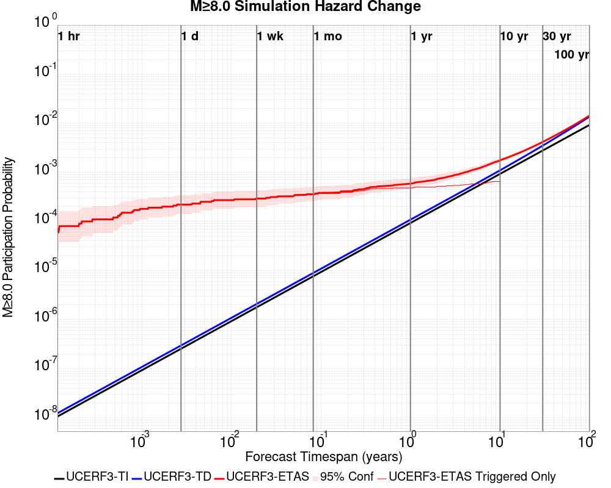

| Forecast Duration | UCERF3-ETAS [95% Conf] | UCERF3-ETAS Triggered Only | UCERF3-TD | UCERF3-ETAS/TD Gain | UCERF3-TI |
|-----|-----|-----|-----|-----|-----|
| 1 Hour | 5.33E-5 [9.25E-6 - 2.15E-4] | 5.33E-5 | 1.24E-8 | 4313.84 | 1.06E-8 |
| 1 Day | 2.14E-4 [9.95E-5 - 4.39E-4] | 2.13E-4 | 2.97E-7 | 719.81 | 2.54E-7 |
| 1 Week | 2.42E-4 [1.19E-4 - 4.76E-4] | 2.40E-4 | 2.08E-6 | 116.52 | 1.78E-6 |
| 1 Month | 3.02E-4 [1.63E-4 - 5.51E-4] | 2.93E-4 | 8.90E-6 | 33.95 | 7.63E-6 |
| 1 Year | 5.88E-4 [4.02E-4 - 8.83E-4] | 4.80E-4 | 1.08E-4 | 5.43 | 9.29E-5 |
| 10 Years | 1.76E-3 [1.54E-3 - 2.10E-3] | 6.67E-4 | 1.10E-3 | 1.61 | 9.29E-4 |
| 30 Years | 4.17E-3 [3.94E-3 - 4.50E-3] \* | \* | 3.50E-3 | 1.19 \* | 2.78E-3 |
| 100 Years | 0.014 [0.014 - 0.015] \* | \* | 0.014 | 1.05 \* | 9.25E-3 |

\* *forecast duration is longer than simulation length, only ETAS ruptures from the first 10 years are included*

## Trigger Rupture Fault Map
*[(top)](#table-of-contents)*


## Trigger Rupture Depth Map
*[(top)](#table-of-contents)*


## Fault Distances To Triggers
*[(top)](#table-of-contents)*

| Section Name | Strike, Dip, Rake | # Hypos In Poly | Max Mag w/ Hypo In Poly | # Surfs In Poly | Max Mag w/ Surf In Poly | Min Dist To Any (km) | Min Poly Dist To Any (km) | Min Dist To Largest (km) | Min Poly Dist To Largest (km) | Min Hypo Dist To Largest (km) | Min Hypo Poly Dist To Largest (km) |
|-----|-----|-----|-----|-----|-----|-----|-----|-----|-----|-----|-----|
| Airport Lake | 359, 50, -90 | 90 | 7.1 | 90 | 7.1 | 0.259 | 0.000 | 0.259 | 0.000 | 5.612 | 0.000 |
| Little Lake | 327, 90, 180 | 16 | 3.75 | 17 | 7.1 | 2.268 | 0.000 | 8.432 | 0.000 | 13.471 | 1.469 |
| Garlock (Central) | 71, 90, 0 | 2 | 3.21 | 3 | 7.1 | 3.023 | 0.000 | 3.023 | 0.000 | 31.947 | 19.940 |
| So Sierra Nevada | 2, 50, -90 | 1 | 2.75 | 2 | 7.1 | 0.251 | 0.000 | 0.251 | 0.000 | 16.191 | 15.188 |
| Tank Canyon | 189, 50, -90 | 0 |  | 0 |  | 10.550 | 10.162 | 10.550 | 10.162 | 23.737 | 23.674 |
| Blackwater | 323, 90, 180 | 0 |  | 0 |  | 11.636 | 6.544 | 11.636 | 6.544 | 39.380 | 38.300 |
| Scodie Lineament | 221, 68, 0 | 0 |  | 0 |  | 16.722 | 15.781 | 27.087 | 25.862 | 36.559 | 32.668 |

## Individual Simulated Catalog Maps
*[(top)](#table-of-contents)*

These are map plots of individual catalogs from the simulations, selected as the closest catalog to each of the given percentiles in terms of total number of events.

| Duration | p0.0 %-ile | p25.0 %-ile | p50.0 %-ile | p75.0 %-ile | p90.0 %-ile | p95.0 %-ile | p97.5 %-ile | p98.0 %-ile | p99.0 %-ile | p99.5 %-ile | p99.9 %-ile | p100.0 %-ile |
|-----|-----|-----|-----|-----|-----|-----|-----|-----|-----|-----|-----|-----|
| **1 Week** |  |  | 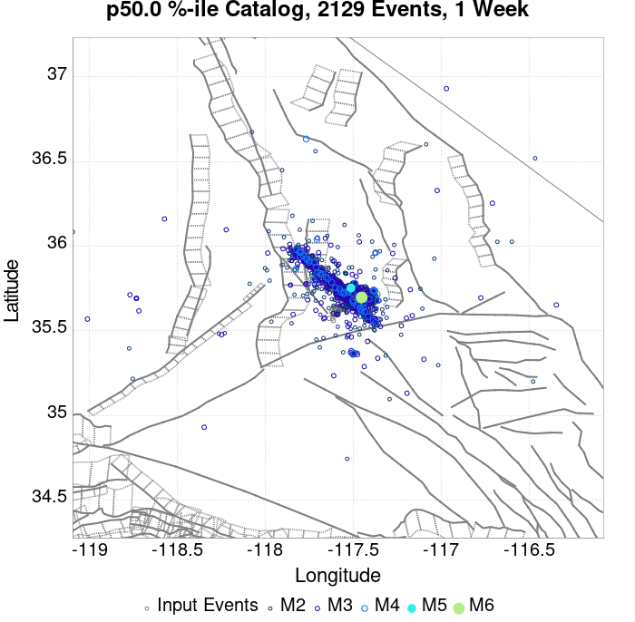 |  |  |  |  |  |  |  |  |  |
| **1 Month** | 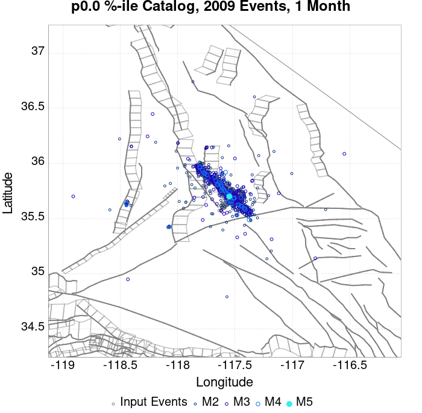 |  |  |  |  |  |  |  |  |  |  |  |
| **1 Year** |  |  |  |  |  |  |  |  |  |  |  |  |
| **10 Year** |  |  |  |  | 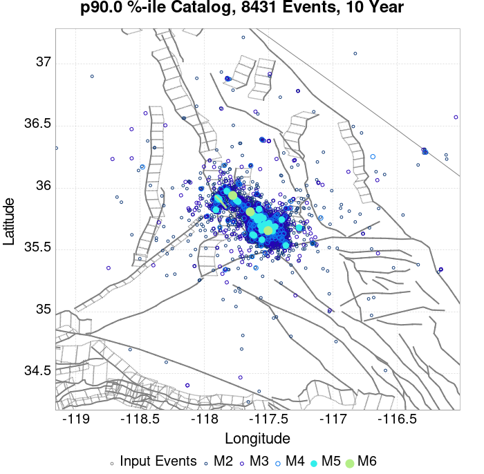 |  |  |  |  |  |  |  |

## ComCat Data Comparisons
*[(top)](#table-of-contents)*

These plots compare simulated sequences with data from ComCat. All plots only consider events with hypocenters inside the ComCat region defined in the JSON input file, and consider ruptures above Mc=3.5

Last updated at 2019/08/31 10:35:23 UTC, 8 wk after the simulation start time

### ComCat Magnitude-Number Distributions
*[(top)](#table-of-contents)*

| Incremental MND | Cumulative MND |
|-----|-----|
|  |  |

### ComCat Cumulative Number Vs Time
*[(top)](#table-of-contents)*

| M&ge;3.5 | M&ge;4 | M&ge;5 | M&ge;6 | M&ge;7 |
|-----|-----|-----|-----|-----|
|  |  |  |  | 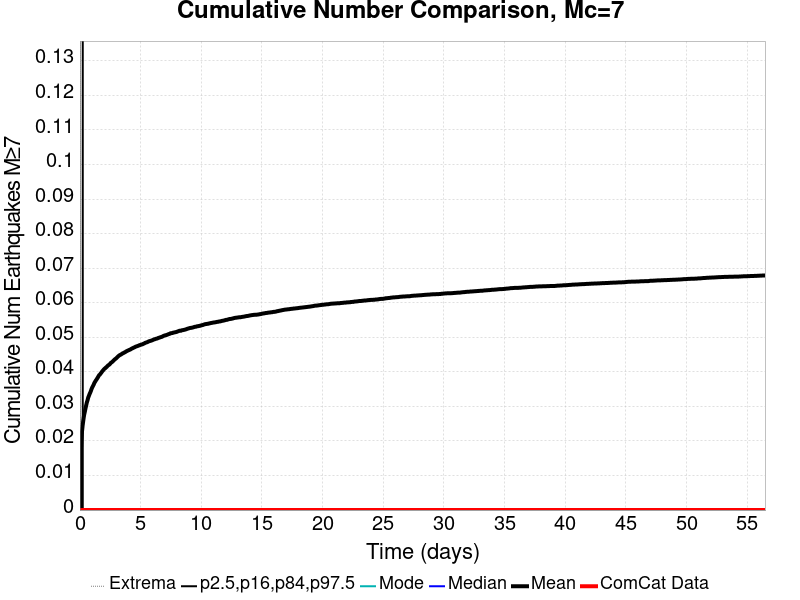 |

### ComCat Cumulative Number Simulation Percentiles
*[(top)](#table-of-contents)*


### ComCat Mean Spatial Distribution
*[(top)](#table-of-contents)*

|  | 1 Day | 1 Week | 1 Month | 8 Week |
|-----|-----|-----|-----|-----|
| **M≥3.5** |  |  |  |  |
| **M≥4** |  |  |  | 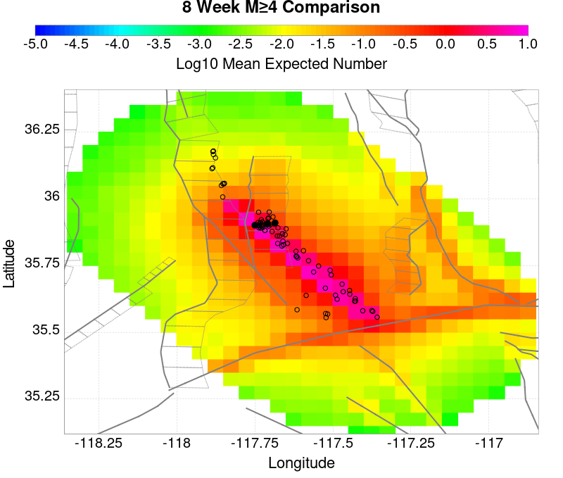 |
| **M≥5** |  |  | 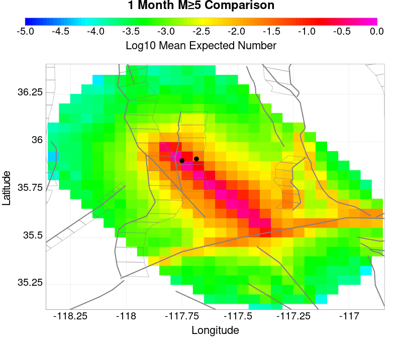 |  |
| **M≥6** |  |  | 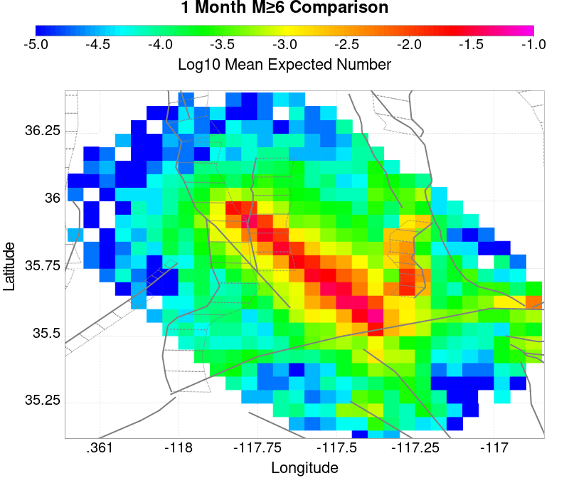 |  |
| **M≥7** | 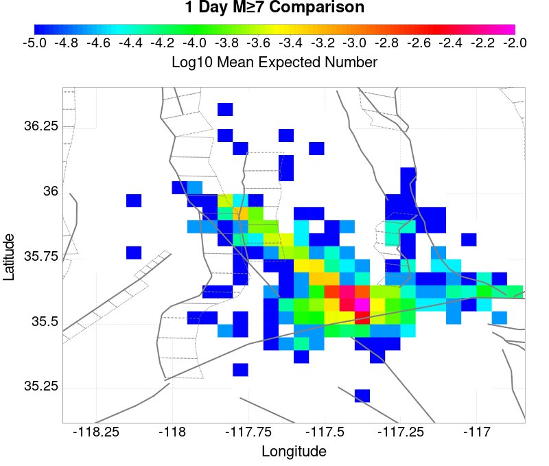 |  |  |  |
| **M≥8** | 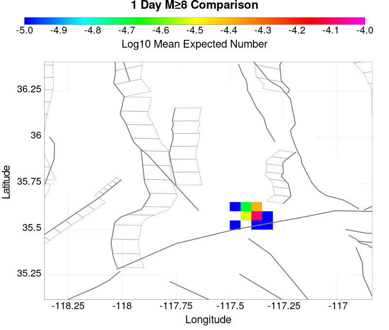 |  |  |  |

### ComCat Depth Distribution
*[(top)](#table-of-contents)*

| M&ge;3.5 | M&ge;4 | M&ge;5 | M&ge;6 | M&ge;7 | M&ge;8 |
|-----|-----|-----|-----|-----|-----|
|  |  |  |  |  |  |

## Section Participation
*[(top)](#table-of-contents)*

### Section Participation Plots
*[(top)](#table-of-contents)*

| Min Mag | 1 yr Triggered Ruptures (no spontaneous) | 10 yr Triggered Ruptures (no spontaneous) | 10 yr Triggered Ruptures (primary aftershocks only) |
|-----|-----|-----|-----|
| **All Supra. Seis.** |  |  |  |
| **M&ge;6.5** |  |  | 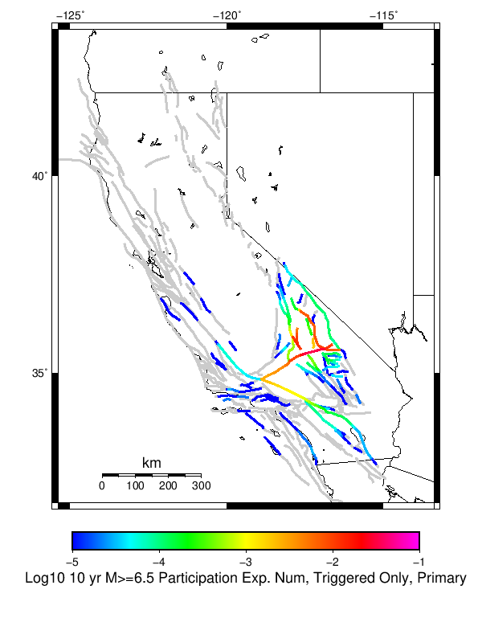 |
| **M&ge;7** |  |  |  |
| **M&ge;7.5** |  |  |  |
| **M&ge;8** |  |  |  |

### Supra-Seismogenic Parent Sections Table
*[(top)](#table-of-contents)*

*First 10 of 184 with matching ruptures shown*

| Parent Name | Triggered 10 Year Mean Count | Triggered 1 Day Prob | Triggered 1 Week Prob | Triggered 1 Month Prob | Triggered 1 Year Prob | Triggered 10 Year Prob | Triggered 10 Year Primary Mean Count |
|-----|-----|-----|-----|-----|-----|-----|-----|
| Garlock (Central) | 0.2204 | 0.077813335 | 0.10864 | 0.13325334 | 0.17442666 | 0.20965333 | 0.12872 |
| Tank Canyon | 0.12424 | 0.020666666 | 0.035573334 | 0.0492 | 0.07642667 | 0.10504 | 0.029626667 |
| Little Lake | 0.097786665 | 0.035253335 | 0.04901333 | 0.060026668 | 0.07869333 | 0.09488 | 0.061946668 |
| Owl Lake | 0.069573335 | 0.016293334 | 0.024453333 | 0.032613333 | 0.04712 | 0.060933333 | 0.019306667 |
| Garlock (East) | 0.04552 | 0.0103733335 | 0.015546666 | 0.021093333 | 0.03096 | 0.0412 | 0.013546667 |
| Panamint Valley | 0.04538667 | 0.012 | 0.018613333 | 0.023653334 | 0.034133334 | 0.044 | 0.017813334 |
| Airport Lake | 0.04032 | 0.01512 | 0.02128 | 0.026053334 | 0.03328 | 0.04021333 | 0.026426667 |
| Hunter Mountain-Saline Valley | 0.022106666 | 0.00704 | 0.010533334 | 0.013413333 | 0.01776 | 0.021653334 | 0.0111466665 |
| Blackwater | 0.016773334 | 0.0029333334 | 0.005013333 | 0.00704 | 0.01128 | 0.016213333 | 0.0039466666 |
| Garlock (West) | 0.015973333 | 0.0054133334 | 0.00768 | 0.00944 | 0.0129866665 | 0.015946666 | 0.009386667 |

### M≥6.5 Parent Sections Table
*[(top)](#table-of-contents)*

*First 10 of 162 with matching ruptures shown*

| Parent Name | Triggered 10 Year Mean Count | Triggered 1 Day Prob | Triggered 1 Week Prob | Triggered 1 Month Prob | Triggered 1 Year Prob | Triggered 10 Year Prob | Triggered 10 Year Primary Mean Count |
|-----|-----|-----|-----|-----|-----|-----|-----|
| Garlock (Central) | 0.09466667 | 0.03352 | 0.047333334 | 0.05888 | 0.0768 | 0.0928 | 0.055013333 |
| Little Lake | 0.048853334 | 0.01856 | 0.02512 | 0.0308 | 0.039546665 | 0.048213333 | 0.031173334 |
| Panamint Valley | 0.041413333 | 0.011226667 | 0.017413333 | 0.022053333 | 0.03168 | 0.040453333 | 0.017573332 |
| Owl Lake | 0.038826667 | 0.012293333 | 0.017653333 | 0.022346666 | 0.030853333 | 0.038453333 | 0.01816 |
| Garlock (East) | 0.0304 | 0.0084 | 0.0122133335 | 0.015893333 | 0.0224 | 0.029013334 | 0.01304 |
| Airport Lake | 0.030373333 | 0.01144 | 0.016186666 | 0.01984 | 0.02504 | 0.030346667 | 0.02 |
| Hunter Mountain-Saline Valley | 0.021626666 | 0.0069333334 | 0.010346667 | 0.013146667 | 0.017413333 | 0.021253332 | 0.01104 |
| Garlock (West) | 0.015813334 | 0.0054133334 | 0.00768 | 0.00944 | 0.01288 | 0.015813334 | 0.009386667 |
| Tank Canyon | 0.013786667 | 0.0022133333 | 0.0039466666 | 0.0057066665 | 0.009626667 | 0.01376 | 0.0035466666 |
| So Sierra Nevada | 0.0101333335 | 0.0022133333 | 0.00368 | 0.0051733335 | 0.007333333 | 0.010026666 | 0.0028533333 |

### M≥7 Parent Sections Table
*[(top)](#table-of-contents)*

*First 10 of 124 with matching ruptures shown*

| Parent Name | Triggered 10 Year Mean Count | Triggered 1 Day Prob | Triggered 1 Week Prob | Triggered 1 Month Prob | Triggered 1 Year Prob | Triggered 10 Year Prob | Triggered 10 Year Primary Mean Count |
|-----|-----|-----|-----|-----|-----|-----|-----|
| Garlock (Central) | 0.083173335 | 0.02944 | 0.04194667 | 0.052186668 | 0.06797333 | 0.08218667 | 0.04912 |
| Panamint Valley | 0.03008 | 0.009786666 | 0.014426666 | 0.01792 | 0.024266666 | 0.029893333 | 0.016106667 |
| Owl Lake | 0.029493334 | 0.011173333 | 0.01544 | 0.019093333 | 0.02488 | 0.029466666 | 0.01784 |
| Garlock (East) | 0.022613334 | 0.0076 | 0.010773334 | 0.013706666 | 0.018133333 | 0.022506667 | 0.012693333 |
| Hunter Mountain-Saline Valley | 0.02096 | 0.00688 | 0.010266666 | 0.01304 | 0.017226666 | 0.02096 | 0.01096 |
| Garlock (West) | 0.015706666 | 0.005386667 | 0.0076266667 | 0.009386667 | 0.0128 | 0.015706666 | 0.00936 |
| Little Lake | 0.007333333 | 0.0024 | 0.00344 | 0.004586667 | 0.005813333 | 0.0073066666 | 0.0046666665 |
| San Andreas (Mojave N) | 0.00648 | 0.00216 | 0.0030666667 | 0.0036266667 | 0.0050933333 | 0.0063733333 | 0.00368 |
| Airport Lake | 0.0060266666 | 0.0019466666 | 0.0027733333 | 0.00376 | 0.004826667 | 0.0060266666 | 0.00376 |
| San Andreas (Mojave S) | 0.00488 | 0.0016266666 | 0.0022933334 | 0.0026666666 | 0.00376 | 0.0048 | 0.0028 |

### M≥7.5 Parent Sections Table
*[(top)](#table-of-contents)*

*First 10 of 66 with matching ruptures shown*

| Parent Name | Triggered 10 Year Mean Count | Triggered 1 Day Prob | Triggered 1 Week Prob | Triggered 1 Month Prob | Triggered 1 Year Prob | Triggered 10 Year Prob | Triggered 10 Year Primary Mean Count |
|-----|-----|-----|-----|-----|-----|-----|-----|
| Garlock (Central) | 0.03328 | 0.01144 | 0.01664 | 0.02072 | 0.02744 | 0.033173334 | 0.019173333 |
| Panamint Valley | 0.020453334 | 0.00672 | 0.01008 | 0.0128 | 0.016906668 | 0.020453334 | 0.010933333 |
| Hunter Mountain-Saline Valley | 0.0204 | 0.00672 | 0.01008 | 0.0128 | 0.01688 | 0.0204 | 0.01088 |
| Garlock (West) | 0.013866667 | 0.00488 | 0.0068 | 0.008213334 | 0.011333333 | 0.013866667 | 0.008346667 |
| Garlock (East) | 0.008986667 | 0.0032 | 0.0043733334 | 0.005386667 | 0.0071733333 | 0.008986667 | 0.0053066667 |
| San Andreas (Mojave N) | 0.00648 | 0.00216 | 0.0030666667 | 0.0036266667 | 0.0050933333 | 0.0063733333 | 0.00368 |
| San Andreas (Mojave S) | 0.0047466666 | 0.0016 | 0.00224 | 0.0026133333 | 0.00368 | 0.0046933335 | 0.0027733333 |
| San Andreas (San Bernardino N) | 0.0030133333 | 0.0010133333 | 0.0014666667 | 0.0016533333 | 0.0023733333 | 0.00296 | 0.0016 |
| Owl Lake | 0.0026933334 | 8.2666666E-4 | 0.0012533333 | 0.0015466667 | 0.00232 | 0.0026933334 | 0.0015733333 |
| San Andreas (San Bernardino S) | 0.0013333333 | 4.0E-4 | 6.133333E-4 | 6.6666666E-4 | 9.866667E-4 | 0.0013333333 | 7.466667E-4 |

### M≥8 Parent Sections Table
*[(top)](#table-of-contents)*

*First 10 of 27 with matching ruptures shown*

| Parent Name | Triggered 10 Year Mean Count | Triggered 1 Day Prob | Triggered 1 Week Prob | Triggered 1 Month Prob | Triggered 1 Year Prob | Triggered 10 Year Prob | Triggered 10 Year Primary Mean Count |
|-----|-----|-----|-----|-----|-----|-----|-----|
| San Andreas (Mojave N) | 8.0E-4 | 2.6666667E-4 | 2.9333335E-4 | 3.4666667E-4 | 5.866667E-4 | 8.0E-4 | 3.2E-4 |
| San Andreas (Mojave S) | 8.0E-4 | 2.6666667E-4 | 2.9333335E-4 | 3.4666667E-4 | 5.866667E-4 | 8.0E-4 | 3.2E-4 |
| San Andreas (San Bernardino N) | 8.0E-4 | 2.6666667E-4 | 2.9333335E-4 | 3.4666667E-4 | 5.866667E-4 | 8.0E-4 | 3.2E-4 |
| Garlock (Central) | 6.6666666E-4 | 2.1333333E-4 | 2.4E-4 | 2.9333335E-4 | 4.8E-4 | 6.6666666E-4 | 2.9333335E-4 |
| Garlock (West) | 6.6666666E-4 | 2.1333333E-4 | 2.4E-4 | 2.9333335E-4 | 4.8E-4 | 6.6666666E-4 | 2.9333335E-4 |
| Garlock (East) | 5.6E-4 | 1.6E-4 | 1.8666667E-4 | 2.4E-4 | 3.7333334E-4 | 5.6E-4 | 2.4E-4 |
| San Andreas (Coachella) rev | 3.7333334E-4 | 1.0666667E-4 | 1.0666667E-4 | 1.3333333E-4 | 2.6666667E-4 | 3.7333334E-4 | 1.3333333E-4 |
| San Andreas (San Bernardino S) | 3.7333334E-4 | 1.0666667E-4 | 1.0666667E-4 | 1.3333333E-4 | 2.6666667E-4 | 3.7333334E-4 | 1.8666667E-4 |
| San Andreas (San Gorgonio Pass-Garnet HIll) | 3.7333334E-4 | 1.0666667E-4 | 1.0666667E-4 | 1.3333333E-4 | 2.6666667E-4 | 3.7333334E-4 | 1.8666667E-4 |
| San Jacinto (San Bernardino) | 2.9333335E-4 | 1.6E-4 | 1.8666667E-4 | 2.1333333E-4 | 2.4E-4 | 2.9333335E-4 | 1.0666667E-4 |

### Fault Magnitude-Probability Distributions
*[(top)](#table-of-contents)*

The first 5 sections (sorted by trigger rate) are plotted below. All fault MPDs are available [here](plots/parent_sect_mpds/README.md)

| 1 Week | 1 Month | 1 Year | 10 Year |
|-----|-----|-----|-----|
|  |  |  |  |
|  |  |  |  |
|  |  |  |  |
|  |  |  |  |
|  |  | 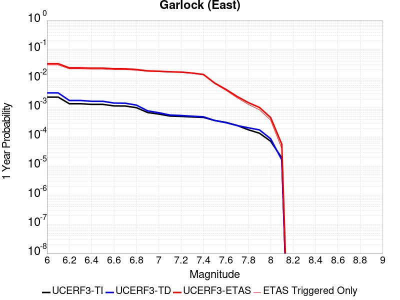 | 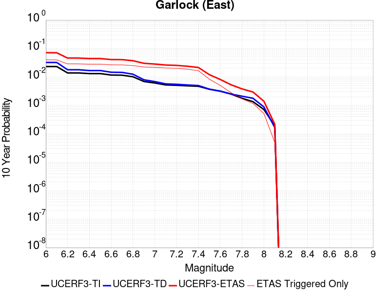 |

## Gridded Nucleation
*[(top)](#table-of-contents)*

| Min Mag | Triggered Ruptures (no spontaneous) | Triggered Ruptures (primary aftershocks only) |
|-----|-----|-----|
| **M&ge;2.5** | 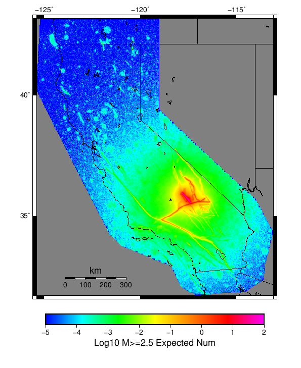 |  |
| **M&ge;5** |  |  |
| **M&ge;6** |  |  |
| **M&ge;7** |  |  |


## JSON Input File
*[(top)](#table-of-contents)*

```
{
  "numSimulations": 100000,
  "duration": 10.0,
  "startTimeMillis": 1562383194040,
  "includeSpontaneous": false,
  "randomSeed": 1567213554363,
  "binaryOutput": true,
  "binaryOutputFilters": [
    {
      "prefix": "results_complete",
      "descendantsOnly": false
    },
    {
      "prefix": "results_m5_preserve_chain",
      "minMag": 5.0,
      "preserveChainBelowMag": true,
      "descendantsOnly": false
    }
  ],
  "forceRecalc": false,
  "simulationName": "ComCat M7.1 (ci38457511), ShakeMap Surface (Version 10)",
  "numRetries": 3,
  "outputDir": "${ETAS_SIM_DIR}/2019_08_30-ComCatM7p1_ci38457511_ShakeMapSurface_Version10-noSpont-full_td-scale1.14",
  "triggerRuptures": [
    {
      "occurrenceTimeMillis": 1562259775340,
      "comcatEventID": "ci38443095",
      "mag": 3.98,
      "latitude": 35.708,
      "longitude": -117.5036667,
      "depth": 10.58
    },
    {
      "occurrenceTimeMillis": 1562261629000,
      "comcatEventID": "ci38443183",
      "mag": 6.4,
      "latitude": 35.7053333,
      "longitude": -117.5038333,
      "depth": 10.5
    },
    {
      "occurrenceTimeMillis": 1562261701660,
      "comcatEventID": "ci38443191",
      "mag": 4.49,
      "latitude": 35.644,
      "longitude": -117.56716670000002,
      "depth": 4.64
    },
    {
      "occurrenceTimeMillis": 1562261746340,
      "comcatEventID": "ci37222356",
      "mag": 3.63,
      "latitude": 35.6936667,
      "longitude": -117.437,
      "depth": 7.65
    },
    {
      "occurrenceTimeMillis": 1562261752170,
      "comcatEventID": "ci37218988",
      "mag": 4.28,
      "latitude": 35.687,
      "longitude": -117.50616670000001,
      "depth": 1.6
    },
    {
      "occurrenceTimeMillis": 1562261818950,
      "comcatEventID": "ci37222380",
      "mag": 3.41,
      "latitude": 35.7258333,
      "longitude": -117.55933330000002,
      "depth": 5.3
    },
    {
      "occurrenceTimeMillis": 1562261821140,
      "comcatEventID": "ci37222372",
      "mag": 3.66,
      "latitude": 35.7105,
      "longitude": -117.4773333,
      "depth": 1.57
    },
    {
      "occurrenceTimeMillis": 1562261834850,
      "comcatEventID": "ci37222364",
      "mag": 3.97,
      "latitude": 35.6655,
      "longitude": -117.516,
      "depth": 1.64
    },
    {
      "occurrenceTimeMillis": 1562261845640,
      "comcatEventID": "ci37218996",
      "mag": 4.01,
      "latitude": 35.6758333,
      "longitude": -117.45750000000001,
      "depth": 15.82
    },
    {
      "occurrenceTimeMillis": 1562261875500,
      "comcatEventID": "ci38443199",
      "mag": 3.86,
      "latitude": 35.7456667,
      "longitude": -117.5516667,
      "depth": 8.29
    },
    {
      "occurrenceTimeMillis": 1562261901450,
      "comcatEventID": "ci37421941",
      "mag": 3.73,
      "latitude": 35.714,
      "longitude": -117.476,
      "depth": 1.74
    },
    {
      "occurrenceTimeMillis": 1562261927500,
      "comcatEventID": "us70004a0n",
      "mag": 3.5,
      "latitude": 35.6215,
      "longitude": -117.5782,
      "depth": 9.7
    },
    {
      "occurrenceTimeMillis": 1562261927760,
      "comcatEventID": "ci37222396",
      "mag": 3.5,
      "latitude": 35.6235,
      "longitude": -117.596,
      "depth": 8.55
    },
    {
      "occurrenceTimeMillis": 1562261973310,
      "comcatEventID": "ci37222404",
      "mag": 3.11,
      "latitude": 35.5743333,
      "longitude": -117.63666670000002,
      "depth": 6.85
    },
    {
      "occurrenceTimeMillis": 1562261975360,
      "comcatEventID": "ci38443215",
      "mag": 3.69,
      "latitude": 35.6873333,
      "longitude": -117.4935,
      "depth": 10.86
    },
    {
      "occurrenceTimeMillis": 1562262002250,
      "comcatEventID": "ci38443223",
      "mag": 3.8,
      "latitude": 35.7253333,
      "longitude": -117.57083329999999,
      "depth": 6.63
    },
    {
      "occurrenceTimeMillis": 1562262018520,
      "comcatEventID": "ci38443231",
      "mag": 4.13,
      "latitude": 35.707,
      "longitude": -117.5101667,
      "depth": 8.66
    },
    {
      "occurrenceTimeMillis": 1562262034900,
      "comcatEventID": "ci37222508",
      "mag": 3.54,
      "latitude": 35.6948333,
      "longitude": -117.50183330000002,
      "depth": 2.04
    },
    {
      "occurrenceTimeMillis": 1562262046140,
      "comcatEventID": "ci37222516",
      "mag": 3.42,
      "latitude": 35.7298333,
      "longitude": -117.55483330000001,
      "depth": 7.72
    },
    {
      "occurrenceTimeMillis": 1562262080850,
      "comcatEventID": "ci37421957",
      "mag": 3.3,
      "latitude": 35.7266667,
      "longitude": -117.5288333,
      "depth": 1.97
    },
    {
      "occurrenceTimeMillis": 1562262174130,
      "comcatEventID": "ci38443239",
      "mag": 3.22,
      "latitude": 35.7301667,
      "longitude": -117.55866669999999,
      "depth": 7.84
    },
    {
      "occurrenceTimeMillis": 1562262209200,
      "comcatEventID": "us70004a0z",
      "mag": 3.6,
      "latitude": 35.6783,
      "longitude": -117.5488,
      "depth": 5.15
    },
    {
      "occurrenceTimeMillis": 1562262264020,
      "comcatEventID": "ci37421981",
      "mag": 2.77,
      "latitude": 35.7478333,
      "longitude": -117.54000000000002,
      "depth": 9.4
    },
    {
      "occurrenceTimeMillis": 1562262272820,
      "comcatEventID": "ci38443255",
      "mag": 3.86,
      "latitude": 35.6875,
      "longitude": -117.5071667,
      "depth": 1.54
    },
    {
      "occurrenceTimeMillis": 1562262305780,
      "comcatEventID": "ci37421997",
      "mag": 3.03,
      "latitude": 35.6976667,
      "longitude": -117.48649999999999,
      "depth": 2.24
    },
    {
      "occurrenceTimeMillis": 1562262323950,
      "comcatEventID": "ci37421989",
      "mag": 3.03,
      "latitude": 35.7151667,
      "longitude": -117.5473333,
      "depth": 7.21
    },
    {
      "occurrenceTimeMillis": 1562262328630,
      "comcatEventID": "ci37222524",
      "mag": 3.21,
      "latitude": 35.7348333,
      "longitude": -117.53683330000001,
      "depth": 10.34
    },
    {
      "occurrenceTimeMillis": 1562262363710,
      "comcatEventID": "ci38443263",
      "mag": 2.96,
      "latitude": 35.6431667,
      "longitude": -117.6101667,
      "depth": 10.14
    },
    {
      "occurrenceTimeMillis": 1562262380320,
      "comcatEventID": "ci37222532",
      "mag": 2.56,
      "latitude": 35.6563333,
      "longitude": -117.5325,
      "depth": 1.52
    },
    {
      "occurrenceTimeMillis": 1562262409960,
      "comcatEventID": "ci38443271",
      "mag": 3.07,
      "latitude": 35.6385,
      "longitude": -117.6108333,
      "depth": 10.97
    },
    {
      "occurrenceTimeMillis": 1562262437810,
      "comcatEventID": "ci38443279",
      "mag": 3.5,
      "latitude": 35.7455,
      "longitude": -117.5465,
      "depth": 7.11
    },
    {
      "occurrenceTimeMillis": 1562262460970,
      "comcatEventID": "ci37222548",
      "mag": 3.11,
      "latitude": 35.726,
      "longitude": -117.55849999999998,
      "depth": 3.58
    },
    {
      "occurrenceTimeMillis": 1562262474970,
      "comcatEventID": "ci37222556",
      "mag": 3.4,
      "latitude": 35.7286667,
      "longitude": -117.56066670000001,
      "depth": 5.25
    },
    {
      "occurrenceTimeMillis": 1562262483160,
      "comcatEventID": "ci37222564",
      "mag": 3.27,
      "latitude": 35.6365,
      "longitude": -117.55183330000001,
      "depth": 6.62
    },
    {
      "occurrenceTimeMillis": 1562262495680,
      "comcatEventID": "ci37222572",
      "mag": 3.11,
      "latitude": 35.7053333,
      "longitude": -117.5245,
      "depth": 5.52
    },
    {
      "occurrenceTimeMillis": 1562262504150,
      "comcatEventID": "ci37222580",
      "mag": 2.96,
      "latitude": 35.6593333,
      "longitude": -117.52633330000002,
      "depth": 2.68
    },
    {
      "occurrenceTimeMillis": 1562262575190,
      "comcatEventID": "ci37222596",
      "mag": 2.52,
      "latitude": 35.7335,
      "longitude": -117.50683330000001,
      "depth": 3.91
    },
    {
      "occurrenceTimeMillis": 1562262578950,
      "comcatEventID": "ci37222668",
      "mag": 2.57,
      "latitude": 35.687,
      "longitude": -117.49066670000002,
      "depth": 10.66
    },
    {
      "occurrenceTimeMillis": 1562262648290,
      "comcatEventID": "ci37222692",
      "mag": 2.73,
      "latitude": 35.738,
      "longitude": -117.52933329999999,
      "depth": 7.72
    },
    {
      "occurrenceTimeMillis": 1562262648960,
      "comcatEventID": "ci38443303",
      "mag": 2.79,
      "latitude": 35.678,
      "longitude": -117.49916670000002,
      "depth": 1.14
    },
    {
      "occurrenceTimeMillis": 1562262706650,
      "comcatEventID": "ci38443287",
      "mag": 3.46,
      "latitude": 35.674,
      "longitude": -117.52349999999998,
      "depth": 5.3
    },
    {
      "occurrenceTimeMillis": 1562262761700,
      "comcatEventID": "ci38443295",
      "mag": 2.92,
      "latitude": 35.7218333,
      "longitude": -117.5251667,
      "depth": 7.04
    },
    {
      "occurrenceTimeMillis": 1562262899560,
      "comcatEventID": "ci38443327",
      "mag": 2.53,
      "latitude": 35.6391667,
      "longitude": -117.5628333,
      "depth": 10.48
    },
    {
      "occurrenceTimeMillis": 1562262930800,
      "comcatEventID": "ci37222876",
      "mag": 2.57,
      "latitude": 35.6705,
      "longitude": -117.5221667,
      "depth": 3.91
    },
    {
      "occurrenceTimeMillis": 1562263051460,
      "comcatEventID": "ci38443311",
      "mag": 2.95,
      "latitude": 35.6595,
      "longitude": -117.5223333,
      "depth": 2.3
    },
    {
      "occurrenceTimeMillis": 1562263063060,
      "comcatEventID": "ci37222932",
      "mag": 2.78,
      "latitude": 35.6725,
      "longitude": -117.4743333,
      "depth": 8.76
    },
    {
      "occurrenceTimeMillis": 1562263082640,
      "comcatEventID": "ci38443319",
      "mag": 3.33,
      "latitude": 35.702,
      "longitude": -117.50833330000002,
      "depth": 4.77
    },
    {
      "occurrenceTimeMillis": 1562263240190,
      "comcatEventID": "ci38443335",
      "mag": 2.67,
      "latitude": 35.6303333,
      "longitude": -117.569,
      "depth": 1.64
    },
    {
      "occurrenceTimeMillis": 1562263261190,
      "comcatEventID": "ci37223148",
      "mag": 2.59,
      "latitude": 35.6733333,
      "longitude": -117.5118333,
      "depth": 1.49
    },
    {
      "occurrenceTimeMillis": 1562263283180,
      "comcatEventID": "ci37422005",
      "mag": 3.53,
      "latitude": 35.6876667,
      "longitude": -117.50849999999998,
      "depth": 1.26
    },
    {
      "occurrenceTimeMillis": 1562263291230,
      "comcatEventID": "ci37223156",
      "mag": 3.42,
      "latitude": 35.5978333,
      "longitude": -117.5905,
      "depth": 6.79
    },
    {
      "occurrenceTimeMillis": 1562263374110,
      "comcatEventID": "ci38443351",
      "mag": 2.53,
      "latitude": 35.6066667,
      "longitude": -117.58216670000002,
      "depth": 5.8
    },
    {
      "occurrenceTimeMillis": 1562263398590,
      "comcatEventID": "ci38443359",
      "mag": 2.85,
      "latitude": 35.7478333,
      "longitude": -117.5425,
      "depth": 6.85
    },
    {
      "occurrenceTimeMillis": 1562263541830,
      "comcatEventID": "ci38443375",
      "mag": 2.76,
      "latitude": 35.7153333,
      "longitude": -117.5295,
      "depth": 4.54
    },
    {
      "occurrenceTimeMillis": 1562263555910,
      "comcatEventID": "ci37223228",
      "mag": 2.61,
      "latitude": 35.7266667,
      "longitude": -117.5165,
      "depth": 8.96
    },
    {
      "occurrenceTimeMillis": 1562263576110,
      "comcatEventID": "ci38443383",
      "mag": 3.79,
      "latitude": 35.6606667,
      "longitude": -117.523,
      "depth": 2.14
    },
    {
      "occurrenceTimeMillis": 1562263611050,
      "comcatEventID": "ci37223236",
      "mag": 2.6,
      "latitude": 35.6931667,
      "longitude": -117.46200000000002,
      "depth": 11.56
    },
    {
      "occurrenceTimeMillis": 1562263629270,
      "comcatEventID": "ci38443391",
      "mag": 3.51,
      "latitude": 35.5991667,
      "longitude": -117.6101667,
      "depth": 2.12
    },
    {
      "occurrenceTimeMillis": 1562263630910,
      "comcatEventID": "ci37223244",
      "mag": 3.49,
      "latitude": 35.6508333,
      "longitude": -117.54200000000002,
      "depth": 2.77
    },
    {
      "occurrenceTimeMillis": 1562263670810,
      "comcatEventID": "ci37223252",
      "mag": 2.55,
      "latitude": 35.72950000000001,
      "longitude": -117.533,
      "depth": 7.25
    },
    {
      "occurrenceTimeMillis": 1562263713160,
      "comcatEventID": "ci38443407",
      "mag": 3.38,
      "latitude": 35.6678333,
      "longitude": -117.50616670000001,
      "depth": 2.27
    },
    {
      "occurrenceTimeMillis": 1562263725070,
      "comcatEventID": "ci37223308",
      "mag": 3.55,
      "latitude": 35.7108333,
      "longitude": -117.47683329999998,
      "depth": 1.17
    },
    {
      "occurrenceTimeMillis": 1562263832710,
      "comcatEventID": "ci38443415",
      "mag": 3.46,
      "latitude": 35.6598333,
      "longitude": -117.53483330000002,
      "depth": 10.25
    },
    {
      "occurrenceTimeMillis": 1562263882870,
      "comcatEventID": "ci38443423",
      "mag": 2.69,
      "latitude": 35.6003333,
      "longitude": -117.5951667,
      "depth": 7.33
    },
    {
      "occurrenceTimeMillis": 1562263972070,
      "comcatEventID": "ci38443431",
      "mag": 3.44,
      "latitude": 35.6703333,
      "longitude": -117.5605,
      "depth": 6.91
    },
    {
      "occurrenceTimeMillis": 1562264025530,
      "comcatEventID": "ci37223380",
      "mag": 2.89,
      "latitude": 35.7003333,
      "longitude": -117.4873333,
      "depth": 10.98
    },
    {
      "occurrenceTimeMillis": 1562264031400,
      "comcatEventID": "ci38443439",
      "mag": 3.5,
      "latitude": 35.7081667,
      "longitude": -117.485,
      "depth": 6.44
    },
    {
      "occurrenceTimeMillis": 1562264104970,
      "comcatEventID": "ci38443447",
      "mag": 2.75,
      "latitude": 35.6103333,
      "longitude": -117.59500000000001,
      "depth": 4.94
    },
    {
      "occurrenceTimeMillis": 1562264112820,
      "comcatEventID": "ci37420701",
      "mag": 3.23,
      "latitude": 35.6691667,
      "longitude": -117.5203333,
      "depth": 1.84
    },
    {
      "occurrenceTimeMillis": 1562264193730,
      "comcatEventID": "ci38443463",
      "mag": 2.94,
      "latitude": 35.7251667,
      "longitude": -117.53350000000002,
      "depth": 6.74
    },
    {
      "occurrenceTimeMillis": 1562264235320,
      "comcatEventID": "ci38443471",
      "mag": 2.87,
      "latitude": 35.7185,
      "longitude": -117.5336667,
      "depth": 4.94
    },
    {
      "occurrenceTimeMillis": 1562264325720,
      "comcatEventID": "ci38443487",
      "mag": 3.38,
      "latitude": 35.638,
      "longitude": -117.611,
      "depth": 9.43
    },
    {
      "occurrenceTimeMillis": 1562264332070,
      "comcatEventID": "ci37223676",
      "mag": 2.98,
      "latitude": 35.6123333,
      "longitude": -117.624,
      "depth": 0.0
    },
    {
      "occurrenceTimeMillis": 1562264348090,
      "comcatEventID": "ci37223684",
      "mag": 2.6,
      "latitude": 35.7236667,
      "longitude": -117.50849999999998,
      "depth": 11.57
    },
    {
      "occurrenceTimeMillis": 1562264485340,
      "comcatEventID": "ci38443495",
      "mag": 2.61,
      "latitude": 35.67883330000001,
      "longitude": -117.51533330000001,
      "depth": 2.91
    },
    {
      "occurrenceTimeMillis": 1562264763750,
      "comcatEventID": "ci38443519",
      "mag": 3.13,
      "latitude": 35.6638333,
      "longitude": -117.5245,
      "depth": 2.53
    },
    {
      "occurrenceTimeMillis": 1562264846770,
      "comcatEventID": "ci38443527",
      "mag": 3.29,
      "latitude": 35.6748333,
      "longitude": -117.51433329999999,
      "depth": 2.68
    },
    {
      "occurrenceTimeMillis": 1562264879440,
      "comcatEventID": "ci38443535",
      "mag": 4.23,
      "latitude": 35.745,
      "longitude": -117.55216669999999,
      "depth": 6.64
    },
    {
      "occurrenceTimeMillis": 1562264923640,
      "comcatEventID": "ci38443543",
      "mag": 3.75,
      "latitude": 35.6661667,
      "longitude": -117.5656667,
      "depth": 7.14
    },
    {
      "occurrenceTimeMillis": 1562265289010,
      "comcatEventID": "ci37224604",
      "mag": 2.59,
      "latitude": 35.6895,
      "longitude": -117.4883333,
      "depth": 0.63
    },
    {
      "occurrenceTimeMillis": 1562265344040,
      "comcatEventID": "ci38443575",
      "mag": 2.5,
      "latitude": 35.7215,
      "longitude": -117.56550000000001,
      "depth": 0.16
    },
    {
      "occurrenceTimeMillis": 1562265451500,
      "comcatEventID": "ci38443591",
      "mag": 2.64,
      "latitude": 35.72,
      "longitude": -117.5723333,
      "depth": 1.34
    },
    {
      "occurrenceTimeMillis": 1562265525650,
      "comcatEventID": "ci38443599",
      "mag": 2.69,
      "latitude": 35.7046661,
      "longitude": -117.49666600000002,
      "depth": 3.96
    },
    {
      "occurrenceTimeMillis": 1562265584440,
      "comcatEventID": "ci38443607",
      "mag": 4.59,
      "latitude": 35.6013333,
      "longitude": -117.59700000000001,
      "depth": 2.81
    },
    {
      "occurrenceTimeMillis": 1562265656740,
      "comcatEventID": "ci37224612",
      "mag": 3.05,
      "latitude": 35.652,
      "longitude": -117.53683330000001,
      "depth": 2.03
    },
    {
      "occurrenceTimeMillis": 1562265674270,
      "comcatEventID": "ci38443615",
      "mag": 3.07,
      "latitude": 35.6763333,
      "longitude": -117.5115,
      "depth": 2.13
    },
    {
      "occurrenceTimeMillis": 1562265865000,
      "comcatEventID": "ci38443631",
      "mag": 3.09,
      "latitude": 35.719,
      "longitude": -117.55866669999999,
      "depth": 2.06
    },
    {
      "occurrenceTimeMillis": 1562266026590,
      "comcatEventID": "ci38443647",
      "mag": 4.34,
      "latitude": 35.6758333,
      "longitude": -117.48533330000001,
      "depth": 8.53
    },
    {
      "occurrenceTimeMillis": 1562266042600,
      "comcatEventID": "ci37421213",
      "mag": 4.02,
      "latitude": 35.6755,
      "longitude": -117.472,
      "depth": 10.27
    },
    {
      "occurrenceTimeMillis": 1562266207160,
      "comcatEventID": "ci38443663",
      "mag": 2.73,
      "latitude": 35.641,
      "longitude": -117.56266670000001,
      "depth": 8.95
    },
    {
      "occurrenceTimeMillis": 1562266215910,
      "comcatEventID": "ci38443671",
      "mag": 3.7,
      "latitude": 35.682,
      "longitude": -117.4961667,
      "depth": 1.26
    },
    {
      "occurrenceTimeMillis": 1562266333530,
      "comcatEventID": "ci38443679",
      "mag": 2.78,
      "latitude": 35.6543333,
      "longitude": -117.53983330000001,
      "depth": 0.88
    },
    {
      "occurrenceTimeMillis": 1562266376130,
      "comcatEventID": "ci38443687",
      "mag": 2.93,
      "latitude": 35.741,
      "longitude": -117.561,
      "depth": 0.23
    },
    {
      "occurrenceTimeMillis": 1562266407670,
      "comcatEventID": "ci38443695",
      "mag": 3.36,
      "latitude": 35.7285,
      "longitude": -117.5605,
      "depth": 7.87
    },
    {
      "occurrenceTimeMillis": 1562266453990,
      "comcatEventID": "ci38443703",
      "mag": 4.07,
      "latitude": 35.5975,
      "longitude": -117.5996667,
      "depth": 5.33
    },
    {
      "occurrenceTimeMillis": 1562266527680,
      "comcatEventID": "ci38443711",
      "mag": 3.03,
      "latitude": 35.6753333,
      "longitude": -117.4795,
      "depth": 10.71
    },
    {
      "occurrenceTimeMillis": 1562266566420,
      "comcatEventID": "ci38443719",
      "mag": 4.58,
      "latitude": 35.716,
      "longitude": -117.56000000000002,
      "depth": 1.92
    },
    {
      "occurrenceTimeMillis": 1562266582030,
      "comcatEventID": "ci37420717",
      "mag": 4.21,
      "latitude": 35.7086667,
      "longitude": -117.55416669999998,
      "depth": 1.16
    },
    {
      "occurrenceTimeMillis": 1562266687790,
      "comcatEventID": "ci38443727",
      "mag": 2.85,
      "latitude": 35.7266667,
      "longitude": -117.56516670000002,
      "depth": 0.09
    },
    {
      "occurrenceTimeMillis": 1562266809670,
      "comcatEventID": "ci38443751",
      "mag": 3.22,
      "latitude": 35.7111667,
      "longitude": -117.55133329999998,
      "depth": 1.99
    },
    {
      "occurrenceTimeMillis": 1562266870800,
      "comcatEventID": "ci38443759",
      "mag": 3.03,
      "latitude": 35.7086667,
      "longitude": -117.5565,
      "depth": 2.15
    },
    {
      "occurrenceTimeMillis": 1562266944640,
      "comcatEventID": "ci38443775",
      "mag": 2.56,
      "latitude": 35.645,
      "longitude": -117.5373333,
      "depth": 0.01
    },
    {
      "occurrenceTimeMillis": 1562267419820,
      "comcatEventID": "ci38443823",
      "mag": 3.29,
      "latitude": 35.694,
      "longitude": -117.4901667,
      "depth": 1.58
    },
    {
      "occurrenceTimeMillis": 1562267699490,
      "comcatEventID": "ci38443831",
      "mag": 3.0,
      "latitude": 35.6548333,
      "longitude": -117.53883330000001,
      "depth": 2.42
    },
    {
      "occurrenceTimeMillis": 1562267766200,
      "comcatEventID": "ci38443839",
      "mag": 2.5,
      "latitude": 35.721,
      "longitude": -117.56650000000002,
      "depth": 0.12
    },
    {
      "occurrenceTimeMillis": 1562267871360,
      "comcatEventID": "ci38443855",
      "mag": 2.98,
      "latitude": 35.6951667,
      "longitude": -117.50966670000001,
      "depth": 1.46
    },
    {
      "occurrenceTimeMillis": 1562267878140,
      "comcatEventID": "ci37224620",
      "mag": 3.26,
      "latitude": 35.6268333,
      "longitude": -117.601,
      "depth": 10.4
    },
    {
      "occurrenceTimeMillis": 1562268051750,
      "comcatEventID": "ci38443863",
      "mag": 2.8,
      "latitude": 35.6389999,
      "longitude": -117.5526657,
      "depth": 1.11
    },
    {
      "occurrenceTimeMillis": 1562268092090,
      "comcatEventID": "ci38443871",
      "mag": 4.5,
      "latitude": 35.6715,
      "longitude": -117.4788333,
      "depth": 5.16
    },
    {
      "occurrenceTimeMillis": 1562268380340,
      "comcatEventID": "ci38443879",
      "mag": 2.69,
      "latitude": 35.7086667,
      "longitude": -117.48333330000001,
      "depth": 1.39
    },
    {
      "occurrenceTimeMillis": 1562268438340,
      "comcatEventID": "ci38443895",
      "mag": 2.81,
      "latitude": 35.6696667,
      "longitude": -117.47999999999999,
      "depth": 6.24
    },
    {
      "occurrenceTimeMillis": 1562269189760,
      "comcatEventID": "ci38443983",
      "mag": 2.63,
      "latitude": 35.683,
      "longitude": -117.5195,
      "depth": 5.84
    },
    {
      "occurrenceTimeMillis": 1562269229180,
      "comcatEventID": "ci38443991",
      "mag": 2.65,
      "latitude": 35.6556667,
      "longitude": -117.5158333,
      "depth": 1.76
    },
    {
      "occurrenceTimeMillis": 1562269744980,
      "comcatEventID": "ci38444047",
      "mag": 3.26,
      "latitude": 35.683,
      "longitude": -117.4895,
      "depth": 1.04
    },
    {
      "occurrenceTimeMillis": 1562269876980,
      "comcatEventID": "ci38444063",
      "mag": 3.35,
      "latitude": 35.71,
      "longitude": -117.5561667,
      "depth": 2.09
    },
    {
      "occurrenceTimeMillis": 1562269933070,
      "comcatEventID": "ci38444071",
      "mag": 2.86,
      "latitude": 35.6101667,
      "longitude": -117.5861667,
      "depth": 6.38
    },
    {
      "occurrenceTimeMillis": 1562270160500,
      "comcatEventID": "ci38444103",
      "mag": 4.16,
      "latitude": 35.6623333,
      "longitude": -117.524,
      "depth": 1.49
    },
    {
      "occurrenceTimeMillis": 1562270280220,
      "comcatEventID": "ci38444119",
      "mag": 2.65,
      "latitude": 35.7131667,
      "longitude": -117.5561667,
      "depth": 0.16
    },
    {
      "occurrenceTimeMillis": 1562270492930,
      "comcatEventID": "ci38444135",
      "mag": 2.5,
      "latitude": 35.678,
      "longitude": -117.589,
      "depth": 7.89
    },
    {
      "occurrenceTimeMillis": 1562270655500,
      "comcatEventID": "ci38444143",
      "mag": 2.56,
      "latitude": 35.7048333,
      "longitude": -117.48683330000001,
      "depth": 1.23
    },
    {
      "occurrenceTimeMillis": 1562270768250,
      "comcatEventID": "ci38444159",
      "mag": 3.39,
      "latitude": 35.6991667,
      "longitude": -117.48916669999998,
      "depth": 10.27
    },
    {
      "occurrenceTimeMillis": 1562271091460,
      "comcatEventID": "ci38444191",
      "mag": 2.61,
      "latitude": 35.683,
      "longitude": -117.50483330000002,
      "depth": 1.69
    },
    {
      "occurrenceTimeMillis": 1562271290340,
      "comcatEventID": "ci38444215",
      "mag": 3.99,
      "latitude": 35.6991667,
      "longitude": -117.5125,
      "depth": 5.75
    },
    {
      "occurrenceTimeMillis": 1562271456830,
      "comcatEventID": "ci38444231",
      "mag": 3.09,
      "latitude": 35.7,
      "longitude": -117.4836667,
      "depth": 1.25
    },
    {
      "occurrenceTimeMillis": 1562271789930,
      "comcatEventID": "ci38444263",
      "mag": 3.43,
      "latitude": 35.6408333,
      "longitude": -117.59733329999999,
      "depth": 10.39
    },
    {
      "occurrenceTimeMillis": 1562271838650,
      "comcatEventID": "ci38444271",
      "mag": 2.53,
      "latitude": 35.6583333,
      "longitude": -117.56233329999999,
      "depth": 4.39
    },
    {
      "occurrenceTimeMillis": 1562272472100,
      "comcatEventID": "ci38444311",
      "mag": 2.61,
      "latitude": 35.640667,
      "longitude": -117.5833359,
      "depth": 8.68
    },
    {
      "occurrenceTimeMillis": 1562273126710,
      "comcatEventID": "ci38444407",
      "mag": 3.1,
      "latitude": 35.70283330000001,
      "longitude": -117.4775,
      "depth": 1.31
    },
    {
      "occurrenceTimeMillis": 1562273725070,
      "comcatEventID": "ci38444487",
      "mag": 3.4,
      "latitude": 35.7116667,
      "longitude": -117.4808333,
      "depth": 2.39
    },
    {
      "occurrenceTimeMillis": 1562273832360,
      "comcatEventID": "ci38444503",
      "mag": 2.54,
      "latitude": 35.6585,
      "longitude": -117.53199999999998,
      "depth": 8.73
    },
    {
      "occurrenceTimeMillis": 1562274175820,
      "comcatEventID": "ci38444543",
      "mag": 3.47,
      "latitude": 35.69,
      "longitude": -117.4831667,
      "depth": 7.89
    },
    {
      "occurrenceTimeMillis": 1562274428600,
      "comcatEventID": "ci38444559",
      "mag": 2.52,
      "latitude": 35.5995,
      "longitude": -117.59783330000002,
      "depth": 4.74
    },
    {
      "occurrenceTimeMillis": 1562275395050,
      "comcatEventID": "ci38444687",
      "mag": 2.8,
      "latitude": 35.6951667,
      "longitude": -117.4893333,
      "depth": 1.65
    },
    {
      "occurrenceTimeMillis": 1562275595000,
      "comcatEventID": "ci38444719",
      "mag": 2.98,
      "latitude": 35.6748333,
      "longitude": -117.5253333,
      "depth": 9.41
    },
    {
      "occurrenceTimeMillis": 1562275966060,
      "comcatEventID": "ci38444783",
      "mag": 2.62,
      "latitude": 35.725,
      "longitude": -117.56916670000001,
      "depth": 2.03
    },
    {
      "occurrenceTimeMillis": 1562276014350,
      "comcatEventID": "ci38444791",
      "mag": 3.15,
      "latitude": 35.617,
      "longitude": -117.58983330000001,
      "depth": 7.45
    },
    {
      "occurrenceTimeMillis": 1562276433420,
      "comcatEventID": "ci38444823",
      "mag": 3.44,
      "latitude": 35.67016670000001,
      "longitude": -117.51816670000001,
      "depth": 1.78
    },
    {
      "occurrenceTimeMillis": 1562276519830,
      "comcatEventID": "ci38444847",
      "mag": 2.74,
      "latitude": 35.7193333,
      "longitude": -117.53216670000002,
      "depth": 2.19
    },
    {
      "occurrenceTimeMillis": 1562276794030,
      "comcatEventID": "ci38444895",
      "mag": 2.5,
      "latitude": 35.7011667,
      "longitude": -117.47866669999999,
      "depth": 0.93
    },
    {
      "occurrenceTimeMillis": 1562276824370,
      "comcatEventID": "ci38444903",
      "mag": 3.25,
      "latitude": 35.6335,
      "longitude": -117.606,
      "depth": 9.67
    },
    {
      "occurrenceTimeMillis": 1562277755060,
      "comcatEventID": "ci38445015",
      "mag": 3.44,
      "latitude": 35.6768333,
      "longitude": -117.5128333,
      "depth": 2.88
    },
    {
      "occurrenceTimeMillis": 1562277922533,
      "comcatEventID": "us70004ach",
      "mag": 3.3,
      "latitude": 35.7232,
      "longitude": -117.4508,
      "depth": 9.45
    },
    {
      "occurrenceTimeMillis": 1562278328280,
      "comcatEventID": "ci38445087",
      "mag": 4.47,
      "latitude": 35.7443333,
      "longitude": -117.56633329999998,
      "depth": 1.97
    },
    {
      "occurrenceTimeMillis": 1562279346560,
      "comcatEventID": "ci38445183",
      "mag": 2.51,
      "latitude": 35.7038333,
      "longitude": -117.49499999999999,
      "depth": 9.8
    },
    {
      "occurrenceTimeMillis": 1562279407880,
      "comcatEventID": "ci38445199",
      "mag": 2.62,
      "latitude": 35.7008333,
      "longitude": -117.4893333,
      "depth": 1.85
    },
    {
      "occurrenceTimeMillis": 1562280141780,
      "comcatEventID": "ci38445295",
      "mag": 3.23,
      "latitude": 35.7221667,
      "longitude": -117.52349999999998,
      "depth": 4.41
    },
    {
      "occurrenceTimeMillis": 1562281630780,
      "comcatEventID": "ci38445463",
      "mag": 2.59,
      "latitude": 35.7041667,
      "longitude": -117.4886667,
      "depth": 1.92
    },
    {
      "occurrenceTimeMillis": 1562281960400,
      "comcatEventID": "ci38445495",
      "mag": 3.53,
      "latitude": 35.6731667,
      "longitude": -117.4713333,
      "depth": 9.01
    },
    {
      "occurrenceTimeMillis": 1562281985010,
      "comcatEventID": "ci38445503",
      "mag": 3.04,
      "latitude": 35.7461667,
      "longitude": -117.5775,
      "depth": 4.4
    },
    {
      "occurrenceTimeMillis": 1562283240630,
      "comcatEventID": "ci37420973",
      "mag": 3.82,
      "latitude": 35.6623333,
      "longitude": -117.5245,
      "depth": 2.61
    },
    {
      "occurrenceTimeMillis": 1562283242380,
      "comcatEventID": "ci38445703",
      "mag": 4.04,
      "latitude": 35.6011667,
      "longitude": -117.61066670000001,
      "depth": 4.75
    },
    {
      "occurrenceTimeMillis": 1562283753830,
      "comcatEventID": "ci38445751",
      "mag": 3.72,
      "latitude": 35.7478333,
      "longitude": -117.56783330000002,
      "depth": 4.36
    },
    {
      "occurrenceTimeMillis": 1562284476440,
      "comcatEventID": "ci38445839",
      "mag": 3.33,
      "latitude": 35.6571655,
      "longitude": -117.52183530000002,
      "depth": 1.67
    },
    {
      "occurrenceTimeMillis": 1562285645640,
      "comcatEventID": "ci38445935",
      "mag": 2.76,
      "latitude": 35.6458333,
      "longitude": -117.54716670000002,
      "depth": 0.29
    },
    {
      "occurrenceTimeMillis": 1562285881410,
      "comcatEventID": "ci38445975",
      "mag": 4.04,
      "latitude": 35.7718333,
      "longitude": -117.61783330000002,
      "depth": 2.59
    },
    {
      "occurrenceTimeMillis": 1562286529030,
      "comcatEventID": "ci38446031",
      "mag": 2.8,
      "latitude": 35.7215,
      "longitude": -117.5465,
      "depth": 7.03
    },
    {
      "occurrenceTimeMillis": 1562286726670,
      "comcatEventID": "ci38446071",
      "mag": 4.02,
      "latitude": 35.7033333,
      "longitude": -117.4828333,
      "depth": 1.0
    },
    {
      "occurrenceTimeMillis": 1562286799610,
      "comcatEventID": "ci38446079",
      "mag": 2.66,
      "latitude": 35.7436676,
      "longitude": -117.55566409999999,
      "depth": 5.42
    },
    {
      "occurrenceTimeMillis": 1562287539420,
      "comcatEventID": "ci38446159",
      "mag": 3.95,
      "latitude": 35.6910019,
      "longitude": -117.50966640000001,
      "depth": 3.68
    },
    {
      "occurrenceTimeMillis": 1562287780920,
      "comcatEventID": "ci38446175",
      "mag": 2.52,
      "latitude": 35.7096667,
      "longitude": -117.47866669999999,
      "depth": 1.91
    },
    {
      "occurrenceTimeMillis": 1562288933460,
      "comcatEventID": "ci38446343",
      "mag": 2.99,
      "latitude": 35.7254982,
      "longitude": -117.55117030000001,
      "depth": 1.29
    },
    {
      "occurrenceTimeMillis": 1562289493410,
      "comcatEventID": "ci38446391",
      "mag": 3.12,
      "latitude": 35.6580009,
      "longitude": -117.52216339999998,
      "depth": 1.38
    },
    {
      "occurrenceTimeMillis": 1562291154030,
      "comcatEventID": "ci38446527",
      "mag": 2.55,
      "latitude": 35.5946655,
      "longitude": -117.5978317,
      "depth": 4.1
    },
    {
      "occurrenceTimeMillis": 1562291887280,
      "comcatEventID": "ci38446615",
      "mag": 2.68,
      "latitude": 35.7118333,
      "longitude": -117.46816670000001,
      "depth": 0.68
    },
    {
      "occurrenceTimeMillis": 1562292100910,
      "comcatEventID": "ci38446639",
      "mag": 3.21,
      "latitude": 35.7734985,
      "longitude": -117.6149979,
      "depth": 0.22
    },
    {
      "occurrenceTimeMillis": 1562292119010,
      "comcatEventID": "ci38446647",
      "mag": 3.98,
      "latitude": 35.6401667,
      "longitude": -117.5461667,
      "depth": 11.3
    },
    {
      "occurrenceTimeMillis": 1562292319160,
      "comcatEventID": "ci38446671",
      "mag": 3.34,
      "latitude": 35.6558342,
      "longitude": -117.5234985,
      "depth": 1.57
    },
    {
      "occurrenceTimeMillis": 1562292831940,
      "comcatEventID": "ci38446767",
      "mag": 2.65,
      "latitude": 35.6405,
      "longitude": -117.55783329999998,
      "depth": 10.3
    },
    {
      "occurrenceTimeMillis": 1562293181860,
      "comcatEventID": "ci38446807",
      "mag": 3.25,
      "latitude": 35.7746658,
      "longitude": -117.6169968,
      "depth": 2.35
    },
    {
      "occurrenceTimeMillis": 1562293435650,
      "comcatEventID": "ci38446831",
      "mag": 2.8,
      "latitude": 35.7128333,
      "longitude": -117.4743333,
      "depth": 0.81
    },
    {
      "occurrenceTimeMillis": 1562295589610,
      "comcatEventID": "ci38447047",
      "mag": 2.81,
      "latitude": 35.661,
      "longitude": -117.519,
      "depth": 0.21
    },
    {
      "occurrenceTimeMillis": 1562295673270,
      "comcatEventID": "ci38447055",
      "mag": 2.72,
      "latitude": 35.744,
      "longitude": -117.5648333,
      "depth": 5.49
    },
    {
      "occurrenceTimeMillis": 1562296518720,
      "comcatEventID": "ci38447143",
      "mag": 3.27,
      "latitude": 35.6286659,
      "longitude": -117.5633316,
      "depth": 3.95
    },
    {
      "occurrenceTimeMillis": 1562296793710,
      "comcatEventID": "ci38447191",
      "mag": 3.32,
      "latitude": 35.6426659,
      "longitude": -117.529335,
      "depth": 0.61
    },
    {
      "occurrenceTimeMillis": 1562296893030,
      "comcatEventID": "ci38447207",
      "mag": 2.53,
      "latitude": 35.7783333,
      "longitude": -117.6173333,
      "depth": 1.76
    },
    {
      "occurrenceTimeMillis": 1562297120610,
      "comcatEventID": "ci38447231",
      "mag": 2.54,
      "latitude": 35.6911667,
      "longitude": -117.5123333,
      "depth": 4.17
    },
    {
      "occurrenceTimeMillis": 1562298372730,
      "comcatEventID": "ci38447383",
      "mag": 2.56,
      "latitude": 35.698,
      "longitude": -117.48033330000001,
      "depth": 1.34
    },
    {
      "occurrenceTimeMillis": 1562298414390,
      "comcatEventID": "ci38447391",
      "mag": 3.07,
      "latitude": 35.6823349,
      "longitude": -117.5,
      "depth": 0.59
    },
    {
      "occurrenceTimeMillis": 1562298613940,
      "comcatEventID": "ci38447407",
      "mag": 2.52,
      "latitude": 35.7093333,
      "longitude": -117.4758333,
      "depth": 0.41
    },
    {
      "occurrenceTimeMillis": 1562299898470,
      "comcatEventID": "ci38447591",
      "mag": 3.53,
      "latitude": 35.7226677,
      "longitude": -117.55300139999999,
      "depth": 1.02
    },
    {
      "occurrenceTimeMillis": 1562299981170,
      "comcatEventID": "ci38447599",
      "mag": 2.62,
      "latitude": 35.6773333,
      "longitude": -117.551,
      "depth": 7.07
    },
    {
      "occurrenceTimeMillis": 1562300085340,
      "comcatEventID": "ci38447623",
      "mag": 3.48,
      "latitude": 35.6983337,
      "longitude": -117.481163,
      "depth": 1.26
    },
    {
      "occurrenceTimeMillis": 1562301184910,
      "comcatEventID": "ci38447727",
      "mag": 2.54,
      "latitude": 35.6588333,
      "longitude": -117.51783330000002,
      "depth": 2.08
    },
    {
      "occurrenceTimeMillis": 1562302565260,
      "comcatEventID": "ci38447911",
      "mag": 2.52,
      "latitude": 35.6596667,
      "longitude": -117.54183330000001,
      "depth": 7.89
    },
    {
      "occurrenceTimeMillis": 1562302899770,
      "comcatEventID": "ci38447927",
      "mag": 2.61,
      "latitude": 35.5718333,
      "longitude": -117.6181667,
      "depth": 4.86
    },
    {
      "occurrenceTimeMillis": 1562303437620,
      "comcatEventID": "ci38447999",
      "mag": 3.19,
      "latitude": 35.7073326,
      "longitude": -117.47533420000002,
      "depth": 6.11
    },
    {
      "occurrenceTimeMillis": 1562303905370,
      "comcatEventID": "ci38448031",
      "mag": 3.45,
      "latitude": 35.7700005,
      "longitude": -117.61250310000001,
      "depth": 2.34
    },
    {
      "occurrenceTimeMillis": 1562304556070,
      "comcatEventID": "ci38448071",
      "mag": 2.64,
      "latitude": 35.636,
      "longitude": -117.58783330000001,
      "depth": 6.71
    },
    {
      "occurrenceTimeMillis": 1562305212140,
      "comcatEventID": "ci38448143",
      "mag": 2.82,
      "latitude": 35.6776667,
      "longitude": -117.51066670000002,
      "depth": 2.02
    },
    {
      "occurrenceTimeMillis": 1562305958100,
      "comcatEventID": "ci38448183",
      "mag": 2.5,
      "latitude": 35.70283330000001,
      "longitude": -117.4845,
      "depth": 0.25
    },
    {
      "occurrenceTimeMillis": 1562306963130,
      "comcatEventID": "ci38448295",
      "mag": 3.65,
      "latitude": 35.6223335,
      "longitude": -117.57333369999999,
      "depth": 6.19
    },
    {
      "occurrenceTimeMillis": 1562308842510,
      "comcatEventID": "ci38448487",
      "mag": 3.2,
      "latitude": 35.7036667,
      "longitude": -117.50849909999998,
      "depth": 2.33
    },
    {
      "occurrenceTimeMillis": 1562309940440,
      "comcatEventID": "ci38448591",
      "mag": 2.64,
      "latitude": 35.7166667,
      "longitude": -117.54133330000002,
      "depth": 0.35
    },
    {
      "occurrenceTimeMillis": 1562309973610,
      "comcatEventID": "ci38448599",
      "mag": 2.58,
      "latitude": 35.6706667,
      "longitude": -117.4831667,
      "depth": 6.7
    },
    {
      "occurrenceTimeMillis": 1562310142290,
      "comcatEventID": "ci38448631",
      "mag": 3.17,
      "latitude": 35.7268333,
      "longitude": -117.56416320000001,
      "depth": 1.54
    },
    {
      "occurrenceTimeMillis": 1562311657020,
      "comcatEventID": "ci38448791",
      "mag": 3.72,
      "latitude": 35.75,
      "longitude": -117.56416320000001,
      "depth": 3.38
    },
    {
      "occurrenceTimeMillis": 1562312353540,
      "comcatEventID": "ci38448863",
      "mag": 3.46,
      "latitude": 35.68600080000001,
      "longitude": -117.4801636,
      "depth": 9.49
    },
    {
      "occurrenceTimeMillis": 1562313643330,
      "comcatEventID": "ci38449015",
      "mag": 2.9,
      "latitude": 35.7501667,
      "longitude": -117.56216670000002,
      "depth": 7.07
    },
    {
      "occurrenceTimeMillis": 1562314864840,
      "comcatEventID": "ci38449191",
      "mag": 3.46,
      "latitude": 35.6011658,
      "longitude": -117.6039963,
      "depth": 4.2
    },
    {
      "occurrenceTimeMillis": 1562316409740,
      "comcatEventID": "ci38449335",
      "mag": 3.09,
      "latitude": 35.6926651,
      "longitude": -117.49099730000002,
      "depth": 7.04
    },
    {
      "occurrenceTimeMillis": 1562316842500,
      "comcatEventID": "ci38449351",
      "mag": 3.55,
      "latitude": 35.7039986,
      "longitude": -117.50250240000001,
      "depth": 7.27
    },
    {
      "occurrenceTimeMillis": 1562317880610,
      "comcatEventID": "ci38449503",
      "mag": 2.9,
      "latitude": 35.6663333,
      "longitude": -117.52766670000001,
      "depth": 6.61
    },
    {
      "occurrenceTimeMillis": 1562319989260,
      "comcatEventID": "ci38449719",
      "mag": 3.51,
      "latitude": 35.6479988,
      "longitude": -117.54533390000002,
      "depth": 3.76
    },
    {
      "occurrenceTimeMillis": 1562321794490,
      "comcatEventID": "ci38449919",
      "mag": 3.1,
      "latitude": 35.663166,
      "longitude": -117.50299840000001,
      "depth": 6.09
    },
    {
      "occurrenceTimeMillis": 1562322437720,
      "comcatEventID": "ci38449999",
      "mag": 2.53,
      "latitude": 35.7246667,
      "longitude": -117.5358333,
      "depth": 6.6
    },
    {
      "occurrenceTimeMillis": 1562322796080,
      "comcatEventID": "ci38450047",
      "mag": 2.75,
      "latitude": 35.68050000000001,
      "longitude": -117.4775,
      "depth": 0.83
    },
    {
      "occurrenceTimeMillis": 1562324246570,
      "comcatEventID": "ci38450215",
      "mag": 2.89,
      "latitude": 35.7433333,
      "longitude": -117.54933329999999,
      "depth": 10.81
    },
    {
      "occurrenceTimeMillis": 1562324378860,
      "comcatEventID": "ci38450223",
      "mag": 3.54,
      "latitude": 35.6041679,
      "longitude": -117.5926666,
      "depth": 1.97
    },
    {
      "occurrenceTimeMillis": 1562324873040,
      "comcatEventID": "ci38450263",
      "mag": 5.36,
      "latitude": 35.7603333,
      "longitude": -117.57500000000002,
      "depth": 6.95
    },
    {
      "occurrenceTimeMillis": 1562325009580,
      "comcatEventID": "ci38450271",
      "mag": 3.44,
      "latitude": 35.746666,
      "longitude": -117.59333039999999,
      "depth": 6.49
    },
    {
      "occurrenceTimeMillis": 1562325091820,
      "comcatEventID": "ci38450279",
      "mag": 2.96,
      "latitude": 35.7498333,
      "longitude": -117.56949999999999,
      "depth": 4.28
    },
    {
      "occurrenceTimeMillis": 1562325139080,
      "comcatEventID": "ci38450287",
      "mag": 2.93,
      "latitude": 35.7505,
      "longitude": -117.5688333,
      "depth": 3.62
    },
    {
      "occurrenceTimeMillis": 1562325439580,
      "comcatEventID": "ci38450295",
      "mag": 2.55,
      "latitude": 35.777,
      "longitude": -117.56699999999998,
      "depth": 4.93
    },
    {
      "occurrenceTimeMillis": 1562325624920,
      "comcatEventID": "ci38450319",
      "mag": 2.56,
      "latitude": 35.7588333,
      "longitude": -117.57466670000001,
      "depth": 7.08
    },
    {
      "occurrenceTimeMillis": 1562325908730,
      "comcatEventID": "ci38450367",
      "mag": 2.6,
      "latitude": 35.6436667,
      "longitude": -117.5891667,
      "depth": 8.26
    },
    {
      "occurrenceTimeMillis": 1562326154790,
      "comcatEventID": "ci38450415",
      "mag": 3.05,
      "latitude": 35.7718315,
      "longitude": -117.5686646,
      "depth": 3.75
    },
    {
      "occurrenceTimeMillis": 1562326291390,
      "comcatEventID": "ci38450447",
      "mag": 2.52,
      "latitude": 35.758,
      "longitude": -117.58216670000002,
      "depth": 7.12
    },
    {
      "occurrenceTimeMillis": 1562326563920,
      "comcatEventID": "ci38450511",
      "mag": 3.19,
      "latitude": 35.7631667,
      "longitude": -117.5838333,
      "depth": 7.91
    },
    {
      "occurrenceTimeMillis": 1562327510810,
      "comcatEventID": "ci38450631",
      "mag": 2.72,
      "latitude": 35.6008333,
      "longitude": -117.60383329999999,
      "depth": 4.64
    },
    {
      "occurrenceTimeMillis": 1562327929210,
      "comcatEventID": "ci38450663",
      "mag": 2.88,
      "latitude": 35.648,
      "longitude": -117.585,
      "depth": 6.77
    },
    {
      "occurrenceTimeMillis": 1562329437990,
      "comcatEventID": "ci38450935",
      "mag": 3.26,
      "latitude": 35.7228317,
      "longitude": -117.52850340000002,
      "depth": 3.14
    },
    {
      "occurrenceTimeMillis": 1562330310020,
      "comcatEventID": "ci38451079",
      "mag": 4.09,
      "latitude": 35.7716667,
      "longitude": -117.57066670000002,
      "depth": 6.82
    },
    {
      "occurrenceTimeMillis": 1562331000450,
      "comcatEventID": "ci38451175",
      "mag": 2.65,
      "latitude": 35.758,
      "longitude": -117.57366670000002,
      "depth": 6.92
    },
    {
      "occurrenceTimeMillis": 1562331304830,
      "comcatEventID": "ci38451239",
      "mag": 3.65,
      "latitude": 35.7508316,
      "longitude": -117.5633316,
      "depth": 6.9
    },
    {
      "occurrenceTimeMillis": 1562332343380,
      "comcatEventID": "ci38451383",
      "mag": 2.75,
      "latitude": 35.7586667,
      "longitude": -117.5676667,
      "depth": 5.07
    },
    {
      "occurrenceTimeMillis": 1562334063040,
      "comcatEventID": "ci38451623",
      "mag": 2.75,
      "latitude": 35.7051667,
      "longitude": -117.5111667,
      "depth": 6.82
    },
    {
      "occurrenceTimeMillis": 1562334453490,
      "comcatEventID": "ci38451671",
      "mag": 2.61,
      "latitude": 35.7465,
      "longitude": -117.5656667,
      "depth": 3.19
    },
    {
      "occurrenceTimeMillis": 1562334941070,
      "comcatEventID": "ci38451727",
      "mag": 2.63,
      "latitude": 35.7153333,
      "longitude": -117.5081667,
      "depth": 9.68
    },
    {
      "occurrenceTimeMillis": 1562335307420,
      "comcatEventID": "ci38451775",
      "mag": 2.53,
      "latitude": 35.7918333,
      "longitude": -117.61550000000001,
      "depth": 1.03
    },
    {
      "occurrenceTimeMillis": 1562337573410,
      "comcatEventID": "ci38452095",
      "mag": 3.94,
      "latitude": 35.7428322,
      "longitude": -117.56749730000001,
      "depth": 2.33
    },
    {
      "occurrenceTimeMillis": 1562337629890,
      "comcatEventID": "ci38452103",
      "mag": 3.21,
      "latitude": 35.5613327,
      "longitude": -117.6133347,
      "depth": 3.28
    },
    {
      "occurrenceTimeMillis": 1562338809210,
      "comcatEventID": "ci38452247",
      "mag": 2.78,
      "latitude": 35.6818333,
      "longitude": -117.59733329999999,
      "depth": 0.27
    },
    {
      "occurrenceTimeMillis": 1562339017620,
      "comcatEventID": "ci38452271",
      "mag": 2.76,
      "latitude": 35.663000000000004,
      "longitude": -117.5275,
      "depth": 2.81
    },
    {
      "occurrenceTimeMillis": 1562339537840,
      "comcatEventID": "ci38452367",
      "mag": 2.57,
      "latitude": 35.7438316,
      "longitude": -117.5596695,
      "depth": 1.17
    },
    {
      "occurrenceTimeMillis": 1562339943630,
      "comcatEventID": "ci38452431",
      "mag": 2.55,
      "latitude": 35.7223333,
      "longitude": -117.551,
      "depth": 0.33
    },
    {
      "occurrenceTimeMillis": 1562341563870,
      "comcatEventID": "ci38452607",
      "mag": 2.98,
      "latitude": 35.6993332,
      "longitude": -117.48300170000002,
      "depth": 1.21
    },
    {
      "occurrenceTimeMillis": 1562346156530,
      "comcatEventID": "ci38453279",
      "mag": 3.84,
      "latitude": 35.6175003,
      "longitude": -117.5821686,
      "depth": 9.91
    },
    {
      "occurrenceTimeMillis": 1562349432530,
      "comcatEventID": "ci38453711",
      "mag": 2.51,
      "latitude": 35.7163333,
      "longitude": -117.47483329999999,
      "depth": 1.51
    },
    {
      "occurrenceTimeMillis": 1562349596220,
      "comcatEventID": "ci38453719",
      "mag": 3.42,
      "latitude": 35.7924995,
      "longitude": -117.6153336,
      "depth": 3.33
    },
    {
      "occurrenceTimeMillis": 1562350192590,
      "comcatEventID": "ci38453815",
      "mag": 2.71,
      "latitude": 35.6693333,
      "longitude": -117.5243333,
      "depth": 2.25
    },
    {
      "occurrenceTimeMillis": 1562352030950,
      "comcatEventID": "ci38454007",
      "mag": 2.6,
      "latitude": 35.7251667,
      "longitude": -117.56066670000001,
      "depth": 2.79
    },
    {
      "occurrenceTimeMillis": 1562356776960,
      "comcatEventID": "ci38454567",
      "mag": 2.74,
      "latitude": 35.7391667,
      "longitude": -117.5648333,
      "depth": 2.68
    },
    {
      "occurrenceTimeMillis": 1562359878730,
      "comcatEventID": "ci38454919",
      "mag": 2.74,
      "latitude": 35.6678333,
      "longitude": -117.51833329999998,
      "depth": 4.44
    },
    {
      "occurrenceTimeMillis": 1562359898360,
      "comcatEventID": "ci38454927",
      "mag": 2.64,
      "latitude": 35.6696667,
      "longitude": -117.51499999999999,
      "depth": 2.7
    },
    {
      "occurrenceTimeMillis": 1562361217630,
      "comcatEventID": "ci38455103",
      "mag": 2.82,
      "latitude": 35.7436667,
      "longitude": -117.551,
      "depth": 6.78
    },
    {
      "occurrenceTimeMillis": 1562361451180,
      "comcatEventID": "ci38455135",
      "mag": 2.83,
      "latitude": 35.717,
      "longitude": -117.52466670000001,
      "depth": 4.96
    },
    {
      "occurrenceTimeMillis": 1562362226100,
      "comcatEventID": "ci38455199",
      "mag": 2.77,
      "latitude": 35.6113333,
      "longitude": -117.59233330000002,
      "depth": 7.55
    },
    {
      "occurrenceTimeMillis": 1562364310410,
      "comcatEventID": "ci38455447",
      "mag": 2.83,
      "latitude": 35.6968333,
      "longitude": -117.51066670000002,
      "depth": 2.59
    },
    {
      "occurrenceTimeMillis": 1562364448340,
      "comcatEventID": "ci38455463",
      "mag": 2.8,
      "latitude": 35.6841667,
      "longitude": -117.49983330000002,
      "depth": 6.8
    },
    {
      "occurrenceTimeMillis": 1562364622690,
      "comcatEventID": "ci38455487",
      "mag": 2.57,
      "latitude": 35.7351667,
      "longitude": -117.5451667,
      "depth": 4.51
    },
    {
      "occurrenceTimeMillis": 1562366303380,
      "comcatEventID": "ci38455679",
      "mag": 3.03,
      "latitude": 35.7750015,
      "longitude": -117.6006699,
      "depth": 2.38
    },
    {
      "occurrenceTimeMillis": 1562367667890,
      "comcatEventID": "ci38455855",
      "mag": 2.51,
      "latitude": 35.683,
      "longitude": -117.50616670000001,
      "depth": 0.73
    },
    {
      "occurrenceTimeMillis": 1562368051440,
      "comcatEventID": "ci38455903",
      "mag": 2.63,
      "latitude": 35.7975,
      "longitude": -117.611,
      "depth": 4.21
    },
    {
      "occurrenceTimeMillis": 1562371859260,
      "comcatEventID": "ci38456327",
      "mag": 2.58,
      "latitude": 35.7625,
      "longitude": -117.5686667,
      "depth": 4.19
    },
    {
      "occurrenceTimeMillis": 1562371982560,
      "comcatEventID": "ci38456351",
      "mag": 3.46,
      "latitude": 35.7248344,
      "longitude": -117.55516819999998,
      "depth": 2.11
    },
    {
      "occurrenceTimeMillis": 1562372032500,
      "comcatEventID": "ci38456359",
      "mag": 2.78,
      "latitude": 35.7443333,
      "longitude": -117.5468333,
      "depth": 10.57
    },
    {
      "occurrenceTimeMillis": 1562372081700,
      "comcatEventID": "ci38456367",
      "mag": 2.8,
      "latitude": 35.771,
      "longitude": -117.60016669999999,
      "depth": 2.52
    },
    {
      "occurrenceTimeMillis": 1562372139190,
      "comcatEventID": "ci38456375",
      "mag": 2.97,
      "latitude": 35.7733345,
      "longitude": -117.60250090000001,
      "depth": 2.91
    },
    {
      "occurrenceTimeMillis": 1562372337740,
      "comcatEventID": "ci38456391",
      "mag": 2.68,
      "latitude": 35.7708333,
      "longitude": -117.6183333,
      "depth": 2.46
    },
    {
      "occurrenceTimeMillis": 1562372410300,
      "comcatEventID": "ci38456407",
      "mag": 2.75,
      "latitude": 35.88850000000001,
      "longitude": -117.9086667,
      "depth": 1.93
    },
    {
      "occurrenceTimeMillis": 1562374285720,
      "comcatEventID": "ci38456615",
      "mag": 3.63,
      "latitude": 35.7471657,
      "longitude": -117.58049770000001,
      "depth": 4.9
    },
    {
      "occurrenceTimeMillis": 1562374285720,
      "comcatEventID": "us70004bkq",
      "mag": 3.8,
      "latitude": 35.7472,
      "longitude": -117.5805,
      "depth": 4.9
    },
    {
      "occurrenceTimeMillis": 1562374313780,
      "comcatEventID": "ci38456623",
      "mag": 3.01,
      "latitude": 35.68650050000001,
      "longitude": -117.4781647,
      "depth": 6.98
    },
    {
      "occurrenceTimeMillis": 1562378010760,
      "comcatEventID": "ci38457015",
      "mag": 2.8,
      "latitude": 35.716,
      "longitude": -117.53350000000002,
      "depth": 4.66
    },
    {
      "occurrenceTimeMillis": 1562379072280,
      "comcatEventID": "ci38457103",
      "mag": 2.53,
      "latitude": 35.6246667,
      "longitude": -117.59700000000001,
      "depth": 7.04
    },
    {
      "occurrenceTimeMillis": 1562380934090,
      "comcatEventID": "ci38457263",
      "mag": 2.63,
      "latitude": 35.5985,
      "longitude": -117.5873333,
      "depth": 4.32
    },
    {
      "occurrenceTimeMillis": 1562381713060,
      "comcatEventID": "ci38457343",
      "mag": 2.81,
      "latitude": 35.7715,
      "longitude": -117.6006667,
      "depth": 2.2
    },
    {
      "occurrenceTimeMillis": 1562382992480,
      "comcatEventID": "ci38457487",
      "mag": 4.97,
      "latitude": 35.7253333,
      "longitude": -117.55350000000001,
      "depth": 0.88
    },
    {
      "occurrenceTimeMillis": 1562383193040,
      "comcatEventID": "ci38457511",
      "mag": 7.1,
      "latitude": 35.7695,
      "longitude": -117.59933329999998,
      "depth": 8.0,
      "ruptureSurfaces": [
        {
          "outline": [
            {
              "latitude": 35.98,
              "longitude": -117.82,
              "depth": 0.36
            },
            {
              "latitude": 35.55,
              "longitude": -117.37,
              "depth": 0.36
            },
            {
              "latitude": 35.55,
              "longitude": -117.38,
              "depth": 15.64
            },
            {
              "latitude": 35.97,
              "longitude": -117.83,
              "depth": 15.64
            },
            {
              "latitude": 35.98,
              "longitude": -117.82,
              "depth": 0.36
            }
          ]
        }
      ]
    }
  ],
  "cacheDir": "${ETAS_LAUNCHER}/inputs/cache_fm3p1_ba",
  "fssFile": "${ETAS_LAUNCHER}/inputs/2013_05_10-ucerf3p3-production-10runs_COMPOUND_SOL_FM3_1_SpatSeisU3_MEAN_BRANCH_AVG_SOL.zip",
  "probModel": "FULL_TD",
  "applySubSeisForSupraNucl": true,
  "totRateScaleFactor": 1.14,
  "gridSeisCorr": true,
  "timeIndependentERF": false,
  "griddedOnly": false,
  "imposeGR": false,
  "includeIndirectTriggering": true,
  "gridSeisDiscr": 0.1,
  "catalogCompletenessModel": "RELAXED",
  "configCommand": "u3etas_comcat_event_config_builder.sh --event-id ci38457511 --num-simulations 100000 --days-before 7 --mag-complete 3.5 --finite-surf-shakemap --finite-surf-shakemap-version 10 --finite-surf-shakemap-min-mag 7 --hpc-site USC_HPC --nodes 36 --hours 24 --queue scec",
  "configTime": 1567213554363,
  "comcatMetadata": {
    "region": {
      "border": [
        {
          "latitude": 35.127038051100286,
          "longitude": -117.47117845073245
        },
        {
          "latitude": 35.146313783381444,
          "longitude": -117.55962923370963
        },
        {
          "latitude": 35.17779839726359,
          "longitude": -117.64270253224528
        },
        {
          "latitude": 35.2205487540082,
          "longitude": -117.71790243926873
        },
        {
          "latitude": 35.268655743162164,
          "longitude": -117.77725140682269
        },
        {
          "latitude": 35.26865574316217,
          "longitude": -117.77725140682269
        },
        {
          "latitude": 35.268655743162164,
          "longitude": -117.77725140682269
        },
        {
          "latitude": 35.268316459242385,
          "longitude": -117.77773328108556
        },
        {
          "latitude": 35.686824078701214,
          "longitude": -118.22821692553563
        },
        {
          "latitude": 35.68725488200793,
          "longitude": -118.22760750560386
        },
        {
          "latitude": 35.693272097618404,
          "longitude": -118.23507059069543
        },
        {
          "latitude": 35.754401896844655,
          "longitude": -118.2882913275223
        },
        {
          "latitude": 35.82209052427318,
          "longitude": -118.32769987637849
        },
        {
          "latitude": 35.89429539380957,
          "longitude": -118.3520706719216
        },
        {
          "latitude": 35.96883197009642,
          "longitude": -118.36062472978874
        },
        {
          "latitude": 36.043438981800406,
          "longitude": -118.35305785715042
        },
        {
          "latitude": 36.11584666391447,
          "longitude": -118.32955519631004
        },
        {
          "latitude": 36.18384602364399,
          "longitude": -118.29079103166137
        },
        {
          "latitude": 36.23905244094636,
          "longitude": -118.2433329097308
        },
        {
          "latitude": 36.23943294560757,
          "longitude": -118.24391394104201
        },
        {
          "latitude": 36.249467028309084,
          "longitude": -118.23393273810201
        },
        {
          "latitude": 36.24908841471104,
          "longitude": -118.23335464240712
        },
        {
          "latitude": 36.24908841471103,
          "longitude": -118.23335464240712
        },
        {
          "latitude": 36.24908841471103,
          "longitude": -118.2333546424071
        },
        {
          "latitude": 36.24908841471104,
          "longitude": -118.2333546424071
        },
        {
          "latitude": 36.24908841471104,
          "longitude": -118.23335464240712
        },
        {
          "latitude": 36.25535674793566,
          "longitude": -118.22796540825996
        },
        {
          "latitude": 36.30849316086962,
          "longitude": -118.16255590197846
        },
        {
          "latitude": 36.35162188259388,
          "longitude": -118.08660810341739
        },
        {
          "latitude": 36.383414954577894,
          "longitude": -118.00244486851896
        },
        {
          "latitude": 36.40289202417702,
          "longitude": -117.9126527835361
        },
        {
          "latitude": 36.40945190792649,
          "longitude": -117.82
        },
        {
          "latitude": 36.40289202417702,
          "longitude": -117.7273472164639
        },
        {
          "latitude": 36.383414954577894,
          "longitude": -117.63755513148104
        },
        {
          "latitude": 36.35162188259388,
          "longitude": -117.55339189658261
        },
        {
          "latitude": 36.30849316086962,
          "longitude": -117.47744409802154
        },
        {
          "latitude": 36.25785480352475,
          "longitude": -117.41510963150513
        },
        {
          "latitude": 36.25785480352475,
          "longitude": -117.4151096315051
        },
        {
          "latitude": 36.257854803524744,
          "longitude": -117.41510963150513
        },
        {
          "latitude": 36.257854803524744,
          "longitude": -117.4151096315051
        },
        {
          "latitude": 36.25785480352475,
          "longitude": -117.41510963150513
        },
        {
          "latitude": 36.25785480352475,
          "longitude": -117.4151096315051
        },
        {
          "latitude": 36.25804609635858,
          "longitude": -117.41483253547622
        },
        {
          "latitude": 35.82654890016154,
          "longitude": -116.96547306697883
        },
        {
          "latitude": 35.826463166311704,
          "longitude": -116.96559774116697
        },
        {
          "latitude": 35.82536758876269,
          "longitude": -116.96425630319415
        },
        {
          "latitude": 35.76385953394717,
          "longitude": -116.91165419047775
        },
        {
          "latitude": 35.69586254314233,
          "longitude": -116.87308913103433
        },
        {
          "latitude": 35.623456390556704,
          "longitude": -116.84970353518598
        },
        {
          "latitude": 35.54884988644371,
          "longitude": -116.84216895130615
        },
        {
          "latitude": 35.474312737418586,
          "longitude": -116.85067046064539
        },
        {
          "latitude": 35.40210628667126,
          "longitude": -116.87490637438866
        },
        {
          "latitude": 35.33441526207962,
          "longitude": -116.91410259280917
        },
        {
          "latitude": 35.2732825390578,
          "longitude": -116.9670405751883
        },
        {
          "latitude": 35.2205487540082,
          "longitude": -117.03209756073127
        },
        {
          "latitude": 35.17779839726359,
          "longitude": -117.10729746775473
        },
        {
          "latitude": 35.146313783381444,
          "longitude": -117.19037076629037
        },
        {
          "latitude": 35.127038051100286,
          "longitude": -117.27882154926755
        },
        {
          "latitude": 35.12054809207351,
          "longitude": -117.37
        },
        {
          "latitude": 35.1205499881998,
          "longitude": -117.37002663897515
        },
        {
          "latitude": 35.1205499881998,
          "longitude": -117.37002663897509
        },
        {
          "latitude": 35.12054809262335,
          "longitude": -117.37002663909331
        },
        {
          "latitude": 35.12054809262335,
          "longitude": -117.37997336090669
        },
        {
          "latitude": 35.1205499881998,
          "longitude": -117.37997336102491
        },
        {
          "latitude": 35.1205499881998,
          "longitude": -117.37997336102487
        },
        {
          "latitude": 35.12054809207351,
          "longitude": -117.38
        }
      ]
    },
    "eventID": "ci38457511",
    "minDepth": -10.0,
    "maxDepth": 24.0,
    "minMag": 2.5,
    "startTime": 1561778393040,
    "endTime": 1562383193041,
    "magComplete": 3.5
  }
}
```

