# Parent Section Magnitude-Probability Distributions

Only fault sections with at least one triggered aftershock are plotted. Sections are sorted by total supraseismogenic trigger rate (decreasing)

## Table Of Contents

* [Garlock (Central)](#garlock-central)
* [Tank Canyon](#tank-canyon)
* [Little Lake](#little-lake)
* [Owl Lake](#owl-lake)
* [Garlock (East)](#garlock-east)
* [Panamint Valley](#panamint-valley)
* [Airport Lake](#airport-lake)
* [Blackwater](#blackwater)
* [Hunter Mountain-Saline Valley](#hunter-mountain-saline-valley)
* [Garlock (West)](#garlock-west)
* [Ash Hill](#ash-hill)
* [So Sierra Nevada](#so-sierra-nevada)
* [McLean Lake](#mclean-lake)
* [Goldstone Lake](#goldstone-lake)
* [Gravel Hills-Harper Lk](#gravel-hills-harper-lk)
* [Death Valley (So)](#death-valley-so)
* [San Andreas (Mojave N)](#san-andreas-mojave-n)
* [Towne Pass](#towne-pass)
* [Coyote Canyon](#coyote-canyon)
* [San Andreas (Mojave S)](#san-andreas-mojave-s)
* [Nelson Lake](#nelson-lake)
* [Bicycle Lake](#bicycle-lake)
* [Garlic Springs](#garlic-springs)
* [Death Valley (Black Mtns Frontal)](#death-valley-black-mtns-frontal)
* [San Andreas (Big Bend)](#san-andreas-big-bend)
* [San Andreas (San Bernardino N)](#san-andreas-san-bernardino-n)
* [Sierra Nevada  (No Extension)](#sierra-nevada--no-extension)
* [Paradise](#paradise)
* [San Andreas (San Bernardino S)](#san-andreas-san-bernardino-s)
* [Coyote Lake](#coyote-lake)
* [Death Valley (Fish Lake Valley)](#death-valley-fish-lake-valley)
* [Independence rev 2011](#independence-rev-2011)
* [Lenwood-Lockhart-Old Woman Springs](#lenwood-lockhart-old-woman-springs)
* [Death Valley (No)](#death-valley-no)
* [Pinto Mtn](#pinto-mtn)
* [San Andreas (Coachella) rev](#san-andreas-coachella-rev)
* [San Juan](#san-juan)
* [San Clemente](#san-clemente)
* [White Mountains](#white-mountains)
* [San Andreas (North Branch Mill Creek)](#san-andreas-north-branch-mill-creek)
* [White Wolf (Extension)](#white-wolf-extension)
* [Imperial](#imperial)
* [San Andreas (San Gorgonio Pass-Garnet HIll)](#san-andreas-san-gorgonio-pass-garnet-hill)
* [Brawley (Seismic Zone) alt 1](#brawley-seismic-zone-alt-1)
* [Cady](#cady)
* [Santa Ynez River](#santa-ynez-river)
* [San Andreas (Parkfield)](#san-andreas-parkfield)
* [Big Pine (East)](#big-pine-east)
* [San Jacinto (Superstition Mtn)](#san-jacinto-superstition-mtn)
* [Pisgah-Bullion Mtn-Mesquite Lk](#pisgah-bullion-mtn-mesquite-lk)
* [Chino alt 1](#chino-alt-1)
* [Santa Rosa Island](#santa-rosa-island)
* [Great Valley 09 (Laguna Seca)](#great-valley-09-laguna-seca)
* [Malibu Coast alt 1](#malibu-coast-alt-1)
* [Emerson-Copper Mtn 2011](#emerson-copper-mtn-2011)
* [Scodie Lineament](#scodie-lineament)
* [San Andreas (Creeping Section) 2011 CFM](#san-andreas-creeping-section-2011-cfm)
* [Santa Ynez (West)](#santa-ynez-west)
* [Baker](#baker)
* [Elsinore (Glen Ivy) rev](#elsinore-glen-ivy-rev)
* [Coronado Bank alt1](#coronado-bank-alt1)
* [Red Pass](#red-pass)
* [Lost Hills](#lost-hills)
* [Owens Valley](#owens-valley)
* [Great Valley 10 (Panoche)](#great-valley-10-panoche)
* [Cleghorn Lake](#cleghorn-lake)
* [Calico-Hidalgo](#calico-hidalgo)
* [Camp Rock 2011](#camp-rock-2011)
* [San Andreas (Cholame) rev](#san-andreas-cholame-rev)
* [Manix-Afton Hills](#manix-afton-hills)

## Garlock (Central)
*[(top)](#table-of-contents)*

| 1 Week | 1 Month | 1 Year | 10 Year |
|-----|-----|-----|-----|
|  |  |  |  |

| Magnitude | 1 wk TI Prob | 1 wk TD Prob | 1 wk ETAS Prob | 1 wk ETAS/TD Gain | 1 wk ETAS Triggered Only | 1 mo TI Prob | 1 mo TD Prob | 1 mo ETAS Prob | 1 mo ETAS/TD Gain | 1 mo ETAS Triggered Only | 1 yr TI Prob | 1 yr TD Prob | 1 yr ETAS Prob | 1 yr ETAS/TD Gain | 1 yr ETAS Triggered Only | 10 yr TI Prob | 10 yr TD Prob | 10 yr ETAS Prob | 10 yr ETAS/TD Gain | 10 yr ETAS Triggered Only |
|-----|-----|-----|-----|-----|-----|-----|-----|-----|-----|-----|-----|-----|-----|-----|-----|-----|-----|-----|-----|-----|
| 6.0 | 5.5131142E-5 | 7.024681E-5 | 0.11195323 | 1593.7125 | 0.11189084 | 2.3625491E-4 | 3.010234E-4 | 0.13983016 | 464.51593 | 0.13957115 | 0.0028726095 | 0.0036588663 | 0.18311681 | 50.047417 | 0.18011697 | 0.028357591 | 0.036079824 | 0.24915692 | 6.905713 | 0.22105263 |
| 6.1 | 5.5131142E-5 | 7.024681E-5 | 0.11195323 | 1593.7125 | 0.11189084 | 2.3625491E-4 | 3.010234E-4 | 0.13983016 | 464.51593 | 0.13957115 | 0.0028726095 | 0.0036588663 | 0.18311681 | 50.047417 | 0.18011697 | 0.028357591 | 0.036079824 | 0.24915692 | 6.905713 | 0.22105263 |
| 6.2 | 4.216245E-5 | 5.1661493E-5 | 0.06710473 | 1298.9313 | 0.06705653 | 1.806837E-4 | 2.2138779E-4 | 0.08168483 | 368.9672 | 0.08148148 | 0.0021976046 | 0.0026920962 | 0.108449504 | 40.28441 | 0.106042884 | 0.021759989 | 0.026689773 | 0.15722339 | 5.8907723 | 0.13411306 |
| 6.3 | 4.216245E-5 | 5.1661493E-5 | 0.06710473 | 1298.9313 | 0.06705653 | 1.806837E-4 | 2.2138779E-4 | 0.08168483 | 368.9672 | 0.08148148 | 0.0021976046 | 0.0026920962 | 0.108449504 | 40.28441 | 0.106042884 | 0.021759989 | 0.026689773 | 0.15722339 | 5.8907723 | 0.13411306 |
| 6.4 | 3.6858168E-5 | 4.411054E-5 | 0.05267337 | 1194.122 | 0.05263158 | 1.5795401E-4 | 1.8903162E-4 | 0.064504355 | 341.2358 | 0.064327486 | 0.0019213937 | 0.002299056 | 0.08592701 | 37.374912 | 0.08382066 | 0.019048655 | 0.02284894 | 0.125326 | 5.4849806 | 0.10487329 |
| 6.5 | 3.39199E-5 | 4.0018083E-5 | 0.04955071 | 1238.2079 | 0.04951267 | 1.453629E-4 | 1.7149492E-4 | 0.05981039 | 348.75894 | 0.05964912 | 0.0017683565 | 0.002085973 | 0.07833983 | 37.555534 | 0.07641326 | 0.017543508 | 0.020759864 | 0.11314821 | 5.450335 | 0.09434698 |
| 6.6 | 3.3571985E-5 | 3.9472274E-5 | 0.04916034 | 1245.4398 | 0.049122807 | 1.4387199E-4 | 1.6915603E-4 | 0.05941839 | 351.2638 | 0.05925926 | 0.0017502342 | 0.0020575512 | 0.07792452 | 37.87246 | 0.07602339 | 0.017365133 | 0.020481179 | 0.112132065 | 5.474883 | 0.09356725 |
| 6.7 | 3.2580007E-5 | 3.8088703E-5 | 0.04759963 | 1249.7047 | 0.04756335 | 1.3962112E-4 | 1.632272E-4 | 0.057853613 | 354.43613 | 0.057699803 | 0.0016985617 | 0.0019855013 | 0.0759125 | 38.233418 | 0.074074075 | 0.016856372 | 0.019773813 | 0.10919796 | 5.5223517 | 0.09122807 |
| 6.8 | 3.2185937E-5 | 3.7515918E-5 | 0.046819385 | 1247.9872 | 0.046783626 | 1.3793244E-4 | 1.6077272E-4 | 0.056292098 | 350.13464 | 0.056140352 | 0.0016780337 | 0.001955672 | 0.074328475 | 38.00662 | 0.07251462 | 0.016654192 | 0.019480614 | 0.10740243 | 5.513298 | 0.08966862 |
| 6.9 | 3.165394E-5 | 3.6720503E-5 | 0.046428777 | 1264.3829 | 0.046393763 | 1.3565269E-4 | 1.5736422E-4 | 0.055509277 | 352.74396 | 0.055360623 | 0.0016503202 | 0.001914247 | 0.07234447 | 37.79265 | 0.070565306 | 0.01638118 | 0.019073246 | 0.10511945 | 5.511356 | 0.0877193 |
| 7.0 | 3.0903822E-5 | 3.5625766E-5 | 0.046037886 | 1292.2638 | 0.0460039 | 1.3243823E-4 | 1.5267303E-4 | 0.05511504 | 361.0005 | 0.05497076 | 0.0016112428 | 0.0018572307 | 0.0715132 | 38.505287 | 0.06978557 | 0.015996104 | 0.018512413 | 0.10384253 | 5.6093454 | 0.08693957 |
| 7.1 | 3.0069863E-5 | 3.4392073E-5 | 0.04330776 | 1259.2367 | 0.043274853 | 1.2886449E-4 | 1.4738638E-4 | 0.051211983 | 347.46753 | 0.051072124 | 0.0015677959 | 0.0017929734 | 0.06678345 | 37.24732 | 0.06510721 | 0.01556781 | 0.017880075 | 0.09752177 | 5.4542146 | 0.08109162 |
| 7.2 | 2.7957109E-5 | 3.128145E-5 | 0.035507753 | 1135.1057 | 0.035477582 | 1.1981068E-4 | 1.340566E-4 | 0.042233676 | 315.04364 | 0.042105265 | 0.0014577188 | 0.0016309366 | 0.056122817 | 34.411404 | 0.054580897 | 0.014481937 | 0.016283695 | 0.08301533 | 5.0980644 | 0.067836255 |
| 7.3 | 2.4519275E-5 | 2.6714795E-5 | 0.026536727 | 993.33453 | 0.026510721 | 1.0507837E-4 | 1.1448703E-4 | 0.03168982 | 276.7983 | 0.031578947 | 0.0012785783 | 0.001393003 | 0.041882332 | 30.066216 | 0.04054581 | 0.012712469 | 0.013928054 | 0.06390441 | 4.5881796 | 0.05068226 |
| 7.4 | 2.3225532E-5 | 2.51994E-5 | 0.023806276 | 944.716 | 0.023781676 | 9.95342E-5 | 1.0799304E-4 | 0.028564958 | 264.50742 | 0.028460039 | 0.0012111551 | 0.0013140367 | 0.038302407 | 29.148659 | 0.037037037 | 0.012045753 | 0.013145725 | 0.057775393 | 4.3949947 | 0.04522417 |
| 7.5 | 2.097765E-5 | 2.2483688E-5 | 0.018735513 | 833.2936 | 0.01871345 | 8.9901114E-5 | 9.635517E-5 | 0.023096088 | 239.69745 | 0.02300195 | 0.0010939965 | 0.0011725046 | 0.031546205 | 26.904972 | 0.030409357 | 0.010886264 | 0.011740365 | 0.048342574 | 4.117638 | 0.037037037 |
| 7.6 | 1.511254E-5 | 1.5991332E-5 | 0.008592852 | 537.34436 | 0.0085769985 | 6.476642E-5 | 6.853253E-5 | 0.0113738 | 165.96208 | 0.011306043 | 7.882459E-4 | 8.3407195E-4 | 0.01563653 | 18.747221 | 0.014814815 | 0.007854558 | 0.008383559 | 0.027713314 | 3.3056743 | 0.019493178 |
| 7.7 | 9.934069E-6 | 1.0678794E-5 | 0.001180257 | 110.52344 | 0.0011695906 | 4.2573887E-5 | 4.5765457E-5 | 0.0016051483 | 35.07336 | 0.0015594542 | 5.182138E-4 | 5.570524E-4 | 0.00406387 | 7.29531 | 0.003508772 | 0.00517007 | 0.005627684 | 0.010667387 | 1.8955201 | 0.0050682263 |
| 7.8 | 6.7562896E-6 | 8.428449E-6 | 3.982887E-4 | 47.25528 | 3.8986356E-4 | 2.8955206E-5 | 3.6121426E-5 | 4.2597088E-4 | 11.792748 | 3.8986356E-4 | 3.5247262E-4 | 4.3968976E-4 | 0.0019984583 | 4.5451555 | 0.0015594542 | 0.0035191406 | 0.004446654 | 0.006387304 | 1.4364293 | 0.0019493178 |
| 7.9 | 3.975453E-6 | 5.37103E-6 | 5.37103E-6 | 1.0 | 0.0 | 1.7037546E-5 | 2.3018498E-5 | 2.3018498E-5 | 1.0 | 0.0 | 2.0741238E-4 | 2.8021427E-4 | 0.0010597229 | 3.7818305 | 7.797271E-4 | 0.002072189 | 0.0028336283 | 0.0039999047 | 1.4115841 | 0.0011695906 |
| 8.0 | 1.6729537E-6 | 2.0775144E-6 | 2.0775144E-6 | 1.0 | 0.0 | 7.169782E-6 | 8.903603E-6 | 8.903603E-6 | 1.0 | 0.0 | 8.7288594E-5 | 1.0839601E-4 | 8.880386E-4 | 8.192539 | 7.797271E-4 | 8.7254314E-4 | 0.0010969337 | 0.0022652415 | 2.0650668 | 0.0011695906 |
| 8.1 | 3.6733252E-7 | 3.1489964E-7 | 3.1489964E-7 | 1.0 | 0.0 | 1.5742813E-6 | 1.3495693E-6 | 1.3495693E-6 | 1.0 | 0.0 | 1.9166706E-5 | 1.6430899E-5 | 1.6430899E-5 | 1.0 | 0.0 | 1.9165053E-4 | 1.6638759E-4 | 1.6638759E-4 | 1.0 | 0.0 |

## Tank Canyon
*[(top)](#table-of-contents)*

| 1 Week | 1 Month | 1 Year | 10 Year |
|-----|-----|-----|-----|
|  |  |  |  |

| Magnitude | 1 wk TI Prob | 1 wk TD Prob | 1 wk ETAS Prob | 1 wk ETAS/TD Gain | 1 wk ETAS Triggered Only | 1 mo TI Prob | 1 mo TD Prob | 1 mo ETAS Prob | 1 mo ETAS/TD Gain | 1 mo ETAS Triggered Only | 1 yr TI Prob | 1 yr TD Prob | 1 yr ETAS Prob | 1 yr ETAS/TD Gain | 1 yr ETAS Triggered Only | 10 yr TI Prob | 10 yr TD Prob | 10 yr ETAS Prob | 10 yr ETAS/TD Gain | 10 yr ETAS Triggered Only |
|-----|-----|-----|-----|-----|-----|-----|-----|-----|-----|-----|-----|-----|-----|-----|-----|-----|-----|-----|-----|-----|
| 6.0 | 4.8284557E-5 | 5.7964822E-5 | 0.032804605 | 565.9399 | 0.03274854 | 2.0691741E-4 | 2.4840087E-4 | 0.048189707 | 193.99976 | 0.04795322 | 0.0025163088 | 0.0030207601 | 0.07220685 | 23.903534 | 0.06939571 | 0.02488006 | 0.029863637 | 0.1236624 | 4.140902 | 0.09668616 |
| 6.1 | 1.7796336E-5 | 2.0873314E-5 | 0.014055668 | 673.37976 | 0.014035088 | 7.626778E-5 | 8.945422E-5 | 0.021140203 | 236.32426 | 0.021052632 | 9.281647E-4 | 0.0010885983 | 0.029128216 | 26.757545 | 0.028070176 | 0.009242975 | 0.010836744 | 0.048629336 | 4.487449 | 0.03820663 |
| 6.2 | 1.7796336E-5 | 2.0873314E-5 | 0.014055668 | 673.37976 | 0.014035088 | 7.626778E-5 | 8.945422E-5 | 0.021140203 | 236.32426 | 0.021052632 | 9.281647E-4 | 0.0010885983 | 0.029128216 | 26.757545 | 0.028070176 | 0.009242975 | 0.010836744 | 0.048629336 | 4.487449 | 0.03820663 |
| 6.3 | 1.3515912E-5 | 1.5759564E-5 | 0.010931767 | 693.6592 | 0.010916179 | 5.792405E-5 | 6.753938E-5 | 0.016440703 | 243.42395 | 0.01637427 | 7.049971E-4 | 8.2200574E-4 | 0.020688703 | 25.168562 | 0.01988304 | 0.007027647 | 0.0081922645 | 0.036032483 | 4.398354 | 0.028070176 |
| 6.4 | 1.0870146E-5 | 1.2618021E-5 | 0.007419932 | 588.0425 | 0.0074074073 | 4.658551E-5 | 5.4076212E-5 | 0.012529035 | 231.69217 | 0.012475634 | 5.67031E-4 | 6.581969E-4 | 0.014684047 | 22.309504 | 0.014035088 | 0.005655863 | 0.0065644905 | 0.025929704 | 3.949995 | 0.019493178 |
| 6.5 | 7.964826E-6 | 9.196094E-6 | 0.0046875156 | 509.72897 | 0.0046783625 | 3.4134522E-5 | 3.9411298E-5 | 0.007836375 | 198.83575 | 0.007797271 | 4.1550855E-4 | 4.7973756E-4 | 0.009442298 | 19.682215 | 0.008966861 | 0.0041473247 | 0.004788321 | 0.016816221 | 3.5119243 | 0.01208577 |
| 6.6 | 6.6317E-6 | 7.6122988E-6 | 0.0027366364 | 359.50195 | 0.0027290448 | 2.8421264E-5 | 3.2623782E-5 | 0.0047108335 | 144.39876 | 0.0046783625 | 3.4597394E-4 | 3.9713128E-4 | 0.005853053 | 14.738334 | 0.0054580895 | 0.0034543579 | 0.003965368 | 0.012120037 | 3.0564723 | 0.008187135 |
| 6.7 | 4.793663E-6 | 5.4307857E-6 | 7.8515365E-4 | 144.5746 | 7.797271E-4 | 2.0544108E-5 | 2.3274613E-5 | 0.001972547 | 84.751015 | 0.0019493178 | 2.500958E-4 | 2.8333595E-4 | 0.0030116076 | 10.629106 | 0.0027290448 | 0.0024981452 | 0.0028304397 | 0.0071068006 | 2.5108469 | 0.0042884992 |
| 6.8 | 4.382823E-6 | 4.9692567E-6 | 3.9483086E-4 | 79.45471 | 3.8986356E-4 | 1.8783392E-5 | 2.1296666E-5 | 0.0015807176 | 74.22372 | 0.0015594542 | 2.286638E-4 | 2.5926033E-4 | 0.0022080727 | 8.516817 | 0.0019493178 | 0.0022842865 | 0.002590253 | 0.006089936 | 2.351097 | 0.003508772 |
| 6.9 | 2.729601E-6 | 3.0735416E-6 | 3.0735416E-6 | 1.0 | 0.0 | 1.1698237E-5 | 1.3172262E-5 | 1.3172262E-5 | 1.0 | 0.0 | 1.4241673E-4 | 1.6036171E-4 | 1.6036171E-4 | 1.0 | 0.0 | 0.001423255 | 0.0016026258 | 0.0023811033 | 1.4857513 | 7.797271E-4 |
| 7.0 | 1.8987357E-6 | 2.126939E-6 | 2.126939E-6 | 1.0 | 0.0 | 8.137413E-6 | 9.115425E-6 | 9.115425E-6 | 1.0 | 0.0 | 9.90685E-5 | 1.1097535E-4 | 1.1097535E-4 | 1.0 | 0.0 | 9.902435E-4 | 0.0011092679 | 0.0014986991 | 1.3510703 | 3.8986356E-4 |
| 7.1 | 1.4928986E-6 | 1.6641272E-6 | 1.6641272E-6 | 1.0 | 0.0 | 6.398121E-6 | 7.1319573E-6 | 7.1319573E-6 | 1.0 | 0.0 | 7.789434E-5 | 8.682871E-5 | 8.682871E-5 | 1.0 | 0.0 | 7.786704E-4 | 8.6800574E-4 | 0.0012575309 | 1.4487587 | 3.8986356E-4 |
| 7.2 | 1.069082E-6 | 1.1828573E-6 | 1.1828573E-6 | 1.0 | 0.0 | 4.581772E-6 | 5.0693816E-6 | 5.0693816E-6 | 1.0 | 0.0 | 5.5781646E-5 | 6.171851E-5 | 6.171851E-5 | 1.0 | 0.0 | 5.576765E-4 | 6.170659E-4 | 6.170659E-4 | 1.0 | 0.0 |
| 7.3 | 8.776551E-7 | 9.770005E-7 | 9.770005E-7 | 1.0 | 0.0 | 3.7613736E-6 | 4.1871413E-6 | 4.1871413E-6 | 1.0 | 0.0 | 4.579376E-5 | 5.097777E-5 | 5.097777E-5 | 1.0 | 0.0 | 4.5784327E-4 | 5.097118E-4 | 5.097118E-4 | 1.0 | 0.0 |
| 7.4 | 7.55721E-7 | 8.510244E-7 | 8.510244E-7 | 1.0 | 0.0 | 3.2388E-6 | 3.6472454E-6 | 3.6472454E-6 | 1.0 | 0.0 | 3.9431678E-5 | 4.4404827E-5 | 4.4404827E-5 | 1.0 | 0.0 | 3.942468E-4 | 4.440104E-4 | 4.440104E-4 | 1.0 | 0.0 |
| 7.5 | 5.587665E-7 | 6.305619E-7 | 6.305619E-7 | 1.0 | 0.0 | 2.3947114E-6 | 2.702408E-6 | 2.702408E-6 | 1.0 | 0.0 | 2.915522E-5 | 3.290182E-5 | 3.290182E-5 | 1.0 | 0.0 | 2.9151395E-4 | 3.290182E-4 | 3.290182E-4 | 1.0 | 0.0 |

## Little Lake
*[(top)](#table-of-contents)*

| 1 Week | 1 Month | 1 Year | 10 Year |
|-----|-----|-----|-----|
|  |  |  |  |

| Magnitude | 1 wk TI Prob | 1 wk TD Prob | 1 wk ETAS Prob | 1 wk ETAS/TD Gain | 1 wk ETAS Triggered Only | 1 mo TI Prob | 1 mo TD Prob | 1 mo ETAS Prob | 1 mo ETAS/TD Gain | 1 mo ETAS Triggered Only | 1 yr TI Prob | 1 yr TD Prob | 1 yr ETAS Prob | 1 yr ETAS/TD Gain | 1 yr ETAS Triggered Only | 10 yr TI Prob | 10 yr TD Prob | 10 yr ETAS Prob | 10 yr ETAS/TD Gain | 10 yr ETAS Triggered Only |
|-----|-----|-----|-----|-----|-----|-----|-----|-----|-----|-----|-----|-----|-----|-----|-----|-----|-----|-----|-----|-----|
| 6.0 | 2.8424427E-5 | 3.120572E-5 | 0.051101737 | 1637.5759 | 0.051072124 | 1.2181328E-4 | 1.337327E-4 | 0.06016469 | 449.88766 | 0.060038988 | 0.0014820677 | 0.0016271127 | 0.077137575 | 47.407642 | 0.075633526 | 0.014722223 | 0.016165402 | 0.10630229 | 6.5759144 | 0.091617934 |
| 6.1 | 2.8424427E-5 | 3.120572E-5 | 0.051101737 | 1637.5759 | 0.051072124 | 1.2181328E-4 | 1.337327E-4 | 0.06016469 | 449.88766 | 0.060038988 | 0.0014820677 | 0.0016271127 | 0.077137575 | 47.407642 | 0.075633526 | 0.014722223 | 0.016165402 | 0.10630229 | 6.5759144 | 0.091617934 |
| 6.2 | 2.8424427E-5 | 3.120572E-5 | 0.051101737 | 1637.5759 | 0.051072124 | 1.2181328E-4 | 1.337327E-4 | 0.06016469 | 449.88766 | 0.060038988 | 0.0014820677 | 0.0016271127 | 0.077137575 | 47.407642 | 0.075633526 | 0.014722223 | 0.016165402 | 0.10630229 | 6.5759144 | 0.091617934 |
| 6.3 | 1.48860645E-5 | 1.6081389E-5 | 0.028085805 | 1746.4788 | 0.028070176 | 6.379586E-5 | 6.8918576E-5 | 0.034374546 | 498.7704 | 0.034307994 | 7.7643775E-4 | 8.3878887E-4 | 0.044077344 | 52.548794 | 0.043274853 | 0.007737305 | 0.008359048 | 0.06093728 | 7.289979 | 0.053021442 |
| 6.4 | 1.48860645E-5 | 1.6081389E-5 | 0.028085805 | 1746.4788 | 0.028070176 | 6.379586E-5 | 6.8918576E-5 | 0.034374546 | 498.7704 | 0.034307994 | 7.7643775E-4 | 8.3878887E-4 | 0.044077344 | 52.548794 | 0.043274853 | 0.007737305 | 0.008359048 | 0.06093728 | 7.289979 | 0.053021442 |
| 6.5 | 1.2797581E-5 | 1.3765565E-5 | 0.025354547 | 1841.8821 | 0.02534113 | 5.4845623E-5 | 5.899409E-5 | 0.031246237 | 529.6503 | 0.031189084 | 6.675408E-4 | 7.18042E-4 | 0.0396764 | 55.25638 | 0.038986355 | 0.006655392 | 0.00715977 | 0.05438258 | 7.5955763 | 0.04756335 |
| 6.6 | 9.661896E-6 | 1.0289038E-5 | 0.019893125 | 1933.4292 | 0.01988304 | 4.1407468E-5 | 4.409522E-5 | 0.024604416 | 557.9837 | 0.024561403 | 5.040193E-4 | 5.367433E-4 | 0.030540124 | 56.898937 | 0.030019494 | 0.005028777 | 0.0053560743 | 0.041419186 | 7.733124 | 0.03625731 |
| 6.7 | 7.767871E-6 | 8.199687E-6 | 0.018331636 | 2235.651 | 0.018323587 | 3.329045E-5 | 3.5141118E-5 | 0.022256583 | 633.34875 | 0.022222223 | 4.0523586E-4 | 4.2777284E-4 | 0.02731685 | 63.858307 | 0.026900584 | 0.004044977 | 0.004270846 | 0.035714924 | 8.362494 | 0.031578947 |
| 6.8 | 6.4235196E-6 | 6.7357446E-6 | 0.015211312 | 2258.297 | 0.015204678 | 2.752908E-5 | 2.8867229E-5 | 0.018741777 | 649.2406 | 0.01871345 | 3.35115E-4 | 3.5141467E-4 | 0.02334528 | 66.43229 | 0.02300195 | 0.003346101 | 0.00350985 | 0.030704513 | 8.748098 | 0.027290449 |
| 6.9 | 3.1283696E-6 | 3.1121804E-6 | 0.0074104965 | 2381.127 | 0.0074074073 | 1.3407229E-5 | 1.3337856E-5 | 0.009369939 | 702.507 | 0.009356725 | 1.6322079E-4 | 1.6237781E-4 | 0.0118563855 | 73.01727 | 0.0116959065 | 0.0016310095 | 0.00162274 | 0.015635053 | 9.634971 | 0.014035088 |
| 7.0 | 2.290603E-6 | 2.2286815E-6 | 0.0039008555 | 1750.2974 | 0.0038986355 | 9.816834E-6 | 9.551463E-6 | 0.005077729 | 531.6179 | 0.0050682263 | 1.19513395E-4 | 1.162839E-4 | 0.0067431936 | 57.989056 | 0.0066276803 | 0.0011944914 | 0.0011623327 | 0.008561131 | 7.3654733 | 0.0074074073 |
| 7.1 | 1.293693E-6 | 1.1776827E-6 | 0.0027302194 | 2318.2976 | 0.0027290448 | 5.5443866E-6 | 5.0472063E-6 | 0.0035138014 | 696.18744 | 0.003508772 | 6.750081E-5 | 6.14487E-5 | 0.004739524 | 77.12977 | 0.0046783625 | 6.7480316E-4 | 6.143856E-4 | 0.005289874 | 8.610023 | 0.0046783625 |
| 7.2 | 4.715842E-7 | 3.0917857E-7 | 3.0917857E-7 | 1.0 | 0.0 | 2.0210737E-6 | 1.3250503E-6 | 1.3250503E-6 | 1.0 | 0.0 | 2.4606294E-5 | 1.6132375E-5 | 4.0598965E-4 | 25.166142 | 3.8986356E-4 | 2.460357E-4 | 1.6131258E-4 | 5.511132E-4 | 3.4164307 | 3.8986356E-4 |
| 7.3 | 3.9430947E-7 | 2.3097488E-7 | 2.3097488E-7 | 1.0 | 0.0 | 1.6898966E-6 | 9.89892E-7 | 9.89892E-7 | 1.0 | 0.0 | 2.0574296E-5 | 1.2051869E-5 | 4.0191071E-4 | 33.348415 | 3.8986356E-4 | 2.0572392E-4 | 1.20512224E-4 | 5.103288E-4 | 4.234664 | 3.8986356E-4 |
| 7.4 | 3.547123E-7 | 1.9679135E-7 | 1.9679135E-7 | 1.0 | 0.0 | 1.5201948E-6 | 8.4339126E-7 | 8.4339126E-7 | 1.0 | 0.0 | 1.8508214E-5 | 1.0268241E-5 | 4.0012778E-4 | 38.96751 | 3.8986356E-4 | 1.8506673E-4 | 1.02677724E-4 | 4.9250125E-4 | 4.796573 | 3.8986356E-4 |
| 7.5 | 2.6354266E-7 | 1.4423138E-7 | 1.4423138E-7 | 1.0 | 0.0 | 1.129468E-6 | 6.181344E-7 | 6.181344E-7 | 1.0 | 0.0 | 1.3751187E-5 | 7.5257603E-6 | 3.9738638E-4 | 52.803486 | 3.8986356E-4 | 1.3750336E-4 | 7.5255106E-5 | 4.650893E-4 | 6.1801696 | 3.8986356E-4 |
| 7.6 | 1.269913E-7 | 7.572556E-8 | 7.572556E-8 | 1.0 | 0.0 | 5.4424834E-7 | 3.245381E-7 | 3.245381E-7 | 1.0 | 0.0 | 6.6262032E-6 | 3.9512443E-6 | 3.9512443E-6 | 1.0 | 0.0 | 6.626006E-5 | 3.9511775E-5 | 3.9511775E-5 | 1.0 | 0.0 |

## Owl Lake
*[(top)](#table-of-contents)*

| 1 Week | 1 Month | 1 Year | 10 Year |
|-----|-----|-----|-----|
|  |  |  |  |

| Magnitude | 1 wk TI Prob | 1 wk TD Prob | 1 wk ETAS Prob | 1 wk ETAS/TD Gain | 1 wk ETAS Triggered Only | 1 mo TI Prob | 1 mo TD Prob | 1 mo ETAS Prob | 1 mo ETAS/TD Gain | 1 mo ETAS Triggered Only | 1 yr TI Prob | 1 yr TD Prob | 1 yr ETAS Prob | 1 yr ETAS/TD Gain | 1 yr ETAS Triggered Only | 10 yr TI Prob | 10 yr TD Prob | 10 yr ETAS Prob | 10 yr ETAS/TD Gain | 10 yr ETAS Triggered Only |
|-----|-----|-----|-----|-----|-----|-----|-----|-----|-----|-----|-----|-----|-----|-----|-----|-----|-----|-----|-----|-----|
| 6.0 | 5.0320643E-5 | 6.635816E-5 | 0.028524509 | 429.85687 | 0.028460039 | 2.1564208E-4 | 2.843674E-4 | 0.034972355 | 122.98301 | 0.034697857 | 0.0026222812 | 0.0034577388 | 0.053187724 | 15.382227 | 0.049902536 | 0.02591553 | 0.034140717 | 0.09815478 | 2.8750064 | 0.0662768 |
| 6.1 | 5.0320643E-5 | 6.635816E-5 | 0.028524509 | 429.85687 | 0.028460039 | 2.1564208E-4 | 2.843674E-4 | 0.034972355 | 122.98301 | 0.034697857 | 0.0026222812 | 0.0034577388 | 0.053187724 | 15.382227 | 0.049902536 | 0.02591553 | 0.034140717 | 0.09815478 | 2.8750064 | 0.0662768 |
| 6.2 | 2.4125871E-5 | 3.0981035E-5 | 0.021862663 | 705.6789 | 0.021832358 | 1.0339249E-4 | 1.3277028E-4 | 0.027419595 | 206.51907 | 0.027290449 | 0.0012580766 | 0.001615439 | 0.038981877 | 24.130827 | 0.0374269 | 0.012509781 | 0.016070465 | 0.06747263 | 4.198549 | 0.052241717 |
| 6.3 | 1.7433485E-5 | 2.2355514E-5 | 0.019904952 | 890.3822 | 0.01988304 | 7.471279E-5 | 9.580672E-5 | 0.023875205 | 249.20178 | 0.023781676 | 9.0924866E-4 | 0.0011659743 | 0.03309751 | 28.38614 | 0.03196881 | 0.009055373 | 0.011628896 | 0.05478584 | 4.7111816 | 0.043664716 |
| 6.4 | 1.7433485E-5 | 2.2355514E-5 | 0.019904952 | 890.3822 | 0.01988304 | 7.471279E-5 | 9.580672E-5 | 0.023875205 | 249.20178 | 0.023781676 | 9.0924866E-4 | 0.0011659743 | 0.03309751 | 28.38614 | 0.03196881 | 0.009055373 | 0.011628896 | 0.05478584 | 4.7111816 | 0.043664716 |
| 6.5 | 1.5182742E-5 | 1.9429144E-5 | 0.019512229 | 1004.2762 | 0.019493178 | 6.506727E-5 | 8.326596E-5 | 0.02347313 | 281.9055 | 0.023391813 | 7.919061E-4 | 0.0010134429 | 0.032170918 | 31.744184 | 0.031189084 | 0.0078909 | 0.010118429 | 0.051411733 | 5.081 | 0.0417154 |
| 6.6 | 6.7271576E-6 | 8.547361E-6 | 0.016772537 | 1962.3059 | 0.016764132 | 2.8830356E-5 | 3.6631063E-5 | 0.019529095 | 533.12933 | 0.019493178 | 3.5095305E-4 | 4.458976E-4 | 0.025775729 | 57.806385 | 0.02534113 | 0.0035039932 | 0.004467813 | 0.036681913 | 8.210262 | 0.032358676 |
| 6.7 | 6.682835E-6 | 8.479807E-6 | 0.01677247 | 1977.9307 | 0.016764132 | 2.8640408E-5 | 3.6341557E-5 | 0.01952881 | 537.3686 | 0.019493178 | 3.4864116E-4 | 4.4237426E-4 | 0.025772294 | 58.259026 | 0.02534113 | 0.003480947 | 0.0044327388 | 0.036647975 | 8.26757 | 0.032358676 |
| 6.8 | 6.5774975E-6 | 8.32628E-6 | 0.016772319 | 2014.3832 | 0.016764132 | 2.8188972E-5 | 3.5683603E-5 | 0.019528165 | 547.2588 | 0.019493178 | 3.4314668E-4 | 4.343669E-4 | 0.02576449 | 59.31504 | 0.02534113 | 0.0034261728 | 0.004352885 | 0.036570705 | 8.401487 | 0.032358676 |
| 6.9 | 6.363419E-6 | 7.999454E-6 | 0.016771998 | 2096.6426 | 0.016764132 | 2.727151E-5 | 3.428296E-5 | 0.019526793 | 569.5772 | 0.019493178 | 3.3198006E-4 | 4.1732067E-4 | 0.025747877 | 61.698063 | 0.02534113 | 0.0033148455 | 0.0041828766 | 0.0364062 | 8.703628 | 0.032358676 |
| 7.0 | 6.1342453E-6 | 7.6316555E-6 | 0.016771637 | 2197.6406 | 0.016764132 | 2.6289357E-5 | 3.2706717E-5 | 0.019525247 | 596.97974 | 0.019493178 | 3.2002592E-4 | 3.9813702E-4 | 0.025729178 | 64.62393 | 0.02534113 | 0.0031956544 | 0.003991571 | 0.036221083 | 9.074393 | 0.032358676 |
| 7.1 | 5.842926E-6 | 7.142211E-6 | 0.015991433 | 2239.0032 | 0.015984405 | 2.504087E-5 | 3.0609146E-5 | 0.018353635 | 599.61273 | 0.018323587 | 3.0482994E-4 | 3.7260808E-4 | 0.024535142 | 65.847046 | 0.02417154 | 0.0030441214 | 0.0037370329 | 0.034032747 | 9.106891 | 0.030409357 |
| 7.2 | 4.77173E-6 | 5.358483E-6 | 0.010141756 | 1892.6543 | 0.0101364525 | 2.045011E-5 | 2.2964748E-5 | 0.011328748 | 493.31033 | 0.011306043 | 2.4895166E-4 | 2.79564E-4 | 0.016649256 | 59.55436 | 0.01637427 | 0.0024867293 | 0.002808645 | 0.023413379 | 8.336183 | 0.020662768 |
| 7.3 | 3.0494948E-6 | 2.710463E-6 | 0.0042911978 | 1583.1974 | 0.0042884992 | 1.3069198E-5 | 1.1616219E-5 | 0.0043000653 | 370.1777 | 0.0042884992 | 1.5910587E-4 | 1.4141845E-4 | 0.0067681614 | 47.85911 | 0.0066276803 | 0.0015899199 | 0.0014232415 | 0.009988032 | 7.017806 | 0.0085769985 |
| 7.4 | 2.7263884E-6 | 2.3056762E-6 | 0.0023414816 | 1015.52924 | 0.0023391813 | 1.1684469E-5 | 9.881433E-6 | 0.0023490395 | 237.72256 | 0.0023391813 | 1.4224913E-4 | 1.20299905E-4 | 0.004408283 | 36.64411 | 0.0042884992 | 0.0014215811 | 0.0012112238 | 0.0066627027 | 5.500802 | 0.0054580895 |
| 7.5 | 2.6090431E-6 | 2.1656133E-6 | 0.0019514791 | 901.1208 | 0.0019493178 | 1.1181565E-5 | 9.281167E-6 | 0.001958581 | 211.02742 | 0.0019493178 | 1.3612706E-4 | 1.1299244E-4 | 0.003621368 | 32.049644 | 0.003508772 | 0.001360437 | 0.0011379806 | 0.0058110193 | 5.106431 | 0.0046783625 |
| 7.6 | 2.3008756E-6 | 1.8727933E-6 | 0.0015613241 | 833.6873 | 0.0015594542 | 9.860858E-6 | 8.0262325E-6 | 0.0015674679 | 195.2931 | 0.0015594542 | 1.20049335E-4 | 9.7715085E-5 | 0.0028264932 | 28.925863 | 0.0027290448 | 0.001199845 | 9.849932E-4 | 0.0048797885 | 4.9541345 | 0.0038986355 |
| 7.7 | 1.7184348E-6 | 1.3419171E-6 | 3.9120493E-4 | 291.52692 | 3.8986356E-4 | 7.3646997E-6 | 5.7510606E-6 | 3.9561235E-4 | 68.78946 | 3.8986356E-4 | 8.966153E-5 | 7.0016955E-5 | 0.0012395257 | 17.703222 | 0.0011695906 | 8.962536E-4 | 7.078345E-4 | 0.0026557725 | 3.7519681 | 0.0019493178 |
| 7.8 | 8.4612907E-7 | 8.4058576E-7 | 8.4058576E-7 | 1.0 | 0.0 | 3.6262625E-6 | 3.6025056E-6 | 3.6025056E-6 | 1.0 | 0.0 | 4.4148852E-5 | 4.3859643E-5 | 4.337061E-4 | 9.8885 | 3.8986356E-4 | 4.414008E-4 | 4.4398365E-4 | 8.336741E-4 | 1.8777136 | 3.8986356E-4 |
| 7.9 | 2.716738E-7 | 3.768106E-7 | 3.768106E-7 | 1.0 | 0.0 | 1.1643157E-6 | 1.6149015E-6 | 1.6149015E-6 | 1.0 | 0.0 | 1.4175452E-5 | 1.966126E-5 | 1.966126E-5 | 1.0 | 0.0 | 1.4174548E-4 | 1.9836679E-4 | 1.9836679E-4 | 1.0 | 0.0 |
| 8.0 | 2.1995428E-8 | 3.384878E-8 | 3.384878E-8 | 1.0 | 0.0 | 9.426611E-8 | 1.4506621E-7 | 1.4506621E-7 | 1.0 | 0.0 | 1.1476893E-6 | 1.7661803E-6 | 1.7661803E-6 | 1.0 | 0.0 | 1.14768345E-5 | 1.7963059E-5 | 1.7963059E-5 | 1.0 | 0.0 |

## Garlock (East)
*[(top)](#table-of-contents)*

| 1 Week | 1 Month | 1 Year | 10 Year |
|-----|-----|-----|-----|
|  |  |  |  |

| Magnitude | 1 wk TI Prob | 1 wk TD Prob | 1 wk ETAS Prob | 1 wk ETAS/TD Gain | 1 wk ETAS Triggered Only | 1 mo TI Prob | 1 mo TD Prob | 1 mo ETAS Prob | 1 mo ETAS/TD Gain | 1 mo ETAS Triggered Only | 1 yr TI Prob | 1 yr TD Prob | 1 yr ETAS Prob | 1 yr ETAS/TD Gain | 1 yr ETAS Triggered Only | 10 yr TI Prob | 10 yr TD Prob | 10 yr ETAS Prob | 10 yr ETAS/TD Gain | 10 yr ETAS Triggered Only |
|-----|-----|-----|-----|-----|-----|-----|-----|-----|-----|-----|-----|-----|-----|-----|-----|-----|-----|-----|-----|-----|
| 6.0 | 4.5092507E-5 | 6.290325E-5 | 0.016046302 | 255.09499 | 0.015984405 | 1.9323928E-4 | 2.6956003E-4 | 0.020926759 | 77.63302 | 0.020662768 | 0.0023501497 | 0.0032774 | 0.03203275 | 9.773829 | 0.028849902 | 0.023254504 | 0.032351844 | 0.073849425 | 2.282696 | 0.04288499 |
| 6.1 | 4.5092507E-5 | 6.290325E-5 | 0.016046302 | 255.09499 | 0.015984405 | 1.9323928E-4 | 2.6956003E-4 | 0.020926759 | 77.63302 | 0.020662768 | 0.0023501497 | 0.0032774 | 0.03203275 | 9.773829 | 0.028849902 | 0.023254504 | 0.032351844 | 0.073849425 | 2.282696 | 0.04288499 |
| 6.2 | 2.6674514E-5 | 3.4509674E-5 | 0.012509713 | 362.49872 | 0.012475634 | 1.1431433E-4 | 1.4789042E-4 | 0.01535032 | 103.795235 | 0.015204678 | 0.0013908884 | 0.0017991117 | 0.022424705 | 12.46432 | 0.020662768 | 0.01382215 | 0.017890299 | 0.046989847 | 2.6265545 | 0.02962963 |
| 6.3 | 2.6674514E-5 | 3.4509674E-5 | 0.012509713 | 362.49872 | 0.012475634 | 1.1431433E-4 | 1.4789042E-4 | 0.01535032 | 103.795235 | 0.015204678 | 0.0013908884 | 0.0017991117 | 0.022424705 | 12.46432 | 0.020662768 | 0.01382215 | 0.017890299 | 0.046989847 | 2.6265545 | 0.02962963 |
| 6.4 | 2.5312667E-5 | 3.233893E-5 | 0.012507569 | 386.76508 | 0.012475634 | 1.0847834E-4 | 1.3858822E-4 | 0.015341159 | 110.695984 | 0.015204678 | 0.0013199237 | 0.0016860351 | 0.022313965 | 13.234579 | 0.020662768 | 0.013121112 | 0.016778335 | 0.045527507 | 2.7134697 | 0.029239766 |
| 6.5 | 2.5312667E-5 | 3.233893E-5 | 0.012507569 | 386.76508 | 0.012475634 | 1.0847834E-4 | 1.3858822E-4 | 0.015341159 | 110.695984 | 0.015204678 | 0.0013199237 | 0.0016860351 | 0.022313965 | 13.234579 | 0.020662768 | 0.013121112 | 0.016778335 | 0.045527507 | 2.7134697 | 0.029239766 |
| 6.6 | 2.246556E-5 | 2.8133776E-5 | 0.012503416 | 444.42722 | 0.012475634 | 9.627742E-5 | 1.20567885E-4 | 0.015323413 | 127.09365 | 0.015204678 | 0.0011715472 | 0.0014669491 | 0.022099406 | 15.064876 | 0.020662768 | 0.011653901 | 0.01461866 | 0.04266265 | 2.9183695 | 0.028460039 |
| 6.7 | 2.2241198E-5 | 2.7803519E-5 | 0.012113238 | 435.67282 | 0.01208577 | 9.531594E-5 | 1.1915263E-4 | 0.014932202 | 125.319954 | 0.014814815 | 0.0011598538 | 0.0014497414 | 0.021693256 | 14.963534 | 0.020272905 | 0.011538187 | 0.014448853 | 0.042113446 | 2.9146566 | 0.028070176 |
| 6.8 | 1.9528685E-5 | 2.389819E-5 | 0.011719525 | 490.39383 | 0.0116959065 | 8.369167E-5 | 1.0241691E-4 | 0.014136068 | 138.02473 | 0.014035088 | 0.0010184698 | 0.0012462323 | 0.020325739 | 16.309752 | 0.019103315 | 0.010138147 | 0.012436427 | 0.039002463 | 3.136147 | 0.026900584 |
| 6.9 | 1.3318621E-5 | 1.5198884E-5 | 0.01132107 | 744.8619 | 0.011306043 | 5.7078556E-5 | 6.513648E-5 | 0.013319634 | 204.48807 | 0.013255361 | 6.9470983E-4 | 7.927538E-4 | 0.01793315 | 22.621336 | 0.017153997 | 0.0069254204 | 0.007939888 | 0.032693043 | 4.11757 | 0.024951268 |
| 7.0 | 1.1760853E-5 | 1.31077895E-5 | 0.010929144 | 833.79004 | 0.010916179 | 5.0402683E-5 | 5.6175057E-5 | 0.012531108 | 223.07245 | 0.012475634 | 6.134799E-4 | 6.8372174E-4 | 0.015488408 | 22.653086 | 0.014814815 | 0.0061178906 | 0.00685652 | 0.028926376 | 4.218813 | 0.022222223 |
| 7.1 | 1.0064758E-5 | 1.0902931E-5 | 0.010926963 | 1002.2043 | 0.010916179 | 4.3133965E-5 | 4.672603E-5 | 0.012131931 | 259.63968 | 0.01208577 | 5.2502943E-4 | 5.687444E-4 | 0.0149854915 | 26.348377 | 0.014424951 | 0.005237907 | 0.0057129986 | 0.026645357 | 4.663988 | 0.021052632 |
| 7.2 | 9.768808E-6 | 1.0498807E-5 | 0.010926563 | 1040.7434 | 0.010916179 | 4.186565E-5 | 4.499413E-5 | 0.01213022 | 269.5956 | 0.01208577 | 5.095951E-4 | 5.4766936E-4 | 0.01496472 | 27.324371 | 0.014424951 | 0.0050842804 | 0.0055032647 | 0.02605232 | 4.7339754 | 0.020662768 |
| 7.3 | 9.344516E-6 | 9.944468E-6 | 0.010926016 | 1098.7029 | 0.010916179 | 4.004731E-5 | 4.261847E-5 | 0.0121278735 | 284.56848 | 0.01208577 | 4.8746695E-4 | 5.1875977E-4 | 0.014936228 | 28.792185 | 0.014424951 | 0.0048639905 | 0.0052149445 | 0.025382128 | 4.8671904 | 0.020272905 |
| 7.4 | 9.023491E-6 | 9.490661E-6 | 0.010535707 | 1110.113 | 0.010526316 | 3.867153E-5 | 4.0673647E-5 | 0.011346256 | 278.95844 | 0.011306043 | 4.7072413E-4 | 4.950925E-4 | 0.014133561 | 28.547316 | 0.013645224 | 0.004697283 | 0.0049783974 | 0.023210762 | 4.662296 | 0.018323587 |
| 7.5 | 7.081253E-6 | 7.087672E-6 | 0.0058549996 | 826.08215 | 0.0058479533 | 3.0347876E-5 | 3.0375388E-5 | 0.0062680026 | 206.35136 | 0.006237817 | 3.6942272E-4 | 3.6975832E-4 | 0.008164146 | 22.079681 | 0.007797271 | 0.003688092 | 0.0037243143 | 0.014599838 | 3.9201415 | 0.010916179 |
| 7.6 | 6.116396E-6 | 5.959245E-6 | 0.0027349878 | 458.94873 | 0.0027290448 | 2.6212863E-5 | 2.5539372E-5 | 0.003144368 | 123.11846 | 0.0031189085 | 3.1909486E-4 | 3.1089774E-4 | 0.0045980634 | 14.789633 | 0.0042884992 | 0.0031863707 | 0.0031357552 | 0.00896537 | 2.8590786 | 0.0058479533 |
| 7.7 | 4.797145E-6 | 4.757281E-6 | 3.9461898E-4 | 82.95053 | 3.8986356E-4 | 2.055903E-5 | 2.0388188E-5 | 8.000994E-4 | 39.24328 | 7.797271E-4 | 2.5027743E-4 | 2.4819805E-4 | 0.0018072652 | 7.2815447 | 0.0015594542 | 0.0024999576 | 0.0025093474 | 0.004842659 | 1.929848 | 0.0023391813 |
| 7.8 | 3.4028885E-6 | 3.978462E-6 | 3.978462E-6 | 1.0 | 0.0 | 1.4583726E-5 | 1.7050439E-5 | 1.7050439E-5 | 1.0 | 0.0 | 1.775424E-4 | 2.0756939E-4 | 5.9735205E-4 | 2.8778424 | 3.8986356E-4 | 0.0017740062 | 0.0021012232 | 0.0028793118 | 1.3703028 | 7.797271E-4 |
| 7.9 | 2.5928412E-6 | 3.3724489E-6 | 3.3724489E-6 | 1.0 | 0.0 | 1.1112129E-5 | 1.4453272E-5 | 1.4453272E-5 | 1.0 | 0.0 | 1.3528178E-4 | 1.7595445E-4 | 5.657494E-4 | 3.2153175 | 3.8986356E-4 | 0.0013519945 | 0.0017812408 | 0.002559579 | 1.436964 | 7.797271E-4 |
| 8.0 | 1.3743648E-6 | 1.6734747E-6 | 1.6734747E-6 | 1.0 | 0.0 | 5.8901214E-6 | 7.1720146E-6 | 7.1720146E-6 | 1.0 | 0.0 | 7.1709874E-5 | 8.731581E-5 | 4.771453E-4 | 5.4645925 | 3.8986356E-4 | 7.1686733E-4 | 8.837234E-4 | 0.0016627614 | 1.8815407 | 7.797271E-4 |
| 8.1 | 3.6733252E-7 | 3.1489964E-7 | 3.1489964E-7 | 1.0 | 0.0 | 1.5742813E-6 | 1.3495693E-6 | 1.3495693E-6 | 1.0 | 0.0 | 1.9166706E-5 | 1.6430899E-5 | 1.6430899E-5 | 1.0 | 0.0 | 1.9165053E-4 | 1.6638759E-4 | 1.6638759E-4 | 1.0 | 0.0 |

## Panamint Valley
*[(top)](#table-of-contents)*

| 1 Week | 1 Month | 1 Year | 10 Year |
|-----|-----|-----|-----|
|  |  |  |  |

| Magnitude | 1 wk TI Prob | 1 wk TD Prob | 1 wk ETAS Prob | 1 wk ETAS/TD Gain | 1 wk ETAS Triggered Only | 1 mo TI Prob | 1 mo TD Prob | 1 mo ETAS Prob | 1 mo ETAS/TD Gain | 1 mo ETAS Triggered Only | 1 yr TI Prob | 1 yr TD Prob | 1 yr ETAS Prob | 1 yr ETAS/TD Gain | 1 yr ETAS Triggered Only | 10 yr TI Prob | 10 yr TD Prob | 10 yr ETAS Prob | 10 yr ETAS/TD Gain | 10 yr ETAS Triggered Only |
|-----|-----|-----|-----|-----|-----|-----|-----|-----|-----|-----|-----|-----|-----|-----|-----|-----|-----|-----|-----|-----|
| 6.0 | 3.0211835E-5 | 3.3984514E-5 | 0.019136649 | 563.0991 | 0.019103315 | 1.2947287E-4 | 1.4563995E-4 | 0.0266525 | 183.00269 | 0.026510721 | 0.0015751923 | 0.0017717537 | 0.03757565 | 21.20817 | 0.035867445 | 0.015640736 | 0.017583137 | 0.060097083 | 3.4178817 | 0.043274853 |
| 6.1 | 3.0211835E-5 | 3.3984514E-5 | 0.019136649 | 563.0991 | 0.019103315 | 1.2947287E-4 | 1.4563995E-4 | 0.0266525 | 183.00269 | 0.026510721 | 0.0015751923 | 0.0017717537 | 0.03757565 | 21.20817 | 0.035867445 | 0.015640736 | 0.017583137 | 0.060097083 | 3.4178817 | 0.043274853 |
| 6.2 | 3.0211835E-5 | 3.3984514E-5 | 0.019136649 | 563.0991 | 0.019103315 | 1.2947287E-4 | 1.4563995E-4 | 0.0266525 | 183.00269 | 0.026510721 | 0.0015751923 | 0.0017717537 | 0.03757565 | 21.20817 | 0.035867445 | 0.015640736 | 0.017583137 | 0.060097083 | 3.4178817 | 0.043274853 |
| 6.3 | 2.8573924E-5 | 3.210268E-5 | 0.018744953 | 583.9061 | 0.01871345 | 1.2245393E-4 | 1.3757581E-4 | 0.02625484 | 190.83907 | 0.026120858 | 0.001489857 | 0.0016737265 | 0.03670272 | 21.928743 | 0.03508772 | 0.01479908 | 0.016617801 | 0.05840675 | 3.51471 | 0.042495128 |
| 6.4 | 2.8573924E-5 | 3.210268E-5 | 0.018744953 | 583.9061 | 0.01871345 | 1.2245393E-4 | 1.3757581E-4 | 0.02625484 | 190.83907 | 0.026120858 | 0.001489857 | 0.0016737265 | 0.03670272 | 21.928743 | 0.03508772 | 0.01479908 | 0.016617801 | 0.05840675 | 3.51471 | 0.042495128 |
| 6.5 | 2.7468774E-5 | 3.0828433E-5 | 0.018743701 | 608.0005 | 0.01871345 | 1.1771801E-4 | 1.3211532E-4 | 0.026249522 | 198.68643 | 0.026120858 | 0.0014322745 | 0.0016073446 | 0.035860192 | 22.310207 | 0.034307994 | 0.014230782 | 0.015963677 | 0.057013147 | 3.5714295 | 0.0417154 |
| 6.6 | 2.6135967E-5 | 2.925248E-5 | 0.018742155 | 640.7031 | 0.01871345 | 1.1200648E-4 | 1.253619E-4 | 0.025853131 | 206.22798 | 0.025730994 | 0.0013628257 | 0.0015252391 | 0.034613095 | 22.693556 | 0.0331384 | 0.013544982 | 0.015154043 | 0.05508542 | 3.6350312 | 0.04054581 |
| 6.7 | 2.4498746E-5 | 2.7341335E-5 | 0.017570721 | 642.6431 | 0.01754386 | 1.04990395E-4 | 1.1717203E-4 | 0.024675697 | 210.59375 | 0.024561403 | 0.0012775084 | 0.0014256609 | 0.03257028 | 22.84574 | 0.031189084 | 0.012701893 | 0.014171274 | 0.052220803 | 3.6849759 | 0.038596492 |
| 6.8 | 2.2244329E-5 | 2.4935423E-5 | 0.016008941 | 642.01605 | 0.015984405 | 9.532935E-5 | 1.0686185E-4 | 0.021936888 | 205.28268 | 0.021832358 | 0.0011600169 | 0.0013002884 | 0.029333964 | 22.559586 | 0.028070176 | 0.011539802 | 0.0129325185 | 0.04602718 | 3.5590267 | 0.033528265 |
| 6.9 | 1.9902658E-5 | 2.2290267E-5 | 0.01600634 | 718.0865 | 0.015984405 | 8.529431E-5 | 9.552632E-5 | 0.020756321 | 217.28378 | 0.020662768 | 0.0010379635 | 0.0011624309 | 0.027642336 | 23.779766 | 0.026510721 | 0.010331288 | 0.011568608 | 0.042396877 | 3.6648211 | 0.031189084 |
| 7.0 | 1.8353881E-5 | 2.0566185E-5 | 0.016004642 | 778.2018 | 0.015984405 | 7.865712E-5 | 8.813792E-5 | 0.020749085 | 235.41609 | 0.020662768 | 9.5722964E-4 | 0.0010725686 | 0.027554855 | 25.690529 | 0.026510721 | 0.009531168 | 0.010678849 | 0.04114917 | 3.8533337 | 0.03079922 |
| 7.1 | 1.7667631E-5 | 1.9772613E-5 | 0.016003862 | 809.39545 | 0.015984405 | 7.571623E-5 | 8.473711E-5 | 0.020355923 | 240.22441 | 0.020272905 | 9.2145515E-4 | 0.0010312037 | 0.027125126 | 26.304335 | 0.026120858 | 0.009176437 | 0.010269073 | 0.039980292 | 3.8932722 | 0.030019494 |
| 7.2 | 1.6381597E-5 | 1.8158249E-5 | 0.014052991 | 773.9177 | 0.014035088 | 7.020495E-5 | 7.781885E-5 | 0.01839998 | 236.44632 | 0.018323587 | 8.544101E-4 | 9.4704994E-4 | 0.02431671 | 25.67627 | 0.023391813 | 0.008511325 | 0.009434792 | 0.03569539 | 3.7833786 | 0.026510721 |
| 7.3 | 1.4520491E-5 | 1.5966476E-5 | 0.010542114 | 660.26556 | 0.010526316 | 6.222919E-5 | 6.842605E-5 | 0.014492391 | 211.79639 | 0.014424951 | 7.57377E-4 | 8.327849E-4 | 0.019141112 | 22.984459 | 0.018323587 | 0.0075480095 | 0.00829975 | 0.028791023 | 3.468902 | 0.020662768 |
| 7.4 | 1.2852287E-5 | 1.4145411E-5 | 0.010150454 | 717.57935 | 0.0101364525 | 5.5080065E-5 | 6.062187E-5 | 0.014094858 | 232.50452 | 0.014035088 | 6.7039346E-4 | 7.378371E-4 | 0.018658329 | 25.287868 | 0.017933723 | 0.0066837464 | 0.0073567946 | 0.027480556 | 3.735398 | 0.020272905 |
| 7.5 | 1.1637851E-5 | 1.2836797E-5 | 0.010149159 | 790.6301 | 0.0101364525 | 4.987555E-5 | 5.5013777E-5 | 0.014089329 | 256.10547 | 0.014035088 | 6.070656E-4 | 6.6960254E-4 | 0.018591316 | 27.764706 | 0.017933723 | 0.006054099 | 0.0066787465 | 0.026816253 | 4.0151625 | 0.020272905 |
| 7.6 | 3.0068115E-6 | 3.3330316E-6 | 0.002732369 | 819.78485 | 0.0027290448 | 1.2886271E-5 | 1.4284384E-5 | 0.0050824382 | 355.8038 | 0.0050682263 | 1.5687906E-4 | 1.7390578E-4 | 0.006020842 | 34.62129 | 0.0058479533 | 0.0015676835 | 0.0017391363 | 0.009522847 | 5.4756184 | 0.007797271 |

## Airport Lake
*[(top)](#table-of-contents)*

| 1 Week | 1 Month | 1 Year | 10 Year |
|-----|-----|-----|-----|
|  |  |  |  |

| Magnitude | 1 wk TI Prob | 1 wk TD Prob | 1 wk ETAS Prob | 1 wk ETAS/TD Gain | 1 wk ETAS Triggered Only | 1 mo TI Prob | 1 mo TD Prob | 1 mo ETAS Prob | 1 mo ETAS/TD Gain | 1 mo ETAS Triggered Only | 1 yr TI Prob | 1 yr TD Prob | 1 yr ETAS Prob | 1 yr ETAS/TD Gain | 1 yr ETAS Triggered Only | 10 yr TI Prob | 10 yr TD Prob | 10 yr ETAS Prob | 10 yr ETAS/TD Gain | 10 yr ETAS Triggered Only |
|-----|-----|-----|-----|-----|-----|-----|-----|-----|-----|-----|-----|-----|-----|-----|-----|-----|-----|-----|-----|-----|
| 6.0 | 1.2387061E-5 | 1.3103157E-5 | 0.021455318 | 1637.4159 | 0.021442495 | 5.3086325E-5 | 5.615534E-5 | 0.027734913 | 493.8963 | 0.027680311 | 6.461343E-4 | 6.8350515E-4 | 0.03496805 | 51.15989 | 0.034307994 | 0.0064425888 | 0.0068168393 | 0.049022283 | 7.191351 | 0.042495128 |
| 6.1 | 1.2387061E-5 | 1.3103157E-5 | 0.021455318 | 1637.4159 | 0.021442495 | 5.3086325E-5 | 5.615534E-5 | 0.027734913 | 493.8963 | 0.027680311 | 6.461343E-4 | 6.8350515E-4 | 0.03496805 | 51.15989 | 0.034307994 | 0.0064425888 | 0.0068168393 | 0.049022283 | 7.191351 | 0.042495128 |
| 6.2 | 1.2387061E-5 | 1.3103157E-5 | 0.021455318 | 1637.4159 | 0.021442495 | 5.3086325E-5 | 5.615534E-5 | 0.027734913 | 493.8963 | 0.027680311 | 6.461343E-4 | 6.8350515E-4 | 0.03496805 | 51.15989 | 0.034307994 | 0.0064425888 | 0.0068168393 | 0.049022283 | 7.191351 | 0.042495128 |
| 6.3 | 1.2387061E-5 | 1.3103157E-5 | 0.021455318 | 1637.4159 | 0.021442495 | 5.3086325E-5 | 5.615534E-5 | 0.027734913 | 493.8963 | 0.027680311 | 6.461343E-4 | 6.8350515E-4 | 0.03496805 | 51.15989 | 0.034307994 | 0.0064425888 | 0.0068168393 | 0.049022283 | 7.191351 | 0.042495128 |
| 6.4 | 1.2387061E-5 | 1.3103157E-5 | 0.021455318 | 1637.4159 | 0.021442495 | 5.3086325E-5 | 5.615534E-5 | 0.027734913 | 493.8963 | 0.027680311 | 6.461343E-4 | 6.8350515E-4 | 0.03496805 | 51.15989 | 0.034307994 | 0.0064425888 | 0.0068168393 | 0.049022283 | 7.191351 | 0.042495128 |
| 6.5 | 6.9922594E-6 | 7.384925E-6 | 0.016381534 | 2218.2395 | 0.01637427 | 2.996648E-5 | 3.1649324E-5 | 0.020303912 | 641.52747 | 0.020272905 | 3.6478083E-4 | 3.8526783E-4 | 0.024937209 | 64.726944 | 0.024561403 | 0.003641826 | 0.0038465366 | 0.03297383 | 8.572343 | 0.029239766 |
| 6.6 | 6.9922594E-6 | 7.384925E-6 | 0.016381534 | 2218.2395 | 0.01637427 | 2.996648E-5 | 3.1649324E-5 | 0.020303912 | 641.52747 | 0.020272905 | 3.6478083E-4 | 3.8526783E-4 | 0.024937209 | 64.726944 | 0.024561403 | 0.003641826 | 0.0038465366 | 0.03297383 | 8.572343 | 0.029239766 |
| 6.7 | 5.477277E-6 | 5.7860684E-6 | 0.014430654 | 2494.0344 | 0.014424951 | 2.3473833E-5 | 2.4797222E-5 | 0.017958075 | 724.1971 | 0.017933723 | 2.8575645E-4 | 3.0186825E-4 | 0.0209584 | 69.42896 | 0.020662768 | 0.0028538927 | 0.003014966 | 0.02711363 | 8.993013 | 0.02417154 |
| 6.8 | 3.9950432E-6 | 4.2190873E-6 | 0.012089938 | 2865.5342 | 0.01208577 | 1.7121502E-5 | 1.8081691E-5 | 0.015222485 | 841.8728 | 0.015204678 | 2.0843433E-4 | 2.2012512E-4 | 0.016980568 | 77.140526 | 0.016764132 | 0.0020823893 | 0.0021993418 | 0.021649648 | 9.843694 | 0.019493178 |
| 6.9 | 2.95695E-6 | 3.1230243E-6 | 0.008580094 | 2747.3672 | 0.0085769985 | 1.2672582E-5 | 1.3384334E-5 | 0.010929418 | 816.5828 | 0.010916179 | 1.5427776E-4 | 1.6294434E-4 | 0.012246745 | 75.159065 | 0.01208577 | 0.001541707 | 0.0016284712 | 0.016419161 | 10.0825615 | 0.014814815 |
| 7.0 | 1.456072E-6 | 1.540812E-6 | 0.0035103073 | 2278.219 | 0.003508772 | 6.2402937E-6 | 6.603469E-6 | 0.0046849353 | 709.46576 | 0.0046783625 | 7.597293E-5 | 8.039528E-5 | 0.0055380464 | 68.885216 | 0.0054580895 | 7.594696E-4 | 8.0376083E-4 | 0.007036564 | 8.75455 | 0.006237817 |
| 7.1 | 6.995192E-7 | 7.4089746E-7 | 0.0023399205 | 3158.2246 | 0.0023391813 | 2.997936E-6 | 3.1752747E-6 | 0.0031220738 | 983.24524 | 0.0031189085 | 3.649926E-5 | 3.865897E-5 | 0.0035472952 | 91.75866 | 0.003508772 | 3.6493264E-4 | 3.865897E-4 | 0.0038940052 | 10.072708 | 0.003508772 |

## Blackwater
*[(top)](#table-of-contents)*

| 1 Week | 1 Month | 1 Year | 10 Year |
|-----|-----|-----|-----|
|  |  |  |  |

| Magnitude | 1 wk TI Prob | 1 wk TD Prob | 1 wk ETAS Prob | 1 wk ETAS/TD Gain | 1 wk ETAS Triggered Only | 1 mo TI Prob | 1 mo TD Prob | 1 mo ETAS Prob | 1 mo ETAS/TD Gain | 1 mo ETAS Triggered Only | 1 yr TI Prob | 1 yr TD Prob | 1 yr ETAS Prob | 1 yr ETAS/TD Gain | 1 yr ETAS Triggered Only | 10 yr TI Prob | 10 yr TD Prob | 10 yr ETAS Prob | 10 yr ETAS/TD Gain | 10 yr ETAS Triggered Only |
|-----|-----|-----|-----|-----|-----|-----|-----|-----|-----|-----|-----|-----|-----|-----|-----|-----|-----|-----|-----|-----|
| 6.0 | 3.0708583E-5 | 3.3095846E-5 | 0.0070504076 | 213.02997 | 0.007017544 | 1.3160157E-4 | 1.4183241E-4 | 0.010276847 | 72.45768 | 0.0101364525 | 0.0016010714 | 0.0017255784 | 0.01690402 | 9.796146 | 0.015204678 | 0.015895851 | 0.017135633 | 0.037827514 | 2.2075353 | 0.021052632 |
| 6.1 | 3.0708583E-5 | 3.3095846E-5 | 0.0070504076 | 213.02997 | 0.007017544 | 1.3160157E-4 | 1.4183241E-4 | 0.010276847 | 72.45768 | 0.0101364525 | 0.0016010714 | 0.0017255784 | 0.01690402 | 9.796146 | 0.015204678 | 0.015895851 | 0.017135633 | 0.037827514 | 2.2075353 | 0.021052632 |
| 6.2 | 1.1707779E-5 | 1.2545122E-5 | 0.002351697 | 187.45908 | 0.0023391813 | 5.017523E-5 | 5.3763757E-5 | 0.003562347 | 66.25927 | 0.003508772 | 6.107122E-4 | 6.5438676E-4 | 0.0061089047 | 9.335313 | 0.0054580895 | 0.006090366 | 0.0065255696 | 0.01349732 | 2.0683742 | 0.007017544 |
| 6.3 | 1.1707779E-5 | 1.2545122E-5 | 0.002351697 | 187.45908 | 0.0023391813 | 5.017523E-5 | 5.3763757E-5 | 0.003562347 | 66.25927 | 0.003508772 | 6.107122E-4 | 6.5438676E-4 | 0.0061089047 | 9.335313 | 0.0054580895 | 0.006090366 | 0.0065255696 | 0.01349732 | 2.0683742 | 0.007017544 |
| 6.4 | 7.929244E-6 | 8.480098E-6 | 7.882006E-4 | 92.947105 | 7.797271E-4 | 3.3982033E-5 | 3.6342793E-5 | 0.0012058909 | 33.18102 | 0.0011695906 | 4.136527E-4 | 4.423877E-4 | 0.0035599163 | 8.04705 | 0.0031189085 | 0.0041288356 | 0.0044154758 | 0.007908755 | 1.7911444 | 0.003508772 |
| 6.5 | 5.8832115E-6 | 6.285991E-6 | 7.860082E-4 | 125.04125 | 7.797271E-4 | 2.521352E-5 | 2.6939697E-5 | 0.0011964989 | 44.413967 | 0.0011695906 | 3.0693135E-4 | 3.27944E-4 | 0.0022766225 | 6.9421077 | 0.0019493178 | 0.0030650778 | 0.0032748538 | 0.005217788 | 1.5932888 | 0.0019493178 |
| 6.6 | 5.8832115E-6 | 6.285991E-6 | 7.860082E-4 | 125.04125 | 7.797271E-4 | 2.521352E-5 | 2.6939697E-5 | 0.0011964989 | 44.413967 | 0.0011695906 | 3.0693135E-4 | 3.27944E-4 | 0.0022766225 | 6.9421077 | 0.0019493178 | 0.0030650778 | 0.0032748538 | 0.005217788 | 1.5932888 | 0.0019493178 |
| 6.7 | 3.0715053E-6 | 3.2814662E-6 | 7.83006E-4 | 238.61469 | 7.797271E-4 | 1.3163528E-5 | 1.4063357E-5 | 0.0011836375 | 84.16465 | 0.0011695906 | 1.6025416E-4 | 1.7120909E-4 | 0.0017303963 | 10.106918 | 0.0015594542 | 0.0016013865 | 0.0017108864 | 0.0032676726 | 1.9099296 | 0.0015594542 |
| 6.8 | 2.2722281E-6 | 2.4287538E-6 | 7.82154E-4 | 322.0392 | 7.797271E-4 | 9.738084E-6 | 1.0408908E-5 | 0.0011799873 | 113.36323 | 0.0011695906 | 1.1855473E-4 | 1.26722E-4 | 0.0016859786 | 13.304545 | 0.0015594542 | 0.001184915 | 0.0012665876 | 0.0028240667 | 2.2296655 | 0.0015594542 |
| 6.9 | 9.952399E-7 | 1.0653489E-6 | 1.0653489E-6 | 1.0 | 0.0 | 4.265307E-6 | 4.5657757E-6 | 4.5657757E-6 | 1.0 | 0.0 | 5.1928873E-5 | 5.5587418E-5 | 4.454293E-4 | 8.013131 | 3.8986356E-4 | 5.191674E-4 | 5.557858E-4 | 9.4543264E-4 | 1.7010739 | 3.8986356E-4 |
| 7.0 | 4.7385504E-7 | 5.0755597E-7 | 5.0755597E-7 | 1.0 | 0.0 | 2.0308057E-6 | 2.1752398E-6 | 2.1752398E-6 | 1.0 | 0.0 | 2.4724779E-5 | 2.6483543E-5 | 4.1633676E-4 | 15.720584 | 3.8986356E-4 | 2.4722028E-4 | 2.6483546E-4 | 6.5459573E-4 | 2.4717076 | 3.8986356E-4 |

## Hunter Mountain-Saline Valley
*[(top)](#table-of-contents)*

| 1 Week | 1 Month | 1 Year | 10 Year |
|-----|-----|-----|-----|
|  |  |  |  |

| Magnitude | 1 wk TI Prob | 1 wk TD Prob | 1 wk ETAS Prob | 1 wk ETAS/TD Gain | 1 wk ETAS Triggered Only | 1 mo TI Prob | 1 mo TD Prob | 1 mo ETAS Prob | 1 mo ETAS/TD Gain | 1 mo ETAS Triggered Only | 1 yr TI Prob | 1 yr TD Prob | 1 yr ETAS Prob | 1 yr ETAS/TD Gain | 1 yr ETAS Triggered Only | 10 yr TI Prob | 10 yr TD Prob | 10 yr ETAS Prob | 10 yr ETAS/TD Gain | 10 yr ETAS Triggered Only |
|-----|-----|-----|-----|-----|-----|-----|-----|-----|-----|-----|-----|-----|-----|-----|-----|-----|-----|-----|-----|-----|
| 6.0 | 4.5103672E-5 | 5.4570177E-5 | 0.0105803115 | 193.8845 | 0.010526316 | 1.9328714E-4 | 2.3385242E-4 | 0.014655431 | 62.669567 | 0.014424951 | 0.002350731 | 0.0028435152 | 0.021115 | 7.4256673 | 0.018323587 | 0.023260195 | 0.028091887 | 0.04779529 | 1.7013911 | 0.020272905 |
| 6.1 | 4.5103672E-5 | 5.4570177E-5 | 0.0105803115 | 193.8845 | 0.010526316 | 1.9328714E-4 | 2.3385242E-4 | 0.014655431 | 62.669567 | 0.014424951 | 0.002350731 | 0.0028435152 | 0.021115 | 7.4256673 | 0.018323587 | 0.023260195 | 0.028091887 | 0.04779529 | 1.7013911 | 0.020272905 |
| 6.2 | 3.9363465E-5 | 4.706337E-5 | 0.010183038 | 216.36867 | 0.0101364525 | 1.6868966E-4 | 2.0168544E-4 | 0.014233942 | 70.57496 | 0.014035088 | 0.002051862 | 0.0024528175 | 0.020342553 | 8.293545 | 0.017933723 | 0.020330196 | 0.024273481 | 0.04367389 | 1.799243 | 0.01988304 |
| 6.3 | 3.9363465E-5 | 4.706337E-5 | 0.010183038 | 216.36867 | 0.0101364525 | 1.6868966E-4 | 2.0168544E-4 | 0.014233942 | 70.57496 | 0.014035088 | 0.002051862 | 0.0024528175 | 0.020342553 | 8.293545 | 0.017933723 | 0.020330196 | 0.024273481 | 0.04367389 | 1.799243 | 0.01988304 |
| 6.4 | 3.2311684E-5 | 3.795099E-5 | 0.010174018 | 268.0831 | 0.0101364525 | 1.384713E-4 | 1.6263737E-4 | 0.014195442 | 87.28278 | 0.014035088 | 0.0016845843 | 0.0019783843 | 0.019876627 | 10.046899 | 0.017933723 | 0.016718714 | 0.019616475 | 0.03910948 | 1.9937059 | 0.01988304 |
| 6.5 | 3.2311684E-5 | 3.795099E-5 | 0.010174018 | 268.0831 | 0.0101364525 | 1.384713E-4 | 1.6263737E-4 | 0.014195442 | 87.28278 | 0.014035088 | 0.0016845843 | 0.0019783843 | 0.019876627 | 10.046899 | 0.017933723 | 0.016718714 | 0.019616475 | 0.03910948 | 1.9937059 | 0.01988304 |
| 6.6 | 2.9305844E-5 | 3.418183E-5 | 0.010170287 | 297.53488 | 0.0101364525 | 1.2559042E-4 | 1.4648569E-4 | 0.0141795175 | 96.797966 | 0.014035088 | 0.0015279909 | 0.001782067 | 0.01968383 | 11.045506 | 0.017933723 | 0.015175272 | 0.01768569 | 0.037217088 | 2.1043615 | 0.01988304 |
| 6.7 | 2.7826512E-5 | 3.2344276E-5 | 0.010168469 | 314.38232 | 0.0101364525 | 1.19251024E-4 | 1.386113E-4 | 0.014171754 | 102.24097 | 0.014035088 | 0.0014509142 | 0.0016863465 | 0.019589826 | 11.616728 | 0.017933723 | 0.014414776 | 0.016743187 | 0.03629332 | 2.1676474 | 0.01988304 |
| 6.8 | 2.3389874E-5 | 2.6866714E-5 | 0.010163046 | 378.2765 | 0.0101364525 | 1.0023846E-4 | 1.15138246E-4 | 0.01414861 | 122.88367 | 0.014035088 | 0.00121972 | 0.001400954 | 0.019309552 | 13.783146 | 0.017933723 | 0.01213047 | 0.013927434 | 0.033533555 | 2.407734 | 0.01988304 |
| 6.9 | 2.069209E-5 | 2.3570032E-5 | 0.010159783 | 431.04666 | 0.0101364525 | 8.867737E-5 | 1.01010715E-4 | 0.014134681 | 139.9325 | 0.014035088 | 0.0010791123 | 0.0012291478 | 0.019140828 | 15.572438 | 0.017933723 | 0.010738871 | 0.012228523 | 0.031868424 | 2.606073 | 0.01988304 |
| 7.0 | 1.7462342E-5 | 1.9633546E-5 | 0.010155886 | 517.27216 | 0.0101364525 | 7.483646E-5 | 8.414118E-5 | 0.014118048 | 167.79 | 0.014035088 | 9.1075303E-4 | 0.0010239601 | 0.01893932 | 18.496151 | 0.017933723 | 0.009070295 | 0.0101960525 | 0.029876364 | 2.9301894 | 0.01988304 |
| 7.1 | 1.4807709E-5 | 1.6441749E-5 | 0.010152727 | 617.49677 | 0.0101364525 | 6.3460066E-5 | 7.046283E-5 | 0.014104562 | 200.17024 | 0.014035088 | 7.723524E-4 | 8.575638E-4 | 0.018775908 | 21.894474 | 0.017933723 | 0.007696735 | 0.008545532 | 0.02825866 | 3.3068347 | 0.01988304 |
| 7.2 | 1.4180048E-5 | 1.5698337E-5 | 0.010151992 | 646.6922 | 0.0101364525 | 6.077022E-5 | 6.727694E-5 | 0.0141014205 | 209.60258 | 0.014035088 | 7.396263E-4 | 8.188051E-4 | 0.018737843 | 22.884375 | 0.017933723 | 0.0073716943 | 0.008160833 | 0.027881611 | 3.4165154 | 0.01988304 |
| 7.3 | 1.3730402E-5 | 1.5172075E-5 | 0.01015147 | 669.0891 | 0.0101364525 | 5.8843252E-5 | 6.502165E-5 | 0.0140991965 | 216.8385 | 0.014035088 | 7.161811E-4 | 7.9136714E-4 | 0.018710898 | 23.643764 | 0.017933723 | 0.007138774 | 0.007888422 | 0.027614618 | 3.5006514 | 0.01988304 |
| 7.4 | 1.2810095E-5 | 1.4109277E-5 | 0.010150419 | 719.4145 | 0.0101364525 | 5.489925E-5 | 6.0467017E-5 | 0.014094706 | 233.09743 | 0.014035088 | 6.681934E-4 | 7.359531E-4 | 0.018656477 | 25.350092 | 0.017933723 | 0.006661878 | 0.007338053 | 0.027075192 | 3.6896968 | 0.01988304 |
| 7.5 | 1.1595659E-5 | 1.2800664E-5 | 0.010149123 | 792.85913 | 0.0101364525 | 4.9694736E-5 | 5.4858923E-5 | 0.014089176 | 256.82562 | 0.014035088 | 6.0486543E-4 | 6.6771836E-4 | 0.018589467 | 27.84028 | 0.017933723 | 0.006032217 | 0.0066599925 | 0.026410613 | 3.9655619 | 0.01988304 |
| 7.6 | 2.997694E-6 | 3.3251579E-6 | 0.002732361 | 821.72363 | 0.0027290448 | 1.28471975E-5 | 1.425064E-5 | 0.0050824047 | 356.64395 | 0.0050682263 | 1.564034E-4 | 1.73495E-4 | 0.0060204337 | 34.700905 | 0.0058479533 | 0.0015629337 | 0.001735031 | 0.009129587 | 5.261915 | 0.0074074073 |

## Garlock (West)
*[(top)](#table-of-contents)*

| 1 Week | 1 Month | 1 Year | 10 Year |
|-----|-----|-----|-----|
|  | 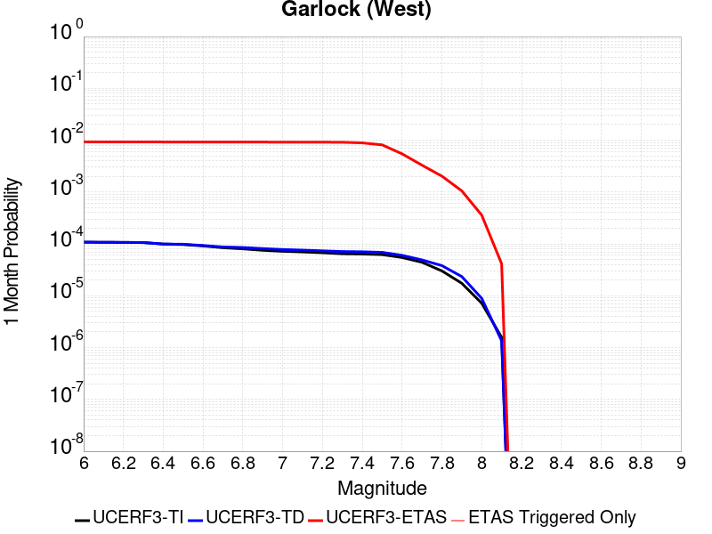 |  |  |

| Magnitude | 1 wk TI Prob | 1 wk TD Prob | 1 wk ETAS Prob | 1 wk ETAS/TD Gain | 1 wk ETAS Triggered Only | 1 mo TI Prob | 1 mo TD Prob | 1 mo ETAS Prob | 1 mo ETAS/TD Gain | 1 mo ETAS Triggered Only | 1 yr TI Prob | 1 yr TD Prob | 1 yr ETAS Prob | 1 yr ETAS/TD Gain | 1 yr ETAS Triggered Only | 10 yr TI Prob | 10 yr TD Prob | 10 yr ETAS Prob | 10 yr ETAS/TD Gain | 10 yr ETAS Triggered Only |
|-----|-----|-----|-----|-----|-----|-----|-----|-----|-----|-----|-----|-----|-----|-----|-----|-----|-----|-----|-----|-----|
| 6.0 | 2.5181727E-5 | 2.51973E-5 | 0.010161394 | 403.27313 | 0.0101364525 | 1.0791722E-4 | 1.0798398E-4 | 0.010633163 | 98.469826 | 0.010526316 | 0.0013131002 | 0.0013139155 | 0.016109265 | 12.260503 | 0.014814815 | 0.013053683 | 0.013141977 | 0.032378975 | 2.4637828 | 0.019493178 |
| 6.1 | 2.5077732E-5 | 2.5098372E-5 | 0.010161296 | 404.85876 | 0.0101364525 | 1.0747157E-4 | 1.0756004E-4 | 0.010632744 | 98.854034 | 0.010526316 | 0.001307681 | 0.0013087603 | 0.016104186 | 12.304917 | 0.014814815 | 0.013000126 | 0.013091032 | 0.032329023 | 2.469555 | 0.019493178 |
| 6.2 | 2.494612E-5 | 2.498005E-5 | 0.010161179 | 406.77176 | 0.0101364525 | 1.0690756E-4 | 1.0705298E-4 | 0.010632242 | 99.317566 | 0.010526316 | 0.0013008224 | 0.0013025942 | 0.016098112 | 12.3585005 | 0.014814815 | 0.012932341 | 0.013030097 | 0.032269277 | 2.4765186 | 0.019493178 |
| 6.3 | 2.4733758E-5 | 2.479942E-5 | 0.010161 | 409.72736 | 0.0101364525 | 1.0599751E-4 | 1.06278916E-4 | 0.010631476 | 100.03373 | 0.010526316 | 0.0012897556 | 0.0012931811 | 0.016088838 | 12.441287 | 0.014814815 | 0.012822957 | 0.012937066 | 0.03217806 | 2.4872763 | 0.019493178 |
| 6.4 | 2.3237335E-5 | 2.317873E-5 | 0.010159396 | 438.30682 | 0.0101364525 | 9.958477E-5 | 9.933365E-5 | 0.010624603 | 106.958755 | 0.010526316 | 0.0012117702 | 0.001208719 | 0.015616234 | 12.919657 | 0.014424951 | 0.012051838 | 0.012101916 | 0.030974044 | 2.559433 | 0.019103315 |
| 6.5 | 2.2732203E-5 | 2.2993298E-5 | 0.010159212 | 441.83365 | 0.0101364525 | 9.742009E-5 | 9.8539E-5 | 0.010623817 | 107.81333 | 0.010526316 | 0.0011854442 | 0.0011990548 | 0.01560671 | 13.015843 | 0.014424951 | 0.011791403 | 0.012006322 | 0.030880276 | 2.5720012 | 0.019103315 |
| 6.6 | 2.1319436E-5 | 2.17735E-5 | 0.010158005 | 466.53067 | 0.0101364525 | 9.136581E-5 | 9.331167E-5 | 0.010618646 | 113.79761 | 0.010526316 | 0.001111811 | 0.0011354799 | 0.015544052 | 13.689412 | 0.014424951 | 0.011062649 | 0.011377227 | 0.030263197 | 2.6599803 | 0.019103315 |
| 6.7 | 1.970802E-5 | 2.0393396E-5 | 0.010156639 | 498.03568 | 0.0101364525 | 8.446021E-5 | 8.739735E-5 | 0.010612793 | 121.43152 | 0.010526316 | 0.001027818 | 0.001063545 | 0.015473154 | 14.548659 | 0.014424951 | 0.010230771 | 0.010664964 | 0.029564543 | 2.7721183 | 0.019103315 |
| 6.8 | 1.8744462E-5 | 1.9901045E-5 | 0.010156152 | 510.33258 | 0.0101364525 | 8.033094E-5 | 8.5287415E-5 | 0.010610705 | 124.411156 | 0.010526316 | 9.775903E-4 | 0.0010378812 | 0.0154478615 | 14.884035 | 0.014424951 | 0.009733009 | 0.01041075 | 0.029315185 | 2.815857 | 0.019103315 |
| 6.9 | 1.7559682E-5 | 1.8953415E-5 | 0.010155214 | 535.79865 | 0.0101364525 | 7.5253614E-5 | 8.12264E-5 | 0.0106066875 | 130.58177 | 0.010526316 | 9.158276E-4 | 9.884841E-4 | 0.015399177 | 15.578577 | 0.014424951 | 0.0091206245 | 0.009921231 | 0.028835017 | 2.906395 | 0.019103315 |
| 7.0 | 1.6794445E-5 | 1.8216237E-5 | 0.010154484 | 557.44135 | 0.0101364525 | 7.197421E-5 | 7.8067256E-5 | 0.010603561 | 135.82597 | 0.010526316 | 8.759337E-4 | 9.5005584E-4 | 0.0153613025 | 16.168842 | 0.014424951 | 0.008724891 | 0.009540141 | 0.028461207 | 2.983311 | 0.019103315 |
| 7.1 | 1.6337795E-5 | 1.7717046E-5 | 0.010153989 | 573.1198 | 0.0101364525 | 7.0017246E-5 | 7.5927994E-5 | 0.010601444 | 139.62498 | 0.010526316 | 8.521265E-4 | 9.240326E-4 | 0.015335655 | 16.596443 | 0.014424951 | 0.008488664 | 0.009281996 | 0.028207993 | 3.0390007 | 0.019103315 |
| 7.2 | 1.5780008E-5 | 1.7165687E-5 | 0.010153444 | 591.4965 | 0.0101364525 | 6.762685E-5 | 7.356516E-5 | 0.010599107 | 144.0778 | 0.010526316 | 8.2304585E-4 | 8.9528906E-4 | 0.015307326 | 17.097635 | 0.014424951 | 0.008200042 | 0.008996838 | 0.027928282 | 3.104233 | 0.019103315 |
| 7.3 | 1.5058865E-5 | 1.6618762E-5 | 0.010152902 | 610.9301 | 0.0101364525 | 6.45364E-5 | 7.122133E-5 | 0.010596788 | 148.78671 | 0.010526316 | 7.854473E-4 | 8.667759E-4 | 0.015279224 | 17.627651 | 0.014424951 | 0.00782677 | 0.008713539 | 0.027650395 | 3.1732683 | 0.019103315 |
| 7.4 | 1.4887923E-5 | 1.6454731E-5 | 0.01015274 | 617.0104 | 0.0101364525 | 6.380382E-5 | 7.051838E-5 | 0.010596092 | 150.26 | 0.010526316 | 7.7653467E-4 | 8.582243E-4 | 0.015270796 | 17.793478 | 0.014424951 | 0.0077382675 | 0.008628399 | 0.027566882 | 3.1949012 | 0.019103315 |
| 7.5 | 1.4509299E-5 | 1.6046748E-5 | 0.009372622 | 584.08234 | 0.009356725 | 6.218123E-5 | 6.876997E-5 | 0.009814688 | 142.71765 | 0.009746589 | 7.567935E-4 | 8.36954E-4 | 0.01408122 | 16.824368 | 0.013255361 | 0.0075422134 | 0.008416704 | 0.026199484 | 3.112796 | 0.017933723 |
| 7.6 | 1.2756717E-5 | 1.4050848E-5 | 0.0058619217 | 417.19345 | 0.0058479533 | 5.4670498E-5 | 6.0216535E-5 | 0.0062976577 | 104.58353 | 0.006237817 | 6.6541E-4 | 7.328904E-4 | 0.00969318 | 13.225962 | 0.008966861 | 0.006634211 | 0.0073816874 | 0.019378245 | 2.625178 | 0.01208577 |
| 7.7 | 1.0328985E-5 | 1.1460557E-5 | 0.0011810377 | 103.05239 | 0.0011695906 | 4.4266326E-5 | 4.911575E-5 | 0.0016084934 | 32.749035 | 0.0015594542 | 5.388092E-4 | 5.978206E-4 | 0.004104495 | 6.8657637 | 0.003508772 | 0.0053750467 | 0.006038511 | 0.011076133 | 1.8342489 | 0.0050682263 |
| 7.8 | 7.0306583E-6 | 8.899601E-6 | 3.9875967E-4 | 44.806465 | 3.8986356E-4 | 3.0131043E-5 | 3.814059E-5 | 4.2798926E-4 | 11.221359 | 3.8986356E-4 | 3.667837E-4 | 4.642629E-4 | 0.002022993 | 4.35743 | 0.0015594542 | 0.003661789 | 0.0046952725 | 0.0066354377 | 1.4132167 | 0.0019493178 |
| 7.9 | 4.060633E-6 | 5.4653938E-6 | 5.4653938E-6 | 1.0 | 0.0 | 1.7402595E-5 | 2.3422906E-5 | 2.3422906E-5 | 1.0 | 0.0 | 2.11856E-4 | 2.851367E-4 | 0.0010646414 | 3.7337935 | 7.797271E-4 | 0.0021165414 | 0.002884201 | 0.0040504183 | 1.4043467 | 0.0011695906 |
| 8.0 | 1.6729537E-6 | 2.0775144E-6 | 2.0775144E-6 | 1.0 | 0.0 | 7.169782E-6 | 8.903603E-6 | 8.903603E-6 | 1.0 | 0.0 | 8.7288594E-5 | 1.0839601E-4 | 8.880386E-4 | 8.192539 | 7.797271E-4 | 8.7254314E-4 | 0.0010969337 | 0.0022652415 | 2.0650668 | 0.0011695906 |
| 8.1 | 3.6733252E-7 | 3.1489964E-7 | 3.1489964E-7 | 1.0 | 0.0 | 1.5742813E-6 | 1.3495693E-6 | 1.3495693E-6 | 1.0 | 0.0 | 1.9166706E-5 | 1.6430899E-5 | 1.6430899E-5 | 1.0 | 0.0 | 1.9165053E-4 | 1.6638759E-4 | 1.6638759E-4 | 1.0 | 0.0 |

## Ash Hill
*[(top)](#table-of-contents)*

| 1 Week | 1 Month | 1 Year | 10 Year |
|-----|-----|-----|-----|
|  | 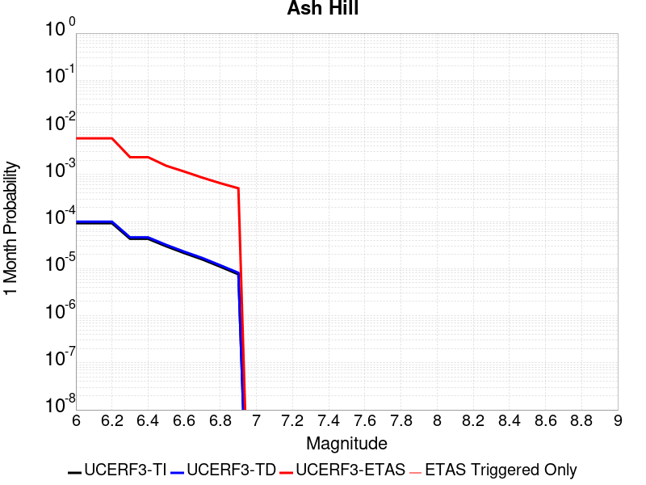 |  |  |

| Magnitude | 1 wk TI Prob | 1 wk TD Prob | 1 wk ETAS Prob | 1 wk ETAS/TD Gain | 1 wk ETAS Triggered Only | 1 mo TI Prob | 1 mo TD Prob | 1 mo ETAS Prob | 1 mo ETAS/TD Gain | 1 mo ETAS Triggered Only | 1 yr TI Prob | 1 yr TD Prob | 1 yr ETAS Prob | 1 yr ETAS/TD Gain | 1 yr ETAS Triggered Only | 10 yr TI Prob | 10 yr TD Prob | 10 yr ETAS Prob | 10 yr ETAS/TD Gain | 10 yr ETAS Triggered Only |
|-----|-----|-----|-----|-----|-----|-----|-----|-----|-----|-----|-----|-----|-----|-----|-----|-----|-----|-----|-----|-----|
| 6.0 | 2.1545662E-5 | 2.3194447E-5 | 0.005091303 | 219.50526 | 0.0050682263 | 9.2335285E-5 | 9.940143E-5 | 0.0059467736 | 59.82583 | 0.0058479533 | 0.0011236023 | 0.0012096206 | 0.012112595 | 10.01355 | 0.010916179 | 0.011179381 | 0.012038348 | 0.028600669 | 2.3757968 | 0.016764132 |
| 6.1 | 2.1545662E-5 | 2.3194447E-5 | 0.005091303 | 219.50526 | 0.0050682263 | 9.2335285E-5 | 9.940143E-5 | 0.0059467736 | 59.82583 | 0.0058479533 | 0.0011236023 | 0.0012096206 | 0.012112595 | 10.01355 | 0.010916179 | 0.011179381 | 0.012038348 | 0.028600669 | 2.3757968 | 0.016764132 |
| 6.2 | 2.1545662E-5 | 2.3194447E-5 | 0.005091303 | 219.50526 | 0.0050682263 | 9.2335285E-5 | 9.940143E-5 | 0.0059467736 | 59.82583 | 0.0058479533 | 0.0011236023 | 0.0012096206 | 0.012112595 | 10.01355 | 0.010916179 | 0.011179381 | 0.012038348 | 0.028600669 | 2.3757968 | 0.016764132 |
| 6.3 | 1.0025529E-5 | 1.0746934E-5 | 0.0015701844 | 146.10533 | 0.0015594542 | 4.2965847E-5 | 4.605755E-5 | 0.0019952855 | 43.32157 | 0.0019493178 | 5.229836E-4 | 5.6061964E-4 | 0.0048467144 | 8.645281 | 0.0042884992 | 0.005217545 | 0.0055933665 | 0.012183975 | 2.1782904 | 0.0066276803 |
| 6.4 | 1.0025529E-5 | 1.0746934E-5 | 0.0015701844 | 146.10533 | 0.0015594542 | 4.2965847E-5 | 4.605755E-5 | 0.0019952855 | 43.32157 | 0.0019493178 | 5.229836E-4 | 5.6061964E-4 | 0.0048467144 | 8.645281 | 0.0042884992 | 0.005217545 | 0.0055933665 | 0.012183975 | 2.1782904 | 0.0066276803 |
| 6.5 | 6.9617327E-6 | 7.456634E-6 | 0.0011770385 | 157.8512 | 0.0011695906 | 2.9835655E-5 | 3.195666E-5 | 0.00120151 | 37.598106 | 0.0011695906 | 3.6318856E-4 | 3.8901155E-4 | 0.002337571 | 6.0090013 | 0.0019493178 | 0.0036259557 | 0.0038841602 | 0.0077676526 | 1.9998281 | 0.0038986355 |
| 6.6 | 4.9919777E-6 | 5.3466883E-6 | 0.0011749311 | 219.74931 | 0.0011695906 | 2.1394015E-5 | 2.2914215E-5 | 0.0011924781 | 52.040974 | 0.0011695906 | 2.60441E-4 | 2.7895154E-4 | 0.0018379707 | 6.588853 | 0.0015594542 | 0.0026013597 | 0.0027866727 | 0.0055081127 | 1.9765912 | 0.0027290448 |
| 6.7 | 3.6630722E-6 | 3.924624E-6 | 7.8364863E-4 | 199.67485 | 7.797271E-4 | 1.5698786E-5 | 1.681974E-5 | 7.965337E-4 | 47.35708 | 7.797271E-4 | 1.9111596E-4 | 2.0476682E-4 | 9.843343E-4 | 4.8070984 | 7.797271E-4 | 0.0019095168 | 0.0020463446 | 0.0036026076 | 1.7605088 | 0.0015594542 |
| 6.8 | 2.5599613E-6 | 2.744925E-6 | 3.926074E-4 | 143.03027 | 3.8986356E-4 | 1.0971216E-5 | 1.1763939E-5 | 4.016229E-4 | 34.14017 | 3.8986356E-4 | 1.3356637E-4 | 1.4322149E-4 | 5.330292E-4 | 3.7217124 | 3.8986356E-4 | 0.0013348613 | 0.0014317769 | 0.002599693 | 1.8157109 | 0.0011695906 |
| 6.9 | 1.7684905E-6 | 1.8968707E-6 | 1.8968707E-6 | 1.0 | 0.0 | 7.579223E-6 | 8.129446E-6 | 8.129446E-6 | 1.0 | 0.0 | 9.2273134E-5 | 9.8976E-5 | 9.8976E-5 | 1.0 | 0.0 | 9.223483E-4 | 9.8976E-4 | 0.0017687154 | 1.7870144 | 7.797271E-4 |

## So Sierra Nevada
*[(top)](#table-of-contents)*

| 1 Week | 1 Month | 1 Year | 10 Year |
|-----|-----|-----|-----|
|  |  |  |  |

| Magnitude | 1 wk TI Prob | 1 wk TD Prob | 1 wk ETAS Prob | 1 wk ETAS/TD Gain | 1 wk ETAS Triggered Only | 1 mo TI Prob | 1 mo TD Prob | 1 mo ETAS Prob | 1 mo ETAS/TD Gain | 1 mo ETAS Triggered Only | 1 yr TI Prob | 1 yr TD Prob | 1 yr ETAS Prob | 1 yr ETAS/TD Gain | 1 yr ETAS Triggered Only | 10 yr TI Prob | 10 yr TD Prob | 10 yr ETAS Prob | 10 yr ETAS/TD Gain | 10 yr ETAS Triggered Only |
|-----|-----|-----|-----|-----|-----|-----|-----|-----|-----|-----|-----|-----|-----|-----|-----|-----|-----|-----|-----|-----|
| 6.0 | 1.15488665E-5 | 1.1079643E-5 | 0.0035198126 | 317.6829 | 0.003508772 | 4.9494203E-5 | 4.748339E-5 | 0.005505314 | 115.94189 | 0.0054580895 | 6.024253E-4 | 5.7796965E-4 | 0.009929287 | 17.179598 | 0.009356725 | 0.006007948 | 0.005765934 | 0.016231555 | 2.8150783 | 0.010526316 |
| 6.1 | 1.15488665E-5 | 1.1079643E-5 | 0.0035198126 | 317.6829 | 0.003508772 | 4.9494203E-5 | 4.748339E-5 | 0.005505314 | 115.94189 | 0.0054580895 | 6.024253E-4 | 5.7796965E-4 | 0.009929287 | 17.179598 | 0.009356725 | 0.006007948 | 0.005765934 | 0.016231555 | 2.8150783 | 0.010526316 |
| 6.2 | 1.15488665E-5 | 1.1079643E-5 | 0.0035198126 | 317.6829 | 0.003508772 | 4.9494203E-5 | 4.748339E-5 | 0.005505314 | 115.94189 | 0.0054580895 | 6.024253E-4 | 5.7796965E-4 | 0.009929287 | 17.179598 | 0.009356725 | 0.006007948 | 0.005765934 | 0.016231555 | 2.8150783 | 0.010526316 |
| 6.3 | 1.15488665E-5 | 1.1079643E-5 | 0.0035198126 | 317.6829 | 0.003508772 | 4.9494203E-5 | 4.748339E-5 | 0.005505314 | 115.94189 | 0.0054580895 | 6.024253E-4 | 5.7796965E-4 | 0.009929287 | 17.179598 | 0.009356725 | 0.006007948 | 0.005765934 | 0.016231555 | 2.8150783 | 0.010526316 |
| 6.4 | 1.15488665E-5 | 1.1079643E-5 | 0.0035198126 | 317.6829 | 0.003508772 | 4.9494203E-5 | 4.748339E-5 | 0.005505314 | 115.94189 | 0.0054580895 | 6.024253E-4 | 5.7796965E-4 | 0.009929287 | 17.179598 | 0.009356725 | 0.006007948 | 0.005765934 | 0.016231555 | 2.8150783 | 0.010526316 |
| 6.5 | 1.15488665E-5 | 1.1079643E-5 | 0.0035198126 | 317.6829 | 0.003508772 | 4.9494203E-5 | 4.748339E-5 | 0.005505314 | 115.94189 | 0.0054580895 | 6.024253E-4 | 5.7796965E-4 | 0.009929287 | 17.179598 | 0.009356725 | 0.006007948 | 0.005765934 | 0.016231555 | 2.8150783 | 0.010526316 |
| 6.6 | 7.587044E-6 | 6.935635E-6 | 0.0023461008 | 338.2676 | 0.0023391813 | 3.2515498E-5 | 2.9723828E-5 | 0.0039282436 | 132.15805 | 0.0038986355 | 3.9580427E-4 | 3.6183043E-4 | 0.0062076678 | 17.15629 | 0.0058479533 | 0.003951 | 0.0036127048 | 0.010216441 | 2.8279202 | 0.0066276803 |
| 6.7 | 7.587044E-6 | 6.935635E-6 | 0.0023461008 | 338.2676 | 0.0023391813 | 3.2515498E-5 | 2.9723828E-5 | 0.0039282436 | 132.15805 | 0.0038986355 | 3.9580427E-4 | 3.6183043E-4 | 0.0062076678 | 17.15629 | 0.0058479533 | 0.003951 | 0.0036127048 | 0.010216441 | 2.8279202 | 0.0066276803 |
| 6.8 | 5.9026956E-6 | 5.1793927E-6 | 0.0015646255 | 302.08667 | 0.0015594542 | 2.5297022E-5 | 2.2197215E-5 | 0.0031410363 | 141.50587 | 0.0031189085 | 3.0794772E-4 | 2.7021873E-4 | 0.0053370753 | 19.750944 | 0.0050682263 | 0.0030752132 | 0.002699018 | 0.008531188 | 3.1608486 | 0.0058479533 |
| 6.9 | 5.0118915E-6 | 4.2524252E-6 | 0.001173838 | 276.03967 | 0.0011695906 | 2.1479358E-5 | 1.8224557E-5 | 0.0027472198 | 150.74274 | 0.0027290448 | 2.614798E-4 | 2.2186211E-4 | 0.00450941 | 20.325281 | 0.0042884992 | 0.0026117235 | 0.0022164788 | 0.006884472 | 3.10604 | 0.0046783625 |
| 7.0 | 4.4924795E-6 | 3.7139177E-6 | 0.0011733002 | 315.91983 | 0.0011695906 | 1.925334E-5 | 1.5916696E-5 | 0.002744918 | 172.45526 | 0.0027290448 | 2.3438422E-4 | 1.9376918E-4 | 0.0040916493 | 21.116098 | 0.0038986355 | 0.0023413717 | 0.0019360651 | 0.0062162615 | 3.2107706 | 0.0042884992 |
| 7.1 | 3.9118436E-6 | 3.1119775E-6 | 0.001172699 | 376.834 | 0.0011695906 | 1.6764936E-5 | 1.3336982E-5 | 0.002352487 | 176.38826 | 0.0023391813 | 2.0409399E-4 | 1.6236622E-4 | 0.0032807682 | 20.205976 | 0.0031189085 | 0.0020390663 | 0.001622532 | 0.005125611 | 3.1590197 | 0.003508772 |
| 7.2 | 3.4200818E-6 | 2.6054543E-6 | 7.823305E-4 | 300.26645 | 7.797271E-4 | 1.4657411E-5 | 1.11661875E-5 | 0.0019604622 | 175.5713 | 0.0019493178 | 1.7843937E-4 | 1.3594035E-4 | 0.0024748037 | 18.205069 | 0.0023391813 | 0.0017829615 | 0.0013586218 | 0.004083959 | 3.0059571 | 0.0027290448 |
| 7.3 | 2.6593618E-6 | 1.8284203E-6 | 7.815541E-4 | 427.44772 | 7.797271E-4 | 1.13972155E-5 | 7.836065E-6 | 0.0011774176 | 150.25623 | 0.0011695906 | 1.3875226E-4 | 9.540021E-5 | 0.0016547056 | 17.344885 | 0.0015594542 | 0.0013866565 | 9.5362146E-4 | 0.0029010803 | 3.0421717 | 0.0019493178 |
| 7.4 | 2.2577992E-6 | 1.436438E-6 | 7.811624E-4 | 543.8191 | 7.797271E-4 | 9.676246E-6 | 6.15615E-6 | 0.0011757396 | 190.98619 | 0.0011695906 | 1.1780193E-4 | 7.49488E-5 | 0.0016342861 | 21.805367 | 0.0015594542 | 0.001177395 | 7.492603E-4 | 0.0026971174 | 3.599707 | 0.0019493178 |
| 7.5 | 1.489319E-6 | 7.353936E-7 | 3.9059867E-4 | 531.1423 | 3.8986356E-4 | 6.3827797E-6 | 3.1516831E-6 | 3.93014E-4 | 124.69972 | 3.8986356E-4 | 7.770758E-5 | 3.8371072E-5 | 8.180682E-4 | 21.319921 | 7.797271E-4 | 7.7680405E-4 | 3.836449E-4 | 0.0015527868 | 4.0474586 | 0.0011695906 |
| 7.6 | 1.0680322E-6 | 4.6596554E-7 | 4.6596554E-7 | 1.0 | 0.0 | 4.577273E-6 | 1.9969937E-6 | 1.9969937E-6 | 1.0 | 0.0 | 5.5726876E-5 | 2.4313129E-5 | 2.4313129E-5 | 1.0 | 0.0 | 5.5712904E-4 | 2.4310495E-4 | 6.3287374E-4 | 2.6032941 | 3.8986356E-4 |
| 7.7 | 5.509146E-7 | 1.5580486E-7 | 1.5580486E-7 | 1.0 | 0.0 | 2.3610605E-6 | 6.677349E-7 | 6.677349E-7 | 1.0 | 0.0 | 2.8745531E-5 | 8.129644E-6 | 8.129644E-6 | 1.0 | 0.0 | 2.8741814E-4 | 8.1293576E-5 | 4.7112544E-4 | 5.7953587 | 3.8986356E-4 |

## McLean Lake
*[(top)](#table-of-contents)*

| 1 Week | 1 Month | 1 Year | 10 Year |
|-----|-----|-----|-----|
|  |  |  |  |

| Magnitude | 1 wk TI Prob | 1 wk TD Prob | 1 wk ETAS Prob | 1 wk ETAS/TD Gain | 1 wk ETAS Triggered Only | 1 mo TI Prob | 1 mo TD Prob | 1 mo ETAS Prob | 1 mo ETAS/TD Gain | 1 mo ETAS Triggered Only | 1 yr TI Prob | 1 yr TD Prob | 1 yr ETAS Prob | 1 yr ETAS/TD Gain | 1 yr ETAS Triggered Only | 10 yr TI Prob | 10 yr TD Prob | 10 yr ETAS Prob | 10 yr ETAS/TD Gain | 10 yr ETAS Triggered Only |
|-----|-----|-----|-----|-----|-----|-----|-----|-----|-----|-----|-----|-----|-----|-----|-----|-----|-----|-----|-----|-----|
| 6.0 | 1.7360222E-5 | 1.8501627E-5 | 0.0023576396 | 127.42877 | 0.0023391813 | 7.439883E-5 | 7.9290556E-5 | 0.0024182864 | 30.499048 | 0.0023391813 | 9.0542925E-4 | 9.6498354E-4 | 0.0068072937 | 7.0543103 | 0.0058479533 | 0.009017491 | 0.0096127745 | 0.018107323 | 1.883673 | 0.0085769985 |
| 6.1 | 9.062689E-6 | 9.592193E-6 | 3.99452E-4 | 41.643448 | 3.8986356E-4 | 3.8839516E-5 | 4.1108804E-5 | 4.3095634E-4 | 10.48331 | 3.8986356E-4 | 4.727685E-4 | 5.003936E-4 | 0.0020590674 | 4.1148953 | 0.0015594542 | 0.0047176396 | 0.004993552 | 0.008096886 | 1.6214683 | 0.0031189085 |
| 6.2 | 9.062689E-6 | 9.592193E-6 | 3.99452E-4 | 41.643448 | 3.8986356E-4 | 3.8839516E-5 | 4.1108804E-5 | 4.3095634E-4 | 10.48331 | 3.8986356E-4 | 4.727685E-4 | 5.003936E-4 | 0.0020590674 | 4.1148953 | 0.0015594542 | 0.0047176396 | 0.004993552 | 0.008096886 | 1.6214683 | 0.0031189085 |
| 6.3 | 7.2575485E-6 | 7.66771E-6 | 3.9752826E-4 | 51.844463 | 3.8986356E-4 | 3.110341E-5 | 3.2861237E-5 | 4.2271198E-4 | 12.8635435 | 3.8986356E-4 | 3.786182E-4 | 4.0001926E-4 | 0.0019588496 | 4.8968883 | 0.0015594542 | 0.0037797375 | 0.0039936965 | 0.0067118425 | 1.680609 | 0.0027290448 |
| 6.4 | 7.2575485E-6 | 7.66771E-6 | 3.9752826E-4 | 51.844463 | 3.8986356E-4 | 3.110341E-5 | 3.2861237E-5 | 4.2271198E-4 | 12.8635435 | 3.8986356E-4 | 3.786182E-4 | 4.0001926E-4 | 0.0019588496 | 4.8968883 | 0.0015594542 | 0.0037797375 | 0.0039936965 | 0.0067118425 | 1.680609 | 0.0027290448 |
| 6.5 | 6.06582E-6 | 6.4038773E-6 | 3.9626492E-4 | 61.87891 | 3.8986356E-4 | 2.5996113E-5 | 2.7444936E-5 | 4.172978E-4 | 15.20491 | 3.8986356E-4 | 3.164567E-4 | 3.3409733E-4 | 0.0015032972 | 4.4995785 | 0.0011695906 | 0.0031600643 | 0.0033365893 | 0.0056679654 | 1.6987305 | 0.0023391813 |
| 6.6 | 5.598744E-6 | 5.910262E-6 | 3.957715E-4 | 66.96344 | 3.8986356E-4 | 2.3994397E-5 | 2.5329486E-5 | 4.1518317E-4 | 16.391298 | 3.8986356E-4 | 2.9209262E-4 | 3.0834923E-4 | 0.0014775792 | 4.7919016 | 0.0011695906 | 0.0029170897 | 0.003079843 | 0.005023157 | 1.6309783 | 0.0019493178 |
| 6.7 | 5.246996E-6 | 5.539162E-6 | 3.9540054E-4 | 71.38274 | 3.8986356E-4 | 2.2486933E-5 | 2.3739085E-5 | 4.1359337E-4 | 17.422464 | 3.8986356E-4 | 2.73744E-4 | 2.8899137E-4 | 0.001458244 | 5.0459776 | 0.0011695906 | 0.0027340704 | 0.0028867796 | 0.0048304703 | 1.6733075 | 0.0019493178 |
| 6.8 | 4.02324E-6 | 4.2469046E-6 | 3.941088E-4 | 92.79907 | 3.8986356E-4 | 1.7242342E-5 | 1.8200926E-5 | 4.0805739E-4 | 22.419596 | 3.8986356E-4 | 2.099053E-4 | 2.2157968E-4 | 0.0013909112 | 6.2772503 | 0.0011695906 | 0.0020970714 | 0.002214172 | 0.0037701733 | 1.7027464 | 0.0015594542 |
| 6.9 | 6.835972E-7 | 7.1399285E-7 | 7.1399285E-7 | 1.0 | 0.0 | 2.9296991E-6 | 3.0599674E-6 | 3.0599674E-6 | 1.0 | 0.0 | 3.56685E-5 | 3.7254784E-5 | 3.7254784E-5 | 1.0 | 0.0 | 3.5662777E-4 | 3.7251666E-4 | 7.6223497E-4 | 2.046177 | 3.8986356E-4 |

## Goldstone Lake
*[(top)](#table-of-contents)*

| 1 Week | 1 Month | 1 Year | 10 Year |
|-----|-----|-----|-----|
|  |  |  |  |

| Magnitude | 1 wk TI Prob | 1 wk TD Prob | 1 wk ETAS Prob | 1 wk ETAS/TD Gain | 1 wk ETAS Triggered Only | 1 mo TI Prob | 1 mo TD Prob | 1 mo ETAS Prob | 1 mo ETAS/TD Gain | 1 mo ETAS Triggered Only | 1 yr TI Prob | 1 yr TD Prob | 1 yr ETAS Prob | 1 yr ETAS/TD Gain | 1 yr ETAS Triggered Only | 10 yr TI Prob | 10 yr TD Prob | 10 yr ETAS Prob | 10 yr ETAS/TD Gain | 10 yr ETAS Triggered Only |
|-----|-----|-----|-----|-----|-----|-----|-----|-----|-----|-----|-----|-----|-----|-----|-----|-----|-----|-----|-----|-----|
| 6.0 | 2.671352E-5 | 3.037609E-5 | 0.0019796346 | 65.17082 | 0.0019493178 | 1.1448149E-4 | 1.3017785E-4 | 0.0028588674 | 21.961243 | 0.0027290448 | 0.001392921 | 0.0015839594 | 0.00742265 | 4.6861362 | 0.0058479533 | 0.013842222 | 0.015746197 | 0.022269515 | 1.4142791 | 0.0066276803 |
| 6.1 | 2.671352E-5 | 3.037609E-5 | 0.0019796346 | 65.17082 | 0.0019493178 | 1.1448149E-4 | 1.3017785E-4 | 0.0028588674 | 21.961243 | 0.0027290448 | 0.001392921 | 0.0015839594 | 0.00742265 | 4.6861362 | 0.0058479533 | 0.013842222 | 0.015746197 | 0.022269515 | 1.4142791 | 0.0066276803 |
| 6.2 | 1.4197047E-5 | 1.6096245E-5 | 0.001185668 | 73.66116 | 0.0011695906 | 6.0843064E-5 | 6.8982634E-5 | 0.0012384926 | 17.953686 | 0.0011695906 | 7.4051257E-4 | 8.3963864E-4 | 0.0031768559 | 3.783599 | 0.0023391813 | 0.007380498 | 0.0083743585 | 0.01108055 | 1.323152 | 0.0027290448 |
| 6.3 | 1.4197047E-5 | 1.6096245E-5 | 0.001185668 | 73.66116 | 0.0011695906 | 6.0843064E-5 | 6.8982634E-5 | 0.0012384926 | 17.953686 | 0.0011695906 | 7.4051257E-4 | 8.3963864E-4 | 0.0031768559 | 3.783599 | 0.0023391813 | 0.007380498 | 0.0083743585 | 0.01108055 | 1.323152 | 0.0027290448 |
| 6.4 | 1.3238931E-5 | 1.500846E-5 | 0.0011845815 | 78.92759 | 0.0011695906 | 5.6737044E-5 | 6.4320935E-5 | 0.0012338364 | 19.1825 | 0.0011695906 | 6.9055456E-4 | 7.82924E-4 | 0.0031202738 | 3.985411 | 0.0023391813 | 0.006884126 | 0.0078112837 | 0.010519011 | 1.3466431 | 0.0027290448 |
| 6.5 | 1.3238931E-5 | 1.500846E-5 | 0.0011845815 | 78.92759 | 0.0011695906 | 5.6737044E-5 | 6.4320935E-5 | 0.0012338364 | 19.1825 | 0.0011695906 | 6.9055456E-4 | 7.82924E-4 | 0.0031202738 | 3.985411 | 0.0023391813 | 0.006884126 | 0.0078112837 | 0.010519011 | 1.3466431 | 0.0027290448 |
| 6.6 | 1.1328278E-5 | 1.2855166E-5 | 0.0011824308 | 91.98099 | 0.0011695906 | 4.8548856E-5 | 5.5092944E-5 | 0.0012246191 | 22.228241 | 0.0011695906 | 5.90922E-4 | 6.7064585E-4 | 0.0030082583 | 4.485614 | 0.0023391813 | 0.0058935313 | 0.0066956086 | 0.00940638 | 1.4048582 | 0.0027290448 |
| 6.7 | 8.651175E-6 | 9.824565E-6 | 0.0011794037 | 120.04641 | 0.0011695906 | 3.707594E-5 | 4.2105108E-5 | 0.0012116465 | 28.77671 | 0.0011695906 | 4.5130608E-4 | 5.1259965E-4 | 0.002850582 | 5.56103 | 0.0023391813 | 0.0045039062 | 0.005123051 | 0.0074502486 | 1.4542601 | 0.0023391813 |
| 6.8 | 1.0215377E-6 | 1.1754702E-6 | 3.9103857E-4 | 332.66565 | 3.8986356E-4 | 4.378012E-6 | 5.0377203E-6 | 3.948993E-4 | 78.38849 | 3.8986356E-4 | 5.3300988E-5 | 6.1332634E-5 | 4.5117227E-4 | 7.3561535 | 3.8986356E-4 | 5.3288206E-4 | 6.1316835E-4 | 0.0010027929 | 1.6354283 | 3.8986356E-4 |
| 6.9 | 7.9360774E-7 | 9.2833966E-7 | 3.9079154E-4 | 420.9575 | 3.8986356E-4 | 3.4011714E-6 | 3.9785928E-6 | 3.938406E-4 | 98.98992 | 3.8986356E-4 | 4.1408475E-5 | 4.843836E-5 | 4.3828302E-4 | 9.048263 | 3.8986356E-4 | 4.140076E-4 | 4.8428503E-4 | 8.739598E-4 | 1.8046392 | 3.8986356E-4 |
| 7.0 | 7.4382757E-7 | 8.7473285E-7 | 8.7473285E-7 | 1.0 | 0.0 | 3.1878285E-6 | 3.74885E-6 | 3.74885E-6 | 1.0 | 0.0 | 3.8811122E-5 | 4.564136E-5 | 4.564136E-5 | 1.0 | 0.0 | 3.8804344E-4 | 4.5632652E-4 | 4.5632652E-4 | 1.0 | 0.0 |
| 7.1 | 6.4709513E-7 | 7.7113E-7 | 7.7113E-7 | 1.0 | 0.0 | 2.773262E-6 | 3.3048389E-6 | 3.3048389E-6 | 1.0 | 0.0 | 3.376394E-5 | 4.0235733E-5 | 4.0235733E-5 | 1.0 | 0.0 | 3.375881E-4 | 4.0229043E-4 | 4.0229043E-4 | 1.0 | 0.0 |
| 7.2 | 6.356704E-7 | 7.5883594E-7 | 7.5883594E-7 | 1.0 | 0.0 | 2.7242988E-6 | 3.2521505E-6 | 3.2521505E-6 | 1.0 | 0.0 | 3.3167835E-5 | 3.959427E-5 | 3.959427E-5 | 1.0 | 0.0 | 3.3162883E-4 | 3.958781E-4 | 3.958781E-4 | 1.0 | 0.0 |
| 7.3 | 5.7695723E-7 | 6.8965653E-7 | 6.8965653E-7 | 1.0 | 0.0 | 2.4726714E-6 | 2.9556677E-6 | 2.9556677E-6 | 1.0 | 0.0 | 3.0104358E-5 | 3.5984718E-5 | 3.5984718E-5 | 1.0 | 0.0 | 3.0100282E-4 | 3.5979465E-4 | 3.5979465E-4 | 1.0 | 0.0 |
| 7.4 | 5.209647E-7 | 6.193514E-7 | 6.193514E-7 | 1.0 | 0.0 | 2.232704E-6 | 2.6543607E-6 | 2.6543607E-6 | 1.0 | 0.0 | 2.718283E-5 | 3.2316417E-5 | 3.2316417E-5 | 1.0 | 0.0 | 2.7179506E-4 | 3.2312275E-4 | 3.2312275E-4 | 1.0 | 0.0 |
| 7.5 | 4.512955E-7 | 5.348885E-7 | 5.348885E-7 | 1.0 | 0.0 | 1.934122E-6 | 2.2923775E-6 | 2.2923775E-6 | 1.0 | 0.0 | 2.3547682E-5 | 2.7909393E-5 | 2.7909393E-5 | 1.0 | 0.0 | 2.3545188E-4 | 2.7906417E-4 | 2.7906417E-4 | 1.0 | 0.0 |
| 7.6 | 2.21172E-7 | 2.603961E-7 | 2.603961E-7 | 1.0 | 0.0 | 9.478797E-7 | 1.1159829E-6 | 1.1159829E-6 | 1.0 | 0.0 | 1.1540374E-5 | 1.3587036E-5 | 1.3587036E-5 | 1.0 | 0.0 | 1.1539775E-4 | 1.3586486E-4 | 1.3586486E-4 | 1.0 | 0.0 |

## Gravel Hills-Harper Lk
*[(top)](#table-of-contents)*

| 1 Week | 1 Month | 1 Year | 10 Year |
|-----|-----|-----|-----|
|  |  |  |  |

| Magnitude | 1 wk TI Prob | 1 wk TD Prob | 1 wk ETAS Prob | 1 wk ETAS/TD Gain | 1 wk ETAS Triggered Only | 1 mo TI Prob | 1 mo TD Prob | 1 mo ETAS Prob | 1 mo ETAS/TD Gain | 1 mo ETAS Triggered Only | 1 yr TI Prob | 1 yr TD Prob | 1 yr ETAS Prob | 1 yr ETAS/TD Gain | 1 yr ETAS Triggered Only | 10 yr TI Prob | 10 yr TD Prob | 10 yr ETAS Prob | 10 yr ETAS/TD Gain | 10 yr ETAS Triggered Only |
|-----|-----|-----|-----|-----|-----|-----|-----|-----|-----|-----|-----|-----|-----|-----|-----|-----|-----|-----|-----|-----|
| 6.0 | 3.0679566E-5 | 3.1464646E-5 | 0.0023705724 | 75.34082 | 0.0023391813 | 1.3147724E-4 | 1.3484273E-4 | 0.0024737087 | 18.345139 | 0.0023391813 | 0.0015995599 | 0.0016406906 | 0.0063113775 | 3.846781 | 0.0046783625 | 0.015880952 | 0.01630734 | 0.02282694 | 1.3997955 | 0.0066276803 |
| 6.1 | 3.0679566E-5 | 3.1464646E-5 | 0.0023705724 | 75.34082 | 0.0023391813 | 1.3147724E-4 | 1.3484273E-4 | 0.0024737087 | 18.345139 | 0.0023391813 | 0.0015995599 | 0.0016406906 | 0.0063113775 | 3.846781 | 0.0046783625 | 0.015880952 | 0.01630734 | 0.02282694 | 1.3997955 | 0.0066276803 |
| 6.2 | 1.514536E-5 | 1.3635206E-5 | 7.933517E-4 | 58.18406 | 7.797271E-4 | 6.490707E-5 | 5.843536E-5 | 8.381169E-4 | 14.342633 | 7.797271E-4 | 7.8995706E-4 | 7.1123015E-4 | 0.0022695751 | 3.191056 | 0.0015594542 | 0.007871548 | 0.0070907404 | 0.009026236 | 1.272961 | 0.0019493178 |
| 6.3 | 1.514536E-5 | 1.3635206E-5 | 7.933517E-4 | 58.18406 | 7.797271E-4 | 6.490707E-5 | 5.843536E-5 | 8.381169E-4 | 14.342633 | 7.797271E-4 | 7.8995706E-4 | 7.1123015E-4 | 0.0022695751 | 3.191056 | 0.0015594542 | 0.007871548 | 0.0070907404 | 0.009026236 | 1.272961 | 0.0019493178 |
| 6.4 | 1.2532521E-5 | 1.06896905E-5 | 4.0054906E-4 | 37.470596 | 3.8986356E-4 | 5.37097E-5 | 4.581219E-5 | 4.356579E-4 | 9.50965 | 3.8986356E-4 | 6.537194E-4 | 5.576265E-4 | 0.0013369188 | 2.3975167 | 7.797271E-4 | 0.0065179965 | 0.005562863 | 0.0067259474 | 1.2090802 | 0.0011695906 |
| 6.5 | 1.1094058E-5 | 9.083664E-6 | 9.083664E-6 | 1.0 | 0.0 | 4.7545094E-5 | 3.892943E-5 | 3.892943E-5 | 1.0 | 0.0 | 5.787078E-4 | 4.7386673E-4 | 4.7386673E-4 | 1.0 | 0.0 | 0.0057720304 | 0.0047289706 | 0.0051169903 | 1.0820516 | 3.8986356E-4 |
| 6.6 | 9.688328E-6 | 7.5316952E-6 | 7.5316952E-6 | 1.0 | 0.0 | 4.1520743E-5 | 3.227831E-5 | 3.227831E-5 | 1.0 | 0.0 | 5.053978E-4 | 3.9292008E-4 | 3.9292008E-4 | 1.0 | 0.0 | 0.0050424994 | 0.0039225104 | 0.004310845 | 1.0990015 | 3.8986356E-4 |
| 6.7 | 8.974824E-6 | 6.749413E-6 | 6.749413E-6 | 1.0 | 0.0 | 3.8462964E-5 | 2.8925748E-5 | 2.8925748E-5 | 1.0 | 0.0 | 4.6818596E-4 | 3.5211627E-4 | 3.5211627E-4 | 1.0 | 0.0 | 0.004672008 | 0.0035158044 | 0.0039042975 | 1.110499 | 3.8986356E-4 |
| 6.8 | 7.4780046E-6 | 5.1161933E-6 | 5.1161933E-6 | 1.0 | 0.0 | 3.20482E-5 | 2.1926366E-5 | 2.1926366E-5 | 1.0 | 0.0 | 3.9011694E-4 | 2.669222E-4 | 2.669222E-4 | 1.0 | 0.0 | 0.0038943281 | 0.0026661542 | 0.0030549783 | 1.1458371 | 3.8986356E-4 |
| 6.9 | 6.3409307E-6 | 3.9074966E-6 | 3.9074966E-6 | 1.0 | 0.0 | 2.7175134E-5 | 1.6746313E-5 | 1.6746313E-5 | 1.0 | 0.0 | 3.3080703E-4 | 2.0386827E-4 | 2.0386827E-4 | 1.0 | 0.0 | 0.0033031502 | 0.0020369107 | 0.00242598 | 1.1910095 | 3.8986356E-4 |
| 7.0 | 5.1239335E-6 | 2.6058565E-6 | 2.6058565E-6 | 1.0 | 0.0 | 2.195953E-5 | 1.116791E-5 | 1.116791E-5 | 1.0 | 0.0 | 2.6732447E-4 | 1.3596108E-4 | 1.3596108E-4 | 1.0 | 0.0 | 0.0026700313 | 0.0013588042 | 0.001748138 | 1.2865268 | 3.8986356E-4 |
| 7.1 | 4.438899E-6 | 2.0984728E-6 | 2.0984728E-6 | 1.0 | 0.0 | 1.9023713E-5 | 8.993425E-6 | 8.993425E-6 | 1.0 | 0.0 | 2.315891E-4 | 1.0948967E-4 | 1.0948967E-4 | 1.0 | 0.0 | 0.002313479 | 0.0010943791 | 0.0014838161 | 1.3558519 | 3.8986356E-4 |
| 7.2 | 3.50367E-6 | 1.2615716E-6 | 1.2615716E-6 | 1.0 | 0.0 | 1.5015643E-5 | 5.4067245E-6 | 5.4067245E-6 | 1.0 | 0.0 | 1.8280011E-4 | 6.582497E-5 | 6.582497E-5 | 1.0 | 0.0 | 0.0018264982 | 6.580629E-4 | 0.0010476699 | 1.5920513 | 3.8986356E-4 |
| 7.3 | 2.561638E-6 | 7.1191585E-7 | 7.1191585E-7 | 1.0 | 0.0 | 1.0978401E-5 | 3.0510646E-6 | 3.0510646E-6 | 1.0 | 0.0 | 1.3365384E-4 | 3.71461E-5 | 3.71461E-5 | 1.0 | 0.0 | 0.0013357349 | 3.7140088E-4 | 7.6111965E-4 | 2.049321 | 3.8986356E-4 |
| 7.4 | 2.0368864E-6 | 5.304837E-7 | 5.304837E-7 | 1.0 | 0.0 | 8.729483E-6 | 2.2734996E-6 | 2.2734996E-6 | 1.0 | 0.0 | 1.06276275E-4 | 2.7679513E-5 | 2.7679513E-5 | 1.0 | 0.0 | 0.0010622547 | 2.767612E-4 | 2.767612E-4 | 1.0 | 0.0 |
| 7.5 | 1.1681728E-6 | 3.6030585E-7 | 3.6030585E-7 | 1.0 | 0.0 | 5.0064455E-6 | 1.544167E-6 | 1.544167E-6 | 1.0 | 0.0 | 6.0951766E-5 | 1.8800076E-5 | 1.8800076E-5 | 1.0 | 0.0 | 6.093505E-4 | 1.8798532E-4 | 1.8798532E-4 | 1.0 | 0.0 |
| 7.6 | 1.3154387E-7 | 7.1197384E-8 | 7.1197384E-8 | 1.0 | 0.0 | 5.6375933E-7 | 3.051316E-7 | 3.051316E-7 | 1.0 | 0.0 | 6.863748E-6 | 3.7149728E-6 | 3.7149728E-6 | 1.0 | 0.0 | 6.863536E-5 | 3.7149264E-5 | 3.7149264E-5 | 1.0 | 0.0 |

## Death Valley (So)
*[(top)](#table-of-contents)*

| 1 Week | 1 Month | 1 Year | 10 Year |
|-----|-----|-----|-----|
| 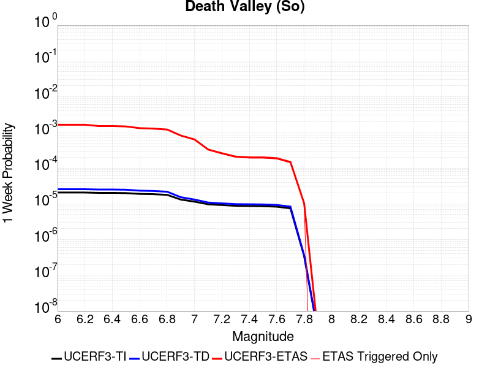 |  |  |  |

| Magnitude | 1 wk TI Prob | 1 wk TD Prob | 1 wk ETAS Prob | 1 wk ETAS/TD Gain | 1 wk ETAS Triggered Only | 1 mo TI Prob | 1 mo TD Prob | 1 mo ETAS Prob | 1 mo ETAS/TD Gain | 1 mo ETAS Triggered Only | 1 yr TI Prob | 1 yr TD Prob | 1 yr ETAS Prob | 1 yr ETAS/TD Gain | 1 yr ETAS Triggered Only | 10 yr TI Prob | 10 yr TD Prob | 10 yr ETAS Prob | 10 yr ETAS/TD Gain | 10 yr ETAS Triggered Only |
|-----|-----|-----|-----|-----|-----|-----|-----|-----|-----|-----|-----|-----|-----|-----|-----|-----|-----|-----|-----|-----|
| 6.0 | 2.0684236E-5 | 2.5617775E-5 | 0.0019748856 | 77.09044 | 0.0019493178 | 8.864371E-5 | 1.0978594E-4 | 0.0028385313 | 25.855143 | 0.0027290448 | 0.0010787029 | 0.0013358411 | 0.006007954 | 4.497506 | 0.0046783625 | 0.010734817 | 0.013281397 | 0.019436367 | 1.4634279 | 0.006237817 |
| 6.1 | 2.0684236E-5 | 2.5617775E-5 | 0.0019748856 | 77.09044 | 0.0019493178 | 8.864371E-5 | 1.0978594E-4 | 0.0028385313 | 25.855143 | 0.0027290448 | 0.0010787029 | 0.0013358411 | 0.006007954 | 4.497506 | 0.0046783625 | 0.010734817 | 0.013281397 | 0.019436367 | 1.4634279 | 0.006237817 |
| 6.2 | 2.0684236E-5 | 2.5617775E-5 | 0.0019748856 | 77.09044 | 0.0019493178 | 8.864371E-5 | 1.0978594E-4 | 0.0028385313 | 25.855143 | 0.0027290448 | 0.0010787029 | 0.0013358411 | 0.006007954 | 4.497506 | 0.0046783625 | 0.010734817 | 0.013281397 | 0.019436367 | 1.4634279 | 0.006237817 |
| 6.3 | 2.0240292E-5 | 2.511786E-5 | 0.0019743866 | 78.60489 | 0.0019493178 | 8.6741224E-5 | 1.07643624E-4 | 0.0028363946 | 26.349861 | 0.0027290448 | 0.0010555626 | 0.00130979 | 0.005982025 | 4.5671635 | 0.0046783625 | 0.010505628 | 0.013023956 | 0.019180533 | 1.4727117 | 0.006237817 |
| 6.4 | 2.0240292E-5 | 2.511786E-5 | 0.0019743866 | 78.60489 | 0.0019493178 | 8.6741224E-5 | 1.07643624E-4 | 0.0028363946 | 26.349861 | 0.0027290448 | 0.0010555626 | 0.00130979 | 0.005982025 | 4.5671635 | 0.0046783625 | 0.010505628 | 0.013023956 | 0.019180533 | 1.4727117 | 0.006237817 |
| 6.5 | 1.9962767E-5 | 2.4807114E-5 | 0.0019740765 | 79.577034 | 0.0019493178 | 8.55519E-5 | 1.0631196E-4 | 0.0028350668 | 26.667429 | 0.0027290448 | 0.0010410968 | 0.0012935963 | 0.005965907 | 4.611877 | 0.0046783625 | 0.010362327 | 0.012863902 | 0.019021478 | 1.4786707 | 0.006237817 |
| 6.6 | 1.8937297E-5 | 2.3310964E-5 | 0.0015827288 | 67.896324 | 0.0015594542 | 8.115732E-5 | 9.990039E-5 | 0.002438848 | 24.412798 | 0.0023391813 | 9.876423E-4 | 0.0012156231 | 0.0047201295 | 3.882889 | 0.003508772 | 0.009832645 | 0.012092789 | 0.017099725 | 1.4140432 | 0.0050682263 |
| 6.7 | 1.8621096E-5 | 2.2911607E-5 | 0.0015823301 | 69.06238 | 0.0015594542 | 7.980225E-5 | 9.818898E-5 | 0.0024371406 | 24.820917 | 0.0023391813 | 9.711593E-4 | 0.0011948098 | 0.0046993895 | 3.9331694 | 0.003508772 | 0.009669261 | 0.011886904 | 0.016894884 | 1.4213023 | 0.0050682263 |
| 6.8 | 1.7830353E-5 | 2.1805688E-5 | 0.0015812259 | 72.51437 | 0.0015594542 | 7.641356E-5 | 9.344968E-5 | 0.0024324125 | 26.029114 | 0.0023391813 | 9.29938E-4 | 0.00113717 | 0.004641952 | 4.0820208 | 0.003508772 | 0.009260561 | 0.011316354 | 0.016327227 | 1.4427992 | 0.0050682263 |
| 6.9 | 1.3135183E-5 | 1.5303925E-5 | 0.0011848767 | 77.42306 | 0.0011695906 | 5.6292425E-5 | 6.558664E-5 | 0.0020147765 | 30.719315 | 0.0019493178 | 6.8514474E-4 | 7.982312E-4 | 0.00391465 | 4.9041553 | 0.0031189085 | 0.006830362 | 0.007954649 | 0.0122090345 | 1.5348301 | 0.0042884992 |
| 7.0 | 1.1507512E-5 | 1.3154199E-5 | 7.9287105E-4 | 60.275127 | 7.797271E-4 | 4.9316975E-5 | 5.6373956E-5 | 0.0012258986 | 21.745834 | 0.0011695906 | 6.002687E-4 | 6.8614254E-4 | 0.0022445268 | 3.2712252 | 0.0015594542 | 0.0059864987 | 0.0068409415 | 0.009164121 | 1.3395994 | 0.0023391813 |
| 7.1 | 9.715903E-6 | 1.0865278E-5 | 7.905839E-4 | 72.76242 | 7.797271E-4 | 4.1638916E-5 | 4.656467E-5 | 8.262555E-4 | 17.744257 | 7.797271E-4 | 5.068359E-4 | 5.667817E-4 | 0.0017357094 | 3.062395 | 0.0011695906 | 0.0050568148 | 0.0056538144 | 0.006816793 | 1.2056979 | 0.0011695906 |
| 7.2 | 9.233269E-6 | 1.02863105E-5 | 7.900054E-4 | 76.80163 | 7.797271E-4 | 3.9570554E-5 | 4.4083466E-5 | 8.237762E-4 | 18.686739 | 7.797271E-4 | 4.81665E-4 | 5.3658825E-4 | 0.0017055513 | 3.1785104 | 0.0011695906 | 0.0048062233 | 0.0053533576 | 0.006516687 | 1.2173084 | 0.0011695906 |
| 7.3 | 8.8041315E-6 | 9.808164E-6 | 7.895276E-4 | 80.49699 | 7.797271E-4 | 3.7731446E-5 | 4.2034335E-5 | 8.2172867E-4 | 19.548986 | 7.797271E-4 | 4.592835E-4 | 5.1165203E-4 | 0.0016806442 | 3.2847407 | 0.0011695906 | 0.0045833546 | 0.005105167 | 0.0062687867 | 1.2279298 | 0.0011695906 |
| 7.4 | 8.708749E-6 | 9.707175E-6 | 7.894267E-4 | 81.32404 | 7.797271E-4 | 3.7322676E-5 | 4.160154E-5 | 8.212962E-4 | 19.741966 | 7.797271E-4 | 4.5430884E-4 | 5.0638523E-4 | 0.0016753837 | 3.308516 | 0.0011695906 | 0.004533812 | 0.0050527398 | 0.006216421 | 1.230307 | 0.0011695906 |
| 7.5 | 8.612678E-6 | 9.604817E-6 | 7.893244E-4 | 82.18005 | 7.797271E-4 | 3.6910955E-5 | 4.1162875E-5 | 8.208579E-4 | 19.941704 | 7.797271E-4 | 4.492982E-4 | 5.01047E-4 | 0.0016700516 | 3.3331237 | 0.0011695906 | 0.004483909 | 0.0049995985 | 0.006163342 | 1.2327673 | 0.0011695906 |
| 7.6 | 8.319024E-6 | 9.283916E-6 | 3.9914384E-4 | 42.993046 | 3.8986356E-4 | 3.5652476E-5 | 3.978763E-5 | 4.2963566E-4 | 10.798223 | 3.8986356E-4 | 4.3398244E-4 | 4.8431093E-4 | 0.0012636604 | 2.6091924 | 7.797271E-4 | 0.0043313587 | 0.0048329784 | 0.0056089372 | 1.160555 | 7.797271E-4 |
| 7.7 | 7.4718328E-6 | 8.34517E-6 | 3.9820548E-4 | 47.71688 | 3.8986356E-4 | 3.2021748E-5 | 3.5764548E-5 | 4.2561415E-4 | 11.900449 | 3.8986356E-4 | 3.8979502E-4 | 4.353504E-4 | 0.001214738 | 2.7902536 | 7.797271E-4 | 0.00389112 | 0.0043453807 | 0.0051217196 | 1.1786585 | 7.797271E-4 |
| 7.8 | 3.4586725E-7 | 3.6482615E-7 | 3.6482615E-7 | 1.0 | 0.0 | 1.4822873E-6 | 1.5635396E-6 | 1.5635396E-6 | 1.0 | 0.0 | 1.80467E-5 | 1.9035933E-5 | 1.9035933E-5 | 1.0 | 0.0 | 1.8045233E-4 | 1.9034347E-4 | 1.9034347E-4 | 1.0 | 0.0 |
| 7.9 | 2.5591178E-9 | 2.6696718E-9 | 2.6696718E-9 | 1.0 | 0.0 | 1.0967647E-8 | 1.14414505E-8 | 1.14414505E-8 | 1.0 | 0.0 | 1.335311E-7 | 1.3929966E-7 | 1.3929966E-7 | 1.0 | 0.0 | 1.3353102E-6 | 1.3929966E-6 | 1.3929966E-6 | 1.0 | 0.0 |

## San Andreas (Mojave N)
*[(top)](#table-of-contents)*

| 1 Week | 1 Month | 1 Year | 10 Year |
|-----|-----|-----|-----|
|  |  | 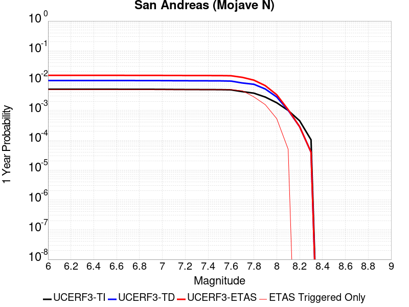 |  |

| Magnitude | 1 wk TI Prob | 1 wk TD Prob | 1 wk ETAS Prob | 1 wk ETAS/TD Gain | 1 wk ETAS Triggered Only | 1 mo TI Prob | 1 mo TD Prob | 1 mo ETAS Prob | 1 mo ETAS/TD Gain | 1 mo ETAS Triggered Only | 1 yr TI Prob | 1 yr TD Prob | 1 yr ETAS Prob | 1 yr ETAS/TD Gain | 1 yr ETAS Triggered Only | 10 yr TI Prob | 10 yr TD Prob | 10 yr ETAS Prob | 10 yr ETAS/TD Gain | 10 yr ETAS Triggered Only |
|-----|-----|-----|-----|-----|-----|-----|-----|-----|-----|-----|-----|-----|-----|-----|-----|-----|-----|-----|-----|-----|
| 6.0 | 9.877682E-5 | 1.9400702E-4 | 0.0025327345 | 13.05486 | 0.0023391813 | 4.2326056E-4 | 8.311939E-4 | 0.0035579703 | 4.280554 | 0.0027290448 | 0.0051410277 | 0.010072956 | 0.014704194 | 1.4597695 | 0.0046783625 | 0.05023708 | 0.09831428 | 0.103938825 | 1.0572098 | 0.006237817 |
| 6.1 | 9.877682E-5 | 1.9400702E-4 | 0.0025327345 | 13.05486 | 0.0023391813 | 4.2326056E-4 | 8.311939E-4 | 0.0035579703 | 4.280554 | 0.0027290448 | 0.0051410277 | 0.010072956 | 0.014704194 | 1.4597695 | 0.0046783625 | 0.05023708 | 0.09831428 | 0.103938825 | 1.0572098 | 0.006237817 |
| 6.2 | 9.877682E-5 | 1.9400702E-4 | 0.0025327345 | 13.05486 | 0.0023391813 | 4.2326056E-4 | 8.311939E-4 | 0.0035579703 | 4.280554 | 0.0027290448 | 0.0051410277 | 0.010072956 | 0.014704194 | 1.4597695 | 0.0046783625 | 0.05023708 | 0.09831428 | 0.103938825 | 1.0572098 | 0.006237817 |
| 6.3 | 9.877682E-5 | 1.9400702E-4 | 0.0025327345 | 13.05486 | 0.0023391813 | 4.2326056E-4 | 8.311939E-4 | 0.0035579703 | 4.280554 | 0.0027290448 | 0.0051410277 | 0.010072956 | 0.014704194 | 1.4597695 | 0.0046783625 | 0.05023708 | 0.09831428 | 0.103938825 | 1.0572098 | 0.006237817 |
| 6.4 | 9.877682E-5 | 1.9400702E-4 | 0.0025327345 | 13.05486 | 0.0023391813 | 4.2326056E-4 | 8.311939E-4 | 0.0035579703 | 4.280554 | 0.0027290448 | 0.0051410277 | 0.010072956 | 0.014704194 | 1.4597695 | 0.0046783625 | 0.05023708 | 0.09831428 | 0.103938825 | 1.0572098 | 0.006237817 |
| 6.5 | 9.861474E-5 | 1.9374468E-4 | 0.0025324728 | 13.071186 | 0.0023391813 | 4.2256617E-4 | 8.300703E-4 | 0.00355685 | 4.2849984 | 0.0027290448 | 0.0051326132 | 0.010059402 | 0.014690704 | 1.4603952 | 0.0046783625 | 0.050156746 | 0.098192066 | 0.10381738 | 1.0572889 | 0.006237817 |
| 6.6 | 9.861474E-5 | 1.9374468E-4 | 0.0025324728 | 13.071186 | 0.0023391813 | 4.2256617E-4 | 8.300703E-4 | 0.00355685 | 4.2849984 | 0.0027290448 | 0.0051326132 | 0.010059402 | 0.014690704 | 1.4603952 | 0.0046783625 | 0.050156746 | 0.098192066 | 0.10381738 | 1.0572889 | 0.006237817 |
| 6.7 | 9.8552715E-5 | 1.9364421E-4 | 0.0025323725 | 13.07745 | 0.0023391813 | 4.223004E-4 | 8.2964E-4 | 0.0035564208 | 4.2867036 | 0.0027290448 | 0.0051293927 | 0.010054212 | 0.014685538 | 1.4606353 | 0.0046783625 | 0.050125998 | 0.098145254 | 0.10377086 | 1.0573192 | 0.006237817 |
| 6.8 | 9.8464974E-5 | 1.9349584E-4 | 0.0025322244 | 13.086713 | 0.0023391813 | 4.219245E-4 | 8.290045E-4 | 0.003555787 | 4.289225 | 0.0027290448 | 0.0051248376 | 0.010046546 | 0.014677908 | 1.4609903 | 0.0046783625 | 0.05008251 | 0.09807528 | 0.10370132 | 1.0573645 | 0.006237817 |
| 6.9 | 9.825824E-5 | 1.9317595E-4 | 0.0025319054 | 13.106732 | 0.0023391813 | 4.2103877E-4 | 8.276344E-4 | 0.0035544205 | 4.294675 | 0.0027290448 | 0.0051141046 | 0.010030019 | 0.014661457 | 1.4617577 | 0.0046783625 | 0.049980022 | 0.09792438 | 0.103551365 | 1.0574626 | 0.006237817 |
| 7.0 | 9.781462E-5 | 1.924896E-4 | 0.0025312207 | 13.149908 | 0.0023391813 | 4.1913814E-4 | 8.246948E-4 | 0.003551489 | 4.3064284 | 0.0027290448 | 0.005091073 | 0.009994558 | 0.014626163 | 1.4634126 | 0.0046783625 | 0.04976007 | 0.09760077 | 0.103229776 | 1.0576737 | 0.006237817 |
| 7.1 | 9.7121134E-5 | 1.9150671E-4 | 0.00253024 | 13.212278 | 0.0023391813 | 4.1616702E-4 | 8.204851E-4 | 0.0035472908 | 4.3234067 | 0.0027290448 | 0.005055068 | 0.009943774 | 0.014575616 | 1.4658033 | 0.0046783625 | 0.04941613 | 0.09713728 | 0.10276917 | 1.0579786 | 0.006237817 |
| 7.2 | 9.663819E-5 | 1.9081456E-4 | 0.0025295494 | 13.256585 | 0.0023391813 | 4.1409794E-4 | 8.175206E-4 | 0.0035443343 | 4.335468 | 0.0027290448 | 0.0050299936 | 0.00990801 | 0.014540019 | 1.4675014 | 0.0046783625 | 0.049176537 | 0.09681055 | 0.10244448 | 1.0581955 | 0.006237817 |
| 7.3 | 9.6277574E-5 | 1.9033969E-4 | 0.0025290758 | 13.287169 | 0.0023391813 | 4.125529E-4 | 8.154867E-4 | 0.0035423061 | 4.343794 | 0.0027290448 | 0.0050112694 | 0.009883473 | 0.014515597 | 1.4686737 | 0.0046783625 | 0.04899759 | 0.09658401 | 0.10221935 | 1.0583465 | 0.006237817 |
| 7.4 | 9.593308E-5 | 1.897375E-4 | 0.002528475 | 13.326174 | 0.0023391813 | 4.1107697E-4 | 8.129075E-4 | 0.0035397338 | 4.3544116 | 0.0027290448 | 0.0049933824 | 0.009852355 | 0.014484625 | 1.4701687 | 0.0046783625 | 0.04882661 | 0.09630218 | 0.10193928 | 1.0585356 | 0.006237817 |
| 7.5 | 9.561707E-5 | 1.8919831E-4 | 0.002527937 | 13.361308 | 0.0023391813 | 4.0972308E-4 | 8.1059814E-4 | 0.003537431 | 4.363976 | 0.0027290448 | 0.0049769743 | 0.009824493 | 0.014456892 | 1.4715154 | 0.0046783625 | 0.048669744 | 0.09604836 | 0.10168705 | 1.0587068 | 0.006237817 |
| 7.6 | 9.418194E-5 | 1.8572104E-4 | 0.002524468 | 13.592793 | 0.0023391813 | 4.0357444E-4 | 7.957047E-4 | 0.003522578 | 4.4269915 | 0.0027290448 | 0.004902454 | 0.009644784 | 0.014278025 | 1.4803883 | 0.0046783625 | 0.047957025 | 0.094430685 | 0.10007946 | 1.0598192 | 0.006237817 |
| 7.7 | 8.202141E-5 | 1.6021315E-4 | 0.0013296164 | 8.2990465 | 0.0011695906 | 3.51473E-4 | 6.8644714E-4 | 0.0022448308 | 3.2702165 | 0.0015594542 | 0.00427079 | 0.008325525 | 0.0118050845 | 1.4179388 | 0.003508772 | 0.04189639 | 0.08223219 | 0.08688365 | 1.0565649 | 0.0050682263 |
| 7.8 | 7.2859846E-5 | 1.4516473E-4 | 5.3497165E-4 | 3.6852734 | 3.8986356E-4 | 3.1221908E-4 | 6.219862E-4 | 0.0010116072 | 1.6264143 | 3.8986356E-4 | 0.003794643 | 0.0075464295 | 0.009094115 | 1.2050885 | 0.0015594542 | 0.037304975 | 0.07472468 | 0.07652834 | 1.0241374 | 0.0019493178 |
| 7.9 | 5.3874453E-5 | 1.0045676E-4 | 1.0045676E-4 | 1.0 | 0.0 | 2.3087008E-4 | 4.3045796E-4 | 4.3045796E-4 | 1.0 | 0.0 | 0.0028072202 | 0.0052282433 | 0.0060038934 | 1.1483577 | 7.797271E-4 | 0.02772022 | 0.05242443 | 0.053532705 | 1.0211405 | 0.0011695906 |
| 8.0 | 3.468538E-5 | 5.4260272E-5 | 5.4260272E-5 | 1.0 | 0.0 | 1.4864317E-4 | 2.325233E-4 | 2.325233E-4 | 1.0 | 0.0 | 0.0018082283 | 0.002827298 | 0.0036048205 | 1.2750056 | 7.797271E-4 | 0.017935853 | 0.028947512 | 0.030083245 | 1.0392343 | 0.0011695906 |
| 8.1 | 1.9152367E-5 | 1.940263E-5 | 1.940263E-5 | 1.0 | 0.0 | 8.207899E-5 | 8.3151484E-5 | 8.3151484E-5 | 1.0 | 0.0 | 9.988535E-4 | 0.0010118998 | 0.0010118998 | 1.0 | 0.0 | 0.009943757 | 0.01085625 | 0.01085625 | 1.0 | 0.0 |
| 8.2 | 8.643924E-6 | 5.4748625E-6 | 5.4748625E-6 | 1.0 | 0.0 | 3.704486E-5 | 2.3463486E-5 | 2.3463486E-5 | 1.0 | 0.0 | 4.5092785E-4 | 2.8563058E-4 | 2.8563058E-4 | 1.0 | 0.0 | 0.0045001395 | 0.0032487072 | 0.0032487072 | 1.0 | 0.0 |
| 8.3 | 1.983087E-6 | 7.6599065E-7 | 7.6599065E-7 | 1.0 | 0.0 | 8.498917E-6 | 3.282813E-6 | 3.282813E-6 | 1.0 | 0.0 | 1.034694E-4 | 3.9967534E-5 | 3.9967534E-5 | 1.0 | 0.0 | 0.0010342124 | 4.719687E-4 | 4.719687E-4 | 1.0 | 0.0 |

## Towne Pass
*[(top)](#table-of-contents)*

| 1 Week | 1 Month | 1 Year | 10 Year |
|-----|-----|-----|-----|
|  |  |  |  |

| Magnitude | 1 wk TI Prob | 1 wk TD Prob | 1 wk ETAS Prob | 1 wk ETAS/TD Gain | 1 wk ETAS Triggered Only | 1 mo TI Prob | 1 mo TD Prob | 1 mo ETAS Prob | 1 mo ETAS/TD Gain | 1 mo ETAS Triggered Only | 1 yr TI Prob | 1 yr TD Prob | 1 yr ETAS Prob | 1 yr ETAS/TD Gain | 1 yr ETAS Triggered Only | 10 yr TI Prob | 10 yr TD Prob | 10 yr ETAS Prob | 10 yr ETAS/TD Gain | 10 yr ETAS Triggered Only |
|-----|-----|-----|-----|-----|-----|-----|-----|-----|-----|-----|-----|-----|-----|-----|-----|-----|-----|-----|-----|-----|
| 6.0 | 3.849728E-6 | 3.8945414E-6 | 3.9375658E-4 | 101.10474 | 3.8986356E-4 | 1.649873E-5 | 1.669081E-5 | 0.001576119 | 94.43035 | 0.0015594542 | 2.0085352E-4 | 2.0319603E-4 | 0.004880608 | 24.019209 | 0.0046783625 | 0.0020067208 | 0.0020305314 | 0.00786661 | 3.8741632 | 0.0058479533 |
| 6.1 | 3.849728E-6 | 3.8945414E-6 | 3.9375658E-4 | 101.10474 | 3.8986356E-4 | 1.649873E-5 | 1.669081E-5 | 0.001576119 | 94.43035 | 0.0015594542 | 2.0085352E-4 | 2.0319603E-4 | 0.004880608 | 24.019209 | 0.0046783625 | 0.0020067208 | 0.0020305314 | 0.00786661 | 3.8741632 | 0.0058479533 |
| 6.2 | 3.849728E-6 | 3.8945414E-6 | 3.9375658E-4 | 101.10474 | 3.8986356E-4 | 1.649873E-5 | 1.669081E-5 | 0.001576119 | 94.43035 | 0.0015594542 | 2.0085352E-4 | 2.0319603E-4 | 0.004880608 | 24.019209 | 0.0046783625 | 0.0020067208 | 0.0020305314 | 0.00786661 | 3.8741632 | 0.0058479533 |
| 6.3 | 3.849728E-6 | 3.8945414E-6 | 3.9375658E-4 | 101.10474 | 3.8986356E-4 | 1.649873E-5 | 1.669081E-5 | 0.001576119 | 94.43035 | 0.0015594542 | 2.0085352E-4 | 2.0319603E-4 | 0.004880608 | 24.019209 | 0.0046783625 | 0.0020067208 | 0.0020305314 | 0.00786661 | 3.8741632 | 0.0058479533 |
| 6.4 | 3.849728E-6 | 3.8945414E-6 | 3.9375658E-4 | 101.10474 | 3.8986356E-4 | 1.649873E-5 | 1.669081E-5 | 0.001576119 | 94.43035 | 0.0015594542 | 2.0085352E-4 | 2.0319603E-4 | 0.004880608 | 24.019209 | 0.0046783625 | 0.0020067208 | 0.0020305314 | 0.00786661 | 3.8741632 | 0.0058479533 |
| 6.5 | 1.1953545E-6 | 1.203052E-6 | 1.203052E-6 | 1.0 | 0.0 | 5.1229376E-6 | 5.1559277E-6 | 3.9501747E-4 | 76.614235 | 3.8986356E-4 | 6.236998E-5 | 6.277173E-5 | 8.424499E-4 | 13.420848 | 7.797271E-4 | 6.235248E-4 | 6.275517E-4 | 0.0014067895 | 2.241711 | 7.797271E-4 |
| 6.6 | 1.1953545E-6 | 1.203052E-6 | 1.203052E-6 | 1.0 | 0.0 | 5.1229376E-6 | 5.1559277E-6 | 3.9501747E-4 | 76.614235 | 3.8986356E-4 | 6.236998E-5 | 6.277173E-5 | 8.424499E-4 | 13.420848 | 7.797271E-4 | 6.235248E-4 | 6.275517E-4 | 0.0014067895 | 2.241711 | 7.797271E-4 |
| 6.7 | 8.375951E-7 | 8.4106705E-7 | 8.4106705E-7 | 1.0 | 0.0 | 3.5896885E-6 | 3.6045683E-6 | 3.934667E-4 | 109.15779 | 3.8986356E-4 | 4.370358E-5 | 4.3884793E-5 | 4.3373124E-4 | 9.883406 | 3.8986356E-4 | 4.3694986E-4 | 4.38767E-4 | 8.284595E-4 | 1.8881536 | 3.8986356E-4 |
| 6.8 | 6.38041E-7 | 6.392156E-7 | 6.392156E-7 | 1.0 | 0.0 | 2.7344586E-6 | 2.7394929E-6 | 3.9260197E-4 | 143.3119 | 3.8986356E-4 | 3.3291526E-5 | 3.3352855E-5 | 4.232034E-4 | 12.688671 | 3.8986356E-4 | 3.3286537E-4 | 3.334823E-4 | 7.232158E-4 | 2.1686783 | 3.8986356E-4 |
| 6.9 | 5.3460053E-7 | 5.345333E-7 | 5.345333E-7 | 1.0 | 0.0 | 2.2911431E-6 | 2.2908553E-6 | 3.921535E-4 | 171.18214 | 3.8986356E-4 | 2.789431E-5 | 2.789084E-5 | 4.1774352E-4 | 14.977804 | 3.8986356E-4 | 2.789081E-4 | 2.7887672E-4 | 6.686315E-4 | 2.3975883 | 3.8986356E-4 |
| 7.0 | 3.557783E-7 | 3.5324226E-7 | 3.5324226E-7 | 1.0 | 0.0 | 1.5247632E-6 | 1.5138945E-6 | 1.5138945E-6 | 1.0 | 0.0 | 1.8563835E-5 | 1.843152E-5 | 1.843152E-5 | 1.0 | 0.0 | 1.8562283E-4 | 1.8430075E-4 | 1.8430075E-4 | 1.0 | 0.0 |
| 7.1 | 3.037942E-7 | 3.0002218E-7 | 3.0002218E-7 | 1.0 | 0.0 | 1.3019744E-6 | 1.2858087E-6 | 1.2858087E-6 | 1.0 | 0.0 | 1.5851423E-5 | 1.5654618E-5 | 1.5654618E-5 | 1.0 | 0.0 | 1.5850292E-4 | 1.5653588E-4 | 1.5653588E-4 | 1.0 | 0.0 |
| 7.2 | 2.0808248E-7 | 2.0217689E-7 | 2.0217689E-7 | 1.0 | 0.0 | 8.917818E-7 | 8.6647213E-7 | 8.6647213E-7 | 1.0 | 0.0 | 1.0857389E-5 | 1.0549252E-5 | 1.0549252E-5 | 1.0 | 0.0 | 1.0856859E-4 | 1.0548797E-4 | 1.0548797E-4 | 1.0 | 0.0 |
| 7.3 | 1.1162073E-7 | 1.0636894E-7 | 1.0636894E-7 | 1.0 | 0.0 | 4.7837443E-7 | 4.558668E-7 | 4.558668E-7 | 1.0 | 0.0 | 5.8241935E-6 | 5.550166E-6 | 5.550166E-6 | 1.0 | 0.0 | 5.8240406E-5 | 5.5500474E-5 | 5.5500474E-5 | 1.0 | 0.0 |

## Coyote Canyon
*[(top)](#table-of-contents)*

| 1 Week | 1 Month | 1 Year | 10 Year |
|-----|-----|-----|-----|
|  |  |  |  |

| Magnitude | 1 wk TI Prob | 1 wk TD Prob | 1 wk ETAS Prob | 1 wk ETAS/TD Gain | 1 wk ETAS Triggered Only | 1 mo TI Prob | 1 mo TD Prob | 1 mo ETAS Prob | 1 mo ETAS/TD Gain | 1 mo ETAS Triggered Only | 1 yr TI Prob | 1 yr TD Prob | 1 yr ETAS Prob | 1 yr ETAS/TD Gain | 1 yr ETAS Triggered Only | 10 yr TI Prob | 10 yr TD Prob | 10 yr ETAS Prob | 10 yr ETAS/TD Gain | 10 yr ETAS Triggered Only |
|-----|-----|-----|-----|-----|-----|-----|-----|-----|-----|-----|-----|-----|-----|-----|-----|-----|-----|-----|-----|-----|
| 6.0 | 3.5090034E-5 | 4.0364324E-5 | 0.0015997556 | 39.632908 | 0.0015594542 | 1.503772E-4 | 1.7297994E-4 | 0.0021219605 | 12.26709 | 0.0019493178 | 0.0018293047 | 0.0021042528 | 0.004827555 | 2.2941897 | 0.0027290448 | 0.018143194 | 0.020869201 | 0.025831658 | 1.2377886 | 0.0050682263 |
| 6.1 | 3.5090034E-5 | 4.0364324E-5 | 0.0015997556 | 39.632908 | 0.0015594542 | 1.503772E-4 | 1.7297994E-4 | 0.0021219605 | 12.26709 | 0.0019493178 | 0.0018293047 | 0.0021042528 | 0.004827555 | 2.2941897 | 0.0027290448 | 0.018143194 | 0.020869201 | 0.025831658 | 1.2377886 | 0.0050682263 |
| 6.2 | 1.841879E-5 | 2.1059794E-5 | 8.007705E-4 | 38.023663 | 7.797271E-4 | 7.8935285E-5 | 9.0253714E-5 | 0.0012597388 | 13.95775 | 0.0011695906 | 9.606133E-4 | 0.001098387 | 0.0030455636 | 2.7727602 | 0.0019493178 | 0.0095647145 | 0.010939667 | 0.014410054 | 1.3172296 | 0.003508772 |
| 6.3 | 1.841879E-5 | 2.1059794E-5 | 8.007705E-4 | 38.023663 | 7.797271E-4 | 7.8935285E-5 | 9.0253714E-5 | 0.0012597388 | 13.95775 | 0.0011695906 | 9.606133E-4 | 0.001098387 | 0.0030455636 | 2.7727602 | 0.0019493178 | 0.0095647145 | 0.010939667 | 0.014410054 | 1.3172296 | 0.003508772 |
| 6.4 | 1.712201E-5 | 1.9565212E-5 | 7.9927704E-4 | 40.85195 | 7.797271E-4 | 7.337798E-5 | 8.3848776E-5 | 0.0012533413 | 14.947639 | 0.0011695906 | 8.930107E-4 | 0.0010204813 | 0.0029678098 | 2.908245 | 0.0019493178 | 0.008894307 | 0.010167871 | 0.013640965 | 1.3415755 | 0.003508772 |
| 6.5 | 1.4744935E-5 | 1.6836972E-5 | 7.9655094E-4 | 47.30963 | 7.797271E-4 | 6.3191044E-5 | 7.215698E-5 | 0.0012416632 | 17.207804 | 0.0011695906 | 7.6907943E-4 | 8.7825063E-4 | 0.0028258564 | 3.2175968 | 0.0019493178 | 0.007664232 | 0.008756994 | 0.01223504 | 1.3971734 | 0.003508772 |
| 6.6 | 1.2017839E-5 | 1.37240895E-5 | 7.934405E-4 | 57.81371 | 7.797271E-4 | 5.150401E-5 | 5.88167E-5 | 0.0012283386 | 20.88418 | 0.0011695906 | 6.268809E-4 | 7.159466E-4 | 0.0022742844 | 3.1766117 | 0.0015594542 | 0.0062511545 | 0.0071450938 | 0.010241717 | 1.4333916 | 0.0031189085 |
| 6.7 | 1.00956095E-5 | 1.1533517E-5 | 4.0139258E-4 | 34.802273 | 3.8986356E-4 | 4.326618E-5 | 4.942891E-5 | 4.392732E-4 | 8.886969 | 3.8986356E-4 | 5.266384E-4 | 6.017178E-4 | 0.0013809757 | 2.2950554 | 7.797271E-4 | 0.005253921 | 0.0060094125 | 0.007947016 | 1.3224281 | 0.0019493178 |

## San Andreas (Mojave S)
*[(top)](#table-of-contents)*

| 1 Week | 1 Month | 1 Year | 10 Year |
|-----|-----|-----|-----|
|  |  |  |  |

| Magnitude | 1 wk TI Prob | 1 wk TD Prob | 1 wk ETAS Prob | 1 wk ETAS/TD Gain | 1 wk ETAS Triggered Only | 1 mo TI Prob | 1 mo TD Prob | 1 mo ETAS Prob | 1 mo ETAS/TD Gain | 1 mo ETAS Triggered Only | 1 yr TI Prob | 1 yr TD Prob | 1 yr ETAS Prob | 1 yr ETAS/TD Gain | 1 yr ETAS Triggered Only | 10 yr TI Prob | 10 yr TD Prob | 10 yr ETAS Prob | 10 yr ETAS/TD Gain | 10 yr ETAS Triggered Only |
|-----|-----|-----|-----|-----|-----|-----|-----|-----|-----|-----|-----|-----|-----|-----|-----|-----|-----|-----|-----|-----|
| 6.0 | 3.1064058E-4 | 6.7460834E-4 | 0.0014538094 | 2.1550422 | 7.797271E-4 | 0.0013306376 | 0.0028881032 | 0.004054316 | 1.4037988 | 0.0011695906 | 0.016080605 | 0.03462235 | 0.037633274 | 1.0869647 | 0.0031189085 | 0.1496549 | 0.28660452 | 0.2896639 | 1.0106746 | 0.0042884992 |
| 6.1 | 3.1064058E-4 | 6.7460834E-4 | 0.0014538094 | 2.1550422 | 7.797271E-4 | 0.0013306376 | 0.0028881032 | 0.004054316 | 1.4037988 | 0.0011695906 | 0.016080605 | 0.03462235 | 0.037633274 | 1.0869647 | 0.0031189085 | 0.1496549 | 0.28660452 | 0.2896639 | 1.0106746 | 0.0042884992 |
| 6.2 | 3.1064058E-4 | 6.7460834E-4 | 0.0014538094 | 2.1550422 | 7.797271E-4 | 0.0013306376 | 0.0028881032 | 0.004054316 | 1.4037988 | 0.0011695906 | 0.016080605 | 0.03462235 | 0.037633274 | 1.0869647 | 0.0031189085 | 0.1496549 | 0.28660452 | 0.2896639 | 1.0106746 | 0.0042884992 |
| 6.3 | 3.1064058E-4 | 6.7460834E-4 | 0.0014538094 | 2.1550422 | 7.797271E-4 | 0.0013306376 | 0.0028881032 | 0.004054316 | 1.4037988 | 0.0011695906 | 0.016080605 | 0.03462235 | 0.037633274 | 1.0869647 | 0.0031189085 | 0.1496549 | 0.28660452 | 0.2896639 | 1.0106746 | 0.0042884992 |
| 6.4 | 1.9872203E-4 | 4.3179357E-4 | 0.001211184 | 2.805007 | 7.797271E-4 | 8.5138786E-4 | 0.0018492596 | 0.0030166875 | 1.6312947 | 0.0011695906 | 0.010316478 | 0.02228844 | 0.025337832 | 1.136815 | 0.0031189085 | 0.098504856 | 0.19699748 | 0.20044115 | 1.0174809 | 0.0042884992 |
| 6.5 | 1.291105E-4 | 2.875267E-4 | 0.0010670295 | 3.7110627 | 7.797271E-4 | 5.5321335E-4 | 0.0012316781 | 0.0023998283 | 1.9484216 | 0.0011695906 | 0.006714592 | 0.0148934 | 0.017965857 | 1.2062966 | 0.0031189085 | 0.065152965 | 0.13803436 | 0.14139485 | 1.0243453 | 0.0038986355 |
| 6.6 | 1.291105E-4 | 2.875267E-4 | 0.0010670295 | 3.7110627 | 7.797271E-4 | 5.5321335E-4 | 0.0012316781 | 0.0023998283 | 1.9484216 | 0.0011695906 | 0.006714592 | 0.0148934 | 0.017965857 | 1.2062966 | 0.0031189085 | 0.065152965 | 0.13803436 | 0.14139485 | 1.0243453 | 0.0038986355 |
| 6.7 | 1.08001186E-4 | 2.4333889E-4 | 0.0010228762 | 4.203505 | 7.797271E-4 | 4.6278012E-4 | 0.0010424647 | 0.0022108362 | 2.1207778 | 0.0011695906 | 0.0056198016 | 0.012618446 | 0.015697999 | 1.2440517 | 0.0031189085 | 0.054797906 | 0.119176775 | 0.122610785 | 1.0288144 | 0.0038986355 |
| 6.8 | 1.0624356E-4 | 2.3851555E-4 | 0.0010180566 | 4.268303 | 7.797271E-4 | 4.5525006E-4 | 0.0010218095 | 0.002190205 | 2.1434572 | 0.0011695906 | 0.0055285925 | 0.012369843 | 0.015450171 | 1.2490191 | 0.0031189085 | 0.053930566 | 0.11712591 | 0.12056792 | 1.0293872 | 0.0038986355 |
| 6.9 | 1.0393785E-4 | 2.3221898E-4 | 0.001011765 | 4.3569436 | 7.797271E-4 | 4.4537184E-4 | 9.948451E-4 | 0.0021632721 | 2.1744814 | 0.0011695906 | 0.0054089287 | 0.012045221 | 0.015126562 | 1.2558143 | 0.0031189085 | 0.05279156 | 0.11442335 | 0.1178759 | 1.0301734 | 0.0038986355 |
| 7.0 | 1.0155622E-4 | 2.2591476E-4 | 0.0010054657 | 4.450642 | 7.797271E-4 | 4.3516833E-4 | 9.6784724E-4 | 0.002136306 | 2.2072759 | 0.0011695906 | 0.005285311 | 0.0117200995 | 0.014802454 | 1.2629973 | 0.0031189085 | 0.05161361 | 0.111683756 | 0.11514697 | 1.0310092 | 0.0038986355 |
| 7.1 | 9.885595E-5 | 2.1879886E-4 | 9.983553E-4 | 4.562891 | 7.797271E-4 | 4.2359953E-4 | 9.3737274E-4 | 0.002105867 | 2.2465632 | 0.0011695906 | 0.0051451353 | 0.011352993 | 0.014436492 | 1.2716024 | 0.0031189085 | 0.05027629 | 0.1085682 | 0.11204357 | 1.0320109 | 0.0038986355 |
| 7.2 | 9.6411415E-5 | 2.124288E-4 | 9.919902E-4 | 4.669754 | 7.797271E-4 | 4.1312634E-4 | 9.1009185E-4 | 0.002078618 | 2.283965 | 0.0011695906 | 0.005018219 | 0.011024255 | 0.014108781 | 1.2797943 | 0.0031189085 | 0.049064007 | 0.105758004 | 0.1088957 | 1.0296686 | 0.003508772 |
| 7.3 | 9.1180635E-5 | 1.9471257E-4 | 9.7428786E-4 | 5.003723 | 7.797271E-4 | 3.907156E-4 | 8.342157E-4 | 0.0020028306 | 2.4008546 | 0.0011695906 | 0.004746591 | 0.01010939 | 0.013196768 | 1.305397 | 0.0031189085 | 0.046464786 | 0.09795115 | 0.10111623 | 1.0323129 | 0.003508772 |
| 7.4 | 8.887388E-5 | 1.8719878E-4 | 9.667799E-4 | 5.1644564 | 7.797271E-4 | 3.8083247E-4 | 8.020339E-4 | 0.0019706865 | 2.4571111 | 0.0011695906 | 0.0046267817 | 0.00972114 | 0.012809729 | 1.3177189 | 0.0031189085 | 0.045316286 | 0.09458615 | 0.09776304 | 1.0335872 | 0.003508772 |
| 7.5 | 8.6750515E-5 | 1.8051457E-4 | 9.601009E-4 | 5.3186893 | 7.797271E-4 | 3.7173493E-4 | 7.7340455E-4 | 0.0019420907 | 2.511093 | 0.0011695906 | 0.004516484 | 0.009375632 | 0.012465298 | 1.3295423 | 0.0031189085 | 0.04425787 | 0.091549896 | 0.09473744 | 1.0348176 | 0.003508772 |
| 7.6 | 8.453092E-5 | 1.7439072E-4 | 9.539818E-4 | 5.4703703 | 7.797271E-4 | 3.6222505E-4 | 7.471748E-4 | 0.0019158915 | 2.564181 | 0.0011695906 | 0.0044011753 | 0.009058985 | 0.0121496385 | 1.3411701 | 0.0031189085 | 0.04315024 | 0.08870898 | 0.091906495 | 1.036045 | 0.003508772 |
| 7.7 | 8.259102E-5 | 1.6961215E-4 | 9.49207E-4 | 5.5963383 | 7.797271E-4 | 3.539135E-4 | 7.2670676E-4 | 0.0018954475 | 2.60827 | 0.0011695906 | 0.004300386 | 0.008811831 | 0.011903255 | 1.3508266 | 0.0031189085 | 0.042181134 | 0.08645982 | 0.08966523 | 1.037074 | 0.003508772 |
| 7.8 | 7.444844E-5 | 1.5283503E-4 | 5.42639E-4 | 3.5504885 | 3.8986356E-4 | 3.1902574E-4 | 6.548429E-4 | 0.0010444511 | 1.5949645 | 3.8986356E-4 | 0.0038772223 | 0.007943616 | 0.009490683 | 1.1947559 | 0.0015594542 | 0.03810269 | 0.078290746 | 0.08008745 | 1.0229491 | 0.0019493178 |
| 7.9 | 5.2586525E-5 | 1.00064186E-4 | 1.00064186E-4 | 1.0 | 0.0 | 2.2535135E-4 | 4.2877605E-4 | 4.2877605E-4 | 1.0 | 0.0 | 0.0027402006 | 0.005207864 | 0.00598353 | 1.1489414 | 7.797271E-4 | 0.027066574 | 0.052200034 | 0.053308573 | 1.0212363 | 0.0011695906 |
| 8.0 | 3.379877E-5 | 5.4074168E-5 | 5.4074168E-5 | 1.0 | 0.0 | 1.4484383E-4 | 2.3172585E-4 | 2.3172585E-4 | 1.0 | 0.0 | 0.0017620471 | 0.002817614 | 0.0035951443 | 1.2759534 | 7.797271E-4 | 0.017481409 | 0.028834904 | 0.029970769 | 1.039392 | 0.0011695906 |
| 8.1 | 1.8668277E-5 | 1.9309397E-5 | 1.9309397E-5 | 1.0 | 0.0 | 8.000444E-5 | 8.275194E-5 | 8.275194E-5 | 1.0 | 0.0 | 9.736188E-4 | 0.0010070398 | 0.0010070398 | 1.0 | 0.0 | 0.009693642 | 0.010798888 | 0.010798888 | 1.0 | 0.0 |
| 8.2 | 8.541571E-6 | 5.460819E-6 | 5.460819E-6 | 1.0 | 0.0 | 3.660622E-5 | 2.3403301E-5 | 2.3403301E-5 | 1.0 | 0.0 | 4.455896E-4 | 2.84898E-4 | 2.84898E-4 | 1.0 | 0.0 | 0.0044469717 | 0.0032408056 | 0.0032408056 | 1.0 | 0.0 |
| 8.3 | 1.983087E-6 | 7.6599065E-7 | 7.6599065E-7 | 1.0 | 0.0 | 8.498917E-6 | 3.282813E-6 | 3.282813E-6 | 1.0 | 0.0 | 1.034694E-4 | 3.9967534E-5 | 3.9967534E-5 | 1.0 | 0.0 | 0.0010342124 | 4.719687E-4 | 4.719687E-4 | 1.0 | 0.0 |

## Nelson Lake
*[(top)](#table-of-contents)*

| 1 Week | 1 Month | 1 Year | 10 Year |
|-----|-----|-----|-----|
|  |  |  |  |

| Magnitude | 1 wk TI Prob | 1 wk TD Prob | 1 wk ETAS Prob | 1 wk ETAS/TD Gain | 1 wk ETAS Triggered Only | 1 mo TI Prob | 1 mo TD Prob | 1 mo ETAS Prob | 1 mo ETAS/TD Gain | 1 mo ETAS Triggered Only | 1 yr TI Prob | 1 yr TD Prob | 1 yr ETAS Prob | 1 yr ETAS/TD Gain | 1 yr ETAS Triggered Only | 10 yr TI Prob | 10 yr TD Prob | 10 yr ETAS Prob | 10 yr ETAS/TD Gain | 10 yr ETAS Triggered Only |
|-----|-----|-----|-----|-----|-----|-----|-----|-----|-----|-----|-----|-----|-----|-----|-----|-----|-----|-----|-----|-----|
| 6.0 | 9.913453E-6 | 1.0192255E-5 | 7.899114E-4 | 77.50114 | 7.797271E-4 | 4.2485535E-5 | 4.3680422E-5 | 0.0016030665 | 36.699886 | 0.0015594542 | 5.1713863E-4 | 5.316897E-4 | 0.0036489398 | 6.862912 | 0.0031189085 | 0.0051593683 | 0.005305204 | 0.009570952 | 1.8040686 | 0.0042884992 |
| 6.1 | 9.913453E-6 | 1.0192255E-5 | 7.899114E-4 | 77.50114 | 7.797271E-4 | 4.2485535E-5 | 4.3680422E-5 | 0.0016030665 | 36.699886 | 0.0015594542 | 5.1713863E-4 | 5.316897E-4 | 0.0036489398 | 6.862912 | 0.0031189085 | 0.0051593683 | 0.005305204 | 0.009570952 | 1.8040686 | 0.0042884992 |
| 6.2 | 4.5596407E-6 | 4.696313E-6 | 3.9455804E-4 | 84.01442 | 3.8986356E-4 | 1.954117E-5 | 2.0126909E-5 | 4.099826E-4 | 20.369875 | 3.8986356E-4 | 2.3788778E-4 | 2.4501883E-4 | 0.0014143229 | 5.772303 | 0.0011695906 | 0.0023763329 | 0.0024476128 | 0.004392159 | 1.7944666 | 0.0019493178 |
| 6.3 | 4.5596407E-6 | 4.696313E-6 | 3.9455804E-4 | 84.01442 | 3.8986356E-4 | 1.954117E-5 | 2.0126909E-5 | 4.099826E-4 | 20.369875 | 3.8986356E-4 | 2.3788778E-4 | 2.4501883E-4 | 0.0014143229 | 5.772303 | 0.0011695906 | 0.0023763329 | 0.0024476128 | 0.004392159 | 1.7944666 | 0.0019493178 |
| 6.4 | 3.4025713E-6 | 3.5098972E-6 | 3.5098972E-6 | 1.0 | 0.0 | 1.4582367E-5 | 1.5042335E-5 | 1.5042335E-5 | 1.0 | 0.0 | 1.7752586E-4 | 1.8312587E-4 | 9.627102E-4 | 5.2570953 | 7.797271E-4 | 0.001773841 | 0.0018298327 | 0.0033864332 | 1.8506793 | 0.0015594542 |
| 6.5 | 2.8352947E-6 | 2.927856E-6 | 2.927856E-6 | 1.0 | 0.0 | 1.2151207E-5 | 1.2547898E-5 | 1.2547898E-5 | 1.0 | 0.0 | 1.479309E-4 | 1.5276071E-4 | 5.425647E-4 | 3.5517294 | 3.8986356E-4 | 0.0014783246 | 0.0015266308 | 0.0026944359 | 1.7649558 | 0.0011695906 |
| 6.6 | 2.251518E-6 | 2.3290677E-6 | 2.3290677E-6 | 1.0 | 0.0 | 9.649328E-6 | 9.981683E-6 | 9.981683E-6 | 1.0 | 0.0 | 1.1747423E-4 | 1.2152085E-4 | 5.11337E-4 | 4.2078133 | 3.8986356E-4 | 0.0011741214 | 0.0012146058 | 0.0023827758 | 1.961769 | 0.0011695906 |
| 6.7 | 1.8911853E-6 | 1.9591396E-6 | 1.9591396E-6 | 1.0 | 0.0 | 8.105055E-6 | 8.39629E-6 | 8.39629E-6 | 1.0 | 0.0 | 9.867457E-5 | 1.0222061E-4 | 4.920443E-4 | 4.813553 | 3.8986356E-4 | 9.863076E-4 | 0.0010217935 | 0.002190189 | 2.1434753 | 0.0011695906 |
| 6.8 | 1.4874814E-6 | 1.5438305E-6 | 1.5438305E-6 | 1.0 | 0.0 | 6.374905E-6 | 6.6164025E-6 | 6.6164025E-6 | 1.0 | 0.0 | 7.76117E-5 | 8.055224E-5 | 4.7038437E-4 | 5.8394947 | 3.8986356E-4 | 7.75846E-4 | 8.0528157E-4 | 0.0019739303 | 2.45123 | 0.0011695906 |
| 6.9 | 6.835972E-7 | 7.1399285E-7 | 7.1399285E-7 | 1.0 | 0.0 | 2.9296991E-6 | 3.0599674E-6 | 3.0599674E-6 | 1.0 | 0.0 | 3.56685E-5 | 3.7254784E-5 | 3.7254784E-5 | 1.0 | 0.0 | 3.5662777E-4 | 3.7251666E-4 | 7.6223497E-4 | 2.046177 | 3.8986356E-4 |

## Bicycle Lake
*[(top)](#table-of-contents)*

| 1 Week | 1 Month | 1 Year | 10 Year |
|-----|-----|-----|-----|
|  |  |  |  |

| Magnitude | 1 wk TI Prob | 1 wk TD Prob | 1 wk ETAS Prob | 1 wk ETAS/TD Gain | 1 wk ETAS Triggered Only | 1 mo TI Prob | 1 mo TD Prob | 1 mo ETAS Prob | 1 mo ETAS/TD Gain | 1 mo ETAS Triggered Only | 1 yr TI Prob | 1 yr TD Prob | 1 yr ETAS Prob | 1 yr ETAS/TD Gain | 1 yr ETAS Triggered Only | 10 yr TI Prob | 10 yr TD Prob | 10 yr ETAS Prob | 10 yr ETAS/TD Gain | 10 yr ETAS Triggered Only |
|-----|-----|-----|-----|-----|-----|-----|-----|-----|-----|-----|-----|-----|-----|-----|-----|-----|-----|-----|-----|-----|
| 6.0 | 1.9621975E-5 | 2.2097078E-5 | 0.0011916619 | 53.928482 | 0.0011695906 | 8.4091465E-5 | 9.4699084E-5 | 0.0016540056 | 17.465908 | 0.0015594542 | 0.0010233327 | 0.0011524865 | 0.0030995577 | 2.6894524 | 0.0019493178 | 0.01018633 | 0.011478408 | 0.014561516 | 1.2686007 | 0.0031189085 |
| 6.1 | 1.9621975E-5 | 2.2097078E-5 | 0.0011916619 | 53.928482 | 0.0011695906 | 8.4091465E-5 | 9.4699084E-5 | 0.0016540056 | 17.465908 | 0.0015594542 | 0.0010233327 | 0.0011524865 | 0.0030995577 | 2.6894524 | 0.0019493178 | 0.01018633 | 0.011478408 | 0.014561516 | 1.2686007 | 0.0031189085 |
| 6.2 | 9.9971285E-6 | 1.1255639E-5 | 7.9097395E-4 | 70.27357 | 7.797271E-4 | 4.2844134E-5 | 4.8237856E-5 | 8.279273E-4 | 17.163435 | 7.797271E-4 | 5.2150246E-4 | 5.871896E-4 | 0.0017560936 | 2.9906752 | 0.0011695906 | 0.0052028033 | 0.005861487 | 0.0077993786 | 1.3306144 | 0.0019493178 |
| 6.3 | 9.589428E-6 | 1.0798346E-5 | 7.90517E-4 | 73.20723 | 7.797271E-4 | 4.10969E-5 | 4.62781E-5 | 8.259691E-4 | 17.847948 | 7.797271E-4 | 5.002399E-4 | 5.6334207E-4 | 0.0017322738 | 3.0749948 | 0.0011695906 | 0.0049911533 | 0.0056242296 | 0.007562584 | 1.3446435 | 0.0019493178 |
| 6.4 | 9.589428E-6 | 1.0798346E-5 | 7.90517E-4 | 73.20723 | 7.797271E-4 | 4.10969E-5 | 4.62781E-5 | 8.259691E-4 | 17.847948 | 7.797271E-4 | 5.002399E-4 | 5.6334207E-4 | 0.0017322738 | 3.0749948 | 0.0011695906 | 0.0049911533 | 0.0056242296 | 0.007562584 | 1.3446435 | 0.0019493178 |
| 6.5 | 5.557707E-6 | 6.2856016E-6 | 3.961467E-4 | 63.02447 | 3.8986356E-4 | 2.3818526E-5 | 2.6938165E-5 | 4.167912E-4 | 15.472145 | 3.8986356E-4 | 2.8995197E-4 | 3.2794967E-4 | 0.0011074211 | 3.3768017 | 7.797271E-4 | 0.0028957394 | 0.0032772934 | 0.004831637 | 1.4742765 | 0.0015594542 |
| 6.6 | 4.8742945E-6 | 5.5132896E-6 | 3.953747E-4 | 71.71303 | 3.8986356E-4 | 2.0889667E-5 | 2.3628318E-5 | 4.1348266E-4 | 17.499453 | 3.8986356E-4 | 2.54302E-4 | 2.87663E-4 | 0.0010671658 | 3.7097778 | 7.797271E-4 | 0.002540112 | 0.0028754752 | 0.0044304454 | 1.5407697 | 0.0015594542 |
| 6.7 | 3.991108E-6 | 4.5159104E-6 | 4.5159104E-6 | 1.0 | 0.0 | 1.7104636E-5 | 1.9353902E-5 | 1.9353902E-5 | 1.0 | 0.0 | 2.0822904E-4 | 2.3563375E-4 | 6.2540546E-4 | 2.654142 | 3.8986356E-4 | 0.0020803404 | 0.0023563374 | 0.0031342274 | 1.3301266 | 7.797271E-4 |

## Garlic Springs
*[(top)](#table-of-contents)*

| 1 Week | 1 Month | 1 Year | 10 Year |
|-----|-----|-----|-----|
|  |  |  |  |

| Magnitude | 1 wk TI Prob | 1 wk TD Prob | 1 wk ETAS Prob | 1 wk ETAS/TD Gain | 1 wk ETAS Triggered Only | 1 mo TI Prob | 1 mo TD Prob | 1 mo ETAS Prob | 1 mo ETAS/TD Gain | 1 mo ETAS Triggered Only | 1 yr TI Prob | 1 yr TD Prob | 1 yr ETAS Prob | 1 yr ETAS/TD Gain | 1 yr ETAS Triggered Only | 10 yr TI Prob | 10 yr TD Prob | 10 yr ETAS Prob | 10 yr ETAS/TD Gain | 10 yr ETAS Triggered Only |
|-----|-----|-----|-----|-----|-----|-----|-----|-----|-----|-----|-----|-----|-----|-----|-----|-----|-----|-----|-----|-----|
| 6.0 | 1.6760017E-5 | 1.8776833E-5 | 1.8776833E-5 | 1.0 | 0.0 | 7.182667E-5 | 8.0470316E-5 | 8.0470316E-5 | 1.0 | 0.0 | 8.7413884E-4 | 9.794032E-4 | 0.0017583666 | 1.7953451 | 7.797271E-4 | 0.008707083 | 0.009762413 | 0.011692701 | 1.1977265 | 0.0019493178 |
| 6.1 | 9.852767E-6 | 1.09735865E-5 | 1.09735865E-5 | 1.0 | 0.0 | 4.222546E-5 | 4.702921E-5 | 4.702921E-5 | 1.0 | 0.0 | 5.139737E-4 | 5.7250116E-4 | 5.7250116E-4 | 1.0 | 0.0 | 0.005127866 | 0.005717221 | 0.0064924904 | 1.1356025 | 7.797271E-4 |
| 6.2 | 9.852767E-6 | 1.09735865E-5 | 1.09735865E-5 | 1.0 | 0.0 | 4.222546E-5 | 4.702921E-5 | 4.702921E-5 | 1.0 | 0.0 | 5.139737E-4 | 5.7250116E-4 | 5.7250116E-4 | 1.0 | 0.0 | 0.005127866 | 0.005717221 | 0.0064924904 | 1.1356025 | 7.797271E-4 |
| 6.3 | 4.3167724E-6 | 4.7780286E-6 | 4.7780286E-6 | 1.0 | 0.0 | 1.8500323E-5 | 2.0477235E-5 | 2.0477235E-5 | 1.0 | 0.0 | 2.2521814E-4 | 2.4930484E-4 | 2.4930484E-4 | 1.0 | 0.0 | 0.0022499003 | 0.00249251 | 0.0028814017 | 1.1560242 | 3.8986356E-4 |
| 6.4 | 4.3167724E-6 | 4.7780286E-6 | 4.7780286E-6 | 1.0 | 0.0 | 1.8500323E-5 | 2.0477235E-5 | 2.0477235E-5 | 1.0 | 0.0 | 2.2521814E-4 | 2.4930484E-4 | 2.4930484E-4 | 1.0 | 0.0 | 0.0022499003 | 0.00249251 | 0.0028814017 | 1.1560242 | 3.8986356E-4 |
| 6.5 | 4.3167724E-6 | 4.7780286E-6 | 4.7780286E-6 | 1.0 | 0.0 | 1.8500323E-5 | 2.0477235E-5 | 2.0477235E-5 | 1.0 | 0.0 | 2.2521814E-4 | 2.4930484E-4 | 2.4930484E-4 | 1.0 | 0.0 | 0.0022499003 | 0.00249251 | 0.0028814017 | 1.1560242 | 3.8986356E-4 |
| 6.6 | 4.301311E-6 | 4.760897E-6 | 4.760897E-6 | 1.0 | 0.0 | 1.8434059E-5 | 2.0403815E-5 | 2.0403815E-5 | 1.0 | 0.0 | 2.2441156E-4 | 2.4841115E-4 | 2.4841115E-4 | 1.0 | 0.0 | 0.0022418506 | 0.002483593 | 0.0028724885 | 1.1565857 | 3.8986356E-4 |
| 6.7 | 3.8599724E-6 | 4.27106E-6 | 4.27106E-6 | 1.0 | 0.0 | 1.6542634E-5 | 1.8304541E-5 | 1.8304541E-5 | 1.0 | 0.0 | 2.0138794E-4 | 2.228578E-4 | 2.228578E-4 | 1.0 | 0.0 | 0.0020120554 | 0.002228578 | 0.0026175727 | 1.1745484 | 3.8986356E-4 |

## Death Valley (Black Mtns Frontal)
*[(top)](#table-of-contents)*

| 1 Week | 1 Month | 1 Year | 10 Year |
|-----|-----|-----|-----|
|  |  |  |  |

| Magnitude | 1 wk TI Prob | 1 wk TD Prob | 1 wk ETAS Prob | 1 wk ETAS/TD Gain | 1 wk ETAS Triggered Only | 1 mo TI Prob | 1 mo TD Prob | 1 mo ETAS Prob | 1 mo ETAS/TD Gain | 1 mo ETAS Triggered Only | 1 yr TI Prob | 1 yr TD Prob | 1 yr ETAS Prob | 1 yr ETAS/TD Gain | 1 yr ETAS Triggered Only | 10 yr TI Prob | 10 yr TD Prob | 10 yr ETAS Prob | 10 yr ETAS/TD Gain | 10 yr ETAS Triggered Only |
|-----|-----|-----|-----|-----|-----|-----|-----|-----|-----|-----|-----|-----|-----|-----|-----|-----|-----|-----|-----|-----|
| 6.0 | 1.6707214E-5 | 1.867027E-5 | 7.983828E-4 | 42.762257 | 7.797271E-4 | 7.160038E-5 | 8.001302E-5 | 8.5967773E-4 | 10.744223 | 7.797271E-4 | 8.71386E-4 | 9.737309E-4 | 0.0021421826 | 2.199974 | 0.0011695906 | 0.00867977 | 0.009695496 | 0.011625915 | 1.1991047 | 0.0019493178 |
| 6.1 | 1.6707214E-5 | 1.867027E-5 | 7.983828E-4 | 42.762257 | 7.797271E-4 | 7.160038E-5 | 8.001302E-5 | 8.5967773E-4 | 10.744223 | 7.797271E-4 | 8.71386E-4 | 9.737309E-4 | 0.0021421826 | 2.199974 | 0.0011695906 | 0.00867977 | 0.009695496 | 0.011625915 | 1.1991047 | 0.0019493178 |
| 6.2 | 1.6707214E-5 | 1.867027E-5 | 7.983828E-4 | 42.762257 | 7.797271E-4 | 7.160038E-5 | 8.001302E-5 | 8.5967773E-4 | 10.744223 | 7.797271E-4 | 8.71386E-4 | 9.737309E-4 | 0.0021421826 | 2.199974 | 0.0011695906 | 0.00867977 | 0.009695496 | 0.011625915 | 1.1991047 | 0.0019493178 |
| 6.3 | 1.6707214E-5 | 1.867027E-5 | 7.983828E-4 | 42.762257 | 7.797271E-4 | 7.160038E-5 | 8.001302E-5 | 8.5967773E-4 | 10.744223 | 7.797271E-4 | 8.71386E-4 | 9.737309E-4 | 0.0021421826 | 2.199974 | 0.0011695906 | 0.00867977 | 0.009695496 | 0.011625915 | 1.1991047 | 0.0019493178 |
| 6.4 | 1.5515609E-5 | 1.7338214E-5 | 7.9705176E-4 | 45.970814 | 7.797271E-4 | 6.649377E-5 | 7.4304546E-5 | 8.5397373E-4 | 11.492887 | 7.797271E-4 | 8.0926094E-4 | 9.042885E-4 | 0.0020728216 | 2.2922127 | 0.0011695906 | 0.008063202 | 0.009006773 | 0.010938534 | 1.2144787 | 0.0019493178 |
| 6.5 | 1.5515609E-5 | 1.7338214E-5 | 7.9705176E-4 | 45.970814 | 7.797271E-4 | 6.649377E-5 | 7.4304546E-5 | 8.5397373E-4 | 11.492887 | 7.797271E-4 | 8.0926094E-4 | 9.042885E-4 | 0.0020728216 | 2.2922127 | 0.0011695906 | 0.008063202 | 0.009006773 | 0.010938534 | 1.2144787 | 0.0019493178 |
| 6.6 | 1.5041828E-5 | 1.6809145E-5 | 7.965231E-4 | 47.3863 | 7.797271E-4 | 6.4463384E-5 | 7.203723E-5 | 8.517082E-4 | 11.823166 | 7.797271E-4 | 7.8455906E-4 | 8.767063E-4 | 0.0020452717 | 2.3329039 | 0.0011695906 | 0.00781795 | 0.008733132 | 0.010665426 | 1.2212602 | 0.0019493178 |
| 6.7 | 1.4634985E-5 | 1.6356016E-5 | 7.960704E-4 | 48.67141 | 7.797271E-4 | 6.271985E-5 | 7.009536E-5 | 8.497678E-4 | 12.123025 | 7.797271E-4 | 7.6334673E-4 | 8.5308263E-4 | 0.0020216755 | 2.3698473 | 0.0011695906 | 0.007607299 | 0.008498715 | 0.0100449165 | 1.1819335 | 0.0015594542 |
| 6.8 | 1.4209158E-5 | 1.5882048E-5 | 7.9559674E-4 | 50.094093 | 7.797271E-4 | 6.089497E-5 | 6.8064175E-5 | 8.477382E-4 | 12.454984 | 7.797271E-4 | 7.4114406E-4 | 8.2837185E-4 | 0.0019969936 | 2.4107454 | 0.0011695906 | 0.007386771 | 0.008253456 | 0.009413394 | 1.1405396 | 0.0011695906 |
| 6.9 | 1.3780098E-5 | 1.5404594E-5 | 7.951197E-4 | 51.615753 | 7.797271E-4 | 5.9056227E-5 | 6.6018045E-5 | 8.456937E-4 | 12.810039 | 7.797271E-4 | 7.1877235E-4 | 8.0347876E-4 | 0.0019721296 | 2.454489 | 0.0011695906 | 0.0071645193 | 0.008006332 | 0.009166559 | 1.1449136 | 0.0011695906 |
| 7.0 | 1.3585064E-5 | 1.5188155E-5 | 7.9490343E-4 | 52.33706 | 7.797271E-4 | 5.8220405E-5 | 6.50905E-5 | 8.4476685E-4 | 12.978343 | 7.797271E-4 | 7.086029E-4 | 7.9219416E-4 | 0.0019608582 | 2.4752243 | 0.0011695906 | 0.007063476 | 0.007894293 | 0.0090546515 | 1.1469868 | 0.0011695906 |
| 7.1 | 1.3398601E-5 | 1.49813395E-5 | 7.9469674E-4 | 53.045776 | 7.797271E-4 | 5.742131E-5 | 6.420419E-5 | 8.438812E-4 | 13.143709 | 7.797271E-4 | 6.9888023E-4 | 7.8141113E-4 | 0.0019500878 | 2.4955978 | 0.0011695906 | 0.0069668638 | 0.007787224 | 0.008947707 | 1.1490239 | 0.0011695906 |
| 7.2 | 1.3126312E-5 | 1.4679561E-5 | 7.943952E-4 | 54.115734 | 7.797271E-4 | 5.6254412E-5 | 6.291092E-5 | 8.4258895E-4 | 13.393367 | 7.797271E-4 | 6.846822E-4 | 7.6567667E-4 | 0.0019343718 | 2.526356 | 0.0011695906 | 0.006825765 | 0.00763097 | 0.008791636 | 1.1520994 | 0.0011695906 |
| 7.3 | 1.2922429E-5 | 1.4453788E-5 | 7.941696E-4 | 54.94543 | 7.797271E-4 | 5.5380664E-5 | 6.194336E-5 | 8.416222E-4 | 13.586962 | 7.797271E-4 | 6.74051E-4 | 7.53905E-4 | 0.0019226138 | 2.5502071 | 0.0011695906 | 0.006720101 | 0.007514055 | 0.008674857 | 1.1544842 | 0.0011695906 |
| 7.4 | 1.2768878E-5 | 1.4283772E-5 | 7.939997E-4 | 55.58754 | 7.797271E-4 | 5.4722615E-5 | 6.1214756E-5 | 8.408941E-4 | 13.736788 | 7.797271E-4 | 6.660441E-4 | 7.4504025E-4 | 0.0019137595 | 2.568666 | 0.0011695906 | 0.0066405144 | 0.0074260035 | 0.008586909 | 1.1563298 | 0.0011695906 |
| 7.5 | 1.2521929E-5 | 1.40120155E-5 | 7.9372816E-4 | 56.646255 | 7.797271E-4 | 5.366431E-5 | 6.005014E-5 | 8.3973043E-4 | 13.983821 | 7.797271E-4 | 6.531671E-4 | 7.3087064E-4 | 0.0018996064 | 2.5991008 | 0.0011695906 | 0.006512506 | 0.0072852457 | 0.008446315 | 1.1593728 | 0.0011695906 |
| 7.6 | 1.1301089E-5 | 1.2648149E-5 | 4.0250676E-4 | 31.823374 | 3.8986356E-4 | 4.8432343E-5 | 5.4205255E-5 | 4.4404768E-4 | 8.191967 | 3.8986356E-4 | 5.895042E-4 | 6.5975444E-4 | 0.0014389672 | 2.1810646 | 7.797271E-4 | 0.0058794282 | 0.00657851 | 0.007353108 | 1.1177467 | 7.797271E-4 |
| 7.7 | 9.189108E-6 | 1.0283358E-5 | 4.001429E-4 | 38.911694 | 3.8986356E-4 | 3.93813E-5 | 4.407082E-5 | 4.339172E-4 | 9.845907 | 3.8986356E-4 | 4.7936183E-4 | 5.3643517E-4 | 0.001315744 | 2.452755 | 7.797271E-4 | 0.004783291 | 0.005351914 | 0.006127468 | 1.1449115 | 7.797271E-4 |
| 7.8 | 3.4586725E-7 | 3.6482615E-7 | 3.6482615E-7 | 1.0 | 0.0 | 1.4822873E-6 | 1.5635396E-6 | 1.5635396E-6 | 1.0 | 0.0 | 1.80467E-5 | 1.9035933E-5 | 1.9035933E-5 | 1.0 | 0.0 | 1.8045233E-4 | 1.9034347E-4 | 1.9034347E-4 | 1.0 | 0.0 |
| 7.9 | 2.5591178E-9 | 2.6696718E-9 | 2.6696718E-9 | 1.0 | 0.0 | 1.0967647E-8 | 1.14414505E-8 | 1.14414505E-8 | 1.0 | 0.0 | 1.335311E-7 | 1.3929966E-7 | 1.3929966E-7 | 1.0 | 0.0 | 1.3353102E-6 | 1.3929966E-6 | 1.3929966E-6 | 1.0 | 0.0 |

## San Andreas (Big Bend)
*[(top)](#table-of-contents)*

| 1 Week | 1 Month | 1 Year | 10 Year |
|-----|-----|-----|-----|
|  |  |  |  |

| Magnitude | 1 wk TI Prob | 1 wk TD Prob | 1 wk ETAS Prob | 1 wk ETAS/TD Gain | 1 wk ETAS Triggered Only | 1 mo TI Prob | 1 mo TD Prob | 1 mo ETAS Prob | 1 mo ETAS/TD Gain | 1 mo ETAS Triggered Only | 1 yr TI Prob | 1 yr TD Prob | 1 yr ETAS Prob | 1 yr ETAS/TD Gain | 1 yr ETAS Triggered Only | 10 yr TI Prob | 10 yr TD Prob | 10 yr ETAS Prob | 10 yr ETAS/TD Gain | 10 yr ETAS Triggered Only |
|-----|-----|-----|-----|-----|-----|-----|-----|-----|-----|-----|-----|-----|-----|-----|-----|-----|-----|-----|-----|-----|
| 6.0 | 1.0179969E-4 | 2.0072258E-4 | 5.905079E-4 | 2.9419105 | 3.8986356E-4 | 4.362114E-4 | 8.599571E-4 | 0.0016390136 | 1.9059249 | 7.797271E-4 | 0.0052979486 | 0.010419999 | 0.011577402 | 1.1110752 | 0.0011695906 | 0.051734097 | 0.10144902 | 0.103200585 | 1.0172654 | 0.0019493178 |
| 6.1 | 1.0179969E-4 | 2.0072258E-4 | 5.905079E-4 | 2.9419105 | 3.8986356E-4 | 4.362114E-4 | 8.599571E-4 | 0.0016390136 | 1.9059249 | 7.797271E-4 | 0.0052979486 | 0.010419999 | 0.011577402 | 1.1110752 | 0.0011695906 | 0.051734097 | 0.10144902 | 0.103200585 | 1.0172654 | 0.0019493178 |
| 6.2 | 1.0179969E-4 | 2.0072258E-4 | 5.905079E-4 | 2.9419105 | 3.8986356E-4 | 4.362114E-4 | 8.599571E-4 | 0.0016390136 | 1.9059249 | 7.797271E-4 | 0.0052979486 | 0.010419999 | 0.011577402 | 1.1110752 | 0.0011695906 | 0.051734097 | 0.10144902 | 0.103200585 | 1.0172654 | 0.0019493178 |
| 6.3 | 1.0179969E-4 | 2.0072258E-4 | 5.905079E-4 | 2.9419105 | 3.8986356E-4 | 4.362114E-4 | 8.599571E-4 | 0.0016390136 | 1.9059249 | 7.797271E-4 | 0.0052979486 | 0.010419999 | 0.011577402 | 1.1110752 | 0.0011695906 | 0.051734097 | 0.10144902 | 0.103200585 | 1.0172654 | 0.0019493178 |
| 6.4 | 9.1639464E-5 | 1.8429532E-4 | 5.74087E-4 | 3.1150384 | 3.8986356E-4 | 3.9268145E-4 | 7.895982E-4 | 0.0011791539 | 1.4933594 | 3.8986356E-4 | 0.0047704205 | 0.009571102 | 0.009957234 | 1.0403435 | 3.8986356E-4 | 0.046693064 | 0.09377527 | 0.09448188 | 1.0075351 | 7.797271E-4 |
| 6.5 | 9.1639464E-5 | 1.8429532E-4 | 5.74087E-4 | 3.1150384 | 3.8986356E-4 | 3.9268145E-4 | 7.895982E-4 | 0.0011791539 | 1.4933594 | 3.8986356E-4 | 0.0047704205 | 0.009571102 | 0.009957234 | 1.0403435 | 3.8986356E-4 | 0.046693064 | 0.09377527 | 0.09448188 | 1.0075351 | 7.797271E-4 |
| 6.6 | 9.042622E-5 | 1.823659E-4 | 1.823659E-4 | 1.0 | 0.0 | 3.8748336E-4 | 7.8133424E-4 | 7.8133424E-4 | 1.0 | 0.0 | 0.0047074095 | 0.009471365 | 0.009471365 | 1.0 | 0.0 | 0.046089325 | 0.092869274 | 0.09322293 | 1.0038081 | 3.8986356E-4 |
| 6.7 | 8.9836685E-5 | 1.8150927E-4 | 1.8150927E-4 | 1.0 | 0.0 | 3.8495753E-4 | 7.776651E-4 | 7.776651E-4 | 1.0 | 0.0 | 0.00467679 | 0.00942708 | 0.00942708 | 1.0 | 0.0 | 0.045795817 | 0.09246355 | 0.09246355 | 1.0 | 0.0 |
| 6.8 | 8.9471854E-5 | 1.8097709E-4 | 1.8097709E-4 | 1.0 | 0.0 | 3.8339442E-4 | 7.7538576E-4 | 7.7538576E-4 | 1.0 | 0.0 | 0.004657841 | 0.009399569 | 0.009399569 | 1.0 | 0.0 | 0.04561414 | 0.092210755 | 0.092210755 | 1.0 | 0.0 |
| 6.9 | 8.858234E-5 | 1.7979681E-4 | 1.7979681E-4 | 1.0 | 0.0 | 3.7958333E-4 | 7.703304E-4 | 7.703304E-4 | 1.0 | 0.0 | 0.004611638 | 0.009338548 | 0.009338548 | 1.0 | 0.0 | 0.04517103 | 0.09165087 | 0.09165087 | 1.0 | 0.0 |
| 7.0 | 8.7433385E-5 | 1.7818481E-4 | 1.7818481E-4 | 1.0 | 0.0 | 3.746607E-4 | 7.634259E-4 | 7.634259E-4 | 1.0 | 0.0 | 0.004551957 | 0.009255203 | 0.009255203 | 1.0 | 0.0 | 0.044598386 | 0.09088532 | 0.09088532 | 1.0 | 0.0 |
| 7.1 | 8.684964E-5 | 1.7730435E-4 | 1.7730435E-4 | 1.0 | 0.0 | 3.7215967E-4 | 7.596547E-4 | 7.596547E-4 | 1.0 | 0.0 | 0.0045216335 | 0.009209678 | 0.009209678 | 1.0 | 0.0 | 0.04430731 | 0.09046686 | 0.09046686 | 1.0 | 0.0 |
| 7.2 | 8.606521E-5 | 1.762105E-4 | 1.762105E-4 | 1.0 | 0.0 | 3.6879873E-4 | 7.549695E-4 | 7.549695E-4 | 1.0 | 0.0 | 0.0044808835 | 0.0091531165 | 0.0091531165 | 1.0 | 0.0 | 0.043916024 | 0.089947365 | 0.089947365 | 1.0 | 0.0 |
| 7.3 | 8.568266E-5 | 1.7563057E-4 | 1.7563057E-4 | 1.0 | 0.0 | 3.6715972E-4 | 7.524855E-4 | 7.524855E-4 | 1.0 | 0.0 | 0.0044610105 | 0.009123127 | 0.009123127 | 1.0 | 0.0 | 0.043725148 | 0.08966853 | 0.08966853 | 1.0 | 0.0 |
| 7.4 | 8.5432206E-5 | 1.7525644E-4 | 1.7525644E-4 | 1.0 | 0.0 | 3.6608664E-4 | 7.50883E-4 | 7.50883E-4 | 1.0 | 0.0 | 0.004447999 | 0.009103781 | 0.009103781 | 1.0 | 0.0 | 0.043600157 | 0.08948871 | 0.08948871 | 1.0 | 0.0 |
| 7.5 | 8.4791965E-5 | 1.7394972E-4 | 1.7394972E-4 | 1.0 | 0.0 | 3.633435E-4 | 7.4528606E-4 | 7.4528606E-4 | 1.0 | 0.0 | 0.0044147377 | 0.009036204 | 0.009036204 | 1.0 | 0.0 | 0.043280575 | 0.088866346 | 0.088866346 | 1.0 | 0.0 |
| 7.6 | 8.241105E-5 | 1.6840403E-4 | 1.6840403E-4 | 1.0 | 0.0 | 3.531424E-4 | 7.215321E-4 | 7.215321E-4 | 1.0 | 0.0 | 0.0042910352 | 0.008749358 | 0.008749358 | 1.0 | 0.0 | 0.042091176 | 0.086243294 | 0.086243294 | 1.0 | 0.0 |
| 7.7 | 7.00432E-5 | 1.42045E-4 | 1.42045E-4 | 1.0 | 0.0 | 3.001506E-4 | 6.0862233E-4 | 6.0862233E-4 | 1.0 | 0.0 | 0.0036482112 | 0.0073848404 | 0.0073848404 | 1.0 | 0.0 | 0.035888977 | 0.07351733 | 0.07351733 | 1.0 | 0.0 |
| 7.8 | 6.415362E-5 | 1.2968935E-4 | 1.2968935E-4 | 1.0 | 0.0 | 2.749151E-4 | 5.556931E-4 | 5.556931E-4 | 1.0 | 0.0 | 0.0033419547 | 0.0067446055 | 0.0067446055 | 1.0 | 0.0 | 0.03292141 | 0.06725231 | 0.06725231 | 1.0 | 0.0 |
| 7.9 | 4.939911E-5 | 9.3411545E-5 | 9.3411545E-5 | 1.0 | 0.0 | 2.116933E-4 | 4.0027377E-4 | 4.0027377E-4 | 1.0 | 0.0 | 0.0025743195 | 0.004862453 | 0.004862453 | 1.0 | 0.0 | 0.025447013 | 0.048914436 | 0.048914436 | 1.0 | 0.0 |
| 8.0 | 3.344983E-5 | 5.222685E-5 | 5.222685E-5 | 1.0 | 0.0 | 1.4334853E-4 | 2.2381016E-4 | 2.2381016E-4 | 1.0 | 0.0 | 0.0017438711 | 0.0027214854 | 0.0027214854 | 1.0 | 0.0 | 0.017302496 | 0.027922187 | 0.027922187 | 1.0 | 0.0 |
| 8.1 | 1.9104898E-5 | 1.9173063E-5 | 1.9173063E-5 | 1.0 | 0.0 | 8.1875565E-5 | 8.216769E-5 | 8.216769E-5 | 1.0 | 0.0 | 9.963791E-4 | 9.999331E-4 | 9.999331E-4 | 1.0 | 0.0 | 0.009919235 | 0.010749801 | 0.010749801 | 1.0 | 0.0 |
| 8.2 | 8.643924E-6 | 5.4748625E-6 | 5.4748625E-6 | 1.0 | 0.0 | 3.704486E-5 | 2.3463486E-5 | 2.3463486E-5 | 1.0 | 0.0 | 4.5092785E-4 | 2.8563058E-4 | 2.8563058E-4 | 1.0 | 0.0 | 0.0045001395 | 0.0032487072 | 0.0032487072 | 1.0 | 0.0 |
| 8.3 | 1.983087E-6 | 7.6599065E-7 | 7.6599065E-7 | 1.0 | 0.0 | 8.498917E-6 | 3.282813E-6 | 3.282813E-6 | 1.0 | 0.0 | 1.034694E-4 | 3.9967534E-5 | 3.9967534E-5 | 1.0 | 0.0 | 0.0010342124 | 4.719687E-4 | 4.719687E-4 | 1.0 | 0.0 |

## San Andreas (San Bernardino N)
*[(top)](#table-of-contents)*

| 1 Week | 1 Month | 1 Year | 10 Year |
|-----|-----|-----|-----|
|  |  |  |  |

| Magnitude | 1 wk TI Prob | 1 wk TD Prob | 1 wk ETAS Prob | 1 wk ETAS/TD Gain | 1 wk ETAS Triggered Only | 1 mo TI Prob | 1 mo TD Prob | 1 mo ETAS Prob | 1 mo ETAS/TD Gain | 1 mo ETAS Triggered Only | 1 yr TI Prob | 1 yr TD Prob | 1 yr ETAS Prob | 1 yr ETAS/TD Gain | 1 yr ETAS Triggered Only | 10 yr TI Prob | 10 yr TD Prob | 10 yr ETAS Prob | 10 yr ETAS/TD Gain | 10 yr ETAS Triggered Only |
|-----|-----|-----|-----|-----|-----|-----|-----|-----|-----|-----|-----|-----|-----|-----|-----|-----|-----|-----|-----|-----|
| 6.0 | 1.4273766E-4 | 3.1606483E-4 | 7.0580514E-4 | 2.2331023 | 3.8986356E-4 | 6.115894E-4 | 0.0013538664 | 0.0017432021 | 1.2875732 | 3.8986356E-4 | 0.0074207084 | 0.016360244 | 0.0175107 | 1.0703202 | 0.0011695906 | 0.07177748 | 0.15026689 | 0.151592 | 1.0088184 | 0.0015594542 |
| 6.1 | 1.4273766E-4 | 3.1606483E-4 | 7.0580514E-4 | 2.2331023 | 3.8986356E-4 | 6.115894E-4 | 0.0013538664 | 0.0017432021 | 1.2875732 | 3.8986356E-4 | 0.0074207084 | 0.016360244 | 0.0175107 | 1.0703202 | 0.0011695906 | 0.07177748 | 0.15026689 | 0.151592 | 1.0088184 | 0.0015594542 |
| 6.2 | 1.4273766E-4 | 3.1606483E-4 | 7.0580514E-4 | 2.2331023 | 3.8986356E-4 | 6.115894E-4 | 0.0013538664 | 0.0017432021 | 1.2875732 | 3.8986356E-4 | 0.0074207084 | 0.016360244 | 0.0175107 | 1.0703202 | 0.0011695906 | 0.07177748 | 0.15026689 | 0.151592 | 1.0088184 | 0.0015594542 |
| 6.3 | 1.3730655E-4 | 3.0511338E-4 | 6.9485797E-4 | 2.2773762 | 3.8986356E-4 | 5.883239E-4 | 0.0013069791 | 0.0016963332 | 1.2979038 | 3.8986356E-4 | 0.0071393442 | 0.015797773 | 0.016948886 | 1.0728656 | 0.0011695906 | 0.06914291 | 0.14556676 | 0.14689922 | 1.0091535 | 0.0015594542 |
| 6.4 | 1.3730655E-4 | 3.0511338E-4 | 6.9485797E-4 | 2.2773762 | 3.8986356E-4 | 5.883239E-4 | 0.0013069791 | 0.0016963332 | 1.2979038 | 3.8986356E-4 | 0.0071393442 | 0.015797773 | 0.016948886 | 1.0728656 | 0.0011695906 | 0.06914291 | 0.14556676 | 0.14689922 | 1.0091535 | 0.0015594542 |
| 6.5 | 1.2942807E-4 | 2.8925808E-4 | 6.7900884E-4 | 2.3474154 | 3.8986356E-4 | 5.545738E-4 | 0.0012390936 | 0.0016284741 | 1.3142462 | 3.8986356E-4 | 0.0067310524 | 0.01498286 | 0.016134927 | 1.0768924 | 0.0011695906 | 0.06530788 | 0.13870941 | 0.14005256 | 1.0096831 | 0.0015594542 |
| 6.6 | 1.1125901E-4 | 2.536472E-4 | 6.434118E-4 | 2.536641 | 3.8986356E-4 | 4.767372E-4 | 0.0010866089 | 0.0014760487 | 1.3583994 | 3.8986356E-4 | 0.005788839 | 0.013149847 | 0.014304058 | 1.0877737 | 0.0011695906 | 0.056403454 | 0.122999296 | 0.12436694 | 1.0111191 | 0.0015594542 |
| 6.7 | 1.02209575E-4 | 2.3499702E-4 | 6.2476896E-4 | 2.6586251 | 3.8986356E-4 | 4.3796748E-4 | 0.0010067427 | 0.0013962138 | 1.3868625 | 3.8986356E-4 | 0.0053192247 | 0.012188629 | 0.013343965 | 1.094788 | 0.0011695906 | 0.051936906 | 0.114790924 | 0.11617137 | 1.0120257 | 0.0015594542 |
| 6.8 | 9.610582E-5 | 2.2025521E-4 | 6.100329E-4 | 2.7696638 | 3.8986356E-4 | 4.1181705E-4 | 9.436101E-4 | 0.0013331057 | 1.4127718 | 3.8986356E-4 | 0.0050023515 | 0.011428202 | 0.0125844255 | 1.1011729 | 0.0011695906 | 0.048912346 | 0.1081929 | 0.10958363 | 1.0128542 | 0.0015594542 |
| 6.9 | 9.3877505E-5 | 2.1481077E-4 | 6.045906E-4 | 2.8145263 | 3.8986356E-4 | 4.0227012E-4 | 9.2029345E-4 | 0.0013097982 | 1.4232397 | 3.8986356E-4 | 0.0048866454 | 0.011147255 | 0.012303809 | 1.1037523 | 0.0011695906 | 0.04780577 | 0.10578323 | 0.10717772 | 1.0131825 | 0.0015594542 |
| 7.0 | 9.1019785E-5 | 2.0808022E-4 | 5.9786264E-4 | 2.8732314 | 3.8986356E-4 | 3.900265E-4 | 8.914682E-4 | 0.0012809843 | 1.4369376 | 3.8986356E-4 | 0.0047382377 | 0.010799837 | 0.011956796 | 1.1071274 | 0.0011695906 | 0.046384744 | 0.102753714 | 0.10415293 | 1.0136172 | 0.0015594542 |
| 7.1 | 8.771155E-5 | 1.9982594E-4 | 5.896116E-4 | 2.950626 | 3.8986356E-4 | 3.758525E-4 | 8.5611636E-4 | 0.0012456462 | 1.4549963 | 3.8986356E-4 | 0.0045664064 | 0.0103736 | 0.011531057 | 1.1115773 | 0.0011695906 | 0.044737056 | 0.09906527 | 0.10047023 | 1.0141822 | 0.0015594542 |
| 7.2 | 8.0830236E-5 | 1.8388197E-4 | 5.736738E-4 | 3.1197937 | 3.8986356E-4 | 3.4636928E-4 | 7.8782777E-4 | 0.0011773842 | 1.494469 | 3.8986356E-4 | 0.0042088944 | 0.009549725 | 0.010708146 | 1.1213042 | 0.0011695906 | 0.041300658 | 0.09179615 | 0.093212456 | 1.0154288 | 0.0015594542 |
| 7.3 | 7.7668235E-5 | 1.7331762E-4 | 5.631136E-4 | 3.2490268 | 3.8986356E-4 | 3.328214E-4 | 7.425784E-4 | 0.0011321525 | 1.5246234 | 3.8986356E-4 | 0.0040445733 | 0.009003494 | 0.010162554 | 1.1287345 | 0.0011695906 | 0.03971748 | 0.08706327 | 0.08848695 | 1.0163523 | 0.0015594542 |
| 7.4 | 7.520177E-5 | 1.6551897E-4 | 5.55318E-4 | 3.355011 | 3.8986356E-4 | 3.2225347E-4 | 7.0917426E-4 | 0.0010987613 | 1.5493531 | 3.8986356E-4 | 0.0039163795 | 0.008600081 | 0.009759613 | 1.1348281 | 0.0011695906 | 0.038480744 | 0.08351955 | 0.084948756 | 1.0171123 | 0.0015594542 |
| 7.5 | 7.274697E-5 | 1.5839566E-4 | 5.481975E-4 | 3.4609375 | 3.8986356E-4 | 3.1173544E-4 | 6.78662E-4 | 0.001068261 | 1.5740693 | 3.8986356E-4 | 0.003788775 | 0.008231463 | 0.009391426 | 1.1409183 | 0.0011695906 | 0.03724827 | 0.08023631 | 0.08167064 | 1.0178763 | 0.0015594542 |
| 7.6 | 7.1185845E-5 | 1.540943E-4 | 5.438978E-4 | 3.5296423 | 3.8986356E-4 | 3.0504653E-4 | 6.6023704E-4 | 0.0010498433 | 1.5901004 | 3.8986356E-4 | 0.0037076178 | 0.008008812 | 0.009169035 | 1.1448684 | 0.0011695906 | 0.036463667 | 0.07822598 | 0.07966344 | 1.0183758 | 0.0015594542 |
| 7.7 | 6.709961E-5 | 1.4318313E-4 | 5.3299085E-4 | 3.7224417 | 3.8986356E-4 | 2.8753807E-4 | 6.1349774E-4 | 0.0010031221 | 1.6350869 | 3.8986356E-4 | 0.003495157 | 0.0074437927 | 0.008604676 | 1.1559534 | 0.0011695906 | 0.034406938 | 0.07305469 | 0.074500225 | 1.019787 | 0.0015594542 |
| 7.8 | 6.300812E-5 | 1.3202413E-4 | 5.218362E-4 | 3.9525821 | 3.8986356E-4 | 2.7000686E-4 | 5.65695E-4 | 9.55338E-4 | 1.6887864 | 3.8986356E-4 | 0.0032823787 | 0.006865616 | 0.008027176 | 1.1691852 | 0.0011695906 | 0.032343175 | 0.06771354 | 0.0691674 | 1.0214707 | 0.0015594542 |
| 7.9 | 4.983037E-5 | 9.723488E-5 | 9.723488E-5 | 1.0 | 0.0 | 2.1354125E-4 | 4.1665437E-4 | 4.1665437E-4 | 1.0 | 0.0 | 0.0025967648 | 0.0050609782 | 0.005836759 | 1.1532867 | 7.797271E-4 | 0.025666296 | 0.05064886 | 0.051759213 | 1.0219226 | 0.0011695906 |
| 8.0 | 3.2211527E-5 | 5.3304586E-5 | 5.3304586E-5 | 1.0 | 0.0 | 1.380421E-4 | 2.2842824E-4 | 2.2842824E-4 | 1.0 | 0.0 | 0.0016793669 | 0.0027775685 | 0.00355513 | 1.2799431 | 7.797271E-4 | 0.016667323 | 0.028361378 | 0.029497799 | 1.0400692 | 0.0011695906 |
| 8.1 | 1.743376E-5 | 1.8824427E-5 | 1.8824427E-5 | 1.0 | 0.0 | 7.471398E-5 | 8.067362E-5 | 8.067362E-5 | 1.0 | 0.0 | 9.0926304E-4 | 9.817594E-4 | 9.817594E-4 | 1.0 | 0.0 | 0.009055517 | 0.010484105 | 0.010484105 | 1.0 | 0.0 |
| 8.2 | 7.831616E-6 | 5.1551065E-6 | 5.1551065E-6 | 1.0 | 0.0 | 3.3563636E-5 | 2.2093127E-5 | 2.2093127E-5 | 1.0 | 0.0 | 4.0856065E-4 | 2.6895068E-4 | 2.6895068E-4 | 1.0 | 0.0 | 0.004078103 | 0.0030418145 | 0.0030418145 | 1.0 | 0.0 |
| 8.3 | 1.983087E-6 | 7.6599065E-7 | 7.6599065E-7 | 1.0 | 0.0 | 8.498917E-6 | 3.282813E-6 | 3.282813E-6 | 1.0 | 0.0 | 1.034694E-4 | 3.9967534E-5 | 3.9967534E-5 | 1.0 | 0.0 | 0.0010342124 | 4.719687E-4 | 4.719687E-4 | 1.0 | 0.0 |

## Sierra Nevada  (No Extension)
*[(top)](#table-of-contents)*

| 1 Week | 1 Month | 1 Year | 10 Year |
|-----|-----|-----|-----|
|  |  |  |  |

| Magnitude | 1 wk TI Prob | 1 wk TD Prob | 1 wk ETAS Prob | 1 wk ETAS/TD Gain | 1 wk ETAS Triggered Only | 1 mo TI Prob | 1 mo TD Prob | 1 mo ETAS Prob | 1 mo ETAS/TD Gain | 1 mo ETAS Triggered Only | 1 yr TI Prob | 1 yr TD Prob | 1 yr ETAS Prob | 1 yr ETAS/TD Gain | 1 yr ETAS Triggered Only | 10 yr TI Prob | 10 yr TD Prob | 10 yr ETAS Prob | 10 yr ETAS/TD Gain | 10 yr ETAS Triggered Only |
|-----|-----|-----|-----|-----|-----|-----|-----|-----|-----|-----|-----|-----|-----|-----|-----|-----|-----|-----|-----|-----|
| 6.0 | 7.7690465E-6 | 6.976322E-6 | 3.9683716E-4 | 56.883434 | 3.8986356E-4 | 3.329549E-5 | 2.9898381E-5 | 4.197503E-4 | 14.03923 | 3.8986356E-4 | 4.0529718E-4 | 3.6398784E-4 | 0.0011434312 | 3.1413991 | 7.797271E-4 | 0.004045588 | 0.0036374326 | 0.004802769 | 1.3203733 | 0.0011695906 |
| 6.1 | 7.7690465E-6 | 6.976322E-6 | 3.9683716E-4 | 56.883434 | 3.8986356E-4 | 3.329549E-5 | 2.9898381E-5 | 4.197503E-4 | 14.03923 | 3.8986356E-4 | 4.0529718E-4 | 3.6398784E-4 | 0.0011434312 | 3.1413991 | 7.797271E-4 | 0.004045588 | 0.0036374326 | 0.004802769 | 1.3203733 | 0.0011695906 |
| 6.2 | 7.7690465E-6 | 6.976322E-6 | 3.9683716E-4 | 56.883434 | 3.8986356E-4 | 3.329549E-5 | 2.9898381E-5 | 4.197503E-4 | 14.03923 | 3.8986356E-4 | 4.0529718E-4 | 3.6398784E-4 | 0.0011434312 | 3.1413991 | 7.797271E-4 | 0.004045588 | 0.0036374326 | 0.004802769 | 1.3203733 | 0.0011695906 |
| 6.3 | 7.7690465E-6 | 6.976322E-6 | 3.9683716E-4 | 56.883434 | 3.8986356E-4 | 3.329549E-5 | 2.9898381E-5 | 4.197503E-4 | 14.03923 | 3.8986356E-4 | 4.0529718E-4 | 3.6398784E-4 | 0.0011434312 | 3.1413991 | 7.797271E-4 | 0.004045588 | 0.0036374326 | 0.004802769 | 1.3203733 | 0.0011695906 |
| 6.4 | 7.7690465E-6 | 6.976322E-6 | 3.9683716E-4 | 56.883434 | 3.8986356E-4 | 3.329549E-5 | 2.9898381E-5 | 4.197503E-4 | 14.03923 | 3.8986356E-4 | 4.0529718E-4 | 3.6398784E-4 | 0.0011434312 | 3.1413991 | 7.797271E-4 | 0.004045588 | 0.0036374326 | 0.004802769 | 1.3203733 | 0.0011695906 |
| 6.5 | 7.7690465E-6 | 6.976322E-6 | 3.9683716E-4 | 56.883434 | 3.8986356E-4 | 3.329549E-5 | 2.9898381E-5 | 4.197503E-4 | 14.03923 | 3.8986356E-4 | 4.0529718E-4 | 3.6398784E-4 | 0.0011434312 | 3.1413991 | 7.797271E-4 | 0.004045588 | 0.0036374326 | 0.004802769 | 1.3203733 | 0.0011695906 |
| 6.6 | 2.653E-6 | 1.614854E-6 | 3.9147778E-4 | 242.42302 | 3.8986356E-4 | 1.136995E-5 | 6.9207845E-6 | 3.9678163E-4 | 57.331886 | 3.8986356E-4 | 1.3842035E-4 | 8.425733E-5 | 8.6391874E-4 | 10.253336 | 7.797271E-4 | 0.0013833415 | 8.422573E-4 | 0.0020108628 | 2.3874686 | 0.0011695906 |
| 6.7 | 2.5902466E-6 | 1.5501876E-6 | 3.9141314E-4 | 252.49405 | 3.8986356E-4 | 1.11010095E-5 | 6.643644E-6 | 3.965046E-4 | 59.681793 | 3.8986356E-4 | 1.351464E-4 | 8.0883394E-5 | 8.605474E-4 | 10.6393585 | 7.797271E-4 | 0.0013506424 | 8.0854254E-4 | 0.0019771876 | 2.4453723 | 0.0011695906 |
| 6.8 | 2.5853892E-6 | 1.5469877E-6 | 3.9140994E-4 | 253.01424 | 3.8986356E-4 | 1.1080193E-5 | 6.629931E-6 | 3.9649088E-4 | 59.803173 | 3.8986356E-4 | 1.34893E-4 | 8.071645E-5 | 8.603806E-4 | 10.659297 | 7.797271E-4 | 0.0013481114 | 8.068743E-4 | 0.0019755212 | 2.448363 | 0.0011695906 |
| 6.9 | 2.458257E-6 | 1.4220619E-6 | 3.9128505E-4 | 275.15332 | 3.8986356E-4 | 1.0535345E-5 | 6.094537E-6 | 3.9595572E-4 | 64.968956 | 3.8986356E-4 | 1.2826028E-4 | 7.4198484E-5 | 8.5386774E-4 | 11.507887 | 7.797271E-4 | 0.0012818627 | 7.4173906E-4 | 0.0019104622 | 2.5756526 | 0.0011695906 |
| 7.0 | 2.4341468E-6 | 1.3990258E-6 | 3.9126203E-4 | 279.66748 | 3.8986356E-4 | 1.0432016E-5 | 5.9958115E-6 | 3.9585703E-4 | 66.02226 | 3.8986356E-4 | 1.270024E-4 | 7.2996576E-5 | 8.5266674E-4 | 11.680914 | 7.797271E-4 | 0.0012692984 | 7.297279E-4 | 0.0018984651 | 2.6016068 | 0.0011695906 |
| 7.1 | 2.3652476E-6 | 1.3339754E-6 | 3.91197E-4 | 293.25653 | 3.8986356E-4 | 1.0136736E-5 | 5.717025E-6 | 3.9557833E-4 | 69.19304 | 3.8986356E-4 | 1.2340778E-4 | 6.9602575E-5 | 8.492754E-4 | 12.201781 | 7.797271E-4 | 0.0012333926 | 6.9580943E-4 | 0.0018645863 | 2.6797369 | 0.0011695906 |
| 7.2 | 2.272158E-6 | 1.2502821E-6 | 3.9111334E-4 | 312.82007 | 3.8986356E-4 | 9.737784E-6 | 5.3583412E-6 | 3.952198E-4 | 73.757866 | 3.8986356E-4 | 1.1855107E-4 | 6.5235865E-5 | 8.449121E-4 | 12.95165 | 7.797271E-4 | 0.0011848784 | 6.5216864E-4 | 0.0018209965 | 2.7922173 | 0.0011695906 |
| 7.3 | 2.1382127E-6 | 1.1419703E-6 | 3.9100507E-4 | 342.39514 | 3.8986356E-4 | 9.163737E-6 | 4.8941492E-6 | 3.947558E-4 | 80.658714 | 3.8986356E-4 | 1.1156279E-4 | 5.958465E-5 | 8.392653E-4 | 14.08526 | 7.797271E-4 | 0.001115068 | 5.956879E-4 | 0.0017645819 | 2.962259 | 0.0011695906 |
| 7.4 | 1.9048055E-6 | 9.575242E-7 | 3.908207E-4 | 408.1575 | 3.8986356E-4 | 8.163426E-6 | 4.1036687E-6 | 3.9396563E-4 | 96.003265 | 3.8986356E-4 | 9.9385186E-5 | 4.996103E-5 | 8.2964916E-4 | 16.605927 | 7.797271E-4 | 9.934074E-4 | 4.994987E-4 | 0.0016685051 | 3.3403594 | 0.0011695906 |
| 7.5 | 1.5373403E-6 | 7.560042E-7 | 3.9061924E-4 | 516.6893 | 3.8986356E-4 | 6.5885843E-6 | 3.2400142E-6 | 3.931023E-4 | 121.32734 | 3.8986356E-4 | 8.021306E-5 | 3.9446462E-5 | 8.191428E-4 | 20.765938 | 7.797271E-4 | 8.0184115E-4 | 3.943951E-4 | 0.0015635245 | 3.964361 | 0.0011695906 |
| 7.6 | 1.0680322E-6 | 4.6596554E-7 | 4.6596554E-7 | 1.0 | 0.0 | 4.577273E-6 | 1.9969937E-6 | 1.9969937E-6 | 1.0 | 0.0 | 5.5726876E-5 | 2.4313129E-5 | 2.4313129E-5 | 1.0 | 0.0 | 5.5712904E-4 | 2.4310495E-4 | 6.3287374E-4 | 2.6032941 | 3.8986356E-4 |
| 7.7 | 5.509146E-7 | 1.5580486E-7 | 1.5580486E-7 | 1.0 | 0.0 | 2.3610605E-6 | 6.677349E-7 | 6.677349E-7 | 1.0 | 0.0 | 2.8745531E-5 | 8.129644E-6 | 8.129644E-6 | 1.0 | 0.0 | 2.8741814E-4 | 8.1293576E-5 | 4.7112544E-4 | 5.7953587 | 3.8986356E-4 |

## Paradise
*[(top)](#table-of-contents)*

| 1 Week | 1 Month | 1 Year | 10 Year |
|-----|-----|-----|-----|
|  | 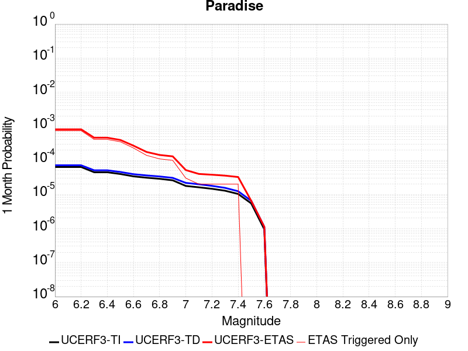 |  |  |

| Magnitude | 1 wk TI Prob | 1 wk TD Prob | 1 wk ETAS Prob | 1 wk ETAS/TD Gain | 1 wk ETAS Triggered Only | 1 mo TI Prob | 1 mo TD Prob | 1 mo ETAS Prob | 1 mo ETAS/TD Gain | 1 mo ETAS Triggered Only | 1 yr TI Prob | 1 yr TD Prob | 1 yr ETAS Prob | 1 yr ETAS/TD Gain | 1 yr ETAS Triggered Only | 10 yr TI Prob | 10 yr TD Prob | 10 yr ETAS Prob | 10 yr ETAS/TD Gain | 10 yr ETAS Triggered Only |
|-----|-----|-----|-----|-----|-----|-----|-----|-----|-----|-----|-----|-----|-----|-----|-----|-----|-----|-----|-----|-----|
| 6.0 | 1.4851273E-5 | 1.6694692E-5 | 7.9640874E-4 | 47.70431 | 7.797271E-4 | 6.364676E-5 | 7.154685E-5 | 8.512182E-4 | 11.897353 | 7.797271E-4 | 7.7462377E-4 | 8.707584E-4 | 0.0024288546 | 2.7893555 | 0.0015594542 | 0.0077192914 | 0.008675844 | 0.010221769 | 1.1781873 | 0.0015594542 |
| 6.1 | 1.4851273E-5 | 1.6694692E-5 | 7.9640874E-4 | 47.70431 | 7.797271E-4 | 6.364676E-5 | 7.154685E-5 | 8.512182E-4 | 11.897353 | 7.797271E-4 | 7.7462377E-4 | 8.707584E-4 | 0.0024288546 | 2.7893555 | 0.0015594542 | 0.0077192914 | 0.008675844 | 0.010221769 | 1.1781873 | 0.0015594542 |
| 6.2 | 1.4851273E-5 | 1.6694692E-5 | 7.9640874E-4 | 47.70431 | 7.797271E-4 | 6.364676E-5 | 7.154685E-5 | 8.512182E-4 | 11.897353 | 7.797271E-4 | 7.7462377E-4 | 8.707584E-4 | 0.0024288546 | 2.7893555 | 0.0015594542 | 0.0077192914 | 0.008675844 | 0.010221769 | 1.1781873 | 0.0015594542 |
| 6.3 | 1.0426831E-5 | 1.188862E-5 | 4.0174753E-4 | 33.79261 | 3.8986356E-4 | 4.4685654E-5 | 5.0950268E-5 | 4.4079396E-4 | 8.651455 | 3.8986356E-4 | 5.43912E-4 | 6.201489E-4 | 0.0017890142 | 2.884814 | 0.0011695906 | 0.0054258266 | 0.0061847917 | 0.0073471484 | 1.187938 | 0.0011695906 |
| 6.4 | 1.0426831E-5 | 1.188862E-5 | 4.0174753E-4 | 33.79261 | 3.8986356E-4 | 4.4685654E-5 | 5.0950268E-5 | 4.4079396E-4 | 8.651455 | 3.8986356E-4 | 5.43912E-4 | 6.201489E-4 | 0.0017890142 | 2.884814 | 0.0011695906 | 0.0054258266 | 0.0061847917 | 0.0073471484 | 1.187938 | 0.0011695906 |
| 6.5 | 9.25027E-6 | 1.06199595E-5 | 4.0047936E-4 | 37.710064 | 3.8986356E-4 | 3.964341E-5 | 4.551335E-5 | 4.3535916E-4 | 9.565527 | 3.8986356E-4 | 4.8255164E-4 | 5.53989E-4 | 0.0013332842 | 2.4066978 | 7.797271E-4 | 0.0048150513 | 0.0055265795 | 0.006301997 | 1.1403071 | 7.797271E-4 |
| 6.6 | 7.904275E-6 | 9.159525E-6 | 3.990195E-4 | 43.56334 | 3.8986356E-4 | 3.3875025E-5 | 3.9254537E-5 | 4.2910277E-4 | 10.931291 | 3.8986356E-4 | 4.1235037E-4 | 4.7782314E-4 | 0.0012571777 | 2.6310523 | 7.797271E-4 | 0.0041158604 | 0.0047683544 | 0.0055443635 | 1.1627415 | 7.797271E-4 |
| 6.7 | 7.2061953E-6 | 8.407248E-6 | 3.9826753E-4 | 47.37192 | 3.8986356E-4 | 3.088333E-5 | 3.6030586E-5 | 4.2588008E-4 | 11.81996 | 3.8986356E-4 | 3.7593965E-4 | 4.3858777E-4 | 8.2828035E-4 | 1.8885167 | 3.8986356E-4 | 0.003753043 | 0.004377591 | 0.004765748 | 1.0886691 | 3.8986356E-4 |
| 6.8 | 6.6948724E-6 | 7.842166E-6 | 3.9770265E-4 | 50.71337 | 3.8986356E-4 | 2.8691995E-5 | 3.360887E-5 | 4.234593E-4 | 12.59963 | 3.8986356E-4 | 3.4926904E-4 | 4.0911473E-4 | 7.988188E-4 | 1.9525545 | 3.8986356E-4 | 0.003487206 | 0.0040839734 | 0.0044722445 | 1.0950719 | 3.8986356E-4 |
| 6.9 | 6.0421025E-6 | 7.130621E-6 | 3.9699138E-4 | 55.674168 | 3.8986356E-4 | 2.5894467E-5 | 3.0559466E-5 | 4.204111E-4 | 13.757149 | 3.8986356E-4 | 3.1521954E-4 | 3.7200135E-4 | 7.617199E-4 | 2.0476265 | 3.8986356E-4 | 0.0031477278 | 0.0037141247 | 0.00410254 | 1.1045779 | 3.8986356E-4 |
| 7.0 | 4.134091E-6 | 5.0803087E-6 | 5.0803087E-6 | 1.0 | 0.0 | 1.7717413E-5 | 2.177258E-5 | 2.177258E-5 | 1.0 | 0.0 | 2.1568815E-4 | 2.6505045E-4 | 2.6505045E-4 | 1.0 | 0.0 | 0.0021547892 | 0.0026474963 | 0.0026474963 | 1.0 | 0.0 |
| 7.1 | 3.7674888E-6 | 4.6318696E-6 | 4.6318696E-6 | 1.0 | 0.0 | 1.6146281E-5 | 1.9850726E-5 | 1.9850726E-5 | 1.0 | 0.0 | 1.9656324E-4 | 2.4165731E-4 | 2.4165731E-4 | 1.0 | 0.0 | 0.0019638946 | 0.002414096 | 0.002414096 | 1.0 | 0.0 |
| 7.2 | 3.4065345E-6 | 4.156723E-6 | 4.156723E-6 | 1.0 | 0.0 | 1.4599351E-5 | 1.7814415E-5 | 1.7814415E-5 | 1.0 | 0.0 | 1.777326E-4 | 2.1687041E-4 | 2.1687041E-4 | 1.0 | 0.0 | 0.0017759053 | 0.002166736 | 0.002166736 | 1.0 | 0.0 |
| 7.3 | 2.9934936E-6 | 3.6293168E-6 | 3.6293168E-6 | 1.0 | 0.0 | 1.2829195E-5 | 1.555413E-5 | 1.555413E-5 | 1.0 | 0.0 | 1.5618425E-4 | 1.8935655E-4 | 1.8935655E-4 | 1.0 | 0.0 | 0.0015607453 | 0.0018920974 | 0.0018920974 | 1.0 | 0.0 |
| 7.4 | 2.4049796E-6 | 2.8889842E-6 | 2.8889842E-6 | 1.0 | 0.0 | 1.0307015E-5 | 1.238131E-5 | 1.238131E-5 | 1.0 | 0.0 | 1.2548068E-4 | 1.5073347E-4 | 1.5073347E-4 | 1.0 | 0.0 | 0.0012540985 | 0.0015064536 | 0.0015064536 | 1.0 | 0.0 |
| 7.5 | 1.2710091E-6 | 1.5134682E-6 | 1.5134682E-6 | 1.0 | 0.0 | 5.44717E-6 | 6.4862834E-6 | 6.4862834E-6 | 1.0 | 0.0 | 6.631728E-5 | 7.8968886E-5 | 7.8968886E-5 | 1.0 | 0.0 | 6.6297496E-4 | 7.8953087E-4 | 7.8953087E-4 | 1.0 | 0.0 |
| 7.6 | 2.21172E-7 | 2.603961E-7 | 2.603961E-7 | 1.0 | 0.0 | 9.478797E-7 | 1.1159829E-6 | 1.1159829E-6 | 1.0 | 0.0 | 1.1540374E-5 | 1.3587036E-5 | 1.3587036E-5 | 1.0 | 0.0 | 1.1539775E-4 | 1.3586486E-4 | 1.3586486E-4 | 1.0 | 0.0 |

## San Andreas (San Bernardino S)
*[(top)](#table-of-contents)*

| 1 Week | 1 Month | 1 Year | 10 Year |
|-----|-----|-----|-----|
|  |  |  |  |

| Magnitude | 1 wk TI Prob | 1 wk TD Prob | 1 wk ETAS Prob | 1 wk ETAS/TD Gain | 1 wk ETAS Triggered Only | 1 mo TI Prob | 1 mo TD Prob | 1 mo ETAS Prob | 1 mo ETAS/TD Gain | 1 mo ETAS Triggered Only | 1 yr TI Prob | 1 yr TD Prob | 1 yr ETAS Prob | 1 yr ETAS/TD Gain | 1 yr ETAS Triggered Only | 10 yr TI Prob | 10 yr TD Prob | 10 yr ETAS Prob | 10 yr ETAS/TD Gain | 10 yr ETAS Triggered Only |
|-----|-----|-----|-----|-----|-----|-----|-----|-----|-----|-----|-----|-----|-----|-----|-----|-----|-----|-----|-----|-----|
| 6.0 | 1.2336002E-4 | 3.0004102E-4 | 3.0004102E-4 | 1.0 | 0.0 | 5.2857865E-4 | 0.0012852824 | 0.0012852824 | 1.0 | 0.0 | 0.006416472 | 0.015540994 | 0.015540994 | 1.0 | 0.0 | 0.06234337 | 0.14283717 | 0.1438397 | 1.0070187 | 0.0011695906 |
| 6.1 | 1.2336002E-4 | 3.0004102E-4 | 3.0004102E-4 | 1.0 | 0.0 | 5.2857865E-4 | 0.0012852824 | 0.0012852824 | 1.0 | 0.0 | 0.006416472 | 0.015540994 | 0.015540994 | 1.0 | 0.0 | 0.06234337 | 0.14283717 | 0.1438397 | 1.0070187 | 0.0011695906 |
| 6.2 | 1.2336002E-4 | 3.0004102E-4 | 3.0004102E-4 | 1.0 | 0.0 | 5.2857865E-4 | 0.0012852824 | 0.0012852824 | 1.0 | 0.0 | 0.006416472 | 0.015540994 | 0.015540994 | 1.0 | 0.0 | 0.06234337 | 0.14283717 | 0.1438397 | 1.0070187 | 0.0011695906 |
| 6.3 | 1.1712257E-4 | 2.8792414E-4 | 2.8792414E-4 | 1.0 | 0.0 | 5.018573E-4 | 0.0012334028 | 0.0012334028 | 1.0 | 0.0 | 0.006093008 | 0.014918125 | 0.014918125 | 1.0 | 0.0 | 0.059286322 | 0.13754563 | 0.13855435 | 1.0073338 | 0.0011695906 |
| 6.4 | 1.1712257E-4 | 2.8792414E-4 | 2.8792414E-4 | 1.0 | 0.0 | 5.018573E-4 | 0.0012334028 | 0.0012334028 | 1.0 | 0.0 | 0.006093008 | 0.014918125 | 0.014918125 | 1.0 | 0.0 | 0.059286322 | 0.13754563 | 0.13855435 | 1.0073338 | 0.0011695906 |
| 6.5 | 1.0689076E-4 | 2.680528E-4 | 2.680528E-4 | 1.0 | 0.0 | 4.5802278E-4 | 0.0011483167 | 0.0011483167 | 1.0 | 0.0 | 0.0055621783 | 0.01389575 | 0.01389575 | 1.0 | 0.0 | 0.05425003 | 0.12879294 | 0.12947226 | 1.0052744 | 7.797271E-4 |
| 6.6 | 9.7648895E-5 | 2.50501E-4 | 2.50501E-4 | 1.0 | 0.0 | 4.1842813E-4 | 0.0010731576 | 0.0010731576 | 1.0 | 0.0 | 0.005082469 | 0.012991785 | 0.012991785 | 1.0 | 0.0 | 0.049677886 | 0.12095292 | 0.121638335 | 1.0056669 | 7.797271E-4 |
| 6.7 | 8.757013E-5 | 2.3120902E-4 | 2.3120902E-4 | 1.0 | 0.0 | 3.7524657E-4 | 9.905418E-4 | 9.905418E-4 | 1.0 | 0.0 | 0.00455906 | 0.011997245 | 0.011997245 | 1.0 | 0.0 | 0.04466656 | 0.11226123 | 0.112953424 | 1.006166 | 7.797271E-4 |
| 6.8 | 8.562978E-5 | 2.2680782E-4 | 2.2680782E-4 | 1.0 | 0.0 | 3.6693315E-4 | 9.7169366E-4 | 9.7169366E-4 | 1.0 | 0.0 | 0.004458263 | 0.011770263 | 0.011770263 | 1.0 | 0.0 | 0.043698758 | 0.11027153 | 0.110965274 | 1.0062913 | 7.797271E-4 |
| 6.9 | 6.124075E-5 | 1.7065753E-4 | 1.7065753E-4 | 1.0 | 0.0 | 2.6243398E-4 | 7.311852E-4 | 7.311852E-4 | 1.0 | 0.0 | 0.0031904527 | 0.008866051 | 0.008866051 | 1.0 | 0.0 | 0.031450346 | 0.08418263 | 0.08489671 | 1.0084826 | 7.797271E-4 |
| 7.0 | 5.8598747E-5 | 1.649477E-4 | 1.649477E-4 | 1.0 | 0.0 | 2.5111332E-4 | 7.06728E-4 | 7.06728E-4 | 1.0 | 0.0 | 0.0030530186 | 0.008570663 | 0.008570663 | 1.0 | 0.0 | 0.03011414 | 0.081500374 | 0.08221655 | 1.0087874 | 7.797271E-4 |
| 7.1 | 5.613814E-5 | 1.5913323E-4 | 1.5913323E-4 | 1.0 | 0.0 | 2.4056983E-4 | 6.818221E-4 | 6.818221E-4 | 1.0 | 0.0 | 0.0029250039 | 0.008269769 | 0.008269769 | 1.0 | 0.0 | 0.028868021 | 0.07879931 | 0.079517595 | 1.0091153 | 7.797271E-4 |
| 7.2 | 4.991222E-5 | 1.4519796E-4 | 1.4519796E-4 | 1.0 | 0.0 | 2.1389198E-4 | 6.2212895E-4 | 6.2212895E-4 | 1.0 | 0.0 | 0.002601025 | 0.007548217 | 0.007548217 | 1.0 | 0.0 | 0.025707912 | 0.07225321 | 0.0729766 | 1.0100119 | 7.797271E-4 |
| 7.3 | 4.7410045E-5 | 1.3714004E-4 | 1.3714004E-4 | 1.0 | 0.0 | 2.0317009E-4 | 5.8761094E-4 | 5.8761094E-4 | 1.0 | 0.0 | 0.0024707897 | 0.0071307817 | 0.0071307817 | 1.0 | 0.0 | 0.024434982 | 0.06853558 | 0.06926187 | 1.0105972 | 7.797271E-4 |
| 7.4 | 4.5556746E-5 | 1.3121912E-4 | 1.3121912E-4 | 1.0 | 0.0 | 1.952286E-4 | 5.622468E-4 | 5.622468E-4 | 1.0 | 0.0 | 0.002374317 | 0.0068239477 | 0.0068239477 | 1.0 | 0.0 | 0.023491086 | 0.065788016 | 0.066516444 | 1.0110724 | 7.797271E-4 |
| 7.5 | 4.3084514E-5 | 1.2357246E-4 | 1.2357246E-4 | 1.0 | 0.0 | 1.8463485E-4 | 5.2948913E-4 | 5.2948913E-4 | 1.0 | 0.0 | 0.0022456115 | 0.0064275465 | 0.0064275465 | 1.0 | 0.0 | 0.022230545 | 0.062188786 | 0.06292002 | 1.0117583 | 7.797271E-4 |
| 7.6 | 3.408608E-5 | 9.83552E-5 | 9.83552E-5 | 1.0 | 0.0 | 1.4607502E-4 | 4.214543E-4 | 4.214543E-4 | 1.0 | 0.0 | 0.0017770125 | 0.0051191594 | 0.0051191594 | 1.0 | 0.0 | 0.017628696 | 0.050020292 | 0.050390653 | 1.0074042 | 3.8986356E-4 |
| 7.7 | 2.8315713E-5 | 8.248679E-5 | 8.248679E-5 | 1.0 | 0.0 | 1.2134742E-4 | 3.5346695E-4 | 3.5346695E-4 | 1.0 | 0.0 | 0.0014764034 | 0.0042949775 | 0.0042949775 | 1.0 | 0.0 | 0.01466633 | 0.0422714 | 0.042644788 | 1.008833 | 3.8986356E-4 |
| 7.8 | 2.6222975E-5 | 7.463088E-5 | 7.463088E-5 | 1.0 | 0.0 | 1.1237934E-4 | 3.1980744E-4 | 3.1980744E-4 | 1.0 | 0.0 | 0.0013673597 | 0.0038867102 | 0.0038867102 | 1.0 | 0.0 | 0.013589768 | 0.03843674 | 0.03881162 | 1.0097531 | 3.8986356E-4 |
| 7.9 | 2.1469694E-5 | 5.787864E-5 | 5.787864E-5 | 1.0 | 0.0 | 9.200973E-5 | 2.4802773E-4 | 2.4802773E-4 | 1.0 | 0.0 | 0.0011196428 | 0.0030155594 | 0.0030155594 | 1.0 | 0.0 | 0.011140184 | 0.030152109 | 0.030530218 | 1.01254 | 3.8986356E-4 |
| 8.0 | 1.2420249E-5 | 3.131896E-5 | 3.131896E-5 | 1.0 | 0.0 | 5.322855E-5 | 1.342172E-4 | 1.342172E-4 | 1.0 | 0.0 | 6.478649E-4 | 0.0016328706 | 0.0016328706 | 1.0 | 0.0 | 0.0064597935 | 0.016522504 | 0.016905926 | 1.023206 | 3.8986356E-4 |
| 8.1 | 4.9197724E-6 | 7.822348E-6 | 7.822348E-6 | 1.0 | 0.0 | 2.1084568E-5 | 3.352392E-5 | 3.352392E-5 | 1.0 | 0.0 | 2.566744E-4 | 4.0807744E-4 | 4.0807744E-4 | 1.0 | 0.0 | 0.002563781 | 0.0043843705 | 0.0043843705 | 1.0 | 0.0 |
| 8.2 | 2.5634774E-6 | 2.9067196E-6 | 2.9067196E-6 | 1.0 | 0.0 | 1.0986286E-5 | 1.2457311E-5 | 1.2457311E-5 | 1.0 | 0.0 | 1.3374983E-4 | 1.5165724E-4 | 1.5165724E-4 | 1.0 | 0.0 | 0.0013366934 | 0.0017049741 | 0.0017049741 | 1.0 | 0.0 |
| 8.3 | 5.2850464E-7 | 3.2088764E-7 | 3.2088764E-7 | 1.0 | 0.0 | 2.2650179E-6 | 1.375232E-6 | 1.375232E-6 | 1.0 | 0.0 | 2.7576245E-5 | 1.6743334E-5 | 1.6743334E-5 | 1.0 | 0.0 | 2.7572823E-4 | 1.9870348E-4 | 1.9870348E-4 | 1.0 | 0.0 |

## Coyote Lake
*[(top)](#table-of-contents)*

| 1 Week | 1 Month | 1 Year | 10 Year |
|-----|-----|-----|-----|
|  |  | 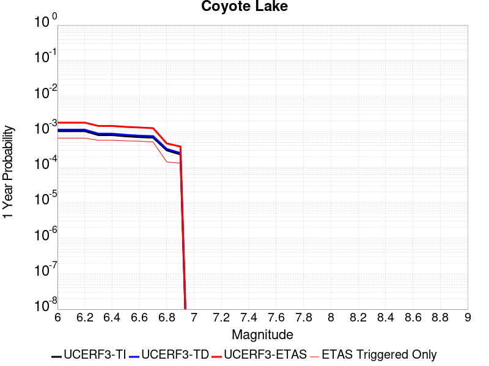 |  |

| Magnitude | 1 wk TI Prob | 1 wk TD Prob | 1 wk ETAS Prob | 1 wk ETAS/TD Gain | 1 wk ETAS Triggered Only | 1 mo TI Prob | 1 mo TD Prob | 1 mo ETAS Prob | 1 mo ETAS/TD Gain | 1 mo ETAS Triggered Only | 1 yr TI Prob | 1 yr TD Prob | 1 yr ETAS Prob | 1 yr ETAS/TD Gain | 1 yr ETAS Triggered Only | 10 yr TI Prob | 10 yr TD Prob | 10 yr ETAS Prob | 10 yr ETAS/TD Gain | 10 yr ETAS Triggered Only |
|-----|-----|-----|-----|-----|-----|-----|-----|-----|-----|-----|-----|-----|-----|-----|-----|-----|-----|-----|-----|-----|
| 6.0 | 1.980352E-5 | 2.1706745E-5 | 4.1156184E-4 | 18.96009 | 3.8986356E-4 | 8.486947E-5 | 9.302599E-5 | 4.8285327E-4 | 5.19052 | 3.8986356E-4 | 0.0010327959 | 0.0011320751 | 0.0019109194 | 1.6879795 | 7.797271E-4 | 0.010280091 | 0.011270258 | 0.012426667 | 1.1026071 | 0.0011695906 |
| 6.1 | 1.980352E-5 | 2.1706745E-5 | 4.1156184E-4 | 18.96009 | 3.8986356E-4 | 8.486947E-5 | 9.302599E-5 | 4.8285327E-4 | 5.19052 | 3.8986356E-4 | 0.0010327959 | 0.0011320751 | 0.0019109194 | 1.6879795 | 7.797271E-4 | 0.010280091 | 0.011270258 | 0.012426667 | 1.1026071 | 0.0011695906 |
| 6.2 | 1.980352E-5 | 2.1706745E-5 | 4.1156184E-4 | 18.96009 | 3.8986356E-4 | 8.486947E-5 | 9.302599E-5 | 4.8285327E-4 | 5.19052 | 3.8986356E-4 | 0.0010327959 | 0.0011320751 | 0.0019109194 | 1.6879795 | 7.797271E-4 | 0.010280091 | 0.011270258 | 0.012426667 | 1.1026071 | 0.0011695906 |
| 6.3 | 1.5344787E-5 | 1.682067E-5 | 4.0667766E-4 | 24.177258 | 3.8986356E-4 | 6.576172E-5 | 7.2086936E-5 | 4.6192238E-4 | 6.4078517 | 3.8986356E-4 | 8.003548E-4 | 8.773662E-4 | 0.0016564092 | 1.8879336 | 7.797271E-4 | 0.007974784 | 0.00874507 | 0.009904432 | 1.1325732 | 0.0011695906 |
| 6.4 | 1.5344787E-5 | 1.682067E-5 | 4.0667766E-4 | 24.177258 | 3.8986356E-4 | 6.576172E-5 | 7.2086936E-5 | 4.6192238E-4 | 6.4078517 | 3.8986356E-4 | 8.003548E-4 | 8.773662E-4 | 0.0016564092 | 1.8879336 | 7.797271E-4 | 0.007974784 | 0.00874507 | 0.009904432 | 1.1325732 | 0.0011695906 |
| 6.5 | 1.4189697E-5 | 1.5557987E-5 | 4.0541546E-4 | 26.05835 | 3.8986356E-4 | 6.081157E-5 | 6.6675726E-5 | 4.5651328E-4 | 6.8467693 | 3.8986356E-4 | 7.401293E-4 | 8.115349E-4 | 0.0015906292 | 1.9600257 | 7.797271E-4 | 0.0073766913 | 0.008091656 | 0.009251783 | 1.1433733 | 0.0011695906 |
| 6.6 | 1.3469301E-5 | 1.4771577E-5 | 4.0462936E-4 | 27.392427 | 3.8986356E-4 | 5.7724297E-5 | 6.330556E-5 | 4.5314443E-4 | 7.158051 | 3.8986356E-4 | 7.025667E-4 | 7.7053264E-4 | 0.001549659 | 2.011153 | 7.797271E-4 | 0.0070034964 | 0.0076845144 | 0.008845117 | 1.1510314 | 0.0011695906 |
| 6.7 | 1.3027966E-5 | 1.4281745E-5 | 4.0413972E-4 | 28.297644 | 3.8986356E-4 | 5.5832945E-5 | 6.120638E-5 | 4.5104607E-4 | 7.3692656 | 3.8986356E-4 | 6.7955407E-4 | 7.4499263E-4 | 0.0015241388 | 2.045844 | 7.797271E-4 | 0.006774798 | 0.0074308286 | 0.008591728 | 1.1562275 | 0.0011695906 |
| 6.8 | 5.695434E-6 | 6.2244176E-6 | 6.2244176E-6 | 1.0 | 0.0 | 2.4408775E-5 | 2.6675973E-5 | 2.6675973E-5 | 1.0 | 0.0 | 2.971363E-4 | 3.2476155E-4 | 7.144985E-4 | 2.200071 | 3.8986356E-4 | 0.0029673933 | 0.0032458105 | 0.0036344086 | 1.119723 | 3.8986356E-4 |
| 6.9 | 4.385688E-6 | 4.7930553E-6 | 4.7930553E-6 | 1.0 | 0.0 | 1.879567E-5 | 2.0541665E-5 | 2.0541665E-5 | 1.0 | 0.0 | 2.2881327E-4 | 2.5009477E-4 | 6.398608E-4 | 2.5584733 | 3.8986356E-4 | 0.002285778 | 0.0025009478 | 0.0028898364 | 1.1554965 | 3.8986356E-4 |

## Death Valley (Fish Lake Valley)
*[(top)](#table-of-contents)*

| 1 Week | 1 Month | 1 Year | 10 Year |
|-----|-----|-----|-----|
|  |  |  |  |

| Magnitude | 1 wk TI Prob | 1 wk TD Prob | 1 wk ETAS Prob | 1 wk ETAS/TD Gain | 1 wk ETAS Triggered Only | 1 mo TI Prob | 1 mo TD Prob | 1 mo ETAS Prob | 1 mo ETAS/TD Gain | 1 mo ETAS Triggered Only | 1 yr TI Prob | 1 yr TD Prob | 1 yr ETAS Prob | 1 yr ETAS/TD Gain | 1 yr ETAS Triggered Only | 10 yr TI Prob | 10 yr TD Prob | 10 yr ETAS Prob | 10 yr ETAS/TD Gain | 10 yr ETAS Triggered Only |
|-----|-----|-----|-----|-----|-----|-----|-----|-----|-----|-----|-----|-----|-----|-----|-----|-----|-----|-----|-----|-----|
| 6.0 | 3.872328E-5 | 4.7267473E-5 | 4.3711258E-4 | 9.247641 | 3.8986356E-4 | 1.6594635E-4 | 2.0256084E-4 | 9.8213E-4 | 4.848568 | 7.797271E-4 | 0.0020185246 | 0.002463534 | 0.0036302432 | 1.4735917 | 0.0011695906 | 0.02000288 | 0.024388181 | 0.025529247 | 1.0467877 | 0.0011695906 |
| 6.1 | 3.872328E-5 | 4.7267473E-5 | 4.3711258E-4 | 9.247641 | 3.8986356E-4 | 1.6594635E-4 | 2.0256084E-4 | 9.8213E-4 | 4.848568 | 7.797271E-4 | 0.0020185246 | 0.002463534 | 0.0036302432 | 1.4735917 | 0.0011695906 | 0.02000288 | 0.024388181 | 0.025529247 | 1.0467877 | 0.0011695906 |
| 6.2 | 3.872328E-5 | 4.7267473E-5 | 4.3711258E-4 | 9.247641 | 3.8986356E-4 | 1.6594635E-4 | 2.0256084E-4 | 9.8213E-4 | 4.848568 | 7.797271E-4 | 0.0020185246 | 0.002463534 | 0.0036302432 | 1.4735917 | 0.0011695906 | 0.02000288 | 0.024388181 | 0.025529247 | 1.0467877 | 0.0011695906 |
| 6.3 | 2.8356371E-5 | 3.3609853E-5 | 4.234603E-4 | 12.599291 | 3.8986356E-4 | 1.2152165E-4 | 1.4403471E-4 | 9.236495E-4 | 6.412687 | 7.797271E-4 | 0.0014785219 | 0.0017522911 | 0.0029198322 | 1.6662941 | 0.0011695906 | 0.014687235 | 0.017391782 | 0.018541032 | 1.06608 | 0.0011695906 |
| 6.4 | 2.8356371E-5 | 3.3609853E-5 | 4.234603E-4 | 12.599291 | 3.8986356E-4 | 1.2152165E-4 | 1.4403471E-4 | 9.236495E-4 | 6.412687 | 7.797271E-4 | 0.0014785219 | 0.0017522911 | 0.0029198322 | 1.6662941 | 0.0011695906 | 0.014687235 | 0.017391782 | 0.018541032 | 1.06608 | 0.0011695906 |
| 6.5 | 2.4448687E-5 | 2.8607552E-5 | 4.1845994E-4 | 14.627604 | 3.8986356E-4 | 1.0477588E-4 | 1.2259831E-4 | 5.124141E-4 | 4.1796174 | 3.8986356E-4 | 0.0012748998 | 0.0014916632 | 0.002270227 | 1.5219436 | 7.797271E-4 | 0.012676105 | 0.014821377 | 0.015589547 | 1.0518285 | 7.797271E-4 |
| 6.6 | 2.1298161E-5 | 2.4660083E-5 | 4.14514E-4 | 16.809109 | 3.8986356E-4 | 9.127464E-5 | 1.0568198E-4 | 4.9550436E-4 | 4.688636 | 3.8986356E-4 | 0.0011107022 | 0.0012859525 | 0.002064677 | 1.6055623 | 7.797271E-4 | 0.011051672 | 0.012788526 | 0.013558281 | 1.0601912 | 7.797271E-4 |
| 6.7 | 1.8959729E-5 | 2.1781025E-5 | 4.1163608E-4 | 18.898838 | 3.8986356E-4 | 8.125345E-5 | 9.334405E-5 | 4.831712E-4 | 5.1762395 | 3.8986356E-4 | 9.888117E-4 | 0.001135897 | 0.0019147383 | 1.685662 | 7.797271E-4 | 0.009844234 | 0.01130357 | 0.012074484 | 1.0682008 | 7.797271E-4 |
| 6.8 | 1.6691629E-5 | 1.9018353E-5 | 4.0887448E-4 | 21.498943 | 3.8986356E-4 | 7.153359E-5 | 8.150477E-5 | 4.7133653E-4 | 5.782932 | 3.8986356E-4 | 8.7057345E-4 | 9.918857E-4 | 0.0017708393 | 1.7853261 | 7.797271E-4 | 0.008671708 | 0.009876343 | 0.01064837 | 1.0781692 | 7.797271E-4 |
| 6.9 | 1.450505E-5 | 1.638954E-5 | 4.062467E-4 | 24.78695 | 3.8986356E-4 | 6.216302E-5 | 7.0239046E-5 | 4.600752E-4 | 6.550135 | 3.8986356E-4 | 7.5657194E-4 | 8.5483363E-4 | 0.0016338942 | 1.9113593 | 7.797271E-4 | 0.007540013 | 0.008516385 | 0.009289472 | 1.0907763 | 7.797271E-4 |
| 7.0 | 1.2940855E-5 | 1.4537972E-5 | 4.0439586E-4 | 27.816525 | 3.8986356E-4 | 5.545963E-5 | 6.230414E-5 | 4.521434E-4 | 7.257036 | 3.8986356E-4 | 6.750118E-4 | 7.5829466E-4 | 0.0015374306 | 2.0274842 | 7.797271E-4 | 0.006729651 | 0.0075576897 | 0.008331524 | 1.1023903 | 7.797271E-4 |
| 7.1 | 1.2544658E-5 | 1.4078208E-5 | 4.0393625E-4 | 28.692308 | 3.8986356E-4 | 5.3761712E-5 | 6.0333812E-5 | 4.5017383E-4 | 7.4613857 | 3.8986356E-4 | 6.5435225E-4 | 7.343222E-4 | 0.0015134767 | 2.0610526 | 7.797271E-4 | 0.006524288 | 0.007319551 | 0.00809357 | 1.1057469 | 7.797271E-4 |
| 7.2 | 1.2489416E-5 | 1.4015674E-5 | 4.0387377E-4 | 28.815863 | 3.8986356E-4 | 5.3524967E-5 | 6.0065824E-5 | 4.4990596E-4 | 7.4902153 | 3.8986356E-4 | 6.514716E-4 | 7.310616E-4 | 0.0015102187 | 2.0657885 | 7.797271E-4 | 0.006495651 | 0.0072871596 | 0.008061205 | 1.1062204 | 7.797271E-4 |
| 7.3 | 1.2368307E-5 | 1.3879812E-5 | 4.0373794E-4 | 29.08814 | 3.8986356E-4 | 5.3005948E-5 | 5.9483587E-5 | 4.4932394E-4 | 7.5537467 | 3.8986356E-4 | 6.451563E-4 | 7.2397763E-4 | 0.0015031402 | 2.0762248 | 7.797271E-4 | 0.0064328653 | 0.007216782 | 0.007990882 | 1.1072639 | 7.797271E-4 |
| 7.4 | 1.2161707E-5 | 1.36478675E-5 | 4.035061E-4 | 29.565504 | 3.8986356E-4 | 5.212056E-5 | 5.8489582E-5 | 4.4833033E-4 | 7.665131 | 3.8986356E-4 | 6.3438306E-4 | 7.118836E-4 | 0.0014910556 | 2.0945218 | 7.797271E-4 | 0.006325751 | 0.0070966207 | 0.007870814 | 1.1090933 | 7.797271E-4 |
| 7.5 | 1.1707948E-5 | 1.3145515E-5 | 4.0300394E-4 | 30.657143 | 3.8986356E-4 | 5.0175953E-5 | 5.6336736E-5 | 4.461783E-4 | 7.9198465 | 3.8986356E-4 | 6.10721E-4 | 6.856895E-4 | 0.0014648819 | 2.1363635 | 7.797271E-4 | 0.0060904534 | 0.006836321 | 0.007610718 | 1.1132768 | 7.797271E-4 |
| 7.6 | 1.0319538E-5 | 1.1579622E-5 | 4.0143865E-4 | 34.667683 | 3.8986356E-4 | 4.4225842E-5 | 4.9626036E-5 | 4.3947023E-4 | 8.8556385 | 3.8986356E-4 | 5.383166E-4 | 6.040347E-4 | 0.0013832909 | 2.290085 | 7.797271E-4 | 0.0053701443 | 0.0060244603 | 0.00679949 | 1.1286472 | 7.797271E-4 |
| 7.7 | 8.937764E-6 | 1.0022779E-5 | 3.998824E-4 | 39.897358 | 3.8986356E-4 | 3.830414E-5 | 4.295409E-5 | 4.3280088E-4 | 10.075895 | 3.8986356E-4 | 4.6625308E-4 | 5.228456E-4 | 0.001302165 | 2.4905345 | 7.797271E-4 | 0.0046527605 | 0.005216664 | 0.0059923236 | 1.1486888 | 7.797271E-4 |
| 7.8 | 3.108007E-7 | 3.284654E-7 | 3.284654E-7 | 1.0 | 0.0 | 1.3320023E-6 | 1.407708E-6 | 1.407708E-6 | 1.0 | 0.0 | 1.6217007E-5 | 1.7138715E-5 | 1.7138715E-5 | 1.0 | 0.0 | 1.6215823E-4 | 1.7137431E-4 | 1.7137431E-4 | 1.0 | 0.0 |
| 7.9 | 2.5591178E-9 | 2.6696718E-9 | 2.6696718E-9 | 1.0 | 0.0 | 1.0967647E-8 | 1.14414505E-8 | 1.14414505E-8 | 1.0 | 0.0 | 1.335311E-7 | 1.3929966E-7 | 1.3929966E-7 | 1.0 | 0.0 | 1.3353102E-6 | 1.3929966E-6 | 1.3929966E-6 | 1.0 | 0.0 |

## Independence rev 2011
*[(top)](#table-of-contents)*

| 1 Week | 1 Month | 1 Year | 10 Year |
|-----|-----|-----|-----|
|  |  |  |  |

| Magnitude | 1 wk TI Prob | 1 wk TD Prob | 1 wk ETAS Prob | 1 wk ETAS/TD Gain | 1 wk ETAS Triggered Only | 1 mo TI Prob | 1 mo TD Prob | 1 mo ETAS Prob | 1 mo ETAS/TD Gain | 1 mo ETAS Triggered Only | 1 yr TI Prob | 1 yr TD Prob | 1 yr ETAS Prob | 1 yr ETAS/TD Gain | 1 yr ETAS Triggered Only | 10 yr TI Prob | 10 yr TD Prob | 10 yr ETAS Prob | 10 yr ETAS/TD Gain | 10 yr ETAS Triggered Only |
|-----|-----|-----|-----|-----|-----|-----|-----|-----|-----|-----|-----|-----|-----|-----|-----|-----|-----|-----|-----|-----|
| 6.0 | 4.422171E-6 | 4.326227E-6 | 4.326227E-6 | 1.0 | 0.0 | 1.8952025E-5 | 1.8540857E-5 | 4.0839717E-4 | 22.026876 | 3.8986356E-4 | 2.3071647E-4 | 2.2571455E-4 | 0.0010052656 | 4.4537034 | 7.797271E-4 | 0.0023047708 | 0.0022551466 | 0.0034220996 | 1.5174621 | 0.0011695906 |
| 6.1 | 4.422171E-6 | 4.326227E-6 | 4.326227E-6 | 1.0 | 0.0 | 1.8952025E-5 | 1.8540857E-5 | 4.0839717E-4 | 22.026876 | 3.8986356E-4 | 2.3071647E-4 | 2.2571455E-4 | 0.0010052656 | 4.4537034 | 7.797271E-4 | 0.0023047708 | 0.0022551466 | 0.0034220996 | 1.5174621 | 0.0011695906 |
| 6.2 | 4.422171E-6 | 4.326227E-6 | 4.326227E-6 | 1.0 | 0.0 | 1.8952025E-5 | 1.8540857E-5 | 4.0839717E-4 | 22.026876 | 3.8986356E-4 | 2.3071647E-4 | 2.2571455E-4 | 0.0010052656 | 4.4537034 | 7.797271E-4 | 0.0023047708 | 0.0022551466 | 0.0034220996 | 1.5174621 | 0.0011695906 |
| 6.3 | 4.422171E-6 | 4.326227E-6 | 4.326227E-6 | 1.0 | 0.0 | 1.8952025E-5 | 1.8540857E-5 | 4.0839717E-4 | 22.026876 | 3.8986356E-4 | 2.3071647E-4 | 2.2571455E-4 | 0.0010052656 | 4.4537034 | 7.797271E-4 | 0.0023047708 | 0.0022551466 | 0.0034220996 | 1.5174621 | 0.0011695906 |
| 6.4 | 4.422171E-6 | 4.326227E-6 | 4.326227E-6 | 1.0 | 0.0 | 1.8952025E-5 | 1.8540857E-5 | 4.0839717E-4 | 22.026876 | 3.8986356E-4 | 2.3071647E-4 | 2.2571455E-4 | 0.0010052656 | 4.4537034 | 7.797271E-4 | 0.0023047708 | 0.0022551466 | 0.0034220996 | 1.5174621 | 0.0011695906 |
| 6.5 | 4.422171E-6 | 4.326227E-6 | 4.326227E-6 | 1.0 | 0.0 | 1.8952025E-5 | 1.8540857E-5 | 4.0839717E-4 | 22.026876 | 3.8986356E-4 | 2.3071647E-4 | 2.2571455E-4 | 0.0010052656 | 4.4537034 | 7.797271E-4 | 0.0023047708 | 0.0022551466 | 0.0034220996 | 1.5174621 | 0.0011695906 |
| 6.6 | 2.663744E-6 | 2.5319862E-6 | 2.5319862E-6 | 1.0 | 0.0 | 1.1415996E-5 | 1.0851327E-5 | 4.0071065E-4 | 36.92734 | 3.8986356E-4 | 1.3898089E-4 | 1.3210738E-4 | 9.1173145E-4 | 6.901442 | 7.797271E-4 | 0.0013889399 | 0.0013203367 | 0.002488383 | 1.884658 | 0.0011695906 |
| 6.7 | 2.663744E-6 | 2.5319862E-6 | 2.5319862E-6 | 1.0 | 0.0 | 1.1415996E-5 | 1.0851327E-5 | 4.0071065E-4 | 36.92734 | 3.8986356E-4 | 1.3898089E-4 | 1.3210738E-4 | 9.1173145E-4 | 6.901442 | 7.797271E-4 | 0.0013889399 | 0.0013203367 | 0.002488383 | 1.884658 | 0.0011695906 |
| 6.8 | 1.9716529E-6 | 1.8322585E-6 | 1.8322585E-6 | 1.0 | 0.0 | 8.449913E-6 | 7.852514E-6 | 7.852514E-6 | 1.0 | 0.0 | 1.0287284E-4 | 9.5600284E-5 | 4.8542657E-4 | 5.0776687 | 3.8986356E-4 | 0.0010282523 | 9.556045E-4 | 0.0017345864 | 1.815172 | 7.797271E-4 |
| 6.9 | 1.8788617E-6 | 1.7429993E-6 | 1.7429993E-6 | 1.0 | 0.0 | 8.0522395E-6 | 7.4699765E-6 | 7.4699765E-6 | 1.0 | 0.0 | 9.80316E-5 | 9.0943286E-5 | 4.8077138E-4 | 5.2864966 | 3.8986356E-4 | 9.798837E-4 | 9.0907275E-4 | 0.001688091 | 1.8569372 | 7.797271E-4 |
| 7.0 | 1.5045488E-6 | 1.3849503E-6 | 1.3849503E-6 | 1.0 | 0.0 | 6.44805E-6 | 5.9354884E-6 | 5.9354884E-6 | 1.0 | 0.0 | 7.8502184E-5 | 7.226223E-5 | 4.620976E-4 | 6.3947325 | 3.8986356E-4 | 7.8474457E-4 | 7.2239246E-4 | 0.0015015563 | 2.078588 | 7.797271E-4 |
| 7.1 | 1.272341E-6 | 1.1625096E-6 | 1.1625096E-6 | 1.0 | 0.0 | 5.4528787E-6 | 4.982175E-6 | 4.982175E-6 | 1.0 | 0.0 | 6.6386776E-5 | 6.0656326E-5 | 4.504962E-4 | 7.427028 | 3.8986356E-4 | 6.636695E-4 | 6.064009E-4 | 0.0013856551 | 2.285048 | 7.797271E-4 |
| 7.2 | 1.0416892E-6 | 9.4098806E-7 | 9.4098806E-7 | 1.0 | 0.0 | 4.464375E-6 | 4.0328E-6 | 4.0328E-6 | 1.0 | 0.0 | 5.4352407E-5 | 4.909825E-5 | 4.3894266E-4 | 8.940087 | 3.8986356E-4 | 5.4339116E-4 | 4.9087586E-4 | 0.0012702203 | 2.5876608 | 7.797271E-4 |
| 7.3 | 7.9450155E-7 | 7.235002E-7 | 7.235002E-7 | 1.0 | 0.0 | 3.4050022E-6 | 3.1007114E-6 | 3.1007114E-6 | 1.0 | 0.0 | 4.1455114E-5 | 3.775052E-5 | 4.2759936E-4 | 11.32698 | 3.8986356E-4 | 4.144738E-4 | 3.7744216E-4 | 0.0011568749 | 3.065039 | 7.797271E-4 |
| 7.4 | 5.3893444E-7 | 5.019512E-7 | 5.019512E-7 | 1.0 | 0.0 | 2.309717E-6 | 2.1512178E-6 | 2.1512178E-6 | 1.0 | 0.0 | 2.8120441E-5 | 2.6190766E-5 | 4.1604412E-4 | 15.885144 | 3.8986356E-4 | 2.8116882E-4 | 2.6187726E-4 | 0.0010414001 | 3.976673 | 7.797271E-4 |
| 7.5 | 3.8852085E-7 | 3.682554E-7 | 3.682554E-7 | 1.0 | 0.0 | 1.6650882E-6 | 1.5782365E-6 | 1.5782365E-6 | 1.0 | 0.0 | 2.027226E-5 | 1.9214862E-5 | 4.0907093E-4 | 21.289299 | 3.8986356E-4 | 2.0270412E-4 | 1.9213221E-4 | 9.717095E-4 | 5.057504 | 7.797271E-4 |
| 7.6 | 2.414929E-7 | 2.345755E-7 | 2.345755E-7 | 1.0 | 0.0 | 1.0349692E-6 | 1.0053232E-6 | 1.0053232E-6 | 1.0 | 0.0 | 1.2600677E-5 | 1.2239742E-5 | 1.2239742E-5 | 1.0 | 0.0 | 1.2599962E-4 | 1.223908E-4 | 5.1220664E-4 | 4.185009 | 3.8986356E-4 |
| 7.7 | 6.8298014E-8 | 6.85897E-8 | 6.85897E-8 | 1.0 | 0.0 | 2.9270575E-7 | 2.9395582E-7 | 2.9395582E-7 | 1.0 | 0.0 | 3.5636867E-6 | 3.5789067E-6 | 3.5789067E-6 | 1.0 | 0.0 | 3.5636294E-5 | 3.5788536E-5 | 4.2563814E-4 | 11.893142 | 3.8986356E-4 |

## Lenwood-Lockhart-Old Woman Springs
*[(top)](#table-of-contents)*

| 1 Week | 1 Month | 1 Year | 10 Year |
|-----|-----|-----|-----|
|  |  |  |  |

| Magnitude | 1 wk TI Prob | 1 wk TD Prob | 1 wk ETAS Prob | 1 wk ETAS/TD Gain | 1 wk ETAS Triggered Only | 1 mo TI Prob | 1 mo TD Prob | 1 mo ETAS Prob | 1 mo ETAS/TD Gain | 1 mo ETAS Triggered Only | 1 yr TI Prob | 1 yr TD Prob | 1 yr ETAS Prob | 1 yr ETAS/TD Gain | 1 yr ETAS Triggered Only | 10 yr TI Prob | 10 yr TD Prob | 10 yr ETAS Prob | 10 yr ETAS/TD Gain | 10 yr ETAS Triggered Only |
|-----|-----|-----|-----|-----|-----|-----|-----|-----|-----|-----|-----|-----|-----|-----|-----|-----|-----|-----|-----|-----|
| 6.0 | 3.744542E-5 | 4.396252E-5 | 8.2365534E-4 | 18.7354 | 7.797271E-4 | 1.604705E-4 | 1.8839816E-4 | 9.679784E-4 | 5.1379395 | 7.797271E-4 | 0.0019519776 | 0.0022915069 | 0.0030694471 | 1.3394885 | 7.797271E-4 | 0.019349206 | 0.022696787 | 0.023839831 | 1.0503615 | 0.0011695906 |
| 6.1 | 3.744542E-5 | 4.396252E-5 | 8.2365534E-4 | 18.7354 | 7.797271E-4 | 1.604705E-4 | 1.8839816E-4 | 9.679784E-4 | 5.1379395 | 7.797271E-4 | 0.0019519776 | 0.0022915069 | 0.0030694471 | 1.3394885 | 7.797271E-4 | 0.019349206 | 0.022696787 | 0.023839831 | 1.0503615 | 0.0011695906 |
| 6.2 | 3.744542E-5 | 4.396252E-5 | 8.2365534E-4 | 18.7354 | 7.797271E-4 | 1.604705E-4 | 1.8839816E-4 | 9.679784E-4 | 5.1379395 | 7.797271E-4 | 0.0019519776 | 0.0022915069 | 0.0030694471 | 1.3394885 | 7.797271E-4 | 0.019349206 | 0.022696787 | 0.023839831 | 1.0503615 | 0.0011695906 |
| 6.3 | 2.1079984E-5 | 2.5353434E-5 | 2.5353434E-5 | 1.0 | 0.0 | 9.0339665E-5 | 1.0865316E-4 | 1.0865316E-4 | 1.0 | 0.0 | 0.0010993304 | 0.0013220694 | 0.0013220694 | 1.0 | 0.0 | 0.010939079 | 0.0131442575 | 0.0131442575 | 1.0 | 0.0 |
| 6.4 | 2.1079984E-5 | 2.5353434E-5 | 2.5353434E-5 | 1.0 | 0.0 | 9.0339665E-5 | 1.0865316E-4 | 1.0865316E-4 | 1.0 | 0.0 | 0.0010993304 | 0.0013220694 | 0.0013220694 | 1.0 | 0.0 | 0.010939079 | 0.0131442575 | 0.0131442575 | 1.0 | 0.0 |
| 6.5 | 1.7397282E-5 | 2.066241E-5 | 2.066241E-5 | 1.0 | 0.0 | 7.455765E-5 | 8.8550245E-5 | 8.8550245E-5 | 1.0 | 0.0 | 9.073613E-4 | 0.0010775778 | 0.0010775778 | 1.0 | 0.0 | 0.009036654 | 0.010724821 | 0.010724821 | 1.0 | 0.0 |
| 6.6 | 1.52050325E-5 | 1.7679693E-5 | 1.7679693E-5 | 1.0 | 0.0 | 6.51628E-5 | 7.576796E-5 | 7.576796E-5 | 1.0 | 0.0 | 7.9306826E-4 | 9.220924E-4 | 9.220924E-4 | 1.0 | 0.0 | 0.007902439 | 0.009183526 | 0.009183526 | 1.0 | 0.0 |
| 6.7 | 1.332523E-5 | 1.5264002E-5 | 1.5264002E-5 | 1.0 | 0.0 | 5.7106878E-5 | 6.5415545E-5 | 6.5415545E-5 | 1.0 | 0.0 | 6.950544E-4 | 7.961491E-4 | 7.961491E-4 | 1.0 | 0.0 | 0.006928845 | 0.007933599 | 0.007933599 | 1.0 | 0.0 |
| 6.8 | 1.1525329E-5 | 1.3030979E-5 | 1.3030979E-5 | 1.0 | 0.0 | 4.9393333E-5 | 5.584588E-5 | 5.584588E-5 | 1.0 | 0.0 | 6.011979E-4 | 6.797157E-4 | 6.797157E-4 | 1.0 | 0.0 | 0.00599574 | 0.006776819 | 0.006776819 | 1.0 | 0.0 |
| 6.9 | 1.0253909E-5 | 1.15144385E-5 | 1.15144385E-5 | 1.0 | 0.0 | 4.3944583E-5 | 4.9346683E-5 | 4.9346683E-5 | 1.0 | 0.0 | 5.3489394E-4 | 6.0063385E-4 | 6.0063385E-4 | 1.0 | 0.0 | 0.0053360825 | 0.0059904843 | 0.0059904843 | 1.0 | 0.0 |
| 7.0 | 8.104563E-6 | 8.991279E-6 | 8.991279E-6 | 1.0 | 0.0 | 3.4733377E-5 | 3.8533497E-5 | 3.8533497E-5 | 1.0 | 0.0 | 4.2279682E-4 | 4.6904673E-4 | 4.6904673E-4 | 1.0 | 0.0 | 0.0042199334 | 0.0046808156 | 0.0046808156 | 1.0 | 0.0 |
| 7.1 | 6.7986157E-6 | 7.515816E-6 | 7.515816E-6 | 1.0 | 0.0 | 2.91366E-5 | 3.2210253E-5 | 3.2210253E-5 | 1.0 | 0.0 | 3.5468035E-4 | 3.920914E-4 | 3.920914E-4 | 1.0 | 0.0 | 0.003541148 | 0.003914213 | 0.003914213 | 1.0 | 0.0 |
| 7.2 | 5.6893327E-6 | 6.2800136E-6 | 6.2800136E-6 | 1.0 | 0.0 | 2.4382627E-5 | 2.6914078E-5 | 2.6914078E-5 | 1.0 | 0.0 | 2.9681803E-4 | 3.2763163E-4 | 3.2763163E-4 | 1.0 | 0.0 | 0.002964219 | 0.0032716845 | 0.0032716845 | 1.0 | 0.0 |
| 7.3 | 4.253348E-6 | 4.7069107E-6 | 4.7069107E-6 | 1.0 | 0.0 | 1.8228506E-5 | 2.0172329E-5 | 2.0172329E-5 | 1.0 | 0.0 | 2.2190946E-4 | 2.4557224E-4 | 2.4557224E-4 | 1.0 | 0.0 | 0.00221688 | 0.0024531898 | 0.0024531898 | 1.0 | 0.0 |
| 7.4 | 2.5448119E-6 | 2.852045E-6 | 2.852045E-6 | 1.0 | 0.0 | 1.0906291E-5 | 1.2223002E-5 | 1.2223002E-5 | 1.0 | 0.0 | 1.3277601E-4 | 1.4880655E-4 | 1.4880655E-4 | 1.0 | 0.0 | 0.001326967 | 0.0014872311 | 0.0014872311 | 1.0 | 0.0 |
| 7.5 | 4.3706837E-8 | 4.562909E-8 | 4.562909E-8 | 1.0 | 0.0 | 1.8731501E-7 | 1.9555324E-7 | 1.9555324E-7 | 1.0 | 0.0 | 2.2805577E-6 | 2.3808586E-6 | 2.3808586E-6 | 1.0 | 0.0 | 2.2805343E-5 | 2.3808387E-5 | 2.3808387E-5 | 1.0 | 0.0 |

## Death Valley (No)
*[(top)](#table-of-contents)*

| 1 Week | 1 Month | 1 Year | 10 Year |
|-----|-----|-----|-----|
|  |  |  |  |

| Magnitude | 1 wk TI Prob | 1 wk TD Prob | 1 wk ETAS Prob | 1 wk ETAS/TD Gain | 1 wk ETAS Triggered Only | 1 mo TI Prob | 1 mo TD Prob | 1 mo ETAS Prob | 1 mo ETAS/TD Gain | 1 mo ETAS Triggered Only | 1 yr TI Prob | 1 yr TD Prob | 1 yr ETAS Prob | 1 yr ETAS/TD Gain | 1 yr ETAS Triggered Only | 10 yr TI Prob | 10 yr TD Prob | 10 yr ETAS Prob | 10 yr ETAS/TD Gain | 10 yr ETAS Triggered Only |
|-----|-----|-----|-----|-----|-----|-----|-----|-----|-----|-----|-----|-----|-----|-----|-----|-----|-----|-----|-----|-----|
| 6.0 | 2.0074807E-5 | 2.2500084E-5 | 8.0220966E-4 | 35.65363 | 7.797271E-4 | 8.603206E-5 | 9.642541E-5 | 8.7607733E-4 | 9.085545 | 7.797271E-4 | 0.001046937 | 0.0011733545 | 0.0023415727 | 1.9956226 | 0.0011695906 | 0.010420183 | 0.011672506 | 0.012828445 | 1.0990309 | 0.0011695906 |
| 6.1 | 2.0074807E-5 | 2.2500084E-5 | 8.0220966E-4 | 35.65363 | 7.797271E-4 | 8.603206E-5 | 9.642541E-5 | 8.7607733E-4 | 9.085545 | 7.797271E-4 | 0.001046937 | 0.0011733545 | 0.0023415727 | 1.9956226 | 0.0011695906 | 0.010420183 | 0.011672506 | 0.012828445 | 1.0990309 | 0.0011695906 |
| 6.2 | 2.0074807E-5 | 2.2500084E-5 | 8.0220966E-4 | 35.65363 | 7.797271E-4 | 8.603206E-5 | 9.642541E-5 | 8.7607733E-4 | 9.085545 | 7.797271E-4 | 0.001046937 | 0.0011733545 | 0.0023415727 | 1.9956226 | 0.0011695906 | 0.010420183 | 0.011672506 | 0.012828445 | 1.0990309 | 0.0011695906 |
| 6.3 | 1.9050609E-5 | 2.1336948E-5 | 8.010474E-4 | 37.542736 | 7.797271E-4 | 8.164292E-5 | 9.1440896E-5 | 8.710967E-4 | 9.526337 | 7.797271E-4 | 9.935491E-4 | 0.001112731 | 0.0022810202 | 2.0499296 | 0.0011695906 | 0.009891188 | 0.011072419 | 0.012229059 | 1.1044614 | 0.0011695906 |
| 6.4 | 1.9050609E-5 | 2.1336948E-5 | 8.010474E-4 | 37.542736 | 7.797271E-4 | 8.164292E-5 | 9.1440896E-5 | 8.710967E-4 | 9.526337 | 7.797271E-4 | 9.935491E-4 | 0.001112731 | 0.0022810202 | 2.0499296 | 0.0011695906 | 0.009891188 | 0.011072419 | 0.012229059 | 1.1044614 | 0.0011695906 |
| 6.5 | 1.8367004E-5 | 2.0561009E-5 | 8.002721E-4 | 38.92183 | 7.797271E-4 | 7.8713354E-5 | 8.811567E-5 | 8.6777407E-4 | 9.8481245 | 7.797271E-4 | 9.5791375E-4 | 0.0010722869 | 0.0022406233 | 2.0895746 | 0.0011695906 | 0.009537951 | 0.0106719155 | 0.011829024 | 1.1084256 | 0.0011695906 |
| 6.6 | 1.779439E-5 | 1.9910927E-5 | 7.996225E-4 | 40.15998 | 7.797271E-4 | 7.625944E-5 | 8.53298E-5 | 8.6499035E-4 | 10.137026 | 7.797271E-4 | 9.280632E-4 | 0.0010384015 | 0.0022067777 | 2.125168 | 0.0011695906 | 0.009241969 | 0.010336253 | 0.011493754 | 1.1119846 | 0.0011695906 |
| 6.7 | 1.7025437E-5 | 1.9043426E-5 | 7.987557E-4 | 41.94391 | 7.797271E-4 | 7.296412E-5 | 8.161216E-5 | 8.6127565E-4 | 10.553275 | 7.797271E-4 | 8.87976E-4 | 9.931813E-4 | 0.0021616104 | 2.176451 | 0.0011695906 | 0.008844362 | 0.009888145 | 0.011046171 | 1.1171125 | 0.0011695906 |
| 6.8 | 1.6545107E-5 | 1.8512545E-5 | 7.982252E-4 | 43.11807 | 7.797271E-4 | 7.090568E-5 | 7.93371E-5 | 8.5900235E-4 | 10.827247 | 7.797271E-4 | 8.629347E-4 | 9.655073E-4 | 0.0021339688 | 2.2102046 | 0.0011695906 | 0.008595915 | 0.009613829 | 0.010772175 | 1.1204876 | 0.0011695906 |
| 6.9 | 1.615478E-5 | 1.8087594E-5 | 7.978006E-4 | 44.107613 | 7.797271E-4 | 6.9232934E-5 | 7.751599E-5 | 8.5718266E-4 | 11.05814 | 7.797271E-4 | 8.4258494E-4 | 9.433546E-4 | 0.002111842 | 2.238651 | 0.0011695906 | 0.008393973 | 0.009394196 | 0.010552798 | 1.1233318 | 0.0011695906 |
| 7.0 | 1.5894311E-5 | 1.780555E-5 | 7.9751876E-4 | 44.79046 | 7.797271E-4 | 6.81167E-5 | 7.6307304E-5 | 8.559749E-4 | 11.21747 | 7.797271E-4 | 8.2900526E-4 | 9.286515E-4 | 0.002097156 | 2.258281 | 0.0011695906 | 0.008259195 | 0.009248397 | 0.010407171 | 1.1252946 | 0.0011695906 |
| 7.1 | 1.5602263E-5 | 1.7483504E-5 | 7.97197E-4 | 45.597095 | 7.797271E-4 | 6.6865134E-5 | 7.492718E-5 | 8.5459586E-4 | 11.405685 | 7.797271E-4 | 8.137789E-4 | 9.118627E-4 | 0.002080387 | 2.2814693 | 0.0011695906 | 0.008108052 | 0.009081894 | 0.010240862 | 1.1276131 | 0.0011695906 |
| 7.2 | 1.5323829E-5 | 1.717063E-5 | 7.9688436E-4 | 46.409733 | 7.797271E-4 | 6.56719E-5 | 7.358637E-5 | 8.532561E-4 | 11.595301 | 7.797271E-4 | 7.99262E-4 | 8.9555193E-4 | 0.002064095 | 2.3048303 | 0.0011695906 | 0.007963934 | 0.008920107 | 0.010079265 | 1.1299489 | 0.0011695906 |
| 7.3 | 1.4556212E-5 | 1.6302456E-5 | 7.9601683E-4 | 48.828033 | 7.797271E-4 | 6.238227E-5 | 6.9865826E-5 | 8.495384E-4 | 12.159571 | 7.797271E-4 | 7.592395E-4 | 8.5029035E-4 | 0.0020188864 | 2.3743496 | 0.0011695906 | 0.0075665074 | 0.008471014 | 0.009630698 | 1.1369002 | 0.0011695906 |
| 7.4 | 1.411725E-5 | 1.580796E-5 | 7.955227E-4 | 50.32419 | 7.797271E-4 | 6.0501097E-5 | 6.7746674E-5 | 8.4742095E-4 | 12.508673 | 7.797271E-4 | 7.363519E-4 | 8.245094E-4 | 0.0019931358 | 2.4173596 | 0.0011695906 | 0.0073391674 | 0.008215138 | 0.0093751205 | 1.1412005 | 0.0011695906 |
| 7.5 | 1.3503312E-5 | 1.5126289E-5 | 7.948416E-4 | 52.54703 | 7.797271E-4 | 5.7870053E-5 | 6.482538E-5 | 8.4450195E-4 | 13.027336 | 7.797271E-4 | 7.043401E-4 | 7.8896893E-4 | 0.0019576368 | 2.4812596 | 0.0011695906 | 0.007021119 | 0.007862304 | 0.0090227 | 1.1475897 | 0.0011695906 |
| 7.6 | 1.1279839E-5 | 1.2626327E-5 | 4.0248496E-4 | 31.876646 | 3.8986356E-4 | 4.834127E-5 | 5.4111737E-5 | 4.439542E-4 | 8.204397 | 3.8986356E-4 | 5.88396E-4 | 6.5861654E-4 | 0.0014378302 | 2.1831064 | 7.797271E-4 | 0.005868405 | 0.006567199 | 0.007341805 | 1.1179508 | 7.797271E-4 |
| 7.7 | 9.189108E-6 | 1.0283358E-5 | 4.001429E-4 | 38.911694 | 3.8986356E-4 | 3.93813E-5 | 4.407082E-5 | 4.339172E-4 | 9.845907 | 3.8986356E-4 | 4.7936183E-4 | 5.3643517E-4 | 0.001315744 | 2.452755 | 7.797271E-4 | 0.004783291 | 0.005351914 | 0.006127468 | 1.1449115 | 7.797271E-4 |
| 7.8 | 3.4586725E-7 | 3.6482615E-7 | 3.6482615E-7 | 1.0 | 0.0 | 1.4822873E-6 | 1.5635396E-6 | 1.5635396E-6 | 1.0 | 0.0 | 1.80467E-5 | 1.9035933E-5 | 1.9035933E-5 | 1.0 | 0.0 | 1.8045233E-4 | 1.9034347E-4 | 1.9034347E-4 | 1.0 | 0.0 |
| 7.9 | 2.5591178E-9 | 2.6696718E-9 | 2.6696718E-9 | 1.0 | 0.0 | 1.0967647E-8 | 1.14414505E-8 | 1.14414505E-8 | 1.0 | 0.0 | 1.335311E-7 | 1.3929966E-7 | 1.3929966E-7 | 1.0 | 0.0 | 1.3353102E-6 | 1.3929966E-6 | 1.3929966E-6 | 1.0 | 0.0 |

## Pinto Mtn
*[(top)](#table-of-contents)*

| 1 Week | 1 Month | 1 Year | 10 Year |
|-----|-----|-----|-----|
|  |  |  |  |

| Magnitude | 1 wk TI Prob | 1 wk TD Prob | 1 wk ETAS Prob | 1 wk ETAS/TD Gain | 1 wk ETAS Triggered Only | 1 mo TI Prob | 1 mo TD Prob | 1 mo ETAS Prob | 1 mo ETAS/TD Gain | 1 mo ETAS Triggered Only | 1 yr TI Prob | 1 yr TD Prob | 1 yr ETAS Prob | 1 yr ETAS/TD Gain | 1 yr ETAS Triggered Only | 10 yr TI Prob | 10 yr TD Prob | 10 yr ETAS Prob | 10 yr ETAS/TD Gain | 10 yr ETAS Triggered Only |
|-----|-----|-----|-----|-----|-----|-----|-----|-----|-----|-----|-----|-----|-----|-----|-----|-----|-----|-----|-----|-----|
| 6.0 | 4.4194956E-5 | 4.785362E-5 | 4.785362E-5 | 1.0 | 0.0 | 1.893932E-4 | 2.0507174E-4 | 9.846389E-4 | 4.8014364 | 7.797271E-4 | 0.0023034236 | 0.0024940541 | 0.0032718366 | 1.3118546 | 7.797271E-4 | 0.022796938 | 0.024678145 | 0.02543863 | 1.0308161 | 7.797271E-4 |
| 6.1 | 4.4194956E-5 | 4.785362E-5 | 4.785362E-5 | 1.0 | 0.0 | 1.893932E-4 | 2.0507174E-4 | 9.846389E-4 | 4.8014364 | 7.797271E-4 | 0.0023034236 | 0.0024940541 | 0.0032718366 | 1.3118546 | 7.797271E-4 | 0.022796938 | 0.024678145 | 0.02543863 | 1.0308161 | 7.797271E-4 |
| 6.2 | 4.4194956E-5 | 4.785362E-5 | 4.785362E-5 | 1.0 | 0.0 | 1.893932E-4 | 2.0507174E-4 | 9.846389E-4 | 4.8014364 | 7.797271E-4 | 0.0023034236 | 0.0024940541 | 0.0032718366 | 1.3118546 | 7.797271E-4 | 0.022796938 | 0.024678145 | 0.02543863 | 1.0308161 | 7.797271E-4 |
| 6.3 | 4.4194956E-5 | 4.785362E-5 | 4.785362E-5 | 1.0 | 0.0 | 1.893932E-4 | 2.0507174E-4 | 9.846389E-4 | 4.8014364 | 7.797271E-4 | 0.0023034236 | 0.0024940541 | 0.0032718366 | 1.3118546 | 7.797271E-4 | 0.022796938 | 0.024678145 | 0.02543863 | 1.0308161 | 7.797271E-4 |
| 6.4 | 3.729929E-5 | 3.9603186E-5 | 3.9603186E-5 | 1.0 | 0.0 | 1.5984432E-4 | 1.6971743E-4 | 5.595148E-4 | 3.2967434 | 3.8986356E-4 | 0.0019443673 | 0.002064445 | 0.0024535037 | 1.1884568 | 3.8986356E-4 | 0.019274427 | 0.02046269 | 0.020844577 | 1.0186626 | 3.8986356E-4 |
| 6.5 | 3.729929E-5 | 3.9603186E-5 | 3.9603186E-5 | 1.0 | 0.0 | 1.5984432E-4 | 1.6971743E-4 | 5.595148E-4 | 3.2967434 | 3.8986356E-4 | 0.0019443673 | 0.002064445 | 0.0024535037 | 1.1884568 | 3.8986356E-4 | 0.019274427 | 0.02046269 | 0.020844577 | 1.0186626 | 3.8986356E-4 |
| 6.6 | 3.0204548E-5 | 3.1205298E-5 | 3.1205298E-5 | 1.0 | 0.0 | 1.2944164E-4 | 1.3373033E-4 | 5.2354176E-4 | 3.9149065 | 3.8986356E-4 | 0.0015748127 | 0.0016269855 | 0.0020162147 | 1.2392334 | 3.8986356E-4 | 0.015636992 | 0.01615461 | 0.016538175 | 1.0237434 | 3.8986356E-4 |
| 6.7 | 2.9857754E-5 | 3.081468E-5 | 3.081468E-5 | 1.0 | 0.0 | 1.2795553E-4 | 1.3205643E-4 | 5.218685E-4 | 3.9518597 | 3.8986356E-4 | 0.0015567453 | 0.001606636 | 0.0019958732 | 1.2422684 | 3.8986356E-4 | 0.015458848 | 0.01595405 | 0.016337693 | 1.0240468 | 3.8986356E-4 |
| 6.8 | 2.4819734E-5 | 2.5009364E-5 | 2.5009364E-5 | 1.0 | 0.0 | 1.0636595E-4 | 1.07178705E-4 | 4.9700047E-4 | 4.63712 | 3.8986356E-4 | 0.0012942362 | 0.0013041412 | 0.0016934964 | 1.2985529 | 3.8986356E-4 | 0.012867244 | 0.0129672475 | 0.013352055 | 1.0296754 | 3.8986356E-4 |
| 6.9 | 2.331124E-5 | 2.3337643E-5 | 2.3337643E-5 | 1.0 | 0.0 | 9.990149E-5 | 1.00014746E-4 | 4.898393E-4 | 4.8976707 | 3.8986356E-4 | 0.001215622 | 0.0012170197 | 0.0016064087 | 1.319953 | 3.8986356E-4 | 0.012089936 | 0.012105742 | 0.012490885 | 1.0318149 | 3.8986356E-4 |
| 7.0 | 2.1818534E-5 | 2.1760772E-5 | 2.1760772E-5 | 1.0 | 0.0 | 9.3504656E-5 | 9.325723E-5 | 4.830844E-4 | 5.180128 | 3.8986356E-4 | 0.0011378246 | 0.0011348352 | 0.0015242563 | 1.3431522 | 3.8986356E-4 | 0.011320163 | 0.011292503 | 0.011677965 | 1.0341343 | 3.8986356E-4 |
| 7.1 | 2.066081E-5 | 2.0540418E-5 | 2.0540418E-5 | 1.0 | 0.0 | 8.854332E-5 | 8.8027504E-5 | 4.7785672E-4 | 5.4284935 | 3.8986356E-4 | 0.0010774818 | 0.0010712275 | 0.0014606734 | 1.3635511 | 3.8986356E-4 | 0.010722724 | 0.010662688 | 0.011048395 | 1.0361735 | 3.8986356E-4 |
| 7.2 | 1.8990233E-5 | 1.9053701E-5 | 1.9053701E-5 | 1.0 | 0.0 | 8.138417E-5 | 8.1656275E-5 | 4.71488E-4 | 5.774057 | 3.8986356E-4 | 9.904018E-4 | 9.937311E-4 | 0.0013832072 | 1.3919331 | 3.8986356E-4 | 0.009859995 | 0.009894874 | 0.010280879 | 1.0390106 | 3.8986356E-4 |
| 7.3 | 1.3335872E-5 | 1.4906372E-5 | 1.4906372E-5 | 1.0 | 0.0 | 5.7152483E-5 | 6.388296E-5 | 4.537216E-4 | 7.102389 | 3.8986356E-4 | 6.956093E-4 | 7.775102E-4 | 0.0011670707 | 1.5010358 | 3.8986356E-4 | 0.006934359 | 0.0077491994 | 0.008136041 | 1.0499203 | 3.8986356E-4 |
| 7.4 | 9.414066E-6 | 1.186061E-5 | 1.186061E-5 | 1.0 | 0.0 | 4.0345374E-5 | 5.0830247E-5 | 4.40674E-4 | 8.669522 | 3.8986356E-4 | 4.910942E-4 | 6.1869196E-4 | 0.0010083143 | 1.6297517 | 3.8986356E-4 | 0.0049001034 | 0.006170644 | 0.0065581016 | 1.0627905 | 3.8986356E-4 |
| 7.5 | 7.2101157E-6 | 9.157893E-6 | 9.157893E-6 | 1.0 | 0.0 | 3.090013E-5 | 3.924757E-5 | 4.2909582E-4 | 10.933055 | 3.8986356E-4 | 3.7614413E-4 | 4.7774217E-4 | 8.6741947E-4 | 1.8156644 | 3.8986356E-4 | 0.0037550807 | 0.004767927 | 0.0051559317 | 1.0813781 | 3.8986356E-4 |
| 7.6 | 3.296375E-6 | 4.5453176E-6 | 4.5453176E-6 | 1.0 | 0.0 | 1.4127245E-5 | 1.9479796E-5 | 1.9479796E-5 | 1.0 | 0.0 | 1.7198564E-4 | 2.3714209E-4 | 2.3714209E-4 | 1.0 | 0.0 | 0.0017185259 | 0.0023690276 | 0.0023690276 | 1.0 | 0.0 |
| 7.7 | 2.5741092E-6 | 3.584251E-6 | 3.584251E-6 | 1.0 | 0.0 | 1.103185E-5 | 1.5360993E-5 | 1.5360993E-5 | 1.0 | 0.0 | 1.3430449E-4 | 1.8700535E-4 | 1.8700535E-4 | 1.0 | 0.0 | 0.0013422335 | 0.0018686098 | 0.0018686098 | 1.0 | 0.0 |

## San Andreas (Coachella) rev
*[(top)](#table-of-contents)*

| 1 Week | 1 Month | 1 Year | 10 Year |
|-----|-----|-----|-----|
|  | 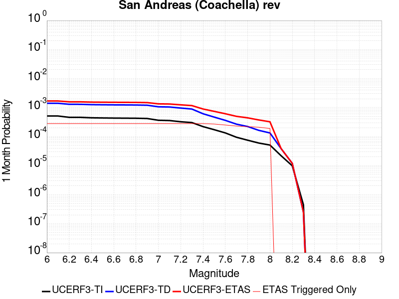 |  |  |

| Magnitude | 1 wk TI Prob | 1 wk TD Prob | 1 wk ETAS Prob | 1 wk ETAS/TD Gain | 1 wk ETAS Triggered Only | 1 mo TI Prob | 1 mo TD Prob | 1 mo ETAS Prob | 1 mo ETAS/TD Gain | 1 mo ETAS Triggered Only | 1 yr TI Prob | 1 yr TD Prob | 1 yr ETAS Prob | 1 yr ETAS/TD Gain | 1 yr ETAS Triggered Only | 10 yr TI Prob | 10 yr TD Prob | 10 yr ETAS Prob | 10 yr ETAS/TD Gain | 10 yr ETAS Triggered Only |
|-----|-----|-----|-----|-----|-----|-----|-----|-----|-----|-----|-----|-----|-----|-----|-----|-----|-----|-----|-----|-----|
| 6.0 | 1.1925945E-4 | 3.2729402E-4 | 3.2729402E-4 | 1.0 | 0.0 | 5.110118E-4 | 0.0014019393 | 0.0014019393 | 1.0 | 0.0 | 0.0062038354 | 0.016936364 | 0.017319625 | 1.0226295 | 3.8986356E-4 | 0.060334753 | 0.15265316 | 0.15331386 | 1.0043281 | 7.797271E-4 |
| 6.1 | 1.1925945E-4 | 3.2729402E-4 | 3.2729402E-4 | 1.0 | 0.0 | 5.110118E-4 | 0.0014019393 | 0.0014019393 | 1.0 | 0.0 | 0.0062038354 | 0.016936364 | 0.017319625 | 1.0226295 | 3.8986356E-4 | 0.060334753 | 0.15265316 | 0.15331386 | 1.0043281 | 7.797271E-4 |
| 6.2 | 1.07432395E-4 | 3.0230157E-4 | 3.0230157E-4 | 1.0 | 0.0 | 4.603433E-4 | 0.0012949388 | 0.0012949388 | 1.0 | 0.0 | 0.005590286 | 0.015653009 | 0.01603677 | 1.0245167 | 3.8986356E-4 | 0.05451731 | 0.14182423 | 0.14249338 | 1.0047181 | 7.797271E-4 |
| 6.3 | 1.0718766E-4 | 3.0175463E-4 | 3.0175463E-4 | 1.0 | 0.0 | 4.592948E-4 | 0.0012925972 | 0.0012925972 | 1.0 | 0.0 | 0.005577586 | 0.015624908 | 0.016008679 | 1.0245615 | 3.8986356E-4 | 0.054396555 | 0.14159249 | 0.14226182 | 1.0047271 | 7.797271E-4 |
| 6.4 | 1.0355944E-4 | 2.9383553E-4 | 2.9383553E-4 | 1.0 | 0.0 | 4.4375064E-4 | 0.0012586913 | 0.0012586913 | 1.0 | 0.0 | 0.0053892885 | 0.015217941 | 0.0156018725 | 1.0252289 | 3.8986356E-4 | 0.052604496 | 0.13815255 | 0.13882457 | 1.0048642 | 7.797271E-4 |
| 6.5 | 1.0227914E-4 | 2.9102986E-4 | 2.9102986E-4 | 1.0 | 0.0 | 4.382655E-4 | 0.0012466786 | 0.0012466786 | 1.0 | 0.0 | 0.0053228354 | 0.01507372 | 0.015457707 | 1.025474 | 3.8986356E-4 | 0.051971316 | 0.13693172 | 0.13760468 | 1.0049145 | 7.797271E-4 |
| 6.6 | 1.0116757E-4 | 2.8868738E-4 | 2.8868738E-4 | 1.0 | 0.0 | 4.3350324E-4 | 0.0012366489 | 0.0012366489 | 1.0 | 0.0 | 0.0052651367 | 0.01495329 | 0.015337325 | 1.0256822 | 3.8986356E-4 | 0.051421247 | 0.1359099 | 0.13658366 | 1.0049573 | 7.797271E-4 |
| 6.7 | 1.0050676E-4 | 2.8727303E-4 | 2.8727303E-4 | 1.0 | 0.0 | 4.3067214E-4 | 0.0012305931 | 0.0012305931 | 1.0 | 0.0 | 0.005230834 | 0.014880571 | 0.015264632 | 1.0258096 | 3.8986356E-4 | 0.051094085 | 0.13529462 | 0.13596885 | 1.0049834 | 7.797271E-4 |
| 6.8 | 9.976819E-5 | 2.853096E-4 | 2.853096E-4 | 1.0 | 0.0 | 4.2750788E-4 | 0.0012221863 | 0.0012221863 | 1.0 | 0.0 | 0.0051924936 | 0.0147796115 | 0.015163713 | 1.0259886 | 3.8986356E-4 | 0.050728295 | 0.13444631 | 0.13512121 | 1.0050198 | 7.797271E-4 |
| 6.9 | 9.77719E-5 | 2.8027873E-4 | 2.8027873E-4 | 1.0 | 0.0 | 4.1895514E-4 | 0.0012006456 | 0.0012006456 | 1.0 | 0.0 | 0.0050888555 | 0.014520878 | 0.01490508 | 1.0264586 | 3.8986356E-4 | 0.049738888 | 0.1322748 | 0.1329514 | 1.005115 | 7.797271E-4 |
| 7.0 | 8.500761E-5 | 2.4762485E-4 | 2.4762485E-4 | 1.0 | 0.0 | 3.6426744E-4 | 0.001060821 | 0.001060821 | 1.0 | 0.0 | 0.0044259406 | 0.012839786 | 0.013224644 | 1.0299739 | 3.8986356E-4 | 0.04338823 | 0.11813272 | 0.11882034 | 1.0058208 | 7.797271E-4 |
| 7.1 | 8.319876E-5 | 2.4365232E-4 | 2.4365232E-4 | 1.0 | 0.0 | 3.5651738E-4 | 0.0010438096 | 0.0010438096 | 1.0 | 0.0 | 0.004331963 | 0.012635092 | 0.01302003 | 1.0304657 | 3.8986356E-4 | 0.042484846 | 0.116353 | 0.117042005 | 1.0059217 | 7.797271E-4 |
| 7.2 | 7.563917E-5 | 2.2413683E-4 | 2.2413683E-4 | 1.0 | 0.0 | 3.2412758E-4 | 9.602359E-4 | 9.602359E-4 | 1.0 | 0.0 | 0.0039391145 | 0.011628893 | 0.012014223 | 1.0331355 | 3.8986356E-4 | 0.03870018 | 0.10775925 | 0.10845495 | 1.0064561 | 7.797271E-4 |
| 7.3 | 7.082985E-5 | 2.0729867E-4 | 2.0729867E-4 | 1.0 | 0.0 | 3.0352117E-4 | 8.881233E-4 | 8.881233E-4 | 1.0 | 0.0 | 0.0036891096 | 0.010759917 | 0.011145586 | 1.0358431 | 3.8986356E-4 | 0.03628465 | 0.100282 | 0.10098354 | 1.0069956 | 7.797271E-4 |
| 7.4 | 5.146215E-5 | 1.4273795E-4 | 1.4273795E-4 | 1.0 | 0.0 | 2.2053342E-4 | 6.115915E-4 | 6.115915E-4 | 1.0 | 0.0 | 0.0026816884 | 0.0074208933 | 0.007807864 | 1.0521461 | 3.8986356E-4 | 0.02649557 | 0.070849575 | 0.07157406 | 1.0102257 | 7.797271E-4 |
| 7.5 | 4.0285166E-5 | 1.09416E-4 | 1.09416E-4 | 1.0 | 0.0 | 1.7263928E-4 | 4.6884175E-4 | 4.6884175E-4 | 1.0 | 0.0 | 0.002099857 | 0.0056932783 | 0.006080922 | 1.068088 | 3.8986356E-4 | 0.020801254 | 0.055011146 | 0.055747982 | 1.0133942 | 7.797271E-4 |
| 7.6 | 3.1168736E-5 | 8.4389096E-5 | 8.4389096E-5 | 1.0 | 0.0 | 1.3357346E-4 | 3.6161754E-4 | 3.6161754E-4 | 1.0 | 0.0 | 0.0016250437 | 0.0043938323 | 0.004781983 | 1.0883398 | 3.8986356E-4 | 0.016132116 | 0.04281005 | 0.043183222 | 1.008717 | 3.8986356E-4 |
| 7.7 | 2.2100989E-5 | 6.238755E-5 | 6.238755E-5 | 1.0 | 0.0 | 9.4715084E-5 | 2.6734784E-4 | 2.6734784E-4 | 1.0 | 0.0 | 0.001152546 | 0.0032501083 | 0.0036387048 | 1.1195642 | 3.8986356E-4 | 0.011465867 | 0.0319002 | 0.032277625 | 1.0118315 | 3.8986356E-4 |
| 7.8 | 1.7484861E-5 | 5.179572E-5 | 5.179572E-5 | 1.0 | 0.0 | 7.493296E-5 | 2.2196278E-4 | 2.2196278E-4 | 1.0 | 0.0 | 9.1192697E-4 | 0.0026990508 | 0.003087862 | 1.1440548 | 3.8986356E-4 | 0.009081938 | 0.026640115 | 0.027019594 | 1.0142446 | 3.8986356E-4 |
| 7.9 | 1.3967285E-5 | 3.822255E-5 | 3.822255E-5 | 1.0 | 0.0 | 5.985842E-5 | 1.6380067E-4 | 1.6380067E-4 | 1.0 | 0.0 | 7.2853256E-4 | 0.00199245 | 0.0023815369 | 1.1952806 | 3.8986356E-4 | 0.0072614877 | 0.019909438 | 0.020291539 | 1.019192 | 3.8986356E-4 |
| 8.0 | 1.1887396E-5 | 3.106521E-5 | 3.106521E-5 | 1.0 | 0.0 | 5.094499E-5 | 1.3312983E-4 | 1.3312983E-4 | 1.0 | 0.0 | 6.200787E-4 | 0.0016196516 | 0.0020088837 | 1.2403184 | 3.8986356E-4 | 0.006183513 | 0.016279267 | 0.016662784 | 1.0235586 | 3.8986356E-4 |
| 8.1 | 5.100864E-6 | 8.973418E-6 | 8.973418E-6 | 1.0 | 0.0 | 2.1860664E-5 | 3.8456936E-5 | 3.8456936E-5 | 1.0 | 0.0 | 2.6612106E-4 | 4.6811273E-4 | 4.6811273E-4 | 1.0 | 0.0 | 0.002658026 | 0.004917731 | 0.004917731 | 1.0 | 0.0 |
| 8.2 | 2.3004484E-6 | 2.7864487E-6 | 2.7864487E-6 | 1.0 | 0.0 | 9.859027E-6 | 1.1941868E-5 | 1.1941868E-5 | 1.0 | 0.0 | 1.2002704E-4 | 1.4538258E-4 | 1.4538258E-4 | 1.0 | 0.0 | 0.0011996223 | 0.0015973912 | 0.0015973912 | 1.0 | 0.0 |
| 8.3 | 1.0424446E-7 | 5.8161504E-8 | 5.8161504E-8 | 1.0 | 0.0 | 4.4676187E-7 | 2.4926356E-7 | 2.4926356E-7 | 1.0 | 0.0 | 5.439312E-6 | 3.03478E-6 | 3.03478E-6 | 1.0 | 0.0 | 5.4391792E-5 | 3.190716E-5 | 3.190716E-5 | 1.0 | 0.0 |

## San Juan
*[(top)](#table-of-contents)*

| 1 Week | 1 Month | 1 Year | 10 Year |
|-----|-----|-----|-----|
|  |  |  |  |

| Magnitude | 1 wk TI Prob | 1 wk TD Prob | 1 wk ETAS Prob | 1 wk ETAS/TD Gain | 1 wk ETAS Triggered Only | 1 mo TI Prob | 1 mo TD Prob | 1 mo ETAS Prob | 1 mo ETAS/TD Gain | 1 mo ETAS Triggered Only | 1 yr TI Prob | 1 yr TD Prob | 1 yr ETAS Prob | 1 yr ETAS/TD Gain | 1 yr ETAS Triggered Only | 10 yr TI Prob | 10 yr TD Prob | 10 yr ETAS Prob | 10 yr ETAS/TD Gain | 10 yr ETAS Triggered Only |
|-----|-----|-----|-----|-----|-----|-----|-----|-----|-----|-----|-----|-----|-----|-----|-----|-----|-----|-----|-----|-----|
| 6.0 | 8.682808E-6 | 8.7491635E-6 | 8.7491635E-6 | 1.0 | 0.0 | 3.72115E-5 | 3.74959E-5 | 3.74959E-5 | 1.0 | 0.0 | 4.5295584E-4 | 4.564218E-4 | 8.4610743E-4 | 1.853784 | 3.8986356E-4 | 0.004520337 | 0.004555385 | 0.00533156 | 1.1703863 | 7.797271E-4 |
| 6.1 | 8.682808E-6 | 8.7491635E-6 | 8.7491635E-6 | 1.0 | 0.0 | 3.72115E-5 | 3.74959E-5 | 3.74959E-5 | 1.0 | 0.0 | 4.5295584E-4 | 4.564218E-4 | 8.4610743E-4 | 1.853784 | 3.8986356E-4 | 0.004520337 | 0.004555385 | 0.00533156 | 1.1703863 | 7.797271E-4 |
| 6.2 | 8.682808E-6 | 8.7491635E-6 | 8.7491635E-6 | 1.0 | 0.0 | 3.72115E-5 | 3.74959E-5 | 3.74959E-5 | 1.0 | 0.0 | 4.5295584E-4 | 4.564218E-4 | 8.4610743E-4 | 1.853784 | 3.8986356E-4 | 0.004520337 | 0.004555385 | 0.00533156 | 1.1703863 | 7.797271E-4 |
| 6.3 | 6.3054235E-6 | 6.2825848E-6 | 6.2825848E-6 | 1.0 | 0.0 | 2.7022963E-5 | 2.6925094E-5 | 2.6925094E-5 | 1.0 | 0.0 | 3.2895492E-4 | 3.2776513E-4 | 3.2776513E-4 | 1.0 | 0.0 | 0.003284684 | 0.003273017 | 0.0036616044 | 1.1187246 | 3.8986356E-4 |
| 6.4 | 6.1490473E-6 | 6.1144656E-6 | 6.1144656E-6 | 1.0 | 0.0 | 2.6352795E-5 | 2.6204598E-5 | 2.6204598E-5 | 1.0 | 0.0 | 3.2079802E-4 | 3.1899565E-4 | 3.1899565E-4 | 1.0 | 0.0 | 0.0032033534 | 0.0031855737 | 0.0035741953 | 1.1219943 | 3.8986356E-4 |
| 6.5 | 5.204848E-6 | 5.137233E-6 | 5.137233E-6 | 1.0 | 0.0 | 2.23063E-5 | 2.2016533E-5 | 2.2016533E-5 | 1.0 | 0.0 | 2.7154534E-4 | 2.6801927E-4 | 2.6801927E-4 | 1.0 | 0.0 | 0.0027121378 | 0.0026771144 | 0.0030659342 | 1.1452384 | 3.8986356E-4 |
| 6.6 | 4.5179986E-6 | 4.4150297E-6 | 4.4150297E-6 | 1.0 | 0.0 | 1.9362706E-5 | 1.8921424E-5 | 1.8921424E-5 | 1.0 | 0.0 | 2.3571544E-4 | 2.3034477E-4 | 2.3034477E-4 | 1.0 | 0.0 | 0.0023546559 | 0.0023011973 | 0.0026901637 | 1.1690278 | 3.8986356E-4 |
| 6.7 | 3.9442616E-6 | 3.819828E-6 | 3.819828E-6 | 1.0 | 0.0 | 1.6903869E-5 | 1.6370592E-5 | 1.6370592E-5 | 1.0 | 0.0 | 2.0578515E-4 | 1.992944E-4 | 1.992944E-4 | 1.0 | 0.0 | 0.002055947 | 0.0019912818 | 0.0019912818 | 1.0 | 0.0 |
| 6.8 | 3.4536245E-6 | 3.3163353E-6 | 3.3163353E-6 | 1.0 | 0.0 | 1.4801163E-5 | 1.4212792E-5 | 1.4212792E-5 | 1.0 | 0.0 | 1.8018926E-4 | 1.7302761E-4 | 1.7302761E-4 | 1.0 | 0.0 | 0.0018004322 | 0.0017290477 | 0.0017290477 | 1.0 | 0.0 |
| 6.9 | 3.059865E-6 | 2.9120315E-6 | 2.9120315E-6 | 1.0 | 0.0 | 1.3113641E-5 | 1.2480078E-5 | 1.2480078E-5 | 1.0 | 0.0 | 1.596469E-4 | 1.5193493E-4 | 1.5193493E-4 | 1.0 | 0.0 | 0.0015953224 | 0.0015184252 | 0.0015184252 | 1.0 | 0.0 |
| 7.0 | 2.6504351E-6 | 2.4920002E-6 | 2.4920002E-6 | 1.0 | 0.0 | 1.1358958E-5 | 1.0679961E-5 | 1.0679961E-5 | 1.0 | 0.0 | 1.3828653E-4 | 1.300213E-4 | 1.300213E-4 | 1.0 | 0.0 | 0.0013820052 | 0.0012995641 | 0.0012995641 | 1.0 | 0.0 |
| 7.1 | 2.2039317E-6 | 2.0338296E-6 | 2.0338296E-6 | 1.0 | 0.0 | 9.445387E-6 | 8.716386E-6 | 8.716386E-6 | 1.0 | 0.0 | 1.1499152E-4 | 1.0611736E-4 | 1.0611736E-4 | 1.0 | 0.0 | 0.0011493203 | 0.0010607769 | 0.0010607769 | 1.0 | 0.0 |
| 7.2 | 1.0786707E-6 | 8.7701903E-7 | 8.7701903E-7 | 1.0 | 0.0 | 4.622866E-6 | 3.7586476E-6 | 3.7586476E-6 | 1.0 | 0.0 | 5.628194E-5 | 4.5760586E-5 | 4.5760586E-5 | 1.0 | 0.0 | 5.6267687E-4 | 4.5757066E-4 | 4.5757066E-4 | 1.0 | 0.0 |
| 7.3 | 6.846433E-7 | 4.868805E-7 | 4.868805E-7 | 1.0 | 0.0 | 2.9341822E-6 | 2.086629E-6 | 2.086629E-6 | 1.0 | 0.0 | 3.5723086E-5 | 2.5404412E-5 | 2.5404412E-5 | 1.0 | 0.0 | 3.571734E-4 | 2.540486E-4 | 2.540486E-4 | 1.0 | 0.0 |
| 7.4 | 5.23043E-7 | 3.2628162E-7 | 3.2628162E-7 | 1.0 | 0.0 | 2.2416111E-6 | 1.398349E-6 | 1.398349E-6 | 1.0 | 0.0 | 2.7291273E-5 | 1.7024766E-5 | 1.7024766E-5 | 1.0 | 0.0 | 2.7287923E-4 | 1.7026656E-4 | 1.7026656E-4 | 1.0 | 0.0 |
| 7.5 | 4.648444E-7 | 2.7234944E-7 | 2.7234944E-7 | 1.0 | 0.0 | 1.9921886E-6 | 1.1672114E-6 | 1.1672114E-6 | 1.0 | 0.0 | 2.4254627E-5 | 1.42107065E-5 | 1.42107065E-5 | 1.0 | 0.0 | 2.425198E-4 | 1.421276E-4 | 1.421276E-4 | 1.0 | 0.0 |
| 7.6 | 3.9906567E-7 | 2.2083314E-7 | 2.2083314E-7 | 1.0 | 0.0 | 1.7102802E-6 | 9.464274E-7 | 9.464274E-7 | 1.0 | 0.0 | 2.0822463E-5 | 1.1522693E-5 | 1.1522693E-5 | 1.0 | 0.0 | 2.0820512E-4 | 1.15245566E-4 | 1.15245566E-4 | 1.0 | 0.0 |
| 7.7 | 1.8784601E-7 | 5.3666906E-8 | 5.3666906E-8 | 1.0 | 0.0 | 8.0505407E-7 | 2.30001E-7 | 2.30001E-7 | 1.0 | 0.0 | 9.80149E-6 | 2.8002585E-6 | 2.8002585E-6 | 1.0 | 0.0 | 9.801057E-5 | 2.8011282E-5 | 2.8011282E-5 | 1.0 | 0.0 |
| 7.8 | 1.00154914E-7 | 1.2415832E-8 | 1.2415832E-8 | 1.0 | 0.0 | 4.2923529E-7 | 5.3210716E-8 | 5.3210716E-8 | 1.0 | 0.0 | 5.225927E-6 | 6.4784024E-7 | 6.4784024E-7 | 1.0 | 0.0 | 5.225804E-5 | 6.484273E-6 | 6.484273E-6 | 1.0 | 0.0 |
| 7.9 | 6.171429E-8 | 4.2966155E-9 | 4.2966155E-9 | 1.0 | 0.0 | 2.6448978E-7 | 1.8414067E-8 | 1.8414067E-8 | 1.0 | 0.0 | 3.2201583E-6 | 2.2419121E-7 | 2.2419121E-7 | 1.0 | 0.0 | 3.2201115E-5 | 2.2472002E-6 | 2.2472002E-6 | 1.0 | 0.0 |
| 8.0 | 1.3974572E-8 | 3.3788217E-10 | 3.3788217E-10 | 1.0 | 0.0 | 5.989102E-8 | 1.448067E-9 | 1.448067E-9 | 1.0 | 0.0 | 7.2917294E-7 | 1.763022E-8 | 1.763022E-8 | 1.0 | 0.0 | 7.2917055E-6 | 1.8060365E-7 | 1.8060365E-7 | 1.0 | 0.0 |
| 8.1 | 1.8403477E-9 | 1.1302803E-10 | 1.1302803E-10 | 1.0 | 0.0 | 7.887204E-9 | 4.844063E-10 | 4.844063E-10 | 1.0 | 0.0 | 9.602671E-8 | 5.8976446E-9 | 5.8976446E-9 | 1.0 | 0.0 | 9.602667E-7 | 6.021993E-8 | 6.021993E-8 | 1.0 | 0.0 |

## San Clemente
*[(top)](#table-of-contents)*

| 1 Week | 1 Month | 1 Year | 10 Year |
|-----|-----|-----|-----|
|  |  |  | 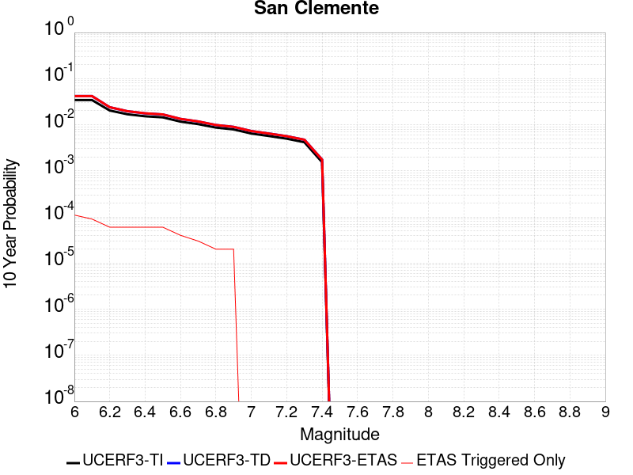 |

| Magnitude | 1 wk TI Prob | 1 wk TD Prob | 1 wk ETAS Prob | 1 wk ETAS/TD Gain | 1 wk ETAS Triggered Only | 1 mo TI Prob | 1 mo TD Prob | 1 mo ETAS Prob | 1 mo ETAS/TD Gain | 1 mo ETAS Triggered Only | 1 yr TI Prob | 1 yr TD Prob | 1 yr ETAS Prob | 1 yr ETAS/TD Gain | 1 yr ETAS Triggered Only | 10 yr TI Prob | 10 yr TD Prob | 10 yr ETAS Prob | 10 yr ETAS/TD Gain | 10 yr ETAS Triggered Only |
|-----|-----|-----|-----|-----|-----|-----|-----|-----|-----|-----|-----|-----|-----|-----|-----|-----|-----|-----|-----|-----|
| 6.0 | 6.681379E-5 | 8.163422E-5 | 4.7146596E-4 | 5.7753468 | 3.8986356E-4 | 2.8631336E-4 | 3.498173E-4 | 7.3954446E-4 | 2.1140878 | 3.8986356E-4 | 0.003480294 | 0.0042512873 | 0.0050276997 | 1.18263 | 7.797271E-4 | 0.03426291 | 0.041755714 | 0.042502884 | 1.0178938 | 7.797271E-4 |
| 6.1 | 6.681379E-5 | 8.163422E-5 | 8.163422E-5 | 1.0 | 0.0 | 2.8631336E-4 | 3.498173E-4 | 3.498173E-4 | 1.0 | 0.0 | 0.003480294 | 0.0042512873 | 0.004639494 | 1.0913149 | 3.8986356E-4 | 0.03426291 | 0.041755714 | 0.042129297 | 1.0089469 | 3.8986356E-4 |
| 6.2 | 3.9400576E-5 | 4.6451984E-5 | 4.6451984E-5 | 1.0 | 0.0 | 1.6884868E-4 | 1.9906509E-4 | 1.9906509E-4 | 1.0 | 0.0 | 0.0020537945 | 0.002420985 | 0.0028099045 | 1.1606452 | 3.8986356E-4 | 0.020349167 | 0.02395286 | 0.024333386 | 1.0158864 | 3.8986356E-4 |
| 6.3 | 3.2590255E-5 | 3.7929087E-5 | 3.7929087E-5 | 1.0 | 0.0 | 1.3966505E-4 | 1.6254328E-4 | 1.6254328E-4 | 1.0 | 0.0 | 0.0016990956 | 0.0019771985 | 0.0023662911 | 1.1967899 | 3.8986356E-4 | 0.01686163 | 0.019599866 | 0.019982088 | 1.0195013 | 3.8986356E-4 |
| 6.4 | 2.9454652E-5 | 3.4097775E-5 | 3.4097775E-5 | 1.0 | 0.0 | 1.2622811E-4 | 1.4612528E-4 | 1.4612528E-4 | 1.0 | 0.0 | 0.0015357438 | 0.0017776482 | 0.0021668186 | 1.2189244 | 3.8986356E-4 | 0.015251739 | 0.017637458 | 0.018020445 | 1.0217144 | 3.8986356E-4 |
| 6.5 | 2.790836E-5 | 3.2247463E-5 | 3.2247463E-5 | 1.0 | 0.0 | 1.1960178E-4 | 1.3819622E-4 | 1.3819622E-4 | 1.0 | 0.0 | 0.001455179 | 0.0016812651 | 0.0020704733 | 1.2314972 | 3.8986356E-4 | 0.014456868 | 0.016688475 | 0.017071832 | 1.0229714 | 3.8986356E-4 |
| 6.6 | 2.2492153E-5 | 2.5762707E-5 | 2.5762707E-5 | 1.0 | 0.0 | 9.639138E-5 | 1.1040701E-4 | 1.1040701E-4 | 1.0 | 0.0 | 0.0011729331 | 0.0013433908 | 0.0013433908 | 1.0 | 0.0 | 0.011667615 | 0.013354415 | 0.013354415 | 1.0 | 0.0 |
| 6.7 | 1.9862755E-5 | 2.2666423E-5 | 2.2666423E-5 | 1.0 | 0.0 | 8.512331E-5 | 9.713826E-5 | 9.713826E-5 | 1.0 | 0.0 | 0.0010358836 | 0.0011820279 | 0.0011820279 | 1.0 | 0.0 | 0.010310682 | 0.011758701 | 0.011758701 | 1.0 | 0.0 |
| 6.8 | 1.6697575E-5 | 1.897771E-5 | 1.897771E-5 | 1.0 | 0.0 | 7.155907E-5 | 8.133056E-5 | 8.133056E-5 | 1.0 | 0.0 | 8.7088346E-4 | 9.897591E-4 | 9.897591E-4 | 1.0 | 0.0 | 0.008674784 | 0.0098545365 | 0.0098545365 | 1.0 | 0.0 |
| 6.9 | 1.5218415E-5 | 1.72694E-5 | 1.72694E-5 | 1.0 | 0.0 | 6.522015E-5 | 7.4009666E-5 | 7.4009666E-5 | 1.0 | 0.0 | 7.93766E-4 | 9.00704E-4 | 9.00704E-4 | 1.0 | 0.0 | 0.007909367 | 0.008971481 | 0.008971481 | 1.0 | 0.0 |
| 7.0 | 1.2392958E-5 | 1.4033016E-5 | 1.4033016E-5 | 1.0 | 0.0 | 5.3111595E-5 | 6.014015E-5 | 6.014015E-5 | 1.0 | 0.0 | 6.4644177E-4 | 7.319679E-4 | 7.319679E-4 | 1.0 | 0.0 | 0.0064456454 | 0.0072963564 | 0.0072963564 | 1.0 | 0.0 |
| 7.1 | 1.0934128E-5 | 1.2375138E-5 | 1.2375138E-5 | 1.0 | 0.0 | 4.6859706E-5 | 5.303527E-5 | 5.303527E-5 | 1.0 | 0.0 | 5.7036756E-4 | 6.455204E-4 | 6.455204E-4 | 1.0 | 0.0 | 0.0056890585 | 0.0064371997 | 0.0064371997 | 1.0 | 0.0 |
| 7.2 | 9.5798805E-6 | 1.0844935E-5 | 1.0844935E-5 | 1.0 | 0.0 | 4.1055984E-5 | 4.6477508E-5 | 4.6477508E-5 | 1.0 | 0.0 | 4.9974193E-4 | 5.657239E-4 | 5.657239E-4 | 1.0 | 0.0 | 0.0049861963 | 0.0056435615 | 0.0056435615 | 1.0 | 0.0 |
| 7.3 | 8.0167365E-6 | 9.083918E-6 | 9.083918E-6 | 1.0 | 0.0 | 3.4356988E-5 | 3.8930535E-5 | 3.8930535E-5 | 1.0 | 0.0 | 4.1821605E-4 | 4.7388324E-4 | 4.7388324E-4 | 1.0 | 0.0 | 0.0041742986 | 0.0047294297 | 0.0047294297 | 1.0 | 0.0 |
| 7.4 | 2.9581017E-6 | 3.3623792E-6 | 3.3623792E-6 | 1.0 | 0.0 | 1.2677518E-5 | 1.4410146E-5 | 1.4410146E-5 | 1.0 | 0.0 | 1.5433785E-4 | 1.7543444E-4 | 1.7543444E-4 | 1.0 | 0.0 | 0.001542307 | 0.0017534546 | 0.0017534546 | 1.0 | 0.0 |

## White Mountains
*[(top)](#table-of-contents)*

| 1 Week | 1 Month | 1 Year | 10 Year |
|-----|-----|-----|-----|
|  |  |  |  |

| Magnitude | 1 wk TI Prob | 1 wk TD Prob | 1 wk ETAS Prob | 1 wk ETAS/TD Gain | 1 wk ETAS Triggered Only | 1 mo TI Prob | 1 mo TD Prob | 1 mo ETAS Prob | 1 mo ETAS/TD Gain | 1 mo ETAS Triggered Only | 1 yr TI Prob | 1 yr TD Prob | 1 yr ETAS Prob | 1 yr ETAS/TD Gain | 1 yr ETAS Triggered Only | 10 yr TI Prob | 10 yr TD Prob | 10 yr ETAS Prob | 10 yr ETAS/TD Gain | 10 yr ETAS Triggered Only |
|-----|-----|-----|-----|-----|-----|-----|-----|-----|-----|-----|-----|-----|-----|-----|-----|-----|-----|-----|-----|-----|
| 6.0 | 3.503579E-5 | 3.378405E-5 | 3.378405E-5 | 1.0 | 0.0 | 1.5014476E-4 | 1.4478143E-4 | 1.4478143E-4 | 1.0 | 0.0 | 0.0018264796 | 0.0017614096 | 0.0025397632 | 1.4418925 | 7.797271E-4 | 0.018115403 | 0.017486818 | 0.018252911 | 1.0438097 | 7.797271E-4 |
| 6.1 | 3.503579E-5 | 3.378405E-5 | 3.378405E-5 | 1.0 | 0.0 | 1.5014476E-4 | 1.4478143E-4 | 1.4478143E-4 | 1.0 | 0.0 | 0.0018264796 | 0.0017614096 | 0.0025397632 | 1.4418925 | 7.797271E-4 | 0.018115403 | 0.017486818 | 0.018252911 | 1.0438097 | 7.797271E-4 |
| 6.2 | 3.503579E-5 | 3.378405E-5 | 3.378405E-5 | 1.0 | 0.0 | 1.5014476E-4 | 1.4478143E-4 | 1.4478143E-4 | 1.0 | 0.0 | 0.0018264796 | 0.0017614096 | 0.0025397632 | 1.4418925 | 7.797271E-4 | 0.018115403 | 0.017486818 | 0.018252911 | 1.0438097 | 7.797271E-4 |
| 6.3 | 1.7818425E-5 | 1.5916074E-5 | 1.5916074E-5 | 1.0 | 0.0 | 7.636245E-5 | 6.821004E-5 | 6.821004E-5 | 1.0 | 0.0 | 9.293162E-4 | 8.301551E-4 | 0.001219695 | 1.4692374 | 3.8986356E-4 | 0.009254395 | 0.008271999 | 0.008658637 | 1.0467407 | 3.8986356E-4 |
| 6.4 | 1.7818425E-5 | 1.5916074E-5 | 1.5916074E-5 | 1.0 | 0.0 | 7.636245E-5 | 6.821004E-5 | 6.821004E-5 | 1.0 | 0.0 | 9.293162E-4 | 8.301551E-4 | 0.001219695 | 1.4692374 | 3.8986356E-4 | 0.009254395 | 0.008271999 | 0.008658637 | 1.0467407 | 3.8986356E-4 |
| 6.5 | 1.3397557E-5 | 1.13362685E-5 | 1.13362685E-5 | 1.0 | 0.0 | 5.741684E-5 | 4.858314E-5 | 4.858314E-5 | 1.0 | 0.0 | 6.988258E-4 | 5.913462E-4 | 9.809792E-4 | 1.6588916 | 3.8986356E-4 | 0.006966323 | 0.005898432 | 0.0062859957 | 1.0657063 | 3.8986356E-4 |
| 6.6 | 1.0818695E-5 | 8.625366E-6 | 8.625366E-6 | 1.0 | 0.0 | 4.6365014E-5 | 3.6965357E-5 | 3.6965357E-5 | 1.0 | 0.0 | 5.6434784E-4 | 4.4996463E-4 | 8.396527E-4 | 1.8660417 | 3.8986356E-4 | 0.005629168 | 0.004490972 | 0.004879085 | 1.0864207 | 3.8986356E-4 |
| 6.7 | 9.067908E-6 | 6.802442E-6 | 6.802442E-6 | 1.0 | 0.0 | 3.8861883E-5 | 2.9153016E-5 | 2.9153016E-5 | 1.0 | 0.0 | 4.7304068E-4 | 3.5488335E-4 | 7.446085E-4 | 2.0981784 | 3.8986356E-4 | 0.00472035 | 0.0035434833 | 0.0039319657 | 1.1096328 | 3.8986356E-4 |
| 6.8 | 7.295947E-6 | 4.936391E-6 | 4.936391E-6 | 1.0 | 0.0 | 3.126797E-5 | 2.1155796E-5 | 2.1155796E-5 | 1.0 | 0.0 | 3.8062103E-4 | 2.575425E-4 | 6.473056E-4 | 2.5133934 | 3.8986356E-4 | 0.0037996976 | 0.0025725532 | 0.002961414 | 1.1511575 | 3.8986356E-4 |
| 6.9 | 6.2243444E-6 | 3.832213E-6 | 3.832213E-6 | 1.0 | 0.0 | 2.6675489E-5 | 1.642367E-5 | 1.642367E-5 | 1.0 | 0.0 | 3.2472567E-4 | 1.9994036E-4 | 5.8972597E-4 | 2.9495094 | 3.8986356E-4 | 0.0032425157 | 0.0019976576 | 0.0023867423 | 1.1947705 | 3.8986356E-4 |
| 7.0 | 4.9878413E-6 | 2.6795342E-6 | 2.6795342E-6 | 1.0 | 0.0 | 2.1376287E-5 | 1.14836685E-5 | 1.14836685E-5 | 1.0 | 0.0 | 2.602252E-4 | 1.3980496E-4 | 5.29614E-4 | 3.7882347 | 3.8986356E-4 | 0.002599207 | 0.0013971963 | 0.0017865151 | 1.2786429 | 3.8986356E-4 |
| 7.1 | 4.0252844E-6 | 1.8857575E-6 | 1.8857575E-6 | 1.0 | 0.0 | 1.7251105E-5 | 8.081794E-6 | 8.081794E-6 | 1.0 | 0.0 | 2.1001195E-4 | 9.8391516E-5 | 4.882167E-4 | 4.9619794 | 3.8986356E-4 | 0.0020981359 | 9.834924E-4 | 0.0013729725 | 1.3960174 | 3.8986356E-4 |
| 7.2 | 3.3284066E-6 | 1.281964E-6 | 1.281964E-6 | 1.0 | 0.0 | 1.4264522E-5 | 5.494121E-6 | 5.494121E-6 | 1.0 | 0.0 | 1.736567E-4 | 6.688897E-5 | 4.5672644E-4 | 6.828128 | 3.8986356E-4 | 0.0017352107 | 6.6869846E-4 | 0.0010583013 | 1.5826286 | 3.8986356E-4 |
| 7.3 | 2.458226E-6 | 6.05722E-7 | 6.05722E-7 | 1.0 | 0.0 | 1.0535211E-5 | 2.5959491E-6 | 2.5959491E-6 | 1.0 | 0.0 | 1.2825865E-4 | 3.1605257E-5 | 3.1605257E-5 | 1.0 | 0.0 | 0.0012818464 | 3.160114E-4 | 3.160114E-4 | 1.0 | 0.0 |
| 7.4 | 1.965953E-6 | 3.1089303E-7 | 3.1089303E-7 | 1.0 | 0.0 | 8.425486E-6 | 1.332398E-6 | 1.332398E-6 | 1.0 | 0.0 | 1.0257547E-4 | 1.6221828E-5 | 1.6221828E-5 | 1.0 | 0.0 | 0.0010252813 | 1.6220656E-4 | 1.6220656E-4 | 1.0 | 0.0 |
| 7.5 | 1.2014192E-6 | 1.8244253E-7 | 1.8244253E-7 | 1.0 | 0.0 | 5.148929E-6 | 7.8189635E-7 | 7.8189635E-7 | 1.0 | 0.0 | 6.2686406E-5 | 9.519547E-6 | 9.519547E-6 | 1.0 | 0.0 | 6.266873E-4 | 9.519148E-5 | 9.519148E-5 | 1.0 | 0.0 |
| 7.6 | 2.5612175E-7 | 4.8946475E-8 | 4.8946475E-8 | 1.0 | 0.0 | 1.0976642E-6 | 2.0977059E-7 | 2.0977059E-7 | 1.0 | 0.0 | 1.3363979E-5 | 2.5539543E-6 | 2.5539543E-6 | 1.0 | 0.0 | 1.3363175E-4 | 2.5539286E-5 | 2.5539286E-5 | 1.0 | 0.0 |

## San Andreas (North Branch Mill Creek)
*[(top)](#table-of-contents)*

| 1 Week | 1 Month | 1 Year | 10 Year |
|-----|-----|-----|-----|
|  |  |  |  |

| Magnitude | 1 wk TI Prob | 1 wk TD Prob | 1 wk ETAS Prob | 1 wk ETAS/TD Gain | 1 wk ETAS Triggered Only | 1 mo TI Prob | 1 mo TD Prob | 1 mo ETAS Prob | 1 mo ETAS/TD Gain | 1 mo ETAS Triggered Only | 1 yr TI Prob | 1 yr TD Prob | 1 yr ETAS Prob | 1 yr ETAS/TD Gain | 1 yr ETAS Triggered Only | 10 yr TI Prob | 10 yr TD Prob | 10 yr ETAS Prob | 10 yr ETAS/TD Gain | 10 yr ETAS Triggered Only |
|-----|-----|-----|-----|-----|-----|-----|-----|-----|-----|-----|-----|-----|-----|-----|-----|-----|-----|-----|-----|-----|
| 6.0 | 1.3461156E-5 | 2.3499893E-5 | 2.3499893E-5 | 1.0 | 0.0 | 5.7689394E-5 | 1.00709956E-4 | 1.00709956E-4 | 1.0 | 0.0 | 7.02142E-4 | 0.0012254574 | 0.002004229 | 1.6354946 | 7.797271E-4 | 0.0069992766 | 0.01222957 | 0.012999761 | 1.0629778 | 7.797271E-4 |
| 6.1 | 1.3461156E-5 | 2.3499893E-5 | 2.3499893E-5 | 1.0 | 0.0 | 5.7689394E-5 | 1.00709956E-4 | 1.00709956E-4 | 1.0 | 0.0 | 7.02142E-4 | 0.0012254574 | 0.002004229 | 1.6354946 | 7.797271E-4 | 0.0069992766 | 0.01222957 | 0.012999761 | 1.0629778 | 7.797271E-4 |
| 6.2 | 1.3461156E-5 | 2.3499893E-5 | 2.3499893E-5 | 1.0 | 0.0 | 5.7689394E-5 | 1.00709956E-4 | 1.00709956E-4 | 1.0 | 0.0 | 7.02142E-4 | 0.0012254574 | 0.002004229 | 1.6354946 | 7.797271E-4 | 0.0069992766 | 0.01222957 | 0.012999761 | 1.0629778 | 7.797271E-4 |
| 6.3 | 1.3461156E-5 | 2.3499893E-5 | 2.3499893E-5 | 1.0 | 0.0 | 5.7689394E-5 | 1.00709956E-4 | 1.00709956E-4 | 1.0 | 0.0 | 7.02142E-4 | 0.0012254574 | 0.002004229 | 1.6354946 | 7.797271E-4 | 0.0069992766 | 0.01222957 | 0.012999761 | 1.0629778 | 7.797271E-4 |
| 6.4 | 1.3461156E-5 | 2.3499893E-5 | 2.3499893E-5 | 1.0 | 0.0 | 5.7689394E-5 | 1.00709956E-4 | 1.00709956E-4 | 1.0 | 0.0 | 7.02142E-4 | 0.0012254574 | 0.002004229 | 1.6354946 | 7.797271E-4 | 0.0069992766 | 0.01222957 | 0.012999761 | 1.0629778 | 7.797271E-4 |
| 6.5 | 1.3450706E-5 | 2.3488852E-5 | 2.3488852E-5 | 1.0 | 0.0 | 5.764461E-5 | 1.0066265E-4 | 1.0066265E-4 | 1.0 | 0.0 | 7.0159714E-4 | 0.001224882 | 0.002003654 | 1.6357936 | 7.797271E-4 | 0.006993862 | 0.01222388 | 0.012994075 | 1.0630075 | 7.797271E-4 |
| 6.6 | 1.3074523E-5 | 2.3103135E-5 | 2.3103135E-5 | 1.0 | 0.0 | 5.6032466E-5 | 9.9009696E-5 | 9.9009696E-5 | 1.0 | 0.0 | 6.8198174E-4 | 0.0012047797 | 0.0019835674 | 1.646415 | 7.797271E-4 | 0.006798926 | 0.012025044 | 0.012795395 | 1.0640622 | 7.797271E-4 |
| 6.7 | 1.3050216E-5 | 2.3078432E-5 | 2.3078432E-5 | 1.0 | 0.0 | 5.59283E-5 | 9.890384E-5 | 9.890384E-5 | 1.0 | 0.0 | 6.8071426E-4 | 0.0012034923 | 0.001982281 | 1.6471074 | 7.797271E-4 | 0.0067863287 | 0.012012309 | 0.01278267 | 1.0641309 | 7.797271E-4 |
| 6.8 | 1.29049395E-5 | 2.292684E-5 | 2.292684E-5 | 1.0 | 0.0 | 5.530571E-5 | 9.825421E-5 | 9.825421E-5 | 1.0 | 0.0 | 6.73139E-4 | 0.0011955918 | 0.0019743866 | 1.6513886 | 7.797271E-4 | 0.0067110364 | 0.011934154 | 0.012704576 | 1.064556 | 7.797271E-4 |
| 6.9 | 1.2867369E-5 | 2.2886245E-5 | 2.2886245E-5 | 1.0 | 0.0 | 5.51447E-5 | 9.8080236E-5 | 9.8080236E-5 | 1.0 | 0.0 | 6.711799E-4 | 0.0011934759 | 0.0019722725 | 1.6525447 | 7.797271E-4 | 0.006691564 | 0.011913223 | 0.012683662 | 1.0646708 | 7.797271E-4 |
| 7.0 | 1.2495996E-5 | 2.2286325E-5 | 2.2286325E-5 | 1.0 | 0.0 | 5.3553173E-5 | 9.550934E-5 | 9.550934E-5 | 1.0 | 0.0 | 6.518148E-4 | 0.0011622087 | 0.0019410297 | 1.6701213 | 7.797271E-4 | 0.0064990623 | 0.0116038285 | 0.012374508 | 1.0664159 | 7.797271E-4 |
| 7.1 | 1.2452067E-5 | 2.2231397E-5 | 2.2231397E-5 | 1.0 | 0.0 | 5.3364907E-5 | 9.527396E-5 | 9.527396E-5 | 1.0 | 0.0 | 6.4952404E-4 | 0.0011593461 | 0.0019381691 | 1.671778 | 7.797271E-4 | 0.0064762887 | 0.0115755 | 0.012346202 | 1.0665804 | 7.797271E-4 |
| 7.2 | 1.2002777E-5 | 2.1609963E-5 | 2.1609963E-5 | 1.0 | 0.0 | 5.143946E-5 | 9.2610855E-5 | 9.2610855E-5 | 1.0 | 0.0 | 6.2609545E-4 | 0.0011269567 | 0.001905805 | 1.6911077 | 7.797271E-4 | 0.006243344 | 0.011254923 | 0.012025874 | 1.0684991 | 7.797271E-4 |
| 7.3 | 1.1923425E-5 | 2.1479793E-5 | 2.1479793E-5 | 1.0 | 0.0 | 5.109939E-5 | 9.205302E-5 | 9.205302E-5 | 1.0 | 0.0 | 6.219575E-4 | 0.001120172 | 0.0018990256 | 1.6952983 | 7.797271E-4 | 0.0062021962 | 0.011187789 | 0.011958793 | 1.0689148 | 7.797271E-4 |
| 7.4 | 1.16105175E-5 | 2.0853771E-5 | 2.0853771E-5 | 1.0 | 0.0 | 4.975841E-5 | 8.937026E-5 | 8.937026E-5 | 1.0 | 0.0 | 6.0564023E-4 | 0.0010875424 | 0.0018664214 | 1.7161828 | 7.797271E-4 | 0.006039923 | 0.010865397 | 0.011636652 | 1.0709827 | 7.797271E-4 |
| 7.5 | 1.1037265E-5 | 1.9553907E-5 | 1.9553907E-5 | 1.0 | 0.0 | 4.7301706E-5 | 8.379978E-5 | 8.379978E-5 | 1.0 | 0.0 | 5.757461E-4 | 0.0010197869 | 0.0017987189 | 1.7638183 | 7.797271E-4 | 0.005742567 | 0.010194898 | 0.010966675 | 1.0757023 | 7.797271E-4 |
| 7.6 | 1.0720915E-5 | 1.899582E-5 | 1.899582E-5 | 1.0 | 0.0 | 4.5945973E-5 | 8.140812E-5 | 8.140812E-5 | 1.0 | 0.0 | 5.592486E-4 | 9.906954E-4 | 0.00176965 | 1.7862705 | 7.797271E-4 | 0.005578433 | 0.009906623 | 0.010678625 | 1.077928 | 7.797271E-4 |
| 7.7 | 9.276279E-6 | 1.6441649E-5 | 1.6441649E-5 | 1.0 | 0.0 | 3.9754876E-5 | 7.0462316E-5 | 7.0462316E-5 | 1.0 | 0.0 | 4.839081E-4 | 8.575427E-4 | 0.0016366012 | 1.9084778 | 7.797271E-4 | 0.0048285574 | 0.008586041 | 0.009359074 | 1.0900337 | 7.797271E-4 |
| 7.8 | 5.8346777E-6 | 1.1155013E-5 | 1.1155013E-5 | 1.0 | 0.0 | 2.5005522E-5 | 4.7806327E-5 | 4.7806327E-5 | 1.0 | 0.0 | 3.043997E-4 | 5.818867E-4 | 0.0013611601 | 2.3392184 | 7.797271E-4 | 0.0030398308 | 0.0058469265 | 0.0066220947 | 1.1325771 | 7.797271E-4 |
| 7.9 | 4.690204E-6 | 8.509093E-6 | 8.509093E-6 | 1.0 | 0.0 | 2.0100719E-5 | 3.6467034E-5 | 3.6467034E-5 | 1.0 | 0.0 | 2.4469878E-4 | 4.4389578E-4 | 0.0012232767 | 2.7557747 | 7.797271E-4 | 0.002444295 | 0.0044707474 | 0.0052469885 | 1.1736267 | 7.797271E-4 |
| 8.0 | 2.9570454E-6 | 4.846947E-6 | 4.846947E-6 | 1.0 | 0.0 | 1.267299E-5 | 2.0772464E-5 | 2.0772464E-5 | 1.0 | 0.0 | 1.5428272E-4 | 2.5287544E-4 | 0.0010324053 | 4.082664 | 7.797271E-4 | 0.0015417566 | 0.002549644 | 0.0033273832 | 1.3050383 | 7.797271E-4 |
| 8.1 | 1.6376824E-6 | 2.1968929E-6 | 2.1968929E-6 | 1.0 | 0.0 | 7.01862E-6 | 9.41522E-6 | 9.41522E-6 | 1.0 | 0.0 | 8.544835E-5 | 1.14624294E-4 | 1.14624294E-4 | 1.0 | 0.0 | 8.54155E-4 | 0.0011606582 | 0.0011606582 | 1.0 | 0.0 |
| 8.2 | 6.9631557E-7 | 4.5360213E-7 | 4.5360213E-7 | 1.0 | 0.0 | 2.984206E-6 | 1.9440076E-6 | 1.9440076E-6 | 1.0 | 0.0 | 3.63321E-5 | 2.3668037E-5 | 2.3668037E-5 | 1.0 | 0.0 | 3.6326164E-4 | 2.451564E-4 | 2.451564E-4 | 1.0 | 0.0 |
| 8.3 | 1.7876137E-7 | 8.360375E-8 | 8.360375E-8 | 1.0 | 0.0 | 7.661199E-7 | 3.5830175E-7 | 3.5830175E-7 | 1.0 | 0.0 | 9.32747E-6 | 4.3623154E-6 | 4.3623154E-6 | 1.0 | 0.0 | 9.3270784E-5 | 4.5817014E-5 | 4.5817014E-5 | 1.0 | 0.0 |

## White Wolf (Extension)
*[(top)](#table-of-contents)*

| 1 Week | 1 Month | 1 Year | 10 Year |
|-----|-----|-----|-----|
|  | 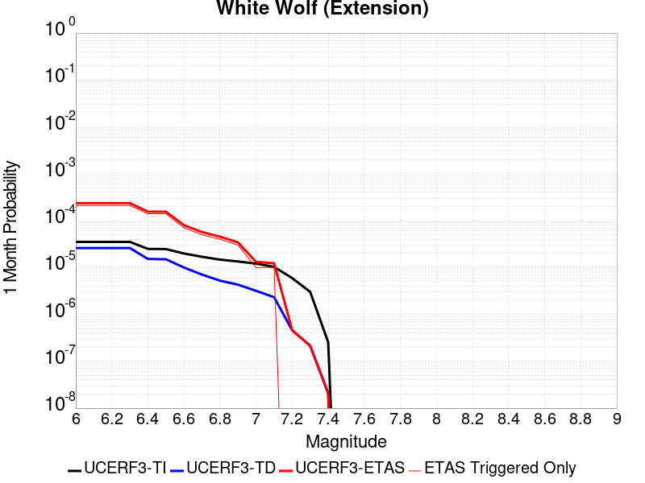 |  |  |

| Magnitude | 1 wk TI Prob | 1 wk TD Prob | 1 wk ETAS Prob | 1 wk ETAS/TD Gain | 1 wk ETAS Triggered Only | 1 mo TI Prob | 1 mo TD Prob | 1 mo ETAS Prob | 1 mo ETAS/TD Gain | 1 mo ETAS Triggered Only | 1 yr TI Prob | 1 yr TD Prob | 1 yr ETAS Prob | 1 yr ETAS/TD Gain | 1 yr ETAS Triggered Only | 10 yr TI Prob | 10 yr TD Prob | 10 yr ETAS Prob | 10 yr ETAS/TD Gain | 10 yr ETAS Triggered Only |
|-----|-----|-----|-----|-----|-----|-----|-----|-----|-----|-----|-----|-----|-----|-----|-----|-----|-----|-----|-----|-----|
| 6.0 | 8.222555E-6 | 6.0666657E-6 | 3.9592784E-4 | 65.26284 | 3.8986356E-4 | 3.5239045E-5 | 2.5999774E-5 | 8.057066E-4 | 30.988985 | 7.797271E-4 | 4.289509E-4 | 3.1650788E-4 | 0.0010959882 | 3.4627516 | 7.797271E-4 | 0.0042812387 | 0.003161223 | 0.0039384854 | 1.2458739 | 7.797271E-4 |
| 6.1 | 8.222555E-6 | 6.0666657E-6 | 3.9592784E-4 | 65.26284 | 3.8986356E-4 | 3.5239045E-5 | 2.5999774E-5 | 8.057066E-4 | 30.988985 | 7.797271E-4 | 4.289509E-4 | 3.1650788E-4 | 0.0010959882 | 3.4627516 | 7.797271E-4 | 0.0042812387 | 0.003161223 | 0.0039384854 | 1.2458739 | 7.797271E-4 |
| 6.2 | 8.222555E-6 | 6.0666657E-6 | 3.9592784E-4 | 65.26284 | 3.8986356E-4 | 3.5239045E-5 | 2.5999774E-5 | 8.057066E-4 | 30.988985 | 7.797271E-4 | 4.289509E-4 | 3.1650788E-4 | 0.0010959882 | 3.4627516 | 7.797271E-4 | 0.0042812387 | 0.003161223 | 0.0039384854 | 1.2458739 | 7.797271E-4 |
| 6.3 | 8.222555E-6 | 6.0666657E-6 | 3.9592784E-4 | 65.26284 | 3.8986356E-4 | 3.5239045E-5 | 2.5999774E-5 | 8.057066E-4 | 30.988985 | 7.797271E-4 | 4.289509E-4 | 3.1650788E-4 | 0.0010959882 | 3.4627516 | 7.797271E-4 | 0.0042812387 | 0.003161223 | 0.0039384854 | 1.2458739 | 7.797271E-4 |
| 6.4 | 5.821773E-6 | 3.5571766E-6 | 3.9341935E-4 | 110.59877 | 3.8986356E-4 | 2.4950215E-5 | 1.5244959E-5 | 7.949602E-4 | 52.14577 | 7.797271E-4 | 3.0372653E-4 | 1.8559267E-4 | 9.6517504E-4 | 5.200502 | 7.797271E-4 | 0.0030331176 | 0.001854485 | 0.0026327663 | 1.419675 | 7.797271E-4 |
| 6.5 | 5.766023E-6 | 3.4991106E-6 | 3.933613E-4 | 112.41751 | 3.8986356E-4 | 2.4711293E-5 | 1.4996108E-5 | 7.947115E-4 | 52.99452 | 7.797271E-4 | 3.0081844E-4 | 1.8256342E-4 | 9.621482E-4 | 5.270213 | 7.797271E-4 | 0.0030041158 | 0.0018242426 | 0.0026025472 | 1.4266454 | 7.797271E-4 |
| 6.6 | 4.643576E-6 | 2.332624E-6 | 3.9219527E-4 | 168.1348 | 3.8986356E-4 | 1.9900888E-5 | 9.996925E-6 | 7.897162E-4 | 78.99592 | 7.797271E-4 | 2.4226638E-4 | 1.2170619E-4 | 9.013384E-4 | 7.405855 | 7.797271E-4 | 0.0024200242 | 0.0012164378 | 0.0019952164 | 1.6402124 | 7.797271E-4 |
| 6.7 | 3.9529173E-6 | 1.6483477E-6 | 1.6483477E-6 | 1.0 | 0.0 | 1.6940963E-5 | 7.0643296E-6 | 3.969251E-4 | 56.187233 | 3.8986356E-4 | 2.0623671E-4 | 8.6005006E-5 | 4.7583503E-4 | 5.5326433 | 3.8986356E-4 | 0.002060454 | 8.597357E-4 | 0.0012492641 | 1.4530792 | 3.8986356E-4 |
| 6.8 | 3.4377522E-6 | 1.2245237E-6 | 1.2245237E-6 | 1.0 | 0.0 | 1.473314E-5 | 5.2479486E-6 | 3.9510944E-4 | 75.28836 | 3.8986356E-4 | 1.7936122E-4 | 6.3891996E-5 | 4.5373064E-4 | 7.101526 | 3.8986356E-4 | 0.0017921652 | 6.387454E-4 | 0.0010283599 | 1.6099684 | 3.8986356E-4 |
| 6.9 | 3.1367306E-6 | 1.0033783E-6 | 1.0033783E-6 | 1.0 | 0.0 | 1.3443062E-5 | 4.3001864E-6 | 4.3001864E-6 | 1.0 | 0.0 | 1.63657E-4 | 5.235359E-5 | 5.235359E-5 | 1.0 | 0.0 | 0.0016353652 | 5.2342017E-4 | 5.2342017E-4 | 1.0 | 0.0 |
| 7.0 | 2.8298145E-6 | 7.4286646E-7 | 7.4286646E-7 | 1.0 | 0.0 | 1.2127721E-5 | 3.1837099E-6 | 3.1837099E-6 | 1.0 | 0.0 | 1.47645E-4 | 3.8761027E-5 | 3.8761027E-5 | 1.0 | 0.0 | 0.0014754693 | 3.8754768E-4 | 3.8754768E-4 | 1.0 | 0.0 |
| 7.1 | 2.4091064E-6 | 5.4227525E-7 | 5.4227525E-7 | 1.0 | 0.0 | 1.03247E-5 | 2.3240348E-6 | 2.3240348E-6 | 1.0 | 0.0 | 1.2569598E-4 | 2.8294799E-5 | 2.8294799E-5 | 1.0 | 0.0 | 0.001256249 | 2.8291598E-4 | 2.8291598E-4 | 1.0 | 0.0 |
| 7.2 | 1.3875518E-6 | 1.0743063E-7 | 1.0743063E-7 | 1.0 | 0.0 | 5.9466374E-6 | 4.6041689E-7 | 4.6041689E-7 | 1.0 | 0.0 | 7.23979E-5 | 5.6055624E-6 | 5.6055624E-6 | 1.0 | 0.0 | 7.2374323E-4 | 5.6054323E-5 | 5.6054323E-5 | 1.0 | 0.0 |
| 7.3 | 7.056077E-7 | 5.002034E-8 | 5.002034E-8 | 1.0 | 0.0 | 3.0240296E-6 | 2.1437286E-7 | 2.1437286E-7 | 1.0 | 0.0 | 3.681694E-5 | 2.609987E-6 | 2.609987E-6 | 1.0 | 0.0 | 3.681084E-4 | 2.609961E-5 | 2.609961E-5 | 1.0 | 0.0 |
| 7.4 | 5.9334678E-8 | 4.8683537E-9 | 4.8683537E-9 | 1.0 | 0.0 | 2.5429145E-7 | 2.0864372E-8 | 2.0864372E-8 | 1.0 | 0.0 | 3.095994E-6 | 2.5402372E-7 | 2.5402372E-7 | 1.0 | 0.0 | 3.095951E-5 | 2.5402353E-6 | 2.5402353E-6 | 1.0 | 0.0 |

## Imperial
*[(top)](#table-of-contents)*

| 1 Week | 1 Month | 1 Year | 10 Year |
|-----|-----|-----|-----|
|  |  | 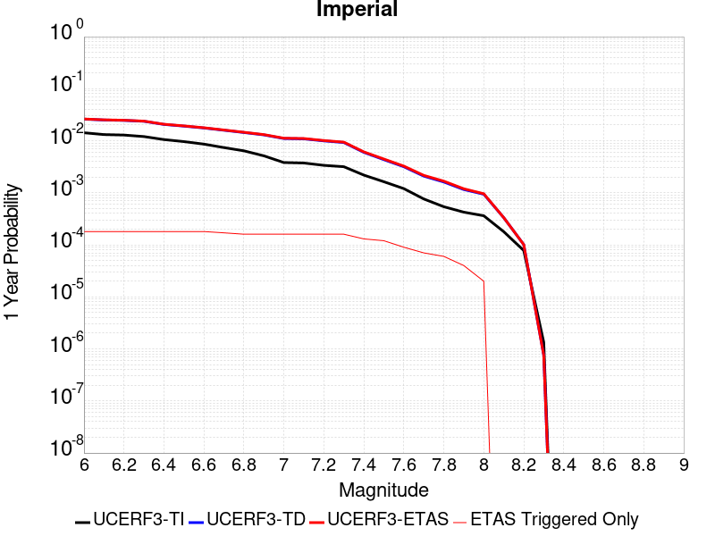 |  |

| Magnitude | 1 wk TI Prob | 1 wk TD Prob | 1 wk ETAS Prob | 1 wk ETAS/TD Gain | 1 wk ETAS Triggered Only | 1 mo TI Prob | 1 mo TD Prob | 1 mo ETAS Prob | 1 mo ETAS/TD Gain | 1 mo ETAS Triggered Only | 1 yr TI Prob | 1 yr TD Prob | 1 yr ETAS Prob | 1 yr ETAS/TD Gain | 1 yr ETAS Triggered Only | 10 yr TI Prob | 10 yr TD Prob | 10 yr ETAS Prob | 10 yr ETAS/TD Gain | 10 yr ETAS Triggered Only |
|-----|-----|-----|-----|-----|-----|-----|-----|-----|-----|-----|-----|-----|-----|-----|-----|-----|-----|-----|-----|-----|
| 6.0 | 2.7496446E-4 | 5.0552754E-4 | 5.0552754E-4 | 1.0 | 0.0 | 0.0011778869 | 0.002164787 | 0.002164787 | 1.0 | 0.0 | 0.0142467655 | 0.026038699 | 0.026038699 | 1.0 | 0.0 | 0.13367249 | 0.2280438 | 0.2286457 | 1.0026394 | 7.797271E-4 |
| 6.1 | 2.5356023E-4 | 4.8656776E-4 | 4.8656776E-4 | 1.0 | 0.0 | 0.001086234 | 0.0020836622 | 0.0020836622 | 1.0 | 0.0 | 0.013144928 | 0.025071215 | 0.025071215 | 1.0 | 0.0 | 0.123940155 | 0.21947981 | 0.2200884 | 1.0027729 | 7.797271E-4 |
| 6.2 | 2.4820742E-4 | 4.7752203E-4 | 4.7752203E-4 | 1.0 | 0.0 | 0.0010633124 | 0.0020449557 | 0.0020449557 | 1.0 | 0.0 | 0.01286919 | 0.024611235 | 0.024611235 | 1.0 | 0.0 | 0.12148927 | 0.21598552 | 0.21659684 | 1.0028304 | 7.797271E-4 |
| 6.3 | 2.3205351E-4 | 4.5890483E-4 | 4.5890483E-4 | 1.0 | 0.0 | 9.94136E-4 | 0.0019652895 | 0.0019652895 | 1.0 | 0.0 | 0.012036599 | 0.02366133 | 0.02366133 | 1.0 | 0.0 | 0.11405133 | 0.20793462 | 0.20855221 | 1.0029701 | 7.797271E-4 |
| 6.4 | 2.0304754E-4 | 3.987652E-4 | 3.987652E-4 | 1.0 | 0.0 | 8.6991355E-4 | 0.0017078889 | 0.0017078889 | 1.0 | 0.0 | 0.010539869 | 0.020595672 | 0.020595672 | 1.0 | 0.0 | 0.100537635 | 0.1850669 | 0.18570232 | 1.0034335 | 7.797271E-4 |
| 6.5 | 1.854992E-4 | 3.6988858E-4 | 3.6988858E-4 | 1.0 | 0.0 | 7.9475436E-4 | 0.0015842861 | 0.0015842861 | 1.0 | 0.0 | 0.009633281 | 0.01911948 | 0.01911948 | 1.0 | 0.0 | 0.0922623 | 0.173298 | 0.1736203 | 1.0018598 | 3.8986356E-4 |
| 6.6 | 1.6586106E-4 | 3.403506E-4 | 3.403506E-4 | 1.0 | 0.0 | 7.106394E-4 | 0.0014578402 | 0.0014578402 | 1.0 | 0.0 | 0.008617763 | 0.01760642 | 0.01760642 | 1.0 | 0.0 | 0.08291132 | 0.16077545 | 0.16110262 | 1.002035 | 3.8986356E-4 |
| 6.7 | 1.4224656E-4 | 3.076692E-4 | 3.076692E-4 | 1.0 | 0.0 | 6.094856E-4 | 0.001317924 | 0.001317924 | 1.0 | 0.0 | 0.0073952693 | 0.015929576 | 0.015929576 | 1.0 | 0.0 | 0.07153955 | 0.14648417 | 0.14681692 | 1.0022717 | 3.8986356E-4 |
| 6.8 | 1.2317259E-4 | 2.779122E-4 | 2.779122E-4 | 1.0 | 0.0 | 5.2777573E-4 | 0.0011905148 | 0.0011905148 | 1.0 | 0.0 | 0.0064067547 | 0.0143995695 | 0.0143995695 | 1.0 | 0.0 | 0.06225166 | 0.13293684 | 0.13327487 | 1.0025429 | 3.8986356E-4 |
| 6.9 | 9.859898E-5 | 2.5014306E-4 | 2.5014306E-4 | 1.0 | 0.0 | 4.2249862E-4 | 0.0010716055 | 0.0010716055 | 1.0 | 0.0 | 0.0051317946 | 0.012969712 | 0.012969712 | 1.0 | 0.0 | 0.05014893 | 0.11940631 | 0.11974963 | 1.0028752 | 3.8986356E-4 |
| 7.0 | 7.3191884E-5 | 2.1266776E-4 | 2.1266776E-4 | 1.0 | 0.0 | 3.136418E-4 | 9.1111806E-4 | 9.1111806E-4 | 1.0 | 0.0 | 0.003811904 | 0.011037128 | 0.011037128 | 1.0 | 0.0 | 0.037471764 | 0.10206493 | 0.102414995 | 1.0034299 | 3.8986356E-4 |
| 7.1 | 7.1760296E-5 | 2.0968143E-4 | 2.0968143E-4 | 1.0 | 0.0 | 3.0750787E-4 | 8.983284E-4 | 8.983284E-4 | 1.0 | 0.0 | 0.003737482 | 0.010882978 | 0.010882978 | 1.0 | 0.0 | 0.03675245 | 0.10070146 | 0.10105206 | 1.0034816 | 3.8986356E-4 |
| 7.2 | 6.46614E-5 | 1.9136685E-4 | 1.9136685E-4 | 1.0 | 0.0 | 2.7709085E-4 | 8.1988896E-4 | 8.1988896E-4 | 1.0 | 0.0 | 0.0033683628 | 0.0099370815 | 0.0099370815 | 1.0 | 0.0 | 0.033177625 | 0.09250898 | 0.09286278 | 1.0038245 | 3.8986356E-4 |
| 7.3 | 6.088115E-5 | 1.78084E-4 | 1.78084E-4 | 1.0 | 0.0 | 2.6089314E-4 | 7.6299673E-4 | 7.6299673E-4 | 1.0 | 0.0 | 0.0031717476 | 0.009250494 | 0.009250494 | 1.0 | 0.0 | 0.031268585 | 0.08655989 | 0.08691601 | 1.0041142 | 3.8986356E-4 |
| 7.4 | 4.199346E-5 | 1.1510366E-4 | 1.1510366E-4 | 1.0 | 0.0 | 1.7995955E-4 | 4.9320905E-4 | 4.9320905E-4 | 1.0 | 0.0 | 0.0021888057 | 0.0059884563 | 0.0059884563 | 1.0 | 0.0 | 0.02167372 | 0.057439793 | 0.057807263 | 1.0063975 | 3.8986356E-4 |
| 7.5 | 3.130448E-5 | 8.33328E-5 | 8.33328E-5 | 1.0 | 0.0 | 1.3415517E-4 | 3.57092E-4 | 3.57092E-4 | 1.0 | 0.0 | 0.0016321153 | 0.004338988 | 0.004338988 | 1.0 | 0.0 | 0.016201803 | 0.04213201 | 0.042505447 | 1.0088636 | 3.8986356E-4 |
| 7.6 | 2.3074248E-5 | 6.0844646E-5 | 6.0844646E-5 | 1.0 | 0.0 | 9.888588E-5 | 2.6073685E-4 | 2.6073685E-4 | 1.0 | 0.0 | 0.0012032706 | 0.0031698733 | 0.0031698733 | 1.0 | 0.0 | 0.011967761 | 0.031026395 | 0.031026395 | 1.0 | 0.0 |
| 7.7 | 1.45864815E-5 | 4.0124698E-5 | 4.0124698E-5 | 1.0 | 0.0 | 6.2511994E-5 | 1.7195169E-4 | 1.7195169E-4 | 1.0 | 0.0 | 7.608177E-4 | 0.0020915072 | 0.0020915072 | 1.0 | 0.0 | 0.007582182 | 0.020627763 | 0.020627763 | 1.0 | 0.0 |
| 7.8 | 1.0352979E-5 | 3.0960902E-5 | 3.0960902E-5 | 1.0 | 0.0 | 4.4369157E-5 | 1.3268284E-4 | 1.3268284E-4 | 1.0 | 0.0 | 5.400606E-4 | 0.0016142189 | 0.0016142189 | 1.0 | 0.0 | 0.0053875 | 0.016016833 | 0.016016833 | 1.0 | 0.0 |
| 7.9 | 8.137906E-6 | 2.2149103E-5 | 2.2149103E-5 | 1.0 | 0.0 | 3.4876273E-5 | 9.492128E-5 | 9.492128E-5 | 1.0 | 0.0 | 4.2453592E-4 | 0.0011550548 | 0.0011550548 | 1.0 | 0.0 | 0.004237258 | 0.011617903 | 0.011617903 | 1.0 | 0.0 |
| 8.0 | 6.93792E-6 | 1.8008766E-5 | 1.8008766E-5 | 1.0 | 0.0 | 2.9733603E-5 | 7.717814E-5 | 7.717814E-5 | 1.0 | 0.0 | 3.6194647E-4 | 9.3923963E-4 | 9.3923963E-4 | 1.0 | 0.0 | 0.0036135751 | 0.00950155 | 0.00950155 | 1.0 | 0.0 |
| 8.1 | 3.4286315E-6 | 6.379872E-6 | 6.379872E-6 | 1.0 | 0.0 | 1.4694053E-5 | 2.7342023E-5 | 2.7342023E-5 | 1.0 | 0.0 | 1.7888541E-4 | 3.328384E-4 | 3.328384E-4 | 1.0 | 0.0 | 0.0017874148 | 0.003486031 | 0.003486031 | 1.0 | 0.0 |
| 8.2 | 1.4906886E-6 | 1.9366646E-6 | 1.9366646E-6 | 1.0 | 0.0 | 6.3886496E-6 | 8.299965E-6 | 8.299965E-6 | 1.0 | 0.0 | 7.7779034E-5 | 1.0104742E-4 | 1.0104742E-4 | 1.0 | 0.0 | 7.775182E-4 | 0.0011075331 | 0.0011075331 | 1.0 | 0.0 |
| 8.3 | 2.5758007E-8 | 1.4500102E-8 | 1.4500102E-8 | 1.0 | 0.0 | 1.10391454E-7 | 6.214329E-8 | 6.214329E-8 | 1.0 | 0.0 | 1.3440151E-6 | 7.565946E-7 | 7.565946E-7 | 1.0 | 0.0 | 1.344007E-5 | 7.887763E-6 | 7.887763E-6 | 1.0 | 0.0 |

## San Andreas (San Gorgonio Pass-Garnet HIll)
*[(top)](#table-of-contents)*

| 1 Week | 1 Month | 1 Year | 10 Year |
|-----|-----|-----|-----|
|  |  |  |  |

| Magnitude | 1 wk TI Prob | 1 wk TD Prob | 1 wk ETAS Prob | 1 wk ETAS/TD Gain | 1 wk ETAS Triggered Only | 1 mo TI Prob | 1 mo TD Prob | 1 mo ETAS Prob | 1 mo ETAS/TD Gain | 1 mo ETAS Triggered Only | 1 yr TI Prob | 1 yr TD Prob | 1 yr ETAS Prob | 1 yr ETAS/TD Gain | 1 yr ETAS Triggered Only | 10 yr TI Prob | 10 yr TD Prob | 10 yr ETAS Prob | 10 yr ETAS/TD Gain | 10 yr ETAS Triggered Only |
|-----|-----|-----|-----|-----|-----|-----|-----|-----|-----|-----|-----|-----|-----|-----|-----|-----|-----|-----|-----|-----|
| 6.0 | 8.31567E-5 | 2.3382473E-4 | 2.3382473E-4 | 1.0 | 0.0 | 3.5633717E-4 | 0.0010017233 | 0.0010017233 | 1.0 | 0.0 | 0.004329778 | 0.012127888 | 0.012127888 | 1.0 | 0.0 | 0.042463828 | 0.11257892 | 0.113270864 | 1.0061463 | 7.797271E-4 |
| 6.1 | 8.31567E-5 | 2.3382473E-4 | 2.3382473E-4 | 1.0 | 0.0 | 3.5633717E-4 | 0.0010017233 | 0.0010017233 | 1.0 | 0.0 | 0.004329778 | 0.012127888 | 0.012127888 | 1.0 | 0.0 | 0.042463828 | 0.11257892 | 0.113270864 | 1.0061463 | 7.797271E-4 |
| 6.2 | 8.31567E-5 | 2.3382473E-4 | 2.3382473E-4 | 1.0 | 0.0 | 3.5633717E-4 | 0.0010017233 | 0.0010017233 | 1.0 | 0.0 | 0.004329778 | 0.012127888 | 0.012127888 | 1.0 | 0.0 | 0.042463828 | 0.11257892 | 0.113270864 | 1.0061463 | 7.797271E-4 |
| 6.3 | 8.31567E-5 | 2.3382473E-4 | 2.3382473E-4 | 1.0 | 0.0 | 3.5633717E-4 | 0.0010017233 | 0.0010017233 | 1.0 | 0.0 | 0.004329778 | 0.012127888 | 0.012127888 | 1.0 | 0.0 | 0.042463828 | 0.11257892 | 0.113270864 | 1.0061463 | 7.797271E-4 |
| 6.4 | 8.059055E-5 | 2.2940808E-4 | 2.2940808E-4 | 1.0 | 0.0 | 3.4534236E-4 | 9.828096E-4 | 9.828096E-4 | 1.0 | 0.0 | 0.0041964394 | 0.011900152 | 0.011900152 | 1.0 | 0.0 | 0.041180745 | 0.11056015 | 0.111253664 | 1.0062728 | 7.797271E-4 |
| 6.5 | 8.059055E-5 | 2.2940808E-4 | 2.2940808E-4 | 1.0 | 0.0 | 3.4534236E-4 | 9.828096E-4 | 9.828096E-4 | 1.0 | 0.0 | 0.0041964394 | 0.011900152 | 0.011900152 | 1.0 | 0.0 | 0.041180745 | 0.11056015 | 0.111253664 | 1.0062728 | 7.797271E-4 |
| 6.6 | 7.619237E-5 | 2.218517E-4 | 2.218517E-4 | 1.0 | 0.0 | 3.2649786E-4 | 9.5044886E-4 | 9.5044886E-4 | 1.0 | 0.0 | 0.0039678677 | 0.01151087 | 0.01151087 | 1.0 | 0.0 | 0.03897764 | 0.10709683 | 0.10779305 | 1.0065008 | 7.797271E-4 |
| 6.7 | 7.440636E-5 | 2.1860997E-4 | 2.1860997E-4 | 1.0 | 0.0 | 3.188454E-4 | 9.3656575E-4 | 9.3656575E-4 | 1.0 | 0.0 | 0.0038750346 | 0.011343609 | 0.011343609 | 1.0 | 0.0 | 0.038081564 | 0.105605274 | 0.106302656 | 1.0066037 | 7.797271E-4 |
| 6.8 | 7.3735864E-5 | 2.1708169E-4 | 2.1708169E-4 | 1.0 | 0.0 | 3.1597257E-4 | 9.3002064E-4 | 9.3002064E-4 | 1.0 | 0.0 | 0.0038401815 | 0.011264749 | 0.011264749 | 1.0 | 0.0 | 0.03774495 | 0.10490683 | 0.10560475 | 1.0066528 | 7.797271E-4 |
| 6.9 | 7.27575E-5 | 2.1477141E-4 | 2.1477141E-4 | 1.0 | 0.0 | 3.117806E-4 | 9.201265E-4 | 9.201265E-4 | 1.0 | 0.0 | 0.003789323 | 0.011145527 | 0.011145527 | 1.0 | 0.0 | 0.037253562 | 0.103854746 | 0.10455349 | 1.0067282 | 7.797271E-4 |
| 7.0 | 7.102591E-5 | 2.1061185E-4 | 2.1061185E-4 | 1.0 | 0.0 | 3.0436125E-4 | 9.023122E-4 | 9.023122E-4 | 1.0 | 0.0 | 0.003699303 | 0.010930831 | 0.010930831 | 1.0 | 0.0 | 0.03638325 | 0.10195695 | 0.10265718 | 1.0068679 | 7.797271E-4 |
| 7.1 | 7.028513E-5 | 2.0896831E-4 | 2.0896831E-4 | 1.0 | 0.0 | 3.0118722E-4 | 8.9527335E-4 | 8.9527335E-4 | 1.0 | 0.0 | 0.0036607897 | 0.010845989 | 0.010845989 | 1.0 | 0.0 | 0.036010686 | 0.101199985 | 0.1019008 | 1.0069251 | 7.797271E-4 |
| 7.2 | 6.8498244E-5 | 2.0504706E-4 | 2.0504706E-4 | 1.0 | 0.0 | 2.9353087E-4 | 8.784794E-4 | 8.784794E-4 | 1.0 | 0.0 | 0.003567883 | 0.010643536 | 0.010643536 | 1.0 | 0.0 | 0.035111405 | 0.09939202 | 0.10009425 | 1.0070653 | 7.797271E-4 |
| 7.3 | 6.622592E-5 | 1.9732013E-4 | 1.9732013E-4 | 1.0 | 0.0 | 2.8379448E-4 | 8.453858E-4 | 8.453858E-4 | 1.0 | 0.0 | 0.0034497243 | 0.0102444785 | 0.0102444785 | 1.0 | 0.0 | 0.033966612 | 0.095888525 | 0.096593484 | 1.0073519 | 7.797271E-4 |
| 7.4 | 5.1050705E-5 | 1.4689034E-4 | 1.4689034E-4 | 1.0 | 0.0 | 2.1877038E-4 | 6.29379E-4 | 6.29379E-4 | 1.0 | 0.0 | 0.002660276 | 0.0076359594 | 0.0076359594 | 1.0 | 0.0 | 0.02628654 | 0.07286301 | 0.07358593 | 1.0099216 | 7.797271E-4 |
| 7.5 | 3.9302922E-5 | 1.1129847E-4 | 1.1129847E-4 | 1.0 | 0.0 | 1.6843023E-4 | 4.7690657E-4 | 4.7690657E-4 | 1.0 | 0.0 | 0.0020487092 | 0.005790949 | 0.005790949 | 1.0 | 0.0 | 0.020299247 | 0.05600951 | 0.056745566 | 1.0131416 | 7.797271E-4 |
| 7.6 | 2.9851626E-5 | 8.4949745E-5 | 8.4949745E-5 | 1.0 | 0.0 | 1.2792926E-4 | 3.6401965E-4 | 3.6401965E-4 | 1.0 | 0.0 | 0.0015564259 | 0.0044229585 | 0.0044229585 | 1.0 | 0.0 | 0.0154556995 | 0.04319374 | 0.04356676 | 1.0086361 | 3.8986356E-4 |
| 7.7 | 2.1135214E-5 | 6.3529005E-5 | 6.3529005E-5 | 1.0 | 0.0 | 9.0576345E-5 | 2.7223877E-4 | 2.7223877E-4 | 1.0 | 0.0 | 0.0011022091 | 0.0033094748 | 0.0033094748 | 1.0 | 0.0 | 0.010967582 | 0.032582592 | 0.032959756 | 1.0115756 | 3.8986356E-4 |
| 7.8 | 1.883379E-5 | 5.564028E-5 | 5.564028E-5 | 1.0 | 0.0 | 8.0713755E-5 | 2.3843657E-4 | 2.3843657E-4 | 1.0 | 0.0 | 9.822468E-4 | 0.0028991038 | 0.0028991038 | 1.0 | 0.0 | 0.0097791655 | 0.028695205 | 0.029073883 | 1.0131965 | 3.8986356E-4 |
| 7.9 | 1.5156185E-5 | 4.1658426E-5 | 4.1658426E-5 | 1.0 | 0.0 | 6.495346E-5 | 1.785239E-4 | 1.785239E-4 | 1.0 | 0.0 | 7.9052144E-4 | 0.0021713632 | 0.0021713632 | 1.0 | 0.0 | 0.007877152 | 0.021759422 | 0.022140803 | 1.0175271 | 3.8986356E-4 |
| 8.0 | 1.1405907E-5 | 2.9974231E-5 | 2.9974231E-5 | 1.0 | 0.0 | 4.8881542E-5 | 1.2845467E-4 | 1.2845467E-4 | 1.0 | 0.0 | 5.9497025E-4 | 0.0015628147 | 0.0015628147 | 1.0 | 0.0 | 0.005933798 | 0.015772851 | 0.016156565 | 1.0243275 | 3.8986356E-4 |
| 8.1 | 4.3511436E-6 | 7.369219E-6 | 7.369219E-6 | 1.0 | 0.0 | 1.8647626E-5 | 3.1581985E-5 | 3.1581985E-5 | 1.0 | 0.0 | 2.2701119E-4 | 3.8444297E-4 | 3.8444297E-4 | 1.0 | 0.0 | 0.0022677942 | 0.0041163345 | 0.0041163345 | 1.0 | 0.0 |
| 8.2 | 2.3042528E-6 | 2.7329415E-6 | 2.7329415E-6 | 1.0 | 0.0 | 9.875332E-6 | 1.1712554E-5 | 1.1712554E-5 | 1.0 | 0.0 | 1.2022553E-4 | 1.4259106E-4 | 1.4259106E-4 | 1.0 | 0.0 | 0.0012016051 | 0.0015979785 | 0.0015979785 | 1.0 | 0.0 |
| 8.3 | 5.202968E-7 | 3.1598344E-7 | 3.1598344E-7 | 1.0 | 0.0 | 2.2298414E-6 | 1.3542141E-6 | 1.3542141E-6 | 1.0 | 0.0 | 2.714798E-5 | 1.6487444E-5 | 1.6487444E-5 | 1.0 | 0.0 | 2.7144665E-4 | 1.9563142E-4 | 1.9563142E-4 | 1.0 | 0.0 |

## Brawley (Seismic Zone) alt 1
*[(top)](#table-of-contents)*

| 1 Week | 1 Month | 1 Year | 10 Year |
|-----|-----|-----|-----|
|  |  |  |  |

| Magnitude | 1 wk TI Prob | 1 wk TD Prob | 1 wk ETAS Prob | 1 wk ETAS/TD Gain | 1 wk ETAS Triggered Only | 1 mo TI Prob | 1 mo TD Prob | 1 mo ETAS Prob | 1 mo ETAS/TD Gain | 1 mo ETAS Triggered Only | 1 yr TI Prob | 1 yr TD Prob | 1 yr ETAS Prob | 1 yr ETAS/TD Gain | 1 yr ETAS Triggered Only | 10 yr TI Prob | 10 yr TD Prob | 10 yr ETAS Prob | 10 yr ETAS/TD Gain | 10 yr ETAS Triggered Only |
|-----|-----|-----|-----|-----|-----|-----|-----|-----|-----|-----|-----|-----|-----|-----|-----|-----|-----|-----|-----|-----|
| 6.0 | 2.2521618E-4 | 4.7632487E-4 | 4.7632487E-4 | 1.0 | 0.0 | 9.6485513E-4 | 0.0020398323 | 0.0020398323 | 1.0 | 0.0 | 0.011683988 | 0.024546238 | 0.024546238 | 1.0 | 0.0 | 0.11088423 | 0.21350002 | 0.21411328 | 1.0028723 | 7.797271E-4 |
| 6.1 | 2.2521618E-4 | 4.7632487E-4 | 4.7632487E-4 | 1.0 | 0.0 | 9.6485513E-4 | 0.0020398323 | 0.0020398323 | 1.0 | 0.0 | 0.011683988 | 0.024546238 | 0.024546238 | 1.0 | 0.0 | 0.11088423 | 0.21350002 | 0.21411328 | 1.0028723 | 7.797271E-4 |
| 6.2 | 2.198148E-4 | 4.6717093E-4 | 4.6717093E-4 | 1.0 | 0.0 | 9.417233E-4 | 0.0020006616 | 0.0020006616 | 1.0 | 0.0 | 0.011405343 | 0.024080504 | 0.024080504 | 1.0 | 0.0 | 0.10837428 | 0.20993657 | 0.2105526 | 1.0029343 | 7.797271E-4 |
| 6.3 | 2.1704129E-4 | 4.615278E-4 | 4.615278E-4 | 1.0 | 0.0 | 9.298453E-4 | 0.0019765133 | 0.0019765133 | 1.0 | 0.0 | 0.011262234 | 0.02379366 | 0.02379366 | 1.0 | 0.0 | 0.107082725 | 0.20782755 | 0.20844522 | 1.0029721 | 7.797271E-4 |
| 6.4 | 1.876142E-4 | 4.00449E-4 | 4.00449E-4 | 1.0 | 0.0 | 8.038131E-4 | 0.0017150956 | 0.0017150956 | 1.0 | 0.0 | 0.00974259 | 0.020680401 | 0.020680401 | 1.0 | 0.0 | 0.093263686 | 0.18457815 | 0.18521395 | 1.0034447 | 7.797271E-4 |
| 6.5 | 1.7390939E-4 | 3.7477075E-4 | 3.7477075E-4 | 1.0 | 0.0 | 7.45113E-4 | 0.0016051838 | 0.0016051838 | 1.0 | 0.0 | 0.009034078 | 0.019368723 | 0.019368723 | 1.0 | 0.0 | 0.086755216 | 0.17440031 | 0.1747222 | 1.0018456 | 3.8986356E-4 |
| 6.6 | 1.591791E-4 | 3.4891962E-4 | 3.4891962E-4 | 1.0 | 0.0 | 6.8201777E-4 | 0.0014945229 | 0.0014945229 | 1.0 | 0.0 | 0.008271996 | 0.018045569 | 0.018045569 | 1.0 | 0.0 | 0.07970774 | 0.16380852 | 0.16413453 | 1.0019901 | 3.8986356E-4 |
| 6.7 | 1.4268003E-4 | 3.20582E-4 | 3.20582E-4 | 1.0 | 0.0 | 6.1134255E-4 | 0.0013732077 | 0.0013732077 | 1.0 | 0.0 | 0.007417723 | 0.016592601 | 0.016592601 | 1.0 | 0.0 | 0.07174956 | 0.15193306 | 0.1522637 | 1.0021762 | 3.8986356E-4 |
| 6.8 | 1.239713E-4 | 2.9053655E-4 | 2.9053655E-4 | 1.0 | 0.0 | 5.3119735E-4 | 0.0012445687 | 0.0012445687 | 1.0 | 0.0 | 0.0064481674 | 0.015048777 | 0.015048777 | 1.0 | 0.0 | 0.06264243 | 0.13837762 | 0.13871354 | 1.0024276 | 3.8986356E-4 |
| 6.9 | 1.0180238E-4 | 2.625439E-4 | 2.625439E-4 | 1.0 | 0.0 | 4.3622297E-4 | 0.0011247073 | 0.0011247073 | 1.0 | 0.0 | 0.005298089 | 0.013608336 | 0.013608336 | 1.0 | 0.0 | 0.05173543 | 0.124961674 | 0.12530282 | 1.00273 | 3.8986356E-4 |
| 7.0 | 7.6619996E-5 | 2.23993E-4 | 2.23993E-4 | 1.0 | 0.0 | 3.283301E-4 | 9.5962E-4 | 9.5962E-4 | 1.0 | 0.0 | 0.0039900932 | 0.011621496 | 0.011621496 | 1.0 | 0.0 | 0.039192066 | 0.107266866 | 0.10761491 | 1.0032446 | 3.8986356E-4 |
| 7.1 | 7.5127435E-5 | 2.2082464E-4 | 2.2082464E-4 | 1.0 | 0.0 | 3.2193496E-4 | 9.4605127E-4 | 9.4605127E-4 | 1.0 | 0.0 | 0.0039125155 | 0.011458045 | 0.011458045 | 1.0 | 0.0 | 0.038443442 | 0.10583085 | 0.10617945 | 1.003294 | 3.8986356E-4 |
| 7.2 | 6.788582E-5 | 2.0210193E-4 | 2.0210193E-4 | 1.0 | 0.0 | 2.9090676E-4 | 8.6586666E-4 | 8.6586666E-4 | 1.0 | 0.0 | 0.0035360386 | 0.0104916105 | 0.0104916105 | 1.0 | 0.0 | 0.034803 | 0.09750131 | 0.09785316 | 1.0036087 | 3.8986356E-4 |
| 7.3 | 6.399602E-5 | 1.8841137E-4 | 1.8841137E-4 | 1.0 | 0.0 | 2.7423984E-4 | 8.072303E-4 | 8.072303E-4 | 1.0 | 0.0 | 0.0033337586 | 0.009784332 | 0.009784332 | 1.0 | 0.0 | 0.03284188 | 0.09139617 | 0.0917504 | 1.0038757 | 3.8986356E-4 |
| 7.4 | 4.506759E-5 | 1.2529209E-4 | 1.2529209E-4 | 1.0 | 0.0 | 1.9313251E-4 | 5.368565E-4 | 5.368565E-4 | 1.0 | 0.0 | 0.0023488526 | 0.0065168133 | 0.0065168133 | 1.0 | 0.0 | 0.023241805 | 0.062363707 | 0.062729254 | 1.0058616 | 3.8986356E-4 |
| 7.5 | 3.43289E-5 | 9.33541E-5 | 9.33541E-5 | 1.0 | 0.0 | 1.4711556E-4 | 4.00028E-4 | 4.00028E-4 | 1.0 | 0.0 | 0.0017896603 | 0.0048595266 | 0.0048595266 | 1.0 | 0.0 | 0.01775316 | 0.04705519 | 0.047426708 | 1.0078954 | 3.8986356E-4 |
| 7.6 | 2.5980507E-5 | 7.053101E-5 | 7.053101E-5 | 1.0 | 0.0 | 1.1134028E-4 | 3.0224086E-4 | 3.0224086E-4 | 1.0 | 0.0 | 0.001354725 | 0.003673598 | 0.003673598 | 1.0 | 0.0 | 0.013464959 | 0.035840835 | 0.035840835 | 1.0 | 0.0 |
| 7.7 | 1.7292105E-5 | 4.9407296E-5 | 4.9407296E-5 | 1.0 | 0.0 | 7.4106916E-5 | 2.117284E-4 | 2.117284E-4 | 1.0 | 0.0 | 9.018782E-4 | 0.0025747516 | 0.0025747516 | 1.0 | 0.0 | 0.008982267 | 0.025290398 | 0.025290398 | 1.0 | 0.0 |
| 7.8 | 1.2927471E-5 | 3.9693266E-5 | 3.9693266E-5 | 1.0 | 0.0 | 5.5402274E-5 | 1.7010293E-4 | 1.7010293E-4 | 1.0 | 0.0 | 6.743139E-4 | 0.0020690386 | 0.0020690386 | 1.0 | 0.0 | 0.0067227143 | 0.020431727 | 0.020431727 | 1.0 | 0.0 |
| 7.9 | 1.0200774E-5 | 2.874569E-5 | 2.874569E-5 | 1.0 | 0.0 | 4.371687E-5 | 1.2319001E-4 | 1.2319001E-4 | 1.0 | 0.0 | 5.321229E-4 | 0.0014988075 | 0.0014988075 | 1.0 | 0.0 | 0.005308505 | 0.014991644 | 0.014991644 | 1.0 | 0.0 |
| 8.0 | 8.650396E-6 | 2.3277367E-5 | 2.3277367E-5 | 1.0 | 0.0 | 3.70726E-5 | 9.975634E-5 | 9.975634E-5 | 1.0 | 0.0 | 4.5126543E-4 | 0.0012138576 | 0.0012138576 | 1.0 | 0.0 | 0.0045035016 | 0.012211097 | 0.012211097 | 1.0 | 0.0 |
| 8.1 | 3.9368224E-6 | 7.3279825E-6 | 7.3279825E-6 | 1.0 | 0.0 | 1.6871985E-5 | 3.140526E-5 | 3.140526E-5 | 1.0 | 0.0 | 2.0539707E-4 | 3.8229208E-4 | 3.8229208E-4 | 1.0 | 0.0 | 0.0020520731 | 0.004001185 | 0.004001185 | 1.0 | 0.0 |
| 8.2 | 1.7101195E-6 | 2.217876E-6 | 2.217876E-6 | 1.0 | 0.0 | 7.329063E-6 | 9.505149E-6 | 9.505149E-6 | 1.0 | 0.0 | 8.922769E-5 | 1.1571907E-4 | 1.1571907E-4 | 1.0 | 0.0 | 8.9191867E-4 | 0.0012666774 | 0.0012666774 | 1.0 | 0.0 |
| 8.3 | 3.0346666E-8 | 1.721586E-8 | 1.721586E-8 | 1.0 | 0.0 | 1.3005713E-7 | 7.378226E-8 | 7.378226E-8 | 1.0 | 0.0 | 1.5834444E-6 | 8.9829894E-7 | 8.9829894E-7 | 1.0 | 0.0 | 1.5834332E-5 | 9.367729E-6 | 9.367729E-6 | 1.0 | 0.0 |

## Cady
*[(top)](#table-of-contents)*

| 1 Week | 1 Month | 1 Year | 10 Year |
|-----|-----|-----|-----|
|  |  |  |  |

| Magnitude | 1 wk TI Prob | 1 wk TD Prob | 1 wk ETAS Prob | 1 wk ETAS/TD Gain | 1 wk ETAS Triggered Only | 1 mo TI Prob | 1 mo TD Prob | 1 mo ETAS Prob | 1 mo ETAS/TD Gain | 1 mo ETAS Triggered Only | 1 yr TI Prob | 1 yr TD Prob | 1 yr ETAS Prob | 1 yr ETAS/TD Gain | 1 yr ETAS Triggered Only | 10 yr TI Prob | 10 yr TD Prob | 10 yr ETAS Prob | 10 yr ETAS/TD Gain | 10 yr ETAS Triggered Only |
|-----|-----|-----|-----|-----|-----|-----|-----|-----|-----|-----|-----|-----|-----|-----|-----|-----|-----|-----|-----|-----|
| 6.0 | 1.9892565E-5 | 2.1858728E-5 | 4.1171376E-4 | 18.83521 | 3.8986356E-4 | 8.525106E-5 | 9.3677416E-5 | 8.7333145E-4 | 9.322754 | 7.797271E-4 | 0.0010374374 | 0.0011400167 | 0.0019188549 | 1.6831814 | 7.797271E-4 | 0.010326075 | 0.011350701 | 0.012121577 | 1.0679145 | 7.797271E-4 |
| 6.1 | 1.9892565E-5 | 2.1858728E-5 | 4.1171376E-4 | 18.83521 | 3.8986356E-4 | 8.525106E-5 | 9.3677416E-5 | 8.7333145E-4 | 9.322754 | 7.797271E-4 | 0.0010374374 | 0.0011400167 | 0.0019188549 | 1.6831814 | 7.797271E-4 | 0.010326075 | 0.011350701 | 0.012121577 | 1.0679145 | 7.797271E-4 |
| 6.2 | 1.9892565E-5 | 2.1858728E-5 | 4.1171376E-4 | 18.83521 | 3.8986356E-4 | 8.525106E-5 | 9.3677416E-5 | 8.7333145E-4 | 9.322754 | 7.797271E-4 | 0.0010374374 | 0.0011400167 | 0.0019188549 | 1.6831814 | 7.797271E-4 | 0.010326075 | 0.011350701 | 0.012121577 | 1.0679145 | 7.797271E-4 |
| 6.3 | 1.1117327E-5 | 1.2176583E-5 | 4.020354E-4 | 33.017094 | 3.8986356E-4 | 4.764482E-5 | 5.2184492E-5 | 4.420277E-4 | 8.47048 | 3.8986356E-4 | 5.7992124E-4 | 6.351925E-4 | 0.0010248084 | 1.6133825 | 3.8986356E-4 | 0.0057841022 | 0.0063368753 | 0.0067242687 | 1.0611331 | 3.8986356E-4 |
| 6.4 | 1.1117327E-5 | 1.2176583E-5 | 4.020354E-4 | 33.017094 | 3.8986356E-4 | 4.764482E-5 | 5.2184492E-5 | 4.420277E-4 | 8.47048 | 3.8986356E-4 | 5.7992124E-4 | 6.351925E-4 | 0.0010248084 | 1.6133825 | 3.8986356E-4 | 0.0057841022 | 0.0063368753 | 0.0067242687 | 1.0611331 | 3.8986356E-4 |
| 6.5 | 6.103093E-6 | 6.672021E-6 | 3.9653297E-4 | 59.432217 | 3.8986356E-4 | 2.615585E-5 | 2.8594131E-5 | 4.1844652E-4 | 14.634001 | 3.8986356E-4 | 3.1840094E-4 | 3.480905E-4 | 7.3781837E-4 | 2.1196165 | 3.8986356E-4 | 0.0031794512 | 0.0034766865 | 0.0038651947 | 1.1117467 | 3.8986356E-4 |
| 6.6 | 5.817237E-6 | 6.3656585E-6 | 3.9622674E-4 | 62.24442 | 3.8986356E-4 | 2.4930776E-5 | 2.728118E-5 | 4.1713408E-4 | 15.290178 | 3.8986356E-4 | 3.034899E-4 | 3.3211018E-4 | 7.2184426E-4 | 2.1735084 | 3.8986356E-4 | 0.0030307577 | 0.0033173605 | 0.003705931 | 1.1171323 | 3.8986356E-4 |
| 6.7 | 4.8846314E-6 | 5.3405684E-6 | 5.3405684E-6 | 1.0 | 0.0 | 2.0933967E-5 | 2.2888014E-5 | 2.2888014E-5 | 1.0 | 0.0 | 2.5484123E-4 | 2.7863772E-4 | 2.7863772E-4 | 1.0 | 0.0 | 0.0025454918 | 0.0027840391 | 0.0027840391 | 1.0 | 0.0 |
| 6.8 | 1.7788773E-6 | 1.9399079E-6 | 1.9399079E-6 | 1.0 | 0.0 | 7.6237375E-6 | 8.313874E-6 | 8.313874E-6 | 1.0 | 0.0 | 9.281505E-5 | 1.01218284E-4 | 1.01218284E-4 | 1.0 | 0.0 | 9.2776294E-4 | 0.0010118765 | 0.0010118765 | 1.0 | 0.0 |
| 6.9 | 7.5455404E-7 | 8.297092E-7 | 8.297092E-7 | 1.0 | 0.0 | 3.233799E-6 | 3.5558937E-6 | 3.5558937E-6 | 1.0 | 0.0 | 3.937079E-5 | 4.3292483E-5 | 4.3292483E-5 | 1.0 | 0.0 | 3.9363815E-4 | 4.3287344E-4 | 4.3287344E-4 | 1.0 | 0.0 |
| 7.0 | 6.8578805E-7 | 7.541816E-7 | 7.541816E-7 | 1.0 | 0.0 | 2.9390883E-6 | 3.2322048E-6 | 3.2322048E-6 | 1.0 | 0.0 | 3.578281E-5 | 3.9351715E-5 | 3.9351715E-5 | 1.0 | 0.0 | 3.577705E-4 | 3.9347992E-4 | 3.9347992E-4 | 1.0 | 0.0 |

## Santa Ynez River
*[(top)](#table-of-contents)*

| 1 Week | 1 Month | 1 Year | 10 Year |
|-----|-----|-----|-----|
|  |  |  |  |

| Magnitude | 1 wk TI Prob | 1 wk TD Prob | 1 wk ETAS Prob | 1 wk ETAS/TD Gain | 1 wk ETAS Triggered Only | 1 mo TI Prob | 1 mo TD Prob | 1 mo ETAS Prob | 1 mo ETAS/TD Gain | 1 mo ETAS Triggered Only | 1 yr TI Prob | 1 yr TD Prob | 1 yr ETAS Prob | 1 yr ETAS/TD Gain | 1 yr ETAS Triggered Only | 10 yr TI Prob | 10 yr TD Prob | 10 yr ETAS Prob | 10 yr ETAS/TD Gain | 10 yr ETAS Triggered Only |
|-----|-----|-----|-----|-----|-----|-----|-----|-----|-----|-----|-----|-----|-----|-----|-----|-----|-----|-----|-----|-----|
| 6.0 | 1.6396456E-5 | 1.7209435E-5 | 4.0706628E-4 | 23.653667 | 3.8986356E-4 | 7.026863E-5 | 7.375284E-5 | 4.6358764E-4 | 6.285692 | 3.8986356E-4 | 8.551848E-4 | 8.976064E-4 | 0.00128712 | 1.433947 | 3.8986356E-4 | 0.0085190125 | 0.008943358 | 0.009329735 | 1.0432026 | 3.8986356E-4 |
| 6.1 | 1.6396456E-5 | 1.7209435E-5 | 4.0706628E-4 | 23.653667 | 3.8986356E-4 | 7.026863E-5 | 7.375284E-5 | 4.6358764E-4 | 6.285692 | 3.8986356E-4 | 8.551848E-4 | 8.976064E-4 | 0.00128712 | 1.433947 | 3.8986356E-4 | 0.0085190125 | 0.008943358 | 0.009329735 | 1.0432026 | 3.8986356E-4 |
| 6.2 | 1.6396456E-5 | 1.7209435E-5 | 4.0706628E-4 | 23.653667 | 3.8986356E-4 | 7.026863E-5 | 7.375284E-5 | 4.6358764E-4 | 6.285692 | 3.8986356E-4 | 8.551848E-4 | 8.976064E-4 | 0.00128712 | 1.433947 | 3.8986356E-4 | 0.0085190125 | 0.008943358 | 0.009329735 | 1.0432026 | 3.8986356E-4 |
| 6.3 | 9.736976E-6 | 1.012233E-5 | 1.012233E-5 | 1.0 | 0.0 | 4.172923E-5 | 4.338072E-5 | 4.338072E-5 | 1.0 | 0.0 | 5.0793495E-4 | 5.280373E-4 | 5.280373E-4 | 1.0 | 0.0 | 0.005067755 | 0.005268332 | 0.005268332 | 1.0 | 0.0 |
| 6.4 | 9.736976E-6 | 1.012233E-5 | 1.012233E-5 | 1.0 | 0.0 | 4.172923E-5 | 4.338072E-5 | 4.338072E-5 | 1.0 | 0.0 | 5.0793495E-4 | 5.280373E-4 | 5.280373E-4 | 1.0 | 0.0 | 0.005067755 | 0.005268332 | 0.005268332 | 1.0 | 0.0 |
| 6.5 | 7.081964E-6 | 7.3298966E-6 | 7.3298966E-6 | 1.0 | 0.0 | 3.035092E-5 | 3.1413474E-5 | 3.1413474E-5 | 1.0 | 0.0 | 3.694598E-4 | 3.8239348E-4 | 3.8239348E-4 | 1.0 | 0.0 | 0.0036884616 | 0.0038175168 | 0.0038175168 | 1.0 | 0.0 |
| 6.6 | 5.873247E-6 | 6.059743E-6 | 6.059743E-6 | 1.0 | 0.0 | 2.5170815E-5 | 2.5970074E-5 | 2.5970074E-5 | 1.0 | 0.0 | 3.064116E-4 | 3.1614062E-4 | 3.1614062E-4 | 1.0 | 0.0 | 0.0030598943 | 0.0031569963 | 0.0031569963 | 1.0 | 0.0 |
| 6.7 | 4.973277E-6 | 5.115901E-6 | 5.115901E-6 | 1.0 | 0.0 | 2.1313872E-5 | 2.1925109E-5 | 2.1925109E-5 | 1.0 | 0.0 | 2.5946548E-4 | 2.66906E-4 | 2.66906E-4 | 1.0 | 0.0 | 0.0025916274 | 0.0026659032 | 0.0026659032 | 1.0 | 0.0 |
| 6.8 | 4.396492E-6 | 4.5109778E-6 | 4.5109778E-6 | 1.0 | 0.0 | 1.884197E-5 | 1.9332621E-5 | 1.9332621E-5 | 1.0 | 0.0 | 2.2937685E-4 | 2.3534958E-4 | 2.3534958E-4 | 1.0 | 0.0 | 0.0022914023 | 0.0023510386 | 0.0023510386 | 1.0 | 0.0 |
| 6.9 | 3.5255632E-6 | 3.6013332E-6 | 3.6013332E-6 | 1.0 | 0.0 | 1.5109469E-5 | 1.5434196E-5 | 1.5434196E-5 | 1.0 | 0.0 | 1.8394225E-4 | 1.8789528E-4 | 1.8789528E-4 | 1.0 | 0.0 | 0.0018379007 | 0.0018773803 | 0.0018773803 | 1.0 | 0.0 |
| 7.0 | 3.211603E-6 | 3.273654E-6 | 3.273654E-6 | 1.0 | 0.0 | 1.376394E-5 | 1.4029872E-5 | 1.4029872E-5 | 1.0 | 0.0 | 1.6756308E-4 | 1.7080043E-4 | 1.7080043E-4 | 1.0 | 0.0 | 0.0016743679 | 0.0017067058 | 0.0017067058 | 1.0 | 0.0 |
| 7.1 | 2.5094619E-6 | 2.5409204E-6 | 2.5409204E-6 | 1.0 | 0.0 | 1.0754793E-5 | 1.0889614E-5 | 1.0889614E-5 | 1.0 | 0.0 | 1.3093173E-4 | 1.3257304E-4 | 1.3257304E-4 | 1.0 | 0.0 | 0.0013085462 | 0.0013249456 | 0.0013249456 | 1.0 | 0.0 |
| 7.2 | 2.0515774E-6 | 2.0619375E-6 | 2.0619375E-6 | 1.0 | 0.0 | 8.792445E-6 | 8.836846E-6 | 8.836846E-6 | 1.0 | 0.0 | 1.0704277E-4 | 1.0758333E-4 | 1.0758333E-4 | 1.0 | 0.0 | 0.0010699122 | 0.0010753168 | 0.0010753168 | 1.0 | 0.0 |
| 7.3 | 1.6845745E-6 | 1.6773907E-6 | 1.6773907E-6 | 1.0 | 0.0 | 7.219585E-6 | 7.1887976E-6 | 7.1887976E-6 | 1.0 | 0.0 | 8.78949E-5 | 8.752012E-5 | 8.752012E-5 | 1.0 | 0.0 | 8.7860145E-4 | 8.7485946E-4 | 8.7485946E-4 | 1.0 | 0.0 |
| 7.4 | 1.3600285E-6 | 1.3333357E-6 | 1.3333357E-6 | 1.0 | 0.0 | 5.82868E-6 | 5.714284E-6 | 5.714284E-6 | 1.0 | 0.0 | 7.096187E-5 | 6.956921E-5 | 6.956921E-5 | 1.0 | 0.0 | 7.0939213E-4 | 6.954765E-4 | 6.954765E-4 | 1.0 | 0.0 |
| 7.5 | 9.735342E-7 | 9.290103E-7 | 9.290103E-7 | 1.0 | 0.0 | 4.172283E-6 | 3.9814668E-6 | 3.9814668E-6 | 1.0 | 0.0 | 5.079636E-5 | 4.8473295E-5 | 4.8473295E-5 | 1.0 | 0.0 | 5.0784746E-4 | 4.8462892E-4 | 4.8462892E-4 | 1.0 | 0.0 |
| 7.6 | 5.067187E-7 | 4.77857E-7 | 4.77857E-7 | 1.0 | 0.0 | 2.1716498E-6 | 2.047957E-6 | 2.047957E-6 | 1.0 | 0.0 | 2.6439517E-5 | 2.4933597E-5 | 2.4933597E-5 | 1.0 | 0.0 | 2.643637E-4 | 2.4930874E-4 | 2.4930874E-4 | 1.0 | 0.0 |
| 7.7 | 2.769089E-7 | 2.5759124E-7 | 2.5759124E-7 | 1.0 | 0.0 | 1.1867519E-6 | 1.1039621E-6 | 1.1039621E-6 | 1.0 | 0.0 | 1.4448608E-5 | 1.34406555E-5 | 1.34406555E-5 | 1.0 | 0.0 | 1.444767E-4 | 1.3439846E-4 | 1.3439846E-4 | 1.0 | 0.0 |
| 7.8 | 1.7044663E-7 | 1.5449015E-7 | 1.5449015E-7 | 1.0 | 0.0 | 7.3048534E-7 | 6.621005E-7 | 6.621005E-7 | 1.0 | 0.0 | 8.893623E-6 | 8.061043E-6 | 8.061043E-6 | 1.0 | 0.0 | 8.893267E-5 | 8.060753E-5 | 8.060753E-5 | 1.0 | 0.0 |
| 7.9 | 4.8344287E-8 | 4.0910923E-8 | 4.0910923E-8 | 1.0 | 0.0 | 2.0718979E-7 | 1.7533252E-7 | 1.7533252E-7 | 1.0 | 0.0 | 2.5225327E-6 | 2.1346711E-6 | 2.1346711E-6 | 1.0 | 0.0 | 2.5225041E-5 | 2.1346512E-5 | 2.1346512E-5 | 1.0 | 0.0 |

## San Andreas (Parkfield)
*[(top)](#table-of-contents)*

| 1 Week | 1 Month | 1 Year | 10 Year |
|-----|-----|-----|-----|
|  |  |  |  |

| Magnitude | 1 wk TI Prob | 1 wk TD Prob | 1 wk ETAS Prob | 1 wk ETAS/TD Gain | 1 wk ETAS Triggered Only | 1 mo TI Prob | 1 mo TD Prob | 1 mo ETAS Prob | 1 mo ETAS/TD Gain | 1 mo ETAS Triggered Only | 1 yr TI Prob | 1 yr TD Prob | 1 yr ETAS Prob | 1 yr ETAS/TD Gain | 1 yr ETAS Triggered Only | 10 yr TI Prob | 10 yr TD Prob | 10 yr ETAS Prob | 10 yr ETAS/TD Gain | 10 yr ETAS Triggered Only |
|-----|-----|-----|-----|-----|-----|-----|-----|-----|-----|-----|-----|-----|-----|-----|-----|-----|-----|-----|-----|-----|
| 6.0 | 5.556969E-4 | 7.7782426E-4 | 7.7782426E-4 | 1.0 | 0.0 | 0.0023793848 | 0.0033298214 | 0.0033298214 | 1.0 | 0.0 | 0.028586963 | 0.040191233 | 0.040191233 | 1.0 | 0.0 | 0.25176284 | 0.33716413 | 0.33742255 | 1.0007664 | 3.8986356E-4 |
| 6.1 | 1.925858E-4 | 3.0276453E-4 | 3.0276453E-4 | 1.0 | 0.0 | 8.2510663E-4 | 0.0012970108 | 0.0012970108 | 1.0 | 0.0 | 0.0099994885 | 0.015778083 | 0.015778083 | 1.0 | 0.0 | 0.095613256 | 0.1497237 | 0.15005518 | 1.0022141 | 3.8986356E-4 |
| 6.2 | 9.4306815E-5 | 1.8242796E-4 | 1.8242796E-4 | 1.0 | 0.0 | 4.0410945E-4 | 7.816011E-4 | 7.816011E-4 | 1.0 | 0.0 | 0.0049089384 | 0.009474681 | 0.009474681 | 1.0 | 0.0 | 0.048019063 | 0.09185409 | 0.09220814 | 1.0038545 | 3.8986356E-4 |
| 6.3 | 9.283051E-5 | 1.7939322E-4 | 1.7939322E-4 | 1.0 | 0.0 | 3.9778434E-4 | 7.686027E-4 | 7.686027E-4 | 1.0 | 0.0 | 0.0048322747 | 0.009317789 | 0.009317789 | 1.0 | 0.0 | 0.047285385 | 0.09050704 | 0.09086161 | 1.0039177 | 3.8986356E-4 |
| 6.4 | 9.138826E-5 | 1.770153E-4 | 1.770153E-4 | 1.0 | 0.0 | 3.916052E-4 | 7.5841765E-4 | 7.5841765E-4 | 1.0 | 0.0 | 0.0047573745 | 0.00919484 | 0.00919484 | 1.0 | 0.0 | 0.046568092 | 0.08940927 | 0.08976428 | 1.0039706 | 3.8986356E-4 |
| 6.5 | 9.000255E-5 | 1.7459576E-4 | 1.7459576E-4 | 1.0 | 0.0 | 3.8566816E-4 | 7.480541E-4 | 7.480541E-4 | 1.0 | 0.0 | 0.0046854047 | 0.009069731 | 0.009069731 | 1.0 | 0.0 | 0.045878403 | 0.088295065 | 0.0886505 | 1.0040256 | 3.8986356E-4 |
| 6.6 | 8.8109264E-5 | 1.7140752E-4 | 1.7140752E-4 | 1.0 | 0.0 | 3.7755648E-4 | 7.3439797E-4 | 7.3439797E-4 | 1.0 | 0.0 | 0.0045870654 | 0.008904854 | 0.008904854 | 1.0 | 0.0 | 0.04493529 | 0.0868267 | 0.08718271 | 1.0041003 | 3.8986356E-4 |
| 6.7 | 8.738073E-5 | 1.7007832E-4 | 1.7007832E-4 | 1.0 | 0.0 | 3.7443507E-4 | 7.287046E-4 | 7.287046E-4 | 1.0 | 0.0 | 0.0045492216 | 0.008836143 | 0.008836143 | 1.0 | 0.0 | 0.04457213 | 0.08622707 | 0.08658331 | 1.0041314 | 3.8986356E-4 |
| 6.8 | 8.710195E-5 | 1.6953335E-4 | 1.6953335E-4 | 1.0 | 0.0 | 3.7324068E-4 | 7.263703E-4 | 7.263703E-4 | 1.0 | 0.0 | 0.0045347405 | 0.008807961 | 0.008807961 | 1.0 | 0.0 | 0.04443313 | 0.08597467 | 0.08633102 | 1.0041448 | 3.8986356E-4 |
| 6.9 | 8.6801556E-5 | 1.689429E-4 | 1.689429E-4 | 1.0 | 0.0 | 3.7195362E-4 | 7.2384125E-4 | 7.2384125E-4 | 1.0 | 0.0 | 0.0045191357 | 0.008777418 | 0.008777418 | 1.0 | 0.0 | 0.044283327 | 0.085700735 | 0.086057186 | 1.0041592 | 3.8986356E-4 |
| 7.0 | 8.5571606E-5 | 1.6647128E-4 | 1.6647128E-4 | 1.0 | 0.0 | 3.6668387E-4 | 7.132544E-4 | 7.132544E-4 | 1.0 | 0.0 | 0.004455241 | 0.008649553 | 0.008649553 | 1.0 | 0.0 | 0.043669727 | 0.08454914 | 0.08490604 | 1.0042212 | 3.8986356E-4 |
| 7.1 | 7.82589E-5 | 1.5128135E-4 | 1.5128135E-4 | 1.0 | 0.0 | 3.3535215E-4 | 6.481883E-4 | 6.481883E-4 | 1.0 | 0.0 | 0.0040752706 | 0.007863307 | 0.007863307 | 1.0 | 0.0 | 0.040013418 | 0.07746111 | 0.07782077 | 1.0046432 | 3.8986356E-4 |
| 7.2 | 7.690929E-5 | 1.4865391E-4 | 1.4865391E-4 | 1.0 | 0.0 | 3.2956956E-4 | 6.369334E-4 | 6.369334E-4 | 1.0 | 0.0 | 0.004005129 | 0.007727258 | 0.007727258 | 1.0 | 0.0 | 0.0393371 | 0.07623427 | 0.07623427 | 1.0 | 0.0 |
| 7.3 | 7.5543794E-5 | 1.4561978E-4 | 1.4561978E-4 | 1.0 | 0.0 | 3.2371894E-4 | 6.2393624E-4 | 6.2393624E-4 | 1.0 | 0.0 | 0.003934157 | 0.007570127 | 0.007570127 | 1.0 | 0.0 | 0.038652334 | 0.074797355 | 0.074797355 | 1.0 | 0.0 |
| 7.4 | 7.4214564E-5 | 1.4262961E-4 | 1.4262961E-4 | 1.0 | 0.0 | 3.1802364E-4 | 6.111273E-4 | 6.111273E-4 | 1.0 | 0.0 | 0.003865065 | 0.00741525 | 0.00741525 | 1.0 | 0.0 | 0.03798529 | 0.07337123 | 0.07337123 | 1.0 | 0.0 |
| 7.5 | 6.149578E-5 | 1.11907226E-4 | 1.11907226E-4 | 1.0 | 0.0 | 2.6352672E-4 | 4.7951436E-4 | 4.7951436E-4 | 1.0 | 0.0 | 0.0032037178 | 0.0058224914 | 0.0058224914 | 1.0 | 0.0 | 0.03157923 | 0.058557566 | 0.058557566 | 1.0 | 0.0 |
| 7.6 | 6.0643448E-5 | 1.10193796E-4 | 1.10193796E-4 | 1.0 | 0.0 | 2.598746E-4 | 4.7217376E-4 | 4.7217376E-4 | 1.0 | 0.0 | 0.0031593828 | 0.0057335934 | 0.0057335934 | 1.0 | 0.0 | 0.031148417 | 0.057718582 | 0.057718582 | 1.0 | 0.0 |
| 7.7 | 5.1652263E-5 | 9.174698E-5 | 9.174698E-5 | 1.0 | 0.0 | 2.2134806E-4 | 3.931421E-4 | 3.931421E-4 | 1.0 | 0.0 | 0.002691582 | 0.0047760103 | 0.0047760103 | 1.0 | 0.0 | 0.026592141 | 0.04853623 | 0.04853623 | 1.0 | 0.0 |
| 7.8 | 4.8090482E-5 | 8.559635E-5 | 8.559635E-5 | 1.0 | 0.0 | 2.060858E-4 | 3.6678996E-4 | 3.6678996E-4 | 1.0 | 0.0 | 0.0025062072 | 0.0044565317 | 0.0044565317 | 1.0 | 0.0 | 0.024781305 | 0.04530245 | 0.04530245 | 1.0 | 0.0 |
| 7.9 | 3.970278E-5 | 6.750426E-5 | 6.750426E-5 | 1.0 | 0.0 | 1.7014367E-4 | 2.892719E-4 | 2.892719E-4 | 1.0 | 0.0 | 0.002069531 | 0.0035162016 | 0.0035162016 | 1.0 | 0.0 | 0.020503636 | 0.035881363 | 0.035881363 | 1.0 | 0.0 |
| 8.0 | 2.8982335E-5 | 4.069796E-5 | 4.069796E-5 | 1.0 | 0.0 | 1.2420409E-4 | 1.7440817E-4 | 1.7440817E-4 | 1.0 | 0.0 | 0.0015111357 | 0.0021213528 | 0.0021213528 | 1.0 | 0.0 | 0.015009012 | 0.022010697 | 0.022010697 | 1.0 | 0.0 |
| 8.1 | 1.8836186E-5 | 1.8681134E-5 | 1.8681134E-5 | 1.0 | 0.0 | 8.0724014E-5 | 8.005955E-5 | 8.005955E-5 | 1.0 | 0.0 | 9.823717E-4 | 9.742898E-4 | 9.742898E-4 | 1.0 | 0.0 | 0.009780403 | 0.010488115 | 0.010488115 | 1.0 | 0.0 |
| 8.2 | 8.643924E-6 | 5.4748625E-6 | 5.4748625E-6 | 1.0 | 0.0 | 3.704486E-5 | 2.3463486E-5 | 2.3463486E-5 | 1.0 | 0.0 | 4.5092785E-4 | 2.8563058E-4 | 2.8563058E-4 | 1.0 | 0.0 | 0.0045001395 | 0.0032487072 | 0.0032487072 | 1.0 | 0.0 |
| 8.3 | 1.983087E-6 | 7.6599065E-7 | 7.6599065E-7 | 1.0 | 0.0 | 8.498917E-6 | 3.282813E-6 | 3.282813E-6 | 1.0 | 0.0 | 1.034694E-4 | 3.9967534E-5 | 3.9967534E-5 | 1.0 | 0.0 | 0.0010342124 | 4.719687E-4 | 4.719687E-4 | 1.0 | 0.0 |

## Big Pine (East)
*[(top)](#table-of-contents)*

| 1 Week | 1 Month | 1 Year | 10 Year |
|-----|-----|-----|-----|
|  |  |  | 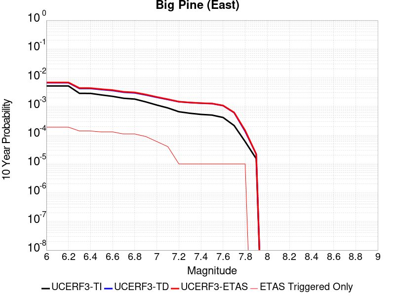 |

| Magnitude | 1 wk TI Prob | 1 wk TD Prob | 1 wk ETAS Prob | 1 wk ETAS/TD Gain | 1 wk ETAS Triggered Only | 1 mo TI Prob | 1 mo TD Prob | 1 mo ETAS Prob | 1 mo ETAS/TD Gain | 1 mo ETAS Triggered Only | 1 yr TI Prob | 1 yr TD Prob | 1 yr ETAS Prob | 1 yr ETAS/TD Gain | 1 yr ETAS Triggered Only | 10 yr TI Prob | 10 yr TD Prob | 10 yr ETAS Prob | 10 yr ETAS/TD Gain | 10 yr ETAS Triggered Only |
|-----|-----|-----|-----|-----|-----|-----|-----|-----|-----|-----|-----|-----|-----|-----|-----|-----|-----|-----|-----|-----|
| 6.0 | 9.916913E-6 | 1.2816984E-5 | 1.2816984E-5 | 1.0 | 0.0 | 4.250036E-5 | 5.49289E-5 | 5.49289E-5 | 1.0 | 0.0 | 5.173191E-4 | 6.685763E-4 | 6.685763E-4 | 1.0 | 0.0 | 0.0051611643 | 0.006670441 | 0.007057704 | 1.0580566 | 3.8986356E-4 |
| 6.1 | 9.916913E-6 | 1.2816984E-5 | 1.2816984E-5 | 1.0 | 0.0 | 4.250036E-5 | 5.49289E-5 | 5.49289E-5 | 1.0 | 0.0 | 5.173191E-4 | 6.685763E-4 | 6.685763E-4 | 1.0 | 0.0 | 0.0051611643 | 0.006670441 | 0.007057704 | 1.0580566 | 3.8986356E-4 |
| 6.2 | 9.916913E-6 | 1.2816984E-5 | 1.2816984E-5 | 1.0 | 0.0 | 4.250036E-5 | 5.49289E-5 | 5.49289E-5 | 1.0 | 0.0 | 5.173191E-4 | 6.685763E-4 | 6.685763E-4 | 1.0 | 0.0 | 0.0051611643 | 0.006670441 | 0.007057704 | 1.0580566 | 3.8986356E-4 |
| 6.3 | 5.479711E-6 | 8.112951E-6 | 8.112951E-6 | 1.0 | 0.0 | 2.3484265E-5 | 3.4769346E-5 | 3.4769346E-5 | 1.0 | 0.0 | 2.858834E-4 | 4.2323777E-4 | 4.2323777E-4 | 1.0 | 0.0 | 0.0028551589 | 0.004227244 | 0.004615459 | 1.0918366 | 3.8986356E-4 |
| 6.4 | 5.465009E-6 | 8.097245E-6 | 8.097245E-6 | 1.0 | 0.0 | 2.3421257E-5 | 3.4702036E-5 | 3.4702036E-5 | 1.0 | 0.0 | 2.851165E-4 | 4.2241855E-4 | 4.2241855E-4 | 1.0 | 0.0 | 0.0028475097 | 0.0042190826 | 0.004607301 | 1.0920149 | 3.8986356E-4 |
| 6.5 | 4.826767E-6 | 7.422301E-6 | 7.422301E-6 | 1.0 | 0.0 | 2.068598E-5 | 3.180949E-5 | 3.180949E-5 | 1.0 | 0.0 | 2.518227E-4 | 3.872145E-4 | 3.872145E-4 | 1.0 | 0.0 | 0.0025153751 | 0.003868283 | 0.004256638 | 1.1003948 | 3.8986356E-4 |
| 6.6 | 4.3146847E-6 | 6.8822374E-6 | 6.8822374E-6 | 1.0 | 0.0 | 1.8491375E-5 | 2.9494982E-5 | 2.9494982E-5 | 1.0 | 0.0 | 2.2510924E-4 | 3.590447E-4 | 3.590447E-4 | 1.0 | 0.0 | 0.0022488134 | 0.0035874986 | 0.003975963 | 1.1082829 | 3.8986356E-4 |
| 6.7 | 3.6968106E-6 | 5.9954727E-6 | 5.9954727E-6 | 1.0 | 0.0 | 1.5843378E-5 | 2.5694639E-5 | 2.5694639E-5 | 1.0 | 0.0 | 1.9287605E-4 | 3.1278885E-4 | 3.1278885E-4 | 1.0 | 0.0 | 0.0019270873 | 0.0031262483 | 0.0031262483 | 1.0 | 0.0 |
| 6.8 | 3.4671132E-6 | 5.702177E-6 | 5.702177E-6 | 1.0 | 0.0 | 1.4858972E-5 | 2.4437682E-5 | 2.4437682E-5 | 1.0 | 0.0 | 1.8089297E-4 | 2.974896E-4 | 2.974896E-4 | 1.0 | 0.0 | 0.0018074579 | 0.002973667 | 0.002973667 | 1.0 | 0.0 |
| 6.9 | 2.7686972E-6 | 4.825223E-6 | 4.825223E-6 | 1.0 | 0.0 | 1.1865792E-5 | 2.0679368E-5 | 2.0679368E-5 | 1.0 | 0.0 | 1.4445644E-4 | 2.5174298E-4 | 2.5174298E-4 | 1.0 | 0.0 | 0.0014436257 | 0.0025172636 | 0.0025172636 | 1.0 | 0.0 |
| 7.0 | 2.1472624E-6 | 3.9850406E-6 | 3.9850406E-6 | 1.0 | 0.0 | 9.20252E-6 | 1.7078637E-5 | 1.7078637E-5 | 1.0 | 0.0 | 1.12034926E-4 | 2.079131E-4 | 2.079131E-4 | 1.0 | 0.0 | 0.0011197845 | 0.0020798394 | 0.0020798394 | 1.0 | 0.0 |
| 7.1 | 1.7018335E-6 | 3.344876E-6 | 3.344876E-6 | 1.0 | 0.0 | 7.293552E-6 | 1.4335106E-5 | 1.4335106E-5 | 1.0 | 0.0 | 8.879537E-5 | 1.7451629E-4 | 1.7451629E-4 | 1.0 | 0.0 | 8.87599E-4 | 0.0017464145 | 0.0017464145 | 1.0 | 0.0 |
| 7.2 | 1.25603E-6 | 2.794484E-6 | 2.794484E-6 | 1.0 | 0.0 | 5.3829745E-6 | 1.1976307E-5 | 1.1976307E-5 | 1.0 | 0.0 | 6.553574E-5 | 1.4580201E-4 | 1.4580201E-4 | 1.0 | 0.0 | 6.551642E-4 | 0.001459661 | 0.001459661 | 1.0 | 0.0 |
| 7.3 | 1.112297E-6 | 2.610332E-6 | 2.610332E-6 | 1.0 | 0.0 | 4.7669787E-6 | 1.118709E-5 | 1.118709E-5 | 1.0 | 0.0 | 5.803642E-5 | 1.3619453E-4 | 1.3619453E-4 | 1.0 | 0.0 | 5.802127E-4 | 0.0013635408 | 0.0013635408 | 1.0 | 0.0 |
| 7.4 | 1.0137181E-6 | 2.4834917E-6 | 2.4834917E-6 | 1.0 | 0.0 | 4.3444993E-6 | 1.0643494E-5 | 1.0643494E-5 | 1.0 | 0.0 | 5.2892992E-5 | 1.2957705E-4 | 1.2957705E-4 | 1.0 | 0.0 | 5.288041E-4 | 0.0012972289 | 0.0012972289 | 1.0 | 0.0 |
| 7.5 | 9.598608E-7 | 2.4071483E-6 | 2.4071483E-6 | 1.0 | 0.0 | 4.1136827E-6 | 1.031631E-5 | 1.031631E-5 | 1.0 | 0.0 | 5.0082934E-5 | 1.2559404E-4 | 1.2559404E-4 | 1.0 | 0.0 | 5.007165E-4 | 0.0012572526 | 0.0012572526 | 1.0 | 0.0 |
| 7.6 | 7.929459E-7 | 2.0448588E-6 | 2.0448588E-6 | 1.0 | 0.0 | 3.3983351E-6 | 8.763653E-6 | 8.763653E-6 | 1.0 | 0.0 | 4.1373947E-5 | 1.06692416E-4 | 1.06692416E-4 | 1.0 | 0.0 | 4.1366243E-4 | 0.0010685222 | 0.0010685222 | 1.0 | 0.0 |
| 7.7 | 4.155788E-7 | 1.1605589E-6 | 1.1605589E-6 | 1.0 | 0.0 | 1.7810507E-6 | 4.9738146E-6 | 4.9738146E-6 | 1.0 | 0.0 | 2.1684076E-5 | 6.0554554E-5 | 6.0554554E-5 | 1.0 | 0.0 | 2.1681961E-4 | 6.0857297E-4 | 6.0857297E-4 | 1.0 | 0.0 |
| 7.8 | 1.14666925E-7 | 2.592015E-7 | 2.592015E-7 | 1.0 | 0.0 | 4.914296E-7 | 1.1108631E-6 | 1.1108631E-6 | 1.0 | 0.0 | 5.9831386E-6 | 1.3524678E-5 | 1.3524678E-5 | 1.0 | 0.0 | 5.9829777E-5 | 1.3634123E-4 | 1.3634123E-4 | 1.0 | 0.0 |
| 7.9 | 2.9231824E-8 | 4.1463963E-8 | 4.1463963E-8 | 1.0 | 0.0 | 1.2527924E-7 | 1.7770269E-7 | 1.7770269E-7 | 1.0 | 0.0 | 1.5252737E-6 | 2.1635283E-6 | 2.1635283E-6 | 1.0 | 0.0 | 1.5252632E-5 | 2.1967755E-5 | 2.1967755E-5 | 1.0 | 0.0 |

## San Jacinto (Superstition Mtn)
*[(top)](#table-of-contents)*

| 1 Week | 1 Month | 1 Year | 10 Year |
|-----|-----|-----|-----|
| 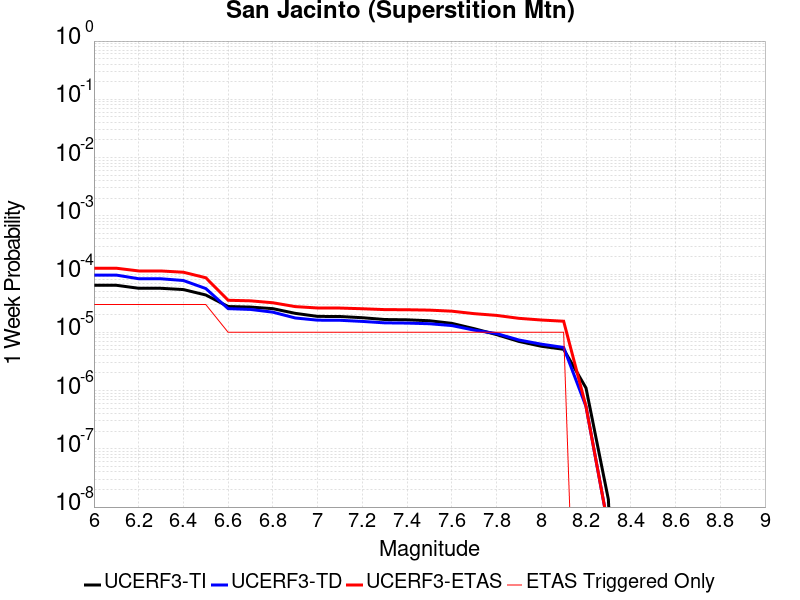 |  |  |  |

| Magnitude | 1 wk TI Prob | 1 wk TD Prob | 1 wk ETAS Prob | 1 wk ETAS/TD Gain | 1 wk ETAS Triggered Only | 1 mo TI Prob | 1 mo TD Prob | 1 mo ETAS Prob | 1 mo ETAS/TD Gain | 1 mo ETAS Triggered Only | 1 yr TI Prob | 1 yr TD Prob | 1 yr ETAS Prob | 1 yr ETAS/TD Gain | 1 yr ETAS Triggered Only | 10 yr TI Prob | 10 yr TD Prob | 10 yr ETAS Prob | 10 yr ETAS/TD Gain | 10 yr ETAS Triggered Only |
|-----|-----|-----|-----|-----|-----|-----|-----|-----|-----|-----|-----|-----|-----|-----|-----|-----|-----|-----|-----|-----|
| 6.0 | 6.4193904E-5 | 9.599367E-5 | 4.858198E-4 | 5.0609565 | 3.8986356E-4 | 2.7508775E-4 | 4.1134638E-4 | 8.010495E-4 | 1.9473845 | 3.8986356E-4 | 0.0033440501 | 0.0049980893 | 0.005386004 | 1.0776126 | 3.8986356E-4 | 0.03294174 | 0.048823986 | 0.049194813 | 1.0075952 | 3.8986356E-4 |
| 6.1 | 6.4193904E-5 | 9.599367E-5 | 4.858198E-4 | 5.0609565 | 3.8986356E-4 | 2.7508775E-4 | 4.1134638E-4 | 8.010495E-4 | 1.9473845 | 3.8986356E-4 | 0.0033440501 | 0.0049980893 | 0.005386004 | 1.0776126 | 3.8986356E-4 | 0.03294174 | 0.048823986 | 0.049194813 | 1.0075952 | 3.8986356E-4 |
| 6.2 | 5.7023593E-5 | 8.3144434E-5 | 4.7297557E-4 | 5.688602 | 3.8986356E-4 | 2.4436394E-4 | 3.5629404E-4 | 7.4601866E-4 | 2.0938287 | 3.8986356E-4 | 0.002971072 | 0.0043308944 | 0.0047190697 | 1.0896293 | 3.8986356E-4 | 0.029316625 | 0.04250403 | 0.042877324 | 1.0087825 | 3.8986356E-4 |
| 6.3 | 5.6940098E-5 | 8.298979E-5 | 4.7282098E-4 | 5.697339 | 3.8986356E-4 | 2.4400617E-4 | 3.5563146E-4 | 7.453564E-4 | 2.0958674 | 3.8986356E-4 | 0.002966728 | 0.00432286 | 0.004711038 | 1.0897967 | 3.8986356E-4 | 0.029274331 | 0.042427283 | 0.042800605 | 1.0087991 | 3.8986356E-4 |
| 6.4 | 5.4171585E-5 | 7.7483564E-5 | 4.673169E-4 | 6.0311747 | 3.8986356E-4 | 2.3214328E-4 | 3.3203943E-4 | 7.2177354E-4 | 2.1737585 | 3.8986356E-4 | 0.0028226813 | 0.0040367353 | 0.0044250246 | 1.096189 | 3.8986356E-4 | 0.02787096 | 0.03971653 | 0.04009091 | 1.0094262 | 3.8986356E-4 |
| 6.5 | 4.375144E-5 | 5.642133E-5 | 4.462629E-4 | 7.9094715 | 3.8986356E-4 | 1.874927E-4 | 2.4178992E-4 | 6.315592E-4 | 2.6120162 | 3.8986356E-4 | 0.0022803338 | 0.002940994 | 0.0033297108 | 1.132172 | 3.8986356E-4 | 0.022570757 | 0.029236801 | 0.029615266 | 1.0129448 | 3.8986356E-4 |
| 6.6 | 2.772192E-5 | 2.5488358E-5 | 2.5488358E-5 | 1.0 | 0.0 | 1.1880282E-4 | 1.09231354E-4 | 1.09231354E-4 | 1.0 | 0.0 | 0.0014454646 | 0.0013290998 | 0.0013290998 | 1.0 | 0.0 | 0.014360986 | 0.01354049 | 0.01354049 | 1.0 | 0.0 |
| 6.7 | 2.7124124E-5 | 2.4699386E-5 | 2.4699386E-5 | 1.0 | 0.0 | 1.1624106E-4 | 1.05850326E-4 | 1.05850326E-4 | 1.0 | 0.0 | 0.0014143161 | 0.001287985 | 0.001287985 | 1.0 | 0.0 | 0.014053487 | 0.013133943 | 0.013133943 | 1.0 | 0.0 |
| 6.8 | 2.5475807E-5 | 2.216446E-5 | 2.216446E-5 | 1.0 | 0.0 | 1.0917746E-4 | 9.4987154E-5 | 9.4987154E-5 | 1.0 | 0.0 | 0.001328425 | 0.001155867 | 0.001155867 | 1.0 | 0.0 | 0.0132051185 | 0.011822182 | 0.011822182 | 1.0 | 0.0 |
| 6.9 | 2.1162023E-5 | 1.7626244E-5 | 1.7626244E-5 | 1.0 | 0.0 | 9.069123E-5 | 7.5538876E-5 | 7.5538876E-5 | 1.0 | 0.0 | 0.0011036064 | 9.193016E-4 | 9.193016E-4 | 1.0 | 0.0 | 0.010981417 | 0.00944688 | 0.00944688 | 1.0 | 0.0 |
| 7.0 | 1.8754288E-5 | 1.6161559E-5 | 1.6161559E-5 | 1.0 | 0.0 | 8.037304E-5 | 6.9261994E-5 | 6.9261994E-5 | 1.0 | 0.0 | 9.781026E-4 | 8.4294105E-4 | 8.4294105E-4 | 1.0 | 0.0 | 0.009738087 | 0.008670042 | 0.008670042 | 1.0 | 0.0 |
| 7.1 | 1.8678527E-5 | 1.6086702E-5 | 1.6086702E-5 | 1.0 | 0.0 | 8.0048376E-5 | 6.89412E-5 | 6.89412E-5 | 1.0 | 0.0 | 9.7415317E-4 | 8.3903834E-4 | 8.3903834E-4 | 1.0 | 0.0 | 0.009698939 | 0.008630998 | 0.008630998 | 1.0 | 0.0 |
| 7.2 | 1.7804578E-5 | 1.5381282E-5 | 1.5381282E-5 | 1.0 | 0.0 | 7.6303106E-5 | 6.5918124E-5 | 6.5918124E-5 | 1.0 | 0.0 | 9.285943E-4 | 8.022599E-4 | 8.022599E-4 | 1.0 | 0.0 | 0.009247236 | 0.008262311 | 0.008262311 | 1.0 | 0.0 |
| 7.3 | 1.6583685E-5 | 1.4530388E-5 | 1.4530388E-5 | 1.0 | 0.0 | 7.1070994E-5 | 6.227162E-5 | 6.227162E-5 | 1.0 | 0.0 | 8.649459E-4 | 7.5789524E-4 | 7.5789524E-4 | 1.0 | 0.0 | 0.00861587 | 0.007817623 | 0.007817623 | 1.0 | 0.0 |
| 7.4 | 1.6387552E-5 | 1.4395274E-5 | 1.4395274E-5 | 1.0 | 0.0 | 7.023047E-5 | 6.169258E-5 | 6.169258E-5 | 1.0 | 0.0 | 8.5472054E-4 | 7.5085036E-4 | 7.5085036E-4 | 1.0 | 0.0 | 0.008514405 | 0.0077470057 | 0.0077470057 | 1.0 | 0.0 |
| 7.5 | 1.5790754E-5 | 1.4035962E-5 | 1.4035962E-5 | 1.0 | 0.0 | 6.767291E-5 | 6.0152746E-5 | 6.0152746E-5 | 1.0 | 0.0 | 8.236062E-4 | 7.321156E-4 | 7.321156E-4 | 1.0 | 0.0 | 0.008205604 | 0.007557569 | 0.007557569 | 1.0 | 0.0 |
| 7.6 | 1.4248672E-5 | 1.3054932E-5 | 1.3054932E-5 | 1.0 | 0.0 | 6.106431E-5 | 5.594852E-5 | 5.594852E-5 | 1.0 | 0.0 | 7.432043E-4 | 6.8096205E-4 | 6.8096205E-4 | 1.0 | 0.0 | 0.007407237 | 0.0070401574 | 0.0070401574 | 1.0 | 0.0 |
| 7.7 | 1.15449975E-5 | 1.090368E-5 | 1.090368E-5 | 1.0 | 0.0 | 4.947762E-5 | 4.6729223E-5 | 4.6729223E-5 | 1.0 | 0.0 | 6.022235E-4 | 5.687805E-4 | 5.687805E-4 | 1.0 | 0.0 | 0.006005941 | 0.0059101824 | 0.0059101824 | 1.0 | 0.0 |
| 7.8 | 9.1391985E-6 | 9.514299E-6 | 9.514299E-6 | 1.0 | 0.0 | 3.9167408E-5 | 4.0774932E-5 | 4.0774932E-5 | 1.0 | 0.0 | 4.767588E-4 | 4.963223E-4 | 4.963223E-4 | 1.0 | 0.0 | 0.0047573727 | 0.0051766867 | 0.0051766867 | 1.0 | 0.0 |
| 7.9 | 6.973017E-6 | 7.3821784E-6 | 7.3821784E-6 | 1.0 | 0.0 | 2.9884017E-5 | 3.1637526E-5 | 3.1637526E-5 | 1.0 | 0.0 | 3.6377716E-4 | 3.8511935E-4 | 3.8511935E-4 | 1.0 | 0.0 | 0.0036318225 | 0.0040517948 | 0.0040517948 | 1.0 | 0.0 |
| 8.0 | 5.7638235E-6 | 6.259972E-6 | 6.259972E-6 | 1.0 | 0.0 | 2.4701867E-5 | 2.6828178E-5 | 2.6828178E-5 | 1.0 | 0.0 | 3.0070372E-4 | 3.2658462E-4 | 3.2658462E-4 | 1.0 | 0.0 | 0.0030029714 | 0.0034534496 | 0.0034534496 | 1.0 | 0.0 |
| 8.1 | 5.1124434E-6 | 5.4956718E-6 | 5.4956718E-6 | 1.0 | 0.0 | 2.1910288E-5 | 2.355267E-5 | 2.355267E-5 | 1.0 | 0.0 | 2.6672508E-4 | 2.867165E-4 | 2.867165E-4 | 1.0 | 0.0 | 0.0026640517 | 0.003040336 | 0.003040336 | 1.0 | 0.0 |
| 8.2 | 1.1075938E-6 | 5.336568E-7 | 5.336568E-7 | 1.0 | 0.0 | 4.7468216E-6 | 2.2870988E-6 | 2.2870988E-6 | 1.0 | 0.0 | 5.779102E-5 | 2.7845093E-5 | 2.7845093E-5 | 1.0 | 0.0 | 5.777599E-4 | 3.1346595E-4 | 3.1346595E-4 | 1.0 | 0.0 |
| 8.3 | 1.3584393E-8 | 4.473836E-9 | 4.473836E-9 | 1.0 | 0.0 | 5.8218827E-8 | 1.9173582E-8 | 1.9173582E-8 | 1.0 | 0.0 | 7.0881396E-7 | 2.3343837E-7 | 2.3343837E-7 | 1.0 | 0.0 | 7.0881174E-6 | 2.6163038E-6 | 2.6163038E-6 | 1.0 | 0.0 |

## Pisgah-Bullion Mtn-Mesquite Lk
*[(top)](#table-of-contents)*

| 1 Week | 1 Month | 1 Year | 10 Year |
|-----|-----|-----|-----|
|  |  | 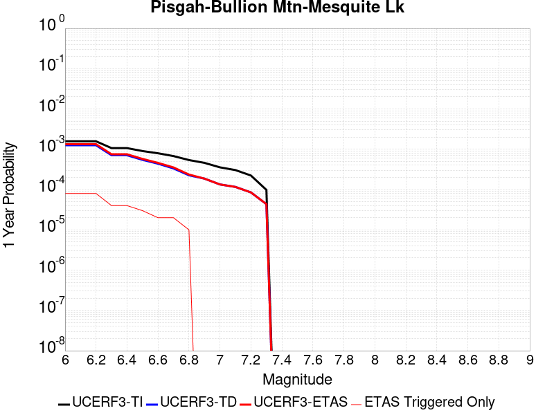 |  |

| Magnitude | 1 wk TI Prob | 1 wk TD Prob | 1 wk ETAS Prob | 1 wk ETAS/TD Gain | 1 wk ETAS Triggered Only | 1 mo TI Prob | 1 mo TD Prob | 1 mo ETAS Prob | 1 mo ETAS/TD Gain | 1 mo ETAS Triggered Only | 1 yr TI Prob | 1 yr TD Prob | 1 yr ETAS Prob | 1 yr ETAS/TD Gain | 1 yr ETAS Triggered Only | 10 yr TI Prob | 10 yr TD Prob | 10 yr ETAS Prob | 10 yr ETAS/TD Gain | 10 yr ETAS Triggered Only |
|-----|-----|-----|-----|-----|-----|-----|-----|-----|-----|-----|-----|-----|-----|-----|-----|-----|-----|-----|-----|-----|
| 6.0 | 3.0240792E-5 | 2.4091114E-5 | 2.4091114E-5 | 1.0 | 0.0 | 1.2959696E-4 | 1.03244114E-4 | 1.03244114E-4 | 1.0 | 0.0 | 0.0015767008 | 0.0012563728 | 0.0016457465 | 1.309919 | 3.8986356E-4 | 0.015655609 | 0.012502721 | 0.01288771 | 1.0307925 | 3.8986356E-4 |
| 6.1 | 3.0240792E-5 | 2.4091114E-5 | 2.4091114E-5 | 1.0 | 0.0 | 1.2959696E-4 | 1.03244114E-4 | 1.03244114E-4 | 1.0 | 0.0 | 0.0015767008 | 0.0012563728 | 0.0016457465 | 1.309919 | 3.8986356E-4 | 0.015655609 | 0.012502721 | 0.01288771 | 1.0307925 | 3.8986356E-4 |
| 6.2 | 3.0240792E-5 | 2.4091114E-5 | 2.4091114E-5 | 1.0 | 0.0 | 1.2959696E-4 | 1.03244114E-4 | 1.03244114E-4 | 1.0 | 0.0 | 0.0015767008 | 0.0012563728 | 0.0016457465 | 1.309919 | 3.8986356E-4 | 0.015655609 | 0.012502721 | 0.01288771 | 1.0307925 | 3.8986356E-4 |
| 6.3 | 2.0498217E-5 | 1.36380695E-5 | 1.36380695E-5 | 1.0 | 0.0 | 8.784654E-5 | 5.844765E-5 | 5.844765E-5 | 1.0 | 0.0 | 0.0010690069 | 7.1138405E-4 | 0.0011009702 | 1.5476454 | 3.8986356E-4 | 0.01063879 | 0.0070926943 | 0.007479793 | 1.0545771 | 3.8986356E-4 |
| 6.4 | 2.0498217E-5 | 1.36380695E-5 | 1.36380695E-5 | 1.0 | 0.0 | 8.784654E-5 | 5.844765E-5 | 5.844765E-5 | 1.0 | 0.0 | 0.0010690069 | 7.1138405E-4 | 0.0011009702 | 1.5476454 | 3.8986356E-4 | 0.01063879 | 0.0070926943 | 0.007479793 | 1.0545771 | 3.8986356E-4 |
| 6.5 | 1.7316182E-5 | 1.0477042E-5 | 1.0477042E-5 | 1.0 | 0.0 | 7.42101E-5 | 4.4900895E-5 | 4.4900895E-5 | 1.0 | 0.0 | 9.0313336E-4 | 5.465413E-4 | 5.465413E-4 | 1.0 | 0.0 | 0.008994718 | 0.0054529672 | 0.0054529672 | 1.0 | 0.0 |
| 6.6 | 1.5251077E-5 | 8.414273E-6 | 8.414273E-6 | 1.0 | 0.0 | 6.536012E-5 | 3.6060712E-5 | 3.6060712E-5 | 1.0 | 0.0 | 7.9546886E-4 | 4.3895794E-4 | 4.3895794E-4 | 1.0 | 0.0 | 0.007926274 | 0.0043816264 | 0.0043816264 | 1.0 | 0.0 |
| 6.7 | 1.2997425E-5 | 6.4114965E-6 | 6.4114965E-6 | 1.0 | 0.0 | 5.570206E-5 | 2.7477578E-5 | 2.7477578E-5 | 1.0 | 0.0 | 6.7796157E-4 | 3.3449283E-4 | 3.3449283E-4 | 1.0 | 0.0 | 0.0067589693 | 0.0033403537 | 0.0033403537 | 1.0 | 0.0 |
| 6.8 | 1.035386E-5 | 4.3332193E-6 | 4.3332193E-6 | 1.0 | 0.0 | 4.437293E-5 | 1.8570812E-5 | 1.8570812E-5 | 1.0 | 0.0 | 5.401065E-4 | 2.2607706E-4 | 2.2607706E-4 | 1.0 | 0.0 | 0.0053879567 | 0.0022585576 | 0.0022585576 | 1.0 | 0.0 |
| 6.9 | 8.816252E-6 | 3.580638E-6 | 3.580638E-6 | 1.0 | 0.0 | 3.778339E-5 | 1.5345504E-5 | 1.5345504E-5 | 1.0 | 0.0 | 4.5991567E-4 | 1.8681608E-4 | 1.8681608E-4 | 1.0 | 0.0 | 0.00458965 | 0.0018666488 | 0.0018666488 | 1.0 | 0.0 |
| 7.0 | 6.8232207E-6 | 2.5675843E-6 | 2.5675843E-6 | 1.0 | 0.0 | 2.9242048E-5 | 1.1003888E-5 | 1.1003888E-5 | 1.0 | 0.0 | 3.5596377E-4 | 1.3396442E-4 | 1.3396442E-4 | 1.0 | 0.0 | 0.0035539411 | 0.0013388677 | 0.0013388677 | 1.0 | 0.0 |
| 7.1 | 5.837013E-6 | 2.22738E-6 | 2.22738E-6 | 1.0 | 0.0 | 2.501553E-5 | 9.545881E-6 | 9.545881E-6 | 1.0 | 0.0 | 3.045215E-4 | 1.16215204E-4 | 1.16215204E-4 | 1.0 | 0.0 | 0.0030410455 | 0.0011615733 | 0.0011615733 | 1.0 | 0.0 |
| 7.2 | 4.278052E-6 | 1.6275711E-6 | 1.6275711E-6 | 1.0 | 0.0 | 1.833438E-5 | 6.9752873E-6 | 6.9752873E-6 | 1.0 | 0.0 | 2.231982E-4 | 8.492105E-5 | 8.492105E-5 | 1.0 | 0.0 | 0.0022297418 | 8.489092E-4 | 8.489092E-4 | 1.0 | 0.0 |
| 7.3 | 1.8803692E-6 | 8.344926E-7 | 8.344926E-7 | 1.0 | 0.0 | 8.0587E-6 | 3.5763926E-6 | 3.5763926E-6 | 1.0 | 0.0 | 9.811026E-5 | 4.354186E-5 | 4.354186E-5 | 1.0 | 0.0 | 9.806695E-4 | 4.3534773E-4 | 4.3534773E-4 | 1.0 | 0.0 |

## Chino alt 1
*[(top)](#table-of-contents)*

| 1 Week | 1 Month | 1 Year | 10 Year |
|-----|-----|-----|-----|
|  |  |  |  |

| Magnitude | 1 wk TI Prob | 1 wk TD Prob | 1 wk ETAS Prob | 1 wk ETAS/TD Gain | 1 wk ETAS Triggered Only | 1 mo TI Prob | 1 mo TD Prob | 1 mo ETAS Prob | 1 mo ETAS/TD Gain | 1 mo ETAS Triggered Only | 1 yr TI Prob | 1 yr TD Prob | 1 yr ETAS Prob | 1 yr ETAS/TD Gain | 1 yr ETAS Triggered Only | 10 yr TI Prob | 10 yr TD Prob | 10 yr ETAS Prob | 10 yr ETAS/TD Gain | 10 yr ETAS Triggered Only |
|-----|-----|-----|-----|-----|-----|-----|-----|-----|-----|-----|-----|-----|-----|-----|-----|-----|-----|-----|-----|-----|
| 6.0 | 3.939946E-5 | 4.8948554E-5 | 4.8948554E-5 | 1.0 | 0.0 | 1.6884391E-4 | 2.097656E-4 | 2.097656E-4 | 1.0 | 0.0 | 0.0020537362 | 0.0025513945 | 0.0029402634 | 1.1524142 | 3.8986356E-4 | 0.020348595 | 0.025277847 | 0.025657855 | 1.0150332 | 3.8986356E-4 |
| 6.1 | 2.1505624E-5 | 2.6879026E-5 | 2.6879026E-5 | 1.0 | 0.0 | 9.2163704E-5 | 1.1519137E-4 | 1.1519137E-4 | 1.0 | 0.0 | 0.0011215154 | 0.001401664 | 0.001790981 | 1.2777535 | 3.8986356E-4 | 0.011158722 | 0.013945141 | 0.0143295685 | 1.027567 | 3.8986356E-4 |
| 6.2 | 2.1505624E-5 | 2.6879026E-5 | 2.6879026E-5 | 1.0 | 0.0 | 9.2163704E-5 | 1.1519137E-4 | 1.1519137E-4 | 1.0 | 0.0 | 0.0011215154 | 0.001401664 | 0.001790981 | 1.2777535 | 3.8986356E-4 | 0.011158722 | 0.013945141 | 0.0143295685 | 1.027567 | 3.8986356E-4 |
| 6.3 | 1.4290785E-5 | 1.8165128E-5 | 1.8165128E-5 | 1.0 | 0.0 | 6.1244784E-5 | 7.784848E-5 | 7.784848E-5 | 1.0 | 0.0 | 7.454001E-4 | 9.4743853E-4 | 0.0013369326 | 1.4111023 | 3.8986356E-4 | 0.007429048 | 0.0094444575 | 0.009830639 | 1.0408897 | 3.8986356E-4 |
| 6.4 | 1.4290785E-5 | 1.8165128E-5 | 1.8165128E-5 | 1.0 | 0.0 | 6.1244784E-5 | 7.784848E-5 | 7.784848E-5 | 1.0 | 0.0 | 7.454001E-4 | 9.4743853E-4 | 0.0013369326 | 1.4111023 | 3.8986356E-4 | 0.007429048 | 0.0094444575 | 0.009830639 | 1.0408897 | 3.8986356E-4 |
| 6.5 | 1.3017944E-5 | 1.6652088E-5 | 1.6652088E-5 | 1.0 | 0.0 | 5.5789995E-5 | 7.136439E-5 | 7.136439E-5 | 1.0 | 0.0 | 6.790315E-4 | 8.685589E-4 | 0.0012580839 | 1.4484727 | 3.8986356E-4 | 0.0067696036 | 0.008661949 | 0.009048436 | 1.0446188 | 3.8986356E-4 |
| 6.6 | 9.470016E-6 | 1.2039424E-5 | 1.2039424E-5 | 1.0 | 0.0 | 4.058515E-5 | 5.1596704E-5 | 5.1596704E-5 | 1.0 | 0.0 | 4.940122E-4 | 6.280428E-4 | 0.0010176614 | 1.6203697 | 3.8986356E-4 | 0.004929154 | 0.0062718987 | 0.0066593173 | 1.0617706 | 3.8986356E-4 |
| 6.7 | 8.314155E-6 | 1.0407736E-5 | 1.0407736E-5 | 1.0 | 0.0 | 3.5631605E-5 | 4.4604003E-5 | 4.4604003E-5 | 1.0 | 0.0 | 4.3372845E-4 | 5.429507E-4 | 9.3260256E-4 | 1.7176561 | 3.8986356E-4 | 0.004328829 | 0.005425775 | 0.005813523 | 1.0714641 | 3.8986356E-4 |
| 6.8 | 3.4856364E-6 | 3.8133708E-6 | 3.8133708E-6 | 1.0 | 0.0 | 1.4938357E-5 | 1.6342927E-5 | 1.6342927E-5 | 1.0 | 0.0 | 1.8185932E-4 | 1.9895904E-4 | 5.88745E-4 | 2.9591267 | 3.8986356E-4 | 0.0018171056 | 0.0019894864 | 0.0023785743 | 1.195572 | 3.8986356E-4 |
| 6.9 | 2.2645952E-6 | 2.1529022E-6 | 2.1529022E-6 | 1.0 | 0.0 | 9.705372E-6 | 9.226692E-6 | 9.226692E-6 | 1.0 | 0.0 | 1.18156495E-4 | 1.123294E-4 | 1.123294E-4 | 1.0 | 0.0 | 0.0011809369 | 0.0011233423 | 0.0011233423 | 1.0 | 0.0 |
| 7.0 | 1.7864003E-6 | 1.5430785E-6 | 1.5430785E-6 | 1.0 | 0.0 | 7.655979E-6 | 6.613177E-6 | 6.613177E-6 | 1.0 | 0.0 | 9.3207556E-5 | 8.051251E-5 | 8.051251E-5 | 1.0 | 0.0 | 9.316847E-4 | 8.0528046E-4 | 8.0528046E-4 | 1.0 | 0.0 |
| 7.1 | 1.7315456E-6 | 1.4733511E-6 | 1.4733511E-6 | 1.0 | 0.0 | 7.420889E-6 | 6.3143466E-6 | 6.3143466E-6 | 1.0 | 0.0 | 9.034557E-5 | 7.6874516E-5 | 7.6874516E-5 | 1.0 | 0.0 | 9.0308854E-4 | 7.6891703E-4 | 7.6891703E-4 | 1.0 | 0.0 |
| 7.2 | 1.6008337E-6 | 1.3574215E-6 | 1.3574215E-6 | 1.0 | 0.0 | 6.860698E-6 | 5.817508E-6 | 5.817508E-6 | 1.0 | 0.0 | 8.352579E-5 | 7.082591E-5 | 7.082591E-5 | 1.0 | 0.0 | 8.34944E-4 | 7.0845755E-4 | 7.0845755E-4 | 1.0 | 0.0 |
| 7.3 | 1.3320939E-6 | 1.121782E-6 | 1.121782E-6 | 1.0 | 0.0 | 5.7089615E-6 | 4.807629E-6 | 4.807629E-6 | 1.0 | 0.0 | 6.9504385E-5 | 5.8531357E-5 | 5.8531357E-5 | 1.0 | 0.0 | 6.9482654E-4 | 5.8530393E-4 | 5.8530393E-4 | 1.0 | 0.0 |
| 7.4 | 1.114294E-6 | 9.237111E-7 | 9.237111E-7 | 1.0 | 0.0 | 4.775537E-6 | 3.958756E-6 | 3.958756E-6 | 1.0 | 0.0 | 5.8140613E-5 | 4.8196827E-5 | 4.8196827E-5 | 1.0 | 0.0 | 5.81254E-4 | 4.8188053E-4 | 4.8188053E-4 | 1.0 | 0.0 |
| 7.5 | 9.354081E-7 | 7.6234323E-7 | 7.6234323E-7 | 1.0 | 0.0 | 4.0088858E-6 | 3.2671815E-6 | 3.2671815E-6 | 1.0 | 0.0 | 4.8807087E-5 | 3.9777242E-5 | 3.9777242E-5 | 1.0 | 0.0 | 4.879637E-4 | 3.977046E-4 | 3.977046E-4 | 1.0 | 0.0 |
| 7.6 | 8.521771E-7 | 6.88071E-7 | 6.88071E-7 | 1.0 | 0.0 | 3.6521824E-6 | 2.9488726E-6 | 2.9488726E-6 | 1.0 | 0.0 | 4.4464414E-5 | 3.5901965E-5 | 3.5901965E-5 | 1.0 | 0.0 | 4.4455516E-4 | 3.589648E-4 | 3.589648E-4 | 1.0 | 0.0 |
| 7.7 | 2.1803626E-7 | 1.418649E-7 | 1.418649E-7 | 1.0 | 0.0 | 9.344408E-7 | 6.079923E-7 | 6.079923E-7 | 1.0 | 0.0 | 1.1376757E-5 | 7.4022914E-6 | 7.4022914E-6 | 1.0 | 0.0 | 1.13761744E-4 | 7.402141E-5 | 7.402141E-5 | 1.0 | 0.0 |

## Santa Rosa Island
*[(top)](#table-of-contents)*

| 1 Week | 1 Month | 1 Year | 10 Year |
|-----|-----|-----|-----|
|  |  |  |  |

| Magnitude | 1 wk TI Prob | 1 wk TD Prob | 1 wk ETAS Prob | 1 wk ETAS/TD Gain | 1 wk ETAS Triggered Only | 1 mo TI Prob | 1 mo TD Prob | 1 mo ETAS Prob | 1 mo ETAS/TD Gain | 1 mo ETAS Triggered Only | 1 yr TI Prob | 1 yr TD Prob | 1 yr ETAS Prob | 1 yr ETAS/TD Gain | 1 yr ETAS Triggered Only | 10 yr TI Prob | 10 yr TD Prob | 10 yr ETAS Prob | 10 yr ETAS/TD Gain | 10 yr ETAS Triggered Only |
|-----|-----|-----|-----|-----|-----|-----|-----|-----|-----|-----|-----|-----|-----|-----|-----|-----|-----|-----|-----|-----|
| 6.0 | 4.1143165E-5 | 4.7091133E-5 | 4.7091133E-5 | 1.0 | 0.0 | 1.7631594E-4 | 2.0180465E-4 | 2.0180465E-4 | 1.0 | 0.0 | 0.002144533 | 0.0024544 | 0.0024544 | 1.0 | 0.0 | 0.021239553 | 0.024293551 | 0.024673942 | 1.0156581 | 3.8986356E-4 |
| 6.1 | 2.1061249E-5 | 2.3864959E-5 | 2.3864959E-5 | 1.0 | 0.0 | 9.0259375E-5 | 1.0227455E-4 | 1.0227455E-4 | 1.0 | 0.0 | 0.0010983539 | 0.0012445104 | 0.0012445104 | 1.0 | 0.0 | 0.01092941 | 0.012378449 | 0.012378449 | 1.0 | 0.0 |
| 6.2 | 2.1061249E-5 | 2.3864959E-5 | 2.3864959E-5 | 1.0 | 0.0 | 9.0259375E-5 | 1.0227455E-4 | 1.0227455E-4 | 1.0 | 0.0 | 0.0010983539 | 0.0012445104 | 0.0012445104 | 1.0 | 0.0 | 0.01092941 | 0.012378449 | 0.012378449 | 1.0 | 0.0 |
| 6.3 | 1.5158236E-5 | 1.7074419E-5 | 1.7074419E-5 | 1.0 | 0.0 | 6.496225E-5 | 7.3174095E-5 | 7.3174095E-5 | 1.0 | 0.0 | 7.906284E-4 | 8.905424E-4 | 8.905424E-4 | 1.0 | 0.0 | 0.007878214 | 0.008870989 | 0.008870989 | 1.0 | 0.0 |
| 6.4 | 1.2341918E-5 | 1.3852917E-5 | 1.3852917E-5 | 1.0 | 0.0 | 5.2892858E-5 | 5.9368336E-5 | 5.9368336E-5 | 1.0 | 0.0 | 6.437803E-4 | 7.225779E-4 | 7.225779E-4 | 1.0 | 0.0 | 0.006419184 | 0.007203121 | 0.007203121 | 1.0 | 0.0 |
| 6.5 | 9.061158E-6 | 1.0117031E-5 | 1.0117031E-5 | 1.0 | 0.0 | 3.883296E-5 | 4.3358013E-5 | 4.3358013E-5 | 1.0 | 0.0 | 4.726887E-4 | 5.277613E-4 | 5.277613E-4 | 1.0 | 0.0 | 0.004716845 | 0.0052656173 | 0.0052656173 | 1.0 | 0.0 |
| 6.6 | 7.5461685E-6 | 8.400733E-6 | 8.400733E-6 | 1.0 | 0.0 | 3.2340322E-5 | 3.600267E-5 | 3.600267E-5 | 1.0 | 0.0 | 3.936723E-4 | 4.3824865E-4 | 4.3824865E-4 | 1.0 | 0.0 | 0.003929756 | 0.0043742736 | 0.0043742736 | 1.0 | 0.0 |
| 6.7 | 5.5023775E-6 | 6.087381E-6 | 6.087381E-6 | 1.0 | 0.0 | 2.3581404E-5 | 2.6088532E-5 | 2.6088532E-5 | 1.0 | 0.0 | 2.8706578E-4 | 3.1758484E-4 | 3.1758484E-4 | 1.0 | 0.0 | 0.0028669522 | 0.0031716314 | 0.0031716314 | 1.0 | 0.0 |
| 6.8 | 3.7351679E-6 | 4.0831405E-6 | 4.0831405E-6 | 1.0 | 0.0 | 1.6007763E-5 | 1.749907E-5 | 1.749907E-5 | 1.0 | 0.0 | 1.948771E-4 | 2.1303284E-4 | 2.1303284E-4 | 1.0 | 0.0 | 0.0019470629 | 0.0021285315 | 0.0021285315 | 1.0 | 0.0 |
| 6.9 | 2.456366E-6 | 2.6292705E-6 | 2.6292705E-6 | 1.0 | 0.0 | 1.0527241E-5 | 1.1268254E-5 | 1.1268254E-5 | 1.0 | 0.0 | 1.2816161E-4 | 1.3718237E-4 | 1.3718237E-4 | 1.0 | 0.0 | 0.0012808773 | 0.0013709799 | 0.0013709799 | 1.0 | 0.0 |
| 7.0 | 2.3245157E-6 | 2.4827782E-6 | 2.4827782E-6 | 1.0 | 0.0 | 9.962172E-6 | 1.0640435E-5 | 1.0640435E-5 | 1.0 | 0.0 | 1.2128269E-4 | 1.2953962E-4 | 1.2953962E-4 | 1.0 | 0.0 | 0.0012121652 | 0.0012946434 | 0.0012946434 | 1.0 | 0.0 |
| 7.1 | 2.2248344E-6 | 2.37325E-6 | 2.37325E-6 | 1.0 | 0.0 | 9.53497E-6 | 1.0171032E-5 | 1.0171032E-5 | 1.0 | 0.0 | 1.1608207E-4 | 1.2382529E-4 | 1.2382529E-4 | 1.0 | 0.0 | 0.0011602144 | 0.001237565 | 0.001237565 | 1.0 | 0.0 |
| 7.2 | 2.1350402E-6 | 2.276154E-6 | 2.276154E-6 | 1.0 | 0.0 | 9.150141E-6 | 9.754909E-6 | 9.754909E-6 | 1.0 | 0.0 | 1.1139726E-4 | 1.1875956E-4 | 1.1875956E-4 | 1.0 | 0.0 | 0.0011134144 | 0.0011869629 | 0.0011869629 | 1.0 | 0.0 |
| 7.3 | 1.9793572E-6 | 2.108719E-6 | 2.108719E-6 | 1.0 | 0.0 | 8.482932E-6 | 9.037336E-6 | 9.037336E-6 | 1.0 | 0.0 | 1.032748E-4 | 1.10024026E-4 | 1.10024026E-4 | 1.0 | 0.0 | 0.0010322682 | 0.0010996973 | 0.0010996973 | 1.0 | 0.0 |
| 7.4 | 1.6951194E-6 | 1.8045733E-6 | 1.8045733E-6 | 1.0 | 0.0 | 7.264777E-6 | 7.733863E-6 | 7.733863E-6 | 1.0 | 0.0 | 8.844508E-5 | 9.415573E-5 | 9.415573E-5 | 1.0 | 0.0 | 8.840988E-4 | 9.4116E-4 | 9.4116E-4 | 1.0 | 0.0 |
| 7.5 | 8.987207E-7 | 9.5122147E-7 | 9.5122147E-7 | 1.0 | 0.0 | 3.8516546E-6 | 4.076657E-6 | 4.076657E-6 | 1.0 | 0.0 | 4.6892885E-5 | 4.963218E-5 | 4.963218E-5 | 1.0 | 0.0 | 4.688299E-4 | 4.9621216E-4 | 4.9621216E-4 | 1.0 | 0.0 |
| 7.6 | 3.8783037E-7 | 4.052932E-7 | 4.052932E-7 | 1.0 | 0.0 | 1.6621291E-6 | 1.7369698E-6 | 1.7369698E-6 | 1.0 | 0.0 | 2.0236233E-5 | 2.1147409E-5 | 2.1147409E-5 | 1.0 | 0.0 | 2.023439E-4 | 2.1145462E-4 | 2.1145462E-4 | 1.0 | 0.0 |
| 7.7 | 6.181804E-8 | 6.339035E-8 | 6.339035E-8 | 1.0 | 0.0 | 2.6493444E-7 | 2.7167292E-7 | 2.7167292E-7 | 1.0 | 0.0 | 3.225572E-6 | 3.3076128E-6 | 3.3076128E-6 | 1.0 | 0.0 | 3.225525E-5 | 3.307564E-5 | 3.307564E-5 | 1.0 | 0.0 |
| 7.8 | 1.3704449E-9 | 1.3964153E-9 | 1.3964153E-9 | 1.0 | 0.0 | 5.873335E-9 | 5.984637E-9 | 5.984637E-9 | 1.0 | 0.0 | 7.1507856E-8 | 7.286295E-8 | 7.286295E-8 | 1.0 | 0.0 | 7.1507833E-7 | 7.286294E-7 | 7.286294E-7 | 1.0 | 0.0 |

## Great Valley 09 (Laguna Seca)
*[(top)](#table-of-contents)*

| 1 Week | 1 Month | 1 Year | 10 Year |
|-----|-----|-----|-----|
|  |  |  |  |

| Magnitude | 1 wk TI Prob | 1 wk TD Prob | 1 wk ETAS Prob | 1 wk ETAS/TD Gain | 1 wk ETAS Triggered Only | 1 mo TI Prob | 1 mo TD Prob | 1 mo ETAS Prob | 1 mo ETAS/TD Gain | 1 mo ETAS Triggered Only | 1 yr TI Prob | 1 yr TD Prob | 1 yr ETAS Prob | 1 yr ETAS/TD Gain | 1 yr ETAS Triggered Only | 10 yr TI Prob | 10 yr TD Prob | 10 yr ETAS Prob | 10 yr ETAS/TD Gain | 10 yr ETAS Triggered Only |
|-----|-----|-----|-----|-----|-----|-----|-----|-----|-----|-----|-----|-----|-----|-----|-----|-----|-----|-----|-----|-----|
| 6.0 | 5.4353277E-5 | 7.05022E-5 | 7.05022E-5 | 1.0 | 0.0 | 2.3292181E-4 | 3.0211566E-4 | 3.0211566E-4 | 1.0 | 0.0 | 0.0028321352 | 0.0036721937 | 0.0040606256 | 1.1057765 | 3.8986356E-4 | 0.02796312 | 0.03611547 | 0.036491256 | 1.0104051 | 3.8986356E-4 |
| 6.1 | 4.5578287E-5 | 5.822118E-5 | 5.822118E-5 | 1.0 | 0.0 | 1.953209E-4 | 2.4949326E-4 | 2.4949326E-4 | 1.0 | 0.0 | 0.0023754383 | 0.003033432 | 0.003422113 | 1.1281323 | 3.8986356E-4 | 0.023502063 | 0.029919548 | 0.030297747 | 1.0126405 | 3.8986356E-4 |
| 6.2 | 2.8536782E-5 | 3.4737273E-5 | 3.4737273E-5 | 1.0 | 0.0 | 1.2229476E-4 | 1.4886224E-4 | 1.4886224E-4 | 1.0 | 0.0 | 0.0014879217 | 0.001810813 | 0.0021999707 | 1.2149076 | 3.8986356E-4 | 0.014779986 | 0.017958116 | 0.018340979 | 1.0213197 | 3.8986356E-4 |
| 6.3 | 2.3698774E-5 | 2.8213295E-5 | 2.8213295E-5 | 1.0 | 0.0 | 1.01562226E-4 | 1.20905075E-4 | 1.20905075E-4 | 1.0 | 0.0 | 0.0012358186 | 0.0014710218 | 0.0018603118 | 1.2646393 | 3.8986356E-4 | 0.012289686 | 0.014611342 | 0.014995509 | 1.0262924 | 3.8986356E-4 |
| 6.4 | 1.9191197E-5 | 2.2123184E-5 | 2.2123184E-5 | 1.0 | 0.0 | 8.2245395E-5 | 9.4806666E-5 | 9.4806666E-5 | 1.0 | 0.0 | 0.0010008777 | 0.0011536429 | 0.0015430567 | 1.3375515 | 3.8986356E-4 | 0.009963818 | 0.011476948 | 0.011862337 | 1.0335793 | 3.8986356E-4 |
| 6.5 | 1.5203241E-5 | 1.6802203E-5 | 1.6802203E-5 | 1.0 | 0.0 | 6.5155116E-5 | 7.200386E-5 | 7.200386E-5 | 1.0 | 0.0 | 7.9297484E-4 | 8.7626575E-4 | 0.0012657878 | 1.4445249 | 3.8986356E-4 | 0.007901512 | 0.0087295165 | 0.009115977 | 1.0442705 | 3.8986356E-4 |
| 6.6 | 1.0984925E-5 | 1.1242595E-5 | 1.1242595E-5 | 1.0 | 0.0 | 4.70774E-5 | 4.8181686E-5 | 4.8181686E-5 | 1.0 | 0.0 | 5.730166E-4 | 5.8645656E-4 | 9.760914E-4 | 1.6643884 | 3.8986356E-4 | 0.005715413 | 0.0058494853 | 0.006237068 | 1.0662594 | 3.8986356E-4 |
| 6.7 | 9.134616E-6 | 9.019894E-6 | 9.019894E-6 | 1.0 | 0.0 | 3.9147766E-5 | 3.865613E-5 | 3.865613E-5 | 1.0 | 0.0 | 4.7651984E-4 | 4.7053912E-4 | 8.6021924E-4 | 1.8281566 | 3.8986356E-4 | 0.004754993 | 0.0046956735 | 0.005083706 | 1.0826362 | 3.8986356E-4 |
| 6.8 | 7.785589E-6 | 7.4519444E-6 | 7.4519444E-6 | 1.0 | 0.0 | 3.3366385E-5 | 3.1936524E-5 | 3.1936524E-5 | 1.0 | 0.0 | 4.0616E-4 | 3.8875983E-4 | 3.8875983E-4 | 1.0 | 0.0 | 0.0040541845 | 0.0038810016 | 0.0038810016 | 1.0 | 0.0 |
| 6.9 | 5.579095E-6 | 4.898492E-6 | 4.898492E-6 | 1.0 | 0.0 | 2.3910188E-5 | 2.0993377E-5 | 2.0993377E-5 | 1.0 | 0.0 | 2.9106764E-4 | 2.5556577E-4 | 2.5556577E-4 | 1.0 | 0.0 | 0.002906867 | 0.002552856 | 0.002552856 | 1.0 | 0.0 |
| 7.0 | 2.6816688E-6 | 1.5216126E-6 | 1.5216126E-6 | 1.0 | 0.0 | 1.1492816E-5 | 6.521181E-6 | 6.521181E-6 | 1.0 | 0.0 | 1.3991605E-4 | 7.939258E-5 | 7.939258E-5 | 1.0 | 0.0 | 0.0013982799 | 7.9365086E-4 | 7.9365086E-4 | 1.0 | 0.0 |
| 7.1 | 1.9951021E-6 | 7.453827E-7 | 7.453827E-7 | 1.0 | 0.0 | 8.55041E-6 | 3.1944935E-6 | 3.1944935E-6 | 1.0 | 0.0 | 1.0409627E-4 | 3.8892307E-5 | 3.8892307E-5 | 1.0 | 0.0 | 0.0010404752 | 3.8885913E-4 | 3.8885913E-4 | 1.0 | 0.0 |
| 7.2 | 1.9951021E-6 | 7.453827E-7 | 7.453827E-7 | 1.0 | 0.0 | 8.55041E-6 | 3.1944935E-6 | 3.1944935E-6 | 1.0 | 0.0 | 1.0409627E-4 | 3.8892307E-5 | 3.8892307E-5 | 1.0 | 0.0 | 0.0010404752 | 3.8885913E-4 | 3.8885913E-4 | 1.0 | 0.0 |
| 7.3 | 1.7087556E-6 | 6.578881E-7 | 6.578881E-7 | 1.0 | 0.0 | 7.3232177E-6 | 2.8195177E-6 | 2.8195177E-6 | 1.0 | 0.0 | 8.915652E-5 | 3.4327128E-5 | 3.4327128E-5 | 1.0 | 0.0 | 8.9120766E-4 | 3.432223E-4 | 3.432223E-4 | 1.0 | 0.0 |
| 7.4 | 1.3804846E-6 | 6.073852E-7 | 6.073852E-7 | 1.0 | 0.0 | 5.916349E-6 | 2.6030768E-6 | 2.6030768E-6 | 1.0 | 0.0 | 7.2029165E-5 | 3.169204E-5 | 3.169204E-5 | 1.0 | 0.0 | 7.200583E-4 | 3.1687922E-4 | 3.1687922E-4 | 1.0 | 0.0 |
| 7.5 | 1.3804846E-6 | 6.073852E-7 | 6.073852E-7 | 1.0 | 0.0 | 5.916349E-6 | 2.6030768E-6 | 2.6030768E-6 | 1.0 | 0.0 | 7.2029165E-5 | 3.169204E-5 | 3.169204E-5 | 1.0 | 0.0 | 7.200583E-4 | 3.1687922E-4 | 3.1687922E-4 | 1.0 | 0.0 |

## Malibu Coast alt 1
*[(top)](#table-of-contents)*

| 1 Week | 1 Month | 1 Year | 10 Year |
|-----|-----|-----|-----|
|  |  |  |  |

| Magnitude | 1 wk TI Prob | 1 wk TD Prob | 1 wk ETAS Prob | 1 wk ETAS/TD Gain | 1 wk ETAS Triggered Only | 1 mo TI Prob | 1 mo TD Prob | 1 mo ETAS Prob | 1 mo ETAS/TD Gain | 1 mo ETAS Triggered Only | 1 yr TI Prob | 1 yr TD Prob | 1 yr ETAS Prob | 1 yr ETAS/TD Gain | 1 yr ETAS Triggered Only | 10 yr TI Prob | 10 yr TD Prob | 10 yr ETAS Prob | 10 yr ETAS/TD Gain | 10 yr ETAS Triggered Only |
|-----|-----|-----|-----|-----|-----|-----|-----|-----|-----|-----|-----|-----|-----|-----|-----|-----|-----|-----|-----|-----|
| 6.0 | 1.6572556E-5 | 1.7598066E-5 | 1.7598066E-5 | 1.0 | 0.0 | 7.102331E-5 | 7.541821E-5 | 4.6525235E-4 | 6.168966 | 3.8986356E-4 | 8.6436566E-4 | 9.178488E-4 | 0.0013073545 | 1.424368 | 3.8986356E-4 | 0.0086101135 | 0.009142512 | 0.009528812 | 1.042253 | 3.8986356E-4 |
| 6.1 | 1.6572556E-5 | 1.7598066E-5 | 1.7598066E-5 | 1.0 | 0.0 | 7.102331E-5 | 7.541821E-5 | 4.6525235E-4 | 6.168966 | 3.8986356E-4 | 8.6436566E-4 | 9.178488E-4 | 0.0013073545 | 1.424368 | 3.8986356E-4 | 0.0086101135 | 0.009142512 | 0.009528812 | 1.042253 | 3.8986356E-4 |
| 6.2 | 1.1085717E-5 | 1.1557147E-5 | 1.1557147E-5 | 1.0 | 0.0 | 4.750935E-5 | 4.952971E-5 | 4.3937395E-4 | 8.870917 | 3.8986356E-4 | 5.782728E-4 | 6.028609E-4 | 9.924894E-4 | 1.6462992 | 3.8986356E-4 | 0.0057677035 | 0.0060126255 | 0.006400145 | 1.064451 | 3.8986356E-4 |
| 6.3 | 1.0208568E-5 | 1.0592237E-5 | 1.0592237E-5 | 1.0 | 0.0 | 4.375027E-5 | 4.539453E-5 | 4.352404E-4 | 9.587948 | 3.8986356E-4 | 5.325294E-4 | 5.5254117E-4 | 9.421893E-4 | 1.7051929 | 3.8986356E-4 | 0.0053125503 | 0.0055119814 | 0.005899696 | 1.0703403 | 3.8986356E-4 |
| 6.4 | 9.0682315E-6 | 9.342637E-6 | 9.342637E-6 | 1.0 | 0.0 | 3.8863272E-5 | 4.003927E-5 | 4.298872E-4 | 10.736639 | 3.8986356E-4 | 4.730576E-4 | 4.8737114E-4 | 8.770447E-4 | 1.7995417 | 3.8986356E-4 | 0.0047205184 | 0.004863236 | 0.0052512037 | 1.0797756 | 3.8986356E-4 |
| 6.5 | 7.605796E-6 | 7.748587E-6 | 7.748587E-6 | 1.0 | 0.0 | 3.259586E-5 | 3.3207816E-5 | 3.3207816E-5 | 1.0 | 0.0 | 3.9678233E-4 | 4.0423148E-4 | 4.0423148E-4 | 1.0 | 0.0 | 0.0039607463 | 0.0040351 | 0.0040351 | 1.0 | 0.0 |
| 6.6 | 5.889873E-6 | 5.8795385E-6 | 5.8795385E-6 | 1.0 | 0.0 | 2.5242069E-5 | 2.519778E-5 | 2.519778E-5 | 1.0 | 0.0 | 3.0727885E-4 | 3.0673988E-4 | 3.0673988E-4 | 1.0 | 0.0 | 0.003068543 | 0.0030631777 | 0.0030631777 | 1.0 | 0.0 |
| 6.7 | 5.66586E-6 | 5.641641E-6 | 5.641641E-6 | 1.0 | 0.0 | 2.428203E-5 | 2.417824E-5 | 2.417824E-5 | 1.0 | 0.0 | 2.955936E-4 | 2.9433038E-4 | 2.9433038E-4 | 1.0 | 0.0 | 0.0029520073 | 0.0029394177 | 0.0029394177 | 1.0 | 0.0 |
| 6.8 | 5.521556E-6 | 5.489427E-6 | 5.489427E-6 | 1.0 | 0.0 | 2.3663597E-5 | 2.3525903E-5 | 2.3525903E-5 | 1.0 | 0.0 | 2.880662E-4 | 2.8639034E-4 | 2.8639034E-4 | 1.0 | 0.0 | 0.0028769306 | 0.002860224 | 0.002860224 | 1.0 | 0.0 |
| 6.9 | 5.29752E-6 | 5.2499317E-6 | 5.2499317E-6 | 1.0 | 0.0 | 2.270346E-5 | 2.2499513E-5 | 2.2499513E-5 | 1.0 | 0.0 | 2.7637955E-4 | 2.7389723E-4 | 2.7389723E-4 | 1.0 | 0.0 | 0.0027603607 | 0.0027356069 | 0.0027356069 | 1.0 | 0.0 |
| 7.0 | 5.106743E-6 | 5.0476788E-6 | 5.0476788E-6 | 1.0 | 0.0 | 2.1885859E-5 | 2.163273E-5 | 2.163273E-5 | 1.0 | 0.0 | 2.6642776E-4 | 2.6334674E-4 | 2.6334674E-4 | 1.0 | 0.0 | 0.0026610855 | 0.0026303562 | 0.0026303562 | 1.0 | 0.0 |
| 7.1 | 4.8469647E-6 | 4.770373E-6 | 4.770373E-6 | 1.0 | 0.0 | 2.0772539E-5 | 2.0444295E-5 | 2.0444295E-5 | 1.0 | 0.0 | 2.528763E-4 | 2.4888094E-4 | 2.4888094E-4 | 1.0 | 0.0 | 0.0025258875 | 0.00248603 | 0.00248603 | 1.0 | 0.0 |
| 7.2 | 4.545514E-6 | 4.4481935E-6 | 4.4481935E-6 | 1.0 | 0.0 | 1.9480629E-5 | 1.9063547E-5 | 1.9063547E-5 | 1.0 | 0.0 | 2.3715083E-4 | 2.3207403E-4 | 2.3207403E-4 | 1.0 | 0.0 | 0.0023689792 | 0.0023183243 | 0.0023183243 | 1.0 | 0.0 |
| 7.3 | 3.794097E-6 | 3.6519348E-6 | 3.6519348E-6 | 1.0 | 0.0 | 1.6260314E-5 | 1.5651056E-5 | 1.5651056E-5 | 1.0 | 0.0 | 1.9795135E-4 | 1.9053498E-4 | 1.9053498E-4 | 1.0 | 0.0 | 0.001977751 | 0.0019037209 | 0.0019037209 | 1.0 | 0.0 |
| 7.4 | 2.808217E-6 | 2.719077E-6 | 2.719077E-6 | 1.0 | 0.0 | 1.203516E-5 | 1.1653135E-5 | 1.1653135E-5 | 1.0 | 0.0 | 1.4651821E-4 | 1.418677E-4 | 1.418677E-4 | 1.0 | 0.0 | 0.0014642165 | 0.001417774 | 0.001417774 | 1.0 | 0.0 |
| 7.5 | 1.83809E-6 | 1.8190691E-6 | 1.8190691E-6 | 1.0 | 0.0 | 7.877505E-6 | 7.795988E-6 | 7.795988E-6 | 1.0 | 0.0 | 9.59044E-5 | 9.491203E-5 | 9.491203E-5 | 1.0 | 0.0 | 9.5863023E-4 | 9.48717E-4 | 9.48717E-4 | 1.0 | 0.0 |
| 7.6 | 1.1292672E-6 | 1.1001447E-6 | 1.1001447E-6 | 1.0 | 0.0 | 4.839708E-6 | 4.714897E-6 | 4.714897E-6 | 1.0 | 0.0 | 5.8921847E-5 | 5.7402376E-5 | 5.7402376E-5 | 1.0 | 0.0 | 5.890623E-4 | 5.738771E-4 | 5.738771E-4 | 1.0 | 0.0 |
| 7.7 | 5.065272E-7 | 4.609151E-7 | 4.609151E-7 | 1.0 | 0.0 | 2.170829E-6 | 1.975349E-6 | 1.975349E-6 | 1.0 | 0.0 | 2.6429525E-5 | 2.404962E-5 | 2.404962E-5 | 1.0 | 0.0 | 2.642638E-4 | 2.4047129E-4 | 2.4047129E-4 | 1.0 | 0.0 |
| 7.8 | 8.952991E-8 | 6.707874E-8 | 6.707874E-8 | 1.0 | 0.0 | 3.8369956E-7 | 2.8748025E-7 | 2.8748025E-7 | 1.0 | 0.0 | 4.671532E-6 | 3.5000667E-6 | 3.5000667E-6 | 1.0 | 0.0 | 4.671434E-5 | 3.5000136E-5 | 3.5000136E-5 | 1.0 | 0.0 |
| 7.9 | 8.007447E-10 | 6.1608785E-10 | 6.1608785E-10 | 1.0 | 0.0 | 3.4317629E-9 | 2.6403764E-9 | 2.6403764E-9 | 1.0 | 0.0 | 4.1781714E-8 | 3.2146584E-8 | 3.2146584E-8 | 1.0 | 0.0 | 4.1781706E-7 | 3.214658E-7 | 3.214658E-7 | 1.0 | 0.0 |

## Emerson-Copper Mtn 2011
*[(top)](#table-of-contents)*

| 1 Week | 1 Month | 1 Year | 10 Year |
|-----|-----|-----|-----|
|  |  |  |  |

| Magnitude | 1 wk TI Prob | 1 wk TD Prob | 1 wk ETAS Prob | 1 wk ETAS/TD Gain | 1 wk ETAS Triggered Only | 1 mo TI Prob | 1 mo TD Prob | 1 mo ETAS Prob | 1 mo ETAS/TD Gain | 1 mo ETAS Triggered Only | 1 yr TI Prob | 1 yr TD Prob | 1 yr ETAS Prob | 1 yr ETAS/TD Gain | 1 yr ETAS Triggered Only | 10 yr TI Prob | 10 yr TD Prob | 10 yr ETAS Prob | 10 yr ETAS/TD Gain | 10 yr ETAS Triggered Only |
|-----|-----|-----|-----|-----|-----|-----|-----|-----|-----|-----|-----|-----|-----|-----|-----|-----|-----|-----|-----|-----|
| 6.0 | 2.1364202E-5 | 9.968114E-6 | 9.968114E-6 | 1.0 | 0.0 | 9.1557646E-5 | 4.2719836E-5 | 4.3256674E-4 | 10.125665 | 3.8986356E-4 | 0.0011141442 | 5.199986E-4 | 9.0965943E-4 | 1.7493497 | 3.8986356E-4 | 0.011085749 | 0.005188688 | 0.0055765286 | 1.0747473 | 3.8986356E-4 |
| 6.1 | 2.1364202E-5 | 9.968114E-6 | 9.968114E-6 | 1.0 | 0.0 | 9.1557646E-5 | 4.2719836E-5 | 4.3256674E-4 | 10.125665 | 3.8986356E-4 | 0.0011141442 | 5.199986E-4 | 9.0965943E-4 | 1.7493497 | 3.8986356E-4 | 0.011085749 | 0.005188688 | 0.0055765286 | 1.0747473 | 3.8986356E-4 |
| 6.2 | 2.1364202E-5 | 9.968114E-6 | 9.968114E-6 | 1.0 | 0.0 | 9.1557646E-5 | 4.2719836E-5 | 4.3256674E-4 | 10.125665 | 3.8986356E-4 | 0.0011141442 | 5.199986E-4 | 9.0965943E-4 | 1.7493497 | 3.8986356E-4 | 0.011085749 | 0.005188688 | 0.0055765286 | 1.0747473 | 3.8986356E-4 |
| 6.3 | 1.7751237E-5 | 8.089227E-6 | 8.089227E-6 | 1.0 | 0.0 | 7.607452E-5 | 3.466769E-5 | 4.2451773E-4 | 12.245342 | 3.8986356E-4 | 9.258136E-4 | 4.2200365E-4 | 8.117027E-4 | 1.9234494 | 3.8986356E-4 | 0.00921966 | 0.0042126453 | 0.0046008667 | 1.0921562 | 3.8986356E-4 |
| 6.4 | 1.7751237E-5 | 8.089227E-6 | 8.089227E-6 | 1.0 | 0.0 | 7.607452E-5 | 3.466769E-5 | 4.2451773E-4 | 12.245342 | 3.8986356E-4 | 9.258136E-4 | 4.2200365E-4 | 8.117027E-4 | 1.9234494 | 3.8986356E-4 | 0.00921966 | 0.0042126453 | 0.0046008667 | 1.0921562 | 3.8986356E-4 |
| 6.5 | 1.5886664E-5 | 6.603819E-6 | 6.603819E-6 | 1.0 | 0.0 | 6.808392E-5 | 2.8301802E-5 | 4.1815432E-4 | 14.774831 | 3.8986356E-4 | 8.286065E-4 | 3.4452465E-4 | 7.3425384E-4 | 2.1312087 | 3.8986356E-4 | 0.008255237 | 0.0034403696 | 0.0038288918 | 1.1129304 | 3.8986356E-4 |
| 6.6 | 1.5886664E-5 | 6.603819E-6 | 6.603819E-6 | 1.0 | 0.0 | 6.808392E-5 | 2.8301802E-5 | 4.1815432E-4 | 14.774831 | 3.8986356E-4 | 8.286065E-4 | 3.4452465E-4 | 7.3425384E-4 | 2.1312087 | 3.8986356E-4 | 0.008255237 | 0.0034403696 | 0.0038288918 | 1.1129304 | 3.8986356E-4 |
| 6.7 | 1.428471E-5 | 5.470403E-6 | 5.470403E-6 | 1.0 | 0.0 | 6.121875E-5 | 2.3444394E-5 | 4.132988E-4 | 17.628897 | 3.8986356E-4 | 7.450834E-4 | 2.8540206E-4 | 6.751543E-4 | 2.3656254 | 3.8986356E-4 | 0.007425902 | 0.0028507432 | 0.0032394954 | 1.1363688 | 3.8986356E-4 |
| 6.8 | 1.3490684E-5 | 5.073699E-6 | 5.073699E-6 | 1.0 | 0.0 | 5.7815934E-5 | 2.1744265E-5 | 4.1159932E-4 | 18.9291 | 3.8986356E-4 | 7.0368167E-4 | 2.6470813E-4 | 6.544685E-4 | 2.4724154 | 3.8986356E-4 | 0.007014576 | 0.002644309 | 0.0030331416 | 1.1470451 | 3.8986356E-4 |
| 6.9 | 1.2235421E-5 | 4.289677E-6 | 4.289677E-6 | 1.0 | 0.0 | 5.2436466E-5 | 1.838422E-5 | 1.838422E-5 | 1.0 | 0.0 | 6.38227E-4 | 2.238085E-4 | 2.238085E-4 | 1.0 | 0.0 | 0.0063639707 | 0.0022361854 | 0.0022361854 | 1.0 | 0.0 |
| 7.0 | 1.1009851E-5 | 3.7189886E-6 | 3.7189886E-6 | 1.0 | 0.0 | 4.7184225E-5 | 1.5938444E-5 | 1.5938444E-5 | 1.0 | 0.0 | 5.743165E-4 | 1.9403672E-4 | 1.9403672E-4 | 1.0 | 0.0 | 0.005728345 | 0.0019390108 | 0.0019390108 | 1.0 | 0.0 |
| 7.1 | 9.726373E-6 | 3.2117953E-6 | 3.2117953E-6 | 1.0 | 0.0 | 4.168379E-5 | 1.3764783E-5 | 1.3764783E-5 | 1.0 | 0.0 | 5.07382E-4 | 1.6757673E-4 | 1.6757673E-4 | 1.0 | 0.0 | 0.0050622504 | 0.0016748349 | 0.0016748349 | 1.0 | 0.0 |
| 7.2 | 3.9335127E-6 | 1.1524792E-6 | 1.1524792E-6 | 1.0 | 0.0 | 1.6857803E-5 | 4.9391874E-6 | 4.9391874E-6 | 1.0 | 0.0 | 2.0522442E-4 | 6.0133007E-5 | 6.0133007E-5 | 1.0 | 0.0 | 0.00205035 | 6.011733E-4 | 6.011733E-4 | 1.0 | 0.0 |
| 7.3 | 2.661632E-6 | 6.911505E-7 | 6.911505E-7 | 1.0 | 0.0 | 1.14069435E-5 | 2.9620703E-6 | 2.9620703E-6 | 1.0 | 0.0 | 1.3887069E-4 | 3.6062618E-5 | 3.6062618E-5 | 1.0 | 0.0 | 0.0013878393 | 3.605687E-4 | 3.605687E-4 | 1.0 | 0.0 |
| 7.4 | 2.0893426E-6 | 5.4618386E-7 | 5.4618386E-7 | 1.0 | 0.0 | 8.954295E-6 | 2.3407858E-6 | 2.3407858E-6 | 1.0 | 0.0 | 1.0901308E-4 | 2.84987E-5 | 2.84987E-5 | 1.0 | 0.0 | 0.0010895962 | 2.84951E-4 | 2.84951E-4 | 1.0 | 0.0 |
| 7.5 | 1.1681728E-6 | 3.6030585E-7 | 3.6030585E-7 | 1.0 | 0.0 | 5.0064455E-6 | 1.544167E-6 | 1.544167E-6 | 1.0 | 0.0 | 6.0951766E-5 | 1.8800076E-5 | 1.8800076E-5 | 1.0 | 0.0 | 6.093505E-4 | 1.8798532E-4 | 1.8798532E-4 | 1.0 | 0.0 |
| 7.6 | 1.3154387E-7 | 7.1197384E-8 | 7.1197384E-8 | 1.0 | 0.0 | 5.6375933E-7 | 3.051316E-7 | 3.051316E-7 | 1.0 | 0.0 | 6.863748E-6 | 3.7149728E-6 | 3.7149728E-6 | 1.0 | 0.0 | 6.863536E-5 | 3.7149264E-5 | 3.7149264E-5 | 1.0 | 0.0 |

## Scodie Lineament
*[(top)](#table-of-contents)*

| 1 Week | 1 Month | 1 Year | 10 Year |
|-----|-----|-----|-----|
|  |  |  |  |

| Magnitude | 1 wk TI Prob | 1 wk TD Prob | 1 wk ETAS Prob | 1 wk ETAS/TD Gain | 1 wk ETAS Triggered Only | 1 mo TI Prob | 1 mo TD Prob | 1 mo ETAS Prob | 1 mo ETAS/TD Gain | 1 mo ETAS Triggered Only | 1 yr TI Prob | 1 yr TD Prob | 1 yr ETAS Prob | 1 yr ETAS/TD Gain | 1 yr ETAS Triggered Only | 10 yr TI Prob | 10 yr TD Prob | 10 yr ETAS Prob | 10 yr ETAS/TD Gain | 10 yr ETAS Triggered Only |
|-----|-----|-----|-----|-----|-----|-----|-----|-----|-----|-----|-----|-----|-----|-----|-----|-----|-----|-----|-----|-----|
| 6.0 | 3.2919327E-6 | 3.0133422E-6 | 3.0133422E-6 | 1.0 | 0.0 | 1.4108206E-5 | 1.2914278E-5 | 4.027728E-4 | 31.188177 | 3.8986356E-4 | 1.7175387E-4 | 1.5722317E-4 | 5.470254E-4 | 3.4792929 | 3.8986356E-4 | 0.0017162118 | 0.0015714309 | 0.0019606818 | 1.2477047 | 3.8986356E-4 |
| 6.1 | 1.8663811E-6 | 1.5490499E-6 | 1.5490499E-6 | 1.0 | 0.0 | 7.998751E-6 | 6.6387715E-6 | 3.9649973E-4 | 59.724865 | 3.8986356E-4 | 9.738045E-5 | 8.082454E-5 | 4.7065658E-4 | 5.8231893 | 3.8986356E-4 | 9.7337784E-4 | 8.080003E-4 | 0.0011975488 | 1.4821143 | 3.8986356E-4 |
| 6.2 | 1.8663811E-6 | 1.5490499E-6 | 1.5490499E-6 | 1.0 | 0.0 | 7.998751E-6 | 6.6387715E-6 | 3.9649973E-4 | 59.724865 | 3.8986356E-4 | 9.738045E-5 | 8.082454E-5 | 4.7065658E-4 | 5.8231893 | 3.8986356E-4 | 9.7337784E-4 | 8.080003E-4 | 0.0011975488 | 1.4821143 | 3.8986356E-4 |
| 6.3 | 1.8663811E-6 | 1.5490499E-6 | 1.5490499E-6 | 1.0 | 0.0 | 7.998751E-6 | 6.6387715E-6 | 3.9649973E-4 | 59.724865 | 3.8986356E-4 | 9.738045E-5 | 8.082454E-5 | 4.7065658E-4 | 5.8231893 | 3.8986356E-4 | 9.7337784E-4 | 8.080003E-4 | 0.0011975488 | 1.4821143 | 3.8986356E-4 |
| 6.4 | 1.8663811E-6 | 1.5490499E-6 | 1.5490499E-6 | 1.0 | 0.0 | 7.998751E-6 | 6.6387715E-6 | 3.9649973E-4 | 59.724865 | 3.8986356E-4 | 9.738045E-5 | 8.082454E-5 | 4.7065658E-4 | 5.8231893 | 3.8986356E-4 | 9.7337784E-4 | 8.080003E-4 | 0.0011975488 | 1.4821143 | 3.8986356E-4 |
| 6.5 | 1.8106311E-6 | 1.4909839E-6 | 1.4909839E-6 | 1.0 | 0.0 | 7.759824E-6 | 6.3899183E-6 | 3.9625098E-4 | 62.011898 | 3.8986356E-4 | 9.447177E-5 | 7.7794975E-5 | 4.6762818E-4 | 6.0110335 | 3.8986356E-4 | 9.4431615E-4 | 7.7772606E-4 | 0.0011672864 | 1.5008966 | 3.8986356E-4 |
| 6.6 | 1.2414679E-6 | 8.997558E-7 | 8.997558E-7 | 1.0 | 0.0 | 5.320566E-6 | 3.856091E-6 | 3.9371813E-4 | 102.10292 | 3.8986356E-4 | 6.477596E-5 | 4.6946985E-5 | 4.3679224E-4 | 9.3039465 | 3.8986356E-4 | 6.475708E-4 | 4.693793E-4 | 8.5905986E-4 | 1.8302039 | 3.8986356E-4 |
| 6.7 | 1.1062215E-6 | 7.594311E-7 | 7.594311E-7 | 1.0 | 0.0 | 4.7409408E-6 | 3.2547011E-6 | 3.93117E-4 | 120.784355 | 3.8986356E-4 | 5.7719422E-5 | 3.9625334E-5 | 4.2947344E-4 | 10.838354 | 3.8986356E-4 | 5.770443E-4 | 3.961897E-4 | 7.8589877E-4 | 1.9836427 | 3.8986356E-4 |
| 6.8 | 1.0006736E-6 | 6.500397E-7 | 6.500397E-7 | 1.0 | 0.0 | 4.288594E-6 | 2.7858816E-6 | 3.9264833E-4 | 140.94221 | 3.8986356E-4 | 5.221238E-5 | 3.3917644E-5 | 4.2376798E-4 | 12.494027 | 3.8986356E-4 | 5.220012E-4 | 3.3913075E-4 | 7.2886207E-4 | 2.1492066 | 3.8986356E-4 |
| 6.9 | 9.167364E-7 | 5.631625E-7 | 5.631625E-7 | 1.0 | 0.0 | 3.9288643E-6 | 2.4135516E-6 | 2.4135516E-6 | 1.0 | 0.0 | 4.7832873E-5 | 2.9384651E-5 | 2.9384651E-5 | 1.0 | 0.0 | 4.782258E-4 | 2.9381333E-4 | 2.9381333E-4 | 1.0 | 0.0 |
| 7.0 | 7.6987664E-7 | 4.113383E-7 | 4.113383E-7 | 1.0 | 0.0 | 3.2994672E-6 | 1.7628774E-6 | 1.7628774E-6 | 1.0 | 0.0 | 4.0170275E-5 | 2.1462862E-5 | 2.1462862E-5 | 1.0 | 0.0 | 4.0163012E-4 | 2.1461173E-4 | 2.1461173E-4 | 1.0 | 0.0 |
| 7.1 | 7.1038727E-7 | 3.5211494E-7 | 3.5211494E-7 | 1.0 | 0.0 | 3.0445133E-6 | 1.5090633E-6 | 1.5090633E-6 | 1.0 | 0.0 | 3.706632E-5 | 1.8372726E-5 | 1.8372726E-5 | 1.0 | 0.0 | 3.7060137E-4 | 1.8371557E-4 | 1.8371557E-4 | 1.0 | 0.0 |
| 7.2 | 2.0799602E-7 | 3.1186854E-8 | 3.1186854E-8 | 1.0 | 0.0 | 8.914113E-7 | 1.3365793E-7 | 1.3365793E-7 | 1.0 | 0.0 | 1.0852878E-5 | 1.6272843E-6 | 1.6272843E-6 | 1.0 | 0.0 | 1.08523476E-4 | 1.627273E-5 | 1.627273E-5 | 1.0 | 0.0 |
| 7.3 | 1.5048182E-7 | 1.5945696E-8 | 1.5945696E-8 | 1.0 | 0.0 | 6.449219E-7 | 6.83387E-8 | 6.83387E-8 | 1.0 | 0.0 | 7.851896E-6 | 8.320234E-7 | 8.320234E-7 | 1.0 | 0.0 | 7.851618E-5 | 8.320206E-6 | 8.320206E-6 | 1.0 | 0.0 |
| 7.4 | 5.9334678E-8 | 4.8683537E-9 | 4.8683537E-9 | 1.0 | 0.0 | 2.5429145E-7 | 2.0864372E-8 | 2.0864372E-8 | 1.0 | 0.0 | 3.095994E-6 | 2.5402372E-7 | 2.5402372E-7 | 1.0 | 0.0 | 3.095951E-5 | 2.5402353E-6 | 2.5402353E-6 | 1.0 | 0.0 |

## San Andreas (Creeping Section) 2011 CFM
*[(top)](#table-of-contents)*

| 1 Week | 1 Month | 1 Year | 10 Year |
|-----|-----|-----|-----|
|  |  | 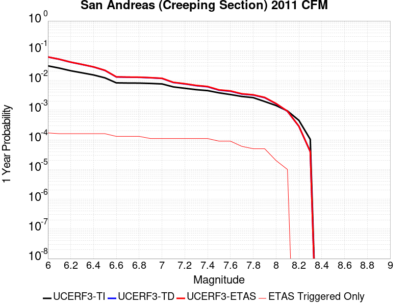 |  |

| Magnitude | 1 wk TI Prob | 1 wk TD Prob | 1 wk ETAS Prob | 1 wk ETAS/TD Gain | 1 wk ETAS Triggered Only | 1 mo TI Prob | 1 mo TD Prob | 1 mo ETAS Prob | 1 mo ETAS/TD Gain | 1 mo ETAS Triggered Only | 1 yr TI Prob | 1 yr TD Prob | 1 yr ETAS Prob | 1 yr ETAS/TD Gain | 1 yr ETAS Triggered Only | 10 yr TI Prob | 10 yr TD Prob | 10 yr ETAS Prob | 10 yr ETAS/TD Gain | 10 yr ETAS Triggered Only |
|-----|-----|-----|-----|-----|-----|-----|-----|-----|-----|-----|-----|-----|-----|-----|-----|-----|-----|-----|-----|-----|
| 6.0 | 5.986481E-4 | 0.001228691 | 0.001228691 | 1.0 | 0.0 | 0.0025631124 | 0.005246795 | 0.005246795 | 1.0 | 0.0 | 0.030762846 | 0.061203245 | 0.061203245 | 1.0 | 0.0 | 0.26835477 | 0.425928 | 0.4261518 | 1.0005255 | 3.8986356E-4 |
| 6.1 | 5.015945E-4 | 0.0010230356 | 0.0010230356 | 1.0 | 0.0 | 0.00214792 | 0.004369436 | 0.004369436 | 1.0 | 0.0 | 0.025839351 | 0.051246606 | 0.051246606 | 1.0 | 0.0 | 0.23032776 | 0.37284943 | 0.37309396 | 1.0006558 | 3.8986356E-4 |
| 6.2 | 4.073338E-4 | 8.1157376E-4 | 8.1157376E-4 | 1.0 | 0.0 | 0.0017445484 | 0.0034683137 | 0.0034683137 | 1.0 | 0.0 | 0.021034058 | 0.04093177 | 0.04093177 | 1.0 | 0.0 | 0.19150782 | 0.31302592 | 0.31329373 | 1.0008556 | 3.8986356E-4 |
| 6.3 | 3.464099E-4 | 6.7455834E-4 | 6.7455834E-4 | 1.0 | 0.0 | 0.0014837692 | 0.0028832308 | 0.0028832308 | 1.0 | 0.0 | 0.017915873 | 0.034187846 | 0.034187846 | 1.0 | 0.0 | 0.16538359 | 0.27130842 | 0.2715925 | 1.0010471 | 3.8986356E-4 |
| 6.4 | 2.935057E-4 | 5.5516965E-4 | 5.5516965E-4 | 1.0 | 0.0 | 0.0012572751 | 0.0023727308 | 0.0023727308 | 1.0 | 0.0 | 0.015200248 | 0.02826279 | 0.02826279 | 1.0 | 0.0 | 0.14201577 | 0.23297668 | 0.23327571 | 1.0012835 | 3.8986356E-4 |
| 6.5 | 2.3409708E-4 | 4.2132285E-4 | 4.2132285E-4 | 1.0 | 0.0 | 0.0010028875 | 0.0018017791 | 0.0018017791 | 1.0 | 0.0 | 0.012141965 | 0.021586355 | 0.021586355 | 1.0 | 0.0 | 0.11499573 | 0.1868149 | 0.18713194 | 1.0016971 | 3.8986356E-4 |
| 6.6 | 1.5842178E-4 | 2.5068692E-4 | 2.5068692E-4 | 1.0 | 0.0 | 6.7877385E-4 | 0.0010739256 | 0.0010739256 | 1.0 | 0.0 | 0.0082328 | 0.012995283 | 0.012995283 | 1.0 | 0.0 | 0.07934396 | 0.12313759 | 0.12347945 | 1.0027763 | 3.8986356E-4 |
| 6.7 | 1.5616413E-4 | 2.4605254E-4 | 2.4605254E-4 | 1.0 | 0.0 | 6.691031E-4 | 0.0010540807 | 0.0010540807 | 1.0 | 0.0 | 0.0081159435 | 0.012757154 | 0.012757154 | 1.0 | 0.0 | 0.0782586 | 0.12116472 | 0.12150735 | 1.0028278 | 3.8986356E-4 |
| 6.8 | 1.5538467E-4 | 2.442914E-4 | 2.442914E-4 | 1.0 | 0.0 | 6.6576427E-4 | 0.001046539 | 0.001046539 | 1.0 | 0.0 | 0.008075596 | 0.012666538 | 0.012666538 | 1.0 | 0.0 | 0.07788358 | 0.12039561 | 0.12073853 | 1.0028483 | 3.8986356E-4 |
| 6.9 | 1.5153569E-4 | 2.3538464E-4 | 2.3538464E-4 | 1.0 | 0.0 | 6.49277E-4 | 0.0010084033 | 0.0010084033 | 1.0 | 0.0 | 0.007876333 | 0.012208726 | 0.012208726 | 1.0 | 0.0 | 0.07602952 | 0.11646574 | 0.1168102 | 1.0029576 | 3.8986356E-4 |
| 7.0 | 1.4588932E-4 | 2.2395732E-4 | 2.2395732E-4 | 1.0 | 0.0 | 6.250901E-4 | 9.59466E-4 | 9.59466E-4 | 1.0 | 0.0 | 0.0075839474 | 0.011619428 | 0.011619428 | 1.0 | 0.0 | 0.073302895 | 0.11131206 | 0.11165853 | 1.0031126 | 3.8986356E-4 |
| 7.1 | 1.1565079E-4 | 1.6281323E-4 | 1.6281323E-4 | 1.0 | 0.0 | 4.955521E-4 | 6.9758523E-4 | 6.9758523E-4 | 1.0 | 0.0 | 0.006016669 | 0.008460228 | 0.008460228 | 1.0 | 0.0 | 0.058563538 | 0.08366478 | 0.08402203 | 1.00427 | 3.8986356E-4 |
| 7.2 | 1.0393792E-4 | 1.4615392E-4 | 1.4615392E-4 | 1.0 | 0.0 | 4.4537216E-4 | 6.262243E-4 | 6.262243E-4 | 1.0 | 0.0 | 0.005408933 | 0.0075977976 | 0.0075977976 | 1.0 | 0.0 | 0.052791595 | 0.07561503 | 0.07561503 | 1.0 | 0.0 |
| 7.3 | 9.332884E-5 | 1.2780601E-4 | 1.2780601E-4 | 1.0 | 0.0 | 3.999194E-4 | 5.4762565E-4 | 5.4762565E-4 | 1.0 | 0.0 | 0.0048581534 | 0.0066470946 | 0.0066470946 | 1.0 | 0.0 | 0.047533102 | 0.06647954 | 0.06647954 | 1.0 | 0.0 |
| 7.4 | 8.670252E-5 | 1.1702972E-4 | 1.1702972E-4 | 1.0 | 0.0 | 3.715293E-4 | 5.014601E-4 | 5.014601E-4 | 1.0 | 0.0 | 0.004513991 | 0.0060883067 | 0.0060883067 | 1.0 | 0.0 | 0.044233937 | 0.061148684 | 0.061148684 | 1.0 | 0.0 |
| 7.5 | 7.3036405E-5 | 9.005699E-5 | 9.005699E-5 | 1.0 | 0.0 | 3.129756E-4 | 3.859015E-4 | 3.859015E-4 | 1.0 | 0.0 | 0.0038038217 | 0.0046882504 | 0.0046882504 | 1.0 | 0.0 | 0.03739367 | 0.047875606 | 0.047875606 | 1.0 | 0.0 |
| 7.6 | 6.3935775E-5 | 8.280209E-5 | 8.280209E-5 | 1.0 | 0.0 | 2.7398168E-4 | 3.5481792E-4 | 3.5481792E-4 | 1.0 | 0.0 | 0.0033306254 | 0.00431137 | 0.00431137 | 1.0 | 0.0 | 0.032811474 | 0.043990135 | 0.043990135 | 1.0 | 0.0 |
| 7.7 | 5.5050095E-5 | 6.661729E-5 | 6.661729E-5 | 1.0 | 0.0 | 2.3590765E-4 | 2.8547147E-4 | 2.8547147E-4 | 1.0 | 0.0 | 0.0028683927 | 0.0034700802 | 0.0034700802 | 1.0 | 0.0 | 0.0283165 | 0.03579509 | 0.03579509 | 1.0 | 0.0 |
| 7.8 | 5.027131E-5 | 6.1627725E-5 | 6.1627725E-5 | 1.0 | 0.0 | 2.1543067E-4 | 2.640921E-4 | 2.640921E-4 | 1.0 | 0.0 | 0.0026197135 | 0.003210584 | 0.003210584 | 1.0 | 0.0 | 0.025890453 | 0.03312572 | 0.03312572 | 1.0 | 0.0 |
| 7.9 | 3.7271806E-5 | 5.0224386E-5 | 5.0224386E-5 | 1.0 | 0.0 | 1.5972654E-4 | 2.1522962E-4 | 2.1522962E-4 | 1.0 | 0.0 | 0.0019429359 | 0.0026172737 | 0.0026172737 | 1.0 | 0.0 | 0.019260362 | 0.027066687 | 0.027066687 | 1.0 | 0.0 |
| 8.0 | 2.7310243E-5 | 3.1428404E-5 | 3.1428404E-5 | 1.0 | 0.0 | 1.17038646E-4 | 1.3468621E-4 | 1.3468621E-4 | 1.0 | 0.0 | 0.0014240141 | 0.0016385721 | 0.0016385721 | 1.0 | 0.0 | 0.014149235 | 0.01721387 | 0.01721387 | 1.0 | 0.0 |
| 8.1 | 1.7940547E-5 | 1.7400796E-5 | 1.7400796E-5 | 1.0 | 0.0 | 7.688579E-5 | 7.457271E-5 | 7.457271E-5 | 1.0 | 0.0 | 9.3568244E-4 | 9.075451E-4 | 9.075451E-4 | 1.0 | 0.0 | 0.009317525 | 0.009799073 | 0.009799073 | 1.0 | 0.0 |
| 8.2 | 8.643924E-6 | 5.4748625E-6 | 5.4748625E-6 | 1.0 | 0.0 | 3.704486E-5 | 2.3463486E-5 | 2.3463486E-5 | 1.0 | 0.0 | 4.5092785E-4 | 2.8563058E-4 | 2.8563058E-4 | 1.0 | 0.0 | 0.0045001395 | 0.0032487072 | 0.0032487072 | 1.0 | 0.0 |
| 8.3 | 1.983087E-6 | 7.6599065E-7 | 7.6599065E-7 | 1.0 | 0.0 | 8.498917E-6 | 3.282813E-6 | 3.282813E-6 | 1.0 | 0.0 | 1.034694E-4 | 3.9967534E-5 | 3.9967534E-5 | 1.0 | 0.0 | 0.0010342124 | 4.719687E-4 | 4.719687E-4 | 1.0 | 0.0 |

## Santa Ynez (West)
*[(top)](#table-of-contents)*

| 1 Week | 1 Month | 1 Year | 10 Year |
|-----|-----|-----|-----|
|  |  |  |  |

| Magnitude | 1 wk TI Prob | 1 wk TD Prob | 1 wk ETAS Prob | 1 wk ETAS/TD Gain | 1 wk ETAS Triggered Only | 1 mo TI Prob | 1 mo TD Prob | 1 mo ETAS Prob | 1 mo ETAS/TD Gain | 1 mo ETAS Triggered Only | 1 yr TI Prob | 1 yr TD Prob | 1 yr ETAS Prob | 1 yr ETAS/TD Gain | 1 yr ETAS Triggered Only | 10 yr TI Prob | 10 yr TD Prob | 10 yr ETAS Prob | 10 yr ETAS/TD Gain | 10 yr ETAS Triggered Only |
|-----|-----|-----|-----|-----|-----|-----|-----|-----|-----|-----|-----|-----|-----|-----|-----|-----|-----|-----|-----|-----|
| 6.0 | 4.7352758E-5 | 5.4972126E-5 | 4.4481424E-4 | 8.091633 | 3.8986356E-4 | 2.0292461E-4 | 2.3557522E-4 | 6.253469E-4 | 2.6545532 | 3.8986356E-4 | 0.0024678076 | 0.0028645284 | 0.003253275 | 1.1357106 | 3.8986356E-4 | 0.024405818 | 0.028304417 | 0.028683245 | 1.0133841 | 3.8986356E-4 |
| 6.1 | 4.7352758E-5 | 5.4972126E-5 | 4.4481424E-4 | 8.091633 | 3.8986356E-4 | 2.0292461E-4 | 2.3557522E-4 | 6.253469E-4 | 2.6545532 | 3.8986356E-4 | 0.0024678076 | 0.0028645284 | 0.003253275 | 1.1357106 | 3.8986356E-4 | 0.024405818 | 0.028304417 | 0.028683245 | 1.0133841 | 3.8986356E-4 |
| 6.2 | 3.0415853E-5 | 3.392511E-5 | 4.2377543E-4 | 12.491497 | 3.8986356E-4 | 1.3034715E-4 | 1.4538545E-4 | 5.351923E-4 | 3.681196 | 3.8986356E-4 | 0.0015858212 | 0.0017686661 | 0.0021578402 | 1.2200382 | 3.8986356E-4 | 0.015745522 | 0.017549807 | 0.017932829 | 1.0218248 | 3.8986356E-4 |
| 6.3 | 3.0415853E-5 | 3.392511E-5 | 4.2377543E-4 | 12.491497 | 3.8986356E-4 | 1.3034715E-4 | 1.4538545E-4 | 5.351923E-4 | 3.681196 | 3.8986356E-4 | 0.0015858212 | 0.0017686661 | 0.0021578402 | 1.2200382 | 3.8986356E-4 | 0.015745522 | 0.017549807 | 0.017932829 | 1.0218248 | 3.8986356E-4 |
| 6.4 | 2.5452082E-5 | 2.7912422E-5 | 4.1776508E-4 | 14.966995 | 3.8986356E-4 | 1.09075794E-4 | 1.196193E-4 | 5.094362E-4 | 4.258813 | 3.8986356E-4 | 0.0013271887 | 0.0014554089 | 0.001844705 | 1.2674823 | 3.8986356E-4 | 0.013192902 | 0.014460951 | 0.014845177 | 1.0265698 | 3.8986356E-4 |
| 6.5 | 2.3143784E-5 | 2.5128256E-5 | 4.14982E-4 | 16.514557 | 3.8986356E-4 | 9.9183875E-5 | 1.0768817E-4 | 4.975097E-4 | 4.6199107 | 3.8986356E-4 | 0.0012068948 | 0.0013103267 | 0.0016996794 | 1.2971417 | 3.8986356E-4 | 0.012003611 | 0.01302768 | 0.013412464 | 1.0295359 | 3.8986356E-4 |
| 6.6 | 1.9118515E-5 | 2.035434E-5 | 4.1020996E-4 | 20.153439 | 3.8986356E-4 | 8.193392E-5 | 8.7230015E-5 | 4.7705954E-4 | 5.468984 | 3.8986356E-4 | 9.97089E-4 | 0.001061516 | 0.0014509656 | 1.3668807 | 3.8986356E-4 | 0.00992627 | 0.010565365 | 0.010951109 | 1.0365102 | 3.8986356E-4 |
| 6.7 | 1.722807E-5 | 1.8146347E-5 | 1.8146347E-5 | 1.0 | 0.0 | 7.3832496E-5 | 7.776777E-5 | 7.776777E-5 | 1.0 | 0.0 | 8.985399E-4 | 9.464169E-4 | 9.464169E-4 | 1.0 | 0.0 | 0.008949154 | 0.0094245095 | 0.0094245095 | 1.0 | 0.0 |
| 6.8 | 1.5317364E-5 | 1.5926486E-5 | 1.5926486E-5 | 1.0 | 0.0 | 6.56442E-5 | 6.82546E-5 | 6.82546E-5 | 1.0 | 0.0 | 7.98925E-4 | 8.306873E-4 | 8.306873E-4 | 1.0 | 0.0 | 0.007960589 | 0.00827631 | 0.00827631 | 1.0 | 0.0 |
| 6.9 | 1.3071226E-5 | 1.3329624E-5 | 1.3329624E-5 | 1.0 | 0.0 | 5.6018336E-5 | 5.7125722E-5 | 5.7125722E-5 | 1.0 | 0.0 | 6.8180985E-4 | 6.9528597E-4 | 6.9528597E-4 | 1.0 | 0.0 | 0.0067972173 | 0.006931367 | 0.006931367 | 1.0 | 0.0 |
| 7.0 | 1.1836986E-5 | 1.19327815E-5 | 1.19327815E-5 | 1.0 | 0.0 | 5.0728955E-5 | 5.11395E-5 | 5.11395E-5 | 1.0 | 0.0 | 6.1745E-4 | 6.2244723E-4 | 6.2244723E-4 | 1.0 | 0.0 | 0.006157372 | 0.006207231 | 0.006207231 | 1.0 | 0.0 |
| 7.1 | 1.0597169E-5 | 1.0542201E-5 | 1.0542201E-5 | 1.0 | 0.0 | 4.541565E-5 | 4.5180084E-5 | 4.5180084E-5 | 1.0 | 0.0 | 5.5279525E-4 | 5.4992986E-4 | 5.4992986E-4 | 1.0 | 0.0 | 0.0055142213 | 0.005485821 | 0.005485821 | 1.0 | 0.0 |
| 7.2 | 9.59113E-6 | 9.459144E-6 | 9.459144E-6 | 1.0 | 0.0 | 4.11042E-5 | 4.0538565E-5 | 4.0538565E-5 | 1.0 | 0.0 | 5.0032866E-4 | 4.934463E-4 | 4.934463E-4 | 1.0 | 0.0 | 0.004992037 | 0.0049236254 | 0.0049236254 | 1.0 | 0.0 |
| 7.3 | 8.586084E-6 | 8.379583E-6 | 8.379583E-6 | 1.0 | 0.0 | 3.679698E-5 | 3.5912013E-5 | 3.5912013E-5 | 1.0 | 0.0 | 4.4791115E-4 | 4.3714207E-4 | 4.3714207E-4 | 1.0 | 0.0 | 0.004470094 | 0.004362933 | 0.004362933 | 1.0 | 0.0 |
| 7.4 | 7.2622997E-6 | 6.9515427E-6 | 6.9515427E-6 | 1.0 | 0.0 | 3.112377E-5 | 2.979199E-5 | 2.979199E-5 | 1.0 | 0.0 | 3.78866E-4 | 3.626581E-4 | 3.626581E-4 | 1.0 | 0.0 | 0.0037822074 | 0.0036207628 | 0.0036207628 | 1.0 | 0.0 |
| 7.5 | 5.627296E-6 | 5.251588E-6 | 5.251588E-6 | 1.0 | 0.0 | 2.411676E-5 | 2.2506614E-5 | 2.2506614E-5 | 1.0 | 0.0 | 2.9358198E-4 | 2.739843E-4 | 2.739843E-4 | 1.0 | 0.0 | 0.0029319443 | 0.002736537 | 0.002736537 | 1.0 | 0.0 |
| 7.6 | 2.265244E-6 | 2.0608625E-6 | 2.0608625E-6 | 1.0 | 0.0 | 9.708152E-6 | 8.832238E-6 | 8.832238E-6 | 1.0 | 0.0 | 1.18190335E-4 | 1.0752728E-4 | 1.0752728E-4 | 1.0 | 0.0 | 0.001181275 | 0.0010747612 | 0.0010747612 | 1.0 | 0.0 |
| 7.7 | 1.3099874E-6 | 1.1016252E-6 | 1.1016252E-6 | 1.0 | 0.0 | 5.61422E-6 | 4.7212425E-6 | 4.7212425E-6 | 1.0 | 0.0 | 6.8350986E-5 | 5.7479636E-5 | 5.7479636E-5 | 1.0 | 0.0 | 6.832996E-4 | 5.7465007E-4 | 5.7465007E-4 | 1.0 | 0.0 |
| 7.8 | 7.903951E-7 | 6.0711415E-7 | 6.0711415E-7 | 1.0 | 0.0 | 3.3874032E-6 | 2.6019152E-6 | 2.6019152E-6 | 1.0 | 0.0 | 4.1240855E-5 | 3.167787E-5 | 3.167787E-5 | 1.0 | 0.0 | 4.12332E-4 | 3.167349E-4 | 3.167349E-4 | 1.0 | 0.0 |
| 7.9 | 7.0753297E-9 | 5.0899476E-9 | 5.0899476E-9 | 1.0 | 0.0 | 3.032284E-8 | 2.181406E-8 | 2.181406E-8 | 1.0 | 0.0 | 3.6918053E-7 | 2.6558615E-7 | 2.6558615E-7 | 1.0 | 0.0 | 3.691799E-6 | 2.6558594E-6 | 2.6558594E-6 | 1.0 | 0.0 |

## Baker
*[(top)](#table-of-contents)*

| 1 Week | 1 Month | 1 Year | 10 Year |
|-----|-----|-----|-----|
|  |  | 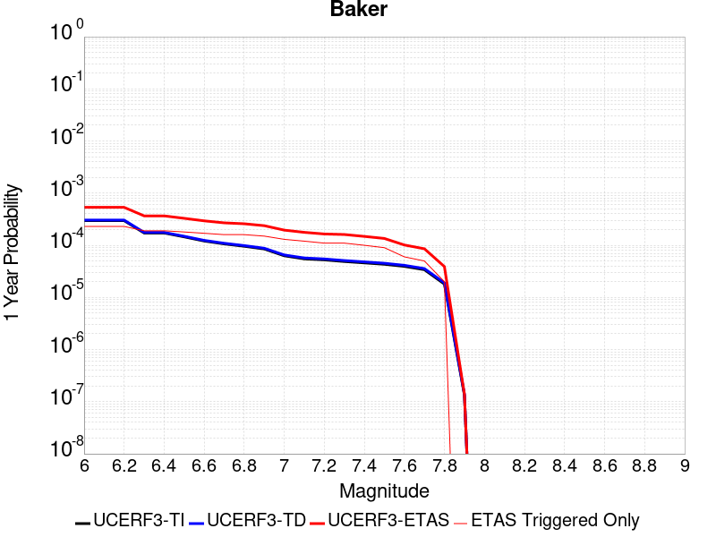 |  |

| Magnitude | 1 wk TI Prob | 1 wk TD Prob | 1 wk ETAS Prob | 1 wk ETAS/TD Gain | 1 wk ETAS Triggered Only | 1 mo TI Prob | 1 mo TD Prob | 1 mo ETAS Prob | 1 mo ETAS/TD Gain | 1 mo ETAS Triggered Only | 1 yr TI Prob | 1 yr TD Prob | 1 yr ETAS Prob | 1 yr ETAS/TD Gain | 1 yr ETAS Triggered Only | 10 yr TI Prob | 10 yr TD Prob | 10 yr ETAS Prob | 10 yr ETAS/TD Gain | 10 yr ETAS Triggered Only |
|-----|-----|-----|-----|-----|-----|-----|-----|-----|-----|-----|-----|-----|-----|-----|-----|-----|-----|-----|-----|-----|
| 6.0 | 5.695525E-6 | 5.8348373E-6 | 3.9569612E-4 | 67.81614 | 3.8986356E-4 | 2.4409164E-5 | 2.5006228E-5 | 4.1486003E-4 | 16.59027 | 3.8986356E-4 | 2.9714106E-4 | 3.044123E-4 | 6.9415715E-4 | 2.280319 | 3.8986356E-4 | 0.0029674405 | 0.0030403486 | 0.003429027 | 1.12784 | 3.8986356E-4 |
| 6.1 | 5.695525E-6 | 5.8348373E-6 | 3.9569612E-4 | 67.81614 | 3.8986356E-4 | 2.4409164E-5 | 2.5006228E-5 | 4.1486003E-4 | 16.59027 | 3.8986356E-4 | 2.9714106E-4 | 3.044123E-4 | 6.9415715E-4 | 2.280319 | 3.8986356E-4 | 0.0029674405 | 0.0030403486 | 0.003429027 | 1.12784 | 3.8986356E-4 |
| 6.2 | 5.695525E-6 | 5.8348373E-6 | 3.9569612E-4 | 67.81614 | 3.8986356E-4 | 2.4409164E-5 | 2.5006228E-5 | 4.1486003E-4 | 16.59027 | 3.8986356E-4 | 2.9714106E-4 | 3.044123E-4 | 6.9415715E-4 | 2.280319 | 3.8986356E-4 | 0.0029674405 | 0.0030403486 | 0.003429027 | 1.12784 | 3.8986356E-4 |
| 6.3 | 3.2995713E-6 | 3.383667E-6 | 3.932459E-4 | 116.21885 | 3.8986356E-4 | 1.4140943E-5 | 1.4501353E-5 | 4.0435925E-4 | 27.884243 | 3.8986356E-4 | 1.7215237E-4 | 1.7654014E-4 | 5.663349E-4 | 3.2079666 | 3.8986356E-4 | 0.0017201907 | 0.001764046 | 0.0021532218 | 1.2206155 | 3.8986356E-4 |
| 6.4 | 3.2995713E-6 | 3.383667E-6 | 3.932459E-4 | 116.21885 | 3.8986356E-4 | 1.4140943E-5 | 1.4501353E-5 | 4.0435925E-4 | 27.884243 | 3.8986356E-4 | 1.7215237E-4 | 1.7654014E-4 | 5.663349E-4 | 3.2079666 | 3.8986356E-4 | 0.0017201907 | 0.001764046 | 0.0021532218 | 1.2206155 | 3.8986356E-4 |
| 6.5 | 2.782202E-6 | 2.8558404E-6 | 3.9271827E-4 | 137.51408 | 3.8986356E-4 | 1.1923668E-5 | 1.223926E-5 | 4.0209803E-4 | 32.85313 | 3.8986356E-4 | 1.4516099E-4 | 1.4900314E-4 | 5.388086E-4 | 3.6160889 | 3.8986356E-4 | 0.001450662 | 0.0014890651 | 0.0018783481 | 1.2614278 | 3.8986356E-4 |
| 6.6 | 2.3163404E-6 | 2.38092E-6 | 3.9224353E-4 | 164.74452 | 3.8986356E-4 | 9.927136E-6 | 1.0203904E-5 | 4.0006347E-4 | 39.2069 | 3.8986356E-4 | 1.20856166E-4 | 1.2422565E-4 | 5.1404076E-4 | 4.13796 | 3.8986356E-4 | 0.0012079047 | 0.0012415823 | 0.0016309618 | 1.3136156 | 3.8986356E-4 |
| 6.7 | 2.037056E-6 | 2.0965003E-6 | 3.9195924E-4 | 186.95882 | 3.8986356E-4 | 8.7302105E-6 | 8.984972E-6 | 3.98845E-4 | 44.390236 | 3.8986356E-4 | 1.0628513E-4 | 1.093867E-4 | 4.992076E-4 | 4.5636954 | 3.8986356E-4 | 0.0010623431 | 0.0010933448 | 0.0014827821 | 1.3561889 | 3.8986356E-4 |
| 6.8 | 1.8356744E-6 | 1.8915287E-6 | 3.9175435E-4 | 207.10991 | 3.8986356E-4 | 7.867153E-6 | 8.106527E-6 | 3.979669E-4 | 49.09216 | 3.8986356E-4 | 9.577837E-5 | 9.869264E-5 | 4.885177E-4 | 4.94989 | 3.8986356E-4 | 9.57371E-4 | 9.86502E-4 | 0.001375981 | 1.394808 | 3.8986356E-4 |
| 6.9 | 1.6310546E-6 | 1.6832072E-6 | 3.915461E-4 | 232.61908 | 3.8986356E-4 | 6.9902153E-6 | 7.213726E-6 | 3.9707447E-4 | 55.044296 | 3.8986356E-4 | 8.510255E-5 | 8.782368E-5 | 4.77653E-4 | 5.4387717 | 3.8986356E-4 | 8.5069967E-4 | 8.7790104E-4 | 0.0012674223 | 1.4436961 | 3.8986356E-4 |
| 7.0 | 1.2058036E-6 | 1.2508665E-6 | 3.9111392E-4 | 312.67438 | 3.8986356E-4 | 5.1677193E-6 | 5.3608455E-6 | 3.952223E-4 | 73.72387 | 3.8986356E-4 | 6.291517E-5 | 6.5266366E-5 | 4.5510445E-4 | 6.973032 | 3.8986356E-4 | 6.289736E-4 | 6.524743E-4 | 0.0010420835 | 1.5971256 | 3.8986356E-4 |
| 7.1 | 1.052382E-6 | 1.0951609E-6 | 3.9095827E-4 | 356.9871 | 3.8986356E-4 | 4.5102006E-6 | 4.693538E-6 | 3.9455525E-4 | 84.0635 | 3.8986356E-4 | 5.491031E-5 | 5.7142337E-5 | 4.469836E-4 | 7.822284 | 3.8986356E-4 | 5.4896745E-4 | 5.7127734E-4 | 9.6091814E-4 | 1.682052 | 3.8986356E-4 |
| 7.2 | 1.0067454E-6 | 1.0487711E-6 | 3.909119E-4 | 372.7333 | 3.8986356E-4 | 4.3146156E-6 | 4.4947255E-6 | 3.9435652E-4 | 87.737625 | 3.8986356E-4 | 5.252918E-5 | 5.4721917E-5 | 4.4456412E-4 | 8.12406 | 3.8986356E-4 | 5.251676E-4 | 5.470853E-4 | 9.3673554E-4 | 1.7122295 | 3.8986356E-4 |
| 7.3 | 9.3596316E-7 | 9.767723E-7 | 3.9083994E-4 | 400.13412 | 3.8986356E-4 | 4.0112645E-6 | 4.1861604E-6 | 3.9404808E-4 | 94.13114 | 3.8986356E-4 | 4.8836053E-5 | 5.096532E-5 | 4.40809E-4 | 8.649196 | 3.8986356E-4 | 4.8825322E-4 | 5.095371E-4 | 8.99202E-4 | 1.764743 | 3.8986356E-4 |
| 7.4 | 8.8117395E-7 | 9.2076635E-7 | 3.9078394E-4 | 424.41165 | 3.8986356E-4 | 3.7764542E-6 | 3.9461356E-6 | 3.9380815E-4 | 99.7959 | 3.8986356E-4 | 4.5977362E-5 | 4.8043148E-5 | 4.3788797E-4 | 9.114472 | 3.8986356E-4 | 4.596785E-4 | 4.8032837E-4 | 8.7000465E-4 | 1.8112706 | 3.8986356E-4 |
| 7.5 | 8.292386E-7 | 8.6745956E-7 | 3.9073068E-4 | 450.431 | 3.8986356E-4 | 3.5538749E-6 | 3.7176785E-6 | 3.9357977E-4 | 105.86708 | 3.8986356E-4 | 4.326757E-5 | 4.5261804E-5 | 4.351077E-4 | 9.613132 | 3.8986356E-4 | 4.3259145E-4 | 4.5252658E-4 | 8.4221375E-4 | 1.8611364 | 3.8986356E-4 |
| 7.6 | 7.553842E-7 | 7.9144706E-7 | 7.9144706E-7 | 1.0 | 0.0 | 3.2373566E-6 | 3.3919116E-6 | 3.3919116E-6 | 1.0 | 0.0 | 3.9414106E-5 | 4.129575E-5 | 4.129575E-5 | 1.0 | 0.0 | 3.9407116E-4 | 4.1288146E-4 | 4.1288146E-4 | 1.0 | 0.0 |
| 7.7 | 6.5285366E-7 | 6.852797E-7 | 6.852797E-7 | 1.0 | 0.0 | 2.797941E-6 | 2.9369096E-6 | 2.9369096E-6 | 1.0 | 0.0 | 3.40644E-5 | 3.5756293E-5 | 3.5756293E-5 | 1.0 | 0.0 | 3.405918E-4 | 3.5750607E-4 | 3.5750607E-4 | 1.0 | 0.0 |
| 7.8 | 3.4586725E-7 | 3.6482615E-7 | 3.6482615E-7 | 1.0 | 0.0 | 1.4822873E-6 | 1.5635396E-6 | 1.5635396E-6 | 1.0 | 0.0 | 1.80467E-5 | 1.9035933E-5 | 1.9035933E-5 | 1.0 | 0.0 | 1.8045233E-4 | 1.9034347E-4 | 1.9034347E-4 | 1.0 | 0.0 |
| 7.9 | 2.5591178E-9 | 2.6696718E-9 | 2.6696718E-9 | 1.0 | 0.0 | 1.0967647E-8 | 1.14414505E-8 | 1.14414505E-8 | 1.0 | 0.0 | 1.335311E-7 | 1.3929966E-7 | 1.3929966E-7 | 1.0 | 0.0 | 1.3353102E-6 | 1.3929966E-6 | 1.3929966E-6 | 1.0 | 0.0 |

## Elsinore (Glen Ivy) rev
*[(top)](#table-of-contents)*

| 1 Week | 1 Month | 1 Year | 10 Year |
|-----|-----|-----|-----|
|  |  | 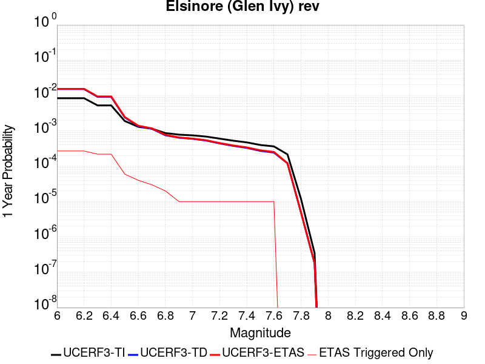 |  |

| Magnitude | 1 wk TI Prob | 1 wk TD Prob | 1 wk ETAS Prob | 1 wk ETAS/TD Gain | 1 wk ETAS Triggered Only | 1 mo TI Prob | 1 mo TD Prob | 1 mo ETAS Prob | 1 mo ETAS/TD Gain | 1 mo ETAS Triggered Only | 1 yr TI Prob | 1 yr TD Prob | 1 yr ETAS Prob | 1 yr ETAS/TD Gain | 1 yr ETAS Triggered Only | 10 yr TI Prob | 10 yr TD Prob | 10 yr ETAS Prob | 10 yr ETAS/TD Gain | 10 yr ETAS Triggered Only |
|-----|-----|-----|-----|-----|-----|-----|-----|-----|-----|-----|-----|-----|-----|-----|-----|-----|-----|-----|-----|-----|
| 6.0 | 1.6204086E-4 | 2.9360707E-4 | 2.9360707E-4 | 1.0 | 0.0 | 6.94276E-4 | 0.0012578638 | 0.0012578638 | 1.0 | 0.0 | 0.008420097 | 0.015234485 | 0.015618409 | 1.025201 | 3.8986356E-4 | 0.081081145 | 0.13969168 | 0.14002708 | 1.002401 | 3.8986356E-4 |
| 6.1 | 1.6204086E-4 | 2.9360707E-4 | 2.9360707E-4 | 1.0 | 0.0 | 6.94276E-4 | 0.0012578638 | 0.0012578638 | 1.0 | 0.0 | 0.008420097 | 0.015234485 | 0.015618409 | 1.025201 | 3.8986356E-4 | 0.081081145 | 0.13969168 | 0.14002708 | 1.002401 | 3.8986356E-4 |
| 6.2 | 1.6204086E-4 | 2.9360707E-4 | 2.9360707E-4 | 1.0 | 0.0 | 6.94276E-4 | 0.0012578638 | 0.0012578638 | 1.0 | 0.0 | 0.008420097 | 0.015234485 | 0.015618409 | 1.025201 | 3.8986356E-4 | 0.081081145 | 0.13969168 | 0.14002708 | 1.002401 | 3.8986356E-4 |
| 6.3 | 1.0111737E-4 | 1.7703383E-4 | 1.7703383E-4 | 1.0 | 0.0 | 4.332882E-4 | 7.5861247E-4 | 7.5861247E-4 | 1.0 | 0.0 | 0.005262531 | 0.009217682 | 0.009603952 | 1.0419053 | 3.8986356E-4 | 0.0513964 | 0.0870191 | 0.08737504 | 1.0040903 | 3.8986356E-4 |
| 6.4 | 1.0111737E-4 | 1.7703383E-4 | 1.7703383E-4 | 1.0 | 0.0 | 4.332882E-4 | 7.5861247E-4 | 7.5861247E-4 | 1.0 | 0.0 | 0.005262531 | 0.009217682 | 0.009603952 | 1.0419053 | 3.8986356E-4 | 0.0513964 | 0.0870191 | 0.08737504 | 1.0040903 | 3.8986356E-4 |
| 6.5 | 3.6624708E-5 | 4.6391084E-5 | 4.6391084E-5 | 1.0 | 0.0 | 1.569536E-4 | 1.9880582E-4 | 1.9880582E-4 | 1.0 | 0.0 | 0.001909235 | 0.0024181372 | 0.002807058 | 1.1608349 | 3.8986356E-4 | 0.01892915 | 0.023739954 | 0.024120564 | 1.0160323 | 3.8986356E-4 |
| 6.6 | 2.5051324E-5 | 2.614772E-5 | 2.614772E-5 | 1.0 | 0.0 | 1.073584E-4 | 1.12057096E-4 | 1.12057096E-4 | 1.0 | 0.0 | 0.0013063047 | 0.0013634858 | 0.0017528178 | 1.2855417 | 3.8986356E-4 | 0.012986525 | 0.013564618 | 0.013949193 | 1.0283513 | 3.8986356E-4 |
| 6.7 | 2.2189772E-5 | 2.2072849E-5 | 2.2072849E-5 | 1.0 | 0.0 | 9.509556E-5 | 9.4594696E-5 | 9.4594696E-5 | 1.0 | 0.0 | 0.0011571734 | 0.0011511183 | 0.0015405332 | 1.3382926 | 3.8986356E-4 | 0.011511663 | 0.011465415 | 0.011850809 | 1.0336136 | 3.8986356E-4 |
| 6.8 | 1.6654378E-5 | 1.4437705E-5 | 1.4437705E-5 | 1.0 | 0.0 | 7.137396E-5 | 6.187444E-5 | 6.187444E-5 | 1.0 | 0.0 | 8.686314E-4 | 7.530661E-4 | 0.001142636 | 1.5173118 | 3.8986356E-4 | 0.008652439 | 0.00751048 | 0.007897416 | 1.0515194 | 3.8986356E-4 |
| 6.9 | 1.5042909E-5 | 1.2332022E-5 | 1.2332022E-5 | 1.0 | 0.0 | 6.446802E-5 | 5.285047E-5 | 5.285047E-5 | 1.0 | 0.0 | 7.8461546E-4 | 6.4326765E-4 | 6.4326765E-4 | 1.0 | 0.0 | 0.007818509 | 0.00641828 | 0.00641828 | 1.0 | 0.0 |
| 7.0 | 1.4361385E-5 | 1.1451324E-5 | 1.1451324E-5 | 1.0 | 0.0 | 6.154734E-5 | 4.9076196E-5 | 4.9076196E-5 | 1.0 | 0.0 | 7.490812E-4 | 5.973418E-4 | 5.973418E-4 | 1.0 | 0.0 | 0.007465612 | 0.0059613534 | 0.0059613534 | 1.0 | 0.0 |
| 7.1 | 1.3265571E-5 | 1.0244926E-5 | 1.0244926E-5 | 1.0 | 0.0 | 5.6851208E-5 | 4.39061E-5 | 4.39061E-5 | 1.0 | 0.0 | 6.919436E-4 | 5.344282E-4 | 5.344282E-4 | 1.0 | 0.0 | 0.006897931 | 0.0053347866 | 0.0053347866 | 1.0 | 0.0 |
| 7.2 | 1.1596403E-5 | 8.505067E-6 | 8.505067E-6 | 1.0 | 0.0 | 4.9697923E-5 | 3.6449786E-5 | 3.6449786E-5 | 1.0 | 0.0 | 6.049042E-4 | 4.436875E-4 | 4.436875E-4 | 1.0 | 0.0 | 0.006032603 | 0.0044294316 | 0.0044294316 | 1.0 | 0.0 |
| 7.3 | 1.0150827E-5 | 7.2387597E-6 | 7.2387597E-6 | 1.0 | 0.0 | 4.3502816E-5 | 3.1022897E-5 | 3.1022897E-5 | 1.0 | 0.0 | 5.2951806E-4 | 3.7763975E-4 | 3.7763975E-4 | 1.0 | 0.0 | 0.005282581 | 0.0037703665 | 0.0037703665 | 1.0 | 0.0 |
| 7.4 | 9.080705E-6 | 6.352519E-6 | 6.352519E-6 | 1.0 | 0.0 | 3.8916725E-5 | 2.7224805E-5 | 2.7224805E-5 | 1.0 | 0.0 | 4.7370812E-4 | 3.3141294E-4 | 3.3141294E-4 | 1.0 | 0.0 | 0.004726996 | 0.0033093381 | 0.0033093381 | 1.0 | 0.0 |
| 7.5 | 7.671649E-6 | 5.2256332E-6 | 5.2256332E-6 | 1.0 | 0.0 | 3.287808E-5 | 2.2395385E-5 | 2.2395385E-5 | 1.0 | 0.0 | 4.0021708E-4 | 2.7263095E-4 | 2.7263095E-4 | 1.0 | 0.0 | 0.0039949706 | 0.00272309 | 0.00272309 | 1.0 | 0.0 |
| 7.6 | 6.990086E-6 | 4.687545E-6 | 4.687545E-6 | 1.0 | 0.0 | 2.9957167E-5 | 2.008933E-5 | 2.008933E-5 | 1.0 | 0.0 | 3.6466747E-4 | 2.445613E-4 | 2.445613E-4 | 1.0 | 0.0 | 0.0036406964 | 0.002443038 | 0.002443038 | 1.0 | 0.0 |
| 7.7 | 4.163505E-6 | 2.3295343E-6 | 2.3295343E-6 | 1.0 | 0.0 | 1.7843471E-5 | 9.983683E-6 | 9.983683E-6 | 1.0 | 0.0 | 2.172226E-4 | 1.21545316E-4 | 1.21545316E-4 | 1.0 | 0.0 | 0.0021701038 | 0.0012148614 | 0.0012148614 | 1.0 | 0.0 |
| 7.8 | 2.2692414E-7 | 9.3854695E-8 | 9.3854695E-8 | 1.0 | 0.0 | 9.725317E-7 | 4.0223435E-7 | 4.0223435E-7 | 1.0 | 0.0 | 1.1840509E-5 | 4.8971956E-6 | 4.8971956E-6 | 1.0 | 0.0 | 1.1839878E-4 | 4.8971204E-5 | 4.8971204E-5 | 1.0 | 0.0 |
| 7.9 | 6.676829E-9 | 3.439853E-9 | 3.439853E-9 | 1.0 | 0.0 | 2.861498E-8 | 1.4742227E-8 | 1.4742227E-8 | 1.0 | 0.0 | 3.4838732E-7 | 1.7948659E-7 | 1.7948659E-7 | 1.0 | 0.0 | 3.4838679E-6 | 1.7948646E-6 | 1.7948646E-6 | 1.0 | 0.0 |

## Coronado Bank alt1
*[(top)](#table-of-contents)*

| 1 Week | 1 Month | 1 Year | 10 Year |
|-----|-----|-----|-----|
|  |  |  |  |

| Magnitude | 1 wk TI Prob | 1 wk TD Prob | 1 wk ETAS Prob | 1 wk ETAS/TD Gain | 1 wk ETAS Triggered Only | 1 mo TI Prob | 1 mo TD Prob | 1 mo ETAS Prob | 1 mo ETAS/TD Gain | 1 mo ETAS Triggered Only | 1 yr TI Prob | 1 yr TD Prob | 1 yr ETAS Prob | 1 yr ETAS/TD Gain | 1 yr ETAS Triggered Only | 10 yr TI Prob | 10 yr TD Prob | 10 yr ETAS Prob | 10 yr ETAS/TD Gain | 10 yr ETAS Triggered Only |
|-----|-----|-----|-----|-----|-----|-----|-----|-----|-----|-----|-----|-----|-----|-----|-----|-----|-----|-----|-----|-----|
| 6.0 | 7.533492E-5 | 9.394913E-5 | 9.394913E-5 | 1.0 | 0.0 | 3.22824E-4 | 4.0258127E-4 | 4.0258127E-4 | 1.0 | 0.0 | 0.0039233007 | 0.0048909658 | 0.0048909658 | 1.0 | 0.0 | 0.03854755 | 0.04790356 | 0.048274748 | 1.0077486 | 3.8986356E-4 |
| 6.1 | 4.1807285E-5 | 5.049283E-5 | 5.049283E-5 | 1.0 | 0.0 | 1.7916178E-4 | 2.1638049E-4 | 2.1638049E-4 | 1.0 | 0.0 | 0.0021791123 | 0.0026313474 | 0.0026313474 | 1.0 | 0.0 | 0.021578677 | 0.026011046 | 0.026011046 | 1.0 | 0.0 |
| 6.2 | 4.1807285E-5 | 5.049283E-5 | 5.049283E-5 | 1.0 | 0.0 | 1.7916178E-4 | 2.1638049E-4 | 2.1638049E-4 | 1.0 | 0.0 | 0.0021791123 | 0.0026313474 | 0.0026313474 | 1.0 | 0.0 | 0.021578677 | 0.026011046 | 0.026011046 | 1.0 | 0.0 |
| 6.3 | 3.1793104E-5 | 3.7711117E-5 | 3.7711117E-5 | 1.0 | 0.0 | 1.3624904E-4 | 1.6160926E-4 | 1.6160926E-4 | 1.0 | 0.0 | 0.0016575698 | 0.001965848 | 0.001965848 | 1.0 | 0.0 | 0.016452603 | 0.019488465 | 0.019488465 | 1.0 | 0.0 |
| 6.4 | 2.9878007E-5 | 3.5335794E-5 | 3.5335794E-5 | 1.0 | 0.0 | 1.2804232E-4 | 1.5143053E-4 | 1.5143053E-4 | 1.0 | 0.0 | 0.0015578003 | 0.0018421387 | 0.0018421387 | 1.0 | 0.0 | 0.015469253 | 0.01827244 | 0.01827244 | 1.0 | 0.0 |
| 6.5 | 2.4512565E-5 | 2.8764043E-5 | 2.8764043E-5 | 1.0 | 0.0 | 1.0504962E-4 | 1.2326881E-4 | 1.2326881E-4 | 1.0 | 0.0 | 0.0012782287 | 0.0014997921 | 0.0014997921 | 1.0 | 0.0 | 0.012709012 | 0.014899683 | 0.014899683 | 1.0 | 0.0 |
| 6.6 | 2.1317413E-5 | 2.490667E-5 | 2.490667E-5 | 1.0 | 0.0 | 9.135714E-5 | 1.0673863E-4 | 1.0673863E-4 | 1.0 | 0.0 | 0.0011117056 | 0.0012987906 | 0.0012987906 | 1.0 | 0.0 | 0.011061605 | 0.012914404 | 0.012914404 | 1.0 | 0.0 |
| 6.7 | 1.8585655E-5 | 2.163488E-5 | 2.163488E-5 | 1.0 | 0.0 | 7.9650374E-5 | 9.271773E-5 | 9.271773E-5 | 1.0 | 0.0 | 9.6931186E-4 | 0.0011282742 | 0.0011282742 | 1.0 | 0.0 | 0.0096509475 | 0.011227623 | 0.011227623 | 1.0 | 0.0 |
| 6.8 | 1.5862879E-5 | 1.8419474E-5 | 1.8419474E-5 | 1.0 | 0.0 | 6.798199E-5 | 7.893833E-5 | 7.893833E-5 | 1.0 | 0.0 | 8.273665E-4 | 9.6066965E-4 | 9.6066965E-4 | 1.0 | 0.0 | 0.008242928 | 0.00956715 | 0.00956715 | 1.0 | 0.0 |
| 6.9 | 1.3021509E-5 | 1.5095265E-5 | 1.5095265E-5 | 1.0 | 0.0 | 5.5805274E-5 | 6.469249E-5 | 6.469249E-5 | 1.0 | 0.0 | 6.792174E-4 | 7.8736455E-4 | 7.8736455E-4 | 1.0 | 0.0 | 0.006771452 | 0.007847573 | 0.007847573 | 1.0 | 0.0 |
| 7.0 | 1.0974371E-5 | 1.2720104E-5 | 1.2720104E-5 | 1.0 | 0.0 | 4.7032172E-5 | 5.451369E-5 | 5.451369E-5 | 1.0 | 0.0 | 5.7246623E-4 | 6.6351966E-4 | 6.6351966E-4 | 1.0 | 0.0 | 0.0057099373 | 0.006617135 | 0.006617135 | 1.0 | 0.0 |
| 7.1 | 8.766221E-6 | 1.01638325E-5 | 1.01638325E-5 | 1.0 | 0.0 | 3.7568978E-5 | 4.355865E-5 | 4.355865E-5 | 1.0 | 0.0 | 4.573063E-4 | 5.3021475E-4 | 5.3021475E-4 | 1.0 | 0.0 | 0.0045636636 | 0.0052911965 | 0.0052911965 | 1.0 | 0.0 |
| 7.2 | 8.026024E-7 | 8.331765E-7 | 8.331765E-7 | 1.0 | 0.0 | 3.43972E-6 | 3.5707515E-6 | 3.5707515E-6 | 1.0 | 0.0 | 4.1877785E-5 | 4.3473043E-5 | 4.3473043E-5 | 1.0 | 0.0 | 4.1869894E-4 | 4.3464647E-4 | 4.3464647E-4 | 1.0 | 0.0 |
| 7.3 | 3.7293114E-7 | 3.7000953E-7 | 3.7000953E-7 | 1.0 | 0.0 | 1.5982754E-6 | 1.5857541E-6 | 1.5857541E-6 | 1.0 | 0.0 | 1.9458828E-5 | 1.9306386E-5 | 1.9306386E-5 | 1.0 | 0.0 | 1.9457124E-4 | 1.9304715E-4 | 1.9304715E-4 | 1.0 | 0.0 |
| 7.4 | 2.0557036E-7 | 1.9674363E-7 | 1.9674363E-7 | 1.0 | 0.0 | 8.810155E-7 | 8.431867E-7 | 8.431867E-7 | 1.0 | 0.0 | 1.0726311E-5 | 1.026575E-5 | 1.026575E-5 | 1.0 | 0.0 | 1.0725793E-4 | 1.0265279E-4 | 1.0265279E-4 | 1.0 | 0.0 |
| 7.5 | 6.845446E-8 | 6.279369E-8 | 6.279369E-8 | 1.0 | 0.0 | 2.9337625E-7 | 2.691158E-7 | 2.691158E-7 | 1.0 | 0.0 | 3.5718497E-6 | 3.2764797E-6 | 3.2764797E-6 | 1.0 | 0.0 | 3.5717923E-5 | 3.2764325E-5 | 3.2764325E-5 | 1.0 | 0.0 |
| 7.6 | 6.0975145E-9 | 5.53185E-9 | 5.53185E-9 | 1.0 | 0.0 | 2.6132206E-8 | 2.370793E-8 | 2.370793E-8 | 1.0 | 0.0 | 3.1815955E-7 | 2.88644E-7 | 2.88644E-7 | 1.0 | 0.0 | 3.181591E-6 | 2.8864374E-6 | 2.8864374E-6 | 1.0 | 0.0 |

## Red Pass
*[(top)](#table-of-contents)*

| 1 Week | 1 Month | 1 Year | 10 Year |
|-----|-----|-----|-----|
|  |  |  |  |

| Magnitude | 1 wk TI Prob | 1 wk TD Prob | 1 wk ETAS Prob | 1 wk ETAS/TD Gain | 1 wk ETAS Triggered Only | 1 mo TI Prob | 1 mo TD Prob | 1 mo ETAS Prob | 1 mo ETAS/TD Gain | 1 mo ETAS Triggered Only | 1 yr TI Prob | 1 yr TD Prob | 1 yr ETAS Prob | 1 yr ETAS/TD Gain | 1 yr ETAS Triggered Only | 10 yr TI Prob | 10 yr TD Prob | 10 yr ETAS Prob | 10 yr ETAS/TD Gain | 10 yr ETAS Triggered Only |
|-----|-----|-----|-----|-----|-----|-----|-----|-----|-----|-----|-----|-----|-----|-----|-----|-----|-----|-----|-----|-----|
| 6.0 | 8.258278E-6 | 8.551265E-6 | 8.551265E-6 | 1.0 | 0.0 | 3.539214E-5 | 3.6647863E-5 | 3.6647863E-5 | 1.0 | 0.0 | 4.308141E-4 | 4.4611428E-4 | 8.358039E-4 | 1.8735198 | 3.8986356E-4 | 0.0042997985 | 0.004453945 | 0.004842072 | 1.0871423 | 3.8986356E-4 |
| 6.1 | 3.649988E-6 | 3.7753161E-6 | 3.7753161E-6 | 1.0 | 0.0 | 1.5642712E-5 | 1.6179853E-5 | 1.6179853E-5 | 1.0 | 0.0 | 1.9043336E-4 | 1.9697666E-4 | 5.8676343E-4 | 2.9788475 | 3.8986356E-4 | 0.0019027026 | 0.001968488 | 0.0023575842 | 1.1976625 | 3.8986356E-4 |
| 6.2 | 3.649988E-6 | 3.7753161E-6 | 3.7753161E-6 | 1.0 | 0.0 | 1.5642712E-5 | 1.6179853E-5 | 1.6179853E-5 | 1.0 | 0.0 | 1.9043336E-4 | 1.9697666E-4 | 5.8676343E-4 | 2.9788475 | 3.8986356E-4 | 0.0019027026 | 0.001968488 | 0.0023575842 | 1.1976625 | 3.8986356E-4 |
| 6.3 | 1.3924937E-6 | 1.4411166E-6 | 1.4411166E-6 | 1.0 | 0.0 | 5.9678164E-6 | 6.1762075E-6 | 6.1762075E-6 | 1.0 | 0.0 | 7.265574E-5 | 7.519415E-5 | 7.519415E-5 | 1.0 | 0.0 | 7.263199E-4 | 7.518258E-4 | 7.518258E-4 | 1.0 | 0.0 |
| 6.4 | 1.3924937E-6 | 1.4411166E-6 | 1.4411166E-6 | 1.0 | 0.0 | 5.9678164E-6 | 6.1762075E-6 | 6.1762075E-6 | 1.0 | 0.0 | 7.265574E-5 | 7.519415E-5 | 7.519415E-5 | 1.0 | 0.0 | 7.263199E-4 | 7.518258E-4 | 7.518258E-4 | 1.0 | 0.0 |
| 6.5 | 9.876812E-7 | 1.0221912E-6 | 1.0221912E-6 | 1.0 | 0.0 | 4.2329125E-6 | 4.3808195E-6 | 4.3808195E-6 | 1.0 | 0.0 | 5.153449E-5 | 5.3336476E-5 | 5.3336476E-5 | 1.0 | 0.0 | 5.1522546E-4 | 5.333648E-4 | 5.333648E-4 | 1.0 | 0.0 |

## Lost Hills
*[(top)](#table-of-contents)*

| 1 Week | 1 Month | 1 Year | 10 Year |
|-----|-----|-----|-----|
|  |  |  |  |

| Magnitude | 1 wk TI Prob | 1 wk TD Prob | 1 wk ETAS Prob | 1 wk ETAS/TD Gain | 1 wk ETAS Triggered Only | 1 mo TI Prob | 1 mo TD Prob | 1 mo ETAS Prob | 1 mo ETAS/TD Gain | 1 mo ETAS Triggered Only | 1 yr TI Prob | 1 yr TD Prob | 1 yr ETAS Prob | 1 yr ETAS/TD Gain | 1 yr ETAS Triggered Only | 10 yr TI Prob | 10 yr TD Prob | 10 yr ETAS Prob | 10 yr ETAS/TD Gain | 10 yr ETAS Triggered Only |
|-----|-----|-----|-----|-----|-----|-----|-----|-----|-----|-----|-----|-----|-----|-----|-----|-----|-----|-----|-----|-----|
| 6.0 | 2.233523E-5 | 2.5106583E-5 | 2.5106583E-5 | 1.0 | 0.0 | 9.571891E-5 | 1.0759615E-4 | 1.0759615E-4 | 1.0 | 0.0 | 0.0011647546 | 0.001309364 | 0.0016987171 | 1.2973604 | 3.8986356E-4 | 0.011586686 | 0.013033091 | 0.0134178735 | 1.0295235 | 3.8986356E-4 |
| 6.1 | 2.233523E-5 | 2.5106583E-5 | 2.5106583E-5 | 1.0 | 0.0 | 9.571891E-5 | 1.0759615E-4 | 1.0759615E-4 | 1.0 | 0.0 | 0.0011647546 | 0.001309364 | 0.0016987171 | 1.2973604 | 3.8986356E-4 | 0.011586686 | 0.013033091 | 0.0134178735 | 1.0295235 | 3.8986356E-4 |
| 6.2 | 2.233523E-5 | 2.5106583E-5 | 2.5106583E-5 | 1.0 | 0.0 | 9.571891E-5 | 1.0759615E-4 | 1.0759615E-4 | 1.0 | 0.0 | 0.0011647546 | 0.001309364 | 0.0016987171 | 1.2973604 | 3.8986356E-4 | 0.011586686 | 0.013033091 | 0.0134178735 | 1.0295235 | 3.8986356E-4 |
| 6.3 | 2.233523E-5 | 2.5106583E-5 | 2.5106583E-5 | 1.0 | 0.0 | 9.571891E-5 | 1.0759615E-4 | 1.0759615E-4 | 1.0 | 0.0 | 0.0011647546 | 0.001309364 | 0.0016987171 | 1.2973604 | 3.8986356E-4 | 0.011586686 | 0.013033091 | 0.0134178735 | 1.0295235 | 3.8986356E-4 |
| 6.4 | 1.2288092E-5 | 1.3781108E-5 | 1.3781108E-5 | 1.0 | 0.0 | 5.2662188E-5 | 5.906108E-5 | 5.906108E-5 | 1.0 | 0.0 | 6.409735E-4 | 7.189252E-4 | 0.0011085084 | 1.5418968 | 3.8986356E-4 | 0.006391279 | 0.0071752006 | 0.007562267 | 1.053945 | 3.8986356E-4 |
| 6.5 | 1.2288092E-5 | 1.3781108E-5 | 1.3781108E-5 | 1.0 | 0.0 | 5.2662188E-5 | 5.906108E-5 | 5.906108E-5 | 1.0 | 0.0 | 6.409735E-4 | 7.189252E-4 | 0.0011085084 | 1.5418968 | 3.8986356E-4 | 0.006391279 | 0.0071752006 | 0.007562267 | 1.053945 | 3.8986356E-4 |
| 6.6 | 8.58281E-6 | 9.63377E-6 | 9.63377E-6 | 1.0 | 0.0 | 3.6782953E-5 | 4.12874E-5 | 4.12874E-5 | 1.0 | 0.0 | 4.4774043E-4 | 5.026414E-4 | 5.026414E-4 | 1.0 | 0.0 | 0.0044683935 | 0.005023205 | 0.005023205 | 1.0 | 0.0 |
| 6.7 | 7.205685E-6 | 8.088302E-6 | 8.088302E-6 | 1.0 | 0.0 | 3.088114E-5 | 3.466415E-5 | 3.466415E-5 | 1.0 | 0.0 | 3.7591302E-4 | 4.2203604E-4 | 4.2203604E-4 | 1.0 | 0.0 | 0.0037527776 | 0.0042203604 | 0.0042203604 | 1.0 | 0.0 |

## Owens Valley
*[(top)](#table-of-contents)*

| 1 Week | 1 Month | 1 Year | 10 Year |
|-----|-----|-----|-----|
|  |  |  |  |

| Magnitude | 1 wk TI Prob | 1 wk TD Prob | 1 wk ETAS Prob | 1 wk ETAS/TD Gain | 1 wk ETAS Triggered Only | 1 mo TI Prob | 1 mo TD Prob | 1 mo ETAS Prob | 1 mo ETAS/TD Gain | 1 mo ETAS Triggered Only | 1 yr TI Prob | 1 yr TD Prob | 1 yr ETAS Prob | 1 yr ETAS/TD Gain | 1 yr ETAS Triggered Only | 10 yr TI Prob | 10 yr TD Prob | 10 yr ETAS Prob | 10 yr ETAS/TD Gain | 10 yr ETAS Triggered Only |
|-----|-----|-----|-----|-----|-----|-----|-----|-----|-----|-----|-----|-----|-----|-----|-----|-----|-----|-----|-----|-----|
| 6.0 | 4.83821E-5 | 3.626567E-6 | 3.934887E-4 | 108.50171 | 3.8986356E-4 | 2.0733538E-4 | 1.5542342E-5 | 4.0539983E-4 | 26.083572 | 3.8986356E-4 | 0.002521386 | 1.8921259E-4 | 5.790024E-4 | 3.0600626 | 3.8986356E-4 | 0.024929691 | 0.001925011 | 0.002314124 | 1.2021354 | 3.8986356E-4 |
| 6.1 | 4.83821E-5 | 3.626567E-6 | 3.934887E-4 | 108.50171 | 3.8986356E-4 | 2.0733538E-4 | 1.5542342E-5 | 4.0539983E-4 | 26.083572 | 3.8986356E-4 | 0.002521386 | 1.8921259E-4 | 5.790024E-4 | 3.0600626 | 3.8986356E-4 | 0.024929691 | 0.001925011 | 0.002314124 | 1.2021354 | 3.8986356E-4 |
| 6.2 | 4.83821E-5 | 3.626567E-6 | 3.934887E-4 | 108.50171 | 3.8986356E-4 | 2.0733538E-4 | 1.5542342E-5 | 4.0539983E-4 | 26.083572 | 3.8986356E-4 | 0.002521386 | 1.8921259E-4 | 5.790024E-4 | 3.0600626 | 3.8986356E-4 | 0.024929691 | 0.001925011 | 0.002314124 | 1.2021354 | 3.8986356E-4 |
| 6.3 | 3.953008E-5 | 3.1553948E-6 | 3.9301772E-4 | 124.554214 | 3.8986356E-4 | 1.6940363E-4 | 1.3523055E-5 | 4.0338133E-4 | 29.829157 | 3.8986356E-4 | 0.002060538 | 1.6463149E-4 | 5.544309E-4 | 3.3677084 | 3.8986356E-4 | 0.020415364 | 0.0016592 | 0.0020484165 | 1.234581 | 3.8986356E-4 |
| 6.4 | 3.953008E-5 | 3.1553948E-6 | 3.9301772E-4 | 124.554214 | 3.8986356E-4 | 1.6940363E-4 | 1.3523055E-5 | 4.0338133E-4 | 29.829157 | 3.8986356E-4 | 0.002060538 | 1.6463149E-4 | 5.544309E-4 | 3.3677084 | 3.8986356E-4 | 0.020415364 | 0.0016592 | 0.0020484165 | 1.234581 | 3.8986356E-4 |
| 6.5 | 3.457342E-5 | 2.9715961E-6 | 3.92834E-4 | 132.19629 | 3.8986356E-4 | 1.4816338E-4 | 1.2735354E-5 | 4.0259393E-4 | 31.612309 | 3.8986356E-4 | 0.0018023965 | 1.550426E-4 | 5.448457E-4 | 3.5141678 | 3.8986356E-4 | 0.017878477 | 0.001555719 | 0.0019449759 | 1.2502104 | 3.8986356E-4 |
| 6.6 | 3.1127765E-5 | 2.8744932E-6 | 3.9273693E-4 | 136.62822 | 3.8986356E-4 | 1.3339789E-4 | 1.2319203E-5 | 4.0217795E-4 | 32.646427 | 3.8986356E-4 | 0.0016229092 | 1.4997667E-4 | 5.3978176E-4 | 3.599105 | 3.8986356E-4 | 0.016111081 | 0.0015012559 | 0.0018905341 | 1.2593018 | 3.8986356E-4 |
| 6.7 | 2.806885E-5 | 2.8104134E-6 | 3.9267287E-4 | 139.72067 | 3.8986356E-4 | 1.2028952E-4 | 1.20445775E-5 | 4.0190344E-4 | 33.368 | 3.8986356E-4 | 0.001463541 | 1.4663354E-4 | 5.3643994E-4 | 3.6583712 | 3.8986356E-4 | 0.014539397 | 0.0014657511 | 0.0018550432 | 1.2655922 | 3.8986356E-4 |
| 6.8 | 2.524524E-5 | 2.2353688E-6 | 3.9209804E-4 | 175.40643 | 3.8986356E-4 | 1.0818939E-4 | 9.580118E-6 | 3.9943994E-4 | 41.694675 | 3.8986356E-4 | 0.0013164099 | 1.16632E-4 | 5.064501E-4 | 4.342291 | 3.8986356E-4 | 0.01308639 | 0.0011659812 | 0.0015553902 | 1.3339753 | 3.8986356E-4 |
| 6.9 | 2.2704568E-5 | 1.6081682E-6 | 3.9147108E-4 | 243.4267 | 3.8986356E-4 | 9.730166E-5 | 6.8921313E-6 | 3.96753E-4 | 57.56608 | 3.8986356E-4 | 0.0011840039 | 8.390849E-5 | 4.7373932E-4 | 5.6459045 | 3.8986356E-4 | 0.011777153 | 8.3897985E-4 | 0.0012285163 | 1.4642978 | 3.8986356E-4 |
| 7.0 | 2.0871712E-5 | 1.5395453E-6 | 3.914025E-4 | 254.23253 | 3.8986356E-4 | 8.944713E-5 | 6.598035E-6 | 3.96459E-4 | 60.08744 | 3.8986356E-4 | 0.0010884746 | 8.032813E-5 | 4.7016036E-4 | 5.852998 | 3.8986356E-4 | 0.010831586 | 8.0316263E-4 | 0.001192713 | 1.4850206 | 3.8986356E-4 |
| 7.1 | 1.944928E-5 | 1.3864178E-6 | 3.9124943E-4 | 282.2017 | 3.8986356E-4 | 8.335139E-5 | 5.941777E-6 | 3.95803E-4 | 66.61358 | 3.8986356E-4 | 0.0010143308 | 7.233874E-5 | 4.621741E-4 | 6.3890257 | 3.8986356E-4 | 0.010097133 | 7.2330976E-4 | 0.0011128914 | 1.5386096 | 3.8986356E-4 |
| 7.2 | 1.7876306E-5 | 1.2489141E-6 | 3.9111197E-4 | 313.16162 | 3.8986356E-4 | 7.6610486E-5 | 5.352478E-6 | 3.9521395E-4 | 73.83756 | 3.8986356E-4 | 9.3233347E-4 | 6.516448E-5 | 4.5500262E-4 | 6.982372 | 3.8986356E-4 | 0.009284316 | 6.5159105E-4 | 0.0010412006 | 1.5979357 | 3.8986356E-4 |
| 7.3 | 1.2618672E-5 | 1.1115209E-6 | 3.9097463E-4 | 351.74744 | 3.8986356E-4 | 5.40789E-5 | 4.763652E-6 | 3.9462536E-4 | 82.84092 | 3.8986356E-4 | 6.582117E-4 | 5.799593E-5 | 4.4783688E-4 | 7.721867 | 3.8986356E-4 | 0.0065626553 | 5.7994033E-4 | 9.695778E-4 | 1.6718578 | 3.8986356E-4 |
| 7.4 | 7.4874442E-6 | 8.5486437E-7 | 3.9071808E-4 | 457.0527 | 3.8986356E-4 | 3.208865E-5 | 3.6636993E-6 | 3.935258E-4 | 107.41215 | 3.8986356E-4 | 3.906093E-4 | 4.4604632E-5 | 4.3445078E-4 | 9.740038 | 3.8986356E-4 | 0.003899234 | 4.4604883E-4 | 8.357385E-4 | 1.8736479 | 3.8986356E-4 |
| 7.5 | 2.4734156E-6 | 6.068616E-7 | 3.9047017E-4 | 643.4254 | 3.8986356E-4 | 1.060031E-5 | 2.6008327E-6 | 3.9246338E-4 | 150.89912 | 3.8986356E-4 | 1.2905113E-4 | 3.166468E-5 | 4.215159E-4 | 13.311862 | 3.8986356E-4 | 0.0012897621 | 3.1660203E-4 | 7.0634217E-4 | 2.2310095 | 3.8986356E-4 |
| 7.6 | 1.1328841E-6 | 3.196531E-7 | 3.196531E-7 | 1.0 | 0.0 | 4.8552088E-6 | 1.3699412E-6 | 1.3699412E-6 | 1.0 | 0.0 | 5.9110564E-5 | 1.6678909E-5 | 1.6678909E-5 | 1.0 | 0.0 | 5.9094845E-4 | 1.6677675E-4 | 1.6677675E-4 | 1.0 | 0.0 |
| 7.7 | 4.8613185E-7 | 8.964689E-8 | 8.964689E-8 | 1.0 | 0.0 | 2.0834207E-6 | 3.8420092E-7 | 3.8420092E-7 | 1.0 | 0.0 | 2.536535E-5 | 4.6776368E-6 | 4.6776368E-6 | 1.0 | 0.0 | 2.5362454E-4 | 4.677545E-5 | 4.677545E-5 | 1.0 | 0.0 |

## Great Valley 10 (Panoche)
*[(top)](#table-of-contents)*

| 1 Week | 1 Month | 1 Year | 10 Year |
|-----|-----|-----|-----|
|  |  |  |  |

| Magnitude | 1 wk TI Prob | 1 wk TD Prob | 1 wk ETAS Prob | 1 wk ETAS/TD Gain | 1 wk ETAS Triggered Only | 1 mo TI Prob | 1 mo TD Prob | 1 mo ETAS Prob | 1 mo ETAS/TD Gain | 1 mo ETAS Triggered Only | 1 yr TI Prob | 1 yr TD Prob | 1 yr ETAS Prob | 1 yr ETAS/TD Gain | 1 yr ETAS Triggered Only | 10 yr TI Prob | 10 yr TD Prob | 10 yr ETAS Prob | 10 yr ETAS/TD Gain | 10 yr ETAS Triggered Only |
|-----|-----|-----|-----|-----|-----|-----|-----|-----|-----|-----|-----|-----|-----|-----|-----|-----|-----|-----|-----|-----|
| 6.0 | 1.6014626E-5 | 1.6575399E-5 | 1.6575399E-5 | 1.0 | 0.0 | 6.863231E-5 | 7.103552E-5 | 7.103552E-5 | 1.0 | 0.0 | 8.35278E-4 | 8.645185E-4 | 0.0012540449 | 1.4505705 | 3.8986356E-4 | 0.008321454 | 0.008612172 | 0.008998678 | 1.0448791 | 3.8986356E-4 |
| 6.1 | 1.6014626E-5 | 1.6575399E-5 | 1.6575399E-5 | 1.0 | 0.0 | 6.863231E-5 | 7.103552E-5 | 7.103552E-5 | 1.0 | 0.0 | 8.35278E-4 | 8.645185E-4 | 0.0012540449 | 1.4505705 | 3.8986356E-4 | 0.008321454 | 0.008612172 | 0.008998678 | 1.0448791 | 3.8986356E-4 |
| 6.2 | 1.56782E-5 | 1.6198446E-5 | 1.6198446E-5 | 1.0 | 0.0 | 6.719056E-5 | 6.94201E-5 | 6.94201E-5 | 1.0 | 0.0 | 8.17738E-4 | 8.4486604E-4 | 0.0012344002 | 1.4610603 | 3.8986356E-4 | 0.008147354 | 0.008417147 | 0.008803729 | 1.0459279 | 3.8986356E-4 |
| 6.3 | 1.5263338E-5 | 1.5723514E-5 | 1.5723514E-5 | 1.0 | 0.0 | 6.541267E-5 | 6.738478E-5 | 6.738478E-5 | 1.0 | 0.0 | 7.961082E-4 | 8.201049E-4 | 0.0012096488 | 1.4749926 | 3.8986356E-4 | 0.007932622 | 0.008171377 | 0.008558054 | 1.047321 | 3.8986356E-4 |
| 6.4 | 1.4720723E-5 | 1.5099376E-5 | 1.5099376E-5 | 1.0 | 0.0 | 6.308728E-5 | 6.471004E-5 | 6.471004E-5 | 1.0 | 0.0 | 7.67817E-4 | 7.8756385E-4 | 0.0011771204 | 1.4946349 | 3.8986356E-4 | 0.007651695 | 0.007848303 | 0.008235107 | 1.049285 | 3.8986356E-4 |
| 6.5 | 1.408264E-5 | 1.4355969E-5 | 1.4355969E-5 | 1.0 | 0.0 | 6.0352773E-5 | 6.1524166E-5 | 6.1524166E-5 | 1.0 | 0.0 | 7.3454727E-4 | 7.488031E-4 | 0.0011383747 | 1.5202591 | 3.8986356E-4 | 0.0073212404 | 0.0074633555 | 0.00785031 | 1.0518472 | 3.8986356E-4 |
| 6.6 | 1.3197086E-5 | 1.3321889E-5 | 1.3321889E-5 | 1.0 | 0.0 | 5.6557717E-5 | 5.709259E-5 | 5.709259E-5 | 1.0 | 0.0 | 6.8837265E-4 | 6.9488434E-4 | 0.001084477 | 1.5606582 | 3.8986356E-4 | 0.006862442 | 0.0069276537 | 0.007314816 | 1.0558865 | 3.8986356E-4 |
| 6.7 | 1.017583E-5 | 9.745382E-6 | 9.745382E-6 | 1.0 | 0.0 | 4.360997E-5 | 4.176527E-5 | 4.176527E-5 | 1.0 | 0.0 | 5.30822E-4 | 5.0837593E-4 | 8.980413E-4 | 1.7664906 | 3.8986356E-4 | 0.0052955584 | 0.005072382 | 0.005460268 | 1.0764701 | 3.8986356E-4 |
| 6.8 | 8.557912E-6 | 7.872707E-6 | 7.872707E-6 | 1.0 | 0.0 | 3.667625E-5 | 3.373975E-5 | 3.373975E-5 | 1.0 | 0.0 | 4.4644187E-4 | 4.1070607E-4 | 4.1070607E-4 | 1.0 | 0.0 | 0.0044554602 | 0.004099677 | 0.004099677 | 1.0 | 0.0 |
| 6.9 | 6.14664E-6 | 5.092071E-6 | 5.092071E-6 | 1.0 | 0.0 | 2.6342475E-5 | 2.1822989E-5 | 2.1822989E-5 | 1.0 | 0.0 | 3.2067244E-4 | 2.6566387E-4 | 2.6566387E-4 | 1.0 | 0.0 | 0.003202101 | 0.002653601 | 0.002653601 | 1.0 | 0.0 |
| 7.0 | 3.2310581E-6 | 1.6951219E-6 | 1.6951219E-6 | 1.0 | 0.0 | 1.3847319E-5 | 7.264788E-6 | 7.264788E-6 | 1.0 | 0.0 | 1.6857806E-4 | 8.8445304E-5 | 8.8445304E-5 | 1.0 | 0.0 | 0.0016845023 | 8.841104E-4 | 8.841104E-4 | 1.0 | 0.0 |
| 7.1 | 2.544492E-6 | 9.1889206E-7 | 9.1889206E-7 | 1.0 | 0.0 | 1.090492E-5 | 3.938103E-6 | 3.938103E-6 | 1.0 | 0.0 | 1.327593E-4 | 4.79454E-5 | 4.79454E-5 | 1.0 | 0.0 | 0.0013268003 | 4.793553E-4 | 4.793553E-4 | 1.0 | 0.0 |
| 7.2 | 2.4479045E-6 | 8.841304E-7 | 8.841304E-7 | 1.0 | 0.0 | 1.0490977E-5 | 3.789125E-6 | 3.789125E-6 | 1.0 | 0.0 | 1.2772017E-4 | 4.6131667E-5 | 4.6131667E-5 | 1.0 | 0.0 | 0.0012764678 | 4.6122566E-4 | 4.6122566E-4 | 1.0 | 0.0 |
| 7.3 | 2.0559578E-6 | 7.892787E-7 | 7.892787E-7 | 1.0 | 0.0 | 8.811218E-6 | 3.3826188E-6 | 3.3826188E-6 | 1.0 | 0.0 | 1.072713E-4 | 4.1182655E-5 | 4.1182655E-5 | 1.0 | 0.0 | 0.0010721954 | 4.1175485E-4 | 4.1175485E-4 | 1.0 | 0.0 |
| 7.4 | 1.727687E-6 | 7.387757E-7 | 7.387757E-7 | 1.0 | 0.0 | 7.404352E-6 | 3.1661782E-6 | 3.1661782E-6 | 1.0 | 0.0 | 9.0144255E-5 | 3.8547583E-5 | 3.8547583E-5 | 1.0 | 0.0 | 9.0107694E-4 | 3.854136E-4 | 3.854136E-4 | 1.0 | 0.0 |
| 7.5 | 1.5002679E-6 | 6.546144E-7 | 6.546144E-7 | 1.0 | 0.0 | 6.4297037E-6 | 2.8054874E-6 | 2.8054874E-6 | 1.0 | 0.0 | 7.827883E-5 | 3.4156317E-5 | 3.4156317E-5 | 1.0 | 0.0 | 7.825126E-4 | 3.4151482E-4 | 3.4151482E-4 | 1.0 | 0.0 |

## Cleghorn Lake
*[(top)](#table-of-contents)*

| 1 Week | 1 Month | 1 Year | 10 Year |
|-----|-----|-----|-----|
|  |  |  |  |

| Magnitude | 1 wk TI Prob | 1 wk TD Prob | 1 wk ETAS Prob | 1 wk ETAS/TD Gain | 1 wk ETAS Triggered Only | 1 mo TI Prob | 1 mo TD Prob | 1 mo ETAS Prob | 1 mo ETAS/TD Gain | 1 mo ETAS Triggered Only | 1 yr TI Prob | 1 yr TD Prob | 1 yr ETAS Prob | 1 yr ETAS/TD Gain | 1 yr ETAS Triggered Only | 10 yr TI Prob | 10 yr TD Prob | 10 yr ETAS Prob | 10 yr ETAS/TD Gain | 10 yr ETAS Triggered Only |
|-----|-----|-----|-----|-----|-----|-----|-----|-----|-----|-----|-----|-----|-----|-----|-----|-----|-----|-----|-----|-----|
| 6.0 | 1.5467183E-5 | 1.6794203E-5 | 4.066512E-4 | 24.213783 | 3.8986356E-4 | 6.6286244E-5 | 7.197348E-5 | 4.6180896E-4 | 6.4163766 | 3.8986356E-4 | 8.067362E-4 | 8.759797E-4 | 0.0012655017 | 1.4446702 | 3.8986356E-4 | 0.008038137 | 0.008730696 | 0.009117155 | 1.0442644 | 3.8986356E-4 |
| 6.1 | 1.5467183E-5 | 1.6794203E-5 | 4.066512E-4 | 24.213783 | 3.8986356E-4 | 6.6286244E-5 | 7.197348E-5 | 4.6180896E-4 | 6.4163766 | 3.8986356E-4 | 8.067362E-4 | 8.759797E-4 | 0.0012655017 | 1.4446702 | 3.8986356E-4 | 0.008038137 | 0.008730696 | 0.009117155 | 1.0442644 | 3.8986356E-4 |
| 6.2 | 1.2624631E-5 | 1.3681544E-5 | 4.0353977E-4 | 29.49519 | 3.8986356E-4 | 5.410444E-5 | 5.863415E-5 | 4.4847484E-4 | 7.648697 | 3.8986356E-4 | 6.585225E-4 | 7.1368564E-4 | 0.0011032709 | 1.545878 | 3.8986356E-4 | 0.0065657445 | 0.0071187317 | 0.00750582 | 1.054376 | 3.8986356E-4 |
| 6.3 | 1.2624631E-5 | 1.3681544E-5 | 4.0353977E-4 | 29.49519 | 3.8986356E-4 | 5.410444E-5 | 5.863415E-5 | 4.4847484E-4 | 7.648697 | 3.8986356E-4 | 6.585225E-4 | 7.1368564E-4 | 0.0011032709 | 1.545878 | 3.8986356E-4 | 0.0065657445 | 0.0071187317 | 0.00750582 | 1.054376 | 3.8986356E-4 |
| 6.4 | 9.417684E-6 | 1.0170118E-5 | 1.0170118E-5 | 1.0 | 0.0 | 4.036088E-5 | 4.3585722E-5 | 4.3585722E-5 | 1.0 | 0.0 | 4.912829E-4 | 5.3056807E-4 | 5.3056807E-4 | 1.0 | 0.0 | 0.004901982 | 0.005297049 | 0.005297049 | 1.0 | 0.0 |
| 6.5 | 9.368219E-6 | 1.0117545E-5 | 1.0117545E-5 | 1.0 | 0.0 | 4.014889E-5 | 4.3360415E-5 | 4.3360415E-5 | 1.0 | 0.0 | 4.8870314E-4 | 5.2782625E-4 | 5.2782625E-4 | 1.0 | 0.0 | 0.004876298 | 0.0052697617 | 0.0052697617 | 1.0 | 0.0 |
| 6.6 | 7.803798E-6 | 8.441831E-6 | 8.441831E-6 | 1.0 | 0.0 | 3.3444423E-5 | 3.6179E-5 | 3.6179E-5 | 1.0 | 0.0 | 4.0710976E-4 | 4.4043022E-4 | 4.4043022E-4 | 1.0 | 0.0 | 0.0040636472 | 0.0043994905 | 0.0043994905 | 1.0 | 0.0 |
| 6.7 | 2.3108669E-6 | 2.4438336E-6 | 2.4438336E-6 | 1.0 | 0.0 | 9.903678E-6 | 1.0473532E-5 | 1.0473532E-5 | 1.0 | 0.0 | 1.205706E-4 | 1.2750797E-4 | 1.2750797E-4 | 1.0 | 0.0 | 0.001205052 | 0.0012743667 | 0.0012743667 | 1.0 | 0.0 |
| 6.8 | 2.0882828E-6 | 2.2062823E-6 | 2.2062823E-6 | 1.0 | 0.0 | 8.949753E-6 | 9.455462E-6 | 9.455462E-6 | 1.0 | 0.0 | 1.08957785E-4 | 1.1511434E-4 | 1.1511434E-4 | 1.0 | 0.0 | 0.0010890438 | 0.0011505639 | 0.0011505639 | 1.0 | 0.0 |
| 6.9 | 1.876935E-6 | 1.981051E-6 | 1.981051E-6 | 1.0 | 0.0 | 8.043982E-6 | 8.490192E-6 | 8.490192E-6 | 1.0 | 0.0 | 9.7931086E-5 | 1.03363345E-4 | 1.03363345E-4 | 1.0 | 0.0 | 9.788794E-4 | 0.0010331686 | 0.0010331686 | 1.0 | 0.0 |
| 7.0 | 1.5357559E-6 | 1.6202807E-6 | 1.6202807E-6 | 1.0 | 0.0 | 6.5817944E-6 | 6.9440425E-6 | 6.9440425E-6 | 1.0 | 0.0 | 8.01304E-5 | 8.454057E-5 | 8.454057E-5 | 1.0 | 0.0 | 8.010151E-4 | 8.450965E-4 | 8.450965E-4 | 1.0 | 0.0 |
| 7.1 | 1.0905424E-6 | 1.1497619E-6 | 1.1497619E-6 | 1.0 | 0.0 | 4.6737446E-6 | 4.9275427E-6 | 4.9275427E-6 | 1.0 | 0.0 | 5.6901354E-5 | 5.999128E-5 | 5.999128E-5 | 1.0 | 0.0 | 5.6886784E-4 | 5.997606E-4 | 5.997606E-4 | 1.0 | 0.0 |
| 7.2 | 6.06668E-7 | 6.387277E-7 | 6.387277E-7 | 1.0 | 0.0 | 2.600003E-6 | 2.7374022E-6 | 2.7374022E-6 | 1.0 | 0.0 | 3.1654577E-5 | 3.3327433E-5 | 3.3327433E-5 | 1.0 | 0.0 | 3.1650066E-4 | 3.3323118E-4 | 3.3323118E-4 | 1.0 | 0.0 |

## Calico-Hidalgo
*[(top)](#table-of-contents)*

| 1 Week | 1 Month | 1 Year | 10 Year |
|-----|-----|-----|-----|
|  | 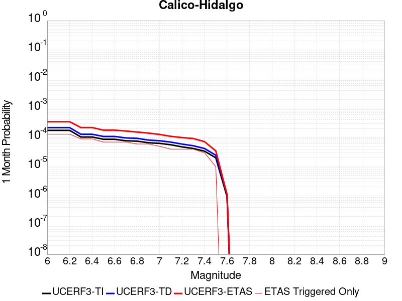 |  |  |

| Magnitude | 1 wk TI Prob | 1 wk TD Prob | 1 wk ETAS Prob | 1 wk ETAS/TD Gain | 1 wk ETAS Triggered Only | 1 mo TI Prob | 1 mo TD Prob | 1 mo ETAS Prob | 1 mo ETAS/TD Gain | 1 mo ETAS Triggered Only | 1 yr TI Prob | 1 yr TD Prob | 1 yr ETAS Prob | 1 yr ETAS/TD Gain | 1 yr ETAS Triggered Only | 10 yr TI Prob | 10 yr TD Prob | 10 yr ETAS Prob | 10 yr ETAS/TD Gain | 10 yr ETAS Triggered Only |
|-----|-----|-----|-----|-----|-----|-----|-----|-----|-----|-----|-----|-----|-----|-----|-----|-----|-----|-----|-----|-----|
| 6.0 | 4.0906612E-5 | 5.0703686E-5 | 5.0703686E-5 | 1.0 | 0.0 | 1.7530227E-4 | 2.172857E-4 | 6.070645E-4 | 2.793854 | 3.8986356E-4 | 0.0021322158 | 0.002642648 | 0.0030314813 | 1.1471378 | 3.8986356E-4 | 0.02111873 | 0.026152607 | 0.026532276 | 1.0145174 | 3.8986356E-4 |
| 6.1 | 4.0906612E-5 | 5.0703686E-5 | 5.0703686E-5 | 1.0 | 0.0 | 1.7530227E-4 | 2.172857E-4 | 6.070645E-4 | 2.793854 | 3.8986356E-4 | 0.0021322158 | 0.002642648 | 0.0030314813 | 1.1471378 | 3.8986356E-4 | 0.02111873 | 0.026152607 | 0.026532276 | 1.0145174 | 3.8986356E-4 |
| 6.2 | 4.0906612E-5 | 5.0703686E-5 | 5.0703686E-5 | 1.0 | 0.0 | 1.7530227E-4 | 2.172857E-4 | 6.070645E-4 | 2.793854 | 3.8986356E-4 | 0.0021322158 | 0.002642648 | 0.0030314813 | 1.1471378 | 3.8986356E-4 | 0.02111873 | 0.026152607 | 0.026532276 | 1.0145174 | 3.8986356E-4 |
| 6.3 | 2.4242801E-5 | 3.0090669E-5 | 3.0090669E-5 | 1.0 | 0.0 | 1.0389358E-4 | 1.2895382E-4 | 5.187671E-4 | 4.0228906 | 3.8986356E-4 | 0.0012641704 | 0.0015689151 | 0.001958167 | 1.2481025 | 3.8986356E-4 | 0.01257003 | 0.01558206 | 0.01596585 | 1.0246302 | 3.8986356E-4 |
| 6.4 | 2.4242801E-5 | 3.0090669E-5 | 3.0090669E-5 | 1.0 | 0.0 | 1.0389358E-4 | 1.2895382E-4 | 5.187671E-4 | 4.0228906 | 3.8986356E-4 | 0.0012641704 | 0.0015689151 | 0.001958167 | 1.2481025 | 3.8986356E-4 | 0.01257003 | 0.01558206 | 0.01596585 | 1.0246302 | 3.8986356E-4 |
| 6.5 | 2.0286952E-5 | 2.5315738E-5 | 2.5315738E-5 | 1.0 | 0.0 | 8.694118E-5 | 1.0849161E-4 | 4.983129E-4 | 4.5931005 | 3.8986356E-4 | 0.0010579949 | 0.001320102 | 0.001709451 | 1.2949384 | 3.8986356E-4 | 0.010529719 | 0.013124538 | 0.013509285 | 1.0293151 | 3.8986356E-4 |
| 6.6 | 2.0269223E-5 | 2.5296687E-5 | 2.5296687E-5 | 1.0 | 0.0 | 8.6865206E-5 | 1.08409964E-4 | 4.9823127E-4 | 4.5958066 | 3.8986356E-4 | 0.0010570707 | 0.0013191093 | 0.0017084585 | 1.2951608 | 3.8986356E-4 | 0.010520565 | 0.013114728 | 0.013499478 | 1.0293373 | 3.8986356E-4 |
| 6.7 | 1.799852E-5 | 2.25406E-5 | 2.25406E-5 | 1.0 | 0.0 | 7.713423E-5 | 9.659908E-5 | 4.8642498E-4 | 5.0355034 | 3.8986356E-4 | 9.3870464E-4 | 0.0011754738 | 0.0015648791 | 1.3312751 | 3.8986356E-4 | 0.009347493 | 0.011694173 | 0.012079478 | 1.0329484 | 3.8986356E-4 |
| 6.8 | 1.7458793E-5 | 2.184212E-5 | 2.184212E-5 | 1.0 | 0.0 | 7.4821255E-5 | 9.3605806E-5 | 4.8343287E-4 | 5.1645603 | 3.8986356E-4 | 9.10568E-4 | 0.0011390693 | 0.0015284888 | 1.3418751 | 3.8986356E-4 | 0.009068459 | 0.011333893 | 0.011719339 | 1.0340081 | 3.8986356E-4 |
| 6.9 | 1.542884E-5 | 1.9025927E-5 | 1.9025927E-5 | 1.0 | 0.0 | 6.612192E-5 | 8.153721E-5 | 4.7136899E-4 | 5.7810287 | 3.8986356E-4 | 8.04737E-4 | 9.922766E-4 | 0.0013817532 | 1.3925081 | 3.8986356E-4 | 0.008018291 | 0.009879857 | 0.010265869 | 1.0390706 | 3.8986356E-4 |
| 7.0 | 1.468253E-5 | 1.8030598E-5 | 1.8030598E-5 | 1.0 | 0.0 | 6.292361E-5 | 7.7271776E-5 | 4.6710522E-4 | 6.044965 | 3.8986356E-4 | 7.658257E-4 | 9.4039086E-4 | 0.0013298878 | 1.4141862 | 3.8986356E-4 | 0.0076319184 | 0.009365481 | 0.009751693 | 1.0412378 | 3.8986356E-4 |
| 7.1 | 1.3139281E-5 | 1.6200942E-5 | 1.6200942E-5 | 1.0 | 0.0 | 5.6309986E-5 | 6.943083E-5 | 4.5926732E-4 | 6.6147456 | 3.8986356E-4 | 6.853584E-4 | 8.4500515E-4 | 0.0012345392 | 1.4609843 | 3.8986356E-4 | 0.0068324856 | 0.0084192185 | 0.008805799 | 1.0459166 | 3.8986356E-4 |
| 7.2 | 1.1127404E-5 | 1.3866597E-5 | 1.3866597E-5 | 1.0 | 0.0 | 4.7688E-5 | 5.942698E-5 | 4.4926736E-4 | 7.5599895 | 3.8986356E-4 | 5.8044674E-4 | 7.232942E-4 | 0.0011128758 | 1.5386212 | 3.8986356E-4 | 0.0057893298 | 0.0072105085 | 0.007597561 | 1.053679 | 3.8986356E-4 |
| 7.3 | 9.808154E-6 | 1.2176215E-5 | 1.2176215E-5 | 1.0 | 0.0 | 4.2034266E-5 | 5.2182797E-5 | 4.42026E-4 | 8.470723 | 3.8986356E-4 | 5.11647E-4 | 6.3515105E-4 | 0.0010247669 | 1.6134225 | 3.8986356E-4 | 0.0051047057 | 0.006334433 | 0.006721827 | 1.0611569 | 3.8986356E-4 |
| 7.4 | 7.942452E-6 | 9.792144E-6 | 9.792144E-6 | 1.0 | 0.0 | 3.4038632E-5 | 4.1965708E-5 | 4.318129E-4 | 10.28966 | 3.8986356E-4 | 4.1434157E-4 | 5.1082217E-4 | 9.004866E-4 | 1.7628181 | 3.8986356E-4 | 0.0041356985 | 0.005097421 | 0.005485297 | 1.0760926 | 3.8986356E-4 |
| 7.5 | 4.7121216E-6 | 5.772836E-6 | 5.772836E-6 | 1.0 | 0.0 | 2.019465E-5 | 2.4740535E-5 | 4.1459443E-4 | 16.757698 | 3.8986356E-4 | 2.4584212E-4 | 3.0118204E-4 | 6.909282E-4 | 2.294055 | 3.8986356E-4 | 0.0024557032 | 0.0030084911 | 0.0033971816 | 1.1291978 | 3.8986356E-4 |
| 7.6 | 2.21172E-7 | 2.603961E-7 | 2.603961E-7 | 1.0 | 0.0 | 9.478797E-7 | 1.1159829E-6 | 1.1159829E-6 | 1.0 | 0.0 | 1.1540374E-5 | 1.3587036E-5 | 1.3587036E-5 | 1.0 | 0.0 | 1.1539775E-4 | 1.3586486E-4 | 1.3586486E-4 | 1.0 | 0.0 |

## Camp Rock 2011
*[(top)](#table-of-contents)*

| 1 Week | 1 Month | 1 Year | 10 Year |
|-----|-----|-----|-----|
| 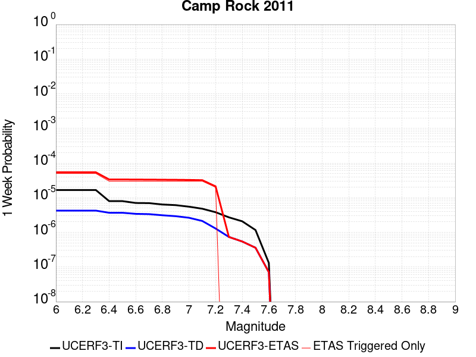 |  |  |  |

| Magnitude | 1 wk TI Prob | 1 wk TD Prob | 1 wk ETAS Prob | 1 wk ETAS/TD Gain | 1 wk ETAS Triggered Only | 1 mo TI Prob | 1 mo TD Prob | 1 mo ETAS Prob | 1 mo ETAS/TD Gain | 1 mo ETAS Triggered Only | 1 yr TI Prob | 1 yr TD Prob | 1 yr ETAS Prob | 1 yr ETAS/TD Gain | 1 yr ETAS Triggered Only | 10 yr TI Prob | 10 yr TD Prob | 10 yr ETAS Prob | 10 yr ETAS/TD Gain | 10 yr ETAS Triggered Only |
|-----|-----|-----|-----|-----|-----|-----|-----|-----|-----|-----|-----|-----|-----|-----|-----|-----|-----|-----|-----|-----|
| 6.0 | 1.6710783E-5 | 4.25026E-6 | 4.25026E-6 | 1.0 | 0.0 | 7.161568E-5 | 1.8215276E-5 | 1.8215276E-5 | 1.0 | 0.0 | 8.7157206E-4 | 2.2174895E-4 | 2.2174895E-4 | 1.0 | 0.0 | 0.008681616 | 0.0022153298 | 0.0026043295 | 1.1755946 | 3.8986356E-4 |
| 6.1 | 1.6710783E-5 | 4.25026E-6 | 4.25026E-6 | 1.0 | 0.0 | 7.161568E-5 | 1.8215276E-5 | 1.8215276E-5 | 1.0 | 0.0 | 8.7157206E-4 | 2.2174895E-4 | 2.2174895E-4 | 1.0 | 0.0 | 0.008681616 | 0.0022153298 | 0.0026043295 | 1.1755946 | 3.8986356E-4 |
| 6.2 | 1.6710783E-5 | 4.25026E-6 | 4.25026E-6 | 1.0 | 0.0 | 7.161568E-5 | 1.8215276E-5 | 1.8215276E-5 | 1.0 | 0.0 | 8.7157206E-4 | 2.2174895E-4 | 2.2174895E-4 | 1.0 | 0.0 | 0.008681616 | 0.0022153298 | 0.0026043295 | 1.1755946 | 3.8986356E-4 |
| 6.3 | 1.6710783E-5 | 4.25026E-6 | 4.25026E-6 | 1.0 | 0.0 | 7.161568E-5 | 1.8215276E-5 | 1.8215276E-5 | 1.0 | 0.0 | 8.7157206E-4 | 2.2174895E-4 | 2.2174895E-4 | 1.0 | 0.0 | 0.008681616 | 0.0022153298 | 0.0026043295 | 1.1755946 | 3.8986356E-4 |
| 6.4 | 7.982846E-6 | 3.6820884E-6 | 3.6820884E-6 | 1.0 | 0.0 | 3.421175E-5 | 1.5780286E-5 | 1.5780286E-5 | 1.0 | 0.0 | 4.1644843E-4 | 1.9210839E-4 | 1.9210839E-4 | 1.0 | 0.0 | 0.0041566887 | 0.001919458 | 0.0023085733 | 1.2027214 | 3.8986356E-4 |
| 6.5 | 7.982846E-6 | 3.6820884E-6 | 3.6820884E-6 | 1.0 | 0.0 | 3.421175E-5 | 1.5780286E-5 | 1.5780286E-5 | 1.0 | 0.0 | 4.1644843E-4 | 1.9210839E-4 | 1.9210839E-4 | 1.0 | 0.0 | 0.0041566887 | 0.001919458 | 0.0023085733 | 1.2027214 | 3.8986356E-4 |
| 6.6 | 7.048869E-6 | 3.4243571E-6 | 3.4243571E-6 | 1.0 | 0.0 | 3.0209088E-5 | 1.4675736E-5 | 1.4675736E-5 | 1.0 | 0.0 | 3.677336E-4 | 1.7866275E-4 | 1.7866275E-4 | 1.0 | 0.0 | 0.0036712566 | 0.0017852228 | 0.0021743902 | 1.2179939 | 3.8986356E-4 |
| 6.7 | 6.987307E-6 | 3.3623348E-6 | 3.3623348E-6 | 1.0 | 0.0 | 2.9945259E-5 | 1.4409929E-5 | 1.4409929E-5 | 1.0 | 0.0 | 3.6452254E-4 | 1.7542706E-4 | 1.7542706E-4 | 1.0 | 0.0 | 0.0036392517 | 0.001752917 | 0.002142097 | 1.2220186 | 3.8986356E-4 |
| 6.8 | 6.3737602E-6 | 3.1179077E-6 | 3.1179077E-6 | 1.0 | 0.0 | 2.731583E-5 | 1.3362394E-5 | 1.3362394E-5 | 1.0 | 0.0 | 3.3251947E-4 | 1.626753E-4 | 1.626753E-4 | 1.0 | 0.0 | 0.0033202237 | 0.0016255907 | 0.0020148205 | 1.239439 | 3.8986356E-4 |
| 6.9 | 6.112211E-6 | 2.9331156E-6 | 2.9331156E-6 | 1.0 | 0.0 | 2.6194928E-5 | 1.2570436E-5 | 1.2570436E-5 | 1.0 | 0.0 | 3.1887658E-4 | 1.5303459E-4 | 1.5303459E-4 | 1.0 | 0.0 | 0.003184194 | 0.0015293199 | 0.0019185871 | 1.2545363 | 3.8986356E-4 |
| 7.0 | 5.5140117E-6 | 2.641923E-6 | 2.641923E-6 | 1.0 | 0.0 | 2.3631264E-5 | 1.132248E-5 | 1.132248E-5 | 1.0 | 0.0 | 2.8767265E-4 | 1.3784273E-4 | 1.3784273E-4 | 1.0 | 0.0 | 0.0028730053 | 0.0013775975 | 0.0017669239 | 1.2826127 | 3.8986356E-4 |
| 7.1 | 4.8151105E-6 | 2.1342705E-6 | 2.1342705E-6 | 1.0 | 0.0 | 2.0636026E-5 | 9.146843E-6 | 9.146843E-6 | 1.0 | 0.0 | 2.5121463E-4 | 1.1135734E-4 | 1.1135734E-4 | 1.0 | 0.0 | 0.0025093083 | 0.0011130372 | 0.0015024669 | 1.3498801 | 3.8986356E-4 |
| 7.2 | 3.818335E-6 | 1.2937425E-6 | 1.2937425E-6 | 1.0 | 0.0 | 1.6364189E-5 | 5.5445994E-6 | 5.5445994E-6 | 1.0 | 0.0 | 1.9921579E-4 | 6.750349E-5 | 6.750349E-5 | 1.0 | 0.0 | 0.0019903728 | 6.748381E-4 | 0.0010644385 | 1.5773244 | 3.8986356E-4 |
| 7.3 | 2.7166698E-6 | 7.3835776E-7 | 7.3835776E-7 | 1.0 | 0.0 | 1.1642818E-5 | 3.1643867E-6 | 3.1643867E-6 | 1.0 | 0.0 | 1.4174209E-4 | 3.8525748E-5 | 3.8525748E-5 | 1.0 | 0.0 | 0.0014165172 | 3.851927E-4 | 7.749061E-4 | 2.0117362 | 3.8986356E-4 |
| 7.4 | 2.0893426E-6 | 5.4618386E-7 | 5.4618386E-7 | 1.0 | 0.0 | 8.954295E-6 | 2.3407858E-6 | 2.3407858E-6 | 1.0 | 0.0 | 1.0901308E-4 | 2.84987E-5 | 2.84987E-5 | 1.0 | 0.0 | 0.0010895962 | 2.84951E-4 | 2.84951E-4 | 1.0 | 0.0 |
| 7.5 | 1.1681728E-6 | 3.6030585E-7 | 3.6030585E-7 | 1.0 | 0.0 | 5.0064455E-6 | 1.544167E-6 | 1.544167E-6 | 1.0 | 0.0 | 6.0951766E-5 | 1.8800076E-5 | 1.8800076E-5 | 1.0 | 0.0 | 6.093505E-4 | 1.8798532E-4 | 1.8798532E-4 | 1.0 | 0.0 |
| 7.6 | 1.3154387E-7 | 7.1197384E-8 | 7.1197384E-8 | 1.0 | 0.0 | 5.6375933E-7 | 3.051316E-7 | 3.051316E-7 | 1.0 | 0.0 | 6.863748E-6 | 3.7149728E-6 | 3.7149728E-6 | 1.0 | 0.0 | 6.863536E-5 | 3.7149264E-5 | 3.7149264E-5 | 1.0 | 0.0 |

## San Andreas (Cholame) rev
*[(top)](#table-of-contents)*

| 1 Week | 1 Month | 1 Year | 10 Year |
|-----|-----|-----|-----|
|  |  |  |  |

| Magnitude | 1 wk TI Prob | 1 wk TD Prob | 1 wk ETAS Prob | 1 wk ETAS/TD Gain | 1 wk ETAS Triggered Only | 1 mo TI Prob | 1 mo TD Prob | 1 mo ETAS Prob | 1 mo ETAS/TD Gain | 1 mo ETAS Triggered Only | 1 yr TI Prob | 1 yr TD Prob | 1 yr ETAS Prob | 1 yr ETAS/TD Gain | 1 yr ETAS Triggered Only | 10 yr TI Prob | 10 yr TD Prob | 10 yr ETAS Prob | 10 yr ETAS/TD Gain | 10 yr ETAS Triggered Only |
|-----|-----|-----|-----|-----|-----|-----|-----|-----|-----|-----|-----|-----|-----|-----|-----|-----|-----|-----|-----|-----|
| 6.0 | 1.2302514E-4 | 2.5204287E-4 | 2.5204287E-4 | 1.0 | 0.0 | 5.27144E-4 | 0.0010797381 | 0.0010797381 | 1.0 | 0.0 | 0.0063991086 | 0.0130670825 | 0.0130670825 | 1.0 | 0.0 | 0.06217949 | 0.12439073 | 0.1247321 | 1.0027443 | 3.8986356E-4 |
| 6.1 | 1.2302514E-4 | 2.5204287E-4 | 2.5204287E-4 | 1.0 | 0.0 | 5.27144E-4 | 0.0010797381 | 0.0010797381 | 1.0 | 0.0 | 0.0063991086 | 0.0130670825 | 0.0130670825 | 1.0 | 0.0 | 0.06217949 | 0.12439073 | 0.1247321 | 1.0027443 | 3.8986356E-4 |
| 6.2 | 1.2203569E-4 | 2.5021084E-4 | 2.5021084E-4 | 1.0 | 0.0 | 5.2290526E-4 | 0.0010718931 | 0.0010718931 | 1.0 | 0.0 | 0.006347804 | 0.01297271 | 0.01297271 | 1.0 | 0.0 | 0.061695136 | 0.12357691 | 0.12391859 | 1.0027649 | 3.8986356E-4 |
| 6.3 | 1.2142645E-4 | 2.4907055E-4 | 2.4907055E-4 | 1.0 | 0.0 | 5.202953E-4 | 0.0010670102 | 0.0010670102 | 1.0 | 0.0 | 0.006316212 | 0.012913967 | 0.012913967 | 1.0 | 0.0 | 0.06139677 | 0.12307103 | 0.123412915 | 1.0027779 | 3.8986356E-4 |
| 6.4 | 1.1865206E-4 | 2.44126E-4 | 2.44126E-4 | 1.0 | 0.0 | 5.0840975E-4 | 0.0010458364 | 0.0010458364 | 1.0 | 0.0 | 0.006172335 | 0.012659196 | 0.012659196 | 1.0 | 0.0 | 0.060036868 | 0.1208638 | 0.121206544 | 1.0028358 | 3.8986356E-4 |
| 6.5 | 1.17443946E-4 | 2.4205919E-4 | 2.4205919E-4 | 1.0 | 0.0 | 5.032341E-4 | 0.0010369857 | 0.0010369857 | 1.0 | 0.0 | 0.006109677 | 0.012552682 | 0.012552682 | 1.0 | 0.0 | 0.059444077 | 0.11993805 | 0.12028116 | 1.0028607 | 3.8986356E-4 |
| 6.6 | 1.13579066E-4 | 2.3514954E-4 | 2.3514954E-4 | 1.0 | 0.0 | 4.866766E-4 | 0.001007396 | 0.001007396 | 1.0 | 0.0 | 0.0059092017 | 0.012196515 | 0.012196515 | 1.0 | 0.0 | 0.057545185 | 0.11685214 | 0.117196456 | 1.0029465 | 3.8986356E-4 |
| 6.7 | 1.1271412E-4 | 2.3359268E-4 | 2.3359268E-4 | 1.0 | 0.0 | 4.829711E-4 | 0.0010007289 | 0.0010007289 | 1.0 | 0.0 | 0.005864331 | 0.012116249 | 0.012116249 | 1.0 | 0.0 | 0.057119697 | 0.116155714 | 0.11650029 | 1.0029665 | 3.8986356E-4 |
| 6.8 | 1.1217975E-4 | 2.3247694E-4 | 2.3247694E-4 | 1.0 | 0.0 | 4.8068175E-4 | 9.959509E-4 | 9.959509E-4 | 1.0 | 0.0 | 0.005836608 | 0.012058721 | 0.012058721 | 1.0 | 0.0 | 0.056856725 | 0.11565396 | 0.11599874 | 1.0029811 | 3.8986356E-4 |
| 6.9 | 1.1146753E-4 | 2.3096445E-4 | 2.3096445E-4 | 1.0 | 0.0 | 4.7763053E-4 | 9.894737E-4 | 9.894737E-4 | 1.0 | 0.0 | 0.0057996577 | 0.011980731 | 0.011980731 | 1.0 | 0.0 | 0.056506127 | 0.11497439 | 0.11531943 | 1.003001 | 3.8986356E-4 |
| 7.0 | 1.0965793E-4 | 2.2719789E-4 | 2.2719789E-4 | 1.0 | 0.0 | 4.698779E-4 | 9.733434E-4 | 9.733434E-4 | 1.0 | 0.0 | 0.005705768 | 0.011786487 | 0.011786487 | 1.0 | 0.0 | 0.055614736 | 0.11327597 | 0.11362167 | 1.0030519 | 3.8986356E-4 |
| 7.1 | 9.927982E-5 | 2.0538924E-4 | 2.0538924E-4 | 1.0 | 0.0 | 4.2541555E-4 | 8.7994366E-4 | 8.7994366E-4 | 1.0 | 0.0 | 0.0051671406 | 0.010660981 | 0.010660981 | 1.0 | 0.0 | 0.05048634 | 0.1033706 | 0.103720166 | 1.0033816 | 3.8986356E-4 |
| 7.2 | 9.696786E-5 | 2.0043184E-4 | 2.0043184E-4 | 1.0 | 0.0 | 4.1551032E-4 | 8.5871184E-4 | 8.5871184E-4 | 1.0 | 0.0 | 0.00504711 | 0.010404981 | 0.010404981 | 1.0 | 0.0 | 0.04934009 | 0.1011086 | 0.1011086 | 1.0 | 0.0 |
| 7.3 | 9.4727984E-5 | 1.9472468E-4 | 1.9472468E-4 | 1.0 | 0.0 | 4.0591392E-4 | 8.3426846E-4 | 8.3426846E-4 | 1.0 | 0.0 | 0.0049308087 | 0.010110183 | 0.010110183 | 1.0 | 0.0 | 0.048228268 | 0.09847952 | 0.09847952 | 1.0 | 0.0 |
| 7.4 | 9.220358E-5 | 1.8843076E-4 | 1.8843076E-4 | 1.0 | 0.0 | 3.9509835E-4 | 8.073114E-4 | 8.073114E-4 | 1.0 | 0.0 | 0.004799717 | 0.009784967 | 0.009784967 | 1.0 | 0.0 | 0.046973653 | 0.095557496 | 0.095557496 | 1.0 | 0.0 |
| 7.5 | 7.71631E-5 | 1.5177966E-4 | 1.5177966E-4 | 1.0 | 0.0 | 3.306571E-4 | 6.503223E-4 | 6.503223E-4 | 1.0 | 0.0 | 0.0040183207 | 0.007889002 | 0.007889002 | 1.0 | 0.0 | 0.03946433 | 0.07828531 | 0.07828531 | 1.0 | 0.0 |
| 7.6 | 7.5634416E-5 | 1.483744E-4 | 1.483744E-4 | 1.0 | 0.0 | 3.241072E-4 | 6.3573546E-4 | 6.3573546E-4 | 1.0 | 0.0 | 0.0039388672 | 0.0077126776 | 0.0077126776 | 1.0 | 0.0 | 0.038697794 | 0.07664872 | 0.07664872 | 1.0 | 0.0 |
| 7.7 | 6.3783E-5 | 1.235872E-4 | 1.235872E-4 | 1.0 | 0.0 | 2.7332708E-4 | 5.29552E-4 | 5.29552E-4 | 1.0 | 0.0 | 0.0033226798 | 0.0064282627 | 0.0064282627 | 1.0 | 0.0 | 0.032734364 | 0.06454029 | 0.06454029 | 1.0 | 0.0 |
| 7.8 | 5.863422E-5 | 1.1416107E-4 | 1.1416107E-4 | 1.0 | 0.0 | 2.512653E-4 | 4.8917E-4 | 4.8917E-4 | 1.0 | 0.0 | 0.003054864 | 0.0059394026 | 0.0059394026 | 1.0 | 0.0 | 0.030132094 | 0.059659187 | 0.059659187 | 1.0 | 0.0 |
| 7.9 | 4.595283E-5 | 8.426331E-5 | 8.426331E-5 | 1.0 | 0.0 | 1.9692584E-4 | 3.610785E-4 | 3.610785E-4 | 1.0 | 0.0 | 0.0023949358 | 0.0043872762 | 0.0043872762 | 1.0 | 0.0 | 0.023692891 | 0.044362005 | 0.044362005 | 1.0 | 0.0 |
| 8.0 | 3.2950178E-5 | 5.0772942E-5 | 5.0772942E-5 | 1.0 | 0.0 | 1.412074E-4 | 2.1758018E-4 | 2.1758018E-4 | 1.0 | 0.0 | 0.0017178444 | 0.0026458222 | 0.0026458222 | 1.0 | 0.0 | 0.017046256 | 0.027180137 | 0.027180137 | 1.0 | 0.0 |
| 8.1 | 1.9177472E-5 | 1.9185145E-5 | 1.9185145E-5 | 1.0 | 0.0 | 8.218658E-5 | 8.221946E-5 | 8.221946E-5 | 1.0 | 0.0 | 0.0010001622 | 0.0010005629 | 0.0010005629 | 1.0 | 0.0 | 0.009956728 | 0.010758142 | 0.010758142 | 1.0 | 0.0 |
| 8.2 | 8.643924E-6 | 5.4748625E-6 | 5.4748625E-6 | 1.0 | 0.0 | 3.704486E-5 | 2.3463486E-5 | 2.3463486E-5 | 1.0 | 0.0 | 4.5092785E-4 | 2.8563058E-4 | 2.8563058E-4 | 1.0 | 0.0 | 0.0045001395 | 0.0032487072 | 0.0032487072 | 1.0 | 0.0 |
| 8.3 | 1.983087E-6 | 7.6599065E-7 | 7.6599065E-7 | 1.0 | 0.0 | 8.498917E-6 | 3.282813E-6 | 3.282813E-6 | 1.0 | 0.0 | 1.034694E-4 | 3.9967534E-5 | 3.9967534E-5 | 1.0 | 0.0 | 0.0010342124 | 4.719687E-4 | 4.719687E-4 | 1.0 | 0.0 |

## Manix-Afton Hills
*[(top)](#table-of-contents)*

| 1 Week | 1 Month | 1 Year | 10 Year |
|-----|-----|-----|-----|
|  |  |  |  |

| Magnitude | 1 wk TI Prob | 1 wk TD Prob | 1 wk ETAS Prob | 1 wk ETAS/TD Gain | 1 wk ETAS Triggered Only | 1 mo TI Prob | 1 mo TD Prob | 1 mo ETAS Prob | 1 mo ETAS/TD Gain | 1 mo ETAS Triggered Only | 1 yr TI Prob | 1 yr TD Prob | 1 yr ETAS Prob | 1 yr ETAS/TD Gain | 1 yr ETAS Triggered Only | 10 yr TI Prob | 10 yr TD Prob | 10 yr ETAS Prob | 10 yr ETAS/TD Gain | 10 yr ETAS Triggered Only |
|-----|-----|-----|-----|-----|-----|-----|-----|-----|-----|-----|-----|-----|-----|-----|-----|-----|-----|-----|-----|-----|
| 6.0 | 1.3783202E-5 | 1.47110895E-5 | 1.47110895E-5 | 1.0 | 0.0 | 5.906953E-5 | 6.30461E-5 | 6.30461E-5 | 1.0 | 0.0 | 7.189342E-4 | 7.6733343E-4 | 7.6733343E-4 | 1.0 | 0.0 | 0.0071661277 | 0.007648596 | 0.008035477 | 1.050582 | 3.8986356E-4 |
| 6.1 | 1.3783202E-5 | 1.47110895E-5 | 1.47110895E-5 | 1.0 | 0.0 | 5.906953E-5 | 6.30461E-5 | 6.30461E-5 | 1.0 | 0.0 | 7.189342E-4 | 7.6733343E-4 | 7.6733343E-4 | 1.0 | 0.0 | 0.0071661277 | 0.007648596 | 0.008035477 | 1.050582 | 3.8986356E-4 |
| 6.2 | 1.3783202E-5 | 1.47110895E-5 | 1.47110895E-5 | 1.0 | 0.0 | 5.906953E-5 | 6.30461E-5 | 6.30461E-5 | 1.0 | 0.0 | 7.189342E-4 | 7.6733343E-4 | 7.6733343E-4 | 1.0 | 0.0 | 0.0071661277 | 0.007648596 | 0.008035477 | 1.050582 | 3.8986356E-4 |
| 6.3 | 1.10494875E-5 | 1.1793136E-5 | 1.1793136E-5 | 1.0 | 0.0 | 4.7354086E-5 | 5.054109E-5 | 5.054109E-5 | 1.0 | 0.0 | 5.763835E-4 | 6.151744E-4 | 6.151744E-4 | 1.0 | 0.0 | 0.005748908 | 0.0061357557 | 0.006523227 | 1.0631498 | 3.8986356E-4 |
| 6.4 | 1.10494875E-5 | 1.1793136E-5 | 1.1793136E-5 | 1.0 | 0.0 | 4.7354086E-5 | 5.054109E-5 | 5.054109E-5 | 1.0 | 0.0 | 5.763835E-4 | 6.151744E-4 | 6.151744E-4 | 1.0 | 0.0 | 0.005748908 | 0.0061357557 | 0.006523227 | 1.0631498 | 3.8986356E-4 |
| 6.5 | 9.788949E-6 | 1.045432E-5 | 1.045432E-5 | 1.0 | 0.0 | 4.1951964E-5 | 4.480351E-5 | 4.480351E-5 | 1.0 | 0.0 | 5.1064545E-4 | 5.453555E-4 | 5.453555E-4 | 1.0 | 0.0 | 0.0050947363 | 0.0054410985 | 0.0058288407 | 1.0712618 | 3.8986356E-4 |
| 6.6 | 8.810006E-6 | 9.4136285E-6 | 9.4136285E-6 | 1.0 | 0.0 | 3.775662E-5 | 4.0343548E-5 | 4.0343548E-5 | 1.0 | 0.0 | 4.5958988E-4 | 4.9108086E-4 | 4.9108086E-4 | 1.0 | 0.0 | 0.0045864056 | 0.004900839 | 0.005288792 | 1.0791605 | 3.8986356E-4 |
| 6.7 | 8.80128E-6 | 9.404108E-6 | 9.404108E-6 | 1.0 | 0.0 | 3.7719226E-5 | 4.0302748E-5 | 4.0302748E-5 | 1.0 | 0.0 | 4.591348E-4 | 4.9058435E-4 | 4.9058435E-4 | 1.0 | 0.0 | 0.004581874 | 0.0048958957 | 0.0052838507 | 1.0792408 | 3.8986356E-4 |
| 6.8 | 6.8994877E-6 | 7.380076E-6 | 7.380076E-6 | 1.0 | 0.0 | 2.9568899E-5 | 3.162856E-5 | 3.162856E-5 | 1.0 | 0.0 | 3.5994186E-4 | 3.8501783E-4 | 3.8501783E-4 | 1.0 | 0.0 | 0.003593594 | 0.0038443129 | 0.0038443129 | 1.0 | 0.0 |
| 6.9 | 4.9328037E-6 | 5.2709615E-6 | 5.2709615E-6 | 1.0 | 0.0 | 2.1140417E-5 | 2.2589675E-5 | 2.2589675E-5 | 1.0 | 0.0 | 2.5735417E-4 | 2.7500073E-4 | 2.7500073E-4 | 1.0 | 0.0 | 0.0025705635 | 0.0027472095 | 0.0027472095 | 1.0 | 0.0 |
| 7.0 | 3.347973E-6 | 3.59003E-6 | 3.59003E-6 | 1.0 | 0.0 | 1.4348378E-5 | 1.5385775E-5 | 1.5385775E-5 | 1.0 | 0.0 | 1.746775E-4 | 1.8730981E-4 | 1.8730981E-4 | 1.0 | 0.0 | 0.0017454025 | 0.0018719219 | 0.0018719219 | 1.0 | 0.0 |
| 7.1 | 1.2073567E-6 | 1.293482E-6 | 1.293482E-6 | 1.0 | 0.0 | 5.1743755E-6 | 5.543492E-6 | 5.543492E-6 | 1.0 | 0.0 | 6.29962E-5 | 6.749156E-5 | 6.749156E-5 | 1.0 | 0.0 | 6.297835E-4 | 6.7487074E-4 | 6.7487074E-4 | 1.0 | 0.0 |

