# Parent Section Magnitude-Probability Distributions

Only fault sections with at least one triggered aftershock are plotted. Sections are sorted by total supraseismogenic trigger rate (decreasing)

## Table Of Contents

* [Garlock (Central)](#garlock-central)
* [Tank Canyon](#tank-canyon)
* [Little Lake](#little-lake)
* [Owl Lake](#owl-lake)
* [Panamint Valley](#panamint-valley)
* [Garlock (East)](#garlock-east)
* [Airport Lake](#airport-lake)
* [Hunter Mountain-Saline Valley](#hunter-mountain-saline-valley)
* [Blackwater](#blackwater)
* [Ash Hill](#ash-hill)
* [Garlock (West)](#garlock-west)
* [McLean Lake](#mclean-lake)
* [So Sierra Nevada](#so-sierra-nevada)
* [Goldstone Lake](#goldstone-lake)
* [Gravel Hills-Harper Lk](#gravel-hills-harper-lk)
* [San Andreas (Mojave N)](#san-andreas-mojave-n)
* [Death Valley (So)](#death-valley-so)
* [San Andreas (Mojave S)](#san-andreas-mojave-s)
* [Coyote Canyon](#coyote-canyon)
* [Nelson Lake](#nelson-lake)
* [Towne Pass](#towne-pass)
* [Lenwood-Lockhart-Old Woman Springs](#lenwood-lockhart-old-woman-springs)
* [San Andreas (San Bernardino N)](#san-andreas-san-bernardino-n)
* [Bicycle Lake](#bicycle-lake)
* [Paradise](#paradise)
* [Garlic Springs](#garlic-springs)
* [San Andreas (San Bernardino S)](#san-andreas-san-bernardino-s)
* [Death Valley (Black Mtns Frontal)](#death-valley-black-mtns-frontal)
* [Helendale-So Lockhart](#helendale-so-lockhart)
* [Sierra Nevada  (No Extension)](#sierra-nevada--no-extension)
* [Coyote Lake](#coyote-lake)
* [San Andreas (Big Bend)](#san-andreas-big-bend)
* [Death Valley (No)](#death-valley-no)
* [San Andreas (San Gorgonio Pass-Garnet HIll)](#san-andreas-san-gorgonio-pass-garnet-hill)
* [San Andreas (Coachella) rev](#san-andreas-coachella-rev)
* [Elsinore (Glen Ivy) rev](#elsinore-glen-ivy-rev)
* [San Andreas (Parkfield)](#san-andreas-parkfield)
* [Death Valley (Fish Lake Valley)](#death-valley-fish-lake-valley)
* [Red Pass](#red-pass)
* [Owens Valley](#owens-valley)
* [San Jacinto (San Bernardino)](#san-jacinto-san-bernardino)
* [San Andreas (Cholame) rev](#san-andreas-cholame-rev)
* [Calico-Hidalgo](#calico-hidalgo)
* [Independence rev 2011](#independence-rev-2011)
* [San Andreas (Carrizo) rev](#san-andreas-carrizo-rev)
* [White Wolf (Extension)](#white-wolf-extension)
* [Lake Isabella (Seismicity)](#lake-isabella-seismicity)
* [Manix-Afton Hills](#manix-afton-hills)
* [Cady](#cady)
* [San Andreas (North Branch Mill Creek)](#san-andreas-north-branch-mill-creek)
* [San Jacinto (San Jacinto Valley) rev](#san-jacinto-san-jacinto-valley-rev)
* [San Andreas (Creeping Section) 2011 CFM](#san-andreas-creeping-section-2011-cfm)
* [Mission Ridge-Arroyo Parida-Santa Ana](#mission-ridge-arroyo-parida-santa-ana)
* [Baker](#baker)
* [Santa Ynez (East)](#santa-ynez-east)
* [Santa Ynez (West)](#santa-ynez-west)
* [Ludlow](#ludlow)
* [San Jacinto (Stepovers Combined)](#san-jacinto-stepovers-combined)
* [Scodie Lineament](#scodie-lineament)
* [San Jacinto (Anza) rev](#san-jacinto-anza-rev)
* [Brawley (Seismic Zone) alt 1](#brawley-seismic-zone-alt-1)
* [Imperial](#imperial)
* [Lost Hills](#lost-hills)
* [Mission Creek](#mission-creek)
* [Rose Canyon](#rose-canyon)
* [Big Pine (East)](#big-pine-east)
* [White Mountains](#white-mountains)
* [Ortigalita (North)](#ortigalita-north)
* [Deep Springs](#deep-springs)
* [Chino alt 1](#chino-alt-1)
* [Red Mountain](#red-mountain)
* [Pinto Mtn](#pinto-mtn)
* [Big Pine (Central)](#big-pine-central)
* [Kern Canyon (South Kern) 2011](#kern-canyon-south-kern-2011)
* [Ventura-Pitas Point](#ventura-pitas-point)
* [Pleito](#pleito)
* [Elysian Park (Upper)](#elysian-park-upper)
* [San Cayetano](#san-cayetano)
* [Coronado Bank alt1](#coronado-bank-alt1)
* [San Jacinto (Coyote Creek)](#san-jacinto-coyote-creek)
* [Great Valley 09 (Laguna Seca)](#great-valley-09-laguna-seca)
* [Cleghorn Pass](#cleghorn-pass)
* [Tin Mountain](#tin-mountain)
* [Whittier alt 1](#whittier-alt-1)
* [Cleghorn Lake](#cleghorn-lake)
* [San Jacinto (Lytle Creek connector)](#san-jacinto-lytle-creek-connector)
* [Dry Mountain](#dry-mountain)
* [San Clemente](#san-clemente)
* [San Jacinto (Borrego)](#san-jacinto-borrego)
* [Kern Canyon (North Kern) 2011](#kern-canyon-north-kern-2011)
* [Pisgah-Bullion Mtn-Mesquite Lk](#pisgah-bullion-mtn-mesquite-lk)
* [Santa Ynez River](#santa-ynez-river)
* [San Pedro Basin](#san-pedro-basin)
* [Kern Canyon (Lake Isabella) 2011](#kern-canyon-lake-isabella-2011)
* [Santa Rosa Island](#santa-rosa-island)
* [San Jacinto (Clark) rev](#san-jacinto-clark-rev)
* [Camp Rock 2011](#camp-rock-2011)
* [Blue Cut](#blue-cut)
* [Pitas Point (Lower West)](#pitas-point-lower-west)
* [San Diego Trough north alt1](#san-diego-trough-north-alt1)
* [San Jacinto (Superstition Mtn)](#san-jacinto-superstition-mtn)
* [Santa Cruz Catalina Ridge alt1](#santa-cruz-catalina-ridge-alt1)
* [Santa Susana alt 1](#santa-susana-alt-1)
* [Newport-Inglewood (Offshore)](#newport-inglewood-offshore)
* [Pine Mtn](#pine-mtn)
* [San Diego Trough south](#san-diego-trough-south)
* [Newport-Inglewood alt 1](#newport-inglewood-alt-1)
* [Oak Ridge (Onshore)](#oak-ridge-onshore)
* [Oceanic - West Huasna](#oceanic---west-huasna)
* [Great Valley 03a Dunnigan Hills](#great-valley-03a-dunnigan-hills)
* [Calaveras (So) 2011 CFM](#calaveras-so-2011-cfm)
* [Los Alamos 2011 CFM](#los-alamos-2011-cfm)
* [Del Valle](#del-valle)
* [Calaveras (So) - Paicines extension 2011 CFM](#calaveras-so---paicines-extension-2011-cfm)
* [Cedar Mtn-Mahogany Mtn](#cedar-mtn-mahogany-mtn)
* [Calaveras (Central) 2011 CFM](#calaveras-central-2011-cfm)
* [Ortigalita (South)](#ortigalita-south)
* [Elsinore (Coyote Mountains)](#elsinore-coyote-mountains)
* [Puente Hills](#puente-hills)
* [Fontana (Seismicity)](#fontana-seismicity)
* [Hayward (So) extension 2011 CFM](#hayward-so-extension-2011-cfm)
* [Bullion Mountains](#bullion-mountains)
* [Emerson-Copper Mtn 2011](#emerson-copper-mtn-2011)
* [Palos Verdes](#palos-verdes)
* [Raymond](#raymond)
* [Cleghorn](#cleghorn)
* [Santa Susana East (connector)](#santa-susana-east-connector)
* [Shoreline](#shoreline)
* [San Gabriel (Extension)](#san-gabriel-extension)
* [Davis Creek](#davis-creek)
* [Antelope Valley 2011](#antelope-valley-2011)
* [Malibu Coast alt 1](#malibu-coast-alt-1)
* [Channel Islands Thrust](#channel-islands-thrust)
* [Mission (connected) 2011 CFM](#mission-connected-2011-cfm)
* [Monterey Bay-Tularcitos](#monterey-bay-tularcitos)
* [South Klamath Lake East](#south-klamath-lake-east)
* [Ozena](#ozena)
* [Pitas Point (Lower)-Montalvo](#pitas-point-lower-montalvo)
* [White Wolf](#white-wolf)
* [Owens Valley Keough Hot Springs](#owens-valley-keough-hot-springs)
* [Elsinore (Temecula) rev](#elsinore-temecula-rev)
* [La Panza 2011](#la-panza-2011)
* [San Andreas (Santa Cruz Mts) 2011 CFM](#san-andreas-santa-cruz-mts-2011-cfm)
* [Reliz 2011 CFM](#reliz-2011-cfm)
* [Likely 2011 CFM](#likely-2011-cfm)
* [Los Alamos extension](#los-alamos-extension)
* [Verdugo](#verdugo)
* [Earthquake Valley (So Extension)](#earthquake-valley-so-extension)
* [Robinson Creek](#robinson-creek)
* [Oceanside alt1](#oceanside-alt1)
* [Sierra Madre](#sierra-madre)
* [San Juan](#san-juan)
* [Elsinore (Julian)](#elsinore-julian)
* [San Luis Range 2011 CFM](#san-luis-range-2011-cfm)
* [Elsinore (Stepovers Combined)](#elsinore-stepovers-combined)
* [Garberville - Briceland 2011 CFM](#garberville---briceland-2011-cfm)
* [Mission Hills 2011](#mission-hills-2011)
* [Great Valley 10 (Panoche)](#great-valley-10-panoche)
* [South Cuyama](#south-cuyama)
* [Earthquake Valley](#earthquake-valley)
* [Goose Lake 2011 CFM](#goose-lake-2011-cfm)
* [Santa Cruz Island](#santa-cruz-island)
* [Big Pine (West)](#big-pine-west)
* [Channel Islands Western Deep Ramp](#channel-islands-western-deep-ramp)
* [Northridge](#northridge)
* [Great Valley 07 (Orestimba)](#great-valley-07-orestimba)
* [Sheephole](#sheephole)
* [Big Lagoon - Bald Mtn 2011 CFM](#big-lagoon---bald-mtn-2011-cfm)
* [Johnson Valley (No) 2011 rev](#johnson-valley-no-2011-rev)
* [Clayton](#clayton)
* [Cerro Prieto](#cerro-prieto)
* [Greenville (No) 2011 CFM](#greenville-no-2011-cfm)
* [Great Valley 04b Gordon Valley](#great-valley-04b-gordon-valley)
* [Elmore Ranch](#elmore-ranch)
* [Superstition Hills](#superstition-hills)
* [Malibu Coast (Extension) alt 1](#malibu-coast-extension-alt-1)
* [Breckenridge 2011](#breckenridge-2011)
* [Great Valley 05 Pittsburg - Kirby Hills alt1](#great-valley-05-pittsburg---kirby-hills-alt1)
* [Honey Lake 2011 CFM](#honey-lake-2011-cfm)
* [South Klamath Lake West](#south-klamath-lake-west)
* [San Joaquin Hills](#san-joaquin-hills)
* [Pittville 2011 CFM](#pittville-2011-cfm)
* [Fitzhugh Creek](#fitzhugh-creek)
* [Surprise Valley 2011 CFM](#surprise-valley-2011-cfm)
* [Carlsbad](#carlsbad)
* [Green Valley 2011 CFM](#green-valley-2011-cfm)
* [North Frontal  (East)](#north-frontal--east)
* [San Gregorio (North) 2011 CFM](#san-gregorio-north-2011-cfm)
* [Great Valley 11](#great-valley-11)
* [Burnt Mtn](#burnt-mtn)
* [Great Valley 06 (Midland) 2011 CFM alt1](#great-valley-06-midland-2011-cfm-alt1)
* [Round Valley](#round-valley)
* [Sierra Madre (San Fernando)](#sierra-madre-san-fernando)
* [Great Valley 03 Mysterious Ridge](#great-valley-03-mysterious-ridge)
* [Casmalia 2011 CFM](#casmalia-2011-cfm)
* [Simi-Santa Rosa](#simi-santa-rosa)
* [Eureka Peak](#eureka-peak)
* [San Andreas (Offshore) 2011 CFM](#san-andreas-offshore-2011-cfm)
* [West Napa 2011 CFM](#west-napa-2011-cfm)
* [San Luis Range - Oceano 2011 CFM](#san-luis-range---oceano-2011-cfm)
* [Compton](#compton)
* [Great Valley 04a Trout Creek](#great-valley-04a-trout-creek)
* [Gillem - Big Crack 2011 CFM](#gillem---big-crack-2011-cfm)
* [Sargent 2011 CFM](#sargent-2011-cfm)
* [Hosgri](#hosgri)
* [Laguna Salada](#laguna-salada)
* [Hayward (No) 2011 CFM](#hayward-no-2011-cfm)
* [Earthquake Valley (No  Extension)](#earthquake-valley-no--extension)
* [Northridge Hills](#northridge-hills)
* [Hayward (So) 2011 CFM](#hayward-so-2011-cfm)
* [Holser alt 1](#holser-alt-1)
* [San Gorgonio Pass](#san-gorgonio-pass)
* [Greenville (So) 2011 CFM](#greenville-so-2011-cfm)
* [Swain Ravine - Spenceville](#swain-ravine---spenceville)
* [San Jose](#san-jose)

## Garlock (Central)
*[(top)](#table-of-contents)*

| 1 Week | 1 Month | 1 Year | 10 Year |
|-----|-----|-----|-----|
|  | 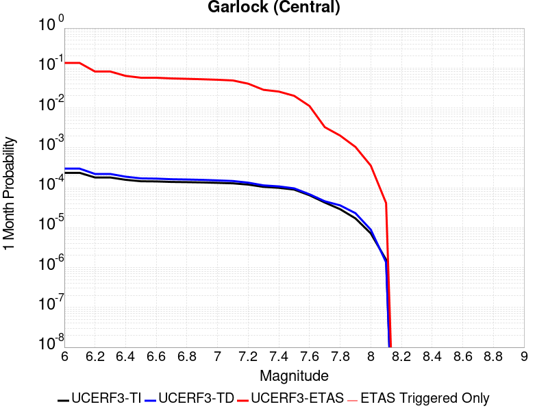 |  |  |

| Magnitude | 1 wk TI Prob | 1 wk TD Prob | 1 wk ETAS Prob | 1 wk ETAS/TD Gain | 1 wk ETAS Triggered Only | 1 mo TI Prob | 1 mo TD Prob | 1 mo ETAS Prob | 1 mo ETAS/TD Gain | 1 mo ETAS Triggered Only | 1 yr TI Prob | 1 yr TD Prob | 1 yr ETAS Prob | 1 yr ETAS/TD Gain | 1 yr ETAS Triggered Only | 10 yr TI Prob | 10 yr TD Prob | 10 yr ETAS Prob | 10 yr ETAS/TD Gain | 10 yr ETAS Triggered Only |
|-----|-----|-----|-----|-----|-----|-----|-----|-----|-----|-----|-----|-----|-----|-----|-----|-----|-----|-----|-----|-----|
| 6.0 | 5.5131142E-5 | 7.024681E-5 | 0.10946096 | 1558.2339 | 0.109398395 | 2.3625491E-4 | 3.010234E-4 | 0.13324228 | 442.63098 | 0.13298129 | 0.0028726095 | 0.0036588663 | 0.17548776 | 47.96233 | 0.1724599 | 0.028357591 | 0.036079824 | 0.23619635 | 6.546494 | 0.20760696 |
| 6.1 | 5.5131142E-5 | 7.024681E-5 | 0.10946096 | 1558.2339 | 0.109398395 | 2.3625491E-4 | 3.010234E-4 | 0.13324228 | 442.63098 | 0.13298129 | 0.0028726095 | 0.0036588663 | 0.17548776 | 47.96233 | 0.1724599 | 0.028357591 | 0.036079824 | 0.23619635 | 6.546494 | 0.20760696 |
| 6.2 | 4.216245E-5 | 5.1661493E-5 | 0.066478714 | 1286.8136 | 0.06643048 | 1.806837E-4 | 2.2138779E-4 | 0.08148681 | 368.07275 | 0.08128342 | 0.0021976046 | 0.0026920962 | 0.1084494 | 40.28437 | 0.10604278 | 0.021759989 | 0.026689773 | 0.15169768 | 5.6837378 | 0.12843584 |
| 6.3 | 4.216245E-5 | 5.1661493E-5 | 0.066478714 | 1286.8136 | 0.06643048 | 1.806837E-4 | 2.2138779E-4 | 0.08148681 | 368.07275 | 0.08128342 | 0.0021976046 | 0.0026920962 | 0.1084494 | 40.28437 | 0.10604278 | 0.021759989 | 0.026689773 | 0.15169768 | 5.6837378 | 0.12843584 |
| 6.4 | 3.6858168E-5 | 4.411054E-5 | 0.052140743 | 1182.0472 | 0.05209893 | 1.5795401E-4 | 1.8903162E-4 | 0.0637198 | 337.08542 | 0.06354278 | 0.0019213937 | 0.002299056 | 0.08494284 | 36.946835 | 0.08283422 | 0.019048655 | 0.02284894 | 0.12095595 | 5.2937226 | 0.100401066 |
| 6.5 | 3.39199E-5 | 4.0018083E-5 | 0.046575587 | 1163.8635 | 0.046537433 | 1.453629E-4 | 1.7149492E-4 | 0.0571136 | 333.03378 | 0.056951873 | 0.0017683565 | 0.002085973 | 0.076289155 | 36.572456 | 0.07435829 | 0.017543508 | 0.020759864 | 0.109048575 | 5.252856 | 0.09016043 |
| 6.6 | 3.3571985E-5 | 3.9472274E-5 | 0.046521593 | 1178.5892 | 0.046483956 | 1.4387199E-4 | 1.6915603E-4 | 0.057031192 | 337.1514 | 0.056871656 | 0.0017502342 | 0.0020575512 | 0.07615611 | 37.012985 | 0.07425134 | 0.017365133 | 0.020481179 | 0.108664066 | 5.3055573 | 0.090026736 |
| 6.7 | 3.2580007E-5 | 3.8088703E-5 | 0.04470216 | 1173.6332 | 0.044665776 | 1.3962112E-4 | 1.632272E-4 | 0.054806713 | 335.76947 | 0.054652408 | 0.0016985617 | 0.0019855013 | 0.07330084 | 36.918053 | 0.07145722 | 0.016856372 | 0.019773813 | 0.10461318 | 5.2904906 | 0.0865508 |
| 6.8 | 3.2185937E-5 | 3.7515918E-5 | 0.04379256 | 1167.306 | 0.043756686 | 1.3793244E-4 | 1.6077272E-4 | 0.053654846 | 333.73102 | 0.053502675 | 0.0016780337 | 0.001955672 | 0.071725376 | 36.675564 | 0.06990641 | 0.016654192 | 0.019480614 | 0.1025757 | 5.265527 | 0.08474599 |
| 6.9 | 3.165394E-5 | 3.6720503E-5 | 0.04273569 | 1163.8099 | 0.042700537 | 1.3565269E-4 | 1.5736422E-4 | 0.052355032 | 332.6997 | 0.052205883 | 0.0016503202 | 0.001914247 | 0.06983212 | 36.480198 | 0.06804813 | 0.01638118 | 0.019073246 | 0.099960364 | 5.2408676 | 0.08245989 |
| 7.0 | 3.0903822E-5 | 3.5625766E-5 | 0.04135768 | 1160.8925 | 0.041323528 | 1.3243823E-4 | 1.5267303E-4 | 0.050733186 | 332.29956 | 0.050588235 | 0.0016112428 | 0.0018572307 | 0.06773732 | 36.472218 | 0.066002674 | 0.015996104 | 0.018512413 | 0.097162634 | 5.2485127 | 0.08013369 |
| 7.1 | 3.0069863E-5 | 3.4392073E-5 | 0.039779015 | 1156.6333 | 0.03974599 | 1.2886449E-4 | 1.4738638E-4 | 0.04874985 | 330.76224 | 0.048609626 | 0.0015677959 | 0.0017929734 | 0.06502165 | 36.264706 | 0.06334224 | 0.01556781 | 0.017880075 | 0.09341665 | 5.224623 | 0.07691176 |
| 7.2 | 2.7957109E-5 | 3.128145E-5 | 0.03275753 | 1047.187 | 0.03272727 | 1.1981068E-4 | 1.340566E-4 | 0.040355936 | 301.03656 | 0.04022727 | 0.0014577188 | 0.0016309366 | 0.053938534 | 33.07212 | 0.05239305 | 0.014481937 | 0.016283695 | 0.07863395 | 4.828999 | 0.06338235 |
| 7.3 | 2.4519275E-5 | 2.6714795E-5 | 0.022967279 | 859.7213 | 0.022941176 | 1.0507837E-4 | 1.1448703E-4 | 0.028466856 | 248.64697 | 0.028355615 | 0.0012785783 | 0.001393003 | 0.03858711 | 27.700663 | 0.03724599 | 0.012712469 | 0.013928054 | 0.058564946 | 4.204819 | 0.04526738 |
| 7.4 | 2.3225532E-5 | 2.51994E-5 | 0.020786708 | 824.88904 | 0.020762032 | 9.95342E-5 | 1.0799304E-4 | 0.025800405 | 238.90804 | 0.025695188 | 0.0012111551 | 0.0013140367 | 0.03499966 | 26.635223 | 0.033729948 | 0.012045753 | 0.013145725 | 0.05347746 | 4.068049 | 0.040868983 |
| 7.5 | 2.097765E-5 | 2.2483688E-5 | 0.016278803 | 724.0272 | 0.016256684 | 8.9901114E-5 | 9.635517E-5 | 0.020134531 | 208.96161 | 0.020040106 | 0.0010939965 | 0.0011725046 | 0.027478524 | 23.435747 | 0.026336899 | 0.010886264 | 0.011740365 | 0.04323784 | 3.6828358 | 0.031871658 |
| 7.6 | 1.511254E-5 | 1.5991332E-5 | 0.009240443 | 577.8407 | 0.009224599 | 6.476642E-5 | 6.853253E-5 | 0.011297709 | 164.85179 | 0.011229946 | 7.882459E-4 | 8.3407195E-4 | 0.015594478 | 18.696802 | 0.014772727 | 0.007854558 | 0.008383559 | 0.026134554 | 3.117358 | 0.01790107 |
| 7.7 | 9.934069E-6 | 1.0678794E-5 | 0.0027512913 | 257.64066 | 0.0027406418 | 4.2573887E-5 | 4.5765457E-5 | 0.003334385 | 72.858116 | 0.00328877 | 5.182138E-4 | 5.570524E-4 | 0.004979721 | 8.939413 | 0.0044251336 | 0.00517007 | 0.005627684 | 0.0110648265 | 1.9661422 | 0.0054679145 |
| 7.8 | 6.7562896E-6 | 8.428449E-6 | 0.001719644 | 204.02852 | 0.0017112299 | 2.8955206E-5 | 3.6121426E-5 | 0.002081502 | 57.625137 | 0.0020454545 | 3.5247262E-4 | 4.3968976E-4 | 0.0031791264 | 7.2303853 | 0.0027406418 | 0.0035191406 | 0.004446654 | 0.007800658 | 1.7542757 | 0.003368984 |
| 7.9 | 3.975453E-6 | 5.37103E-6 | 8.743503E-4 | 162.79005 | 8.68984E-4 | 1.7037546E-5 | 2.3018498E-5 | 0.001079144 | 46.881596 | 0.0010561497 | 2.0741238E-4 | 2.8021427E-4 | 0.0017503904 | 6.246614 | 0.0014705883 | 0.002072189 | 0.0028336283 | 0.004779969 | 1.6868722 | 0.0019518717 |
| 8.0 | 1.6729537E-6 | 2.0775144E-6 | 2.9619454E-4 | 142.5716 | 2.9411764E-4 | 7.169782E-6 | 8.903603E-6 | 3.8323182E-4 | 43.04233 | 3.7433155E-4 | 8.7288594E-5 | 1.0839601E-4 | 6.029948E-4 | 5.5628877 | 4.946524E-4 | 8.7254314E-4 | 0.0010969337 | 0.0017780041 | 1.6208855 | 6.818182E-4 |
| 8.1 | 3.6733252E-7 | 3.1489964E-7 | 2.705286E-5 | 85.90946 | 2.6737967E-5 | 1.5742813E-6 | 1.3495693E-6 | 5.4825432E-5 | 40.624393 | 5.3475935E-5 | 1.9166706E-5 | 1.6430899E-5 | 6.990595E-5 | 4.2545424 | 5.3475935E-5 | 1.9165053E-4 | 1.6638759E-4 | 2.3322139E-4 | 1.4016753 | 6.684492E-5 |

## Tank Canyon
*[(top)](#table-of-contents)*

| 1 Week | 1 Month | 1 Year | 10 Year |
|-----|-----|-----|-----|
|  |  |  |  |

| Magnitude | 1 wk TI Prob | 1 wk TD Prob | 1 wk ETAS Prob | 1 wk ETAS/TD Gain | 1 wk ETAS Triggered Only | 1 mo TI Prob | 1 mo TD Prob | 1 mo ETAS Prob | 1 mo ETAS/TD Gain | 1 mo ETAS Triggered Only | 1 yr TI Prob | 1 yr TD Prob | 1 yr ETAS Prob | 1 yr ETAS/TD Gain | 1 yr ETAS Triggered Only | 10 yr TI Prob | 10 yr TD Prob | 10 yr ETAS Prob | 10 yr ETAS/TD Gain | 10 yr ETAS Triggered Only |
|-----|-----|-----|-----|-----|-----|-----|-----|-----|-----|-----|-----|-----|-----|-----|-----|-----|-----|-----|-----|-----|
| 6.0 | 4.8284557E-5 | 5.7964822E-5 | 0.03583129 | 618.1558 | 0.0357754 | 2.0691741E-4 | 2.4840087E-4 | 0.04940731 | 198.90152 | 0.049171124 | 0.0025163088 | 0.0030207601 | 0.07875386 | 26.070875 | 0.075962566 | 0.02488006 | 0.029863637 | 0.13091086 | 4.3836207 | 0.10415775 |
| 6.1 | 1.7796336E-5 | 2.0873314E-5 | 0.012533981 | 600.4787 | 0.012513369 | 7.626778E-5 | 8.945422E-5 | 0.017734934 | 198.25711 | 0.01764706 | 9.281647E-4 | 0.0010885983 | 0.029346574 | 26.95813 | 0.02828877 | 0.009242975 | 0.010836744 | 0.0496495 | 4.5815883 | 0.03923797 |
| 6.2 | 1.7796336E-5 | 2.0873314E-5 | 0.012533981 | 600.4787 | 0.012513369 | 7.626778E-5 | 8.945422E-5 | 0.017734934 | 198.25711 | 0.01764706 | 9.281647E-4 | 0.0010885983 | 0.029346574 | 26.95813 | 0.02828877 | 0.009242975 | 0.010836744 | 0.0496495 | 4.5815883 | 0.03923797 |
| 6.3 | 1.3515912E-5 | 1.5759564E-5 | 0.008919363 | 565.965 | 0.008903744 | 5.792405E-5 | 6.753938E-5 | 0.0127271125 | 188.43988 | 0.012660428 | 7.049971E-4 | 8.2200574E-4 | 0.021353243 | 25.977 | 0.020548128 | 0.007027647 | 0.0081922645 | 0.036594033 | 4.466901 | 0.028636364 |
| 6.4 | 1.0870146E-5 | 1.2618021E-5 | 0.0067103943 | 531.81036 | 0.006697861 | 4.658551E-5 | 5.4076212E-5 | 0.009599014 | 177.509 | 0.009545455 | 5.67031E-4 | 6.581969E-4 | 0.016289612 | 24.748844 | 0.015641712 | 0.005655863 | 0.0065644905 | 0.027841011 | 4.2411532 | 0.021417113 |
| 6.5 | 7.964826E-6 | 9.196094E-6 | 0.003993117 | 434.21878 | 0.003983957 | 3.4134522E-5 | 3.9411298E-5 | 0.0056809 | 144.14395 | 0.0056417114 | 4.1550855E-4 | 4.7973756E-4 | 0.0099538 | 20.748428 | 0.00947861 | 0.0041473247 | 0.004788321 | 0.018053375 | 3.7702935 | 0.013328877 |
| 6.6 | 6.6317E-6 | 7.6122988E-6 | 0.003095824 | 406.68713 | 0.0030882354 | 2.8421264E-5 | 3.2623782E-5 | 0.004243716 | 130.08046 | 0.0042112297 | 3.4597394E-4 | 3.9713128E-4 | 0.0074531515 | 18.767475 | 0.0070588235 | 0.0034543579 | 0.003965368 | 0.013739291 | 3.464821 | 0.009812835 |
| 6.7 | 4.793663E-6 | 5.4307857E-6 | 0.0017300204 | 318.558 | 0.0017245989 | 2.0544108E-5 | 2.3274613E-5 | 0.002255843 | 96.9229 | 0.0022326203 | 2.500958E-4 | 2.8333595E-4 | 0.0041993386 | 14.821058 | 0.0039171125 | 0.0024981452 | 0.0028304397 | 0.008256216 | 2.9169374 | 0.0054411762 |
| 6.8 | 4.382823E-6 | 4.9692567E-6 | 0.0015691326 | 315.76807 | 0.0015641712 | 1.8783392E-5 | 2.1296666E-5 | 0.0020399704 | 95.788246 | 0.0020187167 | 2.286638E-4 | 2.5926033E-4 | 0.0038412192 | 14.816071 | 0.0035828876 | 0.0022842865 | 0.002590253 | 0.007523964 | 2.9047217 | 0.0049465243 |
| 6.9 | 2.729601E-6 | 3.0735416E-6 | 8.453169E-4 | 275.03024 | 8.42246E-4 | 1.1698237E-5 | 1.3172262E-5 | 0.0010559392 | 80.16386 | 0.0010427807 | 1.4241673E-4 | 1.6036171E-4 | 0.0018579504 | 11.585998 | 0.001697861 | 0.001423255 | 0.0016026258 | 0.0039117537 | 2.44084 | 0.0023128341 |
| 7.0 | 1.8987357E-6 | 2.126939E-6 | 3.6308874E-4 | 170.70952 | 3.6096256E-4 | 8.137413E-6 | 9.115425E-6 | 4.6365673E-4 | 50.86507 | 4.5454546E-4 | 9.90685E-5 | 1.1097535E-4 | 9.1302535E-4 | 8.227281 | 8.0213905E-4 | 9.902435E-4 | 0.0011092679 | 0.002164246 | 1.951058 | 0.0010561497 |
| 7.1 | 1.4928986E-6 | 1.6641272E-6 | 2.0219856E-4 | 121.504265 | 2.0053476E-4 | 6.398121E-6 | 7.1319573E-6 | 2.8787862E-4 | 40.3646 | 2.8074867E-4 | 7.789434E-5 | 8.682871E-5 | 5.413347E-4 | 6.234513 | 4.5454546E-4 | 7.786704E-4 | 8.6800574E-4 | 0.0014958025 | 1.7232635 | 6.2834227E-4 |
| 7.2 | 1.069082E-6 | 1.1828573E-6 | 9.476564E-5 | 80.11587 | 9.358289E-5 | 4.581772E-6 | 5.0693816E-6 | 1.2538963E-4 | 24.7347 | 1.2032085E-4 | 5.5781646E-5 | 6.171851E-5 | 2.7560905E-4 | 4.465582 | 2.1390374E-4 | 5.576765E-4 | 6.170659E-4 | 9.243628E-4 | 1.4979969 | 3.0748663E-4 |
| 7.3 | 8.776551E-7 | 9.770005E-7 | 9.45598E-5 | 96.78583 | 9.358289E-5 | 3.7613736E-6 | 4.1871413E-6 | 1.11138565E-4 | 26.542828 | 1.0695187E-4 | 4.579376E-5 | 5.097777E-5 | 2.113974E-4 | 4.1468544 | 1.6042781E-4 | 4.5784327E-4 | 5.097118E-4 | 7.5023086E-4 | 1.4718727 | 2.406417E-4 |
| 7.4 | 7.55721E-7 | 8.510244E-7 | 8.106486E-5 | 95.255615 | 8.0213904E-5 | 3.2388E-6 | 3.6472454E-6 | 9.722979E-5 | 26.658417 | 9.358289E-5 | 3.9431678E-5 | 4.4404827E-5 | 1.6472035E-4 | 3.7095144 | 1.2032085E-4 | 3.942468E-4 | 4.440104E-4 | 6.4445613E-4 | 1.4514438 | 2.0053476E-4 |
| 7.5 | 5.587665E-7 | 6.305619E-7 | 2.7368513E-5 | 43.403374 | 2.6737967E-5 | 2.3947114E-6 | 2.702408E-6 | 4.280925E-5 | 15.84115 | 4.0106952E-5 | 2.915522E-5 | 3.290182E-5 | 9.974454E-5 | 3.0315814 | 6.684492E-5 | 2.9151395E-4 | 3.290182E-4 | 4.6266403E-4 | 1.406196 | 1.3368984E-4 |

## Little Lake
*[(top)](#table-of-contents)*

| 1 Week | 1 Month | 1 Year | 10 Year |
|-----|-----|-----|-----|
|  | 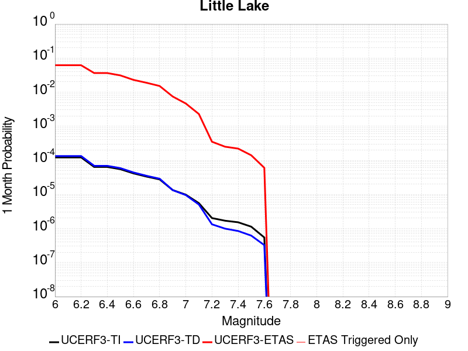 |  |  |

| Magnitude | 1 wk TI Prob | 1 wk TD Prob | 1 wk ETAS Prob | 1 wk ETAS/TD Gain | 1 wk ETAS Triggered Only | 1 mo TI Prob | 1 mo TD Prob | 1 mo ETAS Prob | 1 mo ETAS/TD Gain | 1 mo ETAS Triggered Only | 1 yr TI Prob | 1 yr TD Prob | 1 yr ETAS Prob | 1 yr ETAS/TD Gain | 1 yr ETAS Triggered Only | 10 yr TI Prob | 10 yr TD Prob | 10 yr ETAS Prob | 10 yr ETAS/TD Gain | 10 yr ETAS Triggered Only |
|-----|-----|-----|-----|-----|-----|-----|-----|-----|-----|-----|-----|-----|-----|-----|-----|-----|-----|-----|-----|-----|
| 6.0 | 2.8424427E-5 | 3.120572E-5 | 0.050043013 | 1603.6487 | 0.05001337 | 1.2181328E-4 | 1.337327E-4 | 0.060807437 | 454.69385 | 0.06068182 | 0.0014820677 | 0.0016271127 | 0.08082958 | 49.676693 | 0.079331554 | 0.014722223 | 0.016165402 | 0.11011634 | 6.8118534 | 0.09549465 |
| 6.1 | 2.8424427E-5 | 3.120572E-5 | 0.050043013 | 1603.6487 | 0.05001337 | 1.2181328E-4 | 1.337327E-4 | 0.060807437 | 454.69385 | 0.06068182 | 0.0014820677 | 0.0016271127 | 0.08082958 | 49.676693 | 0.079331554 | 0.014722223 | 0.016165402 | 0.11011634 | 6.8118534 | 0.09549465 |
| 6.2 | 2.8424427E-5 | 3.120572E-5 | 0.050043013 | 1603.6487 | 0.05001337 | 1.2181328E-4 | 1.337327E-4 | 0.060807437 | 454.69385 | 0.06068182 | 0.0014820677 | 0.0016271127 | 0.08082958 | 49.676693 | 0.079331554 | 0.014722223 | 0.016165402 | 0.11011634 | 6.8118534 | 0.09549465 |
| 6.3 | 1.48860645E-5 | 1.6081389E-5 | 0.029561061 | 1838.2156 | 0.029545454 | 6.379586E-5 | 6.8918576E-5 | 0.036055744 | 523.16437 | 0.035989303 | 7.7643775E-4 | 8.3878887E-4 | 0.04745741 | 56.578487 | 0.046657752 | 0.007737305 | 0.008359048 | 0.064251535 | 7.686466 | 0.056363635 |
| 6.4 | 1.48860645E-5 | 1.6081389E-5 | 0.029561061 | 1838.2156 | 0.029545454 | 6.379586E-5 | 6.8918576E-5 | 0.036055744 | 523.16437 | 0.035989303 | 7.7643775E-4 | 8.3878887E-4 | 0.04745741 | 56.578487 | 0.046657752 | 0.007737305 | 0.008359048 | 0.064251535 | 7.686466 | 0.056363635 |
| 6.5 | 1.2797581E-5 | 1.3765565E-5 | 0.025320904 | 1839.438 | 0.025307486 | 5.4845623E-5 | 5.899409E-5 | 0.030872684 | 523.31824 | 0.030815508 | 6.675408E-4 | 7.18042E-4 | 0.040448852 | 56.33215 | 0.039759357 | 0.006655392 | 0.00715977 | 0.05493025 | 7.672069 | 0.048114974 |
| 6.6 | 9.661896E-6 | 1.0289038E-5 | 0.018606354 | 1808.3668 | 0.018596256 | 4.1407468E-5 | 4.409522E-5 | 0.022783734 | 516.694 | 0.022740642 | 5.040193E-4 | 5.367433E-4 | 0.029785741 | 55.493454 | 0.029264705 | 0.005028777 | 0.0053560743 | 0.040713806 | 7.601426 | 0.03554813 |
| 6.7 | 7.767871E-6 | 8.199687E-6 | 0.015382405 | 1875.9747 | 0.015374332 | 3.329045E-5 | 3.5141118E-5 | 0.018764429 | 533.97363 | 0.018729946 | 4.0523586E-4 | 4.2777284E-4 | 0.024615282 | 57.54288 | 0.024197862 | 0.004044977 | 0.004270846 | 0.033397254 | 7.819822 | 0.029251337 |
| 6.8 | 6.4235196E-6 | 6.7357446E-6 | 0.01227938 | 1823.0176 | 0.012272728 | 2.752908E-5 | 2.8867229E-5 | 0.015081909 | 522.45776 | 0.015053476 | 3.35115E-4 | 3.5141467E-4 | 0.019796452 | 56.33359 | 0.019451872 | 0.003346101 | 0.00350985 | 0.02704993 | 7.7068624 | 0.023622995 |
| 6.9 | 3.1283696E-6 | 3.1121804E-6 | 0.005831971 | 1873.918 | 0.005828877 | 1.3407229E-5 | 1.3337856E-5 | 0.007499869 | 562.29944 | 0.007486631 | 1.6322079E-4 | 1.6237781E-4 | 0.009920151 | 61.09302 | 0.009759358 | 0.0016310095 | 0.00162274 | 0.013528522 | 8.33684 | 0.011925134 |
| 7.0 | 2.290603E-6 | 2.2286815E-6 | 0.003705429 | 1662.6104 | 0.0037032086 | 9.816834E-6 | 9.551463E-6 | 0.00470202 | 492.28268 | 0.0046925135 | 1.19513395E-4 | 1.162839E-4 | 0.0061717294 | 53.07467 | 0.00605615 | 0.0011944914 | 0.0011623327 | 0.008613555 | 7.410576 | 0.007459893 |
| 7.1 | 1.293693E-6 | 1.1776827E-6 | 0.0018059884 | 1533.51 | 0.0018048128 | 5.5443866E-6 | 5.0472063E-6 | 0.0023446076 | 464.53574 | 0.0023395722 | 6.750081E-5 | 6.14487E-5 | 0.0030024445 | 48.860992 | 0.0029411765 | 6.7480316E-4 | 6.143856E-4 | 0.0042351545 | 6.8933167 | 0.0036229948 |
| 7.2 | 4.715842E-7 | 3.0917857E-7 | 3.345337E-4 | 1082.0079 | 3.342246E-4 | 2.0210737E-6 | 1.3250503E-6 | 3.756561E-4 | 283.50327 | 3.7433155E-4 | 2.4606294E-5 | 1.6132375E-5 | 4.5730174E-4 | 28.346832 | 4.4117647E-4 | 2.460357E-4 | 1.6131258E-4 | 7.3608616E-4 | 4.5631046 | 5.748663E-4 |
| 7.3 | 3.9430947E-7 | 2.3097488E-7 | 2.1413466E-4 | 927.09076 | 2.1390374E-4 | 1.6898966E-6 | 9.89892E-7 | 2.5500034E-4 | 257.60422 | 2.540107E-4 | 2.0574296E-5 | 1.2051869E-5 | 3.329036E-4 | 27.622574 | 3.2085562E-4 | 2.0572392E-4 | 1.20512224E-4 | 5.6163553E-4 | 4.660403 | 4.4117647E-4 |
| 7.4 | 3.547123E-7 | 1.9679135E-7 | 2.007315E-4 | 1020.022 | 2.0053476E-4 | 1.5201948E-6 | 8.4339126E-7 | 2.414849E-4 | 286.32608 | 2.406417E-4 | 1.8508214E-5 | 1.0268241E-5 | 3.1775172E-4 | 30.945099 | 3.0748663E-4 | 1.8506673E-4 | 1.02677724E-4 | 5.1707367E-4 | 5.0358896 | 4.1443852E-4 |
| 7.5 | 2.6354266E-7 | 1.4423138E-7 | 1.07096086E-4 | 742.5297 | 1.0695187E-4 | 1.129468E-6 | 6.181344E-7 | 1.4767687E-4 | 238.9074 | 1.4705882E-4 | 1.3751187E-5 | 7.5257603E-6 | 1.9469013E-4 | 25.869827 | 1.8716577E-4 | 1.3750336E-4 | 7.5255106E-5 | 3.5598263E-4 | 4.7303452 | 2.8074867E-4 |
| 7.6 | 1.269913E-7 | 7.572556E-8 | 4.0182673E-5 | 530.63556 | 4.0106952E-5 | 5.4424834E-7 | 3.245381E-7 | 6.7169436E-5 | 206.96935 | 6.684492E-5 | 6.6262032E-6 | 3.9512443E-6 | 8.416483E-5 | 21.300842 | 8.0213904E-5 | 6.626006E-5 | 3.9511775E-5 | 1.7319633E-4 | 4.3834105 | 1.3368984E-4 |

## Owl Lake
*[(top)](#table-of-contents)*

| 1 Week | 1 Month | 1 Year | 10 Year |
|-----|-----|-----|-----|
|  |  |  |  |

| Magnitude | 1 wk TI Prob | 1 wk TD Prob | 1 wk ETAS Prob | 1 wk ETAS/TD Gain | 1 wk ETAS Triggered Only | 1 mo TI Prob | 1 mo TD Prob | 1 mo ETAS Prob | 1 mo ETAS/TD Gain | 1 mo ETAS Triggered Only | 1 yr TI Prob | 1 yr TD Prob | 1 yr ETAS Prob | 1 yr ETAS/TD Gain | 1 yr ETAS Triggered Only | 10 yr TI Prob | 10 yr TD Prob | 10 yr ETAS Prob | 10 yr ETAS/TD Gain | 10 yr ETAS Triggered Only |
|-----|-----|-----|-----|-----|-----|-----|-----|-----|-----|-----|-----|-----|-----|-----|-----|-----|-----|-----|-----|-----|
| 6.0 | 5.0320643E-5 | 6.635816E-5 | 0.02463692 | 371.2719 | 0.024572192 | 2.1564208E-4 | 2.843674E-4 | 0.032253884 | 113.42329 | 0.03197861 | 0.0026222812 | 0.0034577388 | 0.04882173 | 14.119554 | 0.04552139 | 0.02591553 | 0.034140717 | 0.09134334 | 2.6754959 | 0.059224598 |
| 6.1 | 5.0320643E-5 | 6.635816E-5 | 0.02463692 | 371.2719 | 0.024572192 | 2.1564208E-4 | 2.843674E-4 | 0.032253884 | 113.42329 | 0.03197861 | 0.0026222812 | 0.0034577388 | 0.04882173 | 14.119554 | 0.04552139 | 0.02591553 | 0.034140717 | 0.09134334 | 2.6754959 | 0.059224598 |
| 6.2 | 2.4125871E-5 | 3.0981035E-5 | 0.020177417 | 651.2828 | 0.02014706 | 1.0339249E-4 | 1.3277028E-4 | 0.025904749 | 195.10954 | 0.0257754 | 0.0012580766 | 0.001615439 | 0.037386436 | 23.143206 | 0.035828877 | 0.012509781 | 0.016070465 | 0.061097078 | 3.801824 | 0.045762032 |
| 6.3 | 1.7433485E-5 | 2.2355514E-5 | 0.01847114 | 826.2454 | 0.018449198 | 7.471279E-5 | 9.580672E-5 | 0.023342242 | 243.63889 | 0.023248663 | 9.0924866E-4 | 0.0011659743 | 0.032733403 | 28.073862 | 0.03160428 | 0.009055373 | 0.011628896 | 0.050833404 | 4.3713007 | 0.039665777 |
| 6.4 | 1.7433485E-5 | 2.2355514E-5 | 0.01847114 | 826.2454 | 0.018449198 | 7.471279E-5 | 9.580672E-5 | 0.023342242 | 243.63889 | 0.023248663 | 9.0924866E-4 | 0.0011659743 | 0.032733403 | 28.073862 | 0.03160428 | 0.009055373 | 0.011628896 | 0.050833404 | 4.3713007 | 0.039665777 |
| 6.5 | 1.5182742E-5 | 1.9429144E-5 | 0.017839938 | 918.205 | 0.017820856 | 6.506727E-5 | 8.326596E-5 | 0.022367507 | 268.62726 | 0.022286097 | 7.919061E-4 | 0.0010134429 | 0.03125015 | 30.835629 | 0.03026738 | 0.0078909 | 0.010118429 | 0.04745073 | 4.689535 | 0.037713904 |
| 6.6 | 6.7271576E-6 | 8.547361E-6 | 0.015476329 | 1810.6559 | 0.015467915 | 2.8830356E-5 | 3.6631063E-5 | 0.018886209 | 515.579 | 0.018850267 | 3.5095305E-4 | 4.458976E-4 | 0.024913592 | 55.8729 | 0.024478609 | 0.0035039932 | 0.004467813 | 0.03377479 | 7.5595803 | 0.029438503 |
| 6.7 | 6.682835E-6 | 8.479807E-6 | 0.015476263 | 1825.0725 | 0.015467915 | 2.8640408E-5 | 3.6341557E-5 | 0.018885924 | 519.67847 | 0.018850267 | 3.4864116E-4 | 4.4237426E-4 | 0.024896791 | 56.279926 | 0.02446524 | 0.003480947 | 0.0044327388 | 0.03371413 | 7.6057105 | 0.029411765 |
| 6.8 | 6.5774975E-6 | 8.32628E-6 | 0.015476112 | 1858.7065 | 0.015467915 | 2.8188972E-5 | 3.5683603E-5 | 0.01888528 | 529.2425 | 0.018850267 | 3.4314668E-4 | 4.343669E-4 | 0.024862254 | 57.23791 | 0.024438502 | 0.0034261728 | 0.004352885 | 0.03357007 | 7.712143 | 0.02934492 |
| 6.9 | 6.363419E-6 | 7.999454E-6 | 0.015435684 | 1929.592 | 0.015427807 | 2.727151E-5 | 3.428296E-5 | 0.018843798 | 549.65497 | 0.01881016 | 3.3198006E-4 | 4.1732067E-4 | 0.024765445 | 59.34392 | 0.02435829 | 0.0033148455 | 0.0041828766 | 0.033298545 | 7.960681 | 0.029237967 |
| 7.0 | 6.1342453E-6 | 7.6316555E-6 | 0.015301633 | 2005.0214 | 0.015294118 | 2.6289357E-5 | 3.2706717E-5 | 0.018695198 | 571.6012 | 0.0186631 | 3.2002592E-4 | 3.9813702E-4 | 0.024519546 | 61.585697 | 0.024131017 | 0.0031956544 | 0.003991571 | 0.032833204 | 8.225636 | 0.02895722 |
| 7.1 | 5.842926E-6 | 7.142211E-6 | 0.014619337 | 2046.8923 | 0.014612299 | 2.504087E-5 | 3.0609146E-5 | 0.017917762 | 585.3728 | 0.0178877 | 3.0482994E-4 | 3.7260808E-4 | 0.023505697 | 63.08424 | 0.023141712 | 0.0030441214 | 0.0037370329 | 0.031387325 | 8.398996 | 0.02775401 |
| 7.2 | 4.77173E-6 | 5.358483E-6 | 0.009336859 | 1742.4445 | 0.00933155 | 2.045011E-5 | 2.2964748E-5 | 0.011560133 | 503.386 | 0.011537434 | 2.4895166E-4 | 2.79564E-4 | 0.015114987 | 54.066288 | 0.014839572 | 0.0024867293 | 0.002808645 | 0.02032615 | 7.236995 | 0.017566845 |
| 7.3 | 3.0494948E-6 | 2.710463E-6 | 0.002435859 | 898.68744 | 0.002433155 | 1.3069198E-5 | 1.1616219E-5 | 0.0031666597 | 272.60675 | 0.0031550801 | 1.5910587E-4 | 1.4141845E-4 | 0.004245116 | 30.018122 | 0.004104278 | 0.0015899199 | 0.0014232415 | 0.0062959758 | 4.423688 | 0.004879679 |
| 7.4 | 2.7263884E-6 | 2.3056762E-6 | 0.0016466869 | 714.18823 | 0.001644385 | 1.1684469E-5 | 9.881433E-6 | 0.00212216 | 214.76237 | 0.0021122994 | 1.4224913E-4 | 1.20299905E-4 | 0.0028873468 | 24.001238 | 0.0027673796 | 0.0014215811 | 0.0012112238 | 0.0044960105 | 3.7119567 | 0.00328877 |
| 7.5 | 2.6090431E-6 | 2.1656133E-6 | 0.0012855853 | 593.6357 | 0.0012834225 | 1.1181565E-5 | 9.281167E-6 | 0.0016670198 | 179.61316 | 0.0016577541 | 1.3612706E-4 | 1.1299244E-4 | 0.0023186256 | 20.520182 | 0.0022058825 | 0.001360437 | 0.0011379806 | 0.0037686734 | 3.3117201 | 0.00263369 |
| 7.6 | 2.3008756E-6 | 1.8727933E-6 | 0.0010312826 | 550.66547 | 0.0010294118 | 9.860858E-6 | 8.0262325E-6 | 0.0013048073 | 162.56783 | 0.0012967915 | 1.20049335E-4 | 9.7715085E-5 | 0.0018087778 | 18.510733 | 0.0017112299 | 0.001199845 | 9.849932E-4 | 0.0030551446 | 3.1016912 | 0.0020721925 |
| 7.7 | 1.7184348E-6 | 1.3419171E-6 | 6.1631436E-4 | 459.27902 | 6.1497325E-4 | 7.3646997E-6 | 5.7510606E-6 | 7.811477E-4 | 135.8267 | 7.754011E-4 | 8.966153E-5 | 7.0016955E-5 | 0.0010859886 | 15.5103655 | 0.0010160428 | 8.962536E-4 | 7.078345E-4 | 0.0019903486 | 2.811884 | 0.0012834225 |
| 7.8 | 8.4612907E-7 | 8.4058576E-7 | 2.8158902E-4 | 334.99142 | 2.8074867E-4 | 3.6262625E-6 | 3.6025056E-6 | 3.9130164E-4 | 108.6193 | 3.8770054E-4 | 4.4148852E-5 | 4.3859643E-5 | 4.7164835E-4 | 10.753584 | 4.2780748E-4 | 4.414008E-4 | 4.4398365E-4 | 9.384164E-4 | 2.1136284 | 4.946524E-4 |
| 7.9 | 2.716738E-7 | 3.768106E-7 | 1.0732864E-4 | 284.83447 | 1.0695187E-4 | 1.1643157E-6 | 1.6149015E-6 | 1.6204244E-4 | 100.342 | 1.6042781E-4 | 1.4175452E-5 | 1.966126E-5 | 1.9345463E-4 | 9.839381 | 1.737968E-4 | 1.4174548E-4 | 1.9836679E-4 | 3.9886177E-4 | 2.0107286 | 2.0053476E-4 |
| 8.0 | 2.1995428E-8 | 3.384878E-8 | 3.384878E-8 | 1.0 | 0.0 | 9.426611E-8 | 1.4506621E-7 | 1.4506621E-7 | 1.0 | 0.0 | 1.1476893E-6 | 1.7661803E-6 | 1.7661803E-6 | 1.0 | 0.0 | 1.14768345E-5 | 1.7963059E-5 | 1.7963059E-5 | 1.0 | 0.0 |

## Panamint Valley
*[(top)](#table-of-contents)*

| 1 Week | 1 Month | 1 Year | 10 Year |
|-----|-----|-----|-----|
|  |  |  |  |

| Magnitude | 1 wk TI Prob | 1 wk TD Prob | 1 wk ETAS Prob | 1 wk ETAS/TD Gain | 1 wk ETAS Triggered Only | 1 mo TI Prob | 1 mo TD Prob | 1 mo ETAS Prob | 1 mo ETAS/TD Gain | 1 mo ETAS Triggered Only | 1 yr TI Prob | 1 yr TD Prob | 1 yr ETAS Prob | 1 yr ETAS/TD Gain | 1 yr ETAS Triggered Only | 10 yr TI Prob | 10 yr TD Prob | 10 yr ETAS Prob | 10 yr ETAS/TD Gain | 10 yr ETAS Triggered Only |
|-----|-----|-----|-----|-----|-----|-----|-----|-----|-----|-----|-----|-----|-----|-----|-----|-----|-----|-----|-----|-----|
| 6.0 | 3.0211835E-5 | 3.3984514E-5 | 0.01861624 | 547.786 | 0.018582888 | 1.2947287E-4 | 1.4563995E-4 | 0.02369836 | 162.71881 | 0.02355615 | 0.0015751923 | 0.0017717537 | 0.035562046 | 20.071665 | 0.033850268 | 0.015640736 | 0.017583137 | 0.06025523 | 3.4268758 | 0.04343583 |
| 6.1 | 3.0211835E-5 | 3.3984514E-5 | 0.01861624 | 547.786 | 0.018582888 | 1.2947287E-4 | 1.4563995E-4 | 0.02369836 | 162.71881 | 0.02355615 | 0.0015751923 | 0.0017717537 | 0.035562046 | 20.071665 | 0.033850268 | 0.015640736 | 0.017583137 | 0.06025523 | 3.4268758 | 0.04343583 |
| 6.2 | 3.0211835E-5 | 3.3984514E-5 | 0.01861624 | 547.786 | 0.018582888 | 1.2947287E-4 | 1.4563995E-4 | 0.02369836 | 162.71881 | 0.02355615 | 0.0015751923 | 0.0017717537 | 0.035562046 | 20.071665 | 0.033850268 | 0.015640736 | 0.017583137 | 0.06025523 | 3.4268758 | 0.04343583 |
| 6.3 | 2.8573924E-5 | 3.210268E-5 | 0.018012809 | 561.09985 | 0.017981283 | 1.2245393E-4 | 1.3757581E-4 | 0.022808254 | 165.78679 | 0.022673797 | 0.001489857 | 0.0016737265 | 0.033959173 | 20.289558 | 0.032339573 | 0.01479908 | 0.016617801 | 0.057175744 | 3.4406323 | 0.041243315 |
| 6.4 | 2.8573924E-5 | 3.210268E-5 | 0.018012809 | 561.09985 | 0.017981283 | 1.2245393E-4 | 1.3757581E-4 | 0.022808254 | 165.78679 | 0.022673797 | 0.001489857 | 0.0016737265 | 0.033959173 | 20.289558 | 0.032339573 | 0.01479908 | 0.016617801 | 0.057175744 | 3.4406323 | 0.041243315 |
| 6.5 | 2.7468774E-5 | 3.0828433E-5 | 0.017663974 | 572.97675 | 0.01763369 | 1.1771801E-4 | 1.3211532E-4 | 0.022321697 | 168.95616 | 0.022192514 | 0.0014322745 | 0.0016073446 | 0.033094086 | 20.58929 | 0.031537432 | 0.014230782 | 0.015963677 | 0.05544353 | 3.4731052 | 0.040120322 |
| 6.6 | 2.6135967E-5 | 2.925248E-5 | 0.01723463 | 589.1682 | 0.017205883 | 1.1200648E-4 | 1.253619E-4 | 0.021740299 | 173.4203 | 0.021617647 | 0.0013628257 | 0.0015252391 | 0.032026775 | 20.997871 | 0.03054813 | 0.013544982 | 0.015154043 | 0.05334974 | 3.5204954 | 0.038783424 |
| 6.7 | 2.4498746E-5 | 2.7341335E-5 | 0.016751483 | 612.67975 | 0.0167246 | 1.04990395E-4 | 1.1717203E-4 | 0.020970343 | 178.97057 | 0.020855615 | 0.0012775084 | 0.0014256609 | 0.030581895 | 21.451029 | 0.02919786 | 0.012701893 | 0.014171274 | 0.05061267 | 3.5714974 | 0.03696524 |
| 6.8 | 2.2244329E-5 | 2.4935423E-5 | 0.01592026 | 638.4596 | 0.015895722 | 9.532935E-5 | 1.0686185E-4 | 0.019837374 | 185.6357 | 0.01973262 | 0.0011600169 | 0.0013002884 | 0.02875118 | 22.111387 | 0.027486632 | 0.011539802 | 0.0129325185 | 0.04693884 | 3.6295204 | 0.034451872 |
| 6.9 | 1.9902658E-5 | 2.2290267E-5 | 0.015142274 | 679.32227 | 0.015120321 | 8.529431E-5 | 9.552632E-5 | 0.01873011 | 196.07277 | 0.018636364 | 0.0010379635 | 0.0011624309 | 0.026493913 | 22.791817 | 0.025360962 | 0.010331288 | 0.011568608 | 0.042675126 | 3.688873 | 0.03147059 |
| 7.0 | 1.8353881E-5 | 2.0566185E-5 | 0.014498878 | 704.9862 | 0.01447861 | 7.865712E-5 | 8.813792E-5 | 0.017934158 | 203.47835 | 0.017847594 | 9.5722964E-4 | 0.0010725686 | 0.025137639 | 23.43686 | 0.024090908 | 0.009531168 | 0.010678849 | 0.040067505 | 3.7520435 | 0.029705882 |
| 7.1 | 1.7667631E-5 | 1.9772613E-5 | 0.014190615 | 717.6905 | 0.014171123 | 7.571623E-5 | 8.473711E-5 | 0.017569887 | 207.34583 | 0.017486632 | 9.2145515E-4 | 0.0010312037 | 0.02442951 | 23.690287 | 0.02342246 | 0.009176437 | 0.010269073 | 0.038889233 | 3.787025 | 0.028917111 |
| 7.2 | 1.6381597E-5 | 1.8158249E-5 | 0.012558037 | 691.58856 | 0.012540107 | 7.020495E-5 | 7.781885E-5 | 0.015611369 | 200.61168 | 0.0155347595 | 8.544101E-4 | 9.4704994E-4 | 0.0217562 | 22.9726 | 0.020828877 | 0.008511325 | 0.009434792 | 0.034821335 | 3.690737 | 0.025628341 |
| 7.3 | 1.4520491E-5 | 1.5966476E-5 | 0.010390133 | 650.74677 | 0.010374332 | 6.222919E-5 | 6.842605E-5 | 0.012915141 | 188.74596 | 0.012847594 | 7.57377E-4 | 8.327849E-4 | 0.018037695 | 21.659489 | 0.017219251 | 0.0075480095 | 0.00829975 | 0.02924743 | 3.5238926 | 0.021122994 |
| 7.4 | 1.2852287E-5 | 1.4145411E-5 | 0.010187798 | 720.2193 | 0.010173797 | 5.5080065E-5 | 6.062187E-5 | 0.012666809 | 208.94785 | 0.012606951 | 6.7039346E-4 | 7.378371E-4 | 0.017476814 | 23.686548 | 0.016751338 | 0.0066837464 | 0.0073567946 | 0.027713943 | 3.767122 | 0.020508021 |
| 7.5 | 1.1637851E-5 | 1.2836797E-5 | 0.010026077 | 781.04193 | 0.010013369 | 4.987555E-5 | 5.5013777E-5 | 0.012474117 | 226.74533 | 0.012419786 | 6.070656E-4 | 6.6960254E-4 | 0.017209323 | 25.700802 | 0.016550802 | 0.006054099 | 0.0066787465 | 0.026784206 | 4.0103645 | 0.020240642 |
| 7.6 | 3.0068115E-6 | 3.3330316E-6 | 0.004669093 | 1400.8547 | 0.004665775 | 1.2886271E-5 | 1.4284384E-5 | 0.0057494966 | 402.50226 | 0.005735294 | 1.5687906E-4 | 1.7390578E-4 | 0.0077528013 | 44.58047 | 0.0075802137 | 0.0015676835 | 0.0017391363 | 0.01080089 | 6.2104907 | 0.00907754 |

## Garlock (East)
*[(top)](#table-of-contents)*

| 1 Week | 1 Month | 1 Year | 10 Year |
|-----|-----|-----|-----|
|  |  |  |  |

| Magnitude | 1 wk TI Prob | 1 wk TD Prob | 1 wk ETAS Prob | 1 wk ETAS/TD Gain | 1 wk ETAS Triggered Only | 1 mo TI Prob | 1 mo TD Prob | 1 mo ETAS Prob | 1 mo ETAS/TD Gain | 1 mo ETAS Triggered Only | 1 yr TI Prob | 1 yr TD Prob | 1 yr ETAS Prob | 1 yr ETAS/TD Gain | 1 yr ETAS Triggered Only | 10 yr TI Prob | 10 yr TD Prob | 10 yr ETAS Prob | 10 yr ETAS/TD Gain | 10 yr ETAS Triggered Only |
|-----|-----|-----|-----|-----|-----|-----|-----|-----|-----|-----|-----|-----|-----|-----|-----|-----|-----|-----|-----|-----|
| 6.0 | 4.5092507E-5 | 6.290325E-5 | 0.015650159 | 248.79729 | 0.015588235 | 1.9323928E-4 | 2.6956003E-4 | 0.020651765 | 76.61286 | 0.0203877 | 0.0023501497 | 0.0032774 | 0.03295255 | 10.05448 | 0.029772727 | 0.023254504 | 0.032351844 | 0.07081198 | 2.188808 | 0.03974599 |
| 6.1 | 4.5092507E-5 | 6.290325E-5 | 0.015650159 | 248.79729 | 0.015588235 | 1.9323928E-4 | 2.6956003E-4 | 0.020651765 | 76.61286 | 0.0203877 | 0.0023501497 | 0.0032774 | 0.03295255 | 10.05448 | 0.029772727 | 0.023254504 | 0.032351844 | 0.07081198 | 2.188808 | 0.03974599 |
| 6.2 | 2.6674514E-5 | 3.4509674E-5 | 0.012346919 | 357.78137 | 0.012312834 | 1.1431433E-4 | 1.4789042E-4 | 0.015693719 | 106.11722 | 0.015548129 | 0.0013908884 | 0.0017991117 | 0.02360473 | 13.1202135 | 0.02184492 | 0.01382215 | 0.017890299 | 0.04598809 | 2.5705602 | 0.028609626 |
| 6.3 | 2.6674514E-5 | 3.4509674E-5 | 0.012346919 | 357.78137 | 0.012312834 | 1.1431433E-4 | 1.4789042E-4 | 0.015693719 | 106.11722 | 0.015548129 | 0.0013908884 | 0.0017991117 | 0.02360473 | 13.1202135 | 0.02184492 | 0.01382215 | 0.017890299 | 0.04598809 | 2.5705602 | 0.028609626 |
| 6.4 | 2.5312667E-5 | 3.233893E-5 | 0.0121709835 | 376.35703 | 0.012139037 | 1.0847834E-4 | 1.3858822E-4 | 0.015470687 | 111.630615 | 0.015334224 | 0.0013199237 | 0.0016860351 | 0.023080384 | 13.689148 | 0.021430481 | 0.013121112 | 0.016778335 | 0.04426385 | 2.638155 | 0.027954545 |
| 6.5 | 2.5312667E-5 | 3.233893E-5 | 0.0121709835 | 376.35703 | 0.012139037 | 1.0847834E-4 | 1.3858822E-4 | 0.015470687 | 111.630615 | 0.015334224 | 0.0013199237 | 0.0016860351 | 0.023080384 | 13.689148 | 0.021430481 | 0.013121112 | 0.016778335 | 0.04426385 | 2.638155 | 0.027954545 |
| 6.6 | 2.246556E-5 | 2.8133776E-5 | 0.011845984 | 421.0591 | 0.011818182 | 9.627742E-5 | 1.20567885E-4 | 0.01501182 | 124.50928 | 0.014893048 | 0.0011715472 | 0.0014669491 | 0.02206503 | 15.041442 | 0.020628342 | 0.011653901 | 0.01461866 | 0.04091306 | 2.7986875 | 0.026684493 |
| 6.7 | 2.2241198E-5 | 2.7803519E-5 | 0.011792182 | 424.12552 | 0.011764706 | 9.531594E-5 | 1.1915263E-4 | 0.014956957 | 125.52771 | 0.014839572 | 0.0011598538 | 0.0014497414 | 0.02196808 | 15.153103 | 0.020548128 | 0.011538187 | 0.014448853 | 0.040642377 | 2.8128445 | 0.02657754 |
| 6.8 | 1.9528685E-5 | 2.389819E-5 | 0.011427369 | 478.1688 | 0.011403743 | 8.369167E-5 | 1.0241691E-4 | 0.014405765 | 140.65807 | 0.014304813 | 0.0010184698 | 0.0012462323 | 0.02071392 | 16.621235 | 0.019491978 | 0.010138147 | 0.012436427 | 0.03715192 | 2.987347 | 0.025026739 |
| 6.9 | 1.3318621E-5 | 1.5198884E-5 | 0.010803805 | 710.8288 | 0.01078877 | 5.7078556E-5 | 6.513648E-5 | 0.0134867225 | 207.05327 | 0.01342246 | 6.9470983E-4 | 7.927538E-4 | 0.018612841 | 23.478714 | 0.017834224 | 0.0069254204 | 0.007939888 | 0.030141875 | 3.7962596 | 0.02237968 |
| 7.0 | 1.1760853E-5 | 1.31077895E-5 | 0.0106546795 | 812.851 | 0.010641711 | 5.0402683E-5 | 5.6175057E-5 | 0.013210516 | 235.16693 | 0.01315508 | 6.134799E-4 | 6.8372174E-4 | 0.018011438 | 26.34323 | 0.017339572 | 0.0061178906 | 0.00685652 | 0.028312668 | 4.129306 | 0.021604277 |
| 7.1 | 1.0064758E-5 | 1.0902931E-5 | 0.01039849 | 953.7335 | 0.010387701 | 4.3133965E-5 | 4.672603E-5 | 0.012813509 | 274.22638 | 0.01276738 | 5.2502943E-4 | 5.687444E-4 | 0.017297193 | 30.412947 | 0.016737968 | 0.005237907 | 0.0057129986 | 0.02626337 | 4.597125 | 0.020668449 |
| 7.2 | 9.768808E-6 | 1.0498807E-5 | 0.010184188 | 970.03296 | 0.010173797 | 4.186565E-5 | 4.499413E-5 | 0.0125578 | 279.09863 | 0.012513369 | 5.095951E-4 | 5.4766936E-4 | 0.016888982 | 30.837917 | 0.016350267 | 0.0050842804 | 0.0055032647 | 0.025486268 | 4.631118 | 0.020093583 |
| 7.3 | 9.344516E-6 | 9.944468E-6 | 0.009354771 | 940.7011 | 0.00934492 | 4.004731E-5 | 4.261847E-5 | 0.011539455 | 270.76184 | 0.011497326 | 4.8746695E-4 | 5.1875977E-4 | 0.015604513 | 30.080421 | 0.015093583 | 0.0048639905 | 0.0052149445 | 0.023794018 | 4.5626597 | 0.018676471 |
| 7.4 | 9.023491E-6 | 9.490661E-6 | 0.008311551 | 875.761 | 0.008302139 | 3.867153E-5 | 4.0673647E-5 | 0.010307636 | 253.42296 | 0.01026738 | 4.7072413E-4 | 4.950925E-4 | 0.013924269 | 28.124582 | 0.0134358285 | 0.004697283 | 0.0049783974 | 0.021473408 | 4.3133173 | 0.01657754 |
| 7.5 | 7.081253E-6 | 7.087672E-6 | 0.0042583942 | 600.8171 | 0.0042513367 | 3.0347876E-5 | 3.0375388E-5 | 0.0052307523 | 172.20363 | 0.0052005346 | 3.6942272E-4 | 3.6975832E-4 | 0.0070785065 | 19.143604 | 0.00671123 | 0.003688092 | 0.0037243143 | 0.012035491 | 3.2315993 | 0.008342246 |
| 7.6 | 6.116396E-6 | 5.959245E-6 | 0.0027465846 | 460.89474 | 0.0027406418 | 2.6212863E-5 | 2.5539372E-5 | 0.0033677 | 131.86307 | 0.003342246 | 3.1909486E-4 | 3.1089774E-4 | 0.0044807238 | 14.412211 | 0.004171123 | 0.0031863707 | 0.0031357552 | 0.00837329 | 2.6702628 | 0.0052540107 |
| 7.7 | 4.797145E-6 | 4.757281E-6 | 0.0014753385 | 310.12222 | 0.0014705883 | 2.055903E-5 | 2.0388188E-5 | 0.0018251642 | 89.52067 | 0.0018048128 | 2.5027743E-4 | 2.4819805E-4 | 0.0025470925 | 10.26234 | 0.0022994652 | 0.0024999576 | 0.0025093474 | 0.0054164724 | 2.1585186 | 0.0029144385 |
| 7.8 | 3.4028885E-6 | 3.978462E-6 | 8.9969684E-4 | 226.14188 | 8.957219E-4 | 1.4583726E-5 | 1.7050439E-5 | 0.0010999197 | 64.50976 | 0.0010828878 | 1.775424E-4 | 2.0756939E-4 | 0.0015842889 | 7.6325746 | 0.0013770054 | 0.0017740062 | 0.0021012232 | 0.0039022437 | 1.8571296 | 0.0018048128 |
| 7.9 | 2.5928412E-6 | 3.3724489E-6 | 5.6486786E-4 | 167.49487 | 5.6149735E-4 | 1.1112129E-5 | 1.4453272E-5 | 6.828928E-4 | 47.248318 | 6.684492E-4 | 1.3528178E-4 | 1.7595445E-4 | 0.0010715188 | 6.089751 | 8.957219E-4 | 0.0013519945 | 0.0017812408 | 0.003049032 | 1.7117461 | 0.0012700534 |
| 8.0 | 1.3743648E-6 | 1.6734747E-6 | 2.5568376E-4 | 152.78615 | 2.540107E-4 | 5.8901214E-6 | 7.1720146E-6 | 3.2802531E-4 | 45.736847 | 3.2085562E-4 | 7.1709874E-5 | 8.731581E-5 | 5.0171814E-4 | 5.746017 | 4.1443852E-4 | 7.1686733E-4 | 8.837234E-4 | 0.0014714388 | 1.6650445 | 5.8823527E-4 |
| 8.1 | 3.6733252E-7 | 3.1489964E-7 | 2.705286E-5 | 85.90946 | 2.6737967E-5 | 1.5742813E-6 | 1.3495693E-6 | 5.4825432E-5 | 40.624393 | 5.3475935E-5 | 1.9166706E-5 | 1.6430899E-5 | 6.990595E-5 | 4.2545424 | 5.3475935E-5 | 1.9165053E-4 | 1.6638759E-4 | 2.3322139E-4 | 1.4016753 | 6.684492E-5 |

## Airport Lake
*[(top)](#table-of-contents)*

| 1 Week | 1 Month | 1 Year | 10 Year |
|-----|-----|-----|-----|
|  |  |  |  |

| Magnitude | 1 wk TI Prob | 1 wk TD Prob | 1 wk ETAS Prob | 1 wk ETAS/TD Gain | 1 wk ETAS Triggered Only | 1 mo TI Prob | 1 mo TD Prob | 1 mo ETAS Prob | 1 mo ETAS/TD Gain | 1 mo ETAS Triggered Only | 1 yr TI Prob | 1 yr TD Prob | 1 yr ETAS Prob | 1 yr ETAS/TD Gain | 1 yr ETAS Triggered Only | 10 yr TI Prob | 10 yr TD Prob | 10 yr ETAS Prob | 10 yr ETAS/TD Gain | 10 yr ETAS Triggered Only |
|-----|-----|-----|-----|-----|-----|-----|-----|-----|-----|-----|-----|-----|-----|-----|-----|-----|-----|-----|-----|-----|
| 6.0 | 1.2387061E-5 | 1.3103157E-5 | 0.021082345 | 1608.9517 | 0.02106952 | 5.3086325E-5 | 5.615534E-5 | 0.025883581 | 460.92825 | 0.025828877 | 6.461343E-4 | 6.8350515E-4 | 0.034109842 | 49.90429 | 0.0334492 | 0.0064425888 | 0.0068168393 | 0.046915945 | 6.8823605 | 0.04037433 |
| 6.1 | 1.2387061E-5 | 1.3103157E-5 | 0.021082345 | 1608.9517 | 0.02106952 | 5.3086325E-5 | 5.615534E-5 | 0.025883581 | 460.92825 | 0.025828877 | 6.461343E-4 | 6.8350515E-4 | 0.034109842 | 49.90429 | 0.0334492 | 0.0064425888 | 0.0068168393 | 0.046915945 | 6.8823605 | 0.04037433 |
| 6.2 | 1.2387061E-5 | 1.3103157E-5 | 0.021082345 | 1608.9517 | 0.02106952 | 5.3086325E-5 | 5.615534E-5 | 0.025883581 | 460.92825 | 0.025828877 | 6.461343E-4 | 6.8350515E-4 | 0.034109842 | 49.90429 | 0.0334492 | 0.0064425888 | 0.0068168393 | 0.046915945 | 6.8823605 | 0.04037433 |
| 6.3 | 1.2387061E-5 | 1.3103157E-5 | 0.021082345 | 1608.9517 | 0.02106952 | 5.3086325E-5 | 5.615534E-5 | 0.025883581 | 460.92825 | 0.025828877 | 6.461343E-4 | 6.8350515E-4 | 0.034109842 | 49.90429 | 0.0334492 | 0.0064425888 | 0.0068168393 | 0.046915945 | 6.8823605 | 0.04037433 |
| 6.4 | 1.2387061E-5 | 1.3103157E-5 | 0.021082345 | 1608.9517 | 0.02106952 | 5.3086325E-5 | 5.615534E-5 | 0.025883581 | 460.92825 | 0.025828877 | 6.461343E-4 | 6.8350515E-4 | 0.034109842 | 49.90429 | 0.0334492 | 0.0064425888 | 0.0068168393 | 0.046915945 | 6.8823605 | 0.04037433 |
| 6.5 | 6.9922594E-6 | 7.384925E-6 | 0.015702456 | 2126.2852 | 0.015695186 | 2.996648E-5 | 3.1649324E-5 | 0.019269008 | 608.82837 | 0.019237967 | 3.6478083E-4 | 3.8526783E-4 | 0.025201906 | 65.41399 | 0.024826203 | 0.003641826 | 0.0038465366 | 0.033717822 | 8.765761 | 0.029986631 |
| 6.6 | 6.9922594E-6 | 7.384925E-6 | 0.015702456 | 2126.2852 | 0.015695186 | 2.996648E-5 | 3.1649324E-5 | 0.019269008 | 608.82837 | 0.019237967 | 3.6478083E-4 | 3.8526783E-4 | 0.025201906 | 65.41399 | 0.024826203 | 0.003641826 | 0.0038465366 | 0.033717822 | 8.765761 | 0.029986631 |
| 6.7 | 5.477277E-6 | 5.7860684E-6 | 0.013561857 | 2343.8813 | 0.01355615 | 2.3473833E-5 | 2.4797222E-5 | 0.0166554 | 671.66394 | 0.016631017 | 2.8575645E-4 | 3.0186825E-4 | 0.021765975 | 72.104225 | 0.021470588 | 0.0028538927 | 0.003014966 | 0.028792627 | 9.549901 | 0.025855616 |
| 6.8 | 3.9950432E-6 | 4.2190873E-6 | 0.009937332 | 2355.3276 | 0.009933155 | 1.7121502E-5 | 1.8081691E-5 | 0.012384168 | 684.90094 | 0.01236631 | 2.0843433E-4 | 2.2012512E-4 | 0.01631284 | 74.107124 | 0.016096257 | 0.0020823893 | 0.0021993418 | 0.021648452 | 9.84315 | 0.019491978 |
| 6.9 | 2.95695E-6 | 3.1230243E-6 | 0.007155507 | 2291.211 | 0.0071524065 | 1.2672582E-5 | 1.3384334E-5 | 0.009023959 | 674.218 | 0.009010695 | 1.5427776E-4 | 1.6294434E-4 | 0.011979201 | 73.51713 | 0.011818182 | 0.001541707 | 0.0016284712 | 0.015883295 | 9.753501 | 0.014278075 |
| 7.0 | 1.456072E-6 | 1.540812E-6 | 0.0030229266 | 1961.9049 | 0.0030213904 | 6.2402937E-6 | 6.603469E-6 | 0.0038568454 | 584.06354 | 0.0038502673 | 7.597293E-5 | 8.039528E-5 | 0.0051468327 | 64.0191 | 0.005066845 | 7.594696E-4 | 8.0376083E-4 | 0.007015342 | 8.728146 | 0.0062165777 |
| 7.1 | 6.995192E-7 | 7.4089746E-7 | 0.0013376384 | 1805.4298 | 0.0013368984 | 2.997936E-6 | 3.1752747E-6 | 0.0018079823 | 569.394 | 0.0018048128 | 3.649926E-5 | 3.865897E-5 | 0.0023514037 | 60.824272 | 0.0023128341 | 3.6493264E-4 | 3.865897E-4 | 0.0032063548 | 8.293948 | 0.0028208557 |

## Hunter Mountain-Saline Valley
*[(top)](#table-of-contents)*

| 1 Week | 1 Month | 1 Year | 10 Year |
|-----|-----|-----|-----|
| 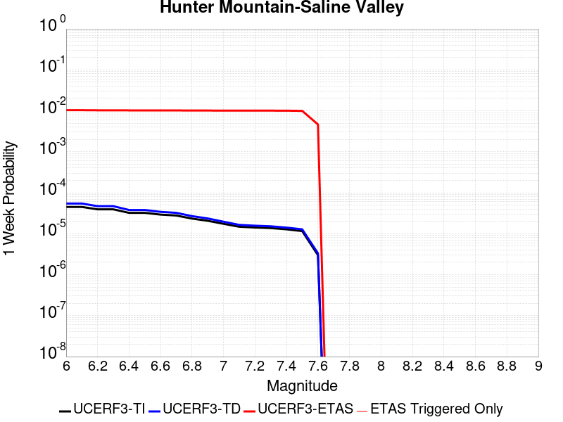 |  |  |  |

| Magnitude | 1 wk TI Prob | 1 wk TD Prob | 1 wk ETAS Prob | 1 wk ETAS/TD Gain | 1 wk ETAS Triggered Only | 1 mo TI Prob | 1 mo TD Prob | 1 mo ETAS Prob | 1 mo ETAS/TD Gain | 1 mo ETAS Triggered Only | 1 yr TI Prob | 1 yr TD Prob | 1 yr ETAS Prob | 1 yr ETAS/TD Gain | 1 yr ETAS Triggered Only | 10 yr TI Prob | 10 yr TD Prob | 10 yr ETAS Prob | 10 yr ETAS/TD Gain | 10 yr ETAS Triggered Only |
|-----|-----|-----|-----|-----|-----|-----|-----|-----|-----|-----|-----|-----|-----|-----|-----|-----|-----|-----|-----|-----|
| 6.0 | 4.5103672E-5 | 5.4570177E-5 | 0.010495177 | 192.3244 | 0.010441177 | 1.9328714E-4 | 2.3385242E-4 | 0.013212101 | 56.497597 | 0.0129812835 | 0.002350731 | 0.0028435152 | 0.020187106 | 7.0993485 | 0.017393049 | 0.023260195 | 0.028091887 | 0.048894357 | 1.7405152 | 0.021403743 |
| 6.1 | 4.5103672E-5 | 5.4570177E-5 | 0.010495177 | 192.3244 | 0.010441177 | 1.9328714E-4 | 2.3385242E-4 | 0.013212101 | 56.497597 | 0.0129812835 | 0.002350731 | 0.0028435152 | 0.020187106 | 7.0993485 | 0.017393049 | 0.023260195 | 0.028091887 | 0.048894357 | 1.7405152 | 0.021403743 |
| 6.2 | 3.9363465E-5 | 4.706337E-5 | 0.010420906 | 221.42287 | 0.010374332 | 1.6868966E-4 | 2.0168544E-4 | 0.0130867865 | 64.887115 | 0.0128877 | 0.002051862 | 0.0024528175 | 0.019669842 | 8.019284 | 0.017259357 | 0.020330196 | 0.024273481 | 0.04500115 | 1.8539222 | 0.021243315 |
| 6.3 | 3.9363465E-5 | 4.706337E-5 | 0.010420906 | 221.42287 | 0.010374332 | 1.6868966E-4 | 2.0168544E-4 | 0.0130867865 | 64.887115 | 0.0128877 | 0.002051862 | 0.0024528175 | 0.019669842 | 8.019284 | 0.017259357 | 0.020330196 | 0.024273481 | 0.04500115 | 1.8539222 | 0.021243315 |
| 6.4 | 3.2311684E-5 | 3.795099E-5 | 0.010358415 | 272.9419 | 0.010320855 | 1.384713E-4 | 1.6263737E-4 | 0.012968041 | 79.73592 | 0.012807487 | 0.0016845843 | 0.0019783843 | 0.01907017 | 9.639265 | 0.017125668 | 0.016718714 | 0.019616475 | 0.040272683 | 2.053003 | 0.02106952 |
| 6.5 | 3.2311684E-5 | 3.795099E-5 | 0.010358415 | 272.9419 | 0.010320855 | 1.384713E-4 | 1.6263737E-4 | 0.012968041 | 79.73592 | 0.012807487 | 0.0016845843 | 0.0019783843 | 0.01907017 | 9.639265 | 0.017125668 | 0.016718714 | 0.019616475 | 0.040272683 | 2.053003 | 0.02106952 |
| 6.6 | 2.9305844E-5 | 3.418183E-5 | 0.010327947 | 302.14728 | 0.010294118 | 1.2559042E-4 | 1.4648569E-4 | 0.012925362 | 88.23634 | 0.012780748 | 0.0015279909 | 0.001782067 | 0.018797146 | 10.547945 | 0.017045455 | 0.015175272 | 0.01768569 | 0.038303785 | 2.1658065 | 0.020989304 |
| 6.7 | 2.7826512E-5 | 3.2344276E-5 | 0.01031276 | 318.84344 | 0.010280749 | 1.19251024E-4 | 1.386113E-4 | 0.012904221 | 93.09646 | 0.01276738 | 0.0014509142 | 0.0016863465 | 0.01868971 | 11.08296 | 0.017032085 | 0.014414776 | 0.016743187 | 0.037367918 | 2.2318285 | 0.020975936 |
| 6.8 | 2.3389874E-5 | 2.6866714E-5 | 0.010293971 | 383.1496 | 0.01026738 | 1.0023846E-4 | 1.15138246E-4 | 0.012867681 | 111.75852 | 0.012754011 | 0.00121972 | 0.001400954 | 0.018369127 | 13.111871 | 0.016991979 | 0.01213047 | 0.013927434 | 0.034545314 | 2.480379 | 0.020909091 |
| 6.9 | 2.069209E-5 | 2.3570032E-5 | 0.01026397 | 435.46698 | 0.010240641 | 8.867737E-5 | 1.01010715E-4 | 0.0128136305 | 126.85417 | 0.012713904 | 0.0010791123 | 0.0012291478 | 0.018160183 | 14.774613 | 0.016951872 | 0.010738871 | 0.012228523 | 0.03276308 | 2.679234 | 0.02078877 |
| 7.0 | 1.7462342E-5 | 1.9633546E-5 | 0.010246705 | 521.8978 | 0.010227272 | 7.483646E-5 | 8.414118E-5 | 0.012770239 | 151.77158 | 0.012687166 | 9.1075303E-4 | 0.0010239601 | 0.017918408 | 17.499126 | 0.016911766 | 0.009070295 | 0.0101960525 | 0.030693464 | 3.010328 | 0.020708555 |
| 7.1 | 1.4807709E-5 | 1.6441749E-5 | 0.010230178 | 622.20734 | 0.010213904 | 6.3460066E-5 | 7.046283E-5 | 0.012729999 | 180.66261 | 0.012660428 | 7.723524E-4 | 8.575638E-4 | 0.017688038 | 20.625916 | 0.016844919 | 0.007696735 | 0.008545532 | 0.02898434 | 3.3917537 | 0.020614972 |
| 7.2 | 1.4180048E-5 | 1.5698337E-5 | 0.010229441 | 651.62585 | 0.010213904 | 6.077022E-5 | 6.727694E-5 | 0.012726853 | 189.1711 | 0.012660428 | 7.396263E-4 | 8.188051E-4 | 0.017649932 | 21.555717 | 0.016844919 | 0.0073716943 | 0.008160833 | 0.028607571 | 3.5054717 | 0.020614972 |
| 7.3 | 1.3730402E-5 | 1.5172075E-5 | 0.0102155525 | 673.31274 | 0.010200535 | 5.8843252E-5 | 6.502165E-5 | 0.012684522 | 195.08151 | 0.012620321 | 7.161811E-4 | 7.9136714E-4 | 0.01758288 | 22.21836 | 0.016804812 | 0.007138774 | 0.007888422 | 0.028287722 | 3.5859795 | 0.020561498 |
| 7.4 | 1.2810095E-5 | 1.4109277E-5 | 0.010187763 | 722.0613 | 0.010173797 | 5.489925E-5 | 6.0467017E-5 | 0.012653288 | 209.25934 | 0.012593583 | 6.681934E-4 | 7.359531E-4 | 0.017448243 | 23.708364 | 0.0167246 | 0.006661878 | 0.007338053 | 0.027655773 | 3.768816 | 0.020467915 |
| 7.5 | 1.1595659E-5 | 1.2800664E-5 | 0.010026041 | 783.2439 | 0.010013369 | 4.9694736E-5 | 5.4858923E-5 | 0.012460595 | 227.1389 | 0.012406417 | 6.0486543E-4 | 6.6771836E-4 | 0.017180748 | 25.730532 | 0.016524063 | 0.006032217 | 0.0066599925 | 0.026725993 | 4.012916 | 0.020200536 |
| 7.6 | 2.997694E-6 | 3.3251579E-6 | 0.004669085 | 1404.1694 | 0.004665775 | 1.28471975E-5 | 1.425064E-5 | 0.0057360944 | 402.51486 | 0.0057219253 | 1.564034E-4 | 1.73495E-4 | 0.007739027 | 44.60663 | 0.007566845 | 0.0015629337 | 0.001735031 | 0.01077013 | 6.2074566 | 0.009050802 |

## Blackwater
*[(top)](#table-of-contents)*

| 1 Week | 1 Month | 1 Year | 10 Year |
|-----|-----|-----|-----|
|  |  |  |  |

| Magnitude | 1 wk TI Prob | 1 wk TD Prob | 1 wk ETAS Prob | 1 wk ETAS/TD Gain | 1 wk ETAS Triggered Only | 1 mo TI Prob | 1 mo TD Prob | 1 mo ETAS Prob | 1 mo ETAS/TD Gain | 1 mo ETAS Triggered Only | 1 yr TI Prob | 1 yr TD Prob | 1 yr ETAS Prob | 1 yr ETAS/TD Gain | 1 yr ETAS Triggered Only | 10 yr TI Prob | 10 yr TD Prob | 10 yr ETAS Prob | 10 yr ETAS/TD Gain | 10 yr ETAS Triggered Only |
|-----|-----|-----|-----|-----|-----|-----|-----|-----|-----|-----|-----|-----|-----|-----|-----|-----|-----|-----|-----|-----|
| 6.0 | 3.0708583E-5 | 3.3095846E-5 | 0.0052067214 | 157.3225 | 0.005173797 | 1.3160157E-4 | 1.4183241E-4 | 0.007373427 | 51.986897 | 0.0072326204 | 0.0016010714 | 0.0017255784 | 0.01334987 | 7.7364607 | 0.011644385 | 0.015895851 | 0.017135633 | 0.033599924 | 1.960822 | 0.016751338 |
| 6.1 | 3.0708583E-5 | 3.3095846E-5 | 0.0052067214 | 157.3225 | 0.005173797 | 1.3160157E-4 | 1.4183241E-4 | 0.007373427 | 51.986897 | 0.0072326204 | 0.0016010714 | 0.0017255784 | 0.01334987 | 7.7364607 | 0.011644385 | 0.015895851 | 0.017135633 | 0.033599924 | 1.960822 | 0.016751338 |
| 6.2 | 1.1707779E-5 | 1.2545122E-5 | 0.0021114494 | 168.30838 | 0.0020989305 | 5.017523E-5 | 5.3763757E-5 | 0.002887836 | 53.713436 | 0.0028342246 | 6.107122E-4 | 6.5438676E-4 | 0.0050632646 | 7.737419 | 0.004411765 | 0.006090366 | 0.0065255696 | 0.01270158 | 1.9464325 | 0.0062165777 |
| 6.3 | 1.1707779E-5 | 1.2545122E-5 | 0.0021114494 | 168.30838 | 0.0020989305 | 5.017523E-5 | 5.3763757E-5 | 0.002887836 | 53.713436 | 0.0028342246 | 6.107122E-4 | 6.5438676E-4 | 0.0050632646 | 7.737419 | 0.004411765 | 0.006090366 | 0.0065255696 | 0.01270158 | 1.9464325 | 0.0062165777 |
| 6.4 | 7.929244E-6 | 8.480098E-6 | 0.0013854738 | 163.37946 | 0.0013770054 | 3.3982033E-5 | 3.6342793E-5 | 0.0018277215 | 50.29117 | 0.0017914438 | 4.136527E-4 | 4.423877E-4 | 0.0032219063 | 7.282992 | 0.0027807488 | 0.0041288356 | 0.0044154758 | 0.008408462 | 1.9043161 | 0.004010695 |
| 6.5 | 5.8832115E-6 | 6.285991E-6 | 0.0010490601 | 166.8886 | 0.0010427807 | 2.521352E-5 | 2.6939697E-5 | 0.0013905393 | 51.61674 | 0.0013636363 | 3.0693135E-4 | 3.27944E-4 | 0.0023860924 | 7.275914 | 0.0020588236 | 0.0030650778 | 0.0032748538 | 0.006179748 | 1.8870301 | 0.0029144385 |
| 6.6 | 5.8832115E-6 | 6.285991E-6 | 0.0010490601 | 166.8886 | 0.0010427807 | 2.521352E-5 | 2.6939697E-5 | 0.0013905393 | 51.61674 | 0.0013636363 | 3.0693135E-4 | 3.27944E-4 | 0.0023860924 | 7.275914 | 0.0020588236 | 0.0030650778 | 0.0032748538 | 0.006179748 | 1.8870301 | 0.0029144385 |
| 6.7 | 3.0715053E-6 | 3.2814662E-6 | 5.781459E-4 | 176.18524 | 5.748663E-4 | 1.3163528E-5 | 1.4063357E-5 | 7.3597836E-4 | 52.333046 | 7.219251E-4 | 1.6025416E-4 | 1.7120909E-4 | 0.001227178 | 7.1677155 | 0.0010561497 | 0.0016013865 | 0.0017108864 | 0.0031389203 | 1.8346748 | 0.0014304813 |
| 6.8 | 2.2722281E-6 | 2.4287538E-6 | 4.034973E-4 | 166.13348 | 4.0106953E-4 | 9.738084E-6 | 1.0408908E-5 | 5.3179386E-4 | 51.090263 | 5.2139035E-4 | 1.1855473E-4 | 1.26722E-4 | 9.020248E-4 | 7.118139 | 7.754011E-4 | 0.001184915 | 0.0012665876 | 0.0023347517 | 1.84334 | 0.0010695187 |
| 6.9 | 9.952399E-7 | 1.0653489E-6 | 1.4812402E-4 | 139.03804 | 1.4705882E-4 | 4.265307E-6 | 4.5657757E-6 | 2.0509963E-4 | 44.92109 | 2.0053476E-4 | 5.1928873E-5 | 5.5587418E-5 | 3.764252E-4 | 6.77177 | 3.2085562E-4 | 5.191674E-4 | 5.557858E-4 | 9.566324E-4 | 1.721225 | 4.0106953E-4 |
| 7.0 | 4.7385504E-7 | 5.0755597E-7 | 8.072142E-5 | 159.03944 | 8.0213904E-5 | 2.0308057E-6 | 2.1752398E-6 | 1.0912688E-4 | 50.167747 | 1.0695187E-4 | 2.4724779E-5 | 2.6483543E-5 | 2.4038162E-4 | 9.076641 | 2.1390374E-4 | 2.4722028E-4 | 2.6483546E-4 | 4.92048E-4 | 1.8579385 | 2.2727273E-4 |

## Ash Hill
*[(top)](#table-of-contents)*

| 1 Week | 1 Month | 1 Year | 10 Year |
|-----|-----|-----|-----|
|  |  |  |  |

| Magnitude | 1 wk TI Prob | 1 wk TD Prob | 1 wk ETAS Prob | 1 wk ETAS/TD Gain | 1 wk ETAS Triggered Only | 1 mo TI Prob | 1 mo TD Prob | 1 mo ETAS Prob | 1 mo ETAS/TD Gain | 1 mo ETAS Triggered Only | 1 yr TI Prob | 1 yr TD Prob | 1 yr ETAS Prob | 1 yr ETAS/TD Gain | 1 yr ETAS Triggered Only | 10 yr TI Prob | 10 yr TD Prob | 10 yr ETAS Prob | 10 yr ETAS/TD Gain | 10 yr ETAS Triggered Only |
|-----|-----|-----|-----|-----|-----|-----|-----|-----|-----|-----|-----|-----|-----|-----|-----|-----|-----|-----|-----|-----|
| 6.0 | 2.1545662E-5 | 2.3194447E-5 | 0.0041140085 | 177.37042 | 0.004090909 | 9.2335285E-5 | 9.940143E-5 | 0.005941067 | 59.76842 | 0.005842246 | 0.0011236023 | 0.0012096206 | 0.01079694 | 8.92589 | 0.00959893 | 0.011179381 | 0.012038348 | 0.026012458 | 2.1607995 | 0.014144385 |
| 6.1 | 2.1545662E-5 | 2.3194447E-5 | 0.0041140085 | 177.37042 | 0.004090909 | 9.2335285E-5 | 9.940143E-5 | 0.005941067 | 59.76842 | 0.005842246 | 0.0011236023 | 0.0012096206 | 0.01079694 | 8.92589 | 0.00959893 | 0.011179381 | 0.012038348 | 0.026012458 | 2.1607995 | 0.014144385 |
| 6.2 | 2.1545662E-5 | 2.3194447E-5 | 0.0041140085 | 177.37042 | 0.004090909 | 9.2335285E-5 | 9.940143E-5 | 0.005941067 | 59.76842 | 0.005842246 | 0.0011236023 | 0.0012096206 | 0.01079694 | 8.92589 | 0.00959893 | 0.011179381 | 0.012038348 | 0.026012458 | 2.1607995 | 0.014144385 |
| 6.3 | 1.0025529E-5 | 1.0746934E-5 | 0.0017353273 | 161.47185 | 0.0017245989 | 4.2965847E-5 | 4.605755E-5 | 0.0024389955 | 52.955387 | 0.002393048 | 5.229836E-4 | 5.6061964E-4 | 0.0047828504 | 8.5313635 | 0.004224599 | 0.005217545 | 0.0055933665 | 0.011801761 | 2.1099567 | 0.0062433155 |
| 6.4 | 1.0025529E-5 | 1.0746934E-5 | 0.0017353273 | 161.47185 | 0.0017245989 | 4.2965847E-5 | 4.605755E-5 | 0.0024389955 | 52.955387 | 0.002393048 | 5.229836E-4 | 5.6061964E-4 | 0.0047828504 | 8.5313635 | 0.004224599 | 0.005217545 | 0.0055933665 | 0.011801761 | 2.1099567 | 0.0062433155 |
| 6.5 | 6.9617327E-6 | 7.456634E-6 | 0.0011571806 | 155.18808 | 0.0011497326 | 2.9835655E-5 | 3.195666E-5 | 0.0016361835 | 51.200077 | 0.0016042781 | 3.6318856E-4 | 3.8901155E-4 | 0.0031152233 | 8.008048 | 0.0027272727 | 0.0036259557 | 0.0038841602 | 0.008052399 | 2.0731378 | 0.004184492 |
| 6.6 | 4.9919777E-6 | 5.3466883E-6 | 9.1443275E-4 | 171.02788 | 9.090909E-4 | 2.1394015E-5 | 2.2914215E-5 | 0.0012127266 | 52.924637 | 0.0011898396 | 2.60441E-4 | 2.7895154E-4 | 0.002190183 | 7.8514814 | 0.0019117647 | 0.0026013597 | 0.0027866727 | 0.005826307 | 2.0907755 | 0.0030481284 |
| 6.7 | 3.6630722E-6 | 3.924624E-6 | 7.258469E-4 | 184.94688 | 7.219251E-4 | 1.5698786E-5 | 1.681974E-5 | 9.5263286E-4 | 56.63779 | 9.358289E-4 | 1.9111596E-4 | 2.0476682E-4 | 0.0015681239 | 7.658096 | 0.0013636363 | 0.0019095168 | 0.0020463446 | 0.004167663 | 2.036638 | 0.0021256683 |
| 6.8 | 2.5599613E-6 | 2.744925E-6 | 5.375028E-4 | 195.81694 | 5.3475937E-4 | 1.0971216E-5 | 1.1763939E-5 | 6.935741E-4 | 58.957638 | 6.818182E-4 | 1.3356637E-4 | 1.4322149E-4 | 0.0010922834 | 7.6265326 | 9.4919786E-4 | 0.0013348613 | 0.0014317769 | 0.002953659 | 2.0629325 | 0.0015240642 |
| 6.9 | 1.7684905E-6 | 1.8968707E-6 | 4.0296564E-4 | 212.43706 | 4.0106953E-4 | 7.579223E-6 | 8.129446E-6 | 5.2951556E-4 | 65.135506 | 5.2139035E-4 | 9.2273134E-5 | 9.8976E-5 | 7.807267E-4 | 7.88804 | 6.818182E-4 | 9.223483E-4 | 9.8976E-4 | 0.0020849316 | 2.1065023 | 0.0010962567 |

## Garlock (West)
*[(top)](#table-of-contents)*

| 1 Week | 1 Month | 1 Year | 10 Year |
|-----|-----|-----|-----|
|  |  |  |  |

| Magnitude | 1 wk TI Prob | 1 wk TD Prob | 1 wk ETAS Prob | 1 wk ETAS/TD Gain | 1 wk ETAS Triggered Only | 1 mo TI Prob | 1 mo TD Prob | 1 mo ETAS Prob | 1 mo ETAS/TD Gain | 1 mo ETAS Triggered Only | 1 yr TI Prob | 1 yr TD Prob | 1 yr ETAS Prob | 1 yr ETAS/TD Gain | 1 yr ETAS Triggered Only | 10 yr TI Prob | 10 yr TD Prob | 10 yr ETAS Prob | 10 yr ETAS/TD Gain | 10 yr ETAS Triggered Only |
|-----|-----|-----|-----|-----|-----|-----|-----|-----|-----|-----|-----|-----|-----|-----|-----|-----|-----|-----|-----|-----|
| 6.0 | 2.5181727E-5 | 2.51973E-5 | 0.007391322 | 293.33786 | 0.0073663103 | 1.0791722E-4 | 1.0798398E-4 | 0.009224647 | 85.42606 | 0.009117647 | 0.0013131002 | 0.0013139155 | 0.013423651 | 10.216526 | 0.012125668 | 0.013053683 | 0.013141977 | 0.02787888 | 2.1213613 | 0.014933155 |
| 6.1 | 2.5077732E-5 | 2.5098372E-5 | 0.0073912237 | 294.49017 | 0.0073663103 | 1.0747157E-4 | 1.0756004E-4 | 0.009224227 | 85.758865 | 0.009117647 | 0.001307681 | 0.0013087603 | 0.013405208 | 10.242677 | 0.0121123 | 0.013000126 | 0.013091032 | 0.027815504 | 2.1247754 | 0.014919786 |
| 6.2 | 2.494612E-5 | 2.498005E-5 | 0.0073911063 | 295.88037 | 0.0073663103 | 1.0690756E-4 | 1.0705298E-4 | 0.009223724 | 86.16036 | 0.009117647 | 0.0013008224 | 0.0013025942 | 0.013399117 | 10.286486 | 0.0121123 | 0.012932341 | 0.013030097 | 0.027755477 | 2.1301053 | 0.014919786 |
| 6.3 | 2.4733758E-5 | 2.479942E-5 | 0.007390927 | 298.02823 | 0.0073663103 | 1.0599751E-4 | 1.06278916E-4 | 0.009222957 | 86.780685 | 0.009117647 | 0.0012897556 | 0.0012931811 | 0.013389817 | 10.35417 | 0.0121123 | 0.012822957 | 0.012937066 | 0.027663834 | 2.138339 | 0.014919786 |
| 6.4 | 2.3237335E-5 | 2.317873E-5 | 0.007389318 | 318.79736 | 0.0073663103 | 9.958477E-5 | 9.933365E-5 | 0.009202708 | 92.64441 | 0.009104278 | 0.0012117702 | 0.001208719 | 0.013226261 | 10.942379 | 0.012032085 | 0.012051838 | 0.012101916 | 0.026722278 | 2.2081032 | 0.014799465 |
| 6.5 | 2.2732203E-5 | 2.2993298E-5 | 0.0073891343 | 321.36035 | 0.0073663103 | 9.742009E-5 | 9.8539E-5 | 0.00920192 | 93.38354 | 0.009104278 | 0.0011854442 | 0.0011990548 | 0.013216713 | 11.02261 | 0.012032085 | 0.011791403 | 0.012006322 | 0.026628101 | 2.21784 | 0.014799465 |
| 6.6 | 2.1319436E-5 | 2.17735E-5 | 0.007387923 | 339.30804 | 0.0073663103 | 9.136581E-5 | 9.331167E-5 | 0.009196741 | 98.55938 | 0.009104278 | 0.001111811 | 0.0011354799 | 0.013153903 | 11.584445 | 0.012032085 | 0.011062649 | 0.011377227 | 0.026008315 | 2.2859979 | 0.014799465 |
| 6.7 | 1.970802E-5 | 2.0393396E-5 | 0.007386553 | 362.20322 | 0.0073663103 | 8.446021E-5 | 8.739735E-5 | 0.00919088 | 105.161995 | 0.009104278 | 0.001027818 | 0.001063545 | 0.013082834 | 12.301157 | 0.012032085 | 0.010230771 | 0.010664964 | 0.025293367 | 2.3716316 | 0.014786096 |
| 6.8 | 1.8744462E-5 | 1.9901045E-5 | 0.0073860646 | 371.13956 | 0.0073663103 | 8.033094E-5 | 8.5287415E-5 | 0.009175421 | 107.58236 | 0.009090909 | 9.775903E-4 | 0.0010378812 | 0.013017413 | 12.542295 | 0.011991979 | 0.009733009 | 0.01041075 | 0.025003223 | 2.4016733 | 0.014745989 |
| 6.9 | 1.7559682E-5 | 1.8953415E-5 | 0.007385124 | 389.6461 | 0.0073663103 | 7.5253614E-5 | 8.12264E-5 | 0.009171397 | 112.91153 | 0.009090909 | 9.158276E-4 | 9.884841E-4 | 0.012968609 | 13.119693 | 0.011991979 | 0.0091206245 | 0.009921231 | 0.024507686 | 2.4702263 | 0.014732621 |
| 7.0 | 1.6794445E-5 | 1.8216237E-5 | 0.0073576546 | 403.9064 | 0.007339572 | 7.197421E-5 | 7.8067256E-5 | 0.009141531 | 117.09814 | 0.009064171 | 8.759337E-4 | 9.5005584E-4 | 0.012890573 | 13.568227 | 0.011951871 | 0.008724891 | 0.009540141 | 0.024079245 | 2.5239925 | 0.014679144 |
| 7.1 | 1.6337795E-5 | 1.7717046E-5 | 0.007357159 | 415.25882 | 0.007339572 | 7.0017246E-5 | 7.5927994E-5 | 0.009139411 | 120.36945 | 0.009064171 | 8.521265E-4 | 9.240326E-4 | 0.012851504 | 13.908063 | 0.011938503 | 0.008488664 | 0.009281996 | 0.023798399 | 2.5639312 | 0.014652407 |
| 7.2 | 1.5780008E-5 | 1.7165687E-5 | 0.007356612 | 428.56497 | 0.007339572 | 6.762685E-5 | 7.356516E-5 | 0.00913707 | 124.20376 | 0.009064171 | 8.2304585E-4 | 8.9528906E-4 | 0.012809746 | 14.307944 | 0.011925134 | 0.008200042 | 0.008996838 | 0.023451176 | 2.606602 | 0.014585561 |
| 7.3 | 1.5058865E-5 | 1.6618762E-5 | 0.0073293312 | 441.02753 | 0.0073128343 | 6.45364E-5 | 7.122133E-5 | 0.009108011 | 127.883194 | 0.009037433 | 7.854473E-4 | 8.667759E-4 | 0.0127548585 | 14.715289 | 0.011898396 | 0.00782677 | 0.008713539 | 0.023092493 | 2.6501856 | 0.014505347 |
| 7.4 | 1.4887923E-5 | 1.6454731E-5 | 0.0071553746 | 434.8521 | 0.0071390374 | 6.380382E-5 | 7.051838E-5 | 0.008906794 | 126.30457 | 0.008836898 | 7.7653467E-4 | 8.582243E-4 | 0.012479259 | 14.540789 | 0.011631016 | 0.0077382675 | 0.008628399 | 0.022650741 | 2.6251383 | 0.014144385 |
| 7.5 | 1.4509299E-5 | 1.6046748E-5 | 0.0064999 | 405.06024 | 0.006483957 | 6.218123E-5 | 6.876997E-5 | 0.008049505 | 117.0497 | 0.007981284 | 7.567935E-4 | 8.36954E-4 | 0.011402969 | 13.624369 | 0.010574866 | 0.0075422134 | 0.008416704 | 0.021222446 | 2.5214674 | 0.012914439 |
| 7.6 | 1.2756717E-5 | 1.4050848E-5 | 0.00457281 | 325.44727 | 0.0045588235 | 5.4670498E-5 | 6.0216535E-5 | 0.0055679064 | 92.46474 | 0.0055080215 | 6.6541E-4 | 7.328904E-4 | 0.007933492 | 10.824936 | 0.0072058826 | 0.006634211 | 0.0073816874 | 0.016193166 | 2.1936944 | 0.008877005 |
| 7.7 | 1.0328985E-5 | 1.1460557E-5 | 0.0027520708 | 240.13412 | 0.0027406418 | 4.4266326E-5 | 4.911575E-5 | 0.0033377244 | 67.95629 | 0.00328877 | 5.388092E-4 | 5.978206E-4 | 0.005020309 | 8.397685 | 0.0044251336 | 0.0053750467 | 0.006038511 | 0.011486696 | 1.9022397 | 0.0054812836 |
| 7.8 | 7.0306583E-6 | 8.899601E-6 | 0.0017201143 | 193.27994 | 0.0017112299 | 3.0131043E-5 | 3.814059E-5 | 0.0020835171 | 54.62729 | 0.0020454545 | 3.667837E-4 | 4.642629E-4 | 0.0032036323 | 6.90047 | 0.0027406418 | 0.003661789 | 0.0046952725 | 0.008061744 | 1.7169918 | 0.0033823529 |
| 7.9 | 4.060633E-6 | 5.4653938E-6 | 8.744446E-4 | 159.99663 | 8.68984E-4 | 1.7402595E-5 | 2.3422906E-5 | 0.0010795479 | 46.08941 | 0.0010561497 | 2.11856E-4 | 2.851367E-4 | 0.0017553056 | 6.156015 | 0.0014705883 | 0.0021165414 | 0.002884201 | 0.0048304433 | 1.6747942 | 0.0019518717 |
| 8.0 | 1.6729537E-6 | 2.0775144E-6 | 2.9619454E-4 | 142.5716 | 2.9411764E-4 | 7.169782E-6 | 8.903603E-6 | 3.8323182E-4 | 43.04233 | 3.7433155E-4 | 8.7288594E-5 | 1.0839601E-4 | 6.029948E-4 | 5.5628877 | 4.946524E-4 | 8.7254314E-4 | 0.0010969337 | 0.0017780041 | 1.6208855 | 6.818182E-4 |
| 8.1 | 3.6733252E-7 | 3.1489964E-7 | 2.705286E-5 | 85.90946 | 2.6737967E-5 | 1.5742813E-6 | 1.3495693E-6 | 5.4825432E-5 | 40.624393 | 5.3475935E-5 | 1.9166706E-5 | 1.6430899E-5 | 6.990595E-5 | 4.2545424 | 5.3475935E-5 | 1.9165053E-4 | 1.6638759E-4 | 2.3322139E-4 | 1.4016753 | 6.684492E-5 |

## McLean Lake
*[(top)](#table-of-contents)*

| 1 Week | 1 Month | 1 Year | 10 Year |
|-----|-----|-----|-----|
| 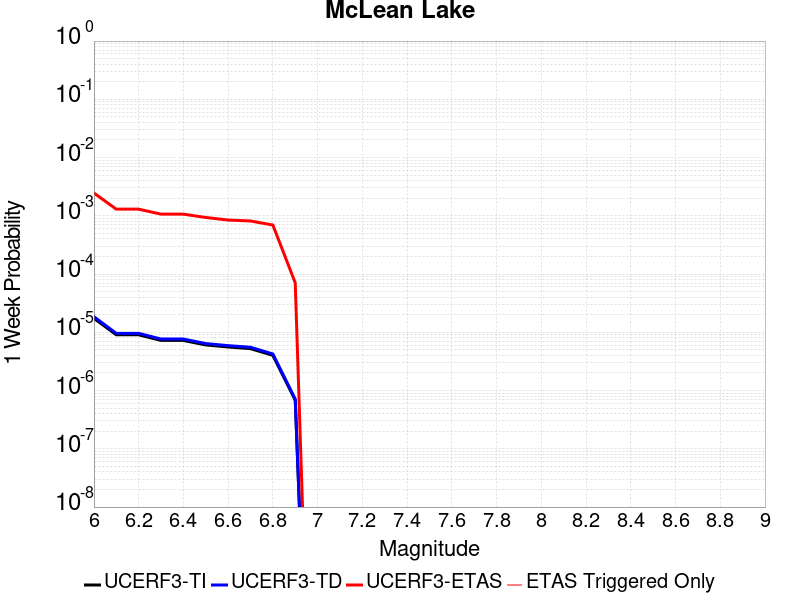 |  | 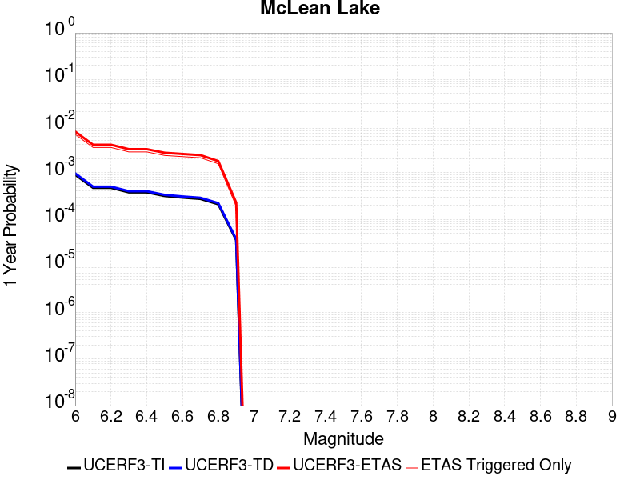 |  |

| Magnitude | 1 wk TI Prob | 1 wk TD Prob | 1 wk ETAS Prob | 1 wk ETAS/TD Gain | 1 wk ETAS Triggered Only | 1 mo TI Prob | 1 mo TD Prob | 1 mo ETAS Prob | 1 mo ETAS/TD Gain | 1 mo ETAS Triggered Only | 1 yr TI Prob | 1 yr TD Prob | 1 yr ETAS Prob | 1 yr ETAS/TD Gain | 1 yr ETAS Triggered Only | 10 yr TI Prob | 10 yr TD Prob | 10 yr ETAS Prob | 10 yr ETAS/TD Gain | 10 yr ETAS Triggered Only |
|-----|-----|-----|-----|-----|-----|-----|-----|-----|-----|-----|-----|-----|-----|-----|-----|-----|-----|-----|-----|-----|
| 6.0 | 1.7360222E-5 | 1.8501627E-5 | 0.002491718 | 134.67561 | 0.0024732621 | 7.439883E-5 | 7.9290556E-5 | 0.0036217903 | 45.677452 | 0.0035427806 | 9.0542925E-4 | 9.6498354E-4 | 0.0075094644 | 7.781961 | 0.006550802 | 0.009017491 | 0.0096127745 | 0.019768216 | 2.0564528 | 0.010254011 |
| 6.1 | 9.062689E-6 | 9.592193E-6 | 0.0013464778 | 140.37225 | 0.0013368984 | 3.8839516E-5 | 4.1108804E-5 | 0.0018859528 | 45.8771 | 0.0018449198 | 4.727685E-4 | 5.003936E-4 | 0.003921141 | 7.836113 | 0.0034224598 | 0.0047176396 | 0.004993552 | 0.010380953 | 2.0788717 | 0.0054144384 |
| 6.2 | 9.062689E-6 | 9.592193E-6 | 0.0013464778 | 140.37225 | 0.0013368984 | 3.8839516E-5 | 4.1108804E-5 | 0.0018859528 | 45.8771 | 0.0018449198 | 4.727685E-4 | 5.003936E-4 | 0.003921141 | 7.836113 | 0.0034224598 | 0.0047176396 | 0.004993552 | 0.010380953 | 2.0788717 | 0.0054144384 |
| 6.3 | 7.2575485E-6 | 7.66771E-6 | 0.0010905471 | 142.22594 | 0.0010828878 | 3.110341E-5 | 3.2861237E-5 | 0.0015301382 | 46.56362 | 0.0014973262 | 3.786182E-4 | 4.0001926E-4 | 0.0031930192 | 7.982164 | 0.0027941177 | 0.0037797375 | 0.0039936965 | 0.00833458 | 2.0869336 | 0.004358289 |
| 6.4 | 7.2575485E-6 | 7.66771E-6 | 0.0010905471 | 142.22594 | 0.0010828878 | 3.110341E-5 | 3.2861237E-5 | 0.0015301382 | 46.56362 | 0.0014973262 | 3.786182E-4 | 4.0001926E-4 | 0.0031930192 | 7.982164 | 0.0027941177 | 0.0037797375 | 0.0039936965 | 0.00833458 | 2.0869336 | 0.004358289 |
| 6.5 | 6.06582E-6 | 6.4038773E-6 | 9.288579E-4 | 145.04617 | 9.224599E-4 | 2.5996113E-5 | 2.7444936E-5 | 0.0013242008 | 48.249367 | 0.0012967915 | 3.164567E-4 | 3.3409733E-4 | 0.002726346 | 8.160335 | 0.002393048 | 0.0031600643 | 0.0033365893 | 0.0069474955 | 2.0822148 | 0.0036229948 |
| 6.6 | 5.598744E-6 | 5.910262E-6 | 8.347824E-4 | 141.24286 | 8.2887703E-4 | 2.3994397E-5 | 2.5329486E-5 | 0.0012285076 | 48.501087 | 0.0012032086 | 2.9209262E-4 | 3.0834923E-4 | 0.0025803756 | 8.368355 | 0.0022727272 | 0.0029170897 | 0.003079843 | 0.006491762 | 2.1078224 | 0.0034224598 |
| 6.7 | 5.246996E-6 | 5.539162E-6 | 7.943048E-4 | 143.39801 | 7.8877003E-4 | 2.2486933E-5 | 2.3739085E-5 | 0.0011734444 | 49.4309 | 0.0011497326 | 2.73744E-4 | 2.8899137E-4 | 0.002454141 | 8.49209 | 0.0021657755 | 0.0027340704 | 0.0028867796 | 0.0061260643 | 2.1221101 | 0.0032486632 |
| 6.8 | 4.02324E-6 | 4.2469046E-6 | 6.7269325E-4 | 158.39613 | 6.684492E-4 | 1.7242342E-5 | 1.8200926E-5 | 9.673815E-4 | 53.150127 | 9.4919786E-4 | 2.099053E-4 | 2.2157968E-4 | 0.0017987703 | 8.117938 | 0.0015775401 | 0.0020970714 | 0.002214172 | 0.004548564 | 2.0542958 | 0.0023395722 |
| 6.9 | 6.835972E-7 | 7.1399285E-7 | 5.418989E-5 | 75.896965 | 5.3475935E-5 | 2.9296991E-6 | 3.0599674E-6 | 8.3273626E-5 | 27.213892 | 8.0213904E-5 | 3.56685E-5 | 3.7254784E-5 | 2.3778208E-4 | 6.3825912 | 2.0053476E-4 | 3.5662777E-4 | 3.7251666E-4 | 6.6652475E-4 | 1.7892481 | 2.9411764E-4 |

## So Sierra Nevada
*[(top)](#table-of-contents)*

| 1 Week | 1 Month | 1 Year | 10 Year |
|-----|-----|-----|-----|
| 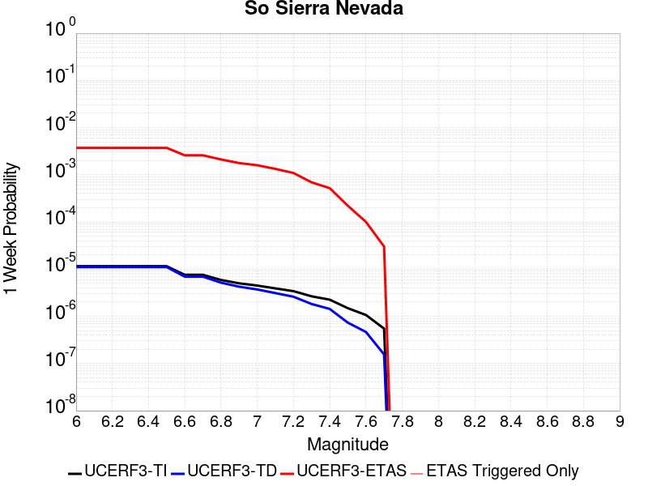 |  |  | 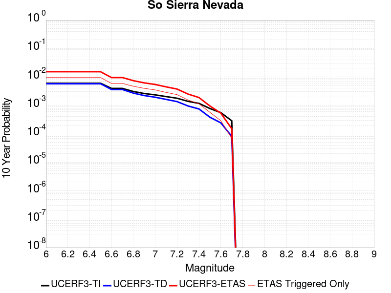 |

| Magnitude | 1 wk TI Prob | 1 wk TD Prob | 1 wk ETAS Prob | 1 wk ETAS/TD Gain | 1 wk ETAS Triggered Only | 1 mo TI Prob | 1 mo TD Prob | 1 mo ETAS Prob | 1 mo ETAS/TD Gain | 1 mo ETAS Triggered Only | 1 yr TI Prob | 1 yr TD Prob | 1 yr ETAS Prob | 1 yr ETAS/TD Gain | 1 yr ETAS Triggered Only | 10 yr TI Prob | 10 yr TD Prob | 10 yr ETAS Prob | 10 yr ETAS/TD Gain | 10 yr ETAS Triggered Only |
|-----|-----|-----|-----|-----|-----|-----|-----|-----|-----|-----|-----|-----|-----|-----|-----|-----|-----|-----|-----|-----|
| 6.0 | 1.15488665E-5 | 1.1079643E-5 | 0.0037543536 | 338.85153 | 0.0037433156 | 4.9494203E-5 | 4.748339E-5 | 0.005127456 | 107.98421 | 0.005080214 | 6.024253E-4 | 5.7796965E-4 | 0.007873216 | 13.622196 | 0.007299465 | 0.006007948 | 0.005765934 | 0.01546902 | 2.6828299 | 0.009759358 |
| 6.1 | 1.15488665E-5 | 1.1079643E-5 | 0.0037543536 | 338.85153 | 0.0037433156 | 4.9494203E-5 | 4.748339E-5 | 0.005127456 | 107.98421 | 0.005080214 | 6.024253E-4 | 5.7796965E-4 | 0.007873216 | 13.622196 | 0.007299465 | 0.006007948 | 0.005765934 | 0.01546902 | 2.6828299 | 0.009759358 |
| 6.2 | 1.15488665E-5 | 1.1079643E-5 | 0.0037543536 | 338.85153 | 0.0037433156 | 4.9494203E-5 | 4.748339E-5 | 0.005127456 | 107.98421 | 0.005080214 | 6.024253E-4 | 5.7796965E-4 | 0.007873216 | 13.622196 | 0.007299465 | 0.006007948 | 0.005765934 | 0.01546902 | 2.6828299 | 0.009759358 |
| 6.3 | 1.15488665E-5 | 1.1079643E-5 | 0.0037543536 | 338.85153 | 0.0037433156 | 4.9494203E-5 | 4.748339E-5 | 0.005127456 | 107.98421 | 0.005080214 | 6.024253E-4 | 5.7796965E-4 | 0.007873216 | 13.622196 | 0.007299465 | 0.006007948 | 0.005765934 | 0.01546902 | 2.6828299 | 0.009759358 |
| 6.4 | 1.15488665E-5 | 1.1079643E-5 | 0.0037543536 | 338.85153 | 0.0037433156 | 4.9494203E-5 | 4.748339E-5 | 0.005127456 | 107.98421 | 0.005080214 | 6.024253E-4 | 5.7796965E-4 | 0.007873216 | 13.622196 | 0.007299465 | 0.006007948 | 0.005765934 | 0.01546902 | 2.6828299 | 0.009759358 |
| 6.5 | 1.15488665E-5 | 1.1079643E-5 | 0.0037543536 | 338.85153 | 0.0037433156 | 4.9494203E-5 | 4.748339E-5 | 0.005127456 | 107.98421 | 0.005080214 | 6.024253E-4 | 5.7796965E-4 | 0.007873216 | 13.622196 | 0.007299465 | 0.006007948 | 0.005765934 | 0.01546902 | 2.6828299 | 0.009759358 |
| 6.6 | 7.587044E-6 | 6.935635E-6 | 0.0027208205 | 392.2958 | 0.0027139038 | 3.2515498E-5 | 2.9723828E-5 | 0.0035723993 | 120.18638 | 0.0035427806 | 3.9580427E-4 | 3.6183043E-4 | 0.00506601 | 14.001061 | 0.004705882 | 0.003951 | 0.0036127048 | 0.009700258 | 2.6850405 | 0.0061096256 |
| 6.7 | 7.587044E-6 | 6.935635E-6 | 0.0027208205 | 392.2958 | 0.0027139038 | 3.2515498E-5 | 2.9723828E-5 | 0.0035723993 | 120.18638 | 0.0035427806 | 3.9580427E-4 | 3.6183043E-4 | 0.00506601 | 14.001061 | 0.004705882 | 0.003951 | 0.0036127048 | 0.009700258 | 2.6850405 | 0.0061096256 |
| 6.8 | 5.9026956E-6 | 5.1793927E-6 | 0.002251157 | 434.63727 | 0.0022459894 | 2.5297022E-5 | 2.2197215E-5 | 0.0029766771 | 134.10138 | 0.0029545454 | 3.0794772E-4 | 2.7021873E-4 | 0.0040125228 | 14.849165 | 0.0037433156 | 0.0030752132 | 0.002699018 | 0.0075788596 | 2.8080063 | 0.004893048 |
| 6.9 | 5.0118915E-6 | 4.2524252E-6 | 0.001916009 | 450.5685 | 0.0019117647 | 2.1479358E-5 | 1.8224557E-5 | 0.0025850227 | 141.84283 | 0.002566845 | 2.614798E-4 | 2.2186211E-4 | 0.0034163403 | 15.398485 | 0.003195187 | 0.0026117235 | 0.0022164788 | 0.0063783564 | 2.877698 | 0.004171123 |
| 7.0 | 4.4924795E-6 | 3.7139177E-6 | 0.0017149375 | 461.7597 | 0.0017112299 | 1.925334E-5 | 1.5916696E-5 | 0.0022618703 | 142.10677 | 0.0022459894 | 2.3438422E-4 | 1.9376918E-4 | 0.0029873454 | 15.41703 | 0.0027941177 | 0.0023413717 | 0.0019360651 | 0.0055920747 | 2.8883712 | 0.0036631017 |
| 7.1 | 3.9118436E-6 | 3.1119775E-6 | 0.0014603267 | 469.26004 | 0.0014572192 | 1.6764936E-5 | 1.3336982E-5 | 0.001871601 | 140.33167 | 0.0018582888 | 2.0409399E-4 | 1.6236622E-4 | 0.0024213577 | 14.91294 | 0.0022593583 | 0.0020390663 | 0.001622532 | 0.0046123257 | 2.8426714 | 0.0029946524 |
| 7.2 | 3.4200818E-6 | 2.6054543E-6 | 0.0012191798 | 467.9337 | 0.0012165775 | 1.4657411E-5 | 1.11661875E-5 | 0.0015753198 | 141.07947 | 0.0015641712 | 1.7843937E-4 | 1.3594035E-4 | 0.0020474452 | 15.061349 | 0.0019117647 | 0.0017829615 | 0.0013586218 | 0.0038819269 | 2.8572536 | 0.002526738 |
| 7.3 | 2.6593618E-6 | 1.8284203E-6 | 7.772281E-4 | 425.08176 | 7.754011E-4 | 1.13972155E-5 | 7.836065E-6 | 9.971331E-4 | 127.249214 | 9.893049E-4 | 1.3875226E-4 | 9.540021E-5 | 0.0013118617 | 13.751141 | 0.0012165775 | 0.0013866565 | 9.5362146E-4 | 0.002583082 | 2.708708 | 0.001631016 |
| 7.4 | 2.2577992E-6 | 1.436438E-6 | 6.0303987E-4 | 419.81613 | 6.016043E-4 | 9.676246E-6 | 6.15615E-6 | 7.4144575E-4 | 120.43985 | 7.3529413E-4 | 1.1780193E-4 | 7.49488E-5 | 9.706036E-4 | 12.950222 | 8.957219E-4 | 0.001177395 | 7.492603E-4 | 0.0019382084 | 2.5868292 | 0.0011898396 |
| 7.5 | 1.489319E-6 | 7.353936E-7 | 2.4137693E-4 | 328.2282 | 2.406417E-4 | 6.3827797E-6 | 3.1516831E-6 | 3.2400628E-4 | 102.80421 | 3.2085562E-4 | 7.770758E-5 | 3.8371072E-5 | 4.5279367E-4 | 11.800392 | 4.1443852E-4 | 7.7680405E-4 | 3.836449E-4 | 9.716545E-4 | 2.5326924 | 5.8823527E-4 |
| 7.6 | 1.0680322E-6 | 4.6596554E-7 | 1.2078677E-4 | 259.21823 | 1.2032085E-4 | 4.577273E-6 | 1.9969937E-6 | 1.6242448E-4 | 81.3345 | 1.6042781E-4 | 5.5726876E-5 | 2.4313129E-5 | 2.2484301E-4 | 9.247803 | 2.0053476E-4 | 5.5712904E-4 | 2.4310495E-4 | 5.638826E-4 | 2.3195026 | 3.2085562E-4 |
| 7.7 | 5.509146E-7 | 1.5580486E-7 | 2.689377E-5 | 172.61188 | 2.6737967E-5 | 2.3610605E-6 | 6.677349E-7 | 2.7405686E-5 | 41.04276 | 2.6737967E-5 | 2.8745531E-5 | 8.129644E-6 | 4.823627E-5 | 5.9333806 | 4.0106952E-5 | 2.8741814E-4 | 8.1293576E-5 | 1.4813307E-4 | 1.8221989 | 6.684492E-5 |

## Goldstone Lake
*[(top)](#table-of-contents)*

| 1 Week | 1 Month | 1 Year | 10 Year |
|-----|-----|-----|-----|
|  |  |  | 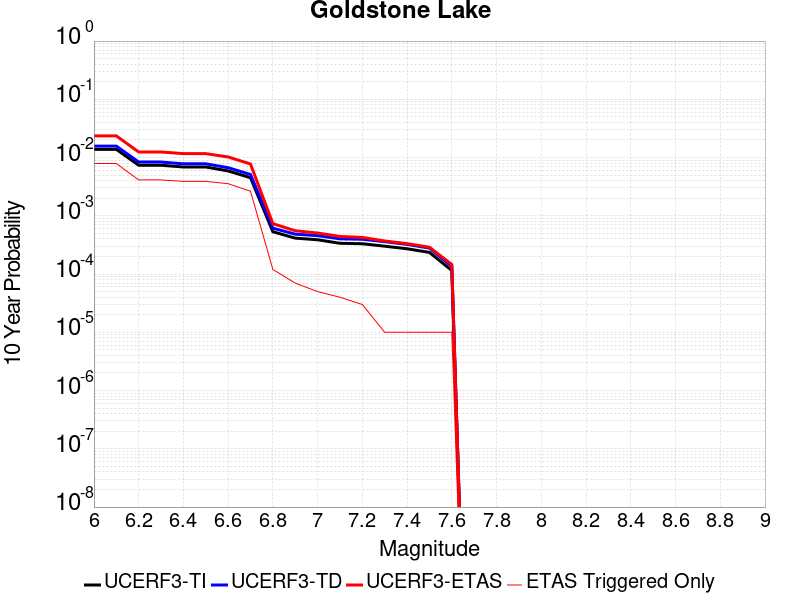 |

| Magnitude | 1 wk TI Prob | 1 wk TD Prob | 1 wk ETAS Prob | 1 wk ETAS/TD Gain | 1 wk ETAS Triggered Only | 1 mo TI Prob | 1 mo TD Prob | 1 mo ETAS Prob | 1 mo ETAS/TD Gain | 1 mo ETAS Triggered Only | 1 yr TI Prob | 1 yr TD Prob | 1 yr ETAS Prob | 1 yr ETAS/TD Gain | 1 yr ETAS Triggered Only | 10 yr TI Prob | 10 yr TD Prob | 10 yr ETAS Prob | 10 yr ETAS/TD Gain | 10 yr ETAS Triggered Only |
|-----|-----|-----|-----|-----|-----|-----|-----|-----|-----|-----|-----|-----|-----|-----|-----|-----|-----|-----|-----|-----|
| 6.0 | 2.671352E-5 | 3.037609E-5 | 0.0017682912 | 58.21326 | 0.001737968 | 1.1448149E-4 | 1.3017785E-4 | 0.002616485 | 20.099312 | 0.002486631 | 0.001392921 | 0.0015839594 | 0.0064425617 | 4.067378 | 0.00486631 | 0.013842222 | 0.015746197 | 0.023430744 | 1.4880257 | 0.0078074867 |
| 6.1 | 2.671352E-5 | 3.037609E-5 | 0.0017682912 | 58.21326 | 0.001737968 | 1.1448149E-4 | 1.3017785E-4 | 0.002616485 | 20.099312 | 0.002486631 | 0.001392921 | 0.0015839594 | 0.0064425617 | 4.067378 | 0.00486631 | 0.013842222 | 0.015746197 | 0.023430744 | 1.4880257 | 0.0078074867 |
| 6.2 | 1.4197047E-5 | 1.6096245E-5 | 9.652788E-4 | 59.969196 | 9.4919786E-4 | 6.0843064E-5 | 6.8982634E-5 | 0.0014057888 | 20.37888 | 0.0013368984 | 7.4051257E-4 | 8.3963864E-4 | 0.0034577593 | 4.1181517 | 0.0026203208 | 0.007380498 | 0.0083743585 | 0.0124575235 | 1.4875793 | 0.004117647 |
| 6.3 | 1.4197047E-5 | 1.6096245E-5 | 9.652788E-4 | 59.969196 | 9.4919786E-4 | 6.0843064E-5 | 6.8982634E-5 | 0.0014057888 | 20.37888 | 0.0013368984 | 7.4051257E-4 | 8.3963864E-4 | 0.0034577593 | 4.1181517 | 0.0026203208 | 0.007380498 | 0.0083743585 | 0.0124575235 | 1.4875793 | 0.004117647 |
| 6.4 | 1.3238931E-5 | 1.500846E-5 | 8.706106E-4 | 58.00799 | 8.5561496E-4 | 5.6737044E-5 | 6.4320935E-5 | 0.0012674521 | 19.705126 | 0.0012032086 | 6.9055456E-4 | 7.82924E-4 | 0.0032275326 | 4.1224084 | 0.002446524 | 0.006884126 | 0.0078112837 | 0.011631476 | 1.4890608 | 0.0038502673 |
| 6.5 | 1.3238931E-5 | 1.500846E-5 | 8.706106E-4 | 58.00799 | 8.5561496E-4 | 5.6737044E-5 | 6.4320935E-5 | 0.0012674521 | 19.705126 | 0.0012032086 | 6.9055456E-4 | 7.82924E-4 | 0.0032275326 | 4.1224084 | 0.002446524 | 0.006884126 | 0.0078112837 | 0.011631476 | 1.4890608 | 0.0038502673 |
| 6.6 | 1.1328278E-5 | 1.2855166E-5 | 7.6150865E-4 | 59.23756 | 7.486631E-4 | 4.8548856E-5 | 5.5092944E-5 | 0.001137921 | 20.65457 | 0.0010828878 | 5.90922E-4 | 6.7064585E-4 | 0.0029017688 | 4.3268275 | 0.0022326203 | 0.0058935313 | 0.0066956086 | 0.010148271 | 1.5156608 | 0.003475936 |
| 6.7 | 8.651175E-6 | 9.824565E-6 | 5.579475E-4 | 56.79107 | 5.4812833E-4 | 3.707594E-5 | 4.2105108E-5 | 8.3084195E-4 | 19.732569 | 7.8877003E-4 | 4.5130608E-4 | 5.1259965E-4 | 0.002182866 | 4.258423 | 0.001671123 | 0.0045039062 | 0.005123051 | 0.0076767458 | 1.4984715 | 0.002566845 |
| 6.8 | 1.0215377E-6 | 1.1754702E-6 | 4.1282376E-5 | 35.11988 | 4.0106952E-5 | 4.378012E-6 | 5.0377203E-6 | 4.514447E-5 | 8.961289 | 4.0106952E-5 | 5.3300988E-5 | 6.1332634E-5 | 1.6827794E-4 | 2.7436934 | 1.0695187E-4 | 5.3288206E-4 | 6.1316835E-4 | 7.467762E-4 | 1.2178975 | 1.3368984E-4 |
| 6.9 | 7.9360774E-7 | 9.2833966E-7 | 2.7666283E-5 | 29.801897 | 2.6737967E-5 | 3.4011714E-6 | 3.9785928E-6 | 3.0716456E-5 | 7.720432 | 2.6737967E-5 | 4.1408475E-5 | 4.843836E-5 | 1.1528005E-4 | 2.3799326 | 6.684492E-5 | 4.140076E-4 | 4.8428503E-4 | 5.644601E-4 | 1.1655535 | 8.0213904E-5 |
| 7.0 | 7.4382757E-7 | 8.7473285E-7 | 1.4243705E-5 | 16.283491 | 1.3368984E-5 | 3.1878285E-6 | 3.74885E-6 | 1.7117783E-5 | 4.5661426 | 1.3368984E-5 | 3.8811122E-5 | 4.564136E-5 | 8.5746484E-5 | 1.8787012 | 4.0106952E-5 | 3.8804344E-4 | 4.5632652E-4 | 5.0977804E-4 | 1.1171345 | 5.3475935E-5 |
| 7.1 | 6.4709513E-7 | 7.7113E-7 | 7.7113E-7 | 1.0 | 0.0 | 2.773262E-6 | 3.3048389E-6 | 3.3048389E-6 | 1.0 | 0.0 | 3.376394E-5 | 4.0235733E-5 | 6.697262E-5 | 1.6645062 | 2.6737967E-5 | 3.375881E-4 | 4.0229043E-4 | 4.4238125E-4 | 1.0996565 | 4.0106952E-5 |
| 7.2 | 6.356704E-7 | 7.5883594E-7 | 7.5883594E-7 | 1.0 | 0.0 | 2.7242988E-6 | 3.2521505E-6 | 3.2521505E-6 | 1.0 | 0.0 | 3.3167835E-5 | 3.959427E-5 | 5.2962725E-5 | 1.3376361 | 1.3368984E-5 | 3.3162883E-4 | 3.958781E-4 | 4.226055E-4 | 1.0675142 | 2.6737967E-5 |
| 7.3 | 5.7695723E-7 | 6.8965653E-7 | 6.8965653E-7 | 1.0 | 0.0 | 2.4726714E-6 | 2.9556677E-6 | 2.9556677E-6 | 1.0 | 0.0 | 3.0104358E-5 | 3.5984718E-5 | 3.5984718E-5 | 1.0 | 0.0 | 3.0100282E-4 | 3.5979465E-4 | 3.7315884E-4 | 1.037144 | 1.3368984E-5 |
| 7.4 | 5.209647E-7 | 6.193514E-7 | 6.193514E-7 | 1.0 | 0.0 | 2.232704E-6 | 2.6543607E-6 | 2.6543607E-6 | 1.0 | 0.0 | 2.718283E-5 | 3.2316417E-5 | 3.2316417E-5 | 1.0 | 0.0 | 2.7179506E-4 | 3.2312275E-4 | 3.364874E-4 | 1.041361 | 1.3368984E-5 |
| 7.5 | 4.512955E-7 | 5.348885E-7 | 5.348885E-7 | 1.0 | 0.0 | 1.934122E-6 | 2.2923775E-6 | 2.2923775E-6 | 1.0 | 0.0 | 2.3547682E-5 | 2.7909393E-5 | 2.7909393E-5 | 1.0 | 0.0 | 2.3545188E-4 | 2.7906417E-4 | 2.9242944E-4 | 1.0478932 | 1.3368984E-5 |
| 7.6 | 2.21172E-7 | 2.603961E-7 | 2.603961E-7 | 1.0 | 0.0 | 9.478797E-7 | 1.1159829E-6 | 1.1159829E-6 | 1.0 | 0.0 | 1.1540374E-5 | 1.3587036E-5 | 1.3587036E-5 | 1.0 | 0.0 | 1.1539775E-4 | 1.3586486E-4 | 1.4923203E-4 | 1.0983858 | 1.3368984E-5 |

## Gravel Hills-Harper Lk
*[(top)](#table-of-contents)*

| 1 Week | 1 Month | 1 Year | 10 Year |
|-----|-----|-----|-----|
|  |  |  |  |

| Magnitude | 1 wk TI Prob | 1 wk TD Prob | 1 wk ETAS Prob | 1 wk ETAS/TD Gain | 1 wk ETAS Triggered Only | 1 mo TI Prob | 1 mo TD Prob | 1 mo ETAS Prob | 1 mo ETAS/TD Gain | 1 mo ETAS Triggered Only | 1 yr TI Prob | 1 yr TD Prob | 1 yr ETAS Prob | 1 yr ETAS/TD Gain | 1 yr ETAS Triggered Only | 10 yr TI Prob | 10 yr TD Prob | 10 yr ETAS Prob | 10 yr ETAS/TD Gain | 10 yr ETAS Triggered Only |
|-----|-----|-----|-----|-----|-----|-----|-----|-----|-----|-----|-----|-----|-----|-----|-----|-----|-----|-----|-----|-----|
| 6.0 | 3.0679566E-5 | 3.1464646E-5 | 0.0022506462 | 71.529366 | 0.0022192514 | 1.3147724E-4 | 1.3484273E-4 | 0.0033429663 | 24.791594 | 0.0032085562 | 0.0015995599 | 0.0016406906 | 0.0070062047 | 4.2702775 | 0.0053743315 | 0.015880952 | 0.01630734 | 0.023987506 | 1.4709638 | 0.0078074867 |
| 6.1 | 3.0679566E-5 | 3.1464646E-5 | 0.0022506462 | 71.529366 | 0.0022192514 | 1.3147724E-4 | 1.3484273E-4 | 0.0033429663 | 24.791594 | 0.0032085562 | 0.0015995599 | 0.0016406906 | 0.0070062047 | 4.2702775 | 0.0053743315 | 0.015880952 | 0.01630734 | 0.023987506 | 1.4709638 | 0.0078074867 |
| 6.2 | 1.514536E-5 | 1.3635206E-5 | 5.483873E-4 | 40.21848 | 5.3475937E-4 | 6.490707E-5 | 5.843536E-5 | 9.140003E-4 | 15.641221 | 8.5561496E-4 | 7.8995706E-4 | 7.1123015E-4 | 0.0021807724 | 3.066198 | 0.0014705883 | 0.007871548 | 0.0070907404 | 0.009413724 | 1.327608 | 0.0023395722 |
| 6.3 | 1.514536E-5 | 1.3635206E-5 | 5.483873E-4 | 40.21848 | 5.3475937E-4 | 6.490707E-5 | 5.843536E-5 | 9.140003E-4 | 15.641221 | 8.5561496E-4 | 7.8995706E-4 | 7.1123015E-4 | 0.0021807724 | 3.066198 | 0.0014705883 | 0.007871548 | 0.0070907404 | 0.009413724 | 1.327608 | 0.0023395722 |
| 6.4 | 1.2532521E-5 | 1.06896905E-5 | 3.983861E-4 | 37.26825 | 3.8770054E-4 | 5.37097E-5 | 4.581219E-5 | 6.3402054E-4 | 13.83956 | 5.8823527E-4 | 6.537194E-4 | 5.576265E-4 | 0.0015864642 | 2.8450303 | 0.0010294118 | 0.0065179965 | 0.005562863 | 0.007211395 | 1.296346 | 0.0016577541 |
| 6.5 | 1.1094058E-5 | 9.083664E-6 | 2.7646092E-4 | 30.434958 | 2.6737968E-4 | 4.7545094E-5 | 3.892943E-5 | 4.2661486E-4 | 10.9586735 | 3.8770054E-4 | 5.787078E-4 | 4.7386673E-4 | 0.0011419991 | 2.4099586 | 6.684492E-4 | 0.0057720304 | 0.0047289706 | 0.005820043 | 1.230721 | 0.0010962567 |
| 6.6 | 9.688328E-6 | 7.5316952E-6 | 1.9469605E-4 | 25.850231 | 1.8716577E-4 | 4.1520743E-5 | 3.227831E-5 | 2.8628082E-4 | 8.869139 | 2.540107E-4 | 5.053978E-4 | 3.9292008E-4 | 7.93832E-4 | 2.0203397 | 4.0106953E-4 | 0.0050424994 | 0.0039225104 | 0.0046416037 | 1.1833248 | 7.219251E-4 |
| 6.7 | 8.974824E-6 | 6.749413E-6 | 1.1370056E-4 | 16.845993 | 1.0695187E-4 | 3.8462964E-5 | 2.8925748E-5 | 1.8934891E-4 | 6.5460334 | 1.6042781E-4 | 4.6818596E-4 | 3.5211627E-4 | 5.659447E-4 | 1.6072665 | 2.1390374E-4 | 0.004672008 | 0.0035158044 | 0.0039820736 | 1.1326209 | 4.6791445E-4 |
| 6.8 | 7.4780046E-6 | 5.1161933E-6 | 3.1854026E-5 | 6.226118 | 2.6737967E-5 | 3.20482E-5 | 2.1926366E-5 | 8.876982E-5 | 4.0485425 | 6.684492E-5 | 3.9011694E-4 | 2.669222E-4 | 3.738455E-4 | 1.4005786 | 1.0695187E-4 | 0.0038943281 | 0.0026661542 | 0.0028928209 | 1.0850164 | 2.2727273E-4 |
| 6.9 | 6.3409307E-6 | 3.9074966E-6 | 3.064536E-5 | 7.842709 | 2.6737967E-5 | 2.7175134E-5 | 1.6746313E-5 | 5.6852594E-5 | 3.394932 | 4.0106952E-5 | 3.3080703E-4 | 2.0386827E-4 | 2.7069956E-4 | 1.327816 | 6.684492E-5 | 0.0033031502 | 0.0020369107 | 0.0021703283 | 1.0654999 | 1.3368984E-4 |
| 7.0 | 5.1239335E-6 | 2.6058565E-6 | 2.9343755E-5 | 11.2606945 | 2.6737967E-5 | 2.195953E-5 | 1.116791E-5 | 5.1274415E-5 | 4.5912275 | 4.0106952E-5 | 2.6732447E-4 | 1.3596108E-4 | 1.8942975E-4 | 1.3932645 | 5.3475935E-5 | 0.0026700313 | 0.0013588042 | 0.00145226 | 1.0687779 | 9.358289E-5 |
| 7.1 | 4.438899E-6 | 2.0984728E-6 | 2.8836384E-5 | 13.741606 | 2.6737967E-5 | 1.9023713E-5 | 8.993425E-6 | 4.9100017E-5 | 5.459546 | 4.0106952E-5 | 2.315891E-4 | 1.0948967E-4 | 1.6295975E-4 | 1.4883573 | 5.3475935E-5 | 0.002313479 | 0.0010943791 | 0.0011745052 | 1.0732161 | 8.0213904E-5 |
| 7.2 | 3.50367E-6 | 1.2615716E-6 | 1.4630538E-5 | 11.597074 | 1.3368984E-5 | 1.5015643E-5 | 5.4067245E-6 | 3.2144548E-5 | 5.94529 | 2.6737967E-5 | 1.8280011E-4 | 6.582497E-5 | 9.2561175E-5 | 1.4061712 | 2.6737967E-5 | 0.0018264982 | 6.580629E-4 | 7.115037E-4 | 1.0812092 | 5.3475935E-5 |
| 7.3 | 2.561638E-6 | 7.1191585E-7 | 7.1191585E-7 | 1.0 | 0.0 | 1.0978401E-5 | 3.0510646E-6 | 3.0510646E-6 | 1.0 | 0.0 | 1.3365384E-4 | 3.71461E-5 | 3.71461E-5 | 1.0 | 0.0 | 0.0013357349 | 3.7140088E-4 | 3.847649E-4 | 1.0359827 | 1.3368984E-5 |
| 7.4 | 2.0368864E-6 | 5.304837E-7 | 5.304837E-7 | 1.0 | 0.0 | 8.729483E-6 | 2.2734996E-6 | 2.2734996E-6 | 1.0 | 0.0 | 1.06276275E-4 | 2.7679513E-5 | 2.7679513E-5 | 1.0 | 0.0 | 0.0010622547 | 2.767612E-4 | 2.767612E-4 | 1.0 | 0.0 |
| 7.5 | 1.1681728E-6 | 3.6030585E-7 | 3.6030585E-7 | 1.0 | 0.0 | 5.0064455E-6 | 1.544167E-6 | 1.544167E-6 | 1.0 | 0.0 | 6.0951766E-5 | 1.8800076E-5 | 1.8800076E-5 | 1.0 | 0.0 | 6.093505E-4 | 1.8798532E-4 | 1.8798532E-4 | 1.0 | 0.0 |
| 7.6 | 1.3154387E-7 | 7.1197384E-8 | 7.1197384E-8 | 1.0 | 0.0 | 5.6375933E-7 | 3.051316E-7 | 3.051316E-7 | 1.0 | 0.0 | 6.863748E-6 | 3.7149728E-6 | 3.7149728E-6 | 1.0 | 0.0 | 6.863536E-5 | 3.7149264E-5 | 3.7149264E-5 | 1.0 | 0.0 |

## San Andreas (Mojave N)
*[(top)](#table-of-contents)*

| 1 Week | 1 Month | 1 Year | 10 Year |
|-----|-----|-----|-----|
|  |  |  |  |

| Magnitude | 1 wk TI Prob | 1 wk TD Prob | 1 wk ETAS Prob | 1 wk ETAS/TD Gain | 1 wk ETAS Triggered Only | 1 mo TI Prob | 1 mo TD Prob | 1 mo ETAS Prob | 1 mo ETAS/TD Gain | 1 mo ETAS Triggered Only | 1 yr TI Prob | 1 yr TD Prob | 1 yr ETAS Prob | 1 yr ETAS/TD Gain | 1 yr ETAS Triggered Only | 10 yr TI Prob | 10 yr TD Prob | 10 yr ETAS Prob | 10 yr ETAS/TD Gain | 10 yr ETAS Triggered Only |
|-----|-----|-----|-----|-----|-----|-----|-----|-----|-----|-----|-----|-----|-----|-----|-----|-----|-----|-----|-----|-----|
| 6.0 | 9.877682E-5 | 1.9400702E-4 | 0.0032281775 | 16.639488 | 0.0030347593 | 4.2326056E-4 | 8.311939E-4 | 0.0045046085 | 5.4194436 | 0.0036764706 | 0.0051410277 | 0.010072956 | 0.014996123 | 1.4887509 | 0.004973262 | 0.05023708 | 0.09831428 | 0.10389557 | 1.0567698 | 0.0061898394 |
| 6.1 | 9.877682E-5 | 1.9400702E-4 | 0.0032281775 | 16.639488 | 0.0030347593 | 4.2326056E-4 | 8.311939E-4 | 0.0045046085 | 5.4194436 | 0.0036764706 | 0.0051410277 | 0.010072956 | 0.014996123 | 1.4887509 | 0.004973262 | 0.05023708 | 0.09831428 | 0.10389557 | 1.0567698 | 0.0061898394 |
| 6.2 | 9.877682E-5 | 1.9400702E-4 | 0.0032281775 | 16.639488 | 0.0030347593 | 4.2326056E-4 | 8.311939E-4 | 0.0045046085 | 5.4194436 | 0.0036764706 | 0.0051410277 | 0.010072956 | 0.014996123 | 1.4887509 | 0.004973262 | 0.05023708 | 0.09831428 | 0.10389557 | 1.0567698 | 0.0061898394 |
| 6.3 | 9.877682E-5 | 1.9400702E-4 | 0.0032281775 | 16.639488 | 0.0030347593 | 4.2326056E-4 | 8.311939E-4 | 0.0045046085 | 5.4194436 | 0.0036764706 | 0.0051410277 | 0.010072956 | 0.014996123 | 1.4887509 | 0.004973262 | 0.05023708 | 0.09831428 | 0.10389557 | 1.0567698 | 0.0061898394 |
| 6.4 | 9.877682E-5 | 1.9400702E-4 | 0.0032281775 | 16.639488 | 0.0030347593 | 4.2326056E-4 | 8.311939E-4 | 0.0045046085 | 5.4194436 | 0.0036764706 | 0.0051410277 | 0.010072956 | 0.014996123 | 1.4887509 | 0.004973262 | 0.05023708 | 0.09831428 | 0.10389557 | 1.0567698 | 0.0061898394 |
| 6.5 | 9.861474E-5 | 1.9374468E-4 | 0.003227916 | 16.66067 | 0.0030347593 | 4.2256617E-4 | 8.300703E-4 | 0.004503489 | 5.425431 | 0.0036764706 | 0.0051326132 | 0.010059402 | 0.014982637 | 1.4894161 | 0.004973262 | 0.050156746 | 0.098192066 | 0.103774115 | 1.0568483 | 0.0061898394 |
| 6.6 | 9.861474E-5 | 1.9374468E-4 | 0.003227916 | 16.66067 | 0.0030347593 | 4.2256617E-4 | 8.300703E-4 | 0.004503489 | 5.425431 | 0.0036764706 | 0.0051326132 | 0.010059402 | 0.014982637 | 1.4894161 | 0.004973262 | 0.050156746 | 0.098192066 | 0.103774115 | 1.0568483 | 0.0061898394 |
| 6.7 | 9.8552715E-5 | 1.9364421E-4 | 0.003227816 | 16.668797 | 0.0030347593 | 4.223004E-4 | 8.2964E-4 | 0.0045030606 | 5.427728 | 0.0036764706 | 0.0051293927 | 0.010054212 | 0.014977472 | 1.4896713 | 0.004973262 | 0.050125998 | 0.098145254 | 0.103727594 | 1.0568783 | 0.0061898394 |
| 6.8 | 9.8464974E-5 | 1.9349584E-4 | 0.0032276679 | 16.680813 | 0.0030347593 | 4.219245E-4 | 8.290045E-4 | 0.0045024273 | 5.431125 | 0.0036764706 | 0.0051248376 | 0.010046546 | 0.014969844 | 1.4900488 | 0.004973262 | 0.05008251 | 0.09807528 | 0.10365805 | 1.0569233 | 0.0061898394 |
| 6.9 | 9.825824E-5 | 1.9317595E-4 | 0.0032273491 | 16.706785 | 0.0030347593 | 4.2103877E-4 | 8.276344E-4 | 0.0045010624 | 5.438467 | 0.0036764706 | 0.0051141046 | 0.010030019 | 0.014953399 | 1.4908645 | 0.004973262 | 0.049980022 | 0.09792438 | 0.103508085 | 1.0570205 | 0.0061898394 |
| 7.0 | 9.781462E-5 | 1.924896E-4 | 0.0032266648 | 16.7628 | 0.0030347593 | 4.1913814E-4 | 8.246948E-4 | 0.0044981334 | 5.454301 | 0.0036764706 | 0.005091073 | 0.009994558 | 0.014918115 | 1.4926237 | 0.004973262 | 0.04976007 | 0.09760077 | 0.10318648 | 1.0572301 | 0.0061898394 |
| 7.1 | 9.7121134E-5 | 1.9150671E-4 | 0.0032256849 | 16.843718 | 0.0030347593 | 4.1616702E-4 | 8.204851E-4 | 0.004493939 | 5.4771733 | 0.0036764706 | 0.005055068 | 0.009943774 | 0.014867583 | 1.495165 | 0.004973262 | 0.04941613 | 0.09713728 | 0.102725856 | 1.0575328 | 0.0061898394 |
| 7.2 | 9.663819E-5 | 1.9081456E-4 | 0.0032249948 | 16.901197 | 0.0030347593 | 4.1409794E-4 | 8.175206E-4 | 0.0044909855 | 5.493422 | 0.0036764706 | 0.0050299936 | 0.00990801 | 0.014831997 | 1.4969703 | 0.004973262 | 0.049176537 | 0.09681055 | 0.102401145 | 1.0577478 | 0.0061898394 |
| 7.3 | 9.6277574E-5 | 1.9033969E-4 | 0.0032245214 | 16.940878 | 0.0030347593 | 4.125529E-4 | 8.154867E-4 | 0.004488959 | 5.504638 | 0.0036764706 | 0.0050112694 | 0.009883473 | 0.014807582 | 1.4982165 | 0.004973262 | 0.04899759 | 0.09658401 | 0.102176 | 1.0578978 | 0.0061898394 |
| 7.4 | 9.593308E-5 | 1.897375E-4 | 0.003223921 | 16.99148 | 0.0030347593 | 4.1107697E-4 | 8.129075E-4 | 0.0044863895 | 5.518942 | 0.0036764706 | 0.0049933824 | 0.009852355 | 0.014776619 | 1.4998057 | 0.004973262 | 0.04882661 | 0.09630218 | 0.10189593 | 1.0580853 | 0.0061898394 |
| 7.5 | 9.561707E-5 | 1.8919831E-4 | 0.0032233836 | 17.037062 | 0.0030347593 | 4.0972308E-4 | 8.1059814E-4 | 0.0044840886 | 5.531827 | 0.0036764706 | 0.0049769743 | 0.009824493 | 0.014748895 | 1.5012373 | 0.004973262 | 0.048669744 | 0.09604836 | 0.10164368 | 1.0582552 | 0.0061898394 |
| 7.6 | 9.418194E-5 | 1.8572104E-4 | 0.0032199167 | 17.337381 | 0.0030347593 | 4.0357444E-4 | 7.957047E-4 | 0.00446925 | 5.6167192 | 0.0036764706 | 0.004902454 | 0.009644784 | 0.014570081 | 1.5106694 | 0.004973262 | 0.047957025 | 0.094430685 | 0.10003602 | 1.0593592 | 0.0061898394 |
| 7.7 | 8.202141E-5 | 1.6021315E-4 | 0.0029939837 | 18.687502 | 0.0028342246 | 3.51473E-4 | 6.8644714E-4 | 0.0040798383 | 5.943412 | 0.003395722 | 0.00427079 | 0.008325525 | 0.012886167 | 1.5477903 | 0.0045989305 | 0.04189639 | 0.08223219 | 0.08749586 | 1.0640098 | 0.005735294 |
| 7.8 | 7.2859846E-5 | 1.4516473E-4 | 0.0019363485 | 13.338975 | 0.0017914438 | 3.1221908E-4 | 6.219862E-4 | 0.0027596932 | 4.436904 | 0.0021390375 | 0.003794643 | 0.0075464295 | 0.010425607 | 1.3815284 | 0.0029010696 | 0.037304975 | 0.07472468 | 0.07807695 | 1.0448616 | 0.0036229948 |
| 7.9 | 5.3874453E-5 | 1.0045676E-4 | 0.0010361916 | 10.314802 | 9.358289E-4 | 2.3087008E-4 | 4.3045796E-4 | 0.0015529692 | 3.607714 | 0.0011229947 | 0.0028072202 | 0.0052282433 | 0.0068241335 | 1.3052441 | 0.0016042781 | 0.02772022 | 0.05242443 | 0.054400656 | 1.0376967 | 0.0020855614 |
| 8.0 | 3.468538E-5 | 5.4260272E-5 | 3.750985E-4 | 6.9129486 | 3.2085562E-4 | 1.4864317E-4 | 2.325233E-4 | 6.334996E-4 | 2.7244563 | 4.0106953E-4 | 0.0018082283 | 0.002827298 | 0.0033738764 | 1.193322 | 5.4812833E-4 | 0.017935853 | 0.028947512 | 0.029674502 | 1.025114 | 7.486631E-4 |
| 8.1 | 1.9152367E-5 | 1.940263E-5 | 5.9508802E-5 | 3.0670483 | 4.0106952E-5 | 8.207899E-5 | 8.3151484E-5 | 1.4999084E-4 | 1.8038265 | 6.684492E-5 | 9.988535E-4 | 0.0010118998 | 0.001078677 | 1.065992 | 6.684492E-5 | 0.009943757 | 0.01085625 | 0.010948817 | 1.0085266 | 9.358289E-5 |
| 8.2 | 8.643924E-6 | 5.4748625E-6 | 5.4748625E-6 | 1.0 | 0.0 | 3.704486E-5 | 2.3463486E-5 | 2.3463486E-5 | 1.0 | 0.0 | 4.5092785E-4 | 2.8563058E-4 | 2.8563058E-4 | 1.0 | 0.0 | 0.0045001395 | 0.0032487072 | 0.0032487072 | 1.0 | 0.0 |
| 8.3 | 1.983087E-6 | 7.6599065E-7 | 7.6599065E-7 | 1.0 | 0.0 | 8.498917E-6 | 3.282813E-6 | 3.282813E-6 | 1.0 | 0.0 | 1.034694E-4 | 3.9967534E-5 | 3.9967534E-5 | 1.0 | 0.0 | 0.0010342124 | 4.719687E-4 | 4.719687E-4 | 1.0 | 0.0 |

## Death Valley (So)
*[(top)](#table-of-contents)*

| 1 Week | 1 Month | 1 Year | 10 Year |
|-----|-----|-----|-----|
|  |  |  |  |

| Magnitude | 1 wk TI Prob | 1 wk TD Prob | 1 wk ETAS Prob | 1 wk ETAS/TD Gain | 1 wk ETAS Triggered Only | 1 mo TI Prob | 1 mo TD Prob | 1 mo ETAS Prob | 1 mo ETAS/TD Gain | 1 mo ETAS Triggered Only | 1 yr TI Prob | 1 yr TD Prob | 1 yr ETAS Prob | 1 yr ETAS/TD Gain | 1 yr ETAS Triggered Only | 10 yr TI Prob | 10 yr TD Prob | 10 yr ETAS Prob | 10 yr ETAS/TD Gain | 10 yr ETAS Triggered Only |
|-----|-----|-----|-----|-----|-----|-----|-----|-----|-----|-----|-----|-----|-----|-----|-----|-----|-----|-----|-----|-----|
| 6.0 | 2.0684236E-5 | 2.5617775E-5 | 0.0015630116 | 61.01277 | 0.0015374331 | 8.864371E-5 | 1.0978594E-4 | 0.0023688963 | 21.577408 | 0.0022593583 | 0.0010787029 | 0.0013358411 | 0.005247721 | 3.9284017 | 0.0039171125 | 0.010734817 | 0.013281397 | 0.019402217 | 1.4608568 | 0.0062032086 |
| 6.1 | 2.0684236E-5 | 2.5617775E-5 | 0.0015630116 | 61.01277 | 0.0015374331 | 8.864371E-5 | 1.0978594E-4 | 0.0023688963 | 21.577408 | 0.0022593583 | 0.0010787029 | 0.0013358411 | 0.005247721 | 3.9284017 | 0.0039171125 | 0.010734817 | 0.013281397 | 0.019402217 | 1.4608568 | 0.0062032086 |
| 6.2 | 2.0684236E-5 | 2.5617775E-5 | 0.0015630116 | 61.01277 | 0.0015374331 | 8.864371E-5 | 1.0978594E-4 | 0.0023688963 | 21.577408 | 0.0022593583 | 0.0010787029 | 0.0013358411 | 0.005247721 | 3.9284017 | 0.0039171125 | 0.010734817 | 0.013281397 | 0.019402217 | 1.4608568 | 0.0062032086 |
| 6.3 | 2.0240292E-5 | 2.511786E-5 | 0.0014288259 | 56.884857 | 0.0014037433 | 8.6741224E-5 | 1.07643624E-4 | 0.002206348 | 20.496784 | 0.0020989305 | 0.0010555626 | 0.00130979 | 0.0049947966 | 3.8134332 | 0.0036898395 | 0.010505628 | 0.013023956 | 0.018750528 | 1.4396952 | 0.005802139 |
| 6.4 | 2.0240292E-5 | 2.511786E-5 | 0.0014288259 | 56.884857 | 0.0014037433 | 8.6741224E-5 | 1.07643624E-4 | 0.002206348 | 20.496784 | 0.0020989305 | 0.0010555626 | 0.00130979 | 0.0049947966 | 3.8134332 | 0.0036898395 | 0.010505628 | 0.013023956 | 0.018750528 | 1.4396952 | 0.005802139 |
| 6.5 | 1.9962767E-5 | 2.4807114E-5 | 0.0013884096 | 55.968204 | 0.0013636363 | 8.55519E-5 | 1.0631196E-4 | 0.002151549 | 20.238071 | 0.0020454545 | 0.0010410968 | 0.0012935963 | 0.004871849 | 3.7661278 | 0.0035828876 | 0.010362327 | 0.012863902 | 0.01843304 | 1.4329275 | 0.0056417114 |
| 6.6 | 1.8937297E-5 | 2.3310964E-5 | 0.0012131229 | 52.040867 | 0.0011898396 | 8.115732E-5 | 9.990039E-5 | 0.0018777977 | 18.7967 | 0.0017780749 | 9.876423E-4 | 0.0012156231 | 0.0043268097 | 3.5593348 | 0.0031149732 | 0.009832645 | 0.012092789 | 0.016992703 | 1.4051931 | 0.004959893 |
| 6.7 | 1.8621096E-5 | 2.2911607E-5 | 0.0011592492 | 50.596592 | 0.0011363636 | 7.980225E-5 | 9.818898E-5 | 0.0017958833 | 18.290068 | 0.001697861 | 9.711593E-4 | 0.0011948098 | 0.0041858843 | 3.5033896 | 0.0029946524 | 0.009669261 | 0.011886904 | 0.016602898 | 1.3967386 | 0.0047727274 |
| 6.8 | 1.7830353E-5 | 2.1805688E-5 | 0.0011046698 | 50.659706 | 0.0010828878 | 7.641356E-5 | 9.344968E-5 | 0.001737681 | 18.594831 | 0.001644385 | 9.29938E-4 | 0.00113717 | 0.0040349406 | 3.5482297 | 0.0029010696 | 0.009260561 | 0.011316354 | 0.01582359 | 1.3982939 | 0.0045588235 |
| 6.9 | 1.3135183E-5 | 1.5303925E-5 | 7.1048044E-4 | 46.42472 | 6.951872E-4 | 5.6292425E-5 | 6.558664E-5 | 0.0011484033 | 17.509714 | 0.0010828878 | 6.8514474E-4 | 7.982312E-4 | 0.0026283201 | 3.29268 | 0.0018315508 | 0.006830362 | 0.007954649 | 0.010859166 | 1.3651346 | 0.0029278074 |
| 7.0 | 1.1507512E-5 | 1.3154199E-5 | 5.479065E-4 | 41.65259 | 5.3475937E-4 | 4.9316975E-5 | 5.6373956E-5 | 8.71836E-4 | 15.465227 | 8.15508E-4 | 6.002687E-4 | 6.8614254E-4 | 0.0020488433 | 2.9860315 | 0.0013636363 | 0.0059864987 | 0.0068409415 | 0.008898959 | 1.3008382 | 0.0020721925 |
| 7.1 | 9.715903E-6 | 1.0865278E-5 | 2.7824205E-4 | 25.60837 | 2.6737968E-4 | 4.1638916E-5 | 4.656467E-5 | 4.7435224E-4 | 10.186955 | 4.2780748E-4 | 5.068359E-4 | 5.667817E-4 | 0.0013283818 | 2.3437276 | 7.620321E-4 | 0.0050568148 | 0.0056538144 | 0.0067438735 | 1.1928005 | 0.0010962567 |
| 7.2 | 9.233269E-6 | 1.02863105E-5 | 2.2418785E-4 | 21.794779 | 2.1390374E-4 | 3.9570554E-5 | 4.4083466E-5 | 3.7829333E-4 | 8.581297 | 3.342246E-4 | 4.81665E-4 | 5.3658825E-4 | 0.0011111461 | 2.0707612 | 5.748663E-4 | 0.0048062233 | 0.0053533576 | 0.0061246078 | 1.1440685 | 7.754011E-4 |
| 7.3 | 8.8041315E-6 | 9.808164E-6 | 1.8360325E-4 | 18.71943 | 1.737968E-4 | 3.7731446E-5 | 4.2034335E-5 | 3.361396E-4 | 7.996787 | 2.9411764E-4 | 4.592835E-4 | 5.1165203E-4 | 9.926893E-4 | 1.9401647 | 4.812834E-4 | 0.0045833546 | 0.005105167 | 0.005756903 | 1.1276621 | 6.550802E-4 |
| 7.4 | 8.708749E-6 | 9.707175E-6 | 1.7013343E-4 | 17.526564 | 1.6042781E-4 | 3.7322676E-5 | 4.160154E-5 | 3.089701E-4 | 7.426891 | 2.6737968E-4 | 4.5430884E-4 | 5.0638523E-4 | 9.607005E-4 | 1.8971733 | 4.5454546E-4 | 0.004533812 | 0.0050527398 | 0.0056646056 | 1.1210959 | 6.1497325E-4 |
| 7.5 | 8.612678E-6 | 9.604817E-6 | 1.7003108E-4 | 17.702688 | 1.6042781E-4 | 3.6910955E-5 | 4.1162875E-5 | 3.0853154E-4 | 7.4953837 | 2.6737968E-4 | 4.492982E-4 | 5.01047E-4 | 9.420024E-4 | 1.8800681 | 4.4117647E-4 | 0.004483909 | 0.0049995985 | 0.0055981954 | 1.1197289 | 6.016043E-4 |
| 7.6 | 8.319024E-6 | 9.283916E-6 | 1.5634137E-4 | 16.840025 | 1.4705882E-4 | 3.5652476E-5 | 3.978763E-5 | 2.937882E-4 | 7.3839083 | 2.540107E-4 | 4.3398244E-4 | 4.8431093E-4 | 8.851862E-4 | 1.827723 | 4.0106953E-4 | 0.0043313587 | 0.0048329784 | 0.0053784577 | 1.112866 | 5.4812833E-4 |
| 7.7 | 7.4718328E-6 | 8.34517E-6 | 1.1529615E-4 | 13.815914 | 1.0695187E-4 | 3.2021748E-5 | 3.5764548E-5 | 2.3629214E-4 | 6.606882 | 2.0053476E-4 | 3.8979502E-4 | 4.353504E-4 | 7.5606635E-4 | 1.7366846 | 3.2085562E-4 | 0.00389112 | 0.0043453807 | 0.00478464 | 1.1010865 | 4.4117647E-4 |
| 7.8 | 3.4586725E-7 | 3.6482615E-7 | 3.6482615E-7 | 1.0 | 0.0 | 1.4822873E-6 | 1.5635396E-6 | 1.4932502E-5 | 9.5504465 | 1.3368984E-5 | 1.80467E-5 | 1.9035933E-5 | 3.2404663E-5 | 1.7022891 | 1.3368984E-5 | 1.8045233E-4 | 1.9034347E-4 | 2.037099E-4 | 1.0702227 | 1.3368984E-5 |
| 7.9 | 2.5591178E-9 | 2.6696718E-9 | 2.6696718E-9 | 1.0 | 0.0 | 1.0967647E-8 | 1.14414505E-8 | 1.14414505E-8 | 1.0 | 0.0 | 1.335311E-7 | 1.3929966E-7 | 1.3929966E-7 | 1.0 | 0.0 | 1.3353102E-6 | 1.3929966E-6 | 1.3929966E-6 | 1.0 | 0.0 |

## San Andreas (Mojave S)
*[(top)](#table-of-contents)*

| 1 Week | 1 Month | 1 Year | 10 Year |
|-----|-----|-----|-----|
|  |  |  |  |

| Magnitude | 1 wk TI Prob | 1 wk TD Prob | 1 wk ETAS Prob | 1 wk ETAS/TD Gain | 1 wk ETAS Triggered Only | 1 mo TI Prob | 1 mo TD Prob | 1 mo ETAS Prob | 1 mo ETAS/TD Gain | 1 mo ETAS Triggered Only | 1 yr TI Prob | 1 yr TD Prob | 1 yr ETAS Prob | 1 yr ETAS/TD Gain | 1 yr ETAS Triggered Only | 10 yr TI Prob | 10 yr TD Prob | 10 yr ETAS Prob | 10 yr ETAS/TD Gain | 10 yr ETAS Triggered Only |
|-----|-----|-----|-----|-----|-----|-----|-----|-----|-----|-----|-----|-----|-----|-----|-----|-----|-----|-----|-----|-----|
| 6.0 | 3.1064058E-4 | 6.7460834E-4 | 0.0031996418 | 4.7429624 | 0.002526738 | 0.0013306376 | 0.0028881032 | 0.0060474016 | 2.0939007 | 0.0031684493 | 0.016080605 | 0.03462235 | 0.038920086 | 1.1241319 | 0.004451872 | 0.1496549 | 0.28660452 | 0.2906293 | 1.014043 | 0.0056417114 |
| 6.1 | 3.1064058E-4 | 6.7460834E-4 | 0.0031996418 | 4.7429624 | 0.002526738 | 0.0013306376 | 0.0028881032 | 0.0060474016 | 2.0939007 | 0.0031684493 | 0.016080605 | 0.03462235 | 0.038920086 | 1.1241319 | 0.004451872 | 0.1496549 | 0.28660452 | 0.2906293 | 1.014043 | 0.0056417114 |
| 6.2 | 3.1064058E-4 | 6.7460834E-4 | 0.0031996418 | 4.7429624 | 0.002526738 | 0.0013306376 | 0.0028881032 | 0.0060474016 | 2.0939007 | 0.0031684493 | 0.016080605 | 0.03462235 | 0.038920086 | 1.1241319 | 0.004451872 | 0.1496549 | 0.28660452 | 0.2906293 | 1.014043 | 0.0056417114 |
| 6.3 | 3.1064058E-4 | 6.7460834E-4 | 0.0031996418 | 4.7429624 | 0.002526738 | 0.0013306376 | 0.0028881032 | 0.0060474016 | 2.0939007 | 0.0031684493 | 0.016080605 | 0.03462235 | 0.038920086 | 1.1241319 | 0.004451872 | 0.1496549 | 0.28660452 | 0.2906293 | 1.014043 | 0.0056417114 |
| 6.4 | 1.9872203E-4 | 4.3179357E-4 | 0.0028371715 | 6.570667 | 0.0024064172 | 8.5138786E-4 | 0.0018492596 | 0.0048116855 | 2.6019526 | 0.0029679143 | 0.010316478 | 0.02228844 | 0.026340453 | 1.1817988 | 0.004144385 | 0.098504856 | 0.19699748 | 0.20120573 | 1.021362 | 0.0052406415 |
| 6.5 | 1.291105E-4 | 2.875267E-4 | 0.002599696 | 9.041581 | 0.0023128341 | 5.5321335E-4 | 0.0012316781 | 0.0040357066 | 3.2765923 | 0.0028074866 | 0.006714592 | 0.0148934 | 0.018739004 | 1.2582085 | 0.0039037433 | 0.065152965 | 0.13803436 | 0.14226352 | 1.0306385 | 0.0049064173 |
| 6.6 | 1.291105E-4 | 2.875267E-4 | 0.002599696 | 9.041581 | 0.0023128341 | 5.5321335E-4 | 0.0012316781 | 0.0040357066 | 3.2765923 | 0.0028074866 | 0.006714592 | 0.0148934 | 0.018739004 | 1.2582085 | 0.0039037433 | 0.065152965 | 0.13803436 | 0.14226352 | 1.0306385 | 0.0049064173 |
| 6.7 | 1.08001186E-4 | 2.4333889E-4 | 0.0025288789 | 10.392416 | 0.0022860963 | 4.6278012E-4 | 0.0010424647 | 0.0037936044 | 3.6390724 | 0.0027540107 | 0.0056198016 | 0.012618446 | 0.01640693 | 1.3002337 | 0.0038368984 | 0.054797906 | 0.119176775 | 0.12339248 | 1.0353736 | 0.004786096 |
| 6.8 | 1.0624356E-4 | 2.3851555E-4 | 0.0025240665 | 10.582398 | 0.0022860963 | 4.5525006E-4 | 0.0010218095 | 0.0037730061 | 3.6924748 | 0.0027540107 | 0.0055285925 | 0.012369843 | 0.01615928 | 1.3063447 | 0.0038368984 | 0.053930566 | 0.11712591 | 0.121351436 | 1.0360768 | 0.004786096 |
| 6.9 | 1.0393785E-4 | 2.3221898E-4 | 0.0025177845 | 10.842285 | 0.0022860963 | 4.4537184E-4 | 9.948451E-4 | 0.0037327602 | 3.7521021 | 0.0027406418 | 0.0054089287 | 0.012045221 | 0.015809488 | 1.3125112 | 0.0038101603 | 0.05279156 | 0.11442335 | 0.11863813 | 1.036835 | 0.0047593582 |
| 7.0 | 1.0155622E-4 | 2.2591476E-4 | 0.0025114946 | 11.117001 | 0.0022860963 | 4.3516833E-4 | 9.6784724E-4 | 0.0037058364 | 3.8289478 | 0.0027406418 | 0.005285311 | 0.0117200995 | 0.015485604 | 1.3212861 | 0.0038101603 | 0.05161361 | 0.111683756 | 0.115911566 | 1.0378553 | 0.0047593582 |
| 7.1 | 9.885595E-5 | 2.1879886E-4 | 0.0024910287 | 11.385017 | 0.0022727272 | 4.2359953E-4 | 9.3737274E-4 | 0.003662089 | 3.9067585 | 0.0027272727 | 0.0051451353 | 0.011352993 | 0.015106679 | 1.3306341 | 0.0037967914 | 0.05027629 | 0.1085682 | 0.11279893 | 1.0389683 | 0.004745989 |
| 7.2 | 9.6411415E-5 | 2.124288E-4 | 0.0024846732 | 11.696499 | 0.0022727272 | 4.1312634E-4 | 9.1009185E-4 | 0.0036348824 | 3.9939733 | 0.0027272727 | 0.005018219 | 0.011024255 | 0.0147791905 | 1.3406067 | 0.0037967914 | 0.049064007 | 0.105758004 | 0.10999011 | 1.0400169 | 0.0047326204 |
| 7.3 | 9.1180635E-5 | 1.9471257E-4 | 0.002453631 | 12.601296 | 0.0022593583 | 3.907156E-4 | 8.342157E-4 | 0.0035458554 | 4.250526 | 0.0027139038 | 0.004746591 | 0.01010939 | 0.01384133 | 1.3691559 | 0.0037700534 | 0.046464786 | 0.09795115 | 0.10219609 | 1.0433372 | 0.004705882 |
| 7.4 | 8.887388E-5 | 1.8719878E-4 | 0.0024194012 | 12.924235 | 0.0022326203 | 3.8083247E-4 | 8.020339E-4 | 0.0034870445 | 4.347752 | 0.0026871657 | 0.0046267817 | 0.00972114 | 0.013428067 | 1.3813263 | 0.0037433156 | 0.045316286 | 0.09458615 | 0.098822705 | 1.0447905 | 0.0046791444 |
| 7.5 | 8.6750515E-5 | 1.8051457E-4 | 0.0024127318 | 13.365857 | 0.0022326203 | 3.7173493E-4 | 7.7340455E-4 | 0.003458492 | 4.471776 | 0.0026871657 | 0.004516484 | 0.009375632 | 0.013070608 | 1.3941042 | 0.0037299464 | 0.04425787 | 0.091549896 | 0.095788516 | 1.0462985 | 0.004665775 |
| 7.6 | 8.453092E-5 | 1.7439072E-4 | 0.0024066216 | 13.800171 | 0.0022326203 | 3.6222505E-4 | 7.471748E-4 | 0.0034323328 | 4.593748 | 0.0026871657 | 0.0044011753 | 0.009058985 | 0.012755142 | 1.4080101 | 0.0037299464 | 0.04315024 | 0.08870898 | 0.092960864 | 1.0479306 | 0.004665775 |
| 7.7 | 8.259102E-5 | 1.6961215E-4 | 0.0024018537 | 14.160859 | 0.0022326203 | 3.539135E-4 | 7.2670676E-4 | 0.0034119198 | 4.6950436 | 0.0026871657 | 0.004300386 | 0.008811831 | 0.012482407 | 1.416551 | 0.0037032086 | 0.042181134 | 0.08645982 | 0.09069777 | 1.0490164 | 0.0046390374 |
| 7.8 | 7.444844E-5 | 1.5283503E-4 | 0.001944005 | 12.71963 | 0.0017914438 | 3.1902574E-4 | 6.548429E-4 | 0.0027924795 | 4.2643504 | 0.0021390375 | 0.0038772223 | 0.007943616 | 0.0108216405 | 1.3623066 | 0.0029010696 | 0.03810269 | 0.078290746 | 0.081630096 | 1.0426532 | 0.0036229948 |
| 7.9 | 5.2586525E-5 | 1.00064186E-4 | 0.0010357994 | 10.35135 | 9.358289E-4 | 2.2535135E-4 | 4.2877605E-4 | 0.0015512892 | 3.6179473 | 0.0011229947 | 0.0027402006 | 0.005207864 | 0.0068037873 | 1.3064449 | 0.0016042781 | 0.027066574 | 0.052200034 | 0.05417673 | 1.0378677 | 0.0020855614 |
| 8.0 | 3.379877E-5 | 5.4074168E-5 | 3.7491243E-4 | 6.9333 | 3.2085562E-4 | 1.4484383E-4 | 2.3172585E-4 | 6.3270243E-4 | 2.730392 | 4.0106953E-4 | 0.0017620471 | 0.002817614 | 0.003364198 | 1.1939882 | 5.4812833E-4 | 0.017481409 | 0.028834904 | 0.029561978 | 1.0252151 | 7.486631E-4 |
| 8.1 | 1.8668277E-5 | 1.9309397E-5 | 5.9415575E-5 | 3.077029 | 4.0106952E-5 | 8.000444E-5 | 8.275194E-5 | 1.4959133E-4 | 1.8077079 | 6.684492E-5 | 9.736188E-4 | 0.0010070398 | 0.0010738174 | 1.0663108 | 6.684492E-5 | 0.009693642 | 0.010798888 | 0.010891461 | 1.0085723 | 9.358289E-5 |
| 8.2 | 8.541571E-6 | 5.460819E-6 | 5.460819E-6 | 1.0 | 0.0 | 3.660622E-5 | 2.3403301E-5 | 2.3403301E-5 | 1.0 | 0.0 | 4.455896E-4 | 2.84898E-4 | 2.84898E-4 | 1.0 | 0.0 | 0.0044469717 | 0.0032408056 | 0.0032408056 | 1.0 | 0.0 |
| 8.3 | 1.983087E-6 | 7.6599065E-7 | 7.6599065E-7 | 1.0 | 0.0 | 8.498917E-6 | 3.282813E-6 | 3.282813E-6 | 1.0 | 0.0 | 1.034694E-4 | 3.9967534E-5 | 3.9967534E-5 | 1.0 | 0.0 | 0.0010342124 | 4.719687E-4 | 4.719687E-4 | 1.0 | 0.0 |

## Coyote Canyon
*[(top)](#table-of-contents)*

| 1 Week | 1 Month | 1 Year | 10 Year |
|-----|-----|-----|-----|
|  |  |  | 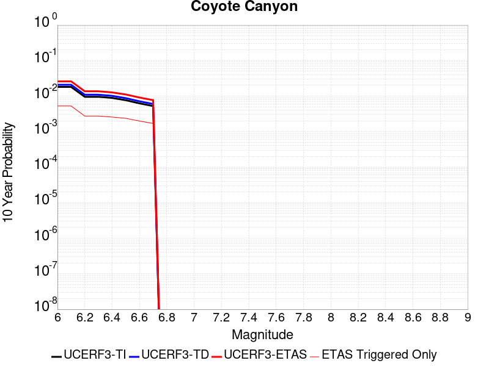 |

| Magnitude | 1 wk TI Prob | 1 wk TD Prob | 1 wk ETAS Prob | 1 wk ETAS/TD Gain | 1 wk ETAS Triggered Only | 1 mo TI Prob | 1 mo TD Prob | 1 mo ETAS Prob | 1 mo ETAS/TD Gain | 1 mo ETAS Triggered Only | 1 yr TI Prob | 1 yr TD Prob | 1 yr ETAS Prob | 1 yr ETAS/TD Gain | 1 yr ETAS Triggered Only | 10 yr TI Prob | 10 yr TD Prob | 10 yr ETAS Prob | 10 yr ETAS/TD Gain | 10 yr ETAS Triggered Only |
|-----|-----|-----|-----|-----|-----|-----|-----|-----|-----|-----|-----|-----|-----|-----|-----|-----|-----|-----|-----|-----|
| 6.0 | 3.5090034E-5 | 4.0364324E-5 | 0.0010964714 | 27.16437 | 0.0010561497 | 1.503772E-4 | 1.7297994E-4 | 0.0019908473 | 11.509122 | 0.0018181818 | 0.0018293047 | 0.0021042528 | 0.005319398 | 2.5279274 | 0.003221925 | 0.018143194 | 0.020869201 | 0.025935026 | 1.2427416 | 0.005173797 |
| 6.1 | 3.5090034E-5 | 4.0364324E-5 | 0.0010964714 | 27.16437 | 0.0010561497 | 1.503772E-4 | 1.7297994E-4 | 0.0019908473 | 11.509122 | 0.0018181818 | 0.0018293047 | 0.0021042528 | 0.005319398 | 2.5279274 | 0.003221925 | 0.018143194 | 0.020869201 | 0.025935026 | 1.2427416 | 0.005173797 |
| 6.2 | 1.841879E-5 | 2.1059794E-5 | 5.424392E-4 | 25.7571 | 5.2139035E-4 | 7.8935285E-5 | 9.0253714E-5 | 0.0010126303 | 11.21982 | 9.224599E-4 | 9.606133E-4 | 0.001098387 | 0.002794383 | 2.5440788 | 0.001697861 | 0.0095647145 | 0.010939667 | 0.013676773 | 1.2502 | 0.0027673796 |
| 6.3 | 1.841879E-5 | 2.1059794E-5 | 5.424392E-4 | 25.7571 | 5.2139035E-4 | 7.8935285E-5 | 9.0253714E-5 | 0.0010126303 | 11.21982 | 9.224599E-4 | 9.606133E-4 | 0.001098387 | 0.002794383 | 2.5440788 | 0.001697861 | 0.0095647145 | 0.010939667 | 0.013676773 | 1.2502 | 0.0027673796 |
| 6.4 | 1.712201E-5 | 1.9565212E-5 | 5.2757666E-4 | 26.965036 | 5.080214E-4 | 7.337798E-5 | 8.3848776E-5 | 9.928634E-4 | 11.84112 | 9.090909E-4 | 8.930107E-4 | 0.0010204813 | 0.0026364776 | 2.5835629 | 0.001617647 | 0.008894307 | 0.010167871 | 0.012748315 | 1.2537842 | 0.0026069519 |
| 6.5 | 1.4744935E-5 | 1.6836972E-5 | 4.8474353E-4 | 28.790422 | 4.6791445E-4 | 6.3191044E-5 | 7.215698E-5 | 9.143422E-4 | 12.67157 | 8.42246E-4 | 7.6907943E-4 | 8.7825063E-4 | 0.002387619 | 2.718608 | 0.0015106952 | 0.007664232 | 0.008756994 | 0.011168842 | 1.2754196 | 0.002433155 |
| 6.6 | 1.2017839E-5 | 1.37240895E-5 | 4.147881E-4 | 30.223362 | 4.0106953E-4 | 5.150401E-5 | 5.88167E-5 | 7.940676E-4 | 13.500716 | 7.3529413E-4 | 6.268809E-4 | 7.159466E-4 | 0.0019316531 | 2.6980407 | 0.0012165775 | 0.0062511545 | 0.0071450938 | 0.009109566 | 1.27494 | 0.0019786097 |
| 6.7 | 1.00956095E-5 | 1.1533517E-5 | 3.4575426E-4 | 29.978216 | 3.342246E-4 | 4.326618E-5 | 4.942891E-5 | 6.6437176E-4 | 13.440955 | 6.1497325E-4 | 5.266384E-4 | 6.017178E-4 | 0.0016171492 | 2.6875544 | 0.0010160428 | 0.005253921 | 0.0060094125 | 0.007670493 | 1.2764131 | 0.001671123 |

## Nelson Lake
*[(top)](#table-of-contents)*

| 1 Week | 1 Month | 1 Year | 10 Year |
|-----|-----|-----|-----|
|  |  |  |  |

| Magnitude | 1 wk TI Prob | 1 wk TD Prob | 1 wk ETAS Prob | 1 wk ETAS/TD Gain | 1 wk ETAS Triggered Only | 1 mo TI Prob | 1 mo TD Prob | 1 mo ETAS Prob | 1 mo ETAS/TD Gain | 1 mo ETAS Triggered Only | 1 yr TI Prob | 1 yr TD Prob | 1 yr ETAS Prob | 1 yr ETAS/TD Gain | 1 yr ETAS Triggered Only | 10 yr TI Prob | 10 yr TD Prob | 10 yr ETAS Prob | 10 yr ETAS/TD Gain | 10 yr ETAS Triggered Only |
|-----|-----|-----|-----|-----|-----|-----|-----|-----|-----|-----|-----|-----|-----|-----|-----|-----|-----|-----|-----|-----|
| 6.0 | 9.913453E-6 | 1.0192255E-5 | 8.390608E-4 | 82.32337 | 8.2887703E-4 | 4.2485535E-5 | 4.3680422E-5 | 0.00130031 | 29.768715 | 0.0012566845 | 5.1713863E-4 | 5.316897E-4 | 0.003391131 | 6.378027 | 0.0028609626 | 0.0051593683 | 0.005305204 | 0.009627073 | 1.8146471 | 0.0043449197 |
| 6.1 | 9.913453E-6 | 1.0192255E-5 | 8.390608E-4 | 82.32337 | 8.2887703E-4 | 4.2485535E-5 | 4.3680422E-5 | 0.00130031 | 29.768715 | 0.0012566845 | 5.1713863E-4 | 5.316897E-4 | 0.003391131 | 6.378027 | 0.0028609626 | 0.0051593683 | 0.005305204 | 0.009627073 | 1.8146471 | 0.0043449197 |
| 6.2 | 4.5596407E-6 | 4.696313E-6 | 3.6565718E-4 | 77.86048 | 3.6096256E-4 | 1.954117E-5 | 2.0126909E-5 | 5.548755E-4 | 27.56884 | 5.3475937E-4 | 2.3788778E-4 | 2.4501883E-4 | 0.001474664 | 6.018574 | 0.0012299465 | 0.0023763329 | 0.0024476128 | 0.004341362 | 1.7737128 | 0.0018983957 |
| 6.3 | 4.5596407E-6 | 4.696313E-6 | 3.6565718E-4 | 77.86048 | 3.6096256E-4 | 1.954117E-5 | 2.0126909E-5 | 5.548755E-4 | 27.56884 | 5.3475937E-4 | 2.3788778E-4 | 2.4501883E-4 | 0.001474664 | 6.018574 | 0.0012299465 | 0.0023763329 | 0.0024476128 | 0.004341362 | 1.7737128 | 0.0018983957 |
| 6.4 | 3.4025713E-6 | 3.5098972E-6 | 2.575197E-4 | 73.36958 | 2.540107E-4 | 1.4582367E-5 | 1.5042335E-5 | 3.8936824E-4 | 25.884829 | 3.7433155E-4 | 1.7752586E-4 | 1.8312587E-4 | 0.0010786838 | 5.890395 | 8.957219E-4 | 0.001773841 | 0.0018298327 | 0.0031509402 | 1.7219827 | 0.0013235294 |
| 6.5 | 2.8352947E-6 | 2.927856E-6 | 1.6335519E-4 | 55.79345 | 1.6042781E-4 | 1.2151207E-5 | 1.2547898E-5 | 2.7992422E-4 | 22.308455 | 2.6737968E-4 | 1.479309E-4 | 1.5276071E-4 | 8.478417E-4 | 5.5501294 | 6.951872E-4 | 0.0014783246 | 0.0015266308 | 0.0025678196 | 1.6820174 | 0.0010427807 |
| 6.6 | 2.251518E-6 | 2.3290677E-6 | 1.2264964E-4 | 52.660404 | 1.2032085E-4 | 9.649328E-6 | 9.981683E-6 | 2.1051444E-4 | 21.090075 | 2.0053476E-4 | 1.1747423E-4 | 1.2152085E-4 | 6.294805E-4 | 5.180021 | 5.080214E-4 | 0.0011741214 | 0.0012146058 | 0.0020024178 | 1.6486155 | 7.8877003E-4 |
| 6.7 | 1.8911853E-6 | 1.9591396E-6 | 1.08910805E-4 | 55.591137 | 1.0695187E-4 | 8.105055E-6 | 8.39629E-6 | 1.955605E-4 | 23.2913 | 1.8716577E-4 | 9.867457E-5 | 1.0222061E-4 | 5.700872E-4 | 5.5770283 | 4.6791445E-4 | 9.863076E-4 | 0.0010217935 | 0.0017429809 | 1.7058055 | 7.219251E-4 |
| 6.8 | 1.4874814E-6 | 1.5438305E-6 | 9.5126576E-5 | 61.61724 | 9.358289E-5 | 6.374905E-6 | 6.6164025E-6 | 1.5367425E-4 | 23.226255 | 1.4705882E-4 | 7.76117E-5 | 8.055224E-5 | 4.2811784E-4 | 5.3147845 | 3.475936E-4 | 7.75846E-4 | 8.0528157E-4 | 0.0013396103 | 1.6635303 | 5.3475937E-4 |
| 6.9 | 6.835972E-7 | 7.1399285E-7 | 5.418989E-5 | 75.896965 | 5.3475935E-5 | 2.9296991E-6 | 3.0599674E-6 | 8.3273626E-5 | 27.213892 | 8.0213904E-5 | 3.56685E-5 | 3.7254784E-5 | 2.3778208E-4 | 6.3825912 | 2.0053476E-4 | 3.5662777E-4 | 3.7251666E-4 | 6.6652475E-4 | 1.7892481 | 2.9411764E-4 |

## Towne Pass
*[(top)](#table-of-contents)*

| 1 Week | 1 Month | 1 Year | 10 Year |
|-----|-----|-----|-----|
|  |  |  |  |

| Magnitude | 1 wk TI Prob | 1 wk TD Prob | 1 wk ETAS Prob | 1 wk ETAS/TD Gain | 1 wk ETAS Triggered Only | 1 mo TI Prob | 1 mo TD Prob | 1 mo ETAS Prob | 1 mo ETAS/TD Gain | 1 mo ETAS Triggered Only | 1 yr TI Prob | 1 yr TD Prob | 1 yr ETAS Prob | 1 yr ETAS/TD Gain | 1 yr ETAS Triggered Only | 10 yr TI Prob | 10 yr TD Prob | 10 yr ETAS Prob | 10 yr ETAS/TD Gain | 10 yr ETAS Triggered Only |
|-----|-----|-----|-----|-----|-----|-----|-----|-----|-----|-----|-----|-----|-----|-----|-----|-----|-----|-----|-----|-----|
| 6.0 | 3.849728E-6 | 3.8945414E-6 | 0.001287312 | 330.54263 | 0.0012834225 | 1.649873E-5 | 1.669081E-5 | 0.0018615798 | 111.533226 | 0.0018449198 | 2.0085352E-4 | 2.0319603E-4 | 0.0035714954 | 17.576601 | 0.003368984 | 0.0020067208 | 0.0020305314 | 0.00659344 | 3.24715 | 0.0045721927 |
| 6.1 | 3.849728E-6 | 3.8945414E-6 | 0.001287312 | 330.54263 | 0.0012834225 | 1.649873E-5 | 1.669081E-5 | 0.0018615798 | 111.533226 | 0.0018449198 | 2.0085352E-4 | 2.0319603E-4 | 0.0035714954 | 17.576601 | 0.003368984 | 0.0020067208 | 0.0020305314 | 0.00659344 | 3.24715 | 0.0045721927 |
| 6.2 | 3.849728E-6 | 3.8945414E-6 | 0.001287312 | 330.54263 | 0.0012834225 | 1.649873E-5 | 1.669081E-5 | 0.0018615798 | 111.533226 | 0.0018449198 | 2.0085352E-4 | 2.0319603E-4 | 0.0035714954 | 17.576601 | 0.003368984 | 0.0020067208 | 0.0020305314 | 0.00659344 | 3.24715 | 0.0045721927 |
| 6.3 | 3.849728E-6 | 3.8945414E-6 | 0.001287312 | 330.54263 | 0.0012834225 | 1.649873E-5 | 1.669081E-5 | 0.0018615798 | 111.533226 | 0.0018449198 | 2.0085352E-4 | 2.0319603E-4 | 0.0035714954 | 17.576601 | 0.003368984 | 0.0020067208 | 0.0020305314 | 0.00659344 | 3.24715 | 0.0045721927 |
| 6.4 | 3.849728E-6 | 3.8945414E-6 | 0.001287312 | 330.54263 | 0.0012834225 | 1.649873E-5 | 1.669081E-5 | 0.0018615798 | 111.533226 | 0.0018449198 | 2.0085352E-4 | 2.0319603E-4 | 0.0035714954 | 17.576601 | 0.003368984 | 0.0020067208 | 0.0020305314 | 0.00659344 | 3.24715 | 0.0045721927 |
| 6.5 | 1.1953545E-6 | 1.203052E-6 | 1.3489273E-4 | 112.125435 | 1.3368984E-4 | 5.1229376E-6 | 5.1559277E-6 | 2.3242748E-4 | 45.079662 | 2.2727273E-4 | 6.236998E-5 | 6.277173E-5 | 5.039205E-4 | 8.027825 | 4.4117647E-4 | 6.235248E-4 | 6.275517E-4 | 0.0012287785 | 1.9580513 | 6.016043E-4 |
| 6.6 | 1.1953545E-6 | 1.203052E-6 | 1.3489273E-4 | 112.125435 | 1.3368984E-4 | 5.1229376E-6 | 5.1559277E-6 | 2.3242748E-4 | 45.079662 | 2.2727273E-4 | 6.236998E-5 | 6.277173E-5 | 5.039205E-4 | 8.027825 | 4.4117647E-4 | 6.235248E-4 | 6.275517E-4 | 0.0012287785 | 1.9580513 | 6.016043E-4 |
| 6.7 | 8.375951E-7 | 8.4106705E-7 | 1.0779285E-4 | 128.16202 | 1.0695187E-4 | 3.5896885E-6 | 3.6045683E-6 | 1.640318E-4 | 45.50664 | 1.6042781E-4 | 4.370358E-5 | 4.3884793E-5 | 2.8451593E-4 | 6.483247 | 2.406417E-4 | 4.3694986E-4 | 4.38767E-4 | 7.862081E-4 | 1.7918578 | 3.475936E-4 |
| 6.8 | 6.38041E-7 | 6.392156E-7 | 5.4115117E-5 | 84.65862 | 5.3475935E-5 | 2.7344586E-6 | 2.7394929E-6 | 8.295318E-5 | 30.280485 | 8.0213904E-5 | 3.3291526E-5 | 3.3352855E-5 | 1.4030116E-4 | 4.206571 | 1.0695187E-4 | 3.3286537E-4 | 3.334823E-4 | 5.3395017E-4 | 1.601135 | 2.0053476E-4 |
| 6.9 | 5.3460053E-7 | 5.345333E-7 | 2.7272486E-5 | 51.02112 | 2.6737967E-5 | 2.2911431E-6 | 2.2908553E-6 | 5.5766668E-5 | 24.343166 | 5.3475935E-5 | 2.789431E-5 | 2.789084E-5 | 1.08102504E-4 | 3.8759143 | 8.0213904E-5 | 2.789081E-4 | 2.7887672E-4 | 4.3925978E-4 | 1.5751039 | 1.6042781E-4 |
| 7.0 | 3.557783E-7 | 3.5324226E-7 | 1.3722221E-5 | 38.84649 | 1.3368984E-5 | 1.5247632E-6 | 1.5138945E-6 | 1.48828585E-5 | 9.830842 | 1.3368984E-5 | 1.8563835E-5 | 1.843152E-5 | 4.5168996E-5 | 2.4506388 | 2.6737967E-5 | 1.8562283E-4 | 1.8430075E-4 | 2.6449986E-4 | 1.4351535 | 8.0213904E-5 |
| 7.1 | 3.037942E-7 | 3.0002218E-7 | 1.3669002E-5 | 45.55997 | 1.3368984E-5 | 1.3019744E-6 | 1.2858087E-6 | 1.4654775E-5 | 11.397322 | 1.3368984E-5 | 1.5851423E-5 | 1.5654618E-5 | 4.2392167E-5 | 2.7079659 | 2.6737967E-5 | 1.5850292E-4 | 1.5653588E-4 | 2.3673724E-4 | 1.5123512 | 8.0213904E-5 |
| 7.2 | 2.0808248E-7 | 2.0217689E-7 | 1.3571158E-5 | 67.12517 | 1.3368984E-5 | 8.917818E-7 | 8.6647213E-7 | 1.4235445E-5 | 16.429201 | 1.3368984E-5 | 1.0857389E-5 | 1.0549252E-5 | 3.7286936E-5 | 3.5345576 | 2.6737967E-5 | 1.0856859E-4 | 1.0548797E-4 | 1.8569341E-4 | 1.7603278 | 8.0213904E-5 |
| 7.3 | 1.1162073E-7 | 1.0636894E-7 | 1.0636894E-7 | 1.0 | 0.0 | 4.7837443E-7 | 4.558668E-7 | 4.558668E-7 | 1.0 | 0.0 | 5.8241935E-6 | 5.550166E-6 | 1.8919076E-5 | 3.4087405 | 1.3368984E-5 | 5.8240406E-5 | 5.5500474E-5 | 9.56052E-5 | 1.7226015 | 4.0106952E-5 |

## Lenwood-Lockhart-Old Woman Springs
*[(top)](#table-of-contents)*

| 1 Week | 1 Month | 1 Year | 10 Year |
|-----|-----|-----|-----|
|  |  |  |  |

| Magnitude | 1 wk TI Prob | 1 wk TD Prob | 1 wk ETAS Prob | 1 wk ETAS/TD Gain | 1 wk ETAS Triggered Only | 1 mo TI Prob | 1 mo TD Prob | 1 mo ETAS Prob | 1 mo ETAS/TD Gain | 1 mo ETAS Triggered Only | 1 yr TI Prob | 1 yr TD Prob | 1 yr ETAS Prob | 1 yr ETAS/TD Gain | 1 yr ETAS Triggered Only | 10 yr TI Prob | 10 yr TD Prob | 10 yr ETAS Prob | 10 yr ETAS/TD Gain | 10 yr ETAS Triggered Only |
|-----|-----|-----|-----|-----|-----|-----|-----|-----|-----|-----|-----|-----|-----|-----|-----|-----|-----|-----|-----|-----|
| 6.0 | 3.744542E-5 | 4.396252E-5 | 0.0011936446 | 27.151415 | 0.0011497326 | 1.604705E-4 | 1.8839816E-4 | 0.0018458399 | 9.797547 | 0.0016577541 | 0.0019519776 | 0.0022915069 | 0.0049991915 | 2.1816177 | 0.0027139038 | 0.019349206 | 0.022696787 | 0.026368208 | 1.1617595 | 0.0037566845 |
| 6.1 | 3.744542E-5 | 4.396252E-5 | 0.0011936446 | 27.151415 | 0.0011497326 | 1.604705E-4 | 1.8839816E-4 | 0.0018458399 | 9.797547 | 0.0016577541 | 0.0019519776 | 0.0022915069 | 0.0049991915 | 2.1816177 | 0.0027139038 | 0.019349206 | 0.022696787 | 0.026368208 | 1.1617595 | 0.0037566845 |
| 6.2 | 3.744542E-5 | 4.396252E-5 | 0.0011936446 | 27.151415 | 0.0011497326 | 1.604705E-4 | 1.8839816E-4 | 0.0018458399 | 9.797547 | 0.0016577541 | 0.0019519776 | 0.0022915069 | 0.0049991915 | 2.1816177 | 0.0027139038 | 0.019349206 | 0.022696787 | 0.026368208 | 1.1617595 | 0.0037566845 |
| 6.3 | 2.1079984E-5 | 2.5353434E-5 | 4.1304415E-4 | 16.291447 | 3.8770054E-4 | 9.0339665E-5 | 1.0865316E-4 | 7.636622E-4 | 7.02844 | 6.550802E-4 | 0.0010993304 | 0.0013220694 | 0.002430228 | 1.8382001 | 0.0011096257 | 0.010939079 | 0.0131442575 | 0.014767028 | 1.1234585 | 0.001644385 |
| 6.4 | 2.1079984E-5 | 2.5353434E-5 | 4.1304415E-4 | 16.291447 | 3.8770054E-4 | 9.0339665E-5 | 1.0865316E-4 | 7.636622E-4 | 7.02844 | 6.550802E-4 | 0.0010993304 | 0.0013220694 | 0.002430228 | 1.8382001 | 0.0011096257 | 0.010939079 | 0.0131442575 | 0.014767028 | 1.1234585 | 0.001644385 |
| 6.5 | 1.7397282E-5 | 2.066241E-5 | 2.6129914E-4 | 12.6461115 | 2.406417E-4 | 7.455765E-5 | 8.8550245E-5 | 5.5642327E-4 | 6.283701 | 4.6791445E-4 | 9.073613E-4 | 0.0010775778 | 0.0018922071 | 1.7559818 | 8.15508E-4 | 0.009036654 | 0.010724821 | 0.011954802 | 1.1146854 | 0.0012433155 |
| 6.6 | 1.52050325E-5 | 1.7679693E-5 | 2.182109E-4 | 12.34246 | 2.0053476E-4 | 6.51628E-5 | 7.576796E-5 | 4.6343912E-4 | 6.116558 | 3.8770054E-4 | 7.9306826E-4 | 9.220924E-4 | 0.0015899253 | 1.7242581 | 6.684492E-4 | 0.007902439 | 0.009183526 | 0.010203484 | 1.1110638 | 0.0010294118 |
| 6.7 | 1.332523E-5 | 1.5264002E-5 | 2.0242692E-4 | 13.26172 | 1.8716577E-4 | 5.7106878E-5 | 6.5415545E-5 | 4.263545E-4 | 6.5176325 | 3.6096256E-4 | 6.950544E-4 | 7.961491E-4 | 0.0013705577 | 1.7214837 | 5.748663E-4 | 0.006928845 | 0.007933599 | 0.008795689 | 1.1086632 | 8.68984E-4 |
| 6.8 | 1.1525329E-5 | 1.3030979E-5 | 1.1998146E-4 | 9.207401 | 1.0695187E-4 | 4.9393333E-5 | 5.584588E-5 | 2.9647414E-4 | 5.3087916 | 2.406417E-4 | 6.011979E-4 | 6.797157E-4 | 0.0010671527 | 1.5699986 | 3.8770054E-4 | 0.00599574 | 0.006776819 | 0.0074009034 | 1.092091 | 6.2834227E-4 |
| 6.9 | 1.0253909E-5 | 1.15144385E-5 | 7.8358586E-5 | 6.805246 | 6.684492E-5 | 4.3944583E-5 | 4.9346683E-5 | 2.3650323E-4 | 4.7926874 | 1.8716577E-4 | 5.3489394E-4 | 6.0063385E-4 | 9.2129677E-4 | 1.5338742 | 3.2085562E-4 | 0.0053360825 | 0.0059904843 | 0.0065220403 | 1.0887334 | 5.3475937E-4 |
| 7.0 | 8.104563E-6 | 8.991279E-6 | 4.909787E-5 | 5.4606104 | 4.0106952E-5 | 3.4733377E-5 | 3.8533497E-5 | 1.5884971E-4 | 4.12238 | 1.2032085E-4 | 4.2279682E-4 | 4.6904673E-4 | 6.561247E-4 | 1.3988472 | 1.8716577E-4 | 0.0042199334 | 0.0046808156 | 0.005053395 | 1.0795971 | 3.7433155E-4 |
| 7.1 | 6.7986157E-6 | 7.515816E-6 | 3.4253582E-5 | 4.5575337 | 2.6737967E-5 | 2.91366E-5 | 3.2210253E-5 | 1.3915868E-4 | 4.3203225 | 1.0695187E-4 | 3.5468035E-4 | 3.920914E-4 | 5.658201E-4 | 1.443082 | 1.737968E-4 | 0.003541148 | 0.003914213 | 0.0042204955 | 1.078249 | 3.0748663E-4 |
| 7.2 | 5.6893327E-6 | 6.2800136E-6 | 1.9648915E-5 | 3.128801 | 1.3368984E-5 | 2.4382627E-5 | 2.6914078E-5 | 1.0712582E-4 | 3.9802895 | 8.0213904E-5 | 2.9681803E-4 | 3.2763163E-4 | 4.6127767E-4 | 1.4079156 | 1.3368984E-4 | 0.002964219 | 0.0032716845 | 0.0035381895 | 1.081458 | 2.6737968E-4 |
| 7.3 | 4.253348E-6 | 4.7069107E-6 | 4.7069107E-6 | 1.0 | 0.0 | 1.8228506E-5 | 2.0172329E-5 | 7.3647185E-5 | 3.6509016 | 5.3475935E-5 | 2.2190946E-4 | 2.4557224E-4 | 3.5249785E-4 | 1.4354141 | 1.0695187E-4 | 0.00221688 | 0.0024531898 | 0.0026398965 | 1.0761077 | 1.8716577E-4 |
| 7.4 | 2.5448119E-6 | 2.852045E-6 | 2.852045E-6 | 1.0 | 0.0 | 1.0906291E-5 | 1.2223002E-5 | 2.5591822E-5 | 2.0937428 | 1.3368984E-5 | 1.3277601E-4 | 1.4880655E-4 | 1.8890752E-4 | 1.269484 | 4.0106952E-5 | 0.001326967 | 0.0014872311 | 0.0015673258 | 1.0538548 | 8.0213904E-5 |
| 7.5 | 4.3706837E-8 | 4.562909E-8 | 4.562909E-8 | 1.0 | 0.0 | 1.8731501E-7 | 1.9555324E-7 | 1.9555324E-7 | 1.0 | 0.0 | 2.2805577E-6 | 2.3808586E-6 | 2.3808586E-6 | 1.0 | 0.0 | 2.2805343E-5 | 2.3808387E-5 | 2.3808387E-5 | 1.0 | 0.0 |

## San Andreas (San Bernardino N)
*[(top)](#table-of-contents)*

| 1 Week | 1 Month | 1 Year | 10 Year |
|-----|-----|-----|-----|
|  | 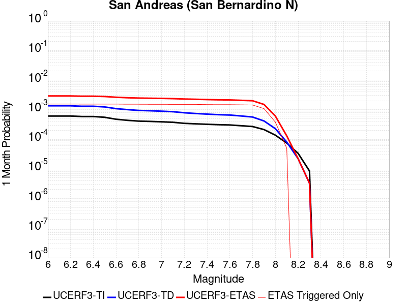 | 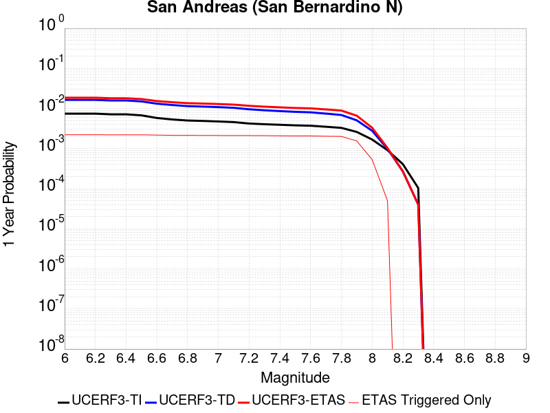 |  |

| Magnitude | 1 wk TI Prob | 1 wk TD Prob | 1 wk ETAS Prob | 1 wk ETAS/TD Gain | 1 wk ETAS Triggered Only | 1 mo TI Prob | 1 mo TD Prob | 1 mo ETAS Prob | 1 mo ETAS/TD Gain | 1 mo ETAS Triggered Only | 1 yr TI Prob | 1 yr TD Prob | 1 yr ETAS Prob | 1 yr ETAS/TD Gain | 1 yr ETAS Triggered Only | 10 yr TI Prob | 10 yr TD Prob | 10 yr ETAS Prob | 10 yr ETAS/TD Gain | 10 yr ETAS Triggered Only |
|-----|-----|-----|-----|-----|-----|-----|-----|-----|-----|-----|-----|-----|-----|-----|-----|-----|-----|-----|-----|-----|
| 6.0 | 1.4273766E-4 | 3.1606483E-4 | 0.0016391759 | 5.1862016 | 0.0013235294 | 6.115894E-4 | 0.0013538664 | 0.002889218 | 2.1340497 | 0.0015374331 | 0.0074207084 | 0.016360244 | 0.018543188 | 1.1334298 | 0.0022192514 | 0.07177748 | 0.15026689 | 0.15262978 | 1.0157247 | 0.0027807488 |
| 6.1 | 1.4273766E-4 | 3.1606483E-4 | 0.0016391759 | 5.1862016 | 0.0013235294 | 6.115894E-4 | 0.0013538664 | 0.002889218 | 2.1340497 | 0.0015374331 | 0.0074207084 | 0.016360244 | 0.018543188 | 1.1334298 | 0.0022192514 | 0.07177748 | 0.15026689 | 0.15262978 | 1.0157247 | 0.0027807488 |
| 6.2 | 1.4273766E-4 | 3.1606483E-4 | 0.0016391759 | 5.1862016 | 0.0013235294 | 6.115894E-4 | 0.0013538664 | 0.002889218 | 2.1340497 | 0.0015374331 | 0.0074207084 | 0.016360244 | 0.018543188 | 1.1334298 | 0.0022192514 | 0.07177748 | 0.15026689 | 0.15262978 | 1.0157247 | 0.0027807488 |
| 6.3 | 1.3730655E-4 | 3.0511338E-4 | 0.0016148741 | 5.2927017 | 0.0013101604 | 5.883239E-4 | 0.0013069791 | 0.0028290513 | 2.1645727 | 0.0015240642 | 0.0071393442 | 0.015797773 | 0.017968807 | 1.1374266 | 0.0022058825 | 0.06914291 | 0.14556676 | 0.14793131 | 1.0162437 | 0.0027673796 |
| 6.4 | 1.3730655E-4 | 3.0511338E-4 | 0.0016148741 | 5.2927017 | 0.0013101604 | 5.883239E-4 | 0.0013069791 | 0.0028290513 | 2.1645727 | 0.0015240642 | 0.0071393442 | 0.015797773 | 0.017968807 | 1.1374266 | 0.0022058825 | 0.06914291 | 0.14556676 | 0.14793131 | 1.0162437 | 0.0027673796 |
| 6.5 | 1.2942807E-4 | 2.8925808E-4 | 0.0015990395 | 5.5280724 | 0.0013101604 | 5.545738E-4 | 0.0012390936 | 0.0027612695 | 2.228459 | 0.0015240642 | 0.0067310524 | 0.01498286 | 0.017155692 | 1.1450212 | 0.0022058825 | 0.06530788 | 0.13870941 | 0.14109294 | 1.0171835 | 0.0027673796 |
| 6.6 | 1.1125901E-4 | 2.536472E-4 | 0.0015634754 | 6.163976 | 0.0013101604 | 4.767372E-4 | 0.0010866089 | 0.002609017 | 2.4010637 | 0.0015240642 | 0.005788839 | 0.013149847 | 0.015287143 | 1.1625339 | 0.0021657755 | 0.056403454 | 0.122999296 | 0.12539111 | 1.0194458 | 0.0027272727 |
| 6.7 | 1.02209575E-4 | 2.3499702E-4 | 0.0015314837 | 6.517035 | 0.0012967915 | 4.3796748E-4 | 0.0010067427 | 0.002515917 | 2.4990666 | 0.0015106952 | 0.0053192247 | 0.012188629 | 0.014314801 | 1.174439 | 0.0021524064 | 0.051936906 | 0.114790924 | 0.1171933 | 1.0209283 | 0.0027139038 |
| 6.8 | 9.610582E-5 | 2.2025521E-4 | 0.001516761 | 6.8863797 | 0.0012967915 | 4.1181705E-4 | 9.436101E-4 | 0.0024528797 | 2.5994632 | 0.0015106952 | 0.0050023515 | 0.011428202 | 0.01355601 | 1.1861893 | 0.0021524064 | 0.048912346 | 0.1081929 | 0.110601254 | 1.0222598 | 0.0027005346 |
| 6.9 | 9.3877505E-5 | 2.1481077E-4 | 0.0015113236 | 7.0356045 | 0.0012967915 | 4.0227012E-4 | 9.2029345E-4 | 0.0024162417 | 2.6255121 | 0.0014973262 | 0.0048866454 | 0.011147255 | 0.013249229 | 1.1885642 | 0.0021256683 | 0.04780577 | 0.10578323 | 0.10817418 | 1.0226024 | 0.0026737968 |
| 7.0 | 9.1019785E-5 | 2.0808022E-4 | 0.0015046018 | 7.2308736 | 0.0012967915 | 3.900265E-4 | 8.914682E-4 | 0.0023874596 | 2.6781209 | 0.0014973262 | 0.0047382377 | 0.010799837 | 0.012902549 | 1.1946985 | 0.0021256683 | 0.046384744 | 0.102753714 | 0.10515277 | 1.0233476 | 0.0026737968 |
| 7.1 | 8.771155E-5 | 1.9982594E-4 | 0.001482992 | 7.421418 | 0.0012834225 | 3.758525E-4 | 8.5611636E-4 | 0.0023388031 | 2.7318752 | 0.0014839572 | 0.0045664064 | 0.0103736 | 0.012463987 | 1.2015103 | 0.0021122994 | 0.044737056 | 0.09906527 | 0.10146213 | 1.0241948 | 0.0026604277 |
| 7.2 | 8.0830236E-5 | 1.8388197E-4 | 0.0014670684 | 7.9783154 | 0.0012834225 | 3.4636928E-4 | 7.8782777E-4 | 0.002270616 | 2.8821223 | 0.0014839572 | 0.0042088944 | 0.009549725 | 0.011641853 | 1.2190772 | 0.0021122994 | 0.041300658 | 0.09179615 | 0.09421236 | 1.0263215 | 0.0026604277 |
| 7.3 | 7.7668235E-5 | 1.7331762E-4 | 0.0014565176 | 8.4037485 | 0.0012834225 | 3.328214E-4 | 7.425784E-4 | 0.0022254337 | 2.9969006 | 0.0014839572 | 0.0040445733 | 0.009003494 | 0.0110967755 | 1.2324966 | 0.0021122994 | 0.03971748 | 0.08706327 | 0.08949207 | 1.027897 | 0.0026604277 |
| 7.4 | 7.520177E-5 | 1.6551897E-4 | 0.0014219955 | 8.591132 | 0.0012566845 | 3.2225347E-4 | 7.0917426E-4 | 0.0021653601 | 3.053354 | 0.0014572192 | 0.0039163795 | 0.008600081 | 0.010667707 | 1.2404193 | 0.0020855614 | 0.038480744 | 0.08351955 | 0.085933276 | 1.0289001 | 0.00263369 |
| 7.5 | 7.274697E-5 | 1.5839566E-4 | 0.0014148811 | 8.932575 | 0.0012566845 | 3.1173544E-4 | 6.78662E-4 | 0.0021348922 | 3.1457372 | 0.0014572192 | 0.003788775 | 0.008231463 | 0.0102865985 | 1.2496684 | 0.0020721925 | 0.03724827 | 0.08023631 | 0.082646385 | 1.0300372 | 0.0026203208 |
| 7.6 | 7.1185845E-5 | 1.540943E-4 | 0.0014105851 | 9.154038 | 0.0012566845 | 3.0504653E-4 | 6.6023704E-4 | 0.002116494 | 3.205658 | 0.0014572192 | 0.0037076178 | 0.008008812 | 0.010064408 | 1.2566669 | 0.0020721925 | 0.036463667 | 0.07822598 | 0.08064132 | 1.0308765 | 0.0026203208 |
| 7.7 | 6.709961E-5 | 1.4318313E-4 | 0.0013863206 | 9.68215 | 0.0012433155 | 2.8753807E-4 | 6.1349774E-4 | 0.0020564622 | 3.352029 | 0.0014438502 | 0.003495157 | 0.0074437927 | 0.009474021 | 1.2727412 | 0.0020454545 | 0.034406938 | 0.07305469 | 0.0754588 | 1.0329083 | 0.002593583 |
| 7.8 | 6.300812E-5 | 1.3202413E-4 | 0.0013618083 | 10.314844 | 0.0012299465 | 2.7000686E-4 | 5.65695E-4 | 0.001995367 | 3.5272841 | 0.0014304813 | 0.0032823787 | 0.006865616 | 0.00888375 | 1.293948 | 0.0020320856 | 0.032343175 | 0.06771354 | 0.07011904 | 1.0355246 | 0.0025802138 |
| 7.9 | 4.983037E-5 | 9.723488E-5 | 0.0010329727 | 10.62348 | 9.358289E-4 | 2.1354125E-4 | 4.1665437E-4 | 0.0015391811 | 3.6941438 | 0.0011229947 | 0.0025967648 | 0.0050609782 | 0.006657137 | 1.3153855 | 0.0016042781 | 0.025666296 | 0.05064886 | 0.052616097 | 1.0388408 | 0.0020721925 |
| 8.0 | 3.2211527E-5 | 5.3304586E-5 | 3.741431E-4 | 7.018966 | 3.2085562E-4 | 1.380421E-4 | 2.2842824E-4 | 6.2940613E-4 | 2.755378 | 4.0106953E-4 | 0.0016793669 | 0.0027775685 | 0.0033241746 | 1.196793 | 5.4812833E-4 | 0.016667323 | 0.028361378 | 0.029088808 | 1.0256486 | 7.486631E-4 |
| 8.1 | 1.743376E-5 | 1.8824427E-5 | 5.8930622E-5 | 3.1305401 | 4.0106952E-5 | 7.471398E-5 | 8.067362E-5 | 1.4751314E-4 | 1.8285178 | 6.684492E-5 | 9.0926304E-4 | 9.817594E-4 | 0.0010485387 | 1.06802 | 6.684492E-5 | 0.009055517 | 0.010484105 | 0.010576706 | 1.0088326 | 9.358289E-5 |
| 8.2 | 7.831616E-6 | 5.1551065E-6 | 5.1551065E-6 | 1.0 | 0.0 | 3.3563636E-5 | 2.2093127E-5 | 2.2093127E-5 | 1.0 | 0.0 | 4.0856065E-4 | 2.6895068E-4 | 2.6895068E-4 | 1.0 | 0.0 | 0.004078103 | 0.0030418145 | 0.0030418145 | 1.0 | 0.0 |
| 8.3 | 1.983087E-6 | 7.6599065E-7 | 7.6599065E-7 | 1.0 | 0.0 | 8.498917E-6 | 3.282813E-6 | 3.282813E-6 | 1.0 | 0.0 | 1.034694E-4 | 3.9967534E-5 | 3.9967534E-5 | 1.0 | 0.0 | 0.0010342124 | 4.719687E-4 | 4.719687E-4 | 1.0 | 0.0 |

## Bicycle Lake
*[(top)](#table-of-contents)*

| 1 Week | 1 Month | 1 Year | 10 Year |
|-----|-----|-----|-----|
| 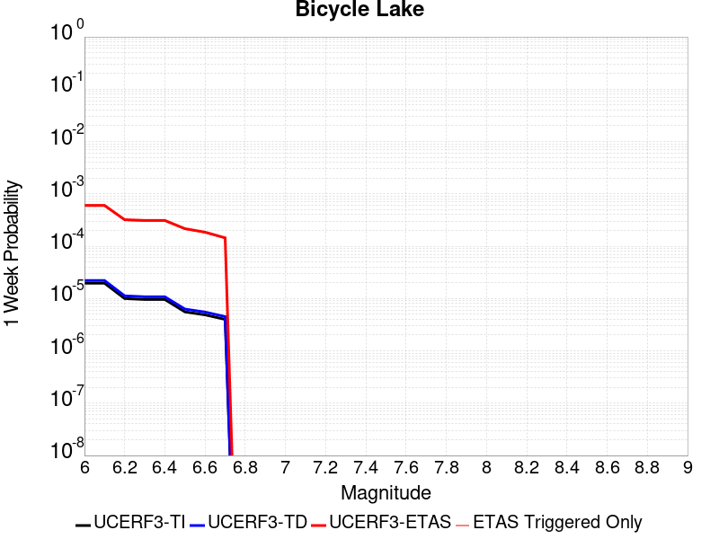 |  | 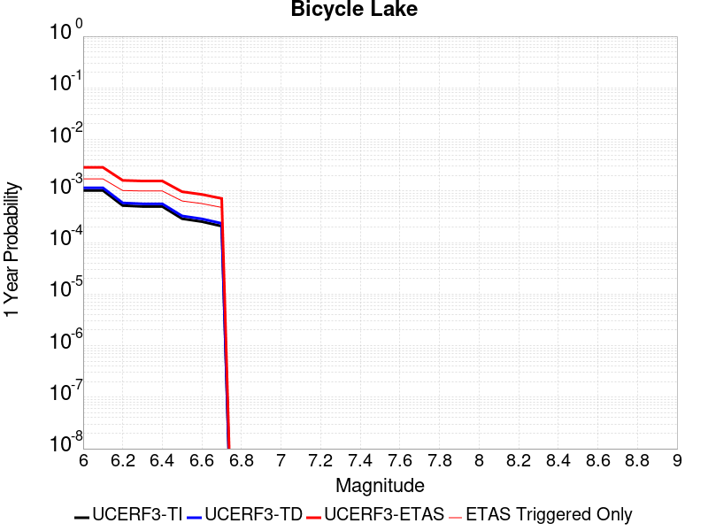 |  |

| Magnitude | 1 wk TI Prob | 1 wk TD Prob | 1 wk ETAS Prob | 1 wk ETAS/TD Gain | 1 wk ETAS Triggered Only | 1 mo TI Prob | 1 mo TD Prob | 1 mo ETAS Prob | 1 mo ETAS/TD Gain | 1 mo ETAS Triggered Only | 1 yr TI Prob | 1 yr TD Prob | 1 yr ETAS Prob | 1 yr ETAS/TD Gain | 1 yr ETAS Triggered Only | 10 yr TI Prob | 10 yr TD Prob | 10 yr ETAS Prob | 10 yr ETAS/TD Gain | 10 yr ETAS Triggered Only |
|-----|-----|-----|-----|-----|-----|-----|-----|-----|-----|-----|-----|-----|-----|-----|-----|-----|-----|-----|-----|-----|
| 6.0 | 1.9621975E-5 | 2.2097078E-5 | 5.3010724E-4 | 23.989925 | 5.080214E-4 | 8.4091465E-5 | 9.4699084E-5 | 0.0010304394 | 10.881196 | 9.358289E-4 | 0.0010233327 | 0.0011524865 | 0.0028483907 | 2.4715176 | 0.001697861 | 0.01018633 | 0.011478408 | 0.014227238 | 1.2394783 | 0.0027807488 |
| 6.1 | 1.9621975E-5 | 2.2097078E-5 | 5.3010724E-4 | 23.989925 | 5.080214E-4 | 8.4091465E-5 | 9.4699084E-5 | 0.0010304394 | 10.881196 | 9.358289E-4 | 0.0010233327 | 0.0011524865 | 0.0028483907 | 2.4715176 | 0.001697861 | 0.01018633 | 0.011478408 | 0.014227238 | 1.2394783 | 0.0027807488 |
| 6.2 | 9.9971285E-6 | 1.1255639E-5 | 2.9200115E-4 | 25.942652 | 2.8074867E-4 | 4.2844134E-5 | 4.8237856E-5 | 5.8297144E-4 | 12.085351 | 5.3475937E-4 | 5.2150246E-4 | 5.871896E-4 | 0.0016159969 | 2.7520869 | 0.0010294118 | 0.0052028033 | 0.005861487 | 0.0075228144 | 1.2834312 | 0.001671123 |
| 6.3 | 9.589428E-6 | 1.0798346E-5 | 2.7817514E-4 | 25.760902 | 2.6737968E-4 | 4.10969E-5 | 4.62781E-5 | 5.6764437E-4 | 12.26594 | 5.2139035E-4 | 5.002399E-4 | 5.6334207E-4 | 0.0015788125 | 2.8025823 | 0.0010160428 | 0.0049911533 | 0.0056242296 | 0.00727266 | 1.2930944 | 0.0016577541 |
| 6.4 | 9.589428E-6 | 1.0798346E-5 | 2.7817514E-4 | 25.760902 | 2.6737968E-4 | 4.10969E-5 | 4.62781E-5 | 5.6764437E-4 | 12.26594 | 5.2139035E-4 | 5.002399E-4 | 5.6334207E-4 | 0.0015788125 | 2.8025823 | 0.0010160428 | 0.0049911533 | 0.0056242296 | 0.00727266 | 1.2930944 | 0.0016577541 |
| 6.5 | 5.557707E-6 | 6.2856016E-6 | 1.800813E-4 | 28.649813 | 1.737968E-4 | 2.3818526E-5 | 2.6938165E-5 | 3.7452238E-4 | 13.90304 | 3.475936E-4 | 2.8995197E-4 | 3.2794967E-4 | 9.961796E-4 | 3.037599 | 6.684492E-4 | 0.0028957394 | 0.0032772934 | 0.004356632 | 1.3293384 | 0.0010828878 |
| 6.6 | 4.8742945E-6 | 5.5132896E-6 | 1.525713E-4 | 27.673368 | 1.4705882E-4 | 2.0889667E-5 | 2.3628318E-5 | 3.4447634E-4 | 14.578962 | 3.2085562E-4 | 2.54302E-4 | 2.87663E-4 | 8.757291E-4 | 3.0442882 | 5.8823527E-4 | 0.002540112 | 0.0028754752 | 0.0038352741 | 1.3337879 | 9.625668E-4 |
| 6.7 | 3.991108E-6 | 4.5159104E-6 | 1.2483622E-4 | 27.643644 | 1.2032085E-4 | 1.7104636E-5 | 1.9353902E-5 | 3.0009713E-4 | 15.50577 | 2.8074867E-4 | 2.0822904E-4 | 2.3563375E-4 | 7.301696E-4 | 3.098748 | 4.946524E-4 | 0.0020803404 | 0.0023563374 | 0.0031565863 | 1.3396156 | 8.0213905E-4 |

## Paradise
*[(top)](#table-of-contents)*

| 1 Week | 1 Month | 1 Year | 10 Year |
|-----|-----|-----|-----|
|  |  |  |  |

| Magnitude | 1 wk TI Prob | 1 wk TD Prob | 1 wk ETAS Prob | 1 wk ETAS/TD Gain | 1 wk ETAS Triggered Only | 1 mo TI Prob | 1 mo TD Prob | 1 mo ETAS Prob | 1 mo ETAS/TD Gain | 1 mo ETAS Triggered Only | 1 yr TI Prob | 1 yr TD Prob | 1 yr ETAS Prob | 1 yr ETAS/TD Gain | 1 yr ETAS Triggered Only | 10 yr TI Prob | 10 yr TD Prob | 10 yr ETAS Prob | 10 yr ETAS/TD Gain | 10 yr ETAS Triggered Only |
|-----|-----|-----|-----|-----|-----|-----|-----|-----|-----|-----|-----|-----|-----|-----|-----|-----|-----|-----|-----|-----|
| 6.0 | 1.4851273E-5 | 1.6694692E-5 | 4.7123255E-4 | 28.226492 | 4.5454546E-4 | 6.364676E-5 | 7.154685E-5 | 8.0678833E-4 | 11.276364 | 7.3529413E-4 | 7.7462377E-4 | 8.707584E-4 | 0.002299994 | 2.6413689 | 0.0014304813 | 0.0077192914 | 0.008675844 | 0.011048131 | 1.2734358 | 0.002393048 |
| 6.1 | 1.4851273E-5 | 1.6694692E-5 | 4.7123255E-4 | 28.226492 | 4.5454546E-4 | 6.364676E-5 | 7.154685E-5 | 8.0678833E-4 | 11.276364 | 7.3529413E-4 | 7.7462377E-4 | 8.707584E-4 | 0.002299994 | 2.6413689 | 0.0014304813 | 0.0077192914 | 0.008675844 | 0.011048131 | 1.2734358 | 0.002393048 |
| 6.2 | 1.4851273E-5 | 1.6694692E-5 | 4.7123255E-4 | 28.226492 | 4.5454546E-4 | 6.364676E-5 | 7.154685E-5 | 8.0678833E-4 | 11.276364 | 7.3529413E-4 | 7.7462377E-4 | 8.707584E-4 | 0.002299994 | 2.6413689 | 0.0014304813 | 0.0077192914 | 0.008675844 | 0.011048131 | 1.2734358 | 0.002393048 |
| 6.3 | 1.0426831E-5 | 1.188862E-5 | 2.2578982E-4 | 18.992096 | 2.1390374E-4 | 4.4685654E-5 | 5.0950268E-5 | 4.5199934E-4 | 8.871383 | 4.0106953E-4 | 5.43912E-4 | 6.201489E-4 | 0.0013950691 | 2.249571 | 7.754011E-4 | 0.0054258266 | 0.0061847917 | 0.007407131 | 1.1976364 | 0.0012299465 |
| 6.4 | 1.0426831E-5 | 1.188862E-5 | 2.2578982E-4 | 18.992096 | 2.1390374E-4 | 4.4685654E-5 | 5.0950268E-5 | 4.5199934E-4 | 8.871383 | 4.0106953E-4 | 5.43912E-4 | 6.201489E-4 | 0.0013950691 | 2.249571 | 7.754011E-4 | 0.0054258266 | 0.0061847917 | 0.007407131 | 1.1976364 | 0.0012299465 |
| 6.5 | 9.25027E-6 | 1.06199595E-5 | 2.1115258E-4 | 19.882616 | 2.0053476E-4 | 3.964341E-5 | 4.551335E-5 | 4.064595E-4 | 8.930556 | 3.6096256E-4 | 4.8255164E-4 | 5.53989E-4 | 0.0011686216 | 2.109467 | 6.1497325E-4 | 0.0048150513 | 0.0055265795 | 0.0064838263 | 1.1732079 | 9.625668E-4 |
| 6.6 | 7.904275E-6 | 9.159525E-6 | 1.2947927E-4 | 14.136025 | 1.2032085E-4 | 3.3875025E-5 | 3.9254537E-5 | 2.531499E-4 | 6.4489326 | 2.1390374E-4 | 4.1235037E-4 | 4.7782314E-4 | 8.653384E-4 | 1.8110015 | 3.8770054E-4 | 0.0041158604 | 0.0047683544 | 0.0053537847 | 1.1227741 | 5.8823527E-4 |
| 6.7 | 7.2061953E-6 | 8.407248E-6 | 8.862048E-5 | 10.540961 | 8.0213904E-5 | 3.088333E-5 | 3.6030586E-5 | 1.6971561E-4 | 4.7103205 | 1.3368984E-4 | 3.7593965E-4 | 4.3858777E-4 | 7.1921333E-4 | 1.6398389 | 2.8074867E-4 | 0.003753043 | 0.004377591 | 0.004816836 | 1.1003395 | 4.4117647E-4 |
| 6.8 | 6.6948724E-6 | 7.842166E-6 | 8.805544E-5 | 11.228459 | 8.0213904E-5 | 2.8691995E-5 | 3.360887E-5 | 1.4055715E-4 | 4.1821446 | 1.0695187E-4 | 3.4926904E-4 | 4.0911473E-4 | 6.2293094E-4 | 1.5226315 | 2.1390374E-4 | 0.003487206 | 0.0040839734 | 0.0044035185 | 1.0782437 | 3.2085562E-4 |
| 6.9 | 6.0421025E-6 | 7.130621E-6 | 7.397506E-5 | 10.374281 | 6.684492E-5 | 2.5894467E-5 | 3.0559466E-5 | 1.241395E-4 | 4.0622272 | 9.358289E-5 | 3.1521954E-4 | 3.7200135E-4 | 5.323695E-4 | 1.4310956 | 1.6042781E-4 | 0.0031477278 | 0.0037141247 | 0.0039405534 | 1.0609642 | 2.2727273E-4 |
| 7.0 | 4.134091E-6 | 5.0803087E-6 | 3.181814E-5 | 6.263033 | 2.6737967E-5 | 1.7717413E-5 | 2.177258E-5 | 6.187866E-5 | 2.8420453 | 4.0106952E-5 | 2.1568815E-4 | 2.6505045E-4 | 3.5860852E-4 | 1.3529822 | 9.358289E-5 | 0.0021547892 | 0.0026474963 | 0.0027674986 | 1.0453267 | 1.2032085E-4 |
| 7.1 | 3.7674888E-6 | 4.6318696E-6 | 1.8000792E-5 | 3.8862908 | 1.3368984E-5 | 1.6146281E-5 | 1.9850726E-5 | 4.6588164E-5 | 2.3469248 | 2.6737967E-5 | 1.9656324E-4 | 2.4165731E-4 | 3.2185184E-4 | 1.3318522 | 8.0213904E-5 | 0.0019638946 | 0.002414096 | 0.0025207896 | 1.0441961 | 1.0695187E-4 |
| 7.2 | 3.4065345E-6 | 4.156723E-6 | 1.7525652E-5 | 4.216218 | 1.3368984E-5 | 1.4599351E-5 | 1.7814415E-5 | 4.4551907E-5 | 2.5008907 | 2.6737967E-5 | 1.777326E-4 | 2.1687041E-4 | 2.8370082E-4 | 1.3081583 | 6.684492E-5 | 0.0017759053 | 0.002166736 | 0.002260116 | 1.0430971 | 9.358289E-5 |
| 7.3 | 2.9934936E-6 | 3.6293168E-6 | 1.6998252E-5 | 4.6835957 | 1.3368984E-5 | 1.2829195E-5 | 1.555413E-5 | 4.2291682E-5 | 2.719 | 2.6737967E-5 | 1.5618425E-4 | 1.8935655E-4 | 2.4282237E-4 | 1.2823552 | 5.3475935E-5 | 0.0015607453 | 0.0018920974 | 0.0019721596 | 1.0423139 | 8.0213904E-5 |
| 7.4 | 2.4049796E-6 | 2.8889842E-6 | 1.6257929E-5 | 5.627559 | 1.3368984E-5 | 1.0307015E-5 | 1.238131E-5 | 3.9118946E-5 | 3.159516 | 2.6737967E-5 | 1.2548068E-4 | 1.5073347E-4 | 2.0420134E-4 | 1.354718 | 5.3475935E-5 | 0.0012540985 | 0.0015064536 | 0.0015731979 | 1.0443056 | 6.684492E-5 |
| 7.5 | 1.2710091E-6 | 1.5134682E-6 | 1.5134682E-6 | 1.0 | 0.0 | 5.44717E-6 | 6.4862834E-6 | 6.4862834E-6 | 1.0 | 0.0 | 6.631728E-5 | 7.8968886E-5 | 7.8968886E-5 | 1.0 | 0.0 | 6.6297496E-4 | 7.8953087E-4 | 8.028893E-4 | 1.0169195 | 1.3368984E-5 |
| 7.6 | 2.21172E-7 | 2.603961E-7 | 2.603961E-7 | 1.0 | 0.0 | 9.478797E-7 | 1.1159829E-6 | 1.1159829E-6 | 1.0 | 0.0 | 1.1540374E-5 | 1.3587036E-5 | 1.3587036E-5 | 1.0 | 0.0 | 1.1539775E-4 | 1.3586486E-4 | 1.4923203E-4 | 1.0983858 | 1.3368984E-5 |

## Garlic Springs
*[(top)](#table-of-contents)*

| 1 Week | 1 Month | 1 Year | 10 Year |
|-----|-----|-----|-----|
|  |  |  |  |

| Magnitude | 1 wk TI Prob | 1 wk TD Prob | 1 wk ETAS Prob | 1 wk ETAS/TD Gain | 1 wk ETAS Triggered Only | 1 mo TI Prob | 1 mo TD Prob | 1 mo ETAS Prob | 1 mo ETAS/TD Gain | 1 mo ETAS Triggered Only | 1 yr TI Prob | 1 yr TD Prob | 1 yr ETAS Prob | 1 yr ETAS/TD Gain | 1 yr ETAS Triggered Only | 10 yr TI Prob | 10 yr TD Prob | 10 yr ETAS Prob | 10 yr ETAS/TD Gain | 10 yr ETAS Triggered Only |
|-----|-----|-----|-----|-----|-----|-----|-----|-----|-----|-----|-----|-----|-----|-----|-----|-----|-----|-----|-----|-----|
| 6.0 | 1.6760017E-5 | 1.8776833E-5 | 2.9952024E-4 | 15.951584 | 2.8074867E-4 | 7.182667E-5 | 8.0470316E-5 | 6.018187E-4 | 7.4787664 | 5.2139035E-4 | 8.7413884E-4 | 9.794032E-4 | 0.0020612304 | 2.104578 | 0.0010828878 | 0.008707083 | 0.009762413 | 0.011801138 | 1.208834 | 0.0020588236 |
| 6.1 | 9.852767E-6 | 1.09735865E-5 | 1.1792428E-4 | 10.746193 | 1.0695187E-4 | 4.222546E-5 | 4.702921E-5 | 2.4755453E-4 | 5.2638464 | 2.0053476E-4 | 5.139737E-4 | 5.7250116E-4 | 0.0011203157 | 1.9568794 | 5.4812833E-4 | 0.005127866 | 0.005717221 | 0.0068603805 | 1.1999502 | 0.0011497326 |
| 6.2 | 9.852767E-6 | 1.09735865E-5 | 1.1792428E-4 | 10.746193 | 1.0695187E-4 | 4.222546E-5 | 4.702921E-5 | 2.4755453E-4 | 5.2638464 | 2.0053476E-4 | 5.139737E-4 | 5.7250116E-4 | 0.0011203157 | 1.9568794 | 5.4812833E-4 | 0.005127866 | 0.005717221 | 0.0068603805 | 1.1999502 | 0.0011497326 |
| 6.3 | 4.3167724E-6 | 4.7780286E-6 | 4.488479E-5 | 9.393997 | 4.0106952E-5 | 1.8500323E-5 | 2.0477235E-5 | 1.140582E-4 | 5.5700006 | 9.358289E-5 | 2.2521814E-4 | 2.4930484E-4 | 5.5671483E-4 | 2.2330687 | 3.0748663E-4 | 0.0022499003 | 0.00249251 | 0.002999265 | 1.2033112 | 5.080214E-4 |
| 6.4 | 4.3167724E-6 | 4.7780286E-6 | 4.488479E-5 | 9.393997 | 4.0106952E-5 | 1.8500323E-5 | 2.0477235E-5 | 1.140582E-4 | 5.5700006 | 9.358289E-5 | 2.2521814E-4 | 2.4930484E-4 | 5.5671483E-4 | 2.2330687 | 3.0748663E-4 | 0.0022499003 | 0.00249251 | 0.002999265 | 1.2033112 | 5.080214E-4 |
| 6.5 | 4.3167724E-6 | 4.7780286E-6 | 4.488479E-5 | 9.393997 | 4.0106952E-5 | 1.8500323E-5 | 2.0477235E-5 | 1.140582E-4 | 5.5700006 | 9.358289E-5 | 2.2521814E-4 | 2.4930484E-4 | 5.5671483E-4 | 2.2330687 | 3.0748663E-4 | 0.0022499003 | 0.00249251 | 0.002999265 | 1.2033112 | 5.080214E-4 |
| 6.6 | 4.301311E-6 | 4.760897E-6 | 4.486766E-5 | 9.424203 | 4.0106952E-5 | 1.8434059E-5 | 2.0403815E-5 | 1.13984795E-4 | 5.5864453 | 9.358289E-5 | 2.2441156E-4 | 2.4841115E-4 | 5.558214E-4 | 2.237506 | 3.0748663E-4 | 0.0022418506 | 0.002483593 | 0.0029903527 | 1.2040429 | 5.080214E-4 |
| 6.7 | 3.8599724E-6 | 4.27106E-6 | 4.437784E-5 | 10.390358 | 4.0106952E-5 | 1.6542634E-5 | 1.8304541E-5 | 1.1188572E-4 | 6.1124563 | 9.358289E-5 | 2.0138794E-4 | 2.228578E-4 | 5.035439E-4 | 2.2594852 | 2.8074867E-4 | 0.0020120554 | 0.002228578 | 0.0026821105 | 1.2035075 | 4.5454546E-4 |

## San Andreas (San Bernardino S)
*[(top)](#table-of-contents)*

| 1 Week | 1 Month | 1 Year | 10 Year |
|-----|-----|-----|-----|
|  |  | 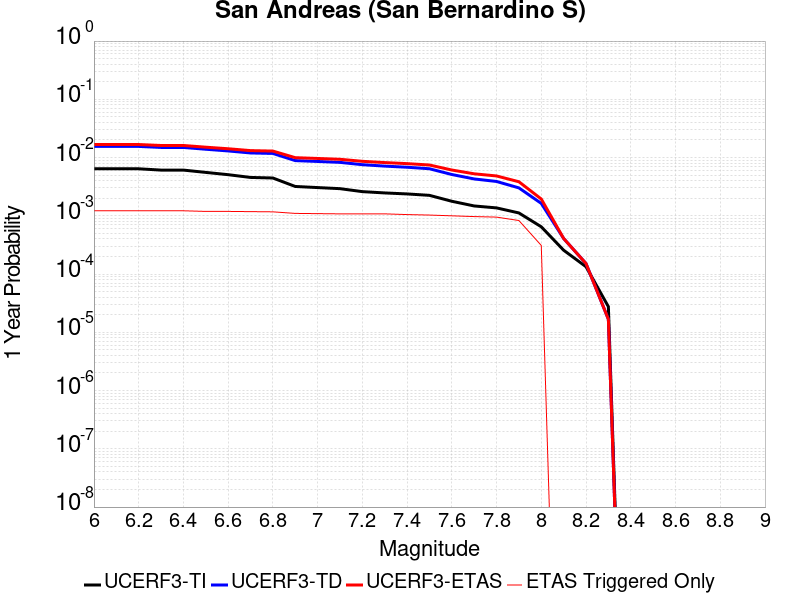 |  |

| Magnitude | 1 wk TI Prob | 1 wk TD Prob | 1 wk ETAS Prob | 1 wk ETAS/TD Gain | 1 wk ETAS Triggered Only | 1 mo TI Prob | 1 mo TD Prob | 1 mo ETAS Prob | 1 mo ETAS/TD Gain | 1 mo ETAS Triggered Only | 1 yr TI Prob | 1 yr TD Prob | 1 yr ETAS Prob | 1 yr ETAS/TD Gain | 1 yr ETAS Triggered Only | 10 yr TI Prob | 10 yr TD Prob | 10 yr ETAS Prob | 10 yr ETAS/TD Gain | 10 yr ETAS Triggered Only |
|-----|-----|-----|-----|-----|-----|-----|-----|-----|-----|-----|-----|-----|-----|-----|-----|-----|-----|-----|-----|-----|
| 6.0 | 1.2336002E-4 | 3.0004102E-4 | 9.4155973E-4 | 3.1381032 | 6.4171123E-4 | 5.2857865E-4 | 0.0012852824 | 0.002046335 | 1.5921288 | 7.620321E-4 | 0.006416472 | 0.015540994 | 0.016712341 | 1.0753715 | 0.0011898396 | 0.06234337 | 0.14283717 | 0.14422376 | 1.0097075 | 0.001617647 |
| 6.1 | 1.2336002E-4 | 3.0004102E-4 | 9.4155973E-4 | 3.1381032 | 6.4171123E-4 | 5.2857865E-4 | 0.0012852824 | 0.002046335 | 1.5921288 | 7.620321E-4 | 0.006416472 | 0.015540994 | 0.016712341 | 1.0753715 | 0.0011898396 | 0.06234337 | 0.14283717 | 0.14422376 | 1.0097075 | 0.001617647 |
| 6.2 | 1.2336002E-4 | 3.0004102E-4 | 9.4155973E-4 | 3.1381032 | 6.4171123E-4 | 5.2857865E-4 | 0.0012852824 | 0.002046335 | 1.5921288 | 7.620321E-4 | 0.006416472 | 0.015540994 | 0.016712341 | 1.0753715 | 0.0011898396 | 0.06234337 | 0.14283717 | 0.14422376 | 1.0097075 | 0.001617647 |
| 6.3 | 1.1712257E-4 | 2.8792414E-4 | 9.294506E-4 | 3.2281094 | 6.4171123E-4 | 5.018573E-4 | 0.0012334028 | 0.0019944948 | 1.6170671 | 7.620321E-4 | 0.006093008 | 0.014918125 | 0.016090214 | 1.0785681 | 0.0011898396 | 0.059286322 | 0.13754563 | 0.13894078 | 1.0101432 | 0.001617647 |
| 6.4 | 1.1712257E-4 | 2.8792414E-4 | 9.294506E-4 | 3.2281094 | 6.4171123E-4 | 5.018573E-4 | 0.0012334028 | 0.0019944948 | 1.6170671 | 7.620321E-4 | 0.006093008 | 0.014918125 | 0.016090214 | 1.0785681 | 0.0011898396 | 0.059286322 | 0.13754563 | 0.13894078 | 1.0101432 | 0.001617647 |
| 6.5 | 1.0689076E-4 | 2.680528E-4 | 9.09592E-4 | 3.3933315 | 6.4171123E-4 | 4.5802278E-4 | 0.0011483167 | 0.00189612 | 1.6512171 | 7.486631E-4 | 0.0055621783 | 0.01389575 | 0.015029507 | 1.0815902 | 0.0011497326 | 0.05425003 | 0.12879294 | 0.13014401 | 1.0104903 | 0.0015508021 |
| 6.6 | 9.7648895E-5 | 2.50501E-4 | 8.920515E-4 | 3.5610695 | 6.4171123E-4 | 4.1842813E-4 | 0.0010731576 | 0.0018210174 | 1.6968777 | 7.486631E-4 | 0.005082469 | 0.012991785 | 0.014126581 | 1.0873471 | 0.0011497326 | 0.049677886 | 0.12095292 | 0.122304395 | 1.0111736 | 0.0015374331 |
| 6.7 | 8.757013E-5 | 2.3120902E-4 | 8.727719E-4 | 3.7748175 | 6.4171123E-4 | 3.7524657E-4 | 9.905418E-4 | 0.0017384633 | 1.755063 | 7.486631E-4 | 0.00455906 | 0.011997245 | 0.013119976 | 1.0935824 | 0.0011363636 | 0.04466656 | 0.11226123 | 0.11360233 | 1.0119463 | 0.0015106952 |
| 6.8 | 8.562978E-5 | 2.2680782E-4 | 8.683735E-4 | 3.8286753 | 6.4171123E-4 | 3.6693315E-4 | 9.7169366E-4 | 0.0017196293 | 1.7697237 | 7.486631E-4 | 0.004458263 | 0.011770263 | 0.01288004 | 1.0942864 | 0.0011229947 | 0.043698758 | 0.11027153 | 0.111603744 | 1.0120813 | 0.0014973262 |
| 6.9 | 6.124075E-5 | 1.7065753E-4 | 7.8552583E-4 | 4.602937 | 6.1497325E-4 | 2.6243398E-4 | 7.311852E-4 | 0.0014258641 | 1.9500724 | 6.951872E-4 | 0.0031904527 | 0.008866051 | 0.009899586 | 1.1165723 | 0.0010427807 | 0.031450346 | 0.08418263 | 0.08544371 | 1.0149803 | 0.0013770054 |
| 7.0 | 5.8598747E-5 | 1.649477E-4 | 7.7981956E-4 | 4.7276773 | 6.1497325E-4 | 2.5111332E-4 | 7.06728E-4 | 0.0013880644 | 1.9640714 | 6.818182E-4 | 0.0030530186 | 0.008570663 | 0.009591252 | 1.1190794 | 0.0010294118 | 0.03011414 | 0.081500374 | 0.08274059 | 1.0152173 | 0.0013502673 |
| 7.1 | 5.613814E-5 | 1.5913323E-4 | 7.6064176E-4 | 4.7799053 | 6.016043E-4 | 2.4056983E-4 | 6.818221E-4 | 0.0013498155 | 1.9797181 | 6.684492E-4 | 0.0029250039 | 0.008269769 | 0.009277409 | 1.1218462 | 0.0010160428 | 0.028868021 | 0.07879931 | 0.08003086 | 1.0156289 | 0.0013368984 |
| 7.2 | 4.991222E-5 | 1.4519796E-4 | 7.467149E-4 | 5.142737 | 6.016043E-4 | 2.1389198E-4 | 6.2212895E-4 | 0.0012901623 | 2.073786 | 6.684492E-4 | 0.002601025 | 0.007548217 | 0.00855659 | 1.1335909 | 0.0010160428 | 0.025707912 | 0.07225321 | 0.07349351 | 1.017166 | 0.0013368984 |
| 7.3 | 4.7410045E-5 | 1.3714004E-4 | 7.386618E-4 | 5.3861866 | 6.016043E-4 | 2.0317009E-4 | 5.8761094E-4 | 0.0012556674 | 2.1369026 | 6.684492E-4 | 0.0024707897 | 0.0071307817 | 0.008139579 | 1.1414708 | 0.0010160428 | 0.024434982 | 0.06853558 | 0.06978086 | 1.0181698 | 0.0013368984 |
| 7.4 | 4.5556746E-5 | 1.3121912E-4 | 6.9264276E-4 | 5.27852 | 5.6149735E-4 | 1.952286E-4 | 5.622468E-4 | 0.0011902357 | 2.1169276 | 6.2834227E-4 | 0.002374317 | 0.0068239477 | 0.007793224 | 1.1420404 | 9.7593584E-4 | 0.023491086 | 0.065788016 | 0.066999495 | 1.0184149 | 0.0012967915 |
| 7.5 | 4.3084514E-5 | 1.2357246E-4 | 6.850004E-4 | 5.543309 | 5.6149735E-4 | 1.8463485E-4 | 5.2948913E-4 | 0.0011574987 | 2.186067 | 6.2834227E-4 | 0.0022456115 | 0.0064275465 | 0.007383927 | 1.1487939 | 9.625668E-4 | 0.022230545 | 0.062188786 | 0.06339239 | 1.0193541 | 0.0012834225 |
| 7.6 | 3.408608E-5 | 9.83552E-5 | 6.33062E-4 | 6.436487 | 5.3475937E-4 | 1.4607502E-4 | 4.214543E-4 | 0.001022805 | 2.426847 | 6.016043E-4 | 0.0017770125 | 0.0051191594 | 0.0060368967 | 1.179275 | 9.224599E-4 | 0.017628696 | 0.050020292 | 0.051188715 | 1.0233591 | 0.0012299465 |
| 7.7 | 2.8315713E-5 | 8.248679E-5 | 5.9046625E-4 | 7.158313 | 5.080214E-4 | 1.2134742E-4 | 3.5346695E-4 | 9.2813006E-4 | 2.62579 | 5.748663E-4 | 0.0014764034 | 0.0042949775 | 0.0051735407 | 1.204556 | 8.8235294E-4 | 0.01466633 | 0.0422714 | 0.04339814 | 1.0266548 | 0.0011764705 |
| 7.8 | 2.6222975E-5 | 7.463088E-5 | 5.6924636E-4 | 7.627491 | 4.946524E-4 | 1.1237934E-4 | 3.1980744E-4 | 8.811252E-4 | 2.7551742 | 5.6149735E-4 | 0.0013673597 | 0.0038867102 | 0.0047523165 | 1.2227093 | 8.68984E-4 | 0.013589768 | 0.03843674 | 0.039555136 | 1.0290971 | 0.0011631016 |
| 7.9 | 2.1469694E-5 | 5.787864E-5 | 4.8566135E-4 | 8.391029 | 4.2780748E-4 | 9.200973E-5 | 2.4802773E-4 | 7.4255746E-4 | 2.9938483 | 4.946524E-4 | 0.0011196428 | 0.0030155594 | 0.0038019507 | 1.260778 | 7.8877003E-4 | 0.011140184 | 0.030152109 | 0.031137517 | 1.0326812 | 0.0010160428 |
| 8.0 | 1.2420249E-5 | 3.131896E-5 | 2.0511031E-4 | 6.549078 | 1.737968E-4 | 5.322855E-5 | 1.342172E-4 | 3.4809223E-4 | 2.5934994 | 2.1390374E-4 | 6.478649E-4 | 0.0016328706 | 0.0019398553 | 1.188003 | 3.0748663E-4 | 0.0064597935 | 0.016522504 | 0.016930094 | 1.0246688 | 4.1443852E-4 |
| 8.1 | 4.9197724E-6 | 7.822348E-6 | 7.822348E-6 | 1.0 | 0.0 | 2.1084568E-5 | 3.352392E-5 | 3.352392E-5 | 1.0 | 0.0 | 2.566744E-4 | 4.0807744E-4 | 4.0807744E-4 | 1.0 | 0.0 | 0.002563781 | 0.0043843705 | 0.0043976805 | 1.0030359 | 1.3368984E-5 |
| 8.2 | 2.5634774E-6 | 2.9067196E-6 | 2.9067196E-6 | 1.0 | 0.0 | 1.0986286E-5 | 1.2457311E-5 | 1.2457311E-5 | 1.0 | 0.0 | 1.3374983E-4 | 1.5165724E-4 | 1.5165724E-4 | 1.0 | 0.0 | 0.0013366934 | 0.0017049741 | 0.0017049741 | 1.0 | 0.0 |
| 8.3 | 5.2850464E-7 | 3.2088764E-7 | 3.2088764E-7 | 1.0 | 0.0 | 2.2650179E-6 | 1.375232E-6 | 1.375232E-6 | 1.0 | 0.0 | 2.7576245E-5 | 1.6743334E-5 | 1.6743334E-5 | 1.0 | 0.0 | 2.7572823E-4 | 1.9870348E-4 | 1.9870348E-4 | 1.0 | 0.0 |

## Death Valley (Black Mtns Frontal)
*[(top)](#table-of-contents)*

| 1 Week | 1 Month | 1 Year | 10 Year |
|-----|-----|-----|-----|
|  |  |  |  |

| Magnitude | 1 wk TI Prob | 1 wk TD Prob | 1 wk ETAS Prob | 1 wk ETAS/TD Gain | 1 wk ETAS Triggered Only | 1 mo TI Prob | 1 mo TD Prob | 1 mo ETAS Prob | 1 mo ETAS/TD Gain | 1 mo ETAS Triggered Only | 1 yr TI Prob | 1 yr TD Prob | 1 yr ETAS Prob | 1 yr ETAS/TD Gain | 1 yr ETAS Triggered Only | 10 yr TI Prob | 10 yr TD Prob | 10 yr ETAS Prob | 10 yr ETAS/TD Gain | 10 yr ETAS Triggered Only |
|-----|-----|-----|-----|-----|-----|-----|-----|-----|-----|-----|-----|-----|-----|-----|-----|-----|-----|-----|-----|-----|
| 6.0 | 1.6707214E-5 | 1.867027E-5 | 3.796261E-4 | 20.333189 | 3.6096256E-4 | 7.160038E-5 | 8.001302E-5 | 6.013617E-4 | 7.515797 | 5.2139035E-4 | 8.71386E-4 | 9.737309E-4 | 0.0018685806 | 1.9189909 | 8.957219E-4 | 0.00867977 | 0.009695496 | 0.011098869 | 1.1447448 | 0.0014171123 |
| 6.1 | 1.6707214E-5 | 1.867027E-5 | 3.796261E-4 | 20.333189 | 3.6096256E-4 | 7.160038E-5 | 8.001302E-5 | 6.013617E-4 | 7.515797 | 5.2139035E-4 | 8.71386E-4 | 9.737309E-4 | 0.0018685806 | 1.9189909 | 8.957219E-4 | 0.00867977 | 0.009695496 | 0.011098869 | 1.1447448 | 0.0014171123 |
| 6.2 | 1.6707214E-5 | 1.867027E-5 | 3.796261E-4 | 20.333189 | 3.6096256E-4 | 7.160038E-5 | 8.001302E-5 | 6.013617E-4 | 7.515797 | 5.2139035E-4 | 8.71386E-4 | 9.737309E-4 | 0.0018685806 | 1.9189909 | 8.957219E-4 | 0.00867977 | 0.009695496 | 0.011098869 | 1.1447448 | 0.0014171123 |
| 6.3 | 1.6707214E-5 | 1.867027E-5 | 3.796261E-4 | 20.333189 | 3.6096256E-4 | 7.160038E-5 | 8.001302E-5 | 6.013617E-4 | 7.515797 | 5.2139035E-4 | 8.71386E-4 | 9.737309E-4 | 0.0018685806 | 1.9189909 | 8.957219E-4 | 0.00867977 | 0.009695496 | 0.011098869 | 1.1447448 | 0.0014171123 |
| 6.4 | 1.5515609E-5 | 1.7338214E-5 | 3.51557E-4 | 20.276426 | 3.342246E-4 | 6.649377E-5 | 7.4304546E-5 | 5.689202E-4 | 7.6566 | 4.946524E-4 | 8.0926094E-4 | 9.042885E-4 | 0.0017457729 | 1.9305485 | 8.42246E-4 | 0.008063202 | 0.009006773 | 0.010252139 | 1.1382699 | 0.0012566845 |
| 6.5 | 1.5515609E-5 | 1.7338214E-5 | 3.51557E-4 | 20.276426 | 3.342246E-4 | 6.649377E-5 | 7.4304546E-5 | 5.689202E-4 | 7.6566 | 4.946524E-4 | 8.0926094E-4 | 9.042885E-4 | 0.0017457729 | 1.9305485 | 8.42246E-4 | 0.008063202 | 0.009006773 | 0.010252139 | 1.1382699 | 0.0012566845 |
| 6.6 | 1.5041828E-5 | 1.6809145E-5 | 3.3765935E-4 | 20.087837 | 3.2085562E-4 | 6.4463384E-5 | 7.203723E-5 | 5.53286E-4 | 7.6805553 | 4.812834E-4 | 7.8455906E-4 | 8.767063E-4 | 0.0016781421 | 1.9141439 | 8.0213905E-4 | 0.00781795 | 0.008733132 | 0.009939086 | 1.1380894 | 0.0012165775 |
| 6.7 | 1.4634985E-5 | 1.6356016E-5 | 3.1046887E-4 | 18.981936 | 2.9411764E-4 | 6.271985E-5 | 7.009536E-5 | 5.112409E-4 | 7.2935057 | 4.4117647E-4 | 7.6334673E-4 | 8.5308263E-4 | 0.0016011071 | 1.8768487 | 7.486631E-4 | 0.007607299 | 0.008498715 | 0.009585655 | 1.1278946 | 0.0010962567 |
| 6.8 | 1.4209158E-5 | 1.5882048E-5 | 2.9662624E-4 | 18.676826 | 2.8074867E-4 | 6.089497E-5 | 6.8064175E-5 | 4.9584254E-4 | 7.284927 | 4.2780748E-4 | 7.4114406E-4 | 8.2837185E-4 | 0.001549699 | 1.8707769 | 7.219251E-4 | 0.007386771 | 0.008253456 | 0.00928763 | 1.125302 | 0.0010427807 |
| 6.9 | 1.3780098E-5 | 1.5404594E-5 | 2.560426E-4 | 16.621185 | 2.406417E-4 | 5.9056227E-5 | 6.6018045E-5 | 4.403249E-4 | 6.6697655 | 3.7433155E-4 | 7.1877235E-4 | 8.0347876E-4 | 0.0014446743 | 1.7980244 | 6.4171123E-4 | 0.0071645193 | 0.008006332 | 0.008947931 | 1.1176066 | 9.4919786E-4 |
| 7.0 | 1.3585064E-5 | 1.5188155E-5 | 2.5582622E-4 | 16.843798 | 2.406417E-4 | 5.8220405E-5 | 6.50905E-5 | 4.393977E-4 | 6.7505655 | 3.7433155E-4 | 7.086029E-4 | 7.9219416E-4 | 0.0014066802 | 1.7756761 | 6.1497325E-4 | 0.007063476 | 0.007894293 | 0.008782945 | 1.1125687 | 8.957219E-4 |
| 7.1 | 1.3398601E-5 | 1.49813395E-5 | 2.5561944E-4 | 17.062523 | 2.406417E-4 | 5.742131E-5 | 6.420419E-5 | 4.3851172E-4 | 6.8299546 | 3.7433155E-4 | 6.9888023E-4 | 7.8141113E-4 | 0.0013959039 | 1.7863885 | 6.1497325E-4 | 0.0069668638 | 0.007787224 | 0.008622911 | 1.1073152 | 8.42246E-4 |
| 7.2 | 1.3126312E-5 | 1.4679561E-5 | 2.1521137E-4 | 14.660614 | 2.0053476E-4 | 5.6254412E-5 | 6.291092E-5 | 3.703782E-4 | 5.887344 | 3.0748663E-4 | 6.846822E-4 | 7.6567667E-4 | 0.0012866679 | 1.6804323 | 5.2139035E-4 | 0.006825765 | 0.00763097 | 0.008360653 | 1.0956212 | 7.3529413E-4 |
| 7.3 | 1.2922429E-5 | 1.4453788E-5 | 2.0161686E-4 | 13.949067 | 1.8716577E-4 | 5.5380664E-5 | 6.194336E-5 | 3.560428E-4 | 5.747876 | 2.9411764E-4 | 6.74051E-4 | 7.53905E-4 | 0.0012481845 | 1.6556257 | 4.946524E-4 | 0.006720101 | 0.007514055 | 0.008204019 | 1.0918231 | 6.951872E-4 |
| 7.4 | 1.2768878E-5 | 1.4283772E-5 | 1.8807808E-4 | 13.167256 | 1.737968E-4 | 5.4722615E-5 | 6.1214756E-5 | 3.4194623E-4 | 5.58601 | 2.8074867E-4 | 6.660441E-4 | 7.4504025E-4 | 0.0012259651 | 1.6455019 | 4.812834E-4 | 0.0066405144 | 0.0074260035 | 0.008076219 | 1.0875593 | 6.550802E-4 |
| 7.5 | 1.2521929E-5 | 1.40120155E-5 | 1.8780638E-4 | 13.403238 | 1.737968E-4 | 5.366431E-5 | 6.005014E-5 | 3.4078193E-4 | 5.674957 | 2.8074867E-4 | 6.531671E-4 | 7.3087064E-4 | 0.0011984431 | 1.6397471 | 4.6791445E-4 | 0.006512506 | 0.0072852457 | 0.0079222815 | 1.0874419 | 6.4171123E-4 |
| 7.6 | 1.1301089E-5 | 1.2648149E-5 | 1.5970512E-4 | 12.626758 | 1.4705882E-4 | 4.8432343E-5 | 5.4205255E-5 | 3.0820217E-4 | 5.685836 | 2.540107E-4 | 5.895042E-4 | 6.5975444E-4 | 0.0010739196 | 1.6277564 | 4.1443852E-4 | 0.0058794282 | 0.00657851 | 0.007149595 | 1.0868106 | 5.748663E-4 |
| 7.7 | 9.189108E-6 | 1.0283358E-5 | 1.1723413E-4 | 11.400373 | 1.0695187E-4 | 3.93813E-5 | 4.407082E-5 | 2.4459674E-4 | 5.5500836 | 2.0053476E-4 | 4.7936183E-4 | 5.3643517E-4 | 8.571187E-4 | 1.5978048 | 3.2085562E-4 | 0.004783291 | 0.005351914 | 0.005790729 | 1.0819923 | 4.4117647E-4 |
| 7.8 | 3.4586725E-7 | 3.6482615E-7 | 3.6482615E-7 | 1.0 | 0.0 | 1.4822873E-6 | 1.5635396E-6 | 1.4932502E-5 | 9.5504465 | 1.3368984E-5 | 1.80467E-5 | 1.9035933E-5 | 3.2404663E-5 | 1.7022891 | 1.3368984E-5 | 1.8045233E-4 | 1.9034347E-4 | 2.037099E-4 | 1.0702227 | 1.3368984E-5 |
| 7.9 | 2.5591178E-9 | 2.6696718E-9 | 2.6696718E-9 | 1.0 | 0.0 | 1.0967647E-8 | 1.14414505E-8 | 1.14414505E-8 | 1.0 | 0.0 | 1.335311E-7 | 1.3929966E-7 | 1.3929966E-7 | 1.0 | 0.0 | 1.3353102E-6 | 1.3929966E-6 | 1.3929966E-6 | 1.0 | 0.0 |

## Helendale-So Lockhart
*[(top)](#table-of-contents)*

| 1 Week | 1 Month | 1 Year | 10 Year |
|-----|-----|-----|-----|
|  |  |  |  |

| Magnitude | 1 wk TI Prob | 1 wk TD Prob | 1 wk ETAS Prob | 1 wk ETAS/TD Gain | 1 wk ETAS Triggered Only | 1 mo TI Prob | 1 mo TD Prob | 1 mo ETAS Prob | 1 mo ETAS/TD Gain | 1 mo ETAS Triggered Only | 1 yr TI Prob | 1 yr TD Prob | 1 yr ETAS Prob | 1 yr ETAS/TD Gain | 1 yr ETAS Triggered Only | 10 yr TI Prob | 10 yr TD Prob | 10 yr ETAS Prob | 10 yr ETAS/TD Gain | 10 yr ETAS Triggered Only |
|-----|-----|-----|-----|-----|-----|-----|-----|-----|-----|-----|-----|-----|-----|-----|-----|-----|-----|-----|-----|-----|
| 6.0 | 1.7296055E-5 | 1.8103729E-5 | 2.988473E-4 | 16.5075 | 2.8074867E-4 | 7.412385E-5 | 7.7585224E-5 | 5.1872747E-4 | 6.6859055 | 4.4117647E-4 | 9.0208417E-4 | 9.4421144E-4 | 0.001705524 | 1.8062946 | 7.620321E-4 | 0.008984311 | 0.009404116 | 0.010529794 | 1.1197004 | 0.0011363636 |
| 6.1 | 1.7296055E-5 | 1.8103729E-5 | 2.988473E-4 | 16.5075 | 2.8074867E-4 | 7.412385E-5 | 7.7585224E-5 | 5.1872747E-4 | 6.6859055 | 4.4117647E-4 | 9.0208417E-4 | 9.4421144E-4 | 0.001705524 | 1.8062946 | 7.620321E-4 | 0.008984311 | 0.009404116 | 0.010529794 | 1.1197004 | 0.0011363636 |
| 6.2 | 1.7296055E-5 | 1.8103729E-5 | 2.988473E-4 | 16.5075 | 2.8074867E-4 | 7.412385E-5 | 7.7585224E-5 | 5.1872747E-4 | 6.6859055 | 4.4117647E-4 | 9.0208417E-4 | 9.4421144E-4 | 0.001705524 | 1.8062946 | 7.620321E-4 | 0.008984311 | 0.009404116 | 0.010529794 | 1.1197004 | 0.0011363636 |
| 6.3 | 1.0669118E-5 | 1.1135425E-5 | 1.9829911E-4 | 17.807953 | 1.8716577E-4 | 4.5723988E-5 | 4.772239E-5 | 3.41826E-4 | 7.1628013 | 2.9411764E-4 | 5.5654737E-4 | 5.80868E-4 | 0.0010485107 | 1.8050755 | 4.6791445E-4 | 0.0055515557 | 0.0057937936 | 0.0064982446 | 1.1215872 | 7.0855615E-4 |
| 6.4 | 1.0669118E-5 | 1.1135425E-5 | 1.9829911E-4 | 17.807953 | 1.8716577E-4 | 4.5723988E-5 | 4.772239E-5 | 3.41826E-4 | 7.1628013 | 2.9411764E-4 | 5.5654737E-4 | 5.80868E-4 | 0.0010485107 | 1.8050755 | 4.6791445E-4 | 0.0055515557 | 0.0057937936 | 0.0064982446 | 1.1215872 | 7.0855615E-4 |
| 6.5 | 8.790038E-6 | 9.170197E-6 | 1.6959653E-4 | 18.494318 | 1.6042781E-4 | 3.767105E-5 | 3.930026E-5 | 2.9330098E-4 | 7.4630795 | 2.540107E-4 | 4.585485E-4 | 4.7837716E-4 | 8.7925483E-4 | 1.8379949 | 4.0106953E-4 | 0.0045760344 | 0.004773638 | 0.0053989813 | 1.1309992 | 6.2834227E-4 |
| 6.6 | 7.396949E-6 | 7.715537E-6 | 1.2803546E-4 | 16.594498 | 1.2032085E-4 | 3.1700827E-5 | 3.3066175E-5 | 2.4696285E-4 | 7.4687457 | 2.1390374E-4 | 3.858892E-4 | 4.025073E-4 | 7.49961E-4 | 1.8632233 | 3.475936E-4 | 0.003852198 | 0.00401789 | 0.004537185 | 1.1292459 | 5.2139035E-4 |
| 6.7 | 6.4600285E-6 | 6.738031E-6 | 1.1368918E-4 | 16.87276 | 1.0695187E-4 | 2.7685543E-5 | 2.887696E-5 | 2.2940592E-4 | 7.944255 | 2.0053476E-4 | 3.3701936E-4 | 3.5152107E-4 | 6.588996E-4 | 1.8744242 | 3.0748663E-4 | 0.0033650869 | 0.003509732 | 0.003962682 | 1.1290555 | 4.5454546E-4 |
| 6.8 | 5.600104E-6 | 5.836009E-6 | 9.941835E-5 | 17.035332 | 9.358289E-5 | 2.4000226E-5 | 2.5011232E-5 | 2.1217232E-4 | 8.483082 | 1.8716577E-4 | 2.9216358E-4 | 3.044698E-4 | 5.5840315E-4 | 1.8340182 | 2.540107E-4 | 0.0029177975 | 0.003040588 | 0.0034271097 | 1.1271207 | 3.8770054E-4 |
| 6.9 | 4.839122E-6 | 5.0395092E-6 | 5.8515176E-5 | 11.611284 | 5.3475935E-5 | 2.0738931E-5 | 2.159772E-5 | 1.6865337E-4 | 7.8088503 | 1.4705882E-4 | 2.5246723E-4 | 2.6292098E-4 | 4.63403E-4 | 1.7625182 | 2.0053476E-4 | 0.002521806 | 0.002626147 | 0.0029328258 | 1.1167791 | 3.0748663E-4 |
| 7.0 | 3.6937633E-6 | 3.845208E-6 | 4.3952004E-5 | 11.430332 | 4.0106952E-5 | 1.5830317E-5 | 1.647936E-5 | 1.3679823E-4 | 8.301186 | 1.2032085E-4 | 1.9271708E-4 | 2.0061806E-4 | 3.4764738E-4 | 1.7328818 | 1.4705882E-4 | 0.0019255003 | 0.002004401 | 0.0022312182 | 1.1131595 | 2.2727273E-4 |
| 7.1 | 2.7858857E-6 | 2.8978538E-6 | 4.300469E-5 | 14.840186 | 4.0106952E-5 | 1.1939455E-5 | 1.2419316E-5 | 1.19369855E-4 | 9.6116295 | 1.0695187E-4 | 1.4535317E-4 | 1.511949E-4 | 2.848645E-4 | 1.8840883 | 1.3368984E-4 | 0.0014525814 | 0.0015109418 | 0.0016978247 | 1.1236864 | 1.8716577E-4 |
| 7.2 | 2.1672065E-6 | 2.2540128E-6 | 1.5622967E-5 | 6.931179 | 1.3368984E-5 | 9.2879945E-6 | 9.66002E-6 | 7.650429E-5 | 7.9196825 | 6.684492E-5 | 1.1307546E-4 | 1.1760458E-4 | 2.1117646E-4 | 1.7956483 | 9.358289E-5 | 0.0011301794 | 0.0011754417 | 0.0013223276 | 1.1249623 | 1.4705882E-4 |
| 7.3 | 1.4823496E-6 | 1.5422102E-6 | 1.4911174E-5 | 9.668704 | 1.3368984E-5 | 6.3529114E-6 | 6.6094562E-6 | 6.008504E-5 | 9.090769 | 5.3475935E-5 | 7.734395E-5 | 8.046731E-5 | 1.6067477E-4 | 1.9967705 | 8.0213904E-5 | 7.731704E-4 | 8.0439687E-4 | 9.2462095E-4 | 1.1494586 | 1.2032085E-4 |
| 7.4 | 4.2321457E-7 | 4.4108765E-7 | 4.4108765E-7 | 1.0 | 0.0 | 1.8137755E-6 | 1.8903745E-6 | 1.8903745E-6 | 1.0 | 0.0 | 2.2082493E-5 | 2.3015113E-5 | 2.3015113E-5 | 1.0 | 0.0 | 2.2080299E-4 | 2.3013182E-4 | 2.4349774E-4 | 1.0580794 | 1.3368984E-5 |
| 7.5 | 5.6942316E-8 | 5.9415648E-8 | 5.9415648E-8 | 1.0 | 0.0 | 2.440385E-7 | 2.5463845E-7 | 2.5463845E-7 | 1.0 | 0.0 | 2.9711643E-6 | 3.1002196E-6 | 3.1002196E-6 | 1.0 | 0.0 | 2.9711247E-5 | 3.1001844E-5 | 3.1001844E-5 | 1.0 | 0.0 |

## Sierra Nevada  (No Extension)
*[(top)](#table-of-contents)*

| 1 Week | 1 Month | 1 Year | 10 Year |
|-----|-----|-----|-----|
|  |  |  |  |

| Magnitude | 1 wk TI Prob | 1 wk TD Prob | 1 wk ETAS Prob | 1 wk ETAS/TD Gain | 1 wk ETAS Triggered Only | 1 mo TI Prob | 1 mo TD Prob | 1 mo ETAS Prob | 1 mo ETAS/TD Gain | 1 mo ETAS Triggered Only | 1 yr TI Prob | 1 yr TD Prob | 1 yr ETAS Prob | 1 yr ETAS/TD Gain | 1 yr ETAS Triggered Only | 10 yr TI Prob | 10 yr TD Prob | 10 yr ETAS Prob | 10 yr ETAS/TD Gain | 10 yr ETAS Triggered Only |
|-----|-----|-----|-----|-----|-----|-----|-----|-----|-----|-----|-----|-----|-----|-----|-----|-----|-----|-----|-----|-----|
| 6.0 | 7.7690465E-6 | 6.976322E-6 | 5.1499414E-4 | 73.8203 | 5.080214E-4 | 3.329549E-5 | 2.9898381E-5 | 6.7159045E-4 | 22.462435 | 6.4171123E-4 | 4.0529718E-4 | 3.6398784E-4 | 0.0011524708 | 3.1662343 | 7.8877003E-4 | 0.004045588 | 0.0036374326 | 0.004703061 | 1.2929617 | 0.0010695187 |
| 6.1 | 7.7690465E-6 | 6.976322E-6 | 5.1499414E-4 | 73.8203 | 5.080214E-4 | 3.329549E-5 | 2.9898381E-5 | 6.7159045E-4 | 22.462435 | 6.4171123E-4 | 4.0529718E-4 | 3.6398784E-4 | 0.0011524708 | 3.1662343 | 7.8877003E-4 | 0.004045588 | 0.0036374326 | 0.004703061 | 1.2929617 | 0.0010695187 |
| 6.2 | 7.7690465E-6 | 6.976322E-6 | 5.1499414E-4 | 73.8203 | 5.080214E-4 | 3.329549E-5 | 2.9898381E-5 | 6.7159045E-4 | 22.462435 | 6.4171123E-4 | 4.0529718E-4 | 3.6398784E-4 | 0.0011524708 | 3.1662343 | 7.8877003E-4 | 0.004045588 | 0.0036374326 | 0.004703061 | 1.2929617 | 0.0010695187 |
| 6.3 | 7.7690465E-6 | 6.976322E-6 | 5.1499414E-4 | 73.8203 | 5.080214E-4 | 3.329549E-5 | 2.9898381E-5 | 6.7159045E-4 | 22.462435 | 6.4171123E-4 | 4.0529718E-4 | 3.6398784E-4 | 0.0011524708 | 3.1662343 | 7.8877003E-4 | 0.004045588 | 0.0036374326 | 0.004703061 | 1.2929617 | 0.0010695187 |
| 6.4 | 7.7690465E-6 | 6.976322E-6 | 5.1499414E-4 | 73.8203 | 5.080214E-4 | 3.329549E-5 | 2.9898381E-5 | 6.7159045E-4 | 22.462435 | 6.4171123E-4 | 4.0529718E-4 | 3.6398784E-4 | 0.0011524708 | 3.1662343 | 7.8877003E-4 | 0.004045588 | 0.0036374326 | 0.004703061 | 1.2929617 | 0.0010695187 |
| 6.5 | 7.7690465E-6 | 6.976322E-6 | 5.1499414E-4 | 73.8203 | 5.080214E-4 | 3.329549E-5 | 2.9898381E-5 | 6.7159045E-4 | 22.462435 | 6.4171123E-4 | 4.0529718E-4 | 3.6398784E-4 | 0.0011524708 | 3.1662343 | 7.8877003E-4 | 0.004045588 | 0.0036374326 | 0.004703061 | 1.2929617 | 0.0010695187 |
| 6.6 | 2.653E-6 | 1.614854E-6 | 4.2942166E-4 | 265.9198 | 4.2780748E-4 | 1.136995E-5 | 6.9207845E-6 | 5.1493867E-4 | 74.40466 | 5.080214E-4 | 1.3842035E-4 | 8.425733E-5 | 7.1254664E-4 | 8.456791 | 6.2834227E-4 | 0.0013833415 | 8.422573E-4 | 0.0016971516 | 2.0150037 | 8.5561496E-4 |
| 6.7 | 2.5902466E-6 | 1.5501876E-6 | 4.2935702E-4 | 276.971 | 4.2780748E-4 | 1.11010095E-5 | 6.643644E-6 | 5.1466166E-4 | 77.466774 | 5.080214E-4 | 1.351464E-4 | 8.0883394E-5 | 7.0917484E-4 | 8.767867 | 6.2834227E-4 | 0.0013506424 | 8.0854254E-4 | 0.0016634658 | 2.0573633 | 8.5561496E-4 |
| 6.8 | 2.5853892E-6 | 1.5469877E-6 | 4.2935382E-4 | 277.54184 | 4.2780748E-4 | 1.1080193E-5 | 6.629931E-6 | 5.14648E-4 | 77.62494 | 5.080214E-4 | 1.34893E-4 | 8.071645E-5 | 7.0900796E-4 | 8.783935 | 6.2834227E-4 | 0.0013481114 | 8.068743E-4 | 0.0016617989 | 2.0595512 | 8.5561496E-4 |
| 6.9 | 2.458257E-6 | 1.4220619E-6 | 4.2922894E-4 | 301.8356 | 4.2780748E-4 | 1.0535345E-5 | 6.094537E-6 | 5.141128E-4 | 84.35634 | 5.080214E-4 | 1.2826028E-4 | 7.4198484E-5 | 7.024941E-4 | 9.467769 | 6.2834227E-4 | 0.0012818627 | 7.4173906E-4 | 0.0015967194 | 2.15267 | 8.5561496E-4 |
| 7.0 | 2.4341468E-6 | 1.3990258E-6 | 4.2920592E-4 | 306.78912 | 4.2780748E-4 | 1.0432016E-5 | 5.9958115E-6 | 5.1401416E-4 | 85.728874 | 5.080214E-4 | 1.270024E-4 | 7.2996576E-5 | 7.0129294E-4 | 9.6072035 | 6.2834227E-4 | 0.0012692984 | 7.297279E-4 | 0.0015847185 | 2.1716568 | 8.5561496E-4 |
| 7.1 | 2.3652476E-6 | 1.3339754E-6 | 4.291409E-4 | 321.70074 | 4.2780748E-4 | 1.0136736E-5 | 5.717025E-6 | 5.137355E-4 | 89.860634 | 5.080214E-4 | 1.2340778E-4 | 6.9602575E-5 | 6.9790106E-4 | 10.026943 | 6.2834227E-4 | 0.0012333926 | 6.9580943E-4 | 0.001550829 | 2.228813 | 8.5561496E-4 |
| 7.2 | 2.272158E-6 | 1.2502821E-6 | 4.2905723E-4 | 343.16833 | 4.2780748E-4 | 9.737784E-6 | 5.3583412E-6 | 5.13377E-4 | 95.808945 | 5.080214E-4 | 1.1855107E-4 | 6.5235865E-5 | 6.935371E-4 | 10.631225 | 6.2834227E-4 | 0.0011848784 | 6.5216864E-4 | 0.0015072257 | 2.3110979 | 8.5561496E-4 |
| 7.3 | 2.1382127E-6 | 1.1419703E-6 | 3.8884208E-4 | 340.50104 | 3.8770054E-4 | 9.163737E-6 | 4.8941492E-6 | 4.728063E-4 | 96.60643 | 4.6791445E-4 | 1.1156279E-4 | 5.958465E-5 | 6.477849E-4 | 10.871675 | 5.8823527E-4 | 0.001115068 | 5.956879E-4 | 0.0014107102 | 2.3682034 | 8.15508E-4 |
| 7.4 | 1.9048055E-6 | 9.575242E-7 | 3.752887E-4 | 391.93652 | 3.7433155E-4 | 8.163426E-6 | 4.1036687E-6 | 4.5864726E-4 | 111.765175 | 4.5454546E-4 | 9.9385186E-5 | 4.996103E-5 | 6.2479865E-4 | 12.505719 | 5.748663E-4 | 9.934074E-4 | 4.994987E-4 | 0.0012745124 | 2.5515833 | 7.754011E-4 |
| 7.5 | 1.5373403E-6 | 7.560042E-7 | 2.4139753E-4 | 319.30713 | 2.406417E-4 | 6.5885843E-6 | 3.2400142E-6 | 3.2409458E-4 | 100.028755 | 3.2085562E-4 | 8.021306E-5 | 3.9446462E-5 | 4.5386862E-4 | 11.5059395 | 4.1443852E-4 | 8.0184115E-4 | 3.943951E-4 | 9.823984E-4 | 2.490899 | 5.8823527E-4 |
| 7.6 | 1.0680322E-6 | 4.6596554E-7 | 1.2078677E-4 | 259.21823 | 1.2032085E-4 | 4.577273E-6 | 1.9969937E-6 | 1.6242448E-4 | 81.3345 | 1.6042781E-4 | 5.5726876E-5 | 2.4313129E-5 | 2.2484301E-4 | 9.247803 | 2.0053476E-4 | 5.5712904E-4 | 2.4310495E-4 | 5.638826E-4 | 2.3195026 | 3.2085562E-4 |
| 7.7 | 5.509146E-7 | 1.5580486E-7 | 2.689377E-5 | 172.61188 | 2.6737967E-5 | 2.3610605E-6 | 6.677349E-7 | 2.7405686E-5 | 41.04276 | 2.6737967E-5 | 2.8745531E-5 | 8.129644E-6 | 4.823627E-5 | 5.9333806 | 4.0106952E-5 | 2.8741814E-4 | 8.1293576E-5 | 1.4813307E-4 | 1.8221989 | 6.684492E-5 |

## Coyote Lake
*[(top)](#table-of-contents)*

| 1 Week | 1 Month | 1 Year | 10 Year |
|-----|-----|-----|-----|
|  |  |  |  |

| Magnitude | 1 wk TI Prob | 1 wk TD Prob | 1 wk ETAS Prob | 1 wk ETAS/TD Gain | 1 wk ETAS Triggered Only | 1 mo TI Prob | 1 mo TD Prob | 1 mo ETAS Prob | 1 mo ETAS/TD Gain | 1 mo ETAS Triggered Only | 1 yr TI Prob | 1 yr TD Prob | 1 yr ETAS Prob | 1 yr ETAS/TD Gain | 1 yr ETAS Triggered Only | 10 yr TI Prob | 10 yr TD Prob | 10 yr ETAS Prob | 10 yr ETAS/TD Gain | 10 yr ETAS Triggered Only |
|-----|-----|-----|-----|-----|-----|-----|-----|-----|-----|-----|-----|-----|-----|-----|-----|-----|-----|-----|-----|-----|
| 6.0 | 1.980352E-5 | 2.1706745E-5 | 2.2223715E-4 | 10.238161 | 2.0053476E-4 | 8.486947E-5 | 9.302599E-5 | 4.0048402E-4 | 4.3050766 | 3.0748663E-4 | 0.0010327959 | 0.0011320751 | 0.0018131214 | 1.6015911 | 6.818182E-4 | 0.010280091 | 0.011270258 | 0.01235416 | 1.0961736 | 0.0010962567 |
| 6.1 | 1.980352E-5 | 2.1706745E-5 | 2.2223715E-4 | 10.238161 | 2.0053476E-4 | 8.486947E-5 | 9.302599E-5 | 4.0048402E-4 | 4.3050766 | 3.0748663E-4 | 0.0010327959 | 0.0011320751 | 0.0018131214 | 1.6015911 | 6.818182E-4 | 0.010280091 | 0.011270258 | 0.01235416 | 1.0961736 | 0.0010962567 |
| 6.2 | 1.980352E-5 | 2.1706745E-5 | 2.2223715E-4 | 10.238161 | 2.0053476E-4 | 8.486947E-5 | 9.302599E-5 | 4.0048402E-4 | 4.3050766 | 3.0748663E-4 | 0.0010327959 | 0.0011320751 | 0.0018131214 | 1.6015911 | 6.818182E-4 | 0.010280091 | 0.011270258 | 0.01235416 | 1.0961736 | 0.0010962567 |
| 6.3 | 1.5344787E-5 | 1.682067E-5 | 1.6387702E-4 | 9.742599 | 1.4705882E-4 | 6.576172E-5 | 7.2086936E-5 | 3.2607932E-4 | 4.5234175 | 2.540107E-4 | 8.003548E-4 | 8.773662E-4 | 0.0014650854 | 1.6698675 | 5.8823527E-4 | 0.007974784 | 0.00874507 | 0.009699218 | 1.1091071 | 9.625668E-4 |
| 6.4 | 1.5344787E-5 | 1.682067E-5 | 1.6387702E-4 | 9.742599 | 1.4705882E-4 | 6.576172E-5 | 7.2086936E-5 | 3.2607932E-4 | 4.5234175 | 2.540107E-4 | 8.003548E-4 | 8.773662E-4 | 0.0014650854 | 1.6698675 | 5.8823527E-4 | 0.007974784 | 0.00874507 | 0.009699218 | 1.1091071 | 9.625668E-4 |
| 6.5 | 1.4189697E-5 | 1.5557987E-5 | 1.6261452E-4 | 10.452157 | 1.4705882E-4 | 6.081157E-5 | 6.6675726E-5 | 3.2066947E-4 | 4.809389 | 2.540107E-4 | 7.401293E-4 | 8.115349E-4 | 0.0013725766 | 1.691334 | 5.6149735E-4 | 0.0073766913 | 0.008091656 | 0.009019912 | 1.1147177 | 9.358289E-4 |
| 6.6 | 1.3469301E-5 | 1.4771577E-5 | 1.6182823E-4 | 10.9553795 | 1.4705882E-4 | 5.7724297E-5 | 6.330556E-5 | 3.0393203E-4 | 4.801032 | 2.406417E-4 | 7.025667E-4 | 7.7053264E-4 | 0.0013182387 | 1.7108148 | 5.4812833E-4 | 0.0070034964 | 0.0076845144 | 0.008546821 | 1.1122135 | 8.68984E-4 |
| 6.7 | 1.3027966E-5 | 1.4281745E-5 | 1.6133847E-4 | 11.296831 | 1.4705882E-4 | 5.5832945E-5 | 6.120638E-5 | 3.0183335E-4 | 4.9314036 | 2.406417E-4 | 6.7955407E-4 | 7.4499263E-4 | 0.0012659946 | 1.6993384 | 5.2139035E-4 | 0.006774798 | 0.0074308286 | 0.008240277 | 1.1089311 | 8.15508E-4 |
| 6.8 | 5.695434E-6 | 6.2244176E-6 | 7.306892E-5 | 11.739078 | 6.684492E-5 | 2.4408775E-5 | 2.6675973E-5 | 1.3362498E-4 | 5.009189 | 1.0695187E-4 | 2.971363E-4 | 3.2476155E-4 | 4.985019E-4 | 1.5349782 | 1.737968E-4 | 0.0029673933 | 0.0032458105 | 0.0034989966 | 1.078004 | 2.540107E-4 |
| 6.9 | 4.385688E-6 | 4.7930553E-6 | 5.8268735E-5 | 12.156908 | 5.3475935E-5 | 1.879567E-5 | 2.0541665E-5 | 1.1412263E-4 | 5.555666 | 9.358289E-5 | 2.2881327E-4 | 2.5009477E-4 | 4.1048246E-4 | 1.6413076 | 1.6042781E-4 | 0.002285778 | 0.0025009478 | 0.0027143166 | 1.0853151 | 2.1390374E-4 |

## San Andreas (Big Bend)
*[(top)](#table-of-contents)*

| 1 Week | 1 Month | 1 Year | 10 Year |
|-----|-----|-----|-----|
| 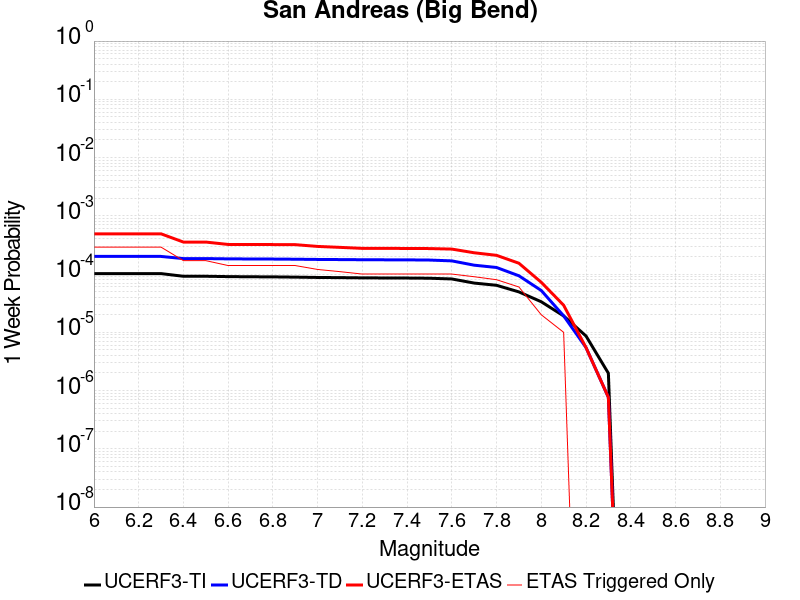 | 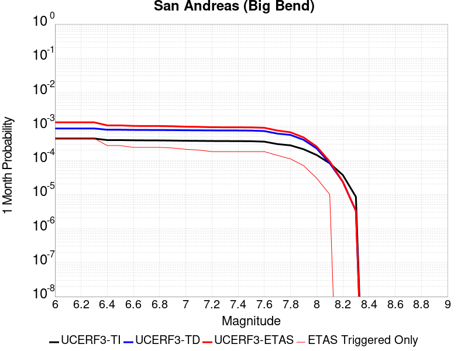 |  |  |

| Magnitude | 1 wk TI Prob | 1 wk TD Prob | 1 wk ETAS Prob | 1 wk ETAS/TD Gain | 1 wk ETAS Triggered Only | 1 mo TI Prob | 1 mo TD Prob | 1 mo ETAS Prob | 1 mo ETAS/TD Gain | 1 mo ETAS Triggered Only | 1 yr TI Prob | 1 yr TD Prob | 1 yr ETAS Prob | 1 yr ETAS/TD Gain | 1 yr ETAS Triggered Only | 10 yr TI Prob | 10 yr TD Prob | 10 yr ETAS Prob | 10 yr ETAS/TD Gain | 10 yr ETAS Triggered Only |
|-----|-----|-----|-----|-----|-----|-----|-----|-----|-----|-----|-----|-----|-----|-----|-----|-----|-----|-----|-----|-----|
| 6.0 | 1.0179969E-4 | 2.0072258E-4 | 4.546823E-4 | 2.2652273 | 2.540107E-4 | 4.362114E-4 | 8.599571E-4 | 0.0011938943 | 1.3883184 | 3.342246E-4 | 0.0052979486 | 0.010419999 | 0.011028564 | 1.0584036 | 6.1497325E-4 | 0.051734097 | 0.10144902 | 0.102313936 | 1.0085256 | 9.625668E-4 |
| 6.1 | 1.0179969E-4 | 2.0072258E-4 | 4.546823E-4 | 2.2652273 | 2.540107E-4 | 4.362114E-4 | 8.599571E-4 | 0.0011938943 | 1.3883184 | 3.342246E-4 | 0.0052979486 | 0.010419999 | 0.011028564 | 1.0584036 | 6.1497325E-4 | 0.051734097 | 0.10144902 | 0.102313936 | 1.0085256 | 9.625668E-4 |
| 6.2 | 1.0179969E-4 | 2.0072258E-4 | 4.546823E-4 | 2.2652273 | 2.540107E-4 | 4.362114E-4 | 8.599571E-4 | 0.0011938943 | 1.3883184 | 3.342246E-4 | 0.0052979486 | 0.010419999 | 0.011028564 | 1.0584036 | 6.1497325E-4 | 0.051734097 | 0.10144902 | 0.102313936 | 1.0085256 | 9.625668E-4 |
| 6.3 | 1.0179969E-4 | 2.0072258E-4 | 4.546823E-4 | 2.2652273 | 2.540107E-4 | 4.362114E-4 | 8.599571E-4 | 0.0011938943 | 1.3883184 | 3.342246E-4 | 0.0052979486 | 0.010419999 | 0.011028564 | 1.0584036 | 6.1497325E-4 | 0.051734097 | 0.10144902 | 0.102313936 | 1.0085256 | 9.625668E-4 |
| 6.4 | 9.1639464E-5 | 1.8429532E-4 | 3.4469357E-4 | 1.8703327 | 1.6042781E-4 | 3.9268145E-4 | 7.895982E-4 | 9.899746E-4 | 1.2537701 | 2.0053476E-4 | 0.0047704205 | 0.009571102 | 0.0098888865 | 1.0332025 | 3.2085562E-4 | 0.046693064 | 0.09377527 | 0.09423565 | 1.0049094 | 5.080214E-4 |
| 6.5 | 9.1639464E-5 | 1.8429532E-4 | 3.4469357E-4 | 1.8703327 | 1.6042781E-4 | 3.9268145E-4 | 7.895982E-4 | 9.899746E-4 | 1.2537701 | 2.0053476E-4 | 0.0047704205 | 0.009571102 | 0.0098888865 | 1.0332025 | 3.2085562E-4 | 0.046693064 | 0.09377527 | 0.09423565 | 1.0049094 | 5.080214E-4 |
| 6.6 | 9.042622E-5 | 1.823659E-4 | 3.293979E-4 | 1.8062472 | 1.4705882E-4 | 3.8748336E-4 | 7.8133424E-4 | 9.683538E-4 | 1.2393591 | 1.8716577E-4 | 0.0047074095 | 0.009471365 | 0.009749454 | 1.0293611 | 2.8074867E-4 | 0.046089325 | 0.092869274 | 0.09325735 | 1.0041788 | 4.2780748E-4 |
| 6.7 | 8.9836685E-5 | 1.8150927E-4 | 3.2854138E-4 | 1.810053 | 1.4705882E-4 | 3.8495753E-4 | 7.776651E-4 | 9.6468534E-4 | 1.2404894 | 1.8716577E-4 | 0.00467679 | 0.00942708 | 0.009705182 | 1.0295004 | 2.8074867E-4 | 0.045795817 | 0.09246355 | 0.092827536 | 1.0039365 | 4.0106953E-4 |
| 6.8 | 8.9471854E-5 | 1.8097709E-4 | 3.280093E-4 | 1.8124355 | 1.4705882E-4 | 3.8339442E-4 | 7.7538576E-4 | 9.624064E-4 | 1.2411969 | 1.8716577E-4 | 0.004657841 | 0.009399569 | 0.009677678 | 1.0295875 | 2.8074867E-4 | 0.04561414 | 0.092210755 | 0.09257484 | 1.0039485 | 4.0106953E-4 |
| 6.9 | 8.858234E-5 | 1.7979681E-4 | 3.268292E-4 | 1.8177696 | 1.4705882E-4 | 3.7958333E-4 | 7.703304E-4 | 9.4399333E-4 | 1.2254395 | 1.737968E-4 | 0.004611638 | 0.009338548 | 0.009603431 | 1.0283644 | 2.6737968E-4 | 0.04517103 | 0.09165087 | 0.091990896 | 1.00371 | 3.7433155E-4 |
| 7.0 | 8.7433385E-5 | 1.7818481E-4 | 3.1185083E-4 | 1.7501538 | 1.3368984E-4 | 3.746607E-4 | 7.634259E-4 | 9.2373125E-4 | 1.2099816 | 1.6042781E-4 | 0.004551957 | 0.009255203 | 0.009506863 | 1.0271912 | 2.540107E-4 | 0.044598386 | 0.09088532 | 0.09121347 | 1.0036106 | 3.6096256E-4 |
| 7.1 | 8.684964E-5 | 1.7730435E-4 | 2.9760387E-4 | 1.6784917 | 1.2032085E-4 | 3.7215967E-4 | 7.596547E-4 | 9.066018E-4 | 1.1934394 | 1.4705882E-4 | 0.0045216335 | 0.009209678 | 0.009448104 | 1.0258886 | 2.406417E-4 | 0.04430731 | 0.09046686 | 0.09078301 | 1.0034946 | 3.475936E-4 |
| 7.2 | 8.606521E-5 | 1.762105E-4 | 2.8314354E-4 | 1.6068482 | 1.0695187E-4 | 3.6879873E-4 | 7.549695E-4 | 8.885584E-4 | 1.176946 | 1.3368984E-4 | 0.0044808835 | 0.0091531165 | 0.009378308 | 1.0246028 | 2.2727273E-4 | 0.043916024 | 0.089947365 | 0.09025153 | 1.0033816 | 3.342246E-4 |
| 7.3 | 8.568266E-5 | 1.7563057E-4 | 2.8256365E-4 | 1.6088524 | 1.0695187E-4 | 3.6715972E-4 | 7.524855E-4 | 8.8607473E-4 | 1.1775306 | 1.3368984E-4 | 0.0044610105 | 0.009123127 | 0.009348326 | 1.0246844 | 2.2727273E-4 | 0.043725148 | 0.08966853 | 0.08997278 | 1.003393 | 3.342246E-4 |
| 7.4 | 8.5432206E-5 | 1.7525644E-4 | 2.8218958E-4 | 1.6101524 | 1.0695187E-4 | 3.6608664E-4 | 7.50883E-4 | 8.844725E-4 | 1.1779099 | 1.3368984E-4 | 0.004447999 | 0.009103781 | 0.009328984 | 1.0247374 | 2.2727273E-4 | 0.043600157 | 0.08948871 | 0.08979303 | 1.0034006 | 3.342246E-4 |
| 7.5 | 8.4791965E-5 | 1.7394972E-4 | 2.80883E-4 | 1.6147366 | 1.0695187E-4 | 3.633435E-4 | 7.4528606E-4 | 8.7887625E-4 | 1.1792469 | 1.3368984E-4 | 0.0044147377 | 0.009036204 | 0.009261424 | 1.024924 | 2.2727273E-4 | 0.043280575 | 0.088866346 | 0.089170866 | 1.0034268 | 3.342246E-4 |
| 7.6 | 8.241105E-5 | 1.6840403E-4 | 2.753379E-4 | 1.634984 | 1.0695187E-4 | 3.531424E-4 | 7.215321E-4 | 8.551255E-4 | 1.1851524 | 1.3368984E-4 | 0.0042910352 | 0.008749358 | 0.0089746425 | 1.0257486 | 2.2727273E-4 | 0.042091176 | 0.086243294 | 0.08654869 | 1.0035411 | 3.342246E-4 |
| 7.7 | 7.00432E-5 | 1.42045E-4 | 2.356146E-4 | 1.658732 | 9.358289E-5 | 3.001506E-4 | 6.0862233E-4 | 7.155091E-4 | 1.1756209 | 1.0695187E-4 | 0.0036482112 | 0.0073848404 | 0.007570624 | 1.0251575 | 1.8716577E-4 | 0.035888977 | 0.07351733 | 0.07377744 | 1.003538 | 2.8074867E-4 |
| 7.8 | 6.415362E-5 | 1.2968935E-4 | 2.0989284E-4 | 1.6184279 | 8.0213904E-5 | 2.749151E-4 | 5.556931E-4 | 6.49224E-4 | 1.168314 | 9.358289E-5 | 0.0033419547 | 0.0067446055 | 0.0069039515 | 1.0236256 | 1.6042781E-4 | 0.03292141 | 0.06725231 | 0.067476764 | 1.0033375 | 2.406417E-4 |
| 7.9 | 4.939911E-5 | 9.3411545E-5 | 1.6025022E-4 | 1.7155291 | 6.684492E-5 | 2.116933E-4 | 4.0027377E-4 | 4.6709194E-4 | 1.1669312 | 6.684492E-5 | 0.0025743195 | 0.004862453 | 0.0049954923 | 1.0273607 | 1.3368984E-4 | 0.025447013 | 0.048914436 | 0.049054302 | 1.0028594 | 1.4705882E-4 |
| 8.0 | 3.344983E-5 | 5.222685E-5 | 7.896342E-5 | 1.5119315 | 2.6737967E-5 | 1.4334853E-4 | 2.2381016E-4 | 2.5054216E-4 | 1.1194404 | 2.6737967E-5 | 0.0017438711 | 0.0027214854 | 0.002774816 | 1.0195961 | 5.3475935E-5 | 0.017302496 | 0.027922187 | 0.027987165 | 1.0023271 | 6.684492E-5 |
| 8.1 | 1.9104898E-5 | 1.9173063E-5 | 3.2541793E-5 | 1.6972661 | 1.3368984E-5 | 8.1875565E-5 | 8.216769E-5 | 9.553557E-5 | 1.1626903 | 1.3368984E-5 | 9.963791E-4 | 9.999331E-4 | 0.0010132887 | 1.0133566 | 1.3368984E-5 | 0.009919235 | 0.010749801 | 0.010776252 | 1.0024606 | 2.6737967E-5 |
| 8.2 | 8.643924E-6 | 5.4748625E-6 | 5.4748625E-6 | 1.0 | 0.0 | 3.704486E-5 | 2.3463486E-5 | 2.3463486E-5 | 1.0 | 0.0 | 4.5092785E-4 | 2.8563058E-4 | 2.8563058E-4 | 1.0 | 0.0 | 0.0045001395 | 0.0032487072 | 0.0032487072 | 1.0 | 0.0 |
| 8.3 | 1.983087E-6 | 7.6599065E-7 | 7.6599065E-7 | 1.0 | 0.0 | 8.498917E-6 | 3.282813E-6 | 3.282813E-6 | 1.0 | 0.0 | 1.034694E-4 | 3.9967534E-5 | 3.9967534E-5 | 1.0 | 0.0 | 0.0010342124 | 4.719687E-4 | 4.719687E-4 | 1.0 | 0.0 |

## Death Valley (No)
*[(top)](#table-of-contents)*

| 1 Week | 1 Month | 1 Year | 10 Year |
|-----|-----|-----|-----|
| 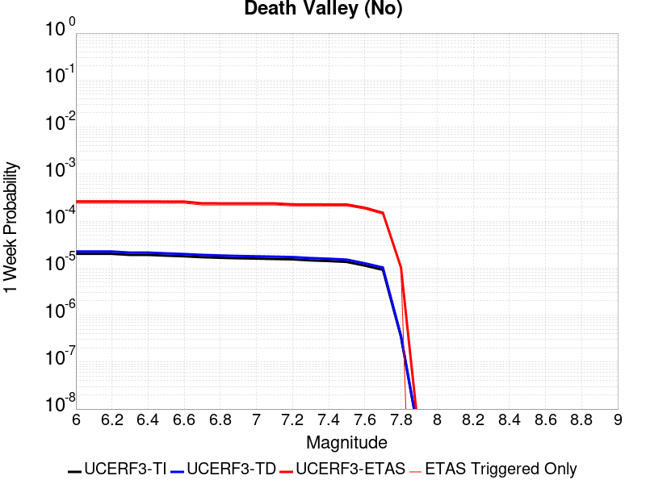 |  |  |  |

| Magnitude | 1 wk TI Prob | 1 wk TD Prob | 1 wk ETAS Prob | 1 wk ETAS/TD Gain | 1 wk ETAS Triggered Only | 1 mo TI Prob | 1 mo TD Prob | 1 mo ETAS Prob | 1 mo ETAS/TD Gain | 1 mo ETAS Triggered Only | 1 yr TI Prob | 1 yr TD Prob | 1 yr ETAS Prob | 1 yr ETAS/TD Gain | 1 yr ETAS Triggered Only | 10 yr TI Prob | 10 yr TD Prob | 10 yr ETAS Prob | 10 yr ETAS/TD Gain | 10 yr ETAS Triggered Only |
|-----|-----|-----|-----|-----|-----|-----|-----|-----|-----|-----|-----|-----|-----|-----|-----|-----|-----|-----|-----|-----|
| 6.0 | 2.0074807E-5 | 2.2500084E-5 | 2.497677E-4 | 11.100745 | 2.2727273E-4 | 8.603206E-5 | 9.642541E-5 | 4.3061777E-4 | 4.465812 | 3.342246E-4 | 0.001046937 | 0.0011733545 | 0.0017074863 | 1.4552178 | 5.3475937E-4 | 0.010420183 | 0.011672506 | 0.012438857 | 1.0656543 | 7.754011E-4 |
| 6.1 | 2.0074807E-5 | 2.2500084E-5 | 2.497677E-4 | 11.100745 | 2.2727273E-4 | 8.603206E-5 | 9.642541E-5 | 4.3061777E-4 | 4.465812 | 3.342246E-4 | 0.001046937 | 0.0011733545 | 0.0017074863 | 1.4552178 | 5.3475937E-4 | 0.010420183 | 0.011672506 | 0.012438857 | 1.0656543 | 7.754011E-4 |
| 6.2 | 2.0074807E-5 | 2.2500084E-5 | 2.497677E-4 | 11.100745 | 2.2727273E-4 | 8.603206E-5 | 9.642541E-5 | 4.3061777E-4 | 4.465812 | 3.342246E-4 | 0.001046937 | 0.0011733545 | 0.0017074863 | 1.4552178 | 5.3475937E-4 | 0.010420183 | 0.011672506 | 0.012438857 | 1.0656543 | 7.754011E-4 |
| 6.3 | 1.9050609E-5 | 2.1336948E-5 | 2.4860483E-4 | 11.651378 | 2.2727273E-4 | 8.164292E-5 | 9.1440896E-5 | 4.2563493E-4 | 4.6547546 | 3.342246E-4 | 9.935491E-4 | 0.001112731 | 0.0016468953 | 1.4800481 | 5.3475937E-4 | 0.009891188 | 0.011072419 | 0.011826013 | 1.0680605 | 7.620321E-4 |
| 6.4 | 1.9050609E-5 | 2.1336948E-5 | 2.4860483E-4 | 11.651378 | 2.2727273E-4 | 8.164292E-5 | 9.1440896E-5 | 4.2563493E-4 | 4.6547546 | 3.342246E-4 | 9.935491E-4 | 0.001112731 | 0.0016468953 | 1.4800481 | 5.3475937E-4 | 0.009891188 | 0.011072419 | 0.011826013 | 1.0680605 | 7.620321E-4 |
| 6.5 | 1.8367004E-5 | 2.0561009E-5 | 2.4782907E-4 | 12.053351 | 2.2727273E-4 | 7.8713354E-5 | 8.811567E-5 | 4.223108E-4 | 4.792687 | 3.342246E-4 | 9.5791375E-4 | 0.0010722869 | 0.0016064728 | 1.4981745 | 5.3475937E-4 | 0.009537951 | 0.0106719155 | 0.0114258155 | 1.0706433 | 7.620321E-4 |
| 6.6 | 1.779439E-5 | 1.9910927E-5 | 2.4717912E-4 | 12.414245 | 2.2727273E-4 | 7.625944E-5 | 8.53298E-5 | 4.1952587E-4 | 4.916523 | 3.342246E-4 | 9.280632E-4 | 0.0010384015 | 0.0015592504 | 1.5015873 | 5.2139035E-4 | 0.009241969 | 0.010336253 | 0.011063946 | 1.0704021 | 7.3529413E-4 |
| 6.7 | 1.7025437E-5 | 1.9043426E-5 | 2.1957437E-4 | 11.530192 | 2.0053476E-4 | 7.296412E-5 | 8.161216E-5 | 3.8907368E-4 | 4.7673497 | 3.0748663E-4 | 8.87976E-4 | 9.931813E-4 | 0.0014873424 | 1.4975538 | 4.946524E-4 | 0.008844362 | 0.009888145 | 0.010589696 | 1.0709486 | 7.0855615E-4 |
| 6.8 | 1.6545107E-5 | 1.8512545E-5 | 2.1904359E-4 | 11.8321705 | 2.0053476E-4 | 7.090568E-5 | 7.93371E-5 | 3.8679934E-4 | 4.8753905 | 3.0748663E-4 | 8.629347E-4 | 9.655073E-4 | 0.0014596821 | 1.5118291 | 4.946524E-4 | 0.008595915 | 0.009613829 | 0.010315573 | 1.0729932 | 7.0855615E-4 |
| 6.9 | 1.615478E-5 | 1.8087594E-5 | 2.1861872E-4 | 12.086667 | 2.0053476E-4 | 6.9232934E-5 | 7.751599E-5 | 3.8497878E-4 | 4.9664435 | 3.0748663E-4 | 8.4258494E-4 | 9.433546E-4 | 0.0014375404 | 1.52386 | 4.946524E-4 | 0.008393973 | 0.009394196 | 0.010082852 | 1.0733066 | 6.951872E-4 |
| 7.0 | 1.5894311E-5 | 1.780555E-5 | 2.1833673E-4 | 12.262285 | 2.0053476E-4 | 6.81167E-5 | 7.6307304E-5 | 3.8377047E-4 | 5.029276 | 3.0748663E-4 | 8.2900526E-4 | 9.286515E-4 | 0.0014228446 | 1.532162 | 4.946524E-4 | 0.008259195 | 0.009248397 | 0.00992391 | 1.0730411 | 6.818182E-4 |
| 7.1 | 1.5602263E-5 | 1.7483504E-5 | 2.1801476E-4 | 12.469741 | 2.0053476E-4 | 6.6865134E-5 | 7.492718E-5 | 3.8239078E-4 | 5.1034985 | 3.0748663E-4 | 8.137789E-4 | 9.118627E-4 | 0.0013927072 | 1.5273212 | 4.812834E-4 | 0.008108052 | 0.009081894 | 0.009744273 | 1.0729339 | 6.684492E-4 |
| 7.2 | 1.5323829E-5 | 1.717063E-5 | 2.0433319E-4 | 11.900157 | 1.8716577E-4 | 6.56719E-5 | 7.358637E-5 | 3.6768237E-4 | 4.9966097 | 2.9411764E-4 | 7.99262E-4 | 8.9555193E-4 | 0.0013630473 | 1.5220193 | 4.6791445E-4 | 0.007963934 | 0.008920107 | 0.009569343 | 1.0727835 | 6.550802E-4 |
| 7.3 | 1.4556212E-5 | 1.6302456E-5 | 2.0346518E-4 | 12.480646 | 1.8716577E-4 | 6.238227E-5 | 6.9865826E-5 | 3.6396293E-4 | 5.2094555 | 2.9411764E-4 | 7.592395E-4 | 8.5029035E-4 | 0.0013178069 | 1.5498316 | 4.6791445E-4 | 0.0075665074 | 0.008471014 | 0.009120545 | 1.0766768 | 6.550802E-4 |
| 7.4 | 1.411725E-5 | 1.580796E-5 | 2.0297078E-4 | 12.839783 | 1.8716577E-4 | 6.0501097E-5 | 6.7746674E-5 | 3.618444E-4 | 5.341139 | 2.9411764E-4 | 7.363519E-4 | 8.245094E-4 | 0.0012920381 | 1.5670385 | 4.6791445E-4 | 0.0073391674 | 0.008215138 | 0.0088515775 | 1.0774715 | 6.4171123E-4 |
| 7.5 | 1.3503312E-5 | 1.5126289E-5 | 2.0228923E-4 | 13.373355 | 1.8716577E-4 | 5.7870053E-5 | 6.482538E-5 | 3.5892395E-4 | 5.536782 | 2.9411764E-4 | 7.043401E-4 | 7.8896893E-4 | 0.0012565142 | 1.5926028 | 4.6791445E-4 | 0.007021119 | 0.007862304 | 0.00849897 | 1.080977 | 6.4171123E-4 |
| 7.6 | 1.1279839E-5 | 1.2626327E-5 | 1.5968329E-4 | 12.6468525 | 1.4705882E-4 | 4.834127E-5 | 5.4111737E-5 | 3.081087E-4 | 5.6939344 | 2.540107E-4 | 5.88396E-4 | 6.5861654E-4 | 0.0010727821 | 1.6288416 | 4.1443852E-4 | 0.005868405 | 0.006567199 | 0.0071382895 | 1.0869612 | 5.748663E-4 |
| 7.7 | 9.189108E-6 | 1.0283358E-5 | 1.1723413E-4 | 11.400373 | 1.0695187E-4 | 3.93813E-5 | 4.407082E-5 | 2.4459674E-4 | 5.5500836 | 2.0053476E-4 | 4.7936183E-4 | 5.3643517E-4 | 8.571187E-4 | 1.5978048 | 3.2085562E-4 | 0.004783291 | 0.005351914 | 0.005790729 | 1.0819923 | 4.4117647E-4 |
| 7.8 | 3.4586725E-7 | 3.6482615E-7 | 3.6482615E-7 | 1.0 | 0.0 | 1.4822873E-6 | 1.5635396E-6 | 1.4932502E-5 | 9.5504465 | 1.3368984E-5 | 1.80467E-5 | 1.9035933E-5 | 3.2404663E-5 | 1.7022891 | 1.3368984E-5 | 1.8045233E-4 | 1.9034347E-4 | 2.037099E-4 | 1.0702227 | 1.3368984E-5 |
| 7.9 | 2.5591178E-9 | 2.6696718E-9 | 2.6696718E-9 | 1.0 | 0.0 | 1.0967647E-8 | 1.14414505E-8 | 1.14414505E-8 | 1.0 | 0.0 | 1.335311E-7 | 1.3929966E-7 | 1.3929966E-7 | 1.0 | 0.0 | 1.3353102E-6 | 1.3929966E-6 | 1.3929966E-6 | 1.0 | 0.0 |

## San Andreas (San Gorgonio Pass-Garnet HIll)
*[(top)](#table-of-contents)*

| 1 Week | 1 Month | 1 Year | 10 Year |
|-----|-----|-----|-----|
|  |  |  |  |

| Magnitude | 1 wk TI Prob | 1 wk TD Prob | 1 wk ETAS Prob | 1 wk ETAS/TD Gain | 1 wk ETAS Triggered Only | 1 mo TI Prob | 1 mo TD Prob | 1 mo ETAS Prob | 1 mo ETAS/TD Gain | 1 mo ETAS Triggered Only | 1 yr TI Prob | 1 yr TD Prob | 1 yr ETAS Prob | 1 yr ETAS/TD Gain | 1 yr ETAS Triggered Only | 10 yr TI Prob | 10 yr TD Prob | 10 yr ETAS Prob | 10 yr ETAS/TD Gain | 10 yr ETAS Triggered Only |
|-----|-----|-----|-----|-----|-----|-----|-----|-----|-----|-----|-----|-----|-----|-----|-----|-----|-----|-----|-----|-----|
| 6.0 | 8.31567E-5 | 2.3382473E-4 | 5.2787364E-4 | 2.257561 | 2.9411764E-4 | 3.5633717E-4 | 0.0010017233 | 0.0013489688 | 1.346648 | 3.475936E-4 | 0.004329778 | 0.012127888 | 0.012695783 | 1.0468255 | 5.748663E-4 | 0.042463828 | 0.11257892 | 0.11326703 | 1.0061122 | 7.754011E-4 |
| 6.1 | 8.31567E-5 | 2.3382473E-4 | 5.2787364E-4 | 2.257561 | 2.9411764E-4 | 3.5633717E-4 | 0.0010017233 | 0.0013489688 | 1.346648 | 3.475936E-4 | 0.004329778 | 0.012127888 | 0.012695783 | 1.0468255 | 5.748663E-4 | 0.042463828 | 0.11257892 | 0.11326703 | 1.0061122 | 7.754011E-4 |
| 6.2 | 8.31567E-5 | 2.3382473E-4 | 5.2787364E-4 | 2.257561 | 2.9411764E-4 | 3.5633717E-4 | 0.0010017233 | 0.0013489688 | 1.346648 | 3.475936E-4 | 0.004329778 | 0.012127888 | 0.012695783 | 1.0468255 | 5.748663E-4 | 0.042463828 | 0.11257892 | 0.11326703 | 1.0061122 | 7.754011E-4 |
| 6.3 | 8.31567E-5 | 2.3382473E-4 | 5.2787364E-4 | 2.257561 | 2.9411764E-4 | 3.5633717E-4 | 0.0010017233 | 0.0013489688 | 1.346648 | 3.475936E-4 | 0.004329778 | 0.012127888 | 0.012695783 | 1.0468255 | 5.748663E-4 | 0.042463828 | 0.11257892 | 0.11326703 | 1.0061122 | 7.754011E-4 |
| 6.4 | 8.059055E-5 | 2.2940808E-4 | 5.2345823E-4 | 2.2817776 | 2.9411764E-4 | 3.4534236E-4 | 9.828096E-4 | 0.0013300615 | 1.3533258 | 3.475936E-4 | 0.0041964394 | 0.011900152 | 0.012468177 | 1.0477326 | 5.748663E-4 | 0.041180745 | 0.11056015 | 0.11124982 | 1.006238 | 7.754011E-4 |
| 6.5 | 8.059055E-5 | 2.2940808E-4 | 5.2345823E-4 | 2.2817776 | 2.9411764E-4 | 3.4534236E-4 | 9.828096E-4 | 0.0013300615 | 1.3533258 | 3.475936E-4 | 0.0041964394 | 0.011900152 | 0.012468177 | 1.0477326 | 5.748663E-4 | 0.041180745 | 0.11056015 | 0.11124982 | 1.006238 | 7.754011E-4 |
| 6.6 | 7.619237E-5 | 2.218517E-4 | 5.159041E-4 | 2.3254457 | 2.9411764E-4 | 3.2649786E-4 | 9.5044886E-4 | 0.0012977121 | 1.3653675 | 3.475936E-4 | 0.0039678677 | 0.01151087 | 0.01207912 | 1.0493664 | 5.748663E-4 | 0.03897764 | 0.10709683 | 0.10778919 | 1.0064648 | 7.754011E-4 |
| 6.7 | 7.440636E-5 | 2.1860997E-4 | 5.1266333E-4 | 2.345105 | 2.9411764E-4 | 3.188454E-4 | 9.3656575E-4 | 0.0012838338 | 1.3707888 | 3.475936E-4 | 0.0038750346 | 0.011343609 | 0.0118987365 | 1.0489376 | 5.6149735E-4 | 0.038081564 | 0.105605274 | 0.10628683 | 1.0064539 | 7.620321E-4 |
| 6.8 | 7.3735864E-5 | 2.1708169E-4 | 5.111355E-4 | 2.3545768 | 2.9411764E-4 | 3.1597257E-4 | 9.3002064E-4 | 0.001277291 | 1.3734007 | 3.475936E-4 | 0.0038401815 | 0.011264749 | 0.011806702 | 1.0481106 | 5.4812833E-4 | 0.03774495 | 0.10490683 | 0.10557695 | 1.0063878 | 7.486631E-4 |
| 6.9 | 7.27575E-5 | 2.1477141E-4 | 5.088259E-4 | 2.3691509 | 2.9411764E-4 | 3.117806E-4 | 9.201265E-4 | 0.0012674002 | 1.3774196 | 3.475936E-4 | 0.003789323 | 0.011145527 | 0.011687545 | 1.0486311 | 5.4812833E-4 | 0.037253562 | 0.103854746 | 0.104525656 | 1.0064601 | 7.486631E-4 |
| 7.0 | 7.102591E-5 | 2.1061185E-4 | 5.046675E-4 | 2.3961973 | 2.9411764E-4 | 3.0436125E-4 | 9.023122E-4 | 0.0012495922 | 1.3848778 | 3.475936E-4 | 0.003699303 | 0.010930831 | 0.011472967 | 1.049597 | 5.4812833E-4 | 0.03638325 | 0.10195695 | 0.10261727 | 1.0064765 | 7.3529413E-4 |
| 7.1 | 7.028513E-5 | 2.0896831E-4 | 5.030245E-4 | 2.4071808 | 2.9411764E-4 | 3.0118722E-4 | 8.9527335E-4 | 0.0012425557 | 1.3879066 | 3.475936E-4 | 0.0036607897 | 0.010845989 | 0.011388172 | 1.0499893 | 5.4812833E-4 | 0.036010686 | 0.101199985 | 0.101860866 | 1.0065304 | 7.3529413E-4 |
| 7.2 | 6.8498244E-5 | 2.0504706E-4 | 4.991044E-4 | 2.4340968 | 2.9411764E-4 | 2.9353087E-4 | 8.784794E-4 | 0.0012257677 | 1.3953289 | 3.475936E-4 | 0.003567883 | 0.010643536 | 0.01118583 | 1.0509505 | 5.4812833E-4 | 0.035111405 | 0.09939202 | 0.100054234 | 1.0066626 | 7.3529413E-4 |
| 7.3 | 6.622592E-5 | 1.9732013E-4 | 4.9137976E-4 | 2.4902668 | 2.9411764E-4 | 2.8379448E-4 | 8.453858E-4 | 0.0011926856 | 1.4108181 | 3.475936E-4 | 0.0034497243 | 0.0102444785 | 0.010786992 | 1.0529566 | 5.4812833E-4 | 0.033966612 | 0.095888525 | 0.09655332 | 1.006933 | 7.3529413E-4 |
| 7.4 | 5.1050705E-5 | 1.4689034E-4 | 4.2759776E-4 | 2.911 | 2.8074867E-4 | 2.1877038E-4 | 6.29379E-4 | 9.6339325E-4 | 1.5307045 | 3.342246E-4 | 0.002660276 | 0.0076359594 | 0.008126834 | 1.0642847 | 4.946524E-4 | 0.02628654 | 0.07286301 | 0.07349516 | 1.0086757 | 6.818182E-4 |
| 7.5 | 3.9302922E-5 | 1.1129847E-4 | 3.9201588E-4 | 3.5222037 | 2.8074867E-4 | 1.6843023E-4 | 4.7690657E-4 | 8.109718E-4 | 1.7004836 | 3.342246E-4 | 0.0020487092 | 0.005790949 | 0.006269445 | 1.0826284 | 4.812834E-4 | 0.020299247 | 0.05600951 | 0.05664052 | 1.0112661 | 6.684492E-4 |
| 7.6 | 2.9851626E-5 | 8.4949745E-5 | 3.3893887E-4 | 3.989875 | 2.540107E-4 | 1.2792926E-4 | 3.6401965E-4 | 6.7139434E-4 | 1.8443904 | 3.0748663E-4 | 0.0015564259 | 0.0044229585 | 0.0048621837 | 1.0993057 | 4.4117647E-4 | 0.0154556995 | 0.04319374 | 0.04378215 | 1.0136226 | 6.1497325E-4 |
| 7.7 | 2.1135214E-5 | 6.3529005E-5 | 2.9078728E-4 | 4.5772367 | 2.2727273E-4 | 9.0576345E-5 | 2.7223877E-4 | 5.52911E-4 | 2.0309782 | 2.8074867E-4 | 0.0011022091 | 0.0033094748 | 0.003709217 | 1.1207871 | 4.0106953E-4 | 0.010967582 | 0.032582592 | 0.033125795 | 1.0166715 | 5.6149735E-4 |
| 7.8 | 1.883379E-5 | 5.564028E-5 | 2.6953212E-4 | 4.8441906 | 2.1390374E-4 | 8.0713755E-5 | 2.3843657E-4 | 5.057525E-4 | 2.1211197 | 2.6737968E-4 | 9.822468E-4 | 0.0028991038 | 0.0032856804 | 1.1333435 | 3.8770054E-4 | 0.0097791655 | 0.028695205 | 0.029227605 | 1.0185536 | 5.4812833E-4 |
| 7.9 | 1.5156185E-5 | 4.1658426E-5 | 2.5555326E-4 | 6.1344914 | 2.1390374E-4 | 6.495346E-5 | 1.785239E-4 | 4.4585584E-4 | 2.4974575 | 2.6737968E-4 | 7.9052144E-4 | 0.0021713632 | 0.002544882 | 1.1720204 | 3.7433155E-4 | 0.007877152 | 0.021759422 | 0.022256391 | 1.0228392 | 5.080214E-4 |
| 8.0 | 1.1405907E-5 | 2.9974231E-5 | 1.9039723E-4 | 6.3520303 | 1.6042781E-4 | 4.8881542E-5 | 1.2845467E-4 | 3.2896368E-4 | 2.560932 | 2.0053476E-4 | 5.9497025E-4 | 0.0015628147 | 0.0018431245 | 1.1793622 | 2.8074867E-4 | 0.005933798 | 0.015772851 | 0.016154436 | 1.0241926 | 3.8770054E-4 |
| 8.1 | 4.3511436E-6 | 7.369219E-6 | 7.369219E-6 | 1.0 | 0.0 | 1.8647626E-5 | 3.1581985E-5 | 3.1581985E-5 | 1.0 | 0.0 | 2.2701119E-4 | 3.8444297E-4 | 3.8444297E-4 | 1.0 | 0.0 | 0.0022677942 | 0.0041163345 | 0.0041296487 | 1.0032344 | 1.3368984E-5 |
| 8.2 | 2.3042528E-6 | 2.7329415E-6 | 2.7329415E-6 | 1.0 | 0.0 | 9.875332E-6 | 1.1712554E-5 | 1.1712554E-5 | 1.0 | 0.0 | 1.2022553E-4 | 1.4259106E-4 | 1.4259106E-4 | 1.0 | 0.0 | 0.0012016051 | 0.0015979785 | 0.0015979785 | 1.0 | 0.0 |
| 8.3 | 5.202968E-7 | 3.1598344E-7 | 3.1598344E-7 | 1.0 | 0.0 | 2.2298414E-6 | 1.3542141E-6 | 1.3542141E-6 | 1.0 | 0.0 | 2.714798E-5 | 1.6487444E-5 | 1.6487444E-5 | 1.0 | 0.0 | 2.7144665E-4 | 1.9563142E-4 | 1.9563142E-4 | 1.0 | 0.0 |

## San Andreas (Coachella) rev
*[(top)](#table-of-contents)*

| 1 Week | 1 Month | 1 Year | 10 Year |
|-----|-----|-----|-----|
|  |  |  |  |

| Magnitude | 1 wk TI Prob | 1 wk TD Prob | 1 wk ETAS Prob | 1 wk ETAS/TD Gain | 1 wk ETAS Triggered Only | 1 mo TI Prob | 1 mo TD Prob | 1 mo ETAS Prob | 1 mo ETAS/TD Gain | 1 mo ETAS Triggered Only | 1 yr TI Prob | 1 yr TD Prob | 1 yr ETAS Prob | 1 yr ETAS/TD Gain | 1 yr ETAS Triggered Only | 10 yr TI Prob | 10 yr TD Prob | 10 yr ETAS Prob | 10 yr ETAS/TD Gain | 10 yr ETAS Triggered Only |
|-----|-----|-----|-----|-----|-----|-----|-----|-----|-----|-----|-----|-----|-----|-----|-----|-----|-----|-----|-----|-----|
| 6.0 | 1.1925945E-4 | 3.2729402E-4 | 5.5449235E-4 | 1.694172 | 2.2727273E-4 | 5.110118E-4 | 0.0014019393 | 0.0016689441 | 1.1904539 | 2.6737968E-4 | 0.0062038354 | 0.016936364 | 0.01737007 | 1.025608 | 4.4117647E-4 | 0.060334753 | 0.15265316 | 0.15316293 | 1.0033394 | 6.016043E-4 |
| 6.1 | 1.1925945E-4 | 3.2729402E-4 | 5.5449235E-4 | 1.694172 | 2.2727273E-4 | 5.110118E-4 | 0.0014019393 | 0.0016689441 | 1.1904539 | 2.6737968E-4 | 0.0062038354 | 0.016936364 | 0.01737007 | 1.025608 | 4.4117647E-4 | 0.060334753 | 0.15265316 | 0.15316293 | 1.0033394 | 6.016043E-4 |
| 6.2 | 1.07432395E-4 | 3.0230157E-4 | 5.295056E-4 | 1.7515807 | 2.2727273E-4 | 4.603433E-4 | 0.0012949388 | 0.0015619723 | 1.2062131 | 2.6737968E-4 | 0.005590286 | 0.015653009 | 0.016087279 | 1.0277436 | 4.4117647E-4 | 0.05451731 | 0.14182423 | 0.14234051 | 1.0036403 | 6.016043E-4 |
| 6.3 | 1.0718766E-4 | 3.0175463E-4 | 5.2895874E-4 | 1.7529434 | 2.2727273E-4 | 4.592948E-4 | 0.0012925972 | 0.0015596312 | 1.2065872 | 2.6737968E-4 | 0.005577586 | 0.015624908 | 0.01605919 | 1.0277942 | 4.4117647E-4 | 0.054396555 | 0.14159249 | 0.14210892 | 1.0036472 | 6.016043E-4 |
| 6.4 | 1.0355944E-4 | 2.9383553E-4 | 5.2104145E-4 | 1.7732419 | 2.2727273E-4 | 4.4375064E-4 | 0.0012586913 | 0.0015257344 | 1.2121594 | 2.6737968E-4 | 0.0053892885 | 0.015217941 | 0.015639238 | 1.0276842 | 4.2780748E-4 | 0.052604496 | 0.13815255 | 0.13865952 | 1.0036696 | 5.8823527E-4 |
| 6.5 | 1.0227914E-4 | 2.9102986E-4 | 5.182364E-4 | 1.7806985 | 2.2727273E-4 | 4.382655E-4 | 0.0012466786 | 0.0015137249 | 1.2142062 | 2.6737968E-4 | 0.0053228354 | 0.01507372 | 0.01549508 | 1.0279533 | 4.2780748E-4 | 0.051971316 | 0.13693172 | 0.13743941 | 1.0037076 | 5.8823527E-4 |
| 6.6 | 1.0116757E-4 | 2.8868738E-4 | 5.158945E-4 | 1.7870351 | 2.2727273E-4 | 4.3350324E-4 | 0.0012366489 | 0.001503698 | 1.2159457 | 2.6737968E-4 | 0.0052651367 | 0.01495329 | 0.015374701 | 1.0281818 | 4.2780748E-4 | 0.051421247 | 0.1359099 | 0.1364182 | 1.0037398 | 5.8823527E-4 |
| 6.7 | 1.0050676E-4 | 2.8727303E-4 | 5.1448046E-4 | 1.7909112 | 2.2727273E-4 | 4.3067214E-4 | 0.0012305931 | 0.0014976438 | 1.2170097 | 2.6737968E-4 | 0.005230834 | 0.014880571 | 0.015302012 | 1.0283216 | 4.2780748E-4 | 0.051094085 | 0.13529462 | 0.13580327 | 1.0037596 | 5.8823527E-4 |
| 6.8 | 9.976819E-5 | 2.853096E-4 | 5.1251746E-4 | 1.7963556 | 2.2727273E-4 | 4.2750788E-4 | 0.0012221863 | 0.0014892392 | 1.2185042 | 2.6737968E-4 | 0.0051924936 | 0.0147796115 | 0.015187925 | 1.0276268 | 4.1443852E-4 | 0.050728295 | 0.13444631 | 0.13494389 | 1.003701 | 5.748663E-4 |
| 6.9 | 9.77719E-5 | 2.8027873E-4 | 5.0748774E-4 | 1.8106538 | 2.2727273E-4 | 4.1895514E-4 | 0.0012006456 | 0.0014677042 | 1.2224293 | 2.6737968E-4 | 0.0050888555 | 0.014520878 | 0.014929298 | 1.0281265 | 4.1443852E-4 | 0.049738888 | 0.1322748 | 0.13277364 | 1.0037712 | 5.748663E-4 |
| 7.0 | 8.500761E-5 | 2.4762485E-4 | 4.748413E-4 | 1.9175833 | 2.2727273E-4 | 3.6426744E-4 | 0.001060821 | 0.001327917 | 1.2517824 | 2.6737968E-4 | 0.0044259406 | 0.012839786 | 0.013235706 | 1.0308354 | 4.0106953E-4 | 0.04338823 | 0.11813272 | 0.11862789 | 1.0041916 | 5.6149735E-4 |
| 7.1 | 8.319876E-5 | 2.4365232E-4 | 4.7086968E-4 | 1.9325475 | 2.2727273E-4 | 3.5651738E-4 | 0.0010438096 | 0.0013109101 | 1.2558901 | 2.6737968E-4 | 0.004331963 | 0.012635092 | 0.013031094 | 1.0313414 | 4.0106953E-4 | 0.042484846 | 0.116353 | 0.11684917 | 1.0042644 | 5.6149735E-4 |
| 7.2 | 7.563917E-5 | 2.2413683E-4 | 4.5135862E-4 | 2.0137637 | 2.2727273E-4 | 3.2412758E-4 | 9.602359E-4 | 0.0012273588 | 1.2781847 | 2.6737968E-4 | 0.0039391145 | 0.011628893 | 0.0120252995 | 1.034088 | 4.0106953E-4 | 0.03870018 | 0.10775925 | 0.10826024 | 1.0046492 | 5.6149735E-4 |
| 7.3 | 7.082985E-5 | 2.0729867E-4 | 4.345243E-4 | 2.0961268 | 2.2727273E-4 | 3.0352117E-4 | 8.881233E-4 | 0.0011552655 | 1.3007941 | 2.6737968E-4 | 0.0036891096 | 0.010759917 | 0.011156671 | 1.0368733 | 4.0106953E-4 | 0.03628465 | 0.100282 | 0.10078719 | 1.0050377 | 5.6149735E-4 |
| 7.4 | 5.146215E-5 | 1.4273795E-4 | 3.6997822E-4 | 2.5920105 | 2.2727273E-4 | 2.2053342E-4 | 6.115915E-4 | 8.788077E-4 | 1.4369193 | 2.6737968E-4 | 0.0026816884 | 0.0074208933 | 0.0077791773 | 1.0482805 | 3.6096256E-4 | 0.02649557 | 0.070849575 | 0.07133403 | 1.0068377 | 5.2139035E-4 |
| 7.5 | 4.0285166E-5 | 1.09416E-4 | 3.3666386E-4 | 3.0769162 | 2.2727273E-4 | 1.7263928E-4 | 4.6884175E-4 | 7.3609606E-4 | 1.5700309 | 2.6737968E-4 | 0.002099857 | 0.0056932783 | 0.006052186 | 1.0630406 | 3.6096256E-4 | 0.020801254 | 0.055011146 | 0.055503856 | 1.0089566 | 5.2139035E-4 |
| 7.6 | 3.1168736E-5 | 8.4389096E-5 | 2.8490694E-4 | 3.3761108 | 2.0053476E-4 | 1.3357346E-4 | 3.6161754E-4 | 6.021722E-4 | 1.6652185 | 2.406417E-4 | 0.0016250437 | 0.0043938323 | 0.0047132783 | 1.0727032 | 3.2085562E-4 | 0.016132116 | 0.04281005 | 0.043257933 | 1.010462 | 4.6791445E-4 |
| 7.7 | 2.2100989E-5 | 6.238755E-5 | 2.361735E-4 | 3.7855868 | 1.737968E-4 | 9.4715084E-5 | 2.6734784E-4 | 4.811944E-4 | 1.7998813 | 2.1390374E-4 | 0.001152546 | 0.0032501083 | 0.00354327 | 1.0902005 | 2.9411764E-4 | 0.011465867 | 0.0319002 | 0.03231436 | 1.012983 | 4.2780748E-4 |
| 7.8 | 1.7484861E-5 | 5.179572E-5 | 2.1221522E-4 | 4.0971575 | 1.6042781E-4 | 7.493296E-5 | 2.2196278E-4 | 4.2245304E-4 | 1.9032607 | 2.0053476E-4 | 9.1192697E-4 | 0.0026990508 | 0.0029790415 | 1.1037368 | 2.8074867E-4 | 0.009081938 | 0.026640115 | 0.027043514 | 1.0151424 | 4.1443852E-4 |
| 7.9 | 1.3967285E-5 | 3.822255E-5 | 1.9864422E-4 | 5.1970425 | 1.6042781E-4 | 5.985842E-5 | 1.6380067E-4 | 3.6430257E-4 | 2.2240605 | 2.0053476E-4 | 7.2853256E-4 | 0.00199245 | 0.002259297 | 1.133929 | 2.6737968E-4 | 0.0072614877 | 0.019909438 | 0.02028942 | 1.0190855 | 3.8770054E-4 |
| 8.0 | 1.1887396E-5 | 3.106521E-5 | 1.7811946E-4 | 5.733728 | 1.4705882E-4 | 5.094499E-5 | 1.3312983E-4 | 3.202707E-4 | 2.4057019 | 1.8716577E-4 | 6.200787E-4 | 0.0016196516 | 0.0018732508 | 1.1565764 | 2.540107E-4 | 0.006183513 | 0.016279267 | 0.016647505 | 1.0226201 | 3.7433155E-4 |
| 8.1 | 5.100864E-6 | 8.973418E-6 | 8.973418E-6 | 1.0 | 0.0 | 2.1860664E-5 | 3.8456936E-5 | 3.8456936E-5 | 1.0 | 0.0 | 2.6612106E-4 | 4.6811273E-4 | 4.6811273E-4 | 1.0 | 0.0 | 0.002658026 | 0.004917731 | 0.004931034 | 1.0027052 | 1.3368984E-5 |
| 8.2 | 2.3004484E-6 | 2.7864487E-6 | 2.7864487E-6 | 1.0 | 0.0 | 9.859027E-6 | 1.1941868E-5 | 1.1941868E-5 | 1.0 | 0.0 | 1.2002704E-4 | 1.4538258E-4 | 1.4538258E-4 | 1.0 | 0.0 | 0.0011996223 | 0.0015973912 | 0.0015973912 | 1.0 | 0.0 |
| 8.3 | 1.0424446E-7 | 5.8161504E-8 | 5.8161504E-8 | 1.0 | 0.0 | 4.4676187E-7 | 2.4926356E-7 | 2.4926356E-7 | 1.0 | 0.0 | 5.439312E-6 | 3.03478E-6 | 3.03478E-6 | 1.0 | 0.0 | 5.4391792E-5 | 3.190716E-5 | 3.190716E-5 | 1.0 | 0.0 |

## Elsinore (Glen Ivy) rev
*[(top)](#table-of-contents)*

| 1 Week | 1 Month | 1 Year | 10 Year |
|-----|-----|-----|-----|
|  |  |  |  |

| Magnitude | 1 wk TI Prob | 1 wk TD Prob | 1 wk ETAS Prob | 1 wk ETAS/TD Gain | 1 wk ETAS Triggered Only | 1 mo TI Prob | 1 mo TD Prob | 1 mo ETAS Prob | 1 mo ETAS/TD Gain | 1 mo ETAS Triggered Only | 1 yr TI Prob | 1 yr TD Prob | 1 yr ETAS Prob | 1 yr ETAS/TD Gain | 1 yr ETAS Triggered Only | 10 yr TI Prob | 10 yr TD Prob | 10 yr ETAS Prob | 10 yr ETAS/TD Gain | 10 yr ETAS Triggered Only |
|-----|-----|-----|-----|-----|-----|-----|-----|-----|-----|-----|-----|-----|-----|-----|-----|-----|-----|-----|-----|-----|
| 6.0 | 1.6204086E-4 | 2.9360707E-4 | 3.737974E-4 | 1.2731214 | 8.0213904E-5 | 6.94276E-4 | 0.0012578638 | 0.0013780334 | 1.0955346 | 1.2032085E-4 | 0.008420097 | 0.015234485 | 0.015497792 | 1.0172836 | 2.6737968E-4 | 0.081081145 | 0.13969168 | 0.14005972 | 1.0026348 | 4.2780748E-4 |
| 6.1 | 1.6204086E-4 | 2.9360707E-4 | 3.737974E-4 | 1.2731214 | 8.0213904E-5 | 6.94276E-4 | 0.0012578638 | 0.0013780334 | 1.0955346 | 1.2032085E-4 | 0.008420097 | 0.015234485 | 0.015497792 | 1.0172836 | 2.6737968E-4 | 0.081081145 | 0.13969168 | 0.14005972 | 1.0026348 | 4.2780748E-4 |
| 6.2 | 1.6204086E-4 | 2.9360707E-4 | 3.737974E-4 | 1.2731214 | 8.0213904E-5 | 6.94276E-4 | 0.0012578638 | 0.0013780334 | 1.0955346 | 1.2032085E-4 | 0.008420097 | 0.015234485 | 0.015497792 | 1.0172836 | 2.6737968E-4 | 0.081081145 | 0.13969168 | 0.14005972 | 1.0026348 | 4.2780748E-4 |
| 6.3 | 1.0111737E-4 | 1.7703383E-4 | 2.438669E-4 | 1.3775159 | 6.684492E-5 | 4.332882E-4 | 7.5861247E-4 | 8.387655E-4 | 1.1056575 | 8.0213904E-5 | 0.005262531 | 0.009217682 | 0.00944286 | 1.0244288 | 2.2727273E-4 | 0.0513964 | 0.0870191 | 0.08734865 | 1.0037872 | 3.6096256E-4 |
| 6.4 | 1.0111737E-4 | 1.7703383E-4 | 2.438669E-4 | 1.3775159 | 6.684492E-5 | 4.332882E-4 | 7.5861247E-4 | 8.387655E-4 | 1.1056575 | 8.0213904E-5 | 0.005262531 | 0.009217682 | 0.00944286 | 1.0244288 | 2.2727273E-4 | 0.0513964 | 0.0870191 | 0.08734865 | 1.0037872 | 3.6096256E-4 |
| 6.5 | 3.6624708E-5 | 4.6391084E-5 | 5.9759448E-5 | 1.2881666 | 1.3368984E-5 | 1.569536E-4 | 1.9880582E-4 | 2.2553848E-4 | 1.1344662 | 2.6737967E-5 | 0.001909235 | 0.0024181372 | 0.002498157 | 1.0330915 | 8.0213904E-5 | 0.01892915 | 0.023739954 | 0.023844367 | 1.0043982 | 1.0695187E-4 |
| 6.6 | 2.5051324E-5 | 2.614772E-5 | 2.614772E-5 | 1.0 | 0.0 | 1.073584E-4 | 1.12057096E-4 | 1.2542459E-4 | 1.1192918 | 1.3368984E-5 | 0.0013063047 | 0.0013634858 | 0.0014168888 | 1.0391666 | 5.3475935E-5 | 0.012986525 | 0.013564618 | 0.013630556 | 1.004861 | 6.684492E-5 |
| 6.7 | 2.2189772E-5 | 2.2072849E-5 | 2.2072849E-5 | 1.0 | 0.0 | 9.509556E-5 | 9.4594696E-5 | 1.0796242E-4 | 1.1413157 | 1.3368984E-5 | 0.0011571734 | 0.0011511183 | 0.0011911792 | 1.0348016 | 4.0106952E-5 | 0.011511663 | 0.011465415 | 0.011518278 | 1.0046107 | 5.3475935E-5 |
| 6.8 | 1.6654378E-5 | 1.4437705E-5 | 1.4437705E-5 | 1.0 | 0.0 | 7.137396E-5 | 6.187444E-5 | 7.52426E-5 | 1.216053 | 1.3368984E-5 | 8.686314E-4 | 7.530661E-4 | 7.7978394E-4 | 1.0354787 | 2.6737967E-5 | 0.008652439 | 0.00751048 | 0.007550286 | 1.0053 | 4.0106952E-5 |
| 6.9 | 1.5042909E-5 | 1.2332022E-5 | 1.2332022E-5 | 1.0 | 0.0 | 6.446802E-5 | 5.285047E-5 | 6.621875E-5 | 1.2529453 | 1.3368984E-5 | 7.8461546E-4 | 6.4326765E-4 | 6.5662805E-4 | 1.0207696 | 1.3368984E-5 | 0.007818509 | 0.00641828 | 0.0064448463 | 1.0041392 | 2.6737967E-5 |
| 7.0 | 1.4361385E-5 | 1.1451324E-5 | 1.1451324E-5 | 1.0 | 0.0 | 6.154734E-5 | 4.9076196E-5 | 6.2444524E-5 | 1.2723994 | 1.3368984E-5 | 7.490812E-4 | 5.973418E-4 | 6.107028E-4 | 1.0223675 | 1.3368984E-5 | 0.007465612 | 0.0059613534 | 0.005987932 | 1.0044584 | 2.6737967E-5 |
| 7.1 | 1.3265571E-5 | 1.0244926E-5 | 1.0244926E-5 | 1.0 | 0.0 | 5.6851208E-5 | 4.39061E-5 | 5.7274498E-5 | 1.304477 | 1.3368984E-5 | 6.919436E-4 | 5.344282E-4 | 5.4779E-4 | 1.0250021 | 1.3368984E-5 | 0.006897931 | 0.0053347866 | 0.005361382 | 1.0049852 | 2.6737967E-5 |
| 7.2 | 1.1596403E-5 | 8.505067E-6 | 8.505067E-6 | 1.0 | 0.0 | 4.9697923E-5 | 3.6449786E-5 | 4.981828E-5 | 1.3667648 | 1.3368984E-5 | 6.049042E-4 | 4.436875E-4 | 4.5705054E-4 | 1.0301181 | 1.3368984E-5 | 0.006032603 | 0.0044294316 | 0.004456051 | 1.0060097 | 2.6737967E-5 |
| 7.3 | 1.0150827E-5 | 7.2387597E-6 | 7.2387597E-6 | 1.0 | 0.0 | 4.3502816E-5 | 3.1022897E-5 | 4.4391465E-5 | 1.4309258 | 1.3368984E-5 | 5.2951806E-4 | 3.7763975E-4 | 3.9100368E-4 | 1.0353881 | 1.3368984E-5 | 0.005282581 | 0.0037703665 | 0.0037970038 | 1.0070648 | 2.6737967E-5 |
| 7.4 | 9.080705E-6 | 6.352519E-6 | 6.352519E-6 | 1.0 | 0.0 | 3.8916725E-5 | 2.7224805E-5 | 4.0593426E-5 | 1.4910456 | 1.3368984E-5 | 4.7370812E-4 | 3.3141294E-4 | 3.447775E-4 | 1.040326 | 1.3368984E-5 | 0.004726996 | 0.0033093381 | 0.0033359875 | 1.0080528 | 2.6737967E-5 |
| 7.5 | 7.671649E-6 | 5.2256332E-6 | 5.2256332E-6 | 1.0 | 0.0 | 3.287808E-5 | 2.2395385E-5 | 3.576407E-5 | 1.5969392 | 1.3368984E-5 | 4.0021708E-4 | 2.7263095E-4 | 2.859963E-4 | 1.0490235 | 1.3368984E-5 | 0.0039949706 | 0.00272309 | 0.0027364225 | 1.0048962 | 1.3368984E-5 |
| 7.6 | 6.990086E-6 | 4.687545E-6 | 4.687545E-6 | 1.0 | 0.0 | 2.9957167E-5 | 2.008933E-5 | 3.3458044E-5 | 1.6654634 | 1.3368984E-5 | 3.6466747E-4 | 2.445613E-4 | 2.5792702E-4 | 1.0546517 | 1.3368984E-5 | 0.0036406964 | 0.002443038 | 0.0024563742 | 1.005459 | 1.3368984E-5 |
| 7.7 | 4.163505E-6 | 2.3295343E-6 | 2.3295343E-6 | 1.0 | 0.0 | 1.7843471E-5 | 9.983683E-6 | 9.983683E-6 | 1.0 | 0.0 | 2.172226E-4 | 1.21545316E-4 | 1.21545316E-4 | 1.0 | 0.0 | 0.0021701038 | 0.0012148614 | 0.0012148614 | 1.0 | 0.0 |
| 7.8 | 2.2692414E-7 | 9.3854695E-8 | 9.3854695E-8 | 1.0 | 0.0 | 9.725317E-7 | 4.0223435E-7 | 4.0223435E-7 | 1.0 | 0.0 | 1.1840509E-5 | 4.8971956E-6 | 4.8971956E-6 | 1.0 | 0.0 | 1.1839878E-4 | 4.8971204E-5 | 4.8971204E-5 | 1.0 | 0.0 |
| 7.9 | 6.676829E-9 | 3.439853E-9 | 3.439853E-9 | 1.0 | 0.0 | 2.861498E-8 | 1.4742227E-8 | 1.4742227E-8 | 1.0 | 0.0 | 3.4838732E-7 | 1.7948659E-7 | 1.7948659E-7 | 1.0 | 0.0 | 3.4838679E-6 | 1.7948646E-6 | 1.7948646E-6 | 1.0 | 0.0 |

## San Andreas (Parkfield)
*[(top)](#table-of-contents)*

| 1 Week | 1 Month | 1 Year | 10 Year |
|-----|-----|-----|-----|
|  |  | 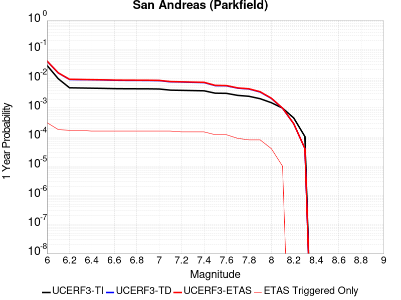 |  |

| Magnitude | 1 wk TI Prob | 1 wk TD Prob | 1 wk ETAS Prob | 1 wk ETAS/TD Gain | 1 wk ETAS Triggered Only | 1 mo TI Prob | 1 mo TD Prob | 1 mo ETAS Prob | 1 mo ETAS/TD Gain | 1 mo ETAS Triggered Only | 1 yr TI Prob | 1 yr TD Prob | 1 yr ETAS Prob | 1 yr ETAS/TD Gain | 1 yr ETAS Triggered Only | 10 yr TI Prob | 10 yr TD Prob | 10 yr ETAS Prob | 10 yr ETAS/TD Gain | 10 yr ETAS Triggered Only |
|-----|-----|-----|-----|-----|-----|-----|-----|-----|-----|-----|-----|-----|-----|-----|-----|-----|-----|-----|-----|-----|
| 6.0 | 5.556969E-4 | 7.7782426E-4 | 8.980515E-4 | 1.1545687 | 1.2032085E-4 | 0.0023793848 | 0.0033298214 | 0.0034763906 | 1.0440171 | 1.4705882E-4 | 0.028586963 | 0.040191233 | 0.04049919 | 1.0076624 | 3.2085562E-4 | 0.25176284 | 0.33716413 | 0.33748317 | 1.0009462 | 4.812834E-4 |
| 6.1 | 1.925858E-4 | 3.0276453E-4 | 3.6958922E-4 | 1.220715 | 6.684492E-5 | 8.2510663E-4 | 0.0012970108 | 0.0013904723 | 1.0720592 | 9.358289E-5 | 0.0099994885 | 0.015778083 | 0.015962297 | 1.0116752 | 1.8716577E-4 | 0.095613256 | 0.1497237 | 0.14993967 | 1.0014426 | 2.540107E-4 |
| 6.2 | 9.4306815E-5 | 1.8242796E-4 | 2.492607E-4 | 1.3663514 | 6.684492E-5 | 4.0410945E-4 | 7.816011E-4 | 8.617523E-4 | 1.1025474 | 8.0213904E-5 | 0.0049089384 | 0.009474681 | 0.009646831 | 1.0181695 | 1.737968E-4 | 0.048019063 | 0.09185409 | 0.09207263 | 1.0023792 | 2.406417E-4 |
| 6.3 | 9.283051E-5 | 1.7939322E-4 | 2.4622615E-4 | 1.3725499 | 6.684492E-5 | 3.9778434E-4 | 7.686027E-4 | 8.4875495E-4 | 1.1042831 | 8.0213904E-5 | 0.0048322747 | 0.009317789 | 0.009489967 | 1.0184784 | 1.737968E-4 | 0.047285385 | 0.09050704 | 0.0907259 | 1.0024182 | 2.406417E-4 |
| 6.4 | 9.138826E-5 | 1.770153E-4 | 2.438484E-4 | 1.3775554 | 6.684492E-5 | 3.916052E-4 | 7.5841765E-4 | 8.385707E-4 | 1.1056846 | 8.0213904E-5 | 0.0047573745 | 0.00919484 | 0.009353792 | 1.0172871 | 1.6042781E-4 | 0.046568092 | 0.08940927 | 0.089616224 | 1.0023147 | 2.2727273E-4 |
| 6.5 | 9.000255E-5 | 1.7459576E-4 | 2.41429E-4 | 1.3827885 | 6.684492E-5 | 3.8566816E-4 | 7.480541E-4 | 8.2820805E-4 | 1.1071498 | 8.0213904E-5 | 0.0046854047 | 0.009069731 | 0.0092287045 | 1.0175278 | 1.6042781E-4 | 0.045878403 | 0.088295065 | 0.08850227 | 1.0023468 | 2.2727273E-4 |
| 6.6 | 8.8109264E-5 | 1.7140752E-4 | 2.3824099E-4 | 1.3899097 | 6.684492E-5 | 3.7755648E-4 | 7.3439797E-4 | 8.14553E-4 | 1.1091439 | 8.0213904E-5 | 0.0045870654 | 0.008904854 | 0.009063853 | 1.0178553 | 1.6042781E-4 | 0.04493529 | 0.0868267 | 0.08703423 | 1.0023903 | 2.2727273E-4 |
| 6.7 | 8.738073E-5 | 1.7007832E-4 | 2.3691187E-4 | 1.3929574 | 6.684492E-5 | 3.7443507E-4 | 7.287046E-4 | 8.0886006E-4 | 1.1099972 | 8.0213904E-5 | 0.0045492216 | 0.008836143 | 0.008995153 | 1.0179955 | 1.6042781E-4 | 0.04457213 | 0.08622707 | 0.086434744 | 1.0024085 | 2.2727273E-4 |
| 6.8 | 8.710195E-5 | 1.6953335E-4 | 2.3636693E-4 | 1.394221 | 6.684492E-5 | 3.7324068E-4 | 7.263703E-4 | 8.0652593E-4 | 1.110351 | 8.0213904E-5 | 0.0045347405 | 0.008807961 | 0.008966976 | 1.0180535 | 1.6042781E-4 | 0.04443313 | 0.08597467 | 0.0861824 | 1.0024163 | 2.2727273E-4 |
| 6.9 | 8.6801556E-5 | 1.689429E-4 | 2.3577653E-4 | 1.3955989 | 6.684492E-5 | 3.7195362E-4 | 7.2384125E-4 | 8.039971E-4 | 1.1107367 | 8.0213904E-5 | 0.0045191357 | 0.008777418 | 0.008936438 | 1.018117 | 1.6042781E-4 | 0.044283327 | 0.085700735 | 0.085908525 | 1.0024247 | 2.2727273E-4 |
| 7.0 | 8.5571606E-5 | 1.6647128E-4 | 2.3330507E-4 | 1.4014734 | 6.684492E-5 | 3.6668387E-4 | 7.132544E-4 | 7.934111E-4 | 1.1123816 | 8.0213904E-5 | 0.004455241 | 0.008649553 | 0.008808593 | 1.0183871 | 1.6042781E-4 | 0.043669727 | 0.08454914 | 0.084757194 | 1.0024608 | 2.2727273E-4 |
| 7.1 | 7.82589E-5 | 1.5128135E-4 | 2.1811615E-4 | 1.4417914 | 6.684492E-5 | 3.3535215E-4 | 6.481883E-4 | 7.283502E-4 | 1.1236707 | 8.0213904E-5 | 0.0040752706 | 0.007863307 | 0.008022473 | 1.0202416 | 1.6042781E-4 | 0.040013418 | 0.07746111 | 0.077670775 | 1.0027068 | 2.2727273E-4 |
| 7.2 | 7.690929E-5 | 1.4865391E-4 | 2.021219E-4 | 1.359681 | 5.3475935E-5 | 3.2956956E-4 | 6.369334E-4 | 7.037357E-4 | 1.1048812 | 6.684492E-5 | 0.004005129 | 0.007727258 | 0.00787318 | 1.0188841 | 1.4705882E-4 | 0.0393371 | 0.07623427 | 0.07641952 | 1.00243 | 2.0053476E-4 |
| 7.3 | 7.5543794E-5 | 1.4561978E-4 | 1.9908792E-4 | 1.3671764 | 5.3475935E-5 | 3.2371894E-4 | 6.2393624E-4 | 6.907394E-4 | 1.1070673 | 6.684492E-5 | 0.003934157 | 0.007570127 | 0.0077160727 | 1.0192791 | 1.4705882E-4 | 0.038652334 | 0.074797355 | 0.07498289 | 1.0024805 | 2.0053476E-4 |
| 7.4 | 7.4214564E-5 | 1.4262961E-4 | 1.9609793E-4 | 1.3748752 | 5.3475935E-5 | 3.1802364E-4 | 6.111273E-4 | 6.7793136E-4 | 1.1093129 | 6.684492E-5 | 0.003865065 | 0.00741525 | 0.007561218 | 1.0196849 | 1.4705882E-4 | 0.03798529 | 0.07337123 | 0.07355706 | 1.0025326 | 2.0053476E-4 |
| 7.5 | 6.149578E-5 | 1.11907226E-4 | 1.6537718E-4 | 1.4778061 | 5.3475935E-5 | 2.6352672E-4 | 4.7951436E-4 | 5.3296465E-4 | 1.1114676 | 5.3475935E-5 | 0.0032037178 | 0.0058224914 | 0.0059421114 | 1.0205445 | 1.2032085E-4 | 0.03157923 | 0.058557566 | 0.058708597 | 1.0025792 | 1.6042781E-4 |
| 7.6 | 6.0643448E-5 | 1.10193796E-4 | 1.6366385E-4 | 1.4852364 | 5.3475935E-5 | 2.598746E-4 | 4.7217376E-4 | 5.2562443E-4 | 1.1132013 | 5.3475935E-5 | 0.0031593828 | 0.0057335934 | 0.0058532245 | 1.020865 | 1.2032085E-4 | 0.031148417 | 0.057718582 | 0.057869747 | 1.002619 | 1.6042781E-4 |
| 7.7 | 5.1652263E-5 | 9.174698E-5 | 1.3185025E-4 | 1.4371073 | 4.0106952E-5 | 2.2134806E-4 | 3.931421E-4 | 4.332333E-4 | 1.1019763 | 4.0106952E-5 | 0.002691582 | 0.0047760103 | 0.004882451 | 1.0222867 | 1.0695187E-4 | 0.026592141 | 0.04853623 | 0.048676148 | 1.0028828 | 1.4705882E-4 |
| 7.8 | 4.8090482E-5 | 8.559635E-5 | 1.2569988E-4 | 1.468519 | 4.0106952E-5 | 2.060858E-4 | 3.6678996E-4 | 4.068822E-4 | 1.1093057 | 4.0106952E-5 | 0.0025062072 | 0.0044565317 | 0.004549698 | 1.0209055 | 9.358289E-5 | 0.024781305 | 0.04530245 | 0.045430083 | 1.0028174 | 1.3368984E-4 |
| 7.9 | 3.970278E-5 | 6.750426E-5 | 1.076085E-4 | 1.5940995 | 4.0106952E-5 | 1.7014367E-4 | 2.892719E-4 | 3.2936726E-4 | 1.1386079 | 4.0106952E-5 | 0.002069531 | 0.0035162016 | 0.0036094554 | 1.0265212 | 9.358289E-5 | 0.020503636 | 0.035881363 | 0.035984475 | 1.0028738 | 1.0695187E-4 |
| 8.0 | 2.8982335E-5 | 4.069796E-5 | 5.40664E-5 | 1.3284794 | 1.3368984E-5 | 1.2420409E-4 | 1.7440817E-4 | 1.8777483E-4 | 1.07664 | 1.3368984E-5 | 0.0015111357 | 0.0021213528 | 0.0021613745 | 1.0188662 | 4.0106952E-5 | 0.015009012 | 0.022010697 | 0.022062995 | 1.0023761 | 5.3475935E-5 |
| 8.1 | 1.8836186E-5 | 1.8681134E-5 | 3.204987E-5 | 1.7156276 | 1.3368984E-5 | 8.0724014E-5 | 8.005955E-5 | 9.3427465E-5 | 1.1669747 | 1.3368984E-5 | 9.823717E-4 | 9.742898E-4 | 9.876457E-4 | 1.0137084 | 1.3368984E-5 | 0.009780403 | 0.010488115 | 0.010514573 | 1.0025226 | 2.6737967E-5 |
| 8.2 | 8.643924E-6 | 5.4748625E-6 | 5.4748625E-6 | 1.0 | 0.0 | 3.704486E-5 | 2.3463486E-5 | 2.3463486E-5 | 1.0 | 0.0 | 4.5092785E-4 | 2.8563058E-4 | 2.8563058E-4 | 1.0 | 0.0 | 0.0045001395 | 0.0032487072 | 0.0032487072 | 1.0 | 0.0 |
| 8.3 | 1.983087E-6 | 7.6599065E-7 | 7.6599065E-7 | 1.0 | 0.0 | 8.498917E-6 | 3.282813E-6 | 3.282813E-6 | 1.0 | 0.0 | 1.034694E-4 | 3.9967534E-5 | 3.9967534E-5 | 1.0 | 0.0 | 0.0010342124 | 4.719687E-4 | 4.719687E-4 | 1.0 | 0.0 |

## Death Valley (Fish Lake Valley)
*[(top)](#table-of-contents)*

| 1 Week | 1 Month | 1 Year | 10 Year |
|-----|-----|-----|-----|
|  | 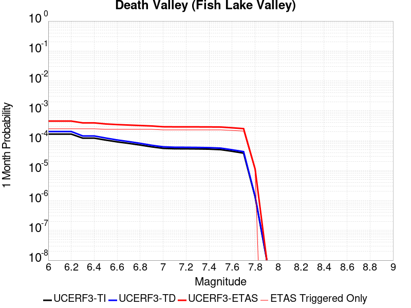 |  |  |

| Magnitude | 1 wk TI Prob | 1 wk TD Prob | 1 wk ETAS Prob | 1 wk ETAS/TD Gain | 1 wk ETAS Triggered Only | 1 mo TI Prob | 1 mo TD Prob | 1 mo ETAS Prob | 1 mo ETAS/TD Gain | 1 mo ETAS Triggered Only | 1 yr TI Prob | 1 yr TD Prob | 1 yr ETAS Prob | 1 yr ETAS/TD Gain | 1 yr ETAS Triggered Only | 10 yr TI Prob | 10 yr TD Prob | 10 yr ETAS Prob | 10 yr ETAS/TD Gain | 10 yr ETAS Triggered Only |
|-----|-----|-----|-----|-----|-----|-----|-----|-----|-----|-----|-----|-----|-----|-----|-----|-----|-----|-----|-----|-----|
| 6.0 | 3.872328E-5 | 4.7267473E-5 | 1.6758264E-4 | 3.5454116 | 1.2032085E-4 | 1.6594635E-4 | 2.0256084E-4 | 4.03055E-4 | 1.9897971 | 2.0053476E-4 | 0.0020185246 | 0.002463534 | 0.0028236073 | 1.1461613 | 3.6096256E-4 | 0.02000288 | 0.024388181 | 0.02487077 | 1.0197878 | 4.946524E-4 |
| 6.1 | 3.872328E-5 | 4.7267473E-5 | 1.6758264E-4 | 3.5454116 | 1.2032085E-4 | 1.6594635E-4 | 2.0256084E-4 | 4.03055E-4 | 1.9897971 | 2.0053476E-4 | 0.0020185246 | 0.002463534 | 0.0028236073 | 1.1461613 | 3.6096256E-4 | 0.02000288 | 0.024388181 | 0.02487077 | 1.0197878 | 4.946524E-4 |
| 6.2 | 3.872328E-5 | 4.7267473E-5 | 1.6758264E-4 | 3.5454116 | 1.2032085E-4 | 1.6594635E-4 | 2.0256084E-4 | 4.03055E-4 | 1.9897971 | 2.0053476E-4 | 0.0020185246 | 0.002463534 | 0.0028236073 | 1.1461613 | 3.6096256E-4 | 0.02000288 | 0.024388181 | 0.02487077 | 1.0197878 | 4.946524E-4 |
| 6.3 | 2.8356371E-5 | 3.3609853E-5 | 1.5392667E-4 | 4.5798078 | 1.2032085E-4 | 1.2152165E-4 | 1.4403471E-4 | 3.4454057E-4 | 2.3920662 | 2.0053476E-4 | 0.0014785219 | 0.0017522911 | 0.0020992756 | 1.1980176 | 3.475936E-4 | 0.014687235 | 0.017391782 | 0.017864695 | 1.0271918 | 4.812834E-4 |
| 6.4 | 2.8356371E-5 | 3.3609853E-5 | 1.5392667E-4 | 4.5798078 | 1.2032085E-4 | 1.2152165E-4 | 1.4403471E-4 | 3.4454057E-4 | 2.3920662 | 2.0053476E-4 | 0.0014785219 | 0.0017522911 | 0.0020992756 | 1.1980176 | 3.475936E-4 | 0.014687235 | 0.017391782 | 0.017864695 | 1.0271918 | 4.812834E-4 |
| 6.5 | 2.4448687E-5 | 2.8607552E-5 | 1.4892497E-4 | 5.205792 | 1.2032085E-4 | 1.0477588E-4 | 1.2259831E-4 | 3.0974115E-4 | 2.5264714 | 1.8716577E-4 | 0.0012748998 | 0.0014916632 | 0.0018253891 | 1.2237275 | 3.342246E-4 | 0.012676105 | 0.014821377 | 0.015282356 | 1.0311023 | 4.6791445E-4 |
| 6.6 | 2.1298161E-5 | 2.4660083E-5 | 1.4497797E-4 | 5.8790545 | 1.2032085E-4 | 9.127464E-5 | 1.0568198E-4 | 2.92828E-4 | 2.7708411 | 1.8716577E-4 | 0.0011107022 | 0.0012859525 | 0.0016197474 | 1.2595701 | 3.342246E-4 | 0.011051672 | 0.012788526 | 0.013250456 | 1.0361207 | 4.6791445E-4 |
| 6.7 | 1.8959729E-5 | 2.1781025E-5 | 1.4209926E-4 | 6.523993 | 1.2032085E-4 | 8.125345E-5 | 9.334405E-5 | 2.8049236E-4 | 3.00493 | 1.8716577E-4 | 9.888117E-4 | 0.001135897 | 0.0014697419 | 1.2939043 | 3.342246E-4 | 0.009844234 | 0.01130357 | 0.011766195 | 1.0409274 | 4.6791445E-4 |
| 6.8 | 1.6691629E-5 | 1.9018353E-5 | 1.3933692E-4 | 7.3264456 | 1.2032085E-4 | 7.153359E-5 | 8.150477E-5 | 2.686553E-4 | 3.296191 | 1.8716577E-4 | 8.7057345E-4 | 9.918857E-4 | 0.0013257788 | 1.3366246 | 3.342246E-4 | 0.008671708 | 0.009876343 | 0.010339636 | 1.0469093 | 4.6791445E-4 |
| 6.9 | 1.450505E-5 | 1.638954E-5 | 1.3670842E-4 | 8.3412 | 1.2032085E-4 | 6.216302E-5 | 7.0239046E-5 | 2.573917E-4 | 3.66451 | 1.8716577E-4 | 7.5657194E-4 | 8.5483363E-4 | 0.0011887725 | 1.3906478 | 3.342246E-4 | 0.007540013 | 0.008516385 | 0.008980315 | 1.054475 | 4.6791445E-4 |
| 7.0 | 1.2940855E-5 | 1.4537972E-5 | 1.3485708E-4 | 9.2761965 | 1.2032085E-4 | 5.545963E-5 | 6.230414E-5 | 2.4945824E-4 | 4.0038795 | 1.8716577E-4 | 6.750118E-4 | 7.5829466E-4 | 0.0010922658 | 1.440424 | 3.342246E-4 | 0.006729651 | 0.0075576897 | 0.008022068 | 1.0614444 | 4.6791445E-4 |
| 7.1 | 1.2544658E-5 | 1.4078208E-5 | 1.3439737E-4 | 9.546483 | 1.2032085E-4 | 5.3761712E-5 | 6.0333812E-5 | 2.474883E-4 | 4.1019835 | 1.8716577E-4 | 6.5435225E-4 | 7.343222E-4 | 0.0010683014 | 1.4548129 | 3.342246E-4 | 0.006524288 | 0.007319551 | 0.0077840406 | 1.0634588 | 4.6791445E-4 |
| 7.2 | 1.2489416E-5 | 1.4015674E-5 | 1.3433484E-4 | 9.584615 | 1.2032085E-4 | 5.3524967E-5 | 6.0065824E-5 | 2.4722036E-4 | 4.1158237 | 1.8716577E-4 | 6.514716E-4 | 7.310616E-4 | 0.0010650419 | 1.4568428 | 3.342246E-4 | 0.006495651 | 0.0072871596 | 0.007751664 | 1.0637429 | 4.6791445E-4 |
| 7.3 | 1.2368307E-5 | 1.3879812E-5 | 1.34199E-4 | 9.668646 | 1.2032085E-4 | 5.3005948E-5 | 5.9483587E-5 | 2.4663823E-4 | 4.146324 | 1.8716577E-4 | 6.451563E-4 | 7.2397763E-4 | 0.0010579602 | 1.4613162 | 3.342246E-4 | 0.0064328653 | 0.007216782 | 0.0076813195 | 1.0643691 | 4.6791445E-4 |
| 7.4 | 1.2161707E-5 | 1.36478675E-5 | 1.3396709E-4 | 9.815971 | 1.2032085E-4 | 5.212056E-5 | 5.8489582E-5 | 2.4564442E-4 | 4.1997976 | 1.8716577E-4 | 6.3438306E-4 | 7.118836E-4 | 0.0010458702 | 1.4691591 | 3.342246E-4 | 0.006325751 | 0.0070966207 | 0.0075612143 | 1.0654669 | 4.6791445E-4 |
| 7.5 | 1.1707948E-5 | 1.3145515E-5 | 1.3346478E-4 | 10.152876 | 1.2032085E-4 | 5.0175953E-5 | 5.6336736E-5 | 2.4349197E-4 | 4.3220816 | 1.8716577E-4 | 6.10721E-4 | 6.856895E-4 | 0.001019685 | 1.4870943 | 3.342246E-4 | 0.0060904534 | 0.006836321 | 0.0073010367 | 1.0679774 | 4.6791445E-4 |
| 7.6 | 1.0319538E-5 | 1.1579622E-5 | 1.1853025E-4 | 10.236107 | 1.0695187E-4 | 4.4225842E-5 | 4.9626036E-5 | 2.234142E-4 | 4.5019555 | 1.737968E-4 | 5.383166E-4 | 6.040347E-4 | 9.246965E-4 | 1.5308665 | 3.2085562E-4 | 0.0053701443 | 0.0060244603 | 0.0064762672 | 1.0749954 | 4.5454546E-4 |
| 7.7 | 8.937764E-6 | 1.0022779E-5 | 1.0360473E-4 | 10.336926 | 9.358289E-5 | 3.830414E-5 | 4.295409E-5 | 2.03375E-4 | 4.7347064 | 1.6042781E-4 | 4.6625308E-4 | 5.228456E-4 | 8.0344744E-4 | 1.5366821 | 2.8074867E-4 | 0.0046527605 | 0.005216664 | 0.0056156414 | 1.0764813 | 4.0106953E-4 |
| 7.8 | 3.108007E-7 | 3.284654E-7 | 3.284654E-7 | 1.0 | 0.0 | 1.3320023E-6 | 1.407708E-6 | 1.407708E-6 | 1.0 | 0.0 | 1.6217007E-5 | 1.7138715E-5 | 1.7138715E-5 | 1.0 | 0.0 | 1.6215823E-4 | 1.7137431E-4 | 1.7137431E-4 | 1.0 | 0.0 |
| 7.9 | 2.5591178E-9 | 2.6696718E-9 | 2.6696718E-9 | 1.0 | 0.0 | 1.0967647E-8 | 1.14414505E-8 | 1.14414505E-8 | 1.0 | 0.0 | 1.335311E-7 | 1.3929966E-7 | 1.3929966E-7 | 1.0 | 0.0 | 1.3353102E-6 | 1.3929966E-6 | 1.3929966E-6 | 1.0 | 0.0 |

## Red Pass
*[(top)](#table-of-contents)*

| 1 Week | 1 Month | 1 Year | 10 Year |
|-----|-----|-----|-----|
|  |  |  |  |

| Magnitude | 1 wk TI Prob | 1 wk TD Prob | 1 wk ETAS Prob | 1 wk ETAS/TD Gain | 1 wk ETAS Triggered Only | 1 mo TI Prob | 1 mo TD Prob | 1 mo ETAS Prob | 1 mo ETAS/TD Gain | 1 mo ETAS Triggered Only | 1 yr TI Prob | 1 yr TD Prob | 1 yr ETAS Prob | 1 yr ETAS/TD Gain | 1 yr ETAS Triggered Only | 10 yr TI Prob | 10 yr TD Prob | 10 yr ETAS Prob | 10 yr ETAS/TD Gain | 10 yr ETAS Triggered Only |
|-----|-----|-----|-----|-----|-----|-----|-----|-----|-----|-----|-----|-----|-----|-----|-----|-----|-----|-----|-----|-----|
| 6.0 | 8.258278E-6 | 8.551265E-6 | 1.4223997E-4 | 16.633791 | 1.3368984E-4 | 3.539214E-5 | 3.6647863E-5 | 2.3717528E-4 | 6.4717355 | 2.0053476E-4 | 4.308141E-4 | 4.4611428E-4 | 7.8018976E-4 | 1.7488563 | 3.342246E-4 | 0.0042997985 | 0.004453945 | 0.0049064658 | 1.1016 | 4.5454546E-4 |
| 6.1 | 3.649988E-6 | 3.7753161E-6 | 7.0619986E-5 | 18.705713 | 6.684492E-5 | 1.5642712E-5 | 1.6179853E-5 | 1.09761226E-4 | 6.783821 | 9.358289E-5 | 1.9043336E-4 | 1.9697666E-4 | 3.7073923E-4 | 1.8821479 | 1.737968E-4 | 0.0019027026 | 0.001968488 | 0.0022219988 | 1.1287844 | 2.540107E-4 |
| 6.2 | 3.649988E-6 | 3.7753161E-6 | 7.0619986E-5 | 18.705713 | 6.684492E-5 | 1.5642712E-5 | 1.6179853E-5 | 1.09761226E-4 | 6.783821 | 9.358289E-5 | 1.9043336E-4 | 1.9697666E-4 | 3.7073923E-4 | 1.8821479 | 1.737968E-4 | 0.0019027026 | 0.001968488 | 0.0022219988 | 1.1287844 | 2.540107E-4 |
| 6.3 | 1.3924937E-6 | 1.4411166E-6 | 2.8179045E-5 | 19.55362 | 2.6737967E-5 | 5.9678164E-6 | 6.1762075E-6 | 3.291401E-5 | 5.329162 | 2.6737967E-5 | 7.265574E-5 | 7.519415E-5 | 1.4203404E-4 | 1.8888975 | 6.684492E-5 | 7.263199E-4 | 7.518258E-4 | 8.319794E-4 | 1.106612 | 8.0213904E-5 |
| 6.4 | 1.3924937E-6 | 1.4411166E-6 | 2.8179045E-5 | 19.55362 | 2.6737967E-5 | 5.9678164E-6 | 6.1762075E-6 | 3.291401E-5 | 5.329162 | 2.6737967E-5 | 7.265574E-5 | 7.519415E-5 | 1.4203404E-4 | 1.8888975 | 6.684492E-5 | 7.263199E-4 | 7.518258E-4 | 8.319794E-4 | 1.106612 | 8.0213904E-5 |
| 6.5 | 9.876812E-7 | 1.0221912E-6 | 1.4391161E-5 | 14.078737 | 1.3368984E-5 | 4.2329125E-6 | 4.3808195E-6 | 1.7749744E-5 | 4.0516953 | 1.3368984E-5 | 5.153449E-5 | 5.3336476E-5 | 9.344129E-5 | 1.7519209 | 4.0106952E-5 | 5.1522546E-4 | 5.333648E-4 | 5.868122E-4 | 1.100208 | 5.3475935E-5 |

## Owens Valley
*[(top)](#table-of-contents)*

| 1 Week | 1 Month | 1 Year | 10 Year |
|-----|-----|-----|-----|
|  |  | 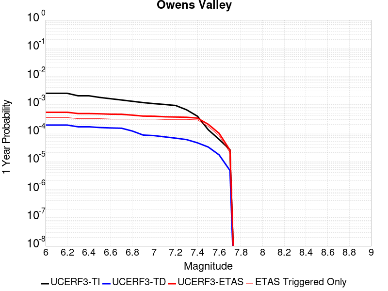 |  |

| Magnitude | 1 wk TI Prob | 1 wk TD Prob | 1 wk ETAS Prob | 1 wk ETAS/TD Gain | 1 wk ETAS Triggered Only | 1 mo TI Prob | 1 mo TD Prob | 1 mo ETAS Prob | 1 mo ETAS/TD Gain | 1 mo ETAS Triggered Only | 1 yr TI Prob | 1 yr TD Prob | 1 yr ETAS Prob | 1 yr ETAS/TD Gain | 1 yr ETAS Triggered Only | 10 yr TI Prob | 10 yr TD Prob | 10 yr ETAS Prob | 10 yr ETAS/TD Gain | 10 yr ETAS Triggered Only |
|-----|-----|-----|-----|-----|-----|-----|-----|-----|-----|-----|-----|-----|-----|-----|-----|-----|-----|-----|-----|-----|
| 6.0 | 4.83821E-5 | 3.626567E-6 | 2.5763633E-4 | 71.04139 | 2.540107E-4 | 2.0733538E-4 | 1.5542342E-5 | 3.096554E-4 | 19.923342 | 2.9411764E-4 | 0.002521386 | 1.8921259E-4 | 5.768398E-4 | 3.048633 | 3.8770054E-4 | 0.024929691 | 0.001925011 | 0.0023920247 | 1.2426032 | 4.6791445E-4 |
| 6.1 | 4.83821E-5 | 3.626567E-6 | 2.5763633E-4 | 71.04139 | 2.540107E-4 | 2.0733538E-4 | 1.5542342E-5 | 3.096554E-4 | 19.923342 | 2.9411764E-4 | 0.002521386 | 1.8921259E-4 | 5.768398E-4 | 3.048633 | 3.8770054E-4 | 0.024929691 | 0.001925011 | 0.0023920247 | 1.2426032 | 4.6791445E-4 |
| 6.2 | 4.83821E-5 | 3.626567E-6 | 2.5763633E-4 | 71.04139 | 2.540107E-4 | 2.0733538E-4 | 1.5542342E-5 | 3.096554E-4 | 19.923342 | 2.9411764E-4 | 0.002521386 | 1.8921259E-4 | 5.768398E-4 | 3.048633 | 3.8770054E-4 | 0.024929691 | 0.001925011 | 0.0023920247 | 1.2426032 | 4.6791445E-4 |
| 6.3 | 3.953008E-5 | 3.1553948E-6 | 2.4379634E-4 | 77.26334 | 2.406417E-4 | 1.6940363E-4 | 1.3523055E-5 | 2.9426793E-4 | 21.760462 | 2.8074867E-4 | 0.002060538 | 1.6463149E-4 | 5.255346E-4 | 3.1921878 | 3.6096256E-4 | 0.020415364 | 0.0016592 | 0.0020862976 | 1.2574118 | 4.2780748E-4 |
| 6.4 | 3.953008E-5 | 3.1553948E-6 | 2.4379634E-4 | 77.26334 | 2.406417E-4 | 1.6940363E-4 | 1.3523055E-5 | 2.9426793E-4 | 21.760462 | 2.8074867E-4 | 0.002060538 | 1.6463149E-4 | 5.255346E-4 | 3.1921878 | 3.6096256E-4 | 0.020415364 | 0.0016592 | 0.0020862976 | 1.2574118 | 4.2780748E-4 |
| 6.5 | 3.457342E-5 | 2.9715961E-6 | 2.436126E-4 | 81.980385 | 2.406417E-4 | 1.4816338E-4 | 1.2735354E-5 | 2.9348044E-4 | 23.044544 | 2.8074867E-4 | 0.0018023965 | 1.550426E-4 | 5.159492E-4 | 3.3277898 | 3.6096256E-4 | 0.017878477 | 0.001555719 | 0.001982861 | 1.2745624 | 4.2780748E-4 |
| 6.6 | 3.1127765E-5 | 2.8744932E-6 | 2.4351552E-4 | 84.71598 | 2.406417E-4 | 1.3339789E-4 | 1.2319203E-5 | 2.930644E-4 | 23.789234 | 2.8074867E-4 | 0.0016229092 | 1.4997667E-4 | 4.975181E-4 | 3.3173037 | 3.475936E-4 | 0.016111081 | 0.0015012559 | 0.0019150722 | 1.2756468 | 4.1443852E-4 |
| 6.7 | 2.806885E-5 | 2.8104134E-6 | 2.4345145E-4 | 86.62478 | 2.406417E-4 | 1.2028952E-4 | 1.20445775E-5 | 2.9278986E-4 | 24.308853 | 2.8074867E-4 | 0.001463541 | 1.4663354E-4 | 4.941762E-4 | 3.370144 | 3.475936E-4 | 0.014539397 | 0.0014657511 | 0.0018795821 | 1.2823337 | 4.1443852E-4 |
| 6.8 | 2.524524E-5 | 2.2353688E-6 | 2.4287654E-4 | 108.651665 | 2.406417E-4 | 1.0818939E-4 | 9.580118E-6 | 2.903261E-4 | 30.305063 | 2.8074867E-4 | 0.0013164099 | 1.16632E-4 | 4.6418505E-4 | 3.9799116 | 3.475936E-4 | 0.01308639 | 0.0011659812 | 0.0015799365 | 1.3550274 | 4.1443852E-4 |
| 6.9 | 2.2704568E-5 | 1.6081682E-6 | 2.4224949E-4 | 150.6369 | 2.406417E-4 | 9.730166E-5 | 6.8921313E-6 | 2.8763886E-4 | 41.734383 | 2.8074867E-4 | 0.0011840039 | 8.390849E-5 | 4.314729E-4 | 5.1421843 | 3.475936E-4 | 0.011777153 | 8.3897985E-4 | 0.0012530707 | 1.4935646 | 4.1443852E-4 |
| 7.0 | 2.0871712E-5 | 1.5395453E-6 | 2.4218089E-4 | 157.30676 | 2.406417E-4 | 8.944713E-5 | 6.598035E-6 | 2.8734485E-4 | 43.550064 | 2.8074867E-4 | 0.0010884746 | 8.032813E-5 | 4.278938E-4 | 5.3268237 | 3.475936E-4 | 0.010831586 | 8.0316263E-4 | 0.0012172683 | 1.5155938 | 4.1443852E-4 |
| 7.1 | 1.944928E-5 | 1.3864178E-6 | 2.4202779E-4 | 174.5706 | 2.406417E-4 | 8.335139E-5 | 5.941777E-6 | 2.8668877E-4 | 48.24967 | 2.8074867E-4 | 0.0010143308 | 7.233874E-5 | 4.0653915E-4 | 5.619937 | 3.342246E-4 | 0.010097133 | 7.2330976E-4 | 0.0011240891 | 1.554091 | 4.0106953E-4 |
| 7.2 | 1.7876306E-5 | 1.2489141E-6 | 2.4189033E-4 | 193.68051 | 2.406417E-4 | 7.6610486E-5 | 5.352478E-6 | 2.8609965E-4 | 53.45181 | 2.8074867E-4 | 9.3233347E-4 | 6.516448E-5 | 3.993673E-4 | 6.128604 | 3.342246E-4 | 0.009284316 | 6.5159105E-4 | 0.0010523993 | 1.6151223 | 4.0106953E-4 |
| 7.3 | 1.2618672E-5 | 1.1115209E-6 | 2.4175296E-4 | 217.49745 | 2.406417E-4 | 5.40789E-5 | 4.763652E-6 | 2.85511E-4 | 59.93531 | 2.8074867E-4 | 6.582117E-4 | 5.799593E-5 | 3.9220115E-4 | 6.762563 | 3.342246E-4 | 0.0065626553 | 5.7994033E-4 | 9.807773E-4 | 1.6911693 | 4.0106953E-4 |
| 7.4 | 7.4874442E-6 | 8.5486437E-7 | 2.2812739E-4 | 266.858 | 2.2727273E-4 | 3.208865E-5 | 3.6636993E-6 | 2.710424E-4 | 73.98052 | 2.6737968E-4 | 3.906093E-4 | 4.4604632E-5 | 3.6544594E-4 | 8.193005 | 3.2085562E-4 | 0.003899234 | 4.4604883E-4 | 8.335764E-4 | 1.8688009 | 3.8770054E-4 |
| 7.5 | 2.4734156E-6 | 6.068616E-7 | 1.3429661E-4 | 221.29695 | 1.3368984E-4 | 1.060031E-5 | 2.6008327E-6 | 1.7639717E-4 | 67.82334 | 1.737968E-4 | 1.2905113E-4 | 3.166468E-5 | 2.321931E-4 | 7.332873 | 2.0053476E-4 | 0.0012897621 | 3.1660203E-4 | 5.705323E-4 | 1.8020488 | 2.540107E-4 |
| 7.6 | 1.1328841E-6 | 3.196531E-7 | 8.053353E-5 | 251.9404 | 8.0213904E-5 | 4.8552088E-6 | 1.3699412E-6 | 9.49527E-5 | 69.311516 | 9.358289E-5 | 5.9110564E-5 | 1.6678909E-5 | 1.1026023E-4 | 6.610759 | 9.358289E-5 | 5.9094845E-4 | 1.6677675E-4 | 2.8707754E-4 | 1.7213283 | 1.2032085E-4 |
| 7.7 | 4.8613185E-7 | 8.964689E-8 | 1.345863E-5 | 150.12935 | 1.3368984E-5 | 2.0834207E-6 | 3.8420092E-7 | 1.375318E-5 | 35.796844 | 1.3368984E-5 | 2.536535E-5 | 4.6776368E-6 | 1.8046558E-5 | 3.8580503 | 1.3368984E-5 | 2.5362454E-4 | 4.677545E-5 | 7.3512165E-5 | 1.5715972 | 2.6737967E-5 |

## San Jacinto (San Bernardino)
*[(top)](#table-of-contents)*

| 1 Week | 1 Month | 1 Year | 10 Year |
|-----|-----|-----|-----|
|  |  | 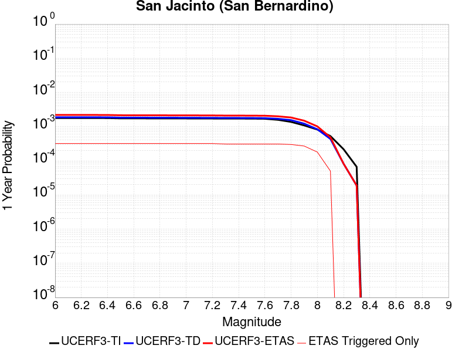 |  |

| Magnitude | 1 wk TI Prob | 1 wk TD Prob | 1 wk ETAS Prob | 1 wk ETAS/TD Gain | 1 wk ETAS Triggered Only | 1 mo TI Prob | 1 mo TD Prob | 1 mo ETAS Prob | 1 mo ETAS/TD Gain | 1 mo ETAS Triggered Only | 1 yr TI Prob | 1 yr TD Prob | 1 yr ETAS Prob | 1 yr ETAS/TD Gain | 1 yr ETAS Triggered Only | 10 yr TI Prob | 10 yr TD Prob | 10 yr ETAS Prob | 10 yr ETAS/TD Gain | 10 yr ETAS Triggered Only |
|-----|-----|-----|-----|-----|-----|-----|-----|-----|-----|-----|-----|-----|-----|-----|-----|-----|-----|-----|-----|-----|
| 6.0 | 3.409352E-5 | 3.5986508E-5 | 2.7661957E-4 | 7.686757 | 2.406417E-4 | 1.461069E-4 | 1.542188E-4 | 4.4829107E-4 | 2.9068513 | 2.9411764E-4 | 0.0017774 | 0.0018759987 | 0.002236284 | 1.1920499 | 3.6096256E-4 | 0.01763251 | 0.019349935 | 0.019808795 | 1.0237138 | 4.6791445E-4 |
| 6.1 | 3.409352E-5 | 3.5986508E-5 | 2.7661957E-4 | 7.686757 | 2.406417E-4 | 1.461069E-4 | 1.542188E-4 | 4.4829107E-4 | 2.9068513 | 2.9411764E-4 | 0.0017774 | 0.0018759987 | 0.002236284 | 1.1920499 | 3.6096256E-4 | 0.01763251 | 0.019349935 | 0.019808795 | 1.0237138 | 4.6791445E-4 |
| 6.2 | 3.409352E-5 | 3.5986508E-5 | 2.7661957E-4 | 7.686757 | 2.406417E-4 | 1.461069E-4 | 1.542188E-4 | 4.4829107E-4 | 2.9068513 | 2.9411764E-4 | 0.0017774 | 0.0018759987 | 0.002236284 | 1.1920499 | 3.6096256E-4 | 0.01763251 | 0.019349935 | 0.019808795 | 1.0237138 | 4.6791445E-4 |
| 6.3 | 3.409352E-5 | 3.5986508E-5 | 2.7661957E-4 | 7.686757 | 2.406417E-4 | 1.461069E-4 | 1.542188E-4 | 4.4829107E-4 | 2.9068513 | 2.9411764E-4 | 0.0017774 | 0.0018759987 | 0.002236284 | 1.1920499 | 3.6096256E-4 | 0.01763251 | 0.019349935 | 0.019808795 | 1.0237138 | 4.6791445E-4 |
| 6.4 | 3.400795E-5 | 3.5879173E-5 | 2.7651226E-4 | 7.7067623 | 2.406417E-4 | 1.4574021E-4 | 1.5375883E-4 | 4.4783126E-4 | 2.9125564 | 2.9411764E-4 | 0.0017729428 | 0.0018704084 | 0.002230696 | 1.192625 | 3.6096256E-4 | 0.017588645 | 0.019295016 | 0.019753903 | 1.0237826 | 4.6791445E-4 |
| 6.5 | 3.341482E-5 | 3.5139812E-5 | 2.7577305E-4 | 7.8478813 | 2.406417E-4 | 1.4319851E-4 | 1.5059051E-4 | 4.4466386E-4 | 2.9528015 | 2.9411764E-4 | 0.0017420477 | 0.0018318989 | 0.0021922004 | 1.1966819 | 3.6096256E-4 | 0.017284546 | 0.018916558 | 0.019375622 | 1.0242678 | 4.6791445E-4 |
| 6.6 | 3.3364955E-5 | 3.5077028E-5 | 2.757103E-4 | 7.8601384 | 2.406417E-4 | 1.4298483E-4 | 1.5032147E-4 | 4.4439491E-4 | 2.956297 | 2.9411764E-4 | 0.0017394501 | 0.001828629 | 0.0021889315 | 1.1970342 | 3.6096256E-4 | 0.017258976 | 0.018884424 | 0.019343501 | 1.0243099 | 4.6791445E-4 |
| 6.7 | 3.335922E-5 | 3.5066805E-5 | 2.7570006E-4 | 7.8621387 | 2.406417E-4 | 1.4296026E-4 | 1.5027766E-4 | 4.443511E-4 | 2.9568675 | 2.9411764E-4 | 0.0017391514 | 0.0018280965 | 0.0021883992 | 1.1970917 | 3.6096256E-4 | 0.017256035 | 0.018879214 | 0.019338295 | 1.0243167 | 4.6791445E-4 |
| 6.8 | 3.327683E-5 | 3.496087E-5 | 2.7559418E-4 | 7.882932 | 2.406417E-4 | 1.4260718E-4 | 1.498237E-4 | 4.438973E-4 | 2.9627974 | 2.9411764E-4 | 0.0017348597 | 0.0018225788 | 0.0021828834 | 1.1976895 | 3.6096256E-4 | 0.017213784 | 0.018824987 | 0.019284092 | 1.0243881 | 4.6791445E-4 |
| 6.9 | 3.3235785E-5 | 3.4901823E-5 | 2.7553513E-4 | 7.894577 | 2.406417E-4 | 1.4243131E-4 | 1.4957068E-4 | 4.4364433E-4 | 2.9661183 | 2.9411764E-4 | 0.0017327217 | 0.0018195034 | 0.0021798091 | 1.1980243 | 3.6096256E-4 | 0.017192734 | 0.018794855 | 0.019253975 | 1.024428 | 4.6791445E-4 |
| 7.0 | 3.3197095E-5 | 3.4841752E-5 | 2.754751E-4 | 7.906464 | 2.406417E-4 | 1.422655E-4 | 1.4931326E-4 | 4.43387E-4 | 2.9695084 | 2.9411764E-4 | 0.0017307063 | 0.0018163746 | 0.0021766815 | 1.1983659 | 3.6096256E-4 | 0.017172894 | 0.018764233 | 0.019223368 | 1.0244685 | 4.6791445E-4 |
| 7.1 | 3.3129716E-5 | 3.4721965E-5 | 2.7535533E-4 | 7.930292 | 2.406417E-4 | 1.4197677E-4 | 1.4879994E-4 | 4.4287383E-4 | 2.9763038 | 2.9411764E-4 | 0.0017271966 | 0.0018101353 | 0.0021704445 | 1.1990509 | 3.6096256E-4 | 0.017138338 | 0.018703312 | 0.019162476 | 1.0245498 | 4.6791445E-4 |
| 7.2 | 3.3034008E-5 | 3.458941E-5 | 2.752228E-4 | 7.956851 | 2.406417E-4 | 1.4156665E-4 | 1.4823192E-4 | 4.4230596E-4 | 2.983878 | 2.9411764E-4 | 0.0017222111 | 0.0018032312 | 0.002163543 | 1.1998144 | 3.6096256E-4 | 0.017089253 | 0.018635705 | 0.0190949 | 1.0246406 | 4.6791445E-4 |
| 7.3 | 3.2956614E-5 | 3.445717E-5 | 2.750906E-4 | 7.9835515 | 2.406417E-4 | 1.4123498E-4 | 1.4766524E-4 | 4.4173945E-4 | 2.9914925 | 2.9411764E-4 | 0.0017181796 | 0.0017963431 | 0.0021433122 | 1.193153 | 3.475936E-4 | 0.017049557 | 0.018568452 | 0.019014558 | 1.0240248 | 4.5454546E-4 |
| 7.4 | 3.2915937E-5 | 3.4378863E-5 | 2.750123E-4 | 7.9994583 | 2.406417E-4 | 1.4106068E-4 | 1.4732967E-4 | 4.41404E-4 | 2.996029 | 2.9411764E-4 | 0.0017160608 | 0.0017922645 | 0.0021392351 | 1.1935934 | 3.475936E-4 | 0.017028693 | 0.018528719 | 0.018974843 | 1.0240774 | 4.5454546E-4 |
| 7.5 | 3.281791E-5 | 3.4243778E-5 | 2.7487724E-4 | 8.027071 | 2.406417E-4 | 1.406406E-4 | 1.4675081E-4 | 4.408253E-4 | 3.0039036 | 2.9411764E-4 | 0.0017109542 | 0.0017852283 | 0.0021322013 | 1.1943578 | 3.475936E-4 | 0.016978411 | 0.018459605 | 0.01890576 | 1.0241692 | 4.5454546E-4 |
| 7.6 | 3.2521442E-5 | 3.396873E-5 | 2.7460227E-4 | 8.083972 | 2.406417E-4 | 1.3937015E-4 | 1.4557215E-4 | 4.3964697E-4 | 3.020131 | 2.9411764E-4 | 0.0016955109 | 0.0017709016 | 0.0021178797 | 1.195933 | 3.475936E-4 | 0.016826328 | 0.018317232 | 0.018763453 | 1.0243607 | 4.5454546E-4 |
| 7.7 | 3.0287873E-5 | 3.245276E-5 | 2.7308665E-4 | 8.414897 | 2.406417E-4 | 1.297987E-4 | 1.3907586E-4 | 4.331526E-4 | 3.114506 | 2.9411764E-4 | 0.0015791537 | 0.0016919347 | 0.00203894 | 1.2050939 | 3.475936E-4 | 0.01567979 | 0.01752809 | 0.01797467 | 1.0254779 | 4.5454546E-4 |
| 7.8 | 2.6316151E-5 | 2.9663592E-5 | 2.7029816E-4 | 9.112119 | 2.406417E-4 | 1.1277862E-4 | 1.2712348E-4 | 4.2120373E-4 | 3.3133433 | 2.9411764E-4 | 0.0013722149 | 0.0015466306 | 0.0018803383 | 1.2157643 | 3.342246E-4 | 0.013637724 | 0.016069634 | 0.016503721 | 1.0270128 | 4.4117647E-4 |
| 7.9 | 2.0761147E-5 | 2.34181E-5 | 2.506855E-4 | 10.704775 | 2.2727273E-4 | 8.897331E-5 | 1.0035944E-4 | 3.810799E-4 | 3.7971509 | 2.8074867E-4 | 0.0010827117 | 0.0012211921 | 0.0015283031 | 1.2514848 | 3.0748663E-4 | 0.010774517 | 0.012793174 | 0.013202311 | 1.0319809 | 4.1443852E-4 |
| 8.0 | 1.5738568E-5 | 1.6033575E-5 | 1.4972127E-4 | 9.337984 | 1.3368984E-4 | 6.744926E-5 | 6.871352E-5 | 2.4249837E-4 | 3.5291216 | 1.737968E-4 | 8.2088535E-4 | 8.3626667E-4 | 0.0010232759 | 1.223624 | 1.8716577E-4 | 0.008178596 | 0.008865921 | 0.009091178 | 1.0254072 | 2.2727273E-4 |
| 8.1 | 1.0105832E-5 | 8.3304985E-6 | 4.8437116E-5 | 5.814432 | 4.0106952E-5 | 4.3309992E-5 | 3.570165E-5 | 1.0254418E-4 | 2.8722534 | 6.684492E-5 | 5.2717153E-4 | 4.345814E-4 | 5.013973E-4 | 1.1537477 | 6.684492E-5 | 0.005259227 | 0.004677232 | 0.0047570704 | 1.0170697 | 8.0213904E-5 |
| 8.2 | 4.189207E-6 | 1.5784357E-6 | 1.5784357E-6 | 1.0 | 0.0 | 1.7953622E-5 | 6.7647065E-6 | 6.7647065E-6 | 1.0 | 0.0 | 2.1856341E-4 | 8.235722E-5 | 8.235722E-5 | 1.0 | 0.0 | 0.0021834858 | 9.565867E-4 | 9.565867E-4 | 1.0 | 0.0 |
| 8.3 | 1.2758221E-6 | 3.6149942E-7 | 3.6149942E-7 | 1.0 | 0.0 | 5.4677976E-6 | 1.5492824E-6 | 1.5492824E-6 | 1.0 | 0.0 | 6.65684E-5 | 1.8862354E-5 | 1.8862354E-5 | 1.0 | 0.0 | 6.6548464E-4 | 2.2751294E-4 | 2.2751294E-4 | 1.0 | 0.0 |

## San Andreas (Cholame) rev
*[(top)](#table-of-contents)*

| 1 Week | 1 Month | 1 Year | 10 Year |
|-----|-----|-----|-----|
|  |  |  |  |

| Magnitude | 1 wk TI Prob | 1 wk TD Prob | 1 wk ETAS Prob | 1 wk ETAS/TD Gain | 1 wk ETAS Triggered Only | 1 mo TI Prob | 1 mo TD Prob | 1 mo ETAS Prob | 1 mo ETAS/TD Gain | 1 mo ETAS Triggered Only | 1 yr TI Prob | 1 yr TD Prob | 1 yr ETAS Prob | 1 yr ETAS/TD Gain | 1 yr ETAS Triggered Only | 10 yr TI Prob | 10 yr TD Prob | 10 yr ETAS Prob | 10 yr ETAS/TD Gain | 10 yr ETAS Triggered Only |
|-----|-----|-----|-----|-----|-----|-----|-----|-----|-----|-----|-----|-----|-----|-----|-----|-----|-----|-----|-----|-----|
| 6.0 | 1.2302514E-4 | 2.5204287E-4 | 3.723334E-4 | 1.4772621 | 1.2032085E-4 | 5.27144E-4 | 0.0010797381 | 0.0012533474 | 1.1607882 | 1.737968E-4 | 0.0063991086 | 0.0130670825 | 0.013383745 | 1.0242337 | 3.2085562E-4 | 0.06217949 | 0.12439073 | 0.12478873 | 1.0031996 | 4.5454546E-4 |
| 6.1 | 1.2302514E-4 | 2.5204287E-4 | 3.723334E-4 | 1.4772621 | 1.2032085E-4 | 5.27144E-4 | 0.0010797381 | 0.0012533474 | 1.1607882 | 1.737968E-4 | 0.0063991086 | 0.0130670825 | 0.013383745 | 1.0242337 | 3.2085562E-4 | 0.06217949 | 0.12439073 | 0.12478873 | 1.0031996 | 4.5454546E-4 |
| 6.2 | 1.2203569E-4 | 2.5021084E-4 | 3.705016E-4 | 1.4807576 | 1.2032085E-4 | 5.2290526E-4 | 0.0010718931 | 0.0012455035 | 1.1619662 | 1.737968E-4 | 0.006347804 | 0.01297271 | 0.013289403 | 1.0244123 | 3.2085562E-4 | 0.061695136 | 0.12357691 | 0.12397528 | 1.0032237 | 4.5454546E-4 |
| 6.3 | 1.2142645E-4 | 2.4907055E-4 | 3.6936146E-4 | 1.482959 | 1.2032085E-4 | 5.202953E-4 | 0.0010670102 | 0.0012406216 | 1.1627083 | 1.737968E-4 | 0.006316212 | 0.012913967 | 0.013230679 | 1.0245248 | 3.2085562E-4 | 0.06139677 | 0.12307103 | 0.123469636 | 1.0032388 | 4.5454546E-4 |
| 6.4 | 1.1865206E-4 | 2.44126E-4 | 3.644175E-4 | 1.4927434 | 1.2032085E-4 | 5.0840975E-4 | 0.0010458364 | 0.0012194514 | 1.166006 | 1.737968E-4 | 0.006172335 | 0.012659196 | 0.01296279 | 1.023982 | 3.0748663E-4 | 0.060036868 | 0.1208638 | 0.12125166 | 1.003209 | 4.4117647E-4 |
| 6.5 | 1.17443946E-4 | 2.4205919E-4 | 3.6235093E-4 | 1.4969517 | 1.2032085E-4 | 5.032341E-4 | 0.0010369857 | 0.0012106022 | 1.1674243 | 1.737968E-4 | 0.006109677 | 0.012552682 | 0.012856309 | 1.0241882 | 3.0748663E-4 | 0.059444077 | 0.11993805 | 0.12032632 | 1.0032372 | 4.4117647E-4 |
| 6.6 | 1.13579066E-4 | 2.3514954E-4 | 3.554421E-4 | 1.5115577 | 1.2032085E-4 | 4.866766E-4 | 0.001007396 | 0.0011810177 | 1.1723471 | 1.737968E-4 | 0.0059092017 | 0.012196515 | 0.012500251 | 1.0249035 | 3.0748663E-4 | 0.057545185 | 0.11685214 | 0.11724177 | 1.0033343 | 4.4117647E-4 |
| 6.7 | 1.1271412E-4 | 2.3359268E-4 | 3.5388544E-4 | 1.5149679 | 1.2032085E-4 | 4.829711E-4 | 0.0010007289 | 0.0011743518 | 1.1734964 | 1.737968E-4 | 0.005864331 | 0.012116249 | 0.01242001 | 1.0250705 | 3.0748663E-4 | 0.057119697 | 0.116155714 | 0.11654564 | 1.0033569 | 4.4117647E-4 |
| 6.8 | 1.1217975E-4 | 2.3247694E-4 | 3.5276983E-4 | 1.5174401 | 1.2032085E-4 | 4.8068175E-4 | 9.959509E-4 | 0.0011695746 | 1.1743296 | 1.737968E-4 | 0.005836608 | 0.012058721 | 0.0123625 | 1.0251917 | 3.0748663E-4 | 0.056856725 | 0.11565396 | 0.11604412 | 1.0033735 | 4.4117647E-4 |
| 6.9 | 1.1146753E-4 | 2.3096445E-4 | 3.512575E-4 | 1.5208293 | 1.2032085E-4 | 4.7763053E-4 | 9.894737E-4 | 0.0011630985 | 1.1754719 | 1.737968E-4 | 0.0057996577 | 0.011980731 | 0.012271325 | 1.0242552 | 2.9411764E-4 | 0.056506127 | 0.11497439 | 0.11535301 | 1.003293 | 4.2780748E-4 |
| 7.0 | 1.0965793E-4 | 2.2719789E-4 | 3.474914E-4 | 1.5294658 | 1.2032085E-4 | 4.698779E-4 | 9.733434E-4 | 0.001146971 | 1.1783828 | 1.737968E-4 | 0.005705768 | 0.011786487 | 0.012077138 | 1.0246596 | 2.9411764E-4 | 0.055614736 | 0.11327597 | 0.113655314 | 1.0033488 | 4.2780748E-4 |
| 7.1 | 9.927982E-5 | 2.0538924E-4 | 3.2568537E-4 | 1.5856984 | 1.2032085E-4 | 4.2541555E-4 | 8.7994366E-4 | 0.0010535875 | 1.1973352 | 1.737968E-4 | 0.0051671406 | 0.010660981 | 0.010938737 | 1.0260534 | 2.8074867E-4 | 0.05048634 | 0.1033706 | 0.1037422 | 1.0035948 | 4.1443852E-4 |
| 7.2 | 9.696786E-5 | 2.0043184E-4 | 3.0736226E-4 | 1.5335002 | 1.0695187E-4 | 4.1551032E-4 | 8.5871184E-4 | 0.0010190018 | 1.1866634 | 1.6042781E-4 | 0.00504711 | 0.010404981 | 0.010669578 | 1.0254298 | 2.6737968E-4 | 0.04934009 | 0.1011086 | 0.101457104 | 1.0034468 | 3.8770054E-4 |
| 7.3 | 9.4727984E-5 | 1.9472468E-4 | 3.0165573E-4 | 1.5491396 | 1.0695187E-4 | 4.0591392E-4 | 8.3426846E-4 | 9.812046E-4 | 1.1761258 | 1.4705882E-4 | 0.0049308087 | 0.010110183 | 0.010361625 | 1.0248703 | 2.540107E-4 | 0.048228268 | 0.09847952 | 0.09881698 | 1.0034268 | 3.7433155E-4 |
| 7.4 | 9.220358E-5 | 1.8843076E-4 | 2.9536246E-4 | 1.5674855 | 1.0695187E-4 | 3.9509835E-4 | 8.073114E-4 | 9.5425145E-4 | 1.1820117 | 1.4705882E-4 | 0.004799717 | 0.009784967 | 0.010036492 | 1.0257052 | 2.540107E-4 | 0.046973653 | 0.095557496 | 0.095883965 | 1.0034164 | 3.6096256E-4 |
| 7.5 | 7.71631E-5 | 1.5177966E-4 | 2.4534835E-4 | 1.6164771 | 9.358289E-5 | 3.306571E-4 | 6.503223E-4 | 7.705649E-4 | 1.184897 | 1.2032085E-4 | 0.0040183207 | 0.007889002 | 0.008101217 | 1.0269003 | 2.1390374E-4 | 0.03946433 | 0.07828531 | 0.07856872 | 1.0036203 | 3.0748663E-4 |
| 7.6 | 7.5634416E-5 | 1.483744E-4 | 2.419434E-4 | 1.6306276 | 9.358289E-5 | 3.241072E-4 | 6.3573546E-4 | 7.5597985E-4 | 1.1891421 | 1.2032085E-4 | 0.0039388672 | 0.0077126776 | 0.007924931 | 1.0275202 | 2.1390374E-4 | 0.038697794 | 0.07664872 | 0.07693264 | 1.0037042 | 3.0748663E-4 |
| 7.7 | 6.3783E-5 | 1.235872E-4 | 2.0379119E-4 | 1.6489668 | 8.0213904E-5 | 2.7332708E-4 | 5.29552E-4 | 6.230853E-4 | 1.1766273 | 9.358289E-5 | 0.0033226798 | 0.0064282627 | 0.006600942 | 1.0268625 | 1.737968E-4 | 0.032734364 | 0.06454029 | 0.06477791 | 1.0036817 | 2.540107E-4 |
| 7.8 | 5.863422E-5 | 1.1416107E-4 | 1.8099837E-4 | 1.5854648 | 6.684492E-5 | 2.512653E-4 | 4.8917E-4 | 5.6934473E-4 | 1.1638994 | 8.0213904E-5 | 0.003054864 | 0.0059394026 | 0.006085588 | 1.0246128 | 1.4705882E-4 | 0.030132094 | 0.059659187 | 0.05986033 | 1.0033715 | 2.1390374E-4 |
| 7.9 | 4.595283E-5 | 8.426331E-5 | 1.3773474E-4 | 1.6345755 | 5.3475935E-5 | 1.9692584E-4 | 3.610785E-4 | 4.1453514E-4 | 1.1480471 | 5.3475935E-5 | 0.0023949358 | 0.0043872762 | 0.004507069 | 1.0273046 | 1.2032085E-4 | 0.023692891 | 0.044362005 | 0.044489764 | 1.00288 | 1.3368984E-4 |
| 8.0 | 3.2950178E-5 | 5.0772942E-5 | 7.7509554E-5 | 1.5265917 | 2.6737967E-5 | 1.412074E-4 | 2.1758018E-4 | 2.4431234E-4 | 1.1228611 | 2.6737967E-5 | 0.0017178444 | 0.0026458222 | 0.0026991568 | 1.0201579 | 5.3475935E-5 | 0.017046256 | 0.027180137 | 0.027245166 | 1.0023925 | 6.684492E-5 |
| 8.1 | 1.9177472E-5 | 1.9185145E-5 | 3.2553875E-5 | 1.696827 | 1.3368984E-5 | 8.218658E-5 | 8.221946E-5 | 9.558735E-5 | 1.1625879 | 1.3368984E-5 | 0.0010001622 | 0.0010005629 | 0.0010139185 | 1.0133481 | 1.3368984E-5 | 0.009956728 | 0.010758142 | 0.0107845925 | 1.0024587 | 2.6737967E-5 |
| 8.2 | 8.643924E-6 | 5.4748625E-6 | 5.4748625E-6 | 1.0 | 0.0 | 3.704486E-5 | 2.3463486E-5 | 2.3463486E-5 | 1.0 | 0.0 | 4.5092785E-4 | 2.8563058E-4 | 2.8563058E-4 | 1.0 | 0.0 | 0.0045001395 | 0.0032487072 | 0.0032487072 | 1.0 | 0.0 |
| 8.3 | 1.983087E-6 | 7.6599065E-7 | 7.6599065E-7 | 1.0 | 0.0 | 8.498917E-6 | 3.282813E-6 | 3.282813E-6 | 1.0 | 0.0 | 1.034694E-4 | 3.9967534E-5 | 3.9967534E-5 | 1.0 | 0.0 | 0.0010342124 | 4.719687E-4 | 4.719687E-4 | 1.0 | 0.0 |

## Calico-Hidalgo
*[(top)](#table-of-contents)*

| 1 Week | 1 Month | 1 Year | 10 Year |
|-----|-----|-----|-----|
|  |  |  |  |

| Magnitude | 1 wk TI Prob | 1 wk TD Prob | 1 wk ETAS Prob | 1 wk ETAS/TD Gain | 1 wk ETAS Triggered Only | 1 mo TI Prob | 1 mo TD Prob | 1 mo ETAS Prob | 1 mo ETAS/TD Gain | 1 mo ETAS Triggered Only | 1 yr TI Prob | 1 yr TD Prob | 1 yr ETAS Prob | 1 yr ETAS/TD Gain | 1 yr ETAS Triggered Only | 10 yr TI Prob | 10 yr TD Prob | 10 yr ETAS Prob | 10 yr ETAS/TD Gain | 10 yr ETAS Triggered Only |
|-----|-----|-----|-----|-----|-----|-----|-----|-----|-----|-----|-----|-----|-----|-----|-----|-----|-----|-----|-----|-----|
| 6.0 | 4.0906612E-5 | 5.0703686E-5 | 9.080861E-5 | 1.7909665 | 4.0106952E-5 | 1.7530227E-4 | 2.172857E-4 | 3.3758042E-4 | 1.5536246 | 1.2032085E-4 | 0.0021322158 | 0.002642648 | 0.0028959876 | 1.0958657 | 2.540107E-4 | 0.02111873 | 0.026152607 | 0.026569227 | 1.0159303 | 4.2780748E-4 |
| 6.1 | 4.0906612E-5 | 5.0703686E-5 | 9.080861E-5 | 1.7909665 | 4.0106952E-5 | 1.7530227E-4 | 2.172857E-4 | 3.3758042E-4 | 1.5536246 | 1.2032085E-4 | 0.0021322158 | 0.002642648 | 0.0028959876 | 1.0958657 | 2.540107E-4 | 0.02111873 | 0.026152607 | 0.026569227 | 1.0159303 | 4.2780748E-4 |
| 6.2 | 4.0906612E-5 | 5.0703686E-5 | 9.080861E-5 | 1.7909665 | 4.0106952E-5 | 1.7530227E-4 | 2.172857E-4 | 3.3758042E-4 | 1.5536246 | 1.2032085E-4 | 0.0021322158 | 0.002642648 | 0.0028959876 | 1.0958657 | 2.540107E-4 | 0.02111873 | 0.026152607 | 0.026569227 | 1.0159303 | 4.2780748E-4 |
| 6.3 | 2.4242801E-5 | 3.0090669E-5 | 5.682783E-5 | 1.8885534 | 2.6737967E-5 | 1.0389358E-4 | 1.2895382E-4 | 2.2252464E-4 | 1.7256149 | 9.358289E-5 | 0.0012641704 | 0.0015689151 | 0.0017557872 | 1.1191092 | 1.8716577E-4 | 0.01257003 | 0.01558206 | 0.015845275 | 1.0168921 | 2.6737968E-4 |
| 6.4 | 2.4242801E-5 | 3.0090669E-5 | 5.682783E-5 | 1.8885534 | 2.6737967E-5 | 1.0389358E-4 | 1.2895382E-4 | 2.2252464E-4 | 1.7256149 | 9.358289E-5 | 0.0012641704 | 0.0015689151 | 0.0017557872 | 1.1191092 | 1.8716577E-4 | 0.01257003 | 0.01558206 | 0.015845275 | 1.0168921 | 2.6737968E-4 |
| 6.5 | 2.0286952E-5 | 2.5315738E-5 | 3.8684382E-5 | 1.5280764 | 1.3368984E-5 | 8.694118E-5 | 1.0849161E-4 | 1.7532927E-4 | 1.616063 | 6.684492E-5 | 0.0010579949 | 0.001320102 | 0.001480318 | 1.1213664 | 1.6042781E-4 | 0.010529719 | 0.013124538 | 0.013362021 | 1.0180947 | 2.406417E-4 |
| 6.6 | 2.0269223E-5 | 2.5296687E-5 | 3.8665334E-5 | 1.5284742 | 1.3368984E-5 | 8.6865206E-5 | 1.08409964E-4 | 1.7524764E-4 | 1.616527 | 6.684492E-5 | 0.0010570707 | 0.0013191093 | 0.0014793255 | 1.1214578 | 1.6042781E-4 | 0.010520565 | 0.013114728 | 0.013352213 | 1.0181084 | 2.406417E-4 |
| 6.7 | 1.799852E-5 | 2.25406E-5 | 3.590928E-5 | 1.5930935 | 1.3368984E-5 | 7.713423E-5 | 9.659908E-5 | 1.6343754E-4 | 1.6919161 | 6.684492E-5 | 9.3870464E-4 | 0.0011754738 | 0.0013357131 | 1.1363188 | 1.6042781E-4 | 0.009347493 | 0.011694173 | 0.011918789 | 1.0192075 | 2.2727273E-4 |
| 6.8 | 1.7458793E-5 | 2.184212E-5 | 3.521081E-5 | 1.6120602 | 1.3368984E-5 | 7.4821255E-5 | 9.3605806E-5 | 1.4707675E-4 | 1.5712352 | 5.3475935E-5 | 9.10568E-4 | 0.0011390693 | 0.0012726069 | 1.1172339 | 1.3368984E-4 | 0.009068459 | 0.011333893 | 0.011532155 | 1.0174929 | 2.0053476E-4 |
| 6.9 | 1.542884E-5 | 1.9025927E-5 | 3.2394655E-5 | 1.7026585 | 1.3368984E-5 | 6.612192E-5 | 8.153721E-5 | 1.3500878E-4 | 1.6557935 | 5.3475935E-5 | 8.04737E-4 | 9.922766E-4 | 0.0011124781 | 1.121137 | 1.2032085E-4 | 0.008018291 | 0.009879857 | 0.010065175 | 1.018757 | 1.8716577E-4 |
| 7.0 | 1.468253E-5 | 1.8030598E-5 | 3.139934E-5 | 1.7414476 | 1.3368984E-5 | 6.292361E-5 | 7.7271776E-5 | 1.3074359E-4 | 1.6919966 | 5.3475935E-5 | 7.658257E-4 | 9.4039086E-4 | 0.0010605985 | 1.1278274 | 1.2032085E-4 | 0.0076319184 | 0.009365481 | 0.009550894 | 1.0197974 | 1.8716577E-4 |
| 7.1 | 1.3139281E-5 | 1.6200942E-5 | 2.956971E-5 | 1.8251846 | 1.3368984E-5 | 5.6309986E-5 | 6.943083E-5 | 1.2290306E-4 | 1.7701509 | 5.3475935E-5 | 6.853584E-4 | 8.4500515E-4 | 9.6522435E-4 | 1.1422703 | 1.2032085E-4 | 0.0068324856 | 0.0084192185 | 0.008604809 | 1.0220436 | 1.8716577E-4 |
| 7.2 | 1.1127404E-5 | 1.3866597E-5 | 2.7235395E-5 | 1.9641008 | 1.3368984E-5 | 4.7688E-5 | 5.942698E-5 | 1.1289974E-4 | 1.899806 | 5.3475935E-5 | 5.8044674E-4 | 7.232942E-4 | 8.301687E-4 | 1.1477607 | 1.0695187E-4 | 0.0057893298 | 0.0072105085 | 0.007356507 | 1.020248 | 1.4705882E-4 |
| 7.3 | 9.808154E-6 | 1.2176215E-5 | 2.5545036E-5 | 2.0979455 | 1.3368984E-5 | 4.2034266E-5 | 5.2182797E-5 | 1.0565594E-4 | 2.0247276 | 5.3475935E-5 | 5.11647E-4 | 6.3515105E-4 | 7.286745E-4 | 1.147246 | 9.358289E-5 | 0.0051047057 | 0.006334433 | 0.0064672763 | 1.0209715 | 1.3368984E-4 |
| 7.4 | 7.942452E-6 | 9.792144E-6 | 2.3160996E-5 | 2.3652632 | 1.3368984E-5 | 3.4038632E-5 | 4.1965708E-5 | 8.2070976E-5 | 1.9556676 | 4.0106952E-5 | 4.1434157E-4 | 5.1082217E-4 | 5.909951E-4 | 1.1569488 | 8.0213904E-5 | 0.0041356985 | 0.005097421 | 0.0052038277 | 1.0208746 | 1.0695187E-4 |
| 7.5 | 4.7121216E-6 | 5.772836E-6 | 5.772836E-6 | 1.0 | 0.0 | 2.019465E-5 | 2.4740535E-5 | 3.810919E-5 | 1.5403543 | 1.3368984E-5 | 2.4584212E-4 | 3.0118204E-4 | 3.14547E-4 | 1.0443751 | 1.3368984E-5 | 0.0024557032 | 0.0030084911 | 0.0030484775 | 1.0132911 | 4.0106952E-5 |
| 7.6 | 2.21172E-7 | 2.603961E-7 | 2.603961E-7 | 1.0 | 0.0 | 9.478797E-7 | 1.1159829E-6 | 1.1159829E-6 | 1.0 | 0.0 | 1.1540374E-5 | 1.3587036E-5 | 1.3587036E-5 | 1.0 | 0.0 | 1.1539775E-4 | 1.3586486E-4 | 1.4923203E-4 | 1.0983858 | 1.3368984E-5 |

## Independence rev 2011
*[(top)](#table-of-contents)*

| 1 Week | 1 Month | 1 Year | 10 Year |
|-----|-----|-----|-----|
|  |  |  |  |

| Magnitude | 1 wk TI Prob | 1 wk TD Prob | 1 wk ETAS Prob | 1 wk ETAS/TD Gain | 1 wk ETAS Triggered Only | 1 mo TI Prob | 1 mo TD Prob | 1 mo ETAS Prob | 1 mo ETAS/TD Gain | 1 mo ETAS Triggered Only | 1 yr TI Prob | 1 yr TD Prob | 1 yr ETAS Prob | 1 yr ETAS/TD Gain | 1 yr ETAS Triggered Only | 10 yr TI Prob | 10 yr TD Prob | 10 yr ETAS Prob | 10 yr ETAS/TD Gain | 10 yr ETAS Triggered Only |
|-----|-----|-----|-----|-----|-----|-----|-----|-----|-----|-----|-----|-----|-----|-----|-----|-----|-----|-----|-----|-----|
| 6.0 | 4.422171E-6 | 4.326227E-6 | 1.6475334E-4 | 38.082455 | 1.6042781E-4 | 1.8952025E-5 | 1.8540857E-5 | 2.4580938E-4 | 13.257713 | 2.2727273E-4 | 2.3071647E-4 | 2.2571455E-4 | 5.1976583E-4 | 2.3027573 | 2.9411764E-4 | 0.0023047708 | 0.0022551466 | 0.002695328 | 1.1951898 | 4.4117647E-4 |
| 6.1 | 4.422171E-6 | 4.326227E-6 | 1.6475334E-4 | 38.082455 | 1.6042781E-4 | 1.8952025E-5 | 1.8540857E-5 | 2.4580938E-4 | 13.257713 | 2.2727273E-4 | 2.3071647E-4 | 2.2571455E-4 | 5.1976583E-4 | 2.3027573 | 2.9411764E-4 | 0.0023047708 | 0.0022551466 | 0.002695328 | 1.1951898 | 4.4117647E-4 |
| 6.2 | 4.422171E-6 | 4.326227E-6 | 1.6475334E-4 | 38.082455 | 1.6042781E-4 | 1.8952025E-5 | 1.8540857E-5 | 2.4580938E-4 | 13.257713 | 2.2727273E-4 | 2.3071647E-4 | 2.2571455E-4 | 5.1976583E-4 | 2.3027573 | 2.9411764E-4 | 0.0023047708 | 0.0022551466 | 0.002695328 | 1.1951898 | 4.4117647E-4 |
| 6.3 | 4.422171E-6 | 4.326227E-6 | 1.6475334E-4 | 38.082455 | 1.6042781E-4 | 1.8952025E-5 | 1.8540857E-5 | 2.4580938E-4 | 13.257713 | 2.2727273E-4 | 2.3071647E-4 | 2.2571455E-4 | 5.1976583E-4 | 2.3027573 | 2.9411764E-4 | 0.0023047708 | 0.0022551466 | 0.002695328 | 1.1951898 | 4.4117647E-4 |
| 6.4 | 4.422171E-6 | 4.326227E-6 | 1.6475334E-4 | 38.082455 | 1.6042781E-4 | 1.8952025E-5 | 1.8540857E-5 | 2.4580938E-4 | 13.257713 | 2.2727273E-4 | 2.3071647E-4 | 2.2571455E-4 | 5.1976583E-4 | 2.3027573 | 2.9411764E-4 | 0.0023047708 | 0.0022551466 | 0.002695328 | 1.1951898 | 4.4117647E-4 |
| 6.5 | 4.422171E-6 | 4.326227E-6 | 1.6475334E-4 | 38.082455 | 1.6042781E-4 | 1.8952025E-5 | 1.8540857E-5 | 2.4580938E-4 | 13.257713 | 2.2727273E-4 | 2.3071647E-4 | 2.2571455E-4 | 5.1976583E-4 | 2.3027573 | 2.9411764E-4 | 0.0023047708 | 0.0022551466 | 0.002695328 | 1.1951898 | 4.4117647E-4 |
| 6.6 | 2.663744E-6 | 2.5319862E-6 | 1.4959044E-4 | 59.080273 | 1.4705882E-4 | 1.1415996E-5 | 1.0851327E-5 | 2.2475274E-4 | 20.712006 | 2.1390374E-4 | 1.3898089E-4 | 1.3210738E-4 | 4.1281895E-4 | 3.124874 | 2.8074867E-4 | 0.0013889399 | 0.0013203367 | 0.0017475794 | 1.3235861 | 4.2780748E-4 |
| 6.7 | 2.663744E-6 | 2.5319862E-6 | 1.4959044E-4 | 59.080273 | 1.4705882E-4 | 1.1415996E-5 | 1.0851327E-5 | 2.2475274E-4 | 20.712006 | 2.1390374E-4 | 1.3898089E-4 | 1.3210738E-4 | 4.1281895E-4 | 3.124874 | 2.8074867E-4 | 0.0013889399 | 0.0013203367 | 0.0017475794 | 1.3235861 | 4.2780748E-4 |
| 6.8 | 1.9716529E-6 | 1.8322585E-6 | 1.3552186E-4 | 73.96438 | 1.3368984E-4 | 8.449913E-6 | 7.852514E-6 | 1.9501682E-4 | 24.834955 | 1.8716577E-4 | 1.0287284E-4 | 9.5600284E-5 | 3.4958668E-4 | 3.6567538 | 2.540107E-4 | 0.0010282523 | 9.556045E-4 | 0.0013562908 | 1.4193014 | 4.0106953E-4 |
| 6.9 | 1.8788617E-6 | 1.7429993E-6 | 1.3543261E-4 | 77.7009 | 1.3368984E-4 | 8.0522395E-6 | 7.4699765E-6 | 1.9463435E-4 | 26.055552 | 1.8716577E-4 | 9.80316E-5 | 9.0943286E-5 | 3.449309E-4 | 3.792813 | 2.540107E-4 | 9.798837E-4 | 9.0907275E-4 | 0.0013097776 | 1.4407842 | 4.0106953E-4 |
| 7.0 | 1.5045488E-6 | 1.3849503E-6 | 1.350746E-4 | 97.53028 | 1.3368984E-4 | 6.44805E-6 | 5.9354884E-6 | 1.9310015E-4 | 32.533154 | 1.8716577E-4 | 7.8502184E-5 | 7.226223E-5 | 3.2625458E-4 | 4.51487 | 2.540107E-4 | 7.8474457E-4 | 7.2239246E-4 | 0.0011231722 | 1.5547951 | 4.0106953E-4 |
| 7.1 | 1.272341E-6 | 1.1625096E-6 | 1.3485219E-4 | 116.00092 | 1.3368984E-4 | 5.4528787E-6 | 4.982175E-6 | 1.9214702E-4 | 38.566895 | 1.8716577E-4 | 6.6386776E-5 | 6.0656326E-5 | 3.146516E-4 | 5.1874495 | 2.540107E-4 | 6.636695E-4 | 6.064009E-4 | 0.0010072272 | 1.6609923 | 4.0106953E-4 |
| 7.2 | 1.0416892E-6 | 9.4098806E-7 | 1.346307E-4 | 143.07376 | 1.3368984E-4 | 4.464375E-6 | 4.0328E-6 | 1.9119782E-4 | 47.41069 | 1.8716577E-4 | 5.4352407E-5 | 4.909825E-5 | 3.030965E-4 | 6.1732645 | 2.540107E-4 | 5.4339116E-4 | 4.9087586E-4 | 8.917485E-4 | 1.8166476 | 4.0106953E-4 |
| 7.3 | 7.9450155E-7 | 7.235002E-7 | 1.3441325E-4 | 185.7819 | 1.3368984E-4 | 3.4050022E-6 | 3.1007114E-6 | 1.9026591E-4 | 61.36202 | 1.8716577E-4 | 4.1455114E-5 | 3.775052E-5 | 2.917516E-4 | 7.7284136 | 2.540107E-4 | 4.144738E-4 | 3.7744216E-4 | 7.783603E-4 | 2.0621974 | 4.0106953E-4 |
| 7.4 | 5.3893444E-7 | 5.019512E-7 | 1.3419172E-4 | 267.34018 | 1.3368984E-4 | 2.309717E-6 | 2.1512178E-6 | 1.8931659E-4 | 88.00438 | 1.8716577E-4 | 2.8120441E-5 | 2.6190766E-5 | 2.801948E-4 | 10.698229 | 2.540107E-4 | 2.8116882E-4 | 2.6187726E-4 | 6.628417E-4 | 2.5311162 | 4.0106953E-4 |
| 7.5 | 3.8852085E-7 | 3.682554E-7 | 9.395111E-5 | 255.12486 | 9.358289E-5 | 1.6650882E-6 | 1.5782365E-6 | 1.4863683E-4 | 94.17906 | 1.4705882E-4 | 2.027226E-5 | 1.9214862E-5 | 2.331145E-4 | 12.1319895 | 2.1390374E-4 | 2.0270412E-4 | 1.9213221E-4 | 5.39659E-4 | 2.8087897 | 3.475936E-4 |
| 7.6 | 2.414929E-7 | 2.345755E-7 | 4.0341518E-5 | 171.97668 | 4.0106952E-5 | 1.0349692E-6 | 1.0053232E-6 | 8.121914E-5 | 80.78909 | 8.0213904E-5 | 1.2600677E-5 | 1.2239742E-5 | 1.3255913E-4 | 10.830222 | 1.2032085E-4 | 1.2599962E-4 | 1.223908E-4 | 3.4963572E-4 | 2.8567154 | 2.2727273E-4 |
| 7.7 | 6.8298014E-8 | 6.85897E-8 | 1.3437572E-5 | 195.91241 | 1.3368984E-5 | 2.9270575E-7 | 2.9395582E-7 | 1.3662936E-5 | 46.479557 | 1.3368984E-5 | 3.5636867E-6 | 3.5789067E-6 | 3.0316778E-5 | 8.470962 | 2.6737967E-5 | 3.5636294E-5 | 3.5788536E-5 | 7.589405E-5 | 2.1206245 | 4.0106952E-5 |

## San Andreas (Carrizo) rev
*[(top)](#table-of-contents)*

| 1 Week | 1 Month | 1 Year | 10 Year |
|-----|-----|-----|-----|
|  |  |  |  |

| Magnitude | 1 wk TI Prob | 1 wk TD Prob | 1 wk ETAS Prob | 1 wk ETAS/TD Gain | 1 wk ETAS Triggered Only | 1 mo TI Prob | 1 mo TD Prob | 1 mo ETAS Prob | 1 mo ETAS/TD Gain | 1 mo ETAS Triggered Only | 1 yr TI Prob | 1 yr TD Prob | 1 yr ETAS Prob | 1 yr ETAS/TD Gain | 1 yr ETAS Triggered Only | 10 yr TI Prob | 10 yr TD Prob | 10 yr ETAS Prob | 10 yr ETAS/TD Gain | 10 yr ETAS Triggered Only |
|-----|-----|-----|-----|-----|-----|-----|-----|-----|-----|-----|-----|-----|-----|-----|-----|-----|-----|-----|-----|-----|
| 6.0 | 1.1674632E-4 | 2.432302E-4 | 3.635218E-4 | 1.4945586 | 1.2032085E-4 | 5.002454E-4 | 0.0010420004 | 0.001215616 | 1.1666178 | 1.737968E-4 | 0.006073493 | 0.012613042 | 0.012916651 | 1.024071 | 3.0748663E-4 | 0.0591016 | 0.12061418 | 0.121002145 | 1.0032166 | 4.4117647E-4 |
| 6.1 | 1.1674632E-4 | 2.432302E-4 | 3.635218E-4 | 1.4945586 | 1.2032085E-4 | 5.002454E-4 | 0.0010420004 | 0.001215616 | 1.1666178 | 1.737968E-4 | 0.006073493 | 0.012613042 | 0.012916651 | 1.024071 | 3.0748663E-4 | 0.0591016 | 0.12061418 | 0.121002145 | 1.0032166 | 4.4117647E-4 |
| 6.2 | 1.1674632E-4 | 2.432302E-4 | 3.635218E-4 | 1.4945586 | 1.2032085E-4 | 5.002454E-4 | 0.0010420004 | 0.001215616 | 1.1666178 | 1.737968E-4 | 0.006073493 | 0.012613042 | 0.012916651 | 1.024071 | 3.0748663E-4 | 0.0591016 | 0.12061418 | 0.121002145 | 1.0032166 | 4.4117647E-4 |
| 6.3 | 1.1674632E-4 | 2.432302E-4 | 3.635218E-4 | 1.4945586 | 1.2032085E-4 | 5.002454E-4 | 0.0010420004 | 0.001215616 | 1.1666178 | 1.737968E-4 | 0.006073493 | 0.012613042 | 0.012916651 | 1.024071 | 3.0748663E-4 | 0.0591016 | 0.12061418 | 0.121002145 | 1.0032166 | 4.4117647E-4 |
| 6.4 | 1.1674632E-4 | 2.432302E-4 | 3.635218E-4 | 1.4945586 | 1.2032085E-4 | 5.002454E-4 | 0.0010420004 | 0.001215616 | 1.1666178 | 1.737968E-4 | 0.006073493 | 0.012613042 | 0.012916651 | 1.024071 | 3.0748663E-4 | 0.0591016 | 0.12061418 | 0.121002145 | 1.0032166 | 4.4117647E-4 |
| 6.5 | 1.13136164E-4 | 2.3643032E-4 | 3.5672274E-4 | 1.5087858 | 1.2032085E-4 | 4.847792E-4 | 0.0010128808 | 0.0011865016 | 1.1714128 | 1.737968E-4 | 0.0058862255 | 0.012262545 | 0.01256626 | 1.0247678 | 3.0748663E-4 | 0.057327334 | 0.117585555 | 0.11796305 | 1.0032104 | 4.2780748E-4 |
| 6.6 | 1.13136164E-4 | 2.3643032E-4 | 3.5672274E-4 | 1.5087858 | 1.2032085E-4 | 4.847792E-4 | 0.0010128808 | 0.0011865016 | 1.1714128 | 1.737968E-4 | 0.0058862255 | 0.012262545 | 0.01256626 | 1.0247678 | 3.0748663E-4 | 0.057327334 | 0.117585555 | 0.11796305 | 1.0032104 | 4.2780748E-4 |
| 6.7 | 1.1149675E-4 | 2.3334254E-4 | 3.5363532E-4 | 1.5155201 | 1.2032085E-4 | 4.777557E-4 | 9.996577E-4 | 0.0011732808 | 1.1736825 | 1.737968E-4 | 0.0058011734 | 0.012103349 | 0.012407114 | 1.0250976 | 3.0748663E-4 | 0.05652051 | 0.1162071 | 0.116585195 | 1.0032536 | 4.2780748E-4 |
| 6.8 | 1.1103589E-4 | 2.3236412E-4 | 3.5265702E-4 | 1.5176914 | 1.2032085E-4 | 4.7578133E-4 | 9.954676E-4 | 0.0011690914 | 1.1744143 | 1.737968E-4 | 0.005777263 | 0.012052901 | 0.012356682 | 1.025204 | 3.0748663E-4 | 0.056293584 | 0.1157674 | 0.11614568 | 1.0032676 | 4.2780748E-4 |
| 6.9 | 1.1053259E-4 | 2.3128795E-4 | 3.5158097E-4 | 1.5201007 | 1.2032085E-4 | 4.7362508E-4 | 9.90859E-4 | 0.0011644836 | 1.1752263 | 1.737968E-4 | 0.0057511497 | 0.01199741 | 0.0122879995 | 1.024221 | 2.9411764E-4 | 0.05604569 | 0.11528359 | 0.11565026 | 1.0031805 | 4.1443852E-4 |
| 7.0 | 1.1005377E-4 | 2.3029637E-4 | 3.5058951E-4 | 1.5223407 | 1.2032085E-4 | 4.7157376E-4 | 9.866126E-4 | 0.0011602379 | 1.1759813 | 1.737968E-4 | 0.0057263062 | 0.011946279 | 0.012236883 | 1.0243258 | 2.9411764E-4 | 0.055809796 | 0.11483591 | 0.115202755 | 1.0031946 | 4.1443852E-4 |
| 7.1 | 1.0308142E-4 | 2.1539345E-4 | 3.3568838E-4 | 1.5584893 | 1.2032085E-4 | 4.417027E-4 | 9.227892E-4 | 0.0010964256 | 1.1881647 | 1.737968E-4 | 0.0053644776 | 0.011177397 | 0.011455009 | 1.0248368 | 2.8074867E-4 | 0.052368138 | 0.108092256 | 0.10844997 | 1.0033094 | 4.0106953E-4 |
| 7.2 | 1.0027479E-4 | 2.094724E-4 | 3.1640189E-4 | 1.5104704 | 1.0695187E-4 | 4.296783E-4 | 8.9743105E-4 | 0.0010577149 | 1.1786029 | 1.6042781E-4 | 0.0052187922 | 0.010871782 | 0.011136255 | 1.0243266 | 2.6737968E-4 | 0.050979212 | 0.10539625 | 0.10574309 | 1.0032908 | 3.8770054E-4 |
| 7.3 | 9.816942E-5 | 2.0422463E-4 | 3.1115467E-4 | 1.5235902 | 1.0695187E-4 | 4.2065824E-4 | 8.7495585E-4 | 0.001021886 | 1.1679287 | 1.4705882E-4 | 0.005109493 | 0.010600842 | 0.01085216 | 1.0237074 | 2.540107E-4 | 0.049935985 | 0.102979995 | 0.10331578 | 1.0032606 | 3.7433155E-4 |
| 7.4 | 9.5634205E-5 | 1.9791997E-4 | 3.0485066E-4 | 1.5402725 | 1.0695187E-4 | 4.0979648E-4 | 8.479536E-4 | 9.948878E-4 | 1.1732808 | 1.4705882E-4 | 0.0049778637 | 0.010275229 | 0.010526629 | 1.0244666 | 2.540107E-4 | 0.048678253 | 0.10006632 | 0.100391164 | 1.0032463 | 3.6096256E-4 |
| 7.5 | 8.052417E-5 | 1.611261E-4 | 2.546939E-4 | 1.5807117 | 9.358289E-5 | 3.4505792E-4 | 6.903579E-4 | 8.1059564E-4 | 1.1741674 | 1.2032085E-4 | 0.0041929903 | 0.008372796 | 0.008584908 | 1.0253335 | 2.1390374E-4 | 0.04114753 | 0.08281049 | 0.08309252 | 1.0034057 | 3.0748663E-4 |
| 7.6 | 7.897024E-5 | 1.5765853E-4 | 2.5122668E-4 | 1.593486 | 9.358289E-5 | 3.384E-4 | 6.755046E-4 | 7.9574424E-4 | 1.1779996 | 1.2032085E-4 | 0.0041122385 | 0.008193332 | 0.008405483 | 1.0258931 | 2.1390374E-4 | 0.040369697 | 0.08115171 | 0.08143424 | 1.0034815 | 3.0748663E-4 |
| 7.7 | 6.707427E-5 | 1.3276102E-4 | 2.1296428E-4 | 1.6041175 | 8.0213904E-5 | 2.8742946E-4 | 5.688518E-4 | 6.6238147E-4 | 1.1644183 | 9.358289E-5 | 0.003493839 | 0.00690381 | 0.007076407 | 1.0250002 | 1.737968E-4 | 0.034394164 | 0.069048055 | 0.06928453 | 1.0034248 | 2.540107E-4 |
| 7.8 | 6.147705E-5 | 1.2197486E-4 | 1.8881162E-4 | 1.5479553 | 6.684492E-5 | 2.6344648E-4 | 5.226447E-4 | 6.028167E-4 | 1.1533967 | 8.0213904E-5 | 0.0032027436 | 0.006344659 | 0.0064907847 | 1.0230314 | 1.4705882E-4 | 0.031569764 | 0.06351457 | 0.063714884 | 1.0031539 | 2.1390374E-4 |
| 7.9 | 4.7636717E-5 | 8.87977E-5 | 1.422689E-4 | 1.6021686 | 5.3475935E-5 | 2.0414138E-4 | 3.8050607E-4 | 4.3396166E-4 | 1.1404855 | 5.3475935E-5 | 0.0024825884 | 0.0046228287 | 0.0047425935 | 1.0259072 | 1.2032085E-4 | 0.024550365 | 0.046628095 | 0.04675555 | 1.0027335 | 1.3368984E-4 |
| 8.0 | 3.3554235E-5 | 5.2136907E-5 | 7.887348E-5 | 1.5128148 | 2.6737967E-5 | 1.4379594E-4 | 2.2342477E-4 | 2.5015677E-4 | 1.1196465 | 2.6737967E-5 | 0.0017493097 | 0.002716805 | 0.0027701356 | 1.01963 | 5.3475935E-5 | 0.017356034 | 0.027880952 | 0.027945934 | 1.0023307 | 6.684492E-5 |
| 8.1 | 1.9175432E-5 | 1.9184976E-5 | 3.2553704E-5 | 1.6968331 | 1.3368984E-5 | 8.217783E-5 | 8.2218736E-5 | 9.558662E-5 | 1.1625893 | 1.3368984E-5 | 0.0010000558 | 0.0010005541 | 0.0010139097 | 1.0133482 | 1.3368984E-5 | 0.009955673 | 0.0107580265 | 0.010784477 | 1.0024587 | 2.6737967E-5 |
| 8.2 | 8.643924E-6 | 5.4748625E-6 | 5.4748625E-6 | 1.0 | 0.0 | 3.704486E-5 | 2.3463486E-5 | 2.3463486E-5 | 1.0 | 0.0 | 4.5092785E-4 | 2.8563058E-4 | 2.8563058E-4 | 1.0 | 0.0 | 0.0045001395 | 0.0032487072 | 0.0032487072 | 1.0 | 0.0 |
| 8.3 | 1.983087E-6 | 7.6599065E-7 | 7.6599065E-7 | 1.0 | 0.0 | 8.498917E-6 | 3.282813E-6 | 3.282813E-6 | 1.0 | 0.0 | 1.034694E-4 | 3.9967534E-5 | 3.9967534E-5 | 1.0 | 0.0 | 0.0010342124 | 4.719687E-4 | 4.719687E-4 | 1.0 | 0.0 |

## White Wolf (Extension)
*[(top)](#table-of-contents)*

| 1 Week | 1 Month | 1 Year | 10 Year |
|-----|-----|-----|-----|
|  |  |  |  |

| Magnitude | 1 wk TI Prob | 1 wk TD Prob | 1 wk ETAS Prob | 1 wk ETAS/TD Gain | 1 wk ETAS Triggered Only | 1 mo TI Prob | 1 mo TD Prob | 1 mo ETAS Prob | 1 mo ETAS/TD Gain | 1 mo ETAS Triggered Only | 1 yr TI Prob | 1 yr TD Prob | 1 yr ETAS Prob | 1 yr ETAS/TD Gain | 1 yr ETAS Triggered Only | 10 yr TI Prob | 10 yr TD Prob | 10 yr ETAS Prob | 10 yr ETAS/TD Gain | 10 yr ETAS Triggered Only |
|-----|-----|-----|-----|-----|-----|-----|-----|-----|-----|-----|-----|-----|-----|-----|-----|-----|-----|-----|-----|-----|
| 6.0 | 8.222555E-6 | 6.0666657E-6 | 2.066002E-4 | 34.054985 | 2.0053476E-4 | 3.5239045E-5 | 2.5999774E-5 | 3.0674113E-4 | 11.797838 | 2.8074867E-4 | 4.289509E-4 | 3.1650788E-4 | 6.773562E-4 | 2.1400926 | 3.6096256E-4 | 0.0042812387 | 0.003161223 | 0.0035743513 | 1.1306863 | 4.1443852E-4 |
| 6.1 | 8.222555E-6 | 6.0666657E-6 | 2.066002E-4 | 34.054985 | 2.0053476E-4 | 3.5239045E-5 | 2.5999774E-5 | 3.0674113E-4 | 11.797838 | 2.8074867E-4 | 4.289509E-4 | 3.1650788E-4 | 6.773562E-4 | 2.1400926 | 3.6096256E-4 | 0.0042812387 | 0.003161223 | 0.0035743513 | 1.1306863 | 4.1443852E-4 |
| 6.2 | 8.222555E-6 | 6.0666657E-6 | 2.066002E-4 | 34.054985 | 2.0053476E-4 | 3.5239045E-5 | 2.5999774E-5 | 3.0674113E-4 | 11.797838 | 2.8074867E-4 | 4.289509E-4 | 3.1650788E-4 | 6.773562E-4 | 2.1400926 | 3.6096256E-4 | 0.0042812387 | 0.003161223 | 0.0035743513 | 1.1306863 | 4.1443852E-4 |
| 6.3 | 8.222555E-6 | 6.0666657E-6 | 2.066002E-4 | 34.054985 | 2.0053476E-4 | 3.5239045E-5 | 2.5999774E-5 | 3.0674113E-4 | 11.797838 | 2.8074867E-4 | 4.289509E-4 | 3.1650788E-4 | 6.773562E-4 | 2.1400926 | 3.6096256E-4 | 0.0042812387 | 0.003161223 | 0.0035743513 | 1.1306863 | 4.1443852E-4 |
| 6.4 | 5.821773E-6 | 3.5571766E-6 | 1.3724653E-4 | 38.583 | 1.3368984E-4 | 2.4950215E-5 | 1.5244959E-5 | 2.0240789E-4 | 13.277037 | 1.8716577E-4 | 3.0372653E-4 | 1.8559267E-4 | 3.8609022E-4 | 2.0803096 | 2.0053476E-4 | 0.0030331176 | 0.001854485 | 0.0020946804 | 1.1295214 | 2.406417E-4 |
| 6.5 | 5.766023E-6 | 3.4991106E-6 | 1.3718849E-4 | 39.206673 | 1.3368984E-4 | 2.4711293E-5 | 1.4996108E-5 | 2.0215908E-4 | 13.480769 | 1.8716577E-4 | 3.0081844E-4 | 1.8256342E-4 | 3.8306156E-4 | 2.0982385 | 2.0053476E-4 | 0.0030041158 | 0.0018242426 | 0.0020644453 | 1.1316726 | 2.406417E-4 |
| 6.6 | 4.643576E-6 | 2.332624E-6 | 5.5808436E-5 | 23.925173 | 5.3475935E-5 | 1.9900888E-5 | 9.996925E-6 | 1.03578874E-4 | 10.361074 | 9.358289E-5 | 2.4226638E-4 | 1.2170619E-4 | 2.2864505E-4 | 1.878664 | 1.0695187E-4 | 0.0024200242 | 0.0012164378 | 0.0013633177 | 1.1207459 | 1.4705882E-4 |
| 6.7 | 3.9529173E-6 | 1.6483477E-6 | 4.1755233E-5 | 25.331568 | 4.0106952E-5 | 1.6940963E-5 | 7.0643296E-6 | 7.390878E-5 | 10.46225 | 6.684492E-5 | 2.0623671E-4 | 8.6005006E-5 | 1.66212E-4 | 1.9325854 | 8.0213904E-5 | 0.002060454 | 8.597357E-4 | 9.6659566E-4 | 1.1242939 | 1.0695187E-4 |
| 6.8 | 3.4377522E-6 | 1.2245237E-6 | 2.7962458E-5 | 22.835377 | 2.6737967E-5 | 1.473314E-5 | 5.2479486E-6 | 5.8723603E-5 | 11.18982 | 5.3475935E-5 | 1.7936122E-4 | 6.3891996E-5 | 1.3073265E-4 | 2.0461507 | 6.684492E-5 | 0.0017921652 | 6.387454E-4 | 7.3226844E-4 | 1.1464169 | 9.358289E-5 |
| 6.9 | 3.1367306E-6 | 1.0033783E-6 | 2.774132E-5 | 27.647915 | 2.6737967E-5 | 1.3443062E-5 | 4.3001864E-6 | 4.4406966E-5 | 10.326754 | 4.0106952E-5 | 1.63657E-4 | 5.235359E-5 | 1.0582672E-4 | 2.0213845 | 5.3475935E-5 | 0.0016353652 | 5.2342017E-4 | 5.902301E-4 | 1.1276411 | 6.684492E-5 |
| 7.0 | 2.8298145E-6 | 7.4286646E-7 | 1.4111841E-5 | 18.99647 | 1.3368984E-5 | 1.2127721E-5 | 3.1837099E-6 | 1.655265E-5 | 5.1991706 | 1.3368984E-5 | 1.47645E-4 | 3.8761027E-5 | 6.549796E-5 | 1.689789 | 2.6737967E-5 | 0.0014754693 | 3.8754768E-4 | 4.1427527E-4 | 1.068966 | 2.6737967E-5 |
| 7.1 | 2.4091064E-6 | 5.4227525E-7 | 1.3911252E-5 | 25.65349 | 1.3368984E-5 | 1.03247E-5 | 2.3240348E-6 | 1.5692987E-5 | 6.7524753 | 1.3368984E-5 | 1.2569598E-4 | 2.8294799E-5 | 4.1663403E-5 | 1.4724758 | 1.3368984E-5 | 0.001256249 | 2.8291598E-4 | 2.9628119E-4 | 1.0472409 | 1.3368984E-5 |
| 7.2 | 1.3875518E-6 | 1.0743063E-7 | 1.0743063E-7 | 1.0 | 0.0 | 5.9466374E-6 | 4.6041689E-7 | 4.6041689E-7 | 1.0 | 0.0 | 7.23979E-5 | 5.6055624E-6 | 5.6055624E-6 | 1.0 | 0.0 | 7.2374323E-4 | 5.6054323E-5 | 5.6054323E-5 | 1.0 | 0.0 |
| 7.3 | 7.056077E-7 | 5.002034E-8 | 5.002034E-8 | 1.0 | 0.0 | 3.0240296E-6 | 2.1437286E-7 | 2.1437286E-7 | 1.0 | 0.0 | 3.681694E-5 | 2.609987E-6 | 2.609987E-6 | 1.0 | 0.0 | 3.681084E-4 | 2.609961E-5 | 2.609961E-5 | 1.0 | 0.0 |
| 7.4 | 5.9334678E-8 | 4.8683537E-9 | 4.8683537E-9 | 1.0 | 0.0 | 2.5429145E-7 | 2.0864372E-8 | 2.0864372E-8 | 1.0 | 0.0 | 3.095994E-6 | 2.5402372E-7 | 2.5402372E-7 | 1.0 | 0.0 | 3.095951E-5 | 2.5402353E-6 | 2.5402353E-6 | 1.0 | 0.0 |

## Lake Isabella (Seismicity)
*[(top)](#table-of-contents)*

| 1 Week | 1 Month | 1 Year | 10 Year |
|-----|-----|-----|-----|
|  |  |  |  |

| Magnitude | 1 wk TI Prob | 1 wk TD Prob | 1 wk ETAS Prob | 1 wk ETAS/TD Gain | 1 wk ETAS Triggered Only | 1 mo TI Prob | 1 mo TD Prob | 1 mo ETAS Prob | 1 mo ETAS/TD Gain | 1 mo ETAS Triggered Only | 1 yr TI Prob | 1 yr TD Prob | 1 yr ETAS Prob | 1 yr ETAS/TD Gain | 1 yr ETAS Triggered Only | 10 yr TI Prob | 10 yr TD Prob | 10 yr ETAS Prob | 10 yr ETAS/TD Gain | 10 yr ETAS Triggered Only |
|-----|-----|-----|-----|-----|-----|-----|-----|-----|-----|-----|-----|-----|-----|-----|-----|-----|-----|-----|-----|-----|
| 6.0 | 9.431637E-6 | 9.741651E-6 | 4.984821E-5 | 5.1170187 | 4.0106952E-5 | 4.0420677E-5 | 4.1749343E-5 | 1.3532832E-4 | 3.2414482 | 9.358289E-5 | 4.920106E-4 | 5.0819275E-4 | 7.3534995E-4 | 1.4469903 | 2.2727273E-4 | 0.004909227 | 0.005071599 | 0.005444032 | 1.0734351 | 3.7433155E-4 |
| 6.1 | 9.431637E-6 | 9.741651E-6 | 4.984821E-5 | 5.1170187 | 4.0106952E-5 | 4.0420677E-5 | 4.1749343E-5 | 1.3532832E-4 | 3.2414482 | 9.358289E-5 | 4.920106E-4 | 5.0819275E-4 | 7.3534995E-4 | 1.4469903 | 2.2727273E-4 | 0.004909227 | 0.005071599 | 0.005444032 | 1.0734351 | 3.7433155E-4 |
| 6.2 | 9.431637E-6 | 9.741651E-6 | 4.984821E-5 | 5.1170187 | 4.0106952E-5 | 4.0420677E-5 | 4.1749343E-5 | 1.3532832E-4 | 3.2414482 | 9.358289E-5 | 4.920106E-4 | 5.0819275E-4 | 7.3534995E-4 | 1.4469903 | 2.2727273E-4 | 0.004909227 | 0.005071599 | 0.005444032 | 1.0734351 | 3.7433155E-4 |
| 6.3 | 9.431637E-6 | 9.741651E-6 | 4.984821E-5 | 5.1170187 | 4.0106952E-5 | 4.0420677E-5 | 4.1749343E-5 | 1.3532832E-4 | 3.2414482 | 9.358289E-5 | 4.920106E-4 | 5.0819275E-4 | 7.3534995E-4 | 1.4469903 | 2.2727273E-4 | 0.004909227 | 0.005071599 | 0.005444032 | 1.0734351 | 3.7433155E-4 |
| 6.4 | 5.144063E-6 | 5.3000763E-6 | 3.2037904E-5 | 6.0448003 | 2.6737967E-5 | 2.2045799E-5 | 2.2714434E-5 | 1.0292652E-4 | 4.5313263 | 8.0213904E-5 | 2.6837454E-4 | 2.765166E-4 | 4.5026533E-4 | 1.6283484 | 1.737968E-4 | 0.0026805066 | 0.0027620657 | 0.0029887108 | 1.0820563 | 2.2727273E-4 |
| 6.5 | 5.144063E-6 | 5.3000763E-6 | 3.2037904E-5 | 6.0448003 | 2.6737967E-5 | 2.2045799E-5 | 2.2714434E-5 | 1.0292652E-4 | 4.5313263 | 8.0213904E-5 | 2.6837454E-4 | 2.765166E-4 | 4.5026533E-4 | 1.6283484 | 1.737968E-4 | 0.0026805066 | 0.0027620657 | 0.0029887108 | 1.0820563 | 2.2727273E-4 |
| 6.6 | 3.4009804E-6 | 3.498786E-6 | 1.6867723E-5 | 4.8210216 | 1.3368984E-5 | 1.4575549E-5 | 1.4994721E-5 | 8.183864E-5 | 5.45783 | 6.684492E-5 | 1.7744285E-4 | 1.8254704E-4 | 3.0284593E-4 | 1.6590022 | 1.2032085E-4 | 0.0017730123 | 0.0018241286 | 0.001970919 | 1.0804716 | 1.4705882E-4 |
| 6.7 | 3.3880428E-6 | 3.4856528E-6 | 1.685459E-5 | 4.8354187 | 1.3368984E-5 | 1.4520103E-5 | 1.4938435E-5 | 8.178236E-5 | 5.4746265 | 6.684492E-5 | 1.767679E-4 | 1.8186188E-4 | 3.0216086E-4 | 1.6614854 | 1.2032085E-4 | 0.0017662736 | 0.0018172882 | 0.0019640797 | 1.080775 | 1.4705882E-4 |
| 6.8 | 2.6582E-6 | 2.7337003E-6 | 2.7337003E-6 | 1.0 | 0.0 | 1.1392236E-5 | 1.1715813E-5 | 5.1822295E-5 | 4.423278 | 4.0106952E-5 | 1.3869164E-4 | 1.4263204E-4 | 2.0946741E-4 | 1.4685861 | 6.684492E-5 | 0.0013860512 | 0.0014255369 | 0.0015189864 | 1.0655539 | 9.358289E-5 |
| 6.9 | 2.406011E-6 | 2.4743288E-6 | 2.4743288E-6 | 1.0 | 0.0 | 1.0311434E-5 | 1.0604231E-5 | 3.7341913E-5 | 3.5214167 | 2.6737967E-5 | 1.2553448E-4 | 1.2910018E-4 | 1.8256922E-4 | 1.4141669 | 5.3475935E-5 | 0.0012546359 | 0.0012903814 | 0.0013704918 | 1.0620828 | 8.0213904E-5 |
| 7.0 | 1.6953097E-6 | 1.7429371E-6 | 1.7429371E-6 | 1.0 | 0.0 | 7.265593E-6 | 7.469715E-6 | 2.0838599E-5 | 2.7897449 | 1.3368984E-5 | 8.8455E-5 | 9.094104E-5 | 1.3104433E-4 | 1.4409814 | 4.0106952E-5 | 8.84198E-4 | 9.09141E-4 | 9.759251E-4 | 1.0734586 | 6.684492E-5 |
| 7.1 | 3.5013824E-7 | 3.5714822E-7 | 3.5714822E-7 | 1.0 | 0.0 | 1.5005916E-6 | 1.5306344E-6 | 1.5306344E-6 | 1.0 | 0.0 | 1.826955E-5 | 1.8635317E-5 | 3.2004053E-5 | 1.7173871 | 1.3368984E-5 | 1.8268047E-4 | 1.863378E-4 | 1.9970429E-4 | 1.0717326 | 1.3368984E-5 |
| 7.2 | 2.2321095E-7 | 2.2750574E-7 | 2.2750574E-7 | 1.0 | 0.0 | 9.56618E-7 | 9.750242E-7 | 9.750242E-7 | 1.0 | 0.0 | 1.1646762E-5 | 1.1870856E-5 | 1.1870856E-5 | 1.0 | 0.0 | 1.1646151E-4 | 1.1870232E-4 | 1.1870232E-4 | 1.0 | 0.0 |
| 7.3 | 1.5760406E-7 | 1.6060922E-7 | 1.6060922E-7 | 1.0 | 0.0 | 6.7544585E-7 | 6.8832503E-7 | 6.8832503E-7 | 1.0 | 0.0 | 8.223522E-6 | 8.380326E-6 | 8.380326E-6 | 1.0 | 0.0 | 8.2232174E-5 | 8.3800165E-5 | 8.3800165E-5 | 1.0 | 0.0 |
| 7.4 | 1.1216497E-7 | 1.1431706E-7 | 1.1431706E-7 | 1.0 | 0.0 | 4.8070694E-7 | 4.899302E-7 | 4.899302E-7 | 1.0 | 0.0 | 5.852591E-6 | 5.964884E-6 | 5.964884E-6 | 1.0 | 0.0 | 5.8524372E-5 | 5.9647282E-5 | 5.9647282E-5 | 1.0 | 0.0 |
| 7.5 | 4.885185E-8 | 4.9787737E-8 | 4.9787737E-8 | 1.0 | 0.0 | 2.0936506E-7 | 2.13376E-7 | 2.13376E-7 | 1.0 | 0.0 | 2.5490165E-6 | 2.59785E-6 | 2.59785E-6 | 1.0 | 0.0 | 2.5489873E-5 | 2.5978214E-5 | 2.5978214E-5 | 1.0 | 0.0 |
| 7.6 | 1.504641E-9 | 1.5317903E-9 | 1.5317903E-9 | 1.0 | 0.0 | 6.4484613E-9 | 6.5648154E-9 | 6.5648154E-9 | 1.0 | 0.0 | 7.851001E-8 | 7.992663E-8 | 7.992663E-8 | 1.0 | 0.0 | 7.8509987E-7 | 7.992663E-7 | 7.992663E-7 | 1.0 | 0.0 |

## Manix-Afton Hills
*[(top)](#table-of-contents)*

| 1 Week | 1 Month | 1 Year | 10 Year |
|-----|-----|-----|-----|
| 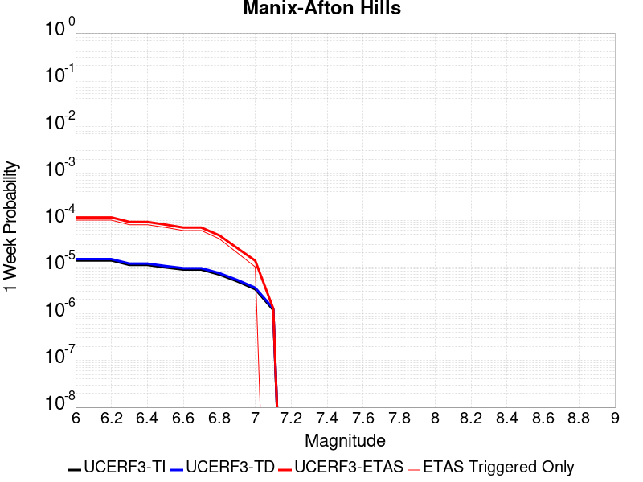 |  |  |  |

| Magnitude | 1 wk TI Prob | 1 wk TD Prob | 1 wk ETAS Prob | 1 wk ETAS/TD Gain | 1 wk ETAS Triggered Only | 1 mo TI Prob | 1 mo TD Prob | 1 mo ETAS Prob | 1 mo ETAS/TD Gain | 1 mo ETAS Triggered Only | 1 yr TI Prob | 1 yr TD Prob | 1 yr ETAS Prob | 1 yr ETAS/TD Gain | 1 yr ETAS Triggered Only | 10 yr TI Prob | 10 yr TD Prob | 10 yr ETAS Prob | 10 yr ETAS/TD Gain | 10 yr ETAS Triggered Only |
|-----|-----|-----|-----|-----|-----|-----|-----|-----|-----|-----|-----|-----|-----|-----|-----|-----|-----|-----|-----|-----|
| 6.0 | 1.3783202E-5 | 1.47110895E-5 | 1.2166139E-4 | 8.270046 | 1.0695187E-4 | 5.906953E-5 | 6.30461E-5 | 1.9672752E-4 | 3.1203754 | 1.3368984E-4 | 7.189342E-4 | 7.6733343E-4 | 0.0010077906 | 1.3133671 | 2.406417E-4 | 0.0071661277 | 0.007648596 | 0.008006797 | 1.0468323 | 3.6096256E-4 |
| 6.1 | 1.3783202E-5 | 1.47110895E-5 | 1.2166139E-4 | 8.270046 | 1.0695187E-4 | 5.906953E-5 | 6.30461E-5 | 1.9672752E-4 | 3.1203754 | 1.3368984E-4 | 7.189342E-4 | 7.6733343E-4 | 0.0010077906 | 1.3133671 | 2.406417E-4 | 0.0071661277 | 0.007648596 | 0.008006797 | 1.0468323 | 3.6096256E-4 |
| 6.2 | 1.3783202E-5 | 1.47110895E-5 | 1.2166139E-4 | 8.270046 | 1.0695187E-4 | 5.906953E-5 | 6.30461E-5 | 1.9672752E-4 | 3.1203754 | 1.3368984E-4 | 7.189342E-4 | 7.6733343E-4 | 0.0010077906 | 1.3133671 | 2.406417E-4 | 0.0071661277 | 0.007648596 | 0.008006797 | 1.0468323 | 3.6096256E-4 |
| 6.3 | 1.10494875E-5 | 1.1793136E-5 | 9.200609E-5 | 7.801665 | 8.0213904E-5 | 4.7354086E-5 | 5.054109E-5 | 1.4411924E-4 | 2.8515263 | 9.358289E-5 | 5.763835E-4 | 6.151744E-4 | 7.888643E-4 | 1.2823424 | 1.737968E-4 | 0.005748908 | 0.0061357557 | 0.0063882074 | 1.0411444 | 2.540107E-4 |
| 6.4 | 1.10494875E-5 | 1.1793136E-5 | 9.200609E-5 | 7.801665 | 8.0213904E-5 | 4.7354086E-5 | 5.054109E-5 | 1.4411924E-4 | 2.8515263 | 9.358289E-5 | 5.763835E-4 | 6.151744E-4 | 7.888643E-4 | 1.2823424 | 1.737968E-4 | 0.005748908 | 0.0061357557 | 0.0063882074 | 1.0411444 | 2.540107E-4 |
| 6.5 | 9.788949E-6 | 1.045432E-5 | 7.7298544E-5 | 7.3939333 | 6.684492E-5 | 4.1951964E-5 | 4.480351E-5 | 1.2501382E-4 | 2.7902684 | 8.0213904E-5 | 5.1064545E-4 | 5.453555E-4 | 7.056958E-4 | 1.2940106 | 1.6042781E-4 | 0.0050947363 | 0.0054410985 | 0.005680431 | 1.0439861 | 2.406417E-4 |
| 6.6 | 8.810006E-6 | 9.4136285E-6 | 6.288906E-5 | 6.6806397 | 5.3475935E-5 | 3.775662E-5 | 4.0343548E-5 | 1.0718577E-4 | 2.6568255 | 6.684492E-5 | 4.5958988E-4 | 4.9108086E-4 | 6.380675E-4 | 1.2993125 | 1.4705882E-4 | 0.0045864056 | 0.004900839 | 0.0051136944 | 1.0434325 | 2.1390374E-4 |
| 6.7 | 8.80128E-6 | 9.404108E-6 | 6.287954E-5 | 6.686391 | 5.3475935E-5 | 3.7719226E-5 | 4.0302748E-5 | 1.0714497E-4 | 2.658503 | 6.684492E-5 | 4.591348E-4 | 4.9058435E-4 | 6.3757104E-4 | 1.2996155 | 1.4705882E-4 | 0.004581874 | 0.0048958957 | 0.0051087523 | 1.0434765 | 2.1390374E-4 |
| 6.8 | 6.8994877E-6 | 7.380076E-6 | 4.748673E-5 | 6.43445 | 4.0106952E-5 | 2.9568899E-5 | 3.162856E-5 | 8.51028E-5 | 2.6906948 | 5.3475935E-5 | 3.5994186E-4 | 3.8501783E-4 | 5.052924E-4 | 1.3123869 | 1.2032085E-4 | 0.003593594 | 0.0038443129 | 0.0040174415 | 1.045035 | 1.737968E-4 |
| 6.9 | 4.9328037E-6 | 5.2709615E-6 | 1.8639876E-5 | 3.536333 | 1.3368984E-5 | 2.1140417E-5 | 2.2589675E-5 | 3.5958357E-5 | 1.591805 | 1.3368984E-5 | 2.5735417E-4 | 2.7500073E-4 | 3.2846196E-4 | 1.194404 | 5.3475935E-5 | 0.0025705635 | 0.0027472095 | 0.0028405352 | 1.0339711 | 9.358289E-5 |
| 7.0 | 3.347973E-6 | 3.59003E-6 | 3.59003E-6 | 1.0 | 0.0 | 1.4348378E-5 | 1.5385775E-5 | 1.5385775E-5 | 1.0 | 0.0 | 1.746775E-4 | 1.8730981E-4 | 2.1404277E-4 | 1.1427206 | 2.6737967E-5 | 0.0017454025 | 0.0018719219 | 0.0019252978 | 1.0285139 | 5.3475935E-5 |
| 7.1 | 1.2073567E-6 | 1.293482E-6 | 1.293482E-6 | 1.0 | 0.0 | 5.1743755E-6 | 5.543492E-6 | 5.543492E-6 | 1.0 | 0.0 | 6.29962E-5 | 6.749156E-5 | 6.749156E-5 | 1.0 | 0.0 | 6.297835E-4 | 6.7487074E-4 | 7.015907E-4 | 1.0395926 | 2.6737967E-5 |

## Cady
*[(top)](#table-of-contents)*

| 1 Week | 1 Month | 1 Year | 10 Year |
|-----|-----|-----|-----|
|  |  |  |  |

| Magnitude | 1 wk TI Prob | 1 wk TD Prob | 1 wk ETAS Prob | 1 wk ETAS/TD Gain | 1 wk ETAS Triggered Only | 1 mo TI Prob | 1 mo TD Prob | 1 mo ETAS Prob | 1 mo ETAS/TD Gain | 1 mo ETAS Triggered Only | 1 yr TI Prob | 1 yr TD Prob | 1 yr ETAS Prob | 1 yr ETAS/TD Gain | 1 yr ETAS Triggered Only | 10 yr TI Prob | 10 yr TD Prob | 10 yr ETAS Prob | 10 yr ETAS/TD Gain | 10 yr ETAS Triggered Only |
|-----|-----|-----|-----|-----|-----|-----|-----|-----|-----|-----|-----|-----|-----|-----|-----|-----|-----|-----|-----|-----|
| 6.0 | 1.9892565E-5 | 2.1858728E-5 | 1.1543957E-4 | 5.2811656 | 9.358289E-5 | 8.525106E-5 | 9.3677416E-5 | 2.13987E-4 | 2.2842965 | 1.2032085E-4 | 0.0010374374 | 0.0011400167 | 0.0013536765 | 1.1874182 | 2.1390374E-4 | 0.010326075 | 0.011350701 | 0.011681131 | 1.029111 | 3.342246E-4 |
| 6.1 | 1.9892565E-5 | 2.1858728E-5 | 1.1543957E-4 | 5.2811656 | 9.358289E-5 | 8.525106E-5 | 9.3677416E-5 | 2.13987E-4 | 2.2842965 | 1.2032085E-4 | 0.0010374374 | 0.0011400167 | 0.0013536765 | 1.1874182 | 2.1390374E-4 | 0.010326075 | 0.011350701 | 0.011681131 | 1.029111 | 3.342246E-4 |
| 6.2 | 1.9892565E-5 | 2.1858728E-5 | 1.1543957E-4 | 5.2811656 | 9.358289E-5 | 8.525106E-5 | 9.3677416E-5 | 2.13987E-4 | 2.2842965 | 1.2032085E-4 | 0.0010374374 | 0.0011400167 | 0.0013536765 | 1.1874182 | 2.1390374E-4 | 0.010326075 | 0.011350701 | 0.011681131 | 1.029111 | 3.342246E-4 |
| 6.3 | 1.1117327E-5 | 1.2176583E-5 | 9.238951E-5 | 7.587474 | 8.0213904E-5 | 4.764482E-5 | 5.2184492E-5 | 1.4576249E-4 | 2.7932148 | 9.358289E-5 | 5.7992124E-4 | 6.351925E-4 | 7.955184E-4 | 1.2524053 | 1.6042781E-4 | 0.0057841022 | 0.0063368753 | 0.0065759923 | 1.0377342 | 2.406417E-4 |
| 6.4 | 1.1117327E-5 | 1.2176583E-5 | 9.238951E-5 | 7.587474 | 8.0213904E-5 | 4.764482E-5 | 5.2184492E-5 | 1.4576249E-4 | 2.7932148 | 9.358289E-5 | 5.7992124E-4 | 6.351925E-4 | 7.955184E-4 | 1.2524053 | 1.6042781E-4 | 0.0057841022 | 0.0063368753 | 0.0065759923 | 1.0377342 | 2.406417E-4 |
| 6.5 | 6.103093E-6 | 6.672021E-6 | 6.01476E-5 | 9.0149 | 5.3475935E-5 | 2.615585E-5 | 2.8594131E-5 | 8.206854E-5 | 2.8701181 | 5.3475935E-5 | 3.1840094E-4 | 3.480905E-4 | 4.4164082E-4 | 1.2687528 | 9.358289E-5 | 0.0031794512 | 0.0034766865 | 0.0036498792 | 1.0498154 | 1.737968E-4 |
| 6.6 | 5.817237E-6 | 6.3656585E-6 | 5.9841255E-5 | 9.400639 | 5.3475935E-5 | 2.4930776E-5 | 2.728118E-5 | 8.075566E-5 | 2.9601233 | 5.3475935E-5 | 3.034899E-4 | 3.3211018E-4 | 4.2566197E-4 | 1.281689 | 9.358289E-5 | 0.0030307577 | 0.0033173605 | 0.0034905807 | 1.0522163 | 1.737968E-4 |
| 6.7 | 4.8846314E-6 | 5.3405684E-6 | 4.5447305E-5 | 8.509826 | 4.0106952E-5 | 2.0933967E-5 | 2.2888014E-5 | 6.299405E-5 | 2.7522724 | 4.0106952E-5 | 2.5484123E-4 | 2.7863772E-4 | 3.45464E-4 | 1.2398322 | 6.684492E-5 | 0.0025454918 | 0.0027840391 | 0.0029173568 | 1.0478864 | 1.3368984E-4 |
| 6.8 | 1.7788773E-6 | 1.9399079E-6 | 1.5308866E-5 | 7.8915424 | 1.3368984E-5 | 7.6237375E-6 | 8.313874E-6 | 2.1682747E-5 | 2.6080198 | 1.3368984E-5 | 9.281505E-5 | 1.01218284E-4 | 1.4132117E-4 | 1.3962021 | 4.0106952E-5 | 9.2776294E-4 | 0.0010118765 | 0.0010519428 | 1.0395961 | 4.0106952E-5 |
| 6.9 | 7.5455404E-7 | 8.297092E-7 | 8.297092E-7 | 1.0 | 0.0 | 3.233799E-6 | 3.5558937E-6 | 3.5558937E-6 | 1.0 | 0.0 | 3.937079E-5 | 4.3292483E-5 | 5.6660887E-5 | 1.3087927 | 1.3368984E-5 | 3.9363815E-4 | 4.3287344E-4 | 4.4623663E-4 | 1.0308709 | 1.3368984E-5 |
| 7.0 | 6.8578805E-7 | 7.541816E-7 | 7.541816E-7 | 1.0 | 0.0 | 2.9390883E-6 | 3.2322048E-6 | 3.2322048E-6 | 1.0 | 0.0 | 3.578281E-5 | 3.9351715E-5 | 5.272017E-5 | 1.3397173 | 1.3368984E-5 | 3.577705E-4 | 3.9347992E-4 | 4.0684364E-4 | 1.033963 | 1.3368984E-5 |

## San Andreas (North Branch Mill Creek)
*[(top)](#table-of-contents)*

| 1 Week | 1 Month | 1 Year | 10 Year |
|-----|-----|-----|-----|
| 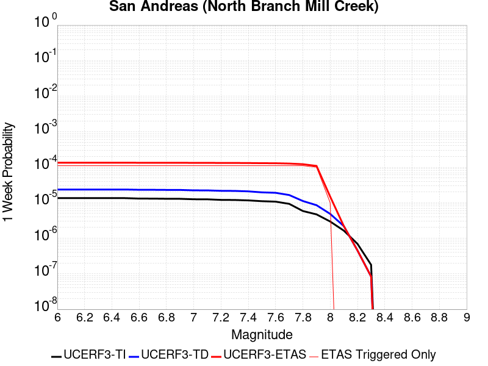 |  |  |  |

| Magnitude | 1 wk TI Prob | 1 wk TD Prob | 1 wk ETAS Prob | 1 wk ETAS/TD Gain | 1 wk ETAS Triggered Only | 1 mo TI Prob | 1 mo TD Prob | 1 mo ETAS Prob | 1 mo ETAS/TD Gain | 1 mo ETAS Triggered Only | 1 yr TI Prob | 1 yr TD Prob | 1 yr ETAS Prob | 1 yr ETAS/TD Gain | 1 yr ETAS Triggered Only | 10 yr TI Prob | 10 yr TD Prob | 10 yr ETAS Prob | 10 yr ETAS/TD Gain | 10 yr ETAS Triggered Only |
|-----|-----|-----|-----|-----|-----|-----|-----|-----|-----|-----|-----|-----|-----|-----|-----|-----|-----|-----|-----|-----|
| 6.0 | 1.3461156E-5 | 2.3499893E-5 | 1.7055526E-4 | 7.257704 | 1.4705882E-4 | 5.7689394E-5 | 1.00709956E-4 | 3.0122453E-4 | 2.9910102 | 2.0053476E-4 | 7.02142E-4 | 0.0012254574 | 0.0014791568 | 1.2070242 | 2.540107E-4 | 0.0069992766 | 0.01222957 | 0.0125729125 | 1.0280747 | 3.475936E-4 |
| 6.1 | 1.3461156E-5 | 2.3499893E-5 | 1.7055526E-4 | 7.257704 | 1.4705882E-4 | 5.7689394E-5 | 1.00709956E-4 | 3.0122453E-4 | 2.9910102 | 2.0053476E-4 | 7.02142E-4 | 0.0012254574 | 0.0014791568 | 1.2070242 | 2.540107E-4 | 0.0069992766 | 0.01222957 | 0.0125729125 | 1.0280747 | 3.475936E-4 |
| 6.2 | 1.3461156E-5 | 2.3499893E-5 | 1.7055526E-4 | 7.257704 | 1.4705882E-4 | 5.7689394E-5 | 1.00709956E-4 | 3.0122453E-4 | 2.9910102 | 2.0053476E-4 | 7.02142E-4 | 0.0012254574 | 0.0014791568 | 1.2070242 | 2.540107E-4 | 0.0069992766 | 0.01222957 | 0.0125729125 | 1.0280747 | 3.475936E-4 |
| 6.3 | 1.3461156E-5 | 2.3499893E-5 | 1.7055526E-4 | 7.257704 | 1.4705882E-4 | 5.7689394E-5 | 1.00709956E-4 | 3.0122453E-4 | 2.9910102 | 2.0053476E-4 | 7.02142E-4 | 0.0012254574 | 0.0014791568 | 1.2070242 | 2.540107E-4 | 0.0069992766 | 0.01222957 | 0.0125729125 | 1.0280747 | 3.475936E-4 |
| 6.4 | 1.3461156E-5 | 2.3499893E-5 | 1.7055526E-4 | 7.257704 | 1.4705882E-4 | 5.7689394E-5 | 1.00709956E-4 | 3.0122453E-4 | 2.9910102 | 2.0053476E-4 | 7.02142E-4 | 0.0012254574 | 0.0014791568 | 1.2070242 | 2.540107E-4 | 0.0069992766 | 0.01222957 | 0.0125729125 | 1.0280747 | 3.475936E-4 |
| 6.5 | 1.3450706E-5 | 2.3488852E-5 | 1.7054423E-4 | 7.260645 | 1.4705882E-4 | 5.764461E-5 | 1.0066265E-4 | 3.011772E-4 | 2.9919462 | 2.0053476E-4 | 7.0159714E-4 | 0.001224882 | 0.0014785816 | 1.2071216 | 2.540107E-4 | 0.006993862 | 0.01222388 | 0.012567224 | 1.028088 | 3.475936E-4 |
| 6.6 | 1.3074523E-5 | 2.3103135E-5 | 1.7015856E-4 | 7.365172 | 1.4705882E-4 | 5.6032466E-5 | 9.9009696E-5 | 2.995246E-4 | 3.0252047 | 2.0053476E-4 | 6.8198174E-4 | 0.0012047797 | 0.0014584844 | 1.2105818 | 2.540107E-4 | 0.006798926 | 0.012025044 | 0.012368458 | 1.0285583 | 3.475936E-4 |
| 6.7 | 1.3050216E-5 | 2.3078432E-5 | 1.7013386E-4 | 7.3719854 | 1.4705882E-4 | 5.59283E-5 | 9.890384E-5 | 2.9941875E-4 | 3.0273726 | 2.0053476E-4 | 6.8071426E-4 | 0.0012034923 | 0.0014571972 | 1.2108073 | 2.540107E-4 | 0.0067863287 | 0.012012309 | 0.012355727 | 1.0285889 | 3.475936E-4 |
| 6.8 | 1.29049395E-5 | 2.292684E-5 | 1.6998229E-4 | 7.4141173 | 1.4705882E-4 | 5.530571E-5 | 9.825421E-5 | 2.9876927E-4 | 3.0407784 | 2.0053476E-4 | 6.73139E-4 | 0.0011955918 | 0.0014492987 | 1.2122021 | 2.540107E-4 | 0.0067110364 | 0.011934154 | 0.012277599 | 1.0287783 | 3.475936E-4 |
| 6.9 | 1.2867369E-5 | 2.2886245E-5 | 1.699417E-4 | 7.425495 | 1.4705882E-4 | 5.51447E-5 | 9.8080236E-5 | 2.9859532E-4 | 3.0443985 | 2.0053476E-4 | 6.711799E-4 | 0.0011934759 | 0.0014471834 | 1.2125787 | 2.540107E-4 | 0.006691564 | 0.011913223 | 0.012256676 | 1.0288296 | 3.475936E-4 |
| 7.0 | 1.2495996E-5 | 2.2286325E-5 | 1.6934187E-4 | 7.5984654 | 1.4705882E-4 | 5.3553173E-5 | 9.550934E-5 | 2.9602495E-4 | 3.0994344 | 2.0053476E-4 | 6.518148E-4 | 0.0011622087 | 0.0014159243 | 1.2183045 | 2.540107E-4 | 0.0064990623 | 0.0116038285 | 0.011947389 | 1.0296075 | 3.475936E-4 |
| 7.1 | 1.2452067E-5 | 2.2231397E-5 | 1.6928696E-4 | 7.6147685 | 1.4705882E-4 | 5.3364907E-5 | 9.527396E-5 | 2.9578962E-4 | 3.104622 | 2.0053476E-4 | 6.4952404E-4 | 0.0011593461 | 0.0014130622 | 1.2188443 | 2.540107E-4 | 0.0064762887 | 0.0115755 | 0.01191907 | 1.0296808 | 3.475936E-4 |
| 7.2 | 1.2002777E-5 | 2.1609963E-5 | 1.686656E-4 | 7.8049927 | 1.4705882E-4 | 5.143946E-5 | 9.2610855E-5 | 2.9312706E-4 | 3.1651478 | 2.0053476E-4 | 6.2609545E-4 | 0.0011269567 | 0.0013806811 | 1.2251413 | 2.540107E-4 | 0.006243344 | 0.011254923 | 0.011598605 | 1.030536 | 3.475936E-4 |
| 7.3 | 1.1923425E-5 | 2.1479793E-5 | 1.6853545E-4 | 7.846233 | 1.4705882E-4 | 5.109939E-5 | 9.205302E-5 | 2.925693E-4 | 3.1782696 | 2.0053476E-4 | 6.219575E-4 | 0.001120172 | 0.0013738981 | 1.2265065 | 2.540107E-4 | 0.0062021962 | 0.011187789 | 0.011531494 | 1.0307214 | 3.475936E-4 |
| 7.4 | 1.16105175E-5 | 2.0853771E-5 | 1.6790953E-4 | 8.051758 | 1.4705882E-4 | 4.975841E-5 | 8.937026E-5 | 2.898871E-4 | 3.243664 | 2.0053476E-4 | 6.0564023E-4 | 0.0010875424 | 0.0013412768 | 1.23331 | 2.540107E-4 | 0.006039923 | 0.010865397 | 0.011209213 | 1.0316433 | 3.475936E-4 |
| 7.5 | 1.1037265E-5 | 1.9553907E-5 | 1.6660985E-4 | 8.52054 | 1.4705882E-4 | 4.7301706E-5 | 8.379978E-5 | 2.8431774E-4 | 3.392822 | 2.0053476E-4 | 5.757461E-4 | 0.0010197869 | 0.0012735386 | 1.248828 | 2.540107E-4 | 0.005742567 | 0.010194898 | 0.010538948 | 1.0337473 | 3.475936E-4 |
| 7.6 | 1.0720915E-5 | 1.899582E-5 | 1.6605185E-4 | 8.741495 | 1.4705882E-4 | 4.5945973E-5 | 8.140812E-5 | 2.8192656E-4 | 3.4631257 | 2.0053476E-4 | 5.592486E-4 | 9.906954E-4 | 0.0012444544 | 1.2561424 | 2.540107E-4 | 0.005578433 | 0.009906623 | 0.010250772 | 1.0347394 | 3.475936E-4 |
| 7.7 | 9.276279E-6 | 1.6441649E-5 | 1.6349806E-4 | 9.9441395 | 1.4705882E-4 | 3.9754876E-5 | 7.0462316E-5 | 2.7098294E-4 | 3.8457854 | 2.0053476E-4 | 4.839081E-4 | 8.575427E-4 | 0.0011113356 | 1.2959536 | 2.540107E-4 | 0.0048285574 | 0.008586041 | 0.008930651 | 1.040136 | 3.475936E-4 |
| 7.8 | 5.8346777E-6 | 1.1155013E-5 | 1.5821219E-4 | 14.183058 | 1.4705882E-4 | 2.5005522E-5 | 4.7806327E-5 | 2.483315E-4 | 5.1945324 | 2.0053476E-4 | 3.043997E-4 | 5.818867E-4 | 8.3574955E-4 | 1.4362755 | 2.540107E-4 | 0.0030398308 | 0.0058469265 | 0.0061924877 | 1.0591013 | 3.475936E-4 |
| 7.9 | 4.690204E-6 | 8.509093E-6 | 1.421978E-4 | 16.711275 | 1.3368984E-4 | 2.0100719E-5 | 3.6467034E-5 | 2.2362599E-4 | 6.132278 | 1.8716577E-4 | 2.4469878E-4 | 4.4389578E-4 | 6.8443065E-4 | 1.5418724 | 2.406417E-4 | 0.002444295 | 0.0044707474 | 0.004803478 | 1.0744239 | 3.342246E-4 |
| 8.0 | 2.9570454E-6 | 4.846947E-6 | 1.8215866E-5 | 3.7582145 | 1.3368984E-5 | 1.267299E-5 | 2.0772464E-5 | 3.414117E-5 | 1.6435783 | 1.3368984E-5 | 1.5428272E-4 | 2.5287544E-4 | 3.0633784E-4 | 1.211418 | 5.3475935E-5 | 0.0015417566 | 0.002549644 | 0.0026563234 | 1.0418408 | 1.0695187E-4 |
| 8.1 | 1.6376824E-6 | 2.1968929E-6 | 2.1968929E-6 | 1.0 | 0.0 | 7.01862E-6 | 9.41522E-6 | 9.41522E-6 | 1.0 | 0.0 | 8.544835E-5 | 1.14624294E-4 | 1.14624294E-4 | 1.0 | 0.0 | 8.54155E-4 | 0.0011606582 | 0.0011606582 | 1.0 | 0.0 |
| 8.2 | 6.9631557E-7 | 4.5360213E-7 | 4.5360213E-7 | 1.0 | 0.0 | 2.984206E-6 | 1.9440076E-6 | 1.9440076E-6 | 1.0 | 0.0 | 3.63321E-5 | 2.3668037E-5 | 2.3668037E-5 | 1.0 | 0.0 | 3.6326164E-4 | 2.451564E-4 | 2.451564E-4 | 1.0 | 0.0 |
| 8.3 | 1.7876137E-7 | 8.360375E-8 | 8.360375E-8 | 1.0 | 0.0 | 7.661199E-7 | 3.5830175E-7 | 3.5830175E-7 | 1.0 | 0.0 | 9.32747E-6 | 4.3623154E-6 | 4.3623154E-6 | 1.0 | 0.0 | 9.3270784E-5 | 4.5817014E-5 | 4.5817014E-5 | 1.0 | 0.0 |

## San Jacinto (San Jacinto Valley) rev
*[(top)](#table-of-contents)*

| 1 Week | 1 Month | 1 Year | 10 Year |
|-----|-----|-----|-----|
|  | 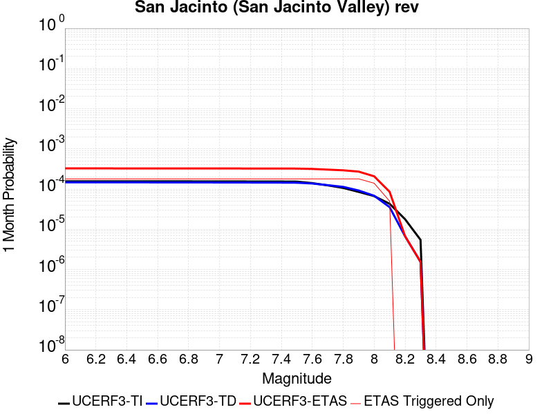 |  | 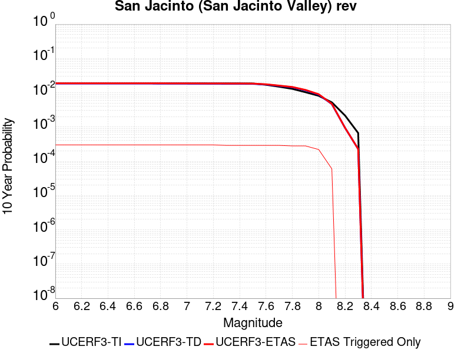 |

| Magnitude | 1 wk TI Prob | 1 wk TD Prob | 1 wk ETAS Prob | 1 wk ETAS/TD Gain | 1 wk ETAS Triggered Only | 1 mo TI Prob | 1 mo TD Prob | 1 mo ETAS Prob | 1 mo ETAS/TD Gain | 1 mo ETAS Triggered Only | 1 yr TI Prob | 1 yr TD Prob | 1 yr ETAS Prob | 1 yr ETAS/TD Gain | 1 yr ETAS Triggered Only | 10 yr TI Prob | 10 yr TD Prob | 10 yr ETAS Prob | 10 yr ETAS/TD Gain | 10 yr ETAS Triggered Only |
|-----|-----|-----|-----|-----|-----|-----|-----|-----|-----|-----|-----|-----|-----|-----|-----|-----|-----|-----|-----|-----|
| 6.0 | 3.652694E-5 | 3.4402394E-5 | 2.2156173E-4 | 6.4403 | 1.8716577E-4 | 1.5653463E-4 | 1.474305E-4 | 3.7466973E-4 | 2.541331 | 2.2727273E-4 | 0.0019041431 | 0.00179349 | 0.00206039 | 1.1488161 | 2.6737968E-4 | 0.018879099 | 0.018526595 | 0.018841507 | 1.0169978 | 3.2085562E-4 |
| 6.1 | 3.652694E-5 | 3.4402394E-5 | 2.2156173E-4 | 6.4403 | 1.8716577E-4 | 1.5653463E-4 | 1.474305E-4 | 3.7466973E-4 | 2.541331 | 2.2727273E-4 | 0.0019041431 | 0.00179349 | 0.00206039 | 1.1488161 | 2.6737968E-4 | 0.018879099 | 0.018526595 | 0.018841507 | 1.0169978 | 3.2085562E-4 |
| 6.2 | 3.652694E-5 | 3.4402394E-5 | 2.2156173E-4 | 6.4403 | 1.8716577E-4 | 1.5653463E-4 | 1.474305E-4 | 3.7466973E-4 | 2.541331 | 2.2727273E-4 | 0.0019041431 | 0.00179349 | 0.00206039 | 1.1488161 | 2.6737968E-4 | 0.018879099 | 0.018526595 | 0.018841507 | 1.0169978 | 3.2085562E-4 |
| 6.3 | 3.652694E-5 | 3.4402394E-5 | 2.2156173E-4 | 6.4403 | 1.8716577E-4 | 1.5653463E-4 | 1.474305E-4 | 3.7466973E-4 | 2.541331 | 2.2727273E-4 | 0.0019041431 | 0.00179349 | 0.00206039 | 1.1488161 | 2.6737968E-4 | 0.018879099 | 0.018526595 | 0.018841507 | 1.0169978 | 3.2085562E-4 |
| 6.4 | 3.646941E-5 | 3.432397E-5 | 2.2148332E-4 | 6.4527307 | 1.8716577E-4 | 1.5628811E-4 | 1.4709444E-4 | 3.7433373E-4 | 2.544853 | 2.2727273E-4 | 0.0019011468 | 0.0017894056 | 0.002056307 | 1.1491563 | 2.6737968E-4 | 0.018849645 | 0.018486476 | 0.0188014 | 1.0170354 | 3.2085562E-4 |
| 6.5 | 3.646941E-5 | 3.432397E-5 | 2.2148332E-4 | 6.4527307 | 1.8716577E-4 | 1.5628811E-4 | 1.4709444E-4 | 3.7433373E-4 | 2.544853 | 2.2727273E-4 | 0.0019011468 | 0.0017894056 | 0.002056307 | 1.1491563 | 2.6737968E-4 | 0.018849645 | 0.018486476 | 0.0188014 | 1.0170354 | 3.2085562E-4 |
| 6.6 | 3.6442503E-5 | 3.4287354E-5 | 2.2144671E-4 | 6.4585533 | 1.8716577E-4 | 1.561728E-4 | 1.4693754E-4 | 3.7417686E-4 | 2.5465028 | 2.2727273E-4 | 0.0018997455 | 0.0017874985 | 0.0020544003 | 1.1493158 | 2.6737968E-4 | 0.018835869 | 0.018467745 | 0.018782675 | 1.017053 | 3.2085562E-4 |
| 6.7 | 3.6432113E-5 | 3.4272925E-5 | 2.2143229E-4 | 6.4608517 | 1.8716577E-4 | 1.5612828E-4 | 1.4687571E-4 | 3.7411507E-4 | 2.547154 | 2.2727273E-4 | 0.0018992044 | 0.0017867472 | 0.0020536492 | 1.1493787 | 2.6737968E-4 | 0.018830549 | 0.018460369 | 0.018775301 | 1.0170599 | 3.2085562E-4 |
| 6.8 | 3.6409598E-5 | 3.424198E-5 | 2.2140135E-4 | 6.4657865 | 1.8716577E-4 | 1.560318E-4 | 1.4674311E-4 | 3.7398248E-4 | 2.5485523 | 2.2727273E-4 | 0.0018980318 | 0.0017851355 | 0.0020520377 | 1.1495138 | 2.6737968E-4 | 0.018819023 | 0.018444523 | 0.018759461 | 1.0170748 | 3.2085562E-4 |
| 6.9 | 3.638078E-5 | 3.4202407E-5 | 2.2136178E-4 | 6.472111 | 1.8716577E-4 | 1.5590832E-4 | 1.4657351E-4 | 3.7381295E-4 | 2.5503442 | 2.2727273E-4 | 0.0018965311 | 0.001783074 | 0.002049977 | 1.1496869 | 2.6737968E-4 | 0.018804269 | 0.018424258 | 0.018739201 | 1.017094 | 3.2085562E-4 |
| 7.0 | 3.6294874E-5 | 3.408442E-5 | 2.2124381E-4 | 6.491054 | 1.8716577E-4 | 1.5554018E-4 | 1.4606792E-4 | 3.7330744E-4 | 2.5557115 | 2.2727273E-4 | 0.0018920569 | 0.001776929 | 0.0020438335 | 1.1502055 | 2.6737968E-4 | 0.018760284 | 0.018363839 | 0.018678803 | 1.0171512 | 3.2085562E-4 |
| 7.1 | 3.6260717E-5 | 3.4040702E-5 | 2.2120011E-4 | 6.4981065 | 1.8716577E-4 | 1.5539382E-4 | 1.4588058E-4 | 3.7312016E-4 | 2.5577095 | 2.2727273E-4 | 0.001890278 | 0.0017746518 | 0.002041557 | 1.1503986 | 2.6737968E-4 | 0.018742796 | 0.018341439 | 0.01865641 | 1.0171726 | 3.2085562E-4 |
| 7.2 | 3.6210204E-5 | 3.397492E-5 | 2.2113434E-4 | 6.508752 | 1.8716577E-4 | 1.5517735E-4 | 1.455987E-4 | 3.7283835E-4 | 2.5607257 | 2.2727273E-4 | 0.001887647 | 0.0017712255 | 0.0020381315 | 1.1506901 | 2.6737968E-4 | 0.01871693 | 0.01830772 | 0.0186227 | 1.0172049 | 3.2085562E-4 |
| 7.3 | 3.6119454E-5 | 3.386321E-5 | 2.2102265E-4 | 6.526926 | 1.8716577E-4 | 1.5478847E-4 | 1.4511998E-4 | 3.7235973E-4 | 2.565875 | 2.2727273E-4 | 0.0018829206 | 0.0017654065 | 0.0020189688 | 1.1436282 | 2.540107E-4 | 0.018670462 | 0.018250274 | 0.018552147 | 1.0165409 | 3.0748663E-4 |
| 7.4 | 3.607848E-5 | 3.381071E-5 | 2.2097015E-4 | 6.535508 | 1.8716577E-4 | 1.5461289E-4 | 1.44895E-4 | 3.721348E-4 | 2.5683067 | 2.2727273E-4 | 0.0018807866 | 0.0017626719 | 0.002016235 | 1.1438515 | 2.540107E-4 | 0.018649481 | 0.018223269 | 0.018525152 | 1.0165658 | 3.0748663E-4 |
| 7.5 | 3.5856774E-5 | 3.3620483E-5 | 2.2077997E-4 | 6.566829 | 1.8716577E-4 | 1.5366284E-4 | 1.4407984E-4 | 3.7131982E-4 | 2.577181 | 2.2727273E-4 | 0.0018692396 | 0.0017527633 | 0.0020063287 | 1.1446661 | 2.540107E-4 | 0.018535944 | 0.018124366 | 0.01842628 | 1.0166578 | 3.0748663E-4 |
| 7.6 | 3.286655E-5 | 3.2143445E-5 | 2.1930321E-4 | 6.8226414 | 1.8716577E-4 | 1.4084904E-4 | 1.3775036E-4 | 3.6499178E-4 | 2.649661 | 2.2727273E-4 | 0.001713488 | 0.0016758227 | 0.0019294076 | 1.1513197 | 2.540107E-4 | 0.017003361 | 0.017344031 | 0.017646184 | 1.0174211 | 3.0748663E-4 |
| 7.7 | 2.8882527E-5 | 2.9236293E-5 | 2.163966E-4 | 7.401643 | 1.8716577E-4 | 1.237764E-4 | 1.2529238E-4 | 3.5253665E-4 | 2.8137116 | 2.2727273E-4 | 0.0015059357 | 0.0015243685 | 0.001777992 | 1.1663793 | 2.540107E-4 | 0.014957713 | 0.015830461 | 0.01613308 | 1.0191163 | 3.0748663E-4 |
| 7.8 | 2.4950225E-5 | 2.6527203E-5 | 2.13688E-4 | 8.055429 | 1.8716577E-4 | 1.0692515E-4 | 1.1368306E-4 | 3.4092995E-4 | 2.9989512 | 2.2727273E-4 | 0.0013010362 | 0.0013832134 | 0.0016235223 | 1.1737323 | 2.406417E-4 | 0.012934455 | 0.014411755 | 0.014701634 | 1.0201141 | 2.9411764E-4 |
| 7.9 | 1.9881603E-5 | 2.1507445E-5 | 2.086692E-4 | 9.702184 | 1.8716577E-4 | 8.520408E-5 | 9.217151E-5 | 3.194233E-4 | 3.4655316 | 2.2727273E-4 | 0.001036866 | 0.0011216112 | 0.001361983 | 1.2143093 | 2.406417E-4 | 0.010320415 | 0.011777027 | 0.01206768 | 1.0246798 | 2.9411764E-4 |
| 8.0 | 1.563292E-5 | 1.5937347E-5 | 1.4962505E-4 | 9.3883295 | 1.3368984E-4 | 6.6996516E-5 | 6.8301124E-5 | 2.4208605E-4 | 3.544393 | 1.737968E-4 | 8.153773E-4 | 8.3124964E-4 | 0.0010182598 | 1.2249748 | 1.8716577E-4 | 0.00812392 | 0.008810506 | 0.009035776 | 1.0255684 | 2.2727273E-4 |
| 8.1 | 1.0045313E-5 | 8.301802E-6 | 4.8408423E-5 | 5.8310738 | 4.0106952E-5 | 4.305063E-5 | 3.5578672E-5 | 1.0242121E-4 | 2.878725 | 6.684492E-5 | 5.2401534E-4 | 4.3308473E-4 | 4.999007E-4 | 1.1542792 | 6.684492E-5 | 0.0052278144 | 0.0046591135 | 0.004738954 | 1.0171363 | 8.0213904E-5 |
| 8.2 | 4.1554413E-6 | 1.5655598E-6 | 1.5655598E-6 | 1.0 | 0.0 | 1.7808914E-5 | 6.709525E-6 | 6.709525E-6 | 1.0 | 0.0 | 2.1680194E-4 | 8.168544E-5 | 8.168544E-5 | 1.0 | 0.0 | 0.0021659054 | 9.482903E-4 | 9.482903E-4 | 1.0 | 0.0 |
| 8.3 | 1.2758221E-6 | 3.6149942E-7 | 3.6149942E-7 | 1.0 | 0.0 | 5.4677976E-6 | 1.5492824E-6 | 1.5492824E-6 | 1.0 | 0.0 | 6.65684E-5 | 1.8862354E-5 | 1.8862354E-5 | 1.0 | 0.0 | 6.6548464E-4 | 2.2751294E-4 | 2.2751294E-4 | 1.0 | 0.0 |

## San Andreas (Creeping Section) 2011 CFM
*[(top)](#table-of-contents)*

| 1 Week | 1 Month | 1 Year | 10 Year |
|-----|-----|-----|-----|
|  |  |  |  |

| Magnitude | 1 wk TI Prob | 1 wk TD Prob | 1 wk ETAS Prob | 1 wk ETAS/TD Gain | 1 wk ETAS Triggered Only | 1 mo TI Prob | 1 mo TD Prob | 1 mo ETAS Prob | 1 mo ETAS/TD Gain | 1 mo ETAS Triggered Only | 1 yr TI Prob | 1 yr TD Prob | 1 yr ETAS Prob | 1 yr ETAS/TD Gain | 1 yr ETAS Triggered Only | 10 yr TI Prob | 10 yr TD Prob | 10 yr ETAS Prob | 10 yr ETAS/TD Gain | 10 yr ETAS Triggered Only |
|-----|-----|-----|-----|-----|-----|-----|-----|-----|-----|-----|-----|-----|-----|-----|-----|-----|-----|-----|-----|-----|
| 6.0 | 5.986481E-4 | 0.001228691 | 0.0012821013 | 1.0434692 | 5.3475935E-5 | 0.0025631124 | 0.005246795 | 0.005339887 | 1.0177426 | 9.358289E-5 | 0.030762846 | 0.061203245 | 0.061353855 | 1.0024608 | 1.6042781E-4 | 0.26835477 | 0.425928 | 0.42607382 | 1.0003424 | 2.540107E-4 |
| 6.1 | 5.015945E-4 | 0.0010230356 | 0.0010764569 | 1.0522183 | 5.3475935E-5 | 0.00214792 | 0.004369436 | 0.0044626095 | 1.021324 | 9.358289E-5 | 0.025839351 | 0.051246606 | 0.051398814 | 1.0029701 | 1.6042781E-4 | 0.23032776 | 0.37284943 | 0.37299198 | 1.0003823 | 2.2727273E-4 |
| 6.2 | 4.073338E-4 | 8.1157376E-4 | 8.650063E-4 | 1.0658382 | 5.3475935E-5 | 0.0017445484 | 0.0034683137 | 0.003561572 | 1.0268886 | 9.358289E-5 | 0.021034058 | 0.04093177 | 0.04108563 | 1.003759 | 1.6042781E-4 | 0.19150782 | 0.31302592 | 0.31318206 | 1.0004988 | 2.2727273E-4 |
| 6.3 | 3.464099E-4 | 6.7455834E-4 | 7.279982E-4 | 1.079222 | 5.3475935E-5 | 0.0014837692 | 0.0028832308 | 0.002976544 | 1.032364 | 9.358289E-5 | 0.017915873 | 0.034187846 | 0.03434279 | 1.0045321 | 1.6042781E-4 | 0.16538359 | 0.27130842 | 0.2714643 | 1.0005745 | 2.1390374E-4 |
| 6.4 | 2.935057E-4 | 5.5516965E-4 | 6.086159E-4 | 1.0962701 | 5.3475935E-5 | 0.0012572751 | 0.0023727308 | 0.0024660917 | 1.0393474 | 9.358289E-5 | 0.015200248 | 0.02826279 | 0.028418684 | 1.0055158 | 1.6042781E-4 | 0.14201577 | 0.23297668 | 0.23314074 | 1.0007043 | 2.1390374E-4 |
| 6.5 | 2.3409708E-4 | 4.2132285E-4 | 4.7477626E-4 | 1.1268704 | 5.3475935E-5 | 0.0010028875 | 0.0018017791 | 0.0018951935 | 1.0518456 | 9.358289E-5 | 0.012141965 | 0.021586355 | 0.02174332 | 1.0072715 | 1.6042781E-4 | 0.11499573 | 0.1868149 | 0.18698886 | 1.0009311 | 2.1390374E-4 |
| 6.6 | 1.5842178E-4 | 2.5068692E-4 | 2.9078382E-4 | 1.1599481 | 4.0106952E-5 | 6.7877385E-4 | 0.0010739256 | 0.0011406988 | 1.0621767 | 6.684492E-5 | 0.0082328 | 0.012995283 | 0.013127236 | 1.0101539 | 1.3368984E-4 | 0.07934396 | 0.12313759 | 0.12328999 | 1.0012376 | 1.737968E-4 |
| 6.7 | 1.5616413E-4 | 2.4605254E-4 | 2.8614962E-4 | 1.1629615 | 4.0106952E-5 | 6.691031E-4 | 0.0010540807 | 0.0011208551 | 1.0633485 | 6.684492E-5 | 0.0081159435 | 0.012757154 | 0.012889138 | 1.0103459 | 1.3368984E-4 | 0.0782586 | 0.12116472 | 0.12131745 | 1.0012606 | 1.737968E-4 |
| 6.8 | 1.5538467E-4 | 2.442914E-4 | 2.8438857E-4 | 1.1641365 | 4.0106952E-5 | 6.6576427E-4 | 0.001046539 | 0.0011133141 | 1.0638055 | 6.684492E-5 | 0.008075596 | 0.012666538 | 0.012798535 | 1.0104209 | 1.3368984E-4 | 0.07788358 | 0.12039561 | 0.12054848 | 1.0012697 | 1.737968E-4 |
| 6.9 | 1.5153569E-4 | 2.3538464E-4 | 2.7548213E-4 | 1.1703489 | 4.0106952E-5 | 6.49277E-4 | 0.0010084033 | 0.0010618253 | 1.0529768 | 5.3475935E-5 | 0.007876333 | 0.012208726 | 0.012314373 | 1.0086533 | 1.0695187E-4 | 0.07602952 | 0.11646574 | 0.11660749 | 1.001217 | 1.6042781E-4 |
| 7.0 | 1.4588932E-4 | 2.2395732E-4 | 2.640553E-4 | 1.1790429 | 4.0106952E-5 | 6.250901E-4 | 9.59466E-4 | 0.0010128906 | 1.0556816 | 5.3475935E-5 | 0.0075839474 | 0.011619428 | 0.011725137 | 1.0090976 | 1.0695187E-4 | 0.073302895 | 0.11131206 | 0.111454636 | 1.0012808 | 1.6042781E-4 |
| 7.1 | 1.1565079E-4 | 1.6281323E-4 | 2.0291365E-4 | 1.2462971 | 4.0106952E-5 | 4.955521E-4 | 6.9758523E-4 | 7.510239E-4 | 1.0766052 | 5.3475935E-5 | 0.006016669 | 0.008460228 | 0.008566275 | 1.0125347 | 1.0695187E-4 | 0.058563538 | 0.08366478 | 0.08381179 | 1.001757 | 1.6042781E-4 |
| 7.2 | 1.0393792E-4 | 1.4615392E-4 | 1.8625501E-4 | 1.2743758 | 4.0106952E-5 | 4.4537216E-4 | 6.262243E-4 | 6.7966676E-4 | 1.0853407 | 5.3475935E-5 | 0.005408933 | 0.0075977976 | 0.007703937 | 1.0139698 | 1.0695187E-4 | 0.052791595 | 0.07561503 | 0.07573862 | 1.0016344 | 1.3368984E-4 |
| 7.3 | 9.332884E-5 | 1.2780601E-4 | 1.6790783E-4 | 1.3137711 | 4.0106952E-5 | 3.999194E-4 | 5.4762565E-4 | 6.0107233E-4 | 1.097597 | 5.3475935E-5 | 0.0048581534 | 0.0066470946 | 0.0067533352 | 1.0159831 | 1.0695187E-4 | 0.047533102 | 0.06647954 | 0.066604346 | 1.0018773 | 1.3368984E-4 |
| 7.4 | 8.670252E-5 | 1.1702972E-4 | 1.5713197E-4 | 1.3426673 | 4.0106952E-5 | 3.715293E-4 | 5.014601E-4 | 5.5490923E-4 | 1.1065869 | 5.3475935E-5 | 0.004513991 | 0.0060883067 | 0.0061946074 | 1.0174599 | 1.0695187E-4 | 0.044233937 | 0.061148684 | 0.061274197 | 1.0020527 | 1.3368984E-4 |
| 7.5 | 7.3036405E-5 | 9.005699E-5 | 1.3016032E-4 | 1.4453107 | 4.0106952E-5 | 3.129756E-4 | 3.859015E-4 | 4.2599297E-4 | 1.1038904 | 4.0106952E-5 | 0.0038038217 | 0.0046882504 | 0.0047813947 | 1.0198675 | 9.358289E-5 | 0.03739367 | 0.047875606 | 0.04799017 | 1.0023929 | 1.2032085E-4 |
| 7.6 | 6.3935775E-5 | 8.280209E-5 | 1.2290572E-4 | 1.4843311 | 4.0106952E-5 | 2.7398168E-4 | 3.5481792E-4 | 3.9491063E-4 | 1.1129951 | 4.0106952E-5 | 0.0033306254 | 0.00431137 | 0.0044045495 | 1.0216125 | 9.358289E-5 | 0.032811474 | 0.043990135 | 0.04410516 | 1.0026149 | 1.2032085E-4 |
| 7.7 | 5.5050095E-5 | 6.661729E-5 | 9.335348E-5 | 1.40134 | 2.6737967E-5 | 2.3590765E-4 | 2.8547147E-4 | 3.122018E-4 | 1.0936358 | 2.6737967E-5 | 0.0028683927 | 0.0034700802 | 0.0035500156 | 1.0230356 | 8.0213904E-5 | 0.0283165 | 0.03579509 | 0.035898212 | 1.0028809 | 1.0695187E-4 |
| 7.8 | 5.027131E-5 | 6.1627725E-5 | 8.8364046E-5 | 1.433836 | 2.6737967E-5 | 2.1543067E-4 | 2.640921E-4 | 2.90823E-4 | 1.1012181 | 2.6737967E-5 | 0.0026197135 | 0.003210584 | 0.0032772142 | 1.0207534 | 6.684492E-5 | 0.025890453 | 0.03312572 | 0.033216204 | 1.0027314 | 9.358289E-5 |
| 7.9 | 3.7271806E-5 | 5.0224386E-5 | 7.696101E-5 | 1.5323435 | 2.6737967E-5 | 1.5972654E-4 | 2.1522962E-4 | 2.4196184E-4 | 1.1242032 | 2.6737967E-5 | 0.0019429359 | 0.0026172737 | 0.0026839436 | 1.0254731 | 6.684492E-5 | 0.019260362 | 0.027066687 | 0.02714473 | 1.0028833 | 8.0213904E-5 |
| 8.0 | 2.7310243E-5 | 3.1428404E-5 | 4.479697E-5 | 1.4253657 | 1.3368984E-5 | 1.17038646E-4 | 1.3468621E-4 | 1.480534E-4 | 1.0992469 | 1.3368984E-5 | 0.0014240141 | 0.0016385721 | 0.0016652662 | 1.0162911 | 2.6737967E-5 | 0.014149235 | 0.01721387 | 0.017253285 | 1.0022898 | 4.0106952E-5 |
| 8.1 | 1.7940547E-5 | 1.7400796E-5 | 3.0769548E-5 | 1.7682838 | 1.3368984E-5 | 7.688579E-5 | 7.457271E-5 | 8.79407E-5 | 1.1792611 | 1.3368984E-5 | 9.3568244E-4 | 9.075451E-4 | 9.2090195E-4 | 1.0147176 | 1.3368984E-5 | 0.009317525 | 0.009799073 | 0.00982555 | 1.0027019 | 2.6737967E-5 |
| 8.2 | 8.643924E-6 | 5.4748625E-6 | 5.4748625E-6 | 1.0 | 0.0 | 3.704486E-5 | 2.3463486E-5 | 2.3463486E-5 | 1.0 | 0.0 | 4.5092785E-4 | 2.8563058E-4 | 2.8563058E-4 | 1.0 | 0.0 | 0.0045001395 | 0.0032487072 | 0.0032487072 | 1.0 | 0.0 |
| 8.3 | 1.983087E-6 | 7.6599065E-7 | 7.6599065E-7 | 1.0 | 0.0 | 8.498917E-6 | 3.282813E-6 | 3.282813E-6 | 1.0 | 0.0 | 1.034694E-4 | 3.9967534E-5 | 3.9967534E-5 | 1.0 | 0.0 | 0.0010342124 | 4.719687E-4 | 4.719687E-4 | 1.0 | 0.0 |

## Mission Ridge-Arroyo Parida-Santa Ana
*[(top)](#table-of-contents)*

| 1 Week | 1 Month | 1 Year | 10 Year |
|-----|-----|-----|-----|
|  |  |  |  |

| Magnitude | 1 wk TI Prob | 1 wk TD Prob | 1 wk ETAS Prob | 1 wk ETAS/TD Gain | 1 wk ETAS Triggered Only | 1 mo TI Prob | 1 mo TD Prob | 1 mo ETAS Prob | 1 mo ETAS/TD Gain | 1 mo ETAS Triggered Only | 1 yr TI Prob | 1 yr TD Prob | 1 yr ETAS Prob | 1 yr ETAS/TD Gain | 1 yr ETAS Triggered Only | 10 yr TI Prob | 10 yr TD Prob | 10 yr ETAS Prob | 10 yr ETAS/TD Gain | 10 yr ETAS Triggered Only |
|-----|-----|-----|-----|-----|-----|-----|-----|-----|-----|-----|-----|-----|-----|-----|-----|-----|-----|-----|-----|-----|
| 6.0 | 4.169034E-5 | 4.7138263E-5 | 1.0061168E-4 | 2.1343951 | 5.3475935E-5 | 1.7866064E-4 | 2.0201034E-4 | 2.8220803E-4 | 1.396998 | 8.0213904E-5 | 0.0021730233 | 0.00245745 | 0.002564139 | 1.0434145 | 1.0695187E-4 | 0.021518968 | 0.024384614 | 0.024567217 | 1.0074884 | 1.8716577E-4 |
| 6.1 | 1.73813E-5 | 1.6854226E-5 | 5.6960504E-5 | 3.3795977 | 4.0106952E-5 | 7.4489166E-5 | 7.223046E-5 | 1.2570253E-4 | 1.7402982 | 5.3475935E-5 | 9.065282E-4 | 8.790618E-4 | 9.4584795E-4 | 1.0759743 | 6.684492E-5 | 0.009028391 | 0.008756988 | 0.008876255 | 1.0136197 | 1.2032085E-4 |
| 6.2 | 1.4622182E-5 | 1.367329E-5 | 5.377969E-5 | 3.9331934 | 4.0106952E-5 | 6.2664985E-5 | 5.8598518E-5 | 1.1207132E-4 | 1.9125283 | 5.3475935E-5 | 7.6267915E-4 | 7.132073E-4 | 7.8000454E-4 | 1.0936575 | 6.684492E-5 | 0.007600669 | 0.007109627 | 0.007215819 | 1.0149363 | 1.0695187E-4 |
| 6.3 | 1.3552434E-5 | 1.2482201E-5 | 5.2588653E-5 | 4.2130914 | 4.0106952E-5 | 5.8080568E-5 | 5.3494066E-5 | 1.0696714E-4 | 1.9996076 | 5.3475935E-5 | 7.069015E-4 | 6.510988E-4 | 7.1790017E-4 | 1.102598 | 6.684492E-5 | 0.00704657 | 0.006492275 | 0.0065985327 | 1.0163667 | 1.0695187E-4 |
| 6.4 | 1.30977305E-5 | 1.1979156E-5 | 5.2085627E-5 | 4.3480215 | 4.0106952E-5 | 5.613192E-5 | 5.1338247E-5 | 1.04811435E-4 | 2.041586 | 5.3475935E-5 | 6.831918E-4 | 6.248669E-4 | 6.9167005E-4 | 1.1069078 | 6.684492E-5 | 0.006810953 | 0.0062314444 | 0.0063377297 | 1.0170563 | 1.0695187E-4 |
| 6.5 | 1.225205E-5 | 1.1048803E-5 | 5.115531E-5 | 4.6299415 | 4.0106952E-5 | 5.2507727E-5 | 4.7351168E-5 | 1.00824574E-4 | 2.1292944 | 5.3475935E-5 | 6.3909404E-4 | 5.7635066E-4 | 6.431571E-4 | 1.1159128 | 6.684492E-5 | 0.006372592 | 0.005748869 | 0.005855206 | 1.018497 | 1.0695187E-4 |
| 6.6 | 1.1352241E-5 | 1.0063535E-5 | 5.017008E-5 | 4.985334 | 4.0106952E-5 | 4.8651553E-5 | 4.3128734E-5 | 9.6602365E-5 | 2.2398608 | 5.3475935E-5 | 5.921717E-4 | 5.2496797E-4 | 5.917778E-4 | 1.1272646 | 6.684492E-5 | 0.0059059616 | 0.0052375244 | 0.005343916 | 1.0203134 | 1.0695187E-4 |
| 6.7 | 1.0864116E-5 | 9.517027E-6 | 4.96236E-5 | 5.214191 | 4.0106952E-5 | 4.6559664E-5 | 4.0786632E-5 | 9.426039E-5 | 2.311061 | 5.3475935E-5 | 5.667165E-4 | 4.964661E-4 | 5.6327786E-4 | 1.1345747 | 6.684492E-5 | 0.005652734 | 0.004953804 | 0.005046923 | 1.0187975 | 9.358289E-5 |
| 6.8 | 1.0666365E-5 | 9.299779E-6 | 4.9406357E-5 | 5.312638 | 4.0106952E-5 | 4.571219E-5 | 3.9855597E-5 | 9.33294E-5 | 2.3416886 | 5.3475935E-5 | 5.564038E-4 | 4.8513585E-4 | 5.519483E-4 | 1.1377192 | 6.684492E-5 | 0.005550127 | 0.0048410003 | 0.00493413 | 1.0192378 | 9.358289E-5 |
| 6.9 | 1.0038665E-5 | 8.592046E-6 | 4.8698654E-5 | 5.6678767 | 4.0106952E-5 | 4.302214E-5 | 3.682254E-5 | 9.029651E-5 | 2.4522073 | 5.3475935E-5 | 5.236687E-4 | 4.4822405E-4 | 5.15039E-4 | 1.149066 | 6.684492E-5 | 0.005224364 | 0.004473411 | 0.004566575 | 1.0208262 | 9.358289E-5 |
| 7.0 | 9.5379955E-6 | 8.025073E-6 | 3.4762827E-5 | 4.331777 | 2.6737967E-5 | 4.0876483E-5 | 3.4392728E-5 | 7.44983E-5 | 2.1661062 | 4.0106952E-5 | 4.975576E-4 | 4.1865272E-4 | 4.7210627E-4 | 1.12768 | 5.3475935E-5 | 0.00496445 | 0.0041788397 | 0.0042587183 | 1.0191151 | 8.0213904E-5 |
| 7.1 | 9.207389E-6 | 7.652375E-6 | 3.4390137E-5 | 4.4940476 | 2.6737967E-5 | 3.945964E-5 | 3.279549E-5 | 7.290113E-5 | 2.2229009 | 4.0106952E-5 | 4.803152E-4 | 3.9921363E-4 | 4.5266823E-4 | 1.1338997 | 5.3475935E-5 | 0.004792784 | 0.003985161 | 0.0040650554 | 1.0200479 | 8.0213904E-5 |
| 7.2 | 7.638091E-6 | 5.9311183E-6 | 3.2668926E-5 | 5.508055 | 2.6737967E-5 | 3.2734264E-5 | 2.541883E-5 | 6.5524764E-5 | 2.5778039 | 4.0106952E-5 | 3.984668E-4 | 3.0943064E-4 | 3.6289002E-4 | 1.1727669 | 5.3475935E-5 | 0.0039775306 | 0.0030900547 | 0.0031700206 | 1.0258785 | 8.0213904E-5 |
| 7.3 | 7.2500147E-6 | 5.5961527E-6 | 3.233397E-5 | 5.777893 | 2.6737967E-5 | 3.1071122E-5 | 2.3983293E-5 | 6.408928E-5 | 2.672247 | 4.0106952E-5 | 3.7822526E-4 | 2.9195778E-4 | 3.4541808E-4 | 1.1831098 | 5.3475935E-5 | 0.0037758215 | 0.0029157975 | 0.0029957776 | 1.0274299 | 8.0213904E-5 |
| 7.4 | 6.3899715E-6 | 4.9184964E-6 | 4.9184964E-6 | 1.0 | 0.0 | 2.7385306E-5 | 2.10791E-5 | 3.4447803E-5 | 1.634216 | 1.3368984E-5 | 3.3336508E-4 | 2.5660804E-4 | 2.8333912E-4 | 1.1041709 | 2.6737967E-5 | 0.0033286542 | 0.0025631618 | 0.0026165005 | 1.0208098 | 5.3475935E-5 |
| 7.5 | 5.379025E-6 | 4.0838527E-6 | 4.0838527E-6 | 1.0 | 0.0 | 2.305276E-5 | 1.7502109E-5 | 3.087086E-5 | 1.7638365 | 1.3368984E-5 | 2.806312E-4 | 2.1306744E-4 | 2.3979972E-4 | 1.1254638 | 2.6737967E-5 | 0.0028027708 | 0.002128643 | 0.002182005 | 1.0250686 | 5.3475935E-5 |
| 7.6 | 4.1270696E-6 | 3.0883439E-6 | 3.0883439E-6 | 1.0 | 0.0 | 1.768732E-5 | 1.3235693E-5 | 2.66045E-5 | 2.0100572 | 1.3368984E-5 | 2.1532185E-4 | 1.6113273E-4 | 1.8786639E-4 | 1.1659108 | 2.6737967E-5 | 0.0021511333 | 0.001610167 | 0.0016502094 | 1.0248685 | 4.0106952E-5 |
| 7.7 | 2.5406805E-6 | 1.8282013E-6 | 1.8282013E-6 | 1.0 | 0.0 | 1.0888585E-5 | 7.835125E-6 | 7.835125E-6 | 1.0 | 0.0 | 1.3256045E-4 | 9.538854E-5 | 9.538854E-5 | 1.0 | 0.0 | 0.0013248142 | 9.534821E-4 | 9.668383E-4 | 1.0140078 | 1.3368984E-5 |
| 7.8 | 4.8608285E-7 | 3.5098864E-7 | 3.5098864E-7 | 1.0 | 0.0 | 2.0832106E-6 | 1.5042363E-6 | 1.5042363E-6 | 1.0 | 0.0 | 2.5362791E-5 | 1.8313924E-5 | 1.8313924E-5 | 1.0 | 0.0 | 2.5359896E-4 | 1.8312426E-4 | 1.8312426E-4 | 1.0 | 0.0 |
| 7.9 | 2.0472514E-8 | 1.2688783E-8 | 1.2688783E-8 | 1.0 | 0.0 | 8.7739345E-8 | 5.43805E-8 | 5.43805E-8 | 1.0 | 0.0 | 1.068226E-6 | 6.6208236E-7 | 6.6208236E-7 | 1.0 | 0.0 | 1.0682209E-5 | 6.620805E-6 | 6.620805E-6 | 1.0 | 0.0 |
| 8.0 | 4.443582E-9 | 2.0321211E-9 | 2.0321211E-9 | 1.0 | 0.0 | 1.9043922E-8 | 8.70909E-9 | 8.70909E-9 | 1.0 | 0.0 | 2.3185973E-7 | 1.0603316E-7 | 1.0603316E-7 | 1.0 | 0.0 | 2.3185949E-6 | 1.0603312E-6 | 1.0603312E-6 | 1.0 | 0.0 |

## Baker
*[(top)](#table-of-contents)*

| 1 Week | 1 Month | 1 Year | 10 Year |
|-----|-----|-----|-----|
|  |  |  |  |

| Magnitude | 1 wk TI Prob | 1 wk TD Prob | 1 wk ETAS Prob | 1 wk ETAS/TD Gain | 1 wk ETAS Triggered Only | 1 mo TI Prob | 1 mo TD Prob | 1 mo ETAS Prob | 1 mo ETAS/TD Gain | 1 mo ETAS Triggered Only | 1 yr TI Prob | 1 yr TD Prob | 1 yr ETAS Prob | 1 yr ETAS/TD Gain | 1 yr ETAS Triggered Only | 10 yr TI Prob | 10 yr TD Prob | 10 yr ETAS Prob | 10 yr ETAS/TD Gain | 10 yr ETAS Triggered Only |
|-----|-----|-----|-----|-----|-----|-----|-----|-----|-----|-----|-----|-----|-----|-----|-----|-----|-----|-----|-----|-----|
| 6.0 | 5.695525E-6 | 5.8348373E-6 | 8.6048276E-5 | 14.747331 | 8.0213904E-5 | 2.4409164E-5 | 2.5006228E-5 | 1.4532407E-4 | 5.8115153 | 1.2032085E-4 | 2.9714106E-4 | 3.044123E-4 | 5.0488603E-4 | 1.6585598 | 2.0053476E-4 | 0.0029674405 | 0.0030403486 | 0.003333572 | 1.096444 | 2.9411764E-4 |
| 6.1 | 5.695525E-6 | 5.8348373E-6 | 8.6048276E-5 | 14.747331 | 8.0213904E-5 | 2.4409164E-5 | 2.5006228E-5 | 1.4532407E-4 | 5.8115153 | 1.2032085E-4 | 2.9714106E-4 | 3.044123E-4 | 5.0488603E-4 | 1.6585598 | 2.0053476E-4 | 0.0029674405 | 0.0030403486 | 0.003333572 | 1.096444 | 2.9411764E-4 |
| 6.2 | 5.695525E-6 | 5.8348373E-6 | 8.6048276E-5 | 14.747331 | 8.0213904E-5 | 2.4409164E-5 | 2.5006228E-5 | 1.4532407E-4 | 5.8115153 | 1.2032085E-4 | 2.9714106E-4 | 3.044123E-4 | 5.0488603E-4 | 1.6585598 | 2.0053476E-4 | 0.0029674405 | 0.0030403486 | 0.003333572 | 1.096444 | 2.9411764E-4 |
| 6.3 | 3.2995713E-6 | 3.383667E-6 | 5.6859422E-5 | 16.804083 | 5.3475935E-5 | 1.4140943E-5 | 1.4501353E-5 | 1.0808288E-4 | 7.4532967 | 9.358289E-5 | 1.7215237E-4 | 1.7654014E-4 | 3.369396E-4 | 1.9085723 | 1.6042781E-4 | 0.0017201907 | 0.001764046 | 0.0019775725 | 1.1210436 | 2.1390374E-4 |
| 6.4 | 3.2995713E-6 | 3.383667E-6 | 5.6859422E-5 | 16.804083 | 5.3475935E-5 | 1.4140943E-5 | 1.4501353E-5 | 1.0808288E-4 | 7.4532967 | 9.358289E-5 | 1.7215237E-4 | 1.7654014E-4 | 3.369396E-4 | 1.9085723 | 1.6042781E-4 | 0.0017201907 | 0.001764046 | 0.0019775725 | 1.1210436 | 2.1390374E-4 |
| 6.5 | 2.782202E-6 | 2.8558404E-6 | 5.6331624E-5 | 19.72506 | 5.3475935E-5 | 1.1923668E-5 | 1.223926E-5 | 1.05821004E-4 | 8.646029 | 9.358289E-5 | 1.4516099E-4 | 1.4900314E-4 | 2.9604006E-4 | 1.9868041 | 1.4705882E-4 | 0.001450662 | 0.0014890651 | 0.0016893012 | 1.134471 | 2.0053476E-4 |
| 6.6 | 2.3163404E-6 | 2.38092E-6 | 5.585673E-5 | 23.460146 | 5.3475935E-5 | 9.927136E-6 | 1.0203904E-5 | 1.0378584E-4 | 10.171189 | 9.358289E-5 | 1.20856166E-4 | 1.2422565E-4 | 2.712662E-4 | 2.183657 | 1.4705882E-4 | 0.0012079047 | 0.0012415823 | 0.0014285158 | 1.1505606 | 1.8716577E-4 |
| 6.7 | 2.037056E-6 | 2.0965003E-6 | 5.5572324E-5 | 26.507185 | 5.3475935E-5 | 8.7302105E-6 | 8.984972E-6 | 1.0256702E-4 | 11.415397 | 9.358289E-5 | 1.0628513E-4 | 1.093867E-4 | 2.4306192E-4 | 2.2220426 | 1.3368984E-4 | 0.0010623431 | 0.0010933448 | 0.0012669516 | 1.158785 | 1.737968E-4 |
| 6.8 | 1.8356744E-6 | 1.8915287E-6 | 5.5367364E-5 | 29.271227 | 5.3475935E-5 | 7.867153E-6 | 8.106527E-6 | 1.0168865E-4 | 12.544047 | 9.358289E-5 | 9.577837E-5 | 9.869264E-5 | 2.3236929E-4 | 2.3544743 | 1.3368984E-4 | 9.57371E-4 | 9.86502E-4 | 0.0011334158 | 1.1489239 | 1.4705882E-4 |
| 6.9 | 1.6310546E-6 | 1.6832072E-6 | 4.1790092E-5 | 24.827658 | 4.0106952E-5 | 6.9902153E-6 | 7.213726E-6 | 8.742705E-5 | 12.119542 | 8.0213904E-5 | 8.510255E-5 | 8.782368E-5 | 2.0813398E-4 | 2.3699071 | 1.2032085E-4 | 8.5069967E-4 | 8.7790104E-4 | 0.0010114735 | 1.1521498 | 1.3368984E-4 |
| 7.0 | 1.2058036E-6 | 1.2508665E-6 | 4.135777E-5 | 33.063293 | 4.0106952E-5 | 5.1677193E-6 | 5.3608455E-6 | 8.557432E-5 | 15.962839 | 8.0213904E-5 | 6.291517E-5 | 6.5266366E-5 | 1.7221125E-4 | 2.6385913 | 1.0695187E-4 | 6.289736E-4 | 6.524743E-4 | 7.7271665E-4 | 1.1842867 | 1.2032085E-4 |
| 7.1 | 1.052382E-6 | 1.0951609E-6 | 2.7833099E-5 | 25.414623 | 2.6737967E-5 | 4.5102006E-6 | 4.693538E-6 | 7.153815E-5 | 15.2418375 | 6.684492E-5 | 5.491031E-5 | 5.7142337E-5 | 1.5071988E-4 | 2.6376219 | 9.358289E-5 | 5.4896745E-4 | 5.7127734E-4 | 6.781681E-4 | 1.1871084 | 1.0695187E-4 |
| 7.2 | 1.0067454E-6 | 1.0487711E-6 | 2.7786711E-5 | 26.494543 | 2.6737967E-5 | 4.3146156E-6 | 4.4947255E-6 | 7.1339346E-5 | 15.871792 | 6.684492E-5 | 5.252918E-5 | 5.4721917E-5 | 1.4829969E-4 | 2.7100601 | 9.358289E-5 | 5.251676E-4 | 5.470853E-4 | 6.539786E-4 | 1.195387 | 1.0695187E-4 |
| 7.3 | 9.3596316E-7 | 9.767723E-7 | 2.7714714E-5 | 28.37377 | 2.6737967E-5 | 4.0112645E-6 | 4.1861604E-6 | 7.10308E-5 | 16.968006 | 6.684492E-5 | 4.8836053E-5 | 5.096532E-5 | 1.4454343E-4 | 2.8361137 | 9.358289E-5 | 4.8825322E-4 | 5.095371E-4 | 6.030723E-4 | 1.183569 | 9.358289E-5 |
| 7.4 | 8.8117395E-7 | 9.2076635E-7 | 2.7658709E-5 | 30.038794 | 2.6737967E-5 | 3.7764542E-6 | 3.9461356E-6 | 5.742186E-5 | 14.551416 | 5.3475935E-5 | 4.5977362E-5 | 4.8043148E-5 | 1.282532E-4 | 2.6695418 | 8.0213904E-5 | 4.596785E-4 | 4.8032837E-4 | 5.6050374E-4 | 1.1669178 | 8.0213904E-5 |
| 7.5 | 8.292386E-7 | 8.6745956E-7 | 2.7605405E-5 | 31.823275 | 2.6737967E-5 | 3.5538749E-6 | 3.7176785E-6 | 5.7193414E-5 | 15.384174 | 5.3475935E-5 | 4.326757E-5 | 4.5261804E-5 | 1.121037E-4 | 2.4767838 | 6.684492E-5 | 4.3259145E-4 | 4.5252658E-4 | 5.1934127E-4 | 1.1476481 | 6.684492E-5 |
| 7.6 | 7.553842E-7 | 7.9144706E-7 | 1.41604205E-5 | 17.89181 | 1.3368984E-5 | 3.2373566E-6 | 3.3919116E-6 | 4.3498727E-5 | 12.824251 | 4.0106952E-5 | 3.9414106E-5 | 4.129575E-5 | 8.140104E-5 | 1.9711726 | 4.0106952E-5 | 3.9407116E-4 | 4.1288146E-4 | 4.5297184E-4 | 1.0970991 | 4.0106952E-5 |
| 7.7 | 6.5285366E-7 | 6.852797E-7 | 1.4054254E-5 | 20.508787 | 1.3368984E-5 | 2.797941E-6 | 2.9369096E-6 | 4.3043743E-5 | 14.656135 | 4.0106952E-5 | 3.40644E-5 | 3.5756293E-5 | 7.586181E-5 | 2.1216352 | 4.0106952E-5 | 3.405918E-4 | 3.5750607E-4 | 3.975987E-4 | 1.1121453 | 4.0106952E-5 |
| 7.8 | 3.4586725E-7 | 3.6482615E-7 | 3.6482615E-7 | 1.0 | 0.0 | 1.4822873E-6 | 1.5635396E-6 | 1.4932502E-5 | 9.5504465 | 1.3368984E-5 | 1.80467E-5 | 1.9035933E-5 | 3.2404663E-5 | 1.7022891 | 1.3368984E-5 | 1.8045233E-4 | 1.9034347E-4 | 2.037099E-4 | 1.0702227 | 1.3368984E-5 |
| 7.9 | 2.5591178E-9 | 2.6696718E-9 | 2.6696718E-9 | 1.0 | 0.0 | 1.0967647E-8 | 1.14414505E-8 | 1.14414505E-8 | 1.0 | 0.0 | 1.335311E-7 | 1.3929966E-7 | 1.3929966E-7 | 1.0 | 0.0 | 1.3353102E-6 | 1.3929966E-6 | 1.3929966E-6 | 1.0 | 0.0 |

## Santa Ynez (East)
*[(top)](#table-of-contents)*

| 1 Week | 1 Month | 1 Year | 10 Year |
|-----|-----|-----|-----|
|  | 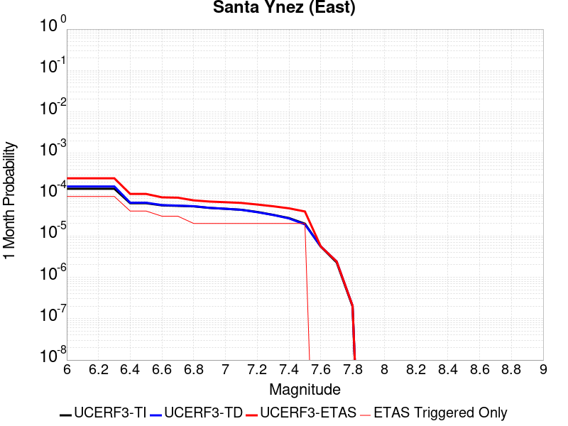 |  |  |

| Magnitude | 1 wk TI Prob | 1 wk TD Prob | 1 wk ETAS Prob | 1 wk ETAS/TD Gain | 1 wk ETAS Triggered Only | 1 mo TI Prob | 1 mo TD Prob | 1 mo ETAS Prob | 1 mo ETAS/TD Gain | 1 mo ETAS Triggered Only | 1 yr TI Prob | 1 yr TD Prob | 1 yr ETAS Prob | 1 yr ETAS/TD Gain | 1 yr ETAS Triggered Only | 10 yr TI Prob | 10 yr TD Prob | 10 yr ETAS Prob | 10 yr ETAS/TD Gain | 10 yr ETAS Triggered Only |
|-----|-----|-----|-----|-----|-----|-----|-----|-----|-----|-----|-----|-----|-----|-----|-----|-----|-----|-----|-----|-----|
| 6.0 | 3.2269712E-5 | 3.67505E-5 | 7.6855984E-5 | 2.0912905 | 4.0106952E-5 | 1.3829143E-4 | 1.5749598E-4 | 2.3769724E-4 | 1.5092274 | 8.0213904E-5 | 0.0016823979 | 0.0019164166 | 0.0021032237 | 1.0974773 | 1.8716577E-4 | 0.016697178 | 0.019056441 | 0.019305611 | 1.0130754 | 2.540107E-4 |
| 6.1 | 3.2269712E-5 | 3.67505E-5 | 7.6855984E-5 | 2.0912905 | 4.0106952E-5 | 1.3829143E-4 | 1.5749598E-4 | 2.3769724E-4 | 1.5092274 | 8.0213904E-5 | 0.0016823979 | 0.0019164166 | 0.0021032237 | 1.0974773 | 1.8716577E-4 | 0.016697178 | 0.019056441 | 0.019305611 | 1.0130754 | 2.540107E-4 |
| 6.2 | 3.2269712E-5 | 3.67505E-5 | 7.6855984E-5 | 2.0912905 | 4.0106952E-5 | 1.3829143E-4 | 1.5749598E-4 | 2.3769724E-4 | 1.5092274 | 8.0213904E-5 | 0.0016823979 | 0.0019164166 | 0.0021032237 | 1.0974773 | 1.8716577E-4 | 0.016697178 | 0.019056441 | 0.019305611 | 1.0130754 | 2.540107E-4 |
| 6.3 | 3.2269712E-5 | 3.67505E-5 | 7.6855984E-5 | 2.0912905 | 4.0106952E-5 | 1.3829143E-4 | 1.5749598E-4 | 2.3769724E-4 | 1.5092274 | 8.0213904E-5 | 0.0016823979 | 0.0019164166 | 0.0021032237 | 1.0974773 | 1.8716577E-4 | 0.016697178 | 0.019056441 | 0.019305611 | 1.0130754 | 2.540107E-4 |
| 6.4 | 1.4404779E-5 | 1.4849382E-5 | 4.1586954E-5 | 2.8005848 | 2.6737967E-5 | 6.1733306E-5 | 6.363868E-5 | 1.03743085E-4 | 1.630189 | 4.0106952E-5 | 7.513438E-4 | 7.745306E-4 | 8.68041E-4 | 1.1207317 | 9.358289E-5 | 0.0074880854 | 0.007718862 | 0.0078117223 | 1.0120304 | 9.358289E-5 |
| 6.5 | 1.4404779E-5 | 1.4849382E-5 | 4.1586954E-5 | 2.8005848 | 2.6737967E-5 | 6.1733306E-5 | 6.363868E-5 | 1.03743085E-4 | 1.630189 | 4.0106952E-5 | 7.513438E-4 | 7.745306E-4 | 8.68041E-4 | 1.1207317 | 9.358289E-5 | 0.0074880854 | 0.007718862 | 0.0078117223 | 1.0120304 | 9.358289E-5 |
| 6.6 | 1.280208E-5 | 1.3011947E-5 | 2.6380758E-5 | 2.0274258 | 1.3368984E-5 | 5.4864904E-5 | 5.5764307E-5 | 8.250078E-5 | 1.479455 | 2.6737967E-5 | 6.6777546E-4 | 6.787207E-4 | 7.3216035E-4 | 1.0787358 | 5.3475935E-5 | 0.006657724 | 0.0067666885 | 0.006819803 | 1.0078493 | 5.3475935E-5 |
| 6.7 | 1.2457027E-5 | 1.2628468E-5 | 2.5997282E-5 | 2.0586252 | 1.3368984E-5 | 5.3386164E-5 | 5.412089E-5 | 8.085741E-5 | 1.4940149 | 2.6737967E-5 | 6.497827E-4 | 6.587243E-4 | 7.12165E-4 | 1.0811275 | 5.3475935E-5 | 0.00647886 | 0.006567915 | 0.0066210395 | 1.0080885 | 5.3475935E-5 |
| 6.8 | 1.2095134E-5 | 1.2230915E-5 | 2.5599735E-5 | 2.0930352 | 1.3368984E-5 | 5.1835254E-5 | 5.241716E-5 | 7.9153724E-5 | 1.5100728 | 2.6737967E-5 | 6.309115E-4 | 6.379937E-4 | 6.914355E-4 | 1.0837654 | 5.3475935E-5 | 0.0062912325 | 0.006361809 | 0.006414945 | 1.0083523 | 5.3475935E-5 |
| 6.9 | 1.1104036E-5 | 1.1157347E-5 | 2.4526182E-5 | 2.198209 | 1.3368984E-5 | 4.758786E-5 | 4.781633E-5 | 7.455302E-5 | 1.5591539 | 2.6737967E-5 | 5.7922816E-4 | 5.820096E-4 | 6.3545443E-4 | 1.0918281 | 5.3475935E-5 | 0.005777207 | 0.0058049993 | 0.0058581647 | 1.0091586 | 5.3475935E-5 |
| 7.0 | 1.0577444E-5 | 1.058168E-5 | 2.3950523E-5 | 2.263395 | 1.3368984E-5 | 4.5331115E-5 | 4.5349276E-5 | 7.208603E-5 | 1.589574 | 2.6737967E-5 | 5.5176654E-4 | 5.519888E-4 | 6.0543517E-4 | 1.0968252 | 5.3475935E-5 | 0.0055039856 | 0.0055063153 | 0.005559497 | 1.0096582 | 5.3475935E-5 |
| 7.1 | 1.0021775E-5 | 9.980988E-6 | 2.3349838E-5 | 2.3394318 | 1.3368984E-5 | 4.294976E-5 | 4.2774966E-5 | 6.951179E-5 | 1.6250578 | 2.6737967E-5 | 5.2278786E-4 | 5.2066194E-4 | 5.7411E-4 | 1.1026541 | 5.3475935E-5 | 0.0052155964 | 0.0051945536 | 0.0052477517 | 1.0102412 | 5.3475935E-5 |
| 7.2 | 8.874109E-6 | 8.748793E-6 | 2.211766E-5 | 2.5280812 | 1.3368984E-5 | 3.8031343E-5 | 3.7494297E-5 | 6.423126E-5 | 1.7130942 | 2.6737967E-5 | 4.629332E-4 | 4.5639853E-4 | 5.0985004E-4 | 1.1171159 | 5.3475935E-5 | 0.0046197 | 0.0045547304 | 0.0046079624 | 1.0116873 | 5.3475935E-5 |
| 7.3 | 7.5504267E-6 | 7.5051175E-6 | 2.0874002E-5 | 2.7813025 | 1.3368984E-5 | 3.235857E-5 | 3.21644E-5 | 5.8901507E-5 | 1.831264 | 2.6737967E-5 | 3.9389438E-4 | 3.915322E-4 | 4.449872E-4 | 1.1365277 | 5.3475935E-5 | 0.0039319694 | 0.003908531 | 0.003961798 | 1.0136284 | 5.3475935E-5 |
| 7.4 | 6.309394E-6 | 6.1831556E-6 | 1.9552057E-5 | 3.1621485 | 1.3368984E-5 | 2.703998E-5 | 2.6498974E-5 | 5.3236236E-5 | 2.0089922 | 2.6737967E-5 | 3.2916202E-4 | 3.225782E-4 | 3.7603689E-4 | 1.1657232 | 5.3475935E-5 | 0.003286749 | 0.003221197 | 0.0032745006 | 1.0165478 | 5.3475935E-5 |
| 7.5 | 4.6103073E-6 | 4.4408903E-6 | 1.7809814E-5 | 4.0104156 | 1.3368984E-5 | 1.975831E-5 | 1.9032252E-5 | 4.576971E-5 | 2.40485 | 2.6737967E-5 | 2.4053088E-4 | 2.3169373E-4 | 2.717914E-4 | 1.1730632 | 4.0106952E-5 | 0.002402707 | 0.002314591 | 0.0023546054 | 1.0172877 | 4.0106952E-5 |
| 7.6 | 1.2858658E-6 | 1.3008173E-6 | 1.3008173E-6 | 1.0 | 0.0 | 5.5108417E-6 | 5.5749197E-6 | 5.5749197E-6 | 1.0 | 0.0 | 6.7092435E-5 | 6.78726E-5 | 6.78726E-5 | 1.0 | 0.0 | 6.707218E-4 | 6.785256E-4 | 6.785256E-4 | 1.0 | 0.0 |
| 7.7 | 5.3302307E-7 | 5.612138E-7 | 5.612138E-7 | 1.0 | 0.0 | 2.2843826E-6 | 2.4052001E-6 | 2.4052001E-6 | 1.0 | 0.0 | 2.7812002E-5 | 2.9282954E-5 | 2.9282954E-5 | 1.0 | 0.0 | 2.7808524E-4 | 2.9279452E-4 | 2.9279452E-4 | 1.0 | 0.0 |
| 7.8 | 4.613933E-8 | 4.80301E-8 | 4.80301E-8 | 1.0 | 0.0 | 1.9773998E-7 | 2.0584326E-7 | 2.0584326E-7 | 1.0 | 0.0 | 2.4074816E-6 | 2.5061388E-6 | 2.5061388E-6 | 1.0 | 0.0 | 2.4074554E-5 | 2.5061116E-5 | 2.5061116E-5 | 1.0 | 0.0 |

## Santa Ynez (West)
*[(top)](#table-of-contents)*

| 1 Week | 1 Month | 1 Year | 10 Year |
|-----|-----|-----|-----|
|  |  | 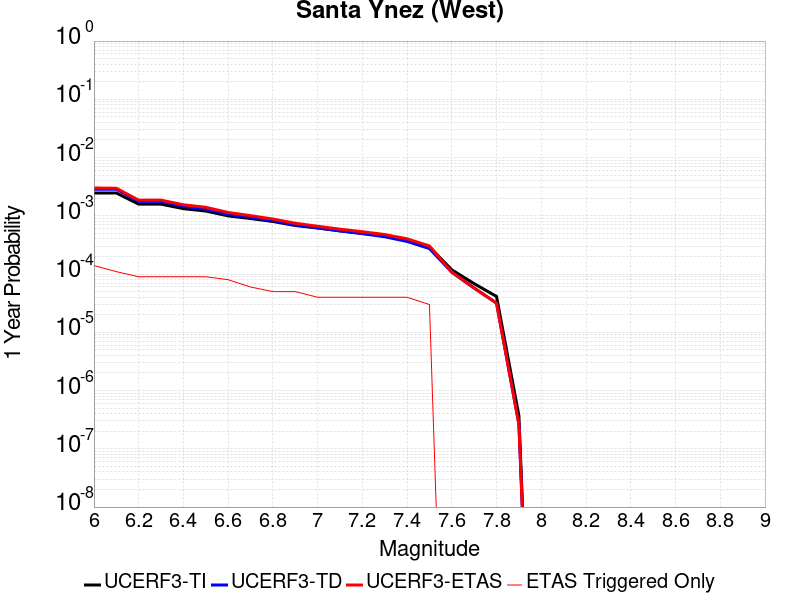 |  |

| Magnitude | 1 wk TI Prob | 1 wk TD Prob | 1 wk ETAS Prob | 1 wk ETAS/TD Gain | 1 wk ETAS Triggered Only | 1 mo TI Prob | 1 mo TD Prob | 1 mo ETAS Prob | 1 mo ETAS/TD Gain | 1 mo ETAS Triggered Only | 1 yr TI Prob | 1 yr TD Prob | 1 yr ETAS Prob | 1 yr ETAS/TD Gain | 1 yr ETAS Triggered Only | 10 yr TI Prob | 10 yr TD Prob | 10 yr ETAS Prob | 10 yr ETAS/TD Gain | 10 yr ETAS Triggered Only |
|-----|-----|-----|-----|-----|-----|-----|-----|-----|-----|-----|-----|-----|-----|-----|-----|-----|-----|-----|-----|-----|
| 6.0 | 4.7352758E-5 | 5.4972126E-5 | 1.2181337E-4 | 2.2159116 | 6.684492E-5 | 2.0292461E-4 | 2.3557522E-4 | 3.5586773E-4 | 1.5106331 | 1.2032085E-4 | 0.0024678076 | 0.0028645284 | 0.0030244966 | 1.0558445 | 1.6042781E-4 | 0.024405818 | 0.028304417 | 0.028525257 | 1.0078024 | 2.2727273E-4 |
| 6.1 | 4.7352758E-5 | 5.4972126E-5 | 9.507687E-5 | 1.7295469 | 4.0106952E-5 | 2.0292461E-4 | 2.3557522E-4 | 3.1577022E-4 | 1.340422 | 8.0213904E-5 | 0.0024678076 | 0.0028645284 | 0.0029845044 | 1.0418833 | 1.2032085E-4 | 0.024405818 | 0.028304417 | 0.028486285 | 1.0064254 | 1.8716577E-4 |
| 6.2 | 3.0415853E-5 | 3.392511E-5 | 7.40307E-5 | 2.1821802 | 4.0106952E-5 | 1.3034715E-4 | 1.4538545E-4 | 1.9885361E-4 | 1.3677683 | 5.3475935E-5 | 0.0015858212 | 0.0017686661 | 0.0018620834 | 1.052818 | 9.358289E-5 | 0.015745522 | 0.017549807 | 0.017694285 | 1.0082325 | 1.4705882E-4 |
| 6.3 | 3.0415853E-5 | 3.392511E-5 | 7.40307E-5 | 2.1821802 | 4.0106952E-5 | 1.3034715E-4 | 1.4538545E-4 | 1.9885361E-4 | 1.3677683 | 5.3475935E-5 | 0.0015858212 | 0.0017686661 | 0.0018620834 | 1.052818 | 9.358289E-5 | 0.015745522 | 0.017549807 | 0.017694285 | 1.0082325 | 1.4705882E-4 |
| 6.4 | 2.5452082E-5 | 2.7912422E-5 | 6.801826E-5 | 2.4368453 | 4.0106952E-5 | 1.09075794E-4 | 1.196193E-4 | 1.7308883E-4 | 1.4469976 | 5.3475935E-5 | 0.0013271887 | 0.0014554089 | 0.0015488554 | 1.0642065 | 9.358289E-5 | 0.013192902 | 0.014460951 | 0.0146058835 | 1.0100223 | 1.4705882E-4 |
| 6.5 | 2.3143784E-5 | 2.5128256E-5 | 6.52342E-5 | 2.5960495 | 4.0106952E-5 | 9.9183875E-5 | 1.0768817E-4 | 1.6115834E-4 | 1.4965279 | 5.3475935E-5 | 0.0012068948 | 0.0013103267 | 0.001403787 | 1.0713259 | 9.358289E-5 | 0.012003611 | 0.01302768 | 0.013172823 | 1.0111412 | 1.4705882E-4 |
| 6.6 | 1.9118515E-5 | 2.035434E-5 | 6.0460476E-5 | 2.9703972 | 4.0106952E-5 | 8.193392E-5 | 8.7230015E-5 | 1.4070129E-4 | 1.6129917 | 5.3475935E-5 | 9.97089E-4 | 0.001061516 | 0.0011416448 | 1.0754852 | 8.0213904E-5 | 0.00992627 | 0.010565365 | 0.010697642 | 1.01252 | 1.3368984E-4 |
| 6.7 | 1.722807E-5 | 1.8146347E-5 | 3.151509E-5 | 1.736718 | 1.3368984E-5 | 7.3832496E-5 | 7.776777E-5 | 1.0450366E-4 | 1.3437914 | 2.6737967E-5 | 8.985399E-4 | 9.464169E-4 | 9.998423E-4 | 1.0564501 | 5.3475935E-5 | 0.008949154 | 0.0094245095 | 0.009517211 | 1.0098362 | 9.358289E-5 |
| 6.8 | 1.5317364E-5 | 1.5926486E-5 | 2.9295255E-5 | 1.839405 | 1.3368984E-5 | 6.56442E-5 | 6.82546E-5 | 9.499075E-5 | 1.391712 | 2.6737967E-5 | 7.98925E-4 | 8.306873E-4 | 8.841188E-4 | 1.0643221 | 5.3475935E-5 | 0.007960589 | 0.00827631 | 0.008369118 | 1.0112138 | 9.358289E-5 |
| 6.9 | 1.3071226E-5 | 1.3329624E-5 | 2.669843E-5 | 2.0029395 | 1.3368984E-5 | 5.6018336E-5 | 5.7125722E-5 | 8.386216E-5 | 1.4680281 | 2.6737967E-5 | 6.8180985E-4 | 6.9528597E-4 | 7.4872473E-4 | 1.0768586 | 5.3475935E-5 | 0.0067972173 | 0.006931367 | 0.007011025 | 1.0114924 | 8.0213904E-5 |
| 7.0 | 1.1836986E-5 | 1.19327815E-5 | 2.5301606E-5 | 2.1203444 | 1.3368984E-5 | 5.0728955E-5 | 5.11395E-5 | 7.78761E-5 | 1.522817 | 2.6737967E-5 | 6.1745E-4 | 6.2244723E-4 | 6.758899E-4 | 1.085859 | 5.3475935E-5 | 0.006157372 | 0.006207231 | 0.0062736613 | 1.010702 | 6.684492E-5 |
| 7.1 | 1.0597169E-5 | 1.0542201E-5 | 2.3911043E-5 | 2.2681262 | 1.3368984E-5 | 4.541565E-5 | 4.5180084E-5 | 7.1916846E-5 | 1.591782 | 2.6737967E-5 | 5.5279525E-4 | 5.4992986E-4 | 6.0337636E-4 | 1.0971879 | 5.3475935E-5 | 0.0055142213 | 0.005485821 | 0.0055390033 | 1.0096946 | 5.3475935E-5 |
| 7.2 | 9.59113E-6 | 9.459144E-6 | 2.2828002E-5 | 2.4133263 | 1.3368984E-5 | 4.11042E-5 | 4.0538565E-5 | 6.727545E-5 | 1.659542 | 2.6737967E-5 | 5.0032866E-4 | 4.934463E-4 | 5.4689584E-4 | 1.1083189 | 5.3475935E-5 | 0.004992037 | 0.0049236254 | 0.004976838 | 1.0108076 | 5.3475935E-5 |
| 7.3 | 8.586084E-6 | 8.379583E-6 | 2.1748456E-5 | 2.59541 | 1.3368984E-5 | 3.679698E-5 | 3.5912013E-5 | 6.264902E-5 | 1.7445143 | 2.6737967E-5 | 4.4791115E-4 | 4.3714207E-4 | 4.905946E-4 | 1.1222774 | 5.3475935E-5 | 0.004470094 | 0.004362933 | 0.0044161757 | 1.0122035 | 5.3475935E-5 |
| 7.4 | 7.2622997E-6 | 6.9515427E-6 | 2.0320434E-5 | 2.9231546 | 1.3368984E-5 | 3.112377E-5 | 2.979199E-5 | 5.6529163E-5 | 1.8974617 | 2.6737967E-5 | 3.78866E-4 | 3.626581E-4 | 4.1611464E-4 | 1.147402 | 5.3475935E-5 | 0.0037822074 | 0.0036207628 | 0.0036740452 | 1.0147158 | 5.3475935E-5 |
| 7.5 | 5.627296E-6 | 5.251588E-6 | 1.8620502E-5 | 3.5456898 | 1.3368984E-5 | 2.411676E-5 | 2.2506614E-5 | 4.924398E-5 | 2.187978 | 2.6737967E-5 | 2.9358198E-4 | 2.739843E-4 | 3.1408024E-4 | 1.1463441 | 4.0106952E-5 | 0.0029319443 | 0.002736537 | 0.0027765343 | 1.014616 | 4.0106952E-5 |
| 7.6 | 2.265244E-6 | 2.0608625E-6 | 2.0608625E-6 | 1.0 | 0.0 | 9.708152E-6 | 8.832238E-6 | 8.832238E-6 | 1.0 | 0.0 | 1.18190335E-4 | 1.0752728E-4 | 1.0752728E-4 | 1.0 | 0.0 | 0.001181275 | 0.0010747612 | 0.0010747612 | 1.0 | 0.0 |
| 7.7 | 1.3099874E-6 | 1.1016252E-6 | 1.1016252E-6 | 1.0 | 0.0 | 5.61422E-6 | 4.7212425E-6 | 4.7212425E-6 | 1.0 | 0.0 | 6.8350986E-5 | 5.7479636E-5 | 5.7479636E-5 | 1.0 | 0.0 | 6.832996E-4 | 5.7465007E-4 | 5.7465007E-4 | 1.0 | 0.0 |
| 7.8 | 7.903951E-7 | 6.0711415E-7 | 6.0711415E-7 | 1.0 | 0.0 | 3.3874032E-6 | 2.6019152E-6 | 2.6019152E-6 | 1.0 | 0.0 | 4.1240855E-5 | 3.167787E-5 | 3.167787E-5 | 1.0 | 0.0 | 4.12332E-4 | 3.167349E-4 | 3.167349E-4 | 1.0 | 0.0 |
| 7.9 | 7.0753297E-9 | 5.0899476E-9 | 5.0899476E-9 | 1.0 | 0.0 | 3.032284E-8 | 2.181406E-8 | 2.181406E-8 | 1.0 | 0.0 | 3.6918053E-7 | 2.6558615E-7 | 2.6558615E-7 | 1.0 | 0.0 | 3.691799E-6 | 2.6558594E-6 | 2.6558594E-6 | 1.0 | 0.0 |

## Ludlow
*[(top)](#table-of-contents)*

| 1 Week | 1 Month | 1 Year | 10 Year |
|-----|-----|-----|-----|
|  |  |  |  |

| Magnitude | 1 wk TI Prob | 1 wk TD Prob | 1 wk ETAS Prob | 1 wk ETAS/TD Gain | 1 wk ETAS Triggered Only | 1 mo TI Prob | 1 mo TD Prob | 1 mo ETAS Prob | 1 mo ETAS/TD Gain | 1 mo ETAS Triggered Only | 1 yr TI Prob | 1 yr TD Prob | 1 yr ETAS Prob | 1 yr ETAS/TD Gain | 1 yr ETAS Triggered Only | 10 yr TI Prob | 10 yr TD Prob | 10 yr ETAS Prob | 10 yr ETAS/TD Gain | 10 yr ETAS Triggered Only |
|-----|-----|-----|-----|-----|-----|-----|-----|-----|-----|-----|-----|-----|-----|-----|-----|-----|-----|-----|-----|-----|
| 6.0 | 2.2407607E-5 | 2.3657254E-5 | 1.0386926E-4 | 4.3905883 | 8.0213904E-5 | 9.602906E-5 | 1.0138454E-4 | 2.0832557E-4 | 2.054806 | 1.0695187E-4 | 0.0011685267 | 0.001233702 | 0.0013538743 | 1.0974079 | 1.2032085E-4 | 0.011624013 | 0.012273042 | 0.012550345 | 1.0225945 | 2.8074867E-4 |
| 6.1 | 2.2407607E-5 | 2.3657254E-5 | 1.0386926E-4 | 4.3905883 | 8.0213904E-5 | 9.602906E-5 | 1.0138454E-4 | 2.0832557E-4 | 2.054806 | 1.0695187E-4 | 0.0011685267 | 0.001233702 | 0.0013538743 | 1.0974079 | 1.2032085E-4 | 0.011624013 | 0.012273042 | 0.012550345 | 1.0225945 | 2.8074867E-4 |
| 6.2 | 1.0781252E-5 | 1.1365663E-5 | 3.8103328E-5 | 3.3524947 | 2.6737967E-5 | 4.620455E-5 | 4.8709102E-5 | 7.5445765E-5 | 1.5489049 | 2.6737967E-5 | 5.623952E-4 | 5.9287593E-4 | 6.329591E-4 | 1.067608 | 4.0106952E-5 | 0.00560974 | 0.0059133614 | 0.0060329707 | 1.020227 | 1.2032085E-4 |
| 6.3 | 1.0781252E-5 | 1.1365663E-5 | 3.8103328E-5 | 3.3524947 | 2.6737967E-5 | 4.620455E-5 | 4.8709102E-5 | 7.5445765E-5 | 1.5489049 | 2.6737967E-5 | 5.623952E-4 | 5.9287593E-4 | 6.329591E-4 | 1.067608 | 4.0106952E-5 | 0.00560974 | 0.0059133614 | 0.0060329707 | 1.020227 | 1.2032085E-4 |
| 6.4 | 7.814439E-6 | 8.237729E-6 | 2.1606602E-5 | 2.6228836 | 1.3368984E-5 | 3.3490025E-5 | 3.530408E-5 | 4.8672595E-5 | 1.3786676 | 1.3368984E-5 | 4.0766477E-4 | 4.2974384E-4 | 4.4310707E-4 | 1.0310959 | 1.3368984E-5 | 0.0040691774 | 0.0042892746 | 0.004355833 | 1.0155174 | 6.684492E-5 |
| 6.5 | 6.4986366E-6 | 6.85092E-6 | 2.0219812E-5 | 2.9514012 | 1.3368984E-5 | 2.7851002E-5 | 2.9360759E-5 | 4.272935E-5 | 1.4553217 | 1.3368984E-5 | 3.390332E-4 | 3.5740953E-4 | 3.7077375E-4 | 1.0373919 | 1.3368984E-5 | 0.003385164 | 0.0035684432 | 0.0036084072 | 1.0111992 | 4.0106952E-5 |
| 6.6 | 5.582177E-6 | 5.8860055E-6 | 1.925491E-5 | 3.2713037 | 1.3368984E-5 | 2.3923398E-5 | 2.5225498E-5 | 3.8594146E-5 | 1.5299656 | 1.3368984E-5 | 2.9122844E-4 | 3.0707786E-4 | 3.2044275E-4 | 1.0435227 | 1.3368984E-5 | 0.0029084706 | 0.003066609 | 0.003106593 | 1.0130385 | 4.0106952E-5 |
| 6.7 | 4.6858763E-6 | 4.940427E-6 | 1.8309345E-5 | 3.7060246 | 1.3368984E-5 | 2.0082172E-5 | 2.1173091E-5 | 3.454179E-5 | 1.6314006 | 1.3368984E-5 | 2.4447302E-4 | 2.5775246E-4 | 2.7111798E-4 | 1.0518541 | 1.3368984E-5 | 0.0024420423 | 0.0025745912 | 0.002614595 | 1.0155379 | 4.0106952E-5 |
| 6.8 | 3.5584908E-6 | 3.7520183E-6 | 1.7120952E-5 | 4.5631313 | 1.3368984E-5 | 1.5250586E-5 | 1.6079981E-5 | 2.944875E-5 | 1.831392 | 1.3368984E-5 | 1.8566006E-4 | 1.957566E-4 | 2.0912297E-4 | 1.0682806 | 1.3368984E-5 | 0.0018550502 | 0.0019558826 | 0.0019825683 | 1.0136437 | 2.6737967E-5 |
| 6.9 | 2.532834E-6 | 2.6710034E-6 | 2.6710034E-6 | 1.0 | 0.0 | 1.0854958E-5 | 1.1447109E-5 | 1.1447109E-5 | 1.0 | 0.0 | 1.3215111E-4 | 1.3935992E-4 | 1.3935992E-4 | 1.0 | 0.0 | 0.0013207254 | 0.0013927529 | 0.0014061033 | 1.0095856 | 1.3368984E-5 |
| 7.0 | 1.7083285E-6 | 1.8019439E-6 | 1.8019439E-6 | 1.0 | 0.0 | 7.3213873E-6 | 7.722595E-6 | 7.722595E-6 | 1.0 | 0.0 | 8.913424E-5 | 9.40187E-5 | 9.40187E-5 | 1.0 | 0.0 | 8.9098496E-4 | 9.3980576E-4 | 9.5316215E-4 | 1.0142119 | 1.3368984E-5 |
| 7.1 | 1.0905424E-6 | 1.1497619E-6 | 1.1497619E-6 | 1.0 | 0.0 | 4.6737446E-6 | 4.9275427E-6 | 4.9275427E-6 | 1.0 | 0.0 | 5.6901354E-5 | 5.999128E-5 | 5.999128E-5 | 1.0 | 0.0 | 5.6886784E-4 | 5.997606E-4 | 5.997606E-4 | 1.0 | 0.0 |
| 7.2 | 6.06668E-7 | 6.387277E-7 | 6.387277E-7 | 1.0 | 0.0 | 2.600003E-6 | 2.7374022E-6 | 2.7374022E-6 | 1.0 | 0.0 | 3.1654577E-5 | 3.3327433E-5 | 3.3327433E-5 | 1.0 | 0.0 | 3.1650066E-4 | 3.3323118E-4 | 3.3323118E-4 | 1.0 | 0.0 |

## San Jacinto (Stepovers Combined)
*[(top)](#table-of-contents)*

| 1 Week | 1 Month | 1 Year | 10 Year |
|-----|-----|-----|-----|
| 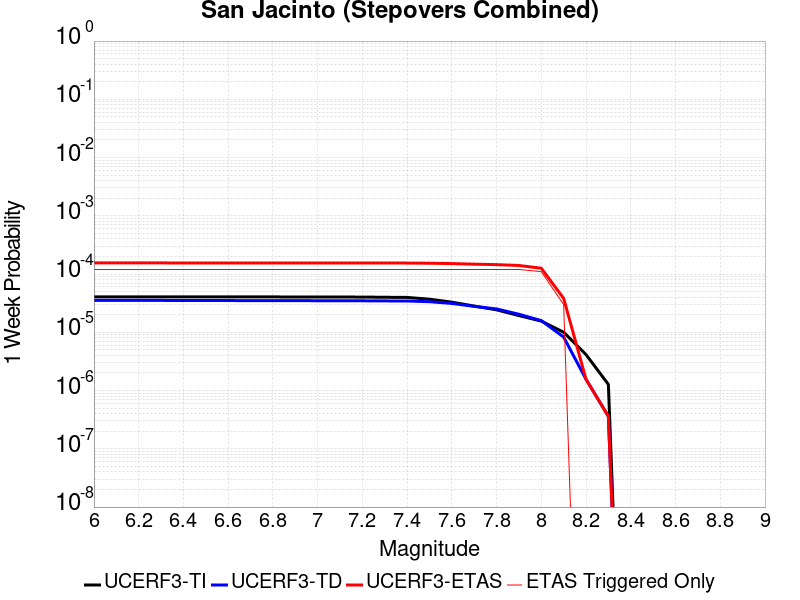 |  | 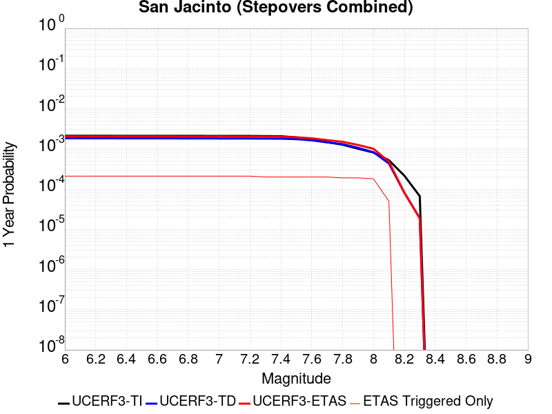 | 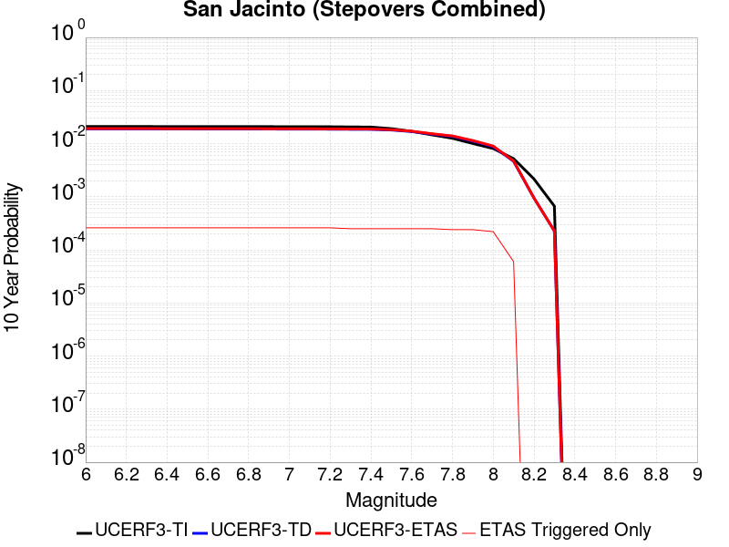 |

| Magnitude | 1 wk TI Prob | 1 wk TD Prob | 1 wk ETAS Prob | 1 wk ETAS/TD Gain | 1 wk ETAS Triggered Only | 1 mo TI Prob | 1 mo TD Prob | 1 mo ETAS Prob | 1 mo ETAS/TD Gain | 1 mo ETAS Triggered Only | 1 yr TI Prob | 1 yr TD Prob | 1 yr ETAS Prob | 1 yr ETAS/TD Gain | 1 yr ETAS Triggered Only | 10 yr TI Prob | 10 yr TD Prob | 10 yr ETAS Prob | 10 yr ETAS/TD Gain | 10 yr ETAS Triggered Only |
|-----|-----|-----|-----|-----|-----|-----|-----|-----|-----|-----|-----|-----|-----|-----|-----|-----|-----|-----|-----|-----|
| 6.0 | 4.0667746E-5 | 3.5272755E-5 | 1.8232639E-4 | 5.169043 | 1.4705882E-4 | 1.742787E-4 | 1.5116022E-4 | 3.382977E-4 | 2.2380075 | 1.8716577E-4 | 0.0021197782 | 0.0018388226 | 0.0020656774 | 1.1233696 | 2.2727273E-4 | 0.020996714 | 0.018986892 | 0.01926231 | 1.0145057 | 2.8074867E-4 |
| 6.1 | 4.0667746E-5 | 3.5272755E-5 | 1.8232639E-4 | 5.169043 | 1.4705882E-4 | 1.742787E-4 | 1.5116022E-4 | 3.382977E-4 | 2.2380075 | 1.8716577E-4 | 0.0021197782 | 0.0018388226 | 0.0020656774 | 1.1233696 | 2.2727273E-4 | 0.020996714 | 0.018986892 | 0.01926231 | 1.0145057 | 2.8074867E-4 |
| 6.2 | 4.0667746E-5 | 3.5272755E-5 | 1.8232639E-4 | 5.169043 | 1.4705882E-4 | 1.742787E-4 | 1.5116022E-4 | 3.382977E-4 | 2.2380075 | 1.8716577E-4 | 0.0021197782 | 0.0018388226 | 0.0020656774 | 1.1233696 | 2.2727273E-4 | 0.020996714 | 0.018986892 | 0.01926231 | 1.0145057 | 2.8074867E-4 |
| 6.3 | 4.0667746E-5 | 3.5272755E-5 | 1.8232639E-4 | 5.169043 | 1.4705882E-4 | 1.742787E-4 | 1.5116022E-4 | 3.382977E-4 | 2.2380075 | 1.8716577E-4 | 0.0021197782 | 0.0018388226 | 0.0020656774 | 1.1233696 | 2.2727273E-4 | 0.020996714 | 0.018986892 | 0.01926231 | 1.0145057 | 2.8074867E-4 |
| 6.4 | 4.0577226E-5 | 3.5144654E-5 | 1.8219832E-4 | 5.1842394 | 1.4705882E-4 | 1.738908E-4 | 1.5061127E-4 | 3.3774885E-4 | 2.2425203 | 1.8716577E-4 | 0.0021150648 | 0.0018321523 | 0.0020590087 | 1.1238196 | 2.2727273E-4 | 0.020950472 | 0.018921461 | 0.019196896 | 1.0145569 | 2.8074867E-4 |
| 6.5 | 4.0577226E-5 | 3.5144654E-5 | 1.8219832E-4 | 5.1842394 | 1.4705882E-4 | 1.738908E-4 | 1.5061127E-4 | 3.3774885E-4 | 2.2425203 | 1.8716577E-4 | 0.0021150648 | 0.0018321523 | 0.0020590087 | 1.1238196 | 2.2727273E-4 | 0.020950472 | 0.018921461 | 0.019196896 | 1.0145569 | 2.8074867E-4 |
| 6.6 | 4.053861E-5 | 3.509E-5 | 1.8214366E-4 | 5.190757 | 1.4705882E-4 | 1.7372532E-4 | 1.5037706E-4 | 3.375147E-4 | 2.2444558 | 1.8716577E-4 | 0.0021130538 | 0.0018293057 | 0.0020561626 | 1.1240126 | 2.2727273E-4 | 0.020930743 | 0.018893538 | 0.019168982 | 1.0145787 | 2.8074867E-4 |
| 6.7 | 4.0516545E-5 | 3.5059067E-5 | 1.8211274E-4 | 5.1944547 | 1.4705882E-4 | 1.7363077E-4 | 1.5024451E-4 | 3.3738217E-4 | 2.245554 | 1.8716577E-4 | 0.002111905 | 0.001827695 | 0.0020545523 | 1.1241221 | 2.2727273E-4 | 0.020919468 | 0.018877735 | 0.019153183 | 1.0145912 | 2.8074867E-4 |
| 6.8 | 4.049434E-5 | 3.5030633E-5 | 1.820843E-4 | 5.19786 | 1.4705882E-4 | 1.7353562E-4 | 1.5012265E-4 | 3.3726034E-4 | 2.246565 | 1.8716577E-4 | 0.0021107488 | 0.0018262138 | 0.0020530715 | 1.124223 | 2.2727273E-4 | 0.020908125 | 0.018863149 | 0.0191386 | 1.0146027 | 2.8074867E-4 |
| 6.9 | 4.046386E-5 | 3.499319E-5 | 1.8204688E-4 | 5.202351 | 1.4705882E-4 | 1.73405E-4 | 1.4996222E-4 | 3.3709992E-4 | 2.247899 | 1.8716577E-4 | 0.0021091616 | 0.0018242638 | 0.002051122 | 1.124356 | 2.2727273E-4 | 0.020892553 | 0.01884392 | 0.01911938 | 1.0146179 | 2.8074867E-4 |
| 7.0 | 4.036382E-5 | 3.487376E-5 | 1.8192745E-4 | 5.2167435 | 1.4705882E-4 | 1.7297632E-4 | 1.4945042E-4 | 3.3658821E-4 | 2.2521732 | 1.8716577E-4 | 0.0021039525 | 0.0018180435 | 0.002044903 | 1.1247822 | 2.2727273E-4 | 0.02084144 | 0.018782536 | 0.019058011 | 1.0146666 | 2.8074867E-4 |
| 7.1 | 4.0343282E-5 | 3.4852223E-5 | 1.8190593E-4 | 5.2193494 | 1.4705882E-4 | 1.7288832E-4 | 1.4935812E-4 | 3.3649596E-4 | 2.252947 | 1.8716577E-4 | 0.002102883 | 0.0018169218 | 0.0020437816 | 1.1248595 | 2.2727273E-4 | 0.020830948 | 0.018771412 | 0.019046891 | 1.0146754 | 2.8074867E-4 |
| 7.2 | 4.0257353E-5 | 3.4756722E-5 | 1.8181044E-4 | 5.230943 | 1.4705882E-4 | 1.725201E-4 | 1.489489E-4 | 3.3608678E-4 | 2.25639 | 1.8716577E-4 | 0.0020984085 | 0.0018119477 | 0.0020388085 | 1.1252028 | 2.2727273E-4 | 0.020787042 | 0.018722152 | 0.018997645 | 1.0147148 | 2.8074867E-4 |
| 7.3 | 3.9940667E-5 | 3.4584376E-5 | 1.8163811E-4 | 5.252028 | 1.4705882E-4 | 1.7116306E-4 | 1.4821035E-4 | 3.353484E-4 | 2.2626514 | 1.8716577E-4 | 0.0020819185 | 0.0018029709 | 0.002016489 | 1.1184257 | 2.1390374E-4 | 0.020625217 | 0.018630784 | 0.018893182 | 1.0140841 | 2.6737968E-4 |
| 7.4 | 3.9721202E-5 | 3.4469766E-5 | 1.8152352E-4 | 5.266166 | 1.4705882E-4 | 1.7022261E-4 | 1.4771923E-4 | 3.3485735E-4 | 2.2668502 | 1.8716577E-4 | 0.0020704903 | 0.0017970012 | 0.0020105205 | 1.1188198 | 2.1390374E-4 | 0.020513052 | 0.018569905 | 0.01883232 | 1.0141312 | 2.6737968E-4 |
| 7.5 | 3.7036873E-5 | 3.3537188E-5 | 1.8059107E-4 | 5.384801 | 1.4705882E-4 | 1.5871979E-4 | 1.437229E-4 | 3.3086177E-4 | 2.302081 | 1.8716577E-4 | 0.0019307006 | 0.0017484248 | 0.0019619546 | 1.1221269 | 2.1390374E-4 | 0.019140124 | 0.018071463 | 0.018334012 | 1.0145283 | 2.6737968E-4 |
| 7.6 | 3.2940967E-5 | 3.1317984E-5 | 1.783722E-4 | 5.6955194 | 1.4705882E-4 | 1.4116794E-4 | 1.3421304E-4 | 3.213537E-4 | 2.394355 | 1.8716577E-4 | 0.0017173645 | 0.0016328214 | 0.0018463758 | 1.1307887 | 2.1390374E-4 | 0.01704153 | 0.016904354 | 0.017167212 | 1.0155498 | 2.6737968E-4 |
| 7.7 | 2.8236149E-5 | 2.7883889E-5 | 1.7493861E-4 | 6.2738237 | 1.4705882E-4 | 1.2100645E-4 | 1.19496915E-4 | 3.0664032E-4 | 2.5660942 | 1.8716577E-4 | 0.0014722579 | 0.001453905 | 0.0016674978 | 1.1469097 | 2.1390374E-4 | 0.014625421 | 0.015115095 | 0.015378433 | 1.0174222 | 2.6737968E-4 |
| 7.8 | 2.4329287E-5 | 2.5207537E-5 | 1.7226265E-4 | 6.8337755 | 1.4705882E-4 | 1.042642E-4 | 1.0802783E-4 | 2.9517338E-4 | 2.7323828 | 1.8716577E-4 | 0.0012686774 | 0.0013144462 | 0.0015147174 | 1.1523616 | 2.0053476E-4 | 0.012614589 | 0.013712396 | 0.013962924 | 1.0182701 | 2.540107E-4 |
| 7.9 | 1.9370926E-5 | 2.0421452E-5 | 1.6747726E-4 | 8.201046 | 1.4705882E-4 | 8.301561E-5 | 8.7517576E-5 | 2.7466696E-4 | 3.1384208 | 1.8716577E-4 | 0.0010102465 | 0.0010650064 | 0.0012653276 | 1.1880939 | 2.0053476E-4 | 0.0100566605 | 0.011199483 | 0.011450648 | 1.0224266 | 2.540107E-4 |
| 8.0 | 1.5583017E-5 | 1.588647E-5 | 1.4957419E-4 | 9.415194 | 1.3368984E-4 | 6.6782646E-5 | 6.808309E-5 | 2.4186805E-4 | 3.552542 | 1.737968E-4 | 8.127754E-4 | 8.285971E-4 | 0.0010156077 | 1.2256956 | 1.8716577E-4 | 0.008098091 | 0.008781809 | 0.009007087 | 1.0256526 | 2.2727273E-4 |
| 8.1 | 1.0024873E-5 | 8.292404E-6 | 4.8399022E-5 | 5.8365493 | 4.0106952E-5 | 4.2963035E-5 | 3.5538393E-5 | 1.0238094E-4 | 2.8808544 | 6.684492E-5 | 5.229494E-4 | 4.3259456E-4 | 4.9941055E-4 | 1.1544541 | 6.684492E-5 | 0.0052172043 | 0.0046534105 | 0.0047332514 | 1.0171574 | 8.0213904E-5 |
| 8.2 | 4.142796E-6 | 1.5610041E-6 | 1.5610041E-6 | 1.0 | 0.0 | 1.775472E-5 | 6.69E-6 | 6.69E-6 | 1.0 | 0.0 | 2.1614227E-4 | 8.144774E-5 | 8.144774E-5 | 1.0 | 0.0 | 0.0021593217 | 9.454649E-4 | 9.454649E-4 | 1.0 | 0.0 |
| 8.3 | 1.2750878E-6 | 3.612133E-7 | 3.612133E-7 | 1.0 | 0.0 | 5.4646503E-6 | 1.548056E-6 | 1.548056E-6 | 1.0 | 0.0 | 6.653009E-5 | 1.8847424E-5 | 1.8847424E-5 | 1.0 | 0.0 | 6.6510175E-4 | 2.2734253E-4 | 2.2734253E-4 | 1.0 | 0.0 |

## Scodie Lineament
*[(top)](#table-of-contents)*

| 1 Week | 1 Month | 1 Year | 10 Year |
|-----|-----|-----|-----|
|  |  | 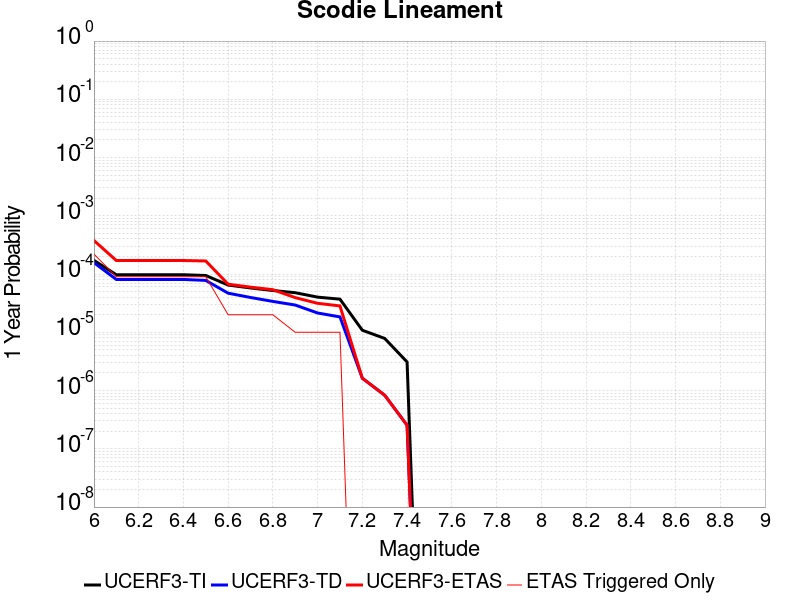 |  |

| Magnitude | 1 wk TI Prob | 1 wk TD Prob | 1 wk ETAS Prob | 1 wk ETAS/TD Gain | 1 wk ETAS Triggered Only | 1 mo TI Prob | 1 mo TD Prob | 1 mo ETAS Prob | 1 mo ETAS/TD Gain | 1 mo ETAS Triggered Only | 1 yr TI Prob | 1 yr TD Prob | 1 yr ETAS Prob | 1 yr ETAS/TD Gain | 1 yr ETAS Triggered Only | 10 yr TI Prob | 10 yr TD Prob | 10 yr ETAS Prob | 10 yr ETAS/TD Gain | 10 yr ETAS Triggered Only |
|-----|-----|-----|-----|-----|-----|-----|-----|-----|-----|-----|-----|-----|-----|-----|-----|-----|-----|-----|-----|-----|
| 6.0 | 3.2919327E-6 | 3.0133422E-6 | 1.7680961E-4 | 58.675583 | 1.737968E-4 | 1.4108206E-5 | 1.2914278E-5 | 2.0007763E-4 | 15.492746 | 1.8716577E-4 | 1.7175387E-4 | 1.5722317E-4 | 3.8446015E-4 | 2.445315 | 2.2727273E-4 | 0.0017162118 | 0.0015714309 | 0.0018383904 | 1.1698831 | 2.6737968E-4 |
| 6.1 | 1.8663811E-6 | 1.5490499E-6 | 6.839386E-5 | 44.152138 | 6.684492E-5 | 7.998751E-6 | 6.6387715E-6 | 8.6852146E-5 | 13.082562 | 8.0213904E-5 | 9.738045E-5 | 8.082454E-5 | 1.6103196E-4 | 1.9923646 | 8.0213904E-5 | 9.7337784E-4 | 8.080003E-4 | 9.015075E-4 | 1.1157268 | 9.358289E-5 |
| 6.2 | 1.8663811E-6 | 1.5490499E-6 | 6.839386E-5 | 44.152138 | 6.684492E-5 | 7.998751E-6 | 6.6387715E-6 | 8.6852146E-5 | 13.082562 | 8.0213904E-5 | 9.738045E-5 | 8.082454E-5 | 1.6103196E-4 | 1.9923646 | 8.0213904E-5 | 9.7337784E-4 | 8.080003E-4 | 9.015075E-4 | 1.1157268 | 9.358289E-5 |
| 6.3 | 1.8663811E-6 | 1.5490499E-6 | 6.839386E-5 | 44.152138 | 6.684492E-5 | 7.998751E-6 | 6.6387715E-6 | 8.6852146E-5 | 13.082562 | 8.0213904E-5 | 9.738045E-5 | 8.082454E-5 | 1.6103196E-4 | 1.9923646 | 8.0213904E-5 | 9.7337784E-4 | 8.080003E-4 | 9.015075E-4 | 1.1157268 | 9.358289E-5 |
| 6.4 | 1.8663811E-6 | 1.5490499E-6 | 6.839386E-5 | 44.152138 | 6.684492E-5 | 7.998751E-6 | 6.6387715E-6 | 8.6852146E-5 | 13.082562 | 8.0213904E-5 | 9.738045E-5 | 8.082454E-5 | 1.6103196E-4 | 1.9923646 | 8.0213904E-5 | 9.7337784E-4 | 8.080003E-4 | 9.015075E-4 | 1.1157268 | 9.358289E-5 |
| 6.5 | 1.8106311E-6 | 1.4909839E-6 | 6.83358E-5 | 45.83269 | 6.684492E-5 | 7.759824E-6 | 6.3899183E-6 | 8.660331E-5 | 13.553117 | 8.0213904E-5 | 9.447177E-5 | 7.7794975E-5 | 1.5800264E-4 | 2.0310135 | 8.0213904E-5 | 9.4431615E-4 | 7.7772606E-4 | 8.712362E-4 | 1.1202353 | 9.358289E-5 |
| 6.6 | 1.2414679E-6 | 8.997558E-7 | 1.4268728E-5 | 15.858445 | 1.3368984E-5 | 5.320566E-6 | 3.856091E-6 | 3.0593957E-5 | 7.93393 | 2.6737967E-5 | 6.477596E-5 | 4.6946985E-5 | 7.3683696E-5 | 1.5695087 | 2.6737967E-5 | 6.475708E-4 | 4.693793E-4 | 5.0946744E-4 | 1.0854067 | 4.0106952E-5 |
| 6.7 | 1.1062215E-6 | 7.594311E-7 | 1.41284045E-5 | 18.603933 | 1.3368984E-5 | 4.7409408E-6 | 3.2547011E-6 | 2.9992581E-5 | 9.2151575 | 2.6737967E-5 | 5.7719422E-5 | 3.9625334E-5 | 6.636224E-5 | 1.6747427 | 2.6737967E-5 | 5.770443E-4 | 3.961897E-4 | 4.3628077E-4 | 1.1011916 | 4.0106952E-5 |
| 6.8 | 1.0006736E-6 | 6.500397E-7 | 1.4019015E-5 | 21.566399 | 1.3368984E-5 | 4.288594E-6 | 2.7858816E-6 | 2.9523775E-5 | 10.597641 | 2.6737967E-5 | 5.221238E-5 | 3.3917644E-5 | 6.0654704E-5 | 1.7882936 | 2.6737967E-5 | 5.220012E-4 | 3.3913075E-4 | 3.792241E-4 | 1.1182239 | 4.0106952E-5 |
| 6.9 | 9.167364E-7 | 5.631625E-7 | 1.3932139E-5 | 24.73911 | 1.3368984E-5 | 3.9288643E-6 | 2.4135516E-6 | 1.5782503E-5 | 6.53912 | 1.3368984E-5 | 4.7832873E-5 | 2.9384651E-5 | 4.2753243E-5 | 1.4549515 | 1.3368984E-5 | 4.782258E-4 | 2.9381333E-4 | 3.2054345E-4 | 1.0909765 | 2.6737967E-5 |
| 7.0 | 7.6987664E-7 | 4.113383E-7 | 1.3780317E-5 | 33.501175 | 1.3368984E-5 | 3.2994672E-6 | 1.7628774E-6 | 1.5131838E-5 | 8.583602 | 1.3368984E-5 | 4.0170275E-5 | 2.1462862E-5 | 3.483156E-5 | 1.6228758 | 1.3368984E-5 | 4.0163012E-4 | 2.1461173E-4 | 2.2797786E-4 | 1.0622804 | 1.3368984E-5 |
| 7.1 | 7.1038727E-7 | 3.5211494E-7 | 1.3721095E-5 | 38.96766 | 1.3368984E-5 | 3.0445133E-6 | 1.5090633E-6 | 1.4878027E-5 | 9.859114 | 1.3368984E-5 | 3.706632E-5 | 1.8372726E-5 | 3.1741463E-5 | 1.7276404 | 1.3368984E-5 | 3.7060137E-4 | 1.8371557E-4 | 1.9708209E-4 | 1.0727566 | 1.3368984E-5 |
| 7.2 | 2.0799602E-7 | 3.1186854E-8 | 3.1186854E-8 | 1.0 | 0.0 | 8.914113E-7 | 1.3365793E-7 | 1.3365793E-7 | 1.0 | 0.0 | 1.0852878E-5 | 1.6272843E-6 | 1.6272843E-6 | 1.0 | 0.0 | 1.08523476E-4 | 1.627273E-5 | 1.627273E-5 | 1.0 | 0.0 |
| 7.3 | 1.5048182E-7 | 1.5945696E-8 | 1.5945696E-8 | 1.0 | 0.0 | 6.449219E-7 | 6.83387E-8 | 6.83387E-8 | 1.0 | 0.0 | 7.851896E-6 | 8.320234E-7 | 8.320234E-7 | 1.0 | 0.0 | 7.851618E-5 | 8.320206E-6 | 8.320206E-6 | 1.0 | 0.0 |
| 7.4 | 5.9334678E-8 | 4.8683537E-9 | 4.8683537E-9 | 1.0 | 0.0 | 2.5429145E-7 | 2.0864372E-8 | 2.0864372E-8 | 1.0 | 0.0 | 3.095994E-6 | 2.5402372E-7 | 2.5402372E-7 | 1.0 | 0.0 | 3.095951E-5 | 2.5402353E-6 | 2.5402353E-6 | 1.0 | 0.0 |

## San Jacinto (Anza) rev
*[(top)](#table-of-contents)*

| 1 Week | 1 Month | 1 Year | 10 Year |
|-----|-----|-----|-----|
|  | 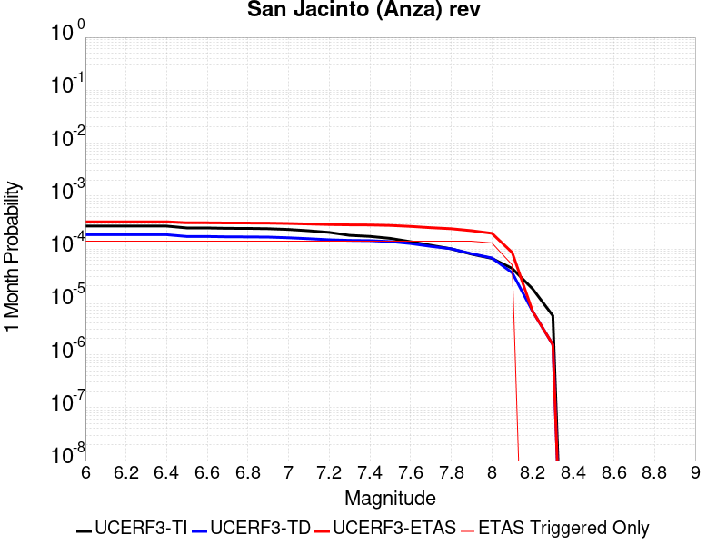 |  |  |

| Magnitude | 1 wk TI Prob | 1 wk TD Prob | 1 wk ETAS Prob | 1 wk ETAS/TD Gain | 1 wk ETAS Triggered Only | 1 mo TI Prob | 1 mo TD Prob | 1 mo ETAS Prob | 1 mo ETAS/TD Gain | 1 mo ETAS Triggered Only | 1 yr TI Prob | 1 yr TD Prob | 1 yr ETAS Prob | 1 yr ETAS/TD Gain | 1 yr ETAS Triggered Only | 10 yr TI Prob | 10 yr TD Prob | 10 yr ETAS Prob | 10 yr ETAS/TD Gain | 10 yr ETAS Triggered Only |
|-----|-----|-----|-----|-----|-----|-----|-----|-----|-----|-----|-----|-----|-----|-----|-----|-----|-----|-----|-----|-----|
| 6.0 | 6.3015636E-5 | 4.3302647E-5 | 1.769867E-4 | 4.0872025 | 1.3368984E-4 | 2.7003905E-4 | 1.8556965E-4 | 3.5933417E-4 | 1.9363846 | 1.737968E-4 | 0.0032827691 | 0.0022569813 | 0.0024570634 | 1.0886503 | 2.0053476E-4 | 0.032346968 | 0.023296192 | 0.023518171 | 1.0095285 | 2.2727273E-4 |
| 6.1 | 6.3015636E-5 | 4.3302647E-5 | 1.769867E-4 | 4.0872025 | 1.3368984E-4 | 2.7003905E-4 | 1.8556965E-4 | 3.5933417E-4 | 1.9363846 | 1.737968E-4 | 0.0032827691 | 0.0022569813 | 0.0024570634 | 1.0886503 | 2.0053476E-4 | 0.032346968 | 0.023296192 | 0.023518171 | 1.0095285 | 2.2727273E-4 |
| 6.2 | 6.3015636E-5 | 4.3302647E-5 | 1.769867E-4 | 4.0872025 | 1.3368984E-4 | 2.7003905E-4 | 1.8556965E-4 | 3.5933417E-4 | 1.9363846 | 1.737968E-4 | 0.0032827691 | 0.0022569813 | 0.0024570634 | 1.0886503 | 2.0053476E-4 | 0.032346968 | 0.023296192 | 0.023518171 | 1.0095285 | 2.2727273E-4 |
| 6.3 | 6.3015636E-5 | 4.3302647E-5 | 1.769867E-4 | 4.0872025 | 1.3368984E-4 | 2.7003905E-4 | 1.8556965E-4 | 3.5933417E-4 | 1.9363846 | 1.737968E-4 | 0.0032827691 | 0.0022569813 | 0.0024570634 | 1.0886503 | 2.0053476E-4 | 0.032346968 | 0.023296192 | 0.023518171 | 1.0095285 | 2.2727273E-4 |
| 6.4 | 6.3015636E-5 | 4.3302647E-5 | 1.769867E-4 | 4.0872025 | 1.3368984E-4 | 2.7003905E-4 | 1.8556965E-4 | 3.5933417E-4 | 1.9363846 | 1.737968E-4 | 0.0032827691 | 0.0022569813 | 0.0024570634 | 1.0886503 | 2.0053476E-4 | 0.032346968 | 0.023296192 | 0.023518171 | 1.0095285 | 2.2727273E-4 |
| 6.5 | 5.811017E-5 | 4.0082516E-5 | 1.73767E-4 | 4.335232 | 1.3368984E-4 | 2.4901982E-4 | 1.7177092E-4 | 3.4553788E-4 | 2.0116203 | 1.737968E-4 | 0.0030276014 | 0.002089311 | 0.0022894265 | 1.0957807 | 2.0053476E-4 | 0.02986684 | 0.021593736 | 0.021816103 | 1.0102977 | 2.2727273E-4 |
| 6.6 | 5.811017E-5 | 4.0082516E-5 | 1.73767E-4 | 4.335232 | 1.3368984E-4 | 2.4901982E-4 | 1.7177092E-4 | 3.4553788E-4 | 2.0116203 | 1.737968E-4 | 0.0030276014 | 0.002089311 | 0.0022894265 | 1.0957807 | 2.0053476E-4 | 0.02986684 | 0.021593736 | 0.021816103 | 1.0102977 | 2.2727273E-4 |
| 6.7 | 5.712442E-5 | 3.9505223E-5 | 1.7318978E-4 | 4.3839717 | 1.3368984E-4 | 2.4479596E-4 | 1.6929714E-4 | 3.4306452E-4 | 2.0264046 | 1.737968E-4 | 0.0029763177 | 0.0020592497 | 0.0022593716 | 1.0971819 | 2.0053476E-4 | 0.029367693 | 0.021285562 | 0.021507997 | 1.01045 | 2.2727273E-4 |
| 6.8 | 5.6967532E-5 | 3.9361643E-5 | 1.7304622E-4 | 4.396316 | 1.3368984E-4 | 2.4412372E-4 | 1.6868189E-4 | 3.4244935E-4 | 2.030149 | 1.737968E-4 | 0.0029681553 | 0.002051773 | 0.0022518963 | 1.0975368 | 2.0053476E-4 | 0.029288229 | 0.021210281 | 0.021432733 | 1.0104879 | 2.2727273E-4 |
| 6.9 | 5.6211324E-5 | 3.9066435E-5 | 1.7275105E-4 | 4.4219813 | 1.3368984E-4 | 2.4088343E-4 | 1.6741687E-4 | 3.4118455E-4 | 2.0379343 | 1.737968E-4 | 0.0029288116 | 0.0020364004 | 0.0022365267 | 1.0982746 | 2.0053476E-4 | 0.028905109 | 0.021049714 | 0.021272203 | 1.0105697 | 2.2727273E-4 |
| 7.0 | 5.4383527E-5 | 3.792697E-5 | 1.7161174E-4 | 4.5247946 | 1.3368984E-4 | 2.3305144E-4 | 1.6253405E-4 | 3.363026E-4 | 2.069121 | 1.737968E-4 | 0.0028337094 | 0.001977061 | 0.0021771993 | 1.1012303 | 2.0053476E-4 | 0.027978465 | 0.020440677 | 0.020663304 | 1.0108913 | 2.2727273E-4 |
| 7.1 | 5.1393665E-5 | 3.6389913E-5 | 1.7007488E-4 | 4.673682 | 1.3368984E-4 | 2.2023996E-4 | 1.5594746E-4 | 3.2971715E-4 | 2.1142836 | 1.737968E-4 | 0.0026781242 | 0.0018970112 | 0.0020971654 | 1.1055104 | 2.0053476E-4 | 0.026460782 | 0.019614287 | 0.019837102 | 1.0113598 | 2.2727273E-4 |
| 7.2 | 4.785222E-5 | 3.4741795E-5 | 1.68427E-4 | 4.8479643 | 1.3368984E-4 | 2.0506482E-4 | 1.4888494E-4 | 3.2265586E-4 | 2.167149 | 1.737968E-4 | 0.0024938055 | 0.0018111705 | 0.002011342 | 1.1105206 | 2.0053476E-4 | 0.024660049 | 0.018728992 | 0.018952008 | 1.0119076 | 2.2727273E-4 |
| 7.3 | 4.2143256E-5 | 3.383628E-5 | 1.6752159E-4 | 4.9509463 | 1.3368984E-4 | 1.8060145E-4 | 1.4500458E-4 | 3.1877618E-4 | 2.198387 | 1.737968E-4 | 0.002196605 | 0.0017640047 | 0.0019641856 | 1.113481 | 2.0053476E-4 | 0.02175019 | 0.01823724 | 0.018460369 | 1.0122347 | 2.2727273E-4 |
| 7.4 | 4.0264713E-5 | 3.347446E-5 | 1.6715983E-4 | 4.9936523 | 1.3368984E-4 | 1.7255165E-4 | 1.4345412E-4 | 3.1722596E-4 | 2.2113411 | 1.737968E-4 | 0.002098792 | 0.0017451581 | 0.0019453429 | 1.1147087 | 2.0053476E-4 | 0.020790804 | 0.018041821 | 0.018264992 | 1.0123698 | 2.2727273E-4 |
| 7.5 | 3.694492E-5 | 3.218847E-5 | 1.6587401E-4 | 5.153212 | 1.3368984E-4 | 1.5832575E-4 | 1.379433E-4 | 3.117161E-4 | 2.2597408 | 1.737968E-4 | 0.0019259118 | 0.001678169 | 0.0018783672 | 1.1192956 | 2.0053476E-4 | 0.01909306 | 0.01735827 | 0.017581599 | 1.0128658 | 2.2727273E-4 |
| 7.6 | 3.200565E-5 | 2.9504106E-5 | 1.6319001E-4 | 5.5310946 | 1.3368984E-4 | 1.3715986E-4 | 1.2644005E-4 | 3.0021486E-4 | 2.3743653 | 1.737968E-4 | 0.001668642 | 0.0015383229 | 0.0017385491 | 1.1301588 | 2.0053476E-4 | 0.01656168 | 0.0159463 | 0.016169949 | 1.0140251 | 2.2727273E-4 |
| 7.7 | 2.731642E-5 | 2.6092788E-5 | 1.5977914E-4 | 6.1234984 | 1.3368984E-4 | 1.1706512E-4 | 1.1182144E-4 | 2.855988E-4 | 2.5540612 | 1.737968E-4 | 0.001424336 | 0.0013605768 | 0.0015608388 | 1.147189 | 2.0053476E-4 | 0.014152412 | 0.014167004 | 0.014391057 | 1.0158151 | 2.2727273E-4 |
| 7.8 | 2.3466424E-5 | 2.3504817E-5 | 1.5719152E-4 | 6.6876297 | 1.3368984E-4 | 1.0056651E-4 | 1.0073105E-4 | 2.7451033E-4 | 2.7251809 | 1.737968E-4 | 0.0012237094 | 0.0012257113 | 0.0014126478 | 1.1525126 | 1.8716577E-4 | 0.012169928 | 0.012808893 | 0.013020057 | 1.0164857 | 2.1390374E-4 |
| 7.9 | 1.8611925E-5 | 1.8908117E-5 | 1.5259543E-4 | 8.070366 | 1.3368984E-4 | 7.9762955E-5 | 8.1032274E-5 | 2.5481498E-4 | 3.1446111 | 1.737968E-4 | 9.7068126E-4 | 9.861222E-4 | 0.0011731033 | 1.1896126 | 1.8716577E-4 | 0.0096645225 | 0.010393824 | 0.010605505 | 1.020366 | 2.1390374E-4 |
| 8.0 | 1.5460775E-5 | 1.5740965E-5 | 1.3605993E-4 | 8.643684 | 1.2032085E-4 | 6.6258784E-5 | 6.7459536E-5 | 2.2787652E-4 | 3.3779733 | 1.6042781E-4 | 8.0640207E-4 | 8.21011E-4 | 9.946652E-4 | 1.2115124 | 1.737968E-4 | 0.008034821 | 0.0087028835 | 0.008901673 | 1.0228418 | 2.0053476E-4 |
| 8.1 | 9.983884E-6 | 8.269952E-6 | 4.8376573E-5 | 5.84968 | 4.0106952E-5 | 4.2787375E-5 | 3.544217E-5 | 1.0228472E-4 | 2.8859608 | 6.684492E-5 | 5.2081177E-4 | 4.314235E-4 | 4.982396E-4 | 1.1548735 | 6.684492E-5 | 0.0051959283 | 0.004640022 | 0.0047198636 | 1.0172071 | 8.0213904E-5 |
| 8.2 | 4.1226E-6 | 1.5529788E-6 | 1.5529788E-6 | 1.0 | 0.0 | 1.7668166E-5 | 6.6556063E-6 | 6.6556063E-6 | 1.0 | 0.0 | 2.1508869E-4 | 8.102902E-5 | 8.102902E-5 | 1.0 | 0.0 | 0.0021488064 | 9.4050163E-4 | 9.4050163E-4 | 1.0 | 0.0 |
| 8.3 | 1.2750878E-6 | 3.612133E-7 | 3.612133E-7 | 1.0 | 0.0 | 5.4646503E-6 | 1.548056E-6 | 1.548056E-6 | 1.0 | 0.0 | 6.653009E-5 | 1.8847424E-5 | 1.8847424E-5 | 1.0 | 0.0 | 6.6510175E-4 | 2.2734253E-4 | 2.2734253E-4 | 1.0 | 0.0 |

## Brawley (Seismic Zone) alt 1
*[(top)](#table-of-contents)*

| 1 Week | 1 Month | 1 Year | 10 Year |
|-----|-----|-----|-----|
|  |  |  |  |

| Magnitude | 1 wk TI Prob | 1 wk TD Prob | 1 wk ETAS Prob | 1 wk ETAS/TD Gain | 1 wk ETAS Triggered Only | 1 mo TI Prob | 1 mo TD Prob | 1 mo ETAS Prob | 1 mo ETAS/TD Gain | 1 mo ETAS Triggered Only | 1 yr TI Prob | 1 yr TD Prob | 1 yr ETAS Prob | 1 yr ETAS/TD Gain | 1 yr ETAS Triggered Only | 10 yr TI Prob | 10 yr TD Prob | 10 yr ETAS Prob | 10 yr ETAS/TD Gain | 10 yr ETAS Triggered Only |
|-----|-----|-----|-----|-----|-----|-----|-----|-----|-----|-----|-----|-----|-----|-----|-----|-----|-----|-----|-----|-----|
| 6.0 | 2.2521618E-4 | 4.7632487E-4 | 5.698632E-4 | 1.196375 | 9.358289E-5 | 9.6485513E-4 | 0.0020398323 | 0.0021332244 | 1.0457841 | 9.358289E-5 | 0.011683988 | 0.024546238 | 0.024702726 | 1.0063753 | 1.6042781E-4 | 0.11088423 | 0.21350002 | 0.21367878 | 1.0008372 | 2.2727273E-4 |
| 6.1 | 2.2521618E-4 | 4.7632487E-4 | 5.698632E-4 | 1.196375 | 9.358289E-5 | 9.6485513E-4 | 0.0020398323 | 0.0021332244 | 1.0457841 | 9.358289E-5 | 0.011683988 | 0.024546238 | 0.024702726 | 1.0063753 | 1.6042781E-4 | 0.11088423 | 0.21350002 | 0.21367878 | 1.0008372 | 2.2727273E-4 |
| 6.2 | 2.198148E-4 | 4.6717093E-4 | 5.607101E-4 | 1.2002248 | 9.358289E-5 | 9.417233E-4 | 0.0020006616 | 0.0020940572 | 1.0466824 | 9.358289E-5 | 0.011405343 | 0.024080504 | 0.024237068 | 1.0065017 | 1.6042781E-4 | 0.10837428 | 0.20993657 | 0.21011613 | 1.0008553 | 2.2727273E-4 |
| 6.3 | 2.1704129E-4 | 4.615278E-4 | 5.550675E-4 | 1.202674 | 9.358289E-5 | 9.298453E-4 | 0.0019765133 | 0.0020699112 | 1.0472538 | 9.358289E-5 | 0.011262234 | 0.02379366 | 0.023950271 | 1.006582 | 1.6042781E-4 | 0.107082725 | 0.20782755 | 0.20800759 | 1.0008663 | 2.2727273E-4 |
| 6.4 | 1.876142E-4 | 4.00449E-4 | 4.9399445E-4 | 1.2336013 | 9.358289E-5 | 8.038131E-4 | 0.0017150956 | 0.001808518 | 1.0544707 | 9.358289E-5 | 0.00974259 | 0.020680401 | 0.020837512 | 1.0075971 | 1.6042781E-4 | 0.093263686 | 0.18457815 | 0.18475257 | 1.000945 | 2.1390374E-4 |
| 6.5 | 1.7390939E-4 | 3.7477075E-4 | 4.6831858E-4 | 1.2496134 | 9.358289E-5 | 7.45113E-4 | 0.0016051838 | 0.0016986165 | 1.0582068 | 9.358289E-5 | 0.009034078 | 0.019368723 | 0.019526044 | 1.0081224 | 1.6042781E-4 | 0.086755216 | 0.17440031 | 0.17456588 | 1.0009493 | 2.0053476E-4 |
| 6.6 | 1.591791E-4 | 3.4891962E-4 | 4.4246984E-4 | 1.268114 | 9.358289E-5 | 6.8201777E-4 | 0.0014945229 | 0.0015879659 | 1.0625236 | 9.358289E-5 | 0.008271996 | 0.018045569 | 0.018203102 | 1.0087297 | 1.6042781E-4 | 0.07970774 | 0.16380852 | 0.1639762 | 1.0010237 | 2.0053476E-4 |
| 6.7 | 1.4268003E-4 | 3.20582E-4 | 4.141349E-4 | 1.291822 | 9.358289E-5 | 6.1134255E-4 | 0.0013732077 | 0.001466662 | 1.0680555 | 9.358289E-5 | 0.007417723 | 0.016592601 | 0.016750367 | 1.0095083 | 1.6042781E-4 | 0.07174956 | 0.15193306 | 0.15210313 | 1.0011194 | 2.0053476E-4 |
| 6.8 | 1.239713E-4 | 2.9053655E-4 | 3.8409227E-4 | 1.32201 | 9.358289E-5 | 5.3119735E-4 | 0.0012445687 | 0.0013380351 | 1.0750995 | 9.358289E-5 | 0.0064481674 | 0.015048777 | 0.0152067905 | 1.0105001 | 1.6042781E-4 | 0.06264243 | 0.13837762 | 0.13855042 | 1.0012486 | 2.0053476E-4 |
| 6.9 | 1.0180238E-4 | 2.625439E-4 | 3.5610222E-4 | 1.356353 | 9.358289E-5 | 4.3622297E-4 | 0.0011247073 | 0.0012181848 | 1.0831128 | 9.358289E-5 | 0.005298089 | 0.013608336 | 0.01376658 | 1.0116285 | 1.6042781E-4 | 0.05173543 | 0.124961674 | 0.12513715 | 1.0014043 | 2.0053476E-4 |
| 7.0 | 7.6619996E-5 | 2.23993E-4 | 3.1755492E-4 | 1.4177002 | 9.358289E-5 | 3.283301E-4 | 9.5962E-4 | 0.0010531131 | 1.0974272 | 9.358289E-5 | 0.0039900932 | 0.011621496 | 0.011780059 | 1.013644 | 1.6042781E-4 | 0.039192066 | 0.107266866 | 0.10744589 | 1.0016689 | 2.0053476E-4 |
| 7.1 | 7.5127435E-5 | 2.2082464E-4 | 3.1438685E-4 | 1.4236946 | 9.358289E-5 | 3.2193496E-4 | 9.4605127E-4 | 0.0010395456 | 1.0988259 | 9.358289E-5 | 0.0039125155 | 0.011458045 | 0.011616634 | 1.0138409 | 1.6042781E-4 | 0.038443442 | 0.10583085 | 0.10601016 | 1.0016943 | 2.0053476E-4 |
| 7.2 | 6.788582E-5 | 2.0210193E-4 | 2.956659E-4 | 1.4629544 | 9.358289E-5 | 2.9090676E-4 | 8.6586666E-4 | 9.5936854E-4 | 1.1079865 | 9.358289E-5 | 0.0035360386 | 0.0104916105 | 0.010650355 | 1.0151306 | 1.6042781E-4 | 0.034803 | 0.09750131 | 0.09768229 | 1.0018562 | 2.0053476E-4 |
| 7.3 | 6.399602E-5 | 1.8841137E-4 | 2.8197662E-4 | 1.4966009 | 9.358289E-5 | 2.7423984E-4 | 8.072303E-4 | 9.0073765E-4 | 1.1158372 | 9.358289E-5 | 0.0033337586 | 0.009784332 | 0.009943189 | 1.016236 | 1.6042781E-4 | 0.03284188 | 0.09139617 | 0.09157837 | 1.0019935 | 2.0053476E-4 |
| 7.4 | 4.506759E-5 | 1.2529209E-4 | 2.1886325E-4 | 1.7468241 | 9.358289E-5 | 1.9313251E-4 | 5.368565E-4 | 6.3038914E-4 | 1.1742228 | 9.358289E-5 | 0.0023488526 | 0.0065168133 | 0.00663635 | 1.0183429 | 1.2032085E-4 | 0.023241805 | 0.062363707 | 0.06251413 | 1.0024121 | 1.6042781E-4 |
| 7.5 | 3.43289E-5 | 9.33541E-5 | 1.8692826E-4 | 2.0023572 | 9.358289E-5 | 1.4711556E-4 | 4.00028E-4 | 4.9357343E-4 | 1.2338473 | 9.358289E-5 | 0.0017896603 | 0.0048595266 | 0.0049792626 | 1.0246395 | 1.2032085E-4 | 0.01775316 | 0.04705519 | 0.047208067 | 1.0032489 | 1.6042781E-4 |
| 7.6 | 2.5980507E-5 | 7.053101E-5 | 1.3737121E-4 | 1.9476712 | 6.684492E-5 | 1.1134028E-4 | 3.0224086E-4 | 3.690656E-4 | 1.2210976 | 6.684492E-5 | 0.001354725 | 0.003673598 | 0.003753517 | 1.021755 | 8.0213904E-5 | 0.013464959 | 0.035840835 | 0.03594395 | 1.0028771 | 1.0695187E-4 |
| 7.7 | 1.7292105E-5 | 4.9407296E-5 | 8.9512265E-5 | 1.8117216 | 4.0106952E-5 | 7.4106916E-5 | 2.117284E-4 | 2.5182686E-4 | 1.1893862 | 4.0106952E-5 | 9.018782E-4 | 0.0025747516 | 0.0026280899 | 1.0207158 | 5.3475935E-5 | 0.008982267 | 0.025290398 | 0.025355551 | 1.0025762 | 6.684492E-5 |
| 7.8 | 1.2927471E-5 | 3.9693266E-5 | 6.643018E-5 | 1.6735879 | 2.6737967E-5 | 5.5402274E-5 | 1.7010293E-4 | 1.9683635E-4 | 1.1571603 | 2.6737967E-5 | 6.743139E-4 | 0.0020690386 | 0.0021090626 | 1.0193442 | 4.0106952E-5 | 0.0067227143 | 0.020431727 | 0.02048411 | 1.0025638 | 5.3475935E-5 |
| 7.9 | 1.0200774E-5 | 2.874569E-5 | 5.5482888E-5 | 1.9301289 | 2.6737967E-5 | 4.371687E-5 | 1.2319001E-4 | 1.4992467E-4 | 1.2170198 | 2.6737967E-5 | 5.321229E-4 | 0.0014988075 | 0.0015388543 | 1.0267191 | 4.0106952E-5 | 0.005308505 | 0.014991644 | 0.0150443185 | 1.0035136 | 5.3475935E-5 |
| 8.0 | 8.650396E-6 | 2.3277367E-5 | 3.664604E-5 | 1.5743207 | 1.3368984E-5 | 3.70726E-5 | 9.975634E-5 | 1.1312399E-4 | 1.134003 | 1.3368984E-5 | 4.5126543E-4 | 0.0012138576 | 0.0012405631 | 1.0220006 | 2.6737967E-5 | 0.0045035016 | 0.012211097 | 0.012250714 | 1.0032444 | 4.0106952E-5 |
| 8.1 | 3.9368224E-6 | 7.3279825E-6 | 7.3279825E-6 | 1.0 | 0.0 | 1.6871985E-5 | 3.140526E-5 | 3.140526E-5 | 1.0 | 0.0 | 2.0539707E-4 | 3.8229208E-4 | 3.8229208E-4 | 1.0 | 0.0 | 0.0020520731 | 0.004001185 | 0.0040145 | 1.0033278 | 1.3368984E-5 |
| 8.2 | 1.7101195E-6 | 2.217876E-6 | 2.217876E-6 | 1.0 | 0.0 | 7.329063E-6 | 9.505149E-6 | 9.505149E-6 | 1.0 | 0.0 | 8.922769E-5 | 1.1571907E-4 | 1.1571907E-4 | 1.0 | 0.0 | 8.9191867E-4 | 0.0012666774 | 0.0012666774 | 1.0 | 0.0 |
| 8.3 | 3.0346666E-8 | 1.721586E-8 | 1.721586E-8 | 1.0 | 0.0 | 1.3005713E-7 | 7.378226E-8 | 7.378226E-8 | 1.0 | 0.0 | 1.5834444E-6 | 8.9829894E-7 | 8.9829894E-7 | 1.0 | 0.0 | 1.5834332E-5 | 9.367729E-6 | 9.367729E-6 | 1.0 | 0.0 |

## Imperial
*[(top)](#table-of-contents)*

| 1 Week | 1 Month | 1 Year | 10 Year |
|-----|-----|-----|-----|
| 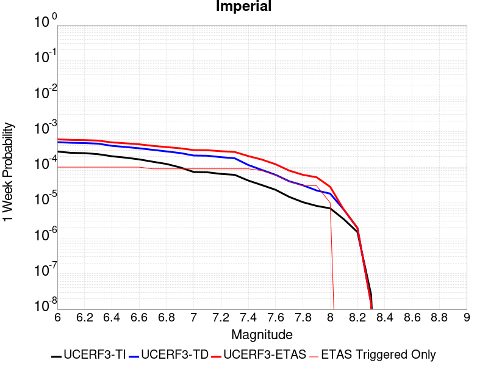 |  |  |  |

| Magnitude | 1 wk TI Prob | 1 wk TD Prob | 1 wk ETAS Prob | 1 wk ETAS/TD Gain | 1 wk ETAS Triggered Only | 1 mo TI Prob | 1 mo TD Prob | 1 mo ETAS Prob | 1 mo ETAS/TD Gain | 1 mo ETAS Triggered Only | 1 yr TI Prob | 1 yr TD Prob | 1 yr ETAS Prob | 1 yr ETAS/TD Gain | 1 yr ETAS Triggered Only | 10 yr TI Prob | 10 yr TD Prob | 10 yr ETAS Prob | 10 yr ETAS/TD Gain | 10 yr ETAS Triggered Only |
|-----|-----|-----|-----|-----|-----|-----|-----|-----|-----|-----|-----|-----|-----|-----|-----|-----|-----|-----|-----|-----|
| 6.0 | 2.7496446E-4 | 5.0552754E-4 | 5.990631E-4 | 1.1850257 | 9.358289E-5 | 0.0011778869 | 0.002164787 | 0.0022581674 | 1.043136 | 9.358289E-5 | 0.0142467655 | 0.026038699 | 0.026194949 | 1.0060008 | 1.6042781E-4 | 0.13367249 | 0.2280438 | 0.22821923 | 1.0007694 | 2.2727273E-4 |
| 6.1 | 2.5356023E-4 | 4.8656776E-4 | 5.801051E-4 | 1.1922392 | 9.358289E-5 | 0.001086234 | 0.0020836622 | 0.00217705 | 1.0448191 | 9.358289E-5 | 0.013144928 | 0.025071215 | 0.025227621 | 1.0062385 | 1.6042781E-4 | 0.123940155 | 0.21947981 | 0.2196572 | 1.0008082 | 2.2727273E-4 |
| 6.2 | 2.4820742E-4 | 4.7752203E-4 | 5.710602E-4 | 1.1958824 | 9.358289E-5 | 0.0010633124 | 0.0020449557 | 0.0021383471 | 1.0456692 | 9.358289E-5 | 0.01286919 | 0.024611235 | 0.024767714 | 1.006358 | 1.6042781E-4 | 0.12148927 | 0.21598552 | 0.21616371 | 1.0008249 | 2.2727273E-4 |
| 6.3 | 2.3205351E-4 | 4.5890483E-4 | 5.524448E-4 | 1.203833 | 9.358289E-5 | 9.94136E-4 | 0.0019652895 | 0.0020586883 | 1.0475243 | 9.358289E-5 | 0.012036599 | 0.02366133 | 0.023817962 | 1.0066197 | 1.6042781E-4 | 0.11405133 | 0.20793462 | 0.20811462 | 1.0008657 | 2.2727273E-4 |
| 6.4 | 2.0304754E-4 | 3.987652E-4 | 4.9231073E-4 | 1.2345881 | 9.358289E-5 | 8.6991355E-4 | 0.0017078889 | 0.001801312 | 1.0547009 | 9.358289E-5 | 0.010539869 | 0.020595672 | 0.020752795 | 1.0076289 | 1.6042781E-4 | 0.100537635 | 0.1850669 | 0.18524121 | 1.0009419 | 2.1390374E-4 |
| 6.5 | 1.854992E-4 | 3.6988858E-4 | 4.6343685E-4 | 1.2529093 | 9.358289E-5 | 7.9475436E-4 | 0.0015842861 | 0.0016777207 | 1.0589758 | 9.358289E-5 | 0.009633281 | 0.01911948 | 0.019276842 | 1.0082303 | 1.6042781E-4 | 0.0922623 | 0.173298 | 0.17346379 | 1.0009567 | 2.0053476E-4 |
| 6.6 | 1.6586106E-4 | 3.403506E-4 | 4.3390165E-4 | 1.2748667 | 9.358289E-5 | 7.106394E-4 | 0.0014578402 | 0.0015512867 | 1.0640992 | 9.358289E-5 | 0.008617763 | 0.01760642 | 0.017764023 | 1.0089514 | 1.6042781E-4 | 0.08291132 | 0.16077545 | 0.16094375 | 1.0010468 | 2.0053476E-4 |
| 6.7 | 1.4224656E-4 | 3.076692E-4 | 4.0122328E-4 | 1.3040737 | 9.358289E-5 | 6.094856E-4 | 0.001317924 | 0.0014113836 | 1.0709143 | 9.358289E-5 | 0.0073952693 | 0.015929576 | 0.016087448 | 1.0099106 | 1.6042781E-4 | 0.07153955 | 0.14648417 | 0.14665532 | 1.0011685 | 2.0053476E-4 |
| 6.8 | 1.2317259E-4 | 2.779122E-4 | 3.7146907E-4 | 1.3366419 | 9.358289E-5 | 5.2777573E-4 | 0.0011905148 | 0.0012839861 | 1.0785135 | 9.358289E-5 | 0.0064067547 | 0.0143995695 | 0.014557688 | 1.0109807 | 1.6042781E-4 | 0.06225166 | 0.13293684 | 0.1331107 | 1.001308 | 2.0053476E-4 |
| 6.9 | 9.859898E-5 | 2.5014306E-4 | 3.4370253E-4 | 1.3740239 | 9.358289E-5 | 4.2249862E-4 | 0.0010716055 | 0.001165088 | 1.087236 | 9.358289E-5 | 0.0051317946 | 0.012969712 | 0.013128059 | 1.0122089 | 1.6042781E-4 | 0.05014893 | 0.11940631 | 0.11958291 | 1.0014789 | 2.0053476E-4 |
| 7.0 | 7.3191884E-5 | 2.1266776E-4 | 3.0623074E-4 | 1.439949 | 9.358289E-5 | 3.136418E-4 | 9.1111806E-4 | 0.0010046157 | 1.1026186 | 9.358289E-5 | 0.003811904 | 0.011037128 | 0.011195784 | 1.0143749 | 1.6042781E-4 | 0.037471764 | 0.10206493 | 0.102244996 | 1.0017643 | 2.0053476E-4 |
| 7.1 | 7.1760296E-5 | 2.0968143E-4 | 3.0324468E-4 | 1.4462163 | 9.358289E-5 | 3.0750787E-4 | 8.983284E-4 | 9.918272E-4 | 1.1040809 | 9.358289E-5 | 0.003737482 | 0.010882978 | 0.01104166 | 1.0145807 | 1.6042781E-4 | 0.03675245 | 0.10070146 | 0.1008818 | 1.0017909 | 2.0053476E-4 |
| 7.2 | 6.46614E-5 | 1.9136685E-4 | 2.8493183E-4 | 1.4889299 | 9.358289E-5 | 2.7709085E-4 | 8.1988896E-4 | 9.133951E-4 | 1.1140474 | 9.358289E-5 | 0.0033683628 | 0.0099370815 | 0.010095915 | 1.0159839 | 1.6042781E-4 | 0.033177625 | 0.09250898 | 0.09269096 | 1.0019672 | 2.0053476E-4 |
| 7.3 | 6.088115E-5 | 1.78084E-4 | 2.716502E-4 | 1.525405 | 9.358289E-5 | 2.6089314E-4 | 7.6299673E-4 | 8.565082E-4 | 1.1225581 | 9.358289E-5 | 0.0031717476 | 0.009250494 | 0.009409437 | 1.0171822 | 1.6042781E-4 | 0.031268585 | 0.08655989 | 0.08674307 | 1.0021162 | 2.0053476E-4 |
| 7.4 | 4.199346E-5 | 1.1510366E-4 | 2.0867577E-4 | 1.8129377 | 9.358289E-5 | 1.7995955E-4 | 4.9320905E-4 | 5.867458E-4 | 1.1896492 | 9.358289E-5 | 0.0021888057 | 0.0059884563 | 0.0061080568 | 1.0199718 | 1.2032085E-4 | 0.02167372 | 0.057439793 | 0.057591006 | 1.0026325 | 1.6042781E-4 |
| 7.5 | 3.130448E-5 | 8.33328E-5 | 1.769079E-4 | 2.1229084 | 9.358289E-5 | 1.3415517E-4 | 3.57092E-4 | 4.5064147E-4 | 1.2619758 | 9.358289E-5 | 0.0016321153 | 0.004338988 | 0.004458787 | 1.0276098 | 1.2032085E-4 | 0.016201803 | 0.04213201 | 0.042285677 | 1.0036473 | 1.6042781E-4 |
| 7.6 | 2.3074248E-5 | 6.0844646E-5 | 1.276855E-4 | 2.0985494 | 6.684492E-5 | 9.888588E-5 | 2.6073685E-4 | 3.2756434E-4 | 1.2563025 | 6.684492E-5 | 0.0012032706 | 0.0031698733 | 0.003249833 | 1.0252249 | 8.0213904E-5 | 0.011967761 | 0.031026395 | 0.031130029 | 1.0033401 | 1.0695187E-4 |
| 7.7 | 1.45864815E-5 | 4.0124698E-5 | 8.023004E-5 | 1.9995176 | 4.0106952E-5 | 6.2511994E-5 | 1.7195169E-4 | 2.1205175E-4 | 1.2332053 | 4.0106952E-5 | 7.608177E-4 | 0.0020915072 | 0.0021448713 | 1.0255146 | 5.3475935E-5 | 0.007582182 | 0.020627763 | 0.02069323 | 1.0031737 | 6.684492E-5 |
| 7.8 | 1.0352979E-5 | 3.0960902E-5 | 5.7698042E-5 | 1.8635776 | 2.6737967E-5 | 4.4369157E-5 | 1.3268284E-4 | 1.5941726E-4 | 1.2014911 | 2.6737967E-5 | 5.400606E-4 | 0.0016142189 | 0.0016542611 | 1.0248059 | 4.0106952E-5 | 0.0053875 | 0.016016833 | 0.016069451 | 1.0032853 | 5.3475935E-5 |
| 7.9 | 8.137906E-6 | 2.2149103E-5 | 4.888648E-5 | 2.207154 | 2.6737967E-5 | 3.4876273E-5 | 9.492128E-5 | 1.216567E-4 | 1.281659 | 2.6737967E-5 | 4.2453592E-4 | 0.0011550548 | 0.0011951154 | 1.0346829 | 4.0106952E-5 | 0.004237258 | 0.011617903 | 0.011670757 | 1.0045494 | 5.3475935E-5 |
| 8.0 | 6.93792E-6 | 1.8008766E-5 | 3.137751E-5 | 1.7423464 | 1.3368984E-5 | 2.9733603E-5 | 7.717814E-5 | 9.05461E-5 | 1.1732091 | 1.3368984E-5 | 3.6194647E-4 | 9.3923963E-4 | 9.6595247E-4 | 1.028441 | 2.6737967E-5 | 0.0036135751 | 0.00950155 | 0.009541277 | 1.004181 | 4.0106952E-5 |
| 8.1 | 3.4286315E-6 | 6.379872E-6 | 6.379872E-6 | 1.0 | 0.0 | 1.4694053E-5 | 2.7342023E-5 | 2.7342023E-5 | 1.0 | 0.0 | 1.7888541E-4 | 3.328384E-4 | 3.328384E-4 | 1.0 | 0.0 | 0.0017874148 | 0.003486031 | 0.0034993533 | 1.0038216 | 1.3368984E-5 |
| 8.2 | 1.4906886E-6 | 1.9366646E-6 | 1.9366646E-6 | 1.0 | 0.0 | 6.3886496E-6 | 8.299965E-6 | 8.299965E-6 | 1.0 | 0.0 | 7.7779034E-5 | 1.0104742E-4 | 1.0104742E-4 | 1.0 | 0.0 | 7.775182E-4 | 0.0011075331 | 0.0011075331 | 1.0 | 0.0 |
| 8.3 | 2.5758007E-8 | 1.4500102E-8 | 1.4500102E-8 | 1.0 | 0.0 | 1.10391454E-7 | 6.214329E-8 | 6.214329E-8 | 1.0 | 0.0 | 1.3440151E-6 | 7.565946E-7 | 7.565946E-7 | 1.0 | 0.0 | 1.344007E-5 | 7.887763E-6 | 7.887763E-6 | 1.0 | 0.0 |

## Lost Hills
*[(top)](#table-of-contents)*

| 1 Week | 1 Month | 1 Year | 10 Year |
|-----|-----|-----|-----|
|  |  |  |  |

| Magnitude | 1 wk TI Prob | 1 wk TD Prob | 1 wk ETAS Prob | 1 wk ETAS/TD Gain | 1 wk ETAS Triggered Only | 1 mo TI Prob | 1 mo TD Prob | 1 mo ETAS Prob | 1 mo ETAS/TD Gain | 1 mo ETAS Triggered Only | 1 yr TI Prob | 1 yr TD Prob | 1 yr ETAS Prob | 1 yr ETAS/TD Gain | 1 yr ETAS Triggered Only | 10 yr TI Prob | 10 yr TD Prob | 10 yr ETAS Prob | 10 yr ETAS/TD Gain | 10 yr ETAS Triggered Only |
|-----|-----|-----|-----|-----|-----|-----|-----|-----|-----|-----|-----|-----|-----|-----|-----|-----|-----|-----|-----|-----|
| 6.0 | 2.233523E-5 | 2.5106583E-5 | 1.05318475E-4 | 4.194855 | 8.0213904E-5 | 9.571891E-5 | 1.0759615E-4 | 1.8780142E-4 | 1.7454288 | 8.0213904E-5 | 0.0011647546 | 0.001309364 | 0.0014562303 | 1.1121662 | 1.4705882E-4 | 0.011586686 | 0.013033091 | 0.013244207 | 1.0161984 | 2.1390374E-4 |
| 6.1 | 2.233523E-5 | 2.5106583E-5 | 1.05318475E-4 | 4.194855 | 8.0213904E-5 | 9.571891E-5 | 1.0759615E-4 | 1.8780142E-4 | 1.7454288 | 8.0213904E-5 | 0.0011647546 | 0.001309364 | 0.0014562303 | 1.1121662 | 1.4705882E-4 | 0.011586686 | 0.013033091 | 0.013244207 | 1.0161984 | 2.1390374E-4 |
| 6.2 | 2.233523E-5 | 2.5106583E-5 | 1.05318475E-4 | 4.194855 | 8.0213904E-5 | 9.571891E-5 | 1.0759615E-4 | 1.8780142E-4 | 1.7454288 | 8.0213904E-5 | 0.0011647546 | 0.001309364 | 0.0014562303 | 1.1121662 | 1.4705882E-4 | 0.011586686 | 0.013033091 | 0.013244207 | 1.0161984 | 2.1390374E-4 |
| 6.3 | 2.233523E-5 | 2.5106583E-5 | 1.05318475E-4 | 4.194855 | 8.0213904E-5 | 9.571891E-5 | 1.0759615E-4 | 1.8780142E-4 | 1.7454288 | 8.0213904E-5 | 0.0011647546 | 0.001309364 | 0.0014562303 | 1.1121662 | 1.4705882E-4 | 0.011586686 | 0.013033091 | 0.013244207 | 1.0161984 | 2.1390374E-4 |
| 6.4 | 1.2288092E-5 | 1.3781108E-5 | 6.7256304E-5 | 4.8803267 | 5.3475935E-5 | 5.2662188E-5 | 5.906108E-5 | 1.1253386E-4 | 1.905381 | 5.3475935E-5 | 6.409735E-4 | 7.189252E-4 | 8.391596E-4 | 1.1672418 | 1.2032085E-4 | 0.006391279 | 0.0071752006 | 0.0073477505 | 1.0240481 | 1.737968E-4 |
| 6.5 | 1.2288092E-5 | 1.3781108E-5 | 6.7256304E-5 | 4.8803267 | 5.3475935E-5 | 5.2662188E-5 | 5.906108E-5 | 1.1253386E-4 | 1.905381 | 5.3475935E-5 | 6.409735E-4 | 7.189252E-4 | 8.391596E-4 | 1.1672418 | 1.2032085E-4 | 0.006391279 | 0.0071752006 | 0.0073477505 | 1.0240481 | 1.737968E-4 |
| 6.6 | 8.58281E-6 | 9.63377E-6 | 3.637148E-5 | 3.7754152 | 2.6737967E-5 | 3.6782953E-5 | 4.12874E-5 | 6.802427E-5 | 1.6475792 | 2.6737967E-5 | 4.4774043E-4 | 5.026414E-4 | 5.694527E-4 | 1.1329205 | 6.684492E-5 | 0.0044683935 | 0.005023205 | 0.00512962 | 1.0211846 | 1.0695187E-4 |
| 6.7 | 7.205685E-6 | 8.088302E-6 | 3.4826055E-5 | 4.3057313 | 2.6737967E-5 | 3.088114E-5 | 3.466415E-5 | 6.140119E-5 | 1.7713168 | 2.6737967E-5 | 3.7591302E-4 | 4.2203604E-4 | 4.8885273E-4 | 1.15832 | 6.684492E-5 | 0.0037527776 | 0.0042203604 | 0.004300236 | 1.0189261 | 8.0213904E-5 |

## Mission Creek
*[(top)](#table-of-contents)*

| 1 Week | 1 Month | 1 Year | 10 Year |
|-----|-----|-----|-----|
|  |  |  |  |

| Magnitude | 1 wk TI Prob | 1 wk TD Prob | 1 wk ETAS Prob | 1 wk ETAS/TD Gain | 1 wk ETAS Triggered Only | 1 mo TI Prob | 1 mo TD Prob | 1 mo ETAS Prob | 1 mo ETAS/TD Gain | 1 mo ETAS Triggered Only | 1 yr TI Prob | 1 yr TD Prob | 1 yr ETAS Prob | 1 yr ETAS/TD Gain | 1 yr ETAS Triggered Only | 10 yr TI Prob | 10 yr TD Prob | 10 yr ETAS Prob | 10 yr ETAS/TD Gain | 10 yr ETAS Triggered Only |
|-----|-----|-----|-----|-----|-----|-----|-----|-----|-----|-----|-----|-----|-----|-----|-----|-----|-----|-----|-----|-----|
| 6.0 | 1.1549387E-5 | 1.632237E-5 | 8.31662E-5 | 5.095228 | 6.684492E-5 | 4.9496433E-5 | 6.9951224E-5 | 1.3679147E-4 | 1.9555265 | 6.684492E-5 | 6.0245243E-4 | 8.513384E-4 | 9.715568E-4 | 1.141211 | 1.2032085E-4 | 0.006008218 | 0.008509998 | 0.008708826 | 1.0233641 | 2.0053476E-4 |
| 6.1 | 1.1549387E-5 | 1.632237E-5 | 8.31662E-5 | 5.095228 | 6.684492E-5 | 4.9496433E-5 | 6.9951224E-5 | 1.3679147E-4 | 1.9555265 | 6.684492E-5 | 6.0245243E-4 | 8.513384E-4 | 9.715568E-4 | 1.141211 | 1.2032085E-4 | 0.006008218 | 0.008509998 | 0.008708826 | 1.0233641 | 2.0053476E-4 |
| 6.2 | 1.1549387E-5 | 1.632237E-5 | 8.31662E-5 | 5.095228 | 6.684492E-5 | 4.9496433E-5 | 6.9951224E-5 | 1.3679147E-4 | 1.9555265 | 6.684492E-5 | 6.0245243E-4 | 8.513384E-4 | 9.715568E-4 | 1.141211 | 1.2032085E-4 | 0.006008218 | 0.008509998 | 0.008708826 | 1.0233641 | 2.0053476E-4 |
| 6.3 | 1.1549387E-5 | 1.632237E-5 | 8.31662E-5 | 5.095228 | 6.684492E-5 | 4.9496433E-5 | 6.9951224E-5 | 1.3679147E-4 | 1.9555265 | 6.684492E-5 | 6.0245243E-4 | 8.513384E-4 | 9.715568E-4 | 1.141211 | 1.2032085E-4 | 0.006008218 | 0.008509998 | 0.008708826 | 1.0233641 | 2.0053476E-4 |
| 6.4 | 1.1549387E-5 | 1.632237E-5 | 8.31662E-5 | 5.095228 | 6.684492E-5 | 4.9496433E-5 | 6.9951224E-5 | 1.3679147E-4 | 1.9555265 | 6.684492E-5 | 6.0245243E-4 | 8.513384E-4 | 9.715568E-4 | 1.141211 | 1.2032085E-4 | 0.006008218 | 0.008509998 | 0.008708826 | 1.0233641 | 2.0053476E-4 |
| 6.5 | 1.1549387E-5 | 1.632237E-5 | 8.31662E-5 | 5.095228 | 6.684492E-5 | 4.9496433E-5 | 6.9951224E-5 | 1.3679147E-4 | 1.9555265 | 6.684492E-5 | 6.0245243E-4 | 8.513384E-4 | 9.715568E-4 | 1.141211 | 1.2032085E-4 | 0.006008218 | 0.008509998 | 0.008708826 | 1.0233641 | 2.0053476E-4 |
| 6.6 | 9.202681E-6 | 1.3845646E-5 | 8.068964E-5 | 5.827799 | 6.684492E-5 | 3.9439463E-5 | 5.9337188E-5 | 1.2617814E-4 | 2.1264598 | 6.684492E-5 | 4.800697E-4 | 7.221998E-4 | 8.424338E-4 | 1.1664829 | 1.2032085E-4 | 0.004790339 | 0.0072271815 | 0.0074129947 | 1.0257103 | 1.8716577E-4 |
| 6.7 | 9.019164E-6 | 1.3651316E-5 | 8.049532E-5 | 5.896525 | 6.684492E-5 | 3.8652986E-5 | 5.8504378E-5 | 1.2534538E-4 | 2.1424959 | 6.684492E-5 | 4.7049852E-4 | 7.12067E-4 | 8.323022E-4 | 1.1688538 | 1.2032085E-4 | 0.004695036 | 0.007126506 | 0.007312338 | 1.0260762 | 1.8716577E-4 |
| 6.8 | 8.673558E-6 | 1.3273427E-5 | 8.011746E-5 | 6.0359287 | 6.684492E-5 | 3.717186E-5 | 5.6884925E-5 | 1.2372604E-4 | 2.1750233 | 6.684492E-5 | 4.524734E-4 | 6.923627E-4 | 8.1260025E-4 | 1.1736627 | 1.2032085E-4 | 0.0045155324 | 0.006930694 | 0.0071165627 | 1.0268182 | 1.8716577E-4 |
| 6.9 | 7.002255E-6 | 1.1477657E-5 | 7.8321806E-5 | 6.82385 | 6.684492E-5 | 3.000932E-5 | 4.9189068E-5 | 1.160307E-4 | 2.3588717 | 6.684492E-5 | 3.653022E-4 | 5.9871917E-4 | 7.18968E-4 | 1.2008435 | 1.2032085E-4 | 0.0036470229 | 0.005999517 | 0.0061589824 | 1.0265797 | 1.6042781E-4 |
| 7.0 | 5.84644E-6 | 9.67498E-6 | 7.651925E-5 | 7.908983 | 6.684492E-5 | 2.5055931E-5 | 4.1463565E-5 | 1.08305714E-4 | 2.6120694 | 6.684492E-5 | 3.0501327E-4 | 5.047066E-4 | 6.249667E-4 | 1.2382773 | 1.2032085E-4 | 0.0030459496 | 0.0050638523 | 0.0052234675 | 1.0315206 | 1.6042781E-4 |
| 7.1 | 5.54703E-6 | 9.329456E-6 | 7.6173754E-5 | 8.1648655 | 6.684492E-5 | 2.377277E-5 | 3.9982795E-5 | 1.0682504E-4 | 2.6717753 | 6.684492E-5 | 2.8939504E-4 | 4.8668624E-4 | 6.0694857E-4 | 1.2471044 | 1.2032085E-4 | 0.0028901845 | 0.004884446 | 0.0050440906 | 1.0326842 | 1.6042781E-4 |
| 7.2 | 4.384709E-6 | 7.68157E-6 | 7.4525975E-5 | 9.70192 | 6.684492E-5 | 1.8791474E-5 | 3.2920623E-5 | 9.976334E-5 | 3.0304208 | 6.684492E-5 | 2.2876218E-4 | 4.0073853E-4 | 5.210112E-4 | 1.3001275 | 1.2032085E-4 | 0.0022852682 | 0.004028366 | 0.0041881474 | 1.0396641 | 1.6042781E-4 |
| 7.3 | 3.7888456E-6 | 6.915452E-6 | 7.375991E-5 | 10.6659565 | 6.684492E-5 | 1.623781E-5 | 2.9637333E-5 | 9.6480275E-5 | 3.2553627 | 6.684492E-5 | 1.9767738E-4 | 3.6077813E-4 | 4.8105558E-4 | 1.3333834 | 1.2032085E-4 | 0.0019750162 | 0.0036301152 | 0.0037899606 | 1.0440332 | 1.6042781E-4 |
| 7.4 | 2.1982462E-6 | 5.0237763E-6 | 7.186836E-5 | 14.305644 | 6.684492E-5 | 9.421021E-6 | 2.1530293E-5 | 8.8373774E-5 | 4.1046247 | 6.684492E-5 | 1.1469489E-4 | 2.621E-4 | 3.8238932E-4 | 1.4589444 | 1.2032085E-4 | 0.0011463572 | 0.0026458844 | 0.0028058877 | 1.0604725 | 1.6042781E-4 |
| 7.5 | 2.051923E-6 | 4.615016E-6 | 7.1459624E-5 | 15.484156 | 6.684492E-5 | 8.793926E-6 | 1.9778492E-5 | 8.662209E-5 | 4.3796105 | 6.684492E-5 | 1.0706078E-4 | 2.4077666E-4 | 3.6106855E-4 | 1.4995995 | 1.2032085E-4 | 0.0010700922 | 0.0024335422 | 0.0025935795 | 1.0657631 | 1.6042781E-4 |
| 7.6 | 1.8733427E-6 | 4.1233748E-6 | 7.096802E-5 | 17.21115 | 6.684492E-5 | 8.028587E-6 | 1.7671488E-5 | 8.4515224E-5 | 4.7825756 | 6.684492E-5 | 9.774366E-5 | 2.151292E-4 | 3.3542418E-4 | 1.5591755 | 1.2032085E-4 | 9.770069E-4 | 0.0021780801 | 0.0023381587 | 1.0734951 | 1.6042781E-4 |
| 7.7 | 1.8411953E-6 | 4.0430496E-6 | 7.08877E-5 | 17.533224 | 6.684492E-5 | 7.890813E-6 | 1.732724E-5 | 8.4171006E-5 | 4.8577266 | 6.684492E-5 | 9.606641E-5 | 2.1093882E-4 | 3.312343E-4 | 1.570286 | 1.2032085E-4 | 9.6024893E-4 | 0.0021363653 | 0.0022964503 | 1.0749334 | 1.6042781E-4 |
| 7.8 | 1.7194251E-6 | 3.7104276E-6 | 7.05551E-5 | 19.015356 | 6.684492E-5 | 7.368944E-6 | 1.5901736E-5 | 8.2745595E-5 | 5.203557 | 6.684492E-5 | 8.97132E-5 | 1.9358651E-4 | 3.1388408E-4 | 1.621415 | 1.2032085E-4 | 8.967699E-4 | 0.0019623525 | 0.0021224655 | 1.0815923 | 1.6042781E-4 |
| 7.9 | 1.4035052E-6 | 2.9500632E-6 | 6.979478E-5 | 23.658743 | 6.684492E-5 | 6.0150082E-6 | 1.2643067E-5 | 7.9487145E-5 | 6.2870145 | 6.684492E-5 | 7.3230265E-5 | 1.5391852E-4 | 2.7422086E-4 | 1.7815975 | 1.2032085E-4 | 7.3206134E-4 | 0.0015631086 | 0.0017099376 | 1.0939339 | 1.4705882E-4 |
| 8.0 | 3.9318823E-7 | 5.528522E-7 | 1.3921829E-5 | 25.181826 | 1.3368984E-5 | 1.6850913E-6 | 2.3693647E-6 | 1.5738317E-5 | 6.642421 | 1.3368984E-5 | 2.0515794E-5 | 2.8846638E-5 | 5.5583834E-5 | 1.9268739 | 2.6737967E-5 | 2.0513899E-4 | 2.9899E-4 | 3.2571997E-4 | 1.0894009 | 2.6737967E-5 |
| 8.1 | 1.596793E-7 | 1.1380002E-7 | 1.1380002E-7 | 1.0 | 0.0 | 6.8433974E-7 | 4.877143E-7 | 4.877143E-7 | 1.0 | 0.0 | 8.331805E-6 | 5.937906E-6 | 5.937906E-6 | 1.0 | 0.0 | 8.331492E-5 | 6.549966E-5 | 6.549966E-5 | 1.0 | 0.0 |
| 8.2 | 4.9003038E-8 | 2.5444924E-8 | 2.5444924E-8 | 1.0 | 0.0 | 2.10013E-7 | 1.0904967E-7 | 1.0904967E-7 | 1.0 | 0.0 | 2.5569052E-6 | 1.327679E-6 | 1.327679E-6 | 1.0 | 0.0 | 2.556876E-5 | 1.495635E-5 | 1.495635E-5 | 1.0 | 0.0 |

## Rose Canyon
*[(top)](#table-of-contents)*

| 1 Week | 1 Month | 1 Year | 10 Year |
|-----|-----|-----|-----|
|  |  |  | 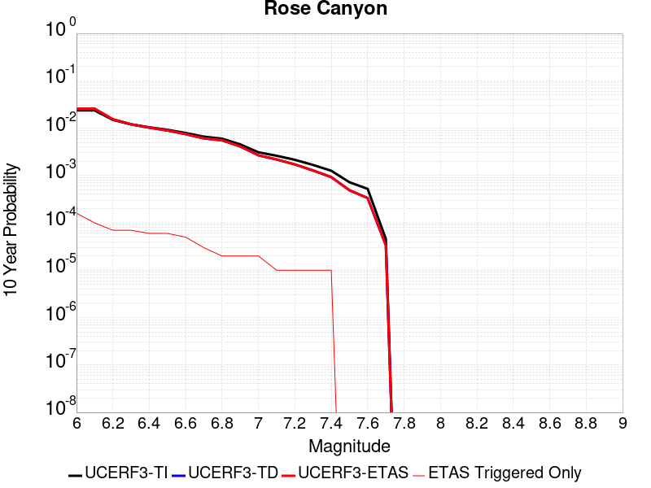 |

| Magnitude | 1 wk TI Prob | 1 wk TD Prob | 1 wk ETAS Prob | 1 wk ETAS/TD Gain | 1 wk ETAS Triggered Only | 1 mo TI Prob | 1 mo TD Prob | 1 mo ETAS Prob | 1 mo ETAS/TD Gain | 1 mo ETAS Triggered Only | 1 yr TI Prob | 1 yr TD Prob | 1 yr ETAS Prob | 1 yr ETAS/TD Gain | 1 yr ETAS Triggered Only | 10 yr TI Prob | 10 yr TD Prob | 10 yr ETAS Prob | 10 yr ETAS/TD Gain | 10 yr ETAS Triggered Only |
|-----|-----|-----|-----|-----|-----|-----|-----|-----|-----|-----|-----|-----|-----|-----|-----|-----|-----|-----|-----|-----|
| 6.0 | 4.5923203E-5 | 4.9714225E-5 | 1.2992414E-4 | 2.6134198 | 8.0213904E-5 | 1.9679888E-4 | 2.1304491E-4 | 3.4670628E-4 | 1.6273859 | 1.3368984E-4 | 0.0023933933 | 0.0025909345 | 0.0027509467 | 1.0617585 | 1.6042781E-4 | 0.023677798 | 0.02563999 | 0.025822358 | 1.0071126 | 1.8716577E-4 |
| 6.1 | 4.5923203E-5 | 4.9714225E-5 | 1.1655582E-4 | 2.3445165 | 6.684492E-5 | 1.9679888E-4 | 2.1304491E-4 | 3.0660786E-4 | 1.4391701 | 9.358289E-5 | 0.0023933933 | 0.0025909345 | 0.0026976091 | 1.0411723 | 1.0695187E-4 | 0.023677798 | 0.02563999 | 0.025757227 | 1.0045724 | 1.2032085E-4 |
| 6.2 | 2.8844734E-5 | 2.9668723E-5 | 8.314307E-5 | 2.8023813 | 5.3475935E-5 | 1.2361443E-4 | 1.2714567E-4 | 1.939821E-4 | 1.5256681 | 6.684492E-5 | 0.0015039665 | 0.0015468939 | 0.0016136353 | 1.0431455 | 6.684492E-5 | 0.0149382865 | 0.015374276 | 0.015453257 | 1.0051372 | 8.0213904E-5 |
| 6.3 | 2.3171577E-5 | 2.3161238E-5 | 7.663594E-5 | 3.3088014 | 5.3475935E-5 | 9.9302975E-5 | 9.9258745E-5 | 1.6609703E-4 | 1.6733743 | 6.684492E-5 | 0.0012083431 | 0.0012078186 | 0.0012745828 | 1.0552766 | 6.684492E-5 | 0.012017938 | 0.012022437 | 0.012101687 | 1.0065918 | 8.0213904E-5 |
| 6.4 | 2.0066604E-5 | 1.9667024E-5 | 7.3141906E-5 | 3.7190125 | 5.3475935E-5 | 8.599689E-5 | 8.4284584E-5 | 1.5112387E-4 | 1.7930192 | 6.684492E-5 | 0.0010465092 | 0.0010256917 | 0.001092468 | 1.0651038 | 6.684492E-5 | 0.010415946 | 0.010217559 | 0.010283721 | 1.0064753 | 6.684492E-5 |
| 6.5 | 1.776989E-5 | 1.7113807E-5 | 7.058883E-5 | 4.1246715 | 5.3475935E-5 | 7.615444E-5 | 7.334287E-5 | 1.4018288E-4 | 1.9113363 | 6.684492E-5 | 9.267859E-4 | 8.925905E-4 | 9.5937576E-4 | 1.0748218 | 6.684492E-5 | 0.009229303 | 0.008896211 | 0.008962461 | 1.007447 | 6.684492E-5 |
| 6.6 | 1.5227364E-5 | 1.433926E-5 | 6.781443E-5 | 4.729284 | 5.3475935E-5 | 6.52585E-5 | 6.1452556E-5 | 1.2829337E-4 | 2.0876815 | 6.684492E-5 | 7.942326E-4 | 7.479332E-4 | 8.1472815E-4 | 1.089306 | 6.684492E-5 | 0.007914 | 0.007458359 | 0.0075247055 | 1.0088955 | 6.684492E-5 |
| 6.7 | 1.2703898E-5 | 1.1673274E-5 | 5.1779756E-5 | 4.435753 | 4.0106952E-5 | 5.4444143E-5 | 5.0027378E-5 | 9.013232E-5 | 1.80166 | 4.0106952E-5 | 6.626558E-4 | 6.089174E-4 | 6.489999E-4 | 1.0658259 | 4.0106952E-5 | 0.006606833 | 0.0060750856 | 0.006114949 | 1.0065618 | 4.0106952E-5 |
| 6.8 | 1.1554917E-5 | 1.0609337E-5 | 3.734702E-5 | 3.520203 | 2.6737967E-5 | 4.9520135E-5 | 4.546782E-5 | 7.220457E-5 | 1.5880369 | 2.6737967E-5 | 6.0274085E-4 | 5.5343413E-4 | 5.8015727E-4 | 1.0482861 | 2.6737967E-5 | 0.0060110865 | 0.0055225673 | 0.0055491575 | 1.0048149 | 2.6737967E-5 |
| 6.9 | 8.732078E-6 | 7.881357E-6 | 3.4619115E-5 | 4.392532 | 2.6737967E-5 | 3.7422655E-5 | 3.3776825E-5 | 6.0513892E-5 | 1.7915802 | 2.6737967E-5 | 4.5552556E-4 | 4.111582E-4 | 4.3788517E-4 | 1.0650041 | 2.6737967E-5 | 0.0045459294 | 0.0041048084 | 0.004131437 | 1.0064871 | 2.6737967E-5 |
| 7.0 | 5.9337494E-6 | 5.1074853E-6 | 3.1845317E-5 | 6.2350283 | 2.6737967E-5 | 2.5430107E-5 | 2.188904E-5 | 4.862642E-5 | 2.2214963 | 2.6737967E-5 | 3.0956755E-4 | 2.664666E-4 | 2.9319746E-4 | 1.1003159 | 2.6737967E-5 | 0.0030913667 | 0.0026614866 | 0.0026881534 | 1.0100195 | 2.6737967E-5 |
| 7.1 | 5.013409E-6 | 4.1773833E-6 | 1.7546312E-5 | 4.2003117 | 1.3368984E-5 | 2.1485863E-5 | 1.7902948E-5 | 3.1271695E-5 | 1.7467343 | 1.3368984E-5 | 2.6155898E-4 | 2.179467E-4 | 2.3131278E-4 | 1.0613272 | 1.3368984E-5 | 0.0026125133 | 0.0021773411 | 0.0021906812 | 1.0061266 | 1.3368984E-5 |
| 7.2 | 4.120763E-6 | 3.2821383E-6 | 1.6651078E-5 | 5.0732408 | 1.3368984E-5 | 1.7660293E-5 | 1.4066231E-5 | 2.7435028E-5 | 1.9504178 | 1.3368984E-5 | 2.1499286E-4 | 1.7124301E-4 | 1.846097E-4 | 1.0780569 | 1.3368984E-5 | 0.0021478499 | 0.00171112 | 0.0017244661 | 1.0077996 | 1.3368984E-5 |
| 7.3 | 3.2081239E-6 | 2.4405372E-6 | 1.5809488E-5 | 6.4778724 | 1.3368984E-5 | 1.374903E-5 | 1.0459404E-5 | 2.3828248E-5 | 2.278165 | 1.3368984E-5 | 1.6738157E-4 | 1.2733586E-4 | 1.4070315E-4 | 1.1049765 | 1.3368984E-5 | 0.0016725556 | 0.001272636 | 0.001285988 | 1.0104916 | 1.3368984E-5 |
| 7.4 | 2.4194755E-6 | 1.7680634E-6 | 1.5137024E-5 | 8.561358 | 1.3368984E-5 | 1.0369139E-5 | 7.577393E-6 | 2.0946276E-5 | 2.7643118 | 1.3368984E-5 | 1.2623696E-4 | 9.2250906E-5 | 1.0561865E-4 | 1.1449064 | 1.3368984E-5 | 0.0012616527 | 9.2213147E-4 | 9.354881E-4 | 1.0144845 | 1.3368984E-5 |
| 7.5 | 1.3842889E-6 | 9.3786275E-7 | 9.3786275E-7 | 1.0 | 0.0 | 5.9326535E-6 | 4.019406E-6 | 4.019406E-6 | 1.0 | 0.0 | 7.222766E-5 | 4.8935202E-5 | 4.8935202E-5 | 1.0 | 0.0 | 7.220419E-4 | 4.892478E-4 | 4.892478E-4 | 1.0 | 0.0 |
| 7.6 | 1.0021575E-6 | 6.411463E-7 | 6.411463E-7 | 1.0 | 0.0 | 4.2949537E-6 | 2.7477672E-6 | 2.7477672E-6 | 1.0 | 0.0 | 5.2289808E-5 | 3.3453573E-5 | 3.3453573E-5 | 1.0 | 0.0 | 5.2277505E-4 | 3.344875E-4 | 3.344875E-4 | 1.0 | 0.0 |
| 7.7 | 8.7620116E-8 | 6.4492404E-8 | 6.4492404E-8 | 1.0 | 0.0 | 3.7551473E-7 | 2.76396E-7 | 2.76396E-7 | 1.0 | 0.0 | 4.5718825E-6 | 3.3651165E-6 | 3.3651165E-6 | 1.0 | 0.0 | 4.5717883E-5 | 3.3650686E-5 | 3.3650686E-5 | 1.0 | 0.0 |

## Big Pine (East)
*[(top)](#table-of-contents)*

| 1 Week | 1 Month | 1 Year | 10 Year |
|-----|-----|-----|-----|
|  |  |  |  |

| Magnitude | 1 wk TI Prob | 1 wk TD Prob | 1 wk ETAS Prob | 1 wk ETAS/TD Gain | 1 wk ETAS Triggered Only | 1 mo TI Prob | 1 mo TD Prob | 1 mo ETAS Prob | 1 mo ETAS/TD Gain | 1 mo ETAS Triggered Only | 1 yr TI Prob | 1 yr TD Prob | 1 yr ETAS Prob | 1 yr ETAS/TD Gain | 1 yr ETAS Triggered Only | 10 yr TI Prob | 10 yr TD Prob | 10 yr ETAS Prob | 10 yr ETAS/TD Gain | 10 yr ETAS Triggered Only |
|-----|-----|-----|-----|-----|-----|-----|-----|-----|-----|-----|-----|-----|-----|-----|-----|-----|-----|-----|-----|-----|
| 6.0 | 9.916913E-6 | 1.2816984E-5 | 9.302986E-5 | 7.2583265 | 8.0213904E-5 | 4.250036E-5 | 5.49289E-5 | 1.4850665E-4 | 2.703616 | 9.358289E-5 | 5.173191E-4 | 6.685763E-4 | 7.7545666E-4 | 1.1598626 | 1.0695187E-4 | 0.0051611643 | 0.006670441 | 0.0068563586 | 1.0278718 | 1.8716577E-4 |
| 6.1 | 9.916913E-6 | 1.2816984E-5 | 9.302986E-5 | 7.2583265 | 8.0213904E-5 | 4.250036E-5 | 5.49289E-5 | 1.4850665E-4 | 2.703616 | 9.358289E-5 | 5.173191E-4 | 6.685763E-4 | 7.7545666E-4 | 1.1598626 | 1.0695187E-4 | 0.0051611643 | 0.006670441 | 0.0068563586 | 1.0278718 | 1.8716577E-4 |
| 6.2 | 9.916913E-6 | 1.2816984E-5 | 9.302986E-5 | 7.2583265 | 8.0213904E-5 | 4.250036E-5 | 5.49289E-5 | 1.4850665E-4 | 2.703616 | 9.358289E-5 | 5.173191E-4 | 6.685763E-4 | 7.7545666E-4 | 1.1598626 | 1.0695187E-4 | 0.0051611643 | 0.006670441 | 0.0068563586 | 1.0278718 | 1.8716577E-4 |
| 6.3 | 5.479711E-6 | 8.112951E-6 | 6.158846E-5 | 7.5913744 | 5.3475935E-5 | 2.3484265E-5 | 3.4769346E-5 | 1.0161194E-4 | 2.9224577 | 6.684492E-5 | 2.858834E-4 | 4.2323777E-4 | 5.034177E-4 | 1.1894442 | 8.0213904E-5 | 0.0028551589 | 0.004227244 | 0.0043603685 | 1.0314921 | 1.3368984E-4 |
| 6.4 | 5.465009E-6 | 8.097245E-6 | 6.157275E-5 | 7.6041603 | 5.3475935E-5 | 2.3421257E-5 | 3.4702036E-5 | 1.0154463E-4 | 2.9261868 | 6.684492E-5 | 2.851165E-4 | 4.2241855E-4 | 5.025986E-4 | 1.1898118 | 8.0213904E-5 | 0.0028475097 | 0.0042190826 | 0.004352208 | 1.0315533 | 1.3368984E-4 |
| 6.5 | 4.826767E-6 | 7.422301E-6 | 4.7528956E-5 | 6.4035335 | 4.0106952E-5 | 2.068598E-5 | 3.180949E-5 | 8.5283726E-5 | 2.681078 | 5.3475935E-5 | 2.518227E-4 | 3.872145E-4 | 4.5403352E-4 | 1.1725633 | 6.684492E-5 | 0.0025153751 | 0.003868283 | 0.0039881384 | 1.0309842 | 1.2032085E-4 |
| 6.6 | 4.3146847E-6 | 6.8822374E-6 | 4.6988913E-5 | 6.827564 | 4.0106952E-5 | 1.8491375E-5 | 2.9494982E-5 | 8.296934E-5 | 2.8129985 | 5.3475935E-5 | 2.2510924E-4 | 3.590447E-4 | 4.258656E-4 | 1.1861075 | 6.684492E-5 | 0.0022488134 | 0.0035874986 | 0.0037073877 | 1.0334187 | 1.2032085E-4 |
| 6.7 | 3.6968106E-6 | 5.9954727E-6 | 4.6102185E-5 | 7.6894994 | 4.0106952E-5 | 1.5843378E-5 | 2.5694639E-5 | 7.91692E-5 | 3.0811565 | 5.3475935E-5 | 1.9287605E-4 | 3.1278885E-4 | 3.7961287E-4 | 1.2136394 | 6.684492E-5 | 0.0019270873 | 0.0031262483 | 0.0032195386 | 1.029841 | 9.358289E-5 |
| 6.8 | 3.4671132E-6 | 5.702177E-6 | 4.58089E-5 | 8.033581 | 4.0106952E-5 | 1.4858972E-5 | 2.4437682E-5 | 7.791231E-5 | 3.1882038 | 5.3475935E-5 | 1.8089297E-4 | 2.974896E-4 | 3.6431462E-4 | 1.2246298 | 6.684492E-5 | 0.0018074579 | 0.002973667 | 0.003066972 | 1.031377 | 9.358289E-5 |
| 6.9 | 2.7686972E-6 | 4.825223E-6 | 4.493198E-5 | 9.311897 | 4.0106952E-5 | 1.1865792E-5 | 2.0679368E-5 | 6.078549E-5 | 2.939427 | 4.0106952E-5 | 1.4445644E-4 | 2.5174298E-4 | 3.0520544E-4 | 1.2123693 | 5.3475935E-5 | 0.0014436257 | 0.0025172636 | 0.0025839403 | 1.0264877 | 6.684492E-5 |
| 7.0 | 2.1472624E-6 | 3.9850406E-6 | 3.0722902E-5 | 7.709558 | 2.6737967E-5 | 9.20252E-6 | 1.7078637E-5 | 4.3816148E-5 | 2.565553 | 2.6737967E-5 | 1.12034926E-4 | 2.079131E-4 | 2.480117E-4 | 1.1928624 | 4.0106952E-5 | 0.0011197845 | 0.0020798394 | 0.002119863 | 1.0192436 | 4.0106952E-5 |
| 7.1 | 1.7018335E-6 | 3.344876E-6 | 1.6713815E-5 | 4.9968414 | 1.3368984E-5 | 7.293552E-6 | 1.4335106E-5 | 2.7703898E-5 | 1.9325911 | 1.3368984E-5 | 8.879537E-5 | 1.7451629E-4 | 2.012496E-4 | 1.1531851 | 2.6737967E-5 | 8.87599E-4 | 0.0017464145 | 0.0017731057 | 1.0152835 | 2.6737967E-5 |
| 7.2 | 1.25603E-6 | 2.794484E-6 | 2.794484E-6 | 1.0 | 0.0 | 5.3829745E-6 | 1.1976307E-5 | 1.1976307E-5 | 1.0 | 0.0 | 6.553574E-5 | 1.4580201E-4 | 1.4580201E-4 | 1.0 | 0.0 | 6.551642E-4 | 0.001459661 | 0.001459661 | 1.0 | 0.0 |
| 7.3 | 1.112297E-6 | 2.610332E-6 | 2.610332E-6 | 1.0 | 0.0 | 4.7669787E-6 | 1.118709E-5 | 1.118709E-5 | 1.0 | 0.0 | 5.803642E-5 | 1.3619453E-4 | 1.3619453E-4 | 1.0 | 0.0 | 5.802127E-4 | 0.0013635408 | 0.0013635408 | 1.0 | 0.0 |
| 7.4 | 1.0137181E-6 | 2.4834917E-6 | 2.4834917E-6 | 1.0 | 0.0 | 4.3444993E-6 | 1.0643494E-5 | 1.0643494E-5 | 1.0 | 0.0 | 5.2892992E-5 | 1.2957705E-4 | 1.2957705E-4 | 1.0 | 0.0 | 5.288041E-4 | 0.0012972289 | 0.0012972289 | 1.0 | 0.0 |
| 7.5 | 9.598608E-7 | 2.4071483E-6 | 2.4071483E-6 | 1.0 | 0.0 | 4.1136827E-6 | 1.031631E-5 | 1.031631E-5 | 1.0 | 0.0 | 5.0082934E-5 | 1.2559404E-4 | 1.2559404E-4 | 1.0 | 0.0 | 5.007165E-4 | 0.0012572526 | 0.0012572526 | 1.0 | 0.0 |
| 7.6 | 7.929459E-7 | 2.0448588E-6 | 2.0448588E-6 | 1.0 | 0.0 | 3.3983351E-6 | 8.763653E-6 | 8.763653E-6 | 1.0 | 0.0 | 4.1373947E-5 | 1.06692416E-4 | 1.06692416E-4 | 1.0 | 0.0 | 4.1366243E-4 | 0.0010685222 | 0.0010685222 | 1.0 | 0.0 |
| 7.7 | 4.155788E-7 | 1.1605589E-6 | 1.1605589E-6 | 1.0 | 0.0 | 1.7810507E-6 | 4.9738146E-6 | 4.9738146E-6 | 1.0 | 0.0 | 2.1684076E-5 | 6.0554554E-5 | 6.0554554E-5 | 1.0 | 0.0 | 2.1681961E-4 | 6.0857297E-4 | 6.0857297E-4 | 1.0 | 0.0 |
| 7.8 | 1.14666925E-7 | 2.592015E-7 | 2.592015E-7 | 1.0 | 0.0 | 4.914296E-7 | 1.1108631E-6 | 1.1108631E-6 | 1.0 | 0.0 | 5.9831386E-6 | 1.3524678E-5 | 1.3524678E-5 | 1.0 | 0.0 | 5.9829777E-5 | 1.3634123E-4 | 1.3634123E-4 | 1.0 | 0.0 |
| 7.9 | 2.9231824E-8 | 4.1463963E-8 | 4.1463963E-8 | 1.0 | 0.0 | 1.2527924E-7 | 1.7770269E-7 | 1.7770269E-7 | 1.0 | 0.0 | 1.5252737E-6 | 2.1635283E-6 | 2.1635283E-6 | 1.0 | 0.0 | 1.5252632E-5 | 2.1967755E-5 | 2.1967755E-5 | 1.0 | 0.0 |

## White Mountains
*[(top)](#table-of-contents)*

| 1 Week | 1 Month | 1 Year | 10 Year |
|-----|-----|-----|-----|
|  |  |  |  |

| Magnitude | 1 wk TI Prob | 1 wk TD Prob | 1 wk ETAS Prob | 1 wk ETAS/TD Gain | 1 wk ETAS Triggered Only | 1 mo TI Prob | 1 mo TD Prob | 1 mo ETAS Prob | 1 mo ETAS/TD Gain | 1 mo ETAS Triggered Only | 1 yr TI Prob | 1 yr TD Prob | 1 yr ETAS Prob | 1 yr ETAS/TD Gain | 1 yr ETAS Triggered Only | 10 yr TI Prob | 10 yr TD Prob | 10 yr ETAS Prob | 10 yr ETAS/TD Gain | 10 yr ETAS Triggered Only |
|-----|-----|-----|-----|-----|-----|-----|-----|-----|-----|-----|-----|-----|-----|-----|-----|-----|-----|-----|-----|-----|
| 6.0 | 3.503579E-5 | 3.378405E-5 | 6.0521117E-5 | 1.7914108 | 2.6737967E-5 | 1.5014476E-4 | 1.4478143E-4 | 2.2498373E-4 | 1.5539542 | 8.0213904E-5 | 0.0018264796 | 0.0017614096 | 0.0018815185 | 1.0681891 | 1.2032085E-4 | 0.018115403 | 0.017486818 | 0.017657576 | 1.0097649 | 1.737968E-4 |
| 6.1 | 3.503579E-5 | 3.378405E-5 | 6.0521117E-5 | 1.7914108 | 2.6737967E-5 | 1.5014476E-4 | 1.4478143E-4 | 2.2498373E-4 | 1.5539542 | 8.0213904E-5 | 0.0018264796 | 0.0017614096 | 0.0018815185 | 1.0681891 | 1.2032085E-4 | 0.018115403 | 0.017486818 | 0.017657576 | 1.0097649 | 1.737968E-4 |
| 6.2 | 3.503579E-5 | 3.378405E-5 | 6.0521117E-5 | 1.7914108 | 2.6737967E-5 | 1.5014476E-4 | 1.4478143E-4 | 2.2498373E-4 | 1.5539542 | 8.0213904E-5 | 0.0018264796 | 0.0017614096 | 0.0018815185 | 1.0681891 | 1.2032085E-4 | 0.018115403 | 0.017486818 | 0.017657576 | 1.0097649 | 1.737968E-4 |
| 6.3 | 1.7818425E-5 | 1.5916074E-5 | 4.2653617E-5 | 2.679908 | 2.6737967E-5 | 7.636245E-5 | 6.821004E-5 | 1.08314256E-4 | 1.5879518 | 4.0106952E-5 | 9.293162E-4 | 8.301551E-4 | 8.9694455E-4 | 1.0804541 | 6.684492E-5 | 0.009254395 | 0.008271999 | 0.00833829 | 1.008014 | 6.684492E-5 |
| 6.4 | 1.7818425E-5 | 1.5916074E-5 | 4.2653617E-5 | 2.679908 | 2.6737967E-5 | 7.636245E-5 | 6.821004E-5 | 1.08314256E-4 | 1.5879518 | 4.0106952E-5 | 9.293162E-4 | 8.301551E-4 | 8.9694455E-4 | 1.0804541 | 6.684492E-5 | 0.009254395 | 0.008271999 | 0.00833829 | 1.008014 | 6.684492E-5 |
| 6.5 | 1.3397557E-5 | 1.13362685E-5 | 2.4705101E-5 | 2.1792974 | 1.3368984E-5 | 5.741684E-5 | 4.858314E-5 | 7.531981E-5 | 1.5503281 | 2.6737967E-5 | 6.988258E-4 | 5.913462E-4 | 6.4479053E-4 | 1.0903773 | 5.3475935E-5 | 0.006966323 | 0.005898432 | 0.0059515922 | 1.0090127 | 5.3475935E-5 |
| 6.6 | 1.0818695E-5 | 8.625366E-6 | 2.1994234E-5 | 2.549948 | 1.3368984E-5 | 4.6365014E-5 | 3.6965357E-5 | 5.0333845E-5 | 1.3616492 | 1.3368984E-5 | 5.6434784E-4 | 4.4996463E-4 | 4.900535E-4 | 1.0890934 | 4.0106952E-5 | 0.005629168 | 0.004490972 | 0.0045308988 | 1.0088905 | 4.0106952E-5 |
| 6.7 | 9.067908E-6 | 6.802442E-6 | 2.0171336E-5 | 2.965308 | 1.3368984E-5 | 3.8861883E-5 | 2.9153016E-5 | 4.252161E-5 | 1.4585664 | 1.3368984E-5 | 4.7304068E-4 | 3.5488335E-4 | 3.9497606E-4 | 1.1129744 | 4.0106952E-5 | 0.00472035 | 0.0035434833 | 0.0035834482 | 1.0112784 | 4.0106952E-5 |
| 6.8 | 7.295947E-6 | 4.936391E-6 | 1.8305309E-5 | 3.7082372 | 1.3368984E-5 | 3.126797E-5 | 2.1155796E-5 | 3.45245E-5 | 1.6319168 | 1.3368984E-5 | 3.8062103E-4 | 2.575425E-4 | 2.9763914E-4 | 1.1556894 | 4.0106952E-5 | 0.0037996976 | 0.0025725532 | 0.002612557 | 1.0155503 | 4.0106952E-5 |
| 6.9 | 6.2243444E-6 | 3.832213E-6 | 1.7201146E-5 | 4.488567 | 1.3368984E-5 | 2.6675489E-5 | 1.642367E-5 | 2.9792434E-5 | 1.8139937 | 1.3368984E-5 | 3.2472567E-4 | 1.9994036E-4 | 2.400393E-4 | 1.2005545 | 4.0106952E-5 | 0.0032425157 | 0.0019976576 | 0.0020376844 | 1.0200369 | 4.0106952E-5 |
| 7.0 | 4.9878413E-6 | 2.6795342E-6 | 1.6048481E-5 | 5.9892807 | 1.3368984E-5 | 2.1376287E-5 | 1.14836685E-5 | 2.48525E-5 | 2.1641603 | 1.3368984E-5 | 2.602252E-4 | 1.3980496E-4 | 1.6653919E-4 | 1.1912252 | 2.6737967E-5 | 0.002599207 | 0.0013971963 | 0.001423897 | 1.0191101 | 2.6737967E-5 |
| 7.1 | 4.0252844E-6 | 1.8857575E-6 | 1.8857575E-6 | 1.0 | 0.0 | 1.7251105E-5 | 8.081794E-6 | 8.081794E-6 | 1.0 | 0.0 | 2.1001195E-4 | 9.8391516E-5 | 1.1175919E-4 | 1.135862 | 1.3368984E-5 | 0.0020981359 | 9.834924E-4 | 9.968482E-4 | 1.01358 | 1.3368984E-5 |
| 7.2 | 3.3284066E-6 | 1.281964E-6 | 1.281964E-6 | 1.0 | 0.0 | 1.4264522E-5 | 5.494121E-6 | 5.494121E-6 | 1.0 | 0.0 | 1.736567E-4 | 6.688897E-5 | 8.025706E-5 | 1.199855 | 1.3368984E-5 | 0.0017352107 | 6.6869846E-4 | 6.820585E-4 | 1.0199791 | 1.3368984E-5 |
| 7.3 | 2.458226E-6 | 6.05722E-7 | 6.05722E-7 | 1.0 | 0.0 | 1.0535211E-5 | 2.5959491E-6 | 2.5959491E-6 | 1.0 | 0.0 | 1.2825865E-4 | 3.1605257E-5 | 3.1605257E-5 | 1.0 | 0.0 | 0.0012818464 | 3.160114E-4 | 3.160114E-4 | 1.0 | 0.0 |
| 7.4 | 1.965953E-6 | 3.1089303E-7 | 3.1089303E-7 | 1.0 | 0.0 | 8.425486E-6 | 1.332398E-6 | 1.332398E-6 | 1.0 | 0.0 | 1.0257547E-4 | 1.6221828E-5 | 1.6221828E-5 | 1.0 | 0.0 | 0.0010252813 | 1.6220656E-4 | 1.6220656E-4 | 1.0 | 0.0 |
| 7.5 | 1.2014192E-6 | 1.8244253E-7 | 1.8244253E-7 | 1.0 | 0.0 | 5.148929E-6 | 7.8189635E-7 | 7.8189635E-7 | 1.0 | 0.0 | 6.2686406E-5 | 9.519547E-6 | 9.519547E-6 | 1.0 | 0.0 | 6.266873E-4 | 9.519148E-5 | 9.519148E-5 | 1.0 | 0.0 |
| 7.6 | 2.5612175E-7 | 4.8946475E-8 | 4.8946475E-8 | 1.0 | 0.0 | 1.0976642E-6 | 2.0977059E-7 | 2.0977059E-7 | 1.0 | 0.0 | 1.3363979E-5 | 2.5539543E-6 | 2.5539543E-6 | 1.0 | 0.0 | 1.3363175E-4 | 2.5539286E-5 | 2.5539286E-5 | 1.0 | 0.0 |

## Ortigalita (North)
*[(top)](#table-of-contents)*

| 1 Week | 1 Month | 1 Year | 10 Year |
|-----|-----|-----|-----|
|  |  |  |  |

| Magnitude | 1 wk TI Prob | 1 wk TD Prob | 1 wk ETAS Prob | 1 wk ETAS/TD Gain | 1 wk ETAS Triggered Only | 1 mo TI Prob | 1 mo TD Prob | 1 mo ETAS Prob | 1 mo ETAS/TD Gain | 1 mo ETAS Triggered Only | 1 yr TI Prob | 1 yr TD Prob | 1 yr ETAS Prob | 1 yr ETAS/TD Gain | 1 yr ETAS Triggered Only | 10 yr TI Prob | 10 yr TD Prob | 10 yr ETAS Prob | 10 yr ETAS/TD Gain | 10 yr ETAS Triggered Only |
|-----|-----|-----|-----|-----|-----|-----|-----|-----|-----|-----|-----|-----|-----|-----|-----|-----|-----|-----|-----|-----|
| 6.0 | 7.711876E-5 | 1.05064966E-4 | 1.3180013E-4 | 1.2544631 | 2.6737967E-5 | 3.3046713E-4 | 4.502116E-4 | 5.170264E-4 | 1.1484076 | 6.684492E-5 | 0.004016016 | 0.0054681194 | 0.0055611907 | 1.0170207 | 9.358289E-5 | 0.039442103 | 0.053454787 | 0.05360664 | 1.0028408 | 1.6042781E-4 |
| 6.1 | 4.607858E-5 | 6.0239203E-5 | 6.0239203E-5 | 1.0 | 0.0 | 1.9746469E-4 | 2.5814527E-4 | 2.8487633E-4 | 1.1035504 | 2.6737967E-5 | 0.0024014818 | 0.0031387596 | 0.0031654136 | 1.0084919 | 2.6737967E-5 | 0.023756953 | 0.030975068 | 0.03100098 | 1.0008365 | 2.6737967E-5 |
| 6.2 | 4.607858E-5 | 6.0239203E-5 | 6.0239203E-5 | 1.0 | 0.0 | 1.9746469E-4 | 2.5814527E-4 | 2.8487633E-4 | 1.1035504 | 2.6737967E-5 | 0.0024014818 | 0.0031387596 | 0.0031654136 | 1.0084919 | 2.6737967E-5 | 0.023756953 | 0.030975068 | 0.03100098 | 1.0008365 | 2.6737967E-5 |
| 6.3 | 3.327423E-5 | 4.2475127E-5 | 4.2475127E-5 | 1.0 | 0.0 | 1.4259605E-4 | 1.8202531E-4 | 1.9539185E-4 | 1.0734323 | 1.3368984E-5 | 0.0017347244 | 0.002214197 | 0.0022275364 | 1.0060245 | 1.3368984E-5 | 0.017212452 | 0.021945644 | 0.02195872 | 1.0005958 | 1.3368984E-5 |
| 6.4 | 2.7732503E-5 | 3.4998593E-5 | 3.4998593E-5 | 1.0 | 0.0 | 1.1884817E-4 | 1.4998685E-4 | 1.6335383E-4 | 1.089121 | 1.3368984E-5 | 0.001446016 | 0.0018248095 | 0.0018381542 | 1.0073129 | 1.3368984E-5 | 0.014366428 | 0.018121224 | 0.01813435 | 1.0007244 | 1.3368984E-5 |
| 6.5 | 2.7689714E-5 | 3.4948407E-5 | 3.4948407E-5 | 1.0 | 0.0 | 1.186648E-4 | 1.497718E-4 | 1.6313879E-4 | 1.089249 | 1.3368984E-5 | 0.0014437864 | 0.0018221956 | 0.0018355402 | 1.0073234 | 1.3368984E-5 | 0.014344421 | 0.01809551 | 0.018108638 | 1.0007254 | 1.3368984E-5 |
| 6.6 | 2.2976905E-5 | 2.8718265E-5 | 2.8718265E-5 | 1.0 | 0.0 | 9.846873E-5 | 1.230739E-4 | 1.3644125E-4 | 1.1086123 | 1.3368984E-5 | 0.0011981975 | 0.0014976363 | 0.0015109853 | 1.0089134 | 1.3368984E-5 | 0.011917574 | 0.014898697 | 0.014911867 | 1.0008839 | 1.3368984E-5 |
| 6.7 | 1.9871539E-5 | 2.4904411E-5 | 2.4904411E-5 | 1.0 | 0.0 | 8.516096E-5 | 1.0673023E-4 | 1.20097786E-4 | 1.1252462 | 1.3368984E-5 | 0.0010363415 | 0.0012989145 | 0.0013122662 | 1.010279 | 1.3368984E-5 | 0.010315218 | 0.012936919 | 0.012950115 | 1.0010201 | 1.3368984E-5 |
| 6.8 | 6.5640475E-6 | 7.6054926E-6 | 7.6054926E-6 | 1.0 | 0.0 | 2.813133E-5 | 3.2594577E-5 | 4.5963123E-5 | 1.4101464 | 1.3368984E-5 | 3.424451E-4 | 3.9676955E-4 | 4.1013325E-4 | 1.0336812 | 1.3368984E-5 | 0.0034191788 | 0.003960899 | 0.003974215 | 1.0033618 | 1.3368984E-5 |
| 6.9 | 5.6219683E-6 | 6.5018376E-6 | 6.5018376E-6 | 1.0 | 0.0 | 2.4093928E-5 | 2.7864735E-5 | 4.1233347E-5 | 1.4797682 | 1.3368984E-5 | 2.933041E-4 | 3.3920293E-4 | 3.5256738E-4 | 1.0393996 | 1.3368984E-5 | 0.0029291727 | 0.003387109 | 0.0034004326 | 1.0039337 | 1.3368984E-5 |
| 7.0 | 3.875591E-6 | 4.4847548E-6 | 4.4847548E-6 | 1.0 | 0.0 | 1.6609569E-5 | 1.9220248E-5 | 3.2588974E-5 | 1.6955544 | 1.3368984E-5 | 2.0220275E-4 | 2.339835E-4 | 2.4734938E-4 | 1.0571231 | 1.3368984E-5 | 0.0020201886 | 0.0023375798 | 0.0023509176 | 1.0057058 | 1.3368984E-5 |
| 7.1 | 1.6017933E-6 | 1.8570418E-6 | 1.8570418E-6 | 1.0 | 0.0 | 6.8648105E-6 | 7.958732E-6 | 7.958732E-6 | 1.0 | 0.0 | 8.357586E-5 | 9.689432E-5 | 9.689432E-5 | 1.0 | 0.0 | 8.3544437E-4 | 9.686254E-4 | 9.686254E-4 | 1.0 | 0.0 |

## Deep Springs
*[(top)](#table-of-contents)*

| 1 Week | 1 Month | 1 Year | 10 Year |
|-----|-----|-----|-----|
|  |  |  |  |

| Magnitude | 1 wk TI Prob | 1 wk TD Prob | 1 wk ETAS Prob | 1 wk ETAS/TD Gain | 1 wk ETAS Triggered Only | 1 mo TI Prob | 1 mo TD Prob | 1 mo ETAS Prob | 1 mo ETAS/TD Gain | 1 mo ETAS Triggered Only | 1 yr TI Prob | 1 yr TD Prob | 1 yr ETAS Prob | 1 yr ETAS/TD Gain | 1 yr ETAS Triggered Only | 10 yr TI Prob | 10 yr TD Prob | 10 yr ETAS Prob | 10 yr ETAS/TD Gain | 10 yr ETAS Triggered Only |
|-----|-----|-----|-----|-----|-----|-----|-----|-----|-----|-----|-----|-----|-----|-----|-----|-----|-----|-----|-----|-----|
| 6.0 | 1.9810619E-5 | 2.311252E-5 | 4.984987E-5 | 2.1568341 | 2.6737967E-5 | 8.489989E-5 | 9.905276E-5 | 1.525234E-4 | 1.5398198 | 5.3475935E-5 | 0.001033166 | 0.0012058079 | 0.0012725722 | 1.0553689 | 6.684492E-5 | 0.010283757 | 0.012042425 | 0.012214129 | 1.0142583 | 1.737968E-4 |
| 6.1 | 1.9810619E-5 | 2.311252E-5 | 4.984987E-5 | 2.1568341 | 2.6737967E-5 | 8.489989E-5 | 9.905276E-5 | 1.525234E-4 | 1.5398198 | 5.3475935E-5 | 0.001033166 | 0.0012058079 | 0.0012725722 | 1.0553689 | 6.684492E-5 | 0.010283757 | 0.012042425 | 0.012214129 | 1.0142583 | 1.737968E-4 |
| 6.2 | 1.9810619E-5 | 2.311252E-5 | 4.984987E-5 | 2.1568341 | 2.6737967E-5 | 8.489989E-5 | 9.905276E-5 | 1.525234E-4 | 1.5398198 | 5.3475935E-5 | 0.001033166 | 0.0012058079 | 0.0012725722 | 1.0553689 | 6.684492E-5 | 0.010283757 | 0.012042425 | 0.012214129 | 1.0142583 | 1.737968E-4 |
| 6.3 | 1.9810619E-5 | 2.311252E-5 | 4.984987E-5 | 2.1568341 | 2.6737967E-5 | 8.489989E-5 | 9.905276E-5 | 1.525234E-4 | 1.5398198 | 5.3475935E-5 | 0.001033166 | 0.0012058079 | 0.0012725722 | 1.0553689 | 6.684492E-5 | 0.010283757 | 0.012042425 | 0.012214129 | 1.0142583 | 1.737968E-4 |
| 6.4 | 1.9810619E-5 | 2.311252E-5 | 4.984987E-5 | 2.1568341 | 2.6737967E-5 | 8.489989E-5 | 9.905276E-5 | 1.525234E-4 | 1.5398198 | 5.3475935E-5 | 0.001033166 | 0.0012058079 | 0.0012725722 | 1.0553689 | 6.684492E-5 | 0.010283757 | 0.012042425 | 0.012214129 | 1.0142583 | 1.737968E-4 |
| 6.5 | 1.7190405E-5 | 2.0050555E-5 | 4.6787987E-5 | 2.3335009 | 2.6737967E-5 | 7.367108E-5 | 8.593095E-5 | 1.394023E-4 | 1.6222594 | 5.3475935E-5 | 8.9657627E-4 | 0.0010462094 | 0.0011129844 | 1.0638256 | 6.684492E-5 | 0.008929676 | 0.010462056 | 0.0105943475 | 1.0126449 | 1.3368984E-4 |
| 6.6 | 1.7190405E-5 | 2.0050555E-5 | 4.6787987E-5 | 2.3335009 | 2.6737967E-5 | 7.367108E-5 | 8.593095E-5 | 1.394023E-4 | 1.6222594 | 5.3475935E-5 | 8.9657627E-4 | 0.0010462094 | 0.0011129844 | 1.0638256 | 6.684492E-5 | 0.008929676 | 0.010462056 | 0.0105943475 | 1.0126449 | 1.3368984E-4 |

## Chino alt 1
*[(top)](#table-of-contents)*

| 1 Week | 1 Month | 1 Year | 10 Year |
|-----|-----|-----|-----|
|  |  |  |  |

| Magnitude | 1 wk TI Prob | 1 wk TD Prob | 1 wk ETAS Prob | 1 wk ETAS/TD Gain | 1 wk ETAS Triggered Only | 1 mo TI Prob | 1 mo TD Prob | 1 mo ETAS Prob | 1 mo ETAS/TD Gain | 1 mo ETAS Triggered Only | 1 yr TI Prob | 1 yr TD Prob | 1 yr ETAS Prob | 1 yr ETAS/TD Gain | 1 yr ETAS Triggered Only | 10 yr TI Prob | 10 yr TD Prob | 10 yr ETAS Prob | 10 yr ETAS/TD Gain | 10 yr ETAS Triggered Only |
|-----|-----|-----|-----|-----|-----|-----|-----|-----|-----|-----|-----|-----|-----|-----|-----|-----|-----|-----|-----|-----|
| 6.0 | 3.939946E-5 | 4.8948554E-5 | 7.568522E-5 | 1.5462196 | 2.6737967E-5 | 1.6884391E-4 | 2.097656E-4 | 2.4986413E-4 | 1.1911588 | 4.0106952E-5 | 0.0020537362 | 0.0025513945 | 0.0026447386 | 1.0365856 | 9.358289E-5 | 0.020348595 | 0.025277847 | 0.025408158 | 1.0051551 | 1.3368984E-4 |
| 6.1 | 2.1505624E-5 | 2.6879026E-5 | 4.024765E-5 | 1.4973627 | 1.3368984E-5 | 9.2163704E-5 | 1.1519137E-4 | 1.2855881E-4 | 1.1160456 | 1.3368984E-5 | 0.0011215154 | 0.001401664 | 0.0014417147 | 1.0285738 | 4.0106952E-5 | 0.011158722 | 0.013945141 | 0.013997871 | 1.0037813 | 5.3475935E-5 |
| 6.2 | 2.1505624E-5 | 2.6879026E-5 | 4.024765E-5 | 1.4973627 | 1.3368984E-5 | 9.2163704E-5 | 1.1519137E-4 | 1.2855881E-4 | 1.1160456 | 1.3368984E-5 | 0.0011215154 | 0.001401664 | 0.0014417147 | 1.0285738 | 4.0106952E-5 | 0.011158722 | 0.013945141 | 0.013997871 | 1.0037813 | 5.3475935E-5 |
| 6.3 | 1.4290785E-5 | 1.8165128E-5 | 1.8165128E-5 | 1.0 | 0.0 | 6.1244784E-5 | 7.784848E-5 | 7.784848E-5 | 1.0 | 0.0 | 7.454001E-4 | 9.4743853E-4 | 9.7415113E-4 | 1.0281945 | 2.6737967E-5 | 0.007429048 | 0.0094444575 | 0.009470943 | 1.0028043 | 2.6737967E-5 |
| 6.4 | 1.4290785E-5 | 1.8165128E-5 | 1.8165128E-5 | 1.0 | 0.0 | 6.1244784E-5 | 7.784848E-5 | 7.784848E-5 | 1.0 | 0.0 | 7.454001E-4 | 9.4743853E-4 | 9.7415113E-4 | 1.0281945 | 2.6737967E-5 | 0.007429048 | 0.0094444575 | 0.009470943 | 1.0028043 | 2.6737967E-5 |
| 6.5 | 1.3017944E-5 | 1.6652088E-5 | 1.6652088E-5 | 1.0 | 0.0 | 5.5789995E-5 | 7.136439E-5 | 7.136439E-5 | 1.0 | 0.0 | 6.790315E-4 | 8.685589E-4 | 8.9527364E-4 | 1.0307575 | 2.6737967E-5 | 0.0067696036 | 0.008661949 | 0.008688455 | 1.0030601 | 2.6737967E-5 |
| 6.6 | 9.470016E-6 | 1.2039424E-5 | 1.2039424E-5 | 1.0 | 0.0 | 4.058515E-5 | 5.1596704E-5 | 5.1596704E-5 | 1.0 | 0.0 | 4.940122E-4 | 6.280428E-4 | 6.5476395E-4 | 1.0425467 | 2.6737967E-5 | 0.004929154 | 0.0062718987 | 0.006298469 | 1.0042363 | 2.6737967E-5 |
| 6.7 | 8.314155E-6 | 1.0407736E-5 | 1.0407736E-5 | 1.0 | 0.0 | 3.5631605E-5 | 4.4604003E-5 | 4.4604003E-5 | 1.0 | 0.0 | 4.3372845E-4 | 5.429507E-4 | 5.696741E-4 | 1.0492189 | 2.6737967E-5 | 0.004328829 | 0.005425775 | 0.005452368 | 1.0049012 | 2.6737967E-5 |
| 6.8 | 3.4856364E-6 | 3.8133708E-6 | 3.8133708E-6 | 1.0 | 0.0 | 1.4938357E-5 | 1.6342927E-5 | 1.6342927E-5 | 1.0 | 0.0 | 1.8185932E-4 | 1.9895904E-4 | 2.1232537E-4 | 1.0671812 | 1.3368984E-5 | 0.0018171056 | 0.0019894864 | 0.002002829 | 1.0067065 | 1.3368984E-5 |
| 6.9 | 2.2645952E-6 | 2.1529022E-6 | 2.1529022E-6 | 1.0 | 0.0 | 9.705372E-6 | 9.226692E-6 | 9.226692E-6 | 1.0 | 0.0 | 1.18156495E-4 | 1.123294E-4 | 1.123294E-4 | 1.0 | 0.0 | 0.0011809369 | 0.0011233423 | 0.0011233423 | 1.0 | 0.0 |
| 7.0 | 1.7864003E-6 | 1.5430785E-6 | 1.5430785E-6 | 1.0 | 0.0 | 7.655979E-6 | 6.613177E-6 | 6.613177E-6 | 1.0 | 0.0 | 9.3207556E-5 | 8.051251E-5 | 8.051251E-5 | 1.0 | 0.0 | 9.316847E-4 | 8.0528046E-4 | 8.0528046E-4 | 1.0 | 0.0 |
| 7.1 | 1.7315456E-6 | 1.4733511E-6 | 1.4733511E-6 | 1.0 | 0.0 | 7.420889E-6 | 6.3143466E-6 | 6.3143466E-6 | 1.0 | 0.0 | 9.034557E-5 | 7.6874516E-5 | 7.6874516E-5 | 1.0 | 0.0 | 9.0308854E-4 | 7.6891703E-4 | 7.6891703E-4 | 1.0 | 0.0 |
| 7.2 | 1.6008337E-6 | 1.3574215E-6 | 1.3574215E-6 | 1.0 | 0.0 | 6.860698E-6 | 5.817508E-6 | 5.817508E-6 | 1.0 | 0.0 | 8.352579E-5 | 7.082591E-5 | 7.082591E-5 | 1.0 | 0.0 | 8.34944E-4 | 7.0845755E-4 | 7.0845755E-4 | 1.0 | 0.0 |
| 7.3 | 1.3320939E-6 | 1.121782E-6 | 1.121782E-6 | 1.0 | 0.0 | 5.7089615E-6 | 4.807629E-6 | 4.807629E-6 | 1.0 | 0.0 | 6.9504385E-5 | 5.8531357E-5 | 5.8531357E-5 | 1.0 | 0.0 | 6.9482654E-4 | 5.8530393E-4 | 5.8530393E-4 | 1.0 | 0.0 |
| 7.4 | 1.114294E-6 | 9.237111E-7 | 9.237111E-7 | 1.0 | 0.0 | 4.775537E-6 | 3.958756E-6 | 3.958756E-6 | 1.0 | 0.0 | 5.8140613E-5 | 4.8196827E-5 | 4.8196827E-5 | 1.0 | 0.0 | 5.81254E-4 | 4.8188053E-4 | 4.8188053E-4 | 1.0 | 0.0 |
| 7.5 | 9.354081E-7 | 7.6234323E-7 | 7.6234323E-7 | 1.0 | 0.0 | 4.0088858E-6 | 3.2671815E-6 | 3.2671815E-6 | 1.0 | 0.0 | 4.8807087E-5 | 3.9777242E-5 | 3.9777242E-5 | 1.0 | 0.0 | 4.879637E-4 | 3.977046E-4 | 3.977046E-4 | 1.0 | 0.0 |
| 7.6 | 8.521771E-7 | 6.88071E-7 | 6.88071E-7 | 1.0 | 0.0 | 3.6521824E-6 | 2.9488726E-6 | 2.9488726E-6 | 1.0 | 0.0 | 4.4464414E-5 | 3.5901965E-5 | 3.5901965E-5 | 1.0 | 0.0 | 4.4455516E-4 | 3.589648E-4 | 3.589648E-4 | 1.0 | 0.0 |
| 7.7 | 2.1803626E-7 | 1.418649E-7 | 1.418649E-7 | 1.0 | 0.0 | 9.344408E-7 | 6.079923E-7 | 6.079923E-7 | 1.0 | 0.0 | 1.1376757E-5 | 7.4022914E-6 | 7.4022914E-6 | 1.0 | 0.0 | 1.13761744E-4 | 7.402141E-5 | 7.402141E-5 | 1.0 | 0.0 |

## Red Mountain
*[(top)](#table-of-contents)*

| 1 Week | 1 Month | 1 Year | 10 Year |
|-----|-----|-----|-----|
|  |  |  | 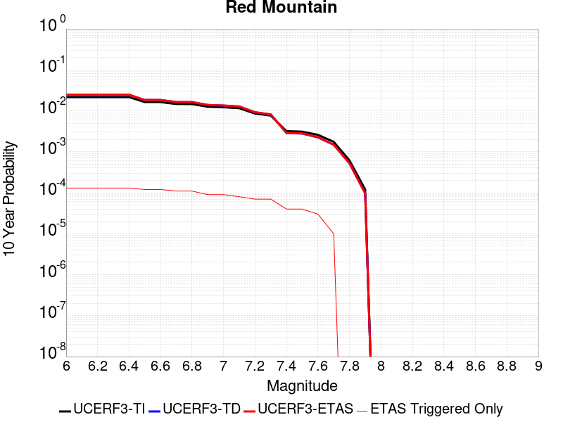 |

| Magnitude | 1 wk TI Prob | 1 wk TD Prob | 1 wk ETAS Prob | 1 wk ETAS/TD Gain | 1 wk ETAS Triggered Only | 1 mo TI Prob | 1 mo TD Prob | 1 mo ETAS Prob | 1 mo ETAS/TD Gain | 1 mo ETAS Triggered Only | 1 yr TI Prob | 1 yr TD Prob | 1 yr ETAS Prob | 1 yr ETAS/TD Gain | 1 yr ETAS Triggered Only | 10 yr TI Prob | 10 yr TD Prob | 10 yr ETAS Prob | 10 yr ETAS/TD Gain | 10 yr ETAS Triggered Only |
|-----|-----|-----|-----|-----|-----|-----|-----|-----|-----|-----|-----|-----|-----|-----|-----|-----|-----|-----|-----|-----|
| 6.0 | 4.1810763E-5 | 4.7589947E-5 | 1.01063335E-4 | 2.123628 | 5.3475935E-5 | 1.7917668E-4 | 2.039419E-4 | 2.8413945E-4 | 1.3932372 | 8.0213904E-5 | 0.0021792934 | 0.0024803306 | 0.0025736813 | 1.0376364 | 9.358289E-5 | 0.021580452 | 0.024544092 | 0.024648419 | 1.0042506 | 1.0695187E-4 |
| 6.1 | 4.1810763E-5 | 4.7589947E-5 | 1.01063335E-4 | 2.123628 | 5.3475935E-5 | 1.7917668E-4 | 2.039419E-4 | 2.8413945E-4 | 1.3932372 | 8.0213904E-5 | 0.0021792934 | 0.0024803306 | 0.0025736813 | 1.0376364 | 9.358289E-5 | 0.021580452 | 0.024544092 | 0.024648419 | 1.0042506 | 1.0695187E-4 |
| 6.2 | 4.1810763E-5 | 4.7589947E-5 | 1.01063335E-4 | 2.123628 | 5.3475935E-5 | 1.7917668E-4 | 2.039419E-4 | 2.8413945E-4 | 1.3932372 | 8.0213904E-5 | 0.0021792934 | 0.0024803306 | 0.0025736813 | 1.0376364 | 9.358289E-5 | 0.021580452 | 0.024544092 | 0.024648419 | 1.0042506 | 1.0695187E-4 |
| 6.3 | 4.1810763E-5 | 4.7589947E-5 | 1.01063335E-4 | 2.123628 | 5.3475935E-5 | 1.7917668E-4 | 2.039419E-4 | 2.8413945E-4 | 1.3932372 | 8.0213904E-5 | 0.0021792934 | 0.0024803306 | 0.0025736813 | 1.0376364 | 9.358289E-5 | 0.021580452 | 0.024544092 | 0.024648419 | 1.0042506 | 1.0695187E-4 |
| 6.4 | 4.1810763E-5 | 4.7589947E-5 | 1.01063335E-4 | 2.123628 | 5.3475935E-5 | 1.7917668E-4 | 2.039419E-4 | 2.8413945E-4 | 1.3932372 | 8.0213904E-5 | 0.0021792934 | 0.0024803306 | 0.0025736813 | 1.0376364 | 9.358289E-5 | 0.021580452 | 0.024544092 | 0.024648419 | 1.0042506 | 1.0695187E-4 |
| 6.5 | 3.154503E-5 | 3.5359728E-5 | 8.8833774E-5 | 2.5122867 | 5.3475935E-5 | 1.3518598E-4 | 1.5153342E-4 | 2.3173516E-4 | 1.5292678 | 8.0213904E-5 | 0.0016446467 | 0.0018434501 | 0.0019368605 | 1.0506715 | 9.358289E-5 | 0.01632528 | 0.018291233 | 0.01839623 | 1.0057402 | 1.0695187E-4 |
| 6.6 | 3.1535834E-5 | 3.534911E-5 | 8.882316E-5 | 2.5127409 | 5.3475935E-5 | 1.3514658E-4 | 1.5148791E-4 | 2.3168966E-4 | 1.5294268 | 8.0213904E-5 | 0.0016441676 | 0.001842897 | 0.0019363075 | 1.0506867 | 9.358289E-5 | 0.01632056 | 0.018285794 | 0.018390791 | 1.005742 | 1.0695187E-4 |
| 6.7 | 2.8267326E-5 | 3.146934E-5 | 7.157503E-5 | 2.274437 | 4.0106952E-5 | 1.2114006E-4 | 1.348621E-4 | 2.0169801E-4 | 1.495587 | 6.684492E-5 | 0.0014738824 | 0.0016407946 | 0.0017208768 | 1.048807 | 8.0213904E-5 | 0.014641452 | 0.016295563 | 0.016387621 | 1.0056492 | 9.358289E-5 |
| 6.8 | 2.8212884E-5 | 3.1407224E-5 | 7.151292E-5 | 2.2769575 | 4.0106952E-5 | 1.20906756E-4 | 1.3459593E-4 | 2.0143185E-4 | 1.4965672 | 6.684492E-5 | 0.0014710457 | 0.0016375587 | 0.0017176413 | 1.0489036 | 8.0213904E-5 | 0.014613459 | 0.01626368 | 0.01635574 | 1.0056605 | 9.358289E-5 |
| 6.9 | 2.4227871E-5 | 2.6706979E-5 | 6.6812856E-5 | 2.5017004 | 4.0106952E-5 | 1.03829596E-4 | 1.14453884E-4 | 1.8129115E-4 | 1.5839669 | 6.684492E-5 | 0.0012633923 | 0.0013926612 | 0.0014727634 | 1.0575174 | 8.0213904E-5 | 0.012562336 | 0.013847026 | 0.013939313 | 1.0066648 | 9.358289E-5 |
| 7.0 | 2.348524E-5 | 2.5835763E-5 | 6.594168E-5 | 2.552341 | 4.0106952E-5 | 1.0064714E-4 | 1.1072042E-4 | 1.7755794E-4 | 1.6036602 | 6.684492E-5 | 0.0012246901 | 0.0013472632 | 0.0014273691 | 1.0594581 | 8.0213904E-5 | 0.012179627 | 0.01339859 | 0.013490919 | 1.0068909 | 9.358289E-5 |
| 7.1 | 2.2311642E-5 | 2.4462828E-5 | 5.1200142E-5 | 2.0929773 | 2.6737967E-5 | 9.561782E-5 | 1.048369E-4 | 1.5830723E-4 | 1.5100335 | 5.3475935E-5 | 0.0011635252 | 0.0012757168 | 0.0013424765 | 1.0523311 | 6.684492E-5 | 0.01157452 | 0.012691451 | 0.012770647 | 1.0062401 | 8.0213904E-5 |
| 7.2 | 1.6533986E-5 | 1.7670347E-5 | 4.4407843E-5 | 2.513128 | 2.6737967E-5 | 7.085802E-5 | 7.572822E-5 | 1.2920011E-4 | 1.7061025 | 5.3475935E-5 | 8.623549E-4 | 9.216645E-4 | 9.884478E-4 | 1.0724595 | 6.684492E-5 | 0.008590161 | 0.009184699 | 0.009264176 | 1.0086532 | 8.0213904E-5 |
| 7.3 | 1.4703092E-5 | 1.555952E-5 | 4.2297073E-5 | 2.7184045 | 2.6737967E-5 | 6.301173E-5 | 6.66823E-5 | 1.2015468E-4 | 1.8018974 | 5.3475935E-5 | 7.668978E-4 | 8.1161625E-4 | 8.784069E-4 | 1.0822934 | 6.684492E-5 | 0.0076425658 | 0.008092596 | 0.008172161 | 1.0098318 | 8.0213904E-5 |
| 7.4 | 6.1331984E-6 | 5.528872E-6 | 1.8897781E-5 | 3.4180179 | 1.3368984E-5 | 2.6284872E-5 | 2.3694953E-5 | 6.380095E-5 | 2.692597 | 4.0106952E-5 | 3.199713E-4 | 2.8844838E-4 | 3.419089E-4 | 1.1853383 | 5.3475935E-5 | 0.0031951098 | 0.0028807942 | 0.0029341162 | 1.0185094 | 5.3475935E-5 |
| 7.5 | 5.954766E-6 | 5.3385015E-6 | 1.8707415E-5 | 3.5042443 | 1.3368984E-5 | 2.5520176E-5 | 2.2879094E-5 | 6.298513E-5 | 2.7529554 | 4.0106952E-5 | 3.1066386E-4 | 2.785179E-4 | 3.3197895E-4 | 1.1919483 | 5.3475935E-5 | 0.003102299 | 0.0027817423 | 0.0028350696 | 1.0191704 | 5.3475935E-5 |
| 7.6 | 4.9726646E-6 | 4.315295E-6 | 4.315295E-6 | 1.0 | 0.0 | 2.1311245E-5 | 1.8493993E-5 | 4.5231467E-5 | 2.4457383 | 2.6737967E-5 | 2.5943352E-4 | 2.2514143E-4 | 2.6523936E-4 | 1.1781011 | 4.0106952E-5 | 0.0025913084 | 0.002249168 | 0.0022891848 | 1.0177917 | 4.0106952E-5 |
| 7.7 | 3.3613894E-6 | 2.8526642E-6 | 2.8526642E-6 | 1.0 | 0.0 | 1.4405875E-5 | 1.2225649E-5 | 2.5594469E-5 | 2.093506 | 1.3368984E-5 | 1.7537741E-4 | 1.4883737E-4 | 1.6220436E-4 | 1.0898094 | 1.3368984E-5 | 0.0017523908 | 0.0014874031 | 0.0015007522 | 1.0089748 | 1.3368984E-5 |
| 7.8 | 1.1828961E-6 | 1.0122756E-6 | 1.0122756E-6 | 1.0 | 0.0 | 5.069545E-6 | 4.338317E-6 | 4.338317E-6 | 1.0 | 0.0 | 6.171996E-5 | 5.281776E-5 | 5.281776E-5 | 1.0 | 0.0 | 6.170282E-4 | 5.2805495E-4 | 5.2805495E-4 | 1.0 | 0.0 |
| 7.9 | 2.2967266E-7 | 1.8618952E-7 | 1.8618952E-7 | 1.0 | 0.0 | 9.843111E-7 | 7.9795484E-7 | 7.9795484E-7 | 1.0 | 0.0 | 1.19839215E-5 | 9.7150605E-6 | 9.7150605E-6 | 1.0 | 0.0 | 1.1983275E-4 | 9.714664E-5 | 9.714664E-5 | 1.0 | 0.0 |

## Pinto Mtn
*[(top)](#table-of-contents)*

| 1 Week | 1 Month | 1 Year | 10 Year |
|-----|-----|-----|-----|
| 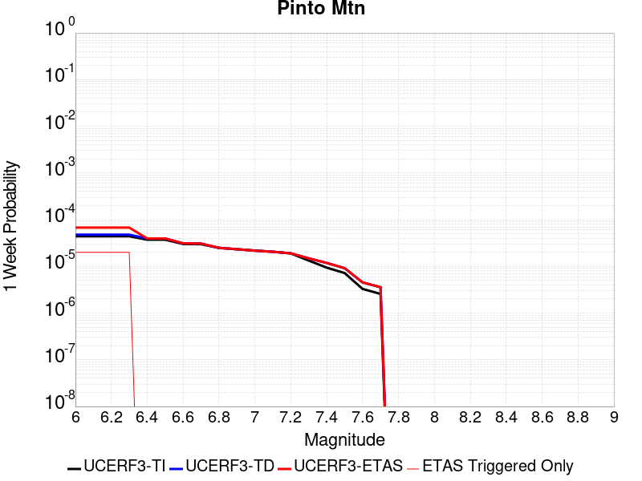 |  |  |  |

| Magnitude | 1 wk TI Prob | 1 wk TD Prob | 1 wk ETAS Prob | 1 wk ETAS/TD Gain | 1 wk ETAS Triggered Only | 1 mo TI Prob | 1 mo TD Prob | 1 mo ETAS Prob | 1 mo ETAS/TD Gain | 1 mo ETAS Triggered Only | 1 yr TI Prob | 1 yr TD Prob | 1 yr ETAS Prob | 1 yr ETAS/TD Gain | 1 yr ETAS Triggered Only | 10 yr TI Prob | 10 yr TD Prob | 10 yr ETAS Prob | 10 yr ETAS/TD Gain | 10 yr ETAS Triggered Only |
|-----|-----|-----|-----|-----|-----|-----|-----|-----|-----|-----|-----|-----|-----|-----|-----|-----|-----|-----|-----|-----|
| 6.0 | 4.4194956E-5 | 4.785362E-5 | 6.122197E-5 | 1.2793591 | 1.3368984E-5 | 1.893932E-4 | 2.0507174E-4 | 2.852692E-4 | 1.3910702 | 8.0213904E-5 | 0.0023034236 | 0.0024940541 | 0.0026007392 | 1.0427758 | 1.0695187E-4 | 0.022796938 | 0.024678145 | 0.024834614 | 1.0063404 | 1.6042781E-4 |
| 6.1 | 4.4194956E-5 | 4.785362E-5 | 6.122197E-5 | 1.2793591 | 1.3368984E-5 | 1.893932E-4 | 2.0507174E-4 | 2.852692E-4 | 1.3910702 | 8.0213904E-5 | 0.0023034236 | 0.0024940541 | 0.0026007392 | 1.0427758 | 1.0695187E-4 | 0.022796938 | 0.024678145 | 0.024834614 | 1.0063404 | 1.6042781E-4 |
| 6.2 | 4.4194956E-5 | 4.785362E-5 | 6.122197E-5 | 1.2793591 | 1.3368984E-5 | 1.893932E-4 | 2.0507174E-4 | 2.852692E-4 | 1.3910702 | 8.0213904E-5 | 0.0023034236 | 0.0024940541 | 0.0026007392 | 1.0427758 | 1.0695187E-4 | 0.022796938 | 0.024678145 | 0.024834614 | 1.0063404 | 1.6042781E-4 |
| 6.3 | 4.4194956E-5 | 4.785362E-5 | 6.122197E-5 | 1.2793591 | 1.3368984E-5 | 1.893932E-4 | 2.0507174E-4 | 2.852692E-4 | 1.3910702 | 8.0213904E-5 | 0.0023034236 | 0.0024940541 | 0.0026007392 | 1.0427758 | 1.0695187E-4 | 0.022796938 | 0.024678145 | 0.024834614 | 1.0063404 | 1.6042781E-4 |
| 6.4 | 3.729929E-5 | 3.9603186E-5 | 3.9603186E-5 | 1.0 | 0.0 | 1.5984432E-4 | 1.6971743E-4 | 2.0981758E-4 | 1.2362759 | 4.0106952E-5 | 0.0019443673 | 0.002064445 | 0.002131152 | 1.0323123 | 6.684492E-5 | 0.019274427 | 0.02046269 | 0.020580549 | 1.0057597 | 1.2032085E-4 |
| 6.5 | 3.729929E-5 | 3.9603186E-5 | 3.9603186E-5 | 1.0 | 0.0 | 1.5984432E-4 | 1.6971743E-4 | 2.0981758E-4 | 1.2362759 | 4.0106952E-5 | 0.0019443673 | 0.002064445 | 0.002131152 | 1.0323123 | 6.684492E-5 | 0.019274427 | 0.02046269 | 0.020580549 | 1.0057597 | 1.2032085E-4 |
| 6.6 | 3.0204548E-5 | 3.1205298E-5 | 3.1205298E-5 | 1.0 | 0.0 | 1.2944164E-4 | 1.3373033E-4 | 1.7383191E-4 | 1.2998691 | 4.0106952E-5 | 0.0015748127 | 0.0016269855 | 0.0016937216 | 1.0410182 | 6.684492E-5 | 0.015636992 | 0.01615461 | 0.016272986 | 1.0073278 | 1.2032085E-4 |
| 6.7 | 2.9857754E-5 | 3.081468E-5 | 3.081468E-5 | 1.0 | 0.0 | 1.2795553E-4 | 1.3205643E-4 | 1.7215809E-4 | 1.3036706 | 4.0106952E-5 | 0.0015567453 | 0.001606636 | 0.0016733735 | 1.0415387 | 6.684492E-5 | 0.015458848 | 0.01595405 | 0.01607245 | 1.0074214 | 1.2032085E-4 |
| 6.8 | 2.4819734E-5 | 2.5009364E-5 | 2.5009364E-5 | 1.0 | 0.0 | 1.0636595E-4 | 1.07178705E-4 | 1.4728136E-4 | 1.3741663 | 4.0106952E-5 | 0.0012942362 | 0.0013041412 | 0.001370899 | 1.0511891 | 6.684492E-5 | 0.012867244 | 0.0129672475 | 0.013086008 | 1.0091585 | 1.2032085E-4 |
| 6.9 | 2.331124E-5 | 2.3337643E-5 | 2.3337643E-5 | 1.0 | 0.0 | 9.990149E-5 | 1.00014746E-4 | 1.4011769E-4 | 1.4009702 | 4.0106952E-5 | 0.001215622 | 0.0012170197 | 0.0012837832 | 1.0548582 | 6.684492E-5 | 0.012089936 | 0.012105742 | 0.012211398 | 1.0087279 | 1.0695187E-4 |
| 7.0 | 2.1818534E-5 | 2.1760772E-5 | 2.1760772E-5 | 1.0 | 0.0 | 9.3504656E-5 | 9.325723E-5 | 1.3336045E-4 | 1.430028 | 4.0106952E-5 | 0.0011378246 | 0.0011348352 | 0.0012016043 | 1.0588359 | 6.684492E-5 | 0.011320163 | 0.011292503 | 0.01138503 | 1.0081936 | 9.358289E-5 |
| 7.1 | 2.066081E-5 | 2.0540418E-5 | 2.0540418E-5 | 1.0 | 0.0 | 8.854332E-5 | 8.8027504E-5 | 1.2813092E-4 | 1.4555783 | 4.0106952E-5 | 0.0010774818 | 0.0010712275 | 0.0011380007 | 1.0623335 | 6.684492E-5 | 0.010722724 | 0.010662688 | 0.0107552735 | 1.0086831 | 9.358289E-5 |
| 7.2 | 1.8990233E-5 | 1.9053701E-5 | 1.9053701E-5 | 1.0 | 0.0 | 8.138417E-5 | 8.1656275E-5 | 1.2175995E-4 | 1.491128 | 4.0106952E-5 | 9.904018E-4 | 9.937311E-4 | 0.0010605096 | 1.0671997 | 6.684492E-5 | 0.009859995 | 0.009894874 | 0.00998753 | 1.0093641 | 9.358289E-5 |
| 7.3 | 1.3335872E-5 | 1.4906372E-5 | 1.4906372E-5 | 1.0 | 0.0 | 5.7152483E-5 | 6.388296E-5 | 9.0619214E-5 | 1.4185195 | 2.6737967E-5 | 6.956093E-4 | 7.775102E-4 | 8.1758597E-4 | 1.0515437 | 4.0106952E-5 | 0.006934359 | 0.0077491994 | 0.007815526 | 1.0085592 | 6.684492E-5 |
| 7.4 | 9.414066E-6 | 1.186061E-5 | 1.186061E-5 | 1.0 | 0.0 | 4.0345374E-5 | 5.0830247E-5 | 6.419855E-5 | 1.2629989 | 1.3368984E-5 | 4.910942E-4 | 6.1869196E-4 | 6.454134E-4 | 1.0431902 | 2.6737967E-5 | 0.0049001034 | 0.006170644 | 0.00622379 | 1.0086128 | 5.3475935E-5 |
| 7.5 | 7.2101157E-6 | 9.157893E-6 | 9.157893E-6 | 1.0 | 0.0 | 3.090013E-5 | 3.924757E-5 | 5.261603E-5 | 1.3406187 | 1.3368984E-5 | 3.7614413E-4 | 4.7774217E-4 | 4.911048E-4 | 1.0279703 | 1.3368984E-5 | 0.0037550807 | 0.004767927 | 0.0048078424 | 1.0083717 | 4.0106952E-5 |
| 7.6 | 3.296375E-6 | 4.5453176E-6 | 4.5453176E-6 | 1.0 | 0.0 | 1.4127245E-5 | 1.9479796E-5 | 1.9479796E-5 | 1.0 | 0.0 | 1.7198564E-4 | 2.3714209E-4 | 2.3714209E-4 | 1.0 | 0.0 | 0.0017185259 | 0.0023690276 | 0.002382365 | 1.0056299 | 1.3368984E-5 |
| 7.7 | 2.5741092E-6 | 3.584251E-6 | 3.584251E-6 | 1.0 | 0.0 | 1.103185E-5 | 1.5360993E-5 | 1.5360993E-5 | 1.0 | 0.0 | 1.3430449E-4 | 1.8700535E-4 | 1.8700535E-4 | 1.0 | 0.0 | 0.0013422335 | 0.0018686098 | 0.0018686098 | 1.0 | 0.0 |

## Big Pine (Central)
*[(top)](#table-of-contents)*

| 1 Week | 1 Month | 1 Year | 10 Year |
|-----|-----|-----|-----|
| 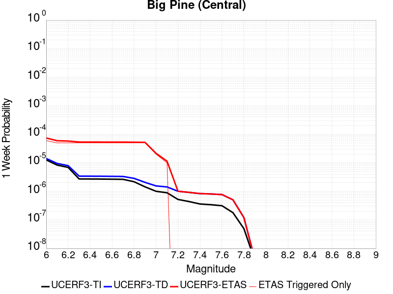 |  |  |  |

| Magnitude | 1 wk TI Prob | 1 wk TD Prob | 1 wk ETAS Prob | 1 wk ETAS/TD Gain | 1 wk ETAS Triggered Only | 1 mo TI Prob | 1 mo TD Prob | 1 mo ETAS Prob | 1 mo ETAS/TD Gain | 1 mo ETAS Triggered Only | 1 yr TI Prob | 1 yr TD Prob | 1 yr ETAS Prob | 1 yr ETAS/TD Gain | 1 yr ETAS Triggered Only | 10 yr TI Prob | 10 yr TD Prob | 10 yr ETAS Prob | 10 yr ETAS/TD Gain | 10 yr ETAS Triggered Only |
|-----|-----|-----|-----|-----|-----|-----|-----|-----|-----|-----|-----|-----|-----|-----|-----|-----|-----|-----|-----|-----|
| 6.0 | 1.2706755E-5 | 1.4250529E-5 | 8.10945E-5 | 5.690631 | 6.684492E-5 | 5.4456385E-5 | 6.107247E-5 | 1.5464964E-4 | 2.5322318 | 9.358289E-5 | 6.628048E-4 | 7.433402E-4 | 8.7693066E-4 | 1.1797165 | 1.3368984E-4 | 0.006608314 | 0.0074135666 | 0.0075595356 | 1.0196894 | 1.4705882E-4 |
| 6.1 | 8.342579E-6 | 9.510762E-6 | 6.298619E-5 | 6.622623 | 5.3475935E-5 | 3.5753423E-5 | 4.0759893E-5 | 1.07602085E-4 | 2.6399012 | 6.684492E-5 | 4.3521097E-4 | 4.961604E-4 | 6.0305925E-4 | 1.2154521 | 1.0695187E-4 | 0.0043435963 | 0.0049540824 | 0.005073807 | 1.024167 | 1.2032085E-4 |
| 6.2 | 6.923899E-6 | 7.967147E-6 | 6.144265E-5 | 7.7120023 | 5.3475935E-5 | 2.9673516E-5 | 3.4144578E-5 | 1.00987214E-4 | 2.9576354 | 6.684492E-5 | 3.6121515E-4 | 4.156502E-4 | 5.0919416E-4 | 1.2250546 | 9.358289E-5 | 0.003606286 | 0.0041520367 | 0.0042585446 | 1.0256519 | 1.0695187E-4 |
| 6.3 | 2.728396E-6 | 3.4242908E-6 | 5.6900044E-5 | 16.616592 | 5.3475935E-5 | 1.1693074E-5 | 1.4675454E-5 | 8.151939E-5 | 5.5548124 | 6.684492E-5 | 1.4235388E-4 | 1.7865987E-4 | 2.5885945E-4 | 1.4488952 | 8.0213904E-5 | 0.0014226272 | 0.0017866704 | 0.0018800861 | 1.0522848 | 9.358289E-5 |
| 6.4 | 2.7136944E-6 | 3.408584E-6 | 5.688434E-5 | 16.688553 | 5.3475935E-5 | 1.1630066E-5 | 1.4608141E-5 | 8.145208E-5 | 5.575801 | 6.684492E-5 | 1.4158686E-4 | 1.7784047E-4 | 2.5804012E-4 | 1.450964 | 8.0213904E-5 | 0.0014149669 | 0.0017784894 | 0.0018719059 | 1.0525258 | 9.358289E-5 |
| 6.5 | 2.6971882E-6 | 3.3909291E-6 | 5.6866684E-5 | 16.770237 | 5.3475935E-5 | 1.1559327E-5 | 1.45324775E-5 | 8.137643E-5 | 5.599625 | 6.684492E-5 | 1.4072572E-4 | 1.7691942E-4 | 2.5711913E-4 | 1.453312 | 8.0213904E-5 | 0.0014063664 | 0.0017692937 | 0.001862711 | 1.0527992 | 9.358289E-5 |
| 6.6 | 2.669092E-6 | 3.3609497E-6 | 5.6836707E-5 | 16.910906 | 5.3475935E-5 | 1.1438916E-5 | 1.4403995E-5 | 8.1247956E-5 | 5.640654 | 6.684492E-5 | 1.3925991E-4 | 1.753554E-4 | 2.5555523E-4 | 1.457356 | 8.0213904E-5 | 0.0013917267 | 0.0017536782 | 0.001847097 | 1.0532702 | 9.358289E-5 |
| 6.7 | 2.6408059E-6 | 3.3309752E-6 | 5.6806733E-5 | 17.054085 | 5.3475935E-5 | 1.1317691E-5 | 1.4275535E-5 | 8.11195E-5 | 5.682414 | 6.684492E-5 | 1.3778417E-4 | 1.7379165E-4 | 2.539916E-4 | 1.4614719 | 8.0213904E-5 | 0.0013769877 | 0.0017380653 | 0.0018314854 | 1.0537496 | 9.358289E-5 |
| 6.8 | 2.1786943E-6 | 2.8544325E-6 | 5.6330216E-5 | 19.734295 | 5.3475935E-5 | 9.337228E-6 | 1.2233229E-5 | 7.9077334E-5 | 6.464142 | 6.684492E-5 | 1.1367482E-4 | 1.4893012E-4 | 2.2913207E-4 | 1.5385207 | 8.0213904E-5 | 0.0011361669 | 0.0014897975 | 0.0015832409 | 1.0627222 | 9.358289E-5 |
| 6.9 | 1.4411696E-6 | 2.068499E-6 | 5.5544326E-5 | 26.852478 | 5.3475935E-5 | 6.1764263E-6 | 8.864968E-6 | 6.234043E-5 | 7.032223 | 5.3475935E-5 | 7.51954E-5 | 1.079259E-4 | 1.7476361E-4 | 1.6192925 | 6.684492E-5 | 7.5169955E-4 | 0.0010801847 | 0.001160312 | 1.0741792 | 8.0213904E-5 |
| 7.0 | 1.0073411E-6 | 1.554261E-6 | 2.8292186E-5 | 18.202984 | 2.6737967E-5 | 4.317169E-6 | 6.6611024E-6 | 3.3398894E-5 | 5.014019 | 2.6737967E-5 | 5.2560266E-5 | 8.1096056E-5 | 1.2119975E-4 | 1.4945209 | 4.0106952E-5 | 5.2547833E-4 | 8.1210316E-4 | 8.5217756E-4 | 1.0493464 | 4.0106952E-5 |
| 7.1 | 8.947104E-7 | 1.4302494E-6 | 1.4799214E-5 | 10.347297 | 1.3368984E-5 | 3.834468E-6 | 6.129627E-6 | 1.9498528E-5 | 3.1810303 | 1.3368984E-5 | 4.6683643E-5 | 7.46258E-5 | 1.0136177E-4 | 1.3582672 | 2.6737967E-5 | 4.6673836E-4 | 7.474457E-4 | 7.741637E-4 | 1.0357457 | 2.6737967E-5 |
| 7.2 | 5.215166E-7 | 1.0111678E-6 | 1.0111678E-6 | 1.0 | 0.0 | 2.2350691E-6 | 4.3335694E-6 | 4.3335694E-6 | 1.0 | 0.0 | 2.7211627E-5 | 5.2759973E-5 | 5.2759973E-5 | 1.0 | 0.0 | 2.7208295E-4 | 5.2890263E-4 | 5.2890263E-4 | 1.0 | 0.0 |
| 7.3 | 4.4024807E-7 | 9.219589E-7 | 9.219589E-7 | 1.0 | 0.0 | 1.8867761E-6 | 3.9512465E-6 | 3.9512465E-6 | 1.0 | 0.0 | 2.2971257E-5 | 4.810541E-5 | 4.810541E-5 | 1.0 | 0.0 | 2.2968883E-4 | 4.8237795E-4 | 4.8237795E-4 | 1.0 | 0.0 |
| 7.4 | 3.6130905E-7 | 8.358523E-7 | 8.358523E-7 | 1.0 | 0.0 | 1.5484665E-6 | 3.5822195E-6 | 3.5822195E-6 | 1.0 | 0.0 | 1.8852415E-5 | 4.3612687E-5 | 4.3612687E-5 | 1.0 | 0.0 | 1.8850817E-4 | 4.374597E-4 | 4.374597E-4 | 1.0 | 0.0 |
| 7.5 | 3.408184E-7 | 8.108147E-7 | 8.108147E-7 | 1.0 | 0.0 | 1.4606494E-6 | 3.4749157E-6 | 3.4749157E-6 | 1.0 | 0.0 | 1.7783263E-5 | 4.2306317E-5 | 4.2306317E-5 | 1.0 | 0.0 | 1.778184E-4 | 4.2437963E-4 | 4.2437963E-4 | 1.0 | 0.0 |
| 7.6 | 3.1428627E-7 | 7.7316E-7 | 7.7316E-7 | 1.0 | 0.0 | 1.3469405E-6 | 3.3135389E-6 | 3.3135389E-6 | 1.0 | 0.0 | 1.6398877E-5 | 4.0341627E-5 | 4.0341627E-5 | 1.0 | 0.0 | 1.6397667E-4 | 4.0471106E-4 | 4.0471106E-4 | 1.0 | 0.0 |
| 7.7 | 1.7972785E-7 | 5.077752E-7 | 5.077752E-7 | 1.0 | 0.0 | 7.70262E-7 | 2.1761778E-6 | 2.1761778E-6 | 1.0 | 0.0 | 9.377899E-6 | 2.6494654E-5 | 2.6494654E-5 | 1.0 | 0.0 | 9.377503E-5 | 2.662899E-4 | 2.662899E-4 | 1.0 | 0.0 |
| 7.8 | 4.9230927E-8 | 1.198079E-7 | 1.198079E-7 | 1.0 | 0.0 | 2.1098968E-7 | 5.134623E-7 | 5.134623E-7 | 1.0 | 0.0 | 2.5687964E-6 | 6.2513873E-6 | 6.2513873E-6 | 1.0 | 0.0 | 2.5687666E-5 | 6.295415E-5 | 6.295415E-5 | 1.0 | 0.0 |
| 7.9 | 3.6805972E-9 | 4.105293E-9 | 4.105293E-9 | 1.0 | 0.0 | 1.5773987E-8 | 1.7594115E-8 | 1.7594115E-8 | 1.0 | 0.0 | 1.9204828E-7 | 2.1420831E-7 | 2.1420831E-7 | 1.0 | 0.0 | 1.920481E-6 | 2.1900614E-6 | 2.1900614E-6 | 1.0 | 0.0 |

## Kern Canyon (South Kern) 2011
*[(top)](#table-of-contents)*

| 1 Week | 1 Month | 1 Year | 10 Year |
|-----|-----|-----|-----|
|  |  | 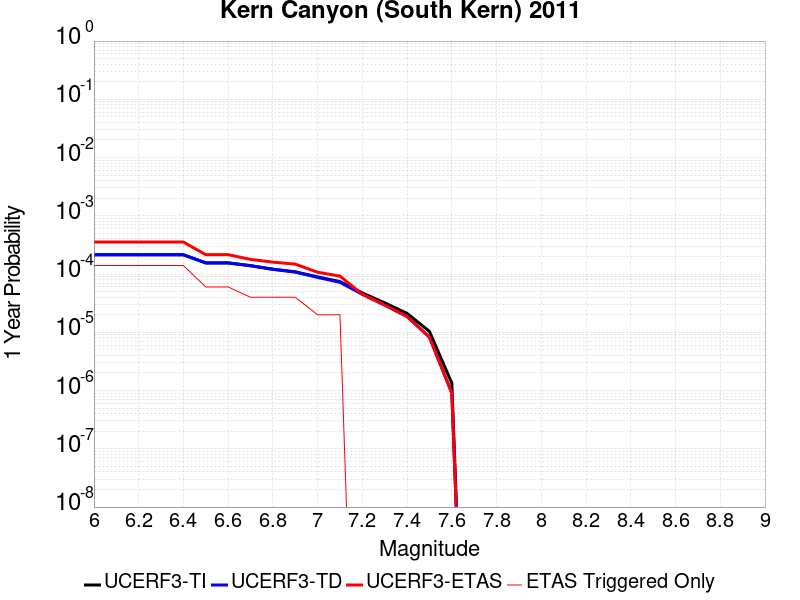 |  |

| Magnitude | 1 wk TI Prob | 1 wk TD Prob | 1 wk ETAS Prob | 1 wk ETAS/TD Gain | 1 wk ETAS Triggered Only | 1 mo TI Prob | 1 mo TD Prob | 1 mo ETAS Prob | 1 mo ETAS/TD Gain | 1 mo ETAS Triggered Only | 1 yr TI Prob | 1 yr TD Prob | 1 yr ETAS Prob | 1 yr ETAS/TD Gain | 1 yr ETAS Triggered Only | 10 yr TI Prob | 10 yr TD Prob | 10 yr ETAS Prob | 10 yr ETAS/TD Gain | 10 yr ETAS Triggered Only |
|-----|-----|-----|-----|-----|-----|-----|-----|-----|-----|-----|-----|-----|-----|-----|-----|-----|-----|-----|-----|-----|
| 6.0 | 4.105075E-6 | 4.1137264E-6 | 7.095837E-5 | 17.24917 | 6.684492E-5 | 1.7593058E-5 | 1.763014E-5 | 1.11211375E-4 | 6.308026 | 9.358289E-5 | 2.1417443E-4 | 2.1462646E-4 | 3.482876E-4 | 1.6227617 | 1.3368984E-4 | 0.0021396813 | 0.0021442557 | 0.0022909993 | 1.0684357 | 1.4705882E-4 |
| 6.1 | 4.105075E-6 | 4.1137264E-6 | 7.095837E-5 | 17.24917 | 6.684492E-5 | 1.7593058E-5 | 1.763014E-5 | 1.11211375E-4 | 6.308026 | 9.358289E-5 | 2.1417443E-4 | 2.1462646E-4 | 3.482876E-4 | 1.6227617 | 1.3368984E-4 | 0.0021396813 | 0.0021442557 | 0.0022909993 | 1.0684357 | 1.4705882E-4 |
| 6.2 | 4.105075E-6 | 4.1137264E-6 | 7.095837E-5 | 17.24917 | 6.684492E-5 | 1.7593058E-5 | 1.763014E-5 | 1.11211375E-4 | 6.308026 | 9.358289E-5 | 2.1417443E-4 | 2.1462646E-4 | 3.482876E-4 | 1.6227617 | 1.3368984E-4 | 0.0021396813 | 0.0021442557 | 0.0022909993 | 1.0684357 | 1.4705882E-4 |
| 6.3 | 4.105075E-6 | 4.1137264E-6 | 7.095837E-5 | 17.24917 | 6.684492E-5 | 1.7593058E-5 | 1.763014E-5 | 1.11211375E-4 | 6.308026 | 9.358289E-5 | 2.1417443E-4 | 2.1462646E-4 | 3.482876E-4 | 1.6227617 | 1.3368984E-4 | 0.0021396813 | 0.0021442557 | 0.0022909993 | 1.0684357 | 1.4705882E-4 |
| 6.4 | 4.105075E-6 | 4.1137264E-6 | 7.095837E-5 | 17.24917 | 6.684492E-5 | 1.7593058E-5 | 1.763014E-5 | 1.11211375E-4 | 6.308026 | 9.358289E-5 | 2.1417443E-4 | 2.1462646E-4 | 3.482876E-4 | 1.6227617 | 1.3368984E-4 | 0.0021396813 | 0.0021442557 | 0.0022909993 | 1.0684357 | 1.4705882E-4 |
| 6.5 | 2.9849807E-6 | 2.9731548E-6 | 4.307999E-5 | 14.4896555 | 4.0106952E-5 | 1.2792712E-5 | 1.274203E-5 | 5.284847E-5 | 4.1475706 | 4.0106952E-5 | 1.5574014E-4 | 1.5512333E-4 | 2.2195787E-4 | 1.4308479 | 6.684492E-5 | 0.0015563103 | 0.0015501656 | 0.0016302551 | 1.0516652 | 8.0213904E-5 |
| 6.6 | 2.9849807E-6 | 2.9731548E-6 | 4.307999E-5 | 14.4896555 | 4.0106952E-5 | 1.2792712E-5 | 1.274203E-5 | 5.284847E-5 | 4.1475706 | 4.0106952E-5 | 1.5574014E-4 | 1.5512333E-4 | 2.2195787E-4 | 1.4308479 | 6.684492E-5 | 0.0015563103 | 0.0015501656 | 0.0016302551 | 1.0516652 | 8.0213904E-5 |
| 6.7 | 2.6756725E-6 | 2.6582206E-6 | 2.9396118E-5 | 11.058569 | 2.6737967E-5 | 1.1467117E-5 | 1.1392325E-5 | 3.812999E-5 | 3.3469892 | 2.6737967E-5 | 1.396032E-4 | 1.3869285E-4 | 1.9216136E-4 | 1.3855175 | 5.3475935E-5 | 0.0013951553 | 0.0013860738 | 0.0014528261 | 1.0481592 | 6.684492E-5 |
| 6.8 | 2.3283721E-6 | 2.3047787E-6 | 2.9042685E-5 | 12.601072 | 2.6737967E-5 | 9.9787E-6 | 9.877586E-6 | 3.661529E-5 | 3.7069066 | 2.6737967E-5 | 1.214839E-4 | 1.20253055E-4 | 1.7372255E-4 | 1.4446416 | 5.3475935E-5 | 0.001214175 | 0.0012018873 | 0.0012686519 | 1.0555497 | 6.684492E-5 |
| 6.9 | 2.0972677E-6 | 2.0696411E-6 | 2.8807553E-5 | 13.919106 | 2.6737967E-5 | 8.988259E-6 | 8.869861E-6 | 3.560759E-5 | 4.0144477 | 2.6737967E-5 | 1.0942656E-4 | 1.0798526E-4 | 1.6145542E-4 | 1.4951617 | 5.3475935E-5 | 0.0010937268 | 0.0010793337 | 0.0011461065 | 1.0618649 | 6.684492E-5 |
| 7.0 | 1.7132242E-6 | 1.6787036E-6 | 1.5047665E-5 | 8.9638605 | 1.3368984E-5 | 7.3423685E-6 | 7.194424E-6 | 2.0563311E-5 | 2.858229 | 1.3368984E-5 | 8.938967E-5 | 8.758863E-5 | 1.14324255E-4 | 1.3052409 | 2.6737967E-5 | 8.935372E-4 | 8.7554497E-4 | 9.022595E-4 | 1.030512 | 2.6737967E-5 |
| 7.1 | 1.4215541E-6 | 1.3815752E-6 | 1.4750541E-5 | 10.676611 | 1.3368984E-5 | 6.0923603E-6 | 5.9210233E-6 | 1.9289928E-5 | 3.2578707 | 1.3368984E-5 | 7.417196E-5 | 7.20861E-5 | 9.882214E-5 | 1.3708904 | 2.6737967E-5 | 7.414721E-4 | 7.206299E-4 | 7.473486E-4 | 1.0370768 | 2.6737967E-5 |
| 7.2 | 9.097853E-7 | 8.6037755E-7 | 8.6037755E-7 | 1.0 | 0.0 | 3.899074E-6 | 3.6873273E-6 | 3.6873273E-6 | 1.0 | 0.0 | 4.7470192E-5 | 4.4892295E-5 | 4.4892295E-5 | 1.0 | 0.0 | 4.7460053E-4 | 4.4883334E-4 | 4.4883334E-4 | 1.0 | 0.0 |
| 7.3 | 6.144169E-7 | 5.628206E-7 | 5.628206E-7 | 1.0 | 0.0 | 2.6332125E-6 | 2.4120861E-6 | 2.4120861E-6 | 1.0 | 0.0 | 3.205889E-5 | 2.9366758E-5 | 2.9366758E-5 | 1.0 | 0.0 | 3.2054266E-4 | 2.936293E-4 | 2.936293E-4 | 1.0 | 0.0 |
| 7.4 | 4.049844E-7 | 3.5728314E-7 | 3.5728314E-7 | 1.0 | 0.0 | 1.7356463E-6 | 1.5312125E-6 | 1.5312125E-6 | 1.0 | 0.0 | 2.1131287E-5 | 1.8642357E-5 | 1.8642357E-5 | 1.0 | 0.0 | 2.1129279E-4 | 1.8640817E-4 | 1.8640817E-4 | 1.0 | 0.0 |
| 7.5 | 1.9871162E-7 | 1.583044E-7 | 1.583044E-7 | 1.0 | 0.0 | 8.5162094E-7 | 6.7844724E-7 | 6.7844724E-7 | 1.0 | 0.0 | 1.0368436E-5 | 8.260065E-6 | 8.260065E-6 | 1.0 | 0.0 | 1.0367952E-4 | 8.259767E-5 | 8.259767E-5 | 1.0 | 0.0 |
| 7.6 | 2.572245E-8 | 1.7352555E-8 | 1.7352555E-8 | 1.0 | 0.0 | 1.10239064E-7 | 7.436809E-8 | 7.436809E-8 | 1.0 | 0.0 | 1.3421597E-6 | 9.054312E-7 | 9.054312E-7 | 1.0 | 0.0 | 1.3421517E-5 | 9.05428E-6 | 9.05428E-6 | 1.0 | 0.0 |

## Ventura-Pitas Point
*[(top)](#table-of-contents)*

| 1 Week | 1 Month | 1 Year | 10 Year |
|-----|-----|-----|-----|
| 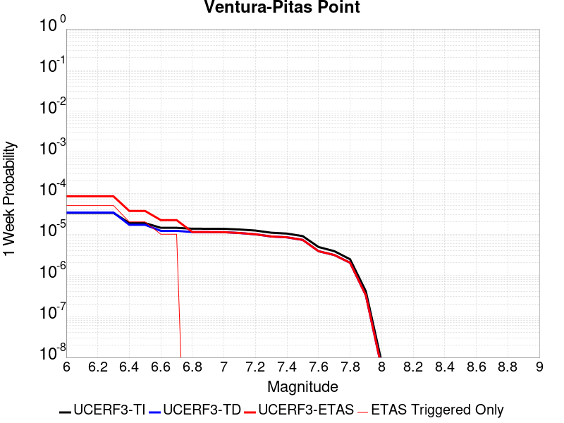 | 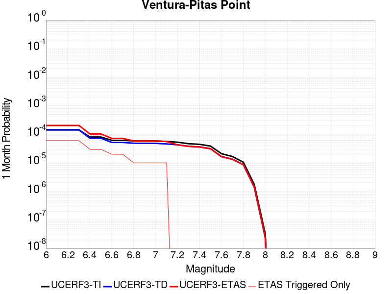 |  |  |

| Magnitude | 1 wk TI Prob | 1 wk TD Prob | 1 wk ETAS Prob | 1 wk ETAS/TD Gain | 1 wk ETAS Triggered Only | 1 mo TI Prob | 1 mo TD Prob | 1 mo ETAS Prob | 1 mo ETAS/TD Gain | 1 mo ETAS Triggered Only | 1 yr TI Prob | 1 yr TD Prob | 1 yr ETAS Prob | 1 yr ETAS/TD Gain | 1 yr ETAS Triggered Only | 10 yr TI Prob | 10 yr TD Prob | 10 yr ETAS Prob | 10 yr ETAS/TD Gain | 10 yr ETAS Triggered Only |
|-----|-----|-----|-----|-----|-----|-----|-----|-----|-----|-----|-----|-----|-----|-----|-----|-----|-----|-----|-----|-----|
| 6.0 | 3.3179622E-5 | 3.3735185E-5 | 8.7209315E-5 | 2.5851145 | 5.3475935E-5 | 1.4219063E-4 | 1.445728E-4 | 2.1140806E-4 | 1.4622948 | 6.684492E-5 | 0.0017297962 | 0.0017590096 | 0.0018524278 | 1.0531085 | 9.358289E-5 | 0.017163932 | 0.0174764 | 0.01762089 | 1.0082676 | 1.4705882E-4 |
| 6.1 | 3.3179622E-5 | 3.3735185E-5 | 8.7209315E-5 | 2.5851145 | 5.3475935E-5 | 1.4219063E-4 | 1.445728E-4 | 2.1140806E-4 | 1.4622948 | 6.684492E-5 | 0.0017297962 | 0.0017590096 | 0.0018524278 | 1.0531085 | 9.358289E-5 | 0.017163932 | 0.0174764 | 0.01762089 | 1.0082676 | 1.4705882E-4 |
| 6.2 | 3.3179622E-5 | 3.3735185E-5 | 8.7209315E-5 | 2.5851145 | 5.3475935E-5 | 1.4219063E-4 | 1.445728E-4 | 2.1140806E-4 | 1.4622948 | 6.684492E-5 | 0.0017297962 | 0.0017590096 | 0.0018524278 | 1.0531085 | 9.358289E-5 | 0.017163932 | 0.0174764 | 0.01762089 | 1.0082676 | 1.4705882E-4 |
| 6.3 | 3.3179622E-5 | 3.3735185E-5 | 8.7209315E-5 | 2.5851145 | 5.3475935E-5 | 1.4219063E-4 | 1.445728E-4 | 2.1140806E-4 | 1.4622948 | 6.684492E-5 | 0.0017297962 | 0.0017590096 | 0.0018524278 | 1.0531085 | 9.358289E-5 | 0.017163932 | 0.0174764 | 0.01762089 | 1.0082676 | 1.4705882E-4 |
| 6.4 | 1.8754668E-5 | 1.701961E-5 | 3.0388366E-5 | 1.7854913 | 1.3368984E-5 | 8.037467E-5 | 7.293928E-5 | 9.96753E-5 | 1.3665518 | 2.6737967E-5 | 9.781223E-4 | 8.8769704E-4 | 9.411255E-4 | 1.0601877 | 5.3475935E-5 | 0.009738282 | 0.008843848 | 0.0089498535 | 1.0119864 | 1.0695187E-4 |
| 6.5 | 1.8754668E-5 | 1.701961E-5 | 3.0388366E-5 | 1.7854913 | 1.3368984E-5 | 8.037467E-5 | 7.293928E-5 | 9.96753E-5 | 1.3665518 | 2.6737967E-5 | 9.781223E-4 | 8.8769704E-4 | 9.411255E-4 | 1.0601877 | 5.3475935E-5 | 0.009738282 | 0.008843848 | 0.0089498535 | 1.0119864 | 1.0695187E-4 |
| 6.6 | 1.4361558E-5 | 1.2122275E-5 | 1.2122275E-5 | 1.0 | 0.0 | 6.154808E-5 | 5.1951585E-5 | 6.531987E-5 | 1.2573221 | 1.3368984E-5 | 7.490902E-4 | 6.3232926E-4 | 6.5905036E-4 | 1.0422581 | 2.6737967E-5 | 0.0074657016 | 0.0063055577 | 0.0063454118 | 1.0063205 | 4.0106952E-5 |
| 6.7 | 1.4361558E-5 | 1.2122275E-5 | 1.2122275E-5 | 1.0 | 0.0 | 6.154808E-5 | 5.1951585E-5 | 6.531987E-5 | 1.2573221 | 1.3368984E-5 | 7.490902E-4 | 6.3232926E-4 | 6.5905036E-4 | 1.0422581 | 2.6737967E-5 | 0.0074657016 | 0.0063055577 | 0.0063454118 | 1.0063205 | 4.0106952E-5 |
| 6.8 | 1.3663846E-5 | 1.13444175E-5 | 1.13444175E-5 | 1.0 | 0.0 | 5.8558027E-5 | 4.861804E-5 | 6.198637E-5 | 1.2749666 | 1.3368984E-5 | 7.127108E-4 | 5.917658E-4 | 6.1848795E-4 | 1.0451566 | 2.6737967E-5 | 0.007104293 | 0.005902116 | 0.005941986 | 1.0067552 | 4.0106952E-5 |
| 6.9 | 1.3644157E-5 | 1.1322519E-5 | 1.1322519E-5 | 1.0 | 0.0 | 5.8473648E-5 | 4.8524187E-5 | 6.1892526E-5 | 1.2754984 | 1.3368984E-5 | 7.116841E-4 | 5.9062376E-4 | 6.1734597E-4 | 1.045244 | 2.6737967E-5 | 0.007094092 | 0.0058907564 | 0.005930627 | 1.0067683 | 4.0106952E-5 |
| 7.0 | 1.3568845E-5 | 1.1242086E-5 | 1.1242086E-5 | 1.0 | 0.0 | 5.8150898E-5 | 4.817949E-5 | 6.154783E-5 | 1.2774695 | 1.3368984E-5 | 7.077572E-4 | 5.864293E-4 | 6.131516E-4 | 1.0455678 | 2.6737967E-5 | 0.007055073 | 0.0058490336 | 0.005888906 | 1.0068169 | 4.0106952E-5 |
| 7.1 | 1.306572E-5 | 1.072054E-5 | 1.072054E-5 | 1.0 | 0.0 | 5.599474E-5 | 4.5944373E-5 | 5.931274E-5 | 1.2909687 | 1.3368984E-5 | 6.815227E-4 | 5.5923103E-4 | 5.8595405E-4 | 1.0477853 | 2.6737967E-5 | 0.0067943637 | 0.0055784425 | 0.0056183254 | 1.0071496 | 4.0106952E-5 |
| 7.2 | 1.232604E-5 | 9.995143E-6 | 9.995143E-6 | 1.0 | 0.0 | 5.2824813E-5 | 4.2835632E-5 | 4.2835632E-5 | 1.0 | 0.0 | 6.429523E-4 | 5.214008E-4 | 5.347628E-4 | 1.0256271 | 1.3368984E-5 | 0.0064109527 | 0.005201967 | 0.0052285655 | 1.0051132 | 2.6737967E-5 |
| 7.3 | 1.0917261E-5 | 8.84384E-6 | 8.84384E-6 | 1.0 | 0.0 | 4.678742E-5 | 3.790163E-5 | 3.790163E-5 | 1.0 | 0.0 | 5.69488E-4 | 4.6135622E-4 | 4.6135622E-4 | 1.0 | 0.0 | 0.0056803077 | 0.00460415 | 0.00460415 | 1.0 | 0.0 |
| 7.4 | 1.039959E-5 | 8.423562E-6 | 8.423562E-6 | 1.0 | 0.0 | 4.456891E-5 | 3.610049E-5 | 3.610049E-5 | 1.0 | 0.0 | 5.424914E-4 | 4.3943635E-4 | 4.3943635E-4 | 1.0 | 0.0 | 0.0054116896 | 0.004385836 | 0.004385836 | 1.0 | 0.0 |
| 7.5 | 9.015877E-6 | 7.2975445E-6 | 7.2975445E-6 | 1.0 | 0.0 | 3.86389E-5 | 3.1274823E-5 | 3.1274823E-5 | 1.0 | 0.0 | 4.7032707E-4 | 3.8070587E-4 | 3.8070587E-4 | 1.0 | 0.0 | 0.004693329 | 0.0038006818 | 0.0038006818 | 1.0 | 0.0 |
| 7.6 | 4.900162E-6 | 3.8741155E-6 | 3.8741155E-6 | 1.0 | 0.0 | 2.1000526E-5 | 1.6603248E-5 | 1.6603248E-5 | 1.0 | 0.0 | 2.556514E-4 | 2.0212591E-4 | 2.0212591E-4 | 1.0 | 0.0 | 0.0025535747 | 0.0020194345 | 0.0020194345 | 1.0 | 0.0 |
| 7.7 | 3.8850626E-6 | 3.1267302E-6 | 3.1267302E-6 | 1.0 | 0.0 | 1.6650163E-5 | 1.3400205E-5 | 1.3400205E-5 | 1.0 | 0.0 | 2.0269687E-4 | 1.6313537E-4 | 1.6313537E-4 | 1.0 | 0.0 | 0.002025121 | 0.0016301654 | 0.0016301654 | 1.0 | 0.0 |
| 7.8 | 2.4654719E-6 | 2.029875E-6 | 2.029875E-6 | 1.0 | 0.0 | 1.0566265E-5 | 8.699436E-6 | 8.699436E-6 | 1.0 | 0.0 | 1.2863669E-4 | 1.0591053E-4 | 1.0591053E-4 | 1.0 | 0.0 | 0.0012856225 | 0.0010586053 | 0.0010586053 | 1.0 | 0.0 |
| 7.9 | 4.095894E-7 | 3.2764765E-7 | 3.2764765E-7 | 1.0 | 0.0 | 1.7553821E-6 | 1.4042034E-6 | 1.4042034E-6 | 1.0 | 0.0 | 2.1371567E-5 | 1.7096047E-5 | 1.7096047E-5 | 1.0 | 0.0 | 2.1369511E-4 | 1.7094762E-4 | 1.7094762E-4 | 1.0 | 0.0 |
| 8.0 | 7.791402E-9 | 5.683497E-9 | 5.683497E-9 | 1.0 | 0.0 | 3.3391725E-8 | 2.4357844E-8 | 2.4357844E-8 | 1.0 | 0.0 | 4.0654416E-7 | 2.9655675E-7 | 2.9655675E-7 | 1.0 | 0.0 | 4.065434E-6 | 2.9655655E-6 | 2.9655655E-6 | 1.0 | 0.0 |

## Pleito
*[(top)](#table-of-contents)*

| 1 Week | 1 Month | 1 Year | 10 Year |
|-----|-----|-----|-----|
|  |  |  |  |

| Magnitude | 1 wk TI Prob | 1 wk TD Prob | 1 wk ETAS Prob | 1 wk ETAS/TD Gain | 1 wk ETAS Triggered Only | 1 mo TI Prob | 1 mo TD Prob | 1 mo ETAS Prob | 1 mo ETAS/TD Gain | 1 mo ETAS Triggered Only | 1 yr TI Prob | 1 yr TD Prob | 1 yr ETAS Prob | 1 yr ETAS/TD Gain | 1 yr ETAS Triggered Only | 10 yr TI Prob | 10 yr TD Prob | 10 yr ETAS Prob | 10 yr ETAS/TD Gain | 10 yr ETAS Triggered Only |
|-----|-----|-----|-----|-----|-----|-----|-----|-----|-----|-----|-----|-----|-----|-----|-----|-----|-----|-----|-----|-----|
| 6.0 | 1.6763008E-5 | 2.4763838E-5 | 3.8132494E-5 | 1.5398457 | 1.3368984E-5 | 7.183948E-5 | 1.0612683E-4 | 1.3286195E-4 | 1.2519168 | 2.6737967E-5 | 8.742947E-4 | 0.0012914003 | 0.0013848623 | 1.0723727 | 9.358289E-5 | 0.00870863 | 0.0129538905 | 0.013085849 | 1.0101868 | 1.3368984E-4 |
| 6.1 | 1.6763008E-5 | 2.4763838E-5 | 3.8132494E-5 | 1.5398457 | 1.3368984E-5 | 7.183948E-5 | 1.0612683E-4 | 1.3286195E-4 | 1.2519168 | 2.6737967E-5 | 8.742947E-4 | 0.0012914003 | 0.0013848623 | 1.0723727 | 9.358289E-5 | 0.00870863 | 0.0129538905 | 0.013085849 | 1.0101868 | 1.3368984E-4 |
| 6.2 | 1.6763008E-5 | 2.4763838E-5 | 3.8132494E-5 | 1.5398457 | 1.3368984E-5 | 7.183948E-5 | 1.0612683E-4 | 1.3286195E-4 | 1.2519168 | 2.6737967E-5 | 8.742947E-4 | 0.0012914003 | 0.0013848623 | 1.0723727 | 9.358289E-5 | 0.00870863 | 0.0129538905 | 0.013085849 | 1.0101868 | 1.3368984E-4 |
| 6.3 | 1.6763008E-5 | 2.4763838E-5 | 3.8132494E-5 | 1.5398457 | 1.3368984E-5 | 7.183948E-5 | 1.0612683E-4 | 1.3286195E-4 | 1.2519168 | 2.6737967E-5 | 8.742947E-4 | 0.0012914003 | 0.0013848623 | 1.0723727 | 9.358289E-5 | 0.00870863 | 0.0129538905 | 0.013085849 | 1.0101868 | 1.3368984E-4 |
| 6.4 | 1.6763008E-5 | 2.4763838E-5 | 3.8132494E-5 | 1.5398457 | 1.3368984E-5 | 7.183948E-5 | 1.0612683E-4 | 1.3286195E-4 | 1.2519168 | 2.6737967E-5 | 8.742947E-4 | 0.0012914003 | 0.0013848623 | 1.0723727 | 9.358289E-5 | 0.00870863 | 0.0129538905 | 0.013085849 | 1.0101868 | 1.3368984E-4 |
| 6.5 | 1.6763008E-5 | 2.4763838E-5 | 3.8132494E-5 | 1.5398457 | 1.3368984E-5 | 7.183948E-5 | 1.0612683E-4 | 1.3286195E-4 | 1.2519168 | 2.6737967E-5 | 8.742947E-4 | 0.0012914003 | 0.0013848623 | 1.0723727 | 9.358289E-5 | 0.00870863 | 0.0129538905 | 0.013085849 | 1.0101868 | 1.3368984E-4 |
| 6.6 | 9.910213E-6 | 1.7214623E-5 | 1.7214623E-5 | 1.0 | 0.0 | 4.247165E-5 | 7.377489E-5 | 8.714289E-5 | 1.1811998 | 1.3368984E-5 | 5.169696E-4 | 8.978429E-4 | 9.111999E-4 | 1.0148767 | 1.3368984E-5 | 0.0051576863 | 0.009050702 | 0.009090446 | 1.0043913 | 4.0106952E-5 |
| 6.7 | 9.910213E-6 | 1.7214623E-5 | 1.7214623E-5 | 1.0 | 0.0 | 4.247165E-5 | 7.377489E-5 | 8.714289E-5 | 1.1811998 | 1.3368984E-5 | 5.169696E-4 | 8.978429E-4 | 9.111999E-4 | 1.0148767 | 1.3368984E-5 | 0.0051576863 | 0.009050702 | 0.009090446 | 1.0043913 | 4.0106952E-5 |
| 6.8 | 8.300162E-6 | 1.5474232E-5 | 1.5474232E-5 | 1.0 | 0.0 | 3.557164E-5 | 6.631646E-5 | 7.9684556E-5 | 1.2015804 | 1.3368984E-5 | 4.3299864E-4 | 8.071053E-4 | 8.2046347E-4 | 1.0165508 | 1.3368984E-5 | 0.004321559 | 0.008150139 | 0.008176659 | 1.0032539 | 2.6737967E-5 |
| 6.9 | 8.183114E-6 | 1.5345448E-5 | 1.5345448E-5 | 1.0 | 0.0 | 3.5070017E-5 | 6.576455E-5 | 7.913266E-5 | 1.2032722 | 1.3368984E-5 | 4.2689382E-4 | 8.003907E-4 | 8.1374904E-4 | 1.0166897 | 1.3368984E-5 | 0.0042607468 | 0.008083483 | 0.008110005 | 1.003281 | 2.6737967E-5 |
| 7.0 | 7.1748823E-6 | 1.413244E-5 | 1.413244E-5 | 1.0 | 0.0 | 3.0749135E-5 | 6.0566195E-5 | 7.393437E-5 | 1.22072 | 1.3368984E-5 | 3.743064E-4 | 7.371445E-4 | 7.505036E-4 | 1.0181228 | 1.3368984E-5 | 0.0037367654 | 0.007454939 | 0.0074814777 | 1.0035598 | 2.6737967E-5 |
| 7.1 | 7.1671807E-6 | 1.412281E-5 | 1.412281E-5 | 1.0 | 0.0 | 3.0716128E-5 | 6.052493E-5 | 7.3893105E-5 | 1.2208706 | 1.3368984E-5 | 3.7390468E-4 | 7.366424E-4 | 7.500015E-4 | 1.0181352 | 1.3368984E-5 | 0.0037327618 | 0.0074499524 | 0.007476491 | 1.0035623 | 2.6737967E-5 |
| 7.2 | 7.0649667E-6 | 1.39701015E-5 | 1.39701015E-5 | 1.0 | 0.0 | 3.0278077E-5 | 5.9870494E-5 | 7.3238676E-5 | 1.223285 | 1.3368984E-5 | 3.6857324E-4 | 7.2868E-4 | 7.4203924E-4 | 1.0183334 | 1.3368984E-5 | 0.0036796255 | 0.0073707094 | 0.0073972503 | 1.0036008 | 2.6737967E-5 |
| 7.3 | 7.02082E-6 | 1.3913556E-5 | 1.3913556E-5 | 1.0 | 0.0 | 3.008888E-5 | 5.9628168E-5 | 7.299636E-5 | 1.2241925 | 1.3368984E-5 | 3.6627054E-4 | 7.2573166E-4 | 7.3909096E-4 | 1.0184081 | 1.3368984E-5 | 0.0036566744 | 0.007341209 | 0.0073677506 | 1.0036154 | 2.6737967E-5 |
| 7.4 | 6.987146E-6 | 1.3873118E-5 | 1.3873118E-5 | 1.0 | 0.0 | 2.9944567E-5 | 5.945487E-5 | 7.282306E-5 | 1.224846 | 1.3368984E-5 | 3.6451413E-4 | 7.2362315E-4 | 7.3698245E-4 | 1.0184617 | 1.3368984E-5 | 0.0036391679 | 0.007320144 | 0.0073466864 | 1.0036259 | 2.6737967E-5 |
| 7.5 | 6.9494554E-6 | 1.3830024E-5 | 1.3830024E-5 | 1.0 | 0.0 | 2.9783041E-5 | 5.9270187E-5 | 7.263838E-5 | 1.2255466 | 1.3368984E-5 | 3.625482E-4 | 7.2137616E-4 | 7.3473545E-4 | 1.0185193 | 1.3368984E-5 | 0.0036195726 | 0.0072977724 | 0.0073243156 | 1.0036371 | 2.6737967E-5 |
| 7.6 | 6.92694E-6 | 1.3789138E-5 | 1.3789138E-5 | 1.0 | 0.0 | 2.9686547E-5 | 5.909497E-5 | 7.246316E-5 | 1.2262155 | 1.3368984E-5 | 3.6137376E-4 | 7.1924424E-4 | 7.3260366E-4 | 1.0185741 | 1.3368984E-5 | 0.0036078666 | 0.0072765257 | 0.0073030693 | 1.0036478 | 2.6737967E-5 |
| 7.7 | 6.395867E-6 | 1.2668219E-5 | 1.2668219E-5 | 1.0 | 0.0 | 2.741057E-5 | 5.429124E-5 | 6.7659494E-5 | 1.2462323 | 1.3368984E-5 | 3.336726E-4 | 6.6079566E-4 | 6.7415583E-4 | 1.0202183 | 1.3368984E-5 | 0.0033317201 | 0.0066951844 | 0.0067217434 | 1.0039669 | 2.6737967E-5 |
| 7.8 | 5.8664327E-6 | 1.153586E-5 | 1.153586E-5 | 1.0 | 0.0 | 2.5141611E-5 | 4.9438466E-5 | 6.280679E-5 | 1.2704033 | 1.3368984E-5 | 3.060561E-4 | 6.017473E-4 | 6.1510823E-4 | 1.0222036 | 1.3368984E-5 | 0.0030563495 | 0.0061006667 | 0.0061272415 | 1.004356 | 2.6737967E-5 |
| 7.9 | 3.7167474E-6 | 7.1140853E-6 | 7.1140853E-6 | 1.0 | 0.0 | 1.592882E-5 | 3.0488582E-5 | 3.0488582E-5 | 1.0 | 0.0 | 1.9391612E-4 | 3.7113542E-4 | 3.7113542E-4 | 1.0 | 0.0 | 0.0019374699 | 0.0037674906 | 0.0037674906 | 1.0 | 0.0 |
| 8.0 | 1.0903841E-6 | 1.2879392E-6 | 1.2879392E-6 | 1.0 | 0.0 | 4.6730665E-6 | 5.5197274E-6 | 5.5197274E-6 | 1.0 | 0.0 | 5.68931E-5 | 6.720063E-5 | 6.720063E-5 | 1.0 | 0.0 | 5.6878536E-4 | 6.941948E-4 | 6.941948E-4 | 1.0 | 0.0 |
| 8.1 | 2.6894583E-7 | 1.1060341E-7 | 1.1060341E-7 | 1.0 | 0.0 | 1.1526245E-6 | 4.740145E-7 | 4.740145E-7 | 1.0 | 0.0 | 1.4033113E-5 | 5.7711113E-6 | 5.7711113E-6 | 1.0 | 0.0 | 1.4032227E-4 | 6.456908E-5 | 6.456908E-5 | 1.0 | 0.0 |
| 8.2 | 5.2967013E-9 | 2.4578228E-9 | 2.4578228E-9 | 1.0 | 0.0 | 2.2700148E-8 | 1.0533527E-8 | 1.0533527E-8 | 1.0 | 0.0 | 2.7637427E-7 | 1.2824569E-7 | 1.2824569E-7 | 1.0 | 0.0 | 2.7637393E-6 | 1.4592787E-6 | 1.4592787E-6 | 1.0 | 0.0 |

## Elysian Park (Upper)
*[(top)](#table-of-contents)*

| 1 Week | 1 Month | 1 Year | 10 Year |
|-----|-----|-----|-----|
|  |  |  | 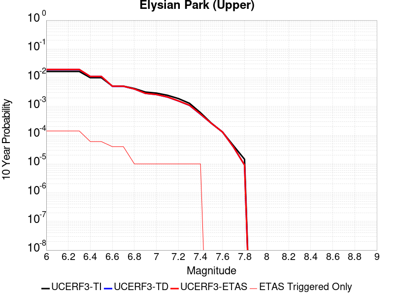 |

| Magnitude | 1 wk TI Prob | 1 wk TD Prob | 1 wk ETAS Prob | 1 wk ETAS/TD Gain | 1 wk ETAS Triggered Only | 1 mo TI Prob | 1 mo TD Prob | 1 mo ETAS Prob | 1 mo ETAS/TD Gain | 1 mo ETAS Triggered Only | 1 yr TI Prob | 1 yr TD Prob | 1 yr ETAS Prob | 1 yr ETAS/TD Gain | 1 yr ETAS Triggered Only | 10 yr TI Prob | 10 yr TD Prob | 10 yr ETAS Prob | 10 yr ETAS/TD Gain | 10 yr ETAS Triggered Only |
|-----|-----|-----|-----|-----|-----|-----|-----|-----|-----|-----|-----|-----|-----|-----|-----|-----|-----|-----|-----|-----|
| 6.0 | 3.1876025E-5 | 3.7035516E-5 | 6.377249E-5 | 1.7219281 | 2.6737967E-5 | 1.3660437E-4 | 1.587167E-4 | 2.1218415E-4 | 1.3368734 | 5.3475935E-5 | 0.0016618895 | 0.0019311075 | 0.0020378528 | 1.0552768 | 1.0695187E-4 | 0.016495159 | 0.019189782 | 0.019320907 | 1.0068331 | 1.3368984E-4 |
| 6.1 | 3.1876025E-5 | 3.7035516E-5 | 6.377249E-5 | 1.7219281 | 2.6737967E-5 | 1.3660437E-4 | 1.587167E-4 | 2.1218415E-4 | 1.3368734 | 5.3475935E-5 | 0.0016618895 | 0.0019311075 | 0.0020378528 | 1.0552768 | 1.0695187E-4 | 0.016495159 | 0.019189782 | 0.019320907 | 1.0068331 | 1.3368984E-4 |
| 6.2 | 3.1876025E-5 | 3.7035516E-5 | 6.377249E-5 | 1.7219281 | 2.6737967E-5 | 1.3660437E-4 | 1.587167E-4 | 2.1218415E-4 | 1.3368734 | 5.3475935E-5 | 0.0016618895 | 0.0019311075 | 0.0020378528 | 1.0552768 | 1.0695187E-4 | 0.016495159 | 0.019189782 | 0.019320907 | 1.0068331 | 1.3368984E-4 |
| 6.3 | 3.1876025E-5 | 3.7035516E-5 | 6.377249E-5 | 1.7219281 | 2.6737967E-5 | 1.3660437E-4 | 1.587167E-4 | 2.1218415E-4 | 1.3368734 | 5.3475935E-5 | 0.0016618895 | 0.0019311075 | 0.0020378528 | 1.0552768 | 1.0695187E-4 | 0.016495159 | 0.019189782 | 0.019320907 | 1.0068331 | 1.3368984E-4 |
| 6.4 | 1.9273462E-5 | 2.1202266E-5 | 2.1202266E-5 | 1.0 | 0.0 | 8.259794E-5 | 9.086466E-5 | 1.0423244E-4 | 1.1471174 | 1.3368984E-5 | 0.001005166 | 0.0011058892 | 0.0011459518 | 1.0362266 | 4.0106952E-5 | 0.010006315 | 0.011020724 | 0.01107361 | 1.0047989 | 5.3475935E-5 |
| 6.5 | 1.9273462E-5 | 2.1202266E-5 | 2.1202266E-5 | 1.0 | 0.0 | 8.259794E-5 | 9.086466E-5 | 1.0423244E-4 | 1.1471174 | 1.3368984E-5 | 0.001005166 | 0.0011058892 | 0.0011459518 | 1.0362266 | 4.0106952E-5 | 0.010006315 | 0.011020724 | 0.01107361 | 1.0047989 | 5.3475935E-5 |
| 6.6 | 9.813258E-6 | 9.665599E-6 | 9.665599E-6 | 1.0 | 0.0 | 4.205614E-5 | 4.1423376E-5 | 4.1423376E-5 | 1.0 | 0.0 | 5.119132E-4 | 5.0422014E-4 | 5.175824E-4 | 1.0265008 | 1.3368984E-5 | 0.005107356 | 0.0050314846 | 0.0050580883 | 1.0052874 | 2.6737967E-5 |
| 6.7 | 9.801478E-6 | 9.653168E-6 | 9.653168E-6 | 1.0 | 0.0 | 4.2005657E-5 | 4.1370105E-5 | 4.1370105E-5 | 1.0 | 0.0 | 5.112989E-4 | 5.035719E-4 | 5.1693415E-4 | 1.0265349 | 1.3368984E-5 | 0.0051012407 | 0.0050250315 | 0.0050516347 | 1.0052942 | 2.6737967E-5 |
| 6.8 | 8.102489E-6 | 7.773004E-6 | 7.773004E-6 | 1.0 | 0.0 | 3.4724493E-5 | 3.3312477E-5 | 3.3312477E-5 | 1.0 | 0.0 | 4.2268867E-4 | 4.055089E-4 | 4.055089E-4 | 1.0 | 0.0 | 0.004218856 | 0.0040481836 | 0.004061498 | 1.0032891 | 1.3368984E-5 |
| 6.9 | 6.08275E-6 | 5.4814514E-6 | 5.4814514E-6 | 1.0 | 0.0 | 2.6068668E-5 | 2.3491726E-5 | 2.3491726E-5 | 1.0 | 0.0 | 3.173398E-4 | 2.85975E-4 | 2.85975E-4 | 1.0 | 0.0 | 0.0031688702 | 0.0028561477 | 0.0028694784 | 1.0046674 | 1.3368984E-5 |
| 7.0 | 5.5995934E-6 | 4.98278E-6 | 4.98278E-6 | 1.0 | 0.0 | 2.3998036E-5 | 2.13546E-5 | 2.13546E-5 | 1.0 | 0.0 | 2.9213692E-4 | 2.599619E-4 | 2.599619E-4 | 1.0 | 0.0 | 0.0029175316 | 0.0025966454 | 0.0026099796 | 1.0051352 | 1.3368984E-5 |
| 7.1 | 4.709881E-6 | 4.0874015E-6 | 4.0874015E-6 | 1.0 | 0.0 | 2.0185047E-5 | 1.7517319E-5 | 1.7517319E-5 | 1.0 | 0.0 | 2.4572524E-4 | 2.132529E-4 | 2.132529E-4 | 1.0 | 0.0 | 0.002454537 | 0.002130524 | 0.0021438645 | 1.0062616 | 1.3368984E-5 |
| 7.2 | 3.6063436E-6 | 2.9779544E-6 | 2.9779544E-6 | 1.0 | 0.0 | 1.5455667E-5 | 1.27626E-5 | 1.27626E-5 | 1.0 | 0.0 | 1.881565E-4 | 1.5537368E-4 | 1.5537368E-4 | 1.0 | 0.0 | 0.0018799726 | 0.0015526618 | 0.0015660101 | 1.008597 | 1.3368984E-5 |
| 7.3 | 2.471135E-6 | 2.0954615E-6 | 2.0954615E-6 | 1.0 | 0.0 | 1.0590536E-5 | 8.980519E-6 | 8.980519E-6 | 1.0 | 0.0 | 1.2893214E-4 | 1.093324E-4 | 1.093324E-4 | 1.0 | 0.0 | 0.0012885736 | 0.0010927934 | 0.0011061478 | 1.0122204 | 1.3368984E-5 |
| 7.4 | 1.163943E-6 | 1.0275091E-6 | 1.0275091E-6 | 1.0 | 0.0 | 4.988318E-6 | 4.4036033E-6 | 4.4036033E-6 | 1.0 | 0.0 | 6.0731076E-5 | 5.3612584E-5 | 5.3612584E-5 | 1.0 | 0.0 | 6.071448E-4 | 5.359995E-4 | 5.493613E-4 | 1.0249288 | 1.3368984E-5 |
| 7.5 | 4.99459E-7 | 4.917604E-7 | 4.917604E-7 | 1.0 | 0.0 | 2.140537E-6 | 2.1075427E-6 | 2.1075427E-6 | 1.0 | 0.0 | 2.6060725E-5 | 2.5659048E-5 | 2.5659048E-5 | 1.0 | 0.0 | 2.605767E-4 | 2.5656243E-4 | 2.5656243E-4 | 1.0 | 0.0 |
| 7.6 | 2.4667852E-7 | 2.4778336E-7 | 2.4778336E-7 | 1.0 | 0.0 | 1.0571932E-6 | 1.0619283E-6 | 1.0619283E-6 | 1.0 | 0.0 | 1.2871251E-5 | 1.2928905E-5 | 1.2928905E-5 | 1.0 | 0.0 | 1.2870505E-4 | 1.2928189E-4 | 1.2928189E-4 | 1.0 | 0.0 |
| 7.7 | 8.2312795E-8 | 7.3864456E-8 | 7.3864456E-8 | 1.0 | 0.0 | 3.527691E-7 | 3.165619E-7 | 3.165619E-7 | 1.0 | 0.0 | 4.294955E-6 | 3.8541357E-6 | 3.8541357E-6 | 1.0 | 0.0 | 4.2948723E-5 | 3.8540802E-5 | 3.8540802E-5 | 1.0 | 0.0 |
| 7.8 | 2.7819295E-8 | 1.7566023E-8 | 1.7566023E-8 | 1.0 | 0.0 | 1.1922555E-7 | 7.5282955E-8 | 7.5282955E-8 | 1.0 | 0.0 | 1.45157E-6 | 9.165697E-7 | 9.165697E-7 | 1.0 | 0.0 | 1.45156055E-5 | 9.165675E-6 | 9.165675E-6 | 1.0 | 0.0 |

## San Cayetano
*[(top)](#table-of-contents)*

| 1 Week | 1 Month | 1 Year | 10 Year |
|-----|-----|-----|-----|
| 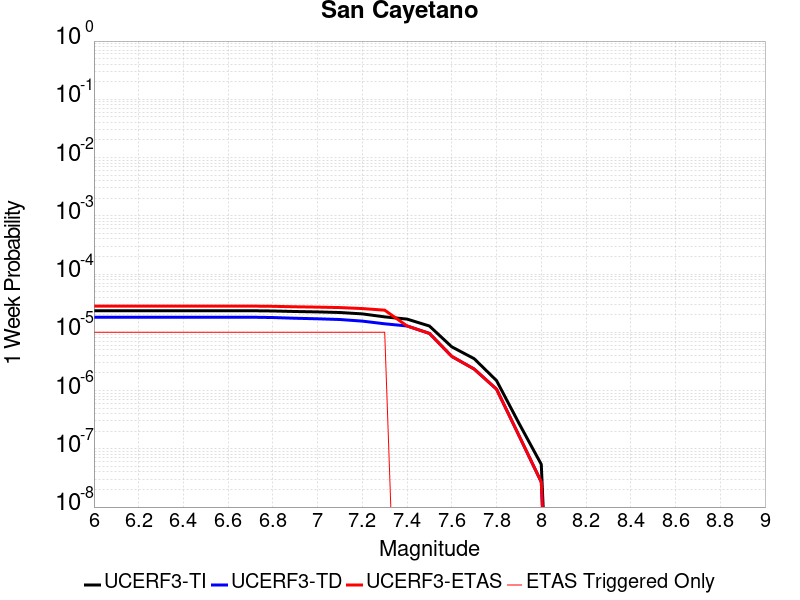 |  |  |  |

| Magnitude | 1 wk TI Prob | 1 wk TD Prob | 1 wk ETAS Prob | 1 wk ETAS/TD Gain | 1 wk ETAS Triggered Only | 1 mo TI Prob | 1 mo TD Prob | 1 mo ETAS Prob | 1 mo ETAS/TD Gain | 1 mo ETAS Triggered Only | 1 yr TI Prob | 1 yr TD Prob | 1 yr ETAS Prob | 1 yr ETAS/TD Gain | 1 yr ETAS Triggered Only | 10 yr TI Prob | 10 yr TD Prob | 10 yr ETAS Prob | 10 yr ETAS/TD Gain | 10 yr ETAS Triggered Only |
|-----|-----|-----|-----|-----|-----|-----|-----|-----|-----|-----|-----|-----|-----|-----|-----|-----|-----|-----|-----|-----|
| 6.0 | 2.3476267E-5 | 1.816928E-5 | 3.153802E-5 | 1.7357882 | 1.3368984E-5 | 1.0060869E-4 | 7.786603E-5 | 1.1796986E-4 | 1.5150362 | 4.0106952E-5 | 0.0012242225 | 9.476103E-4 | 0.0010411046 | 1.0986631 | 9.358289E-5 | 0.012175002 | 0.009436584 | 0.009569013 | 1.0140334 | 1.3368984E-4 |
| 6.1 | 2.3476267E-5 | 1.816928E-5 | 3.153802E-5 | 1.7357882 | 1.3368984E-5 | 1.0060869E-4 | 7.786603E-5 | 1.1796986E-4 | 1.5150362 | 4.0106952E-5 | 0.0012242225 | 9.476103E-4 | 0.0010411046 | 1.0986631 | 9.358289E-5 | 0.012175002 | 0.009436584 | 0.009569013 | 1.0140334 | 1.3368984E-4 |
| 6.2 | 2.3476267E-5 | 1.816928E-5 | 3.153802E-5 | 1.7357882 | 1.3368984E-5 | 1.0060869E-4 | 7.786603E-5 | 1.1796986E-4 | 1.5150362 | 4.0106952E-5 | 0.0012242225 | 9.476103E-4 | 0.0010411046 | 1.0986631 | 9.358289E-5 | 0.012175002 | 0.009436584 | 0.009569013 | 1.0140334 | 1.3368984E-4 |
| 6.3 | 2.3476267E-5 | 1.816928E-5 | 3.153802E-5 | 1.7357882 | 1.3368984E-5 | 1.0060869E-4 | 7.786603E-5 | 1.1796986E-4 | 1.5150362 | 4.0106952E-5 | 0.0012242225 | 9.476103E-4 | 0.0010411046 | 1.0986631 | 9.358289E-5 | 0.012175002 | 0.009436584 | 0.009569013 | 1.0140334 | 1.3368984E-4 |
| 6.4 | 2.3476267E-5 | 1.816928E-5 | 3.153802E-5 | 1.7357882 | 1.3368984E-5 | 1.0060869E-4 | 7.786603E-5 | 1.1796986E-4 | 1.5150362 | 4.0106952E-5 | 0.0012242225 | 9.476103E-4 | 0.0010411046 | 1.0986631 | 9.358289E-5 | 0.012175002 | 0.009436584 | 0.009569013 | 1.0140334 | 1.3368984E-4 |
| 6.5 | 2.3476267E-5 | 1.816928E-5 | 3.153802E-5 | 1.7357882 | 1.3368984E-5 | 1.0060869E-4 | 7.786603E-5 | 1.1796986E-4 | 1.5150362 | 4.0106952E-5 | 0.0012242225 | 9.476103E-4 | 0.0010411046 | 1.0986631 | 9.358289E-5 | 0.012175002 | 0.009436584 | 0.009569013 | 1.0140334 | 1.3368984E-4 |
| 6.6 | 2.3476267E-5 | 1.816928E-5 | 3.153802E-5 | 1.7357882 | 1.3368984E-5 | 1.0060869E-4 | 7.786603E-5 | 1.1796986E-4 | 1.5150362 | 4.0106952E-5 | 0.0012242225 | 9.476103E-4 | 0.0010411046 | 1.0986631 | 9.358289E-5 | 0.012175002 | 0.009436584 | 0.009569013 | 1.0140334 | 1.3368984E-4 |
| 6.7 | 2.3476267E-5 | 1.816928E-5 | 3.153802E-5 | 1.7357882 | 1.3368984E-5 | 1.0060869E-4 | 7.786603E-5 | 1.1796986E-4 | 1.5150362 | 4.0106952E-5 | 0.0012242225 | 9.476103E-4 | 0.0010411046 | 1.0986631 | 9.358289E-5 | 0.012175002 | 0.009436584 | 0.009569013 | 1.0140334 | 1.3368984E-4 |
| 6.8 | 2.3241924E-5 | 1.7936987E-5 | 3.130573E-5 | 1.7453171 | 1.3368984E-5 | 9.960445E-5 | 7.687056E-5 | 1.1697443E-4 | 1.5217065 | 4.0106952E-5 | 0.0012120095 | 9.3550084E-4 | 0.0010289962 | 1.0999415 | 9.358289E-5 | 0.012054204 | 0.009316482 | 0.009448926 | 1.0142162 | 1.3368984E-4 |
| 6.9 | 2.2761007E-5 | 1.7432423E-5 | 3.0801173E-5 | 1.7668899 | 1.3368984E-5 | 9.7543525E-5 | 7.470827E-5 | 1.14812225E-4 | 1.5368074 | 4.0106952E-5 | 0.0011869454 | 9.09197E-4 | 0.0010026948 | 1.1028355 | 9.358289E-5 | 0.011806256 | 0.009055603 | 0.009188082 | 1.0146295 | 1.3368984E-4 |
| 7.0 | 2.240283E-5 | 1.7066168E-5 | 3.0434925E-5 | 1.7833484 | 1.3368984E-5 | 9.600859E-5 | 7.313869E-5 | 1.13242706E-4 | 1.5483284 | 4.0106952E-5 | 0.0011682777 | 8.9010317E-4 | 9.836028E-4 | 1.1050435 | 9.358289E-5 | 0.011621549 | 0.008866196 | 0.0089986995 | 1.0149449 | 1.3368984E-4 |
| 7.1 | 2.1871154E-5 | 1.6586018E-5 | 2.9954781E-5 | 1.806026 | 1.3368984E-5 | 9.373015E-5 | 7.108101E-5 | 1.11185116E-4 | 1.5642027 | 4.0106952E-5 | 0.0011405671 | 8.6507114E-4 | 9.585731E-4 | 1.1080859 | 9.358289E-5 | 0.011347309 | 0.008617838 | 0.008750376 | 1.0153794 | 1.3368984E-4 |
| 7.2 | 2.0714133E-5 | 1.5564561E-5 | 2.8933337E-5 | 1.858924 | 1.3368984E-5 | 8.8771834E-5 | 6.670357E-5 | 9.3439754E-5 | 1.4008209 | 2.6737967E-5 | 0.0010802611 | 8.1181666E-4 | 8.9196546E-4 | 1.0987277 | 8.0213904E-5 | 0.010750249 | 0.008089285 | 0.0082086325 | 1.0147538 | 1.2032085E-4 |
| 7.3 | 1.8408395E-5 | 1.3996864E-5 | 2.7365662E-5 | 1.955128 | 1.3368984E-5 | 7.8890735E-5 | 5.99852E-5 | 8.6721564E-5 | 1.445716 | 2.6737967E-5 | 9.600714E-4 | 7.300781E-4 | 7.968742E-4 | 1.0914917 | 6.684492E-5 | 0.009559342 | 0.0072775153 | 0.0073704175 | 1.0127656 | 9.358289E-5 |
| 7.4 | 1.6856795E-5 | 1.28500815E-5 | 1.28500815E-5 | 1.0 | 0.0 | 7.2241404E-5 | 5.5070628E-5 | 6.843888E-5 | 1.2427473 | 1.3368984E-5 | 8.7918417E-4 | 6.7028153E-4 | 7.237216E-4 | 1.0797279 | 5.3475935E-5 | 0.00875714 | 0.0066832784 | 0.0067629563 | 1.011922 | 8.0213904E-5 |
| 7.5 | 1.2822778E-5 | 9.577542E-6 | 9.577542E-6 | 1.0 | 0.0 | 5.495361E-5 | 4.1045972E-5 | 5.4414406E-5 | 1.3256942 | 1.3368984E-5 | 6.688548E-4 | 4.996217E-4 | 5.397086E-4 | 1.0802345 | 4.0106952E-5 | 0.006668452 | 0.0049851555 | 0.005038365 | 1.0106735 | 5.3475935E-5 |
| 7.6 | 5.6272684E-6 | 3.854903E-6 | 3.854903E-6 | 1.0 | 0.0 | 2.4116642E-5 | 1.652091E-5 | 2.9889672E-5 | 1.8092027 | 1.3368984E-5 | 2.9358055E-4 | 2.0112359E-4 | 2.2785619E-4 | 1.1329162 | 2.6737967E-5 | 0.0029319301 | 0.0020094267 | 0.002049453 | 1.0199193 | 4.0106952E-5 |
| 7.7 | 3.5261346E-6 | 2.3407013E-6 | 2.3407013E-6 | 1.0 | 0.0 | 1.5111918E-5 | 1.0031539E-5 | 1.0031539E-5 | 1.0 | 0.0 | 1.8397206E-4 | 1.2212721E-4 | 1.2212721E-4 | 1.0 | 0.0 | 0.0018381984 | 0.0012206084 | 0.001233961 | 1.0109394 | 1.3368984E-5 |
| 7.8 | 1.4826929E-6 | 1.056428E-6 | 1.056428E-6 | 1.0 | 0.0 | 6.354383E-6 | 4.5275406E-6 | 4.5275406E-6 | 1.0 | 0.0 | 7.736187E-5 | 5.5121433E-5 | 5.5121433E-5 | 1.0 | 0.0 | 7.733494E-4 | 5.5107963E-4 | 5.5107963E-4 | 1.0 | 0.0 |
| 7.9 | 2.7568166E-7 | 1.6978244E-7 | 1.6978244E-7 | 1.0 | 0.0 | 1.1814923E-6 | 7.2763885E-7 | 7.2763885E-7 | 1.0 | 0.0 | 1.4384574E-5 | 8.858967E-6 | 8.858967E-6 | 1.0 | 0.0 | 1.4383643E-4 | 8.8586174E-5 | 8.8586174E-5 | 1.0 | 0.0 |
| 8.0 | 5.407832E-8 | 2.6887697E-8 | 2.6887697E-8 | 1.0 | 0.0 | 2.3176422E-7 | 1.15232986E-7 | 1.15232986E-7 | 1.0 | 0.0 | 2.8217257E-6 | 1.4029607E-6 | 1.4029607E-6 | 1.0 | 0.0 | 2.8216898E-5 | 1.4029522E-5 | 1.4029522E-5 | 1.0 | 0.0 |

## Coronado Bank alt1
*[(top)](#table-of-contents)*

| 1 Week | 1 Month | 1 Year | 10 Year |
|-----|-----|-----|-----|
|  |  |  |  |

| Magnitude | 1 wk TI Prob | 1 wk TD Prob | 1 wk ETAS Prob | 1 wk ETAS/TD Gain | 1 wk ETAS Triggered Only | 1 mo TI Prob | 1 mo TD Prob | 1 mo ETAS Prob | 1 mo ETAS/TD Gain | 1 mo ETAS Triggered Only | 1 yr TI Prob | 1 yr TD Prob | 1 yr ETAS Prob | 1 yr ETAS/TD Gain | 1 yr ETAS Triggered Only | 10 yr TI Prob | 10 yr TD Prob | 10 yr ETAS Prob | 10 yr ETAS/TD Gain | 10 yr ETAS Triggered Only |
|-----|-----|-----|-----|-----|-----|-----|-----|-----|-----|-----|-----|-----|-----|-----|-----|-----|-----|-----|-----|-----|
| 6.0 | 7.533492E-5 | 9.394913E-5 | 1.6078776E-4 | 1.7114344 | 6.684492E-5 | 3.22824E-4 | 4.0258127E-4 | 4.8276287E-4 | 1.1991688 | 8.0213904E-5 | 0.0039233007 | 0.0048909658 | 0.005010698 | 1.0244803 | 1.2032085E-4 | 0.03854755 | 0.04790356 | 0.048030846 | 1.0026572 | 1.3368984E-4 |
| 6.1 | 4.1807285E-5 | 5.049283E-5 | 1.03966064E-4 | 2.0590262 | 5.3475935E-5 | 1.7916178E-4 | 2.1638049E-4 | 2.8321095E-4 | 1.3088562 | 6.684492E-5 | 0.0021791123 | 0.0026313474 | 0.002724684 | 1.0354711 | 9.358289E-5 | 0.021578677 | 0.026011046 | 0.026102196 | 1.0035043 | 9.358289E-5 |
| 6.2 | 4.1807285E-5 | 5.049283E-5 | 1.03966064E-4 | 2.0590262 | 5.3475935E-5 | 1.7916178E-4 | 2.1638049E-4 | 2.8321095E-4 | 1.3088562 | 6.684492E-5 | 0.0021791123 | 0.0026313474 | 0.002724684 | 1.0354711 | 9.358289E-5 | 0.021578677 | 0.026011046 | 0.026102196 | 1.0035043 | 9.358289E-5 |
| 6.3 | 3.1793104E-5 | 3.7711117E-5 | 6.4448075E-5 | 1.7089942 | 2.6737967E-5 | 1.3624904E-4 | 1.6160926E-4 | 2.0170974E-4 | 1.2481322 | 4.0106952E-5 | 0.0016575698 | 0.001965848 | 0.0020325615 | 1.0339363 | 6.684492E-5 | 0.016452603 | 0.019488465 | 0.019554008 | 1.0033631 | 6.684492E-5 |
| 6.4 | 2.9878007E-5 | 3.5335794E-5 | 6.207282E-5 | 1.7566555 | 2.6737967E-5 | 1.2804232E-4 | 1.5143053E-4 | 1.915314E-4 | 1.2648137 | 4.0106952E-5 | 0.0015578003 | 0.0018421387 | 0.0019088605 | 1.0362197 | 6.684492E-5 | 0.015469253 | 0.01827244 | 0.018338066 | 1.0035914 | 6.684492E-5 |
| 6.5 | 2.4512565E-5 | 2.8764043E-5 | 4.2132644E-5 | 1.4647677 | 1.3368984E-5 | 1.0504962E-4 | 1.2326881E-4 | 1.5000347E-4 | 1.216881 | 2.6737967E-5 | 0.0012782287 | 0.0014997921 | 0.00152649 | 1.017801 | 2.6737967E-5 | 0.012709012 | 0.014899683 | 0.014926023 | 1.0017678 | 2.6737967E-5 |
| 6.6 | 2.1317413E-5 | 2.490667E-5 | 3.827532E-5 | 1.5367498 | 1.3368984E-5 | 9.135714E-5 | 1.0673863E-4 | 1.3347375E-4 | 1.2504727 | 2.6737967E-5 | 0.0011117056 | 0.0012987906 | 0.0013254938 | 1.02056 | 2.6737967E-5 | 0.011061605 | 0.012914404 | 0.012940797 | 1.0020436 | 2.6737967E-5 |
| 6.7 | 1.8585655E-5 | 2.163488E-5 | 3.5003573E-5 | 1.6179233 | 1.3368984E-5 | 7.9650374E-5 | 9.271773E-5 | 1.1945322E-4 | 1.2883536 | 2.6737967E-5 | 9.6931186E-4 | 0.0011282742 | 0.0011549821 | 1.0236714 | 2.6737967E-5 | 0.0096509475 | 0.011227623 | 0.01125406 | 1.0023547 | 2.6737967E-5 |
| 6.8 | 1.5862879E-5 | 1.8419474E-5 | 3.178821E-5 | 1.7257936 | 1.3368984E-5 | 6.798199E-5 | 7.893833E-5 | 1.0567418E-4 | 1.338693 | 2.6737967E-5 | 8.273665E-4 | 9.6066965E-4 | 9.873819E-4 | 1.0278059 | 2.6737967E-5 | 0.008242928 | 0.00956715 | 0.009593632 | 1.002768 | 2.6737967E-5 |
| 6.9 | 1.3021509E-5 | 1.5095265E-5 | 2.8464046E-5 | 1.8856275 | 1.3368984E-5 | 5.5805274E-5 | 6.469249E-5 | 7.8060606E-5 | 1.206641 | 1.3368984E-5 | 6.792174E-4 | 7.8736455E-4 | 8.00723E-4 | 1.016966 | 1.3368984E-5 | 0.006771452 | 0.007847573 | 0.007860837 | 1.0016903 | 1.3368984E-5 |
| 7.0 | 1.0974371E-5 | 1.2720104E-5 | 1.2720104E-5 | 1.0 | 0.0 | 4.7032172E-5 | 5.451369E-5 | 5.451369E-5 | 1.0 | 0.0 | 5.7246623E-4 | 6.6351966E-4 | 6.6351966E-4 | 1.0 | 0.0 | 0.0057099373 | 0.006617135 | 0.006617135 | 1.0 | 0.0 |
| 7.1 | 8.766221E-6 | 1.01638325E-5 | 1.01638325E-5 | 1.0 | 0.0 | 3.7568978E-5 | 4.355865E-5 | 4.355865E-5 | 1.0 | 0.0 | 4.573063E-4 | 5.3021475E-4 | 5.3021475E-4 | 1.0 | 0.0 | 0.0045636636 | 0.0052911965 | 0.0052911965 | 1.0 | 0.0 |
| 7.2 | 8.026024E-7 | 8.331765E-7 | 8.331765E-7 | 1.0 | 0.0 | 3.43972E-6 | 3.5707515E-6 | 3.5707515E-6 | 1.0 | 0.0 | 4.1877785E-5 | 4.3473043E-5 | 4.3473043E-5 | 1.0 | 0.0 | 4.1869894E-4 | 4.3464647E-4 | 4.3464647E-4 | 1.0 | 0.0 |
| 7.3 | 3.7293114E-7 | 3.7000953E-7 | 3.7000953E-7 | 1.0 | 0.0 | 1.5982754E-6 | 1.5857541E-6 | 1.5857541E-6 | 1.0 | 0.0 | 1.9458828E-5 | 1.9306386E-5 | 1.9306386E-5 | 1.0 | 0.0 | 1.9457124E-4 | 1.9304715E-4 | 1.9304715E-4 | 1.0 | 0.0 |
| 7.4 | 2.0557036E-7 | 1.9674363E-7 | 1.9674363E-7 | 1.0 | 0.0 | 8.810155E-7 | 8.431867E-7 | 8.431867E-7 | 1.0 | 0.0 | 1.0726311E-5 | 1.026575E-5 | 1.026575E-5 | 1.0 | 0.0 | 1.0725793E-4 | 1.0265279E-4 | 1.0265279E-4 | 1.0 | 0.0 |
| 7.5 | 6.845446E-8 | 6.279369E-8 | 6.279369E-8 | 1.0 | 0.0 | 2.9337625E-7 | 2.691158E-7 | 2.691158E-7 | 1.0 | 0.0 | 3.5718497E-6 | 3.2764797E-6 | 3.2764797E-6 | 1.0 | 0.0 | 3.5717923E-5 | 3.2764325E-5 | 3.2764325E-5 | 1.0 | 0.0 |
| 7.6 | 6.0975145E-9 | 5.53185E-9 | 5.53185E-9 | 1.0 | 0.0 | 2.6132206E-8 | 2.370793E-8 | 2.370793E-8 | 1.0 | 0.0 | 3.1815955E-7 | 2.88644E-7 | 2.88644E-7 | 1.0 | 0.0 | 3.181591E-6 | 2.8864374E-6 | 2.8864374E-6 | 1.0 | 0.0 |

## San Jacinto (Coyote Creek)
*[(top)](#table-of-contents)*

| 1 Week | 1 Month | 1 Year | 10 Year |
|-----|-----|-----|-----|
|  |  |  |  |

| Magnitude | 1 wk TI Prob | 1 wk TD Prob | 1 wk ETAS Prob | 1 wk ETAS/TD Gain | 1 wk ETAS Triggered Only | 1 mo TI Prob | 1 mo TD Prob | 1 mo ETAS Prob | 1 mo ETAS/TD Gain | 1 mo ETAS Triggered Only | 1 yr TI Prob | 1 yr TD Prob | 1 yr ETAS Prob | 1 yr ETAS/TD Gain | 1 yr ETAS Triggered Only | 10 yr TI Prob | 10 yr TD Prob | 10 yr ETAS Prob | 10 yr ETAS/TD Gain | 10 yr ETAS Triggered Only |
|-----|-----|-----|-----|-----|-----|-----|-----|-----|-----|-----|-----|-----|-----|-----|-----|-----|-----|-----|-----|-----|
| 6.0 | 2.7374346E-5 | 2.4145214E-5 | 9.098852E-5 | 3.7683873 | 6.684492E-5 | 1.1731335E-4 | 1.034754E-4 | 1.970486E-4 | 1.9043039 | 9.358289E-5 | 0.0014273542 | 0.0012590875 | 0.0013659047 | 1.084837 | 1.0695187E-4 | 0.01418221 | 0.012928318 | 0.013047083 | 1.0091865 | 1.2032085E-4 |
| 6.1 | 2.7374346E-5 | 2.4145214E-5 | 9.098852E-5 | 3.7683873 | 6.684492E-5 | 1.1731335E-4 | 1.034754E-4 | 1.970486E-4 | 1.9043039 | 9.358289E-5 | 0.0014273542 | 0.0012590875 | 0.0013659047 | 1.084837 | 1.0695187E-4 | 0.01418221 | 0.012928318 | 0.013047083 | 1.0091865 | 1.2032085E-4 |
| 6.2 | 2.7374346E-5 | 2.4145214E-5 | 9.098852E-5 | 3.7683873 | 6.684492E-5 | 1.1731335E-4 | 1.034754E-4 | 1.970486E-4 | 1.9043039 | 9.358289E-5 | 0.0014273542 | 0.0012590875 | 0.0013659047 | 1.084837 | 1.0695187E-4 | 0.01418221 | 0.012928318 | 0.013047083 | 1.0091865 | 1.2032085E-4 |
| 6.3 | 2.7374346E-5 | 2.4145214E-5 | 9.098852E-5 | 3.7683873 | 6.684492E-5 | 1.1731335E-4 | 1.034754E-4 | 1.970486E-4 | 1.9043039 | 9.358289E-5 | 0.0014273542 | 0.0012590875 | 0.0013659047 | 1.084837 | 1.0695187E-4 | 0.01418221 | 0.012928318 | 0.013047083 | 1.0091865 | 1.2032085E-4 |
| 6.4 | 2.7374346E-5 | 2.4145214E-5 | 9.098852E-5 | 3.7683873 | 6.684492E-5 | 1.1731335E-4 | 1.034754E-4 | 1.970486E-4 | 1.9043039 | 9.358289E-5 | 0.0014273542 | 0.0012590875 | 0.0013659047 | 1.084837 | 1.0695187E-4 | 0.01418221 | 0.012928318 | 0.013047083 | 1.0091865 | 1.2032085E-4 |
| 6.5 | 2.7282445E-5 | 2.4031293E-5 | 9.087461E-5 | 3.7815113 | 6.684492E-5 | 1.16919524E-4 | 1.029872E-4 | 1.9656045E-4 | 1.908591 | 9.358289E-5 | 0.0014225657 | 0.0012531505 | 0.0013599684 | 1.0852394 | 1.0695187E-4 | 0.014134934 | 0.012869646 | 0.012988418 | 1.0092288 | 1.2032085E-4 |
| 6.6 | 2.7282445E-5 | 2.4031293E-5 | 9.087461E-5 | 3.7815113 | 6.684492E-5 | 1.16919524E-4 | 1.029872E-4 | 1.9656045E-4 | 1.908591 | 9.358289E-5 | 0.0014225657 | 0.0012531505 | 0.0013599684 | 1.0852394 | 1.0695187E-4 | 0.014134934 | 0.012869646 | 0.012988418 | 1.0092288 | 1.2032085E-4 |
| 6.7 | 2.7216198E-5 | 2.3956412E-5 | 9.079973E-5 | 3.7902057 | 6.684492E-5 | 1.1663563E-4 | 1.02666316E-4 | 1.9623959E-4 | 1.9114312 | 9.358289E-5 | 0.0014191137 | 0.0012492483 | 0.0013560666 | 1.0855061 | 1.0695187E-4 | 0.014100855 | 0.0128310565 | 0.012949834 | 1.009257 | 1.2032085E-4 |
| 6.8 | 2.7078617E-5 | 2.387363E-5 | 9.071695E-5 | 3.799881 | 6.684492E-5 | 1.1604605E-4 | 1.0231156E-4 | 1.9588487E-4 | 1.9145918 | 9.358289E-5 | 0.001411945 | 0.0012449342 | 0.0013517528 | 1.0858027 | 1.0695187E-4 | 0.014030075 | 0.012788199 | 0.012906981 | 1.0092884 | 1.2032085E-4 |
| 6.9 | 2.6982952E-5 | 2.3793142E-5 | 9.063647E-5 | 3.8093529 | 6.684492E-5 | 1.15636096E-4 | 1.0196664E-4 | 1.9553998E-4 | 1.9176859 | 9.358289E-5 | 0.0014069602 | 0.0012407395 | 0.0013475586 | 1.0860932 | 1.0695187E-4 | 0.013980856 | 0.012746515 | 0.012865301 | 1.0093192 | 1.2032085E-4 |
| 7.0 | 2.6449972E-5 | 2.3370165E-5 | 9.021352E-5 | 3.8602006 | 6.684492E-5 | 1.1335209E-4 | 1.00154015E-4 | 1.9372754E-4 | 1.9342961 | 9.358289E-5 | 0.001379188 | 0.0012186957 | 0.0013255172 | 1.0876523 | 1.0695187E-4 | 0.0137065975 | 0.0125278765 | 0.01264669 | 1.0094839 | 1.2032085E-4 |
| 7.1 | 2.6257849E-5 | 2.3196202E-5 | 9.003957E-5 | 3.8816516 | 6.684492E-5 | 1.1252879E-4 | 9.940852E-5 | 1.929821E-4 | 1.9413035 | 9.358289E-5 | 0.0013691769 | 0.0012096294 | 0.0013164518 | 1.0883101 | 1.0695187E-4 | 0.013607717 | 0.012437741 | 0.012556566 | 1.0095536 | 1.2032085E-4 |
| 7.2 | 2.5270041E-5 | 2.2390966E-5 | 8.923439E-5 | 3.9852853 | 6.684492E-5 | 1.0829568E-4 | 9.595777E-5 | 1.8953168E-4 | 1.9751571 | 9.358289E-5 | 0.0013177024 | 0.0011676621 | 0.001274489 | 1.0914879 | 1.0695187E-4 | 0.013099162 | 0.012018777 | 0.012137652 | 1.0098908 | 1.2032085E-4 |
| 7.3 | 2.339701E-5 | 2.1122814E-5 | 8.796632E-5 | 4.164517 | 6.684492E-5 | 1.0026905E-4 | 9.0523215E-5 | 1.8409763E-4 | 2.0337062 | 9.358289E-5 | 0.001220092 | 0.0011015651 | 0.0012083991 | 1.0969839 | 1.0695187E-4 | 0.012134149 | 0.011357696 | 0.01147665 | 1.0104735 | 1.2032085E-4 |
| 7.4 | 2.296333E-5 | 2.0853171E-5 | 8.7696695E-5 | 4.205437 | 6.684492E-5 | 9.841056E-5 | 8.936768E-5 | 1.8294221E-4 | 2.0470734 | 9.358289E-5 | 0.0011974899 | 0.0010875105 | 0.001194346 | 1.0982387 | 1.0695187E-4 | 0.011910575 | 0.01121681 | 0.011335781 | 1.0106065 | 1.2032085E-4 |
| 7.5 | 2.2188895E-5 | 2.0376096E-5 | 8.7219654E-5 | 4.280489 | 6.684492E-5 | 9.50918E-5 | 8.732321E-5 | 1.8089793E-4 | 2.0715904 | 9.358289E-5 | 0.0011571277 | 0.0010626436 | 0.0011694818 | 1.10054 | 1.0695187E-4 | 0.011511209 | 0.010966429 | 0.01108543 | 1.0108514 | 1.2032085E-4 |
| 7.6 | 2.0013189E-5 | 1.8962366E-5 | 8.5806016E-5 | 4.525069 | 6.684492E-5 | 8.5767984E-5 | 8.1264756E-5 | 1.7484004E-4 | 2.1514866 | 9.358289E-5 | 0.001043725 | 9.889511E-4 | 0.0010957972 | 1.1080399 | 1.0695187E-4 | 0.010388365 | 0.010224434 | 0.010343524 | 1.0116477 | 1.2032085E-4 |
| 7.7 | 1.7230794E-5 | 1.674371E-5 | 8.358751E-5 | 4.9921737 | 6.684492E-5 | 7.384417E-5 | 7.175679E-5 | 1.6533297E-4 | 2.304074 | 9.358289E-5 | 8.986819E-4 | 8.7328954E-4 | 9.80148E-4 | 1.1223632 | 1.0695187E-4 | 0.008950562 | 0.009062956 | 0.009182187 | 1.0131558 | 1.2032085E-4 |
| 7.8 | 1.4478809E-5 | 1.4990978E-5 | 8.183489E-5 | 5.458943 | 6.684492E-5 | 6.205057E-5 | 6.424547E-5 | 1.5782235E-4 | 2.456552 | 9.358289E-5 | 7.552038E-4 | 7.819085E-4 | 8.7541825E-4 | 1.1195916 | 9.358289E-5 | 0.0075264242 | 0.008141387 | 0.008247469 | 1.0130298 | 1.0695187E-4 |
| 7.9 | 1.1114467E-5 | 1.1645102E-5 | 7.848924E-5 | 6.740108 | 6.684492E-5 | 4.7632562E-5 | 4.990663E-5 | 1.4348485E-4 | 2.8750658 | 9.358289E-5 | 5.797721E-4 | 6.074444E-4 | 7.009704E-4 | 1.1539664 | 9.358289E-5 | 0.0057826187 | 0.0063803247 | 0.006486594 | 1.0166558 | 1.0695187E-4 |
| 8.0 | 9.327402E-6 | 9.899186E-6 | 7.674345E-5 | 7.7525 | 6.684492E-5 | 3.9973966E-5 | 4.2424395E-5 | 1.3600332E-4 | 3.2057807 | 9.358289E-5 | 4.8657437E-4 | 5.1639514E-4 | 6.0992973E-4 | 1.1811298 | 9.358289E-5 | 0.0048551033 | 0.0054499684 | 0.0055563375 | 1.0195173 | 1.0695187E-4 |
| 8.1 | 7.0235833E-6 | 6.827495E-6 | 4.6934172E-5 | 6.874289 | 4.0106952E-5 | 3.0100724E-5 | 2.9260367E-5 | 9.610333E-5 | 3.2844198 | 6.684492E-5 | 3.664147E-4 | 3.5618723E-4 | 4.2300834E-4 | 1.1876011 | 6.684492E-5 | 0.003658111 | 0.0037876023 | 0.0038675123 | 1.0210978 | 8.0213904E-5 |
| 8.2 | 2.0358202E-6 | 8.994527E-7 | 8.994527E-7 | 1.0 | 0.0 | 8.724915E-6 | 3.854792E-6 | 3.854792E-6 | 1.0 | 0.0 | 1.06220665E-4 | 4.69311E-5 | 4.69311E-5 | 1.0 | 0.0 | 0.001061699 | 5.3254166E-4 | 5.3254166E-4 | 1.0 | 0.0 |
| 8.3 | 2.0051264E-7 | 6.617272E-8 | 6.617272E-8 | 1.0 | 0.0 | 8.5933965E-7 | 2.8359733E-7 | 2.8359733E-7 | 1.0 | 0.0 | 1.046241E-5 | 3.4527925E-6 | 3.4527925E-6 | 1.0 | 0.0 | 1.0461917E-4 | 4.01389E-5 | 4.01389E-5 | 1.0 | 0.0 |

## Great Valley 09 (Laguna Seca)
*[(top)](#table-of-contents)*

| 1 Week | 1 Month | 1 Year | 10 Year |
|-----|-----|-----|-----|
| 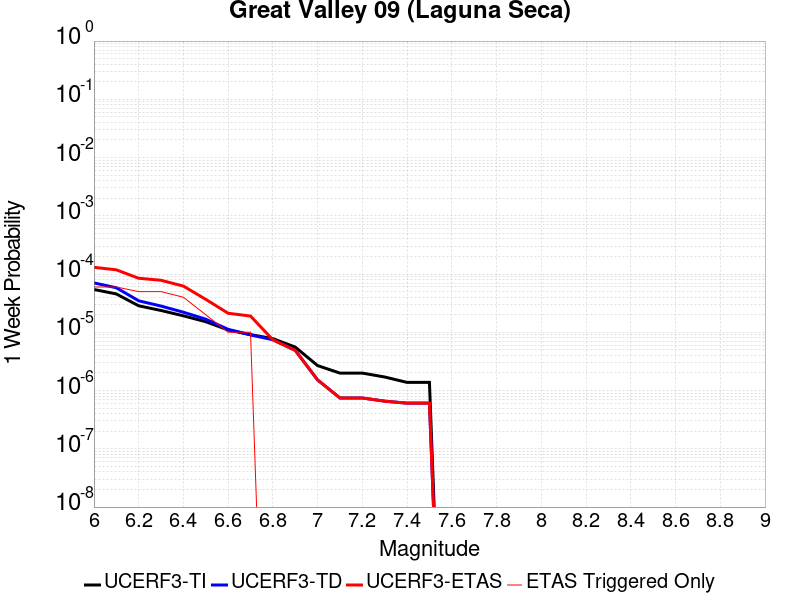 |  |  |  |

| Magnitude | 1 wk TI Prob | 1 wk TD Prob | 1 wk ETAS Prob | 1 wk ETAS/TD Gain | 1 wk ETAS Triggered Only | 1 mo TI Prob | 1 mo TD Prob | 1 mo ETAS Prob | 1 mo ETAS/TD Gain | 1 mo ETAS Triggered Only | 1 yr TI Prob | 1 yr TD Prob | 1 yr ETAS Prob | 1 yr ETAS/TD Gain | 1 yr ETAS Triggered Only | 10 yr TI Prob | 10 yr TD Prob | 10 yr ETAS Prob | 10 yr ETAS/TD Gain | 10 yr ETAS Triggered Only |
|-----|-----|-----|-----|-----|-----|-----|-----|-----|-----|-----|-----|-----|-----|-----|-----|-----|-----|-----|-----|-----|
| 6.0 | 5.4353277E-5 | 7.05022E-5 | 1.373424E-4 | 1.9480585 | 6.684492E-5 | 2.3292181E-4 | 3.0211566E-4 | 3.9567027E-4 | 1.3096648 | 9.358289E-5 | 0.0028321352 | 0.0036721937 | 0.0037787529 | 1.0290178 | 1.0695187E-4 | 0.02796312 | 0.03611547 | 0.036231447 | 1.0032113 | 1.2032085E-4 |
| 6.1 | 4.5578287E-5 | 5.822118E-5 | 1.2506222E-4 | 2.1480534 | 6.684492E-5 | 1.953209E-4 | 2.4949326E-4 | 3.2968714E-4 | 1.3214271 | 8.0213904E-5 | 0.0023754383 | 0.003033432 | 0.003126731 | 1.030757 | 9.358289E-5 | 0.023502063 | 0.029919548 | 0.0300233 | 1.0034677 | 1.0695187E-4 |
| 6.2 | 2.8536782E-5 | 3.4737273E-5 | 1.0157987E-4 | 2.9242327 | 6.684492E-5 | 1.2229476E-4 | 1.4886224E-4 | 2.290642E-4 | 1.5387664 | 8.0213904E-5 | 0.0014879217 | 0.001810813 | 0.0019042264 | 1.0515865 | 9.358289E-5 | 0.014779986 | 0.017958116 | 0.018063148 | 1.0058486 | 1.0695187E-4 |
| 6.3 | 2.3698774E-5 | 2.8213295E-5 | 9.5056326E-5 | 3.3692033 | 6.684492E-5 | 1.01562226E-4 | 1.20905075E-4 | 1.8774191E-4 | 1.5528042 | 6.684492E-5 | 0.0012358186 | 0.0014710218 | 0.0015511176 | 1.0544492 | 8.0213904E-5 | 0.012289686 | 0.014611342 | 0.014703557 | 1.0063112 | 9.358289E-5 |
| 6.4 | 1.9191197E-5 | 2.2123184E-5 | 7.5597934E-5 | 3.4171364 | 5.3475935E-5 | 8.2245395E-5 | 9.4806666E-5 | 1.4827754E-4 | 1.563999 | 5.3475935E-5 | 0.0010008777 | 0.0011536429 | 0.0012204107 | 1.0578756 | 6.684492E-5 | 0.009963818 | 0.011476948 | 0.011556241 | 1.0069089 | 8.0213904E-5 |
| 6.5 | 1.5203241E-5 | 1.6802203E-5 | 4.3539723E-5 | 2.5913103 | 2.6737967E-5 | 6.5155116E-5 | 7.200386E-5 | 9.87399E-5 | 1.371314 | 2.6737967E-5 | 7.9297484E-4 | 8.7626575E-4 | 9.163376E-4 | 1.0457302 | 4.0106952E-5 | 0.007901512 | 0.0087295165 | 0.008769274 | 1.0045543 | 4.0106952E-5 |
| 6.6 | 1.0984925E-5 | 1.1242595E-5 | 2.4611429E-5 | 2.1891234 | 1.3368984E-5 | 4.70774E-5 | 4.8181686E-5 | 6.1550025E-5 | 1.2774569 | 1.3368984E-5 | 5.730166E-4 | 5.8645656E-4 | 6.131788E-4 | 1.0455657 | 2.6737967E-5 | 0.005715413 | 0.0058494853 | 0.005876067 | 1.0045443 | 2.6737967E-5 |
| 6.7 | 9.134616E-6 | 9.019894E-6 | 2.2388758E-5 | 2.482153 | 1.3368984E-5 | 3.9147766E-5 | 3.865613E-5 | 5.2024596E-5 | 1.3458304 | 1.3368984E-5 | 4.7651984E-4 | 4.7053912E-4 | 4.972645E-4 | 1.0567974 | 2.6737967E-5 | 0.004754993 | 0.0046956735 | 0.0047222856 | 1.0056674 | 2.6737967E-5 |
| 6.8 | 7.785589E-6 | 7.4519444E-6 | 7.4519444E-6 | 1.0 | 0.0 | 3.3366385E-5 | 3.1936524E-5 | 3.1936524E-5 | 1.0 | 0.0 | 4.0616E-4 | 3.8875983E-4 | 3.8875983E-4 | 1.0 | 0.0 | 0.0040541845 | 0.0038810016 | 0.0038810016 | 1.0 | 0.0 |
| 6.9 | 5.579095E-6 | 4.898492E-6 | 4.898492E-6 | 1.0 | 0.0 | 2.3910188E-5 | 2.0993377E-5 | 2.0993377E-5 | 1.0 | 0.0 | 2.9106764E-4 | 2.5556577E-4 | 2.5556577E-4 | 1.0 | 0.0 | 0.002906867 | 0.002552856 | 0.002552856 | 1.0 | 0.0 |
| 7.0 | 2.6816688E-6 | 1.5216126E-6 | 1.5216126E-6 | 1.0 | 0.0 | 1.1492816E-5 | 6.521181E-6 | 6.521181E-6 | 1.0 | 0.0 | 1.3991605E-4 | 7.939258E-5 | 7.939258E-5 | 1.0 | 0.0 | 0.0013982799 | 7.9365086E-4 | 7.9365086E-4 | 1.0 | 0.0 |
| 7.1 | 1.9951021E-6 | 7.453827E-7 | 7.453827E-7 | 1.0 | 0.0 | 8.55041E-6 | 3.1944935E-6 | 3.1944935E-6 | 1.0 | 0.0 | 1.0409627E-4 | 3.8892307E-5 | 3.8892307E-5 | 1.0 | 0.0 | 0.0010404752 | 3.8885913E-4 | 3.8885913E-4 | 1.0 | 0.0 |
| 7.2 | 1.9951021E-6 | 7.453827E-7 | 7.453827E-7 | 1.0 | 0.0 | 8.55041E-6 | 3.1944935E-6 | 3.1944935E-6 | 1.0 | 0.0 | 1.0409627E-4 | 3.8892307E-5 | 3.8892307E-5 | 1.0 | 0.0 | 0.0010404752 | 3.8885913E-4 | 3.8885913E-4 | 1.0 | 0.0 |
| 7.3 | 1.7087556E-6 | 6.578881E-7 | 6.578881E-7 | 1.0 | 0.0 | 7.3232177E-6 | 2.8195177E-6 | 2.8195177E-6 | 1.0 | 0.0 | 8.915652E-5 | 3.4327128E-5 | 3.4327128E-5 | 1.0 | 0.0 | 8.9120766E-4 | 3.432223E-4 | 3.432223E-4 | 1.0 | 0.0 |
| 7.4 | 1.3804846E-6 | 6.073852E-7 | 6.073852E-7 | 1.0 | 0.0 | 5.916349E-6 | 2.6030768E-6 | 2.6030768E-6 | 1.0 | 0.0 | 7.2029165E-5 | 3.169204E-5 | 3.169204E-5 | 1.0 | 0.0 | 7.200583E-4 | 3.1687922E-4 | 3.1687922E-4 | 1.0 | 0.0 |
| 7.5 | 1.3804846E-6 | 6.073852E-7 | 6.073852E-7 | 1.0 | 0.0 | 5.916349E-6 | 2.6030768E-6 | 2.6030768E-6 | 1.0 | 0.0 | 7.2029165E-5 | 3.169204E-5 | 3.169204E-5 | 1.0 | 0.0 | 7.200583E-4 | 3.1687922E-4 | 3.1687922E-4 | 1.0 | 0.0 |

## Cleghorn Pass
*[(top)](#table-of-contents)*

| 1 Week | 1 Month | 1 Year | 10 Year |
|-----|-----|-----|-----|
|  |  |  |  |

| Magnitude | 1 wk TI Prob | 1 wk TD Prob | 1 wk ETAS Prob | 1 wk ETAS/TD Gain | 1 wk ETAS Triggered Only | 1 mo TI Prob | 1 mo TD Prob | 1 mo ETAS Prob | 1 mo ETAS/TD Gain | 1 mo ETAS Triggered Only | 1 yr TI Prob | 1 yr TD Prob | 1 yr ETAS Prob | 1 yr ETAS/TD Gain | 1 yr ETAS Triggered Only | 10 yr TI Prob | 10 yr TD Prob | 10 yr ETAS Prob | 10 yr ETAS/TD Gain | 10 yr ETAS Triggered Only |
|-----|-----|-----|-----|-----|-----|-----|-----|-----|-----|-----|-----|-----|-----|-----|-----|-----|-----|-----|-----|-----|
| 6.0 | 1.0522846E-5 | 1.1040642E-5 | 2.4409477E-5 | 2.210875 | 1.3368984E-5 | 4.509713E-5 | 4.7316473E-5 | 7.4053176E-5 | 1.5650612 | 2.6737967E-5 | 5.4891926E-4 | 5.759784E-4 | 6.294236E-4 | 1.0927901 | 5.3475935E-5 | 0.0054756533 | 0.005750022 | 0.0058696507 | 1.020805 | 1.2032085E-4 |
| 6.1 | 1.0522846E-5 | 1.1040642E-5 | 2.4409477E-5 | 2.210875 | 1.3368984E-5 | 4.509713E-5 | 4.7316473E-5 | 7.4053176E-5 | 1.5650612 | 2.6737967E-5 | 5.4891926E-4 | 5.759784E-4 | 6.294236E-4 | 1.0927901 | 5.3475935E-5 | 0.0054756533 | 0.005750022 | 0.0058696507 | 1.020805 | 1.2032085E-4 |
| 6.2 | 2.1045846E-6 | 2.2082024E-6 | 2.2082024E-6 | 1.0 | 0.0 | 9.019617E-6 | 9.463714E-6 | 2.2832572E-5 | 2.412644 | 1.3368984E-5 | 1.098083E-4 | 1.1521882E-4 | 1.2858627E-4 | 1.1160179 | 1.3368984E-5 | 0.0010975406 | 0.0011520023 | 0.001192063 | 1.0347749 | 4.0106952E-5 |
| 6.3 | 2.1045846E-6 | 2.2082024E-6 | 2.2082024E-6 | 1.0 | 0.0 | 9.019617E-6 | 9.463714E-6 | 2.2832572E-5 | 2.412644 | 1.3368984E-5 | 1.098083E-4 | 1.1521882E-4 | 1.2858627E-4 | 1.1160179 | 1.3368984E-5 | 0.0010975406 | 0.0011520023 | 0.001192063 | 1.0347749 | 4.0106952E-5 |
| 6.4 | 1.7259927E-6 | 1.810877E-6 | 1.810877E-6 | 1.0 | 0.0 | 7.3970905E-6 | 7.760902E-6 | 2.1129783E-5 | 2.7225935 | 1.3368984E-5 | 9.005586E-5 | 9.4488976E-5 | 1.078567E-4 | 1.1414739 | 1.3368984E-5 | 9.001937E-4 | 9.448898E-4 | 9.582461E-4 | 1.0141354 | 1.3368984E-5 |

## Tin Mountain
*[(top)](#table-of-contents)*

| 1 Week | 1 Month | 1 Year | 10 Year |
|-----|-----|-----|-----|
|  |  |  |  |

| Magnitude | 1 wk TI Prob | 1 wk TD Prob | 1 wk ETAS Prob | 1 wk ETAS/TD Gain | 1 wk ETAS Triggered Only | 1 mo TI Prob | 1 mo TD Prob | 1 mo ETAS Prob | 1 mo ETAS/TD Gain | 1 mo ETAS Triggered Only | 1 yr TI Prob | 1 yr TD Prob | 1 yr ETAS Prob | 1 yr ETAS/TD Gain | 1 yr ETAS Triggered Only | 10 yr TI Prob | 10 yr TD Prob | 10 yr ETAS Prob | 10 yr ETAS/TD Gain | 10 yr ETAS Triggered Only |
|-----|-----|-----|-----|-----|-----|-----|-----|-----|-----|-----|-----|-----|-----|-----|-----|-----|-----|-----|-----|-----|
| 6.0 | 4.083776E-6 | 4.1815365E-6 | 4.428832E-5 | 10.591398 | 4.0106952E-5 | 1.750178E-5 | 1.792077E-5 | 7.139575E-5 | 3.9839666 | 5.3475935E-5 | 2.1306332E-4 | 2.1816725E-4 | 2.8499757E-4 | 1.3063262 | 6.684492E-5 | 0.0021285915 | 0.0021798965 | 0.0022999549 | 1.0550754 | 1.2032085E-4 |
| 6.1 | 4.083776E-6 | 4.1815365E-6 | 4.428832E-5 | 10.591398 | 4.0106952E-5 | 1.750178E-5 | 1.792077E-5 | 7.139575E-5 | 3.9839666 | 5.3475935E-5 | 2.1306332E-4 | 2.1816725E-4 | 2.8499757E-4 | 1.3063262 | 6.684492E-5 | 0.0021285915 | 0.0021798965 | 0.0022999549 | 1.0550754 | 1.2032085E-4 |
| 6.2 | 4.083776E-6 | 4.1815365E-6 | 4.428832E-5 | 10.591398 | 4.0106952E-5 | 1.750178E-5 | 1.792077E-5 | 7.139575E-5 | 3.9839666 | 5.3475935E-5 | 2.1306332E-4 | 2.1816725E-4 | 2.8499757E-4 | 1.3063262 | 6.684492E-5 | 0.0021285915 | 0.0021798965 | 0.0022999549 | 1.0550754 | 1.2032085E-4 |
| 6.3 | 4.083776E-6 | 4.1815365E-6 | 4.428832E-5 | 10.591398 | 4.0106952E-5 | 1.750178E-5 | 1.792077E-5 | 7.139575E-5 | 3.9839666 | 5.3475935E-5 | 2.1306332E-4 | 2.1816725E-4 | 2.8499757E-4 | 1.3063262 | 6.684492E-5 | 0.0021285915 | 0.0021798965 | 0.0022999549 | 1.0550754 | 1.2032085E-4 |
| 6.4 | 4.083776E-6 | 4.1815365E-6 | 4.428832E-5 | 10.591398 | 4.0106952E-5 | 1.750178E-5 | 1.792077E-5 | 7.139575E-5 | 3.9839666 | 5.3475935E-5 | 2.1306332E-4 | 2.1816725E-4 | 2.8499757E-4 | 1.3063262 | 6.684492E-5 | 0.0021285915 | 0.0021798965 | 0.0022999549 | 1.0550754 | 1.2032085E-4 |
| 6.5 | 2.3143427E-6 | 2.3731573E-6 | 2.3731573E-6 | 1.0 | 0.0 | 9.9185745E-6 | 1.0170638E-5 | 2.3539485E-5 | 2.3144553 | 1.3368984E-5 | 1.2075195E-4 | 1.2382126E-4 | 1.5055592E-4 | 1.2159133 | 2.6737967E-5 | 0.0012068636 | 0.0012375986 | 0.0012910083 | 1.0431559 | 5.3475935E-5 |
| 6.6 | 2.3143427E-6 | 2.3731573E-6 | 2.3731573E-6 | 1.0 | 0.0 | 9.9185745E-6 | 1.0170638E-5 | 2.3539485E-5 | 2.3144553 | 1.3368984E-5 | 1.2075195E-4 | 1.2382126E-4 | 1.5055592E-4 | 1.2159133 | 2.6737967E-5 | 0.0012068636 | 0.0012375986 | 0.0012910083 | 1.0431559 | 5.3475935E-5 |
| 6.7 | 1.7029532E-6 | 1.7497915E-6 | 1.7497915E-6 | 1.0 | 0.0 | 7.2983503E-6 | 7.499088E-6 | 7.499088E-6 | 1.0 | 0.0 | 8.885379E-5 | 9.1298105E-5 | 1.0466587E-4 | 1.1464188 | 1.3368984E-5 | 8.881827E-4 | 9.1265864E-4 | 9.3937217E-4 | 1.02927 | 2.6737967E-5 |
| 6.8 | 1.2914646E-6 | 1.3299378E-6 | 1.3299378E-6 | 1.0 | 0.0 | 5.534837E-6 | 5.6997237E-6 | 5.6997237E-6 | 1.0 | 0.0 | 6.738455E-5 | 6.939237E-5 | 8.276042E-5 | 1.1926445 | 1.3368984E-5 | 6.736412E-4 | 6.9375033E-4 | 7.0711004E-4 | 1.0192572 | 1.3368984E-5 |
| 6.9 | 5.8708974E-7 | 6.1169936E-7 | 6.1169936E-7 | 1.0 | 0.0 | 2.5160964E-6 | 2.6215664E-6 | 2.6215664E-6 | 1.0 | 0.0 | 3.0633044E-5 | 3.1917145E-5 | 3.1917145E-5 | 1.0 | 0.0 | 3.0628822E-4 | 3.191297E-4 | 3.191297E-4 | 1.0 | 0.0 |
| 7.0 | 4.6248786E-7 | 4.832015E-7 | 4.832015E-7 | 1.0 | 0.0 | 1.9820893E-6 | 2.0708624E-6 | 2.0708624E-6 | 1.0 | 0.0 | 2.413167E-5 | 2.5212494E-5 | 2.5212494E-5 | 1.0 | 0.0 | 2.412905E-4 | 2.5210003E-4 | 2.5210003E-4 | 1.0 | 0.0 |
| 7.1 | 3.804606E-7 | 3.987147E-7 | 3.987147E-7 | 1.0 | 0.0 | 1.6305444E-6 | 1.7087764E-6 | 1.7087764E-6 | 1.0 | 0.0 | 1.9851697E-5 | 2.0804187E-5 | 2.0804187E-5 | 1.0 | 0.0 | 1.9849923E-4 | 2.0802575E-4 | 2.0802575E-4 | 1.0 | 0.0 |
| 7.2 | 3.5864858E-7 | 3.7616863E-7 | 3.7616863E-7 | 1.0 | 0.0 | 1.5370645E-6 | 1.6121504E-6 | 1.6121504E-6 | 1.0 | 0.0 | 1.87136E-5 | 1.9627789E-5 | 1.9627789E-5 | 1.0 | 0.0 | 1.8712023E-4 | 1.9626386E-4 | 1.9626386E-4 | 1.0 | 0.0 |
| 7.3 | 3.342063E-7 | 3.506347E-7 | 3.506347E-7 | 1.0 | 0.0 | 1.4323119E-6 | 1.5027196E-6 | 1.5027196E-6 | 1.0 | 0.0 | 1.7438259E-5 | 1.829549E-5 | 1.829549E-5 | 1.0 | 0.0 | 1.743689E-4 | 1.8294314E-4 | 1.8294314E-4 | 1.0 | 0.0 |
| 7.4 | 2.971242E-7 | 3.1165817E-7 | 3.1165817E-7 | 1.0 | 0.0 | 1.2733886E-6 | 1.3356774E-6 | 1.3356774E-6 | 1.0 | 0.0 | 1.5503398E-5 | 1.6261785E-5 | 1.6261785E-5 | 1.0 | 0.0 | 1.5502315E-4 | 1.6260923E-4 | 1.6260923E-4 | 1.0 | 0.0 |
| 7.5 | 1.4326713E-7 | 1.5012525E-7 | 1.5012525E-7 | 1.0 | 0.0 | 6.140018E-7 | 6.433939E-7 | 6.433939E-7 | 1.0 | 0.0 | 7.4754466E-6 | 7.8333205E-6 | 7.8333205E-6 | 1.0 | 0.0 | 7.475195E-5 | 7.833321E-5 | 7.833321E-5 | 1.0 | 0.0 |

## Whittier alt 1
*[(top)](#table-of-contents)*

| 1 Week | 1 Month | 1 Year | 10 Year |
|-----|-----|-----|-----|
|  |  |  |  |

| Magnitude | 1 wk TI Prob | 1 wk TD Prob | 1 wk ETAS Prob | 1 wk ETAS/TD Gain | 1 wk ETAS Triggered Only | 1 mo TI Prob | 1 mo TD Prob | 1 mo ETAS Prob | 1 mo ETAS/TD Gain | 1 mo ETAS Triggered Only | 1 yr TI Prob | 1 yr TD Prob | 1 yr ETAS Prob | 1 yr ETAS/TD Gain | 1 yr ETAS Triggered Only | 10 yr TI Prob | 10 yr TD Prob | 10 yr ETAS Prob | 10 yr ETAS/TD Gain | 10 yr ETAS Triggered Only |
|-----|-----|-----|-----|-----|-----|-----|-----|-----|-----|-----|-----|-----|-----|-----|-----|-----|-----|-----|-----|-----|
| 6.0 | 4.2554693E-5 | 4.725218E-5 | 6.0620532E-5 | 1.282915 | 1.3368984E-5 | 1.8236451E-4 | 2.0249544E-4 | 2.4259427E-4 | 1.1980233 | 4.0106952E-5 | 0.002218027 | 0.0024629154 | 0.0025162597 | 1.021659 | 5.3475935E-5 | 0.02196019 | 0.024390234 | 0.024494577 | 1.0042781 | 1.0695187E-4 |
| 6.1 | 4.2554693E-5 | 4.725218E-5 | 6.0620532E-5 | 1.282915 | 1.3368984E-5 | 1.8236451E-4 | 2.0249544E-4 | 2.4259427E-4 | 1.1980233 | 4.0106952E-5 | 0.002218027 | 0.0024629154 | 0.0025162597 | 1.021659 | 5.3475935E-5 | 0.02196019 | 0.024390234 | 0.024494577 | 1.0042781 | 1.0695187E-4 |
| 6.2 | 4.2554693E-5 | 4.725218E-5 | 6.0620532E-5 | 1.282915 | 1.3368984E-5 | 1.8236451E-4 | 2.0249544E-4 | 2.4259427E-4 | 1.1980233 | 4.0106952E-5 | 0.002218027 | 0.0024629154 | 0.0025162597 | 1.021659 | 5.3475935E-5 | 0.02196019 | 0.024390234 | 0.024494577 | 1.0042781 | 1.0695187E-4 |
| 6.3 | 1.9617712E-5 | 1.8268593E-5 | 1.8268593E-5 | 1.0 | 0.0 | 8.40732E-5 | 7.829172E-5 | 1.050276E-4 | 1.3414904 | 2.6737967E-5 | 0.0010231105 | 9.52804E-4 | 9.795164E-4 | 1.0280356 | 2.6737967E-5 | 0.01018413 | 0.009490474 | 0.009530201 | 1.0041859 | 4.0106952E-5 |
| 6.4 | 1.5611336E-5 | 1.3604271E-5 | 1.3604271E-5 | 1.0 | 0.0 | 6.690401E-5 | 5.8302747E-5 | 7.1670955E-5 | 1.2292894 | 1.3368984E-5 | 8.142519E-4 | 7.0961076E-4 | 7.2297023E-4 | 1.0188265 | 1.3368984E-5 | 0.008112748 | 0.0070754145 | 0.0071019633 | 1.0037522 | 2.6737967E-5 |
| 6.5 | 1.5150166E-5 | 1.3100925E-5 | 1.3100925E-5 | 1.0 | 0.0 | 6.492767E-5 | 5.6145647E-5 | 6.951388E-5 | 1.2380992 | 1.3368984E-5 | 7.9020765E-4 | 6.8336475E-4 | 6.967246E-4 | 1.0195501 | 1.3368984E-5 | 0.007874036 | 0.0068145846 | 0.0068411403 | 1.003897 | 2.6737967E-5 |
| 6.6 | 1.295588E-5 | 1.0380725E-5 | 1.0380725E-5 | 1.0 | 0.0 | 5.552402E-5 | 4.4488075E-5 | 5.7856465E-5 | 1.3004937 | 1.3368984E-5 | 6.7579525E-4 | 5.4150965E-4 | 5.548714E-4 | 1.024675 | 1.3368984E-5 | 0.006737438 | 0.0054033357 | 0.005429929 | 1.0049217 | 2.6737967E-5 |
| 6.7 | 1.2542085E-5 | 9.899369E-6 | 9.899369E-6 | 1.0 | 0.0 | 5.3750682E-5 | 4.242519E-5 | 5.5793604E-5 | 1.3151057 | 1.3368984E-5 | 6.542181E-4 | 5.164061E-4 | 5.297682E-4 | 1.0258751 | 1.3368984E-5 | 0.006522954 | 0.0051534795 | 0.0051800795 | 1.0051616 | 2.6737967E-5 |
| 6.8 | 1.2195878E-5 | 9.495415E-6 | 9.495415E-6 | 1.0 | 0.0 | 5.2267E-5 | 4.069401E-5 | 5.406245E-5 | 1.3285112 | 1.3368984E-5 | 6.36165E-4 | 4.9533875E-4 | 5.0870114E-4 | 1.0269762 | 1.3368984E-5 | 0.0063434686 | 0.004943688 | 0.004970294 | 1.0053818 | 2.6737967E-5 |
| 6.9 | 1.1580298E-5 | 8.772933E-6 | 8.772933E-6 | 1.0 | 0.0 | 4.9628903E-5 | 3.7597754E-5 | 5.0966235E-5 | 1.3555659 | 1.3368984E-5 | 6.040644E-4 | 4.5765814E-4 | 4.7102102E-4 | 1.0291984 | 1.3368984E-5 | 0.00602425 | 0.0045684157 | 0.004595032 | 1.005826 | 2.6737967E-5 |
| 7.0 | 1.0964795E-5 | 8.083994E-6 | 8.083994E-6 | 1.0 | 0.0 | 4.6991136E-5 | 3.4645236E-5 | 4.8013757E-5 | 1.3858689 | 1.3368984E-5 | 5.7196687E-4 | 4.2172565E-4 | 4.35089E-4 | 1.0316873 | 1.3368984E-5 | 0.0057049696 | 0.004210462 | 0.004237087 | 1.0063236 | 2.6737967E-5 |
| 7.1 | 1.0230601E-5 | 7.3266697E-6 | 7.3266697E-6 | 1.0 | 0.0 | 4.3844695E-5 | 3.1399642E-5 | 4.4768207E-5 | 1.4257553 | 1.3368984E-5 | 5.336784E-4 | 3.8222488E-4 | 3.9558875E-4 | 1.0349634 | 1.3368984E-5 | 0.005323986 | 0.0038168381 | 0.003843474 | 1.0069785 | 2.6737967E-5 |
| 7.2 | 9.40865E-6 | 6.543289E-6 | 6.543289E-6 | 1.0 | 0.0 | 4.032216E-5 | 2.8042374E-5 | 4.141098E-5 | 1.4767289 | 1.3368984E-5 | 4.908117E-4 | 3.4136363E-4 | 3.5472805E-4 | 1.0391501 | 1.3368984E-5 | 0.0048972913 | 0.003409485 | 0.003436132 | 1.0078155 | 2.6737967E-5 |
| 7.3 | 8.237384E-6 | 5.5977525E-6 | 5.5977525E-6 | 1.0 | 0.0 | 3.5302593E-5 | 2.3990153E-5 | 3.7358815E-5 | 1.5572562 | 1.3368984E-5 | 4.2972428E-4 | 2.92042E-4 | 3.054071E-4 | 1.0457642 | 1.3368984E-5 | 0.0042889426 | 0.002916903 | 0.002943563 | 1.0091398 | 2.6737967E-5 |
| 7.4 | 7.5316966E-6 | 5.027819E-6 | 5.027819E-6 | 1.0 | 0.0 | 3.2278298E-5 | 2.1547625E-5 | 3.491632E-5 | 1.6204255 | 1.3368984E-5 | 3.9291743E-4 | 2.6231175E-4 | 2.7567724E-4 | 1.0509527 | 1.3368984E-5 | 0.0039222343 | 0.0026201333 | 0.0026468013 | 1.0101781 | 2.6737967E-5 |
| 7.5 | 6.149649E-6 | 3.933841E-6 | 3.933841E-6 | 1.0 | 0.0 | 2.6355372E-5 | 1.6859214E-5 | 3.0227973E-5 | 1.7929645 | 1.3368984E-5 | 3.208294E-4 | 2.052425E-4 | 2.1860874E-4 | 1.0651242 | 1.3368984E-5 | 0.003203666 | 0.0020506186 | 0.0020639603 | 1.0065061 | 1.3368984E-5 |
| 7.6 | 5.457711E-6 | 3.3953788E-6 | 3.3953788E-6 | 1.0 | 0.0 | 2.338998E-5 | 1.4551547E-5 | 2.7920336E-5 | 1.9187195 | 1.3368984E-5 | 2.8473578E-4 | 1.771515E-4 | 1.9051811E-4 | 1.075453 | 1.3368984E-5 | 0.0028437122 | 0.0017701836 | 0.0017835288 | 1.0075389 | 1.3368984E-5 |
| 7.7 | 4.1676276E-6 | 2.3331952E-6 | 2.3331952E-6 | 1.0 | 0.0 | 1.7861139E-5 | 9.999374E-6 | 9.999374E-6 | 1.0 | 0.0 | 2.1743766E-4 | 1.2173632E-4 | 1.2173632E-4 | 1.0 | 0.0 | 0.0021722503 | 0.0012167693 | 0.0012167693 | 1.0 | 0.0 |
| 7.8 | 2.2692414E-7 | 9.3854695E-8 | 9.3854695E-8 | 1.0 | 0.0 | 9.725317E-7 | 4.0223435E-7 | 4.0223435E-7 | 1.0 | 0.0 | 1.1840509E-5 | 4.8971956E-6 | 4.8971956E-6 | 1.0 | 0.0 | 1.1839878E-4 | 4.8971204E-5 | 4.8971204E-5 | 1.0 | 0.0 |
| 7.9 | 6.676829E-9 | 3.439853E-9 | 3.439853E-9 | 1.0 | 0.0 | 2.861498E-8 | 1.4742227E-8 | 1.4742227E-8 | 1.0 | 0.0 | 3.4838732E-7 | 1.7948659E-7 | 1.7948659E-7 | 1.0 | 0.0 | 3.4838679E-6 | 1.7948646E-6 | 1.7948646E-6 | 1.0 | 0.0 |

## Cleghorn Lake
*[(top)](#table-of-contents)*

| 1 Week | 1 Month | 1 Year | 10 Year |
|-----|-----|-----|-----|
|  |  |  | 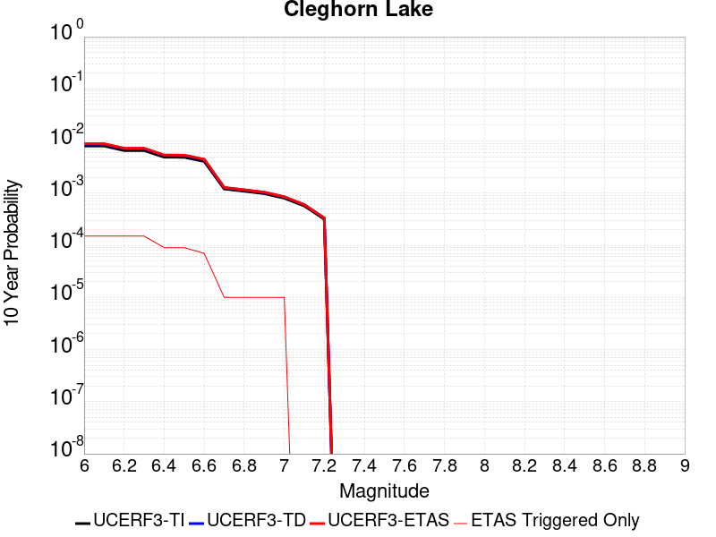 |

| Magnitude | 1 wk TI Prob | 1 wk TD Prob | 1 wk ETAS Prob | 1 wk ETAS/TD Gain | 1 wk ETAS Triggered Only | 1 mo TI Prob | 1 mo TD Prob | 1 mo ETAS Prob | 1 mo ETAS/TD Gain | 1 mo ETAS Triggered Only | 1 yr TI Prob | 1 yr TD Prob | 1 yr ETAS Prob | 1 yr ETAS/TD Gain | 1 yr ETAS Triggered Only | 10 yr TI Prob | 10 yr TD Prob | 10 yr ETAS Prob | 10 yr ETAS/TD Gain | 10 yr ETAS Triggered Only |
|-----|-----|-----|-----|-----|-----|-----|-----|-----|-----|-----|-----|-----|-----|-----|-----|-----|-----|-----|-----|-----|
| 6.0 | 1.5467183E-5 | 1.6794203E-5 | 4.3531723E-5 | 2.5920682 | 2.6737967E-5 | 6.6286244E-5 | 7.197348E-5 | 1.1207755E-4 | 1.5572062 | 4.0106952E-5 | 8.067362E-4 | 8.759797E-4 | 9.294088E-4 | 1.0609936 | 5.3475935E-5 | 0.008038137 | 0.008730696 | 0.008836714 | 1.0121431 | 1.0695187E-4 |
| 6.1 | 1.5467183E-5 | 1.6794203E-5 | 4.3531723E-5 | 2.5920682 | 2.6737967E-5 | 6.6286244E-5 | 7.197348E-5 | 1.1207755E-4 | 1.5572062 | 4.0106952E-5 | 8.067362E-4 | 8.759797E-4 | 9.294088E-4 | 1.0609936 | 5.3475935E-5 | 0.008038137 | 0.008730696 | 0.008836714 | 1.0121431 | 1.0695187E-4 |
| 6.2 | 1.2624631E-5 | 1.3681544E-5 | 4.0419145E-5 | 2.9542825 | 2.6737967E-5 | 5.410444E-5 | 5.863415E-5 | 9.873875E-5 | 1.6839802 | 4.0106952E-5 | 6.585225E-4 | 7.1368564E-4 | 7.6712336E-4 | 1.0748758 | 5.3475935E-5 | 0.0065657445 | 0.0071187317 | 0.007224922 | 1.014917 | 1.0695187E-4 |
| 6.3 | 1.2624631E-5 | 1.3681544E-5 | 4.0419145E-5 | 2.9542825 | 2.6737967E-5 | 5.410444E-5 | 5.863415E-5 | 9.873875E-5 | 1.6839802 | 4.0106952E-5 | 6.585225E-4 | 7.1368564E-4 | 7.6712336E-4 | 1.0748758 | 5.3475935E-5 | 0.0065657445 | 0.0071187317 | 0.007224922 | 1.014917 | 1.0695187E-4 |
| 6.4 | 9.417684E-6 | 1.0170118E-5 | 2.3538965E-5 | 2.3145225 | 1.3368984E-5 | 4.036088E-5 | 4.3585722E-5 | 5.6954123E-5 | 1.3067151 | 1.3368984E-5 | 4.912829E-4 | 5.3056807E-4 | 5.5729185E-4 | 1.0503682 | 2.6737967E-5 | 0.004901982 | 0.005297049 | 0.00536354 | 1.0125524 | 6.684492E-5 |
| 6.5 | 9.368219E-6 | 1.0117545E-5 | 2.3486393E-5 | 2.3213532 | 1.3368984E-5 | 4.014889E-5 | 4.3360415E-5 | 5.672882E-5 | 1.308309 | 1.3368984E-5 | 4.8870314E-4 | 5.2782625E-4 | 5.5455015E-4 | 1.05063 | 2.6737967E-5 | 0.004876298 | 0.0052697617 | 0.0053362544 | 1.0126178 | 6.684492E-5 |
| 6.6 | 7.803798E-6 | 8.441831E-6 | 2.1810702E-5 | 2.5836458 | 1.3368984E-5 | 3.3444423E-5 | 3.6179E-5 | 4.95475E-5 | 1.3695099 | 1.3368984E-5 | 4.0710976E-4 | 4.4043022E-4 | 4.671564E-4 | 1.060682 | 2.6737967E-5 | 0.0040636472 | 0.0043994905 | 0.004452731 | 1.0121015 | 5.3475935E-5 |
| 6.7 | 2.3108669E-6 | 2.4438336E-6 | 2.4438336E-6 | 1.0 | 0.0 | 9.903678E-6 | 1.0473532E-5 | 1.0473532E-5 | 1.0 | 0.0 | 1.205706E-4 | 1.2750797E-4 | 1.2750797E-4 | 1.0 | 0.0 | 0.001205052 | 0.0012743667 | 0.0012877188 | 1.0104773 | 1.3368984E-5 |
| 6.8 | 2.0882828E-6 | 2.2062823E-6 | 2.2062823E-6 | 1.0 | 0.0 | 8.949753E-6 | 9.455462E-6 | 9.455462E-6 | 1.0 | 0.0 | 1.08957785E-4 | 1.1511434E-4 | 1.1511434E-4 | 1.0 | 0.0 | 0.0010890438 | 0.0011505639 | 0.0011639176 | 1.0116061 | 1.3368984E-5 |
| 6.9 | 1.876935E-6 | 1.981051E-6 | 1.981051E-6 | 1.0 | 0.0 | 8.043982E-6 | 8.490192E-6 | 8.490192E-6 | 1.0 | 0.0 | 9.7931086E-5 | 1.03363345E-4 | 1.03363345E-4 | 1.0 | 0.0 | 9.788794E-4 | 0.0010331686 | 0.0010465238 | 1.0129265 | 1.3368984E-5 |
| 7.0 | 1.5357559E-6 | 1.6202807E-6 | 1.6202807E-6 | 1.0 | 0.0 | 6.5817944E-6 | 6.9440425E-6 | 6.9440425E-6 | 1.0 | 0.0 | 8.01304E-5 | 8.454057E-5 | 8.454057E-5 | 1.0 | 0.0 | 8.010151E-4 | 8.450965E-4 | 8.5845415E-4 | 1.0158061 | 1.3368984E-5 |
| 7.1 | 1.0905424E-6 | 1.1497619E-6 | 1.1497619E-6 | 1.0 | 0.0 | 4.6737446E-6 | 4.9275427E-6 | 4.9275427E-6 | 1.0 | 0.0 | 5.6901354E-5 | 5.999128E-5 | 5.999128E-5 | 1.0 | 0.0 | 5.6886784E-4 | 5.997606E-4 | 5.997606E-4 | 1.0 | 0.0 |
| 7.2 | 6.06668E-7 | 6.387277E-7 | 6.387277E-7 | 1.0 | 0.0 | 2.600003E-6 | 2.7374022E-6 | 2.7374022E-6 | 1.0 | 0.0 | 3.1654577E-5 | 3.3327433E-5 | 3.3327433E-5 | 1.0 | 0.0 | 3.1650066E-4 | 3.3323118E-4 | 3.3323118E-4 | 1.0 | 0.0 |

## San Jacinto (Lytle Creek connector)
*[(top)](#table-of-contents)*

| 1 Week | 1 Month | 1 Year | 10 Year |
|-----|-----|-----|-----|
|  |  | 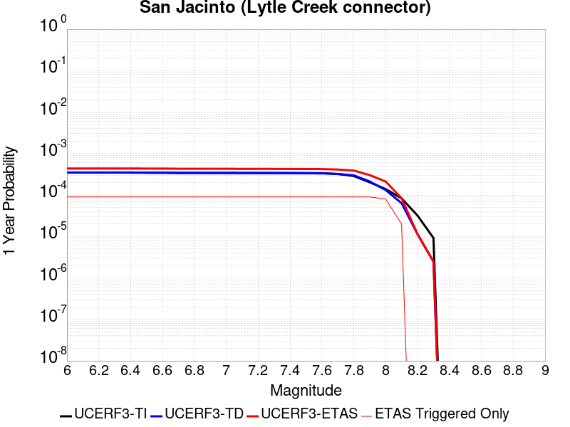 |  |

| Magnitude | 1 wk TI Prob | 1 wk TD Prob | 1 wk ETAS Prob | 1 wk ETAS/TD Gain | 1 wk ETAS Triggered Only | 1 mo TI Prob | 1 mo TD Prob | 1 mo ETAS Prob | 1 mo ETAS/TD Gain | 1 mo ETAS Triggered Only | 1 yr TI Prob | 1 yr TD Prob | 1 yr ETAS Prob | 1 yr ETAS/TD Gain | 1 yr ETAS Triggered Only | 10 yr TI Prob | 10 yr TD Prob | 10 yr ETAS Prob | 10 yr ETAS/TD Gain | 10 yr ETAS Triggered Only |
|-----|-----|-----|-----|-----|-----|-----|-----|-----|-----|-----|-----|-----|-----|-----|-----|-----|-----|-----|-----|-----|
| 6.0 | 6.693995E-6 | 6.660216E-6 | 8.687359E-5 | 13.043658 | 8.0213904E-5 | 2.8688235E-5 | 2.854347E-5 | 1.2212369E-4 | 4.278516 | 9.358289E-5 | 3.492233E-4 | 3.4746144E-4 | 4.410118E-4 | 1.2692395 | 9.358289E-5 | 0.00348675 | 0.0035493854 | 0.0036559575 | 1.0300256 | 1.0695187E-4 |
| 6.1 | 6.693995E-6 | 6.660216E-6 | 8.687359E-5 | 13.043658 | 8.0213904E-5 | 2.8688235E-5 | 2.854347E-5 | 1.2212369E-4 | 4.278516 | 9.358289E-5 | 3.492233E-4 | 3.4746144E-4 | 4.410118E-4 | 1.2692395 | 9.358289E-5 | 0.00348675 | 0.0035493854 | 0.0036559575 | 1.0300256 | 1.0695187E-4 |
| 6.2 | 6.693995E-6 | 6.660216E-6 | 8.687359E-5 | 13.043658 | 8.0213904E-5 | 2.8688235E-5 | 2.854347E-5 | 1.2212369E-4 | 4.278516 | 9.358289E-5 | 3.492233E-4 | 3.4746144E-4 | 4.410118E-4 | 1.2692395 | 9.358289E-5 | 0.00348675 | 0.0035493854 | 0.0036559575 | 1.0300256 | 1.0695187E-4 |
| 6.3 | 6.693995E-6 | 6.660216E-6 | 8.687359E-5 | 13.043658 | 8.0213904E-5 | 2.8688235E-5 | 2.854347E-5 | 1.2212369E-4 | 4.278516 | 9.358289E-5 | 3.492233E-4 | 3.4746144E-4 | 4.410118E-4 | 1.2692395 | 9.358289E-5 | 0.00348675 | 0.0035493854 | 0.0036559575 | 1.0300256 | 1.0695187E-4 |
| 6.4 | 6.693995E-6 | 6.660216E-6 | 8.687359E-5 | 13.043658 | 8.0213904E-5 | 2.8688235E-5 | 2.854347E-5 | 1.2212369E-4 | 4.278516 | 9.358289E-5 | 3.492233E-4 | 3.4746144E-4 | 4.410118E-4 | 1.2692395 | 9.358289E-5 | 0.00348675 | 0.0035493854 | 0.0036559575 | 1.0300256 | 1.0695187E-4 |
| 6.5 | 6.6561875E-6 | 6.6204343E-6 | 8.683381E-5 | 13.116029 | 8.0213904E-5 | 2.8526205E-5 | 2.837298E-5 | 1.2195321E-4 | 4.2982163 | 9.358289E-5 | 3.472512E-4 | 3.4538636E-4 | 4.3893693E-4 | 1.2708577 | 9.358289E-5 | 0.0034670907 | 0.003528701 | 0.0036352754 | 1.0302022 | 1.0695187E-4 |
| 6.6 | 6.6561875E-6 | 6.6204343E-6 | 8.683381E-5 | 13.116029 | 8.0213904E-5 | 2.8526205E-5 | 2.837298E-5 | 1.2195321E-4 | 4.2982163 | 9.358289E-5 | 3.472512E-4 | 3.4538636E-4 | 4.3893693E-4 | 1.2708577 | 9.358289E-5 | 0.0034670907 | 0.003528701 | 0.0036352754 | 1.0302022 | 1.0695187E-4 |
| 6.7 | 6.5802237E-6 | 6.539611E-6 | 8.675299E-5 | 13.265772 | 8.0213904E-5 | 2.8200653E-5 | 2.8026603E-5 | 1.2160687E-4 | 4.3389797 | 9.358289E-5 | 3.4328885E-4 | 3.4117055E-4 | 4.347215E-4 | 1.2742058 | 9.358289E-5 | 0.0034275902 | 0.0034866752 | 0.0035932541 | 1.0305675 | 1.0695187E-4 |
| 6.8 | 6.575632E-6 | 6.5341005E-6 | 8.674748E-5 | 13.276116 | 8.0213904E-5 | 2.8180975E-5 | 2.8002989E-5 | 1.2158325E-4 | 4.341796 | 9.358289E-5 | 3.4304935E-4 | 3.4088313E-4 | 4.344341E-4 | 1.2744372 | 9.358289E-5 | 0.0034252026 | 0.00348381 | 0.0035903894 | 1.0305927 | 1.0695187E-4 |
| 6.9 | 6.570433E-6 | 6.525495E-6 | 8.673887E-5 | 13.292306 | 8.0213904E-5 | 2.8158694E-5 | 2.7966107E-5 | 1.2154638E-4 | 4.346203 | 9.358289E-5 | 3.4277816E-4 | 3.4043423E-4 | 4.3398526E-4 | 1.2747991 | 9.358289E-5 | 0.0034224992 | 0.0034793352 | 0.0035859148 | 1.0306323 | 1.0695187E-4 |
| 7.0 | 6.5643826E-6 | 6.515616E-6 | 8.6729E-5 | 13.310944 | 8.0213904E-5 | 2.8132765E-5 | 2.792377E-5 | 1.2150405E-4 | 4.3512764 | 9.358289E-5 | 3.424626E-4 | 3.3991894E-4 | 4.3347E-4 | 1.2752159 | 9.358289E-5 | 0.0034193532 | 0.0034741985 | 0.0035807786 | 1.0306777 | 1.0695187E-4 |
| 7.1 | 6.557402E-6 | 6.5043278E-6 | 8.671771E-5 | 13.33231 | 8.0213904E-5 | 2.8102848E-5 | 2.7875392E-5 | 1.2145567E-4 | 4.357093 | 9.358289E-5 | 3.4209844E-4 | 3.3933012E-4 | 4.3288126E-4 | 1.2756935 | 9.358289E-5 | 0.0034157229 | 0.0034683298 | 0.0035749108 | 1.0307298 | 1.0695187E-4 |
| 7.2 | 6.546394E-6 | 6.4862943E-6 | 8.669968E-5 | 13.366596 | 8.0213904E-5 | 2.8055672E-5 | 2.7798109E-5 | 1.213784E-4 | 4.3664265 | 9.358289E-5 | 3.4152428E-4 | 3.3838948E-4 | 4.3194072E-4 | 1.2764602 | 9.358289E-5 | 0.0034099987 | 0.0034589572 | 0.0035655391 | 1.0308133 | 1.0695187E-4 |
| 7.3 | 6.5364216E-6 | 6.4670803E-6 | 8.668046E-5 | 13.403338 | 8.0213904E-5 | 2.8012933E-5 | 2.7715765E-5 | 1.21296056E-4 | 4.3764286 | 9.358289E-5 | 3.4100408E-4 | 3.3738726E-4 | 4.3093858E-4 | 1.2772818 | 9.358289E-5 | 0.003404813 | 0.0034489788 | 0.0035555616 | 1.0309027 | 1.0695187E-4 |
| 7.4 | 6.5269523E-6 | 6.4481674E-6 | 8.666155E-5 | 13.439718 | 8.0213904E-5 | 2.7972354E-5 | 2.7634711E-5 | 1.2121502E-4 | 4.3863316 | 9.358289E-5 | 3.4051016E-4 | 3.3640073E-4 | 4.2995214E-4 | 1.2780951 | 9.358289E-5 | 0.0033998888 | 0.003439161 | 0.003545745 | 1.0309913 | 1.0695187E-4 |
| 7.5 | 6.5111835E-6 | 6.424442E-6 | 8.663783E-5 | 13.485659 | 8.0213904E-5 | 2.7904773E-5 | 2.7533031E-5 | 1.2111334E-4 | 4.398838 | 9.358289E-5 | 3.3968766E-4 | 3.3516317E-4 | 4.287147E-4 | 1.2791224 | 9.358289E-5 | 0.0033916887 | 0.003426834 | 0.0035334195 | 1.0311031 | 1.0695187E-4 |
| 7.6 | 6.4768806E-6 | 6.383551E-6 | 8.659694E-5 | 13.565638 | 8.0213904E-5 | 2.7757764E-5 | 2.735779E-5 | 1.20938115E-4 | 4.42061 | 9.358289E-5 | 3.3789838E-4 | 3.3303024E-4 | 4.2658197E-4 | 1.2809106 | 9.358289E-5 | 0.0033738504 | 0.0034055663 | 0.0035121539 | 1.031298 | 1.0695187E-4 |
| 7.7 | 6.1655364E-6 | 6.1760365E-6 | 8.6389446E-5 | 13.987845 | 8.0213904E-5 | 2.642346E-5 | 2.646846E-5 | 1.2004887E-4 | 4.5355444 | 9.358289E-5 | 3.2165812E-4 | 3.2220592E-4 | 4.1575864E-4 | 1.2903508 | 9.358289E-5 | 0.0032119295 | 0.0032971818 | 0.003403781 | 1.0323304 | 1.0695187E-4 |
| 7.8 | 5.5043524E-6 | 5.737097E-6 | 8.595054E-5 | 14.981539 | 8.0213904E-5 | 2.3589868E-5 | 2.4587327E-5 | 1.1816791E-4 | 4.80605 | 9.358289E-5 | 2.871688E-4 | 2.9930964E-4 | 3.9286452E-4 | 1.3125689 | 9.358289E-5 | 0.0028679797 | 0.0030672832 | 0.003173907 | 1.0347617 | 1.0695187E-4 |
| 7.9 | 3.889249E-6 | 4.076761E-6 | 8.429034E-5 | 20.67581 | 8.0213904E-5 | 1.6668104E-5 | 1.7471715E-5 | 1.1105297E-4 | 6.356157 | 9.358289E-5 | 2.0291525E-4 | 2.1269741E-4 | 3.062604E-4 | 1.4398878 | 9.358289E-5 | 0.0020273007 | 0.0021943315 | 0.0023010487 | 1.0486331 | 1.0695187E-4 |
| 8.0 | 2.668535E-6 | 2.5315155E-6 | 6.937626E-5 | 27.405033 | 6.684492E-5 | 1.1436528E-5 | 1.0849307E-5 | 9.106234E-5 | 8.393378 | 8.0213904E-5 | 1.3923083E-4 | 1.3208234E-4 | 2.1228564E-4 | 1.6072221 | 8.0213904E-5 | 0.0013914363 | 0.0013757964 | 0.0014558999 | 1.0582234 | 8.0213904E-5 |
| 8.1 | 1.5911459E-6 | 1.218661E-6 | 1.4587628E-5 | 11.97021 | 1.3368984E-5 | 6.8191785E-6 | 5.2228224E-6 | 3.196065E-5 | 6.119421 | 2.6737967E-5 | 8.3020335E-5 | 6.3586034E-5 | 9.03223E-5 | 1.4204739 | 2.6737967E-5 | 8.298933E-4 | 6.6932244E-4 | 6.960425E-4 | 1.039921 | 2.6737967E-5 |
| 8.2 | 6.1294963E-7 | 2.1812275E-7 | 2.1812275E-7 | 1.0 | 0.0 | 2.6269242E-6 | 9.3481145E-7 | 9.3481145E-7 | 1.0 | 0.0 | 3.1982334E-5 | 1.138127E-5 | 1.138127E-5 | 1.0 | 0.0 | 3.1977732E-4 | 1.2784546E-4 | 1.2784546E-4 | 1.0 | 0.0 |
| 8.3 | 1.762871E-7 | 4.7546838E-8 | 4.7546838E-8 | 1.0 | 0.0 | 7.5551594E-7 | 2.0377215E-7 | 2.0377215E-7 | 1.0 | 0.0 | 9.1983675E-6 | 2.480923E-6 | 2.480923E-6 | 1.0 | 0.0 | 9.197987E-5 | 2.868753E-5 | 2.868753E-5 | 1.0 | 0.0 |

## Dry Mountain
*[(top)](#table-of-contents)*

| 1 Week | 1 Month | 1 Year | 10 Year |
|-----|-----|-----|-----|
|  |  |  |  |

| Magnitude | 1 wk TI Prob | 1 wk TD Prob | 1 wk ETAS Prob | 1 wk ETAS/TD Gain | 1 wk ETAS Triggered Only | 1 mo TI Prob | 1 mo TD Prob | 1 mo ETAS Prob | 1 mo ETAS/TD Gain | 1 mo ETAS Triggered Only | 1 yr TI Prob | 1 yr TD Prob | 1 yr ETAS Prob | 1 yr ETAS/TD Gain | 1 yr ETAS Triggered Only | 10 yr TI Prob | 10 yr TD Prob | 10 yr ETAS Prob | 10 yr ETAS/TD Gain | 10 yr ETAS Triggered Only |
|-----|-----|-----|-----|-----|-----|-----|-----|-----|-----|-----|-----|-----|-----|-----|-----|-----|-----|-----|-----|-----|
| 6.0 | 6.222801E-6 | 6.439381E-6 | 4.6546076E-5 | 7.228346 | 4.0106952E-5 | 2.6668875E-5 | 2.7597147E-5 | 8.107161E-5 | 2.9376807 | 5.3475935E-5 | 3.2464517E-4 | 3.3595937E-4 | 4.4287532E-4 | 1.3182406 | 1.0695187E-4 | 0.0032417132 | 0.0033560768 | 0.0034626697 | 1.0317612 | 1.0695187E-4 |
| 6.1 | 6.222801E-6 | 6.439381E-6 | 4.6546076E-5 | 7.228346 | 4.0106952E-5 | 2.6668875E-5 | 2.7597147E-5 | 8.107161E-5 | 2.9376807 | 5.3475935E-5 | 3.2464517E-4 | 3.3595937E-4 | 4.4287532E-4 | 1.3182406 | 1.0695187E-4 | 0.0032417132 | 0.0033560768 | 0.0034626697 | 1.0317612 | 1.0695187E-4 |
| 6.2 | 6.222801E-6 | 6.439381E-6 | 4.6546076E-5 | 7.228346 | 4.0106952E-5 | 2.6668875E-5 | 2.7597147E-5 | 8.107161E-5 | 2.9376807 | 5.3475935E-5 | 3.2464517E-4 | 3.3595937E-4 | 4.4287532E-4 | 1.3182406 | 1.0695187E-4 | 0.0032417132 | 0.0033560768 | 0.0034626697 | 1.0317612 | 1.0695187E-4 |
| 6.3 | 6.222801E-6 | 6.439381E-6 | 4.6546076E-5 | 7.228346 | 4.0106952E-5 | 2.6668875E-5 | 2.7597147E-5 | 8.107161E-5 | 2.9376807 | 5.3475935E-5 | 3.2464517E-4 | 3.3595937E-4 | 4.4287532E-4 | 1.3182406 | 1.0695187E-4 | 0.0032417132 | 0.0033560768 | 0.0034626697 | 1.0317612 | 1.0695187E-4 |
| 6.4 | 6.222801E-6 | 6.439381E-6 | 4.6546076E-5 | 7.228346 | 4.0106952E-5 | 2.6668875E-5 | 2.7597147E-5 | 8.107161E-5 | 2.9376807 | 5.3475935E-5 | 3.2464517E-4 | 3.3595937E-4 | 4.4287532E-4 | 1.3182406 | 1.0695187E-4 | 0.0032417132 | 0.0033560768 | 0.0034626697 | 1.0317612 | 1.0695187E-4 |
| 6.5 | 2.8528623E-6 | 2.9521684E-6 | 1.6321113E-5 | 5.528517 | 1.3368984E-5 | 1.22264955E-5 | 1.2652138E-5 | 3.9389768E-5 | 3.1132894 | 2.6737967E-5 | 1.4884741E-4 | 1.540376E-4 | 2.2087221E-4 | 1.4338851 | 6.684492E-5 | 0.0014874774 | 0.0015401616 | 0.0016069036 | 1.0433344 | 6.684492E-5 |
| 6.6 | 2.8528623E-6 | 2.9521684E-6 | 1.6321113E-5 | 5.528517 | 1.3368984E-5 | 1.22264955E-5 | 1.2652138E-5 | 3.9389768E-5 | 3.1132894 | 2.6737967E-5 | 1.4884741E-4 | 1.540376E-4 | 2.2087221E-4 | 1.4338851 | 6.684492E-5 | 0.0014874774 | 0.0015401616 | 0.0016069036 | 1.0433344 | 6.684492E-5 |
| 6.7 | 2.541E-6 | 2.6293578E-6 | 1.5998306E-5 | 6.0844917 | 1.3368984E-5 | 1.0889954E-5 | 1.1268677E-5 | 3.8006343E-5 | 3.3727424 | 2.6737967E-5 | 1.3257713E-4 | 1.3719614E-4 | 1.9066474E-4 | 1.3897238 | 5.3475935E-5 | 0.0013249806 | 0.0013719613 | 0.0014253639 | 1.0389242 | 5.3475935E-5 |

## San Clemente
*[(top)](#table-of-contents)*

| 1 Week | 1 Month | 1 Year | 10 Year |
|-----|-----|-----|-----|
|  |  |  |  |

| Magnitude | 1 wk TI Prob | 1 wk TD Prob | 1 wk ETAS Prob | 1 wk ETAS/TD Gain | 1 wk ETAS Triggered Only | 1 mo TI Prob | 1 mo TD Prob | 1 mo ETAS Prob | 1 mo ETAS/TD Gain | 1 mo ETAS Triggered Only | 1 yr TI Prob | 1 yr TD Prob | 1 yr ETAS Prob | 1 yr ETAS/TD Gain | 1 yr ETAS Triggered Only | 10 yr TI Prob | 10 yr TD Prob | 10 yr ETAS Prob | 10 yr ETAS/TD Gain | 10 yr ETAS Triggered Only |
|-----|-----|-----|-----|-----|-----|-----|-----|-----|-----|-----|-----|-----|-----|-----|-----|-----|-----|-----|-----|-----|
| 6.0 | 6.681379E-5 | 8.163422E-5 | 1.217379E-4 | 1.4912606 | 4.0106952E-5 | 2.8631336E-4 | 3.498173E-4 | 4.0327455E-4 | 1.1528147 | 5.3475935E-5 | 0.003480294 | 0.0042512873 | 0.0043311603 | 1.018788 | 8.0213904E-5 | 0.03426291 | 0.041755714 | 0.0418582 | 1.0024544 | 1.0695187E-4 |
| 6.1 | 6.681379E-5 | 8.163422E-5 | 9.500211E-5 | 1.1637535 | 1.3368984E-5 | 2.8631336E-4 | 3.498173E-4 | 3.765459E-4 | 1.0764073 | 2.6737967E-5 | 0.003480294 | 0.0042512873 | 0.004304536 | 1.0125253 | 5.3475935E-5 | 0.03426291 | 0.041755714 | 0.041832577 | 1.0018408 | 8.0213904E-5 |
| 6.2 | 3.9400576E-5 | 4.6451984E-5 | 5.9820348E-5 | 1.2877889 | 1.3368984E-5 | 1.6884868E-4 | 1.9906509E-4 | 2.2579775E-4 | 1.1342909 | 2.6737967E-5 | 0.0020537945 | 0.002420985 | 0.0024609948 | 1.0165262 | 4.0106952E-5 | 0.020349167 | 0.02395286 | 0.024018103 | 1.0027238 | 6.684492E-5 |
| 6.3 | 3.2590255E-5 | 3.7929087E-5 | 5.1297564E-5 | 1.3524598 | 1.3368984E-5 | 1.3966505E-4 | 1.6254328E-4 | 1.892769E-4 | 1.1644708 | 2.6737967E-5 | 0.0016990956 | 0.0019771985 | 0.002017226 | 1.0202446 | 4.0106952E-5 | 0.01686163 | 0.019599866 | 0.019665401 | 1.0033436 | 6.684492E-5 |
| 6.4 | 2.9454652E-5 | 3.4097775E-5 | 4.7466307E-5 | 1.3920645 | 1.3368984E-5 | 1.2622811E-4 | 1.4612528E-4 | 1.7285935E-4 | 1.182953 | 2.6737967E-5 | 0.0015357438 | 0.0017776482 | 0.0018176838 | 1.0225217 | 4.0106952E-5 | 0.015251739 | 0.017637458 | 0.017703123 | 1.0037231 | 6.684492E-5 |
| 6.5 | 2.790836E-5 | 3.2247463E-5 | 4.5616016E-5 | 1.4145614 | 1.3368984E-5 | 1.1960178E-4 | 1.3819622E-4 | 1.6493049E-4 | 1.1934515 | 2.6737967E-5 | 0.001455179 | 0.0016812651 | 0.0017213046 | 1.0238152 | 4.0106952E-5 | 0.014456868 | 0.016688475 | 0.016754204 | 1.0039386 | 6.684492E-5 |
| 6.6 | 2.2492153E-5 | 2.5762707E-5 | 3.9131344E-5 | 1.5189145 | 1.3368984E-5 | 9.639138E-5 | 1.1040701E-4 | 1.2377452E-4 | 1.1210748 | 1.3368984E-5 | 0.0011729331 | 0.0013433908 | 0.0013567419 | 1.0099384 | 1.3368984E-5 | 0.011667615 | 0.013354415 | 0.013393987 | 1.0029632 | 4.0106952E-5 |
| 6.7 | 1.9862755E-5 | 2.2666423E-5 | 3.6035104E-5 | 1.5898011 | 1.3368984E-5 | 8.512331E-5 | 9.713826E-5 | 1.1050594E-4 | 1.1376151 | 1.3368984E-5 | 0.0010358836 | 0.0011820279 | 0.001195381 | 1.0112969 | 1.3368984E-5 | 0.010310682 | 0.011758701 | 0.011785124 | 1.0022471 | 2.6737967E-5 |
| 6.8 | 1.6697575E-5 | 1.897771E-5 | 3.234644E-5 | 1.7044438 | 1.3368984E-5 | 7.155907E-5 | 8.133056E-5 | 9.469845E-5 | 1.164365 | 1.3368984E-5 | 8.7088346E-4 | 9.897591E-4 | 0.0010031149 | 1.0134939 | 1.3368984E-5 | 0.008674784 | 0.0098545365 | 0.009881011 | 1.0026865 | 2.6737967E-5 |
| 6.9 | 1.5218415E-5 | 1.72694E-5 | 3.0638155E-5 | 1.7741295 | 1.3368984E-5 | 6.522015E-5 | 7.4009666E-5 | 8.737766E-5 | 1.180625 | 1.3368984E-5 | 7.93766E-4 | 9.00704E-4 | 9.140609E-4 | 1.0148294 | 1.3368984E-5 | 0.007909367 | 0.008971481 | 0.008997979 | 1.0029536 | 2.6737967E-5 |
| 7.0 | 1.2392958E-5 | 1.4033016E-5 | 1.4033016E-5 | 1.0 | 0.0 | 5.3111595E-5 | 6.014015E-5 | 6.014015E-5 | 1.0 | 0.0 | 6.4644177E-4 | 7.319679E-4 | 7.319679E-4 | 1.0 | 0.0 | 0.0064456454 | 0.0072963564 | 0.0072963564 | 1.0 | 0.0 |
| 7.1 | 1.0934128E-5 | 1.2375138E-5 | 1.2375138E-5 | 1.0 | 0.0 | 4.6859706E-5 | 5.303527E-5 | 5.303527E-5 | 1.0 | 0.0 | 5.7036756E-4 | 6.455204E-4 | 6.455204E-4 | 1.0 | 0.0 | 0.0056890585 | 0.0064371997 | 0.0064371997 | 1.0 | 0.0 |
| 7.2 | 9.5798805E-6 | 1.0844935E-5 | 1.0844935E-5 | 1.0 | 0.0 | 4.1055984E-5 | 4.6477508E-5 | 4.6477508E-5 | 1.0 | 0.0 | 4.9974193E-4 | 5.657239E-4 | 5.657239E-4 | 1.0 | 0.0 | 0.0049861963 | 0.0056435615 | 0.0056435615 | 1.0 | 0.0 |
| 7.3 | 8.0167365E-6 | 9.083918E-6 | 9.083918E-6 | 1.0 | 0.0 | 3.4356988E-5 | 3.8930535E-5 | 3.8930535E-5 | 1.0 | 0.0 | 4.1821605E-4 | 4.7388324E-4 | 4.7388324E-4 | 1.0 | 0.0 | 0.0041742986 | 0.0047294297 | 0.0047294297 | 1.0 | 0.0 |
| 7.4 | 2.9581017E-6 | 3.3623792E-6 | 3.3623792E-6 | 1.0 | 0.0 | 1.2677518E-5 | 1.4410146E-5 | 1.4410146E-5 | 1.0 | 0.0 | 1.5433785E-4 | 1.7543444E-4 | 1.7543444E-4 | 1.0 | 0.0 | 0.001542307 | 0.0017534546 | 0.0017534546 | 1.0 | 0.0 |

## San Jacinto (Borrego)
*[(top)](#table-of-contents)*

| 1 Week | 1 Month | 1 Year | 10 Year |
|-----|-----|-----|-----|
|  |  |  |  |

| Magnitude | 1 wk TI Prob | 1 wk TD Prob | 1 wk ETAS Prob | 1 wk ETAS/TD Gain | 1 wk ETAS Triggered Only | 1 mo TI Prob | 1 mo TD Prob | 1 mo ETAS Prob | 1 mo ETAS/TD Gain | 1 mo ETAS Triggered Only | 1 yr TI Prob | 1 yr TD Prob | 1 yr ETAS Prob | 1 yr ETAS/TD Gain | 1 yr ETAS Triggered Only | 10 yr TI Prob | 10 yr TD Prob | 10 yr ETAS Prob | 10 yr ETAS/TD Gain | 10 yr ETAS Triggered Only |
|-----|-----|-----|-----|-----|-----|-----|-----|-----|-----|-----|-----|-----|-----|-----|-----|-----|-----|-----|-----|-----|
| 6.0 | 3.543992E-5 | 2.7926513E-5 | 6.803234E-5 | 2.4361203 | 4.0106952E-5 | 1.5187653E-4 | 1.1967963E-4 | 1.8651655E-4 | 1.5584652 | 6.684492E-5 | 0.0018475284 | 0.0014561379 | 0.001536235 | 1.0550065 | 8.0213904E-5 | 0.018322436 | 0.014869647 | 0.014961839 | 1.0062 | 9.358289E-5 |
| 6.1 | 3.542281E-5 | 2.7926513E-5 | 6.803234E-5 | 2.4361203 | 4.0106952E-5 | 1.5180321E-4 | 1.1967963E-4 | 1.8651655E-4 | 1.5584652 | 6.684492E-5 | 0.0018466372 | 0.0014561379 | 0.001536235 | 1.0550065 | 8.0213904E-5 | 0.018313672 | 0.014869647 | 0.014961839 | 1.0062 | 9.358289E-5 |
| 6.2 | 3.4688688E-5 | 2.7926511E-5 | 6.803234E-5 | 2.4361203 | 4.0106952E-5 | 1.4865733E-4 | 1.1967963E-4 | 1.8651655E-4 | 1.5584652 | 6.684492E-5 | 0.0018084005 | 0.0014561379 | 0.0015362349 | 1.0550065 | 8.0213904E-5 | 0.017937548 | 0.014869647 | 0.014961839 | 1.0062 | 9.358289E-5 |
| 6.3 | 3.2087122E-5 | 2.7771865E-5 | 6.78777E-5 | 2.4441175 | 4.0106952E-5 | 1.3750899E-4 | 1.1901691E-4 | 1.8585387E-4 | 1.5615753 | 6.684492E-5 | 0.0016728862 | 0.00144808 | 0.0015281778 | 1.0553131 | 8.0213904E-5 | 0.016603488 | 0.014790683 | 0.014882882 | 1.0062336 | 9.358289E-5 |
| 6.4 | 3.1828724E-5 | 2.7738852E-5 | 6.784469E-5 | 2.4458363 | 4.0106952E-5 | 1.364017E-4 | 1.1887544E-4 | 1.8571242E-4 | 1.5622437 | 6.684492E-5 | 0.0016594254 | 0.0014463598 | 0.0015264577 | 1.0553789 | 8.0213904E-5 | 0.016470885 | 0.014773762 | 0.014865962 | 1.0062408 | 9.358289E-5 |
| 6.5 | 3.1563577E-5 | 2.747857E-5 | 6.758442E-5 | 2.4595318 | 4.0106952E-5 | 1.3526545E-4 | 1.1776006E-4 | 1.845971E-4 | 1.5675697 | 6.684492E-5 | 0.0016456128 | 0.0014327979 | 0.0015128969 | 1.0559039 | 8.0213904E-5 | 0.0163348 | 0.014640348 | 0.01473256 | 1.0062985 | 9.358289E-5 |
| 6.6 | 3.1467625E-5 | 2.7322796E-5 | 6.742865E-5 | 2.4678533 | 4.0106952E-5 | 1.3485427E-4 | 1.1709251E-4 | 1.839296E-4 | 1.5708059 | 6.684492E-5 | 0.0016406142 | 0.0014246812 | 0.0015047808 | 1.0562228 | 8.0213904E-5 | 0.016285548 | 0.014560594 | 0.014652815 | 1.0063336 | 9.358289E-5 |
| 6.7 | 3.1223695E-5 | 2.6940816E-5 | 6.704668E-5 | 2.4886658 | 4.0106952E-5 | 1.3380898E-4 | 1.15455594E-4 | 1.822928E-4 | 1.5788996 | 6.684492E-5 | 0.0016279068 | 0.0014047775 | 0.0014848788 | 1.0570205 | 8.0213904E-5 | 0.01616033 | 0.014364966 | 0.014457204 | 1.0064211 | 9.358289E-5 |
| 6.8 | 3.1015585E-5 | 2.6761822E-5 | 6.68677E-5 | 2.498623 | 4.0106952E-5 | 1.3291716E-4 | 1.1468855E-4 | 1.815258E-4 | 1.5827718 | 6.684492E-5 | 0.001617065 | 0.0013954508 | 0.0014755528 | 1.0574023 | 8.0213904E-5 | 0.016053487 | 0.014272246 | 0.014364493 | 1.0064634 | 9.358289E-5 |
| 6.9 | 2.6641965E-5 | 2.2184247E-5 | 6.229031E-5 | 2.8078623 | 4.0106952E-5 | 1.1417485E-4 | 9.50719E-5 | 1.6191046E-4 | 1.7030318 | 6.684492E-5 | 0.0013891924 | 0.0011568897 | 0.0012370108 | 1.0692556 | 8.0213904E-5 | 0.0138054015 | 0.011882438 | 0.011974909 | 1.0077821 | 9.358289E-5 |
| 7.0 | 2.3854353E-5 | 2.0479023E-5 | 6.0585153E-5 | 2.9584005 | 4.0106952E-5 | 1.02228936E-4 | 8.77643E-5 | 1.5460336E-4 | 1.7615745 | 6.684492E-5 | 0.0012439266 | 0.0010680092 | 0.0011481374 | 1.0750258 | 8.0213904E-5 | 0.012369866 | 0.0109828 | 0.011075356 | 1.0084273 | 9.358289E-5 |
| 7.1 | 2.3672901E-5 | 2.031551E-5 | 6.0421648E-5 | 2.9741633 | 4.0106952E-5 | 1.0145135E-4 | 8.7063585E-5 | 1.5390269E-4 | 1.7677045 | 6.684492E-5 | 0.0012344702 | 0.0010594862 | 0.0011396152 | 1.07563 | 8.0213904E-5 | 0.0122763505 | 0.010897976 | 0.01099054 | 1.0084935 | 9.358289E-5 |
| 7.2 | 2.2717244E-5 | 1.9542893E-5 | 5.964906E-5 | 3.0522125 | 4.0106952E-5 | 9.735599E-5 | 8.375258E-5 | 1.5059189E-4 | 1.7980568 | 6.684492E-5 | 0.0011846646 | 0.001019213 | 0.0010993452 | 1.0786216 | 8.0213904E-5 | 0.01178369 | 0.010495341 | 0.010587942 | 1.008823 | 9.358289E-5 |
| 7.3 | 2.1016205E-5 | 1.8384526E-5 | 5.849074E-5 | 3.1815202 | 4.0106952E-5 | 9.006634E-5 | 7.878846E-5 | 1.456281E-4 | 1.8483433 | 6.684492E-5 | 0.001096006 | 9.5882936E-4 | 0.0010389664 | 1.083578 | 8.0213904E-5 | 0.010906163 | 0.009890967 | 0.009983624 | 1.0093678 | 9.358289E-5 |
| 7.4 | 2.0683625E-5 | 1.8187047E-5 | 5.829327E-5 | 3.205208 | 4.0106952E-5 | 8.86411E-5 | 7.794217E-5 | 1.4478188E-4 | 1.8575552 | 6.684492E-5 | 0.001078671 | 9.485349E-4 | 0.0010286727 | 1.0844859 | 8.0213904E-5 | 0.010734501 | 0.009787692 | 0.009880359 | 1.0094677 | 9.358289E-5 |
| 7.5 | 1.9993966E-5 | 1.7782075E-5 | 5.7888312E-5 | 3.255431 | 4.0106952E-5 | 8.568561E-5 | 7.620667E-5 | 1.430465E-4 | 1.8770863 | 6.684492E-5 | 0.001042723 | 9.2742336E-4 | 0.0010075629 | 1.0864109 | 8.0213904E-5 | 0.010378438 | 0.009574614 | 0.009667302 | 1.0096805 | 9.358289E-5 |
| 7.6 | 1.788966E-5 | 1.6435291E-5 | 5.6541583E-5 | 3.4402544 | 4.0106952E-5 | 7.666772E-5 | 7.043507E-5 | 1.3727527E-4 | 1.9489621 | 6.684492E-5 | 9.3302975E-4 | 8.572113E-4 | 9.3735644E-4 | 1.0934952 | 8.0213904E-5 | 0.00929122 | 0.008866487 | 0.00895924 | 1.0104611 | 9.358289E-5 |
| 7.7 | 1.5125781E-5 | 1.4237377E-5 | 5.434376E-5 | 3.8169782 | 4.0106952E-5 | 6.4823165E-5 | 6.1015908E-5 | 1.2785675E-4 | 2.095466 | 6.684492E-5 | 7.889362E-4 | 7.426163E-4 | 8.2277064E-4 | 1.1079351 | 8.0213904E-5 | 0.007861412 | 0.0077142045 | 0.0078070653 | 1.0120376 | 9.358289E-5 |
| 7.8 | 1.250089E-5 | 1.26304985E-5 | 5.2736945E-5 | 4.1753654 | 4.0106952E-5 | 5.3574146E-5 | 5.412959E-5 | 1.20970886E-4 | 2.2348385 | 6.684492E-5 | 6.5207E-4 | 6.588291E-4 | 7.2563E-4 | 1.1013933 | 6.684492E-5 | 0.006501599 | 0.0068677636 | 0.0069474266 | 1.0115995 | 8.0213904E-5 |
| 7.9 | 9.561E-6 | 9.754616E-6 | 4.9861177E-5 | 5.1115465 | 4.0106952E-5 | 4.0975072E-5 | 4.1804833E-5 | 1.0864696E-4 | 2.5989091 | 6.684492E-5 | 4.987573E-4 | 5.088555E-4 | 5.7566643E-4 | 1.1312964 | 6.684492E-5 | 0.0049763937 | 0.0053523467 | 0.0054321312 | 1.0149064 | 8.0213904E-5 |
| 8.0 | 8.01699E-6 | 8.293488E-6 | 4.8400107E-5 | 5.835917 | 4.0106952E-5 | 3.4358076E-5 | 3.554304E-5 | 1.0238558E-4 | 2.8806088 | 6.684492E-5 | 4.1822926E-4 | 4.3265108E-4 | 4.994671E-4 | 1.154434 | 6.684492E-5 | 0.0041744304 | 0.004573375 | 0.0046532224 | 1.0174592 | 8.0213904E-5 |
| 8.1 | 6.541947E-6 | 6.4622354E-6 | 4.6568926E-5 | 7.206319 | 4.0106952E-5 | 2.8036617E-5 | 2.7695003E-5 | 9.4538074E-5 | 3.4135425 | 6.684492E-5 | 3.4129233E-4 | 3.37135E-4 | 4.0395738E-4 | 1.1982067 | 6.684492E-5 | 0.0034076865 | 0.0035806994 | 0.003660626 | 1.0223216 | 8.0213904E-5 |
| 8.2 | 1.7968189E-6 | 7.9713476E-7 | 7.9713476E-7 | 1.0 | 0.0 | 7.70063E-6 | 3.4162877E-6 | 3.4162877E-6 | 1.0 | 0.0 | 9.3751136E-5 | 4.159253E-5 | 4.159253E-5 | 1.0 | 0.0 | 9.371159E-4 | 4.712058E-4 | 4.712058E-4 | 1.0 | 0.0 |
| 8.3 | 1.5167889E-7 | 4.897714E-8 | 4.897714E-8 | 1.0 | 0.0 | 6.500522E-7 | 2.09902E-7 | 2.09902E-7 | 1.0 | 0.0 | 7.9143565E-6 | 2.5555544E-6 | 2.5555544E-6 | 1.0 | 0.0 | 7.914075E-5 | 2.969505E-5 | 2.969505E-5 | 1.0 | 0.0 |

## Kern Canyon (North Kern) 2011
*[(top)](#table-of-contents)*

| 1 Week | 1 Month | 1 Year | 10 Year |
|-----|-----|-----|-----|
|  |  |  | 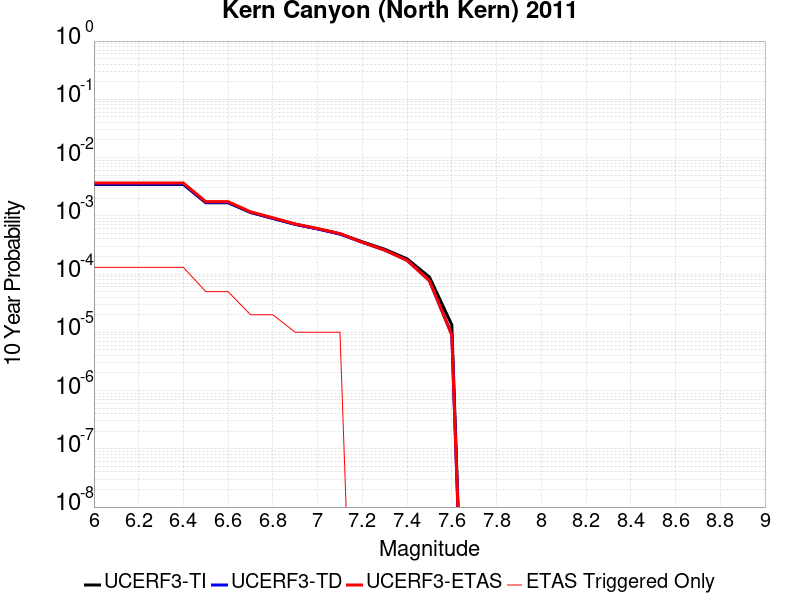 |

| Magnitude | 1 wk TI Prob | 1 wk TD Prob | 1 wk ETAS Prob | 1 wk ETAS/TD Gain | 1 wk ETAS Triggered Only | 1 mo TI Prob | 1 mo TD Prob | 1 mo ETAS Prob | 1 mo ETAS/TD Gain | 1 mo ETAS Triggered Only | 1 yr TI Prob | 1 yr TD Prob | 1 yr ETAS Prob | 1 yr ETAS/TD Gain | 1 yr ETAS Triggered Only | 10 yr TI Prob | 10 yr TD Prob | 10 yr ETAS Prob | 10 yr ETAS/TD Gain | 10 yr ETAS Triggered Only |
|-----|-----|-----|-----|-----|-----|-----|-----|-----|-----|-----|-----|-----|-----|-----|-----|-----|-----|-----|-----|-----|
| 6.0 | 6.6264497E-6 | 6.75733E-6 | 4.686401E-5 | 6.935285 | 4.0106952E-5 | 2.8398761E-5 | 2.895971E-5 | 6.90655E-5 | 2.3848825 | 4.0106952E-5 | 3.4570007E-4 | 3.5253543E-4 | 4.059925E-4 | 1.151636 | 5.3475935E-5 | 0.0034516277 | 0.0035205502 | 0.0036138038 | 1.0264883 | 9.358289E-5 |
| 6.1 | 6.6264497E-6 | 6.75733E-6 | 4.686401E-5 | 6.935285 | 4.0106952E-5 | 2.8398761E-5 | 2.895971E-5 | 6.90655E-5 | 2.3848825 | 4.0106952E-5 | 3.4570007E-4 | 3.5253543E-4 | 4.059925E-4 | 1.151636 | 5.3475935E-5 | 0.0034516277 | 0.0035205502 | 0.0036138038 | 1.0264883 | 9.358289E-5 |
| 6.2 | 6.6264497E-6 | 6.75733E-6 | 4.686401E-5 | 6.935285 | 4.0106952E-5 | 2.8398761E-5 | 2.895971E-5 | 6.90655E-5 | 2.3848825 | 4.0106952E-5 | 3.4570007E-4 | 3.5253543E-4 | 4.059925E-4 | 1.151636 | 5.3475935E-5 | 0.0034516277 | 0.0035205502 | 0.0036138038 | 1.0264883 | 9.358289E-5 |
| 6.3 | 6.6264497E-6 | 6.75733E-6 | 4.686401E-5 | 6.935285 | 4.0106952E-5 | 2.8398761E-5 | 2.895971E-5 | 6.90655E-5 | 2.3848825 | 4.0106952E-5 | 3.4570007E-4 | 3.5253543E-4 | 4.059925E-4 | 1.151636 | 5.3475935E-5 | 0.0034516277 | 0.0035205502 | 0.0036138038 | 1.0264883 | 9.358289E-5 |
| 6.4 | 6.6264497E-6 | 6.75733E-6 | 4.686401E-5 | 6.935285 | 4.0106952E-5 | 2.8398761E-5 | 2.895971E-5 | 6.90655E-5 | 2.3848825 | 4.0106952E-5 | 3.4570007E-4 | 3.5253543E-4 | 4.059925E-4 | 1.151636 | 5.3475935E-5 | 0.0034516277 | 0.0035205502 | 0.0036138038 | 1.0264883 | 9.358289E-5 |
| 6.5 | 3.2162225E-6 | 3.2570915E-6 | 1.6626032E-5 | 5.104564 | 1.3368984E-5 | 1.3783738E-5 | 1.3958893E-5 | 2.7327691E-5 | 1.9577261 | 1.3368984E-5 | 1.6780409E-4 | 1.6993708E-4 | 1.966705E-4 | 1.1573137 | 2.6737967E-5 | 0.0016767744 | 0.001698151 | 0.0017381898 | 1.0235779 | 4.0106952E-5 |
| 6.6 | 3.2162225E-6 | 3.2570915E-6 | 1.6626032E-5 | 5.104564 | 1.3368984E-5 | 1.3783738E-5 | 1.3958893E-5 | 2.7327691E-5 | 1.9577261 | 1.3368984E-5 | 1.6780409E-4 | 1.6993708E-4 | 1.966705E-4 | 1.1573137 | 2.6737967E-5 | 0.0016767744 | 0.001698151 | 0.0017381898 | 1.0235779 | 4.0106952E-5 |
| 6.7 | 2.1908265E-6 | 2.2071222E-6 | 1.5576077E-5 | 7.0571885 | 1.3368984E-5 | 9.389223E-6 | 9.459061E-6 | 2.2827919E-5 | 2.4133387 | 1.3368984E-5 | 1.1430779E-4 | 1.1515819E-4 | 1.2852563E-4 | 1.116079 | 1.3368984E-5 | 0.0011424901 | 0.0011510046 | 0.0011643581 | 1.0116017 | 1.3368984E-5 |
| 6.8 | 1.7303895E-6 | 1.7365529E-6 | 1.5105514E-5 | 8.698563 | 1.3368984E-5 | 7.415934E-6 | 7.4423488E-6 | 2.0811232E-5 | 2.796326 | 1.3368984E-5 | 9.028525E-5 | 9.0606925E-5 | 1.039747E-4 | 1.1475359 | 1.3368984E-5 | 9.024858E-4 | 9.057096E-4 | 9.190665E-4 | 1.0147474 | 1.3368984E-5 |
| 6.9 | 1.3700314E-6 | 1.3688622E-6 | 1.4737828E-5 | 10.76648 | 1.3368984E-5 | 5.87155E-6 | 5.8665396E-6 | 1.9235446E-5 | 3.27884 | 1.3368984E-5 | 7.148377E-5 | 7.142282E-5 | 8.479085E-5 | 1.1871675 | 1.3368984E-5 | 7.146078E-4 | 7.140032E-4 | 7.273627E-4 | 1.0187106 | 1.3368984E-5 |
| 7.0 | 1.1467797E-6 | 1.1413804E-6 | 1.45103495E-5 | 12.712982 | 1.3368984E-5 | 4.9147607E-6 | 4.8916213E-6 | 1.826054E-5 | 3.733024 | 1.3368984E-5 | 5.983557E-5 | 5.9553895E-5 | 7.2922085E-5 | 1.224472 | 1.3368984E-5 | 5.981946E-4 | 5.953825E-4 | 6.087435E-4 | 1.022441 | 1.3368984E-5 |
| 7.1 | 9.3952065E-7 | 9.3026904E-7 | 1.429924E-5 | 15.371081 | 1.3368984E-5 | 4.026511E-6 | 3.9868614E-6 | 1.7355793E-5 | 4.353247 | 1.3368984E-5 | 4.9021666E-5 | 4.8538972E-5 | 6.190731E-5 | 1.2754145 | 1.3368984E-5 | 4.901085E-4 | 4.8528548E-4 | 4.98648E-4 | 1.0275353 | 1.3368984E-5 |
| 7.2 | 6.858055E-7 | 6.7193E-7 | 6.7193E-7 | 1.0 | 0.0 | 2.939163E-6 | 2.879697E-6 | 2.879697E-6 | 1.0 | 0.0 | 3.5783723E-5 | 3.5059755E-5 | 3.5059755E-5 | 1.0 | 0.0 | 3.5777962E-4 | 3.5054312E-4 | 3.5054312E-4 | 1.0 | 0.0 |
| 7.3 | 5.1101983E-7 | 4.9393E-7 | 4.9393E-7 | 1.0 | 0.0 | 2.1900833E-6 | 2.116841E-6 | 2.116841E-6 | 1.0 | 0.0 | 2.6663936E-5 | 2.5772239E-5 | 2.5772239E-5 | 1.0 | 0.0 | 2.6660739E-4 | 2.57693E-4 | 2.57693E-4 | 1.0 | 0.0 |
| 7.4 | 3.4999414E-7 | 3.2995905E-7 | 3.2995905E-7 | 1.0 | 0.0 | 1.499974E-6 | 1.4141094E-6 | 1.4141094E-6 | 1.0 | 0.0 | 1.8262032E-5 | 1.721665E-5 | 1.721665E-5 | 1.0 | 0.0 | 1.826053E-4 | 1.7215339E-4 | 1.7215339E-4 | 1.0 | 0.0 |
| 7.5 | 1.7021522E-7 | 1.4750044E-7 | 1.4750044E-7 | 1.0 | 0.0 | 7.2949354E-7 | 6.321446E-7 | 6.321446E-7 | 1.0 | 0.0 | 8.881548E-6 | 7.696334E-6 | 7.696334E-6 | 1.0 | 0.0 | 8.8811925E-5 | 7.696076E-5 | 7.696076E-5 | 1.0 | 0.0 |
| 7.6 | 2.572245E-8 | 1.7352555E-8 | 1.7352555E-8 | 1.0 | 0.0 | 1.10239064E-7 | 7.436809E-8 | 7.436809E-8 | 1.0 | 0.0 | 1.3421597E-6 | 9.054312E-7 | 9.054312E-7 | 1.0 | 0.0 | 1.3421517E-5 | 9.05428E-6 | 9.05428E-6 | 1.0 | 0.0 |

## Pisgah-Bullion Mtn-Mesquite Lk
*[(top)](#table-of-contents)*

| 1 Week | 1 Month | 1 Year | 10 Year |
|-----|-----|-----|-----|
|  |  |  |  |

| Magnitude | 1 wk TI Prob | 1 wk TD Prob | 1 wk ETAS Prob | 1 wk ETAS/TD Gain | 1 wk ETAS Triggered Only | 1 mo TI Prob | 1 mo TD Prob | 1 mo ETAS Prob | 1 mo ETAS/TD Gain | 1 mo ETAS Triggered Only | 1 yr TI Prob | 1 yr TD Prob | 1 yr ETAS Prob | 1 yr ETAS/TD Gain | 1 yr ETAS Triggered Only | 10 yr TI Prob | 10 yr TD Prob | 10 yr ETAS Prob | 10 yr ETAS/TD Gain | 10 yr ETAS Triggered Only |
|-----|-----|-----|-----|-----|-----|-----|-----|-----|-----|-----|-----|-----|-----|-----|-----|-----|-----|-----|-----|-----|
| 6.0 | 3.0240792E-5 | 2.4091114E-5 | 3.7459777E-5 | 1.5549209 | 1.3368984E-5 | 1.2959696E-4 | 1.03244114E-4 | 1.2997932E-4 | 1.2589514 | 2.6737967E-5 | 0.0015767008 | 0.0012563728 | 0.0013097815 | 1.0425103 | 5.3475935E-5 | 0.015655609 | 0.012502721 | 0.012595134 | 1.0073915 | 9.358289E-5 |
| 6.1 | 3.0240792E-5 | 2.4091114E-5 | 3.7459777E-5 | 1.5549209 | 1.3368984E-5 | 1.2959696E-4 | 1.03244114E-4 | 1.2997932E-4 | 1.2589514 | 2.6737967E-5 | 0.0015767008 | 0.0012563728 | 0.0013097815 | 1.0425103 | 5.3475935E-5 | 0.015655609 | 0.012502721 | 0.012595134 | 1.0073915 | 9.358289E-5 |
| 6.2 | 3.0240792E-5 | 2.4091114E-5 | 3.7459777E-5 | 1.5549209 | 1.3368984E-5 | 1.2959696E-4 | 1.03244114E-4 | 1.2997932E-4 | 1.2589514 | 2.6737967E-5 | 0.0015767008 | 0.0012563728 | 0.0013097815 | 1.0425103 | 5.3475935E-5 | 0.015655609 | 0.012502721 | 0.012595134 | 1.0073915 | 9.358289E-5 |
| 6.3 | 2.0498217E-5 | 1.36380695E-5 | 1.36380695E-5 | 1.0 | 0.0 | 8.784654E-5 | 5.844765E-5 | 5.844765E-5 | 1.0 | 0.0 | 0.0010690069 | 7.1138405E-4 | 7.247435E-4 | 1.0187795 | 1.3368984E-5 | 0.01063879 | 0.0070926943 | 0.0071059684 | 1.0018715 | 1.3368984E-5 |
| 6.4 | 2.0498217E-5 | 1.36380695E-5 | 1.36380695E-5 | 1.0 | 0.0 | 8.784654E-5 | 5.844765E-5 | 5.844765E-5 | 1.0 | 0.0 | 0.0010690069 | 7.1138405E-4 | 7.247435E-4 | 1.0187795 | 1.3368984E-5 | 0.01063879 | 0.0070926943 | 0.0071059684 | 1.0018715 | 1.3368984E-5 |
| 6.5 | 1.7316182E-5 | 1.0477042E-5 | 1.0477042E-5 | 1.0 | 0.0 | 7.42101E-5 | 4.4900895E-5 | 4.4900895E-5 | 1.0 | 0.0 | 9.0313336E-4 | 5.465413E-4 | 5.465413E-4 | 1.0 | 0.0 | 0.008994718 | 0.0054529672 | 0.0054529672 | 1.0 | 0.0 |
| 6.6 | 1.5251077E-5 | 8.414273E-6 | 8.414273E-6 | 1.0 | 0.0 | 6.536012E-5 | 3.6060712E-5 | 3.6060712E-5 | 1.0 | 0.0 | 7.9546886E-4 | 4.3895794E-4 | 4.3895794E-4 | 1.0 | 0.0 | 0.007926274 | 0.0043816264 | 0.0043816264 | 1.0 | 0.0 |
| 6.7 | 1.2997425E-5 | 6.4114965E-6 | 6.4114965E-6 | 1.0 | 0.0 | 5.570206E-5 | 2.7477578E-5 | 2.7477578E-5 | 1.0 | 0.0 | 6.7796157E-4 | 3.3449283E-4 | 3.3449283E-4 | 1.0 | 0.0 | 0.0067589693 | 0.0033403537 | 0.0033403537 | 1.0 | 0.0 |
| 6.8 | 1.035386E-5 | 4.3332193E-6 | 4.3332193E-6 | 1.0 | 0.0 | 4.437293E-5 | 1.8570812E-5 | 1.8570812E-5 | 1.0 | 0.0 | 5.401065E-4 | 2.2607706E-4 | 2.2607706E-4 | 1.0 | 0.0 | 0.0053879567 | 0.0022585576 | 0.0022585576 | 1.0 | 0.0 |
| 6.9 | 8.816252E-6 | 3.580638E-6 | 3.580638E-6 | 1.0 | 0.0 | 3.778339E-5 | 1.5345504E-5 | 1.5345504E-5 | 1.0 | 0.0 | 4.5991567E-4 | 1.8681608E-4 | 1.8681608E-4 | 1.0 | 0.0 | 0.00458965 | 0.0018666488 | 0.0018666488 | 1.0 | 0.0 |
| 7.0 | 6.8232207E-6 | 2.5675843E-6 | 2.5675843E-6 | 1.0 | 0.0 | 2.9242048E-5 | 1.1003888E-5 | 1.1003888E-5 | 1.0 | 0.0 | 3.5596377E-4 | 1.3396442E-4 | 1.3396442E-4 | 1.0 | 0.0 | 0.0035539411 | 0.0013388677 | 0.0013388677 | 1.0 | 0.0 |
| 7.1 | 5.837013E-6 | 2.22738E-6 | 2.22738E-6 | 1.0 | 0.0 | 2.501553E-5 | 9.545881E-6 | 9.545881E-6 | 1.0 | 0.0 | 3.045215E-4 | 1.16215204E-4 | 1.16215204E-4 | 1.0 | 0.0 | 0.0030410455 | 0.0011615733 | 0.0011615733 | 1.0 | 0.0 |
| 7.2 | 4.278052E-6 | 1.6275711E-6 | 1.6275711E-6 | 1.0 | 0.0 | 1.833438E-5 | 6.9752873E-6 | 6.9752873E-6 | 1.0 | 0.0 | 2.231982E-4 | 8.492105E-5 | 8.492105E-5 | 1.0 | 0.0 | 0.0022297418 | 8.489092E-4 | 8.489092E-4 | 1.0 | 0.0 |
| 7.3 | 1.8803692E-6 | 8.344926E-7 | 8.344926E-7 | 1.0 | 0.0 | 8.0587E-6 | 3.5763926E-6 | 3.5763926E-6 | 1.0 | 0.0 | 9.811026E-5 | 4.354186E-5 | 4.354186E-5 | 1.0 | 0.0 | 9.806695E-4 | 4.3534773E-4 | 4.3534773E-4 | 1.0 | 0.0 |

## Santa Ynez River
*[(top)](#table-of-contents)*

| 1 Week | 1 Month | 1 Year | 10 Year |
|-----|-----|-----|-----|
|  |  |  |  |

| Magnitude | 1 wk TI Prob | 1 wk TD Prob | 1 wk ETAS Prob | 1 wk ETAS/TD Gain | 1 wk ETAS Triggered Only | 1 mo TI Prob | 1 mo TD Prob | 1 mo ETAS Prob | 1 mo ETAS/TD Gain | 1 mo ETAS Triggered Only | 1 yr TI Prob | 1 yr TD Prob | 1 yr ETAS Prob | 1 yr ETAS/TD Gain | 1 yr ETAS Triggered Only | 10 yr TI Prob | 10 yr TD Prob | 10 yr ETAS Prob | 10 yr ETAS/TD Gain | 10 yr ETAS Triggered Only |
|-----|-----|-----|-----|-----|-----|-----|-----|-----|-----|-----|-----|-----|-----|-----|-----|-----|-----|-----|-----|-----|
| 6.0 | 1.6396456E-5 | 1.7209435E-5 | 3.057819E-5 | 1.776827 | 1.3368984E-5 | 7.026863E-5 | 7.375284E-5 | 8.712084E-5 | 1.181254 | 1.3368984E-5 | 8.551848E-4 | 8.976064E-4 | 9.109634E-4 | 1.0148807 | 1.3368984E-5 | 0.0085190125 | 0.008943358 | 0.009009605 | 1.0074074 | 6.684492E-5 |
| 6.1 | 1.6396456E-5 | 1.7209435E-5 | 3.057819E-5 | 1.776827 | 1.3368984E-5 | 7.026863E-5 | 7.375284E-5 | 8.712084E-5 | 1.181254 | 1.3368984E-5 | 8.551848E-4 | 8.976064E-4 | 9.109634E-4 | 1.0148807 | 1.3368984E-5 | 0.0085190125 | 0.008943358 | 0.009009605 | 1.0074074 | 6.684492E-5 |
| 6.2 | 1.6396456E-5 | 1.7209435E-5 | 3.057819E-5 | 1.776827 | 1.3368984E-5 | 7.026863E-5 | 7.375284E-5 | 8.712084E-5 | 1.181254 | 1.3368984E-5 | 8.551848E-4 | 8.976064E-4 | 9.109634E-4 | 1.0148807 | 1.3368984E-5 | 0.0085190125 | 0.008943358 | 0.009009605 | 1.0074074 | 6.684492E-5 |
| 6.3 | 9.736976E-6 | 1.012233E-5 | 1.012233E-5 | 1.0 | 0.0 | 4.172923E-5 | 4.338072E-5 | 4.338072E-5 | 1.0 | 0.0 | 5.0793495E-4 | 5.280373E-4 | 5.280373E-4 | 1.0 | 0.0 | 0.005067755 | 0.005268332 | 0.0052816304 | 1.0025243 | 1.3368984E-5 |
| 6.4 | 9.736976E-6 | 1.012233E-5 | 1.012233E-5 | 1.0 | 0.0 | 4.172923E-5 | 4.338072E-5 | 4.338072E-5 | 1.0 | 0.0 | 5.0793495E-4 | 5.280373E-4 | 5.280373E-4 | 1.0 | 0.0 | 0.005067755 | 0.005268332 | 0.0052816304 | 1.0025243 | 1.3368984E-5 |
| 6.5 | 7.081964E-6 | 7.3298966E-6 | 7.3298966E-6 | 1.0 | 0.0 | 3.035092E-5 | 3.1413474E-5 | 3.1413474E-5 | 1.0 | 0.0 | 3.694598E-4 | 3.8239348E-4 | 3.8239348E-4 | 1.0 | 0.0 | 0.0036884616 | 0.0038175168 | 0.0038308348 | 1.0034887 | 1.3368984E-5 |
| 6.6 | 5.873247E-6 | 6.059743E-6 | 6.059743E-6 | 1.0 | 0.0 | 2.5170815E-5 | 2.5970074E-5 | 2.5970074E-5 | 1.0 | 0.0 | 3.064116E-4 | 3.1614062E-4 | 3.1614062E-4 | 1.0 | 0.0 | 0.0030598943 | 0.0031569963 | 0.003170323 | 1.0042213 | 1.3368984E-5 |
| 6.7 | 4.973277E-6 | 5.115901E-6 | 5.115901E-6 | 1.0 | 0.0 | 2.1313872E-5 | 2.1925109E-5 | 2.1925109E-5 | 1.0 | 0.0 | 2.5946548E-4 | 2.66906E-4 | 2.66906E-4 | 1.0 | 0.0 | 0.0025916274 | 0.0026659032 | 0.0026792365 | 1.0050014 | 1.3368984E-5 |
| 6.8 | 4.396492E-6 | 4.5109778E-6 | 4.5109778E-6 | 1.0 | 0.0 | 1.884197E-5 | 1.9332621E-5 | 1.9332621E-5 | 1.0 | 0.0 | 2.2937685E-4 | 2.3534958E-4 | 2.3534958E-4 | 1.0 | 0.0 | 0.0022914023 | 0.0023510386 | 0.0023643763 | 1.005673 | 1.3368984E-5 |
| 6.9 | 3.5255632E-6 | 3.6013332E-6 | 3.6013332E-6 | 1.0 | 0.0 | 1.5109469E-5 | 1.5434196E-5 | 1.5434196E-5 | 1.0 | 0.0 | 1.8394225E-4 | 1.8789528E-4 | 1.8789528E-4 | 1.0 | 0.0 | 0.0018379007 | 0.0018773803 | 0.0018907242 | 1.0071077 | 1.3368984E-5 |
| 7.0 | 3.211603E-6 | 3.273654E-6 | 3.273654E-6 | 1.0 | 0.0 | 1.376394E-5 | 1.4029872E-5 | 1.4029872E-5 | 1.0 | 0.0 | 1.6756308E-4 | 1.7080043E-4 | 1.7080043E-4 | 1.0 | 0.0 | 0.0016743679 | 0.0017067058 | 0.0017067058 | 1.0 | 0.0 |
| 7.1 | 2.5094619E-6 | 2.5409204E-6 | 2.5409204E-6 | 1.0 | 0.0 | 1.0754793E-5 | 1.0889614E-5 | 1.0889614E-5 | 1.0 | 0.0 | 1.3093173E-4 | 1.3257304E-4 | 1.3257304E-4 | 1.0 | 0.0 | 0.0013085462 | 0.0013249456 | 0.0013249456 | 1.0 | 0.0 |
| 7.2 | 2.0515774E-6 | 2.0619375E-6 | 2.0619375E-6 | 1.0 | 0.0 | 8.792445E-6 | 8.836846E-6 | 8.836846E-6 | 1.0 | 0.0 | 1.0704277E-4 | 1.0758333E-4 | 1.0758333E-4 | 1.0 | 0.0 | 0.0010699122 | 0.0010753168 | 0.0010753168 | 1.0 | 0.0 |
| 7.3 | 1.6845745E-6 | 1.6773907E-6 | 1.6773907E-6 | 1.0 | 0.0 | 7.219585E-6 | 7.1887976E-6 | 7.1887976E-6 | 1.0 | 0.0 | 8.78949E-5 | 8.752012E-5 | 8.752012E-5 | 1.0 | 0.0 | 8.7860145E-4 | 8.7485946E-4 | 8.7485946E-4 | 1.0 | 0.0 |
| 7.4 | 1.3600285E-6 | 1.3333357E-6 | 1.3333357E-6 | 1.0 | 0.0 | 5.82868E-6 | 5.714284E-6 | 5.714284E-6 | 1.0 | 0.0 | 7.096187E-5 | 6.956921E-5 | 6.956921E-5 | 1.0 | 0.0 | 7.0939213E-4 | 6.954765E-4 | 6.954765E-4 | 1.0 | 0.0 |
| 7.5 | 9.735342E-7 | 9.290103E-7 | 9.290103E-7 | 1.0 | 0.0 | 4.172283E-6 | 3.9814668E-6 | 3.9814668E-6 | 1.0 | 0.0 | 5.079636E-5 | 4.8473295E-5 | 4.8473295E-5 | 1.0 | 0.0 | 5.0784746E-4 | 4.8462892E-4 | 4.8462892E-4 | 1.0 | 0.0 |
| 7.6 | 5.067187E-7 | 4.77857E-7 | 4.77857E-7 | 1.0 | 0.0 | 2.1716498E-6 | 2.047957E-6 | 2.047957E-6 | 1.0 | 0.0 | 2.6439517E-5 | 2.4933597E-5 | 2.4933597E-5 | 1.0 | 0.0 | 2.643637E-4 | 2.4930874E-4 | 2.4930874E-4 | 1.0 | 0.0 |
| 7.7 | 2.769089E-7 | 2.5759124E-7 | 2.5759124E-7 | 1.0 | 0.0 | 1.1867519E-6 | 1.1039621E-6 | 1.1039621E-6 | 1.0 | 0.0 | 1.4448608E-5 | 1.34406555E-5 | 1.34406555E-5 | 1.0 | 0.0 | 1.444767E-4 | 1.3439846E-4 | 1.3439846E-4 | 1.0 | 0.0 |
| 7.8 | 1.7044663E-7 | 1.5449015E-7 | 1.5449015E-7 | 1.0 | 0.0 | 7.3048534E-7 | 6.621005E-7 | 6.621005E-7 | 1.0 | 0.0 | 8.893623E-6 | 8.061043E-6 | 8.061043E-6 | 1.0 | 0.0 | 8.893267E-5 | 8.060753E-5 | 8.060753E-5 | 1.0 | 0.0 |
| 7.9 | 4.8344287E-8 | 4.0910923E-8 | 4.0910923E-8 | 1.0 | 0.0 | 2.0718979E-7 | 1.7533252E-7 | 1.7533252E-7 | 1.0 | 0.0 | 2.5225327E-6 | 2.1346711E-6 | 2.1346711E-6 | 1.0 | 0.0 | 2.5225041E-5 | 2.1346512E-5 | 2.1346512E-5 | 1.0 | 0.0 |

## San Pedro Basin
*[(top)](#table-of-contents)*

| 1 Week | 1 Month | 1 Year | 10 Year |
|-----|-----|-----|-----|
|  |  |  |  |

| Magnitude | 1 wk TI Prob | 1 wk TD Prob | 1 wk ETAS Prob | 1 wk ETAS/TD Gain | 1 wk ETAS Triggered Only | 1 mo TI Prob | 1 mo TD Prob | 1 mo ETAS Prob | 1 mo ETAS/TD Gain | 1 mo ETAS Triggered Only | 1 yr TI Prob | 1 yr TD Prob | 1 yr ETAS Prob | 1 yr ETAS/TD Gain | 1 yr ETAS Triggered Only | 10 yr TI Prob | 10 yr TD Prob | 10 yr ETAS Prob | 10 yr ETAS/TD Gain | 10 yr ETAS Triggered Only |
|-----|-----|-----|-----|-----|-----|-----|-----|-----|-----|-----|-----|-----|-----|-----|-----|-----|-----|-----|-----|-----|
| 6.0 | 5.3449043E-5 | 6.336954E-5 | 9.010581E-5 | 1.4219105 | 2.6737967E-5 | 2.2904722E-4 | 2.715589E-4 | 2.9828964E-4 | 1.0984343 | 2.6737967E-5 | 0.0027850836 | 0.0033018254 | 0.0033684496 | 1.020178 | 6.684492E-5 | 0.027504366 | 0.03258945 | 0.032679982 | 1.0027779 | 9.358289E-5 |
| 6.1 | 5.3449043E-5 | 6.336954E-5 | 9.010581E-5 | 1.4219105 | 2.6737967E-5 | 2.2904722E-4 | 2.715589E-4 | 2.9828964E-4 | 1.0984343 | 2.6737967E-5 | 0.0027850836 | 0.0033018254 | 0.0033684496 | 1.020178 | 6.684492E-5 | 0.027504366 | 0.03258945 | 0.032679982 | 1.0027779 | 9.358289E-5 |
| 6.2 | 2.3189454E-5 | 2.6642796E-5 | 2.6642796E-5 | 1.0 | 0.0 | 9.9379584E-5 | 1.14178685E-4 | 1.14178685E-4 | 1.0 | 0.0 | 0.0012092749 | 0.0013892864 | 0.0014159873 | 1.019219 | 2.6737967E-5 | 0.012027155 | 0.013810883 | 0.013850437 | 1.0028639 | 4.0106952E-5 |
| 6.3 | 2.3189454E-5 | 2.6642796E-5 | 2.6642796E-5 | 1.0 | 0.0 | 9.9379584E-5 | 1.14178685E-4 | 1.14178685E-4 | 1.0 | 0.0 | 0.0012092749 | 0.0013892864 | 0.0014159873 | 1.019219 | 2.6737967E-5 | 0.012027155 | 0.013810883 | 0.013850437 | 1.0028639 | 4.0106952E-5 |
| 6.4 | 1.966056E-5 | 2.2463413E-5 | 2.2463413E-5 | 1.0 | 0.0 | 8.425682E-5 | 9.626844E-5 | 9.626844E-5 | 1.0 | 0.0 | 0.001025344 | 0.0011714783 | 0.0011981849 | 1.0227973 | 2.6737967E-5 | 0.010206259 | 0.011657117 | 0.011696756 | 1.0034004 | 4.0106952E-5 |
| 6.5 | 1.7342953E-5 | 1.9745148E-5 | 1.9745148E-5 | 1.0 | 0.0 | 7.4324824E-5 | 8.4619525E-5 | 8.4619525E-5 | 1.0 | 0.0 | 9.04529E-4 | 0.0010297928 | 0.0010565032 | 1.0259377 | 2.6737967E-5 | 0.009008561 | 0.010253931 | 0.010293627 | 1.0038713 | 4.0106952E-5 |
| 6.6 | 1.439804E-5 | 1.6322716E-5 | 1.6322716E-5 | 1.0 | 0.0 | 6.170443E-5 | 6.99528E-5 | 6.99528E-5 | 1.0 | 0.0 | 7.509924E-4 | 8.513747E-4 | 8.647323E-4 | 1.0156895 | 1.3368984E-5 | 0.0074845953 | 0.008484332 | 0.008497587 | 1.0015624 | 1.3368984E-5 |
| 6.7 | 1.2634884E-5 | 1.4285297E-5 | 1.4285297E-5 | 1.0 | 0.0 | 5.414838E-5 | 6.1221435E-5 | 6.1221435E-5 | 1.0 | 0.0 | 6.590571E-4 | 7.4514654E-4 | 7.5850554E-4 | 1.017928 | 1.3368984E-5 | 0.006571059 | 0.007429501 | 0.007442771 | 1.0017861 | 1.3368984E-5 |
| 6.8 | 1.146091E-5 | 1.2933192E-5 | 1.2933192E-5 | 1.0 | 0.0 | 4.911726E-5 | 5.5426954E-5 | 5.5426954E-5 | 1.0 | 0.0 | 5.9783855E-4 | 6.7464396E-4 | 6.8800396E-4 | 1.0198029 | 1.3368984E-5 | 0.0059623276 | 0.006728899 | 0.006742178 | 1.0019734 | 1.3368984E-5 |
| 6.9 | 9.109035E-6 | 1.0235011E-5 | 1.0235011E-5 | 1.0 | 0.0 | 3.9038136E-5 | 4.3863754E-5 | 4.3863754E-5 | 1.0 | 0.0 | 4.7518566E-4 | 5.3393835E-4 | 5.473002E-4 | 1.0250251 | 1.3368984E-5 | 0.0047417083 | 0.005329309 | 0.0053426065 | 1.0024952 | 1.3368984E-5 |
| 7.0 | 5.9351028E-6 | 6.583964E-6 | 6.583964E-6 | 1.0 | 0.0 | 2.5435906E-5 | 2.8216817E-5 | 2.8216817E-5 | 1.0 | 0.0 | 3.0963816E-4 | 3.435092E-4 | 3.435092E-4 | 1.0 | 0.0 | 0.0030920706 | 0.0034320992 | 0.0034320992 | 1.0 | 0.0 |
| 7.1 | 2.1557585E-6 | 2.209648E-6 | 2.209648E-6 | 1.0 | 0.0 | 9.238933E-6 | 9.469887E-6 | 9.469887E-6 | 1.0 | 0.0 | 1.1247819E-4 | 1.1528993E-4 | 1.1528993E-4 | 1.0 | 0.0 | 0.0011242128 | 0.0011523166 | 0.0011523166 | 1.0 | 0.0 |
| 7.2 | 2.1251979E-6 | 2.1779945E-6 | 2.1779945E-6 | 1.0 | 0.0 | 9.107958E-6 | 9.334229E-6 | 9.334229E-6 | 1.0 | 0.0 | 1.1088375E-4 | 1.1363847E-4 | 1.1363847E-4 | 1.0 | 0.0 | 0.0011082845 | 0.0011358189 | 0.0011358189 | 1.0 | 0.0 |
| 7.3 | 1.7145798E-6 | 1.7442874E-6 | 1.7442874E-6 | 1.0 | 0.0 | 7.3481783E-6 | 7.4754967E-6 | 7.4754967E-6 | 1.0 | 0.0 | 8.94604E-5 | 9.1010465E-5 | 9.1010465E-5 | 1.0 | 0.0 | 8.9424395E-4 | 9.0974104E-4 | 9.0974104E-4 | 1.0 | 0.0 |
| 7.4 | 1.4467993E-6 | 1.4641868E-6 | 1.4641868E-6 | 1.0 | 0.0 | 6.200554E-6 | 6.2750714E-6 | 6.2750714E-6 | 1.0 | 0.0 | 7.548913E-5 | 7.639639E-5 | 7.639639E-5 | 1.0 | 0.0 | 7.546349E-4 | 7.6370855E-4 | 7.6370855E-4 | 1.0 | 0.0 |
| 7.5 | 1.2803735E-6 | 1.2931497E-6 | 1.2931497E-6 | 1.0 | 0.0 | 5.487303E-6 | 5.5420587E-6 | 5.5420587E-6 | 1.0 | 0.0 | 6.680587E-5 | 6.7472545E-5 | 6.7472545E-5 | 1.0 | 0.0 | 6.678579E-4 | 6.7452766E-4 | 6.7452766E-4 | 1.0 | 0.0 |
| 7.6 | 6.755009E-7 | 6.769465E-7 | 6.769465E-7 | 1.0 | 0.0 | 2.8950008E-6 | 2.9011965E-6 | 2.9011965E-6 | 1.0 | 0.0 | 3.5246063E-5 | 3.5321555E-5 | 3.5321555E-5 | 1.0 | 0.0 | 3.5240475E-4 | 3.5316512E-4 | 3.5316512E-4 | 1.0 | 0.0 |
| 7.7 | 6.211885E-8 | 4.569953E-8 | 4.569953E-8 | 1.0 | 0.0 | 2.6622362E-7 | 1.9585512E-7 | 1.9585512E-7 | 1.0 | 0.0 | 3.2412677E-6 | 2.3845337E-6 | 2.3845337E-6 | 1.0 | 0.0 | 3.2412205E-5 | 2.3845101E-5 | 2.3845101E-5 | 1.0 | 0.0 |
| 7.8 | 2.6580573E-9 | 1.5138163E-9 | 1.5138163E-9 | 1.0 | 0.0 | 1.1391674E-8 | 6.487784E-9 | 6.487784E-9 | 1.0 | 0.0 | 1.3869362E-7 | 7.898877E-8 | 7.898877E-8 | 1.0 | 0.0 | 1.3869354E-6 | 7.898877E-7 | 7.898877E-7 | 1.0 | 0.0 |

## Kern Canyon (Lake Isabella) 2011
*[(top)](#table-of-contents)*

| 1 Week | 1 Month | 1 Year | 10 Year |
|-----|-----|-----|-----|
|  |  |  |  |

| Magnitude | 1 wk TI Prob | 1 wk TD Prob | 1 wk ETAS Prob | 1 wk ETAS/TD Gain | 1 wk ETAS Triggered Only | 1 mo TI Prob | 1 mo TD Prob | 1 mo ETAS Prob | 1 mo ETAS/TD Gain | 1 mo ETAS Triggered Only | 1 yr TI Prob | 1 yr TD Prob | 1 yr ETAS Prob | 1 yr ETAS/TD Gain | 1 yr ETAS Triggered Only | 10 yr TI Prob | 10 yr TD Prob | 10 yr ETAS Prob | 10 yr ETAS/TD Gain | 10 yr ETAS Triggered Only |
|-----|-----|-----|-----|-----|-----|-----|-----|-----|-----|-----|-----|-----|-----|-----|-----|-----|-----|-----|-----|-----|
| 6.0 | 4.2387383E-6 | 4.001639E-6 | 3.07395E-5 | 7.681728 | 2.6737967E-5 | 1.8165894E-5 | 1.7149778E-5 | 4.388729E-5 | 2.5590587 | 2.6737967E-5 | 2.2114732E-4 | 2.087804E-4 | 2.622452E-4 | 1.2560813 | 5.3475935E-5 | 0.0022092736 | 0.0020860266 | 0.0021794143 | 1.0447682 | 9.358289E-5 |
| 6.1 | 4.2387383E-6 | 4.001639E-6 | 3.07395E-5 | 7.681728 | 2.6737967E-5 | 1.8165894E-5 | 1.7149778E-5 | 4.388729E-5 | 2.5590587 | 2.6737967E-5 | 2.2114732E-4 | 2.087804E-4 | 2.622452E-4 | 1.2560813 | 5.3475935E-5 | 0.0022092736 | 0.0020860266 | 0.0021794143 | 1.0447682 | 9.358289E-5 |
| 6.2 | 4.2387383E-6 | 4.001639E-6 | 3.07395E-5 | 7.681728 | 2.6737967E-5 | 1.8165894E-5 | 1.7149778E-5 | 4.388729E-5 | 2.5590587 | 2.6737967E-5 | 2.2114732E-4 | 2.087804E-4 | 2.622452E-4 | 1.2560813 | 5.3475935E-5 | 0.0022092736 | 0.0020860266 | 0.0021794143 | 1.0447682 | 9.358289E-5 |
| 6.3 | 4.2387383E-6 | 4.001639E-6 | 3.07395E-5 | 7.681728 | 2.6737967E-5 | 1.8165894E-5 | 1.7149778E-5 | 4.388729E-5 | 2.5590587 | 2.6737967E-5 | 2.2114732E-4 | 2.087804E-4 | 2.622452E-4 | 1.2560813 | 5.3475935E-5 | 0.0022092736 | 0.0020860266 | 0.0021794143 | 1.0447682 | 9.358289E-5 |
| 6.4 | 4.2387383E-6 | 4.001639E-6 | 3.07395E-5 | 7.681728 | 2.6737967E-5 | 1.8165894E-5 | 1.7149778E-5 | 4.388729E-5 | 2.5590587 | 2.6737967E-5 | 2.2114732E-4 | 2.087804E-4 | 2.622452E-4 | 1.2560813 | 5.3475935E-5 | 0.0022092736 | 0.0020860266 | 0.0021794143 | 1.0447682 | 9.358289E-5 |
| 6.5 | 2.7857532E-6 | 2.517867E-6 | 1.5886817E-5 | 6.3096333 | 1.3368984E-5 | 1.1938888E-5 | 1.0790815E-5 | 2.4159655E-5 | 2.2389092 | 1.3368984E-5 | 1.4534626E-4 | 1.3137059E-4 | 1.7147227E-4 | 1.3052561 | 4.0106952E-5 | 0.0014525123 | 0.001312962 | 0.0013797191 | 1.0508447 | 6.684492E-5 |
| 6.6 | 2.2233348E-6 | 1.9441236E-6 | 1.9441236E-6 | 1.0 | 0.0 | 9.528543E-6 | 8.331932E-6 | 8.331932E-6 | 1.0 | 0.0 | 1.1600384E-4 | 1.01436635E-4 | 1.2817189E-4 | 1.263566 | 2.6737967E-5 | 0.001159433 | 0.001013912 | 0.0010673337 | 1.0526887 | 5.3475935E-5 |
| 6.7 | 2.1635126E-6 | 1.8835036E-6 | 1.8835036E-6 | 1.0 | 0.0 | 9.272164E-6 | 8.072134E-6 | 8.072134E-6 | 1.0 | 0.0 | 1.1288274E-4 | 9.827388E-5 | 1.2500922E-4 | 1.2720493 | 2.6737967E-5 | 0.0011282542 | 9.823124E-4 | 0.0010357357 | 1.0543853 | 5.3475935E-5 |
| 6.8 | 1.8685711E-6 | 1.5831425E-6 | 1.5831425E-6 | 1.0 | 0.0 | 8.008137E-6 | 6.784879E-6 | 6.784879E-6 | 1.0 | 0.0 | 9.74947E-5 | 8.260282E-5 | 1.0933858E-4 | 1.3236665 | 2.6737967E-5 | 9.745194E-4 | 8.2572614E-4 | 8.7915786E-4 | 1.0647088 | 5.3475935E-5 |
| 6.9 | 1.5815071E-6 | 1.3064928E-6 | 1.3064928E-6 | 1.0 | 0.0 | 6.77787E-6 | 5.599243E-6 | 5.599243E-6 | 1.0 | 0.0 | 8.251744E-5 | 6.816868E-5 | 9.4904826E-5 | 1.3922057 | 2.6737967E-5 | 8.248681E-4 | 6.8148033E-4 | 7.3491986E-4 | 1.0784168 | 5.3475935E-5 |
| 7.0 | 1.3772564E-6 | 1.1210718E-6 | 1.1210718E-6 | 1.0 | 0.0 | 5.9025137E-6 | 4.8045845E-6 | 4.8045845E-6 | 1.0 | 0.0 | 7.186073E-5 | 5.8494268E-5 | 7.186247E-5 | 1.2285386 | 1.3368984E-5 | 7.18375E-4 | 5.847908E-4 | 6.115131E-4 | 1.0456955 | 2.6737967E-5 |
| 7.1 | 1.0916998E-6 | 8.763777E-7 | 8.763777E-7 | 1.0 | 0.0 | 4.678705E-6 | 3.7558991E-6 | 3.7558991E-6 | 1.0 | 0.0 | 5.6961744E-5 | 4.5727127E-5 | 4.5727127E-5 | 1.0 | 0.0 | 5.6947145E-4 | 4.571785E-4 | 4.571785E-4 | 1.0 | 0.0 |
| 7.2 | 7.6277024E-7 | 5.901454E-7 | 5.901454E-7 | 1.0 | 0.0 | 3.2690114E-6 | 2.5291922E-6 | 2.5291922E-6 | 1.0 | 0.0 | 3.9799485E-5 | 3.0792486E-5 | 3.0792486E-5 | 1.0 | 0.0 | 3.9792358E-4 | 3.0788282E-4 | 3.0788282E-4 | 1.0 | 0.0 |
| 7.3 | 5.3265916E-7 | 4.3824414E-7 | 4.3824414E-7 | 1.0 | 0.0 | 2.282823E-6 | 1.878188E-6 | 1.878188E-6 | 1.0 | 0.0 | 2.7793016E-5 | 2.2866701E-5 | 2.2866701E-5 | 1.0 | 0.0 | 2.778954E-4 | 2.2864387E-4 | 2.2864387E-4 | 1.0 | 0.0 |
| 7.4 | 3.4946007E-7 | 3.006571E-7 | 3.006571E-7 | 1.0 | 0.0 | 1.497685E-6 | 1.2885298E-6 | 1.2885298E-6 | 1.0 | 0.0 | 1.8234163E-5 | 1.568774E-5 | 1.568774E-5 | 1.0 | 0.0 | 1.8232666E-4 | 1.5686655E-4 | 1.5686655E-4 | 1.0 | 0.0 |
| 7.5 | 1.8317026E-7 | 1.4244812E-7 | 1.4244812E-7 | 1.0 | 0.0 | 7.850152E-7 | 6.104918E-7 | 6.104918E-7 | 1.0 | 0.0 | 9.557518E-6 | 7.432713E-6 | 7.432713E-6 | 1.0 | 0.0 | 9.5571064E-5 | 7.432472E-5 | 7.432472E-5 | 1.0 | 0.0 |
| 7.6 | 2.572245E-8 | 1.7352555E-8 | 1.7352555E-8 | 1.0 | 0.0 | 1.10239064E-7 | 7.436809E-8 | 7.436809E-8 | 1.0 | 0.0 | 1.3421597E-6 | 9.054312E-7 | 9.054312E-7 | 1.0 | 0.0 | 1.3421517E-5 | 9.05428E-6 | 9.05428E-6 | 1.0 | 0.0 |

## Santa Rosa Island
*[(top)](#table-of-contents)*

| 1 Week | 1 Month | 1 Year | 10 Year |
|-----|-----|-----|-----|
|  |  |  |  |

| Magnitude | 1 wk TI Prob | 1 wk TD Prob | 1 wk ETAS Prob | 1 wk ETAS/TD Gain | 1 wk ETAS Triggered Only | 1 mo TI Prob | 1 mo TD Prob | 1 mo ETAS Prob | 1 mo ETAS/TD Gain | 1 mo ETAS Triggered Only | 1 yr TI Prob | 1 yr TD Prob | 1 yr ETAS Prob | 1 yr ETAS/TD Gain | 1 yr ETAS Triggered Only | 10 yr TI Prob | 10 yr TD Prob | 10 yr ETAS Prob | 10 yr ETAS/TD Gain | 10 yr ETAS Triggered Only |
|-----|-----|-----|-----|-----|-----|-----|-----|-----|-----|-----|-----|-----|-----|-----|-----|-----|-----|-----|-----|-----|
| 6.0 | 4.1143165E-5 | 4.7091133E-5 | 8.71962E-5 | 1.8516479 | 4.0106952E-5 | 1.7631594E-4 | 2.0180465E-4 | 2.5526978E-4 | 1.2649351 | 5.3475935E-5 | 0.002144533 | 0.0024544 | 0.0025077446 | 1.0217344 | 5.3475935E-5 | 0.021239553 | 0.024293551 | 0.02438486 | 1.0037585 | 9.358289E-5 |
| 6.1 | 2.1061249E-5 | 2.3864959E-5 | 2.3864959E-5 | 1.0 | 0.0 | 9.0259375E-5 | 1.0227455E-4 | 1.1564217E-4 | 1.1307032 | 1.3368984E-5 | 0.0010983539 | 0.0012445104 | 0.0012578627 | 1.010729 | 1.3368984E-5 | 0.01092941 | 0.012378449 | 0.012404855 | 1.0021333 | 2.6737967E-5 |
| 6.2 | 2.1061249E-5 | 2.3864959E-5 | 2.3864959E-5 | 1.0 | 0.0 | 9.0259375E-5 | 1.0227455E-4 | 1.1564217E-4 | 1.1307032 | 1.3368984E-5 | 0.0010983539 | 0.0012445104 | 0.0012578627 | 1.010729 | 1.3368984E-5 | 0.01092941 | 0.012378449 | 0.012404855 | 1.0021333 | 2.6737967E-5 |
| 6.3 | 1.5158236E-5 | 1.7074419E-5 | 1.7074419E-5 | 1.0 | 0.0 | 6.496225E-5 | 7.3174095E-5 | 8.65421E-5 | 1.1826876 | 1.3368984E-5 | 7.906284E-4 | 8.905424E-4 | 9.038995E-4 | 1.0149988 | 1.3368984E-5 | 0.007878214 | 0.008870989 | 0.00888424 | 1.0014937 | 1.3368984E-5 |
| 6.4 | 1.2341918E-5 | 1.3852917E-5 | 1.3852917E-5 | 1.0 | 0.0 | 5.2892858E-5 | 5.9368336E-5 | 7.2736526E-5 | 1.2251737 | 1.3368984E-5 | 6.437803E-4 | 7.225779E-4 | 7.3593727E-4 | 1.0184884 | 1.3368984E-5 | 0.006419184 | 0.007203121 | 0.007216394 | 1.0018426 | 1.3368984E-5 |
| 6.5 | 9.061158E-6 | 1.0117031E-5 | 1.0117031E-5 | 1.0 | 0.0 | 3.883296E-5 | 4.3358013E-5 | 5.6726418E-5 | 1.308326 | 1.3368984E-5 | 4.726887E-4 | 5.277613E-4 | 5.411232E-4 | 1.0253181 | 1.3368984E-5 | 0.004716845 | 0.0052656173 | 0.005278916 | 1.0025256 | 1.3368984E-5 |
| 6.6 | 7.5461685E-6 | 8.400733E-6 | 8.400733E-6 | 1.0 | 0.0 | 3.2340322E-5 | 3.600267E-5 | 3.600267E-5 | 1.0 | 0.0 | 3.936723E-4 | 4.3824865E-4 | 4.3824865E-4 | 1.0 | 0.0 | 0.003929756 | 0.0043742736 | 0.0043742736 | 1.0 | 0.0 |
| 6.7 | 5.5023775E-6 | 6.087381E-6 | 6.087381E-6 | 1.0 | 0.0 | 2.3581404E-5 | 2.6088532E-5 | 2.6088532E-5 | 1.0 | 0.0 | 2.8706578E-4 | 3.1758484E-4 | 3.1758484E-4 | 1.0 | 0.0 | 0.0028669522 | 0.0031716314 | 0.0031716314 | 1.0 | 0.0 |
| 6.8 | 3.7351679E-6 | 4.0831405E-6 | 4.0831405E-6 | 1.0 | 0.0 | 1.6007763E-5 | 1.749907E-5 | 1.749907E-5 | 1.0 | 0.0 | 1.948771E-4 | 2.1303284E-4 | 2.1303284E-4 | 1.0 | 0.0 | 0.0019470629 | 0.0021285315 | 0.0021285315 | 1.0 | 0.0 |
| 6.9 | 2.456366E-6 | 2.6292705E-6 | 2.6292705E-6 | 1.0 | 0.0 | 1.0527241E-5 | 1.1268254E-5 | 1.1268254E-5 | 1.0 | 0.0 | 1.2816161E-4 | 1.3718237E-4 | 1.3718237E-4 | 1.0 | 0.0 | 0.0012808773 | 0.0013709799 | 0.0013709799 | 1.0 | 0.0 |
| 7.0 | 2.3245157E-6 | 2.4827782E-6 | 2.4827782E-6 | 1.0 | 0.0 | 9.962172E-6 | 1.0640435E-5 | 1.0640435E-5 | 1.0 | 0.0 | 1.2128269E-4 | 1.2953962E-4 | 1.2953962E-4 | 1.0 | 0.0 | 0.0012121652 | 0.0012946434 | 0.0012946434 | 1.0 | 0.0 |
| 7.1 | 2.2248344E-6 | 2.37325E-6 | 2.37325E-6 | 1.0 | 0.0 | 9.53497E-6 | 1.0171032E-5 | 1.0171032E-5 | 1.0 | 0.0 | 1.1608207E-4 | 1.2382529E-4 | 1.2382529E-4 | 1.0 | 0.0 | 0.0011602144 | 0.001237565 | 0.001237565 | 1.0 | 0.0 |
| 7.2 | 2.1350402E-6 | 2.276154E-6 | 2.276154E-6 | 1.0 | 0.0 | 9.150141E-6 | 9.754909E-6 | 9.754909E-6 | 1.0 | 0.0 | 1.1139726E-4 | 1.1875956E-4 | 1.1875956E-4 | 1.0 | 0.0 | 0.0011134144 | 0.0011869629 | 0.0011869629 | 1.0 | 0.0 |
| 7.3 | 1.9793572E-6 | 2.108719E-6 | 2.108719E-6 | 1.0 | 0.0 | 8.482932E-6 | 9.037336E-6 | 9.037336E-6 | 1.0 | 0.0 | 1.032748E-4 | 1.10024026E-4 | 1.10024026E-4 | 1.0 | 0.0 | 0.0010322682 | 0.0010996973 | 0.0010996973 | 1.0 | 0.0 |
| 7.4 | 1.6951194E-6 | 1.8045733E-6 | 1.8045733E-6 | 1.0 | 0.0 | 7.264777E-6 | 7.733863E-6 | 7.733863E-6 | 1.0 | 0.0 | 8.844508E-5 | 9.415573E-5 | 9.415573E-5 | 1.0 | 0.0 | 8.840988E-4 | 9.4116E-4 | 9.4116E-4 | 1.0 | 0.0 |
| 7.5 | 8.987207E-7 | 9.5122147E-7 | 9.5122147E-7 | 1.0 | 0.0 | 3.8516546E-6 | 4.076657E-6 | 4.076657E-6 | 1.0 | 0.0 | 4.6892885E-5 | 4.963218E-5 | 4.963218E-5 | 1.0 | 0.0 | 4.688299E-4 | 4.9621216E-4 | 4.9621216E-4 | 1.0 | 0.0 |
| 7.6 | 3.8783037E-7 | 4.052932E-7 | 4.052932E-7 | 1.0 | 0.0 | 1.6621291E-6 | 1.7369698E-6 | 1.7369698E-6 | 1.0 | 0.0 | 2.0236233E-5 | 2.1147409E-5 | 2.1147409E-5 | 1.0 | 0.0 | 2.023439E-4 | 2.1145462E-4 | 2.1145462E-4 | 1.0 | 0.0 |
| 7.7 | 6.181804E-8 | 6.339035E-8 | 6.339035E-8 | 1.0 | 0.0 | 2.6493444E-7 | 2.7167292E-7 | 2.7167292E-7 | 1.0 | 0.0 | 3.225572E-6 | 3.3076128E-6 | 3.3076128E-6 | 1.0 | 0.0 | 3.225525E-5 | 3.307564E-5 | 3.307564E-5 | 1.0 | 0.0 |
| 7.8 | 1.3704449E-9 | 1.3964153E-9 | 1.3964153E-9 | 1.0 | 0.0 | 5.873335E-9 | 5.984637E-9 | 5.984637E-9 | 1.0 | 0.0 | 7.1507856E-8 | 7.286295E-8 | 7.286295E-8 | 1.0 | 0.0 | 7.1507833E-7 | 7.286294E-7 | 7.286294E-7 | 1.0 | 0.0 |

## San Jacinto (Clark) rev
*[(top)](#table-of-contents)*

| 1 Week | 1 Month | 1 Year | 10 Year |
|-----|-----|-----|-----|
|  |  |  |  |

| Magnitude | 1 wk TI Prob | 1 wk TD Prob | 1 wk ETAS Prob | 1 wk ETAS/TD Gain | 1 wk ETAS Triggered Only | 1 mo TI Prob | 1 mo TD Prob | 1 mo ETAS Prob | 1 mo ETAS/TD Gain | 1 mo ETAS Triggered Only | 1 yr TI Prob | 1 yr TD Prob | 1 yr ETAS Prob | 1 yr ETAS/TD Gain | 1 yr ETAS Triggered Only | 10 yr TI Prob | 10 yr TD Prob | 10 yr ETAS Prob | 10 yr ETAS/TD Gain | 10 yr ETAS Triggered Only |
|-----|-----|-----|-----|-----|-----|-----|-----|-----|-----|-----|-----|-----|-----|-----|-----|-----|-----|-----|-----|-----|
| 6.0 | 4.482615E-5 | 2.1154196E-5 | 6.1260296E-5 | 2.8958936 | 4.0106952E-5 | 1.9209793E-4 | 9.065773E-5 | 1.4412882E-4 | 1.5898128 | 5.3475935E-5 | 0.0023362834 | 0.0011032083 | 0.0011833337 | 1.0726295 | 8.0213904E-5 | 0.02311874 | 0.011503847 | 0.011596353 | 1.0080414 | 9.358289E-5 |
| 6.1 | 4.482615E-5 | 2.1154196E-5 | 6.1260296E-5 | 2.8958936 | 4.0106952E-5 | 1.9209793E-4 | 9.065773E-5 | 1.4412882E-4 | 1.5898128 | 5.3475935E-5 | 0.0023362834 | 0.0011032083 | 0.0011833337 | 1.0726295 | 8.0213904E-5 | 0.02311874 | 0.011503847 | 0.011596353 | 1.0080414 | 9.358289E-5 |
| 6.2 | 4.482615E-5 | 2.1154196E-5 | 6.1260296E-5 | 2.8958936 | 4.0106952E-5 | 1.9209793E-4 | 9.065773E-5 | 1.4412882E-4 | 1.5898128 | 5.3475935E-5 | 0.0023362834 | 0.0011032083 | 0.0011833337 | 1.0726295 | 8.0213904E-5 | 0.02311874 | 0.011503847 | 0.011596353 | 1.0080414 | 9.358289E-5 |
| 6.3 | 4.482615E-5 | 2.1154196E-5 | 6.1260296E-5 | 2.8958936 | 4.0106952E-5 | 1.9209793E-4 | 9.065773E-5 | 1.4412882E-4 | 1.5898128 | 5.3475935E-5 | 0.0023362834 | 0.0011032083 | 0.0011833337 | 1.0726295 | 8.0213904E-5 | 0.02311874 | 0.011503847 | 0.011596353 | 1.0080414 | 9.358289E-5 |
| 6.4 | 4.482615E-5 | 2.1154196E-5 | 6.1260296E-5 | 2.8958936 | 4.0106952E-5 | 1.9209793E-4 | 9.065773E-5 | 1.4412882E-4 | 1.5898128 | 5.3475935E-5 | 0.0023362834 | 0.0011032083 | 0.0011833337 | 1.0726295 | 8.0213904E-5 | 0.02311874 | 0.011503847 | 0.011596353 | 1.0080414 | 9.358289E-5 |
| 6.5 | 3.7294863E-5 | 1.7356087E-5 | 5.7462345E-5 | 3.310789 | 4.0106952E-5 | 1.5982533E-4 | 7.438113E-5 | 1.278531E-4 | 1.7188914 | 5.3475935E-5 | 0.0019441366 | 9.052186E-4 | 9.853599E-4 | 1.0885326 | 8.0213904E-5 | 0.01927216 | 0.0094941035 | 0.009586798 | 1.0097634 | 9.358289E-5 |
| 6.6 | 3.7294863E-5 | 1.7356087E-5 | 5.7462345E-5 | 3.310789 | 4.0106952E-5 | 1.5982533E-4 | 7.438113E-5 | 1.278531E-4 | 1.7188914 | 5.3475935E-5 | 0.0019441366 | 9.052186E-4 | 9.853599E-4 | 1.0885326 | 8.0213904E-5 | 0.01927216 | 0.0094941035 | 0.009586798 | 1.0097634 | 9.358289E-5 |
| 6.7 | 3.6039248E-5 | 1.6604314E-5 | 5.67106E-5 | 3.4154139 | 4.0106952E-5 | 1.5444479E-4 | 7.1159426E-5 | 1.2463155E-4 | 1.7514414 | 5.3475935E-5 | 0.0018787434 | 8.6602574E-4 | 9.328128E-4 | 1.077119 | 6.684492E-5 | 0.01862939 | 0.009096047 | 0.009175531 | 1.0087383 | 8.0213904E-5 |
| 6.8 | 3.5031844E-5 | 1.6232942E-5 | 5.6339242E-5 | 3.4706736 | 4.0106952E-5 | 1.5012783E-4 | 6.956792E-5 | 1.2304014E-4 | 1.7686332 | 5.3475935E-5 | 0.0018262739 | 8.4666436E-4 | 9.1345265E-4 | 1.078884 | 6.684492E-5 | 0.01811338 | 0.008895969 | 0.0089754695 | 1.0089366 | 8.0213904E-5 |
| 6.9 | 3.435112E-5 | 1.6063195E-5 | 5.61695E-5 | 3.4967828 | 4.0106952E-5 | 1.4721078E-4 | 6.884047E-5 | 1.2231272E-4 | 1.7767562 | 5.3475935E-5 | 0.0017908178 | 8.3781447E-4 | 9.046034E-4 | 1.079718 | 6.684492E-5 | 0.017764548 | 0.008804181 | 0.008883688 | 1.0090307 | 8.0213904E-5 |
| 7.0 | 2.8959772E-5 | 1.4336745E-5 | 5.444312E-5 | 3.7974534 | 4.0106952E-5 | 1.241074E-4 | 6.144176E-5 | 1.14914415E-4 | 1.8702981 | 5.3475935E-5 | 0.0015099603 | 7.477995E-4 | 8.1459444E-4 | 1.089322 | 6.684492E-5 | 0.014997416 | 0.007868037 | 0.007947619 | 1.0101147 | 8.0213904E-5 |
| 7.1 | 2.6002877E-5 | 1.2829002E-5 | 5.293544E-5 | 4.126232 | 4.0106952E-5 | 1.11436144E-4 | 5.498029E-5 | 1.08453285E-4 | 1.9725848 | 5.3475935E-5 | 0.0013558907 | 6.691816E-4 | 7.3598174E-4 | 1.0998237 | 6.684492E-5 | 0.013476475 | 0.0070465137 | 0.0071261628 | 1.0113033 | 8.0213904E-5 |
| 7.2 | 2.2544838E-5 | 1.1262543E-5 | 5.1369043E-5 | 4.561052 | 4.0106952E-5 | 9.661716E-5 | 4.8267157E-5 | 1.01740516E-4 | 2.107862 | 5.3475935E-5 | 0.001175679 | 5.874956E-4 | 6.543013E-4 | 1.1137125 | 6.684492E-5 | 0.011694785 | 0.0061927503 | 0.0062724673 | 1.0128727 | 8.0213904E-5 |
| 7.3 | 1.75334E-5 | 1.0811715E-5 | 5.0918232E-5 | 4.7095428 | 4.0106952E-5 | 7.514098E-5 | 4.6335106E-5 | 9.980856E-5 | 2.1540592 | 5.3475935E-5 | 9.144575E-4 | 5.6398526E-4 | 6.3079246E-4 | 1.1184556 | 6.684492E-5 | 0.009107036 | 0.0059337732 | 0.006013511 | 1.013438 | 8.0213904E-5 |
| 7.4 | 1.5924552E-5 | 1.0611516E-5 | 5.071804E-5 | 4.779528 | 4.0106952E-5 | 6.82463E-5 | 4.547714E-5 | 9.8950644E-5 | 2.1758325 | 5.3475935E-5 | 8.305819E-4 | 5.535449E-4 | 6.203528E-4 | 1.1206911 | 6.684492E-5 | 0.008274844 | 0.0058210334 | 0.00590078 | 1.0136998 | 8.0213904E-5 |
| 7.5 | 1.3428931E-5 | 9.8519E-6 | 4.9958457E-5 | 5.070946 | 4.0106952E-5 | 5.7551293E-5 | 4.2221753E-5 | 9.569543E-5 | 2.266496 | 5.3475935E-5 | 7.004617E-4 | 5.1392964E-4 | 5.807402E-4 | 1.1299994 | 6.684492E-5 | 0.006982579 | 0.0054066023 | 0.0054863826 | 1.0147561 | 8.0213904E-5 |
| 7.6 | 1.0688787E-5 | 8.614839E-6 | 4.8721446E-5 | 5.6555257 | 4.0106952E-5 | 4.5808283E-5 | 3.692022E-5 | 9.0394184E-5 | 2.4483652 | 5.3475935E-5 | 5.5757316E-4 | 4.4941145E-4 | 5.1622634E-4 | 1.148672 | 6.684492E-5 | 0.005561762 | 0.0047416524 | 0.004821486 | 1.0168366 | 8.0213904E-5 |
| 7.7 | 8.81236E-6 | 7.4680274E-6 | 4.757468E-5 | 6.3704476 | 4.0106952E-5 | 3.776671E-5 | 3.2005442E-5 | 8.547967E-5 | 2.6707854 | 5.3475935E-5 | 4.597127E-4 | 3.8959677E-4 | 4.5641564E-4 | 1.1715078 | 6.684492E-5 | 0.0045876284 | 0.0041346536 | 0.004214536 | 1.0193201 | 8.0213904E-5 |
| 7.8 | 7.780431E-6 | 6.696579E-6 | 4.6803263E-5 | 6.98913 | 4.0106952E-5 | 3.3344273E-5 | 2.8699309E-5 | 8.217371E-5 | 2.8632643 | 5.3475935E-5 | 4.0589093E-4 | 3.4935825E-4 | 4.1617983E-4 | 1.1912695 | 6.684492E-5 | 0.0040515037 | 0.0037227906 | 0.0038027058 | 1.0214665 | 8.0213904E-5 |
| 7.9 | 6.5437994E-6 | 5.780382E-6 | 4.58871E-5 | 7.938421 | 4.0106952E-5 | 2.8044553E-5 | 2.477283E-5 | 7.824744E-5 | 3.1585991 | 5.3475935E-5 | 3.4138895E-4 | 3.0156763E-4 | 3.683924E-4 | 1.2215912 | 6.684492E-5 | 0.0034086495 | 0.0032344845 | 0.003314439 | 1.0247194 | 8.0213904E-5 |
| 8.0 | 5.4488164E-6 | 4.8133406E-6 | 4.49201E-5 | 9.332417 | 4.0106952E-5 | 2.3351862E-5 | 2.062844E-5 | 7.410327E-5 | 3.5922866 | 5.3475935E-5 | 2.8427184E-4 | 2.5112246E-4 | 3.1795062E-4 | 1.2661177 | 6.684492E-5 | 0.0028390845 | 0.002710839 | 0.0027908355 | 1.0295099 | 8.0213904E-5 |
| 8.1 | 2.8397242E-6 | 1.3670389E-6 | 1.3670389E-6 | 1.0 | 0.0 | 1.217019E-5 | 5.858725E-6 | 5.858725E-6 | 1.0 | 0.0 | 1.4816198E-4 | 7.132765E-5 | 7.132765E-5 | 1.0 | 0.0 | 0.0014806325 | 8.115382E-4 | 8.115382E-4 | 1.0 | 0.0 |
| 8.2 | 2.030244E-6 | 6.318974E-7 | 6.318974E-7 | 1.0 | 0.0 | 8.701017E-6 | 2.708129E-6 | 2.708129E-6 | 1.0 | 0.0 | 1.05929736E-4 | 3.2970976E-5 | 3.2970976E-5 | 1.0 | 0.0 | 0.0010587925 | 3.9486602E-4 | 3.9486602E-4 | 1.0 | 0.0 |
| 8.3 | 1.0659804E-6 | 2.9250086E-7 | 2.9250086E-7 | 1.0 | 0.0 | 4.568479E-6 | 1.2535745E-6 | 1.2535745E-6 | 1.0 | 0.0 | 5.5619817E-5 | 1.5262167E-5 | 1.5262167E-5 | 1.0 | 0.0 | 5.5605895E-4 | 1.8566217E-4 | 1.8566217E-4 | 1.0 | 0.0 |

## Camp Rock 2011
*[(top)](#table-of-contents)*

| 1 Week | 1 Month | 1 Year | 10 Year |
|-----|-----|-----|-----|
|  |  |  | 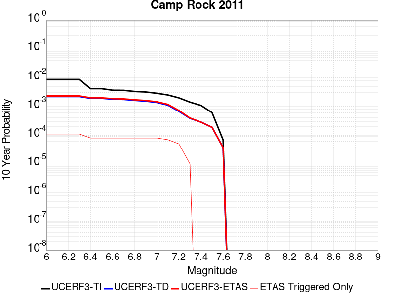 |

| Magnitude | 1 wk TI Prob | 1 wk TD Prob | 1 wk ETAS Prob | 1 wk ETAS/TD Gain | 1 wk ETAS Triggered Only | 1 mo TI Prob | 1 mo TD Prob | 1 mo ETAS Prob | 1 mo ETAS/TD Gain | 1 mo ETAS Triggered Only | 1 yr TI Prob | 1 yr TD Prob | 1 yr ETAS Prob | 1 yr ETAS/TD Gain | 1 yr ETAS Triggered Only | 10 yr TI Prob | 10 yr TD Prob | 10 yr ETAS Prob | 10 yr ETAS/TD Gain | 10 yr ETAS Triggered Only |
|-----|-----|-----|-----|-----|-----|-----|-----|-----|-----|-----|-----|-----|-----|-----|-----|-----|-----|-----|-----|-----|
| 6.0 | 1.6710783E-5 | 4.25026E-6 | 3.0988114E-5 | 7.2908745 | 2.6737967E-5 | 7.161568E-5 | 1.8215276E-5 | 5.8321497E-5 | 3.2017903 | 4.0106952E-5 | 8.7157206E-4 | 2.2174895E-4 | 2.7521304E-4 | 1.2411019 | 5.3475935E-5 | 0.008681616 | 0.0022153298 | 0.0023087054 | 1.0421498 | 9.358289E-5 |
| 6.1 | 1.6710783E-5 | 4.25026E-6 | 3.0988114E-5 | 7.2908745 | 2.6737967E-5 | 7.161568E-5 | 1.8215276E-5 | 5.8321497E-5 | 3.2017903 | 4.0106952E-5 | 8.7157206E-4 | 2.2174895E-4 | 2.7521304E-4 | 1.2411019 | 5.3475935E-5 | 0.008681616 | 0.0022153298 | 0.0023087054 | 1.0421498 | 9.358289E-5 |
| 6.2 | 1.6710783E-5 | 4.25026E-6 | 3.0988114E-5 | 7.2908745 | 2.6737967E-5 | 7.161568E-5 | 1.8215276E-5 | 5.8321497E-5 | 3.2017903 | 4.0106952E-5 | 8.7157206E-4 | 2.2174895E-4 | 2.7521304E-4 | 1.2411019 | 5.3475935E-5 | 0.008681616 | 0.0022153298 | 0.0023087054 | 1.0421498 | 9.358289E-5 |
| 6.3 | 1.6710783E-5 | 4.25026E-6 | 3.0988114E-5 | 7.2908745 | 2.6737967E-5 | 7.161568E-5 | 1.8215276E-5 | 5.8321497E-5 | 3.2017903 | 4.0106952E-5 | 8.7157206E-4 | 2.2174895E-4 | 2.7521304E-4 | 1.2411019 | 5.3475935E-5 | 0.008681616 | 0.0022153298 | 0.0023087054 | 1.0421498 | 9.358289E-5 |
| 6.4 | 7.982846E-6 | 3.6820884E-6 | 3.0419958E-5 | 8.261604 | 2.6737967E-5 | 3.421175E-5 | 1.5780286E-5 | 5.5886605E-5 | 3.5415459 | 4.0106952E-5 | 4.1644843E-4 | 1.9210839E-4 | 2.4557405E-4 | 1.2783098 | 5.3475935E-5 | 0.0041566887 | 0.001919458 | 0.0020128612 | 1.0486612 | 9.358289E-5 |
| 6.5 | 7.982846E-6 | 3.6820884E-6 | 3.0419958E-5 | 8.261604 | 2.6737967E-5 | 3.421175E-5 | 1.5780286E-5 | 5.5886605E-5 | 3.5415459 | 4.0106952E-5 | 4.1644843E-4 | 1.9210839E-4 | 2.4557405E-4 | 1.2783098 | 5.3475935E-5 | 0.0041566887 | 0.001919458 | 0.0020128612 | 1.0486612 | 9.358289E-5 |
| 6.6 | 7.048869E-6 | 3.4243571E-6 | 3.0162233E-5 | 8.808145 | 2.6737967E-5 | 3.0209088E-5 | 1.4675736E-5 | 5.47821E-5 | 3.7328348 | 4.0106952E-5 | 3.677336E-4 | 1.7866275E-4 | 2.3212912E-4 | 1.2992587 | 5.3475935E-5 | 0.0036712566 | 0.0017852228 | 0.0018786386 | 1.0523273 | 9.358289E-5 |
| 6.7 | 6.987307E-6 | 3.3623348E-6 | 3.0100213E-5 | 8.952176 | 2.6737967E-5 | 2.9945259E-5 | 1.4409929E-5 | 5.4516302E-5 | 3.783246 | 4.0106952E-5 | 3.6452254E-4 | 1.7542706E-4 | 2.2889362E-4 | 1.3047794 | 5.3475935E-5 | 0.0036392517 | 0.001752917 | 0.0018463358 | 1.0532933 | 9.358289E-5 |
| 6.8 | 6.3737602E-6 | 3.1179077E-6 | 2.9855792E-5 | 9.575585 | 2.6737967E-5 | 2.731583E-5 | 1.3362394E-5 | 5.346881E-5 | 4.001439 | 4.0106952E-5 | 3.3251947E-4 | 1.626753E-4 | 2.1614254E-4 | 1.3286746 | 5.3475935E-5 | 0.0033202237 | 0.0016255907 | 0.0017190215 | 1.057475 | 9.358289E-5 |
| 6.9 | 6.112211E-6 | 2.9331156E-6 | 2.9671006E-5 | 10.115867 | 2.6737967E-5 | 2.6194928E-5 | 1.2570436E-5 | 5.2676885E-5 | 4.1905375 | 4.0106952E-5 | 3.1887658E-4 | 1.5303459E-4 | 2.0650234E-4 | 1.3493835 | 5.3475935E-5 | 0.003184194 | 0.0015293199 | 0.0016227596 | 1.0610989 | 9.358289E-5 |
| 7.0 | 5.5140117E-6 | 2.641923E-6 | 2.937982E-5 | 11.12062 | 2.6737967E-5 | 2.3631264E-5 | 1.132248E-5 | 5.142898E-5 | 4.542201 | 4.0106952E-5 | 2.8767265E-4 | 1.3784273E-4 | 1.9131128E-4 | 1.3878955 | 5.3475935E-5 | 0.0028730053 | 0.0013775975 | 0.0014710515 | 1.0678384 | 9.358289E-5 |
| 7.1 | 4.8151105E-6 | 2.1342705E-6 | 2.8872182E-5 | 13.527893 | 2.6737967E-5 | 2.0636026E-5 | 9.146843E-6 | 4.9253427E-5 | 5.3847466 | 4.0106952E-5 | 2.5121463E-4 | 1.1135734E-4 | 1.6482732E-4 | 1.4801657 | 5.3475935E-5 | 0.0025093083 | 0.0011130372 | 0.0011931619 | 1.0719874 | 8.0213904E-5 |
| 7.2 | 3.818335E-6 | 1.2937425E-6 | 1.4662709E-5 | 11.333561 | 1.3368984E-5 | 1.6364189E-5 | 5.5445994E-6 | 3.228242E-5 | 5.8223176 | 2.6737967E-5 | 1.9921579E-4 | 6.750349E-5 | 9.423965E-5 | 1.3960708 | 2.6737967E-5 | 0.0019903728 | 6.748381E-4 | 7.282779E-4 | 1.0791892 | 5.3475935E-5 |
| 7.3 | 2.7166698E-6 | 7.3835776E-7 | 7.3835776E-7 | 1.0 | 0.0 | 1.1642818E-5 | 3.1643867E-6 | 3.1643867E-6 | 1.0 | 0.0 | 1.4174209E-4 | 3.8525748E-5 | 3.8525748E-5 | 1.0 | 0.0 | 0.0014165172 | 3.851927E-4 | 3.9855653E-4 | 1.0346938 | 1.3368984E-5 |
| 7.4 | 2.0893426E-6 | 5.4618386E-7 | 5.4618386E-7 | 1.0 | 0.0 | 8.954295E-6 | 2.3407858E-6 | 2.3407858E-6 | 1.0 | 0.0 | 1.0901308E-4 | 2.84987E-5 | 2.84987E-5 | 1.0 | 0.0 | 0.0010895962 | 2.84951E-4 | 2.84951E-4 | 1.0 | 0.0 |
| 7.5 | 1.1681728E-6 | 3.6030585E-7 | 3.6030585E-7 | 1.0 | 0.0 | 5.0064455E-6 | 1.544167E-6 | 1.544167E-6 | 1.0 | 0.0 | 6.0951766E-5 | 1.8800076E-5 | 1.8800076E-5 | 1.0 | 0.0 | 6.093505E-4 | 1.8798532E-4 | 1.8798532E-4 | 1.0 | 0.0 |
| 7.6 | 1.3154387E-7 | 7.1197384E-8 | 7.1197384E-8 | 1.0 | 0.0 | 5.6375933E-7 | 3.051316E-7 | 3.051316E-7 | 1.0 | 0.0 | 6.863748E-6 | 3.7149728E-6 | 3.7149728E-6 | 1.0 | 0.0 | 6.863536E-5 | 3.7149264E-5 | 3.7149264E-5 | 1.0 | 0.0 |

## Blue Cut
*[(top)](#table-of-contents)*

| 1 Week | 1 Month | 1 Year | 10 Year |
|-----|-----|-----|-----|
|  |  |  | 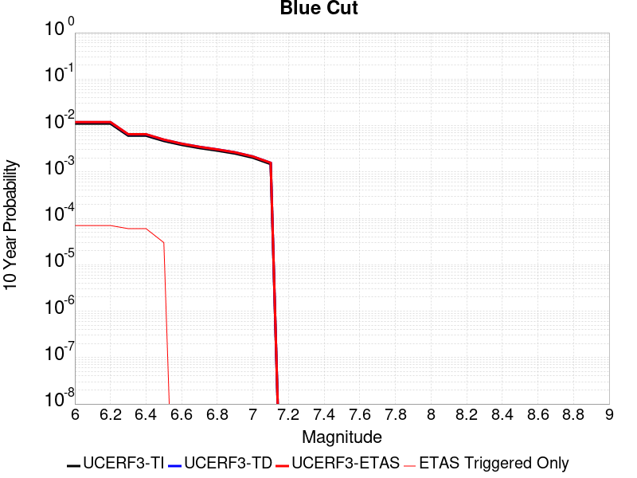 |

| Magnitude | 1 wk TI Prob | 1 wk TD Prob | 1 wk ETAS Prob | 1 wk ETAS/TD Gain | 1 wk ETAS Triggered Only | 1 mo TI Prob | 1 mo TD Prob | 1 mo ETAS Prob | 1 mo ETAS/TD Gain | 1 mo ETAS Triggered Only | 1 yr TI Prob | 1 yr TD Prob | 1 yr ETAS Prob | 1 yr ETAS/TD Gain | 1 yr ETAS Triggered Only | 10 yr TI Prob | 10 yr TD Prob | 10 yr ETAS Prob | 10 yr ETAS/TD Gain | 10 yr ETAS Triggered Only |
|-----|-----|-----|-----|-----|-----|-----|-----|-----|-----|-----|-----|-----|-----|-----|-----|-----|-----|-----|-----|-----|
| 6.0 | 2.1227985E-5 | 2.2719574E-5 | 4.9456936E-5 | 2.1768425 | 2.6737967E-5 | 9.097391E-5 | 9.73663E-5 | 1.3746935E-4 | 1.4118781 | 4.0106952E-5 | 0.0011070445 | 0.0011848481 | 0.0012516138 | 1.0563496 | 6.684492E-5 | 0.011015458 | 0.011791152 | 0.01187042 | 1.0067227 | 8.0213904E-5 |
| 6.1 | 2.1227985E-5 | 2.2719574E-5 | 4.9456936E-5 | 2.1768425 | 2.6737967E-5 | 9.097391E-5 | 9.73663E-5 | 1.3746935E-4 | 1.4118781 | 4.0106952E-5 | 0.0011070445 | 0.0011848481 | 0.0012516138 | 1.0563496 | 6.684492E-5 | 0.011015458 | 0.011791152 | 0.01187042 | 1.0067227 | 8.0213904E-5 |
| 6.2 | 2.1227985E-5 | 2.2719574E-5 | 4.9456936E-5 | 2.1768425 | 2.6737967E-5 | 9.097391E-5 | 9.73663E-5 | 1.3746935E-4 | 1.4118781 | 4.0106952E-5 | 0.0011070445 | 0.0011848481 | 0.0012516138 | 1.0563496 | 6.684492E-5 | 0.011015458 | 0.011791152 | 0.01187042 | 1.0067227 | 8.0213904E-5 |
| 6.3 | 1.1613981E-5 | 1.2353542E-5 | 3.909118E-5 | 3.16437 | 2.6737967E-5 | 4.9773254E-5 | 5.2942745E-5 | 7.96793E-5 | 1.5050088 | 2.6737967E-5 | 6.0582085E-4 | 6.443998E-4 | 6.978412E-4 | 1.0829322 | 5.3475935E-5 | 0.0060417196 | 0.0064265593 | 0.0064929747 | 1.0103345 | 6.684492E-5 |
| 6.4 | 1.1613981E-5 | 1.2353542E-5 | 3.909118E-5 | 3.16437 | 2.6737967E-5 | 4.9773254E-5 | 5.2942745E-5 | 7.96793E-5 | 1.5050088 | 2.6737967E-5 | 6.0582085E-4 | 6.443998E-4 | 6.978412E-4 | 1.0829322 | 5.3475935E-5 | 0.0060417196 | 0.0064265593 | 0.0064929747 | 1.0103345 | 6.684492E-5 |
| 6.5 | 8.931326E-6 | 9.4816E-6 | 2.2850458E-5 | 2.409979 | 1.3368984E-5 | 3.8276554E-5 | 4.0634844E-5 | 5.4003285E-5 | 1.3289896 | 1.3368984E-5 | 4.6591737E-4 | 4.946261E-4 | 5.213508E-4 | 1.0540302 | 2.6737967E-5 | 0.0046494175 | 0.004936161 | 0.00497607 | 1.008085 | 4.0106952E-5 |
| 6.6 | 7.345353E-6 | 7.79028E-6 | 7.79028E-6 | 1.0 | 0.0 | 3.1479703E-5 | 3.338653E-5 | 3.338653E-5 | 1.0 | 0.0 | 3.83198E-4 | 4.064132E-4 | 4.064132E-4 | 1.0 | 0.0 | 0.0038253788 | 0.0040574907 | 0.0040574907 | 1.0 | 0.0 |
| 6.7 | 6.2775666E-6 | 6.655149E-6 | 6.655149E-6 | 1.0 | 0.0 | 2.690358E-5 | 2.8521798E-5 | 2.8521798E-5 | 1.0 | 0.0 | 3.2750185E-4 | 3.472051E-4 | 3.472051E-4 | 1.0 | 0.0 | 0.0032701963 | 0.003467367 | 0.003467367 | 1.0 | 0.0 |
| 6.8 | 5.5234095E-6 | 5.8551113E-6 | 5.8551113E-6 | 1.0 | 0.0 | 2.367154E-5 | 2.5093133E-5 | 2.5093133E-5 | 1.0 | 0.0 | 2.8816288E-4 | 3.0547334E-4 | 3.0547334E-4 | 1.0 | 0.0 | 0.002877895 | 0.0030512505 | 0.0030512505 | 1.0 | 0.0 |
| 6.9 | 4.7780054E-6 | 5.0654203E-6 | 5.0654203E-6 | 1.0 | 0.0 | 2.0477004E-5 | 2.1708804E-5 | 2.1708804E-5 | 1.0 | 0.0 | 2.4927902E-4 | 2.642797E-4 | 2.642797E-4 | 1.0 | 0.0 | 0.0024899957 | 0.002640346 | 0.002640346 | 1.0 | 0.0 |
| 7.0 | 3.883171E-6 | 4.118487E-6 | 4.118487E-6 | 1.0 | 0.0 | 1.6642054E-5 | 1.7650578E-5 | 1.7650578E-5 | 1.0 | 0.0 | 2.0259817E-4 | 2.1488148E-4 | 2.1488148E-4 | 1.0 | 0.0 | 0.0020241356 | 0.0021474129 | 0.0021474129 | 1.0 | 0.0 |
| 7.1 | 2.8358215E-6 | 3.0097158E-6 | 3.0097158E-6 | 1.0 | 0.0 | 1.2153464E-5 | 1.2898756E-5 | 1.2898756E-5 | 1.0 | 0.0 | 1.4795837E-4 | 1.5703762E-4 | 1.5703762E-4 | 1.0 | 0.0 | 0.001478599 | 0.0015699116 | 0.0015699116 | 1.0 | 0.0 |

## Pitas Point (Lower West)
*[(top)](#table-of-contents)*

| 1 Week | 1 Month | 1 Year | 10 Year |
|-----|-----|-----|-----|
|  |  |  |  |

| Magnitude | 1 wk TI Prob | 1 wk TD Prob | 1 wk ETAS Prob | 1 wk ETAS/TD Gain | 1 wk ETAS Triggered Only | 1 mo TI Prob | 1 mo TD Prob | 1 mo ETAS Prob | 1 mo ETAS/TD Gain | 1 mo ETAS Triggered Only | 1 yr TI Prob | 1 yr TD Prob | 1 yr ETAS Prob | 1 yr ETAS/TD Gain | 1 yr ETAS Triggered Only | 10 yr TI Prob | 10 yr TD Prob | 10 yr ETAS Prob | 10 yr ETAS/TD Gain | 10 yr ETAS Triggered Only |
|-----|-----|-----|-----|-----|-----|-----|-----|-----|-----|-----|-----|-----|-----|-----|-----|-----|-----|-----|-----|-----|
| 6.0 | 8.151497E-6 | 7.855762E-6 | 3.459352E-5 | 4.4035854 | 2.6737967E-5 | 3.493452E-5 | 3.3667122E-5 | 8.7141256E-5 | 2.588319 | 5.3475935E-5 | 4.252448E-4 | 4.0982084E-4 | 4.632749E-4 | 1.1304326 | 5.3475935E-5 | 0.0042443196 | 0.0040907315 | 0.0041706176 | 1.0195285 | 8.0213904E-5 |
| 6.1 | 8.151497E-6 | 7.855762E-6 | 3.459352E-5 | 4.4035854 | 2.6737967E-5 | 3.493452E-5 | 3.3667122E-5 | 8.7141256E-5 | 2.588319 | 5.3475935E-5 | 4.252448E-4 | 4.0982084E-4 | 4.632749E-4 | 1.1304326 | 5.3475935E-5 | 0.0042443196 | 0.0040907315 | 0.0041706176 | 1.0195285 | 8.0213904E-5 |
| 6.2 | 8.151497E-6 | 7.855762E-6 | 3.459352E-5 | 4.4035854 | 2.6737967E-5 | 3.493452E-5 | 3.3667122E-5 | 8.7141256E-5 | 2.588319 | 5.3475935E-5 | 4.252448E-4 | 4.0982084E-4 | 4.632749E-4 | 1.1304326 | 5.3475935E-5 | 0.0042443196 | 0.0040907315 | 0.0041706176 | 1.0195285 | 8.0213904E-5 |
| 6.3 | 8.151497E-6 | 7.855762E-6 | 3.459352E-5 | 4.4035854 | 2.6737967E-5 | 3.493452E-5 | 3.3667122E-5 | 8.7141256E-5 | 2.588319 | 5.3475935E-5 | 4.252448E-4 | 4.0982084E-4 | 4.632749E-4 | 1.1304326 | 5.3475935E-5 | 0.0042443196 | 0.0040907315 | 0.0041706176 | 1.0195285 | 8.0213904E-5 |
| 6.4 | 8.151497E-6 | 7.855762E-6 | 3.459352E-5 | 4.4035854 | 2.6737967E-5 | 3.493452E-5 | 3.3667122E-5 | 8.7141256E-5 | 2.588319 | 5.3475935E-5 | 4.252448E-4 | 4.0982084E-4 | 4.632749E-4 | 1.1304326 | 5.3475935E-5 | 0.0042443196 | 0.0040907315 | 0.0041706176 | 1.0195285 | 8.0213904E-5 |
| 6.5 | 8.151497E-6 | 7.855762E-6 | 3.459352E-5 | 4.4035854 | 2.6737967E-5 | 3.493452E-5 | 3.3667122E-5 | 8.7141256E-5 | 2.588319 | 5.3475935E-5 | 4.252448E-4 | 4.0982084E-4 | 4.632749E-4 | 1.1304326 | 5.3475935E-5 | 0.0042443196 | 0.0040907315 | 0.0041706176 | 1.0195285 | 8.0213904E-5 |
| 6.6 | 8.151497E-6 | 7.855762E-6 | 3.459352E-5 | 4.4035854 | 2.6737967E-5 | 3.493452E-5 | 3.3667122E-5 | 8.7141256E-5 | 2.588319 | 5.3475935E-5 | 4.252448E-4 | 4.0982084E-4 | 4.632749E-4 | 1.1304326 | 5.3475935E-5 | 0.0042443196 | 0.0040907315 | 0.0041706176 | 1.0195285 | 8.0213904E-5 |
| 6.7 | 8.151497E-6 | 7.855762E-6 | 3.459352E-5 | 4.4035854 | 2.6737967E-5 | 3.493452E-5 | 3.3667122E-5 | 8.7141256E-5 | 2.588319 | 5.3475935E-5 | 4.252448E-4 | 4.0982084E-4 | 4.632749E-4 | 1.1304326 | 5.3475935E-5 | 0.0042443196 | 0.0040907315 | 0.0041706176 | 1.0195285 | 8.0213904E-5 |
| 6.8 | 8.151497E-6 | 7.855762E-6 | 3.459352E-5 | 4.4035854 | 2.6737967E-5 | 3.493452E-5 | 3.3667122E-5 | 8.7141256E-5 | 2.588319 | 5.3475935E-5 | 4.252448E-4 | 4.0982084E-4 | 4.632749E-4 | 1.1304326 | 5.3475935E-5 | 0.0042443196 | 0.0040907315 | 0.0041706176 | 1.0195285 | 8.0213904E-5 |
| 6.9 | 8.151497E-6 | 7.855762E-6 | 3.459352E-5 | 4.4035854 | 2.6737967E-5 | 3.493452E-5 | 3.3667122E-5 | 8.7141256E-5 | 2.588319 | 5.3475935E-5 | 4.252448E-4 | 4.0982084E-4 | 4.632749E-4 | 1.1304326 | 5.3475935E-5 | 0.0042443196 | 0.0040907315 | 0.0041706176 | 1.0195285 | 8.0213904E-5 |
| 7.0 | 8.103535E-6 | 7.805192E-6 | 3.454295E-5 | 4.4256377 | 2.6737967E-5 | 3.4728975E-5 | 3.3450397E-5 | 8.692455E-5 | 2.5986102 | 5.3475935E-5 | 4.2274324E-4 | 4.0718322E-4 | 4.6063738E-4 | 1.1312779 | 5.3475935E-5 | 0.0042193993 | 0.004064452 | 0.00414434 | 1.0196552 | 8.0213904E-5 |
| 7.1 | 7.853298E-6 | 7.540883E-6 | 3.4278648E-5 | 4.5457077 | 2.6737967E-5 | 3.3656554E-5 | 3.2317676E-5 | 8.579188E-5 | 2.6546428 | 5.3475935E-5 | 4.096915E-4 | 3.9339735E-4 | 4.4685224E-4 | 1.1358801 | 5.3475935E-5 | 0.00408937 | 0.0039270855 | 0.0040069846 | 1.0203456 | 8.0213904E-5 |
| 7.2 | 7.771102E-6 | 7.453165E-6 | 3.4190933E-5 | 4.587438 | 2.6737967E-5 | 3.33043E-5 | 3.194175E-5 | 8.541597E-5 | 2.674117 | 5.3475935E-5 | 4.0540437E-4 | 3.8882208E-4 | 4.4227723E-4 | 1.1374797 | 5.3475935E-5 | 0.0040466557 | 0.0038814936 | 0.003961396 | 1.0205855 | 8.0213904E-5 |
| 7.3 | 7.3945344E-6 | 7.0492697E-6 | 3.3787048E-5 | 4.792986 | 2.6737967E-5 | 3.1690477E-5 | 3.021081E-5 | 8.368513E-5 | 2.7700393 | 5.3475935E-5 | 3.8576324E-4 | 3.6775516E-4 | 4.212114E-4 | 1.1453583 | 5.3475935E-5 | 0.0038509427 | 0.0036715334 | 0.0037514528 | 1.0217673 | 8.0213904E-5 |
| 7.4 | 6.964645E-6 | 6.5901186E-6 | 1.9959014E-5 | 3.0286276 | 1.3368984E-5 | 2.9848137E-5 | 2.8243063E-5 | 6.834888E-5 | 2.4200237 | 4.0106952E-5 | 3.6334046E-4 | 3.4380553E-4 | 3.8389867E-4 | 1.1166158 | 4.0106952E-5 | 0.0036274698 | 0.0034327896 | 0.003499405 | 1.0194056 | 6.684492E-5 |
| 7.5 | 6.6525035E-6 | 6.259157E-6 | 1.9628058E-5 | 3.1358948 | 1.3368984E-5 | 2.851042E-5 | 2.6824686E-5 | 6.693056E-5 | 2.4951108 | 4.0106952E-5 | 3.4705905E-4 | 3.265421E-4 | 3.6663594E-4 | 1.1227831 | 4.0106952E-5 | 0.0034651754 | 0.0032606742 | 0.0033273012 | 1.0204335 | 6.684492E-5 |
| 7.6 | 5.613338E-6 | 5.151386E-6 | 5.151386E-6 | 1.0 | 0.0 | 2.405694E-5 | 2.2077185E-5 | 3.544587E-5 | 1.6055431 | 1.3368984E-5 | 2.928539E-4 | 2.6875688E-4 | 2.8212226E-4 | 1.0497304 | 1.3368984E-5 | 0.0029246826 | 0.0026843501 | 0.0027110162 | 1.009934 | 2.6737967E-5 |
| 7.7 | 4.494704E-6 | 3.996911E-6 | 3.996911E-6 | 1.0 | 0.0 | 1.9262876E-5 | 1.7129507E-5 | 3.0498262E-5 | 1.7804518 | 1.3368984E-5 | 2.3450027E-4 | 2.0853203E-4 | 2.2189823E-4 | 1.0640966 | 1.3368984E-5 | 0.0023425296 | 0.0020833875 | 0.0021100699 | 1.0128071 | 2.6737967E-5 |
| 7.8 | 2.6075882E-6 | 2.1836374E-6 | 2.1836374E-6 | 1.0 | 0.0 | 1.117533E-5 | 9.358413E-6 | 9.358413E-6 | 1.0 | 0.0 | 1.3605114E-4 | 1.1393277E-4 | 1.1393277E-4 | 1.0 | 0.0 | 0.0013596788 | 0.0011387484 | 0.0011387484 | 1.0 | 0.0 |
| 7.9 | 4.045984E-7 | 3.242375E-7 | 3.242375E-7 | 1.0 | 0.0 | 1.733992E-6 | 1.3895885E-6 | 1.3895885E-6 | 1.0 | 0.0 | 2.1111147E-5 | 1.6918111E-5 | 1.6918111E-5 | 1.0 | 0.0 | 2.1109142E-4 | 1.6916855E-4 | 1.6916855E-4 | 1.0 | 0.0 |
| 8.0 | 7.791402E-9 | 5.683497E-9 | 5.683497E-9 | 1.0 | 0.0 | 3.3391725E-8 | 2.4357844E-8 | 2.4357844E-8 | 1.0 | 0.0 | 4.0654416E-7 | 2.9655675E-7 | 2.9655675E-7 | 1.0 | 0.0 | 4.065434E-6 | 2.9655655E-6 | 2.9655655E-6 | 1.0 | 0.0 |

## San Diego Trough north alt1
*[(top)](#table-of-contents)*

| 1 Week | 1 Month | 1 Year | 10 Year |
|-----|-----|-----|-----|
|  |  |  |  |

| Magnitude | 1 wk TI Prob | 1 wk TD Prob | 1 wk ETAS Prob | 1 wk ETAS/TD Gain | 1 wk ETAS Triggered Only | 1 mo TI Prob | 1 mo TD Prob | 1 mo ETAS Prob | 1 mo ETAS/TD Gain | 1 mo ETAS Triggered Only | 1 yr TI Prob | 1 yr TD Prob | 1 yr ETAS Prob | 1 yr ETAS/TD Gain | 1 yr ETAS Triggered Only | 10 yr TI Prob | 10 yr TD Prob | 10 yr ETAS Prob | 10 yr ETAS/TD Gain | 10 yr ETAS Triggered Only |
|-----|-----|-----|-----|-----|-----|-----|-----|-----|-----|-----|-----|-----|-----|-----|-----|-----|-----|-----|-----|-----|
| 6.0 | 7.329252E-5 | 8.821093E-5 | 1.4168215E-4 | 1.6061745 | 5.3475935E-5 | 3.14073E-4 | 3.7799572E-4 | 4.581793E-4 | 1.2121283 | 8.0213904E-5 | 0.0038171355 | 0.004593027 | 0.0046728724 | 1.017384 | 8.0213904E-5 | 0.03752231 | 0.045044992 | 0.04512159 | 1.0017005 | 8.0213904E-5 |
| 6.1 | 3.7940346E-5 | 4.4885E-5 | 7.162177E-5 | 1.5956726 | 2.6737967E-5 | 1.6259136E-4 | 1.9235066E-4 | 2.3244991E-4 | 1.2084694 | 4.0106952E-5 | 0.0019777524 | 0.0023394432 | 0.0023794563 | 1.0171037 | 4.0106952E-5 | 0.019602431 | 0.023156688 | 0.023195865 | 1.0016918 | 4.0106952E-5 |
| 6.2 | 2.8645263E-5 | 3.329678E-5 | 4.666532E-5 | 1.4014964 | 1.3368984E-5 | 1.2275964E-4 | 1.4269284E-4 | 1.6942699E-4 | 1.1873546 | 2.6737967E-5 | 0.0014935739 | 0.0017359189 | 0.0017626105 | 1.0153761 | 2.6737967E-5 | 0.0148357535 | 0.017226247 | 0.017252525 | 1.0015254 | 2.6737967E-5 |
| 6.3 | 2.8645263E-5 | 3.329678E-5 | 4.666532E-5 | 1.4014964 | 1.3368984E-5 | 1.2275964E-4 | 1.4269284E-4 | 1.6942699E-4 | 1.1873546 | 2.6737967E-5 | 0.0014935739 | 0.0017359189 | 0.0017626105 | 1.0153761 | 2.6737967E-5 | 0.0148357535 | 0.017226247 | 0.017252525 | 1.0015254 | 2.6737967E-5 |
| 6.4 | 2.2204576E-5 | 2.5448318E-5 | 3.881696E-5 | 1.5253252 | 1.3368984E-5 | 9.5159E-5 | 1.0905972E-4 | 1.3579478E-4 | 1.2451414 | 2.6737967E-5 | 0.001157945 | 0.0013270034 | 0.0013537059 | 1.0201224 | 2.6737967E-5 | 0.011519298 | 0.013191955 | 0.01321834 | 1.0020001 | 2.6737967E-5 |
| 6.5 | 2.1004838E-5 | 2.4024694E-5 | 3.7393358E-5 | 1.556455 | 1.3368984E-5 | 9.0017624E-5 | 1.0295896E-4 | 1.2969418E-4 | 1.2596686 | 2.6737967E-5 | 0.0010954136 | 0.0012528138 | 0.0012795184 | 1.0213156 | 2.6737967E-5 | 0.010900296 | 0.012458589 | 0.012484994 | 1.0021194 | 2.6737967E-5 |
| 6.6 | 1.820557E-5 | 2.0704787E-5 | 3.4073495E-5 | 1.645682 | 1.3368984E-5 | 7.802154E-5 | 8.873181E-5 | 1.154674E-4 | 1.3013079 | 2.6737967E-5 | 9.4949827E-4 | 0.0010797799 | 0.001106489 | 1.0247357 | 2.6737967E-5 | 0.009454516 | 0.010746004 | 0.010772455 | 1.0024614 | 2.6737967E-5 |
| 6.7 | 1.5884485E-5 | 1.7983646E-5 | 3.135239E-5 | 1.7433834 | 1.3368984E-5 | 6.807459E-5 | 7.707051E-5 | 1.03806415E-4 | 1.3469019 | 2.6737967E-5 | 8.284929E-4 | 9.3793223E-4 | 9.646451E-4 | 1.0284806 | 2.6737967E-5 | 0.008254109 | 0.009340104 | 0.009366591 | 1.002836 | 2.6737967E-5 |
| 6.8 | 1.4331171E-5 | 1.6201066E-5 | 2.9569832E-5 | 1.8251783 | 1.3368984E-5 | 6.141786E-5 | 6.94313E-5 | 9.616741E-5 | 1.385073 | 2.6737967E-5 | 7.4750587E-4 | 8.450002E-4 | 8.717156E-4 | 1.0316159 | 2.6737967E-5 | 0.0074499645 | 0.008418139 | 0.008444652 | 1.0031495 | 2.6737967E-5 |
| 6.9 | 1.2574203E-5 | 1.4205835E-5 | 2.757463E-5 | 1.9410777 | 1.3368984E-5 | 5.3888325E-5 | 6.0880735E-5 | 8.7617074E-5 | 1.4391593 | 2.6737967E-5 | 6.558929E-4 | 7.409723E-4 | 7.676905E-4 | 1.0360582 | 2.6737967E-5 | 0.0065396037 | 0.007385203 | 0.007411744 | 1.0035937 | 2.6737967E-5 |
| 7.0 | 1.0883844E-5 | 1.2289262E-5 | 2.565808E-5 | 2.0878456 | 1.3368984E-5 | 4.664421E-5 | 5.2667205E-5 | 7.940376E-5 | 1.507651 | 2.6737967E-5 | 5.677453E-4 | 6.4103556E-4 | 6.6775637E-4 | 1.0416838 | 2.6737967E-5 | 0.00566297 | 0.006391993 | 0.0064185597 | 1.0041564 | 2.6737967E-5 |
| 7.1 | 9.393088E-6 | 1.060702E-5 | 2.3975863E-5 | 2.260377 | 1.3368984E-5 | 4.025547E-5 | 4.545787E-5 | 7.219462E-5 | 1.5881655 | 2.6737967E-5 | 4.900001E-4 | 5.533098E-4 | 5.8003294E-4 | 1.0482969 | 2.6737967E-5 | 0.0048892107 | 0.005519418 | 0.0055460082 | 1.0048176 | 2.6737967E-5 |
| 7.2 | 8.190791E-6 | 9.258625E-6 | 2.2627486E-5 | 2.4439356 | 1.3368984E-5 | 3.510292E-5 | 3.9679224E-5 | 6.6416134E-5 | 1.6738263 | 2.6737967E-5 | 4.2729423E-4 | 4.8298817E-4 | 5.097132E-4 | 1.0553328 | 2.6737967E-5 | 0.0042647356 | 0.004819465 | 0.0048460737 | 1.0055212 | 2.6737967E-5 |
| 7.3 | 6.268162E-6 | 7.089716E-6 | 2.0458605E-5 | 2.8856735 | 1.3368984E-5 | 2.6863276E-5 | 3.0384144E-5 | 4.3752723E-5 | 1.4399853 | 1.3368984E-5 | 3.2701128E-4 | 3.6986457E-4 | 3.8322862E-4 | 1.0361322 | 1.3368984E-5 | 0.003265305 | 0.003692536 | 0.0037058555 | 1.0036072 | 1.3368984E-5 |
| 7.4 | 4.985186E-6 | 5.6426816E-6 | 1.901159E-5 | 3.3692474 | 1.3368984E-5 | 2.1364907E-5 | 2.4182698E-5 | 3.755136E-5 | 1.5528193 | 1.3368984E-5 | 2.600867E-4 | 2.9438498E-4 | 3.0775002E-4 | 1.0453999 | 1.3368984E-5 | 0.002597825 | 0.0029399914 | 0.0029533212 | 1.0045339 | 1.3368984E-5 |
| 7.5 | 1.7489613E-6 | 1.969678E-6 | 1.5338635E-5 | 7.7873826 | 1.3368984E-5 | 7.495527E-6 | 8.4414505E-6 | 2.1810321E-5 | 2.5837173 | 1.3368984E-5 | 9.125422E-5 | 1.02770035E-4 | 1.1613765E-4 | 1.1300731 | 1.3368984E-5 | 9.1216754E-4 | 0.0010272472 | 0.0010406023 | 1.013001 | 1.3368984E-5 |
| 7.6 | 1.6988751E-7 | 1.7533823E-7 | 1.7533823E-7 | 1.0 | 0.0 | 7.2808916E-7 | 7.5144936E-7 | 7.5144936E-7 | 1.0 | 0.0 | 8.864449E-6 | 9.14886E-6 | 9.14886E-6 | 1.0 | 0.0 | 8.8640954E-5 | 9.1485024E-5 | 9.1485024E-5 | 1.0 | 0.0 |

## San Jacinto (Superstition Mtn)
*[(top)](#table-of-contents)*

| 1 Week | 1 Month | 1 Year | 10 Year |
|-----|-----|-----|-----|
|  |  |  |  |

| Magnitude | 1 wk TI Prob | 1 wk TD Prob | 1 wk ETAS Prob | 1 wk ETAS/TD Gain | 1 wk ETAS Triggered Only | 1 mo TI Prob | 1 mo TD Prob | 1 mo ETAS Prob | 1 mo ETAS/TD Gain | 1 mo ETAS Triggered Only | 1 yr TI Prob | 1 yr TD Prob | 1 yr ETAS Prob | 1 yr ETAS/TD Gain | 1 yr ETAS Triggered Only | 10 yr TI Prob | 10 yr TD Prob | 10 yr ETAS Prob | 10 yr ETAS/TD Gain | 10 yr ETAS Triggered Only |
|-----|-----|-----|-----|-----|-----|-----|-----|-----|-----|-----|-----|-----|-----|-----|-----|-----|-----|-----|-----|-----|
| 6.0 | 6.4193904E-5 | 9.599367E-5 | 1.3609677E-4 | 1.4177682 | 4.0106952E-5 | 2.7508775E-4 | 4.1134638E-4 | 4.5143682E-4 | 1.0974616 | 4.0106952E-5 | 0.0033440501 | 0.0049980893 | 0.0050646 | 1.0133072 | 6.684492E-5 | 0.03294174 | 0.048823986 | 0.048900284 | 1.0015627 | 8.0213904E-5 |
| 6.1 | 6.4193904E-5 | 9.599367E-5 | 1.3609677E-4 | 1.4177682 | 4.0106952E-5 | 2.7508775E-4 | 4.1134638E-4 | 4.5143682E-4 | 1.0974616 | 4.0106952E-5 | 0.0033440501 | 0.0049980893 | 0.0050646 | 1.0133072 | 6.684492E-5 | 0.03294174 | 0.048823986 | 0.048900284 | 1.0015627 | 8.0213904E-5 |
| 6.2 | 5.7023593E-5 | 8.3144434E-5 | 1.2324804E-4 | 1.4823368 | 4.0106952E-5 | 2.4436394E-4 | 3.5629404E-4 | 3.963867E-4 | 1.1125269 | 4.0106952E-5 | 0.002971072 | 0.0043308944 | 0.00439745 | 1.0153676 | 6.684492E-5 | 0.029316625 | 0.04250403 | 0.042580836 | 1.001807 | 8.0213904E-5 |
| 6.3 | 5.6940098E-5 | 8.298979E-5 | 1.2309341E-4 | 1.4832356 | 4.0106952E-5 | 2.4400617E-4 | 3.5563146E-4 | 3.9572417E-4 | 1.1127366 | 4.0106952E-5 | 0.002966728 | 0.00432286 | 0.004389416 | 1.0153962 | 6.684492E-5 | 0.029274331 | 0.042427283 | 0.042504095 | 1.0018104 | 8.0213904E-5 |
| 6.4 | 5.4171585E-5 | 7.7483564E-5 | 1.17587406E-4 | 1.5175787 | 4.0106952E-5 | 2.3214328E-4 | 3.3203943E-4 | 3.7213307E-4 | 1.1207496 | 4.0106952E-5 | 0.0028226813 | 0.0040367353 | 0.00410331 | 1.0164924 | 6.684492E-5 | 0.02787096 | 0.03971653 | 0.03979356 | 1.0019394 | 8.0213904E-5 |
| 6.5 | 4.375144E-5 | 5.642133E-5 | 9.652602E-5 | 1.7108072 | 4.0106952E-5 | 1.874927E-4 | 2.4178992E-4 | 2.8188716E-4 | 1.1658351 | 4.0106952E-5 | 0.0022803338 | 0.002940994 | 0.0030076422 | 1.0226618 | 6.684492E-5 | 0.022570757 | 0.029236801 | 0.029301692 | 1.0022194 | 6.684492E-5 |
| 6.6 | 2.772192E-5 | 2.5488358E-5 | 3.8857E-5 | 1.5245 | 1.3368984E-5 | 1.1880282E-4 | 1.09231354E-4 | 1.2259888E-4 | 1.1223781 | 1.3368984E-5 | 0.0014454646 | 0.0013290998 | 0.0013558022 | 1.0200906 | 2.6737967E-5 | 0.014360986 | 0.01354049 | 0.013566866 | 1.0019479 | 2.6737967E-5 |
| 6.7 | 2.7124124E-5 | 2.4699386E-5 | 3.806804E-5 | 1.5412545 | 1.3368984E-5 | 1.1624106E-4 | 1.05850326E-4 | 1.192179E-4 | 1.1262875 | 1.3368984E-5 | 0.0014143161 | 0.001287985 | 0.0013146886 | 1.0207328 | 2.6737967E-5 | 0.014053487 | 0.013133943 | 0.01316033 | 1.002009 | 2.6737967E-5 |
| 6.8 | 2.5475807E-5 | 2.216446E-5 | 3.5533147E-5 | 1.6031587 | 1.3368984E-5 | 1.0917746E-4 | 9.4987154E-5 | 1.0835486E-4 | 1.1407318 | 1.3368984E-5 | 0.001328425 | 0.001155867 | 0.0011825741 | 1.0231056 | 2.6737967E-5 | 0.0132051185 | 0.011822182 | 0.011848603 | 1.0022349 | 2.6737967E-5 |
| 6.9 | 2.1162023E-5 | 1.7626244E-5 | 3.099499E-5 | 1.7584571 | 1.3368984E-5 | 9.069123E-5 | 7.5538876E-5 | 8.8906854E-5 | 1.1769681 | 1.3368984E-5 | 0.0011036064 | 9.193016E-4 | 9.4601494E-4 | 1.0290583 | 2.6737967E-5 | 0.010981417 | 0.00944688 | 0.009473365 | 1.0028036 | 2.6737967E-5 |
| 7.0 | 1.8754288E-5 | 1.6161559E-5 | 2.9530327E-5 | 1.8271955 | 1.3368984E-5 | 8.037304E-5 | 6.9261994E-5 | 8.263005E-5 | 1.1930071 | 1.3368984E-5 | 9.781026E-4 | 8.4294105E-4 | 8.6965645E-4 | 1.0316931 | 2.6737967E-5 | 0.009738087 | 0.008670042 | 0.008696549 | 1.0030572 | 2.6737967E-5 |
| 7.1 | 1.8678527E-5 | 1.6086702E-5 | 2.945547E-5 | 1.8310448 | 1.3368984E-5 | 8.0048376E-5 | 6.89412E-5 | 8.230926E-5 | 1.1939052 | 1.3368984E-5 | 9.7415317E-4 | 8.3903834E-4 | 8.6575386E-4 | 1.0318407 | 2.6737967E-5 | 0.009698939 | 0.008630998 | 0.008657506 | 1.0030712 | 2.6737967E-5 |
| 7.2 | 1.7804578E-5 | 1.5381282E-5 | 2.8750059E-5 | 1.869159 | 1.3368984E-5 | 7.6303106E-5 | 6.5918124E-5 | 7.928623E-5 | 1.2027986 | 1.3368984E-5 | 9.285943E-4 | 8.022599E-4 | 8.289764E-4 | 1.0333016 | 2.6737967E-5 | 0.009247236 | 0.008262311 | 0.008288829 | 1.0032094 | 2.6737967E-5 |
| 7.3 | 1.6583685E-5 | 1.4530388E-5 | 2.7899177E-5 | 1.9200573 | 1.3368984E-5 | 7.1070994E-5 | 6.227162E-5 | 7.563977E-5 | 1.2146748 | 1.3368984E-5 | 8.649459E-4 | 7.5789524E-4 | 7.8461296E-4 | 1.0352525 | 2.6737967E-5 | 0.00861587 | 0.007817623 | 0.007844153 | 1.0033935 | 2.6737967E-5 |
| 7.4 | 1.6387552E-5 | 1.4395274E-5 | 2.7764065E-5 | 1.928693 | 1.3368984E-5 | 7.023047E-5 | 6.169258E-5 | 7.506074E-5 | 1.21669 | 1.3368984E-5 | 8.5472054E-4 | 7.5085036E-4 | 7.7756826E-4 | 1.0355835 | 2.6737967E-5 | 0.008514405 | 0.0077470057 | 0.0077735367 | 1.0034246 | 2.6737967E-5 |
| 7.5 | 1.5790754E-5 | 1.4035962E-5 | 2.7404758E-5 | 1.9524674 | 1.3368984E-5 | 6.767291E-5 | 6.0152746E-5 | 7.3520925E-5 | 1.2222372 | 1.3368984E-5 | 8.236062E-4 | 7.321156E-4 | 7.5883395E-4 | 1.0364947 | 2.6737967E-5 | 0.008205604 | 0.007557569 | 0.007584105 | 1.0035112 | 2.6737967E-5 |
| 7.6 | 1.4248672E-5 | 1.3054932E-5 | 2.6423742E-5 | 2.0240428 | 1.3368984E-5 | 6.106431E-5 | 5.594852E-5 | 6.931675E-5 | 1.2389381 | 1.3368984E-5 | 7.432043E-4 | 6.8096205E-4 | 7.076818E-4 | 1.0392382 | 2.6737967E-5 | 0.007407237 | 0.0070401574 | 0.007066707 | 1.0037712 | 2.6737967E-5 |
| 7.7 | 1.15449975E-5 | 1.090368E-5 | 2.4272518E-5 | 2.226085 | 1.3368984E-5 | 4.947762E-5 | 4.6729223E-5 | 6.0097584E-5 | 1.2860813 | 1.3368984E-5 | 6.022235E-4 | 5.687805E-4 | 5.955033E-4 | 1.0469825 | 2.6737967E-5 | 0.006005941 | 0.0059101824 | 0.0059367623 | 1.0044973 | 2.6737967E-5 |
| 7.8 | 9.1391985E-6 | 9.514299E-6 | 2.2883156E-5 | 2.4051332 | 1.3368984E-5 | 3.9167408E-5 | 4.0774932E-5 | 5.414337E-5 | 1.3278593 | 1.3368984E-5 | 4.767588E-4 | 4.963223E-4 | 5.096847E-4 | 1.0269227 | 1.3368984E-5 | 0.0047573727 | 0.0051766867 | 0.0051899864 | 1.0025692 | 1.3368984E-5 |
| 7.9 | 6.973017E-6 | 7.3821784E-6 | 2.0751064E-5 | 2.8109674 | 1.3368984E-5 | 2.9884017E-5 | 3.1637526E-5 | 4.5006087E-5 | 1.4225539 | 1.3368984E-5 | 3.6377716E-4 | 3.8511935E-4 | 3.984832E-4 | 1.0347005 | 1.3368984E-5 | 0.0036318225 | 0.0040517948 | 0.0040651094 | 1.0032861 | 1.3368984E-5 |
| 8.0 | 5.7638235E-6 | 6.259972E-6 | 1.9628873E-5 | 3.1356165 | 1.3368984E-5 | 2.4701867E-5 | 2.6828178E-5 | 4.0196803E-5 | 1.4983053 | 1.3368984E-5 | 3.0070372E-4 | 3.2658462E-4 | 3.3994924E-4 | 1.0409224 | 1.3368984E-5 | 0.0030029714 | 0.0034534496 | 0.0034667724 | 1.0038579 | 1.3368984E-5 |
| 8.1 | 5.1124434E-6 | 5.4956718E-6 | 1.8864583E-5 | 3.4326253 | 1.3368984E-5 | 2.1910288E-5 | 2.355267E-5 | 3.6921338E-5 | 1.5676074 | 1.3368984E-5 | 2.6672508E-4 | 2.867165E-4 | 3.0008165E-4 | 1.0466145 | 1.3368984E-5 | 0.0026640517 | 0.003040336 | 0.0030536645 | 1.0043838 | 1.3368984E-5 |
| 8.2 | 1.1075938E-6 | 5.336568E-7 | 5.336568E-7 | 1.0 | 0.0 | 4.7468216E-6 | 2.2870988E-6 | 2.2870988E-6 | 1.0 | 0.0 | 5.779102E-5 | 2.7845093E-5 | 2.7845093E-5 | 1.0 | 0.0 | 5.777599E-4 | 3.1346595E-4 | 3.1346595E-4 | 1.0 | 0.0 |
| 8.3 | 1.3584393E-8 | 4.473836E-9 | 4.473836E-9 | 1.0 | 0.0 | 5.8218827E-8 | 1.9173582E-8 | 1.9173582E-8 | 1.0 | 0.0 | 7.0881396E-7 | 2.3343837E-7 | 2.3343837E-7 | 1.0 | 0.0 | 7.0881174E-6 | 2.6163038E-6 | 2.6163038E-6 | 1.0 | 0.0 |

## Santa Cruz Catalina Ridge alt1
*[(top)](#table-of-contents)*

| 1 Week | 1 Month | 1 Year | 10 Year |
|-----|-----|-----|-----|
|  |  |  |  |

| Magnitude | 1 wk TI Prob | 1 wk TD Prob | 1 wk ETAS Prob | 1 wk ETAS/TD Gain | 1 wk ETAS Triggered Only | 1 mo TI Prob | 1 mo TD Prob | 1 mo ETAS Prob | 1 mo ETAS/TD Gain | 1 mo ETAS Triggered Only | 1 yr TI Prob | 1 yr TD Prob | 1 yr ETAS Prob | 1 yr ETAS/TD Gain | 1 yr ETAS Triggered Only | 10 yr TI Prob | 10 yr TD Prob | 10 yr ETAS Prob | 10 yr ETAS/TD Gain | 10 yr ETAS Triggered Only |
|-----|-----|-----|-----|-----|-----|-----|-----|-----|-----|-----|-----|-----|-----|-----|-----|-----|-----|-----|-----|-----|
| 6.0 | 3.2833184E-5 | 3.65584E-5 | 9.003238E-5 | 2.4627004 | 5.3475935E-5 | 1.4070606E-4 | 1.5667039E-4 | 2.1013794E-4 | 1.3412741 | 5.3475935E-5 | 0.00171175 | 0.0019059596 | 0.0019593337 | 1.0280037 | 5.3475935E-5 | 0.016986247 | 0.018913029 | 0.018991726 | 1.004161 | 8.0213904E-5 |
| 6.1 | 1.9835548E-5 | 2.1659505E-5 | 2.1659505E-5 | 1.0 | 0.0 | 8.500672E-5 | 9.282326E-5 | 9.282326E-5 | 1.0 | 0.0 | 0.0010344655 | 0.0011295575 | 0.0011295575 | 1.0 | 0.0 | 0.010296632 | 0.011240295 | 0.011253514 | 1.001176 | 1.3368984E-5 |
| 6.2 | 1.9835548E-5 | 2.1659505E-5 | 2.1659505E-5 | 1.0 | 0.0 | 8.500672E-5 | 9.282326E-5 | 9.282326E-5 | 1.0 | 0.0 | 0.0010344655 | 0.0011295575 | 0.0011295575 | 1.0 | 0.0 | 0.010296632 | 0.011240295 | 0.011253514 | 1.001176 | 1.3368984E-5 |
| 6.3 | 1.5728183E-5 | 1.703395E-5 | 1.703395E-5 | 1.0 | 0.0 | 6.7404755E-5 | 7.300063E-5 | 7.300063E-5 | 1.0 | 0.0 | 8.2034385E-4 | 8.884264E-4 | 8.884264E-4 | 1.0 | 0.0 | 0.008173222 | 0.008849427 | 0.008862678 | 1.0014974 | 1.3368984E-5 |
| 6.4 | 1.5728183E-5 | 1.703395E-5 | 1.703395E-5 | 1.0 | 0.0 | 6.7404755E-5 | 7.300063E-5 | 7.300063E-5 | 1.0 | 0.0 | 8.2034385E-4 | 8.884264E-4 | 8.884264E-4 | 1.0 | 0.0 | 0.008173222 | 0.008849427 | 0.008862678 | 1.0014974 | 1.3368984E-5 |
| 6.5 | 1.3707734E-5 | 1.4794522E-5 | 1.4794522E-5 | 1.0 | 0.0 | 5.8746107E-5 | 6.3403575E-5 | 6.3403575E-5 | 1.0 | 0.0 | 7.1499916E-4 | 7.716686E-4 | 7.716686E-4 | 1.0 | 0.0 | 0.0071270303 | 0.0076902895 | 0.0077035557 | 1.0017251 | 1.3368984E-5 |
| 6.6 | 1.2539813E-5 | 1.3510219E-5 | 1.3510219E-5 | 1.0 | 0.0 | 5.3740947E-5 | 5.789967E-5 | 5.789967E-5 | 1.0 | 0.0 | 6.540996E-4 | 7.0470315E-4 | 7.0470315E-4 | 1.0 | 0.0 | 0.0065217763 | 0.0070249885 | 0.0070382636 | 1.0018897 | 1.3368984E-5 |
| 6.7 | 1.1504083E-5 | 1.2377375E-5 | 1.2377375E-5 | 1.0 | 0.0 | 4.930228E-5 | 5.3044827E-5 | 5.3044827E-5 | 1.0 | 0.0 | 6.0008996E-4 | 6.456314E-4 | 6.456314E-4 | 1.0 | 0.0 | 0.005984721 | 0.006437786 | 0.006451069 | 1.0020633 | 1.3368984E-5 |
| 6.8 | 1.012739E-5 | 1.0877071E-5 | 1.0877071E-5 | 1.0 | 0.0 | 4.340238E-5 | 4.6615194E-5 | 4.6615194E-5 | 1.0 | 0.0 | 5.282958E-4 | 5.673937E-4 | 5.673937E-4 | 1.0 | 0.0 | 0.0052704164 | 0.0056596193 | 0.005672913 | 1.0023488 | 1.3368984E-5 |
| 6.9 | 8.9607865E-6 | 9.609117E-6 | 9.609117E-6 | 1.0 | 0.0 | 3.8402806E-5 | 4.1181287E-5 | 4.1181287E-5 | 1.0 | 0.0 | 4.6745385E-4 | 5.012679E-4 | 5.012679E-4 | 1.0 | 0.0 | 0.0046647177 | 0.005001492 | 0.005014794 | 1.0026597 | 1.3368984E-5 |
| 7.0 | 8.046829E-6 | 8.619746E-6 | 8.619746E-6 | 1.0 | 0.0 | 3.4485955E-5 | 3.694125E-5 | 3.694125E-5 | 1.0 | 0.0 | 4.1978562E-4 | 4.496677E-4 | 4.496677E-4 | 1.0 | 0.0 | 0.004189935 | 0.0044876686 | 0.0045009777 | 1.0029657 | 1.3368984E-5 |
| 7.1 | 7.136131E-6 | 7.637656E-6 | 7.637656E-6 | 1.0 | 0.0 | 3.0583058E-5 | 3.2732405E-5 | 3.2732405E-5 | 1.0 | 0.0 | 3.7228514E-4 | 3.9844486E-4 | 3.9844486E-4 | 1.0 | 0.0 | 0.0037166206 | 0.003977381 | 0.003990697 | 1.0033479 | 1.3368984E-5 |
| 7.2 | 6.362014E-6 | 6.8049585E-6 | 6.8049585E-6 | 1.0 | 0.0 | 2.726549E-5 | 2.9163786E-5 | 2.9163786E-5 | 1.0 | 0.0 | 3.3190678E-4 | 3.550119E-4 | 3.550119E-4 | 1.0 | 0.0 | 0.0033141149 | 0.003544516 | 0.0035578376 | 1.0037583 | 1.3368984E-5 |
| 7.3 | 5.004101E-6 | 5.351715E-6 | 5.351715E-6 | 1.0 | 0.0 | 2.1445969E-5 | 2.2935723E-5 | 2.2935723E-5 | 1.0 | 0.0 | 2.6107338E-4 | 2.792072E-4 | 2.792072E-4 | 1.0 | 0.0 | 0.002607669 | 0.0027886187 | 0.0028019503 | 1.0047808 | 1.3368984E-5 |
| 7.4 | 3.4901443E-6 | 3.7320526E-6 | 3.7320526E-6 | 1.0 | 0.0 | 1.4957676E-5 | 1.5994416E-5 | 1.5994416E-5 | 1.0 | 0.0 | 1.8209449E-4 | 1.9471499E-4 | 1.9471499E-4 | 1.0 | 0.0 | 0.0018194534 | 0.0019454823 | 0.0019454823 | 1.0 | 0.0 |
| 7.5 | 1.1215045E-6 | 1.189387E-6 | 1.189387E-6 | 1.0 | 0.0 | 4.806439E-6 | 5.097363E-6 | 5.097363E-6 | 1.0 | 0.0 | 5.851682E-5 | 6.205866E-5 | 6.205866E-5 | 1.0 | 0.0 | 5.850142E-4 | 6.2041637E-4 | 6.2041637E-4 | 1.0 | 0.0 |
| 7.6 | 2.8599047E-7 | 2.9951994E-7 | 2.9951994E-7 | 1.0 | 0.0 | 1.2256729E-6 | 1.2836562E-6 | 1.2836562E-6 | 1.0 | 0.0 | 1.4922465E-5 | 1.5628404E-5 | 1.5628404E-5 | 1.0 | 0.0 | 1.4921463E-4 | 1.5627318E-4 | 1.5627318E-4 | 1.0 | 0.0 |
| 7.7 | 2.0781519E-7 | 2.1744323E-7 | 2.1744323E-7 | 1.0 | 0.0 | 8.906362E-7 | 9.3189925E-7 | 9.3189925E-7 | 1.0 | 0.0 | 1.08434415E-5 | 1.13458145E-5 | 1.13458145E-5 | 1.0 | 0.0 | 1.0842913E-4 | 1.1345245E-4 | 1.1345245E-4 | 1.0 | 0.0 |
| 7.8 | 3.614776E-8 | 3.764102E-8 | 3.764102E-8 | 1.0 | 0.0 | 1.5491896E-7 | 1.6131864E-7 | 1.6131864E-7 | 1.0 | 0.0 | 1.8861368E-6 | 1.9640527E-6 | 1.9640527E-6 | 1.0 | 0.0 | 1.8861208E-5 | 1.9640367E-5 | 1.9640367E-5 | 1.0 | 0.0 |

## Santa Susana alt 1
*[(top)](#table-of-contents)*

| 1 Week | 1 Month | 1 Year | 10 Year |
|-----|-----|-----|-----|
|  |  |  |  |

| Magnitude | 1 wk TI Prob | 1 wk TD Prob | 1 wk ETAS Prob | 1 wk ETAS/TD Gain | 1 wk ETAS Triggered Only | 1 mo TI Prob | 1 mo TD Prob | 1 mo ETAS Prob | 1 mo ETAS/TD Gain | 1 mo ETAS Triggered Only | 1 yr TI Prob | 1 yr TD Prob | 1 yr ETAS Prob | 1 yr ETAS/TD Gain | 1 yr ETAS Triggered Only | 10 yr TI Prob | 10 yr TD Prob | 10 yr ETAS Prob | 10 yr ETAS/TD Gain | 10 yr ETAS Triggered Only |
|-----|-----|-----|-----|-----|-----|-----|-----|-----|-----|-----|-----|-----|-----|-----|-----|-----|-----|-----|-----|-----|
| 6.0 | 2.674877E-5 | 2.7198023E-5 | 5.3935262E-5 | 1.9830582 | 2.6737967E-5 | 1.1463255E-4 | 1.1655839E-4 | 1.5666067E-4 | 1.3440531 | 4.0106952E-5 | 0.0013947578 | 0.0014182882 | 0.0014850383 | 1.0470638 | 6.684492E-5 | 0.013860362 | 0.014104128 | 0.01418321 | 1.005607 | 8.0213904E-5 |
| 6.1 | 2.674877E-5 | 2.7198023E-5 | 5.3935262E-5 | 1.9830582 | 2.6737967E-5 | 1.1463255E-4 | 1.1655839E-4 | 1.5666067E-4 | 1.3440531 | 4.0106952E-5 | 0.0013947578 | 0.0014182882 | 0.0014850383 | 1.0470638 | 6.684492E-5 | 0.013860362 | 0.014104128 | 0.01418321 | 1.005607 | 8.0213904E-5 |
| 6.2 | 2.674877E-5 | 2.7198023E-5 | 5.3935262E-5 | 1.9830582 | 2.6737967E-5 | 1.1463255E-4 | 1.1655839E-4 | 1.5666067E-4 | 1.3440531 | 4.0106952E-5 | 0.0013947578 | 0.0014182882 | 0.0014850383 | 1.0470638 | 6.684492E-5 | 0.013860362 | 0.014104128 | 0.01418321 | 1.005607 | 8.0213904E-5 |
| 6.3 | 2.674877E-5 | 2.7198023E-5 | 5.3935262E-5 | 1.9830582 | 2.6737967E-5 | 1.1463255E-4 | 1.1655839E-4 | 1.5666067E-4 | 1.3440531 | 4.0106952E-5 | 0.0013947578 | 0.0014182882 | 0.0014850383 | 1.0470638 | 6.684492E-5 | 0.013860362 | 0.014104128 | 0.01418321 | 1.005607 | 8.0213904E-5 |
| 6.4 | 2.674877E-5 | 2.7198023E-5 | 5.3935262E-5 | 1.9830582 | 2.6737967E-5 | 1.1463255E-4 | 1.1655839E-4 | 1.5666067E-4 | 1.3440531 | 4.0106952E-5 | 0.0013947578 | 0.0014182882 | 0.0014850383 | 1.0470638 | 6.684492E-5 | 0.013860362 | 0.014104128 | 0.01418321 | 1.005607 | 8.0213904E-5 |
| 6.5 | 2.674877E-5 | 2.7198023E-5 | 5.3935262E-5 | 1.9830582 | 2.6737967E-5 | 1.1463255E-4 | 1.1655839E-4 | 1.5666067E-4 | 1.3440531 | 4.0106952E-5 | 0.0013947578 | 0.0014182882 | 0.0014850383 | 1.0470638 | 6.684492E-5 | 0.013860362 | 0.014104128 | 0.01418321 | 1.005607 | 8.0213904E-5 |
| 6.6 | 2.6647976E-5 | 2.7074359E-5 | 5.3811604E-5 | 1.9875486 | 2.6737967E-5 | 1.14200615E-4 | 1.1602845E-4 | 1.5613074E-4 | 1.3456247 | 4.0106952E-5 | 0.0013895056 | 0.0014118447 | 0.0014785953 | 1.047279 | 6.684492E-5 | 0.013808494 | 0.014040513 | 0.014119601 | 1.0056329 | 8.0213904E-5 |
| 6.7 | 2.6647976E-5 | 2.7074359E-5 | 5.3811604E-5 | 1.9875486 | 2.6737967E-5 | 1.14200615E-4 | 1.1602845E-4 | 1.5613074E-4 | 1.3456247 | 4.0106952E-5 | 0.0013895056 | 0.0014118447 | 0.0014785953 | 1.047279 | 6.684492E-5 | 0.013808494 | 0.014040513 | 0.014119601 | 1.0056329 | 8.0213904E-5 |
| 6.8 | 1.9073179E-5 | 1.7637283E-5 | 3.100603E-5 | 1.7579823 | 1.3368984E-5 | 8.1739636E-5 | 7.558627E-5 | 8.895424E-5 | 1.1768571 | 1.3368984E-5 | 9.947256E-4 | 9.198925E-4 | 9.4660587E-4 | 1.0290396 | 2.6737967E-5 | 0.009902848 | 0.009163101 | 0.009202841 | 1.004337 | 4.0106952E-5 |
| 6.9 | 1.9041876E-5 | 1.7619415E-5 | 3.0988165E-5 | 1.7587509 | 1.3368984E-5 | 8.160549E-5 | 7.55097E-5 | 8.887767E-5 | 1.1770365 | 1.3368984E-5 | 9.930939E-4 | 9.1896096E-4 | 9.456744E-4 | 1.0290692 | 2.6737967E-5 | 0.0098866755 | 0.0091538625 | 0.009193603 | 1.0043414 | 4.0106952E-5 |
| 7.0 | 1.5917482E-5 | 1.3863864E-5 | 2.7232663E-5 | 1.9642909 | 1.3368984E-5 | 6.8215995E-5 | 5.9415237E-5 | 7.278343E-5 | 1.224996 | 1.3368984E-5 | 8.302132E-4 | 7.231451E-4 | 7.498637E-4 | 1.0369478 | 2.6737967E-5 | 0.008271185 | 0.0072088144 | 0.007248632 | 1.0055234 | 4.0106952E-5 |
| 7.1 | 1.577788E-5 | 1.3743872E-5 | 2.7112672E-5 | 1.9727099 | 1.3368984E-5 | 6.761774E-5 | 5.8901005E-5 | 7.22692E-5 | 1.2269604 | 1.3368984E-5 | 8.2293496E-4 | 7.1688846E-4 | 7.4360723E-4 | 1.0372705 | 2.6737967E-5 | 0.008198941 | 0.007146652 | 0.0071864724 | 1.0055718 | 4.0106952E-5 |
| 7.2 | 1.5416446E-5 | 1.3469944E-5 | 2.6838748E-5 | 1.9924914 | 1.3368984E-5 | 6.606882E-5 | 5.772708E-5 | 7.1095295E-5 | 1.2315761 | 1.3368984E-5 | 8.0409093E-4 | 7.026052E-4 | 7.2932435E-4 | 1.0380287 | 2.6737967E-5 | 0.008011877 | 0.0070047234 | 0.0070445496 | 1.0056856 | 4.0106952E-5 |
| 7.3 | 1.4534083E-5 | 1.2717879E-5 | 2.6086693E-5 | 2.0511827 | 1.3368984E-5 | 6.228744E-5 | 5.4504082E-5 | 6.787234E-5 | 1.2452707 | 1.3368984E-5 | 7.580857E-4 | 6.633896E-4 | 6.9010985E-4 | 1.0402783 | 2.6737967E-5 | 0.007555048 | 0.0066149444 | 0.006654786 | 1.0060229 | 4.0106952E-5 |
| 7.4 | 1.2858995E-5 | 1.1229652E-5 | 1.1229652E-5 | 1.0 | 0.0 | 5.5108816E-5 | 4.8126214E-5 | 4.8126214E-5 | 1.0 | 0.0 | 6.7074323E-4 | 5.857831E-4 | 5.9914426E-4 | 1.022809 | 1.3368984E-5 | 0.0066872234 | 0.005843165 | 0.0058697467 | 1.0045491 | 2.6737967E-5 |
| 7.5 | 8.827668E-6 | 7.805457E-6 | 7.805457E-6 | 1.0 | 0.0 | 3.7832317E-5 | 3.3451546E-5 | 3.3451546E-5 | 1.0 | 0.0 | 4.605111E-4 | 4.071989E-4 | 4.2056243E-4 | 1.0328182 | 1.3368984E-5 | 0.0045955796 | 0.0040647765 | 0.004078091 | 1.0032756 | 1.3368984E-5 |
| 7.6 | 3.2533426E-6 | 2.871988E-6 | 2.871988E-6 | 1.0 | 0.0 | 1.3942822E-5 | 1.2308465E-5 | 1.2308465E-5 | 1.0 | 0.0 | 1.6974064E-4 | 1.4984563E-4 | 1.6321261E-4 | 1.089205 | 1.3368984E-5 | 0.0016961104 | 0.0014974826 | 0.0015108316 | 1.0089142 | 1.3368984E-5 |
| 7.7 | 1.2751709E-6 | 1.1491089E-6 | 1.1491089E-6 | 1.0 | 0.0 | 5.4650063E-6 | 4.9247437E-6 | 4.9247437E-6 | 1.0 | 0.0 | 6.653442E-5 | 5.9957198E-5 | 5.9957198E-5 | 1.0 | 0.0 | 6.6514505E-4 | 5.994191E-4 | 5.994191E-4 | 1.0 | 0.0 |
| 7.8 | 3.067544E-7 | 3.2400436E-7 | 3.2400436E-7 | 1.0 | 0.0 | 1.3146611E-6 | 1.3885895E-6 | 1.3885895E-6 | 1.0 | 0.0 | 1.600588E-5 | 1.6905957E-5 | 1.6905957E-5 | 1.0 | 0.0 | 1.6004729E-4 | 1.6904772E-4 | 1.6904772E-4 | 1.0 | 0.0 |
| 7.9 | 7.622999E-8 | 8.087964E-8 | 8.087964E-8 | 1.0 | 0.0 | 3.2669993E-7 | 3.4662696E-7 | 3.4662696E-7 | 1.0 | 0.0 | 3.977564E-6 | 4.2201773E-6 | 4.2201773E-6 | 1.0 | 0.0 | 3.977493E-5 | 4.220118E-5 | 4.220118E-5 | 1.0 | 0.0 |

## Newport-Inglewood (Offshore)
*[(top)](#table-of-contents)*

| 1 Week | 1 Month | 1 Year | 10 Year |
|-----|-----|-----|-----|
|  |  | 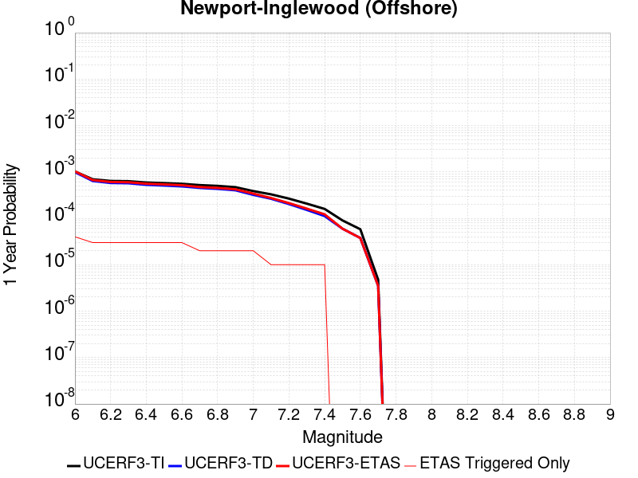 |  |

| Magnitude | 1 wk TI Prob | 1 wk TD Prob | 1 wk ETAS Prob | 1 wk ETAS/TD Gain | 1 wk ETAS Triggered Only | 1 mo TI Prob | 1 mo TD Prob | 1 mo ETAS Prob | 1 mo ETAS/TD Gain | 1 mo ETAS Triggered Only | 1 yr TI Prob | 1 yr TD Prob | 1 yr ETAS Prob | 1 yr ETAS/TD Gain | 1 yr ETAS Triggered Only | 10 yr TI Prob | 10 yr TD Prob | 10 yr ETAS Prob | 10 yr ETAS/TD Gain | 10 yr ETAS Triggered Only |
|-----|-----|-----|-----|-----|-----|-----|-----|-----|-----|-----|-----|-----|-----|-----|-----|-----|-----|-----|-----|-----|
| 6.0 | 1.9626508E-5 | 1.8965357E-5 | 4.5702818E-5 | 2.4098053 | 2.6737967E-5 | 8.411089E-5 | 8.1277634E-5 | 1.0801343E-4 | 1.3289441 | 2.6737967E-5 | 0.001023569 | 9.891186E-4 | 0.0010425416 | 1.0540107 | 5.3475935E-5 | 0.010188672 | 0.009848503 | 0.009914691 | 1.0067204 | 6.684492E-5 |
| 6.1 | 1.331886E-5 | 1.2218092E-5 | 3.895573E-5 | 3.1883647 | 2.6737967E-5 | 5.707958E-5 | 5.2362207E-5 | 7.9098776E-5 | 1.5106081 | 2.6737967E-5 | 6.947222E-4 | 6.3732493E-4 | 6.774063E-4 | 1.06289 | 4.0106952E-5 | 0.006925544 | 0.006355149 | 0.006395001 | 1.0062709 | 4.0106952E-5 |
| 6.2 | 1.2250852E-5 | 1.1076029E-5 | 3.78137E-5 | 3.4140124 | 2.6737967E-5 | 5.2502597E-5 | 4.7467838E-5 | 7.420454E-5 | 1.5632592 | 2.6737967E-5 | 6.3903164E-4 | 5.777687E-4 | 6.178525E-4 | 1.0693768 | 4.0106952E-5 | 0.006371971 | 0.0057627866 | 0.0058026626 | 1.0069195 | 4.0106952E-5 |
| 6.3 | 1.2106258E-5 | 1.0918891E-5 | 3.7656566E-5 | 3.4487538 | 2.6737967E-5 | 5.1882926E-5 | 4.6794412E-5 | 7.353113E-5 | 1.5713656 | 2.6737967E-5 | 6.3149154E-4 | 5.69574E-4 | 6.0965813E-4 | 1.0703756 | 4.0106952E-5 | 0.0062970007 | 0.005681259 | 0.0057211383 | 1.0070194 | 4.0106952E-5 |
| 6.4 | 1.1348758E-5 | 1.0109362E-5 | 3.684706E-5 | 3.6448452 | 2.6737967E-5 | 4.8636626E-5 | 4.3325123E-5 | 7.0061935E-5 | 1.6171203 | 2.6737967E-5 | 5.919901E-4 | 5.273565E-4 | 5.674423E-4 | 1.0760127 | 4.0106952E-5 | 0.005904155 | 0.0052611465 | 0.0053010425 | 1.0075831 | 4.0106952E-5 |
| 6.5 | 1.100837E-5 | 9.7433895E-6 | 3.6481095E-5 | 3.7441897 | 2.6737967E-5 | 4.7177873E-5 | 4.1756717E-5 | 6.8493566E-5 | 1.6403006 | 2.6737967E-5 | 5.7423924E-4 | 5.082702E-4 | 5.483568E-4 | 1.0788686 | 4.0106952E-5 | 0.005727576 | 0.0050711688 | 0.005111072 | 1.0078688 | 4.0106952E-5 |
| 6.6 | 1.0634696E-5 | 9.345544E-6 | 3.608326E-5 | 3.8610127 | 2.6737967E-5 | 4.557647E-5 | 4.0051716E-5 | 6.678861E-5 | 1.6675593 | 2.6737967E-5 | 5.5475225E-4 | 4.8752132E-4 | 5.2760873E-4 | 1.082227 | 4.0106952E-5 | 0.0055336943 | 0.0048646047 | 0.0049045165 | 1.0082046 | 4.0106952E-5 |
| 6.7 | 9.9780855E-6 | 8.667911E-6 | 3.5405646E-5 | 4.0846806 | 2.6737967E-5 | 4.276252E-5 | 3.7147664E-5 | 6.388464E-5 | 1.7197485 | 2.6737967E-5 | 5.205093E-4 | 4.5217964E-4 | 4.7890554E-4 | 1.0591046 | 2.6737967E-5 | 0.0051929182 | 0.004512675 | 0.0045392923 | 1.0058984 | 2.6737967E-5 |
| 6.8 | 9.59546E-6 | 8.27295E-6 | 3.5010697E-5 | 4.231948 | 2.6737967E-5 | 4.1122752E-5 | 3.5455025E-5 | 6.219204E-5 | 1.7541109 | 2.6737967E-5 | 5.0055445E-4 | 4.315801E-4 | 4.5830652E-4 | 1.061927 | 2.6737967E-5 | 0.004994285 | 0.004307495 | 0.0043341178 | 1.0061805 | 2.6737967E-5 |
| 6.9 | 9.000614E-6 | 7.70684E-6 | 3.44446E-5 | 4.4693546 | 2.6737967E-5 | 3.857349E-5 | 3.30289E-5 | 5.9765985E-5 | 1.8095057 | 2.6737967E-5 | 4.6953102E-4 | 4.0205332E-4 | 4.2878054E-4 | 1.0664768 | 2.6737967E-5 | 0.004685402 | 0.0040133307 | 0.0040399614 | 1.0066355 | 2.6737967E-5 |
| 7.0 | 7.4070194E-6 | 6.148904E-6 | 3.2886706E-5 | 5.3483853 | 2.6737967E-5 | 3.1743984E-5 | 2.635218E-5 | 5.3089443E-5 | 2.014613 | 2.6737967E-5 | 3.8641447E-4 | 3.207907E-4 | 3.475201E-4 | 1.0833235 | 2.6737967E-5 | 0.0038574322 | 0.0032032963 | 0.0032299487 | 1.0083203 | 2.6737967E-5 |
| 7.1 | 6.299615E-6 | 5.0565927E-6 | 1.842551E-5 | 3.6438587 | 1.3368984E-5 | 2.699807E-5 | 2.1670932E-5 | 3.5039626E-5 | 1.6168952 | 1.3368984E-5 | 3.2865192E-4 | 2.638118E-4 | 2.7717726E-4 | 1.0506629 | 1.3368984E-5 | 0.003281663 | 0.002635001 | 0.0026483347 | 1.0050602 | 1.3368984E-5 |
| 7.2 | 5.096653E-6 | 3.892769E-6 | 1.72617E-5 | 4.4342985 | 1.3368984E-5 | 2.1842614E-5 | 1.668319E-5 | 3.0051951E-5 | 1.8013312 | 1.3368984E-5 | 2.6590136E-4 | 2.0309901E-4 | 2.1646528E-4 | 1.0658116 | 1.3368984E-5 | 0.0026558342 | 0.0020291451 | 0.002042487 | 1.0065751 | 1.3368984E-5 |
| 7.3 | 3.9753018E-6 | 2.9099103E-6 | 1.6278855E-5 | 5.5942807 | 1.3368984E-5 | 1.7036897E-5 | 1.2470985E-5 | 2.5839801E-5 | 2.0719936 | 1.3368984E-5 | 2.0740448E-4 | 1.5182374E-4 | 1.651907E-4 | 1.0880426 | 1.3368984E-5 | 0.00207211 | 0.0015172083 | 0.0015305569 | 1.0087982 | 1.3368984E-5 |
| 7.4 | 3.0568392E-6 | 2.1449955E-6 | 1.5513951E-5 | 7.2326264 | 1.3368984E-5 | 1.3100675E-5 | 9.192806E-6 | 2.2561666E-5 | 2.4542744 | 1.3368984E-5 | 1.5948903E-4 | 1.1191672E-4 | 1.252842E-4 | 1.1194414 | 1.3368984E-5 | 0.0015937461 | 0.0011186098 | 0.0011319639 | 1.0119381 | 1.3368984E-5 |
| 7.5 | 1.7279019E-6 | 1.1469883E-6 | 1.1469883E-6 | 1.0 | 0.0 | 7.405273E-6 | 4.915655E-6 | 4.915655E-6 | 1.0 | 0.0 | 9.015547E-5 | 5.9846494E-5 | 5.9846494E-5 | 1.0 | 0.0 | 9.01189E-4 | 5.9830764E-4 | 5.9830764E-4 | 1.0 | 0.0 |
| 7.6 | 1.1156416E-6 | 7.223012E-7 | 7.223012E-7 | 1.0 | 0.0 | 4.7813123E-6 | 3.095573E-6 | 3.095573E-6 | 1.0 | 0.0 | 5.821092E-5 | 3.7687976E-5 | 3.7687976E-5 | 1.0 | 0.0 | 5.8195676E-4 | 3.7681818E-4 | 3.7681818E-4 | 1.0 | 0.0 |
| 7.7 | 9.117973E-8 | 6.734145E-8 | 6.734145E-8 | 1.0 | 0.0 | 3.907702E-7 | 2.886062E-7 | 2.886062E-7 | 1.0 | 0.0 | 4.757617E-6 | 3.513775E-6 | 3.513775E-6 | 1.0 | 0.0 | 4.7575148E-5 | 3.5137225E-5 | 3.5137225E-5 | 1.0 | 0.0 |

## Pine Mtn
*[(top)](#table-of-contents)*

| 1 Week | 1 Month | 1 Year | 10 Year |
|-----|-----|-----|-----|
|  |  |  |  |

| Magnitude | 1 wk TI Prob | 1 wk TD Prob | 1 wk ETAS Prob | 1 wk ETAS/TD Gain | 1 wk ETAS Triggered Only | 1 mo TI Prob | 1 mo TD Prob | 1 mo ETAS Prob | 1 mo ETAS/TD Gain | 1 mo ETAS Triggered Only | 1 yr TI Prob | 1 yr TD Prob | 1 yr ETAS Prob | 1 yr ETAS/TD Gain | 1 yr ETAS Triggered Only | 10 yr TI Prob | 10 yr TD Prob | 10 yr ETAS Prob | 10 yr ETAS/TD Gain | 10 yr ETAS Triggered Only |
|-----|-----|-----|-----|-----|-----|-----|-----|-----|-----|-----|-----|-----|-----|-----|-----|-----|-----|-----|-----|-----|
| 6.0 | 6.894797E-6 | 7.225461E-6 | 3.3963235E-5 | 4.700494 | 2.6737967E-5 | 2.9548795E-5 | 3.096591E-5 | 5.770305E-5 | 1.8634379 | 2.6737967E-5 | 3.596972E-4 | 3.7694772E-4 | 4.1703956E-4 | 1.1063591 | 4.0106952E-5 | 0.0035911554 | 0.003763381 | 0.0038299744 | 1.0176951 | 6.684492E-5 |
| 6.1 | 6.894797E-6 | 7.225461E-6 | 3.3963235E-5 | 4.700494 | 2.6737967E-5 | 2.9548795E-5 | 3.096591E-5 | 5.770305E-5 | 1.8634379 | 2.6737967E-5 | 3.596972E-4 | 3.7694772E-4 | 4.1703956E-4 | 1.1063591 | 4.0106952E-5 | 0.0035911554 | 0.003763381 | 0.0038299744 | 1.0176951 | 6.684492E-5 |
| 6.2 | 6.894797E-6 | 7.225461E-6 | 3.3963235E-5 | 4.700494 | 2.6737967E-5 | 2.9548795E-5 | 3.096591E-5 | 5.770305E-5 | 1.8634379 | 2.6737967E-5 | 3.596972E-4 | 3.7694772E-4 | 4.1703956E-4 | 1.1063591 | 4.0106952E-5 | 0.0035911554 | 0.003763381 | 0.0038299744 | 1.0176951 | 6.684492E-5 |
| 6.3 | 6.894797E-6 | 7.225461E-6 | 3.3963235E-5 | 4.700494 | 2.6737967E-5 | 2.9548795E-5 | 3.096591E-5 | 5.770305E-5 | 1.8634379 | 2.6737967E-5 | 3.596972E-4 | 3.7694772E-4 | 4.1703956E-4 | 1.1063591 | 4.0106952E-5 | 0.0035911554 | 0.003763381 | 0.0038299744 | 1.0176951 | 6.684492E-5 |
| 6.4 | 6.894797E-6 | 7.225461E-6 | 3.3963235E-5 | 4.700494 | 2.6737967E-5 | 2.9548795E-5 | 3.096591E-5 | 5.770305E-5 | 1.8634379 | 2.6737967E-5 | 3.596972E-4 | 3.7694772E-4 | 4.1703956E-4 | 1.1063591 | 4.0106952E-5 | 0.0035911554 | 0.003763381 | 0.0038299744 | 1.0176951 | 6.684492E-5 |
| 6.5 | 6.894797E-6 | 7.225461E-6 | 3.3963235E-5 | 4.700494 | 2.6737967E-5 | 2.9548795E-5 | 3.096591E-5 | 5.770305E-5 | 1.8634379 | 2.6737967E-5 | 3.596972E-4 | 3.7694772E-4 | 4.1703956E-4 | 1.1063591 | 4.0106952E-5 | 0.0035911554 | 0.003763381 | 0.0038299744 | 1.0176951 | 6.684492E-5 |
| 6.6 | 6.894797E-6 | 7.225461E-6 | 3.3963235E-5 | 4.700494 | 2.6737967E-5 | 2.9548795E-5 | 3.096591E-5 | 5.770305E-5 | 1.8634379 | 2.6737967E-5 | 3.596972E-4 | 3.7694772E-4 | 4.1703956E-4 | 1.1063591 | 4.0106952E-5 | 0.0035911554 | 0.003763381 | 0.0038299744 | 1.0176951 | 6.684492E-5 |
| 6.7 | 6.0867933E-6 | 6.3971133E-6 | 3.313491E-5 | 5.179666 | 2.6737967E-5 | 2.6085996E-5 | 2.7415923E-5 | 5.415316E-5 | 1.9752448 | 2.6737967E-5 | 3.1755073E-4 | 3.3373994E-4 | 3.7383352E-4 | 1.1201341 | 4.0106952E-5 | 0.0031709734 | 0.0033326065 | 0.0033859042 | 1.0159928 | 5.3475935E-5 |
| 6.8 | 5.6530425E-6 | 5.9505956E-6 | 3.2688404E-5 | 5.4932995 | 2.6737967E-5 | 2.42271E-5 | 2.5502315E-5 | 5.22396E-5 | 2.048426 | 2.6737967E-5 | 2.94925E-4 | 3.104485E-4 | 3.50543E-4 | 1.1291503 | 4.0106952E-5 | 0.002945339 | 0.0031003528 | 0.003153663 | 1.0171949 | 5.3475935E-5 |
| 6.9 | 4.6015225E-6 | 4.863834E-6 | 3.160167E-5 | 6.497276 | 2.6737967E-5 | 1.9720663E-5 | 2.0844845E-5 | 4.7582256E-5 | 2.282687 | 2.6737967E-5 | 2.4007261E-4 | 2.5375787E-4 | 2.9385465E-4 | 1.1580119 | 4.0106952E-5 | 0.0023981342 | 0.0025348254 | 0.0025881657 | 1.0210431 | 5.3475935E-5 |
| 7.0 | 4.4875965E-6 | 4.747473E-6 | 1.8116394E-5 | 3.8160076 | 1.3368984E-5 | 1.9232413E-5 | 2.0346162E-5 | 3.3714874E-5 | 1.657063 | 1.3368984E-5 | 2.3412947E-4 | 2.4768783E-4 | 2.7441917E-4 | 1.1079235 | 2.6737967E-5 | 0.0023388295 | 0.0024742614 | 0.0025009331 | 1.0107797 | 2.6737967E-5 |
| 7.1 | 3.203907E-6 | 3.4294096E-6 | 1.6798347E-5 | 4.8983207 | 1.3368984E-5 | 1.3730958E-5 | 1.4697391E-5 | 2.8066177E-5 | 1.9096028 | 1.3368984E-5 | 1.6716159E-4 | 1.789267E-4 | 2.0565989E-4 | 1.1494086 | 2.6737967E-5 | 0.0016703589 | 0.0017878925 | 0.0018145827 | 1.0149283 | 2.6737967E-5 |
| 7.2 | 2.2060601E-6 | 2.3784817E-6 | 2.3784817E-6 | 1.0 | 0.0 | 9.4545085E-6 | 1.0193455E-5 | 1.0193455E-5 | 1.0 | 0.0 | 1.15102564E-4 | 1.240987E-4 | 1.240987E-4 | 1.0 | 0.0 | 0.0011504296 | 0.0012403389 | 0.0012403389 | 1.0 | 0.0 |
| 7.3 | 1.3765207E-6 | 1.5216481E-6 | 1.5216481E-6 | 1.0 | 0.0 | 5.899361E-6 | 6.521333E-6 | 6.521333E-6 | 1.0 | 0.0 | 7.182235E-5 | 7.939443E-5 | 7.939443E-5 | 1.0 | 0.0 | 7.1799144E-4 | 7.936697E-4 | 7.936697E-4 | 1.0 | 0.0 |
| 7.4 | 1.1245983E-6 | 1.2587075E-6 | 1.2587075E-6 | 1.0 | 0.0 | 4.819698E-6 | 5.39445E-6 | 5.39445E-6 | 1.0 | 0.0 | 5.8678244E-5 | 6.567554E-5 | 6.567554E-5 | 1.0 | 0.0 | 5.866275E-4 | 6.5656955E-4 | 6.5656955E-4 | 1.0 | 0.0 |
| 7.5 | 8.031682E-7 | 9.276951E-7 | 9.276951E-7 | 1.0 | 0.0 | 3.4421448E-6 | 3.9758306E-6 | 3.9758306E-6 | 1.0 | 0.0 | 4.1907308E-5 | 4.840473E-5 | 4.840473E-5 | 1.0 | 0.0 | 4.1899405E-4 | 4.8394862E-4 | 4.8394862E-4 | 1.0 | 0.0 |
| 7.6 | 4.8953444E-7 | 6.003009E-7 | 6.003009E-7 | 1.0 | 0.0 | 2.098003E-6 | 2.5727159E-6 | 2.5727159E-6 | 1.0 | 0.0 | 2.5542888E-5 | 3.1322415E-5 | 3.1322415E-5 | 1.0 | 0.0 | 2.5539953E-4 | 3.1318486E-4 | 3.1318486E-4 | 1.0 | 0.0 |
| 7.7 | 6.634529E-8 | 6.788826E-8 | 6.788826E-8 | 1.0 | 0.0 | 2.843369E-7 | 2.9094966E-7 | 2.9094966E-7 | 1.0 | 0.0 | 3.4617963E-6 | 3.5423066E-6 | 3.5423066E-6 | 1.0 | 0.0 | 3.4617424E-5 | 3.542255E-5 | 3.542255E-5 | 1.0 | 0.0 |
| 7.8 | 9.235578E-9 | 9.488566E-9 | 9.488566E-9 | 1.0 | 0.0 | 3.9581046E-8 | 4.0665284E-8 | 4.0665284E-8 | 1.0 | 0.0 | 4.818991E-7 | 4.950997E-7 | 4.950997E-7 | 1.0 | 0.0 | 4.8189804E-6 | 4.950988E-6 | 4.950988E-6 | 1.0 | 0.0 |

## San Diego Trough south
*[(top)](#table-of-contents)*

| 1 Week | 1 Month | 1 Year | 10 Year |
|-----|-----|-----|-----|
| 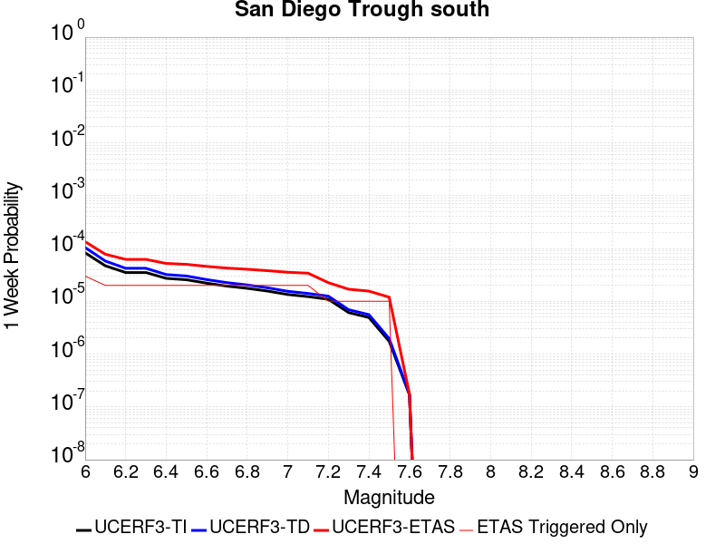 |  |  |  |

| Magnitude | 1 wk TI Prob | 1 wk TD Prob | 1 wk ETAS Prob | 1 wk ETAS/TD Gain | 1 wk ETAS Triggered Only | 1 mo TI Prob | 1 mo TD Prob | 1 mo ETAS Prob | 1 mo ETAS/TD Gain | 1 mo ETAS Triggered Only | 1 yr TI Prob | 1 yr TD Prob | 1 yr ETAS Prob | 1 yr ETAS/TD Gain | 1 yr ETAS Triggered Only | 10 yr TI Prob | 10 yr TD Prob | 10 yr ETAS Prob | 10 yr ETAS/TD Gain | 10 yr ETAS Triggered Only |
|-----|-----|-----|-----|-----|-----|-----|-----|-----|-----|-----|-----|-----|-----|-----|-----|-----|-----|-----|-----|-----|
| 6.0 | 8.279495E-5 | 1.04241306E-4 | 1.4434407E-4 | 1.3847109 | 4.0106952E-5 | 3.5478722E-4 | 4.4667677E-4 | 5.0012884E-4 | 1.1196661 | 5.3475935E-5 | 0.004310982 | 0.0054256152 | 0.0054920977 | 1.0122534 | 6.684492E-5 | 0.042283054 | 0.05299221 | 0.05305551 | 1.0011946 | 6.684492E-5 |
| 6.1 | 4.6961468E-5 | 5.772944E-5 | 8.4465864E-5 | 1.4631332 | 2.6737967E-5 | 2.0124791E-4 | 2.473894E-4 | 2.8748644E-4 | 1.1620806 | 4.0106952E-5 | 0.00244744 | 0.0030079768 | 0.0030612918 | 1.0177245 | 5.3475935E-5 | 0.024206603 | 0.029679462 | 0.02973135 | 1.0017483 | 5.3475935E-5 |
| 6.2 | 3.5079658E-5 | 4.214154E-5 | 6.887838E-5 | 1.6344534 | 2.6737967E-5 | 1.5033272E-4 | 1.8059435E-4 | 2.2069406E-4 | 1.222043 | 4.0106952E-5 | 0.0018287642 | 0.0021965632 | 0.0022499217 | 1.0242918 | 5.3475935E-5 | 0.018137876 | 0.021751117 | 0.02180343 | 1.002405 | 5.3475935E-5 |
| 6.3 | 3.5079658E-5 | 4.214154E-5 | 6.887838E-5 | 1.6344534 | 2.6737967E-5 | 1.5033272E-4 | 1.8059435E-4 | 2.2069406E-4 | 1.222043 | 4.0106952E-5 | 0.0018287642 | 0.0021965632 | 0.0022499217 | 1.0242918 | 5.3475935E-5 | 0.018137876 | 0.021751117 | 0.02180343 | 1.002405 | 5.3475935E-5 |
| 6.4 | 2.7196904E-5 | 3.2087162E-5 | 5.8824273E-5 | 1.833265 | 2.6737967E-5 | 1.16552954E-4 | 1.3750927E-4 | 1.776107E-4 | 1.2916272 | 4.0106952E-5 | 0.0014181085 | 0.0016729041 | 0.001712944 | 1.0239344 | 4.0106952E-5 | 0.014090929 | 0.016604643 | 0.016644085 | 1.0023752 | 4.0106952E-5 |
| 6.5 | 2.5584688E-5 | 3.010164E-5 | 5.6838802E-5 | 1.8882295 | 2.6737967E-5 | 1.0964406E-4 | 1.2900073E-4 | 1.6910251E-4 | 1.3108647 | 4.0106952E-5 | 0.0013340989 | 0.0015694655 | 0.0016095095 | 1.0255144 | 4.0106952E-5 | 0.013261181 | 0.015585314 | 0.015624796 | 1.0025333 | 4.0106952E-5 |
| 6.6 | 2.2034688E-5 | 2.5742738E-5 | 5.248002E-5 | 2.0386338 | 2.6737967E-5 | 9.443096E-5 | 1.1032141E-4 | 1.5042393E-4 | 1.3635063 | 4.0106952E-5 | 0.0011490905 | 0.0013423424 | 0.0013823955 | 1.0298382 | 4.0106952E-5 | 0.011431668 | 0.013343317 | 0.013382889 | 1.0029657 | 4.0106952E-5 |
| 6.7 | 1.9394853E-5 | 2.254176E-5 | 4.9279126E-5 | 2.1861258 | 2.6737967E-5 | 8.311815E-5 | 9.6603995E-5 | 1.3670708E-4 | 1.4151286 | 4.0106952E-5 | 0.0010114936 | 0.0011755243 | 0.0012155841 | 1.0340782 | 4.0106952E-5 | 0.01006902 | 0.011693766 | 0.011733404 | 1.0033897 | 4.0106952E-5 |
| 6.8 | 1.7615313E-5 | 2.0403182E-5 | 4.7140606E-5 | 2.3104534 | 2.6737967E-5 | 7.549201E-5 | 8.74393E-5 | 1.2754275E-4 | 1.4586432 | 4.0106952E-5 | 9.1872766E-4 | 0.0010640579 | 0.0011041223 | 1.0376524 | 4.0106952E-5 | 0.009149387 | 0.010590198 | 0.01062988 | 1.0037471 | 4.0106952E-5 |
| 6.9 | 1.5621423E-5 | 1.8026114E-5 | 4.47636E-5 | 2.483264 | 2.6737967E-5 | 6.6947236E-5 | 7.725251E-5 | 1.17356365E-4 | 1.5191269 | 4.0106952E-5 | 8.147778E-4 | 9.40147E-4 | 9.802162E-4 | 1.0426202 | 4.0106952E-5 | 0.008117969 | 0.009362142 | 0.009401873 | 1.0042439 | 4.0106952E-5 |
| 7.0 | 1.3444376E-5 | 1.544809E-5 | 4.2185642E-5 | 2.7308002 | 2.6737967E-5 | 5.7617483E-5 | 6.620443E-5 | 1.06308726E-4 | 1.6057645 | 4.0106952E-5 | 7.0126704E-4 | 8.057436E-4 | 8.4581826E-4 | 1.0497363 | 4.0106952E-5 | 0.006990582 | 0.008028555 | 0.00806834 | 1.0049554 | 4.0106952E-5 |
| 7.1 | 1.2268361E-5 | 1.407303E-5 | 4.081062E-5 | 2.8999171 | 2.6737967E-5 | 5.2577634E-5 | 6.0311606E-5 | 1.0041614E-4 | 1.6649555 | 4.0106952E-5 | 6.399447E-4 | 7.3404907E-4 | 7.7412656E-4 | 1.0545979 | 4.0106952E-5 | 0.0063810493 | 0.0073165493 | 0.0073563624 | 1.0054415 | 4.0106952E-5 |
| 7.2 | 1.0922655E-5 | 1.2513563E-5 | 2.588238E-5 | 2.068346 | 1.3368984E-5 | 4.681054E-5 | 5.3628468E-5 | 8.0365004E-5 | 1.4985511 | 2.6737967E-5 | 5.697693E-4 | 6.5273355E-4 | 6.79454E-4 | 1.0409364 | 2.6737967E-5 | 0.0056831064 | 0.0065084435 | 0.0065350076 | 1.0040815 | 2.6737967E-5 |
| 7.3 | 6.1106753E-6 | 6.928925E-6 | 2.0297815E-5 | 2.9294324 | 1.3368984E-5 | 2.6188345E-5 | 2.9695057E-5 | 4.3063643E-5 | 1.4501957 | 1.3368984E-5 | 3.1879646E-4 | 3.6147775E-4 | 3.7484188E-4 | 1.0369709 | 1.3368984E-5 | 0.0031833951 | 0.003608943 | 0.0036222637 | 1.0036911 | 1.3368984E-5 |
| 7.4 | 4.933187E-6 | 5.5895525E-6 | 1.8958463E-5 | 3.3917673 | 1.3368984E-5 | 2.114206E-5 | 2.3955008E-5 | 3.7323673E-5 | 1.5580739 | 1.3368984E-5 | 2.5737417E-4 | 2.9161357E-4 | 3.0497866E-4 | 1.0458314 | 1.3368984E-5 | 0.002570763 | 0.0029123505 | 0.0029256805 | 1.004577 | 1.3368984E-5 |
| 7.5 | 1.7489613E-6 | 1.969678E-6 | 1.5338635E-5 | 7.7873826 | 1.3368984E-5 | 7.495527E-6 | 8.4414505E-6 | 2.1810321E-5 | 2.5837173 | 1.3368984E-5 | 9.125422E-5 | 1.02770035E-4 | 1.1613765E-4 | 1.1300731 | 1.3368984E-5 | 9.1216754E-4 | 0.0010272472 | 0.0010406023 | 1.013001 | 1.3368984E-5 |
| 7.6 | 1.6988751E-7 | 1.7533823E-7 | 1.7533823E-7 | 1.0 | 0.0 | 7.2808916E-7 | 7.5144936E-7 | 7.5144936E-7 | 1.0 | 0.0 | 8.864449E-6 | 9.14886E-6 | 9.14886E-6 | 1.0 | 0.0 | 8.8640954E-5 | 9.1485024E-5 | 9.1485024E-5 | 1.0 | 0.0 |

## Newport-Inglewood alt 1
*[(top)](#table-of-contents)*

| 1 Week | 1 Month | 1 Year | 10 Year |
|-----|-----|-----|-----|
|  |  |  |  |

| Magnitude | 1 wk TI Prob | 1 wk TD Prob | 1 wk ETAS Prob | 1 wk ETAS/TD Gain | 1 wk ETAS Triggered Only | 1 mo TI Prob | 1 mo TD Prob | 1 mo ETAS Prob | 1 mo ETAS/TD Gain | 1 mo ETAS Triggered Only | 1 yr TI Prob | 1 yr TD Prob | 1 yr ETAS Prob | 1 yr ETAS/TD Gain | 1 yr ETAS Triggered Only | 10 yr TI Prob | 10 yr TD Prob | 10 yr ETAS Prob | 10 yr ETAS/TD Gain | 10 yr ETAS Triggered Only |
|-----|-----|-----|-----|-----|-----|-----|-----|-----|-----|-----|-----|-----|-----|-----|-----|-----|-----|-----|-----|-----|
| 6.0 | 2.9668912E-5 | 3.0404817E-5 | 5.7141973E-5 | 1.8793724 | 2.6737967E-5 | 1.2714628E-4 | 1.303026E-4 | 1.8377157E-4 | 1.4103446 | 5.3475935E-5 | 0.0015469068 | 0.0015857625 | 0.0016391537 | 1.0336691 | 5.3475935E-5 | 0.015361829 | 0.015792042 | 0.015844675 | 1.0033327 | 5.3475935E-5 |
| 6.1 | 2.9668912E-5 | 3.0404817E-5 | 5.7141973E-5 | 1.8793724 | 2.6737967E-5 | 1.2714628E-4 | 1.303026E-4 | 1.8377157E-4 | 1.4103446 | 5.3475935E-5 | 0.0015469068 | 0.0015857625 | 0.0016391537 | 1.0336691 | 5.3475935E-5 | 0.015361829 | 0.015792042 | 0.015844675 | 1.0033327 | 5.3475935E-5 |
| 6.2 | 2.9668912E-5 | 3.0404817E-5 | 5.7141973E-5 | 1.8793724 | 2.6737967E-5 | 1.2714628E-4 | 1.303026E-4 | 1.8377157E-4 | 1.4103446 | 5.3475935E-5 | 0.0015469068 | 0.0015857625 | 0.0016391537 | 1.0336691 | 5.3475935E-5 | 0.015361829 | 0.015792042 | 0.015844675 | 1.0033327 | 5.3475935E-5 |
| 6.3 | 2.9668912E-5 | 3.0404817E-5 | 5.7141973E-5 | 1.8793724 | 2.6737967E-5 | 1.2714628E-4 | 1.303026E-4 | 1.8377157E-4 | 1.4103446 | 5.3475935E-5 | 0.0015469068 | 0.0015857625 | 0.0016391537 | 1.0336691 | 5.3475935E-5 | 0.015361829 | 0.015792042 | 0.015844675 | 1.0033327 | 5.3475935E-5 |
| 6.4 | 1.275942E-5 | 1.0272503E-5 | 2.3641349E-5 | 2.3014207 | 1.3368984E-5 | 5.4682085E-5 | 4.402429E-5 | 8.4129475E-5 | 1.9109786 | 4.0106952E-5 | 6.65551E-4 | 5.358681E-4 | 5.7595357E-4 | 1.0748047 | 4.0106952E-5 | 0.0066356123 | 0.005346184 | 0.005386077 | 1.0074619 | 4.0106952E-5 |
| 6.5 | 1.275942E-5 | 1.0272503E-5 | 2.3641349E-5 | 2.3014207 | 1.3368984E-5 | 5.4682085E-5 | 4.402429E-5 | 8.4129475E-5 | 1.9109786 | 4.0106952E-5 | 6.65551E-4 | 5.358681E-4 | 5.7595357E-4 | 1.0748047 | 4.0106952E-5 | 0.0066356123 | 0.005346184 | 0.005386077 | 1.0074619 | 4.0106952E-5 |
| 6.6 | 1.1255358E-5 | 8.661884E-6 | 2.2030752E-5 | 2.5434134 | 1.3368984E-5 | 4.8236358E-5 | 3.712184E-5 | 7.7227305E-5 | 2.0803738 | 4.0106952E-5 | 5.871194E-4 | 4.518664E-4 | 4.919552E-4 | 1.0887183 | 4.0106952E-5 | 0.005855706 | 0.004509653 | 0.004549579 | 1.0088534 | 4.0106952E-5 |
| 6.7 | 1.0504745E-5 | 7.8997955E-6 | 2.1268674E-5 | 2.692307 | 1.3368984E-5 | 4.5019555E-5 | 3.3855835E-5 | 7.3961426E-5 | 2.1845992 | 4.0106952E-5 | 5.4797524E-4 | 4.1211807E-4 | 4.5220848E-4 | 1.097279 | 4.0106952E-5 | 0.0054662596 | 0.004113668 | 0.0041536097 | 1.0097096 | 4.0106952E-5 |
| 6.8 | 1.0476007E-5 | 7.881176E-6 | 2.1250054E-5 | 2.6963048 | 1.3368984E-5 | 4.4896402E-5 | 3.3776043E-5 | 7.388164E-5 | 2.1873977 | 4.0106952E-5 | 5.464766E-4 | 4.1114696E-4 | 4.512374E-4 | 1.0975088 | 4.0106952E-5 | 0.005451347 | 0.0041039926 | 0.004143935 | 1.0097326 | 4.0106952E-5 |
| 6.9 | 9.076797E-6 | 6.4896312E-6 | 1.9858528E-5 | 3.0600395 | 1.3368984E-5 | 3.889998E-5 | 2.781241E-5 | 6.791825E-5 | 2.4420123 | 4.0106952E-5 | 4.7350433E-4 | 3.385638E-4 | 3.786572E-4 | 1.1184219 | 4.0106952E-5 | 0.004724967 | 0.0033805177 | 0.003420489 | 1.011824 | 4.0106952E-5 |
| 7.0 | 8.73795E-6 | 6.2120125E-6 | 1.9580913E-5 | 3.1521046 | 1.3368984E-5 | 3.7447822E-5 | 2.6622642E-5 | 5.3359898E-5 | 2.0043051 | 2.6737967E-5 | 4.5583185E-4 | 3.2408274E-4 | 3.50812E-4 | 1.0824767 | 2.6737967E-5 | 0.0045489795 | 0.0032361327 | 0.003262784 | 1.0082356 | 2.6737967E-5 |
| 7.1 | 8.391299E-6 | 5.95579E-6 | 1.9324694E-5 | 3.2446904 | 1.3368984E-5 | 3.5962214E-5 | 2.5524565E-5 | 5.226185E-5 | 2.0475118 | 2.6737967E-5 | 4.37752E-4 | 3.1071753E-4 | 3.3744719E-4 | 1.0860256 | 2.6737967E-5 | 0.004368907 | 0.0031028606 | 0.0031295156 | 1.0085905 | 2.6737967E-5 |
| 7.2 | 7.796882E-6 | 5.4965344E-6 | 1.8865445E-5 | 3.4322436 | 1.3368984E-5 | 3.341478E-5 | 2.3556364E-5 | 5.02937E-5 | 2.1350367 | 2.6737967E-5 | 4.06749E-4 | 2.867612E-4 | 3.134915E-4 | 1.0932145 | 2.6737967E-5 | 0.0040600533 | 0.0028639357 | 0.002890597 | 1.0093094 | 2.6737967E-5 |
| 7.3 | 6.4738833E-6 | 4.6478162E-6 | 1.8016739E-5 | 3.8763876 | 1.3368984E-5 | 2.774492E-5 | 1.9919062E-5 | 4.6656496E-5 | 2.342304 | 2.6737967E-5 | 3.3774204E-4 | 2.4248775E-4 | 2.6921922E-4 | 1.1102386 | 2.6737967E-5 | 0.0033722918 | 0.0024222482 | 0.0024489213 | 1.0110117 | 2.6737967E-5 |
| 7.4 | 5.382145E-6 | 3.8857597E-6 | 1.7254692E-5 | 4.4404936 | 1.3368984E-5 | 2.3066134E-5 | 1.665315E-5 | 4.339067E-5 | 2.6055534 | 2.6737967E-5 | 2.8079396E-4 | 2.0273338E-4 | 2.2946594E-4 | 1.1318606 | 2.6737967E-5 | 0.0028043943 | 0.0020254988 | 0.0020521826 | 1.0131739 | 2.6737967E-5 |
| 7.5 | 3.648244E-6 | 2.5737843E-6 | 2.5737843E-6 | 1.0 | 0.0 | 1.5635238E-5 | 1.1030458E-5 | 2.4399294E-5 | 2.211993 | 1.3368984E-5 | 1.9034238E-4 | 1.3428765E-4 | 1.4765484E-4 | 1.0995414 | 1.3368984E-5 | 0.0019017943 | 0.0013420755 | 0.0013554265 | 1.009948 | 1.3368984E-5 |
| 7.6 | 2.2906888E-6 | 1.5479842E-6 | 1.5479842E-6 | 1.0 | 0.0 | 9.817201E-6 | 6.634202E-6 | 2.0003097E-5 | 3.0151474 | 1.3368984E-5 | 1.1951787E-4 | 8.076848E-5 | 9.413638E-5 | 1.1655089 | 1.3368984E-5 | 0.0011945361 | 8.07398E-4 | 8.207562E-4 | 1.0165447 | 1.3368984E-5 |
| 7.7 | 6.0479874E-7 | 3.397512E-7 | 3.397512E-7 | 1.0 | 0.0 | 2.5919921E-6 | 1.4560758E-6 | 1.482504E-5 | 10.181503 | 1.3368984E-5 | 3.1557047E-5 | 1.7727592E-5 | 3.109634E-5 | 1.7541208 | 1.3368984E-5 | 3.1552566E-4 | 1.7726317E-4 | 1.9062978E-4 | 1.0754055 | 1.3368984E-5 |
| 7.8 | 1.16056995E-8 | 9.782373E-9 | 9.782373E-9 | 1.0 | 0.0 | 4.9738713E-8 | 4.1924455E-8 | 4.1924455E-8 | 1.0 | 0.0 | 6.0556863E-7 | 5.1043025E-7 | 5.1043025E-7 | 1.0 | 0.0 | 6.05567E-6 | 5.1043025E-6 | 5.1043025E-6 | 1.0 | 0.0 |

## Oak Ridge (Onshore)
*[(top)](#table-of-contents)*

| 1 Week | 1 Month | 1 Year | 10 Year |
|-----|-----|-----|-----|
|  |  |  |  |

| Magnitude | 1 wk TI Prob | 1 wk TD Prob | 1 wk ETAS Prob | 1 wk ETAS/TD Gain | 1 wk ETAS Triggered Only | 1 mo TI Prob | 1 mo TD Prob | 1 mo ETAS Prob | 1 mo ETAS/TD Gain | 1 mo ETAS Triggered Only | 1 yr TI Prob | 1 yr TD Prob | 1 yr ETAS Prob | 1 yr ETAS/TD Gain | 1 yr ETAS Triggered Only | 10 yr TI Prob | 10 yr TD Prob | 10 yr ETAS Prob | 10 yr ETAS/TD Gain | 10 yr ETAS Triggered Only |
|-----|-----|-----|-----|-----|-----|-----|-----|-----|-----|-----|-----|-----|-----|-----|-----|-----|-----|-----|-----|-----|
| 6.0 | 3.155064E-5 | 2.9525974E-5 | 4.2894564E-5 | 1.4527738 | 1.3368984E-5 | 1.3521002E-4 | 1.2653397E-4 | 1.5326856E-4 | 1.2112838 | 2.6737967E-5 | 0.001644939 | 0.0015395004 | 0.0015795457 | 1.0260118 | 4.0106952E-5 | 0.01632816 | 0.015292859 | 0.015345517 | 1.0034434 | 5.3475935E-5 |
| 6.1 | 3.155064E-5 | 2.9525974E-5 | 4.2894564E-5 | 1.4527738 | 1.3368984E-5 | 1.3521002E-4 | 1.2653397E-4 | 1.5326856E-4 | 1.2112838 | 2.6737967E-5 | 0.001644939 | 0.0015395004 | 0.0015795457 | 1.0260118 | 4.0106952E-5 | 0.01632816 | 0.015292859 | 0.015345517 | 1.0034434 | 5.3475935E-5 |
| 6.2 | 3.155064E-5 | 2.9525974E-5 | 4.2894564E-5 | 1.4527738 | 1.3368984E-5 | 1.3521002E-4 | 1.2653397E-4 | 1.5326856E-4 | 1.2112838 | 2.6737967E-5 | 0.001644939 | 0.0015395004 | 0.0015795457 | 1.0260118 | 4.0106952E-5 | 0.01632816 | 0.015292859 | 0.015345517 | 1.0034434 | 5.3475935E-5 |
| 6.3 | 3.155064E-5 | 2.9525974E-5 | 4.2894564E-5 | 1.4527738 | 1.3368984E-5 | 1.3521002E-4 | 1.2653397E-4 | 1.5326856E-4 | 1.2112838 | 2.6737967E-5 | 0.001644939 | 0.0015395004 | 0.0015795457 | 1.0260118 | 4.0106952E-5 | 0.01632816 | 0.015292859 | 0.015345517 | 1.0034434 | 5.3475935E-5 |
| 6.4 | 3.155064E-5 | 2.9525974E-5 | 4.2894564E-5 | 1.4527738 | 1.3368984E-5 | 1.3521002E-4 | 1.2653397E-4 | 1.5326856E-4 | 1.2112838 | 2.6737967E-5 | 0.001644939 | 0.0015395004 | 0.0015795457 | 1.0260118 | 4.0106952E-5 | 0.01632816 | 0.015292859 | 0.015345517 | 1.0034434 | 5.3475935E-5 |
| 6.5 | 3.155064E-5 | 2.9525974E-5 | 4.2894564E-5 | 1.4527738 | 1.3368984E-5 | 1.3521002E-4 | 1.2653397E-4 | 1.5326856E-4 | 1.2112838 | 2.6737967E-5 | 0.001644939 | 0.0015395004 | 0.0015795457 | 1.0260118 | 4.0106952E-5 | 0.01632816 | 0.015292859 | 0.015345517 | 1.0034434 | 5.3475935E-5 |
| 6.6 | 3.155064E-5 | 2.9525974E-5 | 4.2894564E-5 | 1.4527738 | 1.3368984E-5 | 1.3521002E-4 | 1.2653397E-4 | 1.5326856E-4 | 1.2112838 | 2.6737967E-5 | 0.001644939 | 0.0015395004 | 0.0015795457 | 1.0260118 | 4.0106952E-5 | 0.01632816 | 0.015292859 | 0.015345517 | 1.0034434 | 5.3475935E-5 |
| 6.7 | 3.098897E-5 | 2.8864175E-5 | 4.2232772E-5 | 1.4631554 | 1.3368984E-5 | 1.328031E-4 | 1.2369796E-4 | 1.504326E-4 | 1.2161286 | 2.6737967E-5 | 0.0016156785 | 0.0015050198 | 0.0015450665 | 1.0266087 | 4.0106952E-5 | 0.016039822 | 0.014952714 | 0.01500539 | 1.0035229 | 5.3475935E-5 |
| 6.8 | 3.0449872E-5 | 2.8239372E-5 | 4.160798E-5 | 1.4734031 | 1.3368984E-5 | 1.3049292E-4 | 1.2102048E-4 | 1.4775521E-4 | 1.2209108 | 2.6737967E-5 | 0.0015875935 | 0.0014724657 | 0.0015125135 | 1.0271978 | 4.0106952E-5 | 0.015762992 | 0.014631462 | 0.014684156 | 1.0036014 | 5.3475935E-5 |
| 6.9 | 2.697928E-5 | 2.4219773E-5 | 3.7588434E-5 | 1.551973 | 1.3368984E-5 | 1.15620365E-4 | 1.0379502E-4 | 1.3053021E-4 | 1.2575768 | 2.6737967E-5 | 0.0014067689 | 0.0012629933 | 0.0013030496 | 1.0317154 | 4.0106952E-5 | 0.0139789665 | 0.01256087 | 0.012613674 | 1.0042039 | 5.3475935E-5 |
| 7.0 | 2.4893961E-5 | 2.1862043E-5 | 3.5230732E-5 | 1.6115024 | 1.3368984E-5 | 1.0668404E-4 | 9.3691204E-5 | 1.2042667E-4 | 1.2853572 | 2.6737967E-5 | 0.0012981043 | 0.0011401111 | 0.0011801724 | 1.035138 | 4.0106952E-5 | 0.012905477 | 0.011344905 | 0.011397774 | 1.0046601 | 5.3475935E-5 |
| 7.1 | 2.0945363E-5 | 1.7354487E-5 | 3.072324E-5 | 1.770334 | 1.3368984E-5 | 8.976275E-5 | 7.437428E-5 | 1.0111026E-4 | 1.3594788 | 2.6737967E-5 | 0.0010923136 | 9.051354E-4 | 9.452061E-4 | 1.0442704 | 4.0106952E-5 | 0.0108696 | 0.009015423 | 0.009068416 | 1.0058781 | 5.3475935E-5 |
| 7.2 | 2.0439404E-5 | 1.6809423E-5 | 3.0178182E-5 | 1.7953134 | 1.3368984E-5 | 8.7594504E-5 | 7.203843E-5 | 9.8774464E-5 | 1.3711358 | 2.6737967E-5 | 0.0010659413 | 8.767196E-4 | 9.167914E-4 | 1.0457065 | 4.0106952E-5 | 0.010608427 | 0.008733526 | 0.008786535 | 1.0060695 | 5.3475935E-5 |
| 7.3 | 1.8463334E-5 | 1.5381811E-5 | 2.8750588E-5 | 1.8691291 | 1.3368984E-5 | 7.912617E-5 | 6.59204E-5 | 9.2656606E-5 | 1.4055831 | 2.6737967E-5 | 9.6293533E-4 | 8.0228975E-4 | 8.423645E-4 | 1.0499505 | 4.0106952E-5 | 0.009587734 | 0.007994797 | 0.008047845 | 1.0066353 | 5.3475935E-5 |
| 7.4 | 1.763139E-5 | 1.451684E-5 | 2.788563E-5 | 1.920916 | 1.3368984E-5 | 7.556091E-5 | 6.221356E-5 | 8.894987E-5 | 1.4297504 | 2.6737967E-5 | 9.1956573E-4 | 7.571909E-4 | 7.972675E-4 | 1.052928 | 4.0106952E-5 | 0.009157699 | 0.007546914 | 0.007599986 | 1.0070323 | 5.3475935E-5 |
| 7.5 | 1.3594944E-5 | 1.1163356E-5 | 2.4532192E-5 | 2.1975641 | 1.3368984E-5 | 5.8262744E-5 | 4.784209E-5 | 7.4578784E-5 | 1.5588528 | 2.6737967E-5 | 7.0911803E-4 | 5.8232434E-4 | 6.2240794E-4 | 1.0688338 | 4.0106952E-5 | 0.007068595 | 0.0058082556 | 0.0058481297 | 1.006865 | 4.0106952E-5 |
| 7.6 | 6.9889534E-6 | 5.6367144E-6 | 5.6367144E-6 | 1.0 | 0.0 | 2.9952313E-5 | 2.4157125E-5 | 3.7525788E-5 | 1.5534045 | 1.3368984E-5 | 3.646084E-4 | 2.9407372E-4 | 3.2080384E-4 | 1.0908959 | 2.6737967E-5 | 0.0036401073 | 0.0029368899 | 0.0029635492 | 1.0090774 | 2.6737967E-5 |
| 7.7 | 4.0824193E-6 | 3.2832586E-6 | 3.2832586E-6 | 1.0 | 0.0 | 1.7495966E-5 | 1.4071033E-5 | 1.4071033E-5 | 1.0 | 0.0 | 2.1299256E-4 | 1.713015E-4 | 1.713015E-4 | 1.0 | 0.0 | 0.0021278851 | 0.0017117079 | 0.0017117079 | 1.0 | 0.0 |
| 7.8 | 1.7023609E-6 | 1.4370495E-6 | 1.4370495E-6 | 1.0 | 0.0 | 7.295812E-6 | 6.1587693E-6 | 6.1587693E-6 | 1.0 | 0.0 | 8.882289E-5 | 7.498047E-5 | 7.498047E-5 | 1.0 | 0.0 | 8.8787393E-4 | 7.495545E-4 | 7.495545E-4 | 1.0 | 0.0 |
| 7.9 | 2.721225E-7 | 2.2616497E-7 | 2.2616497E-7 | 1.0 | 0.0 | 1.1662388E-6 | 9.692781E-7 | 9.692781E-7 | 1.0 | 0.0 | 1.4198865E-5 | 1.1800899E-5 | 1.1800899E-5 | 1.0 | 0.0 | 1.4197957E-4 | 1.1800301E-4 | 1.1800301E-4 | 1.0 | 0.0 |
| 8.0 | 9.364255E-9 | 5.1206666E-9 | 5.1206666E-9 | 1.0 | 0.0 | 4.0132523E-8 | 2.1945715E-8 | 2.1945715E-8 | 1.0 | 0.0 | 4.8861335E-7 | 2.6718905E-7 | 2.6718905E-7 | 1.0 | 0.0 | 4.8861225E-6 | 2.6718876E-6 | 2.6718876E-6 | 1.0 | 0.0 |

## Oceanic - West Huasna
*[(top)](#table-of-contents)*

| 1 Week | 1 Month | 1 Year | 10 Year |
|-----|-----|-----|-----|
| 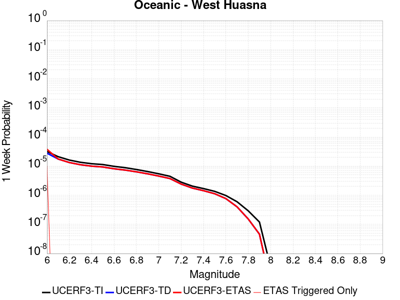 |  |  |  |

| Magnitude | 1 wk TI Prob | 1 wk TD Prob | 1 wk ETAS Prob | 1 wk ETAS/TD Gain | 1 wk ETAS Triggered Only | 1 mo TI Prob | 1 mo TD Prob | 1 mo ETAS Prob | 1 mo ETAS/TD Gain | 1 mo ETAS Triggered Only | 1 yr TI Prob | 1 yr TD Prob | 1 yr ETAS Prob | 1 yr ETAS/TD Gain | 1 yr ETAS Triggered Only | 10 yr TI Prob | 10 yr TD Prob | 10 yr ETAS Prob | 10 yr ETAS/TD Gain | 10 yr ETAS Triggered Only |
|-----|-----|-----|-----|-----|-----|-----|-----|-----|-----|-----|-----|-----|-----|-----|-----|-----|-----|-----|-----|-----|
| 6.0 | 3.195567E-5 | 2.7926868E-5 | 4.129548E-5 | 1.4787006 | 1.3368984E-5 | 1.3694567E-4 | 1.1968133E-4 | 1.3304871E-4 | 1.1116915 | 1.3368984E-5 | 0.0016660384 | 0.0014561893 | 0.0014828884 | 1.0183349 | 2.6737967E-5 | 0.016536033 | 0.014471028 | 0.01452373 | 1.0036418 | 5.3475935E-5 |
| 6.1 | 2.1156782E-5 | 1.7573486E-5 | 1.7573486E-5 | 1.0 | 0.0 | 9.066878E-5 | 7.531282E-5 | 7.531282E-5 | 1.0 | 0.0 | 0.0011033333 | 9.165572E-4 | 9.2991395E-4 | 1.0145727 | 1.3368984E-5 | 0.010978713 | 0.009128777 | 0.009155272 | 1.0029023 | 2.6737967E-5 |
| 6.2 | 1.6195117E-5 | 1.3327152E-5 | 1.3327152E-5 | 1.0 | 0.0 | 6.9405796E-5 | 5.7115132E-5 | 5.7115132E-5 | 1.0 | 0.0 | 8.44688E-4 | 6.9515745E-4 | 7.0851715E-4 | 1.0192182 | 1.3368984E-5 | 0.008414844 | 0.006930123 | 0.006956676 | 1.0038315 | 2.6737967E-5 |
| 6.3 | 1.3559345E-5 | 1.1179142E-5 | 1.1179142E-5 | 1.0 | 0.0 | 5.811018E-5 | 4.7909736E-5 | 4.7909736E-5 | 1.0 | 0.0 | 7.072618E-4 | 5.831459E-4 | 5.965071E-4 | 1.0229123 | 1.3368984E-5 | 0.0070501505 | 0.0058162753 | 0.005829566 | 1.0022851 | 1.3368984E-5 |
| 6.4 | 1.2120619E-5 | 1.0000977E-5 | 1.0000977E-5 | 1.0 | 0.0 | 5.1944477E-5 | 4.2860633E-5 | 4.2860633E-5 | 1.0 | 0.0 | 6.322405E-4 | 5.2170374E-4 | 5.350658E-4 | 1.0256122 | 1.3368984E-5 | 0.006304447 | 0.0052048573 | 0.005218157 | 1.0025551 | 1.3368984E-5 |
| 6.5 | 1.13511915E-5 | 9.3674735E-6 | 9.3674735E-6 | 1.0 | 0.0 | 4.8647056E-5 | 4.01457E-5 | 4.01457E-5 | 1.0 | 0.0 | 5.9211696E-4 | 4.886647E-4 | 5.0202716E-4 | 1.0273448 | 1.3368984E-5 | 0.0059054173 | 0.0048759608 | 0.0048892647 | 1.0027285 | 1.3368984E-5 |
| 6.6 | 9.850605E-6 | 8.135418E-6 | 8.135418E-6 | 1.0 | 0.0 | 4.2216197E-5 | 3.4865614E-5 | 3.4865614E-5 | 1.0 | 0.0 | 5.1386096E-4 | 4.2440637E-4 | 4.2440637E-4 | 1.0 | 0.0 | 0.0051267436 | 0.004235991 | 0.004235991 | 1.0 | 0.0 |
| 6.7 | 8.8558645E-6 | 7.318433E-6 | 7.318433E-6 | 1.0 | 0.0 | 3.7953152E-5 | 3.1364336E-5 | 3.1364336E-5 | 1.0 | 0.0 | 4.6198163E-4 | 3.8179406E-4 | 3.8179406E-4 | 1.0 | 0.0 | 0.004610224 | 0.0038114067 | 0.0038114067 | 1.0 | 0.0 |
| 6.8 | 7.67136E-6 | 6.391756E-6 | 6.391756E-6 | 1.0 | 0.0 | 3.2876844E-5 | 2.7392953E-5 | 2.7392953E-5 | 1.0 | 0.0 | 4.0020206E-4 | 3.3345833E-4 | 3.3345833E-4 | 1.0 | 0.0 | 0.003994821 | 0.0033296007 | 0.0033296007 | 1.0 | 0.0 |
| 6.9 | 6.534529E-6 | 5.4583297E-6 | 5.4583297E-6 | 1.0 | 0.0 | 2.8004823E-5 | 2.3392633E-5 | 2.3392633E-5 | 1.0 | 0.0 | 3.4090536E-4 | 2.847682E-4 | 2.847682E-4 | 1.0 | 0.0 | 0.0034038287 | 0.0028440498 | 0.0028440498 | 1.0 | 0.0 |
| 7.0 | 5.460525E-6 | 4.5699517E-6 | 4.5699517E-6 | 1.0 | 0.0 | 2.3402039E-5 | 1.958536E-5 | 1.958536E-5 | 1.0 | 0.0 | 2.8488258E-4 | 2.3842578E-4 | 2.3842578E-4 | 1.0 | 0.0 | 0.0028451765 | 0.0023817138 | 0.0023817138 | 1.0 | 0.0 |
| 7.1 | 4.4825083E-6 | 3.7524428E-6 | 3.7524428E-6 | 1.0 | 0.0 | 1.9210609E-5 | 1.60818E-5 | 1.60818E-5 | 1.0 | 0.0 | 2.3386406E-4 | 1.9577841E-4 | 1.9577841E-4 | 1.0 | 0.0 | 0.002336181 | 0.0019560715 | 0.0019560715 | 1.0 | 0.0 |
| 7.2 | 2.821708E-6 | 2.4249334E-6 | 2.4249334E-6 | 1.0 | 0.0 | 1.2092979E-5 | 1.039253E-5 | 1.039253E-5 | 1.0 | 0.0 | 1.4722206E-4 | 1.2652173E-4 | 1.2652173E-4 | 1.0 | 0.0 | 0.0014712457 | 0.0012644994 | 0.0012644994 | 1.0 | 0.0 |
| 7.3 | 2.0644757E-6 | 1.7687412E-6 | 1.7687412E-6 | 1.0 | 0.0 | 8.847723E-6 | 7.5802973E-6 | 7.5802973E-6 | 1.0 | 0.0 | 1.0771569E-4 | 9.228622E-5 | 9.228622E-5 | 1.0 | 0.0 | 0.001076635 | 9.2248066E-4 | 9.2248066E-4 | 1.0 | 0.0 |
| 7.4 | 1.6980367E-6 | 1.4379892E-6 | 1.4379892E-6 | 1.0 | 0.0 | 7.27728E-6 | 6.162796E-6 | 6.162796E-6 | 1.0 | 0.0 | 8.8597284E-5 | 7.5029464E-5 | 7.5029464E-5 | 1.0 | 0.0 | 8.8561967E-4 | 7.500429E-4 | 7.500429E-4 | 1.0 | 0.0 |
| 7.5 | 1.3637683E-6 | 1.1302635E-6 | 1.1302635E-6 | 1.0 | 0.0 | 5.844708E-6 | 4.8439774E-6 | 4.8439774E-6 | 1.0 | 0.0 | 7.1156996E-5 | 5.897383E-5 | 5.897383E-5 | 1.0 | 0.0 | 7.1134215E-4 | 5.895833E-4 | 5.895833E-4 | 1.0 | 0.0 |
| 7.6 | 9.802994E-7 | 7.677247E-7 | 7.677247E-7 | 1.0 | 0.0 | 4.2012766E-6 | 3.2902446E-6 | 3.2902446E-6 | 1.0 | 0.0 | 5.1149345E-5 | 4.0057992E-5 | 4.0057992E-5 | 1.0 | 0.0 | 5.113757E-4 | 4.0050913E-4 | 4.0050913E-4 | 1.0 | 0.0 |
| 7.7 | 5.986191E-7 | 4.0050548E-7 | 4.0050548E-7 | 1.0 | 0.0 | 2.5655079E-6 | 1.7164509E-6 | 1.7164509E-6 | 1.0 | 0.0 | 3.1234613E-5 | 2.089759E-5 | 2.089759E-5 | 1.0 | 0.0 | 3.123022E-4 | 2.089576E-4 | 2.089576E-4 | 1.0 | 0.0 |
| 7.8 | 2.9189815E-7 | 1.5285792E-7 | 1.5285792E-7 | 1.0 | 0.0 | 1.2509914E-6 | 6.5510517E-7 | 6.5510517E-7 | 1.0 | 0.0 | 1.5230714E-5 | 7.9758765E-6 | 7.9758765E-6 | 1.0 | 0.0 | 1.522967E-4 | 7.9757214E-5 | 7.9757214E-5 | 1.0 | 0.0 |
| 7.9 | 1.2057845E-7 | 4.621248E-8 | 4.621248E-8 | 1.0 | 0.0 | 5.1676466E-7 | 1.9805347E-7 | 1.9805347E-7 | 1.0 | 0.0 | 6.2915915E-6 | 2.4112983E-6 | 2.4112983E-6 | 1.0 | 0.0 | 6.2914136E-5 | 2.4114026E-5 | 2.4114026E-5 | 1.0 | 0.0 |
| 8.0 | 3.3806387E-9 | 9.011393E-10 | 9.011393E-10 | 1.0 | 0.0 | 1.4488451E-8 | 3.8620254E-9 | 3.8620254E-9 | 1.0 | 0.0 | 1.7639688E-7 | 4.702016E-8 | 4.702016E-8 | 1.0 | 0.0 | 1.7639674E-6 | 4.7129527E-7 | 4.7129527E-7 | 1.0 | 0.0 |

## Great Valley 03a Dunnigan Hills
*[(top)](#table-of-contents)*

| 1 Week | 1 Month | 1 Year | 10 Year |
|-----|-----|-----|-----|
|  |  |  |  |

| Magnitude | 1 wk TI Prob | 1 wk TD Prob | 1 wk ETAS Prob | 1 wk ETAS/TD Gain | 1 wk ETAS Triggered Only | 1 mo TI Prob | 1 mo TD Prob | 1 mo ETAS Prob | 1 mo ETAS/TD Gain | 1 mo ETAS Triggered Only | 1 yr TI Prob | 1 yr TD Prob | 1 yr ETAS Prob | 1 yr ETAS/TD Gain | 1 yr ETAS Triggered Only | 10 yr TI Prob | 10 yr TD Prob | 10 yr ETAS Prob | 10 yr ETAS/TD Gain | 10 yr ETAS Triggered Only |
|-----|-----|-----|-----|-----|-----|-----|-----|-----|-----|-----|-----|-----|-----|-----|-----|-----|-----|-----|-----|-----|
| 6.0 | 1.6591328E-5 | 1.8107954E-5 | 3.1476695E-5 | 1.73828 | 1.3368984E-5 | 7.110376E-5 | 7.7603596E-5 | 9.0971545E-5 | 1.1722593 | 1.3368984E-5 | 8.6534437E-4 | 9.444834E-4 | 9.578398E-4 | 1.0141414 | 1.3368984E-5 | 0.008619824 | 0.009411525 | 0.009451254 | 1.0042213 | 4.0106952E-5 |
| 6.1 | 8.041125E-6 | 8.769726E-6 | 2.2138593E-5 | 2.5244336 | 1.3368984E-5 | 3.4461507E-5 | 3.7584115E-5 | 5.0952596E-5 | 1.355695 | 1.3368984E-5 | 4.194881E-4 | 4.5751085E-4 | 4.7087373E-4 | 1.0292077 | 1.3368984E-5 | 0.004186971 | 0.004567687 | 0.0045943027 | 1.005827 | 2.6737967E-5 |
| 6.2 | 3.2807004E-6 | 3.5795688E-6 | 3.5795688E-6 | 1.0 | 0.0 | 1.4060069E-5 | 1.5340942E-5 | 1.5340942E-5 | 1.0 | 0.0 | 1.7116789E-4 | 1.8676413E-4 | 1.8676413E-4 | 1.0 | 0.0 | 0.0017103611 | 0.0018664796 | 0.0018798237 | 1.0071493 | 1.3368984E-5 |
| 6.3 | 1.9339366E-6 | 2.1103806E-6 | 2.1103806E-6 | 1.0 | 0.0 | 8.288273E-6 | 9.044474E-6 | 9.044474E-6 | 1.0 | 0.0 | 1.00905054E-4 | 1.1011375E-4 | 1.1011375E-4 | 1.0 | 0.0 | 0.0010085925 | 0.0011008718 | 0.0011008718 | 1.0 | 0.0 |
| 6.4 | 1.3142635E-6 | 1.4339867E-6 | 1.4339867E-6 | 1.0 | 0.0 | 5.6325457E-6 | 6.145657E-6 | 6.145657E-6 | 1.0 | 0.0 | 6.857408E-5 | 7.482337E-5 | 7.482337E-5 | 1.0 | 0.0 | 6.8552926E-4 | 7.4823375E-4 | 7.4823375E-4 | 1.0 | 0.0 |

## Calaveras (So) 2011 CFM
*[(top)](#table-of-contents)*

| 1 Week | 1 Month | 1 Year | 10 Year |
|-----|-----|-----|-----|
|  |  |  | 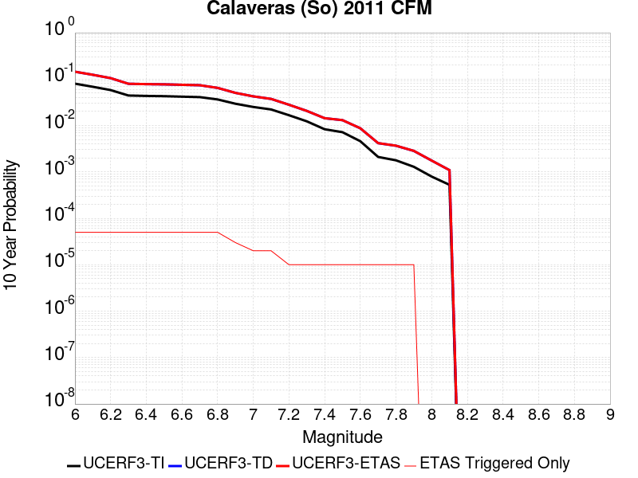 |

| Magnitude | 1 wk TI Prob | 1 wk TD Prob | 1 wk ETAS Prob | 1 wk ETAS/TD Gain | 1 wk ETAS Triggered Only | 1 mo TI Prob | 1 mo TD Prob | 1 mo ETAS Prob | 1 mo ETAS/TD Gain | 1 mo ETAS Triggered Only | 1 yr TI Prob | 1 yr TD Prob | 1 yr ETAS Prob | 1 yr ETAS/TD Gain | 1 yr ETAS Triggered Only | 10 yr TI Prob | 10 yr TD Prob | 10 yr ETAS Prob | 10 yr ETAS/TD Gain | 10 yr ETAS Triggered Only |
|-----|-----|-----|-----|-----|-----|-----|-----|-----|-----|-----|-----|-----|-----|-----|-----|-----|-----|-----|-----|-----|
| 6.0 | 1.5950744E-4 | 3.071188E-4 | 3.071188E-4 | 1.0 | 0.0 | 6.834242E-4 | 0.0013155643 | 0.0013289157 | 1.0101488 | 1.3368984E-5 | 0.00828899 | 0.01585904 | 0.015885353 | 1.0016593 | 2.6737967E-5 | 0.079865426 | 0.14440064 | 0.1444464 | 1.0003169 | 5.3475935E-5 |
| 6.1 | 1.3584697E-4 | 2.6036944E-4 | 2.6036944E-4 | 1.0 | 0.0 | 5.8207137E-4 | 0.0011153965 | 0.0011287505 | 1.0119725 | 1.3368984E-5 | 0.007063716 | 0.013462106 | 0.013488484 | 1.0019594 | 2.6737967E-5 | 0.06843361 | 0.12402854 | 0.12407539 | 1.0003777 | 5.3475935E-5 |
| 6.2 | 1.14676266E-4 | 2.1726108E-4 | 2.1726108E-4 | 1.0 | 0.0 | 4.9137714E-4 | 9.307893E-4 | 9.4414584E-4 | 1.0143497 | 1.3368984E-5 | 0.0059661185 | 0.011245592 | 0.011272029 | 1.0023509 | 2.6737967E-5 | 0.058084648 | 0.105019294 | 0.10506715 | 1.0004557 | 5.3475935E-5 |
| 6.3 | 8.691518E-5 | 1.5987165E-4 | 1.5987165E-4 | 1.0 | 0.0 | 3.7244044E-4 | 6.8496726E-4 | 6.983271E-4 | 1.0195043 | 1.3368984E-5 | 0.004525038 | 0.008300893 | 0.00832741 | 1.0031943 | 2.6737967E-5 | 0.044339992 | 0.0793347 | 0.07938393 | 1.0006206 | 5.3475935E-5 |
| 6.4 | 8.50982E-5 | 1.5693568E-4 | 1.5693568E-4 | 1.0 | 0.0 | 3.646556E-4 | 6.7239115E-4 | 6.8575115E-4 | 1.0198693 | 1.3368984E-5 | 0.0044306475 | 0.008148931 | 0.00817545 | 1.0032544 | 2.6737967E-5 | 0.04343345 | 0.077940844 | 0.07799015 | 1.0006326 | 5.3475935E-5 |
| 6.5 | 8.4062965E-5 | 1.5518135E-4 | 1.5518135E-4 | 1.0 | 0.0 | 3.602201E-4 | 6.648764E-4 | 6.782365E-4 | 1.0200942 | 1.3368984E-5 | 0.004376863 | 0.008058134 | 0.008084656 | 1.0032914 | 2.6737967E-5 | 0.042916555 | 0.077112116 | 0.07716147 | 1.00064 | 5.3475935E-5 |
| 6.6 | 8.194716E-5 | 1.5154095E-4 | 1.5154095E-4 | 1.0 | 0.0 | 3.5115483E-4 | 6.492825E-4 | 6.626428E-4 | 1.0205771 | 1.3368984E-5 | 0.0042669317 | 0.007869979 | 0.007896507 | 1.0033708 | 2.6737967E-5 | 0.04185927 | 0.07539739 | 0.07544683 | 1.0006558 | 5.3475935E-5 |
| 6.7 | 8.012326E-5 | 1.4821833E-4 | 1.4821833E-4 | 1.0 | 0.0 | 3.433402E-4 | 6.350497E-4 | 6.484102E-4 | 1.0210385 | 1.3368984E-5 | 0.004172157 | 0.007698474 | 0.0077250064 | 1.0034465 | 2.6737967E-5 | 0.040946912 | 0.073839515 | 0.07388905 | 1.0006708 | 5.3475935E-5 |
| 6.8 | 7.119773E-5 | 1.2880519E-4 | 1.2880519E-4 | 1.0 | 0.0 | 3.0509746E-4 | 5.519001E-4 | 5.652617E-4 | 1.0242102 | 1.3368984E-5 | 0.0037082357 | 0.0066958875 | 0.0067224465 | 1.0039665 | 2.6737967E-5 | 0.036469642 | 0.06468402 | 0.064734034 | 1.0007732 | 5.3475935E-5 |
| 6.9 | 5.7343088E-5 | 9.9189E-5 | 9.9189E-5 | 1.0 | 0.0 | 2.4573295E-4 | 4.2502693E-4 | 4.2502693E-4 | 1.0 | 0.0 | 0.0029876942 | 0.0051625078 | 0.0051625078 | 1.0 | 0.0 | 0.02947844 | 0.050509132 | 0.05053452 | 1.0005026 | 2.6737967E-5 |
| 7.0 | 4.8746577E-5 | 8.284751E-5 | 8.284751E-5 | 1.0 | 0.0 | 2.0889717E-4 | 3.550128E-4 | 3.550128E-4 | 1.0 | 0.0 | 0.0025403565 | 0.004313781 | 0.004313781 | 1.0 | 0.0 | 0.025115121 | 0.04248505 | 0.04249785 | 1.0003014 | 1.3368984E-5 |
| 7.1 | 4.2998014E-5 | 7.264914E-5 | 7.264914E-5 | 1.0 | 0.0 | 1.8426418E-4 | 3.1131663E-4 | 3.1131663E-4 | 1.0 | 0.0 | 0.002241108 | 0.0037837527 | 0.0037837527 | 1.0 | 0.0 | 0.022186412 | 0.037423246 | 0.037436113 | 1.0003439 | 1.3368984E-5 |
| 7.2 | 3.221292E-5 | 5.390566E-5 | 5.390566E-5 | 1.0 | 0.0 | 1.3804805E-4 | 2.3100396E-4 | 2.3100396E-4 | 1.0 | 0.0 | 0.0016794393 | 0.0028088738 | 0.0028088738 | 1.0 | 0.0 | 0.016668037 | 0.028035998 | 0.028035998 | 1.0 | 0.0 |
| 7.3 | 2.3756531E-5 | 3.9471706E-5 | 3.9471706E-5 | 1.0 | 0.0 | 1.0180973E-4 | 1.6915359E-4 | 1.6915359E-4 | 1.0 | 0.0 | 0.0012388286 | 0.0020575167 | 0.0020575167 | 1.0 | 0.0 | 0.012319452 | 0.02064345 | 0.02064345 | 1.0 | 0.0 |
| 7.4 | 1.5997684E-5 | 2.734085E-5 | 2.734085E-5 | 1.0 | 0.0 | 6.8559704E-5 | 1.1716982E-4 | 1.1716982E-4 | 1.0 | 0.0 | 8.343947E-4 | 0.0014256114 | 0.0014256114 | 1.0 | 0.0 | 0.008312687 | 0.014376549 | 0.014376549 | 1.0 | 0.0 |
| 7.5 | 1.3814293E-5 | 2.4782603E-5 | 2.4782603E-5 | 1.0 | 0.0 | 5.9202768E-5 | 1.0620684E-4 | 1.0620684E-4 | 1.0 | 0.0 | 7.205553E-4 | 0.0012923037 | 0.0012923037 | 1.0 | 0.0 | 0.007182234 | 0.013055766 | 0.013055766 | 1.0 | 0.0 |
| 7.6 | 8.817309E-6 | 1.6429829E-5 | 1.6429829E-5 | 1.0 | 0.0 | 3.7787922E-5 | 7.041166E-5 | 7.041166E-5 | 1.0 | 0.0 | 4.5997082E-4 | 8.5692614E-4 | 8.5692614E-4 | 1.0 | 0.0 | 0.004590199 | 0.008719863 | 0.008719863 | 1.0 | 0.0 |
| 7.7 | 4.0352206E-6 | 7.706877E-6 | 7.706877E-6 | 1.0 | 0.0 | 1.7293689E-5 | 3.3029053E-5 | 3.3029053E-5 | 1.0 | 0.0 | 2.1053031E-4 | 4.020546E-4 | 4.020546E-4 | 1.0 | 0.0 | 0.0021033096 | 0.0041649863 | 0.0041649863 | 1.0 | 0.0 |
| 7.8 | 3.413169E-6 | 6.7868646E-6 | 6.7868646E-6 | 1.0 | 0.0 | 1.4627784E-5 | 2.9086239E-5 | 2.9086239E-5 | 1.0 | 0.0 | 1.7807873E-4 | 3.5406748E-4 | 3.5406748E-4 | 1.0 | 0.0 | 0.0017793609 | 0.0036663096 | 0.0036663096 | 1.0 | 0.0 |
| 7.9 | 2.4740732E-6 | 5.278809E-6 | 5.278809E-6 | 1.0 | 0.0 | 1.06031275E-5 | 2.2623271E-5 | 2.2623271E-5 | 1.0 | 0.0 | 1.2908543E-4 | 2.7540355E-4 | 2.7540355E-4 | 1.0 | 0.0 | 0.0012901047 | 0.002834638 | 0.002834638 | 1.0 | 0.0 |
| 8.0 | 1.5231818E-6 | 3.2887135E-6 | 3.2887135E-6 | 1.0 | 0.0 | 6.527906E-6 | 1.409441E-5 | 1.409441E-5 | 1.0 | 0.0 | 7.9474354E-5 | 1.7158597E-4 | 1.7158597E-4 | 1.0 | 0.0 | 7.944594E-4 | 0.001756374 | 0.001756374 | 1.0 | 0.0 |
| 8.1 | 1.0104524E-6 | 2.0456548E-6 | 2.0456548E-6 | 1.0 | 0.0 | 4.330503E-6 | 8.767062E-6 | 8.767062E-6 | 1.0 | 0.0 | 5.2722597E-5 | 1.06733794E-4 | 1.06733794E-4 | 1.0 | 0.0 | 5.271009E-4 | 0.0010929212 | 0.0010929212 | 1.0 | 0.0 |

## Los Alamos 2011 CFM
*[(top)](#table-of-contents)*

| 1 Week | 1 Month | 1 Year | 10 Year |
|-----|-----|-----|-----|
|  |  |  | 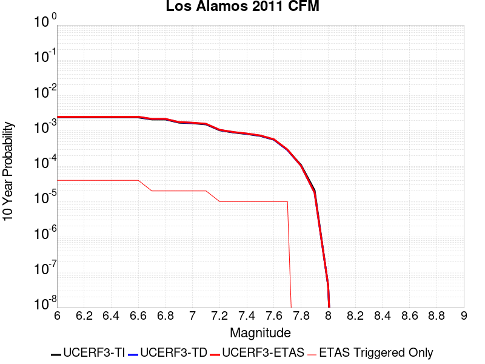 |

| Magnitude | 1 wk TI Prob | 1 wk TD Prob | 1 wk ETAS Prob | 1 wk ETAS/TD Gain | 1 wk ETAS Triggered Only | 1 mo TI Prob | 1 mo TD Prob | 1 mo ETAS Prob | 1 mo ETAS/TD Gain | 1 mo ETAS Triggered Only | 1 yr TI Prob | 1 yr TD Prob | 1 yr ETAS Prob | 1 yr ETAS/TD Gain | 1 yr ETAS Triggered Only | 10 yr TI Prob | 10 yr TD Prob | 10 yr ETAS Prob | 10 yr ETAS/TD Gain | 10 yr ETAS Triggered Only |
|-----|-----|-----|-----|-----|-----|-----|-----|-----|-----|-----|-----|-----|-----|-----|-----|-----|-----|-----|-----|-----|
| 6.0 | 4.6284417E-6 | 4.751731E-6 | 4.751731E-6 | 1.0 | 0.0 | 1.9836029E-5 | 2.0364414E-5 | 3.3733126E-5 | 1.6564742 | 1.3368984E-5 | 2.4147688E-4 | 2.4791027E-4 | 2.880073E-4 | 1.16174 | 4.0106952E-5 | 0.0024121467 | 0.0024765113 | 0.002529855 | 1.0215398 | 5.3475935E-5 |
| 6.1 | 4.6284417E-6 | 4.751731E-6 | 4.751731E-6 | 1.0 | 0.0 | 1.9836029E-5 | 2.0364414E-5 | 3.3733126E-5 | 1.6564742 | 1.3368984E-5 | 2.4147688E-4 | 2.4791027E-4 | 2.880073E-4 | 1.16174 | 4.0106952E-5 | 0.0024121467 | 0.0024765113 | 0.002529855 | 1.0215398 | 5.3475935E-5 |
| 6.2 | 4.6284417E-6 | 4.751731E-6 | 4.751731E-6 | 1.0 | 0.0 | 1.9836029E-5 | 2.0364414E-5 | 3.3733126E-5 | 1.6564742 | 1.3368984E-5 | 2.4147688E-4 | 2.4791027E-4 | 2.880073E-4 | 1.16174 | 4.0106952E-5 | 0.0024121467 | 0.0024765113 | 0.002529855 | 1.0215398 | 5.3475935E-5 |
| 6.3 | 4.6284417E-6 | 4.751731E-6 | 4.751731E-6 | 1.0 | 0.0 | 1.9836029E-5 | 2.0364414E-5 | 3.3733126E-5 | 1.6564742 | 1.3368984E-5 | 2.4147688E-4 | 2.4791027E-4 | 2.880073E-4 | 1.16174 | 4.0106952E-5 | 0.0024121467 | 0.0024765113 | 0.002529855 | 1.0215398 | 5.3475935E-5 |
| 6.4 | 4.6284417E-6 | 4.751731E-6 | 4.751731E-6 | 1.0 | 0.0 | 1.9836029E-5 | 2.0364414E-5 | 3.3733126E-5 | 1.6564742 | 1.3368984E-5 | 2.4147688E-4 | 2.4791027E-4 | 2.880073E-4 | 1.16174 | 4.0106952E-5 | 0.0024121467 | 0.0024765113 | 0.002529855 | 1.0215398 | 5.3475935E-5 |
| 6.5 | 4.6284417E-6 | 4.751731E-6 | 4.751731E-6 | 1.0 | 0.0 | 1.9836029E-5 | 2.0364414E-5 | 3.3733126E-5 | 1.6564742 | 1.3368984E-5 | 2.4147688E-4 | 2.4791027E-4 | 2.880073E-4 | 1.16174 | 4.0106952E-5 | 0.0024121467 | 0.0024765113 | 0.002529855 | 1.0215398 | 5.3475935E-5 |
| 6.6 | 4.6284417E-6 | 4.751731E-6 | 4.751731E-6 | 1.0 | 0.0 | 1.9836029E-5 | 2.0364414E-5 | 3.3733126E-5 | 1.6564742 | 1.3368984E-5 | 2.4147688E-4 | 2.4791027E-4 | 2.880073E-4 | 1.16174 | 4.0106952E-5 | 0.0024121467 | 0.0024765113 | 0.002529855 | 1.0215398 | 5.3475935E-5 |
| 6.7 | 4.062321E-6 | 4.166349E-6 | 4.166349E-6 | 1.0 | 0.0 | 1.7409831E-5 | 1.7855667E-5 | 1.7855667E-5 | 1.0 | 0.0 | 2.1194408E-4 | 2.1737257E-4 | 2.3073865E-4 | 1.0614892 | 1.3368984E-5 | 0.0021174205 | 0.0021717492 | 0.002198429 | 1.012285 | 2.6737967E-5 |
| 6.8 | 4.062321E-6 | 4.166349E-6 | 4.166349E-6 | 1.0 | 0.0 | 1.7409831E-5 | 1.7855667E-5 | 1.7855667E-5 | 1.0 | 0.0 | 2.1194408E-4 | 2.1737257E-4 | 2.3073865E-4 | 1.0614892 | 1.3368984E-5 | 0.0021174205 | 0.0021717492 | 0.002198429 | 1.012285 | 2.6737967E-5 |
| 6.9 | 3.2936077E-6 | 3.372958E-6 | 3.372958E-6 | 1.0 | 0.0 | 1.4115385E-5 | 1.4455459E-5 | 1.4455459E-5 | 1.0 | 0.0 | 1.7184127E-4 | 1.7598194E-4 | 1.8934858E-4 | 1.0759546 | 1.3368984E-5 | 0.0017170844 | 0.0017585184 | 0.0017852094 | 1.0151781 | 2.6737967E-5 |
| 7.0 | 3.1687898E-6 | 3.2448156E-6 | 3.2448156E-6 | 1.0 | 0.0 | 1.3580457E-5 | 1.3906283E-5 | 1.3906283E-5 | 1.0 | 0.0 | 1.6532952E-4 | 1.6929678E-4 | 1.826635E-4 | 1.0789543 | 1.3368984E-5 | 0.0016520657 | 0.0016917696 | 0.0017184623 | 1.015778 | 2.6737967E-5 |
| 7.1 | 2.9379228E-6 | 3.0073259E-6 | 3.0073259E-6 | 1.0 | 0.0 | 1.25910365E-5 | 1.288848E-5 | 1.288848E-5 | 1.0 | 0.0 | 1.5328509E-4 | 1.5690686E-4 | 1.7027375E-4 | 1.0851899 | 1.3368984E-5 | 0.001531794 | 0.0015680499 | 0.0015947459 | 1.017025 | 2.6737967E-5 |
| 7.2 | 2.0020686E-6 | 2.0416298E-6 | 2.0416298E-6 | 1.0 | 0.0 | 8.580266E-6 | 8.749813E-6 | 8.749813E-6 | 1.0 | 0.0 | 1.0445973E-4 | 1.0652381E-4 | 1.0652381E-4 | 1.0 | 0.0 | 0.0010441064 | 0.001064732 | 0.0010780867 | 1.0125428 | 1.3368984E-5 |
| 7.3 | 1.7364243E-6 | 1.7678802E-6 | 1.7678802E-6 | 1.0 | 0.0 | 7.441797E-6 | 7.576608E-6 | 7.576608E-6 | 1.0 | 0.0 | 9.0600115E-5 | 9.2241324E-5 | 9.2241324E-5 | 1.0 | 0.0 | 9.0563187E-4 | 9.2203356E-4 | 9.353902E-4 | 1.0144861 | 1.3368984E-5 |
| 7.4 | 1.5718434E-6 | 1.5983177E-6 | 1.5983177E-6 | 1.0 | 0.0 | 6.7364545E-6 | 6.849915E-6 | 6.849915E-6 | 1.0 | 0.0 | 8.201325E-5 | 8.339455E-5 | 8.339455E-5 | 1.0 | 0.0 | 8.198299E-4 | 8.3363557E-4 | 8.469934E-4 | 1.0160236 | 1.3368984E-5 |
| 7.5 | 1.3841119E-6 | 1.4042793E-6 | 1.4042793E-6 | 1.0 | 0.0 | 5.9318945E-6 | 6.0183256E-6 | 6.0183256E-6 | 1.0 | 0.0 | 7.221842E-5 | 7.327068E-5 | 7.327068E-5 | 1.0 | 0.0 | 7.2194956E-4 | 7.324681E-4 | 7.4582733E-4 | 1.0182385 | 1.3368984E-5 |
| 7.6 | 1.0843726E-6 | 1.093442E-6 | 1.093442E-6 | 1.0 | 0.0 | 4.647303E-6 | 4.6861724E-6 | 4.6861724E-6 | 1.0 | 0.0 | 5.6579443E-5 | 5.705268E-5 | 5.705268E-5 | 1.0 | 0.0 | 5.656504E-4 | 5.703829E-4 | 5.8374426E-4 | 1.0234252 | 1.3368984E-5 |
| 7.7 | 5.544814E-7 | 5.5018705E-7 | 5.5018705E-7 | 1.0 | 0.0 | 2.3763469E-6 | 2.3579425E-6 | 2.3579425E-6 | 1.0 | 0.0 | 2.8931638E-5 | 2.8707573E-5 | 2.8707573E-5 | 1.0 | 0.0 | 2.8927872E-4 | 2.870388E-4 | 3.0040395E-4 | 1.0465622 | 1.3368984E-5 |
| 7.8 | 2.0707465E-7 | 1.977846E-7 | 1.977846E-7 | 1.0 | 0.0 | 8.874625E-7 | 8.4764804E-7 | 8.4764804E-7 | 1.0 | 0.0 | 1.08048025E-5 | 1.0320066E-5 | 1.0320066E-5 | 1.0 | 0.0 | 1.0804277E-4 | 1.0319592E-4 | 1.0319592E-4 | 1.0 | 0.0 |
| 7.9 | 3.9821284E-8 | 3.433109E-8 | 3.433109E-8 | 1.0 | 0.0 | 1.7066264E-7 | 1.4713324E-7 | 1.4713324E-7 | 1.0 | 0.0 | 2.0778157E-6 | 1.7913457E-6 | 1.7913457E-6 | 1.0 | 0.0 | 2.0777963E-5 | 1.7913319E-5 | 1.7913319E-5 | 1.0 | 0.0 |
| 8.0 | 7.880441E-11 | 8.2353124E-11 | 8.2353124E-11 | 1.0 | 0.0 | 3.3773329E-10 | 3.52942E-10 | 3.52942E-10 | 1.0 | 0.0 | 4.1119033E-9 | 4.2970694E-9 | 4.2970694E-9 | 1.0 | 0.0 | 4.1119034E-8 | 4.2970694E-8 | 4.2970694E-8 | 1.0 | 0.0 |

## Del Valle
*[(top)](#table-of-contents)*

| 1 Week | 1 Month | 1 Year | 10 Year |
|-----|-----|-----|-----|
|  |  |  |  |

| Magnitude | 1 wk TI Prob | 1 wk TD Prob | 1 wk ETAS Prob | 1 wk ETAS/TD Gain | 1 wk ETAS Triggered Only | 1 mo TI Prob | 1 mo TD Prob | 1 mo ETAS Prob | 1 mo ETAS/TD Gain | 1 mo ETAS Triggered Only | 1 yr TI Prob | 1 yr TD Prob | 1 yr ETAS Prob | 1 yr ETAS/TD Gain | 1 yr ETAS Triggered Only | 10 yr TI Prob | 10 yr TD Prob | 10 yr ETAS Prob | 10 yr ETAS/TD Gain | 10 yr ETAS Triggered Only |
|-----|-----|-----|-----|-----|-----|-----|-----|-----|-----|-----|-----|-----|-----|-----|-----|-----|-----|-----|-----|-----|
| 6.0 | 1.0716125E-5 | 8.767882E-6 | 2.2136748E-5 | 2.5247543 | 1.3368984E-5 | 4.592544E-5 | 3.7576207E-5 | 5.094469E-5 | 1.3557699 | 1.3368984E-5 | 5.589988E-4 | 4.5741405E-4 | 4.975026E-4 | 1.0876418 | 4.0106952E-5 | 0.0055759475 | 0.00456668 | 0.0046199122 | 1.0116565 | 5.3475935E-5 |
| 6.1 | 1.0716125E-5 | 8.767882E-6 | 2.2136748E-5 | 2.5247543 | 1.3368984E-5 | 4.592544E-5 | 3.7576207E-5 | 5.094469E-5 | 1.3557699 | 1.3368984E-5 | 5.589988E-4 | 4.5741405E-4 | 4.975026E-4 | 1.0876418 | 4.0106952E-5 | 0.0055759475 | 0.00456668 | 0.0046199122 | 1.0116565 | 5.3475935E-5 |
| 6.2 | 1.0716125E-5 | 8.767882E-6 | 2.2136748E-5 | 2.5247543 | 1.3368984E-5 | 4.592544E-5 | 3.7576207E-5 | 5.094469E-5 | 1.3557699 | 1.3368984E-5 | 5.589988E-4 | 4.5741405E-4 | 4.975026E-4 | 1.0876418 | 4.0106952E-5 | 0.0055759475 | 0.00456668 | 0.0046199122 | 1.0116565 | 5.3475935E-5 |
| 6.3 | 7.1293784E-6 | 4.865823E-6 | 1.8234741E-5 | 3.7475145 | 1.3368984E-5 | 3.055412E-5 | 2.0853364E-5 | 3.422207E-5 | 1.6410815 | 1.3368984E-5 | 3.7193293E-4 | 2.5386087E-4 | 2.9395765E-4 | 1.1579478 | 4.0106952E-5 | 0.0037131102 | 0.0025357946 | 0.002589135 | 1.021035 | 5.3475935E-5 |
| 6.4 | 7.1293784E-6 | 4.865823E-6 | 1.8234741E-5 | 3.7475145 | 1.3368984E-5 | 3.055412E-5 | 2.0853364E-5 | 3.422207E-5 | 1.6410815 | 1.3368984E-5 | 3.7193293E-4 | 2.5386087E-4 | 2.9395765E-4 | 1.1579478 | 4.0106952E-5 | 0.0037131102 | 0.0025357946 | 0.002589135 | 1.021035 | 5.3475935E-5 |
| 6.5 | 7.1293784E-6 | 4.865823E-6 | 1.8234741E-5 | 3.7475145 | 1.3368984E-5 | 3.055412E-5 | 2.0853364E-5 | 3.422207E-5 | 1.6410815 | 1.3368984E-5 | 3.7193293E-4 | 2.5386087E-4 | 2.9395765E-4 | 1.1579478 | 4.0106952E-5 | 0.0037131102 | 0.0025357946 | 0.002589135 | 1.021035 | 5.3475935E-5 |
| 6.6 | 7.1293784E-6 | 4.865823E-6 | 1.8234741E-5 | 3.7475145 | 1.3368984E-5 | 3.055412E-5 | 2.0853364E-5 | 3.422207E-5 | 1.6410815 | 1.3368984E-5 | 3.7193293E-4 | 2.5386087E-4 | 2.9395765E-4 | 1.1579478 | 4.0106952E-5 | 0.0037131102 | 0.0025357946 | 0.002589135 | 1.021035 | 5.3475935E-5 |
| 6.7 | 7.12272E-6 | 4.8631987E-6 | 1.8232118E-5 | 3.7489972 | 1.3368984E-5 | 3.0525585E-5 | 2.0842117E-5 | 3.421082E-5 | 1.6414274 | 1.3368984E-5 | 3.7158563E-4 | 2.5372396E-4 | 2.9382075E-4 | 1.158033 | 4.0106952E-5 | 0.003709649 | 0.0025344288 | 0.0025877692 | 1.0210463 | 5.3475935E-5 |
| 6.8 | 6.7558703E-6 | 4.5594015E-6 | 1.7928325E-5 | 3.9321663 | 1.3368984E-5 | 2.895341E-5 | 1.9540148E-5 | 3.2908873E-5 | 1.6841669 | 1.3368984E-5 | 3.5245073E-4 | 2.3787597E-4 | 2.779734E-4 | 1.1685643 | 4.0106952E-5 | 0.0035189227 | 0.0023762889 | 0.0024296376 | 1.0224504 | 5.3475935E-5 |
| 6.9 | 6.6700386E-6 | 4.502539E-6 | 1.7871464E-5 | 3.9691968 | 1.3368984E-5 | 2.8585566E-5 | 1.9296456E-5 | 3.2665183E-5 | 1.6928073 | 1.3368984E-5 | 3.479737E-4 | 2.3490966E-4 | 2.750072E-4 | 1.1706934 | 4.0106952E-5 | 0.003474293 | 0.0023466884 | 0.002400039 | 1.0227344 | 5.3475935E-5 |
| 7.0 | 6.3181424E-6 | 4.0987034E-6 | 1.7467633E-5 | 4.261746 | 1.3368984E-5 | 2.7077473E-5 | 1.7565755E-5 | 3.0934505E-5 | 1.7610688 | 1.3368984E-5 | 3.2961834E-4 | 2.1384252E-4 | 2.5394087E-4 | 1.1875136 | 4.0106952E-5 | 0.0032912986 | 0.002136422 | 0.0021897838 | 1.0249771 | 5.3475935E-5 |
| 7.1 | 6.248759E-6 | 4.033895E-6 | 1.7402825E-5 | 4.3141494 | 1.3368984E-5 | 2.678012E-5 | 1.7288008E-5 | 3.065676E-5 | 1.7732962 | 1.3368984E-5 | 3.2599916E-4 | 2.104616E-4 | 2.5056012E-4 | 1.1905265 | 4.0106952E-5 | 0.0032552136 | 0.0021026772 | 0.0021560406 | 1.0253788 | 5.3475935E-5 |
| 7.2 | 6.0411944E-6 | 3.869888E-6 | 1.723882E-5 | 4.4546046 | 1.3368984E-5 | 2.5890577E-5 | 1.658513E-5 | 2.9953893E-5 | 1.8060691 | 1.3368984E-5 | 3.1517216E-4 | 2.0190567E-4 | 2.4200453E-4 | 1.198602 | 4.0106952E-5 | 0.0031472554 | 0.0020172757 | 0.0020706437 | 1.0264555 | 5.3475935E-5 |
| 7.3 | 4.7691183E-6 | 3.0781202E-6 | 1.6447064E-5 | 5.3432164 | 1.3368984E-5 | 2.0438918E-5 | 1.3191879E-5 | 2.6560687E-5 | 2.013412 | 1.3368984E-5 | 2.488154E-4 | 1.605995E-4 | 1.8733318E-4 | 1.1664617 | 2.6737967E-5 | 0.00248537 | 0.0016048603 | 0.0016315553 | 1.0166339 | 2.6737967E-5 |
| 7.4 | 3.5524722E-6 | 2.1893363E-6 | 2.1893363E-6 | 1.0 | 0.0 | 1.5224792E-5 | 9.382837E-6 | 9.382837E-6 | 1.0 | 0.0 | 1.8534607E-4 | 1.1423013E-4 | 1.275976E-4 | 1.1170222 | 1.3368984E-5 | 0.0018519156 | 0.0011417224 | 0.0011550762 | 1.0116961 | 1.3368984E-5 |
| 7.5 | 2.7133442E-6 | 1.5916097E-6 | 1.5916097E-6 | 1.0 | 0.0 | 1.1628566E-5 | 6.821167E-6 | 6.821167E-6 | 1.0 | 0.0 | 1.415686E-4 | 8.304456E-5 | 8.304456E-5 | 1.0 | 0.0 | 0.0014147845 | 8.301372E-4 | 8.301372E-4 | 1.0 | 0.0 |
| 7.6 | 1.915338E-6 | 1.173914E-6 | 1.173914E-6 | 1.0 | 0.0 | 8.208566E-6 | 5.0310505E-6 | 5.0310505E-6 | 1.0 | 0.0 | 9.993471E-5 | 6.125133E-5 | 6.125133E-5 | 1.0 | 0.0 | 9.988978E-4 | 6.123454E-4 | 6.123454E-4 | 1.0 | 0.0 |
| 7.7 | 1.2120448E-6 | 7.180313E-7 | 7.180313E-7 | 1.0 | 0.0 | 5.194467E-6 | 3.0772733E-6 | 3.0772733E-6 | 1.0 | 0.0 | 6.3240805E-5 | 3.746516E-5 | 3.746516E-5 | 1.0 | 0.0 | 6.322281E-4 | 3.7458882E-4 | 3.7458882E-4 | 1.0 | 0.0 |
| 7.8 | 6.272381E-7 | 3.932549E-7 | 3.932549E-7 | 1.0 | 0.0 | 2.6881603E-6 | 1.6853771E-6 | 1.6853771E-6 | 1.0 | 0.0 | 3.272786E-5 | 2.0519275E-5 | 2.0519275E-5 | 1.0 | 0.0 | 3.272304E-4 | 2.0517396E-4 | 2.0517396E-4 | 1.0 | 0.0 |
| 7.9 | 2.0292627E-7 | 1.2004622E-7 | 1.2004622E-7 | 1.0 | 0.0 | 8.6968373E-7 | 5.1448376E-7 | 5.1448376E-7 | 1.0 | 0.0 | 1.0588348E-5 | 6.263822E-6 | 6.263822E-6 | 1.0 | 0.0 | 1.0587843E-4 | 6.263647E-5 | 6.263647E-5 | 1.0 | 0.0 |
| 8.0 | 4.374492E-8 | 2.189964E-8 | 2.189964E-8 | 1.0 | 0.0 | 1.8747821E-7 | 9.385559E-8 | 9.385559E-8 | 1.0 | 0.0 | 2.2825448E-6 | 1.1426913E-6 | 1.1426913E-6 | 1.0 | 0.0 | 2.2825214E-5 | 1.1426858E-5 | 1.1426858E-5 | 1.0 | 0.0 |

## Calaveras (So) - Paicines extension 2011 CFM
*[(top)](#table-of-contents)*

| 1 Week | 1 Month | 1 Year | 10 Year |
|-----|-----|-----|-----|
|  | 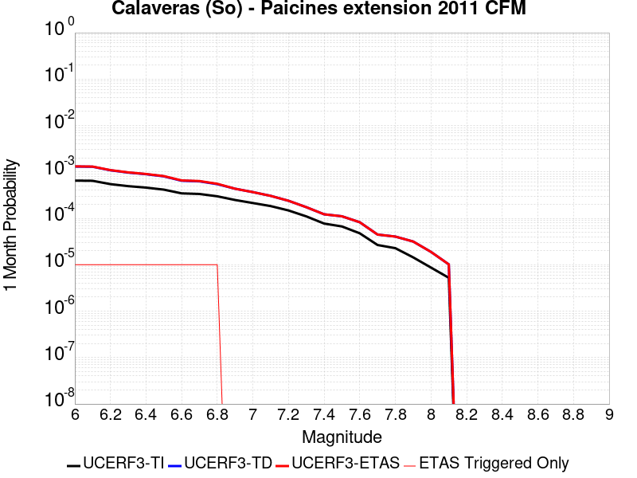 |  |  |

| Magnitude | 1 wk TI Prob | 1 wk TD Prob | 1 wk ETAS Prob | 1 wk ETAS/TD Gain | 1 wk ETAS Triggered Only | 1 mo TI Prob | 1 mo TD Prob | 1 mo ETAS Prob | 1 mo ETAS/TD Gain | 1 mo ETAS Triggered Only | 1 yr TI Prob | 1 yr TD Prob | 1 yr ETAS Prob | 1 yr ETAS/TD Gain | 1 yr ETAS Triggered Only | 10 yr TI Prob | 10 yr TD Prob | 10 yr ETAS Prob | 10 yr ETAS/TD Gain | 10 yr ETAS Triggered Only |
|-----|-----|-----|-----|-----|-----|-----|-----|-----|-----|-----|-----|-----|-----|-----|-----|-----|-----|-----|-----|-----|
| 6.0 | 1.5183659E-4 | 3.0533716E-4 | 3.0533716E-4 | 1.0 | 0.0 | 6.5056595E-4 | 0.0013069661 | 0.0013203176 | 1.0102156 | 1.3368984E-5 | 0.007891912 | 0.01569571 | 0.015722029 | 1.0016768 | 2.6737967E-5 | 0.076174594 | 0.13848671 | 0.13853279 | 1.0003327 | 5.3475935E-5 |
| 6.1 | 1.5024997E-4 | 3.0227835E-4 | 3.0227835E-4 | 1.0 | 0.0 | 6.437695E-4 | 0.00129387 | 0.0013072217 | 1.0103192 | 1.3368984E-5 | 0.0078097614 | 0.015539104 | 0.015565427 | 1.001694 | 2.6737967E-5 | 0.075409345 | 0.13715632 | 0.13720247 | 1.0003364 | 5.3475935E-5 |
| 6.2 | 1.2743923E-4 | 2.5306802E-4 | 2.5306802E-4 | 1.0 | 0.0 | 5.460538E-4 | 0.0010841049 | 0.0010974593 | 1.0123185 | 1.3368984E-5 | 0.0066279583 | 0.013046704 | 0.013073093 | 1.0020226 | 2.6737967E-5 | 0.064337276 | 0.11725405 | 0.11730125 | 1.0004026 | 5.3475935E-5 |
| 6.3 | 1.1525114E-4 | 2.2595265E-4 | 2.2595265E-4 | 1.0 | 0.0 | 4.9383997E-4 | 9.6799526E-4 | 9.813514E-4 | 1.0137976 | 1.3368984E-5 | 0.0059959386 | 0.011667927 | 0.011694353 | 1.0022649 | 2.6737967E-5 | 0.058367174 | 0.10637007 | 0.10641786 | 1.0004493 | 5.3475935E-5 |
| 6.4 | 1.07200925E-4 | 2.0836305E-4 | 2.0836305E-4 | 1.0 | 0.0 | 4.5935164E-4 | 8.926636E-4 | 9.0602064E-4 | 1.0149632 | 1.3368984E-5 | 0.0055782744 | 0.010772766 | 0.010799215 | 1.0024552 | 2.6737967E-5 | 0.0544031 | 0.09919256 | 0.099240735 | 1.0004857 | 5.3475935E-5 |
| 6.5 | 9.69631E-5 | 1.8729115E-4 | 1.8729115E-4 | 1.0 | 0.0 | 4.1548995E-4 | 8.024135E-4 | 8.1577175E-4 | 1.0166476 | 1.3368984E-5 | 0.0050468626 | 0.009694662 | 0.009721141 | 1.0027313 | 2.6737967E-5 | 0.04933773 | 0.090084255 | 0.090132914 | 1.0005401 | 5.3475935E-5 |
| 6.6 | 8.0552316E-5 | 1.5070537E-4 | 1.5070537E-4 | 1.0 | 0.0 | 3.4517853E-4 | 6.456994E-4 | 6.5905973E-4 | 1.0206913 | 1.3368984E-5 | 0.0041944524 | 0.007826256 | 0.007852784 | 1.0033897 | 2.6737967E-5 | 0.04116161 | 0.074854024 | 0.074903496 | 1.0006609 | 5.3475935E-5 |
| 6.7 | 7.815757E-5 | 1.4610609E-4 | 1.4610609E-4 | 1.0 | 0.0 | 3.34918E-4 | 6.260017E-4 | 6.393623E-4 | 1.0213428 | 1.3368984E-5 | 0.004070005 | 0.0075890915 | 0.007615627 | 1.0034965 | 2.6737967E-5 | 0.039962657 | 0.072703585 | 0.072753176 | 1.0006821 | 5.3475935E-5 |
| 6.8 | 6.965264E-5 | 1.2721405E-4 | 1.2721405E-4 | 1.0 | 0.0 | 2.9847719E-4 | 5.450839E-4 | 5.584456E-4 | 1.0245131 | 1.3368984E-5 | 0.0036279052 | 0.00661342 | 0.0066399807 | 1.0040163 | 2.6737967E-5 | 0.03569247 | 0.06379891 | 0.06384897 | 1.0007848 | 5.3475935E-5 |
| 6.9 | 5.8000453E-5 | 1.01435086E-4 | 1.01435086E-4 | 1.0 | 0.0 | 2.4854968E-4 | 4.3464993E-4 | 4.3464993E-4 | 1.0 | 0.0 | 0.0030218933 | 0.0052791284 | 0.0052791284 | 1.0 | 0.0 | 0.029811295 | 0.051501602 | 0.051526964 | 1.0004925 | 2.6737967E-5 |
| 7.0 | 4.9865852E-5 | 8.567692E-5 | 8.567692E-5 | 1.0 | 0.0 | 2.1369329E-4 | 3.671356E-4 | 3.671356E-4 | 1.0 | 0.0 | 0.0025986114 | 0.0044608037 | 0.0044608037 | 1.0 | 0.0 | 0.025684336 | 0.043781694 | 0.043794475 | 1.000292 | 1.3368984E-5 |
| 7.1 | 4.283875E-5 | 7.112159E-5 | 7.112159E-5 | 1.0 | 0.0 | 1.8358172E-4 | 3.047715E-4 | 3.047715E-4 | 1.0 | 0.0 | 0.0022328163 | 0.003704336 | 0.003704336 | 1.0 | 0.0 | 0.022105146 | 0.03673583 | 0.036748707 | 1.0003506 | 1.3368984E-5 |
| 7.2 | 3.450115E-5 | 5.5776054E-5 | 5.5776054E-5 | 1.0 | 0.0 | 1.478537E-4 | 2.390185E-4 | 2.390185E-4 | 1.0 | 0.0 | 0.0017986323 | 0.0029061958 | 0.0029061958 | 1.0 | 0.0 | 0.017841442 | 0.029079199 | 0.029079199 | 1.0 | 0.0 |
| 7.3 | 2.5709045E-5 | 4.0588155E-5 | 4.0588155E-5 | 1.0 | 0.0 | 1.1017697E-4 | 1.7393773E-4 | 1.7393773E-4 | 1.0 | 0.0 | 0.0013405791 | 0.002115652 | 0.002115652 | 1.0 | 0.0 | 0.013325208 | 0.021297242 | 0.021297242 | 1.0 | 0.0 |
| 7.4 | 1.8003093E-5 | 2.8509934E-5 | 2.8509934E-5 | 1.0 | 0.0 | 7.715383E-5 | 1.2217973E-4 | 1.2217973E-4 | 1.0 | 0.0 | 9.3894306E-4 | 0.0014865254 | 0.0014865254 | 1.0 | 0.0 | 0.009349857 | 0.015052196 | 0.015052196 | 1.0 | 0.0 |
| 7.5 | 1.5595824E-5 | 2.5822499E-5 | 2.5822499E-5 | 1.0 | 0.0 | 6.683753E-5 | 1.1066317E-4 | 1.1066317E-4 | 1.0 | 0.0 | 8.134431E-4 | 0.0013464936 | 0.0013464936 | 1.0 | 0.0 | 0.008104719 | 0.01365213 | 0.01365213 | 1.0 | 0.0 |
| 7.6 | 1.1110309E-5 | 1.9222098E-5 | 1.9222098E-5 | 1.0 | 0.0 | 4.761474E-5 | 8.2377825E-5 | 8.2377825E-5 | 1.0 | 0.0 | 5.795553E-4 | 0.0010024898 | 0.0010024898 | 1.0 | 0.0 | 0.0057804612 | 0.010203943 | 0.010203943 | 1.0 | 0.0 |
| 7.7 | 6.2140443E-6 | 1.0437076E-5 | 1.0437076E-5 | 1.0 | 0.0 | 2.6631347E-5 | 4.4729557E-5 | 4.4729557E-5 | 1.0 | 0.0 | 3.241884E-4 | 5.444464E-4 | 5.444464E-4 | 1.0 | 0.0 | 0.0032371588 | 0.005619835 | 0.005619835 | 1.0 | 0.0 |
| 7.8 | 5.305533E-6 | 9.433038E-6 | 9.433038E-6 | 1.0 | 0.0 | 2.27378E-5 | 4.042668E-5 | 4.042668E-5 | 1.0 | 0.0 | 2.7679754E-4 | 4.920837E-4 | 4.920837E-4 | 1.0 | 0.0 | 0.0027645302 | 0.005074324 | 0.005074324 | 1.0 | 0.0 |
| 7.9 | 3.363505E-6 | 7.3848937E-6 | 7.3848937E-6 | 1.0 | 0.0 | 1.4414942E-5 | 3.164916E-5 | 3.164916E-5 | 1.0 | 0.0 | 1.7548777E-4 | 3.8526047E-4 | 3.8526047E-4 | 1.0 | 0.0 | 0.0017534926 | 0.003948527 | 0.003948527 | 1.0 | 0.0 |
| 8.0 | 2.0271132E-6 | 4.413104E-6 | 4.413104E-6 | 1.0 | 0.0 | 8.687599E-6 | 1.8913164E-5 | 1.8913164E-5 | 1.0 | 0.0 | 1.05766376E-4 | 2.302435E-4 | 2.302435E-4 | 1.0 | 0.0 | 0.0010571606 | 0.002351099 | 0.002351099 | 1.0 | 0.0 |
| 8.1 | 1.2206116E-6 | 2.3751331E-6 | 2.3751331E-6 | 1.0 | 0.0 | 5.2311816E-6 | 1.0179103E-5 | 1.0179103E-5 | 1.0 | 0.0 | 6.3687774E-5 | 1.2392356E-4 | 1.2392356E-4 | 1.0 | 0.0 | 6.366953E-4 | 0.0012705477 | 0.0012705477 | 1.0 | 0.0 |

## Cedar Mtn-Mahogany Mtn
*[(top)](#table-of-contents)*

| 1 Week | 1 Month | 1 Year | 10 Year |
|-----|-----|-----|-----|
|  |  |  | 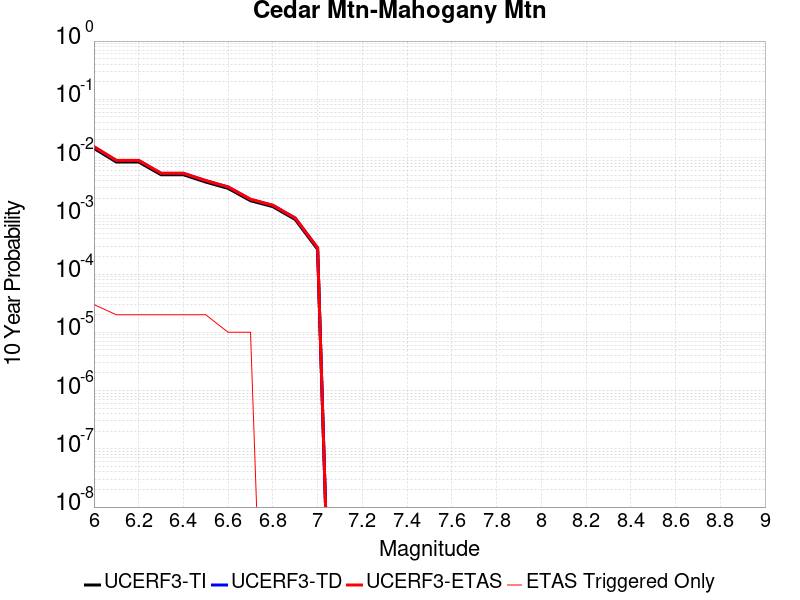 |

| Magnitude | 1 wk TI Prob | 1 wk TD Prob | 1 wk ETAS Prob | 1 wk ETAS/TD Gain | 1 wk ETAS Triggered Only | 1 mo TI Prob | 1 mo TD Prob | 1 mo ETAS Prob | 1 mo ETAS/TD Gain | 1 mo ETAS Triggered Only | 1 yr TI Prob | 1 yr TD Prob | 1 yr ETAS Prob | 1 yr ETAS/TD Gain | 1 yr ETAS Triggered Only | 10 yr TI Prob | 10 yr TD Prob | 10 yr ETAS Prob | 10 yr ETAS/TD Gain | 10 yr ETAS Triggered Only |
|-----|-----|-----|-----|-----|-----|-----|-----|-----|-----|-----|-----|-----|-----|-----|-----|-----|-----|-----|-----|-----|
| 6.0 | 2.7763876E-5 | 2.9588866E-5 | 2.9588866E-5 | 1.0 | 0.0 | 1.1898261E-4 | 1.2680366E-4 | 1.4017095E-4 | 1.1054173 | 1.3368984E-5 | 0.0014476506 | 0.0015428112 | 0.0015695079 | 1.017304 | 2.6737967E-5 | 0.0143825635 | 0.015328225 | 0.0153677175 | 1.0025765 | 4.0106952E-5 |
| 6.1 | 1.6162443E-5 | 1.7142966E-5 | 1.7142966E-5 | 1.0 | 0.0 | 6.926578E-5 | 7.346788E-5 | 7.346788E-5 | 1.0 | 0.0 | 8.4298453E-4 | 8.941221E-4 | 9.0747915E-4 | 1.0149387 | 1.3368984E-5 | 0.008397939 | 0.008907059 | 0.008933559 | 1.0029751 | 2.6737967E-5 |
| 6.2 | 1.6162443E-5 | 1.7142966E-5 | 1.7142966E-5 | 1.0 | 0.0 | 6.926578E-5 | 7.346788E-5 | 7.346788E-5 | 1.0 | 0.0 | 8.4298453E-4 | 8.941221E-4 | 9.0747915E-4 | 1.0149387 | 1.3368984E-5 | 0.008397939 | 0.008907059 | 0.008933559 | 1.0029751 | 2.6737967E-5 |
| 6.3 | 9.746053E-6 | 1.0303152E-5 | 1.0303152E-5 | 1.0 | 0.0 | 4.1768133E-5 | 4.415564E-5 | 4.415564E-5 | 1.0 | 0.0 | 5.0840835E-4 | 5.3746643E-4 | 5.5082823E-4 | 1.0248607 | 1.3368984E-5 | 0.0050724675 | 0.005362084 | 0.005388679 | 1.0049597 | 2.6737967E-5 |
| 6.4 | 9.746053E-6 | 1.0303152E-5 | 1.0303152E-5 | 1.0 | 0.0 | 4.1768133E-5 | 4.415564E-5 | 4.415564E-5 | 1.0 | 0.0 | 5.0840835E-4 | 5.3746643E-4 | 5.5082823E-4 | 1.0248607 | 1.3368984E-5 | 0.0050724675 | 0.005362084 | 0.005388679 | 1.0049597 | 2.6737967E-5 |
| 6.5 | 7.290083E-6 | 7.695325E-6 | 7.695325E-6 | 1.0 | 0.0 | 3.124284E-5 | 3.297956E-5 | 3.297956E-5 | 1.0 | 0.0 | 3.8031515E-4 | 4.014543E-4 | 4.148179E-4 | 1.033288 | 1.3368984E-5 | 0.0037966494 | 0.004007511 | 0.004034142 | 1.0066452 | 2.6737967E-5 |
| 6.6 | 5.67907E-6 | 5.9891527E-6 | 5.9891527E-6 | 1.0 | 0.0 | 2.4338644E-5 | 2.5667552E-5 | 2.5667552E-5 | 1.0 | 0.0 | 2.962827E-4 | 3.12459E-4 | 3.12459E-4 | 1.0 | 0.0 | 0.0029588798 | 0.003120333 | 0.0031336602 | 1.0042711 | 1.3368984E-5 |
| 6.7 | 3.4853963E-6 | 3.672631E-6 | 3.672631E-6 | 1.0 | 0.0 | 1.4937327E-5 | 1.5739755E-5 | 1.5739755E-5 | 1.0 | 0.0 | 1.8184677E-4 | 1.916153E-4 | 1.916153E-4 | 1.0 | 0.0 | 0.0018169804 | 0.0019145629 | 0.0019279062 | 1.0069695 | 1.3368984E-5 |
| 6.8 | 2.7535168E-6 | 2.9015764E-6 | 2.9015764E-6 | 1.0 | 0.0 | 1.1800733E-5 | 1.2435271E-5 | 1.2435271E-5 | 1.0 | 0.0 | 1.4366445E-4 | 1.5138938E-4 | 1.5138938E-4 | 1.0 | 0.0 | 0.0014357162 | 0.0015129098 | 0.0015129098 | 1.0 | 0.0 |
| 6.9 | 1.6594106E-6 | 1.7496985E-6 | 1.7496985E-6 | 1.0 | 0.0 | 7.1117406E-6 | 7.4986883E-6 | 7.4986883E-6 | 1.0 | 0.0 | 8.6582E-5 | 9.129302E-5 | 9.129302E-5 | 1.0 | 0.0 | 8.654827E-4 | 9.125856E-4 | 9.125856E-4 | 1.0 | 0.0 |
| 7.0 | 5.10215E-7 | 5.389254E-7 | 5.389254E-7 | 1.0 | 0.0 | 2.186634E-6 | 2.3096788E-6 | 2.3096788E-6 | 1.0 | 0.0 | 2.6621943E-5 | 2.8120105E-5 | 2.8120105E-5 | 1.0 | 0.0 | 2.6618753E-4 | 2.81178E-4 | 2.81178E-4 | 1.0 | 0.0 |

## Calaveras (Central) 2011 CFM
*[(top)](#table-of-contents)*

| 1 Week | 1 Month | 1 Year | 10 Year |
|-----|-----|-----|-----|
|  |  |  |  |

| Magnitude | 1 wk TI Prob | 1 wk TD Prob | 1 wk ETAS Prob | 1 wk ETAS/TD Gain | 1 wk ETAS Triggered Only | 1 mo TI Prob | 1 mo TD Prob | 1 mo ETAS Prob | 1 mo ETAS/TD Gain | 1 mo ETAS Triggered Only | 1 yr TI Prob | 1 yr TD Prob | 1 yr ETAS Prob | 1 yr ETAS/TD Gain | 1 yr ETAS Triggered Only | 10 yr TI Prob | 10 yr TD Prob | 10 yr ETAS Prob | 10 yr ETAS/TD Gain | 10 yr ETAS Triggered Only |
|-----|-----|-----|-----|-----|-----|-----|-----|-----|-----|-----|-----|-----|-----|-----|-----|-----|-----|-----|-----|-----|
| 6.0 | 1.5010907E-4 | 2.481574E-4 | 2.481574E-4 | 1.0 | 0.0 | 6.4316596E-4 | 0.0010621005 | 0.0010621005 | 1.0 | 0.0 | 0.0078024664 | 0.012850073 | 0.012863271 | 1.001027 | 1.3368984E-5 | 0.07534136 | 0.120401435 | 0.12043671 | 1.000293 | 4.0106952E-5 |
| 6.1 | 1.4521465E-4 | 2.397987E-4 | 2.397987E-4 | 1.0 | 0.0 | 6.222001E-4 | 0.0010263061 | 0.0010263061 | 1.0 | 0.0 | 0.0075490056 | 0.012419341 | 0.0124325445 | 1.0010631 | 1.3368984E-5 | 0.07297657 | 0.11667323 | 0.11670866 | 1.0003036 | 4.0106952E-5 |
| 6.2 | 1.429998E-4 | 2.3911126E-4 | 2.3911126E-4 | 1.0 | 0.0 | 6.127123E-4 | 0.0010233623 | 0.0010233623 | 1.0 | 0.0 | 0.007434286 | 0.01238394 | 0.012397144 | 1.0010662 | 1.3368984E-5 | 0.07190444 | 0.1163272 | 0.11636264 | 1.0003047 | 4.0106952E-5 |
| 6.3 | 1.3536277E-4 | 2.3242626E-4 | 2.3242626E-4 | 1.0 | 0.0 | 5.799972E-4 | 9.947343E-4 | 9.947343E-4 | 1.0 | 0.0 | 0.0070386264 | 0.012040132 | 0.01205334 | 1.001097 | 1.3368984E-5 | 0.0681982 | 0.11323977 | 0.11327534 | 1.0003141 | 4.0106952E-5 |
| 6.4 | 1.2993296E-4 | 2.2666177E-4 | 2.2666177E-4 | 1.0 | 0.0 | 5.5673666E-4 | 9.700479E-4 | 9.700479E-4 | 1.0 | 0.0 | 0.006757223 | 0.011742937 | 0.011756149 | 1.0011251 | 1.3368984E-5 | 0.06555412 | 0.11051771 | 0.110553384 | 1.0003228 | 4.0106952E-5 |
| 6.5 | 1.0498927E-4 | 1.7981697E-4 | 1.7981697E-4 | 1.0 | 0.0 | 4.498764E-4 | 7.704157E-4 | 7.704157E-4 | 1.0 | 0.0 | 0.005463498 | 0.00933924 | 0.00933924 | 1.0 | 0.0 | 0.053311124 | 0.089199215 | 0.08922356 | 1.000273 | 2.6737967E-5 |
| 6.6 | 1.0157505E-4 | 1.7469203E-4 | 1.7469203E-4 | 1.0 | 0.0 | 4.35249E-4 | 7.484645E-4 | 7.484645E-4 | 1.0 | 0.0 | 0.0052862884 | 0.009074297 | 0.009074297 | 1.0 | 0.0 | 0.05162293 | 0.08677671 | 0.08680113 | 1.0002813 | 2.6737967E-5 |
| 6.7 | 9.660386E-5 | 1.6728524E-4 | 1.6728524E-4 | 1.0 | 0.0 | 4.1395082E-4 | 7.1673887E-4 | 7.1673887E-4 | 1.0 | 0.0 | 0.0050282106 | 0.008691208 | 0.008691208 | 1.0 | 0.0 | 0.049159497 | 0.083266065 | 0.08329058 | 1.0002943 | 2.6737967E-5 |
| 6.8 | 9.089927E-5 | 1.5643016E-4 | 1.5643016E-4 | 1.0 | 0.0 | 3.8951015E-4 | 6.702439E-4 | 6.702439E-4 | 1.0 | 0.0 | 0.0047319788 | 0.008129478 | 0.008129478 | 1.0 | 0.0 | 0.046324775 | 0.078159414 | 0.07818406 | 1.0003153 | 2.6737967E-5 |
| 6.9 | 7.353187E-5 | 1.2295354E-4 | 1.2295354E-4 | 1.0 | 0.0 | 3.150985E-4 | 5.2683795E-4 | 5.2683795E-4 | 1.0 | 0.0 | 0.0038295772 | 0.006395508 | 0.006395508 | 1.0 | 0.0 | 0.037642512 | 0.062187865 | 0.06221294 | 1.0004032 | 2.6737967E-5 |
| 7.0 | 5.746064E-5 | 9.3887444E-5 | 9.3887444E-5 | 1.0 | 0.0 | 2.4623662E-4 | 4.0231308E-4 | 4.0231308E-4 | 1.0 | 0.0 | 0.0029938098 | 0.004887232 | 0.004887232 | 1.0 | 0.0 | 0.02953797 | 0.04798685 | 0.04799958 | 1.0002652 | 1.3368984E-5 |
| 7.1 | 4.9557195E-5 | 8.052461E-5 | 8.052461E-5 | 1.0 | 0.0 | 2.123707E-4 | 3.4506017E-4 | 3.4506017E-4 | 1.0 | 0.0 | 0.0025825473 | 0.0041930773 | 0.0041930773 | 1.0 | 0.0 | 0.0255274 | 0.041373078 | 0.041385897 | 1.0003097 | 1.3368984E-5 |
| 7.2 | 3.687595E-5 | 5.9524526E-5 | 5.9524526E-5 | 1.0 | 0.0 | 1.5803022E-4 | 2.5508032E-4 | 2.5508032E-4 | 1.0 | 0.0 | 0.0019223199 | 0.0031012094 | 0.0031012094 | 1.0 | 0.0 | 0.01905776 | 0.030883716 | 0.030883716 | 1.0 | 0.0 |
| 7.3 | 2.5846984E-5 | 4.247213E-5 | 4.247213E-5 | 1.0 | 0.0 | 1.1076809E-4 | 1.8201082E-4 | 1.8201082E-4 | 1.0 | 0.0 | 0.0013477671 | 0.002213747 | 0.002213747 | 1.0 | 0.0 | 0.013396223 | 0.02217554 | 0.02217554 | 1.0 | 0.0 |
| 7.4 | 1.7747854E-5 | 2.9936204E-5 | 2.9936204E-5 | 1.0 | 0.0 | 7.6060016E-5 | 1.2829172E-4 | 1.2829172E-4 | 1.0 | 0.0 | 9.2563726E-4 | 0.0015608355 | 0.0015608355 | 1.0 | 0.0 | 0.009217911 | 0.015709236 | 0.015709236 | 1.0 | 0.0 |
| 7.5 | 1.4883479E-5 | 2.6243379E-5 | 2.6243379E-5 | 1.0 | 0.0 | 6.378478E-5 | 1.1246678E-4 | 1.1246678E-4 | 1.0 | 0.0 | 7.76303E-4 | 0.0013684258 | 0.0013684258 | 1.0 | 0.0 | 0.0077359667 | 0.013802425 | 0.013802425 | 1.0 | 0.0 |
| 7.6 | 8.166975E-6 | 1.4963478E-5 | 1.4963478E-5 | 1.0 | 0.0 | 3.5000852E-5 | 6.412763E-5 | 6.412763E-5 | 1.0 | 0.0 | 4.2605202E-4 | 7.804755E-4 | 7.804755E-4 | 1.0 | 0.0 | 0.004252361 | 0.00793984 | 0.00793984 | 1.0 | 0.0 |
| 7.7 | 3.3858064E-6 | 6.253914E-6 | 6.253914E-6 | 1.0 | 0.0 | 1.4510518E-5 | 2.6802214E-5 | 2.6802214E-5 | 1.0 | 0.0 | 1.7665124E-4 | 3.2626814E-4 | 3.2626814E-4 | 1.0 | 0.0 | 0.0017651088 | 0.0033882293 | 0.0033882293 | 1.0 | 0.0 |
| 7.8 | 2.7721615E-6 | 5.3663807E-6 | 5.3663807E-6 | 1.0 | 0.0 | 1.1880637E-5 | 2.2998573E-5 | 2.2998573E-5 | 1.0 | 0.0 | 1.4463716E-4 | 2.799717E-4 | 2.799717E-4 | 1.0 | 0.0 | 0.0014454306 | 0.0029074624 | 0.0029074624 | 1.0 | 0.0 |
| 7.9 | 1.9736292E-6 | 4.1284193E-6 | 4.1284193E-6 | 1.0 | 0.0 | 8.4583835E-6 | 1.7693106E-5 | 1.7693106E-5 | 1.0 | 0.0 | 1.0297595E-4 | 2.1539231E-4 | 2.1539231E-4 | 1.0 | 0.0 | 0.0010292825 | 0.0022236116 | 0.0022236116 | 1.0 | 0.0 |
| 8.0 | 1.1767289E-6 | 2.5544743E-6 | 2.5544743E-6 | 1.0 | 0.0 | 5.0431145E-6 | 1.0947701E-5 | 1.0947701E-5 | 1.0 | 0.0 | 6.139818E-5 | 1.3328013E-4 | 1.3328013E-4 | 1.0 | 0.0 | 6.1381224E-4 | 0.0013660848 | 0.0013660848 | 1.0 | 0.0 |
| 8.1 | 7.5112825E-7 | 1.5409794E-6 | 1.5409794E-6 | 1.0 | 0.0 | 3.2191172E-6 | 6.6041807E-6 | 6.6041807E-6 | 1.0 | 0.0 | 3.9192048E-5 | 8.0402955E-5 | 8.0402955E-5 | 1.0 | 0.0 | 3.9185135E-4 | 8.235564E-4 | 8.235564E-4 | 1.0 | 0.0 |

## Ortigalita (South)
*[(top)](#table-of-contents)*

| 1 Week | 1 Month | 1 Year | 10 Year |
|-----|-----|-----|-----|
|  |  |  |  |

| Magnitude | 1 wk TI Prob | 1 wk TD Prob | 1 wk ETAS Prob | 1 wk ETAS/TD Gain | 1 wk ETAS Triggered Only | 1 mo TI Prob | 1 mo TD Prob | 1 mo ETAS Prob | 1 mo ETAS/TD Gain | 1 mo ETAS Triggered Only | 1 yr TI Prob | 1 yr TD Prob | 1 yr ETAS Prob | 1 yr ETAS/TD Gain | 1 yr ETAS Triggered Only | 10 yr TI Prob | 10 yr TD Prob | 10 yr ETAS Prob | 10 yr ETAS/TD Gain | 10 yr ETAS Triggered Only |
|-----|-----|-----|-----|-----|-----|-----|-----|-----|-----|-----|-----|-----|-----|-----|-----|-----|-----|-----|-----|-----|
| 6.0 | 3.72394E-5 | 4.325562E-5 | 5.6624023E-5 | 1.3090559 | 1.3368984E-5 | 1.5958765E-4 | 1.8536893E-4 | 2.2546845E-4 | 1.2163228 | 4.0106952E-5 | 0.0019412481 | 0.0022546875 | 0.002294704 | 1.0177481 | 4.0106952E-5 | 0.019243775 | 0.022334497 | 0.022373708 | 1.0017556 | 4.0106952E-5 |
| 6.1 | 2.7299884E-5 | 3.149204E-5 | 4.4860604E-5 | 1.4245061 | 1.3368984E-5 | 1.16994255E-4 | 1.3495922E-4 | 1.7506076E-4 | 1.2971382 | 4.0106952E-5 | 0.0014234743 | 0.0016419457 | 0.0016819868 | 1.0243864 | 4.0106952E-5 | 0.014143906 | 0.01630407 | 0.016343523 | 1.0024198 | 4.0106952E-5 |
| 6.2 | 2.7299884E-5 | 3.149204E-5 | 4.4860604E-5 | 1.4245061 | 1.3368984E-5 | 1.16994255E-4 | 1.3495922E-4 | 1.7506076E-4 | 1.2971382 | 4.0106952E-5 | 0.0014234743 | 0.0016419457 | 0.0016819868 | 1.0243864 | 4.0106952E-5 | 0.014143906 | 0.01630407 | 0.016343523 | 1.0024198 | 4.0106952E-5 |
| 6.3 | 2.0546433E-5 | 2.363145E-5 | 2.363145E-5 | 1.0 | 0.0 | 8.805317E-5 | 1.0127382E-4 | 1.2800908E-4 | 1.2639898 | 2.6737967E-5 | 0.00107152 | 0.0012323303 | 0.0012590353 | 1.0216703 | 2.6737967E-5 | 0.010663681 | 0.01225703 | 0.012283441 | 1.0021547 | 2.6737967E-5 |
| 6.4 | 2.0546433E-5 | 2.363145E-5 | 2.363145E-5 | 1.0 | 0.0 | 8.805317E-5 | 1.0127382E-4 | 1.2800908E-4 | 1.2639898 | 2.6737967E-5 | 0.00107152 | 0.0012323303 | 0.0012590353 | 1.0216703 | 2.6737967E-5 | 0.010663681 | 0.01225703 | 0.012283441 | 1.0021547 | 2.6737967E-5 |
| 6.5 | 1.7779594E-5 | 2.0446974E-5 | 2.0446974E-5 | 1.0 | 0.0 | 7.619603E-5 | 8.762702E-5 | 1.1436264E-4 | 1.3051071 | 2.6737967E-5 | 9.272918E-4 | 0.0010663504 | 0.0010930599 | 1.0250475 | 2.6737967E-5 | 0.009234319 | 0.010613803 | 0.010640257 | 1.0024924 | 2.6737967E-5 |
| 6.6 | 1.6272212E-5 | 1.8714967E-5 | 1.8714967E-5 | 1.0 | 0.0 | 6.973618E-5 | 8.0204605E-5 | 1.0694043E-4 | 1.3333453 | 2.6737967E-5 | 8.487073E-4 | 9.760658E-4 | 0.0010027777 | 1.0273669 | 2.6737967E-5 | 0.008454733 | 0.009719091 | 0.009745568 | 1.0027243 | 2.6737967E-5 |
| 6.7 | 1.3051484E-5 | 1.5038758E-5 | 1.5038758E-5 | 1.0 | 0.0 | 5.593373E-5 | 6.445028E-5 | 7.7818404E-5 | 1.2074176 | 1.3368984E-5 | 6.807804E-4 | 7.844092E-4 | 7.9776766E-4 | 1.01703 | 1.3368984E-5 | 0.006786986 | 0.007817388 | 0.007830652 | 1.0016968 | 1.3368984E-5 |
| 6.8 | 1.04277415E-5 | 1.1987235E-5 | 1.1987235E-5 | 1.0 | 0.0 | 4.4689557E-5 | 5.1372896E-5 | 6.4741194E-5 | 1.2602208 | 1.3368984E-5 | 5.439595E-4 | 6.2529295E-4 | 6.386536E-4 | 1.021367 | 1.3368984E-5 | 0.0054262993 | 0.00623609 | 0.0062493756 | 1.0021304 | 1.3368984E-5 |
| 6.9 | 7.639968E-6 | 8.791503E-6 | 8.791503E-6 | 1.0 | 0.0 | 3.274231E-5 | 3.767736E-5 | 5.104584E-5 | 1.3548146 | 1.3368984E-5 | 3.9856473E-4 | 4.586312E-4 | 4.7199405E-4 | 1.0291364 | 1.3368984E-5 | 0.003978506 | 0.004577433 | 0.004590741 | 1.0029073 | 1.3368984E-5 |
| 7.0 | 3.919831E-6 | 4.5334014E-6 | 4.5334014E-6 | 1.0 | 0.0 | 1.679917E-5 | 1.942873E-5 | 3.2797456E-5 | 1.6880904 | 1.3368984E-5 | 2.045107E-4 | 2.3652123E-4 | 2.4988706E-4 | 1.0565101 | 1.3368984E-5 | 0.0020432258 | 0.0023629034 | 0.002376241 | 1.0056444 | 1.3368984E-5 |
| 7.1 | 1.6017933E-6 | 1.8570418E-6 | 1.8570418E-6 | 1.0 | 0.0 | 6.8648105E-6 | 7.958732E-6 | 7.958732E-6 | 1.0 | 0.0 | 8.357586E-5 | 9.689432E-5 | 9.689432E-5 | 1.0 | 0.0 | 8.3544437E-4 | 9.686254E-4 | 9.686254E-4 | 1.0 | 0.0 |

## Elsinore (Coyote Mountains)
*[(top)](#table-of-contents)*

| 1 Week | 1 Month | 1 Year | 10 Year |
|-----|-----|-----|-----|
|  |  |  |  |

| Magnitude | 1 wk TI Prob | 1 wk TD Prob | 1 wk ETAS Prob | 1 wk ETAS/TD Gain | 1 wk ETAS Triggered Only | 1 mo TI Prob | 1 mo TD Prob | 1 mo ETAS Prob | 1 mo ETAS/TD Gain | 1 mo ETAS Triggered Only | 1 yr TI Prob | 1 yr TD Prob | 1 yr ETAS Prob | 1 yr ETAS/TD Gain | 1 yr ETAS Triggered Only | 10 yr TI Prob | 10 yr TD Prob | 10 yr ETAS Prob | 10 yr ETAS/TD Gain | 10 yr ETAS Triggered Only |
|-----|-----|-----|-----|-----|-----|-----|-----|-----|-----|-----|-----|-----|-----|-----|-----|-----|-----|-----|-----|-----|
| 6.0 | 4.20513E-5 | 4.8631882E-5 | 7.536855E-5 | 1.5497766 | 2.6737967E-5 | 1.8020741E-4 | 2.0840895E-4 | 2.4850754E-4 | 1.1924034 | 4.0106952E-5 | 0.0021918174 | 0.002535 | 0.0025750054 | 1.0157812 | 4.0106952E-5 | 0.021703249 | 0.025111282 | 0.025150383 | 1.0015571 | 4.0106952E-5 |
| 6.1 | 4.20513E-5 | 4.8631882E-5 | 7.536855E-5 | 1.5497766 | 2.6737967E-5 | 1.8020741E-4 | 2.0840895E-4 | 2.4850754E-4 | 1.1924034 | 4.0106952E-5 | 0.0021918174 | 0.002535 | 0.0025750054 | 1.0157812 | 4.0106952E-5 | 0.021703249 | 0.025111282 | 0.025150383 | 1.0015571 | 4.0106952E-5 |
| 6.2 | 2.3413893E-5 | 2.469566E-5 | 5.143297E-5 | 2.0826724 | 2.6737967E-5 | 1.0034139E-4 | 1.0583479E-4 | 1.459375E-4 | 1.3789179 | 4.0106952E-5 | 0.0012209718 | 0.0012878707 | 0.001327926 | 1.031102 | 4.0106952E-5 | 0.012142851 | 0.01281264 | 0.012852233 | 1.0030901 | 4.0106952E-5 |
| 6.3 | 2.3413893E-5 | 2.469566E-5 | 5.143297E-5 | 2.0826724 | 2.6737967E-5 | 1.0034139E-4 | 1.0583479E-4 | 1.459375E-4 | 1.3789179 | 4.0106952E-5 | 0.0012209718 | 0.0012878707 | 0.001327926 | 1.031102 | 4.0106952E-5 | 0.012142851 | 0.01281264 | 0.012852233 | 1.0030901 | 4.0106952E-5 |
| 6.4 | 1.6894814E-5 | 1.6568361E-5 | 4.3305885E-5 | 2.61377 | 2.6737967E-5 | 7.240433E-5 | 7.1005554E-5 | 1.1110966E-4 | 1.5648024 | 4.0106952E-5 | 8.811662E-4 | 8.6418656E-4 | 9.0425886E-4 | 1.0463699 | 4.0106952E-5 | 0.0087768035 | 0.00861194 | 0.008651702 | 1.004617 | 4.0106952E-5 |
| 6.5 | 1.6894814E-5 | 1.6568361E-5 | 4.3305885E-5 | 2.61377 | 2.6737967E-5 | 7.240433E-5 | 7.1005554E-5 | 1.1110966E-4 | 1.5648024 | 4.0106952E-5 | 8.811662E-4 | 8.6418656E-4 | 9.0425886E-4 | 1.0463699 | 4.0106952E-5 | 0.0087768035 | 0.00861194 | 0.008651702 | 1.004617 | 4.0106952E-5 |
| 6.6 | 1.1910969E-5 | 1.0530774E-5 | 2.3899616E-5 | 2.2695024 | 1.3368984E-5 | 5.1046012E-5 | 4.5131183E-5 | 7.1867944E-5 | 1.5924232 | 2.6737967E-5 | 6.21308E-4 | 5.4934516E-4 | 5.760684E-4 | 1.0486457 | 2.6737967E-5 | 0.0061957375 | 0.005481174 | 0.005507766 | 1.0048515 | 2.6737967E-5 |
| 6.7 | 9.1486E-6 | 7.2028593E-6 | 2.0571746E-5 | 2.8560529 | 1.3368984E-5 | 3.9207694E-5 | 3.0869054E-5 | 5.7606194E-5 | 1.8661472 | 2.6737967E-5 | 4.7724912E-4 | 3.757697E-4 | 4.0249765E-4 | 1.0711285 | 2.6737967E-5 | 0.0047622547 | 0.0037517229 | 0.0037783603 | 1.0071001 | 2.6737967E-5 |
| 6.8 | 7.90441E-6 | 5.7290276E-6 | 1.9097935E-5 | 3.3335388 | 1.3368984E-5 | 3.3875604E-5 | 2.4552752E-5 | 5.1290062E-5 | 2.0889742 | 2.6737967E-5 | 4.1235742E-4 | 2.9889002E-4 | 3.2562E-4 | 1.0894308 | 2.6737967E-5 | 0.0041159308 | 0.002985009 | 0.0030116672 | 1.0089307 | 2.6737967E-5 |
| 6.9 | 7.77015E-6 | 5.582982E-6 | 1.895189E-5 | 3.3945823 | 1.3368984E-5 | 3.3300217E-5 | 2.3926852E-5 | 5.066418E-5 | 2.1174612 | 2.6737967E-5 | 4.0535472E-4 | 2.9127175E-4 | 3.1800193E-4 | 1.0917705 | 2.6737967E-5 | 0.004046161 | 0.002909027 | 0.0029356873 | 1.0091647 | 2.6737967E-5 |
| 7.0 | 7.675798E-6 | 5.47984E-6 | 1.884875E-5 | 3.4396534 | 1.3368984E-5 | 3.289586E-5 | 2.3484827E-5 | 5.0222166E-5 | 2.1384943 | 2.6737967E-5 | 4.004335E-4 | 2.858915E-4 | 3.1262182E-4 | 1.0934981 | 2.6737967E-5 | 0.003997127 | 0.0028553635 | 0.0028820252 | 1.0093374 | 2.6737967E-5 |
| 7.1 | 7.447814E-6 | 5.238714E-6 | 1.8607629E-5 | 3.5519457 | 1.3368984E-5 | 3.191881E-5 | 2.2451446E-5 | 4.9188813E-5 | 2.1908975 | 2.6737967E-5 | 3.8854225E-4 | 2.7331332E-4 | 3.00044E-4 | 1.0978023 | 2.6737967E-5 | 0.003878636 | 0.0027298962 | 0.0027565612 | 1.0097678 | 2.6737967E-5 |
| 7.2 | 7.128185E-6 | 4.905372E-6 | 1.827429E-5 | 3.7253628 | 1.3368984E-5 | 3.0549007E-5 | 2.102286E-5 | 4.7760266E-5 | 2.2718253 | 2.6737967E-5 | 3.7187067E-4 | 2.5592445E-4 | 2.826556E-4 | 1.1044493 | 2.6737967E-5 | 0.00371249 | 0.0025564157 | 0.0025830853 | 1.0104325 | 2.6737967E-5 |
| 7.3 | 7.0913875E-6 | 4.874047E-6 | 1.8242967E-5 | 3.7428784 | 1.3368984E-5 | 3.0391306E-5 | 2.0888614E-5 | 4.762602E-5 | 2.2799993 | 2.6737967E-5 | 3.6995133E-4 | 2.5429038E-4 | 2.8102155E-4 | 1.1051207 | 2.6737967E-5 | 0.0036933604 | 0.0025401122 | 0.0025667823 | 1.0104996 | 2.6737967E-5 |
| 7.4 | 7.051521E-6 | 4.837899E-6 | 1.8206818E-5 | 3.7633731 | 1.3368984E-5 | 3.0220453E-5 | 2.0733693E-5 | 4.7471105E-5 | 2.2895634 | 2.6737967E-5 | 3.6787192E-4 | 2.5240466E-4 | 2.791359E-4 | 1.1059062 | 2.6737967E-5 | 0.0036726352 | 0.0025212981 | 0.0025479686 | 1.0105782 | 2.6737967E-5 |
| 7.5 | 6.910666E-6 | 4.733448E-6 | 4.733448E-6 | 1.0 | 0.0 | 2.9616802E-5 | 2.0286056E-5 | 3.3654767E-5 | 1.6590099 | 1.3368984E-5 | 3.605249E-4 | 2.4695593E-4 | 2.603216E-4 | 1.0541217 | 1.3368984E-5 | 0.0035994058 | 0.0024669329 | 0.0024802687 | 1.0054059 | 1.3368984E-5 |
| 7.6 | 6.341753E-6 | 4.3065565E-6 | 4.3065565E-6 | 1.0 | 0.0 | 2.7178658E-5 | 1.8456547E-5 | 3.1825282E-5 | 1.7243358 | 1.3368984E-5 | 3.3084993E-4 | 2.2468645E-4 | 2.3805242E-4 | 1.0594872 | 1.3368984E-5 | 0.0033035777 | 0.002244708 | 0.002258047 | 1.0059425 | 1.3368984E-5 |
| 7.7 | 3.9205916E-6 | 2.2439415E-6 | 2.2439415E-6 | 1.0 | 0.0 | 1.6802427E-5 | 9.616861E-6 | 9.616861E-6 | 1.0 | 0.0 | 2.0455034E-4 | 1.1707973E-4 | 1.1707973E-4 | 1.0 | 0.0 | 0.0020436216 | 0.0011702535 | 0.0011702535 | 1.0 | 0.0 |
| 7.8 | 2.0846227E-7 | 8.486417E-8 | 8.486417E-8 | 1.0 | 0.0 | 8.9340944E-7 | 3.6370355E-7 | 3.6370355E-7 | 1.0 | 0.0 | 1.0877206E-5 | 4.428085E-6 | 4.428085E-6 | 1.0 | 0.0 | 1.0876673E-4 | 4.4280296E-5 | 4.4280296E-5 | 1.0 | 0.0 |
| 7.9 | 4.4969806E-9 | 2.2691855E-9 | 2.2691855E-9 | 1.0 | 0.0 | 1.9272775E-8 | 9.72508E-9 | 9.72508E-9 | 1.0 | 0.0 | 2.3464601E-7 | 1.18402845E-7 | 1.18402845E-7 | 1.0 | 0.0 | 2.3464577E-6 | 1.184028E-6 | 1.184028E-6 | 1.0 | 0.0 |

## Puente Hills
*[(top)](#table-of-contents)*

| 1 Week | 1 Month | 1 Year | 10 Year |
|-----|-----|-----|-----|
|  | 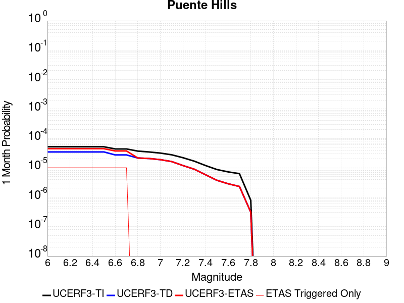 |  |  |

| Magnitude | 1 wk TI Prob | 1 wk TD Prob | 1 wk ETAS Prob | 1 wk ETAS/TD Gain | 1 wk ETAS Triggered Only | 1 mo TI Prob | 1 mo TD Prob | 1 mo ETAS Prob | 1 mo ETAS/TD Gain | 1 mo ETAS Triggered Only | 1 yr TI Prob | 1 yr TD Prob | 1 yr ETAS Prob | 1 yr ETAS/TD Gain | 1 yr ETAS Triggered Only | 10 yr TI Prob | 10 yr TD Prob | 10 yr ETAS Prob | 10 yr ETAS/TD Gain | 10 yr ETAS Triggered Only |
|-----|-----|-----|-----|-----|-----|-----|-----|-----|-----|-----|-----|-----|-----|-----|-----|-----|-----|-----|-----|-----|
| 6.0 | 1.2101656E-5 | 8.098625E-6 | 8.098625E-6 | 1.0 | 0.0 | 5.1863204E-5 | 3.4707962E-5 | 3.4707962E-5 | 1.0 | 0.0 | 6.312516E-4 | 4.2249315E-4 | 4.358565E-4 | 1.0316297 | 1.3368984E-5 | 0.0062946146 | 0.0042174594 | 0.0042573973 | 1.0094696 | 4.0106952E-5 |
| 6.1 | 1.2101656E-5 | 8.098625E-6 | 8.098625E-6 | 1.0 | 0.0 | 5.1863204E-5 | 3.4707962E-5 | 3.4707962E-5 | 1.0 | 0.0 | 6.312516E-4 | 4.2249315E-4 | 4.358565E-4 | 1.0316297 | 1.3368984E-5 | 0.0062946146 | 0.0042174594 | 0.0042573973 | 1.0094696 | 4.0106952E-5 |
| 6.2 | 1.2101656E-5 | 8.098625E-6 | 8.098625E-6 | 1.0 | 0.0 | 5.1863204E-5 | 3.4707962E-5 | 3.4707962E-5 | 1.0 | 0.0 | 6.312516E-4 | 4.2249315E-4 | 4.358565E-4 | 1.0316297 | 1.3368984E-5 | 0.0062946146 | 0.0042174594 | 0.0042573973 | 1.0094696 | 4.0106952E-5 |
| 6.3 | 1.2101656E-5 | 8.098625E-6 | 8.098625E-6 | 1.0 | 0.0 | 5.1863204E-5 | 3.4707962E-5 | 3.4707962E-5 | 1.0 | 0.0 | 6.312516E-4 | 4.2249315E-4 | 4.358565E-4 | 1.0316297 | 1.3368984E-5 | 0.0062946146 | 0.0042174594 | 0.0042573973 | 1.0094696 | 4.0106952E-5 |
| 6.4 | 1.2101656E-5 | 8.098625E-6 | 8.098625E-6 | 1.0 | 0.0 | 5.1863204E-5 | 3.4707962E-5 | 3.4707962E-5 | 1.0 | 0.0 | 6.312516E-4 | 4.2249315E-4 | 4.358565E-4 | 1.0316297 | 1.3368984E-5 | 0.0062946146 | 0.0042174594 | 0.0042573973 | 1.0094696 | 4.0106952E-5 |
| 6.5 | 1.2101656E-5 | 8.098625E-6 | 8.098625E-6 | 1.0 | 0.0 | 5.1863204E-5 | 3.4707962E-5 | 3.4707962E-5 | 1.0 | 0.0 | 6.312516E-4 | 4.2249315E-4 | 4.358565E-4 | 1.0316297 | 1.3368984E-5 | 0.0062946146 | 0.0042174594 | 0.0042573973 | 1.0094696 | 4.0106952E-5 |
| 6.6 | 1.0222488E-5 | 6.3991847E-6 | 6.3991847E-6 | 1.0 | 0.0 | 4.3809923E-5 | 2.7424803E-5 | 2.7424803E-5 | 1.0 | 0.0 | 5.332553E-4 | 3.3384826E-4 | 3.472128E-4 | 1.0400317 | 1.3368984E-5 | 0.0053197746 | 0.0033337125 | 0.0033603613 | 1.0079937 | 2.6737967E-5 |
| 6.7 | 1.0222488E-5 | 6.3991847E-6 | 6.3991847E-6 | 1.0 | 0.0 | 4.3809923E-5 | 2.7424803E-5 | 2.7424803E-5 | 1.0 | 0.0 | 5.332553E-4 | 3.3384826E-4 | 3.472128E-4 | 1.0400317 | 1.3368984E-5 | 0.0053197746 | 0.0033337125 | 0.0033603613 | 1.0079937 | 2.6737967E-5 |
| 6.8 | 8.6367845E-6 | 5.0282533E-6 | 5.0282533E-6 | 1.0 | 0.0 | 3.7014266E-5 | 2.1549482E-5 | 2.1549482E-5 | 1.0 | 0.0 | 4.505555E-4 | 2.623339E-4 | 2.623339E-4 | 1.0 | 0.0 | 0.004496431 | 0.0026202986 | 0.0026336326 | 1.0050887 | 1.3368984E-5 |
| 6.9 | 8.066481E-6 | 4.836117E-6 | 4.836117E-6 | 1.0 | 0.0 | 3.4570177E-5 | 2.0726053E-5 | 2.0726053E-5 | 1.0 | 0.0 | 4.2081063E-4 | 2.52311E-4 | 2.52311E-4 | 1.0 | 0.0 | 0.0042001465 | 0.0025202993 | 0.0025336347 | 1.0052911 | 1.3368984E-5 |
| 7.0 | 7.393828E-6 | 4.417296E-6 | 4.417296E-6 | 1.0 | 0.0 | 3.168745E-5 | 1.8931134E-5 | 1.8931134E-5 | 1.0 | 0.0 | 3.857264E-4 | 2.3046264E-4 | 2.3046264E-4 | 1.0 | 0.0 | 0.0038505755 | 0.0023022818 | 0.00231562 | 1.0057935 | 1.3368984E-5 |
| 7.1 | 6.4660953E-6 | 3.8044495E-6 | 3.8044495E-6 | 1.0 | 0.0 | 2.7711543E-5 | 1.6304684E-5 | 1.6304684E-5 | 1.0 | 0.0 | 3.373358E-4 | 1.984918E-4 | 1.984918E-4 | 1.0 | 0.0 | 0.0033682417 | 0.001983181 | 0.0019965235 | 1.0067278 | 1.3368984E-5 |
| 7.2 | 5.143232E-6 | 2.7865456E-6 | 2.7865456E-6 | 1.0 | 0.0 | 2.2042237E-5 | 1.1942284E-5 | 1.1942284E-5 | 1.0 | 0.0 | 2.6833118E-4 | 1.453877E-4 | 1.453877E-4 | 1.0 | 0.0 | 0.002680074 | 0.0014529356 | 0.0014662851 | 1.0091879 | 1.3368984E-5 |
| 7.3 | 3.928255E-6 | 2.0913774E-6 | 2.0913774E-6 | 1.0 | 0.0 | 1.683527E-5 | 8.963015E-6 | 8.963015E-6 | 1.0 | 0.0 | 2.0495013E-4 | 1.0911931E-4 | 1.0911931E-4 | 1.0 | 0.0 | 0.002047612 | 0.001090664 | 0.0011040184 | 1.0122443 | 1.3368984E-5 |
| 7.4 | 2.7894434E-6 | 1.3546753E-6 | 1.3546753E-6 | 1.0 | 0.0 | 1.1954703E-5 | 5.8057385E-6 | 5.8057385E-6 | 1.0 | 0.0 | 1.4553878E-4 | 7.068262E-5 | 7.068262E-5 | 1.0 | 0.0 | 0.001454435 | 7.066058E-4 | 7.199653E-4 | 1.0189066 | 1.3368984E-5 |
| 7.5 | 2.041735E-6 | 8.787305E-7 | 8.787305E-7 | 1.0 | 0.0 | 8.750263E-6 | 3.7659825E-6 | 3.7659825E-6 | 1.0 | 0.0 | 1.06529245E-4 | 4.5849905E-5 | 4.5849905E-5 | 1.0 | 0.0 | 0.0010647819 | 4.5840783E-4 | 4.5840783E-4 | 1.0 | 0.0 |
| 7.6 | 1.6959062E-6 | 6.6986263E-7 | 6.6986263E-7 | 1.0 | 0.0 | 7.268149E-6 | 2.8708366E-6 | 2.8708366E-6 | 1.0 | 0.0 | 8.848612E-5 | 3.4951907E-5 | 3.4951907E-5 | 1.0 | 0.0 | 8.84509E-4 | 3.4946698E-4 | 3.4946698E-4 | 1.0 | 0.0 |
| 7.7 | 1.4767965E-6 | 5.407607E-7 | 5.407607E-7 | 1.0 | 0.0 | 6.3291122E-6 | 2.317544E-6 | 2.317544E-6 | 1.0 | 0.0 | 7.705422E-5 | 2.8215758E-5 | 2.8215758E-5 | 1.0 | 0.0 | 7.702751E-4 | 2.8212433E-4 | 2.8212433E-4 | 1.0 | 0.0 |
| 7.8 | 1.8432911E-7 | 7.28201E-8 | 7.28201E-8 | 1.0 | 0.0 | 7.8998164E-7 | 3.1208612E-7 | 3.1208612E-7 | 1.0 | 0.0 | 9.617985E-6 | 3.7996451E-6 | 3.7996451E-6 | 1.0 | 0.0 | 9.617568E-5 | 3.7996128E-5 | 3.7996128E-5 | 1.0 | 0.0 |

## Fontana (Seismicity)
*[(top)](#table-of-contents)*

| 1 Week | 1 Month | 1 Year | 10 Year |
|-----|-----|-----|-----|
|  | 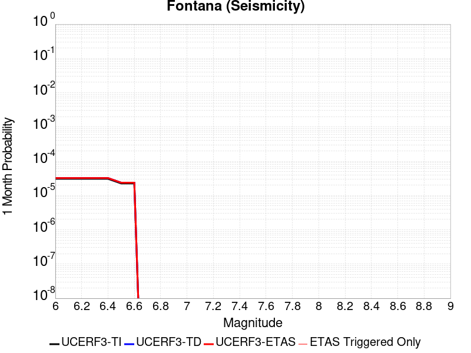 |  |  |

| Magnitude | 1 wk TI Prob | 1 wk TD Prob | 1 wk ETAS Prob | 1 wk ETAS/TD Gain | 1 wk ETAS Triggered Only | 1 mo TI Prob | 1 mo TD Prob | 1 mo ETAS Prob | 1 mo ETAS/TD Gain | 1 mo ETAS Triggered Only | 1 yr TI Prob | 1 yr TD Prob | 1 yr ETAS Prob | 1 yr ETAS/TD Gain | 1 yr ETAS Triggered Only | 10 yr TI Prob | 10 yr TD Prob | 10 yr ETAS Prob | 10 yr ETAS/TD Gain | 10 yr ETAS Triggered Only |
|-----|-----|-----|-----|-----|-----|-----|-----|-----|-----|-----|-----|-----|-----|-----|-----|-----|-----|-----|-----|-----|
| 6.0 | 7.1789214E-6 | 7.5520006E-6 | 7.5520006E-6 | 1.0 | 0.0 | 3.076644E-5 | 3.2365548E-5 | 3.2365548E-5 | 1.0 | 0.0 | 3.7451705E-4 | 3.9402005E-4 | 4.0738378E-4 | 1.0339164 | 1.3368984E-5 | 0.003738865 | 0.003937214 | 0.003977163 | 1.0101465 | 4.0106952E-5 |
| 6.1 | 7.1789214E-6 | 7.5520006E-6 | 7.5520006E-6 | 1.0 | 0.0 | 3.076644E-5 | 3.2365548E-5 | 3.2365548E-5 | 1.0 | 0.0 | 3.7451705E-4 | 3.9402005E-4 | 4.0738378E-4 | 1.0339164 | 1.3368984E-5 | 0.003738865 | 0.003937214 | 0.003977163 | 1.0101465 | 4.0106952E-5 |
| 6.2 | 7.1789214E-6 | 7.5520006E-6 | 7.5520006E-6 | 1.0 | 0.0 | 3.076644E-5 | 3.2365548E-5 | 3.2365548E-5 | 1.0 | 0.0 | 3.7451705E-4 | 3.9402005E-4 | 4.0738378E-4 | 1.0339164 | 1.3368984E-5 | 0.003738865 | 0.003937214 | 0.003977163 | 1.0101465 | 4.0106952E-5 |
| 6.3 | 7.1789214E-6 | 7.5520006E-6 | 7.5520006E-6 | 1.0 | 0.0 | 3.076644E-5 | 3.2365548E-5 | 3.2365548E-5 | 1.0 | 0.0 | 3.7451705E-4 | 3.9402005E-4 | 4.0738378E-4 | 1.0339164 | 1.3368984E-5 | 0.003738865 | 0.003937214 | 0.003977163 | 1.0101465 | 4.0106952E-5 |
| 6.4 | 7.1789214E-6 | 7.5520006E-6 | 7.5520006E-6 | 1.0 | 0.0 | 3.076644E-5 | 3.2365548E-5 | 3.2365548E-5 | 1.0 | 0.0 | 3.7451705E-4 | 3.9402005E-4 | 4.0738378E-4 | 1.0339164 | 1.3368984E-5 | 0.003738865 | 0.003937214 | 0.003977163 | 1.0101465 | 4.0106952E-5 |
| 6.5 | 5.2611317E-6 | 5.532726E-6 | 5.532726E-6 | 1.0 | 0.0 | 2.2547512E-5 | 2.3711682E-5 | 2.3711682E-5 | 1.0 | 0.0 | 2.744814E-4 | 2.8868974E-4 | 3.0205486E-4 | 1.0462958 | 1.3368984E-5 | 0.002741426 | 0.0028868972 | 0.0029002277 | 1.0046176 | 1.3368984E-5 |
| 6.6 | 5.2611317E-6 | 5.532726E-6 | 5.532726E-6 | 1.0 | 0.0 | 2.2547512E-5 | 2.3711682E-5 | 2.3711682E-5 | 1.0 | 0.0 | 2.744814E-4 | 2.8868974E-4 | 3.0205486E-4 | 1.0462958 | 1.3368984E-5 | 0.002741426 | 0.0028868972 | 0.0029002277 | 1.0046176 | 1.3368984E-5 |

## Hayward (So) extension 2011 CFM
*[(top)](#table-of-contents)*

| 1 Week | 1 Month | 1 Year | 10 Year |
|-----|-----|-----|-----|
| 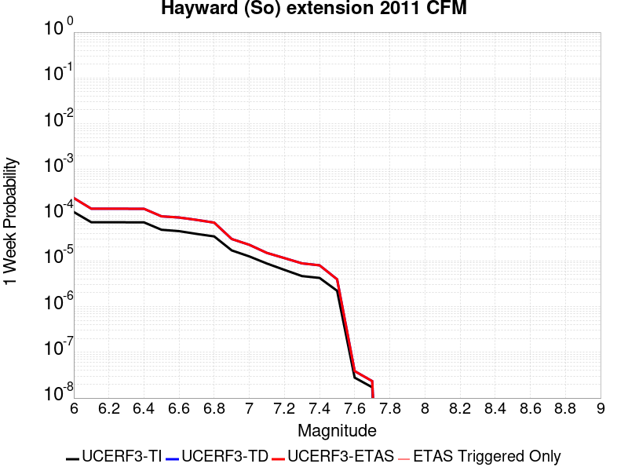 |  |  | 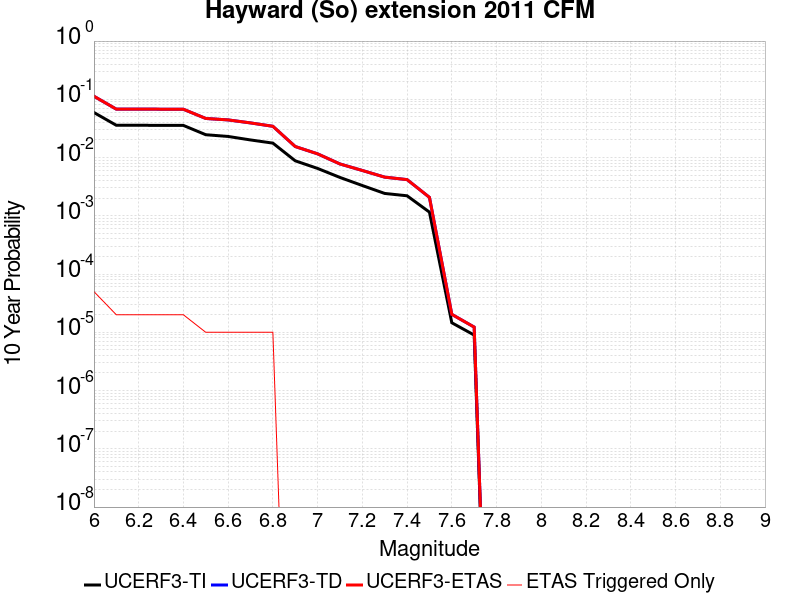 |

| Magnitude | 1 wk TI Prob | 1 wk TD Prob | 1 wk ETAS Prob | 1 wk ETAS/TD Gain | 1 wk ETAS Triggered Only | 1 mo TI Prob | 1 mo TD Prob | 1 mo ETAS Prob | 1 mo ETAS/TD Gain | 1 mo ETAS Triggered Only | 1 yr TI Prob | 1 yr TD Prob | 1 yr ETAS Prob | 1 yr ETAS/TD Gain | 1 yr ETAS Triggered Only | 10 yr TI Prob | 10 yr TD Prob | 10 yr ETAS Prob | 10 yr ETAS/TD Gain | 10 yr ETAS Triggered Only |
|-----|-----|-----|-----|-----|-----|-----|-----|-----|-----|-----|-----|-----|-----|-----|-----|-----|-----|-----|-----|-----|
| 6.0 | 1.1721256E-4 | 2.3697627E-4 | 2.3697627E-4 | 1.0 | 0.0 | 5.022428E-4 | 0.0010129517 | 0.0010129517 | 1.0 | 0.0 | 0.0060976758 | 0.012248711 | 0.012261917 | 1.0010781 | 1.3368984E-5 | 0.0593305 | 0.112843215 | 0.1128788 | 1.0003153 | 4.0106952E-5 |
| 6.1 | 6.99169E-5 | 1.3822885E-4 | 1.3822885E-4 | 1.0 | 0.0 | 2.9960944E-4 | 5.9128006E-4 | 5.9128006E-4 | 1.0 | 0.0 | 0.0036416445 | 0.0071720886 | 0.0071853613 | 1.0018506 | 1.3368984E-5 | 0.035825435 | 0.067803554 | 0.06781601 | 1.0001838 | 1.3368984E-5 |
| 6.2 | 6.99169E-5 | 1.3822885E-4 | 1.3822885E-4 | 1.0 | 0.0 | 2.9960944E-4 | 5.9128006E-4 | 5.9128006E-4 | 1.0 | 0.0 | 0.0036416445 | 0.0071720886 | 0.0071853613 | 1.0018506 | 1.3368984E-5 | 0.035825435 | 0.067803554 | 0.06781601 | 1.0001838 | 1.3368984E-5 |
| 6.3 | 6.970908E-5 | 1.379104E-4 | 1.379104E-4 | 1.0 | 0.0 | 2.9871898E-4 | 5.899159E-4 | 5.899159E-4 | 1.0 | 0.0 | 0.0036308395 | 0.007155625 | 0.0071688984 | 1.0018549 | 1.3368984E-5 | 0.035720866 | 0.067652516 | 0.06766498 | 1.0001843 | 1.3368984E-5 |
| 6.4 | 6.9517155E-5 | 1.375792E-4 | 1.375792E-4 | 1.0 | 0.0 | 2.9789665E-4 | 5.884971E-4 | 5.884971E-4 | 1.0 | 0.0 | 0.0036208609 | 0.0071385372 | 0.007151811 | 1.0018594 | 1.3368984E-5 | 0.03562429 | 0.06749655 | 0.067509025 | 1.0001847 | 1.3368984E-5 |
| 6.5 | 4.786248E-5 | 9.41498E-5 | 9.41498E-5 | 1.0 | 0.0 | 2.0510878E-4 | 4.034394E-4 | 4.034394E-4 | 1.0 | 0.0 | 0.0024943394 | 0.004901227 | 0.004901227 | 1.0 | 0.0 | 0.02466527 | 0.046901822 | 0.046901822 | 1.0 | 0.0 |
| 6.6 | 4.4662214E-5 | 8.881654E-5 | 8.881654E-5 | 1.0 | 0.0 | 1.9139545E-4 | 3.805894E-4 | 3.805894E-4 | 1.0 | 0.0 | 0.0023277493 | 0.0046242937 | 0.0046242937 | 1.0 | 0.0 | 0.02303517 | 0.044293344 | 0.044293344 | 1.0 | 0.0 |
| 6.7 | 3.884542E-5 | 7.8648096E-5 | 7.8648096E-5 | 1.0 | 0.0 | 1.6646975E-4 | 3.370222E-4 | 3.370222E-4 | 1.0 | 0.0 | 0.002024885 | 0.0040959697 | 0.0040959697 | 1.0 | 0.0 | 0.020065336 | 0.039333146 | 0.039333146 | 1.0 | 0.0 |
| 6.8 | 3.4221863E-5 | 6.855653E-5 | 6.855653E-5 | 1.0 | 0.0 | 1.4665688E-4 | 2.93783E-4 | 2.93783E-4 | 1.0 | 0.0 | 0.0017840851 | 0.0035713627 | 0.0035713627 | 1.0 | 0.0 | 0.017698295 | 0.034421004 | 0.034421004 | 1.0 | 0.0 |
| 6.9 | 1.6927712E-5 | 3.0061563E-5 | 3.0061563E-5 | 1.0 | 0.0 | 7.2545314E-5 | 1.2882923E-4 | 1.2882923E-4 | 1.0 | 0.0 | 8.828813E-4 | 0.0015674243 | 0.0015674243 | 1.0 | 0.0 | 0.008793819 | 0.01546327 | 0.01546327 | 1.0 | 0.0 |
| 7.0 | 1.2509653E-5 | 2.2462571E-5 | 2.2462571E-5 | 1.0 | 0.0 | 5.3611697E-5 | 9.6264856E-5 | 9.6264856E-5 | 1.0 | 0.0 | 6.525269E-4 | 0.0011714385 | 0.0011714385 | 1.0 | 0.0 | 0.0065061417 | 0.01158231 | 0.01158231 | 1.0 | 0.0 |
| 7.1 | 8.751583E-6 | 1.4925648E-5 | 1.4925648E-5 | 1.0 | 0.0 | 3.750624E-5 | 6.3965526E-5 | 6.3965526E-5 | 1.0 | 0.0 | 4.5654282E-4 | 7.785079E-4 | 7.785079E-4 | 1.0 | 0.0 | 0.0045560603 | 0.007763496 | 0.007763496 | 1.0 | 0.0 |
| 7.2 | 6.354379E-6 | 1.1498636E-5 | 1.1498636E-5 | 1.0 | 0.0 | 2.7232769E-5 | 4.9278966E-5 | 4.9278966E-5 | 1.0 | 0.0 | 3.3150852E-4 | 5.99811E-4 | 5.99811E-4 | 1.0 | 0.0 | 0.0033101442 | 0.0060003046 | 0.0060003046 | 1.0 | 0.0 |
| 7.3 | 4.645554E-6 | 8.818172E-6 | 8.818172E-6 | 1.0 | 0.0 | 1.9909365E-5 | 3.779164E-5 | 3.779164E-5 | 1.0 | 0.0 | 2.4236954E-4 | 4.6002E-4 | 4.6002E-4 | 1.0 | 0.0 | 0.0024210536 | 0.004610708 | 0.004610708 | 1.0 | 0.0 |
| 7.4 | 4.23437E-6 | 7.992532E-6 | 7.992532E-6 | 1.0 | 0.0 | 1.8147173E-5 | 3.425328E-5 | 3.425328E-5 | 1.0 | 0.0 | 2.2091944E-4 | 4.1695772E-4 | 4.1695772E-4 | 1.0 | 0.0 | 0.0022069993 | 0.004181972 | 0.004181972 | 1.0 | 0.0 |
| 7.5 | 2.2187417E-6 | 3.9522306E-6 | 3.9522306E-6 | 1.0 | 0.0 | 9.508858E-6 | 1.6938036E-5 | 1.6938036E-5 | 1.0 | 0.0 | 1.157642E-4 | 2.0620368E-4 | 2.0620368E-4 | 1.0 | 0.0 | 0.0011570391 | 0.0020734754 | 0.0020734754 | 1.0 | 0.0 |
| 7.6 | 2.7952495E-8 | 3.878529E-8 | 3.878529E-8 | 1.0 | 0.0 | 1.1979641E-7 | 1.6622266E-7 | 1.6622266E-7 | 1.0 | 0.0 | 1.4585203E-6 | 2.0237592E-6 | 2.0237592E-6 | 1.0 | 0.0 | 1.4585107E-5 | 2.0328182E-5 | 2.0328182E-5 | 1.0 | 0.0 |
| 7.7 | 1.7192724E-8 | 2.3436517E-8 | 2.3436517E-8 | 1.0 | 0.0 | 7.36831E-8 | 1.0044221E-7 | 1.0044221E-7 | 1.0 | 0.0 | 8.9709135E-7 | 1.2228833E-6 | 1.2228833E-6 | 1.0 | 0.0 | 8.970877E-6 | 1.2296933E-5 | 1.2296933E-5 | 1.0 | 0.0 |

## Bullion Mountains
*[(top)](#table-of-contents)*

| 1 Week | 1 Month | 1 Year | 10 Year |
|-----|-----|-----|-----|
|  |  |  |  |

| Magnitude | 1 wk TI Prob | 1 wk TD Prob | 1 wk ETAS Prob | 1 wk ETAS/TD Gain | 1 wk ETAS Triggered Only | 1 mo TI Prob | 1 mo TD Prob | 1 mo ETAS Prob | 1 mo ETAS/TD Gain | 1 mo ETAS Triggered Only | 1 yr TI Prob | 1 yr TD Prob | 1 yr ETAS Prob | 1 yr ETAS/TD Gain | 1 yr ETAS Triggered Only | 10 yr TI Prob | 10 yr TD Prob | 10 yr ETAS Prob | 10 yr ETAS/TD Gain | 10 yr ETAS Triggered Only |
|-----|-----|-----|-----|-----|-----|-----|-----|-----|-----|-----|-----|-----|-----|-----|-----|-----|-----|-----|-----|-----|
| 6.0 | 1.6420427E-5 | 1.4692089E-5 | 1.4692089E-5 | 1.0 | 0.0 | 7.037136E-5 | 6.296479E-5 | 6.296479E-5 | 1.0 | 0.0 | 8.5643446E-4 | 7.663651E-4 | 7.930826E-4 | 1.0348626 | 2.6737967E-5 | 0.008531413 | 0.007641016 | 0.0076808166 | 1.0052088 | 4.0106952E-5 |
| 6.1 | 1.6420427E-5 | 1.4692089E-5 | 1.4692089E-5 | 1.0 | 0.0 | 7.037136E-5 | 6.296479E-5 | 6.296479E-5 | 1.0 | 0.0 | 8.5643446E-4 | 7.663651E-4 | 7.930826E-4 | 1.0348626 | 2.6737967E-5 | 0.008531413 | 0.007641016 | 0.0076808166 | 1.0052088 | 4.0106952E-5 |
| 6.2 | 1.6420427E-5 | 1.4692089E-5 | 1.4692089E-5 | 1.0 | 0.0 | 7.037136E-5 | 6.296479E-5 | 6.296479E-5 | 1.0 | 0.0 | 8.5643446E-4 | 7.663651E-4 | 7.930826E-4 | 1.0348626 | 2.6737967E-5 | 0.008531413 | 0.007641016 | 0.0076808166 | 1.0052088 | 4.0106952E-5 |
| 6.3 | 1.2046778E-5 | 9.862335E-6 | 9.862335E-6 | 1.0 | 0.0 | 5.1628023E-5 | 4.2266598E-5 | 4.2266598E-5 | 1.0 | 0.0 | 6.283899E-4 | 5.144975E-4 | 5.144975E-4 | 1.0 | 0.0 | 0.0062661595 | 0.005135345 | 0.0051486455 | 1.00259 | 1.3368984E-5 |
| 6.4 | 1.2046778E-5 | 9.862335E-6 | 9.862335E-6 | 1.0 | 0.0 | 5.1628023E-5 | 4.2266598E-5 | 4.2266598E-5 | 1.0 | 0.0 | 6.283899E-4 | 5.144975E-4 | 5.144975E-4 | 1.0 | 0.0 | 0.0062661595 | 0.005135345 | 0.0051486455 | 1.00259 | 1.3368984E-5 |
| 6.5 | 1.0244343E-5 | 7.879458E-6 | 7.879458E-6 | 1.0 | 0.0 | 4.390359E-5 | 3.3768785E-5 | 3.3768785E-5 | 1.0 | 0.0 | 5.343951E-4 | 4.110781E-4 | 4.110781E-4 | 1.0 | 0.0 | 0.005331118 | 0.004105208 | 0.004118522 | 1.0032432 | 1.3368984E-5 |
| 6.6 | 9.605408E-6 | 7.1774966E-6 | 7.1774966E-6 | 1.0 | 0.0 | 4.1165385E-5 | 3.076045E-5 | 3.076045E-5 | 1.0 | 0.0 | 5.010733E-4 | 3.744645E-4 | 3.744645E-4 | 1.0 | 0.0 | 0.00499945 | 0.003740332 | 0.003740332 | 1.0 | 0.0 |
| 6.7 | 8.60418E-6 | 6.1240044E-6 | 6.1240044E-6 | 1.0 | 0.0 | 3.687454E-5 | 2.624558E-5 | 2.624558E-5 | 1.0 | 0.0 | 4.48855E-4 | 3.1951256E-4 | 3.1951256E-4 | 1.0 | 0.0 | 0.004479495 | 0.0031924439 | 0.0031924439 | 1.0 | 0.0 |
| 6.8 | 5.187994E-6 | 2.5631666E-6 | 2.5631666E-6 | 1.0 | 0.0 | 2.223407E-5 | 1.0984976E-5 | 1.0984976E-5 | 1.0 | 0.0 | 2.7066618E-4 | 1.3373788E-4 | 1.3373788E-4 | 1.0 | 0.0 | 0.0027033675 | 0.0013369655 | 0.0013369655 | 1.0 | 0.0 |
| 6.9 | 4.5302368E-6 | 2.3443165E-6 | 2.3443165E-6 | 1.0 | 0.0 | 1.9415156E-5 | 1.0047055E-5 | 1.0047055E-5 | 1.0 | 0.0 | 2.3635388E-4 | 1.2232E-4 | 1.2232E-4 | 1.0 | 0.0 | 0.0023610266 | 0.0012229157 | 0.0012229157 | 1.0 | 0.0 |
| 7.0 | 3.431668E-6 | 1.6882402E-6 | 1.6882402E-6 | 1.0 | 0.0 | 1.4707065E-5 | 7.235315E-6 | 7.235315E-6 | 1.0 | 0.0 | 1.7904381E-4 | 8.808996E-5 | 8.808996E-5 | 1.0 | 0.0 | 0.0017889962 | 8.808996E-4 | 8.808996E-4 | 1.0 | 0.0 |

## Emerson-Copper Mtn 2011
*[(top)](#table-of-contents)*

| 1 Week | 1 Month | 1 Year | 10 Year |
|-----|-----|-----|-----|
| 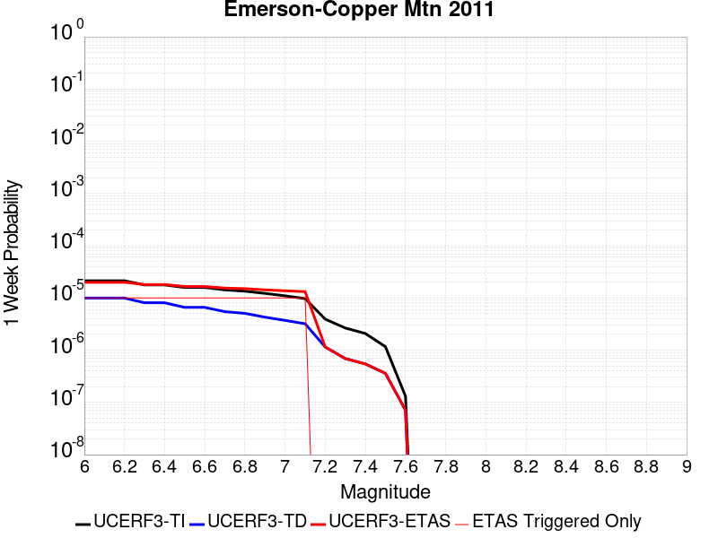 |  |  |  |

| Magnitude | 1 wk TI Prob | 1 wk TD Prob | 1 wk ETAS Prob | 1 wk ETAS/TD Gain | 1 wk ETAS Triggered Only | 1 mo TI Prob | 1 mo TD Prob | 1 mo ETAS Prob | 1 mo ETAS/TD Gain | 1 mo ETAS Triggered Only | 1 yr TI Prob | 1 yr TD Prob | 1 yr ETAS Prob | 1 yr ETAS/TD Gain | 1 yr ETAS Triggered Only | 10 yr TI Prob | 10 yr TD Prob | 10 yr ETAS Prob | 10 yr ETAS/TD Gain | 10 yr ETAS Triggered Only |
|-----|-----|-----|-----|-----|-----|-----|-----|-----|-----|-----|-----|-----|-----|-----|-----|-----|-----|-----|-----|-----|
| 6.0 | 2.1364202E-5 | 9.968114E-6 | 2.3336965E-5 | 2.3411615 | 1.3368984E-5 | 9.1557646E-5 | 4.2719836E-5 | 6.945666E-5 | 1.6258644 | 2.6737967E-5 | 0.0011141442 | 5.199986E-4 | 5.600847E-4 | 1.0770888 | 4.0106952E-5 | 0.011085749 | 0.005188688 | 0.005228587 | 1.0076896 | 4.0106952E-5 |
| 6.1 | 2.1364202E-5 | 9.968114E-6 | 2.3336965E-5 | 2.3411615 | 1.3368984E-5 | 9.1557646E-5 | 4.2719836E-5 | 6.945666E-5 | 1.6258644 | 2.6737967E-5 | 0.0011141442 | 5.199986E-4 | 5.600847E-4 | 1.0770888 | 4.0106952E-5 | 0.011085749 | 0.005188688 | 0.005228587 | 1.0076896 | 4.0106952E-5 |
| 6.2 | 2.1364202E-5 | 9.968114E-6 | 2.3336965E-5 | 2.3411615 | 1.3368984E-5 | 9.1557646E-5 | 4.2719836E-5 | 6.945666E-5 | 1.6258644 | 2.6737967E-5 | 0.0011141442 | 5.199986E-4 | 5.600847E-4 | 1.0770888 | 4.0106952E-5 | 0.011085749 | 0.005188688 | 0.005228587 | 1.0076896 | 4.0106952E-5 |
| 6.3 | 1.7751237E-5 | 8.089227E-6 | 2.1458103E-5 | 2.6526766 | 1.3368984E-5 | 7.607452E-5 | 3.466769E-5 | 6.140473E-5 | 1.7712381 | 2.6737967E-5 | 9.258136E-4 | 4.2200365E-4 | 4.6209368E-4 | 1.0949992 | 4.0106952E-5 | 0.00921966 | 0.0042126453 | 0.0042525833 | 1.0094805 | 4.0106952E-5 |
| 6.4 | 1.7751237E-5 | 8.089227E-6 | 2.1458103E-5 | 2.6526766 | 1.3368984E-5 | 7.607452E-5 | 3.466769E-5 | 6.140473E-5 | 1.7712381 | 2.6737967E-5 | 9.258136E-4 | 4.2200365E-4 | 4.6209368E-4 | 1.0949992 | 4.0106952E-5 | 0.00921966 | 0.0042126453 | 0.0042525833 | 1.0094805 | 4.0106952E-5 |
| 6.5 | 1.5886664E-5 | 6.603819E-6 | 1.9972715E-5 | 3.0244188 | 1.3368984E-5 | 6.808392E-5 | 2.8301802E-5 | 5.503901E-5 | 1.9447176 | 2.6737967E-5 | 8.286065E-4 | 3.4452465E-4 | 3.712534E-4 | 1.0775815 | 2.6737967E-5 | 0.008255237 | 0.0034403696 | 0.0034670155 | 1.0077451 | 2.6737967E-5 |
| 6.6 | 1.5886664E-5 | 6.603819E-6 | 1.9972715E-5 | 3.0244188 | 1.3368984E-5 | 6.808392E-5 | 2.8301802E-5 | 5.503901E-5 | 1.9447176 | 2.6737967E-5 | 8.286065E-4 | 3.4452465E-4 | 3.712534E-4 | 1.0775815 | 2.6737967E-5 | 0.008255237 | 0.0034403696 | 0.0034670155 | 1.0077451 | 2.6737967E-5 |
| 6.7 | 1.428471E-5 | 5.470403E-6 | 1.8839313E-5 | 3.4438622 | 1.3368984E-5 | 6.121875E-5 | 2.3444394E-5 | 5.0181734E-5 | 2.1404576 | 2.6737967E-5 | 7.450834E-4 | 2.8540206E-4 | 3.1213238E-4 | 1.0936586 | 2.6737967E-5 | 0.007425902 | 0.0028507432 | 0.002877405 | 1.0093526 | 2.6737967E-5 |
| 6.8 | 1.3490684E-5 | 5.073699E-6 | 1.8442615E-5 | 3.6349447 | 1.3368984E-5 | 5.7815934E-5 | 2.1744265E-5 | 4.8481652E-5 | 2.2296295 | 2.6737967E-5 | 7.0368167E-4 | 2.6470813E-4 | 2.91439E-4 | 1.1009825 | 2.6737967E-5 | 0.007014576 | 0.002644309 | 0.0026709763 | 1.0100847 | 2.6737967E-5 |
| 6.9 | 1.2235421E-5 | 4.289677E-6 | 1.7658604E-5 | 4.1165347 | 1.3368984E-5 | 5.2436466E-5 | 1.838422E-5 | 3.175296E-5 | 1.7271855 | 1.3368984E-5 | 6.38227E-4 | 2.238085E-4 | 2.3717449E-4 | 1.0597206 | 1.3368984E-5 | 0.0063639707 | 0.0022361854 | 0.0022495245 | 1.0059651 | 1.3368984E-5 |
| 7.0 | 1.1009851E-5 | 3.7189886E-6 | 1.7087923E-5 | 4.594777 | 1.3368984E-5 | 4.7184225E-5 | 1.5938444E-5 | 2.9307215E-5 | 1.8387752 | 1.3368984E-5 | 5.743165E-4 | 1.9403672E-4 | 2.074031E-4 | 1.0688859 | 1.3368984E-5 | 0.005728345 | 0.0019390108 | 0.0019523539 | 1.0068814 | 1.3368984E-5 |
| 7.1 | 9.726373E-6 | 3.2117953E-6 | 1.6580736E-5 | 5.1624513 | 1.3368984E-5 | 4.168379E-5 | 1.3764783E-5 | 2.7133583E-5 | 1.9712322 | 1.3368984E-5 | 5.07382E-4 | 1.6757673E-4 | 1.8094346E-4 | 1.079765 | 1.3368984E-5 | 0.0050622504 | 0.0016748349 | 0.0016881814 | 1.0079689 | 1.3368984E-5 |
| 7.2 | 3.9335127E-6 | 1.1524792E-6 | 1.1524792E-6 | 1.0 | 0.0 | 1.6857803E-5 | 4.9391874E-6 | 4.9391874E-6 | 1.0 | 0.0 | 2.0522442E-4 | 6.0133007E-5 | 6.0133007E-5 | 1.0 | 0.0 | 0.00205035 | 6.011733E-4 | 6.011733E-4 | 1.0 | 0.0 |
| 7.3 | 2.661632E-6 | 6.911505E-7 | 6.911505E-7 | 1.0 | 0.0 | 1.14069435E-5 | 2.9620703E-6 | 2.9620703E-6 | 1.0 | 0.0 | 1.3887069E-4 | 3.6062618E-5 | 3.6062618E-5 | 1.0 | 0.0 | 0.0013878393 | 3.605687E-4 | 3.605687E-4 | 1.0 | 0.0 |
| 7.4 | 2.0893426E-6 | 5.4618386E-7 | 5.4618386E-7 | 1.0 | 0.0 | 8.954295E-6 | 2.3407858E-6 | 2.3407858E-6 | 1.0 | 0.0 | 1.0901308E-4 | 2.84987E-5 | 2.84987E-5 | 1.0 | 0.0 | 0.0010895962 | 2.84951E-4 | 2.84951E-4 | 1.0 | 0.0 |
| 7.5 | 1.1681728E-6 | 3.6030585E-7 | 3.6030585E-7 | 1.0 | 0.0 | 5.0064455E-6 | 1.544167E-6 | 1.544167E-6 | 1.0 | 0.0 | 6.0951766E-5 | 1.8800076E-5 | 1.8800076E-5 | 1.0 | 0.0 | 6.093505E-4 | 1.8798532E-4 | 1.8798532E-4 | 1.0 | 0.0 |
| 7.6 | 1.3154387E-7 | 7.1197384E-8 | 7.1197384E-8 | 1.0 | 0.0 | 5.6375933E-7 | 3.051316E-7 | 3.051316E-7 | 1.0 | 0.0 | 6.863748E-6 | 3.7149728E-6 | 3.7149728E-6 | 1.0 | 0.0 | 6.863536E-5 | 3.7149264E-5 | 3.7149264E-5 | 1.0 | 0.0 |

## Palos Verdes
*[(top)](#table-of-contents)*

| 1 Week | 1 Month | 1 Year | 10 Year |
|-----|-----|-----|-----|
|  |  | 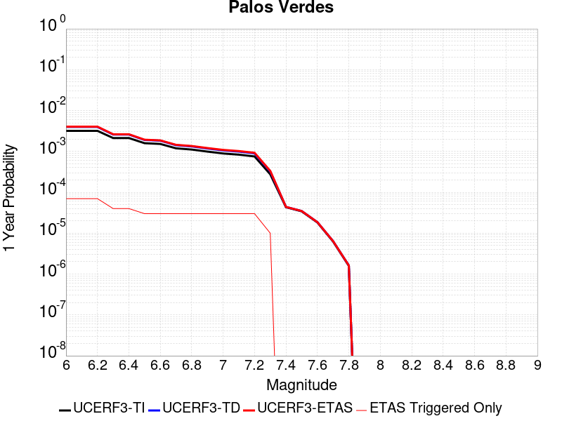 | 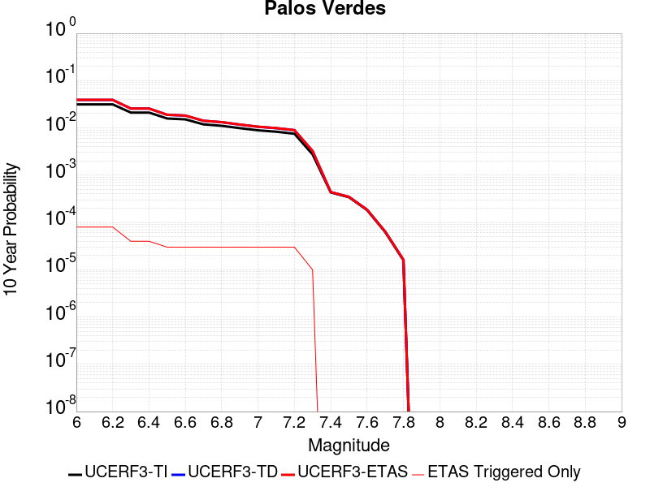 |

| Magnitude | 1 wk TI Prob | 1 wk TD Prob | 1 wk ETAS Prob | 1 wk ETAS/TD Gain | 1 wk ETAS Triggered Only | 1 mo TI Prob | 1 mo TD Prob | 1 mo ETAS Prob | 1 mo ETAS/TD Gain | 1 mo ETAS Triggered Only | 1 yr TI Prob | 1 yr TD Prob | 1 yr ETAS Prob | 1 yr ETAS/TD Gain | 1 yr ETAS Triggered Only | 10 yr TI Prob | 10 yr TD Prob | 10 yr ETAS Prob | 10 yr ETAS/TD Gain | 10 yr ETAS Triggered Only |
|-----|-----|-----|-----|-----|-----|-----|-----|-----|-----|-----|-----|-----|-----|-----|-----|-----|-----|-----|-----|-----|
| 6.0 | 6.126063E-5 | 7.622612E-5 | 8.959408E-5 | 1.1753725 | 1.3368984E-5 | 2.6251914E-4 | 3.2664582E-4 | 3.4001045E-4 | 1.0409147 | 1.3368984E-5 | 0.0031914865 | 0.003970174 | 0.004010122 | 1.010062 | 4.0106952E-5 | 0.031460393 | 0.039048895 | 0.039087437 | 1.0009869 | 4.0106952E-5 |
| 6.1 | 6.126063E-5 | 7.622612E-5 | 8.959408E-5 | 1.1753725 | 1.3368984E-5 | 2.6251914E-4 | 3.2664582E-4 | 3.4001045E-4 | 1.0409147 | 1.3368984E-5 | 0.0031914865 | 0.003970174 | 0.004010122 | 1.010062 | 4.0106952E-5 | 0.031460393 | 0.039048895 | 0.039087437 | 1.0009869 | 4.0106952E-5 |
| 6.2 | 6.126063E-5 | 7.622612E-5 | 8.959408E-5 | 1.1753725 | 1.3368984E-5 | 2.6251914E-4 | 3.2664582E-4 | 3.4001045E-4 | 1.0409147 | 1.3368984E-5 | 0.0031914865 | 0.003970174 | 0.004010122 | 1.010062 | 4.0106952E-5 | 0.031460393 | 0.039048895 | 0.039087437 | 1.0009869 | 4.0106952E-5 |
| 6.3 | 4.0838047E-5 | 4.9749437E-5 | 6.311775E-5 | 1.268713 | 1.3368984E-5 | 1.7500846E-4 | 2.1319572E-4 | 2.2656184E-4 | 1.0626942 | 1.3368984E-5 | 0.0021286458 | 0.0025927818 | 0.002632785 | 1.0154285 | 4.0106952E-5 | 0.021083709 | 0.025646681 | 0.02568576 | 1.0015237 | 4.0106952E-5 |
| 6.4 | 4.0838047E-5 | 4.9749437E-5 | 6.311775E-5 | 1.268713 | 1.3368984E-5 | 1.7500846E-4 | 2.1319572E-4 | 2.2656184E-4 | 1.0626942 | 1.3368984E-5 | 0.0021286458 | 0.0025927818 | 0.002632785 | 1.0154285 | 4.0106952E-5 | 0.021083709 | 0.025646681 | 0.02568576 | 1.0015237 | 4.0106952E-5 |
| 6.5 | 3.0512005E-5 | 3.656162E-5 | 3.656162E-5 | 1.0 | 0.0 | 1.3075917E-4 | 1.5668393E-4 | 1.5668393E-4 | 1.0 | 0.0 | 0.0015908304 | 0.0019060767 | 0.0019327636 | 1.014001 | 2.6737967E-5 | 0.015794903 | 0.018909154 | 0.018935386 | 1.0013872 | 2.6737967E-5 |
| 6.6 | 2.9255087E-5 | 3.515442E-5 | 3.515442E-5 | 1.0 | 0.0 | 1.2537291E-4 | 1.5065377E-4 | 1.5065377E-4 | 1.0 | 0.0 | 0.0015253464 | 0.0018327828 | 0.0018594718 | 1.014562 | 2.6737967E-5 | 0.015149189 | 0.018188225 | 0.018214477 | 1.0014434 | 2.6737967E-5 |
| 6.7 | 2.287198E-5 | 2.7248278E-5 | 2.7248278E-5 | 1.0 | 0.0 | 9.801909E-5 | 1.16773626E-4 | 1.16773626E-4 | 1.0 | 0.0 | 0.001192729 | 0.0014208833 | 0.0014475833 | 1.0187911 | 2.6737967E-5 | 0.011863477 | 0.014127217 | 0.014153577 | 1.0018659 | 2.6737967E-5 |
| 6.8 | 2.1325764E-5 | 2.5431877E-5 | 2.5431877E-5 | 1.0 | 0.0 | 9.139293E-5 | 1.0898971E-4 | 1.0898971E-4 | 1.0 | 0.0 | 0.001112141 | 0.0013262323 | 0.0013529347 | 1.0201341 | 2.6737967E-5 | 0.011065915 | 0.013192211 | 0.013218597 | 1.0020001 | 2.6737967E-5 |
| 6.9 | 1.9009392E-5 | 2.2613547E-5 | 2.2613547E-5 | 1.0 | 0.0 | 8.1466285E-5 | 9.6912096E-5 | 9.6912096E-5 | 1.0 | 0.0 | 9.914007E-4 | 0.0011793535 | 0.0012060599 | 1.022645 | 2.6737967E-5 | 0.009869894 | 0.011739632 | 0.0117660565 | 1.0022508 | 2.6737967E-5 |
| 7.0 | 1.7098473E-5 | 2.0319356E-5 | 2.0319356E-5 | 1.0 | 0.0 | 7.3277115E-5 | 8.708052E-5 | 8.708052E-5 | 1.0 | 0.0 | 8.917837E-4 | 0.001059775 | 0.0010864846 | 1.0252031 | 2.6737967E-5 | 0.008882134 | 0.010555646 | 0.010582102 | 1.0025063 | 2.6737967E-5 |
| 7.1 | 1.5982785E-5 | 1.899476E-5 | 1.899476E-5 | 1.0 | 0.0 | 6.849585E-5 | 8.1404054E-5 | 8.1404054E-5 | 1.0 | 0.0 | 8.336179E-4 | 9.907284E-4 | 0.0010174399 | 1.0269614 | 2.6737967E-5 | 0.008304977 | 0.009871479 | 0.009897954 | 1.0026819 | 2.6737967E-5 |
| 7.2 | 1.4468002E-5 | 1.7197237E-5 | 1.7197237E-5 | 1.0 | 0.0 | 6.200425E-5 | 7.370083E-5 | 7.370083E-5 | 1.0 | 0.0 | 7.546402E-4 | 8.970222E-4 | 9.237362E-4 | 1.0297807 | 2.6737967E-5 | 0.007520827 | 0.008942284 | 0.008968783 | 1.0029633 | 2.6737967E-5 |
| 7.3 | 5.288233E-6 | 6.2036747E-6 | 6.2036747E-6 | 1.0 | 0.0 | 2.2663658E-5 | 2.6587102E-5 | 2.6587102E-5 | 1.0 | 0.0 | 2.7589512E-4 | 3.236848E-4 | 3.3704945E-4 | 1.0412891 | 1.3368984E-5 | 0.0027555283 | 0.0032355562 | 0.0032488818 | 1.0041186 | 1.3368984E-5 |
| 7.4 | 8.279556E-7 | 8.408347E-7 | 8.408347E-7 | 1.0 | 0.0 | 3.5483763E-6 | 3.6035726E-6 | 3.6035726E-6 | 1.0 | 0.0 | 4.3200624E-5 | 4.3872686E-5 | 4.3872686E-5 | 1.0 | 0.0 | 4.3192226E-4 | 4.3864746E-4 | 4.3864746E-4 | 1.0 | 0.0 |
| 7.5 | 6.559831E-7 | 6.667229E-7 | 6.667229E-7 | 1.0 | 0.0 | 2.8113532E-6 | 2.857381E-6 | 2.857381E-6 | 1.0 | 0.0 | 3.4227687E-5 | 3.4788125E-5 | 3.4788125E-5 | 1.0 | 0.0 | 3.4222414E-4 | 3.4783344E-4 | 3.4783344E-4 | 1.0 | 0.0 |
| 7.6 | 3.5018968E-7 | 3.5620027E-7 | 3.5620027E-7 | 1.0 | 0.0 | 1.500812E-6 | 1.526572E-6 | 1.526572E-6 | 1.0 | 0.0 | 1.8272232E-5 | 1.8585903E-5 | 1.8585903E-5 | 1.0 | 0.0 | 1.8270731E-4 | 1.8584808E-4 | 1.8584808E-4 | 1.0 | 0.0 |
| 7.7 | 1.1986104E-7 | 1.2198376E-7 | 1.2198376E-7 | 1.0 | 0.0 | 5.1369005E-7 | 5.2278745E-7 | 5.2278745E-7 | 1.0 | 0.0 | 6.2541585E-6 | 6.364919E-6 | 6.364919E-6 | 1.0 | 0.0 | 6.2539824E-5 | 6.364741E-5 | 6.364741E-5 | 1.0 | 0.0 |
| 7.8 | 3.0445005E-8 | 3.1027582E-8 | 3.1027582E-8 | 1.0 | 0.0 | 1.3047858E-7 | 1.3297536E-7 | 1.3297536E-7 | 1.0 | 0.0 | 1.5885756E-6 | 1.6189739E-6 | 1.6189739E-6 | 1.0 | 0.0 | 1.5885644E-5 | 1.6189642E-5 | 1.6189642E-5 | 1.0 | 0.0 |

## Raymond
*[(top)](#table-of-contents)*

| 1 Week | 1 Month | 1 Year | 10 Year |
|-----|-----|-----|-----|
|  |  |  | 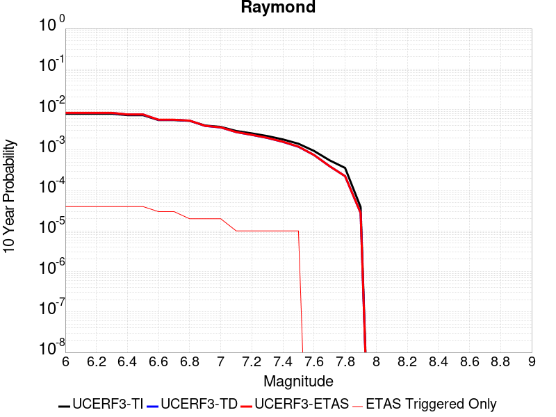 |

| Magnitude | 1 wk TI Prob | 1 wk TD Prob | 1 wk ETAS Prob | 1 wk ETAS/TD Gain | 1 wk ETAS Triggered Only | 1 mo TI Prob | 1 mo TD Prob | 1 mo ETAS Prob | 1 mo ETAS/TD Gain | 1 mo ETAS Triggered Only | 1 yr TI Prob | 1 yr TD Prob | 1 yr ETAS Prob | 1 yr ETAS/TD Gain | 1 yr ETAS Triggered Only | 10 yr TI Prob | 10 yr TD Prob | 10 yr ETAS Prob | 10 yr ETAS/TD Gain | 10 yr ETAS Triggered Only |
|-----|-----|-----|-----|-----|-----|-----|-----|-----|-----|-----|-----|-----|-----|-----|-----|-----|-----|-----|-----|-----|
| 6.0 | 1.5157413E-5 | 1.5810128E-5 | 2.91789E-5 | 1.8455828 | 1.3368984E-5 | 6.4958724E-5 | 6.7756075E-5 | 9.449223E-5 | 1.3945942 | 2.6737967E-5 | 7.905855E-4 | 8.2464307E-4 | 8.51359E-4 | 1.0323969 | 2.6737967E-5 | 0.007877788 | 0.008218348 | 0.008258126 | 1.00484 | 4.0106952E-5 |
| 6.1 | 1.5157413E-5 | 1.5810128E-5 | 2.91789E-5 | 1.8455828 | 1.3368984E-5 | 6.4958724E-5 | 6.7756075E-5 | 9.449223E-5 | 1.3945942 | 2.6737967E-5 | 7.905855E-4 | 8.2464307E-4 | 8.51359E-4 | 1.0323969 | 2.6737967E-5 | 0.007877788 | 0.008218348 | 0.008258126 | 1.00484 | 4.0106952E-5 |
| 6.2 | 1.5157413E-5 | 1.5810128E-5 | 2.91789E-5 | 1.8455828 | 1.3368984E-5 | 6.4958724E-5 | 6.7756075E-5 | 9.449223E-5 | 1.3945942 | 2.6737967E-5 | 7.905855E-4 | 8.2464307E-4 | 8.51359E-4 | 1.0323969 | 2.6737967E-5 | 0.007877788 | 0.008218348 | 0.008258126 | 1.00484 | 4.0106952E-5 |
| 6.3 | 1.5157413E-5 | 1.5810128E-5 | 2.91789E-5 | 1.8455828 | 1.3368984E-5 | 6.4958724E-5 | 6.7756075E-5 | 9.449223E-5 | 1.3945942 | 2.6737967E-5 | 7.905855E-4 | 8.2464307E-4 | 8.51359E-4 | 1.0323969 | 2.6737967E-5 | 0.007877788 | 0.008218348 | 0.008258126 | 1.00484 | 4.0106952E-5 |
| 6.4 | 1.3941944E-5 | 1.445469E-5 | 2.7823482E-5 | 1.9248756 | 1.3368984E-5 | 5.9749822E-5 | 6.1947336E-5 | 8.868365E-5 | 1.4315975 | 2.6737967E-5 | 7.2721124E-4 | 7.5397117E-4 | 7.8068895E-4 | 1.0354362 | 2.6737967E-5 | 0.007248361 | 0.0075164647 | 0.0075562703 | 1.0052958 | 4.0106952E-5 |
| 6.5 | 1.3941944E-5 | 1.445469E-5 | 2.7823482E-5 | 1.9248756 | 1.3368984E-5 | 5.9749822E-5 | 6.1947336E-5 | 8.868365E-5 | 1.4315975 | 2.6737967E-5 | 7.2721124E-4 | 7.5397117E-4 | 7.8068895E-4 | 1.0354362 | 2.6737967E-5 | 0.007248361 | 0.0075164647 | 0.0075562703 | 1.0052958 | 4.0106952E-5 |
| 6.6 | 1.0542609E-5 | 1.0671113E-5 | 2.4039955E-5 | 2.2528067 | 1.3368984E-5 | 4.5181827E-5 | 4.573257E-5 | 7.246932E-5 | 1.5846325 | 2.6737967E-5 | 5.499499E-4 | 5.5665727E-4 | 5.8338034E-4 | 1.0480063 | 2.6737967E-5 | 0.005485909 | 0.00555319 | 0.0055930745 | 1.0071822 | 4.0106952E-5 |
| 6.7 | 1.0542609E-5 | 1.0671113E-5 | 2.4039955E-5 | 2.2528067 | 1.3368984E-5 | 4.5181827E-5 | 4.573257E-5 | 7.246932E-5 | 1.5846325 | 2.6737967E-5 | 5.499499E-4 | 5.5665727E-4 | 5.8338034E-4 | 1.0480063 | 2.6737967E-5 | 0.005485909 | 0.00555319 | 0.0055930745 | 1.0071822 | 4.0106952E-5 |
| 6.8 | 1.0079132E-5 | 1.0176646E-5 | 2.3545494E-5 | 2.3136792 | 1.3368984E-5 | 4.3195567E-5 | 4.3613498E-5 | 7.03503E-5 | 1.6130396 | 2.6737967E-5 | 5.257791E-4 | 5.3087034E-4 | 5.575941E-4 | 1.0503396 | 2.6737967E-5 | 0.0052453685 | 0.005296571 | 0.0053231674 | 1.0050215 | 2.6737967E-5 |
| 6.9 | 7.721598E-6 | 7.5489047E-6 | 2.0917787E-5 | 2.7709699 | 1.3368984E-5 | 3.3092143E-5 | 3.2352054E-5 | 5.9089158E-5 | 1.8264422 | 2.6737967E-5 | 4.0282236E-4 | 3.9381627E-4 | 4.205437E-4 | 1.0678678 | 2.6737967E-5 | 0.0040209293 | 0.0039313175 | 0.0039579505 | 1.0067745 | 2.6737967E-5 |
| 7.0 | 7.137566E-6 | 6.9113057E-6 | 2.0280197E-5 | 2.9343512 | 1.3368984E-5 | 3.058921E-5 | 2.961955E-5 | 5.6356726E-5 | 1.9026867 | 2.6737967E-5 | 3.7236E-4 | 3.6055944E-4 | 3.8728776E-4 | 1.0741302 | 2.6737967E-5 | 0.0037173668 | 0.0035998628 | 0.0036265044 | 1.0074008 | 2.6737967E-5 |
| 7.1 | 5.654976E-6 | 5.29954E-6 | 1.8668454E-5 | 3.5226552 | 1.3368984E-5 | 2.4235387E-5 | 2.2712118E-5 | 3.60808E-5 | 1.5886145 | 1.3368984E-5 | 2.9502588E-4 | 2.7648517E-4 | 2.8985046E-4 | 1.04834 | 1.3368984E-5 | 0.0029463451 | 0.002761443 | 0.002774775 | 1.004828 | 1.3368984E-5 |
| 7.2 | 4.9358455E-6 | 4.5266574E-6 | 1.7895582E-5 | 3.9533763 | 1.3368984E-5 | 2.1153453E-5 | 1.9399817E-5 | 3.276854E-5 | 1.689116 | 1.3368984E-5 | 2.5751285E-4 | 2.3616731E-4 | 2.4953313E-4 | 1.0565947 | 1.3368984E-5 | 0.0025721465 | 0.0023591854 | 0.0023725228 | 1.0056534 | 1.3368984E-5 |
| 7.3 | 4.2368597E-6 | 3.8056164E-6 | 1.7174549E-5 | 4.512948 | 1.3368984E-5 | 1.8157843E-5 | 1.6309683E-5 | 2.967845E-5 | 1.8196827 | 1.3368984E-5 | 2.2104931E-4 | 1.9855241E-4 | 2.1191874E-4 | 1.0673189 | 1.3368984E-5 | 0.0022082955 | 0.0019837688 | 0.0019971114 | 1.0067258 | 1.3368984E-5 |
| 7.4 | 3.4999923E-6 | 3.043744E-6 | 1.6412687E-5 | 5.392269 | 1.3368984E-5 | 1.49998805E-5 | 1.3044552E-5 | 2.6413363E-5 | 2.0248575 | 1.3368984E-5 | 1.8260824E-4 | 1.5880594E-4 | 1.7217279E-4 | 1.084171 | 1.3368984E-5 | 0.0018245826 | 0.0015869403 | 0.001600288 | 1.008411 | 1.3368984E-5 |
| 7.5 | 2.738017E-6 | 2.3020468E-6 | 1.5671E-5 | 6.8074203 | 1.3368984E-5 | 1.1734306E-5 | 9.865878E-6 | 2.323473E-5 | 2.3550596 | 1.3368984E-5 | 1.428558E-4 | 1.2011051E-4 | 1.334779E-4 | 1.1112924 | 1.3368984E-5 | 0.0014276401 | 0.0012004703 | 0.0012138232 | 1.0111231 | 1.3368984E-5 |
| 7.6 | 1.8186392E-6 | 1.442312E-6 | 1.442312E-6 | 1.0 | 0.0 | 7.794145E-6 | 6.181323E-6 | 6.181323E-6 | 1.0 | 0.0 | 9.488958E-5 | 7.5255055E-5 | 7.5255055E-5 | 1.0 | 0.0 | 9.4849075E-4 | 7.523072E-4 | 7.523072E-4 | 1.0 | 0.0 |
| 7.7 | 1.0660348E-6 | 7.6438056E-7 | 7.6438056E-7 | 1.0 | 0.0 | 4.5687125E-6 | 3.2759126E-6 | 3.2759126E-6 | 1.0 | 0.0 | 5.5622655E-5 | 3.9883522E-5 | 3.9883522E-5 | 1.0 | 0.0 | 5.5608735E-4 | 3.9877277E-4 | 3.9877277E-4 | 1.0 | 0.0 |
| 7.8 | 6.913602E-7 | 4.3204133E-7 | 4.3204133E-7 | 1.0 | 0.0 | 2.962969E-6 | 1.8516045E-6 | 1.8516045E-6 | 1.0 | 0.0 | 3.607355E-5 | 2.2543056E-5 | 2.2543056E-5 | 1.0 | 0.0 | 3.6067693E-4 | 2.2541556E-4 | 2.2541556E-4 | 1.0 | 0.0 |
| 7.9 | 7.425201E-8 | 5.3222113E-8 | 5.3222113E-8 | 1.0 | 0.0 | 3.1822285E-7 | 2.2809476E-7 | 2.2809476E-7 | 1.0 | 0.0 | 3.874356E-6 | 2.7770516E-6 | 2.7770516E-6 | 1.0 | 0.0 | 3.8742884E-5 | 2.7770298E-5 | 2.7770298E-5 | 1.0 | 0.0 |

## Cleghorn
*[(top)](#table-of-contents)*

| 1 Week | 1 Month | 1 Year | 10 Year |
|-----|-----|-----|-----|
|  |  |  |  |

| Magnitude | 1 wk TI Prob | 1 wk TD Prob | 1 wk ETAS Prob | 1 wk ETAS/TD Gain | 1 wk ETAS Triggered Only | 1 mo TI Prob | 1 mo TD Prob | 1 mo ETAS Prob | 1 mo ETAS/TD Gain | 1 mo ETAS Triggered Only | 1 yr TI Prob | 1 yr TD Prob | 1 yr ETAS Prob | 1 yr ETAS/TD Gain | 1 yr ETAS Triggered Only | 10 yr TI Prob | 10 yr TD Prob | 10 yr ETAS Prob | 10 yr ETAS/TD Gain | 10 yr ETAS Triggered Only |
|-----|-----|-----|-----|-----|-----|-----|-----|-----|-----|-----|-----|-----|-----|-----|-----|-----|-----|-----|-----|-----|
| 6.0 | 7.9267165E-6 | 9.831582E-6 | 9.831582E-6 | 1.0 | 0.0 | 3.39712E-5 | 4.2134732E-5 | 4.2134732E-5 | 1.0 | 0.0 | 4.1352084E-4 | 5.128803E-4 | 5.396045E-4 | 1.0521063 | 2.6737967E-5 | 0.004127522 | 0.0051320773 | 0.0051719784 | 1.0077748 | 4.0106952E-5 |
| 6.1 | 7.9267165E-6 | 9.831582E-6 | 9.831582E-6 | 1.0 | 0.0 | 3.39712E-5 | 4.2134732E-5 | 4.2134732E-5 | 1.0 | 0.0 | 4.1352084E-4 | 5.128803E-4 | 5.396045E-4 | 1.0521063 | 2.6737967E-5 | 0.004127522 | 0.0051320773 | 0.0051719784 | 1.0077748 | 4.0106952E-5 |
| 6.2 | 7.9267165E-6 | 9.831582E-6 | 9.831582E-6 | 1.0 | 0.0 | 3.39712E-5 | 4.2134732E-5 | 4.2134732E-5 | 1.0 | 0.0 | 4.1352084E-4 | 5.128803E-4 | 5.396045E-4 | 1.0521063 | 2.6737967E-5 | 0.004127522 | 0.0051320773 | 0.0051719784 | 1.0077748 | 4.0106952E-5 |
| 6.3 | 7.9267165E-6 | 9.831582E-6 | 9.831582E-6 | 1.0 | 0.0 | 3.39712E-5 | 4.2134732E-5 | 4.2134732E-5 | 1.0 | 0.0 | 4.1352084E-4 | 5.128803E-4 | 5.396045E-4 | 1.0521063 | 2.6737967E-5 | 0.004127522 | 0.0051320773 | 0.0051719784 | 1.0077748 | 4.0106952E-5 |
| 6.4 | 4.3445207E-6 | 6.0914435E-6 | 6.0914435E-6 | 1.0 | 0.0 | 1.8619241E-5 | 2.610593E-5 | 2.610593E-5 | 1.0 | 0.0 | 2.2666567E-4 | 3.1779436E-4 | 3.311591E-4 | 1.0420547 | 1.3368984E-5 | 0.0022643462 | 0.0031875873 | 0.00321424 | 1.0083615 | 2.6737967E-5 |
| 6.5 | 4.3445207E-6 | 6.0914435E-6 | 6.0914435E-6 | 1.0 | 0.0 | 1.8619241E-5 | 2.610593E-5 | 2.610593E-5 | 1.0 | 0.0 | 2.2666567E-4 | 3.1779436E-4 | 3.311591E-4 | 1.0420547 | 1.3368984E-5 | 0.0022643462 | 0.0031875873 | 0.00321424 | 1.0083615 | 2.6737967E-5 |
| 6.6 | 4.040109E-6 | 5.773851E-6 | 5.773851E-6 | 1.0 | 0.0 | 1.7314638E-5 | 2.4744846E-5 | 2.4744846E-5 | 1.0 | 0.0 | 2.1078532E-4 | 3.012278E-4 | 3.1459276E-4 | 1.0443683 | 1.3368984E-5 | 0.002105855 | 0.003022377 | 0.0030490342 | 1.0088199 | 2.6737967E-5 |
| 6.7 | 3.3632055E-6 | 5.067348E-6 | 5.067348E-6 | 1.0 | 0.0 | 1.4413658E-5 | 2.1717027E-5 | 2.1717027E-5 | 1.0 | 0.0 | 1.7547216E-4 | 2.6437303E-4 | 2.777385E-4 | 1.0505552 | 1.3368984E-5 | 0.0017533366 | 0.0026547113 | 0.0026680448 | 1.0050225 | 1.3368984E-5 |
| 6.8 | 3.2902772E-6 | 4.9892556E-6 | 4.9892556E-6 | 1.0 | 0.0 | 1.4101111E-5 | 2.1382351E-5 | 2.1382351E-5 | 1.0 | 0.0 | 1.716675E-4 | 2.6029933E-4 | 2.7366483E-4 | 1.0513467 | 1.3368984E-5 | 0.0017153495 | 0.0026140702 | 0.0026274042 | 1.0051008 | 1.3368984E-5 |
| 6.9 | 3.031547E-6 | 4.6910186E-6 | 4.6910186E-6 | 1.0 | 0.0 | 1.299228E-5 | 2.0104211E-5 | 2.0104211E-5 | 1.0 | 0.0 | 1.5816953E-4 | 2.4474156E-4 | 2.5810726E-4 | 1.0546116 | 1.3368984E-5 | 0.00158057 | 0.0024588439 | 0.00247218 | 1.0054238 | 1.3368984E-5 |
| 7.0 | 2.8259715E-6 | 4.3705895E-6 | 4.3705895E-6 | 1.0 | 0.0 | 1.211125E-5 | 1.8730963E-5 | 1.8730963E-5 | 1.0 | 0.0 | 1.4744449E-4 | 2.2802586E-4 | 2.413918E-4 | 1.0586159 | 1.3368984E-5 | 0.001473467 | 0.0022920412 | 0.0023053794 | 1.0058194 | 1.3368984E-5 |
| 7.1 | 2.5962665E-6 | 4.0658106E-6 | 4.0658106E-6 | 1.0 | 0.0 | 1.1126809E-5 | 1.7424789E-5 | 1.7424789E-5 | 1.0 | 0.0 | 1.3546048E-4 | 2.1212637E-4 | 2.254925E-4 | 1.0630103 | 1.3368984E-5 | 0.0013537793 | 0.002133366 | 0.0021467065 | 1.0062532 | 1.3368984E-5 |
| 7.2 | 2.3247253E-6 | 3.6763672E-6 | 3.6763672E-6 | 1.0 | 0.0 | 9.96307E-6 | 1.5755764E-5 | 1.5755764E-5 | 1.0 | 0.0 | 1.21293626E-4 | 1.9180974E-4 | 2.0517615E-4 | 1.0696858 | 1.3368984E-5 | 0.0012122744 | 0.0019305905 | 0.0019439337 | 1.0069114 | 1.3368984E-5 |
| 7.3 | 2.056928E-6 | 3.2350938E-6 | 3.2350938E-6 | 1.0 | 0.0 | 8.815376E-6 | 1.3864615E-5 | 1.3864615E-5 | 1.0 | 0.0 | 1.0732192E-4 | 1.6878877E-4 | 1.8215549E-4 | 1.079192 | 1.3368984E-5 | 0.001072701 | 0.0017008206 | 0.0017141668 | 1.007847 | 1.3368984E-5 |
| 7.4 | 1.8055999E-6 | 2.8255042E-6 | 2.8255042E-6 | 1.0 | 0.0 | 7.738263E-6 | 1.2109249E-5 | 1.2109249E-5 | 1.0 | 0.0 | 9.4209274E-5 | 1.4742027E-4 | 1.6078728E-4 | 1.0906729 | 1.3368984E-5 | 9.4169343E-4 | 0.0014875771 | 0.0015009262 | 1.0089737 | 1.3368984E-5 |
| 7.5 | 1.4683443E-6 | 2.4247483E-6 | 2.4247483E-6 | 1.0 | 0.0 | 6.292889E-6 | 1.0391738E-5 | 1.0391738E-5 | 1.0 | 0.0 | 7.661323E-5 | 1.2651215E-4 | 1.3987946E-4 | 1.1056601 | 1.3368984E-5 | 7.658682E-4 | 0.0012787961 | 0.001292148 | 1.010441 | 1.3368984E-5 |
| 7.6 | 9.804088E-7 | 1.900266E-6 | 1.900266E-6 | 1.0 | 0.0 | 4.201745E-6 | 8.143972E-6 | 8.143972E-6 | 1.0 | 0.0 | 5.1155046E-5 | 9.91484E-5 | 1.12516056E-4 | 1.1348248 | 1.3368984E-5 | 5.114327E-4 | 0.001005471 | 0.0010188266 | 1.0132829 | 1.3368984E-5 |
| 7.7 | 7.3434086E-7 | 1.6284146E-6 | 1.6284146E-6 | 1.0 | 0.0 | 3.1471714E-6 | 6.978901E-6 | 6.978901E-6 | 1.0 | 0.0 | 3.831614E-5 | 8.4964835E-5 | 9.833268E-5 | 1.1573339 | 1.3368984E-5 | 3.8309532E-4 | 8.6378685E-4 | 8.771443E-4 | 1.0154638 | 1.3368984E-5 |
| 7.8 | 6.434184E-7 | 1.5220047E-6 | 1.5220047E-6 | 1.0 | 0.0 | 2.7575045E-6 | 6.5228614E-6 | 6.5228614E-6 | 1.0 | 0.0 | 3.35721E-5 | 7.941297E-5 | 9.278089E-5 | 1.1683342 | 1.3368984E-5 | 3.3567028E-4 | 8.079678E-4 | 8.21326E-4 | 1.016533 | 1.3368984E-5 |
| 7.9 | 3.4943926E-7 | 7.574459E-7 | 7.574459E-7 | 1.0 | 0.0 | 1.497596E-6 | 3.2461926E-6 | 3.2461926E-6 | 1.0 | 0.0 | 1.8233079E-5 | 3.952169E-5 | 5.2890144E-5 | 1.3382562 | 1.3368984E-5 | 1.8231584E-4 | 4.040099E-4 | 4.173735E-4 | 1.0330774 | 1.3368984E-5 |
| 8.0 | 6.717524E-8 | 5.838828E-8 | 5.838828E-8 | 1.0 | 0.0 | 2.8789387E-7 | 2.5023547E-7 | 2.5023547E-7 | 1.0 | 0.0 | 3.505102E-6 | 3.0466126E-6 | 3.0466126E-6 | 1.0 | 0.0 | 3.5050467E-5 | 3.273506E-5 | 3.273506E-5 | 1.0 | 0.0 |
| 8.1 | 3.1984914E-8 | 1.2956093E-8 | 1.2956093E-8 | 1.0 | 0.0 | 1.370782E-7 | 5.552611E-8 | 5.552611E-8 | 1.0 | 0.0 | 1.6689258E-6 | 6.760302E-7 | 6.760302E-7 | 1.0 | 0.0 | 1.6689133E-5 | 7.74454E-6 | 7.74454E-6 | 1.0 | 0.0 |
| 8.2 | 1.21887656E-8 | 3.6495305E-9 | 3.6495305E-9 | 1.0 | 0.0 | 5.2237567E-8 | 1.5640845E-8 | 1.5640845E-8 | 1.0 | 0.0 | 6.359922E-7 | 1.9042727E-7 | 1.9042727E-7 | 1.0 | 0.0 | 6.3599036E-6 | 2.2470974E-6 | 2.2470974E-6 | 1.0 | 0.0 |

## Santa Susana East (connector)
*[(top)](#table-of-contents)*

| 1 Week | 1 Month | 1 Year | 10 Year |
|-----|-----|-----|-----|
|  |  |  |  |

| Magnitude | 1 wk TI Prob | 1 wk TD Prob | 1 wk ETAS Prob | 1 wk ETAS/TD Gain | 1 wk ETAS Triggered Only | 1 mo TI Prob | 1 mo TD Prob | 1 mo ETAS Prob | 1 mo ETAS/TD Gain | 1 mo ETAS Triggered Only | 1 yr TI Prob | 1 yr TD Prob | 1 yr ETAS Prob | 1 yr ETAS/TD Gain | 1 yr ETAS Triggered Only | 10 yr TI Prob | 10 yr TD Prob | 10 yr ETAS Prob | 10 yr ETAS/TD Gain | 10 yr ETAS Triggered Only |
|-----|-----|-----|-----|-----|-----|-----|-----|-----|-----|-----|-----|-----|-----|-----|-----|-----|-----|-----|-----|-----|
| 6.0 | 2.858397E-5 | 3.202091E-5 | 3.202091E-5 | 1.0 | 0.0 | 1.2249697E-4 | 1.3722685E-4 | 1.50594E-4 | 1.0974091 | 1.3368984E-5 | 0.0014903803 | 0.0016697381 | 0.0016964314 | 1.0159866 | 2.6737967E-5 | 0.014804244 | 0.016599052 | 0.016638493 | 1.0023761 | 4.0106952E-5 |
| 6.1 | 2.858397E-5 | 3.202091E-5 | 3.202091E-5 | 1.0 | 0.0 | 1.2249697E-4 | 1.3722685E-4 | 1.50594E-4 | 1.0974091 | 1.3368984E-5 | 0.0014903803 | 0.0016697381 | 0.0016964314 | 1.0159866 | 2.6737967E-5 | 0.014804244 | 0.016599052 | 0.016638493 | 1.0023761 | 4.0106952E-5 |
| 6.2 | 2.858397E-5 | 3.202091E-5 | 3.202091E-5 | 1.0 | 0.0 | 1.2249697E-4 | 1.3722685E-4 | 1.50594E-4 | 1.0974091 | 1.3368984E-5 | 0.0014903803 | 0.0016697381 | 0.0016964314 | 1.0159866 | 2.6737967E-5 | 0.014804244 | 0.016599052 | 0.016638493 | 1.0023761 | 4.0106952E-5 |
| 6.3 | 1.943582E-5 | 2.036718E-5 | 2.036718E-5 | 1.0 | 0.0 | 8.329371E-5 | 8.7285625E-5 | 1.00653444E-4 | 1.1531503 | 1.3368984E-5 | 0.001013629 | 0.0010622967 | 0.0010890062 | 1.0251433 | 2.6737967E-5 | 0.010090181 | 0.010583619 | 0.010623301 | 1.0037494 | 4.0106952E-5 |
| 6.4 | 1.943582E-5 | 2.036718E-5 | 2.036718E-5 | 1.0 | 0.0 | 8.329371E-5 | 8.7285625E-5 | 1.00653444E-4 | 1.1531503 | 1.3368984E-5 | 0.001013629 | 0.0010622967 | 0.0010890062 | 1.0251433 | 2.6737967E-5 | 0.010090181 | 0.010583619 | 0.010623301 | 1.0037494 | 4.0106952E-5 |
| 6.5 | 1.943582E-5 | 2.036718E-5 | 2.036718E-5 | 1.0 | 0.0 | 8.329371E-5 | 8.7285625E-5 | 1.00653444E-4 | 1.1531503 | 1.3368984E-5 | 0.001013629 | 0.0010622967 | 0.0010890062 | 1.0251433 | 2.6737967E-5 | 0.010090181 | 0.010583619 | 0.010623301 | 1.0037494 | 4.0106952E-5 |
| 6.6 | 1.943582E-5 | 2.036718E-5 | 2.036718E-5 | 1.0 | 0.0 | 8.329371E-5 | 8.7285625E-5 | 1.00653444E-4 | 1.1531503 | 1.3368984E-5 | 0.001013629 | 0.0010622967 | 0.0010890062 | 1.0251433 | 2.6737967E-5 | 0.010090181 | 0.010583619 | 0.010623301 | 1.0037494 | 4.0106952E-5 |
| 6.7 | 1.9404439E-5 | 2.03546E-5 | 2.03546E-5 | 1.0 | 0.0 | 8.3159226E-5 | 8.723172E-5 | 1.0059954E-4 | 1.153245 | 1.3368984E-5 | 0.0010119933 | 0.0010616409 | 0.0010883505 | 1.0251588 | 2.6737967E-5 | 0.010073971 | 0.010577125 | 0.010616807 | 1.0037518 | 4.0106952E-5 |
| 6.8 | 1.2217526E-5 | 1.1592998E-5 | 1.1592998E-5 | 1.0 | 0.0 | 5.2359774E-5 | 4.9683425E-5 | 4.9683425E-5 | 1.0 | 0.0 | 6.372938E-4 | 6.0474465E-4 | 6.0474465E-4 | 1.0 | 0.0 | 0.0063546924 | 0.006033037 | 0.006046325 | 1.0022026 | 1.3368984E-5 |
| 6.9 | 1.2217526E-5 | 1.1592998E-5 | 1.1592998E-5 | 1.0 | 0.0 | 5.2359774E-5 | 4.9683425E-5 | 4.9683425E-5 | 1.0 | 0.0 | 6.372938E-4 | 6.0474465E-4 | 6.0474465E-4 | 1.0 | 0.0 | 0.0063546924 | 0.006033037 | 0.006046325 | 1.0022026 | 1.3368984E-5 |
| 7.0 | 9.276017E-6 | 8.059113E-6 | 8.059113E-6 | 1.0 | 0.0 | 3.9753755E-5 | 3.4538618E-5 | 3.4538618E-5 | 1.0 | 0.0 | 4.8389446E-4 | 4.2042998E-4 | 4.2042998E-4 | 1.0 | 0.0 | 0.0048284214 | 0.0041970722 | 0.004210385 | 1.0031719 | 1.3368984E-5 |
| 7.1 | 9.130355E-6 | 7.942286E-6 | 7.942286E-6 | 1.0 | 0.0 | 3.9129503E-5 | 3.4037945E-5 | 3.4037945E-5 | 1.0 | 0.0 | 4.7629757E-4 | 4.1433662E-4 | 4.1433662E-4 | 1.0 | 0.0 | 0.00475278 | 0.004136367 | 0.0041496805 | 1.0032187 | 1.3368984E-5 |
| 7.2 | 8.851015E-6 | 7.741445E-6 | 7.741445E-6 | 1.0 | 0.0 | 3.7932372E-5 | 3.317722E-5 | 3.317722E-5 | 1.0 | 0.0 | 4.6172875E-4 | 4.038612E-4 | 4.038612E-4 | 1.0 | 0.0 | 0.0046077054 | 0.0040319953 | 0.0040453104 | 1.0033023 | 1.3368984E-5 |
| 7.3 | 8.573006E-6 | 7.550166E-6 | 7.550166E-6 | 1.0 | 0.0 | 3.6740938E-5 | 3.2357475E-5 | 3.2357475E-5 | 1.0 | 0.0 | 4.472291E-4 | 3.9388443E-4 | 3.9388443E-4 | 1.0 | 0.0 | 0.004463301 | 0.0039325804 | 0.003945897 | 1.0033861 | 1.3368984E-5 |
| 7.4 | 7.852282E-6 | 6.817687E-6 | 6.817687E-6 | 1.0 | 0.0 | 3.36522E-5 | 2.9218349E-5 | 2.9218349E-5 | 1.0 | 0.0 | 4.096385E-4 | 3.5567835E-4 | 3.5567835E-4 | 1.0 | 0.0 | 0.0040888423 | 0.0035517553 | 0.0035650767 | 1.0037507 | 1.3368984E-5 |
| 7.5 | 4.8869324E-6 | 4.279055E-6 | 4.279055E-6 | 1.0 | 0.0 | 2.0943828E-5 | 1.8338687E-5 | 1.8338687E-5 | 1.0 | 0.0 | 2.5496128E-4 | 2.232523E-4 | 2.232523E-4 | 1.0 | 0.0 | 0.0025466895 | 0.0022304445 | 0.0022304445 | 1.0 | 0.0 |
| 7.6 | 1.3894544E-6 | 1.1568179E-6 | 1.1568179E-6 | 1.0 | 0.0 | 5.954791E-6 | 4.957783E-6 | 4.957783E-6 | 1.0 | 0.0 | 7.249717E-5 | 6.0359558E-5 | 6.0359558E-5 | 1.0 | 0.0 | 7.247352E-4 | 6.0345343E-4 | 6.0345343E-4 | 1.0 | 0.0 |
| 7.7 | 2.9924632E-7 | 2.371928E-7 | 2.371928E-7 | 1.0 | 0.0 | 1.2824837E-6 | 1.0165402E-6 | 1.0165402E-6 | 1.0 | 0.0 | 1.5614127E-5 | 1.2376314E-5 | 1.2376314E-5 | 1.0 | 0.0 | 1.5613029E-4 | 1.2375697E-4 | 1.2375697E-4 | 1.0 | 0.0 |
| 7.8 | 4.8188564E-8 | 2.6323061E-8 | 2.6323061E-8 | 1.0 | 0.0 | 2.065224E-7 | 1.1281311E-7 | 1.1281311E-7 | 1.0 | 0.0 | 2.5144072E-6 | 1.3734989E-6 | 1.3734989E-6 | 1.0 | 0.0 | 2.5143789E-5 | 1.3734912E-5 | 1.3734912E-5 | 1.0 | 0.0 |
| 7.9 | 2.6127251E-9 | 2.7681102E-9 | 2.7681102E-9 | 1.0 | 0.0 | 1.1197393E-8 | 1.186333E-8 | 1.186333E-8 | 1.0 | 0.0 | 1.3632825E-7 | 1.4443603E-7 | 1.4443603E-7 | 1.0 | 0.0 | 1.3632817E-6 | 1.4443604E-6 | 1.4443604E-6 | 1.0 | 0.0 |

## Shoreline
*[(top)](#table-of-contents)*

| 1 Week | 1 Month | 1 Year | 10 Year |
|-----|-----|-----|-----|
|  |  | 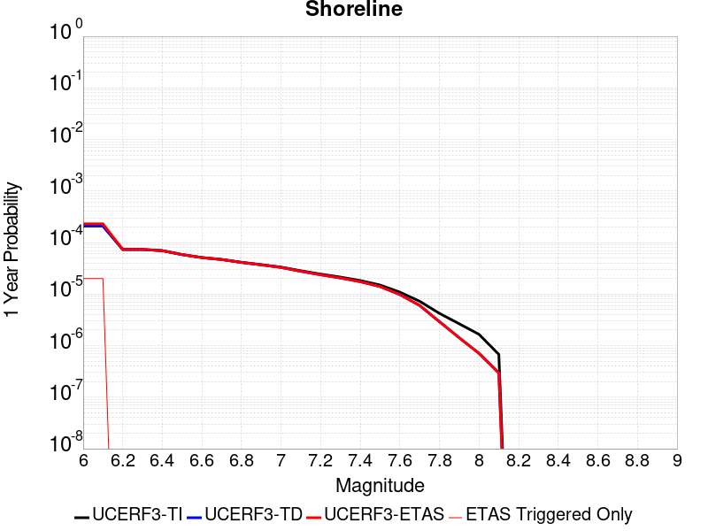 | 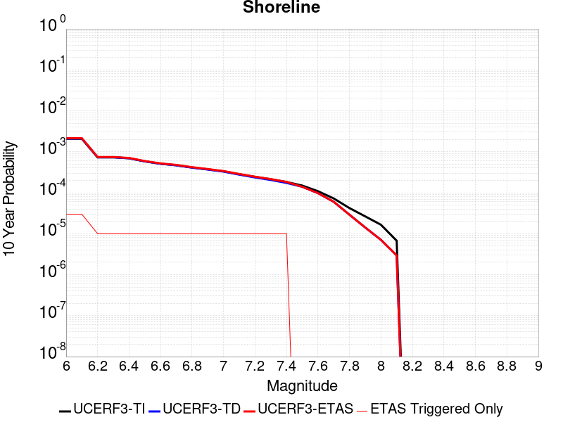 |

| Magnitude | 1 wk TI Prob | 1 wk TD Prob | 1 wk ETAS Prob | 1 wk ETAS/TD Gain | 1 wk ETAS Triggered Only | 1 mo TI Prob | 1 mo TD Prob | 1 mo ETAS Prob | 1 mo ETAS/TD Gain | 1 mo ETAS Triggered Only | 1 yr TI Prob | 1 yr TD Prob | 1 yr ETAS Prob | 1 yr ETAS/TD Gain | 1 yr ETAS Triggered Only | 10 yr TI Prob | 10 yr TD Prob | 10 yr ETAS Prob | 10 yr ETAS/TD Gain | 10 yr ETAS Triggered Only |
|-----|-----|-----|-----|-----|-----|-----|-----|-----|-----|-----|-----|-----|-----|-----|-----|-----|-----|-----|-----|-----|
| 6.0 | 3.9888673E-6 | 4.047929E-6 | 1.7416858E-5 | 4.302659 | 1.3368984E-5 | 1.7095033E-5 | 1.7348184E-5 | 3.0716936E-5 | 1.7706139 | 1.3368984E-5 | 2.0811215E-4 | 2.1119925E-4 | 2.3793157E-4 | 1.1265739 | 2.6737967E-5 | 0.0020791737 | 0.002110534 | 0.0021505563 | 1.0189631 | 4.0106952E-5 |
| 6.1 | 3.9888673E-6 | 4.047929E-6 | 1.7416858E-5 | 4.302659 | 1.3368984E-5 | 1.7095033E-5 | 1.7348184E-5 | 3.0716936E-5 | 1.7706139 | 1.3368984E-5 | 2.0811215E-4 | 2.1119925E-4 | 2.3793157E-4 | 1.1265739 | 2.6737967E-5 | 0.0020791737 | 0.002110534 | 0.0021505563 | 1.0189631 | 4.0106952E-5 |
| 6.2 | 1.4039653E-6 | 1.4100891E-6 | 1.4100891E-6 | 1.0 | 0.0 | 6.0169805E-6 | 6.0432253E-6 | 6.0432253E-6 | 1.0 | 0.0 | 7.325427E-5 | 7.357384E-5 | 7.357384E-5 | 1.0 | 0.0 | 7.3230127E-4 | 7.355009E-4 | 7.4886E-4 | 1.0181633 | 1.3368984E-5 |
| 6.3 | 1.4039653E-6 | 1.4100891E-6 | 1.4100891E-6 | 1.0 | 0.0 | 6.0169805E-6 | 6.0432253E-6 | 6.0432253E-6 | 1.0 | 0.0 | 7.325427E-5 | 7.357384E-5 | 7.357384E-5 | 1.0 | 0.0 | 7.3230127E-4 | 7.355009E-4 | 7.4886E-4 | 1.0181633 | 1.3368984E-5 |
| 6.4 | 1.3314152E-6 | 1.3361605E-6 | 1.3361605E-6 | 1.0 | 0.0 | 5.7060524E-6 | 5.7263896E-6 | 5.7263896E-6 | 1.0 | 0.0 | 6.946897E-5 | 6.971662E-5 | 6.971662E-5 | 1.0 | 0.0 | 6.9447263E-4 | 6.9695286E-4 | 7.1031257E-4 | 1.0191687 | 1.3368984E-5 |
| 6.5 | 1.1187026E-6 | 1.120364E-6 | 1.120364E-6 | 1.0 | 0.0 | 4.794431E-6 | 4.8015513E-6 | 4.8015513E-6 | 1.0 | 0.0 | 5.8370628E-5 | 5.8457343E-5 | 5.8457343E-5 | 1.0 | 0.0 | 5.83553E-4 | 5.844222E-4 | 5.9778336E-4 | 1.0228622 | 1.3368984E-5 |
| 6.6 | 9.793089E-7 | 9.784919E-7 | 9.784919E-7 | 1.0 | 0.0 | 4.1970316E-6 | 4.1935305E-6 | 4.1935305E-6 | 1.0 | 0.0 | 5.1097657E-5 | 5.105505E-5 | 5.105505E-5 | 1.0 | 0.0 | 5.108591E-4 | 5.1043445E-4 | 5.2379665E-4 | 1.026178 | 1.3368984E-5 |
| 6.7 | 8.995986E-7 | 8.9728E-7 | 8.9728E-7 | 1.0 | 0.0 | 3.8554167E-6 | 3.84548E-6 | 3.84548E-6 | 1.0 | 0.0 | 4.693869E-5 | 4.6817724E-5 | 4.6817724E-5 | 1.0 | 0.0 | 4.6928777E-4 | 4.6807955E-4 | 4.814423E-4 | 1.028548 | 1.3368984E-5 |
| 6.8 | 7.931612E-7 | 7.8804027E-7 | 7.8804027E-7 | 1.0 | 0.0 | 3.3992578E-6 | 3.377311E-6 | 3.377311E-6 | 1.0 | 0.0 | 4.1385178E-5 | 4.1117994E-5 | 4.1117994E-5 | 1.0 | 0.0 | 4.1377472E-4 | 4.1110438E-4 | 4.2446787E-4 | 1.0325063 | 1.3368984E-5 |
| 6.9 | 7.1465956E-7 | 7.078006E-7 | 7.078006E-7 | 1.0 | 0.0 | 3.062823E-6 | 3.0334277E-6 | 3.0334277E-6 | 1.0 | 0.0 | 3.7289232E-5 | 3.6931357E-5 | 3.6931357E-5 | 1.0 | 0.0 | 3.7282976E-4 | 3.6925258E-4 | 3.8261662E-4 | 1.0361922 | 1.3368984E-5 |
| 7.0 | 6.389046E-7 | 6.299458E-7 | 6.299458E-7 | 1.0 | 0.0 | 2.7381598E-6 | 2.699765E-6 | 2.699765E-6 | 1.0 | 0.0 | 3.3336586E-5 | 3.2869146E-5 | 3.2869146E-5 | 1.0 | 0.0 | 3.3331584E-4 | 3.2864307E-4 | 3.4200767E-4 | 1.040666 | 1.3368984E-5 |
| 7.1 | 5.4300875E-7 | 5.3111313E-7 | 5.3111313E-7 | 1.0 | 0.0 | 2.3271782E-6 | 2.276197E-6 | 2.276197E-6 | 1.0 | 0.0 | 2.8333026E-5 | 2.7712347E-5 | 2.7712347E-5 | 1.0 | 0.0 | 2.8329415E-4 | 2.77089E-4 | 2.904543E-4 | 1.0482346 | 1.3368984E-5 |
| 7.2 | 4.6768855E-7 | 4.5348952E-7 | 4.5348952E-7 | 1.0 | 0.0 | 2.0043778E-6 | 1.9435251E-6 | 1.9435251E-6 | 1.0 | 0.0 | 2.4403027E-5 | 2.3662162E-5 | 2.3662162E-5 | 1.0 | 0.0 | 2.4400349E-4 | 2.3659648E-4 | 2.499623E-4 | 1.0564921 | 1.3368984E-5 |
| 7.3 | 4.0966103E-7 | 3.9385662E-7 | 3.9385662E-7 | 1.0 | 0.0 | 1.7556889E-6 | 1.6879559E-6 | 1.6879559E-6 | 1.0 | 0.0 | 2.1375303E-5 | 2.055067E-5 | 2.055067E-5 | 1.0 | 0.0 | 2.1373246E-4 | 2.0548773E-4 | 2.1885397E-4 | 1.0650464 | 1.3368984E-5 |
| 7.4 | 3.5105785E-7 | 3.3363975E-7 | 3.3363975E-7 | 1.0 | 0.0 | 1.5045327E-6 | 1.4298838E-6 | 1.4298838E-6 | 1.0 | 0.0 | 1.8317533E-5 | 1.7408696E-5 | 1.7408696E-5 | 1.0 | 0.0 | 1.8316023E-4 | 1.7407336E-4 | 1.8744E-4 | 1.0767875 | 1.3368984E-5 |
| 7.5 | 2.8737534E-7 | 2.6820038E-7 | 2.6820038E-7 | 1.0 | 0.0 | 1.2316079E-6 | 1.1494297E-6 | 1.1494297E-6 | 1.0 | 0.0 | 1.4994724E-5 | 1.3994217E-5 | 1.3994217E-5 | 1.0 | 0.0 | 1.4993713E-4 | 1.3993339E-4 | 1.3993339E-4 | 1.0 | 0.0 |
| 7.6 | 2.0924051E-7 | 1.8778988E-7 | 1.8778988E-7 | 1.0 | 0.0 | 8.967448E-7 | 8.048135E-7 | 8.048135E-7 | 1.0 | 0.0 | 1.0917813E-5 | 9.79856E-6 | 9.79856E-6 | 1.0 | 0.0 | 1.0917276E-4 | 9.798129E-5 | 9.798129E-5 | 1.0 | 0.0 |
| 7.7 | 1.392265E-7 | 1.15433906E-7 | 1.15433906E-7 | 1.0 | 0.0 | 5.9668486E-7 | 4.9471663E-7 | 4.9471663E-7 | 1.0 | 0.0 | 7.2646135E-6 | 6.023158E-6 | 6.023158E-6 | 1.0 | 0.0 | 7.2643765E-5 | 6.0229955E-5 | 6.0229955E-5 | 1.0 | 0.0 |
| 7.8 | 8.1080074E-8 | 5.586722E-8 | 5.586722E-8 | 1.0 | 0.0 | 3.4748598E-7 | 2.394309E-7 | 2.394309E-7 | 1.0 | 0.0 | 4.2306337E-6 | 2.9150672E-6 | 2.9150672E-6 | 1.0 | 0.0 | 4.230553E-5 | 2.9150291E-5 | 2.9150291E-5 | 1.0 | 0.0 |
| 7.9 | 5.0859036E-8 | 2.7244445E-8 | 2.7244445E-8 | 1.0 | 0.0 | 2.1796728E-7 | 1.16761896E-7 | 1.16761896E-7 | 1.0 | 0.0 | 2.6537484E-6 | 1.4215751E-6 | 1.4215751E-6 | 1.0 | 0.0 | 2.6537167E-5 | 1.4215661E-5 | 1.4215661E-5 | 1.0 | 0.0 |
| 8.0 | 3.1760536E-8 | 1.3577206E-8 | 1.3577206E-8 | 1.0 | 0.0 | 1.3611657E-7 | 5.8188025E-8 | 5.8188025E-8 | 1.0 | 0.0 | 1.6572179E-6 | 7.0843896E-7 | 7.0843896E-7 | 1.0 | 0.0 | 1.6572056E-5 | 7.084367E-6 | 7.084367E-6 | 1.0 | 0.0 |
| 8.1 | 1.2947896E-8 | 5.6628693E-9 | 5.6628693E-9 | 1.0 | 0.0 | 5.5490982E-8 | 2.426944E-8 | 2.426944E-8 | 1.0 | 0.0 | 6.756025E-7 | 2.954804E-7 | 2.954804E-7 | 1.0 | 0.0 | 6.7560045E-6 | 2.9548003E-6 | 2.9548003E-6 | 1.0 | 0.0 |

## San Gabriel (Extension)
*[(top)](#table-of-contents)*

| 1 Week | 1 Month | 1 Year | 10 Year |
|-----|-----|-----|-----|
|  |  |  | 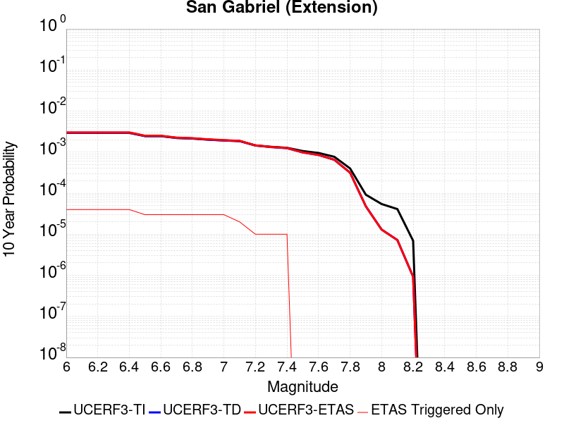 |

| Magnitude | 1 wk TI Prob | 1 wk TD Prob | 1 wk ETAS Prob | 1 wk ETAS/TD Gain | 1 wk ETAS Triggered Only | 1 mo TI Prob | 1 mo TD Prob | 1 mo ETAS Prob | 1 mo ETAS/TD Gain | 1 mo ETAS Triggered Only | 1 yr TI Prob | 1 yr TD Prob | 1 yr ETAS Prob | 1 yr ETAS/TD Gain | 1 yr ETAS Triggered Only | 10 yr TI Prob | 10 yr TD Prob | 10 yr ETAS Prob | 10 yr ETAS/TD Gain | 10 yr ETAS Triggered Only |
|-----|-----|-----|-----|-----|-----|-----|-----|-----|-----|-----|-----|-----|-----|-----|-----|-----|-----|-----|-----|-----|
| 6.0 | 5.6486106E-6 | 5.7168304E-6 | 1.9085737E-5 | 3.3385174 | 1.3368984E-5 | 2.4208108E-5 | 2.450048E-5 | 3.7869137E-5 | 1.5456488 | 1.3368984E-5 | 2.9469383E-4 | 2.9825376E-4 | 3.1161876E-4 | 1.0448108 | 1.3368984E-5 | 0.0029430336 | 0.0029786653 | 0.0030186526 | 1.0134246 | 4.0106952E-5 |
| 6.1 | 5.6486106E-6 | 5.7168304E-6 | 1.9085737E-5 | 3.3385174 | 1.3368984E-5 | 2.4208108E-5 | 2.450048E-5 | 3.7869137E-5 | 1.5456488 | 1.3368984E-5 | 2.9469383E-4 | 2.9825376E-4 | 3.1161876E-4 | 1.0448108 | 1.3368984E-5 | 0.0029430336 | 0.0029786653 | 0.0030186526 | 1.0134246 | 4.0106952E-5 |
| 6.2 | 5.6486106E-6 | 5.7168304E-6 | 1.9085737E-5 | 3.3385174 | 1.3368984E-5 | 2.4208108E-5 | 2.450048E-5 | 3.7869137E-5 | 1.5456488 | 1.3368984E-5 | 2.9469383E-4 | 2.9825376E-4 | 3.1161876E-4 | 1.0448108 | 1.3368984E-5 | 0.0029430336 | 0.0029786653 | 0.0030186526 | 1.0134246 | 4.0106952E-5 |
| 6.3 | 5.6486106E-6 | 5.7168304E-6 | 1.9085737E-5 | 3.3385174 | 1.3368984E-5 | 2.4208108E-5 | 2.450048E-5 | 3.7869137E-5 | 1.5456488 | 1.3368984E-5 | 2.9469383E-4 | 2.9825376E-4 | 3.1161876E-4 | 1.0448108 | 1.3368984E-5 | 0.0029430336 | 0.0029786653 | 0.0030186526 | 1.0134246 | 4.0106952E-5 |
| 6.4 | 5.6486106E-6 | 5.7168304E-6 | 1.9085737E-5 | 3.3385174 | 1.3368984E-5 | 2.4208108E-5 | 2.450048E-5 | 3.7869137E-5 | 1.5456488 | 1.3368984E-5 | 2.9469383E-4 | 2.9825376E-4 | 3.1161876E-4 | 1.0448108 | 1.3368984E-5 | 0.0029430336 | 0.0029786653 | 0.0030186526 | 1.0134246 | 4.0106952E-5 |
| 6.5 | 4.7134554E-6 | 4.7542544E-6 | 1.8123175E-5 | 3.811991 | 1.3368984E-5 | 2.0200367E-5 | 2.0375222E-5 | 3.3743934E-5 | 1.6561259 | 1.3368984E-5 | 2.459117E-4 | 2.4804095E-4 | 2.614066E-4 | 1.053885 | 1.3368984E-5 | 0.0024563975 | 0.002477729 | 0.0025044007 | 1.0107646 | 2.6737967E-5 |
| 6.6 | 4.7134554E-6 | 4.7542544E-6 | 1.8123175E-5 | 3.811991 | 1.3368984E-5 | 2.0200367E-5 | 2.0375222E-5 | 3.3743934E-5 | 1.6561259 | 1.3368984E-5 | 2.459117E-4 | 2.4804095E-4 | 2.614066E-4 | 1.053885 | 1.3368984E-5 | 0.0024563975 | 0.002477729 | 0.0025044007 | 1.0107646 | 2.6737967E-5 |
| 6.7 | 4.2468837E-6 | 4.2740717E-6 | 1.7642999E-5 | 4.1279135 | 1.3368984E-5 | 1.8200803E-5 | 1.8317325E-5 | 3.1686064E-5 | 1.7298412 | 1.3368984E-5 | 2.2157225E-4 | 2.2299135E-4 | 2.3635734E-4 | 1.0599395 | 1.3368984E-5 | 0.0022135144 | 0.0022277518 | 0.0022544302 | 1.0119755 | 2.6737967E-5 |
| 6.8 | 4.1180615E-6 | 4.1414614E-6 | 1.751039E-5 | 4.2280703 | 1.3368984E-5 | 1.7648716E-5 | 1.7749004E-5 | 3.111775E-5 | 1.7532111 | 1.3368984E-5 | 2.1485193E-4 | 2.160734E-4 | 2.294395E-4 | 1.061859 | 1.3368984E-5 | 0.0021464431 | 0.0021587082 | 0.0021853885 | 1.0123594 | 2.6737967E-5 |
| 6.9 | 3.863861E-6 | 3.8797766E-6 | 1.7248709E-5 | 4.4457994 | 1.3368984E-5 | 1.65593E-5 | 1.6627511E-5 | 2.9996274E-5 | 1.8040146 | 1.3368984E-5 | 2.0159081E-4 | 2.0242184E-4 | 2.1578811E-4 | 1.0660318 | 1.3368984E-5 | 0.0020140803 | 0.002022446 | 0.00204913 | 1.0131938 | 2.6737967E-5 |
| 7.0 | 3.6947372E-6 | 3.705676E-6 | 1.707461E-5 | 4.6076913 | 1.3368984E-5 | 1.5834492E-5 | 1.5881375E-5 | 2.9250146E-5 | 1.8417892 | 1.3368984E-5 | 1.9276788E-4 | 1.9333926E-4 | 2.0670566E-4 | 1.0691345 | 1.3368984E-5 | 0.0019260074 | 0.0019317807 | 0.001958467 | 1.0138143 | 2.6737967E-5 |
| 7.1 | 3.5686835E-6 | 3.5728963E-6 | 1.6941833E-5 | 4.7417645 | 1.3368984E-5 | 1.5294268E-5 | 1.5312327E-5 | 2.8681106E-5 | 1.873073 | 1.3368984E-5 | 1.861918E-4 | 1.8641229E-4 | 1.9977879E-4 | 1.0717039 | 1.3368984E-5 | 0.0018603588 | 0.0018626289 | 0.001875973 | 1.0071641 | 1.3368984E-5 |
| 7.2 | 2.8023446E-6 | 2.7767885E-6 | 2.7767885E-6 | 1.0 | 0.0 | 1.2009994E-5 | 1.1900468E-5 | 1.1900468E-5 | 1.0 | 0.0 | 1.4621185E-4 | 1.4487868E-4 | 1.4487868E-4 | 1.0 | 0.0 | 0.001461157 | 0.0014478569 | 0.0014478569 | 1.0 | 0.0 |
| 7.3 | 2.5843012E-6 | 2.5459642E-6 | 2.5459642E-6 | 1.0 | 0.0 | 1.1075529E-5 | 1.0911231E-5 | 1.0911231E-5 | 1.0 | 0.0 | 1.3483623E-4 | 1.3283623E-4 | 1.3283623E-4 | 1.0 | 0.0 | 0.0013475444 | 0.0013275818 | 0.0013275818 | 1.0 | 0.0 |
| 7.4 | 2.4464468E-6 | 2.396665E-6 | 2.396665E-6 | 1.0 | 0.0 | 1.04847295E-5 | 1.0271382E-5 | 1.0271382E-5 | 1.0 | 0.0 | 1.276441E-4 | 1.25047E-4 | 1.25047E-4 | 1.0 | 0.0 | 0.0012757082 | 0.0012497796 | 0.0012497796 | 1.0 | 0.0 |
| 7.5 | 2.0420266E-6 | 1.8910426E-6 | 1.8910426E-6 | 1.0 | 0.0 | 8.751514E-6 | 8.104444E-6 | 8.104444E-6 | 1.0 | 0.0 | 1.0654447E-4 | 9.8667166E-5 | 9.8667166E-5 | 1.0 | 0.0 | 0.001064934 | 9.862408E-4 | 9.862408E-4 | 1.0 | 0.0 |
| 7.6 | 1.8326596E-6 | 1.6398341E-6 | 1.6398341E-6 | 1.0 | 0.0 | 7.854232E-6 | 7.0278415E-6 | 7.0278415E-6 | 1.0 | 0.0 | 9.562107E-5 | 8.5560634E-5 | 8.5560634E-5 | 1.0 | 0.0 | 9.5579936E-4 | 8.5528276E-4 | 8.5528276E-4 | 1.0 | 0.0 |
| 7.7 | 1.4786998E-6 | 1.2523838E-6 | 1.2523838E-6 | 1.0 | 0.0 | 6.3372695E-6 | 5.367348E-6 | 5.367348E-6 | 1.0 | 0.0 | 7.715353E-5 | 6.534551E-5 | 6.534551E-5 | 1.0 | 0.0 | 7.7126746E-4 | 6.532707E-4 | 6.532707E-4 | 1.0 | 0.0 |
| 7.8 | 7.6975533E-7 | 6.0693884E-7 | 6.0693884E-7 | 1.0 | 0.0 | 3.2989474E-6 | 2.601164E-6 | 2.601164E-6 | 1.0 | 0.0 | 4.0163945E-5 | 3.166871E-5 | 3.166871E-5 | 1.0 | 0.0 | 4.0156685E-4 | 3.1664805E-4 | 3.1664805E-4 | 1.0 | 0.0 |
| 7.9 | 1.7645915E-7 | 9.213256E-8 | 9.213256E-8 | 1.0 | 0.0 | 7.562533E-7 | 3.9485377E-7 | 3.9485377E-7 | 1.0 | 0.0 | 9.207345E-6 | 4.807334E-6 | 4.807334E-6 | 1.0 | 0.0 | 9.206964E-5 | 4.807699E-5 | 4.807699E-5 | 1.0 | 0.0 |
| 8.0 | 1.0463461E-7 | 2.4949307E-8 | 2.4949307E-8 | 1.0 | 0.0 | 4.4843398E-7 | 1.0692559E-7 | 1.0692559E-7 | 1.0 | 0.0 | 5.45967E-6 | 1.3018183E-6 | 1.3018183E-6 | 1.0 | 0.0 | 5.459536E-5 | 1.3022789E-5 | 1.3022789E-5 | 1.0 | 0.0 |
| 8.1 | 7.875717E-8 | 1.3866874E-8 | 1.3866874E-8 | 1.0 | 0.0 | 3.3753068E-7 | 5.942946E-8 | 5.942946E-8 | 1.0 | 0.0 | 4.109428E-6 | 7.235534E-7 | 7.235534E-7 | 1.0 | 0.0 | 4.109352E-5 | 7.2401926E-6 | 7.2401926E-6 | 1.0 | 0.0 |
| 8.2 | 1.33163E-8 | 1.7733891E-9 | 1.7733891E-9 | 1.0 | 0.0 | 5.7069855E-8 | 7.600239E-9 | 7.600239E-9 | 1.0 | 0.0 | 6.9482525E-7 | 9.25329E-8 | 9.25329E-8 | 1.0 | 0.0 | 6.9482307E-6 | 9.272953E-7 | 9.272953E-7 | 1.0 | 0.0 |

## Davis Creek
*[(top)](#table-of-contents)*

| 1 Week | 1 Month | 1 Year | 10 Year |
|-----|-----|-----|-----|
|  |  |  |  |

| Magnitude | 1 wk TI Prob | 1 wk TD Prob | 1 wk ETAS Prob | 1 wk ETAS/TD Gain | 1 wk ETAS Triggered Only | 1 mo TI Prob | 1 mo TD Prob | 1 mo ETAS Prob | 1 mo ETAS/TD Gain | 1 mo ETAS Triggered Only | 1 yr TI Prob | 1 yr TD Prob | 1 yr ETAS Prob | 1 yr ETAS/TD Gain | 1 yr ETAS Triggered Only | 10 yr TI Prob | 10 yr TD Prob | 10 yr ETAS Prob | 10 yr ETAS/TD Gain | 10 yr ETAS Triggered Only |
|-----|-----|-----|-----|-----|-----|-----|-----|-----|-----|-----|-----|-----|-----|-----|-----|-----|-----|-----|-----|-----|
| 6.0 | 2.331472E-5 | 2.5417214E-5 | 3.8785856E-5 | 1.5259681 | 1.3368984E-5 | 9.99164E-5 | 1.0892704E-4 | 1.2229456E-4 | 1.12272 | 1.3368984E-5 | 0.0012158032 | 0.0013254983 | 0.0013388497 | 1.0100726 | 1.3368984E-5 | 0.01209173 | 0.013187704 | 0.013214089 | 1.0020008 | 2.6737967E-5 |
| 6.1 | 1.0407654E-5 | 1.1316986E-5 | 1.1316986E-5 | 1.0 | 0.0 | 4.4603472E-5 | 4.8500624E-5 | 4.8500624E-5 | 1.0 | 0.0 | 5.4291193E-4 | 5.9036224E-4 | 5.9036224E-4 | 1.0 | 0.0 | 0.0054158745 | 0.005890611 | 0.0059039015 | 1.0022562 | 1.3368984E-5 |
| 6.2 | 1.0407654E-5 | 1.1316986E-5 | 1.1316986E-5 | 1.0 | 0.0 | 4.4603472E-5 | 4.8500624E-5 | 4.8500624E-5 | 1.0 | 0.0 | 5.4291193E-4 | 5.9036224E-4 | 5.9036224E-4 | 1.0 | 0.0 | 0.0054158745 | 0.005890611 | 0.0059039015 | 1.0022562 | 1.3368984E-5 |
| 6.3 | 5.1323277E-6 | 5.568556E-6 | 5.568556E-6 | 1.0 | 0.0 | 2.1995505E-5 | 2.386507E-5 | 2.386507E-5 | 1.0 | 0.0 | 2.6776237E-4 | 2.905271E-4 | 2.905271E-4 | 1.0 | 0.0 | 0.0026743996 | 0.0029023192 | 0.0029156492 | 1.0045929 | 1.3368984E-5 |
| 6.4 | 2.4985154E-6 | 2.704538E-6 | 2.704538E-6 | 1.0 | 0.0 | 1.07078795E-5 | 1.1590847E-5 | 1.1590847E-5 | 1.0 | 0.0 | 1.3036063E-4 | 1.4111304E-4 | 1.4111304E-4 | 1.0 | 0.0 | 0.0013028418 | 0.001410589 | 0.001410589 | 1.0 | 0.0 |
| 6.5 | 2.4846438E-6 | 2.6904722E-6 | 2.6904722E-6 | 1.0 | 0.0 | 1.064843E-5 | 1.1530565E-5 | 1.1530565E-5 | 1.0 | 0.0 | 1.2963692E-4 | 1.403792E-4 | 1.403792E-4 | 1.0 | 0.0 | 0.0012956132 | 0.0014032599 | 0.0014032599 | 1.0 | 0.0 |
| 6.6 | 2.072566E-7 | 2.1018087E-7 | 2.1018087E-7 | 1.0 | 0.0 | 8.882423E-7 | 9.0077486E-7 | 9.0077486E-7 | 1.0 | 0.0 | 1.0814296E-5 | 1.0966881E-5 | 1.0966881E-5 | 1.0 | 0.0 | 1.081377E-4 | 1.09663575E-4 | 1.09663575E-4 | 1.0 | 0.0 |
| 6.7 | 1.7544528E-7 | 1.7790826E-7 | 1.7790826E-7 | 1.0 | 0.0 | 7.5190815E-7 | 7.6246374E-7 | 7.6246374E-7 | 1.0 | 0.0 | 9.154443E-6 | 9.282958E-6 | 9.282958E-6 | 1.0 | 0.0 | 9.1540656E-5 | 9.282586E-5 | 9.282586E-5 | 1.0 | 0.0 |
| 6.8 | 1.2320395E-7 | 1.2481138E-7 | 1.2481138E-7 | 1.0 | 0.0 | 5.280168E-7 | 5.349058E-7 | 5.349058E-7 | 1.0 | 0.0 | 6.428586E-6 | 6.5124595E-6 | 6.5124595E-6 | 1.0 | 0.0 | 6.4284E-5 | 6.5122804E-5 | 6.5122804E-5 | 1.0 | 0.0 |
| 6.9 | 6.399997E-8 | 6.486058E-8 | 6.486058E-8 | 1.0 | 0.0 | 2.7428555E-7 | 2.7797387E-7 | 2.7797387E-7 | 1.0 | 0.0 | 3.3394215E-6 | 3.3843273E-6 | 3.3843273E-6 | 1.0 | 0.0 | 3.3393713E-5 | 3.384282E-5 | 3.384282E-5 | 1.0 | 0.0 |
| 7.0 | 6.4455685E-9 | 6.535264E-9 | 6.535264E-9 | 1.0 | 0.0 | 2.7623864E-8 | 2.8008275E-8 | 2.8008275E-8 | 1.0 | 0.0 | 3.3632048E-7 | 3.4100074E-7 | 3.4100074E-7 | 1.0 | 0.0 | 3.3631998E-6 | 3.4100074E-6 | 3.4100074E-6 | 1.0 | 0.0 |

## Antelope Valley 2011
*[(top)](#table-of-contents)*

| 1 Week | 1 Month | 1 Year | 10 Year |
|-----|-----|-----|-----|
| 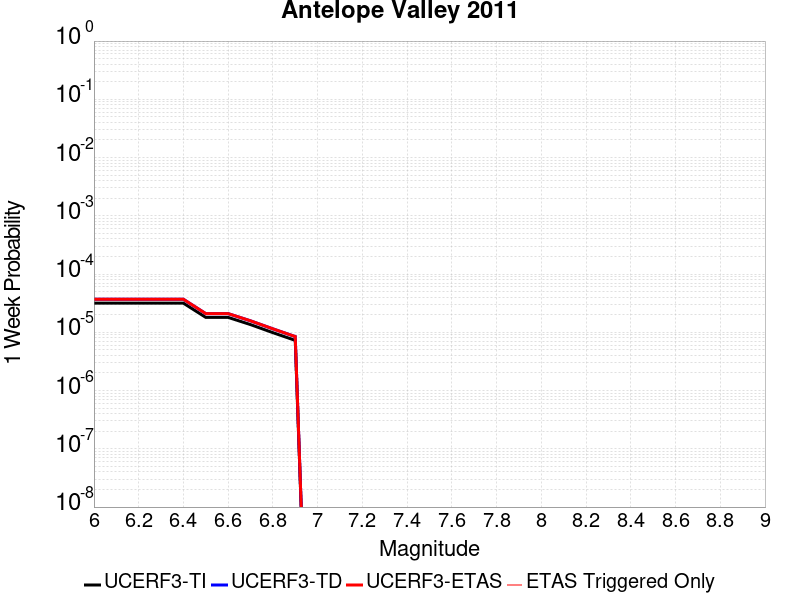 |  |  |  |

| Magnitude | 1 wk TI Prob | 1 wk TD Prob | 1 wk ETAS Prob | 1 wk ETAS/TD Gain | 1 wk ETAS Triggered Only | 1 mo TI Prob | 1 mo TD Prob | 1 mo ETAS Prob | 1 mo ETAS/TD Gain | 1 mo ETAS Triggered Only | 1 yr TI Prob | 1 yr TD Prob | 1 yr ETAS Prob | 1 yr ETAS/TD Gain | 1 yr ETAS Triggered Only | 10 yr TI Prob | 10 yr TD Prob | 10 yr ETAS Prob | 10 yr ETAS/TD Gain | 10 yr ETAS Triggered Only |
|-----|-----|-----|-----|-----|-----|-----|-----|-----|-----|-----|-----|-----|-----|-----|-----|-----|-----|-----|-----|-----|
| 6.0 | 3.1646934E-5 | 3.6904403E-5 | 3.6904403E-5 | 1.0 | 0.0 | 1.3562266E-4 | 1.5815363E-4 | 1.5815363E-4 | 1.0 | 0.0 | 0.0016499552 | 0.0019240845 | 0.0019374277 | 1.0069349 | 1.3368984E-5 | 0.016377583 | 0.019100651 | 0.019139992 | 1.0020597 | 4.0106952E-5 |
| 6.1 | 3.1646934E-5 | 3.6904403E-5 | 3.6904403E-5 | 1.0 | 0.0 | 1.3562266E-4 | 1.5815363E-4 | 1.5815363E-4 | 1.0 | 0.0 | 0.0016499552 | 0.0019240845 | 0.0019374277 | 1.0069349 | 1.3368984E-5 | 0.016377583 | 0.019100651 | 0.019139992 | 1.0020597 | 4.0106952E-5 |
| 6.2 | 3.1646934E-5 | 3.6904403E-5 | 3.6904403E-5 | 1.0 | 0.0 | 1.3562266E-4 | 1.5815363E-4 | 1.5815363E-4 | 1.0 | 0.0 | 0.0016499552 | 0.0019240845 | 0.0019374277 | 1.0069349 | 1.3368984E-5 | 0.016377583 | 0.019100651 | 0.019139992 | 1.0020597 | 4.0106952E-5 |
| 6.3 | 3.1646934E-5 | 3.6904403E-5 | 3.6904403E-5 | 1.0 | 0.0 | 1.3562266E-4 | 1.5815363E-4 | 1.5815363E-4 | 1.0 | 0.0 | 0.0016499552 | 0.0019240845 | 0.0019374277 | 1.0069349 | 1.3368984E-5 | 0.016377583 | 0.019100651 | 0.019139992 | 1.0020597 | 4.0106952E-5 |
| 6.4 | 3.1646934E-5 | 3.6904403E-5 | 3.6904403E-5 | 1.0 | 0.0 | 1.3562266E-4 | 1.5815363E-4 | 1.5815363E-4 | 1.0 | 0.0 | 0.0016499552 | 0.0019240845 | 0.0019374277 | 1.0069349 | 1.3368984E-5 | 0.016377583 | 0.019100651 | 0.019139992 | 1.0020597 | 4.0106952E-5 |
| 6.5 | 1.8034107E-5 | 2.0940959E-5 | 2.0940959E-5 | 1.0 | 0.0 | 7.7286735E-5 | 8.974457E-5 | 8.974457E-5 | 1.0 | 0.0 | 9.405598E-4 | 0.0010922146 | 0.001105569 | 1.0122269 | 1.3368984E-5 | 0.009365888 | 0.010880542 | 0.010920213 | 1.003646 | 4.0106952E-5 |
| 6.6 | 1.8034107E-5 | 2.0940959E-5 | 2.0940959E-5 | 1.0 | 0.0 | 7.7286735E-5 | 8.974457E-5 | 8.974457E-5 | 1.0 | 0.0 | 9.405598E-4 | 0.0010922146 | 0.001105569 | 1.0122269 | 1.3368984E-5 | 0.009365888 | 0.010880542 | 0.010920213 | 1.003646 | 4.0106952E-5 |
| 6.7 | 1.3567667E-5 | 1.5749509E-5 | 1.5749509E-5 | 1.0 | 0.0 | 5.814585E-5 | 6.749675E-5 | 6.749675E-5 | 1.0 | 0.0 | 7.076958E-4 | 8.2156935E-4 | 8.349273E-4 | 1.0162591 | 1.3368984E-5 | 0.007054463 | 0.008195754 | 0.008209013 | 1.0016178 | 1.3368984E-5 |
| 6.8 | 9.867387E-6 | 1.1467935E-5 | 1.1467935E-5 | 1.0 | 0.0 | 4.2288117E-5 | 4.91479E-5 | 4.91479E-5 | 1.0 | 0.0 | 5.1473617E-4 | 5.9830636E-4 | 5.9830636E-4 | 1.0 | 0.0 | 0.005135455 | 0.005976268 | 0.005976268 | 1.0 | 0.0 |
| 6.9 | 7.273233E-6 | 8.454864E-6 | 8.454864E-6 | 1.0 | 0.0 | 3.1170628E-5 | 3.623513E-5 | 3.623513E-5 | 1.0 | 0.0 | 3.794363E-4 | 4.411627E-4 | 4.411627E-4 | 1.0 | 0.0 | 0.0037878908 | 0.004411627 | 0.004411627 | 1.0 | 0.0 |

## Malibu Coast alt 1
*[(top)](#table-of-contents)*

| 1 Week | 1 Month | 1 Year | 10 Year |
|-----|-----|-----|-----|
| 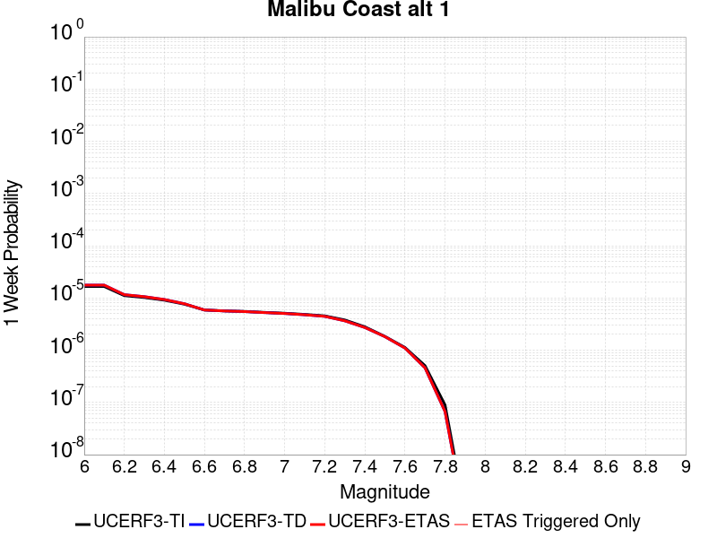 |  |  |  |

| Magnitude | 1 wk TI Prob | 1 wk TD Prob | 1 wk ETAS Prob | 1 wk ETAS/TD Gain | 1 wk ETAS Triggered Only | 1 mo TI Prob | 1 mo TD Prob | 1 mo ETAS Prob | 1 mo ETAS/TD Gain | 1 mo ETAS Triggered Only | 1 yr TI Prob | 1 yr TD Prob | 1 yr ETAS Prob | 1 yr ETAS/TD Gain | 1 yr ETAS Triggered Only | 10 yr TI Prob | 10 yr TD Prob | 10 yr ETAS Prob | 10 yr ETAS/TD Gain | 10 yr ETAS Triggered Only |
|-----|-----|-----|-----|-----|-----|-----|-----|-----|-----|-----|-----|-----|-----|-----|-----|-----|-----|-----|-----|-----|
| 6.0 | 1.6572556E-5 | 1.7598066E-5 | 1.7598066E-5 | 1.0 | 0.0 | 7.102331E-5 | 7.541821E-5 | 8.878618E-5 | 1.1772513 | 1.3368984E-5 | 8.6436566E-4 | 9.178488E-4 | 9.312055E-4 | 1.0145522 | 1.3368984E-5 | 0.0086101135 | 0.009142512 | 0.009182253 | 1.0043467 | 4.0106952E-5 |
| 6.1 | 1.6572556E-5 | 1.7598066E-5 | 1.7598066E-5 | 1.0 | 0.0 | 7.102331E-5 | 7.541821E-5 | 8.878618E-5 | 1.1772513 | 1.3368984E-5 | 8.6436566E-4 | 9.178488E-4 | 9.312055E-4 | 1.0145522 | 1.3368984E-5 | 0.0086101135 | 0.009142512 | 0.009169006 | 1.0028979 | 2.6737967E-5 |
| 6.2 | 1.1085717E-5 | 1.1557147E-5 | 1.1557147E-5 | 1.0 | 0.0 | 4.750935E-5 | 4.952971E-5 | 6.2898034E-5 | 1.2699051 | 1.3368984E-5 | 5.782728E-4 | 6.028609E-4 | 6.162218E-4 | 1.0221626 | 1.3368984E-5 | 0.0057677035 | 0.0060126255 | 0.0060259146 | 1.0022101 | 1.3368984E-5 |
| 6.3 | 1.0208568E-5 | 1.0592237E-5 | 1.0592237E-5 | 1.0 | 0.0 | 4.375027E-5 | 4.539453E-5 | 5.8762907E-5 | 1.2944931 | 1.3368984E-5 | 5.325294E-4 | 5.5254117E-4 | 5.659028E-4 | 1.0241821 | 1.3368984E-5 | 0.0053125503 | 0.0055119814 | 0.005525277 | 1.0024121 | 1.3368984E-5 |
| 6.4 | 9.0682315E-6 | 9.342637E-6 | 9.342637E-6 | 1.0 | 0.0 | 3.8863272E-5 | 4.003927E-5 | 5.340772E-5 | 1.3338834 | 1.3368984E-5 | 4.730576E-4 | 4.8737114E-4 | 5.007336E-4 | 1.0274174 | 1.3368984E-5 | 0.0047205184 | 0.004863236 | 0.0048765405 | 1.0027356 | 1.3368984E-5 |
| 6.5 | 7.605796E-6 | 7.748587E-6 | 7.748587E-6 | 1.0 | 0.0 | 3.259586E-5 | 3.3207816E-5 | 3.3207816E-5 | 1.0 | 0.0 | 3.9678233E-4 | 4.0423148E-4 | 4.0423148E-4 | 1.0 | 0.0 | 0.0039607463 | 0.0040351 | 0.0040351 | 1.0 | 0.0 |
| 6.6 | 5.889873E-6 | 5.8795385E-6 | 5.8795385E-6 | 1.0 | 0.0 | 2.5242069E-5 | 2.519778E-5 | 2.519778E-5 | 1.0 | 0.0 | 3.0727885E-4 | 3.0673988E-4 | 3.0673988E-4 | 1.0 | 0.0 | 0.003068543 | 0.0030631777 | 0.0030631777 | 1.0 | 0.0 |
| 6.7 | 5.66586E-6 | 5.641641E-6 | 5.641641E-6 | 1.0 | 0.0 | 2.428203E-5 | 2.417824E-5 | 2.417824E-5 | 1.0 | 0.0 | 2.955936E-4 | 2.9433038E-4 | 2.9433038E-4 | 1.0 | 0.0 | 0.0029520073 | 0.0029394177 | 0.0029394177 | 1.0 | 0.0 |
| 6.8 | 5.521556E-6 | 5.489427E-6 | 5.489427E-6 | 1.0 | 0.0 | 2.3663597E-5 | 2.3525903E-5 | 2.3525903E-5 | 1.0 | 0.0 | 2.880662E-4 | 2.8639034E-4 | 2.8639034E-4 | 1.0 | 0.0 | 0.0028769306 | 0.002860224 | 0.002860224 | 1.0 | 0.0 |
| 6.9 | 5.29752E-6 | 5.2499317E-6 | 5.2499317E-6 | 1.0 | 0.0 | 2.270346E-5 | 2.2499513E-5 | 2.2499513E-5 | 1.0 | 0.0 | 2.7637955E-4 | 2.7389723E-4 | 2.7389723E-4 | 1.0 | 0.0 | 0.0027603607 | 0.0027356069 | 0.0027356069 | 1.0 | 0.0 |
| 7.0 | 5.106743E-6 | 5.0476788E-6 | 5.0476788E-6 | 1.0 | 0.0 | 2.1885859E-5 | 2.163273E-5 | 2.163273E-5 | 1.0 | 0.0 | 2.6642776E-4 | 2.6334674E-4 | 2.6334674E-4 | 1.0 | 0.0 | 0.0026610855 | 0.0026303562 | 0.0026303562 | 1.0 | 0.0 |
| 7.1 | 4.8469647E-6 | 4.770373E-6 | 4.770373E-6 | 1.0 | 0.0 | 2.0772539E-5 | 2.0444295E-5 | 2.0444295E-5 | 1.0 | 0.0 | 2.528763E-4 | 2.4888094E-4 | 2.4888094E-4 | 1.0 | 0.0 | 0.0025258875 | 0.00248603 | 0.00248603 | 1.0 | 0.0 |
| 7.2 | 4.545514E-6 | 4.4481935E-6 | 4.4481935E-6 | 1.0 | 0.0 | 1.9480629E-5 | 1.9063547E-5 | 1.9063547E-5 | 1.0 | 0.0 | 2.3715083E-4 | 2.3207403E-4 | 2.3207403E-4 | 1.0 | 0.0 | 0.0023689792 | 0.0023183243 | 0.0023183243 | 1.0 | 0.0 |
| 7.3 | 3.794097E-6 | 3.6519348E-6 | 3.6519348E-6 | 1.0 | 0.0 | 1.6260314E-5 | 1.5651056E-5 | 1.5651056E-5 | 1.0 | 0.0 | 1.9795135E-4 | 1.9053498E-4 | 1.9053498E-4 | 1.0 | 0.0 | 0.001977751 | 0.0019037209 | 0.0019037209 | 1.0 | 0.0 |
| 7.4 | 2.808217E-6 | 2.719077E-6 | 2.719077E-6 | 1.0 | 0.0 | 1.203516E-5 | 1.1653135E-5 | 1.1653135E-5 | 1.0 | 0.0 | 1.4651821E-4 | 1.418677E-4 | 1.418677E-4 | 1.0 | 0.0 | 0.0014642165 | 0.001417774 | 0.001417774 | 1.0 | 0.0 |
| 7.5 | 1.83809E-6 | 1.8190691E-6 | 1.8190691E-6 | 1.0 | 0.0 | 7.877505E-6 | 7.795988E-6 | 7.795988E-6 | 1.0 | 0.0 | 9.59044E-5 | 9.491203E-5 | 9.491203E-5 | 1.0 | 0.0 | 9.5863023E-4 | 9.48717E-4 | 9.48717E-4 | 1.0 | 0.0 |
| 7.6 | 1.1292672E-6 | 1.1001447E-6 | 1.1001447E-6 | 1.0 | 0.0 | 4.839708E-6 | 4.714897E-6 | 4.714897E-6 | 1.0 | 0.0 | 5.8921847E-5 | 5.7402376E-5 | 5.7402376E-5 | 1.0 | 0.0 | 5.890623E-4 | 5.738771E-4 | 5.738771E-4 | 1.0 | 0.0 |
| 7.7 | 5.065272E-7 | 4.609151E-7 | 4.609151E-7 | 1.0 | 0.0 | 2.170829E-6 | 1.975349E-6 | 1.975349E-6 | 1.0 | 0.0 | 2.6429525E-5 | 2.404962E-5 | 2.404962E-5 | 1.0 | 0.0 | 2.642638E-4 | 2.4047129E-4 | 2.4047129E-4 | 1.0 | 0.0 |
| 7.8 | 8.952991E-8 | 6.707874E-8 | 6.707874E-8 | 1.0 | 0.0 | 3.8369956E-7 | 2.8748025E-7 | 2.8748025E-7 | 1.0 | 0.0 | 4.671532E-6 | 3.5000667E-6 | 3.5000667E-6 | 1.0 | 0.0 | 4.671434E-5 | 3.5000136E-5 | 3.5000136E-5 | 1.0 | 0.0 |
| 7.9 | 8.007447E-10 | 6.1608785E-10 | 6.1608785E-10 | 1.0 | 0.0 | 3.4317629E-9 | 2.6403764E-9 | 2.6403764E-9 | 1.0 | 0.0 | 4.1781714E-8 | 3.2146584E-8 | 3.2146584E-8 | 1.0 | 0.0 | 4.1781706E-7 | 3.214658E-7 | 3.214658E-7 | 1.0 | 0.0 |

## Channel Islands Thrust
*[(top)](#table-of-contents)*

| 1 Week | 1 Month | 1 Year | 10 Year |
|-----|-----|-----|-----|
|  |  |  |  |

| Magnitude | 1 wk TI Prob | 1 wk TD Prob | 1 wk ETAS Prob | 1 wk ETAS/TD Gain | 1 wk ETAS Triggered Only | 1 mo TI Prob | 1 mo TD Prob | 1 mo ETAS Prob | 1 mo ETAS/TD Gain | 1 mo ETAS Triggered Only | 1 yr TI Prob | 1 yr TD Prob | 1 yr ETAS Prob | 1 yr ETAS/TD Gain | 1 yr ETAS Triggered Only | 10 yr TI Prob | 10 yr TD Prob | 10 yr ETAS Prob | 10 yr ETAS/TD Gain | 10 yr ETAS Triggered Only |
|-----|-----|-----|-----|-----|-----|-----|-----|-----|-----|-----|-----|-----|-----|-----|-----|-----|-----|-----|-----|-----|
| 6.0 | 2.2156251E-5 | 2.4092022E-5 | 2.4092022E-5 | 1.0 | 0.0 | 9.495191E-5 | 1.03248036E-4 | 1.1661564E-4 | 1.1294708 | 1.3368984E-5 | 0.0011554264 | 0.0012564264 | 0.0012831308 | 1.0212542 | 2.6737967E-5 | 0.011494373 | 0.0125038205 | 0.012543426 | 1.0031675 | 4.0106952E-5 |
| 6.1 | 2.2156251E-5 | 2.4092022E-5 | 2.4092022E-5 | 1.0 | 0.0 | 9.495191E-5 | 1.03248036E-4 | 1.1661564E-4 | 1.1294708 | 1.3368984E-5 | 0.0011554264 | 0.0012564264 | 0.0012831308 | 1.0212542 | 2.6737967E-5 | 0.011494373 | 0.0125038205 | 0.012543426 | 1.0031675 | 4.0106952E-5 |
| 6.2 | 2.2156251E-5 | 2.4092022E-5 | 2.4092022E-5 | 1.0 | 0.0 | 9.495191E-5 | 1.03248036E-4 | 1.1661564E-4 | 1.1294708 | 1.3368984E-5 | 0.0011554264 | 0.0012564264 | 0.0012831308 | 1.0212542 | 2.6737967E-5 | 0.011494373 | 0.0125038205 | 0.012543426 | 1.0031675 | 4.0106952E-5 |
| 6.3 | 2.2156251E-5 | 2.4092022E-5 | 2.4092022E-5 | 1.0 | 0.0 | 9.495191E-5 | 1.03248036E-4 | 1.1661564E-4 | 1.1294708 | 1.3368984E-5 | 0.0011554264 | 0.0012564264 | 0.0012831308 | 1.0212542 | 2.6737967E-5 | 0.011494373 | 0.0125038205 | 0.012543426 | 1.0031675 | 4.0106952E-5 |
| 6.4 | 2.2156251E-5 | 2.4092022E-5 | 2.4092022E-5 | 1.0 | 0.0 | 9.495191E-5 | 1.03248036E-4 | 1.1661564E-4 | 1.1294708 | 1.3368984E-5 | 0.0011554264 | 0.0012564264 | 0.0012831308 | 1.0212542 | 2.6737967E-5 | 0.011494373 | 0.0125038205 | 0.012543426 | 1.0031675 | 4.0106952E-5 |
| 6.5 | 2.2156251E-5 | 2.4092022E-5 | 2.4092022E-5 | 1.0 | 0.0 | 9.495191E-5 | 1.03248036E-4 | 1.1661564E-4 | 1.1294708 | 1.3368984E-5 | 0.0011554264 | 0.0012564264 | 0.0012831308 | 1.0212542 | 2.6737967E-5 | 0.011494373 | 0.0125038205 | 0.012543426 | 1.0031675 | 4.0106952E-5 |
| 6.6 | 2.2156251E-5 | 2.4092022E-5 | 2.4092022E-5 | 1.0 | 0.0 | 9.495191E-5 | 1.03248036E-4 | 1.1661564E-4 | 1.1294708 | 1.3368984E-5 | 0.0011554264 | 0.0012564264 | 0.0012831308 | 1.0212542 | 2.6737967E-5 | 0.011494373 | 0.0125038205 | 0.012543426 | 1.0031675 | 4.0106952E-5 |
| 6.7 | 1.0601296E-5 | 1.1379544E-5 | 1.1379544E-5 | 1.0 | 0.0 | 4.5433335E-5 | 4.876859E-5 | 4.876859E-5 | 1.0 | 0.0 | 5.5301044E-4 | 5.936007E-4 | 6.069617E-4 | 1.0225085 | 1.3368984E-5 | 0.005516363 | 0.005920653 | 0.005933943 | 1.0022447 | 1.3368984E-5 |
| 6.8 | 1.0246747E-5 | 1.0996669E-5 | 1.0996669E-5 | 1.0 | 0.0 | 4.391389E-5 | 4.7127756E-5 | 4.7127756E-5 | 1.0 | 0.0 | 5.345204E-4 | 5.7363417E-4 | 5.8699545E-4 | 1.0232924 | 1.3368984E-5 | 0.0053323656 | 0.005722025 | 0.0057353172 | 1.002323 | 1.3368984E-5 |
| 6.9 | 9.049551E-6 | 9.699645E-6 | 9.699645E-6 | 1.0 | 0.0 | 3.878322E-5 | 4.1569267E-5 | 4.1569267E-5 | 1.0 | 0.0 | 4.7208337E-4 | 5.059924E-4 | 5.193546E-4 | 1.026408 | 1.3368984E-5 | 0.0047108172 | 0.0050488203 | 0.005062122 | 1.0026345 | 1.3368984E-5 |
| 7.0 | 8.6542195E-6 | 9.274603E-6 | 9.274603E-6 | 1.0 | 0.0 | 3.7088983E-5 | 3.9747716E-5 | 3.9747716E-5 | 1.0 | 0.0 | 4.5146482E-4 | 4.8382508E-4 | 4.971876E-4 | 1.0276185 | 1.3368984E-5 | 0.004505487 | 0.004828129 | 0.0048414334 | 1.0027556 | 1.3368984E-5 |
| 7.1 | 8.391028E-6 | 8.992924E-6 | 8.992924E-6 | 1.0 | 0.0 | 3.5961057E-5 | 3.854056E-5 | 3.854056E-5 | 1.0 | 0.0 | 4.3773788E-4 | 4.6913436E-4 | 4.8249707E-4 | 1.0284837 | 1.3368984E-5 | 0.004368766 | 0.0046818503 | 0.0046951566 | 1.0028421 | 1.3368984E-5 |
| 7.2 | 5.965188E-6 | 6.3716952E-6 | 6.3716952E-6 | 1.0 | 0.0 | 2.556484E-5 | 2.7306982E-5 | 2.7306982E-5 | 1.0 | 0.0 | 3.1120746E-4 | 3.3241234E-4 | 3.3241234E-4 | 1.0 | 0.0 | 0.00310772 | 0.0033192092 | 0.0033192092 | 1.0 | 0.0 |
| 7.3 | 4.877518E-6 | 5.2060063E-6 | 5.2060063E-6 | 1.0 | 0.0 | 2.0903482E-5 | 2.2311267E-5 | 2.2311267E-5 | 1.0 | 0.0 | 2.5447016E-4 | 2.716063E-4 | 2.716063E-4 | 1.0 | 0.0 | 0.0025417898 | 0.0027127895 | 0.0027127895 | 1.0 | 0.0 |
| 7.4 | 3.8829853E-6 | 4.141863E-6 | 4.141863E-6 | 1.0 | 0.0 | 1.664126E-5 | 1.7750723E-5 | 1.7750723E-5 | 1.0 | 0.0 | 2.0258849E-4 | 2.1609402E-4 | 2.1609402E-4 | 1.0 | 0.0 | 0.002024039 | 0.0021588807 | 0.0021588807 | 1.0 | 0.0 |
| 7.5 | 1.3489616E-6 | 1.4277903E-6 | 1.4277903E-6 | 1.0 | 0.0 | 5.7812517E-6 | 6.119087E-6 | 6.119087E-6 | 1.0 | 0.0 | 7.038446E-5 | 7.449738E-5 | 7.449738E-5 | 1.0 | 0.0 | 7.036218E-4 | 7.44728E-4 | 7.44728E-4 | 1.0 | 0.0 |
| 7.6 | 6.058192E-7 | 6.353778E-7 | 6.353778E-7 | 1.0 | 0.0 | 2.5963652E-6 | 2.7230449E-6 | 2.7230449E-6 | 1.0 | 0.0 | 3.161029E-5 | 3.3152584E-5 | 3.3152584E-5 | 1.0 | 0.0 | 3.1605794E-4 | 3.31478E-4 | 3.31478E-4 | 1.0 | 0.0 |
| 7.7 | 2.2170494E-7 | 2.2607902E-7 | 2.2607902E-7 | 1.0 | 0.0 | 9.5016367E-7 | 9.689098E-7 | 9.689098E-7 | 1.0 | 0.0 | 1.1568181E-5 | 1.1796425E-5 | 1.1796425E-5 | 1.0 | 0.0 | 1.1567579E-4 | 1.1795909E-4 | 1.1795909E-4 | 1.0 | 0.0 |
| 7.8 | 2.1613102E-8 | 1.5466682E-8 | 1.5466682E-8 | 1.0 | 0.0 | 9.262757E-8 | 6.628578E-8 | 6.628578E-8 | 1.0 | 0.0 | 1.1277401E-6 | 8.070291E-7 | 8.070291E-7 | 1.0 | 0.0 | 1.1277344E-5 | 8.070269E-6 | 8.070269E-6 | 1.0 | 0.0 |

## Mission (connected) 2011 CFM
*[(top)](#table-of-contents)*

| 1 Week | 1 Month | 1 Year | 10 Year |
|-----|-----|-----|-----|
| 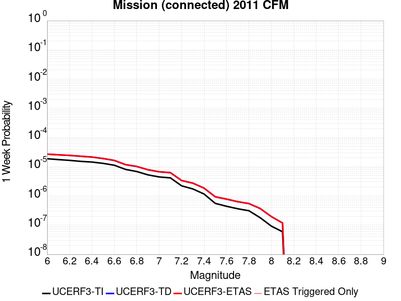 |  |  |  |

| Magnitude | 1 wk TI Prob | 1 wk TD Prob | 1 wk ETAS Prob | 1 wk ETAS/TD Gain | 1 wk ETAS Triggered Only | 1 mo TI Prob | 1 mo TD Prob | 1 mo ETAS Prob | 1 mo ETAS/TD Gain | 1 mo ETAS Triggered Only | 1 yr TI Prob | 1 yr TD Prob | 1 yr ETAS Prob | 1 yr ETAS/TD Gain | 1 yr ETAS Triggered Only | 10 yr TI Prob | 10 yr TD Prob | 10 yr ETAS Prob | 10 yr ETAS/TD Gain | 10 yr ETAS Triggered Only |
|-----|-----|-----|-----|-----|-----|-----|-----|-----|-----|-----|-----|-----|-----|-----|-----|-----|-----|-----|-----|-----|
| 6.0 | 1.8735573E-5 | 2.6882515E-5 | 2.6882515E-5 | 1.0 | 0.0 | 8.029284E-5 | 1.1520558E-4 | 1.1520558E-4 | 1.0 | 0.0 | 9.771269E-4 | 0.0014016571 | 0.0014150074 | 1.0095246 | 1.3368984E-5 | 0.009728416 | 0.013937562 | 0.013963927 | 1.0018917 | 2.6737967E-5 |
| 6.1 | 1.7515964E-5 | 2.5523792E-5 | 2.5523792E-5 | 1.0 | 0.0 | 7.506625E-5 | 1.0938298E-4 | 1.0938298E-4 | 1.0 | 0.0 | 9.135484E-4 | 0.0013308554 | 0.0013442066 | 1.010032 | 1.3368984E-5 | 0.009098019 | 0.0132381655 | 0.01326455 | 1.0019931 | 2.6737967E-5 |
| 6.2 | 1.6486343E-5 | 2.4368448E-5 | 2.4368448E-5 | 1.0 | 0.0 | 7.065384E-5 | 1.0443191E-4 | 1.0443191E-4 | 1.0 | 0.0 | 8.5987104E-4 | 0.0012706495 | 0.0012840015 | 1.0105081 | 1.3368984E-5 | 0.008565514 | 0.012643143 | 0.012669542 | 1.0020881 | 2.6737967E-5 |
| 6.3 | 1.5229385E-5 | 2.2797909E-5 | 2.2797909E-5 | 1.0 | 0.0 | 6.526716E-5 | 9.7701544E-5 | 9.7701544E-5 | 1.0 | 0.0 | 7.9433795E-4 | 0.0011887997 | 0.0012021528 | 1.0112324 | 1.3368984E-5 | 0.007915046 | 0.011836352 | 0.0118627725 | 1.0022322 | 2.6737967E-5 |
| 6.4 | 1.4435828E-5 | 2.1398E-5 | 2.1398E-5 | 1.0 | 0.0 | 6.186637E-5 | 9.1702364E-5 | 9.1702364E-5 | 1.0 | 0.0 | 7.529627E-4 | 0.0011158385 | 0.0011291925 | 1.0119678 | 1.3368984E-5 | 0.007504165 | 0.011119362 | 0.011145803 | 1.0023779 | 2.6737967E-5 |
| 6.5 | 1.30127955E-5 | 1.9037068E-5 | 1.9037068E-5 | 1.0 | 0.0 | 5.576793E-5 | 8.1584905E-5 | 8.1584905E-5 | 1.0 | 0.0 | 6.78763E-4 | 9.927875E-4 | 9.927875E-4 | 1.0 | 0.0 | 0.0067669353 | 0.009911527 | 0.009924763 | 1.0013355 | 1.3368984E-5 |
| 6.6 | 1.1220718E-5 | 1.639339E-5 | 1.639339E-5 | 1.0 | 0.0 | 4.8087906E-5 | 7.0255504E-5 | 7.0255504E-5 | 1.0 | 0.0 | 5.8531296E-4 | 8.5502357E-4 | 8.5502357E-4 | 1.0 | 0.0 | 0.005837737 | 0.00854963 | 0.008562884 | 1.0015503 | 1.3368984E-5 |
| 6.7 | 8.086152E-6 | 1.1750298E-5 | 1.1750298E-5 | 1.0 | 0.0 | 3.4654473E-5 | 5.035745E-5 | 5.035745E-5 | 1.0 | 0.0 | 4.2183654E-4 | 6.129302E-4 | 6.129302E-4 | 1.0 | 0.0 | 0.004210367 | 0.0061497535 | 0.00616304 | 1.0021605 | 1.3368984E-5 |
| 6.8 | 6.8361655E-6 | 1.0195406E-5 | 1.0195406E-5 | 1.0 | 0.0 | 2.9297524E-5 | 4.3693864E-5 | 4.3693864E-5 | 1.0 | 0.0 | 3.5663895E-4 | 5.3184363E-4 | 5.3184363E-4 | 1.0 | 0.0 | 0.0035606713 | 0.0053387266 | 0.005352024 | 1.0024908 | 1.3368984E-5 |
| 6.9 | 5.2517353E-6 | 7.8690955E-6 | 7.8690955E-6 | 1.0 | 0.0 | 2.2507242E-5 | 3.3724264E-5 | 3.3724264E-5 | 1.0 | 0.0 | 2.739912E-4 | 4.105158E-4 | 4.105158E-4 | 1.0 | 0.0 | 0.0027365363 | 0.004129868 | 0.0041431817 | 1.0032238 | 1.3368984E-5 |
| 7.0 | 4.4602784E-6 | 6.7016504E-6 | 6.7016504E-6 | 1.0 | 0.0 | 1.911534E-5 | 2.8721044E-5 | 2.8721044E-5 | 1.0 | 0.0 | 2.327044E-4 | 3.4962274E-4 | 3.4962274E-4 | 1.0 | 0.0 | 0.0023246086 | 0.0035221886 | 0.0035355105 | 1.0037823 | 1.3368984E-5 |
| 7.1 | 4.1492594E-6 | 6.2504096E-6 | 6.2504096E-6 | 1.0 | 0.0 | 1.7782419E-5 | 2.6787196E-5 | 2.6787196E-5 | 1.0 | 0.0 | 2.1647944E-4 | 3.2608546E-4 | 3.2608546E-4 | 1.0 | 0.0 | 0.0021626868 | 0.0032870003 | 0.0033003252 | 1.0040538 | 1.3368984E-5 |
| 7.2 | 2.213247E-6 | 3.3628444E-6 | 3.3628444E-6 | 1.0 | 0.0 | 9.485309E-6 | 1.441211E-5 | 1.441211E-5 | 1.0 | 0.0 | 1.15477524E-4 | 1.7545334E-4 | 1.7545334E-4 | 1.0 | 0.0 | 0.0011541754 | 0.0017818302 | 0.0017818302 | 1.0 | 0.0 |
| 7.3 | 1.7362703E-6 | 2.7384676E-6 | 2.7384676E-6 | 1.0 | 0.0 | 7.4411373E-6 | 1.1736238E-5 | 1.1736238E-5 | 1.0 | 0.0 | 9.0592075E-5 | 1.4287935E-4 | 1.4287935E-4 | 1.0 | 0.0 | 9.0555154E-4 | 0.0014532148 | 0.0014532148 | 1.0 | 0.0 |
| 7.4 | 1.1628409E-6 | 1.8493533E-6 | 1.8493533E-6 | 1.0 | 0.0 | 4.9835944E-6 | 7.925776E-6 | 7.925776E-6 | 1.0 | 0.0 | 6.0673574E-5 | 9.649206E-5 | 9.649206E-5 | 1.0 | 0.0 | 6.065701E-4 | 9.85306E-4 | 9.85306E-4 | 1.0 | 0.0 |
| 7.5 | 5.5610667E-7 | 9.343823E-7 | 9.343823E-7 | 1.0 | 0.0 | 2.3833122E-6 | 4.0044893E-6 | 4.0044893E-6 | 1.0 | 0.0 | 2.9016439E-5 | 4.8753573E-5 | 4.8753573E-5 | 1.0 | 0.0 | 2.901265E-4 | 5.0411286E-4 | 5.0411286E-4 | 1.0 | 0.0 |
| 7.6 | 4.4307663E-7 | 7.784628E-7 | 7.784628E-7 | 1.0 | 0.0 | 1.8988985E-6 | 3.3362649E-6 | 3.3362649E-6 | 1.0 | 0.0 | 2.3118844E-5 | 4.061827E-5 | 4.061827E-5 | 1.0 | 0.0 | 2.3116439E-4 | 4.2210697E-4 | 4.2210697E-4 | 1.0 | 0.0 |
| 7.7 | 3.639119E-7 | 6.3549425E-7 | 6.3549425E-7 | 1.0 | 0.0 | 1.5596215E-6 | 2.7235437E-6 | 2.7235437E-6 | 1.0 | 0.0 | 1.8988227E-5 | 3.315864E-5 | 3.315864E-5 | 1.0 | 0.0 | 1.8986604E-4 | 3.4690052E-4 | 3.4690052E-4 | 1.0 | 0.0 |
| 7.8 | 3.1152942E-7 | 5.474834E-7 | 5.474834E-7 | 1.0 | 0.0 | 1.3351254E-6 | 2.3463554E-6 | 2.3463554E-6 | 1.0 | 0.0 | 1.6255031E-5 | 2.8566503E-5 | 2.8566503E-5 | 1.0 | 0.0 | 1.6253842E-4 | 2.977112E-4 | 2.977112E-4 | 1.0 | 0.0 |
| 7.9 | 1.8035962E-7 | 3.7184682E-7 | 3.7184682E-7 | 1.0 | 0.0 | 7.729696E-7 | 1.5936282E-6 | 1.5936282E-6 | 1.0 | 0.0 | 9.410865E-6 | 1.9402252E-5 | 1.9402252E-5 | 1.0 | 0.0 | 9.410465E-5 | 2.0071324E-4 | 2.0071324E-4 | 1.0 | 0.0 |
| 8.0 | 9.279334E-8 | 1.9695527E-7 | 1.9695527E-7 | 1.0 | 0.0 | 3.976857E-7 | 8.4409373E-7 | 8.4409373E-7 | 1.0 | 0.0 | 4.841813E-6 | 1.0276794E-5 | 1.0276794E-5 | 1.0 | 0.0 | 4.841707E-5 | 1.05289524E-4 | 1.05289524E-4 | 1.0 | 0.0 |
| 8.1 | 5.9253985E-8 | 1.18509675E-7 | 1.18509675E-7 | 1.0 | 0.0 | 2.5394561E-7 | 5.078985E-7 | 5.078985E-7 | 1.0 | 0.0 | 3.0917836E-6 | 6.183647E-6 | 6.183647E-6 | 1.0 | 0.0 | 3.0917407E-5 | 6.322351E-5 | 6.322351E-5 | 1.0 | 0.0 |

## Monterey Bay-Tularcitos
*[(top)](#table-of-contents)*

| 1 Week | 1 Month | 1 Year | 10 Year |
|-----|-----|-----|-----|
|  |  |  |  |

| Magnitude | 1 wk TI Prob | 1 wk TD Prob | 1 wk ETAS Prob | 1 wk ETAS/TD Gain | 1 wk ETAS Triggered Only | 1 mo TI Prob | 1 mo TD Prob | 1 mo ETAS Prob | 1 mo ETAS/TD Gain | 1 mo ETAS Triggered Only | 1 yr TI Prob | 1 yr TD Prob | 1 yr ETAS Prob | 1 yr ETAS/TD Gain | 1 yr ETAS Triggered Only | 10 yr TI Prob | 10 yr TD Prob | 10 yr ETAS Prob | 10 yr ETAS/TD Gain | 10 yr ETAS Triggered Only |
|-----|-----|-----|-----|-----|-----|-----|-----|-----|-----|-----|-----|-----|-----|-----|-----|-----|-----|-----|-----|-----|
| 6.0 | 3.0131365E-5 | 3.279877E-5 | 4.6167315E-5 | 1.4075929 | 1.3368984E-5 | 1.2912804E-4 | 1.4055918E-4 | 1.5392629E-4 | 1.0950994 | 1.3368984E-5 | 0.001571 | 0.0017100703 | 0.0017234164 | 1.0078044 | 1.3368984E-5 | 0.015599402 | 0.016979916 | 0.0170062 | 1.0015479 | 2.6737967E-5 |
| 6.1 | 3.0131365E-5 | 3.279877E-5 | 4.6167315E-5 | 1.4075929 | 1.3368984E-5 | 1.2912804E-4 | 1.4055918E-4 | 1.5392629E-4 | 1.0950994 | 1.3368984E-5 | 0.001571 | 0.0017100703 | 0.0017234164 | 1.0078044 | 1.3368984E-5 | 0.015599402 | 0.016979916 | 0.0170062 | 1.0015479 | 2.6737967E-5 |
| 6.2 | 3.0131365E-5 | 3.279877E-5 | 4.6167315E-5 | 1.4075929 | 1.3368984E-5 | 1.2912804E-4 | 1.4055918E-4 | 1.5392629E-4 | 1.0950994 | 1.3368984E-5 | 0.001571 | 0.0017100703 | 0.0017234164 | 1.0078044 | 1.3368984E-5 | 0.015599402 | 0.016979916 | 0.0170062 | 1.0015479 | 2.6737967E-5 |
| 6.3 | 1.6998249E-5 | 1.8330798E-5 | 1.8330798E-5 | 1.0 | 0.0 | 7.28476E-5 | 7.85583E-5 | 7.85583E-5 | 1.0 | 0.0 | 8.865586E-4 | 9.5604634E-4 | 9.5604634E-4 | 1.0 | 0.0 | 0.0088303005 | 0.009521258 | 0.009521258 | 1.0 | 0.0 |
| 6.4 | 1.6998249E-5 | 1.8330798E-5 | 1.8330798E-5 | 1.0 | 0.0 | 7.28476E-5 | 7.85583E-5 | 7.85583E-5 | 1.0 | 0.0 | 8.865586E-4 | 9.5604634E-4 | 9.5604634E-4 | 1.0 | 0.0 | 0.0088303005 | 0.009521258 | 0.009521258 | 1.0 | 0.0 |
| 6.5 | 1.27470785E-5 | 1.3693312E-5 | 1.3693312E-5 | 1.0 | 0.0 | 5.4629192E-5 | 5.8684363E-5 | 5.8684363E-5 | 1.0 | 0.0 | 6.649074E-4 | 7.1425823E-4 | 7.1425823E-4 | 1.0 | 0.0 | 0.0066292146 | 0.007120678 | 0.007120678 | 1.0 | 0.0 |
| 6.6 | 1.2739422E-5 | 1.36854E-5 | 1.36854E-5 | 1.0 | 0.0 | 5.4596385E-5 | 5.8650454E-5 | 5.8650454E-5 | 1.0 | 0.0 | 6.645082E-4 | 7.1384566E-4 | 7.1384566E-4 | 1.0 | 0.0 | 0.0066252467 | 0.007116579 | 0.007116579 | 1.0 | 0.0 |
| 6.7 | 1.0160109E-5 | 1.0885755E-5 | 1.0885755E-5 | 1.0 | 0.0 | 4.35426E-5 | 4.665244E-5 | 4.665244E-5 | 1.0 | 0.0 | 5.300022E-4 | 5.6785246E-4 | 5.6785246E-4 | 1.0 | 0.0 | 0.005287399 | 0.0056647263 | 0.0056647263 | 1.0 | 0.0 |
| 6.8 | 8.349859E-6 | 8.932587E-6 | 8.932587E-6 | 1.0 | 0.0 | 3.578462E-5 | 3.8281985E-5 | 3.8281985E-5 | 1.0 | 0.0 | 4.3559066E-4 | 4.6598914E-4 | 4.6598914E-4 | 1.0 | 0.0 | 0.004347378 | 0.004650685 | 0.004650685 | 1.0 | 0.0 |
| 6.9 | 5.193639E-6 | 5.53643E-6 | 5.53643E-6 | 1.0 | 0.0 | 2.2258262E-5 | 2.372736E-5 | 2.372736E-5 | 1.0 | 0.0 | 2.7096065E-4 | 2.8884556E-4 | 2.8884556E-4 | 1.0 | 0.0 | 0.0027063051 | 0.0028850222 | 0.0028850222 | 1.0 | 0.0 |
| 7.0 | 4.359381E-6 | 4.643366E-6 | 4.643366E-6 | 1.0 | 0.0 | 1.8682927E-5 | 1.9900004E-5 | 1.9900004E-5 | 1.0 | 0.0 | 2.274409E-4 | 2.422586E-4 | 2.422586E-4 | 1.0 | 0.0 | 0.0022720827 | 0.002420238 | 0.002420238 | 1.0 | 0.0 |
| 7.1 | 3.0398533E-6 | 3.2310427E-6 | 3.2310427E-6 | 1.0 | 0.0 | 1.3027877E-5 | 1.3847267E-5 | 1.3847267E-5 | 1.0 | 0.0 | 1.5860285E-4 | 1.6858005E-4 | 1.6858005E-4 | 1.0 | 0.0 | 0.001584897 | 0.0016847793 | 0.0016847793 | 1.0 | 0.0 |
| 7.2 | 1.642335E-6 | 1.7333153E-6 | 1.7333153E-6 | 1.0 | 0.0 | 7.0385595E-6 | 7.428485E-6 | 7.428485E-6 | 1.0 | 0.0 | 8.569109E-5 | 9.044012E-5 | 9.044012E-5 | 1.0 | 0.0 | 8.5658056E-4 | 9.042358E-4 | 9.042358E-4 | 1.0 | 0.0 |
| 7.3 | 3.356842E-7 | 3.2952389E-7 | 3.2952389E-7 | 1.0 | 0.0 | 1.4386458E-6 | 1.4122444E-6 | 1.4122444E-6 | 1.0 | 0.0 | 1.7515373E-5 | 1.7193941E-5 | 1.7193941E-5 | 1.0 | 0.0 | 1.7513991E-4 | 1.719262E-4 | 1.719262E-4 | 1.0 | 0.0 |
| 7.4 | 2.1973483E-7 | 2.1006413E-7 | 2.1006413E-7 | 1.0 | 0.0 | 9.417204E-7 | 9.0027453E-7 | 9.0027453E-7 | 1.0 | 0.0 | 1.1465385E-5 | 1.0960787E-5 | 1.0960787E-5 | 1.0 | 0.0 | 1.1464794E-4 | 1.096025E-4 | 1.096025E-4 | 1.0 | 0.0 |
| 7.5 | 1.1944135E-7 | 1.0696043E-7 | 1.0696043E-7 | 1.0 | 0.0 | 5.118914E-7 | 4.5840173E-7 | 4.5840173E-7 | 1.0 | 0.0 | 6.23226E-6 | 5.581027E-6 | 5.581027E-6 | 1.0 | 0.0 | 6.2320854E-5 | 5.5808883E-5 | 5.5808883E-5 | 1.0 | 0.0 |
| 7.6 | 4.636058E-8 | 3.336489E-8 | 3.336489E-8 | 1.0 | 0.0 | 1.9868818E-7 | 1.4299238E-7 | 1.4299238E-7 | 1.0 | 0.0 | 2.419026E-6 | 1.7409308E-6 | 1.7409308E-6 | 1.0 | 0.0 | 2.4189996E-5 | 1.7409173E-5 | 1.7409173E-5 | 1.0 | 0.0 |
| 7.7 | 1.8588572E-8 | 8.003744E-9 | 8.003744E-9 | 1.0 | 0.0 | 7.9665305E-8 | 3.430176E-8 | 3.430176E-8 | 1.0 | 0.0 | 9.699246E-7 | 4.1762385E-7 | 4.1762385E-7 | 1.0 | 0.0 | 9.699204E-6 | 4.176231E-6 | 4.176231E-6 | 1.0 | 0.0 |
| 7.8 | 2.7960154E-9 | 7.6099427E-10 | 7.6099427E-10 | 1.0 | 0.0 | 1.1982923E-8 | 3.2614043E-9 | 3.2614043E-9 | 1.0 | 0.0 | 1.4589209E-7 | 3.9707597E-8 | 3.9707597E-8 | 1.0 | 0.0 | 1.4589199E-6 | 3.9707595E-7 | 3.9707595E-7 | 1.0 | 0.0 |

## South Klamath Lake East
*[(top)](#table-of-contents)*

| 1 Week | 1 Month | 1 Year | 10 Year |
|-----|-----|-----|-----|
| 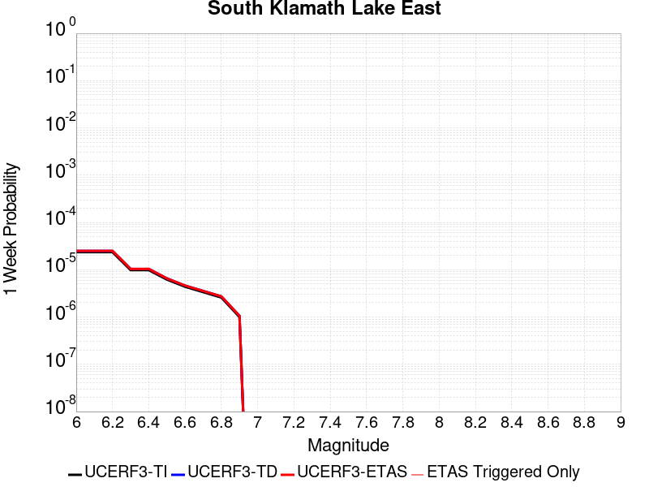 |  |  |  |

| Magnitude | 1 wk TI Prob | 1 wk TD Prob | 1 wk ETAS Prob | 1 wk ETAS/TD Gain | 1 wk ETAS Triggered Only | 1 mo TI Prob | 1 mo TD Prob | 1 mo ETAS Prob | 1 mo ETAS/TD Gain | 1 mo ETAS Triggered Only | 1 yr TI Prob | 1 yr TD Prob | 1 yr ETAS Prob | 1 yr ETAS/TD Gain | 1 yr ETAS Triggered Only | 10 yr TI Prob | 10 yr TD Prob | 10 yr ETAS Prob | 10 yr ETAS/TD Gain | 10 yr ETAS Triggered Only |
|-----|-----|-----|-----|-----|-----|-----|-----|-----|-----|-----|-----|-----|-----|-----|-----|-----|-----|-----|-----|-----|
| 6.0 | 2.3539369E-5 | 2.5047308E-5 | 2.5047308E-5 | 1.0 | 0.0 | 1.0087911E-4 | 1.0734166E-4 | 1.2070921E-4 | 1.1245327 | 1.3368984E-5 | 0.0012275111 | 0.0013061843 | 0.0013195359 | 1.0102217 | 1.3368984E-5 | 0.012207527 | 0.012993417 | 0.013006613 | 1.0010155 | 1.3368984E-5 |
| 6.1 | 2.3539369E-5 | 2.5047308E-5 | 2.5047308E-5 | 1.0 | 0.0 | 1.0087911E-4 | 1.0734166E-4 | 1.2070921E-4 | 1.1245327 | 1.3368984E-5 | 0.0012275111 | 0.0013061843 | 0.0013195359 | 1.0102217 | 1.3368984E-5 | 0.012207527 | 0.012993417 | 0.013006613 | 1.0010155 | 1.3368984E-5 |
| 6.2 | 2.3539369E-5 | 2.5047308E-5 | 2.5047308E-5 | 1.0 | 0.0 | 1.0087911E-4 | 1.0734166E-4 | 1.2070921E-4 | 1.1245327 | 1.3368984E-5 | 0.0012275111 | 0.0013061843 | 0.0013195359 | 1.0102217 | 1.3368984E-5 | 0.012207527 | 0.012993417 | 0.013006613 | 1.0010155 | 1.3368984E-5 |
| 6.3 | 9.807823E-6 | 1.0396044E-5 | 1.0396044E-5 | 1.0 | 0.0 | 4.2032847E-5 | 4.455376E-5 | 4.455376E-5 | 1.0 | 0.0 | 5.1162974E-4 | 5.4231536E-4 | 5.4231536E-4 | 1.0 | 0.0 | 0.005104534 | 0.005410756 | 0.005410756 | 1.0 | 0.0 |
| 6.4 | 9.807823E-6 | 1.0396044E-5 | 1.0396044E-5 | 1.0 | 0.0 | 4.2032847E-5 | 4.455376E-5 | 4.455376E-5 | 1.0 | 0.0 | 5.1162974E-4 | 5.4231536E-4 | 5.4231536E-4 | 1.0 | 0.0 | 0.005104534 | 0.005410756 | 0.005410756 | 1.0 | 0.0 |
| 6.5 | 6.191981E-6 | 6.5508398E-6 | 6.5508398E-6 | 1.0 | 0.0 | 2.653679E-5 | 2.8074743E-5 | 2.8074743E-5 | 1.0 | 0.0 | 3.2303753E-4 | 3.4175918E-4 | 3.4175918E-4 | 1.0 | 0.0 | 0.0032256835 | 0.003412614 | 0.003412614 | 1.0 | 0.0 |
| 6.6 | 4.3693776E-6 | 4.6165574E-6 | 4.6165574E-6 | 1.0 | 0.0 | 1.8725768E-5 | 1.9785102E-5 | 1.9785102E-5 | 1.0 | 0.0 | 2.2796239E-4 | 2.4085813E-4 | 2.4085813E-4 | 1.0 | 0.0 | 0.0022772867 | 0.0024060833 | 0.0024060833 | 1.0 | 0.0 |
| 6.7 | 3.360834E-6 | 3.5512403E-6 | 3.5512403E-6 | 1.0 | 0.0 | 1.4403494E-5 | 1.5219517E-5 | 1.5219517E-5 | 1.0 | 0.0 | 1.7534842E-4 | 1.8528267E-4 | 1.8528267E-4 | 1.0 | 0.0 | 0.0017521014 | 0.0018513618 | 0.0018513618 | 1.0 | 0.0 |
| 6.8 | 2.57873E-6 | 2.7251708E-6 | 2.7251708E-6 | 1.0 | 0.0 | 1.1051653E-5 | 1.1679254E-5 | 1.1679254E-5 | 1.0 | 0.0 | 1.3454557E-4 | 1.4218627E-4 | 1.4218627E-4 | 1.0 | 0.0 | 0.0013446413 | 0.0014210136 | 0.0014210136 | 1.0 | 0.0 |
| 6.9 | 9.987825E-7 | 1.0566213E-6 | 1.0566213E-6 | 1.0 | 0.0 | 4.2804895E-6 | 4.528371E-6 | 4.528371E-6 | 1.0 | 0.0 | 5.211371E-5 | 5.5131848E-5 | 5.5131848E-5 | 1.0 | 0.0 | 5.210149E-4 | 5.5121386E-4 | 5.5121386E-4 | 1.0 | 0.0 |

## Ozena
*[(top)](#table-of-contents)*

| 1 Week | 1 Month | 1 Year | 10 Year |
|-----|-----|-----|-----|
|  |  |  | 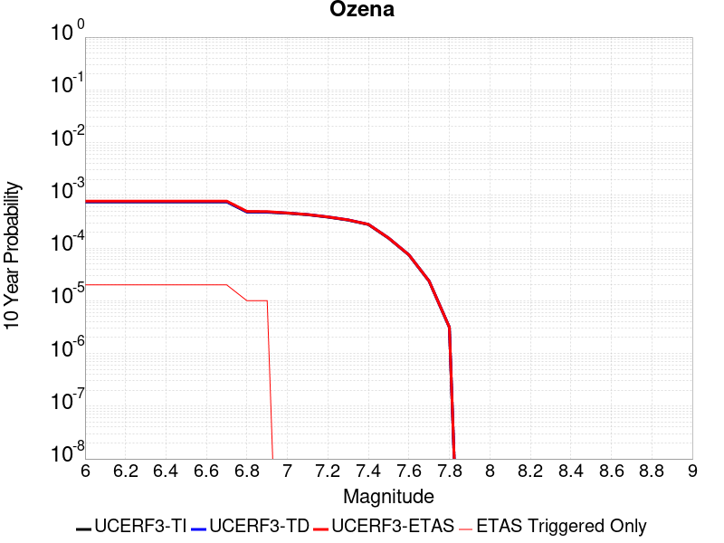 |

| Magnitude | 1 wk TI Prob | 1 wk TD Prob | 1 wk ETAS Prob | 1 wk ETAS/TD Gain | 1 wk ETAS Triggered Only | 1 mo TI Prob | 1 mo TD Prob | 1 mo ETAS Prob | 1 mo ETAS/TD Gain | 1 mo ETAS Triggered Only | 1 yr TI Prob | 1 yr TD Prob | 1 yr ETAS Prob | 1 yr ETAS/TD Gain | 1 yr ETAS Triggered Only | 10 yr TI Prob | 10 yr TD Prob | 10 yr ETAS Prob | 10 yr ETAS/TD Gain | 10 yr ETAS Triggered Only |
|-----|-----|-----|-----|-----|-----|-----|-----|-----|-----|-----|-----|-----|-----|-----|-----|-----|-----|-----|-----|-----|
| 6.0 | 1.4377547E-6 | 1.4513782E-6 | 1.4513782E-6 | 1.0 | 0.0 | 6.161791E-6 | 6.2201793E-6 | 6.2201793E-6 | 1.0 | 0.0 | 7.5017226E-5 | 7.572832E-5 | 7.572832E-5 | 1.0 | 0.0 | 7.4991904E-4 | 7.570518E-4 | 7.8376953E-4 | 1.0352918 | 2.6737967E-5 |
| 6.1 | 1.4377547E-6 | 1.4513782E-6 | 1.4513782E-6 | 1.0 | 0.0 | 6.161791E-6 | 6.2201793E-6 | 6.2201793E-6 | 1.0 | 0.0 | 7.5017226E-5 | 7.572832E-5 | 7.572832E-5 | 1.0 | 0.0 | 7.4991904E-4 | 7.570518E-4 | 7.8376953E-4 | 1.0352918 | 2.6737967E-5 |
| 6.2 | 1.4377547E-6 | 1.4513782E-6 | 1.4513782E-6 | 1.0 | 0.0 | 6.161791E-6 | 6.2201793E-6 | 6.2201793E-6 | 1.0 | 0.0 | 7.5017226E-5 | 7.572832E-5 | 7.572832E-5 | 1.0 | 0.0 | 7.4991904E-4 | 7.570518E-4 | 7.8376953E-4 | 1.0352918 | 2.6737967E-5 |
| 6.3 | 1.4377547E-6 | 1.4513782E-6 | 1.4513782E-6 | 1.0 | 0.0 | 6.161791E-6 | 6.2201793E-6 | 6.2201793E-6 | 1.0 | 0.0 | 7.5017226E-5 | 7.572832E-5 | 7.572832E-5 | 1.0 | 0.0 | 7.4991904E-4 | 7.570518E-4 | 7.8376953E-4 | 1.0352918 | 2.6737967E-5 |
| 6.4 | 1.4377547E-6 | 1.4513782E-6 | 1.4513782E-6 | 1.0 | 0.0 | 6.161791E-6 | 6.2201793E-6 | 6.2201793E-6 | 1.0 | 0.0 | 7.5017226E-5 | 7.572832E-5 | 7.572832E-5 | 1.0 | 0.0 | 7.4991904E-4 | 7.570518E-4 | 7.8376953E-4 | 1.0352918 | 2.6737967E-5 |
| 6.5 | 1.4377547E-6 | 1.4513782E-6 | 1.4513782E-6 | 1.0 | 0.0 | 6.161791E-6 | 6.2201793E-6 | 6.2201793E-6 | 1.0 | 0.0 | 7.5017226E-5 | 7.572832E-5 | 7.572832E-5 | 1.0 | 0.0 | 7.4991904E-4 | 7.570518E-4 | 7.8376953E-4 | 1.0352918 | 2.6737967E-5 |
| 6.6 | 1.4377547E-6 | 1.4513782E-6 | 1.4513782E-6 | 1.0 | 0.0 | 6.161791E-6 | 6.2201793E-6 | 6.2201793E-6 | 1.0 | 0.0 | 7.5017226E-5 | 7.572832E-5 | 7.572832E-5 | 1.0 | 0.0 | 7.4991904E-4 | 7.570518E-4 | 7.8376953E-4 | 1.0352918 | 2.6737967E-5 |
| 6.7 | 1.4377547E-6 | 1.4513782E-6 | 1.4513782E-6 | 1.0 | 0.0 | 6.161791E-6 | 6.2201793E-6 | 6.2201793E-6 | 1.0 | 0.0 | 7.5017226E-5 | 7.572832E-5 | 7.572832E-5 | 1.0 | 0.0 | 7.4991904E-4 | 7.570518E-4 | 7.8376953E-4 | 1.0352918 | 2.6737967E-5 |
| 6.8 | 9.223257E-7 | 9.317624E-7 | 9.317624E-7 | 1.0 | 0.0 | 3.9528186E-6 | 3.9932615E-6 | 3.9932615E-6 | 1.0 | 0.0 | 4.81245E-5 | 4.8616912E-5 | 4.8616912E-5 | 1.0 | 0.0 | 4.811408E-4 | 4.860668E-4 | 4.994293E-4 | 1.0274911 | 1.3368984E-5 |
| 6.9 | 9.141515E-7 | 9.235371E-7 | 9.235371E-7 | 1.0 | 0.0 | 3.917786E-6 | 3.9580104E-6 | 3.9580104E-6 | 1.0 | 0.0 | 4.7698002E-5 | 4.818775E-5 | 4.818775E-5 | 1.0 | 0.0 | 4.7687767E-4 | 4.8177704E-4 | 4.9513957E-4 | 1.027736 | 1.3368984E-5 |
| 7.0 | 8.767648E-7 | 8.8585773E-7 | 8.8585773E-7 | 1.0 | 0.0 | 3.757558E-6 | 3.7965276E-6 | 3.7965276E-6 | 1.0 | 0.0 | 4.5747307E-5 | 4.6221783E-5 | 4.6221783E-5 | 1.0 | 0.0 | 4.5737892E-4 | 4.6212564E-4 | 4.6212564E-4 | 1.0 | 0.0 |
| 7.1 | 8.199402E-7 | 8.2853984E-7 | 8.2853984E-7 | 1.0 | 0.0 | 3.5140247E-6 | 3.5508804E-6 | 3.5508804E-6 | 1.0 | 0.0 | 4.2782412E-5 | 4.323115E-5 | 4.323115E-5 | 1.0 | 0.0 | 4.2774176E-4 | 4.322311E-4 | 4.322311E-4 | 1.0 | 0.0 |
| 7.2 | 7.38705E-7 | 7.464262E-7 | 7.464262E-7 | 1.0 | 0.0 | 3.1658747E-6 | 3.198966E-6 | 3.198966E-6 | 1.0 | 0.0 | 3.8543843E-5 | 3.894675E-5 | 3.894675E-5 | 1.0 | 0.0 | 3.853716E-4 | 3.8940276E-4 | 3.8940276E-4 | 1.0 | 0.0 |
| 7.3 | 6.490017E-7 | 6.557802E-7 | 6.557802E-7 | 1.0 | 0.0 | 2.7814328E-6 | 2.8104837E-6 | 2.8104837E-6 | 1.0 | 0.0 | 3.386342E-5 | 3.4217133E-5 | 3.4217133E-5 | 1.0 | 0.0 | 3.3858258E-4 | 3.4212202E-4 | 3.4212202E-4 | 1.0 | 0.0 |
| 7.4 | 5.346736E-7 | 5.4022604E-7 | 5.4022604E-7 | 1.0 | 0.0 | 2.291456E-6 | 2.3152527E-6 | 2.3152527E-6 | 1.0 | 0.0 | 2.789812E-5 | 2.8187867E-5 | 2.8187867E-5 | 1.0 | 0.0 | 2.789462E-4 | 2.8184598E-4 | 2.8184598E-4 | 1.0 | 0.0 |
| 7.5 | 2.939325E-7 | 2.9666057E-7 | 2.9666057E-7 | 1.0 | 0.0 | 1.25971E-6 | 1.271402E-6 | 1.271402E-6 | 1.0 | 0.0 | 1.5336862E-5 | 1.5479225E-5 | 1.5479225E-5 | 1.0 | 0.0 | 1.5335804E-4 | 1.5478309E-4 | 1.5478309E-4 | 1.0 | 0.0 |
| 7.6 | 1.4151905E-7 | 1.4253266E-7 | 1.4253266E-7 | 1.0 | 0.0 | 6.065101E-7 | 6.108541E-7 | 6.108541E-7 | 1.0 | 0.0 | 7.3842357E-6 | 7.4371237E-6 | 7.4371237E-6 | 1.0 | 0.0 | 7.38399E-5 | 7.436883E-5 | 7.436883E-5 | 1.0 | 0.0 |
| 7.7 | 4.4957577E-8 | 4.5252243E-8 | 4.5252243E-8 | 1.0 | 0.0 | 1.9267533E-7 | 1.9393818E-7 | 1.9393818E-7 | 1.0 | 0.0 | 2.3458194E-6 | 2.3611947E-6 | 2.3611947E-6 | 1.0 | 0.0 | 2.3457947E-5 | 2.3611707E-5 | 2.3611707E-5 | 1.0 | 0.0 |
| 7.8 | 5.9993255E-9 | 6.0412972E-9 | 6.0412972E-9 | 1.0 | 0.0 | 2.5711394E-8 | 2.5891273E-8 | 2.5891273E-8 | 1.0 | 0.0 | 3.1303617E-7 | 3.1522623E-7 | 3.1522623E-7 | 1.0 | 0.0 | 3.1303573E-6 | 3.1522588E-6 | 3.1522588E-6 | 1.0 | 0.0 |

## Pitas Point (Lower)-Montalvo
*[(top)](#table-of-contents)*

| 1 Week | 1 Month | 1 Year | 10 Year |
|-----|-----|-----|-----|
|  |  |  |  |

| Magnitude | 1 wk TI Prob | 1 wk TD Prob | 1 wk ETAS Prob | 1 wk ETAS/TD Gain | 1 wk ETAS Triggered Only | 1 mo TI Prob | 1 mo TD Prob | 1 mo ETAS Prob | 1 mo ETAS/TD Gain | 1 mo ETAS Triggered Only | 1 yr TI Prob | 1 yr TD Prob | 1 yr ETAS Prob | 1 yr ETAS/TD Gain | 1 yr ETAS Triggered Only | 10 yr TI Prob | 10 yr TD Prob | 10 yr ETAS Prob | 10 yr ETAS/TD Gain | 10 yr ETAS Triggered Only |
|-----|-----|-----|-----|-----|-----|-----|-----|-----|-----|-----|-----|-----|-----|-----|-----|-----|-----|-----|-----|-----|
| 6.0 | 5.2543637E-6 | 4.8378706E-6 | 4.8378706E-6 | 1.0 | 0.0 | 2.2518509E-5 | 2.0733567E-5 | 3.4102275E-5 | 1.6447856 | 1.3368984E-5 | 2.7412834E-4 | 2.5240227E-4 | 2.6576786E-4 | 1.0529536 | 1.3368984E-5 | 0.0027379042 | 0.0025211885 | 0.002547859 | 1.0105785 | 2.6737967E-5 |
| 6.1 | 5.2543637E-6 | 4.8378706E-6 | 4.8378706E-6 | 1.0 | 0.0 | 2.2518509E-5 | 2.0733567E-5 | 3.4102275E-5 | 1.6447856 | 1.3368984E-5 | 2.7412834E-4 | 2.5240227E-4 | 2.6576786E-4 | 1.0529536 | 1.3368984E-5 | 0.0027379042 | 0.0025211885 | 0.002547859 | 1.0105785 | 2.6737967E-5 |
| 6.2 | 5.2543637E-6 | 4.8378706E-6 | 4.8378706E-6 | 1.0 | 0.0 | 2.2518509E-5 | 2.0733567E-5 | 3.4102275E-5 | 1.6447856 | 1.3368984E-5 | 2.7412834E-4 | 2.5240227E-4 | 2.6576786E-4 | 1.0529536 | 1.3368984E-5 | 0.0027379042 | 0.0025211885 | 0.002547859 | 1.0105785 | 2.6737967E-5 |
| 6.3 | 5.2543637E-6 | 4.8378706E-6 | 4.8378706E-6 | 1.0 | 0.0 | 2.2518509E-5 | 2.0733567E-5 | 3.4102275E-5 | 1.6447856 | 1.3368984E-5 | 2.7412834E-4 | 2.5240227E-4 | 2.6576786E-4 | 1.0529536 | 1.3368984E-5 | 0.0027379042 | 0.0025211885 | 0.002547859 | 1.0105785 | 2.6737967E-5 |
| 6.4 | 5.2543637E-6 | 4.8378706E-6 | 4.8378706E-6 | 1.0 | 0.0 | 2.2518509E-5 | 2.0733567E-5 | 3.4102275E-5 | 1.6447856 | 1.3368984E-5 | 2.7412834E-4 | 2.5240227E-4 | 2.6576786E-4 | 1.0529536 | 1.3368984E-5 | 0.0027379042 | 0.0025211885 | 0.002547859 | 1.0105785 | 2.6737967E-5 |
| 6.5 | 5.2543637E-6 | 4.8378706E-6 | 4.8378706E-6 | 1.0 | 0.0 | 2.2518509E-5 | 2.0733567E-5 | 3.4102275E-5 | 1.6447856 | 1.3368984E-5 | 2.7412834E-4 | 2.5240227E-4 | 2.6576786E-4 | 1.0529536 | 1.3368984E-5 | 0.0027379042 | 0.0025211885 | 0.002547859 | 1.0105785 | 2.6737967E-5 |
| 6.6 | 5.2543637E-6 | 4.8378706E-6 | 4.8378706E-6 | 1.0 | 0.0 | 2.2518509E-5 | 2.0733567E-5 | 3.4102275E-5 | 1.6447856 | 1.3368984E-5 | 2.7412834E-4 | 2.5240227E-4 | 2.6576786E-4 | 1.0529536 | 1.3368984E-5 | 0.0027379042 | 0.0025211885 | 0.002547859 | 1.0105785 | 2.6737967E-5 |
| 6.7 | 5.2543637E-6 | 4.8378706E-6 | 4.8378706E-6 | 1.0 | 0.0 | 2.2518509E-5 | 2.0733567E-5 | 3.4102275E-5 | 1.6447856 | 1.3368984E-5 | 2.7412834E-4 | 2.5240227E-4 | 2.6576786E-4 | 1.0529536 | 1.3368984E-5 | 0.0027379042 | 0.0025211885 | 0.002547859 | 1.0105785 | 2.6737967E-5 |
| 6.8 | 5.2543637E-6 | 4.8378706E-6 | 4.8378706E-6 | 1.0 | 0.0 | 2.2518509E-5 | 2.0733567E-5 | 3.4102275E-5 | 1.6447856 | 1.3368984E-5 | 2.7412834E-4 | 2.5240227E-4 | 2.6576786E-4 | 1.0529536 | 1.3368984E-5 | 0.0027379042 | 0.0025211885 | 0.002547859 | 1.0105785 | 2.6737967E-5 |
| 6.9 | 5.2543637E-6 | 4.8378706E-6 | 4.8378706E-6 | 1.0 | 0.0 | 2.2518509E-5 | 2.0733567E-5 | 3.4102275E-5 | 1.6447856 | 1.3368984E-5 | 2.7412834E-4 | 2.5240227E-4 | 2.6576786E-4 | 1.0529536 | 1.3368984E-5 | 0.0027379042 | 0.0025211885 | 0.002547859 | 1.0105785 | 2.6737967E-5 |
| 7.0 | 5.2543637E-6 | 4.8378706E-6 | 4.8378706E-6 | 1.0 | 0.0 | 2.2518509E-5 | 2.0733567E-5 | 3.4102275E-5 | 1.6447856 | 1.3368984E-5 | 2.7412834E-4 | 2.5240227E-4 | 2.6576786E-4 | 1.0529536 | 1.3368984E-5 | 0.0027379042 | 0.0025211885 | 0.002547859 | 1.0105785 | 2.6737967E-5 |
| 7.1 | 5.2543637E-6 | 4.8378706E-6 | 4.8378706E-6 | 1.0 | 0.0 | 2.2518509E-5 | 2.0733567E-5 | 3.4102275E-5 | 1.6447856 | 1.3368984E-5 | 2.7412834E-4 | 2.5240227E-4 | 2.6576786E-4 | 1.0529536 | 1.3368984E-5 | 0.0027379042 | 0.0025211885 | 0.002547859 | 1.0105785 | 2.6737967E-5 |
| 7.2 | 5.2458695E-6 | 4.8290244E-6 | 4.8290244E-6 | 1.0 | 0.0 | 2.2482105E-5 | 2.0695656E-5 | 3.4064364E-5 | 1.6459669 | 1.3368984E-5 | 2.7368523E-4 | 2.519408E-4 | 2.6530641E-4 | 1.0530506 | 1.3368984E-5 | 0.0027334841 | 0.0025165842 | 0.0025432548 | 1.010598 | 2.6737967E-5 |
| 7.3 | 5.22665E-6 | 4.8089414E-6 | 4.8089414E-6 | 1.0 | 0.0 | 2.2399736E-5 | 2.0609588E-5 | 3.3978296E-5 | 1.6486645 | 1.3368984E-5 | 2.7268266E-4 | 2.5089315E-4 | 2.642588E-4 | 1.0532722 | 1.3368984E-5 | 0.002723483 | 0.0025061315 | 0.0025328025 | 1.0106423 | 2.6737967E-5 |
| 7.4 | 5.210642E-6 | 4.792154E-6 | 4.792154E-6 | 1.0 | 0.0 | 2.233113E-5 | 2.0537642E-5 | 3.390635E-5 | 1.650937 | 1.3368984E-5 | 2.718476E-4 | 2.5001742E-4 | 2.6338306E-4 | 1.0534588 | 1.3368984E-5 | 0.002715153 | 0.0024973939 | 0.002524065 | 1.0106796 | 2.6737967E-5 |
| 7.5 | 5.1226016E-6 | 4.7000403E-6 | 4.7000403E-6 | 1.0 | 0.0 | 2.1953823E-5 | 2.0142877E-5 | 3.351159E-5 | 1.6636944 | 1.3368984E-5 | 2.67255E-4 | 2.4521223E-4 | 2.5857793E-4 | 1.0545067 | 1.3368984E-5 | 0.0026693381 | 0.0024494485 | 0.0024761208 | 1.0108892 | 2.6737967E-5 |
| 7.6 | 4.8796987E-6 | 4.4449403E-6 | 4.4449403E-6 | 1.0 | 0.0 | 2.0912828E-5 | 1.9049607E-5 | 3.2418335E-5 | 1.7017851 | 1.3368984E-5 | 2.5458392E-4 | 2.3190459E-4 | 2.4527046E-4 | 1.0576353 | 1.3368984E-5 | 0.0025429246 | 0.0023166565 | 0.0023299945 | 1.0057575 | 1.3368984E-5 |
| 7.7 | 4.0834398E-6 | 3.6091124E-6 | 3.6091124E-6 | 1.0 | 0.0 | 1.7500339E-5 | 1.5467534E-5 | 2.8836312E-5 | 1.8643122 | 1.3368984E-5 | 2.1304579E-4 | 1.8830119E-4 | 2.0166766E-4 | 1.0709845 | 1.3368984E-5 | 0.0021284167 | 0.00188144 | 0.0018947839 | 1.0070924 | 1.3368984E-5 |
| 7.8 | 2.5445438E-6 | 2.121228E-6 | 2.121228E-6 | 1.0 | 0.0 | 1.0905142E-5 | 9.090945E-6 | 9.090945E-6 | 1.0 | 0.0 | 1.3276201E-4 | 1.1067669E-4 | 1.1067669E-4 | 1.0 | 0.0 | 0.0013268272 | 0.0011062203 | 0.0011062203 | 1.0 | 0.0 |
| 7.9 | 4.1677114E-7 | 3.3293693E-7 | 3.3293693E-7 | 1.0 | 0.0 | 1.7861609E-6 | 1.4268718E-6 | 1.4268718E-6 | 1.0 | 0.0 | 2.1746291E-5 | 1.737203E-5 | 1.737203E-5 | 1.0 | 0.0 | 2.1744163E-4 | 1.7370703E-4 | 1.7370703E-4 | 1.0 | 0.0 |
| 8.0 | 7.791402E-9 | 5.683497E-9 | 5.683497E-9 | 1.0 | 0.0 | 3.3391725E-8 | 2.4357844E-8 | 2.4357844E-8 | 1.0 | 0.0 | 4.0654416E-7 | 2.9655675E-7 | 2.9655675E-7 | 1.0 | 0.0 | 4.065434E-6 | 2.9655655E-6 | 2.9655655E-6 | 1.0 | 0.0 |

## White Wolf
*[(top)](#table-of-contents)*

| 1 Week | 1 Month | 1 Year | 10 Year |
|-----|-----|-----|-----|
|  |  |  |  |

| Magnitude | 1 wk TI Prob | 1 wk TD Prob | 1 wk ETAS Prob | 1 wk ETAS/TD Gain | 1 wk ETAS Triggered Only | 1 mo TI Prob | 1 mo TD Prob | 1 mo ETAS Prob | 1 mo ETAS/TD Gain | 1 mo ETAS Triggered Only | 1 yr TI Prob | 1 yr TD Prob | 1 yr ETAS Prob | 1 yr ETAS/TD Gain | 1 yr ETAS Triggered Only | 10 yr TI Prob | 10 yr TD Prob | 10 yr ETAS Prob | 10 yr ETAS/TD Gain | 10 yr ETAS Triggered Only |
|-----|-----|-----|-----|-----|-----|-----|-----|-----|-----|-----|-----|-----|-----|-----|-----|-----|-----|-----|-----|-----|
| 6.0 | 2.0037822E-5 | 1.0469162E-6 | 1.4415886E-5 | 13.769857 | 1.3368984E-5 | 8.587355E-5 | 4.486776E-6 | 1.78557E-5 | 3.979628 | 1.3368984E-5 | 0.001045009 | 5.4625183E-5 | 8.1361686E-5 | 1.4894539 | 2.6737967E-5 | 0.010401085 | 5.461226E-4 | 5.72846E-4 | 1.0489329 | 2.6737967E-5 |
| 6.1 | 2.0037822E-5 | 1.0469162E-6 | 1.4415886E-5 | 13.769857 | 1.3368984E-5 | 8.587355E-5 | 4.486776E-6 | 1.78557E-5 | 3.979628 | 1.3368984E-5 | 0.001045009 | 5.4625183E-5 | 8.1361686E-5 | 1.4894539 | 2.6737967E-5 | 0.010401085 | 5.461226E-4 | 5.72846E-4 | 1.0489329 | 2.6737967E-5 |
| 6.2 | 2.0037822E-5 | 1.0469162E-6 | 1.4415886E-5 | 13.769857 | 1.3368984E-5 | 8.587355E-5 | 4.486776E-6 | 1.78557E-5 | 3.979628 | 1.3368984E-5 | 0.001045009 | 5.4625183E-5 | 8.1361686E-5 | 1.4894539 | 2.6737967E-5 | 0.010401085 | 5.461226E-4 | 5.72846E-4 | 1.0489329 | 2.6737967E-5 |
| 6.3 | 2.0037822E-5 | 1.0469162E-6 | 1.4415886E-5 | 13.769857 | 1.3368984E-5 | 8.587355E-5 | 4.486776E-6 | 1.78557E-5 | 3.979628 | 1.3368984E-5 | 0.001045009 | 5.4625183E-5 | 8.1361686E-5 | 1.4894539 | 2.6737967E-5 | 0.010401085 | 5.461226E-4 | 5.72846E-4 | 1.0489329 | 2.6737967E-5 |
| 6.4 | 1.132487E-5 | 1.0469162E-6 | 1.4415886E-5 | 13.769857 | 1.3368984E-5 | 4.8534253E-5 | 4.486776E-6 | 1.78557E-5 | 3.979628 | 1.3368984E-5 | 5.907443E-4 | 5.4625183E-5 | 8.1361686E-5 | 1.4894539 | 2.6737967E-5 | 0.005891764 | 5.461226E-4 | 5.72846E-4 | 1.0489329 | 2.6737967E-5 |
| 6.5 | 1.132487E-5 | 1.0469162E-6 | 1.4415886E-5 | 13.769857 | 1.3368984E-5 | 4.8534253E-5 | 4.486776E-6 | 1.78557E-5 | 3.979628 | 1.3368984E-5 | 5.907443E-4 | 5.4625183E-5 | 8.1361686E-5 | 1.4894539 | 2.6737967E-5 | 0.005891764 | 5.461226E-4 | 5.72846E-4 | 1.0489329 | 2.6737967E-5 |
| 6.6 | 9.347473E-6 | 1.0469162E-6 | 1.4415886E-5 | 13.769857 | 1.3368984E-5 | 4.0059982E-5 | 4.486776E-6 | 1.78557E-5 | 3.979628 | 1.3368984E-5 | 4.8762115E-4 | 5.4625183E-5 | 8.1361686E-5 | 1.4894539 | 2.6737967E-5 | 0.0048655253 | 5.461226E-4 | 5.72846E-4 | 1.0489329 | 2.6737967E-5 |
| 6.7 | 7.842647E-6 | 1.0048342E-6 | 1.4373804E-5 | 14.304653 | 1.3368984E-5 | 3.361091E-5 | 4.3064256E-6 | 1.7675351E-5 | 4.104414 | 1.3368984E-5 | 4.0913603E-4 | 5.2429517E-5 | 7.9166086E-5 | 1.5099525 | 2.6737967E-5 | 0.004083836 | 5.2417646E-4 | 5.509004E-4 | 1.0509827 | 2.6737967E-5 |
| 6.8 | 6.26597E-6 | 9.734822E-7 | 1.4342453E-5 | 14.733144 | 1.3368984E-5 | 2.685388E-5 | 4.17206E-6 | 1.7540988E-5 | 4.204395 | 1.3368984E-5 | 3.2689696E-4 | 5.0793697E-5 | 7.7530305E-5 | 1.5263765 | 2.6737967E-5 | 0.003264165 | 5.078258E-4 | 5.3455017E-4 | 1.0526251 | 2.6737967E-5 |
| 6.9 | 5.258436E-6 | 9.183254E-7 | 1.4287297E-5 | 15.55799 | 1.3368984E-5 | 2.2535958E-5 | 3.9356746E-6 | 1.7304606E-5 | 4.396859 | 1.3368984E-5 | 2.7434074E-4 | 4.7915833E-5 | 7.465252E-5 | 1.5579927 | 2.6737967E-5 | 0.0027400232 | 4.790598E-4 | 5.0578493E-4 | 1.0557867 | 2.6737967E-5 |
| 7.0 | 4.675028E-6 | 8.6611794E-7 | 1.423509E-5 | 16.43551 | 1.3368984E-5 | 2.003568E-5 | 3.7119291E-6 | 1.7080863E-5 | 4.6016135 | 1.3368984E-5 | 2.4390711E-4 | 4.5191846E-5 | 7.19286E-5 | 1.591628 | 2.6737967E-5 | 0.0024363957 | 4.518313E-4 | 4.7855717E-4 | 1.0591501 | 2.6737967E-5 |
| 7.1 | 2.8270078E-6 | 6.8741696E-7 | 1.4056392E-5 | 20.44813 | 1.3368984E-5 | 1.2115692E-5 | 2.9460696E-6 | 1.6315014E-5 | 5.537892 | 1.3368984E-5 | 1.4749856E-4 | 3.5867848E-5 | 4.9236354E-5 | 1.3727156 | 1.3368984E-5 | 0.001474007 | 3.586247E-4 | 3.719889E-4 | 1.0372651 | 1.3368984E-5 |
| 7.2 | 1.6881406E-6 | 2.2706382E-7 | 2.2706382E-7 | 1.0 | 0.0 | 7.2348685E-6 | 9.731303E-7 | 9.731303E-7 | 1.0 | 0.0 | 8.808096E-5 | 1.1847799E-5 | 1.1847799E-5 | 1.0 | 0.0 | 8.8046055E-4 | 1.1847183E-4 | 1.1847183E-4 | 1.0 | 0.0 |
| 7.3 | 9.086107E-7 | 1.5266386E-7 | 1.5266386E-7 | 1.0 | 0.0 | 3.8940398E-6 | 6.5427355E-7 | 6.5427355E-7 | 1.0 | 0.0 | 4.7408903E-5 | 7.965752E-6 | 7.965752E-6 | 1.0 | 0.0 | 4.739879E-4 | 7.965475E-5 | 7.965475E-5 | 1.0 | 0.0 |
| 7.4 | 1.9717383E-7 | 9.003913E-8 | 9.003913E-8 | 1.0 | 0.0 | 8.450304E-7 | 3.8588192E-7 | 3.8588192E-7 | 1.0 | 0.0 | 1.0288197E-5 | 4.6981027E-6 | 4.6981027E-6 | 1.0 | 0.0 | 1.028772E-4 | 4.6980065E-5 | 4.6980065E-5 | 1.0 | 0.0 |
| 7.5 | 1.086975E-7 | 6.6597195E-8 | 6.6597195E-8 | 1.0 | 0.0 | 4.6584634E-7 | 2.8541652E-7 | 2.8541652E-7 | 1.0 | 0.0 | 5.6716644E-6 | 3.474941E-6 | 3.474941E-6 | 1.0 | 0.0 | 5.6715195E-5 | 3.474889E-5 | 3.474889E-5 | 1.0 | 0.0 |
| 7.6 | 2.4217808E-8 | 1.5820765E-8 | 1.5820765E-8 | 1.0 | 0.0 | 1.03790605E-7 | 6.780328E-8 | 6.780328E-8 | 1.0 | 0.0 | 1.2636499E-6 | 8.255046E-7 | 8.255046E-7 | 1.0 | 0.0 | 1.2636427E-5 | 8.2550205E-6 | 8.2550205E-6 | 1.0 | 0.0 |

## Owens Valley Keough Hot Springs
*[(top)](#table-of-contents)*

| 1 Week | 1 Month | 1 Year | 10 Year |
|-----|-----|-----|-----|
|  |  |  |  |

| Magnitude | 1 wk TI Prob | 1 wk TD Prob | 1 wk ETAS Prob | 1 wk ETAS/TD Gain | 1 wk ETAS Triggered Only | 1 mo TI Prob | 1 mo TD Prob | 1 mo ETAS Prob | 1 mo ETAS/TD Gain | 1 mo ETAS Triggered Only | 1 yr TI Prob | 1 yr TD Prob | 1 yr ETAS Prob | 1 yr ETAS/TD Gain | 1 yr ETAS Triggered Only | 10 yr TI Prob | 10 yr TD Prob | 10 yr ETAS Prob | 10 yr ETAS/TD Gain | 10 yr ETAS Triggered Only |
|-----|-----|-----|-----|-----|-----|-----|-----|-----|-----|-----|-----|-----|-----|-----|-----|-----|-----|-----|-----|-----|
| 6.0 | 1.5708529E-5 | 4.950656E-6 | 4.950656E-6 | 1.0 | 0.0 | 6.7320536E-5 | 2.1216953E-5 | 2.1216953E-5 | 1.0 | 0.0 | 8.193192E-4 | 2.582909E-4 | 2.7165643E-4 | 1.051746 | 1.3368984E-5 | 0.008163051 | 0.0025805652 | 0.002607234 | 1.0103345 | 2.6737967E-5 |
| 6.1 | 1.5708529E-5 | 4.950656E-6 | 4.950656E-6 | 1.0 | 0.0 | 6.7320536E-5 | 2.1216953E-5 | 2.1216953E-5 | 1.0 | 0.0 | 8.193192E-4 | 2.582909E-4 | 2.7165643E-4 | 1.051746 | 1.3368984E-5 | 0.008163051 | 0.0025805652 | 0.002607234 | 1.0103345 | 2.6737967E-5 |
| 6.2 | 1.5708529E-5 | 4.950656E-6 | 4.950656E-6 | 1.0 | 0.0 | 6.7320536E-5 | 2.1216953E-5 | 2.1216953E-5 | 1.0 | 0.0 | 8.193192E-4 | 2.582909E-4 | 2.7165643E-4 | 1.051746 | 1.3368984E-5 | 0.008163051 | 0.0025805652 | 0.002607234 | 1.0103345 | 2.6737967E-5 |
| 6.3 | 1.5708529E-5 | 4.950656E-6 | 4.950656E-6 | 1.0 | 0.0 | 6.7320536E-5 | 2.1216953E-5 | 2.1216953E-5 | 1.0 | 0.0 | 8.193192E-4 | 2.582909E-4 | 2.7165643E-4 | 1.051746 | 1.3368984E-5 | 0.008163051 | 0.0025805652 | 0.002607234 | 1.0103345 | 2.6737967E-5 |
| 6.4 | 1.4622509E-5 | 3.7265204E-6 | 3.7265204E-6 | 1.0 | 0.0 | 6.266639E-5 | 1.5970723E-5 | 1.5970723E-5 | 1.0 | 0.0 | 7.626962E-4 | 1.944295E-4 | 2.0779589E-4 | 1.0687467 | 1.3368984E-5 | 0.007600839 | 0.0019430731 | 0.0019697591 | 1.0137339 | 2.6737967E-5 |
| 6.5 | 1.3335527E-5 | 2.2777172E-6 | 2.2777172E-6 | 1.0 | 0.0 | 5.7151006E-5 | 9.761612E-6 | 9.761612E-6 | 1.0 | 0.0 | 6.955913E-4 | 1.18841825E-4 | 1.3220923E-4 | 1.1124805 | 1.3368984E-5 | 0.0069341804 | 0.0011880046 | 0.0012147109 | 1.0224799 | 2.6737967E-5 |
| 6.6 | 1.3332855E-5 | 2.2748663E-6 | 2.2748663E-6 | 1.0 | 0.0 | 5.7139558E-5 | 9.749395E-6 | 9.749395E-6 | 1.0 | 0.0 | 6.9545204E-4 | 1.186931E-4 | 1.320605E-4 | 1.1126215 | 1.3368984E-5 | 0.0069327964 | 0.0011865189 | 0.0012132251 | 1.022508 | 2.6737967E-5 |
| 6.7 | 1.3318214E-5 | 2.2640966E-6 | 2.2640966E-6 | 1.0 | 0.0 | 5.707681E-5 | 9.703239E-6 | 9.703239E-6 | 1.0 | 0.0 | 6.946886E-4 | 1.1813121E-4 | 1.3149861E-4 | 1.1131573 | 1.3368984E-5 | 0.0069252094 | 0.001180906 | 0.0012076125 | 1.0226152 | 2.6737967E-5 |
| 6.8 | 1.2441338E-5 | 1.6777863E-6 | 1.6777863E-6 | 1.0 | 0.0 | 5.331893E-5 | 7.1904947E-6 | 7.1904947E-6 | 1.0 | 0.0 | 6.489646E-4 | 8.7541055E-5 | 1.0090887E-4 | 1.1527034 | 1.3368984E-5 | 0.0064707273 | 8.752499E-4 | 9.0196443E-4 | 1.0305222 | 2.6737967E-5 |
| 6.9 | 1.1130476E-5 | 1.0303868E-6 | 1.0303868E-6 | 1.0 | 0.0 | 4.7701167E-5 | 4.415936E-6 | 4.415936E-6 | 1.0 | 0.0 | 5.806069E-4 | 5.3762706E-5 | 6.713097E-5 | 1.2486532 | 1.3368984E-5 | 0.0057909233 | 5.37651E-4 | 5.6437455E-4 | 1.0497043 | 2.6737967E-5 |
| 7.0 | 1.0986073E-5 | 9.579413E-7 | 9.579413E-7 | 1.0 | 0.0 | 4.7082318E-5 | 4.1054564E-6 | 4.1054564E-6 | 1.0 | 0.0 | 5.730765E-4 | 4.99828E-5 | 6.3351115E-5 | 1.2674583 | 1.3368984E-5 | 0.0057160086 | 4.9986853E-4 | 5.265931E-4 | 1.0534632 | 2.6737967E-5 |
| 7.1 | 1.0451338E-5 | 8.0002656E-7 | 8.0002656E-7 | 1.0 | 0.0 | 4.4790682E-5 | 3.4286807E-6 | 3.4286807E-6 | 1.0 | 0.0 | 5.451901E-4 | 4.1743395E-5 | 4.1743395E-5 | 1.0 | 0.0 | 0.005438545 | 4.1750458E-4 | 4.3086798E-4 | 1.0320078 | 1.3368984E-5 |
| 7.2 | 9.989061E-6 | 6.544956E-7 | 6.544956E-7 | 1.0 | 0.0 | 4.280956E-5 | 2.804978E-6 | 2.804978E-6 | 1.0 | 0.0 | 5.2108173E-4 | 3.4150078E-5 | 3.4150078E-5 | 1.0 | 0.0 | 0.0051986156 | 3.415851E-4 | 3.5494953E-4 | 1.0391247 | 1.3368984E-5 |
| 7.3 | 9.465365E-6 | 5.4600474E-7 | 5.4600474E-7 | 1.0 | 0.0 | 4.056522E-5 | 2.3400182E-6 | 2.3400182E-6 | 1.0 | 0.0 | 4.937696E-4 | 2.8489352E-5 | 2.8489352E-5 | 1.0 | 0.0 | 0.0049267393 | 2.8498896E-4 | 2.9835413E-4 | 1.0468972 | 1.3368984E-5 |
| 7.4 | 6.3824805E-6 | 4.016335E-7 | 4.016335E-7 | 1.0 | 0.0 | 2.73532E-5 | 1.7212853E-6 | 1.7212853E-6 | 1.0 | 0.0 | 3.3297433E-4 | 2.095645E-5 | 2.095645E-5 | 1.0 | 0.0 | 0.0033247585 | 2.0963654E-4 | 2.230027E-4 | 1.0637589 | 1.3368984E-5 |
| 7.5 | 1.6192645E-6 | 2.516124E-7 | 2.516124E-7 | 1.0 | 0.0 | 6.9396865E-6 | 1.0783383E-6 | 1.0783383E-6 | 1.0 | 0.0 | 8.448741E-5 | 1.31286915E-5 | 1.31286915E-5 | 1.0 | 0.0 | 8.4455294E-4 | 1.3127929E-4 | 1.4464652E-4 | 1.1018229 | 1.3368984E-5 |
| 7.6 | 5.7062545E-7 | 1.07924045E-7 | 1.07924045E-7 | 1.0 | 0.0 | 2.4455355E-6 | 4.6253152E-7 | 4.6253152E-7 | 1.0 | 0.0 | 2.9773988E-5 | 5.6313074E-6 | 5.6313074E-6 | 1.0 | 0.0 | 2.977E-4 | 5.6311732E-5 | 6.967996E-5 | 1.237397 | 1.3368984E-5 |
| 7.7 | 2.5988817E-7 | 4.5457977E-8 | 4.5457977E-8 | 1.0 | 0.0 | 1.113806E-6 | 1.9481989E-7 | 1.9481989E-7 | 1.0 | 0.0 | 1.3560503E-5 | 2.3719301E-6 | 2.3719301E-6 | 1.0 | 0.0 | 1.3559677E-4 | 2.371909E-5 | 3.7087757E-5 | 1.5636247 | 1.3368984E-5 |

## Elsinore (Temecula) rev
*[(top)](#table-of-contents)*

| 1 Week | 1 Month | 1 Year | 10 Year |
|-----|-----|-----|-----|
| 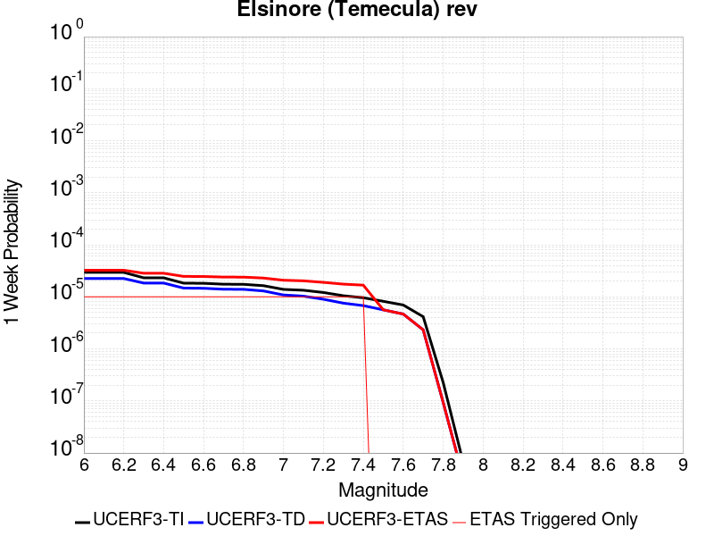 | 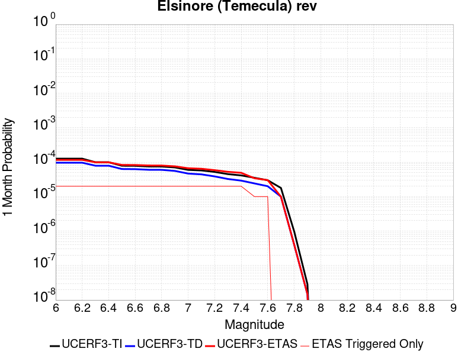 |  |  |

| Magnitude | 1 wk TI Prob | 1 wk TD Prob | 1 wk ETAS Prob | 1 wk ETAS/TD Gain | 1 wk ETAS Triggered Only | 1 mo TI Prob | 1 mo TD Prob | 1 mo ETAS Prob | 1 mo ETAS/TD Gain | 1 mo ETAS Triggered Only | 1 yr TI Prob | 1 yr TD Prob | 1 yr ETAS Prob | 1 yr ETAS/TD Gain | 1 yr ETAS Triggered Only | 10 yr TI Prob | 10 yr TD Prob | 10 yr ETAS Prob | 10 yr ETAS/TD Gain | 10 yr ETAS Triggered Only |
|-----|-----|-----|-----|-----|-----|-----|-----|-----|-----|-----|-----|-----|-----|-----|-----|-----|-----|-----|-----|-----|
| 6.0 | 2.9514995E-5 | 2.2517117E-5 | 3.5885798E-5 | 1.593712 | 1.3368984E-5 | 1.264867E-4 | 9.649849E-5 | 1.2323387E-4 | 1.277055 | 2.6737967E-5 | 0.0015388876 | 0.0011742581 | 0.0012009646 | 1.0227433 | 2.6737967E-5 | 0.015282745 | 0.011696897 | 0.011723323 | 1.0022591 | 2.6737967E-5 |
| 6.1 | 2.9514995E-5 | 2.2517117E-5 | 3.5885798E-5 | 1.593712 | 1.3368984E-5 | 1.264867E-4 | 9.649849E-5 | 1.2323387E-4 | 1.277055 | 2.6737967E-5 | 0.0015388876 | 0.0011742581 | 0.0012009646 | 1.0227433 | 2.6737967E-5 | 0.015282745 | 0.011696897 | 0.011723323 | 1.0022591 | 2.6737967E-5 |
| 6.2 | 2.9514995E-5 | 2.2517117E-5 | 3.5885798E-5 | 1.593712 | 1.3368984E-5 | 1.264867E-4 | 9.649849E-5 | 1.2323387E-4 | 1.277055 | 2.6737967E-5 | 0.0015388876 | 0.0011742581 | 0.0012009646 | 1.0227433 | 2.6737967E-5 | 0.015282745 | 0.011696897 | 0.011723323 | 1.0022591 | 2.6737967E-5 |
| 6.3 | 2.3223649E-5 | 1.8406454E-5 | 3.177519E-5 | 1.726307 | 1.3368984E-5 | 9.952613E-5 | 7.888251E-5 | 1.05618376E-4 | 1.3389326 | 2.6737967E-5 | 0.001211057 | 9.599888E-4 | 9.867011E-4 | 1.0278256 | 2.6737967E-5 | 0.012044783 | 0.009569948 | 0.00959643 | 1.0027672 | 2.6737967E-5 |
| 6.4 | 2.3223649E-5 | 1.8406454E-5 | 3.177519E-5 | 1.726307 | 1.3368984E-5 | 9.952613E-5 | 7.888251E-5 | 1.05618376E-4 | 1.3389326 | 2.6737967E-5 | 0.001211057 | 9.599888E-4 | 9.867011E-4 | 1.0278256 | 2.6737967E-5 | 0.012044783 | 0.009569948 | 0.00959643 | 1.0027672 | 2.6737967E-5 |
| 6.5 | 1.8338875E-5 | 1.4750118E-5 | 2.8118904E-5 | 1.9063512 | 1.3368984E-5 | 7.8592806E-5 | 6.321331E-5 | 8.9949586E-5 | 1.4229534 | 2.6737967E-5 | 9.5644733E-4 | 7.69359E-4 | 7.960764E-4 | 1.0347269 | 2.6737967E-5 | 0.009523412 | 0.0076739118 | 0.0077004447 | 1.0034575 | 2.6737967E-5 |
| 6.6 | 1.8223333E-5 | 1.4612673E-5 | 2.7981461E-5 | 1.9148763 | 1.3368984E-5 | 7.809766E-5 | 6.262429E-5 | 8.936058E-5 | 1.4269317 | 2.6737967E-5 | 9.504242E-4 | 7.6219277E-4 | 7.889104E-4 | 1.0350536 | 2.6737967E-5 | 0.009463696 | 0.0076027405 | 0.0076292753 | 1.0034901 | 2.6737967E-5 |
| 6.7 | 1.7512752E-5 | 1.402721E-5 | 2.7396007E-5 | 1.9530617 | 1.3368984E-5 | 7.505249E-5 | 6.011528E-5 | 8.6851636E-5 | 1.4447515 | 2.6737967E-5 | 9.13381E-4 | 7.3166634E-4 | 7.583847E-4 | 1.0365171 | 2.6737967E-5 | 0.00909636 | 0.00729892 | 0.0073254625 | 1.0036366 | 2.6737967E-5 |
| 6.8 | 1.7417142E-5 | 1.3951195E-5 | 2.7319993E-5 | 1.9582547 | 1.3368984E-5 | 7.4642754E-5 | 5.9789512E-5 | 8.6525884E-5 | 1.4471749 | 2.6737967E-5 | 9.083966E-4 | 7.277028E-4 | 7.544213E-4 | 1.0367162 | 2.6737967E-5 | 0.009046922 | 0.0072594886 | 0.007286032 | 1.0036564 | 2.6737967E-5 |
| 6.9 | 1.6402591E-5 | 1.2988613E-5 | 2.6357424E-5 | 2.0292716 | 1.3368984E-5 | 7.0294926E-5 | 5.5664343E-5 | 8.2400824E-5 | 1.480316 | 2.6737967E-5 | 8.5550465E-4 | 6.775103E-4 | 7.0423016E-4 | 1.0394382 | 2.6737967E-5 | 0.008522186 | 0.006760169 | 0.006786726 | 1.0039285 | 2.6737967E-5 |
| 7.0 | 1.3912486E-5 | 1.0878233E-5 | 2.4247072E-5 | 2.2289531 | 1.3368984E-5 | 5.9623577E-5 | 4.6620182E-5 | 7.33569E-5 | 1.573501 | 2.6737967E-5 | 7.2567526E-4 | 5.674556E-4 | 5.941784E-4 | 1.0470923 | 2.6737967E-5 | 0.0072331014 | 0.005663986 | 0.0056905723 | 1.004694 | 2.6737967E-5 |
| 7.1 | 1.3405147E-5 | 1.03274215E-5 | 2.3696268E-5 | 2.2944999 | 1.3368984E-5 | 5.7449364E-5 | 4.425964E-5 | 7.099642E-5 | 1.6040895 | 2.6737967E-5 | 6.9922156E-4 | 5.3873047E-4 | 5.65454E-4 | 1.0496047 | 2.6737967E-5 | 0.0069702556 | 0.005377577 | 0.005404171 | 1.0049454 | 2.6737967E-5 |
| 7.2 | 1.21402E-5 | 8.996737E-6 | 2.23656E-5 | 2.485968 | 1.3368984E-5 | 5.202839E-5 | 3.8556886E-5 | 6.5293825E-5 | 1.6934413 | 2.6737967E-5 | 6.332616E-4 | 4.6933076E-4 | 4.9605616E-4 | 1.0569437 | 2.6737967E-5 | 0.0063146 | 0.004684821 | 0.0047114333 | 1.0056807 | 2.6737967E-5 |
| 7.3 | 1.05047775E-5 | 7.571771E-6 | 2.0940653E-5 | 2.7656217 | 1.3368984E-5 | 4.5019697E-5 | 3.245005E-5 | 5.918715E-5 | 1.8239464 | 2.6737967E-5 | 5.4797693E-4 | 3.950092E-4 | 4.2173662E-4 | 1.0676627 | 2.6737967E-5 | 0.005466277 | 0.00394346 | 0.0039700926 | 1.0067536 | 2.6737967E-5 |
| 7.4 | 9.624483E-6 | 6.7868696E-6 | 2.0155763E-5 | 2.9698174 | 1.3368984E-5 | 4.124713E-5 | 2.9086266E-5 | 5.5823457E-5 | 1.9192376 | 2.6737967E-5 | 5.0206814E-4 | 3.5406914E-4 | 3.8079763E-4 | 1.0754895 | 2.6737967E-5 | 0.005009353 | 0.003535204 | 0.0035618476 | 1.0075366 | 2.6737967E-5 |
| 7.5 | 8.215151E-6 | 5.635538E-6 | 5.635538E-6 | 1.0 | 0.0 | 3.5207315E-5 | 2.4152088E-5 | 3.752075E-5 | 1.5535198 | 1.3368984E-5 | 4.2856473E-4 | 2.9401327E-4 | 3.0737833E-4 | 1.0454574 | 1.3368984E-5 | 0.004277392 | 0.002936371 | 0.0029497007 | 1.0045395 | 1.3368984E-5 |
| 7.6 | 6.975058E-6 | 4.676045E-6 | 4.676045E-6 | 1.0 | 0.0 | 2.9892764E-5 | 2.0040046E-5 | 3.3408764E-5 | 1.6671001 | 1.3368984E-5 | 3.6388362E-4 | 2.439614E-4 | 2.5732713E-4 | 1.0547862 | 1.3368984E-5 | 0.0036328835 | 0.002437052 | 0.0024503886 | 1.0054723 | 1.3368984E-5 |
| 7.7 | 4.159604E-6 | 2.3269924E-6 | 2.3269924E-6 | 1.0 | 0.0 | 1.7826753E-5 | 9.97279E-6 | 9.97279E-6 | 1.0 | 0.0 | 2.1701909E-4 | 1.21412704E-4 | 1.21412704E-4 | 1.0 | 0.0 | 0.0021680726 | 0.0012135367 | 0.0012135367 | 1.0 | 0.0 |
| 7.8 | 2.2692414E-7 | 9.3854695E-8 | 9.3854695E-8 | 1.0 | 0.0 | 9.725317E-7 | 4.0223435E-7 | 4.0223435E-7 | 1.0 | 0.0 | 1.1840509E-5 | 4.8971956E-6 | 4.8971956E-6 | 1.0 | 0.0 | 1.1839878E-4 | 4.8971204E-5 | 4.8971204E-5 | 1.0 | 0.0 |
| 7.9 | 6.676829E-9 | 3.439853E-9 | 3.439853E-9 | 1.0 | 0.0 | 2.861498E-8 | 1.4742227E-8 | 1.4742227E-8 | 1.0 | 0.0 | 3.4838732E-7 | 1.7948659E-7 | 1.7948659E-7 | 1.0 | 0.0 | 3.4838679E-6 | 1.7948646E-6 | 1.7948646E-6 | 1.0 | 0.0 |

## La Panza 2011
*[(top)](#table-of-contents)*

| 1 Week | 1 Month | 1 Year | 10 Year |
|-----|-----|-----|-----|
|  |  |  |  |

| Magnitude | 1 wk TI Prob | 1 wk TD Prob | 1 wk ETAS Prob | 1 wk ETAS/TD Gain | 1 wk ETAS Triggered Only | 1 mo TI Prob | 1 mo TD Prob | 1 mo ETAS Prob | 1 mo ETAS/TD Gain | 1 mo ETAS Triggered Only | 1 yr TI Prob | 1 yr TD Prob | 1 yr ETAS Prob | 1 yr ETAS/TD Gain | 1 yr ETAS Triggered Only | 10 yr TI Prob | 10 yr TD Prob | 10 yr ETAS Prob | 10 yr ETAS/TD Gain | 10 yr ETAS Triggered Only |
|-----|-----|-----|-----|-----|-----|-----|-----|-----|-----|-----|-----|-----|-----|-----|-----|-----|-----|-----|-----|-----|
| 6.0 | 4.6754544E-6 | 4.717587E-6 | 1.8086508E-5 | 3.8338473 | 1.3368984E-5 | 2.0037509E-5 | 2.0218084E-5 | 3.35868E-5 | 1.6612256 | 1.3368984E-5 | 2.4392935E-4 | 2.4612935E-4 | 2.5949505E-4 | 1.0543035 | 1.3368984E-5 | 0.0024366176 | 0.002458762 | 0.002485434 | 1.0108478 | 2.6737967E-5 |
| 6.1 | 4.6754544E-6 | 4.717587E-6 | 1.8086508E-5 | 3.8338473 | 1.3368984E-5 | 2.0037509E-5 | 2.0218084E-5 | 3.35868E-5 | 1.6612256 | 1.3368984E-5 | 2.4392935E-4 | 2.4612935E-4 | 2.5949505E-4 | 1.0543035 | 1.3368984E-5 | 0.0024366176 | 0.002458762 | 0.002485434 | 1.0108478 | 2.6737967E-5 |
| 6.2 | 4.6754544E-6 | 4.717587E-6 | 1.8086508E-5 | 3.8338473 | 1.3368984E-5 | 2.0037509E-5 | 2.0218084E-5 | 3.35868E-5 | 1.6612256 | 1.3368984E-5 | 2.4392935E-4 | 2.4612935E-4 | 2.5949505E-4 | 1.0543035 | 1.3368984E-5 | 0.0024366176 | 0.002458762 | 0.002485434 | 1.0108478 | 2.6737967E-5 |
| 6.3 | 4.6754544E-6 | 4.717587E-6 | 1.8086508E-5 | 3.8338473 | 1.3368984E-5 | 2.0037509E-5 | 2.0218084E-5 | 3.35868E-5 | 1.6612256 | 1.3368984E-5 | 2.4392935E-4 | 2.4612935E-4 | 2.5949505E-4 | 1.0543035 | 1.3368984E-5 | 0.0024366176 | 0.002458762 | 0.002485434 | 1.0108478 | 2.6737967E-5 |
| 6.4 | 4.6754544E-6 | 4.717587E-6 | 1.8086508E-5 | 3.8338473 | 1.3368984E-5 | 2.0037509E-5 | 2.0218084E-5 | 3.35868E-5 | 1.6612256 | 1.3368984E-5 | 2.4392935E-4 | 2.4612935E-4 | 2.5949505E-4 | 1.0543035 | 1.3368984E-5 | 0.0024366176 | 0.002458762 | 0.002485434 | 1.0108478 | 2.6737967E-5 |
| 6.5 | 2.485343E-6 | 2.5005988E-6 | 1.586955E-5 | 6.346299 | 1.3368984E-5 | 1.0651426E-5 | 1.0716811E-5 | 2.4085652E-5 | 2.2474644 | 1.3368984E-5 | 1.296734E-4 | 1.3046975E-4 | 1.4383698E-4 | 1.1024547 | 1.3368984E-5 | 0.0012959775 | 0.0013039699 | 0.001330673 | 1.0204784 | 2.6737967E-5 |
| 6.6 | 2.485343E-6 | 2.5005988E-6 | 1.586955E-5 | 6.346299 | 1.3368984E-5 | 1.0651426E-5 | 1.0716811E-5 | 2.4085652E-5 | 2.2474644 | 1.3368984E-5 | 1.296734E-4 | 1.3046975E-4 | 1.4383698E-4 | 1.1024547 | 1.3368984E-5 | 0.0012959775 | 0.0013039699 | 0.001330673 | 1.0204784 | 2.6737967E-5 |
| 6.7 | 1.5108508E-6 | 1.5146375E-6 | 1.4883602E-5 | 9.82651 | 1.3368984E-5 | 6.4750584E-6 | 6.491288E-6 | 1.9860185E-5 | 3.0595138 | 1.3368984E-5 | 7.8830984E-5 | 7.902867E-5 | 9.23966E-5 | 1.1691529 | 1.3368984E-5 | 7.880303E-4 | 7.900165E-4 | 8.1673334E-4 | 1.0338181 | 2.6737967E-5 |
| 6.8 | 1.3865837E-6 | 1.3885102E-6 | 1.4757476E-5 | 10.628281 | 1.3368984E-5 | 5.942488E-6 | 5.9507447E-6 | 1.9319648E-5 | 3.2465935 | 1.3368984E-5 | 7.234739E-5 | 7.244801E-5 | 8.581603E-5 | 1.1845187 | 1.3368984E-5 | 7.232384E-4 | 7.242537E-4 | 7.509723E-4 | 1.0368912 | 2.6737967E-5 |
| 6.9 | 9.826583E-7 | 9.796287E-7 | 9.796287E-7 | 1.0 | 0.0 | 4.2113857E-6 | 4.198402E-6 | 4.198402E-6 | 1.0 | 0.0 | 5.1272415E-5 | 5.11144E-5 | 5.11144E-5 | 1.0 | 0.0 | 5.126059E-4 | 5.110318E-4 | 5.243939E-4 | 1.0261474 | 1.3368984E-5 |
| 7.0 | 6.7797646E-7 | 6.7102144E-7 | 6.7102144E-7 | 1.0 | 0.0 | 2.9056102E-6 | 2.8758034E-6 | 2.8758034E-6 | 1.0 | 0.0 | 3.537523E-5 | 3.5012374E-5 | 3.5012374E-5 | 1.0 | 0.0 | 3.5369597E-4 | 3.5007167E-4 | 3.5007167E-4 | 1.0 | 0.0 |
| 7.1 | 3.4979826E-7 | 3.387388E-7 | 3.387388E-7 | 1.0 | 0.0 | 1.4991346E-6 | 1.4517369E-6 | 1.4517369E-6 | 1.0 | 0.0 | 1.825181E-5 | 1.7674765E-5 | 1.7674765E-5 | 1.0 | 0.0 | 1.825031E-4 | 1.7673477E-4 | 1.7673477E-4 | 1.0 | 0.0 |
| 7.2 | 2.5088332E-7 | 2.3831899E-7 | 2.3831899E-7 | 1.0 | 0.0 | 1.0752137E-6 | 1.0213668E-6 | 1.0213668E-6 | 1.0 | 0.0 | 1.3090649E-5 | 1.2435077E-5 | 1.2435077E-5 | 1.0 | 0.0 | 1.3089878E-4 | 1.2434467E-4 | 1.2434467E-4 | 1.0 | 0.0 |
| 7.3 | 1.0159086E-7 | 8.64462E-8 | 8.64462E-8 | 1.0 | 0.0 | 4.3538932E-7 | 3.7048366E-7 | 3.7048366E-7 | 1.0 | 0.0 | 5.300852E-6 | 4.5106294E-6 | 4.5106294E-6 | 1.0 | 0.0 | 5.3007258E-5 | 4.5105422E-5 | 4.5105422E-5 | 1.0 | 0.0 |
| 7.4 | 3.5006252E-8 | 1.9404325E-8 | 1.9404325E-8 | 1.0 | 0.0 | 1.5002678E-7 | 8.3161396E-8 | 8.3161396E-8 | 1.0 | 0.0 | 1.8265745E-6 | 1.0124895E-6 | 1.0124895E-6 | 1.0 | 0.0 | 1.8265595E-5 | 1.01248515E-5 | 1.01248515E-5 | 1.0 | 0.0 |
| 7.5 | 2.592274E-8 | 1.0239094E-8 | 1.0239094E-8 | 1.0 | 0.0 | 1.1109746E-7 | 4.388183E-8 | 4.388183E-8 | 1.0 | 0.0 | 1.3526106E-6 | 5.342612E-7 | 5.342612E-7 | 1.0 | 0.0 | 1.3526024E-5 | 5.3425997E-6 | 5.3425997E-6 | 1.0 | 0.0 |
| 7.6 | 1.9016717E-8 | 5.244801E-9 | 5.244801E-9 | 1.0 | 0.0 | 8.150022E-8 | 2.247772E-8 | 2.247772E-8 | 1.0 | 0.0 | 9.922647E-7 | 2.736662E-7 | 2.736662E-7 | 1.0 | 0.0 | 9.922603E-6 | 2.7366589E-6 | 2.7366589E-6 | 1.0 | 0.0 |
| 7.7 | 1.17738495E-8 | 1.2398075E-9 | 1.2398075E-9 | 1.0 | 0.0 | 5.0459356E-8 | 5.3134603E-9 | 5.3134603E-9 | 1.0 | 0.0 | 6.1434247E-7 | 6.469138E-8 | 6.469138E-8 | 1.0 | 0.0 | 6.143408E-6 | 6.469136E-7 | 6.469136E-7 | 1.0 | 0.0 |
| 7.8 | 5.489079E-9 | 2.0111768E-10 | 2.0111768E-10 | 1.0 | 0.0 | 2.3524624E-8 | 8.6193275E-10 | 8.6193275E-10 | 1.0 | 0.0 | 2.8641225E-7 | 1.04940305E-8 | 1.04940305E-8 | 1.0 | 0.0 | 2.8641189E-6 | 1.04940305E-7 | 1.04940305E-7 | 1.0 | 0.0 |
| 7.9 | 2.5081048E-9 | 6.683887E-11 | 6.683887E-11 | 1.0 | 0.0 | 1.0749021E-8 | 2.8645197E-10 | 2.8645197E-10 | 1.0 | 0.0 | 1.3086932E-7 | 3.487552E-9 | 3.487552E-9 | 1.0 | 0.0 | 1.3086925E-6 | 3.487552E-8 | 3.487552E-8 | 1.0 | 0.0 |

## San Andreas (Santa Cruz Mts) 2011 CFM
*[(top)](#table-of-contents)*

| 1 Week | 1 Month | 1 Year | 10 Year |
|-----|-----|-----|-----|
|  |  |  |  |

| Magnitude | 1 wk TI Prob | 1 wk TD Prob | 1 wk ETAS Prob | 1 wk ETAS/TD Gain | 1 wk ETAS Triggered Only | 1 mo TI Prob | 1 mo TD Prob | 1 mo ETAS Prob | 1 mo ETAS/TD Gain | 1 mo ETAS Triggered Only | 1 yr TI Prob | 1 yr TD Prob | 1 yr ETAS Prob | 1 yr ETAS/TD Gain | 1 yr ETAS Triggered Only | 10 yr TI Prob | 10 yr TD Prob | 10 yr ETAS Prob | 10 yr ETAS/TD Gain | 10 yr ETAS Triggered Only |
|-----|-----|-----|-----|-----|-----|-----|-----|-----|-----|-----|-----|-----|-----|-----|-----|-----|-----|-----|-----|-----|
| 6.0 | 1.7221631E-4 | 1.3793171E-4 | 1.3793171E-4 | 1.0 | 0.0 | 7.378611E-4 | 5.9100403E-4 | 5.9100403E-4 | 1.0 | 0.0 | 0.008946515 | 0.007172124 | 0.007172124 | 1.0 | 0.0 | 0.08594794 | 0.0705551 | 0.070579946 | 1.0003523 | 2.6737967E-5 |
| 6.1 | 1.7221631E-4 | 1.3793171E-4 | 1.3793171E-4 | 1.0 | 0.0 | 7.378611E-4 | 5.9100403E-4 | 5.9100403E-4 | 1.0 | 0.0 | 0.008946515 | 0.007172124 | 0.007172124 | 1.0 | 0.0 | 0.08594794 | 0.0705551 | 0.070579946 | 1.0003523 | 2.6737967E-5 |
| 6.2 | 1.7221631E-4 | 1.3793171E-4 | 1.3793171E-4 | 1.0 | 0.0 | 7.378611E-4 | 5.9100403E-4 | 5.9100403E-4 | 1.0 | 0.0 | 0.008946515 | 0.007172124 | 0.007172124 | 1.0 | 0.0 | 0.08594794 | 0.0705551 | 0.070579946 | 1.0003523 | 2.6737967E-5 |
| 6.3 | 1.716926E-4 | 1.3712609E-4 | 1.3712609E-4 | 1.0 | 0.0 | 7.3561794E-4 | 5.875529E-4 | 5.875529E-4 | 1.0 | 0.0 | 0.008919428 | 0.0071303817 | 0.0071303817 | 1.0 | 0.0 | 0.08569809 | 0.070167266 | 0.07019213 | 1.0003543 | 2.6737967E-5 |
| 6.4 | 1.6392978E-4 | 1.3588481E-4 | 1.3588481E-4 | 1.0 | 0.0 | 7.02367E-4 | 5.822355E-4 | 5.822355E-4 | 1.0 | 0.0 | 0.008517839 | 0.007066063 | 0.007066063 | 1.0 | 0.0 | 0.08198654 | 0.06940135 | 0.06942624 | 1.0003586 | 2.6737967E-5 |
| 6.5 | 1.5742714E-4 | 1.2648388E-4 | 1.2648388E-4 | 1.0 | 0.0 | 6.745133E-4 | 5.4196286E-4 | 5.4196286E-4 | 1.0 | 0.0 | 0.00818132 | 0.0065787593 | 0.0065787593 | 1.0 | 0.0 | 0.078865945 | 0.06486309 | 0.0648881 | 1.0003855 | 2.6737967E-5 |
| 6.6 | 1.3038084E-4 | 1.1588213E-4 | 1.1588213E-4 | 1.0 | 0.0 | 5.5865536E-4 | 4.9654447E-4 | 4.9654447E-4 | 1.0 | 0.0 | 0.006780438 | 0.0060289134 | 0.0060289134 | 1.0 | 0.0 | 0.0657725 | 0.05932738 | 0.059352532 | 1.0004239 | 2.6737967E-5 |
| 6.7 | 1.2867592E-4 | 1.1314701E-4 | 1.1314701E-4 | 1.0 | 0.0 | 5.5135164E-4 | 4.8482692E-4 | 4.8482692E-4 | 1.0 | 0.0 | 0.0066920654 | 0.00588703 | 0.00588703 | 1.0 | 0.0 | 0.06494093 | 0.058038417 | 0.058063604 | 1.0004339 | 2.6737967E-5 |
| 6.8 | 1.2801298E-4 | 1.1252261E-4 | 1.1252261E-4 | 1.0 | 0.0 | 5.485117E-4 | 4.8215193E-4 | 4.8215193E-4 | 1.0 | 0.0 | 0.0066577005 | 0.0058546383 | 0.0058546383 | 1.0 | 0.0 | 0.06461738 | 0.057752274 | 0.057777464 | 1.0004362 | 2.6737967E-5 |
| 6.9 | 1.269149E-4 | 1.1094465E-4 | 1.1094465E-4 | 1.0 | 0.0 | 5.4380763E-4 | 4.7539172E-4 | 4.7539172E-4 | 1.0 | 0.0 | 0.006600777 | 0.005772772 | 0.005772772 | 1.0 | 0.0 | 0.06408122 | 0.0570241 | 0.05704931 | 1.0004421 | 2.6737967E-5 |
| 7.0 | 1.2030331E-4 | 1.0824504E-4 | 1.0824504E-4 | 1.0 | 0.0 | 5.154837E-4 | 4.638261E-4 | 4.638261E-4 | 1.0 | 0.0 | 0.006257969 | 0.0056326967 | 0.0056326967 | 1.0 | 0.0 | 0.06084648 | 0.055696685 | 0.055721935 | 1.0004534 | 2.6737967E-5 |
| 7.1 | 8.049617E-5 | 5.3926604E-5 | 5.3926604E-5 | 1.0 | 0.0 | 3.4493793E-4 | 2.3109373E-4 | 2.3109373E-4 | 1.0 | 0.0 | 0.0041915346 | 0.0028099709 | 0.0028099709 | 1.0 | 0.0 | 0.041133516 | 0.029618956 | 0.029644903 | 1.000876 | 2.6737967E-5 |
| 7.2 | 7.093979E-5 | 4.2937932E-5 | 4.2937932E-5 | 1.0 | 0.0 | 3.0399222E-4 | 1.8400686E-4 | 1.8400686E-4 | 1.0 | 0.0 | 0.0036948253 | 0.0022380045 | 0.0022380045 | 1.0 | 0.0 | 0.03633994 | 0.023941692 | 0.02395474 | 1.000545 | 1.3368984E-5 |
| 7.3 | 6.193693E-5 | 2.8894141E-5 | 2.8894141E-5 | 1.0 | 0.0 | 2.6541698E-4 | 1.2382616E-4 | 1.2382616E-4 | 1.0 | 0.0 | 0.0032266637 | 0.0015065427 | 0.0015065427 | 1.0 | 0.0 | 0.031802133 | 0.016499156 | 0.016512305 | 1.0007969 | 1.3368984E-5 |
| 7.4 | 5.906492E-5 | 2.702346E-5 | 2.702346E-5 | 1.0 | 0.0 | 2.5311083E-4 | 1.1580969E-4 | 1.1580969E-4 | 1.0 | 0.0 | 0.0030772698 | 0.0014090725 | 0.0014090725 | 1.0 | 0.0 | 0.030350044 | 0.015471023 | 0.015484184 | 1.0008508 | 1.3368984E-5 |
| 7.5 | 5.424296E-5 | 2.4678277E-5 | 2.4678277E-5 | 1.0 | 0.0 | 2.324491E-4 | 1.05759755E-4 | 1.05759755E-4 | 1.0 | 0.0 | 0.002826395 | 0.0012868657 | 0.0012868657 | 1.0 | 0.0 | 0.027907165 | 0.014163188 | 0.014176367 | 1.0009305 | 1.3368984E-5 |
| 7.6 | 4.43084E-5 | 1.990431E-5 | 1.990431E-5 | 1.0 | 0.0 | 1.8987931E-4 | 8.53014E-5 | 8.53014E-5 | 1.0 | 0.0 | 0.0023093296 | 0.0010380499 | 0.0010380499 | 1.0 | 0.0 | 0.022854783 | 0.011412679 | 0.011425896 | 1.001158 | 1.3368984E-5 |
| 7.7 | 4.118098E-5 | 1.8936442E-5 | 1.8936442E-5 | 1.0 | 0.0 | 1.7647797E-4 | 8.115366E-5 | 8.115366E-5 | 1.0 | 0.0 | 0.002146502 | 9.875982E-4 | 9.875982E-4 | 1.0 | 0.0 | 0.021258866 | 0.010870468 | 0.010883692 | 1.0012165 | 1.3368984E-5 |
| 7.8 | 3.5408906E-5 | 1.856446E-5 | 1.856446E-5 | 1.0 | 0.0 | 1.5174363E-4 | 7.955955E-5 | 7.955955E-5 | 1.0 | 0.0 | 0.0018459131 | 9.682073E-4 | 9.682073E-4 | 1.0 | 0.0 | 0.018306552 | 0.010652021 | 0.010665247 | 1.0012417 | 1.3368984E-5 |
| 7.9 | 2.5860836E-5 | 1.7315993E-5 | 1.7315993E-5 | 1.0 | 0.0 | 1.10827445E-4 | 7.420929E-5 | 7.420929E-5 | 1.0 | 0.0 | 0.001348489 | 9.031238E-4 | 9.031238E-4 | 1.0 | 0.0 | 0.013403354 | 0.009907599 | 0.0099208355 | 1.001336 | 1.3368984E-5 |
| 8.0 | 1.9777332E-5 | 1.4839596E-5 | 1.4839596E-5 | 1.0 | 0.0 | 8.4757245E-5 | 6.3596715E-5 | 6.3596715E-5 | 1.0 | 0.0 | 0.0010314309 | 7.740152E-4 | 7.740152E-4 | 1.0 | 0.0 | 0.010266567 | 0.008508967 | 0.008522223 | 1.0015578 | 1.3368984E-5 |
| 8.1 | 1.468494E-5 | 1.2107374E-5 | 1.2107374E-5 | 1.0 | 0.0 | 6.293394E-5 | 5.1887713E-5 | 5.1887713E-5 | 1.0 | 0.0 | 7.6595135E-4 | 6.3155E-4 | 6.3155E-4 | 1.0 | 0.0 | 0.0076331664 | 0.006969149 | 0.0069824248 | 1.001905 | 1.3368984E-5 |
| 8.2 | 8.63836E-6 | 5.469061E-6 | 5.469061E-6 | 1.0 | 0.0 | 3.7021015E-5 | 2.3438623E-5 | 2.3438623E-5 | 1.0 | 0.0 | 4.5063766E-4 | 2.8532793E-4 | 2.8532793E-4 | 1.0 | 0.0 | 0.004497249 | 0.00324569 | 0.00324569 | 1.0 | 0.0 |
| 8.3 | 1.983087E-6 | 7.6599065E-7 | 7.6599065E-7 | 1.0 | 0.0 | 8.498917E-6 | 3.282813E-6 | 3.282813E-6 | 1.0 | 0.0 | 1.034694E-4 | 3.9967534E-5 | 3.9967534E-5 | 1.0 | 0.0 | 0.0010342124 | 4.719687E-4 | 4.719687E-4 | 1.0 | 0.0 |

## Reliz 2011 CFM
*[(top)](#table-of-contents)*

| 1 Week | 1 Month | 1 Year | 10 Year |
|-----|-----|-----|-----|
|  | 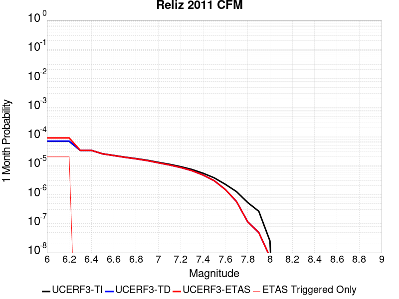 |  |  |

| Magnitude | 1 wk TI Prob | 1 wk TD Prob | 1 wk ETAS Prob | 1 wk ETAS/TD Gain | 1 wk ETAS Triggered Only | 1 mo TI Prob | 1 mo TD Prob | 1 mo ETAS Prob | 1 mo ETAS/TD Gain | 1 mo ETAS Triggered Only | 1 yr TI Prob | 1 yr TD Prob | 1 yr ETAS Prob | 1 yr ETAS/TD Gain | 1 yr ETAS Triggered Only | 10 yr TI Prob | 10 yr TD Prob | 10 yr ETAS Prob | 10 yr ETAS/TD Gain | 10 yr ETAS Triggered Only |
|-----|-----|-----|-----|-----|-----|-----|-----|-----|-----|-----|-----|-----|-----|-----|-----|-----|-----|-----|-----|-----|
| 6.0 | 1.6002472E-5 | 1.6282804E-5 | 2.965157E-5 | 1.8210359 | 1.3368984E-5 | 6.8580215E-5 | 6.9781694E-5 | 8.3149745E-5 | 1.1915696 | 1.3368984E-5 | 8.3464425E-4 | 8.4928074E-4 | 8.626384E-4 | 1.0157281 | 1.3368984E-5 | 0.008315164 | 0.008462547 | 0.008489059 | 1.0031328 | 2.6737967E-5 |
| 6.1 | 1.6002472E-5 | 1.6282804E-5 | 2.965157E-5 | 1.8210359 | 1.3368984E-5 | 6.8580215E-5 | 6.9781694E-5 | 8.3149745E-5 | 1.1915696 | 1.3368984E-5 | 8.3464425E-4 | 8.4928074E-4 | 8.626384E-4 | 1.0157281 | 1.3368984E-5 | 0.008315164 | 0.008462547 | 0.008489059 | 1.0031328 | 2.6737967E-5 |
| 6.2 | 1.6002472E-5 | 1.6282804E-5 | 2.965157E-5 | 1.8210359 | 1.3368984E-5 | 6.8580215E-5 | 6.9781694E-5 | 8.3149745E-5 | 1.1915696 | 1.3368984E-5 | 8.3464425E-4 | 8.4928074E-4 | 8.626384E-4 | 1.0157281 | 1.3368984E-5 | 0.008315164 | 0.008462547 | 0.008489059 | 1.0031328 | 2.6737967E-5 |
| 6.3 | 7.792404E-6 | 7.803802E-6 | 7.803802E-6 | 1.0 | 0.0 | 3.339559E-5 | 3.344444E-5 | 3.344444E-5 | 1.0 | 0.0 | 4.0651546E-4 | 4.0711078E-4 | 4.0711078E-4 | 1.0 | 0.0 | 0.0040577264 | 0.004063926 | 0.004063926 | 1.0 | 0.0 |
| 6.4 | 7.792404E-6 | 7.803802E-6 | 7.803802E-6 | 1.0 | 0.0 | 3.339559E-5 | 3.344444E-5 | 3.344444E-5 | 1.0 | 0.0 | 4.0651546E-4 | 4.0711078E-4 | 4.0711078E-4 | 1.0 | 0.0 | 0.0040577264 | 0.004063926 | 0.004063926 | 1.0 | 0.0 |
| 6.5 | 5.9659374E-6 | 5.928738E-6 | 5.928738E-6 | 1.0 | 0.0 | 2.5568053E-5 | 2.5408632E-5 | 2.5408632E-5 | 1.0 | 0.0 | 3.1124658E-4 | 3.093064E-4 | 3.093064E-4 | 1.0 | 0.0 | 0.00310811 | 0.0030889767 | 0.0030889767 | 1.0 | 0.0 |
| 6.6 | 5.2350692E-6 | 5.178986E-6 | 5.178986E-6 | 1.0 | 0.0 | 2.2435817E-5 | 2.2195467E-5 | 2.2195467E-5 | 1.0 | 0.0 | 2.7312184E-4 | 2.7019644E-4 | 2.7019644E-4 | 1.0 | 0.0 | 0.002727864 | 0.0026988892 | 0.0026988892 | 1.0 | 0.0 |
| 6.7 | 4.580206E-6 | 4.5061206E-6 | 4.5061206E-6 | 1.0 | 0.0 | 1.9629308E-5 | 1.9311801E-5 | 1.9311801E-5 | 1.0 | 0.0 | 2.389606E-4 | 2.350959E-4 | 2.350959E-4 | 1.0 | 0.0 | 0.002387038 | 0.0023486738 | 0.0023486738 | 1.0 | 0.0 |
| 6.8 | 4.0765017E-6 | 3.9882384E-6 | 3.9882384E-6 | 1.0 | 0.0 | 1.7470604E-5 | 1.7092338E-5 | 1.7092338E-5 | 1.0 | 0.0 | 2.1268385E-4 | 2.0807938E-4 | 2.0807938E-4 | 1.0 | 0.0 | 0.002124804 | 0.0020790435 | 0.0020790435 | 1.0 | 0.0 |
| 6.9 | 3.5752896E-6 | 3.4725176E-6 | 3.4725176E-6 | 1.0 | 0.0 | 1.532258E-5 | 1.4882134E-5 | 1.4882134E-5 | 1.0 | 0.0 | 1.8653645E-4 | 1.8117494E-4 | 1.8117494E-4 | 1.0 | 0.0 | 0.0018637994 | 0.0018104686 | 0.0018104686 | 1.0 | 0.0 |
| 7.0 | 3.0259848E-6 | 2.9079417E-6 | 2.9079417E-6 | 1.0 | 0.0 | 1.2968442E-5 | 1.2462548E-5 | 1.2462548E-5 | 1.0 | 0.0 | 1.5787935E-4 | 1.5172097E-4 | 1.5172097E-4 | 1.0 | 0.0 | 0.0015776722 | 0.001516369 | 0.001516369 | 1.0 | 0.0 |
| 7.1 | 2.5861116E-6 | 2.455167E-6 | 2.455167E-6 | 1.0 | 0.0 | 1.1083288E-5 | 1.05221025E-5 | 1.05221025E-5 | 1.0 | 0.0 | 1.3493067E-4 | 1.2809907E-4 | 1.2809907E-4 | 1.0 | 0.0 | 0.0013484878 | 0.001280447 | 0.001280447 | 1.0 | 0.0 |
| 7.2 | 2.1482588E-6 | 2.003237E-6 | 2.003237E-6 | 1.0 | 0.0 | 9.20679E-6 | 8.585273E-6 | 8.585273E-6 | 1.0 | 0.0 | 1.12086906E-4 | 1.0452068E-4 | 1.0452068E-4 | 1.0 | 0.0 | 0.0011203039 | 0.0010449095 | 0.0010449095 | 1.0 | 0.0 |
| 7.3 | 1.7194744E-6 | 1.5611241E-6 | 1.5611241E-6 | 1.0 | 0.0 | 7.3691554E-6 | 6.690515E-6 | 6.690515E-6 | 1.0 | 0.0 | 8.971577E-5 | 8.1453974E-5 | 8.1453974E-5 | 1.0 | 0.0 | 8.967956E-4 | 8.1443513E-4 | 8.1443513E-4 | 1.0 | 0.0 |
| 7.4 | 1.2755178E-6 | 1.10563E-6 | 1.10563E-6 | 1.0 | 0.0 | 5.4664933E-6 | 4.7384056E-6 | 4.7384056E-6 | 1.0 | 0.0 | 6.655252E-5 | 5.768856E-5 | 5.768856E-5 | 1.0 | 0.0 | 6.6532596E-4 | 5.7692965E-4 | 5.7692965E-4 | 1.0 | 0.0 |
| 7.5 | 8.8463224E-7 | 7.0580273E-7 | 7.0580273E-7 | 1.0 | 0.0 | 3.7912755E-6 | 3.0248652E-6 | 3.0248652E-6 | 1.0 | 0.0 | 4.6157802E-5 | 3.6827114E-5 | 3.6827114E-5 | 1.0 | 0.0 | 4.6148215E-4 | 3.684038E-4 | 3.684038E-4 | 1.0 | 0.0 |
| 7.6 | 5.291355E-7 | 3.500777E-7 | 3.500777E-7 | 1.0 | 0.0 | 2.2677216E-6 | 1.5003321E-6 | 1.5003321E-6 | 1.0 | 0.0 | 2.760916E-5 | 1.8266392E-5 | 1.8266392E-5 | 1.0 | 0.0 | 2.760573E-4 | 1.8284164E-4 | 1.8284164E-4 | 1.0 | 0.0 |
| 7.7 | 2.9663357E-7 | 1.351113E-7 | 1.351113E-7 | 1.0 | 0.0 | 1.2712861E-6 | 5.7904833E-7 | 5.7904833E-7 | 1.0 | 0.0 | 1.5477797E-5 | 7.049891E-6 | 7.049891E-6 | 1.0 | 0.0 | 1.547672E-4 | 7.068132E-5 | 7.068132E-5 | 1.0 | 0.0 |
| 7.8 | 1.2509386E-7 | 2.7157126E-8 | 2.7157126E-8 | 1.0 | 0.0 | 5.3611643E-7 | 1.1638769E-7 | 1.1638769E-7 | 1.0 | 0.0 | 6.527198E-6 | 1.4170191E-6 | 1.4170191E-6 | 1.0 | 0.0 | 6.527006E-5 | 1.4326506E-5 | 1.4326506E-5 | 1.0 | 0.0 |
| 7.9 | 6.213493E-8 | 1.1482114E-8 | 1.1482114E-8 | 1.0 | 0.0 | 2.6629255E-7 | 4.920906E-8 | 4.920906E-8 | 1.0 | 0.0 | 3.242107E-6 | 5.9912014E-7 | 5.9912014E-7 | 1.0 | 0.0 | 3.2420594E-5 | 6.1224223E-6 | 6.1224223E-6 | 1.0 | 0.0 |
| 8.0 | 5.92383E-9 | 1.677887E-9 | 1.677887E-9 | 1.0 | 0.0 | 2.5387841E-8 | 7.190944E-9 | 7.190944E-9 | 1.0 | 0.0 | 3.0909692E-7 | 8.754974E-8 | 8.754974E-8 | 1.0 | 0.0 | 3.090965E-6 | 9.003061E-7 | 9.003061E-7 | 1.0 | 0.0 |

## Likely 2011 CFM
*[(top)](#table-of-contents)*

| 1 Week | 1 Month | 1 Year | 10 Year |
|-----|-----|-----|-----|
|  |  | 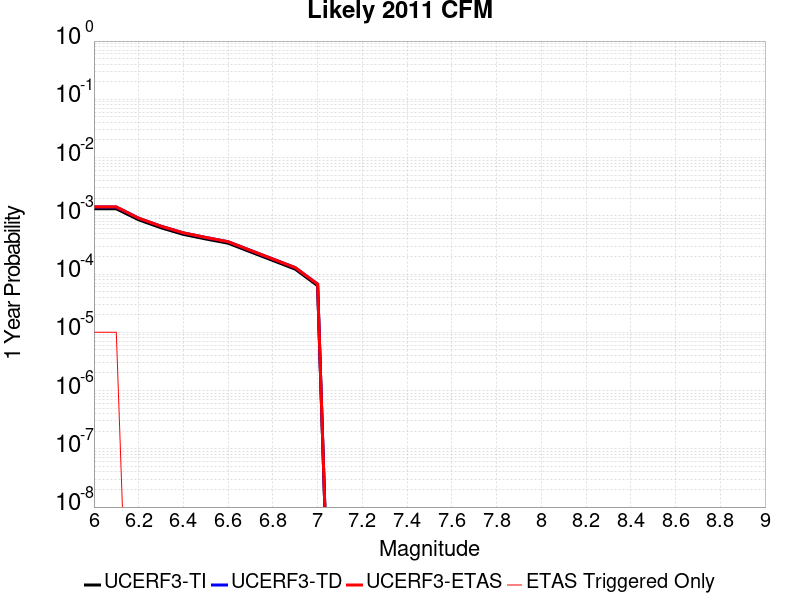 |  |

| Magnitude | 1 wk TI Prob | 1 wk TD Prob | 1 wk ETAS Prob | 1 wk ETAS/TD Gain | 1 wk ETAS Triggered Only | 1 mo TI Prob | 1 mo TD Prob | 1 mo ETAS Prob | 1 mo ETAS/TD Gain | 1 mo ETAS Triggered Only | 1 yr TI Prob | 1 yr TD Prob | 1 yr ETAS Prob | 1 yr ETAS/TD Gain | 1 yr ETAS Triggered Only | 10 yr TI Prob | 10 yr TD Prob | 10 yr ETAS Prob | 10 yr ETAS/TD Gain | 10 yr ETAS Triggered Only |
|-----|-----|-----|-----|-----|-----|-----|-----|-----|-----|-----|-----|-----|-----|-----|-----|-----|-----|-----|-----|-----|
| 6.0 | 2.5315949E-5 | 2.7104748E-5 | 2.7104748E-5 | 1.0 | 0.0 | 1.0849241E-4 | 1.16158284E-4 | 1.16158284E-4 | 1.0 | 0.0 | 0.0013200947 | 0.0014133542 | 0.0014267042 | 1.0094457 | 1.3368984E-5 | 0.013122803 | 0.01404831 | 0.014074673 | 1.0018766 | 2.6737967E-5 |
| 6.1 | 2.5315949E-5 | 2.7104748E-5 | 2.7104748E-5 | 1.0 | 0.0 | 1.0849241E-4 | 1.16158284E-4 | 1.16158284E-4 | 1.0 | 0.0 | 0.0013200947 | 0.0014133542 | 0.0014267042 | 1.0094457 | 1.3368984E-5 | 0.013122803 | 0.01404831 | 0.014074673 | 1.0018766 | 2.6737967E-5 |
| 6.2 | 1.6375941E-5 | 1.7465842E-5 | 1.7465842E-5 | 1.0 | 0.0 | 7.0180715E-5 | 7.485153E-5 | 7.485153E-5 | 1.0 | 0.0 | 8.5411523E-4 | 9.109487E-4 | 9.109487E-4 | 1.0 | 0.0 | 0.008508399 | 0.009073433 | 0.00908668 | 1.0014601 | 1.3368984E-5 |
| 6.3 | 1.1945543E-5 | 1.2712587E-5 | 1.2712587E-5 | 1.0 | 0.0 | 5.119418E-5 | 5.4481407E-5 | 5.4481407E-5 | 1.0 | 0.0 | 6.2311086E-4 | 6.631146E-4 | 6.631146E-4 | 1.0 | 0.0 | 0.0062136655 | 0.0066119144 | 0.006625195 | 1.0020086 | 1.3368984E-5 |
| 6.4 | 9.192729E-6 | 9.768488E-6 | 9.768488E-6 | 1.0 | 0.0 | 3.939681E-5 | 4.1864292E-5 | 4.1864292E-5 | 1.0 | 0.0 | 4.7955062E-4 | 5.0958124E-4 | 5.0958124E-4 | 1.0 | 0.0 | 0.004785171 | 0.0050844094 | 0.0050844094 | 1.0 | 0.0 |
| 6.5 | 7.67906E-6 | 8.152622E-6 | 8.152622E-6 | 1.0 | 0.0 | 3.2909844E-5 | 3.4939352E-5 | 3.4939352E-5 | 1.0 | 0.0 | 4.006037E-4 | 4.2530545E-4 | 4.2530545E-4 | 1.0 | 0.0 | 0.0039988225 | 0.004245108 | 0.004245108 | 1.0 | 0.0 |
| 6.6 | 6.4884057E-6 | 6.8847507E-6 | 6.8847507E-6 | 1.0 | 0.0 | 2.7807157E-5 | 2.9505749E-5 | 2.9505749E-5 | 1.0 | 0.0 | 3.3849955E-4 | 3.591747E-4 | 3.591747E-4 | 1.0 | 0.0 | 0.003379844 | 0.0035860867 | 0.0035860867 | 1.0 | 0.0 |
| 6.7 | 4.6060636E-6 | 4.884041E-6 | 4.884041E-6 | 1.0 | 0.0 | 1.9740122E-5 | 2.0931442E-5 | 2.0931442E-5 | 1.0 | 0.0 | 2.403095E-4 | 2.5481134E-4 | 2.5481134E-4 | 1.0 | 0.0 | 0.002400498 | 0.0025452746 | 0.0025452746 | 1.0 | 0.0 |
| 6.8 | 3.2795615E-6 | 3.4773732E-6 | 3.4773732E-6 | 1.0 | 0.0 | 1.4055187E-5 | 1.4902946E-5 | 1.4902946E-5 | 1.0 | 0.0 | 1.7110848E-4 | 1.8142881E-4 | 1.8142881E-4 | 1.0 | 0.0 | 0.0017097679 | 0.0018128622 | 0.0018128622 | 1.0 | 0.0 |
| 6.9 | 2.3289967E-6 | 2.4705569E-6 | 2.4705569E-6 | 1.0 | 0.0 | 9.981376E-6 | 1.058806E-5 | 1.058806E-5 | 1.0 | 0.0 | 1.2151648E-4 | 1.2890245E-4 | 1.2890245E-4 | 1.0 | 0.0 | 0.0012145005 | 0.0012883197 | 0.0012883197 | 1.0 | 0.0 |
| 7.0 | 1.211292E-6 | 1.2863958E-6 | 1.2863958E-6 | 1.0 | 0.0 | 5.1912407E-6 | 5.5131145E-6 | 5.5131145E-6 | 1.0 | 0.0 | 6.320152E-5 | 6.712041E-5 | 6.712041E-5 | 1.0 | 0.0 | 6.3183554E-4 | 6.710312E-4 | 6.710312E-4 | 1.0 | 0.0 |

## Los Alamos extension
*[(top)](#table-of-contents)*

| 1 Week | 1 Month | 1 Year | 10 Year |
|-----|-----|-----|-----|
|  |  |  |  |

| Magnitude | 1 wk TI Prob | 1 wk TD Prob | 1 wk ETAS Prob | 1 wk ETAS/TD Gain | 1 wk ETAS Triggered Only | 1 mo TI Prob | 1 mo TD Prob | 1 mo ETAS Prob | 1 mo ETAS/TD Gain | 1 mo ETAS Triggered Only | 1 yr TI Prob | 1 yr TD Prob | 1 yr ETAS Prob | 1 yr ETAS/TD Gain | 1 yr ETAS Triggered Only | 10 yr TI Prob | 10 yr TD Prob | 10 yr ETAS Prob | 10 yr ETAS/TD Gain | 10 yr ETAS Triggered Only |
|-----|-----|-----|-----|-----|-----|-----|-----|-----|-----|-----|-----|-----|-----|-----|-----|-----|-----|-----|-----|-----|
| 6.0 | 4.0146506E-6 | 4.0861596E-6 | 4.0861596E-6 | 1.0 | 0.0 | 1.7205533E-5 | 1.7512002E-5 | 1.7512002E-5 | 1.0 | 0.0 | 2.0945723E-4 | 2.1318886E-4 | 2.26555E-4 | 1.0626962 | 1.3368984E-5 | 0.0020925992 | 0.0021299527 | 0.0021566337 | 1.0125266 | 2.6737967E-5 |
| 6.1 | 4.0146506E-6 | 4.0861596E-6 | 4.0861596E-6 | 1.0 | 0.0 | 1.7205533E-5 | 1.7512002E-5 | 1.7512002E-5 | 1.0 | 0.0 | 2.0945723E-4 | 2.1318886E-4 | 2.26555E-4 | 1.0626962 | 1.3368984E-5 | 0.0020925992 | 0.0021299527 | 0.0021566337 | 1.0125266 | 2.6737967E-5 |
| 6.2 | 4.0146506E-6 | 4.0861596E-6 | 4.0861596E-6 | 1.0 | 0.0 | 1.7205533E-5 | 1.7512002E-5 | 1.7512002E-5 | 1.0 | 0.0 | 2.0945723E-4 | 2.1318886E-4 | 2.26555E-4 | 1.0626962 | 1.3368984E-5 | 0.0020925992 | 0.0021299527 | 0.0021566337 | 1.0125266 | 2.6737967E-5 |
| 6.3 | 4.0146506E-6 | 4.0861596E-6 | 4.0861596E-6 | 1.0 | 0.0 | 1.7205533E-5 | 1.7512002E-5 | 1.7512002E-5 | 1.0 | 0.0 | 2.0945723E-4 | 2.1318886E-4 | 2.26555E-4 | 1.0626962 | 1.3368984E-5 | 0.0020925992 | 0.0021299527 | 0.0021566337 | 1.0125266 | 2.6737967E-5 |
| 6.4 | 4.0146506E-6 | 4.0861596E-6 | 4.0861596E-6 | 1.0 | 0.0 | 1.7205533E-5 | 1.7512002E-5 | 1.7512002E-5 | 1.0 | 0.0 | 2.0945723E-4 | 2.1318886E-4 | 2.26555E-4 | 1.0626962 | 1.3368984E-5 | 0.0020925992 | 0.0021299527 | 0.0021566337 | 1.0125266 | 2.6737967E-5 |
| 6.5 | 4.0146506E-6 | 4.0861596E-6 | 4.0861596E-6 | 1.0 | 0.0 | 1.7205533E-5 | 1.7512002E-5 | 1.7512002E-5 | 1.0 | 0.0 | 2.0945723E-4 | 2.1318886E-4 | 2.26555E-4 | 1.0626962 | 1.3368984E-5 | 0.0020925992 | 0.0021299527 | 0.0021566337 | 1.0125266 | 2.6737967E-5 |
| 6.6 | 4.0146506E-6 | 4.0861596E-6 | 4.0861596E-6 | 1.0 | 0.0 | 1.7205533E-5 | 1.7512002E-5 | 1.7512002E-5 | 1.0 | 0.0 | 2.0945723E-4 | 2.1318886E-4 | 2.26555E-4 | 1.0626962 | 1.3368984E-5 | 0.0020925992 | 0.0021299527 | 0.0021566337 | 1.0125266 | 2.6737967E-5 |
| 6.7 | 4.0146506E-6 | 4.0861596E-6 | 4.0861596E-6 | 1.0 | 0.0 | 1.7205533E-5 | 1.7512002E-5 | 1.7512002E-5 | 1.0 | 0.0 | 2.0945723E-4 | 2.1318886E-4 | 2.26555E-4 | 1.0626962 | 1.3368984E-5 | 0.0020925992 | 0.0021299527 | 0.0021566337 | 1.0125266 | 2.6737967E-5 |
| 6.8 | 3.6584688E-6 | 3.7188588E-6 | 3.7188588E-6 | 1.0 | 0.0 | 1.5679057E-5 | 1.5937874E-5 | 1.5937874E-5 | 1.0 | 0.0 | 1.9087581E-4 | 1.9402728E-4 | 2.0739368E-4 | 1.0688893 | 1.3368984E-5 | 0.0019071194 | 0.0019386712 | 0.0019653572 | 1.0137652 | 2.6737967E-5 |
| 6.9 | 3.644631E-6 | 3.7045688E-6 | 3.7045688E-6 | 1.0 | 0.0 | 1.5619753E-5 | 1.5876632E-5 | 1.5876632E-5 | 1.0 | 0.0 | 1.901539E-4 | 1.9328178E-4 | 2.0664818E-4 | 1.069155 | 1.3368984E-5 | 0.0018999127 | 0.0019312293 | 0.0019579155 | 1.0138183 | 2.6737967E-5 |
| 7.0 | 3.6318522E-6 | 3.6913295E-6 | 3.6913295E-6 | 1.0 | 0.0 | 1.5564989E-5 | 1.5819893E-5 | 1.5819893E-5 | 1.0 | 0.0 | 1.8948725E-4 | 1.925911E-4 | 2.059575E-4 | 1.069403 | 1.3368984E-5 | 0.0018932576 | 0.0019243343 | 0.0019510209 | 1.013868 | 2.6737967E-5 |
| 7.1 | 3.5001724E-6 | 3.5554E-6 | 3.5554E-6 | 1.0 | 0.0 | 1.5000653E-5 | 1.5237345E-5 | 1.5237345E-5 | 1.0 | 0.0 | 1.8261763E-4 | 1.854998E-4 | 1.988663E-4 | 1.0720567 | 1.3368984E-5 | 0.0018246764 | 0.0018535402 | 0.0018802286 | 1.0143986 | 2.6737967E-5 |
| 7.2 | 2.5204702E-6 | 2.5436943E-6 | 2.5436943E-6 | 1.0 | 0.0 | 1.080197E-5 | 1.0901502E-5 | 1.0901502E-5 | 1.0 | 0.0 | 1.3150605E-4 | 1.3271775E-4 | 1.3271775E-4 | 1.0 | 0.0 | 0.0013142825 | 0.0013263905 | 0.0013397417 | 1.0100658 | 1.3368984E-5 |
| 7.3 | 2.1399692E-6 | 2.1501316E-6 | 2.1501316E-6 | 1.0 | 0.0 | 9.1712645E-6 | 9.2148175E-6 | 9.2148175E-6 | 1.0 | 0.0 | 1.1165442E-4 | 1.1218466E-4 | 1.1218466E-4 | 1.0 | 0.0 | 0.0011159834 | 0.0011212835 | 0.0011346375 | 1.0119096 | 1.3368984E-5 |
| 7.4 | 1.9660122E-6 | 1.9702363E-6 | 1.9702363E-6 | 1.0 | 0.0 | 8.42574E-6 | 8.4438425E-6 | 8.4438425E-6 | 1.0 | 0.0 | 1.0257855E-4 | 1.0279897E-4 | 1.0279897E-4 | 1.0 | 0.0 | 0.0010253121 | 0.0010275173 | 0.0010408725 | 1.0129976 | 1.3368984E-5 |
| 7.5 | 1.7204633E-6 | 1.7150983E-6 | 1.7150983E-6 | 1.0 | 0.0 | 7.373393E-6 | 7.3504007E-6 | 7.3504007E-6 | 1.0 | 0.0 | 8.976737E-5 | 8.948748E-5 | 8.948748E-5 | 1.0 | 0.0 | 8.9731114E-4 | 8.9451746E-4 | 9.078745E-4 | 1.0149322 | 1.3368984E-5 |
| 7.6 | 1.3717638E-6 | 1.3535827E-6 | 1.3535827E-6 | 1.0 | 0.0 | 5.878974E-6 | 5.8010555E-6 | 5.8010555E-6 | 1.0 | 0.0 | 7.157416E-5 | 7.062559E-5 | 7.062559E-5 | 1.0 | 0.0 | 7.1551115E-4 | 7.060341E-4 | 7.193936E-4 | 1.018922 | 1.3368984E-5 |
| 7.7 | 8.272564E-7 | 7.957636E-7 | 7.957636E-7 | 1.0 | 0.0 | 3.5453797E-6 | 3.410411E-6 | 3.410411E-6 | 1.0 | 0.0 | 4.3164142E-5 | 4.1520965E-5 | 4.1520965E-5 | 1.0 | 0.0 | 4.315576E-4 | 4.1513226E-4 | 4.284957E-4 | 1.0321908 | 1.3368984E-5 |
| 7.8 | 3.9708277E-7 | 3.6719027E-7 | 3.6719027E-7 | 1.0 | 0.0 | 1.7017821E-6 | 1.5736716E-6 | 1.5736716E-6 | 1.0 | 0.0 | 2.0719E-5 | 1.9159284E-5 | 1.9159284E-5 | 1.0 | 0.0 | 2.071707E-4 | 1.9157639E-4 | 1.9157639E-4 | 1.0 | 0.0 |
| 7.9 | 9.292528E-8 | 7.889087E-8 | 7.889087E-8 | 1.0 | 0.0 | 3.9825116E-7 | 3.381037E-7 | 3.381037E-7 | 1.0 | 0.0 | 4.848697E-6 | 4.116405E-6 | 4.116405E-6 | 1.0 | 0.0 | 4.8485912E-5 | 4.1163294E-5 | 4.1163294E-5 | 1.0 | 0.0 |
| 8.0 | 7.880441E-11 | 8.2353124E-11 | 8.2353124E-11 | 1.0 | 0.0 | 3.3773329E-10 | 3.52942E-10 | 3.52942E-10 | 1.0 | 0.0 | 4.1119033E-9 | 4.2970694E-9 | 4.2970694E-9 | 1.0 | 0.0 | 4.1119034E-8 | 4.2970694E-8 | 4.2970694E-8 | 1.0 | 0.0 |

## Verdugo
*[(top)](#table-of-contents)*

| 1 Week | 1 Month | 1 Year | 10 Year |
|-----|-----|-----|-----|
|  |  |  |  |

| Magnitude | 1 wk TI Prob | 1 wk TD Prob | 1 wk ETAS Prob | 1 wk ETAS/TD Gain | 1 wk ETAS Triggered Only | 1 mo TI Prob | 1 mo TD Prob | 1 mo ETAS Prob | 1 mo ETAS/TD Gain | 1 mo ETAS Triggered Only | 1 yr TI Prob | 1 yr TD Prob | 1 yr ETAS Prob | 1 yr ETAS/TD Gain | 1 yr ETAS Triggered Only | 10 yr TI Prob | 10 yr TD Prob | 10 yr ETAS Prob | 10 yr ETAS/TD Gain | 10 yr ETAS Triggered Only |
|-----|-----|-----|-----|-----|-----|-----|-----|-----|-----|-----|-----|-----|-----|-----|-----|-----|-----|-----|-----|-----|
| 6.0 | 5.392987E-6 | 4.216517E-6 | 1.7585444E-5 | 4.170609 | 1.3368984E-5 | 2.3112598E-5 | 1.8070665E-5 | 3.143941E-5 | 1.7398036 | 1.3368984E-5 | 2.8135953E-4 | 2.1998861E-4 | 2.3335466E-4 | 1.0607579 | 1.3368984E-5 | 0.0028100356 | 0.0021977562 | 0.0022244353 | 1.0121393 | 2.6737967E-5 |
| 6.1 | 5.392987E-6 | 4.216517E-6 | 1.7585444E-5 | 4.170609 | 1.3368984E-5 | 2.3112598E-5 | 1.8070665E-5 | 3.143941E-5 | 1.7398036 | 1.3368984E-5 | 2.8135953E-4 | 2.1998861E-4 | 2.3335466E-4 | 1.0607579 | 1.3368984E-5 | 0.0028100356 | 0.0021977562 | 0.0022244353 | 1.0121393 | 2.6737967E-5 |
| 6.2 | 5.392987E-6 | 4.216517E-6 | 1.7585444E-5 | 4.170609 | 1.3368984E-5 | 2.3112598E-5 | 1.8070665E-5 | 3.143941E-5 | 1.7398036 | 1.3368984E-5 | 2.8135953E-4 | 2.1998861E-4 | 2.3335466E-4 | 1.0607579 | 1.3368984E-5 | 0.0028100356 | 0.0021977562 | 0.0022244353 | 1.0121393 | 2.6737967E-5 |
| 6.3 | 5.392987E-6 | 4.216517E-6 | 1.7585444E-5 | 4.170609 | 1.3368984E-5 | 2.3112598E-5 | 1.8070665E-5 | 3.143941E-5 | 1.7398036 | 1.3368984E-5 | 2.8135953E-4 | 2.1998861E-4 | 2.3335466E-4 | 1.0607579 | 1.3368984E-5 | 0.0028100356 | 0.0021977562 | 0.0022244353 | 1.0121393 | 2.6737967E-5 |
| 6.4 | 5.392987E-6 | 4.216517E-6 | 1.7585444E-5 | 4.170609 | 1.3368984E-5 | 2.3112598E-5 | 1.8070665E-5 | 3.143941E-5 | 1.7398036 | 1.3368984E-5 | 2.8135953E-4 | 2.1998861E-4 | 2.3335466E-4 | 1.0607579 | 1.3368984E-5 | 0.0028100356 | 0.0021977562 | 0.0022244353 | 1.0121393 | 2.6737967E-5 |
| 6.5 | 4.9154837E-6 | 3.722465E-6 | 1.7091399E-5 | 4.5914197 | 1.3368984E-5 | 2.1066187E-5 | 1.5953325E-5 | 2.9322096E-5 | 1.8379928 | 1.3368984E-5 | 2.5645064E-4 | 1.9421462E-4 | 2.0758102E-4 | 1.0688227 | 1.3368984E-5 | 0.002561549 | 0.0019404698 | 0.0019671558 | 1.0137523 | 2.6737967E-5 |
| 6.6 | 4.9154837E-6 | 3.722465E-6 | 1.7091399E-5 | 4.5914197 | 1.3368984E-5 | 2.1066187E-5 | 1.5953325E-5 | 2.9322096E-5 | 1.8379928 | 1.3368984E-5 | 2.5645064E-4 | 1.9421462E-4 | 2.0758102E-4 | 1.0688227 | 1.3368984E-5 | 0.002561549 | 0.0019404698 | 0.0019671558 | 1.0137523 | 2.6737967E-5 |
| 6.7 | 4.817006E-6 | 3.6206518E-6 | 1.6989587E-5 | 4.6924114 | 1.3368984E-5 | 2.0644147E-5 | 1.5516987E-5 | 2.8885765E-5 | 1.8615575 | 1.3368984E-5 | 2.513135E-4 | 1.8890314E-4 | 2.022696E-4 | 1.0707582 | 1.3368984E-5 | 0.0025102948 | 0.0018874453 | 0.0019141329 | 1.0141395 | 2.6737967E-5 |
| 6.8 | 4.507407E-6 | 3.3071042E-6 | 1.6676044E-5 | 5.0424914 | 1.3368984E-5 | 1.9317316E-5 | 1.4173227E-5 | 2.754202E-5 | 1.9432428 | 1.3368984E-5 | 2.3516294E-4 | 1.7254551E-4 | 1.859122E-4 | 1.0774676 | 1.3368984E-5 | 0.0023491425 | 0.0017241298 | 0.0017374757 | 1.0077407 | 1.3368984E-5 |
| 6.9 | 4.3573054E-6 | 3.161011E-6 | 1.6529953E-5 | 5.229325 | 1.3368984E-5 | 1.8674033E-5 | 1.354712E-5 | 2.6915923E-5 | 1.9868373 | 1.3368984E-5 | 2.2733262E-4 | 1.6492383E-4 | 1.782906E-4 | 1.0810483 | 1.3368984E-5 | 0.0022710022 | 0.0016480266 | 0.0016613737 | 1.0080987 | 1.3368984E-5 |
| 7.0 | 4.171527E-6 | 2.9836704E-6 | 1.6352615E-5 | 5.4807043 | 1.3368984E-5 | 1.787785E-5 | 1.2787096E-5 | 2.6155909E-5 | 2.0454924 | 1.3368984E-5 | 2.1764109E-4 | 1.5567189E-4 | 1.6903879E-4 | 1.0858659 | 1.3368984E-5 | 0.0021742806 | 0.0015556397 | 0.0015689878 | 1.0085806 | 1.3368984E-5 |
| 7.1 | 4.0405484E-6 | 2.882261E-6 | 1.6251206E-5 | 5.6383533 | 1.3368984E-5 | 1.731652E-5 | 1.235249E-5 | 2.5721309E-5 | 2.0822773 | 1.3368984E-5 | 2.1080824E-4 | 1.503813E-4 | 1.6374826E-4 | 1.0888872 | 1.3368984E-5 | 0.0021060838 | 0.0015028063 | 0.0015161552 | 1.0088826 | 1.3368984E-5 |
| 7.2 | 3.8306007E-6 | 2.7018452E-6 | 1.6070793E-5 | 5.9480805 | 1.3368984E-5 | 1.6416758E-5 | 1.15792855E-5 | 2.4948115E-5 | 2.154547 | 1.3368984E-5 | 1.9985568E-4 | 1.4096878E-4 | 1.5433588E-4 | 1.0948231 | 1.3368984E-5 | 0.0019967605 | 0.0014088044 | 0.0014221545 | 1.0094762 | 1.3368984E-5 |
| 7.3 | 3.5750938E-6 | 2.5121758E-6 | 1.5881125E-5 | 6.321662 | 1.3368984E-5 | 1.532174E-5 | 1.0766424E-5 | 2.4135265E-5 | 2.241716 | 1.3368984E-5 | 1.8652623E-4 | 1.3107344E-4 | 1.4444067E-4 | 1.1019827 | 1.3368984E-5 | 0.0018636974 | 0.0013099718 | 0.0013233232 | 1.0101922 | 1.3368984E-5 |
| 7.4 | 3.3510041E-6 | 2.3408586E-6 | 1.5709811E-5 | 6.711132 | 1.3368984E-5 | 1.4361368E-5 | 1.0032213E-5 | 2.3401062E-5 | 2.3325922 | 1.3368984E-5 | 1.7483562E-4 | 1.2213545E-4 | 1.355028E-4 | 1.1094469 | 1.3368984E-5 | 0.0017469813 | 0.0012206937 | 0.0012340463 | 1.0109386 | 1.3368984E-5 |
| 7.5 | 2.948287E-6 | 2.0391124E-6 | 1.540807E-5 | 7.5562625 | 1.3368984E-5 | 1.2635454E-5 | 8.739024E-6 | 2.2107892E-5 | 2.5297894 | 1.3368984E-5 | 1.538258E-4 | 1.0639253E-4 | 1.19760094E-4 | 1.1256438 | 1.3368984E-5 | 0.0015371935 | 0.0010634261 | 0.001076781 | 1.0125582 | 1.3368984E-5 |
| 7.6 | 2.0134323E-6 | 1.4471265E-6 | 1.4471265E-6 | 1.0 | 0.0 | 8.628967E-6 | 6.2019562E-6 | 6.2019562E-6 | 1.0 | 0.0 | 1.05052604E-4 | 7.550629E-5 | 7.550629E-5 | 1.0 | 0.0 | 0.0010500296 | 7.548152E-4 | 7.548152E-4 | 1.0 | 0.0 |
| 7.7 | 5.726436E-7 | 4.045248E-7 | 4.045248E-7 | 1.0 | 0.0 | 2.4541846E-6 | 1.7336766E-6 | 1.7336766E-6 | 1.0 | 0.0 | 2.9879287E-5 | 2.1107335E-5 | 2.1107335E-5 | 1.0 | 0.0 | 2.987527E-4 | 2.1105584E-4 | 2.1105584E-4 | 1.0 | 0.0 |
| 7.8 | 1.6248204E-7 | 1.0687696E-7 | 1.0687696E-7 | 1.0 | 0.0 | 6.963514E-7 | 4.5804404E-7 | 4.5804404E-7 | 1.0 | 0.0 | 8.478045E-6 | 5.5766723E-6 | 5.5766723E-6 | 1.0 | 0.0 | 8.477722E-5 | 5.5765355E-5 | 5.5765355E-5 | 1.0 | 0.0 |
| 7.9 | 4.4475744E-8 | 3.0375546E-8 | 3.0375546E-8 | 1.0 | 0.0 | 1.9061031E-7 | 1.301809E-7 | 1.301809E-7 | 1.0 | 0.0 | 2.320678E-6 | 1.5849514E-6 | 1.5849514E-6 | 1.0 | 0.0 | 2.3206538E-5 | 1.5849415E-5 | 1.5849415E-5 | 1.0 | 0.0 |

## Earthquake Valley (So Extension)
*[(top)](#table-of-contents)*

| 1 Week | 1 Month | 1 Year | 10 Year |
|-----|-----|-----|-----|
|  |  |  |  |

| Magnitude | 1 wk TI Prob | 1 wk TD Prob | 1 wk ETAS Prob | 1 wk ETAS/TD Gain | 1 wk ETAS Triggered Only | 1 mo TI Prob | 1 mo TD Prob | 1 mo ETAS Prob | 1 mo ETAS/TD Gain | 1 mo ETAS Triggered Only | 1 yr TI Prob | 1 yr TD Prob | 1 yr ETAS Prob | 1 yr ETAS/TD Gain | 1 yr ETAS Triggered Only | 10 yr TI Prob | 10 yr TD Prob | 10 yr ETAS Prob | 10 yr ETAS/TD Gain | 10 yr ETAS Triggered Only |
|-----|-----|-----|-----|-----|-----|-----|-----|-----|-----|-----|-----|-----|-----|-----|-----|-----|-----|-----|-----|-----|
| 6.0 | 3.0194888E-5 | 3.7072114E-5 | 5.04406E-5 | 1.3606076 | 1.3368984E-5 | 1.2940024E-4 | 1.5887388E-4 | 1.7224073E-4 | 1.084135 | 1.3368984E-5 | 0.0015743093 | 0.0019331174 | 0.0019598037 | 1.0138048 | 2.6737967E-5 | 0.01563203 | 0.019213019 | 0.019239243 | 1.001365 | 2.6737967E-5 |
| 6.1 | 3.0194888E-5 | 3.7072114E-5 | 5.04406E-5 | 1.3606076 | 1.3368984E-5 | 1.2940024E-4 | 1.5887388E-4 | 1.7224073E-4 | 1.084135 | 1.3368984E-5 | 0.0015743093 | 0.0019331174 | 0.0019598037 | 1.0138048 | 2.6737967E-5 | 0.01563203 | 0.019213019 | 0.019239243 | 1.001365 | 2.6737967E-5 |
| 6.2 | 3.0194888E-5 | 3.7072114E-5 | 5.04406E-5 | 1.3606076 | 1.3368984E-5 | 1.2940024E-4 | 1.5887388E-4 | 1.7224073E-4 | 1.084135 | 1.3368984E-5 | 0.0015743093 | 0.0019331174 | 0.0019598037 | 1.0138048 | 2.6737967E-5 | 0.01563203 | 0.019213019 | 0.019239243 | 1.001365 | 2.6737967E-5 |
| 6.3 | 1.5795305E-5 | 1.844658E-5 | 3.1815318E-5 | 1.7247272 | 1.3368984E-5 | 6.769241E-5 | 7.9055004E-5 | 9.242293E-5 | 1.1690965 | 1.3368984E-5 | 8.238434E-4 | 9.6218096E-4 | 9.888932E-4 | 1.0277622 | 2.6737967E-5 | 0.008207959 | 0.009591061 | 0.009617543 | 1.002761 | 2.6737967E-5 |
| 6.4 | 1.5795305E-5 | 1.844658E-5 | 3.1815318E-5 | 1.7247272 | 1.3368984E-5 | 6.769241E-5 | 7.9055004E-5 | 9.242293E-5 | 1.1690965 | 1.3368984E-5 | 8.238434E-4 | 9.6218096E-4 | 9.888932E-4 | 1.0277622 | 2.6737967E-5 | 0.008207959 | 0.009591061 | 0.009617543 | 1.002761 | 2.6737967E-5 |
| 6.5 | 1.5795305E-5 | 1.844658E-5 | 3.1815318E-5 | 1.7247272 | 1.3368984E-5 | 6.769241E-5 | 7.9055004E-5 | 9.242293E-5 | 1.1690965 | 1.3368984E-5 | 8.238434E-4 | 9.6218096E-4 | 9.888932E-4 | 1.0277622 | 2.6737967E-5 | 0.008207959 | 0.009591061 | 0.009617543 | 1.002761 | 2.6737967E-5 |
| 6.6 | 1.5795305E-5 | 1.844658E-5 | 3.1815318E-5 | 1.7247272 | 1.3368984E-5 | 6.769241E-5 | 7.9055004E-5 | 9.242293E-5 | 1.1690965 | 1.3368984E-5 | 8.238434E-4 | 9.6218096E-4 | 9.888932E-4 | 1.0277622 | 2.6737967E-5 | 0.008207959 | 0.009591061 | 0.009617543 | 1.002761 | 2.6737967E-5 |
| 6.7 | 1.1363076E-5 | 1.3138294E-5 | 2.6507103E-5 | 2.0175452 | 1.3368984E-5 | 4.8697988E-5 | 5.6306188E-5 | 6.967442E-5 | 1.2374203 | 1.3368984E-5 | 5.927367E-4 | 6.8538834E-4 | 7.12108E-4 | 1.0389847 | 2.6737967E-5 | 0.0059115817 | 0.0068402183 | 0.006866773 | 1.0038822 | 2.6737967E-5 |
| 6.8 | 1.0049611E-5 | 1.1594334E-5 | 1.1594334E-5 | 1.0 | 0.0 | 4.306905E-5 | 4.9689468E-5 | 4.9689468E-5 | 1.0 | 0.0 | 5.242395E-4 | 6.048745E-4 | 6.182354E-4 | 1.0220888 | 1.3368984E-5 | 0.0052300454 | 0.006039458 | 0.0060527464 | 1.0022002 | 1.3368984E-5 |
| 6.9 | 1.0049611E-5 | 1.1594334E-5 | 1.1594334E-5 | 1.0 | 0.0 | 4.306905E-5 | 4.9689468E-5 | 4.9689468E-5 | 1.0 | 0.0 | 5.242395E-4 | 6.048745E-4 | 6.182354E-4 | 1.0220888 | 1.3368984E-5 | 0.0052300454 | 0.006039458 | 0.0060527464 | 1.0022002 | 1.3368984E-5 |
| 7.0 | 1.0049611E-5 | 1.1594334E-5 | 1.1594334E-5 | 1.0 | 0.0 | 4.306905E-5 | 4.9689468E-5 | 4.9689468E-5 | 1.0 | 0.0 | 5.242395E-4 | 6.048745E-4 | 6.182354E-4 | 1.0220888 | 1.3368984E-5 | 0.0052300454 | 0.006039458 | 0.0060527464 | 1.0022002 | 1.3368984E-5 |
| 7.1 | 8.140254E-6 | 9.383458E-6 | 9.383458E-6 | 1.0 | 0.0 | 3.4886336E-5 | 4.0214578E-5 | 4.0214578E-5 | 1.0 | 0.0 | 4.2465836E-4 | 4.8956956E-4 | 5.02932E-4 | 1.0272943 | 1.3368984E-5 | 0.0042384774 | 0.0048914864 | 0.0049047903 | 1.0027198 | 1.3368984E-5 |
| 7.2 | 1.673835E-7 | 1.4154125E-7 | 1.4154125E-7 | 1.0 | 0.0 | 7.173577E-7 | 6.066052E-7 | 6.066052E-7 | 1.0 | 0.0 | 8.733795E-6 | 7.385397E-6 | 7.385397E-6 | 1.0 | 0.0 | 8.733451E-5 | 7.385187E-5 | 7.385187E-5 | 1.0 | 0.0 |
| 7.3 | 1.6632116E-7 | 1.4052354E-7 | 1.4052354E-7 | 1.0 | 0.0 | 7.1280476E-7 | 6.0224363E-7 | 6.0224363E-7 | 1.0 | 0.0 | 8.678364E-6 | 7.332295E-6 | 7.332295E-6 | 1.0 | 0.0 | 8.6780245E-5 | 7.332089E-5 | 7.332089E-5 | 1.0 | 0.0 |
| 7.4 | 1.6569169E-7 | 1.3996983E-7 | 1.3996983E-7 | 1.0 | 0.0 | 7.1010703E-7 | 5.9987053E-7 | 5.9987053E-7 | 1.0 | 0.0 | 8.645519E-6 | 7.303403E-6 | 7.303403E-6 | 1.0 | 0.0 | 8.645182E-5 | 7.303199E-5 | 7.303199E-5 | 1.0 | 0.0 |
| 7.5 | 1.1764555E-7 | 1.0095917E-7 | 1.0095917E-7 | 1.0 | 0.0 | 5.041951E-7 | 4.326821E-7 | 4.326821E-7 | 1.0 | 0.0 | 6.138558E-6 | 5.267894E-6 | 5.267894E-6 | 1.0 | 0.0 | 6.1383886E-5 | 5.2677904E-5 | 5.2677904E-5 | 1.0 | 0.0 |
| 7.6 | 1.07927605E-7 | 9.260736E-8 | 9.260736E-8 | 1.0 | 0.0 | 4.6254678E-7 | 3.9688865E-7 | 3.9688865E-7 | 1.0 | 0.0 | 5.6314925E-6 | 4.832111E-6 | 4.832111E-6 | 1.0 | 0.0 | 5.63135E-5 | 4.8320264E-5 | 4.8320264E-5 | 1.0 | 0.0 |
| 7.7 | 2.1826905E-8 | 1.1180516E-8 | 1.1180516E-8 | 1.0 | 0.0 | 9.3543875E-8 | 4.7916494E-8 | 4.7916494E-8 | 1.0 | 0.0 | 1.1388961E-6 | 5.833832E-7 | 5.833832E-7 | 1.0 | 0.0 | 1.1388902E-5 | 5.8338223E-6 | 5.8338223E-6 | 1.0 | 0.0 |
| 7.8 | 2.6169649E-9 | 1.1969472E-9 | 1.1969472E-9 | 1.0 | 0.0 | 1.1215564E-8 | 5.1297735E-9 | 5.1297735E-9 | 1.0 | 0.0 | 1.3654947E-7 | 6.2454994E-8 | 6.2454994E-8 | 1.0 | 0.0 | 1.365494E-6 | 6.245499E-7 | 6.245499E-7 | 1.0 | 0.0 |

## Robinson Creek
*[(top)](#table-of-contents)*

| 1 Week | 1 Month | 1 Year | 10 Year |
|-----|-----|-----|-----|
|  |  |  |  |

| Magnitude | 1 wk TI Prob | 1 wk TD Prob | 1 wk ETAS Prob | 1 wk ETAS/TD Gain | 1 wk ETAS Triggered Only | 1 mo TI Prob | 1 mo TD Prob | 1 mo ETAS Prob | 1 mo ETAS/TD Gain | 1 mo ETAS Triggered Only | 1 yr TI Prob | 1 yr TD Prob | 1 yr ETAS Prob | 1 yr ETAS/TD Gain | 1 yr ETAS Triggered Only | 10 yr TI Prob | 10 yr TD Prob | 10 yr ETAS Prob | 10 yr ETAS/TD Gain | 10 yr ETAS Triggered Only |
|-----|-----|-----|-----|-----|-----|-----|-----|-----|-----|-----|-----|-----|-----|-----|-----|-----|-----|-----|-----|-----|
| 6.0 | 1.3705327E-5 | 1.5285013E-5 | 2.8653792E-5 | 1.8746332 | 1.3368984E-5 | 5.8735794E-5 | 6.55072E-5 | 7.887531E-5 | 1.2040708 | 1.3368984E-5 | 7.1487366E-4 | 7.9755014E-4 | 8.109085E-4 | 1.0167491 | 1.3368984E-5 | 0.0071257832 | 0.007975501 | 0.008002026 | 1.0033258 | 2.6737967E-5 |
| 6.1 | 1.3705327E-5 | 1.5285013E-5 | 2.8653792E-5 | 1.8746332 | 1.3368984E-5 | 5.8735794E-5 | 6.55072E-5 | 7.887531E-5 | 1.2040708 | 1.3368984E-5 | 7.1487366E-4 | 7.9755014E-4 | 8.109085E-4 | 1.0167491 | 1.3368984E-5 | 0.0071257832 | 0.007975501 | 0.008002026 | 1.0033258 | 2.6737967E-5 |
| 6.2 | 1.3705327E-5 | 1.5285013E-5 | 2.8653792E-5 | 1.8746332 | 1.3368984E-5 | 5.8735794E-5 | 6.55072E-5 | 7.887531E-5 | 1.2040708 | 1.3368984E-5 | 7.1487366E-4 | 7.9755014E-4 | 8.109085E-4 | 1.0167491 | 1.3368984E-5 | 0.0071257832 | 0.007975501 | 0.008002026 | 1.0033258 | 2.6737967E-5 |
| 6.3 | 1.3705327E-5 | 1.5285013E-5 | 2.8653792E-5 | 1.8746332 | 1.3368984E-5 | 5.8735794E-5 | 6.55072E-5 | 7.887531E-5 | 1.2040708 | 1.3368984E-5 | 7.1487366E-4 | 7.9755014E-4 | 8.109085E-4 | 1.0167491 | 1.3368984E-5 | 0.0071257832 | 0.007975501 | 0.008002026 | 1.0033258 | 2.6737967E-5 |
| 6.4 | 1.3705327E-5 | 1.5285013E-5 | 2.8653792E-5 | 1.8746332 | 1.3368984E-5 | 5.8735794E-5 | 6.55072E-5 | 7.887531E-5 | 1.2040708 | 1.3368984E-5 | 7.1487366E-4 | 7.9755014E-4 | 8.109085E-4 | 1.0167491 | 1.3368984E-5 | 0.0071257832 | 0.007975501 | 0.008002026 | 1.0033258 | 2.6737967E-5 |

## Oceanside alt1
*[(top)](#table-of-contents)*

| 1 Week | 1 Month | 1 Year | 10 Year |
|-----|-----|-----|-----|
|  |  |  |  |

| Magnitude | 1 wk TI Prob | 1 wk TD Prob | 1 wk ETAS Prob | 1 wk ETAS/TD Gain | 1 wk ETAS Triggered Only | 1 mo TI Prob | 1 mo TD Prob | 1 mo ETAS Prob | 1 mo ETAS/TD Gain | 1 mo ETAS Triggered Only | 1 yr TI Prob | 1 yr TD Prob | 1 yr ETAS Prob | 1 yr ETAS/TD Gain | 1 yr ETAS Triggered Only | 10 yr TI Prob | 10 yr TD Prob | 10 yr ETAS Prob | 10 yr ETAS/TD Gain | 10 yr ETAS Triggered Only |
|-----|-----|-----|-----|-----|-----|-----|-----|-----|-----|-----|-----|-----|-----|-----|-----|-----|-----|-----|-----|-----|
| 6.0 | 1.1617542E-5 | 1.1423493E-5 | 1.1423493E-5 | 1.0 | 0.0 | 4.9788516E-5 | 4.8956997E-5 | 6.232532E-5 | 1.2730627 | 1.3368984E-5 | 6.060066E-4 | 5.9590454E-4 | 6.2262657E-4 | 1.0448428 | 2.6737967E-5 | 0.0060435664 | 0.005944664 | 0.005971243 | 1.0044711 | 2.6737967E-5 |
| 6.1 | 1.1617542E-5 | 1.1423493E-5 | 1.1423493E-5 | 1.0 | 0.0 | 4.9788516E-5 | 4.8956997E-5 | 6.232532E-5 | 1.2730627 | 1.3368984E-5 | 6.060066E-4 | 5.9590454E-4 | 6.2262657E-4 | 1.0448428 | 2.6737967E-5 | 0.0060435664 | 0.005944664 | 0.005971243 | 1.0044711 | 2.6737967E-5 |
| 6.2 | 1.1617542E-5 | 1.1423493E-5 | 1.1423493E-5 | 1.0 | 0.0 | 4.9788516E-5 | 4.8956997E-5 | 6.232532E-5 | 1.2730627 | 1.3368984E-5 | 6.060066E-4 | 5.9590454E-4 | 6.2262657E-4 | 1.0448428 | 2.6737967E-5 | 0.0060435664 | 0.005944664 | 0.005971243 | 1.0044711 | 2.6737967E-5 |
| 6.3 | 1.1617542E-5 | 1.1423493E-5 | 1.1423493E-5 | 1.0 | 0.0 | 4.9788516E-5 | 4.8956997E-5 | 6.232532E-5 | 1.2730627 | 1.3368984E-5 | 6.060066E-4 | 5.9590454E-4 | 6.2262657E-4 | 1.0448428 | 2.6737967E-5 | 0.0060435664 | 0.005944664 | 0.005971243 | 1.0044711 | 2.6737967E-5 |
| 6.4 | 1.1617542E-5 | 1.1423493E-5 | 1.1423493E-5 | 1.0 | 0.0 | 4.9788516E-5 | 4.8956997E-5 | 6.232532E-5 | 1.2730627 | 1.3368984E-5 | 6.060066E-4 | 5.9590454E-4 | 6.2262657E-4 | 1.0448428 | 2.6737967E-5 | 0.0060435664 | 0.005944664 | 0.005971243 | 1.0044711 | 2.6737967E-5 |
| 6.5 | 1.1617542E-5 | 1.1423493E-5 | 1.1423493E-5 | 1.0 | 0.0 | 4.9788516E-5 | 4.8956997E-5 | 6.232532E-5 | 1.2730627 | 1.3368984E-5 | 6.060066E-4 | 5.9590454E-4 | 6.2262657E-4 | 1.0448428 | 2.6737967E-5 | 0.0060435664 | 0.005944664 | 0.005971243 | 1.0044711 | 2.6737967E-5 |
| 6.6 | 7.561768E-6 | 7.1336153E-6 | 7.1336153E-6 | 1.0 | 0.0 | 3.2407173E-5 | 3.0572286E-5 | 4.394086E-5 | 1.4372776 | 1.3368984E-5 | 3.9448592E-4 | 3.7215507E-4 | 3.988831E-4 | 1.0718195 | 2.6737967E-5 | 0.0039378637 | 0.00371543 | 0.0037420685 | 1.0071697 | 2.6737967E-5 |
| 6.7 | 7.1042605E-6 | 6.6556854E-6 | 6.6556854E-6 | 1.0 | 0.0 | 3.0446476E-5 | 2.8524059E-5 | 4.189266E-5 | 1.4686781 | 1.3368984E-5 | 3.706228E-4 | 3.472259E-4 | 3.7395456E-4 | 1.0769778 | 2.6737967E-5 | 0.0037000529 | 0.003466917 | 0.0034935623 | 1.0076855 | 2.6737967E-5 |
| 6.8 | 6.285554E-6 | 5.799706E-6 | 5.799706E-6 | 1.0 | 0.0 | 2.693781E-5 | 2.4855648E-5 | 3.82243E-5 | 1.5378517 | 1.3368984E-5 | 3.2791847E-4 | 3.0257605E-4 | 3.293059E-4 | 1.088341 | 2.6737967E-5 | 0.0032743502 | 0.0030216982 | 0.0030483555 | 1.008822 | 2.6737967E-5 |
| 6.9 | 6.148883E-6 | 5.6565445E-6 | 5.6565445E-6 | 1.0 | 0.0 | 2.635209E-5 | 2.424211E-5 | 3.761077E-5 | 1.5514643 | 1.3368984E-5 | 3.2078946E-4 | 2.9510827E-4 | 3.2183836E-4 | 1.0905772 | 2.6737967E-5 | 0.003203268 | 0.0029472208 | 0.00297388 | 1.0090455 | 2.6737967E-5 |
| 7.0 | 5.253857E-6 | 4.722404E-6 | 4.722404E-6 | 1.0 | 0.0 | 2.2516335E-5 | 2.0238718E-5 | 3.3607434E-5 | 1.6605514 | 1.3368984E-5 | 2.7410188E-4 | 2.4637886E-4 | 2.7311023E-4 | 1.108497 | 2.6737967E-5 | 0.0027376404 | 0.0024610884 | 0.0024877605 | 1.0108376 | 2.6737967E-5 |
| 7.1 | 4.730754E-6 | 4.17851E-6 | 4.17851E-6 | 1.0 | 0.0 | 2.0274503E-5 | 1.7907778E-5 | 3.1276522E-5 | 1.7465328 | 1.3368984E-5 | 2.468141E-4 | 2.1800565E-4 | 2.4473778E-4 | 1.1226213 | 2.6737967E-5 | 0.0024654015 | 0.0021779444 | 0.002204624 | 1.01225 | 2.6737967E-5 |
| 7.2 | 3.7998386E-6 | 3.214026E-6 | 3.214026E-6 | 1.0 | 0.0 | 1.6284921E-5 | 1.37743245E-5 | 2.7143125E-5 | 1.9705594 | 1.3368984E-5 | 1.9825088E-4 | 1.6768962E-4 | 1.944231E-4 | 1.1594224 | 2.6737967E-5 | 0.001980741 | 0.001675643 | 0.0017023362 | 1.01593 | 2.6737967E-5 |
| 7.3 | 3.2656465E-6 | 2.698376E-6 | 2.698376E-6 | 1.0 | 0.0 | 1.3995553E-5 | 1.1564418E-5 | 2.4933248E-5 | 2.1560314 | 1.3368984E-5 | 1.7038253E-4 | 1.407878E-4 | 1.541549E-4 | 1.0949451 | 1.3368984E-5 | 0.0017025196 | 0.0014069972 | 0.0014203474 | 1.0094885 | 1.3368984E-5 |
| 7.4 | 2.593703E-6 | 2.0680277E-6 | 2.0680277E-6 | 1.0 | 0.0 | 1.1115822E-5 | 8.862946E-6 | 2.2231812E-5 | 2.5083997 | 1.3368984E-5 | 1.3532673E-4 | 1.0790111E-4 | 1.21268655E-4 | 1.123887 | 1.3368984E-5 | 0.0013524436 | 0.0010784961 | 0.0010918507 | 1.0123826 | 1.3368984E-5 |
| 7.5 | 1.8715585E-6 | 1.4137177E-6 | 1.4137177E-6 | 1.0 | 0.0 | 8.020941E-6 | 6.0587763E-6 | 1.942768E-5 | 3.206535 | 1.3368984E-5 | 9.7650576E-5 | 7.376316E-5 | 8.7131164E-5 | 1.1812286 | 1.3368984E-5 | 9.7607676E-4 | 7.3739287E-4 | 7.50752E-4 | 1.0181167 | 1.3368984E-5 |
| 7.6 | 1.2246786E-6 | 8.5268175E-7 | 8.5268175E-7 | 1.0 | 0.0 | 5.248612E-6 | 3.6543456E-6 | 1.702328E-5 | 4.6583667 | 1.3368984E-5 | 6.389998E-5 | 4.4490793E-5 | 5.7859183E-5 | 1.3004754 | 1.3368984E-5 | 6.3881604E-4 | 4.4482335E-4 | 4.581864E-4 | 1.0300412 | 1.3368984E-5 |
| 7.7 | 5.140719E-7 | 2.734703E-7 | 2.734703E-7 | 1.0 | 0.0 | 2.2031636E-6 | 1.1720151E-6 | 1.4540983E-5 | 12.406822 | 1.3368984E-5 | 2.6823185E-5 | 1.4269205E-5 | 2.7637998E-5 | 1.9368982 | 1.3368984E-5 | 2.6819948E-4 | 1.4268424E-4 | 1.5605132E-4 | 1.0936829 | 1.3368984E-5 |
| 7.8 | 1.16056995E-8 | 9.782373E-9 | 9.782373E-9 | 1.0 | 0.0 | 4.9738713E-8 | 4.1924455E-8 | 4.1924455E-8 | 1.0 | 0.0 | 6.0556863E-7 | 5.1043025E-7 | 5.1043025E-7 | 1.0 | 0.0 | 6.05567E-6 | 5.1043025E-6 | 5.1043025E-6 | 1.0 | 0.0 |

## Sierra Madre
*[(top)](#table-of-contents)*

| 1 Week | 1 Month | 1 Year | 10 Year |
|-----|-----|-----|-----|
|  | 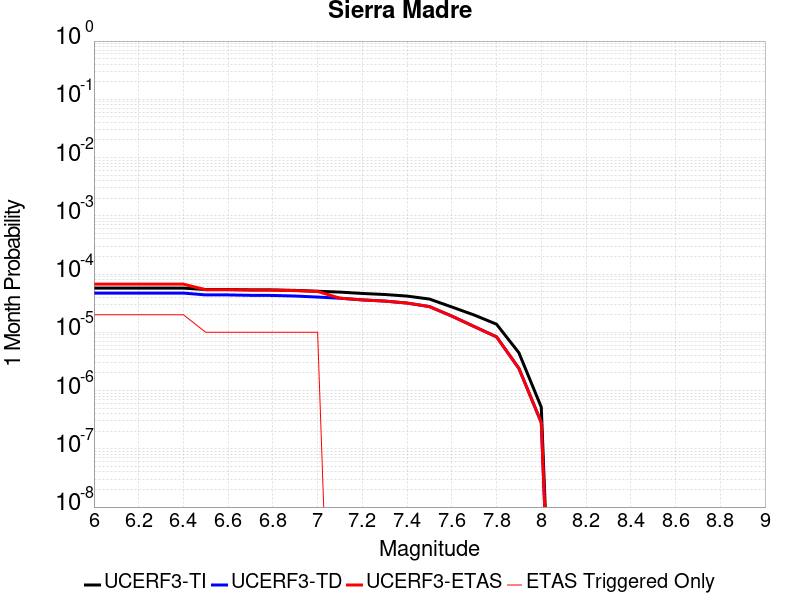 | 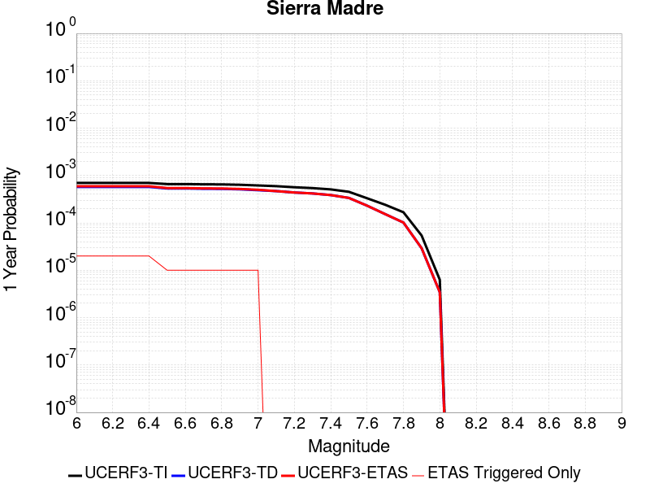 |  |

| Magnitude | 1 wk TI Prob | 1 wk TD Prob | 1 wk ETAS Prob | 1 wk ETAS/TD Gain | 1 wk ETAS Triggered Only | 1 mo TI Prob | 1 mo TD Prob | 1 mo ETAS Prob | 1 mo ETAS/TD Gain | 1 mo ETAS Triggered Only | 1 yr TI Prob | 1 yr TD Prob | 1 yr ETAS Prob | 1 yr ETAS/TD Gain | 1 yr ETAS Triggered Only | 10 yr TI Prob | 10 yr TD Prob | 10 yr ETAS Prob | 10 yr ETAS/TD Gain | 10 yr ETAS Triggered Only |
|-----|-----|-----|-----|-----|-----|-----|-----|-----|-----|-----|-----|-----|-----|-----|-----|-----|-----|-----|-----|-----|
| 6.0 | 1.3379373E-5 | 1.10007395E-5 | 1.10007395E-5 | 1.0 | 0.0 | 5.7338908E-5 | 4.7145186E-5 | 7.388189E-5 | 1.5671142 | 2.6737967E-5 | 6.978776E-4 | 5.738429E-4 | 6.005656E-4 | 1.0465678 | 2.6737967E-5 | 0.0069569005 | 0.0057239756 | 0.0057505607 | 1.0046445 | 2.6737967E-5 |
| 6.1 | 1.3379373E-5 | 1.10007395E-5 | 1.10007395E-5 | 1.0 | 0.0 | 5.7338908E-5 | 4.7145186E-5 | 7.388189E-5 | 1.5671142 | 2.6737967E-5 | 6.978776E-4 | 5.738429E-4 | 6.005656E-4 | 1.0465678 | 2.6737967E-5 | 0.0069569005 | 0.0057239756 | 0.0057505607 | 1.0046445 | 2.6737967E-5 |
| 6.2 | 1.3379373E-5 | 1.10007395E-5 | 1.10007395E-5 | 1.0 | 0.0 | 5.7338908E-5 | 4.7145186E-5 | 7.388189E-5 | 1.5671142 | 2.6737967E-5 | 6.978776E-4 | 5.738429E-4 | 6.005656E-4 | 1.0465678 | 2.6737967E-5 | 0.0069569005 | 0.0057239756 | 0.0057505607 | 1.0046445 | 2.6737967E-5 |
| 6.3 | 1.3379373E-5 | 1.10007395E-5 | 1.10007395E-5 | 1.0 | 0.0 | 5.7338908E-5 | 4.7145186E-5 | 7.388189E-5 | 1.5671142 | 2.6737967E-5 | 6.978776E-4 | 5.738429E-4 | 6.005656E-4 | 1.0465678 | 2.6737967E-5 | 0.0069569005 | 0.0057239756 | 0.0057505607 | 1.0046445 | 2.6737967E-5 |
| 6.4 | 1.3379373E-5 | 1.10007395E-5 | 1.10007395E-5 | 1.0 | 0.0 | 5.7338908E-5 | 4.7145186E-5 | 7.388189E-5 | 1.5671142 | 2.6737967E-5 | 6.978776E-4 | 5.738429E-4 | 6.005656E-4 | 1.0465678 | 2.6737967E-5 | 0.0069569005 | 0.0057239756 | 0.0057505607 | 1.0046445 | 2.6737967E-5 |
| 6.5 | 1.26563245E-5 | 1.0230196E-5 | 1.0230196E-5 | 1.0 | 0.0 | 5.4240263E-5 | 4.3842967E-5 | 5.7211364E-5 | 1.3049154 | 1.3368984E-5 | 6.601751E-4 | 5.336584E-4 | 5.470203E-4 | 1.0250382 | 1.3368984E-5 | 0.006582173 | 0.0053240913 | 0.0053373887 | 1.0024977 | 1.3368984E-5 |
| 6.6 | 1.26563245E-5 | 1.0230196E-5 | 1.0230196E-5 | 1.0 | 0.0 | 5.4240263E-5 | 4.3842967E-5 | 5.7211364E-5 | 1.3049154 | 1.3368984E-5 | 6.601751E-4 | 5.336584E-4 | 5.470203E-4 | 1.0250382 | 1.3368984E-5 | 0.006582173 | 0.0053240913 | 0.0053373887 | 1.0024977 | 1.3368984E-5 |
| 6.7 | 1.2502474E-5 | 1.006634E-5 | 1.006634E-5 | 1.0 | 0.0 | 5.3580934E-5 | 4.314075E-5 | 5.6509158E-5 | 1.3098788 | 1.3368984E-5 | 6.521526E-4 | 5.251131E-4 | 5.3847505E-4 | 1.0254458 | 1.3368984E-5 | 0.0065024206 | 0.0052390425 | 0.0052523413 | 1.0025384 | 1.3368984E-5 |
| 6.8 | 1.2454966E-5 | 1.0018625E-5 | 1.0018625E-5 | 1.0 | 0.0 | 5.3377335E-5 | 4.2936266E-5 | 5.6304674E-5 | 1.3113548 | 1.3368984E-5 | 6.4967526E-4 | 5.226247E-4 | 5.3598674E-4 | 1.025567 | 1.3368984E-5 | 0.006477792 | 0.0052142753 | 0.0052275746 | 1.0025506 | 1.3368984E-5 |
| 6.9 | 1.2225574E-5 | 9.792602E-6 | 9.792602E-6 | 1.0 | 0.0 | 5.2394265E-5 | 4.1967625E-5 | 5.5336048E-5 | 1.3185413 | 1.3368984E-5 | 6.3771347E-4 | 5.108371E-4 | 5.241993E-4 | 1.0261574 | 1.3368984E-5 | 0.006358865 | 0.0050969445 | 0.0051102457 | 1.0026096 | 1.3368984E-5 |
| 7.0 | 1.182946E-5 | 9.399144E-6 | 9.399144E-6 | 1.0 | 0.0 | 5.06967E-5 | 4.0281426E-5 | 5.3649874E-5 | 1.3318762 | 1.3368984E-5 | 6.1705755E-4 | 4.9031706E-4 | 5.0367945E-4 | 1.0272527 | 1.3368984E-5 | 0.006153469 | 0.004892664 | 0.0049059675 | 1.002719 | 1.3368984E-5 |
| 7.1 | 1.14369095E-5 | 8.986159E-6 | 8.986159E-6 | 1.0 | 0.0 | 4.9014405E-5 | 3.8511545E-5 | 3.8511545E-5 | 1.0 | 0.0 | 5.9658696E-4 | 4.687782E-4 | 4.687782E-4 | 1.0 | 0.0 | 0.005949879 | 0.004678199 | 0.004678199 | 1.0 | 0.0 |
| 7.2 | 1.0836419E-5 | 8.3995565E-6 | 8.3995565E-6 | 1.0 | 0.0 | 4.644097E-5 | 3.5997607E-5 | 3.5997607E-5 | 1.0 | 0.0 | 5.652721E-4 | 4.3818366E-4 | 4.3818366E-4 | 1.0 | 0.0 | 0.0056383642 | 0.004373494 | 0.004373494 | 1.0 | 0.0 |
| 7.3 | 1.0403439E-5 | 8.02082E-6 | 8.02082E-6 | 1.0 | 0.0 | 4.4585406E-5 | 3.4374494E-5 | 3.4374494E-5 | 1.0 | 0.0 | 5.426921E-4 | 4.1843E-4 | 4.1843E-4 | 1.0 | 0.0 | 0.005413687 | 0.004176717 | 0.004176717 | 1.0 | 0.0 |
| 7.4 | 9.768864E-6 | 7.414448E-6 | 7.414448E-6 | 1.0 | 0.0 | 4.186589E-5 | 3.1775824E-5 | 3.1775824E-5 | 1.0 | 0.0 | 5.09598E-4 | 3.868029E-4 | 3.868029E-4 | 1.0 | 0.0 | 0.0050843097 | 0.0038615882 | 0.0038615882 | 1.0 | 0.0 |
| 7.5 | 8.687089E-6 | 6.4501564E-6 | 6.4501564E-6 | 1.0 | 0.0 | 3.722985E-5 | 2.764324E-5 | 2.764324E-5 | 1.0 | 0.0 | 4.5317915E-4 | 3.3650533E-4 | 3.3650533E-4 | 1.0 | 0.0 | 0.004522561 | 0.0033602451 | 0.0033602451 | 1.0 | 0.0 |
| 7.6 | 6.3506063E-6 | 4.4303215E-6 | 4.4303215E-6 | 1.0 | 0.0 | 2.72166E-5 | 1.8986955E-5 | 1.8986955E-5 | 1.0 | 0.0 | 3.3131172E-4 | 2.3114192E-4 | 2.3114192E-4 | 1.0 | 0.0 | 0.003308182 | 0.0023092402 | 0.0023092402 | 1.0 | 0.0 |
| 7.7 | 4.62223E-6 | 2.932967E-6 | 2.932967E-6 | 1.0 | 0.0 | 1.9809406E-5 | 1.2569798E-5 | 1.2569798E-5 | 1.0 | 0.0 | 2.4115283E-4 | 1.5302657E-4 | 1.5302657E-4 | 1.0 | 0.0 | 0.0024089129 | 0.001529413 | 0.001529413 | 1.0 | 0.0 |
| 7.8 | 3.2145008E-6 | 1.9494332E-6 | 1.9494332E-6 | 1.0 | 0.0 | 1.3776359E-5 | 8.3546865E-6 | 8.3546865E-6 | 1.0 | 0.0 | 1.6771426E-4 | 1.0171358E-4 | 1.0171358E-4 | 1.0 | 0.0 | 0.0016758774 | 0.0010168145 | 0.0010168145 | 1.0 | 0.0 |
| 7.9 | 1.0391769E-6 | 5.6026335E-7 | 5.6026335E-7 | 1.0 | 0.0 | 4.4536077E-6 | 2.4011265E-6 | 2.4011265E-6 | 1.0 | 0.0 | 5.4221324E-5 | 2.9233326E-5 | 2.9233326E-5 | 1.0 | 0.0 | 5.4208096E-4 | 2.9229524E-4 | 2.9229524E-4 | 1.0 | 0.0 |
| 8.0 | 1.210983E-7 | 6.613821E-8 | 6.613821E-8 | 1.0 | 0.0 | 5.1899264E-7 | 2.8344945E-7 | 2.8344945E-7 | 1.0 | 0.0 | 6.3187167E-6 | 3.4509917E-6 | 3.4509917E-6 | 1.0 | 0.0 | 6.318537E-5 | 3.45094E-5 | 3.45094E-5 | 1.0 | 0.0 |

## San Juan
*[(top)](#table-of-contents)*

| 1 Week | 1 Month | 1 Year | 10 Year |
|-----|-----|-----|-----|
|  |  |  |  |

| Magnitude | 1 wk TI Prob | 1 wk TD Prob | 1 wk ETAS Prob | 1 wk ETAS/TD Gain | 1 wk ETAS Triggered Only | 1 mo TI Prob | 1 mo TD Prob | 1 mo ETAS Prob | 1 mo ETAS/TD Gain | 1 mo ETAS Triggered Only | 1 yr TI Prob | 1 yr TD Prob | 1 yr ETAS Prob | 1 yr ETAS/TD Gain | 1 yr ETAS Triggered Only | 10 yr TI Prob | 10 yr TD Prob | 10 yr ETAS Prob | 10 yr ETAS/TD Gain | 10 yr ETAS Triggered Only |
|-----|-----|-----|-----|-----|-----|-----|-----|-----|-----|-----|-----|-----|-----|-----|-----|-----|-----|-----|-----|-----|
| 6.0 | 8.682808E-6 | 8.7491635E-6 | 8.7491635E-6 | 1.0 | 0.0 | 3.72115E-5 | 3.74959E-5 | 3.74959E-5 | 1.0 | 0.0 | 4.5295584E-4 | 4.564218E-4 | 4.697847E-4 | 1.0292774 | 1.3368984E-5 | 0.004520337 | 0.004555385 | 0.0045820014 | 1.0058428 | 2.6737967E-5 |
| 6.1 | 8.682808E-6 | 8.7491635E-6 | 8.7491635E-6 | 1.0 | 0.0 | 3.72115E-5 | 3.74959E-5 | 3.74959E-5 | 1.0 | 0.0 | 4.5295584E-4 | 4.564218E-4 | 4.697847E-4 | 1.0292774 | 1.3368984E-5 | 0.004520337 | 0.004555385 | 0.0045820014 | 1.0058428 | 2.6737967E-5 |
| 6.2 | 8.682808E-6 | 8.7491635E-6 | 8.7491635E-6 | 1.0 | 0.0 | 3.72115E-5 | 3.74959E-5 | 3.74959E-5 | 1.0 | 0.0 | 4.5295584E-4 | 4.564218E-4 | 4.697847E-4 | 1.0292774 | 1.3368984E-5 | 0.004520337 | 0.004555385 | 0.0045820014 | 1.0058428 | 2.6737967E-5 |
| 6.3 | 6.3054235E-6 | 6.2825848E-6 | 6.2825848E-6 | 1.0 | 0.0 | 2.7022963E-5 | 2.6925094E-5 | 2.6925094E-5 | 1.0 | 0.0 | 3.2895492E-4 | 3.2776513E-4 | 3.2776513E-4 | 1.0 | 0.0 | 0.003284684 | 0.003273017 | 0.0032863421 | 1.0040712 | 1.3368984E-5 |
| 6.4 | 6.1490473E-6 | 6.1144656E-6 | 6.1144656E-6 | 1.0 | 0.0 | 2.6352795E-5 | 2.6204598E-5 | 2.6204598E-5 | 1.0 | 0.0 | 3.2079802E-4 | 3.1899565E-4 | 3.1899565E-4 | 1.0 | 0.0 | 0.0032033534 | 0.0031855737 | 0.0031989003 | 1.0041834 | 1.3368984E-5 |
| 6.5 | 5.204848E-6 | 5.137233E-6 | 5.137233E-6 | 1.0 | 0.0 | 2.23063E-5 | 2.2016533E-5 | 2.2016533E-5 | 1.0 | 0.0 | 2.7154534E-4 | 2.6801927E-4 | 2.6801927E-4 | 1.0 | 0.0 | 0.0027121378 | 0.0026771144 | 0.0026904477 | 1.0049804 | 1.3368984E-5 |
| 6.6 | 4.5179986E-6 | 4.4150297E-6 | 4.4150297E-6 | 1.0 | 0.0 | 1.9362706E-5 | 1.8921424E-5 | 1.8921424E-5 | 1.0 | 0.0 | 2.3571544E-4 | 2.3034477E-4 | 2.3034477E-4 | 1.0 | 0.0 | 0.0023546559 | 0.0023011973 | 0.0023145354 | 1.0057962 | 1.3368984E-5 |
| 6.7 | 3.9442616E-6 | 3.819828E-6 | 3.819828E-6 | 1.0 | 0.0 | 1.6903869E-5 | 1.6370592E-5 | 1.6370592E-5 | 1.0 | 0.0 | 2.0578515E-4 | 1.992944E-4 | 1.992944E-4 | 1.0 | 0.0 | 0.002055947 | 0.0019912818 | 0.0019912818 | 1.0 | 0.0 |
| 6.8 | 3.4536245E-6 | 3.3163353E-6 | 3.3163353E-6 | 1.0 | 0.0 | 1.4801163E-5 | 1.4212792E-5 | 1.4212792E-5 | 1.0 | 0.0 | 1.8018926E-4 | 1.7302761E-4 | 1.7302761E-4 | 1.0 | 0.0 | 0.0018004322 | 0.0017290477 | 0.0017290477 | 1.0 | 0.0 |
| 6.9 | 3.059865E-6 | 2.9120315E-6 | 2.9120315E-6 | 1.0 | 0.0 | 1.3113641E-5 | 1.2480078E-5 | 1.2480078E-5 | 1.0 | 0.0 | 1.596469E-4 | 1.5193493E-4 | 1.5193493E-4 | 1.0 | 0.0 | 0.0015953224 | 0.0015184252 | 0.0015184252 | 1.0 | 0.0 |
| 7.0 | 2.6504351E-6 | 2.4920002E-6 | 2.4920002E-6 | 1.0 | 0.0 | 1.1358958E-5 | 1.0679961E-5 | 1.0679961E-5 | 1.0 | 0.0 | 1.3828653E-4 | 1.300213E-4 | 1.300213E-4 | 1.0 | 0.0 | 0.0013820052 | 0.0012995641 | 0.0012995641 | 1.0 | 0.0 |
| 7.1 | 2.2039317E-6 | 2.0338296E-6 | 2.0338296E-6 | 1.0 | 0.0 | 9.445387E-6 | 8.716386E-6 | 8.716386E-6 | 1.0 | 0.0 | 1.1499152E-4 | 1.0611736E-4 | 1.0611736E-4 | 1.0 | 0.0 | 0.0011493203 | 0.0010607769 | 0.0010607769 | 1.0 | 0.0 |
| 7.2 | 1.0786707E-6 | 8.7701903E-7 | 8.7701903E-7 | 1.0 | 0.0 | 4.622866E-6 | 3.7586476E-6 | 3.7586476E-6 | 1.0 | 0.0 | 5.628194E-5 | 4.5760586E-5 | 4.5760586E-5 | 1.0 | 0.0 | 5.6267687E-4 | 4.5757066E-4 | 4.5757066E-4 | 1.0 | 0.0 |
| 7.3 | 6.846433E-7 | 4.868805E-7 | 4.868805E-7 | 1.0 | 0.0 | 2.9341822E-6 | 2.086629E-6 | 2.086629E-6 | 1.0 | 0.0 | 3.5723086E-5 | 2.5404412E-5 | 2.5404412E-5 | 1.0 | 0.0 | 3.571734E-4 | 2.540486E-4 | 2.540486E-4 | 1.0 | 0.0 |
| 7.4 | 5.23043E-7 | 3.2628162E-7 | 3.2628162E-7 | 1.0 | 0.0 | 2.2416111E-6 | 1.398349E-6 | 1.398349E-6 | 1.0 | 0.0 | 2.7291273E-5 | 1.7024766E-5 | 1.7024766E-5 | 1.0 | 0.0 | 2.7287923E-4 | 1.7026656E-4 | 1.7026656E-4 | 1.0 | 0.0 |
| 7.5 | 4.648444E-7 | 2.7234944E-7 | 2.7234944E-7 | 1.0 | 0.0 | 1.9921886E-6 | 1.1672114E-6 | 1.1672114E-6 | 1.0 | 0.0 | 2.4254627E-5 | 1.42107065E-5 | 1.42107065E-5 | 1.0 | 0.0 | 2.425198E-4 | 1.421276E-4 | 1.421276E-4 | 1.0 | 0.0 |
| 7.6 | 3.9906567E-7 | 2.2083314E-7 | 2.2083314E-7 | 1.0 | 0.0 | 1.7102802E-6 | 9.464274E-7 | 9.464274E-7 | 1.0 | 0.0 | 2.0822463E-5 | 1.1522693E-5 | 1.1522693E-5 | 1.0 | 0.0 | 2.0820512E-4 | 1.15245566E-4 | 1.15245566E-4 | 1.0 | 0.0 |
| 7.7 | 1.8784601E-7 | 5.3666906E-8 | 5.3666906E-8 | 1.0 | 0.0 | 8.0505407E-7 | 2.30001E-7 | 2.30001E-7 | 1.0 | 0.0 | 9.80149E-6 | 2.8002585E-6 | 2.8002585E-6 | 1.0 | 0.0 | 9.801057E-5 | 2.8011282E-5 | 2.8011282E-5 | 1.0 | 0.0 |
| 7.8 | 1.00154914E-7 | 1.2415832E-8 | 1.2415832E-8 | 1.0 | 0.0 | 4.2923529E-7 | 5.3210716E-8 | 5.3210716E-8 | 1.0 | 0.0 | 5.225927E-6 | 6.4784024E-7 | 6.4784024E-7 | 1.0 | 0.0 | 5.225804E-5 | 6.484273E-6 | 6.484273E-6 | 1.0 | 0.0 |
| 7.9 | 6.171429E-8 | 4.2966155E-9 | 4.2966155E-9 | 1.0 | 0.0 | 2.6448978E-7 | 1.8414067E-8 | 1.8414067E-8 | 1.0 | 0.0 | 3.2201583E-6 | 2.2419121E-7 | 2.2419121E-7 | 1.0 | 0.0 | 3.2201115E-5 | 2.2472002E-6 | 2.2472002E-6 | 1.0 | 0.0 |
| 8.0 | 1.3974572E-8 | 3.3788217E-10 | 3.3788217E-10 | 1.0 | 0.0 | 5.989102E-8 | 1.448067E-9 | 1.448067E-9 | 1.0 | 0.0 | 7.2917294E-7 | 1.763022E-8 | 1.763022E-8 | 1.0 | 0.0 | 7.2917055E-6 | 1.8060365E-7 | 1.8060365E-7 | 1.0 | 0.0 |
| 8.1 | 1.8403477E-9 | 1.1302803E-10 | 1.1302803E-10 | 1.0 | 0.0 | 7.887204E-9 | 4.844063E-10 | 4.844063E-10 | 1.0 | 0.0 | 9.602671E-8 | 5.8976446E-9 | 5.8976446E-9 | 1.0 | 0.0 | 9.602667E-7 | 6.021993E-8 | 6.021993E-8 | 1.0 | 0.0 |

## Elsinore (Julian)
*[(top)](#table-of-contents)*

| 1 Week | 1 Month | 1 Year | 10 Year |
|-----|-----|-----|-----|
|  |  | 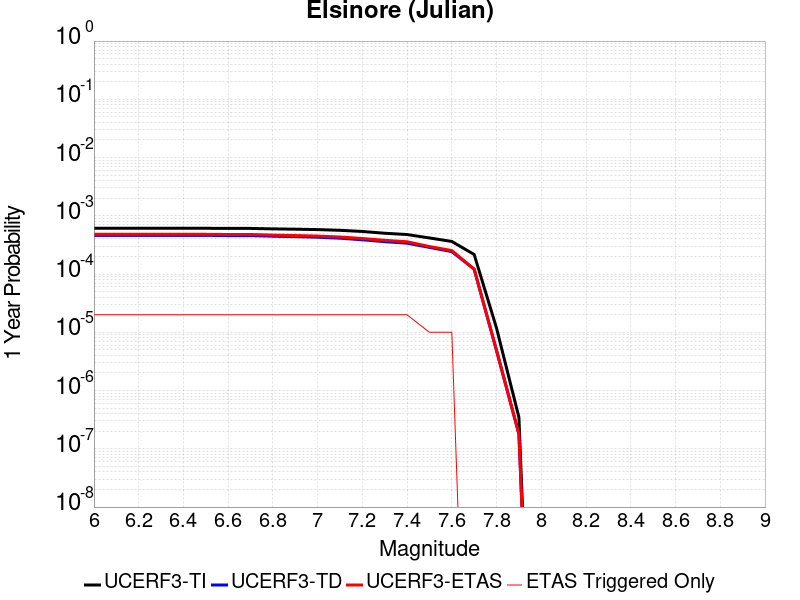 |  |

| Magnitude | 1 wk TI Prob | 1 wk TD Prob | 1 wk ETAS Prob | 1 wk ETAS/TD Gain | 1 wk ETAS Triggered Only | 1 mo TI Prob | 1 mo TD Prob | 1 mo ETAS Prob | 1 mo ETAS/TD Gain | 1 mo ETAS Triggered Only | 1 yr TI Prob | 1 yr TD Prob | 1 yr ETAS Prob | 1 yr ETAS/TD Gain | 1 yr ETAS Triggered Only | 10 yr TI Prob | 10 yr TD Prob | 10 yr ETAS Prob | 10 yr ETAS/TD Gain | 10 yr ETAS Triggered Only |
|-----|-----|-----|-----|-----|-----|-----|-----|-----|-----|-----|-----|-----|-----|-----|-----|-----|-----|-----|-----|-----|
| 6.0 | 1.1710231E-5 | 8.845509E-6 | 2.2214375E-5 | 2.5113733 | 1.3368984E-5 | 5.0185736E-5 | 3.7908783E-5 | 6.4645734E-5 | 1.7052971 | 2.6737967E-5 | 6.1084004E-4 | 4.614434E-4 | 4.88169E-4 | 1.0579175 | 2.6737967E-5 | 0.006091637 | 0.0046050567 | 0.0046316716 | 1.0057795 | 2.6737967E-5 |
| 6.1 | 1.1710231E-5 | 8.845509E-6 | 2.2214375E-5 | 2.5113733 | 1.3368984E-5 | 5.0185736E-5 | 3.7908783E-5 | 6.4645734E-5 | 1.7052971 | 2.6737967E-5 | 6.1084004E-4 | 4.614434E-4 | 4.88169E-4 | 1.0579175 | 2.6737967E-5 | 0.006091637 | 0.0046050567 | 0.0046316716 | 1.0057795 | 2.6737967E-5 |
| 6.2 | 1.1710231E-5 | 8.845509E-6 | 2.2214375E-5 | 2.5113733 | 1.3368984E-5 | 5.0185736E-5 | 3.7908783E-5 | 6.4645734E-5 | 1.7052971 | 2.6737967E-5 | 6.1084004E-4 | 4.614434E-4 | 4.88169E-4 | 1.0579175 | 2.6737967E-5 | 0.006091637 | 0.0046050567 | 0.0046316716 | 1.0057795 | 2.6737967E-5 |
| 6.3 | 1.1710231E-5 | 8.845509E-6 | 2.2214375E-5 | 2.5113733 | 1.3368984E-5 | 5.0185736E-5 | 3.7908783E-5 | 6.4645734E-5 | 1.7052971 | 2.6737967E-5 | 6.1084004E-4 | 4.614434E-4 | 4.88169E-4 | 1.0579175 | 2.6737967E-5 | 0.006091637 | 0.0046050567 | 0.0046316716 | 1.0057795 | 2.6737967E-5 |
| 6.4 | 1.1710231E-5 | 8.845509E-6 | 2.2214375E-5 | 2.5113733 | 1.3368984E-5 | 5.0185736E-5 | 3.7908783E-5 | 6.4645734E-5 | 1.7052971 | 2.6737967E-5 | 6.1084004E-4 | 4.614434E-4 | 4.88169E-4 | 1.0579175 | 2.6737967E-5 | 0.006091637 | 0.0046050567 | 0.0046316716 | 1.0057795 | 2.6737967E-5 |
| 6.5 | 1.1710231E-5 | 8.845509E-6 | 2.2214375E-5 | 2.5113733 | 1.3368984E-5 | 5.0185736E-5 | 3.7908783E-5 | 6.4645734E-5 | 1.7052971 | 2.6737967E-5 | 6.1084004E-4 | 4.614434E-4 | 4.88169E-4 | 1.0579175 | 2.6737967E-5 | 0.006091637 | 0.0046050567 | 0.0046316716 | 1.0057795 | 2.6737967E-5 |
| 6.6 | 1.1650619E-5 | 8.777881E-6 | 2.2146747E-5 | 2.5230176 | 1.3368984E-5 | 4.993027E-5 | 3.7618956E-5 | 6.435592E-5 | 1.7107311 | 2.6737967E-5 | 6.0773146E-4 | 4.5791623E-4 | 4.8464196E-4 | 1.0583638 | 2.6737967E-5 | 0.0060607214 | 0.004569931 | 0.0045965463 | 1.0058241 | 2.6737967E-5 |
| 6.7 | 1.1650619E-5 | 8.777881E-6 | 2.2146747E-5 | 2.5230176 | 1.3368984E-5 | 4.993027E-5 | 3.7618956E-5 | 6.435592E-5 | 1.7107311 | 2.6737967E-5 | 6.0773146E-4 | 4.5791623E-4 | 4.8464196E-4 | 1.0583638 | 2.6737967E-5 | 0.0060607214 | 0.004569931 | 0.0045965463 | 1.0058241 | 2.6737967E-5 |
| 6.8 | 1.1442698E-5 | 8.561041E-6 | 2.192991E-5 | 2.561594 | 1.3368984E-5 | 4.9039216E-5 | 3.6689667E-5 | 6.3426654E-5 | 1.7287334 | 2.6737967E-5 | 5.968889E-4 | 4.4660683E-4 | 4.7333285E-4 | 1.0598423 | 2.6737967E-5 | 0.0059528816 | 0.004457295 | 0.0044839135 | 1.0059719 | 2.6737967E-5 |
| 6.9 | 1.1300589E-5 | 8.408907E-6 | 2.1777778E-5 | 2.5898464 | 1.3368984E-5 | 4.8430196E-5 | 3.6037683E-5 | 6.277469E-5 | 1.741918 | 2.6737967E-5 | 5.894781E-4 | 4.3867214E-4 | 4.653984E-4 | 1.0609254 | 2.6737967E-5 | 0.005879169 | 0.0043782624 | 0.004404883 | 1.0060803 | 2.6737967E-5 |
| 7.0 | 1.1117729E-5 | 8.226087E-6 | 2.159496E-5 | 2.6251802 | 1.3368984E-5 | 4.764654E-5 | 3.525419E-5 | 6.199122E-5 | 1.758407 | 2.6737967E-5 | 5.799422E-4 | 4.291369E-4 | 4.558634E-4 | 1.0622797 | 2.6737967E-5 | 0.0057843104 | 0.004283281 | 0.0043099043 | 1.0062157 | 2.6737967E-5 |
| 7.1 | 1.08053955E-5 | 7.9117535E-6 | 2.1280632E-5 | 2.689749 | 1.3368984E-5 | 4.6308014E-5 | 3.3907087E-5 | 6.0644146E-5 | 1.788539 | 2.6737967E-5 | 5.6365423E-4 | 4.127422E-4 | 4.3946912E-4 | 1.0647545 | 2.6737967E-5 | 0.005622267 | 0.0041199517 | 0.0041465797 | 1.0064632 | 2.6737967E-5 |
| 7.2 | 1.032804E-5 | 7.433021E-6 | 2.0801906E-5 | 2.7985802 | 1.3368984E-5 | 4.4262277E-5 | 3.1855423E-5 | 5.859254E-5 | 1.839327 | 2.6737967E-5 | 5.387599E-4 | 3.8777234E-4 | 4.1449993E-4 | 1.068926 | 2.6737967E-5 | 0.0053745564 | 0.0038711445 | 0.003897779 | 1.0068803 | 2.6737967E-5 |
| 7.3 | 9.622426E-6 | 6.8978457E-6 | 2.0266738E-5 | 2.9381256 | 1.3368984E-5 | 4.1238312E-5 | 2.9561868E-5 | 5.6299046E-5 | 1.9044482 | 2.6737967E-5 | 5.019608E-4 | 3.5985775E-4 | 3.865861E-4 | 1.0742748 | 2.6737967E-5 | 0.005008285 | 0.0035929221 | 0.003619564 | 1.007415 | 2.6737967E-5 |
| 7.4 | 9.144434E-6 | 6.4963933E-6 | 1.986529E-5 | 3.0578952 | 1.3368984E-5 | 3.9189843E-5 | 2.7841395E-5 | 5.457862E-5 | 1.9603406 | 2.6737967E-5 | 4.7703186E-4 | 3.3891766E-4 | 3.6564656E-4 | 1.0788655 | 2.6737967E-5 | 0.0047600917 | 0.0033841513 | 0.0034107987 | 1.0078743 | 2.6737967E-5 |
| 7.5 | 7.988981E-6 | 5.4983307E-6 | 5.4983307E-6 | 1.0 | 0.0 | 3.4238044E-5 | 2.356407E-5 | 3.693274E-5 | 1.5673327 | 1.3368984E-5 | 4.1676845E-4 | 2.8685606E-4 | 3.002212E-4 | 1.0465919 | 1.3368984E-5 | 0.0041598766 | 0.002864985 | 0.0028783157 | 1.004653 | 1.3368984E-5 |
| 7.6 | 6.9554876E-6 | 4.6625346E-6 | 4.6625346E-6 | 1.0 | 0.0 | 2.9808893E-5 | 1.9982144E-5 | 3.335086E-5 | 1.6690332 | 1.3368984E-5 | 3.6286283E-4 | 2.4325661E-4 | 2.5662236E-4 | 1.054945 | 1.3368984E-5 | 0.0036227088 | 0.0024300197 | 0.002443356 | 1.0054883 | 1.3368984E-5 |
| 7.7 | 4.1557314E-6 | 2.3246462E-6 | 2.3246462E-6 | 1.0 | 0.0 | 1.7810156E-5 | 9.962735E-6 | 9.962735E-6 | 1.0 | 0.0 | 2.1681708E-4 | 1.2129029E-4 | 1.2129029E-4 | 1.0 | 0.0 | 0.0021660565 | 0.001212314 | 0.001212314 | 1.0 | 0.0 |
| 7.8 | 2.2597293E-7 | 9.332915E-8 | 9.332915E-8 | 1.0 | 0.0 | 9.684551E-7 | 3.99982E-7 | 3.99982E-7 | 1.0 | 0.0 | 1.1790877E-5 | 4.8697734E-6 | 4.8697734E-6 | 1.0 | 0.0 | 1.17902506E-4 | 4.8696995E-5 | 4.8696995E-5 | 1.0 | 0.0 |
| 7.9 | 6.676829E-9 | 3.439853E-9 | 3.439853E-9 | 1.0 | 0.0 | 2.861498E-8 | 1.4742227E-8 | 1.4742227E-8 | 1.0 | 0.0 | 3.4838732E-7 | 1.7948659E-7 | 1.7948659E-7 | 1.0 | 0.0 | 3.4838679E-6 | 1.7948646E-6 | 1.7948646E-6 | 1.0 | 0.0 |

## San Luis Range 2011 CFM
*[(top)](#table-of-contents)*

| 1 Week | 1 Month | 1 Year | 10 Year |
|-----|-----|-----|-----|
|  |  |  |  |

| Magnitude | 1 wk TI Prob | 1 wk TD Prob | 1 wk ETAS Prob | 1 wk ETAS/TD Gain | 1 wk ETAS Triggered Only | 1 mo TI Prob | 1 mo TD Prob | 1 mo ETAS Prob | 1 mo ETAS/TD Gain | 1 mo ETAS Triggered Only | 1 yr TI Prob | 1 yr TD Prob | 1 yr ETAS Prob | 1 yr ETAS/TD Gain | 1 yr ETAS Triggered Only | 10 yr TI Prob | 10 yr TD Prob | 10 yr ETAS Prob | 10 yr ETAS/TD Gain | 10 yr ETAS Triggered Only |
|-----|-----|-----|-----|-----|-----|-----|-----|-----|-----|-----|-----|-----|-----|-----|-----|-----|-----|-----|-----|-----|
| 6.0 | 8.8368415E-6 | 8.965454E-6 | 8.965454E-6 | 1.0 | 0.0 | 3.787163E-5 | 3.842285E-5 | 3.842285E-5 | 1.0 | 0.0 | 4.609895E-4 | 4.677057E-4 | 4.677057E-4 | 1.0 | 0.0 | 0.0046003438 | 0.0046679964 | 0.0046946094 | 1.0057012 | 2.6737967E-5 |
| 6.1 | 8.8368415E-6 | 8.965454E-6 | 8.965454E-6 | 1.0 | 0.0 | 3.787163E-5 | 3.842285E-5 | 3.842285E-5 | 1.0 | 0.0 | 4.609895E-4 | 4.677057E-4 | 4.677057E-4 | 1.0 | 0.0 | 0.0046003438 | 0.0046679964 | 0.0046946094 | 1.0057012 | 2.6737967E-5 |
| 6.2 | 8.8368415E-6 | 8.965454E-6 | 8.965454E-6 | 1.0 | 0.0 | 3.787163E-5 | 3.842285E-5 | 3.842285E-5 | 1.0 | 0.0 | 4.609895E-4 | 4.677057E-4 | 4.677057E-4 | 1.0 | 0.0 | 0.0046003438 | 0.0046679964 | 0.0046946094 | 1.0057012 | 2.6737967E-5 |
| 6.3 | 8.8368415E-6 | 8.965454E-6 | 8.965454E-6 | 1.0 | 0.0 | 3.787163E-5 | 3.842285E-5 | 3.842285E-5 | 1.0 | 0.0 | 4.609895E-4 | 4.677057E-4 | 4.677057E-4 | 1.0 | 0.0 | 0.0046003438 | 0.0046679964 | 0.0046946094 | 1.0057012 | 2.6737967E-5 |
| 6.4 | 3.9094193E-6 | 3.9412025E-6 | 3.9412025E-6 | 1.0 | 0.0 | 1.6754546E-5 | 1.689076E-5 | 1.689076E-5 | 1.0 | 0.0 | 2.039675E-4 | 2.056259E-4 | 2.056259E-4 | 1.0 | 0.0 | 0.0020378039 | 0.0020543851 | 0.0020677266 | 1.0064942 | 1.3368984E-5 |
| 6.5 | 3.9094193E-6 | 3.9412025E-6 | 3.9412025E-6 | 1.0 | 0.0 | 1.6754546E-5 | 1.689076E-5 | 1.689076E-5 | 1.0 | 0.0 | 2.039675E-4 | 2.056259E-4 | 2.056259E-4 | 1.0 | 0.0 | 0.0020378039 | 0.0020543851 | 0.0020677266 | 1.0064942 | 1.3368984E-5 |
| 6.6 | 3.0587726E-6 | 3.0753883E-6 | 3.0753883E-6 | 1.0 | 0.0 | 1.3108959E-5 | 1.318017E-5 | 1.318017E-5 | 1.0 | 0.0 | 1.595899E-4 | 1.6045687E-4 | 1.6045687E-4 | 1.0 | 0.0 | 0.0015947534 | 0.0016034221 | 0.0016167696 | 1.0083244 | 1.3368984E-5 |
| 6.7 | 2.6160574E-6 | 2.6251273E-6 | 2.6251273E-6 | 1.0 | 0.0 | 1.1211626E-5 | 1.1250498E-5 | 1.1250498E-5 | 1.0 | 0.0 | 1.3649299E-4 | 1.3696625E-4 | 1.3696625E-4 | 1.0 | 0.0 | 0.0013640919 | 0.0013688246 | 0.0013821753 | 1.0097533 | 1.3368984E-5 |
| 6.8 | 2.5110312E-6 | 2.51814E-6 | 2.51814E-6 | 1.0 | 0.0 | 1.0761518E-5 | 1.0791985E-5 | 1.0791985E-5 | 1.0 | 0.0 | 1.310136E-4 | 1.3138456E-4 | 1.3138456E-4 | 1.0 | 0.0 | 0.0013093639 | 0.0013130746 | 0.001326426 | 1.0101681 | 1.3368984E-5 |
| 6.9 | 1.8564405E-6 | 1.852487E-6 | 1.852487E-6 | 1.0 | 0.0 | 7.95615E-6 | 7.939206E-6 | 7.939206E-6 | 1.0 | 0.0 | 9.686181E-5 | 9.665557E-5 | 9.665557E-5 | 1.0 | 0.0 | 9.68196E-4 | 9.661373E-4 | 9.794934E-4 | 1.0138242 | 1.3368984E-5 |
| 7.0 | 1.546127E-6 | 1.5369537E-6 | 1.5369537E-6 | 1.0 | 0.0 | 6.626242E-6 | 6.586928E-6 | 6.586928E-6 | 1.0 | 0.0 | 8.06715E-5 | 8.0192905E-5 | 8.0192905E-5 | 1.0 | 0.0 | 8.0642226E-4 | 8.016404E-4 | 8.1499864E-4 | 1.0166637 | 1.3368984E-5 |
| 7.1 | 1.3368208E-6 | 1.3235326E-6 | 1.3235326E-6 | 1.0 | 0.0 | 5.7292195E-6 | 5.67227E-6 | 5.67227E-6 | 1.0 | 0.0 | 6.975101E-5 | 6.905771E-5 | 6.905771E-5 | 1.0 | 0.0 | 6.972912E-4 | 6.9036294E-4 | 7.037227E-4 | 1.0193518 | 1.3368984E-5 |
| 7.2 | 1.0623363E-6 | 1.0454368E-6 | 1.0454368E-6 | 1.0 | 0.0 | 4.5528623E-6 | 4.4804356E-6 | 4.4804356E-6 | 1.0 | 0.0 | 5.5429686E-5 | 5.4547938E-5 | 5.4547938E-5 | 1.0 | 0.0 | 5.5415864E-4 | 5.4534577E-4 | 5.5870746E-4 | 1.0245013 | 1.3368984E-5 |
| 7.3 | 7.831679E-7 | 7.7273904E-7 | 7.7273904E-7 | 1.0 | 0.0 | 3.3564295E-6 | 3.3117344E-6 | 3.3117344E-6 | 1.0 | 0.0 | 4.086376E-5 | 4.0319625E-5 | 4.0319625E-5 | 1.0 | 0.0 | 4.0856248E-4 | 4.031232E-4 | 4.1648682E-4 | 1.0331502 | 1.3368984E-5 |
| 7.4 | 5.9558846E-7 | 5.910636E-7 | 5.910636E-7 | 1.0 | 0.0 | 2.5525194E-6 | 2.5331274E-6 | 2.5331274E-6 | 1.0 | 0.0 | 3.107648E-5 | 3.084039E-5 | 3.084039E-5 | 1.0 | 0.0 | 3.1072134E-4 | 3.083612E-4 | 3.2172605E-4 | 1.0433416 | 1.3368984E-5 |
| 7.5 | 4.1616502E-7 | 4.119631E-7 | 4.119631E-7 | 1.0 | 0.0 | 1.7835631E-6 | 1.7655549E-6 | 1.7655549E-6 | 1.0 | 0.0 | 2.1714664E-5 | 2.149542E-5 | 2.149542E-5 | 1.0 | 0.0 | 2.1712543E-4 | 2.1493346E-4 | 2.1493346E-4 | 1.0 | 0.0 |
| 7.6 | 2.3816014E-7 | 2.3376548E-7 | 2.3376548E-7 | 1.0 | 0.0 | 1.0206859E-6 | 1.0018516E-6 | 1.0018516E-6 | 1.0 | 0.0 | 1.242678E-5 | 1.2197475E-5 | 1.2197475E-5 | 1.0 | 0.0 | 1.2426086E-4 | 1.2196808E-4 | 1.2196808E-4 | 1.0 | 0.0 |
| 7.7 | 9.918777E-8 | 9.3867584E-8 | 9.3867584E-8 | 1.0 | 0.0 | 4.2509038E-7 | 4.0228957E-7 | 4.0228957E-7 | 1.0 | 0.0 | 5.1754632E-6 | 4.8978645E-6 | 4.8978645E-6 | 1.0 | 0.0 | 5.1753424E-5 | 4.897757E-5 | 4.897757E-5 | 1.0 | 0.0 |
| 7.8 | 3.4982556E-8 | 2.968655E-8 | 2.968655E-8 | 1.0 | 0.0 | 1.4992524E-7 | 1.2722806E-7 | 1.2722806E-7 | 1.0 | 0.0 | 1.8253382E-6 | 1.5490006E-6 | 1.5490006E-6 | 1.0 | 0.0 | 1.8253233E-5 | 1.5489897E-5 | 1.5489897E-5 | 1.0 | 0.0 |
| 7.9 | 1.6624908E-8 | 1.1477036E-8 | 1.1477036E-8 | 1.0 | 0.0 | 7.12496E-8 | 4.91873E-8 | 4.91873E-8 | 1.0 | 0.0 | 8.6746354E-7 | 5.988552E-7 | 5.988552E-7 | 1.0 | 0.0 | 8.674601E-6 | 5.988536E-6 | 5.988536E-6 | 1.0 | 0.0 |
| 8.0 | 6.3352315E-9 | 3.0888412E-9 | 3.0888412E-9 | 1.0 | 0.0 | 2.715099E-8 | 1.3237893E-8 | 1.3237893E-8 | 1.0 | 0.0 | 3.3056327E-7 | 1.6117131E-7 | 1.6117131E-7 | 1.0 | 0.0 | 3.3056278E-6 | 1.611712E-6 | 1.611712E-6 | 1.0 | 0.0 |

## Elsinore (Stepovers Combined)
*[(top)](#table-of-contents)*

| 1 Week | 1 Month | 1 Year | 10 Year |
|-----|-----|-----|-----|
|  |  |  | 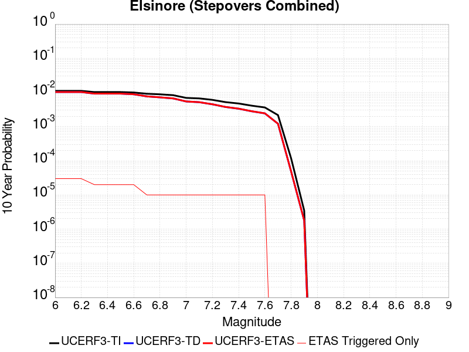 |

| Magnitude | 1 wk TI Prob | 1 wk TD Prob | 1 wk ETAS Prob | 1 wk ETAS/TD Gain | 1 wk ETAS Triggered Only | 1 mo TI Prob | 1 mo TD Prob | 1 mo ETAS Prob | 1 mo ETAS/TD Gain | 1 mo ETAS Triggered Only | 1 yr TI Prob | 1 yr TD Prob | 1 yr ETAS Prob | 1 yr ETAS/TD Gain | 1 yr ETAS Triggered Only | 10 yr TI Prob | 10 yr TD Prob | 10 yr ETAS Prob | 10 yr ETAS/TD Gain | 10 yr ETAS Triggered Only |
|-----|-----|-----|-----|-----|-----|-----|-----|-----|-----|-----|-----|-----|-----|-----|-----|-----|-----|-----|-----|-----|
| 6.0 | 2.144392E-5 | 1.9760193E-5 | 1.9760193E-5 | 1.0 | 0.0 | 9.189928E-5 | 8.468392E-5 | 9.8051765E-5 | 1.1578559 | 1.3368984E-5 | 0.0011182994 | 0.0010305607 | 0.0010572711 | 1.0259184 | 2.6737967E-5 | 0.011126885 | 0.010264917 | 0.010291381 | 1.002578 | 2.6737967E-5 |
| 6.1 | 2.144392E-5 | 1.9760193E-5 | 1.9760193E-5 | 1.0 | 0.0 | 9.189928E-5 | 8.468392E-5 | 9.8051765E-5 | 1.1578559 | 1.3368984E-5 | 0.0011182994 | 0.0010305607 | 0.0010572711 | 1.0259184 | 2.6737967E-5 | 0.011126885 | 0.010264917 | 0.010291381 | 1.002578 | 2.6737967E-5 |
| 6.2 | 2.144392E-5 | 1.9760193E-5 | 1.9760193E-5 | 1.0 | 0.0 | 9.189928E-5 | 8.468392E-5 | 9.8051765E-5 | 1.1578559 | 1.3368984E-5 | 0.0011182994 | 0.0010305607 | 0.0010572711 | 1.0259184 | 2.6737967E-5 | 0.011126885 | 0.010264917 | 0.010291381 | 1.002578 | 2.6737967E-5 |
| 6.3 | 1.9751555E-5 | 1.7741453E-5 | 1.7741453E-5 | 1.0 | 0.0 | 8.4646774E-5 | 7.603267E-5 | 8.9400644E-5 | 1.1758187 | 1.3368984E-5 | 0.0010300872 | 9.253213E-4 | 9.5203455E-4 | 1.0288692 | 2.6737967E-5 | 0.010253254 | 0.009221276 | 0.009247768 | 1.0028728 | 2.6737967E-5 |
| 6.4 | 1.9751555E-5 | 1.7741453E-5 | 1.7741453E-5 | 1.0 | 0.0 | 8.4646774E-5 | 7.603267E-5 | 8.9400644E-5 | 1.1758187 | 1.3368984E-5 | 0.0010300872 | 9.253213E-4 | 9.5203455E-4 | 1.0288692 | 2.6737967E-5 | 0.010253254 | 0.009221276 | 0.009247768 | 1.0028728 | 2.6737967E-5 |
| 6.5 | 1.9751555E-5 | 1.7741453E-5 | 1.7741453E-5 | 1.0 | 0.0 | 8.4646774E-5 | 7.603267E-5 | 8.9400644E-5 | 1.1758187 | 1.3368984E-5 | 0.0010300872 | 9.253213E-4 | 9.5203455E-4 | 1.0288692 | 2.6737967E-5 | 0.010253254 | 0.009221276 | 0.009247768 | 1.0028728 | 2.6737967E-5 |
| 6.6 | 1.9188685E-5 | 1.7003393E-5 | 1.7003393E-5 | 1.0 | 0.0 | 8.2234634E-5 | 7.286974E-5 | 8.623775E-5 | 1.1834508 | 1.3368984E-5 | 0.0010007467 | 8.868442E-4 | 9.135584E-4 | 1.0301229 | 2.6737967E-5 | 0.00996252 | 0.0088398475 | 0.008866349 | 1.002998 | 2.6737967E-5 |
| 6.7 | 1.7608272E-5 | 1.4732616E-5 | 1.4732616E-5 | 1.0 | 0.0 | 7.546184E-5 | 6.3138315E-5 | 7.6506454E-5 | 1.2117279 | 1.3368984E-5 | 9.183606E-4 | 7.684476E-4 | 7.818063E-4 | 1.017384 | 1.3368984E-5 | 0.009145746 | 0.00766491 | 0.0076781767 | 1.0017308 | 1.3368984E-5 |
| 6.8 | 1.697165E-5 | 1.3783365E-5 | 1.3783365E-5 | 1.0 | 0.0 | 7.273361E-5 | 5.9070277E-5 | 7.243847E-5 | 1.22631 | 1.3368984E-5 | 8.8517193E-4 | 7.18952E-4 | 7.3231134E-4 | 1.0185817 | 1.3368984E-5 | 0.008816543 | 0.007172675 | 0.007185948 | 1.0018505 | 1.3368984E-5 |
| 6.9 | 1.600365E-5 | 1.2846671E-5 | 1.2846671E-5 | 1.0 | 0.0 | 6.858527E-5 | 5.5056043E-5 | 6.842429E-5 | 1.2428117 | 1.3368984E-5 | 8.347058E-4 | 6.7010894E-4 | 6.83469E-4 | 1.019937 | 1.3368984E-5 | 0.008315775 | 0.0066867657 | 0.0067000454 | 1.0019859 | 1.3368984E-5 |
| 7.0 | 1.3314581E-5 | 1.0447548E-5 | 1.0447548E-5 | 1.0 | 0.0 | 5.7061243E-5 | 4.4774453E-5 | 5.814284E-5 | 1.2985717 | 1.3368984E-5 | 6.944992E-4 | 5.449953E-4 | 5.5835705E-4 | 1.024517 | 1.3368984E-5 | 0.006923327 | 0.0054405155 | 0.0054538115 | 1.0024439 | 1.3368984E-5 |
| 7.1 | 1.2865345E-5 | 9.937536E-6 | 9.937536E-6 | 1.0 | 0.0 | 5.5136024E-5 | 4.258876E-5 | 5.5957174E-5 | 1.3138953 | 1.3368984E-5 | 6.710743E-4 | 5.183973E-4 | 5.3175935E-4 | 1.0257757 | 1.3368984E-5 | 0.0066905143 | 0.0051752133 | 0.005188513 | 1.0025699 | 1.3368984E-5 |
| 7.2 | 1.1650051E-5 | 8.633809E-6 | 8.633809E-6 | 1.0 | 0.0 | 4.9927836E-5 | 3.7001522E-5 | 5.0370014E-5 | 1.3612957 | 1.3368984E-5 | 6.0770183E-4 | 4.504022E-4 | 4.6376517E-4 | 1.0296689 | 1.3368984E-5 | 0.0060604266 | 0.0044963174 | 0.004509626 | 1.00296 | 1.3368984E-5 |
| 7.3 | 1.0008533E-5 | 7.2010425E-6 | 7.2010425E-6 | 1.0 | 0.0 | 4.2893007E-5 | 3.0861254E-5 | 4.4229826E-5 | 1.4331831 | 1.3368984E-5 | 5.220972E-4 | 3.7567242E-4 | 3.890364E-4 | 1.0355735 | 1.3368984E-5 | 0.005208723 | 0.003750761 | 0.00376408 | 1.003551 | 1.3368984E-5 |
| 7.4 | 9.116759E-6 | 6.410068E-6 | 6.410068E-6 | 1.0 | 0.0 | 3.907124E-5 | 2.747144E-5 | 4.0840056E-5 | 1.4866369 | 1.3368984E-5 | 4.7558855E-4 | 3.3441483E-4 | 3.4777934E-4 | 1.0399638 | 1.3368984E-5 | 0.00474572 | 0.0033392678 | 0.0033525922 | 1.0039902 | 1.3368984E-5 |
| 7.5 | 7.870524E-6 | 5.3825365E-6 | 5.3825365E-6 | 1.0 | 0.0 | 3.3730383E-5 | 2.3067816E-5 | 3.6436493E-5 | 1.579538 | 1.3368984E-5 | 4.1059E-4 | 2.8081573E-4 | 2.9418097E-4 | 1.0475943 | 1.3368984E-5 | 0.0040983222 | 0.0028047354 | 0.002818067 | 1.0047532 | 1.3368984E-5 |
| 7.6 | 6.9774537E-6 | 4.6776067E-6 | 4.6776067E-6 | 1.0 | 0.0 | 2.990303E-5 | 2.0046738E-5 | 3.3415454E-5 | 1.6668774 | 1.3368984E-5 | 3.640086E-4 | 2.4404288E-4 | 2.574086E-4 | 1.054768 | 1.3368984E-5 | 0.003634129 | 0.0024378651 | 0.0024512014 | 1.0054705 | 1.3368984E-5 |
| 7.7 | 4.1616954E-6 | 2.32834E-6 | 2.32834E-6 | 1.0 | 0.0 | 1.7835715E-5 | 9.978567E-6 | 9.978567E-6 | 1.0 | 0.0 | 2.171282E-4 | 1.2148302E-4 | 1.2148302E-4 | 1.0 | 0.0 | 0.0021691616 | 0.0012142392 | 0.0012142392 | 1.0 | 0.0 |
| 7.8 | 2.2692414E-7 | 9.3854695E-8 | 9.3854695E-8 | 1.0 | 0.0 | 9.725317E-7 | 4.0223435E-7 | 4.0223435E-7 | 1.0 | 0.0 | 1.1840509E-5 | 4.8971956E-6 | 4.8971956E-6 | 1.0 | 0.0 | 1.1839878E-4 | 4.8971204E-5 | 4.8971204E-5 | 1.0 | 0.0 |
| 7.9 | 6.676829E-9 | 3.439853E-9 | 3.439853E-9 | 1.0 | 0.0 | 2.861498E-8 | 1.4742227E-8 | 1.4742227E-8 | 1.0 | 0.0 | 3.4838732E-7 | 1.7948659E-7 | 1.7948659E-7 | 1.0 | 0.0 | 3.4838679E-6 | 1.7948646E-6 | 1.7948646E-6 | 1.0 | 0.0 |

## Garberville - Briceland 2011 CFM
*[(top)](#table-of-contents)*

| 1 Week | 1 Month | 1 Year | 10 Year |
|-----|-----|-----|-----|
|  |  |  | 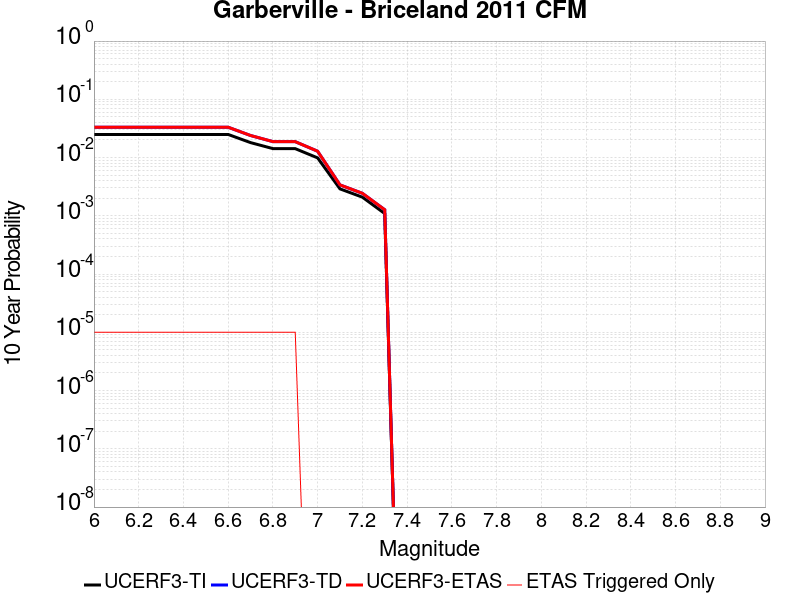 |

| Magnitude | 1 wk TI Prob | 1 wk TD Prob | 1 wk ETAS Prob | 1 wk ETAS/TD Gain | 1 wk ETAS Triggered Only | 1 mo TI Prob | 1 mo TD Prob | 1 mo ETAS Prob | 1 mo ETAS/TD Gain | 1 mo ETAS Triggered Only | 1 yr TI Prob | 1 yr TD Prob | 1 yr ETAS Prob | 1 yr ETAS/TD Gain | 1 yr ETAS Triggered Only | 10 yr TI Prob | 10 yr TD Prob | 10 yr ETAS Prob | 10 yr ETAS/TD Gain | 10 yr ETAS Triggered Only |
|-----|-----|-----|-----|-----|-----|-----|-----|-----|-----|-----|-----|-----|-----|-----|-----|-----|-----|-----|-----|-----|
| 6.0 | 4.8399295E-5 | 6.452381E-5 | 6.452381E-5 | 1.0 | 0.0 | 2.0740906E-4 | 2.7650563E-4 | 2.7650563E-4 | 1.0 | 0.0 | 0.002522281 | 0.003362017 | 0.003362017 | 1.0 | 0.0 | 0.024938442 | 0.03317861 | 0.033191536 | 1.0003896 | 1.3368984E-5 |
| 6.1 | 4.8399295E-5 | 6.452381E-5 | 6.452381E-5 | 1.0 | 0.0 | 2.0740906E-4 | 2.7650563E-4 | 2.7650563E-4 | 1.0 | 0.0 | 0.002522281 | 0.003362017 | 0.003362017 | 1.0 | 0.0 | 0.024938442 | 0.03317861 | 0.033191536 | 1.0003896 | 1.3368984E-5 |
| 6.2 | 4.8399295E-5 | 6.452381E-5 | 6.452381E-5 | 1.0 | 0.0 | 2.0740906E-4 | 2.7650563E-4 | 2.7650563E-4 | 1.0 | 0.0 | 0.002522281 | 0.003362017 | 0.003362017 | 1.0 | 0.0 | 0.024938442 | 0.03317861 | 0.033191536 | 1.0003896 | 1.3368984E-5 |
| 6.3 | 4.8399295E-5 | 6.452381E-5 | 6.452381E-5 | 1.0 | 0.0 | 2.0740906E-4 | 2.7650563E-4 | 2.7650563E-4 | 1.0 | 0.0 | 0.002522281 | 0.003362017 | 0.003362017 | 1.0 | 0.0 | 0.024938442 | 0.03317861 | 0.033191536 | 1.0003896 | 1.3368984E-5 |
| 6.4 | 4.8399295E-5 | 6.452381E-5 | 6.452381E-5 | 1.0 | 0.0 | 2.0740906E-4 | 2.7650563E-4 | 2.7650563E-4 | 1.0 | 0.0 | 0.002522281 | 0.003362017 | 0.003362017 | 1.0 | 0.0 | 0.024938442 | 0.03317861 | 0.033191536 | 1.0003896 | 1.3368984E-5 |
| 6.5 | 4.8399295E-5 | 6.452381E-5 | 6.452381E-5 | 1.0 | 0.0 | 2.0740906E-4 | 2.7650563E-4 | 2.7650563E-4 | 1.0 | 0.0 | 0.002522281 | 0.003362017 | 0.003362017 | 1.0 | 0.0 | 0.024938442 | 0.03317861 | 0.033191536 | 1.0003896 | 1.3368984E-5 |
| 6.6 | 4.8399295E-5 | 6.452381E-5 | 6.452381E-5 | 1.0 | 0.0 | 2.0740906E-4 | 2.7650563E-4 | 2.7650563E-4 | 1.0 | 0.0 | 0.002522281 | 0.003362017 | 0.003362017 | 1.0 | 0.0 | 0.024938442 | 0.03317861 | 0.033191536 | 1.0003896 | 1.3368984E-5 |
| 6.7 | 3.495179E-5 | 4.6308873E-5 | 4.6308873E-5 | 1.0 | 0.0 | 1.4978478E-4 | 1.9845461E-4 | 1.9845461E-4 | 1.0 | 0.0 | 0.0018221042 | 0.002414053 | 0.002414053 | 1.0 | 0.0 | 0.018072363 | 0.023930617 | 0.023943666 | 1.0005453 | 1.3368984E-5 |
| 6.8 | 2.7517597E-5 | 3.6241618E-5 | 3.6241618E-5 | 1.0 | 0.0 | 1.1792722E-4 | 1.5531474E-4 | 1.5531474E-4 | 1.0 | 0.0 | 0.0014348183 | 0.0018897996 | 0.0018897996 | 1.0 | 0.0 | 0.014255894 | 0.018783508 | 0.018796626 | 1.0006983 | 1.3368984E-5 |
| 6.9 | 2.74461E-5 | 3.6159345E-5 | 3.6159345E-5 | 1.0 | 0.0 | 1.1762084E-4 | 1.5496218E-4 | 1.5496218E-4 | 1.0 | 0.0 | 0.001431093 | 0.0018855145 | 0.0018855145 | 1.0 | 0.0 | 0.014219119 | 0.018741382 | 0.018754499 | 1.0007 | 1.3368984E-5 |
| 7.0 | 1.9023773E-5 | 2.4707579E-5 | 2.4707579E-5 | 1.0 | 0.0 | 8.152791E-5 | 1.0588763E-4 | 1.0588763E-4 | 1.0 | 0.0 | 9.921503E-4 | 0.0012888284 | 0.0012888284 | 1.0 | 0.0 | 0.009877323 | 0.012852574 | 0.012852574 | 1.0 | 0.0 |
| 7.1 | 5.566844E-6 | 6.512147E-6 | 6.512147E-6 | 1.0 | 0.0 | 2.3857683E-5 | 2.7908927E-5 | 2.7908927E-5 | 1.0 | 0.0 | 2.9042858E-4 | 3.3974246E-4 | 3.3974246E-4 | 1.0 | 0.0 | 0.002900493 | 0.0033926512 | 0.0033926512 | 1.0 | 0.0 |
| 7.2 | 4.011353E-6 | 4.6746213E-6 | 4.6746213E-6 | 1.0 | 0.0 | 1.7191402E-5 | 2.0033956E-5 | 2.0033956E-5 | 1.0 | 0.0 | 2.0928521E-4 | 2.4388955E-4 | 2.4388955E-4 | 1.0 | 0.0 | 0.0020908823 | 0.0024365564 | 0.0024365564 | 1.0 | 0.0 |
| 7.3 | 2.0974871E-6 | 2.4395908E-6 | 2.4395908E-6 | 1.0 | 0.0 | 8.989199E-6 | 1.0455362E-5 | 1.0455362E-5 | 1.0 | 0.0 | 1.09438006E-4 | 1.272891E-4 | 1.272891E-4 | 1.0 | 0.0 | 0.0010938413 | 0.0012724071 | 0.0012724071 | 1.0 | 0.0 |

## Mission Hills 2011
*[(top)](#table-of-contents)*

| 1 Week | 1 Month | 1 Year | 10 Year |
|-----|-----|-----|-----|
|  |  |  |  |

| Magnitude | 1 wk TI Prob | 1 wk TD Prob | 1 wk ETAS Prob | 1 wk ETAS/TD Gain | 1 wk ETAS Triggered Only | 1 mo TI Prob | 1 mo TD Prob | 1 mo ETAS Prob | 1 mo ETAS/TD Gain | 1 mo ETAS Triggered Only | 1 yr TI Prob | 1 yr TD Prob | 1 yr ETAS Prob | 1 yr ETAS/TD Gain | 1 yr ETAS Triggered Only | 10 yr TI Prob | 10 yr TD Prob | 10 yr ETAS Prob | 10 yr ETAS/TD Gain | 10 yr ETAS Triggered Only |
|-----|-----|-----|-----|-----|-----|-----|-----|-----|-----|-----|-----|-----|-----|-----|-----|-----|-----|-----|-----|-----|
| 6.0 | 1.8765717E-5 | 1.9054645E-5 | 3.2423373E-5 | 1.7015995 | 1.3368984E-5 | 8.0422025E-5 | 8.166215E-5 | 9.503004E-5 | 1.1636975 | 1.3368984E-5 | 9.786983E-4 | 9.941267E-4 | 0.001020838 | 1.0268692 | 2.6737967E-5 | 0.009743992 | 0.009930461 | 0.009956933 | 1.0026658 | 2.6737967E-5 |
| 6.1 | 1.8765717E-5 | 1.9054645E-5 | 3.2423373E-5 | 1.7015995 | 1.3368984E-5 | 8.0422025E-5 | 8.166215E-5 | 9.503004E-5 | 1.1636975 | 1.3368984E-5 | 9.786983E-4 | 9.941267E-4 | 0.001020838 | 1.0268692 | 2.6737967E-5 | 0.009743992 | 0.009930461 | 0.009956933 | 1.0026658 | 2.6737967E-5 |
| 6.2 | 1.8765717E-5 | 1.9054645E-5 | 3.2423373E-5 | 1.7015995 | 1.3368984E-5 | 8.0422025E-5 | 8.166215E-5 | 9.503004E-5 | 1.1636975 | 1.3368984E-5 | 9.786983E-4 | 9.941267E-4 | 0.001020838 | 1.0268692 | 2.6737967E-5 | 0.009743992 | 0.009930461 | 0.009956933 | 1.0026658 | 2.6737967E-5 |
| 6.3 | 1.8765717E-5 | 1.9054645E-5 | 3.2423373E-5 | 1.7015995 | 1.3368984E-5 | 8.0422025E-5 | 8.166215E-5 | 9.503004E-5 | 1.1636975 | 1.3368984E-5 | 9.786983E-4 | 9.941267E-4 | 0.001020838 | 1.0268692 | 2.6737967E-5 | 0.009743992 | 0.009930461 | 0.009956933 | 1.0026658 | 2.6737967E-5 |
| 6.4 | 4.566357E-6 | 2.5148488E-6 | 1.58838E-5 | 6.3160057 | 1.3368984E-5 | 1.9569954E-5 | 1.0777889E-5 | 2.414673E-5 | 2.240395 | 1.3368984E-5 | 2.3823815E-4 | 1.3121472E-4 | 1.4458195E-4 | 1.1018729 | 1.3368984E-5 | 0.002379829 | 0.0013115506 | 0.001324902 | 1.0101799 | 1.3368984E-5 |
| 6.5 | 4.566357E-6 | 2.5148488E-6 | 1.58838E-5 | 6.3160057 | 1.3368984E-5 | 1.9569954E-5 | 1.0777889E-5 | 2.414673E-5 | 2.240395 | 1.3368984E-5 | 2.3823815E-4 | 1.3121472E-4 | 1.4458195E-4 | 1.1018729 | 1.3368984E-5 | 0.002379829 | 0.0013115506 | 0.001324902 | 1.0101799 | 1.3368984E-5 |
| 6.6 | 4.566357E-6 | 2.5148488E-6 | 1.58838E-5 | 6.3160057 | 1.3368984E-5 | 1.9569954E-5 | 1.0777889E-5 | 2.414673E-5 | 2.240395 | 1.3368984E-5 | 2.3823815E-4 | 1.3121472E-4 | 1.4458195E-4 | 1.1018729 | 1.3368984E-5 | 0.002379829 | 0.0013115506 | 0.001324902 | 1.0101799 | 1.3368984E-5 |
| 6.7 | 2.3266773E-6 | 1.3296187E-6 | 1.4698585E-5 | 11.054736 | 1.3368984E-5 | 9.971435E-6 | 5.698354E-6 | 1.9067262E-5 | 3.3460999 | 1.3368984E-5 | 1.2139547E-4 | 6.937531E-5 | 8.274337E-5 | 1.1926918 | 1.3368984E-5 | 0.0012132917 | 6.9354265E-4 | 7.0690236E-4 | 1.019263 | 1.3368984E-5 |
| 6.8 | 2.032735E-6 | 1.1894115E-6 | 1.455838E-5 | 12.239985 | 1.3368984E-5 | 8.711692E-6 | 5.097468E-6 | 1.8466384E-5 | 3.622658 | 1.3368984E-5 | 1.06059684E-4 | 6.205996E-5 | 7.542811E-5 | 1.2154071 | 1.3368984E-5 | 0.0010600908 | 6.2043115E-4 | 6.337918E-4 | 1.0215346 | 1.3368984E-5 |
| 6.9 | 1.3186259E-6 | 1.0561778E-6 | 1.4425148E-5 | 13.657878 | 1.3368984E-5 | 5.6512413E-6 | 4.5264687E-6 | 1.7895392E-5 | 3.9534996 | 1.3368984E-5 | 6.8801695E-5 | 5.5108394E-5 | 6.847664E-5 | 1.242581 | 1.3368984E-5 | 6.8780396E-4 | 5.5095024E-4 | 5.6431186E-4 | 1.0242519 | 1.3368984E-5 |
| 7.0 | 1.2726016E-6 | 1.0159088E-6 | 1.4384879E-5 | 14.159617 | 1.3368984E-5 | 5.4539955E-6 | 4.3538876E-6 | 1.7722814E-5 | 4.0705724 | 1.3368984E-5 | 6.6400375E-5 | 5.300732E-5 | 6.637559E-5 | 1.2521968 | 1.3368984E-5 | 6.6380535E-4 | 5.299496E-4 | 5.4331153E-4 | 1.0252135 | 1.3368984E-5 |
| 7.1 | 1.2063913E-6 | 9.570072E-7 | 1.4325979E-5 | 14.969562 | 1.3368984E-5 | 5.170238E-6 | 4.101453E-6 | 1.7470382E-5 | 4.259559 | 1.3368984E-5 | 6.294583E-5 | 4.9934075E-5 | 6.330239E-5 | 1.2677193 | 1.3368984E-5 | 6.2928005E-4 | 4.992311E-4 | 5.125934E-4 | 1.0267658 | 1.3368984E-5 |
| 7.2 | 9.105806E-7 | 7.3765557E-7 | 1.4106629E-5 | 19.1236 | 1.3368984E-5 | 3.9024826E-6 | 3.1613772E-6 | 1.6530319E-5 | 5.2288346 | 1.3368984E-5 | 4.7511687E-5 | 3.8489103E-5 | 5.1857573E-5 | 1.3473313 | 1.3368984E-5 | 4.7501532E-4 | 3.8482592E-4 | 3.9818976E-4 | 1.034727 | 1.3368984E-5 |
| 7.3 | 7.020432E-7 | 5.710089E-7 | 5.710089E-7 | 1.0 | 0.0 | 3.0087533E-6 | 2.447179E-6 | 2.447179E-6 | 1.0 | 0.0 | 3.6630954E-5 | 2.979401E-5 | 2.979401E-5 | 1.0 | 0.0 | 3.6624918E-4 | 2.9790145E-4 | 2.9790145E-4 | 1.0 | 0.0 |
| 7.4 | 5.3900635E-7 | 4.4480825E-7 | 4.4480825E-7 | 1.0 | 0.0 | 2.3100251E-6 | 1.9063198E-6 | 1.9063198E-6 | 1.0 | 0.0 | 2.8124194E-5 | 2.3209208E-5 | 2.3209208E-5 | 1.0 | 0.0 | 2.8120633E-4 | 2.3206905E-4 | 2.3206905E-4 | 1.0 | 0.0 |
| 7.5 | 2.907075E-7 | 2.2875415E-7 | 2.2875415E-7 | 1.0 | 0.0 | 1.2458887E-6 | 9.803746E-7 | 9.803746E-7 | 1.0 | 0.0 | 1.5168589E-5 | 1.1935997E-5 | 1.1935997E-5 | 1.0 | 0.0 | 1.5167553E-4 | 1.1935373E-4 | 1.1935373E-4 | 1.0 | 0.0 |
| 7.6 | 1.6903675E-7 | 1.2353402E-7 | 1.2353402E-7 | 1.0 | 0.0 | 7.2444305E-7 | 5.294314E-7 | 5.294314E-7 | 1.0 | 0.0 | 8.820059E-6 | 6.4458095E-6 | 6.4458095E-6 | 1.0 | 0.0 | 8.8197085E-5 | 6.445635E-5 | 6.445635E-5 | 1.0 | 0.0 |
| 7.7 | 7.168073E-8 | 3.9135116E-8 | 3.9135116E-8 | 1.0 | 0.0 | 3.072031E-7 | 1.6772192E-7 | 1.6772192E-7 | 1.0 | 0.0 | 3.7401915E-6 | 2.0420127E-6 | 2.0420127E-6 | 1.0 | 0.0 | 3.7401285E-5 | 2.041995E-5 | 2.041995E-5 | 1.0 | 0.0 |
| 7.8 | 6.564101E-8 | 3.3835356E-8 | 3.3835356E-8 | 1.0 | 0.0 | 2.813186E-7 | 1.4500866E-7 | 1.4500866E-7 | 1.0 | 0.0 | 3.4250486E-6 | 1.7654792E-6 | 1.7654792E-6 | 1.0 | 0.0 | 3.424996E-5 | 1.7654662E-5 | 1.7654662E-5 | 1.0 | 0.0 |
| 7.9 | 1.0029074E-8 | 3.7292542E-9 | 3.7292542E-9 | 1.0 | 0.0 | 4.2981743E-8 | 1.5982518E-8 | 1.5982518E-8 | 1.0 | 0.0 | 5.2330256E-7 | 1.9458714E-7 | 1.9458714E-7 | 1.0 | 0.0 | 5.2330133E-6 | 1.945871E-6 | 1.945871E-6 | 1.0 | 0.0 |

## Great Valley 10 (Panoche)
*[(top)](#table-of-contents)*

| 1 Week | 1 Month | 1 Year | 10 Year |
|-----|-----|-----|-----|
|  | 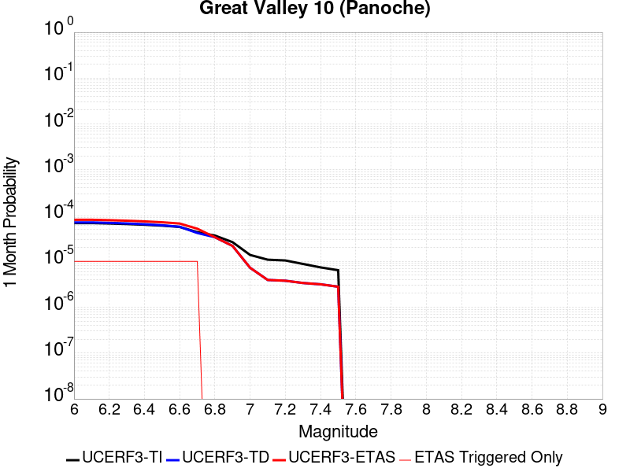 |  |  |

| Magnitude | 1 wk TI Prob | 1 wk TD Prob | 1 wk ETAS Prob | 1 wk ETAS/TD Gain | 1 wk ETAS Triggered Only | 1 mo TI Prob | 1 mo TD Prob | 1 mo ETAS Prob | 1 mo ETAS/TD Gain | 1 mo ETAS Triggered Only | 1 yr TI Prob | 1 yr TD Prob | 1 yr ETAS Prob | 1 yr ETAS/TD Gain | 1 yr ETAS Triggered Only | 10 yr TI Prob | 10 yr TD Prob | 10 yr ETAS Prob | 10 yr ETAS/TD Gain | 10 yr ETAS Triggered Only |
|-----|-----|-----|-----|-----|-----|-----|-----|-----|-----|-----|-----|-----|-----|-----|-----|-----|-----|-----|-----|-----|
| 6.0 | 1.6014626E-5 | 1.6575399E-5 | 2.9944162E-5 | 1.8065424 | 1.3368984E-5 | 6.863231E-5 | 7.103552E-5 | 8.440356E-5 | 1.1881881 | 1.3368984E-5 | 8.35278E-4 | 8.645185E-4 | 8.912333E-4 | 1.0309014 | 2.6737967E-5 | 0.008321454 | 0.008612172 | 0.008638679 | 1.003078 | 2.6737967E-5 |
| 6.1 | 1.6014626E-5 | 1.6575399E-5 | 2.9944162E-5 | 1.8065424 | 1.3368984E-5 | 6.863231E-5 | 7.103552E-5 | 8.440356E-5 | 1.1881881 | 1.3368984E-5 | 8.35278E-4 | 8.645185E-4 | 8.912333E-4 | 1.0309014 | 2.6737967E-5 | 0.008321454 | 0.008612172 | 0.008638679 | 1.003078 | 2.6737967E-5 |
| 6.2 | 1.56782E-5 | 1.6198446E-5 | 2.9567213E-5 | 1.8253118 | 1.3368984E-5 | 6.719056E-5 | 6.94201E-5 | 8.278815E-5 | 1.1925675 | 1.3368984E-5 | 8.17738E-4 | 8.4486604E-4 | 8.7158143E-4 | 1.0316209 | 2.6737967E-5 | 0.008147354 | 0.008417147 | 0.00844366 | 1.0031499 | 2.6737967E-5 |
| 6.3 | 1.5263338E-5 | 1.5723514E-5 | 2.9092289E-5 | 1.8502408 | 1.3368984E-5 | 6.541267E-5 | 6.738478E-5 | 8.075286E-5 | 1.1983843 | 1.3368984E-5 | 7.961082E-4 | 8.201049E-4 | 8.4682094E-4 | 1.0325763 | 2.6737967E-5 | 0.007932622 | 0.008171377 | 0.008197896 | 1.0032454 | 2.6737967E-5 |
| 6.4 | 1.4720723E-5 | 1.5099376E-5 | 2.8468157E-5 | 1.8853863 | 1.3368984E-5 | 6.308728E-5 | 6.471004E-5 | 7.8078156E-5 | 1.2065849 | 1.3368984E-5 | 7.67817E-4 | 7.8756385E-4 | 8.1428076E-4 | 1.0339235 | 2.6737967E-5 | 0.007651695 | 0.007848303 | 0.007874831 | 1.0033801 | 2.6737967E-5 |
| 6.5 | 1.408264E-5 | 1.4355969E-5 | 2.7724762E-5 | 1.9312358 | 1.3368984E-5 | 6.0352773E-5 | 6.1524166E-5 | 7.489233E-5 | 1.2172831 | 1.3368984E-5 | 7.3454727E-4 | 7.488031E-4 | 7.7552104E-4 | 1.0356809 | 2.6737967E-5 | 0.0073212404 | 0.0074633555 | 0.007489894 | 1.0035558 | 2.6737967E-5 |
| 6.6 | 1.3197086E-5 | 1.3321889E-5 | 2.6690695E-5 | 2.0035217 | 1.3368984E-5 | 5.6557717E-5 | 5.709259E-5 | 7.046081E-5 | 1.2341498 | 1.3368984E-5 | 6.8837265E-4 | 6.9488434E-4 | 7.2160375E-4 | 1.0384516 | 2.6737967E-5 | 0.006862442 | 0.0069276537 | 0.006954206 | 1.0038328 | 2.6737967E-5 |
| 6.7 | 1.017583E-5 | 9.745382E-6 | 2.3114237E-5 | 2.3718143 | 1.3368984E-5 | 4.360997E-5 | 4.176527E-5 | 5.5133693E-5 | 1.3200847 | 1.3368984E-5 | 5.30822E-4 | 5.0837593E-4 | 5.351003E-4 | 1.0525681 | 2.6737967E-5 | 0.0052955584 | 0.005072382 | 0.005098984 | 1.0052445 | 2.6737967E-5 |
| 6.8 | 8.557912E-6 | 7.872707E-6 | 7.872707E-6 | 1.0 | 0.0 | 3.667625E-5 | 3.373975E-5 | 3.373975E-5 | 1.0 | 0.0 | 4.4644187E-4 | 4.1070607E-4 | 4.1070607E-4 | 1.0 | 0.0 | 0.0044554602 | 0.004099677 | 0.004099677 | 1.0 | 0.0 |
| 6.9 | 6.14664E-6 | 5.092071E-6 | 5.092071E-6 | 1.0 | 0.0 | 2.6342475E-5 | 2.1822989E-5 | 2.1822989E-5 | 1.0 | 0.0 | 3.2067244E-4 | 2.6566387E-4 | 2.6566387E-4 | 1.0 | 0.0 | 0.003202101 | 0.002653601 | 0.002653601 | 1.0 | 0.0 |
| 7.0 | 3.2310581E-6 | 1.6951219E-6 | 1.6951219E-6 | 1.0 | 0.0 | 1.3847319E-5 | 7.264788E-6 | 7.264788E-6 | 1.0 | 0.0 | 1.6857806E-4 | 8.8445304E-5 | 8.8445304E-5 | 1.0 | 0.0 | 0.0016845023 | 8.841104E-4 | 8.841104E-4 | 1.0 | 0.0 |
| 7.1 | 2.544492E-6 | 9.1889206E-7 | 9.1889206E-7 | 1.0 | 0.0 | 1.090492E-5 | 3.938103E-6 | 3.938103E-6 | 1.0 | 0.0 | 1.327593E-4 | 4.79454E-5 | 4.79454E-5 | 1.0 | 0.0 | 0.0013268003 | 4.793553E-4 | 4.793553E-4 | 1.0 | 0.0 |
| 7.2 | 2.4479045E-6 | 8.841304E-7 | 8.841304E-7 | 1.0 | 0.0 | 1.0490977E-5 | 3.789125E-6 | 3.789125E-6 | 1.0 | 0.0 | 1.2772017E-4 | 4.6131667E-5 | 4.6131667E-5 | 1.0 | 0.0 | 0.0012764678 | 4.6122566E-4 | 4.6122566E-4 | 1.0 | 0.0 |
| 7.3 | 2.0559578E-6 | 7.892787E-7 | 7.892787E-7 | 1.0 | 0.0 | 8.811218E-6 | 3.3826188E-6 | 3.3826188E-6 | 1.0 | 0.0 | 1.072713E-4 | 4.1182655E-5 | 4.1182655E-5 | 1.0 | 0.0 | 0.0010721954 | 4.1175485E-4 | 4.1175485E-4 | 1.0 | 0.0 |
| 7.4 | 1.727687E-6 | 7.387757E-7 | 7.387757E-7 | 1.0 | 0.0 | 7.404352E-6 | 3.1661782E-6 | 3.1661782E-6 | 1.0 | 0.0 | 9.0144255E-5 | 3.8547583E-5 | 3.8547583E-5 | 1.0 | 0.0 | 9.0107694E-4 | 3.854136E-4 | 3.854136E-4 | 1.0 | 0.0 |
| 7.5 | 1.5002679E-6 | 6.546144E-7 | 6.546144E-7 | 1.0 | 0.0 | 6.4297037E-6 | 2.8054874E-6 | 2.8054874E-6 | 1.0 | 0.0 | 7.827883E-5 | 3.4156317E-5 | 3.4156317E-5 | 1.0 | 0.0 | 7.825126E-4 | 3.4151482E-4 | 3.4151482E-4 | 1.0 | 0.0 |

## South Cuyama
*[(top)](#table-of-contents)*

| 1 Week | 1 Month | 1 Year | 10 Year |
|-----|-----|-----|-----|
|  |  |  |  |

| Magnitude | 1 wk TI Prob | 1 wk TD Prob | 1 wk ETAS Prob | 1 wk ETAS/TD Gain | 1 wk ETAS Triggered Only | 1 mo TI Prob | 1 mo TD Prob | 1 mo ETAS Prob | 1 mo ETAS/TD Gain | 1 mo ETAS Triggered Only | 1 yr TI Prob | 1 yr TD Prob | 1 yr ETAS Prob | 1 yr ETAS/TD Gain | 1 yr ETAS Triggered Only | 10 yr TI Prob | 10 yr TD Prob | 10 yr ETAS Prob | 10 yr ETAS/TD Gain | 10 yr ETAS Triggered Only |
|-----|-----|-----|-----|-----|-----|-----|-----|-----|-----|-----|-----|-----|-----|-----|-----|-----|-----|-----|-----|-----|
| 6.0 | 1.2747308E-6 | 1.2818697E-6 | 1.4650836E-5 | 11.429271 | 1.3368984E-5 | 5.4631205E-6 | 5.4937163E-6 | 1.8862627E-5 | 3.4334912 | 1.3368984E-5 | 6.6511464E-5 | 6.6884015E-5 | 8.02521E-5 | 1.1998698 | 1.3368984E-5 | 6.649156E-4 | 6.686458E-4 | 6.953659E-4 | 1.0399615 | 2.6737967E-5 |
| 6.1 | 1.2747308E-6 | 1.2818697E-6 | 1.4650836E-5 | 11.429271 | 1.3368984E-5 | 5.4631205E-6 | 5.4937163E-6 | 1.8862627E-5 | 3.4334912 | 1.3368984E-5 | 6.6511464E-5 | 6.6884015E-5 | 8.02521E-5 | 1.1998698 | 1.3368984E-5 | 6.649156E-4 | 6.686458E-4 | 6.953659E-4 | 1.0399615 | 2.6737967E-5 |
| 6.2 | 1.2747308E-6 | 1.2818697E-6 | 1.4650836E-5 | 11.429271 | 1.3368984E-5 | 5.4631205E-6 | 5.4937163E-6 | 1.8862627E-5 | 3.4334912 | 1.3368984E-5 | 6.6511464E-5 | 6.6884015E-5 | 8.02521E-5 | 1.1998698 | 1.3368984E-5 | 6.649156E-4 | 6.686458E-4 | 6.953659E-4 | 1.0399615 | 2.6737967E-5 |
| 6.3 | 1.2747308E-6 | 1.2818697E-6 | 1.4650836E-5 | 11.429271 | 1.3368984E-5 | 5.4631205E-6 | 5.4937163E-6 | 1.8862627E-5 | 3.4334912 | 1.3368984E-5 | 6.6511464E-5 | 6.6884015E-5 | 8.02521E-5 | 1.1998698 | 1.3368984E-5 | 6.649156E-4 | 6.686458E-4 | 6.953659E-4 | 1.0399615 | 2.6737967E-5 |
| 6.4 | 1.2747308E-6 | 1.2818697E-6 | 1.4650836E-5 | 11.429271 | 1.3368984E-5 | 5.4631205E-6 | 5.4937163E-6 | 1.8862627E-5 | 3.4334912 | 1.3368984E-5 | 6.6511464E-5 | 6.6884015E-5 | 8.02521E-5 | 1.1998698 | 1.3368984E-5 | 6.649156E-4 | 6.686458E-4 | 6.953659E-4 | 1.0399615 | 2.6737967E-5 |
| 6.5 | 1.2747308E-6 | 1.2818697E-6 | 1.4650836E-5 | 11.429271 | 1.3368984E-5 | 5.4631205E-6 | 5.4937163E-6 | 1.8862627E-5 | 3.4334912 | 1.3368984E-5 | 6.6511464E-5 | 6.6884015E-5 | 8.02521E-5 | 1.1998698 | 1.3368984E-5 | 6.649156E-4 | 6.686458E-4 | 6.953659E-4 | 1.0399615 | 2.6737967E-5 |
| 6.6 | 1.2747308E-6 | 1.2818697E-6 | 1.4650836E-5 | 11.429271 | 1.3368984E-5 | 5.4631205E-6 | 5.4937163E-6 | 1.8862627E-5 | 3.4334912 | 1.3368984E-5 | 6.6511464E-5 | 6.6884015E-5 | 8.02521E-5 | 1.1998698 | 1.3368984E-5 | 6.649156E-4 | 6.686458E-4 | 6.953659E-4 | 1.0399615 | 2.6737967E-5 |
| 6.7 | 1.2747308E-6 | 1.2818697E-6 | 1.4650836E-5 | 11.429271 | 1.3368984E-5 | 5.4631205E-6 | 5.4937163E-6 | 1.8862627E-5 | 3.4334912 | 1.3368984E-5 | 6.6511464E-5 | 6.6884015E-5 | 8.02521E-5 | 1.1998698 | 1.3368984E-5 | 6.649156E-4 | 6.686458E-4 | 6.953659E-4 | 1.0399615 | 2.6737967E-5 |
| 6.8 | 1.2747308E-6 | 1.2818697E-6 | 1.4650836E-5 | 11.429271 | 1.3368984E-5 | 5.4631205E-6 | 5.4937163E-6 | 1.8862627E-5 | 3.4334912 | 1.3368984E-5 | 6.6511464E-5 | 6.6884015E-5 | 8.02521E-5 | 1.1998698 | 1.3368984E-5 | 6.649156E-4 | 6.686458E-4 | 6.953659E-4 | 1.0399615 | 2.6737967E-5 |
| 6.9 | 8.4566324E-7 | 8.507883E-7 | 1.42197605E-5 | 16.71363 | 1.3368984E-5 | 3.624266E-6 | 3.6462304E-6 | 1.7015165E-5 | 4.6665087 | 1.3368984E-5 | 4.4124543E-5 | 4.439196E-5 | 5.7760353E-5 | 1.3011444 | 1.3368984E-5 | 4.4115784E-4 | 4.4383196E-4 | 4.7055806E-4 | 1.0602167 | 2.6737967E-5 |
| 7.0 | 8.2277904E-7 | 8.27782E-7 | 1.4196755E-5 | 17.150354 | 1.3368984E-5 | 3.526191E-6 | 3.5476323E-6 | 1.6916569E-5 | 4.768411 | 1.3368984E-5 | 4.293053E-5 | 4.3191576E-5 | 5.6559984E-5 | 1.3095142 | 1.3368984E-5 | 4.292224E-4 | 4.3183283E-4 | 4.5855925E-4 | 1.0618907 | 2.6737967E-5 |
| 7.1 | 6.7661887E-7 | 6.80913E-7 | 6.80913E-7 | 1.0 | 0.0 | 2.899792E-6 | 2.9181954E-6 | 2.9181954E-6 | 1.0 | 0.0 | 3.5304394E-5 | 3.5528454E-5 | 3.5528454E-5 | 1.0 | 0.0 | 3.5298787E-4 | 3.552281E-4 | 3.6859236E-4 | 1.0376215 | 1.3368984E-5 |
| 7.2 | 5.783336E-7 | 5.8211907E-7 | 5.8211907E-7 | 1.0 | 0.0 | 2.4785702E-6 | 2.4947938E-6 | 2.4947938E-6 | 1.0 | 0.0 | 3.0176174E-5 | 3.0373692E-5 | 3.0373692E-5 | 1.0 | 0.0 | 3.0172078E-4 | 3.0369565E-4 | 3.1706056E-4 | 1.0440077 | 1.3368984E-5 |
| 7.3 | 5.136759E-7 | 5.170938E-7 | 5.170938E-7 | 1.0 | 0.0 | 2.2014663E-6 | 2.2161144E-6 | 2.2161144E-6 | 1.0 | 0.0 | 2.6802521E-5 | 2.698086E-5 | 2.698086E-5 | 1.0 | 0.0 | 2.679929E-4 | 2.6977606E-4 | 2.8314142E-4 | 1.0495425 | 1.3368984E-5 |
| 7.4 | 4.3370295E-7 | 4.3665364E-7 | 4.3665364E-7 | 1.0 | 0.0 | 1.8587256E-6 | 1.8713713E-6 | 1.8713713E-6 | 1.0 | 0.0 | 2.2629749E-5 | 2.278371E-5 | 2.278371E-5 | 1.0 | 0.0 | 2.2627445E-4 | 2.278139E-4 | 2.4117985E-4 | 1.0586704 | 1.3368984E-5 |
| 7.5 | 3.3242574E-7 | 3.3476465E-7 | 3.3476465E-7 | 1.0 | 0.0 | 1.4246809E-6 | 1.4347048E-6 | 1.4347048E-6 | 1.0 | 0.0 | 1.7345352E-5 | 1.7467393E-5 | 1.7467393E-5 | 1.0 | 0.0 | 1.7343998E-4 | 1.7466032E-4 | 1.7466032E-4 | 1.0 | 0.0 |
| 7.6 | 2.0627535E-7 | 2.07789E-7 | 2.07789E-7 | 1.0 | 0.0 | 8.840369E-7 | 8.90524E-7 | 8.90524E-7 | 1.0 | 0.0 | 1.0763096E-5 | 1.0842076E-5 | 1.0842076E-5 | 1.0 | 0.0 | 1.0762575E-4 | 1.0841556E-4 | 1.0841556E-4 | 1.0 | 0.0 |
| 7.7 | 6.15236E-8 | 6.1983044E-8 | 6.1983044E-8 | 1.0 | 0.0 | 2.6367252E-7 | 2.656416E-7 | 2.656416E-7 | 1.0 | 0.0 | 3.2102084E-6 | 3.2341818E-6 | 3.2341818E-6 | 1.0 | 0.0 | 3.210162E-5 | 3.234136E-5 | 3.234136E-5 | 1.0 | 0.0 |
| 7.8 | 1.1765573E-8 | 1.1873414E-8 | 1.1873414E-8 | 1.0 | 0.0 | 5.0423886E-8 | 5.0886058E-8 | 5.0886058E-8 | 1.0 | 0.0 | 6.1391063E-7 | 6.195376E-7 | 6.195376E-7 | 1.0 | 0.0 | 6.1390897E-6 | 6.19536E-6 | 6.19536E-6 | 1.0 | 0.0 |
| 7.9 | 6.0381755E-10 | 6.10058E-10 | 6.10058E-10 | 1.0 | 0.0 | 2.5877895E-9 | 2.614534E-9 | 2.614534E-9 | 1.0 | 0.0 | 3.1506335E-8 | 3.1831952E-8 | 3.1831952E-8 | 1.0 | 0.0 | 3.1506332E-7 | 3.183195E-7 | 3.183195E-7 | 1.0 | 0.0 |

## Earthquake Valley
*[(top)](#table-of-contents)*

| 1 Week | 1 Month | 1 Year | 10 Year |
|-----|-----|-----|-----|
|  | 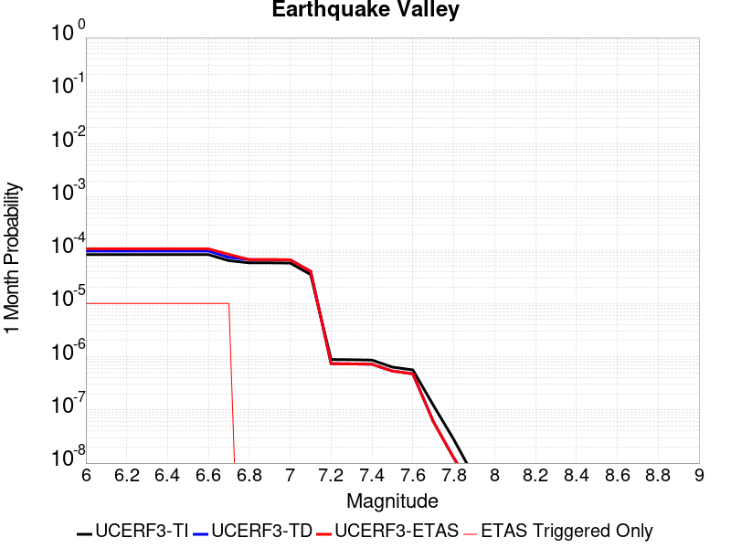 |  | 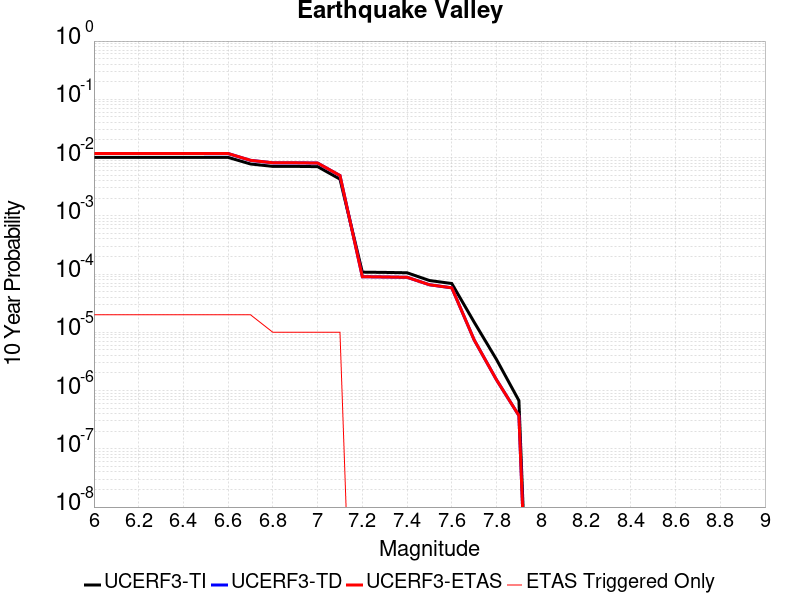 |

| Magnitude | 1 wk TI Prob | 1 wk TD Prob | 1 wk ETAS Prob | 1 wk ETAS/TD Gain | 1 wk ETAS Triggered Only | 1 mo TI Prob | 1 mo TD Prob | 1 mo ETAS Prob | 1 mo ETAS/TD Gain | 1 mo ETAS Triggered Only | 1 yr TI Prob | 1 yr TD Prob | 1 yr ETAS Prob | 1 yr ETAS/TD Gain | 1 yr ETAS Triggered Only | 10 yr TI Prob | 10 yr TD Prob | 10 yr ETAS Prob | 10 yr ETAS/TD Gain | 10 yr ETAS Triggered Only |
|-----|-----|-----|-----|-----|-----|-----|-----|-----|-----|-----|-----|-----|-----|-----|-----|-----|-----|-----|-----|-----|
| 6.0 | 1.9416384E-5 | 2.258408E-5 | 3.5952762E-5 | 1.5919516 | 1.3368984E-5 | 8.321042E-5 | 9.6785996E-5 | 1.1015369E-4 | 1.138116 | 1.3368984E-5 | 0.001012616 | 0.0011778527 | 0.0012045592 | 1.0226738 | 2.6737967E-5 | 0.010080142 | 0.011727943 | 0.0117543675 | 1.002253 | 2.6737967E-5 |
| 6.1 | 1.9416384E-5 | 2.258408E-5 | 3.5952762E-5 | 1.5919516 | 1.3368984E-5 | 8.321042E-5 | 9.6785996E-5 | 1.1015369E-4 | 1.138116 | 1.3368984E-5 | 0.001012616 | 0.0011778527 | 0.0012045592 | 1.0226738 | 2.6737967E-5 | 0.010080142 | 0.011727943 | 0.0117543675 | 1.002253 | 2.6737967E-5 |
| 6.2 | 1.9416384E-5 | 2.258408E-5 | 3.5952762E-5 | 1.5919516 | 1.3368984E-5 | 8.321042E-5 | 9.6785996E-5 | 1.1015369E-4 | 1.138116 | 1.3368984E-5 | 0.001012616 | 0.0011778527 | 0.0012045592 | 1.0226738 | 2.6737967E-5 | 0.010080142 | 0.011727943 | 0.0117543675 | 1.002253 | 2.6737967E-5 |
| 6.3 | 1.9416384E-5 | 2.258408E-5 | 3.5952762E-5 | 1.5919516 | 1.3368984E-5 | 8.321042E-5 | 9.6785996E-5 | 1.1015369E-4 | 1.138116 | 1.3368984E-5 | 0.001012616 | 0.0011778527 | 0.0012045592 | 1.0226738 | 2.6737967E-5 | 0.010080142 | 0.011727943 | 0.0117543675 | 1.002253 | 2.6737967E-5 |
| 6.4 | 1.9416384E-5 | 2.258408E-5 | 3.5952762E-5 | 1.5919516 | 1.3368984E-5 | 8.321042E-5 | 9.6785996E-5 | 1.1015369E-4 | 1.138116 | 1.3368984E-5 | 0.001012616 | 0.0011778527 | 0.0012045592 | 1.0226738 | 2.6737967E-5 | 0.010080142 | 0.011727943 | 0.0117543675 | 1.002253 | 2.6737967E-5 |
| 6.5 | 1.9389157E-5 | 2.255267E-5 | 3.592135E-5 | 1.5927761 | 1.3368984E-5 | 8.309374E-5 | 9.665139E-5 | 1.1001908E-4 | 1.1383083 | 1.3368984E-5 | 0.0010111968 | 0.0011762156 | 0.0012029221 | 1.0227054 | 2.6737967E-5 | 0.010066078 | 0.011711745 | 0.01173817 | 1.0022563 | 2.6737967E-5 |
| 6.6 | 1.9389157E-5 | 2.255267E-5 | 3.592135E-5 | 1.5927761 | 1.3368984E-5 | 8.309374E-5 | 9.665139E-5 | 1.1001908E-4 | 1.1383083 | 1.3368984E-5 | 0.0010111968 | 0.0011762156 | 0.0012029221 | 1.0227054 | 2.6737967E-5 | 0.010066078 | 0.011711745 | 0.01173817 | 1.0022563 | 2.6737967E-5 |
| 6.7 | 1.4925434E-5 | 1.7208227E-5 | 3.0576983E-5 | 1.7768816 | 1.3368984E-5 | 6.396457E-5 | 7.374794E-5 | 8.7115935E-5 | 1.1812661 | 1.3368984E-5 | 7.7849044E-4 | 8.9759636E-4 | 9.243103E-4 | 1.0297617 | 2.6737967E-5 | 0.007757689 | 0.008948085 | 0.008974584 | 1.0029614 | 2.6737967E-5 |
| 6.8 | 1.3570335E-5 | 1.5616843E-5 | 1.5616843E-5 | 1.0 | 0.0 | 5.8157282E-5 | 6.692807E-5 | 6.692807E-5 | 1.0 | 0.0 | 7.0783484E-4 | 8.1462675E-4 | 8.279848E-4 | 1.0163978 | 1.3368984E-5 | 0.0070558446 | 0.008124476 | 0.0081377365 | 1.0016321 | 1.3368984E-5 |
| 6.9 | 1.3570335E-5 | 1.5616843E-5 | 1.5616843E-5 | 1.0 | 0.0 | 5.8157282E-5 | 6.692807E-5 | 6.692807E-5 | 1.0 | 0.0 | 7.0783484E-4 | 8.1462675E-4 | 8.279848E-4 | 1.0163978 | 1.3368984E-5 | 0.0070558446 | 0.008124476 | 0.0081377365 | 1.0016321 | 1.3368984E-5 |
| 7.0 | 1.3433392E-5 | 1.5460388E-5 | 1.5460388E-5 | 1.0 | 0.0 | 5.757041E-5 | 6.6257584E-5 | 6.6257584E-5 | 1.0 | 0.0 | 7.0069433E-4 | 8.064695E-4 | 8.198277E-4 | 1.0165638 | 1.3368984E-5 | 0.006984891 | 0.008043497 | 0.008056758 | 1.0016487 | 1.3368984E-5 |
| 7.1 | 8.181609E-6 | 9.416851E-6 | 9.416851E-6 | 1.0 | 0.0 | 3.5063567E-5 | 4.0357685E-5 | 4.0357685E-5 | 1.0 | 0.0 | 4.268153E-4 | 4.9131113E-4 | 5.046735E-4 | 1.0271975 | 1.3368984E-5 | 0.0042599645 | 0.0049088253 | 0.0049221287 | 1.0027101 | 1.3368984E-5 |
| 7.2 | 2.0663983E-7 | 1.726294E-7 | 1.726294E-7 | 1.0 | 0.0 | 8.855989E-7 | 7.398401E-7 | 7.398401E-7 | 1.0 | 0.0 | 1.0782113E-5 | 9.00752E-6 | 9.00752E-6 | 1.0 | 0.0 | 1.07815904E-4 | 9.00719E-5 | 9.00719E-5 | 1.0 | 0.0 |
| 7.3 | 2.0462376E-7 | 1.7078433E-7 | 1.7078433E-7 | 1.0 | 0.0 | 8.7695867E-7 | 7.319327E-7 | 7.319327E-7 | 1.0 | 0.0 | 1.0676919E-5 | 8.911247E-6 | 8.911247E-6 | 1.0 | 0.0 | 1.0676406E-4 | 8.910926E-5 | 8.910926E-5 | 1.0 | 0.0 |
| 7.4 | 2.0171088E-7 | 1.6860913E-7 | 1.6860913E-7 | 1.0 | 0.0 | 8.644749E-7 | 7.2261037E-7 | 7.2261037E-7 | 1.0 | 0.0 | 1.0524931E-5 | 8.79775E-6 | 8.79775E-6 | 1.0 | 0.0 | 1.05244326E-4 | 8.7974375E-5 | 8.7974375E-5 | 1.0 | 0.0 |
| 7.5 | 1.4847944E-7 | 1.2559275E-7 | 1.2559275E-7 | 1.0 | 0.0 | 6.363403E-7 | 5.3825454E-7 | 5.3825454E-7 | 1.0 | 0.0 | 7.747416E-6 | 6.5532317E-6 | 6.5532317E-6 | 1.0 | 0.0 | 7.747146E-5 | 6.55306E-5 | 6.55306E-5 | 1.0 | 0.0 |
| 7.6 | 1.3185847E-7 | 1.1123213E-7 | 1.1123213E-7 | 1.0 | 0.0 | 5.6510765E-7 | 4.7670906E-7 | 4.7670906E-7 | 1.0 | 0.0 | 6.8801637E-6 | 5.8039195E-6 | 5.8039195E-6 | 1.0 | 0.0 | 6.8799505E-5 | 5.803789E-5 | 5.803789E-5 | 1.0 | 0.0 |
| 7.7 | 2.8609954E-8 | 1.4170958E-8 | 1.4170958E-8 | 1.0 | 0.0 | 1.2261408E-7 | 6.0732674E-8 | 6.0732674E-8 | 1.0 | 0.0 | 1.4928254E-6 | 7.394201E-7 | 7.394201E-7 | 1.0 | 0.0 | 1.4928154E-5 | 7.394182E-6 | 7.394182E-6 | 1.0 | 0.0 |
| 7.8 | 6.527266E-9 | 2.923417E-9 | 2.923417E-9 | 1.0 | 0.0 | 2.7973995E-8 | 1.2528931E-8 | 1.2528931E-8 | 1.0 | 0.0 | 3.4058334E-7 | 1.5253973E-7 | 1.5253973E-7 | 1.0 | 0.0 | 3.4058282E-6 | 1.5253964E-6 | 1.5253964E-6 | 1.0 | 0.0 |
| 7.9 | 1.2898267E-9 | 7.127684E-10 | 7.127684E-10 | 1.0 | 0.0 | 5.527829E-9 | 3.0547218E-9 | 3.0547218E-9 | 1.0 | 0.0 | 6.7301315E-8 | 3.719124E-8 | 3.719124E-8 | 1.0 | 0.0 | 6.7301295E-7 | 3.719124E-7 | 3.719124E-7 | 1.0 | 0.0 |

## Goose Lake 2011 CFM
*[(top)](#table-of-contents)*

| 1 Week | 1 Month | 1 Year | 10 Year |
|-----|-----|-----|-----|
|  |  |  |  |

| Magnitude | 1 wk TI Prob | 1 wk TD Prob | 1 wk ETAS Prob | 1 wk ETAS/TD Gain | 1 wk ETAS Triggered Only | 1 mo TI Prob | 1 mo TD Prob | 1 mo ETAS Prob | 1 mo ETAS/TD Gain | 1 mo ETAS Triggered Only | 1 yr TI Prob | 1 yr TD Prob | 1 yr ETAS Prob | 1 yr ETAS/TD Gain | 1 yr ETAS Triggered Only | 10 yr TI Prob | 10 yr TD Prob | 10 yr ETAS Prob | 10 yr ETAS/TD Gain | 10 yr ETAS Triggered Only |
|-----|-----|-----|-----|-----|-----|-----|-----|-----|-----|-----|-----|-----|-----|-----|-----|-----|-----|-----|-----|-----|
| 6.0 | 3.780968E-6 | 3.8230223E-6 | 1.7191955E-5 | 4.496954 | 1.3368984E-5 | 1.6204049E-5 | 1.6384285E-5 | 2.975305E-5 | 1.8159505 | 1.3368984E-5 | 1.9726643E-4 | 1.994615E-4 | 2.1282781E-4 | 1.0670121 | 1.3368984E-5 | 0.001970914 | 0.001992933 | 0.0020062753 | 1.0066948 | 1.3368984E-5 |
| 6.1 | 2.2035124E-6 | 2.229801E-6 | 1.5598755E-5 | 6.995581 | 1.3368984E-5 | 9.443591E-6 | 9.556257E-6 | 2.2925113E-5 | 2.3989637 | 1.3368984E-5 | 1.1496965E-4 | 1.163414E-4 | 1.2970883E-4 | 1.1148983 | 1.3368984E-5 | 0.0011491019 | 0.0011628233 | 0.0011761767 | 1.0114837 | 1.3368984E-5 |
| 6.2 | 1.5624689E-6 | 1.5826923E-6 | 1.5826923E-6 | 1.0 | 0.0 | 6.6962784E-6 | 6.7829496E-6 | 6.7829496E-6 | 1.0 | 0.0 | 8.152414E-5 | 8.2579325E-5 | 8.2579325E-5 | 1.0 | 0.0 | 8.1494235E-4 | 8.2549086E-4 | 8.2549086E-4 | 1.0 | 0.0 |
| 6.3 | 1.5624689E-6 | 1.5826923E-6 | 1.5826923E-6 | 1.0 | 0.0 | 6.6962784E-6 | 6.7829496E-6 | 6.7829496E-6 | 1.0 | 0.0 | 8.152414E-5 | 8.2579325E-5 | 8.2579325E-5 | 1.0 | 0.0 | 8.1494235E-4 | 8.2549086E-4 | 8.2549086E-4 | 1.0 | 0.0 |
| 6.4 | 1.256464E-6 | 1.2738695E-6 | 1.2738695E-6 | 1.0 | 0.0 | 5.3848344E-6 | 5.4594293E-6 | 5.4594293E-6 | 1.0 | 0.0 | 6.5558386E-5 | 6.646655E-5 | 6.646655E-5 | 1.0 | 0.0 | 6.553905E-4 | 6.644687E-4 | 6.644687E-4 | 1.0 | 0.0 |
| 6.5 | 1.0910911E-6 | 1.1069404E-6 | 1.1069404E-6 | 1.0 | 0.0 | 4.6760965E-6 | 4.7440217E-6 | 4.7440217E-6 | 1.0 | 0.0 | 5.692999E-5 | 5.7756948E-5 | 5.7756948E-5 | 1.0 | 0.0 | 5.6915404E-4 | 5.7742064E-4 | 5.7742064E-4 | 1.0 | 0.0 |
| 6.6 | 9.546601E-7 | 9.691246E-7 | 9.691246E-7 | 1.0 | 0.0 | 4.091394E-6 | 4.1533845E-6 | 4.1533845E-6 | 1.0 | 0.0 | 4.9811584E-5 | 5.056629E-5 | 5.056629E-5 | 1.0 | 0.0 | 4.980042E-4 | 5.055487E-4 | 5.055487E-4 | 1.0 | 0.0 |
| 6.7 | 7.790316E-7 | 7.9159634E-7 | 7.9159634E-7 | 1.0 | 0.0 | 3.3387028E-6 | 3.3925514E-6 | 3.3925514E-6 | 1.0 | 0.0 | 4.0647945E-5 | 4.1303538E-5 | 4.1303538E-5 | 1.0 | 0.0 | 4.0640513E-4 | 4.129592E-4 | 4.129592E-4 | 1.0 | 0.0 |
| 6.8 | 6.3714384E-7 | 6.4787395E-7 | 6.4787395E-7 | 1.0 | 0.0 | 2.7306137E-6 | 2.7765998E-6 | 2.7765998E-6 | 1.0 | 0.0 | 3.3244716E-5 | 3.3804583E-5 | 3.3804583E-5 | 1.0 | 0.0 | 3.323974E-4 | 3.379949E-4 | 3.379949E-4 | 1.0 | 0.0 |
| 6.9 | 4.92586E-7 | 5.0139147E-7 | 5.0139147E-7 | 1.0 | 0.0 | 2.1110811E-6 | 2.1488188E-6 | 2.1488188E-6 | 1.0 | 0.0 | 2.5702111E-5 | 2.616156E-5 | 2.616156E-5 | 1.0 | 0.0 | 2.569914E-4 | 2.6158517E-4 | 2.6158517E-4 | 1.0 | 0.0 |
| 7.0 | 3.130245E-7 | 3.190354E-7 | 3.190354E-7 | 1.0 | 0.0 | 1.3415328E-6 | 1.3672939E-6 | 1.3672939E-6 | 1.0 | 0.0 | 1.6333039E-5 | 1.6646678E-5 | 1.6646678E-5 | 1.0 | 0.0 | 1.6331839E-4 | 1.6645451E-4 | 1.6645451E-4 | 1.0 | 0.0 |
| 7.1 | 1.7680084E-7 | 1.8023923E-7 | 1.8023923E-7 | 1.0 | 0.0 | 7.5771766E-7 | 7.724536E-7 | 7.724536E-7 | 1.0 | 0.0 | 9.225173E-6 | 9.404583E-6 | 9.404583E-6 | 1.0 | 0.0 | 9.22479E-5 | 9.4041956E-5 | 9.4041956E-5 | 1.0 | 0.0 |
| 7.2 | 4.8641045E-8 | 4.9402068E-8 | 4.9402068E-8 | 1.0 | 0.0 | 2.084616E-7 | 2.1172312E-7 | 2.1172312E-7 | 1.0 | 0.0 | 2.538017E-6 | 2.577726E-6 | 2.577726E-6 | 1.0 | 0.0 | 2.537988E-5 | 2.5776973E-5 | 2.5776973E-5 | 1.0 | 0.0 |
| 7.3 | 5.3911844E-9 | 5.4758145E-9 | 5.4758145E-9 | 1.0 | 0.0 | 2.3105075E-8 | 2.3467775E-8 | 2.3467775E-8 | 1.0 | 0.0 | 2.8130427E-7 | 2.8572015E-7 | 2.8572015E-7 | 1.0 | 0.0 | 2.8130391E-6 | 2.8571992E-6 | 2.8571992E-6 | 1.0 | 0.0 |

## Santa Cruz Island
*[(top)](#table-of-contents)*

| 1 Week | 1 Month | 1 Year | 10 Year |
|-----|-----|-----|-----|
|  |  |  |  |

| Magnitude | 1 wk TI Prob | 1 wk TD Prob | 1 wk ETAS Prob | 1 wk ETAS/TD Gain | 1 wk ETAS Triggered Only | 1 mo TI Prob | 1 mo TD Prob | 1 mo ETAS Prob | 1 mo ETAS/TD Gain | 1 mo ETAS Triggered Only | 1 yr TI Prob | 1 yr TD Prob | 1 yr ETAS Prob | 1 yr ETAS/TD Gain | 1 yr ETAS Triggered Only | 10 yr TI Prob | 10 yr TD Prob | 10 yr ETAS Prob | 10 yr ETAS/TD Gain | 10 yr ETAS Triggered Only |
|-----|-----|-----|-----|-----|-----|-----|-----|-----|-----|-----|-----|-----|-----|-----|-----|-----|-----|-----|-----|-----|
| 6.0 | 2.9164563E-5 | 3.1599742E-5 | 4.4968307E-5 | 1.4230592 | 1.3368984E-5 | 1.2498499E-4 | 1.3542121E-4 | 1.4878839E-4 | 1.0987082 | 1.3368984E-5 | 0.0015206301 | 0.0016476426 | 0.0016609895 | 1.0081006 | 1.3368984E-5 | 0.015102667 | 0.016368 | 0.0163943 | 1.0016068 | 2.6737967E-5 |
| 6.1 | 2.9164563E-5 | 3.1599742E-5 | 4.4968307E-5 | 1.4230592 | 1.3368984E-5 | 1.2498499E-4 | 1.3542121E-4 | 1.4878839E-4 | 1.0987082 | 1.3368984E-5 | 0.0015206301 | 0.0016476426 | 0.0016609895 | 1.0081006 | 1.3368984E-5 | 0.015102667 | 0.016368 | 0.0163943 | 1.0016068 | 2.6737967E-5 |
| 6.2 | 2.9164563E-5 | 3.1599742E-5 | 4.4968307E-5 | 1.4230592 | 1.3368984E-5 | 1.2498499E-4 | 1.3542121E-4 | 1.4878839E-4 | 1.0987082 | 1.3368984E-5 | 0.0015206301 | 0.0016476426 | 0.0016609895 | 1.0081006 | 1.3368984E-5 | 0.015102667 | 0.016368 | 0.0163943 | 1.0016068 | 2.6737967E-5 |
| 6.3 | 1.6635553E-5 | 1.780436E-5 | 3.1173106E-5 | 1.7508693 | 1.3368984E-5 | 7.1293274E-5 | 7.630226E-5 | 8.9670226E-5 | 1.1751975 | 1.3368984E-5 | 8.6765E-4 | 9.2860236E-4 | 9.41959E-4 | 1.0143836 | 1.3368984E-5 | 0.008642701 | 0.009249094 | 0.009262339 | 1.0014321 | 1.3368984E-5 |
| 6.4 | 1.6635553E-5 | 1.780436E-5 | 3.1173106E-5 | 1.7508693 | 1.3368984E-5 | 7.1293274E-5 | 7.630226E-5 | 8.9670226E-5 | 1.1751975 | 1.3368984E-5 | 8.6765E-4 | 9.2860236E-4 | 9.41959E-4 | 1.0143836 | 1.3368984E-5 | 0.008642701 | 0.009249094 | 0.009262339 | 1.0014321 | 1.3368984E-5 |
| 6.5 | 1.2238748E-5 | 1.3042995E-5 | 2.6411804E-5 | 2.02498 | 1.3368984E-5 | 5.2450723E-5 | 5.5897377E-5 | 6.926561E-5 | 1.2391568 | 1.3368984E-5 | 6.3840044E-4 | 6.8034173E-4 | 6.937016E-4 | 1.019637 | 1.3368984E-5 | 0.0063656955 | 0.0067829876 | 0.006796266 | 1.0019575 | 1.3368984E-5 |
| 6.6 | 1.0489767E-5 | 1.1156636E-5 | 2.452547E-5 | 2.1982856 | 1.3368984E-5 | 4.495537E-5 | 4.781329E-5 | 6.1181636E-5 | 1.2795948 | 1.3368984E-5 | 5.4719415E-4 | 5.819735E-4 | 5.9533474E-4 | 1.0229584 | 1.3368984E-5 | 0.005458487 | 0.0058047357 | 0.005818027 | 1.0022898 | 1.3368984E-5 |
| 6.7 | 8.699222E-6 | 9.236782E-6 | 2.2605642E-5 | 2.4473505 | 1.3368984E-5 | 3.7281847E-5 | 3.958561E-5 | 5.2954067E-5 | 1.3377099 | 1.3368984E-5 | 4.5381195E-4 | 4.8184878E-4 | 4.9521134E-4 | 1.0277318 | 1.3368984E-5 | 0.0045288634 | 0.004808108 | 0.0048214127 | 1.0027671 | 1.3368984E-5 |
| 6.8 | 8.307732E-6 | 8.8169045E-6 | 8.8169045E-6 | 1.0 | 0.0 | 3.560408E-5 | 3.7786187E-5 | 3.7786187E-5 | 1.0 | 0.0 | 4.3339343E-4 | 4.5995016E-4 | 4.5995016E-4 | 1.0 | 0.0 | 0.004325492 | 0.0045900354 | 0.0045900354 | 1.0 | 0.0 |
| 6.9 | 8.073121E-6 | 8.564939E-6 | 8.564939E-6 | 1.0 | 0.0 | 3.459863E-5 | 3.6706366E-5 | 3.6706366E-5 | 1.0 | 0.0 | 4.2115687E-4 | 4.468088E-4 | 4.468088E-4 | 1.0 | 0.0 | 0.004203596 | 0.004459156 | 0.004459156 | 1.0 | 0.0 |
| 7.0 | 7.617019E-6 | 8.074664E-6 | 8.074664E-6 | 1.0 | 0.0 | 3.264396E-5 | 3.4605247E-5 | 3.4605247E-5 | 1.0 | 0.0 | 3.9736772E-4 | 4.212378E-4 | 4.212378E-4 | 1.0 | 0.0 | 0.003966579 | 0.0042044413 | 0.0042044413 | 1.0 | 0.0 |
| 7.1 | 7.1224836E-6 | 7.545788E-6 | 7.545788E-6 | 1.0 | 0.0 | 3.052457E-5 | 3.2338692E-5 | 3.2338692E-5 | 1.0 | 0.0 | 3.715733E-4 | 3.936528E-4 | 3.936528E-4 | 1.0 | 0.0 | 0.003709526 | 0.003929598 | 0.003929598 | 1.0 | 0.0 |
| 7.2 | 6.441115E-6 | 6.8273835E-6 | 6.8273835E-6 | 1.0 | 0.0 | 2.7604487E-5 | 2.9259887E-5 | 2.9259887E-5 | 1.0 | 0.0 | 3.360328E-4 | 3.5618112E-4 | 3.5618112E-4 | 1.0 | 0.0 | 0.0033552512 | 0.003556131 | 0.003556131 | 1.0 | 0.0 |
| 7.3 | 5.494274E-6 | 5.8199944E-6 | 5.8199944E-6 | 1.0 | 0.0 | 2.3546674E-5 | 2.4942596E-5 | 2.4942596E-5 | 1.0 | 0.0 | 2.8664304E-4 | 3.0363398E-4 | 3.0363398E-4 | 1.0 | 0.0 | 0.002862736 | 0.0030322142 | 0.0030322142 | 1.0 | 0.0 |
| 7.4 | 4.0802624E-6 | 4.312256E-6 | 4.312256E-6 | 1.0 | 0.0 | 1.7486722E-5 | 1.8480967E-5 | 1.8480967E-5 | 1.0 | 0.0 | 2.1288003E-4 | 2.2498262E-4 | 2.2498262E-4 | 1.0 | 0.0 | 0.0021267622 | 0.0022475575 | 0.0022475575 | 1.0 | 0.0 |
| 7.5 | 2.3584746E-6 | 2.4753094E-6 | 2.4753094E-6 | 1.0 | 0.0 | 1.0107709E-5 | 1.0608426E-5 | 1.0608426E-5 | 1.0 | 0.0 | 1.2305441E-4 | 1.2915E-4 | 1.2915E-4 | 1.0 | 0.0 | 0.0012298629 | 0.0012907543 | 0.0012907543 | 1.0 | 0.0 |
| 7.6 | 9.4981914E-7 | 9.86093E-7 | 9.86093E-7 | 1.0 | 0.0 | 4.0706473E-6 | 4.2261063E-6 | 4.2261063E-6 | 1.0 | 0.0 | 4.9559E-5 | 5.145164E-5 | 5.145164E-5 | 1.0 | 0.0 | 4.954795E-4 | 5.1439856E-4 | 5.1439856E-4 | 1.0 | 0.0 |
| 7.7 | 2.6013532E-7 | 2.6416603E-7 | 2.6416603E-7 | 1.0 | 0.0 | 1.1148652E-6 | 1.1321397E-6 | 1.1321397E-6 | 1.0 | 0.0 | 1.3573399E-5 | 1.3783714E-5 | 1.3783714E-5 | 1.0 | 0.0 | 1.357257E-4 | 1.3782867E-4 | 1.3782867E-4 | 1.0 | 0.0 |
| 7.8 | 4.1522263E-8 | 3.965679E-8 | 3.965679E-8 | 1.0 | 0.0 | 1.7795254E-7 | 1.6995766E-7 | 1.6995766E-7 | 1.0 | 0.0 | 2.16657E-6 | 2.0692328E-6 | 2.0692328E-6 | 1.0 | 0.0 | 2.1665488E-5 | 2.0692156E-5 | 2.0692156E-5 | 1.0 | 0.0 |
| 7.9 | 7.7242046E-10 | 5.9468175E-10 | 5.9468175E-10 | 1.0 | 0.0 | 3.3103735E-9 | 2.5486364E-9 | 2.5486364E-9 | 1.0 | 0.0 | 4.0303796E-8 | 3.1029646E-8 | 3.1029646E-8 | 1.0 | 0.0 | 4.030379E-7 | 3.1029643E-7 | 3.1029643E-7 | 1.0 | 0.0 |

## Big Pine (West)
*[(top)](#table-of-contents)*

| 1 Week | 1 Month | 1 Year | 10 Year |
|-----|-----|-----|-----|
|  |  |  |  |

| Magnitude | 1 wk TI Prob | 1 wk TD Prob | 1 wk ETAS Prob | 1 wk ETAS/TD Gain | 1 wk ETAS Triggered Only | 1 mo TI Prob | 1 mo TD Prob | 1 mo ETAS Prob | 1 mo ETAS/TD Gain | 1 mo ETAS Triggered Only | 1 yr TI Prob | 1 yr TD Prob | 1 yr ETAS Prob | 1 yr ETAS/TD Gain | 1 yr ETAS Triggered Only | 10 yr TI Prob | 10 yr TD Prob | 10 yr ETAS Prob | 10 yr ETAS/TD Gain | 10 yr ETAS Triggered Only |
|-----|-----|-----|-----|-----|-----|-----|-----|-----|-----|-----|-----|-----|-----|-----|-----|-----|-----|-----|-----|-----|
| 6.0 | 6.8306974E-7 | 6.8818304E-7 | 1.4057157E-5 | 20.426481 | 1.3368984E-5 | 2.9274386E-6 | 2.949353E-6 | 1.6318298E-5 | 5.53284 | 1.3368984E-5 | 3.564098E-5 | 3.5907877E-5 | 6.264488E-5 | 1.7446 | 2.6737967E-5 | 3.5635266E-4 | 3.5903015E-4 | 3.857585E-4 | 1.0744461 | 2.6737967E-5 |
| 6.1 | 6.8306974E-7 | 6.8818304E-7 | 1.4057157E-5 | 20.426481 | 1.3368984E-5 | 2.9274386E-6 | 2.949353E-6 | 1.6318298E-5 | 5.53284 | 1.3368984E-5 | 3.564098E-5 | 3.5907877E-5 | 6.264488E-5 | 1.7446 | 2.6737967E-5 | 3.5635266E-4 | 3.5903015E-4 | 3.857585E-4 | 1.0744461 | 2.6737967E-5 |
| 6.2 | 6.8306974E-7 | 6.8818304E-7 | 1.4057157E-5 | 20.426481 | 1.3368984E-5 | 2.9274386E-6 | 2.949353E-6 | 1.6318298E-5 | 5.53284 | 1.3368984E-5 | 3.564098E-5 | 3.5907877E-5 | 6.264488E-5 | 1.7446 | 2.6737967E-5 | 3.5635266E-4 | 3.5903015E-4 | 3.857585E-4 | 1.0744461 | 2.6737967E-5 |
| 6.3 | 4.227652E-7 | 4.2665604E-7 | 1.3795634E-5 | 32.334324 | 1.3368984E-5 | 1.8118495E-6 | 1.8285248E-6 | 1.5197485E-5 | 8.3113365 | 1.3368984E-5 | 2.2059045E-5 | 2.226208E-5 | 4.8999453E-5 | 2.2010276 | 2.6737967E-5 | 2.2056856E-4 | 2.2260031E-4 | 2.4933234E-4 | 1.1200898 | 2.6737967E-5 |
| 6.4 | 4.227652E-7 | 4.2665604E-7 | 1.3795634E-5 | 32.334324 | 1.3368984E-5 | 1.8118495E-6 | 1.8285248E-6 | 1.5197485E-5 | 8.3113365 | 1.3368984E-5 | 2.2059045E-5 | 2.226208E-5 | 4.8999453E-5 | 2.2010276 | 2.6737967E-5 | 2.2056856E-4 | 2.2260031E-4 | 2.4933234E-4 | 1.1200898 | 2.6737967E-5 |
| 6.5 | 3.1538403E-7 | 3.1884528E-7 | 1.3687825E-5 | 42.929363 | 1.3368984E-5 | 1.3516451E-6 | 1.3664791E-6 | 1.4735445E-5 | 10.783513 | 1.3368984E-5 | 1.6456155E-5 | 1.6636759E-5 | 4.3374283E-5 | 2.6071353 | 2.6737967E-5 | 1.6454936E-4 | 1.6635554E-4 | 1.9308906E-4 | 1.1607012 | 2.6737967E-5 |
| 6.6 | 3.1538403E-7 | 3.1884528E-7 | 1.3687825E-5 | 42.929363 | 1.3368984E-5 | 1.3516451E-6 | 1.3664791E-6 | 1.4735445E-5 | 10.783513 | 1.3368984E-5 | 1.6456155E-5 | 1.6636759E-5 | 4.3374283E-5 | 2.6071353 | 2.6737967E-5 | 1.6454936E-4 | 1.6635554E-4 | 1.9308906E-4 | 1.1607012 | 2.6737967E-5 |
| 6.7 | 3.1538403E-7 | 3.1884528E-7 | 1.3687825E-5 | 42.929363 | 1.3368984E-5 | 1.3516451E-6 | 1.3664791E-6 | 1.4735445E-5 | 10.783513 | 1.3368984E-5 | 1.6456155E-5 | 1.6636759E-5 | 4.3374283E-5 | 2.6071353 | 2.6737967E-5 | 1.6454936E-4 | 1.6635554E-4 | 1.9308906E-4 | 1.1607012 | 2.6737967E-5 |
| 6.8 | 3.1538403E-7 | 3.1884528E-7 | 1.3687825E-5 | 42.929363 | 1.3368984E-5 | 1.3516451E-6 | 1.3664791E-6 | 1.4735445E-5 | 10.783513 | 1.3368984E-5 | 1.6456155E-5 | 1.6636759E-5 | 4.3374283E-5 | 2.6071353 | 2.6737967E-5 | 1.6454936E-4 | 1.6635554E-4 | 1.9308906E-4 | 1.1607012 | 2.6737967E-5 |
| 6.9 | 3.0402092E-7 | 3.0739798E-7 | 1.3676377E-5 | 44.490788 | 1.3368984E-5 | 1.3029462E-6 | 1.3174192E-6 | 1.4686386E-5 | 11.147845 | 1.3368984E-5 | 1.5863254E-5 | 1.6039465E-5 | 4.2777003E-5 | 2.6669843 | 2.6737967E-5 | 1.5862122E-4 | 1.6038347E-4 | 1.8711714E-4 | 1.166686 | 2.6737967E-5 |
| 7.0 | 2.3673063E-7 | 2.3944315E-7 | 2.3944315E-7 | 1.0 | 0.0 | 1.0145594E-6 | 1.0261845E-6 | 1.0261845E-6 | 1.0 | 0.0 | 1.235219E-5 | 1.2493728E-5 | 2.5862544E-5 | 2.0700424 | 1.3368984E-5 | 1.2351504E-4 | 1.2493054E-4 | 1.3829784E-4 | 1.106998 | 1.3368984E-5 |
| 7.1 | 1.632138E-7 | 1.6514511E-7 | 1.6514511E-7 | 1.0 | 0.0 | 6.9948754E-7 | 7.0776457E-7 | 7.0776457E-7 | 1.0 | 0.0 | 8.516227E-6 | 8.617002E-6 | 2.198587E-5 | 2.5514524 | 1.3368984E-5 | 8.5159016E-5 | 8.616685E-5 | 9.953468E-5 | 1.155139 | 1.3368984E-5 |
| 7.2 | 1.1523723E-7 | 1.1657165E-7 | 1.1657165E-7 | 1.0 | 0.0 | 4.9387376E-7 | 4.9959266E-7 | 4.9959266E-7 | 1.0 | 0.0 | 6.0128964E-6 | 6.082525E-6 | 6.082525E-6 | 1.0 | 0.0 | 6.0127335E-5 | 6.0823695E-5 | 6.0823695E-5 | 1.0 | 0.0 |
| 7.3 | 7.777805E-8 | 7.862446E-8 | 7.862446E-8 | 1.0 | 0.0 | 3.3333444E-7 | 3.3696193E-7 | 3.3696193E-7 | 1.0 | 0.0 | 4.0583395E-6 | 4.102504E-6 | 4.102504E-6 | 1.0 | 0.0 | 4.0582654E-5 | 4.102434E-5 | 4.102434E-5 | 1.0 | 0.0 |
| 7.4 | 4.609946E-8 | 4.6522135E-8 | 4.6522135E-8 | 1.0 | 0.0 | 1.975691E-7 | 1.9938055E-7 | 1.9938055E-7 | 1.0 | 0.0 | 2.4054011E-6 | 2.4274557E-6 | 2.4274557E-6 | 1.0 | 0.0 | 2.405375E-5 | 2.427431E-5 | 2.427431E-5 | 1.0 | 0.0 |
| 7.5 | 2.3439137E-8 | 2.3608283E-8 | 2.3608283E-8 | 1.0 | 0.0 | 1.00453434E-7 | 1.0117836E-7 | 1.0117836E-7 | 1.0 | 0.0 | 1.2230199E-6 | 1.2318458E-6 | 1.2318458E-6 | 1.0 | 0.0 | 1.2230132E-5 | 1.2318393E-5 | 1.2318393E-5 | 1.0 | 0.0 |
| 7.6 | 1.6699769E-8 | 1.6817072E-8 | 1.6817072E-8 | 1.0 | 0.0 | 7.157044E-8 | 7.207316E-8 | 7.207316E-8 | 1.0 | 0.0 | 8.713697E-7 | 8.7749044E-7 | 8.7749044E-7 | 1.0 | 0.0 | 8.713663E-6 | 8.774871E-6 | 8.774871E-6 | 1.0 | 0.0 |
| 7.7 | 7.4061512E-9 | 7.4541635E-9 | 7.4541635E-9 | 1.0 | 0.0 | 3.1740647E-8 | 3.1946417E-8 | 3.1946417E-8 | 1.0 | 0.0 | 3.864423E-7 | 3.8894754E-7 | 3.8894754E-7 | 1.0 | 0.0 | 3.8644166E-6 | 3.8894696E-6 | 3.8894696E-6 | 1.0 | 0.0 |
| 7.8 | 1.2189427E-9 | 1.2270763E-9 | 1.2270763E-9 | 1.0 | 0.0 | 5.2240403E-9 | 5.258898E-9 | 5.258898E-9 | 1.0 | 0.0 | 6.3602684E-8 | 6.4027084E-8 | 6.4027084E-8 | 1.0 | 0.0 | 6.360267E-7 | 6.4027074E-7 | 6.4027074E-7 | 1.0 | 0.0 |

## Channel Islands Western Deep Ramp
*[(top)](#table-of-contents)*

| 1 Week | 1 Month | 1 Year | 10 Year |
|-----|-----|-----|-----|
|  |  |  |  |

| Magnitude | 1 wk TI Prob | 1 wk TD Prob | 1 wk ETAS Prob | 1 wk ETAS/TD Gain | 1 wk ETAS Triggered Only | 1 mo TI Prob | 1 mo TD Prob | 1 mo ETAS Prob | 1 mo ETAS/TD Gain | 1 mo ETAS Triggered Only | 1 yr TI Prob | 1 yr TD Prob | 1 yr ETAS Prob | 1 yr ETAS/TD Gain | 1 yr ETAS Triggered Only | 10 yr TI Prob | 10 yr TD Prob | 10 yr ETAS Prob | 10 yr ETAS/TD Gain | 10 yr ETAS Triggered Only |
|-----|-----|-----|-----|-----|-----|-----|-----|-----|-----|-----|-----|-----|-----|-----|-----|-----|-----|-----|-----|-----|
| 6.0 | 6.0213506E-6 | 6.2548684E-6 | 6.2548684E-6 | 1.0 | 0.0 | 2.5805533E-5 | 2.6806329E-5 | 2.6806329E-5 | 1.0 | 0.0 | 3.1413708E-4 | 3.2632265E-4 | 3.2632265E-4 | 1.0 | 0.0 | 0.0031369338 | 0.0032588763 | 0.003285527 | 1.0081779 | 2.6737967E-5 |
| 6.1 | 6.0213506E-6 | 6.2548684E-6 | 6.2548684E-6 | 1.0 | 0.0 | 2.5805533E-5 | 2.6806329E-5 | 2.6806329E-5 | 1.0 | 0.0 | 3.1413708E-4 | 3.2632265E-4 | 3.2632265E-4 | 1.0 | 0.0 | 0.0031369338 | 0.0032588763 | 0.003285527 | 1.0081779 | 2.6737967E-5 |
| 6.2 | 6.0213506E-6 | 6.2548684E-6 | 6.2548684E-6 | 1.0 | 0.0 | 2.5805533E-5 | 2.6806329E-5 | 2.6806329E-5 | 1.0 | 0.0 | 3.1413708E-4 | 3.2632265E-4 | 3.2632265E-4 | 1.0 | 0.0 | 0.0031369338 | 0.0032588763 | 0.003285527 | 1.0081779 | 2.6737967E-5 |
| 6.3 | 6.0213506E-6 | 6.2548684E-6 | 6.2548684E-6 | 1.0 | 0.0 | 2.5805533E-5 | 2.6806329E-5 | 2.6806329E-5 | 1.0 | 0.0 | 3.1413708E-4 | 3.2632265E-4 | 3.2632265E-4 | 1.0 | 0.0 | 0.0031369338 | 0.0032588763 | 0.003285527 | 1.0081779 | 2.6737967E-5 |
| 6.4 | 6.0213506E-6 | 6.2548684E-6 | 6.2548684E-6 | 1.0 | 0.0 | 2.5805533E-5 | 2.6806329E-5 | 2.6806329E-5 | 1.0 | 0.0 | 3.1413708E-4 | 3.2632265E-4 | 3.2632265E-4 | 1.0 | 0.0 | 0.0031369338 | 0.0032588763 | 0.003285527 | 1.0081779 | 2.6737967E-5 |
| 6.5 | 6.0213506E-6 | 6.2548684E-6 | 6.2548684E-6 | 1.0 | 0.0 | 2.5805533E-5 | 2.6806329E-5 | 2.6806329E-5 | 1.0 | 0.0 | 3.1413708E-4 | 3.2632265E-4 | 3.2632265E-4 | 1.0 | 0.0 | 0.0031369338 | 0.0032588763 | 0.003285527 | 1.0081779 | 2.6737967E-5 |
| 6.6 | 6.0213506E-6 | 6.2548684E-6 | 6.2548684E-6 | 1.0 | 0.0 | 2.5805533E-5 | 2.6806329E-5 | 2.6806329E-5 | 1.0 | 0.0 | 3.1413708E-4 | 3.2632265E-4 | 3.2632265E-4 | 1.0 | 0.0 | 0.0031369338 | 0.0032588763 | 0.003285527 | 1.0081779 | 2.6737967E-5 |
| 6.7 | 5.313309E-6 | 5.5252403E-6 | 5.5252403E-6 | 1.0 | 0.0 | 2.2771126E-5 | 2.367941E-5 | 2.367941E-5 | 1.0 | 0.0 | 2.772032E-4 | 2.8826276E-4 | 2.8826276E-4 | 1.0 | 0.0 | 0.0027685766 | 0.0028792918 | 0.0028926223 | 1.0046297 | 1.3368984E-5 |
| 6.8 | 5.313309E-6 | 5.5252403E-6 | 5.5252403E-6 | 1.0 | 0.0 | 2.2771126E-5 | 2.367941E-5 | 2.367941E-5 | 1.0 | 0.0 | 2.772032E-4 | 2.8826276E-4 | 2.8826276E-4 | 1.0 | 0.0 | 0.0027685766 | 0.0028792918 | 0.0028926223 | 1.0046297 | 1.3368984E-5 |
| 6.9 | 4.744377E-6 | 4.9394303E-6 | 4.9394303E-6 | 1.0 | 0.0 | 2.0332885E-5 | 2.1168837E-5 | 2.1168837E-5 | 1.0 | 0.0 | 2.4752476E-4 | 2.5770385E-4 | 2.5770385E-4 | 1.0 | 0.0 | 0.0024724922 | 0.0025744175 | 0.002587752 | 1.0051796 | 1.3368984E-5 |
| 7.0 | 4.722209E-6 | 4.9164732E-6 | 4.9164732E-6 | 1.0 | 0.0 | 2.0237881E-5 | 2.107045E-5 | 2.107045E-5 | 1.0 | 0.0 | 2.4636835E-4 | 2.5650626E-4 | 2.5650626E-4 | 1.0 | 0.0 | 0.002460954 | 0.0025624693 | 0.002575804 | 1.0052038 | 1.3368984E-5 |
| 7.1 | 4.611174E-6 | 4.801409E-6 | 4.801409E-6 | 1.0 | 0.0 | 1.9762025E-5 | 2.0577325E-5 | 2.0577325E-5 | 1.0 | 0.0 | 2.4057609E-4 | 2.5050386E-4 | 2.5050386E-4 | 1.0 | 0.0 | 0.002403158 | 0.002502582 | 0.0025159174 | 1.0053287 | 1.3368984E-5 |
| 7.2 | 4.043994E-6 | 4.2120264E-6 | 4.2120264E-6 | 1.0 | 0.0 | 1.7331287E-5 | 1.8051438E-5 | 1.8051438E-5 | 1.0 | 0.0 | 2.10988E-4 | 2.1975765E-4 | 2.1975765E-4 | 1.0 | 0.0 | 0.002107878 | 0.0021957543 | 0.002209094 | 1.0060751 | 1.3368984E-5 |
| 7.3 | 2.1233036E-6 | 2.2297875E-6 | 2.2297875E-6 | 1.0 | 0.0 | 9.099841E-6 | 9.556197E-6 | 9.556197E-6 | 1.0 | 0.0 | 1.1078493E-4 | 1.1634055E-4 | 1.1634055E-4 | 1.0 | 0.0 | 0.0011072971 | 0.001162802 | 0.0011761554 | 1.0114838 | 1.3368984E-5 |
| 7.4 | 1.9051884E-6 | 2.0014973E-6 | 2.0014973E-6 | 1.0 | 0.0 | 8.165067E-6 | 8.577817E-6 | 8.577817E-6 | 1.0 | 0.0 | 9.940516E-5 | 1.0442998E-4 | 1.0442998E-4 | 1.0 | 0.0 | 9.93607E-4 | 0.0010438144 | 0.0010438144 | 1.0 | 0.0 |
| 7.5 | 1.2408497E-6 | 1.3038839E-6 | 1.3038839E-6 | 1.0 | 0.0 | 5.317916E-6 | 5.588062E-6 | 5.588062E-6 | 1.0 | 0.0 | 6.4743705E-5 | 6.8032554E-5 | 6.8032554E-5 | 1.0 | 0.0 | 6.4724847E-4 | 6.8011944E-4 | 6.8011944E-4 | 1.0 | 0.0 |
| 7.6 | 6.5440025E-7 | 6.886718E-7 | 6.886718E-7 | 1.0 | 0.0 | 2.8045695E-6 | 2.9514472E-6 | 2.9514472E-6 | 1.0 | 0.0 | 3.4145098E-5 | 3.593329E-5 | 3.593329E-5 | 1.0 | 0.0 | 3.4139853E-4 | 3.5927625E-4 | 3.5927625E-4 | 1.0 | 0.0 |
| 7.7 | 3.985963E-7 | 4.1930787E-7 | 4.1930787E-7 | 1.0 | 0.0 | 1.7082689E-6 | 1.7970326E-6 | 1.7970326E-6 | 1.0 | 0.0 | 2.0797976E-5 | 2.1878664E-5 | 2.1878664E-5 | 1.0 | 0.0 | 2.0796029E-4 | 2.1876628E-4 | 2.1876628E-4 | 1.0 | 0.0 |
| 7.8 | 3.706329E-8 | 3.8591796E-8 | 3.8591796E-8 | 1.0 | 0.0 | 1.5884267E-7 | 1.653934E-7 | 1.653934E-7 | 1.0 | 0.0 | 1.9339077E-6 | 2.0136629E-6 | 2.0136629E-6 | 1.0 | 0.0 | 1.933891E-5 | 2.0136458E-5 | 2.0136458E-5 | 1.0 | 0.0 |

## Northridge
*[(top)](#table-of-contents)*

| 1 Week | 1 Month | 1 Year | 10 Year |
|-----|-----|-----|-----|
|  |  |  |  |

| Magnitude | 1 wk TI Prob | 1 wk TD Prob | 1 wk ETAS Prob | 1 wk ETAS/TD Gain | 1 wk ETAS Triggered Only | 1 mo TI Prob | 1 mo TD Prob | 1 mo ETAS Prob | 1 mo ETAS/TD Gain | 1 mo ETAS Triggered Only | 1 yr TI Prob | 1 yr TD Prob | 1 yr ETAS Prob | 1 yr ETAS/TD Gain | 1 yr ETAS Triggered Only | 10 yr TI Prob | 10 yr TD Prob | 10 yr ETAS Prob | 10 yr ETAS/TD Gain | 10 yr ETAS Triggered Only |
|-----|-----|-----|-----|-----|-----|-----|-----|-----|-----|-----|-----|-----|-----|-----|-----|-----|-----|-----|-----|-----|
| 6.0 | 1.8340852E-5 | 7.5880193E-6 | 2.0956903E-5 | 2.7618408 | 1.3368984E-5 | 7.860128E-5 | 3.251969E-5 | 5.925679E-5 | 1.8221818 | 2.6737967E-5 | 9.565505E-4 | 3.958575E-4 | 4.2258488E-4 | 1.0675176 | 2.6737967E-5 | 0.009524435 | 0.003951746 | 0.003978378 | 1.0067394 | 2.6737967E-5 |
| 6.1 | 1.8340852E-5 | 7.5880193E-6 | 2.0956903E-5 | 2.7618408 | 1.3368984E-5 | 7.860128E-5 | 3.251969E-5 | 5.925679E-5 | 1.8221818 | 2.6737967E-5 | 9.565505E-4 | 3.958575E-4 | 4.2258488E-4 | 1.0675176 | 2.6737967E-5 | 0.009524435 | 0.003951746 | 0.003978378 | 1.0067394 | 2.6737967E-5 |
| 6.2 | 1.8340852E-5 | 7.5880193E-6 | 2.0956903E-5 | 2.7618408 | 1.3368984E-5 | 7.860128E-5 | 3.251969E-5 | 5.925679E-5 | 1.8221818 | 2.6737967E-5 | 9.565505E-4 | 3.958575E-4 | 4.2258488E-4 | 1.0675176 | 2.6737967E-5 | 0.009524435 | 0.003951746 | 0.003978378 | 1.0067394 | 2.6737967E-5 |
| 6.3 | 1.8340852E-5 | 7.5880193E-6 | 2.0956903E-5 | 2.7618408 | 1.3368984E-5 | 7.860128E-5 | 3.251969E-5 | 5.925679E-5 | 1.8221818 | 2.6737967E-5 | 9.565505E-4 | 3.958575E-4 | 4.2258488E-4 | 1.0675176 | 2.6737967E-5 | 0.009524435 | 0.003951746 | 0.003978378 | 1.0067394 | 2.6737967E-5 |
| 6.4 | 1.7361892E-5 | 7.5880193E-6 | 2.0956903E-5 | 2.7618408 | 1.3368984E-5 | 7.440598E-5 | 3.251969E-5 | 5.925679E-5 | 1.8221818 | 2.6737967E-5 | 9.055163E-4 | 3.958575E-4 | 4.2258488E-4 | 1.0675176 | 2.6737967E-5 | 0.009018354 | 0.003951746 | 0.003978378 | 1.0067394 | 2.6737967E-5 |
| 6.5 | 1.7361892E-5 | 7.5880193E-6 | 2.0956903E-5 | 2.7618408 | 1.3368984E-5 | 7.440598E-5 | 3.251969E-5 | 5.925679E-5 | 1.8221818 | 2.6737967E-5 | 9.055163E-4 | 3.958575E-4 | 4.2258488E-4 | 1.0675176 | 2.6737967E-5 | 0.009018354 | 0.003951746 | 0.003978378 | 1.0067394 | 2.6737967E-5 |
| 6.6 | 1.5458201E-5 | 7.5880193E-6 | 2.0956903E-5 | 2.7618408 | 1.3368984E-5 | 6.624775E-5 | 3.251969E-5 | 5.925679E-5 | 1.8221818 | 2.6737967E-5 | 8.0626784E-4 | 3.958575E-4 | 4.2258488E-4 | 1.0675176 | 2.6737967E-5 | 0.008033488 | 0.003951746 | 0.003978378 | 1.0067394 | 2.6737967E-5 |
| 6.7 | 1.2538368E-5 | 6.381603E-6 | 1.9750501E-5 | 3.0949123 | 1.3368984E-5 | 5.3734755E-5 | 2.7349442E-5 | 5.408668E-5 | 1.9776154 | 2.6737967E-5 | 6.5402425E-4 | 3.3292902E-4 | 3.596581E-4 | 1.0802846 | 2.6737967E-5 | 0.0065210275 | 0.0033243506 | 0.0033509997 | 1.0080163 | 2.6737967E-5 |
| 6.8 | 1.1438097E-5 | 6.3502566E-6 | 1.9719157E-5 | 3.1052532 | 1.3368984E-5 | 4.9019498E-5 | 2.7215105E-5 | 5.3952346E-5 | 1.9824412 | 2.6737967E-5 | 5.9664896E-4 | 3.3129397E-4 | 3.5802307E-4 | 1.080681 | 2.6737967E-5 | 0.005950495 | 0.0033080487 | 0.0033346983 | 1.0080559 | 2.6737967E-5 |
| 6.9 | 1.1204891E-5 | 6.2867084E-6 | 1.9655608E-5 | 3.126534 | 1.3368984E-5 | 4.8020076E-5 | 2.694276E-5 | 5.3680007E-5 | 1.9923723 | 2.6737967E-5 | 5.8448757E-4 | 3.2797916E-4 | 3.5470838E-4 | 1.0814966 | 2.6737967E-5 | 0.0058295266 | 0.0032749989 | 0.0033016494 | 1.0081376 | 2.6737967E-5 |
| 7.0 | 1.061046E-5 | 6.115359E-6 | 1.9484261E-5 | 3.1861188 | 1.3368984E-5 | 4.5472607E-5 | 2.6208421E-5 | 5.294569E-5 | 2.0201786 | 2.6737967E-5 | 5.534883E-4 | 3.1904122E-4 | 3.4577068E-4 | 1.0837805 | 2.6737967E-5 | 0.0055211177 | 0.0031858785 | 0.0032125313 | 1.0083659 | 2.6737967E-5 |
| 7.1 | 1.0266979E-5 | 6.004274E-6 | 1.9373178E-5 | 3.2265646 | 1.3368984E-5 | 4.40006E-5 | 2.5732352E-5 | 5.246963E-5 | 2.0390532 | 2.6737967E-5 | 5.355756E-4 | 3.1324677E-4 | 3.3997637E-4 | 1.0853308 | 2.6737967E-5 | 0.0053428668 | 0.003128098 | 0.0031547525 | 1.008521 | 2.6737967E-5 |
| 7.2 | 9.91273E-6 | 5.819984E-6 | 1.918889E-5 | 3.297069 | 1.3368984E-5 | 4.248244E-5 | 2.4942554E-5 | 5.1679854E-5 | 2.0719552 | 2.6737967E-5 | 5.171009E-4 | 3.036337E-4 | 3.3036355E-4 | 1.0880332 | 2.6737967E-5 | 0.0051589934 | 0.0030322333 | 0.0030588903 | 1.0087912 | 2.6737967E-5 |
| 7.3 | 8.4959265E-6 | 5.193062E-6 | 1.8561976E-5 | 3.57438 | 1.3368984E-5 | 3.6410605E-5 | 2.225579E-5 | 4.8993163E-5 | 2.201367 | 2.6737967E-5 | 4.4320893E-4 | 2.709308E-4 | 2.9766152E-4 | 1.0986625 | 2.6737967E-5 | 0.00442326 | 0.0027060313 | 0.002732697 | 1.0098542 | 2.6737967E-5 |
| 7.4 | 8.0847185E-6 | 4.9819355E-6 | 1.8350853E-5 | 3.6834786 | 1.3368984E-5 | 3.4648332E-5 | 2.135098E-5 | 4.8088375E-5 | 2.2522798 | 2.6737967E-5 | 4.2176177E-4 | 2.599174E-4 | 2.8664843E-4 | 1.1028442 | 2.6737967E-5 | 0.0042096223 | 0.00259616 | 0.0026228286 | 1.0102723 | 2.6737967E-5 |
| 7.5 | 6.8220684E-6 | 4.2533075E-6 | 1.7622235E-5 | 4.1431837 | 1.3368984E-5 | 2.9237108E-5 | 1.8228335E-5 | 4.4965815E-5 | 2.4668088 | 2.6737967E-5 | 3.5590364E-4 | 2.2190758E-4 | 2.486396E-4 | 1.1204647 | 2.6737967E-5 | 0.0035533418 | 0.002216881 | 0.0022435596 | 1.0120343 | 2.6737967E-5 |
| 7.6 | 4.4224143E-6 | 2.8999582E-6 | 2.8999582E-6 | 1.0 | 0.0 | 1.8953066E-5 | 1.2428334E-5 | 2.5797151E-5 | 2.0756726 | 1.3368984E-5 | 2.3072914E-4 | 1.5130457E-4 | 1.6467154E-4 | 1.0883447 | 1.3368984E-5 | 0.0023048974 | 0.0015120271 | 0.001525376 | 1.0088284 | 1.3368984E-5 |
| 7.7 | 2.5297056E-6 | 1.6045905E-6 | 1.6045905E-6 | 1.0 | 0.0 | 1.0841551E-5 | 6.8767986E-6 | 6.8767986E-6 | 1.0 | 0.0 | 1.319879E-4 | 8.3721854E-5 | 8.3721854E-5 | 1.0 | 0.0 | 0.0013190953 | 8.369078E-4 | 8.369078E-4 | 1.0 | 0.0 |
| 7.8 | 1.2508156E-6 | 8.780076E-7 | 8.780076E-7 | 1.0 | 0.0 | 5.3606273E-6 | 3.7628845E-6 | 3.7628845E-6 | 1.0 | 0.0 | 6.526368E-5 | 4.581217E-5 | 4.581217E-5 | 1.0 | 0.0 | 6.524452E-4 | 4.5802852E-4 | 4.5802852E-4 | 1.0 | 0.0 |
| 7.9 | 2.262199E-7 | 1.4664671E-7 | 1.4664671E-7 | 1.0 | 0.0 | 9.695135E-7 | 6.284858E-7 | 6.284858E-7 | 1.0 | 0.0 | 1.1803763E-5 | 7.651788E-6 | 7.651788E-6 | 1.0 | 0.0 | 1.1803136E-4 | 7.651533E-5 | 7.651533E-5 | 1.0 | 0.0 |
| 8.0 | 2.865362E-9 | 1.2753101E-9 | 1.2753101E-9 | 1.0 | 0.0 | 1.2280123E-8 | 5.4656146E-9 | 5.4656146E-9 | 1.0 | 0.0 | 1.4951048E-7 | 6.654386E-8 | 6.654386E-8 | 1.0 | 0.0 | 1.4951038E-6 | 6.654386E-7 | 6.654386E-7 | 1.0 | 0.0 |

## Great Valley 07 (Orestimba)
*[(top)](#table-of-contents)*

| 1 Week | 1 Month | 1 Year | 10 Year |
|-----|-----|-----|-----|
|  |  |  |  |

| Magnitude | 1 wk TI Prob | 1 wk TD Prob | 1 wk ETAS Prob | 1 wk ETAS/TD Gain | 1 wk ETAS Triggered Only | 1 mo TI Prob | 1 mo TD Prob | 1 mo ETAS Prob | 1 mo ETAS/TD Gain | 1 mo ETAS Triggered Only | 1 yr TI Prob | 1 yr TD Prob | 1 yr ETAS Prob | 1 yr ETAS/TD Gain | 1 yr ETAS Triggered Only | 10 yr TI Prob | 10 yr TD Prob | 10 yr ETAS Prob | 10 yr ETAS/TD Gain | 10 yr ETAS Triggered Only |
|-----|-----|-----|-----|-----|-----|-----|-----|-----|-----|-----|-----|-----|-----|-----|-----|-----|-----|-----|-----|-----|
| 6.0 | 2.9687902E-5 | 3.27575E-5 | 4.6126046E-5 | 1.4081064 | 1.3368984E-5 | 1.2722766E-4 | 1.4038214E-4 | 1.5374924E-4 | 1.0952195 | 1.3368984E-5 | 0.0015478961 | 0.0017078844 | 0.0017212306 | 1.0078144 | 1.3368984E-5 | 0.015371585 | 0.016955135 | 0.016981421 | 1.0015502 | 2.6737967E-5 |
| 6.1 | 2.9687902E-5 | 3.27575E-5 | 4.6126046E-5 | 1.4081064 | 1.3368984E-5 | 1.2722766E-4 | 1.4038214E-4 | 1.5374924E-4 | 1.0952195 | 1.3368984E-5 | 0.0015478961 | 0.0017078844 | 0.0017212306 | 1.0078144 | 1.3368984E-5 | 0.015371585 | 0.016955135 | 0.016981421 | 1.0015502 | 2.6737967E-5 |
| 6.2 | 1.9231524E-5 | 2.1159167E-5 | 3.4527868E-5 | 1.631816 | 1.3368984E-5 | 8.2418206E-5 | 9.067912E-5 | 1.0404689E-4 | 1.1474184 | 1.3368984E-5 | 0.0010029797 | 0.0011034822 | 0.0011168364 | 1.0121019 | 1.3368984E-5 | 0.00998465 | 0.01098244 | 0.011008885 | 1.0024079 | 2.6737967E-5 |
| 6.3 | 1.324766E-5 | 1.4548534E-5 | 2.7917322E-5 | 1.9189098 | 1.3368984E-5 | 5.6774446E-5 | 6.234942E-5 | 7.5717566E-5 | 1.214407 | 1.3368984E-5 | 6.910097E-4 | 7.5884897E-4 | 7.722078E-4 | 1.0176041 | 1.3368984E-5 | 0.006888649 | 0.0075635235 | 0.007590059 | 1.0035083 | 2.6737967E-5 |
| 6.4 | 7.818645E-6 | 8.57284E-6 | 2.1941709E-5 | 2.5594447 | 1.3368984E-5 | 3.3508048E-5 | 3.6740246E-5 | 5.0108738E-5 | 1.3638651 | 1.3368984E-5 | 4.078841E-4 | 4.4722404E-4 | 4.6058703E-4 | 1.0298799 | 1.3368984E-5 | 0.004071363 | 0.0044635804 | 0.00447689 | 1.0029818 | 1.3368984E-5 |
| 6.5 | 5.3076565E-6 | 5.8178007E-6 | 1.9186708E-5 | 3.2979312 | 1.3368984E-5 | 2.27469E-5 | 2.4933206E-5 | 3.8301856E-5 | 1.5361786 | 1.3368984E-5 | 2.7690834E-4 | 3.035216E-4 | 3.1688652E-4 | 1.0440328 | 1.3368984E-5 | 0.0027656353 | 0.00303128 | 0.0030446083 | 1.0043969 | 1.3368984E-5 |
| 6.6 | 3.6003578E-6 | 3.9484953E-6 | 1.7317427E-5 | 4.3858294 | 1.3368984E-5 | 1.5430012E-5 | 1.6922022E-5 | 3.029078E-5 | 1.7900213 | 1.3368984E-5 | 1.8784421E-4 | 2.0600771E-4 | 2.1937393E-4 | 1.0648822 | 1.3368984E-5 | 0.0018768552 | 0.0020583214 | 0.0020716628 | 1.0064818 | 1.3368984E-5 |
| 6.7 | 2.5361826E-6 | 2.7834678E-6 | 2.7834678E-6 | 1.0 | 0.0 | 1.0869308E-5 | 1.1929101E-5 | 1.1929101E-5 | 1.0 | 0.0 | 1.3232579E-4 | 1.4522845E-4 | 1.4522845E-4 | 1.0 | 0.0 | 0.0013224703 | 0.0014514653 | 0.0014514653 | 1.0 | 0.0 |
| 6.8 | 1.2115831E-6 | 1.3313797E-6 | 1.3313797E-6 | 1.0 | 0.0 | 5.1924885E-6 | 5.7059065E-6 | 5.7059065E-6 | 1.0 | 0.0 | 6.3216714E-5 | 6.9468166E-5 | 6.9468166E-5 | 1.0 | 0.0 | 6.3198735E-4 | 6.945596E-4 | 6.945596E-4 | 1.0 | 0.0 |

## Sheephole
*[(top)](#table-of-contents)*

| 1 Week | 1 Month | 1 Year | 10 Year |
|-----|-----|-----|-----|
|  |  |  |  |

| Magnitude | 1 wk TI Prob | 1 wk TD Prob | 1 wk ETAS Prob | 1 wk ETAS/TD Gain | 1 wk ETAS Triggered Only | 1 mo TI Prob | 1 mo TD Prob | 1 mo ETAS Prob | 1 mo ETAS/TD Gain | 1 mo ETAS Triggered Only | 1 yr TI Prob | 1 yr TD Prob | 1 yr ETAS Prob | 1 yr ETAS/TD Gain | 1 yr ETAS Triggered Only | 10 yr TI Prob | 10 yr TD Prob | 10 yr ETAS Prob | 10 yr ETAS/TD Gain | 10 yr ETAS Triggered Only |
|-----|-----|-----|-----|-----|-----|-----|-----|-----|-----|-----|-----|-----|-----|-----|-----|-----|-----|-----|-----|-----|
| 6.0 | 4.5579695E-6 | 4.7412627E-6 | 4.7412627E-6 | 1.0 | 0.0 | 1.9534009E-5 | 2.031957E-5 | 2.031957E-5 | 1.0 | 0.0 | 2.3780059E-4 | 2.473682E-4 | 2.473682E-4 | 1.0 | 0.0 | 0.0023754628 | 0.002471473 | 0.002498145 | 1.0107919 | 2.6737967E-5 |
| 6.1 | 4.5579695E-6 | 4.7412627E-6 | 4.7412627E-6 | 1.0 | 0.0 | 1.9534009E-5 | 2.031957E-5 | 2.031957E-5 | 1.0 | 0.0 | 2.3780059E-4 | 2.473682E-4 | 2.473682E-4 | 1.0 | 0.0 | 0.0023754628 | 0.002471473 | 0.002498145 | 1.0107919 | 2.6737967E-5 |
| 6.2 | 2.6677674E-6 | 2.7873941E-6 | 2.7873941E-6 | 1.0 | 0.0 | 1.1433239E-5 | 1.1945926E-5 | 1.1945926E-5 | 1.0 | 0.0 | 1.3919079E-4 | 1.4543302E-4 | 1.4543302E-4 | 1.0 | 0.0 | 0.0013910364 | 0.0014534844 | 0.0014801834 | 1.0183691 | 2.6737967E-5 |
| 6.3 | 2.6677674E-6 | 2.7873941E-6 | 2.7873941E-6 | 1.0 | 0.0 | 1.1433239E-5 | 1.1945926E-5 | 1.1945926E-5 | 1.0 | 0.0 | 1.3919079E-4 | 1.4543302E-4 | 1.4543302E-4 | 1.0 | 0.0 | 0.0013910364 | 0.0014534844 | 0.0014801834 | 1.0183691 | 2.6737967E-5 |
| 6.4 | 2.2159759E-6 | 2.3228788E-6 | 2.3228788E-6 | 1.0 | 0.0 | 9.497005E-6 | 9.955161E-6 | 9.955161E-6 | 1.0 | 0.0 | 1.156199E-4 | 1.2119815E-4 | 1.2119815E-4 | 1.0 | 0.0 | 0.0011555976 | 0.0012113999 | 0.0012247526 | 1.0110226 | 1.3368984E-5 |
| 6.5 | 2.1986082E-6 | 2.304759E-6 | 2.304759E-6 | 1.0 | 0.0 | 9.4225725E-6 | 9.877506E-6 | 9.877506E-6 | 1.0 | 0.0 | 1.1471378E-4 | 1.2025281E-4 | 1.2025281E-4 | 1.0 | 0.0 | 0.0011465458 | 0.0012019566 | 0.0012153096 | 1.0111094 | 1.3368984E-5 |
| 6.6 | 1.5232331E-6 | 1.6018919E-6 | 1.6018919E-6 | 1.0 | 0.0 | 6.5281256E-6 | 6.865234E-6 | 6.865234E-6 | 1.0 | 0.0 | 7.947703E-5 | 8.35812E-5 | 8.35812E-5 | 1.0 | 0.0 | 7.9448614E-4 | 8.3551643E-4 | 8.488742E-4 | 1.0159875 | 1.3368984E-5 |
| 6.7 | 1.3137362E-6 | 1.382819E-6 | 1.382819E-6 | 1.0 | 0.0 | 5.6302856E-6 | 5.926355E-6 | 5.926355E-6 | 1.0 | 0.0 | 6.854657E-5 | 7.215112E-5 | 7.215112E-5 | 1.0 | 0.0 | 6.8525434E-4 | 7.212908E-4 | 7.346502E-4 | 1.0185214 | 1.3368984E-5 |
| 6.8 | 1.2275751E-6 | 1.2922847E-6 | 1.2922847E-6 | 1.0 | 0.0 | 5.2610258E-6 | 5.5383516E-6 | 5.5383516E-6 | 1.0 | 0.0 | 6.4051106E-5 | 6.7427485E-5 | 6.7427485E-5 | 1.0 | 0.0 | 6.4032647E-4 | 6.740836E-4 | 6.8744353E-4 | 1.0198195 | 1.3368984E-5 |
| 6.9 | 1.1837088E-6 | 1.246102E-6 | 1.246102E-6 | 1.0 | 0.0 | 5.0730278E-6 | 5.340427E-6 | 5.340427E-6 | 1.0 | 0.0 | 6.176237E-5 | 6.501789E-5 | 6.501789E-5 | 1.0 | 0.0 | 6.17452E-4 | 6.5000186E-4 | 6.6336215E-4 | 1.0205542 | 1.3368984E-5 |
| 7.0 | 9.849371E-7 | 1.0366288E-6 | 1.0366288E-6 | 1.0 | 0.0 | 4.2211523E-6 | 4.442688E-6 | 4.442688E-6 | 1.0 | 0.0 | 5.1391315E-5 | 5.4088487E-5 | 5.4088487E-5 | 1.0 | 0.0 | 5.137943E-4 | 5.407633E-4 | 5.5412506E-4 | 1.0247091 | 1.3368984E-5 |
| 7.1 | 8.1643645E-7 | 8.591669E-7 | 8.591669E-7 | 1.0 | 0.0 | 3.4990085E-6 | 3.682139E-6 | 3.682139E-6 | 1.0 | 0.0 | 4.2599597E-5 | 4.482921E-5 | 4.482921E-5 | 1.0 | 0.0 | 4.259143E-4 | 4.4821028E-4 | 4.4821028E-4 | 1.0 | 0.0 |
| 7.2 | 5.7295756E-7 | 6.029502E-7 | 6.029502E-7 | 1.0 | 0.0 | 2.45553E-6 | 2.58407E-6 | 2.58407E-6 | 1.0 | 0.0 | 2.9895667E-5 | 3.1460666E-5 | 3.1460666E-5 | 1.0 | 0.0 | 2.9891645E-4 | 3.145688E-4 | 3.145688E-4 | 1.0 | 0.0 |

## Big Lagoon - Bald Mtn 2011 CFM
*[(top)](#table-of-contents)*

| 1 Week | 1 Month | 1 Year | 10 Year |
|-----|-----|-----|-----|
|  |  |  |  |

| Magnitude | 1 wk TI Prob | 1 wk TD Prob | 1 wk ETAS Prob | 1 wk ETAS/TD Gain | 1 wk ETAS Triggered Only | 1 mo TI Prob | 1 mo TD Prob | 1 mo ETAS Prob | 1 mo ETAS/TD Gain | 1 mo ETAS Triggered Only | 1 yr TI Prob | 1 yr TD Prob | 1 yr ETAS Prob | 1 yr ETAS/TD Gain | 1 yr ETAS Triggered Only | 10 yr TI Prob | 10 yr TD Prob | 10 yr ETAS Prob | 10 yr ETAS/TD Gain | 10 yr ETAS Triggered Only |
|-----|-----|-----|-----|-----|-----|-----|-----|-----|-----|-----|-----|-----|-----|-----|-----|-----|-----|-----|-----|-----|
| 6.0 | 1.8699735E-5 | 1.985018E-5 | 1.985018E-5 | 1.0 | 0.0 | 8.013926E-5 | 8.5069645E-5 | 8.5069645E-5 | 1.0 | 0.0 | 9.752587E-4 | 0.0010352687 | 0.0010352687 | 1.0 | 0.0 | 0.009709897 | 0.010308274 | 0.010321505 | 1.0012835 | 1.3368984E-5 |
| 6.1 | 1.8699735E-5 | 1.985018E-5 | 1.985018E-5 | 1.0 | 0.0 | 8.013926E-5 | 8.5069645E-5 | 8.5069645E-5 | 1.0 | 0.0 | 9.752587E-4 | 0.0010352687 | 0.0010352687 | 1.0 | 0.0 | 0.009709897 | 0.010308274 | 0.010321505 | 1.0012835 | 1.3368984E-5 |
| 6.2 | 1.8699735E-5 | 1.985018E-5 | 1.985018E-5 | 1.0 | 0.0 | 8.013926E-5 | 8.5069645E-5 | 8.5069645E-5 | 1.0 | 0.0 | 9.752587E-4 | 0.0010352687 | 0.0010352687 | 1.0 | 0.0 | 0.009709897 | 0.010308274 | 0.010321505 | 1.0012835 | 1.3368984E-5 |
| 6.3 | 1.8699735E-5 | 1.985018E-5 | 1.985018E-5 | 1.0 | 0.0 | 8.013926E-5 | 8.5069645E-5 | 8.5069645E-5 | 1.0 | 0.0 | 9.752587E-4 | 0.0010352687 | 0.0010352687 | 1.0 | 0.0 | 0.009709897 | 0.010308274 | 0.010321505 | 1.0012835 | 1.3368984E-5 |
| 6.4 | 1.8699735E-5 | 1.985018E-5 | 1.985018E-5 | 1.0 | 0.0 | 8.013926E-5 | 8.5069645E-5 | 8.5069645E-5 | 1.0 | 0.0 | 9.752587E-4 | 0.0010352687 | 0.0010352687 | 1.0 | 0.0 | 0.009709897 | 0.010308274 | 0.010321505 | 1.0012835 | 1.3368984E-5 |
| 6.5 | 1.8699735E-5 | 1.985018E-5 | 1.985018E-5 | 1.0 | 0.0 | 8.013926E-5 | 8.5069645E-5 | 8.5069645E-5 | 1.0 | 0.0 | 9.752587E-4 | 0.0010352687 | 0.0010352687 | 1.0 | 0.0 | 0.009709897 | 0.010308274 | 0.010321505 | 1.0012835 | 1.3368984E-5 |
| 6.6 | 1.8699735E-5 | 1.985018E-5 | 1.985018E-5 | 1.0 | 0.0 | 8.013926E-5 | 8.5069645E-5 | 8.5069645E-5 | 1.0 | 0.0 | 9.752587E-4 | 0.0010352687 | 0.0010352687 | 1.0 | 0.0 | 0.009709897 | 0.010308274 | 0.010321505 | 1.0012835 | 1.3368984E-5 |
| 6.7 | 1.8699735E-5 | 1.985018E-5 | 1.985018E-5 | 1.0 | 0.0 | 8.013926E-5 | 8.5069645E-5 | 8.5069645E-5 | 1.0 | 0.0 | 9.752587E-4 | 0.0010352687 | 0.0010352687 | 1.0 | 0.0 | 0.009709897 | 0.010308274 | 0.010321505 | 1.0012835 | 1.3368984E-5 |
| 6.8 | 1.18505095E-5 | 1.2499804E-5 | 1.2499804E-5 | 1.0 | 0.0 | 5.078691E-5 | 5.3569514E-5 | 5.3569514E-5 | 1.0 | 0.0 | 6.181552E-4 | 6.520185E-4 | 6.520185E-4 | 1.0 | 0.0 | 0.006164385 | 0.0065015587 | 0.0065148408 | 1.0020429 | 1.3368984E-5 |
| 6.9 | 1.18505095E-5 | 1.2499804E-5 | 1.2499804E-5 | 1.0 | 0.0 | 5.078691E-5 | 5.3569514E-5 | 5.3569514E-5 | 1.0 | 0.0 | 6.181552E-4 | 6.520185E-4 | 6.520185E-4 | 1.0 | 0.0 | 0.006164385 | 0.0065015587 | 0.0065148408 | 1.0020429 | 1.3368984E-5 |
| 7.0 | 9.719786E-6 | 1.0235487E-5 | 1.0235487E-5 | 1.0 | 0.0 | 4.1655563E-5 | 4.386565E-5 | 4.386565E-5 | 1.0 | 0.0 | 5.0703844E-4 | 5.3393573E-4 | 5.3393573E-4 | 1.0 | 0.0 | 0.005058831 | 0.0053267754 | 0.0053400733 | 1.0024964 | 1.3368984E-5 |
| 7.1 | 8.523418E-6 | 8.969463E-6 | 8.969463E-6 | 1.0 | 0.0 | 3.652842E-5 | 3.844E-5 | 3.844E-5 | 1.0 | 0.0 | 4.4464276E-4 | 4.6790804E-4 | 4.6790804E-4 | 1.0 | 0.0 | 0.0044375416 | 0.004669392 | 0.0046826988 | 1.0028497 | 1.3368984E-5 |
| 7.2 | 7.378894E-6 | 7.761112E-6 | 7.761112E-6 | 1.0 | 0.0 | 3.162345E-5 | 3.326149E-5 | 3.326149E-5 | 1.0 | 0.0 | 3.8494746E-4 | 4.048843E-4 | 4.048843E-4 | 1.0 | 0.0 | 0.0038428132 | 0.0040415623 | 0.0040415623 | 1.0 | 0.0 |
| 7.3 | 6.4640294E-6 | 6.7924434E-6 | 6.7924434E-6 | 1.0 | 0.0 | 2.7702688E-5 | 2.9110151E-5 | 2.9110151E-5 | 1.0 | 0.0 | 3.3722803E-4 | 3.5435913E-4 | 3.5435913E-4 | 1.0 | 0.0 | 0.0033671674 | 0.0035380109 | 0.0035380109 | 1.0 | 0.0 |
| 7.4 | 5.9959093E-6 | 6.2988E-6 | 6.2988E-6 | 1.0 | 0.0 | 2.5696501E-5 | 2.6994581E-5 | 2.6994581E-5 | 1.0 | 0.0 | 3.1280998E-4 | 3.2861007E-4 | 3.2861007E-4 | 1.0 | 0.0 | 0.0031237002 | 0.0032813034 | 0.0032813034 | 1.0 | 0.0 |
| 7.5 | 4.929265E-6 | 5.176396E-6 | 5.176396E-6 | 1.0 | 0.0 | 2.112525E-5 | 2.2184367E-5 | 2.2184367E-5 | 1.0 | 0.0 | 2.5716957E-4 | 2.700616E-4 | 2.700616E-4 | 1.0 | 0.0 | 0.0025687215 | 0.002697375 | 0.002697375 | 1.0 | 0.0 |
| 7.6 | 3.8982403E-6 | 4.0889267E-6 | 4.0889267E-6 | 1.0 | 0.0 | 1.6706637E-5 | 1.7523857E-5 | 1.7523857E-5 | 1.0 | 0.0 | 2.0338432E-4 | 2.1333233E-4 | 2.1333233E-4 | 1.0 | 0.0 | 0.0020319829 | 0.002131303 | 0.002131303 | 1.0 | 0.0 |
| 7.7 | 2.820968E-6 | 2.9572116E-6 | 2.9572116E-6 | 1.0 | 0.0 | 1.2089806E-5 | 1.2673704E-5 | 1.2673704E-5 | 1.0 | 0.0 | 1.4718344E-4 | 1.5429159E-4 | 1.5429159E-4 | 1.0 | 0.0 | 0.00147086 | 0.0015418624 | 0.0015418624 | 1.0 | 0.0 |
| 7.8 | 1.9314455E-6 | 2.0260186E-6 | 2.0260186E-6 | 1.0 | 0.0 | 8.277597E-6 | 8.682909E-6 | 8.682909E-6 | 1.0 | 0.0 | 1.0077508E-4 | 1.0570941E-4 | 1.0570941E-4 | 1.0 | 0.0 | 0.0010072939 | 0.0010566041 | 0.0010566041 | 1.0 | 0.0 |
| 7.9 | 4.9586197E-7 | 5.2189216E-7 | 5.2189216E-7 | 1.0 | 0.0 | 2.125121E-6 | 2.2366787E-6 | 2.2366787E-6 | 1.0 | 0.0 | 2.5873042E-5 | 2.7231245E-5 | 2.7231245E-5 | 1.0 | 0.0 | 2.5870028E-4 | 2.7228118E-4 | 2.7228118E-4 | 1.0 | 0.0 |

## Johnson Valley (No) 2011 rev
*[(top)](#table-of-contents)*

| 1 Week | 1 Month | 1 Year | 10 Year |
|-----|-----|-----|-----|
| 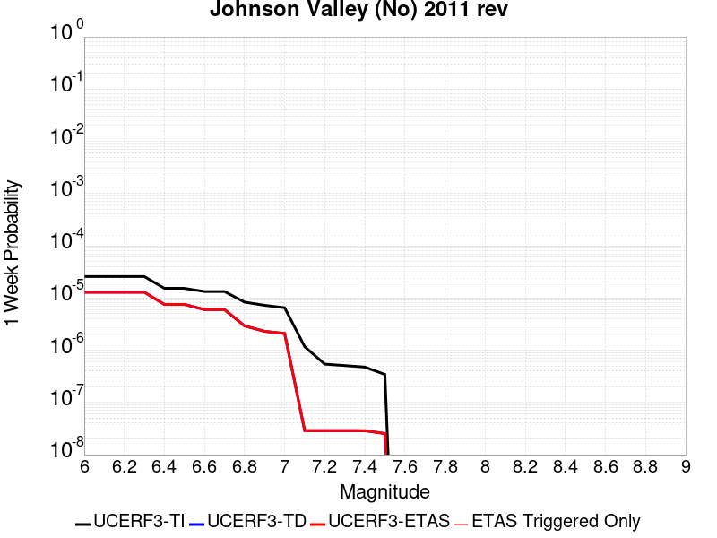 |  |  |  |

| Magnitude | 1 wk TI Prob | 1 wk TD Prob | 1 wk ETAS Prob | 1 wk ETAS/TD Gain | 1 wk ETAS Triggered Only | 1 mo TI Prob | 1 mo TD Prob | 1 mo ETAS Prob | 1 mo ETAS/TD Gain | 1 mo ETAS Triggered Only | 1 yr TI Prob | 1 yr TD Prob | 1 yr ETAS Prob | 1 yr ETAS/TD Gain | 1 yr ETAS Triggered Only | 10 yr TI Prob | 10 yr TD Prob | 10 yr ETAS Prob | 10 yr ETAS/TD Gain | 10 yr ETAS Triggered Only |
|-----|-----|-----|-----|-----|-----|-----|-----|-----|-----|-----|-----|-----|-----|-----|-----|-----|-----|-----|-----|-----|
| 6.0 | 2.577707E-5 | 1.2900938E-5 | 1.2900938E-5 | 1.0 | 0.0 | 1.1046848E-4 | 5.5288787E-5 | 5.5288787E-5 | 1.0 | 0.0 | 0.0013441239 | 6.7297276E-4 | 6.8633276E-4 | 1.0198522 | 1.3368984E-5 | 0.013360229 | 0.006713257 | 0.0067265364 | 1.001978 | 1.3368984E-5 |
| 6.1 | 2.577707E-5 | 1.2900938E-5 | 1.2900938E-5 | 1.0 | 0.0 | 1.1046848E-4 | 5.5288787E-5 | 5.5288787E-5 | 1.0 | 0.0 | 0.0013441239 | 6.7297276E-4 | 6.8633276E-4 | 1.0198522 | 1.3368984E-5 | 0.013360229 | 0.006713257 | 0.0067265364 | 1.001978 | 1.3368984E-5 |
| 6.2 | 2.577707E-5 | 1.2900938E-5 | 1.2900938E-5 | 1.0 | 0.0 | 1.1046848E-4 | 5.5288787E-5 | 5.5288787E-5 | 1.0 | 0.0 | 0.0013441239 | 6.7297276E-4 | 6.8633276E-4 | 1.0198522 | 1.3368984E-5 | 0.013360229 | 0.006713257 | 0.0067265364 | 1.001978 | 1.3368984E-5 |
| 6.3 | 2.577707E-5 | 1.2900938E-5 | 1.2900938E-5 | 1.0 | 0.0 | 1.1046848E-4 | 5.5288787E-5 | 5.5288787E-5 | 1.0 | 0.0 | 0.0013441239 | 6.7297276E-4 | 6.8633276E-4 | 1.0198522 | 1.3368984E-5 | 0.013360229 | 0.006713257 | 0.0067265364 | 1.001978 | 1.3368984E-5 |
| 6.4 | 1.5296591E-5 | 7.536742E-6 | 7.536742E-6 | 1.0 | 0.0 | 6.555518E-5 | 3.2300028E-5 | 3.2300028E-5 | 1.0 | 0.0 | 7.97842E-4 | 3.9320064E-4 | 3.9320064E-4 | 1.0 | 0.0 | 0.007949836 | 0.0039268904 | 0.0039268904 | 1.0 | 0.0 |
| 6.5 | 1.5296591E-5 | 7.536742E-6 | 7.536742E-6 | 1.0 | 0.0 | 6.555518E-5 | 3.2300028E-5 | 3.2300028E-5 | 1.0 | 0.0 | 7.97842E-4 | 3.9320064E-4 | 3.9320064E-4 | 1.0 | 0.0 | 0.007949836 | 0.0039268904 | 0.0039268904 | 1.0 | 0.0 |
| 6.6 | 1.3289383E-5 | 5.9917306E-6 | 5.9917306E-6 | 1.0 | 0.0 | 5.6953253E-5 | 2.5678688E-5 | 2.5678688E-5 | 1.0 | 0.0 | 6.9318525E-4 | 3.1261015E-4 | 3.1261015E-4 | 1.0 | 0.0 | 0.0069102696 | 0.0031233684 | 0.0031233684 | 1.0 | 0.0 |
| 6.7 | 1.3289383E-5 | 5.9917306E-6 | 5.9917306E-6 | 1.0 | 0.0 | 5.6953253E-5 | 2.5678688E-5 | 2.5678688E-5 | 1.0 | 0.0 | 6.9318525E-4 | 3.1261015E-4 | 3.1261015E-4 | 1.0 | 0.0 | 0.0069102696 | 0.0031233684 | 0.0031233684 | 1.0 | 0.0 |
| 6.8 | 8.330789E-6 | 2.9211888E-6 | 2.9211888E-6 | 1.0 | 0.0 | 3.570289E-5 | 1.2519352E-5 | 1.2519352E-5 | 1.0 | 0.0 | 4.34596E-4 | 1.5241816E-4 | 1.5241816E-4 | 1.0 | 0.0 | 0.0043374705 | 0.0015236961 | 0.0015236961 | 1.0 | 0.0 |
| 6.9 | 7.2359003E-6 | 2.3013247E-6 | 2.3013247E-6 | 1.0 | 0.0 | 3.1010633E-5 | 9.8628125E-6 | 9.8628125E-6 | 1.0 | 0.0 | 3.7748902E-4 | 1.2007845E-4 | 1.2007845E-4 | 1.0 | 0.0 | 0.0037684843 | 0.0012006586 | 0.0012006586 | 1.0 | 0.0 |
| 7.0 | 6.5149957E-6 | 2.088482E-6 | 2.088482E-6 | 1.0 | 0.0 | 2.792111E-5 | 8.950637E-6 | 8.950637E-6 | 1.0 | 0.0 | 3.398865E-4 | 1.0897385E-4 | 1.0897385E-4 | 1.0 | 0.0 | 0.003393671 | 0.0010897239 | 0.0010897239 | 1.0 | 0.0 |
| 7.1 | 1.1662233E-6 | 2.8802024E-8 | 2.8802024E-8 | 1.0 | 0.0 | 4.9980904E-6 | 1.2343725E-7 | 1.2343725E-7 | 1.0 | 0.0 | 6.0850052E-5 | 1.5028476E-6 | 1.5028476E-6 | 1.0 | 0.0 | 6.083339E-4 | 1.50283895E-5 | 1.50283895E-5 | 1.0 | 0.0 |
| 7.2 | 5.413881E-7 | 2.8802024E-8 | 2.8802024E-8 | 1.0 | 0.0 | 2.3202326E-6 | 1.2343725E-7 | 1.2343725E-7 | 1.0 | 0.0 | 2.8248465E-5 | 1.5028476E-6 | 1.5028476E-6 | 1.0 | 0.0 | 2.8244875E-4 | 1.50283895E-5 | 1.50283895E-5 | 1.0 | 0.0 |
| 7.3 | 5.076821E-7 | 2.8802024E-8 | 2.8802024E-8 | 1.0 | 0.0 | 2.1757785E-6 | 1.2343723E-7 | 1.2343723E-7 | 1.0 | 0.0 | 2.648978E-5 | 1.5028475E-6 | 1.5028475E-6 | 1.0 | 0.0 | 2.6486625E-4 | 1.50283895E-5 | 1.50283895E-5 | 1.0 | 0.0 |
| 7.4 | 4.7568687E-7 | 2.8783948E-8 | 2.8783948E-8 | 1.0 | 0.0 | 2.0386565E-6 | 1.2335977E-7 | 1.2335977E-7 | 1.0 | 0.0 | 2.482036E-5 | 1.5019043E-6 | 1.5019043E-6 | 1.0 | 0.0 | 2.4817587E-4 | 1.5018958E-5 | 1.5018958E-5 | 1.0 | 0.0 |
| 7.5 | 3.435626E-7 | 2.5357679E-8 | 2.5357679E-8 | 1.0 | 0.0 | 1.4724103E-6 | 1.0867576E-7 | 1.0867576E-7 | 1.0 | 0.0 | 1.7926448E-5 | 1.3231268E-6 | 1.3231268E-6 | 1.0 | 0.0 | 1.7925001E-4 | 1.3231205E-5 | 1.3231205E-5 | 1.0 | 0.0 |

## Clayton
*[(top)](#table-of-contents)*

| 1 Week | 1 Month | 1 Year | 10 Year |
|-----|-----|-----|-----|
|  | 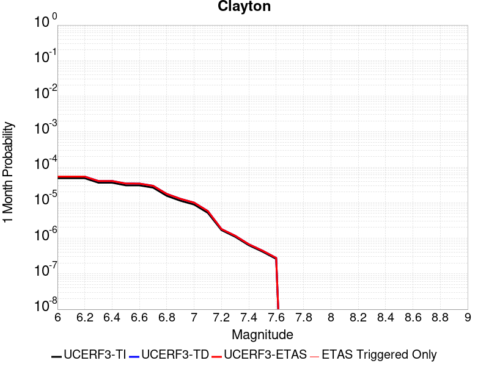 | 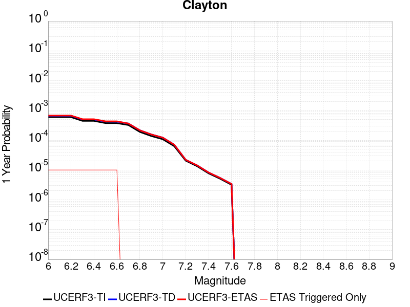 |  |

| Magnitude | 1 wk TI Prob | 1 wk TD Prob | 1 wk ETAS Prob | 1 wk ETAS/TD Gain | 1 wk ETAS Triggered Only | 1 mo TI Prob | 1 mo TD Prob | 1 mo ETAS Prob | 1 mo ETAS/TD Gain | 1 mo ETAS Triggered Only | 1 yr TI Prob | 1 yr TD Prob | 1 yr ETAS Prob | 1 yr ETAS/TD Gain | 1 yr ETAS Triggered Only | 10 yr TI Prob | 10 yr TD Prob | 10 yr ETAS Prob | 10 yr ETAS/TD Gain | 10 yr ETAS Triggered Only |
|-----|-----|-----|-----|-----|-----|-----|-----|-----|-----|-----|-----|-----|-----|-----|-----|-----|-----|-----|-----|-----|
| 6.0 | 1.1413061E-5 | 1.2667059E-5 | 1.2667059E-5 | 1.0 | 0.0 | 4.89122E-5 | 5.4286393E-5 | 5.4286393E-5 | 1.0 | 0.0 | 5.953433E-4 | 6.607586E-4 | 6.7411875E-4 | 1.0202194 | 1.3368984E-5 | 0.005937509 | 0.0065901424 | 0.006603423 | 1.0020152 | 1.3368984E-5 |
| 6.1 | 1.1413061E-5 | 1.2667059E-5 | 1.2667059E-5 | 1.0 | 0.0 | 4.89122E-5 | 5.4286393E-5 | 5.4286393E-5 | 1.0 | 0.0 | 5.953433E-4 | 6.607586E-4 | 6.7411875E-4 | 1.0202194 | 1.3368984E-5 | 0.005937509 | 0.0065901424 | 0.006603423 | 1.0020152 | 1.3368984E-5 |
| 6.2 | 1.1413061E-5 | 1.2667059E-5 | 1.2667059E-5 | 1.0 | 0.0 | 4.89122E-5 | 5.4286393E-5 | 5.4286393E-5 | 1.0 | 0.0 | 5.953433E-4 | 6.607586E-4 | 6.7411875E-4 | 1.0202194 | 1.3368984E-5 | 0.005937509 | 0.0065901424 | 0.006603423 | 1.0020152 | 1.3368984E-5 |
| 6.3 | 8.538689E-6 | 9.532753E-6 | 9.532753E-6 | 1.0 | 0.0 | 3.659387E-5 | 4.0854076E-5 | 4.0854076E-5 | 1.0 | 0.0 | 4.4543925E-4 | 4.9729564E-4 | 5.1065796E-4 | 1.02687 | 1.3368984E-5 | 0.0044454746 | 0.0049628937 | 0.004976196 | 1.0026804 | 1.3368984E-5 |
| 6.4 | 8.538689E-6 | 9.532753E-6 | 9.532753E-6 | 1.0 | 0.0 | 3.659387E-5 | 4.0854076E-5 | 4.0854076E-5 | 1.0 | 0.0 | 4.4543925E-4 | 4.9729564E-4 | 5.1065796E-4 | 1.02687 | 1.3368984E-5 | 0.0044454746 | 0.0049628937 | 0.004976196 | 1.0026804 | 1.3368984E-5 |
| 6.5 | 7.197462E-6 | 8.080952E-6 | 8.080952E-6 | 1.0 | 0.0 | 3.08459E-5 | 3.4632238E-5 | 3.4632238E-5 | 1.0 | 0.0 | 3.7548412E-4 | 4.2157414E-4 | 4.3493748E-4 | 1.0316987 | 1.3368984E-5 | 0.003748503 | 0.004208556 | 0.0042218687 | 1.0031632 | 1.3368984E-5 |
| 6.6 | 7.1760483E-6 | 8.056968E-6 | 8.056968E-6 | 1.0 | 0.0 | 3.075413E-5 | 3.4529454E-5 | 3.4529454E-5 | 1.0 | 0.0 | 3.743672E-4 | 4.203232E-4 | 4.3368657E-4 | 1.0317931 | 1.3368984E-5 | 0.0037373714 | 0.004196094 | 0.0042094067 | 1.0031726 | 1.3368984E-5 |
| 6.7 | 6.202582E-6 | 6.9766934E-6 | 6.9766934E-6 | 1.0 | 0.0 | 2.6582224E-5 | 2.9899817E-5 | 2.9899817E-5 | 1.0 | 0.0 | 3.235905E-4 | 3.6397713E-4 | 3.6397713E-4 | 1.0 | 0.0 | 0.0032311971 | 0.0036345655 | 0.0036345655 | 1.0 | 0.0 |
| 6.8 | 3.6417277E-6 | 4.1212957E-6 | 4.1212957E-6 | 1.0 | 0.0 | 1.5607311E-5 | 1.766258E-5 | 1.766258E-5 | 1.0 | 0.0 | 1.9000245E-4 | 2.1502146E-4 | 2.1502146E-4 | 1.0 | 0.0 | 0.0018984007 | 0.0021482105 | 0.0021482105 | 1.0 | 0.0 |
| 6.9 | 2.6498485E-6 | 2.9995201E-6 | 2.9995201E-6 | 1.0 | 0.0 | 1.1356444E-5 | 1.2855025E-5 | 1.2855025E-5 | 1.0 | 0.0 | 1.3825593E-4 | 1.5649908E-4 | 1.5649908E-4 | 1.0 | 0.0 | 0.0013816995 | 0.0015639283 | 0.0015639283 | 1.0 | 0.0 |
| 7.0 | 2.070442E-6 | 2.3407233E-6 | 2.3407233E-6 | 1.0 | 0.0 | 8.873292E-6 | 1.0031635E-5 | 1.0031635E-5 | 1.0 | 0.0 | 1.0802698E-4 | 1.2212861E-4 | 1.2212861E-4 | 1.0 | 0.0 | 0.0010797448 | 0.0012206447 | 0.0012206447 | 1.0 | 0.0 |
| 7.1 | 1.2111691E-6 | 1.3588725E-6 | 1.3588725E-6 | 1.0 | 0.0 | 5.190714E-6 | 5.8237274E-6 | 5.8237274E-6 | 1.0 | 0.0 | 6.319511E-5 | 7.090174E-5 | 7.090174E-5 | 1.0 | 0.0 | 6.3177146E-4 | 7.0880755E-4 | 7.0880755E-4 | 1.0 | 0.0 |
| 7.2 | 3.9541607E-7 | 4.2227694E-7 | 4.2227694E-7 | 1.0 | 0.0 | 1.6946392E-6 | 1.8097571E-6 | 1.8097571E-6 | 1.0 | 0.0 | 2.0632036E-5 | 2.2033571E-5 | 2.2033571E-5 | 1.0 | 0.0 | 2.063012E-4 | 2.2031402E-4 | 2.2031402E-4 | 1.0 | 0.0 |
| 7.3 | 2.5685637E-7 | 2.745679E-7 | 2.745679E-7 | 1.0 | 0.0 | 1.1008126E-6 | 1.176719E-6 | 1.176719E-6 | 1.0 | 0.0 | 1.3402311E-5 | 1.4326461E-5 | 1.4326461E-5 | 1.0 | 0.0 | 1.3401502E-4 | 1.4325544E-4 | 1.4325544E-4 | 1.0 | 0.0 |
| 7.4 | 1.482299E-7 | 1.5807963E-7 | 1.5807963E-7 | 1.0 | 0.0 | 6.3527085E-7 | 6.7748397E-7 | 6.7748397E-7 | 1.0 | 0.0 | 7.734395E-6 | 8.248337E-6 | 8.248337E-6 | 1.0 | 0.0 | 7.734126E-5 | 8.248033E-5 | 8.248033E-5 | 1.0 | 0.0 |
| 7.5 | 9.7969505E-8 | 1.04382096E-7 | 1.04382096E-7 | 1.0 | 0.0 | 4.1986925E-7 | 4.4735177E-7 | 4.4735177E-7 | 1.0 | 0.0 | 5.111896E-6 | 5.446494E-6 | 5.446494E-6 | 1.0 | 0.0 | 5.1117782E-5 | 5.4463624E-5 | 5.4463624E-5 | 1.0 | 0.0 |
| 7.6 | 6.125415E-8 | 6.5231326E-8 | 6.5231326E-8 | 1.0 | 0.0 | 2.6251774E-7 | 2.7956278E-7 | 2.7956278E-7 | 1.0 | 0.0 | 3.196149E-6 | 3.4036718E-6 | 3.4036718E-6 | 1.0 | 0.0 | 3.196103E-5 | 3.403621E-5 | 3.403621E-5 | 1.0 | 0.0 |

## Cerro Prieto
*[(top)](#table-of-contents)*

| 1 Week | 1 Month | 1 Year | 10 Year |
|-----|-----|-----|-----|
|  |  |  |  |

| Magnitude | 1 wk TI Prob | 1 wk TD Prob | 1 wk ETAS Prob | 1 wk ETAS/TD Gain | 1 wk ETAS Triggered Only | 1 mo TI Prob | 1 mo TD Prob | 1 mo ETAS Prob | 1 mo ETAS/TD Gain | 1 mo ETAS Triggered Only | 1 yr TI Prob | 1 yr TD Prob | 1 yr ETAS Prob | 1 yr ETAS/TD Gain | 1 yr ETAS Triggered Only | 10 yr TI Prob | 10 yr TD Prob | 10 yr ETAS Prob | 10 yr ETAS/TD Gain | 10 yr ETAS Triggered Only |
|-----|-----|-----|-----|-----|-----|-----|-----|-----|-----|-----|-----|-----|-----|-----|-----|-----|-----|-----|-----|-----|
| 6.0 | 2.9101528E-4 | 5.964804E-4 | 5.964804E-4 | 1.0 | 0.0 | 0.0012466122 | 0.002554082 | 0.002554082 | 1.0 | 0.0 | 0.015072231 | 0.03064807 | 0.03066103 | 1.0004228 | 1.3368984E-5 | 0.14089979 | 0.25397858 | 0.25398853 | 1.0000392 | 1.3368984E-5 |
| 6.1 | 2.9101528E-4 | 5.964804E-4 | 5.964804E-4 | 1.0 | 0.0 | 0.0012466122 | 0.002554082 | 0.002554082 | 1.0 | 0.0 | 0.015072231 | 0.03064807 | 0.03066103 | 1.0004228 | 1.3368984E-5 | 0.14089979 | 0.25397858 | 0.25398853 | 1.0000392 | 1.3368984E-5 |
| 6.2 | 2.9101528E-4 | 5.964804E-4 | 5.964804E-4 | 1.0 | 0.0 | 0.0012466122 | 0.002554082 | 0.002554082 | 1.0 | 0.0 | 0.015072231 | 0.03064807 | 0.03066103 | 1.0004228 | 1.3368984E-5 | 0.14089979 | 0.25397858 | 0.25398853 | 1.0000392 | 1.3368984E-5 |
| 6.3 | 2.9101528E-4 | 5.964804E-4 | 5.964804E-4 | 1.0 | 0.0 | 0.0012466122 | 0.002554082 | 0.002554082 | 1.0 | 0.0 | 0.015072231 | 0.03064807 | 0.03066103 | 1.0004228 | 1.3368984E-5 | 0.14089979 | 0.25397858 | 0.25398853 | 1.0000392 | 1.3368984E-5 |
| 6.4 | 2.508648E-4 | 5.1397446E-4 | 5.1397446E-4 | 1.0 | 0.0 | 0.0010746918 | 0.0022010866 | 0.0022010866 | 1.0 | 0.0 | 0.013006088 | 0.026471792 | 0.026484806 | 1.0004916 | 1.3368984E-5 | 0.12270685 | 0.22440416 | 0.22441453 | 1.0000463 | 1.3368984E-5 |
| 6.5 | 2.508648E-4 | 5.1397446E-4 | 5.1397446E-4 | 1.0 | 0.0 | 0.0010746918 | 0.0022010866 | 0.0022010866 | 1.0 | 0.0 | 0.013006088 | 0.026471792 | 0.026484806 | 1.0004916 | 1.3368984E-5 | 0.12270685 | 0.22440416 | 0.22441453 | 1.0000463 | 1.3368984E-5 |
| 6.6 | 2.294914E-4 | 4.7116808E-4 | 4.7116808E-4 | 1.0 | 0.0 | 9.831638E-4 | 0.0020179166 | 0.0020179166 | 1.0 | 0.0 | 0.011904482 | 0.02429866 | 0.024311705 | 1.0005368 | 1.3368984E-5 | 0.11286586 | 0.20858558 | 0.20859616 | 1.0000508 | 1.3368984E-5 |
| 6.7 | 1.9621674E-4 | 4.0419117E-4 | 4.0419117E-4 | 1.0 | 0.0 | 8.4065786E-4 | 0.0017312564 | 0.0017312564 | 1.0 | 0.0 | 0.010187071 | 0.020884845 | 0.020897934 | 1.0006268 | 1.3368984E-5 | 0.09732539 | 0.18290249 | 0.18291341 | 1.0000597 | 1.3368984E-5 |
| 6.8 | 1.5476145E-4 | 3.056516E-4 | 3.056516E-4 | 1.0 | 0.0 | 6.6309475E-4 | 0.00130938 | 0.00130938 | 1.0 | 0.0 | 0.008043335 | 0.015836509 | 0.015849665 | 1.0008308 | 1.3368984E-5 | 0.07758363 | 0.14336355 | 0.14337501 | 1.0000799 | 1.3368984E-5 |
| 6.9 | 1.20509176E-4 | 2.2582515E-4 | 2.2582515E-4 | 1.0 | 0.0 | 5.1636563E-4 | 9.6752634E-4 | 9.6752634E-4 | 1.0 | 0.0 | 0.006268645 | 0.011726342 | 0.011739555 | 1.0011268 | 1.3368984E-5 | 0.060947374 | 0.109451205 | 0.10946311 | 1.0001087 | 1.3368984E-5 |
| 7.0 | 9.3269155E-5 | 1.6716642E-4 | 1.6716642E-4 | 1.0 | 0.0 | 3.9966372E-4 | 7.162739E-4 | 7.162739E-4 | 1.0 | 0.0 | 0.0048550544 | 0.008693418 | 0.008706671 | 1.0015244 | 1.3368984E-5 | 0.04750344 | 0.08315912 | 0.083171375 | 1.0001473 | 1.3368984E-5 |
| 7.1 | 5.029709E-5 | 8.1718936E-5 | 8.1718936E-5 | 1.0 | 0.0 | 2.1554115E-4 | 3.5019626E-4 | 3.5019626E-4 | 1.0 | 0.0 | 0.0026210553 | 0.0042587193 | 0.004272031 | 1.0031258 | 1.3368984E-5 | 0.025903556 | 0.042365108 | 0.04237791 | 1.0003022 | 1.3368984E-5 |
| 7.2 | 6.5445185E-8 | 6.814903E-8 | 6.814903E-8 | 1.0 | 0.0 | 2.8047933E-7 | 2.9206726E-7 | 2.9206726E-7 | 1.0 | 0.0 | 3.4148304E-6 | 3.555919E-6 | 3.555919E-6 | 1.0 | 0.0 | 3.414778E-5 | 3.5559187E-5 | 3.5559187E-5 | 1.0 | 0.0 |

## Greenville (No) 2011 CFM
*[(top)](#table-of-contents)*

| 1 Week | 1 Month | 1 Year | 10 Year |
|-----|-----|-----|-----|
|  | 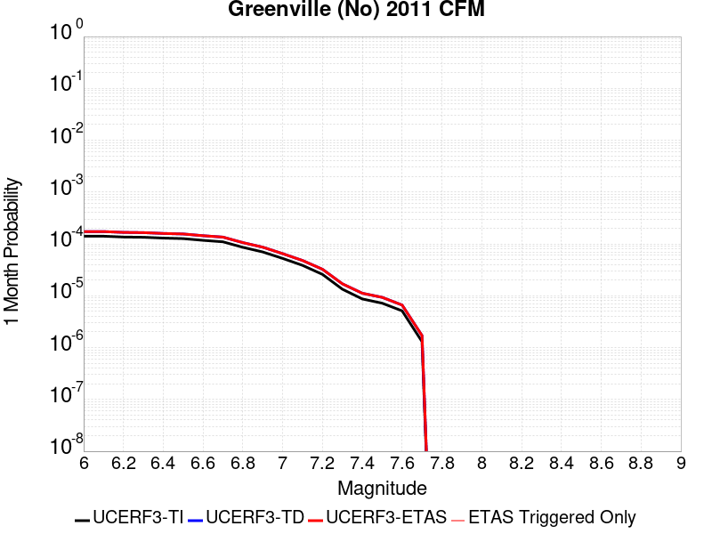 | 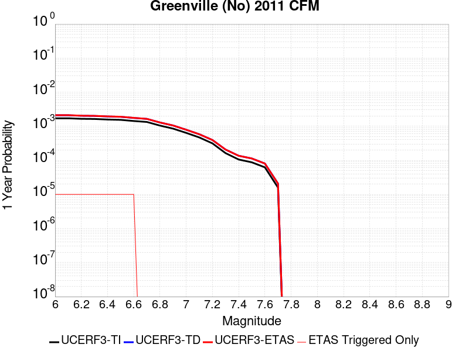 |  |

| Magnitude | 1 wk TI Prob | 1 wk TD Prob | 1 wk ETAS Prob | 1 wk ETAS/TD Gain | 1 wk ETAS Triggered Only | 1 mo TI Prob | 1 mo TD Prob | 1 mo ETAS Prob | 1 mo ETAS/TD Gain | 1 mo ETAS Triggered Only | 1 yr TI Prob | 1 yr TD Prob | 1 yr ETAS Prob | 1 yr ETAS/TD Gain | 1 yr ETAS Triggered Only | 10 yr TI Prob | 10 yr TD Prob | 10 yr ETAS Prob | 10 yr ETAS/TD Gain | 10 yr ETAS Triggered Only |
|-----|-----|-----|-----|-----|-----|-----|-----|-----|-----|-----|-----|-----|-----|-----|-----|-----|-----|-----|-----|-----|
| 6.0 | 3.286654E-5 | 4.036648E-5 | 4.036648E-5 | 1.0 | 0.0 | 1.4084899E-4 | 1.7298796E-4 | 1.7298796E-4 | 1.0 | 0.0 | 0.0017134876 | 0.002104132 | 0.002117473 | 1.0063403 | 1.3368984E-5 | 0.017003356 | 0.020846982 | 0.020860072 | 1.0006279 | 1.3368984E-5 |
| 6.1 | 3.286654E-5 | 4.036648E-5 | 4.036648E-5 | 1.0 | 0.0 | 1.4084899E-4 | 1.7298796E-4 | 1.7298796E-4 | 1.0 | 0.0 | 0.0017134876 | 0.002104132 | 0.002117473 | 1.0063403 | 1.3368984E-5 | 0.017003356 | 0.020846982 | 0.020860072 | 1.0006279 | 1.3368984E-5 |
| 6.2 | 3.1697953E-5 | 3.8929385E-5 | 3.8929385E-5 | 1.0 | 0.0 | 1.358413E-4 | 1.6682976E-4 | 1.6682976E-4 | 1.0 | 0.0 | 0.0016526132 | 0.002029298 | 0.00204264 | 1.0065746 | 1.3368984E-5 | 0.01640377 | 0.020112377 | 0.020125477 | 1.0006514 | 1.3368984E-5 |
| 6.3 | 3.1363317E-5 | 3.851826E-5 | 3.851826E-5 | 1.0 | 0.0 | 1.344073E-4 | 1.6506804E-4 | 1.6506804E-4 | 1.0 | 0.0 | 0.0016351803 | 0.0020078886 | 0.0020212308 | 1.0066448 | 1.3368984E-5 | 0.016232004 | 0.019902144 | 0.019915247 | 1.0006584 | 1.3368984E-5 |
| 6.4 | 3.0228604E-5 | 3.7125395E-5 | 3.7125395E-5 | 1.0 | 0.0 | 1.2954473E-4 | 1.5909935E-4 | 1.5909935E-4 | 1.0 | 0.0 | 0.0015760659 | 0.0019353506 | 0.0019486937 | 1.0068945 | 1.3368984E-5 | 0.015649348 | 0.019189484 | 0.019202597 | 1.0006833 | 1.3368984E-5 |
| 6.5 | 2.9537814E-5 | 3.6280853E-5 | 3.6280853E-5 | 1.0 | 0.0 | 1.2658449E-4 | 1.554803E-4 | 1.554803E-4 | 1.0 | 0.0 | 0.0015400766 | 0.0018913659 | 0.0019047096 | 1.007055 | 1.3368984E-5 | 0.01529447 | 0.018757146 | 0.018770264 | 1.0006994 | 1.3368984E-5 |
| 6.6 | 2.7345395E-5 | 3.3590182E-5 | 3.3590182E-5 | 1.0 | 0.0 | 1.1718928E-4 | 1.4395016E-4 | 1.4395016E-4 | 1.0 | 0.0 | 0.0014258457 | 0.0017512152 | 0.0017645608 | 1.0076207 | 1.3368984E-5 | 0.014167317 | 0.01737797 | 0.017391106 | 1.0007559 | 1.3368984E-5 |
| 6.7 | 2.5615784E-5 | 3.1567088E-5 | 3.1567088E-5 | 1.0 | 0.0 | 1.09777306E-4 | 1.3528067E-4 | 1.3528067E-4 | 1.0 | 0.0 | 0.0013357193 | 0.0016458282 | 0.0016458282 | 1.0 | 0.0 | 0.013277191 | 0.016340064 | 0.016340064 | 1.0 | 0.0 |
| 6.8 | 2.0059057E-5 | 2.4712073E-5 | 2.4712073E-5 | 1.0 | 0.0 | 8.596455E-5 | 1.0590468E-4 | 1.0590468E-4 | 1.0 | 0.0 | 0.0010461159 | 0.001288643 | 0.001288643 | 1.0 | 0.0 | 0.0104120495 | 0.012813724 | 0.012813724 | 1.0 | 0.0 |
| 6.9 | 1.6321746E-5 | 2.018467E-5 | 2.018467E-5 | 1.0 | 0.0 | 6.9948466E-5 | 8.650293E-5 | 8.650293E-5 | 1.0 | 0.0 | 8.5128983E-4 | 0.0010526767 | 0.0010526767 | 1.0 | 0.0 | 0.008480361 | 0.010478431 | 0.010478431 | 1.0 | 0.0 |
| 7.0 | 1.22527645E-5 | 1.5135633E-5 | 1.5135633E-5 | 1.0 | 0.0 | 5.2510793E-5 | 6.486541E-5 | 6.486541E-5 | 1.0 | 0.0 | 6.3913135E-4 | 7.894544E-4 | 7.894544E-4 | 1.0 | 0.0 | 0.0063729626 | 0.007867137 | 0.007867137 | 1.0 | 0.0 |
| 7.1 | 8.996482E-6 | 1.1164954E-5 | 1.1164954E-5 | 1.0 | 0.0 | 3.8555783E-5 | 4.7848935E-5 | 4.7848935E-5 | 1.0 | 0.0 | 4.6931554E-4 | 5.824063E-4 | 5.824063E-4 | 1.0 | 0.0 | 0.004683256 | 0.0058090906 | 0.0058090906 | 1.0 | 0.0 |
| 7.2 | 6.0273087E-6 | 7.569474E-6 | 7.569474E-6 | 1.0 | 0.0 | 2.5831067E-5 | 3.2440203E-5 | 3.2440203E-5 | 1.0 | 0.0 | 3.1444785E-4 | 3.9488857E-4 | 3.9488857E-4 | 1.0 | 0.0 | 0.0031400328 | 0.003942066 | 0.003942066 | 1.0 | 0.0 |
| 7.3 | 3.1209995E-6 | 3.9663746E-6 | 3.9663746E-6 | 1.0 | 0.0 | 1.3375643E-5 | 1.699864E-5 | 1.699864E-5 | 1.0 | 0.0 | 1.6283628E-4 | 2.0693893E-4 | 2.0693893E-4 | 1.0 | 0.0 | 0.0016271701 | 0.0020675526 | 0.0020675526 | 1.0 | 0.0 |
| 7.4 | 2.0254208E-6 | 2.6096043E-6 | 2.6096043E-6 | 1.0 | 0.0 | 8.680347E-6 | 1.1183971E-5 | 1.1183971E-5 | 1.0 | 0.0 | 1.0567809E-4 | 1.361564E-4 | 1.361564E-4 | 1.0 | 0.0 | 0.0010562785 | 0.0013607866 | 0.0013607866 | 1.0 | 0.0 |
| 7.5 | 1.6763418E-6 | 2.173353E-6 | 2.173353E-6 | 1.0 | 0.0 | 7.184302E-6 | 9.314337E-6 | 9.314337E-6 | 1.0 | 0.0 | 8.746537E-5 | 1.1339621E-4 | 1.1339621E-4 | 1.0 | 0.0 | 8.743095E-4 | 0.0011334305 | 0.0011334305 | 1.0 | 0.0 |
| 7.6 | 1.1935462E-6 | 1.5458467E-6 | 1.5458467E-6 | 1.0 | 0.0 | 5.115188E-6 | 6.6250404E-6 | 6.6250404E-6 | 1.0 | 0.0 | 6.2275634E-5 | 8.065693E-5 | 8.065693E-5 | 1.0 | 0.0 | 6.2258187E-4 | 8.0630725E-4 | 8.0630725E-4 | 1.0 | 0.0 |
| 7.7 | 3.0464201E-7 | 3.9846822E-7 | 3.9846822E-7 | 1.0 | 0.0 | 1.3056081E-6 | 1.7077199E-6 | 1.7077199E-6 | 1.0 | 0.0 | 1.589566E-5 | 2.0791296E-5 | 2.0791296E-5 | 1.0 | 0.0 | 1.5894524E-4 | 2.0789822E-4 | 2.0789822E-4 | 1.0 | 0.0 |

## Great Valley 04b Gordon Valley
*[(top)](#table-of-contents)*

| 1 Week | 1 Month | 1 Year | 10 Year |
|-----|-----|-----|-----|
| 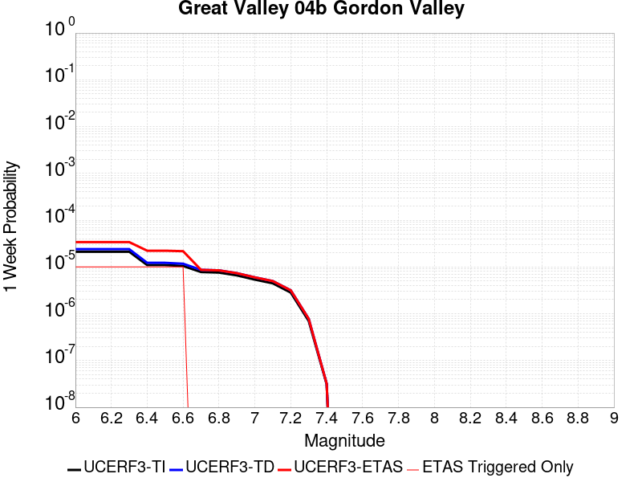 |  |  |  |

| Magnitude | 1 wk TI Prob | 1 wk TD Prob | 1 wk ETAS Prob | 1 wk ETAS/TD Gain | 1 wk ETAS Triggered Only | 1 mo TI Prob | 1 mo TD Prob | 1 mo ETAS Prob | 1 mo ETAS/TD Gain | 1 mo ETAS Triggered Only | 1 yr TI Prob | 1 yr TD Prob | 1 yr ETAS Prob | 1 yr ETAS/TD Gain | 1 yr ETAS Triggered Only | 10 yr TI Prob | 10 yr TD Prob | 10 yr ETAS Prob | 10 yr ETAS/TD Gain | 10 yr ETAS Triggered Only |
|-----|-----|-----|-----|-----|-----|-----|-----|-----|-----|-----|-----|-----|-----|-----|-----|-----|-----|-----|-----|-----|
| 6.0 | 2.1181217E-5 | 2.3981953E-5 | 3.7350615E-5 | 1.5574468 | 1.3368984E-5 | 9.077348E-5 | 1.0277669E-4 | 1.161443E-4 | 1.1300646 | 1.3368984E-5 | 0.0011046068 | 0.0012507546 | 0.001264107 | 1.0106753 | 1.3368984E-5 | 0.010991322 | 0.012453599 | 0.012466801 | 1.0010601 | 1.3368984E-5 |
| 6.1 | 2.1181217E-5 | 2.3981953E-5 | 3.7350615E-5 | 1.5574468 | 1.3368984E-5 | 9.077348E-5 | 1.0277669E-4 | 1.161443E-4 | 1.1300646 | 1.3368984E-5 | 0.0011046068 | 0.0012507546 | 0.001264107 | 1.0106753 | 1.3368984E-5 | 0.010991322 | 0.012453599 | 0.012466801 | 1.0010601 | 1.3368984E-5 |
| 6.2 | 2.1181217E-5 | 2.3981953E-5 | 3.7350615E-5 | 1.5574468 | 1.3368984E-5 | 9.077348E-5 | 1.0277669E-4 | 1.161443E-4 | 1.1300646 | 1.3368984E-5 | 0.0011046068 | 0.0012507546 | 0.001264107 | 1.0106753 | 1.3368984E-5 | 0.010991322 | 0.012453599 | 0.012466801 | 1.0010601 | 1.3368984E-5 |
| 6.3 | 2.1181217E-5 | 2.3981953E-5 | 3.7350615E-5 | 1.5574468 | 1.3368984E-5 | 9.077348E-5 | 1.0277669E-4 | 1.161443E-4 | 1.1300646 | 1.3368984E-5 | 0.0011046068 | 0.0012507546 | 0.001264107 | 1.0106753 | 1.3368984E-5 | 0.010991322 | 0.012453599 | 0.012466801 | 1.0010601 | 1.3368984E-5 |
| 6.4 | 1.0988268E-5 | 1.2254499E-5 | 2.5623318E-5 | 2.0909317 | 1.3368984E-5 | 4.7091726E-5 | 5.2518313E-5 | 6.588659E-5 | 1.2545452 | 1.3368984E-5 | 5.731909E-4 | 6.392388E-4 | 6.525992E-4 | 1.0209005 | 1.3368984E-5 | 0.005717147 | 0.0063755875 | 0.006388871 | 1.0020835 | 1.3368984E-5 |
| 6.5 | 1.0988268E-5 | 1.2254499E-5 | 2.5623318E-5 | 2.0909317 | 1.3368984E-5 | 4.7091726E-5 | 5.2518313E-5 | 6.588659E-5 | 1.2545452 | 1.3368984E-5 | 5.731909E-4 | 6.392388E-4 | 6.525992E-4 | 1.0209005 | 1.3368984E-5 | 0.005717147 | 0.0063755875 | 0.006388871 | 1.0020835 | 1.3368984E-5 |
| 6.6 | 1.0517822E-5 | 1.1724062E-5 | 2.509289E-5 | 2.1402898 | 1.3368984E-5 | 4.5075605E-5 | 5.02451E-5 | 6.3613414E-5 | 1.266062 | 1.3368984E-5 | 5.4865726E-4 | 6.11578E-4 | 6.249388E-4 | 1.0218464 | 1.3368984E-5 | 0.0054730466 | 0.0061005033 | 0.0061137904 | 1.0021781 | 1.3368984E-5 |
| 6.7 | 7.789219E-6 | 8.6776445E-6 | 8.6776445E-6 | 1.0 | 0.0 | 3.3381937E-5 | 3.7189402E-5 | 3.7189402E-5 | 1.0 | 0.0 | 4.063493E-4 | 4.526921E-4 | 4.526921E-4 | 1.0 | 0.0 | 0.004056071 | 0.0045182165 | 0.0045182165 | 1.0 | 0.0 |
| 6.8 | 7.5850853E-6 | 8.452389E-6 | 8.452389E-6 | 1.0 | 0.0 | 3.2507105E-5 | 3.622405E-5 | 3.622405E-5 | 1.0 | 0.0 | 3.957021E-4 | 4.409437E-4 | 4.409437E-4 | 1.0 | 0.0 | 0.0039499826 | 0.0044012 | 0.0044012 | 1.0 | 0.0 |
| 6.9 | 6.604105E-6 | 7.3585493E-6 | 7.3585493E-6 | 1.0 | 0.0 | 2.8303E-5 | 3.153628E-5 | 3.153628E-5 | 1.0 | 0.0 | 3.4453452E-4 | 3.8389044E-4 | 3.8389044E-4 | 1.0 | 0.0 | 0.0034400085 | 0.0038326595 | 0.0038326595 | 1.0 | 0.0 |
| 7.0 | 5.3701115E-6 | 5.9884183E-6 | 5.9884183E-6 | 1.0 | 0.0 | 2.301456E-5 | 2.5664414E-5 | 2.5664414E-5 | 1.0 | 0.0 | 2.8016625E-4 | 3.1242234E-4 | 3.1242234E-4 | 1.0 | 0.0 | 0.0027981328 | 0.00312012 | 0.00312012 | 1.0 | 0.0 |
| 7.1 | 4.4685607E-6 | 4.986478E-6 | 4.986478E-6 | 1.0 | 0.0 | 1.9150835E-5 | 2.1370459E-5 | 2.1370459E-5 | 1.0 | 0.0 | 2.3313647E-4 | 2.6015675E-4 | 2.6015675E-4 | 1.0 | 0.0 | 0.0023289204 | 0.0025987667 | 0.0025987667 | 1.0 | 0.0 |
| 7.2 | 2.833378E-6 | 3.164419E-6 | 3.164419E-6 | 1.0 | 0.0 | 1.2142991E-5 | 1.3561736E-5 | 1.3561736E-5 | 1.0 | 0.0 | 1.4783088E-4 | 1.6510337E-4 | 1.6510337E-4 | 1.0 | 0.0 | 0.0014773258 | 0.0016499789 | 0.0016499789 | 1.0 | 0.0 |
| 7.3 | 7.0087293E-7 | 7.7728157E-7 | 7.7728157E-7 | 1.0 | 0.0 | 3.0037377E-6 | 3.3312049E-6 | 3.3312049E-6 | 1.0 | 0.0 | 3.656989E-5 | 4.0557123E-5 | 4.0557123E-5 | 1.0 | 0.0 | 3.6563876E-4 | 4.055422E-4 | 4.055422E-4 | 1.0 | 0.0 |
| 7.4 | 3.112171E-8 | 3.2068368E-8 | 3.2068368E-8 | 1.0 | 0.0 | 1.3337875E-7 | 1.3743585E-7 | 1.3743585E-7 | 1.0 | 0.0 | 1.6238852E-6 | 1.6732803E-6 | 1.6732803E-6 | 1.0 | 0.0 | 1.6238733E-5 | 1.6732685E-5 | 1.6732685E-5 | 1.0 | 0.0 |

## Elmore Ranch
*[(top)](#table-of-contents)*

| 1 Week | 1 Month | 1 Year | 10 Year |
|-----|-----|-----|-----|
|  | 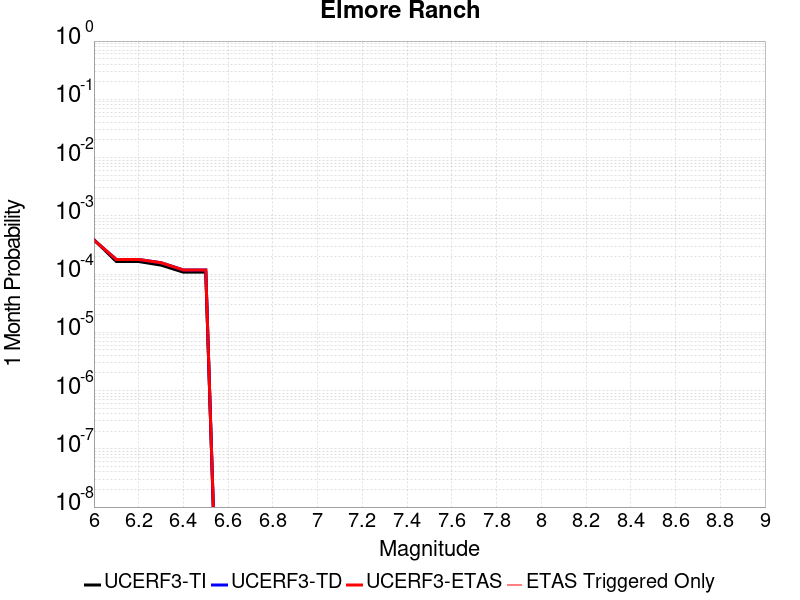 |  |  |

| Magnitude | 1 wk TI Prob | 1 wk TD Prob | 1 wk ETAS Prob | 1 wk ETAS/TD Gain | 1 wk ETAS Triggered Only | 1 mo TI Prob | 1 mo TD Prob | 1 mo ETAS Prob | 1 mo ETAS/TD Gain | 1 mo ETAS Triggered Only | 1 yr TI Prob | 1 yr TD Prob | 1 yr ETAS Prob | 1 yr ETAS/TD Gain | 1 yr ETAS Triggered Only | 10 yr TI Prob | 10 yr TD Prob | 10 yr ETAS Prob | 10 yr ETAS/TD Gain | 10 yr ETAS Triggered Only |
|-----|-----|-----|-----|-----|-----|-----|-----|-----|-----|-----|-----|-----|-----|-----|-----|-----|-----|-----|-----|-----|
| 6.0 | 9.102099E-5 | 8.952015E-5 | 8.952015E-5 | 1.0 | 0.0 | 3.9003167E-4 | 3.8361453E-4 | 3.8361453E-4 | 1.0 | 0.0 | 0.0047383 | 0.004662009 | 0.0046753157 | 1.0028542 | 1.3368984E-5 | 0.046385348 | 0.045870975 | 0.04588373 | 1.0002781 | 1.3368984E-5 |
| 6.1 | 3.8306698E-5 | 4.1498504E-5 | 4.1498504E-5 | 1.0 | 0.0 | 1.6416123E-4 | 1.7784268E-4 | 1.7784268E-4 | 1.0 | 0.0 | 0.0019968306 | 0.0021631396 | 0.0021631396 | 1.0 | 0.0 | 0.019789828 | 0.021628205 | 0.021628205 | 1.0 | 0.0 |
| 6.2 | 3.8306698E-5 | 4.1498504E-5 | 4.1498504E-5 | 1.0 | 0.0 | 1.6416123E-4 | 1.7784268E-4 | 1.7784268E-4 | 1.0 | 0.0 | 0.0019968306 | 0.0021631396 | 0.0021631396 | 1.0 | 0.0 | 0.019789828 | 0.021628205 | 0.021628205 | 1.0 | 0.0 |
| 6.3 | 3.3197924E-5 | 3.6554302E-5 | 3.6554302E-5 | 1.0 | 0.0 | 1.4226905E-4 | 1.5665586E-4 | 1.5665586E-4 | 1.0 | 0.0 | 0.0017307495 | 0.001905917 | 0.001905917 | 1.0 | 0.0 | 0.017173318 | 0.01908996 | 0.01908996 | 1.0 | 0.0 |
| 6.4 | 2.5148964E-5 | 2.7420487E-5 | 2.7420487E-5 | 1.0 | 0.0 | 1.0777682E-4 | 1.17514726E-4 | 1.17514726E-4 | 1.0 | 0.0 | 0.0013113929 | 0.0014304507 | 0.0014304507 | 1.0 | 0.0 | 0.01303681 | 0.014387194 | 0.014387194 | 1.0 | 0.0 |
| 6.5 | 2.5148964E-5 | 2.7420487E-5 | 2.7420487E-5 | 1.0 | 0.0 | 1.0777682E-4 | 1.17514726E-4 | 1.17514726E-4 | 1.0 | 0.0 | 0.0013113929 | 0.0014304507 | 0.0014304507 | 1.0 | 0.0 | 0.01303681 | 0.014387194 | 0.014387194 | 1.0 | 0.0 |

## Superstition Hills
*[(top)](#table-of-contents)*

| 1 Week | 1 Month | 1 Year | 10 Year |
|-----|-----|-----|-----|
|  |  |  |  |

| Magnitude | 1 wk TI Prob | 1 wk TD Prob | 1 wk ETAS Prob | 1 wk ETAS/TD Gain | 1 wk ETAS Triggered Only | 1 mo TI Prob | 1 mo TD Prob | 1 mo ETAS Prob | 1 mo ETAS/TD Gain | 1 mo ETAS Triggered Only | 1 yr TI Prob | 1 yr TD Prob | 1 yr ETAS Prob | 1 yr ETAS/TD Gain | 1 yr ETAS Triggered Only | 10 yr TI Prob | 10 yr TD Prob | 10 yr ETAS Prob | 10 yr ETAS/TD Gain | 10 yr ETAS Triggered Only |
|-----|-----|-----|-----|-----|-----|-----|-----|-----|-----|-----|-----|-----|-----|-----|-----|-----|-----|-----|-----|-----|
| 6.0 | 6.6865185E-5 | 1.41376995E-5 | 1.41376995E-5 | 1.0 | 0.0 | 2.8653358E-4 | 6.0588824E-5 | 6.0588824E-5 | 1.0 | 0.0 | 0.0034829667 | 7.374355E-4 | 7.507946E-4 | 1.0181156 | 1.3368984E-5 | 0.03428881 | 0.0075204074 | 0.007533676 | 1.0017643 | 1.3368984E-5 |
| 6.1 | 6.544851E-5 | 1.41376995E-5 | 1.41376995E-5 | 1.0 | 0.0 | 2.8046346E-4 | 6.0588824E-5 | 6.0588824E-5 | 1.0 | 0.0 | 0.0034092965 | 7.374355E-4 | 7.507946E-4 | 1.0181156 | 1.3368984E-5 | 0.033574644 | 0.007520407 | 0.0075336755 | 1.0017643 | 1.3368984E-5 |
| 6.2 | 6.544851E-5 | 1.41376995E-5 | 1.41376995E-5 | 1.0 | 0.0 | 2.8046346E-4 | 6.0588824E-5 | 6.0588824E-5 | 1.0 | 0.0 | 0.0034092965 | 7.374355E-4 | 7.507946E-4 | 1.0181156 | 1.3368984E-5 | 0.033574644 | 0.007520407 | 0.0075336755 | 1.0017643 | 1.3368984E-5 |
| 6.3 | 5.2402065E-5 | 1.4137698E-5 | 1.4137698E-5 | 1.0 | 0.0 | 2.2456095E-4 | 6.058882E-5 | 6.058882E-5 | 1.0 | 0.0 | 0.0027306017 | 7.374354E-4 | 7.5079454E-4 | 1.0181156 | 1.3368984E-5 | 0.02697292 | 0.007520402 | 0.00753367 | 1.0017643 | 1.3368984E-5 |
| 6.4 | 4.542238E-5 | 1.4137698E-5 | 1.4137698E-5 | 1.0 | 0.0 | 1.9465282E-4 | 6.0588816E-5 | 6.0588816E-5 | 1.0 | 0.0 | 0.0023673223 | 7.3743536E-4 | 7.507945E-4 | 1.0181156 | 1.3368984E-5 | 0.023422617 | 0.0075203986 | 0.007533667 | 1.0017643 | 1.3368984E-5 |
| 6.5 | 2.9672969E-5 | 1.4137696E-5 | 1.4137696E-5 | 1.0 | 0.0 | 1.2716366E-4 | 6.058881E-5 | 6.058881E-5 | 1.0 | 0.0 | 0.0015471181 | 7.374353E-4 | 7.507944E-4 | 1.0181156 | 1.3368984E-5 | 0.015363912 | 0.007520392 | 0.0075336606 | 1.0017643 | 1.3368984E-5 |
| 6.6 | 2.6056105E-5 | 1.3803458E-5 | 1.3803458E-5 | 1.0 | 0.0 | 1.1166424E-4 | 5.9156428E-5 | 5.9156428E-5 | 1.0 | 0.0 | 0.0013586642 | 7.200076E-4 | 7.3336693E-4 | 1.0185544 | 1.3368984E-5 | 0.013503874 | 0.0073448285 | 0.0073580993 | 1.0018069 | 1.3368984E-5 |
| 6.7 | 1.4611248E-5 | 1.3383359E-5 | 1.3383359E-5 | 1.0 | 0.0 | 6.261813E-5 | 5.7356083E-5 | 5.7356083E-5 | 1.0 | 0.0 | 7.6210906E-4 | 6.981025E-4 | 7.1146217E-4 | 1.0191371 | 1.3368984E-5 | 0.0075950073 | 0.00712602 | 0.0071392935 | 1.0018628 | 1.3368984E-5 |
| 6.8 | 1.30607E-5 | 1.09787925E-5 | 1.09787925E-5 | 1.0 | 0.0 | 5.597323E-5 | 4.705117E-5 | 4.705117E-5 | 1.0 | 0.0 | 6.8126095E-4 | 5.7270617E-4 | 5.860675E-4 | 1.0233302 | 1.3368984E-5 | 0.006791762 | 0.00587438 | 0.0058876704 | 1.0022625 | 1.3368984E-5 |
| 6.9 | 1.0443096E-5 | 8.195349E-6 | 8.195349E-6 | 1.0 | 0.0 | 4.4755358E-5 | 3.5122466E-5 | 3.5122466E-5 | 1.0 | 0.0 | 5.447602E-4 | 4.2753448E-4 | 4.4089774E-4 | 1.0312566 | 1.3368984E-5 | 0.005434267 | 0.0044094524 | 0.0044227624 | 1.0030185 | 1.3368984E-5 |
| 7.0 | 8.045912E-6 | 6.739692E-6 | 6.739692E-6 | 1.0 | 0.0 | 3.4482026E-5 | 2.888408E-5 | 2.888408E-5 | 1.0 | 0.0 | 4.197378E-4 | 3.5160795E-4 | 3.6497225E-4 | 1.038009 | 1.3368984E-5 | 0.0041894587 | 0.0036334093 | 0.0036467297 | 1.003666 | 1.3368984E-5 |
| 7.1 | 8.045912E-6 | 6.739692E-6 | 6.739692E-6 | 1.0 | 0.0 | 3.4482026E-5 | 2.888408E-5 | 2.888408E-5 | 1.0 | 0.0 | 4.197378E-4 | 3.5160795E-4 | 3.6497225E-4 | 1.038009 | 1.3368984E-5 | 0.0041894587 | 0.0036334093 | 0.0036467297 | 1.003666 | 1.3368984E-5 |
| 7.2 | 7.375506E-6 | 6.2466297E-6 | 6.2466297E-6 | 1.0 | 0.0 | 3.1608928E-5 | 2.6771E-5 | 2.6771E-5 | 1.0 | 0.0 | 3.8477074E-4 | 3.2588904E-4 | 3.3925366E-4 | 1.0410098 | 1.3368984E-5 | 0.003841052 | 0.003373887 | 0.0033872107 | 1.0039492 | 1.3368984E-5 |
| 7.3 | 6.6063913E-6 | 5.7990574E-6 | 5.7990574E-6 | 1.0 | 0.0 | 2.8312797E-5 | 2.485287E-5 | 2.485287E-5 | 1.0 | 0.0 | 3.446538E-4 | 3.025424E-4 | 3.1590732E-4 | 1.0441754 | 1.3368984E-5 | 0.0034411973 | 0.003138153 | 0.0031514803 | 1.0042468 | 1.3368984E-5 |
| 7.4 | 6.4313126E-6 | 5.680481E-6 | 5.680481E-6 | 1.0 | 0.0 | 2.7562477E-5 | 2.4344696E-5 | 2.4344696E-5 | 1.0 | 0.0 | 3.355215E-4 | 2.9635706E-4 | 3.097221E-4 | 1.0450977 | 1.3368984E-5 | 0.0033501536 | 0.0030759154 | 0.003089243 | 1.004333 | 1.3368984E-5 |
| 7.5 | 6.0742927E-6 | 5.4763104E-6 | 5.4763104E-6 | 1.0 | 0.0 | 2.6032423E-5 | 2.3469694E-5 | 2.3469694E-5 | 1.0 | 0.0 | 3.1689866E-4 | 2.8570674E-4 | 2.990719E-4 | 1.0467793 | 1.3368984E-5 | 0.0031644711 | 0.002967756 | 0.0029810853 | 1.0044913 | 1.3368984E-5 |
| 7.6 | 5.6987187E-6 | 5.294521E-6 | 5.294521E-6 | 1.0 | 0.0 | 2.4422852E-5 | 2.269061E-5 | 2.269061E-5 | 1.0 | 0.0 | 2.9730765E-4 | 2.7622381E-4 | 2.895891E-4 | 1.0483857 | 1.3368984E-5 | 0.002969102 | 0.0028710118 | 0.0028843426 | 1.0046432 | 1.3368984E-5 |
| 7.7 | 5.1658035E-6 | 4.925535E-6 | 4.925535E-6 | 1.0 | 0.0 | 2.2138971E-5 | 2.1109268E-5 | 2.1109268E-5 | 1.0 | 0.0 | 2.6950863E-4 | 2.5697565E-4 | 2.703412E-4 | 1.052011 | 1.3368984E-5 | 0.00269182 | 0.0026760625 | 0.0026893956 | 1.0049824 | 1.3368984E-5 |
| 7.8 | 3.6864697E-6 | 4.1964995E-6 | 4.1964995E-6 | 1.0 | 0.0 | 1.579906E-5 | 1.7984876E-5 | 1.7984876E-5 | 1.0 | 0.0 | 1.9233658E-4 | 2.1894433E-4 | 2.1894433E-4 | 1.0 | 0.0 | 0.0019217018 | 0.0022892624 | 0.0022892624 | 1.0 | 0.0 |
| 7.9 | 3.0265903E-6 | 3.5637288E-6 | 3.5637288E-6 | 1.0 | 0.0 | 1.2971037E-5 | 1.5273037E-5 | 1.5273037E-5 | 1.0 | 0.0 | 1.5791094E-4 | 1.859338E-4 | 1.859338E-4 | 1.0 | 0.0 | 0.0015779877 | 0.0019534735 | 0.0019534735 | 1.0 | 0.0 |
| 8.0 | 2.5271493E-6 | 3.0867361E-6 | 3.0867361E-6 | 1.0 | 0.0 | 1.0830595E-5 | 1.3228804E-5 | 1.3228804E-5 | 1.0 | 0.0 | 1.3185451E-4 | 1.610492E-4 | 1.610492E-4 | 1.0 | 0.0 | 0.0013177631 | 0.0016973554 | 0.0016973554 | 1.0 | 0.0 |
| 8.1 | 2.3749135E-6 | 2.917377E-6 | 2.917377E-6 | 1.0 | 0.0 | 1.0178161E-5 | 1.25029865E-5 | 1.25029865E-5 | 1.0 | 0.0 | 1.2391206E-4 | 1.5221364E-4 | 1.5221364E-4 | 1.0 | 0.0 | 0.0012384299 | 0.001604949 | 0.001604949 | 1.0 | 0.0 |
| 8.2 | 1.7186406E-9 | 1.1440594E-9 | 1.1440594E-9 | 1.0 | 0.0 | 7.3656024E-9 | 4.9031117E-9 | 4.9031117E-9 | 1.0 | 0.0 | 8.9676206E-8 | 5.969538E-8 | 5.969538E-8 | 1.0 | 0.0 | 8.9676166E-7 | 6.389059E-7 | 6.389059E-7 | 1.0 | 0.0 |

## Malibu Coast (Extension) alt 1
*[(top)](#table-of-contents)*

| 1 Week | 1 Month | 1 Year | 10 Year |
|-----|-----|-----|-----|
| 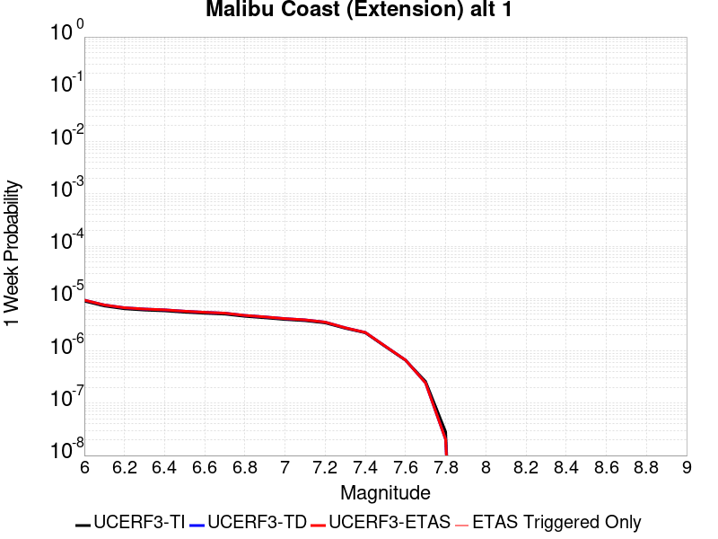 |  |  |  |

| Magnitude | 1 wk TI Prob | 1 wk TD Prob | 1 wk ETAS Prob | 1 wk ETAS/TD Gain | 1 wk ETAS Triggered Only | 1 mo TI Prob | 1 mo TD Prob | 1 mo ETAS Prob | 1 mo ETAS/TD Gain | 1 mo ETAS Triggered Only | 1 yr TI Prob | 1 yr TD Prob | 1 yr ETAS Prob | 1 yr ETAS/TD Gain | 1 yr ETAS Triggered Only | 10 yr TI Prob | 10 yr TD Prob | 10 yr ETAS Prob | 10 yr ETAS/TD Gain | 10 yr ETAS Triggered Only |
|-----|-----|-----|-----|-----|-----|-----|-----|-----|-----|-----|-----|-----|-----|-----|-----|-----|-----|-----|-----|-----|
| 6.0 | 8.930738E-6 | 9.329276E-6 | 9.329276E-6 | 1.0 | 0.0 | 3.827403E-5 | 3.998201E-5 | 3.998201E-5 | 1.0 | 0.0 | 4.6588664E-4 | 4.8667393E-4 | 5.000364E-4 | 1.0274568 | 1.3368984E-5 | 0.0046491115 | 0.004856264 | 0.004869568 | 1.0027395 | 1.3368984E-5 |
| 6.1 | 7.199952E-6 | 7.5302964E-6 | 7.5302964E-6 | 1.0 | 0.0 | 3.0856572E-5 | 3.2272303E-5 | 3.2272303E-5 | 1.0 | 0.0 | 3.75614E-4 | 3.9284505E-4 | 4.062088E-4 | 1.0340178 | 1.3368984E-5 | 0.0037497976 | 0.003921572 | 0.0039348886 | 1.0033957 | 1.3368984E-5 |
| 6.2 | 6.3721413E-6 | 6.6667917E-6 | 6.6667917E-6 | 1.0 | 0.0 | 2.7308892E-5 | 2.8571652E-5 | 2.8571652E-5 | 1.0 | 0.0 | 3.3243504E-4 | 3.4780471E-4 | 3.6116905E-4 | 1.0384248 | 1.3368984E-5 | 0.0033193815 | 0.0034726437 | 0.0034859662 | 1.0038364 | 1.3368984E-5 |
| 6.3 | 6.016345E-6 | 6.295158E-6 | 6.295158E-6 | 1.0 | 0.0 | 2.578408E-5 | 2.6978973E-5 | 2.6978973E-5 | 1.0 | 0.0 | 3.1387596E-4 | 3.2841982E-4 | 3.4178438E-4 | 1.0406936 | 1.3368984E-5 | 0.00313433 | 0.0032793807 | 0.0032927059 | 1.0040634 | 1.3368984E-5 |
| 6.4 | 5.8104883E-6 | 6.0795446E-6 | 6.0795446E-6 | 1.0 | 0.0 | 2.4901856E-5 | 2.6054933E-5 | 2.6054933E-5 | 1.0 | 0.0 | 3.031379E-4 | 3.1717293E-4 | 3.3053767E-4 | 1.042137 | 1.3368984E-5 | 0.0030272473 | 0.0031672374 | 0.003180564 | 1.0042076 | 1.3368984E-5 |
| 6.5 | 5.476925E-6 | 5.7275133E-6 | 5.7275133E-6 | 1.0 | 0.0 | 2.3472323E-5 | 2.4546256E-5 | 2.4546256E-5 | 1.0 | 0.0 | 2.8573806E-4 | 2.9880996E-4 | 3.1217496E-4 | 1.0447274 | 1.3368984E-5 | 0.0028537093 | 0.002984114 | 0.002997443 | 1.0044667 | 1.3368984E-5 |
| 6.6 | 5.222387E-6 | 5.45858E-6 | 5.45858E-6 | 1.0 | 0.0 | 2.2381464E-5 | 2.3393704E-5 | 2.3393704E-5 | 1.0 | 0.0 | 2.7246025E-4 | 2.8478142E-4 | 2.981466E-4 | 1.0469314 | 1.3368984E-5 | 0.0027212645 | 0.0028441956 | 0.0028575265 | 1.0046871 | 1.3368984E-5 |
| 6.7 | 5.0337076E-6 | 5.259103E-6 | 5.259103E-6 | 1.0 | 0.0 | 2.1572854E-5 | 2.253882E-5 | 2.253882E-5 | 1.0 | 0.0 | 2.6261783E-4 | 2.7437587E-4 | 2.877412E-4 | 1.0487117 | 1.3368984E-5 | 0.002623077 | 0.002740401 | 0.0027537334 | 1.004865 | 1.3368984E-5 |
| 6.8 | 4.5675624E-6 | 4.7587164E-6 | 4.7587164E-6 | 1.0 | 0.0 | 1.9575122E-5 | 2.039434E-5 | 2.039434E-5 | 1.0 | 0.0 | 2.3830103E-4 | 2.48273E-4 | 2.6163866E-4 | 1.0538346 | 1.3368984E-5 | 0.0023804565 | 0.002479976 | 0.002493312 | 1.0053774 | 1.3368984E-5 |
| 6.9 | 4.2802412E-6 | 4.4520207E-6 | 4.4520207E-6 | 1.0 | 0.0 | 1.8343762E-5 | 1.907995E-5 | 1.907995E-5 | 1.0 | 0.0 | 2.2331243E-4 | 2.3227377E-4 | 2.4563965E-4 | 1.0575436 | 1.3368984E-5 | 0.0022308815 | 0.0023203269 | 0.0023336648 | 1.0057483 | 1.3368984E-5 |
| 7.0 | 3.9794063E-6 | 4.130099E-6 | 4.130099E-6 | 1.0 | 0.0 | 1.7054486E-5 | 1.7700306E-5 | 1.7700306E-5 | 1.0 | 0.0 | 2.0761859E-4 | 2.1548003E-4 | 2.2884614E-4 | 1.0620295 | 1.3368984E-5 | 0.0020742472 | 0.0021527244 | 0.0021660647 | 1.0061969 | 1.3368984E-5 |
| 7.1 | 3.7730424E-6 | 3.911217E-6 | 3.911217E-6 | 1.0 | 0.0 | 1.6170083E-5 | 1.6762251E-5 | 1.6762251E-5 | 1.0 | 0.0 | 1.9685295E-4 | 2.0406142E-4 | 2.1742767E-4 | 1.0655011 | 1.3368984E-5 | 0.0019667868 | 0.0020387534 | 0.002052095 | 1.0065441 | 1.3368984E-5 |
| 7.2 | 3.424985E-6 | 3.541337E-6 | 3.541337E-6 | 1.0 | 0.0 | 1.4678424E-5 | 1.5177071E-5 | 1.5177071E-5 | 1.0 | 0.0 | 1.7869516E-4 | 1.8476529E-4 | 1.8476529E-4 | 1.0 | 0.0 | 0.0017855153 | 0.0018461287 | 0.0018461287 | 1.0 | 0.0 |
| 7.3 | 2.6966375E-6 | 2.7596534E-6 | 2.7596534E-6 | 1.0 | 0.0 | 1.15569665E-5 | 1.1827032E-5 | 1.1827032E-5 | 1.0 | 0.0 | 1.4069698E-4 | 1.4398464E-4 | 1.4398464E-4 | 1.0 | 0.0 | 0.0014060794 | 0.0014389176 | 0.0014389176 | 1.0 | 0.0 |
| 7.4 | 2.215957E-6 | 2.249378E-6 | 2.249378E-6 | 1.0 | 0.0 | 9.496924E-6 | 9.640156E-6 | 9.640156E-6 | 1.0 | 0.0 | 1.1561892E-4 | 1.17362615E-4 | 1.17362615E-4 | 1.0 | 0.0 | 0.0011555878 | 0.0011730101 | 0.0011730101 | 1.0 | 0.0 |
| 7.5 | 1.2040218E-6 | 1.2219067E-6 | 1.2219067E-6 | 1.0 | 0.0 | 5.160083E-6 | 5.2367322E-6 | 5.2367322E-6 | 1.0 | 0.0 | 6.2822204E-5 | 6.375537E-5 | 6.375537E-5 | 1.0 | 0.0 | 6.280445E-4 | 6.3737266E-4 | 6.3737266E-4 | 1.0 | 0.0 |
| 7.6 | 6.6157446E-7 | 6.678975E-7 | 6.678975E-7 | 1.0 | 0.0 | 2.835316E-6 | 2.8624147E-6 | 2.8624147E-6 | 1.0 | 0.0 | 3.4519428E-5 | 3.484936E-5 | 3.484936E-5 | 1.0 | 0.0 | 3.4514067E-4 | 3.4844046E-4 | 3.4844046E-4 | 1.0 | 0.0 |
| 7.7 | 2.6012302E-7 | 2.4357593E-7 | 2.4357593E-7 | 1.0 | 0.0 | 1.1148124E-6 | 1.0438964E-6 | 1.0438964E-6 | 1.0 | 0.0 | 1.3572758E-5 | 1.2709375E-5 | 1.2709375E-5 | 1.0 | 0.0 | 1.3571928E-4 | 1.2708755E-4 | 1.2708755E-4 | 1.0 | 0.0 |
| 7.8 | 2.8323132E-8 | 2.0266649E-8 | 2.0266649E-8 | 1.0 | 0.0 | 1.2138484E-7 | 8.685707E-8 | 8.685707E-8 | 1.0 | 0.0 | 1.4778595E-6 | 1.0574844E-6 | 1.0574844E-6 | 1.0 | 0.0 | 1.4778497E-5 | 1.0574801E-5 | 1.0574801E-5 | 1.0 | 0.0 |

## Breckenridge 2011
*[(top)](#table-of-contents)*

| 1 Week | 1 Month | 1 Year | 10 Year |
|-----|-----|-----|-----|
|  |  |  |  |

| Magnitude | 1 wk TI Prob | 1 wk TD Prob | 1 wk ETAS Prob | 1 wk ETAS/TD Gain | 1 wk ETAS Triggered Only | 1 mo TI Prob | 1 mo TD Prob | 1 mo ETAS Prob | 1 mo ETAS/TD Gain | 1 mo ETAS Triggered Only | 1 yr TI Prob | 1 yr TD Prob | 1 yr ETAS Prob | 1 yr ETAS/TD Gain | 1 yr ETAS Triggered Only | 10 yr TI Prob | 10 yr TD Prob | 10 yr ETAS Prob | 10 yr ETAS/TD Gain | 10 yr ETAS Triggered Only |
|-----|-----|-----|-----|-----|-----|-----|-----|-----|-----|-----|-----|-----|-----|-----|-----|-----|-----|-----|-----|-----|
| 6.0 | 1.1490393E-6 | 6.7380773E-7 | 6.7380773E-7 | 1.0 | 0.0 | 4.924445E-6 | 2.8877444E-6 | 2.8877444E-6 | 1.0 | 0.0 | 5.995347E-5 | 3.515774E-5 | 3.515774E-5 | 1.0 | 0.0 | 5.9937296E-4 | 3.5152383E-4 | 3.6488814E-4 | 1.0380181 | 1.3368984E-5 |
| 6.1 | 1.1490393E-6 | 6.7380773E-7 | 6.7380773E-7 | 1.0 | 0.0 | 4.924445E-6 | 2.8877444E-6 | 2.8877444E-6 | 1.0 | 0.0 | 5.995347E-5 | 3.515774E-5 | 3.515774E-5 | 1.0 | 0.0 | 5.9937296E-4 | 3.5152383E-4 | 3.6488814E-4 | 1.0380181 | 1.3368984E-5 |
| 6.2 | 1.1490393E-6 | 6.7380773E-7 | 6.7380773E-7 | 1.0 | 0.0 | 4.924445E-6 | 2.8877444E-6 | 2.8877444E-6 | 1.0 | 0.0 | 5.995347E-5 | 3.515774E-5 | 3.515774E-5 | 1.0 | 0.0 | 5.9937296E-4 | 3.5152383E-4 | 3.6488814E-4 | 1.0380181 | 1.3368984E-5 |
| 6.3 | 1.064617E-6 | 5.886475E-7 | 5.886475E-7 | 1.0 | 0.0 | 4.5626366E-6 | 2.5227728E-6 | 2.5227728E-6 | 1.0 | 0.0 | 5.5548684E-5 | 3.0714335E-5 | 3.0714335E-5 | 1.0 | 0.0 | 5.55348E-4 | 3.0710208E-4 | 3.0710208E-4 | 1.0 | 0.0 |
| 6.4 | 1.064617E-6 | 5.886475E-7 | 5.886475E-7 | 1.0 | 0.0 | 4.5626366E-6 | 2.5227728E-6 | 2.5227728E-6 | 1.0 | 0.0 | 5.5548684E-5 | 3.0714335E-5 | 3.0714335E-5 | 1.0 | 0.0 | 5.55348E-4 | 3.0710208E-4 | 3.0710208E-4 | 1.0 | 0.0 |
| 6.5 | 1.064617E-6 | 5.886475E-7 | 5.886475E-7 | 1.0 | 0.0 | 4.5626366E-6 | 2.5227728E-6 | 2.5227728E-6 | 1.0 | 0.0 | 5.5548684E-5 | 3.0714335E-5 | 3.0714335E-5 | 1.0 | 0.0 | 5.55348E-4 | 3.0710208E-4 | 3.0710208E-4 | 1.0 | 0.0 |
| 6.6 | 1.064617E-6 | 5.886475E-7 | 5.886475E-7 | 1.0 | 0.0 | 4.5626366E-6 | 2.5227728E-6 | 2.5227728E-6 | 1.0 | 0.0 | 5.5548684E-5 | 3.0714335E-5 | 3.0714335E-5 | 1.0 | 0.0 | 5.55348E-4 | 3.0710208E-4 | 3.0710208E-4 | 1.0 | 0.0 |
| 6.7 | 9.4219524E-7 | 4.954078E-7 | 4.954078E-7 | 1.0 | 0.0 | 4.037973E-6 | 2.1231745E-6 | 2.1231745E-6 | 1.0 | 0.0 | 4.916122E-5 | 2.5849351E-5 | 2.5849351E-5 | 1.0 | 0.0 | 4.9150345E-4 | 2.5846408E-4 | 2.5846408E-4 | 1.0 | 0.0 |
| 6.8 | 8.556422E-7 | 4.311975E-7 | 4.311975E-7 | 1.0 | 0.0 | 3.667033E-6 | 1.847988E-6 | 1.847988E-6 | 1.0 | 0.0 | 4.464521E-5 | 2.2499025E-5 | 2.2499025E-5 | 1.0 | 0.0 | 4.4636242E-4 | 2.2496787E-4 | 2.2496787E-4 | 1.0 | 0.0 |
| 6.9 | 7.7357794E-7 | 3.8420345E-7 | 3.8420345E-7 | 1.0 | 0.0 | 3.3153299E-6 | 1.6465851E-6 | 1.6465851E-6 | 1.0 | 0.0 | 4.0363393E-5 | 2.0046993E-5 | 2.0046993E-5 | 1.0 | 0.0 | 4.035606E-4 | 2.0045215E-4 | 2.0045215E-4 | 1.0 | 0.0 |
| 7.0 | 6.8172454E-7 | 3.3471417E-7 | 3.3471417E-7 | 1.0 | 0.0 | 2.9216735E-6 | 1.4344886E-6 | 1.4344886E-6 | 1.0 | 0.0 | 3.5570793E-5 | 1.7464761E-5 | 1.7464761E-5 | 1.0 | 0.0 | 3.55651E-4 | 1.746341E-4 | 1.746341E-4 | 1.0 | 0.0 |
| 7.1 | 5.5936397E-7 | 2.890966E-7 | 2.890966E-7 | 1.0 | 0.0 | 2.397272E-6 | 1.2389849E-6 | 1.2389849E-6 | 1.0 | 0.0 | 2.9186394E-5 | 1.5084538E-5 | 1.5084538E-5 | 1.0 | 0.0 | 2.9182562E-4 | 1.5083532E-4 | 1.5083532E-4 | 1.0 | 0.0 |
| 7.2 | 3.8420822E-7 | 2.0468339E-7 | 2.0468339E-7 | 1.0 | 0.0 | 1.6466057E-6 | 8.7721423E-7 | 8.7721423E-7 | 1.0 | 0.0 | 2.004724E-5 | 1.0680032E-5 | 1.0680032E-5 | 1.0 | 0.0 | 2.004543E-4 | 1.0679527E-4 | 1.0679527E-4 | 1.0 | 0.0 |
| 7.3 | 2.6405158E-7 | 1.647323E-7 | 1.647323E-7 | 1.0 | 0.0 | 1.1316491E-6 | 7.059954E-7 | 7.059954E-7 | 1.0 | 0.0 | 1.37777415E-5 | 8.595461E-6 | 8.595461E-6 | 1.0 | 0.0 | 1.3776887E-4 | 8.5951346E-5 | 8.5951346E-5 | 1.0 | 0.0 |
| 7.4 | 1.792114E-7 | 1.2725314E-7 | 1.2725314E-7 | 1.0 | 0.0 | 7.6804866E-7 | 5.4537054E-7 | 5.4537054E-7 | 1.0 | 0.0 | 9.3509525E-6 | 6.6398666E-6 | 6.6398666E-6 | 1.0 | 0.0 | 9.350559E-5 | 6.639673E-5 | 6.639673E-5 | 1.0 | 0.0 |
| 7.5 | 1.3548703E-7 | 9.3854034E-8 | 9.3854034E-8 | 1.0 | 0.0 | 5.8065854E-7 | 4.022315E-7 | 4.022315E-7 | 1.0 | 0.0 | 7.0694946E-6 | 4.897158E-6 | 4.897158E-6 | 1.0 | 0.0 | 7.0692695E-5 | 4.8970534E-5 | 4.8970534E-5 | 1.0 | 0.0 |
| 7.6 | 2.572245E-8 | 1.7352555E-8 | 1.7352555E-8 | 1.0 | 0.0 | 1.10239064E-7 | 7.436809E-8 | 7.436809E-8 | 1.0 | 0.0 | 1.3421597E-6 | 9.054312E-7 | 9.054312E-7 | 1.0 | 0.0 | 1.3421517E-5 | 9.05428E-6 | 9.05428E-6 | 1.0 | 0.0 |

## Great Valley 05 Pittsburg - Kirby Hills alt1
*[(top)](#table-of-contents)*

| 1 Week | 1 Month | 1 Year | 10 Year |
|-----|-----|-----|-----|
|  |  |  | 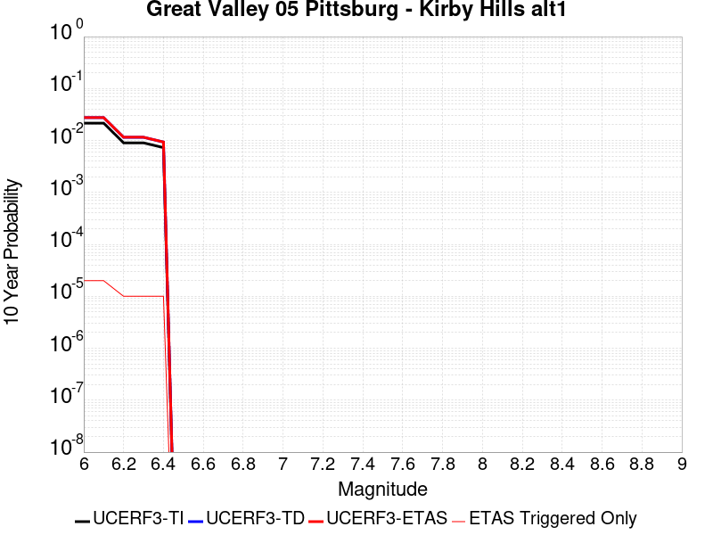 |

| Magnitude | 1 wk TI Prob | 1 wk TD Prob | 1 wk ETAS Prob | 1 wk ETAS/TD Gain | 1 wk ETAS Triggered Only | 1 mo TI Prob | 1 mo TD Prob | 1 mo ETAS Prob | 1 mo ETAS/TD Gain | 1 mo ETAS Triggered Only | 1 yr TI Prob | 1 yr TD Prob | 1 yr ETAS Prob | 1 yr ETAS/TD Gain | 1 yr ETAS Triggered Only | 10 yr TI Prob | 10 yr TD Prob | 10 yr ETAS Prob | 10 yr ETAS/TD Gain | 10 yr ETAS Triggered Only |
|-----|-----|-----|-----|-----|-----|-----|-----|-----|-----|-----|-----|-----|-----|-----|-----|-----|-----|-----|-----|-----|
| 6.0 | 4.187212E-5 | 5.3442072E-5 | 5.3442072E-5 | 1.0 | 0.0 | 1.794396E-4 | 2.290231E-4 | 2.290231E-4 | 1.0 | 0.0 | 0.002182488 | 0.0027857882 | 0.0027857882 | 1.0 | 0.0 | 0.021611776 | 0.02760304 | 0.027616039 | 1.000471 | 1.3368984E-5 |
| 6.1 | 4.187212E-5 | 5.3442072E-5 | 5.3442072E-5 | 1.0 | 0.0 | 1.794396E-4 | 2.290231E-4 | 2.290231E-4 | 1.0 | 0.0 | 0.002182488 | 0.0027857882 | 0.0027857882 | 1.0 | 0.0 | 0.021611776 | 0.02760304 | 0.027616039 | 1.000471 | 1.3368984E-5 |
| 6.2 | 1.7353306E-5 | 2.2154374E-5 | 2.2154374E-5 | 1.0 | 0.0 | 7.436919E-5 | 9.494618E-5 | 9.494618E-5 | 1.0 | 0.0 | 9.050688E-4 | 0.0011557543 | 0.0011557543 | 1.0 | 0.0 | 0.009013915 | 0.011535114 | 0.011535114 | 1.0 | 0.0 |
| 6.3 | 1.7353306E-5 | 2.2154374E-5 | 2.2154374E-5 | 1.0 | 0.0 | 7.436919E-5 | 9.494618E-5 | 9.494618E-5 | 1.0 | 0.0 | 9.050688E-4 | 0.0011557543 | 0.0011557543 | 1.0 | 0.0 | 0.009013915 | 0.011535114 | 0.011535114 | 1.0 | 0.0 |
| 6.4 | 1.4028824E-5 | 1.7900597E-5 | 1.7900597E-5 | 1.0 | 0.0 | 6.0122147E-5 | 7.671684E-5 | 7.671684E-5 | 1.0 | 0.0 | 7.3174125E-4 | 9.340275E-4 | 9.340275E-4 | 1.0 | 0.0 | 0.0072933645 | 0.009338138 | 0.009338138 | 1.0 | 0.0 |

## Honey Lake 2011 CFM
*[(top)](#table-of-contents)*

| 1 Week | 1 Month | 1 Year | 10 Year |
|-----|-----|-----|-----|
|  |  | 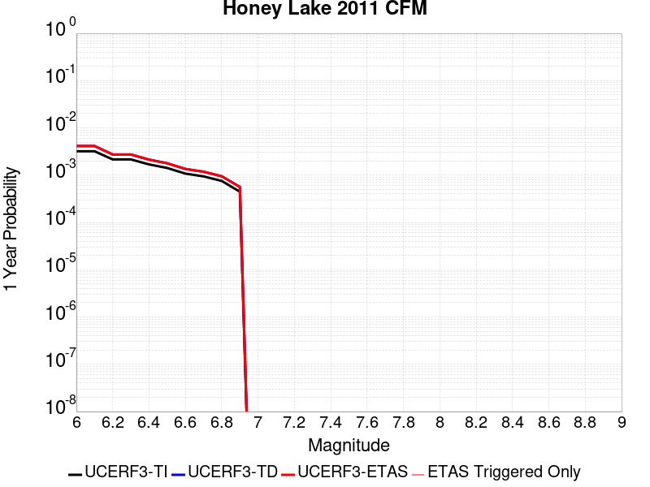 |  |

| Magnitude | 1 wk TI Prob | 1 wk TD Prob | 1 wk ETAS Prob | 1 wk ETAS/TD Gain | 1 wk ETAS Triggered Only | 1 mo TI Prob | 1 mo TD Prob | 1 mo ETAS Prob | 1 mo ETAS/TD Gain | 1 mo ETAS Triggered Only | 1 yr TI Prob | 1 yr TD Prob | 1 yr ETAS Prob | 1 yr ETAS/TD Gain | 1 yr ETAS Triggered Only | 10 yr TI Prob | 10 yr TD Prob | 10 yr ETAS Prob | 10 yr ETAS/TD Gain | 10 yr ETAS Triggered Only |
|-----|-----|-----|-----|-----|-----|-----|-----|-----|-----|-----|-----|-----|-----|-----|-----|-----|-----|-----|-----|-----|
| 6.0 | 6.155506E-5 | 7.954667E-5 | 7.954667E-5 | 1.0 | 0.0 | 2.6378073E-4 | 3.40873E-4 | 3.40873E-4 | 1.0 | 0.0 | 0.0032068014 | 0.0041427943 | 0.0041427943 | 1.0 | 0.0 | 0.03160919 | 0.040702924 | 0.040715747 | 1.0003151 | 1.3368984E-5 |
| 6.1 | 6.155506E-5 | 7.954667E-5 | 7.954667E-5 | 1.0 | 0.0 | 2.6378073E-4 | 3.40873E-4 | 3.40873E-4 | 1.0 | 0.0 | 0.0032068014 | 0.0041427943 | 0.0041427943 | 1.0 | 0.0 | 0.03160919 | 0.040702924 | 0.040715747 | 1.0003151 | 1.3368984E-5 |
| 6.2 | 4.1335024E-5 | 5.257629E-5 | 5.257629E-5 | 1.0 | 0.0 | 1.7713808E-4 | 2.253086E-4 | 2.253086E-4 | 1.0 | 0.0 | 0.0021545228 | 0.0027398595 | 0.0027398595 | 1.0 | 0.0 | 0.021337535 | 0.027076708 | 0.027089715 | 1.0004804 | 1.3368984E-5 |
| 6.3 | 4.1335024E-5 | 5.257629E-5 | 5.257629E-5 | 1.0 | 0.0 | 1.7713808E-4 | 2.253086E-4 | 2.253086E-4 | 1.0 | 0.0 | 0.0021545228 | 0.0027398595 | 0.0027398595 | 1.0 | 0.0 | 0.021337535 | 0.027076708 | 0.027089715 | 1.0004804 | 1.3368984E-5 |
| 6.4 | 3.2393702E-5 | 4.0887444E-5 | 4.0887444E-5 | 1.0 | 0.0 | 1.3882275E-4 | 1.7522085E-4 | 1.7522085E-4 | 1.0 | 0.0 | 0.0016888566 | 0.002131335 | 0.002131335 | 1.0 | 0.0 | 0.016760793 | 0.02111982 | 0.021132907 | 1.0006196 | 1.3368984E-5 |
| 6.5 | 2.7205504E-5 | 3.4211684E-5 | 3.4211684E-5 | 1.0 | 0.0 | 1.1658981E-4 | 1.4661385E-4 | 1.4661385E-4 | 1.0 | 0.0 | 0.0014185566 | 0.0017836588 | 0.0017836588 | 1.0 | 0.0 | 0.014095354 | 0.017702932 | 0.017716063 | 1.0007418 | 1.3368984E-5 |
| 6.6 | 2.069265E-5 | 2.5955307E-5 | 2.5955307E-5 | 1.0 | 0.0 | 8.867977E-5 | 1.1123277E-4 | 1.1123277E-4 | 1.0 | 0.0 | 0.0010791414 | 0.0013535038 | 0.0013535038 | 1.0 | 0.0 | 0.010739161 | 0.013461002 | 0.013474192 | 1.0009798 | 1.3368984E-5 |
| 6.7 | 1.8060919E-5 | 2.2656828E-5 | 2.2656828E-5 | 1.0 | 0.0 | 7.7401644E-5 | 9.709754E-5 | 9.709754E-5 | 1.0 | 0.0 | 9.419576E-4 | 0.0011816026 | 0.0011816026 | 1.0 | 0.0 | 0.009379748 | 0.011761238 | 0.01177445 | 1.0011233 | 1.3368984E-5 |
| 6.8 | 1.4474663E-5 | 1.818127E-5 | 1.818127E-5 | 1.0 | 0.0 | 6.203279E-5 | 7.791784E-5 | 7.791784E-5 | 1.0 | 0.0 | 7.5498753E-4 | 9.483136E-4 | 9.483136E-4 | 1.0 | 0.0 | 0.007524277 | 0.009450192 | 0.009463434 | 1.0014013 | 1.3368984E-5 |
| 6.9 | 8.564552E-6 | 1.0802308E-5 | 1.0802308E-5 | 1.0 | 0.0 | 3.6704707E-5 | 4.6295158E-5 | 4.6295158E-5 | 1.0 | 0.0 | 4.4678818E-4 | 5.635644E-4 | 5.635644E-4 | 1.0 | 0.0 | 0.0044589094 | 0.0056278477 | 0.005641142 | 1.0023621 | 1.3368984E-5 |

## South Klamath Lake West
*[(top)](#table-of-contents)*

| 1 Week | 1 Month | 1 Year | 10 Year |
|-----|-----|-----|-----|
|  |  |  |  |

| Magnitude | 1 wk TI Prob | 1 wk TD Prob | 1 wk ETAS Prob | 1 wk ETAS/TD Gain | 1 wk ETAS Triggered Only | 1 mo TI Prob | 1 mo TD Prob | 1 mo ETAS Prob | 1 mo ETAS/TD Gain | 1 mo ETAS Triggered Only | 1 yr TI Prob | 1 yr TD Prob | 1 yr ETAS Prob | 1 yr ETAS/TD Gain | 1 yr ETAS Triggered Only | 10 yr TI Prob | 10 yr TD Prob | 10 yr ETAS Prob | 10 yr ETAS/TD Gain | 10 yr ETAS Triggered Only |
|-----|-----|-----|-----|-----|-----|-----|-----|-----|-----|-----|-----|-----|-----|-----|-----|-----|-----|-----|-----|-----|
| 6.0 | 2.174025E-5 | 2.3042025E-5 | 3.64107E-5 | 1.5801866 | 1.3368984E-5 | 9.3169176E-5 | 9.874817E-5 | 1.12115835E-4 | 1.1353712 | 1.3368984E-5 | 0.0011337444 | 0.0012016617 | 0.0012150146 | 1.0111121 | 1.3368984E-5 | 0.011279777 | 0.0119582405 | 0.0119714495 | 1.0011046 | 1.3368984E-5 |
| 6.1 | 2.174025E-5 | 2.3042025E-5 | 3.64107E-5 | 1.5801866 | 1.3368984E-5 | 9.3169176E-5 | 9.874817E-5 | 1.12115835E-4 | 1.1353712 | 1.3368984E-5 | 0.0011337444 | 0.0012016617 | 0.0012150146 | 1.0111121 | 1.3368984E-5 | 0.011279777 | 0.0119582405 | 0.0119714495 | 1.0011046 | 1.3368984E-5 |
| 6.2 | 9.834929E-6 | 1.0393841E-5 | 1.0393841E-5 | 1.0 | 0.0 | 4.2149015E-5 | 4.4544326E-5 | 4.4544326E-5 | 1.0 | 0.0 | 5.1304343E-4 | 5.422012E-4 | 5.422012E-4 | 1.0 | 0.0 | 0.0051186057 | 0.0054096854 | 0.0054096854 | 1.0 | 0.0 |
| 6.3 | 9.834929E-6 | 1.0393841E-5 | 1.0393841E-5 | 1.0 | 0.0 | 4.2149015E-5 | 4.4544326E-5 | 4.4544326E-5 | 1.0 | 0.0 | 5.1304343E-4 | 5.422012E-4 | 5.422012E-4 | 1.0 | 0.0 | 0.0051186057 | 0.0054096854 | 0.0054096854 | 1.0 | 0.0 |
| 6.4 | 6.066321E-6 | 6.40043E-6 | 6.40043E-6 | 1.0 | 0.0 | 2.5998259E-5 | 2.743014E-5 | 2.743014E-5 | 1.0 | 0.0 | 3.1648282E-4 | 3.3391351E-4 | 3.3391351E-4 | 1.0 | 0.0 | 0.0031603249 | 0.0033343881 | 0.0033343881 | 1.0 | 0.0 |
| 6.5 | 6.066321E-6 | 6.40043E-6 | 6.40043E-6 | 1.0 | 0.0 | 2.5998259E-5 | 2.743014E-5 | 2.743014E-5 | 1.0 | 0.0 | 3.1648282E-4 | 3.3391351E-4 | 3.3391351E-4 | 1.0 | 0.0 | 0.0031603249 | 0.0033343881 | 0.0033343881 | 1.0 | 0.0 |
| 6.6 | 4.2321803E-6 | 4.461291E-6 | 4.461291E-6 | 1.0 | 0.0 | 1.8137789E-5 | 1.9119685E-5 | 1.9119685E-5 | 1.0 | 0.0 | 2.208052E-4 | 2.3275832E-4 | 2.3275832E-4 | 1.0 | 0.0 | 0.0022058594 | 0.0023252473 | 0.0023252473 | 1.0 | 0.0 |
| 6.7 | 3.186646E-6 | 3.360305E-6 | 3.360305E-6 | 1.0 | 0.0 | 1.3656982E-5 | 1.4401232E-5 | 1.4401232E-5 | 1.0 | 0.0 | 1.6626107E-4 | 1.7532158E-4 | 1.7532158E-4 | 1.0 | 0.0 | 0.0016613674 | 0.0017518997 | 0.0017518997 | 1.0 | 0.0 |
| 6.8 | 2.380121E-6 | 2.510907E-6 | 2.510907E-6 | 1.0 | 0.0 | 1.0200479E-5 | 1.07609885E-5 | 1.07609885E-5 | 1.0 | 0.0 | 1.2418375E-4 | 1.3100762E-4 | 1.3100762E-4 | 1.0 | 0.0 | 0.0012411437 | 0.0013093497 | 0.0013093497 | 1.0 | 0.0 |
| 6.9 | 8.928287E-7 | 9.4302504E-7 | 9.4302504E-7 | 1.0 | 0.0 | 3.826403E-6 | 4.0415307E-6 | 4.0415307E-6 | 1.0 | 0.0 | 4.658546E-5 | 4.9204747E-5 | 4.9204747E-5 | 1.0 | 0.0 | 4.6575698E-4 | 4.9196015E-4 | 4.9196015E-4 | 1.0 | 0.0 |

## San Joaquin Hills
*[(top)](#table-of-contents)*

| 1 Week | 1 Month | 1 Year | 10 Year |
|-----|-----|-----|-----|
| 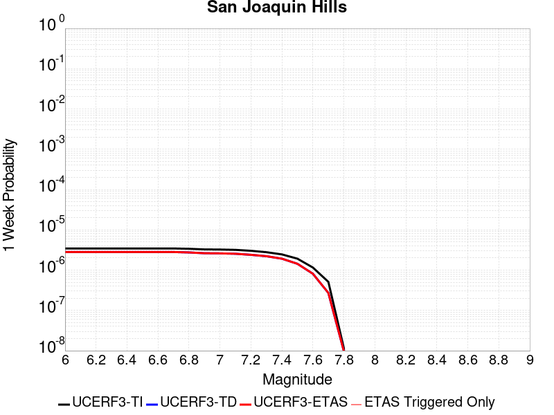 |  |  |  |

| Magnitude | 1 wk TI Prob | 1 wk TD Prob | 1 wk ETAS Prob | 1 wk ETAS/TD Gain | 1 wk ETAS Triggered Only | 1 mo TI Prob | 1 mo TD Prob | 1 mo ETAS Prob | 1 mo ETAS/TD Gain | 1 mo ETAS Triggered Only | 1 yr TI Prob | 1 yr TD Prob | 1 yr ETAS Prob | 1 yr ETAS/TD Gain | 1 yr ETAS Triggered Only | 10 yr TI Prob | 10 yr TD Prob | 10 yr ETAS Prob | 10 yr ETAS/TD Gain | 10 yr ETAS Triggered Only |
|-----|-----|-----|-----|-----|-----|-----|-----|-----|-----|-----|-----|-----|-----|-----|-----|-----|-----|-----|-----|-----|
| 6.0 | 3.4525704E-6 | 2.8139818E-6 | 2.8139818E-6 | 1.0 | 0.0 | 1.4796647E-5 | 1.2059867E-5 | 2.542869E-5 | 2.1085382 | 1.3368984E-5 | 1.8013427E-4 | 1.4681912E-4 | 1.6018614E-4 | 1.0910442 | 1.3368984E-5 | 0.0017998833 | 0.0014672345 | 0.0014805838 | 1.0090983 | 1.3368984E-5 |
| 6.1 | 3.4525704E-6 | 2.8139818E-6 | 2.8139818E-6 | 1.0 | 0.0 | 1.4796647E-5 | 1.2059867E-5 | 2.542869E-5 | 2.1085382 | 1.3368984E-5 | 1.8013427E-4 | 1.4681912E-4 | 1.6018614E-4 | 1.0910442 | 1.3368984E-5 | 0.0017998833 | 0.0014672345 | 0.0014805838 | 1.0090983 | 1.3368984E-5 |
| 6.2 | 3.4525704E-6 | 2.8139818E-6 | 2.8139818E-6 | 1.0 | 0.0 | 1.4796647E-5 | 1.2059867E-5 | 2.542869E-5 | 2.1085382 | 1.3368984E-5 | 1.8013427E-4 | 1.4681912E-4 | 1.6018614E-4 | 1.0910442 | 1.3368984E-5 | 0.0017998833 | 0.0014672345 | 0.0014805838 | 1.0090983 | 1.3368984E-5 |
| 6.3 | 3.4525704E-6 | 2.8139818E-6 | 2.8139818E-6 | 1.0 | 0.0 | 1.4796647E-5 | 1.2059867E-5 | 2.542869E-5 | 2.1085382 | 1.3368984E-5 | 1.8013427E-4 | 1.4681912E-4 | 1.6018614E-4 | 1.0910442 | 1.3368984E-5 | 0.0017998833 | 0.0014672345 | 0.0014805838 | 1.0090983 | 1.3368984E-5 |
| 6.4 | 3.4525704E-6 | 2.8139818E-6 | 2.8139818E-6 | 1.0 | 0.0 | 1.4796647E-5 | 1.2059867E-5 | 2.542869E-5 | 2.1085382 | 1.3368984E-5 | 1.8013427E-4 | 1.4681912E-4 | 1.6018614E-4 | 1.0910442 | 1.3368984E-5 | 0.0017998833 | 0.0014672345 | 0.0014805838 | 1.0090983 | 1.3368984E-5 |
| 6.5 | 3.4525704E-6 | 2.8139818E-6 | 2.8139818E-6 | 1.0 | 0.0 | 1.4796647E-5 | 1.2059867E-5 | 2.542869E-5 | 2.1085382 | 1.3368984E-5 | 1.8013427E-4 | 1.4681912E-4 | 1.6018614E-4 | 1.0910442 | 1.3368984E-5 | 0.0017998833 | 0.0014672345 | 0.0014805838 | 1.0090983 | 1.3368984E-5 |
| 6.6 | 3.4525704E-6 | 2.8139818E-6 | 2.8139818E-6 | 1.0 | 0.0 | 1.4796647E-5 | 1.2059867E-5 | 2.542869E-5 | 2.1085382 | 1.3368984E-5 | 1.8013427E-4 | 1.4681912E-4 | 1.6018614E-4 | 1.0910442 | 1.3368984E-5 | 0.0017998833 | 0.0014672345 | 0.0014805838 | 1.0090983 | 1.3368984E-5 |
| 6.7 | 3.4525704E-6 | 2.8139818E-6 | 2.8139818E-6 | 1.0 | 0.0 | 1.4796647E-5 | 1.2059867E-5 | 2.542869E-5 | 2.1085382 | 1.3368984E-5 | 1.8013427E-4 | 1.4681912E-4 | 1.6018614E-4 | 1.0910442 | 1.3368984E-5 | 0.0017998833 | 0.0014672345 | 0.0014805838 | 1.0090983 | 1.3368984E-5 |
| 6.8 | 3.388654E-6 | 2.7484202E-6 | 2.7484202E-6 | 1.0 | 0.0 | 1.4522722E-5 | 1.1778891E-5 | 2.5147718E-5 | 2.1349819 | 1.3368984E-5 | 1.767998E-4 | 1.4339869E-4 | 1.5676576E-4 | 1.0932161 | 1.3368984E-5 | 0.001766592 | 0.0014330745 | 0.0014464243 | 1.0093155 | 1.3368984E-5 |
| 6.9 | 3.2694352E-6 | 2.6283346E-6 | 2.6283346E-6 | 1.0 | 0.0 | 1.401179E-5 | 1.1264243E-5 | 2.4633076E-5 | 2.1868382 | 1.3368984E-5 | 1.7058018E-4 | 1.3713364E-4 | 1.5050078E-4 | 1.0974754 | 1.3368984E-5 | 0.0017044931 | 0.0013705015 | 0.0013838521 | 1.0097414 | 1.3368984E-5 |
| 7.0 | 3.246912E-6 | 2.6069915E-6 | 2.6069915E-6 | 1.0 | 0.0 | 1.39152635E-5 | 1.1172774E-5 | 2.4541609E-5 | 2.1965547 | 1.3368984E-5 | 1.6940516E-4 | 1.3602014E-4 | 1.4938731E-4 | 1.0982734 | 1.3368984E-5 | 0.0016927607 | 0.0013593802 | 0.0013727309 | 1.0098213 | 1.3368984E-5 |
| 7.1 | 3.1864927E-6 | 2.5523198E-6 | 2.5523198E-6 | 1.0 | 0.0 | 1.3656326E-5 | 1.0938467E-5 | 2.4307305E-5 | 2.2221856 | 1.3368984E-5 | 1.6625308E-4 | 1.3316782E-4 | 1.4653502E-4 | 1.1003786 | 1.3368984E-5 | 0.0016612876 | 0.0013308912 | 0.0013442424 | 1.0100318 | 1.3368984E-5 |
| 7.2 | 3.0220644E-6 | 2.3991677E-6 | 2.3991677E-6 | 1.0 | 0.0 | 1.295164E-5 | 1.0282108E-5 | 2.3650953E-5 | 2.300205 | 1.3368984E-5 | 1.576748E-4 | 1.2517757E-4 | 1.3854488E-4 | 1.1067867 | 1.3368984E-5 | 0.0015756298 | 0.0012510809 | 0.0012644331 | 1.0106726 | 1.3368984E-5 |
| 7.3 | 2.787619E-6 | 2.2173858E-6 | 2.2173858E-6 | 1.0 | 0.0 | 1.1946884E-5 | 9.503048E-6 | 2.2871905E-5 | 2.4067967 | 1.3368984E-5 | 1.454436E-4 | 1.1569356E-4 | 1.29061E-4 | 1.1155417 | 1.3368984E-5 | 0.0014534845 | 0.0011563431 | 0.0011696967 | 1.011548 | 1.3368984E-5 |
| 7.4 | 2.4593792E-6 | 1.9226306E-6 | 1.9226306E-6 | 1.0 | 0.0 | 1.0540153E-5 | 8.23982E-6 | 2.1608694E-5 | 2.6224716 | 1.3368984E-5 | 1.2831882E-4 | 1.0031529E-4 | 1.1368293E-4 | 1.1332563 | 1.3368984E-5 | 0.0012824474 | 0.0010027088 | 0.0010160644 | 1.0133195 | 1.3368984E-5 |
| 7.5 | 1.926764E-6 | 1.4383021E-6 | 1.4383021E-6 | 1.0 | 0.0 | 8.257534E-6 | 6.1641376E-6 | 1.953304E-5 | 3.1688194 | 1.3368984E-5 | 1.00530844E-4 | 7.504586E-5 | 8.8413835E-5 | 1.1781309 | 1.3368984E-5 | 0.0010048538 | 7.502115E-4 | 7.635704E-4 | 1.0178069 | 1.3368984E-5 |
| 7.6 | 1.1609359E-6 | 8.14558E-7 | 8.14558E-7 | 1.0 | 0.0 | 4.97543E-6 | 3.4909585E-6 | 1.6859896E-5 | 4.8295894 | 1.3368984E-5 | 6.0574173E-5 | 4.2501633E-5 | 5.587005E-5 | 1.3145388 | 1.3368984E-5 | 6.055767E-4 | 4.249394E-4 | 4.383027E-4 | 1.0314475 | 1.3368984E-5 |
| 7.7 | 5.1168536E-7 | 2.7155914E-7 | 2.7155914E-7 | 1.0 | 0.0 | 2.1929354E-6 | 1.1638244E-6 | 1.4532793E-5 | 12.487101 | 1.3368984E-5 | 2.669866E-5 | 1.41694845E-5 | 2.7538279E-5 | 1.9434919 | 1.3368984E-5 | 2.6695454E-4 | 1.4168715E-4 | 1.5505425E-4 | 1.0943422 | 1.3368984E-5 |
| 7.8 | 1.16056995E-8 | 9.782373E-9 | 9.782373E-9 | 1.0 | 0.0 | 4.9738713E-8 | 4.1924455E-8 | 4.1924455E-8 | 1.0 | 0.0 | 6.0556863E-7 | 5.1043025E-7 | 5.1043025E-7 | 1.0 | 0.0 | 6.05567E-6 | 5.1043025E-6 | 5.1043025E-6 | 1.0 | 0.0 |

## Pittville 2011 CFM
*[(top)](#table-of-contents)*

| 1 Week | 1 Month | 1 Year | 10 Year |
|-----|-----|-----|-----|
|  |  |  |  |

| Magnitude | 1 wk TI Prob | 1 wk TD Prob | 1 wk ETAS Prob | 1 wk ETAS/TD Gain | 1 wk ETAS Triggered Only | 1 mo TI Prob | 1 mo TD Prob | 1 mo ETAS Prob | 1 mo ETAS/TD Gain | 1 mo ETAS Triggered Only | 1 yr TI Prob | 1 yr TD Prob | 1 yr ETAS Prob | 1 yr ETAS/TD Gain | 1 yr ETAS Triggered Only | 10 yr TI Prob | 10 yr TD Prob | 10 yr ETAS Prob | 10 yr ETAS/TD Gain | 10 yr ETAS Triggered Only |
|-----|-----|-----|-----|-----|-----|-----|-----|-----|-----|-----|-----|-----|-----|-----|-----|-----|-----|-----|-----|-----|
| 6.0 | 2.5031832E-5 | 2.7056969E-5 | 4.042559E-5 | 1.4940916 | 1.3368984E-5 | 1.0727487E-4 | 1.1595384E-4 | 1.2932127E-4 | 1.1152824 | 1.3368984E-5 | 0.001305289 | 0.0014109211 | 0.0014242713 | 1.009462 | 1.3368984E-5 | 0.012976485 | 0.014029415 | 0.014042597 | 1.0009396 | 1.3368984E-5 |
| 6.1 | 1.2540113E-5 | 1.3513067E-5 | 2.688187E-5 | 1.9893242 | 1.3368984E-5 | 5.3742235E-5 | 5.7911984E-5 | 7.128019E-5 | 1.2308366 | 1.3368984E-5 | 6.541153E-4 | 7.048728E-4 | 7.182323E-4 | 1.0189532 | 1.3368984E-5 | 0.0065219323 | 0.0070286044 | 0.0070418795 | 1.0018888 | 1.3368984E-5 |
| 6.2 | 6.603218E-6 | 7.107189E-6 | 2.0476078E-5 | 2.8810375 | 1.3368984E-5 | 2.8299199E-5 | 3.0459063E-5 | 4.382764E-5 | 1.4389031 | 1.3368984E-5 | 3.4448825E-4 | 3.7078248E-4 | 3.841465E-4 | 1.0360428 | 1.3368984E-5 | 0.0034395473 | 0.0037022792 | 0.0037155987 | 1.0035976 | 1.3368984E-5 |
| 6.3 | 6.603218E-6 | 7.107189E-6 | 2.0476078E-5 | 2.8810375 | 1.3368984E-5 | 2.8299199E-5 | 3.0459063E-5 | 4.382764E-5 | 1.4389031 | 1.3368984E-5 | 3.4448825E-4 | 3.7078248E-4 | 3.841465E-4 | 1.0360428 | 1.3368984E-5 | 0.0034395473 | 0.0037022792 | 0.0037155987 | 1.0035976 | 1.3368984E-5 |
| 6.4 | 3.9389015E-6 | 4.239175E-6 | 1.7608103E-5 | 4.1536627 | 1.3368984E-5 | 1.6880897E-5 | 1.8167784E-5 | 3.1536525E-5 | 1.7358488 | 1.3368984E-5 | 2.0550552E-4 | 2.2117342E-4 | 2.3453945E-4 | 1.0604323 | 1.3368984E-5 | 0.0020531558 | 0.002209838 | 0.0022231773 | 1.0060364 | 1.3368984E-5 |
| 6.5 | 2.4533072E-6 | 2.6412686E-6 | 1.6010217E-5 | 6.0615635 | 1.3368984E-5 | 1.0514132E-5 | 1.1319685E-5 | 2.4688517E-5 | 2.1810253 | 1.3368984E-5 | 1.2800204E-4 | 1.3781038E-4 | 1.5117752E-4 | 1.0969967 | 1.3368984E-5 | 0.0012792832 | 0.0013774394 | 0.00139079 | 1.0096923 | 1.3368984E-5 |
| 6.6 | 1.3482367E-6 | 1.452993E-6 | 1.452993E-6 | 1.0 | 0.0 | 5.778144E-6 | 6.2271047E-6 | 6.2271047E-6 | 1.0 | 0.0 | 7.0346636E-5 | 7.58135E-5 | 7.58135E-5 | 1.0 | 0.0 | 7.032437E-4 | 7.5798744E-4 | 7.5798744E-4 | 1.0 | 0.0 |

## Fitzhugh Creek
*[(top)](#table-of-contents)*

| 1 Week | 1 Month | 1 Year | 10 Year |
|-----|-----|-----|-----|
|  |  |  |  |

| Magnitude | 1 wk TI Prob | 1 wk TD Prob | 1 wk ETAS Prob | 1 wk ETAS/TD Gain | 1 wk ETAS Triggered Only | 1 mo TI Prob | 1 mo TD Prob | 1 mo ETAS Prob | 1 mo ETAS/TD Gain | 1 mo ETAS Triggered Only | 1 yr TI Prob | 1 yr TD Prob | 1 yr ETAS Prob | 1 yr ETAS/TD Gain | 1 yr ETAS Triggered Only | 10 yr TI Prob | 10 yr TD Prob | 10 yr ETAS Prob | 10 yr ETAS/TD Gain | 10 yr ETAS Triggered Only |
|-----|-----|-----|-----|-----|-----|-----|-----|-----|-----|-----|-----|-----|-----|-----|-----|-----|-----|-----|-----|-----|
| 6.0 | 6.1090436E-6 | 6.2101562E-6 | 6.2101562E-6 | 1.0 | 0.0 | 2.6181353E-5 | 2.6614709E-5 | 2.6614709E-5 | 1.0 | 0.0 | 3.1871133E-4 | 3.239904E-4 | 3.239904E-4 | 1.0 | 0.0 | 0.0031825465 | 0.0032356246 | 0.0032489502 | 1.0041184 | 1.3368984E-5 |
| 6.1 | 2.9741811E-6 | 3.021581E-6 | 3.021581E-6 | 1.0 | 0.0 | 1.2746428E-5 | 1.2949574E-5 | 1.2949574E-5 | 1.0 | 0.0 | 1.5517672E-4 | 1.576506E-4 | 1.576506E-4 | 1.0 | 0.0 | 0.001550684 | 0.0015754806 | 0.0015754806 | 1.0 | 0.0 |
| 6.2 | 2.9741811E-6 | 3.021581E-6 | 3.021581E-6 | 1.0 | 0.0 | 1.2746428E-5 | 1.2949574E-5 | 1.2949574E-5 | 1.0 | 0.0 | 1.5517672E-4 | 1.576506E-4 | 1.576506E-4 | 1.0 | 0.0 | 0.001550684 | 0.0015754806 | 0.0015754806 | 1.0 | 0.0 |
| 6.3 | 1.4781198E-6 | 1.5012708E-6 | 1.5012708E-6 | 1.0 | 0.0 | 6.3347834E-6 | 6.4340034E-6 | 6.4340034E-6 | 1.0 | 0.0 | 7.712326E-5 | 7.833137E-5 | 7.833137E-5 | 1.0 | 0.0 | 7.70965E-4 | 7.830576E-4 | 7.830576E-4 | 1.0 | 0.0 |
| 6.4 | 1.4781198E-6 | 1.5012708E-6 | 1.5012708E-6 | 1.0 | 0.0 | 6.3347834E-6 | 6.4340034E-6 | 6.4340034E-6 | 1.0 | 0.0 | 7.712326E-5 | 7.833137E-5 | 7.833137E-5 | 1.0 | 0.0 | 7.70965E-4 | 7.830576E-4 | 7.830576E-4 | 1.0 | 0.0 |
| 6.5 | 9.5176676E-7 | 9.66606E-7 | 9.66606E-7 | 1.0 | 0.0 | 4.078994E-6 | 4.142591E-6 | 4.142591E-6 | 1.0 | 0.0 | 4.9660623E-5 | 5.0434985E-5 | 5.0434985E-5 | 1.0 | 0.0 | 4.964952E-4 | 5.042458E-4 | 5.042458E-4 | 1.0 | 0.0 |
| 6.6 | 6.21145E-7 | 6.3085855E-7 | 6.3085855E-7 | 1.0 | 0.0 | 2.662047E-6 | 2.7036772E-6 | 2.7036772E-6 | 1.0 | 0.0 | 3.2409942E-5 | 3.291684E-5 | 3.291684E-5 | 1.0 | 0.0 | 3.2405215E-4 | 3.2912623E-4 | 3.2912623E-4 | 1.0 | 0.0 |
| 6.7 | 2.2377962E-7 | 2.2734636E-7 | 2.2734636E-7 | 1.0 | 0.0 | 9.590551E-7 | 9.743413E-7 | 9.743413E-7 | 1.0 | 0.0 | 1.1676434E-5 | 1.1862574E-5 | 1.1862574E-5 | 1.0 | 0.0 | 1.1675821E-4 | 1.1862254E-4 | 1.1862254E-4 | 1.0 | 0.0 |
| 6.8 | 1.4785022E-7 | 1.5021492E-7 | 1.5021492E-7 | 1.0 | 0.0 | 6.3364365E-7 | 6.4377826E-7 | 6.4377826E-7 | 1.0 | 0.0 | 7.714584E-6 | 7.838E-6 | 7.838E-6 | 1.0 | 0.0 | 7.714316E-5 | 7.838E-5 | 7.838E-5 | 1.0 | 0.0 |

## Surprise Valley 2011 CFM
*[(top)](#table-of-contents)*

| 1 Week | 1 Month | 1 Year | 10 Year |
|-----|-----|-----|-----|
|  |  | 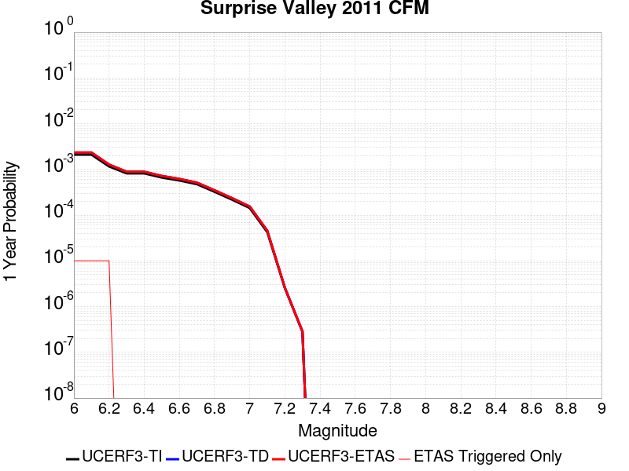 |  |

| Magnitude | 1 wk TI Prob | 1 wk TD Prob | 1 wk ETAS Prob | 1 wk ETAS/TD Gain | 1 wk ETAS Triggered Only | 1 mo TI Prob | 1 mo TD Prob | 1 mo ETAS Prob | 1 mo ETAS/TD Gain | 1 mo ETAS Triggered Only | 1 yr TI Prob | 1 yr TD Prob | 1 yr ETAS Prob | 1 yr ETAS/TD Gain | 1 yr ETAS Triggered Only | 10 yr TI Prob | 10 yr TD Prob | 10 yr ETAS Prob | 10 yr ETAS/TD Gain | 10 yr ETAS Triggered Only |
|-----|-----|-----|-----|-----|-----|-----|-----|-----|-----|-----|-----|-----|-----|-----|-----|-----|-----|-----|-----|-----|
| 6.0 | 4.0396248E-5 | 4.485131E-5 | 5.8219695E-5 | 1.29806 | 1.3368984E-5 | 1.7311527E-4 | 1.9220692E-4 | 2.0557333E-4 | 1.0695418 | 1.3368984E-5 | 0.002105641 | 0.0023378176 | 0.0023511553 | 1.0057052 | 1.3368984E-5 | 0.020858008 | 0.023153966 | 0.023167025 | 1.000564 | 1.3368984E-5 |
| 6.1 | 4.0396248E-5 | 4.485131E-5 | 5.8219695E-5 | 1.29806 | 1.3368984E-5 | 1.7311527E-4 | 1.9220692E-4 | 2.0557333E-4 | 1.0695418 | 1.3368984E-5 | 0.002105641 | 0.0023378176 | 0.0023511553 | 1.0057052 | 1.3368984E-5 | 0.020858008 | 0.023153966 | 0.023167025 | 1.000564 | 1.3368984E-5 |
| 6.2 | 2.2295266E-5 | 2.440125E-5 | 3.7769907E-5 | 1.5478678 | 1.3368984E-5 | 9.554764E-5 | 1.0457276E-4 | 1.1794035E-4 | 1.1278305 | 1.3368984E-5 | 0.0011626717 | 0.0012724606 | 0.0012858126 | 1.010493 | 1.3368984E-5 | 0.011566074 | 0.012654981 | 0.01266818 | 1.0010431 | 1.3368984E-5 |
| 6.3 | 1.572643E-5 | 1.7096807E-5 | 1.7096807E-5 | 1.0 | 0.0 | 6.7397246E-5 | 7.327003E-5 | 7.327003E-5 | 1.0 | 0.0 | 8.202525E-4 | 8.91708E-4 | 8.91708E-4 | 1.0 | 0.0 | 0.008172315 | 0.008882407 | 0.008882407 | 1.0 | 0.0 |
| 6.4 | 1.5714395E-5 | 1.7084629E-5 | 1.7084629E-5 | 1.0 | 0.0 | 6.734567E-5 | 7.3217845E-5 | 7.3217845E-5 | 1.0 | 0.0 | 8.1962504E-4 | 8.9107314E-4 | 8.9107314E-4 | 1.0 | 0.0 | 0.008166086 | 0.008876109 | 0.008876109 | 1.0 | 0.0 |
| 6.5 | 1.2733495E-5 | 1.38016E-5 | 1.38016E-5 | 1.0 | 0.0 | 5.457098E-5 | 5.9148413E-5 | 5.9148413E-5 | 1.0 | 0.0 | 6.641992E-4 | 7.1990065E-4 | 7.1990065E-4 | 1.0 | 0.0 | 0.0066221743 | 0.0071763797 | 0.0071763797 | 1.0 | 0.0 |
| 6.6 | 1.0983784E-5 | 1.1886554E-5 | 1.1886554E-5 | 1.0 | 0.0 | 4.7072506E-5 | 5.094141E-5 | 5.094141E-5 | 1.0 | 0.0 | 5.7295704E-4 | 6.200405E-4 | 6.200405E-4 | 1.0 | 0.0 | 0.0057148207 | 0.0061836545 | 0.0061836545 | 1.0 | 0.0 |
| 6.7 | 9.104806E-6 | 9.839491E-6 | 9.839491E-6 | 1.0 | 0.0 | 3.902001E-5 | 4.2168587E-5 | 4.2168587E-5 | 1.0 | 0.0 | 4.7496508E-4 | 5.132855E-4 | 5.132855E-4 | 1.0 | 0.0 | 0.004739512 | 0.005121397 | 0.005121397 | 1.0 | 0.0 |
| 6.8 | 6.2162403E-6 | 6.7041337E-6 | 6.7041337E-6 | 1.0 | 0.0 | 2.6640759E-5 | 2.8731698E-5 | 2.8731698E-5 | 1.0 | 0.0 | 3.2430296E-4 | 3.497545E-4 | 3.497545E-4 | 1.0 | 0.0 | 0.003238301 | 0.0034922638 | 0.0034922638 | 1.0 | 0.0 |
| 6.9 | 4.1792696E-6 | 4.50323E-6 | 4.50323E-6 | 1.0 | 0.0 | 1.7911032E-5 | 1.9299423E-5 | 1.9299423E-5 | 1.0 | 0.0 | 2.1804498E-4 | 2.3494668E-4 | 2.3494668E-4 | 1.0 | 0.0 | 0.0021783116 | 0.0023471361 | 0.0023471361 | 1.0 | 0.0 |
| 7.0 | 2.7478413E-6 | 2.9622424E-6 | 2.9622424E-6 | 1.0 | 0.0 | 1.177641E-5 | 1.269527E-5 | 1.269527E-5 | 1.0 | 0.0 | 1.4336836E-4 | 1.545552E-4 | 1.545552E-4 | 1.0 | 0.0 | 0.001432759 | 0.0015445995 | 0.0015445995 | 1.0 | 0.0 |
| 7.1 | 8.128648E-7 | 8.724922E-7 | 8.724922E-7 | 1.0 | 0.0 | 3.4837017E-6 | 3.7392501E-6 | 3.7392501E-6 | 1.0 | 0.0 | 4.2413245E-5 | 4.552502E-5 | 4.552502E-5 | 1.0 | 0.0 | 4.2405148E-4 | 4.5521575E-4 | 4.5521575E-4 | 1.0 | 0.0 |
| 7.2 | 4.8641045E-8 | 4.9402068E-8 | 4.9402068E-8 | 1.0 | 0.0 | 2.084616E-7 | 2.1172312E-7 | 2.1172312E-7 | 1.0 | 0.0 | 2.538017E-6 | 2.577726E-6 | 2.577726E-6 | 1.0 | 0.0 | 2.537988E-5 | 2.5776973E-5 | 2.5776973E-5 | 1.0 | 0.0 |
| 7.3 | 5.3911844E-9 | 5.4758145E-9 | 5.4758145E-9 | 1.0 | 0.0 | 2.3105075E-8 | 2.3467775E-8 | 2.3467775E-8 | 1.0 | 0.0 | 2.8130427E-7 | 2.8572015E-7 | 2.8572015E-7 | 1.0 | 0.0 | 2.8130391E-6 | 2.8571992E-6 | 2.8571992E-6 | 1.0 | 0.0 |

## Carlsbad
*[(top)](#table-of-contents)*

| 1 Week | 1 Month | 1 Year | 10 Year |
|-----|-----|-----|-----|
|  |  |  |  |

| Magnitude | 1 wk TI Prob | 1 wk TD Prob | 1 wk ETAS Prob | 1 wk ETAS/TD Gain | 1 wk ETAS Triggered Only | 1 mo TI Prob | 1 mo TD Prob | 1 mo ETAS Prob | 1 mo ETAS/TD Gain | 1 mo ETAS Triggered Only | 1 yr TI Prob | 1 yr TD Prob | 1 yr ETAS Prob | 1 yr ETAS/TD Gain | 1 yr ETAS Triggered Only | 10 yr TI Prob | 10 yr TD Prob | 10 yr ETAS Prob | 10 yr ETAS/TD Gain | 10 yr ETAS Triggered Only |
|-----|-----|-----|-----|-----|-----|-----|-----|-----|-----|-----|-----|-----|-----|-----|-----|-----|-----|-----|-----|-----|
| 6.0 | 4.9038536E-6 | 4.9872565E-6 | 4.9872565E-6 | 1.0 | 0.0 | 2.1016345E-5 | 2.1373784E-5 | 2.1373784E-5 | 1.0 | 0.0 | 2.5584397E-4 | 2.601952E-4 | 2.735607E-4 | 1.0513673 | 1.3368984E-5 | 0.002555496 | 0.0025989525 | 0.0026122867 | 1.0051306 | 1.3368984E-5 |
| 6.1 | 4.9038536E-6 | 4.9872565E-6 | 4.9872565E-6 | 1.0 | 0.0 | 2.1016345E-5 | 2.1373784E-5 | 2.1373784E-5 | 1.0 | 0.0 | 2.5584397E-4 | 2.601952E-4 | 2.735607E-4 | 1.0513673 | 1.3368984E-5 | 0.002555496 | 0.0025989525 | 0.0026122867 | 1.0051306 | 1.3368984E-5 |
| 6.2 | 4.3820614E-6 | 4.4547687E-6 | 4.4547687E-6 | 1.0 | 0.0 | 1.8780129E-5 | 1.9091729E-5 | 1.9091729E-5 | 1.0 | 0.0 | 2.2862408E-4 | 2.3241735E-4 | 2.4578322E-4 | 1.0575081 | 1.3368984E-5 | 0.00228389 | 0.0023217786 | 0.0023351165 | 1.0057447 | 1.3368984E-5 |
| 6.3 | 4.302872E-6 | 4.373006E-6 | 4.373006E-6 | 1.0 | 0.0 | 1.8440749E-5 | 1.8741322E-5 | 1.8741322E-5 | 1.0 | 0.0 | 2.24493E-4 | 2.2815206E-4 | 2.4151799E-4 | 1.0585835 | 1.3368984E-5 | 0.0022426634 | 0.0022792136 | 0.002292552 | 1.0058522 | 1.3368984E-5 |
| 6.4 | 4.0835243E-6 | 4.1476546E-6 | 4.1476546E-6 | 1.0 | 0.0 | 1.75007E-5 | 1.7775543E-5 | 1.7775543E-5 | 1.0 | 0.0 | 2.1305021E-4 | 2.1639607E-4 | 2.2976217E-4 | 1.0617667 | 1.3368984E-5 | 0.0021284607 | 0.0021618877 | 0.0021752277 | 1.0061706 | 1.3368984E-5 |
| 6.5 | 3.987806E-6 | 4.0488867E-6 | 4.0488867E-6 | 1.0 | 0.0 | 1.7090486E-5 | 1.7352257E-5 | 1.7352257E-5 | 1.0 | 0.0 | 2.080568E-4 | 2.1124359E-4 | 2.2460974E-4 | 1.0632737 | 1.3368984E-5 | 0.002078621 | 0.0021104617 | 0.0021238024 | 1.0063213 | 1.3368984E-5 |
| 6.6 | 3.8707576E-6 | 3.927488E-6 | 3.927488E-6 | 1.0 | 0.0 | 1.6588854E-5 | 1.6831984E-5 | 1.6831984E-5 | 1.0 | 0.0 | 2.0195059E-4 | 2.0491047E-4 | 2.1827672E-4 | 1.0652297 | 1.3368984E-5 | 0.0020176715 | 0.0020472489 | 0.0020605905 | 1.0065168 | 1.3368984E-5 |
| 6.7 | 3.3093434E-6 | 3.3423917E-6 | 3.3423917E-6 | 1.0 | 0.0 | 1.4182823E-5 | 1.4324457E-5 | 1.4324457E-5 | 1.0 | 0.0 | 1.7266218E-4 | 1.7438637E-4 | 1.8775302E-4 | 1.0766497 | 1.3368984E-5 | 0.001725281 | 0.0017425013 | 0.001755847 | 1.007659 | 1.3368984E-5 |
| 6.8 | 3.136983E-6 | 3.1664536E-6 | 3.1664536E-6 | 1.0 | 0.0 | 1.3444143E-5 | 1.3570445E-5 | 1.3570445E-5 | 1.0 | 0.0 | 1.6367015E-4 | 1.6520769E-4 | 1.7857447E-4 | 1.0809089 | 1.3368984E-5 | 0.0016354966 | 0.0016508545 | 0.0016642014 | 1.0080849 | 1.3368984E-5 |
| 6.9 | 2.9056644E-6 | 2.9267585E-6 | 2.9267585E-6 | 1.0 | 0.0 | 1.2452788E-5 | 1.2543191E-5 | 1.2543191E-5 | 1.0 | 0.0 | 1.5160214E-4 | 1.5270269E-4 | 1.6606963E-4 | 1.0875357 | 1.3368984E-5 | 0.0015149876 | 0.001525983 | 0.0015393315 | 1.0087476 | 1.3368984E-5 |
| 7.0 | 2.5071035E-6 | 2.5113977E-6 | 2.5113977E-6 | 1.0 | 0.0 | 1.0744685E-5 | 1.07630885E-5 | 1.07630885E-5 | 1.0 | 0.0 | 1.308087E-4 | 1.3103275E-4 | 1.444E-4 | 1.1020144 | 1.3368984E-5 | 0.0013073172 | 0.0013095582 | 0.0013229096 | 1.0101954 | 1.3368984E-5 |
| 7.1 | 2.1786877E-6 | 2.1678832E-6 | 2.1678832E-6 | 1.0 | 0.0 | 9.3372E-6 | 9.290896E-6 | 9.290896E-6 | 1.0 | 0.0 | 1.13674476E-4 | 1.1311081E-4 | 1.2647828E-4 | 1.1181803 | 1.3368984E-5 | 0.0011361635 | 0.0011305353 | 0.0011438892 | 1.011812 | 1.3368984E-5 |
| 7.2 | 1.6628418E-6 | 1.6213872E-6 | 1.6213872E-6 | 1.0 | 0.0 | 7.1264453E-6 | 6.948784E-6 | 6.948784E-6 | 1.0 | 0.0 | 8.676102E-5 | 8.4598185E-5 | 9.796604E-5 | 1.1580158 | 1.3368984E-5 | 8.672715E-4 | 8.45662E-4 | 8.590197E-4 | 1.0157955 | 1.3368984E-5 |
| 7.3 | 1.0595926E-6 | 9.816804E-7 | 9.816804E-7 | 1.0 | 0.0 | 4.541103E-6 | 4.2071947E-6 | 4.2071947E-6 | 1.0 | 0.0 | 5.5286528E-5 | 5.1221403E-5 | 5.1221403E-5 | 1.0 | 0.0 | 5.527277E-4 | 5.1209686E-4 | 5.1209686E-4 | 1.0 | 0.0 |
| 7.4 | 7.956623E-7 | 7.1737975E-7 | 7.1737975E-7 | 1.0 | 0.0 | 3.4099767E-6 | 3.074481E-6 | 3.074481E-6 | 1.0 | 0.0 | 4.1515676E-5 | 3.743117E-5 | 3.743117E-5 | 1.0 | 0.0 | 4.150792E-4 | 3.7424936E-4 | 3.7424936E-4 | 1.0 | 0.0 |
| 7.5 | 5.1043804E-7 | 4.4483627E-7 | 4.4483627E-7 | 1.0 | 0.0 | 2.1875896E-6 | 1.9064398E-6 | 1.9064398E-6 | 1.0 | 0.0 | 2.663358E-5 | 2.3210663E-5 | 2.3210663E-5 | 1.0 | 0.0 | 2.6630386E-4 | 2.3208297E-4 | 2.3208297E-4 | 1.0 | 0.0 |
| 7.6 | 2.3723294E-7 | 1.989569E-7 | 1.989569E-7 | 1.0 | 0.0 | 1.0167122E-6 | 8.5267214E-7 | 8.5267214E-7 | 1.0 | 0.0 | 1.2378401E-5 | 1.0381237E-5 | 1.0381237E-5 | 1.0 | 0.0 | 1.237771E-4 | 1.038078E-4 | 1.038078E-4 | 1.0 | 0.0 |
| 7.7 | 1.9992152E-8 | 9.8601785E-9 | 9.8601785E-9 | 1.0 | 0.0 | 8.568065E-8 | 4.225791E-8 | 4.225791E-8 | 1.0 | 0.0 | 1.0431614E-6 | 5.1449E-7 | 5.1449E-7 | 1.0 | 0.0 | 1.0431565E-5 | 5.1449E-6 | 5.1449E-6 | 1.0 | 0.0 |

## Green Valley 2011 CFM
*[(top)](#table-of-contents)*

| 1 Week | 1 Month | 1 Year | 10 Year |
|-----|-----|-----|-----|
|  |  |  | 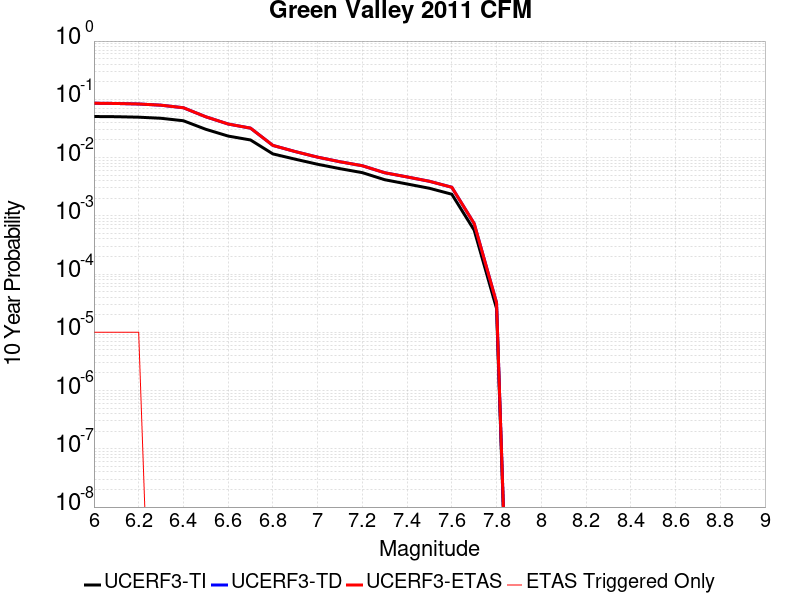 |

| Magnitude | 1 wk TI Prob | 1 wk TD Prob | 1 wk ETAS Prob | 1 wk ETAS/TD Gain | 1 wk ETAS Triggered Only | 1 mo TI Prob | 1 mo TD Prob | 1 mo ETAS Prob | 1 mo ETAS/TD Gain | 1 mo ETAS Triggered Only | 1 yr TI Prob | 1 yr TD Prob | 1 yr ETAS Prob | 1 yr ETAS/TD Gain | 1 yr ETAS Triggered Only | 10 yr TI Prob | 10 yr TD Prob | 10 yr ETAS Prob | 10 yr ETAS/TD Gain | 10 yr ETAS Triggered Only |
|-----|-----|-----|-----|-----|-----|-----|-----|-----|-----|-----|-----|-----|-----|-----|-----|-----|-----|-----|-----|-----|
| 6.0 | 9.9629346E-5 | 1.7305532E-4 | 1.7305532E-4 | 1.0 | 0.0 | 4.2691303E-4 | 7.4143766E-4 | 7.4143766E-4 | 1.0 | 0.0 | 0.0051852856 | 0.008986705 | 0.008999954 | 1.0014743 | 1.3368984E-5 | 0.050659515 | 0.085522056 | 0.08553428 | 1.0001429 | 1.3368984E-5 |
| 6.1 | 9.88615E-5 | 1.7152846E-4 | 1.7152846E-4 | 1.0 | 0.0 | 4.2362334E-4 | 7.348976E-4 | 7.348976E-4 | 1.0 | 0.0 | 0.0051454236 | 0.0089077335 | 0.008920983 | 1.0014875 | 1.3368984E-5 | 0.050279044 | 0.084809676 | 0.08482191 | 1.0001442 | 1.3368984E-5 |
| 6.2 | 9.696895E-5 | 1.6791887E-4 | 1.6791887E-4 | 1.0 | 0.0 | 4.15515E-4 | 7.194366E-4 | 7.194366E-4 | 1.0 | 0.0 | 0.0050471667 | 0.008721114 | 0.008734366 | 1.0015196 | 1.3368984E-5 | 0.04934063 | 0.0831186 | 0.08313086 | 1.0001475 | 1.3368984E-5 |
| 6.3 | 9.275224E-5 | 1.5971228E-4 | 1.5971228E-4 | 1.0 | 0.0 | 3.9744904E-4 | 6.842841E-4 | 6.842841E-4 | 1.0 | 0.0 | 0.0048282105 | 0.008296439 | 0.008296439 | 1.0 | 0.0 | 0.047246475 | 0.07925707 | 0.07925707 | 1.0 | 0.0 |
| 6.4 | 8.391499E-5 | 1.4367796E-4 | 1.4367796E-4 | 1.0 | 0.0 | 3.595861E-4 | 6.156248E-4 | 6.156248E-4 | 1.0 | 0.0 | 0.004369175 | 0.0074670846 | 0.0074670846 | 1.0 | 0.0 | 0.04284265 | 0.071630865 | 0.071630865 | 1.0 | 0.0 |
| 6.5 | 5.9519385E-5 | 9.9340905E-5 | 9.9340905E-5 | 1.0 | 0.0 | 2.5505814E-4 | 4.2568138E-4 | 4.2568138E-4 | 1.0 | 0.0 | 0.0031009112 | 0.005168295 | 0.005168295 | 1.0 | 0.0 | 0.030579966 | 0.050145864 | 0.050145864 | 1.0 | 0.0 |
| 6.6 | 4.5361558E-5 | 7.402609E-5 | 7.402609E-5 | 1.0 | 0.0 | 1.9439218E-4 | 3.1721895E-4 | 3.1721895E-4 | 1.0 | 0.0 | 0.0023641558 | 0.0038539418 | 0.0038539418 | 1.0 | 0.0 | 0.023391623 | 0.037665963 | 0.037665963 | 1.0 | 0.0 |
| 6.7 | 3.8808106E-5 | 6.2651976E-5 | 6.2651976E-5 | 1.0 | 0.0 | 1.6630985E-4 | 2.6848342E-4 | 2.6848342E-4 | 1.0 | 0.0 | 0.0020229418 | 0.0032626586 | 0.0032626586 | 1.0 | 0.0 | 0.020046256 | 0.032005914 | 0.032005914 | 1.0 | 0.0 |
| 6.8 | 2.2284667E-5 | 3.1285235E-5 | 3.1285235E-5 | 1.0 | 0.0 | 9.550222E-5 | 1.3407279E-4 | 1.3407279E-4 | 1.0 | 0.0 | 0.0011621192 | 0.0016311078 | 0.0016311078 | 1.0 | 0.0 | 0.011560607 | 0.016165998 | 0.016165998 | 1.0 | 0.0 |
| 6.9 | 1.8050168E-5 | 2.4448054E-5 | 2.4448054E-5 | 1.0 | 0.0 | 7.735557E-5 | 1.047732E-4 | 1.047732E-4 | 1.0 | 0.0 | 9.4139716E-4 | 0.0012748708 | 0.0012748708 | 1.0 | 0.0 | 0.009374191 | 0.012667833 | 0.012667833 | 1.0 | 0.0 |
| 7.0 | 1.4763166E-5 | 1.9582854E-5 | 1.9582854E-5 | 1.0 | 0.0 | 6.326917E-5 | 8.3923835E-5 | 8.3923835E-5 | 1.0 | 0.0 | 7.7002996E-4 | 0.0010212966 | 0.0010212966 | 1.0 | 0.0 | 0.007673672 | 0.010165343 | 0.010165343 | 1.0 | 0.0 |
| 7.1 | 1.2399713E-5 | 1.6303715E-5 | 1.6303715E-5 | 1.0 | 0.0 | 5.3140546E-5 | 6.98712E-5 | 6.98712E-5 | 1.0 | 0.0 | 6.467941E-4 | 8.503518E-4 | 8.503518E-4 | 1.0 | 0.0 | 0.006449148 | 0.008471259 | 0.008471259 | 1.0 | 0.0 |
| 7.2 | 1.0584195E-5 | 1.3921742E-5 | 1.3921742E-5 | 1.0 | 0.0 | 4.5360044E-5 | 5.9663253E-5 | 5.9663253E-5 | 1.0 | 0.0 | 5.521186E-4 | 7.261596E-4 | 7.261596E-4 | 1.0 | 0.0 | 0.0055074887 | 0.007238285 | 0.007238285 | 1.0 | 0.0 |
| 7.3 | 7.998173E-6 | 1.054402E-5 | 1.054402E-5 | 1.0 | 0.0 | 3.4277433E-5 | 4.518788E-5 | 4.518788E-5 | 1.0 | 0.0 | 4.1724785E-4 | 5.500247E-4 | 5.500247E-4 | 1.0 | 0.0 | 0.004164653 | 0.0054868995 | 0.0054868995 | 1.0 | 0.0 |
| 7.4 | 6.7571127E-6 | 8.932697E-6 | 8.932697E-6 | 1.0 | 0.0 | 2.8958733E-5 | 3.828243E-5 | 3.828243E-5 | 1.0 | 0.0 | 3.5251552E-4 | 4.6598984E-4 | 4.6598984E-4 | 1.0 | 0.0 | 0.0035195686 | 0.0046503306 | 0.0046503306 | 1.0 | 0.0 |
| 7.5 | 5.69878E-6 | 7.516314E-6 | 7.516314E-6 | 1.0 | 0.0 | 2.4423114E-5 | 3.221238E-5 | 3.221238E-5 | 1.0 | 0.0 | 2.9731085E-4 | 3.9211605E-4 | 3.9211605E-4 | 1.0 | 0.0 | 0.002969134 | 0.0039143935 | 0.0039143935 | 1.0 | 0.0 |
| 7.6 | 4.503664E-6 | 5.9356807E-6 | 5.9356807E-6 | 1.0 | 0.0 | 1.9301275E-5 | 2.5438389E-5 | 2.5438389E-5 | 1.0 | 0.0 | 2.3496768E-4 | 3.096692E-4 | 3.096692E-4 | 1.0 | 0.0 | 0.002347194 | 0.003092502 | 0.003092502 | 1.0 | 0.0 |
| 7.7 | 1.0873546E-6 | 1.4106979E-6 | 1.4106979E-6 | 1.0 | 0.0 | 4.6600826E-6 | 6.045834E-6 | 6.045834E-6 | 1.0 | 0.0 | 5.6735033E-5 | 7.360557E-5 | 7.360557E-5 | 1.0 | 0.0 | 5.672055E-4 | 7.35814E-4 | 7.35814E-4 | 1.0 | 0.0 |
| 7.8 | 4.9373917E-8 | 6.1777136E-8 | 6.1777136E-8 | 1.0 | 0.0 | 2.1160248E-7 | 2.6475914E-7 | 2.6475914E-7 | 1.0 | 0.0 | 2.5762572E-6 | 3.223439E-6 | 3.223439E-6 | 1.0 | 0.0 | 2.5762274E-5 | 3.2232296E-5 | 3.2232296E-5 | 1.0 | 0.0 |

## North Frontal  (East)
*[(top)](#table-of-contents)*

| 1 Week | 1 Month | 1 Year | 10 Year |
|-----|-----|-----|-----|
|  |  |  |  |

| Magnitude | 1 wk TI Prob | 1 wk TD Prob | 1 wk ETAS Prob | 1 wk ETAS/TD Gain | 1 wk ETAS Triggered Only | 1 mo TI Prob | 1 mo TD Prob | 1 mo ETAS Prob | 1 mo ETAS/TD Gain | 1 mo ETAS Triggered Only | 1 yr TI Prob | 1 yr TD Prob | 1 yr ETAS Prob | 1 yr ETAS/TD Gain | 1 yr ETAS Triggered Only | 10 yr TI Prob | 10 yr TD Prob | 10 yr ETAS Prob | 10 yr ETAS/TD Gain | 10 yr ETAS Triggered Only |
|-----|-----|-----|-----|-----|-----|-----|-----|-----|-----|-----|-----|-----|-----|-----|-----|-----|-----|-----|-----|-----|
| 6.0 | 7.135738E-6 | 7.4771765E-6 | 7.4771765E-6 | 1.0 | 0.0 | 3.0581377E-5 | 3.204476E-5 | 3.204476E-5 | 1.0 | 0.0 | 3.7226462E-4 | 3.9009505E-4 | 3.9009505E-4 | 1.0 | 0.0 | 0.0037164164 | 0.0038960609 | 0.003909378 | 1.0034181 | 1.3368984E-5 |
| 6.1 | 7.135738E-6 | 7.4771765E-6 | 7.4771765E-6 | 1.0 | 0.0 | 3.0581377E-5 | 3.204476E-5 | 3.204476E-5 | 1.0 | 0.0 | 3.7226462E-4 | 3.9009505E-4 | 3.9009505E-4 | 1.0 | 0.0 | 0.0037164164 | 0.0038960609 | 0.003909378 | 1.0034181 | 1.3368984E-5 |
| 6.2 | 7.135738E-6 | 7.4771765E-6 | 7.4771765E-6 | 1.0 | 0.0 | 3.0581377E-5 | 3.204476E-5 | 3.204476E-5 | 1.0 | 0.0 | 3.7226462E-4 | 3.9009505E-4 | 3.9009505E-4 | 1.0 | 0.0 | 0.0037164164 | 0.0038960609 | 0.003909378 | 1.0034181 | 1.3368984E-5 |
| 6.3 | 7.135738E-6 | 7.4771765E-6 | 7.4771765E-6 | 1.0 | 0.0 | 3.0581377E-5 | 3.204476E-5 | 3.204476E-5 | 1.0 | 0.0 | 3.7226462E-4 | 3.9009505E-4 | 3.9009505E-4 | 1.0 | 0.0 | 0.0037164164 | 0.0038960609 | 0.003909378 | 1.0034181 | 1.3368984E-5 |
| 6.4 | 7.135738E-6 | 7.4771765E-6 | 7.4771765E-6 | 1.0 | 0.0 | 3.0581377E-5 | 3.204476E-5 | 3.204476E-5 | 1.0 | 0.0 | 3.7226462E-4 | 3.9009505E-4 | 3.9009505E-4 | 1.0 | 0.0 | 0.0037164164 | 0.0038960609 | 0.003909378 | 1.0034181 | 1.3368984E-5 |
| 6.5 | 7.135738E-6 | 7.4771765E-6 | 7.4771765E-6 | 1.0 | 0.0 | 3.0581377E-5 | 3.204476E-5 | 3.204476E-5 | 1.0 | 0.0 | 3.7226462E-4 | 3.9009505E-4 | 3.9009505E-4 | 1.0 | 0.0 | 0.0037164164 | 0.0038960609 | 0.003909378 | 1.0034181 | 1.3368984E-5 |
| 6.6 | 7.135738E-6 | 7.4771765E-6 | 7.4771765E-6 | 1.0 | 0.0 | 3.0581377E-5 | 3.204476E-5 | 3.204476E-5 | 1.0 | 0.0 | 3.7226462E-4 | 3.9009505E-4 | 3.9009505E-4 | 1.0 | 0.0 | 0.0037164164 | 0.0038960609 | 0.003909378 | 1.0034181 | 1.3368984E-5 |
| 6.7 | 7.135738E-6 | 7.4771765E-6 | 7.4771765E-6 | 1.0 | 0.0 | 3.0581377E-5 | 3.204476E-5 | 3.204476E-5 | 1.0 | 0.0 | 3.7226462E-4 | 3.9009505E-4 | 3.9009505E-4 | 1.0 | 0.0 | 0.0037164164 | 0.0038960609 | 0.003909378 | 1.0034181 | 1.3368984E-5 |
| 6.8 | 5.959142E-6 | 6.236683E-6 | 6.236683E-6 | 1.0 | 0.0 | 2.553893E-5 | 2.6728469E-5 | 2.6728469E-5 | 1.0 | 0.0 | 3.108921E-4 | 3.253886E-4 | 3.253886E-4 | 1.0 | 0.0 | 0.0031045752 | 0.0032508948 | 0.0032642202 | 1.004099 | 1.3368984E-5 |
| 6.9 | 2.2946929E-6 | 2.3824605E-6 | 2.3824605E-6 | 1.0 | 0.0 | 9.834361E-6 | 1.0210508E-5 | 1.0210508E-5 | 1.0 | 0.0 | 1.1972676E-4 | 1.2430632E-4 | 1.2430632E-4 | 1.0 | 0.0 | 0.0011966228 | 0.0012424142 | 0.0012424142 | 1.0 | 0.0 |
| 7.0 | 2.2468673E-6 | 2.3321538E-6 | 2.3321538E-6 | 1.0 | 0.0 | 9.629396E-6 | 9.994909E-6 | 9.994909E-6 | 1.0 | 0.0 | 1.1723159E-4 | 1.21681696E-4 | 1.21681696E-4 | 1.0 | 0.0 | 0.0011716976 | 0.0012161969 | 0.0012161969 | 1.0 | 0.0 |
| 7.1 | 1.9921076E-6 | 2.0646032E-6 | 2.0646032E-6 | 1.0 | 0.0 | 8.537577E-6 | 8.848272E-6 | 8.848272E-6 | 1.0 | 0.0 | 1.0394004E-4 | 1.0772282E-4 | 1.0772282E-4 | 1.0 | 0.0 | 0.0010389143 | 0.0010767487 | 0.0010767487 | 1.0 | 0.0 |
| 7.2 | 1.4524545E-6 | 1.5045148E-6 | 1.5045148E-6 | 1.0 | 0.0 | 6.2247905E-6 | 6.447906E-6 | 6.447906E-6 | 1.0 | 0.0 | 7.5784184E-5 | 7.850068E-5 | 7.850068E-5 | 1.0 | 0.0 | 7.575835E-4 | 7.8475394E-4 | 7.8475394E-4 | 1.0 | 0.0 |
| 7.3 | 8.9802575E-7 | 9.3087283E-7 | 9.3087283E-7 | 1.0 | 0.0 | 3.848676E-6 | 3.9894494E-6 | 3.9894494E-6 | 1.0 | 0.0 | 4.685662E-5 | 4.857058E-5 | 4.857058E-5 | 1.0 | 0.0 | 4.6846745E-4 | 4.8561094E-4 | 4.8561094E-4 | 1.0 | 0.0 |
| 7.4 | 7.776139E-7 | 8.0604747E-7 | 8.0604747E-7 | 1.0 | 0.0 | 3.3326266E-6 | 3.4544853E-6 | 3.4544853E-6 | 1.0 | 0.0 | 4.0573974E-5 | 4.2057654E-5 | 4.2057654E-5 | 1.0 | 0.0 | 4.0566566E-4 | 4.205077E-4 | 4.205077E-4 | 1.0 | 0.0 |
| 7.5 | 5.244417E-7 | 5.441219E-7 | 5.441219E-7 | 1.0 | 0.0 | 2.2476054E-6 | 2.3319494E-6 | 2.3319494E-6 | 1.0 | 0.0 | 2.7364253E-5 | 2.839118E-5 | 2.839118E-5 | 1.0 | 0.0 | 2.7360884E-4 | 2.8388205E-4 | 2.8388205E-4 | 1.0 | 0.0 |
| 7.6 | 1.5489647E-7 | 1.6089504E-7 | 1.6089504E-7 | 1.0 | 0.0 | 6.6384183E-7 | 6.895501E-7 | 6.895501E-7 | 1.0 | 0.0 | 8.082245E-6 | 8.395261E-6 | 8.395261E-6 | 1.0 | 0.0 | 8.08195E-5 | 8.395143E-5 | 8.395143E-5 | 1.0 | 0.0 |

## San Gregorio (North) 2011 CFM
*[(top)](#table-of-contents)*

| 1 Week | 1 Month | 1 Year | 10 Year |
|-----|-----|-----|-----|
|  |  |  |  |

| Magnitude | 1 wk TI Prob | 1 wk TD Prob | 1 wk ETAS Prob | 1 wk ETAS/TD Gain | 1 wk ETAS Triggered Only | 1 mo TI Prob | 1 mo TD Prob | 1 mo ETAS Prob | 1 mo ETAS/TD Gain | 1 mo ETAS Triggered Only | 1 yr TI Prob | 1 yr TD Prob | 1 yr ETAS Prob | 1 yr ETAS/TD Gain | 1 yr ETAS Triggered Only | 10 yr TI Prob | 10 yr TD Prob | 10 yr ETAS Prob | 10 yr ETAS/TD Gain | 10 yr ETAS Triggered Only |
|-----|-----|-----|-----|-----|-----|-----|-----|-----|-----|-----|-----|-----|-----|-----|-----|-----|-----|-----|-----|-----|
| 6.0 | 5.0283932E-5 | 4.3057815E-5 | 4.3057815E-5 | 1.0 | 0.0 | 2.1548476E-4 | 1.8452053E-4 | 1.8452053E-4 | 1.0 | 0.0 | 0.0026203706 | 0.002244237 | 0.002257576 | 1.0059437 | 1.3368984E-5 | 0.02589687 | 0.022293162 | 0.022306234 | 1.0005863 | 1.3368984E-5 |
| 6.1 | 5.0283932E-5 | 4.3057815E-5 | 4.3057815E-5 | 1.0 | 0.0 | 2.1548476E-4 | 1.8452053E-4 | 1.8452053E-4 | 1.0 | 0.0 | 0.0026203706 | 0.002244237 | 0.002257576 | 1.0059437 | 1.3368984E-5 | 0.02589687 | 0.022293162 | 0.022306234 | 1.0005863 | 1.3368984E-5 |
| 6.2 | 4.2998647E-5 | 3.4441564E-5 | 3.4441564E-5 | 1.0 | 0.0 | 1.842669E-4 | 1.475984E-4 | 1.475984E-4 | 1.0 | 0.0 | 0.0022411412 | 0.00179554 | 0.001808885 | 1.0074323 | 1.3368984E-5 | 0.022186736 | 0.017886506 | 0.017899636 | 1.0007341 | 1.3368984E-5 |
| 6.3 | 4.2998647E-5 | 3.4441564E-5 | 3.4441564E-5 | 1.0 | 0.0 | 1.842669E-4 | 1.475984E-4 | 1.475984E-4 | 1.0 | 0.0 | 0.0022411412 | 0.00179554 | 0.001808885 | 1.0074323 | 1.3368984E-5 | 0.022186736 | 0.017886506 | 0.017899636 | 1.0007341 | 1.3368984E-5 |
| 6.4 | 4.1101295E-5 | 3.2326872E-5 | 3.2326872E-5 | 1.0 | 0.0 | 1.7613651E-4 | 1.3853642E-4 | 1.3853642E-4 | 1.0 | 0.0 | 0.0021423528 | 0.0016853869 | 0.0016853869 | 1.0 | 0.0 | 0.02121817 | 0.016801886 | 0.016801886 | 1.0 | 0.0 |
| 6.5 | 4.1032585E-5 | 3.2244905E-5 | 3.2244905E-5 | 1.0 | 0.0 | 1.7584208E-4 | 1.3818518E-4 | 1.3818518E-4 | 1.0 | 0.0 | 0.0021387753 | 0.0016811171 | 0.0016811171 | 1.0 | 0.0 | 0.021183075 | 0.016759839 | 0.016759839 | 1.0 | 0.0 |
| 6.6 | 4.011629E-5 | 3.1266558E-5 | 3.1266558E-5 | 1.0 | 0.0 | 1.7191563E-4 | 1.339927E-4 | 1.339927E-4 | 1.0 | 0.0 | 0.0020910634 | 0.0016301516 | 0.0016301516 | 1.0 | 0.0 | 0.020714961 | 0.01625741 | 0.01625741 | 1.0 | 0.0 |
| 6.7 | 3.8583938E-5 | 2.9453593E-5 | 2.9453593E-5 | 1.0 | 0.0 | 1.6534925E-4 | 1.2622366E-4 | 1.2622366E-4 | 1.0 | 0.0 | 0.0020112682 | 0.0015357039 | 0.0015357039 | 1.0 | 0.0 | 0.019931622 | 0.015325955 | 0.015325955 | 1.0 | 0.0 |
| 6.8 | 3.44341E-5 | 2.4450854E-5 | 2.4450854E-5 | 1.0 | 0.0 | 1.4756636E-4 | 1.0478523E-4 | 1.0478523E-4 | 1.0 | 0.0 | 0.0017951399 | 0.0012750238 | 0.0012750238 | 1.0 | 0.0 | 0.017807078 | 0.012751131 | 0.012751131 | 1.0 | 0.0 |
| 6.9 | 3.221199E-5 | 2.1778029E-5 | 2.1778029E-5 | 1.0 | 0.0 | 1.3804408E-4 | 9.333112E-5 | 9.333112E-5 | 1.0 | 0.0 | 0.0016793909 | 0.0011357224 | 0.0011357224 | 1.0 | 0.0 | 0.01666756 | 0.011372583 | 0.011372583 | 1.0 | 0.0 |
| 7.0 | 2.9186718E-5 | 1.8146875E-5 | 1.8146875E-5 | 1.0 | 0.0 | 1.2507994E-4 | 7.7770026E-5 | 7.7770026E-5 | 1.0 | 0.0 | 0.0015217843 | 9.464431E-4 | 9.464431E-4 | 1.0 | 0.0 | 0.015114053 | 0.009496798 | 0.009496798 | 1.0 | 0.0 |
| 7.1 | 2.6840138E-5 | 1.5284508E-5 | 1.5284508E-5 | 1.0 | 0.0 | 1.1502409E-4 | 6.55034E-5 | 6.55034E-5 | 1.0 | 0.0 | 0.0013995186 | 7.9721404E-4 | 7.9721404E-4 | 1.0 | 0.0 | 0.013907375 | 0.008015723 | 0.008015723 | 1.0 | 0.0 |
| 7.2 | 2.453002E-5 | 1.2606672E-5 | 1.2606672E-5 | 1.0 | 0.0 | 1.05124425E-4 | 5.4027478E-5 | 5.4027478E-5 | 1.0 | 0.0 | 0.0012791384 | 6.575866E-4 | 6.575866E-4 | 1.0 | 0.0 | 0.012718005 | 0.00662763 | 0.00662763 | 1.0 | 0.0 |
| 7.3 | 2.3330727E-5 | 1.1488677E-5 | 1.1488677E-5 | 1.0 | 0.0 | 9.9985E-5 | 4.923626E-5 | 4.923626E-5 | 1.0 | 0.0 | 0.0012166376 | 5.9928704E-4 | 5.9928704E-4 | 1.0 | 0.0 | 0.012099981 | 0.006046564 | 0.006046564 | 1.0 | 0.0 |
| 7.4 | 2.2136466E-5 | 1.0368981E-5 | 1.0368981E-5 | 1.0 | 0.0 | 9.486712E-5 | 4.4437733E-5 | 4.4437733E-5 | 1.0 | 0.0 | 0.0011543952 | 5.4089533E-4 | 5.4089533E-4 | 1.0 | 0.0 | 0.011484168 | 0.005464249 | 0.005464249 | 1.0 | 0.0 |
| 7.5 | 2.0994974E-5 | 9.427217E-6 | 9.427217E-6 | 1.0 | 0.0 | 8.997535E-5 | 4.0401734E-5 | 4.0401734E-5 | 1.0 | 0.0 | 0.0010948994 | 4.9178035E-4 | 4.9178035E-4 | 1.0 | 0.0 | 0.010895205 | 0.004973358 | 0.004973358 | 1.0 | 0.0 |
| 7.6 | 1.7091823E-5 | 6.893766E-6 | 6.893766E-6 | 1.0 | 0.0 | 7.3248615E-5 | 2.9544377E-5 | 2.9544377E-5 | 1.0 | 0.0 | 8.9143694E-4 | 3.596435E-4 | 3.596435E-4 | 1.0 | 0.0 | 0.008878695 | 0.0036482841 | 0.0036482841 | 1.0 | 0.0 |
| 7.7 | 1.2772179E-5 | 4.0208706E-6 | 4.0208706E-6 | 1.0 | 0.0 | 5.473676E-5 | 1.7232189E-5 | 1.7232189E-5 | 1.0 | 0.0 | 6.6621625E-4 | 2.0978172E-4 | 2.0978172E-4 | 1.0 | 0.0 | 0.006642225 | 0.002136922 | 0.002136922 | 1.0 | 0.0 |
| 7.8 | 7.041923E-6 | 1.940626E-6 | 1.940626E-6 | 1.0 | 0.0 | 3.017932E-5 | 8.316942E-6 | 8.316942E-6 | 1.0 | 0.0 | 3.6737128E-4 | 1.0125406E-4 | 1.0125406E-4 | 1.0 | 0.0 | 0.0036676454 | 0.0010379003 | 0.0010379003 | 1.0 | 0.0 |
| 7.9 | 2.946768E-6 | 1.0033551E-6 | 1.0033551E-6 | 1.0 | 0.0 | 1.2628945E-5 | 4.300086E-6 | 4.300086E-6 | 1.0 | 0.0 | 1.5374656E-4 | 5.235229E-5 | 5.235229E-5 | 1.0 | 0.0 | 0.0015364023 | 5.3400313E-4 | 5.3400313E-4 | 1.0 | 0.0 |
| 8.0 | 1.1433375E-6 | 5.18146E-7 | 5.18146E-7 | 1.0 | 0.0 | 4.9000087E-6 | 2.2206239E-6 | 2.2206239E-6 | 1.0 | 0.0 | 5.965597E-5 | 2.703576E-5 | 2.703576E-5 | 1.0 | 0.0 | 5.963996E-4 | 2.7398416E-4 | 2.7398416E-4 | 1.0 | 0.0 |
| 8.1 | 2.6675295E-7 | 1.62899E-7 | 1.62899E-7 | 1.0 | 0.0 | 1.1432264E-6 | 6.9813836E-7 | 6.9813836E-7 | 1.0 | 0.0 | 1.3918692E-5 | 8.499802E-6 | 8.499802E-6 | 1.0 | 0.0 | 1.391782E-4 | 8.63795E-5 | 8.63795E-5 | 1.0 | 0.0 |
| 8.2 | 1.2704569E-8 | 9.431393E-9 | 9.431393E-9 | 1.0 | 0.0 | 5.444815E-8 | 4.042026E-8 | 4.042026E-8 | 1.0 | 0.0 | 6.629061E-7 | 4.9211656E-7 | 4.9211656E-7 | 1.0 | 0.0 | 6.629041E-6 | 5.1121438E-6 | 5.1121438E-6 | 1.0 | 0.0 |

## Great Valley 11
*[(top)](#table-of-contents)*

| 1 Week | 1 Month | 1 Year | 10 Year |
|-----|-----|-----|-----|
| 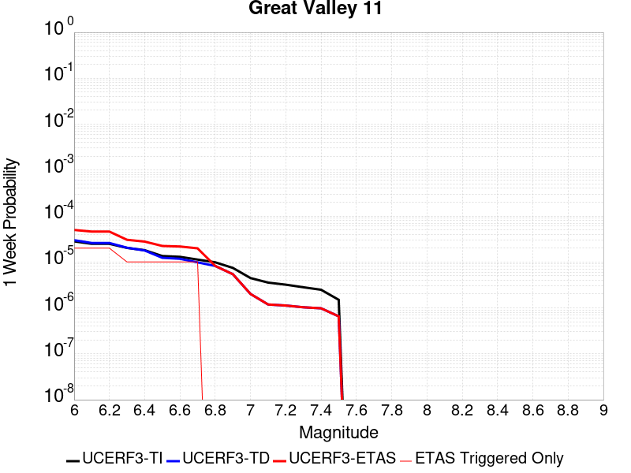 |  |  |  |

| Magnitude | 1 wk TI Prob | 1 wk TD Prob | 1 wk ETAS Prob | 1 wk ETAS/TD Gain | 1 wk ETAS Triggered Only | 1 mo TI Prob | 1 mo TD Prob | 1 mo ETAS Prob | 1 mo ETAS/TD Gain | 1 mo ETAS Triggered Only | 1 yr TI Prob | 1 yr TD Prob | 1 yr ETAS Prob | 1 yr ETAS/TD Gain | 1 yr ETAS Triggered Only | 10 yr TI Prob | 10 yr TD Prob | 10 yr ETAS Prob | 10 yr ETAS/TD Gain | 10 yr ETAS Triggered Only |
|-----|-----|-----|-----|-----|-----|-----|-----|-----|-----|-----|-----|-----|-----|-----|-----|-----|-----|-----|-----|-----|
| 6.0 | 2.8099583E-5 | 2.9832152E-5 | 4.3200736E-5 | 1.4481268 | 1.3368984E-5 | 1.20421224E-4 | 1.278462E-4 | 1.4121347E-4 | 1.1045575 | 1.3368984E-5 | 0.0014651422 | 0.0015554909 | 0.0015688391 | 1.0085813 | 1.3368984E-5 | 0.0145552 | 0.01545356 | 0.015466723 | 1.0008518 | 1.3368984E-5 |
| 6.1 | 2.483194E-5 | 2.590715E-5 | 3.9275787E-5 | 1.5160211 | 1.3368984E-5 | 1.0641825E-4 | 1.11026246E-4 | 1.2439374E-4 | 1.1203995 | 1.3368984E-5 | 0.0012948721 | 0.0013509706 | 0.0013643214 | 1.0098825 | 1.3368984E-5 | 0.012873529 | 0.013433994 | 0.013447183 | 1.0009818 | 1.3368984E-5 |
| 6.2 | 2.483194E-5 | 2.590715E-5 | 3.9275787E-5 | 1.5160211 | 1.3368984E-5 | 1.0641825E-4 | 1.11026246E-4 | 1.2439374E-4 | 1.1203995 | 1.3368984E-5 | 0.0012948721 | 0.0013509706 | 0.0013643214 | 1.0098825 | 1.3368984E-5 | 0.012873529 | 0.013433994 | 0.013447183 | 1.0009818 | 1.3368984E-5 |
| 6.3 | 2.0257901E-5 | 2.0398922E-5 | 3.3767632E-5 | 1.6553637 | 1.3368984E-5 | 8.681669E-5 | 8.742122E-5 | 1.0078904E-4 | 1.1529127 | 1.3368984E-5 | 0.0010564806 | 0.0010638756 | 0.0010772303 | 1.012553 | 1.3368984E-5 | 0.01051472 | 0.010592012 | 0.010605239 | 1.0012488 | 1.3368984E-5 |
| 6.4 | 1.8054898E-5 | 1.7780874E-5 | 3.1149622E-5 | 1.751861 | 1.3368984E-5 | 7.737584E-5 | 7.62017E-5 | 8.9569665E-5 | 1.1754287 | 1.3368984E-5 | 9.416436E-4 | 9.2739856E-4 | 9.407552E-4 | 1.0144022 | 1.3368984E-5 | 0.009376635 | 0.009239036 | 0.009252281 | 1.0014336 | 1.3368984E-5 |
| 6.5 | 1.34804895E-5 | 1.2321055E-5 | 2.5689875E-5 | 2.0850384 | 1.3368984E-5 | 5.777225E-5 | 5.2803476E-5 | 6.617175E-5 | 1.2531704 | 1.3368984E-5 | 7.031501E-4 | 6.4269686E-4 | 6.560572E-4 | 1.0207881 | 1.3368984E-5 | 0.007009294 | 0.0064088185 | 0.0064221015 | 1.0020727 | 1.3368984E-5 |
| 6.6 | 1.294883E-5 | 1.1732312E-5 | 2.5101139E-5 | 2.139488 | 1.3368984E-5 | 5.5493805E-5 | 5.028039E-5 | 6.36487E-5 | 1.2658752 | 1.3368984E-5 | 6.754276E-4 | 6.1199587E-4 | 6.253567E-4 | 1.0218315 | 1.3368984E-5 | 0.006733784 | 0.0061035305 | 0.006116818 | 1.002177 | 1.3368984E-5 |
| 6.7 | 1.1272237E-5 | 9.811886E-6 | 2.3180739E-5 | 2.3625162 | 1.3368984E-5 | 4.8308695E-5 | 4.2050277E-5 | 5.54187E-5 | 1.3179152 | 1.3368984E-5 | 5.879996E-4 | 5.118446E-4 | 5.2520673E-4 | 1.0261059 | 1.3368984E-5 | 0.005864462 | 0.0051069413 | 0.005120242 | 1.0026045 | 1.3368984E-5 |
| 6.8 | 9.8337505E-6 | 8.19377E-6 | 8.19377E-6 | 1.0 | 0.0 | 4.2143965E-5 | 3.5115696E-5 | 3.5115696E-5 | 1.0 | 0.0 | 5.1298196E-4 | 4.2745177E-4 | 4.2745177E-4 | 1.0 | 0.0 | 0.005117994 | 0.0042665056 | 0.0042665056 | 1.0 | 0.0 |
| 6.9 | 7.4224813E-6 | 5.4131347E-6 | 5.4131347E-6 | 1.0 | 0.0 | 3.1810247E-5 | 2.319895E-5 | 2.319895E-5 | 1.0 | 0.0 | 3.872209E-4 | 2.8241202E-4 | 2.8241202E-4 | 1.0 | 0.0 | 0.0038654688 | 0.0028206722 | 0.0028206722 | 1.0 | 0.0 |
| 7.0 | 4.4628923E-6 | 2.0110795E-6 | 2.0110795E-6 | 1.0 | 0.0 | 1.912654E-5 | 8.618884E-6 | 8.618884E-6 | 1.0 | 0.0 | 2.3284076E-4 | 1.04929975E-4 | 1.04929975E-4 | 1.0 | 0.0 | 0.0023259693 | 0.0010488159 | 0.0010488159 | 1.0 | 0.0 |
| 7.1 | 3.5546527E-6 | 1.1855836E-6 | 1.1855836E-6 | 1.0 | 0.0 | 1.5234136E-5 | 5.081063E-6 | 5.081063E-6 | 1.0 | 0.0 | 1.8545982E-4 | 6.186026E-5 | 6.186026E-5 | 1.0 | 0.0 | 0.0018530512 | 6.1843713E-4 | 6.1843713E-4 | 1.0 | 0.0 |
| 7.2 | 3.2039936E-6 | 1.1254128E-6 | 1.1254128E-6 | 1.0 | 0.0 | 1.3731329E-5 | 4.823189E-6 | 4.823189E-6 | 1.0 | 0.0 | 1.671661E-4 | 5.8720816E-5 | 5.8720816E-5 | 1.0 | 0.0 | 0.0016704041 | 5.870597E-4 | 5.870597E-4 | 1.0 | 0.0 |
| 7.3 | 2.8120473E-6 | 1.0305612E-6 | 1.0305612E-6 | 1.0 | 0.0 | 1.2051575E-5 | 4.4166836E-6 | 4.4166836E-6 | 1.0 | 0.0 | 1.4671806E-4 | 5.3771862E-5 | 5.3771862E-5 | 1.0 | 0.0 | 0.0014662122 | 5.3759513E-4 | 5.3759513E-4 | 1.0 | 0.0 |
| 7.4 | 2.4837766E-6 | 9.800582E-7 | 9.800582E-7 | 1.0 | 0.0 | 1.0644713E-5 | 4.200243E-6 | 4.200243E-6 | 1.0 | 0.0 | 1.2959167E-4 | 5.1136827E-5 | 5.1136827E-5 | 1.0 | 0.0 | 0.0012951613 | 5.112572E-4 | 5.112572E-4 | 1.0 | 0.0 |
| 7.5 | 1.5002679E-6 | 6.546144E-7 | 6.546144E-7 | 1.0 | 0.0 | 6.4297037E-6 | 2.8054874E-6 | 2.8054874E-6 | 1.0 | 0.0 | 7.827883E-5 | 3.4156317E-5 | 3.4156317E-5 | 1.0 | 0.0 | 7.825126E-4 | 3.4151482E-4 | 3.4151482E-4 | 1.0 | 0.0 |

## Burnt Mtn
*[(top)](#table-of-contents)*

| 1 Week | 1 Month | 1 Year | 10 Year |
|-----|-----|-----|-----|
|  |  |  |  |

| Magnitude | 1 wk TI Prob | 1 wk TD Prob | 1 wk ETAS Prob | 1 wk ETAS/TD Gain | 1 wk ETAS Triggered Only | 1 mo TI Prob | 1 mo TD Prob | 1 mo ETAS Prob | 1 mo ETAS/TD Gain | 1 mo ETAS Triggered Only | 1 yr TI Prob | 1 yr TD Prob | 1 yr ETAS Prob | 1 yr ETAS/TD Gain | 1 yr ETAS Triggered Only | 10 yr TI Prob | 10 yr TD Prob | 10 yr ETAS Prob | 10 yr ETAS/TD Gain | 10 yr ETAS Triggered Only |
|-----|-----|-----|-----|-----|-----|-----|-----|-----|-----|-----|-----|-----|-----|-----|-----|-----|-----|-----|-----|-----|
| 6.0 | 1.5673151E-5 | 1.1749407E-5 | 1.1749407E-5 | 1.0 | 0.0 | 6.716892E-5 | 5.0354356E-5 | 5.0354356E-5 | 1.0 | 0.0 | 8.1747473E-4 | 6.1302073E-4 | 6.1302073E-4 | 1.0 | 0.0 | 0.008144741 | 0.006125938 | 0.006139225 | 1.002169 | 1.3368984E-5 |
| 6.1 | 1.5673151E-5 | 1.1749407E-5 | 1.1749407E-5 | 1.0 | 0.0 | 6.716892E-5 | 5.0354356E-5 | 5.0354356E-5 | 1.0 | 0.0 | 8.1747473E-4 | 6.1302073E-4 | 6.1302073E-4 | 1.0 | 0.0 | 0.008144741 | 0.006125938 | 0.006139225 | 1.002169 | 1.3368984E-5 |
| 6.2 | 1.5673151E-5 | 1.1749407E-5 | 1.1749407E-5 | 1.0 | 0.0 | 6.716892E-5 | 5.0354356E-5 | 5.0354356E-5 | 1.0 | 0.0 | 8.1747473E-4 | 6.1302073E-4 | 6.1302073E-4 | 1.0 | 0.0 | 0.008144741 | 0.006125938 | 0.006139225 | 1.002169 | 1.3368984E-5 |
| 6.3 | 1.5673151E-5 | 1.1749407E-5 | 1.1749407E-5 | 1.0 | 0.0 | 6.716892E-5 | 5.0354356E-5 | 5.0354356E-5 | 1.0 | 0.0 | 8.1747473E-4 | 6.1302073E-4 | 6.1302073E-4 | 1.0 | 0.0 | 0.008144741 | 0.006125938 | 0.006139225 | 1.002169 | 1.3368984E-5 |
| 6.4 | 1.5673151E-5 | 1.1749407E-5 | 1.1749407E-5 | 1.0 | 0.0 | 6.716892E-5 | 5.0354356E-5 | 5.0354356E-5 | 1.0 | 0.0 | 8.1747473E-4 | 6.1302073E-4 | 6.1302073E-4 | 1.0 | 0.0 | 0.008144741 | 0.006125938 | 0.006139225 | 1.002169 | 1.3368984E-5 |
| 6.5 | 1.36191375E-5 | 1.0078299E-5 | 1.0078299E-5 | 1.0 | 0.0 | 5.8366426E-5 | 4.3192707E-5 | 4.3192707E-5 | 1.0 | 0.0 | 7.103795E-4 | 5.2587123E-4 | 5.2587123E-4 | 1.0 | 0.0 | 0.0070811296 | 0.0052587125 | 0.005272011 | 1.0025289 | 1.3368984E-5 |

## Great Valley 06 (Midland) 2011 CFM alt1
*[(top)](#table-of-contents)*

| 1 Week | 1 Month | 1 Year | 10 Year |
|-----|-----|-----|-----|
|  |  |  |  |

| Magnitude | 1 wk TI Prob | 1 wk TD Prob | 1 wk ETAS Prob | 1 wk ETAS/TD Gain | 1 wk ETAS Triggered Only | 1 mo TI Prob | 1 mo TD Prob | 1 mo ETAS Prob | 1 mo ETAS/TD Gain | 1 mo ETAS Triggered Only | 1 yr TI Prob | 1 yr TD Prob | 1 yr ETAS Prob | 1 yr ETAS/TD Gain | 1 yr ETAS Triggered Only | 10 yr TI Prob | 10 yr TD Prob | 10 yr ETAS Prob | 10 yr ETAS/TD Gain | 10 yr ETAS Triggered Only |
|-----|-----|-----|-----|-----|-----|-----|-----|-----|-----|-----|-----|-----|-----|-----|-----|-----|-----|-----|-----|-----|
| 6.0 | 1.2712525E-5 | 1.3210576E-5 | 1.3210576E-5 | 1.0 | 0.0 | 5.4481112E-5 | 5.6615667E-5 | 5.6615667E-5 | 1.0 | 0.0 | 6.6310563E-4 | 6.8910315E-4 | 6.8910315E-4 | 1.0 | 0.0 | 0.0066113044 | 0.006872179 | 0.006885456 | 1.001932 | 1.3368984E-5 |
| 6.1 | 1.2712525E-5 | 1.3210576E-5 | 1.3210576E-5 | 1.0 | 0.0 | 5.4481112E-5 | 5.6615667E-5 | 5.6615667E-5 | 1.0 | 0.0 | 6.6310563E-4 | 6.8910315E-4 | 6.8910315E-4 | 1.0 | 0.0 | 0.0066113044 | 0.006872179 | 0.006885456 | 1.001932 | 1.3368984E-5 |
| 6.2 | 1.2712525E-5 | 1.3210576E-5 | 1.3210576E-5 | 1.0 | 0.0 | 5.4481112E-5 | 5.6615667E-5 | 5.6615667E-5 | 1.0 | 0.0 | 6.6310563E-4 | 6.8910315E-4 | 6.8910315E-4 | 1.0 | 0.0 | 0.0066113044 | 0.006872179 | 0.006885456 | 1.001932 | 1.3368984E-5 |
| 6.3 | 1.2712525E-5 | 1.3210576E-5 | 1.3210576E-5 | 1.0 | 0.0 | 5.4481112E-5 | 5.6615667E-5 | 5.6615667E-5 | 1.0 | 0.0 | 6.6310563E-4 | 6.8910315E-4 | 6.8910315E-4 | 1.0 | 0.0 | 0.0066113044 | 0.006872179 | 0.006885456 | 1.001932 | 1.3368984E-5 |
| 6.4 | 1.2712525E-5 | 1.3210576E-5 | 1.3210576E-5 | 1.0 | 0.0 | 5.4481112E-5 | 5.6615667E-5 | 5.6615667E-5 | 1.0 | 0.0 | 6.6310563E-4 | 6.8910315E-4 | 6.8910315E-4 | 1.0 | 0.0 | 0.0066113044 | 0.006872179 | 0.006885456 | 1.001932 | 1.3368984E-5 |
| 6.5 | 1.2712525E-5 | 1.3210576E-5 | 1.3210576E-5 | 1.0 | 0.0 | 5.4481112E-5 | 5.6615667E-5 | 5.6615667E-5 | 1.0 | 0.0 | 6.6310563E-4 | 6.8910315E-4 | 6.8910315E-4 | 1.0 | 0.0 | 0.0066113044 | 0.006872179 | 0.006885456 | 1.001932 | 1.3368984E-5 |
| 6.6 | 5.7574384E-6 | 5.9706463E-6 | 5.9706463E-6 | 1.0 | 0.0 | 2.4674504E-5 | 2.5588255E-5 | 2.5588255E-5 | 1.0 | 0.0 | 3.0037065E-4 | 3.1149638E-4 | 3.1149638E-4 | 1.0 | 0.0 | 0.0029996498 | 0.0031109843 | 0.0031243116 | 1.004284 | 1.3368984E-5 |
| 6.7 | 5.7574384E-6 | 5.9706463E-6 | 5.9706463E-6 | 1.0 | 0.0 | 2.4674504E-5 | 2.5588255E-5 | 2.5588255E-5 | 1.0 | 0.0 | 3.0037065E-4 | 3.1149638E-4 | 3.1149638E-4 | 1.0 | 0.0 | 0.0029996498 | 0.0031109843 | 0.0031243116 | 1.004284 | 1.3368984E-5 |
| 6.8 | 3.3474828E-6 | 3.4693849E-6 | 3.4693849E-6 | 1.0 | 0.0 | 1.4346277E-5 | 1.4868716E-5 | 1.4868716E-5 | 1.0 | 0.0 | 1.7465191E-4 | 1.8101306E-4 | 1.8101306E-4 | 1.0 | 0.0 | 0.0017451472 | 0.0018088033 | 0.0018088033 | 1.0 | 0.0 |
| 6.9 | 2.035106E-6 | 2.1090357E-6 | 2.1090357E-6 | 1.0 | 0.0 | 8.721853E-6 | 9.038697E-6 | 9.038697E-6 | 1.0 | 0.0 | 1.0618339E-4 | 1.10041314E-4 | 1.10041314E-4 | 1.0 | 0.0 | 0.0010613267 | 0.0010999405 | 0.0010999405 | 1.0 | 0.0 |
| 7.0 | 1.2424716E-6 | 1.2878762E-6 | 1.2878762E-6 | 1.0 | 0.0 | 5.3248673E-6 | 5.51946E-6 | 5.51946E-6 | 1.0 | 0.0 | 6.482833E-5 | 6.7197805E-5 | 6.7197805E-5 | 1.0 | 0.0 | 6.480942E-4 | 6.718192E-4 | 6.718192E-4 | 1.0 | 0.0 |
| 7.1 | 6.6904556E-7 | 6.939035E-7 | 6.939035E-7 | 1.0 | 0.0 | 2.867335E-6 | 2.97387E-6 | 2.97387E-6 | 1.0 | 0.0 | 3.4909244E-5 | 3.6206526E-5 | 3.6206526E-5 | 1.0 | 0.0 | 3.490376E-4 | 3.6203177E-4 | 3.6203177E-4 | 1.0 | 0.0 |
| 7.2 | 3.948168E-7 | 4.095705E-7 | 4.095705E-7 | 1.0 | 0.0 | 1.6920709E-6 | 1.7553022E-6 | 1.7553022E-6 | 1.0 | 0.0 | 2.0600768E-5 | 2.1370803E-5 | 2.1370803E-5 | 1.0 | 0.0 | 2.0598859E-4 | 2.1370803E-4 | 2.1370803E-4 | 1.0 | 0.0 |

## Round Valley
*[(top)](#table-of-contents)*

| 1 Week | 1 Month | 1 Year | 10 Year |
|-----|-----|-----|-----|
| 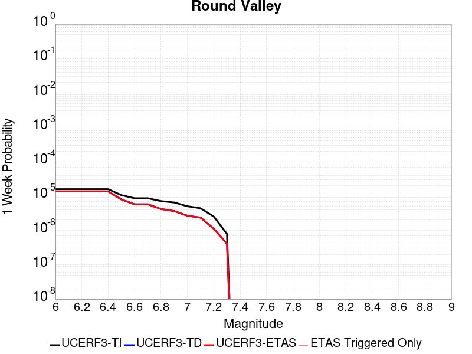 |  |  |  |

| Magnitude | 1 wk TI Prob | 1 wk TD Prob | 1 wk ETAS Prob | 1 wk ETAS/TD Gain | 1 wk ETAS Triggered Only | 1 mo TI Prob | 1 mo TD Prob | 1 mo ETAS Prob | 1 mo ETAS/TD Gain | 1 mo ETAS Triggered Only | 1 yr TI Prob | 1 yr TD Prob | 1 yr ETAS Prob | 1 yr ETAS/TD Gain | 1 yr ETAS Triggered Only | 10 yr TI Prob | 10 yr TD Prob | 10 yr ETAS Prob | 10 yr ETAS/TD Gain | 10 yr ETAS Triggered Only |
|-----|-----|-----|-----|-----|-----|-----|-----|-----|-----|-----|-----|-----|-----|-----|-----|-----|-----|-----|-----|-----|
| 6.0 | 1.588152E-5 | 1.3670716E-5 | 1.3670716E-5 | 1.0 | 0.0 | 6.806188E-5 | 5.8587688E-5 | 5.8587688E-5 | 1.0 | 0.0 | 8.283384E-4 | 7.13111E-4 | 7.13111E-4 | 1.0 | 0.0 | 0.008252576 | 0.0071121147 | 0.007125389 | 1.0018663 | 1.3368984E-5 |
| 6.1 | 1.588152E-5 | 1.3670716E-5 | 1.3670716E-5 | 1.0 | 0.0 | 6.806188E-5 | 5.8587688E-5 | 5.8587688E-5 | 1.0 | 0.0 | 8.283384E-4 | 7.13111E-4 | 7.13111E-4 | 1.0 | 0.0 | 0.008252576 | 0.0071121147 | 0.007125389 | 1.0018663 | 1.3368984E-5 |
| 6.2 | 1.588152E-5 | 1.3670716E-5 | 1.3670716E-5 | 1.0 | 0.0 | 6.806188E-5 | 5.8587688E-5 | 5.8587688E-5 | 1.0 | 0.0 | 8.283384E-4 | 7.13111E-4 | 7.13111E-4 | 1.0 | 0.0 | 0.008252576 | 0.0071121147 | 0.007125389 | 1.0018663 | 1.3368984E-5 |
| 6.3 | 1.588152E-5 | 1.3670716E-5 | 1.3670716E-5 | 1.0 | 0.0 | 6.806188E-5 | 5.8587688E-5 | 5.8587688E-5 | 1.0 | 0.0 | 8.283384E-4 | 7.13111E-4 | 7.13111E-4 | 1.0 | 0.0 | 0.008252576 | 0.0071121147 | 0.007125389 | 1.0018663 | 1.3368984E-5 |
| 6.4 | 1.588152E-5 | 1.3670716E-5 | 1.3670716E-5 | 1.0 | 0.0 | 6.806188E-5 | 5.8587688E-5 | 5.8587688E-5 | 1.0 | 0.0 | 8.283384E-4 | 7.13111E-4 | 7.13111E-4 | 1.0 | 0.0 | 0.008252576 | 0.0071121147 | 0.007125389 | 1.0018663 | 1.3368984E-5 |
| 6.5 | 1.0646776E-5 | 7.953037E-6 | 7.953037E-6 | 1.0 | 0.0 | 4.5628243E-5 | 3.408405E-5 | 3.408405E-5 | 1.0 | 0.0 | 5.553823E-4 | 4.1490266E-4 | 4.1490266E-4 | 1.0 | 0.0 | 0.005539963 | 0.0041421093 | 0.0041554226 | 1.0032142 | 1.3368984E-5 |
| 6.6 | 8.632956E-6 | 5.768742E-6 | 5.768742E-6 | 1.0 | 0.0 | 3.6997862E-5 | 2.4722967E-5 | 2.4722967E-5 | 1.0 | 0.0 | 4.5035584E-4 | 3.009644E-4 | 3.009644E-4 | 1.0 | 0.0 | 0.0044944426 | 0.003005946 | 0.003005946 | 1.0 | 0.0 |
| 6.7 | 8.632956E-6 | 5.768742E-6 | 5.768742E-6 | 1.0 | 0.0 | 3.6997862E-5 | 2.4722967E-5 | 2.4722967E-5 | 1.0 | 0.0 | 4.5035584E-4 | 3.009644E-4 | 3.009644E-4 | 1.0 | 0.0 | 0.0044944426 | 0.003005946 | 0.003005946 | 1.0 | 0.0 |
| 6.8 | 7.143895E-6 | 4.2018346E-6 | 4.2018346E-6 | 1.0 | 0.0 | 3.0616335E-5 | 1.8007748E-5 | 1.8007748E-5 | 1.0 | 0.0 | 3.726901E-4 | 2.1922393E-4 | 2.1922393E-4 | 1.0 | 0.0 | 0.0037206567 | 0.0021902416 | 0.0021902416 | 1.0 | 0.0 |
| 6.9 | 6.5120694E-6 | 3.6644687E-6 | 3.6644687E-6 | 1.0 | 0.0 | 2.790857E-5 | 1.570478E-5 | 1.570478E-5 | 1.0 | 0.0 | 3.3973387E-4 | 1.9119044E-4 | 1.9119044E-4 | 1.0 | 0.0 | 0.0033921495 | 0.0019104085 | 0.0019104085 | 1.0 | 0.0 |
| 7.0 | 5.0614435E-6 | 2.6836676E-6 | 2.6836676E-6 | 1.0 | 0.0 | 2.169172E-5 | 1.1501388E-5 | 1.1501388E-5 | 1.0 | 0.0 | 2.6406467E-4 | 1.4002144E-4 | 1.4002144E-4 | 1.0 | 0.0 | 0.0026375111 | 0.0013994334 | 0.0013994334 | 1.0 | 0.0 |
| 7.1 | 4.41728E-6 | 2.3575074E-6 | 2.3575074E-6 | 1.0 | 0.0 | 1.8931061E-5 | 1.0103569E-5 | 1.0103569E-5 | 1.0 | 0.0 | 2.304613E-4 | 1.23005E-4 | 1.23005E-4 | 1.0 | 0.0 | 0.0023022245 | 0.0012294657 | 0.0012294657 | 1.0 | 0.0 |
| 7.2 | 2.535495E-6 | 1.1208391E-6 | 1.1208391E-6 | 1.0 | 0.0 | 1.0866362E-5 | 4.8035904E-6 | 4.8035904E-6 | 1.0 | 0.0 | 1.3228992E-4 | 5.8482667E-5 | 5.8482667E-5 | 1.0 | 0.0 | 0.0013221119 | 5.84724E-4 | 5.84724E-4 | 1.0 | 0.0 |
| 7.3 | 7.900015E-7 | 4.0889498E-7 | 4.0889498E-7 | 1.0 | 0.0 | 3.3857161E-6 | 1.752407E-6 | 1.752407E-6 | 1.0 | 0.0 | 4.1220315E-5 | 2.1335554E-5 | 2.1335554E-5 | 1.0 | 0.0 | 4.121267E-4 | 2.1335555E-4 | 2.1335555E-4 | 1.0 | 0.0 |

## Sierra Madre (San Fernando)
*[(top)](#table-of-contents)*

| 1 Week | 1 Month | 1 Year | 10 Year |
|-----|-----|-----|-----|
|  |  |  |  |

| Magnitude | 1 wk TI Prob | 1 wk TD Prob | 1 wk ETAS Prob | 1 wk ETAS/TD Gain | 1 wk ETAS Triggered Only | 1 mo TI Prob | 1 mo TD Prob | 1 mo ETAS Prob | 1 mo ETAS/TD Gain | 1 mo ETAS Triggered Only | 1 yr TI Prob | 1 yr TD Prob | 1 yr ETAS Prob | 1 yr ETAS/TD Gain | 1 yr ETAS Triggered Only | 10 yr TI Prob | 10 yr TD Prob | 10 yr ETAS Prob | 10 yr ETAS/TD Gain | 10 yr ETAS Triggered Only |
|-----|-----|-----|-----|-----|-----|-----|-----|-----|-----|-----|-----|-----|-----|-----|-----|-----|-----|-----|-----|-----|
| 6.0 | 1.0346413E-5 | 6.2872605E-6 | 1.9656161E-5 | 3.1263473 | 1.3368984E-5 | 4.4341014E-5 | 2.694513E-5 | 4.0313753E-5 | 1.4961425 | 1.3368984E-5 | 5.3971814E-4 | 3.280087E-4 | 3.413733E-4 | 1.0407447 | 1.3368984E-5 | 0.0053840918 | 0.0032753581 | 0.0032886832 | 1.0040684 | 1.3368984E-5 |
| 6.1 | 1.0346413E-5 | 6.2872605E-6 | 1.9656161E-5 | 3.1263473 | 1.3368984E-5 | 4.4341014E-5 | 2.694513E-5 | 4.0313753E-5 | 1.4961425 | 1.3368984E-5 | 5.3971814E-4 | 3.280087E-4 | 3.413733E-4 | 1.0407447 | 1.3368984E-5 | 0.0053840918 | 0.0032753581 | 0.0032886832 | 1.0040684 | 1.3368984E-5 |
| 6.2 | 1.0346413E-5 | 6.2872605E-6 | 1.9656161E-5 | 3.1263473 | 1.3368984E-5 | 4.4341014E-5 | 2.694513E-5 | 4.0313753E-5 | 1.4961425 | 1.3368984E-5 | 5.3971814E-4 | 3.280087E-4 | 3.413733E-4 | 1.0407447 | 1.3368984E-5 | 0.0053840918 | 0.0032753581 | 0.0032886832 | 1.0040684 | 1.3368984E-5 |
| 6.3 | 1.0346413E-5 | 6.2872605E-6 | 1.9656161E-5 | 3.1263473 | 1.3368984E-5 | 4.4341014E-5 | 2.694513E-5 | 4.0313753E-5 | 1.4961425 | 1.3368984E-5 | 5.3971814E-4 | 3.280087E-4 | 3.413733E-4 | 1.0407447 | 1.3368984E-5 | 0.0053840918 | 0.0032753581 | 0.0032886832 | 1.0040684 | 1.3368984E-5 |
| 6.4 | 1.0249558E-5 | 6.2872605E-6 | 1.9656161E-5 | 3.1263473 | 1.3368984E-5 | 4.392594E-5 | 2.694513E-5 | 4.0313753E-5 | 1.4961425 | 1.3368984E-5 | 5.3466705E-4 | 3.280087E-4 | 3.413733E-4 | 1.0407447 | 1.3368984E-5 | 0.0053338245 | 0.0032753581 | 0.0032886832 | 1.0040684 | 1.3368984E-5 |
| 6.5 | 1.0249558E-5 | 6.2872605E-6 | 1.9656161E-5 | 3.1263473 | 1.3368984E-5 | 4.392594E-5 | 2.694513E-5 | 4.0313753E-5 | 1.4961425 | 1.3368984E-5 | 5.3466705E-4 | 3.280087E-4 | 3.413733E-4 | 1.0407447 | 1.3368984E-5 | 0.0053338245 | 0.0032753581 | 0.0032886832 | 1.0040684 | 1.3368984E-5 |
| 6.6 | 9.9035515E-6 | 6.2872605E-6 | 1.9656161E-5 | 3.1263473 | 1.3368984E-5 | 4.2443102E-5 | 2.694513E-5 | 4.0313753E-5 | 1.4961425 | 1.3368984E-5 | 5.166222E-4 | 3.280087E-4 | 3.413733E-4 | 1.0407447 | 1.3368984E-5 | 0.0051542283 | 0.0032753581 | 0.0032886832 | 1.0040684 | 1.3368984E-5 |
| 6.7 | 9.87217E-6 | 6.2746817E-6 | 1.9643581E-5 | 3.1306102 | 1.3368984E-5 | 4.2308613E-5 | 2.689122E-5 | 4.0259845E-5 | 1.4971371 | 1.3368984E-5 | 5.149856E-4 | 3.2735255E-4 | 3.4071715E-4 | 1.0408263 | 1.3368984E-5 | 0.005137938 | 0.0032688158 | 0.0032821412 | 1.0040765 | 1.3368984E-5 |
| 6.8 | 9.4359175E-6 | 6.1786586E-6 | 1.954756E-5 | 3.1637223 | 1.3368984E-5 | 4.043902E-5 | 2.6479704E-5 | 3.984833E-5 | 1.5048633 | 1.3368984E-5 | 4.9223384E-4 | 3.2234378E-4 | 3.3570846E-4 | 1.041461 | 1.3368984E-5 | 0.0049114493 | 0.0032188739 | 0.0032322 | 1.0041399 | 1.3368984E-5 |
| 6.9 | 8.700447E-6 | 6.039922E-6 | 1.9408824E-5 | 3.2134233 | 1.3368984E-5 | 3.72871E-5 | 2.5885129E-5 | 3.9253766E-5 | 1.5164602 | 1.3368984E-5 | 4.5387587E-4 | 3.1510694E-4 | 3.284717E-4 | 1.0424135 | 1.3368984E-5 | 0.0045295 | 0.003146711 | 0.0031600378 | 1.0042351 | 1.3368984E-5 |
| 7.0 | 8.648878E-6 | 6.0148373E-6 | 1.938374E-5 | 3.2226543 | 1.3368984E-5 | 3.7066096E-5 | 2.5777625E-5 | 3.9146264E-5 | 1.518614 | 1.3368984E-5 | 4.5118626E-4 | 3.1379846E-4 | 3.2716326E-4 | 1.0425904 | 1.3368984E-5 | 0.004502713 | 0.003133663 | 0.0031469902 | 1.0042529 | 1.3368984E-5 |
| 7.1 | 8.505786E-6 | 5.9244676E-6 | 1.9293373E-5 | 3.256558 | 1.3368984E-5 | 3.645286E-5 | 2.5390334E-5 | 3.875898E-5 | 1.5265249 | 1.3368984E-5 | 4.437232E-4 | 3.0908454E-4 | 3.224494E-4 | 1.0432401 | 1.3368984E-5 | 0.0044283825 | 0.0030866556 | 0.0030999833 | 1.0043179 | 1.3368984E-5 |
| 7.2 | 8.139752E-6 | 5.6987624E-6 | 1.9067671E-5 | 3.3459318 | 1.3368984E-5 | 3.4884186E-5 | 2.4423045E-5 | 3.7791702E-5 | 1.5473788 | 1.3368984E-5 | 4.246322E-4 | 2.9731105E-4 | 3.1067606E-4 | 1.044953 | 1.3368984E-5 | 0.004238217 | 0.0029692391 | 0.0029825682 | 1.0044892 | 1.3368984E-5 |
| 7.3 | 7.8816E-6 | 5.552077E-6 | 5.552077E-6 | 1.0 | 0.0 | 3.3777847E-5 | 2.3794404E-5 | 2.3794404E-5 | 1.0 | 0.0 | 4.111677E-4 | 2.896594E-4 | 2.896594E-4 | 1.0 | 0.0 | 0.004104078 | 0.0028929242 | 0.0028929242 | 1.0 | 0.0 |
| 7.4 | 7.5810603E-6 | 5.3563126E-6 | 5.3563126E-6 | 1.0 | 0.0 | 3.2489854E-5 | 2.2955428E-5 | 2.2955428E-5 | 1.0 | 0.0 | 3.9549218E-4 | 2.7944756E-4 | 2.7944756E-4 | 1.0 | 0.0 | 0.0039478904 | 0.0027910667 | 0.0027910667 | 1.0 | 0.0 |
| 7.5 | 6.349153E-6 | 4.407576E-6 | 4.407576E-6 | 1.0 | 0.0 | 2.7210372E-5 | 1.888948E-5 | 1.888948E-5 | 1.0 | 0.0 | 3.312359E-4 | 2.2995596E-4 | 2.2995596E-4 | 1.0 | 0.0 | 0.0033074263 | 0.0022972622 | 0.0022972622 | 1.0 | 0.0 |
| 7.6 | 4.430576E-6 | 2.8905868E-6 | 2.8905868E-6 | 1.0 | 0.0 | 1.8988047E-5 | 1.2388171E-5 | 1.2388171E-5 | 1.0 | 0.0 | 2.3115493E-4 | 1.5081577E-4 | 1.5081577E-4 | 1.0 | 0.0 | 0.0023091463 | 0.0015071568 | 0.0015071568 | 1.0 | 0.0 |
| 7.7 | 3.005066E-6 | 1.7510115E-6 | 1.7510115E-6 | 1.0 | 0.0 | 1.2878791E-5 | 7.504313E-6 | 7.504313E-6 | 1.0 | 0.0 | 1.56788E-4 | 9.1361195E-5 | 9.1361195E-5 | 1.0 | 0.0 | 0.0015667742 | 9.132375E-4 | 9.132375E-4 | 1.0 | 0.0 |
| 7.8 | 1.8459098E-6 | 1.0582091E-6 | 1.0582091E-6 | 1.0 | 0.0 | 7.911018E-6 | 4.535174E-6 | 4.535174E-6 | 1.0 | 0.0 | 9.631238E-5 | 5.5214347E-5 | 5.5214347E-5 | 1.0 | 0.0 | 9.627065E-4 | 5.5200676E-4 | 5.5200676E-4 | 1.0 | 0.0 |
| 7.9 | 9.839262E-7 | 5.23421E-7 | 5.23421E-7 | 1.0 | 0.0 | 4.2168194E-6 | 2.2432312E-6 | 2.2432312E-6 | 1.0 | 0.0 | 5.1338568E-5 | 2.7310998E-5 | 2.7310998E-5 | 1.0 | 0.0 | 5.132671E-4 | 2.730767E-4 | 2.730767E-4 | 1.0 | 0.0 |
| 8.0 | 1.210983E-7 | 6.613821E-8 | 6.613821E-8 | 1.0 | 0.0 | 5.1899264E-7 | 2.8344945E-7 | 2.8344945E-7 | 1.0 | 0.0 | 6.3187167E-6 | 3.4509917E-6 | 3.4509917E-6 | 1.0 | 0.0 | 6.318537E-5 | 3.45094E-5 | 3.45094E-5 | 1.0 | 0.0 |

## Great Valley 03 Mysterious Ridge
*[(top)](#table-of-contents)*

| 1 Week | 1 Month | 1 Year | 10 Year |
|-----|-----|-----|-----|
|  |  |  |  |

| Magnitude | 1 wk TI Prob | 1 wk TD Prob | 1 wk ETAS Prob | 1 wk ETAS/TD Gain | 1 wk ETAS Triggered Only | 1 mo TI Prob | 1 mo TD Prob | 1 mo ETAS Prob | 1 mo ETAS/TD Gain | 1 mo ETAS Triggered Only | 1 yr TI Prob | 1 yr TD Prob | 1 yr ETAS Prob | 1 yr ETAS/TD Gain | 1 yr ETAS Triggered Only | 10 yr TI Prob | 10 yr TD Prob | 10 yr ETAS Prob | 10 yr ETAS/TD Gain | 10 yr ETAS Triggered Only |
|-----|-----|-----|-----|-----|-----|-----|-----|-----|-----|-----|-----|-----|-----|-----|-----|-----|-----|-----|-----|-----|
| 6.0 | 3.1182444E-5 | 3.603423E-5 | 3.603423E-5 | 1.0 | 0.0 | 1.336322E-4 | 1.544242E-4 | 1.544242E-4 | 1.0 | 0.0 | 0.0016257578 | 0.0018786696 | 0.0018920135 | 1.0071028 | 1.3368984E-5 | 0.016139153 | 0.018646652 | 0.01865977 | 1.0007036 | 1.3368984E-5 |
| 6.1 | 3.1182444E-5 | 3.603423E-5 | 3.603423E-5 | 1.0 | 0.0 | 1.336322E-4 | 1.544242E-4 | 1.544242E-4 | 1.0 | 0.0 | 0.0016257578 | 0.0018786696 | 0.0018920135 | 1.0071028 | 1.3368984E-5 | 0.016139153 | 0.018646652 | 0.01865977 | 1.0007036 | 1.3368984E-5 |
| 6.2 | 3.1182444E-5 | 3.603423E-5 | 3.603423E-5 | 1.0 | 0.0 | 1.336322E-4 | 1.544242E-4 | 1.544242E-4 | 1.0 | 0.0 | 0.0016257578 | 0.0018786696 | 0.0018920135 | 1.0071028 | 1.3368984E-5 | 0.016139153 | 0.018646652 | 0.01865977 | 1.0007036 | 1.3368984E-5 |
| 6.3 | 2.106934E-5 | 2.3850307E-5 | 2.3850307E-5 | 1.0 | 0.0 | 9.0294045E-5 | 1.0221177E-4 | 1.0221177E-4 | 1.0 | 0.0 | 0.0010987755 | 0.0012437489 | 0.0012437489 | 1.0 | 0.0 | 0.010933585 | 0.012371127 | 0.012371127 | 1.0 | 0.0 |
| 6.4 | 2.106934E-5 | 2.3850307E-5 | 2.3850307E-5 | 1.0 | 0.0 | 9.0294045E-5 | 1.0221177E-4 | 1.0221177E-4 | 1.0 | 0.0 | 0.0010987755 | 0.0012437489 | 0.0012437489 | 1.0 | 0.0 | 0.010933585 | 0.012371127 | 0.012371127 | 1.0 | 0.0 |
| 6.5 | 1.9389783E-5 | 2.1884984E-5 | 2.1884984E-5 | 1.0 | 0.0 | 8.309642E-5 | 9.3789575E-5 | 9.3789575E-5 | 1.0 | 0.0 | 0.0010112294 | 0.0011413174 | 0.0011413174 | 1.0 | 0.0 | 0.010066401 | 0.011357434 | 0.011357434 | 1.0 | 0.0 |
| 6.6 | 1.9370193E-5 | 2.1864906E-5 | 2.1864906E-5 | 1.0 | 0.0 | 8.301247E-5 | 9.370353E-5 | 9.370353E-5 | 1.0 | 0.0 | 0.0010102082 | 0.001140271 | 0.001140271 | 1.0 | 0.0 | 0.010056281 | 0.011347076 | 0.011347076 | 1.0 | 0.0 |
| 6.7 | 1.6723505E-5 | 1.8799281E-5 | 1.8799281E-5 | 1.0 | 0.0 | 7.16702E-5 | 8.056597E-5 | 8.056597E-5 | 1.0 | 0.0 | 8.722353E-4 | 9.804688E-4 | 9.804688E-4 | 1.0 | 0.0 | 0.008688197 | 0.009763439 | 0.009763439 | 1.0 | 0.0 |
| 6.8 | 1.426937E-5 | 1.599721E-5 | 1.599721E-5 | 1.0 | 0.0 | 6.115301E-5 | 6.855775E-5 | 6.855775E-5 | 1.0 | 0.0 | 7.4428355E-4 | 8.343854E-4 | 8.343854E-4 | 1.0 | 0.0 | 0.007417957 | 0.008314005 | 0.008314005 | 1.0 | 0.0 |
| 6.9 | 1.2469891E-5 | 1.3956928E-5 | 1.3956928E-5 | 1.0 | 0.0 | 5.3441294E-5 | 5.9814105E-5 | 5.9814105E-5 | 1.0 | 0.0 | 6.504535E-4 | 7.280055E-4 | 7.280055E-4 | 1.0 | 0.0 | 0.006485529 | 0.00725743 | 0.00725743 | 1.0 | 0.0 |
| 7.0 | 8.7746275E-6 | 9.791734E-6 | 9.791734E-6 | 1.0 | 0.0 | 3.7605005E-5 | 4.196394E-5 | 4.196394E-5 | 1.0 | 0.0 | 4.5774475E-4 | 5.1079853E-4 | 5.1079853E-4 | 1.0 | 0.0 | 0.00456803 | 0.005096977 | 0.005096977 | 1.0 | 0.0 |
| 7.1 | 6.1067153E-6 | 6.813725E-6 | 6.813725E-6 | 1.0 | 0.0 | 2.6171374E-5 | 2.9201385E-5 | 2.9201385E-5 | 1.0 | 0.0 | 3.1858988E-4 | 3.5547445E-4 | 3.5547445E-4 | 1.0 | 0.0 | 0.0031813353 | 0.003549609 | 0.003549609 | 1.0 | 0.0 |
| 7.2 | 2.939283E-6 | 3.2741057E-6 | 3.2741057E-6 | 1.0 | 0.0 | 1.2596866E-5 | 1.4031816E-5 | 1.4031816E-5 | 1.0 | 0.0 | 1.5335606E-4 | 1.7082572E-4 | 1.7082572E-4 | 1.0 | 0.0 | 0.0015325027 | 0.001707116 | 0.001707116 | 1.0 | 0.0 |
| 7.3 | 7.2387763E-7 | 8.008505E-7 | 8.008505E-7 | 1.0 | 0.0 | 3.102329E-6 | 3.4322145E-6 | 3.4322145E-6 | 1.0 | 0.0 | 3.77702E-5 | 4.178687E-5 | 4.178687E-5 | 1.0 | 0.0 | 3.7763783E-4 | 4.1783508E-4 | 4.1783508E-4 | 1.0 | 0.0 |
| 7.4 | 3.112171E-8 | 3.2068368E-8 | 3.2068368E-8 | 1.0 | 0.0 | 1.3337875E-7 | 1.3743585E-7 | 1.3743585E-7 | 1.0 | 0.0 | 1.6238852E-6 | 1.6732803E-6 | 1.6732803E-6 | 1.0 | 0.0 | 1.6238733E-5 | 1.6732685E-5 | 1.6732685E-5 | 1.0 | 0.0 |

## Casmalia 2011 CFM
*[(top)](#table-of-contents)*

| 1 Week | 1 Month | 1 Year | 10 Year |
|-----|-----|-----|-----|
| 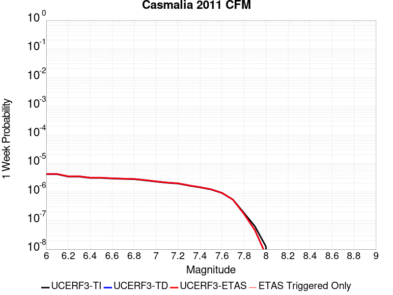 | 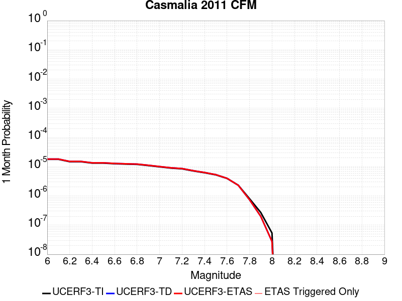 |  |  |

| Magnitude | 1 wk TI Prob | 1 wk TD Prob | 1 wk ETAS Prob | 1 wk ETAS/TD Gain | 1 wk ETAS Triggered Only | 1 mo TI Prob | 1 mo TD Prob | 1 mo ETAS Prob | 1 mo ETAS/TD Gain | 1 mo ETAS Triggered Only | 1 yr TI Prob | 1 yr TD Prob | 1 yr ETAS Prob | 1 yr ETAS/TD Gain | 1 yr ETAS Triggered Only | 10 yr TI Prob | 10 yr TD Prob | 10 yr ETAS Prob | 10 yr ETAS/TD Gain | 10 yr ETAS Triggered Only |
|-----|-----|-----|-----|-----|-----|-----|-----|-----|-----|-----|-----|-----|-----|-----|-----|-----|-----|-----|-----|-----|
| 6.0 | 4.1704893E-6 | 4.262483E-6 | 4.262483E-6 | 1.0 | 0.0 | 1.7873403E-5 | 1.8267656E-5 | 1.8267656E-5 | 1.0 | 0.0 | 2.1758694E-4 | 2.2238622E-4 | 2.2238622E-4 | 1.0 | 0.0 | 0.0021737402 | 0.0022216577 | 0.002234997 | 1.0060042 | 1.3368984E-5 |
| 6.1 | 4.1704893E-6 | 4.262483E-6 | 4.262483E-6 | 1.0 | 0.0 | 1.7873403E-5 | 1.8267656E-5 | 1.8267656E-5 | 1.0 | 0.0 | 2.1758694E-4 | 2.2238622E-4 | 2.2238622E-4 | 1.0 | 0.0 | 0.0021737402 | 0.0022216577 | 0.002234997 | 1.0060042 | 1.3368984E-5 |
| 6.2 | 3.457312E-6 | 3.5370217E-6 | 3.5370217E-6 | 1.0 | 0.0 | 1.4816967E-5 | 1.5158577E-5 | 1.5158577E-5 | 1.0 | 0.0 | 1.8038164E-4 | 1.8454014E-4 | 1.8454014E-4 | 1.0 | 0.0 | 0.001802353 | 0.0018438784 | 0.0018572228 | 1.0072371 | 1.3368984E-5 |
| 6.3 | 3.457312E-6 | 3.5370217E-6 | 3.5370217E-6 | 1.0 | 0.0 | 1.4816967E-5 | 1.5158577E-5 | 1.5158577E-5 | 1.0 | 0.0 | 1.8038164E-4 | 1.8454014E-4 | 1.8454014E-4 | 1.0 | 0.0 | 0.001802353 | 0.0018438784 | 0.0018572228 | 1.0072371 | 1.3368984E-5 |
| 6.4 | 3.0957337E-6 | 3.1692257E-6 | 3.1692257E-6 | 1.0 | 0.0 | 1.3267363E-5 | 1.3582326E-5 | 1.3582326E-5 | 1.0 | 0.0 | 1.6151817E-4 | 1.6535232E-4 | 1.6535232E-4 | 1.0 | 0.0 | 0.0016140083 | 0.0016522991 | 0.001665646 | 1.0080777 | 1.3368984E-5 |
| 6.5 | 3.0957337E-6 | 3.1692257E-6 | 3.1692257E-6 | 1.0 | 0.0 | 1.3267363E-5 | 1.3582326E-5 | 1.3582326E-5 | 1.0 | 0.0 | 1.6151817E-4 | 1.6535232E-4 | 1.6535232E-4 | 1.0 | 0.0 | 0.0016140083 | 0.0016522991 | 0.001665646 | 1.0080777 | 1.3368984E-5 |
| 6.6 | 2.9459152E-6 | 3.0165752E-6 | 3.0165752E-6 | 1.0 | 0.0 | 1.262529E-5 | 1.2928115E-5 | 1.2928115E-5 | 1.0 | 0.0 | 1.5370206E-4 | 1.5738848E-4 | 1.5738848E-4 | 1.0 | 0.0 | 0.0015359579 | 0.0015727758 | 0.0015861237 | 1.0084869 | 1.3368984E-5 |
| 6.7 | 2.8634809E-6 | 2.9324726E-6 | 2.9324726E-6 | 1.0 | 0.0 | 1.2272003E-5 | 1.256768E-5 | 1.256768E-5 | 1.0 | 0.0 | 1.4940138E-4 | 1.530008E-4 | 1.530008E-4 | 1.0 | 0.0 | 0.0014930099 | 0.0015289601 | 0.0015423086 | 1.0087305 | 1.3368984E-5 |
| 6.8 | 2.7999822E-6 | 2.8675968E-6 | 2.8675968E-6 | 1.0 | 0.0 | 1.1999869E-5 | 1.2289643E-5 | 1.2289643E-5 | 1.0 | 0.0 | 1.460886E-4 | 1.4961617E-4 | 1.4961617E-4 | 1.0 | 0.0 | 0.001459926 | 0.0014951597 | 0.0015085087 | 1.0089282 | 1.3368984E-5 |
| 6.9 | 2.551052E-6 | 2.6119649E-6 | 2.6119649E-6 | 1.0 | 0.0 | 1.0933034E-5 | 1.1194087E-5 | 1.1194087E-5 | 1.0 | 0.0 | 1.3310155E-4 | 1.3627953E-4 | 1.3627953E-4 | 1.0 | 0.0 | 0.0013302186 | 0.0013619636 | 0.0013753143 | 1.0098026 | 1.3368984E-5 |
| 7.0 | 2.3081875E-6 | 2.3624088E-6 | 2.3624088E-6 | 1.0 | 0.0 | 9.892195E-6 | 1.01245705E-5 | 1.01245705E-5 | 1.0 | 0.0 | 1.20430814E-4 | 1.232597E-4 | 1.232597E-4 | 1.0 | 0.0 | 0.0012036557 | 0.0012319161 | 0.0012452686 | 1.0108389 | 1.3368984E-5 |
| 7.1 | 2.093245E-6 | 2.1417243E-6 | 2.1417243E-6 | 1.0 | 0.0 | 8.971019E-6 | 9.178786E-6 | 9.178786E-6 | 1.0 | 0.0 | 1.09216686E-4 | 1.1174601E-4 | 1.1174601E-4 | 1.0 | 0.0 | 0.0010916302 | 0.0011169002 | 0.0011302542 | 1.0119563 | 1.3368984E-5 |
| 7.2 | 1.9714576E-6 | 2.0165091E-6 | 2.0165091E-6 | 1.0 | 0.0 | 8.449076E-6 | 8.642153E-6 | 8.642153E-6 | 1.0 | 0.0 | 1.0286264E-4 | 1.05213156E-4 | 1.05213156E-4 | 1.0 | 0.0 | 0.0010281504 | 0.0010516352 | 0.0010649902 | 1.0126992 | 1.3368984E-5 |
| 7.3 | 1.6689512E-6 | 1.7047131E-6 | 1.7047131E-6 | 1.0 | 0.0 | 7.1526288E-6 | 7.3058927E-6 | 7.3058927E-6 | 1.0 | 0.0 | 8.7079774E-5 | 8.894562E-5 | 8.894562E-5 | 1.0 | 0.0 | 8.7045657E-4 | 8.89101E-4 | 9.024581E-4 | 1.0150231 | 1.3368984E-5 |
| 7.4 | 1.4490954E-6 | 1.4778908E-6 | 1.4778908E-6 | 1.0 | 0.0 | 6.210394E-6 | 6.333802E-6 | 6.333802E-6 | 1.0 | 0.0 | 7.560892E-5 | 7.711132E-5 | 7.711132E-5 | 1.0 | 0.0 | 7.55832E-4 | 7.7084627E-4 | 7.842049E-4 | 1.0173299 | 1.3368984E-5 |
| 7.5 | 1.226873E-6 | 1.2481701E-6 | 1.2481701E-6 | 1.0 | 0.0 | 5.2580162E-6 | 5.3492895E-6 | 5.3492895E-6 | 1.0 | 0.0 | 6.401447E-5 | 6.5125656E-5 | 6.5125656E-5 | 1.0 | 0.0 | 6.399603E-4 | 6.5106625E-4 | 6.6442654E-4 | 1.0205206 | 1.3368984E-5 |
| 7.6 | 9.2561345E-7 | 9.361923E-7 | 9.361923E-7 | 1.0 | 0.0 | 3.966909E-6 | 4.012247E-6 | 4.012247E-6 | 1.0 | 0.0 | 4.8296046E-5 | 4.884801E-5 | 4.884801E-5 | 1.0 | 0.0 | 4.828555E-4 | 4.8837316E-4 | 5.017356E-4 | 1.0273612 | 1.3368984E-5 |
| 7.7 | 5.4367933E-7 | 5.392888E-7 | 5.392888E-7 | 1.0 | 0.0 | 2.3300522E-6 | 2.3112357E-6 | 2.3112357E-6 | 1.0 | 0.0 | 2.8368017E-5 | 2.8138933E-5 | 2.8138933E-5 | 1.0 | 0.0 | 2.8364395E-4 | 2.8135383E-4 | 2.9471907E-4 | 1.0475032 | 1.3368984E-5 |
| 7.8 | 1.8825742E-7 | 1.7342276E-7 | 1.7342276E-7 | 1.0 | 0.0 | 8.068173E-7 | 7.4324015E-7 | 7.4324015E-7 | 1.0 | 0.0 | 9.822956E-6 | 9.048912E-6 | 9.048912E-6 | 1.0 | 0.0 | 9.822522E-5 | 9.048546E-5 | 9.048546E-5 | 1.0 | 0.0 |
| 7.9 | 6.342771E-8 | 4.6790706E-8 | 4.6790706E-8 | 1.0 | 0.0 | 2.7183304E-7 | 2.0053157E-7 | 2.0053157E-7 | 1.0 | 0.0 | 3.3095623E-6 | 2.4414692E-6 | 2.4414692E-6 | 1.0 | 0.0 | 3.309513E-5 | 2.4414428E-5 | 2.4414428E-5 | 1.0 | 0.0 |
| 8.0 | 1.2574819E-8 | 6.4733463E-9 | 6.4733463E-9 | 1.0 | 0.0 | 5.3892084E-8 | 2.7742912E-8 | 2.7742912E-8 | 1.0 | 0.0 | 6.561359E-7 | 3.377699E-7 | 3.377699E-7 | 1.0 | 0.0 | 6.56134E-6 | 3.377694E-6 | 3.377694E-6 | 1.0 | 0.0 |

## Simi-Santa Rosa
*[(top)](#table-of-contents)*

| 1 Week | 1 Month | 1 Year | 10 Year |
|-----|-----|-----|-----|
|  |  |  |  |

| Magnitude | 1 wk TI Prob | 1 wk TD Prob | 1 wk ETAS Prob | 1 wk ETAS/TD Gain | 1 wk ETAS Triggered Only | 1 mo TI Prob | 1 mo TD Prob | 1 mo ETAS Prob | 1 mo ETAS/TD Gain | 1 mo ETAS Triggered Only | 1 yr TI Prob | 1 yr TD Prob | 1 yr ETAS Prob | 1 yr ETAS/TD Gain | 1 yr ETAS Triggered Only | 10 yr TI Prob | 10 yr TD Prob | 10 yr ETAS Prob | 10 yr ETAS/TD Gain | 10 yr ETAS Triggered Only |
|-----|-----|-----|-----|-----|-----|-----|-----|-----|-----|-----|-----|-----|-----|-----|-----|-----|-----|-----|-----|-----|
| 6.0 | 2.198912E-5 | 2.2275442E-5 | 3.5644127E-5 | 1.6001536 | 1.3368984E-5 | 9.4235686E-5 | 9.5462936E-5 | 1.08830645E-4 | 1.1400304 | 1.3368984E-5 | 0.0011467156 | 0.0011616853 | 0.0011750389 | 1.0114949 | 1.3368984E-5 | 0.011408163 | 0.011560575 | 0.01157379 | 1.0011431 | 1.3368984E-5 |
| 6.1 | 2.198912E-5 | 2.2275442E-5 | 3.5644127E-5 | 1.6001536 | 1.3368984E-5 | 9.4235686E-5 | 9.5462936E-5 | 1.08830645E-4 | 1.1400304 | 1.3368984E-5 | 0.0011467156 | 0.0011616853 | 0.0011750389 | 1.0114949 | 1.3368984E-5 | 0.011408163 | 0.011560575 | 0.01157379 | 1.0011431 | 1.3368984E-5 |
| 6.2 | 1.69983E-5 | 1.6668559E-5 | 3.0037321E-5 | 1.8020346 | 1.3368984E-5 | 7.284782E-5 | 7.143489E-5 | 8.480292E-5 | 1.1871358 | 1.3368984E-5 | 8.865613E-4 | 8.6940196E-4 | 8.827593E-4 | 1.0153638 | 1.3368984E-5 | 0.008830327 | 0.008662928 | 0.008676181 | 1.0015298 | 1.3368984E-5 |
| 6.3 | 1.69983E-5 | 1.6668559E-5 | 3.0037321E-5 | 1.8020346 | 1.3368984E-5 | 7.284782E-5 | 7.143489E-5 | 8.480292E-5 | 1.1871358 | 1.3368984E-5 | 8.865613E-4 | 8.6940196E-4 | 8.827593E-4 | 1.0153638 | 1.3368984E-5 | 0.008830327 | 0.008662928 | 0.008676181 | 1.0015298 | 1.3368984E-5 |
| 6.4 | 1.4666188E-5 | 1.4052543E-5 | 2.7421338E-5 | 1.9513435 | 1.3368984E-5 | 6.285358E-5 | 6.0223934E-5 | 7.359211E-5 | 1.2219745 | 1.3368984E-5 | 7.6497364E-4 | 7.3300465E-4 | 7.4636383E-4 | 1.0182252 | 1.3368984E-5 | 0.0076234564 | 0.007308344 | 0.0073216152 | 1.0018159 | 1.3368984E-5 |
| 6.5 | 1.4666188E-5 | 1.4052543E-5 | 2.7421338E-5 | 1.9513435 | 1.3368984E-5 | 6.285358E-5 | 6.0223934E-5 | 7.359211E-5 | 1.2219745 | 1.3368984E-5 | 7.6497364E-4 | 7.3300465E-4 | 7.4636383E-4 | 1.0182252 | 1.3368984E-5 | 0.0076234564 | 0.007308344 | 0.0073216152 | 1.0018159 | 1.3368984E-5 |
| 6.6 | 1.4377586E-5 | 1.3729583E-5 | 2.7098384E-5 | 1.9737223 | 1.3368984E-5 | 6.1616774E-5 | 5.883988E-5 | 7.220808E-5 | 1.2271962 | 1.3368984E-5 | 7.4992597E-4 | 7.1616494E-4 | 7.2952436E-4 | 1.0186541 | 1.3368984E-5 | 0.007474003 | 0.0071410383 | 0.007154312 | 1.0018587 | 1.3368984E-5 |
| 6.7 | 1.3881404E-5 | 1.320755E-5 | 2.6576357E-5 | 2.0122094 | 1.3368984E-5 | 5.9490372E-5 | 5.66027E-5 | 6.997093E-5 | 1.2361765 | 1.3368984E-5 | 7.240546E-4 | 6.8894465E-4 | 7.023045E-4 | 1.0193917 | 1.3368984E-5 | 0.007217 | 0.006870538 | 0.0068838154 | 1.0019325 | 1.3368984E-5 |
| 6.8 | 1.0176516E-5 | 9.154151E-6 | 2.2523012E-5 | 2.4604154 | 1.3368984E-5 | 4.3612912E-5 | 3.9231574E-5 | 5.2600037E-5 | 1.3407576 | 1.3368984E-5 | 5.308578E-4 | 4.7755634E-4 | 4.9091893E-4 | 1.0279812 | 1.3368984E-5 | 0.0052959146 | 0.004766934 | 0.0047802394 | 1.0027912 | 1.3368984E-5 |
| 6.9 | 9.699797E-6 | 8.774719E-6 | 2.2143586E-5 | 2.5235662 | 1.3368984E-5 | 4.15699E-5 | 3.7605492E-5 | 5.0973973E-5 | 1.3554928 | 1.3368984E-5 | 5.05996E-4 | 4.577671E-4 | 4.7112998E-4 | 1.0291914 | 1.3368984E-5 | 0.005048454 | 0.0045698597 | 0.0045831674 | 1.002912 | 1.3368984E-5 |
| 7.0 | 7.4049476E-6 | 6.559333E-6 | 1.992823E-5 | 3.0381486 | 1.3368984E-5 | 3.1735104E-5 | 2.8111197E-5 | 4.1479805E-5 | 1.4755617 | 1.3368984E-5 | 3.8630638E-4 | 3.422127E-4 | 3.5557713E-4 | 1.039053 | 1.3368984E-5 | 0.0038563553 | 0.0034180996 | 0.0034314229 | 1.0038979 | 1.3368984E-5 |
| 7.1 | 3.873439E-6 | 2.7595095E-6 | 1.6128457E-5 | 5.844682 | 1.3368984E-5 | 1.6600346E-5 | 1.1826417E-5 | 2.5195242E-5 | 2.1304207 | 1.3368984E-5 | 2.0209046E-4 | 1.4397735E-4 | 1.573444E-4 | 1.0928414 | 1.3368984E-5 | 0.0020190678 | 0.0014388643 | 0.001452214 | 1.0092779 | 1.3368984E-5 |
| 7.2 | 3.417706E-6 | 2.3676484E-6 | 1.5736601E-5 | 6.6465106 | 1.3368984E-5 | 1.4647229E-5 | 1.0147027E-5 | 2.3515875E-5 | 2.317514 | 1.3368984E-5 | 1.7831543E-4 | 1.2353327E-4 | 1.369006E-4 | 1.1082083 | 1.3368984E-5 | 0.0017817242 | 0.0012346683 | 0.0012480208 | 1.0108147 | 1.3368984E-5 |
| 7.3 | 1.90225E-6 | 1.4073753E-6 | 1.4073753E-6 | 1.0 | 0.0 | 8.152474E-6 | 6.0315947E-6 | 6.0315947E-6 | 1.0 | 0.0 | 9.9251854E-5 | 7.343221E-5 | 7.343221E-5 | 1.0 | 0.0 | 9.920754E-4 | 7.340817E-4 | 7.340817E-4 | 1.0 | 0.0 |
| 7.4 | 1.5170556E-6 | 1.1024773E-6 | 1.1024773E-6 | 1.0 | 0.0 | 6.5016507E-6 | 4.724894E-6 | 4.724894E-6 | 1.0 | 0.0 | 7.915472E-5 | 5.7524077E-5 | 5.7524077E-5 | 1.0 | 0.0 | 7.9126534E-4 | 5.7509297E-4 | 5.7509297E-4 | 1.0 | 0.0 |
| 7.5 | 1.178732E-6 | 8.535102E-7 | 8.535102E-7 | 1.0 | 0.0 | 5.0516987E-6 | 3.6578958E-6 | 3.6578958E-6 | 1.0 | 0.0 | 6.1502695E-5 | 4.453398E-5 | 4.453398E-5 | 1.0 | 0.0 | 6.148568E-4 | 4.452515E-4 | 4.452515E-4 | 1.0 | 0.0 |
| 7.6 | 6.8722386E-7 | 4.793198E-7 | 4.793198E-7 | 1.0 | 0.0 | 2.9452417E-6 | 2.054226E-6 | 2.054226E-6 | 1.0 | 0.0 | 3.5857727E-5 | 2.5009915E-5 | 2.5009915E-5 | 1.0 | 0.0 | 3.5851944E-4 | 2.5007114E-4 | 2.5007114E-4 | 1.0 | 0.0 |
| 7.7 | 5.5126515E-7 | 3.6731157E-7 | 3.6731157E-7 | 1.0 | 0.0 | 2.3625628E-6 | 1.5741915E-6 | 1.5741915E-6 | 1.0 | 0.0 | 2.8763823E-5 | 1.9165615E-5 | 1.9165615E-5 | 1.0 | 0.0 | 2.87601E-4 | 1.9163972E-4 | 1.9163972E-4 | 1.0 | 0.0 |
| 7.8 | 3.3860243E-7 | 2.0075942E-7 | 2.0075942E-7 | 1.0 | 0.0 | 1.4511525E-6 | 8.6039717E-7 | 8.6039717E-7 | 1.0 | 0.0 | 1.7667637E-5 | 1.0475286E-5 | 1.0475286E-5 | 1.0 | 0.0 | 1.7666233E-4 | 1.04747975E-4 | 1.04747975E-4 | 1.0 | 0.0 |
| 7.9 | 2.7955386E-7 | 1.4649108E-7 | 1.4649108E-7 | 1.0 | 0.0 | 1.1980875E-6 | 6.278188E-7 | 6.278188E-7 | 1.0 | 0.0 | 1.4586617E-5 | 7.643667E-6 | 7.643667E-6 | 1.0 | 0.0 | 1.458566E-4 | 7.643409E-5 | 7.643409E-5 | 1.0 | 0.0 |
| 8.0 | 5.6259015E-8 | 3.3355324E-8 | 3.3355324E-8 | 1.0 | 0.0 | 2.4111003E-7 | 1.4295138E-7 | 1.4295138E-7 | 1.0 | 0.0 | 2.9355108E-6 | 1.7404317E-6 | 1.7404317E-6 | 1.0 | 0.0 | 2.935472E-5 | 1.7404194E-5 | 1.7404194E-5 | 1.0 | 0.0 |

## Eureka Peak
*[(top)](#table-of-contents)*

| 1 Week | 1 Month | 1 Year | 10 Year |
|-----|-----|-----|-----|
|  |  |  |  |

| Magnitude | 1 wk TI Prob | 1 wk TD Prob | 1 wk ETAS Prob | 1 wk ETAS/TD Gain | 1 wk ETAS Triggered Only | 1 mo TI Prob | 1 mo TD Prob | 1 mo ETAS Prob | 1 mo ETAS/TD Gain | 1 mo ETAS Triggered Only | 1 yr TI Prob | 1 yr TD Prob | 1 yr ETAS Prob | 1 yr ETAS/TD Gain | 1 yr ETAS Triggered Only | 10 yr TI Prob | 10 yr TD Prob | 10 yr ETAS Prob | 10 yr ETAS/TD Gain | 10 yr ETAS Triggered Only |
|-----|-----|-----|-----|-----|-----|-----|-----|-----|-----|-----|-----|-----|-----|-----|-----|-----|-----|-----|-----|-----|
| 6.0 | 3.1949054E-5 | 9.310571E-6 | 9.310571E-6 | 1.0 | 0.0 | 1.3691733E-4 | 3.990228E-5 | 5.3270727E-5 | 1.3350297 | 1.3368984E-5 | 0.0016656938 | 4.8578004E-4 | 4.991425E-4 | 1.0275073 | 1.3368984E-5 | 0.016532637 | 0.0049248957 | 0.0049381987 | 1.0027012 | 1.3368984E-5 |
| 6.1 | 3.1949054E-5 | 9.310571E-6 | 9.310571E-6 | 1.0 | 0.0 | 1.3691733E-4 | 3.990228E-5 | 5.3270727E-5 | 1.3350297 | 1.3368984E-5 | 0.0016656938 | 4.8578004E-4 | 4.991425E-4 | 1.0275073 | 1.3368984E-5 | 0.016532637 | 0.0049248957 | 0.0049381987 | 1.0027012 | 1.3368984E-5 |
| 6.2 | 3.1949054E-5 | 9.310571E-6 | 9.310571E-6 | 1.0 | 0.0 | 1.3691733E-4 | 3.990228E-5 | 5.3270727E-5 | 1.3350297 | 1.3368984E-5 | 0.0016656938 | 4.8578004E-4 | 4.991425E-4 | 1.0275073 | 1.3368984E-5 | 0.016532637 | 0.0049248957 | 0.0049381987 | 1.0027012 | 1.3368984E-5 |
| 6.3 | 2.7339745E-5 | 7.980718E-6 | 7.980718E-6 | 1.0 | 0.0 | 1.1716507E-4 | 3.4203054E-5 | 4.757158E-5 | 1.3908577 | 1.3368984E-5 | 0.0014255513 | 4.164185E-4 | 4.2978194E-4 | 1.0320913 | 1.3368984E-5 | 0.0141644105 | 0.004228374 | 0.004241687 | 1.0031483 | 1.3368984E-5 |
| 6.4 | 2.7339745E-5 | 7.980718E-6 | 7.980718E-6 | 1.0 | 0.0 | 1.1716507E-4 | 3.4203054E-5 | 4.757158E-5 | 1.3908577 | 1.3368984E-5 | 0.0014255513 | 4.164185E-4 | 4.2978194E-4 | 1.0320913 | 1.3368984E-5 | 0.0141644105 | 0.004228374 | 0.004241687 | 1.0031483 | 1.3368984E-5 |
| 6.5 | 9.738388E-8 | 1.8619214E-7 | 1.8619214E-7 | 1.0 | 0.0 | 4.1735944E-7 | 7.979661E-7 | 7.979661E-7 | 1.0 | 0.0 | 5.081339E-6 | 9.715194E-6 | 9.715194E-6 | 1.0 | 0.0 | 5.0812232E-5 | 9.714778E-5 | 9.714778E-5 | 1.0 | 0.0 |
| 6.6 | 9.3495956E-8 | 1.8328048E-7 | 1.8328048E-7 | 1.0 | 0.0 | 4.0069688E-7 | 7.8548754E-7 | 7.8548754E-7 | 1.0 | 0.0 | 4.8784736E-6 | 9.5632695E-6 | 9.5632695E-6 | 1.0 | 0.0 | 4.8783666E-5 | 9.562866E-5 | 9.562866E-5 | 1.0 | 0.0 |
| 6.7 | 9.3495956E-8 | 1.8328048E-7 | 1.8328048E-7 | 1.0 | 0.0 | 4.0069688E-7 | 7.8548754E-7 | 7.8548754E-7 | 1.0 | 0.0 | 4.8784736E-6 | 9.5632695E-6 | 9.5632695E-6 | 1.0 | 0.0 | 4.8783666E-5 | 9.562866E-5 | 9.562866E-5 | 1.0 | 0.0 |
| 6.8 | 8.591428E-8 | 1.8021015E-7 | 1.8021015E-7 | 1.0 | 0.0 | 3.68204E-7 | 7.72329E-7 | 7.72329E-7 | 1.0 | 0.0 | 4.4828744E-6 | 9.403066E-6 | 9.403066E-6 | 1.0 | 0.0 | 4.482784E-5 | 9.402676E-5 | 9.402676E-5 | 1.0 | 0.0 |
| 6.9 | 7.749723E-8 | 1.7439022E-7 | 1.7439022E-7 | 1.0 | 0.0 | 3.3213098E-7 | 7.473864E-7 | 7.473864E-7 | 1.0 | 0.0 | 4.043687E-6 | 9.099393E-6 | 9.099393E-6 | 1.0 | 0.0 | 4.0436134E-5 | 9.099028E-5 | 9.099028E-5 | 1.0 | 0.0 |
| 7.0 | 6.897872E-8 | 1.6415258E-7 | 1.6415258E-7 | 1.0 | 0.0 | 2.9562307E-7 | 7.035109E-7 | 7.035109E-7 | 1.0 | 0.0 | 3.5992048E-6 | 8.565212E-6 | 8.565212E-6 | 1.0 | 0.0 | 3.5991467E-5 | 8.564889E-5 | 8.564889E-5 | 1.0 | 0.0 |
| 7.1 | 5.859318E-8 | 1.4787166E-7 | 1.4787166E-7 | 1.0 | 0.0 | 2.5111362E-7 | 6.337355E-7 | 6.337355E-7 | 1.0 | 0.0 | 3.057304E-6 | 7.715704E-6 | 7.715704E-6 | 1.0 | 0.0 | 3.0572617E-5 | 7.715442E-5 | 7.715442E-5 | 1.0 | 0.0 |
| 7.2 | 5.1375338E-8 | 1.342105E-7 | 1.342105E-7 | 1.0 | 0.0 | 2.2018E-7 | 5.751877E-7 | 5.751877E-7 | 1.0 | 0.0 | 2.680688E-6 | 7.002888E-6 | 7.002888E-6 | 1.0 | 0.0 | 2.6806558E-5 | 7.0026734E-5 | 7.0026734E-5 | 1.0 | 0.0 |
| 7.3 | 4.5441396E-8 | 1.16363104E-7 | 1.16363104E-7 | 1.0 | 0.0 | 1.9474882E-7 | 4.986989E-7 | 4.986989E-7 | 1.0 | 0.0 | 2.3710643E-6 | 6.071643E-6 | 6.071643E-6 | 1.0 | 0.0 | 2.371039E-5 | 6.0714825E-5 | 6.0714825E-5 | 1.0 | 0.0 |
| 7.4 | 2.981918E-8 | 6.9113334E-8 | 6.9113334E-8 | 1.0 | 0.0 | 1.2779647E-7 | 2.9619997E-7 | 2.9619997E-7 | 1.0 | 0.0 | 1.5559209E-6 | 3.6062293E-6 | 3.6062293E-6 | 1.0 | 0.0 | 1.55591E-5 | 3.606175E-5 | 3.606175E-5 | 1.0 | 0.0 |
| 7.5 | 4.24214E-9 | 8.342421E-9 | 8.342421E-9 | 1.0 | 0.0 | 1.81806E-8 | 3.5753235E-8 | 3.5753235E-8 | 1.0 | 0.0 | 2.213488E-7 | 4.352956E-7 | 4.352956E-7 | 1.0 | 0.0 | 2.2134857E-6 | 4.352954E-6 | 4.352954E-6 | 1.0 | 0.0 |

## San Andreas (Offshore) 2011 CFM
*[(top)](#table-of-contents)*

| 1 Week | 1 Month | 1 Year | 10 Year |
|-----|-----|-----|-----|
|  |  |  |  |

| Magnitude | 1 wk TI Prob | 1 wk TD Prob | 1 wk ETAS Prob | 1 wk ETAS/TD Gain | 1 wk ETAS Triggered Only | 1 mo TI Prob | 1 mo TD Prob | 1 mo ETAS Prob | 1 mo ETAS/TD Gain | 1 mo ETAS Triggered Only | 1 yr TI Prob | 1 yr TD Prob | 1 yr ETAS Prob | 1 yr ETAS/TD Gain | 1 yr ETAS Triggered Only | 10 yr TI Prob | 10 yr TD Prob | 10 yr ETAS Prob | 10 yr ETAS/TD Gain | 10 yr ETAS Triggered Only |
|-----|-----|-----|-----|-----|-----|-----|-----|-----|-----|-----|-----|-----|-----|-----|-----|-----|-----|-----|-----|-----|
| 6.0 | 1.7072787E-4 | 1.9226041E-4 | 2.0562683E-4 | 1.0695225 | 1.3368984E-5 | 7.3148566E-4 | 8.237154E-4 | 8.370734E-4 | 1.0162168 | 1.3368984E-5 | 0.008869528 | 0.0099831335 | 0.0099963695 | 1.0013258 | 1.3368984E-5 | 0.085237645 | 0.09682738 | 0.09683946 | 1.0001247 | 1.3368984E-5 |
| 6.1 | 1.7072787E-4 | 1.9226041E-4 | 2.0562683E-4 | 1.0695225 | 1.3368984E-5 | 7.3148566E-4 | 8.237154E-4 | 8.370734E-4 | 1.0162168 | 1.3368984E-5 | 0.008869528 | 0.0099831335 | 0.0099963695 | 1.0013258 | 1.3368984E-5 | 0.085237645 | 0.09682738 | 0.09683946 | 1.0001247 | 1.3368984E-5 |
| 6.2 | 1.6312556E-4 | 1.8407789E-4 | 1.974444E-4 | 1.0726134 | 1.3368984E-5 | 6.989222E-4 | 7.8866904E-4 | 8.020275E-4 | 1.016938 | 1.3368984E-5 | 0.008476226 | 0.009560268 | 0.00957351 | 1.001385 | 1.3368984E-5 | 0.08160117 | 0.09284818 | 0.09286031 | 1.0001307 | 1.3368984E-5 |
| 6.3 | 1.5103363E-4 | 1.6880741E-4 | 1.6880741E-4 | 1.0 | 0.0 | 6.471264E-4 | 7.232619E-4 | 7.232619E-4 | 1.0 | 0.0 | 0.007850339 | 0.008770605 | 0.008770605 | 1.0 | 0.0 | 0.075787395 | 0.085489064 | 0.085489064 | 1.0 | 0.0 |
| 6.4 | 1.5047993E-4 | 1.676667E-4 | 1.676667E-4 | 1.0 | 0.0 | 6.4475456E-4 | 7.1837584E-4 | 7.1837584E-4 | 1.0 | 0.0 | 0.007821669 | 0.008711592 | 0.008711592 | 1.0 | 0.0 | 0.0755203 | 0.08496926 | 0.08496926 | 1.0 | 0.0 |
| 6.5 | 1.2760791E-4 | 1.3735025E-4 | 1.3735025E-4 | 1.0 | 0.0 | 5.467764E-4 | 5.885125E-4 | 5.885125E-4 | 1.0 | 0.0 | 0.0066367025 | 0.0071418737 | 0.0071418737 | 1.0 | 0.0 | 0.064419635 | 0.07025001 | 0.07025001 | 1.0 | 0.0 |
| 6.6 | 1.1063525E-4 | 1.15566356E-4 | 1.15566356E-4 | 1.0 | 0.0 | 4.740649E-4 | 4.9519143E-4 | 4.9519143E-4 | 1.0 | 0.0 | 0.0057564764 | 0.006012491 | 0.006012491 | 1.0 | 0.0 | 0.05609626 | 0.05948894 | 0.05948894 | 1.0 | 0.0 |
| 6.7 | 1.0391049E-4 | 1.0645922E-4 | 1.0645922E-4 | 1.0 | 0.0 | 4.4525467E-4 | 4.5617504E-4 | 4.5617504E-4 | 1.0 | 0.0 | 0.0054075094 | 0.005539975 | 0.005539975 | 1.0 | 0.0 | 0.052778035 | 0.05498876 | 0.05498876 | 1.0 | 0.0 |
| 6.8 | 1.0096706E-4 | 1.01582686E-4 | 1.01582686E-4 | 1.0 | 0.0 | 4.3264418E-4 | 4.3528268E-4 | 4.3528268E-4 | 1.0 | 0.0 | 0.0052547283 | 0.005286866 | 0.005286866 | 1.0 | 0.0 | 0.051321987 | 0.052687574 | 0.052687574 | 1.0 | 0.0 |
| 6.9 | 9.800265E-5 | 9.588748E-5 | 9.588748E-5 | 1.0 | 0.0 | 4.1994374E-4 | 4.1088252E-4 | 4.1088252E-4 | 1.0 | 0.0 | 0.0051008356 | 0.0049911886 | 0.0049911886 | 1.0 | 0.0 | 0.049853306 | 0.05001504 | 0.05001504 | 1.0 | 0.0 |
| 7.0 | 9.4642375E-5 | 9.002143E-5 | 9.002143E-5 | 1.0 | 0.0 | 4.0554712E-4 | 3.8574997E-4 | 3.8574997E-4 | 1.0 | 0.0 | 0.004926363 | 0.0046865544 | 0.0046865544 | 1.0 | 0.0 | 0.048185747 | 0.047196057 | 0.047196057 | 1.0 | 0.0 |
| 7.1 | 9.0996844E-5 | 8.354169E-5 | 8.354169E-5 | 1.0 | 0.0 | 3.8992817E-4 | 3.5798753E-4 | 3.5798753E-4 | 1.0 | 0.0 | 0.004737046 | 0.004349944 | 0.004349944 | 1.0 | 0.0 | 0.04637333 | 0.044047635 | 0.044047635 | 1.0 | 0.0 |
| 7.2 | 8.848287E-5 | 7.9818135E-5 | 7.9818135E-5 | 1.0 | 0.0 | 3.791572E-4 | 3.4203375E-4 | 3.4203375E-4 | 1.0 | 0.0 | 0.004606472 | 0.0041564633 | 0.0041564633 | 1.0 | 0.0 | 0.045121472 | 0.042191572 | 0.042191572 | 1.0 | 0.0 |
| 7.3 | 7.9280784E-5 | 6.1276216E-5 | 6.1276216E-5 | 1.0 | 0.0 | 3.3973053E-4 | 2.625865E-4 | 2.625865E-4 | 1.0 | 0.0 | 0.004128377 | 0.0031924061 | 0.0031924061 | 1.0 | 0.0 | 0.040525194 | 0.032904375 | 0.032904375 | 1.0 | 0.0 |
| 7.4 | 6.468038E-5 | 3.7933212E-5 | 3.7933212E-5 | 1.0 | 0.0 | 2.771722E-4 | 1.625611E-4 | 1.625611E-4 | 1.0 | 0.0 | 0.0033693502 | 0.0019774425 | 0.0019774425 | 1.0 | 0.0 | 0.0331872 | 0.02082181 | 0.02082181 | 1.0 | 0.0 |
| 7.5 | 4.930574E-5 | 1.2703362E-5 | 1.2703362E-5 | 1.0 | 0.0 | 2.1129321E-4 | 5.444185E-5 | 5.444185E-5 | 1.0 | 0.0 | 0.0025694598 | 6.6262955E-4 | 6.6262955E-4 | 1.0 | 0.0 | 0.02539953 | 0.007481418 | 0.007481418 | 1.0 | 0.0 |
| 7.6 | 4.612566E-5 | 1.0336213E-5 | 1.0336213E-5 | 1.0 | 0.0 | 1.9766642E-4 | 4.429731E-5 | 4.429731E-5 | 1.0 | 0.0 | 0.0024039324 | 5.391877E-4 | 5.391877E-4 | 1.0 | 0.0 | 0.023780935 | 0.006172099 | 0.006172099 | 1.0 | 0.0 |
| 7.7 | 3.9435414E-5 | 5.574925E-6 | 5.574925E-6 | 1.0 | 0.0 | 1.6899795E-4 | 2.3892318E-5 | 2.3892318E-5 | 1.0 | 0.0 | 0.0020556084 | 2.9085035E-4 | 2.9085035E-4 | 1.0 | 0.0 | 0.020366974 | 0.0035420412 | 0.0035420412 | 1.0 | 0.0 |
| 7.8 | 2.7787428E-5 | 3.7553348E-6 | 3.7553348E-6 | 1.0 | 0.0 | 1.1908354E-4 | 1.6094193E-5 | 1.6094193E-5 | 1.0 | 0.0 | 0.0014488777 | 1.9592921E-4 | 1.9592921E-4 | 1.0 | 0.0 | 0.014394675 | 0.0023877125 | 0.0023877125 | 1.0 | 0.0 |
| 7.9 | 1.590671E-5 | 3.04085E-6 | 3.04085E-6 | 1.0 | 0.0 | 6.816983E-5 | 1.303215E-5 | 1.303215E-5 | 1.0 | 0.0 | 8.2965166E-4 | 1.586549E-4 | 1.586549E-4 | 1.0 | 0.0 | 0.008265611 | 0.001904262 | 0.001904262 | 1.0 | 0.0 |
| 8.0 | 9.193638E-6 | 2.5920847E-6 | 2.5920847E-6 | 1.0 | 0.0 | 3.940071E-5 | 1.1108887E-5 | 1.1108887E-5 | 1.0 | 0.0 | 4.7959806E-4 | 1.3524233E-4 | 1.3524233E-4 | 1.0 | 0.0 | 0.0047856434 | 0.0016115032 | 0.0016115032 | 1.0 | 0.0 |
| 8.1 | 5.601576E-6 | 2.2343472E-6 | 2.2343472E-6 | 1.0 | 0.0 | 2.4006533E-5 | 9.575739E-6 | 9.575739E-6 | 1.0 | 0.0 | 2.9224035E-4 | 1.16578405E-4 | 1.16578405E-4 | 1.0 | 0.0 | 0.0029185633 | 0.0014020674 | 0.0014020674 | 1.0 | 0.0 |
| 8.2 | 4.3508785E-6 | 1.857566E-6 | 1.857566E-6 | 1.0 | 0.0 | 1.864649E-5 | 7.960973E-6 | 7.960973E-6 | 1.0 | 0.0 | 2.2699735E-4 | 9.692056E-5 | 9.692056E-5 | 1.0 | 0.0 | 0.0022676561 | 0.0011594221 | 0.0011594221 | 1.0 | 0.0 |
| 8.3 | 1.9573292E-6 | 7.514906E-7 | 7.514906E-7 | 1.0 | 0.0 | 8.388526E-6 | 3.22067E-6 | 3.22067E-6 | 1.0 | 0.0 | 1.0212552E-4 | 3.921097E-5 | 3.921097E-5 | 1.0 | 0.0 | 0.001020786 | 4.640846E-4 | 4.640846E-4 | 1.0 | 0.0 |

## West Napa 2011 CFM
*[(top)](#table-of-contents)*

| 1 Week | 1 Month | 1 Year | 10 Year |
|-----|-----|-----|-----|
| 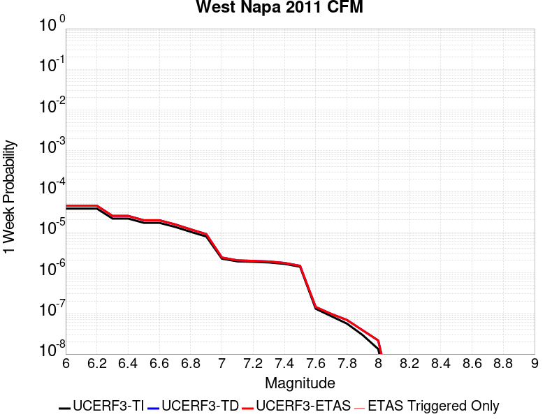 |  |  |  |

| Magnitude | 1 wk TI Prob | 1 wk TD Prob | 1 wk ETAS Prob | 1 wk ETAS/TD Gain | 1 wk ETAS Triggered Only | 1 mo TI Prob | 1 mo TD Prob | 1 mo ETAS Prob | 1 mo ETAS/TD Gain | 1 mo ETAS Triggered Only | 1 yr TI Prob | 1 yr TD Prob | 1 yr ETAS Prob | 1 yr ETAS/TD Gain | 1 yr ETAS Triggered Only | 10 yr TI Prob | 10 yr TD Prob | 10 yr ETAS Prob | 10 yr ETAS/TD Gain | 10 yr ETAS Triggered Only |
|-----|-----|-----|-----|-----|-----|-----|-----|-----|-----|-----|-----|-----|-----|-----|-----|-----|-----|-----|-----|-----|
| 6.0 | 3.773104E-5 | 4.452845E-5 | 4.452845E-5 | 1.0 | 0.0 | 1.6169442E-4 | 1.9082405E-4 | 1.9082405E-4 | 1.0 | 0.0 | 0.001966852 | 0.0023211248 | 0.0023211248 | 1.0 | 0.0 | 0.019495348 | 0.023002245 | 0.023015307 | 1.0005678 | 1.3368984E-5 |
| 6.1 | 3.773104E-5 | 4.452845E-5 | 4.452845E-5 | 1.0 | 0.0 | 1.6169442E-4 | 1.9082405E-4 | 1.9082405E-4 | 1.0 | 0.0 | 0.001966852 | 0.0023211248 | 0.0023211248 | 1.0 | 0.0 | 0.019495348 | 0.023002245 | 0.023015307 | 1.0005678 | 1.3368984E-5 |
| 6.2 | 3.773104E-5 | 4.452845E-5 | 4.452845E-5 | 1.0 | 0.0 | 1.6169442E-4 | 1.9082405E-4 | 1.9082405E-4 | 1.0 | 0.0 | 0.001966852 | 0.0023211248 | 0.0023211248 | 1.0 | 0.0 | 0.019495348 | 0.023002245 | 0.023015307 | 1.0005678 | 1.3368984E-5 |
| 6.3 | 2.147964E-5 | 2.4987039E-5 | 2.4987039E-5 | 1.0 | 0.0 | 9.2052345E-5 | 1.0708343E-4 | 1.0708343E-4 | 1.0 | 0.0 | 0.001120161 | 0.0013030528 | 0.0013030528 | 1.0 | 0.0 | 0.011145315 | 0.0129647385 | 0.012977934 | 1.0010178 | 1.3368984E-5 |
| 6.4 | 2.147964E-5 | 2.4987039E-5 | 2.4987039E-5 | 1.0 | 0.0 | 9.2052345E-5 | 1.0708343E-4 | 1.0708343E-4 | 1.0 | 0.0 | 0.001120161 | 0.0013030528 | 0.0013030528 | 1.0 | 0.0 | 0.011145315 | 0.0129647385 | 0.012977934 | 1.0010178 | 1.3368984E-5 |
| 6.5 | 1.688201E-5 | 1.9547346E-5 | 1.9547346E-5 | 1.0 | 0.0 | 7.234947E-5 | 8.377206E-5 | 8.377206E-5 | 1.0 | 0.0 | 8.804988E-4 | 0.0010195201 | 0.0010195201 | 1.0 | 0.0 | 0.008770182 | 0.010157098 | 0.010170331 | 1.0013028 | 1.3368984E-5 |
| 6.6 | 1.6846381E-5 | 1.9507039E-5 | 1.9507039E-5 | 1.0 | 0.0 | 7.219678E-5 | 8.359933E-5 | 8.359933E-5 | 1.0 | 0.0 | 8.7864127E-4 | 0.001017419 | 0.001017419 | 1.0 | 0.0 | 0.008751754 | 0.010136279 | 0.010149512 | 1.0013056 | 1.3368984E-5 |
| 6.7 | 1.3396501E-5 | 1.5467655E-5 | 1.5467655E-5 | 1.0 | 0.0 | 5.7412315E-5 | 6.628862E-5 | 6.628862E-5 | 1.0 | 0.0 | 6.9877075E-4 | 8.0682867E-4 | 8.0682867E-4 | 1.0 | 0.0 | 0.0069657755 | 0.008046719 | 0.00805998 | 1.0016481 | 1.3368984E-5 |
| 6.8 | 1.0139058E-5 | 1.1672149E-5 | 1.1672149E-5 | 1.0 | 0.0 | 4.3452383E-5 | 5.0022853E-5 | 5.0022853E-5 | 1.0 | 0.0 | 5.289043E-4 | 6.0891354E-4 | 6.0891354E-4 | 1.0 | 0.0 | 0.005276473 | 0.006079373 | 0.0060926606 | 1.0021857 | 1.3368984E-5 |
| 6.9 | 7.761281E-6 | 8.890694E-6 | 8.890694E-6 | 1.0 | 0.0 | 3.326221E-5 | 3.8102706E-5 | 3.8102706E-5 | 1.0 | 0.0 | 4.0489217E-4 | 4.6385307E-4 | 4.6385307E-4 | 1.0 | 0.0 | 0.0040415525 | 0.004635363 | 0.004635363 | 1.0 | 0.0 |
| 7.0 | 2.2109202E-6 | 2.3666025E-6 | 2.3666025E-6 | 1.0 | 0.0 | 9.475338E-6 | 1.0142544E-5 | 1.0142544E-5 | 1.0 | 0.0 | 1.1535613E-4 | 1.2347854E-4 | 1.2347854E-4 | 1.0 | 0.0 | 0.0011529627 | 0.0012355851 | 0.0012355851 | 1.0 | 0.0 |
| 7.1 | 1.9008926E-6 | 2.0132914E-6 | 2.0132914E-6 | 1.0 | 0.0 | 8.146657E-6 | 8.6283635E-6 | 8.6283635E-6 | 1.0 | 0.0 | 9.918104E-5 | 1.05045285E-4 | 1.05045285E-4 | 1.0 | 0.0 | 9.913679E-4 | 0.001051437 | 0.001051437 | 1.0 | 0.0 |
| 7.2 | 1.8495944E-6 | 1.9560982E-6 | 1.9560982E-6 | 1.0 | 0.0 | 7.926808E-6 | 8.383251E-6 | 8.383251E-6 | 1.0 | 0.0 | 9.650462E-5 | 1.0206133E-4 | 1.0206133E-4 | 1.0 | 0.0 | 9.6462725E-4 | 0.0010216252 | 0.0010216252 | 1.0 | 0.0 |
| 7.3 | 1.7883189E-6 | 1.8880608E-6 | 1.8880608E-6 | 1.0 | 0.0 | 7.664201E-6 | 8.091664E-6 | 8.091664E-6 | 1.0 | 0.0 | 9.330765E-5 | 9.8511584E-5 | 9.8511584E-5 | 1.0 | 0.0 | 9.3268487E-4 | 9.861597E-4 | 9.861597E-4 | 1.0 | 0.0 |
| 7.4 | 1.6520572E-6 | 1.741484E-6 | 1.741484E-6 | 1.0 | 0.0 | 7.0802257E-6 | 7.463482E-6 | 7.463482E-6 | 1.0 | 0.0 | 8.6198335E-5 | 9.086413E-5 | 9.086413E-5 | 1.0 | 0.0 | 8.616491E-4 | 9.0974604E-4 | 9.0974604E-4 | 1.0 | 0.0 |
| 7.5 | 1.4040345E-6 | 1.4800074E-6 | 1.4800074E-6 | 1.0 | 0.0 | 6.0172765E-6 | 6.3428733E-6 | 6.3428733E-6 | 1.0 | 0.0 | 7.325788E-5 | 7.7221775E-5 | 7.7221775E-5 | 1.0 | 0.0 | 7.3233736E-4 | 7.7339396E-4 | 7.7339396E-4 | 1.0 | 0.0 |
| 7.6 | 1.3013842E-7 | 1.4415936E-7 | 1.4415936E-7 | 1.0 | 0.0 | 5.57736E-7 | 6.1782566E-7 | 6.1782566E-7 | 1.0 | 0.0 | 6.790414E-6 | 7.5220014E-6 | 7.5220014E-6 | 1.0 | 0.0 | 6.790207E-5 | 7.614869E-5 | 7.614869E-5 | 1.0 | 0.0 |
| 7.7 | 8.541512E-8 | 9.716316E-8 | 9.716316E-8 | 1.0 | 0.0 | 3.6606474E-7 | 4.1641349E-7 | 4.1641349E-7 | 1.0 | 0.0 | 4.456829E-6 | 5.0698222E-6 | 5.0698222E-6 | 1.0 | 0.0 | 4.4567398E-5 | 5.160297E-5 | 5.160297E-5 | 1.0 | 0.0 |
| 7.8 | 5.6074793E-8 | 6.89534E-8 | 6.89534E-8 | 1.0 | 0.0 | 2.403205E-7 | 2.9551452E-7 | 2.9551452E-7 | 1.0 | 0.0 | 2.9258983E-6 | 3.5978833E-6 | 3.5978833E-6 | 1.0 | 0.0 | 2.9258597E-5 | 3.681433E-5 | 3.681433E-5 | 1.0 | 0.0 |
| 7.9 | 2.9475839E-8 | 3.8566046E-8 | 3.8566046E-8 | 1.0 | 0.0 | 1.2632502E-7 | 1.6528305E-7 | 1.6528305E-7 | 1.0 | 0.0 | 1.538006E-6 | 2.0123193E-6 | 2.0123193E-6 | 1.0 | 0.0 | 1.5379954E-5 | 2.0665891E-5 | 2.0665891E-5 | 1.0 | 0.0 |
| 8.0 | 1.3337122E-8 | 2.163124E-8 | 2.163124E-8 | 1.0 | 0.0 | 5.7159088E-8 | 9.270532E-8 | 9.270532E-8 | 1.0 | 0.0 | 6.959117E-7 | 1.1286867E-6 | 1.1286867E-6 | 1.0 | 0.0 | 6.959095E-6 | 1.1645628E-5 | 1.1645628E-5 | 1.0 | 0.0 |
| 8.1 | 2.6589986E-10 | 4.8615456E-10 | 4.8615456E-10 | 1.0 | 0.0 | 1.1395708E-9 | 2.0835205E-9 | 2.0835205E-9 | 1.0 | 0.0 | 1.3874274E-8 | 2.536686E-8 | 2.536686E-8 | 1.0 | 0.0 | 1.3874273E-7 | 2.6035906E-7 | 2.6035906E-7 | 1.0 | 0.0 |

## San Luis Range - Oceano 2011 CFM
*[(top)](#table-of-contents)*

| 1 Week | 1 Month | 1 Year | 10 Year |
|-----|-----|-----|-----|
| 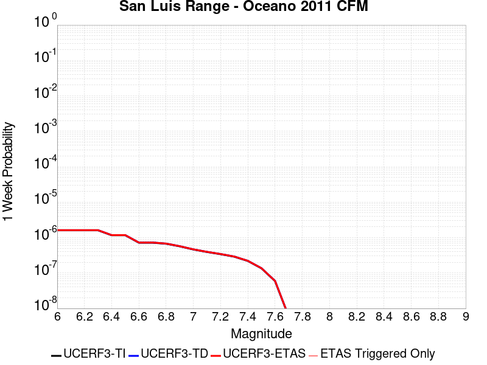 | 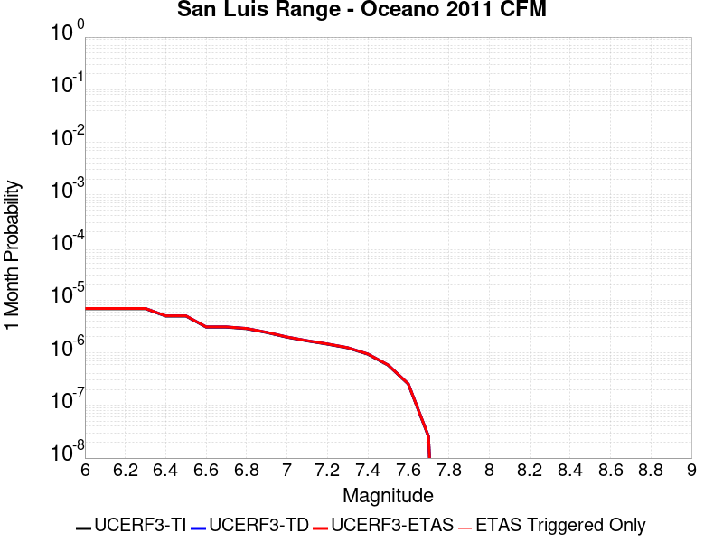 |  |  |

| Magnitude | 1 wk TI Prob | 1 wk TD Prob | 1 wk ETAS Prob | 1 wk ETAS/TD Gain | 1 wk ETAS Triggered Only | 1 mo TI Prob | 1 mo TD Prob | 1 mo ETAS Prob | 1 mo ETAS/TD Gain | 1 mo ETAS Triggered Only | 1 yr TI Prob | 1 yr TD Prob | 1 yr ETAS Prob | 1 yr ETAS/TD Gain | 1 yr ETAS Triggered Only | 10 yr TI Prob | 10 yr TD Prob | 10 yr ETAS Prob | 10 yr ETAS/TD Gain | 10 yr ETAS Triggered Only |
|-----|-----|-----|-----|-----|-----|-----|-----|-----|-----|-----|-----|-----|-----|-----|-----|-----|-----|-----|-----|-----|
| 6.0 | 1.6025788E-6 | 1.620119E-6 | 1.620119E-6 | 1.0 | 0.0 | 6.8681766E-6 | 6.943351E-6 | 6.943351E-6 | 1.0 | 0.0 | 8.361684E-5 | 8.453243E-5 | 8.453243E-5 | 1.0 | 0.0 | 8.3585386E-4 | 8.4504357E-4 | 8.584013E-4 | 1.0158072 | 1.3368984E-5 |
| 6.1 | 1.6025788E-6 | 1.620119E-6 | 1.620119E-6 | 1.0 | 0.0 | 6.8681766E-6 | 6.943351E-6 | 6.943351E-6 | 1.0 | 0.0 | 8.361684E-5 | 8.453243E-5 | 8.453243E-5 | 1.0 | 0.0 | 8.3585386E-4 | 8.4504357E-4 | 8.584013E-4 | 1.0158072 | 1.3368984E-5 |
| 6.2 | 1.6025788E-6 | 1.620119E-6 | 1.620119E-6 | 1.0 | 0.0 | 6.8681766E-6 | 6.943351E-6 | 6.943351E-6 | 1.0 | 0.0 | 8.361684E-5 | 8.453243E-5 | 8.453243E-5 | 1.0 | 0.0 | 8.3585386E-4 | 8.4504357E-4 | 8.584013E-4 | 1.0158072 | 1.3368984E-5 |
| 6.3 | 1.6025788E-6 | 1.620119E-6 | 1.620119E-6 | 1.0 | 0.0 | 6.8681766E-6 | 6.943351E-6 | 6.943351E-6 | 1.0 | 0.0 | 8.361684E-5 | 8.453243E-5 | 8.453243E-5 | 1.0 | 0.0 | 8.3585386E-4 | 8.4504357E-4 | 8.584013E-4 | 1.0158072 | 1.3368984E-5 |
| 6.4 | 1.1621186E-6 | 1.1749894E-6 | 1.1749894E-6 | 1.0 | 0.0 | 4.980499E-6 | 5.0356607E-6 | 5.0356607E-6 | 1.0 | 0.0 | 6.0635884E-5 | 6.130771E-5 | 6.130771E-5 | 1.0 | 0.0 | 6.0619344E-4 | 6.1293464E-4 | 6.262954E-4 | 1.021798 | 1.3368984E-5 |
| 6.5 | 1.1621186E-6 | 1.1749894E-6 | 1.1749894E-6 | 1.0 | 0.0 | 4.980499E-6 | 5.0356607E-6 | 5.0356607E-6 | 1.0 | 0.0 | 6.0635884E-5 | 6.130771E-5 | 6.130771E-5 | 1.0 | 0.0 | 6.0619344E-4 | 6.1293464E-4 | 6.262954E-4 | 1.021798 | 1.3368984E-5 |
| 6.6 | 7.164729E-7 | 7.2485784E-7 | 7.2485784E-7 | 1.0 | 0.0 | 3.0705946E-6 | 3.10653E-6 | 3.10653E-6 | 1.0 | 0.0 | 3.738385E-5 | 3.7821363E-5 | 3.7821363E-5 | 1.0 | 0.0 | 3.737756E-4 | 3.7815105E-4 | 3.9151497E-4 | 1.0353402 | 1.3368984E-5 |
| 6.7 | 7.164729E-7 | 7.2485784E-7 | 7.2485784E-7 | 1.0 | 0.0 | 3.0705946E-6 | 3.10653E-6 | 3.10653E-6 | 1.0 | 0.0 | 3.738385E-5 | 3.7821363E-5 | 3.7821363E-5 | 1.0 | 0.0 | 3.737756E-4 | 3.7815105E-4 | 3.9151497E-4 | 1.0353402 | 1.3368984E-5 |
| 6.8 | 6.700177E-7 | 6.7774397E-7 | 6.7774397E-7 | 1.0 | 0.0 | 2.8715012E-6 | 2.904614E-6 | 2.904614E-6 | 1.0 | 0.0 | 3.495997E-5 | 3.536312E-5 | 3.536312E-5 | 1.0 | 0.0 | 3.495447E-4 | 3.5357653E-4 | 3.6694077E-4 | 1.0377973 | 1.3368984E-5 |
| 6.9 | 5.657865E-7 | 5.7217864E-7 | 5.7217864E-7 | 1.0 | 0.0 | 2.424797E-6 | 2.452192E-6 | 2.452192E-6 | 1.0 | 0.0 | 2.9521503E-5 | 2.9855039E-5 | 2.9855039E-5 | 1.0 | 0.0 | 2.9517582E-4 | 2.9851135E-4 | 3.1187633E-4 | 1.0447721 | 1.3368984E-5 |
| 7.0 | 4.608413E-7 | 4.660169E-7 | 4.660169E-7 | 1.0 | 0.0 | 1.9750328E-6 | 1.9972138E-6 | 1.9972138E-6 | 1.0 | 0.0 | 2.4045758E-5 | 2.431581E-5 | 2.431581E-5 | 1.0 | 0.0 | 2.4043156E-4 | 2.4313178E-4 | 2.5649753E-4 | 1.0549732 | 1.3368984E-5 |
| 7.1 | 3.9177846E-7 | 3.9621602E-7 | 3.9621602E-7 | 1.0 | 0.0 | 1.6790494E-6 | 1.6980675E-6 | 1.6980675E-6 | 1.0 | 0.0 | 2.0442236E-5 | 2.0673779E-5 | 2.0673779E-5 | 1.0 | 0.0 | 2.0440355E-4 | 2.067187E-4 | 2.2008493E-4 | 1.064659 | 1.3368984E-5 |
| 7.2 | 3.3974752E-7 | 3.436653E-7 | 3.436653E-7 | 1.0 | 0.0 | 1.45606E-6 | 1.4728505E-6 | 1.4728505E-6 | 1.0 | 0.0 | 1.7727387E-5 | 1.7931809E-5 | 1.7931809E-5 | 1.0 | 0.0 | 1.7725973E-4 | 1.7930372E-4 | 1.9267031E-4 | 1.0745472 | 1.3368984E-5 |
| 7.3 | 2.8900928E-7 | 2.923402E-7 | 2.923402E-7 | 1.0 | 0.0 | 1.2386106E-6 | 1.2528859E-6 | 1.2528859E-6 | 1.0 | 0.0 | 1.5079979E-5 | 1.525378E-5 | 1.525378E-5 | 1.0 | 0.0 | 1.5078956E-4 | 1.5252741E-4 | 1.6589435E-4 | 1.0876364 | 1.3368984E-5 |
| 7.4 | 2.1881527E-7 | 2.2139594E-7 | 2.2139594E-7 | 1.0 | 0.0 | 9.3777936E-7 | 9.488394E-7 | 9.488394E-7 | 1.0 | 0.0 | 1.14174045E-5 | 1.1552059E-5 | 1.1552059E-5 | 1.0 | 0.0 | 1.1416818E-4 | 1.1551464E-4 | 1.2888208E-4 | 1.1157207 | 1.3368984E-5 |
| 7.5 | 1.356398E-7 | 1.3718639E-7 | 1.3718639E-7 | 1.0 | 0.0 | 5.813133E-7 | 5.8794154E-7 | 5.8794154E-7 | 1.0 | 0.0 | 7.0774663E-6 | 7.158165E-6 | 7.158165E-6 | 1.0 | 0.0 | 7.077241E-5 | 7.157937E-5 | 7.157937E-5 | 1.0 | 0.0 |
| 7.6 | 5.9269272E-8 | 6.001364E-8 | 6.001364E-8 | 1.0 | 0.0 | 2.5401116E-7 | 2.572013E-7 | 2.572013E-7 | 1.0 | 0.0 | 3.0925814E-6 | 3.1314214E-6 | 3.1314214E-6 | 1.0 | 0.0 | 3.0925385E-5 | 3.1313786E-5 | 3.1313786E-5 | 1.0 | 0.0 |
| 7.7 | 5.946232E-9 | 6.036928E-9 | 6.036928E-9 | 1.0 | 0.0 | 2.5483851E-8 | 2.5872547E-8 | 2.5872547E-8 | 1.0 | 0.0 | 3.1026585E-7 | 3.1499823E-7 | 3.1499823E-7 | 1.0 | 0.0 | 3.102654E-6 | 3.1499787E-6 | 3.1499787E-6 | 1.0 | 0.0 |

## Compton
*[(top)](#table-of-contents)*

| 1 Week | 1 Month | 1 Year | 10 Year |
|-----|-----|-----|-----|
|  |  |  |  |

| Magnitude | 1 wk TI Prob | 1 wk TD Prob | 1 wk ETAS Prob | 1 wk ETAS/TD Gain | 1 wk ETAS Triggered Only | 1 mo TI Prob | 1 mo TD Prob | 1 mo ETAS Prob | 1 mo ETAS/TD Gain | 1 mo ETAS Triggered Only | 1 yr TI Prob | 1 yr TD Prob | 1 yr ETAS Prob | 1 yr ETAS/TD Gain | 1 yr ETAS Triggered Only | 10 yr TI Prob | 10 yr TD Prob | 10 yr ETAS Prob | 10 yr ETAS/TD Gain | 10 yr ETAS Triggered Only |
|-----|-----|-----|-----|-----|-----|-----|-----|-----|-----|-----|-----|-----|-----|-----|-----|-----|-----|-----|-----|-----|
| 6.0 | 1.06050875E-5 | 6.358671E-6 | 6.358671E-6 | 1.0 | 0.0 | 4.5449582E-5 | 2.7251177E-5 | 4.0619798E-5 | 1.4905703 | 1.3368984E-5 | 5.5320817E-4 | 3.317354E-4 | 3.4509998E-4 | 1.0402868 | 1.3368984E-5 | 0.0055183303 | 0.0033126862 | 0.003326011 | 1.0040224 | 1.3368984E-5 |
| 6.1 | 1.06050875E-5 | 6.358671E-6 | 6.358671E-6 | 1.0 | 0.0 | 4.5449582E-5 | 2.7251177E-5 | 4.0619798E-5 | 1.4905703 | 1.3368984E-5 | 5.5320817E-4 | 3.317354E-4 | 3.4509998E-4 | 1.0402868 | 1.3368984E-5 | 0.0055183303 | 0.0033126862 | 0.003326011 | 1.0040224 | 1.3368984E-5 |
| 6.2 | 1.06050875E-5 | 6.358671E-6 | 6.358671E-6 | 1.0 | 0.0 | 4.5449582E-5 | 2.7251177E-5 | 4.0619798E-5 | 1.4905703 | 1.3368984E-5 | 5.5320817E-4 | 3.317354E-4 | 3.4509998E-4 | 1.0402868 | 1.3368984E-5 | 0.0055183303 | 0.0033126862 | 0.003326011 | 1.0040224 | 1.3368984E-5 |
| 6.3 | 1.06050875E-5 | 6.358671E-6 | 6.358671E-6 | 1.0 | 0.0 | 4.5449582E-5 | 2.7251177E-5 | 4.0619798E-5 | 1.4905703 | 1.3368984E-5 | 5.5320817E-4 | 3.317354E-4 | 3.4509998E-4 | 1.0402868 | 1.3368984E-5 | 0.0055183303 | 0.0033126862 | 0.003326011 | 1.0040224 | 1.3368984E-5 |
| 6.4 | 1.06050875E-5 | 6.358671E-6 | 6.358671E-6 | 1.0 | 0.0 | 4.5449582E-5 | 2.7251177E-5 | 4.0619798E-5 | 1.4905703 | 1.3368984E-5 | 5.5320817E-4 | 3.317354E-4 | 3.4509998E-4 | 1.0402868 | 1.3368984E-5 | 0.0055183303 | 0.0033126862 | 0.003326011 | 1.0040224 | 1.3368984E-5 |
| 6.5 | 1.06050875E-5 | 6.358671E-6 | 6.358671E-6 | 1.0 | 0.0 | 4.5449582E-5 | 2.7251177E-5 | 4.0619798E-5 | 1.4905703 | 1.3368984E-5 | 5.5320817E-4 | 3.317354E-4 | 3.4509998E-4 | 1.0402868 | 1.3368984E-5 | 0.0055183303 | 0.0033126862 | 0.003326011 | 1.0040224 | 1.3368984E-5 |
| 6.6 | 1.06050875E-5 | 6.358671E-6 | 6.358671E-6 | 1.0 | 0.0 | 4.5449582E-5 | 2.7251177E-5 | 4.0619798E-5 | 1.4905703 | 1.3368984E-5 | 5.5320817E-4 | 3.317354E-4 | 3.4509998E-4 | 1.0402868 | 1.3368984E-5 | 0.0055183303 | 0.0033126862 | 0.003326011 | 1.0040224 | 1.3368984E-5 |
| 6.7 | 1.06050875E-5 | 6.358671E-6 | 6.358671E-6 | 1.0 | 0.0 | 4.5449582E-5 | 2.7251177E-5 | 4.0619798E-5 | 1.4905703 | 1.3368984E-5 | 5.5320817E-4 | 3.317354E-4 | 3.4509998E-4 | 1.0402868 | 1.3368984E-5 | 0.0055183303 | 0.0033126862 | 0.003326011 | 1.0040224 | 1.3368984E-5 |
| 6.8 | 1.06050875E-5 | 6.358671E-6 | 6.358671E-6 | 1.0 | 0.0 | 4.5449582E-5 | 2.7251177E-5 | 4.0619798E-5 | 1.4905703 | 1.3368984E-5 | 5.5320817E-4 | 3.317354E-4 | 3.4509998E-4 | 1.0402868 | 1.3368984E-5 | 0.0055183303 | 0.0033126862 | 0.003326011 | 1.0040224 | 1.3368984E-5 |
| 6.9 | 1.06050875E-5 | 6.358671E-6 | 6.358671E-6 | 1.0 | 0.0 | 4.5449582E-5 | 2.7251177E-5 | 4.0619798E-5 | 1.4905703 | 1.3368984E-5 | 5.5320817E-4 | 3.317354E-4 | 3.4509998E-4 | 1.0402868 | 1.3368984E-5 | 0.0055183303 | 0.0033126862 | 0.003326011 | 1.0040224 | 1.3368984E-5 |
| 7.0 | 7.672486E-6 | 4.2720512E-6 | 4.2720512E-6 | 1.0 | 0.0 | 3.288167E-5 | 1.8308665E-5 | 3.1677406E-5 | 1.7301865 | 1.3368984E-5 | 4.0026082E-4 | 2.2288582E-4 | 2.3625183E-4 | 1.059968 | 1.3368984E-5 | 0.0039954064 | 0.002226685 | 0.002240024 | 1.0059906 | 1.3368984E-5 |
| 7.1 | 7.163992E-6 | 3.883762E-6 | 3.883762E-6 | 1.0 | 0.0 | 3.0702464E-5 | 1.6644592E-5 | 3.0013352E-5 | 1.8031895 | 1.3368984E-5 | 3.7373835E-4 | 2.0262963E-4 | 2.159959E-4 | 1.0659641 | 1.3368984E-5 | 0.0037311043 | 0.0020245055 | 0.0020378476 | 1.0065902 | 1.3368984E-5 |
| 7.2 | 6.3689185E-6 | 3.3102428E-6 | 3.3102428E-6 | 1.0 | 0.0 | 2.729508E-5 | 1.418668E-5 | 2.7555474E-5 | 1.9423484 | 1.3368984E-5 | 3.322669E-4 | 1.7270957E-4 | 1.8607623E-4 | 1.077394 | 1.3368984E-5 | 0.0033177056 | 0.0017257951 | 0.0017391411 | 1.0077332 | 1.3368984E-5 |
| 7.3 | 4.4987873E-6 | 2.4480942E-6 | 2.4480942E-6 | 1.0 | 0.0 | 1.9280375E-5 | 1.0491792E-5 | 2.3860635E-5 | 2.2742193 | 1.3368984E-5 | 2.3471327E-4 | 1.2773038E-4 | 1.4109765E-4 | 1.1046523 | 1.3368984E-5 | 0.002344655 | 0.0012765999 | 0.0012899518 | 1.010459 | 1.3368984E-5 |
| 7.4 | 2.987296E-6 | 1.7394335E-6 | 1.7394335E-6 | 1.0 | 0.0 | 1.2802635E-5 | 7.454694E-6 | 2.0823578E-5 | 2.7933512 | 1.3368984E-5 | 1.5586092E-4 | 9.0757174E-5 | 1.0412495E-4 | 1.1472917 | 1.3368984E-5 | 0.0015575165 | 9.072069E-4 | 9.2056376E-4 | 1.0147231 | 1.3368984E-5 |
| 7.5 | 2.4111696E-6 | 1.4472155E-6 | 1.4472155E-6 | 1.0 | 0.0 | 1.0333543E-5 | 6.2023378E-6 | 1.9571238E-5 | 3.1554615 | 1.3368984E-5 | 1.2580362E-4 | 7.551089E-5 | 8.887886E-5 | 1.1770338 | 1.3368984E-5 | 0.0012573242 | 7.54857E-4 | 7.682159E-4 | 1.0176972 | 1.3368984E-5 |
| 7.6 | 1.8783096E-6 | 1.1360459E-6 | 1.1360459E-6 | 1.0 | 0.0 | 8.049874E-6 | 4.8687593E-6 | 1.8237679E-5 | 3.7458575 | 1.3368984E-5 | 9.8002805E-5 | 5.927557E-5 | 7.2643765E-5 | 1.2255262 | 1.3368984E-5 | 9.795959E-4 | 5.926016E-4 | 6.0596265E-4 | 1.0225464 | 1.3368984E-5 |
| 7.7 | 6.6646817E-7 | 3.560237E-7 | 3.560237E-7 | 1.0 | 0.0 | 2.856289E-6 | 1.525815E-6 | 1.4894778E-5 | 9.76185 | 1.3368984E-5 | 3.4774763E-5 | 1.8576653E-5 | 3.194539E-5 | 1.7196525 | 1.3368984E-5 | 3.4769322E-4 | 1.8575235E-4 | 1.9911885E-4 | 1.0719587 | 1.3368984E-5 |
| 7.8 | 7.054689E-8 | 4.1342968E-8 | 4.1342968E-8 | 1.0 | 0.0 | 3.0234378E-7 | 1.7718413E-7 | 1.7718413E-7 | 1.0 | 0.0 | 3.6810293E-6 | 2.1572148E-6 | 2.1572148E-6 | 1.0 | 0.0 | 3.6809684E-5 | 2.1571948E-5 | 2.1571948E-5 | 1.0 | 0.0 |
| 7.9 | 7.420925E-9 | 4.0131285E-9 | 4.0131285E-9 | 1.0 | 0.0 | 3.1803964E-8 | 1.7199122E-8 | 1.7199122E-8 | 1.0 | 0.0 | 3.872132E-7 | 2.093993E-7 | 2.093993E-7 | 1.0 | 0.0 | 3.872125E-6 | 2.0939913E-6 | 2.0939913E-6 | 1.0 | 0.0 |

## Great Valley 04a Trout Creek
*[(top)](#table-of-contents)*

| 1 Week | 1 Month | 1 Year | 10 Year |
|-----|-----|-----|-----|
| 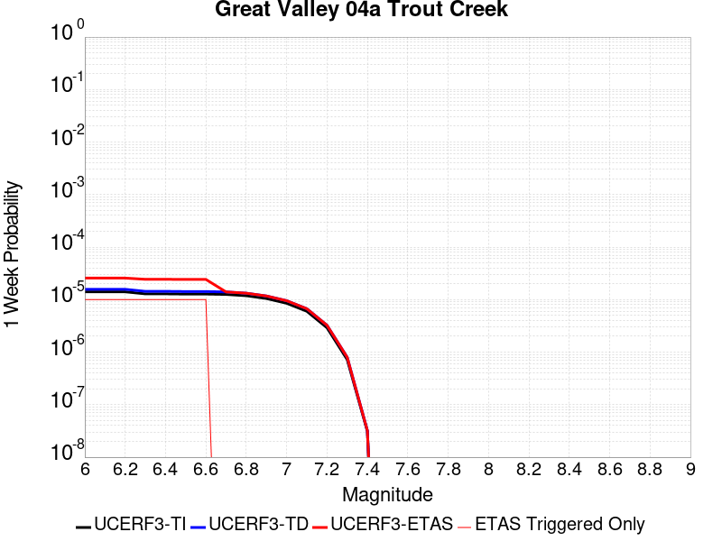 |  |  |  |

| Magnitude | 1 wk TI Prob | 1 wk TD Prob | 1 wk ETAS Prob | 1 wk ETAS/TD Gain | 1 wk ETAS Triggered Only | 1 mo TI Prob | 1 mo TD Prob | 1 mo ETAS Prob | 1 mo ETAS/TD Gain | 1 mo ETAS Triggered Only | 1 yr TI Prob | 1 yr TD Prob | 1 yr ETAS Prob | 1 yr ETAS/TD Gain | 1 yr ETAS Triggered Only | 10 yr TI Prob | 10 yr TD Prob | 10 yr ETAS Prob | 10 yr ETAS/TD Gain | 10 yr ETAS Triggered Only |
|-----|-----|-----|-----|-----|-----|-----|-----|-----|-----|-----|-----|-----|-----|-----|-----|-----|-----|-----|-----|-----|
| 6.0 | 1.4088538E-5 | 1.5719554E-5 | 2.9088327E-5 | 1.850455 | 1.3368984E-5 | 6.037805E-5 | 6.7367844E-5 | 8.073593E-5 | 1.1984342 | 1.3368984E-5 | 7.3485484E-4 | 8.199074E-4 | 8.332654E-4 | 1.0162921 | 1.3368984E-5 | 0.007324295 | 0.008170108 | 0.008183368 | 1.0016229 | 1.3368984E-5 |
| 6.1 | 1.4088538E-5 | 1.5719554E-5 | 2.9088327E-5 | 1.850455 | 1.3368984E-5 | 6.037805E-5 | 6.7367844E-5 | 8.073593E-5 | 1.1984342 | 1.3368984E-5 | 7.3485484E-4 | 8.199074E-4 | 8.332654E-4 | 1.0162921 | 1.3368984E-5 | 0.007324295 | 0.008170108 | 0.008183368 | 1.0016229 | 1.3368984E-5 |
| 6.2 | 1.4088538E-5 | 1.5719554E-5 | 2.9088327E-5 | 1.850455 | 1.3368984E-5 | 6.037805E-5 | 6.7367844E-5 | 8.073593E-5 | 1.1984342 | 1.3368984E-5 | 7.3485484E-4 | 8.199074E-4 | 8.332654E-4 | 1.0162921 | 1.3368984E-5 | 0.007324295 | 0.008170108 | 0.008183368 | 1.0016229 | 1.3368984E-5 |
| 6.3 | 1.2882862E-5 | 1.4378603E-5 | 2.7747394E-5 | 1.9297699 | 1.3368984E-5 | 5.5211098E-5 | 6.1621184E-5 | 7.4989344E-5 | 1.216941 | 1.3368984E-5 | 6.7198783E-4 | 7.4999005E-4 | 7.63349E-4 | 1.0178121 | 1.3368984E-5 | 0.0066995937 | 0.0074756527 | 0.0074889218 | 1.001775 | 1.3368984E-5 |
| 6.4 | 1.2882862E-5 | 1.4378603E-5 | 2.7747394E-5 | 1.9297699 | 1.3368984E-5 | 5.5211098E-5 | 6.1621184E-5 | 7.4989344E-5 | 1.216941 | 1.3368984E-5 | 6.7198783E-4 | 7.4999005E-4 | 7.63349E-4 | 1.0178121 | 1.3368984E-5 | 0.0066995937 | 0.0074756527 | 0.0074889218 | 1.001775 | 1.3368984E-5 |
| 6.5 | 1.2762329E-5 | 1.424516E-5 | 2.7613953E-5 | 1.9384797 | 1.3368984E-5 | 5.469455E-5 | 6.1049315E-5 | 7.441748E-5 | 1.2189733 | 1.3368984E-5 | 6.657027E-4 | 7.430323E-4 | 7.563913E-4 | 1.0179791 | 1.3368984E-5 | 0.00663712 | 0.0074065393 | 0.0074198092 | 1.0017916 | 1.3368984E-5 |
| 6.6 | 1.2762329E-5 | 1.424516E-5 | 2.7613953E-5 | 1.9384797 | 1.3368984E-5 | 5.469455E-5 | 6.1049315E-5 | 7.441748E-5 | 1.2189733 | 1.3368984E-5 | 6.657027E-4 | 7.430323E-4 | 7.563913E-4 | 1.0179791 | 1.3368984E-5 | 0.00663712 | 0.0074065393 | 0.0074198092 | 1.0017916 | 1.3368984E-5 |
| 6.7 | 1.2557959E-5 | 1.4019395E-5 | 1.4019395E-5 | 1.0 | 0.0 | 5.3818712E-5 | 6.0081795E-5 | 6.0081795E-5 | 1.0 | 0.0 | 6.5504585E-4 | 7.312607E-4 | 7.312607E-4 | 1.0 | 0.0 | 0.006531183 | 0.007289598 | 0.007289598 | 1.0 | 0.0 |
| 6.8 | 1.1871544E-5 | 1.3258823E-5 | 1.3258823E-5 | 1.0 | 0.0 | 5.0877054E-5 | 5.6822348E-5 | 5.6822348E-5 | 1.0 | 0.0 | 6.1925204E-4 | 6.916025E-4 | 6.916025E-4 | 1.0 | 0.0 | 0.0061752927 | 0.0068955184 | 0.0068955184 | 1.0 | 0.0 |
| 6.9 | 1.0500373E-5 | 1.1731261E-5 | 1.1731261E-5 | 1.0 | 0.0 | 4.5000823E-5 | 5.0275914E-5 | 5.0275914E-5 | 1.0 | 0.0 | 5.4774724E-4 | 6.119459E-4 | 6.119459E-4 | 1.0 | 0.0 | 0.005463991 | 0.0061034737 | 0.0061034737 | 1.0 | 0.0 |
| 7.0 | 8.524332E-6 | 9.5334835E-6 | 9.5334835E-6 | 1.0 | 0.0 | 3.653234E-5 | 4.0857187E-5 | 4.0857187E-5 | 1.0 | 0.0 | 4.4469046E-4 | 4.9733004E-4 | 4.9733004E-4 | 1.0 | 0.0 | 0.0044380166 | 0.004962902 | 0.004962902 | 1.0 | 0.0 |
| 7.1 | 6.006849E-6 | 6.711559E-6 | 6.711559E-6 | 1.0 | 0.0 | 2.5743384E-5 | 2.876354E-5 | 2.876354E-5 | 1.0 | 0.0 | 3.1338062E-4 | 3.501454E-4 | 3.501454E-4 | 1.0 | 0.0 | 0.0031293905 | 0.0034964874 | 0.0034964874 | 1.0 | 0.0 |
| 7.2 | 2.9122193E-6 | 3.2465305E-6 | 3.2465305E-6 | 1.0 | 0.0 | 1.248088E-5 | 1.3913637E-5 | 1.3913637E-5 | 1.0 | 0.0 | 1.5194413E-4 | 1.6938712E-4 | 1.6938712E-4 | 1.0 | 0.0 | 0.0015184027 | 0.0016927521 | 0.0016927521 | 1.0 | 0.0 |
| 7.3 | 7.2194007E-7 | 7.988761E-7 | 7.988761E-7 | 1.0 | 0.0 | 3.0940253E-6 | 3.4237528E-6 | 3.4237528E-6 | 1.0 | 0.0 | 3.7669106E-5 | 4.1683852E-5 | 4.1683852E-5 | 1.0 | 0.0 | 3.766272E-4 | 4.168053E-4 | 4.168053E-4 | 1.0 | 0.0 |
| 7.4 | 3.112171E-8 | 3.2068368E-8 | 3.2068368E-8 | 1.0 | 0.0 | 1.3337875E-7 | 1.3743585E-7 | 1.3743585E-7 | 1.0 | 0.0 | 1.6238852E-6 | 1.6732803E-6 | 1.6732803E-6 | 1.0 | 0.0 | 1.6238733E-5 | 1.6732685E-5 | 1.6732685E-5 | 1.0 | 0.0 |

## Gillem - Big Crack 2011 CFM
*[(top)](#table-of-contents)*

| 1 Week | 1 Month | 1 Year | 10 Year |
|-----|-----|-----|-----|
|  |  |  |  |

| Magnitude | 1 wk TI Prob | 1 wk TD Prob | 1 wk ETAS Prob | 1 wk ETAS/TD Gain | 1 wk ETAS Triggered Only | 1 mo TI Prob | 1 mo TD Prob | 1 mo ETAS Prob | 1 mo ETAS/TD Gain | 1 mo ETAS Triggered Only | 1 yr TI Prob | 1 yr TD Prob | 1 yr ETAS Prob | 1 yr ETAS/TD Gain | 1 yr ETAS Triggered Only | 10 yr TI Prob | 10 yr TD Prob | 10 yr ETAS Prob | 10 yr ETAS/TD Gain | 10 yr ETAS Triggered Only |
|-----|-----|-----|-----|-----|-----|-----|-----|-----|-----|-----|-----|-----|-----|-----|-----|-----|-----|-----|-----|-----|
| 6.0 | 2.196852E-5 | 2.3604485E-5 | 2.3604485E-5 | 1.0 | 0.0 | 9.4147406E-5 | 1.01158665E-4 | 1.01158665E-4 | 1.0 | 0.0 | 0.0011456419 | 0.0012309998 | 0.0012309998 | 1.0 | 0.0 | 0.011397537 | 0.012250669 | 0.0122638745 | 1.0010779 | 1.3368984E-5 |
| 6.1 | 9.992795E-6 | 1.071189E-5 | 1.071189E-5 | 1.0 | 0.0 | 4.2825563E-5 | 4.5907396E-5 | 4.5907396E-5 | 1.0 | 0.0 | 5.2127644E-4 | 5.587975E-4 | 5.587975E-4 | 1.0 | 0.0 | 0.0052005537 | 0.0055757347 | 0.0055757347 | 1.0 | 0.0 |
| 6.2 | 9.992795E-6 | 1.071189E-5 | 1.071189E-5 | 1.0 | 0.0 | 4.2825563E-5 | 4.5907396E-5 | 4.5907396E-5 | 1.0 | 0.0 | 5.2127644E-4 | 5.587975E-4 | 5.587975E-4 | 1.0 | 0.0 | 0.0052005537 | 0.0055757347 | 0.0055757347 | 1.0 | 0.0 |
| 6.3 | 4.6127884E-6 | 4.942657E-6 | 4.942657E-6 | 1.0 | 0.0 | 1.9768944E-5 | 2.1182668E-5 | 2.1182668E-5 | 1.0 | 0.0 | 2.406603E-4 | 2.5787292E-4 | 2.5787292E-4 | 1.0 | 0.0 | 0.0024039985 | 0.0025761751 | 0.0025761751 | 1.0 | 0.0 |
| 6.4 | 4.6127884E-6 | 4.942657E-6 | 4.942657E-6 | 1.0 | 0.0 | 1.9768944E-5 | 2.1182668E-5 | 2.1182668E-5 | 1.0 | 0.0 | 2.406603E-4 | 2.5787292E-4 | 2.5787292E-4 | 1.0 | 0.0 | 0.0024039985 | 0.0025761751 | 0.0025761751 | 1.0 | 0.0 |
| 6.5 | 2.716712E-6 | 2.9111113E-6 | 2.9111113E-6 | 1.0 | 0.0 | 1.1643E-5 | 1.24761455E-5 | 1.24761455E-5 | 1.0 | 0.0 | 1.417443E-4 | 1.5188892E-4 | 1.5188892E-4 | 1.0 | 0.0 | 0.0014165393 | 0.001518089 | 0.001518089 | 1.0 | 0.0 |
| 6.6 | 1.3818255E-6 | 1.4820689E-6 | 1.4820689E-6 | 1.0 | 0.0 | 5.922096E-6 | 6.3517155E-6 | 6.3517155E-6 | 1.0 | 0.0 | 7.209913E-5 | 7.7330624E-5 | 7.7330624E-5 | 1.0 | 0.0 | 7.2075747E-4 | 7.7315804E-4 | 7.7315804E-4 | 1.0 | 0.0 |

## Sargent 2011 CFM
*[(top)](#table-of-contents)*

| 1 Week | 1 Month | 1 Year | 10 Year |
|-----|-----|-----|-----|
|  | 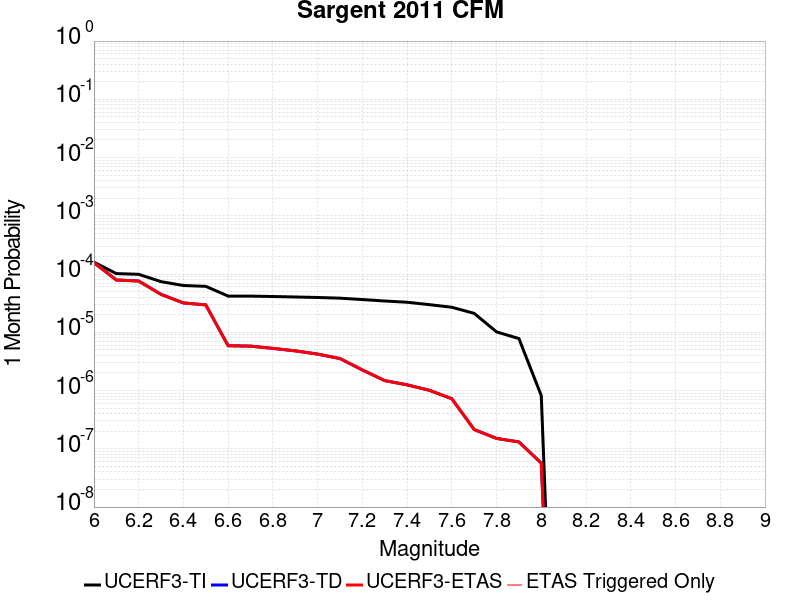 |  | 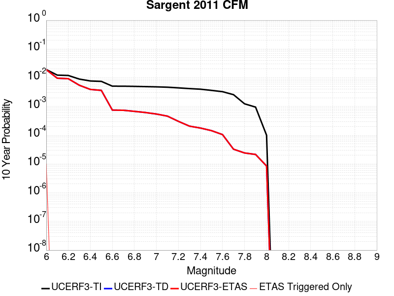 |

| Magnitude | 1 wk TI Prob | 1 wk TD Prob | 1 wk ETAS Prob | 1 wk ETAS/TD Gain | 1 wk ETAS Triggered Only | 1 mo TI Prob | 1 mo TD Prob | 1 mo ETAS Prob | 1 mo ETAS/TD Gain | 1 mo ETAS Triggered Only | 1 yr TI Prob | 1 yr TD Prob | 1 yr ETAS Prob | 1 yr ETAS/TD Gain | 1 yr ETAS Triggered Only | 10 yr TI Prob | 10 yr TD Prob | 10 yr ETAS Prob | 10 yr ETAS/TD Gain | 10 yr ETAS Triggered Only |
|-----|-----|-----|-----|-----|-----|-----|-----|-----|-----|-----|-----|-----|-----|-----|-----|-----|-----|-----|-----|-----|
| 6.0 | 3.7327867E-5 | 3.664913E-5 | 3.664913E-5 | 1.0 | 0.0 | 1.5996677E-4 | 1.5706103E-4 | 1.5706103E-4 | 1.0 | 0.0 | 0.0019458556 | 0.0019110236 | 0.0019110236 | 1.0 | 0.0 | 0.01928905 | 0.019018095 | 0.01903121 | 1.0006896 | 1.3368984E-5 |
| 6.1 | 2.3771476E-5 | 1.8479273E-5 | 1.8479273E-5 | 1.0 | 0.0 | 1.01873775E-4 | 7.919498E-5 | 7.919498E-5 | 1.0 | 0.0 | 0.0012396075 | 9.638493E-4 | 9.638493E-4 | 1.0 | 0.0 | 0.012327154 | 0.009636091 | 0.009636091 | 1.0 | 0.0 |
| 6.2 | 2.3112721E-5 | 1.7710632E-5 | 1.7710632E-5 | 1.0 | 0.0 | 9.9050754E-5 | 7.590099E-5 | 7.590099E-5 | 1.0 | 0.0 | 0.0012052758 | 9.237792E-4 | 9.237792E-4 | 1.0 | 0.0 | 0.011987597 | 0.009238743 | 0.009238743 | 1.0 | 0.0 |
| 6.3 | 1.728509E-5 | 1.0458927E-5 | 1.0458927E-5 | 1.0 | 0.0 | 7.407686E-5 | 4.482347E-5 | 4.482347E-5 | 1.0 | 0.0 | 9.015125E-4 | 5.456343E-4 | 5.456343E-4 | 1.0 | 0.0 | 0.008978641 | 0.0054791216 | 0.0054791216 | 1.0 | 0.0 |
| 6.4 | 1.48395575E-5 | 7.4559816E-6 | 7.4559816E-6 | 1.0 | 0.0 | 6.3596555E-5 | 3.195403E-5 | 3.195403E-5 | 1.0 | 0.0 | 7.7401294E-4 | 3.8900663E-4 | 3.8900663E-4 | 1.0 | 0.0 | 0.0077132257 | 0.003918666 | 0.003918666 | 1.0 | 0.0 |
| 6.5 | 1.4358964E-5 | 6.894759E-6 | 6.894759E-6 | 1.0 | 0.0 | 6.1536964E-5 | 2.9548846E-5 | 2.9548846E-5 | 1.0 | 0.0 | 7.48955E-4 | 3.5973339E-4 | 3.5973339E-4 | 1.0 | 0.0 | 0.0074643586 | 0.0036269152 | 0.0036269152 | 1.0 | 0.0 |
| 6.6 | 9.772591E-6 | 1.3736154E-6 | 1.3736154E-6 | 1.0 | 0.0 | 4.188186E-5 | 5.88691E-6 | 5.88691E-6 | 1.0 | 0.0 | 5.097923E-4 | 7.16708E-5 | 7.16708E-5 | 1.0 | 0.0 | 0.005086244 | 7.483097E-4 | 7.483097E-4 | 1.0 | 0.0 |
| 6.7 | 9.752745E-6 | 1.3523068E-6 | 1.3523068E-6 | 1.0 | 0.0 | 4.179681E-5 | 5.795587E-6 | 5.795587E-6 | 1.0 | 0.0 | 5.0875737E-4 | 7.055902E-5 | 7.055902E-5 | 1.0 | 0.0 | 0.005075942 | 7.371994E-4 | 7.371994E-4 | 1.0 | 0.0 |
| 6.8 | 9.608213E-6 | 1.2361709E-6 | 1.2361709E-6 | 1.0 | 0.0 | 4.1177405E-5 | 5.2978644E-6 | 5.2978644E-6 | 1.0 | 0.0 | 5.012196E-4 | 6.449961E-5 | 6.449961E-5 | 1.0 | 0.0 | 0.005000906 | 6.7634037E-4 | 6.7634037E-4 | 1.0 | 0.0 |
| 6.9 | 9.427164E-6 | 1.12094E-6 | 1.12094E-6 | 1.0 | 0.0 | 4.04015E-5 | 4.80402E-6 | 4.80402E-6 | 1.0 | 0.0 | 4.9177726E-4 | 5.8487396E-5 | 5.8487396E-5 | 1.0 | 0.0 | 0.004906904 | 6.1557174E-4 | 6.1557174E-4 | 1.0 | 0.0 |
| 7.0 | 9.247601E-6 | 9.873988E-7 | 9.873988E-7 | 1.0 | 0.0 | 3.9631974E-5 | 4.2317024E-6 | 4.2317024E-6 | 1.0 | 0.0 | 4.8241246E-4 | 5.1519775E-5 | 5.1519775E-5 | 1.0 | 0.0 | 0.0048136655 | 5.4542476E-4 | 5.4542476E-4 | 1.0 | 0.0 |
| 7.1 | 8.995454E-6 | 8.2711284E-7 | 8.2711284E-7 | 1.0 | 0.0 | 3.8551374E-5 | 3.5447645E-6 | 3.5447645E-6 | 1.0 | 0.0 | 4.6926187E-4 | 4.3156666E-5 | 4.3156666E-5 | 1.0 | 0.0 | 0.004682722 | 4.609069E-4 | 4.609069E-4 | 1.0 | 0.0 |
| 7.2 | 8.520861E-6 | 5.2766507E-7 | 5.2766507E-7 | 1.0 | 0.0 | 3.6517464E-5 | 2.2614197E-6 | 2.2614197E-6 | 1.0 | 0.0 | 4.445094E-4 | 2.7532446E-5 | 2.7532446E-5 | 1.0 | 0.0 | 0.004436213 | 3.0297207E-4 | 3.0297207E-4 | 1.0 | 0.0 |
| 7.3 | 8.043592E-6 | 3.456507E-7 | 3.456507E-7 | 1.0 | 0.0 | 3.4472083E-5 | 1.4813593E-6 | 1.4813593E-6 | 1.0 | 0.0 | 4.196168E-4 | 1.8035402E-5 | 1.8035402E-5 | 1.0 | 0.0 | 0.004188253 | 2.0669671E-4 | 2.0669671E-4 | 1.0 | 0.0 |
| 7.4 | 7.662316E-6 | 2.928958E-7 | 2.928958E-7 | 1.0 | 0.0 | 3.2838085E-5 | 1.2552671E-6 | 1.2552671E-6 | 1.0 | 0.0 | 3.9973034E-4 | 1.528277E-5 | 1.528277E-5 | 1.0 | 0.0 | 0.0039901207 | 1.7736501E-4 | 1.7736501E-4 | 1.0 | 0.0 |
| 7.5 | 6.961638E-6 | 2.3574503E-7 | 2.3574503E-7 | 1.0 | 0.0 | 2.9835252E-5 | 1.0103355E-6 | 1.0103355E-6 | 1.0 | 0.0 | 3.6318362E-4 | 1.2300766E-5 | 1.2300766E-5 | 1.0 | 0.0 | 0.0036259065 | 1.4409334E-4 | 1.4409334E-4 | 1.0 | 0.0 |
| 7.6 | 6.282332E-6 | 1.6892966E-7 | 1.6892966E-7 | 1.0 | 0.0 | 2.6924003E-5 | 7.2398404E-7 | 7.2398404E-7 | 1.0 | 0.0 | 3.2775043E-4 | 8.814471E-6 | 8.814471E-6 | 1.0 | 0.0 | 0.0032726745 | 1.05050465E-4 | 1.05050465E-4 | 1.0 | 0.0 |
| 7.7 | 4.934408E-6 | 5.001089E-8 | 5.001089E-8 | 1.0 | 0.0 | 2.114729E-5 | 2.1433237E-7 | 2.1433237E-7 | 1.0 | 0.0 | 2.5743784E-4 | 2.6094935E-6 | 2.6094935E-6 | 1.0 | 0.0 | 0.0025713982 | 3.2545366E-5 | 3.2545366E-5 | 1.0 | 0.0 |
| 7.8 | 2.373212E-6 | 3.5172643E-8 | 3.5172643E-8 | 1.0 | 0.0 | 1.0170869E-5 | 1.507399E-7 | 1.507399E-7 | 1.0 | 0.0 | 1.238233E-4 | 1.8352566E-6 | 1.8352566E-6 | 1.0 | 0.0 | 0.0012375432 | 2.4125171E-5 | 2.4125171E-5 | 1.0 | 0.0 |
| 7.9 | 1.8227792E-6 | 3.0619603E-8 | 3.0619603E-8 | 1.0 | 0.0 | 7.811887E-6 | 1.3122687E-7 | 1.3122687E-7 | 1.0 | 0.0 | 9.510558E-5 | 1.5976858E-6 | 1.5976858E-6 | 1.0 | 0.0 | 9.5064886E-4 | 2.1410624E-5 | 2.1410624E-5 | 1.0 | 0.0 |
| 8.0 | 1.9095137E-7 | 1.326461E-8 | 1.326461E-8 | 1.0 | 0.0 | 8.1836276E-7 | 5.684833E-8 | 5.684833E-8 | 1.0 | 0.0 | 9.963521E-6 | 6.921282E-7 | 6.921282E-7 | 1.0 | 0.0 | 9.963074E-5 | 8.463319E-6 | 8.463319E-6 | 1.0 | 0.0 |

## Hosgri
*[(top)](#table-of-contents)*

| 1 Week | 1 Month | 1 Year | 10 Year |
|-----|-----|-----|-----|
|  |  |  |  |

| Magnitude | 1 wk TI Prob | 1 wk TD Prob | 1 wk ETAS Prob | 1 wk ETAS/TD Gain | 1 wk ETAS Triggered Only | 1 mo TI Prob | 1 mo TD Prob | 1 mo ETAS Prob | 1 mo ETAS/TD Gain | 1 mo ETAS Triggered Only | 1 yr TI Prob | 1 yr TD Prob | 1 yr ETAS Prob | 1 yr ETAS/TD Gain | 1 yr ETAS Triggered Only | 10 yr TI Prob | 10 yr TD Prob | 10 yr ETAS Prob | 10 yr ETAS/TD Gain | 10 yr ETAS Triggered Only |
|-----|-----|-----|-----|-----|-----|-----|-----|-----|-----|-----|-----|-----|-----|-----|-----|-----|-----|-----|-----|-----|
| 6.0 | 2.883978E-5 | 2.9128416E-5 | 2.9128416E-5 | 1.0 | 0.0 | 1.235932E-4 | 1.2483024E-4 | 1.2483024E-4 | 1.0 | 0.0 | 0.0015037085 | 0.001518776 | 0.001518776 | 1.0 | 0.0 | 0.01493574 | 0.01508774 | 0.015100907 | 1.0008727 | 1.3368984E-5 |
| 6.1 | 2.883978E-5 | 2.9128416E-5 | 2.9128416E-5 | 1.0 | 0.0 | 1.235932E-4 | 1.2483024E-4 | 1.2483024E-4 | 1.0 | 0.0 | 0.0015037085 | 0.001518776 | 0.001518776 | 1.0 | 0.0 | 0.01493574 | 0.01508774 | 0.015100907 | 1.0008727 | 1.3368984E-5 |
| 6.2 | 2.883978E-5 | 2.9128416E-5 | 2.9128416E-5 | 1.0 | 0.0 | 1.235932E-4 | 1.2483024E-4 | 1.2483024E-4 | 1.0 | 0.0 | 0.0015037085 | 0.001518776 | 0.001518776 | 1.0 | 0.0 | 0.01493574 | 0.01508774 | 0.015100907 | 1.0008727 | 1.3368984E-5 |
| 6.3 | 2.2914428E-5 | 2.2641969E-5 | 2.2641969E-5 | 1.0 | 0.0 | 9.8200995E-5 | 9.703343E-5 | 9.703343E-5 | 1.0 | 0.0 | 0.0011949413 | 0.0011807467 | 0.0011807467 | 1.0 | 0.0 | 0.011885363 | 0.011746133 | 0.0117593445 | 1.0011247 | 1.3368984E-5 |
| 6.4 | 2.0195741E-5 | 1.969656E-5 | 1.969656E-5 | 1.0 | 0.0 | 8.65503E-5 | 8.4411105E-5 | 8.4411105E-5 | 1.0 | 0.0 | 0.0010532405 | 0.0010272227 | 0.0010272227 | 1.0 | 0.0 | 0.010482626 | 0.010225792 | 0.010239025 | 1.001294 | 1.3368984E-5 |
| 6.5 | 1.9924333E-5 | 1.940898E-5 | 1.940898E-5 | 1.0 | 0.0 | 8.53872E-5 | 8.3178704E-5 | 8.3178704E-5 | 1.0 | 0.0 | 0.0010390934 | 0.0010122322 | 0.0010122322 | 1.0 | 0.0 | 0.010342481 | 0.010077253 | 0.010090487 | 1.0013133 | 1.3368984E-5 |
| 6.6 | 1.809694E-5 | 1.74583E-5 | 1.74583E-5 | 1.0 | 0.0 | 7.7556004E-5 | 7.4819145E-5 | 7.4819145E-5 | 1.0 | 0.0 | 9.438353E-4 | 9.105437E-4 | 9.105437E-4 | 1.0 | 0.0 | 0.009398366 | 0.009069073 | 0.009082321 | 1.0014608 | 1.3368984E-5 |
| 6.7 | 1.675989E-5 | 1.6042764E-5 | 1.6042764E-5 | 1.0 | 0.0 | 7.182612E-5 | 6.87529E-5 | 6.87529E-5 | 1.0 | 0.0 | 8.7413215E-4 | 8.3674624E-4 | 8.3674624E-4 | 1.0 | 0.0 | 0.008707017 | 0.0083368635 | 0.008350121 | 1.0015903 | 1.3368984E-5 |
| 6.8 | 1.5401129E-5 | 1.4614083E-5 | 1.4614083E-5 | 1.0 | 0.0 | 6.6003166E-5 | 6.2630286E-5 | 6.2630286E-5 | 1.0 | 0.0 | 8.032922E-4 | 7.622578E-4 | 7.622578E-4 | 1.0 | 0.0 | 0.008003947 | 0.007597296 | 0.0076105637 | 1.0017463 | 1.3368984E-5 |
| 6.9 | 1.356559E-5 | 1.2689968E-5 | 1.2689968E-5 | 1.0 | 0.0 | 5.8136946E-5 | 5.4384444E-5 | 5.4384444E-5 | 1.0 | 0.0 | 7.0758746E-4 | 6.619299E-4 | 6.619299E-4 | 1.0 | 0.0 | 0.007053386 | 0.006600388 | 0.0066136685 | 1.0020121 | 1.3368984E-5 |
| 7.0 | 1.2030819E-5 | 1.1095962E-5 | 1.1095962E-5 | 1.0 | 0.0 | 5.155963E-5 | 4.7553254E-5 | 4.7553254E-5 | 1.0 | 0.0 | 6.275577E-4 | 5.7880714E-4 | 5.7880714E-4 | 1.0 | 0.0 | 0.006257884 | 0.005773757 | 0.005787049 | 1.002302 | 1.3368984E-5 |
| 7.1 | 1.0972698E-5 | 1.0022179E-5 | 1.0022179E-5 | 1.0 | 0.0 | 4.7025E-5 | 4.2951488E-5 | 4.2951488E-5 | 1.0 | 0.0 | 5.72379E-4 | 5.22809E-4 | 5.22809E-4 | 1.0 | 0.0 | 0.0057090693 | 0.005216542 | 0.0052298415 | 1.0025494 | 1.3368984E-5 |
| 7.2 | 9.961926E-6 | 9.034746E-6 | 9.034746E-6 | 1.0 | 0.0 | 4.2693267E-5 | 3.8719765E-5 | 3.8719765E-5 | 1.0 | 0.0 | 5.1966653E-4 | 4.713112E-4 | 4.713112E-4 | 1.0 | 0.0 | 0.00518453 | 0.0047038626 | 0.004717169 | 1.0028287 | 1.3368984E-5 |
| 7.3 | 8.700929E-6 | 7.8281E-6 | 7.8281E-6 | 1.0 | 0.0 | 3.7289166E-5 | 3.354857E-5 | 3.354857E-5 | 1.0 | 0.0 | 4.53901E-4 | 4.0837732E-4 | 4.0837732E-4 | 1.0 | 0.0 | 0.00452975 | 0.004077008 | 0.0040903226 | 1.0032657 | 1.3368984E-5 |
| 7.4 | 7.866285E-6 | 6.998739E-6 | 6.998739E-6 | 1.0 | 0.0 | 3.3712215E-5 | 2.9994251E-5 | 2.9994251E-5 | 1.0 | 0.0 | 4.103689E-4 | 3.6511885E-4 | 3.6511885E-4 | 1.0 | 0.0 | 0.004096119 | 0.0036459267 | 0.003659247 | 1.0036534 | 1.3368984E-5 |
| 7.5 | 6.8381305E-6 | 5.9596955E-6 | 5.9596955E-6 | 1.0 | 0.0 | 2.9305946E-5 | 2.5541302E-5 | 2.5541302E-5 | 1.0 | 0.0 | 3.5674145E-4 | 3.10921E-4 | 3.10921E-4 | 1.0 | 0.0 | 0.0035616932 | 0.0031055948 | 0.0031055948 | 1.0 | 0.0 |
| 7.6 | 5.503376E-6 | 4.5952443E-6 | 4.5952443E-6 | 1.0 | 0.0 | 2.3585684E-5 | 1.9693754E-5 | 1.9693754E-5 | 1.0 | 0.0 | 2.8711787E-4 | 2.397451E-4 | 2.397451E-4 | 1.0 | 0.0 | 0.002867472 | 0.0023955975 | 0.0023955975 | 1.0 | 0.0 |
| 7.7 | 3.6144982E-6 | 2.6522112E-6 | 2.6522112E-6 | 1.0 | 0.0 | 1.5490614E-5 | 1.1366569E-5 | 1.1366569E-5 | 1.0 | 0.0 | 1.8858191E-4 | 1.383792E-4 | 1.383792E-4 | 1.0 | 0.0 | 0.0018842196 | 0.0013836613 | 0.0013836613 | 1.0 | 0.0 |
| 7.8 | 1.9853494E-6 | 1.1361129E-6 | 1.1361129E-6 | 1.0 | 0.0 | 8.508612E-6 | 4.8690463E-6 | 4.8690463E-6 | 1.0 | 0.0 | 1.0358743E-4 | 5.9279027E-5 | 5.9279027E-5 | 1.0 | 0.0 | 0.0010353916 | 5.9336185E-4 | 5.9336185E-4 | 1.0 | 0.0 |
| 7.9 | 1.1818757E-6 | 5.2951856E-7 | 5.2951856E-7 | 1.0 | 0.0 | 5.0651715E-6 | 2.2693632E-6 | 2.2693632E-6 | 1.0 | 0.0 | 6.1666724E-5 | 2.7629147E-5 | 2.7629147E-5 | 1.0 | 0.0 | 6.1649614E-4 | 2.7694515E-4 | 2.7694515E-4 | 1.0 | 0.0 |
| 8.0 | 6.962958E-7 | 2.7139782E-7 | 2.7139782E-7 | 1.0 | 0.0 | 2.9841215E-6 | 1.163133E-6 | 1.163133E-6 | 1.0 | 0.0 | 3.6331072E-5 | 1.4161053E-5 | 1.4161053E-5 | 1.0 | 0.0 | 3.6325134E-4 | 1.4217179E-4 | 1.4217179E-4 | 1.0 | 0.0 |
| 8.1 | 1.5033264E-7 | 6.527624E-8 | 6.527624E-8 | 1.0 | 0.0 | 6.442826E-7 | 2.7975528E-7 | 2.7975528E-7 | 1.0 | 0.0 | 7.844113E-6 | 3.4060151E-6 | 3.4060151E-6 | 1.0 | 0.0 | 7.843835E-5 | 3.407693E-5 | 3.407693E-5 | 1.0 | 0.0 |

## Laguna Salada
*[(top)](#table-of-contents)*

| 1 Week | 1 Month | 1 Year | 10 Year |
|-----|-----|-----|-----|
|  |  |  |  |

| Magnitude | 1 wk TI Prob | 1 wk TD Prob | 1 wk ETAS Prob | 1 wk ETAS/TD Gain | 1 wk ETAS Triggered Only | 1 mo TI Prob | 1 mo TD Prob | 1 mo ETAS Prob | 1 mo ETAS/TD Gain | 1 mo ETAS Triggered Only | 1 yr TI Prob | 1 yr TD Prob | 1 yr ETAS Prob | 1 yr ETAS/TD Gain | 1 yr ETAS Triggered Only | 10 yr TI Prob | 10 yr TD Prob | 10 yr ETAS Prob | 10 yr ETAS/TD Gain | 10 yr ETAS Triggered Only |
|-----|-----|-----|-----|-----|-----|-----|-----|-----|-----|-----|-----|-----|-----|-----|-----|-----|-----|-----|-----|-----|
| 6.0 | 4.6465593E-5 | 4.634639E-5 | 4.634639E-5 | 1.0 | 0.0 | 1.9912305E-4 | 1.9861311E-4 | 1.9861311E-4 | 1.0 | 0.0 | 0.0024216278 | 0.002415429 | 0.002415429 | 1.0 | 0.0 | 0.02395408 | 0.023975259 | 0.023988307 | 1.0005442 | 1.3368984E-5 |
| 6.1 | 3.982297E-5 | 3.7246125E-5 | 3.7246125E-5 | 1.0 | 0.0 | 1.706587E-4 | 1.5961716E-4 | 1.5961716E-4 | 1.0 | 0.0 | 0.0020757897 | 0.0019417295 | 0.0019417295 | 1.0 | 0.0 | 0.020565065 | 0.019331863 | 0.019331863 | 1.0 | 0.0 |
| 6.2 | 3.6067784E-5 | 3.2602693E-5 | 3.2602693E-5 | 1.0 | 0.0 | 1.5456705E-4 | 1.3971896E-4 | 1.3971896E-4 | 1.0 | 0.0 | 0.0018802295 | 0.0016998611 | 0.0016998611 | 1.0 | 0.0 | 0.018644003 | 0.016949628 | 0.016949628 | 1.0 | 0.0 |
| 6.3 | 3.2859112E-5 | 2.8849448E-5 | 2.8849448E-5 | 1.0 | 0.0 | 1.4081717E-4 | 1.2363521E-4 | 1.2363521E-4 | 1.0 | 0.0 | 0.0017131006 | 0.0015043203 | 0.0015043203 | 1.0 | 0.0 | 0.016999546 | 0.015018767 | 0.015018767 | 1.0 | 0.0 |
| 6.4 | 2.9132116E-5 | 2.4852965E-5 | 2.4852965E-5 | 1.0 | 0.0 | 1.2484594E-4 | 1.0650887E-4 | 1.0650887E-4 | 1.0 | 0.0 | 0.0015189396 | 0.001296065 | 0.001296065 | 1.0 | 0.0 | 0.015085992 | 0.012956262 | 0.012956262 | 1.0 | 0.0 |
| 6.5 | 2.7075037E-5 | 2.2825836E-5 | 2.2825836E-5 | 1.0 | 0.0 | 1.1603071E-4 | 9.7821845E-5 | 9.7821845E-5 | 1.0 | 0.0 | 0.0014117584 | 0.0011904186 | 0.0011904186 | 1.0 | 0.0 | 0.014028233 | 0.011907749 | 0.011907749 | 1.0 | 0.0 |
| 6.6 | 2.2367465E-5 | 1.8573526E-5 | 1.8573526E-5 | 1.0 | 0.0 | 9.5857045E-5 | 7.959886E-5 | 7.959886E-5 | 1.0 | 0.0 | 0.0011664346 | 9.6876756E-4 | 9.6876756E-4 | 1.0 | 0.0 | 0.011603311 | 0.009702191 | 0.009702191 | 1.0 | 0.0 |
| 6.7 | 1.9458053E-5 | 1.5914242E-5 | 1.5914242E-5 | 1.0 | 0.0 | 8.338899E-5 | 6.8202564E-5 | 6.8202564E-5 | 1.0 | 0.0 | 0.001014788 | 8.3013024E-4 | 8.3013024E-4 | 1.0 | 0.0 | 0.010101665 | 0.0083209425 | 0.0083209425 | 1.0 | 0.0 |
| 6.8 | 1.0767866E-5 | 9.18435E-6 | 9.18435E-6 | 1.0 | 0.0 | 4.614718E-5 | 3.9361294E-5 | 3.9361294E-5 | 1.0 | 0.0 | 5.6169706E-4 | 4.7918706E-4 | 4.7918706E-4 | 1.0 | 0.0 | 0.0056027942 | 0.0048096925 | 0.0048096925 | 1.0 | 0.0 |
| 6.9 | 2.1384765E-6 | 1.7913675E-6 | 1.7913675E-6 | 1.0 | 0.0 | 9.164866E-6 | 7.677269E-6 | 7.677269E-6 | 1.0 | 0.0 | 1.1157654E-4 | 9.346713E-5 | 9.346713E-5 | 1.0 | 0.0 | 0.0011152053 | 9.343165E-4 | 9.343165E-4 | 1.0 | 0.0 |
| 7.0 | 2.0952946E-6 | 1.7493046E-6 | 1.7493046E-6 | 1.0 | 0.0 | 8.979802E-6 | 7.4970003E-6 | 7.4970003E-6 | 1.0 | 0.0 | 1.0932361E-4 | 9.1272545E-5 | 9.1272545E-5 | 1.0 | 0.0 | 0.0010926984 | 9.123888E-4 | 9.123888E-4 | 1.0 | 0.0 |
| 7.1 | 1.7887576E-6 | 1.4500254E-6 | 1.4500254E-6 | 1.0 | 0.0 | 7.666081E-6 | 6.2143813E-6 | 6.2143813E-6 | 1.0 | 0.0 | 9.333054E-5 | 7.565777E-5 | 7.565777E-5 | 1.0 | 0.0 | 9.329135E-4 | 7.563506E-4 | 7.563506E-4 | 1.0 | 0.0 |
| 7.2 | 9.723109E-7 | 7.135619E-7 | 7.135619E-7 | 1.0 | 0.0 | 4.16704E-6 | 3.0581198E-6 | 3.0581198E-6 | 1.0 | 0.0 | 5.073253E-5 | 3.7232137E-5 | 3.7232137E-5 | 1.0 | 0.0 | 5.072095E-4 | 3.7227524E-4 | 3.7227524E-4 | 1.0 | 0.0 |

## Hayward (No) 2011 CFM
*[(top)](#table-of-contents)*

| 1 Week | 1 Month | 1 Year | 10 Year |
|-----|-----|-----|-----|
|  |  | 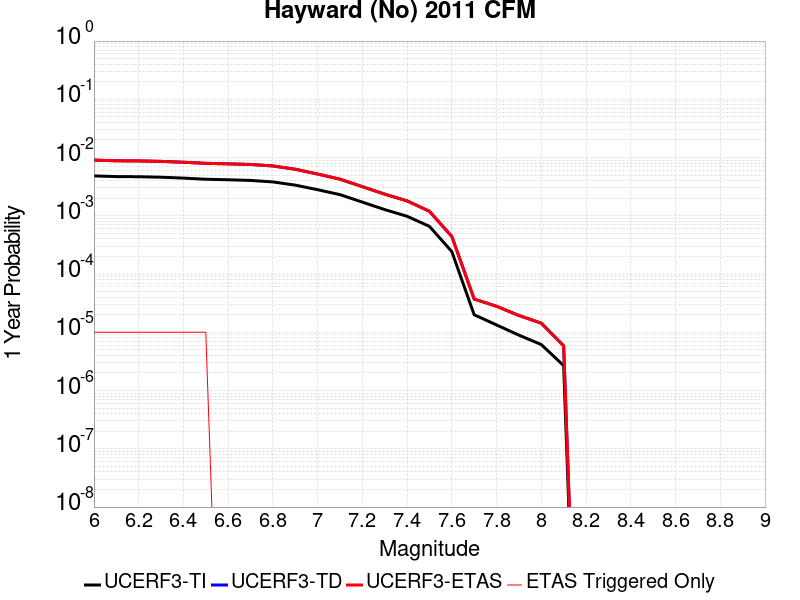 |  |

| Magnitude | 1 wk TI Prob | 1 wk TD Prob | 1 wk ETAS Prob | 1 wk ETAS/TD Gain | 1 wk ETAS Triggered Only | 1 mo TI Prob | 1 mo TD Prob | 1 mo ETAS Prob | 1 mo ETAS/TD Gain | 1 mo ETAS Triggered Only | 1 yr TI Prob | 1 yr TD Prob | 1 yr ETAS Prob | 1 yr ETAS/TD Gain | 1 yr ETAS Triggered Only | 10 yr TI Prob | 10 yr TD Prob | 10 yr ETAS Prob | 10 yr ETAS/TD Gain | 10 yr ETAS Triggered Only |
|-----|-----|-----|-----|-----|-----|-----|-----|-----|-----|-----|-----|-----|-----|-----|-----|-----|-----|-----|-----|-----|
| 6.0 | 9.3068506E-5 | 1.739599E-4 | 1.739599E-4 | 1.0 | 0.0 | 3.9880406E-4 | 7.453244E-4 | 7.586834E-4 | 1.0179237 | 1.3368984E-5 | 0.0048446343 | 0.009036438 | 0.009049687 | 1.001466 | 1.3368984E-5 | 0.047403704 | 0.08637534 | 0.08638755 | 1.0001414 | 1.3368984E-5 |
| 6.1 | 9.055486E-5 | 1.6947114E-4 | 1.6947114E-4 | 1.0 | 0.0 | 3.880345E-4 | 7.261021E-4 | 7.394614E-4 | 1.0183986 | 1.3368984E-5 | 0.0047140904 | 0.008804537 | 0.008817789 | 1.001505 | 1.3368984E-5 | 0.046153355 | 0.08426854 | 0.08428078 | 1.0001453 | 1.3368984E-5 |
| 6.2 | 9.006742E-5 | 1.6867711E-4 | 1.6867711E-4 | 1.0 | 0.0 | 3.859461E-4 | 7.22701E-4 | 7.360604E-4 | 1.0184853 | 1.3368984E-5 | 0.0046887742 | 0.008763513 | 0.008776764 | 1.0015122 | 1.3368984E-5 | 0.0459107 | 0.083892785 | 0.08390503 | 1.000146 | 1.3368984E-5 |
| 6.3 | 8.8336754E-5 | 1.6547246E-4 | 1.6547246E-4 | 1.0 | 0.0 | 3.7853114E-4 | 7.089758E-4 | 7.223353E-4 | 1.0188434 | 1.3368984E-5 | 0.004598882 | 0.008597788 | 0.008611042 | 1.0015416 | 1.3368984E-5 | 0.04504866 | 0.08238599 | 0.08239826 | 1.0001489 | 1.3368984E-5 |
| 6.4 | 8.526157E-5 | 1.5974249E-4 | 1.5974249E-4 | 1.0 | 0.0 | 3.6535555E-4 | 6.8443175E-4 | 6.977916E-4 | 1.0195196 | 1.3368984E-5 | 0.0044391346 | 0.008301278 | 0.008314536 | 1.001597 | 1.3368984E-5 | 0.043514993 | 0.079682834 | 0.07969514 | 1.0001544 | 1.3368984E-5 |
| 6.5 | 8.152396E-5 | 1.530663E-4 | 1.530663E-4 | 1.0 | 0.0 | 3.493416E-4 | 6.558342E-4 | 6.6919444E-4 | 1.0203713 | 1.3368984E-5 | 0.0042449418 | 0.007955698 | 0.007968961 | 1.001667 | 1.3368984E-5 | 0.04164765 | 0.07651369 | 0.07652604 | 1.0001614 | 1.3368984E-5 |
| 6.6 | 7.987405E-5 | 1.5010842E-4 | 1.5010842E-4 | 1.0 | 0.0 | 3.4227243E-4 | 6.4316386E-4 | 6.4316386E-4 | 1.0 | 0.0 | 0.0041592065 | 0.0078025614 | 0.0078025614 | 1.0 | 0.0 | 0.04082218 | 0.07510622 | 0.07510622 | 1.0 | 0.0 |
| 6.7 | 7.777665E-5 | 1.4650106E-4 | 1.4650106E-4 | 1.0 | 0.0 | 3.332859E-4 | 6.277113E-4 | 6.277113E-4 | 1.0 | 0.0 | 0.004050208 | 0.00761576 | 0.00761576 | 1.0 | 0.0 | 0.039771806 | 0.073382616 | 0.073382616 | 1.0 | 0.0 |
| 6.8 | 7.3284005E-5 | 1.3800753E-4 | 1.3800753E-4 | 1.0 | 0.0 | 3.140365E-4 | 5.913274E-4 | 5.913274E-4 | 1.0 | 0.0 | 0.0038166929 | 0.0071757827 | 0.0071757827 | 1.0 | 0.0 | 0.037518036 | 0.06929621 | 0.06929621 | 1.0 | 0.0 |
| 6.9 | 6.458263E-5 | 1.2131439E-4 | 1.2131439E-4 | 1.0 | 0.0 | 2.7675333E-4 | 5.198157E-4 | 5.198157E-4 | 1.0 | 0.0 | 0.0033642664 | 0.0063104923 | 0.0063104923 | 1.0 | 0.0 | 0.033137884 | 0.061225023 | 0.061225023 | 1.0 | 0.0 |
| 7.0 | 5.3853604E-5 | 1.00250414E-4 | 1.00250414E-4 | 1.0 | 0.0 | 2.3078074E-4 | 4.295742E-4 | 4.295742E-4 | 1.0 | 0.0 | 0.0028061352 | 0.0052175885 | 0.0052175885 | 1.0 | 0.0 | 0.027709642 | 0.0509578 | 0.0509578 | 1.0 | 0.0 |
| 7.1 | 4.4308683E-5 | 8.170626E-5 | 8.170626E-5 | 1.0 | 0.0 | 1.8988053E-4 | 3.501229E-4 | 3.501229E-4 | 1.0 | 0.0 | 0.0023093442 | 0.0042544557 | 0.0042544557 | 1.0 | 0.0 | 0.022854926 | 0.04182473 | 0.04182473 | 1.0 | 0.0 |
| 7.2 | 3.295973E-5 | 6.0771144E-5 | 6.0771144E-5 | 1.0 | 0.0 | 1.4124835E-4 | 2.604219E-4 | 2.604219E-4 | 1.0 | 0.0 | 0.0017183421 | 0.0031660495 | 0.0031660495 | 1.0 | 0.0 | 0.017051157 | 0.031369876 | 0.031369876 | 1.0 | 0.0 |
| 7.3 | 2.452256E-5 | 4.5180346E-5 | 4.5180346E-5 | 1.0 | 0.0 | 1.05092455E-4 | 1.9361576E-4 | 1.9361576E-4 | 1.0 | 0.0 | 0.0012787496 | 0.0023547374 | 0.0023547374 | 1.0 | 0.0 | 0.0127141625 | 0.02344111 | 0.02344111 | 1.0 | 0.0 |
| 7.4 | 1.8829967E-5 | 3.4602548E-5 | 3.4602548E-5 | 1.0 | 0.0 | 8.069736E-5 | 1.4828827E-4 | 1.4828827E-4 | 1.0 | 0.0 | 9.820475E-4 | 0.0018039243 | 0.0018039243 | 1.0 | 0.0 | 0.009777189 | 0.0180195 | 0.0180195 | 1.0 | 0.0 |
| 7.5 | 1.26374125E-5 | 2.2921116E-5 | 2.2921116E-5 | 1.0 | 0.0 | 5.4159216E-5 | 9.822969E-5 | 9.822969E-5 | 1.0 | 0.0 | 6.5918895E-4 | 0.0011952962 | 0.0011952962 | 1.0 | 0.0 | 0.00657237 | 0.011988836 | 0.011988836 | 1.0 | 0.0 |
| 7.6 | 4.666429E-6 | 8.4791645E-6 | 8.4791645E-6 | 1.0 | 0.0 | 1.9998828E-5 | 3.6338777E-5 | 3.6338777E-5 | 1.0 | 0.0 | 2.4345852E-4 | 4.4233602E-4 | 4.4233602E-4 | 1.0 | 0.0 | 0.0024319198 | 0.0044591012 | 0.0044591012 | 1.0 | 0.0 |
| 7.7 | 3.8399318E-7 | 7.133867E-7 | 7.133867E-7 | 1.0 | 0.0 | 1.6456839E-6 | 3.057368E-6 | 3.057368E-6 | 1.0 | 0.0 | 2.003602E-5 | 3.722282E-5 | 3.722282E-5 | 1.0 | 0.0 | 2.0034213E-4 | 3.8614936E-4 | 3.8614936E-4 | 1.0 | 0.0 |
| 7.8 | 2.5637698E-7 | 5.3662194E-7 | 5.3662194E-7 | 1.0 | 0.0 | 1.098758E-6 | 2.299806E-6 | 2.299806E-6 | 1.0 | 0.0 | 1.3377297E-5 | 2.7999782E-5 | 2.7999782E-5 | 1.0 | 0.0 | 1.3376492E-4 | 2.9244382E-4 | 2.9244382E-4 | 1.0 | 0.0 |
| 7.9 | 1.7141245E-7 | 3.7290573E-7 | 3.7290573E-7 | 1.0 | 0.0 | 7.3462456E-7 | 1.5981665E-6 | 1.5981665E-6 | 1.0 | 0.0 | 8.944017E-6 | 1.9457504E-5 | 1.9457504E-5 | 1.0 | 0.0 | 8.943657E-5 | 2.0245428E-4 | 2.0245428E-4 | 1.0 | 0.0 |
| 8.0 | 1.1808895E-7 | 2.7509762E-7 | 2.7509762E-7 | 1.0 | 0.0 | 5.060954E-7 | 1.1789892E-6 | 1.1789892E-6 | 1.0 | 0.0 | 6.161694E-6 | 1.43541E-5 | 1.43541E-5 | 1.0 | 0.0 | 6.161523E-5 | 1.4816441E-4 | 1.4816441E-4 | 1.0 | 0.0 |
| 8.1 | 5.138535E-8 | 1.1229867E-7 | 1.1229867E-7 | 1.0 | 0.0 | 2.2022292E-7 | 4.812799E-7 | 4.812799E-7 | 1.0 | 0.0 | 2.6812106E-6 | 5.8595674E-6 | 5.8595674E-6 | 1.0 | 0.0 | 2.6811784E-5 | 6.0158476E-5 | 6.0158476E-5 | 1.0 | 0.0 |

## Earthquake Valley (No  Extension)
*[(top)](#table-of-contents)*

| 1 Week | 1 Month | 1 Year | 10 Year |
|-----|-----|-----|-----|
|  | 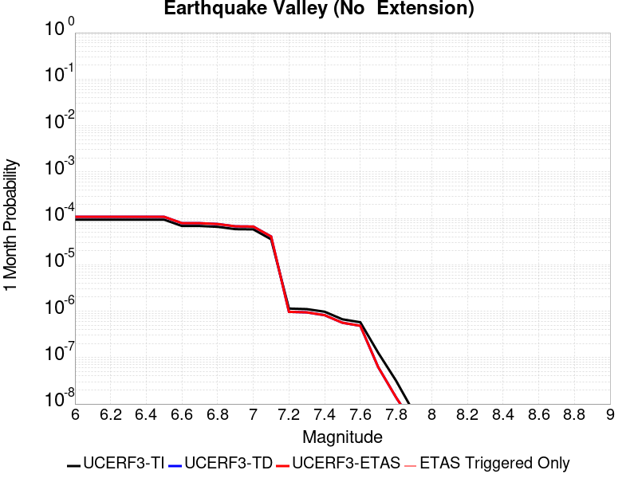 |  |  |

| Magnitude | 1 wk TI Prob | 1 wk TD Prob | 1 wk ETAS Prob | 1 wk ETAS/TD Gain | 1 wk ETAS Triggered Only | 1 mo TI Prob | 1 mo TD Prob | 1 mo ETAS Prob | 1 mo ETAS/TD Gain | 1 mo ETAS Triggered Only | 1 yr TI Prob | 1 yr TD Prob | 1 yr ETAS Prob | 1 yr ETAS/TD Gain | 1 yr ETAS Triggered Only | 10 yr TI Prob | 10 yr TD Prob | 10 yr ETAS Prob | 10 yr ETAS/TD Gain | 10 yr ETAS Triggered Only |
|-----|-----|-----|-----|-----|-----|-----|-----|-----|-----|-----|-----|-----|-----|-----|-----|-----|-----|-----|-----|-----|
| 6.0 | 2.1859703E-5 | 2.5198362E-5 | 2.5198362E-5 | 1.0 | 0.0 | 9.3681076E-5 | 1.07989326E-4 | 1.07989326E-4 | 1.0 | 0.0 | 0.0011399703 | 0.001314122 | 0.0013274734 | 1.01016 | 1.3368984E-5 | 0.011341401 | 0.013077871 | 0.013091065 | 1.0010089 | 1.3368984E-5 |
| 6.1 | 2.1859703E-5 | 2.5198362E-5 | 2.5198362E-5 | 1.0 | 0.0 | 9.3681076E-5 | 1.07989326E-4 | 1.07989326E-4 | 1.0 | 0.0 | 0.0011399703 | 0.001314122 | 0.0013274734 | 1.01016 | 1.3368984E-5 | 0.011341401 | 0.013077871 | 0.013091065 | 1.0010089 | 1.3368984E-5 |
| 6.2 | 2.1859703E-5 | 2.5198362E-5 | 2.5198362E-5 | 1.0 | 0.0 | 9.3681076E-5 | 1.07989326E-4 | 1.07989326E-4 | 1.0 | 0.0 | 0.0011399703 | 0.001314122 | 0.0013274734 | 1.01016 | 1.3368984E-5 | 0.011341401 | 0.013077871 | 0.013091065 | 1.0010089 | 1.3368984E-5 |
| 6.3 | 2.1859703E-5 | 2.5198362E-5 | 2.5198362E-5 | 1.0 | 0.0 | 9.3681076E-5 | 1.07989326E-4 | 1.07989326E-4 | 1.0 | 0.0 | 0.0011399703 | 0.001314122 | 0.0013274734 | 1.01016 | 1.3368984E-5 | 0.011341401 | 0.013077871 | 0.013091065 | 1.0010089 | 1.3368984E-5 |
| 6.4 | 2.1859703E-5 | 2.5198362E-5 | 2.5198362E-5 | 1.0 | 0.0 | 9.3681076E-5 | 1.07989326E-4 | 1.07989326E-4 | 1.0 | 0.0 | 0.0011399703 | 0.001314122 | 0.0013274734 | 1.01016 | 1.3368984E-5 | 0.011341401 | 0.013077871 | 0.013091065 | 1.0010089 | 1.3368984E-5 |
| 6.5 | 2.1859703E-5 | 2.5198362E-5 | 2.5198362E-5 | 1.0 | 0.0 | 9.3681076E-5 | 1.07989326E-4 | 1.07989326E-4 | 1.0 | 0.0 | 0.0011399703 | 0.001314122 | 0.0013274734 | 1.01016 | 1.3368984E-5 | 0.011341401 | 0.013077871 | 0.013091065 | 1.0010089 | 1.3368984E-5 |
| 6.6 | 1.597E-5 | 1.8356275E-5 | 1.8356275E-5 | 1.0 | 0.0 | 6.8441055E-5 | 7.866787E-5 | 7.866787E-5 | 1.0 | 0.0 | 8.329513E-4 | 9.574478E-4 | 9.7080396E-4 | 1.0139498 | 1.3368984E-5 | 0.008298361 | 0.009541836 | 0.009555077 | 1.0013877 | 1.3368984E-5 |
| 6.7 | 1.597E-5 | 1.8356275E-5 | 1.8356275E-5 | 1.0 | 0.0 | 6.8441055E-5 | 7.866787E-5 | 7.866787E-5 | 1.0 | 0.0 | 8.329513E-4 | 9.574478E-4 | 9.7080396E-4 | 1.0139498 | 1.3368984E-5 | 0.008298361 | 0.009541836 | 0.009555077 | 1.0013877 | 1.3368984E-5 |
| 6.8 | 1.5315149E-5 | 1.7602091E-5 | 1.7602091E-5 | 1.0 | 0.0 | 6.5634704E-5 | 7.543584E-5 | 7.543584E-5 | 1.0 | 0.0 | 7.988095E-4 | 9.181311E-4 | 9.314878E-4 | 1.0145477 | 1.3368984E-5 | 0.007959441 | 0.009151919 | 0.009165166 | 1.0014474 | 1.3368984E-5 |
| 6.9 | 1.3634728E-5 | 1.5675821E-5 | 1.5675821E-5 | 1.0 | 0.0 | 5.8433237E-5 | 6.718082E-5 | 6.718082E-5 | 1.0 | 0.0 | 7.1119244E-4 | 8.177017E-4 | 8.3105976E-4 | 1.0163361 | 1.3368984E-5 | 0.007089207 | 0.008155 | 0.008168261 | 1.001626 | 1.3368984E-5 |
| 7.0 | 1.3496271E-5 | 1.5517853E-5 | 1.5517853E-5 | 1.0 | 0.0 | 5.783988E-5 | 6.650385E-5 | 6.650385E-5 | 1.0 | 0.0 | 7.03973E-4 | 8.094657E-4 | 8.2282384E-4 | 1.0165025 | 1.3368984E-5 | 0.007017471 | 0.0080732405 | 0.008086502 | 1.0016426 | 1.3368984E-5 |
| 7.1 | 8.242798E-6 | 9.4726E-6 | 9.4726E-6 | 1.0 | 0.0 | 3.53258E-5 | 4.0596606E-5 | 4.0596606E-5 | 1.0 | 0.0 | 4.300067E-4 | 4.9421866E-4 | 5.07581E-4 | 1.0270374 | 1.3368984E-5 | 0.004291756 | 0.0049377717 | 0.0049510747 | 1.0026941 | 1.3368984E-5 |
| 7.2 | 2.6506527E-7 | 2.2560312E-7 | 2.2560312E-7 | 1.0 | 0.0 | 1.1359936E-6 | 9.668702E-7 | 9.668702E-7 | 1.0 | 0.0 | 1.3830633E-5 | 1.17715845E-5 | 1.17715845E-5 | 1.0 | 0.0 | 1.3829772E-4 | 1.1771003E-4 | 1.1771003E-4 | 1.0 | 0.0 |
| 7.3 | 2.5810488E-7 | 2.1955442E-7 | 2.1955442E-7 | 1.0 | 0.0 | 1.1061633E-6 | 9.409472E-7 | 9.409472E-7 | 1.0 | 0.0 | 1.3467455E-5 | 1.1455976E-5 | 1.1455976E-5 | 1.0 | 0.0 | 1.3466639E-4 | 1.1455427E-4 | 1.1455427E-4 | 1.0 | 0.0 |
| 7.4 | 2.2676066E-7 | 1.9110601E-7 | 1.9110601E-7 | 1.0 | 0.0 | 9.71831E-7 | 8.190255E-7 | 8.190255E-7 | 1.0 | 0.0 | 1.1831979E-5 | 9.9715935E-6 | 9.9715935E-6 | 1.0 | 0.0 | 1.1831349E-4 | 9.9711855E-5 | 9.9711855E-5 | 1.0 | 0.0 |
| 7.5 | 1.5553917E-7 | 1.3112096E-7 | 1.3112096E-7 | 1.0 | 0.0 | 6.6659624E-7 | 5.619469E-7 | 5.619469E-7 | 1.0 | 0.0 | 8.115779E-6 | 6.8416834E-6 | 6.8416834E-6 | 1.0 | 0.0 | 8.115482E-5 | 6.841495E-5 | 6.841495E-5 | 1.0 | 0.0 |
| 7.6 | 1.3448629E-7 | 1.1288419E-7 | 1.1288419E-7 | 1.0 | 0.0 | 5.7636964E-7 | 4.837893E-7 | 4.837893E-7 | 1.0 | 0.0 | 7.017278E-6 | 5.890121E-6 | 5.890121E-6 | 1.0 | 0.0 | 7.0170565E-5 | 5.889986E-5 | 5.889986E-5 | 1.0 | 0.0 |
| 7.7 | 2.9719402E-8 | 1.458206E-8 | 1.458206E-8 | 1.0 | 0.0 | 1.2736886E-7 | 6.249454E-8 | 6.249454E-8 | 1.0 | 0.0 | 1.5507147E-6 | 7.608708E-7 | 7.608708E-7 | 1.0 | 0.0 | 1.550704E-5 | 7.6086876E-6 | 7.6086876E-6 | 1.0 | 0.0 |
| 7.8 | 7.4390196E-9 | 3.2502152E-9 | 3.2502152E-9 | 1.0 | 0.0 | 3.1881513E-8 | 1.3929493E-8 | 1.3929493E-8 | 1.0 | 0.0 | 3.8815733E-7 | 1.6959156E-7 | 1.6959156E-7 | 1.0 | 0.0 | 3.8815665E-6 | 1.6959145E-6 | 1.6959145E-6 | 1.0 | 0.0 |
| 7.9 | 1.5373532E-9 | 8.440161E-10 | 8.440161E-10 | 1.0 | 0.0 | 6.5886567E-9 | 3.6172119E-9 | 3.6172119E-9 | 1.0 | 0.0 | 8.021689E-8 | 4.4039556E-8 | 4.4039556E-8 | 1.0 | 0.0 | 8.0216864E-7 | 4.4039552E-7 | 4.4039552E-7 | 1.0 | 0.0 |

## Northridge Hills
*[(top)](#table-of-contents)*

| 1 Week | 1 Month | 1 Year | 10 Year |
|-----|-----|-----|-----|
|  |  |  | 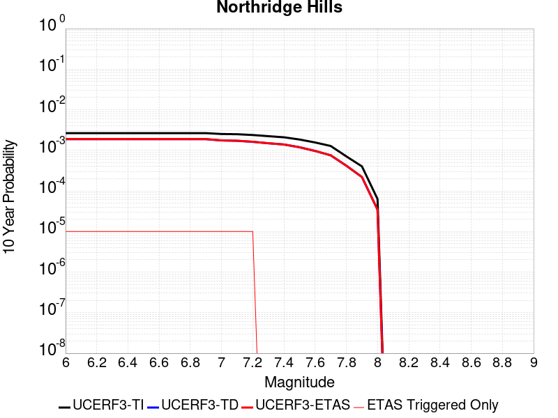 |

| Magnitude | 1 wk TI Prob | 1 wk TD Prob | 1 wk ETAS Prob | 1 wk ETAS/TD Gain | 1 wk ETAS Triggered Only | 1 mo TI Prob | 1 mo TD Prob | 1 mo ETAS Prob | 1 mo ETAS/TD Gain | 1 mo ETAS Triggered Only | 1 yr TI Prob | 1 yr TD Prob | 1 yr ETAS Prob | 1 yr ETAS/TD Gain | 1 yr ETAS Triggered Only | 10 yr TI Prob | 10 yr TD Prob | 10 yr ETAS Prob | 10 yr ETAS/TD Gain | 10 yr ETAS Triggered Only |
|-----|-----|-----|-----|-----|-----|-----|-----|-----|-----|-----|-----|-----|-----|-----|-----|-----|-----|-----|-----|-----|
| 6.0 | 5.095982E-6 | 3.6152098E-6 | 1.6984146E-5 | 4.6979694 | 1.3368984E-5 | 2.183974E-5 | 1.5493664E-5 | 2.8862441E-5 | 1.8628544 | 1.3368984E-5 | 2.658664E-4 | 1.8861916E-4 | 2.0198562E-4 | 1.0708648 | 1.3368984E-5 | 0.0026554854 | 0.001884603 | 0.0018979469 | 1.0070804 | 1.3368984E-5 |
| 6.1 | 5.095982E-6 | 3.6152098E-6 | 1.6984146E-5 | 4.6979694 | 1.3368984E-5 | 2.183974E-5 | 1.5493664E-5 | 2.8862441E-5 | 1.8628544 | 1.3368984E-5 | 2.658664E-4 | 1.8861916E-4 | 2.0198562E-4 | 1.0708648 | 1.3368984E-5 | 0.0026554854 | 0.001884603 | 0.0018979469 | 1.0070804 | 1.3368984E-5 |
| 6.2 | 5.095982E-6 | 3.6152098E-6 | 1.6984146E-5 | 4.6979694 | 1.3368984E-5 | 2.183974E-5 | 1.5493664E-5 | 2.8862441E-5 | 1.8628544 | 1.3368984E-5 | 2.658664E-4 | 1.8861916E-4 | 2.0198562E-4 | 1.0708648 | 1.3368984E-5 | 0.0026554854 | 0.001884603 | 0.0018979469 | 1.0070804 | 1.3368984E-5 |
| 6.3 | 5.095982E-6 | 3.6152098E-6 | 1.6984146E-5 | 4.6979694 | 1.3368984E-5 | 2.183974E-5 | 1.5493664E-5 | 2.8862441E-5 | 1.8628544 | 1.3368984E-5 | 2.658664E-4 | 1.8861916E-4 | 2.0198562E-4 | 1.0708648 | 1.3368984E-5 | 0.0026554854 | 0.001884603 | 0.0018979469 | 1.0070804 | 1.3368984E-5 |
| 6.4 | 5.095982E-6 | 3.6152098E-6 | 1.6984146E-5 | 4.6979694 | 1.3368984E-5 | 2.183974E-5 | 1.5493664E-5 | 2.8862441E-5 | 1.8628544 | 1.3368984E-5 | 2.658664E-4 | 1.8861916E-4 | 2.0198562E-4 | 1.0708648 | 1.3368984E-5 | 0.0026554854 | 0.001884603 | 0.0018979469 | 1.0070804 | 1.3368984E-5 |
| 6.5 | 5.095982E-6 | 3.6152098E-6 | 1.6984146E-5 | 4.6979694 | 1.3368984E-5 | 2.183974E-5 | 1.5493664E-5 | 2.8862441E-5 | 1.8628544 | 1.3368984E-5 | 2.658664E-4 | 1.8861916E-4 | 2.0198562E-4 | 1.0708648 | 1.3368984E-5 | 0.0026554854 | 0.001884603 | 0.0018979469 | 1.0070804 | 1.3368984E-5 |
| 6.6 | 5.095982E-6 | 3.6152098E-6 | 1.6984146E-5 | 4.6979694 | 1.3368984E-5 | 2.183974E-5 | 1.5493664E-5 | 2.8862441E-5 | 1.8628544 | 1.3368984E-5 | 2.658664E-4 | 1.8861916E-4 | 2.0198562E-4 | 1.0708648 | 1.3368984E-5 | 0.0026554854 | 0.001884603 | 0.0018979469 | 1.0070804 | 1.3368984E-5 |
| 6.7 | 5.095982E-6 | 3.6152098E-6 | 1.6984146E-5 | 4.6979694 | 1.3368984E-5 | 2.183974E-5 | 1.5493664E-5 | 2.8862441E-5 | 1.8628544 | 1.3368984E-5 | 2.658664E-4 | 1.8861916E-4 | 2.0198562E-4 | 1.0708648 | 1.3368984E-5 | 0.0026554854 | 0.001884603 | 0.0018979469 | 1.0070804 | 1.3368984E-5 |
| 6.8 | 5.095982E-6 | 3.6152098E-6 | 1.6984146E-5 | 4.6979694 | 1.3368984E-5 | 2.183974E-5 | 1.5493664E-5 | 2.8862441E-5 | 1.8628544 | 1.3368984E-5 | 2.658664E-4 | 1.8861916E-4 | 2.0198562E-4 | 1.0708648 | 1.3368984E-5 | 0.0026554854 | 0.001884603 | 0.0018979469 | 1.0070804 | 1.3368984E-5 |
| 6.9 | 5.0942654E-6 | 3.6134247E-6 | 1.698236E-5 | 4.699796 | 1.3368984E-5 | 2.1832384E-5 | 1.5486015E-5 | 2.885479E-5 | 1.8632807 | 1.3368984E-5 | 2.6577685E-4 | 1.8852603E-4 | 2.018925E-4 | 1.0708998 | 1.3368984E-5 | 0.002654592 | 0.0018836735 | 0.0018970172 | 1.0070839 | 1.3368984E-5 |
| 7.0 | 4.851143E-6 | 3.3587396E-6 | 1.672768E-5 | 4.980344 | 1.3368984E-5 | 2.0790447E-5 | 1.4394519E-5 | 2.7763312E-5 | 1.9287418 | 1.3368984E-5 | 2.5309427E-4 | 1.7523921E-4 | 1.8860586E-4 | 1.0762765 | 1.3368984E-5 | 0.0025280623 | 0.0017510147 | 0.0017643603 | 1.0076216 | 1.3368984E-5 |
| 7.1 | 4.7910607E-6 | 3.2970208E-6 | 1.6665961E-5 | 5.0548544 | 1.3368984E-5 | 2.0532956E-5 | 1.4130013E-5 | 2.7498809E-5 | 1.9461275 | 1.3368984E-5 | 2.4996005E-4 | 1.7201937E-4 | 1.8538604E-4 | 1.0777045 | 1.3368984E-5 | 0.0024967908 | 0.0017188663 | 0.0017322123 | 1.0077645 | 1.3368984E-5 |
| 7.2 | 4.580079E-6 | 3.1067987E-6 | 1.647574E-5 | 5.303125 | 1.3368984E-5 | 1.9628762E-5 | 1.3314784E-5 | 2.668359E-5 | 2.0040574 | 1.3368984E-5 | 2.3895396E-4 | 1.6209547E-4 | 1.7546228E-4 | 1.0824627 | 1.3368984E-5 | 0.0023869718 | 0.0016197758 | 0.0016331231 | 1.0082402 | 1.3368984E-5 |
| 7.3 | 4.290062E-6 | 2.8682275E-6 | 2.8682275E-6 | 1.0 | 0.0 | 1.838585E-5 | 1.2292346E-5 | 1.2292346E-5 | 1.0 | 0.0 | 2.2382473E-4 | 1.4964906E-4 | 1.4964906E-4 | 1.0 | 0.0 | 0.0022359942 | 0.0014954859 | 0.0014954859 | 1.0 | 0.0 |
| 7.4 | 4.0259683E-6 | 2.673904E-6 | 2.673904E-6 | 1.0 | 0.0 | 1.7254037E-5 | 1.1459538E-5 | 1.1459538E-5 | 1.0 | 0.0 | 2.1004764E-4 | 1.3951097E-4 | 1.3951097E-4 | 1.0 | 0.0 | 0.002098492 | 0.0013942367 | 0.0013942367 | 1.0 | 0.0 |
| 7.5 | 3.5477108E-6 | 2.285216E-6 | 2.285216E-6 | 1.0 | 0.0 | 1.5204386E-5 | 9.793746E-6 | 9.793746E-6 | 1.0 | 0.0 | 1.8509767E-4 | 1.1923235E-4 | 1.1923235E-4 | 1.0 | 0.0 | 0.0018494357 | 0.0011916853 | 0.0011916853 | 1.0 | 0.0 |
| 7.6 | 2.9990608E-6 | 1.8528339E-6 | 1.8528339E-6 | 1.0 | 0.0 | 1.2853055E-5 | 7.940693E-6 | 7.940693E-6 | 1.0 | 0.0 | 1.564747E-4 | 9.667365E-5 | 9.667365E-5 | 1.0 | 0.0 | 0.0015636457 | 9.663168E-4 | 9.663168E-4 | 1.0 | 0.0 |
| 7.7 | 2.4542855E-6 | 1.4461344E-6 | 1.4461344E-6 | 1.0 | 0.0 | 1.05183235E-5 | 6.197704E-6 | 6.197704E-6 | 1.0 | 0.0 | 1.2805307E-4 | 7.545444E-5 | 7.545444E-5 | 1.0 | 0.0 | 0.001279793 | 7.5428875E-4 | 7.5428875E-4 | 1.0 | 0.0 |
| 7.8 | 1.3623128E-6 | 8.016168E-7 | 8.016168E-7 | 1.0 | 0.0 | 5.8384703E-6 | 3.4354962E-6 | 3.4354962E-6 | 1.0 | 0.0 | 7.108106E-5 | 4.1826366E-5 | 4.1826366E-5 | 1.0 | 0.0 | 7.1058323E-4 | 4.1818514E-4 | 4.1818514E-4 | 1.0 | 0.0 |
| 7.9 | 7.716622E-7 | 4.218757E-7 | 4.218757E-7 | 1.0 | 0.0 | 3.3071194E-6 | 1.8080375E-6 | 1.8080375E-6 | 1.0 | 0.0 | 4.0263436E-5 | 2.2012635E-5 | 2.2012635E-5 | 1.0 | 0.0 | 4.0256142E-4 | 2.2010466E-4 | 2.2010466E-4 | 1.0 | 0.0 |
| 8.0 | 1.2117711E-7 | 6.6220565E-8 | 6.6220565E-8 | 1.0 | 0.0 | 5.1933034E-7 | 2.838024E-7 | 2.838024E-7 | 1.0 | 0.0 | 6.3228285E-6 | 3.4552888E-6 | 3.4552888E-6 | 1.0 | 0.0 | 6.3226486E-5 | 3.455237E-5 | 3.455237E-5 | 1.0 | 0.0 |

## Hayward (So) 2011 CFM
*[(top)](#table-of-contents)*

| 1 Week | 1 Month | 1 Year | 10 Year |
|-----|-----|-----|-----|
| 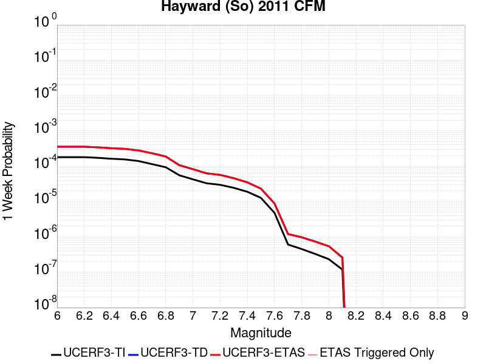 |  |  |  |

| Magnitude | 1 wk TI Prob | 1 wk TD Prob | 1 wk ETAS Prob | 1 wk ETAS/TD Gain | 1 wk ETAS Triggered Only | 1 mo TI Prob | 1 mo TD Prob | 1 mo ETAS Prob | 1 mo ETAS/TD Gain | 1 mo ETAS Triggered Only | 1 yr TI Prob | 1 yr TD Prob | 1 yr ETAS Prob | 1 yr ETAS/TD Gain | 1 yr ETAS Triggered Only | 10 yr TI Prob | 10 yr TD Prob | 10 yr ETAS Prob | 10 yr ETAS/TD Gain | 10 yr ETAS Triggered Only |
|-----|-----|-----|-----|-----|-----|-----|-----|-----|-----|-----|-----|-----|-----|-----|-----|-----|-----|-----|-----|-----|
| 6.0 | 1.8091932E-4 | 3.570541E-4 | 3.570541E-4 | 1.0 | 0.0 | 7.751381E-4 | 0.0015293444 | 0.0015293444 | 1.0 | 0.0 | 0.00939654 | 0.018463207 | 0.01847633 | 1.0007107 | 1.3368984E-5 | 0.090090066 | 0.16673161 | 0.16674276 | 1.0000668 | 1.3368984E-5 |
| 6.1 | 1.8091932E-4 | 3.570541E-4 | 3.570541E-4 | 1.0 | 0.0 | 7.751381E-4 | 0.0015293444 | 0.0015293444 | 1.0 | 0.0 | 0.00939654 | 0.018463207 | 0.01847633 | 1.0007107 | 1.3368984E-5 | 0.090090066 | 0.16673161 | 0.16674276 | 1.0000668 | 1.3368984E-5 |
| 6.2 | 1.8091932E-4 | 3.570541E-4 | 3.570541E-4 | 1.0 | 0.0 | 7.751381E-4 | 0.0015293444 | 0.0015293444 | 1.0 | 0.0 | 0.00939654 | 0.018463207 | 0.01847633 | 1.0007107 | 1.3368984E-5 | 0.090090066 | 0.16673161 | 0.16674276 | 1.0000668 | 1.3368984E-5 |
| 6.3 | 1.7322872E-4 | 3.426234E-4 | 3.426234E-4 | 1.0 | 0.0 | 7.4219756E-4 | 0.0014675693 | 0.0014675693 | 1.0 | 0.0 | 0.0089988755 | 0.017723544 | 0.017736677 | 1.0007409 | 1.3368984E-5 | 0.08643075 | 0.16066726 | 0.16067848 | 1.0000699 | 1.3368984E-5 |
| 6.4 | 1.6334097E-4 | 3.234411E-4 | 3.234411E-4 | 1.0 | 0.0 | 6.998449E-4 | 0.0013854484 | 0.0013854484 | 1.0 | 0.0 | 0.008487372 | 0.016739385 | 0.01675253 | 1.0007852 | 1.3368984E-5 | 0.081704415 | 0.15255594 | 0.15256727 | 1.0000743 | 1.3368984E-5 |
| 6.5 | 1.5600289E-4 | 3.1018828E-4 | 3.1018828E-4 | 1.0 | 0.0 | 6.684125E-4 | 0.0013287093 | 0.0013287093 | 1.0 | 0.0 | 0.008107598 | 0.016058935 | 0.016072089 | 1.0008191 | 1.3368984E-5 | 0.078181036 | 0.14683272 | 0.14684412 | 1.0000777 | 1.3368984E-5 |
| 6.6 | 1.4046066E-4 | 2.8032906E-4 | 2.8032906E-4 | 1.0 | 0.0 | 6.018354E-4 | 0.0012008639 | 0.0012008639 | 1.0 | 0.0 | 0.0073027555 | 0.014524006 | 0.014537181 | 1.0009071 | 1.3368984E-5 | 0.07067384 | 0.13391982 | 0.1339314 | 1.0000864 | 1.3368984E-5 |
| 6.7 | 1.14696966E-4 | 2.3271477E-4 | 2.3271477E-4 | 1.0 | 0.0 | 4.914658E-4 | 9.969729E-4 | 9.969729E-4 | 1.0 | 0.0 | 0.0059671924 | 0.012071652 | 0.012071652 | 1.0 | 0.0 | 0.058094822 | 0.11274672 | 0.11274672 | 1.0 | 0.0 |
| 6.8 | 9.3874296E-5 | 1.8861453E-4 | 1.8861453E-4 | 1.0 | 0.0 | 4.0225635E-4 | 8.0810126E-4 | 8.0810126E-4 | 1.0 | 0.0 | 0.0048864787 | 0.009794984 | 0.009794984 | 1.0 | 0.0 | 0.047804173 | 0.09259856 | 0.09259856 | 1.0 | 0.0 |
| 6.9 | 5.551852E-5 | 1.072948E-4 | 1.072948E-4 | 1.0 | 0.0 | 2.3791482E-4 | 4.5975443E-4 | 4.5975443E-4 | 1.0 | 0.0 | 0.0028927654 | 0.0055832625 | 0.0055832625 | 1.0 | 0.0 | 0.028553981 | 0.054245494 | 0.054245494 | 1.0 | 0.0 |
| 7.0 | 4.2662363E-5 | 8.2464416E-5 | 8.2464416E-5 | 1.0 | 0.0 | 1.8282588E-4 | 3.5337146E-4 | 3.5337146E-4 | 1.0 | 0.0 | 0.0022236328 | 0.0042938837 | 0.0042938837 | 1.0 | 0.0 | 0.022015138 | 0.042064495 | 0.042064495 | 1.0 | 0.0 |
| 7.1 | 3.305886E-5 | 6.3019055E-5 | 6.3019055E-5 | 1.0 | 0.0 | 1.4167312E-4 | 2.700538E-4 | 2.700538E-4 | 1.0 | 0.0 | 0.0017235056 | 0.0032829668 | 0.0032829668 | 1.0 | 0.0 | 0.017101998 | 0.032452874 | 0.032452874 | 1.0 | 0.0 |
| 7.2 | 2.9856887E-5 | 5.7013647E-5 | 5.7013647E-5 | 1.0 | 0.0 | 1.2795182E-4 | 2.4432142E-4 | 2.4432142E-4 | 1.0 | 0.0 | 0.0015567001 | 0.0029705726 | 0.0029705726 | 1.0 | 0.0 | 0.015458403 | 0.029453589 | 0.029453589 | 1.0 | 0.0 |
| 7.3 | 2.4559737E-5 | 4.599088E-5 | 4.599088E-5 | 1.0 | 0.0 | 1.0525176E-4 | 1.9708896E-4 | 1.9708896E-4 | 1.0 | 0.0 | 0.0012806869 | 0.0023969305 | 0.0023969305 | 1.0 | 0.0 | 0.012733313 | 0.023857482 | 0.023857482 | 1.0 | 0.0 |
| 7.4 | 1.9002231E-5 | 3.5049303E-5 | 3.5049303E-5 | 1.0 | 0.0 | 8.143559E-5 | 1.502027E-4 | 1.502027E-4 | 1.0 | 0.0 | 9.910273E-4 | 0.0018271938 | 0.0018271938 | 1.0 | 0.0 | 0.009866194 | 0.018258283 | 0.018258283 | 1.0 | 0.0 |
| 7.5 | 1.2783333E-5 | 2.3330069E-5 | 2.3330069E-5 | 1.0 | 0.0 | 5.4784563E-5 | 9.998221E-5 | 9.998221E-5 | 1.0 | 0.0 | 6.667979E-4 | 0.0012166094 | 0.0012166094 | 1.0 | 0.0 | 0.006648007 | 0.012209582 | 0.012209582 | 1.0 | 0.0 |
| 7.6 | 4.8149627E-6 | 8.887544E-6 | 8.887544E-6 | 1.0 | 0.0 | 2.063539E-5 | 3.8088925E-5 | 3.8088925E-5 | 1.0 | 0.0 | 2.5120692E-4 | 4.636352E-4 | 4.636352E-4 | 1.0 | 0.0 | 0.0025092314 | 0.0046812436 | 0.0046812436 | 1.0 | 0.0 |
| 7.7 | 6.0838227E-7 | 1.2056693E-6 | 1.2056693E-6 | 1.0 | 0.0 | 2.6073499E-6 | 5.1671436E-6 | 5.1671436E-6 | 1.0 | 0.0 | 3.174402E-5 | 6.290816E-5 | 6.290816E-5 | 1.0 | 0.0 | 3.1739488E-4 | 6.5293367E-4 | 6.5293367E-4 | 1.0 | 0.0 |
| 7.8 | 4.5542808E-7 | 9.792182E-7 | 9.792182E-7 | 1.0 | 0.0 | 1.9518332E-6 | 4.1966427E-6 | 4.1966427E-6 | 1.0 | 0.0 | 2.376331E-5 | 5.1092928E-5 | 5.1092928E-5 | 1.0 | 0.0 | 2.3760769E-4 | 5.321372E-4 | 5.321372E-4 | 1.0 | 0.0 |
| 7.9 | 3.3016747E-7 | 7.386335E-7 | 7.386335E-7 | 1.0 | 0.0 | 1.4150027E-6 | 3.1655684E-6 | 3.1655684E-6 | 1.0 | 0.0 | 1.7227521E-5 | 3.8540114E-5 | 3.8540114E-5 | 1.0 | 0.0 | 1.7226185E-4 | 3.9930744E-4 | 3.9930744E-4 | 1.0 | 0.0 |
| 8.0 | 2.347038E-7 | 5.4714894E-7 | 5.4714894E-7 | 1.0 | 0.0 | 1.0058731E-6 | 2.344922E-6 | 2.344922E-6 | 1.0 | 0.0 | 1.2246436E-5 | 2.8549053E-5 | 2.8549053E-5 | 1.0 | 0.0 | 1.2245761E-4 | 2.9355253E-4 | 2.9355253E-4 | 1.0 | 0.0 |
| 8.1 | 1.18822804E-7 | 2.6058973E-7 | 2.6058973E-7 | 1.0 | 0.0 | 5.092405E-7 | 1.1168127E-6 | 1.1168127E-6 | 1.0 | 0.0 | 6.1999854E-6 | 1.359711E-5 | 1.359711E-5 | 1.0 | 0.0 | 6.199812E-5 | 1.3917852E-4 | 1.3917852E-4 | 1.0 | 0.0 |

## Holser alt 1
*[(top)](#table-of-contents)*

| 1 Week | 1 Month | 1 Year | 10 Year |
|-----|-----|-----|-----|
|  |  | 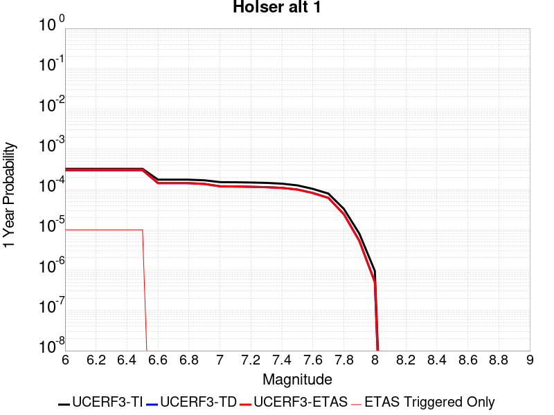 |  |

| Magnitude | 1 wk TI Prob | 1 wk TD Prob | 1 wk ETAS Prob | 1 wk ETAS/TD Gain | 1 wk ETAS Triggered Only | 1 mo TI Prob | 1 mo TD Prob | 1 mo ETAS Prob | 1 mo ETAS/TD Gain | 1 mo ETAS Triggered Only | 1 yr TI Prob | 1 yr TD Prob | 1 yr ETAS Prob | 1 yr ETAS/TD Gain | 1 yr ETAS Triggered Only | 10 yr TI Prob | 10 yr TD Prob | 10 yr ETAS Prob | 10 yr ETAS/TD Gain | 10 yr ETAS Triggered Only |
|-----|-----|-----|-----|-----|-----|-----|-----|-----|-----|-----|-----|-----|-----|-----|-----|-----|-----|-----|-----|-----|
| 6.0 | 6.2746653E-6 | 5.789965E-6 | 5.789965E-6 | 1.0 | 0.0 | 2.6891146E-5 | 2.4813964E-5 | 2.4813964E-5 | 1.0 | 0.0 | 3.273505E-4 | 3.020797E-4 | 3.1544463E-4 | 1.0442431 | 1.3368984E-5 | 0.0032686873 | 0.0030178234 | 0.003031152 | 1.0044166 | 1.3368984E-5 |
| 6.1 | 6.2746653E-6 | 5.789965E-6 | 5.789965E-6 | 1.0 | 0.0 | 2.6891146E-5 | 2.4813964E-5 | 2.4813964E-5 | 1.0 | 0.0 | 3.273505E-4 | 3.020797E-4 | 3.1544463E-4 | 1.0442431 | 1.3368984E-5 | 0.0032686873 | 0.0030178234 | 0.003031152 | 1.0044166 | 1.3368984E-5 |
| 6.2 | 6.2746653E-6 | 5.789965E-6 | 5.789965E-6 | 1.0 | 0.0 | 2.6891146E-5 | 2.4813964E-5 | 2.4813964E-5 | 1.0 | 0.0 | 3.273505E-4 | 3.020797E-4 | 3.1544463E-4 | 1.0442431 | 1.3368984E-5 | 0.0032686873 | 0.0030178234 | 0.003031152 | 1.0044166 | 1.3368984E-5 |
| 6.3 | 6.2746653E-6 | 5.789965E-6 | 5.789965E-6 | 1.0 | 0.0 | 2.6891146E-5 | 2.4813964E-5 | 2.4813964E-5 | 1.0 | 0.0 | 3.273505E-4 | 3.020797E-4 | 3.1544463E-4 | 1.0442431 | 1.3368984E-5 | 0.0032686873 | 0.0030178234 | 0.003031152 | 1.0044166 | 1.3368984E-5 |
| 6.4 | 6.2746653E-6 | 5.789965E-6 | 5.789965E-6 | 1.0 | 0.0 | 2.6891146E-5 | 2.4813964E-5 | 2.4813964E-5 | 1.0 | 0.0 | 3.273505E-4 | 3.020797E-4 | 3.1544463E-4 | 1.0442431 | 1.3368984E-5 | 0.0032686873 | 0.0030178234 | 0.003031152 | 1.0044166 | 1.3368984E-5 |
| 6.5 | 6.2746653E-6 | 5.789965E-6 | 5.789965E-6 | 1.0 | 0.0 | 2.6891146E-5 | 2.4813964E-5 | 2.4813964E-5 | 1.0 | 0.0 | 3.273505E-4 | 3.020797E-4 | 3.1544463E-4 | 1.0442431 | 1.3368984E-5 | 0.0032686873 | 0.0030178234 | 0.003031152 | 1.0044166 | 1.3368984E-5 |
| 6.6 | 3.375825E-6 | 2.7711897E-6 | 2.7711897E-6 | 1.0 | 0.0 | 1.4467741E-5 | 1.1876474E-5 | 1.1876474E-5 | 1.0 | 0.0 | 1.761305E-4 | 1.4458665E-4 | 1.4458665E-4 | 1.0 | 0.0 | 0.0017599097 | 0.0014449427 | 0.0014449427 | 1.0 | 0.0 |
| 6.7 | 3.375825E-6 | 2.7711897E-6 | 2.7711897E-6 | 1.0 | 0.0 | 1.4467741E-5 | 1.1876474E-5 | 1.1876474E-5 | 1.0 | 0.0 | 1.761305E-4 | 1.4458665E-4 | 1.4458665E-4 | 1.0 | 0.0 | 0.0017599097 | 0.0014449427 | 0.0014449427 | 1.0 | 0.0 |
| 6.8 | 3.366533E-6 | 2.7615893E-6 | 2.7615893E-6 | 1.0 | 0.0 | 1.4427919E-5 | 1.183533E-5 | 1.183533E-5 | 1.0 | 0.0 | 1.7564575E-4 | 1.4408577E-4 | 1.4408577E-4 | 1.0 | 0.0 | 0.0017550698 | 0.0014399405 | 0.0014399405 | 1.0 | 0.0 |
| 6.9 | 3.253174E-6 | 2.6438113E-6 | 2.6438113E-6 | 1.0 | 0.0 | 1.39421E-5 | 1.1330571E-5 | 1.1330571E-5 | 1.0 | 0.0 | 1.6973184E-4 | 1.3794114E-4 | 1.3794114E-4 | 1.0 | 0.0 | 0.0016960226 | 0.001378571 | 0.001378571 | 1.0 | 0.0 |
| 7.0 | 2.9336593E-6 | 2.311799E-6 | 2.311799E-6 | 1.0 | 0.0 | 1.2572766E-5 | 9.907673E-6 | 9.907673E-6 | 1.0 | 0.0 | 1.5306266E-4 | 1.2061927E-4 | 1.2061927E-4 | 1.0 | 0.0 | 0.0015295728 | 0.0012055405 | 0.0012055405 | 1.0 | 0.0 |
| 7.1 | 2.9087812E-6 | 2.2876513E-6 | 2.2876513E-6 | 1.0 | 0.0 | 1.2466146E-5 | 9.804184E-6 | 9.804184E-6 | 1.0 | 0.0 | 1.5176475E-4 | 1.19359414E-4 | 1.19359414E-4 | 1.0 | 0.0 | 0.0015166114 | 0.0011929555 | 0.0011929555 | 1.0 | 0.0 |
| 7.2 | 2.8674524E-6 | 2.2475429E-6 | 2.2475429E-6 | 1.0 | 0.0 | 1.2289024E-5 | 9.63229E-6 | 9.63229E-6 | 1.0 | 0.0 | 1.4960859E-4 | 1.1726685E-4 | 1.1726685E-4 | 1.0 | 0.0 | 0.0014950791 | 0.001172052 | 0.001172052 | 1.0 | 0.0 |
| 7.3 | 2.8057775E-6 | 2.1954324E-6 | 2.1954324E-6 | 1.0 | 0.0 | 1.2024705E-5 | 9.408962E-6 | 9.408962E-6 | 1.0 | 0.0 | 1.4639096E-4 | 1.14548115E-4 | 1.14548115E-4 | 1.0 | 0.0 | 0.0014629456 | 0.001144893 | 0.001144893 | 1.0 | 0.0 |
| 7.4 | 2.683666E-6 | 2.1092305E-6 | 2.1092305E-6 | 1.0 | 0.0 | 1.1501375E-5 | 9.039529E-6 | 9.039529E-6 | 1.0 | 0.0 | 1.4002025E-4 | 1.1005072E-4 | 1.1005072E-4 | 1.0 | 0.0 | 0.0013993206 | 0.0010999644 | 0.0010999644 | 1.0 | 0.0 |
| 7.5 | 2.434495E-6 | 1.9195363E-6 | 1.9195363E-6 | 1.0 | 0.0 | 1.0433508E-5 | 8.226558E-6 | 8.226558E-6 | 1.0 | 0.0 | 1.2702055E-4 | 1.0015376E-4 | 1.0015376E-4 | 1.0 | 0.0 | 0.0012694797 | 0.0010010883 | 0.0010010883 | 1.0 | 0.0 |
| 7.6 | 1.9914562E-6 | 1.5731459E-6 | 1.5731459E-6 | 1.0 | 0.0 | 8.534785E-6 | 6.742037E-6 | 6.742037E-6 | 1.0 | 0.0 | 1.03906044E-4 | 8.208122E-5 | 8.208122E-5 | 1.0 | 0.0 | 0.0010385747 | 8.205106E-4 | 8.205106E-4 | 1.0 | 0.0 |
| 7.7 | 1.5229501E-6 | 1.1896061E-6 | 1.1896061E-6 | 1.0 | 0.0 | 6.526913E-6 | 5.098302E-6 | 5.098302E-6 | 1.0 | 0.0 | 7.946226E-5 | 6.2070074E-5 | 6.2070074E-5 | 1.0 | 0.0 | 7.943385E-4 | 6.2052865E-4 | 6.2052865E-4 | 1.0 | 0.0 |
| 7.8 | 6.3489426E-7 | 4.687806E-7 | 4.687806E-7 | 1.0 | 0.0 | 2.7209726E-6 | 2.009058E-6 | 2.009058E-6 | 1.0 | 0.0 | 3.312734E-5 | 2.4460009E-5 | 2.4460009E-5 | 1.0 | 0.0 | 3.31224E-4 | 2.4457334E-4 | 2.4457334E-4 | 1.0 | 0.0 |
| 7.9 | 1.5459432E-7 | 1.0193758E-7 | 1.0193758E-7 | 1.0 | 0.0 | 6.6254694E-7 | 4.3687527E-7 | 4.3687527E-7 | 1.0 | 0.0 | 8.066479E-6 | 5.3189433E-6 | 5.3189433E-6 | 1.0 | 0.0 | 8.066186E-5 | 5.3188178E-5 | 5.3188178E-5 | 1.0 | 0.0 |
| 8.0 | 1.8307812E-8 | 9.690293E-9 | 9.690293E-9 | 1.0 | 0.0 | 7.846205E-8 | 4.152983E-8 | 4.152983E-8 | 1.0 | 0.0 | 9.55275E-7 | 5.0562556E-7 | 5.0562556E-7 | 1.0 | 0.0 | 9.552709E-6 | 5.0562444E-6 | 5.0562444E-6 | 1.0 | 0.0 |

## San Gorgonio Pass
*[(top)](#table-of-contents)*

| 1 Week | 1 Month | 1 Year | 10 Year |
|-----|-----|-----|-----|
|  |  |  |  |

| Magnitude | 1 wk TI Prob | 1 wk TD Prob | 1 wk ETAS Prob | 1 wk ETAS/TD Gain | 1 wk ETAS Triggered Only | 1 mo TI Prob | 1 mo TD Prob | 1 mo ETAS Prob | 1 mo ETAS/TD Gain | 1 mo ETAS Triggered Only | 1 yr TI Prob | 1 yr TD Prob | 1 yr ETAS Prob | 1 yr ETAS/TD Gain | 1 yr ETAS Triggered Only | 10 yr TI Prob | 10 yr TD Prob | 10 yr ETAS Prob | 10 yr ETAS/TD Gain | 10 yr ETAS Triggered Only |
|-----|-----|-----|-----|-----|-----|-----|-----|-----|-----|-----|-----|-----|-----|-----|-----|-----|-----|-----|-----|-----|
| 6.0 | 7.644328E-6 | 1.3314231E-5 | 1.3314231E-5 | 1.0 | 0.0 | 3.2760996E-5 | 5.705979E-5 | 5.705979E-5 | 1.0 | 0.0 | 3.987921E-4 | 6.944901E-4 | 7.078498E-4 | 1.0192367 | 1.3368984E-5 | 0.003980772 | 0.0069299806 | 0.006943257 | 1.0019158 | 1.3368984E-5 |
| 6.1 | 7.644328E-6 | 1.3314231E-5 | 1.3314231E-5 | 1.0 | 0.0 | 3.2760996E-5 | 5.705979E-5 | 5.705979E-5 | 1.0 | 0.0 | 3.987921E-4 | 6.944901E-4 | 7.078498E-4 | 1.0192367 | 1.3368984E-5 | 0.003980772 | 0.0069299806 | 0.006943257 | 1.0019158 | 1.3368984E-5 |
| 6.2 | 7.644328E-6 | 1.3314231E-5 | 1.3314231E-5 | 1.0 | 0.0 | 3.2760996E-5 | 5.705979E-5 | 5.705979E-5 | 1.0 | 0.0 | 3.987921E-4 | 6.944901E-4 | 7.078498E-4 | 1.0192367 | 1.3368984E-5 | 0.003980772 | 0.0069299806 | 0.006943257 | 1.0019158 | 1.3368984E-5 |
| 6.3 | 7.644328E-6 | 1.3314231E-5 | 1.3314231E-5 | 1.0 | 0.0 | 3.2760996E-5 | 5.705979E-5 | 5.705979E-5 | 1.0 | 0.0 | 3.987921E-4 | 6.944901E-4 | 7.078498E-4 | 1.0192367 | 1.3368984E-5 | 0.003980772 | 0.0069299806 | 0.006943257 | 1.0019158 | 1.3368984E-5 |
| 6.4 | 7.644328E-6 | 1.3314231E-5 | 1.3314231E-5 | 1.0 | 0.0 | 3.2760996E-5 | 5.705979E-5 | 5.705979E-5 | 1.0 | 0.0 | 3.987921E-4 | 6.944901E-4 | 7.078498E-4 | 1.0192367 | 1.3368984E-5 | 0.003980772 | 0.0069299806 | 0.006943257 | 1.0019158 | 1.3368984E-5 |
| 6.5 | 7.644328E-6 | 1.3314231E-5 | 1.3314231E-5 | 1.0 | 0.0 | 3.2760996E-5 | 5.705979E-5 | 5.705979E-5 | 1.0 | 0.0 | 3.987921E-4 | 6.944901E-4 | 7.078498E-4 | 1.0192367 | 1.3368984E-5 | 0.003980772 | 0.0069299806 | 0.006943257 | 1.0019158 | 1.3368984E-5 |
| 6.6 | 7.644328E-6 | 1.3314231E-5 | 1.3314231E-5 | 1.0 | 0.0 | 3.2760996E-5 | 5.705979E-5 | 5.705979E-5 | 1.0 | 0.0 | 3.987921E-4 | 6.944901E-4 | 7.078498E-4 | 1.0192367 | 1.3368984E-5 | 0.003980772 | 0.0069299806 | 0.006943257 | 1.0019158 | 1.3368984E-5 |
| 6.7 | 6.987586E-6 | 1.2618505E-5 | 1.2618505E-5 | 1.0 | 0.0 | 2.9946454E-5 | 5.4078235E-5 | 5.4078235E-5 | 1.0 | 0.0 | 3.645371E-4 | 6.582117E-4 | 6.715719E-4 | 1.0202976 | 1.3368984E-5 | 0.0036393967 | 0.0065693567 | 0.006582638 | 1.0020217 | 1.3368984E-5 |
| 6.8 | 6.987586E-6 | 1.2618505E-5 | 1.2618505E-5 | 1.0 | 0.0 | 2.9946454E-5 | 5.4078235E-5 | 5.4078235E-5 | 1.0 | 0.0 | 3.645371E-4 | 6.582117E-4 | 6.715719E-4 | 1.0202976 | 1.3368984E-5 | 0.0036393967 | 0.0065693567 | 0.006582638 | 1.0020217 | 1.3368984E-5 |
| 6.9 | 5.504702E-6 | 1.1049368E-5 | 1.1049368E-5 | 1.0 | 0.0 | 2.3591367E-5 | 4.7353606E-5 | 4.7353606E-5 | 1.0 | 0.0 | 2.8718702E-4 | 5.7638274E-4 | 5.7638274E-4 | 1.0 | 0.0 | 0.0028681618 | 0.005755309 | 0.005755309 | 1.0 | 0.0 |
| 7.0 | 5.4825764E-6 | 1.102571E-5 | 1.102571E-5 | 1.0 | 0.0 | 2.3496545E-5 | 4.7252215E-5 | 4.7252215E-5 | 1.0 | 0.0 | 2.8603288E-4 | 5.751489E-4 | 5.751489E-4 | 1.0 | 0.0 | 0.00285665 | 0.005743035 | 0.005743035 | 1.0 | 0.0 |
| 7.1 | 5.4692787E-6 | 1.101142E-5 | 1.101142E-5 | 1.0 | 0.0 | 2.3439556E-5 | 4.7190973E-5 | 4.7190973E-5 | 1.0 | 0.0 | 2.8533922E-4 | 5.744037E-4 | 5.744037E-4 | 1.0 | 0.0 | 0.0028497311 | 0.0057356213 | 0.0057356213 | 1.0 | 0.0 |
| 7.2 | 5.453661E-6 | 1.0994446E-5 | 1.0994446E-5 | 1.0 | 0.0 | 2.3372622E-5 | 4.7118232E-5 | 4.7118232E-5 | 1.0 | 0.0 | 2.8452452E-4 | 5.7351857E-4 | 5.7351857E-4 | 1.0 | 0.0 | 0.002841605 | 0.0057268157 | 0.0057268157 | 1.0 | 0.0 |
| 7.3 | 5.4422303E-6 | 1.0981369E-5 | 1.0981369E-5 | 1.0 | 0.0 | 2.3323635E-5 | 4.706219E-5 | 4.706219E-5 | 1.0 | 0.0 | 2.8392827E-4 | 5.728366E-4 | 5.728366E-4 | 1.0 | 0.0 | 0.0028356577 | 0.005720031 | 0.005720031 | 1.0 | 0.0 |
| 7.4 | 5.398595E-6 | 1.0928734E-5 | 1.0928734E-5 | 1.0 | 0.0 | 2.313663E-5 | 4.683662E-5 | 4.683662E-5 | 1.0 | 0.0 | 2.8165206E-4 | 5.700917E-4 | 5.700917E-4 | 1.0 | 0.0 | 0.0028129534 | 0.005692723 | 0.005692723 | 1.0 | 0.0 |
| 7.5 | 5.3578788E-6 | 1.0855281E-5 | 1.0855281E-5 | 1.0 | 0.0 | 2.2962136E-5 | 4.6521833E-5 | 4.6521833E-5 | 1.0 | 0.0 | 2.7952815E-4 | 5.662612E-4 | 5.662612E-4 | 1.0 | 0.0 | 0.002791768 | 0.0056546377 | 0.0056546377 | 1.0 | 0.0 |
| 7.6 | 4.8091474E-6 | 9.60368E-6 | 9.60368E-6 | 1.0 | 0.0 | 2.0610469E-5 | 4.1158008E-5 | 4.1158008E-5 | 1.0 | 0.0 | 2.5090357E-4 | 5.0098833E-4 | 5.0098833E-4 | 1.0 | 0.0 | 0.0025062046 | 0.0050053033 | 0.0050053033 | 1.0 | 0.0 |
| 7.7 | 1.5991155E-6 | 3.352866E-6 | 3.352866E-6 | 1.0 | 0.0 | 6.853334E-6 | 1.4369349E-5 | 1.4369349E-5 | 1.0 | 0.0 | 8.343615E-5 | 1.7493303E-4 | 1.7493303E-4 | 1.0 | 0.0 | 8.340483E-4 | 0.0017534072 | 0.0017534072 | 1.0 | 0.0 |
| 7.8 | 9.258398E-7 | 2.0579948E-6 | 2.0579948E-6 | 1.0 | 0.0 | 3.967879E-6 | 8.819949E-6 | 8.819949E-6 | 1.0 | 0.0 | 4.8307855E-5 | 1.073776E-4 | 1.073776E-4 | 1.0 | 0.0 | 4.8297356E-4 | 0.001078687 | 0.001078687 | 1.0 | 0.0 |
| 7.9 | 5.975575E-7 | 1.2291794E-6 | 1.2291794E-6 | 1.0 | 0.0 | 2.5609581E-6 | 5.2679006E-6 | 5.2679006E-6 | 1.0 | 0.0 | 3.117922E-5 | 6.4134816E-5 | 6.4134816E-5 | 1.0 | 0.0 | 3.1174847E-4 | 6.463092E-4 | 6.463092E-4 | 1.0 | 0.0 |
| 8.0 | 3.4413725E-7 | 6.7148494E-7 | 6.7148494E-7 | 1.0 | 0.0 | 1.4748731E-6 | 2.8777895E-6 | 2.8777895E-6 | 1.0 | 0.0 | 1.7956432E-5 | 3.503653E-5 | 3.503653E-5 | 1.0 | 0.0 | 1.7954981E-4 | 3.5373896E-4 | 3.5373896E-4 | 1.0 | 0.0 |
| 8.1 | 1.1787731E-8 | 9.634385E-9 | 9.634385E-9 | 1.0 | 0.0 | 5.0518846E-8 | 4.129022E-8 | 4.129022E-8 | 1.0 | 0.0 | 6.1506677E-7 | 5.027083E-7 | 5.027083E-7 | 1.0 | 0.0 | 6.1506507E-6 | 5.2424944E-6 | 5.2424944E-6 | 1.0 | 0.0 |

## Greenville (So) 2011 CFM
*[(top)](#table-of-contents)*

| 1 Week | 1 Month | 1 Year | 10 Year |
|-----|-----|-----|-----|
| 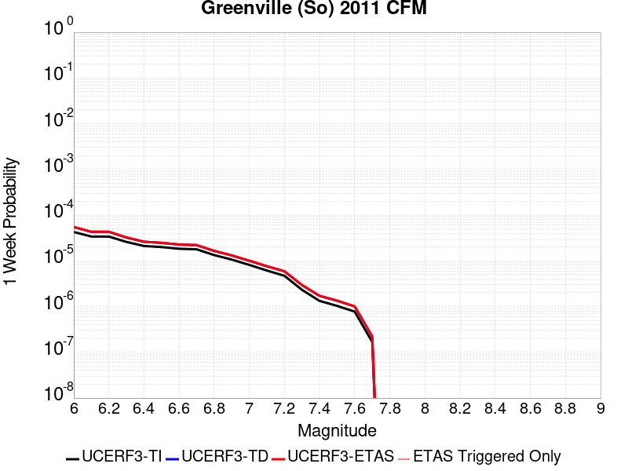 |  |  | 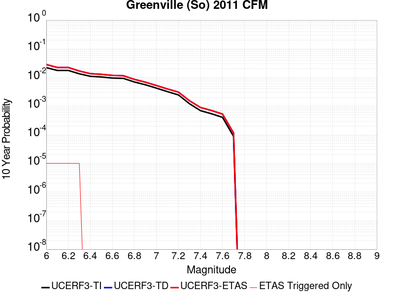 |

| Magnitude | 1 wk TI Prob | 1 wk TD Prob | 1 wk ETAS Prob | 1 wk ETAS/TD Gain | 1 wk ETAS Triggered Only | 1 mo TI Prob | 1 mo TD Prob | 1 mo ETAS Prob | 1 mo ETAS/TD Gain | 1 mo ETAS Triggered Only | 1 yr TI Prob | 1 yr TD Prob | 1 yr ETAS Prob | 1 yr ETAS/TD Gain | 1 yr ETAS Triggered Only | 10 yr TI Prob | 10 yr TD Prob | 10 yr ETAS Prob | 10 yr ETAS/TD Gain | 10 yr ETAS Triggered Only |
|-----|-----|-----|-----|-----|-----|-----|-----|-----|-----|-----|-----|-----|-----|-----|-----|-----|-----|-----|-----|-----|
| 6.0 | 4.279693E-5 | 5.5040087E-5 | 5.5040087E-5 | 1.0 | 0.0 | 1.8340252E-4 | 2.3586681E-4 | 2.3586681E-4 | 1.0 | 0.0 | 0.0022306389 | 0.0028682416 | 0.0028815723 | 1.0046476 | 1.3368984E-5 | 0.022083808 | 0.028338138 | 0.028351128 | 1.0004584 | 1.3368984E-5 |
| 6.1 | 3.4037297E-5 | 4.3192387E-5 | 4.3192387E-5 | 1.0 | 0.0 | 1.4586597E-4 | 1.8509831E-4 | 1.8509831E-4 | 1.0 | 0.0 | 0.0017744715 | 0.0022514379 | 0.0022647767 | 1.0059246 | 1.3368984E-5 | 0.01760369 | 0.022302566 | 0.022315636 | 1.000586 | 1.3368984E-5 |
| 6.2 | 3.4037297E-5 | 4.3192387E-5 | 4.3192387E-5 | 1.0 | 0.0 | 1.4586597E-4 | 1.8509831E-4 | 1.8509831E-4 | 1.0 | 0.0 | 0.0017744715 | 0.0022514379 | 0.0022647767 | 1.0059246 | 1.3368984E-5 | 0.01760369 | 0.022302566 | 0.022315636 | 1.000586 | 1.3368984E-5 |
| 6.3 | 2.5956324E-5 | 3.2428903E-5 | 3.2428903E-5 | 1.0 | 0.0 | 1.11236644E-4 | 1.3897405E-4 | 1.3897405E-4 | 1.0 | 0.0 | 0.0013534647 | 0.0016907708 | 0.0017041172 | 1.0078937 | 1.3368984E-5 | 0.013452509 | 0.016785882 | 0.016799027 | 1.0007831 | 1.3368984E-5 |
| 6.4 | 2.1145053E-5 | 2.6197677E-5 | 2.6197677E-5 | 1.0 | 0.0 | 9.061851E-5 | 1.1227112E-4 | 1.1227112E-4 | 1.0 | 0.0 | 0.0011027219 | 0.0013660751 | 0.0013660751 | 1.0 | 0.0 | 0.01097266 | 0.01358018 | 0.01358018 | 1.0 | 0.0 |
| 6.5 | 2.0030959E-5 | 2.479578E-5 | 2.479578E-5 | 1.0 | 0.0 | 8.584414E-5 | 1.06263484E-4 | 1.06263484E-4 | 1.0 | 0.0 | 0.0010446513 | 0.0012930221 | 0.0012930221 | 1.0 | 0.0 | 0.010397541 | 0.012858339 | 0.012858339 | 1.0 | 0.0 |
| 6.6 | 1.8395405E-5 | 2.2754466E-5 | 2.2754466E-5 | 1.0 | 0.0 | 7.8835066E-5 | 9.751565E-5 | 9.751565E-5 | 1.0 | 0.0 | 9.5939427E-4 | 0.0011866348 | 0.0011866348 | 1.0 | 0.0 | 0.009552629 | 0.011806041 | 0.011806041 | 1.0 | 0.0 |
| 6.7 | 1.7883482E-5 | 2.212551E-5 | 2.212551E-5 | 1.0 | 0.0 | 7.664124E-5 | 9.482033E-5 | 9.482033E-5 | 1.0 | 0.0 | 9.3270757E-4 | 0.0011538545 | 0.0011538545 | 1.0 | 0.0 | 0.009288026 | 0.011481688 | 0.011481688 | 1.0 | 0.0 |
| 6.8 | 1.3373564E-5 | 1.6505966E-5 | 1.6505966E-5 | 1.0 | 0.0 | 5.7314013E-5 | 7.073802E-5 | 7.073802E-5 | 1.0 | 0.0 | 6.975747E-4 | 8.609098E-4 | 8.609098E-4 | 1.0 | 0.0 | 0.0069538904 | 0.008577357 | 0.008577357 | 1.0 | 0.0 |
| 6.9 | 1.06692905E-5 | 1.3152582E-5 | 1.3152582E-5 | 1.0 | 0.0 | 4.5724726E-5 | 5.6367055E-5 | 5.6367055E-5 | 1.0 | 0.0 | 5.5655633E-4 | 6.86064E-4 | 6.86064E-4 | 1.0 | 0.0 | 0.005551645 | 0.006840693 | 0.006840693 | 1.0 | 0.0 |
| 7.0 | 8.157512E-6 | 1.0062639E-5 | 1.0062639E-5 | 1.0 | 0.0 | 3.4960296E-5 | 4.3124903E-5 | 4.3124903E-5 | 1.0 | 0.0 | 4.2555845E-4 | 5.2492286E-4 | 5.2492286E-4 | 1.0 | 0.0 | 0.004247444 | 0.0052373074 | 0.0052373074 | 1.0 | 0.0 |
| 7.1 | 6.1467113E-6 | 7.6274314E-6 | 7.6274314E-6 | 1.0 | 0.0 | 2.6342783E-5 | 3.268859E-5 | 3.268859E-5 | 1.0 | 0.0 | 3.206762E-4 | 3.9791173E-4 | 3.9791173E-4 | 1.0 | 0.0 | 0.0032021382 | 0.0039721807 | 0.0039721807 | 1.0 | 0.0 |
| 7.2 | 4.713467E-6 | 5.9141557E-6 | 5.9141557E-6 | 1.0 | 0.0 | 2.0200418E-5 | 2.5346139E-5 | 2.5346139E-5 | 1.0 | 0.0 | 2.4591232E-4 | 3.0854615E-4 | 3.0854615E-4 | 1.0 | 0.0 | 0.0024564038 | 0.0030813308 | 0.0030813308 | 1.0 | 0.0 |
| 7.3 | 2.3266216E-6 | 2.954009E-6 | 2.954009E-6 | 1.0 | 0.0 | 9.971197E-6 | 1.2659978E-5 | 1.2659978E-5 | 1.0 | 0.0 | 1.2139256E-4 | 1.5412449E-4 | 1.5412449E-4 | 1.0 | 0.0 | 0.0012132627 | 0.0015402455 | 0.0015402455 | 1.0 | 0.0 |
| 7.4 | 1.3314E-6 | 1.7179472E-6 | 1.7179472E-6 | 1.0 | 0.0 | 5.7059874E-6 | 7.36261E-6 | 7.36261E-6 | 1.0 | 0.0 | 6.946818E-5 | 8.963614E-5 | 8.963614E-5 | 1.0 | 0.0 | 6.9446466E-4 | 8.9603866E-4 | 8.9603866E-4 | 1.0 | 0.0 |
| 7.5 | 1.0362941E-6 | 1.3468821E-6 | 1.3468821E-6 | 1.0 | 0.0 | 4.4412527E-6 | 5.772339E-6 | 5.772339E-6 | 1.0 | 0.0 | 5.407091E-5 | 7.027601E-5 | 7.027601E-5 | 1.0 | 0.0 | 5.405776E-4 | 7.025681E-4 | 7.025681E-4 | 1.0 | 0.0 |
| 7.6 | 7.764784E-7 | 1.0088593E-6 | 1.0088593E-6 | 1.0 | 0.0 | 3.3277602E-6 | 4.323676E-6 | 4.323676E-6 | 1.0 | 0.0 | 4.0514726E-5 | 5.263952E-5 | 5.263952E-5 | 1.0 | 0.0 | 4.050734E-4 | 5.262919E-4 | 5.262919E-4 | 1.0 | 0.0 |
| 7.7 | 1.6927763E-7 | 2.2139248E-7 | 2.2139248E-7 | 1.0 | 0.0 | 7.2547533E-7 | 9.4882455E-7 | 9.4882455E-7 | 1.0 | 0.0 | 8.832627E-6 | 1.15518815E-5 | 1.15518815E-5 | 1.0 | 0.0 | 8.8322755E-5 | 1.15515526E-4 | 1.15515526E-4 | 1.0 | 0.0 |

## Swain Ravine - Spenceville
*[(top)](#table-of-contents)*

| 1 Week | 1 Month | 1 Year | 10 Year |
|-----|-----|-----|-----|
|  |  |  |  |

| Magnitude | 1 wk TI Prob | 1 wk TD Prob | 1 wk ETAS Prob | 1 wk ETAS/TD Gain | 1 wk ETAS Triggered Only | 1 mo TI Prob | 1 mo TD Prob | 1 mo ETAS Prob | 1 mo ETAS/TD Gain | 1 mo ETAS Triggered Only | 1 yr TI Prob | 1 yr TD Prob | 1 yr ETAS Prob | 1 yr ETAS/TD Gain | 1 yr ETAS Triggered Only | 10 yr TI Prob | 10 yr TD Prob | 10 yr ETAS Prob | 10 yr ETAS/TD Gain | 10 yr ETAS Triggered Only |
|-----|-----|-----|-----|-----|-----|-----|-----|-----|-----|-----|-----|-----|-----|-----|-----|-----|-----|-----|-----|-----|
| 6.0 | 5.596169E-6 | 5.663794E-6 | 5.663794E-6 | 1.0 | 0.0 | 2.398336E-5 | 2.4273193E-5 | 2.4273193E-5 | 1.0 | 0.0 | 2.9195828E-4 | 2.9548878E-4 | 2.9548878E-4 | 1.0 | 0.0 | 0.00291575 | 0.002951228 | 0.0029645576 | 1.0045166 | 1.3368984E-5 |
| 6.1 | 5.596169E-6 | 5.663794E-6 | 5.663794E-6 | 1.0 | 0.0 | 2.398336E-5 | 2.4273193E-5 | 2.4273193E-5 | 1.0 | 0.0 | 2.9195828E-4 | 2.9548878E-4 | 2.9548878E-4 | 1.0 | 0.0 | 0.00291575 | 0.002951228 | 0.0029645576 | 1.0045166 | 1.3368984E-5 |
| 6.2 | 5.596169E-6 | 5.663794E-6 | 5.663794E-6 | 1.0 | 0.0 | 2.398336E-5 | 2.4273193E-5 | 2.4273193E-5 | 1.0 | 0.0 | 2.9195828E-4 | 2.9548878E-4 | 2.9548878E-4 | 1.0 | 0.0 | 0.00291575 | 0.002951228 | 0.0029645576 | 1.0045166 | 1.3368984E-5 |
| 6.3 | 5.596169E-6 | 5.663794E-6 | 5.663794E-6 | 1.0 | 0.0 | 2.398336E-5 | 2.4273193E-5 | 2.4273193E-5 | 1.0 | 0.0 | 2.9195828E-4 | 2.9548878E-4 | 2.9548878E-4 | 1.0 | 0.0 | 0.00291575 | 0.002951228 | 0.0029645576 | 1.0045166 | 1.3368984E-5 |
| 6.4 | 2.8426775E-6 | 2.874144E-6 | 2.874144E-6 | 1.0 | 0.0 | 1.2182847E-5 | 1.2317704E-5 | 1.2317704E-5 | 1.0 | 0.0 | 1.4831607E-4 | 1.4995811E-4 | 1.4995811E-4 | 1.0 | 0.0 | 0.0014821711 | 0.0014986077 | 0.0015119566 | 1.0089076 | 1.3368984E-5 |
| 6.5 | 1.9210793E-6 | 1.9414147E-6 | 1.9414147E-6 | 1.0 | 0.0 | 8.233172E-6 | 8.320323E-6 | 8.320323E-6 | 1.0 | 0.0 | 1.0023425E-4 | 1.0129536E-4 | 1.0129536E-4 | 1.0 | 0.0 | 0.0010018905 | 0.0010125053 | 0.0010258608 | 1.0131905 | 1.3368984E-5 |
| 6.6 | 1.9210793E-6 | 1.9414147E-6 | 1.9414147E-6 | 1.0 | 0.0 | 8.233172E-6 | 8.320323E-6 | 8.320323E-6 | 1.0 | 0.0 | 1.0023425E-4 | 1.0129536E-4 | 1.0129536E-4 | 1.0 | 0.0 | 0.0010018905 | 0.0010125053 | 0.0010258608 | 1.0131905 | 1.3368984E-5 |
| 6.7 | 1.4667394E-6 | 1.4818934E-6 | 1.4818934E-6 | 1.0 | 0.0 | 6.286011E-6 | 6.3509565E-6 | 6.3509565E-6 | 1.0 | 0.0 | 7.65295E-5 | 7.732023E-5 | 7.732023E-5 | 1.0 | 0.0 | 7.6503144E-4 | 7.72941E-4 | 7.8629964E-4 | 1.0172828 | 1.3368984E-5 |
| 6.8 | 1.1076943E-6 | 1.1189535E-6 | 1.1189535E-6 | 1.0 | 0.0 | 4.747252E-6 | 4.7955064E-6 | 4.7955064E-6 | 1.0 | 0.0 | 5.7796264E-5 | 5.838377E-5 | 5.838377E-5 | 1.0 | 0.0 | 5.778124E-4 | 5.836887E-4 | 5.9704995E-4 | 1.0228909 | 1.3368984E-5 |
| 6.9 | 8.514296E-7 | 8.600095E-7 | 8.600095E-7 | 1.0 | 0.0 | 3.648979E-6 | 3.6857498E-6 | 3.6857498E-6 | 1.0 | 0.0 | 4.442541E-5 | 4.4873108E-5 | 4.4873108E-5 | 1.0 | 0.0 | 4.441653E-4 | 4.4864335E-4 | 4.4864335E-4 | 1.0 | 0.0 |
| 7.0 | 4.8544706E-7 | 4.9033E-7 | 4.9033E-7 | 1.0 | 0.0 | 2.0804857E-6 | 2.1014127E-6 | 2.1014127E-6 | 1.0 | 0.0 | 2.532962E-5 | 2.5584413E-5 | 2.5584413E-5 | 1.0 | 0.0 | 2.5326732E-4 | 2.5581598E-4 | 2.5581598E-4 | 1.0 | 0.0 |
| 7.1 | 3.829186E-7 | 3.8678783E-7 | 3.8678783E-7 | 1.0 | 0.0 | 1.6410787E-6 | 1.6576612E-6 | 1.6576612E-6 | 1.0 | 0.0 | 1.997995E-5 | 2.0181848E-5 | 2.0181848E-5 | 1.0 | 0.0 | 1.9978154E-4 | 2.0180122E-4 | 2.0180122E-4 | 1.0 | 0.0 |
| 7.2 | 1.4726595E-7 | 1.4879437E-7 | 1.4879437E-7 | 1.0 | 0.0 | 6.3113964E-7 | 6.3769005E-7 | 6.3769005E-7 | 1.0 | 0.0 | 7.684098E-6 | 7.763854E-6 | 7.763854E-6 | 1.0 | 0.0 | 7.6838325E-5 | 7.763636E-5 | 7.763636E-5 | 1.0 | 0.0 |
| 7.3 | 4.1880604E-8 | 4.2324306E-8 | 4.2324306E-8 | 1.0 | 0.0 | 1.7948828E-7 | 1.8138988E-7 | 1.8138988E-7 | 1.0 | 0.0 | 2.1852677E-6 | 2.2084218E-6 | 2.2084218E-6 | 1.0 | 0.0 | 2.1852462E-5 | 2.2084218E-5 | 2.2084218E-5 | 1.0 | 0.0 |

## San Jose
*[(top)](#table-of-contents)*

| 1 Week | 1 Month | 1 Year | 10 Year |
|-----|-----|-----|-----|
|  |  |  |  |

| Magnitude | 1 wk TI Prob | 1 wk TD Prob | 1 wk ETAS Prob | 1 wk ETAS/TD Gain | 1 wk ETAS Triggered Only | 1 mo TI Prob | 1 mo TD Prob | 1 mo ETAS Prob | 1 mo ETAS/TD Gain | 1 mo ETAS Triggered Only | 1 yr TI Prob | 1 yr TD Prob | 1 yr ETAS Prob | 1 yr ETAS/TD Gain | 1 yr ETAS Triggered Only | 10 yr TI Prob | 10 yr TD Prob | 10 yr ETAS Prob | 10 yr ETAS/TD Gain | 10 yr ETAS Triggered Only |
|-----|-----|-----|-----|-----|-----|-----|-----|-----|-----|-----|-----|-----|-----|-----|-----|-----|-----|-----|-----|-----|
| 6.0 | 5.0851277E-6 | 4.1256726E-6 | 4.1256726E-6 | 1.0 | 0.0 | 2.1793223E-5 | 1.768135E-5 | 3.10501E-5 | 1.7560931 | 1.3368984E-5 | 2.653002E-4 | 2.152518E-4 | 2.2861791E-4 | 1.0620952 | 1.3368984E-5 | 0.0026498367 | 0.0021507242 | 0.0021640644 | 1.0062027 | 1.3368984E-5 |
| 6.1 | 5.0851277E-6 | 4.1256726E-6 | 4.1256726E-6 | 1.0 | 0.0 | 2.1793223E-5 | 1.768135E-5 | 3.10501E-5 | 1.7560931 | 1.3368984E-5 | 2.653002E-4 | 2.152518E-4 | 2.2861791E-4 | 1.0620952 | 1.3368984E-5 | 0.0026498367 | 0.0021507242 | 0.0021640644 | 1.0062027 | 1.3368984E-5 |
| 6.2 | 5.0851277E-6 | 4.1256726E-6 | 4.1256726E-6 | 1.0 | 0.0 | 2.1793223E-5 | 1.768135E-5 | 3.10501E-5 | 1.7560931 | 1.3368984E-5 | 2.653002E-4 | 2.152518E-4 | 2.2861791E-4 | 1.0620952 | 1.3368984E-5 | 0.0026498367 | 0.0021507242 | 0.0021640644 | 1.0062027 | 1.3368984E-5 |
| 6.3 | 5.0851277E-6 | 4.1256726E-6 | 4.1256726E-6 | 1.0 | 0.0 | 2.1793223E-5 | 1.768135E-5 | 3.10501E-5 | 1.7560931 | 1.3368984E-5 | 2.653002E-4 | 2.152518E-4 | 2.2861791E-4 | 1.0620952 | 1.3368984E-5 | 0.0026498367 | 0.0021507242 | 0.0021640644 | 1.0062027 | 1.3368984E-5 |
| 6.4 | 4.3115124E-6 | 3.3237832E-6 | 3.3237832E-6 | 1.0 | 0.0 | 1.8477778E-5 | 1.424472E-5 | 1.424472E-5 | 1.0 | 0.0 | 2.2494372E-4 | 1.7341787E-4 | 1.7341787E-4 | 1.0 | 0.0 | 0.0022471617 | 0.0017330751 | 0.0017330751 | 1.0 | 0.0 |
| 6.5 | 4.3115124E-6 | 3.3237832E-6 | 3.3237832E-6 | 1.0 | 0.0 | 1.8477778E-5 | 1.424472E-5 | 1.424472E-5 | 1.0 | 0.0 | 2.2494372E-4 | 1.7341787E-4 | 1.7341787E-4 | 1.0 | 0.0 | 0.0022471617 | 0.0017330751 | 0.0017330751 | 1.0 | 0.0 |
| 6.6 | 3.110396E-6 | 2.0799866E-6 | 2.0799866E-6 | 1.0 | 0.0 | 1.33302E-5 | 8.9141995E-6 | 8.9141995E-6 | 1.0 | 0.0 | 1.622831E-4 | 1.0852526E-4 | 1.0852526E-4 | 1.0 | 0.0 | 0.0016216465 | 0.0010847825 | 0.0010847825 | 1.0 | 0.0 |
| 6.7 | 3.110396E-6 | 2.0799866E-6 | 2.0799866E-6 | 1.0 | 0.0 | 1.33302E-5 | 8.9141995E-6 | 8.9141995E-6 | 1.0 | 0.0 | 1.622831E-4 | 1.0852526E-4 | 1.0852526E-4 | 1.0 | 0.0 | 0.0016216465 | 0.0010847825 | 0.0010847825 | 1.0 | 0.0 |
| 6.8 | 2.856651E-6 | 1.902435E-6 | 1.902435E-6 | 1.0 | 0.0 | 1.2242733E-5 | 8.153269E-6 | 8.153269E-6 | 1.0 | 0.0 | 1.4904508E-4 | 9.926178E-5 | 9.926178E-5 | 1.0 | 0.0 | 0.0014894515 | 9.922314E-4 | 9.922314E-4 | 1.0 | 0.0 |
| 6.9 | 2.1618725E-6 | 1.4186642E-6 | 1.4186642E-6 | 1.0 | 0.0 | 9.265135E-6 | 6.0799757E-6 | 6.0799757E-6 | 1.0 | 0.0 | 1.12797185E-4 | 7.402128E-5 | 7.402128E-5 | 1.0 | 0.0 | 0.0011273995 | 7.4000744E-4 | 7.4000744E-4 | 1.0 | 0.0 |
| 7.0 | 1.9684312E-6 | 1.3256331E-6 | 1.3256331E-6 | 1.0 | 0.0 | 8.436106E-6 | 5.681273E-6 | 5.681273E-6 | 1.0 | 0.0 | 1.02704755E-4 | 6.9167385E-5 | 6.9167385E-5 | 1.0 | 0.0 | 0.001026573 | 6.914992E-4 | 6.914992E-4 | 1.0 | 0.0 |
| 7.1 | 1.6070337E-6 | 1.1155087E-6 | 1.1155087E-6 | 1.0 | 0.0 | 6.887269E-6 | 4.780743E-6 | 4.780743E-6 | 1.0 | 0.0 | 8.384928E-5 | 5.8204052E-5 | 5.8204052E-5 | 1.0 | 0.0 | 8.3817646E-4 | 5.819267E-4 | 5.819267E-4 | 1.0 | 0.0 |
| 7.2 | 1.0631658E-6 | 6.4037624E-7 | 6.4037624E-7 | 1.0 | 0.0 | 4.556417E-6 | 2.7444669E-6 | 2.7444669E-6 | 1.0 | 0.0 | 5.5472963E-5 | 3.3413387E-5 | 3.3413387E-5 | 1.0 | 0.0 | 5.545912E-4 | 3.3411747E-4 | 3.3411747E-4 | 1.0 | 0.0 |
| 7.3 | 7.060711E-7 | 4.5824706E-7 | 4.5824706E-7 | 1.0 | 0.0 | 3.0260155E-6 | 1.9639147E-6 | 1.9639147E-6 | 1.0 | 0.0 | 3.6841117E-5 | 2.3910407E-5 | 2.3910407E-5 | 1.0 | 0.0 | 3.6835007E-4 | 2.3911172E-4 | 2.3911172E-4 | 1.0 | 0.0 |
| 7.4 | 3.3677085E-7 | 2.3233133E-7 | 2.3233133E-7 | 1.0 | 0.0 | 1.4433028E-6 | 9.957054E-7 | 9.957054E-7 | 1.0 | 0.0 | 1.757207E-5 | 1.21226485E-5 | 1.21226485E-5 | 1.0 | 0.0 | 1.7570681E-4 | 1.2125263E-4 | 1.2125263E-4 | 1.0 | 0.0 |
| 7.5 | 3.129161E-7 | 1.9530925E-7 | 1.9530925E-7 | 1.0 | 0.0 | 1.3410682E-6 | 8.370394E-7 | 8.370394E-7 | 1.0 | 0.0 | 1.6327383E-5 | 1.0190909E-5 | 1.0190909E-5 | 1.0 | 0.0 | 1.6326184E-4 | 1.0193714E-4 | 1.0193714E-4 | 1.0 | 0.0 |
| 7.6 | 2.8008668E-7 | 1.4242323E-7 | 1.4242323E-7 | 1.0 | 0.0 | 1.2003709E-6 | 6.1038514E-7 | 6.1038514E-7 | 1.0 | 0.0 | 1.46144175E-5 | 7.4314153E-6 | 7.4314153E-6 | 1.0 | 0.0 | 1.4613457E-4 | 7.434427E-5 | 7.434427E-5 | 1.0 | 0.0 |
| 7.7 | 2.7852005E-7 | 1.4016913E-7 | 1.4016913E-7 | 1.0 | 0.0 | 1.1936568E-6 | 6.007248E-7 | 6.007248E-7 | 1.0 | 0.0 | 1.4532674E-5 | 7.3138012E-6 | 7.3138012E-6 | 1.0 | 0.0 | 1.4531724E-4 | 7.316821E-5 | 7.316821E-5 | 1.0 | 0.0 |
| 7.8 | 1.1810797E-7 | 7.5190094E-8 | 7.5190094E-8 | 1.0 | 0.0 | 5.0617695E-7 | 3.222432E-7 | 3.222432E-7 | 1.0 | 0.0 | 6.1626865E-6 | 3.9233046E-6 | 3.9233046E-6 | 1.0 | 0.0 | 6.162516E-5 | 3.9250725E-5 | 3.9250725E-5 | 1.0 | 0.0 |

