# Parent Section Magnitude-Probability Distributions

Only fault sections with at least one triggered aftershock are plotted. Sections are sorted by total supraseismogenic trigger rate (decreasing)

## Table Of Contents

* [Garlock (Central)](#garlock-central)
* [Tank Canyon](#tank-canyon)
* [Little Lake](#little-lake)
* [Owl Lake](#owl-lake)
* [Garlock (East)](#garlock-east)
* [Panamint Valley](#panamint-valley)
* [Airport Lake](#airport-lake)
* [Hunter Mountain-Saline Valley](#hunter-mountain-saline-valley)
* [Blackwater](#blackwater)
* [Garlock (West)](#garlock-west)
* [Ash Hill](#ash-hill)
* [McLean Lake](#mclean-lake)
* [So Sierra Nevada](#so-sierra-nevada)
* [Gravel Hills-Harper Lk](#gravel-hills-harper-lk)
* [Goldstone Lake](#goldstone-lake)
* [San Andreas (Mojave N)](#san-andreas-mojave-n)
* [San Andreas (Mojave S)](#san-andreas-mojave-s)
* [Coyote Canyon](#coyote-canyon)
* [Death Valley (So)](#death-valley-so)
* [Nelson Lake](#nelson-lake)
* [Towne Pass](#towne-pass)
* [San Andreas (San Bernardino N)](#san-andreas-san-bernardino-n)
* [Lenwood-Lockhart-Old Woman Springs](#lenwood-lockhart-old-woman-springs)
* [Bicycle Lake](#bicycle-lake)
* [Paradise](#paradise)
* [Garlic Springs](#garlic-springs)
* [San Andreas (San Bernardino S)](#san-andreas-san-bernardino-s)
* [Death Valley (Black Mtns Frontal)](#death-valley-black-mtns-frontal)
* [Sierra Nevada  (No Extension)](#sierra-nevada--no-extension)
* [Helendale-So Lockhart](#helendale-so-lockhart)
* [San Andreas (San Gorgonio Pass-Garnet HIll)](#san-andreas-san-gorgonio-pass-garnet-hill)
* [Coyote Lake](#coyote-lake)
* [Death Valley (No)](#death-valley-no)
* [San Andreas (Big Bend)](#san-andreas-big-bend)
* [San Andreas (Coachella) rev](#san-andreas-coachella-rev)
* [San Andreas (Parkfield)](#san-andreas-parkfield)
* [Red Pass](#red-pass)
* [San Jacinto (San Bernardino)](#san-jacinto-san-bernardino)
* [Elsinore (Glen Ivy) rev](#elsinore-glen-ivy-rev)
* [Independence rev 2011](#independence-rev-2011)
* [San Andreas (Cholame) rev](#san-andreas-cholame-rev)
* [Death Valley (Fish Lake Valley)](#death-valley-fish-lake-valley)
* [White Wolf (Extension)](#white-wolf-extension)
* [San Andreas (North Branch Mill Creek)](#san-andreas-north-branch-mill-creek)
* [Calico-Hidalgo](#calico-hidalgo)
* [Cady](#cady)
* [San Andreas (Carrizo) rev](#san-andreas-carrizo-rev)
* [Owens Valley](#owens-valley)
* [Manix-Afton Hills](#manix-afton-hills)
* [San Jacinto (San Jacinto Valley) rev](#san-jacinto-san-jacinto-valley-rev)
* [Lake Isabella (Seismicity)](#lake-isabella-seismicity)
* [San Jacinto (Stepovers Combined)](#san-jacinto-stepovers-combined)
* [Brawley (Seismic Zone) alt 1](#brawley-seismic-zone-alt-1)
* [Imperial](#imperial)
* [Scodie Lineament](#scodie-lineament)
* [Santa Ynez (East)](#santa-ynez-east)
* [Ludlow](#ludlow)
* [San Andreas (Creeping Section) 2011 CFM](#san-andreas-creeping-section-2011-cfm)
* [San Jacinto (Anza) rev](#san-jacinto-anza-rev)
* [Mission Ridge-Arroyo Parida-Santa Ana](#mission-ridge-arroyo-parida-santa-ana)
* [Santa Ynez (West)](#santa-ynez-west)
* [Lost Hills](#lost-hills)
* [Baker](#baker)
* [Red Mountain](#red-mountain)
* [Chino alt 1](#chino-alt-1)
* [White Mountains](#white-mountains)
* [Pinto Mtn](#pinto-mtn)
* [Whittier alt 1](#whittier-alt-1)
* [San Jacinto (Lytle Creek connector)](#san-jacinto-lytle-creek-connector)
* [Kern Canyon (South Kern) 2011](#kern-canyon-south-kern-2011)
* [Cleghorn Lake](#cleghorn-lake)
* [San Jacinto (Coyote Creek)](#san-jacinto-coyote-creek)
* [Great Valley 09 (Laguna Seca)](#great-valley-09-laguna-seca)
* [Big Pine (East)](#big-pine-east)
* [Coronado Bank alt1](#coronado-bank-alt1)
* [Rose Canyon](#rose-canyon)
* [Elysian Park (Upper)](#elysian-park-upper)
* [Mission Creek](#mission-creek)
* [Ortigalita (North)](#ortigalita-north)
* [Cleghorn Pass](#cleghorn-pass)
* [Ventura-Pitas Point](#ventura-pitas-point)
* [Big Pine (Central)](#big-pine-central)
* [San Cayetano](#san-cayetano)
* [Tin Mountain](#tin-mountain)
* [San Clemente](#san-clemente)
* [San Jacinto (Borrego)](#san-jacinto-borrego)
* [Pisgah-Bullion Mtn-Mesquite Lk](#pisgah-bullion-mtn-mesquite-lk)
* [Pleito](#pleito)
* [Dry Mountain](#dry-mountain)
* [Newport-Inglewood (Offshore)](#newport-inglewood-offshore)
* [San Jacinto (Superstition Mtn)](#san-jacinto-superstition-mtn)
* [Camp Rock 2011](#camp-rock-2011)
* [Newport-Inglewood alt 1](#newport-inglewood-alt-1)
* [Santa Rosa Island](#santa-rosa-island)
* [Elsinore (Coyote Mountains)](#elsinore-coyote-mountains)
* [Deep Springs](#deep-springs)
* [Los Alamos 2011 CFM](#los-alamos-2011-cfm)
* [Malibu Coast alt 1](#malibu-coast-alt-1)
* [Santa Cruz Catalina Ridge alt1](#santa-cruz-catalina-ridge-alt1)
* [Emerson-Copper Mtn 2011](#emerson-copper-mtn-2011)
* [Pitas Point (Lower West)](#pitas-point-lower-west)
* [Davis Creek](#davis-creek)
* [Channel Islands Thrust](#channel-islands-thrust)
* [Oak Ridge (Onshore)](#oak-ridge-onshore)
* [San Pedro Basin](#san-pedro-basin)
* [Puente Hills](#puente-hills)
* [Great Valley 03a Dunnigan Hills](#great-valley-03a-dunnigan-hills)
* [Kern Canyon (North Kern) 2011](#kern-canyon-north-kern-2011)
* [Del Valle](#del-valle)
* [Monterey Bay-Tularcitos](#monterey-bay-tularcitos)
* [Reliz 2011 CFM](#reliz-2011-cfm)
* [Owens Valley Keough Hot Springs](#owens-valley-keough-hot-springs)
* [Oceanside alt1](#oceanside-alt1)
* [Elsinore (Temecula) rev](#elsinore-temecula-rev)
* [Pine Mtn](#pine-mtn)
* [Mission Hills 2011](#mission-hills-2011)
* [La Panza 2011](#la-panza-2011)
* [Sheephole](#sheephole)
* [Goose Lake 2011 CFM](#goose-lake-2011-cfm)
* [San Gabriel (Extension)](#san-gabriel-extension)
* [Oceanic - West Huasna](#oceanic---west-huasna)
* [Santa Cruz Island](#santa-cruz-island)
* [Fontana (Seismicity)](#fontana-seismicity)
* [Antelope Valley 2011](#antelope-valley-2011)
* [Santa Susana alt 1](#santa-susana-alt-1)
* [San Jacinto (Clark) rev](#san-jacinto-clark-rev)
* [San Juan](#san-juan)
* [San Luis Range 2011 CFM](#san-luis-range-2011-cfm)
* [San Diego Trough south](#san-diego-trough-south)
* [Cleghorn](#cleghorn)
* [Elsinore (Julian)](#elsinore-julian)
* [Santa Ynez River](#santa-ynez-river)
* [Great Valley 07 (Orestimba)](#great-valley-07-orestimba)
* [Carlsbad](#carlsbad)
* [Blue Cut](#blue-cut)
* [Earthquake Valley (So Extension)](#earthquake-valley-so-extension)
* [Calaveras (Central) 2011 CFM](#calaveras-central-2011-cfm)
* [Bullion Mountains](#bullion-mountains)
* [Santa Susana East (connector)](#santa-susana-east-connector)
* [Hosgri](#hosgri)
* [Great Valley 06 (Midland) 2011 CFM alt1](#great-valley-06-midland-2011-cfm-alt1)
* [Big Pine (West)](#big-pine-west)
* [Compton](#compton)
* [Great Valley 05 Pittsburg - Kirby Hills alt1](#great-valley-05-pittsburg---kirby-hills-alt1)
* [Sierra Madre (San Fernando)](#sierra-madre-san-fernando)
* [Palos Verdes](#palos-verdes)
* [Northridge Hills](#northridge-hills)
* [Superstition Hills](#superstition-hills)
* [Hayward (So) extension 2011 CFM](#hayward-so-extension-2011-cfm)
* [Greenville (No) 2011 CFM](#greenville-no-2011-cfm)
* [Earthquake Valley](#earthquake-valley)
* [Simi-Santa Rosa](#simi-santa-rosa)
* [Mission (connected) 2011 CFM](#mission-connected-2011-cfm)
* [Fitzhugh Creek](#fitzhugh-creek)
* [White Wolf](#white-wolf)
* [San Joaquin Hills](#san-joaquin-hills)
* [Northridge](#northridge)
* [Calaveras (So) - Paicines extension 2011 CFM](#calaveras-so---paicines-extension-2011-cfm)
* [Elmore Ranch](#elmore-ranch)
* [Malibu Coast (Extension) alt 1](#malibu-coast-extension-alt-1)
* [Sargent 2011 CFM](#sargent-2011-cfm)
* [Elsinore (Stepovers Combined)](#elsinore-stepovers-combined)
* [Raymond](#raymond)
* [Likely 2011 CFM](#likely-2011-cfm)
* [Shoreline](#shoreline)
* [Cedar Mtn-Mahogany Mtn](#cedar-mtn-mahogany-mtn)
* [San Diego Trough north alt1](#san-diego-trough-north-alt1)
* [Verdugo](#verdugo)
* [San Luis Range - Oceano 2011 CFM](#san-luis-range---oceano-2011-cfm)
* [Big Lagoon - Bald Mtn 2011 CFM](#big-lagoon---bald-mtn-2011-cfm)
* [Surprise Valley 2011 CFM](#surprise-valley-2011-cfm)
* [Ozena](#ozena)
* [Holser alt 1](#holser-alt-1)
* [Great Valley 10 (Panoche)](#great-valley-10-panoche)
* [San Gorgonio Pass](#san-gorgonio-pass)
* [Clayton](#clayton)
* [South Cuyama](#south-cuyama)
* [Channel Islands Western Deep Ramp](#channel-islands-western-deep-ramp)
* [Earthquake Valley (No  Extension)](#earthquake-valley-no--extension)
* [San Andreas (Santa Cruz Mts) 2011 CFM](#san-andreas-santa-cruz-mts-2011-cfm)
* [Los Alamos extension](#los-alamos-extension)
* [Eureka Peak](#eureka-peak)
* [Calaveras (So) 2011 CFM](#calaveras-so-2011-cfm)
* [Kern Canyon (Lake Isabella) 2011](#kern-canyon-lake-isabella-2011)

## Garlock (Central)
*[(top)](#table-of-contents)*

| 1 Week | 1 Month | 1 Year | 10 Year |
|-----|-----|-----|-----|
|  |  |  |  |

| Magnitude | 1 wk TI Prob | 1 wk TD Prob | 1 wk ETAS Prob | 1 wk ETAS/TD Gain | 1 wk ETAS Triggered Only | 1 mo TI Prob | 1 mo TD Prob | 1 mo ETAS Prob | 1 mo ETAS/TD Gain | 1 mo ETAS Triggered Only | 1 yr TI Prob | 1 yr TD Prob | 1 yr ETAS Prob | 1 yr ETAS/TD Gain | 1 yr ETAS Triggered Only | 10 yr TI Prob | 10 yr TD Prob | 10 yr ETAS Prob | 10 yr ETAS/TD Gain | 10 yr ETAS Triggered Only |
|-----|-----|-----|-----|-----|-----|-----|-----|-----|-----|-----|-----|-----|-----|-----|-----|-----|-----|-----|-----|-----|
| 6.0 | 5.5131142E-5 | 7.024681E-5 | 0.108702615 | 1547.4385 | 0.10864 | 2.3625491E-4 | 3.010234E-4 | 0.13351424 | 443.53445 | 0.13325334 | 0.0028726095 | 0.0036588663 | 0.17744733 | 48.4979 | 0.17442666 | 0.028357591 | 0.036079824 | 0.23816891 | 6.601166 | 0.20965333 |
| 6.1 | 5.5131142E-5 | 7.024681E-5 | 0.108702615 | 1547.4385 | 0.10864 | 2.3625491E-4 | 3.010234E-4 | 0.13351424 | 443.53445 | 0.13325334 | 0.0028726095 | 0.0036588663 | 0.17744733 | 48.4979 | 0.17442666 | 0.028357591 | 0.036079824 | 0.23816891 | 6.601166 | 0.20965333 |
| 6.2 | 4.216245E-5 | 5.1661493E-5 | 0.06618158 | 1281.062 | 0.066133335 | 1.806837E-4 | 2.2138779E-4 | 0.08230988 | 371.7905 | 0.082106665 | 0.0021976046 | 0.0026920962 | 0.110587515 | 41.078587 | 0.10818667 | 0.021759989 | 0.026689773 | 0.15410258 | 5.7738433 | 0.13090667 |
| 6.3 | 4.216245E-5 | 5.1661493E-5 | 0.06618158 | 1281.062 | 0.066133335 | 1.806837E-4 | 2.2138779E-4 | 0.08230988 | 371.7905 | 0.082106665 | 0.0021976046 | 0.0026920962 | 0.110587515 | 41.078587 | 0.10818667 | 0.021759989 | 0.026689773 | 0.15410258 | 5.7738433 | 0.13090667 |
| 6.4 | 3.6858168E-5 | 4.411054E-5 | 0.05268179 | 1194.3129 | 0.05264 | 1.5795401E-4 | 1.8903162E-4 | 0.06553668 | 346.6969 | 0.06536 | 0.0019213937 | 0.002299056 | 0.087249964 | 37.950344 | 0.085146666 | 0.019048655 | 0.02284894 | 0.1234043 | 5.4008765 | 0.10290667 |
| 6.5 | 3.39199E-5 | 4.0018083E-5 | 0.04737146 | 1183.7512 | 0.047333334 | 1.453629E-4 | 1.7149492E-4 | 0.059041396 | 344.2749 | 0.05888 | 0.0017683565 | 0.002085973 | 0.07872577 | 37.74055 | 0.0768 | 0.017543508 | 0.020759864 | 0.111633345 | 5.377364 | 0.0928 |
| 6.6 | 3.3571985E-5 | 3.9472274E-5 | 0.04729094 | 1198.08 | 0.047253333 | 1.4387199E-4 | 1.6915603E-4 | 0.058905885 | 348.234 | 0.058746666 | 0.0017502342 | 0.0020575512 | 0.07856647 | 38.184456 | 0.07666667 | 0.017365133 | 0.020481179 | 0.11119768 | 5.4292617 | 0.09261333 |
| 6.7 | 3.2580007E-5 | 3.8088703E-5 | 0.04534303 | 1190.4587 | 0.045306668 | 1.3962112E-4 | 1.632272E-4 | 0.05655402 | 346.47424 | 0.0564 | 0.0016985617 | 0.0019855013 | 0.075625665 | 38.088955 | 0.07378667 | 0.016856372 | 0.019773813 | 0.10718385 | 5.4204946 | 0.08917333 |
| 6.8 | 3.2185937E-5 | 3.7515918E-5 | 0.04438252 | 1183.0316 | 0.044346668 | 1.3793244E-4 | 1.6077272E-4 | 0.055245247 | 343.62326 | 0.055093333 | 0.0016780337 | 0.001955672 | 0.07381486 | 37.743988 | 0.072 | 0.016654192 | 0.019480614 | 0.104877315 | 5.383676 | 0.08709333 |
| 6.9 | 3.165394E-5 | 3.6720503E-5 | 0.043288466 | 1178.8636 | 0.043253332 | 1.3565269E-4 | 1.5736422E-4 | 0.05385558 | 342.23523 | 0.05370667 | 0.0016503202 | 0.001914247 | 0.07180686 | 37.511806 | 0.070026666 | 0.01638118 | 0.019073246 | 0.10209889 | 5.352989 | 0.08464 |
| 7.0 | 3.0903822E-5 | 3.5625766E-5 | 0.0419808 | 1178.383 | 0.04194667 | 1.3243823E-4 | 1.5267303E-4 | 0.052331373 | 342.7676 | 0.052186668 | 0.0016112428 | 0.0018572307 | 0.069704324 | 37.531322 | 0.06797333 | 0.015996104 | 0.018512413 | 0.09917761 | 5.357357 | 0.08218667 |
| 7.1 | 3.0069863E-5 | 3.4392073E-5 | 0.040593 | 1180.301 | 0.04056 | 1.2886449E-4 | 1.4738638E-4 | 0.050433308 | 342.1843 | 0.050293334 | 0.0015677959 | 0.0017929734 | 0.0670624 | 37.4029 | 0.06538667 | 0.01556781 | 0.017880075 | 0.095454454 | 5.3385935 | 0.07898667 |
| 7.2 | 2.7957109E-5 | 3.128145E-5 | 0.033336908 | 1065.7084 | 0.033306666 | 1.1981068E-4 | 1.340566E-4 | 0.041755144 | 311.474 | 0.041626666 | 0.0014577188 | 0.0016309366 | 0.05575585 | 34.1864 | 0.054213334 | 0.014481937 | 0.016283695 | 0.08068432 | 4.954915 | 0.065466665 |
| 7.3 | 2.4519275E-5 | 2.6714795E-5 | 0.02378608 | 890.37103 | 0.02376 | 1.0507837E-4 | 1.1448703E-4 | 0.029924408 | 261.37814 | 0.029813332 | 0.0012785783 | 0.001393003 | 0.040245473 | 28.89116 | 0.038906667 | 0.012712469 | 0.013928054 | 0.060444355 | 4.339756 | 0.047173332 |
| 7.4 | 2.3225532E-5 | 2.51994E-5 | 0.021038003 | 834.86127 | 0.021013333 | 9.95342E-5 | 1.0799304E-4 | 0.026611798 | 246.42142 | 0.026506666 | 0.0012111551 | 0.0013140367 | 0.036201466 | 27.549814 | 0.034933332 | 0.012045753 | 0.013145725 | 0.054856766 | 4.1729736 | 0.042266667 |
| 7.5 | 2.097765E-5 | 2.2483688E-5 | 0.01666211 | 741.07544 | 0.01664 | 8.9901114E-5 | 9.635517E-5 | 0.02081436 | 216.01704 | 0.02072 | 0.0010939965 | 0.0011725046 | 0.02858033 | 24.375452 | 0.02744 | 0.010886264 | 0.011740365 | 0.04452423 | 3.792406 | 0.033173334 |
| 7.6 | 1.511254E-5 | 1.5991332E-5 | 0.009029181 | 564.62964 | 0.009013333 | 6.476642E-5 | 6.853253E-5 | 0.011214435 | 163.63669 | 0.0111466665 | 7.882459E-4 | 8.3407195E-4 | 0.015568439 | 18.665583 | 0.014746667 | 0.007854558 | 0.008383559 | 0.026259098 | 3.1322138 | 0.018026667 |
| 7.7 | 9.934069E-6 | 1.0678794E-5 | 0.0027039833 | 253.21057 | 0.0026933334 | 4.2573887E-5 | 4.5765457E-5 | 0.0032189535 | 70.33588 | 0.0031733334 | 5.182138E-4 | 5.570524E-4 | 0.0049812533 | 8.942163 | 0.0044266665 | 0.00517007 | 0.005627684 | 0.011169652 | 1.984769 | 0.0055733332 |
| 7.8 | 6.7562896E-6 | 8.428449E-6 | 0.0018217465 | 216.14255 | 0.0018133334 | 2.8955206E-5 | 3.6121426E-5 | 0.0021160464 | 58.581474 | 0.00208 | 3.5247262E-4 | 4.3968976E-4 | 0.0032384587 | 7.3653264 | 0.0028 | 0.0035191406 | 0.004446654 | 0.007897906 | 1.7761457 | 0.0034666667 |
| 7.9 | 3.975453E-6 | 5.37103E-6 | 9.3869935E-4 | 174.77081 | 9.3333336E-4 | 1.7037546E-5 | 2.3018498E-5 | 0.0011163267 | 48.496937 | 0.0010933334 | 2.0741238E-4 | 2.8021427E-4 | 0.0018264476 | 6.5180387 | 0.0015466667 | 0.002072189 | 0.0028336283 | 0.004881143 | 1.7225771 | 0.0020533334 |
| 8.0 | 1.6729537E-6 | 2.0775144E-6 | 2.4207702E-4 | 116.52242 | 2.4E-4 | 7.169782E-6 | 8.903603E-6 | 3.0223432E-4 | 33.94517 | 2.9333335E-4 | 8.7288594E-5 | 1.0839601E-4 | 5.88344E-4 | 5.427727 | 4.8E-4 | 8.7254314E-4 | 0.0010969337 | 0.0017628692 | 1.6070881 | 6.6666666E-4 |
| 8.1 | 3.6733252E-7 | 3.1489964E-7 | 2.6981557E-5 | 85.68304 | 2.6666667E-5 | 1.5742813E-6 | 1.3495693E-6 | 5.468283E-5 | 40.518726 | 5.3333333E-5 | 1.9166706E-5 | 1.6430899E-5 | 6.976336E-5 | 4.2458634 | 5.3333333E-5 | 1.9165053E-4 | 1.6638759E-4 | 2.463743E-4 | 1.480725 | 8.0E-5 |

## Tank Canyon
*[(top)](#table-of-contents)*

| 1 Week | 1 Month | 1 Year | 10 Year |
|-----|-----|-----|-----|
|  |  |  |  |

| Magnitude | 1 wk TI Prob | 1 wk TD Prob | 1 wk ETAS Prob | 1 wk ETAS/TD Gain | 1 wk ETAS Triggered Only | 1 mo TI Prob | 1 mo TD Prob | 1 mo ETAS Prob | 1 mo ETAS/TD Gain | 1 mo ETAS Triggered Only | 1 yr TI Prob | 1 yr TD Prob | 1 yr ETAS Prob | 1 yr ETAS/TD Gain | 1 yr ETAS Triggered Only | 10 yr TI Prob | 10 yr TD Prob | 10 yr ETAS Prob | 10 yr ETAS/TD Gain | 10 yr ETAS Triggered Only |
|-----|-----|-----|-----|-----|-----|-----|-----|-----|-----|-----|-----|-----|-----|-----|-----|-----|-----|-----|-----|-----|
| 6.0 | 4.8284557E-5 | 5.7964822E-5 | 0.035629235 | 614.67 | 0.035573334 | 2.0691741E-4 | 2.4840087E-4 | 0.049436178 | 199.01775 | 0.0492 | 0.0025163088 | 0.0030207601 | 0.07921656 | 26.224049 | 0.07642667 | 0.02488006 | 0.029863637 | 0.13176677 | 4.412281 | 0.10504 |
| 6.1 | 1.7796336E-5 | 2.0873314E-5 | 0.012287284 | 588.6599 | 0.012266667 | 7.626778E-5 | 8.945422E-5 | 0.01787453 | 199.81763 | 0.017786667 | 9.281647E-4 | 0.0010885983 | 0.029644145 | 27.231483 | 0.028586667 | 0.009242975 | 0.010836744 | 0.050033987 | 4.6170683 | 0.039626665 |
| 6.2 | 1.7796336E-5 | 2.0873314E-5 | 0.012287284 | 588.6599 | 0.012266667 | 7.626778E-5 | 8.945422E-5 | 0.01787453 | 199.81763 | 0.017786667 | 9.281647E-4 | 0.0010885983 | 0.029644145 | 27.231483 | 0.028586667 | 0.009242975 | 0.010836744 | 0.050033987 | 4.6170683 | 0.039626665 |
| 6.3 | 1.3515912E-5 | 1.5759564E-5 | 0.008735622 | 554.306 | 0.00872 | 5.792405E-5 | 6.753938E-5 | 0.012680021 | 187.74263 | 0.012613334 | 7.049971E-4 | 8.2200574E-4 | 0.02149833 | 26.153502 | 0.020693334 | 0.007027647 | 0.0081922645 | 0.036809225 | 4.4931684 | 0.028853333 |
| 6.4 | 1.0870146E-5 | 1.2618021E-5 | 0.0064125373 | 508.20468 | 0.0064 | 4.658551E-5 | 5.4076212E-5 | 0.0094669005 | 175.0659 | 0.009413334 | 5.67031E-4 | 6.581969E-4 | 0.016461123 | 25.009418 | 0.015813334 | 0.005655863 | 0.0065644905 | 0.028340597 | 4.3172574 | 0.02192 |
| 6.5 | 7.964826E-6 | 9.196094E-6 | 0.0039558266 | 430.16376 | 0.0039466666 | 3.4134522E-5 | 3.9411298E-5 | 0.005745853 | 145.79204 | 0.0057066665 | 4.1550855E-4 | 4.7973756E-4 | 0.010101786 | 21.0569 | 0.009626667 | 0.0041473247 | 0.004788321 | 0.018482434 | 3.8598986 | 0.01376 |
| 6.6 | 6.6317E-6 | 7.6122988E-6 | 0.002860924 | 375.82916 | 0.0028533333 | 2.8421264E-5 | 3.2623782E-5 | 0.004059159 | 124.42332 | 0.0040266667 | 3.4597394E-4 | 3.9713128E-4 | 0.007221087 | 18.183123 | 0.0068266666 | 0.0034543579 | 0.003965368 | 0.013819471 | 3.4850411 | 0.009893334 |
| 6.7 | 4.793663E-6 | 5.4307857E-6 | 0.0014187564 | 261.24332 | 0.0014133333 | 2.0544108E-5 | 2.3274613E-5 | 0.0019165638 | 82.34568 | 0.0018933333 | 2.500958E-4 | 2.8333595E-4 | 0.003908975 | 13.796255 | 0.0036266667 | 0.0024981452 | 0.0028304397 | 0.00820186 | 2.8977334 | 0.005386667 |
| 6.8 | 4.382823E-6 | 4.9692567E-6 | 0.0012316299 | 247.8499 | 0.0012266666 | 1.8783392E-5 | 2.1296666E-5 | 0.0016479287 | 77.37966 | 0.0016266666 | 2.286638E-4 | 2.5926033E-4 | 0.00353841 | 13.648097 | 0.00328 | 0.0022842865 | 0.002590253 | 0.0074576125 | 2.8791058 | 0.00488 |
| 6.9 | 2.729601E-6 | 3.0735416E-6 | 5.630718E-4 | 183.19966 | 5.6E-4 | 1.1698237E-5 | 1.3172262E-5 | 6.7983015E-4 | 51.610737 | 6.6666666E-4 | 1.4241673E-4 | 1.6036171E-4 | 0.0016267932 | 10.144524 | 0.0014666667 | 0.001423255 | 0.0016026258 | 0.0037325402 | 2.3290155 | 0.0021333334 |
| 7.0 | 1.8987357E-6 | 2.126939E-6 | 2.4212642E-4 | 113.837975 | 2.4E-4 | 8.137413E-6 | 9.115425E-6 | 2.7577966E-4 | 30.254175 | 2.6666667E-4 | 9.90685E-5 | 1.1097535E-4 | 7.77568E-4 | 7.0066733 | 6.6666666E-4 | 9.902435E-4 | 0.0011092679 | 0.002014929 | 1.8164492 | 9.066667E-4 |
| 7.1 | 1.4928986E-6 | 1.6641272E-6 | 1.6166386E-4 | 97.14634 | 1.6E-4 | 6.398121E-6 | 7.1319573E-6 | 1.937973E-4 | 27.173086 | 1.8666667E-4 | 7.789434E-5 | 8.682871E-5 | 4.6012964E-4 | 5.2992797 | 3.7333334E-4 | 7.786704E-4 | 8.6800574E-4 | 0.0014008761 | 1.613902 | 5.3333334E-4 |
| 7.2 | 1.069082E-6 | 1.1828573E-6 | 8.118276E-5 | 68.63277 | 8.0E-5 | 4.581772E-6 | 5.0693816E-6 | 8.5068976E-5 | 16.780937 | 8.0E-5 | 5.5781646E-5 | 6.171851E-5 | 2.4837366E-4 | 4.024298 | 1.8666667E-4 | 5.576765E-4 | 6.170659E-4 | 8.302676E-4 | 1.3455088 | 2.1333333E-4 |
| 7.3 | 8.776551E-7 | 9.770005E-7 | 8.097692E-5 | 82.883194 | 8.0E-5 | 3.7613736E-6 | 4.1871413E-6 | 8.418681E-5 | 20.106035 | 8.0E-5 | 4.579376E-5 | 5.097777E-5 | 1.8430431E-4 | 3.6153858 | 1.3333333E-4 | 4.5784327E-4 | 5.097118E-4 | 6.6963024E-4 | 1.3137429 | 1.6E-4 |
| 7.4 | 7.55721E-7 | 8.510244E-7 | 8.085096E-5 | 95.00427 | 8.0E-5 | 3.2388E-6 | 3.6472454E-6 | 8.3646955E-5 | 22.934282 | 8.0E-5 | 3.9431678E-5 | 4.4404827E-5 | 1.5106675E-4 | 3.4020345 | 1.0666667E-4 | 3.942468E-4 | 4.440104E-4 | 5.7728455E-4 | 1.3001599 | 1.3333333E-4 |
| 7.5 | 5.587665E-7 | 6.305619E-7 | 2.7297212E-5 | 43.2903 | 2.6666667E-5 | 2.3947114E-6 | 2.702408E-6 | 2.9369003E-5 | 10.867716 | 2.6666667E-5 | 2.915522E-5 | 3.290182E-5 | 8.62334E-5 | 2.6209311 | 5.3333333E-5 | 2.9151395E-4 | 3.290182E-4 | 3.8233396E-4 | 1.1620451 | 5.3333333E-5 |

## Little Lake
*[(top)](#table-of-contents)*

| 1 Week | 1 Month | 1 Year | 10 Year |
|-----|-----|-----|-----|
|  |  | 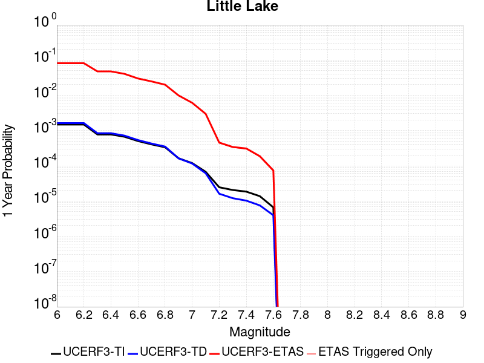 |  |

| Magnitude | 1 wk TI Prob | 1 wk TD Prob | 1 wk ETAS Prob | 1 wk ETAS/TD Gain | 1 wk ETAS Triggered Only | 1 mo TI Prob | 1 mo TD Prob | 1 mo ETAS Prob | 1 mo ETAS/TD Gain | 1 mo ETAS Triggered Only | 1 yr TI Prob | 1 yr TD Prob | 1 yr ETAS Prob | 1 yr ETAS/TD Gain | 1 yr ETAS Triggered Only | 10 yr TI Prob | 10 yr TD Prob | 10 yr ETAS Prob | 10 yr ETAS/TD Gain | 10 yr ETAS Triggered Only |
|-----|-----|-----|-----|-----|-----|-----|-----|-----|-----|-----|-----|-----|-----|-----|-----|-----|-----|-----|-----|-----|
| 6.0 | 2.8424427E-5 | 3.120572E-5 | 0.04904301 | 1571.6031 | 0.04901333 | 1.2181328E-4 | 1.337327E-4 | 0.06015237 | 449.79553 | 0.060026668 | 0.0014820677 | 0.0016271127 | 0.0801924 | 49.285095 | 0.07869333 | 0.014722223 | 0.016165402 | 0.10951163 | 6.7744455 | 0.09488 |
| 6.1 | 2.8424427E-5 | 3.120572E-5 | 0.04904301 | 1571.6031 | 0.04901333 | 1.2181328E-4 | 1.337327E-4 | 0.06015237 | 449.79553 | 0.060026668 | 0.0014820677 | 0.0016271127 | 0.0801924 | 49.285095 | 0.07869333 | 0.014722223 | 0.016165402 | 0.10951163 | 6.7744455 | 0.09488 |
| 6.2 | 2.8424427E-5 | 3.120572E-5 | 0.04904301 | 1571.6031 | 0.04901333 | 1.2181328E-4 | 1.337327E-4 | 0.06015237 | 449.79553 | 0.060026668 | 0.0014820677 | 0.0016271127 | 0.0801924 | 49.285095 | 0.07869333 | 0.014722223 | 0.016165402 | 0.10951163 | 6.7744455 | 0.09488 |
| 6.3 | 1.48860645E-5 | 1.6081389E-5 | 0.02916228 | 1813.4178 | 0.029146668 | 6.379586E-5 | 6.8918576E-5 | 0.035959776 | 521.7719 | 0.035893332 | 7.7643775E-4 | 8.3878887E-4 | 0.047253158 | 56.334984 | 0.046453334 | 0.007737305 | 0.008359048 | 0.06415538 | 7.6749625 | 0.056266665 |
| 6.4 | 1.48860645E-5 | 1.6081389E-5 | 0.02916228 | 1813.4178 | 0.029146668 | 6.379586E-5 | 6.8918576E-5 | 0.035959776 | 521.7719 | 0.035893332 | 7.7643775E-4 | 8.3878887E-4 | 0.047253158 | 56.334984 | 0.046453334 | 0.007737305 | 0.008359048 | 0.06415538 | 7.6749625 | 0.056266665 |
| 6.5 | 1.2797581E-5 | 1.3765565E-5 | 0.02513342 | 1825.8182 | 0.02512 | 5.4845623E-5 | 5.899409E-5 | 0.030857177 | 523.0554 | 0.0308 | 6.675408E-4 | 7.18042E-4 | 0.040236313 | 56.03615 | 0.039546665 | 0.006655392 | 0.00715977 | 0.055027906 | 7.6857085 | 0.048213333 |
| 6.6 | 9.661896E-6 | 1.0289038E-5 | 0.018570097 | 1804.843 | 0.01856 | 4.1407468E-5 | 4.409522E-5 | 0.022843089 | 518.04004 | 0.0228 | 5.040193E-4 | 5.367433E-4 | 0.029587809 | 55.124687 | 0.029066667 | 0.005028777 | 0.0053560743 | 0.04079192 | 7.616011 | 0.03562667 |
| 6.7 | 7.767871E-6 | 8.199687E-6 | 0.015341408 | 1870.9749 | 0.015333333 | 3.329045E-5 | 3.5141118E-5 | 0.018887812 | 537.4847 | 0.018853333 | 4.0523586E-4 | 4.2777284E-4 | 0.024470817 | 57.205166 | 0.024053333 | 0.004044977 | 0.004270846 | 0.033266477 | 7.7892013 | 0.02912 |
| 6.8 | 6.4235196E-6 | 6.7357446E-6 | 0.011899989 | 1766.6924 | 0.011893333 | 2.752908E-5 | 2.8867229E-5 | 0.014801774 | 512.75354 | 0.014773333 | 3.35115E-4 | 3.5141467E-4 | 0.019304752 | 54.934395 | 0.01896 | 0.003346101 | 0.00350985 | 0.026628422 | 7.586769 | 0.0232 |
| 6.9 | 3.1283696E-6 | 3.1121804E-6 | 0.0056030946 | 1800.376 | 0.0056 | 1.3407229E-5 | 1.3337856E-5 | 0.0075332373 | 564.8012 | 0.00752 | 1.6322079E-4 | 1.6237781E-4 | 0.009760819 | 60.11178 | 0.0096 | 0.0016310095 | 0.00162274 | 0.013550021 | 8.350087 | 0.011946667 |
| 7.0 | 2.290603E-6 | 2.2286815E-6 | 0.003442221 | 1544.51 | 0.00344 | 9.816834E-6 | 9.551463E-6 | 0.004596174 | 481.20108 | 0.004586667 | 1.19513395E-4 | 1.162839E-4 | 0.005928941 | 50.986774 | 0.005813333 | 0.0011944914 | 0.0011623327 | 0.008460507 | 7.2789025 | 0.0073066666 |
| 7.1 | 1.293693E-6 | 1.1776827E-6 | 0.0018145089 | 1540.745 | 0.0018133334 | 5.5443866E-6 | 5.0472063E-6 | 0.0024583682 | 487.07504 | 0.0024533332 | 6.750081E-5 | 6.14487E-5 | 0.0030745969 | 50.035183 | 0.0030133333 | 6.7480316E-4 | 6.143856E-4 | 0.0043187747 | 7.0294213 | 0.0037066666 |
| 7.2 | 4.715842E-7 | 3.0917857E-7 | 3.4697575E-4 | 1122.2502 | 3.4666667E-4 | 2.0210737E-6 | 1.3250503E-6 | 4.2799115E-4 | 322.9999 | 4.2666667E-4 | 2.4606294E-5 | 1.6132375E-5 | 5.227909E-4 | 32.40632 | 5.0666666E-4 | 2.460357E-4 | 1.6131258E-4 | 8.0120936E-4 | 4.9668126 | 6.4E-4 |
| 7.3 | 3.9430947E-7 | 2.3097488E-7 | 2.1356426E-4 | 924.62115 | 2.1333333E-4 | 1.6898966E-6 | 9.89892E-7 | 2.9432293E-4 | 297.32834 | 2.9333335E-4 | 2.0574296E-5 | 1.2051869E-5 | 3.853807E-4 | 31.976843 | 3.7333334E-4 | 2.0572392E-4 | 1.20512224E-4 | 6.271178E-4 | 5.2037697 | 5.0666666E-4 |
| 7.4 | 3.547123E-7 | 1.9679135E-7 | 1.8686343E-4 | 949.55096 | 1.8666667E-4 | 1.5201948E-6 | 8.4339126E-7 | 2.6750984E-4 | 317.18356 | 2.6666667E-4 | 1.8508214E-5 | 1.0268241E-5 | 3.5693136E-4 | 34.76071 | 3.4666667E-4 | 1.8506673E-4 | 1.02677724E-4 | 5.5596454E-4 | 5.414655 | 4.5333334E-4 |
| 7.5 | 2.6354266E-7 | 1.4423138E-7 | 1.3347754E-4 | 925.44037 | 1.3333333E-4 | 1.129468E-6 | 6.181344E-7 | 2.1395134E-4 | 346.12433 | 2.1333333E-4 | 1.3751187E-5 | 7.5257603E-6 | 2.7419042E-4 | 36.433582 | 2.6666667E-4 | 1.3750336E-4 | 7.5255106E-5 | 4.2189567E-4 | 5.606207 | 3.4666667E-4 |
| 7.6 | 1.269913E-7 | 7.572556E-8 | 7.572556E-8 | 1.0 | 0.0 | 5.4424834E-7 | 3.245381E-7 | 5.3657855E-5 | 165.33607 | 5.3333333E-5 | 6.6262032E-6 | 3.9512443E-6 | 5.7284367E-5 | 14.497805 | 5.3333333E-5 | 6.626006E-5 | 3.9511775E-5 | 1.19508615E-4 | 3.0246327 | 8.0E-5 |

## Owl Lake
*[(top)](#table-of-contents)*

| 1 Week | 1 Month | 1 Year | 10 Year |
|-----|-----|-----|-----|
|  |  |  |  |

| Magnitude | 1 wk TI Prob | 1 wk TD Prob | 1 wk ETAS Prob | 1 wk ETAS/TD Gain | 1 wk ETAS Triggered Only | 1 mo TI Prob | 1 mo TD Prob | 1 mo ETAS Prob | 1 mo ETAS/TD Gain | 1 mo ETAS Triggered Only | 1 yr TI Prob | 1 yr TD Prob | 1 yr ETAS Prob | 1 yr ETAS/TD Gain | 1 yr ETAS Triggered Only | 10 yr TI Prob | 10 yr TD Prob | 10 yr ETAS Prob | 10 yr ETAS/TD Gain | 10 yr ETAS Triggered Only |
|-----|-----|-----|-----|-----|-----|-----|-----|-----|-----|-----|-----|-----|-----|-----|-----|-----|-----|-----|-----|-----|
| 6.0 | 5.0320643E-5 | 6.635816E-5 | 0.024518069 | 369.48087 | 0.024453333 | 2.1564208E-4 | 2.843674E-4 | 0.032888427 | 115.65471 | 0.032613333 | 0.0026222812 | 0.0034577388 | 0.05041481 | 14.580283 | 0.04712 | 0.02591553 | 0.034140717 | 0.09299374 | 2.723837 | 0.060933333 |
| 6.1 | 5.0320643E-5 | 6.635816E-5 | 0.024518069 | 369.48087 | 0.024453333 | 2.1564208E-4 | 2.843674E-4 | 0.032888427 | 115.65471 | 0.032613333 | 0.0026222812 | 0.0034577388 | 0.05041481 | 14.580283 | 0.04712 | 0.02591553 | 0.034140717 | 0.09299374 | 2.723837 | 0.060933333 |
| 6.2 | 2.4125871E-5 | 3.0981035E-5 | 0.020057028 | 647.3969 | 0.020026667 | 1.0339249E-4 | 1.3277028E-4 | 0.026155982 | 197.00179 | 0.026026666 | 0.0012580766 | 0.001615439 | 0.03835599 | 23.743385 | 0.0368 | 0.012509781 | 0.016070465 | 0.06245946 | 3.8865998 | 0.047146667 |
| 6.3 | 1.7433485E-5 | 2.2355514E-5 | 0.018341945 | 820.4663 | 0.01832 | 7.471279E-5 | 9.580672E-5 | 0.023480233 | 245.0792 | 0.023386667 | 9.0924866E-4 | 0.0011659743 | 0.03350156 | 28.732676 | 0.03237333 | 0.009055373 | 0.011628896 | 0.051743586 | 4.4495697 | 0.040586665 |
| 6.4 | 1.7433485E-5 | 2.2355514E-5 | 0.018341945 | 820.4663 | 0.01832 | 7.471279E-5 | 9.580672E-5 | 0.023480233 | 245.0792 | 0.023386667 | 9.0924866E-4 | 0.0011659743 | 0.03350156 | 28.732676 | 0.03237333 | 0.009055373 | 0.011628896 | 0.051743586 | 4.4495697 | 0.040586665 |
| 6.5 | 1.5182742E-5 | 1.9429144E-5 | 0.01767242 | 909.583 | 0.017653333 | 6.506727E-5 | 8.326596E-5 | 0.022428071 | 269.35464 | 0.022346666 | 7.919061E-4 | 0.0010134429 | 0.031835508 | 31.413223 | 0.030853333 | 0.0078909 | 0.010118429 | 0.048182674 | 4.7618732 | 0.038453333 |
| 6.6 | 6.7271576E-6 | 8.547361E-6 | 0.01563508 | 1829.229 | 0.015626667 | 2.8830356E-5 | 3.6631063E-5 | 0.019315924 | 527.30994 | 0.01928 | 3.5095305E-4 | 4.458976E-4 | 0.025714625 | 57.66935 | 0.02528 | 0.0035039932 | 0.004467813 | 0.034386873 | 7.696579 | 0.030053332 |
| 6.7 | 6.682835E-6 | 8.479807E-6 | 0.015635014 | 1843.7936 | 0.015626667 | 2.8640408E-5 | 3.6341557E-5 | 0.019315641 | 531.50287 | 0.01928 | 3.4864116E-4 | 4.4237426E-4 | 0.025684536 | 58.060646 | 0.025253333 | 0.003480947 | 0.0044327388 | 0.034299757 | 7.737825 | 0.03 |
| 6.8 | 6.5774975E-6 | 8.32628E-6 | 0.015634863 | 1877.7728 | 0.015626667 | 2.8188972E-5 | 3.5683603E-5 | 0.019314995 | 541.2849 | 0.01928 | 3.4314668E-4 | 4.343669E-4 | 0.02562342 | 58.99027 | 0.0252 | 0.0034261728 | 0.004352885 | 0.034089547 | 7.8314834 | 0.029866667 |
| 6.9 | 6.363419E-6 | 7.999454E-6 | 0.015607875 | 1951.1173 | 0.0156 | 2.727151E-5 | 3.428296E-5 | 0.019286957 | 562.5815 | 0.019253334 | 3.3198006E-4 | 4.1732067E-4 | 0.025526838 | 61.1684 | 0.02512 | 0.0033148455 | 0.0041828766 | 0.033818394 | 8.084961 | 0.02976 |
| 7.0 | 6.1342453E-6 | 7.6316555E-6 | 0.015447514 | 2024.1367 | 0.01544 | 2.6289357E-5 | 3.2706717E-5 | 0.019125415 | 584.755 | 0.019093333 | 3.2002592E-4 | 3.9813702E-4 | 0.02526823 | 63.46617 | 0.02488 | 0.0031956544 | 0.003991571 | 0.033340618 | 8.3527565 | 0.029466666 |
| 7.1 | 5.842926E-6 | 7.142211E-6 | 0.014860369 | 2080.64 | 0.014853333 | 2.504087E-5 | 3.0609146E-5 | 0.018376714 | 600.36676 | 0.018346667 | 3.0482994E-4 | 3.7260808E-4 | 0.024257038 | 65.10068 | 0.023893334 | 0.0030441214 | 0.0037370329 | 0.031898066 | 8.535666 | 0.028266666 |
| 7.2 | 4.77173E-6 | 5.358483E-6 | 0.009418641 | 1757.7065 | 0.009413334 | 2.045011E-5 | 2.2964748E-5 | 0.011782695 | 513.07745 | 0.01176 | 2.4895166E-4 | 2.79564E-4 | 0.015608611 | 55.831978 | 0.015333333 | 0.0024867293 | 0.002808645 | 0.020678313 | 7.362381 | 0.01792 |
| 7.3 | 3.0494948E-6 | 2.710463E-6 | 0.0025893701 | 955.3239 | 0.0025866667 | 1.3069198E-5 | 1.1616219E-5 | 0.0032649117 | 281.06494 | 0.0032533333 | 1.5910587E-4 | 1.4141845E-4 | 0.004514133 | 31.920399 | 0.0043733334 | 0.0015899199 | 0.0014232415 | 0.0065359543 | 4.592302 | 0.00512 |
| 7.4 | 2.7263884E-6 | 2.3056762E-6 | 0.0016289686 | 706.5036 | 0.0016266666 | 1.1684469E-5 | 9.881433E-6 | 0.002036528 | 206.09644 | 0.0020266667 | 1.4224913E-4 | 1.20299905E-4 | 0.003026617 | 25.15893 | 0.0029066666 | 0.0014215811 | 0.0012112238 | 0.004567154 | 3.7706938 | 0.00336 |
| 7.5 | 2.6090431E-6 | 2.1656133E-6 | 0.0012554963 | 579.74164 | 0.0012533333 | 1.1181565E-5 | 9.281167E-6 | 0.0015559335 | 167.64417 | 0.0015466667 | 1.3612706E-4 | 1.1299244E-4 | 0.0024327303 | 21.530025 | 0.00232 | 0.001360437 | 0.0011379806 | 0.003828249 | 3.3640723 | 0.0026933334 |
| 7.6 | 2.3008756E-6 | 1.8727933E-6 | 9.0853777E-4 | 485.12442 | 9.066667E-4 | 9.860858E-6 | 8.0262325E-6 | 0.0011013508 | 137.21889 | 0.0010933334 | 1.20049335E-4 | 9.7715085E-5 | 0.0017242228 | 17.64541 | 0.0016266666 | 0.001199845 | 9.849932E-4 | 0.0029297424 | 2.9743783 | 0.0019466666 |
| 7.7 | 1.7184348E-6 | 1.3419171E-6 | 4.8134127E-4 | 358.69672 | 4.8E-4 | 7.3646997E-6 | 5.7510606E-6 | 6.1908085E-4 | 107.64638 | 6.133333E-4 | 8.966153E-5 | 7.0016955E-5 | 0.0010032849 | 14.329171 | 9.3333336E-4 | 8.962536E-4 | 7.078345E-4 | 0.0018536896 | 2.6188178 | 0.0011466667 |
| 7.8 | 8.4612907E-7 | 8.4058576E-7 | 2.1417374E-4 | 254.79106 | 2.1333333E-4 | 3.6262625E-6 | 3.6025056E-6 | 3.2360136E-4 | 89.826744 | 3.2E-4 | 4.4148852E-5 | 4.3859643E-5 | 4.171766E-4 | 9.511628 | 3.7333334E-4 | 4.414008E-4 | 4.4398365E-4 | 8.43806E-4 | 1.9005342 | 4.0E-4 |
| 7.9 | 2.716738E-7 | 3.768106E-7 | 8.037678E-5 | 213.30818 | 8.0E-5 | 1.1643157E-6 | 1.6149015E-6 | 1.6161465E-4 | 100.07709 | 1.6E-4 | 1.4175452E-5 | 1.966126E-5 | 1.7965812E-4 | 9.1376705 | 1.6E-4 | 1.4174548E-4 | 1.9836679E-4 | 3.849964E-4 | 1.9408311 | 1.8666667E-4 |
| 8.0 | 2.1995428E-8 | 3.384878E-8 | 3.384878E-8 | 1.0 | 0.0 | 9.426611E-8 | 1.4506621E-7 | 1.4506621E-7 | 1.0 | 0.0 | 1.1476893E-6 | 1.7661803E-6 | 1.7661803E-6 | 1.0 | 0.0 | 1.14768345E-5 | 1.7963059E-5 | 1.7963059E-5 | 1.0 | 0.0 |

## Garlock (East)
*[(top)](#table-of-contents)*

| 1 Week | 1 Month | 1 Year | 10 Year |
|-----|-----|-----|-----|
|  |  |  |  |

| Magnitude | 1 wk TI Prob | 1 wk TD Prob | 1 wk ETAS Prob | 1 wk ETAS/TD Gain | 1 wk ETAS Triggered Only | 1 mo TI Prob | 1 mo TD Prob | 1 mo ETAS Prob | 1 mo ETAS/TD Gain | 1 mo ETAS Triggered Only | 1 yr TI Prob | 1 yr TD Prob | 1 yr ETAS Prob | 1 yr ETAS/TD Gain | 1 yr ETAS Triggered Only | 10 yr TI Prob | 10 yr TD Prob | 10 yr ETAS Prob | 10 yr ETAS/TD Gain | 10 yr ETAS Triggered Only |
|-----|-----|-----|-----|-----|-----|-----|-----|-----|-----|-----|-----|-----|-----|-----|-----|-----|-----|-----|-----|-----|
| 6.0 | 4.5092507E-5 | 6.290325E-5 | 0.015608592 | 248.13649 | 0.015546666 | 1.9323928E-4 | 2.6956003E-4 | 0.021357207 | 79.22988 | 0.021093333 | 0.0023501497 | 0.0032774 | 0.03413593 | 10.415552 | 0.03096 | 0.023254504 | 0.032351844 | 0.07221895 | 2.2322977 | 0.0412 |
| 6.1 | 4.5092507E-5 | 6.290325E-5 | 0.015608592 | 248.13649 | 0.015546666 | 1.9323928E-4 | 2.6956003E-4 | 0.021357207 | 79.22988 | 0.021093333 | 0.0023501497 | 0.0032774 | 0.03413593 | 10.415552 | 0.03096 | 0.023254504 | 0.032351844 | 0.07221895 | 2.2322977 | 0.0412 |
| 6.2 | 2.6674514E-5 | 3.4509674E-5 | 0.012407416 | 359.53442 | 0.012373334 | 1.1431433E-4 | 1.4789042E-4 | 0.016225513 | 109.71308 | 0.01608 | 0.0013908884 | 0.0017991117 | 0.024637949 | 13.694507 | 0.02288 | 0.01382215 | 0.017890299 | 0.04719645 | 2.638103 | 0.02984 |
| 6.3 | 2.6674514E-5 | 3.4509674E-5 | 0.012407416 | 359.53442 | 0.012373334 | 1.1431433E-4 | 1.4789042E-4 | 0.016225513 | 109.71308 | 0.01608 | 0.0013908884 | 0.0017991117 | 0.024637949 | 13.694507 | 0.02288 | 0.01382215 | 0.017890299 | 0.04719645 | 2.638103 | 0.02984 |
| 6.4 | 2.5312667E-5 | 3.233893E-5 | 0.012245277 | 378.65436 | 0.0122133335 | 1.0847834E-4 | 1.3858822E-4 | 0.01602972 | 115.66437 | 0.015893333 | 0.0013199237 | 0.0016860351 | 0.024048269 | 14.263207 | 0.0224 | 0.013121112 | 0.016778335 | 0.045304872 | 2.7002008 | 0.029013334 |
| 6.5 | 2.5312667E-5 | 3.233893E-5 | 0.012245277 | 378.65436 | 0.0122133335 | 1.0847834E-4 | 1.3858822E-4 | 0.01602972 | 115.66437 | 0.015893333 | 0.0013199237 | 0.0016860351 | 0.024048269 | 14.263207 | 0.0224 | 0.013121112 | 0.016778335 | 0.045304872 | 2.7002008 | 0.029013334 |
| 6.6 | 2.246556E-5 | 2.8133776E-5 | 0.011894466 | 422.78244 | 0.011866666 | 9.627742E-5 | 1.20567885E-4 | 0.015505379 | 128.60289 | 0.015386667 | 0.0011715472 | 0.0014669491 | 0.022875497 | 15.593926 | 0.02144 | 0.011653901 | 0.01461866 | 0.04171008 | 2.8532078 | 0.027493333 |
| 6.7 | 2.2241198E-5 | 2.7803519E-5 | 0.011840808 | 425.87445 | 0.011813333 | 9.531594E-5 | 1.1915263E-4 | 0.015450659 | 129.67116 | 0.015333333 | 0.0011598538 | 0.0014497414 | 0.022752147 | 15.693934 | 0.021333333 | 0.011538187 | 0.014448853 | 0.041413534 | 2.866216 | 0.02736 |
| 6.8 | 1.9528685E-5 | 2.389819E-5 | 0.011623621 | 486.3808 | 0.0116 | 8.369167E-5 | 1.0241691E-4 | 0.015034221 | 146.79433 | 0.014933334 | 0.0010184698 | 0.0012462323 | 0.021647442 | 17.370312 | 0.020426666 | 0.010138147 | 0.012436427 | 0.038034074 | 3.0582798 | 0.02592 |
| 6.9 | 1.3318621E-5 | 1.5198884E-5 | 0.010975032 | 722.0946 | 0.01096 | 5.7078556E-5 | 6.513648E-5 | 0.014144219 | 217.14742 | 0.01408 | 6.9470983E-4 | 7.927538E-4 | 0.019657787 | 24.796835 | 0.01888 | 0.0069254204 | 0.007939888 | 0.031299595 | 3.9420705 | 0.023546666 |
| 7.0 | 1.1760853E-5 | 1.31077895E-5 | 0.0107863 | 822.8924 | 0.010773334 | 5.0402683E-5 | 5.6175057E-5 | 0.013762072 | 244.98544 | 0.013706666 | 6.134799E-4 | 6.8372174E-4 | 0.018804656 | 27.503378 | 0.018133333 | 0.0061178906 | 0.00685652 | 0.029208869 | 4.2600136 | 0.022506667 |
| 7.1 | 1.0064758E-5 | 1.0902931E-5 | 0.010544121 | 967.0906 | 0.010533334 | 4.3133965E-5 | 4.672603E-5 | 0.013352771 | 285.7673 | 0.013306667 | 5.2502943E-4 | 5.687444E-4 | 0.01805213 | 31.740318 | 0.017493334 | 0.005237907 | 0.0057129986 | 0.02713657 | 4.7499695 | 0.021546667 |
| 7.2 | 9.768808E-6 | 1.0498807E-5 | 0.010223725 | 973.79877 | 0.010213333 | 4.186565E-5 | 4.499413E-5 | 0.013004411 | 289.0246 | 0.01296 | 5.095951E-4 | 5.4766936E-4 | 0.017551685 | 32.04796 | 0.017013334 | 0.0050842804 | 0.0055032647 | 0.026268356 | 4.7732315 | 0.02088 |
| 7.3 | 9.344516E-6 | 9.944468E-6 | 0.009636516 | 969.03284 | 0.009626667 | 4.004731E-5 | 4.261847E-5 | 0.012122104 | 284.4331 | 0.01208 | 4.8746695E-4 | 5.1875977E-4 | 0.016350543 | 31.518524 | 0.01584 | 0.0048639905 | 0.0052149445 | 0.024633149 | 4.723569 | 0.01952 |
| 7.4 | 9.023491E-6 | 9.490661E-6 | 0.008276079 | 872.02344 | 0.008266667 | 3.867153E-5 | 4.0673647E-5 | 0.010546913 | 259.30582 | 0.010506666 | 4.7072413E-4 | 4.950925E-4 | 0.014408201 | 29.10204 | 0.01392 | 0.004697283 | 0.0049783974 | 0.022092769 | 4.437727 | 0.0172 |
| 7.5 | 7.081253E-6 | 7.087672E-6 | 0.00438039 | 618.0294 | 0.0043733334 | 3.0347876E-5 | 3.0375388E-5 | 0.0054168785 | 178.33118 | 0.005386667 | 3.6942272E-4 | 3.6975832E-4 | 0.0075404393 | 20.392885 | 0.0071733333 | 0.003688092 | 0.0037243143 | 0.012677512 | 3.4039855 | 0.008986667 |
| 7.6 | 6.116396E-6 | 5.959245E-6 | 0.00267261 | 448.48135 | 0.0026666666 | 2.6212863E-5 | 2.5539372E-5 | 0.0033854535 | 132.55821 | 0.00336 | 3.1909486E-4 | 3.1089774E-4 | 0.0046828715 | 15.062417 | 0.0043733334 | 0.0031863707 | 0.0031357552 | 0.008691612 | 2.7717764 | 0.0055733332 |
| 7.7 | 4.797145E-6 | 4.757281E-6 | 0.0013914173 | 292.48163 | 0.0013866667 | 2.055903E-5 | 2.0388188E-5 | 0.0017536862 | 86.01481 | 0.0017333333 | 2.5027743E-4 | 2.4819805E-4 | 0.0025676223 | 10.345054 | 0.00232 | 0.0024999576 | 0.0025093474 | 0.005515119 | 2.1978302 | 0.0030133333 |
| 7.8 | 3.4028885E-6 | 3.978462E-6 | 8.573084E-4 | 215.48741 | 8.5333333E-4 | 1.4583726E-5 | 1.7050439E-5 | 0.0010303665 | 60.430496 | 0.0010133333 | 1.775424E-4 | 2.0756939E-4 | 0.0015406259 | 7.422221 | 0.0013333333 | 0.0017740062 | 0.0021012232 | 0.0038841355 | 1.8485117 | 0.0017866667 |
| 7.9 | 2.5928412E-6 | 3.3724489E-6 | 5.3670397E-4 | 159.14369 | 5.3333334E-4 | 1.1112129E-5 | 1.4453272E-5 | 6.277777E-4 | 43.43499 | 6.133333E-4 | 1.3528178E-4 | 1.7595445E-4 | 0.0010824616 | 6.1519423 | 9.066667E-4 | 0.0013519945 | 0.0017812408 | 0.003058961 | 1.7173202 | 0.00128 |
| 8.0 | 1.3743648E-6 | 1.6734747E-6 | 1.8833982E-4 | 112.544174 | 1.8666667E-4 | 5.8901214E-6 | 7.1720146E-6 | 2.471703E-4 | 34.46316 | 2.4E-4 | 7.1709874E-5 | 8.731581E-5 | 4.6061655E-4 | 5.275294 | 3.7333334E-4 | 7.1686733E-4 | 8.837234E-4 | 0.0014432285 | 1.6331224 | 5.6E-4 |
| 8.1 | 3.6733252E-7 | 3.1489964E-7 | 2.6981557E-5 | 85.68304 | 2.6666667E-5 | 1.5742813E-6 | 1.3495693E-6 | 5.468283E-5 | 40.518726 | 5.3333333E-5 | 1.9166706E-5 | 1.6430899E-5 | 6.976336E-5 | 4.2458634 | 5.3333333E-5 | 1.9165053E-4 | 1.6638759E-4 | 2.463743E-4 | 1.480725 | 8.0E-5 |

## Panamint Valley
*[(top)](#table-of-contents)*

| 1 Week | 1 Month | 1 Year | 10 Year |
|-----|-----|-----|-----|
|  |  | 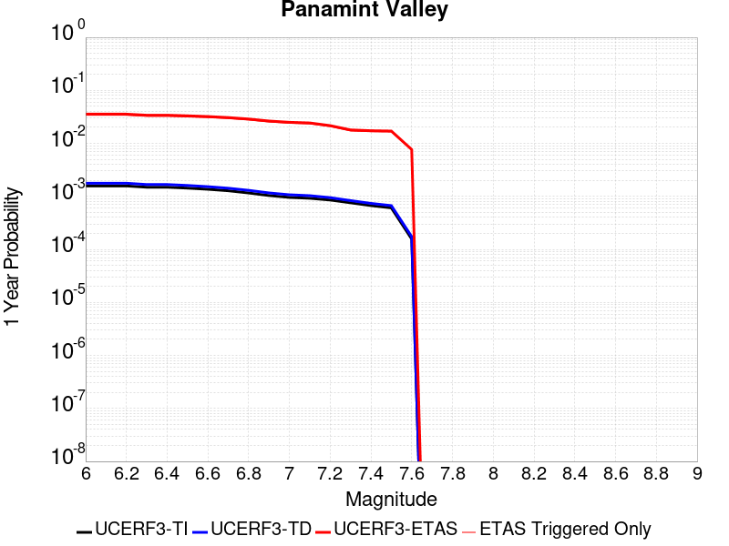 |  |

| Magnitude | 1 wk TI Prob | 1 wk TD Prob | 1 wk ETAS Prob | 1 wk ETAS/TD Gain | 1 wk ETAS Triggered Only | 1 mo TI Prob | 1 mo TD Prob | 1 mo ETAS Prob | 1 mo ETAS/TD Gain | 1 mo ETAS Triggered Only | 1 yr TI Prob | 1 yr TD Prob | 1 yr ETAS Prob | 1 yr ETAS/TD Gain | 1 yr ETAS Triggered Only | 10 yr TI Prob | 10 yr TD Prob | 10 yr ETAS Prob | 10 yr ETAS/TD Gain | 10 yr ETAS Triggered Only |
|-----|-----|-----|-----|-----|-----|-----|-----|-----|-----|-----|-----|-----|-----|-----|-----|-----|-----|-----|-----|-----|
| 6.0 | 3.0211835E-5 | 3.3984514E-5 | 0.018646685 | 548.6818 | 0.018613333 | 1.2947287E-4 | 1.4563995E-4 | 0.023795528 | 163.386 | 0.023653334 | 0.0015751923 | 0.0017717537 | 0.035844613 | 20.231148 | 0.034133334 | 0.015640736 | 0.017583137 | 0.06080948 | 3.4583976 | 0.044 |
| 6.1 | 3.0211835E-5 | 3.3984514E-5 | 0.018646685 | 548.6818 | 0.018613333 | 1.2947287E-4 | 1.4563995E-4 | 0.023795528 | 163.386 | 0.023653334 | 0.0015751923 | 0.0017717537 | 0.035844613 | 20.231148 | 0.034133334 | 0.015640736 | 0.017583137 | 0.06080948 | 3.4583976 | 0.044 |
| 6.2 | 3.0211835E-5 | 3.3984514E-5 | 0.018646685 | 548.6818 | 0.018613333 | 1.2947287E-4 | 1.4563995E-4 | 0.023795528 | 163.386 | 0.023653334 | 0.0015751923 | 0.0017717537 | 0.035844613 | 20.231148 | 0.034133334 | 0.015640736 | 0.017583137 | 0.06080948 | 3.4583976 | 0.044 |
| 6.3 | 2.8573924E-5 | 3.210268E-5 | 0.017898196 | 557.52966 | 0.017866667 | 1.2245393E-4 | 1.3757581E-4 | 0.022747798 | 165.34737 | 0.022613334 | 0.001489857 | 0.0016737265 | 0.03417923 | 20.421038 | 0.03256 | 0.01479908 | 0.016617801 | 0.057631396 | 3.468052 | 0.041706666 |
| 6.4 | 2.8573924E-5 | 3.210268E-5 | 0.017898196 | 557.52966 | 0.017866667 | 1.2245393E-4 | 1.3757581E-4 | 0.022747798 | 165.34737 | 0.022613334 | 0.001489857 | 0.0016737265 | 0.03417923 | 20.421038 | 0.03256 | 0.01479908 | 0.016617801 | 0.057631396 | 3.468052 | 0.041706666 |
| 6.5 | 2.7468774E-5 | 3.0828433E-5 | 0.017443625 | 565.8291 | 0.017413333 | 1.1771801E-4 | 1.3211532E-4 | 0.022182535 | 167.90282 | 0.022053333 | 0.0014322745 | 0.0016073446 | 0.033236425 | 20.677845 | 0.03168 | 0.014230782 | 0.015963677 | 0.055771224 | 3.493633 | 0.040453333 |
| 6.6 | 2.6135967E-5 | 2.925248E-5 | 0.017042087 | 582.58606 | 0.017013334 | 1.1200648E-4 | 1.253619E-4 | 0.021669328 | 172.85417 | 0.021546667 | 0.0013628257 | 0.0015252391 | 0.032118507 | 21.058014 | 0.03064 | 0.013544982 | 0.015154043 | 0.053733744 | 3.5458353 | 0.039173335 |
| 6.7 | 2.4498746E-5 | 2.7341335E-5 | 0.016586889 | 606.6598 | 0.01656 | 1.04990395E-4 | 1.1717203E-4 | 0.021021388 | 179.4062 | 0.020906666 | 0.0012775084 | 0.0014256609 | 0.030717175 | 21.545918 | 0.029333333 | 0.012701893 | 0.014171274 | 0.051028125 | 3.600814 | 0.037386667 |
| 6.8 | 2.2244329E-5 | 2.4935423E-5 | 0.015571214 | 624.4616 | 0.015546666 | 9.532935E-5 | 1.0686185E-4 | 0.019678103 | 184.14526 | 0.019573333 | 0.0011600169 | 0.0013002884 | 0.028837768 | 22.17798 | 0.027573334 | 0.011539802 | 0.0129325185 | 0.047308788 | 3.6581264 | 0.034826666 |
| 6.9 | 1.9902658E-5 | 2.2290267E-5 | 0.014901958 | 668.5411 | 0.01488 | 8.529431E-5 | 9.552632E-5 | 0.018600425 | 194.71518 | 0.018506667 | 0.0010379635 | 0.0011624309 | 0.02662613 | 22.90556 | 0.025493333 | 0.010331288 | 0.011568608 | 0.043013904 | 3.7181575 | 0.031813335 |
| 7.0 | 1.8353881E-5 | 2.0566185E-5 | 0.014446937 | 702.46063 | 0.014426666 | 7.865712E-5 | 8.813792E-5 | 0.018006558 | 204.29979 | 0.01792 | 9.5722964E-4 | 0.0010725686 | 0.025313208 | 23.600548 | 0.024266666 | 0.009531168 | 0.010678849 | 0.040252957 | 3.7694097 | 0.029893333 |
| 7.1 | 1.7667631E-5 | 1.9772613E-5 | 0.014232825 | 719.8252 | 0.014213333 | 7.571623E-5 | 8.473711E-5 | 0.017736575 | 209.31294 | 0.017653333 | 9.2145515E-4 | 0.0010312037 | 0.024660146 | 23.913944 | 0.023653334 | 0.009176437 | 0.010269073 | 0.039090037 | 3.806579 | 0.02912 |
| 7.2 | 1.6381597E-5 | 1.8158249E-5 | 0.012711261 | 700.0268 | 0.012693333 | 7.020495E-5 | 7.781885E-5 | 0.015943252 | 204.87646 | 0.015866667 | 8.544101E-4 | 9.4704994E-4 | 0.022153614 | 23.392235 | 0.021226667 | 0.008511325 | 0.009434792 | 0.03524232 | 3.735357 | 0.026053334 |
| 7.3 | 1.4520491E-5 | 1.5966476E-5 | 0.010522465 | 659.0349 | 0.010506666 | 6.222919E-5 | 6.842605E-5 | 0.013374182 | 195.45454 | 0.013306667 | 7.57377E-4 | 8.327849E-4 | 0.018391484 | 22.084312 | 0.017573332 | 0.0075480095 | 0.00829975 | 0.029614694 | 3.5681427 | 0.021493332 |
| 7.4 | 1.2852287E-5 | 1.4145411E-5 | 0.010254 | 724.8995 | 0.01024 | 5.5080065E-5 | 6.062187E-5 | 0.013046501 | 215.21114 | 0.0129866665 | 6.7039346E-4 | 7.378371E-4 | 0.017818559 | 24.149717 | 0.017093332 | 0.0066837464 | 0.0073567946 | 0.027977303 | 3.8029203 | 0.020773333 |
| 7.5 | 1.1637851E-5 | 1.2836797E-5 | 0.010092707 | 786.2325 | 0.01008 | 4.987555E-5 | 5.5013777E-5 | 0.01285431 | 233.6562 | 0.0128 | 6.070656E-4 | 6.6960254E-4 | 0.017564949 | 26.231901 | 0.016906668 | 0.006054099 | 0.0066787465 | 0.026995476 | 4.0419974 | 0.020453334 |
| 7.6 | 3.0068115E-6 | 3.3330316E-6 | 0.004429985 | 1329.1158 | 0.0044266665 | 1.2886271E-5 | 1.4284384E-5 | 0.005667537 | 396.76453 | 0.0056533334 | 1.5687906E-4 | 1.7390578E-4 | 0.0074526398 | 42.85447 | 0.00728 | 0.0015676835 | 0.0017391363 | 0.0104972115 | 6.0358763 | 0.008773333 |

## Airport Lake
*[(top)](#table-of-contents)*

| 1 Week | 1 Month | 1 Year | 10 Year |
|-----|-----|-----|-----|
|  |  |  |  |

| Magnitude | 1 wk TI Prob | 1 wk TD Prob | 1 wk ETAS Prob | 1 wk ETAS/TD Gain | 1 wk ETAS Triggered Only | 1 mo TI Prob | 1 mo TD Prob | 1 mo ETAS Prob | 1 mo ETAS/TD Gain | 1 mo ETAS Triggered Only | 1 yr TI Prob | 1 yr TD Prob | 1 yr ETAS Prob | 1 yr ETAS/TD Gain | 1 yr ETAS Triggered Only | 10 yr TI Prob | 10 yr TD Prob | 10 yr ETAS Prob | 10 yr ETAS/TD Gain | 10 yr ETAS Triggered Only |
|-----|-----|-----|-----|-----|-----|-----|-----|-----|-----|-----|-----|-----|-----|-----|-----|-----|-----|-----|-----|-----|
| 6.0 | 1.2387061E-5 | 1.3103157E-5 | 0.021292824 | 1625.0149 | 0.02128 | 5.3086325E-5 | 5.615534E-5 | 0.026108027 | 464.9251 | 0.026053334 | 6.461343E-4 | 6.8350515E-4 | 0.03394076 | 49.656914 | 0.03328 | 0.0064425888 | 0.0068168393 | 0.046756044 | 6.858904 | 0.04021333 |
| 6.1 | 1.2387061E-5 | 1.3103157E-5 | 0.021292824 | 1625.0149 | 0.02128 | 5.3086325E-5 | 5.615534E-5 | 0.026108027 | 464.9251 | 0.026053334 | 6.461343E-4 | 6.8350515E-4 | 0.03394076 | 49.656914 | 0.03328 | 0.0064425888 | 0.0068168393 | 0.046756044 | 6.858904 | 0.04021333 |
| 6.2 | 1.2387061E-5 | 1.3103157E-5 | 0.021292824 | 1625.0149 | 0.02128 | 5.3086325E-5 | 5.615534E-5 | 0.026108027 | 464.9251 | 0.026053334 | 6.461343E-4 | 6.8350515E-4 | 0.03394076 | 49.656914 | 0.03328 | 0.0064425888 | 0.0068168393 | 0.046756044 | 6.858904 | 0.04021333 |
| 6.3 | 1.2387061E-5 | 1.3103157E-5 | 0.021292824 | 1625.0149 | 0.02128 | 5.3086325E-5 | 5.615534E-5 | 0.026108027 | 464.9251 | 0.026053334 | 6.461343E-4 | 6.8350515E-4 | 0.03394076 | 49.656914 | 0.03328 | 0.0064425888 | 0.0068168393 | 0.046756044 | 6.858904 | 0.04021333 |
| 6.4 | 1.2387061E-5 | 1.3103157E-5 | 0.021292824 | 1625.0149 | 0.02128 | 5.3086325E-5 | 5.615534E-5 | 0.026108027 | 464.9251 | 0.026053334 | 6.461343E-4 | 6.8350515E-4 | 0.03394076 | 49.656914 | 0.03328 | 0.0064425888 | 0.0068168393 | 0.046756044 | 6.858904 | 0.04021333 |
| 6.5 | 6.9922594E-6 | 7.384925E-6 | 0.016193932 | 2192.8364 | 0.016186666 | 2.996648E-5 | 3.1649324E-5 | 0.01987102 | 627.84973 | 0.01984 | 3.6478083E-4 | 3.8526783E-4 | 0.02541562 | 65.968704 | 0.02504 | 0.003641826 | 0.0038465366 | 0.034076475 | 8.859001 | 0.030346667 |
| 6.6 | 6.9922594E-6 | 7.384925E-6 | 0.016193932 | 2192.8364 | 0.016186666 | 2.996648E-5 | 3.1649324E-5 | 0.01987102 | 627.84973 | 0.01984 | 3.6478083E-4 | 3.8526783E-4 | 0.02541562 | 65.968704 | 0.02504 | 0.003641826 | 0.0038465366 | 0.034076475 | 8.859001 | 0.030346667 |
| 6.7 | 5.477277E-6 | 5.7860684E-6 | 0.013872373 | 2397.5474 | 0.013866667 | 2.3473833E-5 | 2.4797222E-5 | 0.017037708 | 687.08136 | 0.017013334 | 2.8575645E-4 | 3.0186825E-4 | 0.021628762 | 71.64967 | 0.021333333 | 0.0028538927 | 0.003014966 | 0.028803645 | 9.553556 | 0.025866667 |
| 6.8 | 3.9950432E-6 | 4.2190873E-6 | 0.010217509 | 2421.7346 | 0.010213333 | 1.7121502E-5 | 1.8081691E-5 | 0.012764518 | 705.93604 | 0.012746667 | 2.0843433E-4 | 2.2012512E-4 | 0.016269924 | 73.91217 | 0.016053334 | 0.0020823893 | 0.0021993418 | 0.021782843 | 9.904256 | 0.019626666 |
| 6.9 | 2.95695E-6 | 3.1230243E-6 | 0.0071231006 | 2280.8342 | 0.00712 | 1.2672582E-5 | 1.3384334E-5 | 0.009186595 | 686.3692 | 0.009173334 | 1.5427776E-4 | 1.6294434E-4 | 0.0119476905 | 73.323746 | 0.011786667 | 0.001541707 | 0.0016284712 | 0.016058268 | 9.860947 | 0.014453333 |
| 7.0 | 1.456072E-6 | 1.540812E-6 | 0.0027748698 | 1800.914 | 0.0027733333 | 6.2402937E-6 | 6.603469E-6 | 0.0037665786 | 570.3939 | 0.00376 | 7.597293E-5 | 8.039528E-5 | 0.004906674 | 61.031868 | 0.004826667 | 7.594696E-4 | 8.0376083E-4 | 0.0068255835 | 8.492058 | 0.0060266666 |
| 7.1 | 6.995192E-7 | 7.4089746E-7 | 0.0013074066 | 1764.6256 | 0.0013066666 | 2.997936E-6 | 3.1752747E-6 | 0.001869836 | 588.8738 | 0.0018666667 | 3.649926E-5 | 3.865897E-5 | 0.0023585693 | 61.009624 | 0.00232 | 3.6493264E-4 | 3.865897E-4 | 0.0032121637 | 8.308973 | 0.0028266667 |

## Hunter Mountain-Saline Valley
*[(top)](#table-of-contents)*

| 1 Week | 1 Month | 1 Year | 10 Year |
|-----|-----|-----|-----|
|  |  |  | 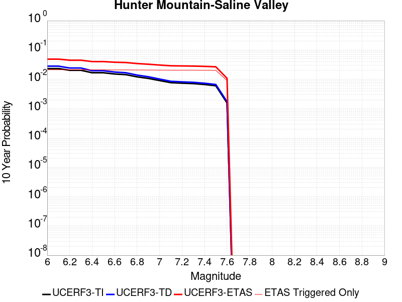 |

| Magnitude | 1 wk TI Prob | 1 wk TD Prob | 1 wk ETAS Prob | 1 wk ETAS/TD Gain | 1 wk ETAS Triggered Only | 1 mo TI Prob | 1 mo TD Prob | 1 mo ETAS Prob | 1 mo ETAS/TD Gain | 1 mo ETAS Triggered Only | 1 yr TI Prob | 1 yr TD Prob | 1 yr ETAS Prob | 1 yr ETAS/TD Gain | 1 yr ETAS Triggered Only | 10 yr TI Prob | 10 yr TD Prob | 10 yr ETAS Prob | 10 yr ETAS/TD Gain | 10 yr ETAS Triggered Only |
|-----|-----|-----|-----|-----|-----|-----|-----|-----|-----|-----|-----|-----|-----|-----|-----|-----|-----|-----|-----|-----|
| 6.0 | 4.5103672E-5 | 5.4570177E-5 | 0.010587329 | 194.01309 | 0.010533334 | 1.9328714E-4 | 2.3385242E-4 | 0.013644049 | 58.344696 | 0.013413333 | 0.002350731 | 0.0028435152 | 0.020553015 | 7.22803 | 0.01776 | 0.023260195 | 0.028091887 | 0.049136937 | 1.7491505 | 0.021653334 |
| 6.1 | 4.5103672E-5 | 5.4570177E-5 | 0.010587329 | 194.01309 | 0.010533334 | 1.9328714E-4 | 2.3385242E-4 | 0.013644049 | 58.344696 | 0.013413333 | 0.002350731 | 0.0028435152 | 0.020553015 | 7.22803 | 0.01776 | 0.023260195 | 0.028091887 | 0.049136937 | 1.7491505 | 0.021653334 |
| 6.2 | 3.9363465E-5 | 4.706337E-5 | 0.010473239 | 222.53484 | 0.010426667 | 1.6868966E-4 | 2.0168544E-4 | 0.0134523455 | 66.69964 | 0.013253333 | 0.002051862 | 0.0024528175 | 0.019929845 | 8.125286 | 0.01752 | 0.020330196 | 0.024273481 | 0.04516704 | 1.8607565 | 0.021413334 |
| 6.3 | 3.9363465E-5 | 4.706337E-5 | 0.010473239 | 222.53484 | 0.010426667 | 1.6868966E-4 | 2.0168544E-4 | 0.0134523455 | 66.69964 | 0.013253333 | 0.002051862 | 0.0024528175 | 0.019929845 | 8.125286 | 0.01752 | 0.020330196 | 0.024273481 | 0.04516704 | 1.8607565 | 0.021413334 |
| 6.4 | 3.2311684E-5 | 3.795099E-5 | 0.010384225 | 273.62198 | 0.010346667 | 1.384713E-4 | 1.6263737E-4 | 0.013307166 | 81.82108 | 0.013146667 | 0.0016845843 | 0.0019783843 | 0.019357268 | 9.784382 | 0.017413333 | 0.016718714 | 0.019616475 | 0.040452894 | 2.0621898 | 0.021253332 |
| 6.5 | 3.2311684E-5 | 3.795099E-5 | 0.010384225 | 273.62198 | 0.010346667 | 1.384713E-4 | 1.6263737E-4 | 0.013307166 | 81.82108 | 0.013146667 | 0.0016845843 | 0.0019783843 | 0.019357268 | 9.784382 | 0.017413333 | 0.016718714 | 0.019616475 | 0.040452894 | 2.0621898 | 0.021253332 |
| 6.6 | 2.9305844E-5 | 3.418183E-5 | 0.010380494 | 303.68457 | 0.010346667 | 1.2559042E-4 | 1.4648569E-4 | 0.013291227 | 90.733955 | 0.013146667 | 0.0015279909 | 0.001782067 | 0.01911113 | 10.724136 | 0.01736 | 0.015175272 | 0.01768569 | 0.038510755 | 2.177509 | 0.0212 |
| 6.7 | 2.7826512E-5 | 3.2344276E-5 | 0.0103786765 | 320.8814 | 0.010346667 | 1.19251024E-4 | 1.386113E-4 | 0.013283456 | 95.83242 | 0.013146667 | 0.0014509142 | 0.0016863465 | 0.019017072 | 11.277084 | 0.01736 | 0.014414776 | 0.016743187 | 0.03758823 | 2.2449868 | 0.0212 |
| 6.8 | 2.3389874E-5 | 2.6866714E-5 | 0.010373255 | 386.10065 | 0.010346667 | 1.0023846E-4 | 1.15138246E-4 | 0.013260291 | 115.168434 | 0.013146667 | 0.00121972 | 0.001400954 | 0.018710004 | 13.355188 | 0.017333332 | 0.01213047 | 0.013927434 | 0.034753285 | 2.4953115 | 0.02112 |
| 6.9 | 2.069209E-5 | 2.3570032E-5 | 0.010316661 | 437.70245 | 0.010293334 | 8.867737E-5 | 1.01010715E-4 | 0.013166358 | 130.34615 | 0.013066667 | 0.0010791123 | 0.0012291478 | 0.018461274 | 15.019572 | 0.017253334 | 0.010738871 | 0.012228523 | 0.032958556 | 2.6952195 | 0.020986667 |
| 7.0 | 1.7462342E-5 | 1.9633546E-5 | 0.010286098 | 523.9043 | 0.010266666 | 7.483646E-5 | 8.414118E-5 | 0.013123044 | 155.96458 | 0.01304 | 9.1075303E-4 | 0.0010239601 | 0.018232988 | 17.806345 | 0.017226666 | 0.009070295 | 0.0101960525 | 0.030942343 | 3.0347376 | 0.02096 |
| 7.1 | 1.4807709E-5 | 1.6441749E-5 | 0.010282939 | 625.4164 | 0.010266666 | 6.3460066E-5 | 7.046283E-5 | 0.01308288 | 185.67064 | 0.013013333 | 7.723524E-4 | 8.575638E-4 | 0.017989526 | 20.977478 | 0.017146667 | 0.007696735 | 0.008545532 | 0.029194223 | 3.4163144 | 0.020826668 |
| 7.2 | 1.4180048E-5 | 1.5698337E-5 | 0.010282204 | 654.9869 | 0.010266666 | 6.077022E-5 | 6.727694E-5 | 0.0130797345 | 194.41632 | 0.013013333 | 7.396263E-4 | 8.188051E-4 | 0.017951433 | 21.923937 | 0.017146667 | 0.0073716943 | 0.008160833 | 0.028817536 | 3.5312004 | 0.020826668 |
| 7.3 | 1.3730402E-5 | 1.5172075E-5 | 0.010281683 | 677.6715 | 0.010266666 | 5.8843252E-5 | 6.502165E-5 | 0.013077509 | 201.12546 | 0.013013333 | 7.161811E-4 | 7.9136714E-4 | 0.017924465 | 22.649998 | 0.017146667 | 0.007138774 | 0.007888422 | 0.0285508 | 3.6193295 | 0.020826668 |
| 7.4 | 1.2810095E-5 | 1.4109277E-5 | 0.010253965 | 726.75336 | 0.01024 | 5.489925E-5 | 6.0467017E-5 | 0.0130463485 | 215.75975 | 0.0129866665 | 6.681934E-4 | 7.359531E-4 | 0.017790059 | 24.172817 | 0.017066667 | 0.006661878 | 0.007338053 | 0.027906008 | 3.8029172 | 0.02072 |
| 7.5 | 1.1595659E-5 | 1.2800664E-5 | 0.010092672 | 788.4491 | 0.01008 | 4.9694736E-5 | 5.4858923E-5 | 0.012854157 | 234.31296 | 0.0128 | 6.0486543E-4 | 6.6771836E-4 | 0.017536446 | 26.263239 | 0.01688 | 0.006032217 | 0.0066599925 | 0.026924128 | 4.0426664 | 0.0204 |
| 7.6 | 2.997694E-6 | 3.3251579E-6 | 0.004429977 | 1332.2606 | 0.0044266665 | 1.28471975E-5 | 1.425064E-5 | 0.0056675035 | 397.70166 | 0.0056533334 | 1.564034E-4 | 1.73495E-4 | 0.007452232 | 42.953583 | 0.00728 | 0.0015629337 | 0.001735031 | 0.010466522 | 6.0324697 | 0.008746667 |

## Blackwater
*[(top)](#table-of-contents)*

| 1 Week | 1 Month | 1 Year | 10 Year |
|-----|-----|-----|-----|
|  |  |  |  |

| Magnitude | 1 wk TI Prob | 1 wk TD Prob | 1 wk ETAS Prob | 1 wk ETAS/TD Gain | 1 wk ETAS Triggered Only | 1 mo TI Prob | 1 mo TD Prob | 1 mo ETAS Prob | 1 mo ETAS/TD Gain | 1 mo ETAS Triggered Only | 1 yr TI Prob | 1 yr TD Prob | 1 yr ETAS Prob | 1 yr ETAS/TD Gain | 1 yr ETAS Triggered Only | 10 yr TI Prob | 10 yr TD Prob | 10 yr ETAS Prob | 10 yr ETAS/TD Gain | 10 yr ETAS Triggered Only |
|-----|-----|-----|-----|-----|-----|-----|-----|-----|-----|-----|-----|-----|-----|-----|-----|-----|-----|-----|-----|-----|
| 6.0 | 3.0708583E-5 | 3.3095846E-5 | 0.0050462633 | 152.47421 | 0.005013333 | 1.3160157E-4 | 1.4183241E-4 | 0.0071808337 | 50.629005 | 0.00704 | 0.0016010714 | 0.0017255784 | 0.012986114 | 7.525658 | 0.01128 | 0.015895851 | 0.017135633 | 0.03307114 | 1.9299631 | 0.016213333 |
| 6.1 | 3.0708583E-5 | 3.3095846E-5 | 0.0050462633 | 152.47421 | 0.005013333 | 1.3160157E-4 | 1.4183241E-4 | 0.0071808337 | 50.629005 | 0.00704 | 0.0016010714 | 0.0017255784 | 0.012986114 | 7.525658 | 0.01128 | 0.015895851 | 0.017135633 | 0.03307114 | 1.9299631 | 0.016213333 |
| 6.2 | 1.1707779E-5 | 1.2545122E-5 | 0.0019858538 | 158.29688 | 0.0019733333 | 5.017523E-5 | 5.3763757E-5 | 0.0026669565 | 49.605103 | 0.0026133333 | 6.107122E-4 | 6.5438676E-4 | 0.004864963 | 7.434385 | 0.004213333 | 0.006090366 | 0.0065255696 | 0.012274475 | 1.8809814 | 0.0057866666 |
| 6.3 | 1.1707779E-5 | 1.2545122E-5 | 0.0019858538 | 158.29688 | 0.0019733333 | 5.017523E-5 | 5.3763757E-5 | 0.0026669565 | 49.605103 | 0.0026133333 | 6.107122E-4 | 6.5438676E-4 | 0.004864963 | 7.434385 | 0.004213333 | 0.006090366 | 0.0065255696 | 0.012274475 | 1.8809814 | 0.0057866666 |
| 6.4 | 7.929244E-6 | 8.480098E-6 | 0.0011551371 | 136.21742 | 0.0011466667 | 3.3982033E-5 | 3.6342793E-5 | 0.0015296219 | 42.088726 | 0.0014933334 | 4.136527E-4 | 4.423877E-4 | 0.0029746003 | 6.7239666 | 0.0025333334 | 0.0041288356 | 0.0044154758 | 0.00799958 | 1.8117142 | 0.0036 |
| 6.5 | 5.8832115E-6 | 6.285991E-6 | 8.5961394E-4 | 136.75075 | 8.5333333E-4 | 2.521352E-5 | 2.6939697E-5 | 0.0011735755 | 43.563053 | 0.0011466667 | 3.0693135E-4 | 3.27944E-4 | 0.0021673406 | 6.6088743 | 0.00184 | 0.0030650778 | 0.0032748538 | 0.005746732 | 1.7548057 | 0.00248 |
| 6.6 | 5.8832115E-6 | 6.285991E-6 | 8.5961394E-4 | 136.75075 | 8.5333333E-4 | 2.521352E-5 | 2.6939697E-5 | 0.0011735755 | 43.563053 | 0.0011466667 | 3.0693135E-4 | 3.27944E-4 | 0.0021673406 | 6.6088743 | 0.00184 | 0.0030650778 | 0.0032748538 | 0.005746732 | 1.7548057 | 0.00248 |
| 6.7 | 3.0715053E-6 | 3.2814662E-6 | 4.566133E-4 | 139.14917 | 4.5333334E-4 | 1.3163528E-5 | 1.4063357E-5 | 5.740555E-4 | 40.819237 | 5.6E-4 | 1.6025416E-4 | 1.7120909E-4 | 9.977343E-4 | 5.8275776 | 8.2666666E-4 | 0.0016013865 | 0.0017108864 | 0.00282897 | 1.6535114 | 0.00112 |
| 6.8 | 2.2722281E-6 | 2.4287538E-6 | 3.2242798E-4 | 132.7545 | 3.2E-4 | 9.738084E-6 | 1.0408908E-5 | 4.3707114E-4 | 41.990105 | 4.2666667E-4 | 1.1855473E-4 | 1.26722E-4 | 7.933042E-4 | 6.260193 | 6.6666666E-4 | 0.001184915 | 0.0012665876 | 0.002145473 | 1.6939002 | 8.8E-4 |
| 6.9 | 9.952399E-7 | 1.0653489E-6 | 1.077319E-4 | 101.12359 | 1.0666667E-4 | 4.265307E-6 | 4.5657757E-6 | 1.378985E-4 | 30.202644 | 1.3333333E-4 | 5.1928873E-5 | 5.5587418E-5 | 3.2223927E-4 | 5.796982 | 2.6666667E-4 | 5.191674E-4 | 5.557858E-4 | 8.4895606E-4 | 1.527488 | 2.9333335E-4 |
| 7.0 | 4.7385504E-7 | 5.0755597E-7 | 2.7174208E-5 | 53.539337 | 2.6666667E-5 | 2.0308057E-6 | 2.1752398E-6 | 2.8841849E-5 | 13.259158 | 2.6666667E-5 | 2.4724779E-5 | 2.6483543E-5 | 1.864793E-4 | 7.0413275 | 1.6E-4 | 2.4722028E-4 | 2.6483546E-4 | 4.2479308E-4 | 1.6039888 | 1.6E-4 |

## Garlock (West)
*[(top)](#table-of-contents)*

| 1 Week | 1 Month | 1 Year | 10 Year |
|-----|-----|-----|-----|
|  |  |  |  |

| Magnitude | 1 wk TI Prob | 1 wk TD Prob | 1 wk ETAS Prob | 1 wk ETAS/TD Gain | 1 wk ETAS Triggered Only | 1 mo TI Prob | 1 mo TD Prob | 1 mo ETAS Prob | 1 mo ETAS/TD Gain | 1 mo ETAS Triggered Only | 1 yr TI Prob | 1 yr TD Prob | 1 yr ETAS Prob | 1 yr ETAS/TD Gain | 1 yr ETAS Triggered Only | 10 yr TI Prob | 10 yr TD Prob | 10 yr ETAS Prob | 10 yr ETAS/TD Gain | 10 yr ETAS Triggered Only |
|-----|-----|-----|-----|-----|-----|-----|-----|-----|-----|-----|-----|-----|-----|-----|-----|-----|-----|-----|-----|-----|
| 6.0 | 2.5181727E-5 | 2.51973E-5 | 0.007705004 | 305.7869 | 0.00768 | 1.0791722E-4 | 1.0798398E-4 | 0.009546964 | 88.410934 | 0.00944 | 0.0013131002 | 0.0013139155 | 0.014283518 | 10.870957 | 0.0129866665 | 0.013053683 | 0.013141977 | 0.028879073 | 2.197468 | 0.015946666 |
| 6.1 | 2.5077732E-5 | 2.5098372E-5 | 0.0077049057 | 306.98825 | 0.00768 | 1.0747157E-4 | 1.0756004E-4 | 0.009546544 | 88.7555 | 0.00944 | 0.001307681 | 0.0013087603 | 0.0142784305 | 10.90989 | 0.0129866665 | 0.013000126 | 0.013091032 | 0.028828941 | 2.20219 | 0.015946666 |
| 6.2 | 2.494612E-5 | 2.498005E-5 | 0.0077047884 | 308.43765 | 0.00768 | 1.0690756E-4 | 1.0705298E-4 | 0.009546042 | 89.171196 | 0.00944 | 0.0013008224 | 0.0013025942 | 0.014272344 | 10.9568615 | 0.0129866665 | 0.012932341 | 0.013030097 | 0.028768977 | 2.2078867 | 0.015946666 |
| 6.3 | 2.4733758E-5 | 2.479942E-5 | 0.007704609 | 310.677 | 0.00768 | 1.0599751E-4 | 1.06278916E-4 | 0.009545276 | 89.813446 | 0.00944 | 0.0012897556 | 0.0012931811 | 0.014263053 | 11.029432 | 0.0129866665 | 0.012822957 | 0.012937066 | 0.02867743 | 2.2166872 | 0.015946666 |
| 6.4 | 2.3237335E-5 | 2.317873E-5 | 0.0077030007 | 332.33057 | 0.00768 | 9.958477E-5 | 9.933365E-5 | 0.009538396 | 96.02381 | 0.00944 | 0.0012117702 | 0.001208719 | 0.014073151 | 11.643029 | 0.01288 | 0.012051838 | 0.012101916 | 0.027723877 | 2.2908669 | 0.015813334 |
| 6.5 | 2.2732203E-5 | 2.2993298E-5 | 0.0077028167 | 335.0027 | 0.00768 | 9.742009E-5 | 9.8539E-5 | 0.009537608 | 96.79019 | 0.00944 | 0.0011854442 | 0.0011990548 | 0.014063611 | 11.728914 | 0.01288 | 0.011791403 | 0.012006322 | 0.027629796 | 2.3012705 | 0.015813334 |
| 6.6 | 2.1319436E-5 | 2.17735E-5 | 0.0077016065 | 353.7147 | 0.00768 | 9.136581E-5 | 9.331167E-5 | 0.009532431 | 102.1569 | 0.00944 | 0.001111811 | 0.0011354799 | 0.014000854 | 12.330342 | 0.01288 | 0.011062649 | 0.011377227 | 0.027010648 | 2.3740978 | 0.015813334 |
| 6.7 | 1.970802E-5 | 2.0393396E-5 | 0.007700237 | 377.58484 | 0.00768 | 8.446021E-5 | 8.739735E-5 | 0.009526572 | 109.00299 | 0.00944 | 0.001027818 | 0.001063545 | 0.013929847 | 13.097562 | 0.01288 | 0.010230771 | 0.010664964 | 0.026309649 | 2.4669232 | 0.015813334 |
| 6.8 | 1.8744462E-5 | 1.9901045E-5 | 0.007699748 | 386.9017 | 0.00768 | 8.033094E-5 | 8.5287415E-5 | 0.009524482 | 111.675125 | 0.00944 | 9.775903E-4 | 0.0010378812 | 0.013904514 | 13.3970175 | 0.01288 | 0.009733009 | 0.01041075 | 0.026059456 | 2.5031292 | 0.015813334 |
| 6.9 | 1.7559682E-5 | 1.8953415E-5 | 0.007698808 | 406.19635 | 0.00768 | 7.5253614E-5 | 8.12264E-5 | 0.00952046 | 117.20893 | 0.00944 | 9.158276E-4 | 9.884841E-4 | 0.013855753 | 14.017172 | 0.01288 | 0.0091206245 | 0.009921231 | 0.025551274 | 2.5754137 | 0.015786666 |
| 7.0 | 1.6794445E-5 | 1.8216237E-5 | 0.007644744 | 419.66647 | 0.0076266667 | 7.197421E-5 | 7.8067256E-5 | 0.009464001 | 121.22881 | 0.009386667 | 8.759337E-4 | 9.5005584E-4 | 0.0137378955 | 14.460093 | 0.0128 | 0.008724891 | 0.009540141 | 0.025096964 | 2.6306703 | 0.015706666 |
| 7.1 | 1.6337795E-5 | 1.7717046E-5 | 0.0076442487 | 431.46295 | 0.0076266667 | 7.0017246E-5 | 7.5927994E-5 | 0.009461882 | 124.616516 | 0.009386667 | 8.521265E-4 | 9.240326E-4 | 0.013685563 | 14.810693 | 0.012773333 | 0.008488664 | 0.009281996 | 0.024816453 | 2.6736119 | 0.01568 |
| 7.2 | 1.5780008E-5 | 1.7165687E-5 | 0.0076437015 | 445.28958 | 0.0076266667 | 6.762685E-5 | 7.356516E-5 | 0.009459541 | 128.58725 | 0.009386667 | 8.2304585E-4 | 8.9528906E-4 | 0.013630544 | 15.22474 | 0.012746667 | 0.008200042 | 0.008996838 | 0.024456488 | 2.7183425 | 0.0156 |
| 7.3 | 1.5058865E-5 | 1.6618762E-5 | 0.0076164925 | 458.30685 | 0.0076 | 6.45364E-5 | 7.122133E-5 | 0.009430555 | 132.41194 | 0.00936 | 7.854473E-4 | 8.667759E-4 | 0.01357575 | 15.6623535 | 0.01272 | 0.00782677 | 0.008713539 | 0.024098305 | 2.7656164 | 0.01552 |
| 7.4 | 1.4887923E-5 | 1.6454731E-5 | 0.0074563324 | 453.14215 | 0.00744 | 6.380382E-5 | 7.051838E-5 | 0.0092165405 | 130.69699 | 0.009146667 | 7.7653467E-4 | 8.582243E-4 | 0.013274226 | 15.467083 | 0.012426667 | 0.0077382675 | 0.008628399 | 0.023644375 | 2.7402968 | 0.015146666 |
| 7.5 | 1.4509299E-5 | 1.6046748E-5 | 0.006815938 | 424.75507 | 0.0068 | 6.218123E-5 | 6.876997E-5 | 0.008281538 | 120.42376 | 0.008213334 | 7.567935E-4 | 8.36954E-4 | 0.012160802 | 14.529834 | 0.011333333 | 0.0075422134 | 0.008416704 | 0.02216666 | 2.6336508 | 0.013866667 |
| 7.6 | 1.2756717E-5 | 1.4050848E-5 | 0.004600653 | 327.42883 | 0.004586667 | 5.4670498E-5 | 6.0216535E-5 | 0.005553219 | 92.22083 | 0.0054933336 | 6.6541E-4 | 7.328904E-4 | 0.008194085 | 11.180506 | 0.007466667 | 0.006634211 | 0.0073816874 | 0.016619656 | 2.251471 | 0.009306666 |
| 7.7 | 1.0328985E-5 | 1.1460557E-5 | 0.002704763 | 236.00624 | 0.0026933334 | 4.4266326E-5 | 4.911575E-5 | 0.0032222932 | 65.60611 | 0.0031733334 | 5.388092E-4 | 5.978206E-4 | 0.005021841 | 8.400248 | 0.0044266665 | 0.0053750467 | 0.006038511 | 0.011604696 | 1.921781 | 0.0056 |
| 7.8 | 7.0306583E-6 | 8.899601E-6 | 0.0018222168 | 204.75264 | 0.0018133334 | 3.0131043E-5 | 3.814059E-5 | 0.0021180613 | 55.532997 | 0.00208 | 3.667837E-4 | 4.642629E-4 | 0.003262963 | 7.0282655 | 0.0028 | 0.003661789 | 0.0046952725 | 0.008172204 | 1.7405175 | 0.0034933332 |
| 7.9 | 4.060633E-6 | 5.4653938E-6 | 9.3879364E-4 | 171.77054 | 9.3333336E-4 | 1.7402595E-5 | 2.3422906E-5 | 0.0011167306 | 47.676857 | 0.0010933334 | 2.11856E-4 | 2.851367E-4 | 0.0018313624 | 6.4227524 | 0.0015466667 | 0.0021165414 | 0.002884201 | 0.004931612 | 1.7098712 | 0.0020533334 |
| 8.0 | 1.6729537E-6 | 2.0775144E-6 | 2.4207702E-4 | 116.52242 | 2.4E-4 | 7.169782E-6 | 8.903603E-6 | 3.0223432E-4 | 33.94517 | 2.9333335E-4 | 8.7288594E-5 | 1.0839601E-4 | 5.88344E-4 | 5.427727 | 4.8E-4 | 8.7254314E-4 | 0.0010969337 | 0.0017628692 | 1.6070881 | 6.6666666E-4 |
| 8.1 | 3.6733252E-7 | 3.1489964E-7 | 2.6981557E-5 | 85.68304 | 2.6666667E-5 | 1.5742813E-6 | 1.3495693E-6 | 5.468283E-5 | 40.518726 | 5.3333333E-5 | 1.9166706E-5 | 1.6430899E-5 | 6.976336E-5 | 4.2458634 | 5.3333333E-5 | 1.9165053E-4 | 1.6638759E-4 | 2.463743E-4 | 1.480725 | 8.0E-5 |

## Ash Hill
*[(top)](#table-of-contents)*

| 1 Week | 1 Month | 1 Year | 10 Year |
|-----|-----|-----|-----|
|  |  |  |  |

| Magnitude | 1 wk TI Prob | 1 wk TD Prob | 1 wk ETAS Prob | 1 wk ETAS/TD Gain | 1 wk ETAS Triggered Only | 1 mo TI Prob | 1 mo TD Prob | 1 mo ETAS Prob | 1 mo ETAS/TD Gain | 1 mo ETAS Triggered Only | 1 yr TI Prob | 1 yr TD Prob | 1 yr ETAS Prob | 1 yr ETAS/TD Gain | 1 yr ETAS Triggered Only | 10 yr TI Prob | 10 yr TD Prob | 10 yr ETAS Prob | 10 yr ETAS/TD Gain | 10 yr ETAS Triggered Only |
|-----|-----|-----|-----|-----|-----|-----|-----|-----|-----|-----|-----|-----|-----|-----|-----|-----|-----|-----|-----|-----|
| 6.0 | 2.1545662E-5 | 2.3194447E-5 | 0.0045297565 | 195.29488 | 0.0045066667 | 9.2335285E-5 | 9.940143E-5 | 0.006258789 | 62.964775 | 0.00616 | 0.0011236023 | 0.0012096206 | 0.011090986 | 9.16898 | 0.009893334 | 0.011179381 | 0.012038348 | 0.026370378 | 2.1905313 | 0.014506667 |
| 6.1 | 2.1545662E-5 | 2.3194447E-5 | 0.0045297565 | 195.29488 | 0.0045066667 | 9.2335285E-5 | 9.940143E-5 | 0.006258789 | 62.964775 | 0.00616 | 0.0011236023 | 0.0012096206 | 0.011090986 | 9.16898 | 0.009893334 | 0.011179381 | 0.012038348 | 0.026370378 | 2.1905313 | 0.014506667 |
| 6.2 | 2.1545662E-5 | 2.3194447E-5 | 0.0045297565 | 195.29488 | 0.0045066667 | 9.2335285E-5 | 9.940143E-5 | 0.006258789 | 62.964775 | 0.00616 | 0.0011236023 | 0.0012096206 | 0.011090986 | 9.16898 | 0.009893334 | 0.011179381 | 0.012038348 | 0.026370378 | 2.1905313 | 0.014506667 |
| 6.3 | 1.0025529E-5 | 1.0746934E-5 | 0.0021707236 | 201.9854 | 0.00216 | 4.2965847E-5 | 4.605755E-5 | 0.002872594 | 62.369663 | 0.0028266667 | 5.229836E-4 | 5.6061964E-4 | 0.0051713665 | 9.224377 | 0.0046133334 | 0.005217545 | 0.0055933665 | 0.012222744 | 2.1852214 | 0.006666667 |
| 6.4 | 1.0025529E-5 | 1.0746934E-5 | 0.0021707236 | 201.9854 | 0.00216 | 4.2965847E-5 | 4.605755E-5 | 0.002872594 | 62.369663 | 0.0028266667 | 5.229836E-4 | 5.6061964E-4 | 0.0051713665 | 9.224377 | 0.0046133334 | 0.005217545 | 0.0055933665 | 0.012222744 | 2.1852214 | 0.006666667 |
| 6.5 | 6.9617327E-6 | 7.456634E-6 | 0.0014207794 | 190.53897 | 0.0014133333 | 2.9835655E-5 | 3.195666E-5 | 0.0018718978 | 58.57614 | 0.00184 | 3.6318856E-4 | 3.8901155E-4 | 0.0034544852 | 8.880161 | 0.0030666667 | 0.0036259557 | 0.0038841602 | 0.008426448 | 2.1694388 | 0.00456 |
| 6.6 | 4.9919777E-6 | 5.3466883E-6 | 0.0011786737 | 220.44931 | 0.0011733334 | 2.1394015E-5 | 2.2914215E-5 | 0.0014628812 | 63.84165 | 0.00144 | 2.60441E-4 | 2.7895154E-4 | 0.0025449859 | 9.123398 | 0.0022666666 | 0.0026013597 | 0.0027866727 | 0.006190494 | 2.2214644 | 0.0034133333 |
| 6.7 | 3.6630722E-6 | 3.924624E-6 | 9.905874E-4 | 252.40315 | 9.866667E-4 | 1.5698786E-5 | 1.681974E-5 | 0.0011634671 | 69.17272 | 0.0011466667 | 1.9111596E-4 | 2.0476682E-4 | 0.0018311004 | 8.9423685 | 0.0016266666 | 0.0019095168 | 0.0020463446 | 0.0044946573 | 2.1964324 | 0.0024533332 |
| 6.8 | 2.5599613E-6 | 2.744925E-6 | 6.6940975E-4 | 243.87178 | 6.6666666E-4 | 1.0971216E-5 | 1.1763939E-5 | 8.1175455E-4 | 69.00363 | 8.0E-4 | 1.3356637E-4 | 1.4322149E-4 | 0.0012897239 | 9.0051 | 0.0011466667 | 0.0013348613 | 0.0014317769 | 0.0031892569 | 2.2274818 | 0.00176 |
| 6.9 | 1.7684905E-6 | 1.8968707E-6 | 4.5522934E-4 | 239.98965 | 4.5333334E-4 | 7.579223E-6 | 8.129446E-6 | 5.681249E-4 | 69.88483 | 5.6E-4 | 9.2273134E-5 | 9.8976E-5 | 8.722328E-4 | 8.812569 | 7.7333336E-4 | 9.223483E-4 | 9.8976E-4 | 0.0021352917 | 2.1573832 | 0.0011466667 |

## McLean Lake
*[(top)](#table-of-contents)*

| 1 Week | 1 Month | 1 Year | 10 Year |
|-----|-----|-----|-----|
|  |  |  |  |

| Magnitude | 1 wk TI Prob | 1 wk TD Prob | 1 wk ETAS Prob | 1 wk ETAS/TD Gain | 1 wk ETAS Triggered Only | 1 mo TI Prob | 1 mo TD Prob | 1 mo ETAS Prob | 1 mo ETAS/TD Gain | 1 mo ETAS Triggered Only | 1 yr TI Prob | 1 yr TD Prob | 1 yr ETAS Prob | 1 yr ETAS/TD Gain | 1 yr ETAS Triggered Only | 10 yr TI Prob | 10 yr TD Prob | 10 yr ETAS Prob | 10 yr ETAS/TD Gain | 10 yr ETAS Triggered Only |
|-----|-----|-----|-----|-----|-----|-----|-----|-----|-----|-----|-----|-----|-----|-----|-----|-----|-----|-----|-----|-----|
| 6.0 | 1.7360222E-5 | 1.8501627E-5 | 0.002711785 | 146.57008 | 0.0026933334 | 7.439883E-5 | 7.9290556E-5 | 0.0037589988 | 47.4079 | 0.00368 | 9.0542925E-4 | 9.6498354E-4 | 0.007598576 | 7.874306 | 0.00664 | 0.009017491 | 0.0096127745 | 0.01967511 | 2.046767 | 0.01016 |
| 6.1 | 9.062689E-6 | 9.592193E-6 | 0.0013695791 | 142.7806 | 0.00136 | 3.8839516E-5 | 4.1108804E-5 | 0.0018810332 | 45.75743 | 0.00184 | 4.727685E-4 | 5.003936E-4 | 0.003832059 | 7.658089 | 0.0033333334 | 0.0047176396 | 0.004993552 | 0.010353319 | 2.0733378 | 0.005386667 |
| 6.2 | 9.062689E-6 | 9.592193E-6 | 0.0013695791 | 142.7806 | 0.00136 | 3.8839516E-5 | 4.1108804E-5 | 0.0018810332 | 45.75743 | 0.00184 | 4.727685E-4 | 5.003936E-4 | 0.003832059 | 7.658089 | 0.0033333334 | 0.0047176396 | 0.004993552 | 0.010353319 | 2.0733378 | 0.005386667 |
| 6.3 | 7.2575485E-6 | 7.66771E-6 | 0.0010743262 | 140.11044 | 0.0010666667 | 3.110341E-5 | 3.2861237E-5 | 0.0014994798 | 45.630653 | 0.0014666667 | 3.786182E-4 | 4.0001926E-4 | 0.0030389633 | 7.5970426 | 0.00264 | 0.0037797375 | 0.0039936965 | 0.0083230045 | 2.0840352 | 0.004346667 |
| 6.4 | 7.2575485E-6 | 7.66771E-6 | 0.0010743262 | 140.11044 | 0.0010666667 | 3.110341E-5 | 3.2861237E-5 | 0.0014994798 | 45.630653 | 0.0014666667 | 3.786182E-4 | 4.0001926E-4 | 0.0030389633 | 7.5970426 | 0.00264 | 0.0037797375 | 0.0039936965 | 0.0083230045 | 2.0840352 | 0.004346667 |
| 6.5 | 6.06582E-6 | 6.4038773E-6 | 8.8639825E-4 | 138.41588 | 8.8E-4 | 2.5996113E-5 | 2.7444936E-5 | 0.0012540779 | 45.69433 | 0.0012266666 | 3.164567E-4 | 3.3409733E-4 | 0.0025200334 | 7.542812 | 0.0021866667 | 0.0031600643 | 0.0033365893 | 0.0068182666 | 2.043484 | 0.0034933332 |
| 6.6 | 5.598744E-6 | 5.910262E-6 | 8.0590555E-4 | 136.35698 | 8.0E-4 | 2.3994397E-5 | 2.5329486E-5 | 0.0011719671 | 46.268887 | 0.0011466667 | 2.9209262E-4 | 3.0834923E-4 | 0.0023877078 | 7.743518 | 0.00208 | 0.0029170897 | 0.003079843 | 0.0063763256 | 2.070341 | 0.0033066666 |
| 6.7 | 5.246996E-6 | 5.539162E-6 | 7.522017E-4 | 135.79701 | 7.466667E-4 | 2.2486933E-5 | 2.3739085E-5 | 0.0010903805 | 45.93186 | 0.0010666667 | 2.73744E-4 | 2.8899137E-4 | 0.0022084366 | 7.6418767 | 0.00192 | 0.0027340704 | 0.0028867796 | 0.005971183 | 2.0684583 | 0.0030933334 |
| 6.8 | 4.02324E-6 | 4.2469046E-6 | 5.909111E-4 | 139.13925 | 5.866667E-4 | 1.7242342E-5 | 1.8200926E-5 | 8.181864E-4 | 44.953007 | 8.0E-4 | 2.099053E-4 | 2.2157968E-4 | 0.0016879214 | 7.617672 | 0.0014666667 | 0.0020970714 | 0.002214172 | 0.00447582 | 2.021442 | 0.0022666666 |
| 6.9 | 6.835972E-7 | 7.1399285E-7 | 5.4047287E-5 | 75.69724 | 5.3333333E-5 | 2.9296991E-6 | 3.0599674E-6 | 5.639314E-5 | 18.429325 | 5.3333333E-5 | 3.56685E-5 | 3.7254784E-5 | 1.9724882E-4 | 5.2945905 | 1.6E-4 | 3.5662777E-4 | 3.7251666E-4 | 6.3908397E-4 | 1.715585 | 2.6666667E-4 |

## So Sierra Nevada
*[(top)](#table-of-contents)*

| 1 Week | 1 Month | 1 Year | 10 Year |
|-----|-----|-----|-----|
|  |  |  |  |

| Magnitude | 1 wk TI Prob | 1 wk TD Prob | 1 wk ETAS Prob | 1 wk ETAS/TD Gain | 1 wk ETAS Triggered Only | 1 mo TI Prob | 1 mo TD Prob | 1 mo ETAS Prob | 1 mo ETAS/TD Gain | 1 mo ETAS Triggered Only | 1 yr TI Prob | 1 yr TD Prob | 1 yr ETAS Prob | 1 yr ETAS/TD Gain | 1 yr ETAS Triggered Only | 10 yr TI Prob | 10 yr TD Prob | 10 yr ETAS Prob | 10 yr ETAS/TD Gain | 10 yr ETAS Triggered Only |
|-----|-----|-----|-----|-----|-----|-----|-----|-----|-----|-----|-----|-----|-----|-----|-----|-----|-----|-----|-----|-----|
| 6.0 | 1.15488665E-5 | 1.1079643E-5 | 0.0036910388 | 333.137 | 0.00368 | 4.9494203E-5 | 4.748339E-5 | 0.005220571 | 109.945206 | 0.0051733335 | 6.024253E-4 | 5.7796965E-4 | 0.007907065 | 13.68076 | 0.007333333 | 0.006007948 | 0.005765934 | 0.015734788 | 2.7289226 | 0.010026666 |
| 6.1 | 1.15488665E-5 | 1.1079643E-5 | 0.0036910388 | 333.137 | 0.00368 | 4.9494203E-5 | 4.748339E-5 | 0.005220571 | 109.945206 | 0.0051733335 | 6.024253E-4 | 5.7796965E-4 | 0.007907065 | 13.68076 | 0.007333333 | 0.006007948 | 0.005765934 | 0.015734788 | 2.7289226 | 0.010026666 |
| 6.2 | 1.15488665E-5 | 1.1079643E-5 | 0.0036910388 | 333.137 | 0.00368 | 4.9494203E-5 | 4.748339E-5 | 0.005220571 | 109.945206 | 0.0051733335 | 6.024253E-4 | 5.7796965E-4 | 0.007907065 | 13.68076 | 0.007333333 | 0.006007948 | 0.005765934 | 0.015734788 | 2.7289226 | 0.010026666 |
| 6.3 | 1.15488665E-5 | 1.1079643E-5 | 0.0036910388 | 333.137 | 0.00368 | 4.9494203E-5 | 4.748339E-5 | 0.005220571 | 109.945206 | 0.0051733335 | 6.024253E-4 | 5.7796965E-4 | 0.007907065 | 13.68076 | 0.007333333 | 0.006007948 | 0.005765934 | 0.015734788 | 2.7289226 | 0.010026666 |
| 6.4 | 1.15488665E-5 | 1.1079643E-5 | 0.0036910388 | 333.137 | 0.00368 | 4.9494203E-5 | 4.748339E-5 | 0.005220571 | 109.945206 | 0.0051733335 | 6.024253E-4 | 5.7796965E-4 | 0.007907065 | 13.68076 | 0.007333333 | 0.006007948 | 0.005765934 | 0.015734788 | 2.7289226 | 0.010026666 |
| 6.5 | 1.15488665E-5 | 1.1079643E-5 | 0.0036910388 | 333.137 | 0.00368 | 4.9494203E-5 | 4.748339E-5 | 0.005220571 | 109.945206 | 0.0051733335 | 6.024253E-4 | 5.7796965E-4 | 0.007907065 | 13.68076 | 0.007333333 | 0.006007948 | 0.005765934 | 0.015734788 | 2.7289226 | 0.010026666 |
| 6.6 | 7.587044E-6 | 6.935635E-6 | 0.0028069161 | 404.70932 | 0.0028 | 3.2515498E-5 | 2.9723828E-5 | 0.0037096145 | 124.80271 | 0.00368 | 3.9580427E-4 | 3.6183043E-4 | 0.0050801225 | 14.040064 | 0.00472 | 0.003951 | 0.0036127048 | 0.009856732 | 2.7283523 | 0.0062666666 |
| 6.7 | 7.587044E-6 | 6.935635E-6 | 0.0028069161 | 404.70932 | 0.0028 | 3.2515498E-5 | 2.9723828E-5 | 0.0037096145 | 124.80271 | 0.00368 | 3.9580427E-4 | 3.6183043E-4 | 0.0050801225 | 14.040064 | 0.00472 | 0.003951 | 0.0036127048 | 0.009856732 | 2.7283523 | 0.0062666666 |
| 6.8 | 5.9026956E-6 | 5.1793927E-6 | 0.0022451677 | 433.4809 | 0.00224 | 2.5297022E-5 | 2.2197215E-5 | 0.0029821314 | 134.3471 | 0.00296 | 3.0794772E-4 | 2.7021873E-4 | 0.0039492245 | 14.614917 | 0.00368 | 0.0030752132 | 0.002699018 | 0.0076456307 | 2.8327456 | 0.00496 |
| 6.9 | 5.0118915E-6 | 4.2524252E-6 | 0.0019242442 | 452.50513 | 0.00192 | 2.1479358E-5 | 1.8224557E-5 | 0.002578178 | 141.46725 | 0.00256 | 2.614798E-4 | 2.2186211E-4 | 0.0032878483 | 14.819332 | 0.0030666667 | 0.0026117235 | 0.0022164788 | 0.0062874355 | 2.8366776 | 0.00408 |
| 7.0 | 4.4924795E-6 | 3.7139177E-6 | 0.0017370408 | 467.71118 | 0.0017333333 | 1.925334E-5 | 1.5916696E-5 | 0.0022292149 | 140.05511 | 0.0022133333 | 2.3438422E-4 | 1.9376918E-4 | 0.0028332577 | 14.621818 | 0.00264 | 0.0023413717 | 0.0019360651 | 0.0054492503 | 2.8146005 | 0.00352 |
| 7.1 | 3.9118436E-6 | 3.1119775E-6 | 0.0014964406 | 480.86487 | 0.0014933334 | 1.6764936E-5 | 1.3336982E-5 | 0.0018533125 | 138.9604 | 0.00184 | 2.0409399E-4 | 1.6236622E-4 | 0.0022953532 | 14.1368885 | 0.0021333334 | 0.0020390663 | 0.001622532 | 0.004471236 | 2.755715 | 0.0028533333 |
| 7.2 | 3.4200818E-6 | 2.6054543E-6 | 0.0012026023 | 461.57108 | 0.0012 | 1.4657411E-5 | 1.11661875E-5 | 0.0015311493 | 137.12372 | 0.00152 | 1.7843937E-4 | 1.3594035E-4 | 0.0019223641 | 14.141232 | 0.0017866667 | 0.0017829615 | 0.0013586218 | 0.0037287306 | 2.744495 | 0.0023733333 |
| 7.3 | 2.6593618E-6 | 1.8284203E-6 | 6.4182724E-4 | 351.0283 | 6.4E-4 | 1.13972155E-5 | 7.836065E-6 | 8.344962E-4 | 106.4943 | 8.2666666E-4 | 1.3875226E-4 | 9.540021E-5 | 0.001135301 | 11.900404 | 0.00104 | 0.0013866565 | 9.5362146E-4 | 0.002472172 | 2.592404 | 0.00152 |
| 7.4 | 2.2577992E-6 | 1.436438E-6 | 4.8143574E-4 | 335.15942 | 4.8E-4 | 9.676246E-6 | 6.15615E-6 | 6.194857E-4 | 100.62876 | 6.133333E-4 | 1.1780193E-4 | 7.49488E-5 | 8.215595E-4 | 10.96161 | 7.466667E-4 | 0.001177395 | 7.492603E-4 | 0.0018151278 | 2.4225597 | 0.0010666667 |
| 7.5 | 1.489319E-6 | 7.353936E-7 | 2.1406857E-4 | 291.09387 | 2.1333333E-4 | 6.3827797E-6 | 3.1516831E-6 | 2.964841E-4 | 94.07167 | 2.9333335E-4 | 7.770758E-5 | 3.8371072E-5 | 4.1169007E-4 | 10.729178 | 3.7333334E-4 | 7.7680405E-4 | 3.836449E-4 | 9.4343006E-4 | 2.4591231 | 5.6E-4 |
| 7.6 | 1.0680322E-6 | 4.6596554E-7 | 5.3799275E-5 | 115.45763 | 5.3333333E-5 | 4.577273E-6 | 1.9969937E-6 | 1.08663444E-4 | 54.413517 | 1.0666667E-4 | 5.5726876E-5 | 2.4313129E-5 | 1.309772E-4 | 5.387098 | 1.0666667E-4 | 5.5712904E-4 | 2.4310495E-4 | 4.5638642E-4 | 1.8773226 | 2.1333333E-4 |
| 7.7 | 5.509146E-7 | 1.5580486E-7 | 2.6822467E-5 | 172.15424 | 2.6666667E-5 | 2.3610605E-6 | 6.677349E-7 | 2.7334383E-5 | 40.935978 | 2.6666667E-5 | 2.8745531E-5 | 8.129644E-6 | 3.4796092E-5 | 4.28015 | 2.6666667E-5 | 2.8741814E-4 | 8.1293576E-5 | 1.6128707E-4 | 1.9840076 | 8.0E-5 |

## Gravel Hills-Harper Lk
*[(top)](#table-of-contents)*

| 1 Week | 1 Month | 1 Year | 10 Year |
|-----|-----|-----|-----|
|  |  |  |  |

| Magnitude | 1 wk TI Prob | 1 wk TD Prob | 1 wk ETAS Prob | 1 wk ETAS/TD Gain | 1 wk ETAS Triggered Only | 1 mo TI Prob | 1 mo TD Prob | 1 mo ETAS Prob | 1 mo ETAS/TD Gain | 1 mo ETAS Triggered Only | 1 yr TI Prob | 1 yr TD Prob | 1 yr ETAS Prob | 1 yr ETAS/TD Gain | 1 yr ETAS Triggered Only | 10 yr TI Prob | 10 yr TD Prob | 10 yr ETAS Prob | 10 yr ETAS/TD Gain | 10 yr ETAS Triggered Only |
|-----|-----|-----|-----|-----|-----|-----|-----|-----|-----|-----|-----|-----|-----|-----|-----|-----|-----|-----|-----|-----|
| 6.0 | 3.0679566E-5 | 3.1464646E-5 | 0.0025647182 | 81.51111 | 0.0025333334 | 1.3147724E-4 | 1.3484273E-4 | 0.0034943896 | 25.914557 | 0.00336 | 0.0015995599 | 0.0016406906 | 0.007231503 | 4.4075966 | 0.0056 | 0.015880952 | 0.01630734 | 0.024150647 | 1.4809681 | 0.007973333 |
| 6.1 | 3.0679566E-5 | 3.1464646E-5 | 0.0025647182 | 81.51111 | 0.0025333334 | 1.3147724E-4 | 1.3484273E-4 | 0.0034943896 | 25.914557 | 0.00336 | 0.0015995599 | 0.0016406906 | 0.007231503 | 4.4075966 | 0.0056 | 0.015880952 | 0.01630734 | 0.024150647 | 1.4809681 | 0.007973333 |
| 6.2 | 1.514536E-5 | 1.3635206E-5 | 6.269602E-4 | 45.98098 | 6.133333E-4 | 6.490707E-5 | 5.843536E-5 | 9.383839E-4 | 16.058495 | 8.8E-4 | 7.8995706E-4 | 7.1123015E-4 | 0.0021768536 | 3.0606883 | 0.0014666667 | 0.007871548 | 0.0070907404 | 0.009606111 | 1.3547401 | 0.0025333334 |
| 6.3 | 1.514536E-5 | 1.3635206E-5 | 6.269602E-4 | 45.98098 | 6.133333E-4 | 6.490707E-5 | 5.843536E-5 | 9.383839E-4 | 16.058495 | 8.8E-4 | 7.8995706E-4 | 7.1123015E-4 | 0.0021768536 | 3.0606883 | 0.0014666667 | 0.007871548 | 0.0070907404 | 0.009606111 | 1.3547401 | 0.0025333334 |
| 6.4 | 1.2532521E-5 | 1.06896905E-5 | 4.373518E-4 | 40.913418 | 4.2666667E-4 | 5.37097E-5 | 4.581219E-5 | 6.591174E-4 | 14.387382 | 6.133333E-4 | 6.537194E-4 | 5.576265E-4 | 0.0015970465 | 2.8640077 | 0.00104 | 0.0065179965 | 0.005562863 | 0.0074191457 | 1.333692 | 0.0018666667 |
| 6.5 | 1.1094058E-5 | 9.083664E-6 | 3.2908077E-4 | 36.227757 | 3.2E-4 | 4.7545094E-5 | 3.892943E-5 | 4.1224822E-4 | 10.58963 | 3.7333334E-4 | 5.787078E-4 | 4.7386673E-4 | 0.0010869094 | 2.2937026 | 6.133333E-4 | 0.0057720304 | 0.0047289706 | 0.0058702147 | 1.2413304 | 0.0011466667 |
| 6.6 | 9.688328E-6 | 7.5316952E-6 | 2.2086343E-4 | 29.32453 | 2.1333333E-4 | 4.1520743E-5 | 3.227831E-5 | 2.7227055E-4 | 8.435094 | 2.4E-4 | 5.053978E-4 | 3.9292008E-4 | 7.1279437E-4 | 1.814095 | 3.2E-4 | 0.0050424994 | 0.0039225104 | 0.004639686 | 1.1828359 | 7.2E-4 |
| 6.7 | 8.974824E-6 | 6.749413E-6 | 1.4008184E-4 | 20.754671 | 1.3333333E-4 | 3.8462964E-5 | 2.8925748E-5 | 1.8892111E-4 | 6.5312443 | 1.6E-4 | 4.6818596E-4 | 3.5211627E-4 | 5.653745E-4 | 1.6056472 | 2.1333333E-4 | 0.004672008 | 0.0035158044 | 0.0040738354 | 1.1587207 | 5.6E-4 |
| 6.8 | 7.4780046E-6 | 5.1161933E-6 | 3.1782725E-5 | 6.212182 | 2.6666667E-5 | 3.20482E-5 | 2.1926366E-5 | 7.525853E-5 | 3.4323304 | 5.3333333E-5 | 3.9011694E-4 | 2.669222E-4 | 3.4690084E-4 | 1.2996328 | 8.0E-5 | 0.0038943281 | 0.0026661542 | 0.0028789188 | 1.079802 | 2.1333333E-4 |
| 6.9 | 6.3409307E-6 | 3.9074966E-6 | 3.0574058E-5 | 7.824462 | 2.6666667E-5 | 2.7175134E-5 | 1.6746313E-5 | 7.007875E-5 | 4.184727 | 5.3333333E-5 | 3.3080703E-4 | 2.0386827E-4 | 2.5719072E-4 | 1.2615535 | 5.3333333E-5 | 0.0033031502 | 0.0020369107 | 0.0021699725 | 1.0653253 | 1.3333333E-4 |
| 7.0 | 5.1239335E-6 | 2.6058565E-6 | 2.9272454E-5 | 11.233334 | 2.6666667E-5 | 2.195953E-5 | 1.116791E-5 | 6.450065E-5 | 5.7755346 | 5.3333333E-5 | 2.6732447E-4 | 1.3596108E-4 | 1.8928715E-4 | 1.3922158 | 5.3333333E-5 | 0.0026700313 | 0.0013588042 | 0.001465326 | 1.0783937 | 1.0666667E-4 |
| 7.1 | 4.438899E-6 | 2.0984728E-6 | 2.8765084E-5 | 13.707627 | 2.6666667E-5 | 1.9023713E-5 | 8.993425E-6 | 6.232628E-5 | 6.930205 | 5.3333333E-5 | 2.315891E-4 | 1.0948967E-4 | 1.6281716E-4 | 1.4870551 | 5.3333333E-5 | 0.002313479 | 0.0010943791 | 0.0011742916 | 1.0730208 | 8.0E-5 |
| 7.2 | 3.50367E-6 | 1.2615716E-6 | 2.7928205E-5 | 22.137629 | 2.6666667E-5 | 1.5015643E-5 | 5.4067245E-6 | 5.873977E-5 | 10.864205 | 5.3333333E-5 | 1.8280011E-4 | 6.582497E-5 | 1.1915479E-4 | 1.8101763 | 5.3333333E-5 | 0.0018264982 | 6.580629E-4 | 7.380103E-4 | 1.1214889 | 8.0E-5 |
| 7.3 | 2.561638E-6 | 7.1191585E-7 | 7.1191585E-7 | 1.0 | 0.0 | 1.0978401E-5 | 3.0510646E-6 | 3.0510646E-6 | 1.0 | 0.0 | 1.3365384E-4 | 3.71461E-5 | 3.71461E-5 | 1.0 | 0.0 | 0.0013357349 | 3.7140088E-4 | 3.9805763E-4 | 1.0717735 | 2.6666667E-5 |
| 7.4 | 2.0368864E-6 | 5.304837E-7 | 5.304837E-7 | 1.0 | 0.0 | 8.729483E-6 | 2.2734996E-6 | 2.2734996E-6 | 1.0 | 0.0 | 1.06276275E-4 | 2.7679513E-5 | 2.7679513E-5 | 1.0 | 0.0 | 0.0010622547 | 2.767612E-4 | 2.767612E-4 | 1.0 | 0.0 |
| 7.5 | 1.1681728E-6 | 3.6030585E-7 | 3.6030585E-7 | 1.0 | 0.0 | 5.0064455E-6 | 1.544167E-6 | 1.544167E-6 | 1.0 | 0.0 | 6.0951766E-5 | 1.8800076E-5 | 1.8800076E-5 | 1.0 | 0.0 | 6.093505E-4 | 1.8798532E-4 | 1.8798532E-4 | 1.0 | 0.0 |
| 7.6 | 1.3154387E-7 | 7.1197384E-8 | 7.1197384E-8 | 1.0 | 0.0 | 5.6375933E-7 | 3.051316E-7 | 3.051316E-7 | 1.0 | 0.0 | 6.863748E-6 | 3.7149728E-6 | 3.7149728E-6 | 1.0 | 0.0 | 6.863536E-5 | 3.7149264E-5 | 3.7149264E-5 | 1.0 | 0.0 |

## Goldstone Lake
*[(top)](#table-of-contents)*

| 1 Week | 1 Month | 1 Year | 10 Year |
|-----|-----|-----|-----|
|  |  |  |  |

| Magnitude | 1 wk TI Prob | 1 wk TD Prob | 1 wk ETAS Prob | 1 wk ETAS/TD Gain | 1 wk ETAS Triggered Only | 1 mo TI Prob | 1 mo TD Prob | 1 mo ETAS Prob | 1 mo ETAS/TD Gain | 1 mo ETAS Triggered Only | 1 yr TI Prob | 1 yr TD Prob | 1 yr ETAS Prob | 1 yr ETAS/TD Gain | 1 yr ETAS Triggered Only | 10 yr TI Prob | 10 yr TD Prob | 10 yr ETAS Prob | 10 yr ETAS/TD Gain | 10 yr ETAS Triggered Only |
|-----|-----|-----|-----|-----|-----|-----|-----|-----|-----|-----|-----|-----|-----|-----|-----|-----|-----|-----|-----|-----|
| 6.0 | 2.671352E-5 | 3.037609E-5 | 0.0015236641 | 50.15998 | 0.0014933334 | 1.1448149E-4 | 1.3017785E-4 | 0.0022365702 | 17.180882 | 0.0021066666 | 0.001392921 | 0.0015839594 | 0.0062432345 | 3.9415367 | 0.0046666665 | 0.013842222 | 0.015746197 | 0.02293781 | 1.4567207 | 0.0073066666 |
| 6.1 | 2.671352E-5 | 3.037609E-5 | 0.0015236641 | 50.15998 | 0.0014933334 | 1.1448149E-4 | 1.3017785E-4 | 0.0022365702 | 17.180882 | 0.0021066666 | 0.001392921 | 0.0015839594 | 0.0062432345 | 3.9415367 | 0.0046666665 | 0.013842222 | 0.015746197 | 0.02293781 | 1.4567207 | 0.0073066666 |
| 6.2 | 1.4197047E-5 | 1.6096245E-5 | 9.4941456E-4 | 58.98361 | 9.3333336E-4 | 6.0843064E-5 | 6.8982634E-5 | 0.0012155703 | 17.621393 | 0.0011466667 | 7.4051257E-4 | 8.3963864E-4 | 0.0034241334 | 4.0781035 | 0.0025866667 | 0.007380498 | 0.0083743585 | 0.012287974 | 1.4673332 | 0.0039466666 |
| 6.3 | 1.4197047E-5 | 1.6096245E-5 | 9.4941456E-4 | 58.98361 | 9.3333336E-4 | 6.0843064E-5 | 6.8982634E-5 | 0.0012155703 | 17.621393 | 0.0011466667 | 7.4051257E-4 | 8.3963864E-4 | 0.0034241334 | 4.0781035 | 0.0025866667 | 0.007380498 | 0.0083743585 | 0.012287974 | 1.4673332 | 0.0039466666 |
| 6.4 | 1.3238931E-5 | 1.500846E-5 | 9.216615E-4 | 61.40947 | 9.066667E-4 | 5.6737044E-5 | 6.4320935E-5 | 0.001184249 | 18.411562 | 0.00112 | 6.9055456E-4 | 7.82924E-4 | 0.003314274 | 4.2332 | 0.0025333334 | 0.006884126 | 0.0078112837 | 0.011621288 | 1.4877565 | 0.00384 |
| 6.5 | 1.3238931E-5 | 1.500846E-5 | 9.216615E-4 | 61.40947 | 9.066667E-4 | 5.6737044E-5 | 6.4320935E-5 | 0.001184249 | 18.411562 | 0.00112 | 6.9055456E-4 | 7.82924E-4 | 0.003314274 | 4.2332 | 0.0025333334 | 0.006884126 | 0.0078112837 | 0.011621288 | 1.4877565 | 0.00384 |
| 6.6 | 1.1328278E-5 | 1.2855166E-5 | 7.8617857E-4 | 61.156628 | 7.7333336E-4 | 4.8548856E-5 | 5.5092944E-5 | 0.0010417053 | 18.908144 | 9.866667E-4 | 5.90922E-4 | 6.7064585E-4 | 0.0029357923 | 4.37756 | 0.0022666666 | 0.0058935313 | 0.0066956086 | 0.0100596 | 1.5024174 | 0.0033866668 |
| 6.7 | 8.651175E-6 | 9.824565E-6 | 6.231519E-4 | 63.42794 | 6.133333E-4 | 3.707594E-5 | 4.2105108E-5 | 8.4207143E-4 | 19.999271 | 8.0E-4 | 4.5130608E-4 | 5.1259965E-4 | 0.0022983504 | 4.4837146 | 0.0017866667 | 0.0045039062 | 0.005123051 | 0.007696466 | 1.5023208 | 0.0025866667 |
| 6.8 | 1.0215377E-6 | 1.1754702E-6 | 8.117538E-5 | 69.05779 | 8.0E-5 | 4.378012E-6 | 5.0377203E-6 | 8.503732E-5 | 16.880117 | 8.0E-5 | 5.3300988E-5 | 6.1332634E-5 | 2.2132281E-4 | 3.6085653 | 1.6E-4 | 5.3288206E-4 | 6.1316835E-4 | 7.730702E-4 | 1.2607797 | 1.6E-4 |
| 6.9 | 7.9360774E-7 | 9.2833966E-7 | 5.426162E-5 | 58.450184 | 5.3333333E-5 | 3.4011714E-6 | 3.9785928E-6 | 5.7311714E-5 | 14.405022 | 5.3333333E-5 | 4.1408475E-5 | 4.843836E-5 | 1.5509986E-4 | 3.2020047 | 1.0666667E-4 | 4.140076E-4 | 4.8428503E-4 | 5.909E-4 | 1.2201493 | 1.0666667E-4 |
| 7.0 | 7.4382757E-7 | 8.7473285E-7 | 2.7541377E-5 | 31.485472 | 2.6666667E-5 | 3.1878285E-6 | 3.74885E-6 | 3.0415416E-5 | 8.113266 | 2.6666667E-5 | 3.8811122E-5 | 4.564136E-5 | 9.897226E-5 | 2.1684773 | 5.3333333E-5 | 3.8804344E-4 | 4.5632652E-4 | 5.096355E-4 | 1.116822 | 5.3333333E-5 |
| 7.1 | 6.4709513E-7 | 7.7113E-7 | 7.7113E-7 | 1.0 | 0.0 | 2.773262E-6 | 3.3048389E-6 | 3.3048389E-6 | 1.0 | 0.0 | 3.376394E-5 | 4.0235733E-5 | 6.6901324E-5 | 1.6627342 | 2.6666667E-5 | 3.375881E-4 | 4.0229043E-4 | 4.2894637E-4 | 1.0662605 | 2.6666667E-5 |
| 7.2 | 6.356704E-7 | 7.5883594E-7 | 7.5883594E-7 | 1.0 | 0.0 | 2.7242988E-6 | 3.2521505E-6 | 3.2521505E-6 | 1.0 | 0.0 | 3.3167835E-5 | 3.959427E-5 | 6.625988E-5 | 1.6734715 | 2.6666667E-5 | 3.3162883E-4 | 3.958781E-4 | 4.225342E-4 | 1.0673342 | 2.6666667E-5 |
| 7.3 | 5.7695723E-7 | 6.8965653E-7 | 6.8965653E-7 | 1.0 | 0.0 | 2.4726714E-6 | 2.9556677E-6 | 2.9556677E-6 | 1.0 | 0.0 | 3.0104358E-5 | 3.5984718E-5 | 3.5984718E-5 | 1.0 | 0.0 | 3.0100282E-4 | 3.5979465E-4 | 3.5979465E-4 | 1.0 | 0.0 |
| 7.4 | 5.209647E-7 | 6.193514E-7 | 6.193514E-7 | 1.0 | 0.0 | 2.232704E-6 | 2.6543607E-6 | 2.6543607E-6 | 1.0 | 0.0 | 2.718283E-5 | 3.2316417E-5 | 3.2316417E-5 | 1.0 | 0.0 | 2.7179506E-4 | 3.2312275E-4 | 3.2312275E-4 | 1.0 | 0.0 |
| 7.5 | 4.512955E-7 | 5.348885E-7 | 5.348885E-7 | 1.0 | 0.0 | 1.934122E-6 | 2.2923775E-6 | 2.2923775E-6 | 1.0 | 0.0 | 2.3547682E-5 | 2.7909393E-5 | 2.7909393E-5 | 1.0 | 0.0 | 2.3545188E-4 | 2.7906417E-4 | 2.7906417E-4 | 1.0 | 0.0 |
| 7.6 | 2.21172E-7 | 2.603961E-7 | 2.603961E-7 | 1.0 | 0.0 | 9.478797E-7 | 1.1159829E-6 | 1.1159829E-6 | 1.0 | 0.0 | 1.1540374E-5 | 1.3587036E-5 | 1.3587036E-5 | 1.0 | 0.0 | 1.1539775E-4 | 1.3586486E-4 | 1.3586486E-4 | 1.0 | 0.0 |

## San Andreas (Mojave N)
*[(top)](#table-of-contents)*

| 1 Week | 1 Month | 1 Year | 10 Year |
|-----|-----|-----|-----|
|  |  |  |  |

| Magnitude | 1 wk TI Prob | 1 wk TD Prob | 1 wk ETAS Prob | 1 wk ETAS/TD Gain | 1 wk ETAS Triggered Only | 1 mo TI Prob | 1 mo TD Prob | 1 mo ETAS Prob | 1 mo ETAS/TD Gain | 1 mo ETAS Triggered Only | 1 yr TI Prob | 1 yr TD Prob | 1 yr ETAS Prob | 1 yr ETAS/TD Gain | 1 yr ETAS Triggered Only | 10 yr TI Prob | 10 yr TD Prob | 10 yr ETAS Prob | 10 yr ETAS/TD Gain | 10 yr ETAS Triggered Only |
|-----|-----|-----|-----|-----|-----|-----|-----|-----|-----|-----|-----|-----|-----|-----|-----|-----|-----|-----|-----|-----|
| 6.0 | 9.877682E-5 | 1.9400702E-4 | 0.0032600788 | 16.80392 | 0.0030666667 | 4.2326056E-4 | 8.311939E-4 | 0.004454846 | 5.3595753 | 0.0036266667 | 0.0051410277 | 0.010072956 | 0.0151149845 | 1.500551 | 0.0050933333 | 0.05023708 | 0.09831428 | 0.104061015 | 1.0584528 | 0.0063733333 |
| 6.1 | 9.877682E-5 | 1.9400702E-4 | 0.0032600788 | 16.80392 | 0.0030666667 | 4.2326056E-4 | 8.311939E-4 | 0.004454846 | 5.3595753 | 0.0036266667 | 0.0051410277 | 0.010072956 | 0.0151149845 | 1.500551 | 0.0050933333 | 0.05023708 | 0.09831428 | 0.104061015 | 1.0584528 | 0.0063733333 |
| 6.2 | 9.877682E-5 | 1.9400702E-4 | 0.0032600788 | 16.80392 | 0.0030666667 | 4.2326056E-4 | 8.311939E-4 | 0.004454846 | 5.3595753 | 0.0036266667 | 0.0051410277 | 0.010072956 | 0.0151149845 | 1.500551 | 0.0050933333 | 0.05023708 | 0.09831428 | 0.104061015 | 1.0584528 | 0.0063733333 |
| 6.3 | 9.877682E-5 | 1.9400702E-4 | 0.0032600788 | 16.80392 | 0.0030666667 | 4.2326056E-4 | 8.311939E-4 | 0.004454846 | 5.3595753 | 0.0036266667 | 0.0051410277 | 0.010072956 | 0.0151149845 | 1.500551 | 0.0050933333 | 0.05023708 | 0.09831428 | 0.104061015 | 1.0584528 | 0.0063733333 |
| 6.4 | 9.877682E-5 | 1.9400702E-4 | 0.0032600788 | 16.80392 | 0.0030666667 | 4.2326056E-4 | 8.311939E-4 | 0.004454846 | 5.3595753 | 0.0036266667 | 0.0051410277 | 0.010072956 | 0.0151149845 | 1.500551 | 0.0050933333 | 0.05023708 | 0.09831428 | 0.104061015 | 1.0584528 | 0.0063733333 |
| 6.5 | 9.861474E-5 | 1.9374468E-4 | 0.0032598171 | 16.825325 | 0.0030666667 | 4.2256617E-4 | 8.300703E-4 | 0.0044537266 | 5.365481 | 0.0036266667 | 0.0051326132 | 0.010059402 | 0.0151015 | 1.5012323 | 0.0050933333 | 0.050156746 | 0.098192066 | 0.10393959 | 1.0585334 | 0.0063733333 |
| 6.6 | 9.861474E-5 | 1.9374468E-4 | 0.0032598171 | 16.825325 | 0.0030666667 | 4.2256617E-4 | 8.300703E-4 | 0.0044537266 | 5.365481 | 0.0036266667 | 0.0051326132 | 0.010059402 | 0.0151015 | 1.5012323 | 0.0050933333 | 0.050156746 | 0.098192066 | 0.10393959 | 1.0585334 | 0.0063733333 |
| 6.7 | 9.8552715E-5 | 1.9364421E-4 | 0.003259717 | 16.833536 | 0.0030666667 | 4.223004E-4 | 8.2964E-4 | 0.0044532977 | 5.3677473 | 0.0036266667 | 0.0051293927 | 0.010054212 | 0.015096336 | 1.5014937 | 0.0050933333 | 0.050125998 | 0.098145254 | 0.10389308 | 1.0585644 | 0.0063733333 |
| 6.8 | 9.8464974E-5 | 1.9349584E-4 | 0.0032595692 | 16.84568 | 0.0030666667 | 4.219245E-4 | 8.290045E-4 | 0.004452665 | 5.371098 | 0.0036266667 | 0.0051248376 | 0.010046546 | 0.01508871 | 1.5018802 | 0.0050933333 | 0.05008251 | 0.09807528 | 0.10382355 | 1.0586108 | 0.0063733333 |
| 6.9 | 9.825824E-5 | 1.9317595E-4 | 0.0032592502 | 16.871925 | 0.0030666667 | 4.2103877E-4 | 8.276344E-4 | 0.0044512996 | 5.3783402 | 0.0036266667 | 0.0051141046 | 0.010030019 | 0.015072267 | 1.5027156 | 0.0050933333 | 0.049980022 | 0.09792438 | 0.10367361 | 1.0587109 | 0.0063733333 |
| 7.0 | 9.781462E-5 | 1.924896E-4 | 0.003258566 | 16.92853 | 0.0030666667 | 4.1913814E-4 | 8.246948E-4 | 0.0044483705 | 5.3939595 | 0.0036266667 | 0.005091073 | 0.009994558 | 0.015036986 | 1.5045173 | 0.0050933333 | 0.04976007 | 0.09760077 | 0.10335206 | 1.0589267 | 0.0063733333 |
| 7.1 | 9.7121134E-5 | 1.9150671E-4 | 0.0032575862 | 17.010296 | 0.0030666667 | 4.1616702E-4 | 8.204851E-4 | 0.0044441763 | 5.4165225 | 0.0036266667 | 0.005055068 | 0.009943774 | 0.014986461 | 1.50712 | 0.0050933333 | 0.04941613 | 0.09713728 | 0.10289153 | 1.0592383 | 0.0063733333 |
| 7.2 | 9.663819E-5 | 1.9081456E-4 | 0.003256896 | 17.068382 | 0.0030666667 | 4.1409794E-4 | 8.175206E-4 | 0.0044412226 | 5.432551 | 0.0036266667 | 0.0050299936 | 0.00990801 | 0.014950879 | 1.5089688 | 0.0050933333 | 0.049176537 | 0.09681055 | 0.102566876 | 1.0594597 | 0.0063733333 |
| 7.3 | 9.6277574E-5 | 1.9033969E-4 | 0.0032564227 | 17.108479 | 0.0030666667 | 4.125529E-4 | 8.154867E-4 | 0.004439196 | 5.443615 | 0.0036266667 | 0.0050112694 | 0.009883473 | 0.014926466 | 1.5102451 | 0.0050933333 | 0.04899759 | 0.09658401 | 0.10234178 | 1.0596142 | 0.0063733333 |
| 7.4 | 9.593308E-5 | 1.897375E-4 | 0.0032558222 | 17.159615 | 0.0030666667 | 4.1107697E-4 | 8.129075E-4 | 0.004436626 | 5.4577255 | 0.0036266667 | 0.0049933824 | 0.009852355 | 0.014895507 | 1.5118728 | 0.0050933333 | 0.04882661 | 0.09630218 | 0.102061756 | 1.0598072 | 0.0063733333 |
| 7.5 | 9.561707E-5 | 1.8919831E-4 | 0.0032552849 | 17.205675 | 0.0030666667 | 4.0972308E-4 | 8.1059814E-4 | 0.004434325 | 5.4704356 | 0.0036266667 | 0.0049769743 | 0.009824493 | 0.014867786 | 1.5133388 | 0.0050933333 | 0.048669744 | 0.09604836 | 0.10180955 | 1.0599822 | 0.0063733333 |
| 7.6 | 9.418194E-5 | 1.8572104E-4 | 0.0032518182 | 17.509153 | 0.0030666667 | 4.0357444E-4 | 7.957047E-4 | 0.0044194856 | 5.5541778 | 0.0036266667 | 0.004902454 | 0.009644784 | 0.014688994 | 1.5229987 | 0.0050933333 | 0.047957025 | 0.094430685 | 0.10020218 | 1.0611188 | 0.0063733333 |
| 7.7 | 8.202141E-5 | 1.6021315E-4 | 0.0029597646 | 18.473917 | 0.0028 | 3.51473E-4 | 6.8644714E-4 | 0.003990844 | 5.8137674 | 0.0033066666 | 0.00427079 | 0.008325525 | 0.012900449 | 1.549506 | 0.0046133334 | 0.04189639 | 0.08223219 | 0.08759196 | 1.0651784 | 0.00584 |
| 7.8 | 7.2859846E-5 | 1.4516473E-4 | 0.002064886 | 14.224434 | 0.00192 | 3.1221908E-4 | 6.219862E-4 | 0.0028339429 | 4.556279 | 0.0022133333 | 0.003794643 | 0.0075464295 | 0.010510557 | 1.3927854 | 0.0029866667 | 0.037304975 | 0.07472468 | 0.07817904 | 1.0462278 | 0.0037333334 |
| 7.9 | 5.3874453E-5 | 1.0045676E-4 | 0.0011403523 | 11.351673 | 0.00104 | 2.3087008E-4 | 4.3045796E-4 | 0.0016299414 | 3.7865288 | 0.0012 | 0.0028072202 | 0.0052282433 | 0.006925987 | 1.3247255 | 0.0017066667 | 0.02772022 | 0.05242443 | 0.05452173 | 1.0400062 | 0.0022133333 |
| 8.0 | 3.468538E-5 | 5.4260272E-5 | 3.4757768E-4 | 6.4057493 | 2.9333335E-4 | 1.4864317E-4 | 2.325233E-4 | 5.7910936E-4 | 2.4905434 | 3.4666667E-4 | 0.0018082283 | 0.002827298 | 0.0034123058 | 1.2069142 | 5.866667E-4 | 0.017935853 | 0.028947512 | 0.029724354 | 1.0268363 | 8.0E-4 |
| 8.1 | 1.9152367E-5 | 1.940263E-5 | 7.2734925E-5 | 3.748715 | 5.3333333E-5 | 8.207899E-5 | 8.3151484E-5 | 1.6314482E-4 | 1.9620194 | 8.0E-5 | 9.988535E-4 | 0.0010118998 | 0.0010918188 | 1.0789793 | 8.0E-5 | 0.009943757 | 0.01085625 | 0.010988136 | 1.0121484 | 1.3333333E-4 |
| 8.2 | 8.643924E-6 | 5.4748625E-6 | 5.4748625E-6 | 1.0 | 0.0 | 3.704486E-5 | 2.3463486E-5 | 2.3463486E-5 | 1.0 | 0.0 | 4.5092785E-4 | 2.8563058E-4 | 2.8563058E-4 | 1.0 | 0.0 | 0.0045001395 | 0.0032487072 | 0.0032487072 | 1.0 | 0.0 |
| 8.3 | 1.983087E-6 | 7.6599065E-7 | 7.6599065E-7 | 1.0 | 0.0 | 8.498917E-6 | 3.282813E-6 | 3.282813E-6 | 1.0 | 0.0 | 1.034694E-4 | 3.9967534E-5 | 3.9967534E-5 | 1.0 | 0.0 | 0.0010342124 | 4.719687E-4 | 4.719687E-4 | 1.0 | 0.0 |

## San Andreas (Mojave S)
*[(top)](#table-of-contents)*

| 1 Week | 1 Month | 1 Year | 10 Year |
|-----|-----|-----|-----|
|  |  |  |  |

| Magnitude | 1 wk TI Prob | 1 wk TD Prob | 1 wk ETAS Prob | 1 wk ETAS/TD Gain | 1 wk ETAS Triggered Only | 1 mo TI Prob | 1 mo TD Prob | 1 mo ETAS Prob | 1 mo ETAS/TD Gain | 1 mo ETAS Triggered Only | 1 yr TI Prob | 1 yr TD Prob | 1 yr ETAS Prob | 1 yr ETAS/TD Gain | 1 yr ETAS Triggered Only | 10 yr TI Prob | 10 yr TD Prob | 10 yr ETAS Prob | 10 yr ETAS/TD Gain | 10 yr ETAS Triggered Only |
|-----|-----|-----|-----|-----|-----|-----|-----|-----|-----|-----|-----|-----|-----|-----|-----|-----|-----|-----|-----|-----|
| 6.0 | 3.1064058E-4 | 6.7460834E-4 | 0.0031529353 | 4.6737275 | 0.00248 | 0.0013306376 | 0.0028881032 | 0.0058661443 | 2.0311408 | 0.0029866667 | 0.016080605 | 0.03462235 | 0.038767036 | 1.1197114 | 0.0042933333 | 0.1496549 | 0.28660452 | 0.2906566 | 1.0141382 | 0.00568 |
| 6.1 | 3.1064058E-4 | 6.7460834E-4 | 0.0031529353 | 4.6737275 | 0.00248 | 0.0013306376 | 0.0028881032 | 0.0058661443 | 2.0311408 | 0.0029866667 | 0.016080605 | 0.03462235 | 0.038767036 | 1.1197114 | 0.0042933333 | 0.1496549 | 0.28660452 | 0.2906566 | 1.0141382 | 0.00568 |
| 6.2 | 3.1064058E-4 | 6.7460834E-4 | 0.0031529353 | 4.6737275 | 0.00248 | 0.0013306376 | 0.0028881032 | 0.0058661443 | 2.0311408 | 0.0029866667 | 0.016080605 | 0.03462235 | 0.038767036 | 1.1197114 | 0.0042933333 | 0.1496549 | 0.28660452 | 0.2906566 | 1.0141382 | 0.00568 |
| 6.3 | 3.1064058E-4 | 6.7460834E-4 | 0.0031529353 | 4.6737275 | 0.00248 | 0.0013306376 | 0.0028881032 | 0.0058661443 | 2.0311408 | 0.0029866667 | 0.016080605 | 0.03462235 | 0.038767036 | 1.1197114 | 0.0042933333 | 0.1496549 | 0.28660452 | 0.2906566 | 1.0141382 | 0.00568 |
| 6.4 | 1.9872203E-4 | 4.3179357E-4 | 0.0028041021 | 6.4940805 | 0.0023733333 | 8.5138786E-4 | 0.0018492596 | 0.0046973163 | 2.5401065 | 0.0028533333 | 0.010316478 | 0.02228844 | 0.02625143 | 1.1778048 | 0.0040533333 | 0.098504856 | 0.19699748 | 0.20125875 | 1.0216311 | 0.0053066667 |
| 6.5 | 1.291105E-4 | 2.875267E-4 | 0.0026068597 | 9.066496 | 0.00232 | 5.5321335E-4 | 0.0012316781 | 0.003948328 | 3.2056491 | 0.00272 | 0.006714592 | 0.0148934 | 0.01864994 | 1.2522285 | 0.0038133333 | 0.065152965 | 0.13803436 | 0.14230971 | 1.0309731 | 0.00496 |
| 6.6 | 1.291105E-4 | 2.875267E-4 | 0.0026068597 | 9.066496 | 0.00232 | 5.5321335E-4 | 0.0012316781 | 0.003948328 | 3.2056491 | 0.00272 | 0.006714592 | 0.0148934 | 0.01864994 | 1.2522285 | 0.0038133333 | 0.065152965 | 0.13803436 | 0.14230971 | 1.0309731 | 0.00496 |
| 6.7 | 1.08001186E-4 | 2.4333889E-4 | 0.002536114 | 10.42215 | 0.0022933334 | 4.6278012E-4 | 0.0010424647 | 0.0037063514 | 3.5553737 | 0.0026666666 | 0.0056198016 | 0.012618446 | 0.016331 | 1.2942165 | 0.00376 | 0.054797906 | 0.119176775 | 0.12340473 | 1.0354763 | 0.0048 |
| 6.8 | 1.0624356E-4 | 2.3851555E-4 | 0.002531302 | 10.612733 | 0.0022933334 | 4.5525006E-4 | 0.0010218095 | 0.0036857515 | 3.6070826 | 0.0026666666 | 0.0055285925 | 0.012369843 | 0.016083334 | 1.300205 | 0.00376 | 0.053930566 | 0.11712591 | 0.12136371 | 1.0361816 | 0.0048 |
| 6.9 | 1.0393785E-4 | 2.3221898E-4 | 0.0025250197 | 10.873443 | 0.0022933334 | 4.4537184E-4 | 9.948451E-4 | 0.0036588588 | 3.6778176 | 0.0026666666 | 0.0054089287 | 0.012045221 | 0.015759932 | 1.3083969 | 0.00376 | 0.05279156 | 0.11442335 | 0.11867412 | 1.0371494 | 0.0048 |
| 7.0 | 1.0155622E-4 | 2.2591476E-4 | 0.00251873 | 11.149028 | 0.0022933334 | 4.3516833E-4 | 9.6784724E-4 | 0.003631933 | 3.752589 | 0.0026666666 | 0.005285311 | 0.0117200995 | 0.015436032 | 1.3170564 | 0.00376 | 0.05161361 | 0.111683756 | 0.11594767 | 1.0381784 | 0.0048 |
| 7.1 | 9.885595E-5 | 2.1879886E-4 | 0.0025116303 | 11.479176 | 0.0022933334 | 4.2359953E-4 | 9.3737274E-4 | 0.0036015396 | 3.842164 | 0.0026666666 | 0.0051451353 | 0.011352993 | 0.015070305 | 1.3274302 | 0.00376 | 0.05027629 | 0.1085682 | 0.112847075 | 1.0394118 | 0.0048 |
| 7.2 | 9.6411415E-5 | 2.124288E-4 | 0.002505275 | 11.793481 | 0.0022933334 | 4.1312634E-4 | 9.1009185E-4 | 0.0035743315 | 3.9274406 | 0.0026666666 | 0.005018219 | 0.011024255 | 0.014742805 | 1.3373061 | 0.00376 | 0.049064007 | 0.105758004 | 0.110026516 | 1.0403612 | 0.004773333 |
| 7.3 | 9.1180635E-5 | 1.9471257E-4 | 0.002460938 | 12.6388235 | 0.0022666666 | 3.907156E-4 | 8.342157E-4 | 0.0034720134 | 4.1620092 | 0.00264 | 0.004746591 | 0.01010939 | 0.013778584 | 1.3629491 | 0.0037066666 | 0.046464786 | 0.09795115 | 0.10220882 | 1.0434673 | 0.00472 |
| 7.4 | 8.887388E-5 | 1.8719878E-4 | 0.0024267794 | 12.96365 | 0.00224 | 3.8083247E-4 | 8.020339E-4 | 0.0034132712 | 4.2557693 | 0.0026133333 | 0.0046267817 | 0.00972114 | 0.0133653665 | 1.3748764 | 0.00368 | 0.045316286 | 0.09458615 | 0.09883556 | 1.0449263 | 0.0046933335 |
| 7.5 | 8.6750515E-5 | 1.8051457E-4 | 0.0024201102 | 13.406731 | 0.00224 | 3.7173493E-4 | 7.7340455E-4 | 0.0033847168 | 4.3763857 | 0.0026133333 | 0.004516484 | 0.009375632 | 0.013021129 | 1.3888268 | 0.00368 | 0.04425787 | 0.091549896 | 0.09581355 | 1.046572 | 0.0046933335 |
| 7.6 | 8.453092E-5 | 1.7439072E-4 | 0.002414 | 13.84248 | 0.00224 | 3.6222505E-4 | 7.471748E-4 | 0.0033585555 | 4.4950066 | 0.0026133333 | 0.0044011753 | 0.009058985 | 0.012705647 | 1.4025465 | 0.00368 | 0.04315024 | 0.08870898 | 0.09298597 | 1.0482137 | 0.0046933335 |
| 7.7 | 8.259102E-5 | 1.6961215E-4 | 0.0024092323 | 14.204361 | 0.00224 | 3.539135E-4 | 7.2670676E-4 | 0.003338141 | 4.5935187 | 0.0026133333 | 0.004300386 | 0.008811831 | 0.012432971 | 1.4109408 | 0.0036533333 | 0.042181134 | 0.08645982 | 0.090723015 | 1.0493083 | 0.0046666665 |
| 7.8 | 7.444844E-5 | 1.5283503E-4 | 0.0020725415 | 13.560645 | 0.00192 | 3.1902574E-4 | 6.548429E-4 | 0.0028667268 | 4.3777323 | 0.0022133333 | 0.0038772223 | 0.007943616 | 0.010906558 | 1.3729966 | 0.0029866667 | 0.03810269 | 0.078290746 | 0.081731796 | 1.0439521 | 0.0037333334 |
| 7.9 | 5.2586525E-5 | 1.00064186E-4 | 0.0011399601 | 11.392289 | 0.00104 | 2.2535135E-4 | 4.2877605E-4 | 0.0016282615 | 3.797464 | 0.0012 | 0.0027402006 | 0.005207864 | 0.0069056423 | 1.3260028 | 0.0017066667 | 0.027066574 | 0.052200034 | 0.05429783 | 1.0401877 | 0.0022133333 |
| 8.0 | 3.379877E-5 | 5.4074168E-5 | 3.4739164E-4 | 6.424355 | 2.9333335E-4 | 1.4484383E-4 | 2.3172585E-4 | 5.783122E-4 | 2.4956741 | 3.4666667E-4 | 0.0017620471 | 0.002817614 | 0.0034026278 | 1.2076273 | 5.866667E-4 | 0.017481409 | 0.028834904 | 0.029611835 | 1.0269442 | 8.0E-4 |
| 8.1 | 1.8668277E-5 | 1.9309397E-5 | 7.26417E-5 | 3.761987 | 5.3333333E-5 | 8.000444E-5 | 8.275194E-5 | 1.6274532E-4 | 1.9666648 | 8.0E-5 | 9.736188E-4 | 0.0010070398 | 0.0010869593 | 1.0793607 | 8.0E-5 | 0.009693642 | 0.010798888 | 0.010930781 | 1.0122136 | 1.3333333E-4 |
| 8.2 | 8.541571E-6 | 5.460819E-6 | 5.460819E-6 | 1.0 | 0.0 | 3.660622E-5 | 2.3403301E-5 | 2.3403301E-5 | 1.0 | 0.0 | 4.455896E-4 | 2.84898E-4 | 2.84898E-4 | 1.0 | 0.0 | 0.0044469717 | 0.0032408056 | 0.0032408056 | 1.0 | 0.0 |
| 8.3 | 1.983087E-6 | 7.6599065E-7 | 7.6599065E-7 | 1.0 | 0.0 | 8.498917E-6 | 3.282813E-6 | 3.282813E-6 | 1.0 | 0.0 | 1.034694E-4 | 3.9967534E-5 | 3.9967534E-5 | 1.0 | 0.0 | 0.0010342124 | 4.719687E-4 | 4.719687E-4 | 1.0 | 0.0 |

## Coyote Canyon
*[(top)](#table-of-contents)*

| 1 Week | 1 Month | 1 Year | 10 Year |
|-----|-----|-----|-----|
|  |  |  |  |

| Magnitude | 1 wk TI Prob | 1 wk TD Prob | 1 wk ETAS Prob | 1 wk ETAS/TD Gain | 1 wk ETAS Triggered Only | 1 mo TI Prob | 1 mo TD Prob | 1 mo ETAS Prob | 1 mo ETAS/TD Gain | 1 mo ETAS Triggered Only | 1 yr TI Prob | 1 yr TD Prob | 1 yr ETAS Prob | 1 yr ETAS/TD Gain | 1 yr ETAS Triggered Only | 10 yr TI Prob | 10 yr TD Prob | 10 yr ETAS Prob | 10 yr ETAS/TD Gain | 10 yr ETAS Triggered Only |
|-----|-----|-----|-----|-----|-----|-----|-----|-----|-----|-----|-----|-----|-----|-----|-----|-----|-----|-----|-----|-----|
| 6.0 | 3.5090034E-5 | 4.0364324E-5 | 0.0010803223 | 26.764288 | 0.00104 | 1.503772E-4 | 1.7297994E-4 | 0.0020393238 | 11.789365 | 0.0018666667 | 0.0018293047 | 0.0021042528 | 0.0054039615 | 2.5681143 | 0.0033066666 | 0.018143194 | 0.020869201 | 0.025986793 | 1.2452221 | 0.0052266666 |
| 6.1 | 3.5090034E-5 | 4.0364324E-5 | 0.0010803223 | 26.764288 | 0.00104 | 1.503772E-4 | 1.7297994E-4 | 0.0020393238 | 11.789365 | 0.0018666667 | 0.0018293047 | 0.0021042528 | 0.0054039615 | 2.5681143 | 0.0033066666 | 0.018143194 | 0.020869201 | 0.025986793 | 1.2452221 | 0.0052266666 |
| 6.2 | 1.841879E-5 | 2.1059794E-5 | 6.077141E-4 | 28.856604 | 5.866667E-4 | 7.8935285E-5 | 9.0253714E-5 | 0.0011034956 | 12.226595 | 0.0010133333 | 9.606133E-4 | 0.001098387 | 0.002883091 | 2.624841 | 0.0017866667 | 0.0095647145 | 0.010939667 | 0.013761786 | 1.2579712 | 0.0028533333 |
| 6.3 | 1.841879E-5 | 2.1059794E-5 | 6.077141E-4 | 28.856604 | 5.866667E-4 | 7.8935285E-5 | 9.0253714E-5 | 0.0011034956 | 12.226595 | 0.0010133333 | 9.606133E-4 | 0.001098387 | 0.002883091 | 2.624841 | 0.0017866667 | 0.0095647145 | 0.010939667 | 0.013761786 | 1.2579712 | 0.0028533333 |
| 6.4 | 1.712201E-5 | 1.9565212E-5 | 5.7955424E-4 | 29.62167 | 5.6E-4 | 7.337798E-5 | 8.3848776E-5 | 0.0010704327 | 12.766229 | 9.866667E-4 | 8.930107E-4 | 0.0010204813 | 0.002698767 | 2.644602 | 0.00168 | 0.008894307 | 0.010167871 | 0.012833819 | 1.2621933 | 0.0026933334 |
| 6.5 | 1.4744935E-5 | 1.6836972E-5 | 5.5016135E-4 | 32.67579 | 5.3333334E-4 | 6.3191044E-5 | 7.215698E-5 | 0.001005423 | 13.933828 | 9.3333336E-4 | 7.6907943E-4 | 8.7825063E-4 | 0.0024502021 | 2.7898667 | 0.0015733333 | 0.007664232 | 0.008756994 | 0.011268144 | 1.2867593 | 0.0025333334 |
| 6.6 | 1.2017839E-5 | 1.37240895E-5 | 4.403849E-4 | 32.088463 | 4.2666667E-4 | 5.150401E-5 | 5.88167E-5 | 8.5876964E-4 | 14.60078 | 8.0E-4 | 6.268809E-4 | 7.159466E-4 | 0.0019683826 | 2.7493427 | 0.0012533333 | 0.0062511545 | 0.0071450938 | 0.0091572795 | 1.2816179 | 0.0020266667 |
| 6.7 | 1.00956095E-5 | 1.1533517E-5 | 3.5819618E-4 | 31.05698 | 3.4666667E-4 | 4.326618E-5 | 4.942891E-5 | 7.160626E-4 | 14.486717 | 6.6666666E-4 | 5.266384E-4 | 6.017178E-4 | 0.0016144414 | 2.6830542 | 0.0010133333 | 0.005253921 | 0.0060094125 | 0.0076528103 | 1.2734706 | 0.0016533333 |

## Death Valley (So)
*[(top)](#table-of-contents)*

| 1 Week | 1 Month | 1 Year | 10 Year |
|-----|-----|-----|-----|
|  |  |  |  |

| Magnitude | 1 wk TI Prob | 1 wk TD Prob | 1 wk ETAS Prob | 1 wk ETAS/TD Gain | 1 wk ETAS Triggered Only | 1 mo TI Prob | 1 mo TD Prob | 1 mo ETAS Prob | 1 mo ETAS/TD Gain | 1 mo ETAS Triggered Only | 1 yr TI Prob | 1 yr TD Prob | 1 yr ETAS Prob | 1 yr ETAS/TD Gain | 1 yr ETAS Triggered Only | 10 yr TI Prob | 10 yr TD Prob | 10 yr ETAS Prob | 10 yr ETAS/TD Gain | 10 yr ETAS Triggered Only |
|-----|-----|-----|-----|-----|-----|-----|-----|-----|-----|-----|-----|-----|-----|-----|-----|-----|-----|-----|-----|-----|
| 6.0 | 2.0684236E-5 | 2.5617775E-5 | 0.0014655809 | 57.20953 | 0.00144 | 8.864371E-5 | 1.0978594E-4 | 0.0022962126 | 20.91536 | 0.0021866667 | 0.0010787029 | 0.0013358411 | 0.005170712 | 3.8707533 | 0.00384 | 0.010734817 | 0.013281397 | 0.019175395 | 1.4437785 | 0.0059733335 |
| 6.1 | 2.0684236E-5 | 2.5617775E-5 | 0.0014655809 | 57.20953 | 0.00144 | 8.864371E-5 | 1.0978594E-4 | 0.0022962126 | 20.91536 | 0.0021866667 | 0.0010787029 | 0.0013358411 | 0.005170712 | 3.8707533 | 0.00384 | 0.010734817 | 0.013281397 | 0.019175395 | 1.4437785 | 0.0059733335 |
| 6.2 | 2.0684236E-5 | 2.5617775E-5 | 0.0014655809 | 57.20953 | 0.00144 | 8.864371E-5 | 1.0978594E-4 | 0.0022962126 | 20.91536 | 0.0021866667 | 0.0010787029 | 0.0013358411 | 0.005170712 | 3.8707533 | 0.00384 | 0.010734817 | 0.013281397 | 0.019175395 | 1.4437785 | 0.0059733335 |
| 6.3 | 2.0240292E-5 | 2.511786E-5 | 0.0012784197 | 50.89684 | 0.0012533333 | 8.6741224E-5 | 1.07643624E-4 | 0.0021074284 | 19.577827 | 0.002 | 0.0010555626 | 0.00130979 | 0.0049317065 | 3.765265 | 0.0036266667 | 0.010505628 | 0.013023956 | 0.018472064 | 1.4183143 | 0.00552 |
| 6.4 | 2.0240292E-5 | 2.511786E-5 | 0.0012784197 | 50.89684 | 0.0012533333 | 8.6741224E-5 | 1.07643624E-4 | 0.0021074284 | 19.577827 | 0.002 | 0.0010555626 | 0.00130979 | 0.0049317065 | 3.765265 | 0.0036266667 | 0.010505628 | 0.013023956 | 0.018472064 | 1.4183143 | 0.00552 |
| 6.5 | 1.9962767E-5 | 2.4807114E-5 | 0.0012514434 | 50.446957 | 0.0012266666 | 8.55519E-5 | 1.0631196E-4 | 0.0020527716 | 19.308943 | 0.0019466666 | 0.0010410968 | 0.0012935963 | 0.004809043 | 3.7175763 | 0.00352 | 0.010362327 | 0.012863902 | 0.018128628 | 1.4092635 | 0.0053333333 |
| 6.6 | 1.8937297E-5 | 2.3310964E-5 | 0.0010366207 | 44.46923 | 0.0010133333 | 8.115732E-5 | 9.990039E-5 | 0.0016997405 | 17.014353 | 0.0016 | 9.876423E-4 | 0.0012156231 | 0.004145391 | 3.4100952 | 0.0029333334 | 0.009832645 | 0.012092789 | 0.016623989 | 1.3747027 | 0.004586667 |
| 6.7 | 1.8621096E-5 | 2.2911607E-5 | 0.0010095556 | 44.06307 | 9.866667E-4 | 7.980225E-5 | 9.818898E-5 | 0.0016447038 | 16.75039 | 0.0015466667 | 9.711593E-4 | 0.0011948098 | 0.004044734 | 3.3852534 | 0.0028533333 | 0.009669261 | 0.011886904 | 0.0162873 | 1.3701887 | 0.0044533336 |
| 6.8 | 1.7830353E-5 | 2.1805688E-5 | 9.817848E-4 | 45.02425 | 9.6E-4 | 7.641356E-5 | 9.344968E-5 | 0.0016133076 | 17.263918 | 0.00152 | 9.29938E-4 | 0.00113717 | 0.0038807134 | 3.412606 | 0.0027466668 | 0.009260561 | 0.011316354 | 0.015455644 | 1.3657794 | 0.0041866666 |
| 6.9 | 1.3135183E-5 | 1.5303925E-5 | 6.819604E-4 | 44.561142 | 6.6666666E-4 | 5.6292425E-5 | 6.558664E-5 | 0.0011588483 | 17.668968 | 0.0010933334 | 6.8514474E-4 | 7.982312E-4 | 0.002743344 | 3.4367785 | 0.0019466666 | 0.006830362 | 0.007954649 | 0.010891103 | 1.3691494 | 0.00296 |
| 7.0 | 1.1507512E-5 | 1.3154199E-5 | 4.931479E-4 | 37.48977 | 4.8E-4 | 4.9316975E-5 | 5.6373956E-5 | 8.0299855E-4 | 14.244141 | 7.466667E-4 | 6.002687E-4 | 6.8614254E-4 | 0.0019652643 | 2.8642216 | 0.00128 | 0.0059864987 | 0.0068409415 | 0.008774291 | 1.2826146 | 0.0019466666 |
| 7.1 | 9.715903E-6 | 1.0865278E-5 | 2.241963E-4 | 20.634197 | 2.1333333E-4 | 4.1638916E-5 | 4.656467E-5 | 3.932152E-4 | 8.444496 | 3.4666667E-4 | 5.068359E-4 | 5.667817E-4 | 0.001206419 | 2.1285427 | 6.4E-4 | 0.0050568148 | 0.0056538144 | 0.006661419 | 1.1782167 | 0.0010133333 |
| 7.2 | 9.233269E-6 | 1.02863105E-5 | 1.9695106E-4 | 19.14691 | 1.8666667E-4 | 3.9570554E-5 | 4.4083466E-5 | 3.6406936E-4 | 8.258637 | 3.2E-4 | 4.81665E-4 | 5.3658825E-4 | 9.896783E-4 | 1.8443906 | 4.5333334E-4 | 0.0048062233 | 0.0053533576 | 0.0060960273 | 1.1387297 | 7.466667E-4 |
| 7.3 | 8.8041315E-6 | 9.808164E-6 | 1.6980659E-4 | 17.31278 | 1.6E-4 | 3.7731446E-5 | 4.2034335E-5 | 3.3535535E-4 | 7.978129 | 2.9333335E-4 | 4.592835E-4 | 5.1165203E-4 | 8.847944E-4 | 1.7292892 | 3.7333334E-4 | 0.0045833546 | 0.005105167 | 0.0057153692 | 1.1195264 | 6.133333E-4 |
| 7.4 | 8.708749E-6 | 9.707175E-6 | 1.6970563E-4 | 17.482492 | 1.6E-4 | 3.7322676E-5 | 4.160154E-5 | 3.3492266E-4 | 8.050728 | 2.9333335E-4 | 4.5430884E-4 | 5.0638523E-4 | 8.795295E-4 | 1.7368783 | 3.7333334E-4 | 0.004533812 | 0.0050527398 | 0.005636442 | 1.1155219 | 5.866667E-4 |
| 7.5 | 8.612678E-6 | 9.604817E-6 | 1.6960329E-4 | 17.658148 | 1.6E-4 | 3.6910955E-5 | 4.1162875E-5 | 3.3448412E-4 | 8.125869 | 2.9333335E-4 | 4.492982E-4 | 5.01047E-4 | 8.7419327E-4 | 1.7447331 | 3.7333334E-4 | 0.004483909 | 0.0049995985 | 0.0055833324 | 1.1167561 | 5.866667E-4 |
| 7.6 | 8.319024E-6 | 9.283916E-6 | 1.4261602E-4 | 15.361622 | 1.3333333E-4 | 3.5652476E-5 | 3.978763E-5 | 3.064437E-4 | 7.701984 | 2.6666667E-4 | 4.3398244E-4 | 4.8431093E-4 | 8.308097E-4 | 1.715447 | 3.4666667E-4 | 0.0043313587 | 0.0048329784 | 0.005390272 | 1.1153105 | 5.6E-4 |
| 7.7 | 7.4718328E-6 | 8.34517E-6 | 8.83445E-5 | 10.586304 | 8.0E-5 | 3.2021748E-5 | 3.5764548E-5 | 2.2242454E-4 | 6.219135 | 1.8666667E-4 | 3.8979502E-4 | 4.353504E-4 | 7.01901E-4 | 1.6122668 | 2.6666667E-4 | 0.00389112 | 0.0043453807 | 0.0047701932 | 1.0977619 | 4.2666667E-4 |
| 7.8 | 3.4586725E-7 | 3.6482615E-7 | 3.6482615E-7 | 1.0 | 0.0 | 1.4822873E-6 | 1.5635396E-6 | 2.8230164E-5 | 18.055292 | 2.6666667E-5 | 1.80467E-5 | 1.9035933E-5 | 4.5702094E-5 | 2.4008327 | 2.6666667E-5 | 1.8045233E-4 | 1.9034347E-4 | 2.1700506E-4 | 1.1400709 | 2.6666667E-5 |
| 7.9 | 2.5591178E-9 | 2.6696718E-9 | 2.6696718E-9 | 1.0 | 0.0 | 1.0967647E-8 | 1.14414505E-8 | 1.14414505E-8 | 1.0 | 0.0 | 1.335311E-7 | 1.3929966E-7 | 1.3929966E-7 | 1.0 | 0.0 | 1.3353102E-6 | 1.3929966E-6 | 1.3929966E-6 | 1.0 | 0.0 |

## Nelson Lake
*[(top)](#table-of-contents)*

| 1 Week | 1 Month | 1 Year | 10 Year |
|-----|-----|-----|-----|
|  |  |  |  |

| Magnitude | 1 wk TI Prob | 1 wk TD Prob | 1 wk ETAS Prob | 1 wk ETAS/TD Gain | 1 wk ETAS Triggered Only | 1 mo TI Prob | 1 mo TD Prob | 1 mo ETAS Prob | 1 mo ETAS/TD Gain | 1 mo ETAS Triggered Only | 1 yr TI Prob | 1 yr TD Prob | 1 yr ETAS Prob | 1 yr ETAS/TD Gain | 1 yr ETAS Triggered Only | 10 yr TI Prob | 10 yr TD Prob | 10 yr ETAS Prob | 10 yr ETAS/TD Gain | 10 yr ETAS Triggered Only |
|-----|-----|-----|-----|-----|-----|-----|-----|-----|-----|-----|-----|-----|-----|-----|-----|-----|-----|-----|-----|-----|
| 6.0 | 9.913453E-6 | 1.0192255E-5 | 9.168497E-4 | 89.95553 | 9.066667E-4 | 4.2485535E-5 | 4.3680422E-5 | 0.0012702935 | 29.08153 | 0.0012266666 | 5.1713863E-4 | 5.316897E-4 | 0.0034101584 | 6.413813 | 0.00288 | 0.0051593683 | 0.005305204 | 0.009708386 | 1.8299742 | 0.0044266665 |
| 6.1 | 9.913453E-6 | 1.0192255E-5 | 9.168497E-4 | 89.95553 | 9.066667E-4 | 4.2485535E-5 | 4.3680422E-5 | 0.0012702935 | 29.08153 | 0.0012266666 | 5.1713863E-4 | 5.316897E-4 | 0.0034101584 | 6.413813 | 0.00288 | 0.0051593683 | 0.005305204 | 0.009708386 | 1.8299742 | 0.0044266665 |
| 6.2 | 4.5596407E-6 | 4.696313E-6 | 4.3136097E-4 | 91.85098 | 4.2666667E-4 | 1.954117E-5 | 2.0126909E-5 | 5.8011565E-4 | 28.82289 | 5.6E-4 | 2.3788778E-4 | 2.4501883E-4 | 0.001498045 | 6.114 | 0.0012533333 | 0.0023763329 | 0.0024476128 | 0.004469319 | 1.825991 | 0.0020266667 |
| 6.3 | 4.5596407E-6 | 4.696313E-6 | 4.3136097E-4 | 91.85098 | 4.2666667E-4 | 1.954117E-5 | 2.0126909E-5 | 5.8011565E-4 | 28.82289 | 5.6E-4 | 2.3788778E-4 | 2.4501883E-4 | 0.001498045 | 6.114 | 0.0012533333 | 0.0023763329 | 0.0024476128 | 0.004469319 | 1.825991 | 0.0020266667 |
| 6.4 | 3.4025713E-6 | 3.5098972E-6 | 2.4350906E-4 | 69.37783 | 2.4E-4 | 1.4582367E-5 | 1.5042335E-5 | 3.6170377E-4 | 24.045721 | 3.4666667E-4 | 1.7752586E-4 | 1.8312587E-4 | 0.0010363029 | 5.658965 | 8.5333333E-4 | 0.001773841 | 0.0018298327 | 0.0031873442 | 1.7418773 | 0.00136 |
| 6.5 | 2.8352947E-6 | 2.927856E-6 | 1.8959398E-4 | 64.755226 | 1.8666667E-4 | 1.2151207E-5 | 1.2547898E-5 | 2.792112E-4 | 22.251633 | 2.6666667E-4 | 1.479309E-4 | 1.5276071E-4 | 8.459881E-4 | 5.537996 | 6.9333334E-4 | 0.0014783246 | 0.0015266308 | 0.002591669 | 1.6976397 | 0.0010666667 |
| 6.6 | 2.251518E-6 | 2.3290677E-6 | 1.623287E-4 | 69.69686 | 1.6E-4 | 9.649328E-6 | 9.981683E-6 | 2.499793E-4 | 25.0438 | 2.4E-4 | 1.1747423E-4 | 1.2152085E-4 | 7.081162E-4 | 5.8271174 | 5.866667E-4 | 0.0011741214 | 0.0012146058 | 0.0020669026 | 1.7017066 | 8.5333333E-4 |
| 6.7 | 1.8911853E-6 | 1.9591396E-6 | 1.6195883E-4 | 82.66834 | 1.6E-4 | 8.105055E-6 | 8.39629E-6 | 2.4839427E-4 | 29.583817 | 2.4E-4 | 9.867457E-5 | 1.0222061E-4 | 6.888273E-4 | 6.738634 | 5.866667E-4 | 9.863076E-4 | 0.0010217935 | 0.0018476155 | 1.8082083 | 8.2666666E-4 |
| 6.8 | 1.4874814E-6 | 1.5438305E-6 | 1.3487696E-4 | 87.365135 | 1.3333333E-4 | 6.374905E-6 | 6.6164025E-6 | 1.9328184E-4 | 29.212526 | 1.8666667E-4 | 7.76117E-5 | 8.055224E-5 | 5.0718454E-4 | 6.296343 | 4.2666667E-4 | 7.75846E-4 | 8.0528157E-4 | 0.0014181209 | 1.7610251 | 6.133333E-4 |
| 6.9 | 6.835972E-7 | 7.1399285E-7 | 5.4047287E-5 | 75.69724 | 5.3333333E-5 | 2.9296991E-6 | 3.0599674E-6 | 5.639314E-5 | 18.429325 | 5.3333333E-5 | 3.56685E-5 | 3.7254784E-5 | 1.9724882E-4 | 5.2945905 | 1.6E-4 | 3.5662777E-4 | 3.7251666E-4 | 6.3908397E-4 | 1.715585 | 2.6666667E-4 |

## Towne Pass
*[(top)](#table-of-contents)*

| 1 Week | 1 Month | 1 Year | 10 Year |
|-----|-----|-----|-----|
|  |  |  | 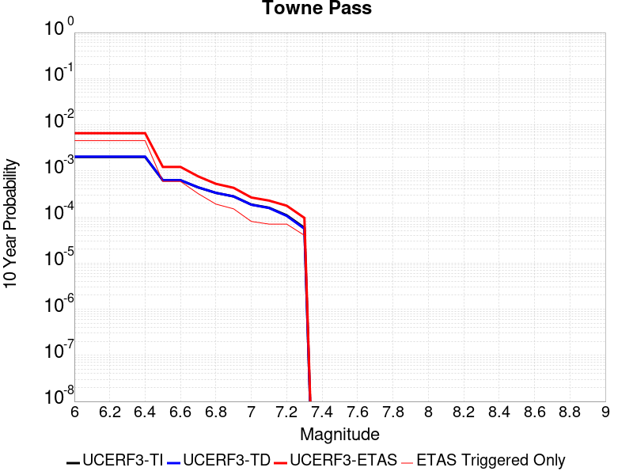 |

| Magnitude | 1 wk TI Prob | 1 wk TD Prob | 1 wk ETAS Prob | 1 wk ETAS/TD Gain | 1 wk ETAS Triggered Only | 1 mo TI Prob | 1 mo TD Prob | 1 mo ETAS Prob | 1 mo ETAS/TD Gain | 1 mo ETAS Triggered Only | 1 yr TI Prob | 1 yr TD Prob | 1 yr ETAS Prob | 1 yr ETAS/TD Gain | 1 yr ETAS Triggered Only | 10 yr TI Prob | 10 yr TD Prob | 10 yr ETAS Prob | 10 yr ETAS/TD Gain | 10 yr ETAS Triggered Only |
|-----|-----|-----|-----|-----|-----|-----|-----|-----|-----|-----|-----|-----|-----|-----|-----|-----|-----|-----|-----|-----|
| 6.0 | 3.849728E-6 | 3.8945414E-6 | 0.0014438889 | 370.74686 | 0.00144 | 1.649873E-5 | 1.669081E-5 | 0.0020166575 | 120.824425 | 0.002 | 2.0085352E-4 | 2.0319603E-4 | 0.0036958195 | 18.188444 | 0.0034933332 | 0.0020067208 | 0.0020305314 | 0.0067143347 | 3.3066883 | 0.0046933335 |
| 6.1 | 3.849728E-6 | 3.8945414E-6 | 0.0014438889 | 370.74686 | 0.00144 | 1.649873E-5 | 1.669081E-5 | 0.0020166575 | 120.824425 | 0.002 | 2.0085352E-4 | 2.0319603E-4 | 0.0036958195 | 18.188444 | 0.0034933332 | 0.0020067208 | 0.0020305314 | 0.0067143347 | 3.3066883 | 0.0046933335 |
| 6.2 | 3.849728E-6 | 3.8945414E-6 | 0.0014438889 | 370.74686 | 0.00144 | 1.649873E-5 | 1.669081E-5 | 0.0020166575 | 120.824425 | 0.002 | 2.0085352E-4 | 2.0319603E-4 | 0.0036958195 | 18.188444 | 0.0034933332 | 0.0020067208 | 0.0020305314 | 0.0067143347 | 3.3066883 | 0.0046933335 |
| 6.3 | 3.849728E-6 | 3.8945414E-6 | 0.0014438889 | 370.74686 | 0.00144 | 1.649873E-5 | 1.669081E-5 | 0.0020166575 | 120.824425 | 0.002 | 2.0085352E-4 | 2.0319603E-4 | 0.0036958195 | 18.188444 | 0.0034933332 | 0.0020067208 | 0.0020305314 | 0.0067143347 | 3.3066883 | 0.0046933335 |
| 6.4 | 3.849728E-6 | 3.8945414E-6 | 0.0014438889 | 370.74686 | 0.00144 | 1.649873E-5 | 1.669081E-5 | 0.0020166575 | 120.824425 | 0.002 | 2.0085352E-4 | 2.0319603E-4 | 0.0036958195 | 18.188444 | 0.0034933332 | 0.0020067208 | 0.0020305314 | 0.0067143347 | 3.3066883 | 0.0046933335 |
| 6.5 | 1.1953545E-6 | 1.203052E-6 | 1.8786949E-4 | 156.16074 | 1.8666667E-4 | 5.1229376E-6 | 5.1559277E-6 | 3.2515428E-4 | 63.064167 | 3.2E-4 | 6.236998E-5 | 6.277173E-5 | 5.960716E-4 | 9.49586 | 5.3333334E-4 | 6.235248E-4 | 6.275517E-4 | 0.0013737498 | 2.1890624 | 7.466667E-4 |
| 6.6 | 1.1953545E-6 | 1.203052E-6 | 1.8786949E-4 | 156.16074 | 1.8666667E-4 | 5.1229376E-6 | 5.1559277E-6 | 3.2515428E-4 | 63.064167 | 3.2E-4 | 6.236998E-5 | 6.277173E-5 | 5.960716E-4 | 9.49586 | 5.3333334E-4 | 6.235248E-4 | 6.275517E-4 | 0.0013737498 | 2.1890624 | 7.466667E-4 |
| 6.7 | 8.375951E-7 | 8.4106705E-7 | 1.3417429E-4 | 159.52864 | 1.3333333E-4 | 3.5896885E-6 | 3.6045683E-6 | 2.1693713E-4 | 60.18394 | 2.1333333E-4 | 4.370358E-5 | 4.3884793E-5 | 3.9053624E-4 | 8.899124 | 3.4666667E-4 | 4.3694986E-4 | 4.38767E-4 | 9.185564E-4 | 2.0934947 | 4.8E-4 |
| 6.8 | 6.38041E-7 | 6.392156E-7 | 5.3972515E-5 | 84.43553 | 5.3333333E-5 | 2.7344586E-6 | 2.7394929E-6 | 1.0940587E-4 | 39.93654 | 1.0666667E-4 | 3.3291526E-5 | 3.3352855E-5 | 1.9334751E-4 | 5.7970304 | 1.6E-4 | 3.3286537E-4 | 3.334823E-4 | 6.267178E-4 | 1.8793136 | 2.9333335E-4 |
| 6.9 | 5.3460053E-7 | 5.345333E-7 | 2.7201186E-5 | 50.88773 | 2.6666667E-5 | 2.2911431E-6 | 2.2908553E-6 | 8.229067E-5 | 35.921375 | 8.0E-5 | 2.789431E-5 | 2.789084E-5 | 1.6122045E-4 | 5.780409 | 1.3333333E-4 | 2.789081E-4 | 2.7887672E-4 | 5.188098E-4 | 1.8603554 | 2.4E-4 |
| 7.0 | 3.557783E-7 | 3.5324226E-7 | 2.70199E-5 | 76.49113 | 2.6666667E-5 | 1.5247632E-6 | 1.5138945E-6 | 2.818052E-5 | 18.614586 | 2.6666667E-5 | 1.8563835E-5 | 1.843152E-5 | 7.176387E-5 | 3.8935406 | 5.3333333E-5 | 1.8562283E-4 | 1.8430075E-4 | 3.1760952E-4 | 1.7233219 | 1.3333333E-4 |
| 7.1 | 3.037942E-7 | 3.0002218E-7 | 2.6966682E-5 | 89.88229 | 2.6666667E-5 | 1.3019744E-6 | 1.2858087E-6 | 2.7952441E-5 | 21.739191 | 2.6666667E-5 | 1.5851423E-5 | 1.5654618E-5 | 6.8987116E-5 | 4.406822 | 5.3333333E-5 | 1.5850292E-4 | 1.5653588E-4 | 2.8984834E-4 | 1.8516415 | 1.3333333E-4 |
| 7.2 | 2.0808248E-7 | 2.0217689E-7 | 2.6868838E-5 | 132.89767 | 2.6666667E-5 | 8.917818E-7 | 8.6647213E-7 | 2.7533115E-5 | 31.776114 | 2.6666667E-5 | 1.0857389E-5 | 1.0549252E-5 | 6.388202E-5 | 6.055598 | 5.3333333E-5 | 1.0856859E-4 | 1.0548797E-4 | 2.3880725E-4 | 2.2638338 | 1.3333333E-4 |
| 7.3 | 1.1162073E-7 | 1.0636894E-7 | 1.0636894E-7 | 1.0 | 0.0 | 4.7837443E-7 | 4.558668E-7 | 4.558668E-7 | 1.0 | 0.0 | 5.8241935E-6 | 5.550166E-6 | 3.2216685E-5 | 5.804634 | 2.6666667E-5 | 5.8240406E-5 | 5.5500474E-5 | 1.3549604E-4 | 2.441349 | 8.0E-5 |

## San Andreas (San Bernardino N)
*[(top)](#table-of-contents)*

| 1 Week | 1 Month | 1 Year | 10 Year |
|-----|-----|-----|-----|
| 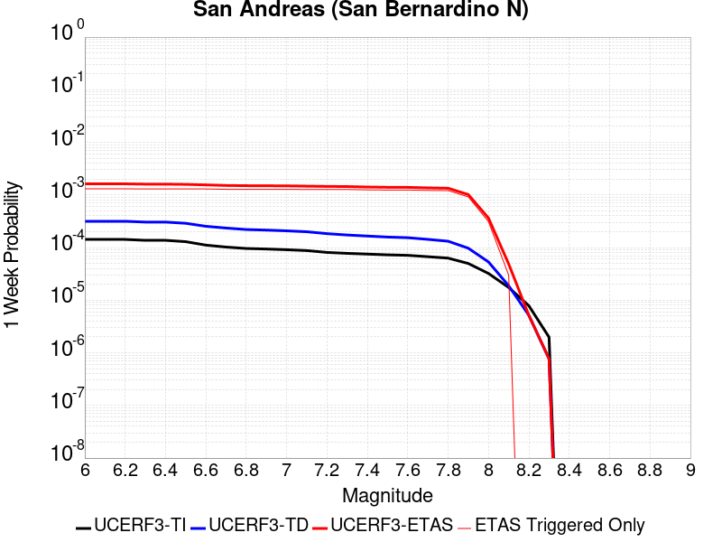 |  |  | 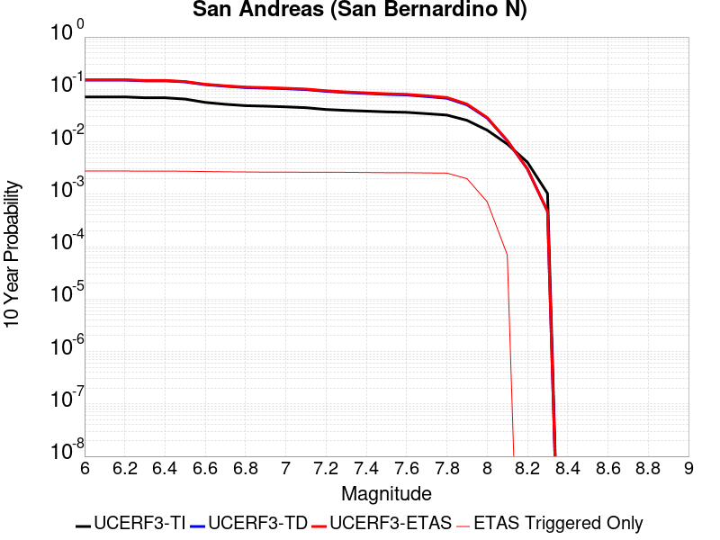 |

| Magnitude | 1 wk TI Prob | 1 wk TD Prob | 1 wk ETAS Prob | 1 wk ETAS/TD Gain | 1 wk ETAS Triggered Only | 1 mo TI Prob | 1 mo TD Prob | 1 mo ETAS Prob | 1 mo ETAS/TD Gain | 1 mo ETAS Triggered Only | 1 yr TI Prob | 1 yr TD Prob | 1 yr ETAS Prob | 1 yr ETAS/TD Gain | 1 yr ETAS Triggered Only | 10 yr TI Prob | 10 yr TD Prob | 10 yr ETAS Prob | 10 yr ETAS/TD Gain | 10 yr ETAS Triggered Only |
|-----|-----|-----|-----|-----|-----|-----|-----|-----|-----|-----|-----|-----|-----|-----|-----|-----|-----|-----|-----|-----|
| 6.0 | 1.4273766E-4 | 3.1606483E-4 | 0.0018622427 | 5.891964 | 0.0015466667 | 6.115894E-4 | 0.0013538664 | 0.003084853 | 2.2785506 | 0.0017333333 | 0.0074207084 | 0.016360244 | 0.01879967 | 1.149107 | 0.00248 | 0.07177748 | 0.15026689 | 0.15289539 | 1.0174923 | 0.0030933334 |
| 6.1 | 1.4273766E-4 | 3.1606483E-4 | 0.0018622427 | 5.891964 | 0.0015466667 | 6.115894E-4 | 0.0013538664 | 0.003084853 | 2.2785506 | 0.0017333333 | 0.0074207084 | 0.016360244 | 0.01879967 | 1.149107 | 0.00248 | 0.07177748 | 0.15026689 | 0.15289539 | 1.0174923 | 0.0030933334 |
| 6.2 | 1.4273766E-4 | 3.1606483E-4 | 0.0018622427 | 5.891964 | 0.0015466667 | 6.115894E-4 | 0.0013538664 | 0.003084853 | 2.2785506 | 0.0017333333 | 0.0074207084 | 0.016360244 | 0.01879967 | 1.149107 | 0.00248 | 0.07177748 | 0.15026689 | 0.15289539 | 1.0174923 | 0.0030933334 |
| 6.3 | 1.3730655E-4 | 3.0511338E-4 | 0.0018246496 | 5.9802346 | 0.00152 | 5.883239E-4 | 0.0013069791 | 0.0030114152 | 2.3041036 | 0.0017066667 | 0.0071393442 | 0.015797773 | 0.018212348 | 1.1528429 | 0.0024533332 | 0.06914291 | 0.14556676 | 0.14818703 | 1.0180004 | 0.0030666667 |
| 6.4 | 1.3730655E-4 | 3.0511338E-4 | 0.0018246496 | 5.9802346 | 0.00152 | 5.883239E-4 | 0.0013069791 | 0.0030114152 | 2.3041036 | 0.0017066667 | 0.0071393442 | 0.015797773 | 0.018212348 | 1.1528429 | 0.0024533332 | 0.06914291 | 0.14556676 | 0.14818703 | 1.0180004 | 0.0030666667 |
| 6.5 | 1.2942807E-4 | 2.8925808E-4 | 0.0018088184 | 6.253303 | 0.00152 | 5.545738E-4 | 0.0012390936 | 0.0029436457 | 2.3756442 | 0.0017066667 | 0.0067310524 | 0.01498286 | 0.017399436 | 1.1612893 | 0.0024533332 | 0.06530788 | 0.13870941 | 0.14135072 | 1.0190419 | 0.0030666667 |
| 6.6 | 1.1125901E-4 | 2.536472E-4 | 0.0017732617 | 6.9910555 | 0.00152 | 4.767372E-4 | 0.0010866089 | 0.002791421 | 2.568929 | 0.0017066667 | 0.005788839 | 0.013149847 | 0.015544604 | 1.1821128 | 0.0024266667 | 0.056403454 | 0.122999296 | 0.12566538 | 1.0216756 | 0.00304 |
| 6.7 | 1.02209575E-4 | 2.3499702E-4 | 0.0017279794 | 7.3531976 | 0.0014933334 | 4.3796748E-4 | 0.0010067427 | 0.0026850514 | 2.667068 | 0.00168 | 0.0053192247 | 0.012188629 | 0.014559377 | 1.1945049 | 0.0024 | 0.051936906 | 0.114790924 | 0.11745835 | 1.0232373 | 0.0030133333 |
| 6.8 | 9.610582E-5 | 2.2025521E-4 | 0.0017132596 | 7.7785206 | 0.0014933334 | 4.1181705E-4 | 9.436101E-4 | 0.0026220249 | 2.7787163 | 0.00168 | 0.0050023515 | 0.011428202 | 0.013800774 | 1.2076068 | 0.0024 | 0.048912346 | 0.1081929 | 0.11085643 | 1.0246184 | 0.0029866667 |
| 6.9 | 9.3877505E-5 | 2.1481077E-4 | 0.0017078234 | 7.9503617 | 0.0014933334 | 4.0227012E-4 | 9.2029345E-4 | 0.0025987474 | 2.8238246 | 0.00168 | 0.0048866454 | 0.011147255 | 0.0135205025 | 1.2128997 | 0.0024 | 0.04780577 | 0.10578323 | 0.10845395 | 1.0252472 | 0.0029866667 |
| 7.0 | 9.1019785E-5 | 2.0808022E-4 | 0.0017011028 | 8.175226 | 0.0014933334 | 3.900265E-4 | 8.914682E-4 | 0.0025699704 | 2.8828516 | 0.00168 | 0.0047382377 | 0.010799837 | 0.013173917 | 1.2198256 | 0.0024 | 0.046384744 | 0.102753714 | 0.105433494 | 1.0260797 | 0.0029866667 |
| 7.1 | 8.771155E-5 | 1.9982594E-4 | 0.0016928609 | 8.471677 | 0.0014933334 | 3.758525E-4 | 8.5611636E-4 | 0.0025346782 | 2.96067 | 0.00168 | 0.0045664064 | 0.0103736 | 0.012748702 | 1.2289566 | 0.0024 | 0.044737056 | 0.09906527 | 0.10175606 | 1.0271618 | 0.0029866667 |
| 7.2 | 8.0830236E-5 | 1.8388197E-4 | 0.0016769407 | 9.1196575 | 0.0014933334 | 3.4636928E-4 | 7.8782777E-4 | 0.0024665042 | 3.1307657 | 0.00168 | 0.0042088944 | 0.009549725 | 0.011926806 | 1.2489161 | 0.0024 | 0.041300658 | 0.09179615 | 0.094508655 | 1.0295492 | 0.0029866667 |
| 7.3 | 7.7668235E-5 | 1.7331762E-4 | 0.0016663921 | 9.614673 | 0.0014933334 | 3.328214E-4 | 7.425784E-4 | 0.002421331 | 3.2607074 | 0.00168 | 0.0040445733 | 0.009003494 | 0.011381886 | 1.2641631 | 0.0024 | 0.03971748 | 0.08706327 | 0.089789905 | 1.0313178 | 0.0029866667 |
| 7.4 | 7.520177E-5 | 1.6551897E-4 | 0.0016319429 | 9.859551 | 0.0014666667 | 3.2225347E-4 | 7.0917426E-4 | 0.002361335 | 3.3296967 | 0.0016533333 | 0.0039163795 | 0.008600081 | 0.010953004 | 1.2735931 | 0.0023733333 | 0.038480744 | 0.08351955 | 0.086232334 | 1.0324808 | 0.00296 |
| 7.5 | 7.274697E-5 | 1.5839566E-4 | 0.0016248301 | 10.258046 | 0.0014666667 | 3.1173544E-4 | 6.78662E-4 | 0.0023308732 | 3.4345129 | 0.0016533333 | 0.003788775 | 0.008231463 | 0.01058526 | 1.2859513 | 0.0023733333 | 0.03724827 | 0.08023631 | 0.08295881 | 1.033931 | 0.00296 |
| 7.6 | 7.1185845E-5 | 1.540943E-4 | 0.0016205349 | 10.516515 | 0.0014666667 | 3.0504653E-4 | 6.6023704E-4 | 0.0023124788 | 3.5024977 | 0.0016533333 | 0.0037076178 | 0.008008812 | 0.010363137 | 1.2939669 | 0.0023733333 | 0.036463667 | 0.07822598 | 0.080954425 | 1.0348791 | 0.00296 |
| 7.7 | 6.709961E-5 | 1.4318313E-4 | 0.0015829769 | 11.055611 | 0.00144 | 2.8753807E-4 | 6.1349774E-4 | 0.0022391665 | 3.6498365 | 0.0016266666 | 0.003495157 | 0.0074437927 | 0.009746523 | 1.3093491 | 0.00232 | 0.034406938 | 0.07305469 | 0.07574902 | 1.0368809 | 0.0029066666 |
| 7.8 | 6.300812E-5 | 1.3202413E-4 | 0.0015451709 | 11.703701 | 0.0014133333 | 2.7000686E-4 | 5.65695E-4 | 0.00216479 | 3.8267791 | 0.0016 | 0.0032823787 | 0.006865616 | 0.009143204 | 1.3317384 | 0.0022933334 | 0.032343175 | 0.06771354 | 0.070398524 | 1.0396521 | 0.00288 |
| 7.9 | 4.983037E-5 | 9.723488E-5 | 0.0011371338 | 11.694711 | 0.00104 | 2.1354125E-4 | 4.1665437E-4 | 0.0016161543 | 3.878885 | 0.0012 | 0.0025967648 | 0.0050609782 | 0.0067590075 | 1.3355141 | 0.0017066667 | 0.025666296 | 0.05064886 | 0.052750092 | 1.0414863 | 0.0022133333 |
| 8.0 | 3.2211527E-5 | 5.3304586E-5 | 3.4662228E-4 | 6.5026727 | 2.9333335E-4 | 1.380421E-4 | 2.2842824E-4 | 5.750157E-4 | 2.5172708 | 3.4666667E-4 | 0.0016793669 | 0.0027775685 | 0.0033626058 | 1.2106292 | 5.866667E-4 | 0.016667323 | 0.028361378 | 0.02913869 | 1.0274074 | 8.0E-4 |
| 8.1 | 1.743376E-5 | 1.8824427E-5 | 7.2156756E-5 | 3.8331451 | 5.3333333E-5 | 7.471398E-5 | 8.067362E-5 | 1.6066717E-4 | 1.99157 | 8.0E-5 | 9.0926304E-4 | 9.817594E-4 | 0.0010616808 | 1.0814064 | 8.0E-5 | 0.009055517 | 0.010484105 | 0.010616041 | 1.0125843 | 1.3333333E-4 |
| 8.2 | 7.831616E-6 | 5.1551065E-6 | 5.1551065E-6 | 1.0 | 0.0 | 3.3563636E-5 | 2.2093127E-5 | 2.2093127E-5 | 1.0 | 0.0 | 4.0856065E-4 | 2.6895068E-4 | 2.6895068E-4 | 1.0 | 0.0 | 0.004078103 | 0.0030418145 | 0.0030418145 | 1.0 | 0.0 |
| 8.3 | 1.983087E-6 | 7.6599065E-7 | 7.6599065E-7 | 1.0 | 0.0 | 8.498917E-6 | 3.282813E-6 | 3.282813E-6 | 1.0 | 0.0 | 1.034694E-4 | 3.9967534E-5 | 3.9967534E-5 | 1.0 | 0.0 | 0.0010342124 | 4.719687E-4 | 4.719687E-4 | 1.0 | 0.0 |

## Lenwood-Lockhart-Old Woman Springs
*[(top)](#table-of-contents)*

| 1 Week | 1 Month | 1 Year | 10 Year |
|-----|-----|-----|-----|
|  |  |  |  |

| Magnitude | 1 wk TI Prob | 1 wk TD Prob | 1 wk ETAS Prob | 1 wk ETAS/TD Gain | 1 wk ETAS Triggered Only | 1 mo TI Prob | 1 mo TD Prob | 1 mo ETAS Prob | 1 mo ETAS/TD Gain | 1 mo ETAS Triggered Only | 1 yr TI Prob | 1 yr TD Prob | 1 yr ETAS Prob | 1 yr ETAS/TD Gain | 1 yr ETAS Triggered Only | 10 yr TI Prob | 10 yr TD Prob | 10 yr ETAS Prob | 10 yr ETAS/TD Gain | 10 yr ETAS Triggered Only |
|-----|-----|-----|-----|-----|-----|-----|-----|-----|-----|-----|-----|-----|-----|-----|-----|-----|-----|-----|-----|-----|
| 6.0 | 3.744542E-5 | 4.396252E-5 | 0.0010839168 | 24.655476 | 0.00104 | 1.604705E-4 | 1.8839816E-4 | 0.0016014653 | 8.500429 | 0.0014133333 | 0.0019519776 | 0.0022915069 | 0.004526374 | 1.9752828 | 0.00224 | 0.019349206 | 0.022696787 | 0.02569385 | 1.1320479 | 0.0030666667 |
| 6.1 | 3.744542E-5 | 4.396252E-5 | 0.0010839168 | 24.655476 | 0.00104 | 1.604705E-4 | 1.8839816E-4 | 0.0016014653 | 8.500429 | 0.0014133333 | 0.0019519776 | 0.0022915069 | 0.004526374 | 1.9752828 | 0.00224 | 0.019349206 | 0.022696787 | 0.02569385 | 1.1320479 | 0.0030666667 |
| 6.2 | 3.744542E-5 | 4.396252E-5 | 0.0010839168 | 24.655476 | 0.00104 | 1.604705E-4 | 1.8839816E-4 | 0.0016014653 | 8.500429 | 0.0014133333 | 0.0019519776 | 0.0022915069 | 0.004526374 | 1.9752828 | 0.00224 | 0.019349206 | 0.022696787 | 0.02569385 | 1.1320479 | 0.0030666667 |
| 6.3 | 2.1079984E-5 | 2.5353434E-5 | 4.2534329E-4 | 16.776556 | 4.0E-4 | 9.0339665E-5 | 1.0865316E-4 | 7.219199E-4 | 6.64426 | 6.133333E-4 | 0.0010993304 | 0.0013220694 | 0.0023340632 | 1.7654618 | 0.0010133333 | 0.010939079 | 0.0131442575 | 0.014617962 | 1.1121178 | 0.0014933334 |
| 6.4 | 2.1079984E-5 | 2.5353434E-5 | 4.2534329E-4 | 16.776556 | 4.0E-4 | 9.0339665E-5 | 1.0865316E-4 | 7.219199E-4 | 6.64426 | 6.133333E-4 | 0.0010993304 | 0.0013220694 | 0.0023340632 | 1.7654618 | 0.0010133333 | 0.010939079 | 0.0131442575 | 0.014617962 | 1.1121178 | 0.0014933334 |
| 6.5 | 1.7397282E-5 | 2.066241E-5 | 2.3399133E-4 | 11.324494 | 2.1333333E-4 | 7.455765E-5 | 8.8550245E-5 | 4.8851484E-4 | 5.5168095 | 4.0E-4 | 9.073613E-4 | 0.0010775778 | 0.0017968019 | 1.6674452 | 7.2E-4 | 0.009036654 | 0.010724821 | 0.011832809 | 1.1033107 | 0.00112 |
| 6.6 | 1.52050325E-5 | 1.7679693E-5 | 1.7767686E-4 | 10.04977 | 1.6E-4 | 6.51628E-5 | 7.576796E-5 | 3.6907906E-4 | 4.871176 | 2.9333335E-4 | 7.9306826E-4 | 9.220924E-4 | 0.001481576 | 1.6067544 | 5.6E-4 | 0.007902439 | 0.009183526 | 0.010055445 | 1.0949438 | 8.8E-4 |
| 6.7 | 1.332523E-5 | 1.5264002E-5 | 1.7526156E-4 | 11.482018 | 1.6E-4 | 5.7106878E-5 | 6.5415545E-5 | 3.5872968E-4 | 5.48386 | 2.9333335E-4 | 6.950544E-4 | 7.961491E-4 | 0.0013024124 | 1.63589 | 5.0666666E-4 | 0.006928845 | 0.007933599 | 0.008700797 | 1.0967023 | 7.7333336E-4 |
| 6.8 | 1.1525329E-5 | 1.3030979E-5 | 9.3029936E-5 | 7.1391363 | 8.0E-5 | 4.9393333E-5 | 5.584588E-5 | 2.4250212E-4 | 4.3423457 | 1.8666667E-4 | 6.011979E-4 | 6.797157E-4 | 9.7284967E-4 | 1.4312596 | 2.9333335E-4 | 0.00599574 | 0.006776819 | 0.007280052 | 1.074258 | 5.0666666E-4 |
| 6.9 | 1.0253909E-5 | 1.15144385E-5 | 6.484716E-5 | 5.631812 | 5.3333333E-5 | 4.3944583E-5 | 4.9346683E-5 | 2.0933879E-4 | 4.242206 | 1.6E-4 | 5.3489394E-4 | 6.0063385E-4 | 8.404897E-4 | 1.3993379 | 2.4E-4 | 0.0053360825 | 0.0059904843 | 0.006414595 | 1.0707974 | 4.2666667E-4 |
| 7.0 | 8.104563E-6 | 8.991279E-6 | 6.2324136E-5 | 6.9316206 | 5.3333333E-5 | 3.4733377E-5 | 3.8533497E-5 | 1.4519606E-4 | 3.7680476 | 1.0666667E-4 | 4.2279682E-4 | 4.6904673E-4 | 6.0231757E-4 | 1.2841312 | 1.3333333E-4 | 0.0042199334 | 0.0046808156 | 0.004972776 | 1.0623738 | 2.9333335E-4 |
| 7.1 | 6.7986157E-6 | 7.515816E-6 | 6.084875E-5 | 8.096093 | 5.3333333E-5 | 2.91366E-5 | 3.2210253E-5 | 1.3887348E-4 | 4.311468 | 1.0666667E-4 | 3.5468035E-4 | 3.920914E-4 | 5.2537245E-4 | 1.3399234 | 1.3333333E-4 | 0.003541148 | 0.003914213 | 0.004153273 | 1.061075 | 2.4E-4 |
| 7.2 | 5.6893327E-6 | 6.2800136E-6 | 3.2946515E-5 | 5.2462487 | 2.6666667E-5 | 2.4382627E-5 | 2.6914078E-5 | 1.06911924E-4 | 3.972342 | 8.0E-5 | 2.9681803E-4 | 3.2763163E-4 | 4.3426335E-4 | 1.3254622 | 1.0666667E-4 | 0.002964219 | 0.0032716845 | 0.00348432 | 1.0649927 | 2.1333333E-4 |
| 7.3 | 4.253348E-6 | 4.7069107E-6 | 4.7069107E-6 | 1.0 | 0.0 | 1.8228506E-5 | 2.0172329E-5 | 4.6838457E-5 | 2.3219163 | 2.6666667E-5 | 2.2190946E-4 | 2.4557224E-4 | 2.9889247E-4 | 1.2171265 | 5.3333333E-5 | 0.00221688 | 0.0024531898 | 0.0025595948 | 1.0433742 | 1.0666667E-4 |
| 7.4 | 2.5448119E-6 | 2.852045E-6 | 2.852045E-6 | 1.0 | 0.0 | 1.0906291E-5 | 1.2223002E-5 | 1.2223002E-5 | 1.0 | 0.0 | 1.3277601E-4 | 1.4880655E-4 | 1.7546923E-4 | 1.1791769 | 2.6666667E-5 | 0.001326967 | 0.0014872311 | 0.0015404852 | 1.0358075 | 5.3333333E-5 |
| 7.5 | 4.3706837E-8 | 4.562909E-8 | 4.562909E-8 | 1.0 | 0.0 | 1.8731501E-7 | 1.9555324E-7 | 1.9555324E-7 | 1.0 | 0.0 | 2.2805577E-6 | 2.3808586E-6 | 2.3808586E-6 | 1.0 | 0.0 | 2.2805343E-5 | 2.3808387E-5 | 2.3808387E-5 | 1.0 | 0.0 |

## Bicycle Lake
*[(top)](#table-of-contents)*

| 1 Week | 1 Month | 1 Year | 10 Year |
|-----|-----|-----|-----|
|  |  |  |  |

| Magnitude | 1 wk TI Prob | 1 wk TD Prob | 1 wk ETAS Prob | 1 wk ETAS/TD Gain | 1 wk ETAS Triggered Only | 1 mo TI Prob | 1 mo TD Prob | 1 mo ETAS Prob | 1 mo ETAS/TD Gain | 1 mo ETAS Triggered Only | 1 yr TI Prob | 1 yr TD Prob | 1 yr ETAS Prob | 1 yr ETAS/TD Gain | 1 yr ETAS Triggered Only | 10 yr TI Prob | 10 yr TD Prob | 10 yr ETAS Prob | 10 yr ETAS/TD Gain | 10 yr ETAS Triggered Only |
|-----|-----|-----|-----|-----|-----|-----|-----|-----|-----|-----|-----|-----|-----|-----|-----|-----|-----|-----|-----|-----|
| 6.0 | 1.9621975E-5 | 2.2097078E-5 | 7.154151E-4 | 32.376003 | 6.9333334E-4 | 8.4091465E-5 | 9.4699084E-5 | 0.0012679213 | 13.388949 | 0.0011733334 | 0.0010233327 | 0.0011524865 | 0.0030436378 | 2.6409314 | 0.0018933333 | 0.01018633 | 0.011478408 | 0.0143253505 | 1.2480259 | 0.00288 |
| 6.1 | 1.9621975E-5 | 2.2097078E-5 | 7.154151E-4 | 32.376003 | 6.9333334E-4 | 8.4091465E-5 | 9.4699084E-5 | 0.0012679213 | 13.388949 | 0.0011733334 | 0.0010233327 | 0.0011524865 | 0.0030436378 | 2.6409314 | 0.0018933333 | 0.01018633 | 0.011478408 | 0.0143253505 | 1.2480259 | 0.00288 |
| 6.2 | 9.9971285E-6 | 1.1255639E-5 | 4.379175E-4 | 38.906498 | 4.2666667E-4 | 4.2844134E-5 | 4.8237856E-5 | 7.415377E-4 | 15.372527 | 6.9333334E-4 | 5.2150246E-4 | 5.871896E-4 | 0.001759834 | 2.9970453 | 0.0011733334 | 0.0052028033 | 0.005861487 | 0.0076907016 | 1.3120736 | 0.00184 |
| 6.3 | 9.589428E-6 | 1.0798346E-5 | 4.1079402E-4 | 38.04231 | 4.0E-4 | 4.10969E-5 | 4.62781E-5 | 7.129139E-4 | 15.404996 | 6.6666666E-4 | 5.002399E-4 | 5.6334207E-4 | 0.0017093627 | 3.034325 | 0.0011466667 | 0.0049911533 | 0.0056242296 | 0.007427364 | 1.3206012 | 0.0018133334 |
| 6.4 | 9.589428E-6 | 1.0798346E-5 | 4.1079402E-4 | 38.04231 | 4.0E-4 | 4.10969E-5 | 4.62781E-5 | 7.129139E-4 | 15.404996 | 6.6666666E-4 | 5.002399E-4 | 5.6334207E-4 | 0.0017093627 | 3.034325 | 0.0011466667 | 0.0049911533 | 0.0056242296 | 0.007427364 | 1.3206012 | 0.0018133334 |
| 6.5 | 5.557707E-6 | 6.2856016E-6 | 2.1961759E-4 | 34.93979 | 2.1333333E-4 | 2.3818526E-5 | 2.6938165E-5 | 4.0026143E-4 | 14.858526 | 3.7333334E-4 | 2.8995197E-4 | 3.2794967E-4 | 0.0010477136 | 3.1947386 | 7.2E-4 | 0.0028957394 | 0.0032772934 | 0.0044733607 | 1.3649558 | 0.0012 |
| 6.6 | 4.8742945E-6 | 5.5132896E-6 | 1.9217892E-4 | 34.857395 | 1.8666667E-4 | 2.0889667E-5 | 2.3628318E-5 | 3.7028678E-4 | 15.671314 | 3.4666667E-4 | 2.54302E-4 | 2.87663E-4 | 9.274789E-4 | 3.2241857 | 6.4E-4 | 0.002540112 | 0.0028754752 | 0.003939075 | 1.3698865 | 0.0010666667 |
| 6.7 | 3.991108E-6 | 4.5159104E-6 | 1.3784865E-4 | 30.525106 | 1.3333333E-4 | 1.7104636E-5 | 1.9353902E-5 | 3.1268157E-4 | 16.155996 | 2.9333335E-4 | 2.0822904E-4 | 2.3563375E-4 | 7.4218103E-4 | 3.149723 | 5.0666666E-4 | 0.0020803404 | 0.0023563374 | 0.0031810564 | 1.3500003 | 8.2666666E-4 |

## Paradise
*[(top)](#table-of-contents)*

| 1 Week | 1 Month | 1 Year | 10 Year |
|-----|-----|-----|-----|
|  |  |  | 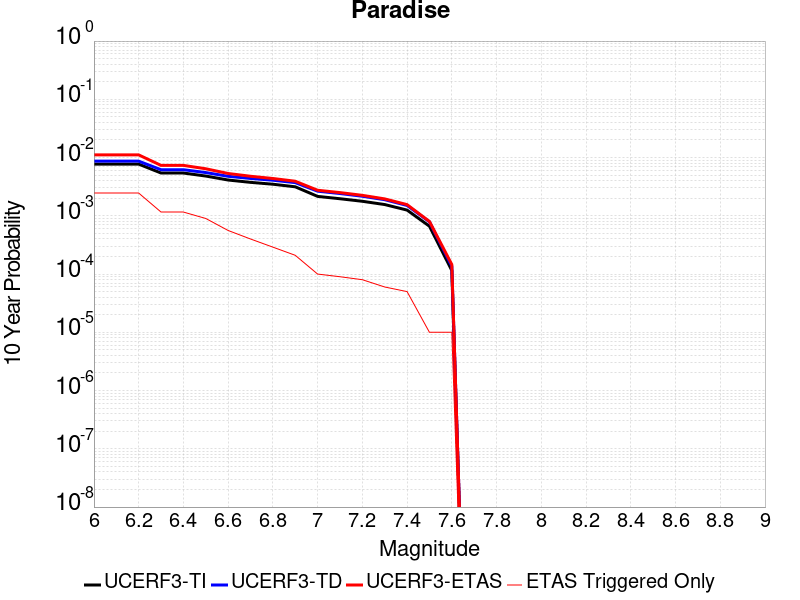 |

| Magnitude | 1 wk TI Prob | 1 wk TD Prob | 1 wk ETAS Prob | 1 wk ETAS/TD Gain | 1 wk ETAS Triggered Only | 1 mo TI Prob | 1 mo TD Prob | 1 mo ETAS Prob | 1 mo ETAS/TD Gain | 1 mo ETAS Triggered Only | 1 yr TI Prob | 1 yr TD Prob | 1 yr ETAS Prob | 1 yr ETAS/TD Gain | 1 yr ETAS Triggered Only | 10 yr TI Prob | 10 yr TD Prob | 10 yr ETAS Prob | 10 yr ETAS/TD Gain | 10 yr ETAS Triggered Only |
|-----|-----|-----|-----|-----|-----|-----|-----|-----|-----|-----|-----|-----|-----|-----|-----|-----|-----|-----|-----|-----|
| 6.0 | 1.4851273E-5 | 1.6694692E-5 | 5.233529E-4 | 31.348461 | 5.0666666E-4 | 6.364676E-5 | 7.154685E-5 | 8.981544E-4 | 12.553374 | 8.2666666E-4 | 7.7462377E-4 | 8.707584E-4 | 0.0024160782 | 2.7746828 | 0.0015466667 | 0.0077192914 | 0.008675844 | 0.011107893 | 1.2803241 | 0.0024533332 |
| 6.1 | 1.4851273E-5 | 1.6694692E-5 | 5.233529E-4 | 31.348461 | 5.0666666E-4 | 6.364676E-5 | 7.154685E-5 | 8.981544E-4 | 12.553374 | 8.2666666E-4 | 7.7462377E-4 | 8.707584E-4 | 0.0024160782 | 2.7746828 | 0.0015466667 | 0.0077192914 | 0.008675844 | 0.011107893 | 1.2803241 | 0.0024533332 |
| 6.2 | 1.4851273E-5 | 1.6694692E-5 | 5.233529E-4 | 31.348461 | 5.0666666E-4 | 6.364676E-5 | 7.154685E-5 | 8.981544E-4 | 12.553374 | 8.2666666E-4 | 7.7462377E-4 | 8.707584E-4 | 0.0024160782 | 2.7746828 | 0.0015466667 | 0.0077192914 | 0.008675844 | 0.011107893 | 1.2803241 | 0.0024533332 |
| 6.3 | 1.0426831E-5 | 1.188862E-5 | 2.2521942E-4 | 18.944117 | 2.1333333E-4 | 4.4685654E-5 | 5.0950268E-5 | 3.9759927E-4 | 7.8036737 | 3.4666667E-4 | 5.43912E-4 | 6.201489E-4 | 0.0013130523 | 2.1173177 | 6.9333334E-4 | 0.0054258266 | 0.0061847917 | 0.0072978646 | 1.1799693 | 0.00112 |
| 6.4 | 1.0426831E-5 | 1.188862E-5 | 2.2521942E-4 | 18.944117 | 2.1333333E-4 | 4.4685654E-5 | 5.0950268E-5 | 3.9759927E-4 | 7.8036737 | 3.4666667E-4 | 5.43912E-4 | 6.201489E-4 | 0.0013130523 | 2.1173177 | 6.9333334E-4 | 0.0054258266 | 0.0061847917 | 0.0072978646 | 1.1799693 | 0.00112 |
| 6.5 | 9.25027E-6 | 1.06199595E-5 | 2.2395102E-4 | 21.087748 | 2.1333333E-4 | 3.964341E-5 | 4.551335E-5 | 3.654988E-4 | 8.030584 | 3.2E-4 | 4.8255164E-4 | 5.53989E-4 | 0.0011669826 | 2.1065085 | 6.133333E-4 | 0.0048150513 | 0.0055265795 | 0.0064812736 | 1.1727461 | 9.6E-4 |
| 6.6 | 7.904275E-6 | 9.159525E-6 | 1.6915805E-4 | 18.467995 | 1.6E-4 | 3.3875025E-5 | 3.9254537E-5 | 2.5257948E-4 | 6.4344025 | 2.1333333E-4 | 4.1235037E-4 | 4.7782314E-4 | 9.3093986E-4 | 1.9482938 | 4.5333334E-4 | 0.0041158604 | 0.0047683544 | 0.005431842 | 1.139144 | 6.6666666E-4 |
| 6.7 | 7.2061953E-6 | 8.407248E-6 | 1.4173947E-4 | 16.859198 | 1.3333333E-4 | 3.088333E-5 | 3.6030586E-5 | 1.9602482E-4 | 5.440511 | 1.6E-4 | 3.7593965E-4 | 4.3858777E-4 | 7.851024E-4 | 1.790069 | 3.4666667E-4 | 0.003753043 | 0.004377591 | 0.0049085896 | 1.1212993 | 5.3333334E-4 |
| 6.8 | 6.6948724E-6 | 7.842166E-6 | 1.4117446E-4 | 18.001972 | 1.3333333E-4 | 2.8691995E-5 | 3.360887E-5 | 1.936035E-4 | 5.760488 | 1.6E-4 | 3.4926904E-4 | 4.0911473E-4 | 7.2898384E-4 | 1.7818567 | 3.2E-4 | 0.003487206 | 0.0040839734 | 0.0045354553 | 1.1105497 | 4.5333334E-4 |
| 6.9 | 6.0421025E-6 | 7.130621E-6 | 1.1379653E-4 | 15.958853 | 1.0666667E-4 | 2.5894467E-5 | 3.0559466E-5 | 1.6388872E-4 | 5.3629446 | 1.3333333E-4 | 3.1521954E-4 | 3.7200135E-4 | 6.1191205E-4 | 1.6449189 | 2.4E-4 | 0.0031477278 | 0.0037141247 | 0.0040329364 | 1.0858376 | 3.2E-4 |
| 7.0 | 4.134091E-6 | 5.0803087E-6 | 3.174684E-5 | 6.248998 | 2.6666667E-5 | 1.7717413E-5 | 2.177258E-5 | 7.510475E-5 | 3.449511 | 5.3333333E-5 | 2.1568815E-4 | 2.6505045E-4 | 3.9834843E-4 | 1.5029155 | 1.3333333E-4 | 0.0021547892 | 0.0026474963 | 0.0027804768 | 1.0502287 | 1.3333333E-4 |
| 7.1 | 3.7674888E-6 | 4.6318696E-6 | 4.6318696E-6 | 1.0 | 0.0 | 1.6146281E-5 | 1.9850726E-5 | 4.6516863E-5 | 2.343333 | 2.6666667E-5 | 1.9656324E-4 | 2.4165731E-4 | 3.482982E-4 | 1.4412898 | 1.0666667E-4 | 0.0019638946 | 0.002414096 | 0.002520505 | 1.0440782 | 1.0666667E-4 |
| 7.2 | 3.4065345E-6 | 4.156723E-6 | 4.156723E-6 | 1.0 | 0.0 | 1.4599351E-5 | 1.7814415E-5 | 4.4480606E-5 | 2.4968884 | 2.6666667E-5 | 1.777326E-4 | 2.1687041E-4 | 3.2351393E-4 | 1.4917386 | 1.0666667E-4 | 0.0017759053 | 0.002166736 | 0.0022731714 | 1.0491226 | 1.0666667E-4 |
| 7.3 | 2.9934936E-6 | 3.6293168E-6 | 3.6293168E-6 | 1.0 | 0.0 | 1.2829195E-5 | 1.555413E-5 | 4.222038E-5 | 2.7144163 | 2.6666667E-5 | 1.5618425E-4 | 1.8935655E-4 | 2.693414E-4 | 1.4224035 | 8.0E-5 | 0.0015607453 | 0.0018920974 | 0.001971946 | 1.0422012 | 8.0E-5 |
| 7.4 | 2.4049796E-6 | 2.8889842E-6 | 2.8889842E-6 | 1.0 | 0.0 | 1.0307015E-5 | 1.238131E-5 | 3.9047645E-5 | 3.1537573 | 2.6666667E-5 | 1.2548068E-4 | 1.5073347E-4 | 2.307214E-4 | 1.5306581 | 8.0E-5 | 0.0012540985 | 0.0015064536 | 0.0015863332 | 1.0530249 | 8.0E-5 |
| 7.5 | 1.2710091E-6 | 1.5134682E-6 | 1.5134682E-6 | 1.0 | 0.0 | 5.44717E-6 | 6.4862834E-6 | 6.4862834E-6 | 1.0 | 0.0 | 6.631728E-5 | 7.8968886E-5 | 7.8968886E-5 | 1.0 | 0.0 | 6.6297496E-4 | 7.8953087E-4 | 7.8953087E-4 | 1.0 | 0.0 |
| 7.6 | 2.21172E-7 | 2.603961E-7 | 2.603961E-7 | 1.0 | 0.0 | 9.478797E-7 | 1.1159829E-6 | 1.1159829E-6 | 1.0 | 0.0 | 1.1540374E-5 | 1.3587036E-5 | 1.3587036E-5 | 1.0 | 0.0 | 1.1539775E-4 | 1.3586486E-4 | 1.3586486E-4 | 1.0 | 0.0 |

## Garlic Springs
*[(top)](#table-of-contents)*

| 1 Week | 1 Month | 1 Year | 10 Year |
|-----|-----|-----|-----|
| 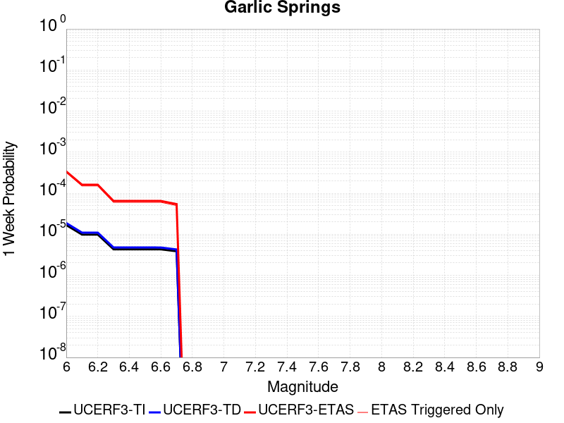 |  |  |  |

| Magnitude | 1 wk TI Prob | 1 wk TD Prob | 1 wk ETAS Prob | 1 wk ETAS/TD Gain | 1 wk ETAS Triggered Only | 1 mo TI Prob | 1 mo TD Prob | 1 mo ETAS Prob | 1 mo ETAS/TD Gain | 1 mo ETAS Triggered Only | 1 yr TI Prob | 1 yr TD Prob | 1 yr ETAS Prob | 1 yr ETAS/TD Gain | 1 yr ETAS Triggered Only | 10 yr TI Prob | 10 yr TD Prob | 10 yr ETAS Prob | 10 yr ETAS/TD Gain | 10 yr ETAS Triggered Only |
|-----|-----|-----|-----|-----|-----|-----|-----|-----|-----|-----|-----|-----|-----|-----|-----|-----|-----|-----|-----|-----|
| 6.0 | 1.6760017E-5 | 1.8776833E-5 | 3.3877083E-4 | 18.041958 | 3.2E-4 | 7.182667E-5 | 8.0470316E-5 | 6.137607E-4 | 7.627169 | 5.3333334E-4 | 8.7413884E-4 | 9.794032E-4 | 0.0019651034 | 2.0064297 | 9.866667E-4 | 0.008707083 | 0.009762413 | 0.011822107 | 1.2109821 | 0.00208 |
| 6.1 | 9.852767E-6 | 1.09735865E-5 | 1.4430546E-4 | 13.150254 | 1.3333333E-4 | 4.222546E-5 | 4.702921E-5 | 2.603525E-4 | 5.5359745 | 2.1333333E-4 | 5.139737E-4 | 5.7250116E-4 | 9.722722E-4 | 1.6982886 | 4.0E-4 | 0.005127866 | 0.005717221 | 0.0067777894 | 1.1855042 | 0.0010666667 |
| 6.2 | 9.852767E-6 | 1.09735865E-5 | 1.4430546E-4 | 13.150254 | 1.3333333E-4 | 4.222546E-5 | 4.702921E-5 | 2.603525E-4 | 5.5359745 | 2.1333333E-4 | 5.139737E-4 | 5.7250116E-4 | 9.722722E-4 | 1.6982886 | 4.0E-4 | 0.005127866 | 0.005717221 | 0.0067777894 | 1.1855042 | 0.0010666667 |
| 6.3 | 4.3167724E-6 | 4.7780286E-6 | 3.1444568E-5 | 6.5810757 | 2.6666667E-5 | 1.8500323E-5 | 2.0477235E-5 | 1.004756E-4 | 4.9066978 | 8.0E-5 | 2.2521814E-4 | 2.4930484E-4 | 4.0926496E-4 | 1.6416246 | 1.6E-4 | 0.0022499003 | 0.00249251 | 0.002918113 | 1.1707529 | 4.2666667E-4 |
| 6.4 | 4.3167724E-6 | 4.7780286E-6 | 3.1444568E-5 | 6.5810757 | 2.6666667E-5 | 1.8500323E-5 | 2.0477235E-5 | 1.004756E-4 | 4.9066978 | 8.0E-5 | 2.2521814E-4 | 2.4930484E-4 | 4.0926496E-4 | 1.6416246 | 1.6E-4 | 0.0022499003 | 0.00249251 | 0.002918113 | 1.1707529 | 4.2666667E-4 |
| 6.5 | 4.3167724E-6 | 4.7780286E-6 | 3.1444568E-5 | 6.5810757 | 2.6666667E-5 | 1.8500323E-5 | 2.0477235E-5 | 1.004756E-4 | 4.9066978 | 8.0E-5 | 2.2521814E-4 | 2.4930484E-4 | 4.0926496E-4 | 1.6416246 | 1.6E-4 | 0.0022499003 | 0.00249251 | 0.002918113 | 1.1707529 | 4.2666667E-4 |
| 6.6 | 4.301311E-6 | 4.760897E-6 | 3.1427437E-5 | 6.6011586 | 2.6666667E-5 | 1.8434059E-5 | 2.0403815E-5 | 1.0040218E-4 | 4.9207554 | 8.0E-5 | 2.2441156E-4 | 2.4841115E-4 | 4.0837142E-4 | 1.6439334 | 1.6E-4 | 0.0022418506 | 0.002483593 | 0.0029092 | 1.1713674 | 4.2666667E-4 |
| 6.7 | 3.8599724E-6 | 4.27106E-6 | 3.0937612E-5 | 7.2435446 | 2.6666667E-5 | 1.6542634E-5 | 1.8304541E-5 | 9.830308E-5 | 5.37042 | 8.0E-5 | 2.0138794E-4 | 2.228578E-4 | 3.561614E-4 | 1.5981555 | 1.3333333E-4 | 0.0020120554 | 0.002228578 | 0.0026010794 | 1.1671475 | 3.7333334E-4 |

## San Andreas (San Bernardino S)
*[(top)](#table-of-contents)*

| 1 Week | 1 Month | 1 Year | 10 Year |
|-----|-----|-----|-----|
|  |  |  |  |

| Magnitude | 1 wk TI Prob | 1 wk TD Prob | 1 wk ETAS Prob | 1 wk ETAS/TD Gain | 1 wk ETAS Triggered Only | 1 mo TI Prob | 1 mo TD Prob | 1 mo ETAS Prob | 1 mo ETAS/TD Gain | 1 mo ETAS Triggered Only | 1 yr TI Prob | 1 yr TD Prob | 1 yr ETAS Prob | 1 yr ETAS/TD Gain | 1 yr ETAS Triggered Only | 10 yr TI Prob | 10 yr TD Prob | 10 yr ETAS Prob | 10 yr ETAS/TD Gain | 10 yr ETAS Triggered Only |
|-----|-----|-----|-----|-----|-----|-----|-----|-----|-----|-----|-----|-----|-----|-----|-----|-----|-----|-----|-----|-----|
| 6.0 | 1.2336002E-4 | 3.0004102E-4 | 9.931664E-4 | 3.3101017 | 6.9333334E-4 | 5.2857865E-4 | 0.0012852824 | 0.0020842543 | 1.6216313 | 8.0E-4 | 0.006416472 | 0.015540994 | 0.01677485 | 1.0793936 | 0.0012533333 | 0.06234337 | 0.14283717 | 0.14432292 | 1.0104017 | 0.0017333333 |
| 6.1 | 1.2336002E-4 | 3.0004102E-4 | 9.931664E-4 | 3.3101017 | 6.9333334E-4 | 5.2857865E-4 | 0.0012852824 | 0.0020842543 | 1.6216313 | 8.0E-4 | 0.006416472 | 0.015540994 | 0.01677485 | 1.0793936 | 0.0012533333 | 0.06234337 | 0.14283717 | 0.14432292 | 1.0104017 | 0.0017333333 |
| 6.2 | 1.2336002E-4 | 3.0004102E-4 | 9.931664E-4 | 3.3101017 | 6.9333334E-4 | 5.2857865E-4 | 0.0012852824 | 0.0020842543 | 1.6216313 | 8.0E-4 | 0.006416472 | 0.015540994 | 0.01677485 | 1.0793936 | 0.0012533333 | 0.06234337 | 0.14283717 | 0.14432292 | 1.0104017 | 0.0017333333 |
| 6.3 | 1.1712257E-4 | 2.8792414E-4 | 9.810579E-4 | 3.4073484 | 6.9333334E-4 | 5.018573E-4 | 0.0012334028 | 0.002032416 | 1.6478121 | 8.0E-4 | 0.006093008 | 0.014918125 | 0.016152762 | 1.0827608 | 0.0012533333 | 0.059286322 | 0.13754563 | 0.13904054 | 1.0108685 | 0.0017333333 |
| 6.4 | 1.1712257E-4 | 2.8792414E-4 | 9.810579E-4 | 3.4073484 | 6.9333334E-4 | 5.018573E-4 | 0.0012334028 | 0.002032416 | 1.6478121 | 8.0E-4 | 0.006093008 | 0.014918125 | 0.016152762 | 1.0827608 | 0.0012533333 | 0.059286322 | 0.13754563 | 0.13904054 | 1.0108685 | 0.0017333333 |
| 6.5 | 1.0689076E-4 | 2.680528E-4 | 9.612003E-4 | 3.585862 | 6.9333334E-4 | 4.5802278E-4 | 0.0011483167 | 0.0019473981 | 1.695872 | 8.0E-4 | 0.0055621783 | 0.01389575 | 0.0150790755 | 1.0851574 | 0.0012 | 0.05425003 | 0.12879294 | 0.13021012 | 1.0110034 | 0.0016266666 |
| 6.6 | 9.7648895E-5 | 2.50501E-4 | 9.436607E-4 | 3.7670932 | 6.9333334E-4 | 4.1842813E-4 | 0.0010731576 | 0.0018722991 | 1.7446636 | 8.0E-4 | 0.005082469 | 0.012991785 | 0.0141761955 | 1.091166 | 0.0012 | 0.049677886 | 0.12095292 | 0.122359395 | 1.0116283 | 0.0016 |
| 6.7 | 8.757013E-5 | 2.3120902E-4 | 9.2438207E-4 | 3.9980361 | 6.9333334E-4 | 3.7524657E-4 | 9.905418E-4 | 0.0017897494 | 1.8068388 | 8.0E-4 | 0.00455906 | 0.011997245 | 0.013182849 | 1.098823 | 0.0012 | 0.04466656 | 0.11226123 | 0.11365794 | 1.0124416 | 0.0015733333 |
| 6.8 | 8.562978E-5 | 2.2680782E-4 | 9.199839E-4 | 4.0562263 | 6.9333334E-4 | 3.6693315E-4 | 9.7169366E-4 | 0.0017709163 | 1.8225048 | 8.0E-4 | 0.004458263 | 0.011770263 | 0.012929786 | 1.0985129 | 0.0011733334 | 0.043698758 | 0.11027153 | 0.11164764 | 1.0124793 | 0.0015466667 |
| 6.9 | 6.124075E-5 | 1.7065753E-4 | 8.372104E-4 | 4.9057927 | 6.6666666E-4 | 2.6243398E-4 | 7.311852E-4 | 0.0014773059 | 2.0204265 | 7.466667E-4 | 0.0031904527 | 0.008866051 | 0.009923261 | 1.1192424 | 0.0010666667 | 0.031450346 | 0.08418263 | 0.08550141 | 1.0156657 | 0.00144 |
| 7.0 | 5.8598747E-5 | 1.649477E-4 | 8.315044E-4 | 5.041018 | 6.6666666E-4 | 2.5111332E-4 | 7.06728E-4 | 0.0014262192 | 2.0180595 | 7.2E-4 | 0.0030530186 | 0.008570663 | 0.0096017495 | 1.1203042 | 0.00104 | 0.03011414 | 0.081500374 | 0.08277402 | 1.0156276 | 0.0013866667 |
| 7.1 | 5.613814E-5 | 1.5913323E-4 | 8.2569383E-4 | 5.188695 | 6.6666666E-4 | 2.4056983E-4 | 6.818221E-4 | 0.0014013312 | 2.055274 | 7.2E-4 | 0.0029250039 | 0.008269769 | 0.009301168 | 1.1247193 | 0.00104 | 0.028868021 | 0.07879931 | 0.08007671 | 1.0162108 | 0.0013866667 |
| 7.2 | 4.991222E-5 | 1.4519796E-4 | 8.117678E-4 | 5.5907664 | 6.6666666E-4 | 2.1389198E-4 | 6.2212895E-4 | 0.001341681 | 2.1565964 | 7.2E-4 | 0.002601025 | 0.007548217 | 0.008580367 | 1.1367409 | 0.00104 | 0.025707912 | 0.07225321 | 0.07353968 | 1.0178051 | 0.0013866667 |
| 7.3 | 4.7410045E-5 | 1.3714004E-4 | 8.0371526E-4 | 5.860544 | 6.6666666E-4 | 2.0317009E-4 | 5.8761094E-4 | 0.0013071878 | 2.2245805 | 7.2E-4 | 0.0024707897 | 0.0071307817 | 0.008163366 | 1.1448066 | 0.00104 | 0.024434982 | 0.06853558 | 0.069827214 | 1.0188462 | 0.0013866667 |
| 7.4 | 4.5556746E-5 | 1.3121912E-4 | 7.4447197E-4 | 5.6735024 | 6.133333E-4 | 1.952286E-4 | 5.622468E-4 | 0.0012285386 | 2.1850524 | 6.6666666E-4 | 0.002374317 | 0.0068239477 | 0.0078038815 | 1.1436021 | 9.866667E-4 | 0.023491086 | 0.065788016 | 0.06703363 | 1.0189338 | 0.0013333333 |
| 7.5 | 4.3084514E-5 | 1.2357246E-4 | 7.3683E-4 | 5.962736 | 6.133333E-4 | 1.8463485E-4 | 5.2948913E-4 | 0.0011958028 | 2.2584085 | 6.6666666E-4 | 0.0022456115 | 0.0064275465 | 0.0074078715 | 1.1525192 | 9.866667E-4 | 0.022230545 | 0.062188786 | 0.0634392 | 1.0201068 | 0.0013333333 |
| 7.6 | 3.408608E-5 | 9.83552E-5 | 6.583001E-4 | 6.693089 | 5.6E-4 | 1.4607502E-4 | 4.214543E-4 | 0.0010345292 | 2.4546652 | 6.133333E-4 | 0.0017770125 | 0.0051191594 | 0.0060477145 | 1.1813883 | 9.3333336E-4 | 0.017628696 | 0.050020292 | 0.051210932 | 1.0238031 | 0.0012533333 |
| 7.7 | 2.8315713E-5 | 8.248679E-5 | 5.8911165E-4 | 7.141891 | 5.0666666E-4 | 1.2134742E-4 | 3.5346695E-4 | 9.13269E-4 | 2.5837464 | 5.6E-4 | 0.0014764034 | 0.0042949775 | 0.005144646 | 1.1978283 | 8.5333333E-4 | 0.01466633 | 0.0422714 | 0.0433696 | 1.0259796 | 0.0011466667 |
| 7.8 | 2.6222975E-5 | 7.463088E-5 | 5.545951E-4 | 7.4311743 | 4.8E-4 | 1.1237934E-4 | 3.1980744E-4 | 8.5297023E-4 | 2.667137 | 5.3333334E-4 | 0.0013673597 | 0.0038867102 | 0.004710164 | 1.2118639 | 8.2666666E-4 | 0.013589768 | 0.03843674 | 0.039513692 | 1.0280188 | 0.00112 |
| 7.9 | 2.1469694E-5 | 5.787864E-5 | 4.845206E-4 | 8.37132 | 4.2666667E-4 | 9.200973E-5 | 2.4802773E-4 | 7.279087E-4 | 2.9347873 | 4.8E-4 | 0.0011196428 | 0.0030155594 | 0.0037599744 | 1.246858 | 7.466667E-4 | 0.011140184 | 0.030152109 | 0.031109026 | 1.0317363 | 9.866667E-4 |
| 8.0 | 1.2420249E-5 | 3.131896E-5 | 1.3798228E-4 | 4.405711 | 1.0666667E-4 | 5.322855E-5 | 1.342172E-4 | 2.6753265E-4 | 1.9932812 | 1.3333333E-4 | 6.478649E-4 | 0.0016328706 | 0.0018991019 | 1.1630449 | 2.6666667E-4 | 0.0064597935 | 0.016522504 | 0.016889669 | 1.0222222 | 3.7333334E-4 |
| 8.1 | 4.9197724E-6 | 7.822348E-6 | 7.822348E-6 | 1.0 | 0.0 | 2.1084568E-5 | 3.352392E-5 | 3.352392E-5 | 1.0 | 0.0 | 2.566744E-4 | 4.0807744E-4 | 4.0807744E-4 | 1.0 | 0.0 | 0.002563781 | 0.0043843705 | 0.00441092 | 1.0060556 | 2.6666667E-5 |
| 8.2 | 2.5634774E-6 | 2.9067196E-6 | 2.9067196E-6 | 1.0 | 0.0 | 1.0986286E-5 | 1.2457311E-5 | 1.2457311E-5 | 1.0 | 0.0 | 1.3374983E-4 | 1.5165724E-4 | 1.5165724E-4 | 1.0 | 0.0 | 0.0013366934 | 0.0017049741 | 0.0017049741 | 1.0 | 0.0 |
| 8.3 | 5.2850464E-7 | 3.2088764E-7 | 3.2088764E-7 | 1.0 | 0.0 | 2.2650179E-6 | 1.375232E-6 | 1.375232E-6 | 1.0 | 0.0 | 2.7576245E-5 | 1.6743334E-5 | 1.6743334E-5 | 1.0 | 0.0 | 2.7572823E-4 | 1.9870348E-4 | 1.9870348E-4 | 1.0 | 0.0 |

## Death Valley (Black Mtns Frontal)
*[(top)](#table-of-contents)*

| 1 Week | 1 Month | 1 Year | 10 Year |
|-----|-----|-----|-----|
|  |  | 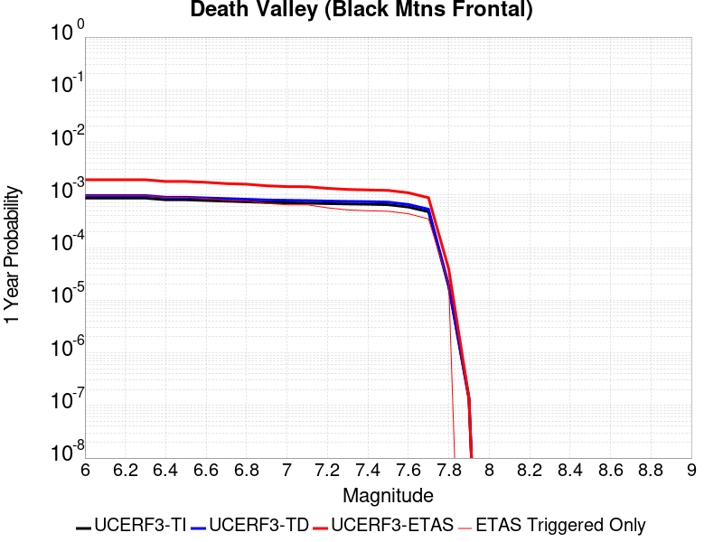 |  |

| Magnitude | 1 wk TI Prob | 1 wk TD Prob | 1 wk ETAS Prob | 1 wk ETAS/TD Gain | 1 wk ETAS Triggered Only | 1 mo TI Prob | 1 mo TD Prob | 1 mo ETAS Prob | 1 mo ETAS/TD Gain | 1 mo ETAS Triggered Only | 1 yr TI Prob | 1 yr TD Prob | 1 yr ETAS Prob | 1 yr ETAS/TD Gain | 1 yr ETAS Triggered Only | 10 yr TI Prob | 10 yr TD Prob | 10 yr ETAS Prob | 10 yr ETAS/TD Gain | 10 yr ETAS Triggered Only |
|-----|-----|-----|-----|-----|-----|-----|-----|-----|-----|-----|-----|-----|-----|-----|-----|-----|-----|-----|-----|-----|
| 6.0 | 1.6707214E-5 | 1.867027E-5 | 3.386643E-4 | 18.13923 | 3.2E-4 | 7.160038E-5 | 8.001302E-5 | 5.5997464E-4 | 6.9985433 | 4.8E-4 | 8.71386E-4 | 9.737309E-4 | 0.0017463112 | 1.7934228 | 7.7333336E-4 | 0.00867977 | 0.009695496 | 0.011121536 | 1.1470826 | 0.00144 |
| 6.1 | 1.6707214E-5 | 1.867027E-5 | 3.386643E-4 | 18.13923 | 3.2E-4 | 7.160038E-5 | 8.001302E-5 | 5.5997464E-4 | 6.9985433 | 4.8E-4 | 8.71386E-4 | 9.737309E-4 | 0.0017463112 | 1.7934228 | 7.7333336E-4 | 0.00867977 | 0.009695496 | 0.011121536 | 1.1470826 | 0.00144 |
| 6.2 | 1.6707214E-5 | 1.867027E-5 | 3.386643E-4 | 18.13923 | 3.2E-4 | 7.160038E-5 | 8.001302E-5 | 5.5997464E-4 | 6.9985433 | 4.8E-4 | 8.71386E-4 | 9.737309E-4 | 0.0017463112 | 1.7934228 | 7.7333336E-4 | 0.00867977 | 0.009695496 | 0.011121536 | 1.1470826 | 0.00144 |
| 6.3 | 1.6707214E-5 | 1.867027E-5 | 3.386643E-4 | 18.13923 | 3.2E-4 | 7.160038E-5 | 8.001302E-5 | 5.5997464E-4 | 6.9985433 | 4.8E-4 | 8.71386E-4 | 9.737309E-4 | 0.0017463112 | 1.7934228 | 7.7333336E-4 | 0.00867977 | 0.009695496 | 0.011121536 | 1.1470826 | 0.00144 |
| 6.4 | 1.5515609E-5 | 1.7338214E-5 | 3.1066645E-4 | 17.91802 | 2.9333335E-4 | 6.649377E-5 | 7.4304546E-5 | 5.276042E-4 | 7.100564 | 4.5333334E-4 | 8.0926094E-4 | 9.042885E-4 | 0.0015969948 | 1.7660236 | 6.9333334E-4 | 0.008063202 | 0.009006773 | 0.010222391 | 1.1349671 | 0.0012266666 |
| 6.5 | 1.5515609E-5 | 1.7338214E-5 | 3.1066645E-4 | 17.91802 | 2.9333335E-4 | 6.649377E-5 | 7.4304546E-5 | 5.276042E-4 | 7.100564 | 4.5333334E-4 | 8.0926094E-4 | 9.042885E-4 | 0.0015969948 | 1.7660236 | 6.9333334E-4 | 0.008063202 | 0.009006773 | 0.010222391 | 1.1349671 | 0.0012266666 |
| 6.6 | 1.5041828E-5 | 1.6809145E-5 | 3.1013755E-4 | 18.450525 | 2.9333335E-4 | 6.4463384E-5 | 7.203723E-5 | 5.2533793E-4 | 7.2925887 | 4.5333334E-4 | 7.8455906E-4 | 8.767063E-4 | 0.0015427885 | 1.7597553 | 6.6666666E-4 | 0.00781795 | 0.008733132 | 0.0099226525 | 1.1362077 | 0.0012 |
| 6.7 | 1.4634985E-5 | 1.6356016E-5 | 2.563521E-4 | 15.67326 | 2.4E-4 | 6.271985E-5 | 7.009536E-5 | 4.7006732E-4 | 6.706112 | 4.0E-4 | 7.6334673E-4 | 8.5308263E-4 | 0.0014658928 | 1.7183479 | 6.133333E-4 | 0.007607299 | 0.008498715 | 0.009503437 | 1.1182203 | 0.0010133333 |
| 6.8 | 1.4209158E-5 | 1.5882048E-5 | 2.5587823E-4 | 16.111162 | 2.4E-4 | 6.089497E-5 | 6.8064175E-5 | 4.6803695E-4 | 6.8764067 | 4.0E-4 | 7.4114406E-4 | 8.2837185E-4 | 0.0014145526 | 1.7076299 | 5.866667E-4 | 0.007386771 | 0.008253456 | 0.009205533 | 1.1153549 | 9.6E-4 |
| 6.9 | 1.3780098E-5 | 1.5404594E-5 | 2.0206839E-4 | 13.117412 | 1.8666667E-4 | 5.9056227E-5 | 6.6018045E-5 | 3.8599691E-4 | 5.8468394 | 3.2E-4 | 7.1877235E-4 | 8.0347876E-4 | 0.0013097383 | 1.6300846 | 5.0666666E-4 | 0.0071645193 | 0.008006332 | 0.008879287 | 1.109033 | 8.8E-4 |
| 7.0 | 1.3585064E-5 | 1.5188155E-5 | 2.0185199E-4 | 13.290092 | 1.8666667E-4 | 5.8220405E-5 | 6.50905E-5 | 3.8506967E-4 | 5.915912 | 3.2E-4 | 7.086029E-4 | 7.9219416E-4 | 0.0012718139 | 1.605432 | 4.8E-4 | 0.007063476 | 0.007894293 | 0.008714435 | 1.1038903 | 8.2666666E-4 |
| 7.1 | 1.3398601E-5 | 1.49813395E-5 | 2.016452E-4 | 13.459759 | 1.8666667E-4 | 5.742131E-5 | 6.420419E-5 | 3.8418366E-4 | 5.9837785 | 3.2E-4 | 6.9888023E-4 | 7.8141113E-4 | 0.001261036 | 1.6137933 | 4.8E-4 | 0.0069668638 | 0.007787224 | 0.008580994 | 1.1019324 | 8.0E-4 |
| 7.2 | 1.3126312E-5 | 1.4679561E-5 | 2.0134349E-4 | 13.715907 | 1.8666667E-4 | 5.6254412E-5 | 6.291092E-5 | 3.8289078E-4 | 6.0862374 | 3.2E-4 | 6.846822E-4 | 7.6567667E-4 | 0.001218663 | 1.5916156 | 4.5333334E-4 | 0.006825765 | 0.00763097 | 0.0083984025 | 1.100568 | 7.7333336E-4 |
| 7.3 | 1.2922429E-5 | 1.4453788E-5 | 2.0111776E-4 | 13.914536 | 1.8666667E-4 | 5.5380664E-5 | 6.194336E-5 | 3.8192354E-4 | 6.1656895 | 3.2E-4 | 6.74051E-4 | 7.53905E-4 | 0.00118025 | 1.5655156 | 4.2666667E-4 | 0.006720101 | 0.007514055 | 0.008228645 | 1.0951004 | 7.2E-4 |
| 7.4 | 1.2768878E-5 | 1.4283772E-5 | 2.0094778E-4 | 14.068257 | 1.8666667E-4 | 5.4722615E-5 | 6.1214756E-5 | 3.8119516E-4 | 6.2271776 | 3.2E-4 | 6.660441E-4 | 7.4504025E-4 | 0.001171389 | 1.5722493 | 4.2666667E-4 | 0.0066405144 | 0.0074260035 | 0.00808772 | 1.089108 | 6.6666666E-4 |
| 7.5 | 1.2521929E-5 | 1.40120155E-5 | 2.0067606E-4 | 14.321713 | 1.8666667E-4 | 5.366431E-5 | 6.005014E-5 | 3.8003092E-4 | 6.32856 | 3.2E-4 | 6.531671E-4 | 7.3087064E-4 | 0.0011572255 | 1.583352 | 4.2666667E-4 | 0.006512506 | 0.0072852457 | 0.007947056 | 1.0908425 | 6.6666666E-4 |
| 7.6 | 1.1301089E-5 | 1.2648149E-5 | 1.459798E-4 | 11.541594 | 1.3333333E-4 | 4.8432343E-5 | 5.4205255E-5 | 3.2085748E-4 | 5.9193053 | 2.6666667E-4 | 5.895042E-4 | 6.5975444E-4 | 0.0010328415 | 1.5654937 | 3.7333334E-4 | 0.0058794282 | 0.00657851 | 0.007187809 | 1.0926195 | 6.133333E-4 |
| 7.7 | 9.189108E-6 | 1.0283358E-5 | 9.0282534E-5 | 8.77948 | 8.0E-5 | 3.93813E-5 | 4.407082E-5 | 2.3072926E-4 | 5.23542 | 1.8666667E-4 | 4.7936183E-4 | 5.3643517E-4 | 8.029588E-4 | 1.4968421 | 2.6666667E-4 | 0.004783291 | 0.005351914 | 0.0057762973 | 1.0792956 | 4.2666667E-4 |
| 7.8 | 3.4586725E-7 | 3.6482615E-7 | 3.6482615E-7 | 1.0 | 0.0 | 1.4822873E-6 | 1.5635396E-6 | 2.8230164E-5 | 18.055292 | 2.6666667E-5 | 1.80467E-5 | 1.9035933E-5 | 4.5702094E-5 | 2.4008327 | 2.6666667E-5 | 1.8045233E-4 | 1.9034347E-4 | 2.1700506E-4 | 1.1400709 | 2.6666667E-5 |
| 7.9 | 2.5591178E-9 | 2.6696718E-9 | 2.6696718E-9 | 1.0 | 0.0 | 1.0967647E-8 | 1.14414505E-8 | 1.14414505E-8 | 1.0 | 0.0 | 1.335311E-7 | 1.3929966E-7 | 1.3929966E-7 | 1.0 | 0.0 | 1.3353102E-6 | 1.3929966E-6 | 1.3929966E-6 | 1.0 | 0.0 |

## Sierra Nevada  (No Extension)
*[(top)](#table-of-contents)*

| 1 Week | 1 Month | 1 Year | 10 Year |
|-----|-----|-----|-----|
| 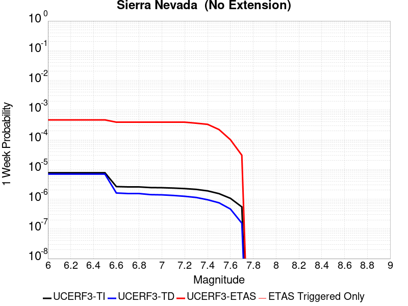 |  | 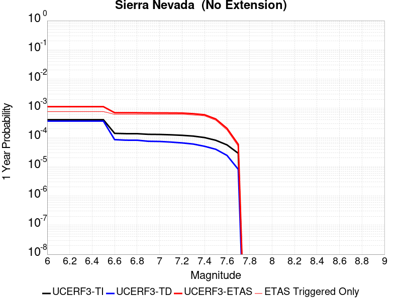 |  |

| Magnitude | 1 wk TI Prob | 1 wk TD Prob | 1 wk ETAS Prob | 1 wk ETAS/TD Gain | 1 wk ETAS Triggered Only | 1 mo TI Prob | 1 mo TD Prob | 1 mo ETAS Prob | 1 mo ETAS/TD Gain | 1 mo ETAS Triggered Only | 1 yr TI Prob | 1 yr TD Prob | 1 yr ETAS Prob | 1 yr ETAS/TD Gain | 1 yr ETAS Triggered Only | 10 yr TI Prob | 10 yr TD Prob | 10 yr ETAS Prob | 10 yr ETAS/TD Gain | 10 yr ETAS Triggered Only |
|-----|-----|-----|-----|-----|-----|-----|-----|-----|-----|-----|-----|-----|-----|-----|-----|-----|-----|-----|-----|-----|
| 6.0 | 7.7690465E-6 | 6.976322E-6 | 4.3364E-4 | 62.158833 | 4.2666667E-4 | 3.329549E-5 | 2.9898381E-5 | 5.365499E-4 | 17.945784 | 5.0666666E-4 | 4.0529718E-4 | 3.6398784E-4 | 9.770979E-4 | 2.6844246 | 6.133333E-4 | 0.004045588 | 0.0036374326 | 0.0046205106 | 1.2702669 | 9.866667E-4 |
| 6.1 | 7.7690465E-6 | 6.976322E-6 | 4.3364E-4 | 62.158833 | 4.2666667E-4 | 3.329549E-5 | 2.9898381E-5 | 5.365499E-4 | 17.945784 | 5.0666666E-4 | 4.0529718E-4 | 3.6398784E-4 | 9.770979E-4 | 2.6844246 | 6.133333E-4 | 0.004045588 | 0.0036374326 | 0.0046205106 | 1.2702669 | 9.866667E-4 |
| 6.2 | 7.7690465E-6 | 6.976322E-6 | 4.3364E-4 | 62.158833 | 4.2666667E-4 | 3.329549E-5 | 2.9898381E-5 | 5.365499E-4 | 17.945784 | 5.0666666E-4 | 4.0529718E-4 | 3.6398784E-4 | 9.770979E-4 | 2.6844246 | 6.133333E-4 | 0.004045588 | 0.0036374326 | 0.0046205106 | 1.2702669 | 9.866667E-4 |
| 6.3 | 7.7690465E-6 | 6.976322E-6 | 4.3364E-4 | 62.158833 | 4.2666667E-4 | 3.329549E-5 | 2.9898381E-5 | 5.365499E-4 | 17.945784 | 5.0666666E-4 | 4.0529718E-4 | 3.6398784E-4 | 9.770979E-4 | 2.6844246 | 6.133333E-4 | 0.004045588 | 0.0036374326 | 0.0046205106 | 1.2702669 | 9.866667E-4 |
| 6.4 | 7.7690465E-6 | 6.976322E-6 | 4.3364E-4 | 62.158833 | 4.2666667E-4 | 3.329549E-5 | 2.9898381E-5 | 5.365499E-4 | 17.945784 | 5.0666666E-4 | 4.0529718E-4 | 3.6398784E-4 | 9.770979E-4 | 2.6844246 | 6.133333E-4 | 0.004045588 | 0.0036374326 | 0.0046205106 | 1.2702669 | 9.866667E-4 |
| 6.5 | 7.7690465E-6 | 6.976322E-6 | 4.3364E-4 | 62.158833 | 4.2666667E-4 | 3.329549E-5 | 2.9898381E-5 | 5.365499E-4 | 17.945784 | 5.0666666E-4 | 4.0529718E-4 | 3.6398784E-4 | 9.770979E-4 | 2.6844246 | 6.133333E-4 | 0.004045588 | 0.0036374326 | 0.0046205106 | 1.2702669 | 9.866667E-4 |
| 6.6 | 2.653E-6 | 1.614854E-6 | 3.749476E-4 | 232.18668 | 3.7333334E-4 | 1.136995E-5 | 6.9207845E-6 | 4.6025097E-4 | 66.502716 | 4.5333334E-4 | 1.3842035E-4 | 8.425733E-5 | 6.4421014E-4 | 7.645746 | 5.6E-4 | 0.0013833415 | 8.422573E-4 | 0.0016682277 | 1.9806628 | 8.2666666E-4 |
| 6.7 | 2.5902466E-6 | 1.5501876E-6 | 3.7488295E-4 | 241.8307 | 3.7333334E-4 | 1.11010095E-5 | 6.643644E-6 | 4.5997396E-4 | 69.23519 | 4.5333334E-4 | 1.351464E-4 | 8.0883394E-5 | 6.408381E-4 | 7.9229875 | 5.6E-4 | 0.0013506424 | 8.0854254E-4 | 0.0016345409 | 2.021589 | 8.2666666E-4 |
| 6.8 | 2.5853892E-6 | 1.5469877E-6 | 3.7487975E-4 | 242.32884 | 3.7333334E-4 | 1.1080193E-5 | 6.629931E-6 | 4.5996025E-4 | 69.37633 | 4.5333334E-4 | 1.34893E-4 | 8.071645E-5 | 6.4067123E-4 | 7.9373074 | 5.6E-4 | 0.0013481114 | 8.068743E-4 | 0.0016328739 | 2.023703 | 8.2666666E-4 |
| 6.9 | 2.458257E-6 | 1.4220619E-6 | 3.7475486E-4 | 263.5292 | 3.7333334E-4 | 1.0535345E-5 | 6.094537E-6 | 4.594251E-4 | 75.3831 | 4.5333334E-4 | 1.2826028E-4 | 7.4198484E-5 | 6.341569E-4 | 8.546764 | 5.6E-4 | 0.0012818627 | 7.4173906E-4 | 0.0015677925 | 2.1136713 | 8.2666666E-4 |
| 7.0 | 2.4341468E-6 | 1.3990258E-6 | 3.7473184E-4 | 267.852 | 3.7333334E-4 | 1.0432016E-5 | 5.9958115E-6 | 4.5932643E-4 | 76.60789 | 4.5333334E-4 | 1.270024E-4 | 7.2996576E-5 | 6.329557E-4 | 8.671033 | 5.6E-4 | 0.0012692984 | 7.297279E-4 | 0.0015557914 | 2.1320157 | 8.2666666E-4 |
| 7.1 | 2.3652476E-6 | 1.3339754E-6 | 3.7466682E-4 | 280.86484 | 3.7333334E-4 | 1.0136736E-5 | 5.717025E-6 | 4.5904776E-4 | 80.29487 | 4.5333334E-4 | 1.2340778E-4 | 6.9602575E-5 | 6.295636E-4 | 9.045119 | 5.6E-4 | 0.0012333926 | 6.9580943E-4 | 0.0015219009 | 2.187238 | 8.2666666E-4 |
| 7.2 | 2.272158E-6 | 1.2502821E-6 | 3.7458315E-4 | 299.5989 | 3.7333334E-4 | 9.737784E-6 | 5.3583412E-6 | 4.5868923E-4 | 85.602844 | 4.5333334E-4 | 1.1855107E-4 | 6.5235865E-5 | 6.2519935E-4 | 9.583675 | 5.6E-4 | 0.0011848784 | 6.5216864E-4 | 0.0014782962 | 2.2667391 | 8.2666666E-4 |
| 7.3 | 2.1382127E-6 | 1.1419703E-6 | 3.2114162E-4 | 281.21713 | 3.2E-4 | 9.163737E-6 | 4.8941492E-6 | 4.048922E-4 | 82.72984 | 4.0E-4 | 1.1156279E-4 | 5.958465E-5 | 5.6622113E-4 | 9.502802 | 5.0666666E-4 | 0.001115068 | 5.956879E-4 | 0.0013685606 | 2.2974455 | 7.7333336E-4 |
| 7.4 | 1.9048055E-6 | 9.575242E-7 | 2.9429057E-4 | 307.3453 | 2.9333335E-4 | 8.163426E-6 | 4.1036687E-6 | 3.7743547E-4 | 91.97513 | 3.7333334E-4 | 9.9385186E-5 | 4.996103E-5 | 5.2993704E-4 | 10.607008 | 4.8E-4 | 9.934074E-4 | 4.994987E-4 | 0.0011924857 | 2.387365 | 6.9333334E-4 |
| 7.5 | 1.5373403E-6 | 7.560042E-7 | 2.1408917E-4 | 283.18515 | 2.1333333E-4 | 6.5885843E-6 | 3.2400142E-6 | 2.965724E-4 | 91.534294 | 2.9333335E-4 | 8.021306E-5 | 3.9446462E-5 | 4.1276508E-4 | 10.463931 | 3.7333334E-4 | 8.0184115E-4 | 3.943951E-4 | 9.541742E-4 | 2.419336 | 5.6E-4 |
| 7.6 | 1.0680322E-6 | 4.6596554E-7 | 5.3799275E-5 | 115.45763 | 5.3333333E-5 | 4.577273E-6 | 1.9969937E-6 | 1.08663444E-4 | 54.413517 | 1.0666667E-4 | 5.5726876E-5 | 2.4313129E-5 | 1.309772E-4 | 5.387098 | 1.0666667E-4 | 5.5712904E-4 | 2.4310495E-4 | 4.5638642E-4 | 1.8773226 | 2.1333333E-4 |
| 7.7 | 5.509146E-7 | 1.5580486E-7 | 2.6822467E-5 | 172.15424 | 2.6666667E-5 | 2.3610605E-6 | 6.677349E-7 | 2.7334383E-5 | 40.935978 | 2.6666667E-5 | 2.8745531E-5 | 8.129644E-6 | 3.4796092E-5 | 4.28015 | 2.6666667E-5 | 2.8741814E-4 | 8.1293576E-5 | 1.6128707E-4 | 1.9840076 | 8.0E-5 |

## Helendale-So Lockhart
*[(top)](#table-of-contents)*

| 1 Week | 1 Month | 1 Year | 10 Year |
|-----|-----|-----|-----|
| 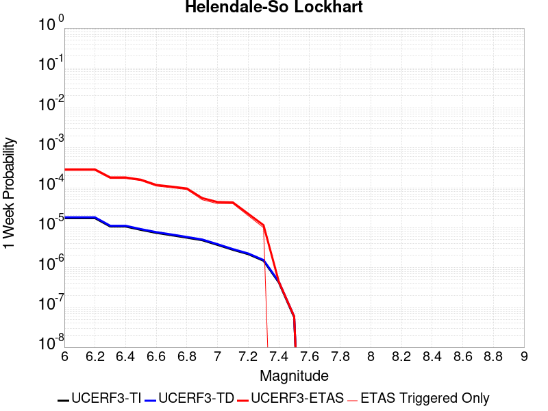 |  |  |  |

| Magnitude | 1 wk TI Prob | 1 wk TD Prob | 1 wk ETAS Prob | 1 wk ETAS/TD Gain | 1 wk ETAS Triggered Only | 1 mo TI Prob | 1 mo TD Prob | 1 mo ETAS Prob | 1 mo ETAS/TD Gain | 1 mo ETAS Triggered Only | 1 yr TI Prob | 1 yr TD Prob | 1 yr ETAS Prob | 1 yr ETAS/TD Gain | 1 yr ETAS Triggered Only | 10 yr TI Prob | 10 yr TD Prob | 10 yr ETAS Prob | 10 yr ETAS/TD Gain | 10 yr ETAS Triggered Only |
|-----|-----|-----|-----|-----|-----|-----|-----|-----|-----|-----|-----|-----|-----|-----|-----|-----|-----|-----|-----|-----|
| 6.0 | 1.7296055E-5 | 1.8103729E-5 | 2.5809938E-4 | 14.256697 | 2.4E-4 | 7.412385E-5 | 7.7585224E-5 | 4.24225E-4 | 5.4678583 | 3.4666667E-4 | 9.0208417E-4 | 9.4421144E-4 | 0.0015569656 | 1.6489587 | 6.133333E-4 | 0.008984311 | 0.009404116 | 0.010302257 | 1.095505 | 9.066667E-4 |
| 6.1 | 1.7296055E-5 | 1.8103729E-5 | 2.5809938E-4 | 14.256697 | 2.4E-4 | 7.412385E-5 | 7.7585224E-5 | 4.24225E-4 | 5.4678583 | 3.4666667E-4 | 9.0208417E-4 | 9.4421144E-4 | 0.0015569656 | 1.6489587 | 6.133333E-4 | 0.008984311 | 0.009404116 | 0.010302257 | 1.095505 | 9.066667E-4 |
| 6.2 | 1.7296055E-5 | 1.8103729E-5 | 2.5809938E-4 | 14.256697 | 2.4E-4 | 7.412385E-5 | 7.7585224E-5 | 4.24225E-4 | 5.4678583 | 3.4666667E-4 | 9.0208417E-4 | 9.4421144E-4 | 0.0015569656 | 1.6489587 | 6.133333E-4 | 0.008984311 | 0.009404116 | 0.010302257 | 1.095505 | 9.066667E-4 |
| 6.3 | 1.0669118E-5 | 1.1135425E-5 | 1.7113364E-4 | 15.368399 | 1.6E-4 | 4.5723988E-5 | 4.772239E-5 | 2.8771095E-4 | 6.028846 | 2.4E-4 | 5.5654737E-4 | 5.80868E-4 | 9.539845E-4 | 1.6423429 | 3.7333334E-4 | 0.0055515557 | 0.0057937936 | 0.006324037 | 1.0915192 | 5.3333334E-4 |
| 6.4 | 1.0669118E-5 | 1.1135425E-5 | 1.7113364E-4 | 15.368399 | 1.6E-4 | 4.5723988E-5 | 4.772239E-5 | 2.8771095E-4 | 6.028846 | 2.4E-4 | 5.5654737E-4 | 5.80868E-4 | 9.539845E-4 | 1.6423429 | 3.7333334E-4 | 0.0055515557 | 0.0057937936 | 0.006324037 | 1.0915192 | 5.3333334E-4 |
| 6.5 | 8.790038E-6 | 9.170197E-6 | 1.6916874E-4 | 18.447666 | 1.6E-4 | 3.767105E-5 | 3.930026E-5 | 2.7929083E-4 | 7.10659 | 2.4E-4 | 4.585485E-4 | 4.7837716E-4 | 8.515319E-4 | 1.780043 | 3.7333334E-4 | 0.0045760344 | 0.004773638 | 0.0052778865 | 1.1056318 | 5.0666666E-4 |
| 6.6 | 7.396949E-6 | 7.715537E-6 | 1.1438138E-4 | 14.824811 | 1.0666667E-4 | 3.1700827E-5 | 3.3066175E-5 | 2.1972667E-4 | 6.6450586 | 1.8666667E-4 | 3.858892E-4 | 4.025073E-4 | 7.223785E-4 | 1.7946966 | 3.2E-4 | 0.003852198 | 0.00401789 | 0.0043897233 | 1.0925444 | 3.7333334E-4 |
| 6.7 | 6.4600285E-6 | 6.738031E-6 | 1.1340398E-4 | 16.830433 | 1.0666667E-4 | 2.7685543E-5 | 2.887696E-5 | 2.1553824E-4 | 7.4640207 | 1.8666667E-4 | 3.3701936E-4 | 3.5152107E-4 | 6.18094E-4 | 1.7583413 | 2.6666667E-4 | 0.0033650869 | 0.003509732 | 0.0038020357 | 1.0832838 | 2.9333335E-4 |
| 6.8 | 5.600104E-6 | 5.836009E-6 | 8.583554E-5 | 14.707917 | 8.0E-5 | 2.4000226E-5 | 2.5011232E-5 | 1.8500723E-4 | 7.396966 | 1.6E-4 | 2.9216358E-4 | 3.044698E-4 | 4.9107964E-4 | 1.612901 | 1.8666667E-4 | 0.0029177975 | 0.003040588 | 0.0032532727 | 1.0699486 | 2.1333333E-4 |
| 6.9 | 4.839122E-6 | 5.0395092E-6 | 5.8372574E-5 | 11.582988 | 5.3333333E-5 | 2.0738931E-5 | 2.159772E-5 | 1.5492817E-4 | 7.1733575 | 1.3333333E-4 | 2.5246723E-4 | 2.6292098E-4 | 4.2287892E-4 | 1.6083878 | 1.6E-4 | 0.002521806 | 0.002626147 | 0.0027857267 | 1.0607657 | 1.6E-4 |
| 7.0 | 3.6937633E-6 | 3.845208E-6 | 5.7178335E-5 | 14.870025 | 5.3333333E-5 | 1.5830317E-5 | 1.647936E-5 | 1.498105E-4 | 9.0907955 | 1.3333333E-4 | 1.9271708E-4 | 2.0061806E-4 | 3.3392463E-4 | 1.6644795 | 1.3333333E-4 | 0.0019255003 | 0.002004401 | 0.002137467 | 1.0663869 | 1.3333333E-4 |
| 7.1 | 2.7858857E-6 | 2.8978538E-6 | 5.6231034E-5 | 19.404371 | 5.3333333E-5 | 1.1939455E-5 | 1.2419316E-5 | 1.1908466E-4 | 9.588665 | 1.0666667E-4 | 1.4535317E-4 | 1.511949E-4 | 2.5784542E-4 | 1.7053845 | 1.0666667E-4 | 0.0014525814 | 0.0015109418 | 0.0016174472 | 1.0704895 | 1.0666667E-4 |
| 7.2 | 2.1672065E-6 | 2.2540128E-6 | 2.2540128E-6 | 1.0 | 0.0 | 9.2879945E-6 | 9.66002E-6 | 6.299284E-5 | 6.520984 | 5.3333333E-5 | 1.1307546E-4 | 1.1760458E-4 | 1.7093164E-4 | 1.4534438 | 5.3333333E-5 | 0.0011301794 | 0.0011754417 | 0.0012287123 | 1.0453197 | 5.3333333E-5 |
| 7.3 | 1.4823496E-6 | 1.5422102E-6 | 1.5422102E-6 | 1.0 | 0.0 | 6.3529114E-6 | 6.6094562E-6 | 3.327595E-5 | 5.0345964 | 2.6666667E-5 | 7.734395E-5 | 8.046731E-5 | 1.0713183E-4 | 1.3313708 | 2.6666667E-5 | 7.731704E-4 | 8.0439687E-4 | 8.310421E-4 | 1.0331244 | 2.6666667E-5 |
| 7.4 | 4.2321457E-7 | 4.4108765E-7 | 4.4108765E-7 | 1.0 | 0.0 | 1.8137755E-6 | 1.8903745E-6 | 1.8903745E-6 | 1.0 | 0.0 | 2.2082493E-5 | 2.3015113E-5 | 2.3015113E-5 | 1.0 | 0.0 | 2.2080299E-4 | 2.3013182E-4 | 2.3013182E-4 | 1.0 | 0.0 |
| 7.5 | 5.6942316E-8 | 5.9415648E-8 | 5.9415648E-8 | 1.0 | 0.0 | 2.440385E-7 | 2.5463845E-7 | 2.5463845E-7 | 1.0 | 0.0 | 2.9711643E-6 | 3.1002196E-6 | 3.1002196E-6 | 1.0 | 0.0 | 2.9711247E-5 | 3.1001844E-5 | 3.1001844E-5 | 1.0 | 0.0 |

## San Andreas (San Gorgonio Pass-Garnet HIll)
*[(top)](#table-of-contents)*

| 1 Week | 1 Month | 1 Year | 10 Year |
|-----|-----|-----|-----|
| 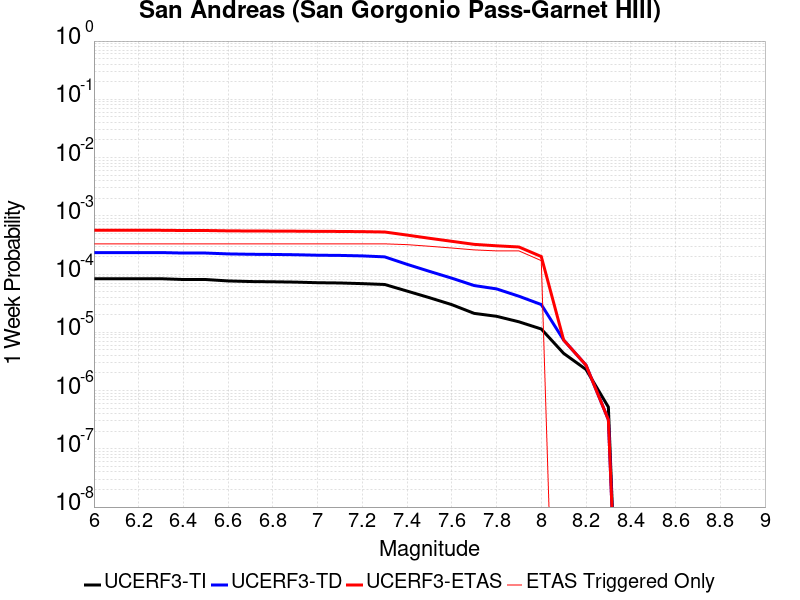 |  |  |  |

| Magnitude | 1 wk TI Prob | 1 wk TD Prob | 1 wk ETAS Prob | 1 wk ETAS/TD Gain | 1 wk ETAS Triggered Only | 1 mo TI Prob | 1 mo TD Prob | 1 mo ETAS Prob | 1 mo ETAS/TD Gain | 1 mo ETAS Triggered Only | 1 yr TI Prob | 1 yr TD Prob | 1 yr ETAS Prob | 1 yr ETAS/TD Gain | 1 yr ETAS Triggered Only | 10 yr TI Prob | 10 yr TD Prob | 10 yr ETAS Prob | 10 yr ETAS/TD Gain | 10 yr ETAS Triggered Only |
|-----|-----|-----|-----|-----|-----|-----|-----|-----|-----|-----|-----|-----|-----|-----|-----|-----|-----|-----|-----|-----|
| 6.0 | 8.31567E-5 | 2.3382473E-4 | 6.0707075E-4 | 2.5962641 | 3.7333334E-4 | 3.5633717E-4 | 0.0010017233 | 0.0014279627 | 1.425506 | 4.2666667E-4 | 0.004329778 | 0.012127888 | 0.012812813 | 1.0564752 | 6.9333334E-4 | 0.042463828 | 0.11257892 | 0.11338352 | 1.007147 | 9.066667E-4 |
| 6.1 | 8.31567E-5 | 2.3382473E-4 | 6.0707075E-4 | 2.5962641 | 3.7333334E-4 | 3.5633717E-4 | 0.0010017233 | 0.0014279627 | 1.425506 | 4.2666667E-4 | 0.004329778 | 0.012127888 | 0.012812813 | 1.0564752 | 6.9333334E-4 | 0.042463828 | 0.11257892 | 0.11338352 | 1.007147 | 9.066667E-4 |
| 6.2 | 8.31567E-5 | 2.3382473E-4 | 6.0707075E-4 | 2.5962641 | 3.7333334E-4 | 3.5633717E-4 | 0.0010017233 | 0.0014279627 | 1.425506 | 4.2666667E-4 | 0.004329778 | 0.012127888 | 0.012812813 | 1.0564752 | 6.9333334E-4 | 0.042463828 | 0.11257892 | 0.11338352 | 1.007147 | 9.066667E-4 |
| 6.3 | 8.31567E-5 | 2.3382473E-4 | 6.0707075E-4 | 2.5962641 | 3.7333334E-4 | 3.5633717E-4 | 0.0010017233 | 0.0014279627 | 1.425506 | 4.2666667E-4 | 0.004329778 | 0.012127888 | 0.012812813 | 1.0564752 | 6.9333334E-4 | 0.042463828 | 0.11257892 | 0.11338352 | 1.007147 | 9.066667E-4 |
| 6.4 | 8.059055E-5 | 2.2940808E-4 | 6.0265575E-4 | 2.6270032 | 3.7333334E-4 | 3.4534236E-4 | 9.828096E-4 | 0.0014090568 | 1.433703 | 4.2666667E-4 | 0.0041964394 | 0.011900152 | 0.012585234 | 1.0575693 | 6.9333334E-4 | 0.041180745 | 0.11056015 | 0.11136657 | 1.0072939 | 9.066667E-4 |
| 6.5 | 8.059055E-5 | 2.2940808E-4 | 6.0265575E-4 | 2.6270032 | 3.7333334E-4 | 3.4534236E-4 | 9.828096E-4 | 0.0014090568 | 1.433703 | 4.2666667E-4 | 0.0041964394 | 0.011900152 | 0.012585234 | 1.0575693 | 6.9333334E-4 | 0.041180745 | 0.11056015 | 0.11136657 | 1.0072939 | 9.066667E-4 |
| 6.6 | 7.619237E-5 | 2.218517E-4 | 5.951022E-4 | 2.6824324 | 3.7333334E-4 | 3.2649786E-4 | 9.5044886E-4 | 0.00137671 | 1.4484841 | 4.2666667E-4 | 0.0039678677 | 0.01151087 | 0.012196222 | 1.0595396 | 6.9333334E-4 | 0.03897764 | 0.10709683 | 0.10790639 | 1.0075592 | 9.066667E-4 |
| 6.7 | 7.440636E-5 | 2.1860997E-4 | 5.9186167E-4 | 2.7073865 | 3.7333334E-4 | 3.188454E-4 | 9.3656575E-4 | 0.0013628328 | 1.4551384 | 4.2666667E-4 | 0.0038750346 | 0.011343609 | 0.012029077 | 1.0604277 | 6.9333334E-4 | 0.038081564 | 0.105605274 | 0.106416196 | 1.0076787 | 9.066667E-4 |
| 6.8 | 7.3735864E-5 | 2.1708169E-4 | 5.9033395E-4 | 2.7194095 | 3.7333334E-4 | 3.1597257E-4 | 9.3002064E-4 | 0.0013562905 | 1.4583445 | 4.2666667E-4 | 0.0038401815 | 0.011264749 | 0.011950272 | 1.0608556 | 6.9333334E-4 | 0.03774495 | 0.10490683 | 0.105718374 | 1.007736 | 9.066667E-4 |
| 6.9 | 7.27575E-5 | 2.1477141E-4 | 5.8802456E-4 | 2.7379088 | 3.7333334E-4 | 3.117806E-4 | 9.201265E-4 | 0.0013464006 | 1.4632777 | 4.2666667E-4 | 0.003789323 | 0.011145527 | 0.011831132 | 1.061514 | 6.9333334E-4 | 0.037253562 | 0.103854746 | 0.10466725 | 1.0078235 | 9.066667E-4 |
| 7.0 | 7.102591E-5 | 2.1061185E-4 | 5.8386655E-4 | 2.77224 | 3.7333334E-4 | 3.0436125E-4 | 9.023122E-4 | 0.0013285939 | 1.4724326 | 4.2666667E-4 | 0.003699303 | 0.010930831 | 0.011616586 | 1.0627358 | 6.9333334E-4 | 0.03638325 | 0.10195695 | 0.102747224 | 1.0077511 | 8.8E-4 |
| 7.1 | 7.028513E-5 | 2.0896831E-4 | 5.8222364E-4 | 2.7861814 | 3.7333334E-4 | 3.0118722E-4 | 8.9527335E-4 | 0.001321558 | 1.4761503 | 4.2666667E-4 | 0.0036607897 | 0.010845989 | 0.011531803 | 1.063232 | 6.9333334E-4 | 0.036010686 | 0.101199985 | 0.10199093 | 1.0078156 | 8.8E-4 |
| 7.2 | 6.8498244E-5 | 2.0504706E-4 | 5.783038E-4 | 2.8203468 | 3.7333334E-4 | 2.9353087E-4 | 8.784794E-4 | 0.0013047713 | 1.4852611 | 4.2666667E-4 | 0.003567883 | 0.010643536 | 0.01132949 | 1.0644479 | 6.9333334E-4 | 0.035111405 | 0.09939202 | 0.10018455 | 1.0079738 | 8.8E-4 |
| 7.3 | 6.622592E-5 | 1.9732013E-4 | 5.705798E-4 | 2.8916452 | 3.7333334E-4 | 2.8379448E-4 | 8.453858E-4 | 0.0012716918 | 1.5042739 | 4.2666667E-4 | 0.0034497243 | 0.0102444785 | 0.01093071 | 1.0669854 | 6.9333334E-4 | 0.033966612 | 0.095888525 | 0.09668414 | 1.0082973 | 8.8E-4 |
| 7.4 | 5.1050705E-5 | 1.4689034E-4 | 4.935061E-4 | 3.3596907 | 3.4666667E-4 | 2.1877038E-4 | 6.29379E-4 | 0.0010291273 | 1.6351471 | 4.0E-4 | 0.002660276 | 0.0076359594 | 0.008244609 | 1.0797083 | 6.133333E-4 | 0.02628654 | 0.07286301 | 0.073604725 | 1.0101795 | 8.0E-4 |
| 7.5 | 3.9302922E-5 | 1.1129847E-4 | 4.5792654E-4 | 4.1144013 | 3.4666667E-4 | 1.6843023E-4 | 4.7690657E-4 | 8.767158E-4 | 1.8383387 | 4.0E-4 | 0.0020487092 | 0.005790949 | 0.0064007305 | 1.1052991 | 6.133333E-4 | 0.020299247 | 0.05600951 | 0.056764703 | 1.0134833 | 8.0E-4 |
| 7.6 | 2.9851626E-5 | 8.4949745E-5 | 3.7825815E-4 | 4.4527287 | 2.9333335E-4 | 1.2792926E-4 | 3.6401965E-4 | 7.105601E-4 | 1.9519829 | 3.4666667E-4 | 0.0015564259 | 0.0044229585 | 0.0049804817 | 1.1260521 | 5.6E-4 | 0.0154556995 | 0.04319374 | 0.04388264 | 1.0159491 | 7.2E-4 |
| 7.7 | 2.1135214E-5 | 6.3529005E-5 | 3.0351375E-4 | 4.777562 | 2.4E-4 | 9.0576345E-5 | 2.7223877E-4 | 5.6549226E-4 | 2.0771923 | 2.9333335E-4 | 0.0011022091 | 0.0033094748 | 0.0037878864 | 1.1445581 | 4.8E-4 | 0.010967582 | 0.032582592 | 0.03317594 | 1.0182106 | 6.133333E-4 |
| 7.8 | 1.883379E-5 | 5.564028E-5 | 2.6896174E-4 | 4.8339396 | 2.1333333E-4 | 8.0713755E-5 | 2.3843657E-4 | 5.0503964E-4 | 2.11813 | 2.6666667E-4 | 9.822468E-4 | 0.0028991038 | 0.0033511228 | 1.1559168 | 4.5333334E-4 | 0.0097791655 | 0.028695205 | 0.029265039 | 1.0198581 | 5.866667E-4 |
| 7.9 | 1.5156185E-5 | 4.1658426E-5 | 2.5498288E-4 | 6.1207995 | 2.1333333E-4 | 6.495346E-5 | 1.785239E-4 | 4.4514297E-4 | 2.4934642 | 2.6666667E-4 | 7.9052144E-4 | 0.0021713632 | 0.0025971034 | 1.1960704 | 4.2666667E-4 | 0.007877152 | 0.021759422 | 0.022307238 | 1.0251759 | 5.6E-4 |
| 8.0 | 1.1405907E-5 | 2.9974231E-5 | 1.366377E-4 | 4.5585055 | 1.0666667E-4 | 4.8881542E-5 | 1.2845467E-4 | 2.6177088E-4 | 2.0378463 | 1.3333333E-4 | 5.9497025E-4 | 0.0015628147 | 0.0018290646 | 1.1703657 | 2.6666667E-4 | 0.005933798 | 0.015772851 | 0.016140295 | 1.023296 | 3.7333334E-4 |
| 8.1 | 4.3511436E-6 | 7.369219E-6 | 7.369219E-6 | 1.0 | 0.0 | 1.8647626E-5 | 3.1581985E-5 | 3.1581985E-5 | 1.0 | 0.0 | 2.2701119E-4 | 3.8444297E-4 | 3.8444297E-4 | 1.0 | 0.0 | 0.0022677942 | 0.0041163345 | 0.0041428916 | 1.0064516 | 2.6666667E-5 |
| 8.2 | 2.3042528E-6 | 2.7329415E-6 | 2.7329415E-6 | 1.0 | 0.0 | 9.875332E-6 | 1.1712554E-5 | 1.1712554E-5 | 1.0 | 0.0 | 1.2022553E-4 | 1.4259106E-4 | 1.4259106E-4 | 1.0 | 0.0 | 0.0012016051 | 0.0015979785 | 0.0015979785 | 1.0 | 0.0 |
| 8.3 | 5.202968E-7 | 3.1598344E-7 | 3.1598344E-7 | 1.0 | 0.0 | 2.2298414E-6 | 1.3542141E-6 | 1.3542141E-6 | 1.0 | 0.0 | 2.714798E-5 | 1.6487444E-5 | 1.6487444E-5 | 1.0 | 0.0 | 2.7144665E-4 | 1.9563142E-4 | 1.9563142E-4 | 1.0 | 0.0 |

## Coyote Lake
*[(top)](#table-of-contents)*

| 1 Week | 1 Month | 1 Year | 10 Year |
|-----|-----|-----|-----|
|  |  |  |  |

| Magnitude | 1 wk TI Prob | 1 wk TD Prob | 1 wk ETAS Prob | 1 wk ETAS/TD Gain | 1 wk ETAS Triggered Only | 1 mo TI Prob | 1 mo TD Prob | 1 mo ETAS Prob | 1 mo ETAS/TD Gain | 1 mo ETAS Triggered Only | 1 yr TI Prob | 1 yr TD Prob | 1 yr ETAS Prob | 1 yr ETAS/TD Gain | 1 yr ETAS Triggered Only | 10 yr TI Prob | 10 yr TD Prob | 10 yr ETAS Prob | 10 yr ETAS/TD Gain | 10 yr ETAS Triggered Only |
|-----|-----|-----|-----|-----|-----|-----|-----|-----|-----|-----|-----|-----|-----|-----|-----|-----|-----|-----|-----|-----|
| 6.0 | 1.980352E-5 | 2.1706745E-5 | 2.3503545E-4 | 10.827761 | 2.1333333E-4 | 8.486947E-5 | 9.302599E-5 | 3.8633205E-4 | 4.152947 | 2.9333335E-4 | 0.0010327959 | 0.0011320751 | 0.0016381681 | 1.447049 | 5.0666666E-4 | 0.010280091 | 0.011270258 | 0.012166706 | 1.0795411 | 9.066667E-4 |
| 6.1 | 1.980352E-5 | 2.1706745E-5 | 2.3503545E-4 | 10.827761 | 2.1333333E-4 | 8.486947E-5 | 9.302599E-5 | 3.8633205E-4 | 4.152947 | 2.9333335E-4 | 0.0010327959 | 0.0011320751 | 0.0016381681 | 1.447049 | 5.0666666E-4 | 0.010280091 | 0.011270258 | 0.012166706 | 1.0795411 | 9.066667E-4 |
| 6.2 | 1.980352E-5 | 2.1706745E-5 | 2.3503545E-4 | 10.827761 | 2.1333333E-4 | 8.486947E-5 | 9.302599E-5 | 3.8633205E-4 | 4.152947 | 2.9333335E-4 | 0.0010327959 | 0.0011320751 | 0.0016381681 | 1.447049 | 5.0666666E-4 | 0.010280091 | 0.011270258 | 0.012166706 | 1.0795411 | 9.066667E-4 |
| 6.3 | 1.5344787E-5 | 1.682067E-5 | 1.7681798E-4 | 10.511947 | 1.6E-4 | 6.576172E-5 | 7.2086936E-5 | 3.1206963E-4 | 4.3290734 | 2.4E-4 | 8.003548E-4 | 8.773662E-4 | 0.0013303019 | 1.5162446 | 4.5333334E-4 | 0.007974784 | 0.00874507 | 0.009564507 | 1.0937028 | 8.2666666E-4 |
| 6.4 | 1.5344787E-5 | 1.682067E-5 | 1.7681798E-4 | 10.511947 | 1.6E-4 | 6.576172E-5 | 7.2086936E-5 | 3.1206963E-4 | 4.3290734 | 2.4E-4 | 8.003548E-4 | 8.773662E-4 | 0.0013303019 | 1.5162446 | 4.5333334E-4 | 0.007974784 | 0.00874507 | 0.009564507 | 1.0937028 | 8.2666666E-4 |
| 6.5 | 1.4189697E-5 | 1.5557987E-5 | 1.755555E-4 | 11.283947 | 1.6E-4 | 6.081157E-5 | 6.6675726E-5 | 3.0665973E-4 | 4.599271 | 2.4E-4 | 7.401293E-4 | 8.115349E-4 | 0.0012378553 | 1.525326 | 4.2666667E-4 | 0.0073766913 | 0.008091656 | 0.008885182 | 1.0980673 | 8.0E-4 |
| 6.6 | 1.3469301E-5 | 1.4771577E-5 | 1.7476921E-4 | 11.831452 | 1.6E-4 | 5.7724297E-5 | 6.330556E-5 | 2.766254E-4 | 4.369685 | 2.1333333E-4 | 7.025667E-4 | 7.7053264E-4 | 0.0011702244 | 1.5187215 | 4.0E-4 | 0.0070034964 | 0.0076845144 | 0.008451905 | 1.099862 | 7.7333336E-4 |
| 6.7 | 1.3027966E-5 | 1.4281745E-5 | 1.7427946E-4 | 12.202952 | 1.6E-4 | 5.5832945E-5 | 6.120638E-5 | 2.7452665E-4 | 4.485262 | 2.1333333E-4 | 6.7955407E-4 | 7.4499263E-4 | 0.0011180479 | 1.5007502 | 3.7333334E-4 | 0.006774798 | 0.0074308286 | 0.008145479 | 1.0961736 | 7.2E-4 |
| 6.8 | 5.695434E-6 | 6.2244176E-6 | 5.955742E-5 | 9.568352 | 5.3333333E-5 | 2.4408775E-5 | 2.6675973E-5 | 8.0007885E-5 | 2.999249 | 5.3333333E-5 | 2.971363E-4 | 3.2476155E-4 | 4.580516E-4 | 1.4104244 | 1.3333333E-4 | 0.0029673933 | 0.0032458105 | 0.0034850314 | 1.0737015 | 2.4E-4 |
| 6.9 | 4.385688E-6 | 4.7930553E-6 | 5.8126134E-5 | 12.127156 | 5.3333333E-5 | 1.879567E-5 | 2.0541665E-5 | 7.38739E-5 | 3.5962956 | 5.3333333E-5 | 2.2881327E-4 | 2.5009477E-4 | 3.8339477E-4 | 1.5329978 | 1.3333333E-4 | 0.002285778 | 0.0025009478 | 0.0027137476 | 1.0850877 | 2.1333333E-4 |

## Death Valley (No)
*[(top)](#table-of-contents)*

| 1 Week | 1 Month | 1 Year | 10 Year |
|-----|-----|-----|-----|
|  |  |  |  |

| Magnitude | 1 wk TI Prob | 1 wk TD Prob | 1 wk ETAS Prob | 1 wk ETAS/TD Gain | 1 wk ETAS Triggered Only | 1 mo TI Prob | 1 mo TD Prob | 1 mo ETAS Prob | 1 mo ETAS/TD Gain | 1 mo ETAS Triggered Only | 1 yr TI Prob | 1 yr TD Prob | 1 yr ETAS Prob | 1 yr ETAS/TD Gain | 1 yr ETAS Triggered Only | 10 yr TI Prob | 10 yr TD Prob | 10 yr ETAS Prob | 10 yr ETAS/TD Gain | 10 yr ETAS Triggered Only |
|-----|-----|-----|-----|-----|-----|-----|-----|-----|-----|-----|-----|-----|-----|-----|-----|-----|-----|-----|-----|-----|
| 6.0 | 2.0074807E-5 | 2.2500084E-5 | 2.3582861E-4 | 10.481233 | 2.1333333E-4 | 8.603206E-5 | 9.642541E-5 | 4.4305864E-4 | 4.594833 | 3.4666667E-4 | 0.001046937 | 0.0011733545 | 0.0016794266 | 1.4313037 | 5.0666666E-4 | 0.010420183 | 0.011672506 | 0.012489524 | 1.069995 | 8.2666666E-4 |
| 6.1 | 2.0074807E-5 | 2.2500084E-5 | 2.3582861E-4 | 10.481233 | 2.1333333E-4 | 8.603206E-5 | 9.642541E-5 | 4.4305864E-4 | 4.594833 | 3.4666667E-4 | 0.001046937 | 0.0011733545 | 0.0016794266 | 1.4313037 | 5.0666666E-4 | 0.010420183 | 0.011672506 | 0.012489524 | 1.069995 | 8.2666666E-4 |
| 6.2 | 2.0074807E-5 | 2.2500084E-5 | 2.3582861E-4 | 10.481233 | 2.1333333E-4 | 8.603206E-5 | 9.642541E-5 | 4.4305864E-4 | 4.594833 | 3.4666667E-4 | 0.001046937 | 0.0011733545 | 0.0016794266 | 1.4313037 | 5.0666666E-4 | 0.010420183 | 0.011672506 | 0.012489524 | 1.069995 | 8.2666666E-4 |
| 6.3 | 1.9050609E-5 | 2.1336948E-5 | 2.3466573E-4 | 10.998093 | 2.1333333E-4 | 8.164292E-5 | 9.1440896E-5 | 4.3807586E-4 | 4.790809 | 3.4666667E-4 | 9.935491E-4 | 0.001112731 | 0.001618834 | 1.4548295 | 5.0666666E-4 | 0.009891188 | 0.011072419 | 0.01186356 | 1.0714515 | 8.0E-4 |
| 6.4 | 1.9050609E-5 | 2.1336948E-5 | 2.3466573E-4 | 10.998093 | 2.1333333E-4 | 8.164292E-5 | 9.1440896E-5 | 4.3807586E-4 | 4.790809 | 3.4666667E-4 | 9.935491E-4 | 0.001112731 | 0.001618834 | 1.4548295 | 5.0666666E-4 | 0.009891188 | 0.011072419 | 0.01186356 | 1.0714515 | 8.0E-4 |
| 6.5 | 1.8367004E-5 | 2.0561009E-5 | 2.3388995E-4 | 11.375413 | 2.1333333E-4 | 7.8713354E-5 | 8.811567E-5 | 4.347518E-4 | 4.933876 | 3.4666667E-4 | 9.5791375E-4 | 0.0010722869 | 0.0015784102 | 1.4720037 | 5.0666666E-4 | 0.009537951 | 0.0106719155 | 0.011463378 | 1.0741631 | 8.0E-4 |
| 6.6 | 1.779439E-5 | 1.9910927E-5 | 2.3324002E-4 | 11.714171 | 2.1333333E-4 | 7.625944E-5 | 8.53298E-5 | 4.3196688E-4 | 5.0623217 | 3.4666667E-4 | 9.280632E-4 | 0.0010384015 | 0.0015179031 | 1.461769 | 4.8E-4 | 0.009241969 | 0.010336253 | 0.011101592 | 1.0740442 | 7.7333336E-4 |
| 6.7 | 1.7025437E-5 | 1.9043426E-5 | 2.0570654E-4 | 10.801971 | 1.8666667E-4 | 7.296412E-5 | 8.161216E-5 | 4.0158603E-4 | 4.9206643 | 3.2E-4 | 8.87976E-4 | 9.931813E-4 | 0.0014460644 | 1.4559923 | 4.5333334E-4 | 0.008844362 | 0.009888145 | 0.010627429 | 1.0747646 | 7.466667E-4 |
| 6.8 | 1.6545107E-5 | 1.8512545E-5 | 2.0517576E-4 | 11.083066 | 1.8666667E-4 | 7.090568E-5 | 7.93371E-5 | 3.993117E-4 | 5.033102 | 3.2E-4 | 8.629347E-4 | 9.655073E-4 | 0.0014184029 | 1.4690753 | 4.5333334E-4 | 0.008595915 | 0.009613829 | 0.0103533175 | 1.0769192 | 7.466667E-4 |
| 6.9 | 1.615478E-5 | 1.8087594E-5 | 2.0475089E-4 | 11.3199625 | 1.8666667E-4 | 6.9232934E-5 | 7.751599E-5 | 3.9749118E-4 | 5.1278605 | 3.2E-4 | 8.4258494E-4 | 9.433546E-4 | 0.0013962603 | 1.4801012 | 4.5333334E-4 | 0.008393973 | 0.009394196 | 0.010107432 | 1.0759231 | 7.2E-4 |
| 7.0 | 1.5894311E-5 | 1.780555E-5 | 2.0446889E-4 | 11.483436 | 1.8666667E-4 | 6.81167E-5 | 7.6307304E-5 | 3.9628288E-4 | 5.1932497 | 3.2E-4 | 8.2900526E-4 | 9.286515E-4 | 0.0013815638 | 1.4877098 | 4.5333334E-4 | 0.008259195 | 0.009248397 | 0.009961738 | 1.0771313 | 7.2E-4 |
| 7.1 | 1.5602263E-5 | 1.7483504E-5 | 2.0414691E-4 | 11.676545 | 1.8666667E-4 | 6.6865134E-5 | 7.492718E-5 | 3.949032E-4 | 5.270493 | 3.2E-4 | 8.137789E-4 | 9.118627E-4 | 0.0013381403 | 1.4674801 | 4.2666667E-4 | 0.008108052 | 0.009081894 | 0.00976893 | 1.075649 | 6.9333334E-4 |
| 7.2 | 1.5323829E-5 | 1.717063E-5 | 2.0383409E-4 | 11.87109 | 1.8666667E-4 | 6.56719E-5 | 7.358637E-5 | 3.9356283E-4 | 5.3483114 | 3.2E-4 | 7.99262E-4 | 8.9555193E-4 | 0.0013218365 | 1.4760021 | 4.2666667E-4 | 0.007963934 | 0.008920107 | 0.009607255 | 1.0770336 | 6.9333334E-4 |
| 7.3 | 1.4556212E-5 | 1.6302456E-5 | 2.0296608E-4 | 12.450031 | 1.8666667E-4 | 6.238227E-5 | 6.9865826E-5 | 3.8984348E-4 | 5.579888 | 3.2E-4 | 7.592395E-4 | 8.5029035E-4 | 0.0012765942 | 1.5013627 | 4.2666667E-4 | 0.0075665074 | 0.008471014 | 0.009158474 | 1.0811543 | 6.9333334E-4 |
| 7.4 | 1.411725E-5 | 1.580796E-5 | 2.0247168E-4 | 12.80821 | 1.8666667E-4 | 6.0501097E-5 | 6.7746674E-5 | 3.8772498E-4 | 5.7231593 | 3.2E-4 | 7.363519E-4 | 8.245094E-4 | 0.0012508243 | 1.5170528 | 4.2666667E-4 | 0.0073391674 | 0.008215138 | 0.008876328 | 1.0804844 | 6.6666666E-4 |
| 7.5 | 1.3503312E-5 | 1.5126289E-5 | 2.0179013E-4 | 13.34036 | 1.8666667E-4 | 5.7870053E-5 | 6.482538E-5 | 3.8480462E-4 | 5.9360185 | 3.2E-4 | 7.043401E-4 | 7.8896893E-4 | 0.001215299 | 1.5403636 | 4.2666667E-4 | 0.007021119 | 0.007862304 | 0.00852373 | 1.0841261 | 6.6666666E-4 |
| 7.6 | 1.1279839E-5 | 1.2626327E-5 | 1.4595798E-4 | 11.559813 | 1.3333333E-4 | 4.834127E-5 | 5.4111737E-5 | 3.2076397E-4 | 5.927808 | 2.6666667E-4 | 5.88396E-4 | 6.5861654E-4 | 0.001031704 | 1.5664715 | 3.7333334E-4 | 0.005868405 | 0.006567199 | 0.007176504 | 1.0927801 | 6.133333E-4 |
| 7.7 | 9.189108E-6 | 1.0283358E-5 | 9.0282534E-5 | 8.77948 | 8.0E-5 | 3.93813E-5 | 4.407082E-5 | 2.3072926E-4 | 5.23542 | 1.8666667E-4 | 4.7936183E-4 | 5.3643517E-4 | 8.029588E-4 | 1.4968421 | 2.6666667E-4 | 0.004783291 | 0.005351914 | 0.0057762973 | 1.0792956 | 4.2666667E-4 |
| 7.8 | 3.4586725E-7 | 3.6482615E-7 | 3.6482615E-7 | 1.0 | 0.0 | 1.4822873E-6 | 1.5635396E-6 | 2.8230164E-5 | 18.055292 | 2.6666667E-5 | 1.80467E-5 | 1.9035933E-5 | 4.5702094E-5 | 2.4008327 | 2.6666667E-5 | 1.8045233E-4 | 1.9034347E-4 | 2.1700506E-4 | 1.1400709 | 2.6666667E-5 |
| 7.9 | 2.5591178E-9 | 2.6696718E-9 | 2.6696718E-9 | 1.0 | 0.0 | 1.0967647E-8 | 1.14414505E-8 | 1.14414505E-8 | 1.0 | 0.0 | 1.335311E-7 | 1.3929966E-7 | 1.3929966E-7 | 1.0 | 0.0 | 1.3353102E-6 | 1.3929966E-6 | 1.3929966E-6 | 1.0 | 0.0 |

## San Andreas (Big Bend)
*[(top)](#table-of-contents)*

| 1 Week | 1 Month | 1 Year | 10 Year |
|-----|-----|-----|-----|
|  |  |  |  |

| Magnitude | 1 wk TI Prob | 1 wk TD Prob | 1 wk ETAS Prob | 1 wk ETAS/TD Gain | 1 wk ETAS Triggered Only | 1 mo TI Prob | 1 mo TD Prob | 1 mo ETAS Prob | 1 mo ETAS/TD Gain | 1 mo ETAS Triggered Only | 1 yr TI Prob | 1 yr TD Prob | 1 yr ETAS Prob | 1 yr ETAS/TD Gain | 1 yr ETAS Triggered Only | 10 yr TI Prob | 10 yr TD Prob | 10 yr ETAS Prob | 10 yr ETAS/TD Gain | 10 yr ETAS Triggered Only |
|-----|-----|-----|-----|-----|-----|-----|-----|-----|-----|-----|-----|-----|-----|-----|-----|-----|-----|-----|-----|-----|
| 6.0 | 1.0179969E-4 | 2.0072258E-4 | 4.140131E-4 | 2.0626135 | 2.1333333E-4 | 4.362114E-4 | 8.599571E-4 | 0.0011530381 | 1.340809 | 2.9333335E-4 | 0.0052979486 | 0.010419999 | 0.010921386 | 1.0481178 | 5.0666666E-4 | 0.051734097 | 0.10144902 | 0.10216786 | 1.0070857 | 8.0E-4 |
| 6.1 | 1.0179969E-4 | 2.0072258E-4 | 4.140131E-4 | 2.0626135 | 2.1333333E-4 | 4.362114E-4 | 8.599571E-4 | 0.0011530381 | 1.340809 | 2.9333335E-4 | 0.0052979486 | 0.010419999 | 0.010921386 | 1.0481178 | 5.0666666E-4 | 0.051734097 | 0.10144902 | 0.10216786 | 1.0070857 | 8.0E-4 |
| 6.2 | 1.0179969E-4 | 2.0072258E-4 | 4.140131E-4 | 2.0626135 | 2.1333333E-4 | 4.362114E-4 | 8.599571E-4 | 0.0011530381 | 1.340809 | 2.9333335E-4 | 0.0052979486 | 0.010419999 | 0.010921386 | 1.0481178 | 5.0666666E-4 | 0.051734097 | 0.10144902 | 0.10216786 | 1.0070857 | 8.0E-4 |
| 6.3 | 1.0179969E-4 | 2.0072258E-4 | 4.140131E-4 | 2.0626135 | 2.1333333E-4 | 4.362114E-4 | 8.599571E-4 | 0.0011530381 | 1.340809 | 2.9333335E-4 | 0.0052979486 | 0.010419999 | 0.010921386 | 1.0481178 | 5.0666666E-4 | 0.051734097 | 0.10144902 | 0.10216786 | 1.0070857 | 8.0E-4 |
| 6.4 | 9.1639464E-5 | 1.8429532E-4 | 3.709276E-4 | 2.0126805 | 1.8666667E-4 | 3.9268145E-4 | 7.895982E-4 | 0.0010027632 | 1.2699662 | 2.1333333E-4 | 0.0047704205 | 0.009571102 | 0.009888039 | 1.033114 | 3.2E-4 | 0.046693064 | 0.09377527 | 0.09416193 | 1.0041232 | 4.2666667E-4 |
| 6.5 | 9.1639464E-5 | 1.8429532E-4 | 3.709276E-4 | 2.0126805 | 1.8666667E-4 | 3.9268145E-4 | 7.895982E-4 | 0.0010027632 | 1.2699662 | 2.1333333E-4 | 0.0047704205 | 0.009571102 | 0.009888039 | 1.033114 | 3.2E-4 | 0.046693064 | 0.09377527 | 0.09416193 | 1.0041232 | 4.2666667E-4 |
| 6.6 | 9.042622E-5 | 1.823659E-4 | 3.4233672E-4 | 1.877197 | 1.6E-4 | 3.8748336E-4 | 7.8133424E-4 | 9.678551E-4 | 1.2387209 | 1.8666667E-4 | 0.0047074095 | 0.009471365 | 0.00976192 | 1.0306772 | 2.9333335E-4 | 0.046089325 | 0.092869274 | 0.093232125 | 1.0039071 | 4.0E-4 |
| 6.7 | 8.9836685E-5 | 1.8150927E-4 | 3.4148022E-4 | 1.8813378 | 1.6E-4 | 3.8495753E-4 | 7.776651E-4 | 9.641866E-4 | 1.2398481 | 1.8666667E-4 | 0.00467679 | 0.00942708 | 0.009717648 | 1.0308228 | 2.9333335E-4 | 0.045795817 | 0.09246355 | 0.09280236 | 1.0036643 | 3.7333334E-4 |
| 6.8 | 8.9471854E-5 | 1.8097709E-4 | 3.4094814E-4 | 1.8839298 | 1.6E-4 | 3.8339442E-4 | 7.7538576E-4 | 9.619077E-4 | 1.2405537 | 1.8666667E-4 | 0.004657841 | 0.009399569 | 0.009690145 | 1.0309138 | 2.9333335E-4 | 0.04561414 | 0.092210755 | 0.09254967 | 1.0036753 | 3.7333334E-4 |
| 6.9 | 8.858234E-5 | 1.7979681E-4 | 3.3976804E-4 | 1.8897334 | 1.6E-4 | 3.7958333E-4 | 7.703304E-4 | 9.568533E-4 | 1.2421336 | 1.8666667E-4 | 0.004611638 | 0.009338548 | 0.0096291425 | 1.0311177 | 2.9333335E-4 | 0.04517103 | 0.09165087 | 0.09198999 | 1.0037001 | 3.7333334E-4 |
| 7.0 | 8.7433385E-5 | 1.7818481E-4 | 3.114944E-4 | 1.7481534 | 1.3333333E-4 | 3.746607E-4 | 7.634259E-4 | 9.2330377E-4 | 1.2094215 | 1.6E-4 | 0.004551957 | 0.009255203 | 0.009519402 | 1.028546 | 2.6666667E-4 | 0.044598386 | 0.09088532 | 0.09120048 | 1.0034677 | 3.4666667E-4 |
| 7.1 | 8.684964E-5 | 1.7730435E-4 | 3.1061404E-4 | 1.7518693 | 1.3333333E-4 | 3.7215967E-4 | 7.596547E-4 | 9.1953314E-4 | 1.210462 | 1.6E-4 | 0.0045216335 | 0.009209678 | 0.009473888 | 1.0286884 | 2.6666667E-4 | 0.04430731 | 0.09046686 | 0.090782166 | 1.0034853 | 3.4666667E-4 |
| 7.2 | 8.606521E-5 | 1.762105E-4 | 2.8285838E-4 | 1.60523 | 1.0666667E-4 | 3.6879873E-4 | 7.549695E-4 | 8.8820216E-4 | 1.1764742 | 1.3333333E-4 | 0.0044808835 | 0.0091531165 | 0.0093909195 | 1.0259806 | 2.4E-4 | 0.043916024 | 0.089947365 | 0.090238586 | 1.0032376 | 3.2E-4 |
| 7.3 | 8.568266E-5 | 1.7563057E-4 | 2.822785E-4 | 1.6072288 | 1.0666667E-4 | 3.6715972E-4 | 7.524855E-4 | 8.857185E-4 | 1.1770573 | 1.3333333E-4 | 0.0044610105 | 0.009123127 | 0.009360937 | 1.0260668 | 2.4E-4 | 0.043725148 | 0.08966853 | 0.08995983 | 1.0032487 | 3.2E-4 |
| 7.4 | 8.5432206E-5 | 1.7525644E-4 | 2.8190442E-4 | 1.6085253 | 1.0666667E-4 | 3.6608664E-4 | 7.50883E-4 | 8.841162E-4 | 1.1774354 | 1.3333333E-4 | 0.004447999 | 0.009103781 | 0.009341596 | 1.0261227 | 2.4E-4 | 0.043600157 | 0.08948871 | 0.08978007 | 1.0032558 | 3.2E-4 |
| 7.5 | 8.4791965E-5 | 1.7394972E-4 | 2.8059783E-4 | 1.6130973 | 1.0666667E-4 | 3.633435E-4 | 7.4528606E-4 | 8.7852E-4 | 1.1787689 | 1.3333333E-4 | 0.0044147377 | 0.009036204 | 0.009274036 | 1.0263199 | 2.4E-4 | 0.043280575 | 0.088866346 | 0.08915791 | 1.0032809 | 3.2E-4 |
| 7.6 | 8.241105E-5 | 1.6840403E-4 | 2.7505273E-4 | 1.6332906 | 1.0666667E-4 | 3.531424E-4 | 7.215321E-4 | 8.5476926E-4 | 1.1846586 | 1.3333333E-4 | 0.0042910352 | 0.008749358 | 0.008987259 | 1.0271906 | 2.4E-4 | 0.042091176 | 0.086243294 | 0.0865357 | 1.0033904 | 3.2E-4 |
| 7.7 | 7.00432E-5 | 1.42045E-4 | 2.486965E-4 | 1.7508291 | 1.0666667E-4 | 3.001506E-4 | 6.0862233E-4 | 7.418745E-4 | 1.2189407 | 1.3333333E-4 | 0.0036482112 | 0.0073848404 | 0.0075965985 | 1.0286747 | 2.1333333E-4 | 0.035888977 | 0.07351733 | 0.0737891 | 1.0036967 | 2.9333335E-4 |
| 7.8 | 6.415362E-5 | 1.2968935E-4 | 2.3634217E-4 | 1.8223716 | 1.0666667E-4 | 2.749151E-4 | 5.556931E-4 | 6.8895234E-4 | 1.2398072 | 1.3333333E-4 | 0.0033419547 | 0.0067446055 | 0.006930013 | 1.0274898 | 1.8666667E-4 | 0.03292141 | 0.06725231 | 0.06750104 | 1.0036985 | 2.6666667E-4 |
| 7.9 | 4.939911E-5 | 9.3411545E-5 | 2.0006824E-4 | 2.1417937 | 1.0666667E-4 | 2.116933E-4 | 4.0027377E-4 | 5.0689775E-4 | 1.2663776 | 1.0666667E-4 | 0.0025743195 | 0.004862453 | 0.0050216746 | 1.0327452 | 1.6E-4 | 0.025447013 | 0.048914436 | 0.049091972 | 1.0036296 | 1.8666667E-4 |
| 8.0 | 3.344983E-5 | 5.222685E-5 | 1.05557396E-4 | 2.0211327 | 5.3333333E-5 | 1.4334853E-4 | 2.2381016E-4 | 2.7713156E-4 | 1.2382438 | 5.3333333E-5 | 0.0017438711 | 0.0027214854 | 0.0028278618 | 1.0390877 | 1.0666667E-4 | 0.017302496 | 0.027922187 | 0.028051797 | 1.0046419 | 1.3333333E-4 |
| 8.1 | 1.9104898E-5 | 1.9173063E-5 | 4.583922E-5 | 2.3908134 | 2.6666667E-5 | 8.1875565E-5 | 8.216769E-5 | 1.08832166E-4 | 1.324513 | 2.6666667E-5 | 9.963791E-4 | 9.999331E-4 | 0.0010265731 | 1.0266417 | 2.6666667E-5 | 0.009919235 | 0.010749801 | 0.010802561 | 1.004908 | 5.3333333E-5 |
| 8.2 | 8.643924E-6 | 5.4748625E-6 | 5.4748625E-6 | 1.0 | 0.0 | 3.704486E-5 | 2.3463486E-5 | 2.3463486E-5 | 1.0 | 0.0 | 4.5092785E-4 | 2.8563058E-4 | 2.8563058E-4 | 1.0 | 0.0 | 0.0045001395 | 0.0032487072 | 0.0032487072 | 1.0 | 0.0 |
| 8.3 | 1.983087E-6 | 7.6599065E-7 | 7.6599065E-7 | 1.0 | 0.0 | 8.498917E-6 | 3.282813E-6 | 3.282813E-6 | 1.0 | 0.0 | 1.034694E-4 | 3.9967534E-5 | 3.9967534E-5 | 1.0 | 0.0 | 0.0010342124 | 4.719687E-4 | 4.719687E-4 | 1.0 | 0.0 |

## San Andreas (Coachella) rev
*[(top)](#table-of-contents)*

| 1 Week | 1 Month | 1 Year | 10 Year |
|-----|-----|-----|-----|
|  |  |  | 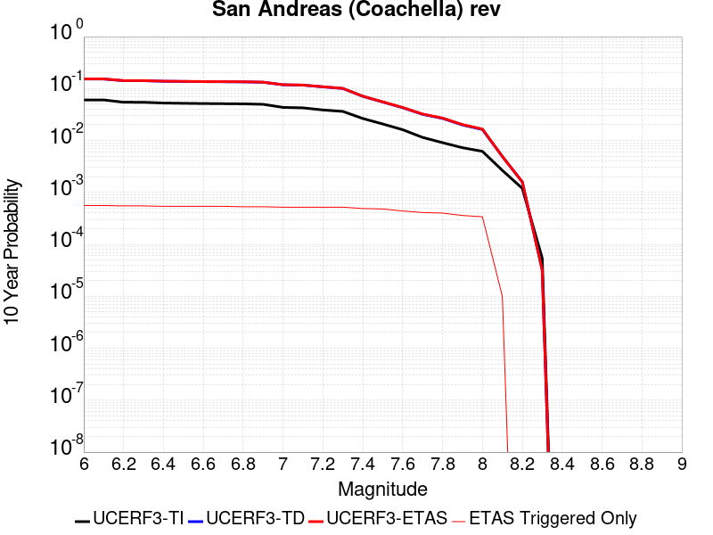 |

| Magnitude | 1 wk TI Prob | 1 wk TD Prob | 1 wk ETAS Prob | 1 wk ETAS/TD Gain | 1 wk ETAS Triggered Only | 1 mo TI Prob | 1 mo TD Prob | 1 mo ETAS Prob | 1 mo ETAS/TD Gain | 1 mo ETAS Triggered Only | 1 yr TI Prob | 1 yr TD Prob | 1 yr ETAS Prob | 1 yr ETAS/TD Gain | 1 yr ETAS Triggered Only | 10 yr TI Prob | 10 yr TD Prob | 10 yr ETAS Prob | 10 yr ETAS/TD Gain | 10 yr ETAS Triggered Only |
|-----|-----|-----|-----|-----|-----|-----|-----|-----|-----|-----|-----|-----|-----|-----|-----|-----|-----|-----|-----|-----|
| 6.0 | 1.1925945E-4 | 3.2729402E-4 | 5.938734E-4 | 1.8144952 | 2.6666667E-4 | 5.110118E-4 | 0.0014019393 | 0.0016948613 | 1.2089406 | 2.9333335E-4 | 0.0062038354 | 0.016936364 | 0.017460665 | 1.0309571 | 5.3333334E-4 | 0.060334753 | 0.15265316 | 0.15324065 | 1.0038486 | 6.9333334E-4 |
| 6.1 | 1.1925945E-4 | 3.2729402E-4 | 5.938734E-4 | 1.8144952 | 2.6666667E-4 | 5.110118E-4 | 0.0014019393 | 0.0016948613 | 1.2089406 | 2.9333335E-4 | 0.0062038354 | 0.016936364 | 0.017460665 | 1.0309571 | 5.3333334E-4 | 0.060334753 | 0.15265316 | 0.15324065 | 1.0038486 | 6.9333334E-4 |
| 6.2 | 1.07432395E-4 | 3.0230157E-4 | 5.688876E-4 | 1.8818547 | 2.6666667E-4 | 4.603433E-4 | 0.0012949388 | 0.0015878923 | 1.2262295 | 2.9333335E-4 | 0.005590286 | 0.015653009 | 0.016177993 | 1.0335389 | 5.3333334E-4 | 0.05451731 | 0.14182423 | 0.14241923 | 1.0041953 | 6.9333334E-4 |
| 6.3 | 1.0718766E-4 | 3.0175463E-4 | 5.683408E-4 | 1.8834536 | 2.6666667E-4 | 4.592948E-4 | 0.0012925972 | 0.0015855513 | 1.22664 | 2.9333335E-4 | 0.005577586 | 0.015624908 | 0.016149908 | 1.0336002 | 5.3333334E-4 | 0.054396555 | 0.14159249 | 0.14218765 | 1.0042033 | 6.9333334E-4 |
| 6.4 | 1.0355944E-4 | 2.9383553E-4 | 5.604238E-4 | 1.9072706 | 2.6666667E-4 | 4.4375064E-4 | 0.0012586913 | 0.0015516555 | 1.2327529 | 2.9333335E-4 | 0.0053892885 | 0.015217941 | 0.015743159 | 1.034513 | 5.3333334E-4 | 0.052604496 | 0.13815255 | 0.1387501 | 1.0043253 | 6.9333334E-4 |
| 6.5 | 1.0227914E-4 | 2.9102986E-4 | 5.576189E-4 | 1.9160196 | 2.6666667E-4 | 4.382655E-4 | 0.0012466786 | 0.0015396463 | 1.2349986 | 2.9333335E-4 | 0.0053228354 | 0.01507372 | 0.015599014 | 1.0348483 | 5.3333334E-4 | 0.051971316 | 0.13693172 | 0.13753012 | 1.00437 | 6.9333334E-4 |
| 6.6 | 1.0116757E-4 | 2.8868738E-4 | 5.5527705E-4 | 1.9234545 | 2.6666667E-4 | 4.3350324E-4 | 0.0012366489 | 0.0015296196 | 1.2369069 | 2.9333335E-4 | 0.0052651367 | 0.01495329 | 0.015478648 | 1.0351332 | 5.3333334E-4 | 0.051421247 | 0.1359099 | 0.136509 | 1.0044081 | 6.9333334E-4 |
| 6.7 | 1.0050676E-4 | 2.8727303E-4 | 5.5386306E-4 | 1.9280025 | 2.6666667E-4 | 4.3067214E-4 | 0.0012305931 | 0.0015235654 | 1.2380741 | 2.9333335E-4 | 0.005230834 | 0.014880571 | 0.015405967 | 1.0353076 | 5.3333334E-4 | 0.051094085 | 0.13529462 | 0.13589415 | 1.0044312 | 6.9333334E-4 |
| 6.8 | 9.976819E-5 | 2.853096E-4 | 5.519002E-4 | 1.9343905 | 2.6666667E-4 | 4.2750788E-4 | 0.0012221863 | 0.0015151611 | 1.2397137 | 2.9333335E-4 | 0.0051924936 | 0.0147796115 | 0.015305062 | 1.0355524 | 5.3333334E-4 | 0.050728295 | 0.13444631 | 0.13504642 | 1.0044637 | 6.9333334E-4 |
| 6.9 | 9.77719E-5 | 2.8027873E-4 | 5.4687064E-4 | 1.9511671 | 2.6666667E-4 | 4.1895514E-4 | 0.0012006456 | 0.0014936266 | 1.2440196 | 2.9333335E-4 | 0.0050888555 | 0.014520878 | 0.015046466 | 1.0361954 | 5.3333334E-4 | 0.049738888 | 0.1322748 | 0.13287644 | 1.0045483 | 6.9333334E-4 |
| 7.0 | 8.500761E-5 | 2.4762485E-4 | 5.142255E-4 | 2.076631 | 2.6666667E-4 | 3.6426744E-4 | 0.001060821 | 0.0013538431 | 1.2762221 | 2.9333335E-4 | 0.0044259406 | 0.012839786 | 0.013339947 | 1.038954 | 5.0666666E-4 | 0.04338823 | 0.11813272 | 0.118720636 | 1.0049767 | 6.6666666E-4 |
| 7.1 | 8.319876E-5 | 2.4365232E-4 | 5.10254E-4 | 2.094189 | 2.6666667E-4 | 3.5651738E-4 | 0.0010438096 | 0.0013368367 | 1.2807286 | 2.9333335E-4 | 0.004331963 | 0.012635092 | 0.013135358 | 1.0395933 | 5.0666666E-4 | 0.042484846 | 0.116353 | 0.1169421 | 1.005063 | 6.6666666E-4 |
| 7.2 | 7.563917E-5 | 2.2413683E-4 | 4.907437E-4 | 2.1894827 | 2.6666667E-4 | 3.2412758E-4 | 9.602359E-4 | 0.0012532875 | 1.3051871 | 2.9333335E-4 | 0.0039391145 | 0.011628893 | 0.012129668 | 1.0430629 | 5.0666666E-4 | 0.03870018 | 0.10775925 | 0.10835408 | 1.00552 | 6.6666666E-4 |
| 7.3 | 7.082985E-5 | 2.0729867E-4 | 4.7391007E-4 | 2.286122 | 2.6666667E-4 | 3.0352117E-4 | 8.881233E-4 | 0.0011811961 | 1.3299911 | 2.9333335E-4 | 0.0036891096 | 0.010759917 | 0.011261133 | 1.0465816 | 5.0666666E-4 | 0.03628465 | 0.100282 | 0.100881815 | 1.0059812 | 6.6666666E-4 |
| 7.4 | 5.146215E-5 | 1.4273795E-4 | 4.0936653E-4 | 2.8679588 | 2.6666667E-4 | 2.2053342E-4 | 6.115915E-4 | 9.047454E-4 | 1.4793296 | 2.9333335E-4 | 0.0026816884 | 0.0074208933 | 0.007870862 | 1.0606354 | 4.5333334E-4 | 0.02649557 | 0.070849575 | 0.071419455 | 1.0080435 | 6.133333E-4 |
| 7.5 | 4.0285166E-5 | 1.09416E-4 | 3.7605347E-4 | 3.436915 | 2.6666667E-4 | 1.7263928E-4 | 4.6884175E-4 | 7.620376E-4 | 1.6253619 | 2.9333335E-4 | 0.002099857 | 0.0056932783 | 0.0061440305 | 1.0791727 | 4.5333334E-4 | 0.020801254 | 0.055011146 | 0.05559074 | 1.010536 | 6.133333E-4 |
| 7.6 | 3.1168736E-5 | 8.4389096E-5 | 2.9770442E-4 | 3.5277593 | 2.1333333E-4 | 1.3357346E-4 | 3.6161754E-4 | 6.015308E-4 | 1.6634446 | 2.4E-4 | 0.0016250437 | 0.0043938323 | 0.0047920747 | 1.0906367 | 4.0E-4 | 0.016132116 | 0.04281005 | 0.04332055 | 1.0119247 | 5.3333334E-4 |
| 7.7 | 2.2100989E-5 | 6.238755E-5 | 2.2237757E-4 | 3.564454 | 1.6E-4 | 9.4715084E-5 | 2.6734784E-4 | 4.539646E-4 | 1.6980298 | 1.8666667E-4 | 0.001152546 | 0.0032501083 | 0.0035956483 | 1.1063164 | 3.4666667E-4 | 0.011465867 | 0.0319002 | 0.03233907 | 1.0137577 | 4.5333334E-4 |
| 7.8 | 1.7484861E-5 | 5.179572E-5 | 1.8512215E-4 | 3.574082 | 1.3333333E-4 | 7.493296E-5 | 2.2196278E-4 | 3.8192727E-4 | 1.7206815 | 1.6E-4 | 9.1192697E-4 | 0.0026990508 | 0.0030181871 | 1.1182402 | 3.2E-4 | 0.009081938 | 0.026640115 | 0.027055416 | 1.0155892 | 4.2666667E-4 |
| 7.9 | 1.3967285E-5 | 3.822255E-5 | 1.7155078E-4 | 4.488209 | 1.3333333E-4 | 5.985842E-5 | 1.6380067E-4 | 3.2377444E-4 | 1.976637 | 1.6E-4 | 7.2853256E-4 | 0.00199245 | 0.002285199 | 1.1469291 | 2.9333335E-4 | 0.0072614877 | 0.019909438 | 0.020301472 | 1.019691 | 4.0E-4 |
| 8.0 | 1.1887396E-5 | 3.106521E-5 | 1.3772857E-4 | 4.433531 | 1.0666667E-4 | 5.094499E-5 | 1.3312983E-4 | 2.6644542E-4 | 2.0013952 | 1.3333333E-4 | 6.200787E-4 | 0.0016196516 | 0.0018858863 | 1.1643778 | 2.6666667E-4 | 0.006183513 | 0.016279267 | 0.016646523 | 1.0225598 | 3.7333334E-4 |
| 8.1 | 5.100864E-6 | 8.973418E-6 | 8.973418E-6 | 1.0 | 0.0 | 2.1860664E-5 | 3.8456936E-5 | 3.8456936E-5 | 1.0 | 0.0 | 2.6612106E-4 | 4.6811273E-4 | 4.6811273E-4 | 1.0 | 0.0 | 0.002658026 | 0.004917731 | 0.0049442663 | 1.0053959 | 2.6666667E-5 |
| 8.2 | 2.3004484E-6 | 2.7864487E-6 | 2.7864487E-6 | 1.0 | 0.0 | 9.859027E-6 | 1.1941868E-5 | 1.1941868E-5 | 1.0 | 0.0 | 1.2002704E-4 | 1.4538258E-4 | 1.4538258E-4 | 1.0 | 0.0 | 0.0011996223 | 0.0015973912 | 0.0015973912 | 1.0 | 0.0 |
| 8.3 | 1.0424446E-7 | 5.8161504E-8 | 5.8161504E-8 | 1.0 | 0.0 | 4.4676187E-7 | 2.4926356E-7 | 2.4926356E-7 | 1.0 | 0.0 | 5.439312E-6 | 3.03478E-6 | 3.03478E-6 | 1.0 | 0.0 | 5.4391792E-5 | 3.190716E-5 | 3.190716E-5 | 1.0 | 0.0 |

## San Andreas (Parkfield)
*[(top)](#table-of-contents)*

| 1 Week | 1 Month | 1 Year | 10 Year |
|-----|-----|-----|-----|
|  |  |  |  |

| Magnitude | 1 wk TI Prob | 1 wk TD Prob | 1 wk ETAS Prob | 1 wk ETAS/TD Gain | 1 wk ETAS Triggered Only | 1 mo TI Prob | 1 mo TD Prob | 1 mo ETAS Prob | 1 mo ETAS/TD Gain | 1 mo ETAS Triggered Only | 1 yr TI Prob | 1 yr TD Prob | 1 yr ETAS Prob | 1 yr ETAS/TD Gain | 1 yr ETAS Triggered Only | 10 yr TI Prob | 10 yr TD Prob | 10 yr ETAS Prob | 10 yr ETAS/TD Gain | 10 yr ETAS Triggered Only |
|-----|-----|-----|-----|-----|-----|-----|-----|-----|-----|-----|-----|-----|-----|-----|-----|-----|-----|-----|-----|-----|
| 6.0 | 5.556969E-4 | 7.7782426E-4 | 9.376998E-4 | 1.205542 | 1.6E-4 | 0.0023793848 | 0.0033298214 | 0.0035158666 | 1.0558724 | 1.8666667E-4 | 0.028586963 | 0.040191233 | 0.040575154 | 1.0095525 | 4.0E-4 | 0.25176284 | 0.33716413 | 0.337553 | 1.0011533 | 5.866667E-4 |
| 6.1 | 1.925858E-4 | 3.0276453E-4 | 3.827403E-4 | 1.2641517 | 8.0E-5 | 8.2510663E-4 | 0.0012970108 | 0.0014035391 | 1.0821338 | 1.0666667E-4 | 0.0099994885 | 0.015778083 | 0.016014297 | 1.014971 | 2.4E-4 | 0.095613256 | 0.1497237 | 0.14997311 | 1.0016658 | 2.9333335E-4 |
| 6.2 | 9.4306815E-5 | 1.8242796E-4 | 2.6241338E-4 | 1.4384493 | 8.0E-5 | 4.0410945E-4 | 7.816011E-4 | 8.881844E-4 | 1.1363653 | 1.0666667E-4 | 0.0049089384 | 0.009474681 | 0.009712406 | 1.0250907 | 2.4E-4 | 0.048019063 | 0.09185409 | 0.092120476 | 1.0029001 | 2.9333335E-4 |
| 6.3 | 9.283051E-5 | 1.7939322E-4 | 2.5937887E-4 | 1.4458678 | 8.0E-5 | 3.9778434E-4 | 7.686027E-4 | 8.751874E-4 | 1.1386733 | 1.0666667E-4 | 0.0048322747 | 0.009317789 | 0.009555553 | 1.0255172 | 2.4E-4 | 0.047285385 | 0.09050704 | 0.09077382 | 1.0029477 | 2.9333335E-4 |
| 6.4 | 9.138826E-5 | 1.770153E-4 | 2.5700114E-4 | 1.4518583 | 8.0E-5 | 3.916052E-4 | 7.5841765E-4 | 8.6500344E-4 | 1.140537 | 1.0666667E-4 | 0.0047573745 | 0.00919484 | 0.009406212 | 1.0229881 | 2.1333333E-4 | 0.046568092 | 0.08940927 | 0.0896521 | 1.0027158 | 2.6666667E-4 |
| 6.5 | 9.000255E-5 | 1.7459576E-4 | 2.545818E-4 | 1.4581213 | 8.0E-5 | 3.8566816E-4 | 7.480541E-4 | 8.54641E-4 | 1.1424855 | 1.0666667E-4 | 0.0046854047 | 0.009069731 | 0.0092811305 | 1.0233082 | 2.1333333E-4 | 0.045878403 | 0.088295065 | 0.088538185 | 1.0027535 | 2.6666667E-4 |
| 6.6 | 8.8109264E-5 | 1.7140752E-4 | 2.513938E-4 | 1.4666439 | 8.0E-5 | 3.7755648E-4 | 7.3439797E-4 | 8.409863E-4 | 1.1451371 | 1.0666667E-4 | 0.0045870654 | 0.008904854 | 0.009116287 | 1.0237436 | 2.1333333E-4 | 0.04493529 | 0.0868267 | 0.087070204 | 1.0028046 | 2.6666667E-4 |
| 6.7 | 8.738073E-5 | 1.7007832E-4 | 2.500647E-4 | 1.4702915 | 8.0E-5 | 3.7443507E-4 | 7.287046E-4 | 8.3529355E-4 | 1.1462718 | 1.0666667E-4 | 0.0045492216 | 0.008836143 | 0.009047591 | 1.02393 | 2.1333333E-4 | 0.04457213 | 0.08622707 | 0.08647074 | 1.002826 | 2.6666667E-4 |
| 6.8 | 8.710195E-5 | 1.6953335E-4 | 2.4951977E-4 | 1.4718035 | 8.0E-5 | 3.7324068E-4 | 7.263703E-4 | 8.329595E-4 | 1.1467422 | 1.0666667E-4 | 0.0045347405 | 0.008807961 | 0.009019415 | 1.0240072 | 2.1333333E-4 | 0.04443313 | 0.08597467 | 0.08621841 | 1.002835 | 2.6666667E-4 |
| 6.9 | 8.6801556E-5 | 1.689429E-4 | 2.489294E-4 | 1.4734528 | 8.0E-5 | 3.7195362E-4 | 7.2384125E-4 | 8.304307E-4 | 1.1472553 | 1.0666667E-4 | 0.0045191357 | 0.008777418 | 0.008988879 | 1.0240915 | 2.1333333E-4 | 0.044283327 | 0.085700735 | 0.08594455 | 1.0028449 | 2.6666667E-4 |
| 7.0 | 8.5571606E-5 | 1.6647128E-4 | 2.4645796E-4 | 1.4804834 | 8.0E-5 | 3.6668387E-4 | 7.132544E-4 | 8.19845E-4 | 1.1494426 | 1.0666667E-4 | 0.004455241 | 0.008649553 | 0.008861042 | 1.0244508 | 2.1333333E-4 | 0.043669727 | 0.08454914 | 0.08479326 | 1.0028874 | 2.6666667E-4 |
| 7.1 | 7.82589E-5 | 1.5128135E-4 | 2.3126925E-4 | 1.528736 | 8.0E-5 | 3.3535215E-4 | 6.481883E-4 | 7.5478584E-4 | 1.1644546 | 1.0666667E-4 | 0.0040752706 | 0.007863307 | 0.0080749625 | 1.0269169 | 2.1333333E-4 | 0.040013418 | 0.07746111 | 0.07770712 | 1.003176 | 2.6666667E-4 |
| 7.2 | 7.690929E-5 | 1.4865391E-4 | 2.0197932E-4 | 1.3587219 | 5.3333333E-5 | 3.2956956E-4 | 6.369334E-4 | 7.168824E-4 | 1.1255218 | 8.0E-5 | 0.004005129 | 0.007727258 | 0.007912482 | 1.0239702 | 1.8666667E-4 | 0.0393371 | 0.07623427 | 0.07643134 | 1.002585 | 2.1333333E-4 |
| 7.3 | 7.5543794E-5 | 1.4561978E-4 | 1.9894534E-4 | 1.3661972 | 5.3333333E-5 | 3.2371894E-4 | 6.2393624E-4 | 7.038863E-4 | 1.1281382 | 8.0E-5 | 0.003934157 | 0.007570127 | 0.0077553806 | 1.0244716 | 1.8666667E-4 | 0.038652334 | 0.074797355 | 0.07499473 | 1.0026388 | 2.1333333E-4 |
| 7.4 | 7.4214564E-5 | 1.4262961E-4 | 1.9595533E-4 | 1.3738755 | 5.3333333E-5 | 3.1802364E-4 | 6.111273E-4 | 6.910784E-4 | 1.1308256 | 8.0E-5 | 0.003865065 | 0.00741525 | 0.0076005324 | 1.0249866 | 1.8666667E-4 | 0.03798529 | 0.07337123 | 0.07356891 | 1.0026942 | 2.1333333E-4 |
| 7.5 | 6.149578E-5 | 1.11907226E-4 | 1.652346E-4 | 1.4765319 | 5.3333333E-5 | 2.6352672E-4 | 4.7951436E-4 | 5.328221E-4 | 1.1111703 | 5.3333333E-5 | 0.0032037178 | 0.0058224914 | 0.0059550484 | 1.0227664 | 1.3333333E-4 | 0.03157923 | 0.058557566 | 0.058708195 | 1.0025723 | 1.6E-4 |
| 7.6 | 6.0643448E-5 | 1.10193796E-4 | 1.6352125E-4 | 1.4839424 | 5.3333333E-5 | 2.598746E-4 | 4.7217376E-4 | 5.2548194E-4 | 1.1128994 | 5.3333333E-5 | 0.0031593828 | 0.0057335934 | 0.0058661625 | 1.0231215 | 1.3333333E-4 | 0.031148417 | 0.057718582 | 0.057869345 | 1.0026121 | 1.6E-4 |
| 7.7 | 5.1652263E-5 | 9.174698E-5 | 1.4507542E-4 | 1.5812556 | 5.3333333E-5 | 2.2134806E-4 | 3.931421E-4 | 4.4645448E-4 | 1.1356058 | 5.3333333E-5 | 0.002691582 | 0.0047760103 | 0.0049087065 | 1.027784 | 1.3333333E-4 | 0.026592141 | 0.04853623 | 0.048688464 | 1.0031365 | 1.6E-4 |
| 7.8 | 4.8090482E-5 | 8.559635E-5 | 1.3892513E-4 | 1.6230261 | 5.3333333E-5 | 2.060858E-4 | 3.6678996E-4 | 4.2010372E-4 | 1.1453524 | 5.3333333E-5 | 0.0025062072 | 0.0044565317 | 0.0045627235 | 1.0238283 | 1.0666667E-4 | 0.024781305 | 0.04530245 | 0.045429744 | 1.0028099 | 1.3333333E-4 |
| 7.9 | 3.970278E-5 | 6.750426E-5 | 1.2083399E-4 | 1.7900202 | 5.3333333E-5 | 1.7014367E-4 | 2.892719E-4 | 3.425898E-4 | 1.1843176 | 5.3333333E-5 | 0.002069531 | 0.0035162016 | 0.0036224932 | 1.0302291 | 1.0666667E-4 | 0.020503636 | 0.035881363 | 0.03600991 | 1.0035826 | 1.3333333E-4 |
| 8.0 | 2.8982335E-5 | 4.069796E-5 | 6.7363544E-5 | 1.6552068 | 2.6666667E-5 | 1.2420409E-4 | 1.7440817E-4 | 2.0107019E-4 | 1.1528714 | 2.6666667E-5 | 0.0015111357 | 0.0021213528 | 0.002201183 | 1.0376318 | 8.0E-5 | 0.015009012 | 0.022010697 | 0.022115014 | 1.0047394 | 1.0666667E-4 |
| 8.1 | 1.8836186E-5 | 1.8681134E-5 | 4.5347304E-5 | 2.4274383 | 2.6666667E-5 | 8.0724014E-5 | 8.005955E-5 | 1.0672408E-4 | 1.3330587 | 2.6666667E-5 | 9.823717E-4 | 9.742898E-4 | 0.0010009304 | 1.0273438 | 2.6666667E-5 | 0.009780403 | 0.010488115 | 0.01054089 | 1.0050318 | 5.3333333E-5 |
| 8.2 | 8.643924E-6 | 5.4748625E-6 | 5.4748625E-6 | 1.0 | 0.0 | 3.704486E-5 | 2.3463486E-5 | 2.3463486E-5 | 1.0 | 0.0 | 4.5092785E-4 | 2.8563058E-4 | 2.8563058E-4 | 1.0 | 0.0 | 0.0045001395 | 0.0032487072 | 0.0032487072 | 1.0 | 0.0 |
| 8.3 | 1.983087E-6 | 7.6599065E-7 | 7.6599065E-7 | 1.0 | 0.0 | 8.498917E-6 | 3.282813E-6 | 3.282813E-6 | 1.0 | 0.0 | 1.034694E-4 | 3.9967534E-5 | 3.9967534E-5 | 1.0 | 0.0 | 0.0010342124 | 4.719687E-4 | 4.719687E-4 | 1.0 | 0.0 |

## Red Pass
*[(top)](#table-of-contents)*

| 1 Week | 1 Month | 1 Year | 10 Year |
|-----|-----|-----|-----|
|  |  |  |  |

| Magnitude | 1 wk TI Prob | 1 wk TD Prob | 1 wk ETAS Prob | 1 wk ETAS/TD Gain | 1 wk ETAS Triggered Only | 1 mo TI Prob | 1 mo TD Prob | 1 mo ETAS Prob | 1 mo ETAS/TD Gain | 1 mo ETAS Triggered Only | 1 yr TI Prob | 1 yr TD Prob | 1 yr ETAS Prob | 1 yr ETAS/TD Gain | 1 yr ETAS Triggered Only | 10 yr TI Prob | 10 yr TD Prob | 10 yr ETAS Prob | 10 yr ETAS/TD Gain | 10 yr ETAS Triggered Only |
|-----|-----|-----|-----|-----|-----|-----|-----|-----|-----|-----|-----|-----|-----|-----|-----|-----|-----|-----|-----|-----|
| 6.0 | 8.258278E-6 | 8.551265E-6 | 1.9521633E-4 | 22.828943 | 1.8666667E-4 | 3.539214E-5 | 3.6647863E-5 | 3.2997044E-4 | 9.003811 | 2.9333335E-4 | 4.308141E-4 | 4.4611428E-4 | 8.725906E-4 | 1.9559801 | 4.2666667E-4 | 0.0042997985 | 0.004453945 | 0.0050114505 | 1.1251712 | 5.6E-4 |
| 6.1 | 3.649988E-6 | 3.7753161E-6 | 8.377501E-5 | 22.190199 | 8.0E-5 | 1.5642712E-5 | 1.6179853E-5 | 1.4951103E-4 | 9.240568 | 1.3333333E-4 | 1.9043336E-4 | 1.9697666E-4 | 4.1026797E-4 | 2.0828252 | 2.1333333E-4 | 0.0019027026 | 0.001968488 | 0.002261244 | 1.1487212 | 2.9333335E-4 |
| 6.2 | 3.649988E-6 | 3.7753161E-6 | 8.377501E-5 | 22.190199 | 8.0E-5 | 1.5642712E-5 | 1.6179853E-5 | 1.4951103E-4 | 9.240568 | 1.3333333E-4 | 1.9043336E-4 | 1.9697666E-4 | 4.1026797E-4 | 2.0828252 | 2.1333333E-4 | 0.0019027026 | 0.001968488 | 0.002261244 | 1.1487212 | 2.9333335E-4 |
| 6.3 | 1.3924937E-6 | 1.4411166E-6 | 1.4411166E-6 | 1.0 | 0.0 | 5.9678164E-6 | 6.1762075E-6 | 6.1762075E-6 | 1.0 | 0.0 | 7.265574E-5 | 7.519415E-5 | 1.2852348E-4 | 1.7092217 | 5.3333333E-5 | 7.263199E-4 | 7.518258E-4 | 8.3176565E-4 | 1.1063277 | 8.0E-5 |
| 6.4 | 1.3924937E-6 | 1.4411166E-6 | 1.4411166E-6 | 1.0 | 0.0 | 5.9678164E-6 | 6.1762075E-6 | 6.1762075E-6 | 1.0 | 0.0 | 7.265574E-5 | 7.519415E-5 | 1.2852348E-4 | 1.7092217 | 5.3333333E-5 | 7.263199E-4 | 7.518258E-4 | 8.3176565E-4 | 1.1063277 | 8.0E-5 |
| 6.5 | 9.876812E-7 | 1.0221912E-6 | 1.0221912E-6 | 1.0 | 0.0 | 4.2329125E-6 | 4.3808195E-6 | 4.3808195E-6 | 1.0 | 0.0 | 5.153449E-5 | 5.3336476E-5 | 8.000172E-5 | 1.4999439 | 2.6666667E-5 | 5.1522546E-4 | 5.333648E-4 | 5.8666966E-4 | 1.0999408 | 5.3333333E-5 |

## San Jacinto (San Bernardino)
*[(top)](#table-of-contents)*

| 1 Week | 1 Month | 1 Year | 10 Year |
|-----|-----|-----|-----|
|  |  |  | 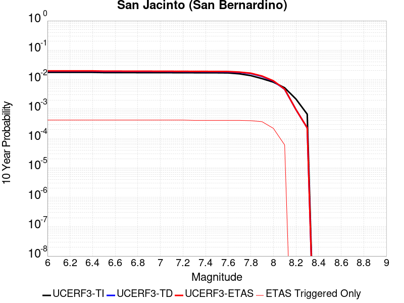 |

| Magnitude | 1 wk TI Prob | 1 wk TD Prob | 1 wk ETAS Prob | 1 wk ETAS/TD Gain | 1 wk ETAS Triggered Only | 1 mo TI Prob | 1 mo TD Prob | 1 mo ETAS Prob | 1 mo ETAS/TD Gain | 1 mo ETAS Triggered Only | 1 yr TI Prob | 1 yr TD Prob | 1 yr ETAS Prob | 1 yr ETAS/TD Gain | 1 yr ETAS Triggered Only | 10 yr TI Prob | 10 yr TD Prob | 10 yr ETAS Prob | 10 yr ETAS/TD Gain | 10 yr ETAS Triggered Only |
|-----|-----|-----|-----|-----|-----|-----|-----|-----|-----|-----|-----|-----|-----|-----|-----|-----|-----|-----|-----|-----|
| 6.0 | 3.409352E-5 | 3.5986508E-5 | 2.759779E-4 | 7.668926 | 2.4E-4 | 1.461069E-4 | 1.542188E-4 | 4.475069E-4 | 2.9017663 | 2.9333335E-4 | 0.0017774 | 0.0018759987 | 0.0022752483 | 1.2128198 | 4.0E-4 | 0.01763251 | 0.019349935 | 0.019872949 | 1.0270292 | 5.3333334E-4 |
| 6.1 | 3.409352E-5 | 3.5986508E-5 | 2.759779E-4 | 7.668926 | 2.4E-4 | 1.461069E-4 | 1.542188E-4 | 4.475069E-4 | 2.9017663 | 2.9333335E-4 | 0.0017774 | 0.0018759987 | 0.0022752483 | 1.2128198 | 4.0E-4 | 0.01763251 | 0.019349935 | 0.019872949 | 1.0270292 | 5.3333334E-4 |
| 6.2 | 3.409352E-5 | 3.5986508E-5 | 2.759779E-4 | 7.668926 | 2.4E-4 | 1.461069E-4 | 1.542188E-4 | 4.475069E-4 | 2.9017663 | 2.9333335E-4 | 0.0017774 | 0.0018759987 | 0.0022752483 | 1.2128198 | 4.0E-4 | 0.01763251 | 0.019349935 | 0.019872949 | 1.0270292 | 5.3333334E-4 |
| 6.3 | 3.409352E-5 | 3.5986508E-5 | 2.759779E-4 | 7.668926 | 2.4E-4 | 1.461069E-4 | 1.542188E-4 | 4.475069E-4 | 2.9017663 | 2.9333335E-4 | 0.0017774 | 0.0018759987 | 0.0022752483 | 1.2128198 | 4.0E-4 | 0.01763251 | 0.019349935 | 0.019872949 | 1.0270292 | 5.3333334E-4 |
| 6.4 | 3.400795E-5 | 3.5879173E-5 | 2.7587055E-4 | 7.6888776 | 2.4E-4 | 1.4574021E-4 | 1.5375883E-4 | 4.4704706E-4 | 2.9074562 | 2.9333335E-4 | 0.0017729428 | 0.0018704084 | 0.0022696604 | 1.213457 | 4.0E-4 | 0.017588645 | 0.019295016 | 0.01981806 | 1.0271076 | 5.3333334E-4 |
| 6.5 | 3.341482E-5 | 3.5139812E-5 | 2.7513137E-4 | 7.8296204 | 2.4E-4 | 1.4319851E-4 | 1.5059051E-4 | 4.4387966E-4 | 2.947594 | 2.9333335E-4 | 0.0017420477 | 0.0018318989 | 0.0022311662 | 1.2179526 | 4.0E-4 | 0.017284546 | 0.018916558 | 0.019439803 | 1.0276606 | 5.3333334E-4 |
| 6.6 | 3.3364955E-5 | 3.5077028E-5 | 2.7506863E-4 | 7.8418446 | 2.4E-4 | 1.4298483E-4 | 1.5032147E-4 | 4.436107E-4 | 2.95108 | 2.9333335E-4 | 0.0017394501 | 0.001828629 | 0.0022278975 | 1.2183431 | 4.0E-4 | 0.017258976 | 0.018884424 | 0.019407686 | 1.0277086 | 5.3333334E-4 |
| 6.7 | 3.335922E-5 | 3.5066805E-5 | 2.7505838E-4 | 7.8438396 | 2.4E-4 | 1.4296026E-4 | 1.5027766E-4 | 4.435669E-4 | 2.9516492 | 2.9333335E-4 | 0.0017391514 | 0.0018280965 | 0.0022273653 | 1.2184068 | 4.0E-4 | 0.017256035 | 0.018879214 | 0.01940248 | 1.0277164 | 5.3333334E-4 |
| 6.8 | 3.327683E-5 | 3.496087E-5 | 2.7495247E-4 | 7.864578 | 2.4E-4 | 1.4260718E-4 | 1.498237E-4 | 4.431131E-4 | 2.9575634 | 2.9333335E-4 | 0.0017348597 | 0.0018225788 | 0.0022218497 | 1.2190692 | 4.0E-4 | 0.017213784 | 0.018824987 | 0.01934828 | 1.0277978 | 5.3333334E-4 |
| 6.9 | 3.3235785E-5 | 3.4901823E-5 | 2.7489345E-4 | 7.8761916 | 2.4E-4 | 1.4243131E-4 | 1.4957068E-4 | 4.4286012E-4 | 2.9608753 | 2.9333335E-4 | 0.0017327217 | 0.0018195034 | 0.0022187757 | 1.2194402 | 4.0E-4 | 0.017192734 | 0.018794855 | 0.019318165 | 1.0278432 | 5.3333334E-4 |
| 7.0 | 3.3197095E-5 | 3.4841752E-5 | 2.7483338E-4 | 7.8880467 | 2.4E-4 | 1.422655E-4 | 1.4931326E-4 | 4.426028E-4 | 2.9642563 | 2.9333335E-4 | 0.0017307063 | 0.0018163746 | 0.002215648 | 1.2198188 | 4.0E-4 | 0.017172894 | 0.018764233 | 0.019287558 | 1.0278895 | 5.3333334E-4 |
| 7.1 | 3.3129716E-5 | 3.4721965E-5 | 2.7471365E-4 | 7.9118114 | 2.4E-4 | 1.4197677E-4 | 1.4879994E-4 | 4.4208963E-4 | 2.9710336 | 2.9333335E-4 | 0.0017271966 | 0.0018101353 | 0.0022094112 | 1.220578 | 4.0E-4 | 0.017138338 | 0.018703312 | 0.01922667 | 1.0279821 | 5.3333334E-4 |
| 7.2 | 3.3034008E-5 | 3.458941E-5 | 2.745811E-4 | 7.9382997 | 2.4E-4 | 1.4156665E-4 | 1.4823192E-4 | 4.4152178E-4 | 2.9785876 | 2.9333335E-4 | 0.0017222111 | 0.0018032312 | 0.00220251 | 1.221424 | 4.0E-4 | 0.017089253 | 0.018635705 | 0.0191591 | 1.0280856 | 5.3333334E-4 |
| 7.3 | 3.2956614E-5 | 3.445717E-5 | 2.744489E-4 | 7.9649286 | 2.4E-4 | 1.4123498E-4 | 1.4766524E-4 | 4.4095525E-4 | 2.986182 | 2.9333335E-4 | 0.0017181796 | 0.0017963431 | 0.0021690058 | 1.2074564 | 3.7333334E-4 | 0.017049557 | 0.018568452 | 0.019065712 | 1.0267798 | 5.0666666E-4 |
| 7.4 | 3.2915937E-5 | 3.4378863E-5 | 2.7437063E-4 | 7.9807935 | 2.4E-4 | 1.4106068E-4 | 1.4732967E-4 | 4.406198E-4 | 2.9907062 | 2.9333335E-4 | 0.0017160608 | 0.0017922645 | 0.0021649287 | 1.2079293 | 3.7333334E-4 | 0.017028693 | 0.018528719 | 0.019025996 | 1.0268383 | 5.0666666E-4 |
| 7.5 | 3.281791E-5 | 3.4243778E-5 | 2.7423556E-4 | 8.008332 | 2.4E-4 | 1.406406E-4 | 1.4675081E-4 | 4.400411E-4 | 2.99856 | 2.9333335E-4 | 0.0017109542 | 0.0017852283 | 0.0021578951 | 1.2087502 | 3.7333334E-4 | 0.016978411 | 0.018459605 | 0.01895692 | 1.0269407 | 5.0666666E-4 |
| 7.6 | 3.2521442E-5 | 3.396873E-5 | 2.7396058E-4 | 8.065082 | 2.4E-4 | 1.3937015E-4 | 1.4557215E-4 | 4.388628E-4 | 3.014744 | 2.9333335E-4 | 0.0016955109 | 0.0017709016 | 0.0021435737 | 1.2104421 | 3.7333334E-4 | 0.016826328 | 0.018317232 | 0.01881462 | 1.027154 | 5.0666666E-4 |
| 7.7 | 3.0287873E-5 | 3.245276E-5 | 2.7244497E-4 | 8.395124 | 2.4E-4 | 1.297987E-4 | 1.3907586E-4 | 4.323684E-4 | 3.1088674 | 2.9333335E-4 | 0.0015791537 | 0.0016919347 | 0.0020646362 | 1.2202814 | 3.7333334E-4 | 0.01567979 | 0.01752809 | 0.018025877 | 1.0283993 | 5.0666666E-4 |
| 7.8 | 2.6316151E-5 | 2.9663592E-5 | 2.6965648E-4 | 9.090487 | 2.4E-4 | 1.1277862E-4 | 1.2712348E-4 | 4.2041953E-4 | 3.3071742 | 2.9333335E-4 | 0.0013722149 | 0.0015466306 | 0.0018927611 | 1.2237965 | 3.4666667E-4 | 0.013637724 | 0.016069634 | 0.01654192 | 1.02939 | 4.8E-4 |
| 7.9 | 2.0761147E-5 | 2.34181E-5 | 2.6341248E-4 | 11.248242 | 2.4E-4 | 8.897331E-5 | 1.0035944E-4 | 3.9366333E-4 | 3.9225342 | 2.9333335E-4 | 0.0010827117 | 0.0012211921 | 0.0015674353 | 1.2835289 | 3.4666667E-4 | 0.010774517 | 0.012793174 | 0.013267034 | 1.03704 | 4.8E-4 |
| 8.0 | 1.5738568E-5 | 1.6033575E-5 | 2.0269725E-4 | 12.642049 | 1.8666667E-4 | 6.744926E-5 | 6.871352E-5 | 2.8203218E-4 | 4.1044645 | 2.1333333E-4 | 8.2088535E-4 | 8.3626667E-4 | 0.0010760659 | 1.2867498 | 2.4E-4 | 0.008178596 | 0.008865921 | 0.009156653 | 1.0327922 | 2.9333335E-4 |
| 8.1 | 1.0105832E-5 | 8.3304985E-6 | 6.1663384E-5 | 7.402125 | 5.3333333E-5 | 4.3309992E-5 | 3.570165E-5 | 1.1569879E-4 | 3.240713 | 8.0E-5 | 5.2717153E-4 | 4.345814E-4 | 5.1454664E-4 | 1.1840051 | 8.0E-5 | 0.005259227 | 0.004677232 | 0.0047834 | 1.0226989 | 1.0666667E-4 |
| 8.2 | 4.189207E-6 | 1.5784357E-6 | 1.5784357E-6 | 1.0 | 0.0 | 1.7953622E-5 | 6.7647065E-6 | 6.7647065E-6 | 1.0 | 0.0 | 2.1856341E-4 | 8.235722E-5 | 8.235722E-5 | 1.0 | 0.0 | 0.0021834858 | 9.565867E-4 | 9.565867E-4 | 1.0 | 0.0 |
| 8.3 | 1.2758221E-6 | 3.6149942E-7 | 3.6149942E-7 | 1.0 | 0.0 | 5.4677976E-6 | 1.5492824E-6 | 1.5492824E-6 | 1.0 | 0.0 | 6.65684E-5 | 1.8862354E-5 | 1.8862354E-5 | 1.0 | 0.0 | 6.6548464E-4 | 2.2751294E-4 | 2.2751294E-4 | 1.0 | 0.0 |

## Elsinore (Glen Ivy) rev
*[(top)](#table-of-contents)*

| 1 Week | 1 Month | 1 Year | 10 Year |
|-----|-----|-----|-----|
|  |  |  |  |

| Magnitude | 1 wk TI Prob | 1 wk TD Prob | 1 wk ETAS Prob | 1 wk ETAS/TD Gain | 1 wk ETAS Triggered Only | 1 mo TI Prob | 1 mo TD Prob | 1 mo ETAS Prob | 1 mo ETAS/TD Gain | 1 mo ETAS Triggered Only | 1 yr TI Prob | 1 yr TD Prob | 1 yr ETAS Prob | 1 yr ETAS/TD Gain | 1 yr ETAS Triggered Only | 10 yr TI Prob | 10 yr TD Prob | 10 yr ETAS Prob | 10 yr ETAS/TD Gain | 10 yr ETAS Triggered Only |
|-----|-----|-----|-----|-----|-----|-----|-----|-----|-----|-----|-----|-----|-----|-----|-----|-----|-----|-----|-----|-----|
| 6.0 | 1.6204086E-4 | 2.9360707E-4 | 3.4692473E-4 | 1.1815953 | 5.3333333E-5 | 6.94276E-4 | 0.0012578638 | 0.0013910295 | 1.1058664 | 1.3333333E-4 | 0.008420097 | 0.015234485 | 0.015497089 | 1.0172374 | 2.6666667E-4 | 0.081081145 | 0.13969168 | 0.14008167 | 1.0027919 | 4.5333334E-4 |
| 6.1 | 1.6204086E-4 | 2.9360707E-4 | 3.4692473E-4 | 1.1815953 | 5.3333333E-5 | 6.94276E-4 | 0.0012578638 | 0.0013910295 | 1.1058664 | 1.3333333E-4 | 0.008420097 | 0.015234485 | 0.015497089 | 1.0172374 | 2.6666667E-4 | 0.081081145 | 0.13969168 | 0.14008167 | 1.0027919 | 4.5333334E-4 |
| 6.2 | 1.6204086E-4 | 2.9360707E-4 | 3.4692473E-4 | 1.1815953 | 5.3333333E-5 | 6.94276E-4 | 0.0012578638 | 0.0013910295 | 1.1058664 | 1.3333333E-4 | 0.008420097 | 0.015234485 | 0.015497089 | 1.0172374 | 2.6666667E-4 | 0.081081145 | 0.13969168 | 0.14008167 | 1.0027919 | 4.5333334E-4 |
| 6.3 | 1.0111737E-4 | 1.7703383E-4 | 2.3035772E-4 | 1.3012074 | 5.3333333E-5 | 4.332882E-4 | 7.5861247E-4 | 8.385518E-4 | 1.1053756 | 8.0E-5 | 0.005262531 | 0.009217682 | 0.009402628 | 1.0200642 | 1.8666667E-4 | 0.0513964 | 0.0870191 | 0.0873356 | 1.0036371 | 3.4666667E-4 |
| 6.4 | 1.0111737E-4 | 1.7703383E-4 | 2.3035772E-4 | 1.3012074 | 5.3333333E-5 | 4.332882E-4 | 7.5861247E-4 | 8.385518E-4 | 1.1053756 | 8.0E-5 | 0.005262531 | 0.009217682 | 0.009402628 | 1.0200642 | 1.8666667E-4 | 0.0513964 | 0.0870191 | 0.0873356 | 1.0036371 | 3.4666667E-4 |
| 6.5 | 3.6624708E-5 | 4.6391084E-5 | 4.6391084E-5 | 1.0 | 0.0 | 1.569536E-4 | 1.9880582E-4 | 2.2546719E-4 | 1.1341076 | 2.6666667E-5 | 0.001909235 | 0.0024181372 | 0.0024979436 | 1.0330033 | 8.0E-5 | 0.01892915 | 0.023739954 | 0.023870124 | 1.005483 | 1.3333333E-4 |
| 6.6 | 2.5051324E-5 | 2.614772E-5 | 2.614772E-5 | 1.0 | 0.0 | 1.073584E-4 | 1.12057096E-4 | 1.3872077E-4 | 1.2379472 | 2.6666667E-5 | 0.0013063047 | 0.0013634858 | 0.0014433768 | 1.0585932 | 8.0E-5 | 0.012986525 | 0.013564618 | 0.013669838 | 1.007757 | 1.0666667E-4 |
| 6.7 | 2.2189772E-5 | 2.2072849E-5 | 2.2072849E-5 | 1.0 | 0.0 | 9.509556E-5 | 9.4594696E-5 | 1.2125884E-4 | 1.2818778 | 2.6666667E-5 | 0.0011571734 | 0.0011511183 | 0.0012310263 | 1.0694176 | 8.0E-5 | 0.011511663 | 0.011465415 | 0.011570859 | 1.0091966 | 1.0666667E-4 |
| 6.8 | 1.6654378E-5 | 1.4437705E-5 | 1.4437705E-5 | 1.0 | 0.0 | 7.137396E-5 | 6.187444E-5 | 8.8539455E-5 | 1.4309536 | 2.6666667E-5 | 8.686314E-4 | 7.530661E-4 | 8.063593E-4 | 1.0707682 | 5.3333333E-5 | 0.008652439 | 0.00751048 | 0.0075898794 | 1.0105718 | 8.0E-5 |
| 6.9 | 1.5042909E-5 | 1.2332022E-5 | 1.2332022E-5 | 1.0 | 0.0 | 6.446802E-5 | 5.285047E-5 | 7.951573E-5 | 1.5045415 | 2.6666667E-5 | 7.8461546E-4 | 6.4326765E-4 | 6.6991715E-4 | 1.0414283 | 2.6666667E-5 | 0.007818509 | 0.00641828 | 0.006471271 | 1.0082563 | 5.3333333E-5 |
| 7.0 | 1.4361385E-5 | 1.1451324E-5 | 1.1451324E-5 | 1.0 | 0.0 | 6.154734E-5 | 4.9076196E-5 | 7.5741555E-5 | 1.543346 | 2.6666667E-5 | 7.490812E-4 | 5.973418E-4 | 6.239925E-4 | 1.0446155 | 2.6666667E-5 | 0.007465612 | 0.0059613534 | 0.0060143685 | 1.0088931 | 5.3333333E-5 |
| 7.1 | 1.3265571E-5 | 1.0244926E-5 | 1.0244926E-5 | 1.0 | 0.0 | 5.6851208E-5 | 4.39061E-5 | 7.0571594E-5 | 1.6073301 | 2.6666667E-5 | 6.919436E-4 | 5.344282E-4 | 5.6108064E-4 | 1.0498708 | 2.6666667E-5 | 0.006897931 | 0.0053347866 | 0.0053878357 | 1.009944 | 5.3333333E-5 |
| 7.2 | 1.1596403E-5 | 8.505067E-6 | 8.505067E-6 | 1.0 | 0.0 | 4.9697923E-5 | 3.6449786E-5 | 6.311548E-5 | 1.7315735 | 2.6666667E-5 | 6.049042E-4 | 4.436875E-4 | 4.7034232E-4 | 1.0600756 | 2.6666667E-5 | 0.006032603 | 0.0044294316 | 0.0044825287 | 1.0119873 | 5.3333333E-5 |
| 7.3 | 1.0150827E-5 | 7.2387597E-6 | 7.2387597E-6 | 1.0 | 0.0 | 4.3502816E-5 | 3.1022897E-5 | 5.7688736E-5 | 1.8595535 | 2.6666667E-5 | 5.2951806E-4 | 3.7763975E-4 | 4.0429633E-4 | 1.0705874 | 2.6666667E-5 | 0.005282581 | 0.0037703665 | 0.003823499 | 1.0140921 | 5.3333333E-5 |
| 7.4 | 9.080705E-6 | 6.352519E-6 | 6.352519E-6 | 1.0 | 0.0 | 3.8916725E-5 | 2.7224805E-5 | 5.3890744E-5 | 1.9794723 | 2.6666667E-5 | 4.7370812E-4 | 3.3141294E-4 | 3.5807077E-4 | 1.080437 | 2.6666667E-5 | 0.004726996 | 0.0033093381 | 0.003362495 | 1.0160627 | 5.3333333E-5 |
| 7.5 | 7.671649E-6 | 5.2256332E-6 | 5.2256332E-6 | 1.0 | 0.0 | 3.287808E-5 | 2.2395385E-5 | 4.9061455E-5 | 2.1906948 | 2.6666667E-5 | 4.0021708E-4 | 2.7263095E-4 | 2.9929035E-4 | 1.0977857 | 2.6666667E-5 | 0.0039949706 | 0.00272309 | 0.0027496838 | 1.0097661 | 2.6666667E-5 |
| 7.6 | 6.990086E-6 | 4.687545E-6 | 4.687545E-6 | 1.0 | 0.0 | 2.9957167E-5 | 2.008933E-5 | 4.675546E-5 | 2.3273778 | 2.6666667E-5 | 3.6466747E-4 | 2.445613E-4 | 2.7122145E-4 | 1.1090121 | 2.6666667E-5 | 0.0036406964 | 0.002443038 | 0.0024696395 | 1.0108887 | 2.6666667E-5 |
| 7.7 | 4.163505E-6 | 2.3295343E-6 | 2.3295343E-6 | 1.0 | 0.0 | 1.7843471E-5 | 9.983683E-6 | 9.983683E-6 | 1.0 | 0.0 | 2.172226E-4 | 1.21545316E-4 | 1.21545316E-4 | 1.0 | 0.0 | 0.0021701038 | 0.0012148614 | 0.0012148614 | 1.0 | 0.0 |
| 7.8 | 2.2692414E-7 | 9.3854695E-8 | 9.3854695E-8 | 1.0 | 0.0 | 9.725317E-7 | 4.0223435E-7 | 4.0223435E-7 | 1.0 | 0.0 | 1.1840509E-5 | 4.8971956E-6 | 4.8971956E-6 | 1.0 | 0.0 | 1.1839878E-4 | 4.8971204E-5 | 4.8971204E-5 | 1.0 | 0.0 |
| 7.9 | 6.676829E-9 | 3.439853E-9 | 3.439853E-9 | 1.0 | 0.0 | 2.861498E-8 | 1.4742227E-8 | 1.4742227E-8 | 1.0 | 0.0 | 3.4838732E-7 | 1.7948659E-7 | 1.7948659E-7 | 1.0 | 0.0 | 3.4838679E-6 | 1.7948646E-6 | 1.7948646E-6 | 1.0 | 0.0 |

## Independence rev 2011
*[(top)](#table-of-contents)*

| 1 Week | 1 Month | 1 Year | 10 Year |
|-----|-----|-----|-----|
|  |  |  |  |

| Magnitude | 1 wk TI Prob | 1 wk TD Prob | 1 wk ETAS Prob | 1 wk ETAS/TD Gain | 1 wk ETAS Triggered Only | 1 mo TI Prob | 1 mo TD Prob | 1 mo ETAS Prob | 1 mo ETAS/TD Gain | 1 mo ETAS Triggered Only | 1 yr TI Prob | 1 yr TD Prob | 1 yr ETAS Prob | 1 yr ETAS/TD Gain | 1 yr ETAS Triggered Only | 10 yr TI Prob | 10 yr TD Prob | 10 yr ETAS Prob | 10 yr ETAS/TD Gain | 10 yr ETAS Triggered Only |
|-----|-----|-----|-----|-----|-----|-----|-----|-----|-----|-----|-----|-----|-----|-----|-----|-----|-----|-----|-----|-----|
| 6.0 | 4.422171E-6 | 4.326227E-6 | 2.1765864E-4 | 50.311424 | 2.1333333E-4 | 1.8952025E-5 | 1.8540857E-5 | 3.1186876E-4 | 16.820621 | 2.9333335E-4 | 2.3071647E-4 | 2.2571455E-4 | 5.7230296E-4 | 2.5355165 | 3.4666667E-4 | 0.0023047708 | 0.0022551466 | 0.0027340641 | 1.2123665 | 4.8E-4 |
| 6.1 | 4.422171E-6 | 4.326227E-6 | 2.1765864E-4 | 50.311424 | 2.1333333E-4 | 1.8952025E-5 | 1.8540857E-5 | 3.1186876E-4 | 16.820621 | 2.9333335E-4 | 2.3071647E-4 | 2.2571455E-4 | 5.7230296E-4 | 2.5355165 | 3.4666667E-4 | 0.0023047708 | 0.0022551466 | 0.0027340641 | 1.2123665 | 4.8E-4 |
| 6.2 | 4.422171E-6 | 4.326227E-6 | 2.1765864E-4 | 50.311424 | 2.1333333E-4 | 1.8952025E-5 | 1.8540857E-5 | 3.1186876E-4 | 16.820621 | 2.9333335E-4 | 2.3071647E-4 | 2.2571455E-4 | 5.7230296E-4 | 2.5355165 | 3.4666667E-4 | 0.0023047708 | 0.0022551466 | 0.0027340641 | 1.2123665 | 4.8E-4 |
| 6.3 | 4.422171E-6 | 4.326227E-6 | 2.1765864E-4 | 50.311424 | 2.1333333E-4 | 1.8952025E-5 | 1.8540857E-5 | 3.1186876E-4 | 16.820621 | 2.9333335E-4 | 2.3071647E-4 | 2.2571455E-4 | 5.7230296E-4 | 2.5355165 | 3.4666667E-4 | 0.0023047708 | 0.0022551466 | 0.0027340641 | 1.2123665 | 4.8E-4 |
| 6.4 | 4.422171E-6 | 4.326227E-6 | 2.1765864E-4 | 50.311424 | 2.1333333E-4 | 1.8952025E-5 | 1.8540857E-5 | 3.1186876E-4 | 16.820621 | 2.9333335E-4 | 2.3071647E-4 | 2.2571455E-4 | 5.7230296E-4 | 2.5355165 | 3.4666667E-4 | 0.0023047708 | 0.0022551466 | 0.0027340641 | 1.2123665 | 4.8E-4 |
| 6.5 | 4.422171E-6 | 4.326227E-6 | 2.1765864E-4 | 50.311424 | 2.1333333E-4 | 1.8952025E-5 | 1.8540857E-5 | 3.1186876E-4 | 16.820621 | 2.9333335E-4 | 2.3071647E-4 | 2.2571455E-4 | 5.7230296E-4 | 2.5355165 | 3.4666667E-4 | 0.0023047708 | 0.0022551466 | 0.0027340641 | 1.2123665 | 4.8E-4 |
| 6.6 | 2.663744E-6 | 2.5319862E-6 | 2.1586478E-4 | 85.25512 | 2.1333333E-4 | 1.1415996E-5 | 1.0851327E-5 | 3.0418148E-4 | 28.03173 | 2.9333335E-4 | 1.3898089E-4 | 1.3210738E-4 | 4.7872827E-4 | 3.6237812 | 3.4666667E-4 | 0.0013889399 | 0.0013203367 | 0.001799703 | 1.3630636 | 4.8E-4 |
| 6.7 | 2.663744E-6 | 2.5319862E-6 | 2.1586478E-4 | 85.25512 | 2.1333333E-4 | 1.1415996E-5 | 1.0851327E-5 | 3.0418148E-4 | 28.03173 | 2.9333335E-4 | 1.3898089E-4 | 1.3210738E-4 | 4.7872827E-4 | 3.6237812 | 3.4666667E-4 | 0.0013889399 | 0.0013203367 | 0.001799703 | 1.3630636 | 4.8E-4 |
| 6.8 | 1.9716529E-6 | 1.8322585E-6 | 1.8849858E-4 | 102.87772 | 1.8666667E-4 | 8.449913E-6 | 7.852514E-6 | 2.4785064E-4 | 31.563223 | 2.4E-4 | 1.0287284E-4 | 9.5600284E-5 | 3.8890558E-4 | 4.068038 | 2.9333335E-4 | 0.0010282523 | 9.556045E-4 | 0.0013818634 | 1.4460621 | 4.2666667E-4 |
| 6.9 | 1.8788617E-6 | 1.7429993E-6 | 1.8840934E-4 | 108.0949 | 1.8666667E-4 | 8.0522395E-6 | 7.4699765E-6 | 2.4746818E-4 | 33.128376 | 2.4E-4 | 9.80316E-5 | 9.0943286E-5 | 3.8424996E-4 | 4.22516 | 2.9333335E-4 | 9.798837E-4 | 9.0907275E-4 | 0.0013353515 | 1.468916 | 4.2666667E-4 |
| 7.0 | 1.5045488E-6 | 1.3849503E-6 | 1.8805136E-4 | 135.78201 | 1.8666667E-4 | 6.44805E-6 | 5.9354884E-6 | 2.4593406E-4 | 41.434513 | 2.4E-4 | 7.8502184E-5 | 7.226223E-5 | 3.6557435E-4 | 5.0589967 | 2.9333335E-4 | 7.8474457E-4 | 7.2239246E-4 | 0.0011487509 | 1.5902034 | 4.2666667E-4 |
| 7.1 | 1.272341E-6 | 1.1625096E-6 | 1.8782896E-4 | 161.57195 | 1.8666667E-4 | 5.4528787E-6 | 4.982175E-6 | 2.4498097E-4 | 49.171494 | 2.4E-4 | 6.6386776E-5 | 6.0656326E-5 | 3.5397187E-4 | 5.8356957 | 2.9333335E-4 | 6.636695E-4 | 6.064009E-4 | 0.0010328088 | 1.7031783 | 4.2666667E-4 |
| 7.2 | 1.0416892E-6 | 9.4098806E-7 | 1.8760748E-4 | 199.37286 | 1.8666667E-4 | 4.464375E-6 | 4.0328E-6 | 2.4403183E-4 | 60.511765 | 2.4E-4 | 5.4352407E-5 | 4.909825E-5 | 3.424172E-4 | 6.974122 | 2.9333335E-4 | 5.4339116E-4 | 4.9087586E-4 | 9.173331E-4 | 1.868768 | 4.2666667E-4 |
| 7.3 | 7.9450155E-7 | 7.235002E-7 | 1.8739003E-4 | 259.00482 | 1.8666667E-4 | 3.4050022E-6 | 3.1007114E-6 | 2.4309997E-4 | 78.40135 | 2.4E-4 | 4.1455114E-5 | 3.775052E-5 | 3.3107278E-4 | 8.77002 | 2.9333335E-4 | 4.144738E-4 | 3.7744216E-4 | 8.039478E-4 | 2.1299894 | 4.2666667E-4 |
| 7.4 | 5.3893444E-7 | 5.019512E-7 | 1.8716852E-4 | 372.8819 | 1.8666667E-4 | 2.309717E-6 | 2.1512178E-6 | 2.421507E-4 | 112.564476 | 2.4E-4 | 2.8120441E-5 | 2.6190766E-5 | 3.195164E-4 | 12.199583 | 2.9333335E-4 | 2.8116882E-4 | 2.6187726E-4 | 6.884322E-4 | 2.6288354 | 4.2666667E-4 |
| 7.5 | 3.8852085E-7 | 3.682554E-7 | 1.3370154E-4 | 363.06744 | 1.3333333E-4 | 1.6650882E-6 | 1.5782365E-6 | 1.8824461E-4 | 119.27529 | 1.8666667E-4 | 2.027226E-5 | 1.9214862E-5 | 2.5921024E-4 | 13.490092 | 2.4E-4 | 2.0270412E-4 | 1.9213221E-4 | 5.653938E-4 | 2.942733 | 3.7333334E-4 |
| 7.6 | 2.414929E-7 | 2.345755E-7 | 2.6901236E-5 | 114.680504 | 2.6666667E-5 | 1.0349692E-6 | 1.0053232E-6 | 8.1005244E-5 | 80.57632 | 8.0E-5 | 1.2600677E-5 | 1.2239742E-5 | 9.223876E-5 | 7.536005 | 8.0E-5 | 1.2599962E-4 | 1.223908E-4 | 2.823712E-4 | 2.3071277 | 1.6E-4 |
| 7.7 | 6.8298014E-8 | 6.85897E-8 | 2.6735255E-5 | 389.78528 | 2.6666667E-5 | 2.9270575E-7 | 2.9395582E-7 | 2.6960615E-5 | 91.71655 | 2.6666667E-5 | 3.5636867E-6 | 3.5789067E-6 | 3.0245477E-5 | 8.451038 | 2.6666667E-5 | 3.5636294E-5 | 3.5788536E-5 | 8.911996E-5 | 2.4901817 | 5.3333333E-5 |

## San Andreas (Cholame) rev
*[(top)](#table-of-contents)*

| 1 Week | 1 Month | 1 Year | 10 Year |
|-----|-----|-----|-----|
|  |  |  |  |

| Magnitude | 1 wk TI Prob | 1 wk TD Prob | 1 wk ETAS Prob | 1 wk ETAS/TD Gain | 1 wk ETAS Triggered Only | 1 mo TI Prob | 1 mo TD Prob | 1 mo ETAS Prob | 1 mo ETAS/TD Gain | 1 mo ETAS Triggered Only | 1 yr TI Prob | 1 yr TD Prob | 1 yr ETAS Prob | 1 yr ETAS/TD Gain | 1 yr ETAS Triggered Only | 10 yr TI Prob | 10 yr TD Prob | 10 yr ETAS Prob | 10 yr ETAS/TD Gain | 10 yr ETAS Triggered Only |
|-----|-----|-----|-----|-----|-----|-----|-----|-----|-----|-----|-----|-----|-----|-----|-----|-----|-----|-----|-----|-----|
| 6.0 | 1.2302514E-4 | 2.5204287E-4 | 3.853426E-4 | 1.5288773 | 1.3333333E-4 | 5.27144E-4 | 0.0010797381 | 0.0012928412 | 1.1973654 | 2.1333333E-4 | 0.0063991086 | 0.0130670825 | 0.013435538 | 1.0281972 | 3.7333334E-4 | 0.06217949 | 0.12439073 | 0.12481102 | 1.0033789 | 4.8E-4 |
| 6.1 | 1.2302514E-4 | 2.5204287E-4 | 3.853426E-4 | 1.5288773 | 1.3333333E-4 | 5.27144E-4 | 0.0010797381 | 0.0012928412 | 1.1973654 | 2.1333333E-4 | 0.0063991086 | 0.0130670825 | 0.013435538 | 1.0281972 | 3.7333334E-4 | 0.06217949 | 0.12439073 | 0.12481102 | 1.0033789 | 4.8E-4 |
| 6.2 | 1.2203569E-4 | 2.5021084E-4 | 3.835108E-4 | 1.5327506 | 1.3333333E-4 | 5.2290526E-4 | 0.0010718931 | 0.0012849978 | 1.1988115 | 2.1333333E-4 | 0.006347804 | 0.01297271 | 0.0133412 | 1.0284051 | 3.7333334E-4 | 0.061695136 | 0.12357691 | 0.12399759 | 1.0034043 | 4.8E-4 |
| 6.3 | 1.2142645E-4 | 2.4907055E-4 | 3.823707E-4 | 1.5351902 | 1.3333333E-4 | 5.202953E-4 | 0.0010670102 | 0.0012801159 | 1.1997223 | 2.1333333E-4 | 0.006316212 | 0.012913967 | 0.013282479 | 1.028536 | 3.7333334E-4 | 0.06139677 | 0.12307103 | 0.12349196 | 1.0034202 | 4.8E-4 |
| 6.4 | 1.1865206E-4 | 2.44126E-4 | 3.774268E-4 | 1.5460327 | 1.3333333E-4 | 5.0840975E-4 | 0.0010458364 | 0.0012589466 | 1.2037702 | 2.1333333E-4 | 0.006172335 | 0.012659196 | 0.013001475 | 1.0270379 | 3.4666667E-4 | 0.060036868 | 0.1208638 | 0.12126235 | 1.0032974 | 4.5333334E-4 |
| 6.5 | 1.17443946E-4 | 2.4205919E-4 | 3.7536025E-4 | 1.5506961 | 1.3333333E-4 | 5.032341E-4 | 0.0010369857 | 0.0012500978 | 1.2055111 | 2.1333333E-4 | 0.006109677 | 0.012552682 | 0.012894997 | 1.0272703 | 3.4666667E-4 | 0.059444077 | 0.11993805 | 0.12033702 | 1.0033264 | 4.5333334E-4 |
| 6.6 | 1.13579066E-4 | 2.3514954E-4 | 3.6845152E-4 | 1.5668818 | 1.3333333E-4 | 4.866766E-4 | 0.001007396 | 0.0012205144 | 1.2115538 | 2.1333333E-4 | 0.0059092017 | 0.012196515 | 0.012538953 | 1.0280768 | 3.4666667E-4 | 0.057545185 | 0.11685214 | 0.11725251 | 1.0034262 | 4.5333334E-4 |
| 6.7 | 1.1271412E-4 | 2.3359268E-4 | 3.6689488E-4 | 1.5706608 | 1.3333333E-4 | 4.829711E-4 | 0.0010007289 | 0.0012138488 | 1.2129647 | 2.1333333E-4 | 0.005864331 | 0.012116249 | 0.012458715 | 1.028265 | 3.4666667E-4 | 0.057119697 | 0.116155714 | 0.11655639 | 1.0034494 | 4.5333334E-4 |
| 6.8 | 1.1217975E-4 | 2.3247694E-4 | 3.657793E-4 | 1.5734003 | 1.3333333E-4 | 4.8068175E-4 | 9.959509E-4 | 0.0012090717 | 1.2139874 | 2.1333333E-4 | 0.005836608 | 0.012058721 | 0.012401207 | 1.0284015 | 3.4666667E-4 | 0.056856725 | 0.11565396 | 0.11605487 | 1.0034664 | 4.5333334E-4 |
| 6.9 | 1.1146753E-4 | 2.3096445E-4 | 3.6426698E-4 | 1.5771561 | 1.3333333E-4 | 4.7763053E-4 | 9.894737E-4 | 0.0012025959 | 1.2153895 | 2.1333333E-4 | 0.0057996577 | 0.011980731 | 0.0123232445 | 1.0285887 | 3.4666667E-4 | 0.056506127 | 0.11497439 | 0.1153756 | 1.0034896 | 4.5333334E-4 |
| 7.0 | 1.0965793E-4 | 2.2719789E-4 | 3.6050094E-4 | 1.5867265 | 1.3333333E-4 | 4.698779E-4 | 9.733434E-4 | 0.0011864691 | 1.2189624 | 2.1333333E-4 | 0.005705768 | 0.011786487 | 0.012129067 | 1.0290655 | 3.4666667E-4 | 0.055614736 | 0.11327597 | 0.11367795 | 1.0035487 | 4.5333334E-4 |
| 7.1 | 9.927982E-5 | 2.0538924E-4 | 3.386952E-4 | 1.6490406 | 1.3333333E-4 | 4.2541555E-4 | 8.7994366E-4 | 0.0010930892 | 1.2422265 | 2.1333333E-4 | 0.0051671406 | 0.010660981 | 0.011003952 | 1.0321707 | 3.4666667E-4 | 0.05048634 | 0.1033706 | 0.10377707 | 1.0039322 | 4.5333334E-4 |
| 7.2 | 9.696786E-5 | 2.0043184E-4 | 3.0707713E-4 | 1.5320776 | 1.0666667E-4 | 4.1551032E-4 | 8.5871184E-4 | 0.0010452182 | 1.2171932 | 1.8666667E-4 | 0.00504711 | 0.010404981 | 0.010721651 | 1.0304345 | 3.2E-4 | 0.04934009 | 0.1011086 | 0.10146816 | 1.0035561 | 4.0E-4 |
| 7.3 | 9.4727984E-5 | 1.9472468E-4 | 3.0137057E-4 | 1.5476753 | 1.0666667E-4 | 4.0591392E-4 | 8.3426846E-4 | 9.941349E-4 | 1.1916248 | 1.6E-4 | 0.0049308087 | 0.010110183 | 0.01040055 | 1.0287204 | 2.9333335E-4 | 0.048228268 | 0.09847952 | 0.09881608 | 1.0034176 | 3.7333334E-4 |
| 7.4 | 9.220358E-5 | 1.8843076E-4 | 2.9507733E-4 | 1.5659722 | 1.0666667E-4 | 3.9509835E-4 | 8.073114E-4 | 9.671822E-4 | 1.1980287 | 1.6E-4 | 0.004799717 | 0.009784967 | 0.010075429 | 1.0296847 | 2.9333335E-4 | 0.046973653 | 0.095557496 | 0.095895156 | 1.0035336 | 3.7333334E-4 |
| 7.5 | 7.71631E-5 | 1.5177966E-4 | 2.3176752E-4 | 1.5269998 | 8.0E-5 | 3.306571E-4 | 6.503223E-4 | 7.5691956E-4 | 1.1639146 | 1.0666667E-4 | 0.0040183207 | 0.007889002 | 0.008100651 | 1.0268285 | 2.1333333E-4 | 0.03946433 | 0.07828531 | 0.07855567 | 1.0034536 | 2.9333335E-4 |
| 7.6 | 7.5634416E-5 | 1.483744E-4 | 2.2836252E-4 | 1.5390966 | 8.0E-5 | 3.241072E-4 | 6.3573546E-4 | 7.4233435E-4 | 1.167678 | 1.0666667E-4 | 0.0039388672 | 0.0077126776 | 0.007924366 | 1.0274467 | 2.1333333E-4 | 0.038697794 | 0.07664872 | 0.07691957 | 1.0035336 | 2.9333335E-4 |
| 7.7 | 6.3783E-5 | 1.235872E-4 | 2.0357732E-4 | 1.6472362 | 8.0E-5 | 2.7332708E-4 | 5.29552E-4 | 6.361622E-4 | 1.2013215 | 1.0666667E-4 | 0.0033226798 | 0.0064282627 | 0.0066137295 | 1.0288517 | 1.8666667E-4 | 0.032734364 | 0.06454029 | 0.06478975 | 1.0038651 | 2.6666667E-4 |
| 7.8 | 5.863422E-5 | 1.1416107E-4 | 1.9415194E-4 | 1.7006843 | 8.0E-5 | 2.512653E-4 | 4.8917E-4 | 5.957845E-4 | 1.2179497 | 1.0666667E-4 | 0.003054864 | 0.0059394026 | 0.0060984525 | 1.0267787 | 1.6E-4 | 0.030132094 | 0.059659187 | 0.05988487 | 1.0037829 | 2.4E-4 |
| 7.9 | 4.595283E-5 | 8.426331E-5 | 1.6425658E-4 | 1.9493248 | 8.0E-5 | 1.9692584E-4 | 3.610785E-4 | 4.4104963E-4 | 1.2214785 | 8.0E-5 | 0.0023949358 | 0.0043872762 | 0.0045200246 | 1.0302576 | 1.3333333E-4 | 0.023692891 | 0.044362005 | 0.04451491 | 1.0034467 | 1.6E-4 |
| 8.0 | 3.2950178E-5 | 5.0772942E-5 | 1.04103565E-4 | 2.050375 | 5.3333333E-5 | 1.412074E-4 | 2.1758018E-4 | 2.7090192E-4 | 1.245067 | 5.3333333E-5 | 0.0017178444 | 0.0026458222 | 0.0027522068 | 1.0402085 | 1.0666667E-4 | 0.017046256 | 0.027180137 | 0.027309846 | 1.0047722 | 1.3333333E-4 |
| 8.1 | 1.9177472E-5 | 1.9185145E-5 | 4.5851302E-5 | 2.3899376 | 2.6666667E-5 | 8.218658E-5 | 8.221946E-5 | 1.0888394E-4 | 1.3243085 | 2.6666667E-5 | 0.0010001622 | 0.0010005629 | 0.0010272029 | 1.026625 | 2.6666667E-5 | 0.009956728 | 0.010758142 | 0.010810902 | 1.0049042 | 5.3333333E-5 |
| 8.2 | 8.643924E-6 | 5.4748625E-6 | 5.4748625E-6 | 1.0 | 0.0 | 3.704486E-5 | 2.3463486E-5 | 2.3463486E-5 | 1.0 | 0.0 | 4.5092785E-4 | 2.8563058E-4 | 2.8563058E-4 | 1.0 | 0.0 | 0.0045001395 | 0.0032487072 | 0.0032487072 | 1.0 | 0.0 |
| 8.3 | 1.983087E-6 | 7.6599065E-7 | 7.6599065E-7 | 1.0 | 0.0 | 8.498917E-6 | 3.282813E-6 | 3.282813E-6 | 1.0 | 0.0 | 1.034694E-4 | 3.9967534E-5 | 3.9967534E-5 | 1.0 | 0.0 | 0.0010342124 | 4.719687E-4 | 4.719687E-4 | 1.0 | 0.0 |

## Death Valley (Fish Lake Valley)
*[(top)](#table-of-contents)*

| 1 Week | 1 Month | 1 Year | 10 Year |
|-----|-----|-----|-----|
|  |  |  |  |

| Magnitude | 1 wk TI Prob | 1 wk TD Prob | 1 wk ETAS Prob | 1 wk ETAS/TD Gain | 1 wk ETAS Triggered Only | 1 mo TI Prob | 1 mo TD Prob | 1 mo ETAS Prob | 1 mo ETAS/TD Gain | 1 mo ETAS Triggered Only | 1 yr TI Prob | 1 yr TD Prob | 1 yr ETAS Prob | 1 yr ETAS/TD Gain | 1 yr ETAS Triggered Only | 10 yr TI Prob | 10 yr TD Prob | 10 yr ETAS Prob | 10 yr ETAS/TD Gain | 10 yr ETAS Triggered Only |
|-----|-----|-----|-----|-----|-----|-----|-----|-----|-----|-----|-----|-----|-----|-----|-----|-----|-----|-----|-----|-----|
| 6.0 | 3.872328E-5 | 4.7267473E-5 | 1.539291E-4 | 3.2565544 | 1.0666667E-4 | 1.6594635E-4 | 2.0256084E-4 | 3.891897E-4 | 1.9213471 | 1.8666667E-4 | 0.0020185246 | 0.002463534 | 0.0027561446 | 1.1187768 | 2.9333335E-4 | 0.02000288 | 0.024388181 | 0.024856474 | 1.0192016 | 4.8E-4 |
| 6.1 | 3.872328E-5 | 4.7267473E-5 | 1.539291E-4 | 3.2565544 | 1.0666667E-4 | 1.6594635E-4 | 2.0256084E-4 | 3.891897E-4 | 1.9213471 | 1.8666667E-4 | 0.0020185246 | 0.002463534 | 0.0027561446 | 1.1187768 | 2.9333335E-4 | 0.02000288 | 0.024388181 | 0.024856474 | 1.0192016 | 4.8E-4 |
| 6.2 | 3.872328E-5 | 4.7267473E-5 | 1.539291E-4 | 3.2565544 | 1.0666667E-4 | 1.6594635E-4 | 2.0256084E-4 | 3.891897E-4 | 1.9213471 | 1.8666667E-4 | 0.0020185246 | 0.002463534 | 0.0027561446 | 1.1187768 | 2.9333335E-4 | 0.02000288 | 0.024388181 | 0.024856474 | 1.0192016 | 4.8E-4 |
| 6.3 | 2.8356371E-5 | 3.3609853E-5 | 1.4027294E-4 | 4.173566 | 1.0666667E-4 | 1.2152165E-4 | 1.4403471E-4 | 3.306745E-4 | 2.295797 | 1.8666667E-4 | 0.0014785219 | 0.0017522911 | 0.0020451103 | 1.1671065 | 2.9333335E-4 | 0.014687235 | 0.017391782 | 0.017863434 | 1.0271193 | 4.8E-4 |
| 6.4 | 2.8356371E-5 | 3.3609853E-5 | 1.4027294E-4 | 4.173566 | 1.0666667E-4 | 1.2152165E-4 | 1.4403471E-4 | 3.306745E-4 | 2.295797 | 1.8666667E-4 | 0.0014785219 | 0.0017522911 | 0.0020451103 | 1.1671065 | 2.9333335E-4 | 0.014687235 | 0.017391782 | 0.017863434 | 1.0271193 | 4.8E-4 |
| 6.5 | 2.4448687E-5 | 2.8607552E-5 | 1.3527117E-4 | 4.7285123 | 1.0666667E-4 | 1.0477588E-4 | 1.2259831E-4 | 2.825787E-4 | 2.304915 | 1.6E-4 | 0.0012748998 | 0.0014916632 | 0.001757932 | 1.1785047 | 2.6666667E-4 | 0.012676105 | 0.014821377 | 0.0152679905 | 1.0301331 | 4.5333334E-4 |
| 6.6 | 2.1298161E-5 | 2.4660083E-5 | 1.3132412E-4 | 5.325372 | 1.0666667E-4 | 9.127464E-5 | 1.0568198E-4 | 2.6566506E-4 | 2.513816 | 1.6E-4 | 0.0011107022 | 0.0012859525 | 0.0015522763 | 1.2071023 | 2.6666667E-4 | 0.011051672 | 0.012788526 | 0.013236062 | 1.0349951 | 4.5333334E-4 |
| 6.7 | 1.8959729E-5 | 2.1781025E-5 | 1.2844538E-4 | 5.8971224 | 1.0666667E-4 | 8.125345E-5 | 9.334405E-5 | 2.533291E-4 | 2.7139287 | 1.6E-4 | 9.888117E-4 | 0.001135897 | 0.0014022607 | 1.2344964 | 2.6666667E-4 | 0.009844234 | 0.01130357 | 0.011751779 | 1.039652 | 4.5333334E-4 |
| 6.8 | 1.6691629E-5 | 1.9018353E-5 | 1.2568299E-4 | 6.608511 | 1.0666667E-4 | 7.153359E-5 | 8.150477E-5 | 2.4149173E-4 | 2.9629152 | 1.6E-4 | 8.7057345E-4 | 9.918857E-4 | 0.0012582878 | 1.2685815 | 2.6666667E-4 | 0.008671708 | 0.009876343 | 0.0103252 | 1.0454476 | 4.5333334E-4 |
| 6.9 | 1.450505E-5 | 1.638954E-5 | 1.2305446E-4 | 7.5081096 | 1.0666667E-4 | 6.216302E-5 | 7.0239046E-5 | 2.302278E-4 | 3.2777753 | 1.6E-4 | 7.5657194E-4 | 8.5483363E-4 | 0.0011212723 | 1.3116848 | 2.6666667E-4 | 0.007540013 | 0.008516385 | 0.008965858 | 1.0527774 | 4.5333334E-4 |
| 7.0 | 1.2940855E-5 | 1.4537972E-5 | 1.2120309E-4 | 8.337001 | 1.0666667E-4 | 5.545963E-5 | 6.230414E-5 | 2.2229417E-4 | 3.5678878 | 1.6E-4 | 6.750118E-4 | 7.5829466E-4 | 0.0010247591 | 1.3513997 | 2.6666667E-4 | 0.006729651 | 0.0075576897 | 0.008007597 | 1.0595298 | 4.5333334E-4 |
| 7.1 | 1.2544658E-5 | 1.4078208E-5 | 1.20743374E-4 | 8.576615 | 1.0666667E-4 | 5.3761712E-5 | 6.0333812E-5 | 2.2032416E-4 | 3.6517527 | 1.6E-4 | 6.5435225E-4 | 7.343222E-4 | 0.0010007931 | 1.36288 | 2.6666667E-4 | 0.006524288 | 0.007319551 | 0.007769566 | 1.0614812 | 4.5333334E-4 |
| 7.2 | 1.2489416E-5 | 1.4015674E-5 | 1.20680845E-4 | 8.61042 | 1.0666667E-4 | 5.3524967E-5 | 6.0065824E-5 | 2.2005622E-4 | 3.6635845 | 1.6E-4 | 6.514716E-4 | 7.310616E-4 | 9.975333E-4 | 1.3644997 | 2.6666667E-4 | 0.006495651 | 0.0072871596 | 0.0077371895 | 1.0617565 | 4.5333334E-4 |
| 7.3 | 1.2368307E-5 | 1.3879812E-5 | 1.20544995E-4 | 8.684916 | 1.0666667E-4 | 5.3005948E-5 | 5.9483587E-5 | 2.1947407E-4 | 3.6896577 | 1.6E-4 | 6.451563E-4 | 7.2397763E-4 | 9.904512E-4 | 1.3680688 | 2.6666667E-4 | 0.0064328653 | 0.007216782 | 0.0076668435 | 1.0623633 | 4.5333334E-4 |
| 7.4 | 1.2161707E-5 | 1.36478675E-5 | 1.2031308E-4 | 8.815522 | 1.0666667E-4 | 5.212056E-5 | 5.8489582E-5 | 2.1848023E-4 | 3.73537 | 1.6E-4 | 6.3438306E-4 | 7.118836E-4 | 9.783604E-4 | 1.3743265 | 2.6666667E-4 | 0.006325751 | 0.0070966207 | 0.007546737 | 1.0634269 | 4.5333334E-4 |
| 7.5 | 1.1707948E-5 | 1.3145515E-5 | 1.1981078E-4 | 9.114194 | 1.0666667E-4 | 5.0175953E-5 | 5.6336736E-5 | 2.1632772E-4 | 3.839905 | 1.6E-4 | 6.10721E-4 | 6.856895E-4 | 9.521733E-4 | 1.3886362 | 2.6666667E-4 | 0.0060904534 | 0.006836321 | 0.0072865556 | 1.0658591 | 4.5333334E-4 |
| 7.6 | 1.0319538E-5 | 1.1579622E-5 | 1.1824505E-4 | 10.211477 | 1.0666667E-4 | 4.4225842E-5 | 4.9626036E-5 | 2.096181E-4 | 4.2239537 | 1.6E-4 | 5.383166E-4 | 6.040347E-4 | 8.705403E-4 | 1.4412091 | 2.6666667E-4 | 0.0053701443 | 0.0060244603 | 0.0064750626 | 1.0747955 | 4.5333334E-4 |
| 7.7 | 8.937764E-6 | 1.0022779E-5 | 9.0021975E-5 | 8.981738 | 8.0E-5 | 3.830414E-5 | 4.295409E-5 | 1.762817E-4 | 4.103956 | 1.3333333E-4 | 4.6625308E-4 | 5.228456E-4 | 7.3606736E-4 | 1.4078102 | 2.1333333E-4 | 0.0046527605 | 0.005216664 | 0.00558805 | 1.0711921 | 3.7333334E-4 |
| 7.8 | 3.108007E-7 | 3.284654E-7 | 3.284654E-7 | 1.0 | 0.0 | 1.3320023E-6 | 1.407708E-6 | 1.407708E-6 | 1.0 | 0.0 | 1.6217007E-5 | 1.7138715E-5 | 1.7138715E-5 | 1.0 | 0.0 | 1.6215823E-4 | 1.7137431E-4 | 1.7137431E-4 | 1.0 | 0.0 |
| 7.9 | 2.5591178E-9 | 2.6696718E-9 | 2.6696718E-9 | 1.0 | 0.0 | 1.0967647E-8 | 1.14414505E-8 | 1.14414505E-8 | 1.0 | 0.0 | 1.335311E-7 | 1.3929966E-7 | 1.3929966E-7 | 1.0 | 0.0 | 1.3353102E-6 | 1.3929966E-6 | 1.3929966E-6 | 1.0 | 0.0 |

## White Wolf (Extension)
*[(top)](#table-of-contents)*

| 1 Week | 1 Month | 1 Year | 10 Year |
|-----|-----|-----|-----|
| 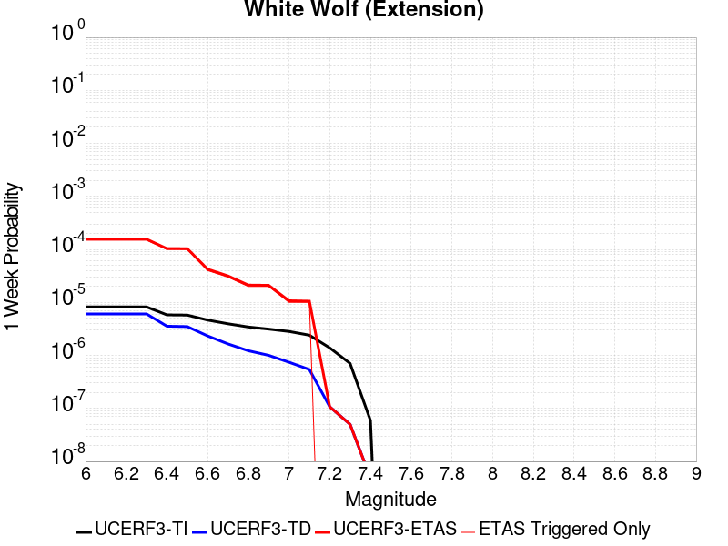 |  |  |  |

| Magnitude | 1 wk TI Prob | 1 wk TD Prob | 1 wk ETAS Prob | 1 wk ETAS/TD Gain | 1 wk ETAS Triggered Only | 1 mo TI Prob | 1 mo TD Prob | 1 mo ETAS Prob | 1 mo ETAS/TD Gain | 1 mo ETAS Triggered Only | 1 yr TI Prob | 1 yr TD Prob | 1 yr ETAS Prob | 1 yr ETAS/TD Gain | 1 yr ETAS Triggered Only | 10 yr TI Prob | 10 yr TD Prob | 10 yr ETAS Prob | 10 yr ETAS/TD Gain | 10 yr ETAS Triggered Only |
|-----|-----|-----|-----|-----|-----|-----|-----|-----|-----|-----|-----|-----|-----|-----|-----|-----|-----|-----|-----|-----|
| 6.0 | 8.222555E-6 | 6.0666657E-6 | 2.727317E-4 | 44.955784 | 2.6666667E-4 | 3.5239045E-5 | 2.5999774E-5 | 3.7265744E-4 | 14.333102 | 3.4666667E-4 | 4.289509E-4 | 3.1650788E-4 | 7.163813E-4 | 2.2633915 | 4.0E-4 | 0.0042812387 | 0.003161223 | 0.0036397057 | 1.1513599 | 4.8E-4 |
| 6.1 | 8.222555E-6 | 6.0666657E-6 | 2.727317E-4 | 44.955784 | 2.6666667E-4 | 3.5239045E-5 | 2.5999774E-5 | 3.7265744E-4 | 14.333102 | 3.4666667E-4 | 4.289509E-4 | 3.1650788E-4 | 7.163813E-4 | 2.2633915 | 4.0E-4 | 0.0042812387 | 0.003161223 | 0.0036397057 | 1.1513599 | 4.8E-4 |
| 6.2 | 8.222555E-6 | 6.0666657E-6 | 2.727317E-4 | 44.955784 | 2.6666667E-4 | 3.5239045E-5 | 2.5999774E-5 | 3.7265744E-4 | 14.333102 | 3.4666667E-4 | 4.289509E-4 | 3.1650788E-4 | 7.163813E-4 | 2.2633915 | 4.0E-4 | 0.0042812387 | 0.003161223 | 0.0036397057 | 1.1513599 | 4.8E-4 |
| 6.3 | 8.222555E-6 | 6.0666657E-6 | 2.727317E-4 | 44.955784 | 2.6666667E-4 | 3.5239045E-5 | 2.5999774E-5 | 3.7265744E-4 | 14.333102 | 3.4666667E-4 | 4.289509E-4 | 3.1650788E-4 | 7.163813E-4 | 2.2633915 | 4.0E-4 | 0.0042812387 | 0.003161223 | 0.0036397057 | 1.1513599 | 4.8E-4 |
| 6.4 | 5.821773E-6 | 3.5571766E-6 | 1.9022317E-4 | 53.47589 | 1.8666667E-4 | 2.4950215E-5 | 1.5244959E-5 | 2.8190756E-4 | 18.491854 | 2.6666667E-4 | 3.0372653E-4 | 1.8559267E-4 | 4.7887157E-4 | 2.5802288 | 2.9333335E-4 | 0.0030331176 | 0.001854485 | 0.002200509 | 1.1865876 | 3.4666667E-4 |
| 6.5 | 5.766023E-6 | 3.4991106E-6 | 1.9016513E-4 | 54.346703 | 1.8666667E-4 | 2.4711293E-5 | 1.4996108E-5 | 2.8165878E-4 | 18.782125 | 2.6666667E-4 | 3.0081844E-4 | 1.8256342E-4 | 4.758432E-4 | 2.6064541 | 2.9333335E-4 | 0.0030041158 | 0.0018242426 | 0.0021702768 | 1.1896865 | 3.4666667E-4 |
| 6.6 | 4.643576E-6 | 2.332624E-6 | 8.233244E-5 | 35.29606 | 8.0E-5 | 1.9900888E-5 | 9.996925E-6 | 1.4332893E-4 | 14.337302 | 1.3333333E-4 | 2.4226638E-4 | 1.2170619E-4 | 2.8168672E-4 | 2.3144815 | 1.6E-4 | 0.0024200242 | 0.0012164378 | 0.0014295116 | 1.1751621 | 2.1333333E-4 |
| 6.7 | 3.9529173E-6 | 1.6483477E-6 | 5.4981592E-5 | 33.35558 | 5.3333333E-5 | 1.6940963E-5 | 7.0643296E-6 | 8.706377E-5 | 12.32442 | 8.0E-5 | 2.0623671E-4 | 8.6005006E-5 | 1.926625E-4 | 2.2401311 | 1.0666667E-4 | 0.002060454 | 8.597357E-4 | 9.929545E-4 | 1.1549531 | 1.3333333E-4 |
| 6.8 | 3.4377522E-6 | 1.2245237E-6 | 2.7891158E-5 | 22.77715 | 2.6666667E-5 | 1.473314E-5 | 5.2479486E-6 | 5.8581E-5 | 11.162648 | 5.3333333E-5 | 1.7936122E-4 | 6.3891996E-5 | 1.4388688E-4 | 2.252033 | 8.0E-5 | 0.0017921652 | 6.387454E-4 | 7.4534386E-4 | 1.1668874 | 1.0666667E-4 |
| 6.9 | 3.1367306E-6 | 1.0033783E-6 | 2.7670018E-5 | 27.576855 | 2.6666667E-5 | 1.3443062E-5 | 4.3001864E-6 | 3.0966738E-5 | 7.2012553 | 2.6666667E-5 | 1.63657E-4 | 5.235359E-5 | 1.0568413E-4 | 2.0186608 | 5.3333333E-5 | 0.0016353652 | 5.2342017E-4 | 5.767256E-4 | 1.1018406 | 5.3333333E-5 |
| 7.0 | 2.8298145E-6 | 7.4286646E-7 | 7.4286646E-7 | 1.0 | 0.0 | 1.2127721E-5 | 3.1837099E-6 | 3.1837099E-6 | 1.0 | 0.0 | 1.47645E-4 | 3.8761027E-5 | 6.542666E-5 | 1.6879495 | 2.6666667E-5 | 0.0014754693 | 3.8754768E-4 | 4.14204E-4 | 1.0687821 | 2.6666667E-5 |
| 7.1 | 2.4091064E-6 | 5.4227525E-7 | 5.4227525E-7 | 1.0 | 0.0 | 1.03247E-5 | 2.3240348E-6 | 2.3240348E-6 | 1.0 | 0.0 | 1.2569598E-4 | 2.8294799E-5 | 2.8294799E-5 | 1.0 | 0.0 | 0.001256249 | 2.8291598E-4 | 2.8291598E-4 | 1.0 | 0.0 |
| 7.2 | 1.3875518E-6 | 1.0743063E-7 | 1.0743063E-7 | 1.0 | 0.0 | 5.9466374E-6 | 4.6041689E-7 | 4.6041689E-7 | 1.0 | 0.0 | 7.23979E-5 | 5.6055624E-6 | 5.6055624E-6 | 1.0 | 0.0 | 7.2374323E-4 | 5.6054323E-5 | 5.6054323E-5 | 1.0 | 0.0 |
| 7.3 | 7.056077E-7 | 5.002034E-8 | 5.002034E-8 | 1.0 | 0.0 | 3.0240296E-6 | 2.1437286E-7 | 2.1437286E-7 | 1.0 | 0.0 | 3.681694E-5 | 2.609987E-6 | 2.609987E-6 | 1.0 | 0.0 | 3.681084E-4 | 2.609961E-5 | 2.609961E-5 | 1.0 | 0.0 |
| 7.4 | 5.9334678E-8 | 4.8683537E-9 | 4.8683537E-9 | 1.0 | 0.0 | 2.5429145E-7 | 2.0864372E-8 | 2.0864372E-8 | 1.0 | 0.0 | 3.095994E-6 | 2.5402372E-7 | 2.5402372E-7 | 1.0 | 0.0 | 3.095951E-5 | 2.5402353E-6 | 2.5402353E-6 | 1.0 | 0.0 |

## San Andreas (North Branch Mill Creek)
*[(top)](#table-of-contents)*

| 1 Week | 1 Month | 1 Year | 10 Year |
|-----|-----|-----|-----|
|  |  |  |  |

| Magnitude | 1 wk TI Prob | 1 wk TD Prob | 1 wk ETAS Prob | 1 wk ETAS/TD Gain | 1 wk ETAS Triggered Only | 1 mo TI Prob | 1 mo TD Prob | 1 mo ETAS Prob | 1 mo ETAS/TD Gain | 1 mo ETAS Triggered Only | 1 yr TI Prob | 1 yr TD Prob | 1 yr ETAS Prob | 1 yr ETAS/TD Gain | 1 yr ETAS Triggered Only | 10 yr TI Prob | 10 yr TD Prob | 10 yr ETAS Prob | 10 yr ETAS/TD Gain | 10 yr ETAS Triggered Only |
|-----|-----|-----|-----|-----|-----|-----|-----|-----|-----|-----|-----|-----|-----|-----|-----|-----|-----|-----|-----|-----|
| 6.0 | 1.3461156E-5 | 2.3499893E-5 | 2.1016218E-4 | 8.943112 | 1.8666667E-4 | 5.7689394E-5 | 1.00709956E-4 | 3.406858E-4 | 3.382841 | 2.4E-4 | 7.02142E-4 | 0.0012254574 | 0.0015450652 | 1.260807 | 3.2E-4 | 0.0069992766 | 0.01222957 | 0.012677359 | 1.0366153 | 4.5333334E-4 |
| 6.1 | 1.3461156E-5 | 2.3499893E-5 | 2.1016218E-4 | 8.943112 | 1.8666667E-4 | 5.7689394E-5 | 1.00709956E-4 | 3.406858E-4 | 3.382841 | 2.4E-4 | 7.02142E-4 | 0.0012254574 | 0.0015450652 | 1.260807 | 3.2E-4 | 0.0069992766 | 0.01222957 | 0.012677359 | 1.0366153 | 4.5333334E-4 |
| 6.2 | 1.3461156E-5 | 2.3499893E-5 | 2.1016218E-4 | 8.943112 | 1.8666667E-4 | 5.7689394E-5 | 1.00709956E-4 | 3.406858E-4 | 3.382841 | 2.4E-4 | 7.02142E-4 | 0.0012254574 | 0.0015450652 | 1.260807 | 3.2E-4 | 0.0069992766 | 0.01222957 | 0.012677359 | 1.0366153 | 4.5333334E-4 |
| 6.3 | 1.3461156E-5 | 2.3499893E-5 | 2.1016218E-4 | 8.943112 | 1.8666667E-4 | 5.7689394E-5 | 1.00709956E-4 | 3.406858E-4 | 3.382841 | 2.4E-4 | 7.02142E-4 | 0.0012254574 | 0.0015450652 | 1.260807 | 3.2E-4 | 0.0069992766 | 0.01222957 | 0.012677359 | 1.0366153 | 4.5333334E-4 |
| 6.4 | 1.3461156E-5 | 2.3499893E-5 | 2.1016218E-4 | 8.943112 | 1.8666667E-4 | 5.7689394E-5 | 1.00709956E-4 | 3.406858E-4 | 3.382841 | 2.4E-4 | 7.02142E-4 | 0.0012254574 | 0.0015450652 | 1.260807 | 3.2E-4 | 0.0069992766 | 0.01222957 | 0.012677359 | 1.0366153 | 4.5333334E-4 |
| 6.5 | 1.3450706E-5 | 2.3488852E-5 | 2.1015113E-4 | 8.946845 | 1.8666667E-4 | 5.764461E-5 | 1.0066265E-4 | 3.4063848E-4 | 3.3839612 | 2.4E-4 | 7.0159714E-4 | 0.001224882 | 0.00154449 | 1.2609297 | 3.2E-4 | 0.006993862 | 0.01222388 | 0.012671672 | 1.0366325 | 4.5333334E-4 |
| 6.6 | 1.3074523E-5 | 2.3103135E-5 | 2.097655E-4 | 9.079525 | 1.8666667E-4 | 5.6032466E-5 | 9.9009696E-5 | 3.3898593E-4 | 3.423765 | 2.4E-4 | 6.8198174E-4 | 0.0012047797 | 0.0015243941 | 1.2652887 | 3.2E-4 | 0.006798926 | 0.012025044 | 0.012472927 | 1.0372458 | 4.5333334E-4 |
| 6.7 | 1.3050216E-5 | 2.3078432E-5 | 2.0974079E-4 | 9.088173 | 1.8666667E-4 | 5.59283E-5 | 9.890384E-5 | 3.388801E-4 | 3.4263597 | 2.4E-4 | 6.8071426E-4 | 0.0012034923 | 0.0015231072 | 1.2655729 | 3.2E-4 | 0.0067863287 | 0.012012309 | 0.012460197 | 1.0372857 | 4.5333334E-4 |
| 6.8 | 1.29049395E-5 | 2.292684E-5 | 2.0958923E-4 | 9.141653 | 1.8666667E-4 | 5.530571E-5 | 9.825421E-5 | 3.3823063E-4 | 3.4424036 | 2.4E-4 | 6.73139E-4 | 0.0011955918 | 0.0015152091 | 1.2673299 | 3.2E-4 | 0.0067110364 | 0.011934154 | 0.012382077 | 1.0375329 | 4.5333334E-4 |
| 6.9 | 1.2867369E-5 | 2.2886245E-5 | 2.0954864E-4 | 9.1560955 | 1.8666667E-4 | 5.51447E-5 | 9.8080236E-5 | 3.380567E-4 | 3.446736 | 2.4E-4 | 6.711799E-4 | 0.0011934759 | 0.0015130941 | 1.2678044 | 3.2E-4 | 0.006691564 | 0.011913223 | 0.012361156 | 1.0375996 | 4.5333334E-4 |
| 7.0 | 1.2495996E-5 | 2.2286325E-5 | 2.0894883E-4 | 9.375652 | 1.8666667E-4 | 5.3553173E-5 | 9.550934E-5 | 3.3548643E-4 | 3.5126033 | 2.4E-4 | 6.518148E-4 | 0.0011622087 | 0.0014818369 | 1.2750177 | 3.2E-4 | 0.0064990623 | 0.0116038285 | 0.012051902 | 1.0386143 | 4.5333334E-4 |
| 7.1 | 1.2452067E-5 | 2.2231397E-5 | 2.0889392E-4 | 9.396346 | 1.8666667E-4 | 5.3364907E-5 | 9.527396E-5 | 3.352511E-4 | 3.5188115 | 2.4E-4 | 6.4952404E-4 | 0.0011593461 | 0.001478975 | 1.2756977 | 3.2E-4 | 0.0064762887 | 0.0115755 | 0.012023586 | 1.0387099 | 4.5333334E-4 |
| 7.2 | 1.2002777E-5 | 2.1609963E-5 | 2.082726E-4 | 9.637804 | 1.8666667E-4 | 5.143946E-5 | 9.2610855E-5 | 3.3258862E-4 | 3.5912488 | 2.4E-4 | 6.2609545E-4 | 0.0011269567 | 0.001446596 | 1.2836306 | 3.2E-4 | 0.006243344 | 0.011254923 | 0.011703154 | 1.0398253 | 4.5333334E-4 |
| 7.3 | 1.1923425E-5 | 2.1479793E-5 | 2.0814245E-4 | 9.690151 | 1.8666667E-4 | 5.109939E-5 | 9.205302E-5 | 3.3203093E-4 | 3.6069531 | 2.4E-4 | 6.219575E-4 | 0.001120172 | 0.0014398135 | 1.2853504 | 3.2E-4 | 0.0062021962 | 0.011187789 | 0.01163605 | 1.0400671 | 4.5333334E-4 |
| 7.4 | 1.16105175E-5 | 2.0853771E-5 | 2.0751654E-4 | 9.951032 | 1.8666667E-4 | 4.975841E-5 | 8.937026E-5 | 3.293488E-4 | 3.6852171 | 2.4E-4 | 6.0564023E-4 | 0.0010875424 | 0.0014071943 | 1.2939214 | 3.2E-4 | 0.006039923 | 0.010865397 | 0.011313804 | 1.0412693 | 4.5333334E-4 |
| 7.5 | 1.1037265E-5 | 1.9553907E-5 | 2.0621692E-4 | 10.546073 | 1.8666667E-4 | 4.7301706E-5 | 8.379978E-5 | 3.2377968E-4 | 3.8637292 | 2.4E-4 | 5.757461E-4 | 0.0010197869 | 0.0013394606 | 1.3134711 | 3.2E-4 | 0.005742567 | 0.010194898 | 0.010643609 | 1.0440134 | 4.5333334E-4 |
| 7.6 | 1.0720915E-5 | 1.899582E-5 | 2.0565894E-4 | 10.826537 | 1.8666667E-4 | 4.5945973E-5 | 8.140812E-5 | 3.213886E-4 | 3.9478688 | 2.4E-4 | 5.592486E-4 | 9.906954E-4 | 0.0013103784 | 1.3226855 | 3.2E-4 | 0.005578433 | 0.009906623 | 0.010355464 | 1.0453073 | 4.5333334E-4 |
| 7.7 | 9.276279E-6 | 1.6441649E-5 | 2.0310524E-4 | 12.353095 | 1.8666667E-4 | 3.9754876E-5 | 7.0462316E-5 | 3.104454E-4 | 4.405836 | 2.4E-4 | 4.839081E-4 | 8.575427E-4 | 0.0011772682 | 1.3728392 | 3.2E-4 | 0.0048285574 | 0.008586041 | 0.009035482 | 1.0523455 | 4.5333334E-4 |
| 7.8 | 5.8346777E-6 | 1.1155013E-5 | 1.978196E-4 | 17.733694 | 1.8666667E-4 | 2.5005522E-5 | 4.7806327E-5 | 2.8779486E-4 | 6.020016 | 2.4E-4 | 3.043997E-4 | 5.818867E-4 | 9.0170046E-4 | 1.5496153 | 3.2E-4 | 0.0030398308 | 0.0058469265 | 0.0062976093 | 1.0770802 | 4.5333334E-4 |
| 7.9 | 4.690204E-6 | 8.509093E-6 | 1.9517417E-4 | 22.937128 | 1.8666667E-4 | 2.0100719E-5 | 3.6467034E-5 | 2.7645828E-4 | 7.5810466 | 2.4E-4 | 2.4469878E-4 | 4.4389578E-4 | 7.637537E-4 | 1.72057 | 3.2E-4 | 0.002444295 | 0.0044707474 | 0.004922054 | 1.1009465 | 4.5333334E-4 |
| 8.0 | 2.9570454E-6 | 4.846947E-6 | 4.846947E-6 | 1.0 | 0.0 | 1.267299E-5 | 2.0772464E-5 | 2.0772464E-5 | 1.0 | 0.0 | 1.5428272E-4 | 2.5287544E-4 | 3.3285518E-4 | 1.3162813 | 8.0E-5 | 0.0015417566 | 0.002549644 | 0.0026826377 | 1.0521616 | 1.3333333E-4 |
| 8.1 | 1.6376824E-6 | 2.1968929E-6 | 2.1968929E-6 | 1.0 | 0.0 | 7.01862E-6 | 9.41522E-6 | 9.41522E-6 | 1.0 | 0.0 | 8.544835E-5 | 1.14624294E-4 | 1.14624294E-4 | 1.0 | 0.0 | 8.54155E-4 | 0.0011606582 | 0.0011606582 | 1.0 | 0.0 |
| 8.2 | 6.9631557E-7 | 4.5360213E-7 | 4.5360213E-7 | 1.0 | 0.0 | 2.984206E-6 | 1.9440076E-6 | 1.9440076E-6 | 1.0 | 0.0 | 3.63321E-5 | 2.3668037E-5 | 2.3668037E-5 | 1.0 | 0.0 | 3.6326164E-4 | 2.451564E-4 | 2.451564E-4 | 1.0 | 0.0 |
| 8.3 | 1.7876137E-7 | 8.360375E-8 | 8.360375E-8 | 1.0 | 0.0 | 7.661199E-7 | 3.5830175E-7 | 3.5830175E-7 | 1.0 | 0.0 | 9.32747E-6 | 4.3623154E-6 | 4.3623154E-6 | 1.0 | 0.0 | 9.3270784E-5 | 4.5817014E-5 | 4.5817014E-5 | 1.0 | 0.0 |

## Calico-Hidalgo
*[(top)](#table-of-contents)*

| 1 Week | 1 Month | 1 Year | 10 Year |
|-----|-----|-----|-----|
|  |  |  |  |

| Magnitude | 1 wk TI Prob | 1 wk TD Prob | 1 wk ETAS Prob | 1 wk ETAS/TD Gain | 1 wk ETAS Triggered Only | 1 mo TI Prob | 1 mo TD Prob | 1 mo ETAS Prob | 1 mo ETAS/TD Gain | 1 mo ETAS Triggered Only | 1 yr TI Prob | 1 yr TD Prob | 1 yr ETAS Prob | 1 yr ETAS/TD Gain | 1 yr ETAS Triggered Only | 10 yr TI Prob | 10 yr TD Prob | 10 yr ETAS Prob | 10 yr ETAS/TD Gain | 10 yr ETAS Triggered Only |
|-----|-----|-----|-----|-----|-----|-----|-----|-----|-----|-----|-----|-----|-----|-----|-----|-----|-----|-----|-----|-----|
| 6.0 | 4.0906612E-5 | 5.0703686E-5 | 7.7369004E-5 | 1.5259049 | 2.6666667E-5 | 1.7530227E-4 | 2.172857E-4 | 3.5059007E-4 | 1.6134981 | 1.3333333E-4 | 0.0021322158 | 0.002642648 | 0.00290861 | 1.1006422 | 2.6666667E-4 | 0.02111873 | 0.026152607 | 0.026568115 | 1.0158879 | 4.2666667E-4 |
| 6.1 | 4.0906612E-5 | 5.0703686E-5 | 7.7369004E-5 | 1.5259049 | 2.6666667E-5 | 1.7530227E-4 | 2.172857E-4 | 3.5059007E-4 | 1.6134981 | 1.3333333E-4 | 0.0021322158 | 0.002642648 | 0.00290861 | 1.1006422 | 2.6666667E-4 | 0.02111873 | 0.026152607 | 0.026568115 | 1.0158879 | 4.2666667E-4 |
| 6.2 | 4.0906612E-5 | 5.0703686E-5 | 7.7369004E-5 | 1.5259049 | 2.6666667E-5 | 1.7530227E-4 | 2.172857E-4 | 3.5059007E-4 | 1.6134981 | 1.3333333E-4 | 0.0021322158 | 0.002642648 | 0.00290861 | 1.1006422 | 2.6666667E-4 | 0.02111873 | 0.026152607 | 0.026568115 | 1.0158879 | 4.2666667E-4 |
| 6.3 | 2.4242801E-5 | 3.0090669E-5 | 5.6756533E-5 | 1.8861839 | 2.6666667E-5 | 1.0389358E-4 | 1.2895382E-4 | 2.6226995E-4 | 2.0338285 | 1.3333333E-4 | 0.0012641704 | 0.0015689151 | 0.0018085386 | 1.1527319 | 2.4E-4 | 0.01257003 | 0.01558206 | 0.01581832 | 1.0151623 | 2.4E-4 |
| 6.4 | 2.4242801E-5 | 3.0090669E-5 | 5.6756533E-5 | 1.8861839 | 2.6666667E-5 | 1.0389358E-4 | 1.2895382E-4 | 2.6226995E-4 | 2.0338285 | 1.3333333E-4 | 0.0012641704 | 0.0015689151 | 0.0018085386 | 1.1527319 | 2.4E-4 | 0.01257003 | 0.01558206 | 0.01581832 | 1.0151623 | 2.4E-4 |
| 6.5 | 2.0286952E-5 | 2.5315738E-5 | 2.5315738E-5 | 1.0 | 0.0 | 8.694118E-5 | 1.0849161E-4 | 1.8848293E-4 | 1.7373042 | 8.0E-5 | 0.0010579949 | 0.001320102 | 0.0015065223 | 1.1412165 | 1.8666667E-4 | 0.010529719 | 0.013124538 | 0.013308754 | 1.014036 | 1.8666667E-4 |
| 6.6 | 2.0269223E-5 | 2.5296687E-5 | 2.5296687E-5 | 1.0 | 0.0 | 8.6865206E-5 | 1.08409964E-4 | 1.8840129E-4 | 1.7378595 | 8.0E-5 | 0.0010570707 | 0.0013191093 | 0.0015055297 | 1.141323 | 1.8666667E-4 | 0.010520565 | 0.013114728 | 0.013298946 | 1.0140467 | 1.8666667E-4 |
| 6.7 | 1.799852E-5 | 2.25406E-5 | 2.25406E-5 | 1.0 | 0.0 | 7.713423E-5 | 9.659908E-5 | 1.7659135E-4 | 1.8280853 | 8.0E-5 | 9.3870464E-4 | 0.0011754738 | 0.0013619211 | 1.1586145 | 1.8666667E-4 | 0.009347493 | 0.011694173 | 0.011878657 | 1.0157757 | 1.8666667E-4 |
| 6.8 | 1.7458793E-5 | 2.184212E-5 | 2.184212E-5 | 1.0 | 0.0 | 7.4821255E-5 | 9.3605806E-5 | 1.7359832E-4 | 1.8545678 | 8.0E-5 | 9.10568E-4 | 0.0011390693 | 0.0013255234 | 1.1636899 | 1.8666667E-4 | 0.009068459 | 0.011333893 | 0.011518444 | 1.0162832 | 1.8666667E-4 |
| 6.9 | 1.542884E-5 | 1.9025927E-5 | 1.9025927E-5 | 1.0 | 0.0 | 6.612192E-5 | 8.153721E-5 | 1.6153068E-4 | 1.9810671 | 8.0E-5 | 8.04737E-4 | 9.922766E-4 | 0.001178758 | 1.187933 | 1.8666667E-4 | 0.008018291 | 0.009879857 | 0.01006468 | 1.018707 | 1.8666667E-4 |
| 7.0 | 1.468253E-5 | 1.8030598E-5 | 1.8030598E-5 | 1.0 | 0.0 | 6.292361E-5 | 7.7271776E-5 | 1.572656E-4 | 2.0352268 | 8.0E-5 | 7.658257E-4 | 9.4039086E-4 | 0.001126882 | 1.1983124 | 1.8666667E-4 | 0.0076319184 | 0.009365481 | 0.0095504 | 1.0197446 | 1.8666667E-4 |
| 7.1 | 1.3139281E-5 | 1.6200942E-5 | 1.6200942E-5 | 1.0 | 0.0 | 5.6309986E-5 | 6.943083E-5 | 1.4942528E-4 | 2.1521459 | 8.0E-5 | 6.853584E-4 | 8.4500515E-4 | 0.001031514 | 1.2207193 | 1.8666667E-4 | 0.0068324856 | 0.0084192185 | 0.008604313 | 1.0219848 | 1.8666667E-4 |
| 7.2 | 1.1127404E-5 | 1.3866597E-5 | 1.3866597E-5 | 1.0 | 0.0 | 4.7688E-5 | 5.942698E-5 | 1.3942223E-4 | 2.3461099 | 8.0E-5 | 5.8044674E-4 | 7.232942E-4 | 9.0982585E-4 | 1.2578918 | 1.8666667E-4 | 0.0057893298 | 0.0072105085 | 0.007395829 | 1.0257015 | 1.8666667E-4 |
| 7.3 | 9.808154E-6 | 1.2176215E-5 | 1.2176215E-5 | 1.0 | 0.0 | 4.2034266E-5 | 5.2182797E-5 | 1.3217863E-4 | 2.5329924 | 8.0E-5 | 5.11647E-4 | 6.3515105E-4 | 7.950494E-4 | 1.2517486 | 1.6E-4 | 0.0051047057 | 0.006334433 | 0.0064934194 | 1.0250988 | 1.6E-4 |
| 7.4 | 7.942452E-6 | 9.792144E-6 | 9.792144E-6 | 1.0 | 0.0 | 3.4038632E-5 | 4.1965708E-5 | 9.5296804E-5 | 2.2708256 | 5.3333333E-5 | 4.1434157E-4 | 5.1082217E-4 | 6.440874E-4 | 1.2608838 | 1.3333333E-4 | 0.0041356985 | 0.005097421 | 0.0052300747 | 1.0260236 | 1.3333333E-4 |
| 7.5 | 4.7121216E-6 | 5.772836E-6 | 5.772836E-6 | 1.0 | 0.0 | 2.019465E-5 | 2.4740535E-5 | 5.1406543E-5 | 2.0778265 | 2.6666667E-5 | 2.4584212E-4 | 3.0118204E-4 | 3.2784068E-4 | 1.0885134 | 2.6666667E-5 | 0.0024557032 | 0.0030084911 | 0.0030350776 | 1.0088371 | 2.6666667E-5 |
| 7.6 | 2.21172E-7 | 2.603961E-7 | 2.603961E-7 | 1.0 | 0.0 | 9.478797E-7 | 1.1159829E-6 | 1.1159829E-6 | 1.0 | 0.0 | 1.1540374E-5 | 1.3587036E-5 | 1.3587036E-5 | 1.0 | 0.0 | 1.1539775E-4 | 1.3586486E-4 | 1.3586486E-4 | 1.0 | 0.0 |

## Cady
*[(top)](#table-of-contents)*

| 1 Week | 1 Month | 1 Year | 10 Year |
|-----|-----|-----|-----|
|  |  |  |  |

| Magnitude | 1 wk TI Prob | 1 wk TD Prob | 1 wk ETAS Prob | 1 wk ETAS/TD Gain | 1 wk ETAS Triggered Only | 1 mo TI Prob | 1 mo TD Prob | 1 mo ETAS Prob | 1 mo ETAS/TD Gain | 1 mo ETAS Triggered Only | 1 yr TI Prob | 1 yr TD Prob | 1 yr ETAS Prob | 1 yr ETAS/TD Gain | 1 yr ETAS Triggered Only | 10 yr TI Prob | 10 yr TD Prob | 10 yr ETAS Prob | 10 yr ETAS/TD Gain | 10 yr ETAS Triggered Only |
|-----|-----|-----|-----|-----|-----|-----|-----|-----|-----|-----|-----|-----|-----|-----|-----|-----|-----|-----|-----|-----|
| 6.0 | 1.9892565E-5 | 2.1858728E-5 | 1.0185698E-4 | 4.6597853 | 8.0E-5 | 8.525106E-5 | 9.3677416E-5 | 2.0033409E-4 | 2.1385527 | 1.0666667E-4 | 0.0010374374 | 0.0011400167 | 0.0013531068 | 1.1869184 | 2.1333333E-4 | 0.010326075 | 0.011350701 | 0.011719796 | 1.0325174 | 3.7333334E-4 |
| 6.1 | 1.9892565E-5 | 2.1858728E-5 | 1.0185698E-4 | 4.6597853 | 8.0E-5 | 8.525106E-5 | 9.3677416E-5 | 2.0033409E-4 | 2.1385527 | 1.0666667E-4 | 0.0010374374 | 0.0011400167 | 0.0013531068 | 1.1869184 | 2.1333333E-4 | 0.010326075 | 0.011350701 | 0.011719796 | 1.0325174 | 3.7333334E-4 |
| 6.2 | 1.9892565E-5 | 2.1858728E-5 | 1.0185698E-4 | 4.6597853 | 8.0E-5 | 8.525106E-5 | 9.3677416E-5 | 2.0033409E-4 | 2.1385527 | 1.0666667E-4 | 0.0010374374 | 0.0011400167 | 0.0013531068 | 1.1869184 | 2.1333333E-4 | 0.010326075 | 0.011350701 | 0.011719796 | 1.0325174 | 3.7333334E-4 |
| 6.3 | 1.1117327E-5 | 1.2176583E-5 | 6.5509266E-5 | 5.379938 | 5.3333333E-5 | 4.764482E-5 | 5.2184492E-5 | 1.0551504E-4 | 2.0219617 | 5.3333333E-5 | 5.7992124E-4 | 6.351925E-4 | 7.684411E-4 | 1.2097768 | 1.3333333E-4 | 0.0057841022 | 0.0063368753 | 0.0065753544 | 1.0376335 | 2.4E-4 |
| 6.4 | 1.1117327E-5 | 1.2176583E-5 | 6.5509266E-5 | 5.379938 | 5.3333333E-5 | 4.764482E-5 | 5.2184492E-5 | 1.0551504E-4 | 2.0219617 | 5.3333333E-5 | 5.7992124E-4 | 6.351925E-4 | 7.684411E-4 | 1.2097768 | 1.3333333E-4 | 0.0057841022 | 0.0063368753 | 0.0065753544 | 1.0376335 | 2.4E-4 |
| 6.5 | 6.103093E-6 | 6.672021E-6 | 6.0004997E-5 | 8.993527 | 5.3333333E-5 | 2.615585E-5 | 2.8594131E-5 | 8.192594E-5 | 2.8651311 | 5.3333333E-5 | 3.1840094E-4 | 3.480905E-4 | 4.2806266E-4 | 1.2297453 | 8.0E-5 | 0.0031794512 | 0.0034766865 | 0.0036627043 | 1.0535043 | 1.8666667E-4 |
| 6.6 | 5.817237E-6 | 6.3656585E-6 | 5.9698654E-5 | 9.378237 | 5.3333333E-5 | 2.4930776E-5 | 2.728118E-5 | 8.0613056E-5 | 2.9548965 | 5.3333333E-5 | 3.034899E-4 | 3.3211018E-4 | 4.120836E-4 | 1.240804 | 8.0E-5 | 0.0030307577 | 0.0033173605 | 0.003503408 | 1.056083 | 1.8666667E-4 |
| 6.7 | 4.8846314E-6 | 5.3405684E-6 | 3.2007094E-5 | 5.9932 | 2.6666667E-5 | 2.0933967E-5 | 2.2888014E-5 | 4.955407E-5 | 2.1650662 | 2.6666667E-5 | 2.5484123E-4 | 2.7863772E-4 | 3.319562E-4 | 1.1913542 | 5.3333333E-5 | 0.0025454918 | 0.0027840391 | 0.0029170013 | 1.0477587 | 1.3333333E-4 |
| 6.8 | 1.7788773E-6 | 1.9399079E-6 | 1.9399079E-6 | 1.0 | 0.0 | 7.6237375E-6 | 8.313874E-6 | 8.313874E-6 | 1.0 | 0.0 | 9.281505E-5 | 1.01218284E-4 | 1.2788226E-4 | 1.2634304 | 2.6666667E-5 | 9.2776294E-4 | 0.0010118765 | 0.0010385162 | 1.026327 | 2.6666667E-5 |
| 6.9 | 7.5455404E-7 | 8.297092E-7 | 8.297092E-7 | 1.0 | 0.0 | 3.233799E-6 | 3.5558937E-6 | 3.5558937E-6 | 1.0 | 0.0 | 3.937079E-5 | 4.3292483E-5 | 6.995799E-5 | 1.6159387 | 2.6666667E-5 | 3.9363815E-4 | 4.3287344E-4 | 4.5952856E-4 | 1.0615772 | 2.6666667E-5 |
| 7.0 | 6.8578805E-7 | 7.541816E-7 | 7.541816E-7 | 1.0 | 0.0 | 2.9390883E-6 | 3.2322048E-6 | 3.2322048E-6 | 1.0 | 0.0 | 3.578281E-5 | 3.9351715E-5 | 6.601733E-5 | 1.6776228 | 2.6666667E-5 | 3.577705E-4 | 3.9347992E-4 | 4.201361E-4 | 1.0677447 | 2.6666667E-5 |

## San Andreas (Carrizo) rev
*[(top)](#table-of-contents)*

| 1 Week | 1 Month | 1 Year | 10 Year |
|-----|-----|-----|-----|
|  |  |  | 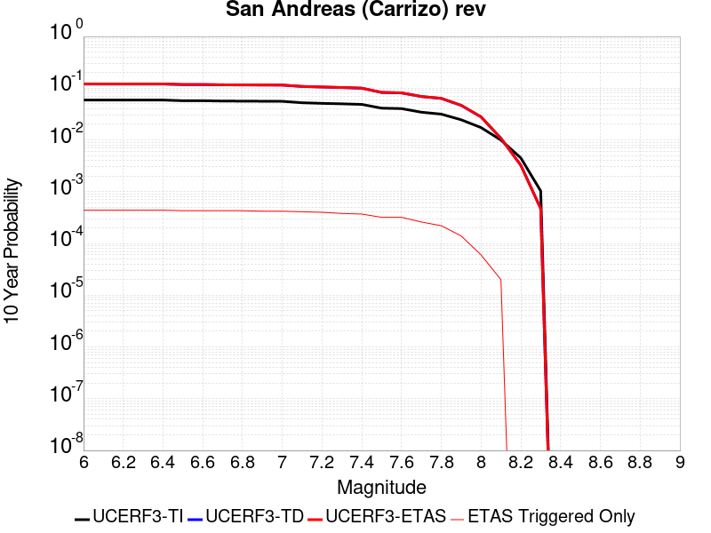 |

| Magnitude | 1 wk TI Prob | 1 wk TD Prob | 1 wk ETAS Prob | 1 wk ETAS/TD Gain | 1 wk ETAS Triggered Only | 1 mo TI Prob | 1 mo TD Prob | 1 mo ETAS Prob | 1 mo ETAS/TD Gain | 1 mo ETAS Triggered Only | 1 yr TI Prob | 1 yr TD Prob | 1 yr ETAS Prob | 1 yr ETAS/TD Gain | 1 yr ETAS Triggered Only | 10 yr TI Prob | 10 yr TD Prob | 10 yr ETAS Prob | 10 yr ETAS/TD Gain | 10 yr ETAS Triggered Only |
|-----|-----|-----|-----|-----|-----|-----|-----|-----|-----|-----|-----|-----|-----|-----|-----|-----|-----|-----|-----|-----|
| 6.0 | 1.1674632E-4 | 2.432302E-4 | 3.765311E-4 | 1.5480442 | 1.3333333E-4 | 5.002454E-4 | 0.0010420004 | 0.0012551114 | 1.2045211 | 2.1333333E-4 | 0.006073493 | 0.012613042 | 0.012955337 | 1.0271381 | 3.4666667E-4 | 0.0591016 | 0.12061418 | 0.12098938 | 1.0031108 | 4.2666667E-4 |
| 6.1 | 1.1674632E-4 | 2.432302E-4 | 3.765311E-4 | 1.5480442 | 1.3333333E-4 | 5.002454E-4 | 0.0010420004 | 0.0012551114 | 1.2045211 | 2.1333333E-4 | 0.006073493 | 0.012613042 | 0.012955337 | 1.0271381 | 3.4666667E-4 | 0.0591016 | 0.12061418 | 0.12098938 | 1.0031108 | 4.2666667E-4 |
| 6.2 | 1.1674632E-4 | 2.432302E-4 | 3.765311E-4 | 1.5480442 | 1.3333333E-4 | 5.002454E-4 | 0.0010420004 | 0.0012551114 | 1.2045211 | 2.1333333E-4 | 0.006073493 | 0.012613042 | 0.012955337 | 1.0271381 | 3.4666667E-4 | 0.0591016 | 0.12061418 | 0.12098938 | 1.0031108 | 4.2666667E-4 |
| 6.3 | 1.1674632E-4 | 2.432302E-4 | 3.765311E-4 | 1.5480442 | 1.3333333E-4 | 5.002454E-4 | 0.0010420004 | 0.0012551114 | 1.2045211 | 2.1333333E-4 | 0.006073493 | 0.012613042 | 0.012955337 | 1.0271381 | 3.4666667E-4 | 0.0591016 | 0.12061418 | 0.12098938 | 1.0031108 | 4.2666667E-4 |
| 6.4 | 1.1674632E-4 | 2.432302E-4 | 3.765311E-4 | 1.5480442 | 1.3333333E-4 | 5.002454E-4 | 0.0010420004 | 0.0012551114 | 1.2045211 | 2.1333333E-4 | 0.006073493 | 0.012613042 | 0.012955337 | 1.0271381 | 3.4666667E-4 | 0.0591016 | 0.12061418 | 0.12098938 | 1.0031108 | 4.2666667E-4 |
| 6.5 | 1.13136164E-4 | 2.3643032E-4 | 3.6973212E-4 | 1.5638101 | 1.3333333E-4 | 4.847792E-4 | 0.0010128808 | 0.001225998 | 1.210407 | 2.1333333E-4 | 0.0058862255 | 0.012262545 | 0.01260496 | 1.0279237 | 3.4666667E-4 | 0.057327334 | 0.117585555 | 0.11796205 | 1.0032018 | 4.2666667E-4 |
| 6.6 | 1.13136164E-4 | 2.3643032E-4 | 3.6973212E-4 | 1.5638101 | 1.3333333E-4 | 4.847792E-4 | 0.0010128808 | 0.001225998 | 1.210407 | 2.1333333E-4 | 0.0058862255 | 0.012262545 | 0.01260496 | 1.0279237 | 3.4666667E-4 | 0.057327334 | 0.117585555 | 0.11796205 | 1.0032018 | 4.2666667E-4 |
| 6.7 | 1.1149675E-4 | 2.3334254E-4 | 3.6664476E-4 | 1.5712727 | 1.3333333E-4 | 4.777557E-4 | 9.996577E-4 | 0.0012127778 | 1.213193 | 2.1333333E-4 | 0.0058011734 | 0.012103349 | 0.01244582 | 1.0282955 | 3.4666667E-4 | 0.05652051 | 0.1162071 | 0.11658418 | 1.003245 | 4.2666667E-4 |
| 6.8 | 1.1103589E-4 | 2.3236412E-4 | 3.6566646E-4 | 1.5736787 | 1.3333333E-4 | 4.7578133E-4 | 9.954676E-4 | 0.0012085887 | 1.2140913 | 2.1333333E-4 | 0.005777263 | 0.012052901 | 0.012395389 | 1.0284154 | 3.4666667E-4 | 0.056293584 | 0.1157674 | 0.11614467 | 1.003259 | 4.2666667E-4 |
| 6.9 | 1.1053259E-4 | 2.3128795E-4 | 3.6459044E-4 | 1.5763487 | 1.3333333E-4 | 4.7362508E-4 | 9.90859E-4 | 0.001203981 | 1.215088 | 2.1333333E-4 | 0.0057511497 | 0.01199741 | 0.012339918 | 1.0285485 | 3.4666667E-4 | 0.05604569 | 0.11528359 | 0.11566108 | 1.0032743 | 4.2666667E-4 |
| 7.0 | 1.1005377E-4 | 2.3029637E-4 | 3.63599E-4 | 1.5788307 | 1.3333333E-4 | 4.7157376E-4 | 9.866126E-4 | 0.0011997354 | 1.2160147 | 2.1333333E-4 | 0.0057263062 | 0.011946279 | 0.012288804 | 1.0286721 | 3.4666667E-4 | 0.055809796 | 0.11483591 | 0.11521358 | 1.0032887 | 4.2666667E-4 |
| 7.1 | 1.0308142E-4 | 2.1539345E-4 | 3.4869806E-4 | 1.618889 | 1.3333333E-4 | 4.417027E-4 | 9.227892E-4 | 0.0011359256 | 1.2309698 | 2.1333333E-4 | 0.0053644776 | 0.011177397 | 0.011520189 | 1.0306683 | 3.4666667E-4 | 0.052368138 | 0.108092256 | 0.1084728 | 1.0035206 | 4.2666667E-4 |
| 7.2 | 1.0027479E-4 | 2.094724E-4 | 3.1611673E-4 | 1.5091091 | 1.0666667E-4 | 4.296783E-4 | 8.9743105E-4 | 0.0010839301 | 1.2078145 | 1.8666667E-4 | 0.0052187922 | 0.010871782 | 0.011188303 | 1.029114 | 3.2E-4 | 0.050979212 | 0.10539625 | 0.10575409 | 1.0033952 | 4.0E-4 |
| 7.3 | 9.816942E-5 | 2.0422463E-4 | 3.108695E-4 | 1.522194 | 1.0666667E-4 | 4.2065824E-4 | 8.7495585E-4 | 0.0010348159 | 1.1827064 | 1.6E-4 | 0.005109493 | 0.010600842 | 0.010891066 | 1.0273774 | 2.9333335E-4 | 0.049935985 | 0.102979995 | 0.103314884 | 1.0032519 | 3.7333334E-4 |
| 7.4 | 9.5634205E-5 | 1.9791997E-4 | 3.0456553E-4 | 1.5388317 | 1.0666667E-4 | 4.0979648E-4 | 8.479536E-4 | 0.0010078179 | 1.1885296 | 1.6E-4 | 0.0049778637 | 0.010275229 | 0.010565548 | 1.0282543 | 2.9333335E-4 | 0.048678253 | 0.10006632 | 0.100402296 | 1.0033575 | 3.7333334E-4 |
| 7.5 | 8.052417E-5 | 1.611261E-4 | 2.411132E-4 | 1.4964255 | 8.0E-5 | 3.4505792E-4 | 6.903579E-4 | 7.969509E-4 | 1.1544026 | 1.0666667E-4 | 0.0041929903 | 0.008372796 | 0.008584343 | 1.025266 | 2.1333333E-4 | 0.04114753 | 0.08281049 | 0.08307953 | 1.0032489 | 2.9333335E-4 |
| 7.6 | 7.897024E-5 | 1.5765853E-4 | 2.3764592E-4 | 1.5073458 | 8.0E-5 | 3.384E-4 | 6.755046E-4 | 7.8209926E-4 | 1.1578 | 1.0666667E-4 | 0.0041122385 | 0.008193332 | 0.008404917 | 1.0258241 | 2.1333333E-4 | 0.040369697 | 0.08115171 | 0.08142123 | 1.0033213 | 2.9333335E-4 |
| 7.7 | 6.707427E-5 | 1.3276102E-4 | 2.1275041E-4 | 1.6025065 | 8.0E-5 | 2.8742946E-4 | 5.688518E-4 | 6.754578E-4 | 1.1874056 | 1.0666667E-4 | 0.003493839 | 0.00690381 | 0.007089188 | 1.0268515 | 1.8666667E-4 | 0.034394164 | 0.069048055 | 0.06929631 | 1.0035954 | 2.6666667E-4 |
| 7.8 | 6.147705E-5 | 1.2197486E-4 | 2.019651E-4 | 1.6557928 | 8.0E-5 | 2.6344648E-4 | 5.226447E-4 | 6.2925566E-4 | 1.2039835 | 1.0666667E-4 | 0.0032027436 | 0.006344659 | 0.006503644 | 1.025058 | 1.6E-4 | 0.031569764 | 0.06351457 | 0.06373932 | 1.0035386 | 2.4E-4 |
| 7.9 | 4.7636717E-5 | 8.87977E-5 | 1.6879059E-4 | 1.9008442 | 8.0E-5 | 2.0414138E-4 | 3.8050607E-4 | 4.6047565E-4 | 1.2101663 | 8.0E-5 | 0.0024825884 | 0.0046228287 | 0.004755546 | 1.028709 | 1.3333333E-4 | 0.024550365 | 0.046628095 | 0.046780635 | 1.0032715 | 1.6E-4 |
| 8.0 | 3.3554235E-5 | 5.2136907E-5 | 1.05467465E-4 | 2.0228944 | 5.3333333E-5 | 1.4379594E-4 | 2.2342477E-4 | 2.7674617E-4 | 1.2386549 | 5.3333333E-5 | 0.0017493097 | 0.002716805 | 0.002823182 | 1.0391551 | 1.0666667E-4 | 0.017356034 | 0.027880952 | 0.028010568 | 1.0046489 | 1.3333333E-4 |
| 8.1 | 1.9175432E-5 | 1.9184976E-5 | 4.585113E-5 | 2.3899498 | 2.6666667E-5 | 8.217783E-5 | 8.2218736E-5 | 1.0888321E-4 | 1.3243114 | 2.6666667E-5 | 0.0010000558 | 0.0010005541 | 0.0010271941 | 1.0266253 | 2.6666667E-5 | 0.009955673 | 0.0107580265 | 0.010810786 | 1.0049042 | 5.3333333E-5 |
| 8.2 | 8.643924E-6 | 5.4748625E-6 | 5.4748625E-6 | 1.0 | 0.0 | 3.704486E-5 | 2.3463486E-5 | 2.3463486E-5 | 1.0 | 0.0 | 4.5092785E-4 | 2.8563058E-4 | 2.8563058E-4 | 1.0 | 0.0 | 0.0045001395 | 0.0032487072 | 0.0032487072 | 1.0 | 0.0 |
| 8.3 | 1.983087E-6 | 7.6599065E-7 | 7.6599065E-7 | 1.0 | 0.0 | 8.498917E-6 | 3.282813E-6 | 3.282813E-6 | 1.0 | 0.0 | 1.034694E-4 | 3.9967534E-5 | 3.9967534E-5 | 1.0 | 0.0 | 0.0010342124 | 4.719687E-4 | 4.719687E-4 | 1.0 | 0.0 |

## Owens Valley
*[(top)](#table-of-contents)*

| 1 Week | 1 Month | 1 Year | 10 Year |
|-----|-----|-----|-----|
|  |  |  |  |

| Magnitude | 1 wk TI Prob | 1 wk TD Prob | 1 wk ETAS Prob | 1 wk ETAS/TD Gain | 1 wk ETAS Triggered Only | 1 mo TI Prob | 1 mo TD Prob | 1 mo ETAS Prob | 1 mo ETAS/TD Gain | 1 mo ETAS Triggered Only | 1 yr TI Prob | 1 yr TD Prob | 1 yr ETAS Prob | 1 yr ETAS/TD Gain | 1 yr ETAS Triggered Only | 10 yr TI Prob | 10 yr TD Prob | 10 yr ETAS Prob | 10 yr ETAS/TD Gain | 10 yr ETAS Triggered Only |
|-----|-----|-----|-----|-----|-----|-----|-----|-----|-----|-----|-----|-----|-----|-----|-----|-----|-----|-----|-----|-----|
| 6.0 | 4.83821E-5 | 3.626567E-6 | 1.6362598E-4 | 45.118702 | 1.6E-4 | 2.0733538E-4 | 1.5542342E-5 | 2.0220611E-4 | 13.010015 | 1.8666667E-4 | 0.002521386 | 1.8921259E-4 | 4.824904E-4 | 2.5499911 | 2.9333335E-4 | 0.024929691 | 0.001925011 | 0.0023508563 | 1.221217 | 4.2666667E-4 |
| 6.1 | 4.83821E-5 | 3.626567E-6 | 1.6362598E-4 | 45.118702 | 1.6E-4 | 2.0733538E-4 | 1.5542342E-5 | 2.0220611E-4 | 13.010015 | 1.8666667E-4 | 0.002521386 | 1.8921259E-4 | 4.824904E-4 | 2.5499911 | 2.9333335E-4 | 0.024929691 | 0.001925011 | 0.0023508563 | 1.221217 | 4.2666667E-4 |
| 6.2 | 4.83821E-5 | 3.626567E-6 | 1.6362598E-4 | 45.118702 | 1.6E-4 | 2.0733538E-4 | 1.5542342E-5 | 2.0220611E-4 | 13.010015 | 1.8666667E-4 | 0.002521386 | 1.8921259E-4 | 4.824904E-4 | 2.5499911 | 2.9333335E-4 | 0.024929691 | 0.001925011 | 0.0023508563 | 1.221217 | 4.2666667E-4 |
| 6.3 | 3.953008E-5 | 3.1553948E-6 | 1.364883E-4 | 43.25554 | 1.3333333E-4 | 1.6940363E-4 | 1.3523055E-5 | 1.735209E-4 | 12.831487 | 1.6E-4 | 0.002060538 | 1.6463149E-4 | 4.0459196E-4 | 2.4575613 | 2.4E-4 | 0.020415364 | 0.0016592 | 0.0020052914 | 1.2085894 | 3.4666667E-4 |
| 6.4 | 3.953008E-5 | 3.1553948E-6 | 1.364883E-4 | 43.25554 | 1.3333333E-4 | 1.6940363E-4 | 1.3523055E-5 | 1.735209E-4 | 12.831487 | 1.6E-4 | 0.002060538 | 1.6463149E-4 | 4.0459196E-4 | 2.4575613 | 2.4E-4 | 0.020415364 | 0.0016592 | 0.0020052914 | 1.2085894 | 3.4666667E-4 |
| 6.5 | 3.457342E-5 | 2.9715961E-6 | 1.3630453E-4 | 45.86913 | 1.3333333E-4 | 1.4816338E-4 | 1.2735354E-5 | 1.7273331E-4 | 13.563292 | 1.6E-4 | 0.0018023965 | 1.550426E-4 | 3.950054E-4 | 2.5477216 | 2.4E-4 | 0.017878477 | 0.001555719 | 0.0019018463 | 1.2224871 | 3.4666667E-4 |
| 6.6 | 3.1127765E-5 | 2.8744932E-6 | 1.3620744E-4 | 47.384853 | 1.3333333E-4 | 1.3339789E-4 | 1.2319203E-5 | 1.7231723E-4 | 13.987694 | 1.6E-4 | 0.0016229092 | 1.4997667E-4 | 3.8994066E-4 | 2.600009 | 2.4E-4 | 0.016111081 | 0.0015012559 | 0.0018474021 | 1.2305712 | 3.4666667E-4 |
| 6.7 | 2.806885E-5 | 2.8104134E-6 | 1.3614337E-4 | 48.44247 | 1.3333333E-4 | 1.2028952E-4 | 1.20445775E-5 | 1.7204265E-4 | 14.283827 | 1.6E-4 | 0.001463541 | 1.4663354E-4 | 3.8659835E-4 | 2.6364932 | 2.4E-4 | 0.014539397 | 0.0014657511 | 0.0018119096 | 1.2361646 | 3.4666667E-4 |
| 6.8 | 2.524524E-5 | 2.2353688E-6 | 1.355684E-4 | 60.647 | 1.3333333E-4 | 1.0818939E-4 | 9.580118E-6 | 1.6957859E-4 | 17.701096 | 1.6E-4 | 0.0013164099 | 1.16632E-4 | 3.56604E-4 | 3.0575144 | 2.4E-4 | 0.01308639 | 0.0011659812 | 0.0015122436 | 1.2969708 | 3.4666667E-4 |
| 6.9 | 2.2704568E-5 | 1.6081682E-6 | 1.3494129E-4 | 83.909935 | 1.3333333E-4 | 9.730166E-5 | 6.8921313E-6 | 1.6689103E-4 | 24.21472 | 1.6E-4 | 0.0011840039 | 8.390849E-5 | 3.2388835E-4 | 3.860019 | 2.4E-4 | 0.011777153 | 8.3897985E-4 | 0.0011853557 | 1.4128536 | 3.4666667E-4 |
| 7.0 | 2.0871712E-5 | 1.5395453E-6 | 1.3487268E-4 | 87.60552 | 1.3333333E-4 | 8.944713E-5 | 6.598035E-6 | 1.6659698E-4 | 25.249485 | 1.6E-4 | 0.0010884746 | 8.032813E-5 | 3.2030884E-4 | 3.9875054 | 2.4E-4 | 0.010831586 | 8.0316263E-4 | 0.0011495509 | 1.4312804 | 3.4666667E-4 |
| 7.1 | 1.944928E-5 | 1.3864178E-6 | 1.3471956E-4 | 97.170975 | 1.3333333E-4 | 8.335139E-5 | 5.941777E-6 | 1.6594083E-4 | 27.92781 | 1.6E-4 | 0.0010143308 | 7.233874E-5 | 2.8565666E-4 | 3.948875 | 2.1333333E-4 | 0.010097133 | 7.2330976E-4 | 0.0010430783 | 1.4420907 | 3.2E-4 |
| 7.2 | 1.7876306E-5 | 1.2489141E-6 | 1.3458208E-4 | 107.75928 | 1.3333333E-4 | 7.6610486E-5 | 5.352478E-6 | 1.6535162E-4 | 30.892536 | 1.6E-4 | 9.3233347E-4 | 6.516448E-5 | 2.784839E-4 | 4.273554 | 2.1333333E-4 | 0.009284316 | 6.5159105E-4 | 9.7138254E-4 | 1.4907856 | 3.2E-4 |
| 7.3 | 1.2618672E-5 | 1.1115209E-6 | 1.3444471E-4 | 120.95563 | 1.3333333E-4 | 5.40789E-5 | 4.763652E-6 | 1.647629E-4 | 34.587513 | 1.6E-4 | 6.582117E-4 | 5.799593E-5 | 2.7131688E-4 | 4.6782055 | 2.1333333E-4 | 0.0065626553 | 5.7994033E-4 | 8.9975476E-4 | 1.5514609 | 3.2E-4 |
| 7.4 | 7.4874442E-6 | 8.5486437E-7 | 1.0752144E-4 | 125.77602 | 1.0666667E-4 | 3.208865E-5 | 3.6636993E-6 | 1.3699655E-4 | 37.392956 | 1.3333333E-4 | 3.906093E-4 | 4.4604632E-5 | 2.3126297E-4 | 5.18473 | 1.8666667E-4 | 0.003899234 | 4.4604883E-4 | 7.392513E-4 | 1.6573327 | 2.9333335E-4 |
| 7.5 | 2.4734156E-6 | 6.068616E-7 | 8.060681E-5 | 132.8257 | 8.0E-5 | 1.060031E-5 | 2.6008327E-6 | 1.09267225E-4 | 42.012398 | 1.0666667E-4 | 1.2905113E-4 | 3.166468E-5 | 1.6499379E-4 | 5.210657 | 1.3333333E-4 | 0.0012897621 | 3.1660203E-4 | 5.2986783E-4 | 1.6736084 | 2.1333333E-4 |
| 7.6 | 1.1328841E-6 | 3.196531E-7 | 2.6986312E-5 | 84.423744 | 2.6666667E-5 | 4.8552088E-6 | 1.3699412E-6 | 2.8036571E-5 | 20.46553 | 2.6666667E-5 | 5.9110564E-5 | 1.6678909E-5 | 4.334513E-5 | 2.598799 | 2.6666667E-5 | 5.9094845E-4 | 1.6677675E-4 | 2.467634E-4 | 1.4796032 | 8.0E-5 |
| 7.7 | 4.8613185E-7 | 8.964689E-8 | 8.964689E-8 | 1.0 | 0.0 | 2.0834207E-6 | 3.8420092E-7 | 3.8420092E-7 | 1.0 | 0.0 | 2.536535E-5 | 4.6776368E-6 | 4.6776368E-6 | 1.0 | 0.0 | 2.5362454E-4 | 4.677545E-5 | 7.344087E-5 | 1.570073 | 2.6666667E-5 |

## Manix-Afton Hills
*[(top)](#table-of-contents)*

| 1 Week | 1 Month | 1 Year | 10 Year |
|-----|-----|-----|-----|
|  |  |  |  |

| Magnitude | 1 wk TI Prob | 1 wk TD Prob | 1 wk ETAS Prob | 1 wk ETAS/TD Gain | 1 wk ETAS Triggered Only | 1 mo TI Prob | 1 mo TD Prob | 1 mo ETAS Prob | 1 mo ETAS/TD Gain | 1 mo ETAS Triggered Only | 1 yr TI Prob | 1 yr TD Prob | 1 yr ETAS Prob | 1 yr ETAS/TD Gain | 1 yr ETAS Triggered Only | 10 yr TI Prob | 10 yr TD Prob | 10 yr ETAS Prob | 10 yr ETAS/TD Gain | 10 yr ETAS Triggered Only |
|-----|-----|-----|-----|-----|-----|-----|-----|-----|-----|-----|-----|-----|-----|-----|-----|-----|-----|-----|-----|-----|
| 6.0 | 1.3783202E-5 | 1.47110895E-5 | 1.7470874E-4 | 11.875989 | 1.6E-4 | 5.906953E-5 | 6.30461E-5 | 2.49701E-4 | 3.9606097 | 1.8666667E-4 | 7.189342E-4 | 7.6733343E-4 | 0.0010604417 | 1.3819829 | 2.9333335E-4 | 0.0071661277 | 0.007648596 | 0.008071999 | 1.055357 | 4.2666667E-4 |
| 6.1 | 1.3783202E-5 | 1.47110895E-5 | 1.7470874E-4 | 11.875989 | 1.6E-4 | 5.906953E-5 | 6.30461E-5 | 2.49701E-4 | 3.9606097 | 1.8666667E-4 | 7.189342E-4 | 7.6733343E-4 | 0.0010604417 | 1.3819829 | 2.9333335E-4 | 0.0071661277 | 0.007648596 | 0.008071999 | 1.055357 | 4.2666667E-4 |
| 6.2 | 1.3783202E-5 | 1.47110895E-5 | 1.7470874E-4 | 11.875989 | 1.6E-4 | 5.906953E-5 | 6.30461E-5 | 2.49701E-4 | 3.9606097 | 1.8666667E-4 | 7.189342E-4 | 7.6733343E-4 | 0.0010604417 | 1.3819829 | 2.9333335E-4 | 0.0071661277 | 0.007648596 | 0.008071999 | 1.055357 | 4.2666667E-4 |
| 6.3 | 1.10494875E-5 | 1.1793136E-5 | 1.1845854E-4 | 10.044703 | 1.0666667E-4 | 4.7354086E-5 | 5.054109E-5 | 1.8386768E-4 | 3.6379843 | 1.3333333E-4 | 5.763835E-4 | 6.151744E-4 | 8.283765E-4 | 1.3465718 | 2.1333333E-4 | 0.005748908 | 0.0061357557 | 0.006427289 | 1.0475138 | 2.9333335E-4 |
| 6.4 | 1.10494875E-5 | 1.1793136E-5 | 1.1845854E-4 | 10.044703 | 1.0666667E-4 | 4.7354086E-5 | 5.054109E-5 | 1.8386768E-4 | 3.6379843 | 1.3333333E-4 | 5.763835E-4 | 6.151744E-4 | 8.283765E-4 | 1.3465718 | 2.1333333E-4 | 0.005748908 | 0.0061357557 | 0.006427289 | 1.0475138 | 2.9333335E-4 |
| 6.5 | 9.788949E-6 | 1.045432E-5 | 9.045348E-5 | 8.652259 | 8.0E-5 | 4.1951964E-5 | 4.480351E-5 | 1.514654E-4 | 3.380659 | 1.0666667E-4 | 5.1064545E-4 | 5.453555E-4 | 7.3192036E-4 | 1.3420978 | 1.8666667E-4 | 0.0050947363 | 0.0054410985 | 0.0057063145 | 1.048743 | 2.6666667E-4 |
| 6.6 | 8.810006E-6 | 9.4136285E-6 | 6.274646E-5 | 6.6654916 | 5.3333333E-5 | 3.775662E-5 | 4.0343548E-5 | 1.2034032E-4 | 2.982889 | 8.0E-5 | 4.5958988E-4 | 4.9108086E-4 | 6.510023E-4 | 1.3256519 | 1.6E-4 | 0.0045864056 | 0.004900839 | 0.005113127 | 1.0433166 | 2.1333333E-4 |
| 6.7 | 8.80128E-6 | 9.404108E-6 | 6.273694E-5 | 6.671227 | 5.3333333E-5 | 3.7719226E-5 | 4.0302748E-5 | 1.20299526E-4 | 2.9848964 | 8.0E-5 | 4.591348E-4 | 4.9058435E-4 | 6.505059E-4 | 1.3259816 | 1.6E-4 | 0.004581874 | 0.0048958957 | 0.0051081846 | 1.0433606 | 2.1333333E-4 |
| 6.8 | 6.8994877E-6 | 7.380076E-6 | 3.4046545E-5 | 4.6133056 | 2.6666667E-5 | 2.9568899E-5 | 3.162856E-5 | 8.496021E-5 | 2.6861863 | 5.3333333E-5 | 3.5994186E-4 | 3.8501783E-4 | 5.182998E-4 | 1.346171 | 1.3333333E-4 | 0.003593594 | 0.0038443129 | 0.004003698 | 1.0414599 | 1.6E-4 |
| 6.9 | 4.9328037E-6 | 5.2709615E-6 | 3.193749E-5 | 6.059139 | 2.6666667E-5 | 2.1140417E-5 | 2.2589675E-5 | 4.9255737E-5 | 2.1804538 | 2.6666667E-5 | 2.5735417E-4 | 2.7500073E-4 | 3.5497872E-4 | 1.2908283 | 8.0E-5 | 0.0025705635 | 0.0027472095 | 0.002853583 | 1.0387206 | 1.0666667E-4 |
| 7.0 | 3.347973E-6 | 3.59003E-6 | 3.59003E-6 | 1.0 | 0.0 | 1.4348378E-5 | 1.5385775E-5 | 1.5385775E-5 | 1.0 | 0.0 | 1.746775E-4 | 1.8730981E-4 | 2.4063316E-4 | 1.2846799 | 5.3333333E-5 | 0.0017454025 | 0.0018719219 | 0.0019251555 | 1.0284379 | 5.3333333E-5 |
| 7.1 | 1.2073567E-6 | 1.293482E-6 | 1.293482E-6 | 1.0 | 0.0 | 5.1743755E-6 | 5.543492E-6 | 5.543492E-6 | 1.0 | 0.0 | 6.29962E-5 | 6.749156E-5 | 6.749156E-5 | 1.0 | 0.0 | 6.297835E-4 | 6.7487074E-4 | 6.7487074E-4 | 1.0 | 0.0 |

## San Jacinto (San Jacinto Valley) rev
*[(top)](#table-of-contents)*

| 1 Week | 1 Month | 1 Year | 10 Year |
|-----|-----|-----|-----|
|  |  |  |  |

| Magnitude | 1 wk TI Prob | 1 wk TD Prob | 1 wk ETAS Prob | 1 wk ETAS/TD Gain | 1 wk ETAS Triggered Only | 1 mo TI Prob | 1 mo TD Prob | 1 mo ETAS Prob | 1 mo ETAS/TD Gain | 1 mo ETAS Triggered Only | 1 yr TI Prob | 1 yr TD Prob | 1 yr ETAS Prob | 1 yr ETAS/TD Gain | 1 yr ETAS Triggered Only | 10 yr TI Prob | 10 yr TD Prob | 10 yr ETAS Prob | 10 yr ETAS/TD Gain | 10 yr ETAS Triggered Only |
|-----|-----|-----|-----|-----|-----|-----|-----|-----|-----|-----|-----|-----|-----|-----|-----|-----|-----|-----|-----|-----|
| 6.0 | 3.652694E-5 | 3.4402394E-5 | 2.477284E-4 | 7.200906 | 2.1333333E-4 | 1.5653463E-4 | 1.474305E-4 | 3.8739512E-4 | 2.6276457 | 2.4E-4 | 0.0019041431 | 0.00179349 | 0.002112916 | 1.1781031 | 3.2E-4 | 0.018879099 | 0.018526595 | 0.018919185 | 1.0211906 | 4.0E-4 |
| 6.1 | 3.652694E-5 | 3.4402394E-5 | 2.477284E-4 | 7.200906 | 2.1333333E-4 | 1.5653463E-4 | 1.474305E-4 | 3.8739512E-4 | 2.6276457 | 2.4E-4 | 0.0019041431 | 0.00179349 | 0.002112916 | 1.1781031 | 3.2E-4 | 0.018879099 | 0.018526595 | 0.018919185 | 1.0211906 | 4.0E-4 |
| 6.2 | 3.652694E-5 | 3.4402394E-5 | 2.477284E-4 | 7.200906 | 2.1333333E-4 | 1.5653463E-4 | 1.474305E-4 | 3.8739512E-4 | 2.6276457 | 2.4E-4 | 0.0019041431 | 0.00179349 | 0.002112916 | 1.1781031 | 3.2E-4 | 0.018879099 | 0.018526595 | 0.018919185 | 1.0211906 | 4.0E-4 |
| 6.3 | 3.652694E-5 | 3.4402394E-5 | 2.477284E-4 | 7.200906 | 2.1333333E-4 | 1.5653463E-4 | 1.474305E-4 | 3.8739512E-4 | 2.6276457 | 2.4E-4 | 0.0019041431 | 0.00179349 | 0.002112916 | 1.1781031 | 3.2E-4 | 0.018879099 | 0.018526595 | 0.018919185 | 1.0211906 | 4.0E-4 |
| 6.4 | 3.646941E-5 | 3.432397E-5 | 2.4765E-4 | 7.215074 | 2.1333333E-4 | 1.5628811E-4 | 1.4709444E-4 | 3.8705915E-4 | 2.6313648 | 2.4E-4 | 0.0019011468 | 0.0017894056 | 0.002108833 | 1.1785103 | 3.2E-4 | 0.018849645 | 0.018486476 | 0.018879082 | 1.0212375 | 4.0E-4 |
| 6.5 | 3.646941E-5 | 3.432397E-5 | 2.4765E-4 | 7.215074 | 2.1333333E-4 | 1.5628811E-4 | 1.4709444E-4 | 3.8705915E-4 | 2.6313648 | 2.4E-4 | 0.0019011468 | 0.0017894056 | 0.002108833 | 1.1785103 | 3.2E-4 | 0.018849645 | 0.018486476 | 0.018879082 | 1.0212375 | 4.0E-4 |
| 6.6 | 3.6442503E-5 | 3.4287354E-5 | 2.4761338E-4 | 7.221711 | 2.1333333E-4 | 1.561728E-4 | 1.4693754E-4 | 3.8690228E-4 | 2.633107 | 2.4E-4 | 0.0018997455 | 0.0017874985 | 0.0021069264 | 1.1787012 | 3.2E-4 | 0.018835869 | 0.018467745 | 0.018860359 | 1.0212594 | 4.0E-4 |
| 6.7 | 3.6432113E-5 | 3.4272925E-5 | 2.4759895E-4 | 7.2243304 | 2.1333333E-4 | 1.5612828E-4 | 1.4687571E-4 | 3.8684046E-4 | 2.6337945 | 2.4E-4 | 0.0018992044 | 0.0017867472 | 0.0021061755 | 1.1787764 | 3.2E-4 | 0.018830549 | 0.018460369 | 0.018852985 | 1.021268 | 4.0E-4 |
| 6.8 | 3.6409598E-5 | 3.424198E-5 | 2.47568E-4 | 7.2299557 | 2.1333333E-4 | 1.560318E-4 | 1.4674311E-4 | 3.867079E-4 | 2.6352713 | 2.4E-4 | 0.0018980318 | 0.0017851355 | 0.002104564 | 1.1789382 | 3.2E-4 | 0.018819023 | 0.018444523 | 0.018837145 | 1.0212866 | 4.0E-4 |
| 6.9 | 3.638078E-5 | 3.4202407E-5 | 2.4752846E-4 | 7.2371645 | 2.1333333E-4 | 1.5590832E-4 | 1.4657351E-4 | 3.8653833E-4 | 2.6371636 | 2.4E-4 | 0.0018965311 | 0.001783074 | 0.0021025036 | 1.1791453 | 3.2E-4 | 0.018804269 | 0.018424258 | 0.018816888 | 1.0213106 | 4.0E-4 |
| 7.0 | 3.6294874E-5 | 3.408442E-5 | 2.4741047E-4 | 7.2587557 | 2.1333333E-4 | 1.5554018E-4 | 1.4606792E-4 | 3.8603286E-4 | 2.6428313 | 2.4E-4 | 0.0018920569 | 0.001776929 | 0.0020963603 | 1.1797659 | 3.2E-4 | 0.018760284 | 0.018363839 | 0.018756494 | 1.021382 | 4.0E-4 |
| 7.1 | 3.6260717E-5 | 3.4040702E-5 | 2.4736678E-4 | 7.266794 | 2.1333333E-4 | 1.5539382E-4 | 1.4588058E-4 | 3.8584557E-4 | 2.6449413 | 2.4E-4 | 0.001890278 | 0.0017746518 | 0.002094084 | 1.1799971 | 3.2E-4 | 0.018742796 | 0.018341439 | 0.018734103 | 1.0214086 | 4.0E-4 |
| 7.2 | 3.6210204E-5 | 3.397492E-5 | 2.47301E-4 | 7.278928 | 2.1333333E-4 | 1.5517735E-4 | 1.455987E-4 | 3.8556376E-4 | 2.6481264 | 2.4E-4 | 0.001887647 | 0.0017712255 | 0.0020906588 | 1.1803459 | 3.2E-4 | 0.01871693 | 0.01830772 | 0.018700397 | 1.0214487 | 4.0E-4 |
| 7.3 | 3.6119454E-5 | 3.386321E-5 | 2.471893E-4 | 7.2996426 | 2.1333333E-4 | 1.5478847E-4 | 1.4511998E-4 | 3.8508515E-4 | 2.653564 | 2.4E-4 | 0.0018829206 | 0.0017654065 | 0.002058222 | 1.1658629 | 2.9333335E-4 | 0.018670462 | 0.018250274 | 0.018616792 | 1.020083 | 3.7333334E-4 |
| 7.4 | 3.607848E-5 | 3.381071E-5 | 2.4713684E-4 | 7.309425 | 2.1333333E-4 | 1.5461289E-4 | 1.44895E-4 | 3.8486024E-4 | 2.6561317 | 2.4E-4 | 0.0018807866 | 0.0017626719 | 0.0020554883 | 1.1661206 | 2.9333335E-4 | 0.018649481 | 0.018223269 | 0.018589798 | 1.0201133 | 3.7333334E-4 |
| 7.5 | 3.5856774E-5 | 3.3620483E-5 | 2.4694664E-4 | 7.345125 | 2.1333333E-4 | 1.5366284E-4 | 1.4407984E-4 | 3.8404524E-4 | 2.6655033 | 2.4E-4 | 0.0018692396 | 0.0017527633 | 0.0020455825 | 1.1670614 | 2.9333335E-4 | 0.018535944 | 0.018124366 | 0.018490933 | 1.020225 | 3.7333334E-4 |
| 7.6 | 3.286655E-5 | 3.2143445E-5 | 2.454699E-4 | 7.636702 | 2.1333333E-4 | 1.4084904E-4 | 1.3775036E-4 | 3.777173E-4 | 2.742042 | 2.4E-4 | 0.001713488 | 0.0016758227 | 0.0019686643 | 1.1747451 | 2.9333335E-4 | 0.017003361 | 0.017344031 | 0.017710889 | 1.0211519 | 3.7333334E-4 |
| 7.7 | 2.8882527E-5 | 2.9236293E-5 | 2.4256339E-4 | 8.296653 | 2.1333333E-4 | 1.237764E-4 | 1.2529238E-4 | 3.6526233E-4 | 2.9152794 | 2.4E-4 | 0.0015059357 | 0.0015243685 | 0.0018172547 | 1.192136 | 2.9333335E-4 | 0.014957713 | 0.015830461 | 0.016197884 | 1.0232099 | 3.7333334E-4 |
| 7.8 | 2.4950225E-5 | 2.6527203E-5 | 2.3985488E-4 | 9.041845 | 2.1333333E-4 | 1.0692515E-4 | 1.1368306E-4 | 3.5365578E-4 | 3.1108923 | 2.4E-4 | 0.0013010362 | 0.0013832134 | 0.0016495112 | 1.1925211 | 2.6666667E-4 | 0.012934455 | 0.014411755 | 0.0147534255 | 1.0237077 | 3.4666667E-4 |
| 7.9 | 1.9881603E-5 | 2.1507445E-5 | 2.3483619E-4 | 10.918833 | 2.1333333E-4 | 8.520408E-5 | 9.217151E-5 | 3.321494E-4 | 3.6036015 | 2.4E-4 | 0.001036866 | 0.0011216112 | 0.0013879788 | 1.2374865 | 2.6666667E-4 | 0.010320415 | 0.011777027 | 0.012119611 | 1.0290892 | 3.4666667E-4 |
| 8.0 | 1.563292E-5 | 1.5937347E-5 | 2.0260103E-4 | 12.712345 | 1.8666667E-4 | 6.6996516E-5 | 6.8301124E-5 | 2.816199E-4 | 4.12321 | 2.1333333E-4 | 8.153773E-4 | 8.3124964E-4 | 0.0010710502 | 1.288482 | 2.4E-4 | 0.00812392 | 0.008810506 | 0.009101255 | 1.0330002 | 2.9333335E-4 |
| 8.1 | 1.0045313E-5 | 8.301802E-6 | 6.1634695E-5 | 7.4242544 | 5.3333333E-5 | 4.305063E-5 | 3.5578672E-5 | 1.1557582E-4 | 3.2484581 | 8.0E-5 | 5.2401534E-4 | 4.3308473E-4 | 5.130501E-4 | 1.1846414 | 8.0E-5 | 0.0052278144 | 0.0046591135 | 0.0047652833 | 1.0227876 | 1.0666667E-4 |
| 8.2 | 4.1554413E-6 | 1.5655598E-6 | 1.5655598E-6 | 1.0 | 0.0 | 1.7808914E-5 | 6.709525E-6 | 6.709525E-6 | 1.0 | 0.0 | 2.1680194E-4 | 8.168544E-5 | 8.168544E-5 | 1.0 | 0.0 | 0.0021659054 | 9.482903E-4 | 9.482903E-4 | 1.0 | 0.0 |
| 8.3 | 1.2758221E-6 | 3.6149942E-7 | 3.6149942E-7 | 1.0 | 0.0 | 5.4677976E-6 | 1.5492824E-6 | 1.5492824E-6 | 1.0 | 0.0 | 6.65684E-5 | 1.8862354E-5 | 1.8862354E-5 | 1.0 | 0.0 | 6.6548464E-4 | 2.2751294E-4 | 2.2751294E-4 | 1.0 | 0.0 |

## Lake Isabella (Seismicity)
*[(top)](#table-of-contents)*

| 1 Week | 1 Month | 1 Year | 10 Year |
|-----|-----|-----|-----|
|  |  | 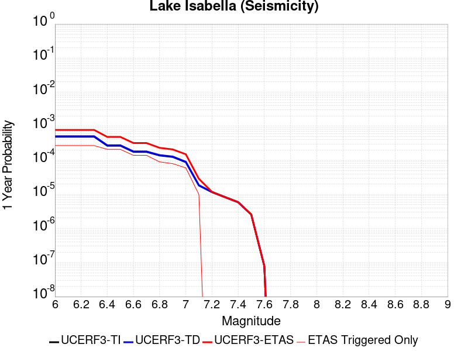 |  |

| Magnitude | 1 wk TI Prob | 1 wk TD Prob | 1 wk ETAS Prob | 1 wk ETAS/TD Gain | 1 wk ETAS Triggered Only | 1 mo TI Prob | 1 mo TD Prob | 1 mo ETAS Prob | 1 mo ETAS/TD Gain | 1 mo ETAS Triggered Only | 1 yr TI Prob | 1 yr TD Prob | 1 yr ETAS Prob | 1 yr ETAS/TD Gain | 1 yr ETAS Triggered Only | 10 yr TI Prob | 10 yr TD Prob | 10 yr ETAS Prob | 10 yr ETAS/TD Gain | 10 yr ETAS Triggered Only |
|-----|-----|-----|-----|-----|-----|-----|-----|-----|-----|-----|-----|-----|-----|-----|-----|-----|-----|-----|-----|-----|
| 6.0 | 9.431637E-6 | 9.741651E-6 | 6.307447E-5 | 6.47472 | 5.3333333E-5 | 4.0420677E-5 | 4.1749343E-5 | 2.0174266E-4 | 4.832236 | 1.6E-4 | 4.920106E-4 | 5.0819275E-4 | 7.747239E-4 | 1.5244687 | 2.6666667E-4 | 0.004909227 | 0.005071599 | 0.005443039 | 1.0732392 | 3.7333334E-4 |
| 6.1 | 9.431637E-6 | 9.741651E-6 | 6.307447E-5 | 6.47472 | 5.3333333E-5 | 4.0420677E-5 | 4.1749343E-5 | 2.0174266E-4 | 4.832236 | 1.6E-4 | 4.920106E-4 | 5.0819275E-4 | 7.747239E-4 | 1.5244687 | 2.6666667E-4 | 0.004909227 | 0.005071599 | 0.005443039 | 1.0732392 | 3.7333334E-4 |
| 6.2 | 9.431637E-6 | 9.741651E-6 | 6.307447E-5 | 6.47472 | 5.3333333E-5 | 4.0420677E-5 | 4.1749343E-5 | 2.0174266E-4 | 4.832236 | 1.6E-4 | 4.920106E-4 | 5.0819275E-4 | 7.747239E-4 | 1.5244687 | 2.6666667E-4 | 0.004909227 | 0.005071599 | 0.005443039 | 1.0732392 | 3.7333334E-4 |
| 6.3 | 9.431637E-6 | 9.741651E-6 | 6.307447E-5 | 6.47472 | 5.3333333E-5 | 4.0420677E-5 | 4.1749343E-5 | 2.0174266E-4 | 4.832236 | 1.6E-4 | 4.920106E-4 | 5.0819275E-4 | 7.747239E-4 | 1.5244687 | 2.6666667E-4 | 0.004909227 | 0.005071599 | 0.005443039 | 1.0732392 | 3.7333334E-4 |
| 6.4 | 5.144063E-6 | 5.3000763E-6 | 3.1966603E-5 | 6.0313478 | 2.6666667E-5 | 2.2045799E-5 | 2.2714434E-5 | 1.5604474E-4 | 6.869849 | 1.3333333E-4 | 2.6837454E-4 | 2.765166E-4 | 4.897909E-4 | 1.7712895 | 2.1333333E-4 | 0.0026805066 | 0.0027620657 | 0.0029748098 | 1.0770235 | 2.1333333E-4 |
| 6.5 | 5.144063E-6 | 5.3000763E-6 | 3.1966603E-5 | 6.0313478 | 2.6666667E-5 | 2.2045799E-5 | 2.2714434E-5 | 1.5604474E-4 | 6.869849 | 1.3333333E-4 | 2.6837454E-4 | 2.765166E-4 | 4.897909E-4 | 1.7712895 | 2.1333333E-4 | 0.0026805066 | 0.0027620657 | 0.0029748098 | 1.0770235 | 2.1333333E-4 |
| 6.6 | 3.4009804E-6 | 3.498786E-6 | 3.498786E-6 | 1.0 | 0.0 | 1.4575549E-5 | 1.4994721E-5 | 1.2165979E-4 | 8.113508 | 1.0666667E-4 | 1.7744285E-4 | 1.8254704E-4 | 3.6917962E-4 | 2.0223808 | 1.8666667E-4 | 0.0017730123 | 0.0018241286 | 0.0020104547 | 1.1021453 | 1.8666667E-4 |
| 6.7 | 3.3880428E-6 | 3.4856528E-6 | 3.4856528E-6 | 1.0 | 0.0 | 1.4520103E-5 | 1.4938435E-5 | 1.2160351E-4 | 8.140311 | 1.0666667E-4 | 1.767679E-4 | 1.8186188E-4 | 3.684946E-4 | 2.0262334 | 1.8666667E-4 | 0.0017662736 | 0.0018172882 | 0.0020036157 | 1.1025305 | 1.8666667E-4 |
| 6.8 | 2.6582E-6 | 2.7337003E-6 | 2.7337003E-6 | 1.0 | 0.0 | 1.1392236E-5 | 1.1715813E-5 | 9.171488E-5 | 7.828298 | 8.0E-5 | 1.3869164E-4 | 1.4263204E-4 | 2.7594634E-4 | 1.9346731 | 1.3333333E-4 | 0.0013860512 | 0.0014255369 | 0.0015586802 | 1.0933987 | 1.3333333E-4 |
| 6.9 | 2.406011E-6 | 2.4743288E-6 | 2.4743288E-6 | 1.0 | 0.0 | 1.0311434E-5 | 1.0604231E-5 | 6.3937E-5 | 6.0293856 | 5.3333333E-5 | 1.2553448E-4 | 1.2910018E-4 | 2.3575308E-4 | 1.826125 | 1.0666667E-4 | 0.0012546359 | 0.0012903814 | 0.0013969104 | 1.0825562 | 1.0666667E-4 |
| 7.0 | 1.6953097E-6 | 1.7429371E-6 | 1.7429371E-6 | 1.0 | 0.0 | 7.265593E-6 | 7.469715E-6 | 3.413618E-5 | 4.5699444 | 2.6666667E-5 | 8.8455E-5 | 9.094104E-5 | 1.7093377E-4 | 1.8796109 | 8.0E-5 | 8.84198E-4 | 9.09141E-4 | 9.890682E-4 | 1.0879152 | 8.0E-5 |
| 7.1 | 3.5013824E-7 | 3.5714822E-7 | 3.5714822E-7 | 1.0 | 0.0 | 1.5005916E-6 | 1.5306344E-6 | 1.5306344E-6 | 1.0 | 0.0 | 1.826955E-5 | 1.8635317E-5 | 4.5301487E-5 | 2.430948 | 2.6666667E-5 | 1.8268047E-4 | 1.863378E-4 | 2.129995E-4 | 1.1430826 | 2.6666667E-5 |
| 7.2 | 2.2321095E-7 | 2.2750574E-7 | 2.2750574E-7 | 1.0 | 0.0 | 9.56618E-7 | 9.750242E-7 | 9.750242E-7 | 1.0 | 0.0 | 1.1646762E-5 | 1.1870856E-5 | 1.1870856E-5 | 1.0 | 0.0 | 1.1646151E-4 | 1.1870232E-4 | 1.1870232E-4 | 1.0 | 0.0 |
| 7.3 | 1.5760406E-7 | 1.6060922E-7 | 1.6060922E-7 | 1.0 | 0.0 | 6.7544585E-7 | 6.8832503E-7 | 6.8832503E-7 | 1.0 | 0.0 | 8.223522E-6 | 8.380326E-6 | 8.380326E-6 | 1.0 | 0.0 | 8.2232174E-5 | 8.3800165E-5 | 8.3800165E-5 | 1.0 | 0.0 |
| 7.4 | 1.1216497E-7 | 1.1431706E-7 | 1.1431706E-7 | 1.0 | 0.0 | 4.8070694E-7 | 4.899302E-7 | 4.899302E-7 | 1.0 | 0.0 | 5.852591E-6 | 5.964884E-6 | 5.964884E-6 | 1.0 | 0.0 | 5.8524372E-5 | 5.9647282E-5 | 5.9647282E-5 | 1.0 | 0.0 |
| 7.5 | 4.885185E-8 | 4.9787737E-8 | 4.9787737E-8 | 1.0 | 0.0 | 2.0936506E-7 | 2.13376E-7 | 2.13376E-7 | 1.0 | 0.0 | 2.5490165E-6 | 2.59785E-6 | 2.59785E-6 | 1.0 | 0.0 | 2.5489873E-5 | 2.5978214E-5 | 2.5978214E-5 | 1.0 | 0.0 |
| 7.6 | 1.504641E-9 | 1.5317903E-9 | 1.5317903E-9 | 1.0 | 0.0 | 6.4484613E-9 | 6.5648154E-9 | 6.5648154E-9 | 1.0 | 0.0 | 7.851001E-8 | 7.992663E-8 | 7.992663E-8 | 1.0 | 0.0 | 7.8509987E-7 | 7.992663E-7 | 7.992663E-7 | 1.0 | 0.0 |

## San Jacinto (Stepovers Combined)
*[(top)](#table-of-contents)*

| 1 Week | 1 Month | 1 Year | 10 Year |
|-----|-----|-----|-----|
|  | 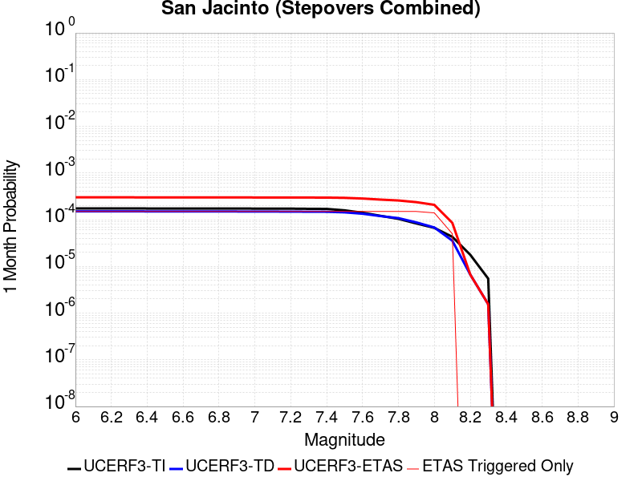 |  |  |

| Magnitude | 1 wk TI Prob | 1 wk TD Prob | 1 wk ETAS Prob | 1 wk ETAS/TD Gain | 1 wk ETAS Triggered Only | 1 mo TI Prob | 1 mo TD Prob | 1 mo ETAS Prob | 1 mo ETAS/TD Gain | 1 mo ETAS Triggered Only | 1 yr TI Prob | 1 yr TD Prob | 1 yr ETAS Prob | 1 yr ETAS/TD Gain | 1 yr ETAS Triggered Only | 10 yr TI Prob | 10 yr TD Prob | 10 yr ETAS Prob | 10 yr ETAS/TD Gain | 10 yr ETAS Triggered Only |
|-----|-----|-----|-----|-----|-----|-----|-----|-----|-----|-----|-----|-----|-----|-----|-----|-----|-----|-----|-----|-----|
| 6.0 | 4.0667746E-5 | 3.5272755E-5 | 2.2193285E-4 | 6.2919054 | 1.8666667E-4 | 1.742787E-4 | 1.5116022E-4 | 3.644613E-4 | 2.4110928 | 2.1333333E-4 | 0.0021197782 | 0.0018388226 | 0.0021316165 | 1.159229 | 2.9333335E-4 | 0.020996714 | 0.018986892 | 0.019353136 | 1.0192894 | 3.7333334E-4 |
| 6.1 | 4.0667746E-5 | 3.5272755E-5 | 2.2193285E-4 | 6.2919054 | 1.8666667E-4 | 1.742787E-4 | 1.5116022E-4 | 3.644613E-4 | 2.4110928 | 2.1333333E-4 | 0.0021197782 | 0.0018388226 | 0.0021316165 | 1.159229 | 2.9333335E-4 | 0.020996714 | 0.018986892 | 0.019353136 | 1.0192894 | 3.7333334E-4 |
| 6.2 | 4.0667746E-5 | 3.5272755E-5 | 2.2193285E-4 | 6.2919054 | 1.8666667E-4 | 1.742787E-4 | 1.5116022E-4 | 3.644613E-4 | 2.4110928 | 2.1333333E-4 | 0.0021197782 | 0.0018388226 | 0.0021316165 | 1.159229 | 2.9333335E-4 | 0.020996714 | 0.018986892 | 0.019353136 | 1.0192894 | 3.7333334E-4 |
| 6.3 | 4.0667746E-5 | 3.5272755E-5 | 2.2193285E-4 | 6.2919054 | 1.8666667E-4 | 1.742787E-4 | 1.5116022E-4 | 3.644613E-4 | 2.4110928 | 2.1333333E-4 | 0.0021197782 | 0.0018388226 | 0.0021316165 | 1.159229 | 2.9333335E-4 | 0.020996714 | 0.018986892 | 0.019353136 | 1.0192894 | 3.7333334E-4 |
| 6.4 | 4.0577226E-5 | 3.5144654E-5 | 2.2180476E-4 | 6.3111944 | 1.8666667E-4 | 1.738908E-4 | 1.5061127E-4 | 3.6391246E-4 | 2.4162366 | 2.1333333E-4 | 0.0021150648 | 0.0018321523 | 0.0021249482 | 1.1598098 | 2.9333335E-4 | 0.020950472 | 0.018921461 | 0.01928773 | 1.0193573 | 3.7333334E-4 |
| 6.5 | 4.0577226E-5 | 3.5144654E-5 | 2.2180476E-4 | 6.3111944 | 1.8666667E-4 | 1.738908E-4 | 1.5061127E-4 | 3.6391246E-4 | 2.4162366 | 2.1333333E-4 | 0.0021150648 | 0.0018321523 | 0.0021249482 | 1.1598098 | 2.9333335E-4 | 0.020950472 | 0.018921461 | 0.01928773 | 1.0193573 | 3.7333334E-4 |
| 6.6 | 4.053861E-5 | 3.509E-5 | 2.2175012E-4 | 6.3194675 | 1.8666667E-4 | 1.7372532E-4 | 1.5037706E-4 | 3.6367832E-4 | 2.4184427 | 2.1333333E-4 | 0.0021130538 | 0.0018293057 | 0.0021221023 | 1.160059 | 2.9333335E-4 | 0.020930743 | 0.018893538 | 0.019259818 | 1.0193865 | 3.7333334E-4 |
| 6.7 | 4.0516545E-5 | 3.5059067E-5 | 2.217192E-4 | 6.324161 | 1.8666667E-4 | 1.7363077E-4 | 1.5024451E-4 | 3.6354578E-4 | 2.4196942 | 2.1333333E-4 | 0.002111905 | 0.001827695 | 0.0021204923 | 1.1602002 | 2.9333335E-4 | 0.020919468 | 0.018877735 | 0.01924402 | 1.0194031 | 3.7333334E-4 |
| 6.8 | 4.049434E-5 | 3.5030633E-5 | 2.2169076E-4 | 6.328483 | 1.8666667E-4 | 1.7353562E-4 | 1.5012265E-4 | 3.6342395E-4 | 2.420847 | 2.1333333E-4 | 0.0021107488 | 0.0018262138 | 0.0021190115 | 1.1603304 | 2.9333335E-4 | 0.020908125 | 0.018863149 | 0.01922944 | 1.0194184 | 3.7333334E-4 |
| 6.9 | 4.046386E-5 | 3.499319E-5 | 2.2165333E-4 | 6.334184 | 1.8666667E-4 | 1.73405E-4 | 1.4996222E-4 | 3.6326356E-4 | 2.422367 | 2.1333333E-4 | 0.0021091616 | 0.0018242638 | 0.002117062 | 1.1605021 | 2.9333335E-4 | 0.020892553 | 0.01884392 | 0.01921022 | 1.0194385 | 3.7333334E-4 |
| 7.0 | 4.036382E-5 | 3.487376E-5 | 2.2153392E-4 | 6.352453 | 1.8666667E-4 | 1.7297632E-4 | 1.4945042E-4 | 3.6275186E-4 | 2.427239 | 2.1333333E-4 | 0.0021039525 | 0.0018180435 | 0.0021108435 | 1.1610522 | 2.9333335E-4 | 0.02084144 | 0.018782536 | 0.019148856 | 1.0195032 | 3.7333334E-4 |
| 7.1 | 4.0343282E-5 | 3.4852223E-5 | 2.2151238E-4 | 6.355761 | 1.8666667E-4 | 1.7288832E-4 | 1.4935812E-4 | 3.626596E-4 | 2.4281209 | 2.1333333E-4 | 0.002102883 | 0.0018169218 | 0.0021097222 | 1.1611519 | 2.9333335E-4 | 0.020830948 | 0.018771412 | 0.019137738 | 1.019515 | 3.7333334E-4 |
| 7.2 | 4.0257353E-5 | 3.4756722E-5 | 2.214169E-4 | 6.370477 | 1.8666667E-4 | 1.725201E-4 | 1.489489E-4 | 3.6225046E-4 | 2.4320452 | 2.1333333E-4 | 0.0020984085 | 0.0018119477 | 0.0021047494 | 1.1615951 | 2.9333335E-4 | 0.020787042 | 0.018722152 | 0.019088496 | 1.0195674 | 3.7333334E-4 |
| 7.3 | 3.9940667E-5 | 3.4584376E-5 | 2.2124458E-4 | 6.3972406 | 1.8666667E-4 | 1.7116306E-4 | 1.4821035E-4 | 3.6151207E-4 | 2.4391823 | 2.1333333E-4 | 0.0020819185 | 0.0018029709 | 0.0020691568 | 1.1476374 | 2.6666667E-4 | 0.020625217 | 0.018630784 | 0.018970992 | 1.0182605 | 3.4666667E-4 |
| 7.4 | 3.9721202E-5 | 3.4469766E-5 | 2.2113E-4 | 6.415187 | 1.8666667E-4 | 1.7022261E-4 | 1.4771923E-4 | 3.6102106E-4 | 2.4439678 | 2.1333333E-4 | 0.0020704903 | 0.0017970012 | 0.0020631887 | 1.1481287 | 2.6666667E-4 | 0.020513052 | 0.018569905 | 0.018910136 | 1.0183215 | 3.4666667E-4 |
| 7.5 | 3.7036873E-5 | 3.3537188E-5 | 2.2019759E-4 | 6.5657744 | 1.8666667E-4 | 1.5871979E-4 | 1.437229E-4 | 3.5702556E-4 | 2.4841244 | 2.1333333E-4 | 0.0019307006 | 0.0017484248 | 0.0020146251 | 1.1522516 | 2.6666667E-4 | 0.019140124 | 0.018071463 | 0.018411865 | 1.0188364 | 3.4666667E-4 |
| 7.6 | 3.2940967E-5 | 3.1317984E-5 | 2.1797881E-4 | 6.96018 | 1.8666667E-4 | 1.4116794E-4 | 1.3421304E-4 | 3.4751775E-4 | 2.5892992 | 2.1333333E-4 | 0.0017173645 | 0.0016328214 | 0.0018990526 | 1.1630498 | 2.6666667E-4 | 0.01704153 | 0.016904354 | 0.01724516 | 1.0201609 | 3.4666667E-4 |
| 7.7 | 2.8236149E-5 | 2.7883889E-5 | 2.1454535E-4 | 7.6942406 | 1.8666667E-4 | 1.2100645E-4 | 1.19496915E-4 | 3.3280475E-4 | 2.785049 | 2.1333333E-4 | 0.0014722579 | 0.001453905 | 0.001720184 | 1.1831474 | 2.6666667E-4 | 0.014625421 | 0.015115095 | 0.015456522 | 1.0225885 | 3.4666667E-4 |
| 7.8 | 2.4329287E-5 | 2.5207537E-5 | 2.118695E-4 | 8.405006 | 1.8666667E-4 | 1.042642E-4 | 1.0802783E-4 | 3.2133813E-4 | 2.9745865 | 2.1333333E-4 | 0.0012686774 | 0.0013144462 | 0.0015541307 | 1.1823465 | 2.4E-4 | 0.012614589 | 0.013712396 | 0.014028008 | 1.0230166 | 3.2E-4 |
| 7.9 | 1.9370926E-5 | 2.0421452E-5 | 2.070843E-4 | 10.140528 | 1.8666667E-4 | 8.301561E-5 | 8.7517576E-5 | 3.0083224E-4 | 3.4373922 | 2.1333333E-4 | 0.0010102465 | 0.0010650064 | 0.0013047508 | 1.2251108 | 2.4E-4 | 0.0100566605 | 0.011199483 | 0.011515899 | 1.0282527 | 3.2E-4 |
| 8.0 | 1.5583017E-5 | 1.588647E-5 | 2.0255017E-4 | 12.749855 | 1.8666667E-4 | 6.6782646E-5 | 6.808309E-5 | 2.814019E-4 | 4.1332126 | 2.1333333E-4 | 8.127754E-4 | 8.285971E-4 | 0.0010683982 | 1.2894062 | 2.4E-4 | 0.008098091 | 0.008781809 | 0.009072567 | 1.0331091 | 2.9333335E-4 |
| 8.1 | 1.0024873E-5 | 8.292404E-6 | 6.1625295E-5 | 7.4315352 | 5.3333333E-5 | 4.2963035E-5 | 3.5538393E-5 | 1.1553555E-4 | 3.2510066 | 8.0E-5 | 5.229494E-4 | 4.3259456E-4 | 5.1255996E-4 | 1.1848507 | 8.0E-5 | 0.0052172043 | 0.0046534105 | 0.004759581 | 1.0228156 | 1.0666667E-4 |
| 8.2 | 4.142796E-6 | 1.5610041E-6 | 1.5610041E-6 | 1.0 | 0.0 | 1.775472E-5 | 6.69E-6 | 6.69E-6 | 1.0 | 0.0 | 2.1614227E-4 | 8.144774E-5 | 8.144774E-5 | 1.0 | 0.0 | 0.0021593217 | 9.454649E-4 | 9.454649E-4 | 1.0 | 0.0 |
| 8.3 | 1.2750878E-6 | 3.612133E-7 | 3.612133E-7 | 1.0 | 0.0 | 5.4646503E-6 | 1.548056E-6 | 1.548056E-6 | 1.0 | 0.0 | 6.653009E-5 | 1.8847424E-5 | 1.8847424E-5 | 1.0 | 0.0 | 6.6510175E-4 | 2.2734253E-4 | 2.2734253E-4 | 1.0 | 0.0 |

## Brawley (Seismic Zone) alt 1
*[(top)](#table-of-contents)*

| 1 Week | 1 Month | 1 Year | 10 Year |
|-----|-----|-----|-----|
|  |  |  |  |

| Magnitude | 1 wk TI Prob | 1 wk TD Prob | 1 wk ETAS Prob | 1 wk ETAS/TD Gain | 1 wk ETAS Triggered Only | 1 mo TI Prob | 1 mo TD Prob | 1 mo ETAS Prob | 1 mo ETAS/TD Gain | 1 mo ETAS Triggered Only | 1 yr TI Prob | 1 yr TD Prob | 1 yr ETAS Prob | 1 yr ETAS/TD Gain | 1 yr ETAS Triggered Only | 10 yr TI Prob | 10 yr TD Prob | 10 yr ETAS Prob | 10 yr ETAS/TD Gain | 10 yr ETAS Triggered Only |
|-----|-----|-----|-----|-----|-----|-----|-----|-----|-----|-----|-----|-----|-----|-----|-----|-----|-----|-----|-----|-----|
| 6.0 | 2.2521618E-4 | 4.7632487E-4 | 6.629026E-4 | 1.3917028 | 1.8666667E-4 | 9.6485513E-4 | 0.0020398323 | 0.0022261182 | 1.0913241 | 1.8666667E-4 | 0.011683988 | 0.024546238 | 0.024806358 | 1.0105972 | 2.6666667E-4 | 0.11088423 | 0.21350002 | 0.21379365 | 1.0013753 | 3.7333334E-4 |
| 6.1 | 2.2521618E-4 | 4.7632487E-4 | 6.629026E-4 | 1.3917028 | 1.8666667E-4 | 9.6485513E-4 | 0.0020398323 | 0.0022261182 | 1.0913241 | 1.8666667E-4 | 0.011683988 | 0.024546238 | 0.024806358 | 1.0105972 | 2.6666667E-4 | 0.11088423 | 0.21350002 | 0.21379365 | 1.0013753 | 3.7333334E-4 |
| 6.2 | 2.198148E-4 | 4.6717093E-4 | 6.537504E-4 | 1.3993815 | 1.8666667E-4 | 9.417233E-4 | 0.0020006616 | 0.0021869547 | 1.0931158 | 1.8666667E-4 | 0.011405343 | 0.024080504 | 0.024340749 | 1.0108073 | 2.6666667E-4 | 0.10837428 | 0.20993657 | 0.21023153 | 1.001405 | 3.7333334E-4 |
| 6.3 | 2.1704129E-4 | 4.615278E-4 | 6.481083E-4 | 1.4042672 | 1.8666667E-4 | 9.298453E-4 | 0.0019765133 | 0.002162811 | 1.0942557 | 1.8666667E-4 | 0.011262234 | 0.02379366 | 0.024053983 | 1.0109408 | 2.6666667E-4 | 0.107082725 | 0.20782755 | 0.2081233 | 1.001423 | 3.7333334E-4 |
| 6.4 | 1.876142E-4 | 4.00449E-4 | 5.870409E-4 | 1.4659567 | 1.8666667E-4 | 8.038131E-4 | 0.0017150956 | 0.0019014421 | 1.1086508 | 1.8666667E-4 | 0.00974259 | 0.020680401 | 0.020941554 | 1.012628 | 2.6666667E-4 | 0.093263686 | 0.18457815 | 0.18488258 | 1.0016493 | 3.7333334E-4 |
| 6.5 | 1.7390939E-4 | 3.7477075E-4 | 5.613675E-4 | 1.4978956 | 1.8666667E-4 | 7.45113E-4 | 0.0016051838 | 0.0017915509 | 1.1161032 | 1.8666667E-4 | 0.009034078 | 0.019368723 | 0.019630225 | 1.0135013 | 2.6666667E-4 | 0.086755216 | 0.17440031 | 0.17468652 | 1.0016412 | 3.4666667E-4 |
| 6.6 | 1.591791E-4 | 3.4891962E-4 | 5.3552113E-4 | 1.534798 | 1.8666667E-4 | 6.8201777E-4 | 0.0014945229 | 0.0016809106 | 1.1247139 | 1.8666667E-4 | 0.008271996 | 0.018045569 | 0.018307423 | 1.0145108 | 2.6666667E-4 | 0.07970774 | 0.16380852 | 0.16409841 | 1.0017697 | 3.4666667E-4 |
| 6.7 | 1.4268003E-4 | 3.20582E-4 | 5.0718884E-4 | 1.5820876 | 1.8666667E-4 | 6.1134255E-4 | 0.0013732077 | 0.001559618 | 1.1357481 | 1.8666667E-4 | 0.007417723 | 0.016592601 | 0.016854845 | 1.0158048 | 2.6666667E-4 | 0.07174956 | 0.15193306 | 0.15222706 | 1.001935 | 3.4666667E-4 |
| 6.8 | 1.239713E-4 | 2.9053655E-4 | 4.77149E-4 | 1.6423028 | 1.8666667E-4 | 5.3119735E-4 | 0.0012445687 | 0.001431003 | 1.1497984 | 1.8666667E-4 | 0.0064481674 | 0.015048777 | 0.015311431 | 1.0174534 | 2.6666667E-4 | 0.06264243 | 0.13837762 | 0.13867632 | 1.0021585 | 3.4666667E-4 |
| 6.9 | 1.0180238E-4 | 2.625439E-4 | 4.4916157E-4 | 1.7108055 | 1.8666667E-4 | 4.3622297E-4 | 0.0011247073 | 0.001311164 | 1.1657825 | 1.8666667E-4 | 0.005298089 | 0.013608336 | 0.013871374 | 1.0193292 | 2.6666667E-4 | 0.05173543 | 0.124961674 | 0.12526502 | 1.0024275 | 3.4666667E-4 |
| 7.0 | 7.6619996E-5 | 2.23993E-4 | 4.1061785E-4 | 1.8331727 | 1.8666667E-4 | 3.283301E-4 | 9.5962E-4 | 0.0011461076 | 1.1943347 | 1.8666667E-4 | 0.0039900932 | 0.011621496 | 0.011885063 | 1.0226793 | 2.6666667E-4 | 0.039192066 | 0.107266866 | 0.10757635 | 1.0028851 | 3.4666667E-4 |
| 7.1 | 7.5127435E-5 | 2.2082464E-4 | 4.0745008E-4 | 1.8451296 | 1.8666667E-4 | 3.2193496E-4 | 9.4605127E-4 | 0.0011325413 | 1.1971247 | 1.8666667E-4 | 0.0039125155 | 0.011458045 | 0.011721656 | 1.0230067 | 2.6666667E-4 | 0.038443442 | 0.10583085 | 0.10614083 | 1.002929 | 3.4666667E-4 |
| 7.2 | 6.788582E-5 | 2.0210193E-4 | 3.8873087E-4 | 1.9234396 | 1.8666667E-4 | 2.9090676E-4 | 8.6586666E-4 | 0.0010523717 | 1.215397 | 1.8666667E-4 | 0.0035360386 | 0.0104916105 | 0.010755479 | 1.0251504 | 2.6666667E-4 | 0.034803 | 0.09750131 | 0.09781418 | 1.0032089 | 3.4666667E-4 |
| 7.3 | 6.399602E-5 | 1.8841137E-4 | 3.7504287E-4 | 1.9905533 | 1.8666667E-4 | 2.7423984E-4 | 8.072303E-4 | 9.937463E-4 | 1.2310567 | 1.8666667E-4 | 0.0033337586 | 0.009784332 | 0.0100483885 | 1.0269878 | 2.6666667E-4 | 0.03284188 | 0.09139617 | 0.09171115 | 1.0034463 | 3.4666667E-4 |
| 7.4 | 4.506759E-5 | 1.2529209E-4 | 3.1193538E-4 | 2.4896653 | 1.8666667E-4 | 1.9313251E-4 | 5.368565E-4 | 7.234229E-4 | 1.3475164 | 1.8666667E-4 | 0.0023488526 | 0.0065168133 | 0.0067287567 | 1.0325226 | 2.1333333E-4 | 0.023241805 | 0.062363707 | 0.062638745 | 1.0044103 | 2.9333335E-4 |
| 7.5 | 3.43289E-5 | 9.33541E-5 | 2.8000335E-4 | 2.9993684 | 1.8666667E-4 | 1.4711556E-4 | 4.00028E-4 | 5.8661995E-4 | 1.4664474 | 1.8666667E-4 | 0.0017896603 | 0.0048595266 | 0.005071823 | 1.0436867 | 2.1333333E-4 | 0.01775316 | 0.04705519 | 0.04733472 | 1.0059404 | 2.9333335E-4 |
| 7.6 | 2.5980507E-5 | 7.053101E-5 | 2.0385494E-4 | 2.890288 | 1.3333333E-4 | 1.1134028E-4 | 3.0224086E-4 | 4.355339E-4 | 1.441016 | 1.3333333E-4 | 0.001354725 | 0.003673598 | 0.00383301 | 1.0433941 | 1.6E-4 | 0.013464959 | 0.035840835 | 0.03604652 | 1.0057389 | 2.1333333E-4 |
| 7.7 | 1.7292105E-5 | 4.9407296E-5 | 1.2940334E-4 | 2.619114 | 8.0E-5 | 7.4106916E-5 | 2.117284E-4 | 2.9171148E-4 | 1.3777626 | 8.0E-5 | 9.018782E-4 | 0.0025747516 | 0.0026811436 | 1.0413213 | 1.0666667E-4 | 0.008982267 | 0.025290398 | 0.025420358 | 1.0051388 | 1.3333333E-4 |
| 7.8 | 1.2927471E-5 | 3.9693266E-5 | 9.3024486E-5 | 2.3435833 | 5.3333333E-5 | 5.5402274E-5 | 1.7010293E-4 | 2.234272E-4 | 1.3134823 | 5.3333333E-5 | 6.743139E-4 | 0.0020690386 | 0.0021488732 | 1.0385853 | 8.0E-5 | 0.0067227143 | 0.020431727 | 0.020536216 | 1.005114 | 1.0666667E-4 |
| 7.9 | 1.0200774E-5 | 2.874569E-5 | 8.207749E-5 | 2.8552973 | 5.3333333E-5 | 4.371687E-5 | 1.2319001E-4 | 1.7651677E-4 | 1.4328822 | 5.3333333E-5 | 5.321229E-4 | 0.0014988075 | 0.0015786876 | 1.0532957 | 8.0E-5 | 0.005308505 | 0.014991644 | 0.015096711 | 1.0070084 | 1.0666667E-4 |
| 8.0 | 8.650396E-6 | 2.3277367E-5 | 4.9943414E-5 | 2.1455781 | 2.6666667E-5 | 3.70726E-5 | 9.975634E-5 | 1.2642035E-4 | 1.2672913 | 2.6666667E-5 | 4.5126543E-4 | 0.0012138576 | 0.0012671262 | 1.0438837 | 5.3333333E-5 | 0.0045035016 | 0.012211097 | 0.01229012 | 1.0064714 | 8.0E-5 |
| 8.1 | 3.9368224E-6 | 7.3279825E-6 | 7.3279825E-6 | 1.0 | 0.0 | 1.6871985E-5 | 3.140526E-5 | 3.140526E-5 | 1.0 | 0.0 | 2.0539707E-4 | 3.8229208E-4 | 3.8229208E-4 | 1.0 | 0.0 | 0.0020520731 | 0.004001185 | 0.0040277448 | 1.006638 | 2.6666667E-5 |
| 8.2 | 1.7101195E-6 | 2.217876E-6 | 2.217876E-6 | 1.0 | 0.0 | 7.329063E-6 | 9.505149E-6 | 9.505149E-6 | 1.0 | 0.0 | 8.922769E-5 | 1.1571907E-4 | 1.1571907E-4 | 1.0 | 0.0 | 8.9191867E-4 | 0.0012666774 | 0.0012666774 | 1.0 | 0.0 |
| 8.3 | 3.0346666E-8 | 1.721586E-8 | 1.721586E-8 | 1.0 | 0.0 | 1.3005713E-7 | 7.378226E-8 | 7.378226E-8 | 1.0 | 0.0 | 1.5834444E-6 | 8.9829894E-7 | 8.9829894E-7 | 1.0 | 0.0 | 1.5834332E-5 | 9.367729E-6 | 9.367729E-6 | 1.0 | 0.0 |

## Imperial
*[(top)](#table-of-contents)*

| 1 Week | 1 Month | 1 Year | 10 Year |
|-----|-----|-----|-----|
|  |  |  | 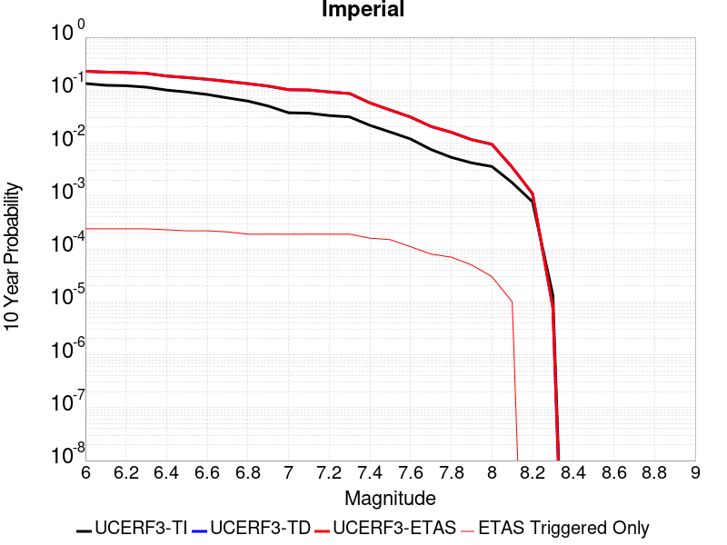 |

| Magnitude | 1 wk TI Prob | 1 wk TD Prob | 1 wk ETAS Prob | 1 wk ETAS/TD Gain | 1 wk ETAS Triggered Only | 1 mo TI Prob | 1 mo TD Prob | 1 mo ETAS Prob | 1 mo ETAS/TD Gain | 1 mo ETAS Triggered Only | 1 yr TI Prob | 1 yr TD Prob | 1 yr ETAS Prob | 1 yr ETAS/TD Gain | 1 yr ETAS Triggered Only | 10 yr TI Prob | 10 yr TD Prob | 10 yr ETAS Prob | 10 yr ETAS/TD Gain | 10 yr ETAS Triggered Only |
|-----|-----|-----|-----|-----|-----|-----|-----|-----|-----|-----|-----|-----|-----|-----|-----|-----|-----|-----|-----|-----|
| 6.0 | 2.7496446E-4 | 5.0552754E-4 | 6.9209986E-4 | 1.3690646 | 1.8666667E-4 | 0.0011778869 | 0.002164787 | 0.0023510496 | 1.086042 | 1.8666667E-4 | 0.0142467655 | 0.026038699 | 0.02629842 | 1.0099745 | 2.6666667E-4 | 0.13367249 | 0.2280438 | 0.22833198 | 1.0012637 | 3.7333334E-4 |
| 6.1 | 2.5356023E-4 | 4.8656776E-4 | 6.731436E-4 | 1.3834529 | 1.8666667E-4 | 0.001086234 | 0.0020836622 | 0.00226994 | 1.0893992 | 1.8666667E-4 | 0.013144928 | 0.025071215 | 0.025331195 | 1.0103697 | 2.6666667E-4 | 0.123940155 | 0.21947981 | 0.2197712 | 1.0013276 | 3.7333334E-4 |
| 6.2 | 2.4820742E-4 | 4.7752203E-4 | 6.640995E-4 | 1.3907202 | 1.8666667E-4 | 0.0010633124 | 0.0020449557 | 0.0022312407 | 1.0910949 | 1.8666667E-4 | 0.01286919 | 0.024611235 | 0.024871338 | 1.0105685 | 2.6666667E-4 | 0.12148927 | 0.21598552 | 0.21627823 | 1.0013552 | 3.7333334E-4 |
| 6.3 | 2.3205351E-4 | 4.5890483E-4 | 6.454858E-4 | 1.4065789 | 1.8666667E-4 | 9.94136E-4 | 0.0019652895 | 0.0021515891 | 1.0947951 | 1.8666667E-4 | 0.012036599 | 0.02366133 | 0.023921687 | 1.0110035 | 2.6666667E-4 | 0.11405133 | 0.20793462 | 0.20823032 | 1.001422 | 3.7333334E-4 |
| 6.4 | 2.0304754E-4 | 3.987652E-4 | 5.853574E-4 | 1.4679251 | 1.8666667E-4 | 8.6991355E-4 | 0.0017078889 | 0.0018942368 | 1.10911 | 1.8666667E-4 | 0.010539869 | 0.020595672 | 0.020856846 | 1.012681 | 2.6666667E-4 | 0.100537635 | 0.1850669 | 0.18537113 | 1.0016439 | 3.7333334E-4 |
| 6.5 | 1.854992E-4 | 3.6988858E-4 | 5.564862E-4 | 1.5044698 | 1.8666667E-4 | 7.9475436E-4 | 0.0015842861 | 0.001770657 | 1.1176372 | 1.8666667E-4 | 0.009633281 | 0.01911948 | 0.01938105 | 1.0136807 | 2.6666667E-4 | 0.0922623 | 0.173298 | 0.1735846 | 1.0016538 | 3.4666667E-4 |
| 6.6 | 1.6586106E-4 | 3.403506E-4 | 5.269538E-4 | 1.5482674 | 1.8666667E-4 | 7.106394E-4 | 0.0014578402 | 0.0016442348 | 1.1278566 | 1.8666667E-4 | 0.008617763 | 0.01760642 | 0.017868392 | 1.0148793 | 2.6666667E-4 | 0.08291132 | 0.16077545 | 0.16106638 | 1.0018096 | 3.4666667E-4 |
| 6.7 | 1.4224656E-4 | 3.076692E-4 | 4.9427844E-4 | 1.6065257 | 1.8666667E-4 | 6.094856E-4 | 0.001317924 | 0.0015043447 | 1.1414502 | 1.8666667E-4 | 0.0073952693 | 0.015929576 | 0.016191995 | 1.0164737 | 2.6666667E-4 | 0.07153955 | 0.14648417 | 0.14678004 | 1.0020199 | 3.4666667E-4 |
| 6.8 | 1.2317259E-4 | 2.779122E-4 | 4.6452697E-4 | 1.6714883 | 1.8666667E-4 | 5.2777573E-4 | 0.0011905148 | 0.0013769591 | 1.1566082 | 1.8666667E-4 | 0.0064067547 | 0.0143995695 | 0.014662396 | 1.0182524 | 2.6666667E-4 | 0.06225166 | 0.13293684 | 0.1332374 | 1.002261 | 3.4666667E-4 |
| 6.9 | 9.859898E-5 | 2.5014306E-4 | 4.3676302E-4 | 1.746053 | 1.8666667E-4 | 4.2249862E-4 | 0.0010716055 | 0.0012580721 | 1.1740068 | 1.8666667E-4 | 0.0051317946 | 0.012969712 | 0.013232919 | 1.0202941 | 2.6666667E-4 | 0.05014893 | 0.11940631 | 0.119711585 | 1.0025566 | 3.4666667E-4 |
| 7.0 | 7.3191884E-5 | 2.1266776E-4 | 3.9929472E-4 | 1.8775518 | 1.8666667E-4 | 3.136418E-4 | 9.1111806E-4 | 0.0010976146 | 1.2046899 | 1.8666667E-4 | 0.003811904 | 0.011037128 | 0.011300851 | 1.0238942 | 2.6666667E-4 | 0.037471764 | 0.10206493 | 0.10237621 | 1.0030499 | 3.4666667E-4 |
| 7.1 | 7.1760296E-5 | 2.0968143E-4 | 3.9630895E-4 | 1.8900528 | 1.8666667E-4 | 3.0750787E-4 | 8.983284E-4 | 0.0010848274 | 1.2076067 | 1.8666667E-4 | 0.003737482 | 0.010882978 | 0.011146743 | 1.0242364 | 2.6666667E-4 | 0.03675245 | 0.10070146 | 0.10101321 | 1.0030959 | 3.4666667E-4 |
| 7.2 | 6.46614E-5 | 1.9136685E-4 | 3.779978E-4 | 1.9752522 | 1.8666667E-4 | 2.7709085E-4 | 8.1988896E-4 | 0.0010064025 | 1.2274865 | 1.8666667E-4 | 0.0033683628 | 0.0099370815 | 0.010201098 | 1.0265689 | 2.6666667E-4 | 0.033177625 | 0.09250898 | 0.09282357 | 1.0034007 | 3.4666667E-4 |
| 7.3 | 6.088115E-5 | 1.78084E-4 | 3.6471742E-4 | 2.048008 | 1.8666667E-4 | 2.6089314E-4 | 7.6299673E-4 | 9.4952097E-4 | 1.2444627 | 1.8666667E-4 | 0.0031717476 | 0.009250494 | 0.009514693 | 1.0285606 | 2.6666667E-4 | 0.031268585 | 0.08655989 | 0.08687656 | 1.0036583 | 3.4666667E-4 |
| 7.4 | 4.199346E-5 | 1.1510366E-4 | 3.0174883E-4 | 2.6215398 | 1.8666667E-4 | 1.7995955E-4 | 4.9320905E-4 | 6.7978364E-4 | 1.3782871 | 1.8666667E-4 | 0.0021888057 | 0.0059884563 | 0.006200512 | 1.0354108 | 2.1333333E-4 | 0.02167372 | 0.057439793 | 0.05771628 | 1.0048134 | 2.9333335E-4 |
| 7.5 | 3.130448E-5 | 8.33328E-5 | 2.6998392E-4 | 3.2398276 | 1.8666667E-4 | 1.3415517E-4 | 3.57092E-4 | 5.4369203E-4 | 1.5225544 | 1.8666667E-4 | 0.0016321153 | 0.004338988 | 0.004551396 | 1.0489533 | 2.1333333E-4 | 0.016201803 | 0.04213201 | 0.04241298 | 1.0066689 | 2.9333335E-4 |
| 7.6 | 2.3074248E-5 | 6.0844646E-5 | 1.9416987E-4 | 3.1912398 | 1.3333333E-4 | 9.888588E-5 | 2.6073685E-4 | 3.9403542E-4 | 1.511238 | 1.3333333E-4 | 0.0012032706 | 0.0031698733 | 0.0033293662 | 1.0503153 | 1.6E-4 | 0.011967761 | 0.031026395 | 0.03123311 | 1.0066625 | 2.1333333E-4 |
| 7.7 | 1.45864815E-5 | 4.0124698E-5 | 1.2012149E-4 | 2.9937043 | 8.0E-5 | 6.2511994E-5 | 1.7195169E-4 | 2.5193795E-4 | 1.4651669 | 8.0E-5 | 7.608177E-4 | 0.0020915072 | 0.0021979506 | 1.0508932 | 1.0666667E-4 | 0.007582182 | 0.020627763 | 0.020758346 | 1.0063305 | 1.3333333E-4 |
| 7.8 | 1.0352979E-5 | 3.0960902E-5 | 8.429258E-5 | 2.7225494 | 5.3333333E-5 | 4.4369157E-5 | 1.3268284E-4 | 1.860091E-4 | 1.4019077 | 5.3333333E-5 | 5.400606E-4 | 0.0016142189 | 0.0016940898 | 1.0494796 | 8.0E-5 | 0.0053875 | 0.016016833 | 0.016121792 | 1.0065529 | 1.0666667E-4 |
| 7.9 | 8.137906E-6 | 2.2149103E-5 | 7.548126E-5 | 3.4078698 | 5.3333333E-5 | 3.4876273E-5 | 9.492128E-5 | 1.4824954E-4 | 1.5618157 | 5.3333333E-5 | 4.2453592E-4 | 0.0011550548 | 0.0012349624 | 1.0691807 | 8.0E-5 | 0.004237258 | 0.011617903 | 0.01172333 | 1.0090746 | 1.0666667E-4 |
| 8.0 | 6.93792E-6 | 1.8008766E-5 | 4.467495E-5 | 2.4807336 | 2.6666667E-5 | 2.9733603E-5 | 7.717814E-5 | 1.0384275E-4 | 1.3454943 | 2.6666667E-5 | 3.6194647E-4 | 9.3923963E-4 | 9.925228E-4 | 1.0567302 | 5.3333333E-5 | 0.0036135751 | 0.00950155 | 0.00958079 | 1.0083396 | 8.0E-5 |
| 8.1 | 3.4286315E-6 | 6.379872E-6 | 6.379872E-6 | 1.0 | 0.0 | 1.4694053E-5 | 2.7342023E-5 | 2.7342023E-5 | 1.0 | 0.0 | 1.7888541E-4 | 3.328384E-4 | 3.328384E-4 | 1.0 | 0.0 | 0.0017874148 | 0.003486031 | 0.0035126046 | 1.007623 | 2.6666667E-5 |
| 8.2 | 1.4906886E-6 | 1.9366646E-6 | 1.9366646E-6 | 1.0 | 0.0 | 6.3886496E-6 | 8.299965E-6 | 8.299965E-6 | 1.0 | 0.0 | 7.7779034E-5 | 1.0104742E-4 | 1.0104742E-4 | 1.0 | 0.0 | 7.775182E-4 | 0.0011075331 | 0.0011075331 | 1.0 | 0.0 |
| 8.3 | 2.5758007E-8 | 1.4500102E-8 | 1.4500102E-8 | 1.0 | 0.0 | 1.10391454E-7 | 6.214329E-8 | 6.214329E-8 | 1.0 | 0.0 | 1.3440151E-6 | 7.565946E-7 | 7.565946E-7 | 1.0 | 0.0 | 1.344007E-5 | 7.887763E-6 | 7.887763E-6 | 1.0 | 0.0 |

## Scodie Lineament
*[(top)](#table-of-contents)*

| 1 Week | 1 Month | 1 Year | 10 Year |
|-----|-----|-----|-----|
|  |  |  |  |

| Magnitude | 1 wk TI Prob | 1 wk TD Prob | 1 wk ETAS Prob | 1 wk ETAS/TD Gain | 1 wk ETAS Triggered Only | 1 mo TI Prob | 1 mo TD Prob | 1 mo ETAS Prob | 1 mo ETAS/TD Gain | 1 mo ETAS Triggered Only | 1 yr TI Prob | 1 yr TD Prob | 1 yr ETAS Prob | 1 yr ETAS/TD Gain | 1 yr ETAS Triggered Only | 10 yr TI Prob | 10 yr TD Prob | 10 yr ETAS Prob | 10 yr ETAS/TD Gain | 10 yr ETAS Triggered Only |
|-----|-----|-----|-----|-----|-----|-----|-----|-----|-----|-----|-----|-----|-----|-----|-----|-----|-----|-----|-----|-----|
| 6.0 | 3.2919327E-6 | 3.0133422E-6 | 2.696792E-4 | 89.49505 | 2.6666667E-4 | 1.4108206E-5 | 1.2914278E-5 | 3.0624383E-4 | 23.713585 | 2.9333335E-4 | 1.7175387E-4 | 1.5722317E-4 | 5.038353E-4 | 3.2045872 | 3.4666667E-4 | 0.0017162118 | 0.0015714309 | 0.0019441776 | 1.237202 | 3.7333334E-4 |
| 6.1 | 1.8663811E-6 | 1.5490499E-6 | 8.1548926E-5 | 52.644478 | 8.0E-5 | 7.998751E-6 | 6.6387715E-6 | 1.13304726E-4 | 17.067123 | 1.0666667E-4 | 9.738045E-5 | 8.082454E-5 | 1.8748258E-4 | 2.3196244 | 1.0666667E-4 | 9.7337784E-4 | 8.080003E-4 | 9.145807E-4 | 1.1319065 | 1.0666667E-4 |
| 6.2 | 1.8663811E-6 | 1.5490499E-6 | 8.1548926E-5 | 52.644478 | 8.0E-5 | 7.998751E-6 | 6.6387715E-6 | 1.13304726E-4 | 17.067123 | 1.0666667E-4 | 9.738045E-5 | 8.082454E-5 | 1.8748258E-4 | 2.3196244 | 1.0666667E-4 | 9.7337784E-4 | 8.080003E-4 | 9.145807E-4 | 1.1319065 | 1.0666667E-4 |
| 6.3 | 1.8663811E-6 | 1.5490499E-6 | 8.1548926E-5 | 52.644478 | 8.0E-5 | 7.998751E-6 | 6.6387715E-6 | 1.13304726E-4 | 17.067123 | 1.0666667E-4 | 9.738045E-5 | 8.082454E-5 | 1.8748258E-4 | 2.3196244 | 1.0666667E-4 | 9.7337784E-4 | 8.080003E-4 | 9.145807E-4 | 1.1319065 | 1.0666667E-4 |
| 6.4 | 1.8663811E-6 | 1.5490499E-6 | 8.1548926E-5 | 52.644478 | 8.0E-5 | 7.998751E-6 | 6.6387715E-6 | 1.13304726E-4 | 17.067123 | 1.0666667E-4 | 9.738045E-5 | 8.082454E-5 | 1.8748258E-4 | 2.3196244 | 1.0666667E-4 | 9.7337784E-4 | 8.080003E-4 | 9.145807E-4 | 1.1319065 | 1.0666667E-4 |
| 6.5 | 1.8106311E-6 | 1.4909839E-6 | 8.149086E-5 | 54.65576 | 8.0E-5 | 7.759824E-6 | 6.3899183E-6 | 1.130559E-4 | 17.692856 | 1.0666667E-4 | 9.447177E-5 | 7.7794975E-5 | 1.8445334E-4 | 2.3710186 | 1.0666667E-4 | 9.4431615E-4 | 7.7772606E-4 | 8.8430976E-4 | 1.1370453 | 1.0666667E-4 |
| 6.6 | 1.2414679E-6 | 8.997558E-7 | 8.997558E-7 | 1.0 | 0.0 | 5.320566E-6 | 3.856091E-6 | 3.0522653E-5 | 7.9154396 | 2.6666667E-5 | 6.477596E-5 | 4.6946985E-5 | 7.36124E-5 | 1.56799 | 2.6666667E-5 | 6.475708E-4 | 4.693793E-4 | 4.9603346E-4 | 1.056786 | 2.6666667E-5 |
| 6.7 | 1.1062215E-6 | 7.594311E-7 | 7.594311E-7 | 1.0 | 0.0 | 4.7409408E-6 | 3.2547011E-6 | 2.992128E-5 | 9.19325 | 2.6666667E-5 | 5.7719422E-5 | 3.9625334E-5 | 6.6290944E-5 | 1.6729435 | 2.6666667E-5 | 5.770443E-4 | 3.961897E-4 | 4.228458E-4 | 1.0672811 | 2.6666667E-5 |
| 6.8 | 1.0006736E-6 | 6.500397E-7 | 6.500397E-7 | 1.0 | 0.0 | 4.288594E-6 | 2.7858816E-6 | 2.9452474E-5 | 10.572048 | 2.6666667E-5 | 5.221238E-5 | 3.3917644E-5 | 6.0583407E-5 | 1.7861915 | 2.6666667E-5 | 5.220012E-4 | 3.3913075E-4 | 3.6578838E-4 | 1.0786058 | 2.6666667E-5 |
| 6.9 | 9.167364E-7 | 5.631625E-7 | 5.631625E-7 | 1.0 | 0.0 | 3.9288643E-6 | 2.4135516E-6 | 2.4135516E-6 | 1.0 | 0.0 | 4.7832873E-5 | 2.9384651E-5 | 2.9384651E-5 | 1.0 | 0.0 | 4.782258E-4 | 2.9381333E-4 | 2.9381333E-4 | 1.0 | 0.0 |
| 7.0 | 7.6987664E-7 | 4.113383E-7 | 4.113383E-7 | 1.0 | 0.0 | 3.2994672E-6 | 1.7628774E-6 | 1.7628774E-6 | 1.0 | 0.0 | 4.0170275E-5 | 2.1462862E-5 | 2.1462862E-5 | 1.0 | 0.0 | 4.0163012E-4 | 2.1461173E-4 | 2.1461173E-4 | 1.0 | 0.0 |
| 7.1 | 7.1038727E-7 | 3.5211494E-7 | 3.5211494E-7 | 1.0 | 0.0 | 3.0445133E-6 | 1.5090633E-6 | 1.5090633E-6 | 1.0 | 0.0 | 3.706632E-5 | 1.8372726E-5 | 1.8372726E-5 | 1.0 | 0.0 | 3.7060137E-4 | 1.8371557E-4 | 1.8371557E-4 | 1.0 | 0.0 |
| 7.2 | 2.0799602E-7 | 3.1186854E-8 | 3.1186854E-8 | 1.0 | 0.0 | 8.914113E-7 | 1.3365793E-7 | 1.3365793E-7 | 1.0 | 0.0 | 1.0852878E-5 | 1.6272843E-6 | 1.6272843E-6 | 1.0 | 0.0 | 1.08523476E-4 | 1.627273E-5 | 1.627273E-5 | 1.0 | 0.0 |
| 7.3 | 1.5048182E-7 | 1.5945696E-8 | 1.5945696E-8 | 1.0 | 0.0 | 6.449219E-7 | 6.83387E-8 | 6.83387E-8 | 1.0 | 0.0 | 7.851896E-6 | 8.320234E-7 | 8.320234E-7 | 1.0 | 0.0 | 7.851618E-5 | 8.320206E-6 | 8.320206E-6 | 1.0 | 0.0 |
| 7.4 | 5.9334678E-8 | 4.8683537E-9 | 4.8683537E-9 | 1.0 | 0.0 | 2.5429145E-7 | 2.0864372E-8 | 2.0864372E-8 | 1.0 | 0.0 | 3.095994E-6 | 2.5402372E-7 | 2.5402372E-7 | 1.0 | 0.0 | 3.095951E-5 | 2.5402353E-6 | 2.5402353E-6 | 1.0 | 0.0 |

## Santa Ynez (East)
*[(top)](#table-of-contents)*

| 1 Week | 1 Month | 1 Year | 10 Year |
|-----|-----|-----|-----|
| 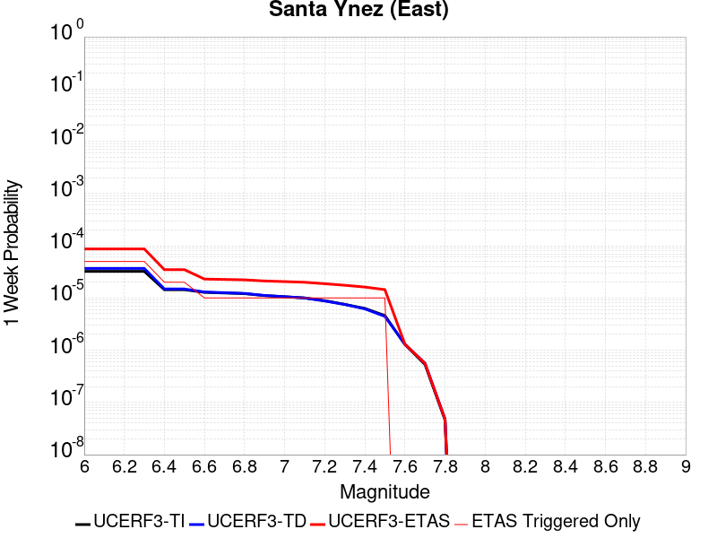 |  |  |  |

| Magnitude | 1 wk TI Prob | 1 wk TD Prob | 1 wk ETAS Prob | 1 wk ETAS/TD Gain | 1 wk ETAS Triggered Only | 1 mo TI Prob | 1 mo TD Prob | 1 mo ETAS Prob | 1 mo ETAS/TD Gain | 1 mo ETAS Triggered Only | 1 yr TI Prob | 1 yr TD Prob | 1 yr ETAS Prob | 1 yr ETAS/TD Gain | 1 yr ETAS Triggered Only | 10 yr TI Prob | 10 yr TD Prob | 10 yr ETAS Prob | 10 yr ETAS/TD Gain | 10 yr ETAS Triggered Only |
|-----|-----|-----|-----|-----|-----|-----|-----|-----|-----|-----|-----|-----|-----|-----|-----|-----|-----|-----|-----|-----|
| 6.0 | 3.2269712E-5 | 3.67505E-5 | 9.008188E-5 | 2.451174 | 5.3333333E-5 | 1.3829143E-4 | 1.5749598E-4 | 2.908083E-4 | 1.8464491 | 1.3333333E-4 | 0.0016823979 | 0.0019164166 | 0.0021559566 | 1.1249937 | 2.4E-4 | 0.016697178 | 0.019056441 | 0.019344185 | 1.0150995 | 2.9333335E-4 |
| 6.1 | 3.2269712E-5 | 3.67505E-5 | 9.008188E-5 | 2.451174 | 5.3333333E-5 | 1.3829143E-4 | 1.5749598E-4 | 2.908083E-4 | 1.8464491 | 1.3333333E-4 | 0.0016823979 | 0.0019164166 | 0.0021559566 | 1.1249937 | 2.4E-4 | 0.016697178 | 0.019056441 | 0.019344185 | 1.0150995 | 2.9333335E-4 |
| 6.2 | 3.2269712E-5 | 3.67505E-5 | 9.008188E-5 | 2.451174 | 5.3333333E-5 | 1.3829143E-4 | 1.5749598E-4 | 2.908083E-4 | 1.8464491 | 1.3333333E-4 | 0.0016823979 | 0.0019164166 | 0.0021559566 | 1.1249937 | 2.4E-4 | 0.016697178 | 0.019056441 | 0.019344185 | 1.0150995 | 2.9333335E-4 |
| 6.3 | 3.2269712E-5 | 3.67505E-5 | 9.008188E-5 | 2.451174 | 5.3333333E-5 | 1.3829143E-4 | 1.5749598E-4 | 2.908083E-4 | 1.8464491 | 1.3333333E-4 | 0.0016823979 | 0.0019164166 | 0.0021559566 | 1.1249937 | 2.4E-4 | 0.016697178 | 0.019056441 | 0.019344185 | 1.0150995 | 2.9333335E-4 |
| 6.4 | 1.4404779E-5 | 1.4849382E-5 | 4.1515654E-5 | 2.7957833 | 2.6666667E-5 | 6.1733306E-5 | 6.363868E-5 | 1.1696862E-4 | 1.8380114 | 5.3333333E-5 | 7.513438E-4 | 7.745306E-4 | 8.811146E-4 | 1.1376112 | 1.0666667E-4 | 0.0074880854 | 0.007718862 | 0.007824705 | 1.0137123 | 1.0666667E-4 |
| 6.5 | 1.4404779E-5 | 1.4849382E-5 | 4.1515654E-5 | 2.7957833 | 2.6666667E-5 | 6.1733306E-5 | 6.363868E-5 | 1.1696862E-4 | 1.8380114 | 5.3333333E-5 | 7.513438E-4 | 7.745306E-4 | 8.811146E-4 | 1.1376112 | 1.0666667E-4 | 0.0074880854 | 0.007718862 | 0.007824705 | 1.0137123 | 1.0666667E-4 |
| 6.6 | 1.280208E-5 | 1.3011947E-5 | 3.9678267E-5 | 3.049372 | 2.6666667E-5 | 5.4864904E-5 | 5.5764307E-5 | 1.0909467E-4 | 1.956353 | 5.3333333E-5 | 6.6777546E-4 | 6.787207E-4 | 7.586664E-4 | 1.1177888 | 8.0E-5 | 0.006657724 | 0.0067666885 | 0.006846147 | 1.0117426 | 8.0E-5 |
| 6.7 | 1.2457027E-5 | 1.2628468E-5 | 3.92948E-5 | 3.1116047 | 2.6666667E-5 | 5.3386164E-5 | 5.412089E-5 | 1.07451335E-4 | 1.9853948 | 5.3333333E-5 | 6.497827E-4 | 6.587243E-4 | 7.3867163E-4 | 1.1213669 | 8.0E-5 | 0.00647886 | 0.006567915 | 0.0066473894 | 1.0121005 | 8.0E-5 |
| 6.8 | 1.2095134E-5 | 1.2230915E-5 | 3.8897255E-5 | 3.1802409 | 2.6666667E-5 | 5.1835254E-5 | 5.241716E-5 | 1.057477E-4 | 2.017425 | 5.3333333E-5 | 6.309115E-4 | 6.379937E-4 | 7.179426E-4 | 1.125313 | 8.0E-5 | 0.0062912325 | 0.006361809 | 0.0064413003 | 1.012495 | 8.0E-5 |
| 6.9 | 1.1104036E-5 | 1.1157347E-5 | 3.7823716E-5 | 3.3900278 | 2.6666667E-5 | 4.758786E-5 | 4.781633E-5 | 1.0114712E-4 | 2.1153257 | 5.3333333E-5 | 5.7922816E-4 | 5.820096E-4 | 6.61963E-4 | 1.1373748 | 8.0E-5 | 0.005777207 | 0.0058049993 | 0.0058845347 | 1.0137012 | 8.0E-5 |
| 7.0 | 1.0577444E-5 | 1.058168E-5 | 3.7248064E-5 | 3.520052 | 2.6666667E-5 | 4.5331115E-5 | 4.5349276E-5 | 9.868019E-5 | 2.1760037 | 5.3333333E-5 | 5.5176654E-4 | 5.519888E-4 | 6.319446E-4 | 1.1448505 | 8.0E-5 | 0.0055039856 | 0.0055063153 | 0.005585875 | 1.0144488 | 8.0E-5 |
| 7.1 | 1.0021775E-5 | 9.980988E-6 | 3.6647387E-5 | 3.6717198 | 2.6666667E-5 | 4.294976E-5 | 4.2774966E-5 | 9.610602E-5 | 2.2467818 | 5.3333333E-5 | 5.2278786E-4 | 5.2066194E-4 | 6.006203E-4 | 1.1535705 | 8.0E-5 | 0.0052155964 | 0.0051945536 | 0.005274138 | 1.0153208 | 8.0E-5 |
| 7.2 | 8.874109E-6 | 8.748793E-6 | 3.5415225E-5 | 4.0480127 | 2.6666667E-5 | 3.8031343E-5 | 3.7494297E-5 | 9.082563E-5 | 2.4223852 | 5.3333333E-5 | 4.629332E-4 | 4.5639853E-4 | 5.36362E-4 | 1.1752053 | 8.0E-5 | 0.0046197 | 0.0045547304 | 0.004634366 | 1.0174842 | 8.0E-5 |
| 7.3 | 7.5504267E-6 | 7.5051175E-6 | 3.4171586E-5 | 4.5531044 | 2.6666667E-5 | 3.235857E-5 | 3.21644E-5 | 8.5496016E-5 | 2.6580946 | 5.3333333E-5 | 3.9389438E-4 | 3.915322E-4 | 4.7150088E-4 | 1.2042454 | 8.0E-5 | 0.0039319694 | 0.003908531 | 0.0039882185 | 1.020388 | 8.0E-5 |
| 7.4 | 6.309394E-6 | 6.1831556E-6 | 3.2849657E-5 | 5.3127656 | 2.6666667E-5 | 2.703998E-5 | 2.6498974E-5 | 7.98309E-5 | 3.012603 | 5.3333333E-5 | 3.2916202E-4 | 3.225782E-4 | 4.025524E-4 | 1.2479218 | 8.0E-5 | 0.003286749 | 0.003221197 | 0.0033009392 | 1.0247555 | 8.0E-5 |
| 7.5 | 4.6103073E-6 | 4.4408903E-6 | 3.110744E-5 | 7.004775 | 2.6666667E-5 | 1.975831E-5 | 1.9032252E-5 | 7.236457E-5 | 3.8022075 | 5.3333333E-5 | 2.4053088E-4 | 2.3169373E-4 | 2.850147E-4 | 1.2301356 | 5.3333333E-5 | 0.002402707 | 0.002314591 | 0.002367801 | 1.0229889 | 5.3333333E-5 |
| 7.6 | 1.2858658E-6 | 1.3008173E-6 | 1.3008173E-6 | 1.0 | 0.0 | 5.5108417E-6 | 5.5749197E-6 | 5.5749197E-6 | 1.0 | 0.0 | 6.7092435E-5 | 6.78726E-5 | 6.78726E-5 | 1.0 | 0.0 | 6.707218E-4 | 6.785256E-4 | 6.785256E-4 | 1.0 | 0.0 |
| 7.7 | 5.3302307E-7 | 5.612138E-7 | 5.612138E-7 | 1.0 | 0.0 | 2.2843826E-6 | 2.4052001E-6 | 2.4052001E-6 | 1.0 | 0.0 | 2.7812002E-5 | 2.9282954E-5 | 2.9282954E-5 | 1.0 | 0.0 | 2.7808524E-4 | 2.9279452E-4 | 2.9279452E-4 | 1.0 | 0.0 |
| 7.8 | 4.613933E-8 | 4.80301E-8 | 4.80301E-8 | 1.0 | 0.0 | 1.9773998E-7 | 2.0584326E-7 | 2.0584326E-7 | 1.0 | 0.0 | 2.4074816E-6 | 2.5061388E-6 | 2.5061388E-6 | 1.0 | 0.0 | 2.4074554E-5 | 2.5061116E-5 | 2.5061116E-5 | 1.0 | 0.0 |

## Ludlow
*[(top)](#table-of-contents)*

| 1 Week | 1 Month | 1 Year | 10 Year |
|-----|-----|-----|-----|
| 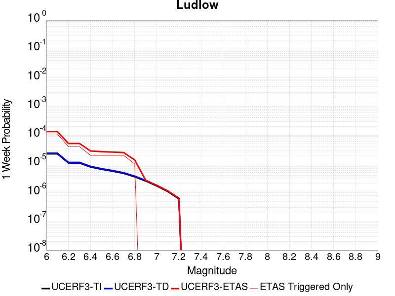 |  |  | 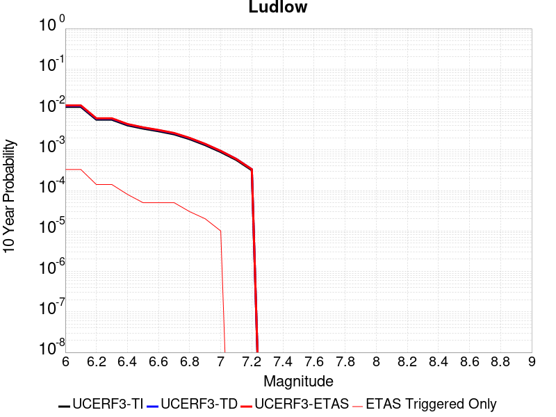 |

| Magnitude | 1 wk TI Prob | 1 wk TD Prob | 1 wk ETAS Prob | 1 wk ETAS/TD Gain | 1 wk ETAS Triggered Only | 1 mo TI Prob | 1 mo TD Prob | 1 mo ETAS Prob | 1 mo ETAS/TD Gain | 1 mo ETAS Triggered Only | 1 yr TI Prob | 1 yr TD Prob | 1 yr ETAS Prob | 1 yr ETAS/TD Gain | 1 yr ETAS Triggered Only | 10 yr TI Prob | 10 yr TD Prob | 10 yr ETAS Prob | 10 yr ETAS/TD Gain | 10 yr ETAS Triggered Only |
|-----|-----|-----|-----|-----|-----|-----|-----|-----|-----|-----|-----|-----|-----|-----|-----|-----|-----|-----|-----|-----|
| 6.0 | 2.2407607E-5 | 2.3657254E-5 | 1.0365536E-4 | 4.3815465 | 8.0E-5 | 9.602906E-5 | 1.0138454E-4 | 2.080404E-4 | 2.0519934 | 1.0666667E-4 | 0.0011685267 | 0.001233702 | 0.0013668707 | 1.1079425 | 1.3333333E-4 | 0.011624013 | 0.012273042 | 0.012589115 | 1.0257534 | 3.2E-4 |
| 6.1 | 2.2407607E-5 | 2.3657254E-5 | 1.0365536E-4 | 4.3815465 | 8.0E-5 | 9.602906E-5 | 1.0138454E-4 | 2.080404E-4 | 2.0519934 | 1.0666667E-4 | 0.0011685267 | 0.001233702 | 0.0013668707 | 1.1079425 | 1.3333333E-4 | 0.011624013 | 0.012273042 | 0.012589115 | 1.0257534 | 3.2E-4 |
| 6.2 | 1.0781252E-5 | 1.1365663E-5 | 3.8032027E-5 | 3.3462214 | 2.6666667E-5 | 4.620455E-5 | 4.8709102E-5 | 7.537447E-5 | 1.5474412 | 2.6666667E-5 | 5.623952E-4 | 5.9287593E-4 | 6.461777E-4 | 1.0899036 | 5.3333333E-5 | 0.00560974 | 0.0059133614 | 0.006019397 | 1.0179316 | 1.0666667E-4 |
| 6.3 | 1.0781252E-5 | 1.1365663E-5 | 3.8032027E-5 | 3.3462214 | 2.6666667E-5 | 4.620455E-5 | 4.8709102E-5 | 7.537447E-5 | 1.5474412 | 2.6666667E-5 | 5.623952E-4 | 5.9287593E-4 | 6.461777E-4 | 1.0899036 | 5.3333333E-5 | 0.00560974 | 0.0059133614 | 0.006019397 | 1.0179316 | 1.0666667E-4 |
| 6.4 | 7.814439E-6 | 8.237729E-6 | 8.237729E-6 | 1.0 | 0.0 | 3.3490025E-5 | 3.530408E-5 | 3.530408E-5 | 1.0 | 0.0 | 4.0766477E-4 | 4.2974384E-4 | 4.2974384E-4 | 1.0 | 0.0 | 0.0040691774 | 0.0042892746 | 0.0043158266 | 1.0061904 | 2.6666667E-5 |
| 6.5 | 6.4986366E-6 | 6.85092E-6 | 6.85092E-6 | 1.0 | 0.0 | 2.7851002E-5 | 2.9360759E-5 | 2.9360759E-5 | 1.0 | 0.0 | 3.390332E-4 | 3.5740953E-4 | 3.5740953E-4 | 1.0 | 0.0 | 0.003385164 | 0.0035684432 | 0.0035950148 | 1.0074463 | 2.6666667E-5 |
| 6.6 | 5.582177E-6 | 5.8860055E-6 | 5.8860055E-6 | 1.0 | 0.0 | 2.3923398E-5 | 2.5225498E-5 | 2.5225498E-5 | 1.0 | 0.0 | 2.9122844E-4 | 3.0707786E-4 | 3.0707786E-4 | 1.0 | 0.0 | 0.0029084706 | 0.003066609 | 0.0030931938 | 1.0086691 | 2.6666667E-5 |
| 6.7 | 4.6858763E-6 | 4.940427E-6 | 4.940427E-6 | 1.0 | 0.0 | 2.0082172E-5 | 2.1173091E-5 | 2.1173091E-5 | 1.0 | 0.0 | 2.4447302E-4 | 2.5775246E-4 | 2.5775246E-4 | 1.0 | 0.0 | 0.0024420423 | 0.0025745912 | 0.0026011893 | 1.0103309 | 2.6666667E-5 |
| 6.8 | 3.5584908E-6 | 3.7520183E-6 | 3.7520183E-6 | 1.0 | 0.0 | 1.5250586E-5 | 1.6079981E-5 | 1.6079981E-5 | 1.0 | 0.0 | 1.8566006E-4 | 1.957566E-4 | 1.957566E-4 | 1.0 | 0.0 | 0.0018550502 | 0.0019558826 | 0.0019824973 | 1.0136074 | 2.6666667E-5 |
| 6.9 | 2.532834E-6 | 2.6710034E-6 | 2.6710034E-6 | 1.0 | 0.0 | 1.0854958E-5 | 1.1447109E-5 | 1.1447109E-5 | 1.0 | 0.0 | 1.3215111E-4 | 1.3935992E-4 | 1.3935992E-4 | 1.0 | 0.0 | 0.0013207254 | 0.0013927529 | 0.0014193824 | 1.0191201 | 2.6666667E-5 |
| 7.0 | 1.7083285E-6 | 1.8019439E-6 | 1.8019439E-6 | 1.0 | 0.0 | 7.3213873E-6 | 7.722595E-6 | 7.722595E-6 | 1.0 | 0.0 | 8.913424E-5 | 9.40187E-5 | 9.40187E-5 | 1.0 | 0.0 | 8.9098496E-4 | 9.3980576E-4 | 9.6644735E-4 | 1.028348 | 2.6666667E-5 |
| 7.1 | 1.0905424E-6 | 1.1497619E-6 | 1.1497619E-6 | 1.0 | 0.0 | 4.6737446E-6 | 4.9275427E-6 | 4.9275427E-6 | 1.0 | 0.0 | 5.6901354E-5 | 5.999128E-5 | 5.999128E-5 | 1.0 | 0.0 | 5.6886784E-4 | 5.997606E-4 | 5.997606E-4 | 1.0 | 0.0 |
| 7.2 | 6.06668E-7 | 6.387277E-7 | 6.387277E-7 | 1.0 | 0.0 | 2.600003E-6 | 2.7374022E-6 | 2.7374022E-6 | 1.0 | 0.0 | 3.1654577E-5 | 3.3327433E-5 | 3.3327433E-5 | 1.0 | 0.0 | 3.1650066E-4 | 3.3323118E-4 | 3.3323118E-4 | 1.0 | 0.0 |

## San Andreas (Creeping Section) 2011 CFM
*[(top)](#table-of-contents)*

| 1 Week | 1 Month | 1 Year | 10 Year |
|-----|-----|-----|-----|
|  |  |  |  |

| Magnitude | 1 wk TI Prob | 1 wk TD Prob | 1 wk ETAS Prob | 1 wk ETAS/TD Gain | 1 wk ETAS Triggered Only | 1 mo TI Prob | 1 mo TD Prob | 1 mo ETAS Prob | 1 mo ETAS/TD Gain | 1 mo ETAS Triggered Only | 1 yr TI Prob | 1 yr TD Prob | 1 yr ETAS Prob | 1 yr ETAS/TD Gain | 1 yr ETAS Triggered Only | 10 yr TI Prob | 10 yr TD Prob | 10 yr ETAS Prob | 10 yr ETAS/TD Gain | 10 yr ETAS Triggered Only |
|-----|-----|-----|-----|-----|-----|-----|-----|-----|-----|-----|-----|-----|-----|-----|-----|-----|-----|-----|-----|-----|
| 6.0 | 5.986481E-4 | 0.001228691 | 0.0013085927 | 1.06503 | 8.0E-5 | 0.0025631124 | 0.005246795 | 0.0053529018 | 1.0202233 | 1.0666667E-4 | 0.030762846 | 0.061203245 | 0.061353453 | 1.0024543 | 1.6E-4 | 0.26835477 | 0.425928 | 0.4260964 | 1.0003954 | 2.9333335E-4 |
| 6.1 | 5.015945E-4 | 0.0010230356 | 0.0011029538 | 1.0781187 | 8.0E-5 | 0.00214792 | 0.004369436 | 0.0044756364 | 1.0243053 | 1.0666667E-4 | 0.025839351 | 0.051246606 | 0.051398408 | 1.0029621 | 1.6E-4 | 0.23032776 | 0.37284943 | 0.3730167 | 1.0004486 | 2.6666667E-4 |
| 6.2 | 4.073338E-4 | 8.1157376E-4 | 8.915088E-4 | 1.0984939 | 8.0E-5 | 0.0017445484 | 0.0034683137 | 0.0035746102 | 1.030648 | 1.0666667E-4 | 0.021034058 | 0.04093177 | 0.04108522 | 1.0037489 | 1.6E-4 | 0.19150782 | 0.31302592 | 0.31320912 | 1.0005852 | 2.6666667E-4 |
| 6.3 | 3.464099E-4 | 6.7455834E-4 | 7.5450435E-4 | 1.1185161 | 8.0E-5 | 0.0014837692 | 0.0028832308 | 0.00298959 | 1.0368888 | 1.0666667E-4 | 0.017915873 | 0.034187846 | 0.034342375 | 1.00452 | 1.6E-4 | 0.16538359 | 0.27130842 | 0.2714833 | 1.0006446 | 2.4E-4 |
| 6.4 | 2.935057E-4 | 5.5516965E-4 | 6.3512527E-4 | 1.1440201 | 8.0E-5 | 0.0012572751 | 0.0023727308 | 0.0024791444 | 1.0448486 | 1.0666667E-4 | 0.015200248 | 0.02826279 | 0.028418269 | 1.0055012 | 1.6E-4 | 0.14201577 | 0.23297668 | 0.23316076 | 1.0007901 | 2.4E-4 |
| 6.5 | 2.3409708E-4 | 4.2132285E-4 | 5.0128915E-4 | 1.1897981 | 8.0E-5 | 0.0010028875 | 0.0018017791 | 0.0019082536 | 1.0590941 | 1.0666667E-4 | 0.012141965 | 0.021586355 | 0.0217429 | 1.0072521 | 1.6E-4 | 0.11499573 | 0.1868149 | 0.18701008 | 1.0010448 | 2.4E-4 |
| 6.6 | 1.5842178E-4 | 2.5068692E-4 | 3.0400688E-4 | 1.2126955 | 5.3333333E-5 | 6.7877385E-4 | 0.0010739256 | 0.0011538398 | 1.0744131 | 8.0E-5 | 0.0082328 | 0.012995283 | 0.013126884 | 1.0101268 | 1.3333333E-4 | 0.07934396 | 0.12313759 | 0.123301275 | 1.0013293 | 1.8666667E-4 |
| 6.7 | 1.5616413E-4 | 2.4605254E-4 | 2.9937277E-4 | 1.2167026 | 5.3333333E-5 | 6.691031E-4 | 0.0010540807 | 0.0011339963 | 1.0758156 | 8.0E-5 | 0.0081159435 | 0.012757154 | 0.012888786 | 1.0103183 | 1.3333333E-4 | 0.0782586 | 0.12116472 | 0.12132876 | 1.001354 | 1.8666667E-4 |
| 6.8 | 1.5538467E-4 | 2.442914E-4 | 2.9761172E-4 | 1.2182652 | 5.3333333E-5 | 6.6576427E-4 | 0.001046539 | 0.0011264554 | 1.0763625 | 8.0E-5 | 0.008075596 | 0.012666538 | 0.012798183 | 1.0103931 | 1.3333333E-4 | 0.07788358 | 0.12039561 | 0.1205598 | 1.0013638 | 1.8666667E-4 |
| 6.9 | 1.5153569E-4 | 2.3538464E-4 | 2.887054E-4 | 1.2265261 | 5.3333333E-5 | 6.49277E-4 | 0.0010084033 | 0.0010883226 | 1.0792533 | 8.0E-5 | 0.007876333 | 0.012208726 | 0.012340432 | 1.0107878 | 1.3333333E-4 | 0.07602952 | 0.11646574 | 0.116630666 | 1.0014161 | 1.8666667E-4 |
| 7.0 | 1.4588932E-4 | 2.2395732E-4 | 2.772787E-4 | 1.2380873 | 5.3333333E-5 | 6.250901E-4 | 9.59466E-4 | 0.0010393893 | 1.0832998 | 8.0E-5 | 0.0075839474 | 0.011619428 | 0.011751212 | 1.0113417 | 1.3333333E-4 | 0.073302895 | 0.11131206 | 0.11147795 | 1.0014904 | 1.8666667E-4 |
| 7.1 | 1.1565079E-4 | 1.6281323E-4 | 2.1613788E-4 | 1.3275204 | 5.3333333E-5 | 4.955521E-4 | 6.9758523E-4 | 7.7752944E-4 | 1.1146014 | 8.0E-5 | 0.006016669 | 0.008460228 | 0.008592433 | 1.0156267 | 1.3333333E-4 | 0.058563538 | 0.08366478 | 0.08383583 | 1.0020444 | 1.8666667E-4 |
| 7.2 | 1.0393792E-4 | 1.4615392E-4 | 1.9947946E-4 | 1.3648587 | 5.3333333E-5 | 4.4537216E-4 | 6.262243E-4 | 7.0617424E-4 | 1.1276697 | 8.0E-5 | 0.005408933 | 0.0075977976 | 0.007730118 | 1.0174156 | 1.3333333E-4 | 0.052791595 | 0.07561503 | 0.075762935 | 1.001956 | 1.6E-4 |
| 7.3 | 9.332884E-5 | 1.2780601E-4 | 1.8113252E-4 | 1.4172457 | 5.3333333E-5 | 3.999194E-4 | 5.4762565E-4 | 6.2758185E-4 | 1.1460052 | 8.0E-5 | 0.0048581534 | 0.0066470946 | 0.0067795417 | 1.0199256 | 1.3333333E-4 | 0.047533102 | 0.06647954 | 0.0666289 | 1.0022467 | 1.6E-4 |
| 7.4 | 8.670252E-5 | 1.1702972E-4 | 1.7035681E-4 | 1.4556714 | 5.3333333E-5 | 3.715293E-4 | 5.014601E-4 | 5.8141997E-4 | 1.1594541 | 8.0E-5 | 0.004513991 | 0.0060883067 | 0.0062208283 | 1.0217665 | 1.3333333E-4 | 0.044233937 | 0.061148684 | 0.0612989 | 1.0024565 | 1.6E-4 |
| 7.5 | 7.3036405E-5 | 9.005699E-5 | 1.433855E-4 | 1.5921643 | 5.3333333E-5 | 3.129756E-4 | 3.859015E-4 | 4.3921426E-4 | 1.1381512 | 5.3333333E-5 | 0.0038038217 | 0.0046882504 | 0.004794417 | 1.0226452 | 1.0666667E-4 | 0.03739367 | 0.047875606 | 0.048002556 | 1.0026517 | 1.3333333E-4 |
| 7.6 | 6.3935775E-5 | 8.280209E-5 | 1.3613101E-4 | 1.6440527 | 5.3333333E-5 | 2.7398168E-4 | 3.5481792E-4 | 4.0813233E-4 | 1.1502585 | 5.3333333E-5 | 0.0033306254 | 0.00431137 | 0.004417577 | 1.0246341 | 1.0666667E-4 | 0.032811474 | 0.043990135 | 0.044117603 | 1.0028976 | 1.3333333E-4 |
| 7.7 | 5.5050095E-5 | 6.661729E-5 | 1.1994707E-4 | 1.8005396 | 5.3333333E-5 | 2.3590765E-4 | 2.8547147E-4 | 3.3878957E-4 | 1.1867721 | 5.3333333E-5 | 0.0028683927 | 0.0034700802 | 0.0035763767 | 1.0306323 | 1.0666667E-4 | 0.0283165 | 0.03579509 | 0.03592365 | 1.0035915 | 1.3333333E-4 |
| 7.8 | 5.027131E-5 | 6.1627725E-5 | 1.1495777E-4 | 1.8653581 | 5.3333333E-5 | 2.1543067E-4 | 2.640921E-4 | 3.1741135E-4 | 1.2018964 | 5.3333333E-5 | 0.0026197135 | 0.003210584 | 0.003290327 | 1.0248376 | 8.0E-5 | 0.025890453 | 0.03312572 | 0.03322885 | 1.0031134 | 1.0666667E-4 |
| 7.9 | 3.7271806E-5 | 5.0224386E-5 | 1.0355504E-4 | 2.061848 | 5.3333333E-5 | 1.5972654E-4 | 2.1522962E-4 | 2.6855146E-4 | 1.2477441 | 5.3333333E-5 | 0.0019429359 | 0.0026172737 | 0.0026970643 | 1.0304861 | 8.0E-5 | 0.019260362 | 0.027066687 | 0.027170466 | 1.0038342 | 1.0666667E-4 |
| 8.0 | 2.7310243E-5 | 3.1428404E-5 | 5.8094232E-5 | 1.8484627 | 2.6666667E-5 | 1.17038646E-4 | 1.3468621E-4 | 1.613493E-4 | 1.1979644 | 2.6666667E-5 | 0.0014240141 | 0.0016385721 | 0.001691818 | 1.0324954 | 5.3333333E-5 | 0.014149235 | 0.01721387 | 0.017292492 | 1.0045674 | 8.0E-5 |
| 8.1 | 1.7940547E-5 | 1.7400796E-5 | 4.4066997E-5 | 2.5324702 | 2.6666667E-5 | 7.688579E-5 | 7.457271E-5 | 1.0123739E-4 | 1.3575661 | 2.6666667E-5 | 9.3568244E-4 | 9.075451E-4 | 9.3418756E-4 | 1.0293566 | 2.6666667E-5 | 0.009317525 | 0.009799073 | 0.009851884 | 1.0053893 | 5.3333333E-5 |
| 8.2 | 8.643924E-6 | 5.4748625E-6 | 5.4748625E-6 | 1.0 | 0.0 | 3.704486E-5 | 2.3463486E-5 | 2.3463486E-5 | 1.0 | 0.0 | 4.5092785E-4 | 2.8563058E-4 | 2.8563058E-4 | 1.0 | 0.0 | 0.0045001395 | 0.0032487072 | 0.0032487072 | 1.0 | 0.0 |
| 8.3 | 1.983087E-6 | 7.6599065E-7 | 7.6599065E-7 | 1.0 | 0.0 | 8.498917E-6 | 3.282813E-6 | 3.282813E-6 | 1.0 | 0.0 | 1.034694E-4 | 3.9967534E-5 | 3.9967534E-5 | 1.0 | 0.0 | 0.0010342124 | 4.719687E-4 | 4.719687E-4 | 1.0 | 0.0 |

## San Jacinto (Anza) rev
*[(top)](#table-of-contents)*

| 1 Week | 1 Month | 1 Year | 10 Year |
|-----|-----|-----|-----|
|  |  |  |  |

| Magnitude | 1 wk TI Prob | 1 wk TD Prob | 1 wk ETAS Prob | 1 wk ETAS/TD Gain | 1 wk ETAS Triggered Only | 1 mo TI Prob | 1 mo TD Prob | 1 mo ETAS Prob | 1 mo ETAS/TD Gain | 1 mo ETAS Triggered Only | 1 yr TI Prob | 1 yr TD Prob | 1 yr ETAS Prob | 1 yr ETAS/TD Gain | 1 yr ETAS Triggered Only | 10 yr TI Prob | 10 yr TD Prob | 10 yr ETAS Prob | 10 yr ETAS/TD Gain | 10 yr ETAS Triggered Only |
|-----|-----|-----|-----|-----|-----|-----|-----|-----|-----|-----|-----|-----|-----|-----|-----|-----|-----|-----|-----|-----|
| 6.0 | 6.3015636E-5 | 4.3302647E-5 | 2.0329571E-4 | 4.694764 | 1.6E-4 | 2.7003905E-4 | 1.8556965E-4 | 3.7220167E-4 | 2.005725 | 1.8666667E-4 | 0.0032827691 | 0.0022569813 | 0.0024964395 | 1.1060967 | 2.4E-4 | 0.032346968 | 0.023296192 | 0.023556646 | 1.0111802 | 2.6666667E-4 |
| 6.1 | 6.3015636E-5 | 4.3302647E-5 | 2.0329571E-4 | 4.694764 | 1.6E-4 | 2.7003905E-4 | 1.8556965E-4 | 3.7220167E-4 | 2.005725 | 1.8666667E-4 | 0.0032827691 | 0.0022569813 | 0.0024964395 | 1.1060967 | 2.4E-4 | 0.032346968 | 0.023296192 | 0.023556646 | 1.0111802 | 2.6666667E-4 |
| 6.2 | 6.3015636E-5 | 4.3302647E-5 | 2.0329571E-4 | 4.694764 | 1.6E-4 | 2.7003905E-4 | 1.8556965E-4 | 3.7220167E-4 | 2.005725 | 1.8666667E-4 | 0.0032827691 | 0.0022569813 | 0.0024964395 | 1.1060967 | 2.4E-4 | 0.032346968 | 0.023296192 | 0.023556646 | 1.0111802 | 2.6666667E-4 |
| 6.3 | 6.3015636E-5 | 4.3302647E-5 | 2.0329571E-4 | 4.694764 | 1.6E-4 | 2.7003905E-4 | 1.8556965E-4 | 3.7220167E-4 | 2.005725 | 1.8666667E-4 | 0.0032827691 | 0.0022569813 | 0.0024964395 | 1.1060967 | 2.4E-4 | 0.032346968 | 0.023296192 | 0.023556646 | 1.0111802 | 2.6666667E-4 |
| 6.4 | 6.3015636E-5 | 4.3302647E-5 | 2.0329571E-4 | 4.694764 | 1.6E-4 | 2.7003905E-4 | 1.8556965E-4 | 3.7220167E-4 | 2.005725 | 1.8666667E-4 | 0.0032827691 | 0.0022569813 | 0.0024964395 | 1.1060967 | 2.4E-4 | 0.032346968 | 0.023296192 | 0.023556646 | 1.0111802 | 2.6666667E-4 |
| 6.5 | 5.811017E-5 | 4.0082516E-5 | 2.000761E-4 | 4.9916058 | 1.6E-4 | 2.4901982E-4 | 1.7177092E-4 | 3.5840552E-4 | 2.0865319 | 1.8666667E-4 | 0.0030276014 | 0.002089311 | 0.0023288094 | 1.1146305 | 2.4E-4 | 0.02986684 | 0.021593736 | 0.021854645 | 1.0120826 | 2.6666667E-4 |
| 6.6 | 5.811017E-5 | 4.0082516E-5 | 2.000761E-4 | 4.9916058 | 1.6E-4 | 2.4901982E-4 | 1.7177092E-4 | 3.5840552E-4 | 2.0865319 | 1.8666667E-4 | 0.0030276014 | 0.002089311 | 0.0023288094 | 1.1146305 | 2.4E-4 | 0.02986684 | 0.021593736 | 0.021854645 | 1.0120826 | 2.6666667E-4 |
| 6.7 | 5.712442E-5 | 3.9505223E-5 | 1.994989E-4 | 5.0499372 | 1.6E-4 | 2.4479596E-4 | 1.6929714E-4 | 3.5593222E-4 | 2.1024113 | 1.8666667E-4 | 0.0029763177 | 0.0020592497 | 0.0022987553 | 1.1163073 | 2.4E-4 | 0.029367693 | 0.021285562 | 0.021546552 | 1.0122614 | 2.6666667E-4 |
| 6.8 | 5.6967532E-5 | 3.9361643E-5 | 1.9935535E-4 | 5.064711 | 1.6E-4 | 2.4412372E-4 | 1.6868189E-4 | 3.5531705E-4 | 2.106433 | 1.8666667E-4 | 0.0029681553 | 0.002051773 | 0.0022912805 | 1.116732 | 2.4E-4 | 0.029288229 | 0.021210281 | 0.021471292 | 1.0123059 | 2.6666667E-4 |
| 6.9 | 5.6211324E-5 | 3.9066435E-5 | 1.9906019E-4 | 5.0954275 | 1.6E-4 | 2.4088343E-4 | 1.6741687E-4 | 3.540523E-4 | 2.1147945 | 1.8666667E-4 | 0.0029288116 | 0.0020364004 | 0.0022759116 | 1.117615 | 2.4E-4 | 0.028905109 | 0.021049714 | 0.021310767 | 1.0124017 | 2.6666667E-4 |
| 7.0 | 5.4383527E-5 | 3.792697E-5 | 1.979209E-4 | 5.218474 | 1.6E-4 | 2.3305144E-4 | 1.6253405E-4 | 3.4917038E-4 | 2.1482906 | 1.8666667E-4 | 0.0028337094 | 0.001977061 | 0.0022165864 | 1.1211523 | 2.4E-4 | 0.027978465 | 0.020440677 | 0.020701893 | 1.0127792 | 2.6666667E-4 |
| 7.1 | 5.1393665E-5 | 3.6389913E-5 | 1.9638409E-4 | 5.3966627 | 1.6E-4 | 2.2023996E-4 | 1.5594746E-4 | 3.4258503E-4 | 2.1967976 | 1.8666667E-4 | 0.0026781242 | 0.0018970112 | 0.002136556 | 1.1262748 | 2.4E-4 | 0.026460782 | 0.019614287 | 0.019875722 | 1.0133289 | 2.6666667E-4 |
| 7.2 | 4.785222E-5 | 3.4741795E-5 | 1.9473623E-4 | 5.6052437 | 1.6E-4 | 2.0506482E-4 | 1.4888494E-4 | 3.355238E-4 | 2.253578 | 1.8666667E-4 | 0.0024938055 | 0.0018111705 | 0.0020507358 | 1.1322709 | 2.4E-4 | 0.024660049 | 0.018728992 | 0.018990664 | 1.0139716 | 2.6666667E-4 |
| 7.3 | 4.2143256E-5 | 3.383628E-5 | 1.9383087E-4 | 5.7284923 | 1.6E-4 | 1.8060145E-4 | 1.4500458E-4 | 3.3164417E-4 | 2.287129 | 1.8666667E-4 | 0.002196605 | 0.0017640047 | 0.0020035813 | 1.1358141 | 2.4E-4 | 0.02175019 | 0.01823724 | 0.018499045 | 1.0143554 | 2.6666667E-4 |
| 7.4 | 4.0264713E-5 | 3.347446E-5 | 1.9346911E-4 | 5.779603 | 1.6E-4 | 1.7255165E-4 | 1.4345412E-4 | 3.3009402E-4 | 2.3010423 | 1.8666667E-4 | 0.002098792 | 0.0017451581 | 0.0019847392 | 1.1372833 | 2.4E-4 | 0.020790804 | 0.018041821 | 0.018303676 | 1.0145139 | 2.6666667E-4 |
| 7.5 | 3.694492E-5 | 3.218847E-5 | 1.9218332E-4 | 5.9705644 | 1.6E-4 | 1.5832575E-4 | 1.379433E-4 | 3.2458422E-4 | 2.3530264 | 1.8666667E-4 | 0.0019259118 | 0.001678169 | 0.0019177662 | 1.142773 | 2.4E-4 | 0.01909306 | 0.01735827 | 0.017620308 | 1.0150958 | 2.6666667E-4 |
| 7.6 | 3.200565E-5 | 2.9504106E-5 | 1.8949939E-4 | 6.422814 | 1.6E-4 | 1.3715986E-4 | 1.2644005E-4 | 3.1308312E-4 | 2.4761388 | 1.8666667E-4 | 0.001668642 | 0.0015383229 | 0.0017779537 | 1.1557741 | 2.4E-4 | 0.01656168 | 0.0159463 | 0.016208714 | 1.0164561 | 2.6666667E-4 |
| 7.7 | 2.731642E-5 | 2.6092788E-5 | 1.8608861E-4 | 7.1318026 | 1.6E-4 | 1.1706512E-4 | 1.1182144E-4 | 2.9846723E-4 | 2.6691413 | 1.8666667E-4 | 0.001424336 | 0.0013605768 | 0.0016002504 | 1.1761558 | 2.4E-4 | 0.014152412 | 0.014167004 | 0.014429893 | 1.0185564 | 2.6666667E-4 |
| 7.8 | 2.3466424E-5 | 2.3504817E-5 | 1.8350106E-4 | 7.806955 | 1.6E-4 | 1.0056651E-4 | 1.0073105E-4 | 2.873789E-4 | 2.8529327 | 1.8666667E-4 | 0.0012237094 | 0.0012257113 | 0.0014387832 | 1.1738353 | 2.1333333E-4 | 0.012169928 | 0.012808893 | 0.013045819 | 1.018497 | 2.4E-4 |
| 7.9 | 1.8611925E-5 | 1.8908117E-5 | 1.7890509E-4 | 9.461814 | 1.6E-4 | 7.9762955E-5 | 8.1032274E-5 | 2.6768382E-4 | 3.3034222 | 1.8666667E-4 | 9.7068126E-4 | 9.861222E-4 | 0.0011992451 | 1.2161223 | 2.1333333E-4 | 0.0096645225 | 0.010393824 | 0.01063133 | 1.0228506 | 2.4E-4 |
| 8.0 | 1.5460775E-5 | 1.5740965E-5 | 1.7573845E-4 | 11.164401 | 1.6E-4 | 6.6258784E-5 | 6.7459536E-5 | 2.541136E-4 | 3.766904 | 1.8666667E-4 | 8.0640207E-4 | 8.21011E-4 | 0.0010341692 | 1.2596289 | 2.1333333E-4 | 0.008034821 | 0.0087028835 | 0.0089407945 | 1.0273371 | 2.4E-4 |
| 8.1 | 9.983884E-6 | 8.269952E-6 | 6.160284E-5 | 7.448997 | 5.3333333E-5 | 4.2787375E-5 | 3.544217E-5 | 1.1543934E-4 | 3.257118 | 8.0E-5 | 5.2081177E-4 | 4.314235E-4 | 5.11389E-4 | 1.1853527 | 8.0E-5 | 0.0051959283 | 0.004640022 | 0.004746194 | 1.0228817 | 1.0666667E-4 |
| 8.2 | 4.1226E-6 | 1.5529788E-6 | 1.5529788E-6 | 1.0 | 0.0 | 1.7668166E-5 | 6.6556063E-6 | 6.6556063E-6 | 1.0 | 0.0 | 2.1508869E-4 | 8.102902E-5 | 8.102902E-5 | 1.0 | 0.0 | 0.0021488064 | 9.4050163E-4 | 9.4050163E-4 | 1.0 | 0.0 |
| 8.3 | 1.2750878E-6 | 3.612133E-7 | 3.612133E-7 | 1.0 | 0.0 | 5.4646503E-6 | 1.548056E-6 | 1.548056E-6 | 1.0 | 0.0 | 6.653009E-5 | 1.8847424E-5 | 1.8847424E-5 | 1.0 | 0.0 | 6.6510175E-4 | 2.2734253E-4 | 2.2734253E-4 | 1.0 | 0.0 |

## Mission Ridge-Arroyo Parida-Santa Ana
*[(top)](#table-of-contents)*

| 1 Week | 1 Month | 1 Year | 10 Year |
|-----|-----|-----|-----|
| 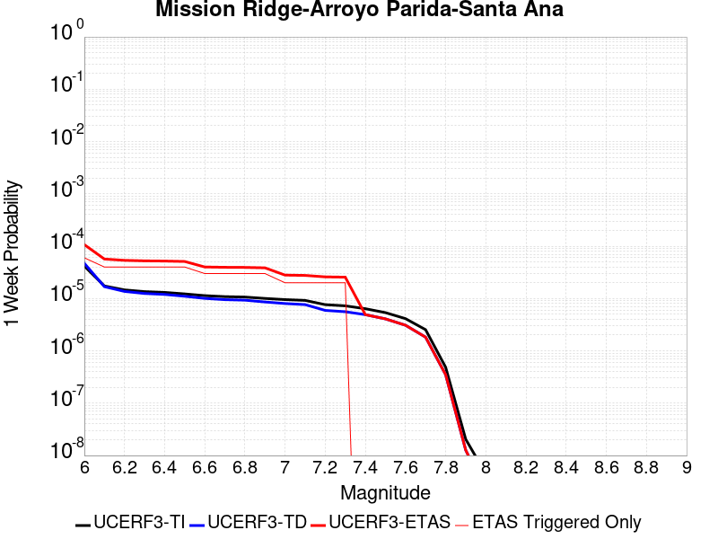 |  | 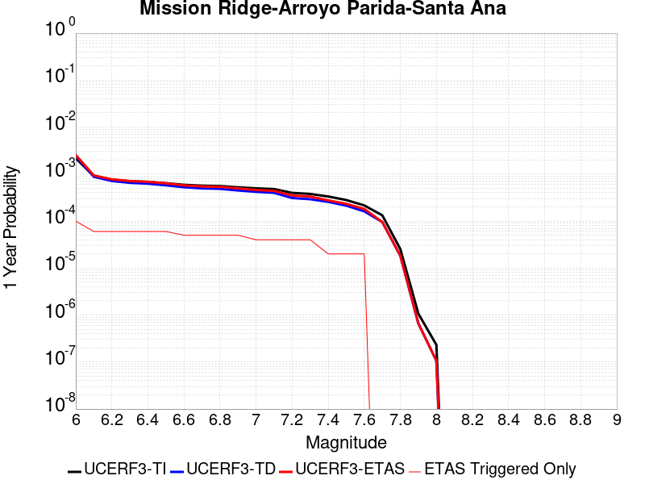 |  |

| Magnitude | 1 wk TI Prob | 1 wk TD Prob | 1 wk ETAS Prob | 1 wk ETAS/TD Gain | 1 wk ETAS Triggered Only | 1 mo TI Prob | 1 mo TD Prob | 1 mo ETAS Prob | 1 mo ETAS/TD Gain | 1 mo ETAS Triggered Only | 1 yr TI Prob | 1 yr TD Prob | 1 yr ETAS Prob | 1 yr ETAS/TD Gain | 1 yr ETAS Triggered Only | 10 yr TI Prob | 10 yr TD Prob | 10 yr ETAS Prob | 10 yr ETAS/TD Gain | 10 yr ETAS Triggered Only |
|-----|-----|-----|-----|-----|-----|-----|-----|-----|-----|-----|-----|-----|-----|-----|-----|-----|-----|-----|-----|-----|
| 6.0 | 4.169034E-5 | 4.7138263E-5 | 1.00469086E-4 | 2.13137 | 5.3333333E-5 | 1.7866064E-4 | 2.0201034E-4 | 2.8199417E-4 | 1.3959394 | 8.0E-5 | 0.0021730233 | 0.00245745 | 0.0025638544 | 1.0432987 | 1.0666667E-4 | 0.021518968 | 0.024384614 | 0.024514697 | 1.0053346 | 1.3333333E-4 |
| 6.1 | 1.73813E-5 | 1.6854226E-5 | 7.018666E-5 | 4.164336 | 5.3333333E-5 | 7.4489166E-5 | 7.223046E-5 | 1.5222467E-4 | 2.107486 | 8.0E-5 | 9.065282E-4 | 8.790618E-4 | 9.856347E-4 | 1.1212348 | 1.0666667E-4 | 0.009028391 | 0.008756988 | 0.008862721 | 1.0120741 | 1.0666667E-4 |
| 6.2 | 1.4622182E-5 | 1.367329E-5 | 6.7005894E-5 | 4.9004955 | 5.3333333E-5 | 6.2664985E-5 | 5.8598518E-5 | 1.3859384E-4 | 2.3651423 | 8.0E-5 | 7.6267915E-4 | 7.132073E-4 | 8.197979E-4 | 1.1494524 | 1.0666667E-4 | 0.007600669 | 0.007109627 | 0.0072155357 | 1.0148965 | 1.0666667E-4 |
| 6.3 | 1.3552434E-5 | 1.2482201E-5 | 6.581487E-5 | 5.2726974 | 5.3333333E-5 | 5.8080568E-5 | 5.3494066E-5 | 1.3348978E-4 | 2.495413 | 8.0E-5 | 7.069015E-4 | 6.510988E-4 | 7.57696E-4 | 1.1637189 | 1.0666667E-4 | 0.00704657 | 0.006492275 | 0.006598249 | 1.0163231 | 1.0666667E-4 |
| 6.4 | 1.30977305E-5 | 1.1979156E-5 | 6.531185E-5 | 5.4521246 | 5.3333333E-5 | 5.613192E-5 | 5.1338247E-5 | 1.3133413E-4 | 2.5582125 | 8.0E-5 | 6.831918E-4 | 6.248669E-4 | 7.314669E-4 | 1.1705964 | 1.0666667E-4 | 0.006810953 | 0.0062314444 | 0.006337446 | 1.0170108 | 1.0666667E-4 |
| 6.5 | 1.225205E-5 | 1.1048803E-5 | 6.4381544E-5 | 5.8270154 | 5.3333333E-5 | 5.2507727E-5 | 4.7351168E-5 | 1.2734738E-4 | 2.6894243 | 8.0E-5 | 6.3909404E-4 | 5.7635066E-4 | 6.829559E-4 | 1.1849658 | 1.0666667E-4 | 0.006372592 | 0.005748869 | 0.0058549223 | 1.0184478 | 1.0666667E-4 |
| 6.6 | 1.1352241E-5 | 1.0063535E-5 | 6.339633E-5 | 6.2996087 | 5.3333333E-5 | 4.8651553E-5 | 4.3128734E-5 | 1.2312528E-4 | 2.854832 | 8.0E-5 | 5.921717E-4 | 5.2496797E-4 | 6.315786E-4 | 1.2030803 | 1.0666667E-4 | 0.0059059616 | 0.0052375244 | 0.0053436323 | 1.0202591 | 1.0666667E-4 |
| 6.7 | 1.0864116E-5 | 9.517027E-6 | 6.284985E-5 | 6.6039376 | 5.3333333E-5 | 4.6559664E-5 | 4.0786632E-5 | 1.2078337E-4 | 2.9613469 | 8.0E-5 | 5.667165E-4 | 4.964661E-4 | 6.030798E-4 | 1.2147452 | 1.0666667E-4 | 0.005652734 | 0.004953804 | 0.005059942 | 1.0214256 | 1.0666667E-4 |
| 6.8 | 1.0666365E-5 | 9.299779E-6 | 6.2632615E-5 | 6.7348504 | 5.3333333E-5 | 4.571219E-5 | 3.9855597E-5 | 1.1985241E-4 | 3.0071664 | 8.0E-5 | 5.564038E-4 | 4.8513585E-4 | 5.917508E-4 | 1.219763 | 1.0666667E-4 | 0.005550127 | 0.0048410003 | 0.0049471506 | 1.0219274 | 1.0666667E-4 |
| 6.9 | 1.0038665E-5 | 8.592046E-6 | 6.192492E-5 | 7.2072387 | 5.3333333E-5 | 4.302214E-5 | 3.682254E-5 | 1.16819596E-4 | 3.1725023 | 8.0E-5 | 5.236687E-4 | 4.4822405E-4 | 5.548429E-4 | 1.2378696 | 1.0666667E-4 | 0.005224364 | 0.004473411 | 0.0045796004 | 1.0237379 | 1.0666667E-4 |
| 7.0 | 9.5379955E-6 | 8.025073E-6 | 3.4691526E-5 | 4.322892 | 2.6666667E-5 | 4.0876483E-5 | 3.4392728E-5 | 8.772423E-5 | 2.550662 | 5.3333333E-5 | 4.975576E-4 | 4.1865272E-4 | 4.986192E-4 | 1.1910092 | 8.0E-5 | 0.00496445 | 0.0041788397 | 0.0042585055 | 1.0190641 | 8.0E-5 |
| 7.1 | 9.207389E-6 | 7.652375E-6 | 3.4318837E-5 | 4.4847302 | 2.6666667E-5 | 3.945964E-5 | 3.279549E-5 | 8.6127075E-5 | 2.6261866 | 5.3333333E-5 | 4.803152E-4 | 3.9921363E-4 | 4.791817E-4 | 1.2003139 | 8.0E-5 | 0.004792784 | 0.003985161 | 0.004064842 | 1.0199945 | 8.0E-5 |
| 7.2 | 7.638091E-6 | 5.9311183E-6 | 3.2597625E-5 | 5.496034 | 2.6666667E-5 | 3.2734264E-5 | 2.541883E-5 | 7.875081E-5 | 3.0981286 | 5.3333333E-5 | 3.984668E-4 | 3.0943064E-4 | 3.8940588E-4 | 1.2584593 | 8.0E-5 | 0.0039775306 | 0.0030900547 | 0.0031698076 | 1.0258095 | 8.0E-5 |
| 7.3 | 7.2500147E-6 | 5.5961527E-6 | 3.226267E-5 | 5.765152 | 2.6666667E-5 | 3.1071122E-5 | 2.3983293E-5 | 7.7315344E-5 | 3.223717 | 5.3333333E-5 | 3.7822526E-4 | 2.9195778E-4 | 3.719344E-4 | 1.2739322 | 8.0E-5 | 0.0037758215 | 0.0029157975 | 0.0029955644 | 1.0273567 | 8.0E-5 |
| 7.4 | 6.3899715E-6 | 4.9184964E-6 | 4.9184964E-6 | 1.0 | 0.0 | 2.7385306E-5 | 2.10791E-5 | 4.7745205E-5 | 2.2650495 | 2.6666667E-5 | 3.3336508E-4 | 2.5660804E-4 | 3.0992768E-4 | 1.2077863 | 5.3333333E-5 | 0.0033286542 | 0.0025631618 | 0.0026163585 | 1.0207543 | 5.3333333E-5 |
| 7.5 | 5.379025E-6 | 4.0838527E-6 | 4.0838527E-6 | 1.0 | 0.0 | 2.305276E-5 | 1.7502109E-5 | 4.4168308E-5 | 2.5235991 | 2.6666667E-5 | 2.806312E-4 | 2.1306744E-4 | 2.6638943E-4 | 1.2502587 | 5.3333333E-5 | 0.0028027708 | 0.002128643 | 0.0021818627 | 1.0250018 | 5.3333333E-5 |
| 7.6 | 4.1270696E-6 | 3.0883439E-6 | 3.0883439E-6 | 1.0 | 0.0 | 1.768732E-5 | 1.3235693E-5 | 3.9902006E-5 | 3.0147274 | 2.6666667E-5 | 2.1532185E-4 | 1.6113273E-4 | 2.1445747E-4 | 1.3309368 | 5.3333333E-5 | 0.0021511333 | 0.001610167 | 0.0016634144 | 1.0330695 | 5.3333333E-5 |
| 7.7 | 2.5406805E-6 | 1.8282013E-6 | 1.8282013E-6 | 1.0 | 0.0 | 1.0888585E-5 | 7.835125E-6 | 7.835125E-6 | 1.0 | 0.0 | 1.3256045E-4 | 9.538854E-5 | 9.538854E-5 | 1.0 | 0.0 | 0.0013248142 | 9.534821E-4 | 9.534821E-4 | 1.0 | 0.0 |
| 7.8 | 4.8608285E-7 | 3.5098864E-7 | 3.5098864E-7 | 1.0 | 0.0 | 2.0832106E-6 | 1.5042363E-6 | 1.5042363E-6 | 1.0 | 0.0 | 2.5362791E-5 | 1.8313924E-5 | 1.8313924E-5 | 1.0 | 0.0 | 2.5359896E-4 | 1.8312426E-4 | 1.8312426E-4 | 1.0 | 0.0 |
| 7.9 | 2.0472514E-8 | 1.2688783E-8 | 1.2688783E-8 | 1.0 | 0.0 | 8.7739345E-8 | 5.43805E-8 | 5.43805E-8 | 1.0 | 0.0 | 1.068226E-6 | 6.6208236E-7 | 6.6208236E-7 | 1.0 | 0.0 | 1.0682209E-5 | 6.620805E-6 | 6.620805E-6 | 1.0 | 0.0 |
| 8.0 | 4.443582E-9 | 2.0321211E-9 | 2.0321211E-9 | 1.0 | 0.0 | 1.9043922E-8 | 8.70909E-9 | 8.70909E-9 | 1.0 | 0.0 | 2.3185973E-7 | 1.0603316E-7 | 1.0603316E-7 | 1.0 | 0.0 | 2.3185949E-6 | 1.0603312E-6 | 1.0603312E-6 | 1.0 | 0.0 |

## Santa Ynez (West)
*[(top)](#table-of-contents)*

| 1 Week | 1 Month | 1 Year | 10 Year |
|-----|-----|-----|-----|
|  |  |  |  |

| Magnitude | 1 wk TI Prob | 1 wk TD Prob | 1 wk ETAS Prob | 1 wk ETAS/TD Gain | 1 wk ETAS Triggered Only | 1 mo TI Prob | 1 mo TD Prob | 1 mo ETAS Prob | 1 mo ETAS/TD Gain | 1 mo ETAS Triggered Only | 1 yr TI Prob | 1 yr TD Prob | 1 yr ETAS Prob | 1 yr ETAS/TD Gain | 1 yr ETAS Triggered Only | 10 yr TI Prob | 10 yr TD Prob | 10 yr ETAS Prob | 10 yr ETAS/TD Gain | 10 yr ETAS Triggered Only |
|-----|-----|-----|-----|-----|-----|-----|-----|-----|-----|-----|-----|-----|-----|-----|-----|-----|-----|-----|-----|-----|
| 6.0 | 4.7352758E-5 | 5.4972126E-5 | 1.0830253E-4 | 1.9701353 | 5.3333333E-5 | 2.0292461E-4 | 2.3557522E-4 | 3.6887714E-4 | 1.5658572 | 1.3333333E-4 | 0.0024678076 | 0.0028645284 | 0.00302407 | 1.0556957 | 1.6E-4 | 0.024405818 | 0.028304417 | 0.028485801 | 1.0064083 | 1.8666667E-4 |
| 6.1 | 4.7352758E-5 | 5.4972126E-5 | 1.0830253E-4 | 1.9701353 | 5.3333333E-5 | 2.0292461E-4 | 2.3557522E-4 | 3.4221675E-4 | 1.4526857 | 1.0666667E-4 | 0.0024678076 | 0.0028645284 | 0.0029974796 | 1.0464131 | 1.3333333E-4 | 0.024405818 | 0.028304417 | 0.028459888 | 1.0054928 | 1.6E-4 |
| 6.2 | 3.0415853E-5 | 3.392511E-5 | 8.725664E-5 | 2.5720367 | 5.3333333E-5 | 1.3034715E-4 | 1.4538545E-4 | 2.2537382E-4 | 1.5501814 | 8.0E-5 | 0.0015858212 | 0.0017686661 | 0.0018751441 | 1.0602025 | 1.0666667E-4 | 0.015745522 | 0.017549807 | 0.0176808 | 1.007464 | 1.3333333E-4 |
| 6.3 | 3.0415853E-5 | 3.392511E-5 | 8.725664E-5 | 2.5720367 | 5.3333333E-5 | 1.3034715E-4 | 1.4538545E-4 | 2.2537382E-4 | 1.5501814 | 8.0E-5 | 0.0015858212 | 0.0017686661 | 0.0018751441 | 1.0602025 | 1.0666667E-4 | 0.015745522 | 0.017549807 | 0.0176808 | 1.007464 | 1.3333333E-4 |
| 6.4 | 2.5452082E-5 | 2.7912422E-5 | 8.124427E-5 | 2.9106848 | 5.3333333E-5 | 1.09075794E-4 | 1.196193E-4 | 1.9960973E-4 | 1.6687084 | 8.0E-5 | 0.0013271887 | 0.0014554089 | 0.0015619203 | 1.0731832 | 1.0666667E-4 | 0.013192902 | 0.014460951 | 0.014592356 | 1.0090868 | 1.3333333E-4 |
| 6.5 | 2.3143784E-5 | 2.5128256E-5 | 7.846025E-5 | 3.1223912 | 5.3333333E-5 | 9.9183875E-5 | 1.0768817E-4 | 1.8767956E-4 | 1.7428057 | 8.0E-5 | 0.0012068948 | 0.0013103267 | 0.0014168536 | 1.081298 | 1.0666667E-4 | 0.012003611 | 0.01302768 | 0.013159276 | 1.0101013 | 1.3333333E-4 |
| 6.6 | 1.9118515E-5 | 2.035434E-5 | 7.368659E-5 | 3.6201904 | 5.3333333E-5 | 8.193392E-5 | 8.7230015E-5 | 1.6722304E-4 | 1.9170356 | 8.0E-5 | 9.97089E-4 | 0.001061516 | 0.0011680694 | 1.1003785 | 1.0666667E-4 | 0.00992627 | 0.010565365 | 0.010697289 | 1.0124866 | 1.3333333E-4 |
| 6.7 | 1.722807E-5 | 1.8146347E-5 | 4.481253E-5 | 2.469507 | 2.6666667E-5 | 7.3832496E-5 | 7.776777E-5 | 1.3109695E-4 | 1.6857492 | 5.3333333E-5 | 8.985399E-4 | 9.464169E-4 | 0.0010263412 | 1.0844493 | 8.0E-5 | 0.008949154 | 0.0094245095 | 0.009530171 | 1.0112114 | 1.0666667E-4 |
| 6.8 | 1.5317364E-5 | 1.5926486E-5 | 4.259273E-5 | 2.674333 | 2.6666667E-5 | 6.56442E-5 | 6.82546E-5 | 1.2158429E-4 | 1.7813348 | 5.3333333E-5 | 7.98925E-4 | 8.306873E-4 | 9.106208E-4 | 1.0962259 | 8.0E-5 | 0.007960589 | 0.00827631 | 0.008382093 | 1.0127815 | 1.0666667E-4 |
| 6.9 | 1.3071226E-5 | 1.3329624E-5 | 3.9995935E-5 | 3.00053 | 2.6666667E-5 | 5.6018336E-5 | 5.7125722E-5 | 1.1045601E-4 | 1.93356 | 5.3333333E-5 | 6.8180985E-4 | 6.9528597E-4 | 7.7523035E-4 | 1.1149806 | 8.0E-5 | 0.0067972173 | 0.006931367 | 0.0070372946 | 1.0152823 | 1.0666667E-4 |
| 7.0 | 1.1836986E-5 | 1.19327815E-5 | 3.859913E-5 | 3.2347136 | 2.6666667E-5 | 5.0728955E-5 | 5.11395E-5 | 1.04470106E-4 | 2.0428457 | 5.3333333E-5 | 6.1745E-4 | 6.2244723E-4 | 7.0239743E-4 | 1.1284449 | 8.0E-5 | 0.006157372 | 0.006207231 | 0.0063132355 | 1.0170776 | 1.0666667E-4 |
| 7.1 | 1.0597169E-5 | 1.0542201E-5 | 3.7208585E-5 | 3.5294893 | 2.6666667E-5 | 4.541565E-5 | 4.5180084E-5 | 9.851101E-5 | 2.1804078 | 5.3333333E-5 | 5.5279525E-4 | 5.4992986E-4 | 6.298859E-4 | 1.1453931 | 8.0E-5 | 0.0055142213 | 0.005485821 | 0.005565382 | 1.014503 | 8.0E-5 |
| 7.2 | 9.59113E-6 | 9.459144E-6 | 3.612556E-5 | 3.819115 | 2.6666667E-5 | 4.11042E-5 | 4.0538565E-5 | 9.3869734E-5 | 2.3155663 | 5.3333333E-5 | 5.0032866E-4 | 4.934463E-4 | 5.734068E-4 | 1.162045 | 8.0E-5 | 0.004992037 | 0.0049236254 | 0.0050032316 | 1.0161682 | 8.0E-5 |
| 7.3 | 8.586084E-6 | 8.379583E-6 | 3.5046025E-5 | 4.1823115 | 2.6666667E-5 | 3.679698E-5 | 3.5912013E-5 | 8.924343E-5 | 2.485058 | 5.3333333E-5 | 4.4791115E-4 | 4.3714207E-4 | 5.171071E-4 | 1.1829269 | 8.0E-5 | 0.004470094 | 0.004362933 | 0.004442584 | 1.0182563 | 8.0E-5 |
| 7.4 | 7.2622997E-6 | 6.9515427E-6 | 3.3618024E-5 | 4.8360524 | 2.6666667E-5 | 3.112377E-5 | 2.979199E-5 | 8.3123734E-5 | 2.790137 | 5.3333333E-5 | 3.78866E-4 | 3.626581E-4 | 4.4262907E-4 | 1.2205135 | 8.0E-5 | 0.0037822074 | 0.0036207628 | 0.0037004733 | 1.0220147 | 8.0E-5 |
| 7.5 | 5.627296E-6 | 5.251588E-6 | 3.1918113E-5 | 6.0778027 | 2.6666667E-5 | 2.411676E-5 | 2.2506614E-5 | 7.583875E-5 | 3.3696203 | 5.3333333E-5 | 2.9358198E-4 | 2.739843E-4 | 3.2730302E-4 | 1.194605 | 5.3333333E-5 | 0.0029319443 | 0.002736537 | 0.0027897244 | 1.019436 | 5.3333333E-5 |
| 7.6 | 2.265244E-6 | 2.0608625E-6 | 2.0608625E-6 | 1.0 | 0.0 | 9.708152E-6 | 8.832238E-6 | 8.832238E-6 | 1.0 | 0.0 | 1.18190335E-4 | 1.0752728E-4 | 1.0752728E-4 | 1.0 | 0.0 | 0.001181275 | 0.0010747612 | 0.0010747612 | 1.0 | 0.0 |
| 7.7 | 1.3099874E-6 | 1.1016252E-6 | 1.1016252E-6 | 1.0 | 0.0 | 5.61422E-6 | 4.7212425E-6 | 4.7212425E-6 | 1.0 | 0.0 | 6.8350986E-5 | 5.7479636E-5 | 5.7479636E-5 | 1.0 | 0.0 | 6.832996E-4 | 5.7465007E-4 | 5.7465007E-4 | 1.0 | 0.0 |
| 7.8 | 7.903951E-7 | 6.0711415E-7 | 6.0711415E-7 | 1.0 | 0.0 | 3.3874032E-6 | 2.6019152E-6 | 2.6019152E-6 | 1.0 | 0.0 | 4.1240855E-5 | 3.167787E-5 | 3.167787E-5 | 1.0 | 0.0 | 4.12332E-4 | 3.167349E-4 | 3.167349E-4 | 1.0 | 0.0 |
| 7.9 | 7.0753297E-9 | 5.0899476E-9 | 5.0899476E-9 | 1.0 | 0.0 | 3.032284E-8 | 2.181406E-8 | 2.181406E-8 | 1.0 | 0.0 | 3.6918053E-7 | 2.6558615E-7 | 2.6558615E-7 | 1.0 | 0.0 | 3.691799E-6 | 2.6558594E-6 | 2.6558594E-6 | 1.0 | 0.0 |

## Lost Hills
*[(top)](#table-of-contents)*

| 1 Week | 1 Month | 1 Year | 10 Year |
|-----|-----|-----|-----|
|  | 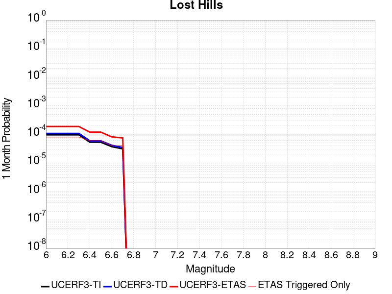 |  |  |

| Magnitude | 1 wk TI Prob | 1 wk TD Prob | 1 wk ETAS Prob | 1 wk ETAS/TD Gain | 1 wk ETAS Triggered Only | 1 mo TI Prob | 1 mo TD Prob | 1 mo ETAS Prob | 1 mo ETAS/TD Gain | 1 mo ETAS Triggered Only | 1 yr TI Prob | 1 yr TD Prob | 1 yr ETAS Prob | 1 yr ETAS/TD Gain | 1 yr ETAS Triggered Only | 10 yr TI Prob | 10 yr TD Prob | 10 yr ETAS Prob | 10 yr ETAS/TD Gain | 10 yr ETAS Triggered Only |
|-----|-----|-----|-----|-----|-----|-----|-----|-----|-----|-----|-----|-----|-----|-----|-----|-----|-----|-----|-----|-----|
| 6.0 | 2.233523E-5 | 2.5106583E-5 | 1.0510458E-4 | 4.1863356 | 8.0E-5 | 9.571891E-5 | 1.0759615E-4 | 1.8758755E-4 | 1.743441 | 8.0E-5 | 0.0011647546 | 0.001309364 | 0.0014957862 | 1.1423762 | 1.8666667E-4 | 0.011586686 | 0.013033091 | 0.013269963 | 1.0181746 | 2.4E-4 |
| 6.1 | 2.233523E-5 | 2.5106583E-5 | 1.0510458E-4 | 4.1863356 | 8.0E-5 | 9.571891E-5 | 1.0759615E-4 | 1.8758755E-4 | 1.743441 | 8.0E-5 | 0.0011647546 | 0.001309364 | 0.0014957862 | 1.1423762 | 1.8666667E-4 | 0.011586686 | 0.013033091 | 0.013269963 | 1.0181746 | 2.4E-4 |
| 6.2 | 2.233523E-5 | 2.5106583E-5 | 1.0510458E-4 | 4.1863356 | 8.0E-5 | 9.571891E-5 | 1.0759615E-4 | 1.8758755E-4 | 1.743441 | 8.0E-5 | 0.0011647546 | 0.001309364 | 0.0014957862 | 1.1423762 | 1.8666667E-4 | 0.011586686 | 0.013033091 | 0.013269963 | 1.0181746 | 2.4E-4 |
| 6.3 | 2.233523E-5 | 2.5106583E-5 | 1.0510458E-4 | 4.1863356 | 8.0E-5 | 9.571891E-5 | 1.0759615E-4 | 1.8758755E-4 | 1.743441 | 8.0E-5 | 0.0011647546 | 0.001309364 | 0.0014957862 | 1.1423762 | 1.8666667E-4 | 0.011586686 | 0.013033091 | 0.013269963 | 1.0181746 | 2.4E-4 |
| 6.4 | 1.2288092E-5 | 1.3781108E-5 | 4.0447405E-5 | 2.9349897 | 2.6666667E-5 | 5.2662188E-5 | 5.906108E-5 | 8.572617E-5 | 1.4514832 | 2.6666667E-5 | 6.409735E-4 | 7.189252E-4 | 8.521627E-4 | 1.1853287 | 1.3333333E-4 | 0.006391279 | 0.0071752006 | 0.0073340526 | 1.0221391 | 1.6E-4 |
| 6.5 | 1.2288092E-5 | 1.3781108E-5 | 4.0447405E-5 | 2.9349897 | 2.6666667E-5 | 5.2662188E-5 | 5.906108E-5 | 8.572617E-5 | 1.4514832 | 2.6666667E-5 | 6.409735E-4 | 7.189252E-4 | 8.521627E-4 | 1.1853287 | 1.3333333E-4 | 0.006391279 | 0.0071752006 | 0.0073340526 | 1.0221391 | 1.6E-4 |
| 6.6 | 8.58281E-6 | 9.63377E-6 | 3.6300178E-5 | 3.768014 | 2.6666667E-5 | 3.6782953E-5 | 4.12874E-5 | 6.795297E-5 | 1.6458523 | 2.6666667E-5 | 4.4774043E-4 | 5.026414E-4 | 5.826012E-4 | 1.1590792 | 8.0E-5 | 0.0044683935 | 0.005023205 | 0.005129336 | 1.021128 | 1.0666667E-4 |
| 6.7 | 7.205685E-6 | 8.088302E-6 | 3.4754754E-5 | 4.296916 | 2.6666667E-5 | 3.088114E-5 | 3.466415E-5 | 6.132989E-5 | 1.7692599 | 2.6666667E-5 | 3.7591302E-4 | 4.2203604E-4 | 5.0200225E-4 | 1.1894773 | 8.0E-5 | 0.0037527776 | 0.0042203604 | 0.0043000225 | 1.0188757 | 8.0E-5 |

## Baker
*[(top)](#table-of-contents)*

| 1 Week | 1 Month | 1 Year | 10 Year |
|-----|-----|-----|-----|
|  |  |  |  |

| Magnitude | 1 wk TI Prob | 1 wk TD Prob | 1 wk ETAS Prob | 1 wk ETAS/TD Gain | 1 wk ETAS Triggered Only | 1 mo TI Prob | 1 mo TD Prob | 1 mo ETAS Prob | 1 mo ETAS/TD Gain | 1 mo ETAS Triggered Only | 1 yr TI Prob | 1 yr TD Prob | 1 yr ETAS Prob | 1 yr ETAS/TD Gain | 1 yr ETAS Triggered Only | 10 yr TI Prob | 10 yr TD Prob | 10 yr ETAS Prob | 10 yr ETAS/TD Gain | 10 yr ETAS Triggered Only |
|-----|-----|-----|-----|-----|-----|-----|-----|-----|-----|-----|-----|-----|-----|-----|-----|-----|-----|-----|-----|-----|
| 6.0 | 5.695525E-6 | 5.8348373E-6 | 8.583437E-5 | 14.710671 | 8.0E-5 | 2.4409164E-5 | 2.5006228E-5 | 1.5833623E-4 | 6.331872 | 1.3333333E-4 | 2.9714106E-4 | 3.044123E-4 | 4.643636E-4 | 1.525443 | 1.6E-4 | 0.0029674405 | 0.0030403486 | 0.003279619 | 1.0786983 | 2.4E-4 |
| 6.1 | 5.695525E-6 | 5.8348373E-6 | 8.583437E-5 | 14.710671 | 8.0E-5 | 2.4409164E-5 | 2.5006228E-5 | 1.5833623E-4 | 6.331872 | 1.3333333E-4 | 2.9714106E-4 | 3.044123E-4 | 4.643636E-4 | 1.525443 | 1.6E-4 | 0.0029674405 | 0.0030403486 | 0.003279619 | 1.0786983 | 2.4E-4 |
| 6.2 | 5.695525E-6 | 5.8348373E-6 | 8.583437E-5 | 14.710671 | 8.0E-5 | 2.4409164E-5 | 2.5006228E-5 | 1.5833623E-4 | 6.331872 | 1.3333333E-4 | 2.9714106E-4 | 3.044123E-4 | 4.643636E-4 | 1.525443 | 1.6E-4 | 0.0029674405 | 0.0030403486 | 0.003279619 | 1.0786983 | 2.4E-4 |
| 6.3 | 3.2995713E-6 | 3.383667E-6 | 5.671682E-5 | 16.761938 | 5.3333333E-5 | 1.4140943E-5 | 1.4501353E-5 | 1.2116647E-4 | 8.355529 | 1.0666667E-4 | 1.7215237E-4 | 1.7654014E-4 | 3.0984994E-4 | 1.7551246 | 1.3333333E-4 | 0.0017201907 | 0.001764046 | 0.001977003 | 1.1207207 | 2.1333333E-4 |
| 6.4 | 3.2995713E-6 | 3.383667E-6 | 5.671682E-5 | 16.761938 | 5.3333333E-5 | 1.4140943E-5 | 1.4501353E-5 | 1.2116647E-4 | 8.355529 | 1.0666667E-4 | 1.7215237E-4 | 1.7654014E-4 | 3.0984994E-4 | 1.7551246 | 1.3333333E-4 | 0.0017201907 | 0.001764046 | 0.001977003 | 1.1207207 | 2.1333333E-4 |
| 6.5 | 2.782202E-6 | 2.8558404E-6 | 5.6189023E-5 | 19.675127 | 5.3333333E-5 | 1.1923668E-5 | 1.223926E-5 | 1.1890462E-4 | 9.715016 | 1.0666667E-4 | 1.4516099E-4 | 1.4900314E-4 | 2.823166E-4 | 1.8947024 | 1.3333333E-4 | 0.001450662 | 0.0014890651 | 0.0017020807 | 1.1430533 | 2.1333333E-4 |
| 6.6 | 2.3163404E-6 | 2.38092E-6 | 5.5714125E-5 | 23.400251 | 5.3333333E-5 | 9.927136E-6 | 1.0203904E-5 | 1.1686948E-4 | 11.453408 | 1.0666667E-4 | 1.20856166E-4 | 1.2422565E-4 | 2.5754242E-4 | 2.0731823 | 1.3333333E-4 | 0.0012079047 | 0.0012415823 | 0.0014546508 | 1.1716105 | 2.1333333E-4 |
| 6.7 | 2.037056E-6 | 2.0965003E-6 | 5.5429722E-5 | 26.439165 | 5.3333333E-5 | 8.7302105E-6 | 8.984972E-6 | 1.1565068E-4 | 12.871569 | 1.0666667E-4 | 1.0628513E-4 | 1.093867E-4 | 2.4270546E-4 | 2.2187839 | 1.3333333E-4 | 0.0010623431 | 0.0010933448 | 0.0013064449 | 1.1949066 | 2.1333333E-4 |
| 6.8 | 1.8356744E-6 | 1.8915287E-6 | 5.5224762E-5 | 29.195837 | 5.3333333E-5 | 7.867153E-6 | 8.106527E-6 | 1.1477233E-4 | 14.158014 | 1.0666667E-4 | 9.577837E-5 | 9.869264E-5 | 2.3201281E-4 | 2.3508625 | 1.3333333E-4 | 9.57371E-4 | 9.86502E-4 | 0.0011463442 | 1.1620293 | 1.6E-4 |
| 6.9 | 1.6310546E-6 | 1.6832072E-6 | 5.501645E-5 | 32.68549 | 5.3333333E-5 | 6.9902153E-6 | 7.213726E-6 | 1.1387962E-4 | 15.78652 | 1.0666667E-4 | 8.510255E-5 | 8.782368E-5 | 2.2114531E-4 | 2.51806 | 1.3333333E-4 | 8.5069967E-4 | 8.7790104E-4 | 0.0010377606 | 1.1820929 | 1.6E-4 |
| 7.0 | 1.2058036E-6 | 1.2508665E-6 | 5.4584132E-5 | 43.637054 | 5.3333333E-5 | 5.1677193E-6 | 5.3608455E-6 | 1.1202694E-4 | 20.897251 | 1.0666667E-4 | 6.291517E-5 | 6.5266366E-5 | 1.7192608E-4 | 2.6342216 | 1.0666667E-4 | 6.289736E-4 | 6.524743E-4 | 7.8572065E-4 | 1.204217 | 1.3333333E-4 |
| 7.1 | 1.052382E-6 | 1.0951609E-6 | 2.7761798E-5 | 25.349516 | 2.6666667E-5 | 4.5102006E-6 | 4.693538E-6 | 8.4693165E-5 | 18.04463 | 8.0E-5 | 5.491031E-5 | 5.7142337E-5 | 1.3713776E-4 | 2.3999329 | 8.0E-5 | 5.4896745E-4 | 5.7127734E-4 | 6.7788304E-4 | 1.1866094 | 1.0666667E-4 |
| 7.2 | 1.0067454E-6 | 1.0487711E-6 | 2.771541E-5 | 26.42656 | 2.6666667E-5 | 4.3146156E-6 | 4.4947255E-6 | 8.4494364E-5 | 18.79856 | 8.0E-5 | 5.252918E-5 | 5.4721917E-5 | 1.3471754E-4 | 2.461857 | 8.0E-5 | 5.251676E-4 | 5.470853E-4 | 6.5369357E-4 | 1.194866 | 1.0666667E-4 |
| 7.3 | 9.3596316E-7 | 9.767723E-7 | 2.7643413E-5 | 28.300774 | 2.6666667E-5 | 4.0112645E-6 | 4.1861604E-6 | 8.418583E-5 | 20.11051 | 8.0E-5 | 4.8836053E-5 | 5.096532E-5 | 1.3096124E-4 | 2.569615 | 8.0E-5 | 4.8825322E-4 | 5.095371E-4 | 5.8949634E-4 | 1.1569252 | 8.0E-5 |
| 7.4 | 8.8117395E-7 | 9.2076635E-7 | 2.7587408E-5 | 29.961357 | 2.6666667E-5 | 3.7764542E-6 | 3.9461356E-6 | 8.394582E-5 | 21.272919 | 8.0E-5 | 4.5977362E-5 | 4.8043148E-5 | 1.280393E-4 | 2.6650898 | 8.0E-5 | 4.596785E-4 | 4.8032837E-4 | 5.6028995E-4 | 1.1664727 | 8.0E-5 |
| 7.5 | 8.292386E-7 | 8.6745956E-7 | 2.7534103E-5 | 31.74108 | 2.6666667E-5 | 3.5538749E-6 | 3.7176785E-6 | 8.371738E-5 | 22.518724 | 8.0E-5 | 4.326757E-5 | 4.5261804E-5 | 1.2525819E-4 | 2.7674148 | 8.0E-5 | 4.3259145E-4 | 4.5252658E-4 | 5.324904E-4 | 1.1767052 | 8.0E-5 |
| 7.6 | 7.553842E-7 | 7.9144706E-7 | 7.9144706E-7 | 1.0 | 0.0 | 3.2373566E-6 | 3.3919116E-6 | 5.6725064E-5 | 16.723627 | 5.3333333E-5 | 3.9414106E-5 | 4.129575E-5 | 9.462688E-5 | 2.2914436 | 5.3333333E-5 | 3.9407116E-4 | 4.1288146E-4 | 4.6619275E-4 | 1.1291201 | 5.3333333E-5 |
| 7.7 | 6.5285366E-7 | 6.852797E-7 | 6.852797E-7 | 1.0 | 0.0 | 2.797941E-6 | 2.9369096E-6 | 5.6270088E-5 | 19.159624 | 5.3333333E-5 | 3.40644E-5 | 3.5756293E-5 | 8.908772E-5 | 2.4915254 | 5.3333333E-5 | 3.405918E-4 | 3.5750607E-4 | 4.1082036E-4 | 1.1491283 | 5.3333333E-5 |
| 7.8 | 3.4586725E-7 | 3.6482615E-7 | 3.6482615E-7 | 1.0 | 0.0 | 1.4822873E-6 | 1.5635396E-6 | 2.8230164E-5 | 18.055292 | 2.6666667E-5 | 1.80467E-5 | 1.9035933E-5 | 4.5702094E-5 | 2.4008327 | 2.6666667E-5 | 1.8045233E-4 | 1.9034347E-4 | 2.1700506E-4 | 1.1400709 | 2.6666667E-5 |
| 7.9 | 2.5591178E-9 | 2.6696718E-9 | 2.6696718E-9 | 1.0 | 0.0 | 1.0967647E-8 | 1.14414505E-8 | 1.14414505E-8 | 1.0 | 0.0 | 1.335311E-7 | 1.3929966E-7 | 1.3929966E-7 | 1.0 | 0.0 | 1.3353102E-6 | 1.3929966E-6 | 1.3929966E-6 | 1.0 | 0.0 |

## Red Mountain
*[(top)](#table-of-contents)*

| 1 Week | 1 Month | 1 Year | 10 Year |
|-----|-----|-----|-----|
|  |  |  |  |

| Magnitude | 1 wk TI Prob | 1 wk TD Prob | 1 wk ETAS Prob | 1 wk ETAS/TD Gain | 1 wk ETAS Triggered Only | 1 mo TI Prob | 1 mo TD Prob | 1 mo ETAS Prob | 1 mo ETAS/TD Gain | 1 mo ETAS Triggered Only | 1 yr TI Prob | 1 yr TD Prob | 1 yr ETAS Prob | 1 yr ETAS/TD Gain | 1 yr ETAS Triggered Only | 10 yr TI Prob | 10 yr TD Prob | 10 yr ETAS Prob | 10 yr ETAS/TD Gain | 10 yr ETAS Triggered Only |
|-----|-----|-----|-----|-----|-----|-----|-----|-----|-----|-----|-----|-----|-----|-----|-----|-----|-----|-----|-----|-----|
| 6.0 | 4.1810763E-5 | 4.7589947E-5 | 1.2758614E-4 | 2.6809473 | 8.0E-5 | 1.7917668E-4 | 2.039419E-4 | 3.1058682E-4 | 1.5229181 | 1.0666667E-4 | 0.0021792934 | 0.0024803306 | 0.0026133333 | 1.053623 | 1.3333333E-4 | 0.021580452 | 0.024544092 | 0.024674153 | 1.0052991 | 1.3333333E-4 |
| 6.1 | 4.1810763E-5 | 4.7589947E-5 | 1.2758614E-4 | 2.6809473 | 8.0E-5 | 1.7917668E-4 | 2.039419E-4 | 3.1058682E-4 | 1.5229181 | 1.0666667E-4 | 0.0021792934 | 0.0024803306 | 0.0026133333 | 1.053623 | 1.3333333E-4 | 0.021580452 | 0.024544092 | 0.024674153 | 1.0052991 | 1.3333333E-4 |
| 6.2 | 4.1810763E-5 | 4.7589947E-5 | 1.2758614E-4 | 2.6809473 | 8.0E-5 | 1.7917668E-4 | 2.039419E-4 | 3.1058682E-4 | 1.5229181 | 1.0666667E-4 | 0.0021792934 | 0.0024803306 | 0.0026133333 | 1.053623 | 1.3333333E-4 | 0.021580452 | 0.024544092 | 0.024674153 | 1.0052991 | 1.3333333E-4 |
| 6.3 | 4.1810763E-5 | 4.7589947E-5 | 1.2758614E-4 | 2.6809473 | 8.0E-5 | 1.7917668E-4 | 2.039419E-4 | 3.1058682E-4 | 1.5229181 | 1.0666667E-4 | 0.0021792934 | 0.0024803306 | 0.0026133333 | 1.053623 | 1.3333333E-4 | 0.021580452 | 0.024544092 | 0.024674153 | 1.0052991 | 1.3333333E-4 |
| 6.4 | 4.1810763E-5 | 4.7589947E-5 | 1.2758614E-4 | 2.6809473 | 8.0E-5 | 1.7917668E-4 | 2.039419E-4 | 3.1058682E-4 | 1.5229181 | 1.0666667E-4 | 0.0021792934 | 0.0024803306 | 0.0026133333 | 1.053623 | 1.3333333E-4 | 0.021580452 | 0.024544092 | 0.024674153 | 1.0052991 | 1.3333333E-4 |
| 6.5 | 3.154503E-5 | 3.5359728E-5 | 1.15356896E-4 | 3.2623808 | 8.0E-5 | 1.3518598E-4 | 1.5153342E-4 | 2.5818392E-4 | 1.7038085 | 1.0666667E-4 | 0.0016446467 | 0.0018434501 | 0.0019765378 | 1.0721948 | 1.3333333E-4 | 0.01632528 | 0.018291233 | 0.018422129 | 1.0071561 | 1.3333333E-4 |
| 6.6 | 3.1535834E-5 | 3.534911E-5 | 1.1534628E-4 | 3.2630603 | 8.0E-5 | 1.3514658E-4 | 1.5148791E-4 | 2.581384E-4 | 1.7040199 | 1.0666667E-4 | 0.0016441676 | 0.001842897 | 0.0019759848 | 1.0722165 | 1.3333333E-4 | 0.01632056 | 0.018285794 | 0.01841669 | 1.0071583 | 1.3333333E-4 |
| 6.7 | 2.8267326E-5 | 3.146934E-5 | 8.4800995E-5 | 2.694718 | 5.3333333E-5 | 1.2114006E-4 | 1.348621E-4 | 2.1485132E-4 | 1.5931185 | 8.0E-5 | 0.0014738824 | 0.0016407946 | 0.0017472862 | 1.0649025 | 1.0666667E-4 | 0.014641452 | 0.016295563 | 0.016400492 | 1.0064391 | 1.0666667E-4 |
| 6.8 | 2.8212884E-5 | 3.1407224E-5 | 8.473888E-5 | 2.6980698 | 5.3333333E-5 | 1.20906756E-4 | 1.3459593E-4 | 2.1458516E-4 | 1.5942916 | 8.0E-5 | 0.0014710457 | 0.0016375587 | 0.0017440508 | 1.0650309 | 1.0666667E-4 | 0.014613459 | 0.01626368 | 0.01636861 | 1.006452 | 1.0666667E-4 |
| 6.9 | 2.4227871E-5 | 2.6706979E-5 | 8.003889E-5 | 2.996928 | 5.3333333E-5 | 1.03829596E-4 | 1.14453884E-4 | 1.9444473E-4 | 1.6988915 | 8.0E-5 | 0.0012633923 | 0.0013926612 | 0.0014991793 | 1.0764853 | 1.0666667E-4 | 0.012562336 | 0.013847026 | 0.013952215 | 1.0075965 | 1.0666667E-4 |
| 7.0 | 2.348524E-5 | 2.5835763E-5 | 7.9167716E-5 | 3.0642686 | 5.3333333E-5 | 1.0064714E-4 | 1.1072042E-4 | 1.9071157E-4 | 1.7224606 | 8.0E-5 | 0.0012246901 | 0.0013472632 | 0.0014537862 | 1.0790662 | 1.0666667E-4 | 0.012179627 | 0.01339859 | 0.013503827 | 1.0078543 | 1.0666667E-4 |
| 7.1 | 2.2311642E-5 | 2.4462828E-5 | 7.779486E-5 | 3.1801252 | 5.3333333E-5 | 9.561782E-5 | 1.048369E-4 | 1.8482852E-4 | 1.76301 | 8.0E-5 | 0.0011635252 | 0.0012757168 | 0.0013822473 | 1.0835065 | 1.0666667E-4 | 0.01157452 | 0.012691451 | 0.012796764 | 1.0082979 | 1.0666667E-4 |
| 7.2 | 1.6533986E-5 | 1.7670347E-5 | 7.100274E-5 | 4.018186 | 5.3333333E-5 | 7.085802E-5 | 7.572822E-5 | 1.5572215E-4 | 2.0563295 | 8.0E-5 | 8.623549E-4 | 9.216645E-4 | 0.0010282329 | 1.115626 | 1.0666667E-4 | 0.008590161 | 0.009184699 | 0.009290386 | 1.0115068 | 1.0666667E-4 |
| 7.3 | 1.4703092E-5 | 1.555952E-5 | 6.8892026E-5 | 4.4276443 | 5.3333333E-5 | 6.301173E-5 | 6.66823E-5 | 1.4667698E-4 | 2.1996386 | 8.0E-5 | 7.668978E-4 | 8.1161625E-4 | 9.1819634E-4 | 1.1313183 | 1.0666667E-4 | 0.0076425658 | 0.008092596 | 0.008198399 | 1.0130742 | 1.0666667E-4 |
| 7.4 | 6.1331984E-6 | 5.528872E-6 | 3.2195392E-5 | 5.823139 | 2.6666667E-5 | 2.6284872E-5 | 2.3694953E-5 | 7.702702E-5 | 3.2507777 | 5.3333333E-5 | 3.199713E-4 | 2.8844838E-4 | 3.684253E-4 | 1.277266 | 8.0E-5 | 0.0031951098 | 0.0028807942 | 0.0029605639 | 1.0276902 | 8.0E-5 |
| 7.5 | 5.954766E-6 | 5.3385015E-6 | 3.2005028E-5 | 5.995133 | 2.6666667E-5 | 2.5520176E-5 | 2.2879094E-5 | 7.621121E-5 | 3.3310413 | 5.3333333E-5 | 3.1066386E-4 | 2.785179E-4 | 3.5849563E-4 | 1.2871547 | 8.0E-5 | 0.003102299 | 0.0027817423 | 0.0028615198 | 1.028679 | 8.0E-5 |
| 7.6 | 4.9726646E-6 | 4.315295E-6 | 4.315295E-6 | 1.0 | 0.0 | 2.1311245E-5 | 1.8493993E-5 | 4.5160166E-5 | 2.441883 | 2.6666667E-5 | 2.5943352E-4 | 2.2514143E-4 | 2.7846274E-4 | 1.2368348 | 5.3333333E-5 | 0.0025913084 | 0.002249168 | 0.0023023814 | 1.0236591 | 5.3333333E-5 |
| 7.7 | 3.3613894E-6 | 2.8526642E-6 | 2.8526642E-6 | 1.0 | 0.0 | 1.4405875E-5 | 1.2225649E-5 | 1.2225649E-5 | 1.0 | 0.0 | 1.7537741E-4 | 1.4883737E-4 | 1.4883737E-4 | 1.0 | 0.0 | 0.0017523908 | 0.0014874031 | 0.0014874031 | 1.0 | 0.0 |
| 7.8 | 1.1828961E-6 | 1.0122756E-6 | 1.0122756E-6 | 1.0 | 0.0 | 5.069545E-6 | 4.338317E-6 | 4.338317E-6 | 1.0 | 0.0 | 6.171996E-5 | 5.281776E-5 | 5.281776E-5 | 1.0 | 0.0 | 6.170282E-4 | 5.2805495E-4 | 5.2805495E-4 | 1.0 | 0.0 |
| 7.9 | 2.2967266E-7 | 1.8618952E-7 | 1.8618952E-7 | 1.0 | 0.0 | 9.843111E-7 | 7.9795484E-7 | 7.9795484E-7 | 1.0 | 0.0 | 1.19839215E-5 | 9.7150605E-6 | 9.7150605E-6 | 1.0 | 0.0 | 1.1983275E-4 | 9.714664E-5 | 9.714664E-5 | 1.0 | 0.0 |

## Chino alt 1
*[(top)](#table-of-contents)*

| 1 Week | 1 Month | 1 Year | 10 Year |
|-----|-----|-----|-----|
|  |  |  |  |

| Magnitude | 1 wk TI Prob | 1 wk TD Prob | 1 wk ETAS Prob | 1 wk ETAS/TD Gain | 1 wk ETAS Triggered Only | 1 mo TI Prob | 1 mo TD Prob | 1 mo ETAS Prob | 1 mo ETAS/TD Gain | 1 mo ETAS Triggered Only | 1 yr TI Prob | 1 yr TD Prob | 1 yr ETAS Prob | 1 yr ETAS/TD Gain | 1 yr ETAS Triggered Only | 10 yr TI Prob | 10 yr TD Prob | 10 yr ETAS Prob | 10 yr ETAS/TD Gain | 10 yr ETAS Triggered Only |
|-----|-----|-----|-----|-----|-----|-----|-----|-----|-----|-----|-----|-----|-----|-----|-----|-----|-----|-----|-----|-----|
| 6.0 | 3.939946E-5 | 4.8948554E-5 | 7.561391E-5 | 1.544763 | 2.6666667E-5 | 1.6884391E-4 | 2.097656E-4 | 2.6308774E-4 | 1.2541987 | 5.3333333E-5 | 0.0020537362 | 0.0025513945 | 0.0027109864 | 1.0625508 | 1.6E-4 | 0.020348595 | 0.025277847 | 0.025485788 | 1.0082262 | 2.1333333E-4 |
| 6.1 | 2.1505624E-5 | 2.6879026E-5 | 2.6879026E-5 | 1.0 | 0.0 | 9.2163704E-5 | 1.1519137E-4 | 1.1519137E-4 | 1.0 | 0.0 | 0.0011215154 | 0.001401664 | 0.0014549226 | 1.0379966 | 5.3333333E-5 | 0.011158722 | 0.013945141 | 0.014024026 | 1.0056567 | 8.0E-5 |
| 6.2 | 2.1505624E-5 | 2.6879026E-5 | 2.6879026E-5 | 1.0 | 0.0 | 9.2163704E-5 | 1.1519137E-4 | 1.1519137E-4 | 1.0 | 0.0 | 0.0011215154 | 0.001401664 | 0.0014549226 | 1.0379966 | 5.3333333E-5 | 0.011158722 | 0.013945141 | 0.014024026 | 1.0056567 | 8.0E-5 |
| 6.3 | 1.4290785E-5 | 1.8165128E-5 | 1.8165128E-5 | 1.0 | 0.0 | 6.1244784E-5 | 7.784848E-5 | 7.784848E-5 | 1.0 | 0.0 | 7.454001E-4 | 9.4743853E-4 | 0.0010007214 | 1.0562388 | 5.3333333E-5 | 0.007429048 | 0.0094444575 | 0.009497287 | 1.0055938 | 5.3333333E-5 |
| 6.4 | 1.4290785E-5 | 1.8165128E-5 | 1.8165128E-5 | 1.0 | 0.0 | 6.1244784E-5 | 7.784848E-5 | 7.784848E-5 | 1.0 | 0.0 | 7.454001E-4 | 9.4743853E-4 | 0.0010007214 | 1.0562388 | 5.3333333E-5 | 0.007429048 | 0.0094444575 | 0.009497287 | 1.0055938 | 5.3333333E-5 |
| 6.5 | 1.3017944E-5 | 1.6652088E-5 | 1.6652088E-5 | 1.0 | 0.0 | 5.5789995E-5 | 7.136439E-5 | 7.136439E-5 | 1.0 | 0.0 | 6.790315E-4 | 8.685589E-4 | 9.218459E-4 | 1.0613511 | 5.3333333E-5 | 0.0067696036 | 0.008661949 | 0.00871482 | 1.0061039 | 5.3333333E-5 |
| 6.6 | 9.470016E-6 | 1.2039424E-5 | 1.2039424E-5 | 1.0 | 0.0 | 4.058515E-5 | 5.1596704E-5 | 5.1596704E-5 | 1.0 | 0.0 | 4.940122E-4 | 6.280428E-4 | 6.813426E-4 | 1.0848665 | 5.3333333E-5 | 0.004929154 | 0.0062718987 | 0.0063248975 | 1.0084502 | 5.3333333E-5 |
| 6.7 | 8.314155E-6 | 1.0407736E-5 | 1.0407736E-5 | 1.0 | 0.0 | 3.5631605E-5 | 4.4604003E-5 | 4.4604003E-5 | 1.0 | 0.0 | 4.3372845E-4 | 5.429507E-4 | 5.9625506E-4 | 1.0981754 | 5.3333333E-5 | 0.004328829 | 0.005425775 | 0.005478819 | 1.0097762 | 5.3333333E-5 |
| 6.8 | 3.4856364E-6 | 3.8133708E-6 | 3.8133708E-6 | 1.0 | 0.0 | 1.4938357E-5 | 1.6342927E-5 | 1.6342927E-5 | 1.0 | 0.0 | 1.8185932E-4 | 1.9895904E-4 | 2.256204E-4 | 1.1340042 | 2.6666667E-5 | 0.0018171056 | 0.0019894864 | 0.0020161 | 1.0133771 | 2.6666667E-5 |
| 6.9 | 2.2645952E-6 | 2.1529022E-6 | 2.1529022E-6 | 1.0 | 0.0 | 9.705372E-6 | 9.226692E-6 | 9.226692E-6 | 1.0 | 0.0 | 1.18156495E-4 | 1.123294E-4 | 1.123294E-4 | 1.0 | 0.0 | 0.0011809369 | 0.0011233423 | 0.0011233423 | 1.0 | 0.0 |
| 7.0 | 1.7864003E-6 | 1.5430785E-6 | 1.5430785E-6 | 1.0 | 0.0 | 7.655979E-6 | 6.613177E-6 | 6.613177E-6 | 1.0 | 0.0 | 9.3207556E-5 | 8.051251E-5 | 8.051251E-5 | 1.0 | 0.0 | 9.316847E-4 | 8.0528046E-4 | 8.0528046E-4 | 1.0 | 0.0 |
| 7.1 | 1.7315456E-6 | 1.4733511E-6 | 1.4733511E-6 | 1.0 | 0.0 | 7.420889E-6 | 6.3143466E-6 | 6.3143466E-6 | 1.0 | 0.0 | 9.034557E-5 | 7.6874516E-5 | 7.6874516E-5 | 1.0 | 0.0 | 9.0308854E-4 | 7.6891703E-4 | 7.6891703E-4 | 1.0 | 0.0 |
| 7.2 | 1.6008337E-6 | 1.3574215E-6 | 1.3574215E-6 | 1.0 | 0.0 | 6.860698E-6 | 5.817508E-6 | 5.817508E-6 | 1.0 | 0.0 | 8.352579E-5 | 7.082591E-5 | 7.082591E-5 | 1.0 | 0.0 | 8.34944E-4 | 7.0845755E-4 | 7.0845755E-4 | 1.0 | 0.0 |
| 7.3 | 1.3320939E-6 | 1.121782E-6 | 1.121782E-6 | 1.0 | 0.0 | 5.7089615E-6 | 4.807629E-6 | 4.807629E-6 | 1.0 | 0.0 | 6.9504385E-5 | 5.8531357E-5 | 5.8531357E-5 | 1.0 | 0.0 | 6.9482654E-4 | 5.8530393E-4 | 5.8530393E-4 | 1.0 | 0.0 |
| 7.4 | 1.114294E-6 | 9.237111E-7 | 9.237111E-7 | 1.0 | 0.0 | 4.775537E-6 | 3.958756E-6 | 3.958756E-6 | 1.0 | 0.0 | 5.8140613E-5 | 4.8196827E-5 | 4.8196827E-5 | 1.0 | 0.0 | 5.81254E-4 | 4.8188053E-4 | 4.8188053E-4 | 1.0 | 0.0 |
| 7.5 | 9.354081E-7 | 7.6234323E-7 | 7.6234323E-7 | 1.0 | 0.0 | 4.0088858E-6 | 3.2671815E-6 | 3.2671815E-6 | 1.0 | 0.0 | 4.8807087E-5 | 3.9777242E-5 | 3.9777242E-5 | 1.0 | 0.0 | 4.879637E-4 | 3.977046E-4 | 3.977046E-4 | 1.0 | 0.0 |
| 7.6 | 8.521771E-7 | 6.88071E-7 | 6.88071E-7 | 1.0 | 0.0 | 3.6521824E-6 | 2.9488726E-6 | 2.9488726E-6 | 1.0 | 0.0 | 4.4464414E-5 | 3.5901965E-5 | 3.5901965E-5 | 1.0 | 0.0 | 4.4455516E-4 | 3.589648E-4 | 3.589648E-4 | 1.0 | 0.0 |
| 7.7 | 2.1803626E-7 | 1.418649E-7 | 1.418649E-7 | 1.0 | 0.0 | 9.344408E-7 | 6.079923E-7 | 6.079923E-7 | 1.0 | 0.0 | 1.1376757E-5 | 7.4022914E-6 | 7.4022914E-6 | 1.0 | 0.0 | 1.13761744E-4 | 7.402141E-5 | 7.402141E-5 | 1.0 | 0.0 |

## White Mountains
*[(top)](#table-of-contents)*

| 1 Week | 1 Month | 1 Year | 10 Year |
|-----|-----|-----|-----|
|  |  |  |  |

| Magnitude | 1 wk TI Prob | 1 wk TD Prob | 1 wk ETAS Prob | 1 wk ETAS/TD Gain | 1 wk ETAS Triggered Only | 1 mo TI Prob | 1 mo TD Prob | 1 mo ETAS Prob | 1 mo ETAS/TD Gain | 1 mo ETAS Triggered Only | 1 yr TI Prob | 1 yr TD Prob | 1 yr ETAS Prob | 1 yr ETAS/TD Gain | 1 yr ETAS Triggered Only | 10 yr TI Prob | 10 yr TD Prob | 10 yr ETAS Prob | 10 yr ETAS/TD Gain | 10 yr ETAS Triggered Only |
|-----|-----|-----|-----|-----|-----|-----|-----|-----|-----|-----|-----|-----|-----|-----|-----|-----|-----|-----|-----|-----|
| 6.0 | 3.503579E-5 | 3.378405E-5 | 8.711558E-5 | 2.578601 | 5.3333333E-5 | 1.5014476E-4 | 1.4478143E-4 | 2.5143265E-4 | 1.736636 | 1.0666667E-4 | 0.0018264796 | 0.0017614096 | 0.0019211278 | 1.0906763 | 1.6E-4 | 0.018115403 | 0.017486818 | 0.017696422 | 1.0119864 | 2.1333333E-4 |
| 6.1 | 3.503579E-5 | 3.378405E-5 | 8.711558E-5 | 2.578601 | 5.3333333E-5 | 1.5014476E-4 | 1.4478143E-4 | 2.5143265E-4 | 1.736636 | 1.0666667E-4 | 0.0018264796 | 0.0017614096 | 0.0019211278 | 1.0906763 | 1.6E-4 | 0.018115403 | 0.017486818 | 0.017696422 | 1.0119864 | 2.1333333E-4 |
| 6.2 | 3.503579E-5 | 3.378405E-5 | 8.711558E-5 | 2.578601 | 5.3333333E-5 | 1.5014476E-4 | 1.4478143E-4 | 2.5143265E-4 | 1.736636 | 1.0666667E-4 | 0.0018264796 | 0.0017614096 | 0.0019211278 | 1.0906763 | 1.6E-4 | 0.018115403 | 0.017486818 | 0.017696422 | 1.0119864 | 2.1333333E-4 |
| 6.3 | 1.7818425E-5 | 1.5916074E-5 | 6.9248556E-5 | 4.350857 | 5.3333333E-5 | 7.636245E-5 | 6.821004E-5 | 1.4820459E-4 | 2.1727679 | 8.0E-5 | 9.293162E-4 | 8.301551E-4 | 9.3673327E-4 | 1.1283834 | 1.0666667E-4 | 0.009254395 | 0.008271999 | 0.008377783 | 1.0127883 | 1.0666667E-4 |
| 6.4 | 1.7818425E-5 | 1.5916074E-5 | 6.9248556E-5 | 4.350857 | 5.3333333E-5 | 7.636245E-5 | 6.821004E-5 | 1.4820459E-4 | 2.1727679 | 8.0E-5 | 9.293162E-4 | 8.301551E-4 | 9.3673327E-4 | 1.1283834 | 1.0666667E-4 | 0.009254395 | 0.008271999 | 0.008377783 | 1.0127883 | 1.0666667E-4 |
| 6.5 | 1.3397557E-5 | 1.13362685E-5 | 3.8002632E-5 | 3.3523052 | 2.6666667E-5 | 5.741684E-5 | 4.858314E-5 | 1.0191389E-4 | 2.097721 | 5.3333333E-5 | 6.988258E-4 | 5.913462E-4 | 6.712989E-4 | 1.1352046 | 8.0E-5 | 0.006966323 | 0.005898432 | 0.00597796 | 1.0134829 | 8.0E-5 |
| 6.6 | 1.0818695E-5 | 8.625366E-6 | 3.5291803E-5 | 4.0916295 | 2.6666667E-5 | 4.6365014E-5 | 3.6965357E-5 | 6.3631036E-5 | 1.7213695 | 2.6666667E-5 | 5.6434784E-4 | 4.4996463E-4 | 5.03274E-4 | 1.1184745 | 5.3333333E-5 | 0.005629168 | 0.004490972 | 0.004544066 | 1.0118223 | 5.3333333E-5 |
| 6.7 | 9.067908E-6 | 6.802442E-6 | 3.346893E-5 | 4.920134 | 2.6666667E-5 | 3.8861883E-5 | 2.9153016E-5 | 5.5818906E-5 | 1.9146872 | 2.6666667E-5 | 4.7304068E-4 | 3.5488335E-4 | 4.0819775E-4 | 1.1502308 | 5.3333333E-5 | 0.00472035 | 0.0035434833 | 0.0035966279 | 1.0149977 | 5.3333333E-5 |
| 6.8 | 7.295947E-6 | 4.936391E-6 | 3.1602925E-5 | 6.4020305 | 2.6666667E-5 | 3.126797E-5 | 2.1155796E-5 | 4.7821897E-5 | 2.2604632 | 2.6666667E-5 | 3.8062103E-4 | 2.575425E-4 | 3.1086212E-4 | 1.2070322 | 5.3333333E-5 | 0.0037996976 | 0.0025725532 | 0.0026257494 | 1.0206783 | 5.3333333E-5 |
| 6.9 | 6.2243444E-6 | 3.832213E-6 | 3.0498777E-5 | 7.9585285 | 2.6666667E-5 | 2.6675489E-5 | 1.642367E-5 | 4.3089898E-5 | 2.623646 | 2.6666667E-5 | 3.2472567E-4 | 1.9994036E-4 | 2.5326305E-4 | 1.2666929 | 5.3333333E-5 | 0.0032425157 | 0.0019976576 | 0.0020508843 | 1.0266446 | 5.3333333E-5 |
| 7.0 | 4.9878413E-6 | 2.6795342E-6 | 2.9346129E-5 | 10.951952 | 2.6666667E-5 | 2.1376287E-5 | 1.14836685E-5 | 3.815003E-5 | 3.3221116 | 2.6666667E-5 | 2.602252E-4 | 1.3980496E-4 | 1.9313084E-4 | 1.3814305 | 5.3333333E-5 | 0.002599207 | 0.0013971963 | 0.0014504552 | 1.0381184 | 5.3333333E-5 |
| 7.1 | 4.0252844E-6 | 1.8857575E-6 | 1.8857575E-6 | 1.0 | 0.0 | 1.7251105E-5 | 8.081794E-6 | 8.081794E-6 | 1.0 | 0.0 | 2.1001195E-4 | 9.8391516E-5 | 1.2505557E-4 | 1.2709994 | 2.6666667E-5 | 0.0020981359 | 9.834924E-4 | 0.0010101328 | 1.0270876 | 2.6666667E-5 |
| 7.2 | 3.3284066E-6 | 1.281964E-6 | 1.281964E-6 | 1.0 | 0.0 | 1.4264522E-5 | 5.494121E-6 | 5.494121E-6 | 1.0 | 0.0 | 1.736567E-4 | 6.688897E-5 | 9.3553856E-5 | 1.398644 | 2.6666667E-5 | 0.0017352107 | 6.6869846E-4 | 6.9534726E-4 | 1.0398518 | 2.6666667E-5 |
| 7.3 | 2.458226E-6 | 6.05722E-7 | 6.05722E-7 | 1.0 | 0.0 | 1.0535211E-5 | 2.5959491E-6 | 2.5959491E-6 | 1.0 | 0.0 | 1.2825865E-4 | 3.1605257E-5 | 3.1605257E-5 | 1.0 | 0.0 | 0.0012818464 | 3.160114E-4 | 3.160114E-4 | 1.0 | 0.0 |
| 7.4 | 1.965953E-6 | 3.1089303E-7 | 3.1089303E-7 | 1.0 | 0.0 | 8.425486E-6 | 1.332398E-6 | 1.332398E-6 | 1.0 | 0.0 | 1.0257547E-4 | 1.6221828E-5 | 1.6221828E-5 | 1.0 | 0.0 | 0.0010252813 | 1.6220656E-4 | 1.6220656E-4 | 1.0 | 0.0 |
| 7.5 | 1.2014192E-6 | 1.8244253E-7 | 1.8244253E-7 | 1.0 | 0.0 | 5.148929E-6 | 7.8189635E-7 | 7.8189635E-7 | 1.0 | 0.0 | 6.2686406E-5 | 9.519547E-6 | 9.519547E-6 | 1.0 | 0.0 | 6.266873E-4 | 9.519148E-5 | 9.519148E-5 | 1.0 | 0.0 |
| 7.6 | 2.5612175E-7 | 4.8946475E-8 | 4.8946475E-8 | 1.0 | 0.0 | 1.0976642E-6 | 2.0977059E-7 | 2.0977059E-7 | 1.0 | 0.0 | 1.3363979E-5 | 2.5539543E-6 | 2.5539543E-6 | 1.0 | 0.0 | 1.3363175E-4 | 2.5539286E-5 | 2.5539286E-5 | 1.0 | 0.0 |

## Pinto Mtn
*[(top)](#table-of-contents)*

| 1 Week | 1 Month | 1 Year | 10 Year |
|-----|-----|-----|-----|
|  |  | 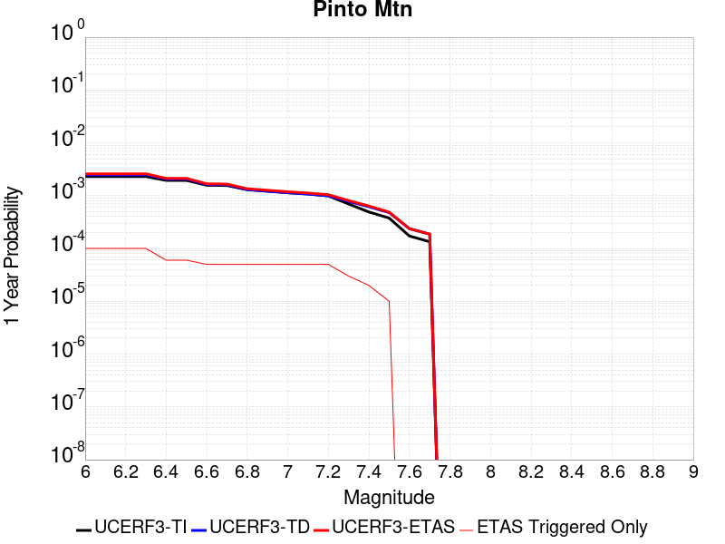 | 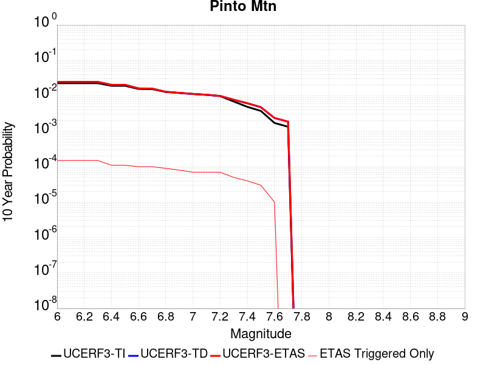 |

| Magnitude | 1 wk TI Prob | 1 wk TD Prob | 1 wk ETAS Prob | 1 wk ETAS/TD Gain | 1 wk ETAS Triggered Only | 1 mo TI Prob | 1 mo TD Prob | 1 mo ETAS Prob | 1 mo ETAS/TD Gain | 1 mo ETAS Triggered Only | 1 yr TI Prob | 1 yr TD Prob | 1 yr ETAS Prob | 1 yr ETAS/TD Gain | 1 yr ETAS Triggered Only | 10 yr TI Prob | 10 yr TD Prob | 10 yr ETAS Prob | 10 yr ETAS/TD Gain | 10 yr ETAS Triggered Only |
|-----|-----|-----|-----|-----|-----|-----|-----|-----|-----|-----|-----|-----|-----|-----|-----|-----|-----|-----|-----|-----|
| 6.0 | 4.4194956E-5 | 4.785362E-5 | 7.451901E-5 | 1.5572283 | 2.6666667E-5 | 1.893932E-4 | 2.0507174E-4 | 3.3837772E-4 | 1.6500456 | 1.3333333E-4 | 0.0023034236 | 0.0024940541 | 0.0026802553 | 1.074658 | 1.8666667E-4 | 0.022796938 | 0.024678145 | 0.024886213 | 1.0084313 | 2.1333333E-4 |
| 6.1 | 4.4194956E-5 | 4.785362E-5 | 7.451901E-5 | 1.5572283 | 2.6666667E-5 | 1.893932E-4 | 2.0507174E-4 | 3.3837772E-4 | 1.6500456 | 1.3333333E-4 | 0.0023034236 | 0.0024940541 | 0.0026802553 | 1.074658 | 1.8666667E-4 | 0.022796938 | 0.024678145 | 0.024886213 | 1.0084313 | 2.1333333E-4 |
| 6.2 | 4.4194956E-5 | 4.785362E-5 | 7.451901E-5 | 1.5572283 | 2.6666667E-5 | 1.893932E-4 | 2.0507174E-4 | 3.3837772E-4 | 1.6500456 | 1.3333333E-4 | 0.0023034236 | 0.0024940541 | 0.0026802553 | 1.074658 | 1.8666667E-4 | 0.022796938 | 0.024678145 | 0.024886213 | 1.0084313 | 2.1333333E-4 |
| 6.3 | 4.4194956E-5 | 4.785362E-5 | 7.451901E-5 | 1.5572283 | 2.6666667E-5 | 1.893932E-4 | 2.0507174E-4 | 3.3837772E-4 | 1.6500456 | 1.3333333E-4 | 0.0023034236 | 0.0024940541 | 0.0026802553 | 1.074658 | 1.8666667E-4 | 0.022796938 | 0.024678145 | 0.024886213 | 1.0084313 | 2.1333333E-4 |
| 6.4 | 3.729929E-5 | 3.9603186E-5 | 3.9603186E-5 | 1.0 | 0.0 | 1.5984432E-4 | 1.6971743E-4 | 2.230417E-4 | 1.3141946 | 5.3333333E-5 | 0.0019443673 | 0.002064445 | 0.0021708915 | 1.0515618 | 1.0666667E-4 | 0.019274427 | 0.02046269 | 0.020593295 | 1.0063826 | 1.3333333E-4 |
| 6.5 | 3.729929E-5 | 3.9603186E-5 | 3.9603186E-5 | 1.0 | 0.0 | 1.5984432E-4 | 1.6971743E-4 | 2.230417E-4 | 1.3141946 | 5.3333333E-5 | 0.0019443673 | 0.002064445 | 0.0021708915 | 1.0515618 | 1.0666667E-4 | 0.019274427 | 0.02046269 | 0.020593295 | 1.0063826 | 1.3333333E-4 |
| 6.6 | 3.0204548E-5 | 3.1205298E-5 | 3.1205298E-5 | 1.0 | 0.0 | 1.2944164E-4 | 1.3373033E-4 | 1.8705653E-4 | 1.3987592 | 5.3333333E-5 | 0.0015748127 | 0.0016269855 | 0.0017334786 | 1.0654542 | 1.0666667E-4 | 0.015636992 | 0.01615461 | 0.016285788 | 1.0081203 | 1.3333333E-4 |
| 6.7 | 2.9857754E-5 | 3.081468E-5 | 3.081468E-5 | 1.0 | 0.0 | 1.2795553E-4 | 1.3205643E-4 | 1.8538273E-4 | 1.4038144 | 5.3333333E-5 | 0.0015567453 | 0.001606636 | 0.0017131312 | 1.0662847 | 1.0666667E-4 | 0.015458848 | 0.01595405 | 0.016085254 | 1.008224 | 1.3333333E-4 |
| 6.8 | 2.4819734E-5 | 2.5009364E-5 | 2.5009364E-5 | 1.0 | 0.0 | 1.0636595E-4 | 1.07178705E-4 | 1.6050632E-4 | 1.497558 | 5.3333333E-5 | 0.0012942362 | 0.0013041412 | 0.0014106688 | 1.0816841 | 1.0666667E-4 | 0.012867244 | 0.0129672475 | 0.013098852 | 1.010149 | 1.3333333E-4 |
| 6.9 | 2.331124E-5 | 2.3337643E-5 | 2.3337643E-5 | 1.0 | 0.0 | 9.990149E-5 | 1.00014746E-4 | 1.5334274E-4 | 1.5332013 | 5.3333333E-5 | 0.001215622 | 0.0012170197 | 0.0013235565 | 1.0875391 | 1.0666667E-4 | 0.012089936 | 0.012105742 | 0.012211116 | 1.0087045 | 1.0666667E-4 |
| 7.0 | 2.1818534E-5 | 2.1760772E-5 | 2.1760772E-5 | 1.0 | 0.0 | 9.3504656E-5 | 9.325723E-5 | 1.4658559E-4 | 1.5718416 | 5.3333333E-5 | 0.0011378246 | 0.0011348352 | 0.0012413808 | 1.0938864 | 1.0666667E-4 | 0.011320163 | 0.011292503 | 0.011397966 | 1.0093391 | 1.0666667E-4 |
| 7.1 | 2.066081E-5 | 2.0540418E-5 | 2.0540418E-5 | 1.0 | 0.0 | 8.854332E-5 | 8.8027504E-5 | 1.4135614E-4 | 1.6058179 | 5.3333333E-5 | 0.0010774818 | 0.0010712275 | 0.0011777799 | 1.0994676 | 1.0666667E-4 | 0.010722724 | 0.010662688 | 0.010768218 | 1.0098971 | 1.0666667E-4 |
| 7.2 | 1.8990233E-5 | 1.9053701E-5 | 1.9053701E-5 | 1.0 | 0.0 | 8.138417E-5 | 8.1656275E-5 | 1.3498525E-4 | 1.653091 | 5.3333333E-5 | 9.904018E-4 | 9.937311E-4 | 0.0011002917 | 1.1072329 | 1.0666667E-4 | 0.009859995 | 0.009894874 | 0.010000485 | 1.0106733 | 1.0666667E-4 |
| 7.3 | 1.3335872E-5 | 1.4906372E-5 | 1.4906372E-5 | 1.0 | 0.0 | 5.7152483E-5 | 6.388296E-5 | 1.1721288E-4 | 1.8348068 | 5.3333333E-5 | 6.956093E-4 | 7.775102E-4 | 8.5744803E-4 | 1.1028125 | 8.0E-5 | 0.006934359 | 0.0077491994 | 0.007828579 | 1.0102437 | 8.0E-5 |
| 7.4 | 9.414066E-6 | 1.186061E-5 | 1.186061E-5 | 1.0 | 0.0 | 4.0345374E-5 | 5.0830247E-5 | 7.749556E-5 | 1.5245954 | 2.6666667E-5 | 4.910942E-4 | 6.1869196E-4 | 6.719923E-4 | 1.08615 | 5.3333333E-5 | 0.0049001034 | 0.006170644 | 0.0062236483 | 1.0085897 | 5.3333333E-5 |
| 7.5 | 7.2101157E-6 | 9.157893E-6 | 9.157893E-6 | 1.0 | 0.0 | 3.090013E-5 | 3.924757E-5 | 6.591319E-5 | 1.679421 | 2.6666667E-5 | 3.7614413E-4 | 4.7774217E-4 | 5.043961E-4 | 1.0557915 | 2.6666667E-5 | 0.0037550807 | 0.004767927 | 0.0047944663 | 1.0055662 | 2.6666667E-5 |
| 7.6 | 3.296375E-6 | 4.5453176E-6 | 4.5453176E-6 | 1.0 | 0.0 | 1.4127245E-5 | 1.9479796E-5 | 1.9479796E-5 | 1.0 | 0.0 | 1.7198564E-4 | 2.3714209E-4 | 2.3714209E-4 | 1.0 | 0.0 | 0.0017185259 | 0.0023690276 | 0.0023690276 | 1.0 | 0.0 |
| 7.7 | 2.5741092E-6 | 3.584251E-6 | 3.584251E-6 | 1.0 | 0.0 | 1.103185E-5 | 1.5360993E-5 | 1.5360993E-5 | 1.0 | 0.0 | 1.3430449E-4 | 1.8700535E-4 | 1.8700535E-4 | 1.0 | 0.0 | 0.0013422335 | 0.0018686098 | 0.0018686098 | 1.0 | 0.0 |

## Whittier alt 1
*[(top)](#table-of-contents)*

| 1 Week | 1 Month | 1 Year | 10 Year |
|-----|-----|-----|-----|
|  |  |  | 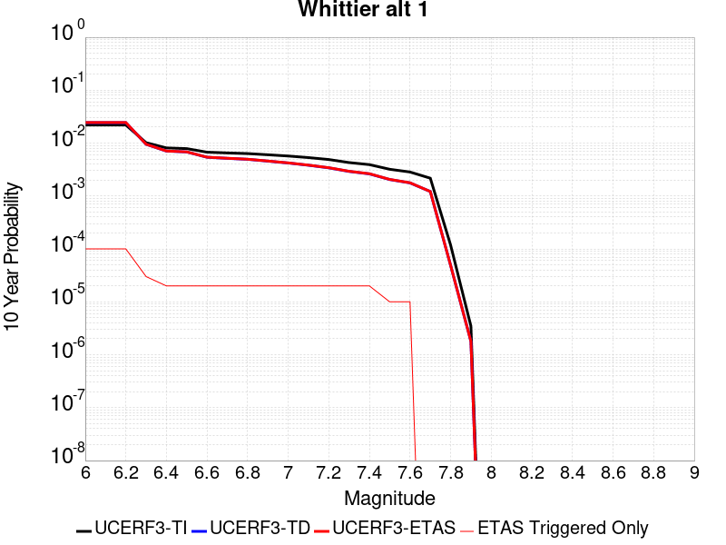 |

| Magnitude | 1 wk TI Prob | 1 wk TD Prob | 1 wk ETAS Prob | 1 wk ETAS/TD Gain | 1 wk ETAS Triggered Only | 1 mo TI Prob | 1 mo TD Prob | 1 mo ETAS Prob | 1 mo ETAS/TD Gain | 1 mo ETAS Triggered Only | 1 yr TI Prob | 1 yr TD Prob | 1 yr ETAS Prob | 1 yr ETAS/TD Gain | 1 yr ETAS Triggered Only | 10 yr TI Prob | 10 yr TD Prob | 10 yr ETAS Prob | 10 yr ETAS/TD Gain | 10 yr ETAS Triggered Only |
|-----|-----|-----|-----|-----|-----|-----|-----|-----|-----|-----|-----|-----|-----|-----|-----|-----|-----|-----|-----|-----|
| 6.0 | 4.2554693E-5 | 4.725218E-5 | 7.391759E-5 | 1.5643212 | 2.6666667E-5 | 1.8236451E-4 | 2.0249544E-4 | 2.8247925E-4 | 1.3949907 | 8.0E-5 | 0.002218027 | 0.0024629154 | 0.0025693192 | 1.0432024 | 1.0666667E-4 | 0.02196019 | 0.024390234 | 0.024546333 | 1.0064 | 1.6E-4 |
| 6.1 | 4.2554693E-5 | 4.725218E-5 | 7.391759E-5 | 1.5643212 | 2.6666667E-5 | 1.8236451E-4 | 2.0249544E-4 | 2.8247925E-4 | 1.3949907 | 8.0E-5 | 0.002218027 | 0.0024629154 | 0.0025693192 | 1.0432024 | 1.0666667E-4 | 0.02196019 | 0.024390234 | 0.024546333 | 1.0064 | 1.6E-4 |
| 6.2 | 4.2554693E-5 | 4.725218E-5 | 7.391759E-5 | 1.5643212 | 2.6666667E-5 | 1.8236451E-4 | 2.0249544E-4 | 2.8247925E-4 | 1.3949907 | 8.0E-5 | 0.002218027 | 0.0024629154 | 0.0025693192 | 1.0432024 | 1.0666667E-4 | 0.02196019 | 0.024390234 | 0.024546333 | 1.0064 | 1.6E-4 |
| 6.3 | 1.9617712E-5 | 1.8268593E-5 | 1.8268593E-5 | 1.0 | 0.0 | 8.40732E-5 | 7.829172E-5 | 1.3162088E-4 | 1.6811596 | 5.3333333E-5 | 0.0010231105 | 9.52804E-4 | 0.0010060865 | 1.0559218 | 5.3333333E-5 | 0.01018413 | 0.009490474 | 0.009569716 | 1.0083495 | 8.0E-5 |
| 6.4 | 1.5611336E-5 | 1.3604271E-5 | 1.3604271E-5 | 1.0 | 0.0 | 6.690401E-5 | 5.8302747E-5 | 8.496786E-5 | 1.457356 | 2.6666667E-5 | 8.142519E-4 | 7.0961076E-4 | 7.362585E-4 | 1.0375526 | 2.6666667E-5 | 0.008112748 | 0.0070754145 | 0.0071283705 | 1.0074846 | 5.3333333E-5 |
| 6.5 | 1.5150166E-5 | 1.3100925E-5 | 1.3100925E-5 | 1.0 | 0.0 | 6.492767E-5 | 5.6145647E-5 | 8.281082E-5 | 1.4749285 | 2.6666667E-5 | 7.9020765E-4 | 6.8336475E-4 | 7.1001315E-4 | 1.038996 | 2.6666667E-5 | 0.007874036 | 0.0068145846 | 0.0068675545 | 1.007773 | 5.3333333E-5 |
| 6.6 | 1.295588E-5 | 1.0380725E-5 | 1.0380725E-5 | 1.0 | 0.0 | 5.552402E-5 | 4.4488075E-5 | 7.1153554E-5 | 1.5993849 | 2.6666667E-5 | 6.7579525E-4 | 5.4150965E-4 | 5.681619E-4 | 1.0492184 | 2.6666667E-5 | 0.006737438 | 0.0054033357 | 0.0054563805 | 1.0098171 | 5.3333333E-5 |
| 6.7 | 1.2542085E-5 | 9.899369E-6 | 9.899369E-6 | 1.0 | 0.0 | 5.3750682E-5 | 4.242519E-5 | 6.9090725E-5 | 1.6285307 | 2.6666667E-5 | 6.542181E-4 | 5.164061E-4 | 5.43059E-4 | 1.0516123 | 2.6666667E-5 | 0.006522954 | 0.0051534795 | 0.005206538 | 1.0102956 | 5.3333333E-5 |
| 6.8 | 1.2195878E-5 | 9.495415E-6 | 9.495415E-6 | 1.0 | 0.0 | 5.2267E-5 | 4.069401E-5 | 6.735959E-5 | 1.6552705 | 2.6666667E-5 | 6.36165E-4 | 4.9533875E-4 | 5.219922E-4 | 1.0538086 | 2.6666667E-5 | 0.0063434686 | 0.004943688 | 0.0049967575 | 1.0107348 | 5.3333333E-5 |
| 6.9 | 1.1580298E-5 | 8.772933E-6 | 8.772933E-6 | 1.0 | 0.0 | 4.9628903E-5 | 3.7597754E-5 | 6.426342E-5 | 1.7092355 | 2.6666667E-5 | 6.040644E-4 | 4.5765814E-4 | 4.8431262E-4 | 1.058241 | 2.6666667E-5 | 0.00602425 | 0.0045684157 | 0.0046215057 | 1.011621 | 5.3333333E-5 |
| 7.0 | 1.0964795E-5 | 8.083994E-6 | 8.083994E-6 | 1.0 | 0.0 | 4.6991136E-5 | 3.4645236E-5 | 6.131098E-5 | 1.7696799 | 2.6666667E-5 | 5.7196687E-4 | 4.2172565E-4 | 4.4838106E-4 | 1.0632056 | 2.6666667E-5 | 0.0057049696 | 0.004210462 | 0.0042635705 | 1.0126135 | 5.3333333E-5 |
| 7.1 | 1.0230601E-5 | 7.3266697E-6 | 7.3266697E-6 | 1.0 | 0.0 | 4.3844695E-5 | 3.1399642E-5 | 5.806547E-5 | 1.84924 | 2.6666667E-5 | 5.336784E-4 | 3.8222488E-4 | 4.0888134E-4 | 1.0697403 | 2.6666667E-5 | 0.005323986 | 0.0038168381 | 0.003869968 | 1.0139198 | 5.3333333E-5 |
| 7.2 | 9.40865E-6 | 6.543289E-6 | 6.543289E-6 | 1.0 | 0.0 | 4.032216E-5 | 2.8042374E-5 | 5.4708293E-5 | 1.9509152 | 2.6666667E-5 | 4.908117E-4 | 3.4136363E-4 | 3.680212E-4 | 1.0780914 | 2.6666667E-5 | 0.0048972913 | 0.003409485 | 0.0034626366 | 1.0155894 | 5.3333333E-5 |
| 7.3 | 8.237384E-6 | 5.5977525E-6 | 5.5977525E-6 | 1.0 | 0.0 | 3.5302593E-5 | 2.3990153E-5 | 5.065618E-5 | 2.1115406 | 2.6666667E-5 | 4.2972428E-4 | 2.92042E-4 | 3.1870088E-4 | 1.0912844 | 2.6666667E-5 | 0.0042889426 | 0.002916903 | 0.0029700808 | 1.0182309 | 5.3333333E-5 |
| 7.4 | 7.5316966E-6 | 5.027819E-6 | 5.027819E-6 | 1.0 | 0.0 | 3.2278298E-5 | 2.1547625E-5 | 4.821372E-5 | 2.2375422 | 2.6666667E-5 | 3.9291743E-4 | 2.6231175E-4 | 2.8897144E-4 | 1.1016335 | 2.6666667E-5 | 0.0039222343 | 0.0026201333 | 0.0026733268 | 1.0203018 | 5.3333333E-5 |
| 7.5 | 6.149649E-6 | 3.933841E-6 | 3.933841E-6 | 1.0 | 0.0 | 2.6355372E-5 | 1.6859214E-5 | 4.352543E-5 | 2.5816998 | 2.6666667E-5 | 3.208294E-4 | 2.052425E-4 | 2.3190369E-4 | 1.1299009 | 2.6666667E-5 | 0.003203666 | 0.0020506186 | 0.0020772307 | 1.0129775 | 2.6666667E-5 |
| 7.6 | 5.457711E-6 | 3.3953788E-6 | 3.3953788E-6 | 1.0 | 0.0 | 2.338998E-5 | 1.4551547E-5 | 4.1217827E-5 | 2.832539 | 2.6666667E-5 | 2.8473578E-4 | 1.771515E-4 | 2.0381344E-4 | 1.1505036 | 2.6666667E-5 | 0.0028437122 | 0.0017701836 | 0.001796803 | 1.0150377 | 2.6666667E-5 |
| 7.7 | 4.1676276E-6 | 2.3331952E-6 | 2.3331952E-6 | 1.0 | 0.0 | 1.7861139E-5 | 9.999374E-6 | 9.999374E-6 | 1.0 | 0.0 | 2.1743766E-4 | 1.2173632E-4 | 1.2173632E-4 | 1.0 | 0.0 | 0.0021722503 | 0.0012167693 | 0.0012167693 | 1.0 | 0.0 |
| 7.8 | 2.2692414E-7 | 9.3854695E-8 | 9.3854695E-8 | 1.0 | 0.0 | 9.725317E-7 | 4.0223435E-7 | 4.0223435E-7 | 1.0 | 0.0 | 1.1840509E-5 | 4.8971956E-6 | 4.8971956E-6 | 1.0 | 0.0 | 1.1839878E-4 | 4.8971204E-5 | 4.8971204E-5 | 1.0 | 0.0 |
| 7.9 | 6.676829E-9 | 3.439853E-9 | 3.439853E-9 | 1.0 | 0.0 | 2.861498E-8 | 1.4742227E-8 | 1.4742227E-8 | 1.0 | 0.0 | 3.4838732E-7 | 1.7948659E-7 | 1.7948659E-7 | 1.0 | 0.0 | 3.4838679E-6 | 1.7948646E-6 | 1.7948646E-6 | 1.0 | 0.0 |

## San Jacinto (Lytle Creek connector)
*[(top)](#table-of-contents)*

| 1 Week | 1 Month | 1 Year | 10 Year |
|-----|-----|-----|-----|
|  |  |  |  |

| Magnitude | 1 wk TI Prob | 1 wk TD Prob | 1 wk ETAS Prob | 1 wk ETAS/TD Gain | 1 wk ETAS Triggered Only | 1 mo TI Prob | 1 mo TD Prob | 1 mo ETAS Prob | 1 mo ETAS/TD Gain | 1 mo ETAS Triggered Only | 1 yr TI Prob | 1 yr TD Prob | 1 yr ETAS Prob | 1 yr ETAS/TD Gain | 1 yr ETAS Triggered Only | 10 yr TI Prob | 10 yr TD Prob | 10 yr ETAS Prob | 10 yr ETAS/TD Gain | 10 yr ETAS Triggered Only |
|-----|-----|-----|-----|-----|-----|-----|-----|-----|-----|-----|-----|-----|-----|-----|-----|-----|-----|-----|-----|-----|
| 6.0 | 6.693995E-6 | 6.660216E-6 | 1.3999266E-4 | 21.019238 | 1.3333333E-4 | 2.8688235E-5 | 2.854347E-5 | 1.885389E-4 | 6.6053247 | 1.6E-4 | 3.492233E-4 | 3.4746144E-4 | 5.0740584E-4 | 1.4603227 | 1.6E-4 | 0.00348675 | 0.0035493854 | 0.0037353893 | 1.0524046 | 1.8666667E-4 |
| 6.1 | 6.693995E-6 | 6.660216E-6 | 1.3999266E-4 | 21.019238 | 1.3333333E-4 | 2.8688235E-5 | 2.854347E-5 | 1.885389E-4 | 6.6053247 | 1.6E-4 | 3.492233E-4 | 3.4746144E-4 | 5.0740584E-4 | 1.4603227 | 1.6E-4 | 0.00348675 | 0.0035493854 | 0.0037353893 | 1.0524046 | 1.8666667E-4 |
| 6.2 | 6.693995E-6 | 6.660216E-6 | 1.3999266E-4 | 21.019238 | 1.3333333E-4 | 2.8688235E-5 | 2.854347E-5 | 1.885389E-4 | 6.6053247 | 1.6E-4 | 3.492233E-4 | 3.4746144E-4 | 5.0740584E-4 | 1.4603227 | 1.6E-4 | 0.00348675 | 0.0035493854 | 0.0037353893 | 1.0524046 | 1.8666667E-4 |
| 6.3 | 6.693995E-6 | 6.660216E-6 | 1.3999266E-4 | 21.019238 | 1.3333333E-4 | 2.8688235E-5 | 2.854347E-5 | 1.885389E-4 | 6.6053247 | 1.6E-4 | 3.492233E-4 | 3.4746144E-4 | 5.0740584E-4 | 1.4603227 | 1.6E-4 | 0.00348675 | 0.0035493854 | 0.0037353893 | 1.0524046 | 1.8666667E-4 |
| 6.4 | 6.693995E-6 | 6.660216E-6 | 1.3999266E-4 | 21.019238 | 1.3333333E-4 | 2.8688235E-5 | 2.854347E-5 | 1.885389E-4 | 6.6053247 | 1.6E-4 | 3.492233E-4 | 3.4746144E-4 | 5.0740584E-4 | 1.4603227 | 1.6E-4 | 0.00348675 | 0.0035493854 | 0.0037353893 | 1.0524046 | 1.8666667E-4 |
| 6.5 | 6.6561875E-6 | 6.6204343E-6 | 1.3995288E-4 | 21.139532 | 1.3333333E-4 | 2.8526205E-5 | 2.837298E-5 | 1.8836845E-4 | 6.6390076 | 1.6E-4 | 3.472512E-4 | 3.4538636E-4 | 5.053311E-4 | 1.4630893 | 1.6E-4 | 0.0034670907 | 0.003528701 | 0.0037147088 | 1.0527129 | 1.8666667E-4 |
| 6.6 | 6.6561875E-6 | 6.6204343E-6 | 1.3995288E-4 | 21.139532 | 1.3333333E-4 | 2.8526205E-5 | 2.837298E-5 | 1.8836845E-4 | 6.6390076 | 1.6E-4 | 3.472512E-4 | 3.4538636E-4 | 5.053311E-4 | 1.4630893 | 1.6E-4 | 0.0034670907 | 0.003528701 | 0.0037147088 | 1.0527129 | 1.8666667E-4 |
| 6.7 | 6.5802237E-6 | 6.539611E-6 | 1.3987208E-4 | 21.38844 | 1.3333333E-4 | 2.8200653E-5 | 2.8026603E-5 | 1.8802212E-4 | 6.7087016 | 1.6E-4 | 3.4328885E-4 | 3.4117055E-4 | 5.01116E-4 | 1.4688137 | 1.6E-4 | 0.0034275902 | 0.0034866752 | 0.003672691 | 1.0533504 | 1.8666667E-4 |
| 6.8 | 6.575632E-6 | 6.5341005E-6 | 1.3986656E-4 | 21.405634 | 1.3333333E-4 | 2.8180975E-5 | 2.8002989E-5 | 1.879985E-4 | 6.7135158 | 1.6E-4 | 3.4304935E-4 | 3.4088313E-4 | 5.0082855E-4 | 1.4692091 | 1.6E-4 | 0.0034252026 | 0.00348381 | 0.0036698263 | 1.0533946 | 1.8666667E-4 |
| 6.9 | 6.570433E-6 | 6.525495E-6 | 1.3985796E-4 | 21.432545 | 1.3333333E-4 | 2.8158694E-5 | 2.7966107E-5 | 1.8796163E-4 | 6.721051 | 1.6E-4 | 3.4277816E-4 | 3.4043423E-4 | 5.0037977E-4 | 1.469828 | 1.6E-4 | 0.0034224992 | 0.0034793352 | 0.0036653525 | 1.0534635 | 1.8666667E-4 |
| 7.0 | 6.5643826E-6 | 6.515616E-6 | 1.3984808E-4 | 21.463524 | 1.3333333E-4 | 2.8132765E-5 | 2.792377E-5 | 1.879193E-4 | 6.7297254 | 1.6E-4 | 3.424626E-4 | 3.3991894E-4 | 4.998645E-4 | 1.4705405 | 1.6E-4 | 0.0034193532 | 0.0034741985 | 0.0036602165 | 1.0535427 | 1.8666667E-4 |
| 7.1 | 6.557402E-6 | 6.5043278E-6 | 1.3983679E-4 | 21.499039 | 1.3333333E-4 | 2.8102848E-5 | 2.7875392E-5 | 1.8787093E-4 | 6.7396693 | 1.6E-4 | 3.4209844E-4 | 3.3933012E-4 | 4.9927586E-4 | 1.4713572 | 1.6E-4 | 0.0034157229 | 0.0034683298 | 0.0036543491 | 1.0536337 | 1.8666667E-4 |
| 7.2 | 6.546394E-6 | 6.4862943E-6 | 1.3981876E-4 | 21.55603 | 1.3333333E-4 | 2.8055672E-5 | 2.7798109E-5 | 1.8779366E-4 | 6.755627 | 1.6E-4 | 3.4152428E-4 | 3.3838948E-4 | 4.9833534E-4 | 1.4726679 | 1.6E-4 | 0.0034099987 | 0.0034589572 | 0.0036449782 | 1.0537795 | 1.8666667E-4 |
| 7.3 | 6.5364216E-6 | 6.4670803E-6 | 1.3979955E-4 | 21.617104 | 1.3333333E-4 | 2.8012933E-5 | 2.7715765E-5 | 1.8771132E-4 | 6.772728 | 1.6E-4 | 3.4100408E-4 | 3.3738726E-4 | 4.973333E-4 | 1.4740725 | 1.6E-4 | 0.003404813 | 0.0034489788 | 0.0036350016 | 1.0539356 | 1.8666667E-4 |
| 7.4 | 6.5269523E-6 | 6.4481674E-6 | 1.3978065E-4 | 21.677576 | 1.3333333E-4 | 2.7972354E-5 | 2.7634711E-5 | 1.8763028E-4 | 6.78966 | 1.6E-4 | 3.4051016E-4 | 3.3640073E-4 | 4.963469E-4 | 1.4754632 | 1.6E-4 | 0.0033998888 | 0.003439161 | 0.0036251857 | 1.0540901 | 1.8666667E-4 |
| 7.5 | 6.5111835E-6 | 6.424442E-6 | 1.3975691E-4 | 21.753939 | 1.3333333E-4 | 2.7904773E-5 | 2.7533031E-5 | 1.8752863E-4 | 6.811042 | 1.6E-4 | 3.3968766E-4 | 3.3516317E-4 | 4.9510953E-4 | 1.4772195 | 1.6E-4 | 0.0033916887 | 0.003426834 | 0.003612861 | 1.0542854 | 1.8666667E-4 |
| 7.6 | 6.4768806E-6 | 6.383551E-6 | 1.3971604E-4 | 21.886883 | 1.3333333E-4 | 2.7757764E-5 | 2.735779E-5 | 1.873534E-4 | 6.8482656 | 1.6E-4 | 3.3789838E-4 | 3.3303024E-4 | 4.92977E-4 | 1.4802768 | 1.6E-4 | 0.0033738504 | 0.0034055663 | 0.003591597 | 1.0546255 | 1.8666667E-4 |
| 7.7 | 6.1655364E-6 | 6.1760365E-6 | 1.3950854E-4 | 22.588686 | 1.3333333E-4 | 2.642346E-5 | 2.646846E-5 | 1.8646423E-4 | 7.0447707 | 1.6E-4 | 3.2165812E-4 | 3.2220592E-4 | 4.8215434E-4 | 1.4964169 | 1.6E-4 | 0.0032119295 | 0.0032971818 | 0.0034832328 | 1.0564274 | 1.8666667E-4 |
| 7.8 | 5.5043524E-6 | 5.737097E-6 | 1.3906967E-4 | 24.240425 | 1.3333333E-4 | 2.3589868E-5 | 2.4587327E-5 | 1.8458339E-4 | 7.5072575 | 1.6E-4 | 2.871688E-4 | 2.9930964E-4 | 4.5926176E-4 | 1.5344034 | 1.6E-4 | 0.0028679797 | 0.0030672832 | 0.0032533775 | 1.0606706 | 1.8666667E-4 |
| 7.9 | 3.889249E-6 | 4.076761E-6 | 1.3740954E-4 | 33.70557 | 1.3333333E-4 | 1.6668104E-5 | 1.7471715E-5 | 1.7746892E-4 | 10.157498 | 1.6E-4 | 2.0291525E-4 | 2.1269741E-4 | 3.7266337E-4 | 1.7520823 | 1.6E-4 | 0.0020273007 | 0.0021943315 | 0.0023805886 | 1.084881 | 1.8666667E-4 |
| 8.0 | 2.668535E-6 | 2.5315155E-6 | 1.3586451E-4 | 53.66924 | 1.3333333E-4 | 1.1436528E-5 | 1.0849307E-5 | 1.7084758E-4 | 15.747326 | 1.6E-4 | 1.3923083E-4 | 1.3208234E-4 | 2.920612E-4 | 2.2112057 | 1.6E-4 | 0.0013914363 | 0.0013757964 | 0.0015355762 | 1.1161363 | 1.6E-4 |
| 8.1 | 1.5911459E-6 | 1.218661E-6 | 2.7885295E-5 | 22.881912 | 2.6666667E-5 | 6.8191785E-6 | 5.2228224E-6 | 5.8555877E-5 | 11.211538 | 5.3333333E-5 | 8.3020335E-5 | 6.3586034E-5 | 1.1691597E-4 | 1.8387053 | 5.3333333E-5 | 8.298933E-4 | 6.6932244E-4 | 7.2262005E-4 | 1.0796292 | 5.3333333E-5 |
| 8.2 | 6.1294963E-7 | 2.1812275E-7 | 2.1812275E-7 | 1.0 | 0.0 | 2.6269242E-6 | 9.3481145E-7 | 9.3481145E-7 | 1.0 | 0.0 | 3.1982334E-5 | 1.138127E-5 | 1.138127E-5 | 1.0 | 0.0 | 3.1977732E-4 | 1.2784546E-4 | 1.2784546E-4 | 1.0 | 0.0 |
| 8.3 | 1.762871E-7 | 4.7546838E-8 | 4.7546838E-8 | 1.0 | 0.0 | 7.5551594E-7 | 2.0377215E-7 | 2.0377215E-7 | 1.0 | 0.0 | 9.1983675E-6 | 2.480923E-6 | 2.480923E-6 | 1.0 | 0.0 | 9.197987E-5 | 2.868753E-5 | 2.868753E-5 | 1.0 | 0.0 |

## Kern Canyon (South Kern) 2011
*[(top)](#table-of-contents)*

| 1 Week | 1 Month | 1 Year | 10 Year |
|-----|-----|-----|-----|
|  |  |  |  |

| Magnitude | 1 wk TI Prob | 1 wk TD Prob | 1 wk ETAS Prob | 1 wk ETAS/TD Gain | 1 wk ETAS Triggered Only | 1 mo TI Prob | 1 mo TD Prob | 1 mo ETAS Prob | 1 mo ETAS/TD Gain | 1 mo ETAS Triggered Only | 1 yr TI Prob | 1 yr TD Prob | 1 yr ETAS Prob | 1 yr ETAS/TD Gain | 1 yr ETAS Triggered Only | 10 yr TI Prob | 10 yr TD Prob | 10 yr ETAS Prob | 10 yr ETAS/TD Gain | 10 yr ETAS Triggered Only |
|-----|-----|-----|-----|-----|-----|-----|-----|-----|-----|-----|-----|-----|-----|-----|-----|-----|-----|-----|-----|-----|
| 6.0 | 4.105075E-6 | 4.1137264E-6 | 8.4113395E-5 | 20.447008 | 8.0E-5 | 1.7593058E-5 | 1.763014E-5 | 1.5096112E-4 | 8.562673 | 1.3333333E-4 | 2.1417443E-4 | 2.1462646E-4 | 4.0125306E-4 | 1.8695414 | 1.8666667E-4 | 0.0021396813 | 0.0021442557 | 0.002330522 | 1.0868676 | 1.8666667E-4 |
| 6.1 | 4.105075E-6 | 4.1137264E-6 | 8.4113395E-5 | 20.447008 | 8.0E-5 | 1.7593058E-5 | 1.763014E-5 | 1.5096112E-4 | 8.562673 | 1.3333333E-4 | 2.1417443E-4 | 2.1462646E-4 | 4.0125306E-4 | 1.8695414 | 1.8666667E-4 | 0.0021396813 | 0.0021442557 | 0.002330522 | 1.0868676 | 1.8666667E-4 |
| 6.2 | 4.105075E-6 | 4.1137264E-6 | 8.4113395E-5 | 20.447008 | 8.0E-5 | 1.7593058E-5 | 1.763014E-5 | 1.5096112E-4 | 8.562673 | 1.3333333E-4 | 2.1417443E-4 | 2.1462646E-4 | 4.0125306E-4 | 1.8695414 | 1.8666667E-4 | 0.0021396813 | 0.0021442557 | 0.002330522 | 1.0868676 | 1.8666667E-4 |
| 6.3 | 4.105075E-6 | 4.1137264E-6 | 8.4113395E-5 | 20.447008 | 8.0E-5 | 1.7593058E-5 | 1.763014E-5 | 1.5096112E-4 | 8.562673 | 1.3333333E-4 | 2.1417443E-4 | 2.1462646E-4 | 4.0125306E-4 | 1.8695414 | 1.8666667E-4 | 0.0021396813 | 0.0021442557 | 0.002330522 | 1.0868676 | 1.8666667E-4 |
| 6.4 | 4.105075E-6 | 4.1137264E-6 | 8.4113395E-5 | 20.447008 | 8.0E-5 | 1.7593058E-5 | 1.763014E-5 | 1.5096112E-4 | 8.562673 | 1.3333333E-4 | 2.1417443E-4 | 2.1462646E-4 | 4.0125306E-4 | 1.8695414 | 1.8666667E-4 | 0.0021396813 | 0.0021442557 | 0.002330522 | 1.0868676 | 1.8666667E-4 |
| 6.5 | 2.9849807E-6 | 2.9731548E-6 | 5.630633E-5 | 18.938244 | 5.3333333E-5 | 1.2792712E-5 | 1.274203E-5 | 6.607468E-5 | 5.18557 | 5.3333333E-5 | 1.5574014E-4 | 1.5512333E-4 | 2.3511091E-4 | 1.5156387 | 8.0E-5 | 0.0015563103 | 0.0015501656 | 0.0016300416 | 1.0515274 | 8.0E-5 |
| 6.6 | 2.9849807E-6 | 2.9731548E-6 | 5.630633E-5 | 18.938244 | 5.3333333E-5 | 1.2792712E-5 | 1.274203E-5 | 6.607468E-5 | 5.18557 | 5.3333333E-5 | 1.5574014E-4 | 1.5512333E-4 | 2.3511091E-4 | 1.5156387 | 8.0E-5 | 0.0015563103 | 0.0015501656 | 0.0016300416 | 1.0515274 | 8.0E-5 |
| 6.7 | 2.6756725E-6 | 2.6582206E-6 | 2.9324816E-5 | 11.031746 | 2.6666667E-5 | 1.1467117E-5 | 1.1392325E-5 | 3.805869E-5 | 3.3407304 | 2.6666667E-5 | 1.396032E-4 | 1.3869285E-4 | 1.9201878E-4 | 1.3844894 | 5.3333333E-5 | 0.0013951553 | 0.0013860738 | 0.0014393332 | 1.0384246 | 5.3333333E-5 |
| 6.8 | 2.3283721E-6 | 2.3047787E-6 | 2.8971384E-5 | 12.570136 | 2.6666667E-5 | 9.9787E-6 | 9.877586E-6 | 3.654399E-5 | 3.6996882 | 2.6666667E-5 | 1.214839E-4 | 1.20253055E-4 | 1.7357997E-4 | 1.4434558 | 5.3333333E-5 | 0.001214175 | 0.0012018873 | 0.0012551565 | 1.0443213 | 5.3333333E-5 |
| 6.9 | 2.0972677E-6 | 2.0696411E-6 | 2.8736253E-5 | 13.884655 | 2.6666667E-5 | 8.988259E-6 | 8.869861E-6 | 3.553629E-5 | 4.006409 | 2.6666667E-5 | 1.0942656E-4 | 1.0798526E-4 | 1.6131284E-4 | 1.4938413 | 5.3333333E-5 | 0.0010937268 | 0.0010793337 | 0.0011326094 | 1.0493599 | 5.3333333E-5 |
| 7.0 | 1.7132242E-6 | 1.6787036E-6 | 2.8345325E-5 | 16.885248 | 2.6666667E-5 | 7.3423685E-6 | 7.194424E-6 | 3.38609E-5 | 4.7065473 | 2.6666667E-5 | 8.938967E-5 | 8.758863E-5 | 1.409173E-4 | 1.6088537 | 5.3333333E-5 | 8.935372E-4 | 8.7554497E-4 | 9.288316E-4 | 1.0608611 | 5.3333333E-5 |
| 7.1 | 1.4215541E-6 | 1.3815752E-6 | 2.8048205E-5 | 20.301613 | 2.6666667E-5 | 6.0923603E-6 | 5.9210233E-6 | 3.2587533E-5 | 5.5036993 | 2.6666667E-5 | 7.417196E-5 | 7.20861E-5 | 1.254156E-4 | 1.7398026 | 5.3333333E-5 | 7.414721E-4 | 7.206299E-4 | 7.7392475E-4 | 1.073956 | 5.3333333E-5 |
| 7.2 | 9.097853E-7 | 8.6037755E-7 | 8.6037755E-7 | 1.0 | 0.0 | 3.899074E-6 | 3.6873273E-6 | 3.6873273E-6 | 1.0 | 0.0 | 4.7470192E-5 | 4.4892295E-5 | 4.4892295E-5 | 1.0 | 0.0 | 4.7460053E-4 | 4.4883334E-4 | 4.4883334E-4 | 1.0 | 0.0 |
| 7.3 | 6.144169E-7 | 5.628206E-7 | 5.628206E-7 | 1.0 | 0.0 | 2.6332125E-6 | 2.4120861E-6 | 2.4120861E-6 | 1.0 | 0.0 | 3.205889E-5 | 2.9366758E-5 | 2.9366758E-5 | 1.0 | 0.0 | 3.2054266E-4 | 2.936293E-4 | 2.936293E-4 | 1.0 | 0.0 |
| 7.4 | 4.049844E-7 | 3.5728314E-7 | 3.5728314E-7 | 1.0 | 0.0 | 1.7356463E-6 | 1.5312125E-6 | 1.5312125E-6 | 1.0 | 0.0 | 2.1131287E-5 | 1.8642357E-5 | 1.8642357E-5 | 1.0 | 0.0 | 2.1129279E-4 | 1.8640817E-4 | 1.8640817E-4 | 1.0 | 0.0 |
| 7.5 | 1.9871162E-7 | 1.583044E-7 | 1.583044E-7 | 1.0 | 0.0 | 8.5162094E-7 | 6.7844724E-7 | 6.7844724E-7 | 1.0 | 0.0 | 1.0368436E-5 | 8.260065E-6 | 8.260065E-6 | 1.0 | 0.0 | 1.0367952E-4 | 8.259767E-5 | 8.259767E-5 | 1.0 | 0.0 |
| 7.6 | 2.572245E-8 | 1.7352555E-8 | 1.7352555E-8 | 1.0 | 0.0 | 1.10239064E-7 | 7.436809E-8 | 7.436809E-8 | 1.0 | 0.0 | 1.3421597E-6 | 9.054312E-7 | 9.054312E-7 | 1.0 | 0.0 | 1.3421517E-5 | 9.05428E-6 | 9.05428E-6 | 1.0 | 0.0 |

## Cleghorn Lake
*[(top)](#table-of-contents)*

| 1 Week | 1 Month | 1 Year | 10 Year |
|-----|-----|-----|-----|
|  |  | 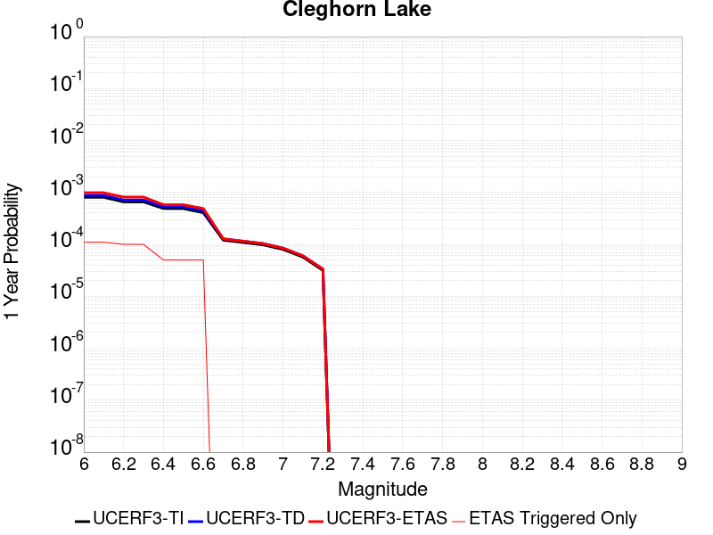 |  |

| Magnitude | 1 wk TI Prob | 1 wk TD Prob | 1 wk ETAS Prob | 1 wk ETAS/TD Gain | 1 wk ETAS Triggered Only | 1 mo TI Prob | 1 mo TD Prob | 1 mo ETAS Prob | 1 mo ETAS/TD Gain | 1 mo ETAS Triggered Only | 1 yr TI Prob | 1 yr TD Prob | 1 yr ETAS Prob | 1 yr ETAS/TD Gain | 1 yr ETAS Triggered Only | 10 yr TI Prob | 10 yr TD Prob | 10 yr ETAS Prob | 10 yr ETAS/TD Gain | 10 yr ETAS Triggered Only |
|-----|-----|-----|-----|-----|-----|-----|-----|-----|-----|-----|-----|-----|-----|-----|-----|-----|-----|-----|-----|-----|
| 6.0 | 1.5467183E-5 | 1.6794203E-5 | 4.3460423E-5 | 2.5878227 | 2.6666667E-5 | 6.6286244E-5 | 7.197348E-5 | 1.2530298E-4 | 1.7409604 | 5.3333333E-5 | 8.067362E-4 | 8.759797E-4 | 9.5590967E-4 | 1.0912464 | 8.0E-5 | 0.008038137 | 0.008730696 | 0.008915733 | 1.0211939 | 1.8666667E-4 |
| 6.1 | 1.5467183E-5 | 1.6794203E-5 | 4.3460423E-5 | 2.5878227 | 2.6666667E-5 | 6.6286244E-5 | 7.197348E-5 | 1.2530298E-4 | 1.7409604 | 5.3333333E-5 | 8.067362E-4 | 8.759797E-4 | 9.5590967E-4 | 1.0912464 | 8.0E-5 | 0.008038137 | 0.008730696 | 0.008915733 | 1.0211939 | 1.8666667E-4 |
| 6.2 | 1.2624631E-5 | 1.3681544E-5 | 4.0347848E-5 | 2.949071 | 2.6666667E-5 | 5.410444E-5 | 5.863415E-5 | 1.1196436E-4 | 1.9095417 | 5.3333333E-5 | 6.585225E-4 | 7.1368564E-4 | 7.936285E-4 | 1.1120142 | 8.0E-5 | 0.0065657445 | 0.0071187317 | 0.0073040696 | 1.0260352 | 1.8666667E-4 |
| 6.3 | 1.2624631E-5 | 1.3681544E-5 | 4.0347848E-5 | 2.949071 | 2.6666667E-5 | 5.410444E-5 | 5.863415E-5 | 1.1196436E-4 | 1.9095417 | 5.3333333E-5 | 6.585225E-4 | 7.1368564E-4 | 7.936285E-4 | 1.1120142 | 8.0E-5 | 0.0065657445 | 0.0071187317 | 0.0073040696 | 1.0260352 | 1.8666667E-4 |
| 6.4 | 9.417684E-6 | 1.0170118E-5 | 1.0170118E-5 | 1.0 | 0.0 | 4.036088E-5 | 4.3585722E-5 | 4.3585722E-5 | 1.0 | 0.0 | 4.912829E-4 | 5.3056807E-4 | 5.5722054E-4 | 1.050234 | 2.6666667E-5 | 0.004901982 | 0.005297049 | 0.005403151 | 1.0200304 | 1.0666667E-4 |
| 6.5 | 9.368219E-6 | 1.0117545E-5 | 1.0117545E-5 | 1.0 | 0.0 | 4.014889E-5 | 4.3360415E-5 | 4.3360415E-5 | 1.0 | 0.0 | 4.8870314E-4 | 5.2782625E-4 | 5.5447884E-4 | 1.050495 | 2.6666667E-5 | 0.004876298 | 0.0052697617 | 0.005375866 | 1.0201346 | 1.0666667E-4 |
| 6.6 | 7.803798E-6 | 8.441831E-6 | 8.441831E-6 | 1.0 | 0.0 | 3.3444423E-5 | 3.6179E-5 | 3.6179E-5 | 1.0 | 0.0 | 4.0710976E-4 | 4.4043022E-4 | 4.6708513E-4 | 1.0605202 | 2.6666667E-5 | 0.0040636472 | 0.0043994905 | 0.0044791386 | 1.018104 | 8.0E-5 |
| 6.7 | 2.3108669E-6 | 2.4438336E-6 | 2.4438336E-6 | 1.0 | 0.0 | 9.903678E-6 | 1.0473532E-5 | 1.0473532E-5 | 1.0 | 0.0 | 1.205706E-4 | 1.2750797E-4 | 1.2750797E-4 | 1.0 | 0.0 | 0.001205052 | 0.0012743667 | 0.0013009994 | 1.0208987 | 2.6666667E-5 |
| 6.8 | 2.0882828E-6 | 2.2062823E-6 | 2.2062823E-6 | 1.0 | 0.0 | 8.949753E-6 | 9.455462E-6 | 9.455462E-6 | 1.0 | 0.0 | 1.08957785E-4 | 1.1511434E-4 | 1.1511434E-4 | 1.0 | 0.0 | 0.0010890438 | 0.0011505639 | 0.0011771999 | 1.0231503 | 2.6666667E-5 |
| 6.9 | 1.876935E-6 | 1.981051E-6 | 1.981051E-6 | 1.0 | 0.0 | 8.043982E-6 | 8.490192E-6 | 8.490192E-6 | 1.0 | 0.0 | 9.7931086E-5 | 1.03363345E-4 | 1.03363345E-4 | 1.0 | 0.0 | 9.788794E-4 | 0.0010331686 | 0.0010598077 | 1.0257839 | 2.6666667E-5 |
| 7.0 | 1.5357559E-6 | 1.6202807E-6 | 1.6202807E-6 | 1.0 | 0.0 | 6.5817944E-6 | 6.9440425E-6 | 6.9440425E-6 | 1.0 | 0.0 | 8.01304E-5 | 8.454057E-5 | 8.454057E-5 | 1.0 | 0.0 | 8.010151E-4 | 8.450965E-4 | 8.7174063E-4 | 1.0315279 | 2.6666667E-5 |
| 7.1 | 1.0905424E-6 | 1.1497619E-6 | 1.1497619E-6 | 1.0 | 0.0 | 4.6737446E-6 | 4.9275427E-6 | 4.9275427E-6 | 1.0 | 0.0 | 5.6901354E-5 | 5.999128E-5 | 5.999128E-5 | 1.0 | 0.0 | 5.6886784E-4 | 5.997606E-4 | 5.997606E-4 | 1.0 | 0.0 |
| 7.2 | 6.06668E-7 | 6.387277E-7 | 6.387277E-7 | 1.0 | 0.0 | 2.600003E-6 | 2.7374022E-6 | 2.7374022E-6 | 1.0 | 0.0 | 3.1654577E-5 | 3.3327433E-5 | 3.3327433E-5 | 1.0 | 0.0 | 3.1650066E-4 | 3.3323118E-4 | 3.3323118E-4 | 1.0 | 0.0 |

## San Jacinto (Coyote Creek)
*[(top)](#table-of-contents)*

| 1 Week | 1 Month | 1 Year | 10 Year |
|-----|-----|-----|-----|
| 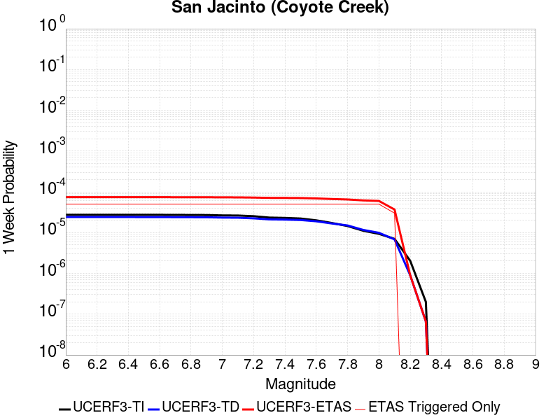 |  |  |  |

| Magnitude | 1 wk TI Prob | 1 wk TD Prob | 1 wk ETAS Prob | 1 wk ETAS/TD Gain | 1 wk ETAS Triggered Only | 1 mo TI Prob | 1 mo TD Prob | 1 mo ETAS Prob | 1 mo ETAS/TD Gain | 1 mo ETAS Triggered Only | 1 yr TI Prob | 1 yr TD Prob | 1 yr ETAS Prob | 1 yr ETAS/TD Gain | 1 yr ETAS Triggered Only | 10 yr TI Prob | 10 yr TD Prob | 10 yr ETAS Prob | 10 yr ETAS/TD Gain | 10 yr ETAS Triggered Only |
|-----|-----|-----|-----|-----|-----|-----|-----|-----|-----|-----|-----|-----|-----|-----|-----|-----|-----|-----|-----|-----|
| 6.0 | 2.7374346E-5 | 2.4145214E-5 | 1.308093E-4 | 5.4176083 | 1.0666667E-4 | 1.1731335E-4 | 1.034754E-4 | 2.3679493E-4 | 2.2884178 | 1.3333333E-4 | 0.0014273542 | 0.0012590875 | 0.001418886 | 1.1269162 | 1.6E-4 | 0.01418221 | 0.012928318 | 0.013112571 | 1.014252 | 1.8666667E-4 |
| 6.1 | 2.7374346E-5 | 2.4145214E-5 | 1.308093E-4 | 5.4176083 | 1.0666667E-4 | 1.1731335E-4 | 1.034754E-4 | 2.3679493E-4 | 2.2884178 | 1.3333333E-4 | 0.0014273542 | 0.0012590875 | 0.001418886 | 1.1269162 | 1.6E-4 | 0.01418221 | 0.012928318 | 0.013112571 | 1.014252 | 1.8666667E-4 |
| 6.2 | 2.7374346E-5 | 2.4145214E-5 | 1.308093E-4 | 5.4176083 | 1.0666667E-4 | 1.1731335E-4 | 1.034754E-4 | 2.3679493E-4 | 2.2884178 | 1.3333333E-4 | 0.0014273542 | 0.0012590875 | 0.001418886 | 1.1269162 | 1.6E-4 | 0.01418221 | 0.012928318 | 0.013112571 | 1.014252 | 1.8666667E-4 |
| 6.3 | 2.7374346E-5 | 2.4145214E-5 | 1.308093E-4 | 5.4176083 | 1.0666667E-4 | 1.1731335E-4 | 1.034754E-4 | 2.3679493E-4 | 2.2884178 | 1.3333333E-4 | 0.0014273542 | 0.0012590875 | 0.001418886 | 1.1269162 | 1.6E-4 | 0.01418221 | 0.012928318 | 0.013112571 | 1.014252 | 1.8666667E-4 |
| 6.4 | 2.7374346E-5 | 2.4145214E-5 | 1.308093E-4 | 5.4176083 | 1.0666667E-4 | 1.1731335E-4 | 1.034754E-4 | 2.3679493E-4 | 2.2884178 | 1.3333333E-4 | 0.0014273542 | 0.0012590875 | 0.001418886 | 1.1269162 | 1.6E-4 | 0.01418221 | 0.012928318 | 0.013112571 | 1.014252 | 1.8666667E-4 |
| 6.5 | 2.7282445E-5 | 2.4031293E-5 | 1.306954E-4 | 5.4385505 | 1.0666667E-4 | 1.16919524E-4 | 1.029872E-4 | 2.363068E-4 | 2.2945259 | 1.3333333E-4 | 0.0014225657 | 0.0012531505 | 0.0014129501 | 1.1275182 | 1.6E-4 | 0.014134934 | 0.012869646 | 0.01305391 | 1.0143178 | 1.8666667E-4 |
| 6.6 | 2.7282445E-5 | 2.4031293E-5 | 1.306954E-4 | 5.4385505 | 1.0666667E-4 | 1.16919524E-4 | 1.029872E-4 | 2.363068E-4 | 2.2945259 | 1.3333333E-4 | 0.0014225657 | 0.0012531505 | 0.0014129501 | 1.1275182 | 1.6E-4 | 0.014134934 | 0.012869646 | 0.01305391 | 1.0143178 | 1.8666667E-4 |
| 6.7 | 2.7216198E-5 | 2.3956412E-5 | 1.3062052E-4 | 5.452424 | 1.0666667E-4 | 1.1663563E-4 | 1.02666316E-4 | 2.3598596E-4 | 2.2985723 | 1.3333333E-4 | 0.0014191137 | 0.0012492483 | 0.0014090484 | 1.127917 | 1.6E-4 | 0.014100855 | 0.0128310565 | 0.013015328 | 1.0143614 | 1.8666667E-4 |
| 6.8 | 2.7078617E-5 | 2.387363E-5 | 1.3053775E-4 | 5.4678636 | 1.0666667E-4 | 1.1604605E-4 | 1.0231156E-4 | 2.3563125E-4 | 2.3030756 | 1.3333333E-4 | 0.001411945 | 0.0012449342 | 0.0014047349 | 1.1283609 | 1.6E-4 | 0.014030075 | 0.012788199 | 0.012972479 | 1.0144101 | 1.8666667E-4 |
| 6.9 | 2.6982952E-5 | 2.3793142E-5 | 1.3045727E-4 | 5.482978 | 1.0666667E-4 | 1.15636096E-4 | 1.0196664E-4 | 2.3528638E-4 | 2.307484 | 1.3333333E-4 | 0.0014069602 | 0.0012407395 | 0.0014005409 | 1.1287954 | 1.6E-4 | 0.013980856 | 0.012746515 | 0.012930802 | 1.0144578 | 1.8666667E-4 |
| 7.0 | 2.6449972E-5 | 2.3370165E-5 | 1.3003434E-4 | 5.5641174 | 1.0666667E-4 | 1.1335209E-4 | 1.00154015E-4 | 2.33474E-4 | 2.3311496 | 1.3333333E-4 | 0.001379188 | 0.0012186957 | 0.0013785006 | 1.131128 | 1.6E-4 | 0.0137065975 | 0.0125278765 | 0.012712205 | 1.0147134 | 1.8666667E-4 |
| 7.1 | 2.6257849E-5 | 2.3196202E-5 | 1.2986039E-4 | 5.598347 | 1.0666667E-4 | 1.1252879E-4 | 9.940852E-5 | 2.3272859E-4 | 2.3411334 | 1.3333333E-4 | 0.0013691769 | 0.0012096294 | 0.0013694358 | 1.1321119 | 1.6E-4 | 0.013607717 | 0.012437741 | 0.012622086 | 1.0148214 | 1.8666667E-4 |
| 7.2 | 2.5270041E-5 | 2.2390966E-5 | 1.2905525E-4 | 5.763719 | 1.0666667E-4 | 1.0829568E-4 | 9.595777E-5 | 2.292783E-4 | 2.3893669 | 1.3333333E-4 | 0.0013177024 | 0.0011676621 | 0.0013274752 | 1.136866 | 1.6E-4 | 0.013099162 | 0.012018777 | 0.012203201 | 1.0153446 | 1.8666667E-4 |
| 7.3 | 2.339701E-5 | 2.1122814E-5 | 1.2778722E-4 | 6.0497255 | 1.0666667E-4 | 1.0026905E-4 | 9.0523215E-5 | 2.2384449E-4 | 2.4727852 | 1.3333333E-4 | 0.001220092 | 0.0011015651 | 0.0012613888 | 1.1450878 | 1.6E-4 | 0.012134149 | 0.011357696 | 0.011542242 | 1.0162486 | 1.8666667E-4 |
| 7.4 | 2.296333E-5 | 2.0853171E-5 | 1.2751762E-4 | 6.1150227 | 1.0666667E-4 | 9.841056E-5 | 8.936768E-5 | 2.226891E-4 | 2.4918303 | 1.3333333E-4 | 0.0011974899 | 0.0010875105 | 0.0012473365 | 1.146965 | 1.6E-4 | 0.011910575 | 0.01121681 | 0.011401382 | 1.016455 | 1.8666667E-4 |
| 7.5 | 2.2188895E-5 | 2.0376096E-5 | 1.2704059E-4 | 6.2347856 | 1.0666667E-4 | 9.50918E-5 | 8.732321E-5 | 2.206449E-4 | 2.5267613 | 1.3333333E-4 | 0.0011571277 | 0.0010626436 | 0.0012224736 | 1.1504079 | 1.6E-4 | 0.011511209 | 0.010966429 | 0.011151048 | 1.016835 | 1.8666667E-4 |
| 7.6 | 2.0013189E-5 | 1.8962366E-5 | 1.25627E-4 | 6.6250706 | 1.0666667E-4 | 8.5767984E-5 | 8.1264756E-5 | 2.1458726E-4 | 2.6405942 | 1.3333333E-4 | 0.001043725 | 9.889511E-4 | 0.0011487929 | 1.1616275 | 1.6E-4 | 0.010388365 | 0.010224434 | 0.010409191 | 1.0180702 | 1.8666667E-4 |
| 7.7 | 1.7230794E-5 | 1.674371E-5 | 1.234086E-4 | 7.370445 | 1.0666667E-4 | 7.384417E-5 | 7.175679E-5 | 2.0508055E-4 | 2.8579953 | 1.3333333E-4 | 8.986819E-4 | 8.7328954E-4 | 0.0010331498 | 1.1830553 | 1.6E-4 | 0.008950562 | 0.009062956 | 0.009247932 | 1.02041 | 1.8666667E-4 |
| 7.8 | 1.4478809E-5 | 1.4990978E-5 | 1.2165605E-4 | 8.115284 | 1.0666667E-4 | 6.205057E-5 | 6.424547E-5 | 1.9757023E-4 | 3.07524 | 1.3333333E-4 | 7.552038E-4 | 7.819085E-4 | 9.1513764E-4 | 1.1703897 | 1.3333333E-4 | 0.0075264242 | 0.008141387 | 0.008300085 | 1.0194926 | 1.6E-4 |
| 7.9 | 1.1114467E-5 | 1.1645102E-5 | 1.1831053E-4 | 10.159681 | 1.0666667E-4 | 4.7632562E-5 | 4.990663E-5 | 1.8323331E-4 | 3.6715224 | 1.3333333E-4 | 5.797721E-4 | 6.074444E-4 | 7.4069673E-4 | 1.2193655 | 1.3333333E-4 | 0.0057826187 | 0.0063803247 | 0.006539304 | 1.0249171 | 1.6E-4 |
| 8.0 | 9.327402E-6 | 9.899186E-6 | 1.165648E-4 | 11.775189 | 1.0666667E-4 | 3.9973966E-5 | 4.2424395E-5 | 1.7575208E-4 | 4.142712 | 1.3333333E-4 | 4.8657437E-4 | 5.1639514E-4 | 6.4965966E-4 | 1.2580669 | 1.3333333E-4 | 0.0048551033 | 0.0054499684 | 0.0056090965 | 1.0291979 | 1.6E-4 |
| 8.1 | 7.0235833E-6 | 6.827495E-6 | 6.0160462E-5 | 8.811499 | 5.3333333E-5 | 3.0100724E-5 | 2.9260367E-5 | 1.0925803E-4 | 3.7339938 | 8.0E-5 | 3.664147E-4 | 3.5618723E-4 | 4.3615873E-4 | 1.2245209 | 8.0E-5 | 0.003658111 | 0.0037876023 | 0.003893865 | 1.0280554 | 1.0666667E-4 |
| 8.2 | 2.0358202E-6 | 8.994527E-7 | 8.994527E-7 | 1.0 | 0.0 | 8.724915E-6 | 3.854792E-6 | 3.854792E-6 | 1.0 | 0.0 | 1.06220665E-4 | 4.69311E-5 | 4.69311E-5 | 1.0 | 0.0 | 0.001061699 | 5.3254166E-4 | 5.3254166E-4 | 1.0 | 0.0 |
| 8.3 | 2.0051264E-7 | 6.617272E-8 | 6.617272E-8 | 1.0 | 0.0 | 8.5933965E-7 | 2.8359733E-7 | 2.8359733E-7 | 1.0 | 0.0 | 1.046241E-5 | 3.4527925E-6 | 3.4527925E-6 | 1.0 | 0.0 | 1.0461917E-4 | 4.01389E-5 | 4.01389E-5 | 1.0 | 0.0 |

## Great Valley 09 (Laguna Seca)
*[(top)](#table-of-contents)*

| 1 Week | 1 Month | 1 Year | 10 Year |
|-----|-----|-----|-----|
|  |  |  |  |

| Magnitude | 1 wk TI Prob | 1 wk TD Prob | 1 wk ETAS Prob | 1 wk ETAS/TD Gain | 1 wk ETAS Triggered Only | 1 mo TI Prob | 1 mo TD Prob | 1 mo ETAS Prob | 1 mo ETAS/TD Gain | 1 mo ETAS Triggered Only | 1 yr TI Prob | 1 yr TD Prob | 1 yr ETAS Prob | 1 yr ETAS/TD Gain | 1 yr ETAS Triggered Only | 10 yr TI Prob | 10 yr TD Prob | 10 yr ETAS Prob | 10 yr ETAS/TD Gain | 10 yr ETAS Triggered Only |
|-----|-----|-----|-----|-----|-----|-----|-----|-----|-----|-----|-----|-----|-----|-----|-----|-----|-----|-----|-----|-----|
| 6.0 | 5.4353277E-5 | 7.05022E-5 | 1.7716135E-4 | 2.5128484 | 1.0666667E-4 | 2.3292181E-4 | 3.0211566E-4 | 4.3540873E-4 | 1.4411987 | 1.3333333E-4 | 0.0028321352 | 0.0036721937 | 0.0038316064 | 1.0434107 | 1.6E-4 | 0.02796312 | 0.03611547 | 0.03626969 | 1.0042702 | 1.6E-4 |
| 6.1 | 4.5578287E-5 | 5.822118E-5 | 1.6488164E-4 | 2.8319871 | 1.0666667E-4 | 1.953209E-4 | 2.4949326E-4 | 3.561333E-4 | 1.4274266 | 1.0666667E-4 | 0.0023754383 | 0.003033432 | 0.0031663608 | 1.0438213 | 1.3333333E-4 | 0.023502063 | 0.029919548 | 0.030048892 | 1.004323 | 1.3333333E-4 |
| 6.2 | 2.8536782E-5 | 3.4737273E-5 | 1.4140023E-4 | 4.0705624 | 1.0666667E-4 | 1.2229476E-4 | 1.4886224E-4 | 2.5551303E-4 | 1.7164395 | 1.0666667E-4 | 0.0014879217 | 0.001810813 | 0.0019439049 | 1.0734984 | 1.3333333E-4 | 0.014779986 | 0.017958116 | 0.018089056 | 1.0072913 | 1.3333333E-4 |
| 6.3 | 2.3698774E-5 | 2.8213295E-5 | 1.3487696E-4 | 4.7806168 | 1.0666667E-4 | 1.01562226E-4 | 1.20905075E-4 | 2.2755885E-4 | 1.8821281 | 1.0666667E-4 | 0.0012358186 | 0.0014710218 | 0.001604159 | 1.0905066 | 1.3333333E-4 | 0.012289686 | 0.014611342 | 0.014742727 | 1.008992 | 1.3333333E-4 |
| 6.4 | 1.9191197E-5 | 2.2123184E-5 | 1.0212141E-4 | 4.616036 | 8.0E-5 | 8.2245395E-5 | 9.4806666E-5 | 1.7479909E-4 | 1.8437425 | 8.0E-5 | 0.0010008777 | 0.0011536429 | 0.0012601864 | 1.092354 | 1.0666667E-4 | 0.009963818 | 0.011476948 | 0.01158239 | 1.0091873 | 1.0666667E-4 |
| 6.5 | 1.5203241E-5 | 1.6802203E-5 | 4.3468423E-5 | 2.5870667 | 2.6666667E-5 | 6.5155116E-5 | 7.200386E-5 | 9.866861E-5 | 1.3703239 | 2.6666667E-5 | 7.9297484E-4 | 8.7626575E-4 | 9.2955236E-4 | 1.060811 | 5.3333333E-5 | 0.007901512 | 0.0087295165 | 0.008782385 | 1.0060562 | 5.3333333E-5 |
| 6.6 | 1.0984925E-5 | 1.1242595E-5 | 1.1242595E-5 | 1.0 | 0.0 | 4.70774E-5 | 4.8181686E-5 | 4.8181686E-5 | 1.0 | 0.0 | 5.730166E-4 | 5.8645656E-4 | 6.131076E-4 | 1.0454441 | 2.6666667E-5 | 0.005715413 | 0.0058494853 | 0.005875996 | 1.0045321 | 2.6666667E-5 |
| 6.7 | 9.134616E-6 | 9.019894E-6 | 9.019894E-6 | 1.0 | 0.0 | 3.9147766E-5 | 3.865613E-5 | 3.865613E-5 | 1.0 | 0.0 | 4.7651984E-4 | 4.7053912E-4 | 4.9719325E-4 | 1.0566459 | 2.6666667E-5 | 0.004754993 | 0.0046956735 | 0.004722215 | 1.0056523 | 2.6666667E-5 |
| 6.8 | 7.785589E-6 | 7.4519444E-6 | 7.4519444E-6 | 1.0 | 0.0 | 3.3366385E-5 | 3.1936524E-5 | 3.1936524E-5 | 1.0 | 0.0 | 4.0616E-4 | 3.8875983E-4 | 3.8875983E-4 | 1.0 | 0.0 | 0.0040541845 | 0.0038810016 | 0.0038810016 | 1.0 | 0.0 |
| 6.9 | 5.579095E-6 | 4.898492E-6 | 4.898492E-6 | 1.0 | 0.0 | 2.3910188E-5 | 2.0993377E-5 | 2.0993377E-5 | 1.0 | 0.0 | 2.9106764E-4 | 2.5556577E-4 | 2.5556577E-4 | 1.0 | 0.0 | 0.002906867 | 0.002552856 | 0.002552856 | 1.0 | 0.0 |
| 7.0 | 2.6816688E-6 | 1.5216126E-6 | 1.5216126E-6 | 1.0 | 0.0 | 1.1492816E-5 | 6.521181E-6 | 6.521181E-6 | 1.0 | 0.0 | 1.3991605E-4 | 7.939258E-5 | 7.939258E-5 | 1.0 | 0.0 | 0.0013982799 | 7.9365086E-4 | 7.9365086E-4 | 1.0 | 0.0 |
| 7.1 | 1.9951021E-6 | 7.453827E-7 | 7.453827E-7 | 1.0 | 0.0 | 8.55041E-6 | 3.1944935E-6 | 3.1944935E-6 | 1.0 | 0.0 | 1.0409627E-4 | 3.8892307E-5 | 3.8892307E-5 | 1.0 | 0.0 | 0.0010404752 | 3.8885913E-4 | 3.8885913E-4 | 1.0 | 0.0 |
| 7.2 | 1.9951021E-6 | 7.453827E-7 | 7.453827E-7 | 1.0 | 0.0 | 8.55041E-6 | 3.1944935E-6 | 3.1944935E-6 | 1.0 | 0.0 | 1.0409627E-4 | 3.8892307E-5 | 3.8892307E-5 | 1.0 | 0.0 | 0.0010404752 | 3.8885913E-4 | 3.8885913E-4 | 1.0 | 0.0 |
| 7.3 | 1.7087556E-6 | 6.578881E-7 | 6.578881E-7 | 1.0 | 0.0 | 7.3232177E-6 | 2.8195177E-6 | 2.8195177E-6 | 1.0 | 0.0 | 8.915652E-5 | 3.4327128E-5 | 3.4327128E-5 | 1.0 | 0.0 | 8.9120766E-4 | 3.432223E-4 | 3.432223E-4 | 1.0 | 0.0 |
| 7.4 | 1.3804846E-6 | 6.073852E-7 | 6.073852E-7 | 1.0 | 0.0 | 5.916349E-6 | 2.6030768E-6 | 2.6030768E-6 | 1.0 | 0.0 | 7.2029165E-5 | 3.169204E-5 | 3.169204E-5 | 1.0 | 0.0 | 7.200583E-4 | 3.1687922E-4 | 3.1687922E-4 | 1.0 | 0.0 |
| 7.5 | 1.3804846E-6 | 6.073852E-7 | 6.073852E-7 | 1.0 | 0.0 | 5.916349E-6 | 2.6030768E-6 | 2.6030768E-6 | 1.0 | 0.0 | 7.2029165E-5 | 3.169204E-5 | 3.169204E-5 | 1.0 | 0.0 | 7.200583E-4 | 3.1687922E-4 | 3.1687922E-4 | 1.0 | 0.0 |

## Big Pine (East)
*[(top)](#table-of-contents)*

| 1 Week | 1 Month | 1 Year | 10 Year |
|-----|-----|-----|-----|
| 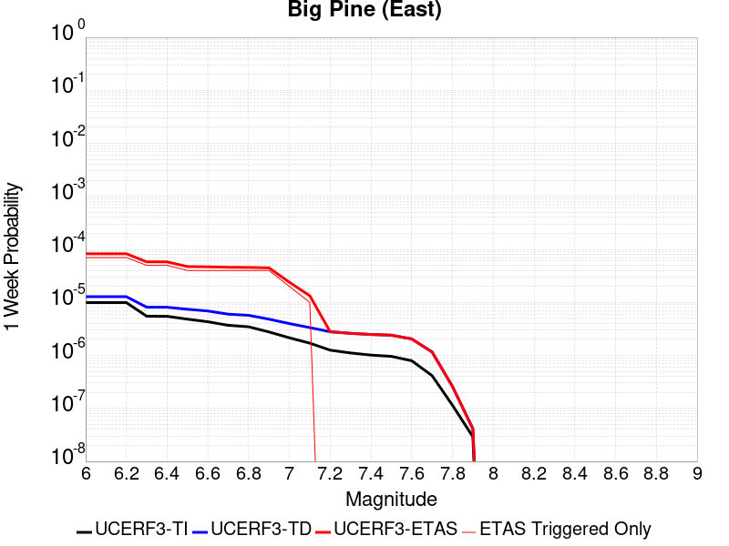 |  |  |  |

| Magnitude | 1 wk TI Prob | 1 wk TD Prob | 1 wk ETAS Prob | 1 wk ETAS/TD Gain | 1 wk ETAS Triggered Only | 1 mo TI Prob | 1 mo TD Prob | 1 mo ETAS Prob | 1 mo ETAS/TD Gain | 1 mo ETAS Triggered Only | 1 yr TI Prob | 1 yr TD Prob | 1 yr ETAS Prob | 1 yr ETAS/TD Gain | 1 yr ETAS Triggered Only | 10 yr TI Prob | 10 yr TD Prob | 10 yr ETAS Prob | 10 yr ETAS/TD Gain | 10 yr ETAS Triggered Only |
|-----|-----|-----|-----|-----|-----|-----|-----|-----|-----|-----|-----|-----|-----|-----|-----|-----|-----|-----|-----|-----|
| 6.0 | 9.916913E-6 | 1.2816984E-5 | 1.1948228E-4 | 9.322184 | 1.0666667E-4 | 4.250036E-5 | 5.49289E-5 | 1.615897E-4 | 2.9417975 | 1.0666667E-4 | 5.173191E-4 | 6.685763E-4 | 7.751716E-4 | 1.1594363 | 1.0666667E-4 | 0.0051611643 | 0.006670441 | 0.006829374 | 1.0238264 | 1.6E-4 |
| 6.1 | 9.916913E-6 | 1.2816984E-5 | 1.1948228E-4 | 9.322184 | 1.0666667E-4 | 4.250036E-5 | 5.49289E-5 | 1.615897E-4 | 2.9417975 | 1.0666667E-4 | 5.173191E-4 | 6.685763E-4 | 7.751716E-4 | 1.1594363 | 1.0666667E-4 | 0.0051611643 | 0.006670441 | 0.006829374 | 1.0238264 | 1.6E-4 |
| 6.2 | 9.916913E-6 | 1.2816984E-5 | 1.1948228E-4 | 9.322184 | 1.0666667E-4 | 4.250036E-5 | 5.49289E-5 | 1.615897E-4 | 2.9417975 | 1.0666667E-4 | 5.173191E-4 | 6.685763E-4 | 7.751716E-4 | 1.1594363 | 1.0666667E-4 | 0.0051611643 | 0.006670441 | 0.006829374 | 1.0238264 | 1.6E-4 |
| 6.3 | 5.479711E-6 | 8.112951E-6 | 8.8112305E-5 | 10.860697 | 8.0E-5 | 2.3484265E-5 | 3.4769346E-5 | 1.1476657E-4 | 3.3007972 | 8.0E-5 | 2.858834E-4 | 4.2323777E-4 | 5.032039E-4 | 1.1889391 | 8.0E-5 | 0.0028551589 | 0.004227244 | 0.0043334593 | 1.0251265 | 1.0666667E-4 |
| 6.4 | 5.465009E-6 | 8.097245E-6 | 8.8096596E-5 | 10.879824 | 8.0E-5 | 2.3421257E-5 | 3.4702036E-5 | 1.1469926E-4 | 3.3052604 | 8.0E-5 | 2.851165E-4 | 4.2241855E-4 | 5.0238473E-4 | 1.1893057 | 8.0E-5 | 0.0028475097 | 0.0042190826 | 0.004325299 | 1.0251753 | 1.0666667E-4 |
| 6.5 | 4.826767E-6 | 7.422301E-6 | 6.075524E-5 | 8.185499 | 5.3333333E-5 | 2.068598E-5 | 3.180949E-5 | 8.5141124E-5 | 2.6765952 | 5.3333333E-5 | 2.518227E-4 | 3.872145E-4 | 4.405272E-4 | 1.1376826 | 5.3333333E-5 | 0.0025153751 | 0.003868283 | 0.0039479737 | 1.020601 | 8.0E-5 |
| 6.6 | 4.3146847E-6 | 6.8822374E-6 | 6.0215203E-5 | 8.749365 | 5.3333333E-5 | 1.8491375E-5 | 2.9494982E-5 | 8.2826744E-5 | 2.808164 | 5.3333333E-5 | 2.2510924E-4 | 3.590447E-4 | 4.1235887E-4 | 1.148489 | 5.3333333E-5 | 0.0022488134 | 0.0035874986 | 0.0036672114 | 1.0222197 | 8.0E-5 |
| 6.7 | 3.6968106E-6 | 5.9954727E-6 | 5.9328486E-5 | 9.895548 | 5.3333333E-5 | 1.5843378E-5 | 2.5694639E-5 | 7.90266E-5 | 3.0756066 | 5.3333333E-5 | 1.9287605E-4 | 3.1278885E-4 | 3.661055E-4 | 1.1704557 | 5.3333333E-5 | 0.0019270873 | 0.0031262483 | 0.003179415 | 1.0170065 | 5.3333333E-5 |
| 6.8 | 3.4671132E-6 | 5.702177E-6 | 5.9035207E-5 | 10.353099 | 5.3333333E-5 | 1.4858972E-5 | 2.4437682E-5 | 7.776971E-5 | 3.1823688 | 5.3333333E-5 | 1.8089297E-4 | 2.974896E-4 | 3.5080707E-4 | 1.1792246 | 5.3333333E-5 | 0.0018074579 | 0.002973667 | 0.003026842 | 1.0178819 | 5.3333333E-5 |
| 6.9 | 2.7686972E-6 | 4.825223E-6 | 5.81583E-5 | 12.052976 | 5.3333333E-5 | 1.1865792E-5 | 2.0679368E-5 | 7.40116E-5 | 3.5790067 | 5.3333333E-5 | 1.4445644E-4 | 2.5174298E-4 | 3.050629E-4 | 1.211803 | 5.3333333E-5 | 0.0014436257 | 0.0025172636 | 0.0025704629 | 1.0211337 | 5.3333333E-5 |
| 7.0 | 2.1472624E-6 | 3.9850406E-6 | 3.06516E-5 | 7.691666 | 2.6666667E-5 | 9.20252E-6 | 1.7078637E-5 | 4.3744847E-5 | 2.5613782 | 2.6666667E-5 | 1.12034926E-4 | 2.079131E-4 | 2.3457423E-4 | 1.128232 | 2.6666667E-5 | 0.0011197845 | 0.0020798394 | 0.0021064505 | 1.0127949 | 2.6666667E-5 |
| 7.1 | 1.7018335E-6 | 3.344876E-6 | 3.0011453E-5 | 8.972366 | 2.6666667E-5 | 7.293552E-6 | 1.4335106E-5 | 4.100139E-5 | 2.8602085 | 2.6666667E-5 | 8.879537E-5 | 1.7451629E-4 | 2.011783E-4 | 1.1527766 | 2.6666667E-5 | 8.87599E-4 | 0.0017464145 | 0.0017730346 | 1.0152427 | 2.6666667E-5 |
| 7.2 | 1.25603E-6 | 2.794484E-6 | 2.794484E-6 | 1.0 | 0.0 | 5.3829745E-6 | 1.1976307E-5 | 1.1976307E-5 | 1.0 | 0.0 | 6.553574E-5 | 1.4580201E-4 | 1.4580201E-4 | 1.0 | 0.0 | 6.551642E-4 | 0.001459661 | 0.001459661 | 1.0 | 0.0 |
| 7.3 | 1.112297E-6 | 2.610332E-6 | 2.610332E-6 | 1.0 | 0.0 | 4.7669787E-6 | 1.118709E-5 | 1.118709E-5 | 1.0 | 0.0 | 5.803642E-5 | 1.3619453E-4 | 1.3619453E-4 | 1.0 | 0.0 | 5.802127E-4 | 0.0013635408 | 0.0013635408 | 1.0 | 0.0 |
| 7.4 | 1.0137181E-6 | 2.4834917E-6 | 2.4834917E-6 | 1.0 | 0.0 | 4.3444993E-6 | 1.0643494E-5 | 1.0643494E-5 | 1.0 | 0.0 | 5.2892992E-5 | 1.2957705E-4 | 1.2957705E-4 | 1.0 | 0.0 | 5.288041E-4 | 0.0012972289 | 0.0012972289 | 1.0 | 0.0 |
| 7.5 | 9.598608E-7 | 2.4071483E-6 | 2.4071483E-6 | 1.0 | 0.0 | 4.1136827E-6 | 1.031631E-5 | 1.031631E-5 | 1.0 | 0.0 | 5.0082934E-5 | 1.2559404E-4 | 1.2559404E-4 | 1.0 | 0.0 | 5.007165E-4 | 0.0012572526 | 0.0012572526 | 1.0 | 0.0 |
| 7.6 | 7.929459E-7 | 2.0448588E-6 | 2.0448588E-6 | 1.0 | 0.0 | 3.3983351E-6 | 8.763653E-6 | 8.763653E-6 | 1.0 | 0.0 | 4.1373947E-5 | 1.06692416E-4 | 1.06692416E-4 | 1.0 | 0.0 | 4.1366243E-4 | 0.0010685222 | 0.0010685222 | 1.0 | 0.0 |
| 7.7 | 4.155788E-7 | 1.1605589E-6 | 1.1605589E-6 | 1.0 | 0.0 | 1.7810507E-6 | 4.9738146E-6 | 4.9738146E-6 | 1.0 | 0.0 | 2.1684076E-5 | 6.0554554E-5 | 6.0554554E-5 | 1.0 | 0.0 | 2.1681961E-4 | 6.0857297E-4 | 6.0857297E-4 | 1.0 | 0.0 |
| 7.8 | 1.14666925E-7 | 2.592015E-7 | 2.592015E-7 | 1.0 | 0.0 | 4.914296E-7 | 1.1108631E-6 | 1.1108631E-6 | 1.0 | 0.0 | 5.9831386E-6 | 1.3524678E-5 | 1.3524678E-5 | 1.0 | 0.0 | 5.9829777E-5 | 1.3634123E-4 | 1.3634123E-4 | 1.0 | 0.0 |
| 7.9 | 2.9231824E-8 | 4.1463963E-8 | 4.1463963E-8 | 1.0 | 0.0 | 1.2527924E-7 | 1.7770269E-7 | 1.7770269E-7 | 1.0 | 0.0 | 1.5252737E-6 | 2.1635283E-6 | 2.1635283E-6 | 1.0 | 0.0 | 1.5252632E-5 | 2.1967755E-5 | 2.1967755E-5 | 1.0 | 0.0 |

## Coronado Bank alt1
*[(top)](#table-of-contents)*

| 1 Week | 1 Month | 1 Year | 10 Year |
|-----|-----|-----|-----|
|  | 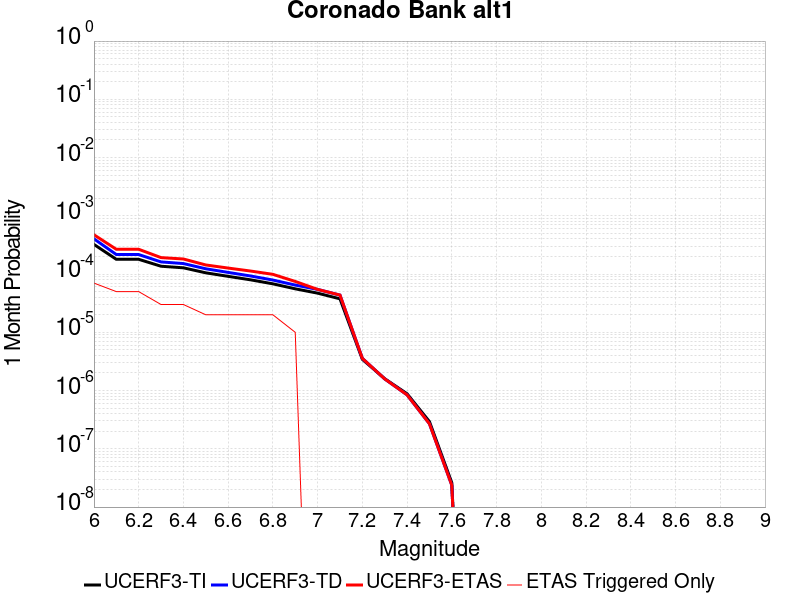 |  |  |

| Magnitude | 1 wk TI Prob | 1 wk TD Prob | 1 wk ETAS Prob | 1 wk ETAS/TD Gain | 1 wk ETAS Triggered Only | 1 mo TI Prob | 1 mo TD Prob | 1 mo ETAS Prob | 1 mo ETAS/TD Gain | 1 mo ETAS Triggered Only | 1 yr TI Prob | 1 yr TD Prob | 1 yr ETAS Prob | 1 yr ETAS/TD Gain | 1 yr ETAS Triggered Only | 10 yr TI Prob | 10 yr TD Prob | 10 yr ETAS Prob | 10 yr ETAS/TD Gain | 10 yr ETAS Triggered Only |
|-----|-----|-----|-----|-----|-----|-----|-----|-----|-----|-----|-----|-----|-----|-----|-----|-----|-----|-----|-----|-----|
| 6.0 | 7.533492E-5 | 9.394913E-5 | 1.4727746E-4 | 1.5676298 | 5.3333333E-5 | 3.22824E-4 | 4.0258127E-4 | 4.558931E-4 | 1.1324251 | 5.3333333E-5 | 0.0039233007 | 0.0048909658 | 0.0050236466 | 1.0271279 | 1.3333333E-4 | 0.03854755 | 0.04790356 | 0.0480559 | 1.00318 | 1.6E-4 |
| 6.1 | 4.1807285E-5 | 5.049283E-5 | 7.715815E-5 | 1.5281011 | 2.6666667E-5 | 1.7916178E-4 | 2.1638049E-4 | 2.4304139E-4 | 1.123213 | 2.6666667E-5 | 0.0021791123 | 0.0026313474 | 0.0027111368 | 1.0303227 | 8.0E-5 | 0.021578677 | 0.026011046 | 0.026088966 | 1.0029956 | 8.0E-5 |
| 6.2 | 4.1807285E-5 | 5.049283E-5 | 7.715815E-5 | 1.5281011 | 2.6666667E-5 | 1.7916178E-4 | 2.1638049E-4 | 2.4304139E-4 | 1.123213 | 2.6666667E-5 | 0.0021791123 | 0.0026313474 | 0.0027111368 | 1.0303227 | 8.0E-5 | 0.021578677 | 0.026011046 | 0.026088966 | 1.0029956 | 8.0E-5 |
| 6.3 | 3.1793104E-5 | 3.7711117E-5 | 3.7711117E-5 | 1.0 | 0.0 | 1.3624904E-4 | 1.6160926E-4 | 1.6160926E-4 | 1.0 | 0.0 | 0.0016575698 | 0.001965848 | 0.0020190766 | 1.0270766 | 5.3333333E-5 | 0.016452603 | 0.019488465 | 0.019540759 | 1.0026833 | 5.3333333E-5 |
| 6.4 | 2.9878007E-5 | 3.5335794E-5 | 3.5335794E-5 | 1.0 | 0.0 | 1.2804232E-4 | 1.5143053E-4 | 1.5143053E-4 | 1.0 | 0.0 | 0.0015578003 | 0.0018421387 | 0.0018953738 | 1.0288985 | 5.3333333E-5 | 0.015469253 | 0.01827244 | 0.0183248 | 1.0028654 | 5.3333333E-5 |
| 6.5 | 2.4512565E-5 | 2.8764043E-5 | 2.8764043E-5 | 1.0 | 0.0 | 1.0504962E-4 | 1.2326881E-4 | 1.2326881E-4 | 1.0 | 0.0 | 0.0012782287 | 0.0014997921 | 0.0014997921 | 1.0 | 0.0 | 0.012709012 | 0.014899683 | 0.014899683 | 1.0 | 0.0 |
| 6.6 | 2.1317413E-5 | 2.490667E-5 | 2.490667E-5 | 1.0 | 0.0 | 9.135714E-5 | 1.0673863E-4 | 1.0673863E-4 | 1.0 | 0.0 | 0.0011117056 | 0.0012987906 | 0.0012987906 | 1.0 | 0.0 | 0.011061605 | 0.012914404 | 0.012914404 | 1.0 | 0.0 |
| 6.7 | 1.8585655E-5 | 2.163488E-5 | 2.163488E-5 | 1.0 | 0.0 | 7.9650374E-5 | 9.271773E-5 | 9.271773E-5 | 1.0 | 0.0 | 9.6931186E-4 | 0.0011282742 | 0.0011282742 | 1.0 | 0.0 | 0.0096509475 | 0.011227623 | 0.011227623 | 1.0 | 0.0 |
| 6.8 | 1.5862879E-5 | 1.8419474E-5 | 1.8419474E-5 | 1.0 | 0.0 | 6.798199E-5 | 7.893833E-5 | 7.893833E-5 | 1.0 | 0.0 | 8.273665E-4 | 9.6066965E-4 | 9.6066965E-4 | 1.0 | 0.0 | 0.008242928 | 0.00956715 | 0.00956715 | 1.0 | 0.0 |
| 6.9 | 1.3021509E-5 | 1.5095265E-5 | 1.5095265E-5 | 1.0 | 0.0 | 5.5805274E-5 | 6.469249E-5 | 6.469249E-5 | 1.0 | 0.0 | 6.792174E-4 | 7.8736455E-4 | 7.8736455E-4 | 1.0 | 0.0 | 0.006771452 | 0.007847573 | 0.007847573 | 1.0 | 0.0 |
| 7.0 | 1.0974371E-5 | 1.2720104E-5 | 1.2720104E-5 | 1.0 | 0.0 | 4.7032172E-5 | 5.451369E-5 | 5.451369E-5 | 1.0 | 0.0 | 5.7246623E-4 | 6.6351966E-4 | 6.6351966E-4 | 1.0 | 0.0 | 0.0057099373 | 0.006617135 | 0.006617135 | 1.0 | 0.0 |
| 7.1 | 8.766221E-6 | 1.01638325E-5 | 1.01638325E-5 | 1.0 | 0.0 | 3.7568978E-5 | 4.355865E-5 | 4.355865E-5 | 1.0 | 0.0 | 4.573063E-4 | 5.3021475E-4 | 5.3021475E-4 | 1.0 | 0.0 | 0.0045636636 | 0.0052911965 | 0.0052911965 | 1.0 | 0.0 |
| 7.2 | 8.026024E-7 | 8.331765E-7 | 8.331765E-7 | 1.0 | 0.0 | 3.43972E-6 | 3.5707515E-6 | 3.5707515E-6 | 1.0 | 0.0 | 4.1877785E-5 | 4.3473043E-5 | 4.3473043E-5 | 1.0 | 0.0 | 4.1869894E-4 | 4.3464647E-4 | 4.3464647E-4 | 1.0 | 0.0 |
| 7.3 | 3.7293114E-7 | 3.7000953E-7 | 3.7000953E-7 | 1.0 | 0.0 | 1.5982754E-6 | 1.5857541E-6 | 1.5857541E-6 | 1.0 | 0.0 | 1.9458828E-5 | 1.9306386E-5 | 1.9306386E-5 | 1.0 | 0.0 | 1.9457124E-4 | 1.9304715E-4 | 1.9304715E-4 | 1.0 | 0.0 |
| 7.4 | 2.0557036E-7 | 1.9674363E-7 | 1.9674363E-7 | 1.0 | 0.0 | 8.810155E-7 | 8.431867E-7 | 8.431867E-7 | 1.0 | 0.0 | 1.0726311E-5 | 1.026575E-5 | 1.026575E-5 | 1.0 | 0.0 | 1.0725793E-4 | 1.0265279E-4 | 1.0265279E-4 | 1.0 | 0.0 |
| 7.5 | 6.845446E-8 | 6.279369E-8 | 6.279369E-8 | 1.0 | 0.0 | 2.9337625E-7 | 2.691158E-7 | 2.691158E-7 | 1.0 | 0.0 | 3.5718497E-6 | 3.2764797E-6 | 3.2764797E-6 | 1.0 | 0.0 | 3.5717923E-5 | 3.2764325E-5 | 3.2764325E-5 | 1.0 | 0.0 |
| 7.6 | 6.0975145E-9 | 5.53185E-9 | 5.53185E-9 | 1.0 | 0.0 | 2.6132206E-8 | 2.370793E-8 | 2.370793E-8 | 1.0 | 0.0 | 3.1815955E-7 | 2.88644E-7 | 2.88644E-7 | 1.0 | 0.0 | 3.181591E-6 | 2.8864374E-6 | 2.8864374E-6 | 1.0 | 0.0 |

## Rose Canyon
*[(top)](#table-of-contents)*

| 1 Week | 1 Month | 1 Year | 10 Year |
|-----|-----|-----|-----|
|  | 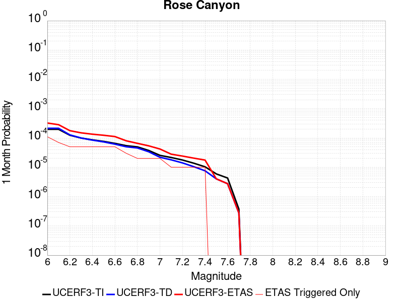 |  |  |

| Magnitude | 1 wk TI Prob | 1 wk TD Prob | 1 wk ETAS Prob | 1 wk ETAS/TD Gain | 1 wk ETAS Triggered Only | 1 mo TI Prob | 1 mo TD Prob | 1 mo ETAS Prob | 1 mo ETAS/TD Gain | 1 mo ETAS Triggered Only | 1 yr TI Prob | 1 yr TD Prob | 1 yr ETAS Prob | 1 yr ETAS/TD Gain | 1 yr ETAS Triggered Only | 10 yr TI Prob | 10 yr TD Prob | 10 yr ETAS Prob | 10 yr ETAS/TD Gain | 10 yr ETAS Triggered Only |
|-----|-----|-----|-----|-----|-----|-----|-----|-----|-----|-----|-----|-----|-----|-----|-----|-----|-----|-----|-----|-----|
| 6.0 | 4.5923203E-5 | 4.9714225E-5 | 1.563756E-4 | 3.1454897 | 1.0666667E-4 | 1.9679888E-4 | 2.1304491E-4 | 3.4634984E-4 | 1.6257128 | 1.3333333E-4 | 0.0023933933 | 0.0025909345 | 0.0027239223 | 1.0513282 | 1.3333333E-4 | 0.023677798 | 0.02563999 | 0.025795888 | 1.0060803 | 1.6E-4 |
| 6.1 | 4.5923203E-5 | 4.9714225E-5 | 1.2971024E-4 | 2.6091173 | 8.0E-5 | 1.9679888E-4 | 2.1304491E-4 | 2.9302787E-4 | 1.3754277 | 8.0E-5 | 0.0023933933 | 0.0025909345 | 0.0026707272 | 1.0307969 | 8.0E-5 | 0.023677798 | 0.02563999 | 0.02571794 | 1.0030401 | 8.0E-5 |
| 6.2 | 2.8844734E-5 | 2.9668723E-5 | 8.300047E-5 | 2.797575 | 5.3333333E-5 | 1.2361443E-4 | 1.2714567E-4 | 1.8047223E-4 | 1.4194131 | 5.3333333E-5 | 0.0015039665 | 0.0015468939 | 0.0016001447 | 1.0344243 | 5.3333333E-5 | 0.0149382865 | 0.015374276 | 0.015426789 | 1.0034157 | 5.3333333E-5 |
| 6.3 | 2.3171577E-5 | 2.3161238E-5 | 7.6493336E-5 | 3.3026445 | 5.3333333E-5 | 9.9302975E-5 | 9.9258745E-5 | 1.5258678E-4 | 1.5372629 | 5.3333333E-5 | 0.0012083431 | 0.0012078186 | 0.0012610875 | 1.0441034 | 5.3333333E-5 | 0.012017938 | 0.012022437 | 0.012075129 | 1.0043828 | 5.3333333E-5 |
| 6.4 | 2.0066604E-5 | 1.9667024E-5 | 7.299931E-5 | 3.7117617 | 5.3333333E-5 | 8.599689E-5 | 8.4284584E-5 | 1.3761342E-4 | 1.6327236 | 5.3333333E-5 | 0.0010465092 | 0.0010256917 | 0.0010789704 | 1.0519441 | 5.3333333E-5 | 0.010415946 | 0.010217559 | 0.010270347 | 1.0051664 | 5.3333333E-5 |
| 6.5 | 1.776989E-5 | 1.7113807E-5 | 7.044623E-5 | 4.1163387 | 5.3333333E-5 | 7.615444E-5 | 7.334287E-5 | 1.2667228E-4 | 1.7271249 | 5.3333333E-5 | 9.267859E-4 | 8.925905E-4 | 9.4587624E-4 | 1.0596979 | 5.3333333E-5 | 0.009229303 | 0.008896211 | 0.008949069 | 1.0059417 | 5.3333333E-5 |
| 6.6 | 1.5227364E-5 | 1.433926E-5 | 6.767183E-5 | 4.719339 | 5.3333333E-5 | 6.52585E-5 | 6.1452556E-5 | 1.1478261E-4 | 1.8678249 | 5.3333333E-5 | 7.942326E-4 | 7.479332E-4 | 8.0122665E-4 | 1.0712543 | 5.3333333E-5 | 0.007914 | 0.007458359 | 0.007511295 | 1.0070975 | 5.3333333E-5 |
| 6.7 | 1.2703898E-5 | 1.1673274E-5 | 3.833963E-5 | 3.284394 | 2.6666667E-5 | 5.4444143E-5 | 5.0027378E-5 | 7.669271E-5 | 1.5330148 | 2.6666667E-5 | 6.626558E-4 | 6.089174E-4 | 6.355678E-4 | 1.0437669 | 2.6666667E-5 | 0.006606833 | 0.0060750856 | 0.0061015906 | 1.0043628 | 2.6666667E-5 |
| 6.8 | 1.1554917E-5 | 1.0609337E-5 | 3.727572E-5 | 3.5134826 | 2.6666667E-5 | 4.9520135E-5 | 4.546782E-5 | 7.213327E-5 | 1.5864687 | 2.6666667E-5 | 6.0274085E-4 | 5.5343413E-4 | 5.80086E-4 | 1.0481573 | 2.6666667E-5 | 0.0060110865 | 0.0055225673 | 0.0055490867 | 1.004802 | 2.6666667E-5 |
| 6.9 | 8.732078E-6 | 7.881357E-6 | 3.4547815E-5 | 4.3834853 | 2.6666667E-5 | 3.7422655E-5 | 3.3776825E-5 | 6.044259E-5 | 1.7894692 | 2.6666667E-5 | 4.5552556E-4 | 4.111582E-4 | 4.378139E-4 | 1.0648308 | 2.6666667E-5 | 0.0045459294 | 0.0041048084 | 0.0041313656 | 1.0064697 | 2.6666667E-5 |
| 7.0 | 5.9337494E-6 | 5.1074853E-6 | 3.1774016E-5 | 6.2210684 | 2.6666667E-5 | 2.5430107E-5 | 2.188904E-5 | 4.8555125E-5 | 2.218239 | 2.6666667E-5 | 3.0956755E-4 | 2.664666E-4 | 2.9312618E-4 | 1.1000484 | 2.6666667E-5 | 0.0030913667 | 0.0026614866 | 0.0026880824 | 1.0099928 | 2.6666667E-5 |
| 7.1 | 5.013409E-6 | 4.1773833E-6 | 3.0843938E-5 | 7.383555 | 2.6666667E-5 | 2.1485863E-5 | 1.7902948E-5 | 4.4569137E-5 | 2.489486 | 2.6666667E-5 | 2.6155898E-4 | 2.179467E-4 | 2.4460757E-4 | 1.1223274 | 2.6666667E-5 | 0.0026125133 | 0.0021773411 | 0.0022039497 | 1.0122207 | 2.6666667E-5 |
| 7.2 | 4.120763E-6 | 3.2821383E-6 | 2.9948718E-5 | 9.124758 | 2.6666667E-5 | 1.7660293E-5 | 1.4066231E-5 | 4.0732524E-5 | 2.8957665 | 2.6666667E-5 | 2.1499286E-4 | 1.7124301E-4 | 1.979051E-4 | 1.1556975 | 2.6666667E-5 | 0.0021478499 | 0.00171112 | 0.001737741 | 1.0155576 | 2.6666667E-5 |
| 7.3 | 3.2081239E-6 | 2.4405372E-6 | 2.910714E-5 | 11.926529 | 2.6666667E-5 | 1.374903E-5 | 1.0459404E-5 | 3.7125792E-5 | 3.549513 | 2.6666667E-5 | 1.6738157E-4 | 1.2733586E-4 | 1.5399914E-4 | 1.2093933 | 2.6666667E-5 | 0.0016725556 | 0.001272636 | 0.0012992688 | 1.0209272 | 2.6666667E-5 |
| 7.4 | 2.4194755E-6 | 1.7680634E-6 | 2.8434682E-5 | 16.08239 | 2.6666667E-5 | 1.0369139E-5 | 7.577393E-6 | 3.4243858E-5 | 4.5192137 | 2.6666667E-5 | 1.2623696E-4 | 9.2250906E-5 | 1.1891511E-4 | 1.2890401 | 2.6666667E-5 | 0.0012616527 | 9.2213147E-4 | 9.487735E-4 | 1.0288918 | 2.6666667E-5 |
| 7.5 | 1.3842889E-6 | 9.3786275E-7 | 9.3786275E-7 | 1.0 | 0.0 | 5.9326535E-6 | 4.019406E-6 | 4.019406E-6 | 1.0 | 0.0 | 7.222766E-5 | 4.8935202E-5 | 4.8935202E-5 | 1.0 | 0.0 | 7.220419E-4 | 4.892478E-4 | 4.892478E-4 | 1.0 | 0.0 |
| 7.6 | 1.0021575E-6 | 6.411463E-7 | 6.411463E-7 | 1.0 | 0.0 | 4.2949537E-6 | 2.7477672E-6 | 2.7477672E-6 | 1.0 | 0.0 | 5.2289808E-5 | 3.3453573E-5 | 3.3453573E-5 | 1.0 | 0.0 | 5.2277505E-4 | 3.344875E-4 | 3.344875E-4 | 1.0 | 0.0 |
| 7.7 | 8.7620116E-8 | 6.4492404E-8 | 6.4492404E-8 | 1.0 | 0.0 | 3.7551473E-7 | 2.76396E-7 | 2.76396E-7 | 1.0 | 0.0 | 4.5718825E-6 | 3.3651165E-6 | 3.3651165E-6 | 1.0 | 0.0 | 4.5717883E-5 | 3.3650686E-5 | 3.3650686E-5 | 1.0 | 0.0 |

## Elysian Park (Upper)
*[(top)](#table-of-contents)*

| 1 Week | 1 Month | 1 Year | 10 Year |
|-----|-----|-----|-----|
|  | 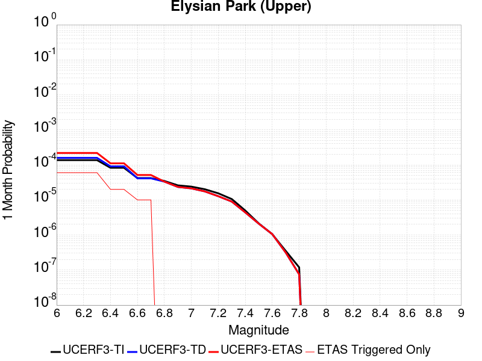 |  |  |

| Magnitude | 1 wk TI Prob | 1 wk TD Prob | 1 wk ETAS Prob | 1 wk ETAS/TD Gain | 1 wk ETAS Triggered Only | 1 mo TI Prob | 1 mo TD Prob | 1 mo ETAS Prob | 1 mo ETAS/TD Gain | 1 mo ETAS Triggered Only | 1 yr TI Prob | 1 yr TD Prob | 1 yr ETAS Prob | 1 yr ETAS/TD Gain | 1 yr ETAS Triggered Only | 10 yr TI Prob | 10 yr TD Prob | 10 yr ETAS Prob | 10 yr ETAS/TD Gain | 10 yr ETAS Triggered Only |
|-----|-----|-----|-----|-----|-----|-----|-----|-----|-----|-----|-----|-----|-----|-----|-----|-----|-----|-----|-----|-----|
| 6.0 | 3.1876025E-5 | 3.7035516E-5 | 6.370119E-5 | 1.7200029 | 2.6666667E-5 | 1.3660437E-4 | 1.587167E-4 | 1.8537915E-4 | 1.1679876 | 2.6666667E-5 | 0.0016618895 | 0.0019311075 | 0.002037568 | 1.0551293 | 1.0666667E-4 | 0.016495159 | 0.019189782 | 0.019346712 | 1.0081778 | 1.6E-4 |
| 6.1 | 3.1876025E-5 | 3.7035516E-5 | 6.370119E-5 | 1.7200029 | 2.6666667E-5 | 1.3660437E-4 | 1.587167E-4 | 1.8537915E-4 | 1.1679876 | 2.6666667E-5 | 0.0016618895 | 0.0019311075 | 0.002037568 | 1.0551293 | 1.0666667E-4 | 0.016495159 | 0.019189782 | 0.019346712 | 1.0081778 | 1.6E-4 |
| 6.2 | 3.1876025E-5 | 3.7035516E-5 | 6.370119E-5 | 1.7200029 | 2.6666667E-5 | 1.3660437E-4 | 1.587167E-4 | 1.8537915E-4 | 1.1679876 | 2.6666667E-5 | 0.0016618895 | 0.0019311075 | 0.002037568 | 1.0551293 | 1.0666667E-4 | 0.016495159 | 0.019189782 | 0.019346712 | 1.0081778 | 1.6E-4 |
| 6.3 | 3.1876025E-5 | 3.7035516E-5 | 6.370119E-5 | 1.7200029 | 2.6666667E-5 | 1.3660437E-4 | 1.587167E-4 | 1.8537915E-4 | 1.1679876 | 2.6666667E-5 | 0.0016618895 | 0.0019311075 | 0.002037568 | 1.0551293 | 1.0666667E-4 | 0.016495159 | 0.019189782 | 0.019346712 | 1.0081778 | 1.6E-4 |
| 6.4 | 1.9273462E-5 | 2.1202266E-5 | 2.1202266E-5 | 1.0 | 0.0 | 8.259794E-5 | 9.086466E-5 | 9.086466E-5 | 1.0 | 0.0 | 0.001005166 | 0.0011058892 | 0.0011591637 | 1.0481733 | 5.3333333E-5 | 0.010006315 | 0.011020724 | 0.011099842 | 1.007179 | 8.0E-5 |
| 6.5 | 1.9273462E-5 | 2.1202266E-5 | 2.1202266E-5 | 1.0 | 0.0 | 8.259794E-5 | 9.086466E-5 | 9.086466E-5 | 1.0 | 0.0 | 0.001005166 | 0.0011058892 | 0.0011591637 | 1.0481733 | 5.3333333E-5 | 0.010006315 | 0.011020724 | 0.011099842 | 1.007179 | 8.0E-5 |
| 6.6 | 9.813258E-6 | 9.665599E-6 | 9.665599E-6 | 1.0 | 0.0 | 4.205614E-5 | 4.1423376E-5 | 4.1423376E-5 | 1.0 | 0.0 | 5.119132E-4 | 5.0422014E-4 | 5.3087337E-4 | 1.0528603 | 2.6666667E-5 | 0.005107356 | 0.0050314846 | 0.00508455 | 1.0105466 | 5.3333333E-5 |
| 6.7 | 9.801478E-6 | 9.653168E-6 | 9.653168E-6 | 1.0 | 0.0 | 4.2005657E-5 | 4.1370105E-5 | 4.1370105E-5 | 1.0 | 0.0 | 5.112989E-4 | 5.035719E-4 | 5.302251E-4 | 1.0529283 | 2.6666667E-5 | 0.0051012407 | 0.0050250315 | 0.0050780964 | 1.0105602 | 5.3333333E-5 |
| 6.8 | 8.102489E-6 | 7.773004E-6 | 7.773004E-6 | 1.0 | 0.0 | 3.4724493E-5 | 3.3312477E-5 | 3.3312477E-5 | 1.0 | 0.0 | 4.2268867E-4 | 4.055089E-4 | 4.055089E-4 | 1.0 | 0.0 | 0.004218856 | 0.0040481836 | 0.004074742 | 1.0065607 | 2.6666667E-5 |
| 6.9 | 6.08275E-6 | 5.4814514E-6 | 5.4814514E-6 | 1.0 | 0.0 | 2.6068668E-5 | 2.3491726E-5 | 2.3491726E-5 | 1.0 | 0.0 | 3.173398E-4 | 2.85975E-4 | 2.85975E-4 | 1.0 | 0.0 | 0.0031688702 | 0.0028561477 | 0.0028827381 | 1.0093099 | 2.6666667E-5 |
| 7.0 | 5.5995934E-6 | 4.98278E-6 | 4.98278E-6 | 1.0 | 0.0 | 2.3998036E-5 | 2.13546E-5 | 2.13546E-5 | 1.0 | 0.0 | 2.9213692E-4 | 2.599619E-4 | 2.599619E-4 | 1.0 | 0.0 | 0.0029175316 | 0.0025966454 | 0.0026232428 | 1.0102429 | 2.6666667E-5 |
| 7.1 | 4.709881E-6 | 4.0874015E-6 | 4.0874015E-6 | 1.0 | 0.0 | 2.0185047E-5 | 1.7517319E-5 | 1.7517319E-5 | 1.0 | 0.0 | 2.4572524E-4 | 2.132529E-4 | 2.132529E-4 | 1.0 | 0.0 | 0.002454537 | 0.002130524 | 0.0021571338 | 1.0124898 | 2.6666667E-5 |
| 7.2 | 3.6063436E-6 | 2.9779544E-6 | 2.9779544E-6 | 1.0 | 0.0 | 1.5455667E-5 | 1.27626E-5 | 1.27626E-5 | 1.0 | 0.0 | 1.881565E-4 | 1.5537368E-4 | 1.5537368E-4 | 1.0 | 0.0 | 0.0018799726 | 0.0015526618 | 0.0015792871 | 1.0171481 | 2.6666667E-5 |
| 7.3 | 2.471135E-6 | 2.0954615E-6 | 2.0954615E-6 | 1.0 | 0.0 | 1.0590536E-5 | 8.980519E-6 | 8.980519E-6 | 1.0 | 0.0 | 1.2893214E-4 | 1.093324E-4 | 1.093324E-4 | 1.0 | 0.0 | 0.0012885736 | 0.0010927934 | 0.0011194309 | 1.0243757 | 2.6666667E-5 |
| 7.4 | 1.163943E-6 | 1.0275091E-6 | 1.0275091E-6 | 1.0 | 0.0 | 4.988318E-6 | 4.4036033E-6 | 4.4036033E-6 | 1.0 | 0.0 | 6.0731076E-5 | 5.3612584E-5 | 5.3612584E-5 | 1.0 | 0.0 | 6.071448E-4 | 5.359995E-4 | 5.6265184E-4 | 1.0497246 | 2.6666667E-5 |
| 7.5 | 4.99459E-7 | 4.917604E-7 | 4.917604E-7 | 1.0 | 0.0 | 2.140537E-6 | 2.1075427E-6 | 2.1075427E-6 | 1.0 | 0.0 | 2.6060725E-5 | 2.5659048E-5 | 2.5659048E-5 | 1.0 | 0.0 | 2.605767E-4 | 2.5656243E-4 | 2.5656243E-4 | 1.0 | 0.0 |
| 7.6 | 2.4667852E-7 | 2.4778336E-7 | 2.4778336E-7 | 1.0 | 0.0 | 1.0571932E-6 | 1.0619283E-6 | 1.0619283E-6 | 1.0 | 0.0 | 1.2871251E-5 | 1.2928905E-5 | 1.2928905E-5 | 1.0 | 0.0 | 1.2870505E-4 | 1.2928189E-4 | 1.2928189E-4 | 1.0 | 0.0 |
| 7.7 | 8.2312795E-8 | 7.3864456E-8 | 7.3864456E-8 | 1.0 | 0.0 | 3.527691E-7 | 3.165619E-7 | 3.165619E-7 | 1.0 | 0.0 | 4.294955E-6 | 3.8541357E-6 | 3.8541357E-6 | 1.0 | 0.0 | 4.2948723E-5 | 3.8540802E-5 | 3.8540802E-5 | 1.0 | 0.0 |
| 7.8 | 2.7819295E-8 | 1.7566023E-8 | 1.7566023E-8 | 1.0 | 0.0 | 1.1922555E-7 | 7.5282955E-8 | 7.5282955E-8 | 1.0 | 0.0 | 1.45157E-6 | 9.165697E-7 | 9.165697E-7 | 1.0 | 0.0 | 1.45156055E-5 | 9.165675E-6 | 9.165675E-6 | 1.0 | 0.0 |

## Mission Creek
*[(top)](#table-of-contents)*

| 1 Week | 1 Month | 1 Year | 10 Year |
|-----|-----|-----|-----|
|  |  |  | 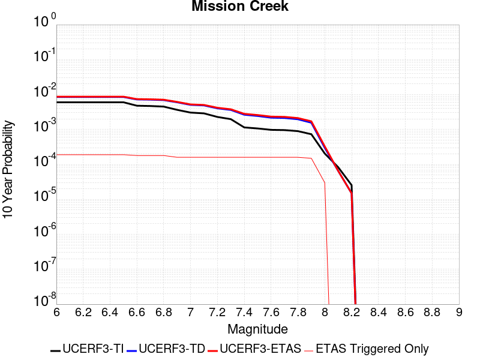 |

| Magnitude | 1 wk TI Prob | 1 wk TD Prob | 1 wk ETAS Prob | 1 wk ETAS/TD Gain | 1 wk ETAS Triggered Only | 1 mo TI Prob | 1 mo TD Prob | 1 mo ETAS Prob | 1 mo ETAS/TD Gain | 1 mo ETAS Triggered Only | 1 yr TI Prob | 1 yr TD Prob | 1 yr ETAS Prob | 1 yr ETAS/TD Gain | 1 yr ETAS Triggered Only | 10 yr TI Prob | 10 yr TD Prob | 10 yr ETAS Prob | 10 yr ETAS/TD Gain | 10 yr ETAS Triggered Only |
|-----|-----|-----|-----|-----|-----|-----|-----|-----|-----|-----|-----|-----|-----|-----|-----|-----|-----|-----|-----|-----|
| 6.0 | 1.1549387E-5 | 1.632237E-5 | 1.632237E-5 | 1.0 | 0.0 | 4.9496433E-5 | 6.9951224E-5 | 6.9951224E-5 | 1.0 | 0.0 | 6.0245243E-4 | 8.513384E-4 | 8.7798235E-4 | 1.0312966 | 2.6666667E-5 | 0.006008218 | 0.008509998 | 0.008668636 | 1.0186415 | 1.6E-4 |
| 6.1 | 1.1549387E-5 | 1.632237E-5 | 1.632237E-5 | 1.0 | 0.0 | 4.9496433E-5 | 6.9951224E-5 | 6.9951224E-5 | 1.0 | 0.0 | 6.0245243E-4 | 8.513384E-4 | 8.7798235E-4 | 1.0312966 | 2.6666667E-5 | 0.006008218 | 0.008509998 | 0.008668636 | 1.0186415 | 1.6E-4 |
| 6.2 | 1.1549387E-5 | 1.632237E-5 | 1.632237E-5 | 1.0 | 0.0 | 4.9496433E-5 | 6.9951224E-5 | 6.9951224E-5 | 1.0 | 0.0 | 6.0245243E-4 | 8.513384E-4 | 8.7798235E-4 | 1.0312966 | 2.6666667E-5 | 0.006008218 | 0.008509998 | 0.008668636 | 1.0186415 | 1.6E-4 |
| 6.3 | 1.1549387E-5 | 1.632237E-5 | 1.632237E-5 | 1.0 | 0.0 | 4.9496433E-5 | 6.9951224E-5 | 6.9951224E-5 | 1.0 | 0.0 | 6.0245243E-4 | 8.513384E-4 | 8.7798235E-4 | 1.0312966 | 2.6666667E-5 | 0.006008218 | 0.008509998 | 0.008668636 | 1.0186415 | 1.6E-4 |
| 6.4 | 1.1549387E-5 | 1.632237E-5 | 1.632237E-5 | 1.0 | 0.0 | 4.9496433E-5 | 6.9951224E-5 | 6.9951224E-5 | 1.0 | 0.0 | 6.0245243E-4 | 8.513384E-4 | 8.7798235E-4 | 1.0312966 | 2.6666667E-5 | 0.006008218 | 0.008509998 | 0.008668636 | 1.0186415 | 1.6E-4 |
| 6.5 | 1.1549387E-5 | 1.632237E-5 | 1.632237E-5 | 1.0 | 0.0 | 4.9496433E-5 | 6.9951224E-5 | 6.9951224E-5 | 1.0 | 0.0 | 6.0245243E-4 | 8.513384E-4 | 8.7798235E-4 | 1.0312966 | 2.6666667E-5 | 0.006008218 | 0.008509998 | 0.008668636 | 1.0186415 | 1.6E-4 |
| 6.6 | 9.202681E-6 | 1.3845646E-5 | 1.3845646E-5 | 1.0 | 0.0 | 3.9439463E-5 | 5.9337188E-5 | 5.9337188E-5 | 1.0 | 0.0 | 4.800697E-4 | 7.221998E-4 | 7.488472E-4 | 1.0368975 | 2.6666667E-5 | 0.004790339 | 0.0072271815 | 0.0073595513 | 1.0183156 | 1.3333333E-4 |
| 6.7 | 9.019164E-6 | 1.3651316E-5 | 1.3651316E-5 | 1.0 | 0.0 | 3.8652986E-5 | 5.8504378E-5 | 5.8504378E-5 | 1.0 | 0.0 | 4.7049852E-4 | 7.12067E-4 | 7.387147E-4 | 1.037423 | 2.6666667E-5 | 0.004695036 | 0.007126506 | 0.007258889 | 1.0185761 | 1.3333333E-4 |
| 6.8 | 8.673558E-6 | 1.3273427E-5 | 1.3273427E-5 | 1.0 | 0.0 | 3.717186E-5 | 5.6884925E-5 | 5.6884925E-5 | 1.0 | 0.0 | 4.524734E-4 | 6.923627E-4 | 7.1901095E-4 | 1.0384887 | 2.6666667E-5 | 0.0045155324 | 0.006930694 | 0.0070631034 | 1.0191047 | 1.3333333E-4 |
| 6.9 | 7.002255E-6 | 1.1477657E-5 | 1.1477657E-5 | 1.0 | 0.0 | 3.000932E-5 | 4.9189068E-5 | 4.9189068E-5 | 1.0 | 0.0 | 3.653022E-4 | 5.9871917E-4 | 6.253699E-4 | 1.0445129 | 2.6666667E-5 | 0.0036470229 | 0.005999517 | 0.006105544 | 1.0176725 | 1.0666667E-4 |
| 7.0 | 5.84644E-6 | 9.67498E-6 | 9.67498E-6 | 1.0 | 0.0 | 2.5055931E-5 | 4.1463565E-5 | 4.1463565E-5 | 1.0 | 0.0 | 3.0501327E-4 | 5.047066E-4 | 5.3135975E-4 | 1.0528094 | 2.6666667E-5 | 0.0030459496 | 0.0050638523 | 0.005169979 | 1.0209577 | 1.0666667E-4 |
| 7.1 | 5.54703E-6 | 9.329456E-6 | 9.329456E-6 | 1.0 | 0.0 | 2.377277E-5 | 3.9982795E-5 | 3.9982795E-5 | 1.0 | 0.0 | 2.8939504E-4 | 4.8668624E-4 | 5.1333994E-4 | 1.0547657 | 2.6666667E-5 | 0.0028901845 | 0.004884446 | 0.004990592 | 1.0217314 | 1.0666667E-4 |
| 7.2 | 4.384709E-6 | 7.68157E-6 | 7.68157E-6 | 1.0 | 0.0 | 1.8791474E-5 | 3.2920623E-5 | 3.2920623E-5 | 1.0 | 0.0 | 2.2876218E-4 | 4.0073853E-4 | 4.273945E-4 | 1.0665171 | 2.6666667E-5 | 0.0022852682 | 0.004028366 | 0.004134603 | 1.0263722 | 1.0666667E-4 |
| 7.3 | 3.7888456E-6 | 6.915452E-6 | 6.915452E-6 | 1.0 | 0.0 | 1.623781E-5 | 2.9637333E-5 | 2.9637333E-5 | 1.0 | 0.0 | 1.9767738E-4 | 3.6077813E-4 | 3.874352E-4 | 1.0738876 | 2.6666667E-5 | 0.0019750162 | 0.0036301152 | 0.0037363947 | 1.0292772 | 1.0666667E-4 |
| 7.4 | 2.1982462E-6 | 5.0237763E-6 | 5.0237763E-6 | 1.0 | 0.0 | 9.421021E-6 | 2.1530293E-5 | 2.1530293E-5 | 1.0 | 0.0 | 1.1469489E-4 | 2.621E-4 | 2.8875968E-4 | 1.1017157 | 2.6666667E-5 | 0.0011463572 | 0.0026458844 | 0.002752269 | 1.0402075 | 1.0666667E-4 |
| 7.5 | 2.051923E-6 | 4.615016E-6 | 4.615016E-6 | 1.0 | 0.0 | 8.793926E-6 | 1.9778492E-5 | 1.9778492E-5 | 1.0 | 0.0 | 1.0706078E-4 | 2.4077666E-4 | 2.674369E-4 | 1.110726 | 2.6666667E-5 | 0.0010700922 | 0.0024335422 | 0.002539949 | 1.0437251 | 1.0666667E-4 |
| 7.6 | 1.8733427E-6 | 4.1233748E-6 | 4.1233748E-6 | 1.0 | 0.0 | 8.028587E-6 | 1.7671488E-5 | 1.7671488E-5 | 1.0 | 0.0 | 9.774366E-5 | 2.151292E-4 | 2.4179013E-4 | 1.1239299 | 2.6666667E-5 | 9.770069E-4 | 0.0021780801 | 0.0022845145 | 1.0488662 | 1.0666667E-4 |
| 7.7 | 1.8411953E-6 | 4.0430496E-6 | 4.0430496E-6 | 1.0 | 0.0 | 7.890813E-6 | 1.732724E-5 | 1.732724E-5 | 1.0 | 0.0 | 9.606641E-5 | 2.1093882E-4 | 2.3759986E-4 | 1.1263922 | 2.6666667E-5 | 9.6024893E-4 | 0.0021363653 | 0.002242804 | 1.0498223 | 1.0666667E-4 |
| 7.8 | 1.7194251E-6 | 3.7104276E-6 | 3.7104276E-6 | 1.0 | 0.0 | 7.368944E-6 | 1.5901736E-5 | 1.5901736E-5 | 1.0 | 0.0 | 8.97132E-5 | 1.9358651E-4 | 2.2024801E-4 | 1.1377239 | 2.6666667E-5 | 8.967699E-4 | 0.0019623525 | 0.0020688097 | 1.0542499 | 1.0666667E-4 |
| 7.9 | 1.4035052E-6 | 2.9500632E-6 | 2.9500632E-6 | 1.0 | 0.0 | 6.0150082E-6 | 1.2643067E-5 | 1.2643067E-5 | 1.0 | 0.0 | 7.3230265E-5 | 1.5391852E-4 | 1.8058109E-4 | 1.1732252 | 2.6666667E-5 | 7.3206134E-4 | 0.0015631086 | 0.0016429836 | 1.0511 | 8.0E-5 |
| 8.0 | 3.9318823E-7 | 5.528522E-7 | 5.528522E-7 | 1.0 | 0.0 | 1.6850913E-6 | 2.3693647E-6 | 2.3693647E-6 | 1.0 | 0.0 | 2.0515794E-5 | 2.8846638E-5 | 2.8846638E-5 | 1.0 | 0.0 | 2.0513899E-4 | 2.9899E-4 | 2.9899E-4 | 1.0 | 0.0 |
| 8.1 | 1.596793E-7 | 1.1380002E-7 | 1.1380002E-7 | 1.0 | 0.0 | 6.8433974E-7 | 4.877143E-7 | 4.877143E-7 | 1.0 | 0.0 | 8.331805E-6 | 5.937906E-6 | 5.937906E-6 | 1.0 | 0.0 | 8.331492E-5 | 6.549966E-5 | 6.549966E-5 | 1.0 | 0.0 |
| 8.2 | 4.9003038E-8 | 2.5444924E-8 | 2.5444924E-8 | 1.0 | 0.0 | 2.10013E-7 | 1.0904967E-7 | 1.0904967E-7 | 1.0 | 0.0 | 2.5569052E-6 | 1.327679E-6 | 1.327679E-6 | 1.0 | 0.0 | 2.556876E-5 | 1.495635E-5 | 1.495635E-5 | 1.0 | 0.0 |

## Ortigalita (North)
*[(top)](#table-of-contents)*

| 1 Week | 1 Month | 1 Year | 10 Year |
|-----|-----|-----|-----|
|  |  |  |  |

| Magnitude | 1 wk TI Prob | 1 wk TD Prob | 1 wk ETAS Prob | 1 wk ETAS/TD Gain | 1 wk ETAS Triggered Only | 1 mo TI Prob | 1 mo TD Prob | 1 mo ETAS Prob | 1 mo ETAS/TD Gain | 1 mo ETAS Triggered Only | 1 yr TI Prob | 1 yr TD Prob | 1 yr ETAS Prob | 1 yr ETAS/TD Gain | 1 yr ETAS Triggered Only | 10 yr TI Prob | 10 yr TD Prob | 10 yr ETAS Prob | 10 yr ETAS/TD Gain | 10 yr ETAS Triggered Only |
|-----|-----|-----|-----|-----|-----|-----|-----|-----|-----|-----|-----|-----|-----|-----|-----|-----|-----|-----|-----|-----|
| 6.0 | 7.711876E-5 | 1.05064966E-4 | 1.583927E-4 | 1.5075691 | 5.3333333E-5 | 3.3046713E-4 | 4.502116E-4 | 5.5683026E-4 | 1.2368189 | 1.0666667E-4 | 0.004016016 | 0.0054681194 | 0.005574203 | 1.0194004 | 1.0666667E-4 | 0.039442103 | 0.053454787 | 0.053606234 | 1.0028331 | 1.6E-4 |
| 6.1 | 4.607858E-5 | 6.0239203E-5 | 6.0239203E-5 | 1.0 | 0.0 | 1.9746469E-4 | 2.5814527E-4 | 2.8480505E-4 | 1.1032743 | 2.6666667E-5 | 0.0024014818 | 0.0031387596 | 0.0031653426 | 1.0084692 | 2.6666667E-5 | 0.023756953 | 0.030975068 | 0.031000908 | 1.0008342 | 2.6666667E-5 |
| 6.2 | 4.607858E-5 | 6.0239203E-5 | 6.0239203E-5 | 1.0 | 0.0 | 1.9746469E-4 | 2.5814527E-4 | 2.8480505E-4 | 1.1032743 | 2.6666667E-5 | 0.0024014818 | 0.0031387596 | 0.0031653426 | 1.0084692 | 2.6666667E-5 | 0.023756953 | 0.030975068 | 0.031000908 | 1.0008342 | 2.6666667E-5 |
| 6.3 | 3.327423E-5 | 4.2475127E-5 | 4.2475127E-5 | 1.0 | 0.0 | 1.4259605E-4 | 1.8202531E-4 | 1.8202531E-4 | 1.0 | 0.0 | 0.0017347244 | 0.002214197 | 0.002214197 | 1.0 | 0.0 | 0.017212452 | 0.021945644 | 0.021945644 | 1.0 | 0.0 |
| 6.4 | 2.7732503E-5 | 3.4998593E-5 | 3.4998593E-5 | 1.0 | 0.0 | 1.1884817E-4 | 1.4998685E-4 | 1.4998685E-4 | 1.0 | 0.0 | 0.001446016 | 0.0018248095 | 0.0018248095 | 1.0 | 0.0 | 0.014366428 | 0.018121224 | 0.018121224 | 1.0 | 0.0 |
| 6.5 | 2.7689714E-5 | 3.4948407E-5 | 3.4948407E-5 | 1.0 | 0.0 | 1.186648E-4 | 1.497718E-4 | 1.497718E-4 | 1.0 | 0.0 | 0.0014437864 | 0.0018221956 | 0.0018221956 | 1.0 | 0.0 | 0.014344421 | 0.01809551 | 0.01809551 | 1.0 | 0.0 |
| 6.6 | 2.2976905E-5 | 2.8718265E-5 | 2.8718265E-5 | 1.0 | 0.0 | 9.846873E-5 | 1.230739E-4 | 1.230739E-4 | 1.0 | 0.0 | 0.0011981975 | 0.0014976363 | 0.0014976363 | 1.0 | 0.0 | 0.011917574 | 0.014898697 | 0.014898697 | 1.0 | 0.0 |
| 6.7 | 1.9871539E-5 | 2.4904411E-5 | 2.4904411E-5 | 1.0 | 0.0 | 8.516096E-5 | 1.0673023E-4 | 1.0673023E-4 | 1.0 | 0.0 | 0.0010363415 | 0.0012989145 | 0.0012989145 | 1.0 | 0.0 | 0.010315218 | 0.012936919 | 0.012936919 | 1.0 | 0.0 |
| 6.8 | 6.5640475E-6 | 7.6054926E-6 | 7.6054926E-6 | 1.0 | 0.0 | 2.813133E-5 | 3.2594577E-5 | 3.2594577E-5 | 1.0 | 0.0 | 3.424451E-4 | 3.9676955E-4 | 3.9676955E-4 | 1.0 | 0.0 | 0.0034191788 | 0.003960899 | 0.003960899 | 1.0 | 0.0 |
| 6.9 | 5.6219683E-6 | 6.5018376E-6 | 6.5018376E-6 | 1.0 | 0.0 | 2.4093928E-5 | 2.7864735E-5 | 2.7864735E-5 | 1.0 | 0.0 | 2.933041E-4 | 3.3920293E-4 | 3.3920293E-4 | 1.0 | 0.0 | 0.0029291727 | 0.003387109 | 0.003387109 | 1.0 | 0.0 |
| 7.0 | 3.875591E-6 | 4.4847548E-6 | 4.4847548E-6 | 1.0 | 0.0 | 1.6609569E-5 | 1.9220248E-5 | 1.9220248E-5 | 1.0 | 0.0 | 2.0220275E-4 | 2.339835E-4 | 2.339835E-4 | 1.0 | 0.0 | 0.0020201886 | 0.0023375798 | 0.0023375798 | 1.0 | 0.0 |
| 7.1 | 1.6017933E-6 | 1.8570418E-6 | 1.8570418E-6 | 1.0 | 0.0 | 6.8648105E-6 | 7.958732E-6 | 7.958732E-6 | 1.0 | 0.0 | 8.357586E-5 | 9.689432E-5 | 9.689432E-5 | 1.0 | 0.0 | 8.3544437E-4 | 9.686254E-4 | 9.686254E-4 | 1.0 | 0.0 |

## Cleghorn Pass
*[(top)](#table-of-contents)*

| 1 Week | 1 Month | 1 Year | 10 Year |
|-----|-----|-----|-----|
|  |  |  |  |

| Magnitude | 1 wk TI Prob | 1 wk TD Prob | 1 wk ETAS Prob | 1 wk ETAS/TD Gain | 1 wk ETAS Triggered Only | 1 mo TI Prob | 1 mo TD Prob | 1 mo ETAS Prob | 1 mo ETAS/TD Gain | 1 mo ETAS Triggered Only | 1 yr TI Prob | 1 yr TD Prob | 1 yr ETAS Prob | 1 yr ETAS/TD Gain | 1 yr ETAS Triggered Only | 10 yr TI Prob | 10 yr TD Prob | 10 yr ETAS Prob | 10 yr ETAS/TD Gain | 10 yr ETAS Triggered Only |
|-----|-----|-----|-----|-----|-----|-----|-----|-----|-----|-----|-----|-----|-----|-----|-----|-----|-----|-----|-----|-----|
| 6.0 | 1.0522846E-5 | 1.1040642E-5 | 1.1040642E-5 | 1.0 | 0.0 | 4.509713E-5 | 4.7316473E-5 | 4.7316473E-5 | 1.0 | 0.0 | 5.4891926E-4 | 5.759784E-4 | 6.2928104E-4 | 1.0925428 | 5.3333333E-5 | 0.0054756533 | 0.005750022 | 0.005909102 | 1.027666 | 1.6E-4 |
| 6.1 | 1.0522846E-5 | 1.1040642E-5 | 1.1040642E-5 | 1.0 | 0.0 | 4.509713E-5 | 4.7316473E-5 | 4.7316473E-5 | 1.0 | 0.0 | 5.4891926E-4 | 5.759784E-4 | 6.2928104E-4 | 1.0925428 | 5.3333333E-5 | 0.0054756533 | 0.005750022 | 0.005909102 | 1.027666 | 1.6E-4 |
| 6.2 | 2.1045846E-6 | 2.2082024E-6 | 2.2082024E-6 | 1.0 | 0.0 | 9.019617E-6 | 9.463714E-6 | 9.463714E-6 | 1.0 | 0.0 | 1.098083E-4 | 1.1521882E-4 | 1.1521882E-4 | 1.0 | 0.0 | 0.0010975406 | 0.0011520023 | 0.0012052741 | 1.0462428 | 5.3333333E-5 |
| 6.3 | 2.1045846E-6 | 2.2082024E-6 | 2.2082024E-6 | 1.0 | 0.0 | 9.019617E-6 | 9.463714E-6 | 9.463714E-6 | 1.0 | 0.0 | 1.098083E-4 | 1.1521882E-4 | 1.1521882E-4 | 1.0 | 0.0 | 0.0010975406 | 0.0011520023 | 0.0012052741 | 1.0462428 | 5.3333333E-5 |
| 6.4 | 1.7259927E-6 | 1.810877E-6 | 1.810877E-6 | 1.0 | 0.0 | 7.3970905E-6 | 7.760902E-6 | 7.760902E-6 | 1.0 | 0.0 | 9.005586E-5 | 9.4488976E-5 | 9.4488976E-5 | 1.0 | 0.0 | 9.001937E-4 | 9.448898E-4 | 9.448898E-4 | 1.0 | 0.0 |

## Ventura-Pitas Point
*[(top)](#table-of-contents)*

| 1 Week | 1 Month | 1 Year | 10 Year |
|-----|-----|-----|-----|
|  |  |  |  |

| Magnitude | 1 wk TI Prob | 1 wk TD Prob | 1 wk ETAS Prob | 1 wk ETAS/TD Gain | 1 wk ETAS Triggered Only | 1 mo TI Prob | 1 mo TD Prob | 1 mo ETAS Prob | 1 mo ETAS/TD Gain | 1 mo ETAS Triggered Only | 1 yr TI Prob | 1 yr TD Prob | 1 yr ETAS Prob | 1 yr ETAS/TD Gain | 1 yr ETAS Triggered Only | 10 yr TI Prob | 10 yr TD Prob | 10 yr ETAS Prob | 10 yr ETAS/TD Gain | 10 yr ETAS Triggered Only |
|-----|-----|-----|-----|-----|-----|-----|-----|-----|-----|-----|-----|-----|-----|-----|-----|-----|-----|-----|-----|-----|
| 6.0 | 3.3179622E-5 | 3.3735185E-5 | 8.706672E-5 | 2.5808876 | 5.3333333E-5 | 1.4219063E-4 | 1.445728E-4 | 2.2456123E-4 | 1.5532744 | 8.0E-5 | 0.0017297962 | 0.0017590096 | 0.0018921084 | 1.0756669 | 1.3333333E-4 | 0.017163932 | 0.0174764 | 0.017607404 | 1.007496 | 1.3333333E-4 |
| 6.1 | 3.3179622E-5 | 3.3735185E-5 | 8.706672E-5 | 2.5808876 | 5.3333333E-5 | 1.4219063E-4 | 1.445728E-4 | 2.2456123E-4 | 1.5532744 | 8.0E-5 | 0.0017297962 | 0.0017590096 | 0.0018921084 | 1.0756669 | 1.3333333E-4 | 0.017163932 | 0.0174764 | 0.017607404 | 1.007496 | 1.3333333E-4 |
| 6.2 | 3.3179622E-5 | 3.3735185E-5 | 8.706672E-5 | 2.5808876 | 5.3333333E-5 | 1.4219063E-4 | 1.445728E-4 | 2.2456123E-4 | 1.5532744 | 8.0E-5 | 0.0017297962 | 0.0017590096 | 0.0018921084 | 1.0756669 | 1.3333333E-4 | 0.017163932 | 0.0174764 | 0.017607404 | 1.007496 | 1.3333333E-4 |
| 6.3 | 3.3179622E-5 | 3.3735185E-5 | 8.706672E-5 | 2.5808876 | 5.3333333E-5 | 1.4219063E-4 | 1.445728E-4 | 2.2456123E-4 | 1.5532744 | 8.0E-5 | 0.0017297962 | 0.0017590096 | 0.0018921084 | 1.0756669 | 1.3333333E-4 | 0.017163932 | 0.0174764 | 0.017607404 | 1.007496 | 1.3333333E-4 |
| 6.4 | 1.8754668E-5 | 1.701961E-5 | 4.3685824E-5 | 2.5667934 | 2.6666667E-5 | 8.037467E-5 | 7.293928E-5 | 1.2626873E-4 | 1.7311485 | 5.3333333E-5 | 9.781223E-4 | 8.8769704E-4 | 9.94269E-4 | 1.1200545 | 1.0666667E-4 | 0.009738282 | 0.008843848 | 0.008949571 | 1.0119544 | 1.0666667E-4 |
| 6.5 | 1.8754668E-5 | 1.701961E-5 | 4.3685824E-5 | 2.5667934 | 2.6666667E-5 | 8.037467E-5 | 7.293928E-5 | 1.2626873E-4 | 1.7311485 | 5.3333333E-5 | 9.781223E-4 | 8.8769704E-4 | 9.94269E-4 | 1.1200545 | 1.0666667E-4 | 0.009738282 | 0.008843848 | 0.008949571 | 1.0119544 | 1.0666667E-4 |
| 6.6 | 1.4361558E-5 | 1.2122275E-5 | 1.2122275E-5 | 1.0 | 0.0 | 6.154808E-5 | 5.1951585E-5 | 7.861687E-5 | 1.5132718 | 2.6666667E-5 | 7.490902E-4 | 6.3232926E-4 | 6.856289E-4 | 1.0842909 | 5.3333333E-5 | 0.0074657016 | 0.0063055577 | 0.0063585546 | 1.0084049 | 5.3333333E-5 |
| 6.7 | 1.4361558E-5 | 1.2122275E-5 | 1.2122275E-5 | 1.0 | 0.0 | 6.154808E-5 | 5.1951585E-5 | 7.861687E-5 | 1.5132718 | 2.6666667E-5 | 7.490902E-4 | 6.3232926E-4 | 6.856289E-4 | 1.0842909 | 5.3333333E-5 | 0.0074657016 | 0.0063055577 | 0.0063585546 | 1.0084049 | 5.3333333E-5 |
| 6.8 | 1.3663846E-5 | 1.13444175E-5 | 1.13444175E-5 | 1.0 | 0.0 | 5.8558027E-5 | 4.861804E-5 | 7.528341E-5 | 1.5484666 | 2.6666667E-5 | 7.127108E-4 | 5.917658E-4 | 6.4506754E-4 | 1.0900724 | 5.3333333E-5 | 0.007104293 | 0.005902116 | 0.0059551345 | 1.008983 | 5.3333333E-5 |
| 6.9 | 1.3644157E-5 | 1.1322519E-5 | 1.1322519E-5 | 1.0 | 0.0 | 5.8473648E-5 | 4.8524187E-5 | 7.518956E-5 | 1.5495274 | 2.6666667E-5 | 7.116841E-4 | 5.9062376E-4 | 6.439256E-4 | 1.0902467 | 5.3333333E-5 | 0.007094092 | 0.0058907564 | 0.0059437756 | 1.0090004 | 5.3333333E-5 |
| 7.0 | 1.3568845E-5 | 1.1242086E-5 | 1.1242086E-5 | 1.0 | 0.0 | 5.8150898E-5 | 4.817949E-5 | 7.4844866E-5 | 1.5534593 | 2.6666667E-5 | 7.077572E-4 | 5.864293E-4 | 6.3973136E-4 | 1.0908926 | 5.3333333E-5 | 0.007055073 | 0.0058490336 | 0.0059020547 | 1.009065 | 5.3333333E-5 |
| 7.1 | 1.306572E-5 | 1.072054E-5 | 1.072054E-5 | 1.0 | 0.0 | 5.599474E-5 | 4.5944373E-5 | 7.2609815E-5 | 1.5803853 | 2.6666667E-5 | 6.815227E-4 | 5.5923103E-4 | 6.125345E-4 | 1.0953157 | 5.3333333E-5 | 0.0067943637 | 0.0055784425 | 0.005631478 | 1.0095073 | 5.3333333E-5 |
| 7.2 | 1.232604E-5 | 9.995143E-6 | 9.995143E-6 | 1.0 | 0.0 | 5.2824813E-5 | 4.2835632E-5 | 4.2835632E-5 | 1.0 | 0.0 | 6.429523E-4 | 5.214008E-4 | 5.480536E-4 | 1.0511177 | 2.6666667E-5 | 0.0064109527 | 0.005201967 | 0.0052284948 | 1.0050997 | 2.6666667E-5 |
| 7.3 | 1.0917261E-5 | 8.84384E-6 | 8.84384E-6 | 1.0 | 0.0 | 4.678742E-5 | 3.790163E-5 | 3.790163E-5 | 1.0 | 0.0 | 5.69488E-4 | 4.6135622E-4 | 4.6135622E-4 | 1.0 | 0.0 | 0.0056803077 | 0.00460415 | 0.00460415 | 1.0 | 0.0 |
| 7.4 | 1.039959E-5 | 8.423562E-6 | 8.423562E-6 | 1.0 | 0.0 | 4.456891E-5 | 3.610049E-5 | 3.610049E-5 | 1.0 | 0.0 | 5.424914E-4 | 4.3943635E-4 | 4.3943635E-4 | 1.0 | 0.0 | 0.0054116896 | 0.004385836 | 0.004385836 | 1.0 | 0.0 |
| 7.5 | 9.015877E-6 | 7.2975445E-6 | 7.2975445E-6 | 1.0 | 0.0 | 3.86389E-5 | 3.1274823E-5 | 3.1274823E-5 | 1.0 | 0.0 | 4.7032707E-4 | 3.8070587E-4 | 3.8070587E-4 | 1.0 | 0.0 | 0.004693329 | 0.0038006818 | 0.0038006818 | 1.0 | 0.0 |
| 7.6 | 4.900162E-6 | 3.8741155E-6 | 3.8741155E-6 | 1.0 | 0.0 | 2.1000526E-5 | 1.6603248E-5 | 1.6603248E-5 | 1.0 | 0.0 | 2.556514E-4 | 2.0212591E-4 | 2.0212591E-4 | 1.0 | 0.0 | 0.0025535747 | 0.0020194345 | 0.0020194345 | 1.0 | 0.0 |
| 7.7 | 3.8850626E-6 | 3.1267302E-6 | 3.1267302E-6 | 1.0 | 0.0 | 1.6650163E-5 | 1.3400205E-5 | 1.3400205E-5 | 1.0 | 0.0 | 2.0269687E-4 | 1.6313537E-4 | 1.6313537E-4 | 1.0 | 0.0 | 0.002025121 | 0.0016301654 | 0.0016301654 | 1.0 | 0.0 |
| 7.8 | 2.4654719E-6 | 2.029875E-6 | 2.029875E-6 | 1.0 | 0.0 | 1.0566265E-5 | 8.699436E-6 | 8.699436E-6 | 1.0 | 0.0 | 1.2863669E-4 | 1.0591053E-4 | 1.0591053E-4 | 1.0 | 0.0 | 0.0012856225 | 0.0010586053 | 0.0010586053 | 1.0 | 0.0 |
| 7.9 | 4.095894E-7 | 3.2764765E-7 | 3.2764765E-7 | 1.0 | 0.0 | 1.7553821E-6 | 1.4042034E-6 | 1.4042034E-6 | 1.0 | 0.0 | 2.1371567E-5 | 1.7096047E-5 | 1.7096047E-5 | 1.0 | 0.0 | 2.1369511E-4 | 1.7094762E-4 | 1.7094762E-4 | 1.0 | 0.0 |
| 8.0 | 7.791402E-9 | 5.683497E-9 | 5.683497E-9 | 1.0 | 0.0 | 3.3391725E-8 | 2.4357844E-8 | 2.4357844E-8 | 1.0 | 0.0 | 4.0654416E-7 | 2.9655675E-7 | 2.9655675E-7 | 1.0 | 0.0 | 4.065434E-6 | 2.9655655E-6 | 2.9655655E-6 | 1.0 | 0.0 |

## Big Pine (Central)
*[(top)](#table-of-contents)*

| 1 Week | 1 Month | 1 Year | 10 Year |
|-----|-----|-----|-----|
|  |  |  |  |

| Magnitude | 1 wk TI Prob | 1 wk TD Prob | 1 wk ETAS Prob | 1 wk ETAS/TD Gain | 1 wk ETAS Triggered Only | 1 mo TI Prob | 1 mo TD Prob | 1 mo ETAS Prob | 1 mo ETAS/TD Gain | 1 mo ETAS Triggered Only | 1 yr TI Prob | 1 yr TD Prob | 1 yr ETAS Prob | 1 yr ETAS/TD Gain | 1 yr ETAS Triggered Only | 10 yr TI Prob | 10 yr TD Prob | 10 yr ETAS Prob | 10 yr ETAS/TD Gain | 10 yr ETAS Triggered Only |
|-----|-----|-----|-----|-----|-----|-----|-----|-----|-----|-----|-----|-----|-----|-----|-----|-----|-----|-----|-----|-----|
| 6.0 | 1.2706755E-5 | 1.4250529E-5 | 1.20915676E-4 | 8.484996 | 1.0666667E-4 | 5.4456385E-5 | 6.107247E-5 | 1.6773262E-4 | 2.7464523 | 1.0666667E-4 | 6.628048E-4 | 7.433402E-4 | 8.765744E-4 | 1.1792372 | 1.3333333E-4 | 0.006608314 | 0.0074135666 | 0.0075459117 | 1.0178517 | 1.3333333E-4 |
| 6.1 | 8.342579E-6 | 9.510762E-6 | 8.951E-5 | 9.411444 | 8.0E-5 | 3.5753423E-5 | 4.0759893E-5 | 1.2075663E-4 | 2.9626336 | 8.0E-5 | 4.3521097E-4 | 4.961604E-4 | 6.0277415E-4 | 1.2148776 | 1.0666667E-4 | 0.0043435963 | 0.0049540824 | 0.0050602206 | 1.0214244 | 1.0666667E-4 |
| 6.2 | 6.923899E-6 | 7.967147E-6 | 8.796651E-5 | 11.041155 | 8.0E-5 | 2.9673516E-5 | 3.4144578E-5 | 1.1414185E-4 | 3.3428981 | 8.0E-5 | 3.6121515E-4 | 4.156502E-4 | 5.2227254E-4 | 1.2565194 | 1.0666667E-4 | 0.003606286 | 0.0041520367 | 0.0042582606 | 1.0255835 | 1.0666667E-4 |
| 6.3 | 2.728396E-6 | 3.4242908E-6 | 8.342402E-5 | 24.362423 | 8.0E-5 | 1.1693074E-5 | 1.4675454E-5 | 9.467428E-5 | 6.4511995 | 8.0E-5 | 1.4235388E-4 | 1.7865987E-4 | 2.586456E-4 | 1.4476982 | 8.0E-5 | 0.0014226272 | 0.0017866704 | 0.0018665275 | 1.044696 | 8.0E-5 |
| 6.4 | 2.7136944E-6 | 3.408584E-6 | 8.340831E-5 | 24.470076 | 8.0E-5 | 1.1630066E-5 | 1.4608141E-5 | 9.460697E-5 | 6.4763184 | 8.0E-5 | 1.4158686E-4 | 1.7784047E-4 | 2.5782624E-4 | 1.4497614 | 8.0E-5 | 0.0014149669 | 0.0017784894 | 0.0018583472 | 1.044902 | 8.0E-5 |
| 6.5 | 2.6971882E-6 | 3.3909291E-6 | 8.339066E-5 | 24.592274 | 8.0E-5 | 1.1559327E-5 | 1.45324775E-5 | 9.4531315E-5 | 6.5048313 | 8.0E-5 | 1.4072572E-4 | 1.7691942E-4 | 2.5690527E-4 | 1.4521033 | 8.0E-5 | 0.0014063664 | 0.0017692937 | 0.0018491521 | 1.0451357 | 8.0E-5 |
| 6.6 | 2.669092E-6 | 3.3609497E-6 | 8.336068E-5 | 24.802715 | 8.0E-5 | 1.1438916E-5 | 1.4403995E-5 | 9.440284E-5 | 6.5539346 | 8.0E-5 | 1.3925991E-4 | 1.753554E-4 | 2.5534138E-4 | 1.4561363 | 8.0E-5 | 0.0013917267 | 0.0017536782 | 0.001833538 | 1.0455384 | 8.0E-5 |
| 6.7 | 2.6408059E-6 | 3.3309752E-6 | 8.3330706E-5 | 25.01691 | 8.0E-5 | 1.1317691E-5 | 1.4275535E-5 | 9.427439E-5 | 6.603913 | 8.0E-5 | 1.3778417E-4 | 1.7379165E-4 | 2.5377775E-4 | 1.4602413 | 8.0E-5 | 0.0013769877 | 0.0017380653 | 0.0018179262 | 1.0459481 | 8.0E-5 |
| 6.8 | 2.1786943E-6 | 2.8544325E-6 | 8.28542E-5 | 29.026506 | 8.0E-5 | 9.337228E-6 | 1.2233229E-5 | 9.223225E-5 | 7.539485 | 8.0E-5 | 1.1367482E-4 | 1.4893012E-4 | 2.289182E-4 | 1.5370847 | 8.0E-5 | 0.0011361669 | 0.0014897975 | 0.0015696783 | 1.0536186 | 8.0E-5 |
| 6.9 | 1.4411696E-6 | 2.068499E-6 | 8.2068334E-5 | 39.675304 | 8.0E-5 | 6.1764263E-6 | 8.864968E-6 | 8.886426E-5 | 10.024206 | 8.0E-5 | 7.51954E-5 | 1.079259E-4 | 1.8791726E-4 | 1.7411693 | 8.0E-5 | 7.5169955E-4 | 0.0010801847 | 0.0011600982 | 1.0739814 | 8.0E-5 |
| 7.0 | 1.0073411E-6 | 1.554261E-6 | 2.8220886E-5 | 18.157108 | 2.6666667E-5 | 4.317169E-6 | 6.6611024E-6 | 3.3327593E-5 | 5.003315 | 2.6666667E-5 | 5.2560266E-5 | 8.1096056E-5 | 1.0776056E-4 | 1.3288015 | 2.6666667E-5 | 5.2547833E-4 | 8.1210316E-4 | 8.387482E-4 | 1.0328099 | 2.6666667E-5 |
| 7.1 | 8.947104E-7 | 1.4302494E-6 | 2.8096878E-5 | 19.644741 | 2.6666667E-5 | 3.834468E-6 | 6.129627E-6 | 3.279613E-5 | 5.3504286 | 2.6666667E-5 | 4.6683643E-5 | 7.46258E-5 | 1.01290476E-4 | 1.3573117 | 2.6666667E-5 | 4.6673836E-4 | 7.474457E-4 | 7.7409245E-4 | 1.0356504 | 2.6666667E-5 |
| 7.2 | 5.215166E-7 | 1.0111678E-6 | 1.0111678E-6 | 1.0 | 0.0 | 2.2350691E-6 | 4.3335694E-6 | 4.3335694E-6 | 1.0 | 0.0 | 2.7211627E-5 | 5.2759973E-5 | 5.2759973E-5 | 1.0 | 0.0 | 2.7208295E-4 | 5.2890263E-4 | 5.2890263E-4 | 1.0 | 0.0 |
| 7.3 | 4.4024807E-7 | 9.219589E-7 | 9.219589E-7 | 1.0 | 0.0 | 1.8867761E-6 | 3.9512465E-6 | 3.9512465E-6 | 1.0 | 0.0 | 2.2971257E-5 | 4.810541E-5 | 4.810541E-5 | 1.0 | 0.0 | 2.2968883E-4 | 4.8237795E-4 | 4.8237795E-4 | 1.0 | 0.0 |
| 7.4 | 3.6130905E-7 | 8.358523E-7 | 8.358523E-7 | 1.0 | 0.0 | 1.5484665E-6 | 3.5822195E-6 | 3.5822195E-6 | 1.0 | 0.0 | 1.8852415E-5 | 4.3612687E-5 | 4.3612687E-5 | 1.0 | 0.0 | 1.8850817E-4 | 4.374597E-4 | 4.374597E-4 | 1.0 | 0.0 |
| 7.5 | 3.408184E-7 | 8.108147E-7 | 8.108147E-7 | 1.0 | 0.0 | 1.4606494E-6 | 3.4749157E-6 | 3.4749157E-6 | 1.0 | 0.0 | 1.7783263E-5 | 4.2306317E-5 | 4.2306317E-5 | 1.0 | 0.0 | 1.778184E-4 | 4.2437963E-4 | 4.2437963E-4 | 1.0 | 0.0 |
| 7.6 | 3.1428627E-7 | 7.7316E-7 | 7.7316E-7 | 1.0 | 0.0 | 1.3469405E-6 | 3.3135389E-6 | 3.3135389E-6 | 1.0 | 0.0 | 1.6398877E-5 | 4.0341627E-5 | 4.0341627E-5 | 1.0 | 0.0 | 1.6397667E-4 | 4.0471106E-4 | 4.0471106E-4 | 1.0 | 0.0 |
| 7.7 | 1.7972785E-7 | 5.077752E-7 | 5.077752E-7 | 1.0 | 0.0 | 7.70262E-7 | 2.1761778E-6 | 2.1761778E-6 | 1.0 | 0.0 | 9.377899E-6 | 2.6494654E-5 | 2.6494654E-5 | 1.0 | 0.0 | 9.377503E-5 | 2.662899E-4 | 2.662899E-4 | 1.0 | 0.0 |
| 7.8 | 4.9230927E-8 | 1.198079E-7 | 1.198079E-7 | 1.0 | 0.0 | 2.1098968E-7 | 5.134623E-7 | 5.134623E-7 | 1.0 | 0.0 | 2.5687964E-6 | 6.2513873E-6 | 6.2513873E-6 | 1.0 | 0.0 | 2.5687666E-5 | 6.295415E-5 | 6.295415E-5 | 1.0 | 0.0 |
| 7.9 | 3.6805972E-9 | 4.105293E-9 | 4.105293E-9 | 1.0 | 0.0 | 1.5773987E-8 | 1.7594115E-8 | 1.7594115E-8 | 1.0 | 0.0 | 1.9204828E-7 | 2.1420831E-7 | 2.1420831E-7 | 1.0 | 0.0 | 1.920481E-6 | 2.1900614E-6 | 2.1900614E-6 | 1.0 | 0.0 |

## San Cayetano
*[(top)](#table-of-contents)*

| 1 Week | 1 Month | 1 Year | 10 Year |
|-----|-----|-----|-----|
|  | 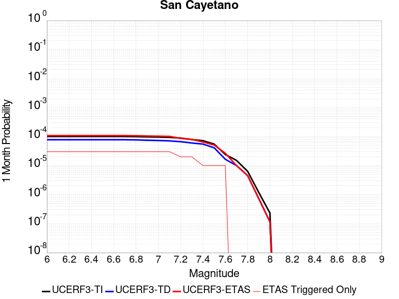 | 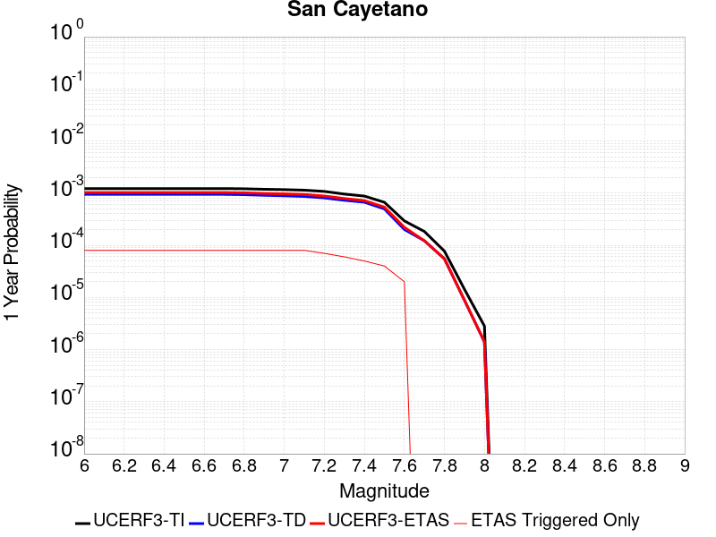 |  |

| Magnitude | 1 wk TI Prob | 1 wk TD Prob | 1 wk ETAS Prob | 1 wk ETAS/TD Gain | 1 wk ETAS Triggered Only | 1 mo TI Prob | 1 mo TD Prob | 1 mo ETAS Prob | 1 mo ETAS/TD Gain | 1 mo ETAS Triggered Only | 1 yr TI Prob | 1 yr TD Prob | 1 yr ETAS Prob | 1 yr ETAS/TD Gain | 1 yr ETAS Triggered Only | 10 yr TI Prob | 10 yr TD Prob | 10 yr ETAS Prob | 10 yr ETAS/TD Gain | 10 yr ETAS Triggered Only |
|-----|-----|-----|-----|-----|-----|-----|-----|-----|-----|-----|-----|-----|-----|-----|-----|-----|-----|-----|-----|-----|
| 6.0 | 2.3476267E-5 | 1.816928E-5 | 1.816928E-5 | 1.0 | 0.0 | 1.0060869E-4 | 7.786603E-5 | 1.3119521E-4 | 1.6848837 | 5.3333333E-5 | 0.0012242225 | 9.476103E-4 | 0.0010808173 | 1.1405715 | 1.3333333E-4 | 0.012175002 | 0.009436584 | 0.00956866 | 1.0139961 | 1.3333333E-4 |
| 6.1 | 2.3476267E-5 | 1.816928E-5 | 1.816928E-5 | 1.0 | 0.0 | 1.0060869E-4 | 7.786603E-5 | 1.3119521E-4 | 1.6848837 | 5.3333333E-5 | 0.0012242225 | 9.476103E-4 | 0.0010808173 | 1.1405715 | 1.3333333E-4 | 0.012175002 | 0.009436584 | 0.00956866 | 1.0139961 | 1.3333333E-4 |
| 6.2 | 2.3476267E-5 | 1.816928E-5 | 1.816928E-5 | 1.0 | 0.0 | 1.0060869E-4 | 7.786603E-5 | 1.3119521E-4 | 1.6848837 | 5.3333333E-5 | 0.0012242225 | 9.476103E-4 | 0.0010808173 | 1.1405715 | 1.3333333E-4 | 0.012175002 | 0.009436584 | 0.00956866 | 1.0139961 | 1.3333333E-4 |
| 6.3 | 2.3476267E-5 | 1.816928E-5 | 1.816928E-5 | 1.0 | 0.0 | 1.0060869E-4 | 7.786603E-5 | 1.3119521E-4 | 1.6848837 | 5.3333333E-5 | 0.0012242225 | 9.476103E-4 | 0.0010808173 | 1.1405715 | 1.3333333E-4 | 0.012175002 | 0.009436584 | 0.00956866 | 1.0139961 | 1.3333333E-4 |
| 6.4 | 2.3476267E-5 | 1.816928E-5 | 1.816928E-5 | 1.0 | 0.0 | 1.0060869E-4 | 7.786603E-5 | 1.3119521E-4 | 1.6848837 | 5.3333333E-5 | 0.0012242225 | 9.476103E-4 | 0.0010808173 | 1.1405715 | 1.3333333E-4 | 0.012175002 | 0.009436584 | 0.00956866 | 1.0139961 | 1.3333333E-4 |
| 6.5 | 2.3476267E-5 | 1.816928E-5 | 1.816928E-5 | 1.0 | 0.0 | 1.0060869E-4 | 7.786603E-5 | 1.3119521E-4 | 1.6848837 | 5.3333333E-5 | 0.0012242225 | 9.476103E-4 | 0.0010808173 | 1.1405715 | 1.3333333E-4 | 0.012175002 | 0.009436584 | 0.00956866 | 1.0139961 | 1.3333333E-4 |
| 6.6 | 2.3476267E-5 | 1.816928E-5 | 1.816928E-5 | 1.0 | 0.0 | 1.0060869E-4 | 7.786603E-5 | 1.3119521E-4 | 1.6848837 | 5.3333333E-5 | 0.0012242225 | 9.476103E-4 | 0.0010808173 | 1.1405715 | 1.3333333E-4 | 0.012175002 | 0.009436584 | 0.00956866 | 1.0139961 | 1.3333333E-4 |
| 6.7 | 2.3476267E-5 | 1.816928E-5 | 1.816928E-5 | 1.0 | 0.0 | 1.0060869E-4 | 7.786603E-5 | 1.3119521E-4 | 1.6848837 | 5.3333333E-5 | 0.0012242225 | 9.476103E-4 | 0.0010808173 | 1.1405715 | 1.3333333E-4 | 0.012175002 | 0.009436584 | 0.00956866 | 1.0139961 | 1.3333333E-4 |
| 6.8 | 2.3241924E-5 | 1.7936987E-5 | 1.7936987E-5 | 1.0 | 0.0 | 9.960445E-5 | 7.687056E-5 | 1.301998E-4 | 1.6937537 | 5.3333333E-5 | 0.0012120095 | 9.3550084E-4 | 0.0010687094 | 1.1423929 | 1.3333333E-4 | 0.012054204 | 0.009316482 | 0.009448573 | 1.0141783 | 1.3333333E-4 |
| 6.9 | 2.2761007E-5 | 1.7432423E-5 | 1.7432423E-5 | 1.0 | 0.0 | 9.7543525E-5 | 7.470827E-5 | 1.2803762E-4 | 1.7138346 | 5.3333333E-5 | 0.0011869454 | 9.09197E-4 | 0.0010424091 | 1.1465162 | 1.3333333E-4 | 0.011806256 | 0.009055603 | 0.009187729 | 1.0145905 | 1.3333333E-4 |
| 7.0 | 2.240283E-5 | 1.7066168E-5 | 1.7066168E-5 | 1.0 | 0.0 | 9.600859E-5 | 7.313869E-5 | 1.2646812E-4 | 1.7291548 | 5.3333333E-5 | 0.0011682777 | 8.9010317E-4 | 0.0010233178 | 1.149662 | 1.3333333E-4 | 0.011621549 | 0.008866196 | 0.0089983465 | 1.0149051 | 1.3333333E-4 |
| 7.1 | 2.1871154E-5 | 1.6586018E-5 | 1.6586018E-5 | 1.0 | 0.0 | 9.373015E-5 | 7.108101E-5 | 1.2441055E-4 | 1.7502642 | 5.3333333E-5 | 0.0011405671 | 8.6507114E-4 | 9.982891E-4 | 1.1539966 | 1.3333333E-4 | 0.011347309 | 0.008617838 | 0.008750022 | 1.0153384 | 1.3333333E-4 |
| 7.2 | 2.0714133E-5 | 1.5564561E-5 | 1.5564561E-5 | 1.0 | 0.0 | 8.8771834E-5 | 6.670357E-5 | 9.3368464E-5 | 1.399752 | 2.6666667E-5 | 0.0010802611 | 8.1181666E-4 | 9.1839675E-4 | 1.1312859 | 1.0666667E-4 | 0.010750249 | 0.008089285 | 0.008195089 | 1.0130795 | 1.0666667E-4 |
| 7.3 | 1.8408395E-5 | 1.3996864E-5 | 1.3996864E-5 | 1.0 | 0.0 | 7.8890735E-5 | 5.99852E-5 | 8.665027E-5 | 1.4445274 | 2.6666667E-5 | 9.600714E-4 | 7.300781E-4 | 8.100197E-4 | 1.1094973 | 8.0E-5 | 0.009559342 | 0.0072775153 | 0.0073569333 | 1.0109128 | 8.0E-5 |
| 7.4 | 1.6856795E-5 | 1.28500815E-5 | 1.28500815E-5 | 1.0 | 0.0 | 7.2241404E-5 | 5.5070628E-5 | 8.173583E-5 | 1.4842 | 2.6666667E-5 | 8.7918417E-4 | 6.7028153E-4 | 7.502279E-4 | 1.1192728 | 8.0E-5 | 0.00875714 | 0.0066832784 | 0.006762744 | 1.0118902 | 8.0E-5 |
| 7.5 | 1.2822778E-5 | 9.577542E-6 | 9.577542E-6 | 1.0 | 0.0 | 5.495361E-5 | 4.1045972E-5 | 6.7711546E-5 | 1.6496514 | 2.6666667E-5 | 6.688548E-4 | 4.996217E-4 | 5.5292837E-4 | 1.1066941 | 5.3333333E-5 | 0.006668452 | 0.0049851555 | 0.0050382228 | 1.0106452 | 5.3333333E-5 |
| 7.6 | 5.6272684E-6 | 3.854903E-6 | 3.854903E-6 | 1.0 | 0.0 | 2.4116642E-5 | 1.652091E-5 | 4.3187134E-5 | 2.6140895 | 2.6666667E-5 | 2.9358055E-4 | 2.0112359E-4 | 2.544462E-4 | 1.2651236 | 5.3333333E-5 | 0.0029319301 | 0.0020094267 | 0.0020626527 | 1.0264882 | 5.3333333E-5 |
| 7.7 | 3.5261346E-6 | 2.3407013E-6 | 2.3407013E-6 | 1.0 | 0.0 | 1.5111918E-5 | 1.0031539E-5 | 1.0031539E-5 | 1.0 | 0.0 | 1.8397206E-4 | 1.2212721E-4 | 1.2212721E-4 | 1.0 | 0.0 | 0.0018381984 | 0.0012206084 | 0.0012206084 | 1.0 | 0.0 |
| 7.8 | 1.4826929E-6 | 1.056428E-6 | 1.056428E-6 | 1.0 | 0.0 | 6.354383E-6 | 4.5275406E-6 | 4.5275406E-6 | 1.0 | 0.0 | 7.736187E-5 | 5.5121433E-5 | 5.5121433E-5 | 1.0 | 0.0 | 7.733494E-4 | 5.5107963E-4 | 5.5107963E-4 | 1.0 | 0.0 |
| 7.9 | 2.7568166E-7 | 1.6978244E-7 | 1.6978244E-7 | 1.0 | 0.0 | 1.1814923E-6 | 7.2763885E-7 | 7.2763885E-7 | 1.0 | 0.0 | 1.4384574E-5 | 8.858967E-6 | 8.858967E-6 | 1.0 | 0.0 | 1.4383643E-4 | 8.8586174E-5 | 8.8586174E-5 | 1.0 | 0.0 |
| 8.0 | 5.407832E-8 | 2.6887697E-8 | 2.6887697E-8 | 1.0 | 0.0 | 2.3176422E-7 | 1.15232986E-7 | 1.15232986E-7 | 1.0 | 0.0 | 2.8217257E-6 | 1.4029607E-6 | 1.4029607E-6 | 1.0 | 0.0 | 2.8216898E-5 | 1.4029522E-5 | 1.4029522E-5 | 1.0 | 0.0 |

## Tin Mountain
*[(top)](#table-of-contents)*

| 1 Week | 1 Month | 1 Year | 10 Year |
|-----|-----|-----|-----|
|  | 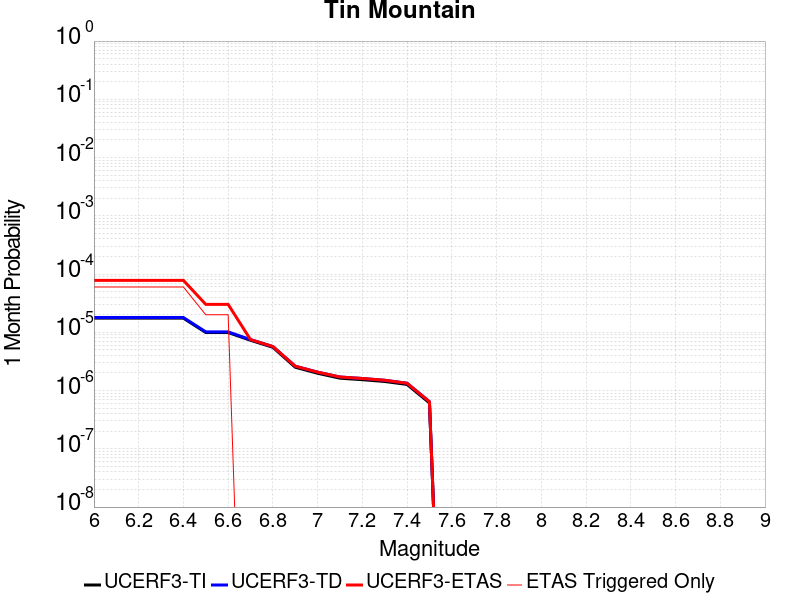 |  |  |

| Magnitude | 1 wk TI Prob | 1 wk TD Prob | 1 wk ETAS Prob | 1 wk ETAS/TD Gain | 1 wk ETAS Triggered Only | 1 mo TI Prob | 1 mo TD Prob | 1 mo ETAS Prob | 1 mo ETAS/TD Gain | 1 mo ETAS Triggered Only | 1 yr TI Prob | 1 yr TD Prob | 1 yr ETAS Prob | 1 yr ETAS/TD Gain | 1 yr ETAS Triggered Only | 10 yr TI Prob | 10 yr TD Prob | 10 yr ETAS Prob | 10 yr ETAS/TD Gain | 10 yr ETAS Triggered Only |
|-----|-----|-----|-----|-----|-----|-----|-----|-----|-----|-----|-----|-----|-----|-----|-----|-----|-----|-----|-----|-----|
| 6.0 | 4.083776E-6 | 4.1815365E-6 | 4.1815365E-6 | 1.0 | 0.0 | 1.750178E-5 | 1.792077E-5 | 4.458696E-5 | 2.4880047 | 2.6666667E-5 | 2.1306332E-4 | 2.1816725E-4 | 2.7148894E-4 | 1.2444074 | 5.3333333E-5 | 0.0021285915 | 0.0021798965 | 0.0023129391 | 1.0610317 | 1.3333333E-4 |
| 6.1 | 4.083776E-6 | 4.1815365E-6 | 4.1815365E-6 | 1.0 | 0.0 | 1.750178E-5 | 1.792077E-5 | 4.458696E-5 | 2.4880047 | 2.6666667E-5 | 2.1306332E-4 | 2.1816725E-4 | 2.7148894E-4 | 1.2444074 | 5.3333333E-5 | 0.0021285915 | 0.0021798965 | 0.0023129391 | 1.0610317 | 1.3333333E-4 |
| 6.2 | 4.083776E-6 | 4.1815365E-6 | 4.1815365E-6 | 1.0 | 0.0 | 1.750178E-5 | 1.792077E-5 | 4.458696E-5 | 2.4880047 | 2.6666667E-5 | 2.1306332E-4 | 2.1816725E-4 | 2.7148894E-4 | 1.2444074 | 5.3333333E-5 | 0.0021285915 | 0.0021798965 | 0.0023129391 | 1.0610317 | 1.3333333E-4 |
| 6.3 | 4.083776E-6 | 4.1815365E-6 | 4.1815365E-6 | 1.0 | 0.0 | 1.750178E-5 | 1.792077E-5 | 4.458696E-5 | 2.4880047 | 2.6666667E-5 | 2.1306332E-4 | 2.1816725E-4 | 2.7148894E-4 | 1.2444074 | 5.3333333E-5 | 0.0021285915 | 0.0021798965 | 0.0023129391 | 1.0610317 | 1.3333333E-4 |
| 6.4 | 4.083776E-6 | 4.1815365E-6 | 4.1815365E-6 | 1.0 | 0.0 | 1.750178E-5 | 1.792077E-5 | 4.458696E-5 | 2.4880047 | 2.6666667E-5 | 2.1306332E-4 | 2.1816725E-4 | 2.7148894E-4 | 1.2444074 | 5.3333333E-5 | 0.0021285915 | 0.0021798965 | 0.0023129391 | 1.0610317 | 1.3333333E-4 |
| 6.5 | 2.3143427E-6 | 2.3731573E-6 | 2.3731573E-6 | 1.0 | 0.0 | 9.9185745E-6 | 1.0170638E-5 | 3.6837035E-5 | 3.6218998 | 2.6666667E-5 | 1.2075195E-4 | 1.2382126E-4 | 1.7714799E-4 | 1.430675 | 5.3333333E-5 | 0.0012068636 | 0.0012375986 | 0.0013441333 | 1.0860817 | 1.0666667E-4 |
| 6.6 | 2.3143427E-6 | 2.3731573E-6 | 2.3731573E-6 | 1.0 | 0.0 | 9.9185745E-6 | 1.0170638E-5 | 3.6837035E-5 | 3.6218998 | 2.6666667E-5 | 1.2075195E-4 | 1.2382126E-4 | 1.7714799E-4 | 1.430675 | 5.3333333E-5 | 0.0012068636 | 0.0012375986 | 0.0013441333 | 1.0860817 | 1.0666667E-4 |
| 6.7 | 1.7029532E-6 | 1.7497915E-6 | 1.7497915E-6 | 1.0 | 0.0 | 7.2983503E-6 | 7.499088E-6 | 7.499088E-6 | 1.0 | 0.0 | 8.885379E-5 | 9.1298105E-5 | 1.17962336E-4 | 1.2920568 | 2.6666667E-5 | 8.881827E-4 | 9.1265864E-4 | 9.6594327E-4 | 1.058384 | 5.3333333E-5 |
| 6.8 | 1.2914646E-6 | 1.3299378E-6 | 1.3299378E-6 | 1.0 | 0.0 | 5.534837E-6 | 5.6997237E-6 | 5.6997237E-6 | 1.0 | 0.0 | 6.738455E-5 | 6.939237E-5 | 9.6057185E-5 | 1.3842615 | 2.6666667E-5 | 6.736412E-4 | 6.9375033E-4 | 7.203985E-4 | 1.0384117 | 2.6666667E-5 |
| 6.9 | 5.8708974E-7 | 6.1169936E-7 | 6.1169936E-7 | 1.0 | 0.0 | 2.5160964E-6 | 2.6215664E-6 | 2.6215664E-6 | 1.0 | 0.0 | 3.0633044E-5 | 3.1917145E-5 | 3.1917145E-5 | 1.0 | 0.0 | 3.0628822E-4 | 3.191297E-4 | 3.191297E-4 | 1.0 | 0.0 |
| 7.0 | 4.6248786E-7 | 4.832015E-7 | 4.832015E-7 | 1.0 | 0.0 | 1.9820893E-6 | 2.0708624E-6 | 2.0708624E-6 | 1.0 | 0.0 | 2.413167E-5 | 2.5212494E-5 | 2.5212494E-5 | 1.0 | 0.0 | 2.412905E-4 | 2.5210003E-4 | 2.5210003E-4 | 1.0 | 0.0 |
| 7.1 | 3.804606E-7 | 3.987147E-7 | 3.987147E-7 | 1.0 | 0.0 | 1.6305444E-6 | 1.7087764E-6 | 1.7087764E-6 | 1.0 | 0.0 | 1.9851697E-5 | 2.0804187E-5 | 2.0804187E-5 | 1.0 | 0.0 | 1.9849923E-4 | 2.0802575E-4 | 2.0802575E-4 | 1.0 | 0.0 |
| 7.2 | 3.5864858E-7 | 3.7616863E-7 | 3.7616863E-7 | 1.0 | 0.0 | 1.5370645E-6 | 1.6121504E-6 | 1.6121504E-6 | 1.0 | 0.0 | 1.87136E-5 | 1.9627789E-5 | 1.9627789E-5 | 1.0 | 0.0 | 1.8712023E-4 | 1.9626386E-4 | 1.9626386E-4 | 1.0 | 0.0 |
| 7.3 | 3.342063E-7 | 3.506347E-7 | 3.506347E-7 | 1.0 | 0.0 | 1.4323119E-6 | 1.5027196E-6 | 1.5027196E-6 | 1.0 | 0.0 | 1.7438259E-5 | 1.829549E-5 | 1.829549E-5 | 1.0 | 0.0 | 1.743689E-4 | 1.8294314E-4 | 1.8294314E-4 | 1.0 | 0.0 |
| 7.4 | 2.971242E-7 | 3.1165817E-7 | 3.1165817E-7 | 1.0 | 0.0 | 1.2733886E-6 | 1.3356774E-6 | 1.3356774E-6 | 1.0 | 0.0 | 1.5503398E-5 | 1.6261785E-5 | 1.6261785E-5 | 1.0 | 0.0 | 1.5502315E-4 | 1.6260923E-4 | 1.6260923E-4 | 1.0 | 0.0 |
| 7.5 | 1.4326713E-7 | 1.5012525E-7 | 1.5012525E-7 | 1.0 | 0.0 | 6.140018E-7 | 6.433939E-7 | 6.433939E-7 | 1.0 | 0.0 | 7.4754466E-6 | 7.8333205E-6 | 7.8333205E-6 | 1.0 | 0.0 | 7.475195E-5 | 7.833321E-5 | 7.833321E-5 | 1.0 | 0.0 |

## San Clemente
*[(top)](#table-of-contents)*

| 1 Week | 1 Month | 1 Year | 10 Year |
|-----|-----|-----|-----|
| 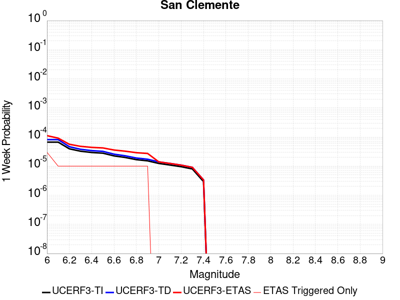 | 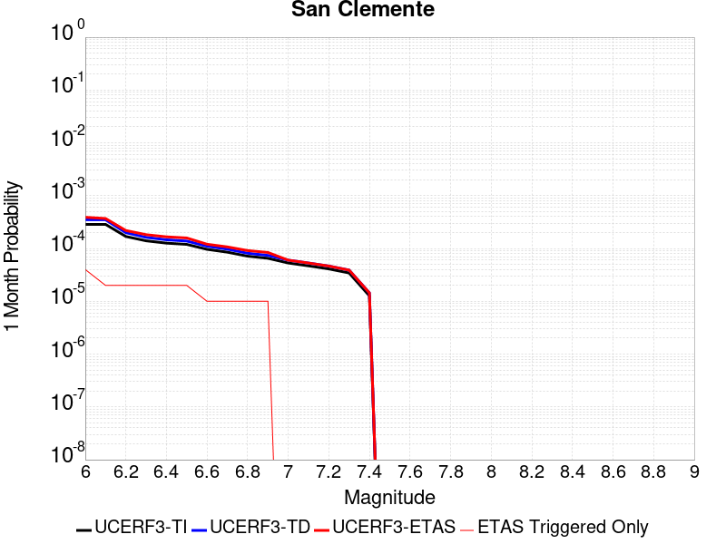 |  |  |

| Magnitude | 1 wk TI Prob | 1 wk TD Prob | 1 wk ETAS Prob | 1 wk ETAS/TD Gain | 1 wk ETAS Triggered Only | 1 mo TI Prob | 1 mo TD Prob | 1 mo ETAS Prob | 1 mo ETAS/TD Gain | 1 mo ETAS Triggered Only | 1 yr TI Prob | 1 yr TD Prob | 1 yr ETAS Prob | 1 yr ETAS/TD Gain | 1 yr ETAS Triggered Only | 10 yr TI Prob | 10 yr TD Prob | 10 yr ETAS Prob | 10 yr ETAS/TD Gain | 10 yr ETAS Triggered Only |
|-----|-----|-----|-----|-----|-----|-----|-----|-----|-----|-----|-----|-----|-----|-----|-----|-----|-----|-----|-----|-----|
| 6.0 | 6.681379E-5 | 8.163422E-5 | 1.6162769E-4 | 1.9799012 | 8.0E-5 | 2.8631336E-4 | 3.498173E-4 | 4.2978933E-4 | 1.2286108 | 8.0E-5 | 0.003480294 | 0.0042512873 | 0.004384054 | 1.0312297 | 1.3333333E-4 | 0.03426291 | 0.041755714 | 0.04188348 | 1.0030599 | 1.3333333E-4 |
| 6.1 | 6.681379E-5 | 8.163422E-5 | 1.08298715E-4 | 1.3266337 | 2.6666667E-5 | 2.8631336E-4 | 3.498173E-4 | 3.7647464E-4 | 1.0762036 | 2.6666667E-5 | 0.003480294 | 0.0042512873 | 0.0043309475 | 1.0187378 | 8.0E-5 | 0.03426291 | 0.041755714 | 0.041832373 | 1.001836 | 8.0E-5 |
| 6.2 | 3.9400576E-5 | 4.6451984E-5 | 7.3117415E-5 | 1.5740428 | 2.6666667E-5 | 1.6884868E-4 | 1.9906509E-4 | 2.2572646E-4 | 1.1339328 | 2.6666667E-5 | 0.0020537945 | 0.002420985 | 0.002474189 | 1.0219762 | 5.3333333E-5 | 0.020349167 | 0.02395286 | 0.024004916 | 1.0021733 | 5.3333333E-5 |
| 6.3 | 3.2590255E-5 | 3.7929087E-5 | 6.4594744E-5 | 1.7030398 | 2.6666667E-5 | 1.3966505E-4 | 1.6254328E-4 | 1.8920562E-4 | 1.1640322 | 2.6666667E-5 | 0.0016990956 | 0.0019771985 | 0.0020304264 | 1.0269209 | 5.3333333E-5 | 0.01686163 | 0.019599866 | 0.019652154 | 1.0026678 | 5.3333333E-5 |
| 6.4 | 2.9454652E-5 | 3.4097775E-5 | 6.0763534E-5 | 1.782038 | 2.6666667E-5 | 1.2622811E-4 | 1.4612528E-4 | 1.7278806E-4 | 1.1824651 | 2.6666667E-5 | 0.0015357438 | 0.0017776482 | 0.0018308867 | 1.0299488 | 5.3333333E-5 | 0.015251739 | 0.017637458 | 0.01768985 | 1.0029706 | 5.3333333E-5 |
| 6.5 | 2.790836E-5 | 3.2247463E-5 | 5.891327E-5 | 1.8269118 | 2.6666667E-5 | 1.1960178E-4 | 1.3819622E-4 | 1.648592E-4 | 1.1929357 | 2.6666667E-5 | 0.001455179 | 0.0016812651 | 0.0017345088 | 1.0316688 | 5.3333333E-5 | 0.014456868 | 0.016688475 | 0.016740918 | 1.0031425 | 5.3333333E-5 |
| 6.6 | 2.2492153E-5 | 2.5762707E-5 | 5.2428684E-5 | 2.0350614 | 2.6666667E-5 | 9.639138E-5 | 1.1040701E-4 | 1.3707073E-4 | 1.2415038 | 2.6666667E-5 | 0.0011729331 | 0.0013433908 | 0.0013700217 | 1.0198236 | 2.6666667E-5 | 0.011667615 | 0.013354415 | 0.013380726 | 1.0019702 | 2.6666667E-5 |
| 6.7 | 1.9862755E-5 | 2.2666423E-5 | 4.9332484E-5 | 2.1764567 | 2.6666667E-5 | 8.512331E-5 | 9.713826E-5 | 1.2380234E-4 | 1.2744961 | 2.6666667E-5 | 0.0010358836 | 0.0011820279 | 0.0012086631 | 1.0225334 | 2.6666667E-5 | 0.010310682 | 0.011758701 | 0.011785054 | 1.0022411 | 2.6666667E-5 |
| 6.8 | 1.6697575E-5 | 1.897771E-5 | 4.564387E-5 | 2.4051306 | 2.6666667E-5 | 7.155907E-5 | 8.133056E-5 | 1.0799505E-4 | 1.3278533 | 2.6666667E-5 | 8.7088346E-4 | 9.897591E-4 | 0.0010163994 | 1.0269159 | 2.6666667E-5 | 0.008674784 | 0.0098545365 | 0.00988094 | 1.0026793 | 2.6666667E-5 |
| 6.9 | 1.5218415E-5 | 1.72694E-5 | 4.3935608E-5 | 2.5441303 | 2.6666667E-5 | 6.522015E-5 | 7.4009666E-5 | 1.0067436E-4 | 1.3602866 | 2.6666667E-5 | 7.93766E-4 | 9.00704E-4 | 9.2734664E-4 | 1.0295798 | 2.6666667E-5 | 0.007909367 | 0.008971481 | 0.008997908 | 1.0029457 | 2.6666667E-5 |
| 7.0 | 1.2392958E-5 | 1.4033016E-5 | 1.4033016E-5 | 1.0 | 0.0 | 5.3111595E-5 | 6.014015E-5 | 6.014015E-5 | 1.0 | 0.0 | 6.4644177E-4 | 7.319679E-4 | 7.319679E-4 | 1.0 | 0.0 | 0.0064456454 | 0.0072963564 | 0.0072963564 | 1.0 | 0.0 |
| 7.1 | 1.0934128E-5 | 1.2375138E-5 | 1.2375138E-5 | 1.0 | 0.0 | 4.6859706E-5 | 5.303527E-5 | 5.303527E-5 | 1.0 | 0.0 | 5.7036756E-4 | 6.455204E-4 | 6.455204E-4 | 1.0 | 0.0 | 0.0056890585 | 0.0064371997 | 0.0064371997 | 1.0 | 0.0 |
| 7.2 | 9.5798805E-6 | 1.0844935E-5 | 1.0844935E-5 | 1.0 | 0.0 | 4.1055984E-5 | 4.6477508E-5 | 4.6477508E-5 | 1.0 | 0.0 | 4.9974193E-4 | 5.657239E-4 | 5.657239E-4 | 1.0 | 0.0 | 0.0049861963 | 0.0056435615 | 0.0056435615 | 1.0 | 0.0 |
| 7.3 | 8.0167365E-6 | 9.083918E-6 | 9.083918E-6 | 1.0 | 0.0 | 3.4356988E-5 | 3.8930535E-5 | 3.8930535E-5 | 1.0 | 0.0 | 4.1821605E-4 | 4.7388324E-4 | 4.7388324E-4 | 1.0 | 0.0 | 0.0041742986 | 0.0047294297 | 0.0047294297 | 1.0 | 0.0 |
| 7.4 | 2.9581017E-6 | 3.3623792E-6 | 3.3623792E-6 | 1.0 | 0.0 | 1.2677518E-5 | 1.4410146E-5 | 1.4410146E-5 | 1.0 | 0.0 | 1.5433785E-4 | 1.7543444E-4 | 1.7543444E-4 | 1.0 | 0.0 | 0.001542307 | 0.0017534546 | 0.0017534546 | 1.0 | 0.0 |

## San Jacinto (Borrego)
*[(top)](#table-of-contents)*

| 1 Week | 1 Month | 1 Year | 10 Year |
|-----|-----|-----|-----|
|  |  | 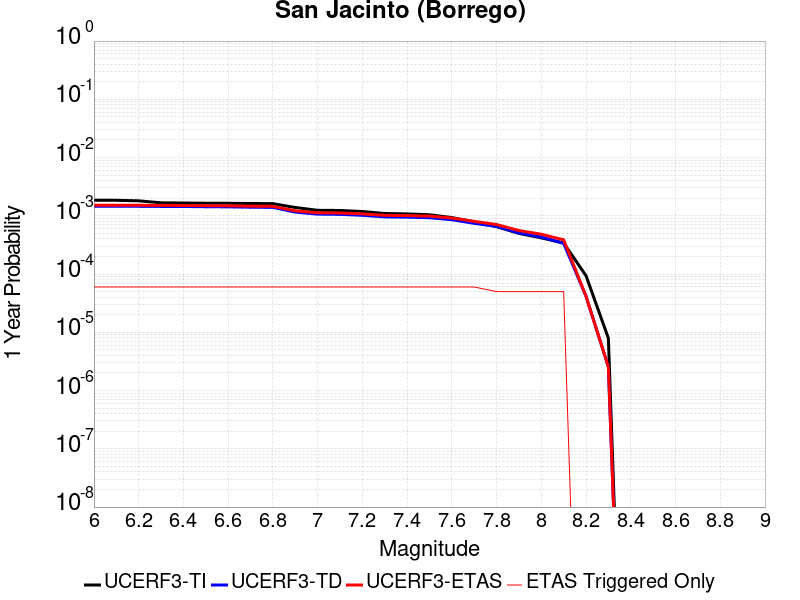 |  |

| Magnitude | 1 wk TI Prob | 1 wk TD Prob | 1 wk ETAS Prob | 1 wk ETAS/TD Gain | 1 wk ETAS Triggered Only | 1 mo TI Prob | 1 mo TD Prob | 1 mo ETAS Prob | 1 mo ETAS/TD Gain | 1 mo ETAS Triggered Only | 1 yr TI Prob | 1 yr TD Prob | 1 yr ETAS Prob | 1 yr ETAS/TD Gain | 1 yr ETAS Triggered Only | 10 yr TI Prob | 10 yr TD Prob | 10 yr ETAS Prob | 10 yr ETAS/TD Gain | 10 yr ETAS Triggered Only |
|-----|-----|-----|-----|-----|-----|-----|-----|-----|-----|-----|-----|-----|-----|-----|-----|-----|-----|-----|-----|-----|
| 6.0 | 3.543992E-5 | 2.7926513E-5 | 8.125835E-5 | 2.909721 | 5.3333333E-5 | 1.5187653E-4 | 1.1967963E-4 | 1.9967006E-4 | 1.6683712 | 8.0E-5 | 0.0018475284 | 0.0014561379 | 0.0015626492 | 1.0731465 | 1.0666667E-4 | 0.018322436 | 0.014869647 | 0.015000998 | 1.0088335 | 1.3333333E-4 |
| 6.1 | 3.542281E-5 | 2.7926513E-5 | 8.125835E-5 | 2.909721 | 5.3333333E-5 | 1.5180321E-4 | 1.1967963E-4 | 1.9967006E-4 | 1.6683712 | 8.0E-5 | 0.0018466372 | 0.0014561379 | 0.0015626492 | 1.0731465 | 1.0666667E-4 | 0.018313672 | 0.014869647 | 0.015000998 | 1.0088335 | 1.3333333E-4 |
| 6.2 | 3.4688688E-5 | 2.7926511E-5 | 8.125835E-5 | 2.909721 | 5.3333333E-5 | 1.4865733E-4 | 1.1967963E-4 | 1.9967006E-4 | 1.6683713 | 8.0E-5 | 0.0018084005 | 0.0014561379 | 0.0015626492 | 1.0731465 | 1.0666667E-4 | 0.017937548 | 0.014869647 | 0.015000998 | 1.0088335 | 1.3333333E-4 |
| 6.3 | 3.2087122E-5 | 2.7771865E-5 | 8.110372E-5 | 2.9203556 | 5.3333333E-5 | 1.3750899E-4 | 1.1901691E-4 | 1.990074E-4 | 1.6720934 | 8.0E-5 | 0.0016728862 | 0.00144808 | 0.0015545922 | 1.073554 | 1.0666667E-4 | 0.016603488 | 0.014790683 | 0.014922044 | 1.0088813 | 1.3333333E-4 |
| 6.4 | 3.1828724E-5 | 2.7738852E-5 | 8.1070706E-5 | 2.922641 | 5.3333333E-5 | 1.364017E-4 | 1.1887544E-4 | 1.9886594E-4 | 1.6728933 | 8.0E-5 | 0.0016594254 | 0.0014463598 | 0.0015528722 | 1.0736417 | 1.0666667E-4 | 0.016470885 | 0.014773762 | 0.014905125 | 1.0088917 | 1.3333333E-4 |
| 6.5 | 3.1563577E-5 | 2.747857E-5 | 8.081044E-5 | 2.940853 | 5.3333333E-5 | 1.3526545E-4 | 1.1776006E-4 | 1.9775063E-4 | 1.6792675 | 8.0E-5 | 0.0016456128 | 0.0014327979 | 0.0015393117 | 1.0743397 | 1.0666667E-4 | 0.0163348 | 0.014640348 | 0.014771729 | 1.008974 | 1.3333333E-4 |
| 6.6 | 3.1467625E-5 | 2.7322796E-5 | 8.0654674E-5 | 2.9519188 | 5.3333333E-5 | 1.3485427E-4 | 1.1709251E-4 | 1.9708314E-4 | 1.6831405 | 8.0E-5 | 0.0016406142 | 0.0014246812 | 0.0015311958 | 1.0747639 | 1.0666667E-4 | 0.016285548 | 0.014560594 | 0.014691986 | 1.0090238 | 1.3333333E-4 |
| 6.7 | 3.1223695E-5 | 2.6940816E-5 | 8.027271E-5 | 2.9795947 | 5.3333333E-5 | 1.3380898E-4 | 1.15455594E-4 | 1.9544635E-4 | 1.6928271 | 8.0E-5 | 0.0016279068 | 0.0014047775 | 0.0015112944 | 1.0758247 | 1.0666667E-4 | 0.01616033 | 0.014364966 | 0.014496384 | 1.0091485 | 1.3333333E-4 |
| 6.8 | 3.1015585E-5 | 2.6761822E-5 | 8.009373E-5 | 2.9928353 | 5.3333333E-5 | 1.3291716E-4 | 1.1468855E-4 | 1.9467938E-4 | 1.6974612 | 8.0E-5 | 0.001617065 | 0.0013954508 | 0.0015019686 | 1.0763322 | 1.0666667E-4 | 0.016053487 | 0.014272246 | 0.014403677 | 1.0092088 | 1.3333333E-4 |
| 6.9 | 2.6641965E-5 | 2.2184247E-5 | 7.55164E-5 | 3.404055 | 5.3333333E-5 | 1.1417485E-4 | 9.50719E-5 | 1.750643E-4 | 1.8413885 | 8.0E-5 | 0.0013891924 | 0.0011568897 | 0.0012634329 | 1.0920945 | 1.0666667E-4 | 0.0138054015 | 0.011882438 | 0.012014188 | 1.0110877 | 1.3333333E-4 |
| 7.0 | 2.3854353E-5 | 2.0479023E-5 | 7.3811265E-5 | 3.6042376 | 5.3333333E-5 | 1.02228936E-4 | 8.77643E-5 | 1.6775729E-4 | 1.9114523 | 8.0E-5 | 0.0012439266 | 0.0010680092 | 0.0011745619 | 1.0997677 | 1.0666667E-4 | 0.012369866 | 0.0109828 | 0.01111467 | 1.0120069 | 1.3333333E-4 |
| 7.1 | 2.3672901E-5 | 2.031551E-5 | 7.364776E-5 | 3.6251986 | 5.3333333E-5 | 1.0145135E-4 | 8.7063585E-5 | 1.6705661E-4 | 1.9187887 | 8.0E-5 | 0.0012344702 | 0.0010594862 | 0.0011660398 | 1.100571 | 1.0666667E-4 | 0.0122763505 | 0.010897976 | 0.011029856 | 1.0121014 | 1.3333333E-4 |
| 7.2 | 2.2717244E-5 | 1.9542893E-5 | 7.2875184E-5 | 3.7289865 | 5.3333333E-5 | 9.735599E-5 | 8.375258E-5 | 1.6374588E-4 | 1.9551145 | 8.0E-5 | 0.0011846646 | 0.001019213 | 0.001125771 | 1.1045493 | 1.0666667E-4 | 0.01178369 | 0.010495341 | 0.010627275 | 1.0125707 | 1.3333333E-4 |
| 7.3 | 2.1016205E-5 | 1.8384526E-5 | 7.171688E-5 | 3.900937 | 5.3333333E-5 | 9.006634E-5 | 7.878846E-5 | 1.5878215E-4 | 2.0152972 | 8.0E-5 | 0.001096006 | 9.5882936E-4 | 0.0010653938 | 1.1111401 | 1.0666667E-4 | 0.010906163 | 0.009890967 | 0.010022981 | 1.013347 | 1.3333333E-4 |
| 7.4 | 2.0683625E-5 | 1.8187047E-5 | 7.151941E-5 | 3.9324367 | 5.3333333E-5 | 8.86411E-5 | 7.794217E-5 | 1.5793594E-4 | 2.0263221 | 8.0E-5 | 0.001078671 | 9.485349E-4 | 0.0010551004 | 1.1123475 | 1.0666667E-4 | 0.010734501 | 0.009787692 | 0.009919721 | 1.0134892 | 1.3333333E-4 |
| 7.5 | 1.9993966E-5 | 1.7782075E-5 | 7.111446E-5 | 3.9992218 | 5.3333333E-5 | 8.568561E-5 | 7.620667E-5 | 1.5620058E-4 | 2.049697 | 8.0E-5 | 0.001042723 | 9.2742336E-4 | 0.0010339911 | 1.1149074 | 1.0666667E-4 | 0.010378438 | 0.009574614 | 0.009706671 | 1.0137924 | 1.3333333E-4 |
| 7.6 | 1.788966E-5 | 1.6435291E-5 | 6.9767746E-5 | 4.244996 | 5.3333333E-5 | 7.666772E-5 | 7.043507E-5 | 1.5042943E-4 | 2.1357179 | 8.0E-5 | 9.3302975E-4 | 8.572113E-4 | 9.6378656E-4 | 1.1243279 | 1.0666667E-4 | 0.00929122 | 0.008866487 | 0.008998638 | 1.0149046 | 1.3333333E-4 |
| 7.7 | 1.5125781E-5 | 1.4237377E-5 | 6.756995E-5 | 4.745955 | 5.3333333E-5 | 6.4823165E-5 | 6.1015908E-5 | 1.4101103E-4 | 2.3110535 | 8.0E-5 | 7.889362E-4 | 7.426163E-4 | 8.492038E-4 | 1.1435297 | 1.0666667E-4 | 0.007861412 | 0.0077142045 | 0.007846509 | 1.0171508 | 1.3333333E-4 |
| 7.8 | 1.250089E-5 | 1.26304985E-5 | 6.5963155E-5 | 5.22253 | 5.3333333E-5 | 5.3574146E-5 | 5.412959E-5 | 1.3412526E-4 | 2.4778547 | 8.0E-5 | 6.5207E-4 | 6.588291E-4 | 7.387764E-4 | 1.1213475 | 8.0E-5 | 0.006501599 | 0.0068677636 | 0.006973698 | 1.0154248 | 1.0666667E-4 |
| 7.9 | 9.561E-6 | 9.754616E-6 | 6.308743E-5 | 6.4674435 | 5.3333333E-5 | 4.0975072E-5 | 4.1804833E-5 | 1.2180149E-4 | 2.9135745 | 8.0E-5 | 4.987573E-4 | 5.088555E-4 | 5.8881484E-4 | 1.1571355 | 8.0E-5 | 0.0049763937 | 0.0053523467 | 0.0054584425 | 1.0198222 | 1.0666667E-4 |
| 8.0 | 8.01699E-6 | 8.293488E-6 | 6.162638E-5 | 7.430695 | 5.3333333E-5 | 3.4358076E-5 | 3.554304E-5 | 1.1554019E-4 | 3.2507124 | 8.0E-5 | 4.1822926E-4 | 4.3265108E-4 | 5.126165E-4 | 1.1848265 | 8.0E-5 | 0.0041744304 | 0.004573375 | 0.004679554 | 1.0232167 | 1.0666667E-4 |
| 8.1 | 6.541947E-6 | 6.4622354E-6 | 5.9795224E-5 | 9.253025 | 5.3333333E-5 | 2.8036617E-5 | 2.7695003E-5 | 1.0769279E-4 | 3.8885276 | 8.0E-5 | 3.4129233E-4 | 3.37135E-4 | 4.1710804E-4 | 1.2372136 | 8.0E-5 | 0.0034076865 | 0.0035806994 | 0.003686984 | 1.0296826 | 1.0666667E-4 |
| 8.2 | 1.7968189E-6 | 7.9713476E-7 | 7.9713476E-7 | 1.0 | 0.0 | 7.70063E-6 | 3.4162877E-6 | 3.4162877E-6 | 1.0 | 0.0 | 9.3751136E-5 | 4.159253E-5 | 4.159253E-5 | 1.0 | 0.0 | 9.371159E-4 | 4.712058E-4 | 4.712058E-4 | 1.0 | 0.0 |
| 8.3 | 1.5167889E-7 | 4.897714E-8 | 4.897714E-8 | 1.0 | 0.0 | 6.500522E-7 | 2.09902E-7 | 2.09902E-7 | 1.0 | 0.0 | 7.9143565E-6 | 2.5555544E-6 | 2.5555544E-6 | 1.0 | 0.0 | 7.914075E-5 | 2.969505E-5 | 2.969505E-5 | 1.0 | 0.0 |

## Pisgah-Bullion Mtn-Mesquite Lk
*[(top)](#table-of-contents)*

| 1 Week | 1 Month | 1 Year | 10 Year |
|-----|-----|-----|-----|
|  | 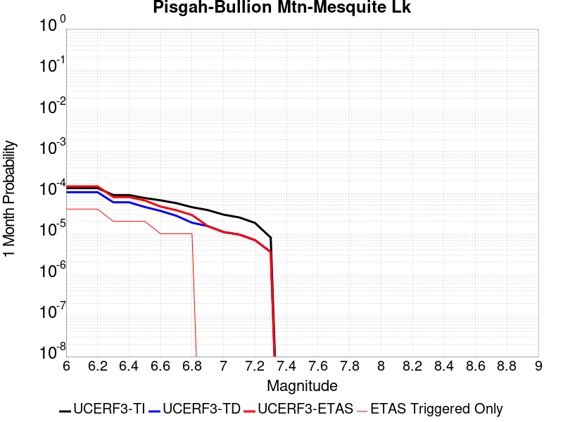 |  |  |

| Magnitude | 1 wk TI Prob | 1 wk TD Prob | 1 wk ETAS Prob | 1 wk ETAS/TD Gain | 1 wk ETAS Triggered Only | 1 mo TI Prob | 1 mo TD Prob | 1 mo ETAS Prob | 1 mo ETAS/TD Gain | 1 mo ETAS Triggered Only | 1 yr TI Prob | 1 yr TD Prob | 1 yr ETAS Prob | 1 yr ETAS/TD Gain | 1 yr ETAS Triggered Only | 10 yr TI Prob | 10 yr TD Prob | 10 yr ETAS Prob | 10 yr ETAS/TD Gain | 10 yr ETAS Triggered Only |
|-----|-----|-----|-----|-----|-----|-----|-----|-----|-----|-----|-----|-----|-----|-----|-----|-----|-----|-----|-----|-----|
| 6.0 | 3.0240792E-5 | 2.4091114E-5 | 5.075714E-5 | 2.106882 | 2.6666667E-5 | 1.2959696E-4 | 1.03244114E-4 | 1.2990803E-4 | 1.2582608 | 2.6666667E-5 | 0.0015767008 | 0.0012563728 | 0.0013362722 | 1.0635954 | 8.0E-5 | 0.015655609 | 0.012502721 | 0.012608054 | 1.0084248 | 1.0666667E-4 |
| 6.1 | 3.0240792E-5 | 2.4091114E-5 | 5.075714E-5 | 2.106882 | 2.6666667E-5 | 1.2959696E-4 | 1.03244114E-4 | 1.2990803E-4 | 1.2582608 | 2.6666667E-5 | 0.0015767008 | 0.0012563728 | 0.0013362722 | 1.0635954 | 8.0E-5 | 0.015655609 | 0.012502721 | 0.012608054 | 1.0084248 | 1.0666667E-4 |
| 6.2 | 3.0240792E-5 | 2.4091114E-5 | 5.075714E-5 | 2.106882 | 2.6666667E-5 | 1.2959696E-4 | 1.03244114E-4 | 1.2990803E-4 | 1.2582608 | 2.6666667E-5 | 0.0015767008 | 0.0012563728 | 0.0013362722 | 1.0635954 | 8.0E-5 | 0.015655609 | 0.012502721 | 0.012608054 | 1.0084248 | 1.0666667E-4 |
| 6.3 | 2.0498217E-5 | 1.36380695E-5 | 1.36380695E-5 | 1.0 | 0.0 | 8.784654E-5 | 5.844765E-5 | 5.844765E-5 | 1.0 | 0.0 | 0.0010690069 | 7.1138405E-4 | 7.3803175E-4 | 1.0374589 | 2.6666667E-5 | 0.01063879 | 0.0070926943 | 0.007119172 | 1.003733 | 2.6666667E-5 |
| 6.4 | 2.0498217E-5 | 1.36380695E-5 | 1.36380695E-5 | 1.0 | 0.0 | 8.784654E-5 | 5.844765E-5 | 5.844765E-5 | 1.0 | 0.0 | 0.0010690069 | 7.1138405E-4 | 7.3803175E-4 | 1.0374589 | 2.6666667E-5 | 0.01063879 | 0.0070926943 | 0.007119172 | 1.003733 | 2.6666667E-5 |
| 6.5 | 1.7316182E-5 | 1.0477042E-5 | 1.0477042E-5 | 1.0 | 0.0 | 7.42101E-5 | 4.4900895E-5 | 4.4900895E-5 | 1.0 | 0.0 | 9.0313336E-4 | 5.465413E-4 | 5.465413E-4 | 1.0 | 0.0 | 0.008994718 | 0.0054529672 | 0.0054529672 | 1.0 | 0.0 |
| 6.6 | 1.5251077E-5 | 8.414273E-6 | 8.414273E-6 | 1.0 | 0.0 | 6.536012E-5 | 3.6060712E-5 | 3.6060712E-5 | 1.0 | 0.0 | 7.9546886E-4 | 4.3895794E-4 | 4.3895794E-4 | 1.0 | 0.0 | 0.007926274 | 0.0043816264 | 0.0043816264 | 1.0 | 0.0 |
| 6.7 | 1.2997425E-5 | 6.4114965E-6 | 6.4114965E-6 | 1.0 | 0.0 | 5.570206E-5 | 2.7477578E-5 | 2.7477578E-5 | 1.0 | 0.0 | 6.7796157E-4 | 3.3449283E-4 | 3.3449283E-4 | 1.0 | 0.0 | 0.0067589693 | 0.0033403537 | 0.0033403537 | 1.0 | 0.0 |
| 6.8 | 1.035386E-5 | 4.3332193E-6 | 4.3332193E-6 | 1.0 | 0.0 | 4.437293E-5 | 1.8570812E-5 | 1.8570812E-5 | 1.0 | 0.0 | 5.401065E-4 | 2.2607706E-4 | 2.2607706E-4 | 1.0 | 0.0 | 0.0053879567 | 0.0022585576 | 0.0022585576 | 1.0 | 0.0 |
| 6.9 | 8.816252E-6 | 3.580638E-6 | 3.580638E-6 | 1.0 | 0.0 | 3.778339E-5 | 1.5345504E-5 | 1.5345504E-5 | 1.0 | 0.0 | 4.5991567E-4 | 1.8681608E-4 | 1.8681608E-4 | 1.0 | 0.0 | 0.00458965 | 0.0018666488 | 0.0018666488 | 1.0 | 0.0 |
| 7.0 | 6.8232207E-6 | 2.5675843E-6 | 2.5675843E-6 | 1.0 | 0.0 | 2.9242048E-5 | 1.1003888E-5 | 1.1003888E-5 | 1.0 | 0.0 | 3.5596377E-4 | 1.3396442E-4 | 1.3396442E-4 | 1.0 | 0.0 | 0.0035539411 | 0.0013388677 | 0.0013388677 | 1.0 | 0.0 |
| 7.1 | 5.837013E-6 | 2.22738E-6 | 2.22738E-6 | 1.0 | 0.0 | 2.501553E-5 | 9.545881E-6 | 9.545881E-6 | 1.0 | 0.0 | 3.045215E-4 | 1.16215204E-4 | 1.16215204E-4 | 1.0 | 0.0 | 0.0030410455 | 0.0011615733 | 0.0011615733 | 1.0 | 0.0 |
| 7.2 | 4.278052E-6 | 1.6275711E-6 | 1.6275711E-6 | 1.0 | 0.0 | 1.833438E-5 | 6.9752873E-6 | 6.9752873E-6 | 1.0 | 0.0 | 2.231982E-4 | 8.492105E-5 | 8.492105E-5 | 1.0 | 0.0 | 0.0022297418 | 8.489092E-4 | 8.489092E-4 | 1.0 | 0.0 |
| 7.3 | 1.8803692E-6 | 8.344926E-7 | 8.344926E-7 | 1.0 | 0.0 | 8.0587E-6 | 3.5763926E-6 | 3.5763926E-6 | 1.0 | 0.0 | 9.811026E-5 | 4.354186E-5 | 4.354186E-5 | 1.0 | 0.0 | 9.806695E-4 | 4.3534773E-4 | 4.3534773E-4 | 1.0 | 0.0 |

## Pleito
*[(top)](#table-of-contents)*

| 1 Week | 1 Month | 1 Year | 10 Year |
|-----|-----|-----|-----|
|  | 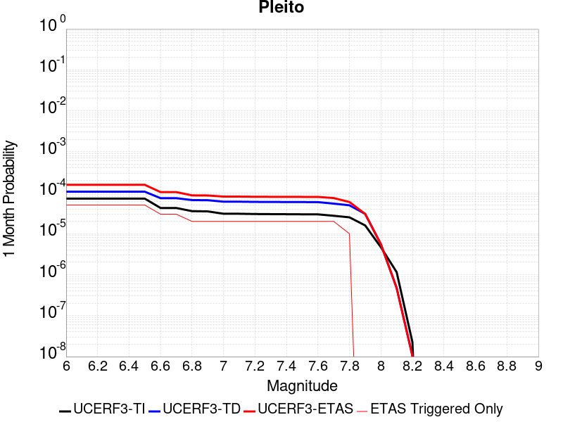 |  |  |

| Magnitude | 1 wk TI Prob | 1 wk TD Prob | 1 wk ETAS Prob | 1 wk ETAS/TD Gain | 1 wk ETAS Triggered Only | 1 mo TI Prob | 1 mo TD Prob | 1 mo ETAS Prob | 1 mo ETAS/TD Gain | 1 mo ETAS Triggered Only | 1 yr TI Prob | 1 yr TD Prob | 1 yr ETAS Prob | 1 yr ETAS/TD Gain | 1 yr ETAS Triggered Only | 10 yr TI Prob | 10 yr TD Prob | 10 yr ETAS Prob | 10 yr ETAS/TD Gain | 10 yr ETAS Triggered Only |
|-----|-----|-----|-----|-----|-----|-----|-----|-----|-----|-----|-----|-----|-----|-----|-----|-----|-----|-----|-----|-----|
| 6.0 | 1.6763008E-5 | 2.4763838E-5 | 2.4763838E-5 | 1.0 | 0.0 | 7.183948E-5 | 1.0612683E-4 | 1.3279066E-4 | 1.251245 | 2.6666667E-5 | 8.742947E-4 | 0.0012914003 | 0.0013712969 | 1.0618683 | 8.0E-5 | 0.00870863 | 0.0129538905 | 0.013059176 | 1.0081277 | 1.0666667E-4 |
| 6.1 | 1.6763008E-5 | 2.4763838E-5 | 2.4763838E-5 | 1.0 | 0.0 | 7.183948E-5 | 1.0612683E-4 | 1.3279066E-4 | 1.251245 | 2.6666667E-5 | 8.742947E-4 | 0.0012914003 | 0.0013712969 | 1.0618683 | 8.0E-5 | 0.00870863 | 0.0129538905 | 0.013059176 | 1.0081277 | 1.0666667E-4 |
| 6.2 | 1.6763008E-5 | 2.4763838E-5 | 2.4763838E-5 | 1.0 | 0.0 | 7.183948E-5 | 1.0612683E-4 | 1.3279066E-4 | 1.251245 | 2.6666667E-5 | 8.742947E-4 | 0.0012914003 | 0.0013712969 | 1.0618683 | 8.0E-5 | 0.00870863 | 0.0129538905 | 0.013059176 | 1.0081277 | 1.0666667E-4 |
| 6.3 | 1.6763008E-5 | 2.4763838E-5 | 2.4763838E-5 | 1.0 | 0.0 | 7.183948E-5 | 1.0612683E-4 | 1.3279066E-4 | 1.251245 | 2.6666667E-5 | 8.742947E-4 | 0.0012914003 | 0.0013712969 | 1.0618683 | 8.0E-5 | 0.00870863 | 0.0129538905 | 0.013059176 | 1.0081277 | 1.0666667E-4 |
| 6.4 | 1.6763008E-5 | 2.4763838E-5 | 2.4763838E-5 | 1.0 | 0.0 | 7.183948E-5 | 1.0612683E-4 | 1.3279066E-4 | 1.251245 | 2.6666667E-5 | 8.742947E-4 | 0.0012914003 | 0.0013712969 | 1.0618683 | 8.0E-5 | 0.00870863 | 0.0129538905 | 0.013059176 | 1.0081277 | 1.0666667E-4 |
| 6.5 | 1.6763008E-5 | 2.4763838E-5 | 2.4763838E-5 | 1.0 | 0.0 | 7.183948E-5 | 1.0612683E-4 | 1.3279066E-4 | 1.251245 | 2.6666667E-5 | 8.742947E-4 | 0.0012914003 | 0.0013712969 | 1.0618683 | 8.0E-5 | 0.00870863 | 0.0129538905 | 0.013059176 | 1.0081277 | 1.0666667E-4 |
| 6.6 | 9.910213E-6 | 1.7214623E-5 | 1.7214623E-5 | 1.0 | 0.0 | 4.247165E-5 | 7.377489E-5 | 1.0043959E-4 | 1.3614333 | 2.6666667E-5 | 5.169696E-4 | 8.978429E-4 | 9.244856E-4 | 1.0296742 | 2.6666667E-5 | 0.0051576863 | 0.009050702 | 0.009103552 | 1.0058393 | 5.3333333E-5 |
| 6.7 | 9.910213E-6 | 1.7214623E-5 | 1.7214623E-5 | 1.0 | 0.0 | 4.247165E-5 | 7.377489E-5 | 1.0043959E-4 | 1.3614333 | 2.6666667E-5 | 5.169696E-4 | 8.978429E-4 | 9.244856E-4 | 1.0296742 | 2.6666667E-5 | 0.0051576863 | 0.009050702 | 0.009103552 | 1.0058393 | 5.3333333E-5 |
| 6.8 | 8.300162E-6 | 1.5474232E-5 | 1.5474232E-5 | 1.0 | 0.0 | 3.557164E-5 | 6.631646E-5 | 9.298136E-5 | 1.4020857 | 2.6666667E-5 | 4.3299864E-4 | 8.071053E-4 | 8.337504E-4 | 1.0330132 | 2.6666667E-5 | 0.004321559 | 0.008150139 | 0.008203038 | 1.0064905 | 5.3333333E-5 |
| 6.9 | 8.183114E-6 | 1.5345448E-5 | 1.5345448E-5 | 1.0 | 0.0 | 3.5070017E-5 | 6.576455E-5 | 9.2429465E-5 | 1.4054602 | 2.6666667E-5 | 4.2689382E-4 | 8.003907E-4 | 8.2703604E-4 | 1.0332904 | 2.6666667E-5 | 0.0042607468 | 0.008083483 | 0.008136386 | 1.0065445 | 5.3333333E-5 |
| 7.0 | 7.1748823E-6 | 1.413244E-5 | 1.413244E-5 | 1.0 | 0.0 | 3.0749135E-5 | 6.0566195E-5 | 8.7231245E-5 | 1.4402629 | 2.6666667E-5 | 3.743064E-4 | 7.371445E-4 | 7.637915E-4 | 1.0361489 | 2.6666667E-5 | 0.0037367654 | 0.007454939 | 0.007507875 | 1.0071007 | 5.3333333E-5 |
| 7.1 | 7.1671807E-6 | 1.412281E-5 | 1.412281E-5 | 1.0 | 0.0 | 3.0716128E-5 | 6.052493E-5 | 8.718998E-5 | 1.4405632 | 2.6666667E-5 | 3.7390468E-4 | 7.366424E-4 | 7.632894E-4 | 1.0361736 | 2.6666667E-5 | 0.0037327618 | 0.0074499524 | 0.0075028883 | 1.0071056 | 5.3333333E-5 |
| 7.2 | 7.0649667E-6 | 1.39701015E-5 | 1.39701015E-5 | 1.0 | 0.0 | 3.0278077E-5 | 5.9870494E-5 | 8.653556E-5 | 1.4453791 | 2.6666667E-5 | 3.6857324E-4 | 7.2868E-4 | 7.5532723E-4 | 1.0365692 | 2.6666667E-5 | 0.0036796255 | 0.0073707094 | 0.0074236495 | 1.0071825 | 5.3333333E-5 |
| 7.3 | 7.02082E-6 | 1.3913556E-5 | 1.3913556E-5 | 1.0 | 0.0 | 3.008888E-5 | 5.9628168E-5 | 8.629324E-5 | 1.4471892 | 2.6666667E-5 | 3.6627054E-4 | 7.2573166E-4 | 7.5237895E-4 | 1.0367179 | 2.6666667E-5 | 0.0036566744 | 0.007341209 | 0.007394151 | 1.0072116 | 5.3333333E-5 |
| 7.4 | 6.987146E-6 | 1.3873118E-5 | 1.3873118E-5 | 1.0 | 0.0 | 2.9944567E-5 | 5.945487E-5 | 8.611995E-5 | 1.4484928 | 2.6666667E-5 | 3.6451413E-4 | 7.2362315E-4 | 7.502705E-4 | 1.036825 | 2.6666667E-5 | 0.0036391679 | 0.007320144 | 0.007373087 | 1.0072325 | 5.3333333E-5 |
| 7.5 | 6.9494554E-6 | 1.3830024E-5 | 1.3830024E-5 | 1.0 | 0.0 | 2.9783041E-5 | 5.9270187E-5 | 8.593527E-5 | 1.4498904 | 2.6666667E-5 | 3.625482E-4 | 7.2137616E-4 | 7.4802357E-4 | 1.0369397 | 2.6666667E-5 | 0.0036195726 | 0.0072977724 | 0.0073507167 | 1.0072548 | 5.3333333E-5 |
| 7.6 | 6.92694E-6 | 1.3789138E-5 | 1.3789138E-5 | 1.0 | 0.0 | 2.9686547E-5 | 5.909497E-5 | 8.576006E-5 | 1.4512243 | 2.6666667E-5 | 3.6137376E-4 | 7.1924424E-4 | 7.4589177E-4 | 1.0370493 | 2.6666667E-5 | 0.0036078666 | 0.0072765257 | 0.007329471 | 1.0072762 | 5.3333333E-5 |
| 7.7 | 6.395867E-6 | 1.2668219E-5 | 1.2668219E-5 | 1.0 | 0.0 | 2.741057E-5 | 5.429124E-5 | 8.095646E-5 | 1.4911515 | 2.6666667E-5 | 3.336726E-4 | 6.6079566E-4 | 6.874447E-4 | 1.0403287 | 2.6666667E-5 | 0.0033317201 | 0.0066951844 | 0.006748161 | 1.0079126 | 5.3333333E-5 |
| 7.8 | 5.8664327E-6 | 1.153586E-5 | 1.153586E-5 | 1.0 | 0.0 | 2.5141611E-5 | 4.9438466E-5 | 7.610381E-5 | 1.5393645 | 2.6666667E-5 | 3.060561E-4 | 6.017473E-4 | 6.283979E-4 | 1.0442888 | 2.6666667E-5 | 0.0030563495 | 0.0061006667 | 0.0061536743 | 1.0086889 | 5.3333333E-5 |
| 7.9 | 3.7167474E-6 | 7.1140853E-6 | 7.1140853E-6 | 1.0 | 0.0 | 1.592882E-5 | 3.0488582E-5 | 3.0488582E-5 | 1.0 | 0.0 | 1.9391612E-4 | 3.7113542E-4 | 3.7113542E-4 | 1.0 | 0.0 | 0.0019374699 | 0.0037674906 | 0.0037674906 | 1.0 | 0.0 |
| 8.0 | 1.0903841E-6 | 1.2879392E-6 | 1.2879392E-6 | 1.0 | 0.0 | 4.6730665E-6 | 5.5197274E-6 | 5.5197274E-6 | 1.0 | 0.0 | 5.68931E-5 | 6.720063E-5 | 6.720063E-5 | 1.0 | 0.0 | 5.6878536E-4 | 6.941948E-4 | 6.941948E-4 | 1.0 | 0.0 |
| 8.1 | 2.6894583E-7 | 1.1060341E-7 | 1.1060341E-7 | 1.0 | 0.0 | 1.1526245E-6 | 4.740145E-7 | 4.740145E-7 | 1.0 | 0.0 | 1.4033113E-5 | 5.7711113E-6 | 5.7711113E-6 | 1.0 | 0.0 | 1.4032227E-4 | 6.456908E-5 | 6.456908E-5 | 1.0 | 0.0 |
| 8.2 | 5.2967013E-9 | 2.4578228E-9 | 2.4578228E-9 | 1.0 | 0.0 | 2.2700148E-8 | 1.0533527E-8 | 1.0533527E-8 | 1.0 | 0.0 | 2.7637427E-7 | 1.2824569E-7 | 1.2824569E-7 | 1.0 | 0.0 | 2.7637393E-6 | 1.4592787E-6 | 1.4592787E-6 | 1.0 | 0.0 |

## Dry Mountain
*[(top)](#table-of-contents)*

| 1 Week | 1 Month | 1 Year | 10 Year |
|-----|-----|-----|-----|
|  |  |  |  |

| Magnitude | 1 wk TI Prob | 1 wk TD Prob | 1 wk ETAS Prob | 1 wk ETAS/TD Gain | 1 wk ETAS Triggered Only | 1 mo TI Prob | 1 mo TD Prob | 1 mo ETAS Prob | 1 mo ETAS/TD Gain | 1 mo ETAS Triggered Only | 1 yr TI Prob | 1 yr TD Prob | 1 yr ETAS Prob | 1 yr ETAS/TD Gain | 1 yr ETAS Triggered Only | 10 yr TI Prob | 10 yr TD Prob | 10 yr ETAS Prob | 10 yr ETAS/TD Gain | 10 yr ETAS Triggered Only |
|-----|-----|-----|-----|-----|-----|-----|-----|-----|-----|-----|-----|-----|-----|-----|-----|-----|-----|-----|-----|-----|
| 6.0 | 6.222801E-6 | 6.439381E-6 | 8.6438864E-5 | 13.423474 | 8.0E-5 | 2.6668875E-5 | 2.7597147E-5 | 1.0759494E-4 | 3.8987706 | 8.0E-5 | 3.2464517E-4 | 3.3595937E-4 | 4.4259022E-4 | 1.317392 | 1.0666667E-4 | 0.0032417132 | 0.0033560768 | 0.0034623856 | 1.0316765 | 1.0666667E-4 |
| 6.1 | 6.222801E-6 | 6.439381E-6 | 8.6438864E-5 | 13.423474 | 8.0E-5 | 2.6668875E-5 | 2.7597147E-5 | 1.0759494E-4 | 3.8987706 | 8.0E-5 | 3.2464517E-4 | 3.3595937E-4 | 4.4259022E-4 | 1.317392 | 1.0666667E-4 | 0.0032417132 | 0.0033560768 | 0.0034623856 | 1.0316765 | 1.0666667E-4 |
| 6.2 | 6.222801E-6 | 6.439381E-6 | 8.6438864E-5 | 13.423474 | 8.0E-5 | 2.6668875E-5 | 2.7597147E-5 | 1.0759494E-4 | 3.8987706 | 8.0E-5 | 3.2464517E-4 | 3.3595937E-4 | 4.4259022E-4 | 1.317392 | 1.0666667E-4 | 0.0032417132 | 0.0033560768 | 0.0034623856 | 1.0316765 | 1.0666667E-4 |
| 6.3 | 6.222801E-6 | 6.439381E-6 | 8.6438864E-5 | 13.423474 | 8.0E-5 | 2.6668875E-5 | 2.7597147E-5 | 1.0759494E-4 | 3.8987706 | 8.0E-5 | 3.2464517E-4 | 3.3595937E-4 | 4.4259022E-4 | 1.317392 | 1.0666667E-4 | 0.0032417132 | 0.0033560768 | 0.0034623856 | 1.0316765 | 1.0666667E-4 |
| 6.4 | 6.222801E-6 | 6.439381E-6 | 8.6438864E-5 | 13.423474 | 8.0E-5 | 2.6668875E-5 | 2.7597147E-5 | 1.0759494E-4 | 3.8987706 | 8.0E-5 | 3.2464517E-4 | 3.3595937E-4 | 4.4259022E-4 | 1.317392 | 1.0666667E-4 | 0.0032417132 | 0.0033560768 | 0.0034623856 | 1.0316765 | 1.0666667E-4 |
| 6.5 | 2.8528623E-6 | 2.9521684E-6 | 2.9618755E-5 | 10.032882 | 2.6666667E-5 | 1.22264955E-5 | 1.2652138E-5 | 3.9318467E-5 | 3.107654 | 2.6666667E-5 | 1.4884741E-4 | 1.540376E-4 | 2.0736271E-4 | 1.3461825 | 5.3333333E-5 | 0.0014874774 | 0.0015401616 | 0.0015934128 | 1.0345751 | 5.3333333E-5 |
| 6.6 | 2.8528623E-6 | 2.9521684E-6 | 2.9618755E-5 | 10.032882 | 2.6666667E-5 | 1.22264955E-5 | 1.2652138E-5 | 3.9318467E-5 | 3.107654 | 2.6666667E-5 | 1.4884741E-4 | 1.540376E-4 | 2.0736271E-4 | 1.3461825 | 5.3333333E-5 | 0.0014874774 | 0.0015401616 | 0.0015934128 | 1.0345751 | 5.3333333E-5 |
| 6.7 | 2.541E-6 | 2.6293578E-6 | 2.9295954E-5 | 11.141867 | 2.6666667E-5 | 1.0889954E-5 | 1.1268677E-5 | 3.7935042E-5 | 3.366415 | 2.6666667E-5 | 1.3257713E-4 | 1.3719614E-4 | 1.6385915E-4 | 1.1943423 | 2.6666667E-5 | 0.0013249806 | 0.0013719613 | 0.0013985914 | 1.0194103 | 2.6666667E-5 |

## Newport-Inglewood (Offshore)
*[(top)](#table-of-contents)*

| 1 Week | 1 Month | 1 Year | 10 Year |
|-----|-----|-----|-----|
|  |  |  | 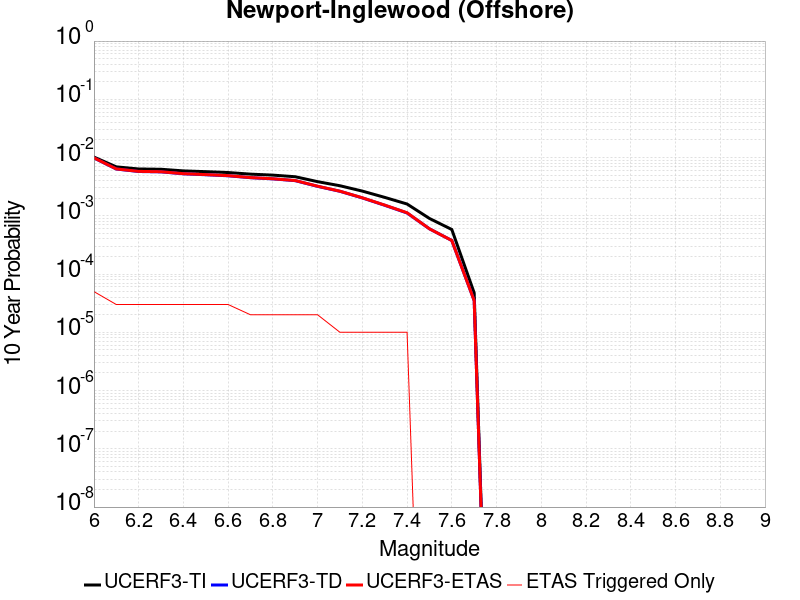 |

| Magnitude | 1 wk TI Prob | 1 wk TD Prob | 1 wk ETAS Prob | 1 wk ETAS/TD Gain | 1 wk ETAS Triggered Only | 1 mo TI Prob | 1 mo TD Prob | 1 mo ETAS Prob | 1 mo ETAS/TD Gain | 1 mo ETAS Triggered Only | 1 yr TI Prob | 1 yr TD Prob | 1 yr ETAS Prob | 1 yr ETAS/TD Gain | 1 yr ETAS Triggered Only | 10 yr TI Prob | 10 yr TD Prob | 10 yr ETAS Prob | 10 yr ETAS/TD Gain | 10 yr ETAS Triggered Only |
|-----|-----|-----|-----|-----|-----|-----|-----|-----|-----|-----|-----|-----|-----|-----|-----|-----|-----|-----|-----|-----|
| 6.0 | 1.9626508E-5 | 1.8965357E-5 | 4.5631517E-5 | 2.406046 | 2.6666667E-5 | 8.411089E-5 | 8.1277634E-5 | 1.07942134E-4 | 1.3280668 | 2.6666667E-5 | 0.001023569 | 9.891186E-4 | 0.0010690395 | 1.0808 | 8.0E-5 | 0.010188672 | 0.009848503 | 0.00995412 | 1.0107241 | 1.0666667E-4 |
| 6.1 | 1.331886E-5 | 1.2218092E-5 | 3.8884435E-5 | 3.182529 | 2.6666667E-5 | 5.707958E-5 | 5.2362207E-5 | 7.902748E-5 | 1.5092465 | 2.6666667E-5 | 6.947222E-4 | 6.3732493E-4 | 6.9062423E-4 | 1.0836297 | 5.3333333E-5 | 0.006925544 | 0.006355149 | 0.0064081433 | 1.0083388 | 5.3333333E-5 |
| 6.2 | 1.2250852E-5 | 1.1076029E-5 | 3.77424E-5 | 3.407575 | 2.6666667E-5 | 5.2502597E-5 | 4.7467838E-5 | 7.413324E-5 | 1.5617572 | 2.6666667E-5 | 6.3903164E-4 | 5.777687E-4 | 6.310712E-4 | 1.0922558 | 5.3333333E-5 | 0.006371971 | 0.0057627866 | 0.005815813 | 1.0092014 | 5.3333333E-5 |
| 6.3 | 1.2106258E-5 | 1.0918891E-5 | 3.7585265E-5 | 3.4422238 | 2.6666667E-5 | 5.1882926E-5 | 4.6794412E-5 | 7.345983E-5 | 1.569842 | 2.6666667E-5 | 6.3149154E-4 | 5.69574E-4 | 6.22877E-4 | 1.093584 | 5.3333333E-5 | 0.0062970007 | 0.005681259 | 0.0057342895 | 1.0093342 | 5.3333333E-5 |
| 6.4 | 1.1348758E-5 | 1.0109362E-5 | 3.677576E-5 | 3.6377923 | 2.6666667E-5 | 4.8636626E-5 | 4.3325123E-5 | 6.999063E-5 | 1.6154746 | 2.6666667E-5 | 5.919901E-4 | 5.273565E-4 | 5.806617E-4 | 1.1010801 | 5.3333333E-5 | 0.005904155 | 0.0052611465 | 0.0053141993 | 1.0100839 | 5.3333333E-5 |
| 6.5 | 1.100837E-5 | 9.7433895E-6 | 3.6409794E-5 | 3.7368717 | 2.6666667E-5 | 4.7177873E-5 | 4.1756717E-5 | 6.842227E-5 | 1.6385931 | 2.6666667E-5 | 5.7423924E-4 | 5.082702E-4 | 5.6157645E-4 | 1.1048777 | 5.3333333E-5 | 0.005727576 | 0.0050711688 | 0.005124232 | 1.0104636 | 5.3333333E-5 |
| 6.6 | 1.0634696E-5 | 9.345544E-6 | 3.601196E-5 | 3.8533833 | 2.6666667E-5 | 4.557647E-5 | 4.0051716E-5 | 6.6717315E-5 | 1.6657791 | 2.6666667E-5 | 5.5475225E-4 | 4.8752132E-4 | 5.408286E-4 | 1.1093436 | 5.3333333E-5 | 0.0055336943 | 0.0048646047 | 0.0049176784 | 1.0109103 | 5.3333333E-5 |
| 6.7 | 9.9780855E-6 | 8.667911E-6 | 3.5334346E-5 | 4.0764546 | 2.6666667E-5 | 4.276252E-5 | 3.7147664E-5 | 6.381334E-5 | 1.7178291 | 2.6666667E-5 | 5.205093E-4 | 4.5217964E-4 | 4.7883426E-4 | 1.058947 | 2.6666667E-5 | 0.0051929182 | 0.004512675 | 0.004539221 | 1.0058826 | 2.6666667E-5 |
| 6.8 | 9.59546E-6 | 8.27295E-6 | 3.4939396E-5 | 4.2233295 | 2.6666667E-5 | 4.1122752E-5 | 3.5455025E-5 | 6.2120744E-5 | 1.7521 | 2.6666667E-5 | 5.0055445E-4 | 4.315801E-4 | 4.5823524E-4 | 1.0617617 | 2.6666667E-5 | 0.004994285 | 0.004307495 | 0.004334047 | 1.0061641 | 2.6666667E-5 |
| 6.9 | 9.000614E-6 | 7.70684E-6 | 3.43733E-5 | 4.460103 | 2.6666667E-5 | 3.857349E-5 | 3.30289E-5 | 5.9694685E-5 | 1.807347 | 2.6666667E-5 | 4.6953102E-4 | 4.0205332E-4 | 4.2870926E-4 | 1.0662996 | 2.6666667E-5 | 0.004685402 | 0.0040133307 | 0.0040398906 | 1.0066179 | 2.6666667E-5 |
| 7.0 | 7.4070194E-6 | 6.148904E-6 | 3.2815406E-5 | 5.3367896 | 2.6666667E-5 | 3.1743984E-5 | 2.635218E-5 | 5.3018146E-5 | 2.0119073 | 2.6666667E-5 | 3.8641447E-4 | 3.207907E-4 | 3.4744883E-4 | 1.0831013 | 2.6666667E-5 | 0.0038574322 | 0.0032032963 | 0.0032298774 | 1.008298 | 2.6666667E-5 |
| 7.1 | 6.299615E-6 | 5.0565927E-6 | 3.1723124E-5 | 6.273617 | 2.6666667E-5 | 2.699807E-5 | 2.1670932E-5 | 4.833702E-5 | 2.2305002 | 2.6666667E-5 | 3.2865192E-4 | 2.638118E-4 | 2.9047142E-4 | 1.1010555 | 2.6666667E-5 | 0.003281663 | 0.002635001 | 0.0026615972 | 1.0100935 | 2.6666667E-5 |
| 7.2 | 5.096653E-6 | 3.892769E-6 | 3.055933E-5 | 7.8502812 | 2.6666667E-5 | 2.1842614E-5 | 1.668319E-5 | 4.3349413E-5 | 2.5983887 | 2.6666667E-5 | 2.6590136E-4 | 2.0309901E-4 | 2.2976026E-4 | 1.1312722 | 2.6666667E-5 | 0.0026558342 | 0.0020291451 | 0.0020557577 | 1.0131152 | 2.6666667E-5 |
| 7.3 | 3.9753018E-6 | 2.9099103E-6 | 2.9576498E-5 | 10.164059 | 2.6666667E-5 | 1.7036897E-5 | 1.2470985E-5 | 3.9137318E-5 | 3.1382701 | 2.6666667E-5 | 2.0740448E-4 | 1.5182374E-4 | 1.7848636E-4 | 1.1756155 | 2.6666667E-5 | 0.00207211 | 0.0015172083 | 0.0015438345 | 1.0175495 | 2.6666667E-5 |
| 7.4 | 3.0568392E-6 | 2.1449955E-6 | 2.8811604E-5 | 13.432013 | 2.6666667E-5 | 1.3100675E-5 | 9.192806E-6 | 3.5859226E-5 | 3.9007926 | 2.6666667E-5 | 1.5948903E-4 | 1.1191672E-4 | 1.385804E-4 | 1.2382457 | 2.6666667E-5 | 0.0015937461 | 0.0011186098 | 0.0011452467 | 1.0238124 | 2.6666667E-5 |
| 7.5 | 1.7279019E-6 | 1.1469883E-6 | 1.1469883E-6 | 1.0 | 0.0 | 7.405273E-6 | 4.915655E-6 | 4.915655E-6 | 1.0 | 0.0 | 9.015547E-5 | 5.9846494E-5 | 5.9846494E-5 | 1.0 | 0.0 | 9.01189E-4 | 5.9830764E-4 | 5.9830764E-4 | 1.0 | 0.0 |
| 7.6 | 1.1156416E-6 | 7.223012E-7 | 7.223012E-7 | 1.0 | 0.0 | 4.7813123E-6 | 3.095573E-6 | 3.095573E-6 | 1.0 | 0.0 | 5.821092E-5 | 3.7687976E-5 | 3.7687976E-5 | 1.0 | 0.0 | 5.8195676E-4 | 3.7681818E-4 | 3.7681818E-4 | 1.0 | 0.0 |
| 7.7 | 9.117973E-8 | 6.734145E-8 | 6.734145E-8 | 1.0 | 0.0 | 3.907702E-7 | 2.886062E-7 | 2.886062E-7 | 1.0 | 0.0 | 4.757617E-6 | 3.513775E-6 | 3.513775E-6 | 1.0 | 0.0 | 4.7575148E-5 | 3.5137225E-5 | 3.5137225E-5 | 1.0 | 0.0 |

## San Jacinto (Superstition Mtn)
*[(top)](#table-of-contents)*

| 1 Week | 1 Month | 1 Year | 10 Year |
|-----|-----|-----|-----|
|  |  |  |  |

| Magnitude | 1 wk TI Prob | 1 wk TD Prob | 1 wk ETAS Prob | 1 wk ETAS/TD Gain | 1 wk ETAS Triggered Only | 1 mo TI Prob | 1 mo TD Prob | 1 mo ETAS Prob | 1 mo ETAS/TD Gain | 1 mo ETAS Triggered Only | 1 yr TI Prob | 1 yr TD Prob | 1 yr ETAS Prob | 1 yr ETAS/TD Gain | 1 yr ETAS Triggered Only | 10 yr TI Prob | 10 yr TD Prob | 10 yr ETAS Prob | 10 yr ETAS/TD Gain | 10 yr ETAS Triggered Only |
|-----|-----|-----|-----|-----|-----|-----|-----|-----|-----|-----|-----|-----|-----|-----|-----|-----|-----|-----|-----|-----|
| 6.0 | 6.4193904E-5 | 9.599367E-5 | 1.7598599E-4 | 1.8333083 | 8.0E-5 | 2.7508775E-4 | 4.1134638E-4 | 4.9131346E-4 | 1.1944033 | 8.0E-5 | 0.0033440501 | 0.0049980893 | 0.005104223 | 1.0212349 | 1.0666667E-4 | 0.03294174 | 0.048823986 | 0.048925444 | 1.002078 | 1.0666667E-4 |
| 6.1 | 6.4193904E-5 | 9.599367E-5 | 1.7598599E-4 | 1.8333083 | 8.0E-5 | 2.7508775E-4 | 4.1134638E-4 | 4.9131346E-4 | 1.1944033 | 8.0E-5 | 0.0033440501 | 0.0049980893 | 0.005104223 | 1.0212349 | 1.0666667E-4 | 0.03294174 | 0.048823986 | 0.048925444 | 1.002078 | 1.0666667E-4 |
| 6.2 | 5.7023593E-5 | 8.3144434E-5 | 1.6313778E-4 | 1.9621011 | 8.0E-5 | 2.4436394E-4 | 3.5629404E-4 | 4.3626552E-4 | 1.2244537 | 8.0E-5 | 0.002971072 | 0.0043308944 | 0.004437099 | 1.0245225 | 1.0666667E-4 | 0.029316625 | 0.04250403 | 0.042606164 | 1.0024029 | 1.0666667E-4 |
| 6.3 | 5.6940098E-5 | 8.298979E-5 | 1.6298315E-4 | 1.963894 | 8.0E-5 | 2.4400617E-4 | 3.5563146E-4 | 4.3560303E-4 | 1.224872 | 8.0E-5 | 0.002966728 | 0.00432286 | 0.004429065 | 1.0245683 | 1.0666667E-4 | 0.029274331 | 0.042427283 | 0.042529423 | 1.0024074 | 1.0666667E-4 |
| 6.4 | 5.4171585E-5 | 7.7483564E-5 | 1.5747736E-4 | 2.032397 | 8.0E-5 | 2.3214328E-4 | 3.3203943E-4 | 4.120129E-4 | 1.2408552 | 8.0E-5 | 0.0028226813 | 0.0040367353 | 0.0041429712 | 1.0263174 | 1.0666667E-4 | 0.02787096 | 0.03971653 | 0.03981896 | 1.002579 | 1.0666667E-4 |
| 6.5 | 4.375144E-5 | 5.642133E-5 | 1.3641681E-4 | 2.4178236 | 8.0E-5 | 1.874927E-4 | 2.4178992E-4 | 3.2177058E-4 | 1.3307858 | 8.0E-5 | 0.0022803338 | 0.002940994 | 0.0030473468 | 1.0361623 | 1.0666667E-4 | 0.022570757 | 0.029236801 | 0.02934035 | 1.0035417 | 1.0666667E-4 |
| 6.6 | 2.772192E-5 | 2.5488358E-5 | 5.2154344E-5 | 2.0462027 | 2.6666667E-5 | 1.1880282E-4 | 1.09231354E-4 | 1.3589511E-4 | 1.2441034 | 2.6666667E-5 | 0.0014454646 | 0.0013290998 | 0.0013823622 | 1.0400741 | 5.3333333E-5 | 0.014360986 | 0.01354049 | 0.013593101 | 1.0038855 | 5.3333333E-5 |
| 6.7 | 2.7124124E-5 | 2.4699386E-5 | 5.1365394E-5 | 2.0796223 | 2.6666667E-5 | 1.1624106E-4 | 1.05850326E-4 | 1.3251416E-4 | 1.2519014 | 2.6666667E-5 | 0.0014143161 | 0.001287985 | 0.0013412497 | 1.041355 | 5.3333333E-5 | 0.014053487 | 0.013133943 | 0.013186576 | 1.0040073 | 5.3333333E-5 |
| 6.8 | 2.5475807E-5 | 2.216446E-5 | 4.8830534E-5 | 2.2031007 | 2.6666667E-5 | 1.0917746E-4 | 9.4987154E-5 | 1.2165128E-4 | 1.2807131 | 2.6666667E-5 | 0.001328425 | 0.001155867 | 0.0012091387 | 1.0460881 | 5.3333333E-5 | 0.0132051185 | 0.011822182 | 0.011874884 | 1.004458 | 5.3333333E-5 |
| 6.9 | 2.1162023E-5 | 1.7626244E-5 | 4.429244E-5 | 2.512869 | 2.6666667E-5 | 9.069123E-5 | 7.5538876E-5 | 1.0220353E-4 | 1.3529924 | 2.6666667E-5 | 0.0011036064 | 9.193016E-4 | 9.7258587E-4 | 1.0579617 | 5.3333333E-5 | 0.010981417 | 0.00944688 | 0.009499709 | 1.0055922 | 5.3333333E-5 |
| 7.0 | 1.8754288E-5 | 1.6161559E-5 | 4.2827793E-5 | 2.649979 | 2.6666667E-5 | 8.037304E-5 | 6.9261994E-5 | 9.5926815E-5 | 1.3849849 | 2.6666667E-5 | 9.781026E-4 | 8.4294105E-4 | 8.962294E-4 | 1.0632172 | 5.3333333E-5 | 0.009738087 | 0.008670042 | 0.008722913 | 1.0060982 | 5.3333333E-5 |
| 7.1 | 1.8678527E-5 | 1.6086702E-5 | 4.2752938E-5 | 2.6576574 | 2.6666667E-5 | 8.0048376E-5 | 6.89412E-5 | 9.5606025E-5 | 1.3867764 | 2.6666667E-5 | 9.7415317E-4 | 8.3903834E-4 | 8.9232693E-4 | 1.0635115 | 5.3333333E-5 | 0.009698939 | 0.008630998 | 0.0086838715 | 1.0061259 | 5.3333333E-5 |
| 7.2 | 1.7804578E-5 | 1.5381282E-5 | 4.2047537E-5 | 2.7336824 | 2.6666667E-5 | 7.6303106E-5 | 6.5918124E-5 | 9.258303E-5 | 1.4045156 | 2.6666667E-5 | 9.285943E-4 | 8.022599E-4 | 8.5555046E-4 | 1.0664256 | 5.3333333E-5 | 0.009247236 | 0.008262311 | 0.008315204 | 1.0064017 | 5.3333333E-5 |
| 7.3 | 1.6583685E-5 | 1.4530388E-5 | 4.119667E-5 | 2.8352077 | 2.6666667E-5 | 7.1070994E-5 | 6.227162E-5 | 8.893662E-5 | 1.4282048 | 2.6666667E-5 | 8.649459E-4 | 7.5789524E-4 | 8.1118813E-4 | 1.070317 | 5.3333333E-5 | 0.00861587 | 0.007817623 | 0.00787054 | 1.0067688 | 5.3333333E-5 |
| 7.4 | 1.6387552E-5 | 1.4395274E-5 | 4.1061558E-5 | 2.8524332 | 2.6666667E-5 | 7.023047E-5 | 6.169258E-5 | 8.835761E-5 | 1.4322242 | 2.6666667E-5 | 8.5472054E-4 | 7.5085036E-4 | 8.0414367E-4 | 1.0709772 | 5.3333333E-5 | 0.008514405 | 0.0077470057 | 0.007799926 | 1.006831 | 5.3333333E-5 |
| 7.5 | 1.5790754E-5 | 1.4035962E-5 | 4.0702253E-5 | 2.8998551 | 2.6666667E-5 | 6.767291E-5 | 6.0152746E-5 | 8.681781E-5 | 1.4432892 | 2.6666667E-5 | 8.236062E-4 | 7.321156E-4 | 7.854099E-4 | 1.0727949 | 5.3333333E-5 | 0.008205604 | 0.007557569 | 0.0076104994 | 1.0070037 | 5.3333333E-5 |
| 7.6 | 1.4248672E-5 | 1.3054932E-5 | 3.972125E-5 | 3.042624 | 2.6666667E-5 | 6.106431E-5 | 5.594852E-5 | 8.26137E-5 | 1.476602 | 2.6666667E-5 | 7.432043E-4 | 6.8096205E-4 | 7.342591E-4 | 1.0782672 | 5.3333333E-5 | 0.007407237 | 0.0070401574 | 0.0070931152 | 1.0075222 | 5.3333333E-5 |
| 7.7 | 1.15449975E-5 | 1.090368E-5 | 3.7570055E-5 | 3.4456308 | 2.6666667E-5 | 4.947762E-5 | 4.6729223E-5 | 7.339464E-5 | 1.570637 | 2.6666667E-5 | 6.022235E-4 | 5.687805E-4 | 6.2208355E-4 | 1.0937145 | 5.3333333E-5 | 0.006005941 | 0.0059101824 | 0.0059632002 | 1.0089706 | 5.3333333E-5 |
| 7.8 | 9.1391985E-6 | 9.514299E-6 | 3.618071E-5 | 3.8027723 | 2.6666667E-5 | 3.9167408E-5 | 4.0774932E-5 | 6.744051E-5 | 1.6539699 | 2.6666667E-5 | 4.767588E-4 | 4.963223E-4 | 5.2297575E-4 | 1.0537019 | 2.6666667E-5 | 0.0047573727 | 0.0051766867 | 0.0052032154 | 1.0051247 | 2.6666667E-5 |
| 7.9 | 6.973017E-6 | 7.3821784E-6 | 3.4048648E-5 | 4.6122766 | 2.6666667E-5 | 2.9884017E-5 | 3.1637526E-5 | 5.830335E-5 | 1.8428543 | 2.6666667E-5 | 3.6377716E-4 | 3.8511935E-4 | 4.1177575E-4 | 1.0692159 | 2.6666667E-5 | 0.0036318225 | 0.0040517948 | 0.0040783533 | 1.0065547 | 2.6666667E-5 |
| 8.0 | 5.7638235E-6 | 6.259972E-6 | 3.2926473E-5 | 5.2598433 | 2.6666667E-5 | 2.4701867E-5 | 2.6828178E-5 | 5.349413E-5 | 1.9939531 | 2.6666667E-5 | 3.0070372E-4 | 3.2658462E-4 | 3.5324256E-4 | 1.0816265 | 2.6666667E-5 | 0.0030029714 | 0.0034534496 | 0.003480024 | 1.0076951 | 2.6666667E-5 |
| 8.1 | 5.1124434E-6 | 5.4956718E-6 | 3.2162192E-5 | 5.852277 | 2.6666667E-5 | 2.1910288E-5 | 2.355267E-5 | 5.0218707E-5 | 2.1321876 | 2.6666667E-5 | 2.6672508E-4 | 2.867165E-4 | 3.1337552E-4 | 1.0929804 | 2.6666667E-5 | 0.0026640517 | 0.003040336 | 0.0030669218 | 1.0087442 | 2.6666667E-5 |
| 8.2 | 1.1075938E-6 | 5.336568E-7 | 5.336568E-7 | 1.0 | 0.0 | 4.7468216E-6 | 2.2870988E-6 | 2.2870988E-6 | 1.0 | 0.0 | 5.779102E-5 | 2.7845093E-5 | 2.7845093E-5 | 1.0 | 0.0 | 5.777599E-4 | 3.1346595E-4 | 3.1346595E-4 | 1.0 | 0.0 |
| 8.3 | 1.3584393E-8 | 4.473836E-9 | 4.473836E-9 | 1.0 | 0.0 | 5.8218827E-8 | 1.9173582E-8 | 1.9173582E-8 | 1.0 | 0.0 | 7.0881396E-7 | 2.3343837E-7 | 2.3343837E-7 | 1.0 | 0.0 | 7.0881174E-6 | 2.6163038E-6 | 2.6163038E-6 | 1.0 | 0.0 |

## Camp Rock 2011
*[(top)](#table-of-contents)*

| 1 Week | 1 Month | 1 Year | 10 Year |
|-----|-----|-----|-----|
|  |  |  |  |

| Magnitude | 1 wk TI Prob | 1 wk TD Prob | 1 wk ETAS Prob | 1 wk ETAS/TD Gain | 1 wk ETAS Triggered Only | 1 mo TI Prob | 1 mo TD Prob | 1 mo ETAS Prob | 1 mo ETAS/TD Gain | 1 mo ETAS Triggered Only | 1 yr TI Prob | 1 yr TD Prob | 1 yr ETAS Prob | 1 yr ETAS/TD Gain | 1 yr ETAS Triggered Only | 10 yr TI Prob | 10 yr TD Prob | 10 yr ETAS Prob | 10 yr ETAS/TD Gain | 10 yr ETAS Triggered Only |
|-----|-----|-----|-----|-----|-----|-----|-----|-----|-----|-----|-----|-----|-----|-----|-----|-----|-----|-----|-----|-----|
| 6.0 | 1.6710783E-5 | 4.25026E-6 | 3.0916814E-5 | 7.274099 | 2.6666667E-5 | 7.161568E-5 | 1.8215276E-5 | 7.154764E-5 | 3.927892 | 5.3333333E-5 | 8.7157206E-4 | 2.2174895E-4 | 2.7507046E-4 | 1.2404588 | 5.3333333E-5 | 0.008681616 | 0.0022153298 | 0.0023217602 | 1.0480427 | 1.0666667E-4 |
| 6.1 | 1.6710783E-5 | 4.25026E-6 | 3.0916814E-5 | 7.274099 | 2.6666667E-5 | 7.161568E-5 | 1.8215276E-5 | 7.154764E-5 | 3.927892 | 5.3333333E-5 | 8.7157206E-4 | 2.2174895E-4 | 2.7507046E-4 | 1.2404588 | 5.3333333E-5 | 0.008681616 | 0.0022153298 | 0.0023217602 | 1.0480427 | 1.0666667E-4 |
| 6.2 | 1.6710783E-5 | 4.25026E-6 | 3.0916814E-5 | 7.274099 | 2.6666667E-5 | 7.161568E-5 | 1.8215276E-5 | 7.154764E-5 | 3.927892 | 5.3333333E-5 | 8.7157206E-4 | 2.2174895E-4 | 2.7507046E-4 | 1.2404588 | 5.3333333E-5 | 0.008681616 | 0.0022153298 | 0.0023217602 | 1.0480427 | 1.0666667E-4 |
| 6.3 | 1.6710783E-5 | 4.25026E-6 | 3.0916814E-5 | 7.274099 | 2.6666667E-5 | 7.161568E-5 | 1.8215276E-5 | 7.154764E-5 | 3.927892 | 5.3333333E-5 | 8.7157206E-4 | 2.2174895E-4 | 2.7507046E-4 | 1.2404588 | 5.3333333E-5 | 0.008681616 | 0.0022153298 | 0.0023217602 | 1.0480427 | 1.0666667E-4 |
| 6.4 | 7.982846E-6 | 3.6820884E-6 | 3.0348658E-5 | 8.24224 | 2.6666667E-5 | 3.421175E-5 | 1.5780286E-5 | 6.911278E-5 | 4.379691 | 5.3333333E-5 | 4.1644843E-4 | 1.9210839E-4 | 2.4543147E-4 | 1.2775677 | 5.3333333E-5 | 0.0041566887 | 0.001919458 | 0.00202592 | 1.0554646 | 1.0666667E-4 |
| 6.5 | 7.982846E-6 | 3.6820884E-6 | 3.0348658E-5 | 8.24224 | 2.6666667E-5 | 3.421175E-5 | 1.5780286E-5 | 6.911278E-5 | 4.379691 | 5.3333333E-5 | 4.1644843E-4 | 1.9210839E-4 | 2.4543147E-4 | 1.2775677 | 5.3333333E-5 | 0.0041566887 | 0.001919458 | 0.00202592 | 1.0554646 | 1.0666667E-4 |
| 6.6 | 7.048869E-6 | 3.4243571E-6 | 3.0090932E-5 | 8.787323 | 2.6666667E-5 | 3.0209088E-5 | 1.4675736E-5 | 6.800829E-5 | 4.6340632 | 5.3333333E-5 | 3.677336E-4 | 1.7866275E-4 | 2.3198656E-4 | 1.2984607 | 5.3333333E-5 | 0.0036712566 | 0.0017852228 | 0.001891699 | 1.0596431 | 1.0666667E-4 |
| 6.7 | 6.987307E-6 | 3.3623348E-6 | 3.0028912E-5 | 8.93097 | 2.6666667E-5 | 2.9945259E-5 | 1.4409929E-5 | 6.774249E-5 | 4.7010984 | 5.3333333E-5 | 3.6452254E-4 | 1.7542706E-4 | 2.2875104E-4 | 1.3039666 | 5.3333333E-5 | 0.0036392517 | 0.001752917 | 0.0018593967 | 1.0607443 | 1.0666667E-4 |
| 6.8 | 6.3737602E-6 | 3.1179077E-6 | 2.978449E-5 | 9.552717 | 2.6666667E-5 | 2.731583E-5 | 1.3362394E-5 | 6.6695015E-5 | 4.991247 | 5.3333333E-5 | 3.3251947E-4 | 1.626753E-4 | 2.1599996E-4 | 1.3277981 | 5.3333333E-5 | 0.0033202237 | 0.0016255907 | 0.001732084 | 1.0655105 | 1.0666667E-4 |
| 6.9 | 6.112211E-6 | 2.9331156E-6 | 2.9599703E-5 | 10.0915575 | 2.6666667E-5 | 2.6194928E-5 | 1.2570436E-5 | 6.59031E-5 | 5.242706 | 5.3333333E-5 | 3.1887658E-4 | 1.5303459E-4 | 2.0635976E-4 | 1.3484517 | 5.3333333E-5 | 0.003184194 | 0.0015293199 | 0.0016358234 | 1.0696411 | 1.0666667E-4 |
| 7.0 | 5.5140117E-6 | 2.641923E-6 | 2.930852E-5 | 11.093632 | 2.6666667E-5 | 2.3631264E-5 | 1.132248E-5 | 6.465521E-5 | 5.71034 | 5.3333333E-5 | 2.8767265E-4 | 1.3784273E-4 | 1.911687E-4 | 1.3868611 | 5.3333333E-5 | 0.0028730053 | 0.0013775975 | 0.0014841172 | 1.0773228 | 1.0666667E-4 |
| 7.1 | 4.8151105E-6 | 2.1342705E-6 | 2.880088E-5 | 13.494485 | 2.6666667E-5 | 2.0636026E-5 | 9.146843E-6 | 6.247969E-5 | 6.8307385 | 5.3333333E-5 | 2.5121463E-4 | 1.1135734E-4 | 1.6468474E-4 | 1.4788853 | 5.3333333E-5 | 0.0025093083 | 0.0011130372 | 0.0011929482 | 1.0717953 | 8.0E-5 |
| 7.2 | 3.818335E-6 | 1.2937425E-6 | 2.7960376E-5 | 21.61201 | 2.6666667E-5 | 1.6364189E-5 | 5.5445994E-6 | 5.887764E-5 | 10.6189165 | 5.3333333E-5 | 1.9921579E-4 | 6.750349E-5 | 1.2083322E-4 | 1.7900293 | 5.3333333E-5 | 0.0019903728 | 6.748381E-4 | 7.547841E-4 | 1.118467 | 8.0E-5 |
| 7.3 | 2.7166698E-6 | 7.3835776E-7 | 7.3835776E-7 | 1.0 | 0.0 | 1.1642818E-5 | 3.1643867E-6 | 3.1643867E-6 | 1.0 | 0.0 | 1.4174209E-4 | 3.8525748E-5 | 3.8525748E-5 | 1.0 | 0.0 | 0.0014165172 | 3.851927E-4 | 4.118491E-4 | 1.0692028 | 2.6666667E-5 |
| 7.4 | 2.0893426E-6 | 5.4618386E-7 | 5.4618386E-7 | 1.0 | 0.0 | 8.954295E-6 | 2.3407858E-6 | 2.3407858E-6 | 1.0 | 0.0 | 1.0901308E-4 | 2.84987E-5 | 2.84987E-5 | 1.0 | 0.0 | 0.0010895962 | 2.84951E-4 | 2.84951E-4 | 1.0 | 0.0 |
| 7.5 | 1.1681728E-6 | 3.6030585E-7 | 3.6030585E-7 | 1.0 | 0.0 | 5.0064455E-6 | 1.544167E-6 | 1.544167E-6 | 1.0 | 0.0 | 6.0951766E-5 | 1.8800076E-5 | 1.8800076E-5 | 1.0 | 0.0 | 6.093505E-4 | 1.8798532E-4 | 1.8798532E-4 | 1.0 | 0.0 |
| 7.6 | 1.3154387E-7 | 7.1197384E-8 | 7.1197384E-8 | 1.0 | 0.0 | 5.6375933E-7 | 3.051316E-7 | 3.051316E-7 | 1.0 | 0.0 | 6.863748E-6 | 3.7149728E-6 | 3.7149728E-6 | 1.0 | 0.0 | 6.863536E-5 | 3.7149264E-5 | 3.7149264E-5 | 1.0 | 0.0 |

## Newport-Inglewood alt 1
*[(top)](#table-of-contents)*

| 1 Week | 1 Month | 1 Year | 10 Year |
|-----|-----|-----|-----|
|  |  |  |  |

| Magnitude | 1 wk TI Prob | 1 wk TD Prob | 1 wk ETAS Prob | 1 wk ETAS/TD Gain | 1 wk ETAS Triggered Only | 1 mo TI Prob | 1 mo TD Prob | 1 mo ETAS Prob | 1 mo ETAS/TD Gain | 1 mo ETAS Triggered Only | 1 yr TI Prob | 1 yr TD Prob | 1 yr ETAS Prob | 1 yr ETAS/TD Gain | 1 yr ETAS Triggered Only | 10 yr TI Prob | 10 yr TD Prob | 10 yr ETAS Prob | 10 yr ETAS/TD Gain | 10 yr ETAS Triggered Only |
|-----|-----|-----|-----|-----|-----|-----|-----|-----|-----|-----|-----|-----|-----|-----|-----|-----|-----|-----|-----|-----|
| 6.0 | 2.9668912E-5 | 3.0404817E-5 | 8.373653E-5 | 2.7540548 | 5.3333333E-5 | 1.2714628E-4 | 1.303026E-4 | 2.1029217E-4 | 1.6138755 | 8.0E-5 | 0.0015469068 | 0.0015857625 | 0.0016656356 | 1.0503689 | 8.0E-5 | 0.015361829 | 0.015792042 | 0.01587078 | 1.0049858 | 8.0E-5 |
| 6.1 | 2.9668912E-5 | 3.0404817E-5 | 8.373653E-5 | 2.7540548 | 5.3333333E-5 | 1.2714628E-4 | 1.303026E-4 | 2.1029217E-4 | 1.6138755 | 8.0E-5 | 0.0015469068 | 0.0015857625 | 0.0016656356 | 1.0503689 | 8.0E-5 | 0.015361829 | 0.015792042 | 0.01587078 | 1.0049858 | 8.0E-5 |
| 6.2 | 2.9668912E-5 | 3.0404817E-5 | 8.373653E-5 | 2.7540548 | 5.3333333E-5 | 1.2714628E-4 | 1.303026E-4 | 2.1029217E-4 | 1.6138755 | 8.0E-5 | 0.0015469068 | 0.0015857625 | 0.0016656356 | 1.0503689 | 8.0E-5 | 0.015361829 | 0.015792042 | 0.01587078 | 1.0049858 | 8.0E-5 |
| 6.3 | 2.9668912E-5 | 3.0404817E-5 | 8.373653E-5 | 2.7540548 | 5.3333333E-5 | 1.2714628E-4 | 1.303026E-4 | 2.1029217E-4 | 1.6138755 | 8.0E-5 | 0.0015469068 | 0.0015857625 | 0.0016656356 | 1.0503689 | 8.0E-5 | 0.015361829 | 0.015792042 | 0.01587078 | 1.0049858 | 8.0E-5 |
| 6.4 | 1.275942E-5 | 1.0272503E-5 | 3.6938894E-5 | 3.5959003 | 2.6666667E-5 | 5.4682085E-5 | 4.402429E-5 | 9.7355274E-5 | 2.211399 | 5.3333333E-5 | 6.65551E-4 | 5.358681E-4 | 5.891728E-4 | 1.0994736 | 5.3333333E-5 | 0.0066356123 | 0.005346184 | 0.0053992323 | 1.0099226 | 5.3333333E-5 |
| 6.5 | 1.275942E-5 | 1.0272503E-5 | 3.6938894E-5 | 3.5959003 | 2.6666667E-5 | 5.4682085E-5 | 4.402429E-5 | 9.7355274E-5 | 2.211399 | 5.3333333E-5 | 6.65551E-4 | 5.358681E-4 | 5.891728E-4 | 1.0994736 | 5.3333333E-5 | 0.0066356123 | 0.005346184 | 0.0053992323 | 1.0099226 | 5.3333333E-5 |
| 6.6 | 1.1255358E-5 | 8.661884E-6 | 3.532832E-5 | 4.078595 | 2.6666667E-5 | 4.8236358E-5 | 3.712184E-5 | 9.045319E-5 | 2.436657 | 5.3333333E-5 | 5.871194E-4 | 4.518664E-4 | 5.051756E-4 | 1.1179757 | 5.3333333E-5 | 0.005855706 | 0.004509653 | 0.004562746 | 1.0117731 | 5.3333333E-5 |
| 6.7 | 1.0504745E-5 | 7.8997955E-6 | 3.4566252E-5 | 4.375588 | 2.6666667E-5 | 4.5019555E-5 | 3.3855835E-5 | 8.718736E-5 | 2.5752537 | 5.3333333E-5 | 5.4797524E-4 | 4.1211807E-4 | 4.6542942E-4 | 1.1293594 | 5.3333333E-5 | 0.0054662596 | 0.004113668 | 0.004166782 | 1.0129116 | 5.3333333E-5 |
| 6.8 | 1.0476007E-5 | 7.881176E-6 | 3.4547633E-5 | 4.383563 | 2.6666667E-5 | 4.4896402E-5 | 3.3776043E-5 | 8.7107575E-5 | 2.5789752 | 5.3333333E-5 | 5.464766E-4 | 4.1114696E-4 | 4.6445837E-4 | 1.1296651 | 5.3333333E-5 | 0.005451347 | 0.0041039926 | 0.0041571073 | 1.0129422 | 5.3333333E-5 |
| 6.9 | 9.076797E-6 | 6.4896312E-6 | 3.3156124E-5 | 5.109092 | 2.6666667E-5 | 3.889998E-5 | 2.781241E-5 | 8.114426E-5 | 2.9175558 | 5.3333333E-5 | 4.7350433E-4 | 3.385638E-4 | 3.918791E-4 | 1.1574749 | 5.3333333E-5 | 0.004724967 | 0.0033805177 | 0.0034336706 | 1.0157233 | 5.3333333E-5 |
| 7.0 | 8.73795E-6 | 6.2120125E-6 | 3.2878514E-5 | 5.2927313 | 2.6666667E-5 | 3.7447822E-5 | 2.6622642E-5 | 7.995455E-5 | 3.0032542 | 5.3333333E-5 | 4.5583185E-4 | 3.2408274E-4 | 3.7739877E-4 | 1.1645137 | 5.3333333E-5 | 0.0045489795 | 0.0032361327 | 0.0032892935 | 1.0164273 | 5.3333333E-5 |
| 7.1 | 8.391299E-6 | 5.95579E-6 | 3.2622298E-5 | 5.477409 | 2.6666667E-5 | 3.5962214E-5 | 2.5524565E-5 | 7.885654E-5 | 3.089437 | 5.3333333E-5 | 4.37752E-4 | 3.1071753E-4 | 3.640343E-4 | 1.1715924 | 5.3333333E-5 | 0.004368907 | 0.0031028606 | 0.0031560285 | 1.0171351 | 5.3333333E-5 |
| 7.2 | 7.796882E-6 | 5.4965344E-6 | 3.2163054E-5 | 5.8515153 | 2.6666667E-5 | 3.341478E-5 | 2.3556364E-5 | 7.688844E-5 | 3.26402 | 5.3333333E-5 | 4.06749E-4 | 2.867612E-4 | 3.4007925E-4 | 1.1859318 | 5.3333333E-5 | 0.0040600533 | 0.0028639357 | 0.0029171163 | 1.0185691 | 5.3333333E-5 |
| 7.3 | 6.4738833E-6 | 4.6478162E-6 | 3.1314357E-5 | 6.737435 | 2.6666667E-5 | 2.774492E-5 | 1.9919062E-5 | 7.3251336E-5 | 3.677449 | 5.3333333E-5 | 3.3774204E-4 | 2.4248775E-4 | 2.9580813E-4 | 1.219889 | 5.3333333E-5 | 0.0033722918 | 0.0024222482 | 0.0024754524 | 1.0219648 | 5.3333333E-5 |
| 7.4 | 5.382145E-6 | 3.8857597E-6 | 3.0552324E-5 | 7.862638 | 2.6666667E-5 | 2.3066134E-5 | 1.665315E-5 | 6.9985595E-5 | 4.2025437 | 5.3333333E-5 | 2.8079396E-4 | 2.0273338E-4 | 2.560559E-4 | 1.263018 | 5.3333333E-5 | 0.0028043943 | 0.0020254988 | 0.002078724 | 1.0262777 | 5.3333333E-5 |
| 7.5 | 3.648244E-6 | 2.5737843E-6 | 2.5737843E-6 | 1.0 | 0.0 | 1.5635238E-5 | 1.1030458E-5 | 3.769683E-5 | 3.4175217 | 2.6666667E-5 | 1.9034238E-4 | 1.3428765E-4 | 1.6095075E-4 | 1.198552 | 2.6666667E-5 | 0.0019017943 | 0.0013420755 | 0.0013687063 | 1.0198431 | 2.6666667E-5 |
| 7.6 | 2.2906888E-6 | 1.5479842E-6 | 1.5479842E-6 | 1.0 | 0.0 | 9.817201E-6 | 6.634202E-6 | 3.330069E-5 | 5.0195475 | 2.6666667E-5 | 1.1951787E-4 | 8.076848E-5 | 1.0743299E-4 | 1.3301351 | 2.6666667E-5 | 0.0011945361 | 8.07398E-4 | 8.3404314E-4 | 1.0330012 | 2.6666667E-5 |
| 7.7 | 6.0479874E-7 | 3.397512E-7 | 3.397512E-7 | 1.0 | 0.0 | 2.5919921E-6 | 1.4560758E-6 | 2.8122704E-5 | 19.314037 | 2.6666667E-5 | 3.1557047E-5 | 1.7727592E-5 | 4.4393786E-5 | 2.5042198 | 2.6666667E-5 | 3.1552566E-4 | 1.7726317E-4 | 2.0392511E-4 | 1.1504087 | 2.6666667E-5 |
| 7.8 | 1.16056995E-8 | 9.782373E-9 | 9.782373E-9 | 1.0 | 0.0 | 4.9738713E-8 | 4.1924455E-8 | 4.1924455E-8 | 1.0 | 0.0 | 6.0556863E-7 | 5.1043025E-7 | 5.1043025E-7 | 1.0 | 0.0 | 6.05567E-6 | 5.1043025E-6 | 5.1043025E-6 | 1.0 | 0.0 |

## Santa Rosa Island
*[(top)](#table-of-contents)*

| 1 Week | 1 Month | 1 Year | 10 Year |
|-----|-----|-----|-----|
|  |  |  |  |

| Magnitude | 1 wk TI Prob | 1 wk TD Prob | 1 wk ETAS Prob | 1 wk ETAS/TD Gain | 1 wk ETAS Triggered Only | 1 mo TI Prob | 1 mo TD Prob | 1 mo ETAS Prob | 1 mo ETAS/TD Gain | 1 mo ETAS Triggered Only | 1 yr TI Prob | 1 yr TD Prob | 1 yr ETAS Prob | 1 yr ETAS/TD Gain | 1 yr ETAS Triggered Only | 10 yr TI Prob | 10 yr TD Prob | 10 yr ETAS Prob | 10 yr ETAS/TD Gain | 10 yr ETAS Triggered Only |
|-----|-----|-----|-----|-----|-----|-----|-----|-----|-----|-----|-----|-----|-----|-----|-----|-----|-----|-----|-----|-----|
| 6.0 | 4.1143165E-5 | 4.7091133E-5 | 7.375654E-5 | 1.5662512 | 2.6666667E-5 | 1.7631594E-4 | 2.0180465E-4 | 2.551272E-4 | 1.2642287 | 5.3333333E-5 | 0.002144533 | 0.0024544 | 0.0025076023 | 1.0216763 | 5.3333333E-5 | 0.021239553 | 0.024293551 | 0.024371607 | 1.003213 | 8.0E-5 |
| 6.1 | 2.1061249E-5 | 2.3864959E-5 | 2.3864959E-5 | 1.0 | 0.0 | 9.0259375E-5 | 1.0227455E-4 | 1.289385E-4 | 1.2607094 | 2.6666667E-5 | 0.0010983539 | 0.0012445104 | 0.0012711438 | 1.0214008 | 2.6666667E-5 | 0.01092941 | 0.012378449 | 0.012404785 | 1.0021276 | 2.6666667E-5 |
| 6.2 | 2.1061249E-5 | 2.3864959E-5 | 2.3864959E-5 | 1.0 | 0.0 | 9.0259375E-5 | 1.0227455E-4 | 1.289385E-4 | 1.2607094 | 2.6666667E-5 | 0.0010983539 | 0.0012445104 | 0.0012711438 | 1.0214008 | 2.6666667E-5 | 0.01092941 | 0.012378449 | 0.012404785 | 1.0021276 | 2.6666667E-5 |
| 6.3 | 1.5158236E-5 | 1.7074419E-5 | 1.7074419E-5 | 1.0 | 0.0 | 6.496225E-5 | 7.3174095E-5 | 9.983881E-5 | 1.364401 | 2.6666667E-5 | 7.906284E-4 | 8.905424E-4 | 9.1718533E-4 | 1.0299176 | 2.6666667E-5 | 0.007878214 | 0.008870989 | 0.00889742 | 1.0029794 | 2.6666667E-5 |
| 6.4 | 1.2341918E-5 | 1.3852917E-5 | 1.3852917E-5 | 1.0 | 0.0 | 5.2892858E-5 | 5.9368336E-5 | 8.603342E-5 | 1.4491465 | 2.6666667E-5 | 6.437803E-4 | 7.225779E-4 | 7.492253E-4 | 1.0368782 | 2.6666667E-5 | 0.006419184 | 0.007203121 | 0.007229596 | 1.0036755 | 2.6666667E-5 |
| 6.5 | 9.061158E-6 | 1.0117031E-5 | 1.0117031E-5 | 1.0 | 0.0 | 3.883296E-5 | 4.3358013E-5 | 7.0023525E-5 | 1.6150076 | 2.6666667E-5 | 4.726887E-4 | 5.277613E-4 | 5.544139E-4 | 1.0505012 | 2.6666667E-5 | 0.004716845 | 0.0052656173 | 0.0052921437 | 1.0050377 | 2.6666667E-5 |
| 6.6 | 7.5461685E-6 | 8.400733E-6 | 8.400733E-6 | 1.0 | 0.0 | 3.2340322E-5 | 3.600267E-5 | 3.600267E-5 | 1.0 | 0.0 | 3.936723E-4 | 4.3824865E-4 | 4.3824865E-4 | 1.0 | 0.0 | 0.003929756 | 0.0043742736 | 0.0043742736 | 1.0 | 0.0 |
| 6.7 | 5.5023775E-6 | 6.087381E-6 | 6.087381E-6 | 1.0 | 0.0 | 2.3581404E-5 | 2.6088532E-5 | 2.6088532E-5 | 1.0 | 0.0 | 2.8706578E-4 | 3.1758484E-4 | 3.1758484E-4 | 1.0 | 0.0 | 0.0028669522 | 0.0031716314 | 0.0031716314 | 1.0 | 0.0 |
| 6.8 | 3.7351679E-6 | 4.0831405E-6 | 4.0831405E-6 | 1.0 | 0.0 | 1.6007763E-5 | 1.749907E-5 | 1.749907E-5 | 1.0 | 0.0 | 1.948771E-4 | 2.1303284E-4 | 2.1303284E-4 | 1.0 | 0.0 | 0.0019470629 | 0.0021285315 | 0.0021285315 | 1.0 | 0.0 |
| 6.9 | 2.456366E-6 | 2.6292705E-6 | 2.6292705E-6 | 1.0 | 0.0 | 1.0527241E-5 | 1.1268254E-5 | 1.1268254E-5 | 1.0 | 0.0 | 1.2816161E-4 | 1.3718237E-4 | 1.3718237E-4 | 1.0 | 0.0 | 0.0012808773 | 0.0013709799 | 0.0013709799 | 1.0 | 0.0 |
| 7.0 | 2.3245157E-6 | 2.4827782E-6 | 2.4827782E-6 | 1.0 | 0.0 | 9.962172E-6 | 1.0640435E-5 | 1.0640435E-5 | 1.0 | 0.0 | 1.2128269E-4 | 1.2953962E-4 | 1.2953962E-4 | 1.0 | 0.0 | 0.0012121652 | 0.0012946434 | 0.0012946434 | 1.0 | 0.0 |
| 7.1 | 2.2248344E-6 | 2.37325E-6 | 2.37325E-6 | 1.0 | 0.0 | 9.53497E-6 | 1.0171032E-5 | 1.0171032E-5 | 1.0 | 0.0 | 1.1608207E-4 | 1.2382529E-4 | 1.2382529E-4 | 1.0 | 0.0 | 0.0011602144 | 0.001237565 | 0.001237565 | 1.0 | 0.0 |
| 7.2 | 2.1350402E-6 | 2.276154E-6 | 2.276154E-6 | 1.0 | 0.0 | 9.150141E-6 | 9.754909E-6 | 9.754909E-6 | 1.0 | 0.0 | 1.1139726E-4 | 1.1875956E-4 | 1.1875956E-4 | 1.0 | 0.0 | 0.0011134144 | 0.0011869629 | 0.0011869629 | 1.0 | 0.0 |
| 7.3 | 1.9793572E-6 | 2.108719E-6 | 2.108719E-6 | 1.0 | 0.0 | 8.482932E-6 | 9.037336E-6 | 9.037336E-6 | 1.0 | 0.0 | 1.032748E-4 | 1.10024026E-4 | 1.10024026E-4 | 1.0 | 0.0 | 0.0010322682 | 0.0010996973 | 0.0010996973 | 1.0 | 0.0 |
| 7.4 | 1.6951194E-6 | 1.8045733E-6 | 1.8045733E-6 | 1.0 | 0.0 | 7.264777E-6 | 7.733863E-6 | 7.733863E-6 | 1.0 | 0.0 | 8.844508E-5 | 9.415573E-5 | 9.415573E-5 | 1.0 | 0.0 | 8.840988E-4 | 9.4116E-4 | 9.4116E-4 | 1.0 | 0.0 |
| 7.5 | 8.987207E-7 | 9.5122147E-7 | 9.5122147E-7 | 1.0 | 0.0 | 3.8516546E-6 | 4.076657E-6 | 4.076657E-6 | 1.0 | 0.0 | 4.6892885E-5 | 4.963218E-5 | 4.963218E-5 | 1.0 | 0.0 | 4.688299E-4 | 4.9621216E-4 | 4.9621216E-4 | 1.0 | 0.0 |
| 7.6 | 3.8783037E-7 | 4.052932E-7 | 4.052932E-7 | 1.0 | 0.0 | 1.6621291E-6 | 1.7369698E-6 | 1.7369698E-6 | 1.0 | 0.0 | 2.0236233E-5 | 2.1147409E-5 | 2.1147409E-5 | 1.0 | 0.0 | 2.023439E-4 | 2.1145462E-4 | 2.1145462E-4 | 1.0 | 0.0 |
| 7.7 | 6.181804E-8 | 6.339035E-8 | 6.339035E-8 | 1.0 | 0.0 | 2.6493444E-7 | 2.7167292E-7 | 2.7167292E-7 | 1.0 | 0.0 | 3.225572E-6 | 3.3076128E-6 | 3.3076128E-6 | 1.0 | 0.0 | 3.225525E-5 | 3.307564E-5 | 3.307564E-5 | 1.0 | 0.0 |
| 7.8 | 1.3704449E-9 | 1.3964153E-9 | 1.3964153E-9 | 1.0 | 0.0 | 5.873335E-9 | 5.984637E-9 | 5.984637E-9 | 1.0 | 0.0 | 7.1507856E-8 | 7.286295E-8 | 7.286295E-8 | 1.0 | 0.0 | 7.1507833E-7 | 7.286294E-7 | 7.286294E-7 | 1.0 | 0.0 |

## Elsinore (Coyote Mountains)
*[(top)](#table-of-contents)*

| 1 Week | 1 Month | 1 Year | 10 Year |
|-----|-----|-----|-----|
|  | 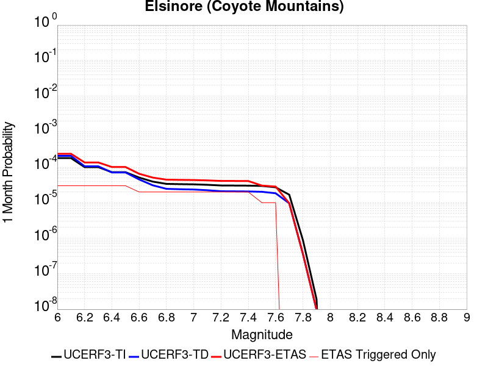 | 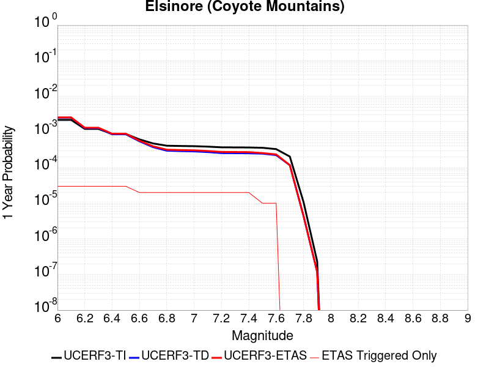 | 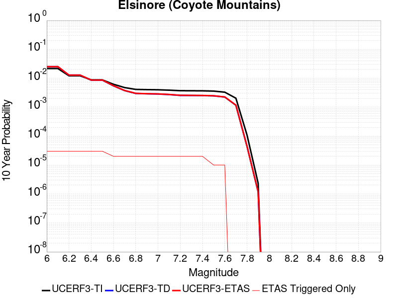 |

| Magnitude | 1 wk TI Prob | 1 wk TD Prob | 1 wk ETAS Prob | 1 wk ETAS/TD Gain | 1 wk ETAS Triggered Only | 1 mo TI Prob | 1 mo TD Prob | 1 mo ETAS Prob | 1 mo ETAS/TD Gain | 1 mo ETAS Triggered Only | 1 yr TI Prob | 1 yr TD Prob | 1 yr ETAS Prob | 1 yr ETAS/TD Gain | 1 yr ETAS Triggered Only | 10 yr TI Prob | 10 yr TD Prob | 10 yr ETAS Prob | 10 yr ETAS/TD Gain | 10 yr ETAS Triggered Only |
|-----|-----|-----|-----|-----|-----|-----|-----|-----|-----|-----|-----|-----|-----|-----|-----|-----|-----|-----|-----|-----|
| 6.0 | 4.20513E-5 | 4.8631882E-5 | 1.0196262E-4 | 2.0966208 | 5.3333333E-5 | 1.8020741E-4 | 2.0840895E-4 | 2.8839227E-4 | 1.3837807 | 8.0E-5 | 0.0021918174 | 0.002535 | 0.0026147973 | 1.0314782 | 8.0E-5 | 0.021703249 | 0.025111282 | 0.025189273 | 1.0031058 | 8.0E-5 |
| 6.1 | 4.20513E-5 | 4.8631882E-5 | 1.0196262E-4 | 2.0966208 | 5.3333333E-5 | 1.8020741E-4 | 2.0840895E-4 | 2.8839227E-4 | 1.3837807 | 8.0E-5 | 0.0021918174 | 0.002535 | 0.0026147973 | 1.0314782 | 8.0E-5 | 0.021703249 | 0.025111282 | 0.025189273 | 1.0031058 | 8.0E-5 |
| 6.2 | 2.3413893E-5 | 2.469566E-5 | 7.8027675E-5 | 3.1595702 | 5.3333333E-5 | 1.0034139E-4 | 1.0583479E-4 | 1.8582633E-4 | 1.755815 | 8.0E-5 | 0.0012209718 | 0.0012878707 | 0.0013677676 | 1.0620381 | 8.0E-5 | 0.012142851 | 0.01281264 | 0.012891615 | 1.0061638 | 8.0E-5 |
| 6.3 | 2.3413893E-5 | 2.469566E-5 | 7.8027675E-5 | 3.1595702 | 5.3333333E-5 | 1.0034139E-4 | 1.0583479E-4 | 1.8582633E-4 | 1.755815 | 8.0E-5 | 0.0012209718 | 0.0012878707 | 0.0013677676 | 1.0620381 | 8.0E-5 | 0.012142851 | 0.01281264 | 0.012891615 | 1.0061638 | 8.0E-5 |
| 6.4 | 1.6894814E-5 | 1.6568361E-5 | 6.990081E-5 | 4.218933 | 5.3333333E-5 | 7.240433E-5 | 7.1005554E-5 | 1.5099987E-4 | 2.1265924 | 8.0E-5 | 8.811662E-4 | 8.6418656E-4 | 9.4411743E-4 | 1.0924926 | 8.0E-5 | 0.0087768035 | 0.00861194 | 0.008691251 | 1.0092094 | 8.0E-5 |
| 6.5 | 1.6894814E-5 | 1.6568361E-5 | 6.990081E-5 | 4.218933 | 5.3333333E-5 | 7.240433E-5 | 7.1005554E-5 | 1.5099987E-4 | 2.1265924 | 8.0E-5 | 8.811662E-4 | 8.6418656E-4 | 9.4411743E-4 | 1.0924926 | 8.0E-5 | 0.0087768035 | 0.00861194 | 0.008691251 | 1.0092094 | 8.0E-5 |
| 6.6 | 1.1910969E-5 | 1.0530774E-5 | 3.719716E-5 | 3.5322344 | 2.6666667E-5 | 5.1046012E-5 | 4.5131183E-5 | 9.846211E-5 | 2.1816869 | 5.3333333E-5 | 6.21308E-4 | 5.4934516E-4 | 6.026492E-4 | 1.097032 | 5.3333333E-5 | 0.0061957375 | 0.005481174 | 0.0055342154 | 1.0096769 | 5.3333333E-5 |
| 6.7 | 9.1486E-6 | 7.2028593E-6 | 3.3869335E-5 | 4.7022066 | 2.6666667E-5 | 3.9207694E-5 | 3.0869054E-5 | 8.420074E-5 | 2.727675 | 5.3333333E-5 | 4.7724912E-4 | 3.757697E-4 | 4.29083E-4 | 1.1418775 | 5.3333333E-5 | 0.0047622547 | 0.0037517229 | 0.003804856 | 1.0141623 | 5.3333333E-5 |
| 6.8 | 7.90441E-6 | 5.7290276E-6 | 3.2395543E-5 | 5.6546316 | 2.6666667E-5 | 3.3875604E-5 | 2.4552752E-5 | 7.7884775E-5 | 3.1721404 | 5.3333333E-5 | 4.1235742E-4 | 2.9889002E-4 | 3.5220743E-4 | 1.1783847 | 5.3333333E-5 | 0.0041159308 | 0.002985009 | 0.003038183 | 1.0178137 | 5.3333333E-5 |
| 6.9 | 7.77015E-6 | 5.582982E-6 | 3.22495E-5 | 5.7763934 | 2.6666667E-5 | 3.3300217E-5 | 2.3926852E-5 | 7.725891E-5 | 3.2289624 | 5.3333333E-5 | 4.0535472E-4 | 2.9127175E-4 | 3.4458956E-4 | 1.1830517 | 5.3333333E-5 | 0.004046161 | 0.002909027 | 0.002962205 | 1.0182804 | 5.3333333E-5 |
| 7.0 | 7.675798E-6 | 5.47984E-6 | 3.214636E-5 | 5.8662953 | 2.6666667E-5 | 3.289586E-5 | 2.3484827E-5 | 7.6816905E-5 | 3.2709167 | 5.3333333E-5 | 4.004335E-4 | 2.858915E-4 | 3.392096E-4 | 1.1864976 | 5.3333333E-5 | 0.003997127 | 0.0028553635 | 0.0029085446 | 1.018625 | 5.3333333E-5 |
| 7.1 | 7.447814E-6 | 5.238714E-6 | 3.190524E-5 | 6.090281 | 2.6666667E-5 | 3.191881E-5 | 2.2451446E-5 | 7.578358E-5 | 3.3754432 | 5.3333333E-5 | 3.8854225E-4 | 2.7331332E-4 | 3.266321E-4 | 1.1950829 | 5.3333333E-5 | 0.003878636 | 0.0027298962 | 0.0027830838 | 1.0194834 | 5.3333333E-5 |
| 7.2 | 7.128185E-6 | 4.905372E-6 | 3.1571908E-5 | 6.43619 | 2.6666667E-5 | 3.0549007E-5 | 2.102286E-5 | 7.435507E-5 | 3.5368676 | 5.3333333E-5 | 3.7187067E-4 | 2.5592445E-4 | 3.0924415E-4 | 1.2083415 | 5.3333333E-5 | 0.00371249 | 0.0025564157 | 0.0026096127 | 1.0208092 | 5.3333333E-5 |
| 7.3 | 7.0913875E-6 | 4.874047E-6 | 3.1540585E-5 | 6.471128 | 2.6666667E-5 | 3.0391306E-5 | 2.0888614E-5 | 7.4220836E-5 | 3.5531719 | 5.3333333E-5 | 3.6995133E-4 | 2.5429038E-4 | 3.0761014E-4 | 1.2096807 | 5.3333333E-5 | 0.0036933604 | 0.0025401122 | 0.00259331 | 1.0209432 | 5.3333333E-5 |
| 7.4 | 7.051521E-6 | 4.837899E-6 | 3.1504438E-5 | 6.512008 | 2.6666667E-5 | 3.0220453E-5 | 2.0733693E-5 | 7.406592E-5 | 3.5722492 | 5.3333333E-5 | 3.6787192E-4 | 2.5240466E-4 | 3.0572453E-4 | 1.2112476 | 5.3333333E-5 | 0.0036726352 | 0.0025212981 | 0.002574497 | 1.0210998 | 5.3333333E-5 |
| 7.5 | 6.910666E-6 | 4.733448E-6 | 4.733448E-6 | 1.0 | 0.0 | 2.9616802E-5 | 2.0286056E-5 | 4.695218E-5 | 2.3145053 | 2.6666667E-5 | 3.605249E-4 | 2.4695593E-4 | 2.73616E-4 | 1.1079549 | 2.6666667E-5 | 0.0035994058 | 0.0024669329 | 0.0024935338 | 1.010783 | 2.6666667E-5 |
| 7.6 | 6.341753E-6 | 4.3065565E-6 | 4.3065565E-6 | 1.0 | 0.0 | 2.7178658E-5 | 1.8456547E-5 | 4.512272E-5 | 2.4448085 | 2.6666667E-5 | 3.3084993E-4 | 2.2468645E-4 | 2.513471E-4 | 1.1186572 | 2.6666667E-5 | 0.0033035777 | 0.002244708 | 0.0022713149 | 1.0118531 | 2.6666667E-5 |
| 7.7 | 3.9205916E-6 | 2.2439415E-6 | 2.2439415E-6 | 1.0 | 0.0 | 1.6802427E-5 | 9.616861E-6 | 9.616861E-6 | 1.0 | 0.0 | 2.0455034E-4 | 1.1707973E-4 | 1.1707973E-4 | 1.0 | 0.0 | 0.0020436216 | 0.0011702535 | 0.0011702535 | 1.0 | 0.0 |
| 7.8 | 2.0846227E-7 | 8.486417E-8 | 8.486417E-8 | 1.0 | 0.0 | 8.9340944E-7 | 3.6370355E-7 | 3.6370355E-7 | 1.0 | 0.0 | 1.0877206E-5 | 4.428085E-6 | 4.428085E-6 | 1.0 | 0.0 | 1.0876673E-4 | 4.4280296E-5 | 4.4280296E-5 | 1.0 | 0.0 |
| 7.9 | 4.4969806E-9 | 2.2691855E-9 | 2.2691855E-9 | 1.0 | 0.0 | 1.9272775E-8 | 9.72508E-9 | 9.72508E-9 | 1.0 | 0.0 | 2.3464601E-7 | 1.18402845E-7 | 1.18402845E-7 | 1.0 | 0.0 | 2.3464577E-6 | 1.184028E-6 | 1.184028E-6 | 1.0 | 0.0 |

## Deep Springs
*[(top)](#table-of-contents)*

| 1 Week | 1 Month | 1 Year | 10 Year |
|-----|-----|-----|-----|
|  |  |  | 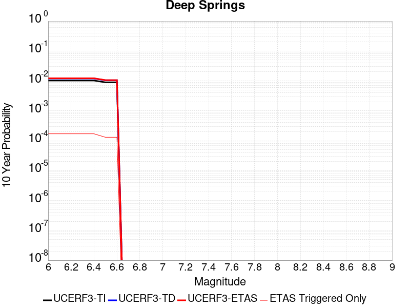 |

| Magnitude | 1 wk TI Prob | 1 wk TD Prob | 1 wk ETAS Prob | 1 wk ETAS/TD Gain | 1 wk ETAS Triggered Only | 1 mo TI Prob | 1 mo TD Prob | 1 mo ETAS Prob | 1 mo ETAS/TD Gain | 1 mo ETAS Triggered Only | 1 yr TI Prob | 1 yr TD Prob | 1 yr ETAS Prob | 1 yr ETAS/TD Gain | 1 yr ETAS Triggered Only | 10 yr TI Prob | 10 yr TD Prob | 10 yr ETAS Prob | 10 yr ETAS/TD Gain | 10 yr ETAS Triggered Only |
|-----|-----|-----|-----|-----|-----|-----|-----|-----|-----|-----|-----|-----|-----|-----|-----|-----|-----|-----|-----|-----|
| 6.0 | 1.9810619E-5 | 2.311252E-5 | 4.977857E-5 | 2.1537492 | 2.6666667E-5 | 8.489989E-5 | 9.905276E-5 | 1.2571679E-4 | 1.2691901 | 2.6666667E-5 | 0.001033166 | 0.0012058079 | 0.0012324424 | 1.0220885 | 2.6666667E-5 | 0.010283757 | 0.012042425 | 0.012121461 | 1.0065632 | 8.0E-5 |
| 6.1 | 1.9810619E-5 | 2.311252E-5 | 4.977857E-5 | 2.1537492 | 2.6666667E-5 | 8.489989E-5 | 9.905276E-5 | 1.2571679E-4 | 1.2691901 | 2.6666667E-5 | 0.001033166 | 0.0012058079 | 0.0012324424 | 1.0220885 | 2.6666667E-5 | 0.010283757 | 0.012042425 | 0.012121461 | 1.0065632 | 8.0E-5 |
| 6.2 | 1.9810619E-5 | 2.311252E-5 | 4.977857E-5 | 2.1537492 | 2.6666667E-5 | 8.489989E-5 | 9.905276E-5 | 1.2571679E-4 | 1.2691901 | 2.6666667E-5 | 0.001033166 | 0.0012058079 | 0.0012324424 | 1.0220885 | 2.6666667E-5 | 0.010283757 | 0.012042425 | 0.012121461 | 1.0065632 | 8.0E-5 |
| 6.3 | 1.9810619E-5 | 2.311252E-5 | 4.977857E-5 | 2.1537492 | 2.6666667E-5 | 8.489989E-5 | 9.905276E-5 | 1.2571679E-4 | 1.2691901 | 2.6666667E-5 | 0.001033166 | 0.0012058079 | 0.0012324424 | 1.0220885 | 2.6666667E-5 | 0.010283757 | 0.012042425 | 0.012121461 | 1.0065632 | 8.0E-5 |
| 6.4 | 1.9810619E-5 | 2.311252E-5 | 4.977857E-5 | 2.1537492 | 2.6666667E-5 | 8.489989E-5 | 9.905276E-5 | 1.2571679E-4 | 1.2691901 | 2.6666667E-5 | 0.001033166 | 0.0012058079 | 0.0012324424 | 1.0220885 | 2.6666667E-5 | 0.010283757 | 0.012042425 | 0.012121461 | 1.0065632 | 8.0E-5 |
| 6.5 | 1.7190405E-5 | 2.0050555E-5 | 4.6716686E-5 | 2.3299448 | 2.6666667E-5 | 7.367108E-5 | 8.593095E-5 | 1.1259533E-4 | 1.3103 | 2.6666667E-5 | 8.9657627E-4 | 0.0010462094 | 0.0010728481 | 1.0254622 | 2.6666667E-5 | 0.008929676 | 0.010462056 | 0.010541219 | 1.0075667 | 8.0E-5 |
| 6.6 | 1.7190405E-5 | 2.0050555E-5 | 4.6716686E-5 | 2.3299448 | 2.6666667E-5 | 7.367108E-5 | 8.593095E-5 | 1.1259533E-4 | 1.3103 | 2.6666667E-5 | 8.9657627E-4 | 0.0010462094 | 0.0010728481 | 1.0254622 | 2.6666667E-5 | 0.008929676 | 0.010462056 | 0.010541219 | 1.0075667 | 8.0E-5 |

## Los Alamos 2011 CFM
*[(top)](#table-of-contents)*

| 1 Week | 1 Month | 1 Year | 10 Year |
|-----|-----|-----|-----|
|  |  |  |  |

| Magnitude | 1 wk TI Prob | 1 wk TD Prob | 1 wk ETAS Prob | 1 wk ETAS/TD Gain | 1 wk ETAS Triggered Only | 1 mo TI Prob | 1 mo TD Prob | 1 mo ETAS Prob | 1 mo ETAS/TD Gain | 1 mo ETAS Triggered Only | 1 yr TI Prob | 1 yr TD Prob | 1 yr ETAS Prob | 1 yr ETAS/TD Gain | 1 yr ETAS Triggered Only | 10 yr TI Prob | 10 yr TD Prob | 10 yr ETAS Prob | 10 yr ETAS/TD Gain | 10 yr ETAS Triggered Only |
|-----|-----|-----|-----|-----|-----|-----|-----|-----|-----|-----|-----|-----|-----|-----|-----|-----|-----|-----|-----|-----|
| 6.0 | 4.6284417E-6 | 4.751731E-6 | 4.751731E-6 | 1.0 | 0.0 | 1.9836029E-5 | 2.0364414E-5 | 4.703054E-5 | 2.3094473 | 2.6666667E-5 | 2.4147688E-4 | 2.4791027E-4 | 3.2789045E-4 | 1.3226174 | 8.0E-5 | 0.0024121467 | 0.0024765113 | 0.0025563133 | 1.0322235 | 8.0E-5 |
| 6.1 | 4.6284417E-6 | 4.751731E-6 | 4.751731E-6 | 1.0 | 0.0 | 1.9836029E-5 | 2.0364414E-5 | 4.703054E-5 | 2.3094473 | 2.6666667E-5 | 2.4147688E-4 | 2.4791027E-4 | 3.2789045E-4 | 1.3226174 | 8.0E-5 | 0.0024121467 | 0.0024765113 | 0.0025563133 | 1.0322235 | 8.0E-5 |
| 6.2 | 4.6284417E-6 | 4.751731E-6 | 4.751731E-6 | 1.0 | 0.0 | 1.9836029E-5 | 2.0364414E-5 | 4.703054E-5 | 2.3094473 | 2.6666667E-5 | 2.4147688E-4 | 2.4791027E-4 | 3.2789045E-4 | 1.3226174 | 8.0E-5 | 0.0024121467 | 0.0024765113 | 0.0025563133 | 1.0322235 | 8.0E-5 |
| 6.3 | 4.6284417E-6 | 4.751731E-6 | 4.751731E-6 | 1.0 | 0.0 | 1.9836029E-5 | 2.0364414E-5 | 4.703054E-5 | 2.3094473 | 2.6666667E-5 | 2.4147688E-4 | 2.4791027E-4 | 3.2789045E-4 | 1.3226174 | 8.0E-5 | 0.0024121467 | 0.0024765113 | 0.0025563133 | 1.0322235 | 8.0E-5 |
| 6.4 | 4.6284417E-6 | 4.751731E-6 | 4.751731E-6 | 1.0 | 0.0 | 1.9836029E-5 | 2.0364414E-5 | 4.703054E-5 | 2.3094473 | 2.6666667E-5 | 2.4147688E-4 | 2.4791027E-4 | 3.2789045E-4 | 1.3226174 | 8.0E-5 | 0.0024121467 | 0.0024765113 | 0.0025563133 | 1.0322235 | 8.0E-5 |
| 6.5 | 4.6284417E-6 | 4.751731E-6 | 4.751731E-6 | 1.0 | 0.0 | 1.9836029E-5 | 2.0364414E-5 | 4.703054E-5 | 2.3094473 | 2.6666667E-5 | 2.4147688E-4 | 2.4791027E-4 | 3.2789045E-4 | 1.3226174 | 8.0E-5 | 0.0024121467 | 0.0024765113 | 0.0025563133 | 1.0322235 | 8.0E-5 |
| 6.6 | 4.6284417E-6 | 4.751731E-6 | 4.751731E-6 | 1.0 | 0.0 | 1.9836029E-5 | 2.0364414E-5 | 4.703054E-5 | 2.3094473 | 2.6666667E-5 | 2.4147688E-4 | 2.4791027E-4 | 3.2789045E-4 | 1.3226174 | 8.0E-5 | 0.0024121467 | 0.0024765113 | 0.0025563133 | 1.0322235 | 8.0E-5 |
| 6.7 | 4.062321E-6 | 4.166349E-6 | 4.166349E-6 | 1.0 | 0.0 | 1.7409831E-5 | 1.7855667E-5 | 1.7855667E-5 | 1.0 | 0.0 | 2.1194408E-4 | 2.1737257E-4 | 2.4403344E-4 | 1.1226506 | 2.6666667E-5 | 0.0021174205 | 0.0021717492 | 0.0021983578 | 1.0122522 | 2.6666667E-5 |
| 6.8 | 4.062321E-6 | 4.166349E-6 | 4.166349E-6 | 1.0 | 0.0 | 1.7409831E-5 | 1.7855667E-5 | 1.7855667E-5 | 1.0 | 0.0 | 2.1194408E-4 | 2.1737257E-4 | 2.4403344E-4 | 1.1226506 | 2.6666667E-5 | 0.0021174205 | 0.0021717492 | 0.0021983578 | 1.0122522 | 2.6666667E-5 |
| 6.9 | 3.2936077E-6 | 3.372958E-6 | 3.372958E-6 | 1.0 | 0.0 | 1.4115385E-5 | 1.4455459E-5 | 1.4455459E-5 | 1.0 | 0.0 | 1.7184127E-4 | 1.7598194E-4 | 2.0264392E-4 | 1.151504 | 2.6666667E-5 | 0.0017170844 | 0.0017585184 | 0.0017851382 | 1.0151377 | 2.6666667E-5 |
| 7.0 | 3.1687898E-6 | 3.2448156E-6 | 3.2448156E-6 | 1.0 | 0.0 | 1.3580457E-5 | 1.3906283E-5 | 1.3906283E-5 | 1.0 | 0.0 | 1.6532952E-4 | 1.6929678E-4 | 1.9595893E-4 | 1.1574876 | 2.6666667E-5 | 0.0016520657 | 0.0016917696 | 0.0017183912 | 1.0157359 | 2.6666667E-5 |
| 7.1 | 2.9379228E-6 | 3.0073259E-6 | 3.0073259E-6 | 1.0 | 0.0 | 1.25910365E-5 | 1.288848E-5 | 1.288848E-5 | 1.0 | 0.0 | 1.5328509E-4 | 1.5690686E-4 | 1.8356934E-4 | 1.1699256 | 2.6666667E-5 | 0.001531794 | 0.0015680499 | 0.0015946748 | 1.0169796 | 2.6666667E-5 |
| 7.2 | 2.0020686E-6 | 2.0416298E-6 | 2.0416298E-6 | 1.0 | 0.0 | 8.580266E-6 | 8.749813E-6 | 8.749813E-6 | 1.0 | 0.0 | 1.0445973E-4 | 1.0652381E-4 | 1.0652381E-4 | 1.0 | 0.0 | 0.0010441064 | 0.001064732 | 0.001064732 | 1.0 | 0.0 |
| 7.3 | 1.7364243E-6 | 1.7678802E-6 | 1.7678802E-6 | 1.0 | 0.0 | 7.441797E-6 | 7.576608E-6 | 7.576608E-6 | 1.0 | 0.0 | 9.0600115E-5 | 9.2241324E-5 | 9.2241324E-5 | 1.0 | 0.0 | 9.0563187E-4 | 9.2203356E-4 | 9.2203356E-4 | 1.0 | 0.0 |
| 7.4 | 1.5718434E-6 | 1.5983177E-6 | 1.5983177E-6 | 1.0 | 0.0 | 6.7364545E-6 | 6.849915E-6 | 6.849915E-6 | 1.0 | 0.0 | 8.201325E-5 | 8.339455E-5 | 8.339455E-5 | 1.0 | 0.0 | 8.198299E-4 | 8.3363557E-4 | 8.3363557E-4 | 1.0 | 0.0 |
| 7.5 | 1.3841119E-6 | 1.4042793E-6 | 1.4042793E-6 | 1.0 | 0.0 | 5.9318945E-6 | 6.0183256E-6 | 6.0183256E-6 | 1.0 | 0.0 | 7.221842E-5 | 7.327068E-5 | 7.327068E-5 | 1.0 | 0.0 | 7.2194956E-4 | 7.324681E-4 | 7.324681E-4 | 1.0 | 0.0 |
| 7.6 | 1.0843726E-6 | 1.093442E-6 | 1.093442E-6 | 1.0 | 0.0 | 4.647303E-6 | 4.6861724E-6 | 4.6861724E-6 | 1.0 | 0.0 | 5.6579443E-5 | 5.705268E-5 | 5.705268E-5 | 1.0 | 0.0 | 5.656504E-4 | 5.703829E-4 | 5.703829E-4 | 1.0 | 0.0 |
| 7.7 | 5.544814E-7 | 5.5018705E-7 | 5.5018705E-7 | 1.0 | 0.0 | 2.3763469E-6 | 2.3579425E-6 | 2.3579425E-6 | 1.0 | 0.0 | 2.8931638E-5 | 2.8707573E-5 | 2.8707573E-5 | 1.0 | 0.0 | 2.8927872E-4 | 2.870388E-4 | 2.870388E-4 | 1.0 | 0.0 |
| 7.8 | 2.0707465E-7 | 1.977846E-7 | 1.977846E-7 | 1.0 | 0.0 | 8.874625E-7 | 8.4764804E-7 | 8.4764804E-7 | 1.0 | 0.0 | 1.08048025E-5 | 1.0320066E-5 | 1.0320066E-5 | 1.0 | 0.0 | 1.0804277E-4 | 1.0319592E-4 | 1.0319592E-4 | 1.0 | 0.0 |
| 7.9 | 3.9821284E-8 | 3.433109E-8 | 3.433109E-8 | 1.0 | 0.0 | 1.7066264E-7 | 1.4713324E-7 | 1.4713324E-7 | 1.0 | 0.0 | 2.0778157E-6 | 1.7913457E-6 | 1.7913457E-6 | 1.0 | 0.0 | 2.0777963E-5 | 1.7913319E-5 | 1.7913319E-5 | 1.0 | 0.0 |
| 8.0 | 7.880441E-11 | 8.2353124E-11 | 8.2353124E-11 | 1.0 | 0.0 | 3.3773329E-10 | 3.52942E-10 | 3.52942E-10 | 1.0 | 0.0 | 4.1119033E-9 | 4.2970694E-9 | 4.2970694E-9 | 1.0 | 0.0 | 4.1119034E-8 | 4.2970694E-8 | 4.2970694E-8 | 1.0 | 0.0 |

## Malibu Coast alt 1
*[(top)](#table-of-contents)*

| 1 Week | 1 Month | 1 Year | 10 Year |
|-----|-----|-----|-----|
|  |  |  |  |

| Magnitude | 1 wk TI Prob | 1 wk TD Prob | 1 wk ETAS Prob | 1 wk ETAS/TD Gain | 1 wk ETAS Triggered Only | 1 mo TI Prob | 1 mo TD Prob | 1 mo ETAS Prob | 1 mo ETAS/TD Gain | 1 mo ETAS Triggered Only | 1 yr TI Prob | 1 yr TD Prob | 1 yr ETAS Prob | 1 yr ETAS/TD Gain | 1 yr ETAS Triggered Only | 10 yr TI Prob | 10 yr TD Prob | 10 yr ETAS Prob | 10 yr ETAS/TD Gain | 10 yr ETAS Triggered Only |
|-----|-----|-----|-----|-----|-----|-----|-----|-----|-----|-----|-----|-----|-----|-----|-----|-----|-----|-----|-----|-----|
| 6.0 | 1.6572556E-5 | 1.7598066E-5 | 1.7598066E-5 | 1.0 | 0.0 | 7.102331E-5 | 7.541821E-5 | 1.02082864E-4 | 1.3535572 | 2.6666667E-5 | 8.6436566E-4 | 9.178488E-4 | 9.44491E-4 | 1.0290267 | 2.6666667E-5 | 0.0086101135 | 0.009142512 | 0.009221781 | 1.0086703 | 8.0E-5 |
| 6.1 | 1.6572556E-5 | 1.7598066E-5 | 1.7598066E-5 | 1.0 | 0.0 | 7.102331E-5 | 7.541821E-5 | 1.02082864E-4 | 1.3535572 | 2.6666667E-5 | 8.6436566E-4 | 9.178488E-4 | 9.44491E-4 | 1.0290267 | 2.6666667E-5 | 0.0086101135 | 0.009142512 | 0.0091953585 | 1.0057802 | 5.3333333E-5 |
| 6.2 | 1.1085717E-5 | 1.1557147E-5 | 1.1557147E-5 | 1.0 | 0.0 | 4.750935E-5 | 4.952971E-5 | 7.619506E-5 | 1.5383707 | 2.6666667E-5 | 5.782728E-4 | 6.028609E-4 | 6.295115E-4 | 1.0442069 | 2.6666667E-5 | 0.0057677035 | 0.0060126255 | 0.006039132 | 1.0044085 | 2.6666667E-5 |
| 6.3 | 1.0208568E-5 | 1.0592237E-5 | 1.0592237E-5 | 1.0 | 0.0 | 4.375027E-5 | 4.539453E-5 | 7.2059986E-5 | 1.5874156 | 2.6666667E-5 | 5.325294E-4 | 5.5254117E-4 | 5.791931E-4 | 1.0482352 | 2.6666667E-5 | 0.0053125503 | 0.0055119814 | 0.0055385013 | 1.0048113 | 2.6666667E-5 |
| 6.4 | 9.0682315E-6 | 9.342637E-6 | 9.342637E-6 | 1.0 | 0.0 | 3.8863272E-5 | 4.003927E-5 | 6.670487E-5 | 1.6659861 | 2.6666667E-5 | 4.730576E-4 | 4.8737114E-4 | 5.140248E-4 | 1.0546887 | 2.6666667E-5 | 0.0047205184 | 0.004863236 | 0.004889773 | 1.0054567 | 2.6666667E-5 |
| 6.5 | 7.605796E-6 | 7.748587E-6 | 7.748587E-6 | 1.0 | 0.0 | 3.259586E-5 | 3.3207816E-5 | 3.3207816E-5 | 1.0 | 0.0 | 3.9678233E-4 | 4.0423148E-4 | 4.0423148E-4 | 1.0 | 0.0 | 0.0039607463 | 0.0040351 | 0.0040351 | 1.0 | 0.0 |
| 6.6 | 5.889873E-6 | 5.8795385E-6 | 5.8795385E-6 | 1.0 | 0.0 | 2.5242069E-5 | 2.519778E-5 | 2.519778E-5 | 1.0 | 0.0 | 3.0727885E-4 | 3.0673988E-4 | 3.0673988E-4 | 1.0 | 0.0 | 0.003068543 | 0.0030631777 | 0.0030631777 | 1.0 | 0.0 |
| 6.7 | 5.66586E-6 | 5.641641E-6 | 5.641641E-6 | 1.0 | 0.0 | 2.428203E-5 | 2.417824E-5 | 2.417824E-5 | 1.0 | 0.0 | 2.955936E-4 | 2.9433038E-4 | 2.9433038E-4 | 1.0 | 0.0 | 0.0029520073 | 0.0029394177 | 0.0029394177 | 1.0 | 0.0 |
| 6.8 | 5.521556E-6 | 5.489427E-6 | 5.489427E-6 | 1.0 | 0.0 | 2.3663597E-5 | 2.3525903E-5 | 2.3525903E-5 | 1.0 | 0.0 | 2.880662E-4 | 2.8639034E-4 | 2.8639034E-4 | 1.0 | 0.0 | 0.0028769306 | 0.002860224 | 0.002860224 | 1.0 | 0.0 |
| 6.9 | 5.29752E-6 | 5.2499317E-6 | 5.2499317E-6 | 1.0 | 0.0 | 2.270346E-5 | 2.2499513E-5 | 2.2499513E-5 | 1.0 | 0.0 | 2.7637955E-4 | 2.7389723E-4 | 2.7389723E-4 | 1.0 | 0.0 | 0.0027603607 | 0.0027356069 | 0.0027356069 | 1.0 | 0.0 |
| 7.0 | 5.106743E-6 | 5.0476788E-6 | 5.0476788E-6 | 1.0 | 0.0 | 2.1885859E-5 | 2.163273E-5 | 2.163273E-5 | 1.0 | 0.0 | 2.6642776E-4 | 2.6334674E-4 | 2.6334674E-4 | 1.0 | 0.0 | 0.0026610855 | 0.0026303562 | 0.0026303562 | 1.0 | 0.0 |
| 7.1 | 4.8469647E-6 | 4.770373E-6 | 4.770373E-6 | 1.0 | 0.0 | 2.0772539E-5 | 2.0444295E-5 | 2.0444295E-5 | 1.0 | 0.0 | 2.528763E-4 | 2.4888094E-4 | 2.4888094E-4 | 1.0 | 0.0 | 0.0025258875 | 0.00248603 | 0.00248603 | 1.0 | 0.0 |
| 7.2 | 4.545514E-6 | 4.4481935E-6 | 4.4481935E-6 | 1.0 | 0.0 | 1.9480629E-5 | 1.9063547E-5 | 1.9063547E-5 | 1.0 | 0.0 | 2.3715083E-4 | 2.3207403E-4 | 2.3207403E-4 | 1.0 | 0.0 | 0.0023689792 | 0.0023183243 | 0.0023183243 | 1.0 | 0.0 |
| 7.3 | 3.794097E-6 | 3.6519348E-6 | 3.6519348E-6 | 1.0 | 0.0 | 1.6260314E-5 | 1.5651056E-5 | 1.5651056E-5 | 1.0 | 0.0 | 1.9795135E-4 | 1.9053498E-4 | 1.9053498E-4 | 1.0 | 0.0 | 0.001977751 | 0.0019037209 | 0.0019037209 | 1.0 | 0.0 |
| 7.4 | 2.808217E-6 | 2.719077E-6 | 2.719077E-6 | 1.0 | 0.0 | 1.203516E-5 | 1.1653135E-5 | 1.1653135E-5 | 1.0 | 0.0 | 1.4651821E-4 | 1.418677E-4 | 1.418677E-4 | 1.0 | 0.0 | 0.0014642165 | 0.001417774 | 0.001417774 | 1.0 | 0.0 |
| 7.5 | 1.83809E-6 | 1.8190691E-6 | 1.8190691E-6 | 1.0 | 0.0 | 7.877505E-6 | 7.795988E-6 | 7.795988E-6 | 1.0 | 0.0 | 9.59044E-5 | 9.491203E-5 | 9.491203E-5 | 1.0 | 0.0 | 9.5863023E-4 | 9.48717E-4 | 9.48717E-4 | 1.0 | 0.0 |
| 7.6 | 1.1292672E-6 | 1.1001447E-6 | 1.1001447E-6 | 1.0 | 0.0 | 4.839708E-6 | 4.714897E-6 | 4.714897E-6 | 1.0 | 0.0 | 5.8921847E-5 | 5.7402376E-5 | 5.7402376E-5 | 1.0 | 0.0 | 5.890623E-4 | 5.738771E-4 | 5.738771E-4 | 1.0 | 0.0 |
| 7.7 | 5.065272E-7 | 4.609151E-7 | 4.609151E-7 | 1.0 | 0.0 | 2.170829E-6 | 1.975349E-6 | 1.975349E-6 | 1.0 | 0.0 | 2.6429525E-5 | 2.404962E-5 | 2.404962E-5 | 1.0 | 0.0 | 2.642638E-4 | 2.4047129E-4 | 2.4047129E-4 | 1.0 | 0.0 |
| 7.8 | 8.952991E-8 | 6.707874E-8 | 6.707874E-8 | 1.0 | 0.0 | 3.8369956E-7 | 2.8748025E-7 | 2.8748025E-7 | 1.0 | 0.0 | 4.671532E-6 | 3.5000667E-6 | 3.5000667E-6 | 1.0 | 0.0 | 4.671434E-5 | 3.5000136E-5 | 3.5000136E-5 | 1.0 | 0.0 |
| 7.9 | 8.007447E-10 | 6.1608785E-10 | 6.1608785E-10 | 1.0 | 0.0 | 3.4317629E-9 | 2.6403764E-9 | 2.6403764E-9 | 1.0 | 0.0 | 4.1781714E-8 | 3.2146584E-8 | 3.2146584E-8 | 1.0 | 0.0 | 4.1781706E-7 | 3.214658E-7 | 3.214658E-7 | 1.0 | 0.0 |

## Santa Cruz Catalina Ridge alt1
*[(top)](#table-of-contents)*

| 1 Week | 1 Month | 1 Year | 10 Year |
|-----|-----|-----|-----|
|  | 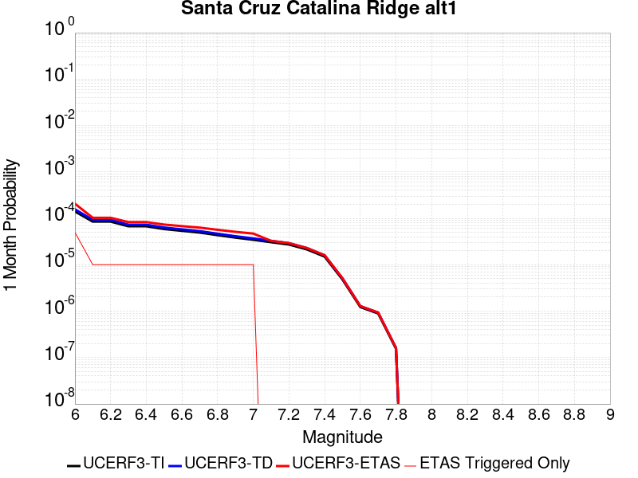 |  |  |

| Magnitude | 1 wk TI Prob | 1 wk TD Prob | 1 wk ETAS Prob | 1 wk ETAS/TD Gain | 1 wk ETAS Triggered Only | 1 mo TI Prob | 1 mo TD Prob | 1 mo ETAS Prob | 1 mo ETAS/TD Gain | 1 mo ETAS Triggered Only | 1 yr TI Prob | 1 yr TD Prob | 1 yr ETAS Prob | 1 yr ETAS/TD Gain | 1 yr ETAS Triggered Only | 10 yr TI Prob | 10 yr TD Prob | 10 yr ETAS Prob | 10 yr ETAS/TD Gain | 10 yr ETAS Triggered Only |
|-----|-----|-----|-----|-----|-----|-----|-----|-----|-----|-----|-----|-----|-----|-----|-----|-----|-----|-----|-----|-----|
| 6.0 | 3.2833184E-5 | 3.65584E-5 | 6.322409E-5 | 1.7293999 | 2.6666667E-5 | 1.4070606E-4 | 1.5667039E-4 | 1.8333287E-4 | 1.1701821 | 2.6666667E-5 | 0.00171175 | 0.0019059596 | 0.0019325754 | 1.0139645 | 2.6666667E-5 | 0.016986247 | 0.018913029 | 0.018991517 | 1.0041499 | 8.0E-5 |
| 6.1 | 1.9835548E-5 | 2.1659505E-5 | 2.1659505E-5 | 1.0 | 0.0 | 8.500672E-5 | 9.282326E-5 | 9.282326E-5 | 1.0 | 0.0 | 0.0010344655 | 0.0011295575 | 0.0011295575 | 1.0 | 0.0 | 0.010296632 | 0.011240295 | 0.011266663 | 1.0023458 | 2.6666667E-5 |
| 6.2 | 1.9835548E-5 | 2.1659505E-5 | 2.1659505E-5 | 1.0 | 0.0 | 8.500672E-5 | 9.282326E-5 | 9.282326E-5 | 1.0 | 0.0 | 0.0010344655 | 0.0011295575 | 0.0011295575 | 1.0 | 0.0 | 0.010296632 | 0.011240295 | 0.011266663 | 1.0023458 | 2.6666667E-5 |
| 6.3 | 1.5728183E-5 | 1.703395E-5 | 1.703395E-5 | 1.0 | 0.0 | 6.7404755E-5 | 7.300063E-5 | 7.300063E-5 | 1.0 | 0.0 | 8.2034385E-4 | 8.884264E-4 | 8.884264E-4 | 1.0 | 0.0 | 0.008173222 | 0.008849427 | 0.008875857 | 1.0029867 | 2.6666667E-5 |
| 6.4 | 1.5728183E-5 | 1.703395E-5 | 1.703395E-5 | 1.0 | 0.0 | 6.7404755E-5 | 7.300063E-5 | 7.300063E-5 | 1.0 | 0.0 | 8.2034385E-4 | 8.884264E-4 | 8.884264E-4 | 1.0 | 0.0 | 0.008173222 | 0.008849427 | 0.008875857 | 1.0029867 | 2.6666667E-5 |
| 6.5 | 1.3707734E-5 | 1.4794522E-5 | 1.4794522E-5 | 1.0 | 0.0 | 5.8746107E-5 | 6.3403575E-5 | 6.3403575E-5 | 1.0 | 0.0 | 7.1499916E-4 | 7.716686E-4 | 7.716686E-4 | 1.0 | 0.0 | 0.0071270303 | 0.0076902895 | 0.007716751 | 1.0034409 | 2.6666667E-5 |
| 6.6 | 1.2539813E-5 | 1.3510219E-5 | 1.3510219E-5 | 1.0 | 0.0 | 5.3740947E-5 | 5.789967E-5 | 5.789967E-5 | 1.0 | 0.0 | 6.540996E-4 | 7.0470315E-4 | 7.0470315E-4 | 1.0 | 0.0 | 0.0065217763 | 0.0070249885 | 0.007051468 | 1.0037693 | 2.6666667E-5 |
| 6.7 | 1.1504083E-5 | 1.2377375E-5 | 1.2377375E-5 | 1.0 | 0.0 | 4.930228E-5 | 5.3044827E-5 | 5.3044827E-5 | 1.0 | 0.0 | 6.0008996E-4 | 6.456314E-4 | 6.456314E-4 | 1.0 | 0.0 | 0.005984721 | 0.006437786 | 0.006464281 | 1.0041156 | 2.6666667E-5 |
| 6.8 | 1.012739E-5 | 1.0877071E-5 | 1.0877071E-5 | 1.0 | 0.0 | 4.340238E-5 | 4.6615194E-5 | 4.6615194E-5 | 1.0 | 0.0 | 5.282958E-4 | 5.673937E-4 | 5.673937E-4 | 1.0 | 0.0 | 0.0052704164 | 0.0056596193 | 0.0056861355 | 1.004685 | 2.6666667E-5 |
| 6.9 | 8.9607865E-6 | 9.609117E-6 | 9.609117E-6 | 1.0 | 0.0 | 3.8402806E-5 | 4.1181287E-5 | 4.1181287E-5 | 1.0 | 0.0 | 4.6745385E-4 | 5.012679E-4 | 5.012679E-4 | 1.0 | 0.0 | 0.0046647177 | 0.005001492 | 0.0050280252 | 1.005305 | 2.6666667E-5 |
| 7.0 | 8.046829E-6 | 8.619746E-6 | 8.619746E-6 | 1.0 | 0.0 | 3.4485955E-5 | 3.694125E-5 | 3.694125E-5 | 1.0 | 0.0 | 4.1978562E-4 | 4.496677E-4 | 4.496677E-4 | 1.0 | 0.0 | 0.004189935 | 0.0044876686 | 0.004514216 | 1.0059155 | 2.6666667E-5 |
| 7.1 | 7.136131E-6 | 7.637656E-6 | 7.637656E-6 | 1.0 | 0.0 | 3.0583058E-5 | 3.2732405E-5 | 3.2732405E-5 | 1.0 | 0.0 | 3.7228514E-4 | 3.9844486E-4 | 3.9844486E-4 | 1.0 | 0.0 | 0.0037166206 | 0.003977381 | 0.004003942 | 1.0066779 | 2.6666667E-5 |
| 7.2 | 6.362014E-6 | 6.8049585E-6 | 6.8049585E-6 | 1.0 | 0.0 | 2.726549E-5 | 2.9163786E-5 | 2.9163786E-5 | 1.0 | 0.0 | 3.3190678E-4 | 3.550119E-4 | 3.550119E-4 | 1.0 | 0.0 | 0.0033141149 | 0.003544516 | 0.0035710882 | 1.0074967 | 2.6666667E-5 |
| 7.3 | 5.004101E-6 | 5.351715E-6 | 5.351715E-6 | 1.0 | 0.0 | 2.1445969E-5 | 2.2935723E-5 | 2.2935723E-5 | 1.0 | 0.0 | 2.6107338E-4 | 2.792072E-4 | 2.792072E-4 | 1.0 | 0.0 | 0.002607669 | 0.0027886187 | 0.002815211 | 1.009536 | 2.6666667E-5 |
| 7.4 | 3.4901443E-6 | 3.7320526E-6 | 3.7320526E-6 | 1.0 | 0.0 | 1.4957676E-5 | 1.5994416E-5 | 1.5994416E-5 | 1.0 | 0.0 | 1.8209449E-4 | 1.9471499E-4 | 1.9471499E-4 | 1.0 | 0.0 | 0.0018194534 | 0.0019454823 | 0.0019454823 | 1.0 | 0.0 |
| 7.5 | 1.1215045E-6 | 1.189387E-6 | 1.189387E-6 | 1.0 | 0.0 | 4.806439E-6 | 5.097363E-6 | 5.097363E-6 | 1.0 | 0.0 | 5.851682E-5 | 6.205866E-5 | 6.205866E-5 | 1.0 | 0.0 | 5.850142E-4 | 6.2041637E-4 | 6.2041637E-4 | 1.0 | 0.0 |
| 7.6 | 2.8599047E-7 | 2.9951994E-7 | 2.9951994E-7 | 1.0 | 0.0 | 1.2256729E-6 | 1.2836562E-6 | 1.2836562E-6 | 1.0 | 0.0 | 1.4922465E-5 | 1.5628404E-5 | 1.5628404E-5 | 1.0 | 0.0 | 1.4921463E-4 | 1.5627318E-4 | 1.5627318E-4 | 1.0 | 0.0 |
| 7.7 | 2.0781519E-7 | 2.1744323E-7 | 2.1744323E-7 | 1.0 | 0.0 | 8.906362E-7 | 9.3189925E-7 | 9.3189925E-7 | 1.0 | 0.0 | 1.08434415E-5 | 1.13458145E-5 | 1.13458145E-5 | 1.0 | 0.0 | 1.0842913E-4 | 1.1345245E-4 | 1.1345245E-4 | 1.0 | 0.0 |
| 7.8 | 3.614776E-8 | 3.764102E-8 | 3.764102E-8 | 1.0 | 0.0 | 1.5491896E-7 | 1.6131864E-7 | 1.6131864E-7 | 1.0 | 0.0 | 1.8861368E-6 | 1.9640527E-6 | 1.9640527E-6 | 1.0 | 0.0 | 1.8861208E-5 | 1.9640367E-5 | 1.9640367E-5 | 1.0 | 0.0 |

## Emerson-Copper Mtn 2011
*[(top)](#table-of-contents)*

| 1 Week | 1 Month | 1 Year | 10 Year |
|-----|-----|-----|-----|
|  |  |  |  |

| Magnitude | 1 wk TI Prob | 1 wk TD Prob | 1 wk ETAS Prob | 1 wk ETAS/TD Gain | 1 wk ETAS Triggered Only | 1 mo TI Prob | 1 mo TD Prob | 1 mo ETAS Prob | 1 mo ETAS/TD Gain | 1 mo ETAS Triggered Only | 1 yr TI Prob | 1 yr TD Prob | 1 yr ETAS Prob | 1 yr ETAS/TD Gain | 1 yr ETAS Triggered Only | 10 yr TI Prob | 10 yr TD Prob | 10 yr ETAS Prob | 10 yr ETAS/TD Gain | 10 yr ETAS Triggered Only |
|-----|-----|-----|-----|-----|-----|-----|-----|-----|-----|-----|-----|-----|-----|-----|-----|-----|-----|-----|-----|-----|
| 6.0 | 2.1364202E-5 | 9.968114E-6 | 3.6634516E-5 | 3.6751704 | 2.6666667E-5 | 9.1557646E-5 | 4.2719836E-5 | 9.605089E-5 | 2.248391 | 5.3333333E-5 | 0.0011141442 | 5.199986E-4 | 5.99957E-4 | 1.1537665 | 8.0E-5 | 0.011085749 | 0.005188688 | 0.005268273 | 1.0153382 | 8.0E-5 |
| 6.1 | 2.1364202E-5 | 9.968114E-6 | 3.6634516E-5 | 3.6751704 | 2.6666667E-5 | 9.1557646E-5 | 4.2719836E-5 | 9.605089E-5 | 2.248391 | 5.3333333E-5 | 0.0011141442 | 5.199986E-4 | 5.99957E-4 | 1.1537665 | 8.0E-5 | 0.011085749 | 0.005188688 | 0.005268273 | 1.0153382 | 8.0E-5 |
| 6.2 | 2.1364202E-5 | 9.968114E-6 | 3.6634516E-5 | 3.6751704 | 2.6666667E-5 | 9.1557646E-5 | 4.2719836E-5 | 9.605089E-5 | 2.248391 | 5.3333333E-5 | 0.0011141442 | 5.199986E-4 | 5.99957E-4 | 1.1537665 | 8.0E-5 | 0.011085749 | 0.005188688 | 0.005268273 | 1.0153382 | 8.0E-5 |
| 6.3 | 1.7751237E-5 | 8.089227E-6 | 3.4755678E-5 | 4.296539 | 2.6666667E-5 | 7.607452E-5 | 3.466769E-5 | 8.799917E-5 | 2.5383627 | 5.3333333E-5 | 9.258136E-4 | 4.2200365E-4 | 5.019699E-4 | 1.1894919 | 8.0E-5 | 0.00921966 | 0.0042126453 | 0.0042923084 | 1.0189104 | 8.0E-5 |
| 6.4 | 1.7751237E-5 | 8.089227E-6 | 3.4755678E-5 | 4.296539 | 2.6666667E-5 | 7.607452E-5 | 3.466769E-5 | 8.799917E-5 | 2.5383627 | 5.3333333E-5 | 9.258136E-4 | 4.2200365E-4 | 5.019699E-4 | 1.1894919 | 8.0E-5 | 0.00921966 | 0.0042126453 | 0.0042923084 | 1.0189104 | 8.0E-5 |
| 6.5 | 1.5886664E-5 | 6.603819E-6 | 3.327031E-5 | 5.0380406 | 2.6666667E-5 | 6.808392E-5 | 2.8301802E-5 | 8.1633625E-5 | 2.8843968 | 5.3333333E-5 | 8.286065E-4 | 3.4452465E-4 | 3.978396E-4 | 1.1547493 | 5.3333333E-5 | 0.008255237 | 0.0034403696 | 0.0034935193 | 1.0154489 | 5.3333333E-5 |
| 6.6 | 1.5886664E-5 | 6.603819E-6 | 3.327031E-5 | 5.0380406 | 2.6666667E-5 | 6.808392E-5 | 2.8301802E-5 | 8.1633625E-5 | 2.8843968 | 5.3333333E-5 | 8.286065E-4 | 3.4452465E-4 | 3.978396E-4 | 1.1547493 | 5.3333333E-5 | 0.008255237 | 0.0034403696 | 0.0034935193 | 1.0154489 | 5.3333333E-5 |
| 6.7 | 1.428471E-5 | 5.470403E-6 | 3.2136923E-5 | 5.8746905 | 2.6666667E-5 | 6.121875E-5 | 2.3444394E-5 | 7.677648E-5 | 3.274833 | 5.3333333E-5 | 7.450834E-4 | 2.8540206E-4 | 3.3872016E-4 | 1.1868175 | 5.3333333E-5 | 0.007425902 | 0.0028507432 | 0.0029039246 | 1.0186552 | 5.3333333E-5 |
| 6.8 | 1.3490684E-5 | 5.073699E-6 | 3.174023E-5 | 6.2558365 | 2.6666667E-5 | 5.7815934E-5 | 2.1744265E-5 | 7.507644E-5 | 3.4527009 | 5.3333333E-5 | 7.0368167E-4 | 2.6470813E-4 | 3.1802733E-4 | 1.2014264 | 5.3333333E-5 | 0.007014576 | 0.002644309 | 0.0026975013 | 1.0201157 | 5.3333333E-5 |
| 6.9 | 1.2235421E-5 | 4.289677E-6 | 3.095623E-5 | 7.216448 | 2.6666667E-5 | 5.2436466E-5 | 1.838422E-5 | 4.5050398E-5 | 2.4504926 | 2.6666667E-5 | 6.38227E-4 | 2.238085E-4 | 2.504692E-4 | 1.1191229 | 2.6666667E-5 | 0.0063639707 | 0.0022361854 | 0.0022627923 | 1.0118984 | 2.6666667E-5 |
| 7.0 | 1.1009851E-5 | 3.7189886E-6 | 3.0385556E-5 | 8.170382 | 2.6666667E-5 | 4.7184225E-5 | 1.5938444E-5 | 4.2604686E-5 | 2.6730769 | 2.6666667E-5 | 5.743165E-4 | 1.9403672E-4 | 2.2069822E-4 | 1.1374043 | 2.6666667E-5 | 0.005728345 | 0.0019390108 | 0.0019656257 | 1.013726 | 2.6666667E-5 |
| 7.1 | 9.726373E-6 | 3.2117953E-6 | 2.9878376E-5 | 9.302703 | 2.6666667E-5 | 4.168379E-5 | 1.3764783E-5 | 4.043108E-5 | 2.9372845 | 2.6666667E-5 | 5.07382E-4 | 1.6757673E-4 | 1.9423892E-4 | 1.1591045 | 2.6666667E-5 | 0.0050622504 | 0.0016748349 | 0.0017014568 | 1.0158952 | 2.6666667E-5 |
| 7.2 | 3.9335127E-6 | 1.1524792E-6 | 1.1524792E-6 | 1.0 | 0.0 | 1.6857803E-5 | 4.9391874E-6 | 4.9391874E-6 | 1.0 | 0.0 | 2.0522442E-4 | 6.0133007E-5 | 6.0133007E-5 | 1.0 | 0.0 | 0.00205035 | 6.011733E-4 | 6.011733E-4 | 1.0 | 0.0 |
| 7.3 | 2.661632E-6 | 6.911505E-7 | 6.911505E-7 | 1.0 | 0.0 | 1.14069435E-5 | 2.9620703E-6 | 2.9620703E-6 | 1.0 | 0.0 | 1.3887069E-4 | 3.6062618E-5 | 3.6062618E-5 | 1.0 | 0.0 | 0.0013878393 | 3.605687E-4 | 3.605687E-4 | 1.0 | 0.0 |
| 7.4 | 2.0893426E-6 | 5.4618386E-7 | 5.4618386E-7 | 1.0 | 0.0 | 8.954295E-6 | 2.3407858E-6 | 2.3407858E-6 | 1.0 | 0.0 | 1.0901308E-4 | 2.84987E-5 | 2.84987E-5 | 1.0 | 0.0 | 0.0010895962 | 2.84951E-4 | 2.84951E-4 | 1.0 | 0.0 |
| 7.5 | 1.1681728E-6 | 3.6030585E-7 | 3.6030585E-7 | 1.0 | 0.0 | 5.0064455E-6 | 1.544167E-6 | 1.544167E-6 | 1.0 | 0.0 | 6.0951766E-5 | 1.8800076E-5 | 1.8800076E-5 | 1.0 | 0.0 | 6.093505E-4 | 1.8798532E-4 | 1.8798532E-4 | 1.0 | 0.0 |
| 7.6 | 1.3154387E-7 | 7.1197384E-8 | 7.1197384E-8 | 1.0 | 0.0 | 5.6375933E-7 | 3.051316E-7 | 3.051316E-7 | 1.0 | 0.0 | 6.863748E-6 | 3.7149728E-6 | 3.7149728E-6 | 1.0 | 0.0 | 6.863536E-5 | 3.7149264E-5 | 3.7149264E-5 | 1.0 | 0.0 |

## Pitas Point (Lower West)
*[(top)](#table-of-contents)*

| 1 Week | 1 Month | 1 Year | 10 Year |
|-----|-----|-----|-----|
|  | 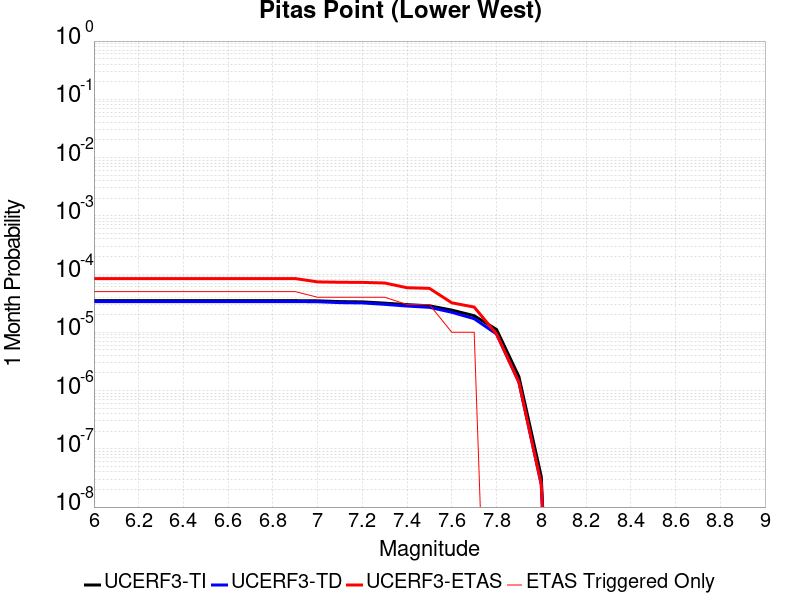 | 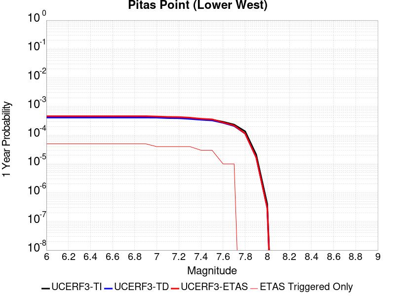 |  |

| Magnitude | 1 wk TI Prob | 1 wk TD Prob | 1 wk ETAS Prob | 1 wk ETAS/TD Gain | 1 wk ETAS Triggered Only | 1 mo TI Prob | 1 mo TD Prob | 1 mo ETAS Prob | 1 mo ETAS/TD Gain | 1 mo ETAS Triggered Only | 1 yr TI Prob | 1 yr TD Prob | 1 yr ETAS Prob | 1 yr ETAS/TD Gain | 1 yr ETAS Triggered Only | 10 yr TI Prob | 10 yr TD Prob | 10 yr ETAS Prob | 10 yr ETAS/TD Gain | 10 yr ETAS Triggered Only |
|-----|-----|-----|-----|-----|-----|-----|-----|-----|-----|-----|-----|-----|-----|-----|-----|-----|-----|-----|-----|-----|
| 6.0 | 8.151497E-6 | 7.855762E-6 | 6.118868E-5 | 7.7890186 | 5.3333333E-5 | 3.493452E-5 | 3.3667122E-5 | 1.1366443E-4 | 3.3761256 | 8.0E-5 | 4.252448E-4 | 4.0982084E-4 | 4.897881E-4 | 1.1951272 | 8.0E-5 | 0.0042443196 | 0.0040907315 | 0.0041704043 | 1.0194764 | 8.0E-5 |
| 6.1 | 8.151497E-6 | 7.855762E-6 | 6.118868E-5 | 7.7890186 | 5.3333333E-5 | 3.493452E-5 | 3.3667122E-5 | 1.1366443E-4 | 3.3761256 | 8.0E-5 | 4.252448E-4 | 4.0982084E-4 | 4.897881E-4 | 1.1951272 | 8.0E-5 | 0.0042443196 | 0.0040907315 | 0.0041704043 | 1.0194764 | 8.0E-5 |
| 6.2 | 8.151497E-6 | 7.855762E-6 | 6.118868E-5 | 7.7890186 | 5.3333333E-5 | 3.493452E-5 | 3.3667122E-5 | 1.1366443E-4 | 3.3761256 | 8.0E-5 | 4.252448E-4 | 4.0982084E-4 | 4.897881E-4 | 1.1951272 | 8.0E-5 | 0.0042443196 | 0.0040907315 | 0.0041704043 | 1.0194764 | 8.0E-5 |
| 6.3 | 8.151497E-6 | 7.855762E-6 | 6.118868E-5 | 7.7890186 | 5.3333333E-5 | 3.493452E-5 | 3.3667122E-5 | 1.1366443E-4 | 3.3761256 | 8.0E-5 | 4.252448E-4 | 4.0982084E-4 | 4.897881E-4 | 1.1951272 | 8.0E-5 | 0.0042443196 | 0.0040907315 | 0.0041704043 | 1.0194764 | 8.0E-5 |
| 6.4 | 8.151497E-6 | 7.855762E-6 | 6.118868E-5 | 7.7890186 | 5.3333333E-5 | 3.493452E-5 | 3.3667122E-5 | 1.1366443E-4 | 3.3761256 | 8.0E-5 | 4.252448E-4 | 4.0982084E-4 | 4.897881E-4 | 1.1951272 | 8.0E-5 | 0.0042443196 | 0.0040907315 | 0.0041704043 | 1.0194764 | 8.0E-5 |
| 6.5 | 8.151497E-6 | 7.855762E-6 | 6.118868E-5 | 7.7890186 | 5.3333333E-5 | 3.493452E-5 | 3.3667122E-5 | 1.1366443E-4 | 3.3761256 | 8.0E-5 | 4.252448E-4 | 4.0982084E-4 | 4.897881E-4 | 1.1951272 | 8.0E-5 | 0.0042443196 | 0.0040907315 | 0.0041704043 | 1.0194764 | 8.0E-5 |
| 6.6 | 8.151497E-6 | 7.855762E-6 | 6.118868E-5 | 7.7890186 | 5.3333333E-5 | 3.493452E-5 | 3.3667122E-5 | 1.1366443E-4 | 3.3761256 | 8.0E-5 | 4.252448E-4 | 4.0982084E-4 | 4.897881E-4 | 1.1951272 | 8.0E-5 | 0.0042443196 | 0.0040907315 | 0.0041704043 | 1.0194764 | 8.0E-5 |
| 6.7 | 8.151497E-6 | 7.855762E-6 | 6.118868E-5 | 7.7890186 | 5.3333333E-5 | 3.493452E-5 | 3.3667122E-5 | 1.1366443E-4 | 3.3761256 | 8.0E-5 | 4.252448E-4 | 4.0982084E-4 | 4.897881E-4 | 1.1951272 | 8.0E-5 | 0.0042443196 | 0.0040907315 | 0.0041704043 | 1.0194764 | 8.0E-5 |
| 6.8 | 8.151497E-6 | 7.855762E-6 | 6.118868E-5 | 7.7890186 | 5.3333333E-5 | 3.493452E-5 | 3.3667122E-5 | 1.1366443E-4 | 3.3761256 | 8.0E-5 | 4.252448E-4 | 4.0982084E-4 | 4.897881E-4 | 1.1951272 | 8.0E-5 | 0.0042443196 | 0.0040907315 | 0.0041704043 | 1.0194764 | 8.0E-5 |
| 6.9 | 8.151497E-6 | 7.855762E-6 | 6.118868E-5 | 7.7890186 | 5.3333333E-5 | 3.493452E-5 | 3.3667122E-5 | 1.1366443E-4 | 3.3761256 | 8.0E-5 | 4.252448E-4 | 4.0982084E-4 | 4.897881E-4 | 1.1951272 | 8.0E-5 | 0.0042443196 | 0.0040907315 | 0.0041704043 | 1.0194764 | 8.0E-5 |
| 7.0 | 8.103535E-6 | 7.805192E-6 | 6.113811E-5 | 7.833005 | 5.3333333E-5 | 3.4728975E-5 | 3.3450397E-5 | 1.1344772E-4 | 3.3915207 | 8.0E-5 | 4.2274324E-4 | 4.0718322E-4 | 4.8715065E-4 | 1.1963917 | 8.0E-5 | 0.0042193993 | 0.004064452 | 0.004144127 | 1.0196029 | 8.0E-5 |
| 7.1 | 7.853298E-6 | 7.540883E-6 | 6.0873816E-5 | 8.072505 | 5.3333333E-5 | 3.3656554E-5 | 3.2317676E-5 | 1.1231509E-4 | 3.4753456 | 8.0E-5 | 4.096915E-4 | 3.9339735E-4 | 4.7336586E-4 | 1.2032768 | 8.0E-5 | 0.00408937 | 0.0039270855 | 0.0040067714 | 1.0202913 | 8.0E-5 |
| 7.2 | 7.771102E-6 | 7.453165E-6 | 6.07861E-5 | 8.155744 | 5.3333333E-5 | 3.33043E-5 | 3.194175E-5 | 1.11939196E-4 | 3.5044792 | 8.0E-5 | 4.0540437E-4 | 3.8882208E-4 | 4.68791E-4 | 1.2056696 | 8.0E-5 | 0.0040466557 | 0.0038814936 | 0.003961183 | 1.0205306 | 8.0E-5 |
| 7.3 | 7.3945344E-6 | 7.0492697E-6 | 6.0382226E-5 | 8.5657425 | 5.3333333E-5 | 3.1690477E-5 | 3.021081E-5 | 1.1020839E-4 | 3.6479788 | 8.0E-5 | 3.8576324E-4 | 3.6775516E-4 | 4.4772573E-4 | 1.2174561 | 8.0E-5 | 0.0038509427 | 0.0036715334 | 0.0037512395 | 1.0217092 | 8.0E-5 |
| 7.4 | 6.964645E-6 | 6.5901186E-6 | 3.325661E-5 | 5.046436 | 2.6666667E-5 | 2.9848137E-5 | 2.8243063E-5 | 8.1574886E-5 | 2.888316 | 5.3333333E-5 | 3.6334046E-4 | 3.4380553E-4 | 3.9712052E-4 | 1.1550732 | 5.3333333E-5 | 0.0036274698 | 0.0034327896 | 0.0034859397 | 1.0154831 | 5.3333333E-5 |
| 7.5 | 6.6525035E-6 | 6.259157E-6 | 3.2925658E-5 | 5.260398 | 2.6666667E-5 | 2.851042E-5 | 2.6824686E-5 | 8.015659E-5 | 2.9881651 | 5.3333333E-5 | 3.4705905E-4 | 3.265421E-4 | 3.7985801E-4 | 1.1632743 | 5.3333333E-5 | 0.0034651754 | 0.0032606742 | 0.0033138336 | 1.0163032 | 5.3333333E-5 |
| 7.6 | 5.613338E-6 | 5.151386E-6 | 5.151386E-6 | 1.0 | 0.0 | 2.405694E-5 | 2.2077185E-5 | 2.2077185E-5 | 1.0 | 0.0 | 2.928539E-4 | 2.6875688E-4 | 2.6875688E-4 | 1.0 | 0.0 | 0.0029246826 | 0.0026843501 | 0.0026843501 | 1.0 | 0.0 |
| 7.7 | 4.494704E-6 | 3.996911E-6 | 3.996911E-6 | 1.0 | 0.0 | 1.9262876E-5 | 1.7129507E-5 | 1.7129507E-5 | 1.0 | 0.0 | 2.3450027E-4 | 2.0853203E-4 | 2.0853203E-4 | 1.0 | 0.0 | 0.0023425296 | 0.0020833875 | 0.0020833875 | 1.0 | 0.0 |
| 7.8 | 2.6075882E-6 | 2.1836374E-6 | 2.1836374E-6 | 1.0 | 0.0 | 1.117533E-5 | 9.358413E-6 | 9.358413E-6 | 1.0 | 0.0 | 1.3605114E-4 | 1.1393277E-4 | 1.1393277E-4 | 1.0 | 0.0 | 0.0013596788 | 0.0011387484 | 0.0011387484 | 1.0 | 0.0 |
| 7.9 | 4.045984E-7 | 3.242375E-7 | 3.242375E-7 | 1.0 | 0.0 | 1.733992E-6 | 1.3895885E-6 | 1.3895885E-6 | 1.0 | 0.0 | 2.1111147E-5 | 1.6918111E-5 | 1.6918111E-5 | 1.0 | 0.0 | 2.1109142E-4 | 1.6916855E-4 | 1.6916855E-4 | 1.0 | 0.0 |
| 8.0 | 7.791402E-9 | 5.683497E-9 | 5.683497E-9 | 1.0 | 0.0 | 3.3391725E-8 | 2.4357844E-8 | 2.4357844E-8 | 1.0 | 0.0 | 4.0654416E-7 | 2.9655675E-7 | 2.9655675E-7 | 1.0 | 0.0 | 4.065434E-6 | 2.9655655E-6 | 2.9655655E-6 | 1.0 | 0.0 |

## Davis Creek
*[(top)](#table-of-contents)*

| 1 Week | 1 Month | 1 Year | 10 Year |
|-----|-----|-----|-----|
|  |  |  |  |

| Magnitude | 1 wk TI Prob | 1 wk TD Prob | 1 wk ETAS Prob | 1 wk ETAS/TD Gain | 1 wk ETAS Triggered Only | 1 mo TI Prob | 1 mo TD Prob | 1 mo ETAS Prob | 1 mo ETAS/TD Gain | 1 mo ETAS Triggered Only | 1 yr TI Prob | 1 yr TD Prob | 1 yr ETAS Prob | 1 yr ETAS/TD Gain | 1 yr ETAS Triggered Only | 10 yr TI Prob | 10 yr TD Prob | 10 yr ETAS Prob | 10 yr ETAS/TD Gain | 10 yr ETAS Triggered Only |
|-----|-----|-----|-----|-----|-----|-----|-----|-----|-----|-----|-----|-----|-----|-----|-----|-----|-----|-----|-----|-----|
| 6.0 | 2.331472E-5 | 2.5417214E-5 | 5.2083204E-5 | 2.0491312 | 2.6666667E-5 | 9.99164E-5 | 1.0892704E-4 | 1.355908E-4 | 1.2447855 | 2.6666667E-5 | 0.0012158032 | 0.0013254983 | 0.0013521296 | 1.0200915 | 2.6666667E-5 | 0.01209173 | 0.013187704 | 0.013240334 | 1.0039909 | 5.3333333E-5 |
| 6.1 | 1.0407654E-5 | 1.1316986E-5 | 1.1316986E-5 | 1.0 | 0.0 | 4.4603472E-5 | 4.8500624E-5 | 4.8500624E-5 | 1.0 | 0.0 | 5.4291193E-4 | 5.9036224E-4 | 5.9036224E-4 | 1.0 | 0.0 | 0.0054158745 | 0.005890611 | 0.0059171207 | 1.0045003 | 2.6666667E-5 |
| 6.2 | 1.0407654E-5 | 1.1316986E-5 | 1.1316986E-5 | 1.0 | 0.0 | 4.4603472E-5 | 4.8500624E-5 | 4.8500624E-5 | 1.0 | 0.0 | 5.4291193E-4 | 5.9036224E-4 | 5.9036224E-4 | 1.0 | 0.0 | 0.0054158745 | 0.005890611 | 0.0059171207 | 1.0045003 | 2.6666667E-5 |
| 6.3 | 5.1323277E-6 | 5.568556E-6 | 5.568556E-6 | 1.0 | 0.0 | 2.1995505E-5 | 2.386507E-5 | 2.386507E-5 | 1.0 | 0.0 | 2.6776237E-4 | 2.905271E-4 | 2.905271E-4 | 1.0 | 0.0 | 0.0026743996 | 0.0029023192 | 0.0029289084 | 1.0091614 | 2.6666667E-5 |
| 6.4 | 2.4985154E-6 | 2.704538E-6 | 2.704538E-6 | 1.0 | 0.0 | 1.07078795E-5 | 1.1590847E-5 | 1.1590847E-5 | 1.0 | 0.0 | 1.3036063E-4 | 1.4111304E-4 | 1.4111304E-4 | 1.0 | 0.0 | 0.0013028418 | 0.001410589 | 0.001410589 | 1.0 | 0.0 |
| 6.5 | 2.4846438E-6 | 2.6904722E-6 | 2.6904722E-6 | 1.0 | 0.0 | 1.064843E-5 | 1.1530565E-5 | 1.1530565E-5 | 1.0 | 0.0 | 1.2963692E-4 | 1.403792E-4 | 1.403792E-4 | 1.0 | 0.0 | 0.0012956132 | 0.0014032599 | 0.0014032599 | 1.0 | 0.0 |
| 6.6 | 2.072566E-7 | 2.1018087E-7 | 2.1018087E-7 | 1.0 | 0.0 | 8.882423E-7 | 9.0077486E-7 | 9.0077486E-7 | 1.0 | 0.0 | 1.0814296E-5 | 1.0966881E-5 | 1.0966881E-5 | 1.0 | 0.0 | 1.081377E-4 | 1.09663575E-4 | 1.09663575E-4 | 1.0 | 0.0 |
| 6.7 | 1.7544528E-7 | 1.7790826E-7 | 1.7790826E-7 | 1.0 | 0.0 | 7.5190815E-7 | 7.6246374E-7 | 7.6246374E-7 | 1.0 | 0.0 | 9.154443E-6 | 9.282958E-6 | 9.282958E-6 | 1.0 | 0.0 | 9.1540656E-5 | 9.282586E-5 | 9.282586E-5 | 1.0 | 0.0 |
| 6.8 | 1.2320395E-7 | 1.2481138E-7 | 1.2481138E-7 | 1.0 | 0.0 | 5.280168E-7 | 5.349058E-7 | 5.349058E-7 | 1.0 | 0.0 | 6.428586E-6 | 6.5124595E-6 | 6.5124595E-6 | 1.0 | 0.0 | 6.4284E-5 | 6.5122804E-5 | 6.5122804E-5 | 1.0 | 0.0 |
| 6.9 | 6.399997E-8 | 6.486058E-8 | 6.486058E-8 | 1.0 | 0.0 | 2.7428555E-7 | 2.7797387E-7 | 2.7797387E-7 | 1.0 | 0.0 | 3.3394215E-6 | 3.3843273E-6 | 3.3843273E-6 | 1.0 | 0.0 | 3.3393713E-5 | 3.384282E-5 | 3.384282E-5 | 1.0 | 0.0 |
| 7.0 | 6.4455685E-9 | 6.535264E-9 | 6.535264E-9 | 1.0 | 0.0 | 2.7623864E-8 | 2.8008275E-8 | 2.8008275E-8 | 1.0 | 0.0 | 3.3632048E-7 | 3.4100074E-7 | 3.4100074E-7 | 1.0 | 0.0 | 3.3631998E-6 | 3.4100074E-6 | 3.4100074E-6 | 1.0 | 0.0 |

## Channel Islands Thrust
*[(top)](#table-of-contents)*

| 1 Week | 1 Month | 1 Year | 10 Year |
|-----|-----|-----|-----|
|  |  |  |  |

| Magnitude | 1 wk TI Prob | 1 wk TD Prob | 1 wk ETAS Prob | 1 wk ETAS/TD Gain | 1 wk ETAS Triggered Only | 1 mo TI Prob | 1 mo TD Prob | 1 mo ETAS Prob | 1 mo ETAS/TD Gain | 1 mo ETAS Triggered Only | 1 yr TI Prob | 1 yr TD Prob | 1 yr ETAS Prob | 1 yr ETAS/TD Gain | 1 yr ETAS Triggered Only | 10 yr TI Prob | 10 yr TD Prob | 10 yr ETAS Prob | 10 yr ETAS/TD Gain | 10 yr ETAS Triggered Only |
|-----|-----|-----|-----|-----|-----|-----|-----|-----|-----|-----|-----|-----|-----|-----|-----|-----|-----|-----|-----|-----|
| 6.0 | 2.2156251E-5 | 2.4092022E-5 | 2.4092022E-5 | 1.0 | 0.0 | 9.495191E-5 | 1.03248036E-4 | 1.2991195E-4 | 1.2582511 | 2.6666667E-5 | 0.0011554264 | 0.0012564264 | 0.0013096929 | 1.0423951 | 5.3333333E-5 | 0.011494373 | 0.0125038205 | 0.01258282 | 1.0063181 | 8.0E-5 |
| 6.1 | 2.2156251E-5 | 2.4092022E-5 | 2.4092022E-5 | 1.0 | 0.0 | 9.495191E-5 | 1.03248036E-4 | 1.2991195E-4 | 1.2582511 | 2.6666667E-5 | 0.0011554264 | 0.0012564264 | 0.0013096929 | 1.0423951 | 5.3333333E-5 | 0.011494373 | 0.0125038205 | 0.01258282 | 1.0063181 | 8.0E-5 |
| 6.2 | 2.2156251E-5 | 2.4092022E-5 | 2.4092022E-5 | 1.0 | 0.0 | 9.495191E-5 | 1.03248036E-4 | 1.2991195E-4 | 1.2582511 | 2.6666667E-5 | 0.0011554264 | 0.0012564264 | 0.0013096929 | 1.0423951 | 5.3333333E-5 | 0.011494373 | 0.0125038205 | 0.01258282 | 1.0063181 | 8.0E-5 |
| 6.3 | 2.2156251E-5 | 2.4092022E-5 | 2.4092022E-5 | 1.0 | 0.0 | 9.495191E-5 | 1.03248036E-4 | 1.2991195E-4 | 1.2582511 | 2.6666667E-5 | 0.0011554264 | 0.0012564264 | 0.0013096929 | 1.0423951 | 5.3333333E-5 | 0.011494373 | 0.0125038205 | 0.01258282 | 1.0063181 | 8.0E-5 |
| 6.4 | 2.2156251E-5 | 2.4092022E-5 | 2.4092022E-5 | 1.0 | 0.0 | 9.495191E-5 | 1.03248036E-4 | 1.2991195E-4 | 1.2582511 | 2.6666667E-5 | 0.0011554264 | 0.0012564264 | 0.0013096929 | 1.0423951 | 5.3333333E-5 | 0.011494373 | 0.0125038205 | 0.01258282 | 1.0063181 | 8.0E-5 |
| 6.5 | 2.2156251E-5 | 2.4092022E-5 | 2.4092022E-5 | 1.0 | 0.0 | 9.495191E-5 | 1.03248036E-4 | 1.2991195E-4 | 1.2582511 | 2.6666667E-5 | 0.0011554264 | 0.0012564264 | 0.0013096929 | 1.0423951 | 5.3333333E-5 | 0.011494373 | 0.0125038205 | 0.01258282 | 1.0063181 | 8.0E-5 |
| 6.6 | 2.2156251E-5 | 2.4092022E-5 | 2.4092022E-5 | 1.0 | 0.0 | 9.495191E-5 | 1.03248036E-4 | 1.2991195E-4 | 1.2582511 | 2.6666667E-5 | 0.0011554264 | 0.0012564264 | 0.0013096929 | 1.0423951 | 5.3333333E-5 | 0.011494373 | 0.0125038205 | 0.01258282 | 1.0063181 | 8.0E-5 |
| 6.7 | 1.0601296E-5 | 1.1379544E-5 | 1.1379544E-5 | 1.0 | 0.0 | 4.5433335E-5 | 4.876859E-5 | 4.876859E-5 | 1.0 | 0.0 | 5.5301044E-4 | 5.936007E-4 | 6.202515E-4 | 1.044897 | 2.6666667E-5 | 0.005516363 | 0.005920653 | 0.005947162 | 1.0044774 | 2.6666667E-5 |
| 6.8 | 1.0246747E-5 | 1.0996669E-5 | 1.0996669E-5 | 1.0 | 0.0 | 4.391389E-5 | 4.7127756E-5 | 4.7127756E-5 | 1.0 | 0.0 | 5.345204E-4 | 5.7363417E-4 | 6.0028554E-4 | 1.0464606 | 2.6666667E-5 | 0.0053323656 | 0.005722025 | 0.0057485388 | 1.0046337 | 2.6666667E-5 |
| 6.9 | 9.049551E-6 | 9.699645E-6 | 9.699645E-6 | 1.0 | 0.0 | 3.878322E-5 | 4.1569267E-5 | 4.1569267E-5 | 1.0 | 0.0 | 4.7208337E-4 | 5.059924E-4 | 5.3264556E-4 | 1.052675 | 2.6666667E-5 | 0.0047108172 | 0.0050488203 | 0.0050753523 | 1.0052551 | 2.6666667E-5 |
| 7.0 | 8.6542195E-6 | 9.274603E-6 | 9.274603E-6 | 1.0 | 0.0 | 3.7088983E-5 | 3.9747716E-5 | 3.9747716E-5 | 1.0 | 0.0 | 4.5146482E-4 | 4.8382508E-4 | 5.1047886E-4 | 1.0550897 | 2.6666667E-5 | 0.004505487 | 0.004828129 | 0.004854667 | 1.0054965 | 2.6666667E-5 |
| 7.1 | 8.391028E-6 | 8.992924E-6 | 8.992924E-6 | 1.0 | 0.0 | 3.5961057E-5 | 3.854056E-5 | 3.854056E-5 | 1.0 | 0.0 | 4.3773788E-4 | 4.6913436E-4 | 4.957885E-4 | 1.0568156 | 2.6666667E-5 | 0.004368766 | 0.0046818503 | 0.004708392 | 1.0056691 | 2.6666667E-5 |
| 7.2 | 5.965188E-6 | 6.3716952E-6 | 6.3716952E-6 | 1.0 | 0.0 | 2.556484E-5 | 2.7306982E-5 | 2.7306982E-5 | 1.0 | 0.0 | 3.1120746E-4 | 3.3241234E-4 | 3.3241234E-4 | 1.0 | 0.0 | 0.00310772 | 0.0033192092 | 0.0033192092 | 1.0 | 0.0 |
| 7.3 | 4.877518E-6 | 5.2060063E-6 | 5.2060063E-6 | 1.0 | 0.0 | 2.0903482E-5 | 2.2311267E-5 | 2.2311267E-5 | 1.0 | 0.0 | 2.5447016E-4 | 2.716063E-4 | 2.716063E-4 | 1.0 | 0.0 | 0.0025417898 | 0.0027127895 | 0.0027127895 | 1.0 | 0.0 |
| 7.4 | 3.8829853E-6 | 4.141863E-6 | 4.141863E-6 | 1.0 | 0.0 | 1.664126E-5 | 1.7750723E-5 | 1.7750723E-5 | 1.0 | 0.0 | 2.0258849E-4 | 2.1609402E-4 | 2.1609402E-4 | 1.0 | 0.0 | 0.002024039 | 0.0021588807 | 0.0021588807 | 1.0 | 0.0 |
| 7.5 | 1.3489616E-6 | 1.4277903E-6 | 1.4277903E-6 | 1.0 | 0.0 | 5.7812517E-6 | 6.119087E-6 | 6.119087E-6 | 1.0 | 0.0 | 7.038446E-5 | 7.449738E-5 | 7.449738E-5 | 1.0 | 0.0 | 7.036218E-4 | 7.44728E-4 | 7.44728E-4 | 1.0 | 0.0 |
| 7.6 | 6.058192E-7 | 6.353778E-7 | 6.353778E-7 | 1.0 | 0.0 | 2.5963652E-6 | 2.7230449E-6 | 2.7230449E-6 | 1.0 | 0.0 | 3.161029E-5 | 3.3152584E-5 | 3.3152584E-5 | 1.0 | 0.0 | 3.1605794E-4 | 3.31478E-4 | 3.31478E-4 | 1.0 | 0.0 |
| 7.7 | 2.2170494E-7 | 2.2607902E-7 | 2.2607902E-7 | 1.0 | 0.0 | 9.5016367E-7 | 9.689098E-7 | 9.689098E-7 | 1.0 | 0.0 | 1.1568181E-5 | 1.1796425E-5 | 1.1796425E-5 | 1.0 | 0.0 | 1.1567579E-4 | 1.1795909E-4 | 1.1795909E-4 | 1.0 | 0.0 |
| 7.8 | 2.1613102E-8 | 1.5466682E-8 | 1.5466682E-8 | 1.0 | 0.0 | 9.262757E-8 | 6.628578E-8 | 6.628578E-8 | 1.0 | 0.0 | 1.1277401E-6 | 8.070291E-7 | 8.070291E-7 | 1.0 | 0.0 | 1.1277344E-5 | 8.070269E-6 | 8.070269E-6 | 1.0 | 0.0 |

## Oak Ridge (Onshore)
*[(top)](#table-of-contents)*

| 1 Week | 1 Month | 1 Year | 10 Year |
|-----|-----|-----|-----|
|  |  | 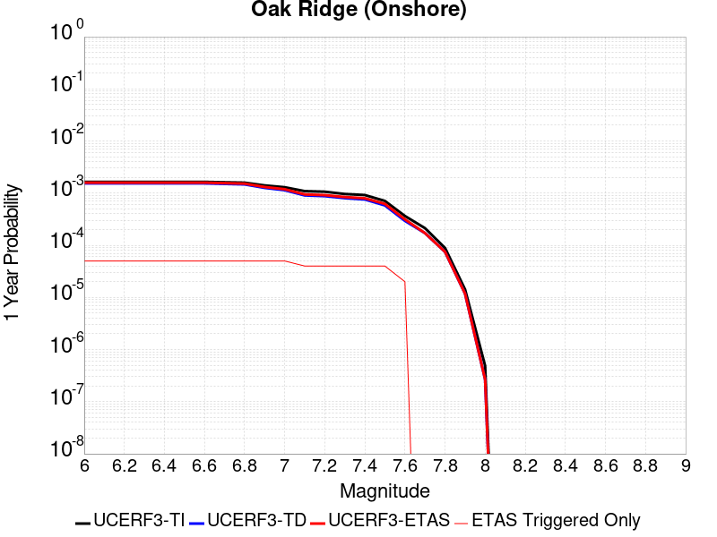 |  |

| Magnitude | 1 wk TI Prob | 1 wk TD Prob | 1 wk ETAS Prob | 1 wk ETAS/TD Gain | 1 wk ETAS Triggered Only | 1 mo TI Prob | 1 mo TD Prob | 1 mo ETAS Prob | 1 mo ETAS/TD Gain | 1 mo ETAS Triggered Only | 1 yr TI Prob | 1 yr TD Prob | 1 yr ETAS Prob | 1 yr ETAS/TD Gain | 1 yr ETAS Triggered Only | 10 yr TI Prob | 10 yr TD Prob | 10 yr ETAS Prob | 10 yr ETAS/TD Gain | 10 yr ETAS Triggered Only |
|-----|-----|-----|-----|-----|-----|-----|-----|-----|-----|-----|-----|-----|-----|-----|-----|-----|-----|-----|-----|-----|
| 6.0 | 3.155064E-5 | 2.9525974E-5 | 2.9525974E-5 | 1.0 | 0.0 | 1.3521002E-4 | 1.2653397E-4 | 1.5319725E-4 | 1.2107204 | 2.6666667E-5 | 0.001644939 | 0.0015395004 | 0.0015927517 | 1.0345899 | 5.3333333E-5 | 0.01632816 | 0.015292859 | 0.015345377 | 1.0034342 | 5.3333333E-5 |
| 6.1 | 3.155064E-5 | 2.9525974E-5 | 2.9525974E-5 | 1.0 | 0.0 | 1.3521002E-4 | 1.2653397E-4 | 1.5319725E-4 | 1.2107204 | 2.6666667E-5 | 0.001644939 | 0.0015395004 | 0.0015927517 | 1.0345899 | 5.3333333E-5 | 0.01632816 | 0.015292859 | 0.015345377 | 1.0034342 | 5.3333333E-5 |
| 6.2 | 3.155064E-5 | 2.9525974E-5 | 2.9525974E-5 | 1.0 | 0.0 | 1.3521002E-4 | 1.2653397E-4 | 1.5319725E-4 | 1.2107204 | 2.6666667E-5 | 0.001644939 | 0.0015395004 | 0.0015927517 | 1.0345899 | 5.3333333E-5 | 0.01632816 | 0.015292859 | 0.015345377 | 1.0034342 | 5.3333333E-5 |
| 6.3 | 3.155064E-5 | 2.9525974E-5 | 2.9525974E-5 | 1.0 | 0.0 | 1.3521002E-4 | 1.2653397E-4 | 1.5319725E-4 | 1.2107204 | 2.6666667E-5 | 0.001644939 | 0.0015395004 | 0.0015927517 | 1.0345899 | 5.3333333E-5 | 0.01632816 | 0.015292859 | 0.015345377 | 1.0034342 | 5.3333333E-5 |
| 6.4 | 3.155064E-5 | 2.9525974E-5 | 2.9525974E-5 | 1.0 | 0.0 | 1.3521002E-4 | 1.2653397E-4 | 1.5319725E-4 | 1.2107204 | 2.6666667E-5 | 0.001644939 | 0.0015395004 | 0.0015927517 | 1.0345899 | 5.3333333E-5 | 0.01632816 | 0.015292859 | 0.015345377 | 1.0034342 | 5.3333333E-5 |
| 6.5 | 3.155064E-5 | 2.9525974E-5 | 2.9525974E-5 | 1.0 | 0.0 | 1.3521002E-4 | 1.2653397E-4 | 1.5319725E-4 | 1.2107204 | 2.6666667E-5 | 0.001644939 | 0.0015395004 | 0.0015927517 | 1.0345899 | 5.3333333E-5 | 0.01632816 | 0.015292859 | 0.015345377 | 1.0034342 | 5.3333333E-5 |
| 6.6 | 3.155064E-5 | 2.9525974E-5 | 2.9525974E-5 | 1.0 | 0.0 | 1.3521002E-4 | 1.2653397E-4 | 1.5319725E-4 | 1.2107204 | 2.6666667E-5 | 0.001644939 | 0.0015395004 | 0.0015927517 | 1.0345899 | 5.3333333E-5 | 0.01632816 | 0.015292859 | 0.015345377 | 1.0034342 | 5.3333333E-5 |
| 6.7 | 3.098897E-5 | 2.8864175E-5 | 2.8864175E-5 | 1.0 | 0.0 | 1.328031E-4 | 1.2369796E-4 | 1.5036132E-4 | 1.2155522 | 2.6666667E-5 | 0.0016156785 | 0.0015050198 | 0.0015582729 | 1.0353836 | 5.3333333E-5 | 0.016039822 | 0.014952714 | 0.0150052495 | 1.0035135 | 5.3333333E-5 |
| 6.8 | 3.0449872E-5 | 2.8239372E-5 | 2.8239372E-5 | 1.0 | 0.0 | 1.3049292E-4 | 1.2102048E-4 | 1.4768391E-4 | 1.2203218 | 2.6666667E-5 | 0.0015875935 | 0.0014724657 | 0.0015257205 | 1.0361671 | 5.3333333E-5 | 0.015762992 | 0.014631462 | 0.014684015 | 1.0035918 | 5.3333333E-5 |
| 6.9 | 2.697928E-5 | 2.4219773E-5 | 2.4219773E-5 | 1.0 | 0.0 | 1.15620365E-4 | 1.0379502E-4 | 1.3045892E-4 | 1.2568899 | 2.6666667E-5 | 0.0014067689 | 0.0012629933 | 0.0013162593 | 1.0421743 | 5.3333333E-5 | 0.0139789665 | 0.01256087 | 0.012613533 | 1.0041927 | 5.3333333E-5 |
| 7.0 | 2.4893961E-5 | 2.1862043E-5 | 2.1862043E-5 | 1.0 | 0.0 | 1.0668404E-4 | 9.3691204E-5 | 1.2035537E-4 | 1.2845963 | 2.6666667E-5 | 0.0012981043 | 0.0011401111 | 0.0011933837 | 1.0467257 | 5.3333333E-5 | 0.012905477 | 0.011344905 | 0.011397634 | 1.0046477 | 5.3333333E-5 |
| 7.1 | 2.0945363E-5 | 1.7354487E-5 | 1.7354487E-5 | 1.0 | 0.0 | 8.976275E-5 | 7.437428E-5 | 1.0103896E-4 | 1.3585203 | 2.6666667E-5 | 0.0010923136 | 9.051354E-4 | 9.5842045E-4 | 1.0588697 | 5.3333333E-5 | 0.0108696 | 0.009015423 | 0.009068276 | 1.0058625 | 5.3333333E-5 |
| 7.2 | 2.0439404E-5 | 1.6809423E-5 | 1.6809423E-5 | 1.0 | 0.0 | 8.7594504E-5 | 7.203843E-5 | 9.870317E-5 | 1.3701462 | 2.6666667E-5 | 0.0010659413 | 8.767196E-4 | 9.3000615E-4 | 1.0607795 | 5.3333333E-5 | 0.010608427 | 0.008733526 | 0.008786393 | 1.0060534 | 5.3333333E-5 |
| 7.3 | 1.8463334E-5 | 1.5381811E-5 | 1.5381811E-5 | 1.0 | 0.0 | 7.912617E-5 | 6.59204E-5 | 9.258531E-5 | 1.4045016 | 2.6666667E-5 | 9.6293533E-4 | 8.0228975E-4 | 8.5558026E-4 | 1.066423 | 5.3333333E-5 | 0.009587734 | 0.007994797 | 0.008047704 | 1.0066177 | 5.3333333E-5 |
| 7.4 | 1.763139E-5 | 1.451684E-5 | 1.451684E-5 | 1.0 | 0.0 | 7.556091E-5 | 6.221356E-5 | 8.887857E-5 | 1.4286044 | 2.6666667E-5 | 9.1956573E-4 | 7.571909E-4 | 8.104838E-4 | 1.0703825 | 5.3333333E-5 | 0.009157699 | 0.007546914 | 0.0075998446 | 1.0070136 | 5.3333333E-5 |
| 7.5 | 1.3594944E-5 | 1.1163356E-5 | 1.1163356E-5 | 1.0 | 0.0 | 5.8262744E-5 | 4.784209E-5 | 7.450748E-5 | 1.5573626 | 2.6666667E-5 | 7.0911803E-4 | 5.8232434E-4 | 6.356266E-4 | 1.0915337 | 5.3333333E-5 | 0.007068595 | 0.0058082556 | 0.005861279 | 1.009129 | 5.3333333E-5 |
| 7.6 | 6.9889534E-6 | 5.6367144E-6 | 5.6367144E-6 | 1.0 | 0.0 | 2.9952313E-5 | 2.4157125E-5 | 5.082315E-5 | 2.1038575 | 2.6666667E-5 | 3.646084E-4 | 2.9407372E-4 | 3.4739138E-4 | 1.1813071 | 5.3333333E-5 | 0.0036401073 | 0.0029368899 | 0.0029900665 | 1.0181065 | 5.3333333E-5 |
| 7.7 | 4.0824193E-6 | 3.2832586E-6 | 3.2832586E-6 | 1.0 | 0.0 | 1.7495966E-5 | 1.4071033E-5 | 1.4071033E-5 | 1.0 | 0.0 | 2.1299256E-4 | 1.713015E-4 | 1.713015E-4 | 1.0 | 0.0 | 0.0021278851 | 0.0017117079 | 0.0017117079 | 1.0 | 0.0 |
| 7.8 | 1.7023609E-6 | 1.4370495E-6 | 1.4370495E-6 | 1.0 | 0.0 | 7.295812E-6 | 6.1587693E-6 | 6.1587693E-6 | 1.0 | 0.0 | 8.882289E-5 | 7.498047E-5 | 7.498047E-5 | 1.0 | 0.0 | 8.8787393E-4 | 7.495545E-4 | 7.495545E-4 | 1.0 | 0.0 |
| 7.9 | 2.721225E-7 | 2.2616497E-7 | 2.2616497E-7 | 1.0 | 0.0 | 1.1662388E-6 | 9.692781E-7 | 9.692781E-7 | 1.0 | 0.0 | 1.4198865E-5 | 1.1800899E-5 | 1.1800899E-5 | 1.0 | 0.0 | 1.4197957E-4 | 1.1800301E-4 | 1.1800301E-4 | 1.0 | 0.0 |
| 8.0 | 9.364255E-9 | 5.1206666E-9 | 5.1206666E-9 | 1.0 | 0.0 | 4.0132523E-8 | 2.1945715E-8 | 2.1945715E-8 | 1.0 | 0.0 | 4.8861335E-7 | 2.6718905E-7 | 2.6718905E-7 | 1.0 | 0.0 | 4.8861225E-6 | 2.6718876E-6 | 2.6718876E-6 | 1.0 | 0.0 |

## San Pedro Basin
*[(top)](#table-of-contents)*

| 1 Week | 1 Month | 1 Year | 10 Year |
|-----|-----|-----|-----|
|  |  |  |  |

| Magnitude | 1 wk TI Prob | 1 wk TD Prob | 1 wk ETAS Prob | 1 wk ETAS/TD Gain | 1 wk ETAS Triggered Only | 1 mo TI Prob | 1 mo TD Prob | 1 mo ETAS Prob | 1 mo ETAS/TD Gain | 1 mo ETAS Triggered Only | 1 yr TI Prob | 1 yr TD Prob | 1 yr ETAS Prob | 1 yr ETAS/TD Gain | 1 yr ETAS Triggered Only | 10 yr TI Prob | 10 yr TD Prob | 10 yr ETAS Prob | 10 yr ETAS/TD Gain | 10 yr ETAS Triggered Only |
|-----|-----|-----|-----|-----|-----|-----|-----|-----|-----|-----|-----|-----|-----|-----|-----|-----|-----|-----|-----|-----|
| 6.0 | 5.3449043E-5 | 6.336954E-5 | 9.003451E-5 | 1.4207854 | 2.6666667E-5 | 2.2904722E-4 | 2.715589E-4 | 2.9821834E-4 | 1.0981718 | 2.6666667E-5 | 0.0027850836 | 0.0033018254 | 0.0033549825 | 1.0160993 | 5.3333333E-5 | 0.027504366 | 0.03258945 | 0.032666843 | 1.0023748 | 8.0E-5 |
| 6.1 | 5.3449043E-5 | 6.336954E-5 | 9.003451E-5 | 1.4207854 | 2.6666667E-5 | 2.2904722E-4 | 2.715589E-4 | 2.9821834E-4 | 1.0981718 | 2.6666667E-5 | 0.0027850836 | 0.0033018254 | 0.0033549825 | 1.0160993 | 5.3333333E-5 | 0.027504366 | 0.03258945 | 0.032666843 | 1.0023748 | 8.0E-5 |
| 6.2 | 2.3189454E-5 | 2.6642796E-5 | 2.6642796E-5 | 1.0 | 0.0 | 9.9379584E-5 | 1.14178685E-4 | 1.14178685E-4 | 1.0 | 0.0 | 0.0012092749 | 0.0013892864 | 0.0013892864 | 1.0 | 0.0 | 0.012027155 | 0.013810883 | 0.013837182 | 1.0019041 | 2.6666667E-5 |
| 6.3 | 2.3189454E-5 | 2.6642796E-5 | 2.6642796E-5 | 1.0 | 0.0 | 9.9379584E-5 | 1.14178685E-4 | 1.14178685E-4 | 1.0 | 0.0 | 0.0012092749 | 0.0013892864 | 0.0013892864 | 1.0 | 0.0 | 0.012027155 | 0.013810883 | 0.013837182 | 1.0019041 | 2.6666667E-5 |
| 6.4 | 1.966056E-5 | 2.2463413E-5 | 2.2463413E-5 | 1.0 | 0.0 | 8.425682E-5 | 9.626844E-5 | 9.626844E-5 | 1.0 | 0.0 | 0.001025344 | 0.0011714783 | 0.0011714783 | 1.0 | 0.0 | 0.010206259 | 0.011657117 | 0.011683472 | 1.0022609 | 2.6666667E-5 |
| 6.5 | 1.7342953E-5 | 1.9745148E-5 | 1.9745148E-5 | 1.0 | 0.0 | 7.4324824E-5 | 8.4619525E-5 | 8.4619525E-5 | 1.0 | 0.0 | 9.04529E-4 | 0.0010297928 | 0.0010297928 | 1.0 | 0.0 | 0.009008561 | 0.010253931 | 0.010280324 | 1.002574 | 2.6666667E-5 |
| 6.6 | 1.439804E-5 | 1.6322716E-5 | 1.6322716E-5 | 1.0 | 0.0 | 6.170443E-5 | 6.99528E-5 | 6.99528E-5 | 1.0 | 0.0 | 7.509924E-4 | 8.513747E-4 | 8.513747E-4 | 1.0 | 0.0 | 0.0074845953 | 0.008484332 | 0.008484332 | 1.0 | 0.0 |
| 6.7 | 1.2634884E-5 | 1.4285297E-5 | 1.4285297E-5 | 1.0 | 0.0 | 5.414838E-5 | 6.1221435E-5 | 6.1221435E-5 | 1.0 | 0.0 | 6.590571E-4 | 7.4514654E-4 | 7.4514654E-4 | 1.0 | 0.0 | 0.006571059 | 0.007429501 | 0.007429501 | 1.0 | 0.0 |
| 6.8 | 1.146091E-5 | 1.2933192E-5 | 1.2933192E-5 | 1.0 | 0.0 | 4.911726E-5 | 5.5426954E-5 | 5.5426954E-5 | 1.0 | 0.0 | 5.9783855E-4 | 6.7464396E-4 | 6.7464396E-4 | 1.0 | 0.0 | 0.0059623276 | 0.006728899 | 0.006728899 | 1.0 | 0.0 |
| 6.9 | 9.109035E-6 | 1.0235011E-5 | 1.0235011E-5 | 1.0 | 0.0 | 3.9038136E-5 | 4.3863754E-5 | 4.3863754E-5 | 1.0 | 0.0 | 4.7518566E-4 | 5.3393835E-4 | 5.3393835E-4 | 1.0 | 0.0 | 0.0047417083 | 0.005329309 | 0.005329309 | 1.0 | 0.0 |
| 7.0 | 5.9351028E-6 | 6.583964E-6 | 6.583964E-6 | 1.0 | 0.0 | 2.5435906E-5 | 2.8216817E-5 | 2.8216817E-5 | 1.0 | 0.0 | 3.0963816E-4 | 3.435092E-4 | 3.435092E-4 | 1.0 | 0.0 | 0.0030920706 | 0.0034320992 | 0.0034320992 | 1.0 | 0.0 |
| 7.1 | 2.1557585E-6 | 2.209648E-6 | 2.209648E-6 | 1.0 | 0.0 | 9.238933E-6 | 9.469887E-6 | 9.469887E-6 | 1.0 | 0.0 | 1.1247819E-4 | 1.1528993E-4 | 1.1528993E-4 | 1.0 | 0.0 | 0.0011242128 | 0.0011523166 | 0.0011523166 | 1.0 | 0.0 |
| 7.2 | 2.1251979E-6 | 2.1779945E-6 | 2.1779945E-6 | 1.0 | 0.0 | 9.107958E-6 | 9.334229E-6 | 9.334229E-6 | 1.0 | 0.0 | 1.1088375E-4 | 1.1363847E-4 | 1.1363847E-4 | 1.0 | 0.0 | 0.0011082845 | 0.0011358189 | 0.0011358189 | 1.0 | 0.0 |
| 7.3 | 1.7145798E-6 | 1.7442874E-6 | 1.7442874E-6 | 1.0 | 0.0 | 7.3481783E-6 | 7.4754967E-6 | 7.4754967E-6 | 1.0 | 0.0 | 8.94604E-5 | 9.1010465E-5 | 9.1010465E-5 | 1.0 | 0.0 | 8.9424395E-4 | 9.0974104E-4 | 9.0974104E-4 | 1.0 | 0.0 |
| 7.4 | 1.4467993E-6 | 1.4641868E-6 | 1.4641868E-6 | 1.0 | 0.0 | 6.200554E-6 | 6.2750714E-6 | 6.2750714E-6 | 1.0 | 0.0 | 7.548913E-5 | 7.639639E-5 | 7.639639E-5 | 1.0 | 0.0 | 7.546349E-4 | 7.6370855E-4 | 7.6370855E-4 | 1.0 | 0.0 |
| 7.5 | 1.2803735E-6 | 1.2931497E-6 | 1.2931497E-6 | 1.0 | 0.0 | 5.487303E-6 | 5.5420587E-6 | 5.5420587E-6 | 1.0 | 0.0 | 6.680587E-5 | 6.7472545E-5 | 6.7472545E-5 | 1.0 | 0.0 | 6.678579E-4 | 6.7452766E-4 | 6.7452766E-4 | 1.0 | 0.0 |
| 7.6 | 6.755009E-7 | 6.769465E-7 | 6.769465E-7 | 1.0 | 0.0 | 2.8950008E-6 | 2.9011965E-6 | 2.9011965E-6 | 1.0 | 0.0 | 3.5246063E-5 | 3.5321555E-5 | 3.5321555E-5 | 1.0 | 0.0 | 3.5240475E-4 | 3.5316512E-4 | 3.5316512E-4 | 1.0 | 0.0 |
| 7.7 | 6.211885E-8 | 4.569953E-8 | 4.569953E-8 | 1.0 | 0.0 | 2.6622362E-7 | 1.9585512E-7 | 1.9585512E-7 | 1.0 | 0.0 | 3.2412677E-6 | 2.3845337E-6 | 2.3845337E-6 | 1.0 | 0.0 | 3.2412205E-5 | 2.3845101E-5 | 2.3845101E-5 | 1.0 | 0.0 |
| 7.8 | 2.6580573E-9 | 1.5138163E-9 | 1.5138163E-9 | 1.0 | 0.0 | 1.1391674E-8 | 6.487784E-9 | 6.487784E-9 | 1.0 | 0.0 | 1.3869362E-7 | 7.898877E-8 | 7.898877E-8 | 1.0 | 0.0 | 1.3869354E-6 | 7.898877E-7 | 7.898877E-7 | 1.0 | 0.0 |

## Puente Hills
*[(top)](#table-of-contents)*

| 1 Week | 1 Month | 1 Year | 10 Year |
|-----|-----|-----|-----|
|  |  | 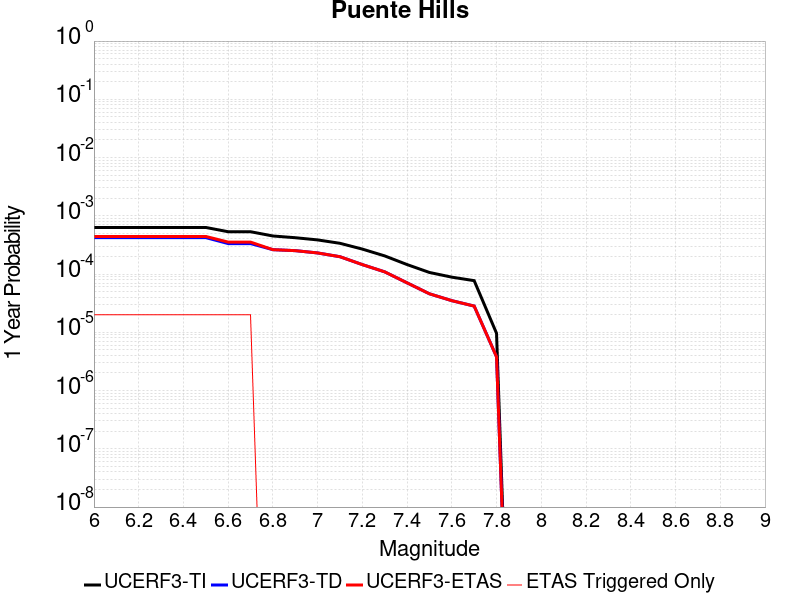 |  |

| Magnitude | 1 wk TI Prob | 1 wk TD Prob | 1 wk ETAS Prob | 1 wk ETAS/TD Gain | 1 wk ETAS Triggered Only | 1 mo TI Prob | 1 mo TD Prob | 1 mo ETAS Prob | 1 mo ETAS/TD Gain | 1 mo ETAS Triggered Only | 1 yr TI Prob | 1 yr TD Prob | 1 yr ETAS Prob | 1 yr ETAS/TD Gain | 1 yr ETAS Triggered Only | 10 yr TI Prob | 10 yr TD Prob | 10 yr ETAS Prob | 10 yr ETAS/TD Gain | 10 yr ETAS Triggered Only |
|-----|-----|-----|-----|-----|-----|-----|-----|-----|-----|-----|-----|-----|-----|-----|-----|-----|-----|-----|-----|-----|
| 6.0 | 1.2101656E-5 | 8.098625E-6 | 8.098625E-6 | 1.0 | 0.0 | 5.1863204E-5 | 3.4707962E-5 | 3.4707962E-5 | 1.0 | 0.0 | 6.312516E-4 | 4.2249315E-4 | 4.4914856E-4 | 1.0630907 | 2.6666667E-5 | 0.0062946146 | 0.0042174594 | 0.004297122 | 1.0188887 | 8.0E-5 |
| 6.1 | 1.2101656E-5 | 8.098625E-6 | 8.098625E-6 | 1.0 | 0.0 | 5.1863204E-5 | 3.4707962E-5 | 3.4707962E-5 | 1.0 | 0.0 | 6.312516E-4 | 4.2249315E-4 | 4.4914856E-4 | 1.0630907 | 2.6666667E-5 | 0.0062946146 | 0.0042174594 | 0.004297122 | 1.0188887 | 8.0E-5 |
| 6.2 | 1.2101656E-5 | 8.098625E-6 | 8.098625E-6 | 1.0 | 0.0 | 5.1863204E-5 | 3.4707962E-5 | 3.4707962E-5 | 1.0 | 0.0 | 6.312516E-4 | 4.2249315E-4 | 4.4914856E-4 | 1.0630907 | 2.6666667E-5 | 0.0062946146 | 0.0042174594 | 0.004297122 | 1.0188887 | 8.0E-5 |
| 6.3 | 1.2101656E-5 | 8.098625E-6 | 8.098625E-6 | 1.0 | 0.0 | 5.1863204E-5 | 3.4707962E-5 | 3.4707962E-5 | 1.0 | 0.0 | 6.312516E-4 | 4.2249315E-4 | 4.4914856E-4 | 1.0630907 | 2.6666667E-5 | 0.0062946146 | 0.0042174594 | 0.004297122 | 1.0188887 | 8.0E-5 |
| 6.4 | 1.2101656E-5 | 8.098625E-6 | 8.098625E-6 | 1.0 | 0.0 | 5.1863204E-5 | 3.4707962E-5 | 3.4707962E-5 | 1.0 | 0.0 | 6.312516E-4 | 4.2249315E-4 | 4.4914856E-4 | 1.0630907 | 2.6666667E-5 | 0.0062946146 | 0.0042174594 | 0.004297122 | 1.0188887 | 8.0E-5 |
| 6.5 | 1.2101656E-5 | 8.098625E-6 | 8.098625E-6 | 1.0 | 0.0 | 5.1863204E-5 | 3.4707962E-5 | 3.4707962E-5 | 1.0 | 0.0 | 6.312516E-4 | 4.2249315E-4 | 4.4914856E-4 | 1.0630907 | 2.6666667E-5 | 0.0062946146 | 0.0042174594 | 0.004297122 | 1.0188887 | 8.0E-5 |
| 6.6 | 1.0222488E-5 | 6.3991847E-6 | 6.3991847E-6 | 1.0 | 0.0 | 4.3809923E-5 | 2.7424803E-5 | 2.7424803E-5 | 1.0 | 0.0 | 5.332553E-4 | 3.3384826E-4 | 3.6050603E-4 | 1.07985 | 2.6666667E-5 | 0.0053197746 | 0.0033337125 | 0.0033868682 | 1.0159448 | 5.3333333E-5 |
| 6.7 | 1.0222488E-5 | 6.3991847E-6 | 6.3991847E-6 | 1.0 | 0.0 | 4.3809923E-5 | 2.7424803E-5 | 2.7424803E-5 | 1.0 | 0.0 | 5.332553E-4 | 3.3384826E-4 | 3.6050603E-4 | 1.07985 | 2.6666667E-5 | 0.0053197746 | 0.0033337125 | 0.0033868682 | 1.0159448 | 5.3333333E-5 |
| 6.8 | 8.6367845E-6 | 5.0282533E-6 | 5.0282533E-6 | 1.0 | 0.0 | 3.7014266E-5 | 2.1549482E-5 | 2.1549482E-5 | 1.0 | 0.0 | 4.505555E-4 | 2.623339E-4 | 2.623339E-4 | 1.0 | 0.0 | 0.004496431 | 0.0026202986 | 0.0026468954 | 1.0101503 | 2.6666667E-5 |
| 6.9 | 8.066481E-6 | 4.836117E-6 | 4.836117E-6 | 1.0 | 0.0 | 3.4570177E-5 | 2.0726053E-5 | 2.0726053E-5 | 1.0 | 0.0 | 4.2081063E-4 | 2.52311E-4 | 2.52311E-4 | 1.0 | 0.0 | 0.0042001465 | 0.0025202993 | 0.0025468988 | 1.0105541 | 2.6666667E-5 |
| 7.0 | 7.393828E-6 | 4.417296E-6 | 4.417296E-6 | 1.0 | 0.0 | 3.168745E-5 | 1.8931134E-5 | 1.8931134E-5 | 1.0 | 0.0 | 3.857264E-4 | 2.3046264E-4 | 2.3046264E-4 | 1.0 | 0.0 | 0.0038505755 | 0.0023022818 | 0.002328887 | 1.011556 | 2.6666667E-5 |
| 7.1 | 6.4660953E-6 | 3.8044495E-6 | 3.8044495E-6 | 1.0 | 0.0 | 2.7711543E-5 | 1.6304684E-5 | 1.6304684E-5 | 1.0 | 0.0 | 3.373358E-4 | 1.984918E-4 | 1.984918E-4 | 1.0 | 0.0 | 0.0033682417 | 0.001983181 | 0.0020097948 | 1.0134197 | 2.6666667E-5 |
| 7.2 | 5.143232E-6 | 2.7865456E-6 | 2.7865456E-6 | 1.0 | 0.0 | 2.2042237E-5 | 1.1942284E-5 | 1.1942284E-5 | 1.0 | 0.0 | 2.6833118E-4 | 1.453877E-4 | 1.453877E-4 | 1.0 | 0.0 | 0.002680074 | 0.0014529356 | 0.0014795635 | 1.018327 | 2.6666667E-5 |
| 7.3 | 3.928255E-6 | 2.0913774E-6 | 2.0913774E-6 | 1.0 | 0.0 | 1.683527E-5 | 8.963015E-6 | 8.963015E-6 | 1.0 | 0.0 | 2.0495013E-4 | 1.0911931E-4 | 1.0911931E-4 | 1.0 | 0.0 | 0.002047612 | 0.001090664 | 0.0011173015 | 1.0244232 | 2.6666667E-5 |
| 7.4 | 2.7894434E-6 | 1.3546753E-6 | 1.3546753E-6 | 1.0 | 0.0 | 1.1954703E-5 | 5.8057385E-6 | 5.8057385E-6 | 1.0 | 0.0 | 1.4553878E-4 | 7.068262E-5 | 7.068262E-5 | 1.0 | 0.0 | 0.001454435 | 7.066058E-4 | 7.332536E-4 | 1.0377125 | 2.6666667E-5 |
| 7.5 | 2.041735E-6 | 8.787305E-7 | 8.787305E-7 | 1.0 | 0.0 | 8.750263E-6 | 3.7659825E-6 | 3.7659825E-6 | 1.0 | 0.0 | 1.06529245E-4 | 4.5849905E-5 | 4.5849905E-5 | 1.0 | 0.0 | 0.0010647819 | 4.5840783E-4 | 4.5840783E-4 | 1.0 | 0.0 |
| 7.6 | 1.6959062E-6 | 6.6986263E-7 | 6.6986263E-7 | 1.0 | 0.0 | 7.268149E-6 | 2.8708366E-6 | 2.8708366E-6 | 1.0 | 0.0 | 8.848612E-5 | 3.4951907E-5 | 3.4951907E-5 | 1.0 | 0.0 | 8.84509E-4 | 3.4946698E-4 | 3.4946698E-4 | 1.0 | 0.0 |
| 7.7 | 1.4767965E-6 | 5.407607E-7 | 5.407607E-7 | 1.0 | 0.0 | 6.3291122E-6 | 2.317544E-6 | 2.317544E-6 | 1.0 | 0.0 | 7.705422E-5 | 2.8215758E-5 | 2.8215758E-5 | 1.0 | 0.0 | 7.702751E-4 | 2.8212433E-4 | 2.8212433E-4 | 1.0 | 0.0 |
| 7.8 | 1.8432911E-7 | 7.28201E-8 | 7.28201E-8 | 1.0 | 0.0 | 7.8998164E-7 | 3.1208612E-7 | 3.1208612E-7 | 1.0 | 0.0 | 9.617985E-6 | 3.7996451E-6 | 3.7996451E-6 | 1.0 | 0.0 | 9.617568E-5 | 3.7996128E-5 | 3.7996128E-5 | 1.0 | 0.0 |

## Great Valley 03a Dunnigan Hills
*[(top)](#table-of-contents)*

| 1 Week | 1 Month | 1 Year | 10 Year |
|-----|-----|-----|-----|
|  |  |  |  |

| Magnitude | 1 wk TI Prob | 1 wk TD Prob | 1 wk ETAS Prob | 1 wk ETAS/TD Gain | 1 wk ETAS Triggered Only | 1 mo TI Prob | 1 mo TD Prob | 1 mo ETAS Prob | 1 mo ETAS/TD Gain | 1 mo ETAS Triggered Only | 1 yr TI Prob | 1 yr TD Prob | 1 yr ETAS Prob | 1 yr ETAS/TD Gain | 1 yr ETAS Triggered Only | 10 yr TI Prob | 10 yr TD Prob | 10 yr ETAS Prob | 10 yr ETAS/TD Gain | 10 yr ETAS Triggered Only |
|-----|-----|-----|-----|-----|-----|-----|-----|-----|-----|-----|-----|-----|-----|-----|-----|-----|-----|-----|-----|-----|
| 6.0 | 1.6591328E-5 | 1.8107954E-5 | 4.4774137E-5 | 2.4726226 | 2.6666667E-5 | 7.110376E-5 | 7.7603596E-5 | 1.042682E-4 | 1.3436 | 2.6666667E-5 | 8.6534437E-4 | 9.444834E-4 | 9.7112486E-4 | 1.0282074 | 2.6666667E-5 | 0.008619824 | 0.009411525 | 0.009464356 | 1.0056134 | 5.3333333E-5 |
| 6.1 | 8.041125E-6 | 8.769726E-6 | 3.543616E-5 | 4.040737 | 2.6666667E-5 | 3.4461507E-5 | 3.7584115E-5 | 6.424978E-5 | 1.7094929 | 2.6666667E-5 | 4.194881E-4 | 4.5751085E-4 | 4.8416533E-4 | 1.0582597 | 2.6666667E-5 | 0.004186971 | 0.004567687 | 0.004620777 | 1.0116229 | 5.3333333E-5 |
| 6.2 | 3.2807004E-6 | 3.5795688E-6 | 3.5795688E-6 | 1.0 | 0.0 | 1.4060069E-5 | 1.5340942E-5 | 1.5340942E-5 | 1.0 | 0.0 | 1.7116789E-4 | 1.8676413E-4 | 1.8676413E-4 | 1.0 | 0.0 | 0.0017103611 | 0.0018664796 | 0.0018930966 | 1.0142605 | 2.6666667E-5 |
| 6.3 | 1.9339366E-6 | 2.1103806E-6 | 2.1103806E-6 | 1.0 | 0.0 | 8.288273E-6 | 9.044474E-6 | 9.044474E-6 | 1.0 | 0.0 | 1.00905054E-4 | 1.1011375E-4 | 1.1011375E-4 | 1.0 | 0.0 | 0.0010085925 | 0.0011008718 | 0.0011008718 | 1.0 | 0.0 |
| 6.4 | 1.3142635E-6 | 1.4339867E-6 | 1.4339867E-6 | 1.0 | 0.0 | 5.6325457E-6 | 6.145657E-6 | 6.145657E-6 | 1.0 | 0.0 | 6.857408E-5 | 7.482337E-5 | 7.482337E-5 | 1.0 | 0.0 | 6.8552926E-4 | 7.4823375E-4 | 7.4823375E-4 | 1.0 | 0.0 |

## Kern Canyon (North Kern) 2011
*[(top)](#table-of-contents)*

| 1 Week | 1 Month | 1 Year | 10 Year |
|-----|-----|-----|-----|
|  |  |  |  |

| Magnitude | 1 wk TI Prob | 1 wk TD Prob | 1 wk ETAS Prob | 1 wk ETAS/TD Gain | 1 wk ETAS Triggered Only | 1 mo TI Prob | 1 mo TD Prob | 1 mo ETAS Prob | 1 mo ETAS/TD Gain | 1 mo ETAS Triggered Only | 1 yr TI Prob | 1 yr TD Prob | 1 yr ETAS Prob | 1 yr ETAS/TD Gain | 1 yr ETAS Triggered Only | 10 yr TI Prob | 10 yr TD Prob | 10 yr ETAS Prob | 10 yr ETAS/TD Gain | 10 yr ETAS Triggered Only |
|-----|-----|-----|-----|-----|-----|-----|-----|-----|-----|-----|-----|-----|-----|-----|-----|-----|-----|-----|-----|-----|
| 6.0 | 6.6264497E-6 | 6.75733E-6 | 6.0090304E-5 | 8.892611 | 5.3333333E-5 | 2.8398761E-5 | 2.895971E-5 | 8.2291495E-5 | 2.8415859 | 5.3333333E-5 | 3.4570007E-4 | 3.5253543E-4 | 4.0584995E-4 | 1.1512316 | 5.3333333E-5 | 0.0034516277 | 0.0035205502 | 0.003573696 | 1.0150958 | 5.3333333E-5 |
| 6.1 | 6.6264497E-6 | 6.75733E-6 | 6.0090304E-5 | 8.892611 | 5.3333333E-5 | 2.8398761E-5 | 2.895971E-5 | 8.2291495E-5 | 2.8415859 | 5.3333333E-5 | 3.4570007E-4 | 3.5253543E-4 | 4.0584995E-4 | 1.1512316 | 5.3333333E-5 | 0.0034516277 | 0.0035205502 | 0.003573696 | 1.0150958 | 5.3333333E-5 |
| 6.2 | 6.6264497E-6 | 6.75733E-6 | 6.0090304E-5 | 8.892611 | 5.3333333E-5 | 2.8398761E-5 | 2.895971E-5 | 8.2291495E-5 | 2.8415859 | 5.3333333E-5 | 3.4570007E-4 | 3.5253543E-4 | 4.0584995E-4 | 1.1512316 | 5.3333333E-5 | 0.0034516277 | 0.0035205502 | 0.003573696 | 1.0150958 | 5.3333333E-5 |
| 6.3 | 6.6264497E-6 | 6.75733E-6 | 6.0090304E-5 | 8.892611 | 5.3333333E-5 | 2.8398761E-5 | 2.895971E-5 | 8.2291495E-5 | 2.8415859 | 5.3333333E-5 | 3.4570007E-4 | 3.5253543E-4 | 4.0584995E-4 | 1.1512316 | 5.3333333E-5 | 0.0034516277 | 0.0035205502 | 0.003573696 | 1.0150958 | 5.3333333E-5 |
| 6.4 | 6.6264497E-6 | 6.75733E-6 | 6.0090304E-5 | 8.892611 | 5.3333333E-5 | 2.8398761E-5 | 2.895971E-5 | 8.2291495E-5 | 2.8415859 | 5.3333333E-5 | 3.4570007E-4 | 3.5253543E-4 | 4.0584995E-4 | 1.1512316 | 5.3333333E-5 | 0.0034516277 | 0.0035205502 | 0.003573696 | 1.0150958 | 5.3333333E-5 |
| 6.5 | 3.2162225E-6 | 3.2570915E-6 | 2.992367E-5 | 9.187237 | 2.6666667E-5 | 1.3783738E-5 | 1.3958893E-5 | 4.062519E-5 | 2.9103444 | 2.6666667E-5 | 1.6780409E-4 | 1.6993708E-4 | 1.9659921E-4 | 1.1568942 | 2.6666667E-5 | 0.0016767744 | 0.001698151 | 0.0017247724 | 1.0156767 | 2.6666667E-5 |
| 6.6 | 3.2162225E-6 | 3.2570915E-6 | 2.992367E-5 | 9.187237 | 2.6666667E-5 | 1.3783738E-5 | 1.3958893E-5 | 4.062519E-5 | 2.9103444 | 2.6666667E-5 | 1.6780409E-4 | 1.6993708E-4 | 1.9659921E-4 | 1.1568942 | 2.6666667E-5 | 0.0016767744 | 0.001698151 | 0.0017247724 | 1.0156767 | 2.6666667E-5 |
| 6.7 | 2.1908265E-6 | 2.2071222E-6 | 2.887373E-5 | 13.082071 | 2.6666667E-5 | 9.389223E-6 | 9.459061E-6 | 3.6125475E-5 | 3.8191395 | 2.6666667E-5 | 1.1430779E-4 | 1.1515819E-4 | 1.4182179E-4 | 1.2315389 | 2.6666667E-5 | 0.0011424901 | 0.0011510046 | 0.0011776405 | 1.0231415 | 2.6666667E-5 |
| 6.8 | 1.7303895E-6 | 1.7365529E-6 | 2.8403174E-5 | 16.356066 | 2.6666667E-5 | 7.415934E-6 | 7.4423488E-6 | 3.4108816E-5 | 4.5830717 | 2.6666667E-5 | 9.028525E-5 | 9.0606925E-5 | 1.1727118E-4 | 1.2942849 | 2.6666667E-5 | 9.024858E-4 | 9.057096E-4 | 9.323521E-4 | 1.0294162 | 2.6666667E-5 |
| 6.9 | 1.3700314E-6 | 1.3688622E-6 | 2.8035493E-5 | 20.480873 | 2.6666667E-5 | 5.87155E-6 | 5.8665396E-6 | 3.253305E-5 | 5.5455265 | 2.6666667E-5 | 7.148377E-5 | 7.142282E-5 | 9.8087585E-5 | 1.3733367 | 2.6666667E-5 | 7.146078E-4 | 7.140032E-4 | 7.4065087E-4 | 1.0373214 | 2.6666667E-5 |
| 7.0 | 1.1467797E-6 | 1.1413804E-6 | 2.7808017E-5 | 24.363495 | 2.6666667E-5 | 4.9147607E-6 | 4.8916213E-6 | 3.1558156E-5 | 6.451472 | 2.6666667E-5 | 5.983557E-5 | 5.9553895E-5 | 8.621897E-5 | 1.447747 | 2.6666667E-5 | 5.981946E-4 | 5.953825E-4 | 6.220333E-4 | 1.0447625 | 2.6666667E-5 |
| 7.1 | 9.3952065E-7 | 9.3026904E-7 | 2.759691E-5 | 29.665516 | 2.6666667E-5 | 4.026511E-6 | 3.9868614E-6 | 3.065342E-5 | 7.68861 | 2.6666667E-5 | 4.9021666E-5 | 4.8538972E-5 | 7.520435E-5 | 1.54936 | 2.6666667E-5 | 4.901085E-4 | 4.8528548E-4 | 5.1193923E-4 | 1.0549238 | 2.6666667E-5 |
| 7.2 | 6.858055E-7 | 6.7193E-7 | 6.7193E-7 | 1.0 | 0.0 | 2.939163E-6 | 2.879697E-6 | 2.879697E-6 | 1.0 | 0.0 | 3.5783723E-5 | 3.5059755E-5 | 3.5059755E-5 | 1.0 | 0.0 | 3.5777962E-4 | 3.5054312E-4 | 3.5054312E-4 | 1.0 | 0.0 |
| 7.3 | 5.1101983E-7 | 4.9393E-7 | 4.9393E-7 | 1.0 | 0.0 | 2.1900833E-6 | 2.116841E-6 | 2.116841E-6 | 1.0 | 0.0 | 2.6663936E-5 | 2.5772239E-5 | 2.5772239E-5 | 1.0 | 0.0 | 2.6660739E-4 | 2.57693E-4 | 2.57693E-4 | 1.0 | 0.0 |
| 7.4 | 3.4999414E-7 | 3.2995905E-7 | 3.2995905E-7 | 1.0 | 0.0 | 1.499974E-6 | 1.4141094E-6 | 1.4141094E-6 | 1.0 | 0.0 | 1.8262032E-5 | 1.721665E-5 | 1.721665E-5 | 1.0 | 0.0 | 1.826053E-4 | 1.7215339E-4 | 1.7215339E-4 | 1.0 | 0.0 |
| 7.5 | 1.7021522E-7 | 1.4750044E-7 | 1.4750044E-7 | 1.0 | 0.0 | 7.2949354E-7 | 6.321446E-7 | 6.321446E-7 | 1.0 | 0.0 | 8.881548E-6 | 7.696334E-6 | 7.696334E-6 | 1.0 | 0.0 | 8.8811925E-5 | 7.696076E-5 | 7.696076E-5 | 1.0 | 0.0 |
| 7.6 | 2.572245E-8 | 1.7352555E-8 | 1.7352555E-8 | 1.0 | 0.0 | 1.10239064E-7 | 7.436809E-8 | 7.436809E-8 | 1.0 | 0.0 | 1.3421597E-6 | 9.054312E-7 | 9.054312E-7 | 1.0 | 0.0 | 1.3421517E-5 | 9.05428E-6 | 9.05428E-6 | 1.0 | 0.0 |

## Del Valle
*[(top)](#table-of-contents)*

| 1 Week | 1 Month | 1 Year | 10 Year |
|-----|-----|-----|-----|
|  |  |  |  |

| Magnitude | 1 wk TI Prob | 1 wk TD Prob | 1 wk ETAS Prob | 1 wk ETAS/TD Gain | 1 wk ETAS Triggered Only | 1 mo TI Prob | 1 mo TD Prob | 1 mo ETAS Prob | 1 mo ETAS/TD Gain | 1 mo ETAS Triggered Only | 1 yr TI Prob | 1 yr TD Prob | 1 yr ETAS Prob | 1 yr ETAS/TD Gain | 1 yr ETAS Triggered Only | 10 yr TI Prob | 10 yr TD Prob | 10 yr ETAS Prob | 10 yr ETAS/TD Gain | 10 yr ETAS Triggered Only |
|-----|-----|-----|-----|-----|-----|-----|-----|-----|-----|-----|-----|-----|-----|-----|-----|-----|-----|-----|-----|-----|
| 6.0 | 1.0716125E-5 | 8.767882E-6 | 8.767882E-6 | 1.0 | 0.0 | 4.592544E-5 | 3.7576207E-5 | 3.7576207E-5 | 1.0 | 0.0 | 5.589988E-4 | 4.5741405E-4 | 5.10723E-4 | 1.1165441 | 5.3333333E-5 | 0.0055759475 | 0.00456668 | 0.00461977 | 1.0116254 | 5.3333333E-5 |
| 6.1 | 1.0716125E-5 | 8.767882E-6 | 8.767882E-6 | 1.0 | 0.0 | 4.592544E-5 | 3.7576207E-5 | 3.7576207E-5 | 1.0 | 0.0 | 5.589988E-4 | 4.5741405E-4 | 5.10723E-4 | 1.1165441 | 5.3333333E-5 | 0.0055759475 | 0.00456668 | 0.00461977 | 1.0116254 | 5.3333333E-5 |
| 6.2 | 1.0716125E-5 | 8.767882E-6 | 8.767882E-6 | 1.0 | 0.0 | 4.592544E-5 | 3.7576207E-5 | 3.7576207E-5 | 1.0 | 0.0 | 5.589988E-4 | 4.5741405E-4 | 5.10723E-4 | 1.1165441 | 5.3333333E-5 | 0.0055759475 | 0.00456668 | 0.00461977 | 1.0116254 | 5.3333333E-5 |
| 6.3 | 7.1293784E-6 | 4.865823E-6 | 4.865823E-6 | 1.0 | 0.0 | 3.055412E-5 | 2.0853364E-5 | 2.0853364E-5 | 1.0 | 0.0 | 3.7193293E-4 | 2.5386087E-4 | 3.0718066E-4 | 1.2100354 | 5.3333333E-5 | 0.0037131102 | 0.0025357946 | 0.0025889927 | 1.0209788 | 5.3333333E-5 |
| 6.4 | 7.1293784E-6 | 4.865823E-6 | 4.865823E-6 | 1.0 | 0.0 | 3.055412E-5 | 2.0853364E-5 | 2.0853364E-5 | 1.0 | 0.0 | 3.7193293E-4 | 2.5386087E-4 | 3.0718066E-4 | 1.2100354 | 5.3333333E-5 | 0.0037131102 | 0.0025357946 | 0.0025889927 | 1.0209788 | 5.3333333E-5 |
| 6.5 | 7.1293784E-6 | 4.865823E-6 | 4.865823E-6 | 1.0 | 0.0 | 3.055412E-5 | 2.0853364E-5 | 2.0853364E-5 | 1.0 | 0.0 | 3.7193293E-4 | 2.5386087E-4 | 3.0718066E-4 | 1.2100354 | 5.3333333E-5 | 0.0037131102 | 0.0025357946 | 0.0025889927 | 1.0209788 | 5.3333333E-5 |
| 6.6 | 7.1293784E-6 | 4.865823E-6 | 4.865823E-6 | 1.0 | 0.0 | 3.055412E-5 | 2.0853364E-5 | 2.0853364E-5 | 1.0 | 0.0 | 3.7193293E-4 | 2.5386087E-4 | 3.0718066E-4 | 1.2100354 | 5.3333333E-5 | 0.0037131102 | 0.0025357946 | 0.0025889927 | 1.0209788 | 5.3333333E-5 |
| 6.7 | 7.12272E-6 | 4.8631987E-6 | 4.8631987E-6 | 1.0 | 0.0 | 3.0525585E-5 | 2.0842117E-5 | 2.0842117E-5 | 1.0 | 0.0 | 3.7158563E-4 | 2.5372396E-4 | 3.0704378E-4 | 1.2101488 | 5.3333333E-5 | 0.003709649 | 0.0025344288 | 0.002587627 | 1.0209903 | 5.3333333E-5 |
| 6.8 | 6.7558703E-6 | 4.5594015E-6 | 4.5594015E-6 | 1.0 | 0.0 | 2.895341E-5 | 1.9540148E-5 | 1.9540148E-5 | 1.0 | 0.0 | 3.5245073E-4 | 2.3787597E-4 | 2.9119663E-4 | 1.2241532 | 5.3333333E-5 | 0.0035189227 | 0.0023762889 | 0.0024294953 | 1.0223906 | 5.3333333E-5 |
| 6.9 | 6.6700386E-6 | 4.502539E-6 | 4.502539E-6 | 1.0 | 0.0 | 2.8585566E-5 | 1.9296456E-5 | 1.9296456E-5 | 1.0 | 0.0 | 3.479737E-4 | 2.3490966E-4 | 2.8823045E-4 | 1.2269843 | 5.3333333E-5 | 0.003474293 | 0.0023466884 | 0.0023998967 | 1.0226737 | 5.3333333E-5 |
| 7.0 | 6.3181424E-6 | 4.0987034E-6 | 4.0987034E-6 | 1.0 | 0.0 | 2.7077473E-5 | 1.7565755E-5 | 1.7565755E-5 | 1.0 | 0.0 | 3.2961834E-4 | 2.1384252E-4 | 2.6716443E-4 | 1.2493514 | 5.3333333E-5 | 0.0032912986 | 0.002136422 | 0.0021896416 | 1.0249106 | 5.3333333E-5 |
| 7.1 | 6.248759E-6 | 4.033895E-6 | 4.033895E-6 | 1.0 | 0.0 | 2.678012E-5 | 1.7288008E-5 | 1.7288008E-5 | 1.0 | 0.0 | 3.2599916E-4 | 2.104616E-4 | 2.637837E-4 | 1.2533579 | 5.3333333E-5 | 0.0032552136 | 0.0021026772 | 0.0021558984 | 1.0253111 | 5.3333333E-5 |
| 7.2 | 6.0411944E-6 | 3.869888E-6 | 3.869888E-6 | 1.0 | 0.0 | 2.5890577E-5 | 1.658513E-5 | 1.658513E-5 | 1.0 | 0.0 | 3.1517216E-4 | 2.0190567E-4 | 2.5522825E-4 | 1.2640964 | 5.3333333E-5 | 0.0031472554 | 0.0020172757 | 0.0020705014 | 1.026385 | 5.3333333E-5 |
| 7.3 | 4.7691183E-6 | 3.0781202E-6 | 3.0781202E-6 | 1.0 | 0.0 | 2.0438918E-5 | 1.3191879E-5 | 1.3191879E-5 | 1.0 | 0.0 | 2.488154E-4 | 1.605995E-4 | 1.8726189E-4 | 1.1660179 | 2.6666667E-5 | 0.00248537 | 0.0016048603 | 0.0016314841 | 1.0165895 | 2.6666667E-5 |
| 7.4 | 3.5524722E-6 | 2.1893363E-6 | 2.1893363E-6 | 1.0 | 0.0 | 1.5224792E-5 | 9.382837E-6 | 9.382837E-6 | 1.0 | 0.0 | 1.8534607E-4 | 1.1423013E-4 | 1.4089375E-4 | 1.2334203 | 2.6666667E-5 | 0.0018519156 | 0.0011417224 | 0.0011683586 | 1.0233299 | 2.6666667E-5 |
| 7.5 | 2.7133442E-6 | 1.5916097E-6 | 1.5916097E-6 | 1.0 | 0.0 | 1.1628566E-5 | 6.821167E-6 | 6.821167E-6 | 1.0 | 0.0 | 1.415686E-4 | 8.304456E-5 | 8.304456E-5 | 1.0 | 0.0 | 0.0014147845 | 8.301372E-4 | 8.301372E-4 | 1.0 | 0.0 |
| 7.6 | 1.915338E-6 | 1.173914E-6 | 1.173914E-6 | 1.0 | 0.0 | 8.208566E-6 | 5.0310505E-6 | 5.0310505E-6 | 1.0 | 0.0 | 9.993471E-5 | 6.125133E-5 | 6.125133E-5 | 1.0 | 0.0 | 9.988978E-4 | 6.123454E-4 | 6.123454E-4 | 1.0 | 0.0 |
| 7.7 | 1.2120448E-6 | 7.180313E-7 | 7.180313E-7 | 1.0 | 0.0 | 5.194467E-6 | 3.0772733E-6 | 3.0772733E-6 | 1.0 | 0.0 | 6.3240805E-5 | 3.746516E-5 | 3.746516E-5 | 1.0 | 0.0 | 6.322281E-4 | 3.7458882E-4 | 3.7458882E-4 | 1.0 | 0.0 |
| 7.8 | 6.272381E-7 | 3.932549E-7 | 3.932549E-7 | 1.0 | 0.0 | 2.6881603E-6 | 1.6853771E-6 | 1.6853771E-6 | 1.0 | 0.0 | 3.272786E-5 | 2.0519275E-5 | 2.0519275E-5 | 1.0 | 0.0 | 3.272304E-4 | 2.0517396E-4 | 2.0517396E-4 | 1.0 | 0.0 |
| 7.9 | 2.0292627E-7 | 1.2004622E-7 | 1.2004622E-7 | 1.0 | 0.0 | 8.6968373E-7 | 5.1448376E-7 | 5.1448376E-7 | 1.0 | 0.0 | 1.0588348E-5 | 6.263822E-6 | 6.263822E-6 | 1.0 | 0.0 | 1.0587843E-4 | 6.263647E-5 | 6.263647E-5 | 1.0 | 0.0 |
| 8.0 | 4.374492E-8 | 2.189964E-8 | 2.189964E-8 | 1.0 | 0.0 | 1.8747821E-7 | 9.385559E-8 | 9.385559E-8 | 1.0 | 0.0 | 2.2825448E-6 | 1.1426913E-6 | 1.1426913E-6 | 1.0 | 0.0 | 2.2825214E-5 | 1.1426858E-5 | 1.1426858E-5 | 1.0 | 0.0 |

## Monterey Bay-Tularcitos
*[(top)](#table-of-contents)*

| 1 Week | 1 Month | 1 Year | 10 Year |
|-----|-----|-----|-----|
| 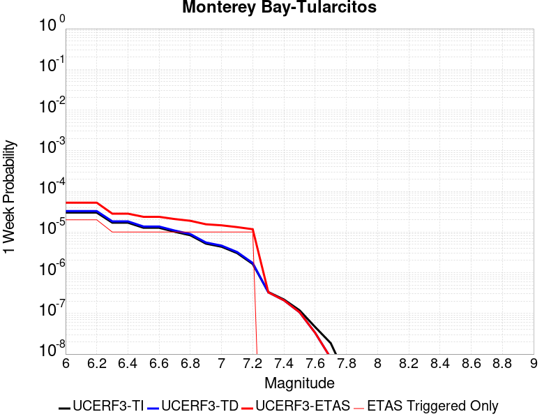 |  |  |  |

| Magnitude | 1 wk TI Prob | 1 wk TD Prob | 1 wk ETAS Prob | 1 wk ETAS/TD Gain | 1 wk ETAS Triggered Only | 1 mo TI Prob | 1 mo TD Prob | 1 mo ETAS Prob | 1 mo ETAS/TD Gain | 1 mo ETAS Triggered Only | 1 yr TI Prob | 1 yr TD Prob | 1 yr ETAS Prob | 1 yr ETAS/TD Gain | 1 yr ETAS Triggered Only | 10 yr TI Prob | 10 yr TD Prob | 10 yr ETAS Prob | 10 yr ETAS/TD Gain | 10 yr ETAS Triggered Only |
|-----|-----|-----|-----|-----|-----|-----|-----|-----|-----|-----|-----|-----|-----|-----|-----|-----|-----|-----|-----|-----|
| 6.0 | 3.0131365E-5 | 3.279877E-5 | 5.9464564E-5 | 1.8130119 | 2.6666667E-5 | 1.2912804E-4 | 1.4055918E-4 | 1.672221E-4 | 1.1896918 | 2.6666667E-5 | 0.001571 | 0.0017100703 | 0.0017366913 | 1.0155672 | 2.6666667E-5 | 0.015599402 | 0.016979916 | 0.017032344 | 1.0030876 | 5.3333333E-5 |
| 6.1 | 3.0131365E-5 | 3.279877E-5 | 5.9464564E-5 | 1.8130119 | 2.6666667E-5 | 1.2912804E-4 | 1.4055918E-4 | 1.672221E-4 | 1.1896918 | 2.6666667E-5 | 0.001571 | 0.0017100703 | 0.0017366913 | 1.0155672 | 2.6666667E-5 | 0.015599402 | 0.016979916 | 0.017032344 | 1.0030876 | 5.3333333E-5 |
| 6.2 | 3.0131365E-5 | 3.279877E-5 | 5.9464564E-5 | 1.8130119 | 2.6666667E-5 | 1.2912804E-4 | 1.4055918E-4 | 1.672221E-4 | 1.1896918 | 2.6666667E-5 | 0.001571 | 0.0017100703 | 0.0017366913 | 1.0155672 | 2.6666667E-5 | 0.015599402 | 0.016979916 | 0.017032344 | 1.0030876 | 5.3333333E-5 |
| 6.3 | 1.6998249E-5 | 1.8330798E-5 | 1.8330798E-5 | 1.0 | 0.0 | 7.28476E-5 | 7.85583E-5 | 7.85583E-5 | 1.0 | 0.0 | 8.865586E-4 | 9.5604634E-4 | 9.5604634E-4 | 1.0 | 0.0 | 0.0088303005 | 0.009521258 | 0.009521258 | 1.0 | 0.0 |
| 6.4 | 1.6998249E-5 | 1.8330798E-5 | 1.8330798E-5 | 1.0 | 0.0 | 7.28476E-5 | 7.85583E-5 | 7.85583E-5 | 1.0 | 0.0 | 8.865586E-4 | 9.5604634E-4 | 9.5604634E-4 | 1.0 | 0.0 | 0.0088303005 | 0.009521258 | 0.009521258 | 1.0 | 0.0 |
| 6.5 | 1.27470785E-5 | 1.3693312E-5 | 1.3693312E-5 | 1.0 | 0.0 | 5.4629192E-5 | 5.8684363E-5 | 5.8684363E-5 | 1.0 | 0.0 | 6.649074E-4 | 7.1425823E-4 | 7.1425823E-4 | 1.0 | 0.0 | 0.0066292146 | 0.007120678 | 0.007120678 | 1.0 | 0.0 |
| 6.6 | 1.2739422E-5 | 1.36854E-5 | 1.36854E-5 | 1.0 | 0.0 | 5.4596385E-5 | 5.8650454E-5 | 5.8650454E-5 | 1.0 | 0.0 | 6.645082E-4 | 7.1384566E-4 | 7.1384566E-4 | 1.0 | 0.0 | 0.0066252467 | 0.007116579 | 0.007116579 | 1.0 | 0.0 |
| 6.7 | 1.0160109E-5 | 1.0885755E-5 | 1.0885755E-5 | 1.0 | 0.0 | 4.35426E-5 | 4.665244E-5 | 4.665244E-5 | 1.0 | 0.0 | 5.300022E-4 | 5.6785246E-4 | 5.6785246E-4 | 1.0 | 0.0 | 0.005287399 | 0.0056647263 | 0.0056647263 | 1.0 | 0.0 |
| 6.8 | 8.349859E-6 | 8.932587E-6 | 8.932587E-6 | 1.0 | 0.0 | 3.578462E-5 | 3.8281985E-5 | 3.8281985E-5 | 1.0 | 0.0 | 4.3559066E-4 | 4.6598914E-4 | 4.6598914E-4 | 1.0 | 0.0 | 0.004347378 | 0.004650685 | 0.004650685 | 1.0 | 0.0 |
| 6.9 | 5.193639E-6 | 5.53643E-6 | 5.53643E-6 | 1.0 | 0.0 | 2.2258262E-5 | 2.372736E-5 | 2.372736E-5 | 1.0 | 0.0 | 2.7096065E-4 | 2.8884556E-4 | 2.8884556E-4 | 1.0 | 0.0 | 0.0027063051 | 0.0028850222 | 0.0028850222 | 1.0 | 0.0 |
| 7.0 | 4.359381E-6 | 4.643366E-6 | 4.643366E-6 | 1.0 | 0.0 | 1.8682927E-5 | 1.9900004E-5 | 1.9900004E-5 | 1.0 | 0.0 | 2.274409E-4 | 2.422586E-4 | 2.422586E-4 | 1.0 | 0.0 | 0.0022720827 | 0.002420238 | 0.002420238 | 1.0 | 0.0 |
| 7.1 | 3.0398533E-6 | 3.2310427E-6 | 3.2310427E-6 | 1.0 | 0.0 | 1.3027877E-5 | 1.3847267E-5 | 1.3847267E-5 | 1.0 | 0.0 | 1.5860285E-4 | 1.6858005E-4 | 1.6858005E-4 | 1.0 | 0.0 | 0.001584897 | 0.0016847793 | 0.0016847793 | 1.0 | 0.0 |
| 7.2 | 1.642335E-6 | 1.7333153E-6 | 1.7333153E-6 | 1.0 | 0.0 | 7.0385595E-6 | 7.428485E-6 | 7.428485E-6 | 1.0 | 0.0 | 8.569109E-5 | 9.044012E-5 | 9.044012E-5 | 1.0 | 0.0 | 8.5658056E-4 | 9.042358E-4 | 9.042358E-4 | 1.0 | 0.0 |
| 7.3 | 3.356842E-7 | 3.2952389E-7 | 3.2952389E-7 | 1.0 | 0.0 | 1.4386458E-6 | 1.4122444E-6 | 1.4122444E-6 | 1.0 | 0.0 | 1.7515373E-5 | 1.7193941E-5 | 1.7193941E-5 | 1.0 | 0.0 | 1.7513991E-4 | 1.719262E-4 | 1.719262E-4 | 1.0 | 0.0 |
| 7.4 | 2.1973483E-7 | 2.1006413E-7 | 2.1006413E-7 | 1.0 | 0.0 | 9.417204E-7 | 9.0027453E-7 | 9.0027453E-7 | 1.0 | 0.0 | 1.1465385E-5 | 1.0960787E-5 | 1.0960787E-5 | 1.0 | 0.0 | 1.1464794E-4 | 1.096025E-4 | 1.096025E-4 | 1.0 | 0.0 |
| 7.5 | 1.1944135E-7 | 1.0696043E-7 | 1.0696043E-7 | 1.0 | 0.0 | 5.118914E-7 | 4.5840173E-7 | 4.5840173E-7 | 1.0 | 0.0 | 6.23226E-6 | 5.581027E-6 | 5.581027E-6 | 1.0 | 0.0 | 6.2320854E-5 | 5.5808883E-5 | 5.5808883E-5 | 1.0 | 0.0 |
| 7.6 | 4.636058E-8 | 3.336489E-8 | 3.336489E-8 | 1.0 | 0.0 | 1.9868818E-7 | 1.4299238E-7 | 1.4299238E-7 | 1.0 | 0.0 | 2.419026E-6 | 1.7409308E-6 | 1.7409308E-6 | 1.0 | 0.0 | 2.4189996E-5 | 1.7409173E-5 | 1.7409173E-5 | 1.0 | 0.0 |
| 7.7 | 1.8588572E-8 | 8.003744E-9 | 8.003744E-9 | 1.0 | 0.0 | 7.9665305E-8 | 3.430176E-8 | 3.430176E-8 | 1.0 | 0.0 | 9.699246E-7 | 4.1762385E-7 | 4.1762385E-7 | 1.0 | 0.0 | 9.699204E-6 | 4.176231E-6 | 4.176231E-6 | 1.0 | 0.0 |
| 7.8 | 2.7960154E-9 | 7.6099427E-10 | 7.6099427E-10 | 1.0 | 0.0 | 1.1982923E-8 | 3.2614043E-9 | 3.2614043E-9 | 1.0 | 0.0 | 1.4589209E-7 | 3.9707597E-8 | 3.9707597E-8 | 1.0 | 0.0 | 1.4589199E-6 | 3.9707595E-7 | 3.9707595E-7 | 1.0 | 0.0 |

## Reliz 2011 CFM
*[(top)](#table-of-contents)*

| 1 Week | 1 Month | 1 Year | 10 Year |
|-----|-----|-----|-----|
|  |  |  |  |

| Magnitude | 1 wk TI Prob | 1 wk TD Prob | 1 wk ETAS Prob | 1 wk ETAS/TD Gain | 1 wk ETAS Triggered Only | 1 mo TI Prob | 1 mo TD Prob | 1 mo ETAS Prob | 1 mo ETAS/TD Gain | 1 mo ETAS Triggered Only | 1 yr TI Prob | 1 yr TD Prob | 1 yr ETAS Prob | 1 yr ETAS/TD Gain | 1 yr ETAS Triggered Only | 10 yr TI Prob | 10 yr TD Prob | 10 yr ETAS Prob | 10 yr ETAS/TD Gain | 10 yr ETAS Triggered Only |
|-----|-----|-----|-----|-----|-----|-----|-----|-----|-----|-----|-----|-----|-----|-----|-----|-----|-----|-----|-----|-----|
| 6.0 | 1.6002472E-5 | 1.6282804E-5 | 4.2949036E-5 | 2.637693 | 2.6666667E-5 | 6.8580215E-5 | 6.9781694E-5 | 9.64465E-5 | 1.3821175 | 2.6666667E-5 | 8.3464425E-4 | 8.4928074E-4 | 8.759248E-4 | 1.0313724 | 2.6666667E-5 | 0.008315164 | 0.008462547 | 0.00851543 | 1.006249 | 5.3333333E-5 |
| 6.1 | 1.6002472E-5 | 1.6282804E-5 | 4.2949036E-5 | 2.637693 | 2.6666667E-5 | 6.8580215E-5 | 6.9781694E-5 | 9.64465E-5 | 1.3821175 | 2.6666667E-5 | 8.3464425E-4 | 8.4928074E-4 | 8.759248E-4 | 1.0313724 | 2.6666667E-5 | 0.008315164 | 0.008462547 | 0.00851543 | 1.006249 | 5.3333333E-5 |
| 6.2 | 1.6002472E-5 | 1.6282804E-5 | 4.2949036E-5 | 2.637693 | 2.6666667E-5 | 6.8580215E-5 | 6.9781694E-5 | 9.64465E-5 | 1.3821175 | 2.6666667E-5 | 8.3464425E-4 | 8.4928074E-4 | 8.759248E-4 | 1.0313724 | 2.6666667E-5 | 0.008315164 | 0.008462547 | 0.00851543 | 1.006249 | 5.3333333E-5 |
| 6.3 | 7.792404E-6 | 7.803802E-6 | 7.803802E-6 | 1.0 | 0.0 | 3.339559E-5 | 3.344444E-5 | 3.344444E-5 | 1.0 | 0.0 | 4.0651546E-4 | 4.0711078E-4 | 4.0711078E-4 | 1.0 | 0.0 | 0.0040577264 | 0.004063926 | 0.004063926 | 1.0 | 0.0 |
| 6.4 | 7.792404E-6 | 7.803802E-6 | 7.803802E-6 | 1.0 | 0.0 | 3.339559E-5 | 3.344444E-5 | 3.344444E-5 | 1.0 | 0.0 | 4.0651546E-4 | 4.0711078E-4 | 4.0711078E-4 | 1.0 | 0.0 | 0.0040577264 | 0.004063926 | 0.004063926 | 1.0 | 0.0 |
| 6.5 | 5.9659374E-6 | 5.928738E-6 | 5.928738E-6 | 1.0 | 0.0 | 2.5568053E-5 | 2.5408632E-5 | 2.5408632E-5 | 1.0 | 0.0 | 3.1124658E-4 | 3.093064E-4 | 3.093064E-4 | 1.0 | 0.0 | 0.00310811 | 0.0030889767 | 0.0030889767 | 1.0 | 0.0 |
| 6.6 | 5.2350692E-6 | 5.178986E-6 | 5.178986E-6 | 1.0 | 0.0 | 2.2435817E-5 | 2.2195467E-5 | 2.2195467E-5 | 1.0 | 0.0 | 2.7312184E-4 | 2.7019644E-4 | 2.7019644E-4 | 1.0 | 0.0 | 0.002727864 | 0.0026988892 | 0.0026988892 | 1.0 | 0.0 |
| 6.7 | 4.580206E-6 | 4.5061206E-6 | 4.5061206E-6 | 1.0 | 0.0 | 1.9629308E-5 | 1.9311801E-5 | 1.9311801E-5 | 1.0 | 0.0 | 2.389606E-4 | 2.350959E-4 | 2.350959E-4 | 1.0 | 0.0 | 0.002387038 | 0.0023486738 | 0.0023486738 | 1.0 | 0.0 |
| 6.8 | 4.0765017E-6 | 3.9882384E-6 | 3.9882384E-6 | 1.0 | 0.0 | 1.7470604E-5 | 1.7092338E-5 | 1.7092338E-5 | 1.0 | 0.0 | 2.1268385E-4 | 2.0807938E-4 | 2.0807938E-4 | 1.0 | 0.0 | 0.002124804 | 0.0020790435 | 0.0020790435 | 1.0 | 0.0 |
| 6.9 | 3.5752896E-6 | 3.4725176E-6 | 3.4725176E-6 | 1.0 | 0.0 | 1.532258E-5 | 1.4882134E-5 | 1.4882134E-5 | 1.0 | 0.0 | 1.8653645E-4 | 1.8117494E-4 | 1.8117494E-4 | 1.0 | 0.0 | 0.0018637994 | 0.0018104686 | 0.0018104686 | 1.0 | 0.0 |
| 7.0 | 3.0259848E-6 | 2.9079417E-6 | 2.9079417E-6 | 1.0 | 0.0 | 1.2968442E-5 | 1.2462548E-5 | 1.2462548E-5 | 1.0 | 0.0 | 1.5787935E-4 | 1.5172097E-4 | 1.5172097E-4 | 1.0 | 0.0 | 0.0015776722 | 0.001516369 | 0.001516369 | 1.0 | 0.0 |
| 7.1 | 2.5861116E-6 | 2.455167E-6 | 2.455167E-6 | 1.0 | 0.0 | 1.1083288E-5 | 1.05221025E-5 | 1.05221025E-5 | 1.0 | 0.0 | 1.3493067E-4 | 1.2809907E-4 | 1.2809907E-4 | 1.0 | 0.0 | 0.0013484878 | 0.001280447 | 0.001280447 | 1.0 | 0.0 |
| 7.2 | 2.1482588E-6 | 2.003237E-6 | 2.003237E-6 | 1.0 | 0.0 | 9.20679E-6 | 8.585273E-6 | 8.585273E-6 | 1.0 | 0.0 | 1.12086906E-4 | 1.0452068E-4 | 1.0452068E-4 | 1.0 | 0.0 | 0.0011203039 | 0.0010449095 | 0.0010449095 | 1.0 | 0.0 |
| 7.3 | 1.7194744E-6 | 1.5611241E-6 | 1.5611241E-6 | 1.0 | 0.0 | 7.3691554E-6 | 6.690515E-6 | 6.690515E-6 | 1.0 | 0.0 | 8.971577E-5 | 8.1453974E-5 | 8.1453974E-5 | 1.0 | 0.0 | 8.967956E-4 | 8.1443513E-4 | 8.1443513E-4 | 1.0 | 0.0 |
| 7.4 | 1.2755178E-6 | 1.10563E-6 | 1.10563E-6 | 1.0 | 0.0 | 5.4664933E-6 | 4.7384056E-6 | 4.7384056E-6 | 1.0 | 0.0 | 6.655252E-5 | 5.768856E-5 | 5.768856E-5 | 1.0 | 0.0 | 6.6532596E-4 | 5.7692965E-4 | 5.7692965E-4 | 1.0 | 0.0 |
| 7.5 | 8.8463224E-7 | 7.0580273E-7 | 7.0580273E-7 | 1.0 | 0.0 | 3.7912755E-6 | 3.0248652E-6 | 3.0248652E-6 | 1.0 | 0.0 | 4.6157802E-5 | 3.6827114E-5 | 3.6827114E-5 | 1.0 | 0.0 | 4.6148215E-4 | 3.684038E-4 | 3.684038E-4 | 1.0 | 0.0 |
| 7.6 | 5.291355E-7 | 3.500777E-7 | 3.500777E-7 | 1.0 | 0.0 | 2.2677216E-6 | 1.5003321E-6 | 1.5003321E-6 | 1.0 | 0.0 | 2.760916E-5 | 1.8266392E-5 | 1.8266392E-5 | 1.0 | 0.0 | 2.760573E-4 | 1.8284164E-4 | 1.8284164E-4 | 1.0 | 0.0 |
| 7.7 | 2.9663357E-7 | 1.351113E-7 | 1.351113E-7 | 1.0 | 0.0 | 1.2712861E-6 | 5.7904833E-7 | 5.7904833E-7 | 1.0 | 0.0 | 1.5477797E-5 | 7.049891E-6 | 7.049891E-6 | 1.0 | 0.0 | 1.547672E-4 | 7.068132E-5 | 7.068132E-5 | 1.0 | 0.0 |
| 7.8 | 1.2509386E-7 | 2.7157126E-8 | 2.7157126E-8 | 1.0 | 0.0 | 5.3611643E-7 | 1.1638769E-7 | 1.1638769E-7 | 1.0 | 0.0 | 6.527198E-6 | 1.4170191E-6 | 1.4170191E-6 | 1.0 | 0.0 | 6.527006E-5 | 1.4326506E-5 | 1.4326506E-5 | 1.0 | 0.0 |
| 7.9 | 6.213493E-8 | 1.1482114E-8 | 1.1482114E-8 | 1.0 | 0.0 | 2.6629255E-7 | 4.920906E-8 | 4.920906E-8 | 1.0 | 0.0 | 3.242107E-6 | 5.9912014E-7 | 5.9912014E-7 | 1.0 | 0.0 | 3.2420594E-5 | 6.1224223E-6 | 6.1224223E-6 | 1.0 | 0.0 |
| 8.0 | 5.92383E-9 | 1.677887E-9 | 1.677887E-9 | 1.0 | 0.0 | 2.5387841E-8 | 7.190944E-9 | 7.190944E-9 | 1.0 | 0.0 | 3.0909692E-7 | 8.754974E-8 | 8.754974E-8 | 1.0 | 0.0 | 3.090965E-6 | 9.003061E-7 | 9.003061E-7 | 1.0 | 0.0 |

## Owens Valley Keough Hot Springs
*[(top)](#table-of-contents)*

| 1 Week | 1 Month | 1 Year | 10 Year |
|-----|-----|-----|-----|
|  |  |  |  |

| Magnitude | 1 wk TI Prob | 1 wk TD Prob | 1 wk ETAS Prob | 1 wk ETAS/TD Gain | 1 wk ETAS Triggered Only | 1 mo TI Prob | 1 mo TD Prob | 1 mo ETAS Prob | 1 mo ETAS/TD Gain | 1 mo ETAS Triggered Only | 1 yr TI Prob | 1 yr TD Prob | 1 yr ETAS Prob | 1 yr ETAS/TD Gain | 1 yr ETAS Triggered Only | 10 yr TI Prob | 10 yr TD Prob | 10 yr ETAS Prob | 10 yr ETAS/TD Gain | 10 yr ETAS Triggered Only |
|-----|-----|-----|-----|-----|-----|-----|-----|-----|-----|-----|-----|-----|-----|-----|-----|-----|-----|-----|-----|-----|
| 6.0 | 1.5708529E-5 | 4.950656E-6 | 4.950656E-6 | 1.0 | 0.0 | 6.7320536E-5 | 2.1216953E-5 | 2.1216953E-5 | 1.0 | 0.0 | 8.193192E-4 | 2.582909E-4 | 2.849507E-4 | 1.103216 | 2.6666667E-5 | 0.008163051 | 0.0025805652 | 0.002633761 | 1.020614 | 5.3333333E-5 |
| 6.1 | 1.5708529E-5 | 4.950656E-6 | 4.950656E-6 | 1.0 | 0.0 | 6.7320536E-5 | 2.1216953E-5 | 2.1216953E-5 | 1.0 | 0.0 | 8.193192E-4 | 2.582909E-4 | 2.849507E-4 | 1.103216 | 2.6666667E-5 | 0.008163051 | 0.0025805652 | 0.002633761 | 1.020614 | 5.3333333E-5 |
| 6.2 | 1.5708529E-5 | 4.950656E-6 | 4.950656E-6 | 1.0 | 0.0 | 6.7320536E-5 | 2.1216953E-5 | 2.1216953E-5 | 1.0 | 0.0 | 8.193192E-4 | 2.582909E-4 | 2.849507E-4 | 1.103216 | 2.6666667E-5 | 0.008163051 | 0.0025805652 | 0.002633761 | 1.020614 | 5.3333333E-5 |
| 6.3 | 1.5708529E-5 | 4.950656E-6 | 4.950656E-6 | 1.0 | 0.0 | 6.7320536E-5 | 2.1216953E-5 | 2.1216953E-5 | 1.0 | 0.0 | 8.193192E-4 | 2.582909E-4 | 2.849507E-4 | 1.103216 | 2.6666667E-5 | 0.008163051 | 0.0025805652 | 0.002633761 | 1.020614 | 5.3333333E-5 |
| 6.4 | 1.4622509E-5 | 3.7265204E-6 | 3.7265204E-6 | 1.0 | 0.0 | 6.266639E-5 | 1.5970723E-5 | 1.5970723E-5 | 1.0 | 0.0 | 7.626962E-4 | 1.944295E-4 | 2.2109099E-4 | 1.1371267 | 2.6666667E-5 | 0.007600839 | 0.0019430731 | 0.0019963027 | 1.0273947 | 5.3333333E-5 |
| 6.5 | 1.3335527E-5 | 2.2777172E-6 | 2.2777172E-6 | 1.0 | 0.0 | 5.7151006E-5 | 9.761612E-6 | 9.761612E-6 | 1.0 | 0.0 | 6.955913E-4 | 1.18841825E-4 | 1.4550533E-4 | 1.2243612 | 2.6666667E-5 | 0.0069341804 | 0.0011880046 | 0.0012412746 | 1.0448399 | 5.3333333E-5 |
| 6.6 | 1.3332855E-5 | 2.2748663E-6 | 2.2748663E-6 | 1.0 | 0.0 | 5.7139558E-5 | 9.749395E-6 | 9.749395E-6 | 1.0 | 0.0 | 6.9545204E-4 | 1.186931E-4 | 1.453566E-4 | 1.2246424 | 2.6666667E-5 | 0.0069327964 | 0.0011865189 | 0.001239789 | 1.0448961 | 5.3333333E-5 |
| 6.7 | 1.3318214E-5 | 2.2640966E-6 | 2.2640966E-6 | 1.0 | 0.0 | 5.707681E-5 | 9.703239E-6 | 9.703239E-6 | 1.0 | 0.0 | 6.946886E-4 | 1.1813121E-4 | 1.4479473E-4 | 1.225711 | 2.6666667E-5 | 0.0069252094 | 0.001180906 | 0.0012341763 | 1.0451097 | 5.3333333E-5 |
| 6.8 | 1.2441338E-5 | 1.6777863E-6 | 1.6777863E-6 | 1.0 | 0.0 | 5.331893E-5 | 7.1904947E-6 | 7.1904947E-6 | 1.0 | 0.0 | 6.489646E-4 | 8.7541055E-5 | 1.1420539E-4 | 1.3045924 | 2.6666667E-5 | 0.0064707273 | 8.752499E-4 | 9.285365E-4 | 1.0608816 | 5.3333333E-5 |
| 6.9 | 1.1130476E-5 | 1.0303868E-6 | 1.0303868E-6 | 1.0 | 0.0 | 4.7701167E-5 | 4.415936E-6 | 4.415936E-6 | 1.0 | 0.0 | 5.806069E-4 | 5.3762706E-5 | 8.042794E-5 | 1.4959801 | 2.6666667E-5 | 0.0057909233 | 5.37651E-4 | 5.9095566E-4 | 1.0991436 | 5.3333333E-5 |
| 7.0 | 1.0986073E-5 | 9.579413E-7 | 9.579413E-7 | 1.0 | 0.0 | 4.7082318E-5 | 4.1054564E-6 | 4.1054564E-6 | 1.0 | 0.0 | 5.730765E-4 | 4.99828E-5 | 7.664813E-5 | 1.5334902 | 2.6666667E-5 | 0.0057160086 | 4.9986853E-4 | 5.5317517E-4 | 1.1066414 | 5.3333333E-5 |
| 7.1 | 1.0451338E-5 | 8.0002656E-7 | 8.0002656E-7 | 1.0 | 0.0 | 4.4790682E-5 | 3.4286807E-6 | 3.4286807E-6 | 1.0 | 0.0 | 5.451901E-4 | 4.1743395E-5 | 4.1743395E-5 | 1.0 | 0.0 | 0.005438545 | 4.1750458E-4 | 4.441601E-4 | 1.0638449 | 2.6666667E-5 |
| 7.2 | 9.989061E-6 | 6.544956E-7 | 6.544956E-7 | 1.0 | 0.0 | 4.280956E-5 | 2.804978E-6 | 2.804978E-6 | 1.0 | 0.0 | 5.2108173E-4 | 3.4150078E-5 | 3.4150078E-5 | 1.0 | 0.0 | 0.0051986156 | 3.415851E-4 | 3.6824265E-4 | 1.0780407 | 2.6666667E-5 |
| 7.3 | 9.465365E-6 | 5.4600474E-7 | 5.4600474E-7 | 1.0 | 0.0 | 4.056522E-5 | 2.3400182E-6 | 2.3400182E-6 | 1.0 | 0.0 | 4.937696E-4 | 2.8489352E-5 | 2.8489352E-5 | 1.0 | 0.0 | 0.0049267393 | 2.8498896E-4 | 3.11648E-4 | 1.0935442 | 2.6666667E-5 |
| 7.4 | 6.3824805E-6 | 4.016335E-7 | 4.016335E-7 | 1.0 | 0.0 | 2.73532E-5 | 1.7212853E-6 | 1.7212853E-6 | 1.0 | 0.0 | 3.3297433E-4 | 2.095645E-5 | 2.095645E-5 | 1.0 | 0.0 | 0.0033247585 | 2.0963654E-4 | 2.3629761E-4 | 1.1271776 | 2.6666667E-5 |
| 7.5 | 1.6192645E-6 | 2.516124E-7 | 2.516124E-7 | 1.0 | 0.0 | 6.9396865E-6 | 1.0783383E-6 | 1.0783383E-6 | 1.0 | 0.0 | 8.448741E-5 | 1.31286915E-5 | 1.31286915E-5 | 1.0 | 0.0 | 8.4455294E-4 | 1.3127929E-4 | 1.5794246E-4 | 1.2031026 | 2.6666667E-5 |
| 7.6 | 5.7062545E-7 | 1.07924045E-7 | 1.07924045E-7 | 1.0 | 0.0 | 2.4455355E-6 | 4.6253152E-7 | 4.6253152E-7 | 1.0 | 0.0 | 2.9773988E-5 | 5.6313074E-6 | 5.6313074E-6 | 1.0 | 0.0 | 2.977E-4 | 5.6311732E-5 | 8.29769E-5 | 1.4735277 | 2.6666667E-5 |
| 7.7 | 2.5988817E-7 | 4.5457977E-8 | 4.5457977E-8 | 1.0 | 0.0 | 1.113806E-6 | 1.9481989E-7 | 1.9481989E-7 | 1.0 | 0.0 | 1.3560503E-5 | 2.3719301E-6 | 2.3719301E-6 | 1.0 | 0.0 | 1.3559677E-4 | 2.371909E-5 | 5.0385126E-5 | 2.1242435 | 2.6666667E-5 |

## Oceanside alt1
*[(top)](#table-of-contents)*

| 1 Week | 1 Month | 1 Year | 10 Year |
|-----|-----|-----|-----|
|  |  |  | 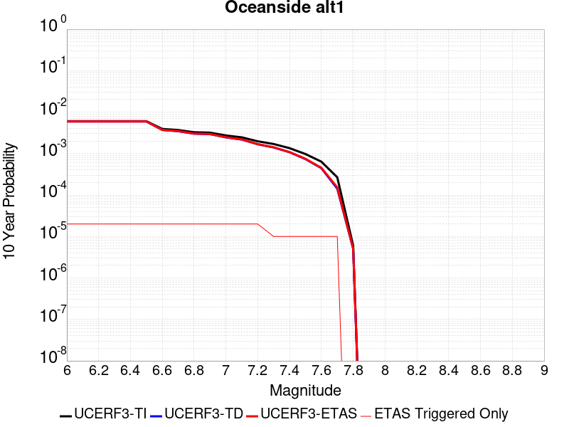 |

| Magnitude | 1 wk TI Prob | 1 wk TD Prob | 1 wk ETAS Prob | 1 wk ETAS/TD Gain | 1 wk ETAS Triggered Only | 1 mo TI Prob | 1 mo TD Prob | 1 mo ETAS Prob | 1 mo ETAS/TD Gain | 1 mo ETAS Triggered Only | 1 yr TI Prob | 1 yr TD Prob | 1 yr ETAS Prob | 1 yr ETAS/TD Gain | 1 yr ETAS Triggered Only | 10 yr TI Prob | 10 yr TD Prob | 10 yr ETAS Prob | 10 yr ETAS/TD Gain | 10 yr ETAS Triggered Only |
|-----|-----|-----|-----|-----|-----|-----|-----|-----|-----|-----|-----|-----|-----|-----|-----|-----|-----|-----|-----|-----|
| 6.0 | 1.1617542E-5 | 1.1423493E-5 | 1.1423493E-5 | 1.0 | 0.0 | 4.9788516E-5 | 4.8956997E-5 | 7.562236E-5 | 1.544669 | 2.6666667E-5 | 6.060066E-4 | 5.9590454E-4 | 6.4920605E-4 | 1.0894464 | 5.3333333E-5 | 0.0060435664 | 0.005944664 | 0.0059976806 | 1.0089183 | 5.3333333E-5 |
| 6.1 | 1.1617542E-5 | 1.1423493E-5 | 1.1423493E-5 | 1.0 | 0.0 | 4.9788516E-5 | 4.8956997E-5 | 7.562236E-5 | 1.544669 | 2.6666667E-5 | 6.060066E-4 | 5.9590454E-4 | 6.4920605E-4 | 1.0894464 | 5.3333333E-5 | 0.0060435664 | 0.005944664 | 0.0059976806 | 1.0089183 | 5.3333333E-5 |
| 6.2 | 1.1617542E-5 | 1.1423493E-5 | 1.1423493E-5 | 1.0 | 0.0 | 4.9788516E-5 | 4.8956997E-5 | 7.562236E-5 | 1.544669 | 2.6666667E-5 | 6.060066E-4 | 5.9590454E-4 | 6.4920605E-4 | 1.0894464 | 5.3333333E-5 | 0.0060435664 | 0.005944664 | 0.0059976806 | 1.0089183 | 5.3333333E-5 |
| 6.3 | 1.1617542E-5 | 1.1423493E-5 | 1.1423493E-5 | 1.0 | 0.0 | 4.9788516E-5 | 4.8956997E-5 | 7.562236E-5 | 1.544669 | 2.6666667E-5 | 6.060066E-4 | 5.9590454E-4 | 6.4920605E-4 | 1.0894464 | 5.3333333E-5 | 0.0060435664 | 0.005944664 | 0.0059976806 | 1.0089183 | 5.3333333E-5 |
| 6.4 | 1.1617542E-5 | 1.1423493E-5 | 1.1423493E-5 | 1.0 | 0.0 | 4.9788516E-5 | 4.8956997E-5 | 7.562236E-5 | 1.544669 | 2.6666667E-5 | 6.060066E-4 | 5.9590454E-4 | 6.4920605E-4 | 1.0894464 | 5.3333333E-5 | 0.0060435664 | 0.005944664 | 0.0059976806 | 1.0089183 | 5.3333333E-5 |
| 6.5 | 1.1617542E-5 | 1.1423493E-5 | 1.1423493E-5 | 1.0 | 0.0 | 4.9788516E-5 | 4.8956997E-5 | 7.562236E-5 | 1.544669 | 2.6666667E-5 | 6.060066E-4 | 5.9590454E-4 | 6.4920605E-4 | 1.0894464 | 5.3333333E-5 | 0.0060435664 | 0.005944664 | 0.0059976806 | 1.0089183 | 5.3333333E-5 |
| 6.6 | 7.561768E-6 | 7.1336153E-6 | 7.1336153E-6 | 1.0 | 0.0 | 3.2407173E-5 | 3.0572286E-5 | 5.7238136E-5 | 1.872223 | 2.6666667E-5 | 3.9448592E-4 | 3.7215507E-4 | 4.2546855E-4 | 1.1432561 | 5.3333333E-5 | 0.0039378637 | 0.00371543 | 0.0037685651 | 1.0143012 | 5.3333333E-5 |
| 6.7 | 7.1042605E-6 | 6.6556854E-6 | 6.6556854E-6 | 1.0 | 0.0 | 3.0446476E-5 | 2.8524059E-5 | 5.5189965E-5 | 1.9348567 | 2.6666667E-5 | 3.706228E-4 | 3.472259E-4 | 4.005407E-4 | 1.153545 | 5.3333333E-5 | 0.0037000529 | 0.003466917 | 0.0035200655 | 1.0153302 | 5.3333333E-5 |
| 6.8 | 6.285554E-6 | 5.799706E-6 | 5.799706E-6 | 1.0 | 0.0 | 2.693781E-5 | 2.4855648E-5 | 5.1521652E-5 | 2.0728347 | 2.6666667E-5 | 3.2791847E-4 | 3.0257605E-4 | 3.5589325E-4 | 1.1762109 | 5.3333333E-5 | 0.0032743502 | 0.0030216982 | 0.0030748704 | 1.0175968 | 5.3333333E-5 |
| 6.9 | 6.148883E-6 | 5.6565445E-6 | 5.6565445E-6 | 1.0 | 0.0 | 2.635209E-5 | 2.424211E-5 | 5.090813E-5 | 2.0999875 | 2.6666667E-5 | 3.2078946E-4 | 2.9510827E-4 | 3.4842588E-4 | 1.1806713 | 5.3333333E-5 | 0.003203268 | 0.0029472208 | 0.003000397 | 1.0180428 | 5.3333333E-5 |
| 7.0 | 5.253857E-6 | 4.722404E-6 | 4.722404E-6 | 1.0 | 0.0 | 2.2516335E-5 | 2.0238718E-5 | 4.6904846E-5 | 2.3175797 | 2.6666667E-5 | 2.7410188E-4 | 2.4637886E-4 | 2.9969902E-4 | 1.2164155 | 5.3333333E-5 | 0.0027376404 | 0.0024610884 | 0.0025142906 | 1.0216173 | 5.3333333E-5 |
| 7.1 | 4.730754E-6 | 4.17851E-6 | 4.17851E-6 | 1.0 | 0.0 | 2.0274503E-5 | 1.7907778E-5 | 4.4573968E-5 | 2.4890842 | 2.6666667E-5 | 2.468141E-4 | 2.1800565E-4 | 2.7132736E-4 | 1.2445886 | 5.3333333E-5 | 0.0024654015 | 0.0021779444 | 0.0022311616 | 1.0244346 | 5.3333333E-5 |
| 7.2 | 3.7998386E-6 | 3.214026E-6 | 3.214026E-6 | 1.0 | 0.0 | 1.6284921E-5 | 1.37743245E-5 | 4.0440624E-5 | 2.9359424 | 2.6666667E-5 | 1.9825088E-4 | 1.6768962E-4 | 2.2101401E-4 | 1.3179946 | 5.3333333E-5 | 0.001980741 | 0.001675643 | 0.0017288871 | 1.0317752 | 5.3333333E-5 |
| 7.3 | 3.2656465E-6 | 2.698376E-6 | 2.698376E-6 | 1.0 | 0.0 | 1.3995553E-5 | 1.1564418E-5 | 3.8230777E-5 | 3.3058972 | 2.6666667E-5 | 1.7038253E-4 | 1.407878E-4 | 1.6745071E-4 | 1.1893836 | 2.6666667E-5 | 0.0017025196 | 0.0014069972 | 0.0014336264 | 1.0189263 | 2.6666667E-5 |
| 7.4 | 2.593703E-6 | 2.0680277E-6 | 2.0680277E-6 | 1.0 | 0.0 | 1.1115822E-5 | 8.862946E-6 | 3.5529378E-5 | 4.0087547 | 2.6666667E-5 | 1.3532673E-4 | 1.0790111E-4 | 1.345649E-4 | 1.2471132 | 2.6666667E-5 | 0.0013524436 | 0.0010784961 | 0.001105134 | 1.0246991 | 2.6666667E-5 |
| 7.5 | 1.8715585E-6 | 1.4137177E-6 | 1.4137177E-6 | 1.0 | 0.0 | 8.020941E-6 | 6.0587763E-6 | 3.2725282E-5 | 5.4013023 | 2.6666667E-5 | 9.7650576E-5 | 7.376316E-5 | 1.0042786E-4 | 1.3614907 | 2.6666667E-5 | 9.7607676E-4 | 7.3739287E-4 | 7.6403987E-4 | 1.0361367 | 2.6666667E-5 |
| 7.6 | 1.2246786E-6 | 8.5268175E-7 | 8.5268175E-7 | 1.0 | 0.0 | 5.248612E-6 | 3.6543456E-6 | 3.0320914E-5 | 8.297221 | 2.6666667E-5 | 6.389998E-5 | 4.4490793E-5 | 7.1156275E-5 | 1.5993483 | 2.6666667E-5 | 6.3881604E-4 | 4.4482335E-4 | 4.7147818E-4 | 1.0599222 | 2.6666667E-5 |
| 7.7 | 5.140719E-7 | 2.734703E-7 | 2.734703E-7 | 1.0 | 0.0 | 2.2031636E-6 | 1.1720151E-6 | 2.783865E-5 | 23.752808 | 2.6666667E-5 | 2.6823185E-5 | 1.4269205E-5 | 4.093549E-5 | 2.8687997 | 2.6666667E-5 | 2.6819948E-4 | 1.4268424E-4 | 1.693471E-4 | 1.1868662 | 2.6666667E-5 |
| 7.8 | 1.16056995E-8 | 9.782373E-9 | 9.782373E-9 | 1.0 | 0.0 | 4.9738713E-8 | 4.1924455E-8 | 4.1924455E-8 | 1.0 | 0.0 | 6.0556863E-7 | 5.1043025E-7 | 5.1043025E-7 | 1.0 | 0.0 | 6.05567E-6 | 5.1043025E-6 | 5.1043025E-6 | 1.0 | 0.0 |

## Elsinore (Temecula) rev
*[(top)](#table-of-contents)*

| 1 Week | 1 Month | 1 Year | 10 Year |
|-----|-----|-----|-----|
|  |  |  |  |

| Magnitude | 1 wk TI Prob | 1 wk TD Prob | 1 wk ETAS Prob | 1 wk ETAS/TD Gain | 1 wk ETAS Triggered Only | 1 mo TI Prob | 1 mo TD Prob | 1 mo ETAS Prob | 1 mo ETAS/TD Gain | 1 mo ETAS Triggered Only | 1 yr TI Prob | 1 yr TD Prob | 1 yr ETAS Prob | 1 yr ETAS/TD Gain | 1 yr ETAS Triggered Only | 10 yr TI Prob | 10 yr TD Prob | 10 yr ETAS Prob | 10 yr ETAS/TD Gain | 10 yr ETAS Triggered Only |
|-----|-----|-----|-----|-----|-----|-----|-----|-----|-----|-----|-----|-----|-----|-----|-----|-----|-----|-----|-----|-----|
| 6.0 | 2.9514995E-5 | 2.2517117E-5 | 4.918318E-5 | 2.1842575 | 2.6666667E-5 | 1.264867E-4 | 9.649849E-5 | 1.4982666E-4 | 1.5526323 | 5.3333333E-5 | 0.0015388876 | 0.0011742581 | 0.0012275288 | 1.0453655 | 5.3333333E-5 | 0.015282745 | 0.011696897 | 0.0117496075 | 1.0045062 | 5.3333333E-5 |
| 6.1 | 2.9514995E-5 | 2.2517117E-5 | 4.918318E-5 | 2.1842575 | 2.6666667E-5 | 1.264867E-4 | 9.649849E-5 | 1.4982666E-4 | 1.5526323 | 5.3333333E-5 | 0.0015388876 | 0.0011742581 | 0.0012275288 | 1.0453655 | 5.3333333E-5 | 0.015282745 | 0.011696897 | 0.0117496075 | 1.0045062 | 5.3333333E-5 |
| 6.2 | 2.9514995E-5 | 2.2517117E-5 | 4.918318E-5 | 2.1842575 | 2.6666667E-5 | 1.264867E-4 | 9.649849E-5 | 1.4982666E-4 | 1.5526323 | 5.3333333E-5 | 0.0015388876 | 0.0011742581 | 0.0012275288 | 1.0453655 | 5.3333333E-5 | 0.015282745 | 0.011696897 | 0.0117496075 | 1.0045062 | 5.3333333E-5 |
| 6.3 | 2.3223649E-5 | 1.8406454E-5 | 4.507263E-5 | 2.4487405 | 2.6666667E-5 | 9.952613E-5 | 7.888251E-5 | 1.3221164E-4 | 1.6760576 | 5.3333333E-5 | 0.001211057 | 9.599888E-4 | 0.0010132709 | 1.0555029 | 5.3333333E-5 | 0.012044783 | 0.009569948 | 0.00962277 | 1.0055196 | 5.3333333E-5 |
| 6.4 | 2.3223649E-5 | 1.8406454E-5 | 4.507263E-5 | 2.4487405 | 2.6666667E-5 | 9.952613E-5 | 7.888251E-5 | 1.3221164E-4 | 1.6760576 | 5.3333333E-5 | 0.001211057 | 9.599888E-4 | 0.0010132709 | 1.0555029 | 5.3333333E-5 | 0.012044783 | 0.009569948 | 0.00962277 | 1.0055196 | 5.3333333E-5 |
| 6.5 | 1.8338875E-5 | 1.4750118E-5 | 4.141639E-5 | 2.8078685 | 2.6666667E-5 | 7.8592806E-5 | 6.321331E-5 | 1.1654327E-4 | 1.8436508 | 5.3333333E-5 | 9.5644733E-4 | 7.69359E-4 | 8.226513E-4 | 1.0692685 | 5.3333333E-5 | 0.009523412 | 0.0076739118 | 0.0077268356 | 1.0068966 | 5.3333333E-5 |
| 6.6 | 1.8223333E-5 | 1.4612673E-5 | 4.127895E-5 | 2.8248732 | 2.6666667E-5 | 7.809766E-5 | 6.262429E-5 | 1.1595428E-4 | 1.8515865 | 5.3333333E-5 | 9.504242E-4 | 7.6219277E-4 | 8.1548543E-4 | 1.0699202 | 5.3333333E-5 | 0.009463696 | 0.0076027405 | 0.0076556685 | 1.0069617 | 5.3333333E-5 |
| 6.7 | 1.7512752E-5 | 1.402721E-5 | 4.0693503E-5 | 2.9010403 | 2.6666667E-5 | 7.505249E-5 | 6.011528E-5 | 1.1344541E-4 | 1.887131 | 5.3333333E-5 | 9.13381E-4 | 7.3166634E-4 | 7.8496063E-4 | 1.0728396 | 5.3333333E-5 | 0.00909636 | 0.00729892 | 0.007351864 | 1.0072536 | 5.3333333E-5 |
| 6.8 | 1.7417142E-5 | 1.3951195E-5 | 4.0617488E-5 | 2.9113986 | 2.6666667E-5 | 7.4642754E-5 | 5.9789512E-5 | 1.13119655E-4 | 1.8919649 | 5.3333333E-5 | 9.083966E-4 | 7.277028E-4 | 7.809973E-4 | 1.0732367 | 5.3333333E-5 | 0.009046922 | 0.0072594886 | 0.0073124347 | 1.0072933 | 5.3333333E-5 |
| 6.9 | 1.6402591E-5 | 1.2988613E-5 | 3.9654933E-5 | 3.0530536 | 2.6666667E-5 | 7.0294926E-5 | 5.5664343E-5 | 1.089947E-4 | 1.9580705 | 5.3333333E-5 | 8.5550465E-4 | 6.775103E-4 | 7.308075E-4 | 1.0786662 | 5.3333333E-5 | 0.008522186 | 0.006760169 | 0.0068131415 | 1.007836 | 5.3333333E-5 |
| 7.0 | 1.3912486E-5 | 1.0878233E-5 | 3.754461E-5 | 3.451352 | 2.6666667E-5 | 5.9623577E-5 | 4.6620182E-5 | 9.995103E-5 | 2.1439433 | 5.3333333E-5 | 7.2567526E-4 | 5.674556E-4 | 6.207587E-4 | 1.0939335 | 5.3333333E-5 | 0.0072331014 | 0.005663986 | 0.005717017 | 1.0093629 | 5.3333333E-5 |
| 7.1 | 1.3405147E-5 | 1.03274215E-5 | 3.6993813E-5 | 3.5820959 | 2.6666667E-5 | 5.7449364E-5 | 4.425964E-5 | 9.7590615E-5 | 2.2049572 | 5.3333333E-5 | 6.9922156E-4 | 5.3873047E-4 | 5.9203507E-4 | 1.0989449 | 5.3333333E-5 | 0.0069702556 | 0.005377577 | 0.0054306234 | 1.0098644 | 5.3333333E-5 |
| 7.2 | 1.21402E-5 | 8.996737E-6 | 3.5663164E-5 | 3.964011 | 2.6666667E-5 | 5.202839E-5 | 3.8556886E-5 | 9.188816E-5 | 2.3831842 | 5.3333333E-5 | 6.332616E-4 | 4.6933076E-4 | 5.22639E-4 | 1.1135837 | 5.3333333E-5 | 0.0063146 | 0.004684821 | 0.0047379043 | 1.011331 | 5.3333333E-5 |
| 7.3 | 1.05047775E-5 | 7.571771E-6 | 3.4238237E-5 | 4.5218267 | 2.6666667E-5 | 4.5019697E-5 | 3.245005E-5 | 8.5781656E-5 | 2.6434982 | 5.3333333E-5 | 5.4797693E-4 | 3.950092E-4 | 4.483215E-4 | 1.1349646 | 5.3333333E-5 | 0.005466277 | 0.00394346 | 0.003996583 | 1.0134711 | 5.3333333E-5 |
| 7.4 | 9.624483E-6 | 6.7868696E-6 | 3.3453354E-5 | 4.929129 | 2.6666667E-5 | 4.124713E-5 | 2.9086266E-5 | 8.2418046E-5 | 2.8335726 | 5.3333333E-5 | 5.0206814E-4 | 3.5406914E-4 | 4.0738357E-4 | 1.1505764 | 5.3333333E-5 | 0.005009353 | 0.003535204 | 0.0035883489 | 1.015033 | 5.3333333E-5 |
| 7.5 | 8.215151E-6 | 5.635538E-6 | 5.635538E-6 | 1.0 | 0.0 | 3.5207315E-5 | 2.4152088E-5 | 5.081811E-5 | 2.1040876 | 2.6666667E-5 | 4.2856473E-4 | 2.9401327E-4 | 3.2067212E-4 | 1.0906721 | 2.6666667E-5 | 0.004277392 | 0.002936371 | 0.0029629592 | 1.0090548 | 2.6666667E-5 |
| 7.6 | 6.975058E-6 | 4.676045E-6 | 4.676045E-6 | 1.0 | 0.0 | 2.9892764E-5 | 2.0040046E-5 | 4.6706176E-5 | 2.3306422 | 2.6666667E-5 | 3.6388362E-4 | 2.439614E-4 | 2.7062156E-4 | 1.1092802 | 2.6666667E-5 | 0.0036328835 | 0.002437052 | 0.002463654 | 1.0109155 | 2.6666667E-5 |
| 7.7 | 4.159604E-6 | 2.3269924E-6 | 2.3269924E-6 | 1.0 | 0.0 | 1.7826753E-5 | 9.97279E-6 | 9.97279E-6 | 1.0 | 0.0 | 2.1701909E-4 | 1.21412704E-4 | 1.21412704E-4 | 1.0 | 0.0 | 0.0021680726 | 0.0012135367 | 0.0012135367 | 1.0 | 0.0 |
| 7.8 | 2.2692414E-7 | 9.3854695E-8 | 9.3854695E-8 | 1.0 | 0.0 | 9.725317E-7 | 4.0223435E-7 | 4.0223435E-7 | 1.0 | 0.0 | 1.1840509E-5 | 4.8971956E-6 | 4.8971956E-6 | 1.0 | 0.0 | 1.1839878E-4 | 4.8971204E-5 | 4.8971204E-5 | 1.0 | 0.0 |
| 7.9 | 6.676829E-9 | 3.439853E-9 | 3.439853E-9 | 1.0 | 0.0 | 2.861498E-8 | 1.4742227E-8 | 1.4742227E-8 | 1.0 | 0.0 | 3.4838732E-7 | 1.7948659E-7 | 1.7948659E-7 | 1.0 | 0.0 | 3.4838679E-6 | 1.7948646E-6 | 1.7948646E-6 | 1.0 | 0.0 |

## Pine Mtn
*[(top)](#table-of-contents)*

| 1 Week | 1 Month | 1 Year | 10 Year |
|-----|-----|-----|-----|
|  | 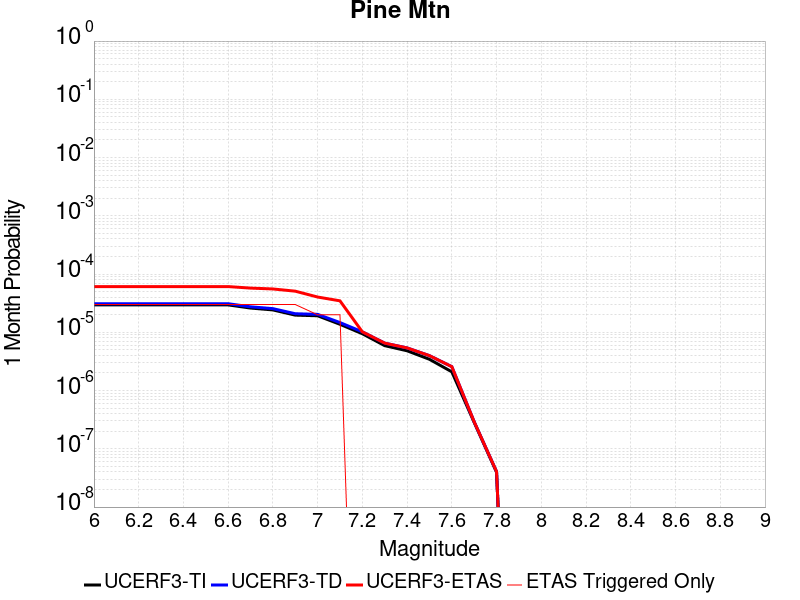 | 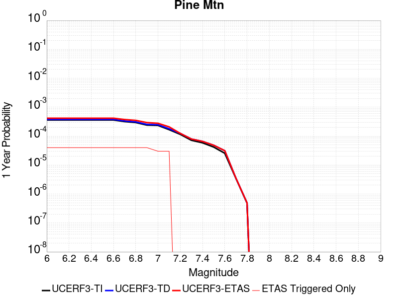 | 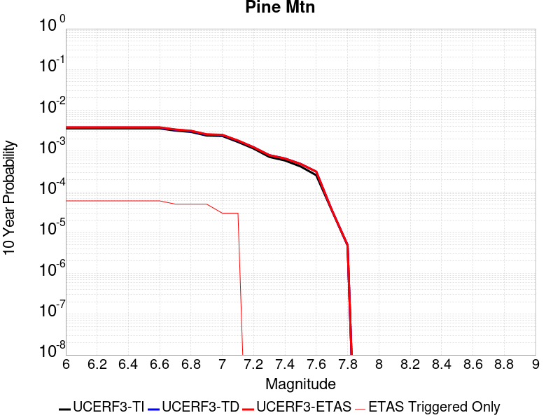 |

| Magnitude | 1 wk TI Prob | 1 wk TD Prob | 1 wk ETAS Prob | 1 wk ETAS/TD Gain | 1 wk ETAS Triggered Only | 1 mo TI Prob | 1 mo TD Prob | 1 mo ETAS Prob | 1 mo ETAS/TD Gain | 1 mo ETAS Triggered Only | 1 yr TI Prob | 1 yr TD Prob | 1 yr ETAS Prob | 1 yr ETAS/TD Gain | 1 yr ETAS Triggered Only | 10 yr TI Prob | 10 yr TD Prob | 10 yr ETAS Prob | 10 yr ETAS/TD Gain | 10 yr ETAS Triggered Only |
|-----|-----|-----|-----|-----|-----|-----|-----|-----|-----|-----|-----|-----|-----|-----|-----|-----|-----|-----|-----|-----|
| 6.0 | 6.894797E-6 | 7.225461E-6 | 6.055841E-5 | 8.381251 | 5.3333333E-5 | 2.9548795E-5 | 3.096591E-5 | 8.429759E-5 | 2.7222707 | 5.3333333E-5 | 3.596972E-4 | 3.7694772E-4 | 4.3026096E-4 | 1.141434 | 5.3333333E-5 | 0.0035911554 | 0.003763381 | 0.0038165136 | 1.0141183 | 5.3333333E-5 |
| 6.1 | 6.894797E-6 | 7.225461E-6 | 6.055841E-5 | 8.381251 | 5.3333333E-5 | 2.9548795E-5 | 3.096591E-5 | 8.429759E-5 | 2.7222707 | 5.3333333E-5 | 3.596972E-4 | 3.7694772E-4 | 4.3026096E-4 | 1.141434 | 5.3333333E-5 | 0.0035911554 | 0.003763381 | 0.0038165136 | 1.0141183 | 5.3333333E-5 |
| 6.2 | 6.894797E-6 | 7.225461E-6 | 6.055841E-5 | 8.381251 | 5.3333333E-5 | 2.9548795E-5 | 3.096591E-5 | 8.429759E-5 | 2.7222707 | 5.3333333E-5 | 3.596972E-4 | 3.7694772E-4 | 4.3026096E-4 | 1.141434 | 5.3333333E-5 | 0.0035911554 | 0.003763381 | 0.0038165136 | 1.0141183 | 5.3333333E-5 |
| 6.3 | 6.894797E-6 | 7.225461E-6 | 6.055841E-5 | 8.381251 | 5.3333333E-5 | 2.9548795E-5 | 3.096591E-5 | 8.429759E-5 | 2.7222707 | 5.3333333E-5 | 3.596972E-4 | 3.7694772E-4 | 4.3026096E-4 | 1.141434 | 5.3333333E-5 | 0.0035911554 | 0.003763381 | 0.0038165136 | 1.0141183 | 5.3333333E-5 |
| 6.4 | 6.894797E-6 | 7.225461E-6 | 6.055841E-5 | 8.381251 | 5.3333333E-5 | 2.9548795E-5 | 3.096591E-5 | 8.429759E-5 | 2.7222707 | 5.3333333E-5 | 3.596972E-4 | 3.7694772E-4 | 4.3026096E-4 | 1.141434 | 5.3333333E-5 | 0.0035911554 | 0.003763381 | 0.0038165136 | 1.0141183 | 5.3333333E-5 |
| 6.5 | 6.894797E-6 | 7.225461E-6 | 6.055841E-5 | 8.381251 | 5.3333333E-5 | 2.9548795E-5 | 3.096591E-5 | 8.429759E-5 | 2.7222707 | 5.3333333E-5 | 3.596972E-4 | 3.7694772E-4 | 4.3026096E-4 | 1.141434 | 5.3333333E-5 | 0.0035911554 | 0.003763381 | 0.0038165136 | 1.0141183 | 5.3333333E-5 |
| 6.6 | 6.894797E-6 | 7.225461E-6 | 6.055841E-5 | 8.381251 | 5.3333333E-5 | 2.9548795E-5 | 3.096591E-5 | 8.429759E-5 | 2.7222707 | 5.3333333E-5 | 3.596972E-4 | 3.7694772E-4 | 4.3026096E-4 | 1.141434 | 5.3333333E-5 | 0.0035911554 | 0.003763381 | 0.0038165136 | 1.0141183 | 5.3333333E-5 |
| 6.7 | 6.0867933E-6 | 6.3971133E-6 | 5.9730104E-5 | 9.337041 | 5.3333333E-5 | 2.6085996E-5 | 2.7415923E-5 | 8.074779E-5 | 2.9452882 | 5.3333333E-5 | 3.1755073E-4 | 3.3373994E-4 | 3.8705548E-4 | 1.1597518 | 5.3333333E-5 | 0.0031709734 | 0.0033326065 | 0.003385762 | 1.0159502 | 5.3333333E-5 |
| 6.8 | 5.6530425E-6 | 5.9505956E-6 | 5.928361E-5 | 9.962635 | 5.3333333E-5 | 2.42271E-5 | 2.5502315E-5 | 7.883429E-5 | 3.0912602 | 5.3333333E-5 | 2.94925E-4 | 3.104485E-4 | 3.6376528E-4 | 1.1717411 | 5.3333333E-5 | 0.002945339 | 0.0031003528 | 0.0031535209 | 1.017149 | 5.3333333E-5 |
| 6.9 | 4.6015225E-6 | 4.863834E-6 | 5.8196907E-5 | 11.965233 | 5.3333333E-5 | 1.9720663E-5 | 2.0844845E-5 | 7.4177064E-5 | 3.558533 | 5.3333333E-5 | 2.4007261E-4 | 2.5375787E-4 | 3.070777E-4 | 1.2101208 | 5.3333333E-5 | 0.0023981342 | 0.0025348254 | 0.0025880237 | 1.0209869 | 5.3333333E-5 |
| 7.0 | 4.4875965E-6 | 4.747473E-6 | 3.1414012E-5 | 6.616997 | 2.6666667E-5 | 1.9232413E-5 | 2.0346162E-5 | 4.7012287E-5 | 2.3106217 | 2.6666667E-5 | 2.3412947E-4 | 2.4768783E-4 | 2.743479E-4 | 1.1076357 | 2.6666667E-5 | 0.0023388295 | 0.0024742614 | 0.002500862 | 1.010751 | 2.6666667E-5 |
| 7.1 | 3.203907E-6 | 3.4294096E-6 | 3.0095985E-5 | 8.77585 | 2.6666667E-5 | 1.3730958E-5 | 1.4697391E-5 | 4.1363666E-5 | 2.8143544 | 2.6666667E-5 | 1.6716159E-4 | 1.789267E-4 | 2.055886E-4 | 1.1490102 | 2.6666667E-5 | 0.0016703589 | 0.0017878925 | 0.0018145115 | 1.0148885 | 2.6666667E-5 |
| 7.2 | 2.2060601E-6 | 2.3784817E-6 | 2.3784817E-6 | 1.0 | 0.0 | 9.4545085E-6 | 1.0193455E-5 | 1.0193455E-5 | 1.0 | 0.0 | 1.15102564E-4 | 1.240987E-4 | 1.240987E-4 | 1.0 | 0.0 | 0.0011504296 | 0.0012403389 | 0.0012403389 | 1.0 | 0.0 |
| 7.3 | 1.3765207E-6 | 1.5216481E-6 | 1.5216481E-6 | 1.0 | 0.0 | 5.899361E-6 | 6.521333E-6 | 6.521333E-6 | 1.0 | 0.0 | 7.182235E-5 | 7.939443E-5 | 7.939443E-5 | 1.0 | 0.0 | 7.1799144E-4 | 7.936697E-4 | 7.936697E-4 | 1.0 | 0.0 |
| 7.4 | 1.1245983E-6 | 1.2587075E-6 | 1.2587075E-6 | 1.0 | 0.0 | 4.819698E-6 | 5.39445E-6 | 5.39445E-6 | 1.0 | 0.0 | 5.8678244E-5 | 6.567554E-5 | 6.567554E-5 | 1.0 | 0.0 | 5.866275E-4 | 6.5656955E-4 | 6.5656955E-4 | 1.0 | 0.0 |
| 7.5 | 8.031682E-7 | 9.276951E-7 | 9.276951E-7 | 1.0 | 0.0 | 3.4421448E-6 | 3.9758306E-6 | 3.9758306E-6 | 1.0 | 0.0 | 4.1907308E-5 | 4.840473E-5 | 4.840473E-5 | 1.0 | 0.0 | 4.1899405E-4 | 4.8394862E-4 | 4.8394862E-4 | 1.0 | 0.0 |
| 7.6 | 4.8953444E-7 | 6.003009E-7 | 6.003009E-7 | 1.0 | 0.0 | 2.098003E-6 | 2.5727159E-6 | 2.5727159E-6 | 1.0 | 0.0 | 2.5542888E-5 | 3.1322415E-5 | 3.1322415E-5 | 1.0 | 0.0 | 2.5539953E-4 | 3.1318486E-4 | 3.1318486E-4 | 1.0 | 0.0 |
| 7.7 | 6.634529E-8 | 6.788826E-8 | 6.788826E-8 | 1.0 | 0.0 | 2.843369E-7 | 2.9094966E-7 | 2.9094966E-7 | 1.0 | 0.0 | 3.4617963E-6 | 3.5423066E-6 | 3.5423066E-6 | 1.0 | 0.0 | 3.4617424E-5 | 3.542255E-5 | 3.542255E-5 | 1.0 | 0.0 |
| 7.8 | 9.235578E-9 | 9.488566E-9 | 9.488566E-9 | 1.0 | 0.0 | 3.9581046E-8 | 4.0665284E-8 | 4.0665284E-8 | 1.0 | 0.0 | 4.818991E-7 | 4.950997E-7 | 4.950997E-7 | 1.0 | 0.0 | 4.8189804E-6 | 4.950988E-6 | 4.950988E-6 | 1.0 | 0.0 |

## Mission Hills 2011
*[(top)](#table-of-contents)*

| 1 Week | 1 Month | 1 Year | 10 Year |
|-----|-----|-----|-----|
|  |  |  | 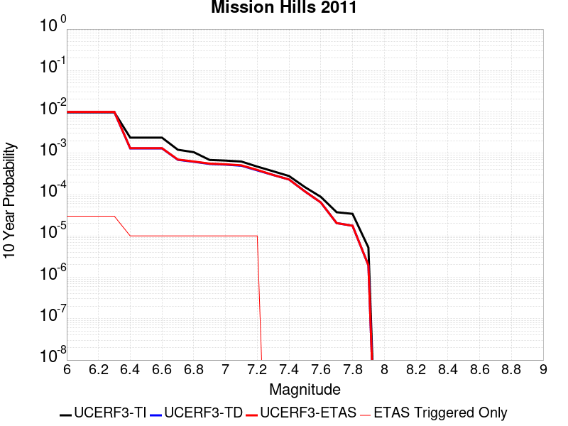 |

| Magnitude | 1 wk TI Prob | 1 wk TD Prob | 1 wk ETAS Prob | 1 wk ETAS/TD Gain | 1 wk ETAS Triggered Only | 1 mo TI Prob | 1 mo TD Prob | 1 mo ETAS Prob | 1 mo ETAS/TD Gain | 1 mo ETAS Triggered Only | 1 yr TI Prob | 1 yr TD Prob | 1 yr ETAS Prob | 1 yr ETAS/TD Gain | 1 yr ETAS Triggered Only | 10 yr TI Prob | 10 yr TD Prob | 10 yr ETAS Prob | 10 yr ETAS/TD Gain | 10 yr ETAS Triggered Only |
|-----|-----|-----|-----|-----|-----|-----|-----|-----|-----|-----|-----|-----|-----|-----|-----|-----|-----|-----|-----|-----|
| 6.0 | 1.8765717E-5 | 1.9054645E-5 | 4.5720804E-5 | 2.399457 | 2.6666667E-5 | 8.0422025E-5 | 8.166215E-5 | 1.0832664E-4 | 1.326522 | 2.6666667E-5 | 9.786983E-4 | 9.941267E-4 | 0.0010474069 | 1.0535951 | 5.3333333E-5 | 0.009743992 | 0.009930461 | 0.009983264 | 1.0053173 | 5.3333333E-5 |
| 6.1 | 1.8765717E-5 | 1.9054645E-5 | 4.5720804E-5 | 2.399457 | 2.6666667E-5 | 8.0422025E-5 | 8.166215E-5 | 1.0832664E-4 | 1.326522 | 2.6666667E-5 | 9.786983E-4 | 9.941267E-4 | 0.0010474069 | 1.0535951 | 5.3333333E-5 | 0.009743992 | 0.009930461 | 0.009983264 | 1.0053173 | 5.3333333E-5 |
| 6.2 | 1.8765717E-5 | 1.9054645E-5 | 4.5720804E-5 | 2.399457 | 2.6666667E-5 | 8.0422025E-5 | 8.166215E-5 | 1.0832664E-4 | 1.326522 | 2.6666667E-5 | 9.786983E-4 | 9.941267E-4 | 0.0010474069 | 1.0535951 | 5.3333333E-5 | 0.009743992 | 0.009930461 | 0.009983264 | 1.0053173 | 5.3333333E-5 |
| 6.3 | 1.8765717E-5 | 1.9054645E-5 | 4.5720804E-5 | 2.399457 | 2.6666667E-5 | 8.0422025E-5 | 8.166215E-5 | 1.0832664E-4 | 1.326522 | 2.6666667E-5 | 9.786983E-4 | 9.941267E-4 | 0.0010474069 | 1.0535951 | 5.3333333E-5 | 0.009743992 | 0.009930461 | 0.009983264 | 1.0053173 | 5.3333333E-5 |
| 6.4 | 4.566357E-6 | 2.5148488E-6 | 2.9181449E-5 | 11.60366 | 2.6666667E-5 | 1.9569954E-5 | 1.0777889E-5 | 3.7444268E-5 | 3.4741745 | 2.6666667E-5 | 2.3823815E-4 | 1.3121472E-4 | 1.5787788E-4 | 1.2032026 | 2.6666667E-5 | 0.002379829 | 0.0013115506 | 0.0013381824 | 1.0203055 | 2.6666667E-5 |
| 6.5 | 4.566357E-6 | 2.5148488E-6 | 2.9181449E-5 | 11.60366 | 2.6666667E-5 | 1.9569954E-5 | 1.0777889E-5 | 3.7444268E-5 | 3.4741745 | 2.6666667E-5 | 2.3823815E-4 | 1.3121472E-4 | 1.5787788E-4 | 1.2032026 | 2.6666667E-5 | 0.002379829 | 0.0013115506 | 0.0013381824 | 1.0203055 | 2.6666667E-5 |
| 6.6 | 4.566357E-6 | 2.5148488E-6 | 2.9181449E-5 | 11.60366 | 2.6666667E-5 | 1.9569954E-5 | 1.0777889E-5 | 3.7444268E-5 | 3.4741745 | 2.6666667E-5 | 2.3823815E-4 | 1.3121472E-4 | 1.5787788E-4 | 1.2032026 | 2.6666667E-5 | 0.002379829 | 0.0013115506 | 0.0013381824 | 1.0203055 | 2.6666667E-5 |
| 6.7 | 2.3266773E-6 | 1.3296187E-6 | 2.799625E-5 | 21.055847 | 2.6666667E-5 | 9.971435E-6 | 5.698354E-6 | 3.2364867E-5 | 5.6796875 | 2.6666667E-5 | 1.2139547E-4 | 6.937531E-5 | 9.604013E-5 | 1.384356 | 2.6666667E-5 | 0.0012132917 | 6.9354265E-4 | 7.201908E-4 | 1.0384233 | 2.6666667E-5 |
| 6.8 | 2.032735E-6 | 1.1894115E-6 | 2.7856046E-5 | 23.420025 | 2.6666667E-5 | 8.711692E-6 | 5.097468E-6 | 3.1764E-5 | 6.2313285 | 2.6666667E-5 | 1.06059684E-4 | 6.205996E-5 | 8.872497E-5 | 1.4296653 | 2.6666667E-5 | 0.0010600908 | 6.2043115E-4 | 6.4708124E-4 | 1.0429542 | 2.6666667E-5 |
| 6.9 | 1.3186259E-6 | 1.0561778E-6 | 2.7722816E-5 | 26.248247 | 2.6666667E-5 | 5.6512413E-6 | 4.5264687E-6 | 3.1193016E-5 | 6.8912473 | 2.6666667E-5 | 6.8801695E-5 | 5.5108394E-5 | 8.177359E-5 | 1.4838681 | 2.6666667E-5 | 6.8780396E-4 | 5.5095024E-4 | 5.7760224E-4 | 1.0483745 | 2.6666667E-5 |
| 7.0 | 1.2726016E-6 | 1.0159088E-6 | 2.7682549E-5 | 27.24905 | 2.6666667E-5 | 5.4539955E-6 | 4.3538876E-6 | 3.1020438E-5 | 7.124768 | 2.6666667E-5 | 6.6400375E-5 | 5.300732E-5 | 7.967257E-5 | 1.5030485 | 2.6666667E-5 | 6.6380535E-4 | 5.299496E-4 | 5.5660214E-4 | 1.0502926 | 2.6666667E-5 |
| 7.1 | 1.2063913E-6 | 9.570072E-7 | 2.7623648E-5 | 28.864618 | 2.6666667E-5 | 5.170238E-6 | 4.101453E-6 | 3.076801E-5 | 7.501734 | 2.6666667E-5 | 6.294583E-5 | 4.9934075E-5 | 7.659941E-5 | 1.5340108 | 2.6666667E-5 | 6.2928005E-4 | 4.992311E-4 | 5.2588445E-4 | 1.0533888 | 2.6666667E-5 |
| 7.2 | 9.105806E-7 | 7.3765557E-7 | 2.7404303E-5 | 37.15054 | 2.6666667E-5 | 3.9024826E-6 | 3.1613772E-6 | 2.982796E-5 | 9.435116 | 2.6666667E-5 | 4.7511687E-5 | 3.8489103E-5 | 6.5154745E-5 | 1.69281 | 2.6666667E-5 | 4.7501532E-4 | 3.8482592E-4 | 4.1148232E-4 | 1.0692687 | 2.6666667E-5 |
| 7.3 | 7.020432E-7 | 5.710089E-7 | 5.710089E-7 | 1.0 | 0.0 | 3.0087533E-6 | 2.447179E-6 | 2.447179E-6 | 1.0 | 0.0 | 3.6630954E-5 | 2.979401E-5 | 2.979401E-5 | 1.0 | 0.0 | 3.6624918E-4 | 2.9790145E-4 | 2.9790145E-4 | 1.0 | 0.0 |
| 7.4 | 5.3900635E-7 | 4.4480825E-7 | 4.4480825E-7 | 1.0 | 0.0 | 2.3100251E-6 | 1.9063198E-6 | 1.9063198E-6 | 1.0 | 0.0 | 2.8124194E-5 | 2.3209208E-5 | 2.3209208E-5 | 1.0 | 0.0 | 2.8120633E-4 | 2.3206905E-4 | 2.3206905E-4 | 1.0 | 0.0 |
| 7.5 | 2.907075E-7 | 2.2875415E-7 | 2.2875415E-7 | 1.0 | 0.0 | 1.2458887E-6 | 9.803746E-7 | 9.803746E-7 | 1.0 | 0.0 | 1.5168589E-5 | 1.1935997E-5 | 1.1935997E-5 | 1.0 | 0.0 | 1.5167553E-4 | 1.1935373E-4 | 1.1935373E-4 | 1.0 | 0.0 |
| 7.6 | 1.6903675E-7 | 1.2353402E-7 | 1.2353402E-7 | 1.0 | 0.0 | 7.2444305E-7 | 5.294314E-7 | 5.294314E-7 | 1.0 | 0.0 | 8.820059E-6 | 6.4458095E-6 | 6.4458095E-6 | 1.0 | 0.0 | 8.8197085E-5 | 6.445635E-5 | 6.445635E-5 | 1.0 | 0.0 |
| 7.7 | 7.168073E-8 | 3.9135116E-8 | 3.9135116E-8 | 1.0 | 0.0 | 3.072031E-7 | 1.6772192E-7 | 1.6772192E-7 | 1.0 | 0.0 | 3.7401915E-6 | 2.0420127E-6 | 2.0420127E-6 | 1.0 | 0.0 | 3.7401285E-5 | 2.041995E-5 | 2.041995E-5 | 1.0 | 0.0 |
| 7.8 | 6.564101E-8 | 3.3835356E-8 | 3.3835356E-8 | 1.0 | 0.0 | 2.813186E-7 | 1.4500866E-7 | 1.4500866E-7 | 1.0 | 0.0 | 3.4250486E-6 | 1.7654792E-6 | 1.7654792E-6 | 1.0 | 0.0 | 3.424996E-5 | 1.7654662E-5 | 1.7654662E-5 | 1.0 | 0.0 |
| 7.9 | 1.0029074E-8 | 3.7292542E-9 | 3.7292542E-9 | 1.0 | 0.0 | 4.2981743E-8 | 1.5982518E-8 | 1.5982518E-8 | 1.0 | 0.0 | 5.2330256E-7 | 1.9458714E-7 | 1.9458714E-7 | 1.0 | 0.0 | 5.2330133E-6 | 1.945871E-6 | 1.945871E-6 | 1.0 | 0.0 |

## La Panza 2011
*[(top)](#table-of-contents)*

| 1 Week | 1 Month | 1 Year | 10 Year |
|-----|-----|-----|-----|
|  |  |  | 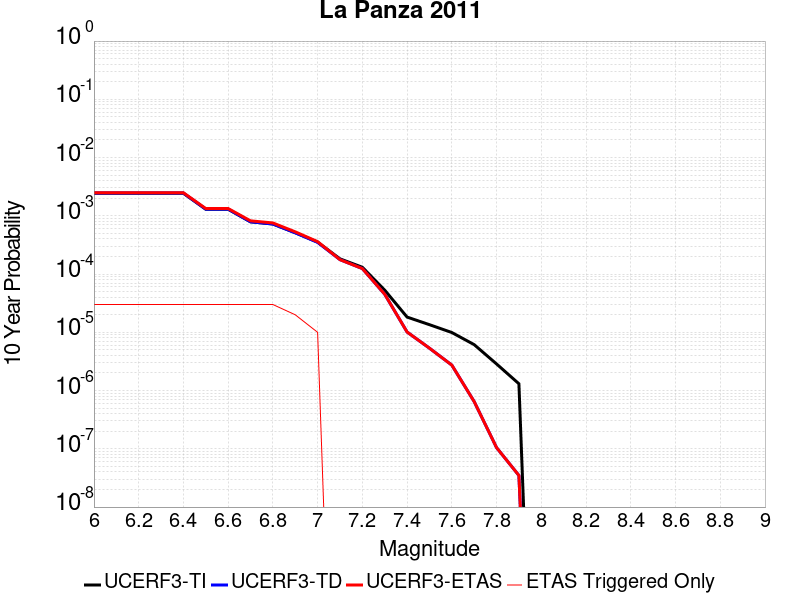 |

| Magnitude | 1 wk TI Prob | 1 wk TD Prob | 1 wk ETAS Prob | 1 wk ETAS/TD Gain | 1 wk ETAS Triggered Only | 1 mo TI Prob | 1 mo TD Prob | 1 mo ETAS Prob | 1 mo ETAS/TD Gain | 1 mo ETAS Triggered Only | 1 yr TI Prob | 1 yr TD Prob | 1 yr ETAS Prob | 1 yr ETAS/TD Gain | 1 yr ETAS Triggered Only | 10 yr TI Prob | 10 yr TD Prob | 10 yr ETAS Prob | 10 yr ETAS/TD Gain | 10 yr ETAS Triggered Only |
|-----|-----|-----|-----|-----|-----|-----|-----|-----|-----|-----|-----|-----|-----|-----|-----|-----|-----|-----|-----|-----|
| 6.0 | 4.6754544E-6 | 4.717587E-6 | 3.1384126E-5 | 6.6525807 | 2.6666667E-5 | 2.0037509E-5 | 2.0218084E-5 | 4.688421E-5 | 2.3189244 | 2.6666667E-5 | 2.4392935E-4 | 2.4612935E-4 | 2.7278945E-4 | 1.1083175 | 2.6666667E-5 | 0.0024366176 | 0.002458762 | 0.0025119642 | 1.0216378 | 5.3333333E-5 |
| 6.1 | 4.6754544E-6 | 4.717587E-6 | 3.1384126E-5 | 6.6525807 | 2.6666667E-5 | 2.0037509E-5 | 2.0218084E-5 | 4.688421E-5 | 2.3189244 | 2.6666667E-5 | 2.4392935E-4 | 2.4612935E-4 | 2.7278945E-4 | 1.1083175 | 2.6666667E-5 | 0.0024366176 | 0.002458762 | 0.0025119642 | 1.0216378 | 5.3333333E-5 |
| 6.2 | 4.6754544E-6 | 4.717587E-6 | 3.1384126E-5 | 6.6525807 | 2.6666667E-5 | 2.0037509E-5 | 2.0218084E-5 | 4.688421E-5 | 2.3189244 | 2.6666667E-5 | 2.4392935E-4 | 2.4612935E-4 | 2.7278945E-4 | 1.1083175 | 2.6666667E-5 | 0.0024366176 | 0.002458762 | 0.0025119642 | 1.0216378 | 5.3333333E-5 |
| 6.3 | 4.6754544E-6 | 4.717587E-6 | 3.1384126E-5 | 6.6525807 | 2.6666667E-5 | 2.0037509E-5 | 2.0218084E-5 | 4.688421E-5 | 2.3189244 | 2.6666667E-5 | 2.4392935E-4 | 2.4612935E-4 | 2.7278945E-4 | 1.1083175 | 2.6666667E-5 | 0.0024366176 | 0.002458762 | 0.0025119642 | 1.0216378 | 5.3333333E-5 |
| 6.4 | 4.6754544E-6 | 4.717587E-6 | 3.1384126E-5 | 6.6525807 | 2.6666667E-5 | 2.0037509E-5 | 2.0218084E-5 | 4.688421E-5 | 2.3189244 | 2.6666667E-5 | 2.4392935E-4 | 2.4612935E-4 | 2.7278945E-4 | 1.1083175 | 2.6666667E-5 | 0.0024366176 | 0.002458762 | 0.0025119642 | 1.0216378 | 5.3333333E-5 |
| 6.5 | 2.485343E-6 | 2.5005988E-6 | 2.9167199E-5 | 11.664085 | 2.6666667E-5 | 1.0651426E-5 | 1.0716811E-5 | 3.738319E-5 | 3.4882758 | 2.6666667E-5 | 1.296734E-4 | 1.3046975E-4 | 1.5713293E-4 | 1.204363 | 2.6666667E-5 | 0.0012959775 | 0.0013039699 | 0.0013572336 | 1.0408474 | 5.3333333E-5 |
| 6.6 | 2.485343E-6 | 2.5005988E-6 | 2.9167199E-5 | 11.664085 | 2.6666667E-5 | 1.0651426E-5 | 1.0716811E-5 | 3.738319E-5 | 3.4882758 | 2.6666667E-5 | 1.296734E-4 | 1.3046975E-4 | 1.5713293E-4 | 1.204363 | 2.6666667E-5 | 0.0012959775 | 0.0013039699 | 0.0013572336 | 1.0408474 | 5.3333333E-5 |
| 6.7 | 1.5108508E-6 | 1.5146375E-6 | 2.8181264E-5 | 18.605947 | 2.6666667E-5 | 6.4750584E-6 | 6.491288E-6 | 3.3157783E-5 | 5.1080437 | 2.6666667E-5 | 7.8830984E-5 | 7.902867E-5 | 1.0569323E-4 | 1.3374037 | 2.6666667E-5 | 7.880303E-4 | 7.900165E-4 | 8.433077E-4 | 1.0674558 | 5.3333333E-5 |
| 6.8 | 1.3865837E-6 | 1.3885102E-6 | 2.805514E-5 | 20.20521 | 2.6666667E-5 | 5.942488E-6 | 5.9507447E-6 | 3.2617252E-5 | 5.481205 | 2.6666667E-5 | 7.234739E-5 | 7.244801E-5 | 9.9112745E-5 | 1.3680534 | 2.6666667E-5 | 7.232384E-4 | 7.242537E-4 | 7.775484E-4 | 1.0735856 | 5.3333333E-5 |
| 6.9 | 9.826583E-7 | 9.796287E-7 | 9.796287E-7 | 1.0 | 0.0 | 4.2113857E-6 | 4.198402E-6 | 4.198402E-6 | 1.0 | 0.0 | 5.1272415E-5 | 5.11144E-5 | 5.11144E-5 | 1.0 | 0.0 | 5.126059E-4 | 5.110318E-4 | 5.376848E-4 | 1.0521554 | 2.6666667E-5 |
| 7.0 | 6.7797646E-7 | 6.7102144E-7 | 6.7102144E-7 | 1.0 | 0.0 | 2.9056102E-6 | 2.8758034E-6 | 2.8758034E-6 | 1.0 | 0.0 | 3.537523E-5 | 3.5012374E-5 | 3.5012374E-5 | 1.0 | 0.0 | 3.5369597E-4 | 3.5007167E-4 | 3.5007167E-4 | 1.0 | 0.0 |
| 7.1 | 3.4979826E-7 | 3.387388E-7 | 3.387388E-7 | 1.0 | 0.0 | 1.4991346E-6 | 1.4517369E-6 | 1.4517369E-6 | 1.0 | 0.0 | 1.825181E-5 | 1.7674765E-5 | 1.7674765E-5 | 1.0 | 0.0 | 1.825031E-4 | 1.7673477E-4 | 1.7673477E-4 | 1.0 | 0.0 |
| 7.2 | 2.5088332E-7 | 2.3831899E-7 | 2.3831899E-7 | 1.0 | 0.0 | 1.0752137E-6 | 1.0213668E-6 | 1.0213668E-6 | 1.0 | 0.0 | 1.3090649E-5 | 1.2435077E-5 | 1.2435077E-5 | 1.0 | 0.0 | 1.3089878E-4 | 1.2434467E-4 | 1.2434467E-4 | 1.0 | 0.0 |
| 7.3 | 1.0159086E-7 | 8.64462E-8 | 8.64462E-8 | 1.0 | 0.0 | 4.3538932E-7 | 3.7048366E-7 | 3.7048366E-7 | 1.0 | 0.0 | 5.300852E-6 | 4.5106294E-6 | 4.5106294E-6 | 1.0 | 0.0 | 5.3007258E-5 | 4.5105422E-5 | 4.5105422E-5 | 1.0 | 0.0 |
| 7.4 | 3.5006252E-8 | 1.9404325E-8 | 1.9404325E-8 | 1.0 | 0.0 | 1.5002678E-7 | 8.3161396E-8 | 8.3161396E-8 | 1.0 | 0.0 | 1.8265745E-6 | 1.0124895E-6 | 1.0124895E-6 | 1.0 | 0.0 | 1.8265595E-5 | 1.01248515E-5 | 1.01248515E-5 | 1.0 | 0.0 |
| 7.5 | 2.592274E-8 | 1.0239094E-8 | 1.0239094E-8 | 1.0 | 0.0 | 1.1109746E-7 | 4.388183E-8 | 4.388183E-8 | 1.0 | 0.0 | 1.3526106E-6 | 5.342612E-7 | 5.342612E-7 | 1.0 | 0.0 | 1.3526024E-5 | 5.3425997E-6 | 5.3425997E-6 | 1.0 | 0.0 |
| 7.6 | 1.9016717E-8 | 5.244801E-9 | 5.244801E-9 | 1.0 | 0.0 | 8.150022E-8 | 2.247772E-8 | 2.247772E-8 | 1.0 | 0.0 | 9.922647E-7 | 2.736662E-7 | 2.736662E-7 | 1.0 | 0.0 | 9.922603E-6 | 2.7366589E-6 | 2.7366589E-6 | 1.0 | 0.0 |
| 7.7 | 1.17738495E-8 | 1.2398075E-9 | 1.2398075E-9 | 1.0 | 0.0 | 5.0459356E-8 | 5.3134603E-9 | 5.3134603E-9 | 1.0 | 0.0 | 6.1434247E-7 | 6.469138E-8 | 6.469138E-8 | 1.0 | 0.0 | 6.143408E-6 | 6.469136E-7 | 6.469136E-7 | 1.0 | 0.0 |
| 7.8 | 5.489079E-9 | 2.0111768E-10 | 2.0111768E-10 | 1.0 | 0.0 | 2.3524624E-8 | 8.6193275E-10 | 8.6193275E-10 | 1.0 | 0.0 | 2.8641225E-7 | 1.04940305E-8 | 1.04940305E-8 | 1.0 | 0.0 | 2.8641189E-6 | 1.04940305E-7 | 1.04940305E-7 | 1.0 | 0.0 |
| 7.9 | 2.5081048E-9 | 6.683887E-11 | 6.683887E-11 | 1.0 | 0.0 | 1.0749021E-8 | 2.8645197E-10 | 2.8645197E-10 | 1.0 | 0.0 | 1.3086932E-7 | 3.487552E-9 | 3.487552E-9 | 1.0 | 0.0 | 1.3086925E-6 | 3.487552E-8 | 3.487552E-8 | 1.0 | 0.0 |

## Sheephole
*[(top)](#table-of-contents)*

| 1 Week | 1 Month | 1 Year | 10 Year |
|-----|-----|-----|-----|
| 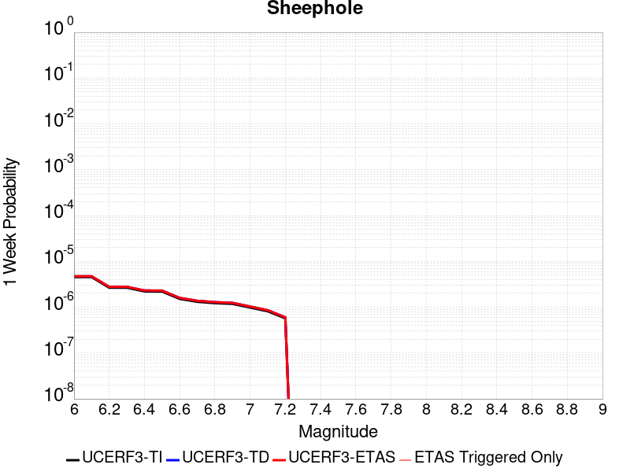 |  | 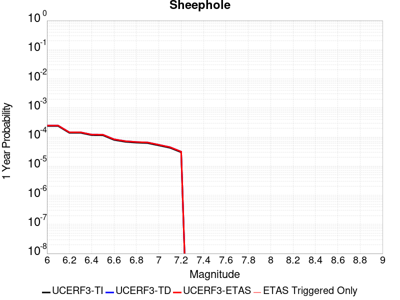 |  |

| Magnitude | 1 wk TI Prob | 1 wk TD Prob | 1 wk ETAS Prob | 1 wk ETAS/TD Gain | 1 wk ETAS Triggered Only | 1 mo TI Prob | 1 mo TD Prob | 1 mo ETAS Prob | 1 mo ETAS/TD Gain | 1 mo ETAS Triggered Only | 1 yr TI Prob | 1 yr TD Prob | 1 yr ETAS Prob | 1 yr ETAS/TD Gain | 1 yr ETAS Triggered Only | 10 yr TI Prob | 10 yr TD Prob | 10 yr ETAS Prob | 10 yr ETAS/TD Gain | 10 yr ETAS Triggered Only |
|-----|-----|-----|-----|-----|-----|-----|-----|-----|-----|-----|-----|-----|-----|-----|-----|-----|-----|-----|-----|-----|
| 6.0 | 4.5579695E-6 | 4.7412627E-6 | 4.7412627E-6 | 1.0 | 0.0 | 1.9534009E-5 | 2.031957E-5 | 2.031957E-5 | 1.0 | 0.0 | 2.3780059E-4 | 2.473682E-4 | 2.473682E-4 | 1.0 | 0.0 | 0.0023754628 | 0.002471473 | 0.0025246746 | 1.0215262 | 5.3333333E-5 |
| 6.1 | 4.5579695E-6 | 4.7412627E-6 | 4.7412627E-6 | 1.0 | 0.0 | 1.9534009E-5 | 2.031957E-5 | 2.031957E-5 | 1.0 | 0.0 | 2.3780059E-4 | 2.473682E-4 | 2.473682E-4 | 1.0 | 0.0 | 0.0023754628 | 0.002471473 | 0.0025246746 | 1.0215262 | 5.3333333E-5 |
| 6.2 | 2.6677674E-6 | 2.7873941E-6 | 2.7873941E-6 | 1.0 | 0.0 | 1.1433239E-5 | 1.1945926E-5 | 1.1945926E-5 | 1.0 | 0.0 | 1.3919079E-4 | 1.4543302E-4 | 1.4543302E-4 | 1.0 | 0.0 | 0.0013910364 | 0.0014534844 | 0.0015067402 | 1.03664 | 5.3333333E-5 |
| 6.3 | 2.6677674E-6 | 2.7873941E-6 | 2.7873941E-6 | 1.0 | 0.0 | 1.1433239E-5 | 1.1945926E-5 | 1.1945926E-5 | 1.0 | 0.0 | 1.3919079E-4 | 1.4543302E-4 | 1.4543302E-4 | 1.0 | 0.0 | 0.0013910364 | 0.0014534844 | 0.0015067402 | 1.03664 | 5.3333333E-5 |
| 6.4 | 2.2159759E-6 | 2.3228788E-6 | 2.3228788E-6 | 1.0 | 0.0 | 9.497005E-6 | 9.955161E-6 | 9.955161E-6 | 1.0 | 0.0 | 1.156199E-4 | 1.2119815E-4 | 1.2119815E-4 | 1.0 | 0.0 | 0.0011555976 | 0.0012113999 | 0.0012380342 | 1.0219865 | 2.6666667E-5 |
| 6.5 | 2.1986082E-6 | 2.304759E-6 | 2.304759E-6 | 1.0 | 0.0 | 9.4225725E-6 | 9.877506E-6 | 9.877506E-6 | 1.0 | 0.0 | 1.1471378E-4 | 1.2025281E-4 | 1.2025281E-4 | 1.0 | 0.0 | 0.0011465458 | 0.0012019566 | 0.0012285913 | 1.0221593 | 2.6666667E-5 |
| 6.6 | 1.5232331E-6 | 1.6018919E-6 | 1.6018919E-6 | 1.0 | 0.0 | 6.5281256E-6 | 6.865234E-6 | 6.865234E-6 | 1.0 | 0.0 | 7.947703E-5 | 8.35812E-5 | 8.35812E-5 | 1.0 | 0.0 | 7.9448614E-4 | 8.3551643E-4 | 8.621608E-4 | 1.0318897 | 2.6666667E-5 |
| 6.7 | 1.3137362E-6 | 1.382819E-6 | 1.382819E-6 | 1.0 | 0.0 | 5.6302856E-6 | 5.926355E-6 | 5.926355E-6 | 1.0 | 0.0 | 6.854657E-5 | 7.215112E-5 | 7.215112E-5 | 1.0 | 0.0 | 6.8525434E-4 | 7.212908E-4 | 7.479383E-4 | 1.036944 | 2.6666667E-5 |
| 6.8 | 1.2275751E-6 | 1.2922847E-6 | 1.2922847E-6 | 1.0 | 0.0 | 5.2610258E-6 | 5.5383516E-6 | 5.5383516E-6 | 1.0 | 0.0 | 6.4051106E-5 | 6.7427485E-5 | 6.7427485E-5 | 1.0 | 0.0 | 6.4032647E-4 | 6.740836E-4 | 7.007323E-4 | 1.0395333 | 2.6666667E-5 |
| 6.9 | 1.1837088E-6 | 1.246102E-6 | 1.246102E-6 | 1.0 | 0.0 | 5.0730278E-6 | 5.340427E-6 | 5.340427E-6 | 1.0 | 0.0 | 6.176237E-5 | 6.501789E-5 | 6.501789E-5 | 1.0 | 0.0 | 6.17452E-4 | 6.5000186E-4 | 6.766512E-4 | 1.0409988 | 2.6666667E-5 |
| 7.0 | 9.849371E-7 | 1.0366288E-6 | 1.0366288E-6 | 1.0 | 0.0 | 4.2211523E-6 | 4.442688E-6 | 4.442688E-6 | 1.0 | 0.0 | 5.1391315E-5 | 5.4088487E-5 | 5.4088487E-5 | 1.0 | 0.0 | 5.137943E-4 | 5.407633E-4 | 5.6741555E-4 | 1.0492864 | 2.6666667E-5 |
| 7.1 | 8.1643645E-7 | 8.591669E-7 | 8.591669E-7 | 1.0 | 0.0 | 3.4990085E-6 | 3.682139E-6 | 3.682139E-6 | 1.0 | 0.0 | 4.2599597E-5 | 4.482921E-5 | 4.482921E-5 | 1.0 | 0.0 | 4.259143E-4 | 4.4821028E-4 | 4.4821028E-4 | 1.0 | 0.0 |
| 7.2 | 5.7295756E-7 | 6.029502E-7 | 6.029502E-7 | 1.0 | 0.0 | 2.45553E-6 | 2.58407E-6 | 2.58407E-6 | 1.0 | 0.0 | 2.9895667E-5 | 3.1460666E-5 | 3.1460666E-5 | 1.0 | 0.0 | 2.9891645E-4 | 3.145688E-4 | 3.145688E-4 | 1.0 | 0.0 |

## Goose Lake 2011 CFM
*[(top)](#table-of-contents)*

| 1 Week | 1 Month | 1 Year | 10 Year |
|-----|-----|-----|-----|
|  |  |  |  |

| Magnitude | 1 wk TI Prob | 1 wk TD Prob | 1 wk ETAS Prob | 1 wk ETAS/TD Gain | 1 wk ETAS Triggered Only | 1 mo TI Prob | 1 mo TD Prob | 1 mo ETAS Prob | 1 mo ETAS/TD Gain | 1 mo ETAS Triggered Only | 1 yr TI Prob | 1 yr TD Prob | 1 yr ETAS Prob | 1 yr ETAS/TD Gain | 1 yr ETAS Triggered Only | 10 yr TI Prob | 10 yr TD Prob | 10 yr ETAS Prob | 10 yr ETAS/TD Gain | 10 yr ETAS Triggered Only |
|-----|-----|-----|-----|-----|-----|-----|-----|-----|-----|-----|-----|-----|-----|-----|-----|-----|-----|-----|-----|-----|
| 6.0 | 3.780968E-6 | 3.8230223E-6 | 3.0489588E-5 | 7.9752574 | 2.6666667E-5 | 1.6204049E-5 | 1.6384285E-5 | 4.3050513E-5 | 2.6275492 | 2.6666667E-5 | 1.9726643E-4 | 1.994615E-4 | 2.2612285E-4 | 1.1336666 | 2.6666667E-5 | 0.001970914 | 0.001992933 | 0.0020195465 | 1.013354 | 2.6666667E-5 |
| 6.1 | 2.2035124E-6 | 2.229801E-6 | 2.889641E-5 | 12.959186 | 2.6666667E-5 | 9.443591E-6 | 9.556257E-6 | 3.6222667E-5 | 3.790466 | 2.6666667E-5 | 1.1496965E-4 | 1.163414E-4 | 1.4300496E-4 | 1.2291838 | 2.6666667E-5 | 0.0011491019 | 0.0011628233 | 0.0011894589 | 1.0229061 | 2.6666667E-5 |
| 6.2 | 1.5624689E-6 | 1.5826923E-6 | 1.5826923E-6 | 1.0 | 0.0 | 6.6962784E-6 | 6.7829496E-6 | 6.7829496E-6 | 1.0 | 0.0 | 8.152414E-5 | 8.2579325E-5 | 8.2579325E-5 | 1.0 | 0.0 | 8.1494235E-4 | 8.2549086E-4 | 8.2549086E-4 | 1.0 | 0.0 |
| 6.3 | 1.5624689E-6 | 1.5826923E-6 | 1.5826923E-6 | 1.0 | 0.0 | 6.6962784E-6 | 6.7829496E-6 | 6.7829496E-6 | 1.0 | 0.0 | 8.152414E-5 | 8.2579325E-5 | 8.2579325E-5 | 1.0 | 0.0 | 8.1494235E-4 | 8.2549086E-4 | 8.2549086E-4 | 1.0 | 0.0 |
| 6.4 | 1.256464E-6 | 1.2738695E-6 | 1.2738695E-6 | 1.0 | 0.0 | 5.3848344E-6 | 5.4594293E-6 | 5.4594293E-6 | 1.0 | 0.0 | 6.5558386E-5 | 6.646655E-5 | 6.646655E-5 | 1.0 | 0.0 | 6.553905E-4 | 6.644687E-4 | 6.644687E-4 | 1.0 | 0.0 |
| 6.5 | 1.0910911E-6 | 1.1069404E-6 | 1.1069404E-6 | 1.0 | 0.0 | 4.6760965E-6 | 4.7440217E-6 | 4.7440217E-6 | 1.0 | 0.0 | 5.692999E-5 | 5.7756948E-5 | 5.7756948E-5 | 1.0 | 0.0 | 5.6915404E-4 | 5.7742064E-4 | 5.7742064E-4 | 1.0 | 0.0 |
| 6.6 | 9.546601E-7 | 9.691246E-7 | 9.691246E-7 | 1.0 | 0.0 | 4.091394E-6 | 4.1533845E-6 | 4.1533845E-6 | 1.0 | 0.0 | 4.9811584E-5 | 5.056629E-5 | 5.056629E-5 | 1.0 | 0.0 | 4.980042E-4 | 5.055487E-4 | 5.055487E-4 | 1.0 | 0.0 |
| 6.7 | 7.790316E-7 | 7.9159634E-7 | 7.9159634E-7 | 1.0 | 0.0 | 3.3387028E-6 | 3.3925514E-6 | 3.3925514E-6 | 1.0 | 0.0 | 4.0647945E-5 | 4.1303538E-5 | 4.1303538E-5 | 1.0 | 0.0 | 4.0640513E-4 | 4.129592E-4 | 4.129592E-4 | 1.0 | 0.0 |
| 6.8 | 6.3714384E-7 | 6.4787395E-7 | 6.4787395E-7 | 1.0 | 0.0 | 2.7306137E-6 | 2.7765998E-6 | 2.7765998E-6 | 1.0 | 0.0 | 3.3244716E-5 | 3.3804583E-5 | 3.3804583E-5 | 1.0 | 0.0 | 3.323974E-4 | 3.379949E-4 | 3.379949E-4 | 1.0 | 0.0 |
| 6.9 | 4.92586E-7 | 5.0139147E-7 | 5.0139147E-7 | 1.0 | 0.0 | 2.1110811E-6 | 2.1488188E-6 | 2.1488188E-6 | 1.0 | 0.0 | 2.5702111E-5 | 2.616156E-5 | 2.616156E-5 | 1.0 | 0.0 | 2.569914E-4 | 2.6158517E-4 | 2.6158517E-4 | 1.0 | 0.0 |
| 7.0 | 3.130245E-7 | 3.190354E-7 | 3.190354E-7 | 1.0 | 0.0 | 1.3415328E-6 | 1.3672939E-6 | 1.3672939E-6 | 1.0 | 0.0 | 1.6333039E-5 | 1.6646678E-5 | 1.6646678E-5 | 1.0 | 0.0 | 1.6331839E-4 | 1.6645451E-4 | 1.6645451E-4 | 1.0 | 0.0 |
| 7.1 | 1.7680084E-7 | 1.8023923E-7 | 1.8023923E-7 | 1.0 | 0.0 | 7.5771766E-7 | 7.724536E-7 | 7.724536E-7 | 1.0 | 0.0 | 9.225173E-6 | 9.404583E-6 | 9.404583E-6 | 1.0 | 0.0 | 9.22479E-5 | 9.4041956E-5 | 9.4041956E-5 | 1.0 | 0.0 |
| 7.2 | 4.8641045E-8 | 4.9402068E-8 | 4.9402068E-8 | 1.0 | 0.0 | 2.084616E-7 | 2.1172312E-7 | 2.1172312E-7 | 1.0 | 0.0 | 2.538017E-6 | 2.577726E-6 | 2.577726E-6 | 1.0 | 0.0 | 2.537988E-5 | 2.5776973E-5 | 2.5776973E-5 | 1.0 | 0.0 |
| 7.3 | 5.3911844E-9 | 5.4758145E-9 | 5.4758145E-9 | 1.0 | 0.0 | 2.3105075E-8 | 2.3467775E-8 | 2.3467775E-8 | 1.0 | 0.0 | 2.8130427E-7 | 2.8572015E-7 | 2.8572015E-7 | 1.0 | 0.0 | 2.8130391E-6 | 2.8571992E-6 | 2.8571992E-6 | 1.0 | 0.0 |

## San Gabriel (Extension)
*[(top)](#table-of-contents)*

| 1 Week | 1 Month | 1 Year | 10 Year |
|-----|-----|-----|-----|
|  |  |  |  |

| Magnitude | 1 wk TI Prob | 1 wk TD Prob | 1 wk ETAS Prob | 1 wk ETAS/TD Gain | 1 wk ETAS Triggered Only | 1 mo TI Prob | 1 mo TD Prob | 1 mo ETAS Prob | 1 mo ETAS/TD Gain | 1 mo ETAS Triggered Only | 1 yr TI Prob | 1 yr TD Prob | 1 yr ETAS Prob | 1 yr ETAS/TD Gain | 1 yr ETAS Triggered Only | 10 yr TI Prob | 10 yr TD Prob | 10 yr ETAS Prob | 10 yr ETAS/TD Gain | 10 yr ETAS Triggered Only |
|-----|-----|-----|-----|-----|-----|-----|-----|-----|-----|-----|-----|-----|-----|-----|-----|-----|-----|-----|-----|-----|
| 6.0 | 5.6486106E-6 | 5.7168304E-6 | 5.7168304E-6 | 1.0 | 0.0 | 2.4208108E-5 | 2.450048E-5 | 2.450048E-5 | 1.0 | 0.0 | 2.9469383E-4 | 2.9825376E-4 | 2.9825376E-4 | 1.0 | 0.0 | 0.0029430336 | 0.0029786653 | 0.0030318396 | 1.0178518 | 5.3333333E-5 |
| 6.1 | 5.6486106E-6 | 5.7168304E-6 | 5.7168304E-6 | 1.0 | 0.0 | 2.4208108E-5 | 2.450048E-5 | 2.450048E-5 | 1.0 | 0.0 | 2.9469383E-4 | 2.9825376E-4 | 2.9825376E-4 | 1.0 | 0.0 | 0.0029430336 | 0.0029786653 | 0.0030318396 | 1.0178518 | 5.3333333E-5 |
| 6.2 | 5.6486106E-6 | 5.7168304E-6 | 5.7168304E-6 | 1.0 | 0.0 | 2.4208108E-5 | 2.450048E-5 | 2.450048E-5 | 1.0 | 0.0 | 2.9469383E-4 | 2.9825376E-4 | 2.9825376E-4 | 1.0 | 0.0 | 0.0029430336 | 0.0029786653 | 0.0030318396 | 1.0178518 | 5.3333333E-5 |
| 6.3 | 5.6486106E-6 | 5.7168304E-6 | 5.7168304E-6 | 1.0 | 0.0 | 2.4208108E-5 | 2.450048E-5 | 2.450048E-5 | 1.0 | 0.0 | 2.9469383E-4 | 2.9825376E-4 | 2.9825376E-4 | 1.0 | 0.0 | 0.0029430336 | 0.0029786653 | 0.0030318396 | 1.0178518 | 5.3333333E-5 |
| 6.4 | 5.6486106E-6 | 5.7168304E-6 | 5.7168304E-6 | 1.0 | 0.0 | 2.4208108E-5 | 2.450048E-5 | 2.450048E-5 | 1.0 | 0.0 | 2.9469383E-4 | 2.9825376E-4 | 2.9825376E-4 | 1.0 | 0.0 | 0.0029430336 | 0.0029786653 | 0.0030318396 | 1.0178518 | 5.3333333E-5 |
| 6.5 | 4.7134554E-6 | 4.7542544E-6 | 4.7542544E-6 | 1.0 | 0.0 | 2.0200367E-5 | 2.0375222E-5 | 2.0375222E-5 | 1.0 | 0.0 | 2.459117E-4 | 2.4804095E-4 | 2.4804095E-4 | 1.0 | 0.0 | 0.0024563975 | 0.002477729 | 0.0025043297 | 1.0107359 | 2.6666667E-5 |
| 6.6 | 4.7134554E-6 | 4.7542544E-6 | 4.7542544E-6 | 1.0 | 0.0 | 2.0200367E-5 | 2.0375222E-5 | 2.0375222E-5 | 1.0 | 0.0 | 2.459117E-4 | 2.4804095E-4 | 2.4804095E-4 | 1.0 | 0.0 | 0.0024563975 | 0.002477729 | 0.0025043297 | 1.0107359 | 2.6666667E-5 |
| 6.7 | 4.2468837E-6 | 4.2740717E-6 | 4.2740717E-6 | 1.0 | 0.0 | 1.8200803E-5 | 1.8317325E-5 | 1.8317325E-5 | 1.0 | 0.0 | 2.2157225E-4 | 2.2299135E-4 | 2.2299135E-4 | 1.0 | 0.0 | 0.0022135144 | 0.0022277518 | 0.002254359 | 1.0119436 | 2.6666667E-5 |
| 6.8 | 4.1180615E-6 | 4.1414614E-6 | 4.1414614E-6 | 1.0 | 0.0 | 1.7648716E-5 | 1.7749004E-5 | 1.7749004E-5 | 1.0 | 0.0 | 2.1485193E-4 | 2.160734E-4 | 2.160734E-4 | 1.0 | 0.0 | 0.0021464431 | 0.0021587082 | 0.0021853175 | 1.0123264 | 2.6666667E-5 |
| 6.9 | 3.863861E-6 | 3.8797766E-6 | 3.8797766E-6 | 1.0 | 0.0 | 1.65593E-5 | 1.6627511E-5 | 1.6627511E-5 | 1.0 | 0.0 | 2.0159081E-4 | 2.0242184E-4 | 2.0242184E-4 | 1.0 | 0.0 | 0.0020140803 | 0.002022446 | 0.0020490587 | 1.0131587 | 2.6666667E-5 |
| 7.0 | 3.6947372E-6 | 3.705676E-6 | 3.705676E-6 | 1.0 | 0.0 | 1.5834492E-5 | 1.5881375E-5 | 1.5881375E-5 | 1.0 | 0.0 | 1.9276788E-4 | 1.9333926E-4 | 1.9333926E-4 | 1.0 | 0.0 | 0.0019260074 | 0.0019317807 | 0.0019583958 | 1.0137775 | 2.6666667E-5 |
| 7.1 | 3.5686835E-6 | 3.5728963E-6 | 3.5728963E-6 | 1.0 | 0.0 | 1.5294268E-5 | 1.5312327E-5 | 1.5312327E-5 | 1.0 | 0.0 | 1.861918E-4 | 1.8641229E-4 | 1.8641229E-4 | 1.0 | 0.0 | 0.0018603588 | 0.0018626289 | 0.0018626289 | 1.0 | 0.0 |
| 7.2 | 2.8023446E-6 | 2.7767885E-6 | 2.7767885E-6 | 1.0 | 0.0 | 1.2009994E-5 | 1.1900468E-5 | 1.1900468E-5 | 1.0 | 0.0 | 1.4621185E-4 | 1.4487868E-4 | 1.4487868E-4 | 1.0 | 0.0 | 0.001461157 | 0.0014478569 | 0.0014478569 | 1.0 | 0.0 |
| 7.3 | 2.5843012E-6 | 2.5459642E-6 | 2.5459642E-6 | 1.0 | 0.0 | 1.1075529E-5 | 1.0911231E-5 | 1.0911231E-5 | 1.0 | 0.0 | 1.3483623E-4 | 1.3283623E-4 | 1.3283623E-4 | 1.0 | 0.0 | 0.0013475444 | 0.0013275818 | 0.0013275818 | 1.0 | 0.0 |
| 7.4 | 2.4464468E-6 | 2.396665E-6 | 2.396665E-6 | 1.0 | 0.0 | 1.04847295E-5 | 1.0271382E-5 | 1.0271382E-5 | 1.0 | 0.0 | 1.276441E-4 | 1.25047E-4 | 1.25047E-4 | 1.0 | 0.0 | 0.0012757082 | 0.0012497796 | 0.0012497796 | 1.0 | 0.0 |
| 7.5 | 2.0420266E-6 | 1.8910426E-6 | 1.8910426E-6 | 1.0 | 0.0 | 8.751514E-6 | 8.104444E-6 | 8.104444E-6 | 1.0 | 0.0 | 1.0654447E-4 | 9.8667166E-5 | 9.8667166E-5 | 1.0 | 0.0 | 0.001064934 | 9.862408E-4 | 9.862408E-4 | 1.0 | 0.0 |
| 7.6 | 1.8326596E-6 | 1.6398341E-6 | 1.6398341E-6 | 1.0 | 0.0 | 7.854232E-6 | 7.0278415E-6 | 7.0278415E-6 | 1.0 | 0.0 | 9.562107E-5 | 8.5560634E-5 | 8.5560634E-5 | 1.0 | 0.0 | 9.5579936E-4 | 8.5528276E-4 | 8.5528276E-4 | 1.0 | 0.0 |
| 7.7 | 1.4786998E-6 | 1.2523838E-6 | 1.2523838E-6 | 1.0 | 0.0 | 6.3372695E-6 | 5.367348E-6 | 5.367348E-6 | 1.0 | 0.0 | 7.715353E-5 | 6.534551E-5 | 6.534551E-5 | 1.0 | 0.0 | 7.7126746E-4 | 6.532707E-4 | 6.532707E-4 | 1.0 | 0.0 |
| 7.8 | 7.6975533E-7 | 6.0693884E-7 | 6.0693884E-7 | 1.0 | 0.0 | 3.2989474E-6 | 2.601164E-6 | 2.601164E-6 | 1.0 | 0.0 | 4.0163945E-5 | 3.166871E-5 | 3.166871E-5 | 1.0 | 0.0 | 4.0156685E-4 | 3.1664805E-4 | 3.1664805E-4 | 1.0 | 0.0 |
| 7.9 | 1.7645915E-7 | 9.213256E-8 | 9.213256E-8 | 1.0 | 0.0 | 7.562533E-7 | 3.9485377E-7 | 3.9485377E-7 | 1.0 | 0.0 | 9.207345E-6 | 4.807334E-6 | 4.807334E-6 | 1.0 | 0.0 | 9.206964E-5 | 4.807699E-5 | 4.807699E-5 | 1.0 | 0.0 |
| 8.0 | 1.0463461E-7 | 2.4949307E-8 | 2.4949307E-8 | 1.0 | 0.0 | 4.4843398E-7 | 1.0692559E-7 | 1.0692559E-7 | 1.0 | 0.0 | 5.45967E-6 | 1.3018183E-6 | 1.3018183E-6 | 1.0 | 0.0 | 5.459536E-5 | 1.3022789E-5 | 1.3022789E-5 | 1.0 | 0.0 |
| 8.1 | 7.875717E-8 | 1.3866874E-8 | 1.3866874E-8 | 1.0 | 0.0 | 3.3753068E-7 | 5.942946E-8 | 5.942946E-8 | 1.0 | 0.0 | 4.109428E-6 | 7.235534E-7 | 7.235534E-7 | 1.0 | 0.0 | 4.109352E-5 | 7.2401926E-6 | 7.2401926E-6 | 1.0 | 0.0 |
| 8.2 | 1.33163E-8 | 1.7733891E-9 | 1.7733891E-9 | 1.0 | 0.0 | 5.7069855E-8 | 7.600239E-9 | 7.600239E-9 | 1.0 | 0.0 | 6.9482525E-7 | 9.25329E-8 | 9.25329E-8 | 1.0 | 0.0 | 6.9482307E-6 | 9.272953E-7 | 9.272953E-7 | 1.0 | 0.0 |

## Oceanic - West Huasna
*[(top)](#table-of-contents)*

| 1 Week | 1 Month | 1 Year | 10 Year |
|-----|-----|-----|-----|
|  |  | 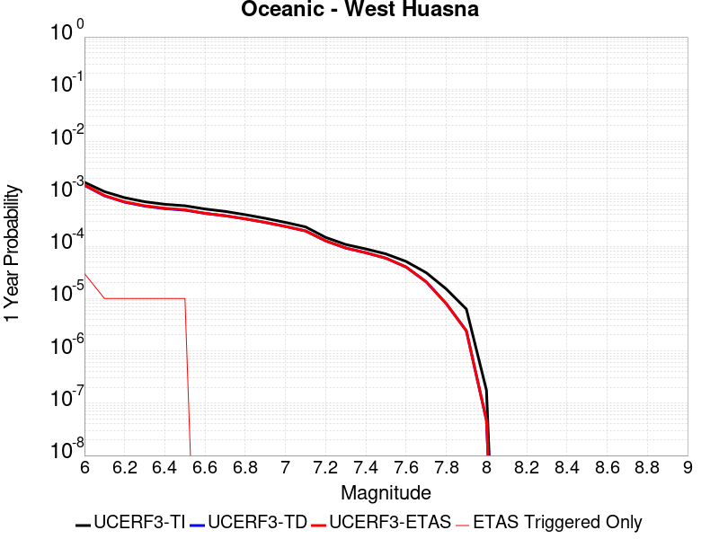 |  |

| Magnitude | 1 wk TI Prob | 1 wk TD Prob | 1 wk ETAS Prob | 1 wk ETAS/TD Gain | 1 wk ETAS Triggered Only | 1 mo TI Prob | 1 mo TD Prob | 1 mo ETAS Prob | 1 mo ETAS/TD Gain | 1 mo ETAS Triggered Only | 1 yr TI Prob | 1 yr TD Prob | 1 yr ETAS Prob | 1 yr ETAS/TD Gain | 1 yr ETAS Triggered Only | 10 yr TI Prob | 10 yr TD Prob | 10 yr ETAS Prob | 10 yr ETAS/TD Gain | 10 yr ETAS Triggered Only |
|-----|-----|-----|-----|-----|-----|-----|-----|-----|-----|-----|-----|-----|-----|-----|-----|-----|-----|-----|-----|-----|
| 6.0 | 3.195567E-5 | 2.7926868E-5 | 5.459279E-5 | 1.9548483 | 2.6666667E-5 | 1.3694567E-4 | 1.1968133E-4 | 1.463448E-4 | 1.2227873 | 2.6666667E-5 | 0.0016660384 | 0.0014561893 | 0.0014828172 | 1.018286 | 2.6666667E-5 | 0.016536033 | 0.014471028 | 0.014523589 | 1.0036322 | 5.3333333E-5 |
| 6.1 | 2.1156782E-5 | 1.7573486E-5 | 1.7573486E-5 | 1.0 | 0.0 | 9.066878E-5 | 7.531282E-5 | 7.531282E-5 | 1.0 | 0.0 | 0.0011033333 | 9.165572E-4 | 9.165572E-4 | 1.0 | 0.0 | 0.010978713 | 0.009128777 | 0.009155201 | 1.0028945 | 2.6666667E-5 |
| 6.2 | 1.6195117E-5 | 1.3327152E-5 | 1.3327152E-5 | 1.0 | 0.0 | 6.9405796E-5 | 5.7115132E-5 | 5.7115132E-5 | 1.0 | 0.0 | 8.44688E-4 | 6.9515745E-4 | 6.9515745E-4 | 1.0 | 0.0 | 0.008414844 | 0.006930123 | 0.0069566052 | 1.0038213 | 2.6666667E-5 |
| 6.3 | 1.3559345E-5 | 1.1179142E-5 | 1.1179142E-5 | 1.0 | 0.0 | 5.811018E-5 | 4.7909736E-5 | 4.7909736E-5 | 1.0 | 0.0 | 7.072618E-4 | 5.831459E-4 | 5.831459E-4 | 1.0 | 0.0 | 0.0070501505 | 0.0058162753 | 0.0058162753 | 1.0 | 0.0 |
| 6.4 | 1.2120619E-5 | 1.0000977E-5 | 1.0000977E-5 | 1.0 | 0.0 | 5.1944477E-5 | 4.2860633E-5 | 4.2860633E-5 | 1.0 | 0.0 | 6.322405E-4 | 5.2170374E-4 | 5.2170374E-4 | 1.0 | 0.0 | 0.006304447 | 0.0052048573 | 0.0052048573 | 1.0 | 0.0 |
| 6.5 | 1.13511915E-5 | 9.3674735E-6 | 9.3674735E-6 | 1.0 | 0.0 | 4.8647056E-5 | 4.01457E-5 | 4.01457E-5 | 1.0 | 0.0 | 5.9211696E-4 | 4.886647E-4 | 4.886647E-4 | 1.0 | 0.0 | 0.0059054173 | 0.0048759608 | 0.0048759608 | 1.0 | 0.0 |
| 6.6 | 9.850605E-6 | 8.135418E-6 | 8.135418E-6 | 1.0 | 0.0 | 4.2216197E-5 | 3.4865614E-5 | 3.4865614E-5 | 1.0 | 0.0 | 5.1386096E-4 | 4.2440637E-4 | 4.2440637E-4 | 1.0 | 0.0 | 0.0051267436 | 0.004235991 | 0.004235991 | 1.0 | 0.0 |
| 6.7 | 8.8558645E-6 | 7.318433E-6 | 7.318433E-6 | 1.0 | 0.0 | 3.7953152E-5 | 3.1364336E-5 | 3.1364336E-5 | 1.0 | 0.0 | 4.6198163E-4 | 3.8179406E-4 | 3.8179406E-4 | 1.0 | 0.0 | 0.004610224 | 0.0038114067 | 0.0038114067 | 1.0 | 0.0 |
| 6.8 | 7.67136E-6 | 6.391756E-6 | 6.391756E-6 | 1.0 | 0.0 | 3.2876844E-5 | 2.7392953E-5 | 2.7392953E-5 | 1.0 | 0.0 | 4.0020206E-4 | 3.3345833E-4 | 3.3345833E-4 | 1.0 | 0.0 | 0.003994821 | 0.0033296007 | 0.0033296007 | 1.0 | 0.0 |
| 6.9 | 6.534529E-6 | 5.4583297E-6 | 5.4583297E-6 | 1.0 | 0.0 | 2.8004823E-5 | 2.3392633E-5 | 2.3392633E-5 | 1.0 | 0.0 | 3.4090536E-4 | 2.847682E-4 | 2.847682E-4 | 1.0 | 0.0 | 0.0034038287 | 0.0028440498 | 0.0028440498 | 1.0 | 0.0 |
| 7.0 | 5.460525E-6 | 4.5699517E-6 | 4.5699517E-6 | 1.0 | 0.0 | 2.3402039E-5 | 1.958536E-5 | 1.958536E-5 | 1.0 | 0.0 | 2.8488258E-4 | 2.3842578E-4 | 2.3842578E-4 | 1.0 | 0.0 | 0.0028451765 | 0.0023817138 | 0.0023817138 | 1.0 | 0.0 |
| 7.1 | 4.4825083E-6 | 3.7524428E-6 | 3.7524428E-6 | 1.0 | 0.0 | 1.9210609E-5 | 1.60818E-5 | 1.60818E-5 | 1.0 | 0.0 | 2.3386406E-4 | 1.9577841E-4 | 1.9577841E-4 | 1.0 | 0.0 | 0.002336181 | 0.0019560715 | 0.0019560715 | 1.0 | 0.0 |
| 7.2 | 2.821708E-6 | 2.4249334E-6 | 2.4249334E-6 | 1.0 | 0.0 | 1.2092979E-5 | 1.039253E-5 | 1.039253E-5 | 1.0 | 0.0 | 1.4722206E-4 | 1.2652173E-4 | 1.2652173E-4 | 1.0 | 0.0 | 0.0014712457 | 0.0012644994 | 0.0012644994 | 1.0 | 0.0 |
| 7.3 | 2.0644757E-6 | 1.7687412E-6 | 1.7687412E-6 | 1.0 | 0.0 | 8.847723E-6 | 7.5802973E-6 | 7.5802973E-6 | 1.0 | 0.0 | 1.0771569E-4 | 9.228622E-5 | 9.228622E-5 | 1.0 | 0.0 | 0.001076635 | 9.2248066E-4 | 9.2248066E-4 | 1.0 | 0.0 |
| 7.4 | 1.6980367E-6 | 1.4379892E-6 | 1.4379892E-6 | 1.0 | 0.0 | 7.27728E-6 | 6.162796E-6 | 6.162796E-6 | 1.0 | 0.0 | 8.8597284E-5 | 7.5029464E-5 | 7.5029464E-5 | 1.0 | 0.0 | 8.8561967E-4 | 7.500429E-4 | 7.500429E-4 | 1.0 | 0.0 |
| 7.5 | 1.3637683E-6 | 1.1302635E-6 | 1.1302635E-6 | 1.0 | 0.0 | 5.844708E-6 | 4.8439774E-6 | 4.8439774E-6 | 1.0 | 0.0 | 7.1156996E-5 | 5.897383E-5 | 5.897383E-5 | 1.0 | 0.0 | 7.1134215E-4 | 5.895833E-4 | 5.895833E-4 | 1.0 | 0.0 |
| 7.6 | 9.802994E-7 | 7.677247E-7 | 7.677247E-7 | 1.0 | 0.0 | 4.2012766E-6 | 3.2902446E-6 | 3.2902446E-6 | 1.0 | 0.0 | 5.1149345E-5 | 4.0057992E-5 | 4.0057992E-5 | 1.0 | 0.0 | 5.113757E-4 | 4.0050913E-4 | 4.0050913E-4 | 1.0 | 0.0 |
| 7.7 | 5.986191E-7 | 4.0050548E-7 | 4.0050548E-7 | 1.0 | 0.0 | 2.5655079E-6 | 1.7164509E-6 | 1.7164509E-6 | 1.0 | 0.0 | 3.1234613E-5 | 2.089759E-5 | 2.089759E-5 | 1.0 | 0.0 | 3.123022E-4 | 2.089576E-4 | 2.089576E-4 | 1.0 | 0.0 |
| 7.8 | 2.9189815E-7 | 1.5285792E-7 | 1.5285792E-7 | 1.0 | 0.0 | 1.2509914E-6 | 6.5510517E-7 | 6.5510517E-7 | 1.0 | 0.0 | 1.5230714E-5 | 7.9758765E-6 | 7.9758765E-6 | 1.0 | 0.0 | 1.522967E-4 | 7.9757214E-5 | 7.9757214E-5 | 1.0 | 0.0 |
| 7.9 | 1.2057845E-7 | 4.621248E-8 | 4.621248E-8 | 1.0 | 0.0 | 5.1676466E-7 | 1.9805347E-7 | 1.9805347E-7 | 1.0 | 0.0 | 6.2915915E-6 | 2.4112983E-6 | 2.4112983E-6 | 1.0 | 0.0 | 6.2914136E-5 | 2.4114026E-5 | 2.4114026E-5 | 1.0 | 0.0 |
| 8.0 | 3.3806387E-9 | 9.011393E-10 | 9.011393E-10 | 1.0 | 0.0 | 1.4488451E-8 | 3.8620254E-9 | 3.8620254E-9 | 1.0 | 0.0 | 1.7639688E-7 | 4.702016E-8 | 4.702016E-8 | 1.0 | 0.0 | 1.7639674E-6 | 4.7129527E-7 | 4.7129527E-7 | 1.0 | 0.0 |

## Santa Cruz Island
*[(top)](#table-of-contents)*

| 1 Week | 1 Month | 1 Year | 10 Year |
|-----|-----|-----|-----|
|  | 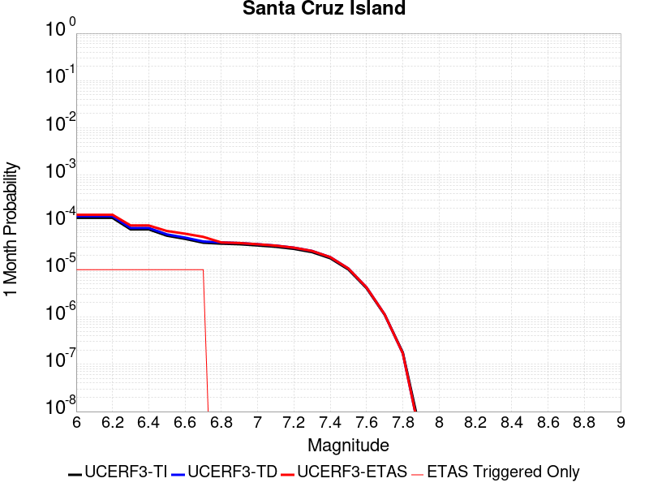 |  |  |

| Magnitude | 1 wk TI Prob | 1 wk TD Prob | 1 wk ETAS Prob | 1 wk ETAS/TD Gain | 1 wk ETAS Triggered Only | 1 mo TI Prob | 1 mo TD Prob | 1 mo ETAS Prob | 1 mo ETAS/TD Gain | 1 mo ETAS Triggered Only | 1 yr TI Prob | 1 yr TD Prob | 1 yr ETAS Prob | 1 yr ETAS/TD Gain | 1 yr ETAS Triggered Only | 10 yr TI Prob | 10 yr TD Prob | 10 yr ETAS Prob | 10 yr ETAS/TD Gain | 10 yr ETAS Triggered Only |
|-----|-----|-----|-----|-----|-----|-----|-----|-----|-----|-----|-----|-----|-----|-----|-----|-----|-----|-----|-----|-----|
| 6.0 | 2.9164563E-5 | 3.1599742E-5 | 5.8265567E-5 | 1.843862 | 2.6666667E-5 | 1.2498499E-4 | 1.3542121E-4 | 1.6208427E-4 | 1.1968898 | 2.6666667E-5 | 0.0015206301 | 0.0016476426 | 0.0016742653 | 1.0161581 | 2.6666667E-5 | 0.015102667 | 0.016368 | 0.01642046 | 1.0032051 | 5.3333333E-5 |
| 6.1 | 2.9164563E-5 | 3.1599742E-5 | 5.8265567E-5 | 1.843862 | 2.6666667E-5 | 1.2498499E-4 | 1.3542121E-4 | 1.6208427E-4 | 1.1968898 | 2.6666667E-5 | 0.0015206301 | 0.0016476426 | 0.0016742653 | 1.0161581 | 2.6666667E-5 | 0.015102667 | 0.016368 | 0.01642046 | 1.0032051 | 5.3333333E-5 |
| 6.2 | 2.9164563E-5 | 3.1599742E-5 | 5.8265567E-5 | 1.843862 | 2.6666667E-5 | 1.2498499E-4 | 1.3542121E-4 | 1.6208427E-4 | 1.1968898 | 2.6666667E-5 | 0.0015206301 | 0.0016476426 | 0.0016742653 | 1.0161581 | 2.6666667E-5 | 0.015102667 | 0.016368 | 0.01642046 | 1.0032051 | 5.3333333E-5 |
| 6.3 | 1.6635553E-5 | 1.780436E-5 | 4.447055E-5 | 2.4977338 | 2.6666667E-5 | 7.1293274E-5 | 7.630226E-5 | 1.029669E-4 | 1.3494606 | 2.6666667E-5 | 8.6765E-4 | 9.2860236E-4 | 9.552443E-4 | 1.0286903 | 2.6666667E-5 | 0.008642701 | 0.009249094 | 0.009275514 | 1.0028565 | 2.6666667E-5 |
| 6.4 | 1.6635553E-5 | 1.780436E-5 | 4.447055E-5 | 2.4977338 | 2.6666667E-5 | 7.1293274E-5 | 7.630226E-5 | 1.029669E-4 | 1.3494606 | 2.6666667E-5 | 8.6765E-4 | 9.2860236E-4 | 9.552443E-4 | 1.0286903 | 2.6666667E-5 | 0.008642701 | 0.009249094 | 0.009275514 | 1.0028565 | 2.6666667E-5 |
| 6.5 | 1.2238748E-5 | 1.3042995E-5 | 3.9709314E-5 | 3.0444934 | 2.6666667E-5 | 5.2450723E-5 | 5.5897377E-5 | 8.2562554E-5 | 1.477038 | 2.6666667E-5 | 6.3840044E-4 | 6.8034173E-4 | 7.0699025E-4 | 1.0391693 | 2.6666667E-5 | 0.0063656955 | 0.0067829876 | 0.0068094735 | 1.0039047 | 2.6666667E-5 |
| 6.6 | 1.0489767E-5 | 1.1156636E-5 | 3.7823003E-5 | 3.39018 | 2.6666667E-5 | 4.495537E-5 | 4.781329E-5 | 7.447868E-5 | 1.5576984 | 2.6666667E-5 | 5.4719415E-4 | 5.819735E-4 | 6.086247E-4 | 1.0457945 | 2.6666667E-5 | 0.005458487 | 0.0058047357 | 0.0058312477 | 1.0045673 | 2.6666667E-5 |
| 6.7 | 8.699222E-6 | 9.236782E-6 | 3.5903202E-5 | 3.8869817 | 2.6666667E-5 | 3.7281847E-5 | 3.958561E-5 | 6.6251225E-5 | 1.6736188 | 2.6666667E-5 | 4.5381195E-4 | 4.8184878E-4 | 5.085026E-4 | 1.0553157 | 2.6666667E-5 | 0.0045288634 | 0.004808108 | 0.0048346464 | 1.0055195 | 2.6666667E-5 |
| 6.8 | 8.307732E-6 | 8.8169045E-6 | 8.8169045E-6 | 1.0 | 0.0 | 3.560408E-5 | 3.7786187E-5 | 3.7786187E-5 | 1.0 | 0.0 | 4.3339343E-4 | 4.5995016E-4 | 4.5995016E-4 | 1.0 | 0.0 | 0.004325492 | 0.0045900354 | 0.0045900354 | 1.0 | 0.0 |
| 6.9 | 8.073121E-6 | 8.564939E-6 | 8.564939E-6 | 1.0 | 0.0 | 3.459863E-5 | 3.6706366E-5 | 3.6706366E-5 | 1.0 | 0.0 | 4.2115687E-4 | 4.468088E-4 | 4.468088E-4 | 1.0 | 0.0 | 0.004203596 | 0.004459156 | 0.004459156 | 1.0 | 0.0 |
| 7.0 | 7.617019E-6 | 8.074664E-6 | 8.074664E-6 | 1.0 | 0.0 | 3.264396E-5 | 3.4605247E-5 | 3.4605247E-5 | 1.0 | 0.0 | 3.9736772E-4 | 4.212378E-4 | 4.212378E-4 | 1.0 | 0.0 | 0.003966579 | 0.0042044413 | 0.0042044413 | 1.0 | 0.0 |
| 7.1 | 7.1224836E-6 | 7.545788E-6 | 7.545788E-6 | 1.0 | 0.0 | 3.052457E-5 | 3.2338692E-5 | 3.2338692E-5 | 1.0 | 0.0 | 3.715733E-4 | 3.936528E-4 | 3.936528E-4 | 1.0 | 0.0 | 0.003709526 | 0.003929598 | 0.003929598 | 1.0 | 0.0 |
| 7.2 | 6.441115E-6 | 6.8273835E-6 | 6.8273835E-6 | 1.0 | 0.0 | 2.7604487E-5 | 2.9259887E-5 | 2.9259887E-5 | 1.0 | 0.0 | 3.360328E-4 | 3.5618112E-4 | 3.5618112E-4 | 1.0 | 0.0 | 0.0033552512 | 0.003556131 | 0.003556131 | 1.0 | 0.0 |
| 7.3 | 5.494274E-6 | 5.8199944E-6 | 5.8199944E-6 | 1.0 | 0.0 | 2.3546674E-5 | 2.4942596E-5 | 2.4942596E-5 | 1.0 | 0.0 | 2.8664304E-4 | 3.0363398E-4 | 3.0363398E-4 | 1.0 | 0.0 | 0.002862736 | 0.0030322142 | 0.0030322142 | 1.0 | 0.0 |
| 7.4 | 4.0802624E-6 | 4.312256E-6 | 4.312256E-6 | 1.0 | 0.0 | 1.7486722E-5 | 1.8480967E-5 | 1.8480967E-5 | 1.0 | 0.0 | 2.1288003E-4 | 2.2498262E-4 | 2.2498262E-4 | 1.0 | 0.0 | 0.0021267622 | 0.0022475575 | 0.0022475575 | 1.0 | 0.0 |
| 7.5 | 2.3584746E-6 | 2.4753094E-6 | 2.4753094E-6 | 1.0 | 0.0 | 1.0107709E-5 | 1.0608426E-5 | 1.0608426E-5 | 1.0 | 0.0 | 1.2305441E-4 | 1.2915E-4 | 1.2915E-4 | 1.0 | 0.0 | 0.0012298629 | 0.0012907543 | 0.0012907543 | 1.0 | 0.0 |
| 7.6 | 9.4981914E-7 | 9.86093E-7 | 9.86093E-7 | 1.0 | 0.0 | 4.0706473E-6 | 4.2261063E-6 | 4.2261063E-6 | 1.0 | 0.0 | 4.9559E-5 | 5.145164E-5 | 5.145164E-5 | 1.0 | 0.0 | 4.954795E-4 | 5.1439856E-4 | 5.1439856E-4 | 1.0 | 0.0 |
| 7.7 | 2.6013532E-7 | 2.6416603E-7 | 2.6416603E-7 | 1.0 | 0.0 | 1.1148652E-6 | 1.1321397E-6 | 1.1321397E-6 | 1.0 | 0.0 | 1.3573399E-5 | 1.3783714E-5 | 1.3783714E-5 | 1.0 | 0.0 | 1.357257E-4 | 1.3782867E-4 | 1.3782867E-4 | 1.0 | 0.0 |
| 7.8 | 4.1522263E-8 | 3.965679E-8 | 3.965679E-8 | 1.0 | 0.0 | 1.7795254E-7 | 1.6995766E-7 | 1.6995766E-7 | 1.0 | 0.0 | 2.16657E-6 | 2.0692328E-6 | 2.0692328E-6 | 1.0 | 0.0 | 2.1665488E-5 | 2.0692156E-5 | 2.0692156E-5 | 1.0 | 0.0 |
| 7.9 | 7.7242046E-10 | 5.9468175E-10 | 5.9468175E-10 | 1.0 | 0.0 | 3.3103735E-9 | 2.5486364E-9 | 2.5486364E-9 | 1.0 | 0.0 | 4.0303796E-8 | 3.1029646E-8 | 3.1029646E-8 | 1.0 | 0.0 | 4.030379E-7 | 3.1029643E-7 | 3.1029643E-7 | 1.0 | 0.0 |

## Fontana (Seismicity)
*[(top)](#table-of-contents)*

| 1 Week | 1 Month | 1 Year | 10 Year |
|-----|-----|-----|-----|
|  |  |  |  |

| Magnitude | 1 wk TI Prob | 1 wk TD Prob | 1 wk ETAS Prob | 1 wk ETAS/TD Gain | 1 wk ETAS Triggered Only | 1 mo TI Prob | 1 mo TD Prob | 1 mo ETAS Prob | 1 mo ETAS/TD Gain | 1 mo ETAS Triggered Only | 1 yr TI Prob | 1 yr TD Prob | 1 yr ETAS Prob | 1 yr ETAS/TD Gain | 1 yr ETAS Triggered Only | 10 yr TI Prob | 10 yr TD Prob | 10 yr ETAS Prob | 10 yr ETAS/TD Gain | 10 yr ETAS Triggered Only |
|-----|-----|-----|-----|-----|-----|-----|-----|-----|-----|-----|-----|-----|-----|-----|-----|-----|-----|-----|-----|-----|
| 6.0 | 7.1789214E-6 | 7.5520006E-6 | 7.5520006E-6 | 1.0 | 0.0 | 3.076644E-5 | 3.2365548E-5 | 3.2365548E-5 | 1.0 | 0.0 | 3.7451705E-4 | 3.9402005E-4 | 4.2067622E-4 | 1.0676517 | 2.6666667E-5 | 0.003738865 | 0.003937214 | 0.0039903373 | 1.0134926 | 5.3333333E-5 |
| 6.1 | 7.1789214E-6 | 7.5520006E-6 | 7.5520006E-6 | 1.0 | 0.0 | 3.076644E-5 | 3.2365548E-5 | 3.2365548E-5 | 1.0 | 0.0 | 3.7451705E-4 | 3.9402005E-4 | 4.2067622E-4 | 1.0676517 | 2.6666667E-5 | 0.003738865 | 0.003937214 | 0.0039903373 | 1.0134926 | 5.3333333E-5 |
| 6.2 | 7.1789214E-6 | 7.5520006E-6 | 7.5520006E-6 | 1.0 | 0.0 | 3.076644E-5 | 3.2365548E-5 | 3.2365548E-5 | 1.0 | 0.0 | 3.7451705E-4 | 3.9402005E-4 | 4.2067622E-4 | 1.0676517 | 2.6666667E-5 | 0.003738865 | 0.003937214 | 0.0039903373 | 1.0134926 | 5.3333333E-5 |
| 6.3 | 7.1789214E-6 | 7.5520006E-6 | 7.5520006E-6 | 1.0 | 0.0 | 3.076644E-5 | 3.2365548E-5 | 3.2365548E-5 | 1.0 | 0.0 | 3.7451705E-4 | 3.9402005E-4 | 4.2067622E-4 | 1.0676517 | 2.6666667E-5 | 0.003738865 | 0.003937214 | 0.0039903373 | 1.0134926 | 5.3333333E-5 |
| 6.4 | 7.1789214E-6 | 7.5520006E-6 | 7.5520006E-6 | 1.0 | 0.0 | 3.076644E-5 | 3.2365548E-5 | 3.2365548E-5 | 1.0 | 0.0 | 3.7451705E-4 | 3.9402005E-4 | 4.2067622E-4 | 1.0676517 | 2.6666667E-5 | 0.003738865 | 0.003937214 | 0.0039903373 | 1.0134926 | 5.3333333E-5 |
| 6.5 | 5.2611317E-6 | 5.532726E-6 | 5.532726E-6 | 1.0 | 0.0 | 2.2547512E-5 | 2.3711682E-5 | 2.3711682E-5 | 1.0 | 0.0 | 2.744814E-4 | 2.8868974E-4 | 3.153487E-4 | 1.0923448 | 2.6666667E-5 | 0.002741426 | 0.0028868972 | 0.002913487 | 1.0092105 | 2.6666667E-5 |
| 6.6 | 5.2611317E-6 | 5.532726E-6 | 5.532726E-6 | 1.0 | 0.0 | 2.2547512E-5 | 2.3711682E-5 | 2.3711682E-5 | 1.0 | 0.0 | 2.744814E-4 | 2.8868974E-4 | 3.153487E-4 | 1.0923448 | 2.6666667E-5 | 0.002741426 | 0.0028868972 | 0.002913487 | 1.0092105 | 2.6666667E-5 |

## Antelope Valley 2011
*[(top)](#table-of-contents)*

| 1 Week | 1 Month | 1 Year | 10 Year |
|-----|-----|-----|-----|
|  |  |  |  |

| Magnitude | 1 wk TI Prob | 1 wk TD Prob | 1 wk ETAS Prob | 1 wk ETAS/TD Gain | 1 wk ETAS Triggered Only | 1 mo TI Prob | 1 mo TD Prob | 1 mo ETAS Prob | 1 mo ETAS/TD Gain | 1 mo ETAS Triggered Only | 1 yr TI Prob | 1 yr TD Prob | 1 yr ETAS Prob | 1 yr ETAS/TD Gain | 1 yr ETAS Triggered Only | 10 yr TI Prob | 10 yr TD Prob | 10 yr ETAS Prob | 10 yr ETAS/TD Gain | 10 yr ETAS Triggered Only |
|-----|-----|-----|-----|-----|-----|-----|-----|-----|-----|-----|-----|-----|-----|-----|-----|-----|-----|-----|-----|-----|
| 6.0 | 3.1646934E-5 | 3.6904403E-5 | 3.6904403E-5 | 1.0 | 0.0 | 1.3562266E-4 | 1.5815363E-4 | 1.5815363E-4 | 1.0 | 0.0 | 0.0016499552 | 0.0019240845 | 0.0019506998 | 1.0138327 | 2.6666667E-5 | 0.016377583 | 0.019100651 | 0.019152965 | 1.0027388 | 5.3333333E-5 |
| 6.1 | 3.1646934E-5 | 3.6904403E-5 | 3.6904403E-5 | 1.0 | 0.0 | 1.3562266E-4 | 1.5815363E-4 | 1.5815363E-4 | 1.0 | 0.0 | 0.0016499552 | 0.0019240845 | 0.0019506998 | 1.0138327 | 2.6666667E-5 | 0.016377583 | 0.019100651 | 0.019152965 | 1.0027388 | 5.3333333E-5 |
| 6.2 | 3.1646934E-5 | 3.6904403E-5 | 3.6904403E-5 | 1.0 | 0.0 | 1.3562266E-4 | 1.5815363E-4 | 1.5815363E-4 | 1.0 | 0.0 | 0.0016499552 | 0.0019240845 | 0.0019506998 | 1.0138327 | 2.6666667E-5 | 0.016377583 | 0.019100651 | 0.019152965 | 1.0027388 | 5.3333333E-5 |
| 6.3 | 3.1646934E-5 | 3.6904403E-5 | 3.6904403E-5 | 1.0 | 0.0 | 1.3562266E-4 | 1.5815363E-4 | 1.5815363E-4 | 1.0 | 0.0 | 0.0016499552 | 0.0019240845 | 0.0019506998 | 1.0138327 | 2.6666667E-5 | 0.016377583 | 0.019100651 | 0.019152965 | 1.0027388 | 5.3333333E-5 |
| 6.4 | 3.1646934E-5 | 3.6904403E-5 | 3.6904403E-5 | 1.0 | 0.0 | 1.3562266E-4 | 1.5815363E-4 | 1.5815363E-4 | 1.0 | 0.0 | 0.0016499552 | 0.0019240845 | 0.0019506998 | 1.0138327 | 2.6666667E-5 | 0.016377583 | 0.019100651 | 0.019152965 | 1.0027388 | 5.3333333E-5 |
| 6.5 | 1.8034107E-5 | 2.0940959E-5 | 2.0940959E-5 | 1.0 | 0.0 | 7.7286735E-5 | 8.974457E-5 | 8.974457E-5 | 1.0 | 0.0 | 9.405598E-4 | 0.0010922146 | 0.0011188521 | 1.0243886 | 2.6666667E-5 | 0.009365888 | 0.010880542 | 0.010933295 | 1.0048484 | 5.3333333E-5 |
| 6.6 | 1.8034107E-5 | 2.0940959E-5 | 2.0940959E-5 | 1.0 | 0.0 | 7.7286735E-5 | 8.974457E-5 | 8.974457E-5 | 1.0 | 0.0 | 9.405598E-4 | 0.0010922146 | 0.0011188521 | 1.0243886 | 2.6666667E-5 | 0.009365888 | 0.010880542 | 0.010933295 | 1.0048484 | 5.3333333E-5 |
| 6.7 | 1.3567667E-5 | 1.5749509E-5 | 1.5749509E-5 | 1.0 | 0.0 | 5.814585E-5 | 6.749675E-5 | 6.749675E-5 | 1.0 | 0.0 | 7.076958E-4 | 8.2156935E-4 | 8.482141E-4 | 1.0324315 | 2.6666667E-5 | 0.007054463 | 0.008195754 | 0.008222203 | 1.003227 | 2.6666667E-5 |
| 6.8 | 9.867387E-6 | 1.1467935E-5 | 1.1467935E-5 | 1.0 | 0.0 | 4.2288117E-5 | 4.91479E-5 | 4.91479E-5 | 1.0 | 0.0 | 5.1473617E-4 | 5.9830636E-4 | 5.9830636E-4 | 1.0 | 0.0 | 0.005135455 | 0.005976268 | 0.005976268 | 1.0 | 0.0 |
| 6.9 | 7.273233E-6 | 8.454864E-6 | 8.454864E-6 | 1.0 | 0.0 | 3.1170628E-5 | 3.623513E-5 | 3.623513E-5 | 1.0 | 0.0 | 3.794363E-4 | 4.411627E-4 | 4.411627E-4 | 1.0 | 0.0 | 0.0037878908 | 0.004411627 | 0.004411627 | 1.0 | 0.0 |

## Santa Susana alt 1
*[(top)](#table-of-contents)*

| 1 Week | 1 Month | 1 Year | 10 Year |
|-----|-----|-----|-----|
|  |  |  |  |

| Magnitude | 1 wk TI Prob | 1 wk TD Prob | 1 wk ETAS Prob | 1 wk ETAS/TD Gain | 1 wk ETAS Triggered Only | 1 mo TI Prob | 1 mo TD Prob | 1 mo ETAS Prob | 1 mo ETAS/TD Gain | 1 mo ETAS Triggered Only | 1 yr TI Prob | 1 yr TD Prob | 1 yr ETAS Prob | 1 yr ETAS/TD Gain | 1 yr ETAS Triggered Only | 10 yr TI Prob | 10 yr TD Prob | 10 yr ETAS Prob | 10 yr ETAS/TD Gain | 10 yr ETAS Triggered Only |
|-----|-----|-----|-----|-----|-----|-----|-----|-----|-----|-----|-----|-----|-----|-----|-----|-----|-----|-----|-----|-----|
| 6.0 | 2.674877E-5 | 2.7198023E-5 | 2.7198023E-5 | 1.0 | 0.0 | 1.1463255E-4 | 1.1655839E-4 | 1.4322194E-4 | 1.2287571 | 2.6666667E-5 | 0.0013947578 | 0.0014182882 | 0.0014715459 | 1.0375507 | 5.3333333E-5 | 0.013860362 | 0.014104128 | 0.0141567085 | 1.003728 | 5.3333333E-5 |
| 6.1 | 2.674877E-5 | 2.7198023E-5 | 2.7198023E-5 | 1.0 | 0.0 | 1.1463255E-4 | 1.1655839E-4 | 1.4322194E-4 | 1.2287571 | 2.6666667E-5 | 0.0013947578 | 0.0014182882 | 0.0014715459 | 1.0375507 | 5.3333333E-5 | 0.013860362 | 0.014104128 | 0.0141567085 | 1.003728 | 5.3333333E-5 |
| 6.2 | 2.674877E-5 | 2.7198023E-5 | 2.7198023E-5 | 1.0 | 0.0 | 1.1463255E-4 | 1.1655839E-4 | 1.4322194E-4 | 1.2287571 | 2.6666667E-5 | 0.0013947578 | 0.0014182882 | 0.0014715459 | 1.0375507 | 5.3333333E-5 | 0.013860362 | 0.014104128 | 0.0141567085 | 1.003728 | 5.3333333E-5 |
| 6.3 | 2.674877E-5 | 2.7198023E-5 | 2.7198023E-5 | 1.0 | 0.0 | 1.1463255E-4 | 1.1655839E-4 | 1.4322194E-4 | 1.2287571 | 2.6666667E-5 | 0.0013947578 | 0.0014182882 | 0.0014715459 | 1.0375507 | 5.3333333E-5 | 0.013860362 | 0.014104128 | 0.0141567085 | 1.003728 | 5.3333333E-5 |
| 6.4 | 2.674877E-5 | 2.7198023E-5 | 2.7198023E-5 | 1.0 | 0.0 | 1.1463255E-4 | 1.1655839E-4 | 1.4322194E-4 | 1.2287571 | 2.6666667E-5 | 0.0013947578 | 0.0014182882 | 0.0014715459 | 1.0375507 | 5.3333333E-5 | 0.013860362 | 0.014104128 | 0.0141567085 | 1.003728 | 5.3333333E-5 |
| 6.5 | 2.674877E-5 | 2.7198023E-5 | 2.7198023E-5 | 1.0 | 0.0 | 1.1463255E-4 | 1.1655839E-4 | 1.4322194E-4 | 1.2287571 | 2.6666667E-5 | 0.0013947578 | 0.0014182882 | 0.0014715459 | 1.0375507 | 5.3333333E-5 | 0.013860362 | 0.014104128 | 0.0141567085 | 1.003728 | 5.3333333E-5 |
| 6.6 | 2.6647976E-5 | 2.7074359E-5 | 2.7074359E-5 | 1.0 | 0.0 | 1.14200615E-4 | 1.1602845E-4 | 1.4269202E-4 | 1.229802 | 2.6666667E-5 | 0.0013895056 | 0.0014118447 | 0.0014651028 | 1.0377223 | 5.3333333E-5 | 0.013808494 | 0.014040513 | 0.014093097 | 1.0037452 | 5.3333333E-5 |
| 6.7 | 2.6647976E-5 | 2.7074359E-5 | 2.7074359E-5 | 1.0 | 0.0 | 1.14200615E-4 | 1.1602845E-4 | 1.4269202E-4 | 1.229802 | 2.6666667E-5 | 0.0013895056 | 0.0014118447 | 0.0014651028 | 1.0377223 | 5.3333333E-5 | 0.013808494 | 0.014040513 | 0.014093097 | 1.0037452 | 5.3333333E-5 |
| 6.8 | 1.9073179E-5 | 1.7637283E-5 | 1.7637283E-5 | 1.0 | 0.0 | 8.1739636E-5 | 7.558627E-5 | 7.558627E-5 | 1.0 | 0.0 | 9.947256E-4 | 9.198925E-4 | 9.465346E-4 | 1.0289623 | 2.6666667E-5 | 0.009902848 | 0.009163101 | 0.009189524 | 1.0028836 | 2.6666667E-5 |
| 6.9 | 1.9041876E-5 | 1.7619415E-5 | 1.7619415E-5 | 1.0 | 0.0 | 8.160549E-5 | 7.55097E-5 | 7.55097E-5 | 1.0 | 0.0 | 9.930939E-4 | 9.1896096E-4 | 9.456031E-4 | 1.0289916 | 2.6666667E-5 | 0.0098866755 | 0.0091538625 | 0.009180285 | 1.0028865 | 2.6666667E-5 |
| 7.0 | 1.5917482E-5 | 1.3863864E-5 | 1.3863864E-5 | 1.0 | 0.0 | 6.8215995E-5 | 5.9415237E-5 | 5.9415237E-5 | 1.0 | 0.0 | 8.302132E-4 | 7.231451E-4 | 7.4979244E-4 | 1.0368493 | 2.6666667E-5 | 0.008271185 | 0.0072088144 | 0.0072352886 | 1.0036725 | 2.6666667E-5 |
| 7.1 | 1.577788E-5 | 1.3743872E-5 | 1.3743872E-5 | 1.0 | 0.0 | 6.761774E-5 | 5.8901005E-5 | 5.8901005E-5 | 1.0 | 0.0 | 8.2293496E-4 | 7.1688846E-4 | 7.43536E-4 | 1.0371711 | 2.6666667E-5 | 0.008198941 | 0.007146652 | 0.007173128 | 1.0037047 | 2.6666667E-5 |
| 7.2 | 1.5416446E-5 | 1.3469944E-5 | 1.3469944E-5 | 1.0 | 0.0 | 6.606882E-5 | 5.772708E-5 | 5.772708E-5 | 1.0 | 0.0 | 8.0409093E-4 | 7.026052E-4 | 7.292531E-4 | 1.0379273 | 2.6666667E-5 | 0.008011877 | 0.0070047234 | 0.0070312032 | 1.0037802 | 2.6666667E-5 |
| 7.3 | 1.4534083E-5 | 1.2717879E-5 | 1.2717879E-5 | 1.0 | 0.0 | 6.228744E-5 | 5.4504082E-5 | 5.4504082E-5 | 1.0 | 0.0 | 7.580857E-4 | 6.633896E-4 | 6.900386E-4 | 1.0401709 | 2.6666667E-5 | 0.007555048 | 0.0066149444 | 0.0066414345 | 1.0040046 | 2.6666667E-5 |
| 7.4 | 1.2858995E-5 | 1.1229652E-5 | 1.1229652E-5 | 1.0 | 0.0 | 5.5108816E-5 | 4.8126214E-5 | 4.8126214E-5 | 1.0 | 0.0 | 6.7074323E-4 | 5.857831E-4 | 6.124341E-4 | 1.0454965 | 2.6666667E-5 | 0.0066872234 | 0.005843165 | 0.005869676 | 1.0045371 | 2.6666667E-5 |
| 7.5 | 8.827668E-6 | 7.805457E-6 | 7.805457E-6 | 1.0 | 0.0 | 3.7832317E-5 | 3.3451546E-5 | 3.3451546E-5 | 1.0 | 0.0 | 4.605111E-4 | 4.071989E-4 | 4.338547E-4 | 1.0654614 | 2.6666667E-5 | 0.0045955796 | 0.0040647765 | 0.004091335 | 1.0065337 | 2.6666667E-5 |
| 7.6 | 3.2533426E-6 | 2.871988E-6 | 2.871988E-6 | 1.0 | 0.0 | 1.3942822E-5 | 1.2308465E-5 | 1.2308465E-5 | 1.0 | 0.0 | 1.6974064E-4 | 1.4984563E-4 | 1.7650829E-4 | 1.1779343 | 2.6666667E-5 | 0.0016961104 | 0.0014974826 | 0.0015241094 | 1.017781 | 2.6666667E-5 |
| 7.7 | 1.2751709E-6 | 1.1491089E-6 | 1.1491089E-6 | 1.0 | 0.0 | 5.4650063E-6 | 4.9247437E-6 | 4.9247437E-6 | 1.0 | 0.0 | 6.653442E-5 | 5.9957198E-5 | 5.9957198E-5 | 1.0 | 0.0 | 6.6514505E-4 | 5.994191E-4 | 5.994191E-4 | 1.0 | 0.0 |
| 7.8 | 3.067544E-7 | 3.2400436E-7 | 3.2400436E-7 | 1.0 | 0.0 | 1.3146611E-6 | 1.3885895E-6 | 1.3885895E-6 | 1.0 | 0.0 | 1.600588E-5 | 1.6905957E-5 | 1.6905957E-5 | 1.0 | 0.0 | 1.6004729E-4 | 1.6904772E-4 | 1.6904772E-4 | 1.0 | 0.0 |
| 7.9 | 7.622999E-8 | 8.087964E-8 | 8.087964E-8 | 1.0 | 0.0 | 3.2669993E-7 | 3.4662696E-7 | 3.4662696E-7 | 1.0 | 0.0 | 3.977564E-6 | 4.2201773E-6 | 4.2201773E-6 | 1.0 | 0.0 | 3.977493E-5 | 4.220118E-5 | 4.220118E-5 | 1.0 | 0.0 |

## San Jacinto (Clark) rev
*[(top)](#table-of-contents)*

| 1 Week | 1 Month | 1 Year | 10 Year |
|-----|-----|-----|-----|
|  |  | 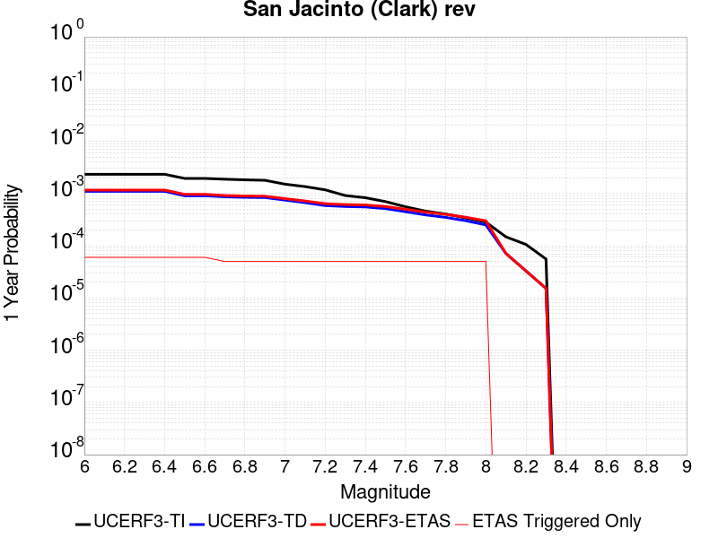 |  |

| Magnitude | 1 wk TI Prob | 1 wk TD Prob | 1 wk ETAS Prob | 1 wk ETAS/TD Gain | 1 wk ETAS Triggered Only | 1 mo TI Prob | 1 mo TD Prob | 1 mo ETAS Prob | 1 mo ETAS/TD Gain | 1 mo ETAS Triggered Only | 1 yr TI Prob | 1 yr TD Prob | 1 yr ETAS Prob | 1 yr ETAS/TD Gain | 1 yr ETAS Triggered Only | 10 yr TI Prob | 10 yr TD Prob | 10 yr ETAS Prob | 10 yr ETAS/TD Gain | 10 yr ETAS Triggered Only |
|-----|-----|-----|-----|-----|-----|-----|-----|-----|-----|-----|-----|-----|-----|-----|-----|-----|-----|-----|-----|-----|
| 6.0 | 4.482615E-5 | 2.1154196E-5 | 4.7820296E-5 | 2.2605586 | 2.6666667E-5 | 1.9209793E-4 | 9.065773E-5 | 1.17321986E-4 | 1.29412 | 2.6666667E-5 | 0.0023362834 | 0.0011032083 | 0.0011564827 | 1.0482905 | 5.3333333E-5 | 0.02311874 | 0.011503847 | 0.011556567 | 1.0045828 | 5.3333333E-5 |
| 6.1 | 4.482615E-5 | 2.1154196E-5 | 4.7820296E-5 | 2.2605586 | 2.6666667E-5 | 1.9209793E-4 | 9.065773E-5 | 1.17321986E-4 | 1.29412 | 2.6666667E-5 | 0.0023362834 | 0.0011032083 | 0.0011564827 | 1.0482905 | 5.3333333E-5 | 0.02311874 | 0.011503847 | 0.011556567 | 1.0045828 | 5.3333333E-5 |
| 6.2 | 4.482615E-5 | 2.1154196E-5 | 4.7820296E-5 | 2.2605586 | 2.6666667E-5 | 1.9209793E-4 | 9.065773E-5 | 1.17321986E-4 | 1.29412 | 2.6666667E-5 | 0.0023362834 | 0.0011032083 | 0.0011564827 | 1.0482905 | 5.3333333E-5 | 0.02311874 | 0.011503847 | 0.011556567 | 1.0045828 | 5.3333333E-5 |
| 6.3 | 4.482615E-5 | 2.1154196E-5 | 4.7820296E-5 | 2.2605586 | 2.6666667E-5 | 1.9209793E-4 | 9.065773E-5 | 1.17321986E-4 | 1.29412 | 2.6666667E-5 | 0.0023362834 | 0.0011032083 | 0.0011564827 | 1.0482905 | 5.3333333E-5 | 0.02311874 | 0.011503847 | 0.011556567 | 1.0045828 | 5.3333333E-5 |
| 6.4 | 4.482615E-5 | 2.1154196E-5 | 4.7820296E-5 | 2.2605586 | 2.6666667E-5 | 1.9209793E-4 | 9.065773E-5 | 1.17321986E-4 | 1.29412 | 2.6666667E-5 | 0.0023362834 | 0.0011032083 | 0.0011564827 | 1.0482905 | 5.3333333E-5 | 0.02311874 | 0.011503847 | 0.011556567 | 1.0045828 | 5.3333333E-5 |
| 6.5 | 3.7294863E-5 | 1.7356087E-5 | 4.402229E-5 | 2.536418 | 2.6666667E-5 | 1.5982533E-4 | 7.438113E-5 | 1.0104582E-4 | 1.3584871 | 2.6666667E-5 | 0.0019441366 | 9.052186E-4 | 9.5850363E-4 | 1.0588644 | 5.3333333E-5 | 0.01927216 | 0.0094941035 | 0.00954693 | 1.0055642 | 5.3333333E-5 |
| 6.6 | 3.7294863E-5 | 1.7356087E-5 | 4.402229E-5 | 2.536418 | 2.6666667E-5 | 1.5982533E-4 | 7.438113E-5 | 1.0104582E-4 | 1.3584871 | 2.6666667E-5 | 0.0019441366 | 9.052186E-4 | 9.5850363E-4 | 1.0588644 | 5.3333333E-5 | 0.01927216 | 0.0094941035 | 0.00954693 | 1.0055642 | 5.3333333E-5 |
| 6.7 | 3.6039248E-5 | 1.6604314E-5 | 4.327054E-5 | 2.6059818 | 2.6666667E-5 | 1.5444479E-4 | 7.1159426E-5 | 9.7824195E-5 | 1.3747188 | 2.6666667E-5 | 0.0018787434 | 8.6602574E-4 | 9.193129E-4 | 1.0615307 | 5.3333333E-5 | 0.01862939 | 0.009096047 | 0.009148895 | 1.00581 | 5.3333333E-5 |
| 6.8 | 3.5031844E-5 | 1.6232942E-5 | 4.2899173E-5 | 2.6427236 | 2.6666667E-5 | 1.5012783E-4 | 6.956792E-5 | 9.6232725E-5 | 1.3832918 | 2.6666667E-5 | 0.0018262739 | 8.4666436E-4 | 8.9995255E-4 | 1.0629389 | 5.3333333E-5 | 0.01811338 | 0.008895969 | 0.008948828 | 1.0059419 | 5.3333333E-5 |
| 6.9 | 3.435112E-5 | 1.6063195E-5 | 4.2729433E-5 | 2.660083 | 2.6666667E-5 | 1.4721078E-4 | 6.884047E-5 | 9.55053E-5 | 1.3873423 | 2.6666667E-5 | 0.0017908178 | 8.3781447E-4 | 8.911031E-4 | 1.0636044 | 5.3333333E-5 | 0.017764548 | 0.008804181 | 0.008857044 | 1.0060045 | 5.3333333E-5 |
| 7.0 | 2.8959772E-5 | 1.4336745E-5 | 4.100303E-5 | 2.8599956 | 2.6666667E-5 | 1.241074E-4 | 6.144176E-5 | 8.810679E-5 | 1.4339887 | 2.6666667E-5 | 0.0015099603 | 7.477995E-4 | 8.0109295E-4 | 1.071267 | 5.3333333E-5 | 0.014997416 | 0.007868037 | 0.00792095 | 1.0067252 | 5.3333333E-5 |
| 7.1 | 2.6002877E-5 | 1.2829002E-5 | 3.9495328E-5 | 3.078597 | 2.6666667E-5 | 1.11436144E-4 | 5.498029E-5 | 8.164549E-5 | 1.4849956 | 2.6666667E-5 | 0.0013558907 | 6.691816E-4 | 7.224792E-4 | 1.079646 | 5.3333333E-5 | 0.013476475 | 0.0070465137 | 0.0070994715 | 1.0075154 | 5.3333333E-5 |
| 7.2 | 2.2544838E-5 | 1.1262543E-5 | 3.792891E-5 | 3.3677037 | 2.6666667E-5 | 9.661716E-5 | 4.8267157E-5 | 7.493254E-5 | 1.5524539 | 2.6666667E-5 | 0.001175679 | 5.874956E-4 | 6.4079766E-4 | 1.0907274 | 5.3333333E-5 | 0.011694785 | 0.0061927503 | 0.0062457533 | 1.0085589 | 5.3333333E-5 |
| 7.3 | 1.75334E-5 | 1.0811715E-5 | 3.7478094E-5 | 3.4664338 | 2.6666667E-5 | 7.514098E-5 | 4.6335106E-5 | 7.3000534E-5 | 1.575491 | 2.6666667E-5 | 9.144575E-4 | 5.6398526E-4 | 6.172885E-4 | 1.0945117 | 5.3333333E-5 | 0.009107036 | 0.0059337732 | 0.00598679 | 1.0089347 | 5.3333333E-5 |
| 7.4 | 1.5924552E-5 | 1.0611516E-5 | 3.72779E-5 | 3.5129664 | 2.6666667E-5 | 6.82463E-5 | 4.547714E-5 | 7.21426E-5 | 1.5863485 | 2.6666667E-5 | 8.305819E-4 | 5.535449E-4 | 6.0684874E-4 | 1.0962954 | 5.3333333E-5 | 0.008274844 | 0.0058210334 | 0.0058740564 | 1.0091089 | 5.3333333E-5 |
| 7.5 | 1.3428931E-5 | 9.8519E-6 | 3.6518304E-5 | 3.706727 | 2.6666667E-5 | 5.7551293E-5 | 4.2221753E-5 | 6.888729E-5 | 1.6315594 | 2.6666667E-5 | 7.004617E-4 | 5.1392964E-4 | 5.672356E-4 | 1.1037222 | 5.3333333E-5 | 0.006982579 | 0.0054066023 | 0.0054596476 | 1.0098112 | 5.3333333E-5 |
| 7.6 | 1.0688787E-5 | 8.614839E-6 | 3.5281275E-5 | 4.095407 | 2.6666667E-5 | 4.5808283E-5 | 3.692022E-5 | 6.35859E-5 | 1.7222514 | 2.6666667E-5 | 5.5757316E-4 | 4.4941145E-4 | 5.027208E-4 | 1.1186204 | 5.3333333E-5 | 0.005561762 | 0.0047416524 | 0.0047947327 | 1.0111945 | 5.3333333E-5 |
| 7.7 | 8.81236E-6 | 7.4680274E-6 | 3.4134497E-5 | 4.570751 | 2.6666667E-5 | 3.776671E-5 | 3.2005442E-5 | 5.8671256E-5 | 1.833165 | 2.6666667E-5 | 4.597127E-4 | 3.8959677E-4 | 4.4290934E-4 | 1.1368403 | 5.3333333E-5 | 0.0045876284 | 0.0041346536 | 0.0041877665 | 1.0128458 | 5.3333333E-5 |
| 7.8 | 7.780431E-6 | 6.696579E-6 | 3.3363067E-5 | 4.982106 | 2.6666667E-5 | 3.3344273E-5 | 2.8699309E-5 | 5.536521E-5 | 1.9291478 | 2.6666667E-5 | 4.0589093E-4 | 3.4935825E-4 | 4.0267294E-4 | 1.1526076 | 5.3333333E-5 | 0.0040515037 | 0.0037227906 | 0.0037759254 | 1.0142728 | 5.3333333E-5 |
| 7.9 | 6.5437994E-6 | 5.780382E-6 | 3.2446893E-5 | 5.613279 | 2.6666667E-5 | 2.8044553E-5 | 2.477283E-5 | 5.1438838E-5 | 2.0764215 | 2.6666667E-5 | 3.4138895E-4 | 3.0156763E-4 | 3.548849E-4 | 1.1768003 | 5.3333333E-5 | 0.0034086495 | 0.0032344845 | 0.0032876453 | 1.0164356 | 5.3333333E-5 |
| 8.0 | 5.4488164E-6 | 4.8133406E-6 | 3.1479878E-5 | 6.540131 | 2.6666667E-5 | 2.3351862E-5 | 2.062844E-5 | 4.7294558E-5 | 2.292687 | 2.6666667E-5 | 2.8427184E-4 | 2.5112246E-4 | 3.0444242E-4 | 1.2123264 | 5.3333333E-5 | 0.0028390845 | 0.002710839 | 0.0027640278 | 1.0196208 | 5.3333333E-5 |
| 8.1 | 2.8397242E-6 | 1.3670389E-6 | 1.3670389E-6 | 1.0 | 0.0 | 1.217019E-5 | 5.858725E-6 | 5.858725E-6 | 1.0 | 0.0 | 1.4816198E-4 | 7.132765E-5 | 7.132765E-5 | 1.0 | 0.0 | 0.0014806325 | 8.115382E-4 | 8.115382E-4 | 1.0 | 0.0 |
| 8.2 | 2.030244E-6 | 6.318974E-7 | 6.318974E-7 | 1.0 | 0.0 | 8.701017E-6 | 2.708129E-6 | 2.708129E-6 | 1.0 | 0.0 | 1.05929736E-4 | 3.2970976E-5 | 3.2970976E-5 | 1.0 | 0.0 | 0.0010587925 | 3.9486602E-4 | 3.9486602E-4 | 1.0 | 0.0 |
| 8.3 | 1.0659804E-6 | 2.9250086E-7 | 2.9250086E-7 | 1.0 | 0.0 | 4.568479E-6 | 1.2535745E-6 | 1.2535745E-6 | 1.0 | 0.0 | 5.5619817E-5 | 1.5262167E-5 | 1.5262167E-5 | 1.0 | 0.0 | 5.5605895E-4 | 1.8566217E-4 | 1.8566217E-4 | 1.0 | 0.0 |

## San Juan
*[(top)](#table-of-contents)*

| 1 Week | 1 Month | 1 Year | 10 Year |
|-----|-----|-----|-----|
|  |  |  | 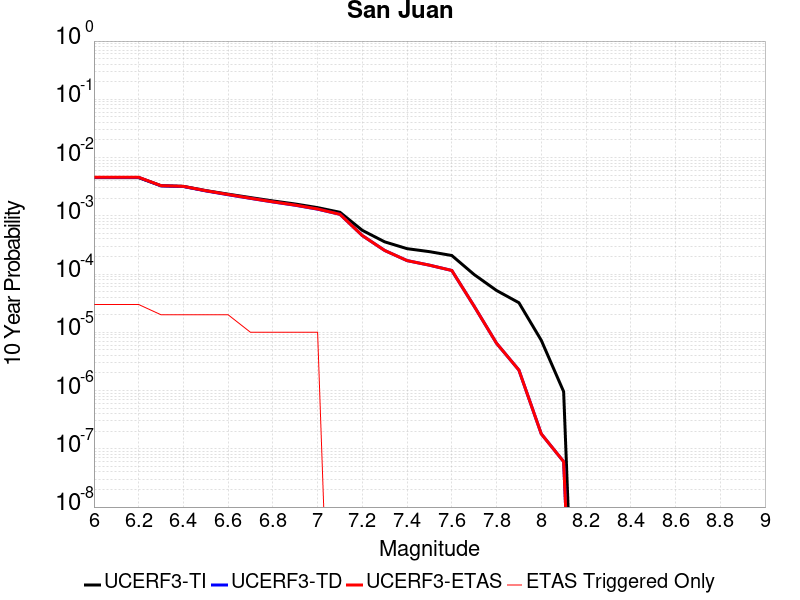 |

| Magnitude | 1 wk TI Prob | 1 wk TD Prob | 1 wk ETAS Prob | 1 wk ETAS/TD Gain | 1 wk ETAS Triggered Only | 1 mo TI Prob | 1 mo TD Prob | 1 mo ETAS Prob | 1 mo ETAS/TD Gain | 1 mo ETAS Triggered Only | 1 yr TI Prob | 1 yr TD Prob | 1 yr ETAS Prob | 1 yr ETAS/TD Gain | 1 yr ETAS Triggered Only | 10 yr TI Prob | 10 yr TD Prob | 10 yr ETAS Prob | 10 yr ETAS/TD Gain | 10 yr ETAS Triggered Only |
|-----|-----|-----|-----|-----|-----|-----|-----|-----|-----|-----|-----|-----|-----|-----|-----|-----|-----|-----|-----|-----|
| 6.0 | 8.682808E-6 | 8.7491635E-6 | 8.7491635E-6 | 1.0 | 0.0 | 3.72115E-5 | 3.74959E-5 | 3.74959E-5 | 1.0 | 0.0 | 4.5295584E-4 | 4.564218E-4 | 4.8307632E-4 | 1.0583988 | 2.6666667E-5 | 0.004520337 | 0.004555385 | 0.0046084756 | 1.0116544 | 5.3333333E-5 |
| 6.1 | 8.682808E-6 | 8.7491635E-6 | 8.7491635E-6 | 1.0 | 0.0 | 3.72115E-5 | 3.74959E-5 | 3.74959E-5 | 1.0 | 0.0 | 4.5295584E-4 | 4.564218E-4 | 4.8307632E-4 | 1.0583988 | 2.6666667E-5 | 0.004520337 | 0.004555385 | 0.0046084756 | 1.0116544 | 5.3333333E-5 |
| 6.2 | 8.682808E-6 | 8.7491635E-6 | 8.7491635E-6 | 1.0 | 0.0 | 3.72115E-5 | 3.74959E-5 | 3.74959E-5 | 1.0 | 0.0 | 4.5295584E-4 | 4.564218E-4 | 4.8307632E-4 | 1.0583988 | 2.6666667E-5 | 0.004520337 | 0.004555385 | 0.0046084756 | 1.0116544 | 5.3333333E-5 |
| 6.3 | 6.3054235E-6 | 6.2825848E-6 | 6.2825848E-6 | 1.0 | 0.0 | 2.7022963E-5 | 2.6925094E-5 | 2.6925094E-5 | 1.0 | 0.0 | 3.2895492E-4 | 3.2776513E-4 | 3.2776513E-4 | 1.0 | 0.0 | 0.003284684 | 0.003273017 | 0.0032995963 | 1.0081208 | 2.6666667E-5 |
| 6.4 | 6.1490473E-6 | 6.1144656E-6 | 6.1144656E-6 | 1.0 | 0.0 | 2.6352795E-5 | 2.6204598E-5 | 2.6204598E-5 | 1.0 | 0.0 | 3.2079802E-4 | 3.1899565E-4 | 3.1899565E-4 | 1.0 | 0.0 | 0.0032033534 | 0.0031855737 | 0.0032121555 | 1.0083444 | 2.6666667E-5 |
| 6.5 | 5.204848E-6 | 5.137233E-6 | 5.137233E-6 | 1.0 | 0.0 | 2.23063E-5 | 2.2016533E-5 | 2.2016533E-5 | 1.0 | 0.0 | 2.7154534E-4 | 2.6801927E-4 | 2.6801927E-4 | 1.0 | 0.0 | 0.0027121378 | 0.0026771144 | 0.0027037098 | 1.0099343 | 2.6666667E-5 |
| 6.6 | 4.5179986E-6 | 4.4150297E-6 | 4.4150297E-6 | 1.0 | 0.0 | 1.9362706E-5 | 1.8921424E-5 | 1.8921424E-5 | 1.0 | 0.0 | 2.3571544E-4 | 2.3034477E-4 | 2.3034477E-4 | 1.0 | 0.0 | 0.0023546559 | 0.0023011973 | 0.0023278026 | 1.0115615 | 2.6666667E-5 |
| 6.7 | 3.9442616E-6 | 3.819828E-6 | 3.819828E-6 | 1.0 | 0.0 | 1.6903869E-5 | 1.6370592E-5 | 1.6370592E-5 | 1.0 | 0.0 | 2.0578515E-4 | 1.992944E-4 | 1.992944E-4 | 1.0 | 0.0 | 0.002055947 | 0.0019912818 | 0.0019912818 | 1.0 | 0.0 |
| 6.8 | 3.4536245E-6 | 3.3163353E-6 | 3.3163353E-6 | 1.0 | 0.0 | 1.4801163E-5 | 1.4212792E-5 | 1.4212792E-5 | 1.0 | 0.0 | 1.8018926E-4 | 1.7302761E-4 | 1.7302761E-4 | 1.0 | 0.0 | 0.0018004322 | 0.0017290477 | 0.0017290477 | 1.0 | 0.0 |
| 6.9 | 3.059865E-6 | 2.9120315E-6 | 2.9120315E-6 | 1.0 | 0.0 | 1.3113641E-5 | 1.2480078E-5 | 1.2480078E-5 | 1.0 | 0.0 | 1.596469E-4 | 1.5193493E-4 | 1.5193493E-4 | 1.0 | 0.0 | 0.0015953224 | 0.0015184252 | 0.0015184252 | 1.0 | 0.0 |
| 7.0 | 2.6504351E-6 | 2.4920002E-6 | 2.4920002E-6 | 1.0 | 0.0 | 1.1358958E-5 | 1.0679961E-5 | 1.0679961E-5 | 1.0 | 0.0 | 1.3828653E-4 | 1.300213E-4 | 1.300213E-4 | 1.0 | 0.0 | 0.0013820052 | 0.0012995641 | 0.0012995641 | 1.0 | 0.0 |
| 7.1 | 2.2039317E-6 | 2.0338296E-6 | 2.0338296E-6 | 1.0 | 0.0 | 9.445387E-6 | 8.716386E-6 | 8.716386E-6 | 1.0 | 0.0 | 1.1499152E-4 | 1.0611736E-4 | 1.0611736E-4 | 1.0 | 0.0 | 0.0011493203 | 0.0010607769 | 0.0010607769 | 1.0 | 0.0 |
| 7.2 | 1.0786707E-6 | 8.7701903E-7 | 8.7701903E-7 | 1.0 | 0.0 | 4.622866E-6 | 3.7586476E-6 | 3.7586476E-6 | 1.0 | 0.0 | 5.628194E-5 | 4.5760586E-5 | 4.5760586E-5 | 1.0 | 0.0 | 5.6267687E-4 | 4.5757066E-4 | 4.5757066E-4 | 1.0 | 0.0 |
| 7.3 | 6.846433E-7 | 4.868805E-7 | 4.868805E-7 | 1.0 | 0.0 | 2.9341822E-6 | 2.086629E-6 | 2.086629E-6 | 1.0 | 0.0 | 3.5723086E-5 | 2.5404412E-5 | 2.5404412E-5 | 1.0 | 0.0 | 3.571734E-4 | 2.540486E-4 | 2.540486E-4 | 1.0 | 0.0 |
| 7.4 | 5.23043E-7 | 3.2628162E-7 | 3.2628162E-7 | 1.0 | 0.0 | 2.2416111E-6 | 1.398349E-6 | 1.398349E-6 | 1.0 | 0.0 | 2.7291273E-5 | 1.7024766E-5 | 1.7024766E-5 | 1.0 | 0.0 | 2.7287923E-4 | 1.7026656E-4 | 1.7026656E-4 | 1.0 | 0.0 |
| 7.5 | 4.648444E-7 | 2.7234944E-7 | 2.7234944E-7 | 1.0 | 0.0 | 1.9921886E-6 | 1.1672114E-6 | 1.1672114E-6 | 1.0 | 0.0 | 2.4254627E-5 | 1.42107065E-5 | 1.42107065E-5 | 1.0 | 0.0 | 2.425198E-4 | 1.421276E-4 | 1.421276E-4 | 1.0 | 0.0 |
| 7.6 | 3.9906567E-7 | 2.2083314E-7 | 2.2083314E-7 | 1.0 | 0.0 | 1.7102802E-6 | 9.464274E-7 | 9.464274E-7 | 1.0 | 0.0 | 2.0822463E-5 | 1.1522693E-5 | 1.1522693E-5 | 1.0 | 0.0 | 2.0820512E-4 | 1.15245566E-4 | 1.15245566E-4 | 1.0 | 0.0 |
| 7.7 | 1.8784601E-7 | 5.3666906E-8 | 5.3666906E-8 | 1.0 | 0.0 | 8.0505407E-7 | 2.30001E-7 | 2.30001E-7 | 1.0 | 0.0 | 9.80149E-6 | 2.8002585E-6 | 2.8002585E-6 | 1.0 | 0.0 | 9.801057E-5 | 2.8011282E-5 | 2.8011282E-5 | 1.0 | 0.0 |
| 7.8 | 1.00154914E-7 | 1.2415832E-8 | 1.2415832E-8 | 1.0 | 0.0 | 4.2923529E-7 | 5.3210716E-8 | 5.3210716E-8 | 1.0 | 0.0 | 5.225927E-6 | 6.4784024E-7 | 6.4784024E-7 | 1.0 | 0.0 | 5.225804E-5 | 6.484273E-6 | 6.484273E-6 | 1.0 | 0.0 |
| 7.9 | 6.171429E-8 | 4.2966155E-9 | 4.2966155E-9 | 1.0 | 0.0 | 2.6448978E-7 | 1.8414067E-8 | 1.8414067E-8 | 1.0 | 0.0 | 3.2201583E-6 | 2.2419121E-7 | 2.2419121E-7 | 1.0 | 0.0 | 3.2201115E-5 | 2.2472002E-6 | 2.2472002E-6 | 1.0 | 0.0 |
| 8.0 | 1.3974572E-8 | 3.3788217E-10 | 3.3788217E-10 | 1.0 | 0.0 | 5.989102E-8 | 1.448067E-9 | 1.448067E-9 | 1.0 | 0.0 | 7.2917294E-7 | 1.763022E-8 | 1.763022E-8 | 1.0 | 0.0 | 7.2917055E-6 | 1.8060365E-7 | 1.8060365E-7 | 1.0 | 0.0 |
| 8.1 | 1.8403477E-9 | 1.1302803E-10 | 1.1302803E-10 | 1.0 | 0.0 | 7.887204E-9 | 4.844063E-10 | 4.844063E-10 | 1.0 | 0.0 | 9.602671E-8 | 5.8976446E-9 | 5.8976446E-9 | 1.0 | 0.0 | 9.602667E-7 | 6.021993E-8 | 6.021993E-8 | 1.0 | 0.0 |

## San Luis Range 2011 CFM
*[(top)](#table-of-contents)*

| 1 Week | 1 Month | 1 Year | 10 Year |
|-----|-----|-----|-----|
|  |  |  | 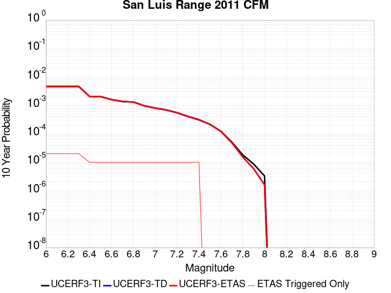 |

| Magnitude | 1 wk TI Prob | 1 wk TD Prob | 1 wk ETAS Prob | 1 wk ETAS/TD Gain | 1 wk ETAS Triggered Only | 1 mo TI Prob | 1 mo TD Prob | 1 mo ETAS Prob | 1 mo ETAS/TD Gain | 1 mo ETAS Triggered Only | 1 yr TI Prob | 1 yr TD Prob | 1 yr ETAS Prob | 1 yr ETAS/TD Gain | 1 yr ETAS Triggered Only | 10 yr TI Prob | 10 yr TD Prob | 10 yr ETAS Prob | 10 yr ETAS/TD Gain | 10 yr ETAS Triggered Only |
|-----|-----|-----|-----|-----|-----|-----|-----|-----|-----|-----|-----|-----|-----|-----|-----|-----|-----|-----|-----|-----|
| 6.0 | 8.8368415E-6 | 8.965454E-6 | 8.965454E-6 | 1.0 | 0.0 | 3.787163E-5 | 3.842285E-5 | 3.842285E-5 | 1.0 | 0.0 | 4.609895E-4 | 4.677057E-4 | 4.677057E-4 | 1.0 | 0.0 | 0.0046003438 | 0.0046679964 | 0.0047210804 | 1.011372 | 5.3333333E-5 |
| 6.1 | 8.8368415E-6 | 8.965454E-6 | 8.965454E-6 | 1.0 | 0.0 | 3.787163E-5 | 3.842285E-5 | 3.842285E-5 | 1.0 | 0.0 | 4.609895E-4 | 4.677057E-4 | 4.677057E-4 | 1.0 | 0.0 | 0.0046003438 | 0.0046679964 | 0.0047210804 | 1.011372 | 5.3333333E-5 |
| 6.2 | 8.8368415E-6 | 8.965454E-6 | 8.965454E-6 | 1.0 | 0.0 | 3.787163E-5 | 3.842285E-5 | 3.842285E-5 | 1.0 | 0.0 | 4.609895E-4 | 4.677057E-4 | 4.677057E-4 | 1.0 | 0.0 | 0.0046003438 | 0.0046679964 | 0.0047210804 | 1.011372 | 5.3333333E-5 |
| 6.3 | 8.8368415E-6 | 8.965454E-6 | 8.965454E-6 | 1.0 | 0.0 | 3.787163E-5 | 3.842285E-5 | 3.842285E-5 | 1.0 | 0.0 | 4.609895E-4 | 4.677057E-4 | 4.677057E-4 | 1.0 | 0.0 | 0.0046003438 | 0.0046679964 | 0.0047210804 | 1.011372 | 5.3333333E-5 |
| 6.4 | 3.9094193E-6 | 3.9412025E-6 | 3.9412025E-6 | 1.0 | 0.0 | 1.6754546E-5 | 1.689076E-5 | 1.689076E-5 | 1.0 | 0.0 | 2.039675E-4 | 2.056259E-4 | 2.056259E-4 | 1.0 | 0.0 | 0.0020378039 | 0.0020543851 | 0.002080997 | 1.0129536 | 2.6666667E-5 |
| 6.5 | 3.9094193E-6 | 3.9412025E-6 | 3.9412025E-6 | 1.0 | 0.0 | 1.6754546E-5 | 1.689076E-5 | 1.689076E-5 | 1.0 | 0.0 | 2.039675E-4 | 2.056259E-4 | 2.056259E-4 | 1.0 | 0.0 | 0.0020378039 | 0.0020543851 | 0.002080997 | 1.0129536 | 2.6666667E-5 |
| 6.6 | 3.0587726E-6 | 3.0753883E-6 | 3.0753883E-6 | 1.0 | 0.0 | 1.3108959E-5 | 1.318017E-5 | 1.318017E-5 | 1.0 | 0.0 | 1.595899E-4 | 1.6045687E-4 | 1.6045687E-4 | 1.0 | 0.0 | 0.0015947534 | 0.0016034221 | 0.0016300459 | 1.0166044 | 2.6666667E-5 |
| 6.7 | 2.6160574E-6 | 2.6251273E-6 | 2.6251273E-6 | 1.0 | 0.0 | 1.1211626E-5 | 1.1250498E-5 | 1.1250498E-5 | 1.0 | 0.0 | 1.3649299E-4 | 1.3696625E-4 | 1.3696625E-4 | 1.0 | 0.0 | 0.0013640919 | 0.0013688246 | 0.0013954547 | 1.0194547 | 2.6666667E-5 |
| 6.8 | 2.5110312E-6 | 2.51814E-6 | 2.51814E-6 | 1.0 | 0.0 | 1.0761518E-5 | 1.0791985E-5 | 1.0791985E-5 | 1.0 | 0.0 | 1.310136E-4 | 1.3138456E-4 | 1.3138456E-4 | 1.0 | 0.0 | 0.0013093639 | 0.0013130746 | 0.0013397062 | 1.0202819 | 2.6666667E-5 |
| 6.9 | 1.8564405E-6 | 1.852487E-6 | 1.852487E-6 | 1.0 | 0.0 | 7.95615E-6 | 7.939206E-6 | 7.939206E-6 | 1.0 | 0.0 | 9.686181E-5 | 9.665557E-5 | 9.665557E-5 | 1.0 | 0.0 | 9.68196E-4 | 9.661373E-4 | 9.927782E-4 | 1.0275747 | 2.6666667E-5 |
| 7.0 | 1.546127E-6 | 1.5369537E-6 | 1.5369537E-6 | 1.0 | 0.0 | 6.626242E-6 | 6.586928E-6 | 6.586928E-6 | 1.0 | 0.0 | 8.06715E-5 | 8.0192905E-5 | 8.0192905E-5 | 1.0 | 0.0 | 8.0642226E-4 | 8.016404E-4 | 8.2828564E-4 | 1.0332384 | 2.6666667E-5 |
| 7.1 | 1.3368208E-6 | 1.3235326E-6 | 1.3235326E-6 | 1.0 | 0.0 | 5.7292195E-6 | 5.67227E-6 | 5.67227E-6 | 1.0 | 0.0 | 6.975101E-5 | 6.905771E-5 | 6.905771E-5 | 1.0 | 0.0 | 6.972912E-4 | 6.9036294E-4 | 7.170112E-4 | 1.0386003 | 2.6666667E-5 |
| 7.2 | 1.0623363E-6 | 1.0454368E-6 | 1.0454368E-6 | 1.0 | 0.0 | 4.5528623E-6 | 4.4804356E-6 | 4.4804356E-6 | 1.0 | 0.0 | 5.5429686E-5 | 5.4547938E-5 | 5.4547938E-5 | 1.0 | 0.0 | 5.5415864E-4 | 5.4534577E-4 | 5.719979E-4 | 1.048872 | 2.6666667E-5 |
| 7.3 | 7.831679E-7 | 7.7273904E-7 | 7.7273904E-7 | 1.0 | 0.0 | 3.3564295E-6 | 3.3117344E-6 | 3.3117344E-6 | 1.0 | 0.0 | 4.086376E-5 | 4.0319625E-5 | 4.0319625E-5 | 1.0 | 0.0 | 4.0856248E-4 | 4.031232E-4 | 4.2977912E-4 | 1.0661235 | 2.6666667E-5 |
| 7.4 | 5.9558846E-7 | 5.910636E-7 | 5.910636E-7 | 1.0 | 0.0 | 2.5525194E-6 | 2.5331274E-6 | 2.5331274E-6 | 1.0 | 0.0 | 3.107648E-5 | 3.084039E-5 | 3.084039E-5 | 1.0 | 0.0 | 3.1072134E-4 | 3.083612E-4 | 3.3501963E-4 | 1.086452 | 2.6666667E-5 |
| 7.5 | 4.1616502E-7 | 4.119631E-7 | 4.119631E-7 | 1.0 | 0.0 | 1.7835631E-6 | 1.7655549E-6 | 1.7655549E-6 | 1.0 | 0.0 | 2.1714664E-5 | 2.149542E-5 | 2.149542E-5 | 1.0 | 0.0 | 2.1712543E-4 | 2.1493346E-4 | 2.1493346E-4 | 1.0 | 0.0 |
| 7.6 | 2.3816014E-7 | 2.3376548E-7 | 2.3376548E-7 | 1.0 | 0.0 | 1.0206859E-6 | 1.0018516E-6 | 1.0018516E-6 | 1.0 | 0.0 | 1.242678E-5 | 1.2197475E-5 | 1.2197475E-5 | 1.0 | 0.0 | 1.2426086E-4 | 1.2196808E-4 | 1.2196808E-4 | 1.0 | 0.0 |
| 7.7 | 9.918777E-8 | 9.3867584E-8 | 9.3867584E-8 | 1.0 | 0.0 | 4.2509038E-7 | 4.0228957E-7 | 4.0228957E-7 | 1.0 | 0.0 | 5.1754632E-6 | 4.8978645E-6 | 4.8978645E-6 | 1.0 | 0.0 | 5.1753424E-5 | 4.897757E-5 | 4.897757E-5 | 1.0 | 0.0 |
| 7.8 | 3.4982556E-8 | 2.968655E-8 | 2.968655E-8 | 1.0 | 0.0 | 1.4992524E-7 | 1.2722806E-7 | 1.2722806E-7 | 1.0 | 0.0 | 1.8253382E-6 | 1.5490006E-6 | 1.5490006E-6 | 1.0 | 0.0 | 1.8253233E-5 | 1.5489897E-5 | 1.5489897E-5 | 1.0 | 0.0 |
| 7.9 | 1.6624908E-8 | 1.1477036E-8 | 1.1477036E-8 | 1.0 | 0.0 | 7.12496E-8 | 4.91873E-8 | 4.91873E-8 | 1.0 | 0.0 | 8.6746354E-7 | 5.988552E-7 | 5.988552E-7 | 1.0 | 0.0 | 8.674601E-6 | 5.988536E-6 | 5.988536E-6 | 1.0 | 0.0 |
| 8.0 | 6.3352315E-9 | 3.0888412E-9 | 3.0888412E-9 | 1.0 | 0.0 | 2.715099E-8 | 1.3237893E-8 | 1.3237893E-8 | 1.0 | 0.0 | 3.3056327E-7 | 1.6117131E-7 | 1.6117131E-7 | 1.0 | 0.0 | 3.3056278E-6 | 1.611712E-6 | 1.611712E-6 | 1.0 | 0.0 |

## San Diego Trough south
*[(top)](#table-of-contents)*

| 1 Week | 1 Month | 1 Year | 10 Year |
|-----|-----|-----|-----|
|  |  |  |  |

| Magnitude | 1 wk TI Prob | 1 wk TD Prob | 1 wk ETAS Prob | 1 wk ETAS/TD Gain | 1 wk ETAS Triggered Only | 1 mo TI Prob | 1 mo TD Prob | 1 mo ETAS Prob | 1 mo ETAS/TD Gain | 1 mo ETAS Triggered Only | 1 yr TI Prob | 1 yr TD Prob | 1 yr ETAS Prob | 1 yr ETAS/TD Gain | 1 yr ETAS Triggered Only | 10 yr TI Prob | 10 yr TD Prob | 10 yr ETAS Prob | 10 yr ETAS/TD Gain | 10 yr ETAS Triggered Only |
|-----|-----|-----|-----|-----|-----|-----|-----|-----|-----|-----|-----|-----|-----|-----|-----|-----|-----|-----|-----|-----|
| 6.0 | 8.279495E-5 | 1.04241306E-4 | 1.3090519E-4 | 1.25579 | 2.6666667E-5 | 3.5478722E-4 | 4.4667677E-4 | 4.7333154E-4 | 1.0596734 | 2.6666667E-5 | 0.004310982 | 0.0054256152 | 0.005478659 | 1.0097766 | 5.3333333E-5 | 0.042283054 | 0.05299221 | 0.053042717 | 1.0009531 | 5.3333333E-5 |
| 6.1 | 4.6961468E-5 | 5.772944E-5 | 8.439457E-5 | 1.4618982 | 2.6666667E-5 | 2.0124791E-4 | 2.473894E-4 | 2.7404947E-4 | 1.1077656 | 2.6666667E-5 | 0.00244744 | 0.0030079768 | 0.0030611497 | 1.0176773 | 5.3333333E-5 | 0.024206603 | 0.029679462 | 0.029731212 | 1.0017437 | 5.3333333E-5 |
| 6.2 | 3.5079658E-5 | 4.214154E-5 | 6.880708E-5 | 1.6327615 | 2.6666667E-5 | 1.5033272E-4 | 1.8059435E-4 | 2.072562E-4 | 1.1476339 | 2.6666667E-5 | 0.0018287642 | 0.0021965632 | 0.0022497792 | 1.024227 | 5.3333333E-5 | 0.018137876 | 0.021751117 | 0.021803292 | 1.0023986 | 5.3333333E-5 |
| 6.3 | 3.5079658E-5 | 4.214154E-5 | 6.880708E-5 | 1.6327615 | 2.6666667E-5 | 1.5033272E-4 | 1.8059435E-4 | 2.072562E-4 | 1.1476339 | 2.6666667E-5 | 0.0018287642 | 0.0021965632 | 0.0022497792 | 1.024227 | 5.3333333E-5 | 0.018137876 | 0.021751117 | 0.021803292 | 1.0023986 | 5.3333333E-5 |
| 6.4 | 2.7196904E-5 | 3.2087162E-5 | 5.8752976E-5 | 1.8310429 | 2.6666667E-5 | 1.16552954E-4 | 1.3750927E-4 | 1.6417226E-4 | 1.1938996 | 2.6666667E-5 | 0.0014181085 | 0.0016729041 | 0.0016995262 | 1.0159137 | 2.6666667E-5 | 0.014090929 | 0.016604643 | 0.016630867 | 1.0015793 | 2.6666667E-5 |
| 6.5 | 2.5584688E-5 | 3.010164E-5 | 5.6767505E-5 | 1.8858608 | 2.6666667E-5 | 1.0964406E-4 | 1.2900073E-4 | 1.5566396E-4 | 1.2066905 | 2.6666667E-5 | 0.0013340989 | 0.0015694655 | 0.0015960903 | 1.0169642 | 2.6666667E-5 | 0.013261181 | 0.015585314 | 0.015611565 | 1.0016843 | 2.6666667E-5 |
| 6.6 | 2.2034688E-5 | 2.5742738E-5 | 5.240872E-5 | 2.035864 | 2.6666667E-5 | 9.443096E-5 | 1.1032141E-4 | 1.3698514E-4 | 1.2416914 | 2.6666667E-5 | 0.0011490905 | 0.0013423424 | 0.0013689733 | 1.019839 | 2.6666667E-5 | 0.011431668 | 0.013343317 | 0.013369628 | 1.0019718 | 2.6666667E-5 |
| 6.7 | 1.9394853E-5 | 2.254176E-5 | 4.9207825E-5 | 2.182963 | 2.6666667E-5 | 8.311815E-5 | 9.6603995E-5 | 1.232681E-4 | 1.2760143 | 2.6666667E-5 | 0.0010114936 | 0.0011755243 | 0.0012021597 | 1.0226582 | 2.6666667E-5 | 0.01006902 | 0.011693766 | 0.011720121 | 1.0022538 | 2.6666667E-5 |
| 6.8 | 1.7615313E-5 | 2.0403182E-5 | 4.7069305E-5 | 2.306959 | 2.6666667E-5 | 7.549201E-5 | 8.74393E-5 | 1.1410364E-4 | 1.3049468 | 2.6666667E-5 | 9.1872766E-4 | 0.0010640579 | 0.0010906962 | 1.0250347 | 2.6666667E-5 | 0.009149387 | 0.010590198 | 0.010616583 | 1.0024914 | 2.6666667E-5 |
| 6.9 | 1.5621423E-5 | 1.8026114E-5 | 4.46923E-5 | 2.4793086 | 2.6666667E-5 | 6.6947236E-5 | 7.725251E-5 | 1.0391712E-4 | 1.3451617 | 2.6666667E-5 | 8.147778E-4 | 9.40147E-4 | 9.6678856E-4 | 1.0283377 | 2.6666667E-5 | 0.008117969 | 0.009362142 | 0.009388559 | 1.0028217 | 2.6666667E-5 |
| 7.0 | 1.3444376E-5 | 1.544809E-5 | 4.2114345E-5 | 2.7261846 | 2.6666667E-5 | 5.7617483E-5 | 6.620443E-5 | 9.286933E-5 | 1.4027661 | 2.6666667E-5 | 7.0126704E-4 | 8.057436E-4 | 8.323888E-4 | 1.033069 | 2.6666667E-5 | 0.006990582 | 0.008028555 | 0.008055008 | 1.0032948 | 2.6666667E-5 |
| 7.1 | 1.2268361E-5 | 1.407303E-5 | 4.073932E-5 | 2.8948507 | 2.6666667E-5 | 5.2577634E-5 | 6.0311606E-5 | 8.6976666E-5 | 1.4421215 | 2.6666667E-5 | 6.399447E-4 | 7.3404907E-4 | 7.6069613E-4 | 1.0363015 | 2.6666667E-5 | 0.0063810493 | 0.0073165493 | 0.0073430208 | 1.003618 | 2.6666667E-5 |
| 7.2 | 1.0922655E-5 | 1.2513563E-5 | 1.2513563E-5 | 1.0 | 0.0 | 4.681054E-5 | 5.3628468E-5 | 5.3628468E-5 | 1.0 | 0.0 | 5.697693E-4 | 6.5273355E-4 | 6.5273355E-4 | 1.0 | 0.0 | 0.0056831064 | 0.0065084435 | 0.0065084435 | 1.0 | 0.0 |
| 7.3 | 6.1106753E-6 | 6.928925E-6 | 6.928925E-6 | 1.0 | 0.0 | 2.6188345E-5 | 2.9695057E-5 | 2.9695057E-5 | 1.0 | 0.0 | 3.1879646E-4 | 3.6147775E-4 | 3.6147775E-4 | 1.0 | 0.0 | 0.0031833951 | 0.003608943 | 0.003608943 | 1.0 | 0.0 |
| 7.4 | 4.933187E-6 | 5.5895525E-6 | 5.5895525E-6 | 1.0 | 0.0 | 2.114206E-5 | 2.3955008E-5 | 2.3955008E-5 | 1.0 | 0.0 | 2.5737417E-4 | 2.9161357E-4 | 2.9161357E-4 | 1.0 | 0.0 | 0.002570763 | 0.0029123505 | 0.0029123505 | 1.0 | 0.0 |
| 7.5 | 1.7489613E-6 | 1.969678E-6 | 1.969678E-6 | 1.0 | 0.0 | 7.495527E-6 | 8.4414505E-6 | 8.4414505E-6 | 1.0 | 0.0 | 9.125422E-5 | 1.02770035E-4 | 1.02770035E-4 | 1.0 | 0.0 | 9.1216754E-4 | 0.0010272472 | 0.0010272472 | 1.0 | 0.0 |
| 7.6 | 1.6988751E-7 | 1.7533823E-7 | 1.7533823E-7 | 1.0 | 0.0 | 7.2808916E-7 | 7.5144936E-7 | 7.5144936E-7 | 1.0 | 0.0 | 8.864449E-6 | 9.14886E-6 | 9.14886E-6 | 1.0 | 0.0 | 8.8640954E-5 | 9.1485024E-5 | 9.1485024E-5 | 1.0 | 0.0 |

## Cleghorn
*[(top)](#table-of-contents)*

| 1 Week | 1 Month | 1 Year | 10 Year |
|-----|-----|-----|-----|
|  |  |  |  |

| Magnitude | 1 wk TI Prob | 1 wk TD Prob | 1 wk ETAS Prob | 1 wk ETAS/TD Gain | 1 wk ETAS Triggered Only | 1 mo TI Prob | 1 mo TD Prob | 1 mo ETAS Prob | 1 mo ETAS/TD Gain | 1 mo ETAS Triggered Only | 1 yr TI Prob | 1 yr TD Prob | 1 yr ETAS Prob | 1 yr ETAS/TD Gain | 1 yr ETAS Triggered Only | 10 yr TI Prob | 10 yr TD Prob | 10 yr ETAS Prob | 10 yr ETAS/TD Gain | 10 yr ETAS Triggered Only |
|-----|-----|-----|-----|-----|-----|-----|-----|-----|-----|-----|-----|-----|-----|-----|-----|-----|-----|-----|-----|-----|
| 6.0 | 7.9267165E-6 | 9.831582E-6 | 9.831582E-6 | 1.0 | 0.0 | 3.39712E-5 | 4.2134732E-5 | 4.2134732E-5 | 1.0 | 0.0 | 4.1352084E-4 | 5.128803E-4 | 5.3953327E-4 | 1.0519673 | 2.6666667E-5 | 0.004127522 | 0.0051320773 | 0.0051851366 | 1.0103388 | 5.3333333E-5 |
| 6.1 | 7.9267165E-6 | 9.831582E-6 | 9.831582E-6 | 1.0 | 0.0 | 3.39712E-5 | 4.2134732E-5 | 4.2134732E-5 | 1.0 | 0.0 | 4.1352084E-4 | 5.128803E-4 | 5.3953327E-4 | 1.0519673 | 2.6666667E-5 | 0.004127522 | 0.0051320773 | 0.0051851366 | 1.0103388 | 5.3333333E-5 |
| 6.2 | 7.9267165E-6 | 9.831582E-6 | 9.831582E-6 | 1.0 | 0.0 | 3.39712E-5 | 4.2134732E-5 | 4.2134732E-5 | 1.0 | 0.0 | 4.1352084E-4 | 5.128803E-4 | 5.3953327E-4 | 1.0519673 | 2.6666667E-5 | 0.004127522 | 0.0051320773 | 0.0051851366 | 1.0103388 | 5.3333333E-5 |
| 6.3 | 7.9267165E-6 | 9.831582E-6 | 9.831582E-6 | 1.0 | 0.0 | 3.39712E-5 | 4.2134732E-5 | 4.2134732E-5 | 1.0 | 0.0 | 4.1352084E-4 | 5.128803E-4 | 5.3953327E-4 | 1.0519673 | 2.6666667E-5 | 0.004127522 | 0.0051320773 | 0.0051851366 | 1.0103388 | 5.3333333E-5 |
| 6.4 | 4.3445207E-6 | 6.0914435E-6 | 6.0914435E-6 | 1.0 | 0.0 | 1.8619241E-5 | 2.610593E-5 | 2.610593E-5 | 1.0 | 0.0 | 2.2666567E-4 | 3.1779436E-4 | 3.1779436E-4 | 1.0 | 0.0 | 0.0022643462 | 0.0031875873 | 0.0032141688 | 1.0083392 | 2.6666667E-5 |
| 6.5 | 4.3445207E-6 | 6.0914435E-6 | 6.0914435E-6 | 1.0 | 0.0 | 1.8619241E-5 | 2.610593E-5 | 2.610593E-5 | 1.0 | 0.0 | 2.2666567E-4 | 3.1779436E-4 | 3.1779436E-4 | 1.0 | 0.0 | 0.0022643462 | 0.0031875873 | 0.0032141688 | 1.0083392 | 2.6666667E-5 |
| 6.6 | 4.040109E-6 | 5.773851E-6 | 5.773851E-6 | 1.0 | 0.0 | 1.7314638E-5 | 2.4744846E-5 | 2.4744846E-5 | 1.0 | 0.0 | 2.1078532E-4 | 3.012278E-4 | 3.012278E-4 | 1.0 | 0.0 | 0.002105855 | 0.003022377 | 0.0030489631 | 1.0087965 | 2.6666667E-5 |
| 6.7 | 3.3632055E-6 | 5.067348E-6 | 5.067348E-6 | 1.0 | 0.0 | 1.4413658E-5 | 2.1717027E-5 | 2.1717027E-5 | 1.0 | 0.0 | 1.7547216E-4 | 2.6437303E-4 | 2.6437303E-4 | 1.0 | 0.0 | 0.0017533366 | 0.0026547113 | 0.0026547113 | 1.0 | 0.0 |
| 6.8 | 3.2902772E-6 | 4.9892556E-6 | 4.9892556E-6 | 1.0 | 0.0 | 1.4101111E-5 | 2.1382351E-5 | 2.1382351E-5 | 1.0 | 0.0 | 1.716675E-4 | 2.6029933E-4 | 2.6029933E-4 | 1.0 | 0.0 | 0.0017153495 | 0.0026140702 | 0.0026140702 | 1.0 | 0.0 |
| 6.9 | 3.031547E-6 | 4.6910186E-6 | 4.6910186E-6 | 1.0 | 0.0 | 1.299228E-5 | 2.0104211E-5 | 2.0104211E-5 | 1.0 | 0.0 | 1.5816953E-4 | 2.4474156E-4 | 2.4474156E-4 | 1.0 | 0.0 | 0.00158057 | 0.0024588439 | 0.0024588439 | 1.0 | 0.0 |
| 7.0 | 2.8259715E-6 | 4.3705895E-6 | 4.3705895E-6 | 1.0 | 0.0 | 1.211125E-5 | 1.8730963E-5 | 1.8730963E-5 | 1.0 | 0.0 | 1.4744449E-4 | 2.2802586E-4 | 2.2802586E-4 | 1.0 | 0.0 | 0.001473467 | 0.0022920412 | 0.0022920412 | 1.0 | 0.0 |
| 7.1 | 2.5962665E-6 | 4.0658106E-6 | 4.0658106E-6 | 1.0 | 0.0 | 1.1126809E-5 | 1.7424789E-5 | 1.7424789E-5 | 1.0 | 0.0 | 1.3546048E-4 | 2.1212637E-4 | 2.1212637E-4 | 1.0 | 0.0 | 0.0013537793 | 0.002133366 | 0.002133366 | 1.0 | 0.0 |
| 7.2 | 2.3247253E-6 | 3.6763672E-6 | 3.6763672E-6 | 1.0 | 0.0 | 9.96307E-6 | 1.5755764E-5 | 1.5755764E-5 | 1.0 | 0.0 | 1.21293626E-4 | 1.9180974E-4 | 1.9180974E-4 | 1.0 | 0.0 | 0.0012122744 | 0.0019305905 | 0.0019305905 | 1.0 | 0.0 |
| 7.3 | 2.056928E-6 | 3.2350938E-6 | 3.2350938E-6 | 1.0 | 0.0 | 8.815376E-6 | 1.3864615E-5 | 1.3864615E-5 | 1.0 | 0.0 | 1.0732192E-4 | 1.6878877E-4 | 1.6878877E-4 | 1.0 | 0.0 | 0.001072701 | 0.0017008206 | 0.0017008206 | 1.0 | 0.0 |
| 7.4 | 1.8055999E-6 | 2.8255042E-6 | 2.8255042E-6 | 1.0 | 0.0 | 7.738263E-6 | 1.2109249E-5 | 1.2109249E-5 | 1.0 | 0.0 | 9.4209274E-5 | 1.4742027E-4 | 1.4742027E-4 | 1.0 | 0.0 | 9.4169343E-4 | 0.0014875771 | 0.0014875771 | 1.0 | 0.0 |
| 7.5 | 1.4683443E-6 | 2.4247483E-6 | 2.4247483E-6 | 1.0 | 0.0 | 6.292889E-6 | 1.0391738E-5 | 1.0391738E-5 | 1.0 | 0.0 | 7.661323E-5 | 1.2651215E-4 | 1.2651215E-4 | 1.0 | 0.0 | 7.658682E-4 | 0.0012787961 | 0.0012787961 | 1.0 | 0.0 |
| 7.6 | 9.804088E-7 | 1.900266E-6 | 1.900266E-6 | 1.0 | 0.0 | 4.201745E-6 | 8.143972E-6 | 8.143972E-6 | 1.0 | 0.0 | 5.1155046E-5 | 9.91484E-5 | 9.91484E-5 | 1.0 | 0.0 | 5.114327E-4 | 0.001005471 | 0.001005471 | 1.0 | 0.0 |
| 7.7 | 7.3434086E-7 | 1.6284146E-6 | 1.6284146E-6 | 1.0 | 0.0 | 3.1471714E-6 | 6.978901E-6 | 6.978901E-6 | 1.0 | 0.0 | 3.831614E-5 | 8.4964835E-5 | 8.4964835E-5 | 1.0 | 0.0 | 3.8309532E-4 | 8.6378685E-4 | 8.6378685E-4 | 1.0 | 0.0 |
| 7.8 | 6.434184E-7 | 1.5220047E-6 | 1.5220047E-6 | 1.0 | 0.0 | 2.7575045E-6 | 6.5228614E-6 | 6.5228614E-6 | 1.0 | 0.0 | 3.35721E-5 | 7.941297E-5 | 7.941297E-5 | 1.0 | 0.0 | 3.3567028E-4 | 8.079678E-4 | 8.079678E-4 | 1.0 | 0.0 |
| 7.9 | 3.4943926E-7 | 7.574459E-7 | 7.574459E-7 | 1.0 | 0.0 | 1.497596E-6 | 3.2461926E-6 | 3.2461926E-6 | 1.0 | 0.0 | 1.8233079E-5 | 3.952169E-5 | 3.952169E-5 | 1.0 | 0.0 | 1.8231584E-4 | 4.040099E-4 | 4.040099E-4 | 1.0 | 0.0 |
| 8.0 | 6.717524E-8 | 5.838828E-8 | 5.838828E-8 | 1.0 | 0.0 | 2.8789387E-7 | 2.5023547E-7 | 2.5023547E-7 | 1.0 | 0.0 | 3.505102E-6 | 3.0466126E-6 | 3.0466126E-6 | 1.0 | 0.0 | 3.5050467E-5 | 3.273506E-5 | 3.273506E-5 | 1.0 | 0.0 |
| 8.1 | 3.1984914E-8 | 1.2956093E-8 | 1.2956093E-8 | 1.0 | 0.0 | 1.370782E-7 | 5.552611E-8 | 5.552611E-8 | 1.0 | 0.0 | 1.6689258E-6 | 6.760302E-7 | 6.760302E-7 | 1.0 | 0.0 | 1.6689133E-5 | 7.74454E-6 | 7.74454E-6 | 1.0 | 0.0 |
| 8.2 | 1.21887656E-8 | 3.6495305E-9 | 3.6495305E-9 | 1.0 | 0.0 | 5.2237567E-8 | 1.5640845E-8 | 1.5640845E-8 | 1.0 | 0.0 | 6.359922E-7 | 1.9042727E-7 | 1.9042727E-7 | 1.0 | 0.0 | 6.3599036E-6 | 2.2470974E-6 | 2.2470974E-6 | 1.0 | 0.0 |

## Elsinore (Julian)
*[(top)](#table-of-contents)*

| 1 Week | 1 Month | 1 Year | 10 Year |
|-----|-----|-----|-----|
|  |  |  | 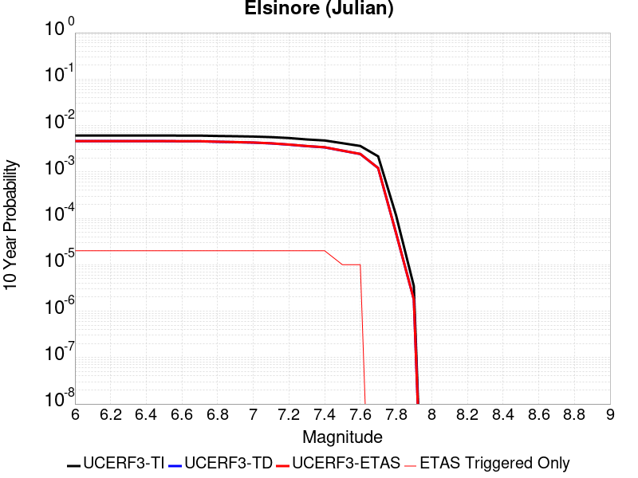 |

| Magnitude | 1 wk TI Prob | 1 wk TD Prob | 1 wk ETAS Prob | 1 wk ETAS/TD Gain | 1 wk ETAS Triggered Only | 1 mo TI Prob | 1 mo TD Prob | 1 mo ETAS Prob | 1 mo ETAS/TD Gain | 1 mo ETAS Triggered Only | 1 yr TI Prob | 1 yr TD Prob | 1 yr ETAS Prob | 1 yr ETAS/TD Gain | 1 yr ETAS Triggered Only | 10 yr TI Prob | 10 yr TD Prob | 10 yr ETAS Prob | 10 yr ETAS/TD Gain | 10 yr ETAS Triggered Only |
|-----|-----|-----|-----|-----|-----|-----|-----|-----|-----|-----|-----|-----|-----|-----|-----|-----|-----|-----|-----|-----|
| 6.0 | 1.1710231E-5 | 8.845509E-6 | 3.551194E-5 | 4.014686 | 2.6666667E-5 | 5.0185736E-5 | 3.7908783E-5 | 9.1240094E-5 | 2.4068327 | 5.3333333E-5 | 6.1084004E-4 | 4.614434E-4 | 5.147521E-4 | 1.1155261 | 5.3333333E-5 | 0.006091637 | 0.0046050567 | 0.0046581444 | 1.0115281 | 5.3333333E-5 |
| 6.1 | 1.1710231E-5 | 8.845509E-6 | 3.551194E-5 | 4.014686 | 2.6666667E-5 | 5.0185736E-5 | 3.7908783E-5 | 9.1240094E-5 | 2.4068327 | 5.3333333E-5 | 6.1084004E-4 | 4.614434E-4 | 5.147521E-4 | 1.1155261 | 5.3333333E-5 | 0.006091637 | 0.0046050567 | 0.0046581444 | 1.0115281 | 5.3333333E-5 |
| 6.2 | 1.1710231E-5 | 8.845509E-6 | 3.551194E-5 | 4.014686 | 2.6666667E-5 | 5.0185736E-5 | 3.7908783E-5 | 9.1240094E-5 | 2.4068327 | 5.3333333E-5 | 6.1084004E-4 | 4.614434E-4 | 5.147521E-4 | 1.1155261 | 5.3333333E-5 | 0.006091637 | 0.0046050567 | 0.0046581444 | 1.0115281 | 5.3333333E-5 |
| 6.3 | 1.1710231E-5 | 8.845509E-6 | 3.551194E-5 | 4.014686 | 2.6666667E-5 | 5.0185736E-5 | 3.7908783E-5 | 9.1240094E-5 | 2.4068327 | 5.3333333E-5 | 6.1084004E-4 | 4.614434E-4 | 5.147521E-4 | 1.1155261 | 5.3333333E-5 | 0.006091637 | 0.0046050567 | 0.0046581444 | 1.0115281 | 5.3333333E-5 |
| 6.4 | 1.1710231E-5 | 8.845509E-6 | 3.551194E-5 | 4.014686 | 2.6666667E-5 | 5.0185736E-5 | 3.7908783E-5 | 9.1240094E-5 | 2.4068327 | 5.3333333E-5 | 6.1084004E-4 | 4.614434E-4 | 5.147521E-4 | 1.1155261 | 5.3333333E-5 | 0.006091637 | 0.0046050567 | 0.0046581444 | 1.0115281 | 5.3333333E-5 |
| 6.5 | 1.1710231E-5 | 8.845509E-6 | 3.551194E-5 | 4.014686 | 2.6666667E-5 | 5.0185736E-5 | 3.7908783E-5 | 9.1240094E-5 | 2.4068327 | 5.3333333E-5 | 6.1084004E-4 | 4.614434E-4 | 5.147521E-4 | 1.1155261 | 5.3333333E-5 | 0.006091637 | 0.0046050567 | 0.0046581444 | 1.0115281 | 5.3333333E-5 |
| 6.6 | 1.1650619E-5 | 8.777881E-6 | 3.5444315E-5 | 4.0379124 | 2.6666667E-5 | 4.993027E-5 | 3.7618956E-5 | 9.0950285E-5 | 2.4176717 | 5.3333333E-5 | 6.0773146E-4 | 4.5791623E-4 | 5.1122514E-4 | 1.1164163 | 5.3333333E-5 | 0.0060607214 | 0.004569931 | 0.0046230205 | 1.0116172 | 5.3333333E-5 |
| 6.7 | 1.1650619E-5 | 8.777881E-6 | 3.5444315E-5 | 4.0379124 | 2.6666667E-5 | 4.993027E-5 | 3.7618956E-5 | 9.0950285E-5 | 2.4176717 | 5.3333333E-5 | 6.0773146E-4 | 4.5791623E-4 | 5.1122514E-4 | 1.1164163 | 5.3333333E-5 | 0.0060607214 | 0.004569931 | 0.0046230205 | 1.0116172 | 5.3333333E-5 |
| 6.8 | 1.1442698E-5 | 8.561041E-6 | 3.522748E-5 | 4.1148596 | 2.6666667E-5 | 4.9039216E-5 | 3.6689667E-5 | 9.002104E-5 | 2.4535801 | 5.3333333E-5 | 5.968889E-4 | 4.4660683E-4 | 4.999163E-4 | 1.1193657 | 5.3333333E-5 | 0.0059528816 | 0.004457295 | 0.0045103906 | 1.0119121 | 5.3333333E-5 |
| 6.9 | 1.1300589E-5 | 8.408907E-6 | 3.507535E-5 | 4.1712136 | 2.6666667E-5 | 4.8430196E-5 | 3.6037683E-5 | 8.9369096E-5 | 2.479879 | 5.3333333E-5 | 5.894781E-4 | 4.3867214E-4 | 4.919821E-4 | 1.1215256 | 5.3333333E-5 | 0.005879169 | 0.0043782624 | 0.0044313623 | 1.0121281 | 5.3333333E-5 |
| 7.0 | 1.1117729E-5 | 8.226087E-6 | 3.4892535E-5 | 4.241693 | 2.6666667E-5 | 4.764654E-5 | 3.525419E-5 | 8.858564E-5 | 2.5127692 | 5.3333333E-5 | 5.799422E-4 | 4.291369E-4 | 4.8244736E-4 | 1.1242272 | 5.3333333E-5 | 0.0057843104 | 0.004283281 | 0.0043363855 | 1.0123981 | 5.3333333E-5 |
| 7.1 | 1.08053955E-5 | 7.9117535E-6 | 3.457821E-5 | 4.370486 | 2.6666667E-5 | 4.6308014E-5 | 3.3907087E-5 | 8.723861E-5 | 2.5728726 | 5.3333333E-5 | 5.6365423E-4 | 4.127422E-4 | 4.6605352E-4 | 1.1291637 | 5.3333333E-5 | 0.005622267 | 0.0041199517 | 0.0041730655 | 1.0128918 | 5.3333333E-5 |
| 7.2 | 1.032804E-5 | 7.433021E-6 | 3.409949E-5 | 4.587568 | 2.6666667E-5 | 4.4262277E-5 | 3.1855423E-5 | 8.518706E-5 | 2.6741774 | 5.3333333E-5 | 5.387599E-4 | 3.8777234E-4 | 4.41085E-4 | 1.1374844 | 5.3333333E-5 | 0.0053745564 | 0.0038711445 | 0.0039242716 | 1.0137239 | 5.3333333E-5 |
| 7.3 | 9.622426E-6 | 6.8978457E-6 | 3.3564327E-5 | 4.865915 | 2.6666667E-5 | 4.1238312E-5 | 2.9561868E-5 | 8.2893624E-5 | 2.8040726 | 5.3333333E-5 | 5.019608E-4 | 3.5985775E-4 | 4.131719E-4 | 1.1481534 | 5.3333333E-5 | 0.005008285 | 0.0035929221 | 0.0036460639 | 1.0147907 | 5.3333333E-5 |
| 7.4 | 9.144434E-6 | 6.4963933E-6 | 3.3162887E-5 | 5.104815 | 2.6666667E-5 | 3.9189843E-5 | 2.7841395E-5 | 8.1173246E-5 | 2.9155593 | 5.3333333E-5 | 4.7703186E-4 | 3.3891766E-4 | 3.922329E-4 | 1.1573104 | 5.3333333E-5 | 0.0047600917 | 0.0033841513 | 0.0034373042 | 1.0157064 | 5.3333333E-5 |
| 7.5 | 7.988981E-6 | 5.4983307E-6 | 5.4983307E-6 | 1.0 | 0.0 | 3.4238044E-5 | 2.356407E-5 | 5.0230108E-5 | 2.1316397 | 2.6666667E-5 | 4.1676845E-4 | 2.8685606E-4 | 3.1351508E-4 | 1.0929352 | 2.6666667E-5 | 0.0041598766 | 0.002864985 | 0.0028915752 | 1.0092812 | 2.6666667E-5 |
| 7.6 | 6.9554876E-6 | 4.6625346E-6 | 4.6625346E-6 | 1.0 | 0.0 | 2.9808893E-5 | 1.9982144E-5 | 4.6648278E-5 | 2.3344982 | 2.6666667E-5 | 3.6286283E-4 | 2.4325661E-4 | 2.6991678E-4 | 1.109597 | 2.6666667E-5 | 0.0036227088 | 0.0024300197 | 0.0024566215 | 1.0109472 | 2.6666667E-5 |
| 7.7 | 4.1557314E-6 | 2.3246462E-6 | 2.3246462E-6 | 1.0 | 0.0 | 1.7810156E-5 | 9.962735E-6 | 9.962735E-6 | 1.0 | 0.0 | 2.1681708E-4 | 1.2129029E-4 | 1.2129029E-4 | 1.0 | 0.0 | 0.0021660565 | 0.001212314 | 0.001212314 | 1.0 | 0.0 |
| 7.8 | 2.2597293E-7 | 9.332915E-8 | 9.332915E-8 | 1.0 | 0.0 | 9.684551E-7 | 3.99982E-7 | 3.99982E-7 | 1.0 | 0.0 | 1.1790877E-5 | 4.8697734E-6 | 4.8697734E-6 | 1.0 | 0.0 | 1.17902506E-4 | 4.8696995E-5 | 4.8696995E-5 | 1.0 | 0.0 |
| 7.9 | 6.676829E-9 | 3.439853E-9 | 3.439853E-9 | 1.0 | 0.0 | 2.861498E-8 | 1.4742227E-8 | 1.4742227E-8 | 1.0 | 0.0 | 3.4838732E-7 | 1.7948659E-7 | 1.7948659E-7 | 1.0 | 0.0 | 3.4838679E-6 | 1.7948646E-6 | 1.7948646E-6 | 1.0 | 0.0 |

## Santa Ynez River
*[(top)](#table-of-contents)*

| 1 Week | 1 Month | 1 Year | 10 Year |
|-----|-----|-----|-----|
|  | 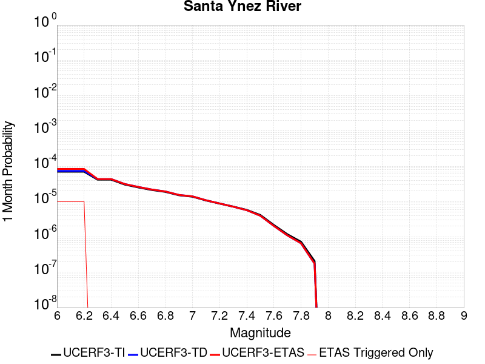 |  |  |

| Magnitude | 1 wk TI Prob | 1 wk TD Prob | 1 wk ETAS Prob | 1 wk ETAS/TD Gain | 1 wk ETAS Triggered Only | 1 mo TI Prob | 1 mo TD Prob | 1 mo ETAS Prob | 1 mo ETAS/TD Gain | 1 mo ETAS Triggered Only | 1 yr TI Prob | 1 yr TD Prob | 1 yr ETAS Prob | 1 yr ETAS/TD Gain | 1 yr ETAS Triggered Only | 10 yr TI Prob | 10 yr TD Prob | 10 yr ETAS Prob | 10 yr ETAS/TD Gain | 10 yr ETAS Triggered Only |
|-----|-----|-----|-----|-----|-----|-----|-----|-----|-----|-----|-----|-----|-----|-----|-----|-----|-----|-----|-----|-----|
| 6.0 | 1.6396456E-5 | 1.7209435E-5 | 4.3875643E-5 | 2.549511 | 2.6666667E-5 | 7.026863E-5 | 7.375284E-5 | 1.0041754E-4 | 1.3615414 | 2.6666667E-5 | 8.551848E-4 | 8.976064E-4 | 9.242492E-4 | 1.0296819 | 2.6666667E-5 | 0.0085190125 | 0.008943358 | 0.008996215 | 1.0059102 | 5.3333333E-5 |
| 6.1 | 1.6396456E-5 | 1.7209435E-5 | 4.3875643E-5 | 2.549511 | 2.6666667E-5 | 7.026863E-5 | 7.375284E-5 | 1.0041754E-4 | 1.3615414 | 2.6666667E-5 | 8.551848E-4 | 8.976064E-4 | 9.242492E-4 | 1.0296819 | 2.6666667E-5 | 0.0085190125 | 0.008943358 | 0.008996215 | 1.0059102 | 5.3333333E-5 |
| 6.2 | 1.6396456E-5 | 1.7209435E-5 | 4.3875643E-5 | 2.549511 | 2.6666667E-5 | 7.026863E-5 | 7.375284E-5 | 1.0041754E-4 | 1.3615414 | 2.6666667E-5 | 8.551848E-4 | 8.976064E-4 | 9.242492E-4 | 1.0296819 | 2.6666667E-5 | 0.0085190125 | 0.008943358 | 0.008996215 | 1.0059102 | 5.3333333E-5 |
| 6.3 | 9.736976E-6 | 1.012233E-5 | 1.012233E-5 | 1.0 | 0.0 | 4.172923E-5 | 4.338072E-5 | 4.338072E-5 | 1.0 | 0.0 | 5.0793495E-4 | 5.280373E-4 | 5.280373E-4 | 1.0 | 0.0 | 0.005067755 | 0.005268332 | 0.005268332 | 1.0 | 0.0 |
| 6.4 | 9.736976E-6 | 1.012233E-5 | 1.012233E-5 | 1.0 | 0.0 | 4.172923E-5 | 4.338072E-5 | 4.338072E-5 | 1.0 | 0.0 | 5.0793495E-4 | 5.280373E-4 | 5.280373E-4 | 1.0 | 0.0 | 0.005067755 | 0.005268332 | 0.005268332 | 1.0 | 0.0 |
| 6.5 | 7.081964E-6 | 7.3298966E-6 | 7.3298966E-6 | 1.0 | 0.0 | 3.035092E-5 | 3.1413474E-5 | 3.1413474E-5 | 1.0 | 0.0 | 3.694598E-4 | 3.8239348E-4 | 3.8239348E-4 | 1.0 | 0.0 | 0.0036884616 | 0.0038175168 | 0.0038175168 | 1.0 | 0.0 |
| 6.6 | 5.873247E-6 | 6.059743E-6 | 6.059743E-6 | 1.0 | 0.0 | 2.5170815E-5 | 2.5970074E-5 | 2.5970074E-5 | 1.0 | 0.0 | 3.064116E-4 | 3.1614062E-4 | 3.1614062E-4 | 1.0 | 0.0 | 0.0030598943 | 0.0031569963 | 0.0031569963 | 1.0 | 0.0 |
| 6.7 | 4.973277E-6 | 5.115901E-6 | 5.115901E-6 | 1.0 | 0.0 | 2.1313872E-5 | 2.1925109E-5 | 2.1925109E-5 | 1.0 | 0.0 | 2.5946548E-4 | 2.66906E-4 | 2.66906E-4 | 1.0 | 0.0 | 0.0025916274 | 0.0026659032 | 0.0026659032 | 1.0 | 0.0 |
| 6.8 | 4.396492E-6 | 4.5109778E-6 | 4.5109778E-6 | 1.0 | 0.0 | 1.884197E-5 | 1.9332621E-5 | 1.9332621E-5 | 1.0 | 0.0 | 2.2937685E-4 | 2.3534958E-4 | 2.3534958E-4 | 1.0 | 0.0 | 0.0022914023 | 0.0023510386 | 0.0023510386 | 1.0 | 0.0 |
| 6.9 | 3.5255632E-6 | 3.6013332E-6 | 3.6013332E-6 | 1.0 | 0.0 | 1.5109469E-5 | 1.5434196E-5 | 1.5434196E-5 | 1.0 | 0.0 | 1.8394225E-4 | 1.8789528E-4 | 1.8789528E-4 | 1.0 | 0.0 | 0.0018379007 | 0.0018773803 | 0.0018773803 | 1.0 | 0.0 |
| 7.0 | 3.211603E-6 | 3.273654E-6 | 3.273654E-6 | 1.0 | 0.0 | 1.376394E-5 | 1.4029872E-5 | 1.4029872E-5 | 1.0 | 0.0 | 1.6756308E-4 | 1.7080043E-4 | 1.7080043E-4 | 1.0 | 0.0 | 0.0016743679 | 0.0017067058 | 0.0017067058 | 1.0 | 0.0 |
| 7.1 | 2.5094619E-6 | 2.5409204E-6 | 2.5409204E-6 | 1.0 | 0.0 | 1.0754793E-5 | 1.0889614E-5 | 1.0889614E-5 | 1.0 | 0.0 | 1.3093173E-4 | 1.3257304E-4 | 1.3257304E-4 | 1.0 | 0.0 | 0.0013085462 | 0.0013249456 | 0.0013249456 | 1.0 | 0.0 |
| 7.2 | 2.0515774E-6 | 2.0619375E-6 | 2.0619375E-6 | 1.0 | 0.0 | 8.792445E-6 | 8.836846E-6 | 8.836846E-6 | 1.0 | 0.0 | 1.0704277E-4 | 1.0758333E-4 | 1.0758333E-4 | 1.0 | 0.0 | 0.0010699122 | 0.0010753168 | 0.0010753168 | 1.0 | 0.0 |
| 7.3 | 1.6845745E-6 | 1.6773907E-6 | 1.6773907E-6 | 1.0 | 0.0 | 7.219585E-6 | 7.1887976E-6 | 7.1887976E-6 | 1.0 | 0.0 | 8.78949E-5 | 8.752012E-5 | 8.752012E-5 | 1.0 | 0.0 | 8.7860145E-4 | 8.7485946E-4 | 8.7485946E-4 | 1.0 | 0.0 |
| 7.4 | 1.3600285E-6 | 1.3333357E-6 | 1.3333357E-6 | 1.0 | 0.0 | 5.82868E-6 | 5.714284E-6 | 5.714284E-6 | 1.0 | 0.0 | 7.096187E-5 | 6.956921E-5 | 6.956921E-5 | 1.0 | 0.0 | 7.0939213E-4 | 6.954765E-4 | 6.954765E-4 | 1.0 | 0.0 |
| 7.5 | 9.735342E-7 | 9.290103E-7 | 9.290103E-7 | 1.0 | 0.0 | 4.172283E-6 | 3.9814668E-6 | 3.9814668E-6 | 1.0 | 0.0 | 5.079636E-5 | 4.8473295E-5 | 4.8473295E-5 | 1.0 | 0.0 | 5.0784746E-4 | 4.8462892E-4 | 4.8462892E-4 | 1.0 | 0.0 |
| 7.6 | 5.067187E-7 | 4.77857E-7 | 4.77857E-7 | 1.0 | 0.0 | 2.1716498E-6 | 2.047957E-6 | 2.047957E-6 | 1.0 | 0.0 | 2.6439517E-5 | 2.4933597E-5 | 2.4933597E-5 | 1.0 | 0.0 | 2.643637E-4 | 2.4930874E-4 | 2.4930874E-4 | 1.0 | 0.0 |
| 7.7 | 2.769089E-7 | 2.5759124E-7 | 2.5759124E-7 | 1.0 | 0.0 | 1.1867519E-6 | 1.1039621E-6 | 1.1039621E-6 | 1.0 | 0.0 | 1.4448608E-5 | 1.34406555E-5 | 1.34406555E-5 | 1.0 | 0.0 | 1.444767E-4 | 1.3439846E-4 | 1.3439846E-4 | 1.0 | 0.0 |
| 7.8 | 1.7044663E-7 | 1.5449015E-7 | 1.5449015E-7 | 1.0 | 0.0 | 7.3048534E-7 | 6.621005E-7 | 6.621005E-7 | 1.0 | 0.0 | 8.893623E-6 | 8.061043E-6 | 8.061043E-6 | 1.0 | 0.0 | 8.893267E-5 | 8.060753E-5 | 8.060753E-5 | 1.0 | 0.0 |
| 7.9 | 4.8344287E-8 | 4.0910923E-8 | 4.0910923E-8 | 1.0 | 0.0 | 2.0718979E-7 | 1.7533252E-7 | 1.7533252E-7 | 1.0 | 0.0 | 2.5225327E-6 | 2.1346711E-6 | 2.1346711E-6 | 1.0 | 0.0 | 2.5225041E-5 | 2.1346512E-5 | 2.1346512E-5 | 1.0 | 0.0 |

## Great Valley 07 (Orestimba)
*[(top)](#table-of-contents)*

| 1 Week | 1 Month | 1 Year | 10 Year |
|-----|-----|-----|-----|
|  | 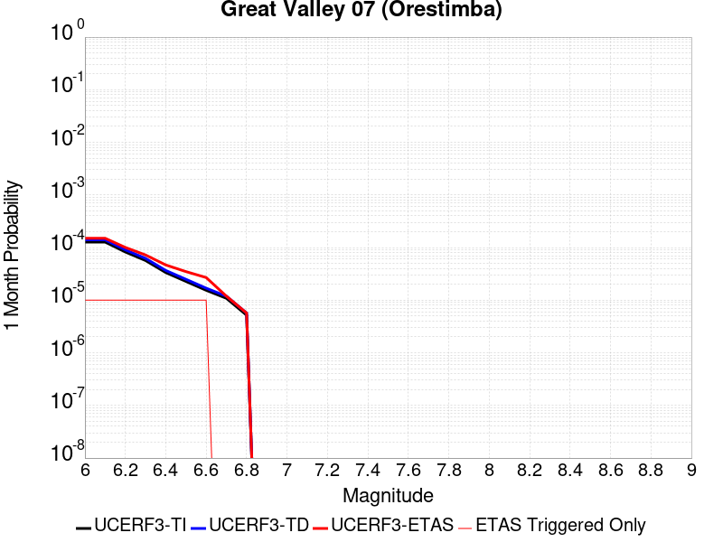 |  |  |

| Magnitude | 1 wk TI Prob | 1 wk TD Prob | 1 wk ETAS Prob | 1 wk ETAS/TD Gain | 1 wk ETAS Triggered Only | 1 mo TI Prob | 1 mo TD Prob | 1 mo ETAS Prob | 1 mo ETAS/TD Gain | 1 mo ETAS Triggered Only | 1 yr TI Prob | 1 yr TD Prob | 1 yr ETAS Prob | 1 yr ETAS/TD Gain | 1 yr ETAS Triggered Only | 10 yr TI Prob | 10 yr TD Prob | 10 yr ETAS Prob | 10 yr ETAS/TD Gain | 10 yr ETAS Triggered Only |
|-----|-----|-----|-----|-----|-----|-----|-----|-----|-----|-----|-----|-----|-----|-----|-----|-----|-----|-----|-----|-----|
| 6.0 | 2.9687902E-5 | 3.27575E-5 | 5.942329E-5 | 1.8140363 | 2.6666667E-5 | 1.2722766E-4 | 1.4038214E-4 | 1.6704506E-4 | 1.189931 | 2.6666667E-5 | 0.0015478961 | 0.0017078844 | 0.0017345055 | 1.0155872 | 2.6666667E-5 | 0.015371585 | 0.016955135 | 0.017007565 | 1.0030922 | 5.3333333E-5 |
| 6.1 | 2.9687902E-5 | 3.27575E-5 | 5.942329E-5 | 1.8140363 | 2.6666667E-5 | 1.2722766E-4 | 1.4038214E-4 | 1.6704506E-4 | 1.189931 | 2.6666667E-5 | 0.0015478961 | 0.0017078844 | 0.0017345055 | 1.0155872 | 2.6666667E-5 | 0.015371585 | 0.016955135 | 0.017007565 | 1.0030922 | 5.3333333E-5 |
| 6.2 | 1.9231524E-5 | 2.1159167E-5 | 4.782527E-5 | 2.2602625 | 2.6666667E-5 | 8.2418206E-5 | 9.067912E-5 | 1.1734337E-4 | 1.2940506 | 2.6666667E-5 | 0.0010029797 | 0.0011034822 | 0.0011301195 | 1.0241393 | 2.6666667E-5 | 0.00998465 | 0.01098244 | 0.011035188 | 1.004803 | 5.3333333E-5 |
| 6.3 | 1.324766E-5 | 1.4548534E-5 | 4.121481E-5 | 2.8329186 | 2.6666667E-5 | 5.6774446E-5 | 6.234942E-5 | 8.901442E-5 | 1.4276705 | 2.6666667E-5 | 6.910097E-4 | 7.5884897E-4 | 7.854954E-4 | 1.0351143 | 2.6666667E-5 | 0.006888649 | 0.0075635235 | 0.0076164533 | 1.0069981 | 5.3333333E-5 |
| 6.4 | 7.818645E-6 | 8.57284E-6 | 3.5239278E-5 | 4.1105723 | 2.6666667E-5 | 3.3508048E-5 | 3.6740246E-5 | 6.340593E-5 | 1.7257895 | 2.6666667E-5 | 4.078841E-4 | 4.4722404E-4 | 4.7387878E-4 | 1.0596005 | 2.6666667E-5 | 0.004071363 | 0.0044635804 | 0.0044901283 | 1.0059476 | 2.6666667E-5 |
| 6.5 | 5.3076565E-6 | 5.8178007E-6 | 3.2484313E-5 | 5.5836067 | 2.6666667E-5 | 2.27469E-5 | 2.4933206E-5 | 5.1599207E-5 | 2.0694976 | 2.6666667E-5 | 2.7690834E-4 | 3.035216E-4 | 3.3018016E-4 | 1.0878309 | 2.6666667E-5 | 0.0027656353 | 0.00303128 | 0.0030578657 | 1.0087705 | 2.6666667E-5 |
| 6.6 | 3.6003578E-6 | 3.9484953E-6 | 3.0615058E-5 | 7.7536006 | 2.6666667E-5 | 1.5430012E-5 | 1.6922022E-5 | 4.358824E-5 | 2.575829 | 2.6666667E-5 | 1.8784421E-4 | 2.0600771E-4 | 2.3266888E-4 | 1.1294184 | 2.6666667E-5 | 0.0018768552 | 0.0020583214 | 0.0020849332 | 1.0129288 | 2.6666667E-5 |
| 6.7 | 2.5361826E-6 | 2.7834678E-6 | 2.7834678E-6 | 1.0 | 0.0 | 1.0869308E-5 | 1.1929101E-5 | 1.1929101E-5 | 1.0 | 0.0 | 1.3232579E-4 | 1.4522845E-4 | 1.4522845E-4 | 1.0 | 0.0 | 0.0013224703 | 0.0014514653 | 0.0014514653 | 1.0 | 0.0 |
| 6.8 | 1.2115831E-6 | 1.3313797E-6 | 1.3313797E-6 | 1.0 | 0.0 | 5.1924885E-6 | 5.7059065E-6 | 5.7059065E-6 | 1.0 | 0.0 | 6.3216714E-5 | 6.9468166E-5 | 6.9468166E-5 | 1.0 | 0.0 | 6.3198735E-4 | 6.945596E-4 | 6.945596E-4 | 1.0 | 0.0 |

## Carlsbad
*[(top)](#table-of-contents)*

| 1 Week | 1 Month | 1 Year | 10 Year |
|-----|-----|-----|-----|
|  |  | 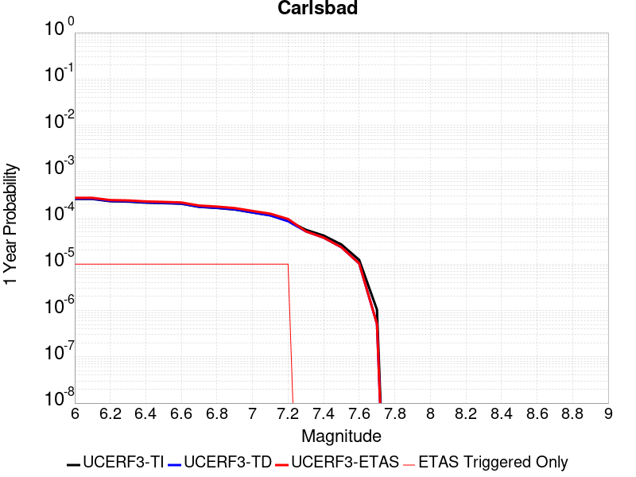 | 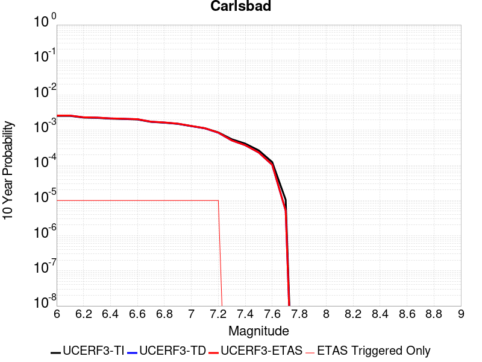 |

| Magnitude | 1 wk TI Prob | 1 wk TD Prob | 1 wk ETAS Prob | 1 wk ETAS/TD Gain | 1 wk ETAS Triggered Only | 1 mo TI Prob | 1 mo TD Prob | 1 mo ETAS Prob | 1 mo ETAS/TD Gain | 1 mo ETAS Triggered Only | 1 yr TI Prob | 1 yr TD Prob | 1 yr ETAS Prob | 1 yr ETAS/TD Gain | 1 yr ETAS Triggered Only | 10 yr TI Prob | 10 yr TD Prob | 10 yr ETAS Prob | 10 yr ETAS/TD Gain | 10 yr ETAS Triggered Only |
|-----|-----|-----|-----|-----|-----|-----|-----|-----|-----|-----|-----|-----|-----|-----|-----|-----|-----|-----|-----|-----|
| 6.0 | 4.9038536E-6 | 4.9872565E-6 | 4.9872565E-6 | 1.0 | 0.0 | 2.1016345E-5 | 2.1373784E-5 | 2.1373784E-5 | 1.0 | 0.0 | 2.5584397E-4 | 2.601952E-4 | 2.8685492E-4 | 1.1024605 | 2.6666667E-5 | 0.002555496 | 0.0025989525 | 0.00262555 | 1.0102339 | 2.6666667E-5 |
| 6.1 | 4.9038536E-6 | 4.9872565E-6 | 4.9872565E-6 | 1.0 | 0.0 | 2.1016345E-5 | 2.1373784E-5 | 2.1373784E-5 | 1.0 | 0.0 | 2.5584397E-4 | 2.601952E-4 | 2.8685492E-4 | 1.1024605 | 2.6666667E-5 | 0.002555496 | 0.0025989525 | 0.00262555 | 1.0102339 | 2.6666667E-5 |
| 6.2 | 4.3820614E-6 | 4.4547687E-6 | 4.4547687E-6 | 1.0 | 0.0 | 1.8780129E-5 | 1.9091729E-5 | 1.9091729E-5 | 1.0 | 0.0 | 2.2862408E-4 | 2.3241735E-4 | 2.5907782E-4 | 1.1147095 | 2.6666667E-5 | 0.00228389 | 0.0023217786 | 0.0023483832 | 1.0114588 | 2.6666667E-5 |
| 6.3 | 4.302872E-6 | 4.373006E-6 | 4.373006E-6 | 1.0 | 0.0 | 1.8440749E-5 | 1.8741322E-5 | 1.8741322E-5 | 1.0 | 0.0 | 2.24493E-4 | 2.2815206E-4 | 2.5481265E-4 | 1.1168544 | 2.6666667E-5 | 0.0022426634 | 0.0022792136 | 0.0023058194 | 1.0116733 | 2.6666667E-5 |
| 6.4 | 4.0835243E-6 | 4.1476546E-6 | 4.1476546E-6 | 1.0 | 0.0 | 1.75007E-5 | 1.7775543E-5 | 1.7775543E-5 | 1.0 | 0.0 | 2.1305021E-4 | 2.1639607E-4 | 2.4305697E-4 | 1.1232041 | 2.6666667E-5 | 0.0021284607 | 0.0021618877 | 0.0021884968 | 1.0123082 | 2.6666667E-5 |
| 6.5 | 3.987806E-6 | 4.0488867E-6 | 4.0488867E-6 | 1.0 | 0.0 | 1.7090486E-5 | 1.7352257E-5 | 1.7352257E-5 | 1.0 | 0.0 | 2.080568E-4 | 2.1124359E-4 | 2.3790462E-4 | 1.1262099 | 2.6666667E-5 | 0.002078621 | 0.0021104617 | 0.0021370722 | 1.0126088 | 2.6666667E-5 |
| 6.6 | 3.8707576E-6 | 3.927488E-6 | 3.927488E-6 | 1.0 | 0.0 | 1.6588854E-5 | 1.6831984E-5 | 1.6831984E-5 | 1.0 | 0.0 | 2.0195059E-4 | 2.0491047E-4 | 2.3157167E-4 | 1.1301115 | 2.6666667E-5 | 0.0020176715 | 0.0020472489 | 0.002073861 | 1.0129989 | 2.6666667E-5 |
| 6.7 | 3.3093434E-6 | 3.3423917E-6 | 3.3423917E-6 | 1.0 | 0.0 | 1.4182823E-5 | 1.4324457E-5 | 1.4324457E-5 | 1.0 | 0.0 | 1.7266218E-4 | 1.7438637E-4 | 2.0104839E-4 | 1.1528904 | 2.6666667E-5 | 0.001725281 | 0.0017425013 | 0.0017691215 | 1.015277 | 2.6666667E-5 |
| 6.8 | 3.136983E-6 | 3.1664536E-6 | 3.1664536E-6 | 1.0 | 0.0 | 1.3444143E-5 | 1.3570445E-5 | 1.3570445E-5 | 1.0 | 0.0 | 1.6367015E-4 | 1.6520769E-4 | 1.9186996E-4 | 1.1613864 | 2.6666667E-5 | 0.0016354966 | 0.0016508545 | 0.001677477 | 1.0161266 | 2.6666667E-5 |
| 6.9 | 2.9056644E-6 | 2.9267585E-6 | 2.9267585E-6 | 1.0 | 0.0 | 1.2452788E-5 | 1.2543191E-5 | 1.2543191E-5 | 1.0 | 0.0 | 1.5160214E-4 | 1.5270269E-4 | 1.7936529E-4 | 1.1746047 | 2.6666667E-5 | 0.0015149876 | 0.001525983 | 0.0015526089 | 1.0174484 | 2.6666667E-5 |
| 7.0 | 2.5071035E-6 | 2.5113977E-6 | 2.5113977E-6 | 1.0 | 0.0 | 1.0744685E-5 | 1.07630885E-5 | 1.07630885E-5 | 1.0 | 0.0 | 1.308087E-4 | 1.3103275E-4 | 1.5769593E-4 | 1.2034848 | 2.6666667E-5 | 0.0013073172 | 0.0013095582 | 0.0013361899 | 1.0203364 | 2.6666667E-5 |
| 7.1 | 2.1786877E-6 | 2.1678832E-6 | 2.1678832E-6 | 1.0 | 0.0 | 9.3372E-6 | 9.290896E-6 | 9.290896E-6 | 1.0 | 0.0 | 1.13674476E-4 | 1.1311081E-4 | 1.3977446E-4 | 1.2357304 | 2.6666667E-5 | 0.0011361635 | 0.0011305353 | 0.0011571718 | 1.023561 | 2.6666667E-5 |
| 7.2 | 1.6628418E-6 | 1.6213872E-6 | 1.6213872E-6 | 1.0 | 0.0 | 7.1264453E-6 | 6.948784E-6 | 6.948784E-6 | 1.0 | 0.0 | 8.676102E-5 | 8.4598185E-5 | 1.112626E-4 | 1.3151889 | 2.6666667E-5 | 8.672715E-4 | 8.45662E-4 | 8.723061E-4 | 1.0315068 | 2.6666667E-5 |
| 7.3 | 1.0595926E-6 | 9.816804E-7 | 9.816804E-7 | 1.0 | 0.0 | 4.541103E-6 | 4.2071947E-6 | 4.2071947E-6 | 1.0 | 0.0 | 5.5286528E-5 | 5.1221403E-5 | 5.1221403E-5 | 1.0 | 0.0 | 5.527277E-4 | 5.1209686E-4 | 5.1209686E-4 | 1.0 | 0.0 |
| 7.4 | 7.956623E-7 | 7.1737975E-7 | 7.1737975E-7 | 1.0 | 0.0 | 3.4099767E-6 | 3.074481E-6 | 3.074481E-6 | 1.0 | 0.0 | 4.1515676E-5 | 3.743117E-5 | 3.743117E-5 | 1.0 | 0.0 | 4.150792E-4 | 3.7424936E-4 | 3.7424936E-4 | 1.0 | 0.0 |
| 7.5 | 5.1043804E-7 | 4.4483627E-7 | 4.4483627E-7 | 1.0 | 0.0 | 2.1875896E-6 | 1.9064398E-6 | 1.9064398E-6 | 1.0 | 0.0 | 2.663358E-5 | 2.3210663E-5 | 2.3210663E-5 | 1.0 | 0.0 | 2.6630386E-4 | 2.3208297E-4 | 2.3208297E-4 | 1.0 | 0.0 |
| 7.6 | 2.3723294E-7 | 1.989569E-7 | 1.989569E-7 | 1.0 | 0.0 | 1.0167122E-6 | 8.5267214E-7 | 8.5267214E-7 | 1.0 | 0.0 | 1.2378401E-5 | 1.0381237E-5 | 1.0381237E-5 | 1.0 | 0.0 | 1.237771E-4 | 1.038078E-4 | 1.038078E-4 | 1.0 | 0.0 |
| 7.7 | 1.9992152E-8 | 9.8601785E-9 | 9.8601785E-9 | 1.0 | 0.0 | 8.568065E-8 | 4.225791E-8 | 4.225791E-8 | 1.0 | 0.0 | 1.0431614E-6 | 5.1449E-7 | 5.1449E-7 | 1.0 | 0.0 | 1.0431565E-5 | 5.1449E-6 | 5.1449E-6 | 1.0 | 0.0 |

## Blue Cut
*[(top)](#table-of-contents)*

| 1 Week | 1 Month | 1 Year | 10 Year |
|-----|-----|-----|-----|
|  |  |  |  |

| Magnitude | 1 wk TI Prob | 1 wk TD Prob | 1 wk ETAS Prob | 1 wk ETAS/TD Gain | 1 wk ETAS Triggered Only | 1 mo TI Prob | 1 mo TD Prob | 1 mo ETAS Prob | 1 mo ETAS/TD Gain | 1 mo ETAS Triggered Only | 1 yr TI Prob | 1 yr TD Prob | 1 yr ETAS Prob | 1 yr ETAS/TD Gain | 1 yr ETAS Triggered Only | 10 yr TI Prob | 10 yr TD Prob | 10 yr ETAS Prob | 10 yr ETAS/TD Gain | 10 yr ETAS Triggered Only |
|-----|-----|-----|-----|-----|-----|-----|-----|-----|-----|-----|-----|-----|-----|-----|-----|-----|-----|-----|-----|-----|
| 6.0 | 2.1227985E-5 | 2.2719574E-5 | 2.2719574E-5 | 1.0 | 0.0 | 9.097391E-5 | 9.73663E-5 | 9.73663E-5 | 1.0 | 0.0 | 0.0011070445 | 0.0011848481 | 0.0012114831 | 1.0224798 | 2.6666667E-5 | 0.011015458 | 0.011791152 | 0.011817504 | 1.0022349 | 2.6666667E-5 |
| 6.1 | 2.1227985E-5 | 2.2719574E-5 | 2.2719574E-5 | 1.0 | 0.0 | 9.097391E-5 | 9.73663E-5 | 9.73663E-5 | 1.0 | 0.0 | 0.0011070445 | 0.0011848481 | 0.0012114831 | 1.0224798 | 2.6666667E-5 | 0.011015458 | 0.011791152 | 0.011817504 | 1.0022349 | 2.6666667E-5 |
| 6.2 | 2.1227985E-5 | 2.2719574E-5 | 2.2719574E-5 | 1.0 | 0.0 | 9.097391E-5 | 9.73663E-5 | 9.73663E-5 | 1.0 | 0.0 | 0.0011070445 | 0.0011848481 | 0.0012114831 | 1.0224798 | 2.6666667E-5 | 0.011015458 | 0.011791152 | 0.011817504 | 1.0022349 | 2.6666667E-5 |
| 6.3 | 1.1613981E-5 | 1.2353542E-5 | 1.2353542E-5 | 1.0 | 0.0 | 4.9773254E-5 | 5.2942745E-5 | 5.2942745E-5 | 1.0 | 0.0 | 6.0582085E-4 | 6.443998E-4 | 6.7104923E-4 | 1.0413555 | 2.6666667E-5 | 0.0060417196 | 0.0064265593 | 0.0064530545 | 1.0041227 | 2.6666667E-5 |
| 6.4 | 1.1613981E-5 | 1.2353542E-5 | 1.2353542E-5 | 1.0 | 0.0 | 4.9773254E-5 | 5.2942745E-5 | 5.2942745E-5 | 1.0 | 0.0 | 6.0582085E-4 | 6.443998E-4 | 6.7104923E-4 | 1.0413555 | 2.6666667E-5 | 0.0060417196 | 0.0064265593 | 0.0064530545 | 1.0041227 | 2.6666667E-5 |
| 6.5 | 8.931326E-6 | 9.4816E-6 | 9.4816E-6 | 1.0 | 0.0 | 3.8276554E-5 | 4.0634844E-5 | 4.0634844E-5 | 1.0 | 0.0 | 4.6591737E-4 | 4.946261E-4 | 5.212796E-4 | 1.053886 | 2.6666667E-5 | 0.0046494175 | 0.004936161 | 0.004962696 | 1.0053756 | 2.6666667E-5 |
| 6.6 | 7.345353E-6 | 7.79028E-6 | 7.79028E-6 | 1.0 | 0.0 | 3.1479703E-5 | 3.338653E-5 | 3.338653E-5 | 1.0 | 0.0 | 3.83198E-4 | 4.064132E-4 | 4.064132E-4 | 1.0 | 0.0 | 0.0038253788 | 0.0040574907 | 0.0040574907 | 1.0 | 0.0 |
| 6.7 | 6.2775666E-6 | 6.655149E-6 | 6.655149E-6 | 1.0 | 0.0 | 2.690358E-5 | 2.8521798E-5 | 2.8521798E-5 | 1.0 | 0.0 | 3.2750185E-4 | 3.472051E-4 | 3.472051E-4 | 1.0 | 0.0 | 0.0032701963 | 0.003467367 | 0.003467367 | 1.0 | 0.0 |
| 6.8 | 5.5234095E-6 | 5.8551113E-6 | 5.8551113E-6 | 1.0 | 0.0 | 2.367154E-5 | 2.5093133E-5 | 2.5093133E-5 | 1.0 | 0.0 | 2.8816288E-4 | 3.0547334E-4 | 3.0547334E-4 | 1.0 | 0.0 | 0.002877895 | 0.0030512505 | 0.0030512505 | 1.0 | 0.0 |
| 6.9 | 4.7780054E-6 | 5.0654203E-6 | 5.0654203E-6 | 1.0 | 0.0 | 2.0477004E-5 | 2.1708804E-5 | 2.1708804E-5 | 1.0 | 0.0 | 2.4927902E-4 | 2.642797E-4 | 2.642797E-4 | 1.0 | 0.0 | 0.0024899957 | 0.002640346 | 0.002640346 | 1.0 | 0.0 |
| 7.0 | 3.883171E-6 | 4.118487E-6 | 4.118487E-6 | 1.0 | 0.0 | 1.6642054E-5 | 1.7650578E-5 | 1.7650578E-5 | 1.0 | 0.0 | 2.0259817E-4 | 2.1488148E-4 | 2.1488148E-4 | 1.0 | 0.0 | 0.0020241356 | 0.0021474129 | 0.0021474129 | 1.0 | 0.0 |
| 7.1 | 2.8358215E-6 | 3.0097158E-6 | 3.0097158E-6 | 1.0 | 0.0 | 1.2153464E-5 | 1.2898756E-5 | 1.2898756E-5 | 1.0 | 0.0 | 1.4795837E-4 | 1.5703762E-4 | 1.5703762E-4 | 1.0 | 0.0 | 0.001478599 | 0.0015699116 | 0.0015699116 | 1.0 | 0.0 |

## Earthquake Valley (So Extension)
*[(top)](#table-of-contents)*

| 1 Week | 1 Month | 1 Year | 10 Year |
|-----|-----|-----|-----|
|  |  |  |  |

| Magnitude | 1 wk TI Prob | 1 wk TD Prob | 1 wk ETAS Prob | 1 wk ETAS/TD Gain | 1 wk ETAS Triggered Only | 1 mo TI Prob | 1 mo TD Prob | 1 mo ETAS Prob | 1 mo ETAS/TD Gain | 1 mo ETAS Triggered Only | 1 yr TI Prob | 1 yr TD Prob | 1 yr ETAS Prob | 1 yr ETAS/TD Gain | 1 yr ETAS Triggered Only | 10 yr TI Prob | 10 yr TD Prob | 10 yr ETAS Prob | 10 yr ETAS/TD Gain | 10 yr ETAS Triggered Only |
|-----|-----|-----|-----|-----|-----|-----|-----|-----|-----|-----|-----|-----|-----|-----|-----|-----|-----|-----|-----|-----|
| 6.0 | 3.0194888E-5 | 3.7072114E-5 | 3.7072114E-5 | 1.0 | 0.0 | 1.2940024E-4 | 1.5887388E-4 | 1.5887388E-4 | 1.0 | 0.0 | 0.0015743093 | 0.0019331174 | 0.0019597325 | 1.013768 | 2.6666667E-5 | 0.01563203 | 0.019213019 | 0.019239172 | 1.0013613 | 2.6666667E-5 |
| 6.1 | 3.0194888E-5 | 3.7072114E-5 | 3.7072114E-5 | 1.0 | 0.0 | 1.2940024E-4 | 1.5887388E-4 | 1.5887388E-4 | 1.0 | 0.0 | 0.0015743093 | 0.0019331174 | 0.0019597325 | 1.013768 | 2.6666667E-5 | 0.01563203 | 0.019213019 | 0.019239172 | 1.0013613 | 2.6666667E-5 |
| 6.2 | 3.0194888E-5 | 3.7072114E-5 | 3.7072114E-5 | 1.0 | 0.0 | 1.2940024E-4 | 1.5887388E-4 | 1.5887388E-4 | 1.0 | 0.0 | 0.0015743093 | 0.0019331174 | 0.0019597325 | 1.013768 | 2.6666667E-5 | 0.01563203 | 0.019213019 | 0.019239172 | 1.0013613 | 2.6666667E-5 |
| 6.3 | 1.5795305E-5 | 1.844658E-5 | 1.844658E-5 | 1.0 | 0.0 | 6.769241E-5 | 7.9055004E-5 | 7.9055004E-5 | 1.0 | 0.0 | 8.238434E-4 | 9.6218096E-4 | 9.88822E-4 | 1.0276881 | 2.6666667E-5 | 0.008207959 | 0.009591061 | 0.009617472 | 1.0027537 | 2.6666667E-5 |
| 6.4 | 1.5795305E-5 | 1.844658E-5 | 1.844658E-5 | 1.0 | 0.0 | 6.769241E-5 | 7.9055004E-5 | 7.9055004E-5 | 1.0 | 0.0 | 8.238434E-4 | 9.6218096E-4 | 9.88822E-4 | 1.0276881 | 2.6666667E-5 | 0.008207959 | 0.009591061 | 0.009617472 | 1.0027537 | 2.6666667E-5 |
| 6.5 | 1.5795305E-5 | 1.844658E-5 | 1.844658E-5 | 1.0 | 0.0 | 6.769241E-5 | 7.9055004E-5 | 7.9055004E-5 | 1.0 | 0.0 | 8.238434E-4 | 9.6218096E-4 | 9.88822E-4 | 1.0276881 | 2.6666667E-5 | 0.008207959 | 0.009591061 | 0.009617472 | 1.0027537 | 2.6666667E-5 |
| 6.6 | 1.5795305E-5 | 1.844658E-5 | 1.844658E-5 | 1.0 | 0.0 | 6.769241E-5 | 7.9055004E-5 | 7.9055004E-5 | 1.0 | 0.0 | 8.238434E-4 | 9.6218096E-4 | 9.88822E-4 | 1.0276881 | 2.6666667E-5 | 0.008207959 | 0.009591061 | 0.009617472 | 1.0027537 | 2.6666667E-5 |
| 6.7 | 1.1363076E-5 | 1.3138294E-5 | 1.3138294E-5 | 1.0 | 0.0 | 4.8697988E-5 | 5.6306188E-5 | 5.6306188E-5 | 1.0 | 0.0 | 5.927367E-4 | 6.8538834E-4 | 7.1203674E-4 | 1.0388807 | 2.6666667E-5 | 0.0059115817 | 0.0068402183 | 0.0068667023 | 1.0038718 | 2.6666667E-5 |
| 6.8 | 1.0049611E-5 | 1.1594334E-5 | 1.1594334E-5 | 1.0 | 0.0 | 4.306905E-5 | 4.9689468E-5 | 4.9689468E-5 | 1.0 | 0.0 | 5.242395E-4 | 6.048745E-4 | 6.3152506E-4 | 1.0440596 | 2.6666667E-5 | 0.0052300454 | 0.006039458 | 0.006065964 | 1.0043887 | 2.6666667E-5 |
| 6.9 | 1.0049611E-5 | 1.1594334E-5 | 1.1594334E-5 | 1.0 | 0.0 | 4.306905E-5 | 4.9689468E-5 | 4.9689468E-5 | 1.0 | 0.0 | 5.242395E-4 | 6.048745E-4 | 6.3152506E-4 | 1.0440596 | 2.6666667E-5 | 0.0052300454 | 0.006039458 | 0.006065964 | 1.0043887 | 2.6666667E-5 |
| 7.0 | 1.0049611E-5 | 1.1594334E-5 | 1.1594334E-5 | 1.0 | 0.0 | 4.306905E-5 | 4.9689468E-5 | 4.9689468E-5 | 1.0 | 0.0 | 5.242395E-4 | 6.048745E-4 | 6.3152506E-4 | 1.0440596 | 2.6666667E-5 | 0.0052300454 | 0.006039458 | 0.006065964 | 1.0043887 | 2.6666667E-5 |
| 7.1 | 8.140254E-6 | 9.383458E-6 | 9.383458E-6 | 1.0 | 0.0 | 3.4886336E-5 | 4.0214578E-5 | 4.0214578E-5 | 1.0 | 0.0 | 4.2465836E-4 | 4.8956956E-4 | 5.1622314E-4 | 1.054443 | 2.6666667E-5 | 0.0042384774 | 0.0048914864 | 0.0049180225 | 1.005425 | 2.6666667E-5 |
| 7.2 | 1.673835E-7 | 1.4154125E-7 | 1.4154125E-7 | 1.0 | 0.0 | 7.173577E-7 | 6.066052E-7 | 6.066052E-7 | 1.0 | 0.0 | 8.733795E-6 | 7.385397E-6 | 7.385397E-6 | 1.0 | 0.0 | 8.733451E-5 | 7.385187E-5 | 7.385187E-5 | 1.0 | 0.0 |
| 7.3 | 1.6632116E-7 | 1.4052354E-7 | 1.4052354E-7 | 1.0 | 0.0 | 7.1280476E-7 | 6.0224363E-7 | 6.0224363E-7 | 1.0 | 0.0 | 8.678364E-6 | 7.332295E-6 | 7.332295E-6 | 1.0 | 0.0 | 8.6780245E-5 | 7.332089E-5 | 7.332089E-5 | 1.0 | 0.0 |
| 7.4 | 1.6569169E-7 | 1.3996983E-7 | 1.3996983E-7 | 1.0 | 0.0 | 7.1010703E-7 | 5.9987053E-7 | 5.9987053E-7 | 1.0 | 0.0 | 8.645519E-6 | 7.303403E-6 | 7.303403E-6 | 1.0 | 0.0 | 8.645182E-5 | 7.303199E-5 | 7.303199E-5 | 1.0 | 0.0 |
| 7.5 | 1.1764555E-7 | 1.0095917E-7 | 1.0095917E-7 | 1.0 | 0.0 | 5.041951E-7 | 4.326821E-7 | 4.326821E-7 | 1.0 | 0.0 | 6.138558E-6 | 5.267894E-6 | 5.267894E-6 | 1.0 | 0.0 | 6.1383886E-5 | 5.2677904E-5 | 5.2677904E-5 | 1.0 | 0.0 |
| 7.6 | 1.07927605E-7 | 9.260736E-8 | 9.260736E-8 | 1.0 | 0.0 | 4.6254678E-7 | 3.9688865E-7 | 3.9688865E-7 | 1.0 | 0.0 | 5.6314925E-6 | 4.832111E-6 | 4.832111E-6 | 1.0 | 0.0 | 5.63135E-5 | 4.8320264E-5 | 4.8320264E-5 | 1.0 | 0.0 |
| 7.7 | 2.1826905E-8 | 1.1180516E-8 | 1.1180516E-8 | 1.0 | 0.0 | 9.3543875E-8 | 4.7916494E-8 | 4.7916494E-8 | 1.0 | 0.0 | 1.1388961E-6 | 5.833832E-7 | 5.833832E-7 | 1.0 | 0.0 | 1.1388902E-5 | 5.8338223E-6 | 5.8338223E-6 | 1.0 | 0.0 |
| 7.8 | 2.6169649E-9 | 1.1969472E-9 | 1.1969472E-9 | 1.0 | 0.0 | 1.1215564E-8 | 5.1297735E-9 | 5.1297735E-9 | 1.0 | 0.0 | 1.3654947E-7 | 6.2454994E-8 | 6.2454994E-8 | 1.0 | 0.0 | 1.365494E-6 | 6.245499E-7 | 6.245499E-7 | 1.0 | 0.0 |

## Calaveras (Central) 2011 CFM
*[(top)](#table-of-contents)*

| 1 Week | 1 Month | 1 Year | 10 Year |
|-----|-----|-----|-----|
|  |  |  |  |

| Magnitude | 1 wk TI Prob | 1 wk TD Prob | 1 wk ETAS Prob | 1 wk ETAS/TD Gain | 1 wk ETAS Triggered Only | 1 mo TI Prob | 1 mo TD Prob | 1 mo ETAS Prob | 1 mo ETAS/TD Gain | 1 mo ETAS Triggered Only | 1 yr TI Prob | 1 yr TD Prob | 1 yr ETAS Prob | 1 yr ETAS/TD Gain | 1 yr ETAS Triggered Only | 10 yr TI Prob | 10 yr TD Prob | 10 yr ETAS Prob | 10 yr ETAS/TD Gain | 10 yr ETAS Triggered Only |
|-----|-----|-----|-----|-----|-----|-----|-----|-----|-----|-----|-----|-----|-----|-----|-----|-----|-----|-----|-----|-----|
| 6.0 | 1.5010907E-4 | 2.481574E-4 | 2.481574E-4 | 1.0 | 0.0 | 6.4316596E-4 | 0.0010621005 | 0.0010621005 | 1.0 | 0.0 | 0.0078024664 | 0.012850073 | 0.012850073 | 1.0 | 0.0 | 0.07534136 | 0.120401435 | 0.12042489 | 1.0001948 | 2.6666667E-5 |
| 6.1 | 1.4521465E-4 | 2.397987E-4 | 2.397987E-4 | 1.0 | 0.0 | 6.222001E-4 | 0.0010263061 | 0.0010263061 | 1.0 | 0.0 | 0.0075490056 | 0.012419341 | 0.012419341 | 1.0 | 0.0 | 0.07297657 | 0.11667323 | 0.11669678 | 1.000202 | 2.6666667E-5 |
| 6.2 | 1.429998E-4 | 2.3911126E-4 | 2.3911126E-4 | 1.0 | 0.0 | 6.127123E-4 | 0.0010233623 | 0.0010233623 | 1.0 | 0.0 | 0.007434286 | 0.01238394 | 0.01238394 | 1.0 | 0.0 | 0.07190444 | 0.1163272 | 0.11635076 | 1.0002025 | 2.6666667E-5 |
| 6.3 | 1.3536277E-4 | 2.3242626E-4 | 2.3242626E-4 | 1.0 | 0.0 | 5.799972E-4 | 9.947343E-4 | 9.947343E-4 | 1.0 | 0.0 | 0.0070386264 | 0.012040132 | 0.012040132 | 1.0 | 0.0 | 0.0681982 | 0.11323977 | 0.11326342 | 1.0002089 | 2.6666667E-5 |
| 6.4 | 1.2993296E-4 | 2.2666177E-4 | 2.2666177E-4 | 1.0 | 0.0 | 5.5673666E-4 | 9.700479E-4 | 9.700479E-4 | 1.0 | 0.0 | 0.006757223 | 0.011742937 | 0.011742937 | 1.0 | 0.0 | 0.06555412 | 0.11051771 | 0.11054143 | 1.0002146 | 2.6666667E-5 |
| 6.5 | 1.0498927E-4 | 1.7981697E-4 | 1.7981697E-4 | 1.0 | 0.0 | 4.498764E-4 | 7.704157E-4 | 7.704157E-4 | 1.0 | 0.0 | 0.005463498 | 0.00933924 | 0.00933924 | 1.0 | 0.0 | 0.053311124 | 0.089199215 | 0.089223504 | 1.0002723 | 2.6666667E-5 |
| 6.6 | 1.0157505E-4 | 1.7469203E-4 | 1.7469203E-4 | 1.0 | 0.0 | 4.35249E-4 | 7.484645E-4 | 7.484645E-4 | 1.0 | 0.0 | 0.0052862884 | 0.009074297 | 0.009074297 | 1.0 | 0.0 | 0.05162293 | 0.08677671 | 0.08680106 | 1.0002806 | 2.6666667E-5 |
| 6.7 | 9.660386E-5 | 1.6728524E-4 | 1.6728524E-4 | 1.0 | 0.0 | 4.1395082E-4 | 7.1673887E-4 | 7.1673887E-4 | 1.0 | 0.0 | 0.0050282106 | 0.008691208 | 0.008691208 | 1.0 | 0.0 | 0.049159497 | 0.083266065 | 0.08329051 | 1.0002936 | 2.6666667E-5 |
| 6.8 | 9.089927E-5 | 1.5643016E-4 | 1.5643016E-4 | 1.0 | 0.0 | 3.8951015E-4 | 6.702439E-4 | 6.702439E-4 | 1.0 | 0.0 | 0.0047319788 | 0.008129478 | 0.008129478 | 1.0 | 0.0 | 0.046324775 | 0.078159414 | 0.078184 | 1.0003145 | 2.6666667E-5 |
| 6.9 | 7.353187E-5 | 1.2295354E-4 | 1.2295354E-4 | 1.0 | 0.0 | 3.150985E-4 | 5.2683795E-4 | 5.2683795E-4 | 1.0 | 0.0 | 0.0038295772 | 0.006395508 | 0.006395508 | 1.0 | 0.0 | 0.037642512 | 0.062187865 | 0.062212873 | 1.0004021 | 2.6666667E-5 |
| 7.0 | 5.746064E-5 | 9.3887444E-5 | 9.3887444E-5 | 1.0 | 0.0 | 2.4623662E-4 | 4.0231308E-4 | 4.0231308E-4 | 1.0 | 0.0 | 0.0029938098 | 0.004887232 | 0.004887232 | 1.0 | 0.0 | 0.02953797 | 0.04798685 | 0.048012238 | 1.000529 | 2.6666667E-5 |
| 7.1 | 4.9557195E-5 | 8.052461E-5 | 8.052461E-5 | 1.0 | 0.0 | 2.123707E-4 | 3.4506017E-4 | 3.4506017E-4 | 1.0 | 0.0 | 0.0025825473 | 0.0041930773 | 0.0041930773 | 1.0 | 0.0 | 0.0255274 | 0.041373078 | 0.04139864 | 1.0006179 | 2.6666667E-5 |
| 7.2 | 3.687595E-5 | 5.9524526E-5 | 5.9524526E-5 | 1.0 | 0.0 | 1.5803022E-4 | 2.5508032E-4 | 2.5508032E-4 | 1.0 | 0.0 | 0.0019223199 | 0.0031012094 | 0.0031012094 | 1.0 | 0.0 | 0.01905776 | 0.030883716 | 0.030883716 | 1.0 | 0.0 |
| 7.3 | 2.5846984E-5 | 4.247213E-5 | 4.247213E-5 | 1.0 | 0.0 | 1.1076809E-4 | 1.8201082E-4 | 1.8201082E-4 | 1.0 | 0.0 | 0.0013477671 | 0.002213747 | 0.002213747 | 1.0 | 0.0 | 0.013396223 | 0.02217554 | 0.02217554 | 1.0 | 0.0 |
| 7.4 | 1.7747854E-5 | 2.9936204E-5 | 2.9936204E-5 | 1.0 | 0.0 | 7.6060016E-5 | 1.2829172E-4 | 1.2829172E-4 | 1.0 | 0.0 | 9.2563726E-4 | 0.0015608355 | 0.0015608355 | 1.0 | 0.0 | 0.009217911 | 0.015709236 | 0.015709236 | 1.0 | 0.0 |
| 7.5 | 1.4883479E-5 | 2.6243379E-5 | 2.6243379E-5 | 1.0 | 0.0 | 6.378478E-5 | 1.1246678E-4 | 1.1246678E-4 | 1.0 | 0.0 | 7.76303E-4 | 0.0013684258 | 0.0013684258 | 1.0 | 0.0 | 0.0077359667 | 0.013802425 | 0.013802425 | 1.0 | 0.0 |
| 7.6 | 8.166975E-6 | 1.4963478E-5 | 1.4963478E-5 | 1.0 | 0.0 | 3.5000852E-5 | 6.412763E-5 | 6.412763E-5 | 1.0 | 0.0 | 4.2605202E-4 | 7.804755E-4 | 7.804755E-4 | 1.0 | 0.0 | 0.004252361 | 0.00793984 | 0.00793984 | 1.0 | 0.0 |
| 7.7 | 3.3858064E-6 | 6.253914E-6 | 6.253914E-6 | 1.0 | 0.0 | 1.4510518E-5 | 2.6802214E-5 | 2.6802214E-5 | 1.0 | 0.0 | 1.7665124E-4 | 3.2626814E-4 | 3.2626814E-4 | 1.0 | 0.0 | 0.0017651088 | 0.0033882293 | 0.0033882293 | 1.0 | 0.0 |
| 7.8 | 2.7721615E-6 | 5.3663807E-6 | 5.3663807E-6 | 1.0 | 0.0 | 1.1880637E-5 | 2.2998573E-5 | 2.2998573E-5 | 1.0 | 0.0 | 1.4463716E-4 | 2.799717E-4 | 2.799717E-4 | 1.0 | 0.0 | 0.0014454306 | 0.0029074624 | 0.0029074624 | 1.0 | 0.0 |
| 7.9 | 1.9736292E-6 | 4.1284193E-6 | 4.1284193E-6 | 1.0 | 0.0 | 8.4583835E-6 | 1.7693106E-5 | 1.7693106E-5 | 1.0 | 0.0 | 1.0297595E-4 | 2.1539231E-4 | 2.1539231E-4 | 1.0 | 0.0 | 0.0010292825 | 0.0022236116 | 0.0022236116 | 1.0 | 0.0 |
| 8.0 | 1.1767289E-6 | 2.5544743E-6 | 2.5544743E-6 | 1.0 | 0.0 | 5.0431145E-6 | 1.0947701E-5 | 1.0947701E-5 | 1.0 | 0.0 | 6.139818E-5 | 1.3328013E-4 | 1.3328013E-4 | 1.0 | 0.0 | 6.1381224E-4 | 0.0013660848 | 0.0013660848 | 1.0 | 0.0 |
| 8.1 | 7.5112825E-7 | 1.5409794E-6 | 1.5409794E-6 | 1.0 | 0.0 | 3.2191172E-6 | 6.6041807E-6 | 6.6041807E-6 | 1.0 | 0.0 | 3.9192048E-5 | 8.0402955E-5 | 8.0402955E-5 | 1.0 | 0.0 | 3.9185135E-4 | 8.235564E-4 | 8.235564E-4 | 1.0 | 0.0 |

## Bullion Mountains
*[(top)](#table-of-contents)*

| 1 Week | 1 Month | 1 Year | 10 Year |
|-----|-----|-----|-----|
|  |  |  |  |

| Magnitude | 1 wk TI Prob | 1 wk TD Prob | 1 wk ETAS Prob | 1 wk ETAS/TD Gain | 1 wk ETAS Triggered Only | 1 mo TI Prob | 1 mo TD Prob | 1 mo ETAS Prob | 1 mo ETAS/TD Gain | 1 mo ETAS Triggered Only | 1 yr TI Prob | 1 yr TD Prob | 1 yr ETAS Prob | 1 yr ETAS/TD Gain | 1 yr ETAS Triggered Only | 10 yr TI Prob | 10 yr TD Prob | 10 yr ETAS Prob | 10 yr ETAS/TD Gain | 10 yr ETAS Triggered Only |
|-----|-----|-----|-----|-----|-----|-----|-----|-----|-----|-----|-----|-----|-----|-----|-----|-----|-----|-----|-----|-----|
| 6.0 | 1.6420427E-5 | 1.4692089E-5 | 1.4692089E-5 | 1.0 | 0.0 | 7.037136E-5 | 6.296479E-5 | 6.296479E-5 | 1.0 | 0.0 | 8.5643446E-4 | 7.663651E-4 | 7.9301134E-4 | 1.0347697 | 2.6666667E-5 | 0.008531413 | 0.007641016 | 0.007667479 | 1.0034633 | 2.6666667E-5 |
| 6.1 | 1.6420427E-5 | 1.4692089E-5 | 1.4692089E-5 | 1.0 | 0.0 | 7.037136E-5 | 6.296479E-5 | 6.296479E-5 | 1.0 | 0.0 | 8.5643446E-4 | 7.663651E-4 | 7.9301134E-4 | 1.0347697 | 2.6666667E-5 | 0.008531413 | 0.007641016 | 0.007667479 | 1.0034633 | 2.6666667E-5 |
| 6.2 | 1.6420427E-5 | 1.4692089E-5 | 1.4692089E-5 | 1.0 | 0.0 | 7.037136E-5 | 6.296479E-5 | 6.296479E-5 | 1.0 | 0.0 | 8.5643446E-4 | 7.663651E-4 | 7.9301134E-4 | 1.0347697 | 2.6666667E-5 | 0.008531413 | 0.007641016 | 0.007667479 | 1.0034633 | 2.6666667E-5 |
| 6.3 | 1.2046778E-5 | 9.862335E-6 | 9.862335E-6 | 1.0 | 0.0 | 5.1628023E-5 | 4.2266598E-5 | 4.2266598E-5 | 1.0 | 0.0 | 6.283899E-4 | 5.144975E-4 | 5.144975E-4 | 1.0 | 0.0 | 0.0062661595 | 0.005135345 | 0.005135345 | 1.0 | 0.0 |
| 6.4 | 1.2046778E-5 | 9.862335E-6 | 9.862335E-6 | 1.0 | 0.0 | 5.1628023E-5 | 4.2266598E-5 | 4.2266598E-5 | 1.0 | 0.0 | 6.283899E-4 | 5.144975E-4 | 5.144975E-4 | 1.0 | 0.0 | 0.0062661595 | 0.005135345 | 0.005135345 | 1.0 | 0.0 |
| 6.5 | 1.0244343E-5 | 7.879458E-6 | 7.879458E-6 | 1.0 | 0.0 | 4.390359E-5 | 3.3768785E-5 | 3.3768785E-5 | 1.0 | 0.0 | 5.343951E-4 | 4.110781E-4 | 4.110781E-4 | 1.0 | 0.0 | 0.005331118 | 0.004105208 | 0.004105208 | 1.0 | 0.0 |
| 6.6 | 9.605408E-6 | 7.1774966E-6 | 7.1774966E-6 | 1.0 | 0.0 | 4.1165385E-5 | 3.076045E-5 | 3.076045E-5 | 1.0 | 0.0 | 5.010733E-4 | 3.744645E-4 | 3.744645E-4 | 1.0 | 0.0 | 0.00499945 | 0.003740332 | 0.003740332 | 1.0 | 0.0 |
| 6.7 | 8.60418E-6 | 6.1240044E-6 | 6.1240044E-6 | 1.0 | 0.0 | 3.687454E-5 | 2.624558E-5 | 2.624558E-5 | 1.0 | 0.0 | 4.48855E-4 | 3.1951256E-4 | 3.1951256E-4 | 1.0 | 0.0 | 0.004479495 | 0.0031924439 | 0.0031924439 | 1.0 | 0.0 |
| 6.8 | 5.187994E-6 | 2.5631666E-6 | 2.5631666E-6 | 1.0 | 0.0 | 2.223407E-5 | 1.0984976E-5 | 1.0984976E-5 | 1.0 | 0.0 | 2.7066618E-4 | 1.3373788E-4 | 1.3373788E-4 | 1.0 | 0.0 | 0.0027033675 | 0.0013369655 | 0.0013369655 | 1.0 | 0.0 |
| 6.9 | 4.5302368E-6 | 2.3443165E-6 | 2.3443165E-6 | 1.0 | 0.0 | 1.9415156E-5 | 1.0047055E-5 | 1.0047055E-5 | 1.0 | 0.0 | 2.3635388E-4 | 1.2232E-4 | 1.2232E-4 | 1.0 | 0.0 | 0.0023610266 | 0.0012229157 | 0.0012229157 | 1.0 | 0.0 |
| 7.0 | 3.431668E-6 | 1.6882402E-6 | 1.6882402E-6 | 1.0 | 0.0 | 1.4707065E-5 | 7.235315E-6 | 7.235315E-6 | 1.0 | 0.0 | 1.7904381E-4 | 8.808996E-5 | 8.808996E-5 | 1.0 | 0.0 | 0.0017889962 | 8.808996E-4 | 8.808996E-4 | 1.0 | 0.0 |

## Santa Susana East (connector)
*[(top)](#table-of-contents)*

| 1 Week | 1 Month | 1 Year | 10 Year |
|-----|-----|-----|-----|
|  |  |  |  |

| Magnitude | 1 wk TI Prob | 1 wk TD Prob | 1 wk ETAS Prob | 1 wk ETAS/TD Gain | 1 wk ETAS Triggered Only | 1 mo TI Prob | 1 mo TD Prob | 1 mo ETAS Prob | 1 mo ETAS/TD Gain | 1 mo ETAS Triggered Only | 1 yr TI Prob | 1 yr TD Prob | 1 yr ETAS Prob | 1 yr ETAS/TD Gain | 1 yr ETAS Triggered Only | 10 yr TI Prob | 10 yr TD Prob | 10 yr ETAS Prob | 10 yr ETAS/TD Gain | 10 yr ETAS Triggered Only |
|-----|-----|-----|-----|-----|-----|-----|-----|-----|-----|-----|-----|-----|-----|-----|-----|-----|-----|-----|-----|-----|
| 6.0 | 2.858397E-5 | 3.202091E-5 | 3.202091E-5 | 1.0 | 0.0 | 1.2249697E-4 | 1.3722685E-4 | 1.6388985E-4 | 1.1942987 | 2.6666667E-5 | 0.0014903803 | 0.0016697381 | 0.0016963603 | 1.0159439 | 2.6666667E-5 | 0.014804244 | 0.016599052 | 0.016625276 | 1.0015799 | 2.6666667E-5 |
| 6.1 | 2.858397E-5 | 3.202091E-5 | 3.202091E-5 | 1.0 | 0.0 | 1.2249697E-4 | 1.3722685E-4 | 1.6388985E-4 | 1.1942987 | 2.6666667E-5 | 0.0014903803 | 0.0016697381 | 0.0016963603 | 1.0159439 | 2.6666667E-5 | 0.014804244 | 0.016599052 | 0.016625276 | 1.0015799 | 2.6666667E-5 |
| 6.2 | 2.858397E-5 | 3.202091E-5 | 3.202091E-5 | 1.0 | 0.0 | 1.2249697E-4 | 1.3722685E-4 | 1.6388985E-4 | 1.1942987 | 2.6666667E-5 | 0.0014903803 | 0.0016697381 | 0.0016963603 | 1.0159439 | 2.6666667E-5 | 0.014804244 | 0.016599052 | 0.016625276 | 1.0015799 | 2.6666667E-5 |
| 6.3 | 1.943582E-5 | 2.036718E-5 | 2.036718E-5 | 1.0 | 0.0 | 8.329371E-5 | 8.7285625E-5 | 1.13949965E-4 | 1.3054837 | 2.6666667E-5 | 0.001013629 | 0.0010622967 | 0.001088935 | 1.0250762 | 2.6666667E-5 | 0.010090181 | 0.010583619 | 0.010610003 | 1.0024929 | 2.6666667E-5 |
| 6.4 | 1.943582E-5 | 2.036718E-5 | 2.036718E-5 | 1.0 | 0.0 | 8.329371E-5 | 8.7285625E-5 | 1.13949965E-4 | 1.3054837 | 2.6666667E-5 | 0.001013629 | 0.0010622967 | 0.001088935 | 1.0250762 | 2.6666667E-5 | 0.010090181 | 0.010583619 | 0.010610003 | 1.0024929 | 2.6666667E-5 |
| 6.5 | 1.943582E-5 | 2.036718E-5 | 2.036718E-5 | 1.0 | 0.0 | 8.329371E-5 | 8.7285625E-5 | 1.13949965E-4 | 1.3054837 | 2.6666667E-5 | 0.001013629 | 0.0010622967 | 0.001088935 | 1.0250762 | 2.6666667E-5 | 0.010090181 | 0.010583619 | 0.010610003 | 1.0024929 | 2.6666667E-5 |
| 6.6 | 1.943582E-5 | 2.036718E-5 | 2.036718E-5 | 1.0 | 0.0 | 8.329371E-5 | 8.7285625E-5 | 1.13949965E-4 | 1.3054837 | 2.6666667E-5 | 0.001013629 | 0.0010622967 | 0.001088935 | 1.0250762 | 2.6666667E-5 | 0.010090181 | 0.010583619 | 0.010610003 | 1.0024929 | 2.6666667E-5 |
| 6.7 | 1.9404439E-5 | 2.03546E-5 | 2.03546E-5 | 1.0 | 0.0 | 8.3159226E-5 | 8.723172E-5 | 1.1389606E-4 | 1.3056725 | 2.6666667E-5 | 0.0010119933 | 0.0010616409 | 0.0010882793 | 1.0250916 | 2.6666667E-5 | 0.010073971 | 0.010577125 | 0.010603509 | 1.0024945 | 2.6666667E-5 |
| 6.8 | 1.2217526E-5 | 1.1592998E-5 | 1.1592998E-5 | 1.0 | 0.0 | 5.2359774E-5 | 4.9683425E-5 | 4.9683425E-5 | 1.0 | 0.0 | 6.372938E-4 | 6.0474465E-4 | 6.0474465E-4 | 1.0 | 0.0 | 0.0063546924 | 0.006033037 | 0.006033037 | 1.0 | 0.0 |
| 6.9 | 1.2217526E-5 | 1.1592998E-5 | 1.1592998E-5 | 1.0 | 0.0 | 5.2359774E-5 | 4.9683425E-5 | 4.9683425E-5 | 1.0 | 0.0 | 6.372938E-4 | 6.0474465E-4 | 6.0474465E-4 | 1.0 | 0.0 | 0.0063546924 | 0.006033037 | 0.006033037 | 1.0 | 0.0 |
| 7.0 | 9.276017E-6 | 8.059113E-6 | 8.059113E-6 | 1.0 | 0.0 | 3.9753755E-5 | 3.4538618E-5 | 3.4538618E-5 | 1.0 | 0.0 | 4.8389446E-4 | 4.2042998E-4 | 4.2042998E-4 | 1.0 | 0.0 | 0.0048284214 | 0.0041970722 | 0.0041970722 | 1.0 | 0.0 |
| 7.1 | 9.130355E-6 | 7.942286E-6 | 7.942286E-6 | 1.0 | 0.0 | 3.9129503E-5 | 3.4037945E-5 | 3.4037945E-5 | 1.0 | 0.0 | 4.7629757E-4 | 4.1433662E-4 | 4.1433662E-4 | 1.0 | 0.0 | 0.00475278 | 0.004136367 | 0.004136367 | 1.0 | 0.0 |
| 7.2 | 8.851015E-6 | 7.741445E-6 | 7.741445E-6 | 1.0 | 0.0 | 3.7932372E-5 | 3.317722E-5 | 3.317722E-5 | 1.0 | 0.0 | 4.6172875E-4 | 4.038612E-4 | 4.038612E-4 | 1.0 | 0.0 | 0.0046077054 | 0.0040319953 | 0.0040319953 | 1.0 | 0.0 |
| 7.3 | 8.573006E-6 | 7.550166E-6 | 7.550166E-6 | 1.0 | 0.0 | 3.6740938E-5 | 3.2357475E-5 | 3.2357475E-5 | 1.0 | 0.0 | 4.472291E-4 | 3.9388443E-4 | 3.9388443E-4 | 1.0 | 0.0 | 0.004463301 | 0.0039325804 | 0.0039325804 | 1.0 | 0.0 |
| 7.4 | 7.852282E-6 | 6.817687E-6 | 6.817687E-6 | 1.0 | 0.0 | 3.36522E-5 | 2.9218349E-5 | 2.9218349E-5 | 1.0 | 0.0 | 4.096385E-4 | 3.5567835E-4 | 3.5567835E-4 | 1.0 | 0.0 | 0.0040888423 | 0.0035517553 | 0.0035517553 | 1.0 | 0.0 |
| 7.5 | 4.8869324E-6 | 4.279055E-6 | 4.279055E-6 | 1.0 | 0.0 | 2.0943828E-5 | 1.8338687E-5 | 1.8338687E-5 | 1.0 | 0.0 | 2.5496128E-4 | 2.232523E-4 | 2.232523E-4 | 1.0 | 0.0 | 0.0025466895 | 0.0022304445 | 0.0022304445 | 1.0 | 0.0 |
| 7.6 | 1.3894544E-6 | 1.1568179E-6 | 1.1568179E-6 | 1.0 | 0.0 | 5.954791E-6 | 4.957783E-6 | 4.957783E-6 | 1.0 | 0.0 | 7.249717E-5 | 6.0359558E-5 | 6.0359558E-5 | 1.0 | 0.0 | 7.247352E-4 | 6.0345343E-4 | 6.0345343E-4 | 1.0 | 0.0 |
| 7.7 | 2.9924632E-7 | 2.371928E-7 | 2.371928E-7 | 1.0 | 0.0 | 1.2824837E-6 | 1.0165402E-6 | 1.0165402E-6 | 1.0 | 0.0 | 1.5614127E-5 | 1.2376314E-5 | 1.2376314E-5 | 1.0 | 0.0 | 1.5613029E-4 | 1.2375697E-4 | 1.2375697E-4 | 1.0 | 0.0 |
| 7.8 | 4.8188564E-8 | 2.6323061E-8 | 2.6323061E-8 | 1.0 | 0.0 | 2.065224E-7 | 1.1281311E-7 | 1.1281311E-7 | 1.0 | 0.0 | 2.5144072E-6 | 1.3734989E-6 | 1.3734989E-6 | 1.0 | 0.0 | 2.5143789E-5 | 1.3734912E-5 | 1.3734912E-5 | 1.0 | 0.0 |
| 7.9 | 2.6127251E-9 | 2.7681102E-9 | 2.7681102E-9 | 1.0 | 0.0 | 1.1197393E-8 | 1.186333E-8 | 1.186333E-8 | 1.0 | 0.0 | 1.3632825E-7 | 1.4443603E-7 | 1.4443603E-7 | 1.0 | 0.0 | 1.3632817E-6 | 1.4443604E-6 | 1.4443604E-6 | 1.0 | 0.0 |

## Hosgri
*[(top)](#table-of-contents)*

| 1 Week | 1 Month | 1 Year | 10 Year |
|-----|-----|-----|-----|
|  |  |  | 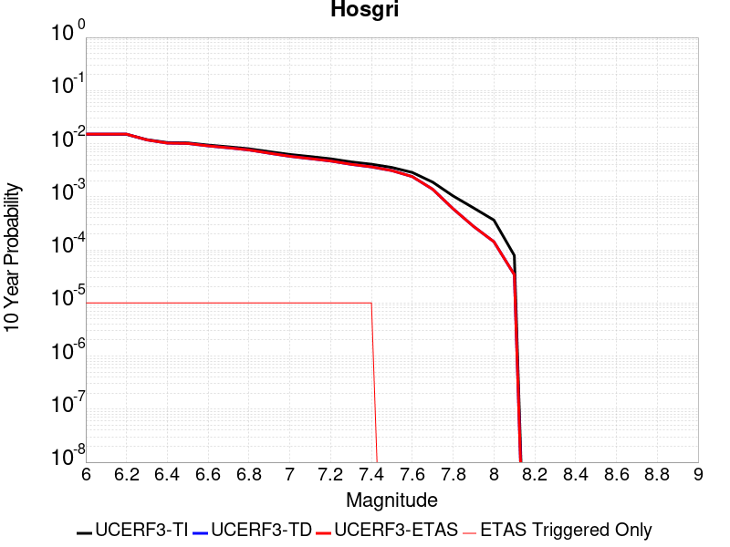 |

| Magnitude | 1 wk TI Prob | 1 wk TD Prob | 1 wk ETAS Prob | 1 wk ETAS/TD Gain | 1 wk ETAS Triggered Only | 1 mo TI Prob | 1 mo TD Prob | 1 mo ETAS Prob | 1 mo ETAS/TD Gain | 1 mo ETAS Triggered Only | 1 yr TI Prob | 1 yr TD Prob | 1 yr ETAS Prob | 1 yr ETAS/TD Gain | 1 yr ETAS Triggered Only | 10 yr TI Prob | 10 yr TD Prob | 10 yr ETAS Prob | 10 yr ETAS/TD Gain | 10 yr ETAS Triggered Only |
|-----|-----|-----|-----|-----|-----|-----|-----|-----|-----|-----|-----|-----|-----|-----|-----|-----|-----|-----|-----|-----|
| 6.0 | 2.883978E-5 | 2.9128416E-5 | 2.9128416E-5 | 1.0 | 0.0 | 1.235932E-4 | 1.2483024E-4 | 1.2483024E-4 | 1.0 | 0.0 | 0.0015037085 | 0.001518776 | 0.001518776 | 1.0 | 0.0 | 0.01493574 | 0.01508774 | 0.015114004 | 1.0017408 | 2.6666667E-5 |
| 6.1 | 2.883978E-5 | 2.9128416E-5 | 2.9128416E-5 | 1.0 | 0.0 | 1.235932E-4 | 1.2483024E-4 | 1.2483024E-4 | 1.0 | 0.0 | 0.0015037085 | 0.001518776 | 0.001518776 | 1.0 | 0.0 | 0.01493574 | 0.01508774 | 0.015114004 | 1.0017408 | 2.6666667E-5 |
| 6.2 | 2.883978E-5 | 2.9128416E-5 | 2.9128416E-5 | 1.0 | 0.0 | 1.235932E-4 | 1.2483024E-4 | 1.2483024E-4 | 1.0 | 0.0 | 0.0015037085 | 0.001518776 | 0.001518776 | 1.0 | 0.0 | 0.01493574 | 0.01508774 | 0.015114004 | 1.0017408 | 2.6666667E-5 |
| 6.3 | 2.2914428E-5 | 2.2641969E-5 | 2.2641969E-5 | 1.0 | 0.0 | 9.8200995E-5 | 9.703343E-5 | 9.703343E-5 | 1.0 | 0.0 | 0.0011949413 | 0.0011807467 | 0.0011807467 | 1.0 | 0.0 | 0.011885363 | 0.011746133 | 0.011772486 | 1.0022436 | 2.6666667E-5 |
| 6.4 | 2.0195741E-5 | 1.969656E-5 | 1.969656E-5 | 1.0 | 0.0 | 8.65503E-5 | 8.4411105E-5 | 8.4411105E-5 | 1.0 | 0.0 | 0.0010532405 | 0.0010272227 | 0.0010272227 | 1.0 | 0.0 | 0.010482626 | 0.010225792 | 0.010252187 | 1.0025811 | 2.6666667E-5 |
| 6.5 | 1.9924333E-5 | 1.940898E-5 | 1.940898E-5 | 1.0 | 0.0 | 8.53872E-5 | 8.3178704E-5 | 8.3178704E-5 | 1.0 | 0.0 | 0.0010390934 | 0.0010122322 | 0.0010122322 | 1.0 | 0.0 | 0.010342481 | 0.010077253 | 0.010103651 | 1.0026195 | 2.6666667E-5 |
| 6.6 | 1.809694E-5 | 1.74583E-5 | 1.74583E-5 | 1.0 | 0.0 | 7.7556004E-5 | 7.4819145E-5 | 7.4819145E-5 | 1.0 | 0.0 | 9.438353E-4 | 9.105437E-4 | 9.105437E-4 | 1.0 | 0.0 | 0.009398366 | 0.009069073 | 0.009095498 | 1.0029137 | 2.6666667E-5 |
| 6.7 | 1.675989E-5 | 1.6042764E-5 | 1.6042764E-5 | 1.0 | 0.0 | 7.182612E-5 | 6.87529E-5 | 6.87529E-5 | 1.0 | 0.0 | 8.7413215E-4 | 8.3674624E-4 | 8.3674624E-4 | 1.0 | 0.0 | 0.008707017 | 0.0083368635 | 0.008363307 | 1.0031719 | 2.6666667E-5 |
| 6.8 | 1.5401129E-5 | 1.4614083E-5 | 1.4614083E-5 | 1.0 | 0.0 | 6.6003166E-5 | 6.2630286E-5 | 6.2630286E-5 | 1.0 | 0.0 | 8.032922E-4 | 7.622578E-4 | 7.622578E-4 | 1.0 | 0.0 | 0.008003947 | 0.007597296 | 0.0076237605 | 1.0034833 | 2.6666667E-5 |
| 6.9 | 1.356559E-5 | 1.2689968E-5 | 1.2689968E-5 | 1.0 | 0.0 | 5.8136946E-5 | 5.4384444E-5 | 5.4384444E-5 | 1.0 | 0.0 | 7.0758746E-4 | 6.619299E-4 | 6.619299E-4 | 1.0 | 0.0 | 0.007053386 | 0.006600388 | 0.0066268784 | 1.0040135 | 2.6666667E-5 |
| 7.0 | 1.2030819E-5 | 1.1095962E-5 | 1.1095962E-5 | 1.0 | 0.0 | 5.155963E-5 | 4.7553254E-5 | 4.7553254E-5 | 1.0 | 0.0 | 6.275577E-4 | 5.7880714E-4 | 5.7880714E-4 | 1.0 | 0.0 | 0.006257884 | 0.005773757 | 0.0058002695 | 1.004592 | 2.6666667E-5 |
| 7.1 | 1.0972698E-5 | 1.0022179E-5 | 1.0022179E-5 | 1.0 | 0.0 | 4.7025E-5 | 4.2951488E-5 | 4.2951488E-5 | 1.0 | 0.0 | 5.72379E-4 | 5.22809E-4 | 5.22809E-4 | 1.0 | 0.0 | 0.0057090693 | 0.005216542 | 0.0052430695 | 1.0050852 | 2.6666667E-5 |
| 7.2 | 9.961926E-6 | 9.034746E-6 | 9.034746E-6 | 1.0 | 0.0 | 4.2693267E-5 | 3.8719765E-5 | 3.8719765E-5 | 1.0 | 0.0 | 5.1966653E-4 | 4.713112E-4 | 4.713112E-4 | 1.0 | 0.0 | 0.00518453 | 0.0047038626 | 0.004730404 | 1.0056424 | 2.6666667E-5 |
| 7.3 | 8.700929E-6 | 7.8281E-6 | 7.8281E-6 | 1.0 | 0.0 | 3.7289166E-5 | 3.354857E-5 | 3.354857E-5 | 1.0 | 0.0 | 4.53901E-4 | 4.0837732E-4 | 4.0837732E-4 | 1.0 | 0.0 | 0.00452975 | 0.004077008 | 0.004103566 | 1.0065141 | 2.6666667E-5 |
| 7.4 | 7.866285E-6 | 6.998739E-6 | 6.998739E-6 | 1.0 | 0.0 | 3.3712215E-5 | 2.9994251E-5 | 2.9994251E-5 | 1.0 | 0.0 | 4.103689E-4 | 3.6511885E-4 | 3.6511885E-4 | 1.0 | 0.0 | 0.004096119 | 0.0036459267 | 0.003672496 | 1.0072874 | 2.6666667E-5 |
| 7.5 | 6.8381305E-6 | 5.9596955E-6 | 5.9596955E-6 | 1.0 | 0.0 | 2.9305946E-5 | 2.5541302E-5 | 2.5541302E-5 | 1.0 | 0.0 | 3.5674145E-4 | 3.10921E-4 | 3.10921E-4 | 1.0 | 0.0 | 0.0035616932 | 0.0031055948 | 0.0031055948 | 1.0 | 0.0 |
| 7.6 | 5.503376E-6 | 4.5952443E-6 | 4.5952443E-6 | 1.0 | 0.0 | 2.3585684E-5 | 1.9693754E-5 | 1.9693754E-5 | 1.0 | 0.0 | 2.8711787E-4 | 2.397451E-4 | 2.397451E-4 | 1.0 | 0.0 | 0.002867472 | 0.0023955975 | 0.0023955975 | 1.0 | 0.0 |
| 7.7 | 3.6144982E-6 | 2.6522112E-6 | 2.6522112E-6 | 1.0 | 0.0 | 1.5490614E-5 | 1.1366569E-5 | 1.1366569E-5 | 1.0 | 0.0 | 1.8858191E-4 | 1.383792E-4 | 1.383792E-4 | 1.0 | 0.0 | 0.0018842196 | 0.0013836613 | 0.0013836613 | 1.0 | 0.0 |
| 7.8 | 1.9853494E-6 | 1.1361129E-6 | 1.1361129E-6 | 1.0 | 0.0 | 8.508612E-6 | 4.8690463E-6 | 4.8690463E-6 | 1.0 | 0.0 | 1.0358743E-4 | 5.9279027E-5 | 5.9279027E-5 | 1.0 | 0.0 | 0.0010353916 | 5.9336185E-4 | 5.9336185E-4 | 1.0 | 0.0 |
| 7.9 | 1.1818757E-6 | 5.2951856E-7 | 5.2951856E-7 | 1.0 | 0.0 | 5.0651715E-6 | 2.2693632E-6 | 2.2693632E-6 | 1.0 | 0.0 | 6.1666724E-5 | 2.7629147E-5 | 2.7629147E-5 | 1.0 | 0.0 | 6.1649614E-4 | 2.7694515E-4 | 2.7694515E-4 | 1.0 | 0.0 |
| 8.0 | 6.962958E-7 | 2.7139782E-7 | 2.7139782E-7 | 1.0 | 0.0 | 2.9841215E-6 | 1.163133E-6 | 1.163133E-6 | 1.0 | 0.0 | 3.6331072E-5 | 1.4161053E-5 | 1.4161053E-5 | 1.0 | 0.0 | 3.6325134E-4 | 1.4217179E-4 | 1.4217179E-4 | 1.0 | 0.0 |
| 8.1 | 1.5033264E-7 | 6.527624E-8 | 6.527624E-8 | 1.0 | 0.0 | 6.442826E-7 | 2.7975528E-7 | 2.7975528E-7 | 1.0 | 0.0 | 7.844113E-6 | 3.4060151E-6 | 3.4060151E-6 | 1.0 | 0.0 | 7.843835E-5 | 3.407693E-5 | 3.407693E-5 | 1.0 | 0.0 |

## Great Valley 06 (Midland) 2011 CFM alt1
*[(top)](#table-of-contents)*

| 1 Week | 1 Month | 1 Year | 10 Year |
|-----|-----|-----|-----|
|  |  |  |  |

| Magnitude | 1 wk TI Prob | 1 wk TD Prob | 1 wk ETAS Prob | 1 wk ETAS/TD Gain | 1 wk ETAS Triggered Only | 1 mo TI Prob | 1 mo TD Prob | 1 mo ETAS Prob | 1 mo ETAS/TD Gain | 1 mo ETAS Triggered Only | 1 yr TI Prob | 1 yr TD Prob | 1 yr ETAS Prob | 1 yr ETAS/TD Gain | 1 yr ETAS Triggered Only | 10 yr TI Prob | 10 yr TD Prob | 10 yr ETAS Prob | 10 yr ETAS/TD Gain | 10 yr ETAS Triggered Only |
|-----|-----|-----|-----|-----|-----|-----|-----|-----|-----|-----|-----|-----|-----|-----|-----|-----|-----|-----|-----|-----|
| 6.0 | 1.2712525E-5 | 1.3210576E-5 | 1.3210576E-5 | 1.0 | 0.0 | 5.4481112E-5 | 5.6615667E-5 | 5.6615667E-5 | 1.0 | 0.0 | 6.6310563E-4 | 6.8910315E-4 | 6.8910315E-4 | 1.0 | 0.0 | 0.0066113044 | 0.006872179 | 0.006898662 | 1.0038537 | 2.6666667E-5 |
| 6.1 | 1.2712525E-5 | 1.3210576E-5 | 1.3210576E-5 | 1.0 | 0.0 | 5.4481112E-5 | 5.6615667E-5 | 5.6615667E-5 | 1.0 | 0.0 | 6.6310563E-4 | 6.8910315E-4 | 6.8910315E-4 | 1.0 | 0.0 | 0.0066113044 | 0.006872179 | 0.006898662 | 1.0038537 | 2.6666667E-5 |
| 6.2 | 1.2712525E-5 | 1.3210576E-5 | 1.3210576E-5 | 1.0 | 0.0 | 5.4481112E-5 | 5.6615667E-5 | 5.6615667E-5 | 1.0 | 0.0 | 6.6310563E-4 | 6.8910315E-4 | 6.8910315E-4 | 1.0 | 0.0 | 0.0066113044 | 0.006872179 | 0.006898662 | 1.0038537 | 2.6666667E-5 |
| 6.3 | 1.2712525E-5 | 1.3210576E-5 | 1.3210576E-5 | 1.0 | 0.0 | 5.4481112E-5 | 5.6615667E-5 | 5.6615667E-5 | 1.0 | 0.0 | 6.6310563E-4 | 6.8910315E-4 | 6.8910315E-4 | 1.0 | 0.0 | 0.0066113044 | 0.006872179 | 0.006898662 | 1.0038537 | 2.6666667E-5 |
| 6.4 | 1.2712525E-5 | 1.3210576E-5 | 1.3210576E-5 | 1.0 | 0.0 | 5.4481112E-5 | 5.6615667E-5 | 5.6615667E-5 | 1.0 | 0.0 | 6.6310563E-4 | 6.8910315E-4 | 6.8910315E-4 | 1.0 | 0.0 | 0.0066113044 | 0.006872179 | 0.006898662 | 1.0038537 | 2.6666667E-5 |
| 6.5 | 1.2712525E-5 | 1.3210576E-5 | 1.3210576E-5 | 1.0 | 0.0 | 5.4481112E-5 | 5.6615667E-5 | 5.6615667E-5 | 1.0 | 0.0 | 6.6310563E-4 | 6.8910315E-4 | 6.8910315E-4 | 1.0 | 0.0 | 0.0066113044 | 0.006872179 | 0.006898662 | 1.0038537 | 2.6666667E-5 |
| 6.6 | 5.7574384E-6 | 5.9706463E-6 | 5.9706463E-6 | 1.0 | 0.0 | 2.4674504E-5 | 2.5588255E-5 | 2.5588255E-5 | 1.0 | 0.0 | 3.0037065E-4 | 3.1149638E-4 | 3.1149638E-4 | 1.0 | 0.0 | 0.0029996498 | 0.0031109843 | 0.003137568 | 1.0085452 | 2.6666667E-5 |
| 6.7 | 5.7574384E-6 | 5.9706463E-6 | 5.9706463E-6 | 1.0 | 0.0 | 2.4674504E-5 | 2.5588255E-5 | 2.5588255E-5 | 1.0 | 0.0 | 3.0037065E-4 | 3.1149638E-4 | 3.1149638E-4 | 1.0 | 0.0 | 0.0029996498 | 0.0031109843 | 0.003137568 | 1.0085452 | 2.6666667E-5 |
| 6.8 | 3.3474828E-6 | 3.4693849E-6 | 3.4693849E-6 | 1.0 | 0.0 | 1.4346277E-5 | 1.4868716E-5 | 1.4868716E-5 | 1.0 | 0.0 | 1.7465191E-4 | 1.8101306E-4 | 1.8101306E-4 | 1.0 | 0.0 | 0.0017451472 | 0.0018088033 | 0.0018088033 | 1.0 | 0.0 |
| 6.9 | 2.035106E-6 | 2.1090357E-6 | 2.1090357E-6 | 1.0 | 0.0 | 8.721853E-6 | 9.038697E-6 | 9.038697E-6 | 1.0 | 0.0 | 1.0618339E-4 | 1.10041314E-4 | 1.10041314E-4 | 1.0 | 0.0 | 0.0010613267 | 0.0010999405 | 0.0010999405 | 1.0 | 0.0 |
| 7.0 | 1.2424716E-6 | 1.2878762E-6 | 1.2878762E-6 | 1.0 | 0.0 | 5.3248673E-6 | 5.51946E-6 | 5.51946E-6 | 1.0 | 0.0 | 6.482833E-5 | 6.7197805E-5 | 6.7197805E-5 | 1.0 | 0.0 | 6.480942E-4 | 6.718192E-4 | 6.718192E-4 | 1.0 | 0.0 |
| 7.1 | 6.6904556E-7 | 6.939035E-7 | 6.939035E-7 | 1.0 | 0.0 | 2.867335E-6 | 2.97387E-6 | 2.97387E-6 | 1.0 | 0.0 | 3.4909244E-5 | 3.6206526E-5 | 3.6206526E-5 | 1.0 | 0.0 | 3.490376E-4 | 3.6203177E-4 | 3.6203177E-4 | 1.0 | 0.0 |
| 7.2 | 3.948168E-7 | 4.095705E-7 | 4.095705E-7 | 1.0 | 0.0 | 1.6920709E-6 | 1.7553022E-6 | 1.7553022E-6 | 1.0 | 0.0 | 2.0600768E-5 | 2.1370803E-5 | 2.1370803E-5 | 1.0 | 0.0 | 2.0598859E-4 | 2.1370803E-4 | 2.1370803E-4 | 1.0 | 0.0 |

## Big Pine (West)
*[(top)](#table-of-contents)*

| 1 Week | 1 Month | 1 Year | 10 Year |
|-----|-----|-----|-----|
|  |  |  |  |

| Magnitude | 1 wk TI Prob | 1 wk TD Prob | 1 wk ETAS Prob | 1 wk ETAS/TD Gain | 1 wk ETAS Triggered Only | 1 mo TI Prob | 1 mo TD Prob | 1 mo ETAS Prob | 1 mo ETAS/TD Gain | 1 mo ETAS Triggered Only | 1 yr TI Prob | 1 yr TD Prob | 1 yr ETAS Prob | 1 yr ETAS/TD Gain | 1 yr ETAS Triggered Only | 10 yr TI Prob | 10 yr TD Prob | 10 yr ETAS Prob | 10 yr ETAS/TD Gain | 10 yr ETAS Triggered Only |
|-----|-----|-----|-----|-----|-----|-----|-----|-----|-----|-----|-----|-----|-----|-----|-----|-----|-----|-----|-----|-----|
| 6.0 | 6.8306974E-7 | 6.8818304E-7 | 2.7354832E-5 | 39.749355 | 2.6666667E-5 | 2.9274386E-6 | 2.949353E-6 | 2.9615941E-5 | 10.041504 | 2.6666667E-5 | 3.564098E-5 | 3.5907877E-5 | 6.2573585E-5 | 1.7426145 | 2.6666667E-5 | 3.5635266E-4 | 3.5903015E-4 | 3.8568722E-4 | 1.0742475 | 2.6666667E-5 |
| 6.1 | 6.8306974E-7 | 6.8818304E-7 | 2.7354832E-5 | 39.749355 | 2.6666667E-5 | 2.9274386E-6 | 2.949353E-6 | 2.9615941E-5 | 10.041504 | 2.6666667E-5 | 3.564098E-5 | 3.5907877E-5 | 6.2573585E-5 | 1.7426145 | 2.6666667E-5 | 3.5635266E-4 | 3.5903015E-4 | 3.8568722E-4 | 1.0742475 | 2.6666667E-5 |
| 6.2 | 6.8306974E-7 | 6.8818304E-7 | 2.7354832E-5 | 39.749355 | 2.6666667E-5 | 2.9274386E-6 | 2.949353E-6 | 2.9615941E-5 | 10.041504 | 2.6666667E-5 | 3.564098E-5 | 3.5907877E-5 | 6.2573585E-5 | 1.7426145 | 2.6666667E-5 | 3.5635266E-4 | 3.5903015E-4 | 3.8568722E-4 | 1.0742475 | 2.6666667E-5 |
| 6.3 | 4.227652E-7 | 4.2665604E-7 | 2.709331E-5 | 63.50153 | 2.6666667E-5 | 1.8118495E-6 | 1.8285248E-6 | 2.8495142E-5 | 15.583679 | 2.6666667E-5 | 2.2059045E-5 | 2.226208E-5 | 4.8928152E-5 | 2.197825 | 2.6666667E-5 | 2.2056856E-4 | 2.2260031E-4 | 2.4926104E-4 | 1.1197695 | 2.6666667E-5 |
| 6.4 | 4.227652E-7 | 4.2665604E-7 | 2.709331E-5 | 63.50153 | 2.6666667E-5 | 1.8118495E-6 | 1.8285248E-6 | 2.8495142E-5 | 15.583679 | 2.6666667E-5 | 2.2059045E-5 | 2.226208E-5 | 4.8928152E-5 | 2.197825 | 2.6666667E-5 | 2.2056856E-4 | 2.2260031E-4 | 2.4926104E-4 | 1.1197695 | 2.6666667E-5 |
| 6.5 | 3.1538403E-7 | 3.1884528E-7 | 2.6985503E-5 | 84.63511 | 2.6666667E-5 | 1.3516451E-6 | 1.3664791E-6 | 2.803311E-5 | 20.514847 | 2.6666667E-5 | 1.6456155E-5 | 1.6636759E-5 | 4.330298E-5 | 2.6028495 | 2.6666667E-5 | 1.6454936E-4 | 1.6635554E-4 | 1.9301777E-4 | 1.1602726 | 2.6666667E-5 |
| 6.6 | 3.1538403E-7 | 3.1884528E-7 | 2.6985503E-5 | 84.63511 | 2.6666667E-5 | 1.3516451E-6 | 1.3664791E-6 | 2.803311E-5 | 20.514847 | 2.6666667E-5 | 1.6456155E-5 | 1.6636759E-5 | 4.330298E-5 | 2.6028495 | 2.6666667E-5 | 1.6454936E-4 | 1.6635554E-4 | 1.9301777E-4 | 1.1602726 | 2.6666667E-5 |
| 6.7 | 3.1538403E-7 | 3.1884528E-7 | 2.6985503E-5 | 84.63511 | 2.6666667E-5 | 1.3516451E-6 | 1.3664791E-6 | 2.803311E-5 | 20.514847 | 2.6666667E-5 | 1.6456155E-5 | 1.6636759E-5 | 4.330298E-5 | 2.6028495 | 2.6666667E-5 | 1.6454936E-4 | 1.6635554E-4 | 1.9301777E-4 | 1.1602726 | 2.6666667E-5 |
| 6.8 | 3.1538403E-7 | 3.1884528E-7 | 2.6985503E-5 | 84.63511 | 2.6666667E-5 | 1.3516451E-6 | 1.3664791E-6 | 2.803311E-5 | 20.514847 | 2.6666667E-5 | 1.6456155E-5 | 1.6636759E-5 | 4.330298E-5 | 2.6028495 | 2.6666667E-5 | 1.6454936E-4 | 1.6635554E-4 | 1.9301777E-4 | 1.1602726 | 2.6666667E-5 |
| 6.9 | 3.0402092E-7 | 3.0739798E-7 | 2.6974056E-5 | 87.749626 | 2.6666667E-5 | 1.3029462E-6 | 1.3174192E-6 | 2.7984051E-5 | 21.241568 | 2.6666667E-5 | 1.5863254E-5 | 1.6039465E-5 | 4.2705706E-5 | 2.6625392 | 2.6666667E-5 | 1.5862122E-4 | 1.6038347E-4 | 1.8704585E-4 | 1.1662415 | 2.6666667E-5 |
| 7.0 | 2.3673063E-7 | 2.3944315E-7 | 2.3944315E-7 | 1.0 | 0.0 | 1.0145594E-6 | 1.0261845E-6 | 1.0261845E-6 | 1.0 | 0.0 | 1.235219E-5 | 1.2493728E-5 | 1.2493728E-5 | 1.0 | 0.0 | 1.2351504E-4 | 1.2493054E-4 | 1.2493054E-4 | 1.0 | 0.0 |
| 7.1 | 1.632138E-7 | 1.6514511E-7 | 1.6514511E-7 | 1.0 | 0.0 | 6.9948754E-7 | 7.0776457E-7 | 7.0776457E-7 | 1.0 | 0.0 | 8.516227E-6 | 8.617002E-6 | 8.617002E-6 | 1.0 | 0.0 | 8.5159016E-5 | 8.616685E-5 | 8.616685E-5 | 1.0 | 0.0 |
| 7.2 | 1.1523723E-7 | 1.1657165E-7 | 1.1657165E-7 | 1.0 | 0.0 | 4.9387376E-7 | 4.9959266E-7 | 4.9959266E-7 | 1.0 | 0.0 | 6.0128964E-6 | 6.082525E-6 | 6.082525E-6 | 1.0 | 0.0 | 6.0127335E-5 | 6.0823695E-5 | 6.0823695E-5 | 1.0 | 0.0 |
| 7.3 | 7.777805E-8 | 7.862446E-8 | 7.862446E-8 | 1.0 | 0.0 | 3.3333444E-7 | 3.3696193E-7 | 3.3696193E-7 | 1.0 | 0.0 | 4.0583395E-6 | 4.102504E-6 | 4.102504E-6 | 1.0 | 0.0 | 4.0582654E-5 | 4.102434E-5 | 4.102434E-5 | 1.0 | 0.0 |
| 7.4 | 4.609946E-8 | 4.6522135E-8 | 4.6522135E-8 | 1.0 | 0.0 | 1.975691E-7 | 1.9938055E-7 | 1.9938055E-7 | 1.0 | 0.0 | 2.4054011E-6 | 2.4274557E-6 | 2.4274557E-6 | 1.0 | 0.0 | 2.405375E-5 | 2.427431E-5 | 2.427431E-5 | 1.0 | 0.0 |
| 7.5 | 2.3439137E-8 | 2.3608283E-8 | 2.3608283E-8 | 1.0 | 0.0 | 1.00453434E-7 | 1.0117836E-7 | 1.0117836E-7 | 1.0 | 0.0 | 1.2230199E-6 | 1.2318458E-6 | 1.2318458E-6 | 1.0 | 0.0 | 1.2230132E-5 | 1.2318393E-5 | 1.2318393E-5 | 1.0 | 0.0 |
| 7.6 | 1.6699769E-8 | 1.6817072E-8 | 1.6817072E-8 | 1.0 | 0.0 | 7.157044E-8 | 7.207316E-8 | 7.207316E-8 | 1.0 | 0.0 | 8.713697E-7 | 8.7749044E-7 | 8.7749044E-7 | 1.0 | 0.0 | 8.713663E-6 | 8.774871E-6 | 8.774871E-6 | 1.0 | 0.0 |
| 7.7 | 7.4061512E-9 | 7.4541635E-9 | 7.4541635E-9 | 1.0 | 0.0 | 3.1740647E-8 | 3.1946417E-8 | 3.1946417E-8 | 1.0 | 0.0 | 3.864423E-7 | 3.8894754E-7 | 3.8894754E-7 | 1.0 | 0.0 | 3.8644166E-6 | 3.8894696E-6 | 3.8894696E-6 | 1.0 | 0.0 |
| 7.8 | 1.2189427E-9 | 1.2270763E-9 | 1.2270763E-9 | 1.0 | 0.0 | 5.2240403E-9 | 5.258898E-9 | 5.258898E-9 | 1.0 | 0.0 | 6.3602684E-8 | 6.4027084E-8 | 6.4027084E-8 | 1.0 | 0.0 | 6.360267E-7 | 6.4027074E-7 | 6.4027074E-7 | 1.0 | 0.0 |

## Compton
*[(top)](#table-of-contents)*

| 1 Week | 1 Month | 1 Year | 10 Year |
|-----|-----|-----|-----|
|  |  |  |  |

| Magnitude | 1 wk TI Prob | 1 wk TD Prob | 1 wk ETAS Prob | 1 wk ETAS/TD Gain | 1 wk ETAS Triggered Only | 1 mo TI Prob | 1 mo TD Prob | 1 mo ETAS Prob | 1 mo ETAS/TD Gain | 1 mo ETAS Triggered Only | 1 yr TI Prob | 1 yr TD Prob | 1 yr ETAS Prob | 1 yr ETAS/TD Gain | 1 yr ETAS Triggered Only | 10 yr TI Prob | 10 yr TD Prob | 10 yr ETAS Prob | 10 yr ETAS/TD Gain | 10 yr ETAS Triggered Only |
|-----|-----|-----|-----|-----|-----|-----|-----|-----|-----|-----|-----|-----|-----|-----|-----|-----|-----|-----|-----|-----|
| 6.0 | 1.06050875E-5 | 6.358671E-6 | 6.358671E-6 | 1.0 | 0.0 | 4.5449582E-5 | 2.7251177E-5 | 5.3917116E-5 | 1.9785243 | 2.6666667E-5 | 5.5320817E-4 | 3.317354E-4 | 3.5839324E-4 | 1.0803586 | 2.6666667E-5 | 0.0055183303 | 0.0033126862 | 0.0033392645 | 1.0080231 | 2.6666667E-5 |
| 6.1 | 1.06050875E-5 | 6.358671E-6 | 6.358671E-6 | 1.0 | 0.0 | 4.5449582E-5 | 2.7251177E-5 | 5.3917116E-5 | 1.9785243 | 2.6666667E-5 | 5.5320817E-4 | 3.317354E-4 | 3.5839324E-4 | 1.0803586 | 2.6666667E-5 | 0.0055183303 | 0.0033126862 | 0.0033392645 | 1.0080231 | 2.6666667E-5 |
| 6.2 | 1.06050875E-5 | 6.358671E-6 | 6.358671E-6 | 1.0 | 0.0 | 4.5449582E-5 | 2.7251177E-5 | 5.3917116E-5 | 1.9785243 | 2.6666667E-5 | 5.5320817E-4 | 3.317354E-4 | 3.5839324E-4 | 1.0803586 | 2.6666667E-5 | 0.0055183303 | 0.0033126862 | 0.0033392645 | 1.0080231 | 2.6666667E-5 |
| 6.3 | 1.06050875E-5 | 6.358671E-6 | 6.358671E-6 | 1.0 | 0.0 | 4.5449582E-5 | 2.7251177E-5 | 5.3917116E-5 | 1.9785243 | 2.6666667E-5 | 5.5320817E-4 | 3.317354E-4 | 3.5839324E-4 | 1.0803586 | 2.6666667E-5 | 0.0055183303 | 0.0033126862 | 0.0033392645 | 1.0080231 | 2.6666667E-5 |
| 6.4 | 1.06050875E-5 | 6.358671E-6 | 6.358671E-6 | 1.0 | 0.0 | 4.5449582E-5 | 2.7251177E-5 | 5.3917116E-5 | 1.9785243 | 2.6666667E-5 | 5.5320817E-4 | 3.317354E-4 | 3.5839324E-4 | 1.0803586 | 2.6666667E-5 | 0.0055183303 | 0.0033126862 | 0.0033392645 | 1.0080231 | 2.6666667E-5 |
| 6.5 | 1.06050875E-5 | 6.358671E-6 | 6.358671E-6 | 1.0 | 0.0 | 4.5449582E-5 | 2.7251177E-5 | 5.3917116E-5 | 1.9785243 | 2.6666667E-5 | 5.5320817E-4 | 3.317354E-4 | 3.5839324E-4 | 1.0803586 | 2.6666667E-5 | 0.0055183303 | 0.0033126862 | 0.0033392645 | 1.0080231 | 2.6666667E-5 |
| 6.6 | 1.06050875E-5 | 6.358671E-6 | 6.358671E-6 | 1.0 | 0.0 | 4.5449582E-5 | 2.7251177E-5 | 5.3917116E-5 | 1.9785243 | 2.6666667E-5 | 5.5320817E-4 | 3.317354E-4 | 3.5839324E-4 | 1.0803586 | 2.6666667E-5 | 0.0055183303 | 0.0033126862 | 0.0033392645 | 1.0080231 | 2.6666667E-5 |
| 6.7 | 1.06050875E-5 | 6.358671E-6 | 6.358671E-6 | 1.0 | 0.0 | 4.5449582E-5 | 2.7251177E-5 | 5.3917116E-5 | 1.9785243 | 2.6666667E-5 | 5.5320817E-4 | 3.317354E-4 | 3.5839324E-4 | 1.0803586 | 2.6666667E-5 | 0.0055183303 | 0.0033126862 | 0.0033392645 | 1.0080231 | 2.6666667E-5 |
| 6.8 | 1.06050875E-5 | 6.358671E-6 | 6.358671E-6 | 1.0 | 0.0 | 4.5449582E-5 | 2.7251177E-5 | 5.3917116E-5 | 1.9785243 | 2.6666667E-5 | 5.5320817E-4 | 3.317354E-4 | 3.5839324E-4 | 1.0803586 | 2.6666667E-5 | 0.0055183303 | 0.0033126862 | 0.0033392645 | 1.0080231 | 2.6666667E-5 |
| 6.9 | 1.06050875E-5 | 6.358671E-6 | 6.358671E-6 | 1.0 | 0.0 | 4.5449582E-5 | 2.7251177E-5 | 5.3917116E-5 | 1.9785243 | 2.6666667E-5 | 5.5320817E-4 | 3.317354E-4 | 3.5839324E-4 | 1.0803586 | 2.6666667E-5 | 0.0055183303 | 0.0033126862 | 0.0033392645 | 1.0080231 | 2.6666667E-5 |
| 7.0 | 7.672486E-6 | 4.2720512E-6 | 4.2720512E-6 | 1.0 | 0.0 | 3.288167E-5 | 1.8308665E-5 | 4.4974844E-5 | 2.4564786 | 2.6666667E-5 | 4.0026082E-4 | 2.2288582E-4 | 2.4954655E-4 | 1.119616 | 2.6666667E-5 | 0.0039954064 | 0.002226685 | 0.0022532921 | 1.0119493 | 2.6666667E-5 |
| 7.1 | 7.163992E-6 | 3.883762E-6 | 3.883762E-6 | 1.0 | 0.0 | 3.0702464E-5 | 1.6644592E-5 | 4.3310814E-5 | 2.6020954 | 2.6666667E-5 | 3.7373835E-4 | 2.0262963E-4 | 2.2929089E-4 | 1.1315763 | 2.6666667E-5 | 0.0037311043 | 0.0020245055 | 0.0020511183 | 1.0131453 | 2.6666667E-5 |
| 7.2 | 6.3689185E-6 | 3.3102428E-6 | 3.3102428E-6 | 1.0 | 0.0 | 2.729508E-5 | 1.418668E-5 | 4.0852967E-5 | 2.8796709 | 2.6666667E-5 | 3.322669E-4 | 1.7270957E-4 | 1.9937161E-4 | 1.1543751 | 2.6666667E-5 | 0.0033177056 | 0.0017257951 | 0.0017524158 | 1.0154252 | 2.6666667E-5 |
| 7.3 | 4.4987873E-6 | 2.4480942E-6 | 2.4480942E-6 | 1.0 | 0.0 | 1.9280375E-5 | 1.0491792E-5 | 3.7158177E-5 | 3.5416427 | 2.6666667E-5 | 2.3471327E-4 | 1.2773038E-4 | 1.5439365E-4 | 1.2087464 | 2.6666667E-5 | 0.002344655 | 0.0012765999 | 0.0013032325 | 1.0208621 | 2.6666667E-5 |
| 7.4 | 2.987296E-6 | 1.7394335E-6 | 1.7394335E-6 | 1.0 | 0.0 | 1.2802635E-5 | 7.454694E-6 | 3.4121163E-5 | 4.577138 | 2.6666667E-5 | 1.5586092E-4 | 9.0757174E-5 | 1.1742143E-4 | 1.2937976 | 2.6666667E-5 | 0.0015575165 | 9.072069E-4 | 9.3384937E-4 | 1.0293676 | 2.6666667E-5 |
| 7.5 | 2.4111696E-6 | 1.4472155E-6 | 1.4472155E-6 | 1.0 | 0.0 | 1.0333543E-5 | 6.2023378E-6 | 3.286884E-5 | 5.2994275 | 2.6666667E-5 | 1.2580362E-4 | 7.551089E-5 | 1.02175545E-4 | 1.3531233 | 2.6666667E-5 | 0.0012573242 | 7.54857E-4 | 7.8150356E-4 | 1.0353001 | 2.6666667E-5 |
| 7.6 | 1.8783096E-6 | 1.1360459E-6 | 1.1360459E-6 | 1.0 | 0.0 | 8.049874E-6 | 4.8687593E-6 | 3.1535295E-5 | 6.4770703 | 2.6666667E-5 | 9.8002805E-5 | 5.927557E-5 | 8.594066E-5 | 1.4498495 | 2.6666667E-5 | 9.795959E-4 | 5.926016E-4 | 6.1925245E-4 | 1.0449727 | 2.6666667E-5 |
| 7.7 | 6.6646817E-7 | 3.560237E-7 | 3.560237E-7 | 1.0 | 0.0 | 2.856289E-6 | 1.525815E-6 | 2.819244E-5 | 18.47697 | 2.6666667E-5 | 3.4774763E-5 | 1.8576653E-5 | 4.5242825E-5 | 2.435467 | 2.6666667E-5 | 3.4769322E-4 | 1.8575235E-4 | 2.1241406E-4 | 1.1435337 | 2.6666667E-5 |
| 7.8 | 7.054689E-8 | 4.1342968E-8 | 4.1342968E-8 | 1.0 | 0.0 | 3.0234378E-7 | 1.7718413E-7 | 1.7718413E-7 | 1.0 | 0.0 | 3.6810293E-6 | 2.1572148E-6 | 2.1572148E-6 | 1.0 | 0.0 | 3.6809684E-5 | 2.1571948E-5 | 2.1571948E-5 | 1.0 | 0.0 |
| 7.9 | 7.420925E-9 | 4.0131285E-9 | 4.0131285E-9 | 1.0 | 0.0 | 3.1803964E-8 | 1.7199122E-8 | 1.7199122E-8 | 1.0 | 0.0 | 3.872132E-7 | 2.093993E-7 | 2.093993E-7 | 1.0 | 0.0 | 3.872125E-6 | 2.0939913E-6 | 2.0939913E-6 | 1.0 | 0.0 |

## Great Valley 05 Pittsburg - Kirby Hills alt1
*[(top)](#table-of-contents)*

| 1 Week | 1 Month | 1 Year | 10 Year |
|-----|-----|-----|-----|
|  | 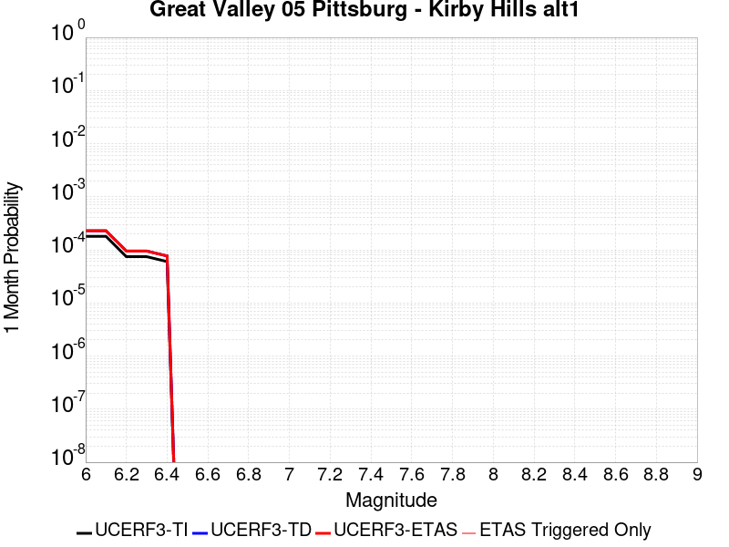 |  |  |

| Magnitude | 1 wk TI Prob | 1 wk TD Prob | 1 wk ETAS Prob | 1 wk ETAS/TD Gain | 1 wk ETAS Triggered Only | 1 mo TI Prob | 1 mo TD Prob | 1 mo ETAS Prob | 1 mo ETAS/TD Gain | 1 mo ETAS Triggered Only | 1 yr TI Prob | 1 yr TD Prob | 1 yr ETAS Prob | 1 yr ETAS/TD Gain | 1 yr ETAS Triggered Only | 10 yr TI Prob | 10 yr TD Prob | 10 yr ETAS Prob | 10 yr ETAS/TD Gain | 10 yr ETAS Triggered Only |
|-----|-----|-----|-----|-----|-----|-----|-----|-----|-----|-----|-----|-----|-----|-----|-----|-----|-----|-----|-----|-----|
| 6.0 | 4.187212E-5 | 5.3442072E-5 | 5.3442072E-5 | 1.0 | 0.0 | 1.794396E-4 | 2.290231E-4 | 2.290231E-4 | 1.0 | 0.0 | 0.002182488 | 0.0027857882 | 0.0027857882 | 1.0 | 0.0 | 0.021611776 | 0.02760304 | 0.02762897 | 1.0009394 | 2.6666667E-5 |
| 6.1 | 4.187212E-5 | 5.3442072E-5 | 5.3442072E-5 | 1.0 | 0.0 | 1.794396E-4 | 2.290231E-4 | 2.290231E-4 | 1.0 | 0.0 | 0.002182488 | 0.0027857882 | 0.0027857882 | 1.0 | 0.0 | 0.021611776 | 0.02760304 | 0.02762897 | 1.0009394 | 2.6666667E-5 |
| 6.2 | 1.7353306E-5 | 2.2154374E-5 | 2.2154374E-5 | 1.0 | 0.0 | 7.436919E-5 | 9.494618E-5 | 9.494618E-5 | 1.0 | 0.0 | 9.050688E-4 | 0.0011557543 | 0.0011557543 | 1.0 | 0.0 | 0.009013915 | 0.011535114 | 0.011535114 | 1.0 | 0.0 |
| 6.3 | 1.7353306E-5 | 2.2154374E-5 | 2.2154374E-5 | 1.0 | 0.0 | 7.436919E-5 | 9.494618E-5 | 9.494618E-5 | 1.0 | 0.0 | 9.050688E-4 | 0.0011557543 | 0.0011557543 | 1.0 | 0.0 | 0.009013915 | 0.011535114 | 0.011535114 | 1.0 | 0.0 |
| 6.4 | 1.4028824E-5 | 1.7900597E-5 | 1.7900597E-5 | 1.0 | 0.0 | 6.0122147E-5 | 7.671684E-5 | 7.671684E-5 | 1.0 | 0.0 | 7.3174125E-4 | 9.340275E-4 | 9.340275E-4 | 1.0 | 0.0 | 0.0072933645 | 0.009338138 | 0.009338138 | 1.0 | 0.0 |

## Sierra Madre (San Fernando)
*[(top)](#table-of-contents)*

| 1 Week | 1 Month | 1 Year | 10 Year |
|-----|-----|-----|-----|
|  |  | 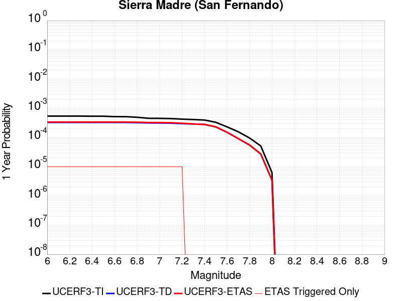 | 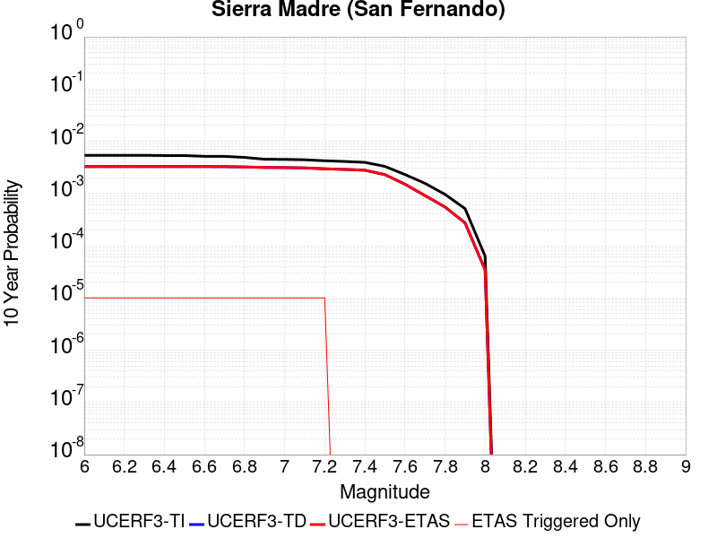 |

| Magnitude | 1 wk TI Prob | 1 wk TD Prob | 1 wk ETAS Prob | 1 wk ETAS/TD Gain | 1 wk ETAS Triggered Only | 1 mo TI Prob | 1 mo TD Prob | 1 mo ETAS Prob | 1 mo ETAS/TD Gain | 1 mo ETAS Triggered Only | 1 yr TI Prob | 1 yr TD Prob | 1 yr ETAS Prob | 1 yr ETAS/TD Gain | 1 yr ETAS Triggered Only | 10 yr TI Prob | 10 yr TD Prob | 10 yr ETAS Prob | 10 yr ETAS/TD Gain | 10 yr ETAS Triggered Only |
|-----|-----|-----|-----|-----|-----|-----|-----|-----|-----|-----|-----|-----|-----|-----|-----|-----|-----|-----|-----|-----|
| 6.0 | 1.0346413E-5 | 6.2872605E-6 | 3.2953758E-5 | 5.241354 | 2.6666667E-5 | 4.4341014E-5 | 2.694513E-5 | 5.361108E-5 | 1.9896388 | 2.6666667E-5 | 5.3971814E-4 | 3.280087E-4 | 3.546666E-4 | 1.081272 | 2.6666667E-5 | 0.0053840918 | 0.0032753581 | 0.0033019374 | 1.0081149 | 2.6666667E-5 |
| 6.1 | 1.0346413E-5 | 6.2872605E-6 | 3.2953758E-5 | 5.241354 | 2.6666667E-5 | 4.4341014E-5 | 2.694513E-5 | 5.361108E-5 | 1.9896388 | 2.6666667E-5 | 5.3971814E-4 | 3.280087E-4 | 3.546666E-4 | 1.081272 | 2.6666667E-5 | 0.0053840918 | 0.0032753581 | 0.0033019374 | 1.0081149 | 2.6666667E-5 |
| 6.2 | 1.0346413E-5 | 6.2872605E-6 | 3.2953758E-5 | 5.241354 | 2.6666667E-5 | 4.4341014E-5 | 2.694513E-5 | 5.361108E-5 | 1.9896388 | 2.6666667E-5 | 5.3971814E-4 | 3.280087E-4 | 3.546666E-4 | 1.081272 | 2.6666667E-5 | 0.0053840918 | 0.0032753581 | 0.0033019374 | 1.0081149 | 2.6666667E-5 |
| 6.3 | 1.0346413E-5 | 6.2872605E-6 | 3.2953758E-5 | 5.241354 | 2.6666667E-5 | 4.4341014E-5 | 2.694513E-5 | 5.361108E-5 | 1.9896388 | 2.6666667E-5 | 5.3971814E-4 | 3.280087E-4 | 3.546666E-4 | 1.081272 | 2.6666667E-5 | 0.0053840918 | 0.0032753581 | 0.0033019374 | 1.0081149 | 2.6666667E-5 |
| 6.4 | 1.0249558E-5 | 6.2872605E-6 | 3.2953758E-5 | 5.241354 | 2.6666667E-5 | 4.392594E-5 | 2.694513E-5 | 5.361108E-5 | 1.9896388 | 2.6666667E-5 | 5.3466705E-4 | 3.280087E-4 | 3.546666E-4 | 1.081272 | 2.6666667E-5 | 0.0053338245 | 0.0032753581 | 0.0033019374 | 1.0081149 | 2.6666667E-5 |
| 6.5 | 1.0249558E-5 | 6.2872605E-6 | 3.2953758E-5 | 5.241354 | 2.6666667E-5 | 4.392594E-5 | 2.694513E-5 | 5.361108E-5 | 1.9896388 | 2.6666667E-5 | 5.3466705E-4 | 3.280087E-4 | 3.546666E-4 | 1.081272 | 2.6666667E-5 | 0.0053338245 | 0.0032753581 | 0.0033019374 | 1.0081149 | 2.6666667E-5 |
| 6.6 | 9.9035515E-6 | 6.2872605E-6 | 3.2953758E-5 | 5.241354 | 2.6666667E-5 | 4.2443102E-5 | 2.694513E-5 | 5.361108E-5 | 1.9896388 | 2.6666667E-5 | 5.166222E-4 | 3.280087E-4 | 3.546666E-4 | 1.081272 | 2.6666667E-5 | 0.0051542283 | 0.0032753581 | 0.0033019374 | 1.0081149 | 2.6666667E-5 |
| 6.7 | 9.87217E-6 | 6.2746817E-6 | 3.294118E-5 | 5.249857 | 2.6666667E-5 | 4.2308613E-5 | 2.689122E-5 | 5.355717E-5 | 1.9916228 | 2.6666667E-5 | 5.149856E-4 | 3.2735255E-4 | 3.5401047E-4 | 1.081435 | 2.6666667E-5 | 0.005137938 | 0.0032688158 | 0.0032953955 | 1.0081313 | 2.6666667E-5 |
| 6.8 | 9.4359175E-6 | 6.1786586E-6 | 3.284516E-5 | 5.3159046 | 2.6666667E-5 | 4.043902E-5 | 2.6479704E-5 | 5.3145664E-5 | 2.007034 | 2.6666667E-5 | 4.9223384E-4 | 3.2234378E-4 | 3.4900187E-4 | 1.0827007 | 2.6666667E-5 | 0.0049114493 | 0.0032188739 | 0.0032454547 | 1.0082577 | 2.6666667E-5 |
| 6.9 | 8.700447E-6 | 6.039922E-6 | 3.2706426E-5 | 5.4150414 | 2.6666667E-5 | 3.72871E-5 | 2.5885129E-5 | 5.2551106E-5 | 2.030166 | 2.6666667E-5 | 4.5387587E-4 | 3.1510694E-4 | 3.417652E-4 | 1.0846007 | 2.6666667E-5 | 0.0045295 | 0.003146711 | 0.0031732938 | 1.0084478 | 2.6666667E-5 |
| 7.0 | 8.648878E-6 | 6.0148373E-6 | 3.2681342E-5 | 5.4334545 | 2.6666667E-5 | 3.7066096E-5 | 2.5777625E-5 | 5.2443604E-5 | 2.0344622 | 2.6666667E-5 | 4.5118626E-4 | 3.1379846E-4 | 3.4045675E-4 | 1.0849535 | 2.6666667E-5 | 0.004502713 | 0.003133663 | 0.0031602462 | 1.008483 | 2.6666667E-5 |
| 7.1 | 8.505786E-6 | 5.9244676E-6 | 3.2590975E-5 | 5.501081 | 2.6666667E-5 | 3.645286E-5 | 2.5390334E-5 | 5.2056323E-5 | 2.0502417 | 2.6666667E-5 | 4.437232E-4 | 3.0908454E-4 | 3.3574298E-4 | 1.0862496 | 2.6666667E-5 | 0.0044283825 | 0.0030866556 | 0.00311324 | 1.0086126 | 2.6666667E-5 |
| 7.2 | 8.139752E-6 | 5.6987624E-6 | 3.236528E-5 | 5.679352 | 2.6666667E-5 | 3.4884186E-5 | 2.4423045E-5 | 5.108906E-5 | 2.0918384 | 2.6666667E-5 | 4.246322E-4 | 2.9731105E-4 | 3.2396978E-4 | 1.0896661 | 2.6666667E-5 | 0.004238217 | 0.0029692391 | 0.0029958265 | 1.0089543 | 2.6666667E-5 |
| 7.3 | 7.8816E-6 | 5.552077E-6 | 5.552077E-6 | 1.0 | 0.0 | 3.3777847E-5 | 2.3794404E-5 | 2.3794404E-5 | 1.0 | 0.0 | 4.111677E-4 | 2.896594E-4 | 2.896594E-4 | 1.0 | 0.0 | 0.004104078 | 0.0028929242 | 0.0028929242 | 1.0 | 0.0 |
| 7.4 | 7.5810603E-6 | 5.3563126E-6 | 5.3563126E-6 | 1.0 | 0.0 | 3.2489854E-5 | 2.2955428E-5 | 2.2955428E-5 | 1.0 | 0.0 | 3.9549218E-4 | 2.7944756E-4 | 2.7944756E-4 | 1.0 | 0.0 | 0.0039478904 | 0.0027910667 | 0.0027910667 | 1.0 | 0.0 |
| 7.5 | 6.349153E-6 | 4.407576E-6 | 4.407576E-6 | 1.0 | 0.0 | 2.7210372E-5 | 1.888948E-5 | 1.888948E-5 | 1.0 | 0.0 | 3.312359E-4 | 2.2995596E-4 | 2.2995596E-4 | 1.0 | 0.0 | 0.0033074263 | 0.0022972622 | 0.0022972622 | 1.0 | 0.0 |
| 7.6 | 4.430576E-6 | 2.8905868E-6 | 2.8905868E-6 | 1.0 | 0.0 | 1.8988047E-5 | 1.2388171E-5 | 1.2388171E-5 | 1.0 | 0.0 | 2.3115493E-4 | 1.5081577E-4 | 1.5081577E-4 | 1.0 | 0.0 | 0.0023091463 | 0.0015071568 | 0.0015071568 | 1.0 | 0.0 |
| 7.7 | 3.005066E-6 | 1.7510115E-6 | 1.7510115E-6 | 1.0 | 0.0 | 1.2878791E-5 | 7.504313E-6 | 7.504313E-6 | 1.0 | 0.0 | 1.56788E-4 | 9.1361195E-5 | 9.1361195E-5 | 1.0 | 0.0 | 0.0015667742 | 9.132375E-4 | 9.132375E-4 | 1.0 | 0.0 |
| 7.8 | 1.8459098E-6 | 1.0582091E-6 | 1.0582091E-6 | 1.0 | 0.0 | 7.911018E-6 | 4.535174E-6 | 4.535174E-6 | 1.0 | 0.0 | 9.631238E-5 | 5.5214347E-5 | 5.5214347E-5 | 1.0 | 0.0 | 9.627065E-4 | 5.5200676E-4 | 5.5200676E-4 | 1.0 | 0.0 |
| 7.9 | 9.839262E-7 | 5.23421E-7 | 5.23421E-7 | 1.0 | 0.0 | 4.2168194E-6 | 2.2432312E-6 | 2.2432312E-6 | 1.0 | 0.0 | 5.1338568E-5 | 2.7310998E-5 | 2.7310998E-5 | 1.0 | 0.0 | 5.132671E-4 | 2.730767E-4 | 2.730767E-4 | 1.0 | 0.0 |
| 8.0 | 1.210983E-7 | 6.613821E-8 | 6.613821E-8 | 1.0 | 0.0 | 5.1899264E-7 | 2.8344945E-7 | 2.8344945E-7 | 1.0 | 0.0 | 6.3187167E-6 | 3.4509917E-6 | 3.4509917E-6 | 1.0 | 0.0 | 6.318537E-5 | 3.45094E-5 | 3.45094E-5 | 1.0 | 0.0 |

## Palos Verdes
*[(top)](#table-of-contents)*

| 1 Week | 1 Month | 1 Year | 10 Year |
|-----|-----|-----|-----|
|  |  |  |  |

| Magnitude | 1 wk TI Prob | 1 wk TD Prob | 1 wk ETAS Prob | 1 wk ETAS/TD Gain | 1 wk ETAS Triggered Only | 1 mo TI Prob | 1 mo TD Prob | 1 mo ETAS Prob | 1 mo ETAS/TD Gain | 1 mo ETAS Triggered Only | 1 yr TI Prob | 1 yr TD Prob | 1 yr ETAS Prob | 1 yr ETAS/TD Gain | 1 yr ETAS Triggered Only | 10 yr TI Prob | 10 yr TD Prob | 10 yr ETAS Prob | 10 yr ETAS/TD Gain | 10 yr ETAS Triggered Only |
|-----|-----|-----|-----|-----|-----|-----|-----|-----|-----|-----|-----|-----|-----|-----|-----|-----|-----|-----|-----|-----|
| 6.0 | 6.126063E-5 | 7.622612E-5 | 7.622612E-5 | 1.0 | 0.0 | 2.6251914E-4 | 3.2664582E-4 | 3.2664582E-4 | 1.0 | 0.0 | 0.0031914865 | 0.003970174 | 0.003996735 | 1.00669 | 2.6666667E-5 | 0.031460393 | 0.039048895 | 0.03907452 | 1.0006562 | 2.6666667E-5 |
| 6.1 | 6.126063E-5 | 7.622612E-5 | 7.622612E-5 | 1.0 | 0.0 | 2.6251914E-4 | 3.2664582E-4 | 3.2664582E-4 | 1.0 | 0.0 | 0.0031914865 | 0.003970174 | 0.003996735 | 1.00669 | 2.6666667E-5 | 0.031460393 | 0.039048895 | 0.03907452 | 1.0006562 | 2.6666667E-5 |
| 6.2 | 6.126063E-5 | 7.622612E-5 | 7.622612E-5 | 1.0 | 0.0 | 2.6251914E-4 | 3.2664582E-4 | 3.2664582E-4 | 1.0 | 0.0 | 0.0031914865 | 0.003970174 | 0.003996735 | 1.00669 | 2.6666667E-5 | 0.031460393 | 0.039048895 | 0.03907452 | 1.0006562 | 2.6666667E-5 |
| 6.3 | 4.0838047E-5 | 4.9749437E-5 | 4.9749437E-5 | 1.0 | 0.0 | 1.7500846E-4 | 2.1319572E-4 | 2.1319572E-4 | 1.0 | 0.0 | 0.0021286458 | 0.0025927818 | 0.0026193794 | 1.0102583 | 2.6666667E-5 | 0.021083709 | 0.025646681 | 0.025672663 | 1.0010132 | 2.6666667E-5 |
| 6.4 | 4.0838047E-5 | 4.9749437E-5 | 4.9749437E-5 | 1.0 | 0.0 | 1.7500846E-4 | 2.1319572E-4 | 2.1319572E-4 | 1.0 | 0.0 | 0.0021286458 | 0.0025927818 | 0.0026193794 | 1.0102583 | 2.6666667E-5 | 0.021083709 | 0.025646681 | 0.025672663 | 1.0010132 | 2.6666667E-5 |
| 6.5 | 3.0512005E-5 | 3.656162E-5 | 3.656162E-5 | 1.0 | 0.0 | 1.3075917E-4 | 1.5668393E-4 | 1.5668393E-4 | 1.0 | 0.0 | 0.0015908304 | 0.0019060767 | 0.0019326925 | 1.0139637 | 2.6666667E-5 | 0.015794903 | 0.018909154 | 0.018935315 | 1.0013835 | 2.6666667E-5 |
| 6.6 | 2.9255087E-5 | 3.515442E-5 | 3.515442E-5 | 1.0 | 0.0 | 1.2537291E-4 | 1.5065377E-4 | 1.5065377E-4 | 1.0 | 0.0 | 0.0015253464 | 0.0018327828 | 0.0018594007 | 1.0145231 | 2.6666667E-5 | 0.015149189 | 0.018188225 | 0.018214406 | 1.0014395 | 2.6666667E-5 |
| 6.7 | 2.287198E-5 | 2.7248278E-5 | 2.7248278E-5 | 1.0 | 0.0 | 9.801909E-5 | 1.16773626E-4 | 1.16773626E-4 | 1.0 | 0.0 | 0.001192729 | 0.0014208833 | 0.0014475121 | 1.018741 | 2.6666667E-5 | 0.011863477 | 0.014127217 | 0.014153508 | 1.001861 | 2.6666667E-5 |
| 6.8 | 2.1325764E-5 | 2.5431877E-5 | 2.5431877E-5 | 1.0 | 0.0 | 9.139293E-5 | 1.0898971E-4 | 1.0898971E-4 | 1.0 | 0.0 | 0.001112141 | 0.0013262323 | 0.0013528636 | 1.0200804 | 2.6666667E-5 | 0.011065915 | 0.013192211 | 0.013218526 | 1.0019947 | 2.6666667E-5 |
| 6.9 | 1.9009392E-5 | 2.2613547E-5 | 2.2613547E-5 | 1.0 | 0.0 | 8.1466285E-5 | 9.6912096E-5 | 9.6912096E-5 | 1.0 | 0.0 | 9.914007E-4 | 0.0011793535 | 0.0012059887 | 1.0225846 | 2.6666667E-5 | 0.009869894 | 0.011739632 | 0.011765986 | 1.0022448 | 2.6666667E-5 |
| 7.0 | 1.7098473E-5 | 2.0319356E-5 | 2.0319356E-5 | 1.0 | 0.0 | 7.3277115E-5 | 8.708052E-5 | 8.708052E-5 | 1.0 | 0.0 | 8.917837E-4 | 0.001059775 | 0.0010864134 | 1.0251359 | 2.6666667E-5 | 0.008882134 | 0.010555646 | 0.010582032 | 1.0024996 | 2.6666667E-5 |
| 7.1 | 1.5982785E-5 | 1.899476E-5 | 1.899476E-5 | 1.0 | 0.0 | 6.849585E-5 | 8.1404054E-5 | 8.1404054E-5 | 1.0 | 0.0 | 8.336179E-4 | 9.907284E-4 | 0.0010173686 | 1.0268896 | 2.6666667E-5 | 0.008304977 | 0.009871479 | 0.009897883 | 1.0026747 | 2.6666667E-5 |
| 7.2 | 1.4468002E-5 | 1.7197237E-5 | 1.7197237E-5 | 1.0 | 0.0 | 6.200425E-5 | 7.370083E-5 | 7.370083E-5 | 1.0 | 0.0 | 7.546402E-4 | 8.970222E-4 | 9.2366495E-4 | 1.0297014 | 2.6666667E-5 | 0.007520827 | 0.008942284 | 0.008968712 | 1.0029554 | 2.6666667E-5 |
| 7.3 | 5.288233E-6 | 6.2036747E-6 | 6.2036747E-6 | 1.0 | 0.0 | 2.2663658E-5 | 2.6587102E-5 | 2.6587102E-5 | 1.0 | 0.0 | 2.7589512E-4 | 3.236848E-4 | 3.5034283E-4 | 1.082358 | 2.6666667E-5 | 0.0027555283 | 0.0032355562 | 0.0032621366 | 1.0082151 | 2.6666667E-5 |
| 7.4 | 8.279556E-7 | 8.408347E-7 | 8.408347E-7 | 1.0 | 0.0 | 3.5483763E-6 | 3.6035726E-6 | 3.6035726E-6 | 1.0 | 0.0 | 4.3200624E-5 | 4.3872686E-5 | 4.3872686E-5 | 1.0 | 0.0 | 4.3192226E-4 | 4.3864746E-4 | 4.3864746E-4 | 1.0 | 0.0 |
| 7.5 | 6.559831E-7 | 6.667229E-7 | 6.667229E-7 | 1.0 | 0.0 | 2.8113532E-6 | 2.857381E-6 | 2.857381E-6 | 1.0 | 0.0 | 3.4227687E-5 | 3.4788125E-5 | 3.4788125E-5 | 1.0 | 0.0 | 3.4222414E-4 | 3.4783344E-4 | 3.4783344E-4 | 1.0 | 0.0 |
| 7.6 | 3.5018968E-7 | 3.5620027E-7 | 3.5620027E-7 | 1.0 | 0.0 | 1.500812E-6 | 1.526572E-6 | 1.526572E-6 | 1.0 | 0.0 | 1.8272232E-5 | 1.8585903E-5 | 1.8585903E-5 | 1.0 | 0.0 | 1.8270731E-4 | 1.8584808E-4 | 1.8584808E-4 | 1.0 | 0.0 |
| 7.7 | 1.1986104E-7 | 1.2198376E-7 | 1.2198376E-7 | 1.0 | 0.0 | 5.1369005E-7 | 5.2278745E-7 | 5.2278745E-7 | 1.0 | 0.0 | 6.2541585E-6 | 6.364919E-6 | 6.364919E-6 | 1.0 | 0.0 | 6.2539824E-5 | 6.364741E-5 | 6.364741E-5 | 1.0 | 0.0 |
| 7.8 | 3.0445005E-8 | 3.1027582E-8 | 3.1027582E-8 | 1.0 | 0.0 | 1.3047858E-7 | 1.3297536E-7 | 1.3297536E-7 | 1.0 | 0.0 | 1.5885756E-6 | 1.6189739E-6 | 1.6189739E-6 | 1.0 | 0.0 | 1.5885644E-5 | 1.6189642E-5 | 1.6189642E-5 | 1.0 | 0.0 |

## Northridge Hills
*[(top)](#table-of-contents)*

| 1 Week | 1 Month | 1 Year | 10 Year |
|-----|-----|-----|-----|
|  | 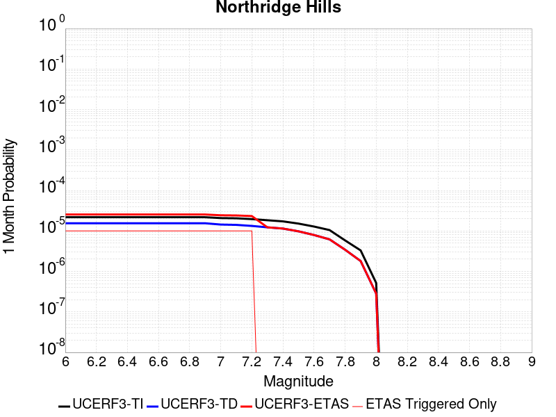 |  |  |

| Magnitude | 1 wk TI Prob | 1 wk TD Prob | 1 wk ETAS Prob | 1 wk ETAS/TD Gain | 1 wk ETAS Triggered Only | 1 mo TI Prob | 1 mo TD Prob | 1 mo ETAS Prob | 1 mo ETAS/TD Gain | 1 mo ETAS Triggered Only | 1 yr TI Prob | 1 yr TD Prob | 1 yr ETAS Prob | 1 yr ETAS/TD Gain | 1 yr ETAS Triggered Only | 10 yr TI Prob | 10 yr TD Prob | 10 yr ETAS Prob | 10 yr ETAS/TD Gain | 10 yr ETAS Triggered Only |
|-----|-----|-----|-----|-----|-----|-----|-----|-----|-----|-----|-----|-----|-----|-----|-----|-----|-----|-----|-----|-----|
| 6.0 | 5.095982E-6 | 3.6152098E-6 | 3.028178E-5 | 8.376217 | 2.6666667E-5 | 2.183974E-5 | 1.5493664E-5 | 4.2159918E-5 | 2.721107 | 2.6666667E-5 | 2.658664E-4 | 1.8861916E-4 | 2.152808E-4 | 1.1413517 | 2.6666667E-5 | 0.0026554854 | 0.001884603 | 0.0019112194 | 1.0141231 | 2.6666667E-5 |
| 6.1 | 5.095982E-6 | 3.6152098E-6 | 3.028178E-5 | 8.376217 | 2.6666667E-5 | 2.183974E-5 | 1.5493664E-5 | 4.2159918E-5 | 2.721107 | 2.6666667E-5 | 2.658664E-4 | 1.8861916E-4 | 2.152808E-4 | 1.1413517 | 2.6666667E-5 | 0.0026554854 | 0.001884603 | 0.0019112194 | 1.0141231 | 2.6666667E-5 |
| 6.2 | 5.095982E-6 | 3.6152098E-6 | 3.028178E-5 | 8.376217 | 2.6666667E-5 | 2.183974E-5 | 1.5493664E-5 | 4.2159918E-5 | 2.721107 | 2.6666667E-5 | 2.658664E-4 | 1.8861916E-4 | 2.152808E-4 | 1.1413517 | 2.6666667E-5 | 0.0026554854 | 0.001884603 | 0.0019112194 | 1.0141231 | 2.6666667E-5 |
| 6.3 | 5.095982E-6 | 3.6152098E-6 | 3.028178E-5 | 8.376217 | 2.6666667E-5 | 2.183974E-5 | 1.5493664E-5 | 4.2159918E-5 | 2.721107 | 2.6666667E-5 | 2.658664E-4 | 1.8861916E-4 | 2.152808E-4 | 1.1413517 | 2.6666667E-5 | 0.0026554854 | 0.001884603 | 0.0019112194 | 1.0141231 | 2.6666667E-5 |
| 6.4 | 5.095982E-6 | 3.6152098E-6 | 3.028178E-5 | 8.376217 | 2.6666667E-5 | 2.183974E-5 | 1.5493664E-5 | 4.2159918E-5 | 2.721107 | 2.6666667E-5 | 2.658664E-4 | 1.8861916E-4 | 2.152808E-4 | 1.1413517 | 2.6666667E-5 | 0.0026554854 | 0.001884603 | 0.0019112194 | 1.0141231 | 2.6666667E-5 |
| 6.5 | 5.095982E-6 | 3.6152098E-6 | 3.028178E-5 | 8.376217 | 2.6666667E-5 | 2.183974E-5 | 1.5493664E-5 | 4.2159918E-5 | 2.721107 | 2.6666667E-5 | 2.658664E-4 | 1.8861916E-4 | 2.152808E-4 | 1.1413517 | 2.6666667E-5 | 0.0026554854 | 0.001884603 | 0.0019112194 | 1.0141231 | 2.6666667E-5 |
| 6.6 | 5.095982E-6 | 3.6152098E-6 | 3.028178E-5 | 8.376217 | 2.6666667E-5 | 2.183974E-5 | 1.5493664E-5 | 4.2159918E-5 | 2.721107 | 2.6666667E-5 | 2.658664E-4 | 1.8861916E-4 | 2.152808E-4 | 1.1413517 | 2.6666667E-5 | 0.0026554854 | 0.001884603 | 0.0019112194 | 1.0141231 | 2.6666667E-5 |
| 6.7 | 5.095982E-6 | 3.6152098E-6 | 3.028178E-5 | 8.376217 | 2.6666667E-5 | 2.183974E-5 | 1.5493664E-5 | 4.2159918E-5 | 2.721107 | 2.6666667E-5 | 2.658664E-4 | 1.8861916E-4 | 2.152808E-4 | 1.1413517 | 2.6666667E-5 | 0.0026554854 | 0.001884603 | 0.0019112194 | 1.0141231 | 2.6666667E-5 |
| 6.8 | 5.095982E-6 | 3.6152098E-6 | 3.028178E-5 | 8.376217 | 2.6666667E-5 | 2.183974E-5 | 1.5493664E-5 | 4.2159918E-5 | 2.721107 | 2.6666667E-5 | 2.658664E-4 | 1.8861916E-4 | 2.152808E-4 | 1.1413517 | 2.6666667E-5 | 0.0026554854 | 0.001884603 | 0.0019112194 | 1.0141231 | 2.6666667E-5 |
| 6.9 | 5.0942654E-6 | 3.6134247E-6 | 3.0279994E-5 | 8.379861 | 2.6666667E-5 | 2.1832384E-5 | 1.5486015E-5 | 4.2152267E-5 | 2.7219572 | 2.6666667E-5 | 2.6577685E-4 | 1.8852603E-4 | 2.1518767E-4 | 1.1414216 | 2.6666667E-5 | 0.002654592 | 0.0018836735 | 0.0019102899 | 1.0141301 | 2.6666667E-5 |
| 7.0 | 4.851143E-6 | 3.3587396E-6 | 3.0025316E-5 | 8.939459 | 2.6666667E-5 | 2.0790447E-5 | 1.4394519E-5 | 4.10608E-5 | 2.8525302 | 2.6666667E-5 | 2.5309427E-4 | 1.7523921E-4 | 2.0190122E-4 | 1.1521462 | 2.6666667E-5 | 0.0025280623 | 0.0017510147 | 0.0017776347 | 1.0152026 | 2.6666667E-5 |
| 7.1 | 4.7910607E-6 | 3.2970208E-6 | 2.99636E-5 | 9.088083 | 2.6666667E-5 | 2.0532956E-5 | 1.4130013E-5 | 4.07963E-5 | 2.8872092 | 2.6666667E-5 | 2.4996005E-4 | 1.7201937E-4 | 1.9868145E-4 | 1.1549946 | 2.6666667E-5 | 0.0024967908 | 0.0017188663 | 0.0017454871 | 1.0154874 | 2.6666667E-5 |
| 7.2 | 4.580079E-6 | 3.1067987E-6 | 2.9773382E-5 | 9.5833 | 2.6666667E-5 | 1.9628762E-5 | 1.3314784E-5 | 3.9981096E-5 | 3.0027597 | 2.6666667E-5 | 2.3895396E-4 | 1.6209547E-4 | 1.8875781E-4 | 1.1644855 | 2.6666667E-5 | 0.0023869718 | 0.0016197758 | 0.0016463993 | 1.0164365 | 2.6666667E-5 |
| 7.3 | 4.290062E-6 | 2.8682275E-6 | 2.8682275E-6 | 1.0 | 0.0 | 1.838585E-5 | 1.2292346E-5 | 1.2292346E-5 | 1.0 | 0.0 | 2.2382473E-4 | 1.4964906E-4 | 1.4964906E-4 | 1.0 | 0.0 | 0.0022359942 | 0.0014954859 | 0.0014954859 | 1.0 | 0.0 |
| 7.4 | 4.0259683E-6 | 2.673904E-6 | 2.673904E-6 | 1.0 | 0.0 | 1.7254037E-5 | 1.1459538E-5 | 1.1459538E-5 | 1.0 | 0.0 | 2.1004764E-4 | 1.3951097E-4 | 1.3951097E-4 | 1.0 | 0.0 | 0.002098492 | 0.0013942367 | 0.0013942367 | 1.0 | 0.0 |
| 7.5 | 3.5477108E-6 | 2.285216E-6 | 2.285216E-6 | 1.0 | 0.0 | 1.5204386E-5 | 9.793746E-6 | 9.793746E-6 | 1.0 | 0.0 | 1.8509767E-4 | 1.1923235E-4 | 1.1923235E-4 | 1.0 | 0.0 | 0.0018494357 | 0.0011916853 | 0.0011916853 | 1.0 | 0.0 |
| 7.6 | 2.9990608E-6 | 1.8528339E-6 | 1.8528339E-6 | 1.0 | 0.0 | 1.2853055E-5 | 7.940693E-6 | 7.940693E-6 | 1.0 | 0.0 | 1.564747E-4 | 9.667365E-5 | 9.667365E-5 | 1.0 | 0.0 | 0.0015636457 | 9.663168E-4 | 9.663168E-4 | 1.0 | 0.0 |
| 7.7 | 2.4542855E-6 | 1.4461344E-6 | 1.4461344E-6 | 1.0 | 0.0 | 1.05183235E-5 | 6.197704E-6 | 6.197704E-6 | 1.0 | 0.0 | 1.2805307E-4 | 7.545444E-5 | 7.545444E-5 | 1.0 | 0.0 | 0.001279793 | 7.5428875E-4 | 7.5428875E-4 | 1.0 | 0.0 |
| 7.8 | 1.3623128E-6 | 8.016168E-7 | 8.016168E-7 | 1.0 | 0.0 | 5.8384703E-6 | 3.4354962E-6 | 3.4354962E-6 | 1.0 | 0.0 | 7.108106E-5 | 4.1826366E-5 | 4.1826366E-5 | 1.0 | 0.0 | 7.1058323E-4 | 4.1818514E-4 | 4.1818514E-4 | 1.0 | 0.0 |
| 7.9 | 7.716622E-7 | 4.218757E-7 | 4.218757E-7 | 1.0 | 0.0 | 3.3071194E-6 | 1.8080375E-6 | 1.8080375E-6 | 1.0 | 0.0 | 4.0263436E-5 | 2.2012635E-5 | 2.2012635E-5 | 1.0 | 0.0 | 4.0256142E-4 | 2.2010466E-4 | 2.2010466E-4 | 1.0 | 0.0 |
| 8.0 | 1.2117711E-7 | 6.6220565E-8 | 6.6220565E-8 | 1.0 | 0.0 | 5.1933034E-7 | 2.838024E-7 | 2.838024E-7 | 1.0 | 0.0 | 6.3228285E-6 | 3.4552888E-6 | 3.4552888E-6 | 1.0 | 0.0 | 6.3226486E-5 | 3.455237E-5 | 3.455237E-5 | 1.0 | 0.0 |

## Superstition Hills
*[(top)](#table-of-contents)*

| 1 Week | 1 Month | 1 Year | 10 Year |
|-----|-----|-----|-----|
|  |  |  |  |

| Magnitude | 1 wk TI Prob | 1 wk TD Prob | 1 wk ETAS Prob | 1 wk ETAS/TD Gain | 1 wk ETAS Triggered Only | 1 mo TI Prob | 1 mo TD Prob | 1 mo ETAS Prob | 1 mo ETAS/TD Gain | 1 mo ETAS Triggered Only | 1 yr TI Prob | 1 yr TD Prob | 1 yr ETAS Prob | 1 yr ETAS/TD Gain | 1 yr ETAS Triggered Only | 10 yr TI Prob | 10 yr TD Prob | 10 yr ETAS Prob | 10 yr ETAS/TD Gain | 10 yr ETAS Triggered Only |
|-----|-----|-----|-----|-----|-----|-----|-----|-----|-----|-----|-----|-----|-----|-----|-----|-----|-----|-----|-----|-----|
| 6.0 | 6.6865185E-5 | 1.41376995E-5 | 1.41376995E-5 | 1.0 | 0.0 | 2.8653358E-4 | 6.0588824E-5 | 6.0588824E-5 | 1.0 | 0.0 | 0.0034829667 | 7.374355E-4 | 7.640825E-4 | 1.0361347 | 2.6666667E-5 | 0.03428881 | 0.0075204074 | 0.0075468738 | 1.0035193 | 2.6666667E-5 |
| 6.1 | 6.544851E-5 | 1.41376995E-5 | 1.41376995E-5 | 1.0 | 0.0 | 2.8046346E-4 | 6.0588824E-5 | 6.0588824E-5 | 1.0 | 0.0 | 0.0034092965 | 7.374355E-4 | 7.640825E-4 | 1.0361347 | 2.6666667E-5 | 0.033574644 | 0.007520407 | 0.007546873 | 1.0035193 | 2.6666667E-5 |
| 6.2 | 6.544851E-5 | 1.41376995E-5 | 1.41376995E-5 | 1.0 | 0.0 | 2.8046346E-4 | 6.0588824E-5 | 6.0588824E-5 | 1.0 | 0.0 | 0.0034092965 | 7.374355E-4 | 7.640825E-4 | 1.0361347 | 2.6666667E-5 | 0.033574644 | 0.007520407 | 0.007546873 | 1.0035193 | 2.6666667E-5 |
| 6.3 | 5.2402065E-5 | 1.4137698E-5 | 1.4137698E-5 | 1.0 | 0.0 | 2.2456095E-4 | 6.058882E-5 | 6.058882E-5 | 1.0 | 0.0 | 0.0027306017 | 7.374354E-4 | 7.640824E-4 | 1.0361347 | 2.6666667E-5 | 0.02697292 | 0.007520402 | 0.0075468677 | 1.0035193 | 2.6666667E-5 |
| 6.4 | 4.542238E-5 | 1.4137698E-5 | 1.4137698E-5 | 1.0 | 0.0 | 1.9465282E-4 | 6.0588816E-5 | 6.0588816E-5 | 1.0 | 0.0 | 0.0023673223 | 7.3743536E-4 | 7.6408236E-4 | 1.0361347 | 2.6666667E-5 | 0.023422617 | 0.0075203986 | 0.007546865 | 1.0035193 | 2.6666667E-5 |
| 6.5 | 2.9672969E-5 | 1.4137696E-5 | 1.4137696E-5 | 1.0 | 0.0 | 1.2716366E-4 | 6.058881E-5 | 6.058881E-5 | 1.0 | 0.0 | 0.0015471181 | 7.374353E-4 | 7.640823E-4 | 1.0361347 | 2.6666667E-5 | 0.015363912 | 0.007520392 | 0.0075468584 | 1.0035193 | 2.6666667E-5 |
| 6.6 | 2.6056105E-5 | 1.3803458E-5 | 1.3803458E-5 | 1.0 | 0.0 | 1.1166424E-4 | 5.9156428E-5 | 5.9156428E-5 | 1.0 | 0.0 | 0.0013586642 | 7.200076E-4 | 7.4665505E-4 | 1.03701 | 2.6666667E-5 | 0.013503874 | 0.0073448285 | 0.0073712994 | 1.003604 | 2.6666667E-5 |
| 6.7 | 1.4611248E-5 | 1.3383359E-5 | 1.3383359E-5 | 1.0 | 0.0 | 6.261813E-5 | 5.7356083E-5 | 5.7356083E-5 | 1.0 | 0.0 | 7.6210906E-4 | 6.981025E-4 | 7.247506E-4 | 1.0381721 | 2.6666667E-5 | 0.0075950073 | 0.00712602 | 0.0071524964 | 1.0037155 | 2.6666667E-5 |
| 6.8 | 1.30607E-5 | 1.09787925E-5 | 1.09787925E-5 | 1.0 | 0.0 | 5.597323E-5 | 4.705117E-5 | 4.705117E-5 | 1.0 | 0.0 | 6.8126095E-4 | 5.7270617E-4 | 5.9935753E-4 | 1.0465358 | 2.6666667E-5 | 0.006791762 | 0.00587438 | 0.00590089 | 1.0045128 | 2.6666667E-5 |
| 6.9 | 1.0443096E-5 | 8.195349E-6 | 8.195349E-6 | 1.0 | 0.0 | 4.4755358E-5 | 3.5122466E-5 | 3.5122466E-5 | 1.0 | 0.0 | 5.447602E-4 | 4.2753448E-4 | 4.5418975E-4 | 1.0623465 | 2.6666667E-5 | 0.005434267 | 0.0044094524 | 0.0044360016 | 1.0060209 | 2.6666667E-5 |
| 7.0 | 8.045912E-6 | 6.739692E-6 | 6.739692E-6 | 1.0 | 0.0 | 3.4482026E-5 | 2.888408E-5 | 2.888408E-5 | 1.0 | 0.0 | 4.197378E-4 | 3.5160795E-4 | 3.7826525E-4 | 1.0758154 | 2.6666667E-5 | 0.0041894587 | 0.0036334093 | 0.0036599792 | 1.0073127 | 2.6666667E-5 |
| 7.1 | 8.045912E-6 | 6.739692E-6 | 6.739692E-6 | 1.0 | 0.0 | 3.4482026E-5 | 2.888408E-5 | 2.888408E-5 | 1.0 | 0.0 | 4.197378E-4 | 3.5160795E-4 | 3.7826525E-4 | 1.0758154 | 2.6666667E-5 | 0.0041894587 | 0.0036334093 | 0.0036599792 | 1.0073127 | 2.6666667E-5 |
| 7.2 | 7.375506E-6 | 6.2466297E-6 | 6.2466297E-6 | 1.0 | 0.0 | 3.1608928E-5 | 2.6771E-5 | 2.6771E-5 | 1.0 | 0.0 | 3.8477074E-4 | 3.2588904E-4 | 3.52547E-4 | 1.0818008 | 2.6666667E-5 | 0.003841052 | 0.003373887 | 0.0034004636 | 1.0078772 | 2.6666667E-5 |
| 7.3 | 6.6063913E-6 | 5.7990574E-6 | 5.7990574E-6 | 1.0 | 0.0 | 2.8312797E-5 | 2.485287E-5 | 2.485287E-5 | 1.0 | 0.0 | 3.446538E-4 | 3.025424E-4 | 3.29201E-4 | 1.0881152 | 2.6666667E-5 | 0.0034411973 | 0.003138153 | 0.003164736 | 1.0084709 | 2.6666667E-5 |
| 7.4 | 6.4313126E-6 | 5.680481E-6 | 5.680481E-6 | 1.0 | 0.0 | 2.7562477E-5 | 2.4344696E-5 | 2.4344696E-5 | 1.0 | 0.0 | 3.355215E-4 | 2.9635706E-4 | 3.2301582E-4 | 1.0899549 | 2.6666667E-5 | 0.0033501536 | 0.0030759154 | 0.0031025 | 1.0086428 | 2.6666667E-5 |
| 7.5 | 6.0742927E-6 | 5.4763104E-6 | 5.4763104E-6 | 1.0 | 0.0 | 2.6032423E-5 | 2.3469694E-5 | 2.3469694E-5 | 1.0 | 0.0 | 3.1689866E-4 | 2.8570674E-4 | 3.123658E-4 | 1.0933092 | 2.6666667E-5 | 0.0031644711 | 0.002967756 | 0.0029943436 | 1.0089588 | 2.6666667E-5 |
| 7.6 | 5.6987187E-6 | 5.294521E-6 | 5.294521E-6 | 1.0 | 0.0 | 2.4422852E-5 | 2.269061E-5 | 2.269061E-5 | 1.0 | 0.0 | 2.9730765E-4 | 2.7622381E-4 | 3.0288313E-4 | 1.0965134 | 2.6666667E-5 | 0.002969102 | 0.0028710118 | 0.002897602 | 1.0092616 | 2.6666667E-5 |
| 7.7 | 5.1658035E-6 | 4.925535E-6 | 4.925535E-6 | 1.0 | 0.0 | 2.2138971E-5 | 2.1109268E-5 | 2.1109268E-5 | 1.0 | 0.0 | 2.6950863E-4 | 2.5697565E-4 | 2.8363545E-4 | 1.1037445 | 2.6666667E-5 | 0.00269182 | 0.0026760625 | 0.0027026578 | 1.0099382 | 2.6666667E-5 |
| 7.8 | 3.6864697E-6 | 4.1964995E-6 | 4.1964995E-6 | 1.0 | 0.0 | 1.579906E-5 | 1.7984876E-5 | 1.7984876E-5 | 1.0 | 0.0 | 1.9233658E-4 | 2.1894433E-4 | 2.1894433E-4 | 1.0 | 0.0 | 0.0019217018 | 0.0022892624 | 0.0022892624 | 1.0 | 0.0 |
| 7.9 | 3.0265903E-6 | 3.5637288E-6 | 3.5637288E-6 | 1.0 | 0.0 | 1.2971037E-5 | 1.5273037E-5 | 1.5273037E-5 | 1.0 | 0.0 | 1.5791094E-4 | 1.859338E-4 | 1.859338E-4 | 1.0 | 0.0 | 0.0015779877 | 0.0019534735 | 0.0019534735 | 1.0 | 0.0 |
| 8.0 | 2.5271493E-6 | 3.0867361E-6 | 3.0867361E-6 | 1.0 | 0.0 | 1.0830595E-5 | 1.3228804E-5 | 1.3228804E-5 | 1.0 | 0.0 | 1.3185451E-4 | 1.610492E-4 | 1.610492E-4 | 1.0 | 0.0 | 0.0013177631 | 0.0016973554 | 0.0016973554 | 1.0 | 0.0 |
| 8.1 | 2.3749135E-6 | 2.917377E-6 | 2.917377E-6 | 1.0 | 0.0 | 1.0178161E-5 | 1.25029865E-5 | 1.25029865E-5 | 1.0 | 0.0 | 1.2391206E-4 | 1.5221364E-4 | 1.5221364E-4 | 1.0 | 0.0 | 0.0012384299 | 0.001604949 | 0.001604949 | 1.0 | 0.0 |
| 8.2 | 1.7186406E-9 | 1.1440594E-9 | 1.1440594E-9 | 1.0 | 0.0 | 7.3656024E-9 | 4.9031117E-9 | 4.9031117E-9 | 1.0 | 0.0 | 8.9676206E-8 | 5.969538E-8 | 5.969538E-8 | 1.0 | 0.0 | 8.9676166E-7 | 6.389059E-7 | 6.389059E-7 | 1.0 | 0.0 |

## Hayward (So) extension 2011 CFM
*[(top)](#table-of-contents)*

| 1 Week | 1 Month | 1 Year | 10 Year |
|-----|-----|-----|-----|
|  |  |  |  |

| Magnitude | 1 wk TI Prob | 1 wk TD Prob | 1 wk ETAS Prob | 1 wk ETAS/TD Gain | 1 wk ETAS Triggered Only | 1 mo TI Prob | 1 mo TD Prob | 1 mo ETAS Prob | 1 mo ETAS/TD Gain | 1 mo ETAS Triggered Only | 1 yr TI Prob | 1 yr TD Prob | 1 yr ETAS Prob | 1 yr ETAS/TD Gain | 1 yr ETAS Triggered Only | 10 yr TI Prob | 10 yr TD Prob | 10 yr ETAS Prob | 10 yr ETAS/TD Gain | 10 yr ETAS Triggered Only |
|-----|-----|-----|-----|-----|-----|-----|-----|-----|-----|-----|-----|-----|-----|-----|-----|-----|-----|-----|-----|-----|
| 6.0 | 1.1721256E-4 | 2.3697627E-4 | 2.3697627E-4 | 1.0 | 0.0 | 5.022428E-4 | 0.0010129517 | 0.0010129517 | 1.0 | 0.0 | 0.0060976758 | 0.012248711 | 0.012248711 | 1.0 | 0.0 | 0.0593305 | 0.112843215 | 0.11286687 | 1.0002097 | 2.6666667E-5 |
| 6.1 | 6.99169E-5 | 1.3822885E-4 | 1.3822885E-4 | 1.0 | 0.0 | 2.9960944E-4 | 5.9128006E-4 | 5.9128006E-4 | 1.0 | 0.0 | 0.0036416445 | 0.0071720886 | 0.0071720886 | 1.0 | 0.0 | 0.035825435 | 0.067803554 | 0.067803554 | 1.0 | 0.0 |
| 6.2 | 6.99169E-5 | 1.3822885E-4 | 1.3822885E-4 | 1.0 | 0.0 | 2.9960944E-4 | 5.9128006E-4 | 5.9128006E-4 | 1.0 | 0.0 | 0.0036416445 | 0.0071720886 | 0.0071720886 | 1.0 | 0.0 | 0.035825435 | 0.067803554 | 0.067803554 | 1.0 | 0.0 |
| 6.3 | 6.970908E-5 | 1.379104E-4 | 1.379104E-4 | 1.0 | 0.0 | 2.9871898E-4 | 5.899159E-4 | 5.899159E-4 | 1.0 | 0.0 | 0.0036308395 | 0.007155625 | 0.007155625 | 1.0 | 0.0 | 0.035720866 | 0.067652516 | 0.067652516 | 1.0 | 0.0 |
| 6.4 | 6.9517155E-5 | 1.375792E-4 | 1.375792E-4 | 1.0 | 0.0 | 2.9789665E-4 | 5.884971E-4 | 5.884971E-4 | 1.0 | 0.0 | 0.0036208609 | 0.0071385372 | 0.0071385372 | 1.0 | 0.0 | 0.03562429 | 0.06749655 | 0.06749655 | 1.0 | 0.0 |
| 6.5 | 4.786248E-5 | 9.41498E-5 | 9.41498E-5 | 1.0 | 0.0 | 2.0510878E-4 | 4.034394E-4 | 4.034394E-4 | 1.0 | 0.0 | 0.0024943394 | 0.004901227 | 0.004901227 | 1.0 | 0.0 | 0.02466527 | 0.046901822 | 0.046901822 | 1.0 | 0.0 |
| 6.6 | 4.4662214E-5 | 8.881654E-5 | 8.881654E-5 | 1.0 | 0.0 | 1.9139545E-4 | 3.805894E-4 | 3.805894E-4 | 1.0 | 0.0 | 0.0023277493 | 0.0046242937 | 0.0046242937 | 1.0 | 0.0 | 0.02303517 | 0.044293344 | 0.044293344 | 1.0 | 0.0 |
| 6.7 | 3.884542E-5 | 7.8648096E-5 | 7.8648096E-5 | 1.0 | 0.0 | 1.6646975E-4 | 3.370222E-4 | 3.370222E-4 | 1.0 | 0.0 | 0.002024885 | 0.0040959697 | 0.0040959697 | 1.0 | 0.0 | 0.020065336 | 0.039333146 | 0.039333146 | 1.0 | 0.0 |
| 6.8 | 3.4221863E-5 | 6.855653E-5 | 6.855653E-5 | 1.0 | 0.0 | 1.4665688E-4 | 2.93783E-4 | 2.93783E-4 | 1.0 | 0.0 | 0.0017840851 | 0.0035713627 | 0.0035713627 | 1.0 | 0.0 | 0.017698295 | 0.034421004 | 0.034421004 | 1.0 | 0.0 |
| 6.9 | 1.6927712E-5 | 3.0061563E-5 | 3.0061563E-5 | 1.0 | 0.0 | 7.2545314E-5 | 1.2882923E-4 | 1.2882923E-4 | 1.0 | 0.0 | 8.828813E-4 | 0.0015674243 | 0.0015674243 | 1.0 | 0.0 | 0.008793819 | 0.01546327 | 0.01546327 | 1.0 | 0.0 |
| 7.0 | 1.2509653E-5 | 2.2462571E-5 | 2.2462571E-5 | 1.0 | 0.0 | 5.3611697E-5 | 9.6264856E-5 | 9.6264856E-5 | 1.0 | 0.0 | 6.525269E-4 | 0.0011714385 | 0.0011714385 | 1.0 | 0.0 | 0.0065061417 | 0.01158231 | 0.01158231 | 1.0 | 0.0 |
| 7.1 | 8.751583E-6 | 1.4925648E-5 | 1.4925648E-5 | 1.0 | 0.0 | 3.750624E-5 | 6.3965526E-5 | 6.3965526E-5 | 1.0 | 0.0 | 4.5654282E-4 | 7.785079E-4 | 7.785079E-4 | 1.0 | 0.0 | 0.0045560603 | 0.007763496 | 0.007763496 | 1.0 | 0.0 |
| 7.2 | 6.354379E-6 | 1.1498636E-5 | 1.1498636E-5 | 1.0 | 0.0 | 2.7232769E-5 | 4.9278966E-5 | 4.9278966E-5 | 1.0 | 0.0 | 3.3150852E-4 | 5.99811E-4 | 5.99811E-4 | 1.0 | 0.0 | 0.0033101442 | 0.0060003046 | 0.0060003046 | 1.0 | 0.0 |
| 7.3 | 4.645554E-6 | 8.818172E-6 | 8.818172E-6 | 1.0 | 0.0 | 1.9909365E-5 | 3.779164E-5 | 3.779164E-5 | 1.0 | 0.0 | 2.4236954E-4 | 4.6002E-4 | 4.6002E-4 | 1.0 | 0.0 | 0.0024210536 | 0.004610708 | 0.004610708 | 1.0 | 0.0 |
| 7.4 | 4.23437E-6 | 7.992532E-6 | 7.992532E-6 | 1.0 | 0.0 | 1.8147173E-5 | 3.425328E-5 | 3.425328E-5 | 1.0 | 0.0 | 2.2091944E-4 | 4.1695772E-4 | 4.1695772E-4 | 1.0 | 0.0 | 0.0022069993 | 0.004181972 | 0.004181972 | 1.0 | 0.0 |
| 7.5 | 2.2187417E-6 | 3.9522306E-6 | 3.9522306E-6 | 1.0 | 0.0 | 9.508858E-6 | 1.6938036E-5 | 1.6938036E-5 | 1.0 | 0.0 | 1.157642E-4 | 2.0620368E-4 | 2.0620368E-4 | 1.0 | 0.0 | 0.0011570391 | 0.0020734754 | 0.0020734754 | 1.0 | 0.0 |
| 7.6 | 2.7952495E-8 | 3.878529E-8 | 3.878529E-8 | 1.0 | 0.0 | 1.1979641E-7 | 1.6622266E-7 | 1.6622266E-7 | 1.0 | 0.0 | 1.4585203E-6 | 2.0237592E-6 | 2.0237592E-6 | 1.0 | 0.0 | 1.4585107E-5 | 2.0328182E-5 | 2.0328182E-5 | 1.0 | 0.0 |
| 7.7 | 1.7192724E-8 | 2.3436517E-8 | 2.3436517E-8 | 1.0 | 0.0 | 7.36831E-8 | 1.0044221E-7 | 1.0044221E-7 | 1.0 | 0.0 | 8.9709135E-7 | 1.2228833E-6 | 1.2228833E-6 | 1.0 | 0.0 | 8.970877E-6 | 1.2296933E-5 | 1.2296933E-5 | 1.0 | 0.0 |

## Greenville (No) 2011 CFM
*[(top)](#table-of-contents)*

| 1 Week | 1 Month | 1 Year | 10 Year |
|-----|-----|-----|-----|
| 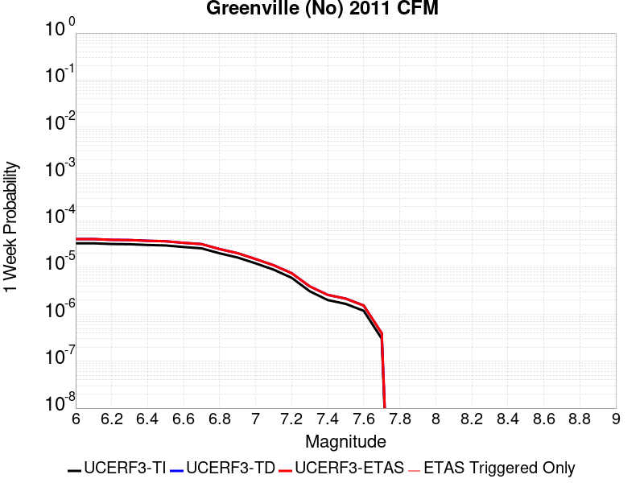 |  |  | 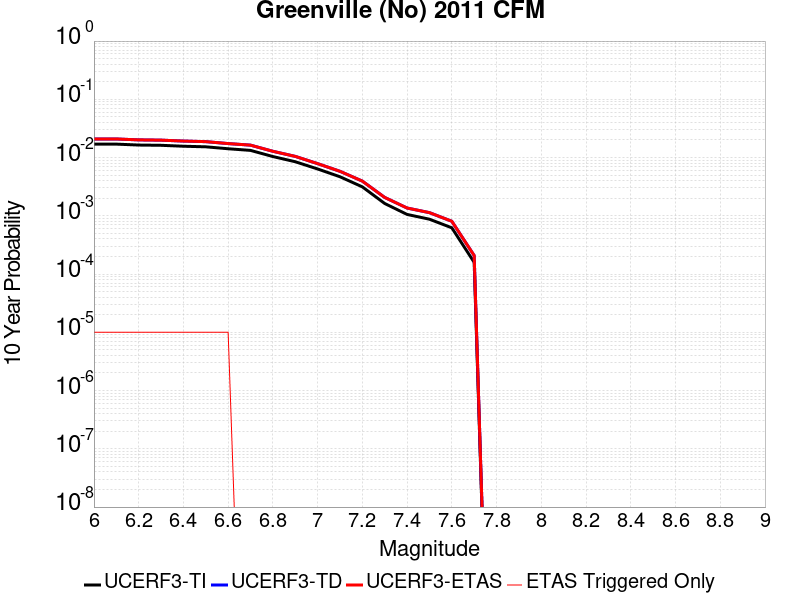 |

| Magnitude | 1 wk TI Prob | 1 wk TD Prob | 1 wk ETAS Prob | 1 wk ETAS/TD Gain | 1 wk ETAS Triggered Only | 1 mo TI Prob | 1 mo TD Prob | 1 mo ETAS Prob | 1 mo ETAS/TD Gain | 1 mo ETAS Triggered Only | 1 yr TI Prob | 1 yr TD Prob | 1 yr ETAS Prob | 1 yr ETAS/TD Gain | 1 yr ETAS Triggered Only | 10 yr TI Prob | 10 yr TD Prob | 10 yr ETAS Prob | 10 yr ETAS/TD Gain | 10 yr ETAS Triggered Only |
|-----|-----|-----|-----|-----|-----|-----|-----|-----|-----|-----|-----|-----|-----|-----|-----|-----|-----|-----|-----|-----|
| 6.0 | 3.286654E-5 | 4.036648E-5 | 4.036648E-5 | 1.0 | 0.0 | 1.4084899E-4 | 1.7298796E-4 | 1.7298796E-4 | 1.0 | 0.0 | 0.0017134876 | 0.002104132 | 0.0021307427 | 1.0126468 | 2.6666667E-5 | 0.017003356 | 0.020846982 | 0.020873092 | 1.0012525 | 2.6666667E-5 |
| 6.1 | 3.286654E-5 | 4.036648E-5 | 4.036648E-5 | 1.0 | 0.0 | 1.4084899E-4 | 1.7298796E-4 | 1.7298796E-4 | 1.0 | 0.0 | 0.0017134876 | 0.002104132 | 0.0021307427 | 1.0126468 | 2.6666667E-5 | 0.017003356 | 0.020846982 | 0.020873092 | 1.0012525 | 2.6666667E-5 |
| 6.2 | 3.1697953E-5 | 3.8929385E-5 | 3.8929385E-5 | 1.0 | 0.0 | 1.358413E-4 | 1.6682976E-4 | 1.6682976E-4 | 1.0 | 0.0 | 0.0016526132 | 0.002029298 | 0.0020559106 | 1.0131142 | 2.6666667E-5 | 0.01640377 | 0.020112377 | 0.020138506 | 1.0012993 | 2.6666667E-5 |
| 6.3 | 3.1363317E-5 | 3.851826E-5 | 3.851826E-5 | 1.0 | 0.0 | 1.344073E-4 | 1.6506804E-4 | 1.6506804E-4 | 1.0 | 0.0 | 0.0016351803 | 0.0020078886 | 0.0020345019 | 1.0132543 | 2.6666667E-5 | 0.016232004 | 0.019902144 | 0.01992828 | 1.0013132 | 2.6666667E-5 |
| 6.4 | 3.0228604E-5 | 3.7125395E-5 | 3.7125395E-5 | 1.0 | 0.0 | 1.2954473E-4 | 1.5909935E-4 | 1.5909935E-4 | 1.0 | 0.0 | 0.0015760659 | 0.0019353506 | 0.0019619656 | 1.0137521 | 2.6666667E-5 | 0.015649348 | 0.019189484 | 0.01921564 | 1.001363 | 2.6666667E-5 |
| 6.5 | 2.9537814E-5 | 3.6280853E-5 | 3.6280853E-5 | 1.0 | 0.0 | 1.2658449E-4 | 1.554803E-4 | 1.554803E-4 | 1.0 | 0.0 | 0.0015400766 | 0.0018913659 | 0.0019179821 | 1.0140725 | 2.6666667E-5 | 0.01529447 | 0.018757146 | 0.018783312 | 1.001395 | 2.6666667E-5 |
| 6.6 | 2.7345395E-5 | 3.3590182E-5 | 3.3590182E-5 | 1.0 | 0.0 | 1.1718928E-4 | 1.4395016E-4 | 1.4395016E-4 | 1.0 | 0.0 | 0.0014258457 | 0.0017512152 | 0.0017778352 | 1.0152009 | 2.6666667E-5 | 0.014167317 | 0.01737797 | 0.017404173 | 1.0015079 | 2.6666667E-5 |
| 6.7 | 2.5615784E-5 | 3.1567088E-5 | 3.1567088E-5 | 1.0 | 0.0 | 1.09777306E-4 | 1.3528067E-4 | 1.3528067E-4 | 1.0 | 0.0 | 0.0013357193 | 0.0016458282 | 0.0016458282 | 1.0 | 0.0 | 0.013277191 | 0.016340064 | 0.016340064 | 1.0 | 0.0 |
| 6.8 | 2.0059057E-5 | 2.4712073E-5 | 2.4712073E-5 | 1.0 | 0.0 | 8.596455E-5 | 1.0590468E-4 | 1.0590468E-4 | 1.0 | 0.0 | 0.0010461159 | 0.001288643 | 0.001288643 | 1.0 | 0.0 | 0.0104120495 | 0.012813724 | 0.012813724 | 1.0 | 0.0 |
| 6.9 | 1.6321746E-5 | 2.018467E-5 | 2.018467E-5 | 1.0 | 0.0 | 6.9948466E-5 | 8.650293E-5 | 8.650293E-5 | 1.0 | 0.0 | 8.5128983E-4 | 0.0010526767 | 0.0010526767 | 1.0 | 0.0 | 0.008480361 | 0.010478431 | 0.010478431 | 1.0 | 0.0 |
| 7.0 | 1.22527645E-5 | 1.5135633E-5 | 1.5135633E-5 | 1.0 | 0.0 | 5.2510793E-5 | 6.486541E-5 | 6.486541E-5 | 1.0 | 0.0 | 6.3913135E-4 | 7.894544E-4 | 7.894544E-4 | 1.0 | 0.0 | 0.0063729626 | 0.007867137 | 0.007867137 | 1.0 | 0.0 |
| 7.1 | 8.996482E-6 | 1.1164954E-5 | 1.1164954E-5 | 1.0 | 0.0 | 3.8555783E-5 | 4.7848935E-5 | 4.7848935E-5 | 1.0 | 0.0 | 4.6931554E-4 | 5.824063E-4 | 5.824063E-4 | 1.0 | 0.0 | 0.004683256 | 0.0058090906 | 0.0058090906 | 1.0 | 0.0 |
| 7.2 | 6.0273087E-6 | 7.569474E-6 | 7.569474E-6 | 1.0 | 0.0 | 2.5831067E-5 | 3.2440203E-5 | 3.2440203E-5 | 1.0 | 0.0 | 3.1444785E-4 | 3.9488857E-4 | 3.9488857E-4 | 1.0 | 0.0 | 0.0031400328 | 0.003942066 | 0.003942066 | 1.0 | 0.0 |
| 7.3 | 3.1209995E-6 | 3.9663746E-6 | 3.9663746E-6 | 1.0 | 0.0 | 1.3375643E-5 | 1.699864E-5 | 1.699864E-5 | 1.0 | 0.0 | 1.6283628E-4 | 2.0693893E-4 | 2.0693893E-4 | 1.0 | 0.0 | 0.0016271701 | 0.0020675526 | 0.0020675526 | 1.0 | 0.0 |
| 7.4 | 2.0254208E-6 | 2.6096043E-6 | 2.6096043E-6 | 1.0 | 0.0 | 8.680347E-6 | 1.1183971E-5 | 1.1183971E-5 | 1.0 | 0.0 | 1.0567809E-4 | 1.361564E-4 | 1.361564E-4 | 1.0 | 0.0 | 0.0010562785 | 0.0013607866 | 0.0013607866 | 1.0 | 0.0 |
| 7.5 | 1.6763418E-6 | 2.173353E-6 | 2.173353E-6 | 1.0 | 0.0 | 7.184302E-6 | 9.314337E-6 | 9.314337E-6 | 1.0 | 0.0 | 8.746537E-5 | 1.1339621E-4 | 1.1339621E-4 | 1.0 | 0.0 | 8.743095E-4 | 0.0011334305 | 0.0011334305 | 1.0 | 0.0 |
| 7.6 | 1.1935462E-6 | 1.5458467E-6 | 1.5458467E-6 | 1.0 | 0.0 | 5.115188E-6 | 6.6250404E-6 | 6.6250404E-6 | 1.0 | 0.0 | 6.2275634E-5 | 8.065693E-5 | 8.065693E-5 | 1.0 | 0.0 | 6.2258187E-4 | 8.0630725E-4 | 8.0630725E-4 | 1.0 | 0.0 |
| 7.7 | 3.0464201E-7 | 3.9846822E-7 | 3.9846822E-7 | 1.0 | 0.0 | 1.3056081E-6 | 1.7077199E-6 | 1.7077199E-6 | 1.0 | 0.0 | 1.589566E-5 | 2.0791296E-5 | 2.0791296E-5 | 1.0 | 0.0 | 1.5894524E-4 | 2.0789822E-4 | 2.0789822E-4 | 1.0 | 0.0 |

## Earthquake Valley
*[(top)](#table-of-contents)*

| 1 Week | 1 Month | 1 Year | 10 Year |
|-----|-----|-----|-----|
|  |  |  |  |

| Magnitude | 1 wk TI Prob | 1 wk TD Prob | 1 wk ETAS Prob | 1 wk ETAS/TD Gain | 1 wk ETAS Triggered Only | 1 mo TI Prob | 1 mo TD Prob | 1 mo ETAS Prob | 1 mo ETAS/TD Gain | 1 mo ETAS Triggered Only | 1 yr TI Prob | 1 yr TD Prob | 1 yr ETAS Prob | 1 yr ETAS/TD Gain | 1 yr ETAS Triggered Only | 10 yr TI Prob | 10 yr TD Prob | 10 yr ETAS Prob | 10 yr ETAS/TD Gain | 10 yr ETAS Triggered Only |
|-----|-----|-----|-----|-----|-----|-----|-----|-----|-----|-----|-----|-----|-----|-----|-----|-----|-----|-----|-----|-----|
| 6.0 | 1.9416384E-5 | 2.258408E-5 | 2.258408E-5 | 1.0 | 0.0 | 8.321042E-5 | 9.6785996E-5 | 9.6785996E-5 | 1.0 | 0.0 | 0.001012616 | 0.0011778527 | 0.001204488 | 1.0226134 | 2.6666667E-5 | 0.010080142 | 0.011727943 | 0.011754297 | 1.0022471 | 2.6666667E-5 |
| 6.1 | 1.9416384E-5 | 2.258408E-5 | 2.258408E-5 | 1.0 | 0.0 | 8.321042E-5 | 9.6785996E-5 | 9.6785996E-5 | 1.0 | 0.0 | 0.001012616 | 0.0011778527 | 0.001204488 | 1.0226134 | 2.6666667E-5 | 0.010080142 | 0.011727943 | 0.011754297 | 1.0022471 | 2.6666667E-5 |
| 6.2 | 1.9416384E-5 | 2.258408E-5 | 2.258408E-5 | 1.0 | 0.0 | 8.321042E-5 | 9.6785996E-5 | 9.6785996E-5 | 1.0 | 0.0 | 0.001012616 | 0.0011778527 | 0.001204488 | 1.0226134 | 2.6666667E-5 | 0.010080142 | 0.011727943 | 0.011754297 | 1.0022471 | 2.6666667E-5 |
| 6.3 | 1.9416384E-5 | 2.258408E-5 | 2.258408E-5 | 1.0 | 0.0 | 8.321042E-5 | 9.6785996E-5 | 9.6785996E-5 | 1.0 | 0.0 | 0.001012616 | 0.0011778527 | 0.001204488 | 1.0226134 | 2.6666667E-5 | 0.010080142 | 0.011727943 | 0.011754297 | 1.0022471 | 2.6666667E-5 |
| 6.4 | 1.9416384E-5 | 2.258408E-5 | 2.258408E-5 | 1.0 | 0.0 | 8.321042E-5 | 9.6785996E-5 | 9.6785996E-5 | 1.0 | 0.0 | 0.001012616 | 0.0011778527 | 0.001204488 | 1.0226134 | 2.6666667E-5 | 0.010080142 | 0.011727943 | 0.011754297 | 1.0022471 | 2.6666667E-5 |
| 6.5 | 1.9389157E-5 | 2.255267E-5 | 2.255267E-5 | 1.0 | 0.0 | 8.309374E-5 | 9.665139E-5 | 9.665139E-5 | 1.0 | 0.0 | 0.0010111968 | 0.0011762156 | 0.001202851 | 1.0226449 | 2.6666667E-5 | 0.010066078 | 0.011711745 | 0.011738099 | 1.0022502 | 2.6666667E-5 |
| 6.6 | 1.9389157E-5 | 2.255267E-5 | 2.255267E-5 | 1.0 | 0.0 | 8.309374E-5 | 9.665139E-5 | 9.665139E-5 | 1.0 | 0.0 | 0.0010111968 | 0.0011762156 | 0.001202851 | 1.0226449 | 2.6666667E-5 | 0.010066078 | 0.011711745 | 0.011738099 | 1.0022502 | 2.6666667E-5 |
| 6.7 | 1.4925434E-5 | 1.7208227E-5 | 1.7208227E-5 | 1.0 | 0.0 | 6.396457E-5 | 7.374794E-5 | 7.374794E-5 | 1.0 | 0.0 | 7.7849044E-4 | 8.9759636E-4 | 9.242391E-4 | 1.0296823 | 2.6666667E-5 | 0.007757689 | 0.008948085 | 0.008974513 | 1.0029535 | 2.6666667E-5 |
| 6.8 | 1.3570335E-5 | 1.5616843E-5 | 1.5616843E-5 | 1.0 | 0.0 | 5.8157282E-5 | 6.692807E-5 | 6.692807E-5 | 1.0 | 0.0 | 7.0783484E-4 | 8.1462675E-4 | 8.412717E-4 | 1.0327082 | 2.6666667E-5 | 0.0070558446 | 0.008124476 | 0.008150927 | 1.0032556 | 2.6666667E-5 |
| 6.9 | 1.3570335E-5 | 1.5616843E-5 | 1.5616843E-5 | 1.0 | 0.0 | 5.8157282E-5 | 6.692807E-5 | 6.692807E-5 | 1.0 | 0.0 | 7.0783484E-4 | 8.1462675E-4 | 8.412717E-4 | 1.0327082 | 2.6666667E-5 | 0.0070558446 | 0.008124476 | 0.008150927 | 1.0032556 | 2.6666667E-5 |
| 7.0 | 1.3433392E-5 | 1.5460388E-5 | 1.5460388E-5 | 1.0 | 0.0 | 5.757041E-5 | 6.6257584E-5 | 6.6257584E-5 | 1.0 | 0.0 | 7.0069433E-4 | 8.064695E-4 | 8.331147E-4 | 1.0330392 | 2.6666667E-5 | 0.006984891 | 0.008043497 | 0.008069948 | 1.0032886 | 2.6666667E-5 |
| 7.1 | 8.181609E-6 | 9.416851E-6 | 9.416851E-6 | 1.0 | 0.0 | 3.5063567E-5 | 4.0357685E-5 | 4.0357685E-5 | 1.0 | 0.0 | 4.268153E-4 | 4.9131113E-4 | 5.1796465E-4 | 1.0542499 | 2.6666667E-5 | 0.0042599645 | 0.0049088253 | 0.004935361 | 1.0054058 | 2.6666667E-5 |
| 7.2 | 2.0663983E-7 | 1.726294E-7 | 1.726294E-7 | 1.0 | 0.0 | 8.855989E-7 | 7.398401E-7 | 7.398401E-7 | 1.0 | 0.0 | 1.0782113E-5 | 9.00752E-6 | 9.00752E-6 | 1.0 | 0.0 | 1.07815904E-4 | 9.00719E-5 | 9.00719E-5 | 1.0 | 0.0 |
| 7.3 | 2.0462376E-7 | 1.7078433E-7 | 1.7078433E-7 | 1.0 | 0.0 | 8.7695867E-7 | 7.319327E-7 | 7.319327E-7 | 1.0 | 0.0 | 1.0676919E-5 | 8.911247E-6 | 8.911247E-6 | 1.0 | 0.0 | 1.0676406E-4 | 8.910926E-5 | 8.910926E-5 | 1.0 | 0.0 |
| 7.4 | 2.0171088E-7 | 1.6860913E-7 | 1.6860913E-7 | 1.0 | 0.0 | 8.644749E-7 | 7.2261037E-7 | 7.2261037E-7 | 1.0 | 0.0 | 1.0524931E-5 | 8.79775E-6 | 8.79775E-6 | 1.0 | 0.0 | 1.05244326E-4 | 8.7974375E-5 | 8.7974375E-5 | 1.0 | 0.0 |
| 7.5 | 1.4847944E-7 | 1.2559275E-7 | 1.2559275E-7 | 1.0 | 0.0 | 6.363403E-7 | 5.3825454E-7 | 5.3825454E-7 | 1.0 | 0.0 | 7.747416E-6 | 6.5532317E-6 | 6.5532317E-6 | 1.0 | 0.0 | 7.747146E-5 | 6.55306E-5 | 6.55306E-5 | 1.0 | 0.0 |
| 7.6 | 1.3185847E-7 | 1.1123213E-7 | 1.1123213E-7 | 1.0 | 0.0 | 5.6510765E-7 | 4.7670906E-7 | 4.7670906E-7 | 1.0 | 0.0 | 6.8801637E-6 | 5.8039195E-6 | 5.8039195E-6 | 1.0 | 0.0 | 6.8799505E-5 | 5.803789E-5 | 5.803789E-5 | 1.0 | 0.0 |
| 7.7 | 2.8609954E-8 | 1.4170958E-8 | 1.4170958E-8 | 1.0 | 0.0 | 1.2261408E-7 | 6.0732674E-8 | 6.0732674E-8 | 1.0 | 0.0 | 1.4928254E-6 | 7.394201E-7 | 7.394201E-7 | 1.0 | 0.0 | 1.4928154E-5 | 7.394182E-6 | 7.394182E-6 | 1.0 | 0.0 |
| 7.8 | 6.527266E-9 | 2.923417E-9 | 2.923417E-9 | 1.0 | 0.0 | 2.7973995E-8 | 1.2528931E-8 | 1.2528931E-8 | 1.0 | 0.0 | 3.4058334E-7 | 1.5253973E-7 | 1.5253973E-7 | 1.0 | 0.0 | 3.4058282E-6 | 1.5253964E-6 | 1.5253964E-6 | 1.0 | 0.0 |
| 7.9 | 1.2898267E-9 | 7.127684E-10 | 7.127684E-10 | 1.0 | 0.0 | 5.527829E-9 | 3.0547218E-9 | 3.0547218E-9 | 1.0 | 0.0 | 6.7301315E-8 | 3.719124E-8 | 3.719124E-8 | 1.0 | 0.0 | 6.7301295E-7 | 3.719124E-7 | 3.719124E-7 | 1.0 | 0.0 |

## Simi-Santa Rosa
*[(top)](#table-of-contents)*

| 1 Week | 1 Month | 1 Year | 10 Year |
|-----|-----|-----|-----|
| 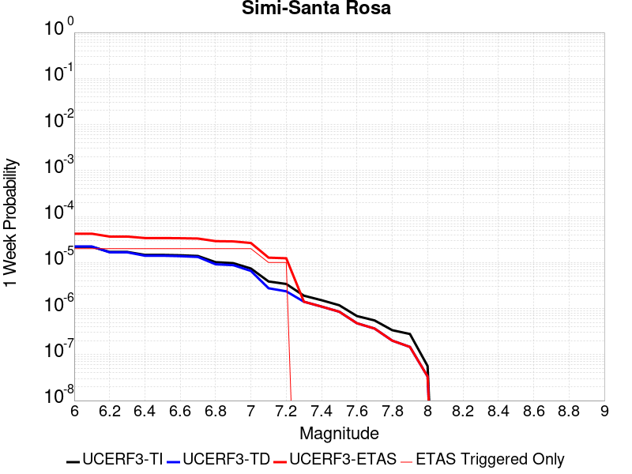 |  | 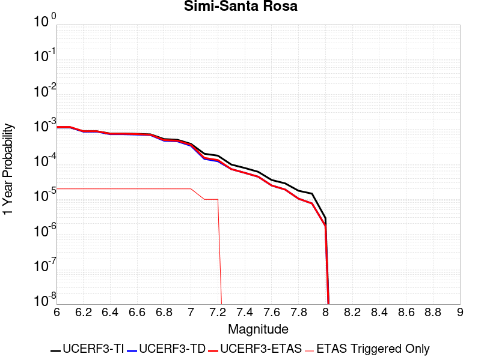 | 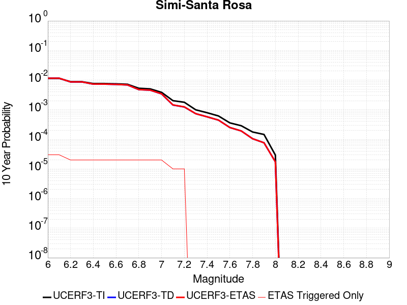 |

| Magnitude | 1 wk TI Prob | 1 wk TD Prob | 1 wk ETAS Prob | 1 wk ETAS/TD Gain | 1 wk ETAS Triggered Only | 1 mo TI Prob | 1 mo TD Prob | 1 mo ETAS Prob | 1 mo ETAS/TD Gain | 1 mo ETAS Triggered Only | 1 yr TI Prob | 1 yr TD Prob | 1 yr ETAS Prob | 1 yr ETAS/TD Gain | 1 yr ETAS Triggered Only | 10 yr TI Prob | 10 yr TD Prob | 10 yr ETAS Prob | 10 yr ETAS/TD Gain | 10 yr ETAS Triggered Only |
|-----|-----|-----|-----|-----|-----|-----|-----|-----|-----|-----|-----|-----|-----|-----|-----|-----|-----|-----|-----|-----|
| 6.0 | 2.198912E-5 | 2.2275442E-5 | 4.8941514E-5 | 2.1971064 | 2.6666667E-5 | 9.4235686E-5 | 9.5462936E-5 | 1.2212705E-4 | 1.2793138 | 2.6666667E-5 | 0.0011467156 | 0.0011616853 | 0.001188321 | 1.0229285 | 2.6666667E-5 | 0.011408163 | 0.011560575 | 0.011586933 | 1.00228 | 2.6666667E-5 |
| 6.1 | 2.198912E-5 | 2.2275442E-5 | 4.8941514E-5 | 2.1971064 | 2.6666667E-5 | 9.4235686E-5 | 9.5462936E-5 | 1.2212705E-4 | 1.2793138 | 2.6666667E-5 | 0.0011467156 | 0.0011616853 | 0.001188321 | 1.0229285 | 2.6666667E-5 | 0.011408163 | 0.011560575 | 0.011586933 | 1.00228 | 2.6666667E-5 |
| 6.2 | 1.69983E-5 | 1.6668559E-5 | 4.333478E-5 | 2.5997918 | 2.6666667E-5 | 7.284782E-5 | 7.143489E-5 | 9.8099656E-5 | 1.3732736 | 2.6666667E-5 | 8.865613E-4 | 8.6940196E-4 | 8.960454E-4 | 1.0306457 | 2.6666667E-5 | 0.008830327 | 0.008662928 | 0.0086893635 | 1.0030516 | 2.6666667E-5 |
| 6.3 | 1.69983E-5 | 1.6668559E-5 | 4.333478E-5 | 2.5997918 | 2.6666667E-5 | 7.284782E-5 | 7.143489E-5 | 9.8099656E-5 | 1.3732736 | 2.6666667E-5 | 8.865613E-4 | 8.6940196E-4 | 8.960454E-4 | 1.0306457 | 2.6666667E-5 | 0.008830327 | 0.008662928 | 0.0086893635 | 1.0030516 | 2.6666667E-5 |
| 6.4 | 1.4666188E-5 | 1.4052543E-5 | 4.0718834E-5 | 2.8976133 | 2.6666667E-5 | 6.285358E-5 | 6.0223934E-5 | 8.688899E-5 | 1.4427652 | 2.6666667E-5 | 7.6497364E-4 | 7.3300465E-4 | 7.5965177E-4 | 1.0363532 | 2.6666667E-5 | 0.0076234564 | 0.007308344 | 0.007334816 | 1.0036222 | 2.6666667E-5 |
| 6.5 | 1.4666188E-5 | 1.4052543E-5 | 4.0718834E-5 | 2.8976133 | 2.6666667E-5 | 6.285358E-5 | 6.0223934E-5 | 8.688899E-5 | 1.4427652 | 2.6666667E-5 | 7.6497364E-4 | 7.3300465E-4 | 7.5965177E-4 | 1.0363532 | 2.6666667E-5 | 0.0076234564 | 0.007308344 | 0.007334816 | 1.0036222 | 2.6666667E-5 |
| 6.6 | 1.4377586E-5 | 1.3729583E-5 | 4.0395884E-5 | 2.9422514 | 2.6666667E-5 | 6.1616774E-5 | 5.883988E-5 | 8.550498E-5 | 1.4531807 | 2.6666667E-5 | 7.4992597E-4 | 7.1616494E-4 | 7.428125E-4 | 1.0372087 | 2.6666667E-5 | 0.007474003 | 0.0071410383 | 0.007167515 | 1.0037076 | 2.6666667E-5 |
| 6.7 | 1.3881404E-5 | 1.320755E-5 | 3.9873867E-5 | 3.0190203 | 2.6666667E-5 | 5.9490372E-5 | 5.66027E-5 | 8.3267856E-5 | 1.4710934 | 2.6666667E-5 | 7.240546E-4 | 6.8894465E-4 | 7.15593E-4 | 1.0386798 | 2.6666667E-5 | 0.007217 | 0.006870538 | 0.0068970216 | 1.0038546 | 2.6666667E-5 |
| 6.8 | 1.0176516E-5 | 9.154151E-6 | 3.5820573E-5 | 3.9130418 | 2.6666667E-5 | 4.3612912E-5 | 3.9231574E-5 | 6.58972E-5 | 1.6796979 | 2.6666667E-5 | 5.308578E-4 | 4.7755634E-4 | 5.0421024E-4 | 1.0558132 | 2.6666667E-5 | 0.0052959146 | 0.004766934 | 0.004793474 | 1.0055674 | 2.6666667E-5 |
| 6.9 | 9.699797E-6 | 8.774719E-6 | 3.5441153E-5 | 4.0390067 | 2.6666667E-5 | 4.15699E-5 | 3.7605492E-5 | 6.427115E-5 | 1.7090896 | 2.6666667E-5 | 5.05996E-4 | 4.577671E-4 | 4.844216E-4 | 1.0582271 | 2.6666667E-5 | 0.005048454 | 0.0045698597 | 0.0045964043 | 1.0058087 | 2.6666667E-5 |
| 7.0 | 7.4049476E-6 | 6.559333E-6 | 3.3225824E-5 | 5.0654273 | 2.6666667E-5 | 3.1735104E-5 | 2.8111197E-5 | 5.4777112E-5 | 1.9485871 | 2.6666667E-5 | 3.8630638E-4 | 3.422127E-4 | 3.6887024E-4 | 1.0778975 | 2.6666667E-5 | 0.0038563553 | 0.0034180996 | 0.0034446751 | 1.007775 | 2.6666667E-5 |
| 7.1 | 3.873439E-6 | 2.7595095E-6 | 2.9426103E-5 | 10.663527 | 2.6666667E-5 | 1.6600346E-5 | 1.1826417E-5 | 3.849277E-5 | 3.2548125 | 2.6666667E-5 | 2.0209046E-4 | 1.4397735E-4 | 1.7064018E-4 | 1.1851877 | 2.6666667E-5 | 0.0020190678 | 0.0014388643 | 0.0014654925 | 1.0185065 | 2.6666667E-5 |
| 7.2 | 3.417706E-6 | 2.3676484E-6 | 2.9034252E-5 | 12.262906 | 2.6666667E-5 | 1.4647229E-5 | 1.0147027E-5 | 3.6813424E-5 | 3.628001 | 2.6666667E-5 | 1.7831543E-4 | 1.2353327E-4 | 1.5019665E-4 | 1.2158396 | 2.6666667E-5 | 0.0017817242 | 0.0012346683 | 0.001261302 | 1.0215716 | 2.6666667E-5 |
| 7.3 | 1.90225E-6 | 1.4073753E-6 | 1.4073753E-6 | 1.0 | 0.0 | 8.152474E-6 | 6.0315947E-6 | 6.0315947E-6 | 1.0 | 0.0 | 9.9251854E-5 | 7.343221E-5 | 7.343221E-5 | 1.0 | 0.0 | 9.920754E-4 | 7.340817E-4 | 7.340817E-4 | 1.0 | 0.0 |
| 7.4 | 1.5170556E-6 | 1.1024773E-6 | 1.1024773E-6 | 1.0 | 0.0 | 6.5016507E-6 | 4.724894E-6 | 4.724894E-6 | 1.0 | 0.0 | 7.915472E-5 | 5.7524077E-5 | 5.7524077E-5 | 1.0 | 0.0 | 7.9126534E-4 | 5.7509297E-4 | 5.7509297E-4 | 1.0 | 0.0 |
| 7.5 | 1.178732E-6 | 8.535102E-7 | 8.535102E-7 | 1.0 | 0.0 | 5.0516987E-6 | 3.6578958E-6 | 3.6578958E-6 | 1.0 | 0.0 | 6.1502695E-5 | 4.453398E-5 | 4.453398E-5 | 1.0 | 0.0 | 6.148568E-4 | 4.452515E-4 | 4.452515E-4 | 1.0 | 0.0 |
| 7.6 | 6.8722386E-7 | 4.793198E-7 | 4.793198E-7 | 1.0 | 0.0 | 2.9452417E-6 | 2.054226E-6 | 2.054226E-6 | 1.0 | 0.0 | 3.5857727E-5 | 2.5009915E-5 | 2.5009915E-5 | 1.0 | 0.0 | 3.5851944E-4 | 2.5007114E-4 | 2.5007114E-4 | 1.0 | 0.0 |
| 7.7 | 5.5126515E-7 | 3.6731157E-7 | 3.6731157E-7 | 1.0 | 0.0 | 2.3625628E-6 | 1.5741915E-6 | 1.5741915E-6 | 1.0 | 0.0 | 2.8763823E-5 | 1.9165615E-5 | 1.9165615E-5 | 1.0 | 0.0 | 2.87601E-4 | 1.9163972E-4 | 1.9163972E-4 | 1.0 | 0.0 |
| 7.8 | 3.3860243E-7 | 2.0075942E-7 | 2.0075942E-7 | 1.0 | 0.0 | 1.4511525E-6 | 8.6039717E-7 | 8.6039717E-7 | 1.0 | 0.0 | 1.7667637E-5 | 1.0475286E-5 | 1.0475286E-5 | 1.0 | 0.0 | 1.7666233E-4 | 1.04747975E-4 | 1.04747975E-4 | 1.0 | 0.0 |
| 7.9 | 2.7955386E-7 | 1.4649108E-7 | 1.4649108E-7 | 1.0 | 0.0 | 1.1980875E-6 | 6.278188E-7 | 6.278188E-7 | 1.0 | 0.0 | 1.4586617E-5 | 7.643667E-6 | 7.643667E-6 | 1.0 | 0.0 | 1.458566E-4 | 7.643409E-5 | 7.643409E-5 | 1.0 | 0.0 |
| 8.0 | 5.6259015E-8 | 3.3355324E-8 | 3.3355324E-8 | 1.0 | 0.0 | 2.4111003E-7 | 1.4295138E-7 | 1.4295138E-7 | 1.0 | 0.0 | 2.9355108E-6 | 1.7404317E-6 | 1.7404317E-6 | 1.0 | 0.0 | 2.935472E-5 | 1.7404194E-5 | 1.7404194E-5 | 1.0 | 0.0 |

## Mission (connected) 2011 CFM
*[(top)](#table-of-contents)*

| 1 Week | 1 Month | 1 Year | 10 Year |
|-----|-----|-----|-----|
|  |  |  |  |

| Magnitude | 1 wk TI Prob | 1 wk TD Prob | 1 wk ETAS Prob | 1 wk ETAS/TD Gain | 1 wk ETAS Triggered Only | 1 mo TI Prob | 1 mo TD Prob | 1 mo ETAS Prob | 1 mo ETAS/TD Gain | 1 mo ETAS Triggered Only | 1 yr TI Prob | 1 yr TD Prob | 1 yr ETAS Prob | 1 yr ETAS/TD Gain | 1 yr ETAS Triggered Only | 10 yr TI Prob | 10 yr TD Prob | 10 yr ETAS Prob | 10 yr ETAS/TD Gain | 10 yr ETAS Triggered Only |
|-----|-----|-----|-----|-----|-----|-----|-----|-----|-----|-----|-----|-----|-----|-----|-----|-----|-----|-----|-----|-----|
| 6.0 | 1.8735573E-5 | 2.6882515E-5 | 2.6882515E-5 | 1.0 | 0.0 | 8.029284E-5 | 1.1520558E-4 | 1.1520558E-4 | 1.0 | 0.0 | 9.771269E-4 | 0.0014016571 | 0.0014016571 | 1.0 | 0.0 | 0.009728416 | 0.013937562 | 0.013963857 | 1.0018866 | 2.6666667E-5 |
| 6.1 | 1.7515964E-5 | 2.5523792E-5 | 2.5523792E-5 | 1.0 | 0.0 | 7.506625E-5 | 1.0938298E-4 | 1.0938298E-4 | 1.0 | 0.0 | 9.135484E-4 | 0.0013308554 | 0.0013308554 | 1.0 | 0.0 | 0.009098019 | 0.0132381655 | 0.013264479 | 1.0019877 | 2.6666667E-5 |
| 6.2 | 1.6486343E-5 | 2.4368448E-5 | 2.4368448E-5 | 1.0 | 0.0 | 7.065384E-5 | 1.0443191E-4 | 1.0443191E-4 | 1.0 | 0.0 | 8.5987104E-4 | 0.0012706495 | 0.0012706495 | 1.0 | 0.0 | 0.008565514 | 0.012643143 | 0.012669472 | 1.0020825 | 2.6666667E-5 |
| 6.3 | 1.5229385E-5 | 2.2797909E-5 | 2.2797909E-5 | 1.0 | 0.0 | 6.526716E-5 | 9.7701544E-5 | 9.7701544E-5 | 1.0 | 0.0 | 7.9433795E-4 | 0.0011887997 | 0.0011887997 | 1.0 | 0.0 | 0.007915046 | 0.011836352 | 0.011862703 | 1.0022262 | 2.6666667E-5 |
| 6.4 | 1.4435828E-5 | 2.1398E-5 | 2.1398E-5 | 1.0 | 0.0 | 6.186637E-5 | 9.1702364E-5 | 9.1702364E-5 | 1.0 | 0.0 | 7.529627E-4 | 0.0011158385 | 0.0011158385 | 1.0 | 0.0 | 0.007504165 | 0.011119362 | 0.011145732 | 1.0023715 | 2.6666667E-5 |
| 6.5 | 1.30127955E-5 | 1.9037068E-5 | 1.9037068E-5 | 1.0 | 0.0 | 5.576793E-5 | 8.1584905E-5 | 8.1584905E-5 | 1.0 | 0.0 | 6.78763E-4 | 9.927875E-4 | 9.927875E-4 | 1.0 | 0.0 | 0.0067669353 | 0.009911527 | 0.009937929 | 1.0026639 | 2.6666667E-5 |
| 6.6 | 1.1220718E-5 | 1.639339E-5 | 1.639339E-5 | 1.0 | 0.0 | 4.8087906E-5 | 7.0255504E-5 | 7.0255504E-5 | 1.0 | 0.0 | 5.8531296E-4 | 8.5502357E-4 | 8.5502357E-4 | 1.0 | 0.0 | 0.005837737 | 0.00854963 | 0.008576068 | 1.0030924 | 2.6666667E-5 |
| 6.7 | 8.086152E-6 | 1.1750298E-5 | 1.1750298E-5 | 1.0 | 0.0 | 3.4654473E-5 | 5.035745E-5 | 5.035745E-5 | 1.0 | 0.0 | 4.2183654E-4 | 6.129302E-4 | 6.129302E-4 | 1.0 | 0.0 | 0.004210367 | 0.0061497535 | 0.006176256 | 1.0043095 | 2.6666667E-5 |
| 6.8 | 6.8361655E-6 | 1.0195406E-5 | 1.0195406E-5 | 1.0 | 0.0 | 2.9297524E-5 | 4.3693864E-5 | 4.3693864E-5 | 1.0 | 0.0 | 3.5663895E-4 | 5.3184363E-4 | 5.3184363E-4 | 1.0 | 0.0 | 0.0035606713 | 0.0053387266 | 0.0053652506 | 1.0049683 | 2.6666667E-5 |
| 6.9 | 5.2517353E-6 | 7.8690955E-6 | 7.8690955E-6 | 1.0 | 0.0 | 2.2507242E-5 | 3.3724264E-5 | 3.3724264E-5 | 1.0 | 0.0 | 2.739912E-4 | 4.105158E-4 | 4.105158E-4 | 1.0 | 0.0 | 0.0027365363 | 0.004129868 | 0.0041564247 | 1.0064304 | 2.6666667E-5 |
| 7.0 | 4.4602784E-6 | 6.7016504E-6 | 6.7016504E-6 | 1.0 | 0.0 | 1.911534E-5 | 2.8721044E-5 | 2.8721044E-5 | 1.0 | 0.0 | 2.327044E-4 | 3.4962274E-4 | 3.4962274E-4 | 1.0 | 0.0 | 0.0023246086 | 0.0035221886 | 0.0035487614 | 1.0075444 | 2.6666667E-5 |
| 7.1 | 4.1492594E-6 | 6.2504096E-6 | 6.2504096E-6 | 1.0 | 0.0 | 1.7782419E-5 | 2.6787196E-5 | 2.6787196E-5 | 1.0 | 0.0 | 2.1647944E-4 | 3.2608546E-4 | 3.2608546E-4 | 1.0 | 0.0 | 0.0021626868 | 0.0032870003 | 0.0033135794 | 1.0080861 | 2.6666667E-5 |
| 7.2 | 2.213247E-6 | 3.3628444E-6 | 3.3628444E-6 | 1.0 | 0.0 | 9.485309E-6 | 1.441211E-5 | 1.441211E-5 | 1.0 | 0.0 | 1.15477524E-4 | 1.7545334E-4 | 1.7545334E-4 | 1.0 | 0.0 | 0.0011541754 | 0.0017818302 | 0.0017818302 | 1.0 | 0.0 |
| 7.3 | 1.7362703E-6 | 2.7384676E-6 | 2.7384676E-6 | 1.0 | 0.0 | 7.4411373E-6 | 1.1736238E-5 | 1.1736238E-5 | 1.0 | 0.0 | 9.0592075E-5 | 1.4287935E-4 | 1.4287935E-4 | 1.0 | 0.0 | 9.0555154E-4 | 0.0014532148 | 0.0014532148 | 1.0 | 0.0 |
| 7.4 | 1.1628409E-6 | 1.8493533E-6 | 1.8493533E-6 | 1.0 | 0.0 | 4.9835944E-6 | 7.925776E-6 | 7.925776E-6 | 1.0 | 0.0 | 6.0673574E-5 | 9.649206E-5 | 9.649206E-5 | 1.0 | 0.0 | 6.065701E-4 | 9.85306E-4 | 9.85306E-4 | 1.0 | 0.0 |
| 7.5 | 5.5610667E-7 | 9.343823E-7 | 9.343823E-7 | 1.0 | 0.0 | 2.3833122E-6 | 4.0044893E-6 | 4.0044893E-6 | 1.0 | 0.0 | 2.9016439E-5 | 4.8753573E-5 | 4.8753573E-5 | 1.0 | 0.0 | 2.901265E-4 | 5.0411286E-4 | 5.0411286E-4 | 1.0 | 0.0 |
| 7.6 | 4.4307663E-7 | 7.784628E-7 | 7.784628E-7 | 1.0 | 0.0 | 1.8988985E-6 | 3.3362649E-6 | 3.3362649E-6 | 1.0 | 0.0 | 2.3118844E-5 | 4.061827E-5 | 4.061827E-5 | 1.0 | 0.0 | 2.3116439E-4 | 4.2210697E-4 | 4.2210697E-4 | 1.0 | 0.0 |
| 7.7 | 3.639119E-7 | 6.3549425E-7 | 6.3549425E-7 | 1.0 | 0.0 | 1.5596215E-6 | 2.7235437E-6 | 2.7235437E-6 | 1.0 | 0.0 | 1.8988227E-5 | 3.315864E-5 | 3.315864E-5 | 1.0 | 0.0 | 1.8986604E-4 | 3.4690052E-4 | 3.4690052E-4 | 1.0 | 0.0 |
| 7.8 | 3.1152942E-7 | 5.474834E-7 | 5.474834E-7 | 1.0 | 0.0 | 1.3351254E-6 | 2.3463554E-6 | 2.3463554E-6 | 1.0 | 0.0 | 1.6255031E-5 | 2.8566503E-5 | 2.8566503E-5 | 1.0 | 0.0 | 1.6253842E-4 | 2.977112E-4 | 2.977112E-4 | 1.0 | 0.0 |
| 7.9 | 1.8035962E-7 | 3.7184682E-7 | 3.7184682E-7 | 1.0 | 0.0 | 7.729696E-7 | 1.5936282E-6 | 1.5936282E-6 | 1.0 | 0.0 | 9.410865E-6 | 1.9402252E-5 | 1.9402252E-5 | 1.0 | 0.0 | 9.410465E-5 | 2.0071324E-4 | 2.0071324E-4 | 1.0 | 0.0 |
| 8.0 | 9.279334E-8 | 1.9695527E-7 | 1.9695527E-7 | 1.0 | 0.0 | 3.976857E-7 | 8.4409373E-7 | 8.4409373E-7 | 1.0 | 0.0 | 4.841813E-6 | 1.0276794E-5 | 1.0276794E-5 | 1.0 | 0.0 | 4.841707E-5 | 1.05289524E-4 | 1.05289524E-4 | 1.0 | 0.0 |
| 8.1 | 5.9253985E-8 | 1.18509675E-7 | 1.18509675E-7 | 1.0 | 0.0 | 2.5394561E-7 | 5.078985E-7 | 5.078985E-7 | 1.0 | 0.0 | 3.0917836E-6 | 6.183647E-6 | 6.183647E-6 | 1.0 | 0.0 | 3.0917407E-5 | 6.322351E-5 | 6.322351E-5 | 1.0 | 0.0 |

## Fitzhugh Creek
*[(top)](#table-of-contents)*

| 1 Week | 1 Month | 1 Year | 10 Year |
|-----|-----|-----|-----|
|  |  |  |  |

| Magnitude | 1 wk TI Prob | 1 wk TD Prob | 1 wk ETAS Prob | 1 wk ETAS/TD Gain | 1 wk ETAS Triggered Only | 1 mo TI Prob | 1 mo TD Prob | 1 mo ETAS Prob | 1 mo ETAS/TD Gain | 1 mo ETAS Triggered Only | 1 yr TI Prob | 1 yr TD Prob | 1 yr ETAS Prob | 1 yr ETAS/TD Gain | 1 yr ETAS Triggered Only | 10 yr TI Prob | 10 yr TD Prob | 10 yr ETAS Prob | 10 yr ETAS/TD Gain | 10 yr ETAS Triggered Only |
|-----|-----|-----|-----|-----|-----|-----|-----|-----|-----|-----|-----|-----|-----|-----|-----|-----|-----|-----|-----|-----|
| 6.0 | 6.1090436E-6 | 6.2101562E-6 | 6.2101562E-6 | 1.0 | 0.0 | 2.6181353E-5 | 2.6614709E-5 | 2.6614709E-5 | 1.0 | 0.0 | 3.1871133E-4 | 3.239904E-4 | 3.239904E-4 | 1.0 | 0.0 | 0.0031825465 | 0.0032356246 | 0.003262205 | 1.008215 | 2.6666667E-5 |
| 6.1 | 2.9741811E-6 | 3.021581E-6 | 3.021581E-6 | 1.0 | 0.0 | 1.2746428E-5 | 1.2949574E-5 | 1.2949574E-5 | 1.0 | 0.0 | 1.5517672E-4 | 1.576506E-4 | 1.576506E-4 | 1.0 | 0.0 | 0.001550684 | 0.0015754806 | 0.0015754806 | 1.0 | 0.0 |
| 6.2 | 2.9741811E-6 | 3.021581E-6 | 3.021581E-6 | 1.0 | 0.0 | 1.2746428E-5 | 1.2949574E-5 | 1.2949574E-5 | 1.0 | 0.0 | 1.5517672E-4 | 1.576506E-4 | 1.576506E-4 | 1.0 | 0.0 | 0.001550684 | 0.0015754806 | 0.0015754806 | 1.0 | 0.0 |
| 6.3 | 1.4781198E-6 | 1.5012708E-6 | 1.5012708E-6 | 1.0 | 0.0 | 6.3347834E-6 | 6.4340034E-6 | 6.4340034E-6 | 1.0 | 0.0 | 7.712326E-5 | 7.833137E-5 | 7.833137E-5 | 1.0 | 0.0 | 7.70965E-4 | 7.830576E-4 | 7.830576E-4 | 1.0 | 0.0 |
| 6.4 | 1.4781198E-6 | 1.5012708E-6 | 1.5012708E-6 | 1.0 | 0.0 | 6.3347834E-6 | 6.4340034E-6 | 6.4340034E-6 | 1.0 | 0.0 | 7.712326E-5 | 7.833137E-5 | 7.833137E-5 | 1.0 | 0.0 | 7.70965E-4 | 7.830576E-4 | 7.830576E-4 | 1.0 | 0.0 |
| 6.5 | 9.5176676E-7 | 9.66606E-7 | 9.66606E-7 | 1.0 | 0.0 | 4.078994E-6 | 4.142591E-6 | 4.142591E-6 | 1.0 | 0.0 | 4.9660623E-5 | 5.0434985E-5 | 5.0434985E-5 | 1.0 | 0.0 | 4.964952E-4 | 5.042458E-4 | 5.042458E-4 | 1.0 | 0.0 |
| 6.6 | 6.21145E-7 | 6.3085855E-7 | 6.3085855E-7 | 1.0 | 0.0 | 2.662047E-6 | 2.7036772E-6 | 2.7036772E-6 | 1.0 | 0.0 | 3.2409942E-5 | 3.291684E-5 | 3.291684E-5 | 1.0 | 0.0 | 3.2405215E-4 | 3.2912623E-4 | 3.2912623E-4 | 1.0 | 0.0 |
| 6.7 | 2.2377962E-7 | 2.2734636E-7 | 2.2734636E-7 | 1.0 | 0.0 | 9.590551E-7 | 9.743413E-7 | 9.743413E-7 | 1.0 | 0.0 | 1.1676434E-5 | 1.1862574E-5 | 1.1862574E-5 | 1.0 | 0.0 | 1.1675821E-4 | 1.1862254E-4 | 1.1862254E-4 | 1.0 | 0.0 |
| 6.8 | 1.4785022E-7 | 1.5021492E-7 | 1.5021492E-7 | 1.0 | 0.0 | 6.3364365E-7 | 6.4377826E-7 | 6.4377826E-7 | 1.0 | 0.0 | 7.714584E-6 | 7.838E-6 | 7.838E-6 | 1.0 | 0.0 | 7.714316E-5 | 7.838E-5 | 7.838E-5 | 1.0 | 0.0 |

## White Wolf
*[(top)](#table-of-contents)*

| 1 Week | 1 Month | 1 Year | 10 Year |
|-----|-----|-----|-----|
|  |  |  |  |

| Magnitude | 1 wk TI Prob | 1 wk TD Prob | 1 wk ETAS Prob | 1 wk ETAS/TD Gain | 1 wk ETAS Triggered Only | 1 mo TI Prob | 1 mo TD Prob | 1 mo ETAS Prob | 1 mo ETAS/TD Gain | 1 mo ETAS Triggered Only | 1 yr TI Prob | 1 yr TD Prob | 1 yr ETAS Prob | 1 yr ETAS/TD Gain | 1 yr ETAS Triggered Only | 10 yr TI Prob | 10 yr TD Prob | 10 yr ETAS Prob | 10 yr ETAS/TD Gain | 10 yr ETAS Triggered Only |
|-----|-----|-----|-----|-----|-----|-----|-----|-----|-----|-----|-----|-----|-----|-----|-----|-----|-----|-----|-----|-----|
| 6.0 | 2.0037822E-5 | 1.0469162E-6 | 1.0469162E-6 | 1.0 | 0.0 | 8.587355E-5 | 4.486776E-6 | 4.486776E-6 | 1.0 | 0.0 | 0.001045009 | 5.4625183E-5 | 8.129039E-5 | 1.4881487 | 2.6666667E-5 | 0.010401085 | 5.461226E-4 | 5.7277473E-4 | 1.0488024 | 2.6666667E-5 |
| 6.1 | 2.0037822E-5 | 1.0469162E-6 | 1.0469162E-6 | 1.0 | 0.0 | 8.587355E-5 | 4.486776E-6 | 4.486776E-6 | 1.0 | 0.0 | 0.001045009 | 5.4625183E-5 | 8.129039E-5 | 1.4881487 | 2.6666667E-5 | 0.010401085 | 5.461226E-4 | 5.7277473E-4 | 1.0488024 | 2.6666667E-5 |
| 6.2 | 2.0037822E-5 | 1.0469162E-6 | 1.0469162E-6 | 1.0 | 0.0 | 8.587355E-5 | 4.486776E-6 | 4.486776E-6 | 1.0 | 0.0 | 0.001045009 | 5.4625183E-5 | 8.129039E-5 | 1.4881487 | 2.6666667E-5 | 0.010401085 | 5.461226E-4 | 5.7277473E-4 | 1.0488024 | 2.6666667E-5 |
| 6.3 | 2.0037822E-5 | 1.0469162E-6 | 1.0469162E-6 | 1.0 | 0.0 | 8.587355E-5 | 4.486776E-6 | 4.486776E-6 | 1.0 | 0.0 | 0.001045009 | 5.4625183E-5 | 8.129039E-5 | 1.4881487 | 2.6666667E-5 | 0.010401085 | 5.461226E-4 | 5.7277473E-4 | 1.0488024 | 2.6666667E-5 |
| 6.4 | 1.132487E-5 | 1.0469162E-6 | 1.0469162E-6 | 1.0 | 0.0 | 4.8534253E-5 | 4.486776E-6 | 4.486776E-6 | 1.0 | 0.0 | 5.907443E-4 | 5.4625183E-5 | 8.129039E-5 | 1.4881487 | 2.6666667E-5 | 0.005891764 | 5.461226E-4 | 5.7277473E-4 | 1.0488024 | 2.6666667E-5 |
| 6.5 | 1.132487E-5 | 1.0469162E-6 | 1.0469162E-6 | 1.0 | 0.0 | 4.8534253E-5 | 4.486776E-6 | 4.486776E-6 | 1.0 | 0.0 | 5.907443E-4 | 5.4625183E-5 | 8.129039E-5 | 1.4881487 | 2.6666667E-5 | 0.005891764 | 5.461226E-4 | 5.7277473E-4 | 1.0488024 | 2.6666667E-5 |
| 6.6 | 9.347473E-6 | 1.0469162E-6 | 1.0469162E-6 | 1.0 | 0.0 | 4.0059982E-5 | 4.486776E-6 | 4.486776E-6 | 1.0 | 0.0 | 4.8762115E-4 | 5.4625183E-5 | 8.129039E-5 | 1.4881487 | 2.6666667E-5 | 0.0048655253 | 5.461226E-4 | 5.7277473E-4 | 1.0488024 | 2.6666667E-5 |
| 6.7 | 7.842647E-6 | 1.0048342E-6 | 1.0048342E-6 | 1.0 | 0.0 | 3.361091E-5 | 4.3064256E-6 | 4.3064256E-6 | 1.0 | 0.0 | 4.0913603E-4 | 5.2429517E-5 | 7.909479E-5 | 1.5085927 | 2.6666667E-5 | 0.004083836 | 5.2417646E-4 | 5.508291E-4 | 1.0508468 | 2.6666667E-5 |
| 6.8 | 6.26597E-6 | 9.734822E-7 | 9.734822E-7 | 1.0 | 0.0 | 2.685388E-5 | 4.17206E-6 | 4.17206E-6 | 1.0 | 0.0 | 3.2689696E-4 | 5.0793697E-5 | 7.745901E-5 | 1.5249728 | 2.6666667E-5 | 0.003264165 | 5.078258E-4 | 5.344789E-4 | 1.0524848 | 2.6666667E-5 |
| 6.9 | 5.258436E-6 | 9.183254E-7 | 9.183254E-7 | 1.0 | 0.0 | 2.2535958E-5 | 3.9356746E-6 | 3.9356746E-6 | 1.0 | 0.0 | 2.7434074E-4 | 4.7915833E-5 | 7.458122E-5 | 1.5565047 | 2.6666667E-5 | 0.0027400232 | 4.790598E-4 | 5.057137E-4 | 1.055638 | 2.6666667E-5 |
| 7.0 | 4.675028E-6 | 8.6611794E-7 | 8.6611794E-7 | 1.0 | 0.0 | 2.003568E-5 | 3.7119291E-6 | 3.7119291E-6 | 1.0 | 0.0 | 2.4390711E-4 | 4.5191846E-5 | 7.185731E-5 | 1.5900502 | 2.6666667E-5 | 0.0024363957 | 4.518313E-4 | 4.784859E-4 | 1.0589924 | 2.6666667E-5 |
| 7.1 | 2.8270078E-6 | 6.8741696E-7 | 6.8741696E-7 | 1.0 | 0.0 | 1.2115692E-5 | 2.9460696E-6 | 2.9460696E-6 | 1.0 | 0.0 | 1.4749856E-4 | 3.5867848E-5 | 3.5867848E-5 | 1.0 | 0.0 | 0.001474007 | 3.586247E-4 | 3.586247E-4 | 1.0 | 0.0 |
| 7.2 | 1.6881406E-6 | 2.2706382E-7 | 2.2706382E-7 | 1.0 | 0.0 | 7.2348685E-6 | 9.731303E-7 | 9.731303E-7 | 1.0 | 0.0 | 8.808096E-5 | 1.1847799E-5 | 1.1847799E-5 | 1.0 | 0.0 | 8.8046055E-4 | 1.1847183E-4 | 1.1847183E-4 | 1.0 | 0.0 |
| 7.3 | 9.086107E-7 | 1.5266386E-7 | 1.5266386E-7 | 1.0 | 0.0 | 3.8940398E-6 | 6.5427355E-7 | 6.5427355E-7 | 1.0 | 0.0 | 4.7408903E-5 | 7.965752E-6 | 7.965752E-6 | 1.0 | 0.0 | 4.739879E-4 | 7.965475E-5 | 7.965475E-5 | 1.0 | 0.0 |
| 7.4 | 1.9717383E-7 | 9.003913E-8 | 9.003913E-8 | 1.0 | 0.0 | 8.450304E-7 | 3.8588192E-7 | 3.8588192E-7 | 1.0 | 0.0 | 1.0288197E-5 | 4.6981027E-6 | 4.6981027E-6 | 1.0 | 0.0 | 1.028772E-4 | 4.6980065E-5 | 4.6980065E-5 | 1.0 | 0.0 |
| 7.5 | 1.086975E-7 | 6.6597195E-8 | 6.6597195E-8 | 1.0 | 0.0 | 4.6584634E-7 | 2.8541652E-7 | 2.8541652E-7 | 1.0 | 0.0 | 5.6716644E-6 | 3.474941E-6 | 3.474941E-6 | 1.0 | 0.0 | 5.6715195E-5 | 3.474889E-5 | 3.474889E-5 | 1.0 | 0.0 |
| 7.6 | 2.4217808E-8 | 1.5820765E-8 | 1.5820765E-8 | 1.0 | 0.0 | 1.03790605E-7 | 6.780328E-8 | 6.780328E-8 | 1.0 | 0.0 | 1.2636499E-6 | 8.255046E-7 | 8.255046E-7 | 1.0 | 0.0 | 1.2636427E-5 | 8.2550205E-6 | 8.2550205E-6 | 1.0 | 0.0 |

## San Joaquin Hills
*[(top)](#table-of-contents)*

| 1 Week | 1 Month | 1 Year | 10 Year |
|-----|-----|-----|-----|
|  |  |  |  |

| Magnitude | 1 wk TI Prob | 1 wk TD Prob | 1 wk ETAS Prob | 1 wk ETAS/TD Gain | 1 wk ETAS Triggered Only | 1 mo TI Prob | 1 mo TD Prob | 1 mo ETAS Prob | 1 mo ETAS/TD Gain | 1 mo ETAS Triggered Only | 1 yr TI Prob | 1 yr TD Prob | 1 yr ETAS Prob | 1 yr ETAS/TD Gain | 1 yr ETAS Triggered Only | 10 yr TI Prob | 10 yr TD Prob | 10 yr ETAS Prob | 10 yr ETAS/TD Gain | 10 yr ETAS Triggered Only |
|-----|-----|-----|-----|-----|-----|-----|-----|-----|-----|-----|-----|-----|-----|-----|-----|-----|-----|-----|-----|-----|
| 6.0 | 3.4525704E-6 | 2.8139818E-6 | 2.8139818E-6 | 1.0 | 0.0 | 1.4796647E-5 | 1.2059867E-5 | 3.872621E-5 | 3.2111642 | 2.6666667E-5 | 1.8013427E-4 | 1.4681912E-4 | 1.7348187E-4 | 1.1816027 | 2.6666667E-5 | 0.0017998833 | 0.0014672345 | 0.001493862 | 1.0181481 | 2.6666667E-5 |
| 6.1 | 3.4525704E-6 | 2.8139818E-6 | 2.8139818E-6 | 1.0 | 0.0 | 1.4796647E-5 | 1.2059867E-5 | 3.872621E-5 | 3.2111642 | 2.6666667E-5 | 1.8013427E-4 | 1.4681912E-4 | 1.7348187E-4 | 1.1816027 | 2.6666667E-5 | 0.0017998833 | 0.0014672345 | 0.001493862 | 1.0181481 | 2.6666667E-5 |
| 6.2 | 3.4525704E-6 | 2.8139818E-6 | 2.8139818E-6 | 1.0 | 0.0 | 1.4796647E-5 | 1.2059867E-5 | 3.872621E-5 | 3.2111642 | 2.6666667E-5 | 1.8013427E-4 | 1.4681912E-4 | 1.7348187E-4 | 1.1816027 | 2.6666667E-5 | 0.0017998833 | 0.0014672345 | 0.001493862 | 1.0181481 | 2.6666667E-5 |
| 6.3 | 3.4525704E-6 | 2.8139818E-6 | 2.8139818E-6 | 1.0 | 0.0 | 1.4796647E-5 | 1.2059867E-5 | 3.872621E-5 | 3.2111642 | 2.6666667E-5 | 1.8013427E-4 | 1.4681912E-4 | 1.7348187E-4 | 1.1816027 | 2.6666667E-5 | 0.0017998833 | 0.0014672345 | 0.001493862 | 1.0181481 | 2.6666667E-5 |
| 6.4 | 3.4525704E-6 | 2.8139818E-6 | 2.8139818E-6 | 1.0 | 0.0 | 1.4796647E-5 | 1.2059867E-5 | 3.872621E-5 | 3.2111642 | 2.6666667E-5 | 1.8013427E-4 | 1.4681912E-4 | 1.7348187E-4 | 1.1816027 | 2.6666667E-5 | 0.0017998833 | 0.0014672345 | 0.001493862 | 1.0181481 | 2.6666667E-5 |
| 6.5 | 3.4525704E-6 | 2.8139818E-6 | 2.8139818E-6 | 1.0 | 0.0 | 1.4796647E-5 | 1.2059867E-5 | 3.872621E-5 | 3.2111642 | 2.6666667E-5 | 1.8013427E-4 | 1.4681912E-4 | 1.7348187E-4 | 1.1816027 | 2.6666667E-5 | 0.0017998833 | 0.0014672345 | 0.001493862 | 1.0181481 | 2.6666667E-5 |
| 6.6 | 3.4525704E-6 | 2.8139818E-6 | 2.8139818E-6 | 1.0 | 0.0 | 1.4796647E-5 | 1.2059867E-5 | 3.872621E-5 | 3.2111642 | 2.6666667E-5 | 1.8013427E-4 | 1.4681912E-4 | 1.7348187E-4 | 1.1816027 | 2.6666667E-5 | 0.0017998833 | 0.0014672345 | 0.001493862 | 1.0181481 | 2.6666667E-5 |
| 6.7 | 3.4525704E-6 | 2.8139818E-6 | 2.8139818E-6 | 1.0 | 0.0 | 1.4796647E-5 | 1.2059867E-5 | 3.872621E-5 | 3.2111642 | 2.6666667E-5 | 1.8013427E-4 | 1.4681912E-4 | 1.7348187E-4 | 1.1816027 | 2.6666667E-5 | 0.0017998833 | 0.0014672345 | 0.001493862 | 1.0181481 | 2.6666667E-5 |
| 6.8 | 3.388654E-6 | 2.7484202E-6 | 2.7484202E-6 | 1.0 | 0.0 | 1.4522722E-5 | 1.1778891E-5 | 3.8445243E-5 | 3.2639103 | 2.6666667E-5 | 1.767998E-4 | 1.4339869E-4 | 1.7006152E-4 | 1.185935 | 2.6666667E-5 | 0.001766592 | 0.0014330745 | 0.0014597028 | 1.0185814 | 2.6666667E-5 |
| 6.9 | 3.2694352E-6 | 2.6283346E-6 | 2.6283346E-6 | 1.0 | 0.0 | 1.401179E-5 | 1.1264243E-5 | 3.7930608E-5 | 3.3673465 | 2.6666667E-5 | 1.7058018E-4 | 1.3713364E-4 | 1.6379665E-4 | 1.1944308 | 2.6666667E-5 | 0.0017044931 | 0.0013705015 | 0.0013971316 | 1.0194309 | 2.6666667E-5 |
| 7.0 | 3.246912E-6 | 2.6069915E-6 | 2.6069915E-6 | 1.0 | 0.0 | 1.39152635E-5 | 1.1172774E-5 | 3.783914E-5 | 3.3867276 | 2.6666667E-5 | 1.6940516E-4 | 1.3602014E-4 | 1.6268318E-4 | 1.1960227 | 2.6666667E-5 | 0.0016927607 | 0.0013593802 | 0.0013860106 | 1.0195901 | 2.6666667E-5 |
| 7.1 | 3.1864927E-6 | 2.5523198E-6 | 2.5523198E-6 | 1.0 | 0.0 | 1.3656326E-5 | 1.0938467E-5 | 3.760484E-5 | 3.4378529 | 2.6666667E-5 | 1.6625308E-4 | 1.3316782E-4 | 1.5983093E-4 | 1.2002219 | 2.6666667E-5 | 0.0016612876 | 0.0013308912 | 0.0013575224 | 1.02001 | 2.6666667E-5 |
| 7.2 | 3.0220644E-6 | 2.3991677E-6 | 2.3991677E-6 | 1.0 | 0.0 | 1.295164E-5 | 1.0282108E-5 | 3.69485E-5 | 3.5934753 | 2.6666667E-5 | 1.576748E-4 | 1.2517757E-4 | 1.518409E-4 | 1.213004 | 2.6666667E-5 | 0.0015756298 | 0.0012510809 | 0.0012777143 | 1.0212883 | 2.6666667E-5 |
| 7.3 | 2.787619E-6 | 2.2173858E-6 | 2.2173858E-6 | 1.0 | 0.0 | 1.1946884E-5 | 9.503048E-6 | 3.6169462E-5 | 3.8060906 | 2.6666667E-5 | 1.454436E-4 | 1.1569356E-4 | 1.4235715E-4 | 1.2304673 | 2.6666667E-5 | 0.0014534845 | 0.0011563431 | 0.001182979 | 1.0230346 | 2.6666667E-5 |
| 7.4 | 2.4593792E-6 | 1.9226306E-6 | 1.9226306E-6 | 1.0 | 0.0 | 1.0540153E-5 | 8.23982E-6 | 3.490627E-5 | 4.23629 | 2.6666667E-5 | 1.2831882E-4 | 1.0031529E-4 | 1.2697927E-4 | 1.2658019 | 2.6666667E-5 | 0.0012824474 | 0.0010027088 | 0.0010293487 | 1.0265679 | 2.6666667E-5 |
| 7.5 | 1.926764E-6 | 1.4383021E-6 | 1.4383021E-6 | 1.0 | 0.0 | 8.257534E-6 | 6.1641376E-6 | 3.283064E-5 | 5.3260717 | 2.6666667E-5 | 1.00530844E-4 | 7.504586E-5 | 1.01710524E-4 | 1.3553116 | 2.6666667E-5 | 0.0010048538 | 7.502115E-4 | 7.768581E-4 | 1.0355189 | 2.6666667E-5 |
| 7.6 | 1.1609359E-6 | 8.14558E-7 | 8.14558E-7 | 1.0 | 0.0 | 4.97543E-6 | 3.4909585E-6 | 3.0157533E-5 | 8.638754 | 2.6666667E-5 | 6.0574173E-5 | 4.2501633E-5 | 6.916717E-5 | 1.6274002 | 2.6666667E-5 | 6.055767E-4 | 4.249394E-4 | 4.5159474E-4 | 1.0627273 | 2.6666667E-5 |
| 7.7 | 5.1168536E-7 | 2.7155914E-7 | 2.7155914E-7 | 1.0 | 0.0 | 2.1929354E-6 | 1.1638244E-6 | 2.783046E-5 | 23.912937 | 2.6666667E-5 | 2.669866E-5 | 1.41694845E-5 | 4.0835774E-5 | 2.881952 | 2.6666667E-5 | 2.6695454E-4 | 1.4168715E-4 | 1.6835004E-4 | 1.1881814 | 2.6666667E-5 |
| 7.8 | 1.16056995E-8 | 9.782373E-9 | 9.782373E-9 | 1.0 | 0.0 | 4.9738713E-8 | 4.1924455E-8 | 4.1924455E-8 | 1.0 | 0.0 | 6.0556863E-7 | 5.1043025E-7 | 5.1043025E-7 | 1.0 | 0.0 | 6.05567E-6 | 5.1043025E-6 | 5.1043025E-6 | 1.0 | 0.0 |

## Northridge
*[(top)](#table-of-contents)*

| 1 Week | 1 Month | 1 Year | 10 Year |
|-----|-----|-----|-----|
|  |  |  |  |

| Magnitude | 1 wk TI Prob | 1 wk TD Prob | 1 wk ETAS Prob | 1 wk ETAS/TD Gain | 1 wk ETAS Triggered Only | 1 mo TI Prob | 1 mo TD Prob | 1 mo ETAS Prob | 1 mo ETAS/TD Gain | 1 mo ETAS Triggered Only | 1 yr TI Prob | 1 yr TD Prob | 1 yr ETAS Prob | 1 yr ETAS/TD Gain | 1 yr ETAS Triggered Only | 10 yr TI Prob | 10 yr TD Prob | 10 yr ETAS Prob | 10 yr ETAS/TD Gain | 10 yr ETAS Triggered Only |
|-----|-----|-----|-----|-----|-----|-----|-----|-----|-----|-----|-----|-----|-----|-----|-----|-----|-----|-----|-----|-----|
| 6.0 | 1.8340852E-5 | 7.5880193E-6 | 7.5880193E-6 | 1.0 | 0.0 | 7.860128E-5 | 3.251969E-5 | 5.918549E-5 | 1.8199893 | 2.6666667E-5 | 9.565505E-4 | 3.958575E-4 | 4.225136E-4 | 1.0673376 | 2.6666667E-5 | 0.009524435 | 0.003951746 | 0.0039783074 | 1.0067214 | 2.6666667E-5 |
| 6.1 | 1.8340852E-5 | 7.5880193E-6 | 7.5880193E-6 | 1.0 | 0.0 | 7.860128E-5 | 3.251969E-5 | 5.918549E-5 | 1.8199893 | 2.6666667E-5 | 9.565505E-4 | 3.958575E-4 | 4.225136E-4 | 1.0673376 | 2.6666667E-5 | 0.009524435 | 0.003951746 | 0.0039783074 | 1.0067214 | 2.6666667E-5 |
| 6.2 | 1.8340852E-5 | 7.5880193E-6 | 7.5880193E-6 | 1.0 | 0.0 | 7.860128E-5 | 3.251969E-5 | 5.918549E-5 | 1.8199893 | 2.6666667E-5 | 9.565505E-4 | 3.958575E-4 | 4.225136E-4 | 1.0673376 | 2.6666667E-5 | 0.009524435 | 0.003951746 | 0.0039783074 | 1.0067214 | 2.6666667E-5 |
| 6.3 | 1.8340852E-5 | 7.5880193E-6 | 7.5880193E-6 | 1.0 | 0.0 | 7.860128E-5 | 3.251969E-5 | 5.918549E-5 | 1.8199893 | 2.6666667E-5 | 9.565505E-4 | 3.958575E-4 | 4.225136E-4 | 1.0673376 | 2.6666667E-5 | 0.009524435 | 0.003951746 | 0.0039783074 | 1.0067214 | 2.6666667E-5 |
| 6.4 | 1.7361892E-5 | 7.5880193E-6 | 7.5880193E-6 | 1.0 | 0.0 | 7.440598E-5 | 3.251969E-5 | 5.918549E-5 | 1.8199893 | 2.6666667E-5 | 9.055163E-4 | 3.958575E-4 | 4.225136E-4 | 1.0673376 | 2.6666667E-5 | 0.009018354 | 0.003951746 | 0.0039783074 | 1.0067214 | 2.6666667E-5 |
| 6.5 | 1.7361892E-5 | 7.5880193E-6 | 7.5880193E-6 | 1.0 | 0.0 | 7.440598E-5 | 3.251969E-5 | 5.918549E-5 | 1.8199893 | 2.6666667E-5 | 9.055163E-4 | 3.958575E-4 | 4.225136E-4 | 1.0673376 | 2.6666667E-5 | 0.009018354 | 0.003951746 | 0.0039783074 | 1.0067214 | 2.6666667E-5 |
| 6.6 | 1.5458201E-5 | 7.5880193E-6 | 7.5880193E-6 | 1.0 | 0.0 | 6.624775E-5 | 3.251969E-5 | 5.918549E-5 | 1.8199893 | 2.6666667E-5 | 8.0626784E-4 | 3.958575E-4 | 4.225136E-4 | 1.0673376 | 2.6666667E-5 | 0.008033488 | 0.003951746 | 0.0039783074 | 1.0067214 | 2.6666667E-5 |
| 6.7 | 1.2538368E-5 | 6.381603E-6 | 6.381603E-6 | 1.0 | 0.0 | 5.3734755E-5 | 2.7349442E-5 | 5.401538E-5 | 1.9750085 | 2.6666667E-5 | 6.5402425E-4 | 3.3292902E-4 | 3.5958682E-4 | 1.0800705 | 2.6666667E-5 | 0.0065210275 | 0.0033243506 | 0.0033509287 | 1.007995 | 2.6666667E-5 |
| 6.8 | 1.1438097E-5 | 6.3502566E-6 | 6.3502566E-6 | 1.0 | 0.0 | 4.9019498E-5 | 2.7215105E-5 | 5.3881045E-5 | 1.9798213 | 2.6666667E-5 | 5.9664896E-4 | 3.3129397E-4 | 3.579518E-4 | 1.0804658 | 2.6666667E-5 | 0.005950495 | 0.0033080487 | 0.003334627 | 1.0080345 | 2.6666667E-5 |
| 6.9 | 1.1204891E-5 | 6.2867084E-6 | 6.2867084E-6 | 1.0 | 0.0 | 4.8020076E-5 | 2.694276E-5 | 5.360871E-5 | 1.989726 | 2.6666667E-5 | 5.8448757E-4 | 3.2797916E-4 | 3.546371E-4 | 1.0812793 | 2.6666667E-5 | 0.0058295266 | 0.0032749989 | 0.003301578 | 1.0081159 | 2.6666667E-5 |
| 7.0 | 1.061046E-5 | 6.115359E-6 | 6.115359E-6 | 1.0 | 0.0 | 4.5472607E-5 | 2.6208421E-5 | 5.2874388E-5 | 2.017458 | 2.6666667E-5 | 5.534883E-4 | 3.1904122E-4 | 3.456994E-4 | 1.0835571 | 2.6666667E-5 | 0.0055211177 | 0.0031858785 | 0.0032124603 | 1.0083436 | 2.6666667E-5 |
| 7.1 | 1.0266979E-5 | 6.004274E-6 | 6.004274E-6 | 1.0 | 0.0 | 4.40006E-5 | 2.5732352E-5 | 5.2398333E-5 | 2.0362823 | 2.6666667E-5 | 5.355756E-4 | 3.1324677E-4 | 3.399051E-4 | 1.0851033 | 2.6666667E-5 | 0.0053428668 | 0.003128098 | 0.0031546815 | 1.0084982 | 2.6666667E-5 |
| 7.2 | 9.91273E-6 | 5.819984E-6 | 5.819984E-6 | 1.0 | 0.0 | 4.248244E-5 | 2.4942554E-5 | 5.1608553E-5 | 2.0690968 | 2.6666667E-5 | 5.171009E-4 | 3.036337E-4 | 3.3029227E-4 | 1.0877985 | 2.6666667E-5 | 0.0051589934 | 0.0030322333 | 0.003058819 | 1.0087677 | 2.6666667E-5 |
| 7.3 | 8.4959265E-6 | 5.193062E-6 | 5.193062E-6 | 1.0 | 0.0 | 3.6410605E-5 | 2.225579E-5 | 4.8921866E-5 | 2.1981633 | 2.6666667E-5 | 4.4320893E-4 | 2.709308E-4 | 2.9759025E-4 | 1.0983994 | 2.6666667E-5 | 0.00442326 | 0.0027060313 | 0.002732626 | 1.0098279 | 2.6666667E-5 |
| 7.4 | 8.0847185E-6 | 4.9819355E-6 | 4.9819355E-6 | 1.0 | 0.0 | 3.4648332E-5 | 2.135098E-5 | 4.8017075E-5 | 2.2489402 | 2.6666667E-5 | 4.2176177E-4 | 2.599174E-4 | 2.8657712E-4 | 1.10257 | 2.6666667E-5 | 0.0042096223 | 0.00259616 | 0.0026227573 | 1.010245 | 2.6666667E-5 |
| 7.5 | 6.8220684E-6 | 4.2533075E-6 | 4.2533075E-6 | 1.0 | 0.0 | 2.9237108E-5 | 1.8228335E-5 | 4.4894514E-5 | 2.4628973 | 2.6666667E-5 | 3.5590364E-4 | 2.2190758E-4 | 2.4856834E-4 | 1.1201435 | 2.6666667E-5 | 0.0035533418 | 0.002216881 | 0.0022434883 | 1.0120022 | 2.6666667E-5 |
| 7.6 | 4.4224143E-6 | 2.8999582E-6 | 2.8999582E-6 | 1.0 | 0.0 | 1.8953066E-5 | 1.2428334E-5 | 3.909467E-5 | 3.1456082 | 2.6666667E-5 | 2.3072914E-4 | 1.5130457E-4 | 1.779672E-4 | 1.1762183 | 2.6666667E-5 | 0.0023048974 | 0.0015120271 | 0.0015386535 | 1.0176097 | 2.6666667E-5 |
| 7.7 | 2.5297056E-6 | 1.6045905E-6 | 1.6045905E-6 | 1.0 | 0.0 | 1.0841551E-5 | 6.8767986E-6 | 6.8767986E-6 | 1.0 | 0.0 | 1.319879E-4 | 8.3721854E-5 | 8.3721854E-5 | 1.0 | 0.0 | 0.0013190953 | 8.369078E-4 | 8.369078E-4 | 1.0 | 0.0 |
| 7.8 | 1.2508156E-6 | 8.780076E-7 | 8.780076E-7 | 1.0 | 0.0 | 5.3606273E-6 | 3.7628845E-6 | 3.7628845E-6 | 1.0 | 0.0 | 6.526368E-5 | 4.581217E-5 | 4.581217E-5 | 1.0 | 0.0 | 6.524452E-4 | 4.5802852E-4 | 4.5802852E-4 | 1.0 | 0.0 |
| 7.9 | 2.262199E-7 | 1.4664671E-7 | 1.4664671E-7 | 1.0 | 0.0 | 9.695135E-7 | 6.284858E-7 | 6.284858E-7 | 1.0 | 0.0 | 1.1803763E-5 | 7.651788E-6 | 7.651788E-6 | 1.0 | 0.0 | 1.1803136E-4 | 7.651533E-5 | 7.651533E-5 | 1.0 | 0.0 |
| 8.0 | 2.865362E-9 | 1.2753101E-9 | 1.2753101E-9 | 1.0 | 0.0 | 1.2280123E-8 | 5.4656146E-9 | 5.4656146E-9 | 1.0 | 0.0 | 1.4951048E-7 | 6.654386E-8 | 6.654386E-8 | 1.0 | 0.0 | 1.4951038E-6 | 6.654386E-7 | 6.654386E-7 | 1.0 | 0.0 |

## Calaveras (So) - Paicines extension 2011 CFM
*[(top)](#table-of-contents)*

| 1 Week | 1 Month | 1 Year | 10 Year |
|-----|-----|-----|-----|
|  |  |  |  |

| Magnitude | 1 wk TI Prob | 1 wk TD Prob | 1 wk ETAS Prob | 1 wk ETAS/TD Gain | 1 wk ETAS Triggered Only | 1 mo TI Prob | 1 mo TD Prob | 1 mo ETAS Prob | 1 mo ETAS/TD Gain | 1 mo ETAS Triggered Only | 1 yr TI Prob | 1 yr TD Prob | 1 yr ETAS Prob | 1 yr ETAS/TD Gain | 1 yr ETAS Triggered Only | 10 yr TI Prob | 10 yr TD Prob | 10 yr ETAS Prob | 10 yr ETAS/TD Gain | 10 yr ETAS Triggered Only |
|-----|-----|-----|-----|-----|-----|-----|-----|-----|-----|-----|-----|-----|-----|-----|-----|-----|-----|-----|-----|-----|
| 6.0 | 1.5183659E-4 | 3.0533716E-4 | 3.0533716E-4 | 1.0 | 0.0 | 6.5056595E-4 | 0.0013069661 | 0.0013069661 | 1.0 | 0.0 | 0.007891912 | 0.01569571 | 0.01569571 | 1.0 | 0.0 | 0.076174594 | 0.13848671 | 0.13850969 | 1.0001659 | 2.6666667E-5 |
| 6.1 | 1.5024997E-4 | 3.0227835E-4 | 3.0227835E-4 | 1.0 | 0.0 | 6.437695E-4 | 0.00129387 | 0.00129387 | 1.0 | 0.0 | 0.0078097614 | 0.015539104 | 0.015539104 | 1.0 | 0.0 | 0.075409345 | 0.13715632 | 0.13717933 | 1.0001677 | 2.6666667E-5 |
| 6.2 | 1.2743923E-4 | 2.5306802E-4 | 2.5306802E-4 | 1.0 | 0.0 | 5.460538E-4 | 0.0010841049 | 0.0010841049 | 1.0 | 0.0 | 0.0066279583 | 0.013046704 | 0.013046704 | 1.0 | 0.0 | 0.064337276 | 0.11725405 | 0.117277585 | 1.0002007 | 2.6666667E-5 |
| 6.3 | 1.1525114E-4 | 2.2595265E-4 | 2.2595265E-4 | 1.0 | 0.0 | 4.9383997E-4 | 9.6799526E-4 | 9.6799526E-4 | 1.0 | 0.0 | 0.0059959386 | 0.011667927 | 0.011667927 | 1.0 | 0.0 | 0.058367174 | 0.10637007 | 0.1063939 | 1.000224 | 2.6666667E-5 |
| 6.4 | 1.07200925E-4 | 2.0836305E-4 | 2.0836305E-4 | 1.0 | 0.0 | 4.5935164E-4 | 8.926636E-4 | 8.926636E-4 | 1.0 | 0.0 | 0.0055782744 | 0.010772766 | 0.010772766 | 1.0 | 0.0 | 0.0544031 | 0.09919256 | 0.09921658 | 1.0002421 | 2.6666667E-5 |
| 6.5 | 9.69631E-5 | 1.8729115E-4 | 1.8729115E-4 | 1.0 | 0.0 | 4.1548995E-4 | 8.024135E-4 | 8.024135E-4 | 1.0 | 0.0 | 0.0050468626 | 0.009694662 | 0.009694662 | 1.0 | 0.0 | 0.04933773 | 0.090084255 | 0.09010852 | 1.0002693 | 2.6666667E-5 |
| 6.6 | 8.0552316E-5 | 1.5070537E-4 | 1.5070537E-4 | 1.0 | 0.0 | 3.4517853E-4 | 6.456994E-4 | 6.456994E-4 | 1.0 | 0.0 | 0.0041944524 | 0.007826256 | 0.007826256 | 1.0 | 0.0 | 0.04116161 | 0.074854024 | 0.07487869 | 1.0003296 | 2.6666667E-5 |
| 6.7 | 7.815757E-5 | 1.4610609E-4 | 1.4610609E-4 | 1.0 | 0.0 | 3.34918E-4 | 6.260017E-4 | 6.260017E-4 | 1.0 | 0.0 | 0.004070005 | 0.0075890915 | 0.0075890915 | 1.0 | 0.0 | 0.039962657 | 0.072703585 | 0.07272831 | 1.0003401 | 2.6666667E-5 |
| 6.8 | 6.965264E-5 | 1.2721405E-4 | 1.2721405E-4 | 1.0 | 0.0 | 2.9847719E-4 | 5.450839E-4 | 5.450839E-4 | 1.0 | 0.0 | 0.0036279052 | 0.00661342 | 0.00661342 | 1.0 | 0.0 | 0.03569247 | 0.06379891 | 0.06382388 | 1.0003914 | 2.6666667E-5 |
| 6.9 | 5.8000453E-5 | 1.01435086E-4 | 1.01435086E-4 | 1.0 | 0.0 | 2.4854968E-4 | 4.3464993E-4 | 4.3464993E-4 | 1.0 | 0.0 | 0.0030218933 | 0.0052791284 | 0.0052791284 | 1.0 | 0.0 | 0.029811295 | 0.051501602 | 0.051526897 | 1.0004911 | 2.6666667E-5 |
| 7.0 | 4.9865852E-5 | 8.567692E-5 | 8.567692E-5 | 1.0 | 0.0 | 2.1369329E-4 | 3.671356E-4 | 3.671356E-4 | 1.0 | 0.0 | 0.0025986114 | 0.0044608037 | 0.0044608037 | 1.0 | 0.0 | 0.025684336 | 0.043781694 | 0.043807194 | 1.0005825 | 2.6666667E-5 |
| 7.1 | 4.283875E-5 | 7.112159E-5 | 7.112159E-5 | 1.0 | 0.0 | 1.8358172E-4 | 3.047715E-4 | 3.047715E-4 | 1.0 | 0.0 | 0.0022328163 | 0.003704336 | 0.003704336 | 1.0 | 0.0 | 0.022105146 | 0.03673583 | 0.036761515 | 1.0006993 | 2.6666667E-5 |
| 7.2 | 3.450115E-5 | 5.5776054E-5 | 5.5776054E-5 | 1.0 | 0.0 | 1.478537E-4 | 2.390185E-4 | 2.390185E-4 | 1.0 | 0.0 | 0.0017986323 | 0.0029061958 | 0.0029061958 | 1.0 | 0.0 | 0.017841442 | 0.029079199 | 0.029079199 | 1.0 | 0.0 |
| 7.3 | 2.5709045E-5 | 4.0588155E-5 | 4.0588155E-5 | 1.0 | 0.0 | 1.1017697E-4 | 1.7393773E-4 | 1.7393773E-4 | 1.0 | 0.0 | 0.0013405791 | 0.002115652 | 0.002115652 | 1.0 | 0.0 | 0.013325208 | 0.021297242 | 0.021297242 | 1.0 | 0.0 |
| 7.4 | 1.8003093E-5 | 2.8509934E-5 | 2.8509934E-5 | 1.0 | 0.0 | 7.715383E-5 | 1.2217973E-4 | 1.2217973E-4 | 1.0 | 0.0 | 9.3894306E-4 | 0.0014865254 | 0.0014865254 | 1.0 | 0.0 | 0.009349857 | 0.015052196 | 0.015052196 | 1.0 | 0.0 |
| 7.5 | 1.5595824E-5 | 2.5822499E-5 | 2.5822499E-5 | 1.0 | 0.0 | 6.683753E-5 | 1.1066317E-4 | 1.1066317E-4 | 1.0 | 0.0 | 8.134431E-4 | 0.0013464936 | 0.0013464936 | 1.0 | 0.0 | 0.008104719 | 0.01365213 | 0.01365213 | 1.0 | 0.0 |
| 7.6 | 1.1110309E-5 | 1.9222098E-5 | 1.9222098E-5 | 1.0 | 0.0 | 4.761474E-5 | 8.2377825E-5 | 8.2377825E-5 | 1.0 | 0.0 | 5.795553E-4 | 0.0010024898 | 0.0010024898 | 1.0 | 0.0 | 0.0057804612 | 0.010203943 | 0.010203943 | 1.0 | 0.0 |
| 7.7 | 6.2140443E-6 | 1.0437076E-5 | 1.0437076E-5 | 1.0 | 0.0 | 2.6631347E-5 | 4.4729557E-5 | 4.4729557E-5 | 1.0 | 0.0 | 3.241884E-4 | 5.444464E-4 | 5.444464E-4 | 1.0 | 0.0 | 0.0032371588 | 0.005619835 | 0.005619835 | 1.0 | 0.0 |
| 7.8 | 5.305533E-6 | 9.433038E-6 | 9.433038E-6 | 1.0 | 0.0 | 2.27378E-5 | 4.042668E-5 | 4.042668E-5 | 1.0 | 0.0 | 2.7679754E-4 | 4.920837E-4 | 4.920837E-4 | 1.0 | 0.0 | 0.0027645302 | 0.005074324 | 0.005074324 | 1.0 | 0.0 |
| 7.9 | 3.363505E-6 | 7.3848937E-6 | 7.3848937E-6 | 1.0 | 0.0 | 1.4414942E-5 | 3.164916E-5 | 3.164916E-5 | 1.0 | 0.0 | 1.7548777E-4 | 3.8526047E-4 | 3.8526047E-4 | 1.0 | 0.0 | 0.0017534926 | 0.003948527 | 0.003948527 | 1.0 | 0.0 |
| 8.0 | 2.0271132E-6 | 4.413104E-6 | 4.413104E-6 | 1.0 | 0.0 | 8.687599E-6 | 1.8913164E-5 | 1.8913164E-5 | 1.0 | 0.0 | 1.05766376E-4 | 2.302435E-4 | 2.302435E-4 | 1.0 | 0.0 | 0.0010571606 | 0.002351099 | 0.002351099 | 1.0 | 0.0 |
| 8.1 | 1.2206116E-6 | 2.3751331E-6 | 2.3751331E-6 | 1.0 | 0.0 | 5.2311816E-6 | 1.0179103E-5 | 1.0179103E-5 | 1.0 | 0.0 | 6.3687774E-5 | 1.2392356E-4 | 1.2392356E-4 | 1.0 | 0.0 | 6.366953E-4 | 0.0012705477 | 0.0012705477 | 1.0 | 0.0 |

## Elmore Ranch
*[(top)](#table-of-contents)*

| 1 Week | 1 Month | 1 Year | 10 Year |
|-----|-----|-----|-----|
|  |  | 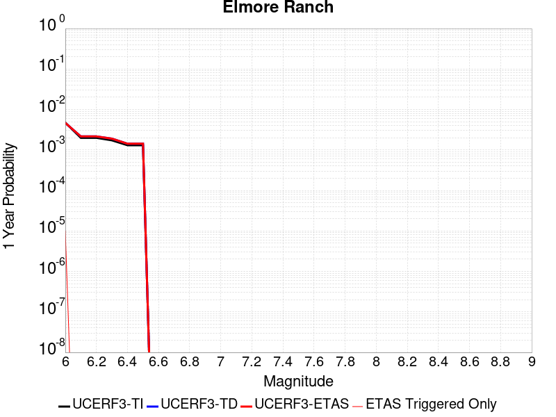 | 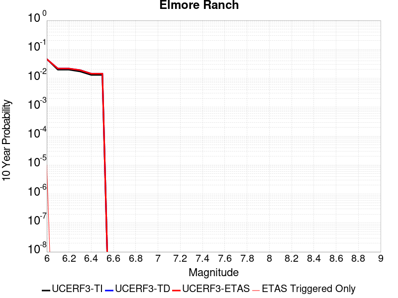 |

| Magnitude | 1 wk TI Prob | 1 wk TD Prob | 1 wk ETAS Prob | 1 wk ETAS/TD Gain | 1 wk ETAS Triggered Only | 1 mo TI Prob | 1 mo TD Prob | 1 mo ETAS Prob | 1 mo ETAS/TD Gain | 1 mo ETAS Triggered Only | 1 yr TI Prob | 1 yr TD Prob | 1 yr ETAS Prob | 1 yr ETAS/TD Gain | 1 yr ETAS Triggered Only | 10 yr TI Prob | 10 yr TD Prob | 10 yr ETAS Prob | 10 yr ETAS/TD Gain | 10 yr ETAS Triggered Only |
|-----|-----|-----|-----|-----|-----|-----|-----|-----|-----|-----|-----|-----|-----|-----|-----|-----|-----|-----|-----|-----|
| 6.0 | 9.102099E-5 | 8.952015E-5 | 8.952015E-5 | 1.0 | 0.0 | 3.9003167E-4 | 3.8361453E-4 | 3.8361453E-4 | 1.0 | 0.0 | 0.0047383 | 0.004662009 | 0.004688551 | 1.0056933 | 2.6666667E-5 | 0.046385348 | 0.045870975 | 0.04589642 | 1.0005547 | 2.6666667E-5 |
| 6.1 | 3.8306698E-5 | 4.1498504E-5 | 4.1498504E-5 | 1.0 | 0.0 | 1.6416123E-4 | 1.7784268E-4 | 1.7784268E-4 | 1.0 | 0.0 | 0.0019968306 | 0.0021631396 | 0.0021631396 | 1.0 | 0.0 | 0.019789828 | 0.021628205 | 0.021628205 | 1.0 | 0.0 |
| 6.2 | 3.8306698E-5 | 4.1498504E-5 | 4.1498504E-5 | 1.0 | 0.0 | 1.6416123E-4 | 1.7784268E-4 | 1.7784268E-4 | 1.0 | 0.0 | 0.0019968306 | 0.0021631396 | 0.0021631396 | 1.0 | 0.0 | 0.019789828 | 0.021628205 | 0.021628205 | 1.0 | 0.0 |
| 6.3 | 3.3197924E-5 | 3.6554302E-5 | 3.6554302E-5 | 1.0 | 0.0 | 1.4226905E-4 | 1.5665586E-4 | 1.5665586E-4 | 1.0 | 0.0 | 0.0017307495 | 0.001905917 | 0.001905917 | 1.0 | 0.0 | 0.017173318 | 0.01908996 | 0.01908996 | 1.0 | 0.0 |
| 6.4 | 2.5148964E-5 | 2.7420487E-5 | 2.7420487E-5 | 1.0 | 0.0 | 1.0777682E-4 | 1.17514726E-4 | 1.17514726E-4 | 1.0 | 0.0 | 0.0013113929 | 0.0014304507 | 0.0014304507 | 1.0 | 0.0 | 0.01303681 | 0.014387194 | 0.014387194 | 1.0 | 0.0 |
| 6.5 | 2.5148964E-5 | 2.7420487E-5 | 2.7420487E-5 | 1.0 | 0.0 | 1.0777682E-4 | 1.17514726E-4 | 1.17514726E-4 | 1.0 | 0.0 | 0.0013113929 | 0.0014304507 | 0.0014304507 | 1.0 | 0.0 | 0.01303681 | 0.014387194 | 0.014387194 | 1.0 | 0.0 |

## Malibu Coast (Extension) alt 1
*[(top)](#table-of-contents)*

| 1 Week | 1 Month | 1 Year | 10 Year |
|-----|-----|-----|-----|
|  |  | 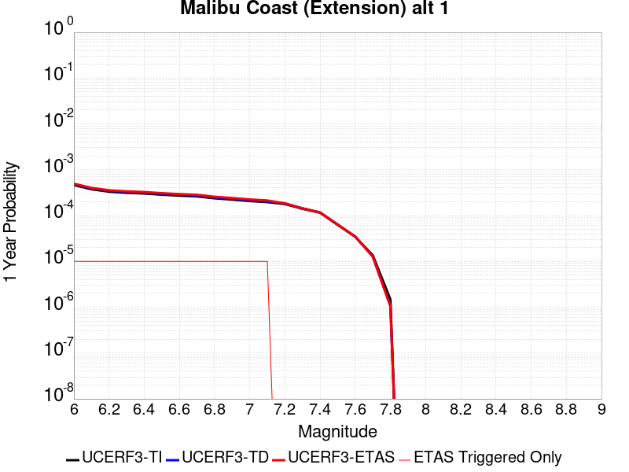 |  |

| Magnitude | 1 wk TI Prob | 1 wk TD Prob | 1 wk ETAS Prob | 1 wk ETAS/TD Gain | 1 wk ETAS Triggered Only | 1 mo TI Prob | 1 mo TD Prob | 1 mo ETAS Prob | 1 mo ETAS/TD Gain | 1 mo ETAS Triggered Only | 1 yr TI Prob | 1 yr TD Prob | 1 yr ETAS Prob | 1 yr ETAS/TD Gain | 1 yr ETAS Triggered Only | 10 yr TI Prob | 10 yr TD Prob | 10 yr ETAS Prob | 10 yr ETAS/TD Gain | 10 yr ETAS Triggered Only |
|-----|-----|-----|-----|-----|-----|-----|-----|-----|-----|-----|-----|-----|-----|-----|-----|-----|-----|-----|-----|-----|
| 6.0 | 8.930738E-6 | 9.329276E-6 | 9.329276E-6 | 1.0 | 0.0 | 3.827403E-5 | 3.998201E-5 | 3.998201E-5 | 1.0 | 0.0 | 4.6588664E-4 | 4.8667393E-4 | 5.1332766E-4 | 1.054767 | 2.6666667E-5 | 0.0046491115 | 0.004856264 | 0.0048828013 | 1.0054646 | 2.6666667E-5 |
| 6.1 | 7.199952E-6 | 7.5302964E-6 | 7.5302964E-6 | 1.0 | 0.0 | 3.0856572E-5 | 3.2272303E-5 | 3.2272303E-5 | 1.0 | 0.0 | 3.75614E-4 | 3.9284505E-4 | 4.1950124E-4 | 1.0678542 | 2.6666667E-5 | 0.0037497976 | 0.003921572 | 0.0039481344 | 1.0067734 | 2.6666667E-5 |
| 6.2 | 6.3721413E-6 | 6.6667917E-6 | 6.6667917E-6 | 1.0 | 0.0 | 2.7308892E-5 | 2.8571652E-5 | 2.8571652E-5 | 1.0 | 0.0 | 3.3243504E-4 | 3.4780471E-4 | 3.744621E-4 | 1.0766447 | 2.6666667E-5 | 0.0033193815 | 0.0034726437 | 0.0034992178 | 1.0076524 | 2.6666667E-5 |
| 6.3 | 6.016345E-6 | 6.295158E-6 | 6.295158E-6 | 1.0 | 0.0 | 2.578408E-5 | 2.6978973E-5 | 2.6978973E-5 | 1.0 | 0.0 | 3.1387596E-4 | 3.2841982E-4 | 3.550777E-4 | 1.0811702 | 2.6666667E-5 | 0.00313433 | 0.0032793807 | 0.00330596 | 1.0081049 | 2.6666667E-5 |
| 6.4 | 5.8104883E-6 | 6.0795446E-6 | 6.0795446E-6 | 1.0 | 0.0 | 2.4901856E-5 | 2.6054933E-5 | 2.6054933E-5 | 1.0 | 0.0 | 3.031379E-4 | 3.1717293E-4 | 3.4383114E-4 | 1.0840495 | 2.6666667E-5 | 0.0030272473 | 0.0031672374 | 0.0031938194 | 1.0083928 | 2.6666667E-5 |
| 6.5 | 5.476925E-6 | 5.7275133E-6 | 5.7275133E-6 | 1.0 | 0.0 | 2.3472323E-5 | 2.4546256E-5 | 2.4546256E-5 | 1.0 | 0.0 | 2.8573806E-4 | 2.9880996E-4 | 3.2546866E-4 | 1.0892162 | 2.6666667E-5 | 0.0028537093 | 0.002984114 | 0.003010701 | 1.0089096 | 2.6666667E-5 |
| 6.6 | 5.222387E-6 | 5.45858E-6 | 5.45858E-6 | 1.0 | 0.0 | 2.2381464E-5 | 2.3393704E-5 | 2.3393704E-5 | 1.0 | 0.0 | 2.7246025E-4 | 2.8478142E-4 | 3.114405E-4 | 1.0936124 | 2.6666667E-5 | 0.0027212645 | 0.0028441956 | 0.0028707862 | 1.0093491 | 2.6666667E-5 |
| 6.7 | 5.0337076E-6 | 5.259103E-6 | 5.259103E-6 | 1.0 | 0.0 | 2.1572854E-5 | 2.253882E-5 | 2.253882E-5 | 1.0 | 0.0 | 2.6261783E-4 | 2.7437587E-4 | 3.010352E-4 | 1.0971636 | 2.6666667E-5 | 0.002623077 | 0.002740401 | 0.0027669948 | 1.0097042 | 2.6666667E-5 |
| 6.8 | 4.5675624E-6 | 4.7587164E-6 | 4.7587164E-6 | 1.0 | 0.0 | 1.9575122E-5 | 2.039434E-5 | 2.039434E-5 | 1.0 | 0.0 | 2.3830103E-4 | 2.48273E-4 | 2.7493303E-4 | 1.1073819 | 2.6666667E-5 | 0.0023804565 | 0.002479976 | 0.0025065765 | 1.0107261 | 2.6666667E-5 |
| 6.9 | 4.2802412E-6 | 4.4520207E-6 | 4.4520207E-6 | 1.0 | 0.0 | 1.8343762E-5 | 1.907995E-5 | 1.907995E-5 | 1.0 | 0.0 | 2.2331243E-4 | 2.3227377E-4 | 2.5893425E-4 | 1.1147804 | 2.6666667E-5 | 0.0022308815 | 0.0023203269 | 0.0023469315 | 1.011466 | 2.6666667E-5 |
| 7.0 | 3.9794063E-6 | 4.130099E-6 | 4.130099E-6 | 1.0 | 0.0 | 1.7054486E-5 | 1.7700306E-5 | 1.7700306E-5 | 1.0 | 0.0 | 2.0761859E-4 | 2.1548003E-4 | 2.4214096E-4 | 1.123728 | 2.6666667E-5 | 0.0020742472 | 0.0021527244 | 0.0021793337 | 1.0123607 | 2.6666667E-5 |
| 7.1 | 3.7730424E-6 | 3.911217E-6 | 3.911217E-6 | 1.0 | 0.0 | 1.6170083E-5 | 1.6762251E-5 | 1.6762251E-5 | 1.0 | 0.0 | 1.9685295E-4 | 2.0406142E-4 | 2.3072265E-4 | 1.1306529 | 2.6666667E-5 | 0.0019667868 | 0.0020387534 | 0.0020653657 | 1.0130532 | 2.6666667E-5 |
| 7.2 | 3.424985E-6 | 3.541337E-6 | 3.541337E-6 | 1.0 | 0.0 | 1.4678424E-5 | 1.5177071E-5 | 1.5177071E-5 | 1.0 | 0.0 | 1.7869516E-4 | 1.8476529E-4 | 1.8476529E-4 | 1.0 | 0.0 | 0.0017855153 | 0.0018461287 | 0.0018461287 | 1.0 | 0.0 |
| 7.3 | 2.6966375E-6 | 2.7596534E-6 | 2.7596534E-6 | 1.0 | 0.0 | 1.15569665E-5 | 1.1827032E-5 | 1.1827032E-5 | 1.0 | 0.0 | 1.4069698E-4 | 1.4398464E-4 | 1.4398464E-4 | 1.0 | 0.0 | 0.0014060794 | 0.0014389176 | 0.0014389176 | 1.0 | 0.0 |
| 7.4 | 2.215957E-6 | 2.249378E-6 | 2.249378E-6 | 1.0 | 0.0 | 9.496924E-6 | 9.640156E-6 | 9.640156E-6 | 1.0 | 0.0 | 1.1561892E-4 | 1.17362615E-4 | 1.17362615E-4 | 1.0 | 0.0 | 0.0011555878 | 0.0011730101 | 0.0011730101 | 1.0 | 0.0 |
| 7.5 | 1.2040218E-6 | 1.2219067E-6 | 1.2219067E-6 | 1.0 | 0.0 | 5.160083E-6 | 5.2367322E-6 | 5.2367322E-6 | 1.0 | 0.0 | 6.2822204E-5 | 6.375537E-5 | 6.375537E-5 | 1.0 | 0.0 | 6.280445E-4 | 6.3737266E-4 | 6.3737266E-4 | 1.0 | 0.0 |
| 7.6 | 6.6157446E-7 | 6.678975E-7 | 6.678975E-7 | 1.0 | 0.0 | 2.835316E-6 | 2.8624147E-6 | 2.8624147E-6 | 1.0 | 0.0 | 3.4519428E-5 | 3.484936E-5 | 3.484936E-5 | 1.0 | 0.0 | 3.4514067E-4 | 3.4844046E-4 | 3.4844046E-4 | 1.0 | 0.0 |
| 7.7 | 2.6012302E-7 | 2.4357593E-7 | 2.4357593E-7 | 1.0 | 0.0 | 1.1148124E-6 | 1.0438964E-6 | 1.0438964E-6 | 1.0 | 0.0 | 1.3572758E-5 | 1.2709375E-5 | 1.2709375E-5 | 1.0 | 0.0 | 1.3571928E-4 | 1.2708755E-4 | 1.2708755E-4 | 1.0 | 0.0 |
| 7.8 | 2.8323132E-8 | 2.0266649E-8 | 2.0266649E-8 | 1.0 | 0.0 | 1.2138484E-7 | 8.685707E-8 | 8.685707E-8 | 1.0 | 0.0 | 1.4778595E-6 | 1.0574844E-6 | 1.0574844E-6 | 1.0 | 0.0 | 1.4778497E-5 | 1.0574801E-5 | 1.0574801E-5 | 1.0 | 0.0 |

## Sargent 2011 CFM
*[(top)](#table-of-contents)*

| 1 Week | 1 Month | 1 Year | 10 Year |
|-----|-----|-----|-----|
|  |  |  |  |

| Magnitude | 1 wk TI Prob | 1 wk TD Prob | 1 wk ETAS Prob | 1 wk ETAS/TD Gain | 1 wk ETAS Triggered Only | 1 mo TI Prob | 1 mo TD Prob | 1 mo ETAS Prob | 1 mo ETAS/TD Gain | 1 mo ETAS Triggered Only | 1 yr TI Prob | 1 yr TD Prob | 1 yr ETAS Prob | 1 yr ETAS/TD Gain | 1 yr ETAS Triggered Only | 10 yr TI Prob | 10 yr TD Prob | 10 yr ETAS Prob | 10 yr ETAS/TD Gain | 10 yr ETAS Triggered Only |
|-----|-----|-----|-----|-----|-----|-----|-----|-----|-----|-----|-----|-----|-----|-----|-----|-----|-----|-----|-----|-----|
| 6.0 | 3.7327867E-5 | 3.664913E-5 | 3.664913E-5 | 1.0 | 0.0 | 1.5996677E-4 | 1.5706103E-4 | 1.5706103E-4 | 1.0 | 0.0 | 0.0019458556 | 0.0019110236 | 0.0019110236 | 1.0 | 0.0 | 0.01928905 | 0.019018095 | 0.019044254 | 1.0013756 | 2.6666667E-5 |
| 6.1 | 2.3771476E-5 | 1.8479273E-5 | 1.8479273E-5 | 1.0 | 0.0 | 1.01873775E-4 | 7.919498E-5 | 7.919498E-5 | 1.0 | 0.0 | 0.0012396075 | 9.638493E-4 | 9.638493E-4 | 1.0 | 0.0 | 0.012327154 | 0.009636091 | 0.009636091 | 1.0 | 0.0 |
| 6.2 | 2.3112721E-5 | 1.7710632E-5 | 1.7710632E-5 | 1.0 | 0.0 | 9.9050754E-5 | 7.590099E-5 | 7.590099E-5 | 1.0 | 0.0 | 0.0012052758 | 9.237792E-4 | 9.237792E-4 | 1.0 | 0.0 | 0.011987597 | 0.009238743 | 0.009238743 | 1.0 | 0.0 |
| 6.3 | 1.728509E-5 | 1.0458927E-5 | 1.0458927E-5 | 1.0 | 0.0 | 7.407686E-5 | 4.482347E-5 | 4.482347E-5 | 1.0 | 0.0 | 9.015125E-4 | 5.456343E-4 | 5.456343E-4 | 1.0 | 0.0 | 0.008978641 | 0.0054791216 | 0.0054791216 | 1.0 | 0.0 |
| 6.4 | 1.48395575E-5 | 7.4559816E-6 | 7.4559816E-6 | 1.0 | 0.0 | 6.3596555E-5 | 3.195403E-5 | 3.195403E-5 | 1.0 | 0.0 | 7.7401294E-4 | 3.8900663E-4 | 3.8900663E-4 | 1.0 | 0.0 | 0.0077132257 | 0.003918666 | 0.003918666 | 1.0 | 0.0 |
| 6.5 | 1.4358964E-5 | 6.894759E-6 | 6.894759E-6 | 1.0 | 0.0 | 6.1536964E-5 | 2.9548846E-5 | 2.9548846E-5 | 1.0 | 0.0 | 7.48955E-4 | 3.5973339E-4 | 3.5973339E-4 | 1.0 | 0.0 | 0.0074643586 | 0.0036269152 | 0.0036269152 | 1.0 | 0.0 |
| 6.6 | 9.772591E-6 | 1.3736154E-6 | 1.3736154E-6 | 1.0 | 0.0 | 4.188186E-5 | 5.88691E-6 | 5.88691E-6 | 1.0 | 0.0 | 5.097923E-4 | 7.16708E-5 | 7.16708E-5 | 1.0 | 0.0 | 0.005086244 | 7.483097E-4 | 7.483097E-4 | 1.0 | 0.0 |
| 6.7 | 9.752745E-6 | 1.3523068E-6 | 1.3523068E-6 | 1.0 | 0.0 | 4.179681E-5 | 5.795587E-6 | 5.795587E-6 | 1.0 | 0.0 | 5.0875737E-4 | 7.055902E-5 | 7.055902E-5 | 1.0 | 0.0 | 0.005075942 | 7.371994E-4 | 7.371994E-4 | 1.0 | 0.0 |
| 6.8 | 9.608213E-6 | 1.2361709E-6 | 1.2361709E-6 | 1.0 | 0.0 | 4.1177405E-5 | 5.2978644E-6 | 5.2978644E-6 | 1.0 | 0.0 | 5.012196E-4 | 6.449961E-5 | 6.449961E-5 | 1.0 | 0.0 | 0.005000906 | 6.7634037E-4 | 6.7634037E-4 | 1.0 | 0.0 |
| 6.9 | 9.427164E-6 | 1.12094E-6 | 1.12094E-6 | 1.0 | 0.0 | 4.04015E-5 | 4.80402E-6 | 4.80402E-6 | 1.0 | 0.0 | 4.9177726E-4 | 5.8487396E-5 | 5.8487396E-5 | 1.0 | 0.0 | 0.004906904 | 6.1557174E-4 | 6.1557174E-4 | 1.0 | 0.0 |
| 7.0 | 9.247601E-6 | 9.873988E-7 | 9.873988E-7 | 1.0 | 0.0 | 3.9631974E-5 | 4.2317024E-6 | 4.2317024E-6 | 1.0 | 0.0 | 4.8241246E-4 | 5.1519775E-5 | 5.1519775E-5 | 1.0 | 0.0 | 0.0048136655 | 5.4542476E-4 | 5.4542476E-4 | 1.0 | 0.0 |
| 7.1 | 8.995454E-6 | 8.2711284E-7 | 8.2711284E-7 | 1.0 | 0.0 | 3.8551374E-5 | 3.5447645E-6 | 3.5447645E-6 | 1.0 | 0.0 | 4.6926187E-4 | 4.3156666E-5 | 4.3156666E-5 | 1.0 | 0.0 | 0.004682722 | 4.609069E-4 | 4.609069E-4 | 1.0 | 0.0 |
| 7.2 | 8.520861E-6 | 5.2766507E-7 | 5.2766507E-7 | 1.0 | 0.0 | 3.6517464E-5 | 2.2614197E-6 | 2.2614197E-6 | 1.0 | 0.0 | 4.445094E-4 | 2.7532446E-5 | 2.7532446E-5 | 1.0 | 0.0 | 0.004436213 | 3.0297207E-4 | 3.0297207E-4 | 1.0 | 0.0 |
| 7.3 | 8.043592E-6 | 3.456507E-7 | 3.456507E-7 | 1.0 | 0.0 | 3.4472083E-5 | 1.4813593E-6 | 1.4813593E-6 | 1.0 | 0.0 | 4.196168E-4 | 1.8035402E-5 | 1.8035402E-5 | 1.0 | 0.0 | 0.004188253 | 2.0669671E-4 | 2.0669671E-4 | 1.0 | 0.0 |
| 7.4 | 7.662316E-6 | 2.928958E-7 | 2.928958E-7 | 1.0 | 0.0 | 3.2838085E-5 | 1.2552671E-6 | 1.2552671E-6 | 1.0 | 0.0 | 3.9973034E-4 | 1.528277E-5 | 1.528277E-5 | 1.0 | 0.0 | 0.0039901207 | 1.7736501E-4 | 1.7736501E-4 | 1.0 | 0.0 |
| 7.5 | 6.961638E-6 | 2.3574503E-7 | 2.3574503E-7 | 1.0 | 0.0 | 2.9835252E-5 | 1.0103355E-6 | 1.0103355E-6 | 1.0 | 0.0 | 3.6318362E-4 | 1.2300766E-5 | 1.2300766E-5 | 1.0 | 0.0 | 0.0036259065 | 1.4409334E-4 | 1.4409334E-4 | 1.0 | 0.0 |
| 7.6 | 6.282332E-6 | 1.6892966E-7 | 1.6892966E-7 | 1.0 | 0.0 | 2.6924003E-5 | 7.2398404E-7 | 7.2398404E-7 | 1.0 | 0.0 | 3.2775043E-4 | 8.814471E-6 | 8.814471E-6 | 1.0 | 0.0 | 0.0032726745 | 1.05050465E-4 | 1.05050465E-4 | 1.0 | 0.0 |
| 7.7 | 4.934408E-6 | 5.001089E-8 | 5.001089E-8 | 1.0 | 0.0 | 2.114729E-5 | 2.1433237E-7 | 2.1433237E-7 | 1.0 | 0.0 | 2.5743784E-4 | 2.6094935E-6 | 2.6094935E-6 | 1.0 | 0.0 | 0.0025713982 | 3.2545366E-5 | 3.2545366E-5 | 1.0 | 0.0 |
| 7.8 | 2.373212E-6 | 3.5172643E-8 | 3.5172643E-8 | 1.0 | 0.0 | 1.0170869E-5 | 1.507399E-7 | 1.507399E-7 | 1.0 | 0.0 | 1.238233E-4 | 1.8352566E-6 | 1.8352566E-6 | 1.0 | 0.0 | 0.0012375432 | 2.4125171E-5 | 2.4125171E-5 | 1.0 | 0.0 |
| 7.9 | 1.8227792E-6 | 3.0619603E-8 | 3.0619603E-8 | 1.0 | 0.0 | 7.811887E-6 | 1.3122687E-7 | 1.3122687E-7 | 1.0 | 0.0 | 9.510558E-5 | 1.5976858E-6 | 1.5976858E-6 | 1.0 | 0.0 | 9.5064886E-4 | 2.1410624E-5 | 2.1410624E-5 | 1.0 | 0.0 |
| 8.0 | 1.9095137E-7 | 1.326461E-8 | 1.326461E-8 | 1.0 | 0.0 | 8.1836276E-7 | 5.684833E-8 | 5.684833E-8 | 1.0 | 0.0 | 9.963521E-6 | 6.921282E-7 | 6.921282E-7 | 1.0 | 0.0 | 9.963074E-5 | 8.463319E-6 | 8.463319E-6 | 1.0 | 0.0 |

## Elsinore (Stepovers Combined)
*[(top)](#table-of-contents)*

| 1 Week | 1 Month | 1 Year | 10 Year |
|-----|-----|-----|-----|
| 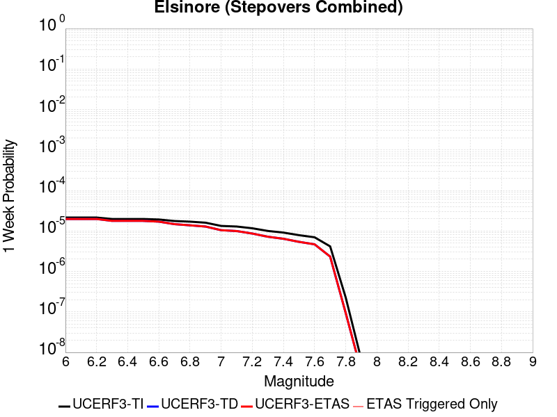 |  |  |  |

| Magnitude | 1 wk TI Prob | 1 wk TD Prob | 1 wk ETAS Prob | 1 wk ETAS/TD Gain | 1 wk ETAS Triggered Only | 1 mo TI Prob | 1 mo TD Prob | 1 mo ETAS Prob | 1 mo ETAS/TD Gain | 1 mo ETAS Triggered Only | 1 yr TI Prob | 1 yr TD Prob | 1 yr ETAS Prob | 1 yr ETAS/TD Gain | 1 yr ETAS Triggered Only | 10 yr TI Prob | 10 yr TD Prob | 10 yr ETAS Prob | 10 yr ETAS/TD Gain | 10 yr ETAS Triggered Only |
|-----|-----|-----|-----|-----|-----|-----|-----|-----|-----|-----|-----|-----|-----|-----|-----|-----|-----|-----|-----|-----|
| 6.0 | 2.144392E-5 | 1.9760193E-5 | 1.9760193E-5 | 1.0 | 0.0 | 9.189928E-5 | 8.468392E-5 | 1.1134832E-4 | 1.3148698 | 2.6666667E-5 | 0.0011182994 | 0.0010305607 | 0.0010571999 | 1.0258492 | 2.6666667E-5 | 0.011126885 | 0.010264917 | 0.01029131 | 1.0025712 | 2.6666667E-5 |
| 6.1 | 2.144392E-5 | 1.9760193E-5 | 1.9760193E-5 | 1.0 | 0.0 | 9.189928E-5 | 8.468392E-5 | 1.1134832E-4 | 1.3148698 | 2.6666667E-5 | 0.0011182994 | 0.0010305607 | 0.0010571999 | 1.0258492 | 2.6666667E-5 | 0.011126885 | 0.010264917 | 0.01029131 | 1.0025712 | 2.6666667E-5 |
| 6.2 | 2.144392E-5 | 1.9760193E-5 | 1.9760193E-5 | 1.0 | 0.0 | 9.189928E-5 | 8.468392E-5 | 1.1134832E-4 | 1.3148698 | 2.6666667E-5 | 0.0011182994 | 0.0010305607 | 0.0010571999 | 1.0258492 | 2.6666667E-5 | 0.011126885 | 0.010264917 | 0.01029131 | 1.0025712 | 2.6666667E-5 |
| 6.3 | 1.9751555E-5 | 1.7741453E-5 | 1.7741453E-5 | 1.0 | 0.0 | 8.4646774E-5 | 7.603267E-5 | 1.0269731E-4 | 1.3506998 | 2.6666667E-5 | 0.0010300872 | 9.253213E-4 | 9.519633E-4 | 1.0287921 | 2.6666667E-5 | 0.010253254 | 0.009221276 | 0.009247697 | 1.0028652 | 2.6666667E-5 |
| 6.4 | 1.9751555E-5 | 1.7741453E-5 | 1.7741453E-5 | 1.0 | 0.0 | 8.4646774E-5 | 7.603267E-5 | 1.0269731E-4 | 1.3506998 | 2.6666667E-5 | 0.0010300872 | 9.253213E-4 | 9.519633E-4 | 1.0287921 | 2.6666667E-5 | 0.010253254 | 0.009221276 | 0.009247697 | 1.0028652 | 2.6666667E-5 |
| 6.5 | 1.9751555E-5 | 1.7741453E-5 | 1.7741453E-5 | 1.0 | 0.0 | 8.4646774E-5 | 7.603267E-5 | 1.0269731E-4 | 1.3506998 | 2.6666667E-5 | 0.0010300872 | 9.253213E-4 | 9.519633E-4 | 1.0287921 | 2.6666667E-5 | 0.010253254 | 0.009221276 | 0.009247697 | 1.0028652 | 2.6666667E-5 |
| 6.6 | 1.9188685E-5 | 1.7003393E-5 | 1.7003393E-5 | 1.0 | 0.0 | 8.2234634E-5 | 7.286974E-5 | 9.953446E-5 | 1.3659232 | 2.6666667E-5 | 0.0010007467 | 8.868442E-4 | 9.1348717E-4 | 1.0300425 | 2.6666667E-5 | 0.00996252 | 0.0088398475 | 0.008866278 | 1.00299 | 2.6666667E-5 |
| 6.7 | 1.7608272E-5 | 1.4732616E-5 | 1.4732616E-5 | 1.0 | 0.0 | 7.546184E-5 | 6.3138315E-5 | 8.9803296E-5 | 1.4223266 | 2.6666667E-5 | 9.183606E-4 | 7.684476E-4 | 7.950938E-4 | 1.0346754 | 2.6666667E-5 | 0.009145746 | 0.00766491 | 0.007691372 | 1.0034524 | 2.6666667E-5 |
| 6.8 | 1.697165E-5 | 1.3783365E-5 | 1.3783365E-5 | 1.0 | 0.0 | 7.273361E-5 | 5.9070277E-5 | 8.5735366E-5 | 1.451413 | 2.6666667E-5 | 8.8517193E-4 | 7.18952E-4 | 7.4559945E-4 | 1.0370643 | 2.6666667E-5 | 0.008816543 | 0.007172675 | 0.0071991505 | 1.0036912 | 2.6666667E-5 |
| 6.9 | 1.600365E-5 | 1.2846671E-5 | 1.2846671E-5 | 1.0 | 0.0 | 6.858527E-5 | 5.5056043E-5 | 8.172124E-5 | 1.4843283 | 2.6666667E-5 | 8.347058E-4 | 6.7010894E-4 | 6.9675775E-4 | 1.0397679 | 2.6666667E-5 | 0.008315775 | 0.0066867657 | 0.0067132544 | 1.0039613 | 2.6666667E-5 |
| 7.0 | 1.3314581E-5 | 1.0447548E-5 | 1.0447548E-5 | 1.0 | 0.0 | 5.7061243E-5 | 4.4774453E-5 | 7.143993E-5 | 1.595551 | 2.6666667E-5 | 6.944992E-4 | 5.449953E-4 | 5.716475E-4 | 1.0489035 | 2.6666667E-5 | 0.006923327 | 0.0054405155 | 0.0054670367 | 1.0048748 | 2.6666667E-5 |
| 7.1 | 1.2865345E-5 | 9.937536E-6 | 9.937536E-6 | 1.0 | 0.0 | 5.5136024E-5 | 4.258876E-5 | 6.925429E-5 | 1.6261166 | 2.6666667E-5 | 6.710743E-4 | 5.183973E-4 | 5.4505013E-4 | 1.0514139 | 2.6666667E-5 | 0.0066905143 | 0.0051752133 | 0.005201742 | 1.0051261 | 2.6666667E-5 |
| 7.2 | 1.1650051E-5 | 8.633809E-6 | 8.633809E-6 | 1.0 | 0.0 | 4.9927836E-5 | 3.7001522E-5 | 6.3667205E-5 | 1.7206644 | 2.6666667E-5 | 6.0770183E-4 | 4.504022E-4 | 4.7705686E-4 | 1.0591797 | 2.6666667E-5 | 0.0060604266 | 0.0044963174 | 0.004522864 | 1.0059041 | 2.6666667E-5 |
| 7.3 | 1.0008533E-5 | 7.2010425E-6 | 7.2010425E-6 | 1.0 | 0.0 | 4.2893007E-5 | 3.0861254E-5 | 5.7527097E-5 | 1.8640558 | 2.6666667E-5 | 5.220972E-4 | 3.7567242E-4 | 4.0232908E-4 | 1.0709572 | 2.6666667E-5 | 0.005208723 | 0.003750761 | 0.0037773275 | 1.007083 | 2.6666667E-5 |
| 7.4 | 9.116759E-6 | 6.410068E-6 | 6.410068E-6 | 1.0 | 0.0 | 3.907124E-5 | 2.747144E-5 | 5.4137374E-5 | 1.9706784 | 2.6666667E-5 | 4.7558855E-4 | 3.3441483E-4 | 3.6107257E-4 | 1.0797147 | 2.6666667E-5 | 0.00474572 | 0.0033392678 | 0.0033658454 | 1.0079591 | 2.6666667E-5 |
| 7.5 | 7.870524E-6 | 5.3825365E-6 | 5.3825365E-6 | 1.0 | 0.0 | 3.3730383E-5 | 2.3067816E-5 | 4.973387E-5 | 2.155985 | 2.6666667E-5 | 4.1059E-4 | 2.8081573E-4 | 3.0747493E-4 | 1.0949348 | 2.6666667E-5 | 0.0040983222 | 0.0028047354 | 0.0028313275 | 1.0094811 | 2.6666667E-5 |
| 7.6 | 6.9774537E-6 | 4.6776067E-6 | 4.6776067E-6 | 1.0 | 0.0 | 2.990303E-5 | 2.0046738E-5 | 4.671287E-5 | 2.330198 | 2.6666667E-5 | 3.640086E-4 | 2.4404288E-4 | 2.7070305E-4 | 1.1092438 | 2.6666667E-5 | 0.003634129 | 0.0024378651 | 0.0024644667 | 1.0109118 | 2.6666667E-5 |
| 7.7 | 4.1616954E-6 | 2.32834E-6 | 2.32834E-6 | 1.0 | 0.0 | 1.7835715E-5 | 9.978567E-6 | 9.978567E-6 | 1.0 | 0.0 | 2.171282E-4 | 1.2148302E-4 | 1.2148302E-4 | 1.0 | 0.0 | 0.0021691616 | 0.0012142392 | 0.0012142392 | 1.0 | 0.0 |
| 7.8 | 2.2692414E-7 | 9.3854695E-8 | 9.3854695E-8 | 1.0 | 0.0 | 9.725317E-7 | 4.0223435E-7 | 4.0223435E-7 | 1.0 | 0.0 | 1.1840509E-5 | 4.8971956E-6 | 4.8971956E-6 | 1.0 | 0.0 | 1.1839878E-4 | 4.8971204E-5 | 4.8971204E-5 | 1.0 | 0.0 |
| 7.9 | 6.676829E-9 | 3.439853E-9 | 3.439853E-9 | 1.0 | 0.0 | 2.861498E-8 | 1.4742227E-8 | 1.4742227E-8 | 1.0 | 0.0 | 3.4838732E-7 | 1.7948659E-7 | 1.7948659E-7 | 1.0 | 0.0 | 3.4838679E-6 | 1.7948646E-6 | 1.7948646E-6 | 1.0 | 0.0 |

## Raymond
*[(top)](#table-of-contents)*

| 1 Week | 1 Month | 1 Year | 10 Year |
|-----|-----|-----|-----|
| 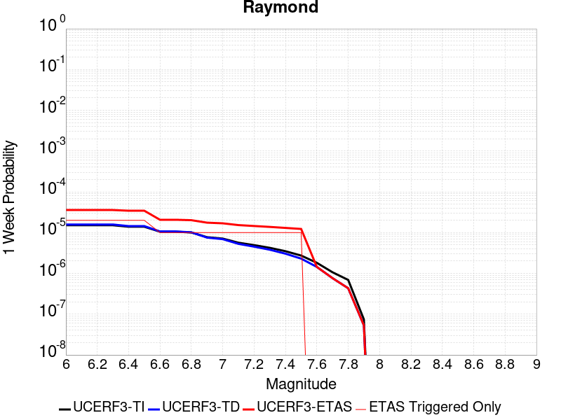 | 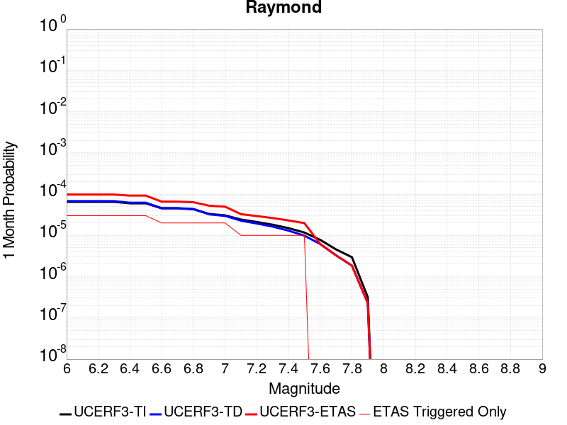 |  |  |

| Magnitude | 1 wk TI Prob | 1 wk TD Prob | 1 wk ETAS Prob | 1 wk ETAS/TD Gain | 1 wk ETAS Triggered Only | 1 mo TI Prob | 1 mo TD Prob | 1 mo ETAS Prob | 1 mo ETAS/TD Gain | 1 mo ETAS Triggered Only | 1 yr TI Prob | 1 yr TD Prob | 1 yr ETAS Prob | 1 yr ETAS/TD Gain | 1 yr ETAS Triggered Only | 10 yr TI Prob | 10 yr TD Prob | 10 yr ETAS Prob | 10 yr ETAS/TD Gain | 10 yr ETAS Triggered Only |
|-----|-----|-----|-----|-----|-----|-----|-----|-----|-----|-----|-----|-----|-----|-----|-----|-----|-----|-----|-----|-----|
| 6.0 | 1.5157413E-5 | 1.5810128E-5 | 1.5810128E-5 | 1.0 | 0.0 | 6.4958724E-5 | 6.7756075E-5 | 6.7756075E-5 | 1.0 | 0.0 | 7.905855E-4 | 8.2464307E-4 | 8.2464307E-4 | 1.0 | 0.0 | 0.007877788 | 0.008218348 | 0.008244796 | 1.003218 | 2.6666667E-5 |
| 6.1 | 1.5157413E-5 | 1.5810128E-5 | 1.5810128E-5 | 1.0 | 0.0 | 6.4958724E-5 | 6.7756075E-5 | 6.7756075E-5 | 1.0 | 0.0 | 7.905855E-4 | 8.2464307E-4 | 8.2464307E-4 | 1.0 | 0.0 | 0.007877788 | 0.008218348 | 0.008244796 | 1.003218 | 2.6666667E-5 |
| 6.2 | 1.5157413E-5 | 1.5810128E-5 | 1.5810128E-5 | 1.0 | 0.0 | 6.4958724E-5 | 6.7756075E-5 | 6.7756075E-5 | 1.0 | 0.0 | 7.905855E-4 | 8.2464307E-4 | 8.2464307E-4 | 1.0 | 0.0 | 0.007877788 | 0.008218348 | 0.008244796 | 1.003218 | 2.6666667E-5 |
| 6.3 | 1.5157413E-5 | 1.5810128E-5 | 1.5810128E-5 | 1.0 | 0.0 | 6.4958724E-5 | 6.7756075E-5 | 6.7756075E-5 | 1.0 | 0.0 | 7.905855E-4 | 8.2464307E-4 | 8.2464307E-4 | 1.0 | 0.0 | 0.007877788 | 0.008218348 | 0.008244796 | 1.003218 | 2.6666667E-5 |
| 6.4 | 1.3941944E-5 | 1.445469E-5 | 1.445469E-5 | 1.0 | 0.0 | 5.9749822E-5 | 6.1947336E-5 | 6.1947336E-5 | 1.0 | 0.0 | 7.2721124E-4 | 7.5397117E-4 | 7.5397117E-4 | 1.0 | 0.0 | 0.007248361 | 0.0075164647 | 0.007542931 | 1.0035211 | 2.6666667E-5 |
| 6.5 | 1.3941944E-5 | 1.445469E-5 | 1.445469E-5 | 1.0 | 0.0 | 5.9749822E-5 | 6.1947336E-5 | 6.1947336E-5 | 1.0 | 0.0 | 7.2721124E-4 | 7.5397117E-4 | 7.5397117E-4 | 1.0 | 0.0 | 0.007248361 | 0.0075164647 | 0.007542931 | 1.0035211 | 2.6666667E-5 |
| 6.6 | 1.0542609E-5 | 1.0671113E-5 | 1.0671113E-5 | 1.0 | 0.0 | 4.5181827E-5 | 4.573257E-5 | 4.573257E-5 | 1.0 | 0.0 | 5.499499E-4 | 5.5665727E-4 | 5.5665727E-4 | 1.0 | 0.0 | 0.005485909 | 0.00555319 | 0.0055797086 | 1.0047754 | 2.6666667E-5 |
| 6.7 | 1.0542609E-5 | 1.0671113E-5 | 1.0671113E-5 | 1.0 | 0.0 | 4.5181827E-5 | 4.573257E-5 | 4.573257E-5 | 1.0 | 0.0 | 5.499499E-4 | 5.5665727E-4 | 5.5665727E-4 | 1.0 | 0.0 | 0.005485909 | 0.00555319 | 0.0055797086 | 1.0047754 | 2.6666667E-5 |
| 6.8 | 1.0079132E-5 | 1.0176646E-5 | 1.0176646E-5 | 1.0 | 0.0 | 4.3195567E-5 | 4.3613498E-5 | 4.3613498E-5 | 1.0 | 0.0 | 5.257791E-4 | 5.3087034E-4 | 5.3087034E-4 | 1.0 | 0.0 | 0.0052453685 | 0.005296571 | 0.005296571 | 1.0 | 0.0 |
| 6.9 | 7.721598E-6 | 7.5489047E-6 | 7.5489047E-6 | 1.0 | 0.0 | 3.3092143E-5 | 3.2352054E-5 | 3.2352054E-5 | 1.0 | 0.0 | 4.0282236E-4 | 3.9381627E-4 | 3.9381627E-4 | 1.0 | 0.0 | 0.0040209293 | 0.0039313175 | 0.0039313175 | 1.0 | 0.0 |
| 7.0 | 7.137566E-6 | 6.9113057E-6 | 6.9113057E-6 | 1.0 | 0.0 | 3.058921E-5 | 2.961955E-5 | 2.961955E-5 | 1.0 | 0.0 | 3.7236E-4 | 3.6055944E-4 | 3.6055944E-4 | 1.0 | 0.0 | 0.0037173668 | 0.0035998628 | 0.0035998628 | 1.0 | 0.0 |
| 7.1 | 5.654976E-6 | 5.29954E-6 | 5.29954E-6 | 1.0 | 0.0 | 2.4235387E-5 | 2.2712118E-5 | 2.2712118E-5 | 1.0 | 0.0 | 2.9502588E-4 | 2.7648517E-4 | 2.7648517E-4 | 1.0 | 0.0 | 0.0029463451 | 0.002761443 | 0.002761443 | 1.0 | 0.0 |
| 7.2 | 4.9358455E-6 | 4.5266574E-6 | 4.5266574E-6 | 1.0 | 0.0 | 2.1153453E-5 | 1.9399817E-5 | 1.9399817E-5 | 1.0 | 0.0 | 2.5751285E-4 | 2.3616731E-4 | 2.3616731E-4 | 1.0 | 0.0 | 0.0025721465 | 0.0023591854 | 0.0023591854 | 1.0 | 0.0 |
| 7.3 | 4.2368597E-6 | 3.8056164E-6 | 3.8056164E-6 | 1.0 | 0.0 | 1.8157843E-5 | 1.6309683E-5 | 1.6309683E-5 | 1.0 | 0.0 | 2.2104931E-4 | 1.9855241E-4 | 1.9855241E-4 | 1.0 | 0.0 | 0.0022082955 | 0.0019837688 | 0.0019837688 | 1.0 | 0.0 |
| 7.4 | 3.4999923E-6 | 3.043744E-6 | 3.043744E-6 | 1.0 | 0.0 | 1.49998805E-5 | 1.3044552E-5 | 1.3044552E-5 | 1.0 | 0.0 | 1.8260824E-4 | 1.5880594E-4 | 1.5880594E-4 | 1.0 | 0.0 | 0.0018245826 | 0.0015869403 | 0.0015869403 | 1.0 | 0.0 |
| 7.5 | 2.738017E-6 | 2.3020468E-6 | 2.3020468E-6 | 1.0 | 0.0 | 1.1734306E-5 | 9.865878E-6 | 9.865878E-6 | 1.0 | 0.0 | 1.428558E-4 | 1.2011051E-4 | 1.2011051E-4 | 1.0 | 0.0 | 0.0014276401 | 0.0012004703 | 0.0012004703 | 1.0 | 0.0 |
| 7.6 | 1.8186392E-6 | 1.442312E-6 | 1.442312E-6 | 1.0 | 0.0 | 7.794145E-6 | 6.181323E-6 | 6.181323E-6 | 1.0 | 0.0 | 9.488958E-5 | 7.5255055E-5 | 7.5255055E-5 | 1.0 | 0.0 | 9.4849075E-4 | 7.523072E-4 | 7.523072E-4 | 1.0 | 0.0 |
| 7.7 | 1.0660348E-6 | 7.6438056E-7 | 7.6438056E-7 | 1.0 | 0.0 | 4.5687125E-6 | 3.2759126E-6 | 3.2759126E-6 | 1.0 | 0.0 | 5.5622655E-5 | 3.9883522E-5 | 3.9883522E-5 | 1.0 | 0.0 | 5.5608735E-4 | 3.9877277E-4 | 3.9877277E-4 | 1.0 | 0.0 |
| 7.8 | 6.913602E-7 | 4.3204133E-7 | 4.3204133E-7 | 1.0 | 0.0 | 2.962969E-6 | 1.8516045E-6 | 1.8516045E-6 | 1.0 | 0.0 | 3.607355E-5 | 2.2543056E-5 | 2.2543056E-5 | 1.0 | 0.0 | 3.6067693E-4 | 2.2541556E-4 | 2.2541556E-4 | 1.0 | 0.0 |
| 7.9 | 7.425201E-8 | 5.3222113E-8 | 5.3222113E-8 | 1.0 | 0.0 | 3.1822285E-7 | 2.2809476E-7 | 2.2809476E-7 | 1.0 | 0.0 | 3.874356E-6 | 2.7770516E-6 | 2.7770516E-6 | 1.0 | 0.0 | 3.8742884E-5 | 2.7770298E-5 | 2.7770298E-5 | 1.0 | 0.0 |

## Likely 2011 CFM
*[(top)](#table-of-contents)*

| 1 Week | 1 Month | 1 Year | 10 Year |
|-----|-----|-----|-----|
|  |  |  |  |

| Magnitude | 1 wk TI Prob | 1 wk TD Prob | 1 wk ETAS Prob | 1 wk ETAS/TD Gain | 1 wk ETAS Triggered Only | 1 mo TI Prob | 1 mo TD Prob | 1 mo ETAS Prob | 1 mo ETAS/TD Gain | 1 mo ETAS Triggered Only | 1 yr TI Prob | 1 yr TD Prob | 1 yr ETAS Prob | 1 yr ETAS/TD Gain | 1 yr ETAS Triggered Only | 10 yr TI Prob | 10 yr TD Prob | 10 yr ETAS Prob | 10 yr ETAS/TD Gain | 10 yr ETAS Triggered Only |
|-----|-----|-----|-----|-----|-----|-----|-----|-----|-----|-----|-----|-----|-----|-----|-----|-----|-----|-----|-----|-----|
| 6.0 | 2.5315949E-5 | 2.7104748E-5 | 2.7104748E-5 | 1.0 | 0.0 | 1.0849241E-4 | 1.16158284E-4 | 1.16158284E-4 | 1.0 | 0.0 | 0.0013200947 | 0.0014133542 | 0.0014399831 | 1.018841 | 2.6666667E-5 | 0.013122803 | 0.01404831 | 0.014074602 | 1.0018716 | 2.6666667E-5 |
| 6.1 | 2.5315949E-5 | 2.7104748E-5 | 2.7104748E-5 | 1.0 | 0.0 | 1.0849241E-4 | 1.16158284E-4 | 1.16158284E-4 | 1.0 | 0.0 | 0.0013200947 | 0.0014133542 | 0.0014399831 | 1.018841 | 2.6666667E-5 | 0.013122803 | 0.01404831 | 0.014074602 | 1.0018716 | 2.6666667E-5 |
| 6.2 | 1.6375941E-5 | 1.7465842E-5 | 1.7465842E-5 | 1.0 | 0.0 | 7.0180715E-5 | 7.485153E-5 | 7.485153E-5 | 1.0 | 0.0 | 8.5411523E-4 | 9.109487E-4 | 9.109487E-4 | 1.0 | 0.0 | 0.008508399 | 0.009073433 | 0.009073433 | 1.0 | 0.0 |
| 6.3 | 1.1945543E-5 | 1.2712587E-5 | 1.2712587E-5 | 1.0 | 0.0 | 5.119418E-5 | 5.4481407E-5 | 5.4481407E-5 | 1.0 | 0.0 | 6.2311086E-4 | 6.631146E-4 | 6.631146E-4 | 1.0 | 0.0 | 0.0062136655 | 0.0066119144 | 0.0066119144 | 1.0 | 0.0 |
| 6.4 | 9.192729E-6 | 9.768488E-6 | 9.768488E-6 | 1.0 | 0.0 | 3.939681E-5 | 4.1864292E-5 | 4.1864292E-5 | 1.0 | 0.0 | 4.7955062E-4 | 5.0958124E-4 | 5.0958124E-4 | 1.0 | 0.0 | 0.004785171 | 0.0050844094 | 0.0050844094 | 1.0 | 0.0 |
| 6.5 | 7.67906E-6 | 8.152622E-6 | 8.152622E-6 | 1.0 | 0.0 | 3.2909844E-5 | 3.4939352E-5 | 3.4939352E-5 | 1.0 | 0.0 | 4.006037E-4 | 4.2530545E-4 | 4.2530545E-4 | 1.0 | 0.0 | 0.0039988225 | 0.004245108 | 0.004245108 | 1.0 | 0.0 |
| 6.6 | 6.4884057E-6 | 6.8847507E-6 | 6.8847507E-6 | 1.0 | 0.0 | 2.7807157E-5 | 2.9505749E-5 | 2.9505749E-5 | 1.0 | 0.0 | 3.3849955E-4 | 3.591747E-4 | 3.591747E-4 | 1.0 | 0.0 | 0.003379844 | 0.0035860867 | 0.0035860867 | 1.0 | 0.0 |
| 6.7 | 4.6060636E-6 | 4.884041E-6 | 4.884041E-6 | 1.0 | 0.0 | 1.9740122E-5 | 2.0931442E-5 | 2.0931442E-5 | 1.0 | 0.0 | 2.403095E-4 | 2.5481134E-4 | 2.5481134E-4 | 1.0 | 0.0 | 0.002400498 | 0.0025452746 | 0.0025452746 | 1.0 | 0.0 |
| 6.8 | 3.2795615E-6 | 3.4773732E-6 | 3.4773732E-6 | 1.0 | 0.0 | 1.4055187E-5 | 1.4902946E-5 | 1.4902946E-5 | 1.0 | 0.0 | 1.7110848E-4 | 1.8142881E-4 | 1.8142881E-4 | 1.0 | 0.0 | 0.0017097679 | 0.0018128622 | 0.0018128622 | 1.0 | 0.0 |
| 6.9 | 2.3289967E-6 | 2.4705569E-6 | 2.4705569E-6 | 1.0 | 0.0 | 9.981376E-6 | 1.058806E-5 | 1.058806E-5 | 1.0 | 0.0 | 1.2151648E-4 | 1.2890245E-4 | 1.2890245E-4 | 1.0 | 0.0 | 0.0012145005 | 0.0012883197 | 0.0012883197 | 1.0 | 0.0 |
| 7.0 | 1.211292E-6 | 1.2863958E-6 | 1.2863958E-6 | 1.0 | 0.0 | 5.1912407E-6 | 5.5131145E-6 | 5.5131145E-6 | 1.0 | 0.0 | 6.320152E-5 | 6.712041E-5 | 6.712041E-5 | 1.0 | 0.0 | 6.3183554E-4 | 6.710312E-4 | 6.710312E-4 | 1.0 | 0.0 |

## Shoreline
*[(top)](#table-of-contents)*

| 1 Week | 1 Month | 1 Year | 10 Year |
|-----|-----|-----|-----|
|  |  |  |  |

| Magnitude | 1 wk TI Prob | 1 wk TD Prob | 1 wk ETAS Prob | 1 wk ETAS/TD Gain | 1 wk ETAS Triggered Only | 1 mo TI Prob | 1 mo TD Prob | 1 mo ETAS Prob | 1 mo ETAS/TD Gain | 1 mo ETAS Triggered Only | 1 yr TI Prob | 1 yr TD Prob | 1 yr ETAS Prob | 1 yr ETAS/TD Gain | 1 yr ETAS Triggered Only | 10 yr TI Prob | 10 yr TD Prob | 10 yr ETAS Prob | 10 yr ETAS/TD Gain | 10 yr ETAS Triggered Only |
|-----|-----|-----|-----|-----|-----|-----|-----|-----|-----|-----|-----|-----|-----|-----|-----|-----|-----|-----|-----|-----|
| 6.0 | 3.9888673E-6 | 4.047929E-6 | 4.047929E-6 | 1.0 | 0.0 | 1.7095033E-5 | 1.7348184E-5 | 1.7348184E-5 | 1.0 | 0.0 | 2.0811215E-4 | 2.1119925E-4 | 2.1119925E-4 | 1.0 | 0.0 | 0.0020791737 | 0.002110534 | 0.0021371446 | 1.0126084 | 2.6666667E-5 |
| 6.1 | 3.9888673E-6 | 4.047929E-6 | 4.047929E-6 | 1.0 | 0.0 | 1.7095033E-5 | 1.7348184E-5 | 1.7348184E-5 | 1.0 | 0.0 | 2.0811215E-4 | 2.1119925E-4 | 2.1119925E-4 | 1.0 | 0.0 | 0.0020791737 | 0.002110534 | 0.0021371446 | 1.0126084 | 2.6666667E-5 |
| 6.2 | 1.4039653E-6 | 1.4100891E-6 | 1.4100891E-6 | 1.0 | 0.0 | 6.0169805E-6 | 6.0432253E-6 | 6.0432253E-6 | 1.0 | 0.0 | 7.325427E-5 | 7.357384E-5 | 7.357384E-5 | 1.0 | 0.0 | 7.3230127E-4 | 7.355009E-4 | 7.6214795E-4 | 1.0362298 | 2.6666667E-5 |
| 6.3 | 1.4039653E-6 | 1.4100891E-6 | 1.4100891E-6 | 1.0 | 0.0 | 6.0169805E-6 | 6.0432253E-6 | 6.0432253E-6 | 1.0 | 0.0 | 7.325427E-5 | 7.357384E-5 | 7.357384E-5 | 1.0 | 0.0 | 7.3230127E-4 | 7.355009E-4 | 7.6214795E-4 | 1.0362298 | 2.6666667E-5 |
| 6.4 | 1.3314152E-6 | 1.3361605E-6 | 1.3361605E-6 | 1.0 | 0.0 | 5.7060524E-6 | 5.7263896E-6 | 5.7263896E-6 | 1.0 | 0.0 | 6.946897E-5 | 6.971662E-5 | 6.971662E-5 | 1.0 | 0.0 | 6.9447263E-4 | 6.9695286E-4 | 7.2360097E-4 | 1.0382351 | 2.6666667E-5 |
| 6.5 | 1.1187026E-6 | 1.120364E-6 | 1.120364E-6 | 1.0 | 0.0 | 4.794431E-6 | 4.8015513E-6 | 4.8015513E-6 | 1.0 | 0.0 | 5.8370628E-5 | 5.8457343E-5 | 5.8457343E-5 | 1.0 | 0.0 | 5.83553E-4 | 5.844222E-4 | 6.110733E-4 | 1.0456024 | 2.6666667E-5 |
| 6.6 | 9.793089E-7 | 9.784919E-7 | 9.784919E-7 | 1.0 | 0.0 | 4.1970316E-6 | 4.1935305E-6 | 4.1935305E-6 | 1.0 | 0.0 | 5.1097657E-5 | 5.105505E-5 | 5.105505E-5 | 1.0 | 0.0 | 5.108591E-4 | 5.1043445E-4 | 5.370875E-4 | 1.0522164 | 2.6666667E-5 |
| 6.7 | 8.995986E-7 | 8.9728E-7 | 8.9728E-7 | 1.0 | 0.0 | 3.8554167E-6 | 3.84548E-6 | 3.84548E-6 | 1.0 | 0.0 | 4.693869E-5 | 4.6817724E-5 | 4.6817724E-5 | 1.0 | 0.0 | 4.6928777E-4 | 4.6807955E-4 | 4.9473374E-4 | 1.0569437 | 2.6666667E-5 |
| 6.8 | 7.931612E-7 | 7.8804027E-7 | 7.8804027E-7 | 1.0 | 0.0 | 3.3992578E-6 | 3.377311E-6 | 3.377311E-6 | 1.0 | 0.0 | 4.1385178E-5 | 4.1117994E-5 | 4.1117994E-5 | 1.0 | 0.0 | 4.1377472E-4 | 4.1110438E-4 | 4.3776009E-4 | 1.0648392 | 2.6666667E-5 |
| 6.9 | 7.1465956E-7 | 7.078006E-7 | 7.078006E-7 | 1.0 | 0.0 | 3.062823E-6 | 3.0334277E-6 | 3.0334277E-6 | 1.0 | 0.0 | 3.7289232E-5 | 3.6931357E-5 | 3.6931357E-5 | 1.0 | 0.0 | 3.7282976E-4 | 3.6925258E-4 | 3.959094E-4 | 1.0721912 | 2.6666667E-5 |
| 7.0 | 6.389046E-7 | 6.299458E-7 | 6.299458E-7 | 1.0 | 0.0 | 2.7381598E-6 | 2.699765E-6 | 2.699765E-6 | 1.0 | 0.0 | 3.3336586E-5 | 3.2869146E-5 | 3.2869146E-5 | 1.0 | 0.0 | 3.3331584E-4 | 3.2864307E-4 | 3.55301E-4 | 1.081115 | 2.6666667E-5 |
| 7.1 | 5.4300875E-7 | 5.3111313E-7 | 5.3111313E-7 | 1.0 | 0.0 | 2.3271782E-6 | 2.276197E-6 | 2.276197E-6 | 1.0 | 0.0 | 2.8333026E-5 | 2.7712347E-5 | 2.7712347E-5 | 1.0 | 0.0 | 2.8329415E-4 | 2.77089E-4 | 3.037483E-4 | 1.0962119 | 2.6666667E-5 |
| 7.2 | 4.6768855E-7 | 4.5348952E-7 | 4.5348952E-7 | 1.0 | 0.0 | 2.0043778E-6 | 1.9435251E-6 | 1.9435251E-6 | 1.0 | 0.0 | 2.4403027E-5 | 2.3662162E-5 | 2.3662162E-5 | 1.0 | 0.0 | 2.4400349E-4 | 2.3659648E-4 | 2.6325684E-4 | 1.1126828 | 2.6666667E-5 |
| 7.3 | 4.0966103E-7 | 3.9385662E-7 | 3.9385662E-7 | 1.0 | 0.0 | 1.7556889E-6 | 1.6879559E-6 | 1.6879559E-6 | 1.0 | 0.0 | 2.1375303E-5 | 2.055067E-5 | 2.055067E-5 | 1.0 | 0.0 | 2.1373246E-4 | 2.0548773E-4 | 2.3214892E-4 | 1.1297458 | 2.6666667E-5 |
| 7.4 | 3.5105785E-7 | 3.3363975E-7 | 3.3363975E-7 | 1.0 | 0.0 | 1.5045327E-6 | 1.4298838E-6 | 1.4298838E-6 | 1.0 | 0.0 | 1.8317533E-5 | 1.7408696E-5 | 1.7408696E-5 | 1.0 | 0.0 | 1.8316023E-4 | 1.7407336E-4 | 2.0073538E-4 | 1.1531655 | 2.6666667E-5 |
| 7.5 | 2.8737534E-7 | 2.6820038E-7 | 2.6820038E-7 | 1.0 | 0.0 | 1.2316079E-6 | 1.1494297E-6 | 1.1494297E-6 | 1.0 | 0.0 | 1.4994724E-5 | 1.3994217E-5 | 1.3994217E-5 | 1.0 | 0.0 | 1.4993713E-4 | 1.3993339E-4 | 1.3993339E-4 | 1.0 | 0.0 |
| 7.6 | 2.0924051E-7 | 1.8778988E-7 | 1.8778988E-7 | 1.0 | 0.0 | 8.967448E-7 | 8.048135E-7 | 8.048135E-7 | 1.0 | 0.0 | 1.0917813E-5 | 9.79856E-6 | 9.79856E-6 | 1.0 | 0.0 | 1.0917276E-4 | 9.798129E-5 | 9.798129E-5 | 1.0 | 0.0 |
| 7.7 | 1.392265E-7 | 1.15433906E-7 | 1.15433906E-7 | 1.0 | 0.0 | 5.9668486E-7 | 4.9471663E-7 | 4.9471663E-7 | 1.0 | 0.0 | 7.2646135E-6 | 6.023158E-6 | 6.023158E-6 | 1.0 | 0.0 | 7.2643765E-5 | 6.0229955E-5 | 6.0229955E-5 | 1.0 | 0.0 |
| 7.8 | 8.1080074E-8 | 5.586722E-8 | 5.586722E-8 | 1.0 | 0.0 | 3.4748598E-7 | 2.394309E-7 | 2.394309E-7 | 1.0 | 0.0 | 4.2306337E-6 | 2.9150672E-6 | 2.9150672E-6 | 1.0 | 0.0 | 4.230553E-5 | 2.9150291E-5 | 2.9150291E-5 | 1.0 | 0.0 |
| 7.9 | 5.0859036E-8 | 2.7244445E-8 | 2.7244445E-8 | 1.0 | 0.0 | 2.1796728E-7 | 1.16761896E-7 | 1.16761896E-7 | 1.0 | 0.0 | 2.6537484E-6 | 1.4215751E-6 | 1.4215751E-6 | 1.0 | 0.0 | 2.6537167E-5 | 1.4215661E-5 | 1.4215661E-5 | 1.0 | 0.0 |
| 8.0 | 3.1760536E-8 | 1.3577206E-8 | 1.3577206E-8 | 1.0 | 0.0 | 1.3611657E-7 | 5.8188025E-8 | 5.8188025E-8 | 1.0 | 0.0 | 1.6572179E-6 | 7.0843896E-7 | 7.0843896E-7 | 1.0 | 0.0 | 1.6572056E-5 | 7.084367E-6 | 7.084367E-6 | 1.0 | 0.0 |
| 8.1 | 1.2947896E-8 | 5.6628693E-9 | 5.6628693E-9 | 1.0 | 0.0 | 5.5490982E-8 | 2.426944E-8 | 2.426944E-8 | 1.0 | 0.0 | 6.756025E-7 | 2.954804E-7 | 2.954804E-7 | 1.0 | 0.0 | 6.7560045E-6 | 2.9548003E-6 | 2.9548003E-6 | 1.0 | 0.0 |

## Cedar Mtn-Mahogany Mtn
*[(top)](#table-of-contents)*

| 1 Week | 1 Month | 1 Year | 10 Year |
|-----|-----|-----|-----|
|  |  | 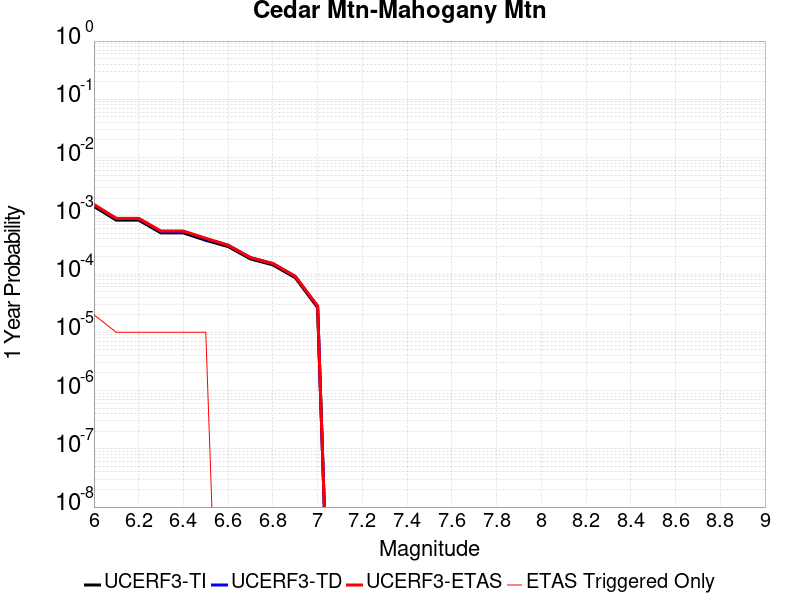 |  |

| Magnitude | 1 wk TI Prob | 1 wk TD Prob | 1 wk ETAS Prob | 1 wk ETAS/TD Gain | 1 wk ETAS Triggered Only | 1 mo TI Prob | 1 mo TD Prob | 1 mo ETAS Prob | 1 mo ETAS/TD Gain | 1 mo ETAS Triggered Only | 1 yr TI Prob | 1 yr TD Prob | 1 yr ETAS Prob | 1 yr ETAS/TD Gain | 1 yr ETAS Triggered Only | 10 yr TI Prob | 10 yr TD Prob | 10 yr ETAS Prob | 10 yr ETAS/TD Gain | 10 yr ETAS Triggered Only |
|-----|-----|-----|-----|-----|-----|-----|-----|-----|-----|-----|-----|-----|-----|-----|-----|-----|-----|-----|-----|-----|
| 6.0 | 2.7763876E-5 | 2.9588866E-5 | 2.9588866E-5 | 1.0 | 0.0 | 1.1898261E-4 | 1.2680366E-4 | 1.2680366E-4 | 1.0 | 0.0 | 0.0014476506 | 0.0015428112 | 0.0015428112 | 1.0 | 0.0 | 0.0143825635 | 0.015328225 | 0.015354483 | 1.001713 | 2.6666667E-5 |
| 6.1 | 1.6162443E-5 | 1.7142966E-5 | 1.7142966E-5 | 1.0 | 0.0 | 6.926578E-5 | 7.346788E-5 | 7.346788E-5 | 1.0 | 0.0 | 8.4298453E-4 | 8.941221E-4 | 8.941221E-4 | 1.0 | 0.0 | 0.008397939 | 0.008907059 | 0.008933488 | 1.0029672 | 2.6666667E-5 |
| 6.2 | 1.6162443E-5 | 1.7142966E-5 | 1.7142966E-5 | 1.0 | 0.0 | 6.926578E-5 | 7.346788E-5 | 7.346788E-5 | 1.0 | 0.0 | 8.4298453E-4 | 8.941221E-4 | 8.941221E-4 | 1.0 | 0.0 | 0.008397939 | 0.008907059 | 0.008933488 | 1.0029672 | 2.6666667E-5 |
| 6.3 | 9.746053E-6 | 1.0303152E-5 | 1.0303152E-5 | 1.0 | 0.0 | 4.1768133E-5 | 4.415564E-5 | 4.415564E-5 | 1.0 | 0.0 | 5.0840835E-4 | 5.3746643E-4 | 5.3746643E-4 | 1.0 | 0.0 | 0.0050724675 | 0.005362084 | 0.005388608 | 1.0049465 | 2.6666667E-5 |
| 6.4 | 9.746053E-6 | 1.0303152E-5 | 1.0303152E-5 | 1.0 | 0.0 | 4.1768133E-5 | 4.415564E-5 | 4.415564E-5 | 1.0 | 0.0 | 5.0840835E-4 | 5.3746643E-4 | 5.3746643E-4 | 1.0 | 0.0 | 0.0050724675 | 0.005362084 | 0.005388608 | 1.0049465 | 2.6666667E-5 |
| 6.5 | 7.290083E-6 | 7.695325E-6 | 7.695325E-6 | 1.0 | 0.0 | 3.124284E-5 | 3.297956E-5 | 3.297956E-5 | 1.0 | 0.0 | 3.8031515E-4 | 4.014543E-4 | 4.014543E-4 | 1.0 | 0.0 | 0.0037966494 | 0.004007511 | 0.0040340708 | 1.0066276 | 2.6666667E-5 |
| 6.6 | 5.67907E-6 | 5.9891527E-6 | 5.9891527E-6 | 1.0 | 0.0 | 2.4338644E-5 | 2.5667552E-5 | 2.5667552E-5 | 1.0 | 0.0 | 2.962827E-4 | 3.12459E-4 | 3.12459E-4 | 1.0 | 0.0 | 0.0029588798 | 0.003120333 | 0.0031469164 | 1.0085194 | 2.6666667E-5 |
| 6.7 | 3.4853963E-6 | 3.672631E-6 | 3.672631E-6 | 1.0 | 0.0 | 1.4937327E-5 | 1.5739755E-5 | 1.5739755E-5 | 1.0 | 0.0 | 1.8184677E-4 | 1.916153E-4 | 1.916153E-4 | 1.0 | 0.0 | 0.0018169804 | 0.0019145629 | 0.0019411785 | 1.0139017 | 2.6666667E-5 |
| 6.8 | 2.7535168E-6 | 2.9015764E-6 | 2.9015764E-6 | 1.0 | 0.0 | 1.1800733E-5 | 1.2435271E-5 | 1.2435271E-5 | 1.0 | 0.0 | 1.4366445E-4 | 1.5138938E-4 | 1.5138938E-4 | 1.0 | 0.0 | 0.0014357162 | 0.0015129098 | 0.0015129098 | 1.0 | 0.0 |
| 6.9 | 1.6594106E-6 | 1.7496985E-6 | 1.7496985E-6 | 1.0 | 0.0 | 7.1117406E-6 | 7.4986883E-6 | 7.4986883E-6 | 1.0 | 0.0 | 8.6582E-5 | 9.129302E-5 | 9.129302E-5 | 1.0 | 0.0 | 8.654827E-4 | 9.125856E-4 | 9.125856E-4 | 1.0 | 0.0 |
| 7.0 | 5.10215E-7 | 5.389254E-7 | 5.389254E-7 | 1.0 | 0.0 | 2.186634E-6 | 2.3096788E-6 | 2.3096788E-6 | 1.0 | 0.0 | 2.6621943E-5 | 2.8120105E-5 | 2.8120105E-5 | 1.0 | 0.0 | 2.6618753E-4 | 2.81178E-4 | 2.81178E-4 | 1.0 | 0.0 |

## San Diego Trough north alt1
*[(top)](#table-of-contents)*

| 1 Week | 1 Month | 1 Year | 10 Year |
|-----|-----|-----|-----|
|  |  |  | 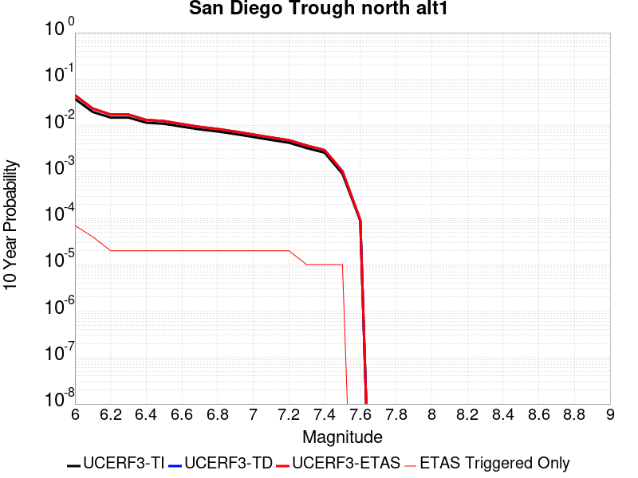 |

| Magnitude | 1 wk TI Prob | 1 wk TD Prob | 1 wk ETAS Prob | 1 wk ETAS/TD Gain | 1 wk ETAS Triggered Only | 1 mo TI Prob | 1 mo TD Prob | 1 mo ETAS Prob | 1 mo ETAS/TD Gain | 1 mo ETAS Triggered Only | 1 yr TI Prob | 1 yr TD Prob | 1 yr ETAS Prob | 1 yr ETAS/TD Gain | 1 yr ETAS Triggered Only | 10 yr TI Prob | 10 yr TD Prob | 10 yr ETAS Prob | 10 yr ETAS/TD Gain | 10 yr ETAS Triggered Only |
|-----|-----|-----|-----|-----|-----|-----|-----|-----|-----|-----|-----|-----|-----|-----|-----|-----|-----|-----|-----|-----|
| 6.0 | 7.329252E-5 | 8.821093E-5 | 1.1487524E-4 | 1.302279 | 2.6666667E-5 | 3.14073E-4 | 3.7799572E-4 | 4.046523E-4 | 1.0705209 | 2.6666667E-5 | 0.0038171355 | 0.004593027 | 0.0046195714 | 1.0057793 | 2.6666667E-5 | 0.03752231 | 0.045044992 | 0.045070454 | 1.0005653 | 2.6666667E-5 |
| 6.1 | 3.7940346E-5 | 4.4885E-5 | 4.4885E-5 | 1.0 | 0.0 | 1.6259136E-4 | 1.9235066E-4 | 1.9235066E-4 | 1.0 | 0.0 | 0.0019777524 | 0.0023394432 | 0.0023394432 | 1.0 | 0.0 | 0.019602431 | 0.023156688 | 0.023156688 | 1.0 | 0.0 |
| 6.2 | 2.8645263E-5 | 3.329678E-5 | 3.329678E-5 | 1.0 | 0.0 | 1.2275964E-4 | 1.4269284E-4 | 1.4269284E-4 | 1.0 | 0.0 | 0.0014935739 | 0.0017359189 | 0.0017359189 | 1.0 | 0.0 | 0.0148357535 | 0.017226247 | 0.017226247 | 1.0 | 0.0 |
| 6.3 | 2.8645263E-5 | 3.329678E-5 | 3.329678E-5 | 1.0 | 0.0 | 1.2275964E-4 | 1.4269284E-4 | 1.4269284E-4 | 1.0 | 0.0 | 0.0014935739 | 0.0017359189 | 0.0017359189 | 1.0 | 0.0 | 0.0148357535 | 0.017226247 | 0.017226247 | 1.0 | 0.0 |
| 6.4 | 2.2204576E-5 | 2.5448318E-5 | 2.5448318E-5 | 1.0 | 0.0 | 9.5159E-5 | 1.0905972E-4 | 1.0905972E-4 | 1.0 | 0.0 | 0.001157945 | 0.0013270034 | 0.0013270034 | 1.0 | 0.0 | 0.011519298 | 0.013191955 | 0.013191955 | 1.0 | 0.0 |
| 6.5 | 2.1004838E-5 | 2.4024694E-5 | 2.4024694E-5 | 1.0 | 0.0 | 9.0017624E-5 | 1.0295896E-4 | 1.0295896E-4 | 1.0 | 0.0 | 0.0010954136 | 0.0012528138 | 0.0012528138 | 1.0 | 0.0 | 0.010900296 | 0.012458589 | 0.012458589 | 1.0 | 0.0 |
| 6.6 | 1.820557E-5 | 2.0704787E-5 | 2.0704787E-5 | 1.0 | 0.0 | 7.802154E-5 | 8.873181E-5 | 8.873181E-5 | 1.0 | 0.0 | 9.4949827E-4 | 0.0010797799 | 0.0010797799 | 1.0 | 0.0 | 0.009454516 | 0.010746004 | 0.010746004 | 1.0 | 0.0 |
| 6.7 | 1.5884485E-5 | 1.7983646E-5 | 1.7983646E-5 | 1.0 | 0.0 | 6.807459E-5 | 7.707051E-5 | 7.707051E-5 | 1.0 | 0.0 | 8.284929E-4 | 9.3793223E-4 | 9.3793223E-4 | 1.0 | 0.0 | 0.008254109 | 0.009340104 | 0.009340104 | 1.0 | 0.0 |
| 6.8 | 1.4331171E-5 | 1.6201066E-5 | 1.6201066E-5 | 1.0 | 0.0 | 6.141786E-5 | 6.94313E-5 | 6.94313E-5 | 1.0 | 0.0 | 7.4750587E-4 | 8.450002E-4 | 8.450002E-4 | 1.0 | 0.0 | 0.0074499645 | 0.008418139 | 0.008418139 | 1.0 | 0.0 |
| 6.9 | 1.2574203E-5 | 1.4205835E-5 | 1.4205835E-5 | 1.0 | 0.0 | 5.3888325E-5 | 6.0880735E-5 | 6.0880735E-5 | 1.0 | 0.0 | 6.558929E-4 | 7.409723E-4 | 7.409723E-4 | 1.0 | 0.0 | 0.0065396037 | 0.007385203 | 0.007385203 | 1.0 | 0.0 |
| 7.0 | 1.0883844E-5 | 1.2289262E-5 | 1.2289262E-5 | 1.0 | 0.0 | 4.664421E-5 | 5.2667205E-5 | 5.2667205E-5 | 1.0 | 0.0 | 5.677453E-4 | 6.4103556E-4 | 6.4103556E-4 | 1.0 | 0.0 | 0.00566297 | 0.006391993 | 0.006391993 | 1.0 | 0.0 |
| 7.1 | 9.393088E-6 | 1.060702E-5 | 1.060702E-5 | 1.0 | 0.0 | 4.025547E-5 | 4.545787E-5 | 4.545787E-5 | 1.0 | 0.0 | 4.900001E-4 | 5.533098E-4 | 5.533098E-4 | 1.0 | 0.0 | 0.0048892107 | 0.005519418 | 0.005519418 | 1.0 | 0.0 |
| 7.2 | 8.190791E-6 | 9.258625E-6 | 9.258625E-6 | 1.0 | 0.0 | 3.510292E-5 | 3.9679224E-5 | 3.9679224E-5 | 1.0 | 0.0 | 4.2729423E-4 | 4.8298817E-4 | 4.8298817E-4 | 1.0 | 0.0 | 0.0042647356 | 0.004819465 | 0.004819465 | 1.0 | 0.0 |
| 7.3 | 6.268162E-6 | 7.089716E-6 | 7.089716E-6 | 1.0 | 0.0 | 2.6863276E-5 | 3.0384144E-5 | 3.0384144E-5 | 1.0 | 0.0 | 3.2701128E-4 | 3.6986457E-4 | 3.6986457E-4 | 1.0 | 0.0 | 0.003265305 | 0.003692536 | 0.003692536 | 1.0 | 0.0 |
| 7.4 | 4.985186E-6 | 5.6426816E-6 | 5.6426816E-6 | 1.0 | 0.0 | 2.1364907E-5 | 2.4182698E-5 | 2.4182698E-5 | 1.0 | 0.0 | 2.600867E-4 | 2.9438498E-4 | 2.9438498E-4 | 1.0 | 0.0 | 0.002597825 | 0.0029399914 | 0.0029399914 | 1.0 | 0.0 |
| 7.5 | 1.7489613E-6 | 1.969678E-6 | 1.969678E-6 | 1.0 | 0.0 | 7.495527E-6 | 8.4414505E-6 | 8.4414505E-6 | 1.0 | 0.0 | 9.125422E-5 | 1.02770035E-4 | 1.02770035E-4 | 1.0 | 0.0 | 9.1216754E-4 | 0.0010272472 | 0.0010272472 | 1.0 | 0.0 |
| 7.6 | 1.6988751E-7 | 1.7533823E-7 | 1.7533823E-7 | 1.0 | 0.0 | 7.2808916E-7 | 7.5144936E-7 | 7.5144936E-7 | 1.0 | 0.0 | 8.864449E-6 | 9.14886E-6 | 9.14886E-6 | 1.0 | 0.0 | 8.8640954E-5 | 9.1485024E-5 | 9.1485024E-5 | 1.0 | 0.0 |

## Verdugo
*[(top)](#table-of-contents)*

| 1 Week | 1 Month | 1 Year | 10 Year |
|-----|-----|-----|-----|
|  | 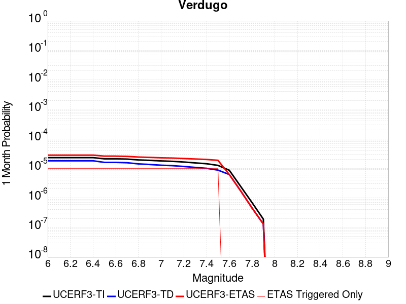 |  |  |

| Magnitude | 1 wk TI Prob | 1 wk TD Prob | 1 wk ETAS Prob | 1 wk ETAS/TD Gain | 1 wk ETAS Triggered Only | 1 mo TI Prob | 1 mo TD Prob | 1 mo ETAS Prob | 1 mo ETAS/TD Gain | 1 mo ETAS Triggered Only | 1 yr TI Prob | 1 yr TD Prob | 1 yr ETAS Prob | 1 yr ETAS/TD Gain | 1 yr ETAS Triggered Only | 10 yr TI Prob | 10 yr TD Prob | 10 yr ETAS Prob | 10 yr ETAS/TD Gain | 10 yr ETAS Triggered Only |
|-----|-----|-----|-----|-----|-----|-----|-----|-----|-----|-----|-----|-----|-----|-----|-----|-----|-----|-----|-----|-----|
| 6.0 | 5.392987E-6 | 4.216517E-6 | 4.216517E-6 | 1.0 | 0.0 | 2.3112598E-5 | 1.8070665E-5 | 1.8070665E-5 | 1.0 | 0.0 | 2.8135953E-4 | 2.1998861E-4 | 2.1998861E-4 | 1.0 | 0.0 | 0.0028100356 | 0.0021977562 | 0.0022243643 | 1.0121069 | 2.6666667E-5 |
| 6.1 | 5.392987E-6 | 4.216517E-6 | 4.216517E-6 | 1.0 | 0.0 | 2.3112598E-5 | 1.8070665E-5 | 1.8070665E-5 | 1.0 | 0.0 | 2.8135953E-4 | 2.1998861E-4 | 2.1998861E-4 | 1.0 | 0.0 | 0.0028100356 | 0.0021977562 | 0.0022243643 | 1.0121069 | 2.6666667E-5 |
| 6.2 | 5.392987E-6 | 4.216517E-6 | 4.216517E-6 | 1.0 | 0.0 | 2.3112598E-5 | 1.8070665E-5 | 1.8070665E-5 | 1.0 | 0.0 | 2.8135953E-4 | 2.1998861E-4 | 2.1998861E-4 | 1.0 | 0.0 | 0.0028100356 | 0.0021977562 | 0.0022243643 | 1.0121069 | 2.6666667E-5 |
| 6.3 | 5.392987E-6 | 4.216517E-6 | 4.216517E-6 | 1.0 | 0.0 | 2.3112598E-5 | 1.8070665E-5 | 1.8070665E-5 | 1.0 | 0.0 | 2.8135953E-4 | 2.1998861E-4 | 2.1998861E-4 | 1.0 | 0.0 | 0.0028100356 | 0.0021977562 | 0.0022243643 | 1.0121069 | 2.6666667E-5 |
| 6.4 | 5.392987E-6 | 4.216517E-6 | 4.216517E-6 | 1.0 | 0.0 | 2.3112598E-5 | 1.8070665E-5 | 1.8070665E-5 | 1.0 | 0.0 | 2.8135953E-4 | 2.1998861E-4 | 2.1998861E-4 | 1.0 | 0.0 | 0.0028100356 | 0.0021977562 | 0.0022243643 | 1.0121069 | 2.6666667E-5 |
| 6.5 | 4.9154837E-6 | 3.722465E-6 | 3.722465E-6 | 1.0 | 0.0 | 2.1066187E-5 | 1.5953325E-5 | 1.5953325E-5 | 1.0 | 0.0 | 2.5645064E-4 | 1.9421462E-4 | 1.9421462E-4 | 1.0 | 0.0 | 0.002561549 | 0.0019404698 | 0.0019670848 | 1.0137157 | 2.6666667E-5 |
| 6.6 | 4.9154837E-6 | 3.722465E-6 | 3.722465E-6 | 1.0 | 0.0 | 2.1066187E-5 | 1.5953325E-5 | 1.5953325E-5 | 1.0 | 0.0 | 2.5645064E-4 | 1.9421462E-4 | 1.9421462E-4 | 1.0 | 0.0 | 0.002561549 | 0.0019404698 | 0.0019670848 | 1.0137157 | 2.6666667E-5 |
| 6.7 | 4.817006E-6 | 3.6206518E-6 | 3.6206518E-6 | 1.0 | 0.0 | 2.0644147E-5 | 1.5516987E-5 | 1.5516987E-5 | 1.0 | 0.0 | 2.513135E-4 | 1.8890314E-4 | 1.8890314E-4 | 1.0 | 0.0 | 0.0025102948 | 0.0018874453 | 0.0019140616 | 1.0141017 | 2.6666667E-5 |
| 6.8 | 4.507407E-6 | 3.3071042E-6 | 3.3071042E-6 | 1.0 | 0.0 | 1.9317316E-5 | 1.4173227E-5 | 1.4173227E-5 | 1.0 | 0.0 | 2.3516294E-4 | 1.7254551E-4 | 1.7254551E-4 | 1.0 | 0.0 | 0.0023491425 | 0.0017241298 | 0.0017241298 | 1.0 | 0.0 |
| 6.9 | 4.3573054E-6 | 3.161011E-6 | 3.161011E-6 | 1.0 | 0.0 | 1.8674033E-5 | 1.354712E-5 | 1.354712E-5 | 1.0 | 0.0 | 2.2733262E-4 | 1.6492383E-4 | 1.6492383E-4 | 1.0 | 0.0 | 0.0022710022 | 0.0016480266 | 0.0016480266 | 1.0 | 0.0 |
| 7.0 | 4.171527E-6 | 2.9836704E-6 | 2.9836704E-6 | 1.0 | 0.0 | 1.787785E-5 | 1.2787096E-5 | 1.2787096E-5 | 1.0 | 0.0 | 2.1764109E-4 | 1.5567189E-4 | 1.5567189E-4 | 1.0 | 0.0 | 0.0021742806 | 0.0015556397 | 0.0015556397 | 1.0 | 0.0 |
| 7.1 | 4.0405484E-6 | 2.882261E-6 | 2.882261E-6 | 1.0 | 0.0 | 1.731652E-5 | 1.235249E-5 | 1.235249E-5 | 1.0 | 0.0 | 2.1080824E-4 | 1.503813E-4 | 1.503813E-4 | 1.0 | 0.0 | 0.0021060838 | 0.0015028063 | 0.0015028063 | 1.0 | 0.0 |
| 7.2 | 3.8306007E-6 | 2.7018452E-6 | 2.7018452E-6 | 1.0 | 0.0 | 1.6416758E-5 | 1.15792855E-5 | 1.15792855E-5 | 1.0 | 0.0 | 1.9985568E-4 | 1.4096878E-4 | 1.4096878E-4 | 1.0 | 0.0 | 0.0019967605 | 0.0014088044 | 0.0014088044 | 1.0 | 0.0 |
| 7.3 | 3.5750938E-6 | 2.5121758E-6 | 2.5121758E-6 | 1.0 | 0.0 | 1.532174E-5 | 1.0766424E-5 | 1.0766424E-5 | 1.0 | 0.0 | 1.8652623E-4 | 1.3107344E-4 | 1.3107344E-4 | 1.0 | 0.0 | 0.0018636974 | 0.0013099718 | 0.0013099718 | 1.0 | 0.0 |
| 7.4 | 3.3510041E-6 | 2.3408586E-6 | 2.3408586E-6 | 1.0 | 0.0 | 1.4361368E-5 | 1.0032213E-5 | 1.0032213E-5 | 1.0 | 0.0 | 1.7483562E-4 | 1.2213545E-4 | 1.2213545E-4 | 1.0 | 0.0 | 0.0017469813 | 0.0012206937 | 0.0012206937 | 1.0 | 0.0 |
| 7.5 | 2.948287E-6 | 2.0391124E-6 | 2.0391124E-6 | 1.0 | 0.0 | 1.2635454E-5 | 8.739024E-6 | 8.739024E-6 | 1.0 | 0.0 | 1.538258E-4 | 1.0639253E-4 | 1.0639253E-4 | 1.0 | 0.0 | 0.0015371935 | 0.0010634261 | 0.0010634261 | 1.0 | 0.0 |
| 7.6 | 2.0134323E-6 | 1.4471265E-6 | 1.4471265E-6 | 1.0 | 0.0 | 8.628967E-6 | 6.2019562E-6 | 6.2019562E-6 | 1.0 | 0.0 | 1.05052604E-4 | 7.550629E-5 | 7.550629E-5 | 1.0 | 0.0 | 0.0010500296 | 7.548152E-4 | 7.548152E-4 | 1.0 | 0.0 |
| 7.7 | 5.726436E-7 | 4.045248E-7 | 4.045248E-7 | 1.0 | 0.0 | 2.4541846E-6 | 1.7336766E-6 | 1.7336766E-6 | 1.0 | 0.0 | 2.9879287E-5 | 2.1107335E-5 | 2.1107335E-5 | 1.0 | 0.0 | 2.987527E-4 | 2.1105584E-4 | 2.1105584E-4 | 1.0 | 0.0 |
| 7.8 | 1.6248204E-7 | 1.0687696E-7 | 1.0687696E-7 | 1.0 | 0.0 | 6.963514E-7 | 4.5804404E-7 | 4.5804404E-7 | 1.0 | 0.0 | 8.478045E-6 | 5.5766723E-6 | 5.5766723E-6 | 1.0 | 0.0 | 8.477722E-5 | 5.5765355E-5 | 5.5765355E-5 | 1.0 | 0.0 |
| 7.9 | 4.4475744E-8 | 3.0375546E-8 | 3.0375546E-8 | 1.0 | 0.0 | 1.9061031E-7 | 1.301809E-7 | 1.301809E-7 | 1.0 | 0.0 | 2.320678E-6 | 1.5849514E-6 | 1.5849514E-6 | 1.0 | 0.0 | 2.3206538E-5 | 1.5849415E-5 | 1.5849415E-5 | 1.0 | 0.0 |

## San Luis Range - Oceano 2011 CFM
*[(top)](#table-of-contents)*

| 1 Week | 1 Month | 1 Year | 10 Year |
|-----|-----|-----|-----|
|  |  |  |  |

| Magnitude | 1 wk TI Prob | 1 wk TD Prob | 1 wk ETAS Prob | 1 wk ETAS/TD Gain | 1 wk ETAS Triggered Only | 1 mo TI Prob | 1 mo TD Prob | 1 mo ETAS Prob | 1 mo ETAS/TD Gain | 1 mo ETAS Triggered Only | 1 yr TI Prob | 1 yr TD Prob | 1 yr ETAS Prob | 1 yr ETAS/TD Gain | 1 yr ETAS Triggered Only | 10 yr TI Prob | 10 yr TD Prob | 10 yr ETAS Prob | 10 yr ETAS/TD Gain | 10 yr ETAS Triggered Only |
|-----|-----|-----|-----|-----|-----|-----|-----|-----|-----|-----|-----|-----|-----|-----|-----|-----|-----|-----|-----|-----|
| 6.0 | 1.6025788E-6 | 1.620119E-6 | 1.620119E-6 | 1.0 | 0.0 | 6.8681766E-6 | 6.943351E-6 | 6.943351E-6 | 1.0 | 0.0 | 8.361684E-5 | 8.453243E-5 | 8.453243E-5 | 1.0 | 0.0 | 8.3585386E-4 | 8.4504357E-4 | 8.716877E-4 | 1.0315299 | 2.6666667E-5 |
| 6.1 | 1.6025788E-6 | 1.620119E-6 | 1.620119E-6 | 1.0 | 0.0 | 6.8681766E-6 | 6.943351E-6 | 6.943351E-6 | 1.0 | 0.0 | 8.361684E-5 | 8.453243E-5 | 8.453243E-5 | 1.0 | 0.0 | 8.3585386E-4 | 8.4504357E-4 | 8.716877E-4 | 1.0315299 | 2.6666667E-5 |
| 6.2 | 1.6025788E-6 | 1.620119E-6 | 1.620119E-6 | 1.0 | 0.0 | 6.8681766E-6 | 6.943351E-6 | 6.943351E-6 | 1.0 | 0.0 | 8.361684E-5 | 8.453243E-5 | 8.453243E-5 | 1.0 | 0.0 | 8.3585386E-4 | 8.4504357E-4 | 8.716877E-4 | 1.0315299 | 2.6666667E-5 |
| 6.3 | 1.6025788E-6 | 1.620119E-6 | 1.620119E-6 | 1.0 | 0.0 | 6.8681766E-6 | 6.943351E-6 | 6.943351E-6 | 1.0 | 0.0 | 8.361684E-5 | 8.453243E-5 | 8.453243E-5 | 1.0 | 0.0 | 8.3585386E-4 | 8.4504357E-4 | 8.716877E-4 | 1.0315299 | 2.6666667E-5 |
| 6.4 | 1.1621186E-6 | 1.1749894E-6 | 1.1749894E-6 | 1.0 | 0.0 | 4.980499E-6 | 5.0356607E-6 | 5.0356607E-6 | 1.0 | 0.0 | 6.0635884E-5 | 6.130771E-5 | 6.130771E-5 | 1.0 | 0.0 | 6.0619344E-4 | 6.1293464E-4 | 6.3958496E-4 | 1.0434799 | 2.6666667E-5 |
| 6.5 | 1.1621186E-6 | 1.1749894E-6 | 1.1749894E-6 | 1.0 | 0.0 | 4.980499E-6 | 5.0356607E-6 | 5.0356607E-6 | 1.0 | 0.0 | 6.0635884E-5 | 6.130771E-5 | 6.130771E-5 | 1.0 | 0.0 | 6.0619344E-4 | 6.1293464E-4 | 6.3958496E-4 | 1.0434799 | 2.6666667E-5 |
| 6.6 | 7.164729E-7 | 7.2485784E-7 | 7.2485784E-7 | 1.0 | 0.0 | 3.0705946E-6 | 3.10653E-6 | 3.10653E-6 | 1.0 | 0.0 | 3.738385E-5 | 3.7821363E-5 | 3.7821363E-5 | 1.0 | 0.0 | 3.737756E-4 | 3.7815105E-4 | 4.0480762E-4 | 1.0704919 | 2.6666667E-5 |
| 6.7 | 7.164729E-7 | 7.2485784E-7 | 7.2485784E-7 | 1.0 | 0.0 | 3.0705946E-6 | 3.10653E-6 | 3.10653E-6 | 1.0 | 0.0 | 3.738385E-5 | 3.7821363E-5 | 3.7821363E-5 | 1.0 | 0.0 | 3.737756E-4 | 3.7815105E-4 | 4.0480762E-4 | 1.0704919 | 2.6666667E-5 |
| 6.8 | 6.700177E-7 | 6.7774397E-7 | 6.7774397E-7 | 1.0 | 0.0 | 2.8715012E-6 | 2.904614E-6 | 2.904614E-6 | 1.0 | 0.0 | 3.495997E-5 | 3.536312E-5 | 3.536312E-5 | 1.0 | 0.0 | 3.495447E-4 | 3.5357653E-4 | 3.8023377E-4 | 1.0753931 | 2.6666667E-5 |
| 6.9 | 5.657865E-7 | 5.7217864E-7 | 5.7217864E-7 | 1.0 | 0.0 | 2.424797E-6 | 2.452192E-6 | 2.452192E-6 | 1.0 | 0.0 | 2.9521503E-5 | 2.9855039E-5 | 2.9855039E-5 | 1.0 | 0.0 | 2.9517582E-4 | 2.9851135E-4 | 3.2517005E-4 | 1.0893055 | 2.6666667E-5 |
| 7.0 | 4.608413E-7 | 4.660169E-7 | 4.660169E-7 | 1.0 | 0.0 | 1.9750328E-6 | 1.9972138E-6 | 1.9972138E-6 | 1.0 | 0.0 | 2.4045758E-5 | 2.431581E-5 | 2.431581E-5 | 1.0 | 0.0 | 2.4043156E-4 | 2.4313178E-4 | 2.6979196E-4 | 1.1096532 | 2.6666667E-5 |
| 7.1 | 3.9177846E-7 | 3.9621602E-7 | 3.9621602E-7 | 1.0 | 0.0 | 1.6790494E-6 | 1.6980675E-6 | 1.6980675E-6 | 1.0 | 0.0 | 2.0442236E-5 | 2.0673779E-5 | 2.0673779E-5 | 1.0 | 0.0 | 2.0440355E-4 | 2.067187E-4 | 2.3337986E-4 | 1.1289731 | 2.6666667E-5 |
| 7.2 | 3.3974752E-7 | 3.436653E-7 | 3.436653E-7 | 1.0 | 0.0 | 1.45606E-6 | 1.4728505E-6 | 1.4728505E-6 | 1.0 | 0.0 | 1.7727387E-5 | 1.7931809E-5 | 1.7931809E-5 | 1.0 | 0.0 | 1.7725973E-4 | 1.7930372E-4 | 2.059656E-4 | 1.1486968 | 2.6666667E-5 |
| 7.3 | 2.8900928E-7 | 2.923402E-7 | 2.923402E-7 | 1.0 | 0.0 | 1.2386106E-6 | 1.2528859E-6 | 1.2528859E-6 | 1.0 | 0.0 | 1.5079979E-5 | 1.525378E-5 | 1.525378E-5 | 1.0 | 0.0 | 1.5078956E-4 | 1.5252741E-4 | 1.7919001E-4 | 1.1748053 | 2.6666667E-5 |
| 7.4 | 2.1881527E-7 | 2.2139594E-7 | 2.2139594E-7 | 1.0 | 0.0 | 9.3777936E-7 | 9.488394E-7 | 9.488394E-7 | 1.0 | 0.0 | 1.14174045E-5 | 1.1552059E-5 | 1.1552059E-5 | 1.0 | 0.0 | 1.1416818E-4 | 1.1551464E-4 | 1.4217822E-4 | 1.2308244 | 2.6666667E-5 |
| 7.5 | 1.356398E-7 | 1.3718639E-7 | 1.3718639E-7 | 1.0 | 0.0 | 5.813133E-7 | 5.8794154E-7 | 5.8794154E-7 | 1.0 | 0.0 | 7.0774663E-6 | 7.158165E-6 | 7.158165E-6 | 1.0 | 0.0 | 7.077241E-5 | 7.157937E-5 | 7.157937E-5 | 1.0 | 0.0 |
| 7.6 | 5.9269272E-8 | 6.001364E-8 | 6.001364E-8 | 1.0 | 0.0 | 2.5401116E-7 | 2.572013E-7 | 2.572013E-7 | 1.0 | 0.0 | 3.0925814E-6 | 3.1314214E-6 | 3.1314214E-6 | 1.0 | 0.0 | 3.0925385E-5 | 3.1313786E-5 | 3.1313786E-5 | 1.0 | 0.0 |
| 7.7 | 5.946232E-9 | 6.036928E-9 | 6.036928E-9 | 1.0 | 0.0 | 2.5483851E-8 | 2.5872547E-8 | 2.5872547E-8 | 1.0 | 0.0 | 3.1026585E-7 | 3.1499823E-7 | 3.1499823E-7 | 1.0 | 0.0 | 3.102654E-6 | 3.1499787E-6 | 3.1499787E-6 | 1.0 | 0.0 |

## Big Lagoon - Bald Mtn 2011 CFM
*[(top)](#table-of-contents)*

| 1 Week | 1 Month | 1 Year | 10 Year |
|-----|-----|-----|-----|
|  |  |  |  |

| Magnitude | 1 wk TI Prob | 1 wk TD Prob | 1 wk ETAS Prob | 1 wk ETAS/TD Gain | 1 wk ETAS Triggered Only | 1 mo TI Prob | 1 mo TD Prob | 1 mo ETAS Prob | 1 mo ETAS/TD Gain | 1 mo ETAS Triggered Only | 1 yr TI Prob | 1 yr TD Prob | 1 yr ETAS Prob | 1 yr ETAS/TD Gain | 1 yr ETAS Triggered Only | 10 yr TI Prob | 10 yr TD Prob | 10 yr ETAS Prob | 10 yr ETAS/TD Gain | 10 yr ETAS Triggered Only |
|-----|-----|-----|-----|-----|-----|-----|-----|-----|-----|-----|-----|-----|-----|-----|-----|-----|-----|-----|-----|-----|
| 6.0 | 1.8699735E-5 | 1.985018E-5 | 1.985018E-5 | 1.0 | 0.0 | 8.013926E-5 | 8.5069645E-5 | 8.5069645E-5 | 1.0 | 0.0 | 9.752587E-4 | 0.0010352687 | 0.0010352687 | 1.0 | 0.0 | 0.009709897 | 0.010308274 | 0.010334666 | 1.0025603 | 2.6666667E-5 |
| 6.1 | 1.8699735E-5 | 1.985018E-5 | 1.985018E-5 | 1.0 | 0.0 | 8.013926E-5 | 8.5069645E-5 | 8.5069645E-5 | 1.0 | 0.0 | 9.752587E-4 | 0.0010352687 | 0.0010352687 | 1.0 | 0.0 | 0.009709897 | 0.010308274 | 0.010334666 | 1.0025603 | 2.6666667E-5 |
| 6.2 | 1.8699735E-5 | 1.985018E-5 | 1.985018E-5 | 1.0 | 0.0 | 8.013926E-5 | 8.5069645E-5 | 8.5069645E-5 | 1.0 | 0.0 | 9.752587E-4 | 0.0010352687 | 0.0010352687 | 1.0 | 0.0 | 0.009709897 | 0.010308274 | 0.010334666 | 1.0025603 | 2.6666667E-5 |
| 6.3 | 1.8699735E-5 | 1.985018E-5 | 1.985018E-5 | 1.0 | 0.0 | 8.013926E-5 | 8.5069645E-5 | 8.5069645E-5 | 1.0 | 0.0 | 9.752587E-4 | 0.0010352687 | 0.0010352687 | 1.0 | 0.0 | 0.009709897 | 0.010308274 | 0.010334666 | 1.0025603 | 2.6666667E-5 |
| 6.4 | 1.8699735E-5 | 1.985018E-5 | 1.985018E-5 | 1.0 | 0.0 | 8.013926E-5 | 8.5069645E-5 | 8.5069645E-5 | 1.0 | 0.0 | 9.752587E-4 | 0.0010352687 | 0.0010352687 | 1.0 | 0.0 | 0.009709897 | 0.010308274 | 0.010334666 | 1.0025603 | 2.6666667E-5 |
| 6.5 | 1.8699735E-5 | 1.985018E-5 | 1.985018E-5 | 1.0 | 0.0 | 8.013926E-5 | 8.5069645E-5 | 8.5069645E-5 | 1.0 | 0.0 | 9.752587E-4 | 0.0010352687 | 0.0010352687 | 1.0 | 0.0 | 0.009709897 | 0.010308274 | 0.010334666 | 1.0025603 | 2.6666667E-5 |
| 6.6 | 1.8699735E-5 | 1.985018E-5 | 1.985018E-5 | 1.0 | 0.0 | 8.013926E-5 | 8.5069645E-5 | 8.5069645E-5 | 1.0 | 0.0 | 9.752587E-4 | 0.0010352687 | 0.0010352687 | 1.0 | 0.0 | 0.009709897 | 0.010308274 | 0.010334666 | 1.0025603 | 2.6666667E-5 |
| 6.7 | 1.8699735E-5 | 1.985018E-5 | 1.985018E-5 | 1.0 | 0.0 | 8.013926E-5 | 8.5069645E-5 | 8.5069645E-5 | 1.0 | 0.0 | 9.752587E-4 | 0.0010352687 | 0.0010352687 | 1.0 | 0.0 | 0.009709897 | 0.010308274 | 0.010334666 | 1.0025603 | 2.6666667E-5 |
| 6.8 | 1.18505095E-5 | 1.2499804E-5 | 1.2499804E-5 | 1.0 | 0.0 | 5.078691E-5 | 5.3569514E-5 | 5.3569514E-5 | 1.0 | 0.0 | 6.181552E-4 | 6.520185E-4 | 6.520185E-4 | 1.0 | 0.0 | 0.006164385 | 0.0065015587 | 0.006528052 | 1.0040749 | 2.6666667E-5 |
| 6.9 | 1.18505095E-5 | 1.2499804E-5 | 1.2499804E-5 | 1.0 | 0.0 | 5.078691E-5 | 5.3569514E-5 | 5.3569514E-5 | 1.0 | 0.0 | 6.181552E-4 | 6.520185E-4 | 6.520185E-4 | 1.0 | 0.0 | 0.006164385 | 0.0065015587 | 0.006528052 | 1.0040749 | 2.6666667E-5 |
| 7.0 | 9.719786E-6 | 1.0235487E-5 | 1.0235487E-5 | 1.0 | 0.0 | 4.1655563E-5 | 4.386565E-5 | 4.386565E-5 | 1.0 | 0.0 | 5.0703844E-4 | 5.3393573E-4 | 5.3393573E-4 | 1.0 | 0.0 | 0.005058831 | 0.0053267754 | 0.0053533004 | 1.0049795 | 2.6666667E-5 |
| 7.1 | 8.523418E-6 | 8.969463E-6 | 8.969463E-6 | 1.0 | 0.0 | 3.652842E-5 | 3.844E-5 | 3.844E-5 | 1.0 | 0.0 | 4.4464276E-4 | 4.6790804E-4 | 4.6790804E-4 | 1.0 | 0.0 | 0.0044375416 | 0.004669392 | 0.0046959342 | 1.0056843 | 2.6666667E-5 |
| 7.2 | 7.378894E-6 | 7.761112E-6 | 7.761112E-6 | 1.0 | 0.0 | 3.162345E-5 | 3.326149E-5 | 3.326149E-5 | 1.0 | 0.0 | 3.8494746E-4 | 4.048843E-4 | 4.048843E-4 | 1.0 | 0.0 | 0.0038428132 | 0.0040415623 | 0.0040415623 | 1.0 | 0.0 |
| 7.3 | 6.4640294E-6 | 6.7924434E-6 | 6.7924434E-6 | 1.0 | 0.0 | 2.7702688E-5 | 2.9110151E-5 | 2.9110151E-5 | 1.0 | 0.0 | 3.3722803E-4 | 3.5435913E-4 | 3.5435913E-4 | 1.0 | 0.0 | 0.0033671674 | 0.0035380109 | 0.0035380109 | 1.0 | 0.0 |
| 7.4 | 5.9959093E-6 | 6.2988E-6 | 6.2988E-6 | 1.0 | 0.0 | 2.5696501E-5 | 2.6994581E-5 | 2.6994581E-5 | 1.0 | 0.0 | 3.1280998E-4 | 3.2861007E-4 | 3.2861007E-4 | 1.0 | 0.0 | 0.0031237002 | 0.0032813034 | 0.0032813034 | 1.0 | 0.0 |
| 7.5 | 4.929265E-6 | 5.176396E-6 | 5.176396E-6 | 1.0 | 0.0 | 2.112525E-5 | 2.2184367E-5 | 2.2184367E-5 | 1.0 | 0.0 | 2.5716957E-4 | 2.700616E-4 | 2.700616E-4 | 1.0 | 0.0 | 0.0025687215 | 0.002697375 | 0.002697375 | 1.0 | 0.0 |
| 7.6 | 3.8982403E-6 | 4.0889267E-6 | 4.0889267E-6 | 1.0 | 0.0 | 1.6706637E-5 | 1.7523857E-5 | 1.7523857E-5 | 1.0 | 0.0 | 2.0338432E-4 | 2.1333233E-4 | 2.1333233E-4 | 1.0 | 0.0 | 0.0020319829 | 0.002131303 | 0.002131303 | 1.0 | 0.0 |
| 7.7 | 2.820968E-6 | 2.9572116E-6 | 2.9572116E-6 | 1.0 | 0.0 | 1.2089806E-5 | 1.2673704E-5 | 1.2673704E-5 | 1.0 | 0.0 | 1.4718344E-4 | 1.5429159E-4 | 1.5429159E-4 | 1.0 | 0.0 | 0.00147086 | 0.0015418624 | 0.0015418624 | 1.0 | 0.0 |
| 7.8 | 1.9314455E-6 | 2.0260186E-6 | 2.0260186E-6 | 1.0 | 0.0 | 8.277597E-6 | 8.682909E-6 | 8.682909E-6 | 1.0 | 0.0 | 1.0077508E-4 | 1.0570941E-4 | 1.0570941E-4 | 1.0 | 0.0 | 0.0010072939 | 0.0010566041 | 0.0010566041 | 1.0 | 0.0 |
| 7.9 | 4.9586197E-7 | 5.2189216E-7 | 5.2189216E-7 | 1.0 | 0.0 | 2.125121E-6 | 2.2366787E-6 | 2.2366787E-6 | 1.0 | 0.0 | 2.5873042E-5 | 2.7231245E-5 | 2.7231245E-5 | 1.0 | 0.0 | 2.5870028E-4 | 2.7228118E-4 | 2.7228118E-4 | 1.0 | 0.0 |

## Surprise Valley 2011 CFM
*[(top)](#table-of-contents)*

| 1 Week | 1 Month | 1 Year | 10 Year |
|-----|-----|-----|-----|
|  |  |  |  |

| Magnitude | 1 wk TI Prob | 1 wk TD Prob | 1 wk ETAS Prob | 1 wk ETAS/TD Gain | 1 wk ETAS Triggered Only | 1 mo TI Prob | 1 mo TD Prob | 1 mo ETAS Prob | 1 mo ETAS/TD Gain | 1 mo ETAS Triggered Only | 1 yr TI Prob | 1 yr TD Prob | 1 yr ETAS Prob | 1 yr ETAS/TD Gain | 1 yr ETAS Triggered Only | 10 yr TI Prob | 10 yr TD Prob | 10 yr ETAS Prob | 10 yr ETAS/TD Gain | 10 yr ETAS Triggered Only |
|-----|-----|-----|-----|-----|-----|-----|-----|-----|-----|-----|-----|-----|-----|-----|-----|-----|-----|-----|-----|-----|
| 6.0 | 4.0396248E-5 | 4.485131E-5 | 7.151678E-5 | 1.5945305 | 2.6666667E-5 | 1.7311527E-4 | 1.9220692E-4 | 2.1886846E-4 | 1.1387126 | 2.6666667E-5 | 0.002105641 | 0.0023378176 | 0.002364422 | 1.01138 | 2.6666667E-5 | 0.020858008 | 0.023153966 | 0.023180015 | 1.0011251 | 2.6666667E-5 |
| 6.1 | 4.0396248E-5 | 4.485131E-5 | 7.151678E-5 | 1.5945305 | 2.6666667E-5 | 1.7311527E-4 | 1.9220692E-4 | 2.1886846E-4 | 1.1387126 | 2.6666667E-5 | 0.002105641 | 0.0023378176 | 0.002364422 | 1.01138 | 2.6666667E-5 | 0.020858008 | 0.023153966 | 0.023180015 | 1.0011251 | 2.6666667E-5 |
| 6.2 | 2.2295266E-5 | 2.440125E-5 | 5.1067265E-5 | 2.0928135 | 2.6666667E-5 | 9.554764E-5 | 1.0457276E-4 | 1.3123664E-4 | 1.2549791 | 2.6666667E-5 | 0.0011626717 | 0.0012724606 | 0.0012990934 | 1.02093 | 2.6666667E-5 | 0.011566074 | 0.012654981 | 0.01268131 | 1.0020806 | 2.6666667E-5 |
| 6.3 | 1.572643E-5 | 1.7096807E-5 | 1.7096807E-5 | 1.0 | 0.0 | 6.7397246E-5 | 7.327003E-5 | 7.327003E-5 | 1.0 | 0.0 | 8.202525E-4 | 8.91708E-4 | 8.91708E-4 | 1.0 | 0.0 | 0.008172315 | 0.008882407 | 0.008882407 | 1.0 | 0.0 |
| 6.4 | 1.5714395E-5 | 1.7084629E-5 | 1.7084629E-5 | 1.0 | 0.0 | 6.734567E-5 | 7.3217845E-5 | 7.3217845E-5 | 1.0 | 0.0 | 8.1962504E-4 | 8.9107314E-4 | 8.9107314E-4 | 1.0 | 0.0 | 0.008166086 | 0.008876109 | 0.008876109 | 1.0 | 0.0 |
| 6.5 | 1.2733495E-5 | 1.38016E-5 | 1.38016E-5 | 1.0 | 0.0 | 5.457098E-5 | 5.9148413E-5 | 5.9148413E-5 | 1.0 | 0.0 | 6.641992E-4 | 7.1990065E-4 | 7.1990065E-4 | 1.0 | 0.0 | 0.0066221743 | 0.0071763797 | 0.0071763797 | 1.0 | 0.0 |
| 6.6 | 1.0983784E-5 | 1.1886554E-5 | 1.1886554E-5 | 1.0 | 0.0 | 4.7072506E-5 | 5.094141E-5 | 5.094141E-5 | 1.0 | 0.0 | 5.7295704E-4 | 6.200405E-4 | 6.200405E-4 | 1.0 | 0.0 | 0.0057148207 | 0.0061836545 | 0.0061836545 | 1.0 | 0.0 |
| 6.7 | 9.104806E-6 | 9.839491E-6 | 9.839491E-6 | 1.0 | 0.0 | 3.902001E-5 | 4.2168587E-5 | 4.2168587E-5 | 1.0 | 0.0 | 4.7496508E-4 | 5.132855E-4 | 5.132855E-4 | 1.0 | 0.0 | 0.004739512 | 0.005121397 | 0.005121397 | 1.0 | 0.0 |
| 6.8 | 6.2162403E-6 | 6.7041337E-6 | 6.7041337E-6 | 1.0 | 0.0 | 2.6640759E-5 | 2.8731698E-5 | 2.8731698E-5 | 1.0 | 0.0 | 3.2430296E-4 | 3.497545E-4 | 3.497545E-4 | 1.0 | 0.0 | 0.003238301 | 0.0034922638 | 0.0034922638 | 1.0 | 0.0 |
| 6.9 | 4.1792696E-6 | 4.50323E-6 | 4.50323E-6 | 1.0 | 0.0 | 1.7911032E-5 | 1.9299423E-5 | 1.9299423E-5 | 1.0 | 0.0 | 2.1804498E-4 | 2.3494668E-4 | 2.3494668E-4 | 1.0 | 0.0 | 0.0021783116 | 0.0023471361 | 0.0023471361 | 1.0 | 0.0 |
| 7.0 | 2.7478413E-6 | 2.9622424E-6 | 2.9622424E-6 | 1.0 | 0.0 | 1.177641E-5 | 1.269527E-5 | 1.269527E-5 | 1.0 | 0.0 | 1.4336836E-4 | 1.545552E-4 | 1.545552E-4 | 1.0 | 0.0 | 0.001432759 | 0.0015445995 | 0.0015445995 | 1.0 | 0.0 |
| 7.1 | 8.128648E-7 | 8.724922E-7 | 8.724922E-7 | 1.0 | 0.0 | 3.4837017E-6 | 3.7392501E-6 | 3.7392501E-6 | 1.0 | 0.0 | 4.2413245E-5 | 4.552502E-5 | 4.552502E-5 | 1.0 | 0.0 | 4.2405148E-4 | 4.5521575E-4 | 4.5521575E-4 | 1.0 | 0.0 |
| 7.2 | 4.8641045E-8 | 4.9402068E-8 | 4.9402068E-8 | 1.0 | 0.0 | 2.084616E-7 | 2.1172312E-7 | 2.1172312E-7 | 1.0 | 0.0 | 2.538017E-6 | 2.577726E-6 | 2.577726E-6 | 1.0 | 0.0 | 2.537988E-5 | 2.5776973E-5 | 2.5776973E-5 | 1.0 | 0.0 |
| 7.3 | 5.3911844E-9 | 5.4758145E-9 | 5.4758145E-9 | 1.0 | 0.0 | 2.3105075E-8 | 2.3467775E-8 | 2.3467775E-8 | 1.0 | 0.0 | 2.8130427E-7 | 2.8572015E-7 | 2.8572015E-7 | 1.0 | 0.0 | 2.8130391E-6 | 2.8571992E-6 | 2.8571992E-6 | 1.0 | 0.0 |

## Ozena
*[(top)](#table-of-contents)*

| 1 Week | 1 Month | 1 Year | 10 Year |
|-----|-----|-----|-----|
|  |  |  |  |

| Magnitude | 1 wk TI Prob | 1 wk TD Prob | 1 wk ETAS Prob | 1 wk ETAS/TD Gain | 1 wk ETAS Triggered Only | 1 mo TI Prob | 1 mo TD Prob | 1 mo ETAS Prob | 1 mo ETAS/TD Gain | 1 mo ETAS Triggered Only | 1 yr TI Prob | 1 yr TD Prob | 1 yr ETAS Prob | 1 yr ETAS/TD Gain | 1 yr ETAS Triggered Only | 10 yr TI Prob | 10 yr TD Prob | 10 yr ETAS Prob | 10 yr ETAS/TD Gain | 10 yr ETAS Triggered Only |
|-----|-----|-----|-----|-----|-----|-----|-----|-----|-----|-----|-----|-----|-----|-----|-----|-----|-----|-----|-----|-----|
| 6.0 | 1.4377547E-6 | 1.4513782E-6 | 1.4513782E-6 | 1.0 | 0.0 | 6.161791E-6 | 6.2201793E-6 | 6.2201793E-6 | 1.0 | 0.0 | 7.5017226E-5 | 7.572832E-5 | 7.572832E-5 | 1.0 | 0.0 | 7.4991904E-4 | 7.570518E-4 | 7.836983E-4 | 1.0351977 | 2.6666667E-5 |
| 6.1 | 1.4377547E-6 | 1.4513782E-6 | 1.4513782E-6 | 1.0 | 0.0 | 6.161791E-6 | 6.2201793E-6 | 6.2201793E-6 | 1.0 | 0.0 | 7.5017226E-5 | 7.572832E-5 | 7.572832E-5 | 1.0 | 0.0 | 7.4991904E-4 | 7.570518E-4 | 7.836983E-4 | 1.0351977 | 2.6666667E-5 |
| 6.2 | 1.4377547E-6 | 1.4513782E-6 | 1.4513782E-6 | 1.0 | 0.0 | 6.161791E-6 | 6.2201793E-6 | 6.2201793E-6 | 1.0 | 0.0 | 7.5017226E-5 | 7.572832E-5 | 7.572832E-5 | 1.0 | 0.0 | 7.4991904E-4 | 7.570518E-4 | 7.836983E-4 | 1.0351977 | 2.6666667E-5 |
| 6.3 | 1.4377547E-6 | 1.4513782E-6 | 1.4513782E-6 | 1.0 | 0.0 | 6.161791E-6 | 6.2201793E-6 | 6.2201793E-6 | 1.0 | 0.0 | 7.5017226E-5 | 7.572832E-5 | 7.572832E-5 | 1.0 | 0.0 | 7.4991904E-4 | 7.570518E-4 | 7.836983E-4 | 1.0351977 | 2.6666667E-5 |
| 6.4 | 1.4377547E-6 | 1.4513782E-6 | 1.4513782E-6 | 1.0 | 0.0 | 6.161791E-6 | 6.2201793E-6 | 6.2201793E-6 | 1.0 | 0.0 | 7.5017226E-5 | 7.572832E-5 | 7.572832E-5 | 1.0 | 0.0 | 7.4991904E-4 | 7.570518E-4 | 7.836983E-4 | 1.0351977 | 2.6666667E-5 |
| 6.5 | 1.4377547E-6 | 1.4513782E-6 | 1.4513782E-6 | 1.0 | 0.0 | 6.161791E-6 | 6.2201793E-6 | 6.2201793E-6 | 1.0 | 0.0 | 7.5017226E-5 | 7.572832E-5 | 7.572832E-5 | 1.0 | 0.0 | 7.4991904E-4 | 7.570518E-4 | 7.836983E-4 | 1.0351977 | 2.6666667E-5 |
| 6.6 | 1.4377547E-6 | 1.4513782E-6 | 1.4513782E-6 | 1.0 | 0.0 | 6.161791E-6 | 6.2201793E-6 | 6.2201793E-6 | 1.0 | 0.0 | 7.5017226E-5 | 7.572832E-5 | 7.572832E-5 | 1.0 | 0.0 | 7.4991904E-4 | 7.570518E-4 | 7.836983E-4 | 1.0351977 | 2.6666667E-5 |
| 6.7 | 1.4377547E-6 | 1.4513782E-6 | 1.4513782E-6 | 1.0 | 0.0 | 6.161791E-6 | 6.2201793E-6 | 6.2201793E-6 | 1.0 | 0.0 | 7.5017226E-5 | 7.572832E-5 | 7.572832E-5 | 1.0 | 0.0 | 7.4991904E-4 | 7.570518E-4 | 7.836983E-4 | 1.0351977 | 2.6666667E-5 |
| 6.8 | 9.223257E-7 | 9.317624E-7 | 9.317624E-7 | 1.0 | 0.0 | 3.9528186E-6 | 3.9932615E-6 | 3.9932615E-6 | 1.0 | 0.0 | 4.81245E-5 | 4.8616912E-5 | 4.8616912E-5 | 1.0 | 0.0 | 4.811408E-4 | 4.860668E-4 | 5.127205E-4 | 1.0548354 | 2.6666667E-5 |
| 6.9 | 9.141515E-7 | 9.235371E-7 | 9.235371E-7 | 1.0 | 0.0 | 3.917786E-6 | 3.9580104E-6 | 3.9580104E-6 | 1.0 | 0.0 | 4.7698002E-5 | 4.818775E-5 | 4.818775E-5 | 1.0 | 0.0 | 4.7687767E-4 | 4.8177704E-4 | 5.084309E-4 | 1.055324 | 2.6666667E-5 |
| 7.0 | 8.767648E-7 | 8.8585773E-7 | 8.8585773E-7 | 1.0 | 0.0 | 3.757558E-6 | 3.7965276E-6 | 3.7965276E-6 | 1.0 | 0.0 | 4.5747307E-5 | 4.6221783E-5 | 4.6221783E-5 | 1.0 | 0.0 | 4.5737892E-4 | 4.6212564E-4 | 4.6212564E-4 | 1.0 | 0.0 |
| 7.1 | 8.199402E-7 | 8.2853984E-7 | 8.2853984E-7 | 1.0 | 0.0 | 3.5140247E-6 | 3.5508804E-6 | 3.5508804E-6 | 1.0 | 0.0 | 4.2782412E-5 | 4.323115E-5 | 4.323115E-5 | 1.0 | 0.0 | 4.2774176E-4 | 4.322311E-4 | 4.322311E-4 | 1.0 | 0.0 |
| 7.2 | 7.38705E-7 | 7.464262E-7 | 7.464262E-7 | 1.0 | 0.0 | 3.1658747E-6 | 3.198966E-6 | 3.198966E-6 | 1.0 | 0.0 | 3.8543843E-5 | 3.894675E-5 | 3.894675E-5 | 1.0 | 0.0 | 3.853716E-4 | 3.8940276E-4 | 3.8940276E-4 | 1.0 | 0.0 |
| 7.3 | 6.490017E-7 | 6.557802E-7 | 6.557802E-7 | 1.0 | 0.0 | 2.7814328E-6 | 2.8104837E-6 | 2.8104837E-6 | 1.0 | 0.0 | 3.386342E-5 | 3.4217133E-5 | 3.4217133E-5 | 1.0 | 0.0 | 3.3858258E-4 | 3.4212202E-4 | 3.4212202E-4 | 1.0 | 0.0 |
| 7.4 | 5.346736E-7 | 5.4022604E-7 | 5.4022604E-7 | 1.0 | 0.0 | 2.291456E-6 | 2.3152527E-6 | 2.3152527E-6 | 1.0 | 0.0 | 2.789812E-5 | 2.8187867E-5 | 2.8187867E-5 | 1.0 | 0.0 | 2.789462E-4 | 2.8184598E-4 | 2.8184598E-4 | 1.0 | 0.0 |
| 7.5 | 2.939325E-7 | 2.9666057E-7 | 2.9666057E-7 | 1.0 | 0.0 | 1.25971E-6 | 1.271402E-6 | 1.271402E-6 | 1.0 | 0.0 | 1.5336862E-5 | 1.5479225E-5 | 1.5479225E-5 | 1.0 | 0.0 | 1.5335804E-4 | 1.5478309E-4 | 1.5478309E-4 | 1.0 | 0.0 |
| 7.6 | 1.4151905E-7 | 1.4253266E-7 | 1.4253266E-7 | 1.0 | 0.0 | 6.065101E-7 | 6.108541E-7 | 6.108541E-7 | 1.0 | 0.0 | 7.3842357E-6 | 7.4371237E-6 | 7.4371237E-6 | 1.0 | 0.0 | 7.38399E-5 | 7.436883E-5 | 7.436883E-5 | 1.0 | 0.0 |
| 7.7 | 4.4957577E-8 | 4.5252243E-8 | 4.5252243E-8 | 1.0 | 0.0 | 1.9267533E-7 | 1.9393818E-7 | 1.9393818E-7 | 1.0 | 0.0 | 2.3458194E-6 | 2.3611947E-6 | 2.3611947E-6 | 1.0 | 0.0 | 2.3457947E-5 | 2.3611707E-5 | 2.3611707E-5 | 1.0 | 0.0 |
| 7.8 | 5.9993255E-9 | 6.0412972E-9 | 6.0412972E-9 | 1.0 | 0.0 | 2.5711394E-8 | 2.5891273E-8 | 2.5891273E-8 | 1.0 | 0.0 | 3.1303617E-7 | 3.1522623E-7 | 3.1522623E-7 | 1.0 | 0.0 | 3.1303573E-6 | 3.1522588E-6 | 3.1522588E-6 | 1.0 | 0.0 |

## Holser alt 1
*[(top)](#table-of-contents)*

| 1 Week | 1 Month | 1 Year | 10 Year |
|-----|-----|-----|-----|
|  |  |  |  |

| Magnitude | 1 wk TI Prob | 1 wk TD Prob | 1 wk ETAS Prob | 1 wk ETAS/TD Gain | 1 wk ETAS Triggered Only | 1 mo TI Prob | 1 mo TD Prob | 1 mo ETAS Prob | 1 mo ETAS/TD Gain | 1 mo ETAS Triggered Only | 1 yr TI Prob | 1 yr TD Prob | 1 yr ETAS Prob | 1 yr ETAS/TD Gain | 1 yr ETAS Triggered Only | 10 yr TI Prob | 10 yr TD Prob | 10 yr ETAS Prob | 10 yr ETAS/TD Gain | 10 yr ETAS Triggered Only |
|-----|-----|-----|-----|-----|-----|-----|-----|-----|-----|-----|-----|-----|-----|-----|-----|-----|-----|-----|-----|-----|
| 6.0 | 6.2746653E-6 | 5.789965E-6 | 5.789965E-6 | 1.0 | 0.0 | 2.6891146E-5 | 2.4813964E-5 | 2.4813964E-5 | 1.0 | 0.0 | 3.273505E-4 | 3.020797E-4 | 3.287383E-4 | 1.0882503 | 2.6666667E-5 | 0.0032686873 | 0.0030178234 | 0.0030444097 | 1.0088097 | 2.6666667E-5 |
| 6.1 | 6.2746653E-6 | 5.789965E-6 | 5.789965E-6 | 1.0 | 0.0 | 2.6891146E-5 | 2.4813964E-5 | 2.4813964E-5 | 1.0 | 0.0 | 3.273505E-4 | 3.020797E-4 | 3.287383E-4 | 1.0882503 | 2.6666667E-5 | 0.0032686873 | 0.0030178234 | 0.0030444097 | 1.0088097 | 2.6666667E-5 |
| 6.2 | 6.2746653E-6 | 5.789965E-6 | 5.789965E-6 | 1.0 | 0.0 | 2.6891146E-5 | 2.4813964E-5 | 2.4813964E-5 | 1.0 | 0.0 | 3.273505E-4 | 3.020797E-4 | 3.287383E-4 | 1.0882503 | 2.6666667E-5 | 0.0032686873 | 0.0030178234 | 0.0030444097 | 1.0088097 | 2.6666667E-5 |
| 6.3 | 6.2746653E-6 | 5.789965E-6 | 5.789965E-6 | 1.0 | 0.0 | 2.6891146E-5 | 2.4813964E-5 | 2.4813964E-5 | 1.0 | 0.0 | 3.273505E-4 | 3.020797E-4 | 3.287383E-4 | 1.0882503 | 2.6666667E-5 | 0.0032686873 | 0.0030178234 | 0.0030444097 | 1.0088097 | 2.6666667E-5 |
| 6.4 | 6.2746653E-6 | 5.789965E-6 | 5.789965E-6 | 1.0 | 0.0 | 2.6891146E-5 | 2.4813964E-5 | 2.4813964E-5 | 1.0 | 0.0 | 3.273505E-4 | 3.020797E-4 | 3.287383E-4 | 1.0882503 | 2.6666667E-5 | 0.0032686873 | 0.0030178234 | 0.0030444097 | 1.0088097 | 2.6666667E-5 |
| 6.5 | 6.2746653E-6 | 5.789965E-6 | 5.789965E-6 | 1.0 | 0.0 | 2.6891146E-5 | 2.4813964E-5 | 2.4813964E-5 | 1.0 | 0.0 | 3.273505E-4 | 3.020797E-4 | 3.287383E-4 | 1.0882503 | 2.6666667E-5 | 0.0032686873 | 0.0030178234 | 0.0030444097 | 1.0088097 | 2.6666667E-5 |
| 6.6 | 3.375825E-6 | 2.7711897E-6 | 2.7711897E-6 | 1.0 | 0.0 | 1.4467741E-5 | 1.1876474E-5 | 1.1876474E-5 | 1.0 | 0.0 | 1.761305E-4 | 1.4458665E-4 | 1.4458665E-4 | 1.0 | 0.0 | 0.0017599097 | 0.0014449427 | 0.0014449427 | 1.0 | 0.0 |
| 6.7 | 3.375825E-6 | 2.7711897E-6 | 2.7711897E-6 | 1.0 | 0.0 | 1.4467741E-5 | 1.1876474E-5 | 1.1876474E-5 | 1.0 | 0.0 | 1.761305E-4 | 1.4458665E-4 | 1.4458665E-4 | 1.0 | 0.0 | 0.0017599097 | 0.0014449427 | 0.0014449427 | 1.0 | 0.0 |
| 6.8 | 3.366533E-6 | 2.7615893E-6 | 2.7615893E-6 | 1.0 | 0.0 | 1.4427919E-5 | 1.183533E-5 | 1.183533E-5 | 1.0 | 0.0 | 1.7564575E-4 | 1.4408577E-4 | 1.4408577E-4 | 1.0 | 0.0 | 0.0017550698 | 0.0014399405 | 0.0014399405 | 1.0 | 0.0 |
| 6.9 | 3.253174E-6 | 2.6438113E-6 | 2.6438113E-6 | 1.0 | 0.0 | 1.39421E-5 | 1.1330571E-5 | 1.1330571E-5 | 1.0 | 0.0 | 1.6973184E-4 | 1.3794114E-4 | 1.3794114E-4 | 1.0 | 0.0 | 0.0016960226 | 0.001378571 | 0.001378571 | 1.0 | 0.0 |
| 7.0 | 2.9336593E-6 | 2.311799E-6 | 2.311799E-6 | 1.0 | 0.0 | 1.2572766E-5 | 9.907673E-6 | 9.907673E-6 | 1.0 | 0.0 | 1.5306266E-4 | 1.2061927E-4 | 1.2061927E-4 | 1.0 | 0.0 | 0.0015295728 | 0.0012055405 | 0.0012055405 | 1.0 | 0.0 |
| 7.1 | 2.9087812E-6 | 2.2876513E-6 | 2.2876513E-6 | 1.0 | 0.0 | 1.2466146E-5 | 9.804184E-6 | 9.804184E-6 | 1.0 | 0.0 | 1.5176475E-4 | 1.19359414E-4 | 1.19359414E-4 | 1.0 | 0.0 | 0.0015166114 | 0.0011929555 | 0.0011929555 | 1.0 | 0.0 |
| 7.2 | 2.8674524E-6 | 2.2475429E-6 | 2.2475429E-6 | 1.0 | 0.0 | 1.2289024E-5 | 9.63229E-6 | 9.63229E-6 | 1.0 | 0.0 | 1.4960859E-4 | 1.1726685E-4 | 1.1726685E-4 | 1.0 | 0.0 | 0.0014950791 | 0.001172052 | 0.001172052 | 1.0 | 0.0 |
| 7.3 | 2.8057775E-6 | 2.1954324E-6 | 2.1954324E-6 | 1.0 | 0.0 | 1.2024705E-5 | 9.408962E-6 | 9.408962E-6 | 1.0 | 0.0 | 1.4639096E-4 | 1.14548115E-4 | 1.14548115E-4 | 1.0 | 0.0 | 0.0014629456 | 0.001144893 | 0.001144893 | 1.0 | 0.0 |
| 7.4 | 2.683666E-6 | 2.1092305E-6 | 2.1092305E-6 | 1.0 | 0.0 | 1.1501375E-5 | 9.039529E-6 | 9.039529E-6 | 1.0 | 0.0 | 1.4002025E-4 | 1.1005072E-4 | 1.1005072E-4 | 1.0 | 0.0 | 0.0013993206 | 0.0010999644 | 0.0010999644 | 1.0 | 0.0 |
| 7.5 | 2.434495E-6 | 1.9195363E-6 | 1.9195363E-6 | 1.0 | 0.0 | 1.0433508E-5 | 8.226558E-6 | 8.226558E-6 | 1.0 | 0.0 | 1.2702055E-4 | 1.0015376E-4 | 1.0015376E-4 | 1.0 | 0.0 | 0.0012694797 | 0.0010010883 | 0.0010010883 | 1.0 | 0.0 |
| 7.6 | 1.9914562E-6 | 1.5731459E-6 | 1.5731459E-6 | 1.0 | 0.0 | 8.534785E-6 | 6.742037E-6 | 6.742037E-6 | 1.0 | 0.0 | 1.03906044E-4 | 8.208122E-5 | 8.208122E-5 | 1.0 | 0.0 | 0.0010385747 | 8.205106E-4 | 8.205106E-4 | 1.0 | 0.0 |
| 7.7 | 1.5229501E-6 | 1.1896061E-6 | 1.1896061E-6 | 1.0 | 0.0 | 6.526913E-6 | 5.098302E-6 | 5.098302E-6 | 1.0 | 0.0 | 7.946226E-5 | 6.2070074E-5 | 6.2070074E-5 | 1.0 | 0.0 | 7.943385E-4 | 6.2052865E-4 | 6.2052865E-4 | 1.0 | 0.0 |
| 7.8 | 6.3489426E-7 | 4.687806E-7 | 4.687806E-7 | 1.0 | 0.0 | 2.7209726E-6 | 2.009058E-6 | 2.009058E-6 | 1.0 | 0.0 | 3.312734E-5 | 2.4460009E-5 | 2.4460009E-5 | 1.0 | 0.0 | 3.31224E-4 | 2.4457334E-4 | 2.4457334E-4 | 1.0 | 0.0 |
| 7.9 | 1.5459432E-7 | 1.0193758E-7 | 1.0193758E-7 | 1.0 | 0.0 | 6.6254694E-7 | 4.3687527E-7 | 4.3687527E-7 | 1.0 | 0.0 | 8.066479E-6 | 5.3189433E-6 | 5.3189433E-6 | 1.0 | 0.0 | 8.066186E-5 | 5.3188178E-5 | 5.3188178E-5 | 1.0 | 0.0 |
| 8.0 | 1.8307812E-8 | 9.690293E-9 | 9.690293E-9 | 1.0 | 0.0 | 7.846205E-8 | 4.152983E-8 | 4.152983E-8 | 1.0 | 0.0 | 9.55275E-7 | 5.0562556E-7 | 5.0562556E-7 | 1.0 | 0.0 | 9.552709E-6 | 5.0562444E-6 | 5.0562444E-6 | 1.0 | 0.0 |

## Great Valley 10 (Panoche)
*[(top)](#table-of-contents)*

| 1 Week | 1 Month | 1 Year | 10 Year |
|-----|-----|-----|-----|
|  |  |  |  |

| Magnitude | 1 wk TI Prob | 1 wk TD Prob | 1 wk ETAS Prob | 1 wk ETAS/TD Gain | 1 wk ETAS Triggered Only | 1 mo TI Prob | 1 mo TD Prob | 1 mo ETAS Prob | 1 mo ETAS/TD Gain | 1 mo ETAS Triggered Only | 1 yr TI Prob | 1 yr TD Prob | 1 yr ETAS Prob | 1 yr ETAS/TD Gain | 1 yr ETAS Triggered Only | 10 yr TI Prob | 10 yr TD Prob | 10 yr ETAS Prob | 10 yr ETAS/TD Gain | 10 yr ETAS Triggered Only |
|-----|-----|-----|-----|-----|-----|-----|-----|-----|-----|-----|-----|-----|-----|-----|-----|-----|-----|-----|-----|-----|
| 6.0 | 1.6014626E-5 | 1.6575399E-5 | 1.6575399E-5 | 1.0 | 0.0 | 6.863231E-5 | 7.103552E-5 | 7.103552E-5 | 1.0 | 0.0 | 8.35278E-4 | 8.645185E-4 | 8.911621E-4 | 1.030819 | 2.6666667E-5 | 0.008321454 | 0.008612172 | 0.008638609 | 1.0030698 | 2.6666667E-5 |
| 6.1 | 1.6014626E-5 | 1.6575399E-5 | 1.6575399E-5 | 1.0 | 0.0 | 6.863231E-5 | 7.103552E-5 | 7.103552E-5 | 1.0 | 0.0 | 8.35278E-4 | 8.645185E-4 | 8.911621E-4 | 1.030819 | 2.6666667E-5 | 0.008321454 | 0.008612172 | 0.008638609 | 1.0030698 | 2.6666667E-5 |
| 6.2 | 1.56782E-5 | 1.6198446E-5 | 1.6198446E-5 | 1.0 | 0.0 | 6.719056E-5 | 6.94201E-5 | 6.94201E-5 | 1.0 | 0.0 | 8.17738E-4 | 8.4486604E-4 | 8.715102E-4 | 1.0315366 | 2.6666667E-5 | 0.008147354 | 0.008417147 | 0.008443589 | 1.0031415 | 2.6666667E-5 |
| 6.3 | 1.5263338E-5 | 1.5723514E-5 | 1.5723514E-5 | 1.0 | 0.0 | 6.541267E-5 | 6.738478E-5 | 6.738478E-5 | 1.0 | 0.0 | 7.961082E-4 | 8.201049E-4 | 8.467497E-4 | 1.0324895 | 2.6666667E-5 | 0.007932622 | 0.008171377 | 0.008197825 | 1.0032368 | 2.6666667E-5 |
| 6.4 | 1.4720723E-5 | 1.5099376E-5 | 1.5099376E-5 | 1.0 | 0.0 | 6.308728E-5 | 6.471004E-5 | 6.471004E-5 | 1.0 | 0.0 | 7.67817E-4 | 7.8756385E-4 | 8.142095E-4 | 1.033833 | 2.6666667E-5 | 0.007651695 | 0.007848303 | 0.00787476 | 1.0033711 | 2.6666667E-5 |
| 6.5 | 1.408264E-5 | 1.4355969E-5 | 1.4355969E-5 | 1.0 | 0.0 | 6.0352773E-5 | 6.1524166E-5 | 6.1524166E-5 | 1.0 | 0.0 | 7.3454727E-4 | 7.488031E-4 | 7.754498E-4 | 1.0355858 | 2.6666667E-5 | 0.0073212404 | 0.0074633555 | 0.0074898233 | 1.0035464 | 2.6666667E-5 |
| 6.6 | 1.3197086E-5 | 1.3321889E-5 | 1.3321889E-5 | 1.0 | 0.0 | 5.6557717E-5 | 5.709259E-5 | 5.709259E-5 | 1.0 | 0.0 | 6.8837265E-4 | 6.9488434E-4 | 7.215325E-4 | 1.038349 | 2.6666667E-5 | 0.006862442 | 0.0069276537 | 0.0069541354 | 1.0038227 | 2.6666667E-5 |
| 6.7 | 1.017583E-5 | 9.745382E-6 | 9.745382E-6 | 1.0 | 0.0 | 4.360997E-5 | 4.176527E-5 | 4.176527E-5 | 1.0 | 0.0 | 5.30822E-4 | 5.0837593E-4 | 5.3502904E-4 | 1.052428 | 2.6666667E-5 | 0.0052955584 | 0.005072382 | 0.0050989133 | 1.0052305 | 2.6666667E-5 |
| 6.8 | 8.557912E-6 | 7.872707E-6 | 7.872707E-6 | 1.0 | 0.0 | 3.667625E-5 | 3.373975E-5 | 3.373975E-5 | 1.0 | 0.0 | 4.4644187E-4 | 4.1070607E-4 | 4.1070607E-4 | 1.0 | 0.0 | 0.0044554602 | 0.004099677 | 0.004099677 | 1.0 | 0.0 |
| 6.9 | 6.14664E-6 | 5.092071E-6 | 5.092071E-6 | 1.0 | 0.0 | 2.6342475E-5 | 2.1822989E-5 | 2.1822989E-5 | 1.0 | 0.0 | 3.2067244E-4 | 2.6566387E-4 | 2.6566387E-4 | 1.0 | 0.0 | 0.003202101 | 0.002653601 | 0.002653601 | 1.0 | 0.0 |
| 7.0 | 3.2310581E-6 | 1.6951219E-6 | 1.6951219E-6 | 1.0 | 0.0 | 1.3847319E-5 | 7.264788E-6 | 7.264788E-6 | 1.0 | 0.0 | 1.6857806E-4 | 8.8445304E-5 | 8.8445304E-5 | 1.0 | 0.0 | 0.0016845023 | 8.841104E-4 | 8.841104E-4 | 1.0 | 0.0 |
| 7.1 | 2.544492E-6 | 9.1889206E-7 | 9.1889206E-7 | 1.0 | 0.0 | 1.090492E-5 | 3.938103E-6 | 3.938103E-6 | 1.0 | 0.0 | 1.327593E-4 | 4.79454E-5 | 4.79454E-5 | 1.0 | 0.0 | 0.0013268003 | 4.793553E-4 | 4.793553E-4 | 1.0 | 0.0 |
| 7.2 | 2.4479045E-6 | 8.841304E-7 | 8.841304E-7 | 1.0 | 0.0 | 1.0490977E-5 | 3.789125E-6 | 3.789125E-6 | 1.0 | 0.0 | 1.2772017E-4 | 4.6131667E-5 | 4.6131667E-5 | 1.0 | 0.0 | 0.0012764678 | 4.6122566E-4 | 4.6122566E-4 | 1.0 | 0.0 |
| 7.3 | 2.0559578E-6 | 7.892787E-7 | 7.892787E-7 | 1.0 | 0.0 | 8.811218E-6 | 3.3826188E-6 | 3.3826188E-6 | 1.0 | 0.0 | 1.072713E-4 | 4.1182655E-5 | 4.1182655E-5 | 1.0 | 0.0 | 0.0010721954 | 4.1175485E-4 | 4.1175485E-4 | 1.0 | 0.0 |
| 7.4 | 1.727687E-6 | 7.387757E-7 | 7.387757E-7 | 1.0 | 0.0 | 7.404352E-6 | 3.1661782E-6 | 3.1661782E-6 | 1.0 | 0.0 | 9.0144255E-5 | 3.8547583E-5 | 3.8547583E-5 | 1.0 | 0.0 | 9.0107694E-4 | 3.854136E-4 | 3.854136E-4 | 1.0 | 0.0 |
| 7.5 | 1.5002679E-6 | 6.546144E-7 | 6.546144E-7 | 1.0 | 0.0 | 6.4297037E-6 | 2.8054874E-6 | 2.8054874E-6 | 1.0 | 0.0 | 7.827883E-5 | 3.4156317E-5 | 3.4156317E-5 | 1.0 | 0.0 | 7.825126E-4 | 3.4151482E-4 | 3.4151482E-4 | 1.0 | 0.0 |

## San Gorgonio Pass
*[(top)](#table-of-contents)*

| 1 Week | 1 Month | 1 Year | 10 Year |
|-----|-----|-----|-----|
|  |  |  |  |

| Magnitude | 1 wk TI Prob | 1 wk TD Prob | 1 wk ETAS Prob | 1 wk ETAS/TD Gain | 1 wk ETAS Triggered Only | 1 mo TI Prob | 1 mo TD Prob | 1 mo ETAS Prob | 1 mo ETAS/TD Gain | 1 mo ETAS Triggered Only | 1 yr TI Prob | 1 yr TD Prob | 1 yr ETAS Prob | 1 yr ETAS/TD Gain | 1 yr ETAS Triggered Only | 10 yr TI Prob | 10 yr TD Prob | 10 yr ETAS Prob | 10 yr ETAS/TD Gain | 10 yr ETAS Triggered Only |
|-----|-----|-----|-----|-----|-----|-----|-----|-----|-----|-----|-----|-----|-----|-----|-----|-----|-----|-----|-----|-----|
| 6.0 | 7.644328E-6 | 1.3314231E-5 | 1.3314231E-5 | 1.0 | 0.0 | 3.2760996E-5 | 5.705979E-5 | 5.705979E-5 | 1.0 | 0.0 | 3.987921E-4 | 6.944901E-4 | 7.2113826E-4 | 1.0383708 | 2.6666667E-5 | 0.003980772 | 0.0069299806 | 0.0069564627 | 1.0038214 | 2.6666667E-5 |
| 6.1 | 7.644328E-6 | 1.3314231E-5 | 1.3314231E-5 | 1.0 | 0.0 | 3.2760996E-5 | 5.705979E-5 | 5.705979E-5 | 1.0 | 0.0 | 3.987921E-4 | 6.944901E-4 | 7.2113826E-4 | 1.0383708 | 2.6666667E-5 | 0.003980772 | 0.0069299806 | 0.0069564627 | 1.0038214 | 2.6666667E-5 |
| 6.2 | 7.644328E-6 | 1.3314231E-5 | 1.3314231E-5 | 1.0 | 0.0 | 3.2760996E-5 | 5.705979E-5 | 5.705979E-5 | 1.0 | 0.0 | 3.987921E-4 | 6.944901E-4 | 7.2113826E-4 | 1.0383708 | 2.6666667E-5 | 0.003980772 | 0.0069299806 | 0.0069564627 | 1.0038214 | 2.6666667E-5 |
| 6.3 | 7.644328E-6 | 1.3314231E-5 | 1.3314231E-5 | 1.0 | 0.0 | 3.2760996E-5 | 5.705979E-5 | 5.705979E-5 | 1.0 | 0.0 | 3.987921E-4 | 6.944901E-4 | 7.2113826E-4 | 1.0383708 | 2.6666667E-5 | 0.003980772 | 0.0069299806 | 0.0069564627 | 1.0038214 | 2.6666667E-5 |
| 6.4 | 7.644328E-6 | 1.3314231E-5 | 1.3314231E-5 | 1.0 | 0.0 | 3.2760996E-5 | 5.705979E-5 | 5.705979E-5 | 1.0 | 0.0 | 3.987921E-4 | 6.944901E-4 | 7.2113826E-4 | 1.0383708 | 2.6666667E-5 | 0.003980772 | 0.0069299806 | 0.0069564627 | 1.0038214 | 2.6666667E-5 |
| 6.5 | 7.644328E-6 | 1.3314231E-5 | 1.3314231E-5 | 1.0 | 0.0 | 3.2760996E-5 | 5.705979E-5 | 5.705979E-5 | 1.0 | 0.0 | 3.987921E-4 | 6.944901E-4 | 7.2113826E-4 | 1.0383708 | 2.6666667E-5 | 0.003980772 | 0.0069299806 | 0.0069564627 | 1.0038214 | 2.6666667E-5 |
| 6.6 | 7.644328E-6 | 1.3314231E-5 | 1.3314231E-5 | 1.0 | 0.0 | 3.2760996E-5 | 5.705979E-5 | 5.705979E-5 | 1.0 | 0.0 | 3.987921E-4 | 6.944901E-4 | 7.2113826E-4 | 1.0383708 | 2.6666667E-5 | 0.003980772 | 0.0069299806 | 0.0069564627 | 1.0038214 | 2.6666667E-5 |
| 6.7 | 6.987586E-6 | 1.2618505E-5 | 1.2618505E-5 | 1.0 | 0.0 | 2.9946454E-5 | 5.4078235E-5 | 5.4078235E-5 | 1.0 | 0.0 | 3.645371E-4 | 6.582117E-4 | 6.848608E-4 | 1.0404872 | 2.6666667E-5 | 0.0036393967 | 0.0065693567 | 0.006595848 | 1.0040326 | 2.6666667E-5 |
| 6.8 | 6.987586E-6 | 1.2618505E-5 | 1.2618505E-5 | 1.0 | 0.0 | 2.9946454E-5 | 5.4078235E-5 | 5.4078235E-5 | 1.0 | 0.0 | 3.645371E-4 | 6.582117E-4 | 6.848608E-4 | 1.0404872 | 2.6666667E-5 | 0.0036393967 | 0.0065693567 | 0.006595848 | 1.0040326 | 2.6666667E-5 |
| 6.9 | 5.504702E-6 | 1.1049368E-5 | 1.1049368E-5 | 1.0 | 0.0 | 2.3591367E-5 | 4.7353606E-5 | 4.7353606E-5 | 1.0 | 0.0 | 2.8718702E-4 | 5.7638274E-4 | 5.7638274E-4 | 1.0 | 0.0 | 0.0028681618 | 0.005755309 | 0.005755309 | 1.0 | 0.0 |
| 7.0 | 5.4825764E-6 | 1.102571E-5 | 1.102571E-5 | 1.0 | 0.0 | 2.3496545E-5 | 4.7252215E-5 | 4.7252215E-5 | 1.0 | 0.0 | 2.8603288E-4 | 5.751489E-4 | 5.751489E-4 | 1.0 | 0.0 | 0.00285665 | 0.005743035 | 0.005743035 | 1.0 | 0.0 |
| 7.1 | 5.4692787E-6 | 1.101142E-5 | 1.101142E-5 | 1.0 | 0.0 | 2.3439556E-5 | 4.7190973E-5 | 4.7190973E-5 | 1.0 | 0.0 | 2.8533922E-4 | 5.744037E-4 | 5.744037E-4 | 1.0 | 0.0 | 0.0028497311 | 0.0057356213 | 0.0057356213 | 1.0 | 0.0 |
| 7.2 | 5.453661E-6 | 1.0994446E-5 | 1.0994446E-5 | 1.0 | 0.0 | 2.3372622E-5 | 4.7118232E-5 | 4.7118232E-5 | 1.0 | 0.0 | 2.8452452E-4 | 5.7351857E-4 | 5.7351857E-4 | 1.0 | 0.0 | 0.002841605 | 0.0057268157 | 0.0057268157 | 1.0 | 0.0 |
| 7.3 | 5.4422303E-6 | 1.0981369E-5 | 1.0981369E-5 | 1.0 | 0.0 | 2.3323635E-5 | 4.706219E-5 | 4.706219E-5 | 1.0 | 0.0 | 2.8392827E-4 | 5.728366E-4 | 5.728366E-4 | 1.0 | 0.0 | 0.0028356577 | 0.005720031 | 0.005720031 | 1.0 | 0.0 |
| 7.4 | 5.398595E-6 | 1.0928734E-5 | 1.0928734E-5 | 1.0 | 0.0 | 2.313663E-5 | 4.683662E-5 | 4.683662E-5 | 1.0 | 0.0 | 2.8165206E-4 | 5.700917E-4 | 5.700917E-4 | 1.0 | 0.0 | 0.0028129534 | 0.005692723 | 0.005692723 | 1.0 | 0.0 |
| 7.5 | 5.3578788E-6 | 1.0855281E-5 | 1.0855281E-5 | 1.0 | 0.0 | 2.2962136E-5 | 4.6521833E-5 | 4.6521833E-5 | 1.0 | 0.0 | 2.7952815E-4 | 5.662612E-4 | 5.662612E-4 | 1.0 | 0.0 | 0.002791768 | 0.0056546377 | 0.0056546377 | 1.0 | 0.0 |
| 7.6 | 4.8091474E-6 | 9.60368E-6 | 9.60368E-6 | 1.0 | 0.0 | 2.0610469E-5 | 4.1158008E-5 | 4.1158008E-5 | 1.0 | 0.0 | 2.5090357E-4 | 5.0098833E-4 | 5.0098833E-4 | 1.0 | 0.0 | 0.0025062046 | 0.0050053033 | 0.0050053033 | 1.0 | 0.0 |
| 7.7 | 1.5991155E-6 | 3.352866E-6 | 3.352866E-6 | 1.0 | 0.0 | 6.853334E-6 | 1.4369349E-5 | 1.4369349E-5 | 1.0 | 0.0 | 8.343615E-5 | 1.7493303E-4 | 1.7493303E-4 | 1.0 | 0.0 | 8.340483E-4 | 0.0017534072 | 0.0017534072 | 1.0 | 0.0 |
| 7.8 | 9.258398E-7 | 2.0579948E-6 | 2.0579948E-6 | 1.0 | 0.0 | 3.967879E-6 | 8.819949E-6 | 8.819949E-6 | 1.0 | 0.0 | 4.8307855E-5 | 1.073776E-4 | 1.073776E-4 | 1.0 | 0.0 | 4.8297356E-4 | 0.001078687 | 0.001078687 | 1.0 | 0.0 |
| 7.9 | 5.975575E-7 | 1.2291794E-6 | 1.2291794E-6 | 1.0 | 0.0 | 2.5609581E-6 | 5.2679006E-6 | 5.2679006E-6 | 1.0 | 0.0 | 3.117922E-5 | 6.4134816E-5 | 6.4134816E-5 | 1.0 | 0.0 | 3.1174847E-4 | 6.463092E-4 | 6.463092E-4 | 1.0 | 0.0 |
| 8.0 | 3.4413725E-7 | 6.7148494E-7 | 6.7148494E-7 | 1.0 | 0.0 | 1.4748731E-6 | 2.8777895E-6 | 2.8777895E-6 | 1.0 | 0.0 | 1.7956432E-5 | 3.503653E-5 | 3.503653E-5 | 1.0 | 0.0 | 1.7954981E-4 | 3.5373896E-4 | 3.5373896E-4 | 1.0 | 0.0 |
| 8.1 | 1.1787731E-8 | 9.634385E-9 | 9.634385E-9 | 1.0 | 0.0 | 5.0518846E-8 | 4.129022E-8 | 4.129022E-8 | 1.0 | 0.0 | 6.1506677E-7 | 5.027083E-7 | 5.027083E-7 | 1.0 | 0.0 | 6.1506507E-6 | 5.2424944E-6 | 5.2424944E-6 | 1.0 | 0.0 |

## Clayton
*[(top)](#table-of-contents)*

| 1 Week | 1 Month | 1 Year | 10 Year |
|-----|-----|-----|-----|
| 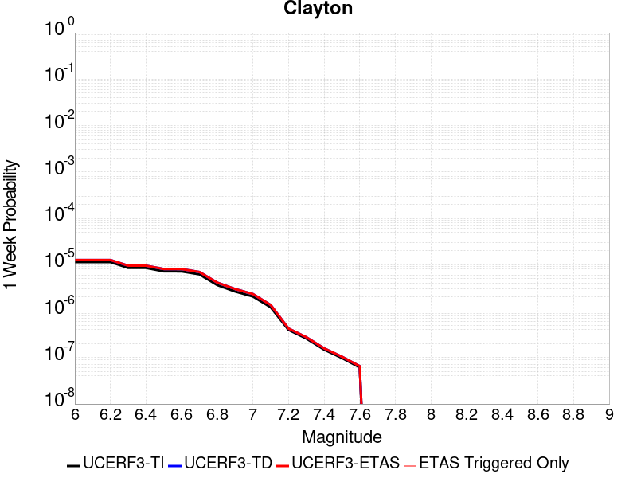 |  |  |  |

| Magnitude | 1 wk TI Prob | 1 wk TD Prob | 1 wk ETAS Prob | 1 wk ETAS/TD Gain | 1 wk ETAS Triggered Only | 1 mo TI Prob | 1 mo TD Prob | 1 mo ETAS Prob | 1 mo ETAS/TD Gain | 1 mo ETAS Triggered Only | 1 yr TI Prob | 1 yr TD Prob | 1 yr ETAS Prob | 1 yr ETAS/TD Gain | 1 yr ETAS Triggered Only | 10 yr TI Prob | 10 yr TD Prob | 10 yr ETAS Prob | 10 yr ETAS/TD Gain | 10 yr ETAS Triggered Only |
|-----|-----|-----|-----|-----|-----|-----|-----|-----|-----|-----|-----|-----|-----|-----|-----|-----|-----|-----|-----|-----|
| 6.0 | 1.1413061E-5 | 1.2667059E-5 | 1.2667059E-5 | 1.0 | 0.0 | 4.89122E-5 | 5.4286393E-5 | 5.4286393E-5 | 1.0 | 0.0 | 5.953433E-4 | 6.607586E-4 | 6.874077E-4 | 1.040331 | 2.6666667E-5 | 0.005937509 | 0.0065901424 | 0.0066166334 | 1.0040197 | 2.6666667E-5 |
| 6.1 | 1.1413061E-5 | 1.2667059E-5 | 1.2667059E-5 | 1.0 | 0.0 | 4.89122E-5 | 5.4286393E-5 | 5.4286393E-5 | 1.0 | 0.0 | 5.953433E-4 | 6.607586E-4 | 6.874077E-4 | 1.040331 | 2.6666667E-5 | 0.005937509 | 0.0065901424 | 0.0066166334 | 1.0040197 | 2.6666667E-5 |
| 6.2 | 1.1413061E-5 | 1.2667059E-5 | 1.2667059E-5 | 1.0 | 0.0 | 4.89122E-5 | 5.4286393E-5 | 5.4286393E-5 | 1.0 | 0.0 | 5.953433E-4 | 6.607586E-4 | 6.874077E-4 | 1.040331 | 2.6666667E-5 | 0.005937509 | 0.0065901424 | 0.0066166334 | 1.0040197 | 2.6666667E-5 |
| 6.3 | 8.538689E-6 | 9.532753E-6 | 9.532753E-6 | 1.0 | 0.0 | 3.659387E-5 | 4.0854076E-5 | 4.0854076E-5 | 1.0 | 0.0 | 4.4543925E-4 | 4.9729564E-4 | 5.2394904E-4 | 1.0535967 | 2.6666667E-5 | 0.0044454746 | 0.0049628937 | 0.004989428 | 1.0053465 | 2.6666667E-5 |
| 6.4 | 8.538689E-6 | 9.532753E-6 | 9.532753E-6 | 1.0 | 0.0 | 3.659387E-5 | 4.0854076E-5 | 4.0854076E-5 | 1.0 | 0.0 | 4.4543925E-4 | 4.9729564E-4 | 5.2394904E-4 | 1.0535967 | 2.6666667E-5 | 0.0044454746 | 0.0049628937 | 0.004989428 | 1.0053465 | 2.6666667E-5 |
| 6.5 | 7.197462E-6 | 8.080952E-6 | 8.080952E-6 | 1.0 | 0.0 | 3.08459E-5 | 3.4632238E-5 | 3.4632238E-5 | 1.0 | 0.0 | 3.7548412E-4 | 4.2157414E-4 | 4.4822955E-4 | 1.0632284 | 2.6666667E-5 | 0.003748503 | 0.004208556 | 0.0042351102 | 1.0063096 | 2.6666667E-5 |
| 6.6 | 7.1760483E-6 | 8.056968E-6 | 8.056968E-6 | 1.0 | 0.0 | 3.075413E-5 | 3.4529454E-5 | 3.4529454E-5 | 1.0 | 0.0 | 3.743672E-4 | 4.203232E-4 | 4.4697867E-4 | 1.0634166 | 2.6666667E-5 | 0.0037373714 | 0.004196094 | 0.0042226487 | 1.0063285 | 2.6666667E-5 |
| 6.7 | 6.202582E-6 | 6.9766934E-6 | 6.9766934E-6 | 1.0 | 0.0 | 2.6582224E-5 | 2.9899817E-5 | 2.9899817E-5 | 1.0 | 0.0 | 3.235905E-4 | 3.6397713E-4 | 3.6397713E-4 | 1.0 | 0.0 | 0.0032311971 | 0.0036345655 | 0.0036345655 | 1.0 | 0.0 |
| 6.8 | 3.6417277E-6 | 4.1212957E-6 | 4.1212957E-6 | 1.0 | 0.0 | 1.5607311E-5 | 1.766258E-5 | 1.766258E-5 | 1.0 | 0.0 | 1.9000245E-4 | 2.1502146E-4 | 2.1502146E-4 | 1.0 | 0.0 | 0.0018984007 | 0.0021482105 | 0.0021482105 | 1.0 | 0.0 |
| 6.9 | 2.6498485E-6 | 2.9995201E-6 | 2.9995201E-6 | 1.0 | 0.0 | 1.1356444E-5 | 1.2855025E-5 | 1.2855025E-5 | 1.0 | 0.0 | 1.3825593E-4 | 1.5649908E-4 | 1.5649908E-4 | 1.0 | 0.0 | 0.0013816995 | 0.0015639283 | 0.0015639283 | 1.0 | 0.0 |
| 7.0 | 2.070442E-6 | 2.3407233E-6 | 2.3407233E-6 | 1.0 | 0.0 | 8.873292E-6 | 1.0031635E-5 | 1.0031635E-5 | 1.0 | 0.0 | 1.0802698E-4 | 1.2212861E-4 | 1.2212861E-4 | 1.0 | 0.0 | 0.0010797448 | 0.0012206447 | 0.0012206447 | 1.0 | 0.0 |
| 7.1 | 1.2111691E-6 | 1.3588725E-6 | 1.3588725E-6 | 1.0 | 0.0 | 5.190714E-6 | 5.8237274E-6 | 5.8237274E-6 | 1.0 | 0.0 | 6.319511E-5 | 7.090174E-5 | 7.090174E-5 | 1.0 | 0.0 | 6.3177146E-4 | 7.0880755E-4 | 7.0880755E-4 | 1.0 | 0.0 |
| 7.2 | 3.9541607E-7 | 4.2227694E-7 | 4.2227694E-7 | 1.0 | 0.0 | 1.6946392E-6 | 1.8097571E-6 | 1.8097571E-6 | 1.0 | 0.0 | 2.0632036E-5 | 2.2033571E-5 | 2.2033571E-5 | 1.0 | 0.0 | 2.063012E-4 | 2.2031402E-4 | 2.2031402E-4 | 1.0 | 0.0 |
| 7.3 | 2.5685637E-7 | 2.745679E-7 | 2.745679E-7 | 1.0 | 0.0 | 1.1008126E-6 | 1.176719E-6 | 1.176719E-6 | 1.0 | 0.0 | 1.3402311E-5 | 1.4326461E-5 | 1.4326461E-5 | 1.0 | 0.0 | 1.3401502E-4 | 1.4325544E-4 | 1.4325544E-4 | 1.0 | 0.0 |
| 7.4 | 1.482299E-7 | 1.5807963E-7 | 1.5807963E-7 | 1.0 | 0.0 | 6.3527085E-7 | 6.7748397E-7 | 6.7748397E-7 | 1.0 | 0.0 | 7.734395E-6 | 8.248337E-6 | 8.248337E-6 | 1.0 | 0.0 | 7.734126E-5 | 8.248033E-5 | 8.248033E-5 | 1.0 | 0.0 |
| 7.5 | 9.7969505E-8 | 1.04382096E-7 | 1.04382096E-7 | 1.0 | 0.0 | 4.1986925E-7 | 4.4735177E-7 | 4.4735177E-7 | 1.0 | 0.0 | 5.111896E-6 | 5.446494E-6 | 5.446494E-6 | 1.0 | 0.0 | 5.1117782E-5 | 5.4463624E-5 | 5.4463624E-5 | 1.0 | 0.0 |
| 7.6 | 6.125415E-8 | 6.5231326E-8 | 6.5231326E-8 | 1.0 | 0.0 | 2.6251774E-7 | 2.7956278E-7 | 2.7956278E-7 | 1.0 | 0.0 | 3.196149E-6 | 3.4036718E-6 | 3.4036718E-6 | 1.0 | 0.0 | 3.196103E-5 | 3.403621E-5 | 3.403621E-5 | 1.0 | 0.0 |

## South Cuyama
*[(top)](#table-of-contents)*

| 1 Week | 1 Month | 1 Year | 10 Year |
|-----|-----|-----|-----|
|  |  |  |  |

| Magnitude | 1 wk TI Prob | 1 wk TD Prob | 1 wk ETAS Prob | 1 wk ETAS/TD Gain | 1 wk ETAS Triggered Only | 1 mo TI Prob | 1 mo TD Prob | 1 mo ETAS Prob | 1 mo ETAS/TD Gain | 1 mo ETAS Triggered Only | 1 yr TI Prob | 1 yr TD Prob | 1 yr ETAS Prob | 1 yr ETAS/TD Gain | 1 yr ETAS Triggered Only | 10 yr TI Prob | 10 yr TD Prob | 10 yr ETAS Prob | 10 yr ETAS/TD Gain | 10 yr ETAS Triggered Only |
|-----|-----|-----|-----|-----|-----|-----|-----|-----|-----|-----|-----|-----|-----|-----|-----|-----|-----|-----|-----|-----|
| 6.0 | 1.2747308E-6 | 1.2818697E-6 | 1.2818697E-6 | 1.0 | 0.0 | 5.4631205E-6 | 5.4937163E-6 | 5.4937163E-6 | 1.0 | 0.0 | 6.6511464E-5 | 6.6884015E-5 | 6.6884015E-5 | 1.0 | 0.0 | 6.649156E-4 | 6.686458E-4 | 6.9529464E-4 | 1.0398549 | 2.6666667E-5 |
| 6.1 | 1.2747308E-6 | 1.2818697E-6 | 1.2818697E-6 | 1.0 | 0.0 | 5.4631205E-6 | 5.4937163E-6 | 5.4937163E-6 | 1.0 | 0.0 | 6.6511464E-5 | 6.6884015E-5 | 6.6884015E-5 | 1.0 | 0.0 | 6.649156E-4 | 6.686458E-4 | 6.9529464E-4 | 1.0398549 | 2.6666667E-5 |
| 6.2 | 1.2747308E-6 | 1.2818697E-6 | 1.2818697E-6 | 1.0 | 0.0 | 5.4631205E-6 | 5.4937163E-6 | 5.4937163E-6 | 1.0 | 0.0 | 6.6511464E-5 | 6.6884015E-5 | 6.6884015E-5 | 1.0 | 0.0 | 6.649156E-4 | 6.686458E-4 | 6.9529464E-4 | 1.0398549 | 2.6666667E-5 |
| 6.3 | 1.2747308E-6 | 1.2818697E-6 | 1.2818697E-6 | 1.0 | 0.0 | 5.4631205E-6 | 5.4937163E-6 | 5.4937163E-6 | 1.0 | 0.0 | 6.6511464E-5 | 6.6884015E-5 | 6.6884015E-5 | 1.0 | 0.0 | 6.649156E-4 | 6.686458E-4 | 6.9529464E-4 | 1.0398549 | 2.6666667E-5 |
| 6.4 | 1.2747308E-6 | 1.2818697E-6 | 1.2818697E-6 | 1.0 | 0.0 | 5.4631205E-6 | 5.4937163E-6 | 5.4937163E-6 | 1.0 | 0.0 | 6.6511464E-5 | 6.6884015E-5 | 6.6884015E-5 | 1.0 | 0.0 | 6.649156E-4 | 6.686458E-4 | 6.9529464E-4 | 1.0398549 | 2.6666667E-5 |
| 6.5 | 1.2747308E-6 | 1.2818697E-6 | 1.2818697E-6 | 1.0 | 0.0 | 5.4631205E-6 | 5.4937163E-6 | 5.4937163E-6 | 1.0 | 0.0 | 6.6511464E-5 | 6.6884015E-5 | 6.6884015E-5 | 1.0 | 0.0 | 6.649156E-4 | 6.686458E-4 | 6.9529464E-4 | 1.0398549 | 2.6666667E-5 |
| 6.6 | 1.2747308E-6 | 1.2818697E-6 | 1.2818697E-6 | 1.0 | 0.0 | 5.4631205E-6 | 5.4937163E-6 | 5.4937163E-6 | 1.0 | 0.0 | 6.6511464E-5 | 6.6884015E-5 | 6.6884015E-5 | 1.0 | 0.0 | 6.649156E-4 | 6.686458E-4 | 6.9529464E-4 | 1.0398549 | 2.6666667E-5 |
| 6.7 | 1.2747308E-6 | 1.2818697E-6 | 1.2818697E-6 | 1.0 | 0.0 | 5.4631205E-6 | 5.4937163E-6 | 5.4937163E-6 | 1.0 | 0.0 | 6.6511464E-5 | 6.6884015E-5 | 6.6884015E-5 | 1.0 | 0.0 | 6.649156E-4 | 6.686458E-4 | 6.9529464E-4 | 1.0398549 | 2.6666667E-5 |
| 6.8 | 1.2747308E-6 | 1.2818697E-6 | 1.2818697E-6 | 1.0 | 0.0 | 5.4631205E-6 | 5.4937163E-6 | 5.4937163E-6 | 1.0 | 0.0 | 6.6511464E-5 | 6.6884015E-5 | 6.6884015E-5 | 1.0 | 0.0 | 6.649156E-4 | 6.686458E-4 | 6.9529464E-4 | 1.0398549 | 2.6666667E-5 |
| 6.9 | 8.4566324E-7 | 8.507883E-7 | 8.507883E-7 | 1.0 | 0.0 | 3.624266E-6 | 3.6462304E-6 | 3.6462304E-6 | 1.0 | 0.0 | 4.4124543E-5 | 4.439196E-5 | 4.439196E-5 | 1.0 | 0.0 | 4.4115784E-4 | 4.4383196E-4 | 4.704868E-4 | 1.0600561 | 2.6666667E-5 |
| 7.0 | 8.2277904E-7 | 8.27782E-7 | 8.27782E-7 | 1.0 | 0.0 | 3.526191E-6 | 3.5476323E-6 | 3.5476323E-6 | 1.0 | 0.0 | 4.293053E-5 | 4.3191576E-5 | 4.3191576E-5 | 1.0 | 0.0 | 4.292224E-4 | 4.3183283E-4 | 4.5848798E-4 | 1.0617256 | 2.6666667E-5 |
| 7.1 | 6.7661887E-7 | 6.80913E-7 | 6.80913E-7 | 1.0 | 0.0 | 2.899792E-6 | 2.9181954E-6 | 2.9181954E-6 | 1.0 | 0.0 | 3.5304394E-5 | 3.5528454E-5 | 3.5528454E-5 | 1.0 | 0.0 | 3.5298787E-4 | 3.552281E-4 | 3.818853E-4 | 1.0750425 | 2.6666667E-5 |
| 7.2 | 5.783336E-7 | 5.8211907E-7 | 5.8211907E-7 | 1.0 | 0.0 | 2.4785702E-6 | 2.4947938E-6 | 2.4947938E-6 | 1.0 | 0.0 | 3.0176174E-5 | 3.0373692E-5 | 3.0373692E-5 | 1.0 | 0.0 | 3.0172078E-4 | 3.0369565E-4 | 3.3035423E-4 | 1.0877806 | 2.6666667E-5 |
| 7.3 | 5.136759E-7 | 5.170938E-7 | 5.170938E-7 | 1.0 | 0.0 | 2.2014663E-6 | 2.2161144E-6 | 2.2161144E-6 | 1.0 | 0.0 | 2.6802521E-5 | 2.698086E-5 | 2.698086E-5 | 1.0 | 0.0 | 2.679929E-4 | 2.6977606E-4 | 2.9643552E-4 | 1.0988208 | 2.6666667E-5 |
| 7.4 | 4.3370295E-7 | 4.3665364E-7 | 4.3665364E-7 | 1.0 | 0.0 | 1.8587256E-6 | 1.8713713E-6 | 1.8713713E-6 | 1.0 | 0.0 | 2.2629749E-5 | 2.278371E-5 | 2.278371E-5 | 1.0 | 0.0 | 2.2627445E-4 | 2.278139E-4 | 2.544745E-4 | 1.117028 | 2.6666667E-5 |
| 7.5 | 3.3242574E-7 | 3.3476465E-7 | 3.3476465E-7 | 1.0 | 0.0 | 1.4246809E-6 | 1.4347048E-6 | 1.4347048E-6 | 1.0 | 0.0 | 1.7345352E-5 | 1.7467393E-5 | 1.7467393E-5 | 1.0 | 0.0 | 1.7343998E-4 | 1.7466032E-4 | 1.7466032E-4 | 1.0 | 0.0 |
| 7.6 | 2.0627535E-7 | 2.07789E-7 | 2.07789E-7 | 1.0 | 0.0 | 8.840369E-7 | 8.90524E-7 | 8.90524E-7 | 1.0 | 0.0 | 1.0763096E-5 | 1.0842076E-5 | 1.0842076E-5 | 1.0 | 0.0 | 1.0762575E-4 | 1.0841556E-4 | 1.0841556E-4 | 1.0 | 0.0 |
| 7.7 | 6.15236E-8 | 6.1983044E-8 | 6.1983044E-8 | 1.0 | 0.0 | 2.6367252E-7 | 2.656416E-7 | 2.656416E-7 | 1.0 | 0.0 | 3.2102084E-6 | 3.2341818E-6 | 3.2341818E-6 | 1.0 | 0.0 | 3.210162E-5 | 3.234136E-5 | 3.234136E-5 | 1.0 | 0.0 |
| 7.8 | 1.1765573E-8 | 1.1873414E-8 | 1.1873414E-8 | 1.0 | 0.0 | 5.0423886E-8 | 5.0886058E-8 | 5.0886058E-8 | 1.0 | 0.0 | 6.1391063E-7 | 6.195376E-7 | 6.195376E-7 | 1.0 | 0.0 | 6.1390897E-6 | 6.19536E-6 | 6.19536E-6 | 1.0 | 0.0 |
| 7.9 | 6.0381755E-10 | 6.10058E-10 | 6.10058E-10 | 1.0 | 0.0 | 2.5877895E-9 | 2.614534E-9 | 2.614534E-9 | 1.0 | 0.0 | 3.1506335E-8 | 3.1831952E-8 | 3.1831952E-8 | 1.0 | 0.0 | 3.1506332E-7 | 3.183195E-7 | 3.183195E-7 | 1.0 | 0.0 |

## Channel Islands Western Deep Ramp
*[(top)](#table-of-contents)*

| 1 Week | 1 Month | 1 Year | 10 Year |
|-----|-----|-----|-----|
|  |  |  |  |

| Magnitude | 1 wk TI Prob | 1 wk TD Prob | 1 wk ETAS Prob | 1 wk ETAS/TD Gain | 1 wk ETAS Triggered Only | 1 mo TI Prob | 1 mo TD Prob | 1 mo ETAS Prob | 1 mo ETAS/TD Gain | 1 mo ETAS Triggered Only | 1 yr TI Prob | 1 yr TD Prob | 1 yr ETAS Prob | 1 yr ETAS/TD Gain | 1 yr ETAS Triggered Only | 10 yr TI Prob | 10 yr TD Prob | 10 yr ETAS Prob | 10 yr ETAS/TD Gain | 10 yr ETAS Triggered Only |
|-----|-----|-----|-----|-----|-----|-----|-----|-----|-----|-----|-----|-----|-----|-----|-----|-----|-----|-----|-----|-----|
| 6.0 | 6.0213506E-6 | 6.2548684E-6 | 6.2548684E-6 | 1.0 | 0.0 | 2.5805533E-5 | 2.6806329E-5 | 2.6806329E-5 | 1.0 | 0.0 | 3.1413708E-4 | 3.2632265E-4 | 3.2632265E-4 | 1.0 | 0.0 | 0.0031369338 | 0.0032588763 | 0.003285456 | 1.0081561 | 2.6666667E-5 |
| 6.1 | 6.0213506E-6 | 6.2548684E-6 | 6.2548684E-6 | 1.0 | 0.0 | 2.5805533E-5 | 2.6806329E-5 | 2.6806329E-5 | 1.0 | 0.0 | 3.1413708E-4 | 3.2632265E-4 | 3.2632265E-4 | 1.0 | 0.0 | 0.0031369338 | 0.0032588763 | 0.003285456 | 1.0081561 | 2.6666667E-5 |
| 6.2 | 6.0213506E-6 | 6.2548684E-6 | 6.2548684E-6 | 1.0 | 0.0 | 2.5805533E-5 | 2.6806329E-5 | 2.6806329E-5 | 1.0 | 0.0 | 3.1413708E-4 | 3.2632265E-4 | 3.2632265E-4 | 1.0 | 0.0 | 0.0031369338 | 0.0032588763 | 0.003285456 | 1.0081561 | 2.6666667E-5 |
| 6.3 | 6.0213506E-6 | 6.2548684E-6 | 6.2548684E-6 | 1.0 | 0.0 | 2.5805533E-5 | 2.6806329E-5 | 2.6806329E-5 | 1.0 | 0.0 | 3.1413708E-4 | 3.2632265E-4 | 3.2632265E-4 | 1.0 | 0.0 | 0.0031369338 | 0.0032588763 | 0.003285456 | 1.0081561 | 2.6666667E-5 |
| 6.4 | 6.0213506E-6 | 6.2548684E-6 | 6.2548684E-6 | 1.0 | 0.0 | 2.5805533E-5 | 2.6806329E-5 | 2.6806329E-5 | 1.0 | 0.0 | 3.1413708E-4 | 3.2632265E-4 | 3.2632265E-4 | 1.0 | 0.0 | 0.0031369338 | 0.0032588763 | 0.003285456 | 1.0081561 | 2.6666667E-5 |
| 6.5 | 6.0213506E-6 | 6.2548684E-6 | 6.2548684E-6 | 1.0 | 0.0 | 2.5805533E-5 | 2.6806329E-5 | 2.6806329E-5 | 1.0 | 0.0 | 3.1413708E-4 | 3.2632265E-4 | 3.2632265E-4 | 1.0 | 0.0 | 0.0031369338 | 0.0032588763 | 0.003285456 | 1.0081561 | 2.6666667E-5 |
| 6.6 | 6.0213506E-6 | 6.2548684E-6 | 6.2548684E-6 | 1.0 | 0.0 | 2.5805533E-5 | 2.6806329E-5 | 2.6806329E-5 | 1.0 | 0.0 | 3.1413708E-4 | 3.2632265E-4 | 3.2632265E-4 | 1.0 | 0.0 | 0.0031369338 | 0.0032588763 | 0.003285456 | 1.0081561 | 2.6666667E-5 |
| 6.7 | 5.313309E-6 | 5.5252403E-6 | 5.5252403E-6 | 1.0 | 0.0 | 2.2771126E-5 | 2.367941E-5 | 2.367941E-5 | 1.0 | 0.0 | 2.772032E-4 | 2.8826276E-4 | 2.8826276E-4 | 1.0 | 0.0 | 0.0027685766 | 0.0028792918 | 0.0029058815 | 1.0092349 | 2.6666667E-5 |
| 6.8 | 5.313309E-6 | 5.5252403E-6 | 5.5252403E-6 | 1.0 | 0.0 | 2.2771126E-5 | 2.367941E-5 | 2.367941E-5 | 1.0 | 0.0 | 2.772032E-4 | 2.8826276E-4 | 2.8826276E-4 | 1.0 | 0.0 | 0.0027685766 | 0.0028792918 | 0.0029058815 | 1.0092349 | 2.6666667E-5 |
| 6.9 | 4.744377E-6 | 4.9394303E-6 | 4.9394303E-6 | 1.0 | 0.0 | 2.0332885E-5 | 2.1168837E-5 | 2.1168837E-5 | 1.0 | 0.0 | 2.4752476E-4 | 2.5770385E-4 | 2.5770385E-4 | 1.0 | 0.0 | 0.0024724922 | 0.0025744175 | 0.0026010154 | 1.0103316 | 2.6666667E-5 |
| 7.0 | 4.722209E-6 | 4.9164732E-6 | 4.9164732E-6 | 1.0 | 0.0 | 2.0237881E-5 | 2.107045E-5 | 2.107045E-5 | 1.0 | 0.0 | 2.4636835E-4 | 2.5650626E-4 | 2.5650626E-4 | 1.0 | 0.0 | 0.002460954 | 0.0025624693 | 0.0025890677 | 1.0103799 | 2.6666667E-5 |
| 7.1 | 4.611174E-6 | 4.801409E-6 | 4.801409E-6 | 1.0 | 0.0 | 1.9762025E-5 | 2.0577325E-5 | 2.0577325E-5 | 1.0 | 0.0 | 2.4057609E-4 | 2.5050386E-4 | 2.5050386E-4 | 1.0 | 0.0 | 0.002403158 | 0.002502582 | 0.0025291818 | 1.0106289 | 2.6666667E-5 |
| 7.2 | 4.043994E-6 | 4.2120264E-6 | 4.2120264E-6 | 1.0 | 0.0 | 1.7331287E-5 | 1.8051438E-5 | 1.8051438E-5 | 1.0 | 0.0 | 2.10988E-4 | 2.1975765E-4 | 2.1975765E-4 | 1.0 | 0.0 | 0.002107878 | 0.0021957543 | 0.0022223624 | 1.012118 | 2.6666667E-5 |
| 7.3 | 2.1233036E-6 | 2.2297875E-6 | 2.2297875E-6 | 1.0 | 0.0 | 9.099841E-6 | 9.556197E-6 | 9.556197E-6 | 1.0 | 0.0 | 1.1078493E-4 | 1.1634055E-4 | 1.1634055E-4 | 1.0 | 0.0 | 0.0011072971 | 0.001162802 | 0.0011894376 | 1.0229064 | 2.6666667E-5 |
| 7.4 | 1.9051884E-6 | 2.0014973E-6 | 2.0014973E-6 | 1.0 | 0.0 | 8.165067E-6 | 8.577817E-6 | 8.577817E-6 | 1.0 | 0.0 | 9.940516E-5 | 1.0442998E-4 | 1.0442998E-4 | 1.0 | 0.0 | 9.93607E-4 | 0.0010438144 | 0.0010438144 | 1.0 | 0.0 |
| 7.5 | 1.2408497E-6 | 1.3038839E-6 | 1.3038839E-6 | 1.0 | 0.0 | 5.317916E-6 | 5.588062E-6 | 5.588062E-6 | 1.0 | 0.0 | 6.4743705E-5 | 6.8032554E-5 | 6.8032554E-5 | 1.0 | 0.0 | 6.4724847E-4 | 6.8011944E-4 | 6.8011944E-4 | 1.0 | 0.0 |
| 7.6 | 6.5440025E-7 | 6.886718E-7 | 6.886718E-7 | 1.0 | 0.0 | 2.8045695E-6 | 2.9514472E-6 | 2.9514472E-6 | 1.0 | 0.0 | 3.4145098E-5 | 3.593329E-5 | 3.593329E-5 | 1.0 | 0.0 | 3.4139853E-4 | 3.5927625E-4 | 3.5927625E-4 | 1.0 | 0.0 |
| 7.7 | 3.985963E-7 | 4.1930787E-7 | 4.1930787E-7 | 1.0 | 0.0 | 1.7082689E-6 | 1.7970326E-6 | 1.7970326E-6 | 1.0 | 0.0 | 2.0797976E-5 | 2.1878664E-5 | 2.1878664E-5 | 1.0 | 0.0 | 2.0796029E-4 | 2.1876628E-4 | 2.1876628E-4 | 1.0 | 0.0 |
| 7.8 | 3.706329E-8 | 3.8591796E-8 | 3.8591796E-8 | 1.0 | 0.0 | 1.5884267E-7 | 1.653934E-7 | 1.653934E-7 | 1.0 | 0.0 | 1.9339077E-6 | 2.0136629E-6 | 2.0136629E-6 | 1.0 | 0.0 | 1.933891E-5 | 2.0136458E-5 | 2.0136458E-5 | 1.0 | 0.0 |

## Earthquake Valley (No  Extension)
*[(top)](#table-of-contents)*

| 1 Week | 1 Month | 1 Year | 10 Year |
|-----|-----|-----|-----|
|  |  |  |  |

| Magnitude | 1 wk TI Prob | 1 wk TD Prob | 1 wk ETAS Prob | 1 wk ETAS/TD Gain | 1 wk ETAS Triggered Only | 1 mo TI Prob | 1 mo TD Prob | 1 mo ETAS Prob | 1 mo ETAS/TD Gain | 1 mo ETAS Triggered Only | 1 yr TI Prob | 1 yr TD Prob | 1 yr ETAS Prob | 1 yr ETAS/TD Gain | 1 yr ETAS Triggered Only | 10 yr TI Prob | 10 yr TD Prob | 10 yr ETAS Prob | 10 yr ETAS/TD Gain | 10 yr ETAS Triggered Only |
|-----|-----|-----|-----|-----|-----|-----|-----|-----|-----|-----|-----|-----|-----|-----|-----|-----|-----|-----|-----|-----|
| 6.0 | 2.1859703E-5 | 2.5198362E-5 | 2.5198362E-5 | 1.0 | 0.0 | 9.3681076E-5 | 1.07989326E-4 | 1.07989326E-4 | 1.0 | 0.0 | 0.0011399703 | 0.001314122 | 0.0013407536 | 1.0202657 | 2.6666667E-5 | 0.011341401 | 0.013077871 | 0.013104189 | 1.0020124 | 2.6666667E-5 |
| 6.1 | 2.1859703E-5 | 2.5198362E-5 | 2.5198362E-5 | 1.0 | 0.0 | 9.3681076E-5 | 1.07989326E-4 | 1.07989326E-4 | 1.0 | 0.0 | 0.0011399703 | 0.001314122 | 0.0013407536 | 1.0202657 | 2.6666667E-5 | 0.011341401 | 0.013077871 | 0.013104189 | 1.0020124 | 2.6666667E-5 |
| 6.2 | 2.1859703E-5 | 2.5198362E-5 | 2.5198362E-5 | 1.0 | 0.0 | 9.3681076E-5 | 1.07989326E-4 | 1.07989326E-4 | 1.0 | 0.0 | 0.0011399703 | 0.001314122 | 0.0013407536 | 1.0202657 | 2.6666667E-5 | 0.011341401 | 0.013077871 | 0.013104189 | 1.0020124 | 2.6666667E-5 |
| 6.3 | 2.1859703E-5 | 2.5198362E-5 | 2.5198362E-5 | 1.0 | 0.0 | 9.3681076E-5 | 1.07989326E-4 | 1.07989326E-4 | 1.0 | 0.0 | 0.0011399703 | 0.001314122 | 0.0013407536 | 1.0202657 | 2.6666667E-5 | 0.011341401 | 0.013077871 | 0.013104189 | 1.0020124 | 2.6666667E-5 |
| 6.4 | 2.1859703E-5 | 2.5198362E-5 | 2.5198362E-5 | 1.0 | 0.0 | 9.3681076E-5 | 1.07989326E-4 | 1.07989326E-4 | 1.0 | 0.0 | 0.0011399703 | 0.001314122 | 0.0013407536 | 1.0202657 | 2.6666667E-5 | 0.011341401 | 0.013077871 | 0.013104189 | 1.0020124 | 2.6666667E-5 |
| 6.5 | 2.1859703E-5 | 2.5198362E-5 | 2.5198362E-5 | 1.0 | 0.0 | 9.3681076E-5 | 1.07989326E-4 | 1.07989326E-4 | 1.0 | 0.0 | 0.0011399703 | 0.001314122 | 0.0013407536 | 1.0202657 | 2.6666667E-5 | 0.011341401 | 0.013077871 | 0.013104189 | 1.0020124 | 2.6666667E-5 |
| 6.6 | 1.597E-5 | 1.8356275E-5 | 1.8356275E-5 | 1.0 | 0.0 | 6.8441055E-5 | 7.866787E-5 | 7.866787E-5 | 1.0 | 0.0 | 8.329513E-4 | 9.574478E-4 | 9.84089E-4 | 1.0278251 | 2.6666667E-5 | 0.008298361 | 0.009541836 | 0.009568248 | 1.002768 | 2.6666667E-5 |
| 6.7 | 1.597E-5 | 1.8356275E-5 | 1.8356275E-5 | 1.0 | 0.0 | 6.8441055E-5 | 7.866787E-5 | 7.866787E-5 | 1.0 | 0.0 | 8.329513E-4 | 9.574478E-4 | 9.84089E-4 | 1.0278251 | 2.6666667E-5 | 0.008298361 | 0.009541836 | 0.009568248 | 1.002768 | 2.6666667E-5 |
| 6.8 | 1.5315149E-5 | 1.7602091E-5 | 1.7602091E-5 | 1.0 | 0.0 | 6.5634704E-5 | 7.543584E-5 | 7.543584E-5 | 1.0 | 0.0 | 7.988095E-4 | 9.181311E-4 | 9.4477326E-4 | 1.0290178 | 2.6666667E-5 | 0.007959441 | 0.009151919 | 0.009178341 | 1.0028871 | 2.6666667E-5 |
| 6.9 | 1.3634728E-5 | 1.5675821E-5 | 1.5675821E-5 | 1.0 | 0.0 | 5.8433237E-5 | 6.718082E-5 | 6.718082E-5 | 1.0 | 0.0 | 7.1119244E-4 | 8.177017E-4 | 8.4434653E-4 | 1.032585 | 2.6666667E-5 | 0.007089207 | 0.008155 | 0.00818145 | 1.0032433 | 2.6666667E-5 |
| 7.0 | 1.3496271E-5 | 1.5517853E-5 | 1.5517853E-5 | 1.0 | 0.0 | 5.783988E-5 | 6.650385E-5 | 6.650385E-5 | 1.0 | 0.0 | 7.03973E-4 | 8.094657E-4 | 8.361108E-4 | 1.0329169 | 2.6666667E-5 | 0.007017471 | 0.0080732405 | 0.008099692 | 1.0032765 | 2.6666667E-5 |
| 7.1 | 8.242798E-6 | 9.4726E-6 | 9.4726E-6 | 1.0 | 0.0 | 3.53258E-5 | 4.0596606E-5 | 4.0596606E-5 | 1.0 | 0.0 | 4.300067E-4 | 4.9421866E-4 | 5.208721E-4 | 1.0539305 | 2.6666667E-5 | 0.004291756 | 0.0049377717 | 0.004964307 | 1.0053738 | 2.6666667E-5 |
| 7.2 | 2.6506527E-7 | 2.2560312E-7 | 2.2560312E-7 | 1.0 | 0.0 | 1.1359936E-6 | 9.668702E-7 | 9.668702E-7 | 1.0 | 0.0 | 1.3830633E-5 | 1.17715845E-5 | 1.17715845E-5 | 1.0 | 0.0 | 1.3829772E-4 | 1.1771003E-4 | 1.1771003E-4 | 1.0 | 0.0 |
| 7.3 | 2.5810488E-7 | 2.1955442E-7 | 2.1955442E-7 | 1.0 | 0.0 | 1.1061633E-6 | 9.409472E-7 | 9.409472E-7 | 1.0 | 0.0 | 1.3467455E-5 | 1.1455976E-5 | 1.1455976E-5 | 1.0 | 0.0 | 1.3466639E-4 | 1.1455427E-4 | 1.1455427E-4 | 1.0 | 0.0 |
| 7.4 | 2.2676066E-7 | 1.9110601E-7 | 1.9110601E-7 | 1.0 | 0.0 | 9.71831E-7 | 8.190255E-7 | 8.190255E-7 | 1.0 | 0.0 | 1.1831979E-5 | 9.9715935E-6 | 9.9715935E-6 | 1.0 | 0.0 | 1.1831349E-4 | 9.9711855E-5 | 9.9711855E-5 | 1.0 | 0.0 |
| 7.5 | 1.5553917E-7 | 1.3112096E-7 | 1.3112096E-7 | 1.0 | 0.0 | 6.6659624E-7 | 5.619469E-7 | 5.619469E-7 | 1.0 | 0.0 | 8.115779E-6 | 6.8416834E-6 | 6.8416834E-6 | 1.0 | 0.0 | 8.115482E-5 | 6.841495E-5 | 6.841495E-5 | 1.0 | 0.0 |
| 7.6 | 1.3448629E-7 | 1.1288419E-7 | 1.1288419E-7 | 1.0 | 0.0 | 5.7636964E-7 | 4.837893E-7 | 4.837893E-7 | 1.0 | 0.0 | 7.017278E-6 | 5.890121E-6 | 5.890121E-6 | 1.0 | 0.0 | 7.0170565E-5 | 5.889986E-5 | 5.889986E-5 | 1.0 | 0.0 |
| 7.7 | 2.9719402E-8 | 1.458206E-8 | 1.458206E-8 | 1.0 | 0.0 | 1.2736886E-7 | 6.249454E-8 | 6.249454E-8 | 1.0 | 0.0 | 1.5507147E-6 | 7.608708E-7 | 7.608708E-7 | 1.0 | 0.0 | 1.550704E-5 | 7.6086876E-6 | 7.6086876E-6 | 1.0 | 0.0 |
| 7.8 | 7.4390196E-9 | 3.2502152E-9 | 3.2502152E-9 | 1.0 | 0.0 | 3.1881513E-8 | 1.3929493E-8 | 1.3929493E-8 | 1.0 | 0.0 | 3.8815733E-7 | 1.6959156E-7 | 1.6959156E-7 | 1.0 | 0.0 | 3.8815665E-6 | 1.6959145E-6 | 1.6959145E-6 | 1.0 | 0.0 |
| 7.9 | 1.5373532E-9 | 8.440161E-10 | 8.440161E-10 | 1.0 | 0.0 | 6.5886567E-9 | 3.6172119E-9 | 3.6172119E-9 | 1.0 | 0.0 | 8.021689E-8 | 4.4039556E-8 | 4.4039556E-8 | 1.0 | 0.0 | 8.0216864E-7 | 4.4039552E-7 | 4.4039552E-7 | 1.0 | 0.0 |

## San Andreas (Santa Cruz Mts) 2011 CFM
*[(top)](#table-of-contents)*

| 1 Week | 1 Month | 1 Year | 10 Year |
|-----|-----|-----|-----|
|  |  | 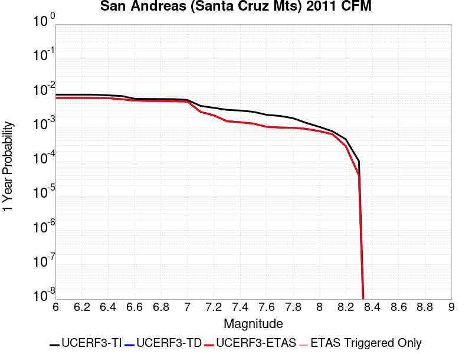 | 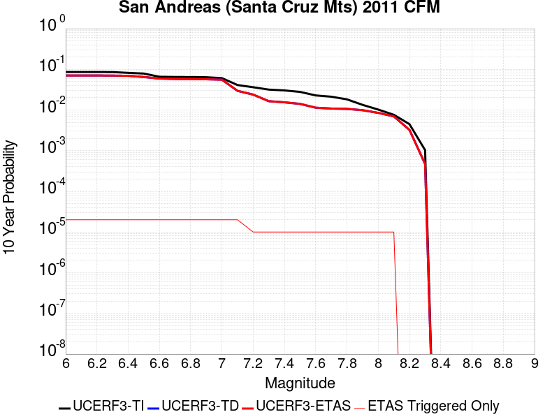 |

| Magnitude | 1 wk TI Prob | 1 wk TD Prob | 1 wk ETAS Prob | 1 wk ETAS/TD Gain | 1 wk ETAS Triggered Only | 1 mo TI Prob | 1 mo TD Prob | 1 mo ETAS Prob | 1 mo ETAS/TD Gain | 1 mo ETAS Triggered Only | 1 yr TI Prob | 1 yr TD Prob | 1 yr ETAS Prob | 1 yr ETAS/TD Gain | 1 yr ETAS Triggered Only | 10 yr TI Prob | 10 yr TD Prob | 10 yr ETAS Prob | 10 yr ETAS/TD Gain | 10 yr ETAS Triggered Only |
|-----|-----|-----|-----|-----|-----|-----|-----|-----|-----|-----|-----|-----|-----|-----|-----|-----|-----|-----|-----|-----|
| 6.0 | 1.7221631E-4 | 1.3793171E-4 | 1.3793171E-4 | 1.0 | 0.0 | 7.378611E-4 | 5.9100403E-4 | 5.9100403E-4 | 1.0 | 0.0 | 0.008946515 | 0.007172124 | 0.007172124 | 1.0 | 0.0 | 0.08594794 | 0.0705551 | 0.07057988 | 1.0003513 | 2.6666667E-5 |
| 6.1 | 1.7221631E-4 | 1.3793171E-4 | 1.3793171E-4 | 1.0 | 0.0 | 7.378611E-4 | 5.9100403E-4 | 5.9100403E-4 | 1.0 | 0.0 | 0.008946515 | 0.007172124 | 0.007172124 | 1.0 | 0.0 | 0.08594794 | 0.0705551 | 0.07057988 | 1.0003513 | 2.6666667E-5 |
| 6.2 | 1.7221631E-4 | 1.3793171E-4 | 1.3793171E-4 | 1.0 | 0.0 | 7.378611E-4 | 5.9100403E-4 | 5.9100403E-4 | 1.0 | 0.0 | 0.008946515 | 0.007172124 | 0.007172124 | 1.0 | 0.0 | 0.08594794 | 0.0705551 | 0.07057988 | 1.0003513 | 2.6666667E-5 |
| 6.3 | 1.716926E-4 | 1.3712609E-4 | 1.3712609E-4 | 1.0 | 0.0 | 7.3561794E-4 | 5.875529E-4 | 5.875529E-4 | 1.0 | 0.0 | 0.008919428 | 0.0071303817 | 0.0071303817 | 1.0 | 0.0 | 0.08569809 | 0.070167266 | 0.07019206 | 1.0003533 | 2.6666667E-5 |
| 6.4 | 1.6392978E-4 | 1.3588481E-4 | 1.3588481E-4 | 1.0 | 0.0 | 7.02367E-4 | 5.822355E-4 | 5.822355E-4 | 1.0 | 0.0 | 0.008517839 | 0.007066063 | 0.007066063 | 1.0 | 0.0 | 0.08198654 | 0.06940135 | 0.06942617 | 1.0003576 | 2.6666667E-5 |
| 6.5 | 1.5742714E-4 | 1.2648388E-4 | 1.2648388E-4 | 1.0 | 0.0 | 6.745133E-4 | 5.4196286E-4 | 5.4196286E-4 | 1.0 | 0.0 | 0.00818132 | 0.0065787593 | 0.0065787593 | 1.0 | 0.0 | 0.078865945 | 0.06486309 | 0.06488803 | 1.0003844 | 2.6666667E-5 |
| 6.6 | 1.3038084E-4 | 1.1588213E-4 | 1.1588213E-4 | 1.0 | 0.0 | 5.5865536E-4 | 4.9654447E-4 | 4.9654447E-4 | 1.0 | 0.0 | 0.006780438 | 0.0060289134 | 0.0060289134 | 1.0 | 0.0 | 0.0657725 | 0.05932738 | 0.059352465 | 1.0004228 | 2.6666667E-5 |
| 6.7 | 1.2867592E-4 | 1.1314701E-4 | 1.1314701E-4 | 1.0 | 0.0 | 5.5135164E-4 | 4.8482692E-4 | 4.8482692E-4 | 1.0 | 0.0 | 0.0066920654 | 0.00588703 | 0.00588703 | 1.0 | 0.0 | 0.06494093 | 0.058038417 | 0.058063537 | 1.0004328 | 2.6666667E-5 |
| 6.8 | 1.2801298E-4 | 1.1252261E-4 | 1.1252261E-4 | 1.0 | 0.0 | 5.485117E-4 | 4.8215193E-4 | 4.8215193E-4 | 1.0 | 0.0 | 0.0066577005 | 0.0058546383 | 0.0058546383 | 1.0 | 0.0 | 0.06461738 | 0.057752274 | 0.057777397 | 1.0004351 | 2.6666667E-5 |
| 6.9 | 1.269149E-4 | 1.1094465E-4 | 1.1094465E-4 | 1.0 | 0.0 | 5.4380763E-4 | 4.7539172E-4 | 4.7539172E-4 | 1.0 | 0.0 | 0.006600777 | 0.005772772 | 0.005772772 | 1.0 | 0.0 | 0.06408122 | 0.0570241 | 0.057049245 | 1.000441 | 2.6666667E-5 |
| 7.0 | 1.2030331E-4 | 1.0824504E-4 | 1.0824504E-4 | 1.0 | 0.0 | 5.154837E-4 | 4.638261E-4 | 4.638261E-4 | 1.0 | 0.0 | 0.006257969 | 0.0056326967 | 0.0056326967 | 1.0 | 0.0 | 0.06084648 | 0.055696685 | 0.055721868 | 1.0004522 | 2.6666667E-5 |
| 7.1 | 8.049617E-5 | 5.3926604E-5 | 5.3926604E-5 | 1.0 | 0.0 | 3.4493793E-4 | 2.3109373E-4 | 2.3109373E-4 | 1.0 | 0.0 | 0.0041915346 | 0.0028099709 | 0.0028099709 | 1.0 | 0.0 | 0.041133516 | 0.029618956 | 0.029644834 | 1.0008737 | 2.6666667E-5 |
| 7.2 | 7.093979E-5 | 4.2937932E-5 | 4.2937932E-5 | 1.0 | 0.0 | 3.0399222E-4 | 1.8400686E-4 | 1.8400686E-4 | 1.0 | 0.0 | 0.0036948253 | 0.0022380045 | 0.0022380045 | 1.0 | 0.0 | 0.03633994 | 0.023941692 | 0.023967719 | 1.0010872 | 2.6666667E-5 |
| 7.3 | 6.193693E-5 | 2.8894141E-5 | 2.8894141E-5 | 1.0 | 0.0 | 2.6541698E-4 | 1.2382616E-4 | 1.2382616E-4 | 1.0 | 0.0 | 0.0032266637 | 0.0015065427 | 0.0015065427 | 1.0 | 0.0 | 0.031802133 | 0.016499156 | 0.016525382 | 1.0015895 | 2.6666667E-5 |
| 7.4 | 5.906492E-5 | 2.702346E-5 | 2.702346E-5 | 1.0 | 0.0 | 2.5311083E-4 | 1.1580969E-4 | 1.1580969E-4 | 1.0 | 0.0 | 0.0030772698 | 0.0014090725 | 0.0014090725 | 1.0 | 0.0 | 0.030350044 | 0.015471023 | 0.015497277 | 1.001697 | 2.6666667E-5 |
| 7.5 | 5.424296E-5 | 2.4678277E-5 | 2.4678277E-5 | 1.0 | 0.0 | 2.324491E-4 | 1.05759755E-4 | 1.05759755E-4 | 1.0 | 0.0 | 0.002826395 | 0.0012868657 | 0.0012868657 | 1.0 | 0.0 | 0.027907165 | 0.014163188 | 0.014189476 | 1.0018562 | 2.6666667E-5 |
| 7.6 | 4.43084E-5 | 1.990431E-5 | 1.990431E-5 | 1.0 | 0.0 | 1.8987931E-4 | 8.53014E-5 | 8.53014E-5 | 1.0 | 0.0 | 0.0023093296 | 0.0010380499 | 0.0010380499 | 1.0 | 0.0 | 0.022854783 | 0.011412679 | 0.011439042 | 1.0023099 | 2.6666667E-5 |
| 7.7 | 4.118098E-5 | 1.8936442E-5 | 1.8936442E-5 | 1.0 | 0.0 | 1.7647797E-4 | 8.115366E-5 | 8.115366E-5 | 1.0 | 0.0 | 0.002146502 | 9.875982E-4 | 9.875982E-4 | 1.0 | 0.0 | 0.021258866 | 0.010870468 | 0.010896845 | 1.0024265 | 2.6666667E-5 |
| 7.8 | 3.5408906E-5 | 1.856446E-5 | 1.856446E-5 | 1.0 | 0.0 | 1.5174363E-4 | 7.955955E-5 | 7.955955E-5 | 1.0 | 0.0 | 0.0018459131 | 9.682073E-4 | 9.682073E-4 | 1.0 | 0.0 | 0.018306552 | 0.010652021 | 0.010678403 | 1.0024768 | 2.6666667E-5 |
| 7.9 | 2.5860836E-5 | 1.7315993E-5 | 1.7315993E-5 | 1.0 | 0.0 | 1.10827445E-4 | 7.420929E-5 | 7.420929E-5 | 1.0 | 0.0 | 0.001348489 | 9.031238E-4 | 9.031238E-4 | 1.0 | 0.0 | 0.013403354 | 0.009907599 | 0.009934002 | 1.0026649 | 2.6666667E-5 |
| 8.0 | 1.9777332E-5 | 1.4839596E-5 | 1.4839596E-5 | 1.0 | 0.0 | 8.4757245E-5 | 6.3596715E-5 | 6.3596715E-5 | 1.0 | 0.0 | 0.0010314309 | 7.740152E-4 | 7.740152E-4 | 1.0 | 0.0 | 0.010266567 | 0.008508967 | 0.0085354075 | 1.0031073 | 2.6666667E-5 |
| 8.1 | 1.468494E-5 | 1.2107374E-5 | 1.2107374E-5 | 1.0 | 0.0 | 6.293394E-5 | 5.1887713E-5 | 5.1887713E-5 | 1.0 | 0.0 | 7.6595135E-4 | 6.3155E-4 | 6.3155E-4 | 1.0 | 0.0 | 0.0076331664 | 0.006969149 | 0.00699563 | 1.0037997 | 2.6666667E-5 |
| 8.2 | 8.63836E-6 | 5.469061E-6 | 5.469061E-6 | 1.0 | 0.0 | 3.7021015E-5 | 2.3438623E-5 | 2.3438623E-5 | 1.0 | 0.0 | 4.5063766E-4 | 2.8532793E-4 | 2.8532793E-4 | 1.0 | 0.0 | 0.004497249 | 0.00324569 | 0.00324569 | 1.0 | 0.0 |
| 8.3 | 1.983087E-6 | 7.6599065E-7 | 7.6599065E-7 | 1.0 | 0.0 | 8.498917E-6 | 3.282813E-6 | 3.282813E-6 | 1.0 | 0.0 | 1.034694E-4 | 3.9967534E-5 | 3.9967534E-5 | 1.0 | 0.0 | 0.0010342124 | 4.719687E-4 | 4.719687E-4 | 1.0 | 0.0 |

## Los Alamos extension
*[(top)](#table-of-contents)*

| 1 Week | 1 Month | 1 Year | 10 Year |
|-----|-----|-----|-----|
| 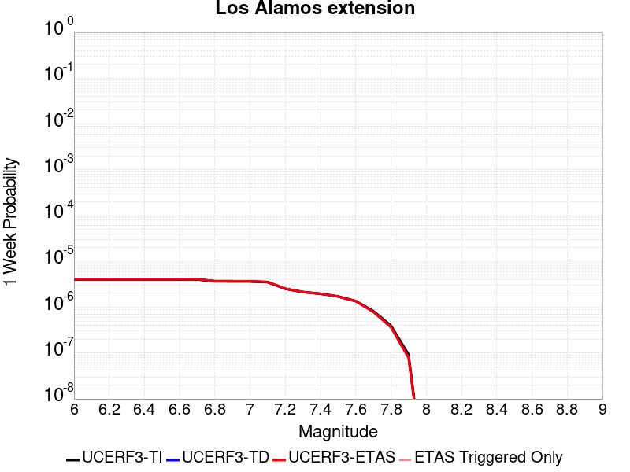 |  |  |  |

| Magnitude | 1 wk TI Prob | 1 wk TD Prob | 1 wk ETAS Prob | 1 wk ETAS/TD Gain | 1 wk ETAS Triggered Only | 1 mo TI Prob | 1 mo TD Prob | 1 mo ETAS Prob | 1 mo ETAS/TD Gain | 1 mo ETAS Triggered Only | 1 yr TI Prob | 1 yr TD Prob | 1 yr ETAS Prob | 1 yr ETAS/TD Gain | 1 yr ETAS Triggered Only | 10 yr TI Prob | 10 yr TD Prob | 10 yr ETAS Prob | 10 yr ETAS/TD Gain | 10 yr ETAS Triggered Only |
|-----|-----|-----|-----|-----|-----|-----|-----|-----|-----|-----|-----|-----|-----|-----|-----|-----|-----|-----|-----|-----|
| 6.0 | 4.0146506E-6 | 4.0861596E-6 | 4.0861596E-6 | 1.0 | 0.0 | 1.7205533E-5 | 1.7512002E-5 | 1.7512002E-5 | 1.0 | 0.0 | 2.0945723E-4 | 2.1318886E-4 | 2.3984985E-4 | 1.125058 | 2.6666667E-5 | 0.0020925992 | 0.0021299527 | 0.0021565624 | 1.0124931 | 2.6666667E-5 |
| 6.1 | 4.0146506E-6 | 4.0861596E-6 | 4.0861596E-6 | 1.0 | 0.0 | 1.7205533E-5 | 1.7512002E-5 | 1.7512002E-5 | 1.0 | 0.0 | 2.0945723E-4 | 2.1318886E-4 | 2.3984985E-4 | 1.125058 | 2.6666667E-5 | 0.0020925992 | 0.0021299527 | 0.0021565624 | 1.0124931 | 2.6666667E-5 |
| 6.2 | 4.0146506E-6 | 4.0861596E-6 | 4.0861596E-6 | 1.0 | 0.0 | 1.7205533E-5 | 1.7512002E-5 | 1.7512002E-5 | 1.0 | 0.0 | 2.0945723E-4 | 2.1318886E-4 | 2.3984985E-4 | 1.125058 | 2.6666667E-5 | 0.0020925992 | 0.0021299527 | 0.0021565624 | 1.0124931 | 2.6666667E-5 |
| 6.3 | 4.0146506E-6 | 4.0861596E-6 | 4.0861596E-6 | 1.0 | 0.0 | 1.7205533E-5 | 1.7512002E-5 | 1.7512002E-5 | 1.0 | 0.0 | 2.0945723E-4 | 2.1318886E-4 | 2.3984985E-4 | 1.125058 | 2.6666667E-5 | 0.0020925992 | 0.0021299527 | 0.0021565624 | 1.0124931 | 2.6666667E-5 |
| 6.4 | 4.0146506E-6 | 4.0861596E-6 | 4.0861596E-6 | 1.0 | 0.0 | 1.7205533E-5 | 1.7512002E-5 | 1.7512002E-5 | 1.0 | 0.0 | 2.0945723E-4 | 2.1318886E-4 | 2.3984985E-4 | 1.125058 | 2.6666667E-5 | 0.0020925992 | 0.0021299527 | 0.0021565624 | 1.0124931 | 2.6666667E-5 |
| 6.5 | 4.0146506E-6 | 4.0861596E-6 | 4.0861596E-6 | 1.0 | 0.0 | 1.7205533E-5 | 1.7512002E-5 | 1.7512002E-5 | 1.0 | 0.0 | 2.0945723E-4 | 2.1318886E-4 | 2.3984985E-4 | 1.125058 | 2.6666667E-5 | 0.0020925992 | 0.0021299527 | 0.0021565624 | 1.0124931 | 2.6666667E-5 |
| 6.6 | 4.0146506E-6 | 4.0861596E-6 | 4.0861596E-6 | 1.0 | 0.0 | 1.7205533E-5 | 1.7512002E-5 | 1.7512002E-5 | 1.0 | 0.0 | 2.0945723E-4 | 2.1318886E-4 | 2.3984985E-4 | 1.125058 | 2.6666667E-5 | 0.0020925992 | 0.0021299527 | 0.0021565624 | 1.0124931 | 2.6666667E-5 |
| 6.7 | 4.0146506E-6 | 4.0861596E-6 | 4.0861596E-6 | 1.0 | 0.0 | 1.7205533E-5 | 1.7512002E-5 | 1.7512002E-5 | 1.0 | 0.0 | 2.0945723E-4 | 2.1318886E-4 | 2.3984985E-4 | 1.125058 | 2.6666667E-5 | 0.0020925992 | 0.0021299527 | 0.0021565624 | 1.0124931 | 2.6666667E-5 |
| 6.8 | 3.6584688E-6 | 3.7188588E-6 | 3.7188588E-6 | 1.0 | 0.0 | 1.5679057E-5 | 1.5937874E-5 | 1.5937874E-5 | 1.0 | 0.0 | 1.9087581E-4 | 1.9402728E-4 | 2.2068877E-4 | 1.137411 | 2.6666667E-5 | 0.0019071194 | 0.0019386712 | 0.0019652862 | 1.0137285 | 2.6666667E-5 |
| 6.9 | 3.644631E-6 | 3.7045688E-6 | 3.7045688E-6 | 1.0 | 0.0 | 1.5619753E-5 | 1.5876632E-5 | 1.5876632E-5 | 1.0 | 0.0 | 1.901539E-4 | 1.9328178E-4 | 2.199433E-4 | 1.1379411 | 2.6666667E-5 | 0.0018999127 | 0.0019312293 | 0.0019578445 | 1.0137814 | 2.6666667E-5 |
| 7.0 | 3.6318522E-6 | 3.6913295E-6 | 3.6913295E-6 | 1.0 | 0.0 | 1.5564989E-5 | 1.5819893E-5 | 1.5819893E-5 | 1.0 | 0.0 | 1.8948725E-4 | 1.925911E-4 | 2.1925263E-4 | 1.138436 | 2.6666667E-5 | 0.0018932576 | 0.0019243343 | 0.0019509498 | 1.0138309 | 2.6666667E-5 |
| 7.1 | 3.5001724E-6 | 3.5554E-6 | 3.5554E-6 | 1.0 | 0.0 | 1.5000653E-5 | 1.5237345E-5 | 1.5237345E-5 | 1.0 | 0.0 | 1.8261763E-4 | 1.854998E-4 | 2.1216153E-4 | 1.1437291 | 2.6666667E-5 | 0.0018246764 | 0.0018535402 | 0.0018801575 | 1.0143602 | 2.6666667E-5 |
| 7.2 | 2.5204702E-6 | 2.5436943E-6 | 2.5436943E-6 | 1.0 | 0.0 | 1.080197E-5 | 1.0901502E-5 | 1.0901502E-5 | 1.0 | 0.0 | 1.3150605E-4 | 1.3271775E-4 | 1.3271775E-4 | 1.0 | 0.0 | 0.0013142825 | 0.0013263905 | 0.0013263905 | 1.0 | 0.0 |
| 7.3 | 2.1399692E-6 | 2.1501316E-6 | 2.1501316E-6 | 1.0 | 0.0 | 9.1712645E-6 | 9.2148175E-6 | 9.2148175E-6 | 1.0 | 0.0 | 1.1165442E-4 | 1.1218466E-4 | 1.1218466E-4 | 1.0 | 0.0 | 0.0011159834 | 0.0011212835 | 0.0011212835 | 1.0 | 0.0 |
| 7.4 | 1.9660122E-6 | 1.9702363E-6 | 1.9702363E-6 | 1.0 | 0.0 | 8.42574E-6 | 8.4438425E-6 | 8.4438425E-6 | 1.0 | 0.0 | 1.0257855E-4 | 1.0279897E-4 | 1.0279897E-4 | 1.0 | 0.0 | 0.0010253121 | 0.0010275173 | 0.0010275173 | 1.0 | 0.0 |
| 7.5 | 1.7204633E-6 | 1.7150983E-6 | 1.7150983E-6 | 1.0 | 0.0 | 7.373393E-6 | 7.3504007E-6 | 7.3504007E-6 | 1.0 | 0.0 | 8.976737E-5 | 8.948748E-5 | 8.948748E-5 | 1.0 | 0.0 | 8.9731114E-4 | 8.9451746E-4 | 8.9451746E-4 | 1.0 | 0.0 |
| 7.6 | 1.3717638E-6 | 1.3535827E-6 | 1.3535827E-6 | 1.0 | 0.0 | 5.878974E-6 | 5.8010555E-6 | 5.8010555E-6 | 1.0 | 0.0 | 7.157416E-5 | 7.062559E-5 | 7.062559E-5 | 1.0 | 0.0 | 7.1551115E-4 | 7.060341E-4 | 7.060341E-4 | 1.0 | 0.0 |
| 7.7 | 8.272564E-7 | 7.957636E-7 | 7.957636E-7 | 1.0 | 0.0 | 3.5453797E-6 | 3.410411E-6 | 3.410411E-6 | 1.0 | 0.0 | 4.3164142E-5 | 4.1520965E-5 | 4.1520965E-5 | 1.0 | 0.0 | 4.315576E-4 | 4.1513226E-4 | 4.1513226E-4 | 1.0 | 0.0 |
| 7.8 | 3.9708277E-7 | 3.6719027E-7 | 3.6719027E-7 | 1.0 | 0.0 | 1.7017821E-6 | 1.5736716E-6 | 1.5736716E-6 | 1.0 | 0.0 | 2.0719E-5 | 1.9159284E-5 | 1.9159284E-5 | 1.0 | 0.0 | 2.071707E-4 | 1.9157639E-4 | 1.9157639E-4 | 1.0 | 0.0 |
| 7.9 | 9.292528E-8 | 7.889087E-8 | 7.889087E-8 | 1.0 | 0.0 | 3.9825116E-7 | 3.381037E-7 | 3.381037E-7 | 1.0 | 0.0 | 4.848697E-6 | 4.116405E-6 | 4.116405E-6 | 1.0 | 0.0 | 4.8485912E-5 | 4.1163294E-5 | 4.1163294E-5 | 1.0 | 0.0 |
| 8.0 | 7.880441E-11 | 8.2353124E-11 | 8.2353124E-11 | 1.0 | 0.0 | 3.3773329E-10 | 3.52942E-10 | 3.52942E-10 | 1.0 | 0.0 | 4.1119033E-9 | 4.2970694E-9 | 4.2970694E-9 | 1.0 | 0.0 | 4.1119034E-8 | 4.2970694E-8 | 4.2970694E-8 | 1.0 | 0.0 |

## Eureka Peak
*[(top)](#table-of-contents)*

| 1 Week | 1 Month | 1 Year | 10 Year |
|-----|-----|-----|-----|
| 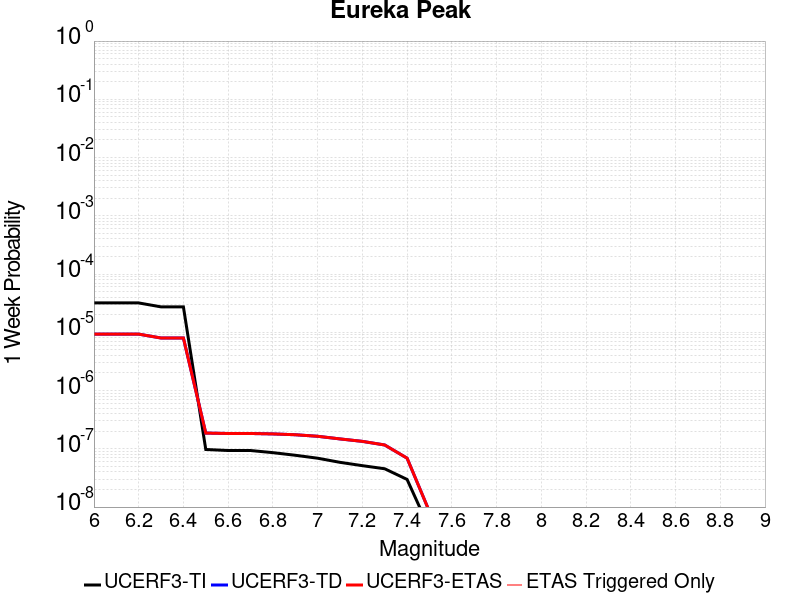 |  |  | 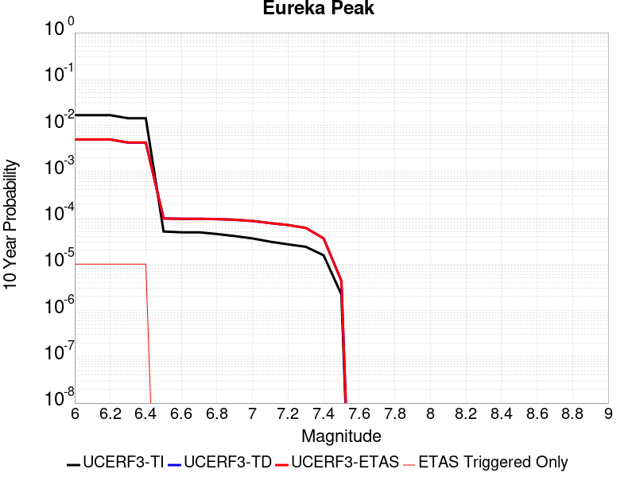 |

| Magnitude | 1 wk TI Prob | 1 wk TD Prob | 1 wk ETAS Prob | 1 wk ETAS/TD Gain | 1 wk ETAS Triggered Only | 1 mo TI Prob | 1 mo TD Prob | 1 mo ETAS Prob | 1 mo ETAS/TD Gain | 1 mo ETAS Triggered Only | 1 yr TI Prob | 1 yr TD Prob | 1 yr ETAS Prob | 1 yr ETAS/TD Gain | 1 yr ETAS Triggered Only | 10 yr TI Prob | 10 yr TD Prob | 10 yr ETAS Prob | 10 yr ETAS/TD Gain | 10 yr ETAS Triggered Only |
|-----|-----|-----|-----|-----|-----|-----|-----|-----|-----|-----|-----|-----|-----|-----|-----|-----|-----|-----|-----|-----|
| 6.0 | 3.1949054E-5 | 9.310571E-6 | 9.310571E-6 | 1.0 | 0.0 | 1.3691733E-4 | 3.990228E-5 | 6.656788E-5 | 1.6682727 | 2.6666667E-5 | 0.0016656938 | 4.8578004E-4 | 5.1243376E-4 | 1.0548679 | 2.6666667E-5 | 0.016532637 | 0.0049248957 | 0.004951431 | 1.005388 | 2.6666667E-5 |
| 6.1 | 3.1949054E-5 | 9.310571E-6 | 9.310571E-6 | 1.0 | 0.0 | 1.3691733E-4 | 3.990228E-5 | 6.656788E-5 | 1.6682727 | 2.6666667E-5 | 0.0016656938 | 4.8578004E-4 | 5.1243376E-4 | 1.0548679 | 2.6666667E-5 | 0.016532637 | 0.0049248957 | 0.004951431 | 1.005388 | 2.6666667E-5 |
| 6.2 | 3.1949054E-5 | 9.310571E-6 | 9.310571E-6 | 1.0 | 0.0 | 1.3691733E-4 | 3.990228E-5 | 6.656788E-5 | 1.6682727 | 2.6666667E-5 | 0.0016656938 | 4.8578004E-4 | 5.1243376E-4 | 1.0548679 | 2.6666667E-5 | 0.016532637 | 0.0049248957 | 0.004951431 | 1.005388 | 2.6666667E-5 |
| 6.3 | 2.7339745E-5 | 7.980718E-6 | 7.980718E-6 | 1.0 | 0.0 | 1.1716507E-4 | 3.4203054E-5 | 6.086881E-5 | 1.7796308 | 2.6666667E-5 | 0.0014255513 | 4.164185E-4 | 4.4307407E-4 | 1.0640115 | 2.6666667E-5 | 0.0141644105 | 0.004228374 | 0.004254928 | 1.00628 | 2.6666667E-5 |
| 6.4 | 2.7339745E-5 | 7.980718E-6 | 7.980718E-6 | 1.0 | 0.0 | 1.1716507E-4 | 3.4203054E-5 | 6.086881E-5 | 1.7796308 | 2.6666667E-5 | 0.0014255513 | 4.164185E-4 | 4.4307407E-4 | 1.0640115 | 2.6666667E-5 | 0.0141644105 | 0.004228374 | 0.004254928 | 1.00628 | 2.6666667E-5 |
| 6.5 | 9.738388E-8 | 1.8619214E-7 | 1.8619214E-7 | 1.0 | 0.0 | 4.1735944E-7 | 7.979661E-7 | 7.979661E-7 | 1.0 | 0.0 | 5.081339E-6 | 9.715194E-6 | 9.715194E-6 | 1.0 | 0.0 | 5.0812232E-5 | 9.714778E-5 | 9.714778E-5 | 1.0 | 0.0 |
| 6.6 | 9.3495956E-8 | 1.8328048E-7 | 1.8328048E-7 | 1.0 | 0.0 | 4.0069688E-7 | 7.8548754E-7 | 7.8548754E-7 | 1.0 | 0.0 | 4.8784736E-6 | 9.5632695E-6 | 9.5632695E-6 | 1.0 | 0.0 | 4.8783666E-5 | 9.562866E-5 | 9.562866E-5 | 1.0 | 0.0 |
| 6.7 | 9.3495956E-8 | 1.8328048E-7 | 1.8328048E-7 | 1.0 | 0.0 | 4.0069688E-7 | 7.8548754E-7 | 7.8548754E-7 | 1.0 | 0.0 | 4.8784736E-6 | 9.5632695E-6 | 9.5632695E-6 | 1.0 | 0.0 | 4.8783666E-5 | 9.562866E-5 | 9.562866E-5 | 1.0 | 0.0 |
| 6.8 | 8.591428E-8 | 1.8021015E-7 | 1.8021015E-7 | 1.0 | 0.0 | 3.68204E-7 | 7.72329E-7 | 7.72329E-7 | 1.0 | 0.0 | 4.4828744E-6 | 9.403066E-6 | 9.403066E-6 | 1.0 | 0.0 | 4.482784E-5 | 9.402676E-5 | 9.402676E-5 | 1.0 | 0.0 |
| 6.9 | 7.749723E-8 | 1.7439022E-7 | 1.7439022E-7 | 1.0 | 0.0 | 3.3213098E-7 | 7.473864E-7 | 7.473864E-7 | 1.0 | 0.0 | 4.043687E-6 | 9.099393E-6 | 9.099393E-6 | 1.0 | 0.0 | 4.0436134E-5 | 9.099028E-5 | 9.099028E-5 | 1.0 | 0.0 |
| 7.0 | 6.897872E-8 | 1.6415258E-7 | 1.6415258E-7 | 1.0 | 0.0 | 2.9562307E-7 | 7.035109E-7 | 7.035109E-7 | 1.0 | 0.0 | 3.5992048E-6 | 8.565212E-6 | 8.565212E-6 | 1.0 | 0.0 | 3.5991467E-5 | 8.564889E-5 | 8.564889E-5 | 1.0 | 0.0 |
| 7.1 | 5.859318E-8 | 1.4787166E-7 | 1.4787166E-7 | 1.0 | 0.0 | 2.5111362E-7 | 6.337355E-7 | 6.337355E-7 | 1.0 | 0.0 | 3.057304E-6 | 7.715704E-6 | 7.715704E-6 | 1.0 | 0.0 | 3.0572617E-5 | 7.715442E-5 | 7.715442E-5 | 1.0 | 0.0 |
| 7.2 | 5.1375338E-8 | 1.342105E-7 | 1.342105E-7 | 1.0 | 0.0 | 2.2018E-7 | 5.751877E-7 | 5.751877E-7 | 1.0 | 0.0 | 2.680688E-6 | 7.002888E-6 | 7.002888E-6 | 1.0 | 0.0 | 2.6806558E-5 | 7.0026734E-5 | 7.0026734E-5 | 1.0 | 0.0 |
| 7.3 | 4.5441396E-8 | 1.16363104E-7 | 1.16363104E-7 | 1.0 | 0.0 | 1.9474882E-7 | 4.986989E-7 | 4.986989E-7 | 1.0 | 0.0 | 2.3710643E-6 | 6.071643E-6 | 6.071643E-6 | 1.0 | 0.0 | 2.371039E-5 | 6.0714825E-5 | 6.0714825E-5 | 1.0 | 0.0 |
| 7.4 | 2.981918E-8 | 6.9113334E-8 | 6.9113334E-8 | 1.0 | 0.0 | 1.2779647E-7 | 2.9619997E-7 | 2.9619997E-7 | 1.0 | 0.0 | 1.5559209E-6 | 3.6062293E-6 | 3.6062293E-6 | 1.0 | 0.0 | 1.55591E-5 | 3.606175E-5 | 3.606175E-5 | 1.0 | 0.0 |
| 7.5 | 4.24214E-9 | 8.342421E-9 | 8.342421E-9 | 1.0 | 0.0 | 1.81806E-8 | 3.5753235E-8 | 3.5753235E-8 | 1.0 | 0.0 | 2.213488E-7 | 4.352956E-7 | 4.352956E-7 | 1.0 | 0.0 | 2.2134857E-6 | 4.352954E-6 | 4.352954E-6 | 1.0 | 0.0 |

## Calaveras (So) 2011 CFM
*[(top)](#table-of-contents)*

| 1 Week | 1 Month | 1 Year | 10 Year |
|-----|-----|-----|-----|
|  |  |  |  |

| Magnitude | 1 wk TI Prob | 1 wk TD Prob | 1 wk ETAS Prob | 1 wk ETAS/TD Gain | 1 wk ETAS Triggered Only | 1 mo TI Prob | 1 mo TD Prob | 1 mo ETAS Prob | 1 mo ETAS/TD Gain | 1 mo ETAS Triggered Only | 1 yr TI Prob | 1 yr TD Prob | 1 yr ETAS Prob | 1 yr ETAS/TD Gain | 1 yr ETAS Triggered Only | 10 yr TI Prob | 10 yr TD Prob | 10 yr ETAS Prob | 10 yr ETAS/TD Gain | 10 yr ETAS Triggered Only |
|-----|-----|-----|-----|-----|-----|-----|-----|-----|-----|-----|-----|-----|-----|-----|-----|-----|-----|-----|-----|-----|
| 6.0 | 1.5950744E-4 | 3.071188E-4 | 3.071188E-4 | 1.0 | 0.0 | 6.834242E-4 | 0.0013155643 | 0.0013155643 | 1.0 | 0.0 | 0.00828899 | 0.01585904 | 0.01585904 | 1.0 | 0.0 | 0.079865426 | 0.14440064 | 0.14442345 | 1.000158 | 2.6666667E-5 |
| 6.1 | 1.3584697E-4 | 2.6036944E-4 | 2.6036944E-4 | 1.0 | 0.0 | 5.8207137E-4 | 0.0011153965 | 0.0011153965 | 1.0 | 0.0 | 0.007063716 | 0.013462106 | 0.013462106 | 1.0 | 0.0 | 0.06843361 | 0.12402854 | 0.124051906 | 1.0001884 | 2.6666667E-5 |
| 6.2 | 1.14676266E-4 | 2.1726108E-4 | 2.1726108E-4 | 1.0 | 0.0 | 4.9137714E-4 | 9.307893E-4 | 9.307893E-4 | 1.0 | 0.0 | 0.0059661185 | 0.011245592 | 0.011245592 | 1.0 | 0.0 | 0.058084648 | 0.105019294 | 0.10504316 | 1.0002272 | 2.6666667E-5 |
| 6.3 | 8.691518E-5 | 1.5987165E-4 | 1.5987165E-4 | 1.0 | 0.0 | 3.7244044E-4 | 6.8496726E-4 | 6.8496726E-4 | 1.0 | 0.0 | 0.004525038 | 0.008300893 | 0.008300893 | 1.0 | 0.0 | 0.044339992 | 0.0793347 | 0.079359256 | 1.0003095 | 2.6666667E-5 |
| 6.4 | 8.50982E-5 | 1.5693568E-4 | 1.5693568E-4 | 1.0 | 0.0 | 3.646556E-4 | 6.7239115E-4 | 6.7239115E-4 | 1.0 | 0.0 | 0.0044306475 | 0.008148931 | 0.008148931 | 1.0 | 0.0 | 0.04343345 | 0.077940844 | 0.07796543 | 1.0003154 | 2.6666667E-5 |
| 6.5 | 8.4062965E-5 | 1.5518135E-4 | 1.5518135E-4 | 1.0 | 0.0 | 3.602201E-4 | 6.648764E-4 | 6.648764E-4 | 1.0 | 0.0 | 0.004376863 | 0.008058134 | 0.008058134 | 1.0 | 0.0 | 0.042916555 | 0.077112116 | 0.077136725 | 1.0003191 | 2.6666667E-5 |
| 6.6 | 8.194716E-5 | 1.5154095E-4 | 1.5154095E-4 | 1.0 | 0.0 | 3.5115483E-4 | 6.492825E-4 | 6.492825E-4 | 1.0 | 0.0 | 0.0042669317 | 0.007869979 | 0.007869979 | 1.0 | 0.0 | 0.04185927 | 0.07539739 | 0.07542204 | 1.000327 | 2.6666667E-5 |
| 6.7 | 8.012326E-5 | 1.4821833E-4 | 1.4821833E-4 | 1.0 | 0.0 | 3.433402E-4 | 6.350497E-4 | 6.350497E-4 | 1.0 | 0.0 | 0.004172157 | 0.007698474 | 0.007698474 | 1.0 | 0.0 | 0.040946912 | 0.073839515 | 0.073864214 | 1.0003345 | 2.6666667E-5 |
| 6.8 | 7.119773E-5 | 1.2880519E-4 | 1.2880519E-4 | 1.0 | 0.0 | 3.0509746E-4 | 5.519001E-4 | 5.519001E-4 | 1.0 | 0.0 | 0.0037082357 | 0.0066958875 | 0.0066958875 | 1.0 | 0.0 | 0.036469642 | 0.06468402 | 0.064708956 | 1.0003856 | 2.6666667E-5 |
| 6.9 | 5.7343088E-5 | 9.9189E-5 | 9.9189E-5 | 1.0 | 0.0 | 2.4573295E-4 | 4.2502693E-4 | 4.2502693E-4 | 1.0 | 0.0 | 0.0029876942 | 0.0051625078 | 0.0051625078 | 1.0 | 0.0 | 0.02947844 | 0.050509132 | 0.050534453 | 1.0005013 | 2.6666667E-5 |
| 7.0 | 4.8746577E-5 | 8.284751E-5 | 8.284751E-5 | 1.0 | 0.0 | 2.0889717E-4 | 3.550128E-4 | 3.550128E-4 | 1.0 | 0.0 | 0.0025403565 | 0.004313781 | 0.004313781 | 1.0 | 0.0 | 0.025115121 | 0.04248505 | 0.042510584 | 1.000601 | 2.6666667E-5 |
| 7.1 | 4.2998014E-5 | 7.264914E-5 | 7.264914E-5 | 1.0 | 0.0 | 1.8426418E-4 | 3.1131663E-4 | 3.1131663E-4 | 1.0 | 0.0 | 0.002241108 | 0.0037837527 | 0.0037837527 | 1.0 | 0.0 | 0.022186412 | 0.037423246 | 0.037448913 | 1.0006859 | 2.6666667E-5 |
| 7.2 | 3.221292E-5 | 5.390566E-5 | 5.390566E-5 | 1.0 | 0.0 | 1.3804805E-4 | 2.3100396E-4 | 2.3100396E-4 | 1.0 | 0.0 | 0.0016794393 | 0.0028088738 | 0.0028088738 | 1.0 | 0.0 | 0.016668037 | 0.028035998 | 0.028035998 | 1.0 | 0.0 |
| 7.3 | 2.3756531E-5 | 3.9471706E-5 | 3.9471706E-5 | 1.0 | 0.0 | 1.0180973E-4 | 1.6915359E-4 | 1.6915359E-4 | 1.0 | 0.0 | 0.0012388286 | 0.0020575167 | 0.0020575167 | 1.0 | 0.0 | 0.012319452 | 0.02064345 | 0.02064345 | 1.0 | 0.0 |
| 7.4 | 1.5997684E-5 | 2.734085E-5 | 2.734085E-5 | 1.0 | 0.0 | 6.8559704E-5 | 1.1716982E-4 | 1.1716982E-4 | 1.0 | 0.0 | 8.343947E-4 | 0.0014256114 | 0.0014256114 | 1.0 | 0.0 | 0.008312687 | 0.014376549 | 0.014376549 | 1.0 | 0.0 |
| 7.5 | 1.3814293E-5 | 2.4782603E-5 | 2.4782603E-5 | 1.0 | 0.0 | 5.9202768E-5 | 1.0620684E-4 | 1.0620684E-4 | 1.0 | 0.0 | 7.205553E-4 | 0.0012923037 | 0.0012923037 | 1.0 | 0.0 | 0.007182234 | 0.013055766 | 0.013055766 | 1.0 | 0.0 |
| 7.6 | 8.817309E-6 | 1.6429829E-5 | 1.6429829E-5 | 1.0 | 0.0 | 3.7787922E-5 | 7.041166E-5 | 7.041166E-5 | 1.0 | 0.0 | 4.5997082E-4 | 8.5692614E-4 | 8.5692614E-4 | 1.0 | 0.0 | 0.004590199 | 0.008719863 | 0.008719863 | 1.0 | 0.0 |
| 7.7 | 4.0352206E-6 | 7.706877E-6 | 7.706877E-6 | 1.0 | 0.0 | 1.7293689E-5 | 3.3029053E-5 | 3.3029053E-5 | 1.0 | 0.0 | 2.1053031E-4 | 4.020546E-4 | 4.020546E-4 | 1.0 | 0.0 | 0.0021033096 | 0.0041649863 | 0.0041649863 | 1.0 | 0.0 |
| 7.8 | 3.413169E-6 | 6.7868646E-6 | 6.7868646E-6 | 1.0 | 0.0 | 1.4627784E-5 | 2.9086239E-5 | 2.9086239E-5 | 1.0 | 0.0 | 1.7807873E-4 | 3.5406748E-4 | 3.5406748E-4 | 1.0 | 0.0 | 0.0017793609 | 0.0036663096 | 0.0036663096 | 1.0 | 0.0 |
| 7.9 | 2.4740732E-6 | 5.278809E-6 | 5.278809E-6 | 1.0 | 0.0 | 1.06031275E-5 | 2.2623271E-5 | 2.2623271E-5 | 1.0 | 0.0 | 1.2908543E-4 | 2.7540355E-4 | 2.7540355E-4 | 1.0 | 0.0 | 0.0012901047 | 0.002834638 | 0.002834638 | 1.0 | 0.0 |
| 8.0 | 1.5231818E-6 | 3.2887135E-6 | 3.2887135E-6 | 1.0 | 0.0 | 6.527906E-6 | 1.409441E-5 | 1.409441E-5 | 1.0 | 0.0 | 7.9474354E-5 | 1.7158597E-4 | 1.7158597E-4 | 1.0 | 0.0 | 7.944594E-4 | 0.001756374 | 0.001756374 | 1.0 | 0.0 |
| 8.1 | 1.0104524E-6 | 2.0456548E-6 | 2.0456548E-6 | 1.0 | 0.0 | 4.330503E-6 | 8.767062E-6 | 8.767062E-6 | 1.0 | 0.0 | 5.2722597E-5 | 1.06733794E-4 | 1.06733794E-4 | 1.0 | 0.0 | 5.271009E-4 | 0.0010929212 | 0.0010929212 | 1.0 | 0.0 |

## Kern Canyon (Lake Isabella) 2011
*[(top)](#table-of-contents)*

| 1 Week | 1 Month | 1 Year | 10 Year |
|-----|-----|-----|-----|
|  | 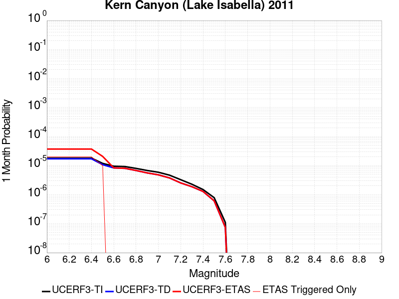 |  |  |

| Magnitude | 1 wk TI Prob | 1 wk TD Prob | 1 wk ETAS Prob | 1 wk ETAS/TD Gain | 1 wk ETAS Triggered Only | 1 mo TI Prob | 1 mo TD Prob | 1 mo ETAS Prob | 1 mo ETAS/TD Gain | 1 mo ETAS Triggered Only | 1 yr TI Prob | 1 yr TD Prob | 1 yr ETAS Prob | 1 yr ETAS/TD Gain | 1 yr ETAS Triggered Only | 10 yr TI Prob | 10 yr TD Prob | 10 yr ETAS Prob | 10 yr ETAS/TD Gain | 10 yr ETAS Triggered Only |
|-----|-----|-----|-----|-----|-----|-----|-----|-----|-----|-----|-----|-----|-----|-----|-----|-----|-----|-----|-----|-----|
| 6.0 | 4.2387383E-6 | 4.001639E-6 | 4.001639E-6 | 1.0 | 0.0 | 1.8165894E-5 | 1.7149778E-5 | 1.7149778E-5 | 1.0 | 0.0 | 2.2114732E-4 | 2.087804E-4 | 2.354415E-4 | 1.1276993 | 2.6666667E-5 | 0.0022092736 | 0.0020860266 | 0.0021126375 | 1.0127568 | 2.6666667E-5 |
| 6.1 | 4.2387383E-6 | 4.001639E-6 | 4.001639E-6 | 1.0 | 0.0 | 1.8165894E-5 | 1.7149778E-5 | 1.7149778E-5 | 1.0 | 0.0 | 2.2114732E-4 | 2.087804E-4 | 2.354415E-4 | 1.1276993 | 2.6666667E-5 | 0.0022092736 | 0.0020860266 | 0.0021126375 | 1.0127568 | 2.6666667E-5 |
| 6.2 | 4.2387383E-6 | 4.001639E-6 | 4.001639E-6 | 1.0 | 0.0 | 1.8165894E-5 | 1.7149778E-5 | 1.7149778E-5 | 1.0 | 0.0 | 2.2114732E-4 | 2.087804E-4 | 2.354415E-4 | 1.1276993 | 2.6666667E-5 | 0.0022092736 | 0.0020860266 | 0.0021126375 | 1.0127568 | 2.6666667E-5 |
| 6.3 | 4.2387383E-6 | 4.001639E-6 | 4.001639E-6 | 1.0 | 0.0 | 1.8165894E-5 | 1.7149778E-5 | 1.7149778E-5 | 1.0 | 0.0 | 2.2114732E-4 | 2.087804E-4 | 2.354415E-4 | 1.1276993 | 2.6666667E-5 | 0.0022092736 | 0.0020860266 | 0.0021126375 | 1.0127568 | 2.6666667E-5 |
| 6.4 | 4.2387383E-6 | 4.001639E-6 | 4.001639E-6 | 1.0 | 0.0 | 1.8165894E-5 | 1.7149778E-5 | 1.7149778E-5 | 1.0 | 0.0 | 2.2114732E-4 | 2.087804E-4 | 2.354415E-4 | 1.1276993 | 2.6666667E-5 | 0.0022092736 | 0.0020860266 | 0.0021126375 | 1.0127568 | 2.6666667E-5 |
| 6.5 | 2.7857532E-6 | 2.517867E-6 | 2.517867E-6 | 1.0 | 0.0 | 1.1938888E-5 | 1.0790815E-5 | 1.0790815E-5 | 1.0 | 0.0 | 1.4534626E-4 | 1.3137059E-4 | 1.5803376E-4 | 1.2029614 | 2.6666667E-5 | 0.0014525123 | 0.001312962 | 0.0013395937 | 1.0202837 | 2.6666667E-5 |
| 6.6 | 2.2233348E-6 | 1.9441236E-6 | 1.9441236E-6 | 1.0 | 0.0 | 9.528543E-6 | 8.331932E-6 | 8.331932E-6 | 1.0 | 0.0 | 1.1600384E-4 | 1.01436635E-4 | 1.281006E-4 | 1.2628633 | 2.6666667E-5 | 0.001159433 | 0.001013912 | 0.0010405516 | 1.0262741 | 2.6666667E-5 |
| 6.7 | 2.1635126E-6 | 1.8835036E-6 | 1.8835036E-6 | 1.0 | 0.0 | 9.272164E-6 | 8.072134E-6 | 8.072134E-6 | 1.0 | 0.0 | 1.1288274E-4 | 9.827388E-5 | 1.2493793E-4 | 1.2713238 | 2.6666667E-5 | 0.0011282542 | 9.823124E-4 | 0.0010089529 | 1.0271201 | 2.6666667E-5 |
| 6.8 | 1.8685711E-6 | 1.5831425E-6 | 1.5831425E-6 | 1.0 | 0.0 | 8.008137E-6 | 6.784879E-6 | 6.784879E-6 | 1.0 | 0.0 | 9.74947E-5 | 8.260282E-5 | 1.0926728E-4 | 1.3228033 | 2.6666667E-5 | 9.745194E-4 | 8.2572614E-4 | 8.5237075E-4 | 1.0322682 | 2.6666667E-5 |
| 6.9 | 1.5815071E-6 | 1.3064928E-6 | 1.3064928E-6 | 1.0 | 0.0 | 6.77787E-6 | 5.599243E-6 | 5.599243E-6 | 1.0 | 0.0 | 8.251744E-5 | 6.816868E-5 | 9.483353E-5 | 1.3911598 | 2.6666667E-5 | 8.248681E-4 | 6.8148033E-4 | 7.0812885E-4 | 1.0391039 | 2.6666667E-5 |
| 7.0 | 1.3772564E-6 | 1.1210718E-6 | 1.1210718E-6 | 1.0 | 0.0 | 5.9025137E-6 | 4.8045845E-6 | 4.8045845E-6 | 1.0 | 0.0 | 7.186073E-5 | 5.8494268E-5 | 8.515937E-5 | 1.4558585 | 2.6666667E-5 | 7.18375E-4 | 5.847908E-4 | 6.1144185E-4 | 1.0455737 | 2.6666667E-5 |
| 7.1 | 1.0916998E-6 | 8.763777E-7 | 8.763777E-7 | 1.0 | 0.0 | 4.678705E-6 | 3.7558991E-6 | 3.7558991E-6 | 1.0 | 0.0 | 5.6961744E-5 | 4.5727127E-5 | 4.5727127E-5 | 1.0 | 0.0 | 5.6947145E-4 | 4.571785E-4 | 4.571785E-4 | 1.0 | 0.0 |
| 7.2 | 7.6277024E-7 | 5.901454E-7 | 5.901454E-7 | 1.0 | 0.0 | 3.2690114E-6 | 2.5291922E-6 | 2.5291922E-6 | 1.0 | 0.0 | 3.9799485E-5 | 3.0792486E-5 | 3.0792486E-5 | 1.0 | 0.0 | 3.9792358E-4 | 3.0788282E-4 | 3.0788282E-4 | 1.0 | 0.0 |
| 7.3 | 5.3265916E-7 | 4.3824414E-7 | 4.3824414E-7 | 1.0 | 0.0 | 2.282823E-6 | 1.878188E-6 | 1.878188E-6 | 1.0 | 0.0 | 2.7793016E-5 | 2.2866701E-5 | 2.2866701E-5 | 1.0 | 0.0 | 2.778954E-4 | 2.2864387E-4 | 2.2864387E-4 | 1.0 | 0.0 |
| 7.4 | 3.4946007E-7 | 3.006571E-7 | 3.006571E-7 | 1.0 | 0.0 | 1.497685E-6 | 1.2885298E-6 | 1.2885298E-6 | 1.0 | 0.0 | 1.8234163E-5 | 1.568774E-5 | 1.568774E-5 | 1.0 | 0.0 | 1.8232666E-4 | 1.5686655E-4 | 1.5686655E-4 | 1.0 | 0.0 |
| 7.5 | 1.8317026E-7 | 1.4244812E-7 | 1.4244812E-7 | 1.0 | 0.0 | 7.850152E-7 | 6.104918E-7 | 6.104918E-7 | 1.0 | 0.0 | 9.557518E-6 | 7.432713E-6 | 7.432713E-6 | 1.0 | 0.0 | 9.5571064E-5 | 7.432472E-5 | 7.432472E-5 | 1.0 | 0.0 |
| 7.6 | 2.572245E-8 | 1.7352555E-8 | 1.7352555E-8 | 1.0 | 0.0 | 1.10239064E-7 | 7.436809E-8 | 7.436809E-8 | 1.0 | 0.0 | 1.3421597E-6 | 9.054312E-7 | 9.054312E-7 | 1.0 | 0.0 | 1.3421517E-5 | 9.05428E-6 | 9.05428E-6 | 1.0 | 0.0 |

