# Parent Section Magnitude-Probability Distributions

Only fault sections with at least one triggered aftershock are plotted. Sections are sorted by total supraseismogenic trigger rate (decreasing)

## Table Of Contents

* [Garlock (Central)](#garlock-central)
* [Tank Canyon](#tank-canyon)
* [Little Lake](#little-lake)
* [Owl Lake](#owl-lake)
* [Garlock (East)](#garlock-east)
* [Panamint Valley](#panamint-valley)
* [Airport Lake](#airport-lake)
* [Hunter Mountain-Saline Valley](#hunter-mountain-saline-valley)
* [Garlock (West)](#garlock-west)
* [Blackwater](#blackwater)
* [Ash Hill](#ash-hill)
* [McLean Lake](#mclean-lake)
* [Gravel Hills-Harper Lk](#gravel-hills-harper-lk)
* [So Sierra Nevada](#so-sierra-nevada)
* [Goldstone Lake](#goldstone-lake)
* [San Andreas (Mojave N)](#san-andreas-mojave-n)
* [San Andreas (Mojave S)](#san-andreas-mojave-s)
* [Coyote Canyon](#coyote-canyon)
* [Death Valley (So)](#death-valley-so)
* [Towne Pass](#towne-pass)
* [Nelson Lake](#nelson-lake)
* [San Andreas (San Bernardino N)](#san-andreas-san-bernardino-n)
* [Bicycle Lake](#bicycle-lake)
* [Lenwood-Lockhart-Old Woman Springs](#lenwood-lockhart-old-woman-springs)
* [Paradise](#paradise)
* [Garlic Springs](#garlic-springs)
* [San Andreas (San Bernardino S)](#san-andreas-san-bernardino-s)
* [Death Valley (Black Mtns Frontal)](#death-valley-black-mtns-frontal)
* [Sierra Nevada  (No Extension)](#sierra-nevada--no-extension)
* [Coyote Lake](#coyote-lake)
* [San Andreas (Big Bend)](#san-andreas-big-bend)
* [San Andreas (San Gorgonio Pass-Garnet HIll)](#san-andreas-san-gorgonio-pass-garnet-hill)
* [San Andreas (Parkfield)](#san-andreas-parkfield)
* [San Jacinto (San Bernardino)](#san-jacinto-san-bernardino)
* [Death Valley (No)](#death-valley-no)
* [San Andreas (Coachella) rev](#san-andreas-coachella-rev)
* [Helendale-So Lockhart](#helendale-so-lockhart)
* [Independence rev 2011](#independence-rev-2011)
* [San Jacinto (San Jacinto Valley) rev](#san-jacinto-san-jacinto-valley-rev)
* [Manix-Afton Hills](#manix-afton-hills)
* [San Jacinto (Stepovers Combined)](#san-jacinto-stepovers-combined)
* [San Andreas (North Branch Mill Creek)](#san-andreas-north-branch-mill-creek)
* [Cady](#cady)
* [Death Valley (Fish Lake Valley)](#death-valley-fish-lake-valley)
* [Elsinore (Glen Ivy) rev](#elsinore-glen-ivy-rev)
* [San Andreas (Cholame) rev](#san-andreas-cholame-rev)
* [Red Pass](#red-pass)
* [Santa Ynez (East)](#santa-ynez-east)
* [White Wolf (Extension)](#white-wolf-extension)
* [Mission Ridge-Arroyo Parida-Santa Ana](#mission-ridge-arroyo-parida-santa-ana)
* [Santa Ynez (West)](#santa-ynez-west)
* [Red Mountain](#red-mountain)
* [San Jacinto (Anza) rev](#san-jacinto-anza-rev)
* [Calico-Hidalgo](#calico-hidalgo)
* [Brawley (Seismic Zone) alt 1](#brawley-seismic-zone-alt-1)
* [Imperial](#imperial)
* [San Andreas (Carrizo) rev](#san-andreas-carrizo-rev)
* [Owens Valley](#owens-valley)
* [Scodie Lineament](#scodie-lineament)
* [White Mountains](#white-mountains)
* [Chino alt 1](#chino-alt-1)
* [Lake Isabella (Seismicity)](#lake-isabella-seismicity)
* [San Andreas (Creeping Section) 2011 CFM](#san-andreas-creeping-section-2011-cfm)
* [San Jacinto (Lytle Creek connector)](#san-jacinto-lytle-creek-connector)
* [Ludlow](#ludlow)
* [San Cayetano](#san-cayetano)
* [Coronado Bank alt1](#coronado-bank-alt1)
* [San Jacinto (Coyote Creek)](#san-jacinto-coyote-creek)
* [San Jacinto (Borrego)](#san-jacinto-borrego)
* [Great Valley 09 (Laguna Seca)](#great-valley-09-laguna-seca)
* [Lost Hills](#lost-hills)
* [Baker](#baker)
* [Big Pine (East)](#big-pine-east)
* [Ventura-Pitas Point](#ventura-pitas-point)
* [San Jacinto (Superstition Mtn)](#san-jacinto-superstition-mtn)
* [Cleghorn Lake](#cleghorn-lake)
* [Pinto Mtn](#pinto-mtn)
* [Pisgah-Bullion Mtn-Mesquite Lk](#pisgah-bullion-mtn-mesquite-lk)
* [Whittier alt 1](#whittier-alt-1)
* [Dry Mountain](#dry-mountain)
* [Newport-Inglewood (Offshore)](#newport-inglewood-offshore)
* [Big Pine (Central)](#big-pine-central)
* [Pitas Point (Lower West)](#pitas-point-lower-west)
* [Oak Ridge (Onshore)](#oak-ridge-onshore)
* [San Clemente](#san-clemente)
* [Great Valley 03a Dunnigan Hills](#great-valley-03a-dunnigan-hills)
* [Del Valle](#del-valle)
* [Santa Rosa Island](#santa-rosa-island)
* [Monterey Bay-Tularcitos](#monterey-bay-tularcitos)
* [Elsinore (Coyote Mountains)](#elsinore-coyote-mountains)
* [Reliz 2011 CFM](#reliz-2011-cfm)
* [Oceanside alt1](#oceanside-alt1)
* [Pleito](#pleito)
* [Los Alamos 2011 CFM](#los-alamos-2011-cfm)
* [Malibu Coast alt 1](#malibu-coast-alt-1)
* [Santa Cruz Catalina Ridge alt1](#santa-cruz-catalina-ridge-alt1)
* [La Panza 2011](#la-panza-2011)
* [Goose Lake 2011 CFM](#goose-lake-2011-cfm)
* [Kern Canyon (South Kern) 2011](#kern-canyon-south-kern-2011)
* [Santa Cruz Island](#santa-cruz-island)
* [Rose Canyon](#rose-canyon)
* [Antelope Valley 2011](#antelope-valley-2011)
* [Santa Susana alt 1](#santa-susana-alt-1)
* [Channel Islands Thrust](#channel-islands-thrust)
* [San Jacinto (Clark) rev](#san-jacinto-clark-rev)
* [Elysian Park (Upper)](#elysian-park-upper)
* [San Pedro Basin](#san-pedro-basin)
* [Mission Creek](#mission-creek)
* [San Juan](#san-juan)
* [Newport-Inglewood alt 1](#newport-inglewood-alt-1)
* [Cleghorn Pass](#cleghorn-pass)
* [Cleghorn](#cleghorn)
* [Santa Ynez River](#santa-ynez-river)
* [Carlsbad](#carlsbad)
* [Blue Cut](#blue-cut)
* [Earthquake Valley (So Extension)](#earthquake-valley-so-extension)
* [Calaveras (Central) 2011 CFM](#calaveras-central-2011-cfm)
* [Santa Susana East (connector)](#santa-susana-east-connector)
* [Owens Valley Keough Hot Springs](#owens-valley-keough-hot-springs)
* [Compton](#compton)
* [Deep Springs](#deep-springs)
* [Superstition Hills](#superstition-hills)
* [Hayward (So) extension 2011 CFM](#hayward-so-extension-2011-cfm)
* [Elsinore (Temecula) rev](#elsinore-temecula-rev)
* [Pine Mtn](#pine-mtn)
* [Earthquake Valley](#earthquake-valley)
* [Mission (connected) 2011 CFM](#mission-connected-2011-cfm)
* [White Wolf](#white-wolf)
* [San Joaquin Hills](#san-joaquin-hills)
* [Northridge](#northridge)
* [Calaveras (So) - Paicines extension 2011 CFM](#calaveras-so---paicines-extension-2011-cfm)
* [Sargent 2011 CFM](#sargent-2011-cfm)
* [Sheephole](#sheephole)
* [Elsinore (Stepovers Combined)](#elsinore-stepovers-combined)
* [Emerson-Copper Mtn 2011](#emerson-copper-mtn-2011)
* [San Gabriel (Extension)](#san-gabriel-extension)
* [Oceanic - West Huasna](#oceanic---west-huasna)
* [San Diego Trough north alt1](#san-diego-trough-north-alt1)
* [Tin Mountain](#tin-mountain)
* [Davis Creek](#davis-creek)
* [Surprise Valley 2011 CFM](#surprise-valley-2011-cfm)
* [Ozena](#ozena)
* [Camp Rock 2011](#camp-rock-2011)
* [Holser alt 1](#holser-alt-1)
* [Great Valley 10 (Panoche)](#great-valley-10-panoche)
* [San Gorgonio Pass](#san-gorgonio-pass)
* [Channel Islands Western Deep Ramp](#channel-islands-western-deep-ramp)
* [San Luis Range 2011 CFM](#san-luis-range-2011-cfm)
* [Earthquake Valley (No  Extension)](#earthquake-valley-no--extension)
* [Ortigalita (North)](#ortigalita-north)
* [San Andreas (Santa Cruz Mts) 2011 CFM](#san-andreas-santa-cruz-mts-2011-cfm)
* [Los Alamos extension](#los-alamos-extension)
* [Elsinore (Julian)](#elsinore-julian)
* [Eureka Peak](#eureka-peak)
* [Puente Hills](#puente-hills)
* [Calaveras (So) 2011 CFM](#calaveras-so-2011-cfm)
* [Great Valley 07 (Orestimba)](#great-valley-07-orestimba)

## Garlock (Central)
*[(top)](#table-of-contents)*

| 1 Week | 1 Month | 1 Year | 10 Year |
|-----|-----|-----|-----|
| 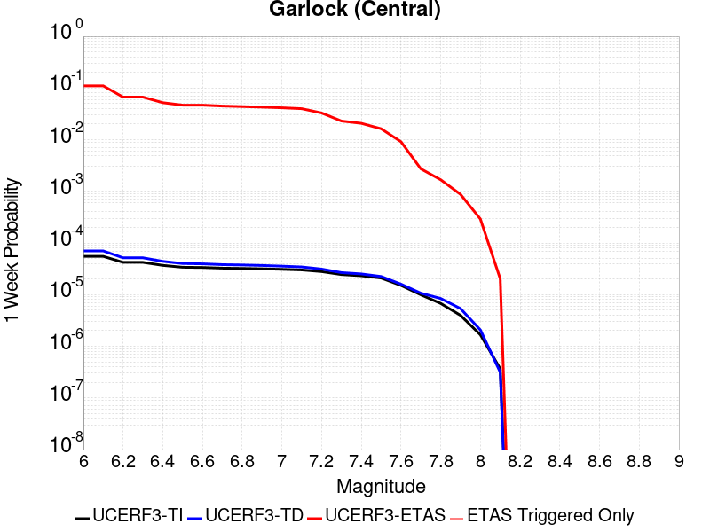 |  |  |  |

| Magnitude | 1 wk TI Prob | 1 wk TD Prob | 1 wk ETAS Prob | 1 wk ETAS/TD Gain | 1 wk ETAS Triggered Only | 1 mo TI Prob | 1 mo TD Prob | 1 mo ETAS Prob | 1 mo ETAS/TD Gain | 1 mo ETAS Triggered Only | 1 yr TI Prob | 1 yr TD Prob | 1 yr ETAS Prob | 1 yr ETAS/TD Gain | 1 yr ETAS Triggered Only | 10 yr TI Prob | 10 yr TD Prob | 10 yr ETAS Prob | 10 yr ETAS/TD Gain | 10 yr ETAS Triggered Only |
|-----|-----|-----|-----|-----|-----|-----|-----|-----|-----|-----|-----|-----|-----|-----|-----|-----|-----|-----|-----|-----|
| 6.0 | 5.5131142E-5 | 7.024681E-5 | 0.10938899 | 1557.2094 | 0.10932642 | 2.3625491E-4 | 3.010234E-4 | 0.13399133 | 445.11935 | 0.13373058 | 0.0028726095 | 0.0036588663 | 0.17634079 | 48.195473 | 0.17331606 | 0.028357591 | 0.036079824 | 0.23805356 | 6.597969 | 0.20953368 |
| 6.1 | 5.5131142E-5 | 7.024681E-5 | 0.10938899 | 1557.2094 | 0.10932642 | 2.3625491E-4 | 3.010234E-4 | 0.13399133 | 445.11935 | 0.13373058 | 0.0028726095 | 0.0036588663 | 0.17634079 | 48.195473 | 0.17331606 | 0.028357591 | 0.036079824 | 0.23805356 | 6.597969 | 0.20953368 |
| 6.2 | 4.216245E-5 | 5.1661493E-5 | 0.06579956 | 1273.6674 | 0.06575129 | 1.806837E-4 | 2.2138779E-4 | 0.08165413 | 368.82852 | 0.081450775 | 0.0021976046 | 0.0026920962 | 0.10945055 | 40.656254 | 0.107046634 | 0.021759989 | 0.026689773 | 0.15397656 | 5.769122 | 0.1307772 |
| 6.3 | 4.216245E-5 | 5.1661493E-5 | 0.06579956 | 1273.6674 | 0.06575129 | 1.806837E-4 | 2.2138779E-4 | 0.08165413 | 368.82852 | 0.081450775 | 0.0021976046 | 0.0026920962 | 0.10945055 | 40.656254 | 0.107046634 | 0.021759989 | 0.026689773 | 0.15397656 | 5.769122 | 0.1307772 |
| 6.4 | 3.6858168E-5 | 4.411054E-5 | 0.052321598 | 1186.1472 | 0.052279793 | 1.5795401E-4 | 1.8903162E-4 | 0.06499543 | 343.83365 | 0.06481865 | 0.0019213937 | 0.002299056 | 0.086198986 | 37.49321 | 0.084093265 | 0.019048655 | 0.02284894 | 0.12284238 | 5.3762836 | 0.10233161 |
| 6.5 | 3.39199E-5 | 4.0018083E-5 | 0.046618465 | 1164.9349 | 0.04658031 | 1.453629E-4 | 1.7149492E-4 | 0.057985414 | 338.11737 | 0.057823833 | 0.0017683565 | 0.002085973 | 0.0771622 | 36.990986 | 0.07523316 | 0.017543508 | 0.020759864 | 0.11041361 | 5.3186097 | 0.0915544 |
| 6.6 | 3.3571985E-5 | 3.9472274E-5 | 0.04651432 | 1178.4049 | 0.046476685 | 1.4387199E-4 | 1.6915603E-4 | 0.057827793 | 341.86066 | 0.057668395 | 0.0017502342 | 0.0020575512 | 0.07698079 | 37.413795 | 0.07507772 | 0.017365133 | 0.020481179 | 0.10990668 | 5.366228 | 0.09129534 |
| 6.7 | 3.2580007E-5 | 3.8088703E-5 | 0.044544164 | 1169.485 | 0.04450777 | 1.3962112E-4 | 1.632272E-4 | 0.055594593 | 340.59637 | 0.055440415 | 0.0016985617 | 0.0019855013 | 0.0742252 | 37.38361 | 0.07238342 | 0.016856372 | 0.019773813 | 0.10616577 | 5.369008 | 0.08813471 |
| 6.8 | 3.2185937E-5 | 3.7515918E-5 | 0.043818258 | 1167.991 | 0.043782383 | 1.3793244E-4 | 1.6077272E-4 | 0.054556172 | 339.33722 | 0.054404143 | 0.0016780337 | 0.001955672 | 0.07274959 | 37.19928 | 0.07093264 | 0.016654192 | 0.019480614 | 0.10417107 | 5.347422 | 0.08637305 |
| 6.9 | 3.165394E-5 | 3.6720503E-5 | 0.042781264 | 1165.0511 | 0.042746115 | 1.3565269E-4 | 1.5736422E-4 | 0.05341323 | 339.42426 | 0.05326425 | 0.0016503202 | 0.001914247 | 0.07110796 | 37.1467 | 0.06932642 | 0.01638118 | 0.019073246 | 0.10176588 | 5.3355303 | 0.08430052 |
| 7.0 | 3.0903822E-5 | 3.5625766E-5 | 0.04169217 | 1170.2815 | 0.041658033 | 1.3243823E-4 | 1.5267303E-4 | 0.052113652 | 341.34155 | 0.051968914 | 0.0016112428 | 0.0018572307 | 0.06945167 | 37.395283 | 0.067720205 | 0.015996104 | 0.018512413 | 0.09921815 | 5.359547 | 0.08222798 |
| 7.1 | 3.0069863E-5 | 3.4392073E-5 | 0.04024026 | 1170.0448 | 0.040207256 | 1.2886449E-4 | 1.4738638E-4 | 0.050088212 | 339.84286 | 0.049948186 | 0.0015677959 | 0.0017929734 | 0.06665057 | 37.173206 | 0.06497409 | 0.01556781 | 0.017880075 | 0.09507572 | 5.3174114 | 0.07860104 |
| 7.2 | 2.7957109E-5 | 3.128145E-5 | 0.032828182 | 1049.4456 | 0.03279793 | 1.1981068E-4 | 1.340566E-4 | 0.041475665 | 309.38922 | 0.04134715 | 0.0014577188 | 0.0016309366 | 0.055377334 | 33.954315 | 0.053834196 | 0.014481937 | 0.016283695 | 0.0801488 | 4.922028 | 0.06492228 |
| 7.3 | 2.4519275E-5 | 2.6714795E-5 | 0.023704838 | 887.33 | 0.023678757 | 1.0507837E-4 | 1.1448703E-4 | 0.029696591 | 259.38824 | 0.029585492 | 0.0012785783 | 0.001393003 | 0.039785042 | 28.560629 | 0.038445596 | 0.012712469 | 0.013928054 | 0.06006396 | 4.3124447 | 0.046787564 |
| 7.4 | 2.3225532E-5 | 2.51994E-5 | 0.020905502 | 829.60315 | 0.02088083 | 9.95342E-5 | 1.0799304E-4 | 0.02627097 | 243.26541 | 0.026165804 | 0.0012111551 | 0.0013140367 | 0.035672974 | 27.147625 | 0.034404144 | 0.012045753 | 0.013145725 | 0.054511793 | 4.1467314 | 0.041917097 |
| 7.5 | 2.097765E-5 | 2.2483688E-5 | 0.016861483 | 749.94293 | 0.016839378 | 8.9901114E-5 | 9.635517E-5 | 0.020767938 | 215.53528 | 0.020673575 | 0.0010939965 | 0.0011725046 | 0.028446188 | 24.261045 | 0.0273057 | 0.010886264 | 0.011740365 | 0.044767696 | 3.8131433 | 0.033419687 |
| 7.6 | 1.511254E-5 | 1.5991332E-5 | 0.009031391 | 564.7679 | 0.009015544 | 6.476642E-5 | 6.853253E-5 | 0.011259476 | 164.29388 | 0.01119171 | 7.882459E-4 | 8.3407195E-4 | 0.015743906 | 18.875956 | 0.01492228 | 0.007854558 | 0.008383559 | 0.026828652 | 3.2001507 | 0.018601036 |
| 7.7 | 9.934069E-6 | 1.0678794E-5 | 0.0027049505 | 253.30113 | 0.0026943006 | 4.2573887E-5 | 4.5765457E-5 | 0.0031544315 | 68.92603 | 0.0031088083 | 5.182138E-4 | 5.570524E-4 | 0.0052694515 | 9.459527 | 0.004715026 | 0.00517007 | 0.005627684 | 0.011707266 | 2.0802991 | 0.0061139897 |
| 7.8 | 6.7562896E-6 | 8.428449E-6 | 0.0016664455 | 197.71675 | 0.0016580311 | 2.8955206E-5 | 3.6121426E-5 | 0.0018495275 | 51.203056 | 0.0018134716 | 3.5247262E-4 | 4.3968976E-4 | 0.003236387 | 7.360615 | 0.0027979275 | 0.0035191406 | 0.004446654 | 0.0080574695 | 1.8120297 | 0.003626943 |
| 7.9 | 3.975453E-6 | 5.37103E-6 | 9.380085E-4 | 174.6422 | 9.326425E-4 | 1.7037546E-5 | 2.3018498E-5 | 0.0011110763 | 48.268845 | 0.0010880829 | 2.0741238E-4 | 2.8021427E-4 | 0.0019895798 | 7.1002083 | 0.0017098446 | 0.002072189 | 0.0028336283 | 0.0051586274 | 1.8205025 | 0.002331606 |
| 8.0 | 1.6729537E-6 | 2.0775144E-6 | 3.129577E-4 | 150.64044 | 3.1088083E-4 | 7.169782E-6 | 8.903603E-6 | 3.7159468E-4 | 41.735317 | 3.626943E-4 | 8.7288594E-5 | 1.0839601E-4 | 7.3009025E-4 | 6.7353983 | 6.2176166E-4 | 8.7254314E-4 | 0.0010969337 | 0.0018732833 | 1.7077451 | 7.772021E-4 |
| 8.1 | 3.6733252E-7 | 3.1489964E-7 | 5.2128355E-5 | 165.53958 | 5.1813473E-5 | 1.5742813E-6 | 1.3495693E-6 | 1.04976374E-4 | 77.785095 | 1.03626946E-4 | 1.9166706E-5 | 1.6430899E-5 | 1.2005614E-4 | 7.30673 | 1.03626946E-4 | 1.9165053E-4 | 1.6638759E-4 | 3.2180213E-4 | 1.9340514 | 1.5544042E-4 |

## Tank Canyon
*[(top)](#table-of-contents)*

| 1 Week | 1 Month | 1 Year | 10 Year |
|-----|-----|-----|-----|
|  |  |  |  |

| Magnitude | 1 wk TI Prob | 1 wk TD Prob | 1 wk ETAS Prob | 1 wk ETAS/TD Gain | 1 wk ETAS Triggered Only | 1 mo TI Prob | 1 mo TD Prob | 1 mo ETAS Prob | 1 mo ETAS/TD Gain | 1 mo ETAS Triggered Only | 1 yr TI Prob | 1 yr TD Prob | 1 yr ETAS Prob | 1 yr ETAS/TD Gain | 1 yr ETAS Triggered Only | 10 yr TI Prob | 10 yr TD Prob | 10 yr ETAS Prob | 10 yr ETAS/TD Gain | 10 yr ETAS Triggered Only |
|-----|-----|-----|-----|-----|-----|-----|-----|-----|-----|-----|-----|-----|-----|-----|-----|-----|-----|-----|-----|-----|
| 6.0 | 4.8284557E-5 | 5.7964822E-5 | 0.035289083 | 608.8017 | 0.035233162 | 2.0691741E-4 | 2.4840087E-4 | 0.04837116 | 194.73024 | 0.048134714 | 0.0025163088 | 0.0030207601 | 0.07838826 | 25.949844 | 0.075595856 | 0.02488006 | 0.029863637 | 0.1308483 | 4.381526 | 0.10409326 |
| 6.1 | 1.7796336E-5 | 2.0873314E-5 | 0.012455847 | 596.7355 | 0.012435233 | 7.626778E-5 | 8.945422E-5 | 0.018481592 | 206.60391 | 0.018393783 | 9.281647E-4 | 0.0010885983 | 0.030124312 | 27.672573 | 0.029067358 | 0.009242975 | 0.010836744 | 0.05050578 | 4.6606045 | 0.040103626 |
| 6.2 | 1.7796336E-5 | 2.0873314E-5 | 0.012455847 | 596.7355 | 0.012435233 | 7.626778E-5 | 8.945422E-5 | 0.018481592 | 206.60391 | 0.018393783 | 9.281647E-4 | 0.0010885983 | 0.030124312 | 27.672573 | 0.029067358 | 0.009242975 | 0.010836744 | 0.05050578 | 4.6606045 | 0.040103626 |
| 6.3 | 1.3515912E-5 | 1.5759564E-5 | 0.008668473 | 550.04517 | 0.00865285 | 5.792405E-5 | 6.753938E-5 | 0.013123652 | 194.31111 | 0.013056994 | 7.049971E-4 | 8.2200574E-4 | 0.021685671 | 26.38141 | 0.02088083 | 0.007027647 | 0.0081922645 | 0.03691872 | 4.5065336 | 0.02896373 |
| 6.4 | 1.0870146E-5 | 1.2618021E-5 | 0.006333782 | 501.96317 | 0.0063212435 | 4.658551E-5 | 5.4076212E-5 | 0.009690861 | 179.20746 | 0.0096373055 | 5.67031E-4 | 6.581969E-4 | 0.016658021 | 25.308569 | 0.016010363 | 0.005655863 | 0.0065644905 | 0.028440662 | 4.332501 | 0.022020726 |
| 6.5 | 7.964826E-6 | 9.196094E-6 | 0.0037397319 | 406.66522 | 0.00373057 | 3.4134522E-5 | 3.9411298E-5 | 0.005583234 | 141.66583 | 0.0055440413 | 4.1550855E-4 | 4.7973756E-4 | 0.010164209 | 21.187017 | 0.009689119 | 0.0041473247 | 0.004788321 | 0.018350014 | 3.832244 | 0.013626943 |
| 6.6 | 6.6317E-6 | 7.6122988E-6 | 0.0025982661 | 341.32477 | 0.0025906735 | 2.8421264E-5 | 3.2623782E-5 | 0.0038148838 | 116.93567 | 0.0037823834 | 3.4597394E-4 | 3.9713128E-4 | 0.0073373793 | 18.475954 | 0.006943005 | 0.0034543579 | 0.003965368 | 0.01402893 | 3.5378635 | 0.010103627 |
| 6.7 | 4.793663E-6 | 5.4307857E-6 | 0.0012489473 | 229.97545 | 0.0012435233 | 2.0544108E-5 | 2.3274613E-5 | 0.0018367039 | 78.914474 | 0.0018134716 | 2.500958E-4 | 2.8333595E-4 | 0.0040646475 | 14.345683 | 0.0037823834 | 0.0024981452 | 0.0028304397 | 0.008358789 | 2.953177 | 0.0055440413 |
| 6.8 | 4.382823E-6 | 4.9692567E-6 | 0.0010930467 | 219.9618 | 0.0010880829 | 1.8783392E-5 | 2.1296666E-5 | 0.0016792924 | 78.85236 | 0.0016580311 | 2.286638E-4 | 2.5926033E-4 | 0.003781663 | 14.586354 | 0.003523316 | 0.0022842865 | 0.002590253 | 0.0077064997 | 2.975192 | 0.005129534 |
| 6.9 | 2.729601E-6 | 3.0735416E-6 | 4.6939336E-4 | 152.72067 | 4.6632125E-4 | 1.1698237E-5 | 1.3172262E-5 | 5.8311294E-4 | 44.268246 | 5.6994817E-4 | 1.4241673E-4 | 1.6036171E-4 | 0.0016109062 | 10.045454 | 0.0014507772 | 0.001423255 | 0.0016026258 | 0.0038270345 | 2.3879776 | 0.0022279792 |
| 7.0 | 1.8987357E-6 | 2.126939E-6 | 2.0938038E-4 | 98.442116 | 2.0725389E-4 | 8.137413E-6 | 9.115425E-6 | 2.1636742E-4 | 23.736404 | 2.0725389E-4 | 9.90685E-5 | 1.1097535E-4 | 7.32668E-4 | 6.602079 | 6.2176166E-4 | 9.902435E-4 | 0.0011092679 | 0.0020408758 | 1.8398403 | 9.326425E-4 |
| 7.1 | 1.4928986E-6 | 1.6641272E-6 | 2.0891767E-4 | 125.541885 | 2.0725389E-4 | 6.398121E-6 | 7.1319573E-6 | 2.1438436E-4 | 30.05968 | 2.0725389E-4 | 7.789434E-5 | 8.682871E-5 | 5.5310945E-4 | 6.3701215 | 4.6632125E-4 | 7.786704E-4 | 8.6800574E-4 | 0.0015409963 | 1.7753295 | 6.7357515E-4 |
| 7.2 | 1.069082E-6 | 1.1828573E-6 | 1.04809675E-4 | 88.60721 | 1.03626946E-4 | 4.581772E-6 | 5.0693816E-6 | 1.086958E-4 | 21.44163 | 1.03626946E-4 | 5.5781646E-5 | 6.171851E-5 | 3.2076988E-4 | 5.1973047 | 2.5906737E-4 | 5.576765E-4 | 6.170659E-4 | 9.277549E-4 | 1.503494 | 3.1088083E-4 |
| 7.3 | 8.776551E-7 | 9.770005E-7 | 1.04603845E-4 | 107.066315 | 1.03626946E-4 | 3.7613736E-6 | 4.1871413E-6 | 1.0781365E-4 | 25.74875 | 1.03626946E-4 | 4.579376E-5 | 5.097777E-5 | 2.0641026E-4 | 4.049025 | 1.5544042E-4 | 4.5784327E-4 | 5.097118E-4 | 7.1686006E-4 | 1.4064027 | 2.0725389E-4 |
| 7.4 | 7.55721E-7 | 8.510244E-7 | 1.0447788E-4 | 122.76719 | 1.03626946E-4 | 3.2388E-6 | 3.6472454E-6 | 1.0727381E-4 | 29.412281 | 1.03626946E-4 | 3.9431678E-5 | 4.4404827E-5 | 1.4802717E-4 | 3.3335829 | 1.03626946E-4 | 3.942468E-4 | 4.440104E-4 | 5.993818E-4 | 1.3499274 | 1.5544042E-4 |
| 7.5 | 5.587665E-7 | 6.305619E-7 | 5.2444E-5 | 83.170265 | 5.1813473E-5 | 2.3947114E-6 | 2.702408E-6 | 5.4515738E-5 | 20.173023 | 5.1813473E-5 | 2.915522E-5 | 3.290182E-5 | 8.471359E-5 | 2.5747387 | 5.1813473E-5 | 2.9151395E-4 | 3.290182E-4 | 3.808146E-4 | 1.1574272 | 5.1813473E-5 |

## Little Lake
*[(top)](#table-of-contents)*

| 1 Week | 1 Month | 1 Year | 10 Year |
|-----|-----|-----|-----|
|  |  |  | 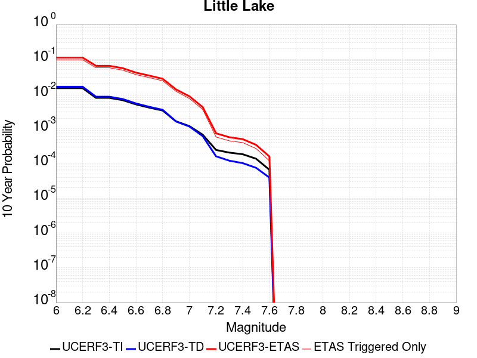 |

| Magnitude | 1 wk TI Prob | 1 wk TD Prob | 1 wk ETAS Prob | 1 wk ETAS/TD Gain | 1 wk ETAS Triggered Only | 1 mo TI Prob | 1 mo TD Prob | 1 mo ETAS Prob | 1 mo ETAS/TD Gain | 1 mo ETAS Triggered Only | 1 yr TI Prob | 1 yr TD Prob | 1 yr ETAS Prob | 1 yr ETAS/TD Gain | 1 yr ETAS Triggered Only | 10 yr TI Prob | 10 yr TD Prob | 10 yr ETAS Prob | 10 yr ETAS/TD Gain | 10 yr ETAS Triggered Only |
|-----|-----|-----|-----|-----|-----|-----|-----|-----|-----|-----|-----|-----|-----|-----|-----|-----|-----|-----|-----|-----|
| 6.0 | 2.8424427E-5 | 3.120572E-5 | 0.049459714 | 1584.9567 | 0.04943005 | 1.2181328E-4 | 1.337327E-4 | 0.060022097 | 448.82138 | 0.059896372 | 0.0014820677 | 0.0016271127 | 0.079738155 | 49.005917 | 0.078238346 | 0.014722223 | 0.016165402 | 0.10873761 | 6.7265644 | 0.09409326 |
| 6.1 | 2.8424427E-5 | 3.120572E-5 | 0.049459714 | 1584.9567 | 0.04943005 | 1.2181328E-4 | 1.337327E-4 | 0.060022097 | 448.82138 | 0.059896372 | 0.0014820677 | 0.0016271127 | 0.079738155 | 49.005917 | 0.078238346 | 0.014722223 | 0.016165402 | 0.10873761 | 6.7265644 | 0.09409326 |
| 6.2 | 2.8424427E-5 | 3.120572E-5 | 0.049459714 | 1584.9567 | 0.04943005 | 1.2181328E-4 | 1.337327E-4 | 0.060022097 | 448.82138 | 0.059896372 | 0.0014820677 | 0.0016271127 | 0.079738155 | 49.005917 | 0.078238346 | 0.014722223 | 0.016165402 | 0.10873761 | 6.7265644 | 0.09409326 |
| 6.3 | 1.48860645E-5 | 1.6081389E-5 | 0.029549286 | 1837.4834 | 0.029533679 | 6.379586E-5 | 6.8918576E-5 | 0.03571413 | 518.2076 | 0.035647668 | 7.7643775E-4 | 8.3878887E-4 | 0.04681056 | 55.80732 | 0.046010364 | 0.007737305 | 0.008359048 | 0.062616706 | 7.49089 | 0.054715026 |
| 6.4 | 1.48860645E-5 | 1.6081389E-5 | 0.029549286 | 1837.4834 | 0.029533679 | 6.379586E-5 | 6.8918576E-5 | 0.03571413 | 518.2076 | 0.035647668 | 7.7643775E-4 | 8.3878887E-4 | 0.04681056 | 55.80732 | 0.046010364 | 0.007737305 | 0.008359048 | 0.062616706 | 7.49089 | 0.054715026 |
| 6.5 | 1.2797581E-5 | 1.3765565E-5 | 0.025764706 | 1871.6781 | 0.025751295 | 5.4845623E-5 | 5.899409E-5 | 0.031041622 | 526.1819 | 0.030984456 | 6.675408E-4 | 7.18042E-4 | 0.040430438 | 56.306507 | 0.03974093 | 0.006655392 | 0.00715977 | 0.0542811 | 7.581403 | 0.04746114 |
| 6.6 | 9.661896E-6 | 1.0289038E-5 | 0.01923289 | 1869.2603 | 0.019222798 | 4.1407468E-5 | 4.409522E-5 | 0.022996452 | 521.518 | 0.022953369 | 5.040193E-4 | 5.367433E-4 | 0.029743856 | 55.41542 | 0.029222798 | 0.005028777 | 0.0053560743 | 0.040400524 | 7.5429354 | 0.035233162 |
| 6.7 | 7.767871E-6 | 8.199687E-6 | 0.01617387 | 1972.4985 | 0.016165802 | 3.329045E-5 | 3.5141118E-5 | 0.01946451 | 553.89557 | 0.019430052 | 4.0523586E-4 | 4.2777284E-4 | 0.024976853 | 58.38812 | 0.024559585 | 0.004044977 | 0.004270846 | 0.033368837 | 7.813168 | 0.029222798 |
| 6.8 | 6.4235196E-6 | 6.7357446E-6 | 0.012338259 | 1831.7588 | 0.012331606 | 2.752908E-5 | 2.8867229E-5 | 0.014898905 | 516.1183 | 0.014870467 | 3.35115E-4 | 3.5141467E-4 | 0.019360276 | 55.092396 | 0.019015543 | 0.003346101 | 0.00350985 | 0.026485918 | 7.546168 | 0.023056995 |
| 6.9 | 3.1283696E-6 | 3.1121804E-6 | 0.0055989497 | 1799.0441 | 0.005595855 | 1.3407229E-5 | 1.3337856E-5 | 0.0072153145 | 540.9651 | 0.0072020725 | 1.6322079E-4 | 1.6237781E-4 | 0.009331873 | 57.470123 | 0.009170985 | 0.0016310095 | 0.00162274 | 0.0129514765 | 7.98124 | 0.01134715 |
| 7.0 | 2.290603E-6 | 2.2286815E-6 | 0.0037846037 | 1698.1356 | 0.0037823834 | 9.816834E-6 | 9.551463E-6 | 0.0047245324 | 494.63965 | 0.004715026 | 1.19513395E-4 | 1.162839E-4 | 0.0060223327 | 51.78991 | 0.0059067355 | 0.0011944914 | 0.0011623327 | 0.00845954 | 7.2780714 | 0.0073056994 |
| 7.1 | 1.293693E-6 | 1.1776827E-6 | 0.0021255275 | 1804.8387 | 0.0021243524 | 5.5443866E-6 | 5.0472063E-6 | 0.002647521 | 524.55176 | 0.002642487 | 6.750081E-5 | 6.14487E-5 | 0.0032736866 | 53.275116 | 0.0032124352 | 6.7480316E-4 | 6.143856E-4 | 0.004394445 | 7.1525855 | 0.0037823834 |
| 7.2 | 4.715842E-7 | 3.0917857E-7 | 4.6663027E-4 | 1509.2582 | 4.6632125E-4 | 2.0210737E-6 | 1.3250503E-6 | 4.6764567E-4 | 352.92673 | 4.6632125E-4 | 2.4606294E-5 | 1.6132375E-5 | 5.8607134E-4 | 36.328896 | 5.6994817E-4 | 2.460357E-4 | 1.6131258E-4 | 8.3477906E-4 | 5.1749163 | 6.7357515E-4 |
| 7.3 | 3.9430947E-7 | 2.3097488E-7 | 2.5929828E-4 | 1122.6255 | 2.5906737E-4 | 1.6898966E-6 | 9.89892E-7 | 2.60057E-4 | 262.7125 | 2.5906737E-4 | 2.0574296E-5 | 1.2051869E-5 | 3.747418E-4 | 31.094084 | 3.626943E-4 | 2.0572392E-4 | 1.20512224E-4 | 5.867773E-4 | 4.869027 | 4.6632125E-4 |
| 7.4 | 3.547123E-7 | 1.9679135E-7 | 2.0745063E-4 | 1054.1654 | 2.0725389E-4 | 1.5201948E-6 | 8.4339126E-7 | 2.080971E-4 | 246.73851 | 2.0725389E-4 | 1.8508214E-5 | 1.0268241E-5 | 3.2114587E-4 | 31.275648 | 3.1088083E-4 | 1.8506673E-4 | 1.02677724E-4 | 5.1714294E-4 | 5.036564 | 4.1450778E-4 |
| 7.5 | 2.6354266E-7 | 1.4423138E-7 | 1.5558462E-4 | 1078.7155 | 1.5544042E-4 | 1.129468E-6 | 6.181344E-7 | 1.5605845E-4 | 252.46687 | 1.5544042E-4 | 1.3751187E-5 | 7.5257603E-6 | 2.6659117E-4 | 35.423817 | 2.5906737E-4 | 1.3750336E-4 | 7.5255106E-5 | 3.8611254E-4 | 5.1307154 | 3.1088083E-4 |
| 7.6 | 1.269913E-7 | 7.572556E-8 | 7.572556E-8 | 1.0 | 0.0 | 5.4424834E-7 | 3.245381E-7 | 3.245381E-7 | 1.0 | 0.0 | 6.6262032E-6 | 3.9512443E-6 | 3.9512443E-6 | 1.0 | 0.0 | 6.626006E-5 | 3.9511775E-5 | 9.13232E-5 | 2.3112907 | 5.1813473E-5 |

## Owl Lake
*[(top)](#table-of-contents)*

| 1 Week | 1 Month | 1 Year | 10 Year |
|-----|-----|-----|-----|
|  |  |  |  |

| Magnitude | 1 wk TI Prob | 1 wk TD Prob | 1 wk ETAS Prob | 1 wk ETAS/TD Gain | 1 wk ETAS Triggered Only | 1 mo TI Prob | 1 mo TD Prob | 1 mo ETAS Prob | 1 mo ETAS/TD Gain | 1 mo ETAS Triggered Only | 1 yr TI Prob | 1 yr TD Prob | 1 yr ETAS Prob | 1 yr ETAS/TD Gain | 1 yr ETAS Triggered Only | 10 yr TI Prob | 10 yr TD Prob | 10 yr ETAS Prob | 10 yr ETAS/TD Gain | 10 yr ETAS Triggered Only |
|-----|-----|-----|-----|-----|-----|-----|-----|-----|-----|-----|-----|-----|-----|-----|-----|-----|-----|-----|-----|-----|
| 6.0 | 5.0320643E-5 | 6.635816E-5 | 0.024002593 | 361.7128 | 0.023937823 | 2.1564208E-4 | 2.843674E-4 | 0.03302117 | 116.12151 | 0.032746114 | 0.0026222812 | 0.0034577388 | 0.050444964 | 14.589004 | 0.047150258 | 0.02591553 | 0.034140717 | 0.092842944 | 2.7194197 | 0.060777202 |
| 6.1 | 5.0320643E-5 | 6.635816E-5 | 0.024002593 | 361.7128 | 0.023937823 | 2.1564208E-4 | 2.843674E-4 | 0.03302117 | 116.12151 | 0.032746114 | 0.0026222812 | 0.0034577388 | 0.050444964 | 14.589004 | 0.047150258 | 0.02591553 | 0.034140717 | 0.092842944 | 2.7194197 | 0.060777202 |
| 6.2 | 2.4125871E-5 | 3.0981035E-5 | 0.019512244 | 629.81244 | 0.019481866 | 1.0339249E-4 | 1.3277028E-4 | 0.02613968 | 196.879 | 0.026010362 | 0.0012580766 | 0.001615439 | 0.037774548 | 23.383457 | 0.036217615 | 0.012509781 | 0.016070465 | 0.061953187 | 3.8550963 | 0.046632126 |
| 6.3 | 1.7433485E-5 | 2.2355514E-5 | 0.017897604 | 800.59015 | 0.017875647 | 7.471279E-5 | 9.580672E-5 | 0.023513252 | 245.42383 | 0.02341969 | 9.0924866E-4 | 0.0011659743 | 0.03304586 | 28.34184 | 0.0319171 | 0.009055373 | 0.011628896 | 0.05131737 | 4.4129186 | 0.04015544 |
| 6.4 | 1.7433485E-5 | 2.2355514E-5 | 0.017897604 | 800.59015 | 0.017875647 | 7.471279E-5 | 9.580672E-5 | 0.023513252 | 245.42383 | 0.02341969 | 9.0924866E-4 | 0.0011659743 | 0.03304586 | 28.34184 | 0.0319171 | 0.009055373 | 0.011628896 | 0.05131737 | 4.4129186 | 0.04015544 |
| 6.5 | 1.5182742E-5 | 1.9429144E-5 | 0.017324792 | 891.6909 | 0.0173057 | 6.506727E-5 | 8.326596E-5 | 0.02262025 | 271.66263 | 0.02253886 | 7.919061E-4 | 0.0010134429 | 0.03150065 | 31.082808 | 0.030518135 | 0.0078909 | 0.010118429 | 0.04791857 | 4.7357717 | 0.038186528 |
| 6.6 | 6.7271576E-6 | 8.547361E-6 | 0.015189765 | 1777.1292 | 0.015181347 | 2.8830356E-5 | 3.6631063E-5 | 0.019206913 | 524.33405 | 0.019170985 | 3.5095305E-4 | 4.458976E-4 | 0.025564225 | 57.332054 | 0.025129534 | 0.0035039932 | 0.004467813 | 0.0348496 | 7.8001475 | 0.030518135 |
| 6.7 | 6.682835E-6 | 8.479807E-6 | 0.015189698 | 1791.2788 | 0.015181347 | 2.8640408E-5 | 3.6341557E-5 | 0.01920663 | 528.50323 | 0.019170985 | 3.4864116E-4 | 4.4237426E-4 | 0.025509 | 57.663845 | 0.025077721 | 0.003480947 | 0.0044327388 | 0.034712426 | 7.8309207 | 0.030414509 |
| 6.8 | 6.5774975E-6 | 8.32628E-6 | 0.015189547 | 1824.2896 | 0.015181347 | 2.8188972E-5 | 3.5683603E-5 | 0.019205984 | 538.23 | 0.019170985 | 3.4314668E-4 | 4.343669E-4 | 0.025449403 | 58.589645 | 0.025025906 | 0.0034261728 | 0.004352885 | 0.034480236 | 7.9212384 | 0.030259067 |
| 6.9 | 6.363419E-6 | 7.999454E-6 | 0.015189225 | 1898.7826 | 0.015181347 | 2.727151E-5 | 3.428296E-5 | 0.019204611 | 560.1795 | 0.019170985 | 3.3198006E-4 | 4.1732067E-4 | 0.025380991 | 60.81892 | 0.024974093 | 0.0033148455 | 0.0041828766 | 0.03421218 | 8.179104 | 0.03015544 |
| 7.0 | 6.1342453E-6 | 7.6316555E-6 | 0.015033424 | 1969.8771 | 0.015025907 | 2.6289357E-5 | 3.2706717E-5 | 0.01904763 | 582.3767 | 0.019015543 | 3.2002592E-4 | 3.9813702E-4 | 0.025155116 | 63.182056 | 0.02476684 | 0.0031956544 | 0.003991571 | 0.03376861 | 8.459981 | 0.029896373 |
| 7.1 | 5.842926E-6 | 7.142211E-6 | 0.01451481 | 2032.2573 | 0.014507772 | 2.504087E-5 | 3.0609146E-5 | 0.018372016 | 600.21326 | 0.01834197 | 3.0482994E-4 | 3.7260808E-4 | 0.024353307 | 65.35905 | 0.023989636 | 0.0030441214 | 0.0037370329 | 0.032437667 | 8.6800585 | 0.02880829 |
| 7.2 | 4.77173E-6 | 5.358483E-6 | 0.008969041 | 1673.8022 | 0.00896373 | 2.045011E-5 | 2.2964748E-5 | 0.011887977 | 517.662 | 0.011865285 | 2.4895166E-4 | 2.79564E-4 | 0.015663862 | 56.029613 | 0.015388601 | 0.0024867293 | 0.002808645 | 0.020944094 | 7.45701 | 0.018186528 |
| 7.3 | 3.0494948E-6 | 2.710463E-6 | 0.0026451903 | 975.9183 | 0.002642487 | 1.3069198E-5 | 1.1616219E-5 | 0.0034312657 | 295.38574 | 0.0034196891 | 1.5910587E-4 | 1.4141845E-4 | 0.004648553 | 32.87091 | 0.004507772 | 0.0015899199 | 0.0014232415 | 0.006855913 | 4.8171115 | 0.0054404144 |
| 7.4 | 2.7263884E-6 | 2.3056762E-6 | 0.0016085196 | 697.63464 | 0.0016062176 | 1.1684469E-5 | 9.881433E-6 | 0.0020823998 | 210.73865 | 0.002072539 | 1.4224913E-4 | 1.20299905E-4 | 0.002969698 | 24.68579 | 0.002849741 | 0.0014215811 | 0.0012112238 | 0.004626771 | 3.819914 | 0.0034196891 |
| 7.5 | 2.6090431E-6 | 2.1656133E-6 | 0.0012974996 | 599.13727 | 0.0012953368 | 1.1181565E-5 | 9.281167E-6 | 0.0016154839 | 174.06042 | 0.0016062176 | 1.3612706E-4 | 1.1299244E-4 | 0.0023925276 | 21.174227 | 0.0022797927 | 0.001360437 | 0.0011379806 | 0.0039327242 | 3.4558797 | 0.0027979275 |
| 7.6 | 2.3008756E-6 | 1.8727933E-6 | 0.0010899537 | 581.9935 | 0.0010880829 | 9.860858E-6 | 8.0262325E-6 | 0.0013033526 | 162.3866 | 0.0012953368 | 1.20049335E-4 | 9.7715085E-5 | 0.0019110094 | 19.556953 | 0.0018134716 | 0.001199845 | 9.849932E-4 | 0.0032625403 | 3.3122466 | 0.0022797927 |
| 7.7 | 1.7184348E-6 | 1.3419171E-6 | 5.7128933E-4 | 425.72626 | 5.6994817E-4 | 7.3646997E-6 | 5.7510606E-6 | 7.311355E-4 | 127.13055 | 7.253886E-4 | 8.966153E-5 | 7.0016955E-5 | 0.0012098335 | 17.27915 | 0.0011398963 | 8.962536E-4 | 7.078345E-4 | 0.002105808 | 2.9750006 | 0.0013989637 |
| 7.8 | 8.4612907E-7 | 8.4058576E-7 | 2.080943E-4 | 247.55867 | 2.0725389E-4 | 3.6262625E-6 | 3.6025056E-6 | 3.1448223E-4 | 87.29542 | 3.1088083E-4 | 4.4148852E-5 | 4.3859643E-5 | 4.0653805E-4 | 9.269069 | 3.626943E-4 | 4.414008E-4 | 4.4398365E-4 | 8.5830735E-4 | 1.933196 | 4.1450778E-4 |
| 7.9 | 2.716738E-7 | 3.768106E-7 | 1.5581716E-4 | 413.5159 | 1.5544042E-4 | 1.1643157E-6 | 1.6149015E-6 | 2.6068185E-4 | 161.42274 | 2.5906737E-4 | 1.4175452E-5 | 1.966126E-5 | 2.787235E-4 | 14.17628 | 2.5906737E-4 | 1.4174548E-4 | 1.9836679E-4 | 5.0918595E-4 | 2.5668912 | 3.1088083E-4 |
| 8.0 | 2.1995428E-8 | 3.384878E-8 | 3.384878E-8 | 1.0 | 0.0 | 9.426611E-8 | 1.4506621E-7 | 1.4506621E-7 | 1.0 | 0.0 | 1.1476893E-6 | 1.7661803E-6 | 1.7661803E-6 | 1.0 | 0.0 | 1.14768345E-5 | 1.7963059E-5 | 1.7963059E-5 | 1.0 | 0.0 |

## Garlock (East)
*[(top)](#table-of-contents)*

| 1 Week | 1 Month | 1 Year | 10 Year |
|-----|-----|-----|-----|
|  | 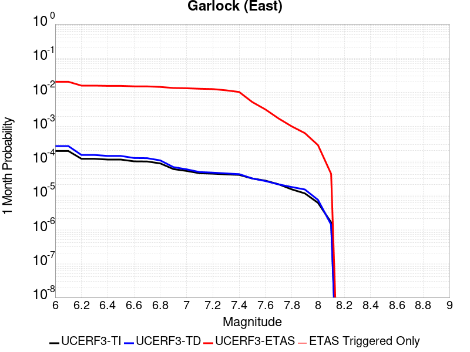 |  |  |

| Magnitude | 1 wk TI Prob | 1 wk TD Prob | 1 wk ETAS Prob | 1 wk ETAS/TD Gain | 1 wk ETAS Triggered Only | 1 mo TI Prob | 1 mo TD Prob | 1 mo ETAS Prob | 1 mo ETAS/TD Gain | 1 mo ETAS Triggered Only | 1 yr TI Prob | 1 yr TD Prob | 1 yr ETAS Prob | 1 yr ETAS/TD Gain | 1 yr ETAS Triggered Only | 10 yr TI Prob | 10 yr TD Prob | 10 yr ETAS Prob | 10 yr ETAS/TD Gain | 10 yr ETAS Triggered Only |
|-----|-----|-----|-----|-----|-----|-----|-----|-----|-----|-----|-----|-----|-----|-----|-----|-----|-----|-----|-----|-----|
| 6.0 | 4.5092507E-5 | 6.290325E-5 | 0.015087864 | 239.85828 | 0.015025907 | 1.9323928E-4 | 2.6956003E-4 | 0.020989362 | 77.865265 | 0.020725388 | 0.0023501497 | 0.0032774 | 0.03405702 | 10.391475 | 0.03088083 | 0.023254504 | 0.032351844 | 0.07236134 | 2.2366989 | 0.04134715 |
| 6.1 | 4.5092507E-5 | 6.290325E-5 | 0.015087864 | 239.85828 | 0.015025907 | 1.9323928E-4 | 2.6956003E-4 | 0.020989362 | 77.865265 | 0.020725388 | 0.0023501497 | 0.0032774 | 0.03405702 | 10.391475 | 0.03088083 | 0.023254504 | 0.032351844 | 0.07236134 | 2.2366989 | 0.04134715 |
| 6.2 | 2.6674514E-5 | 3.4509674E-5 | 0.012262067 | 355.32257 | 0.0122279795 | 1.1431433E-4 | 1.4789042E-4 | 0.01574144 | 106.43989 | 0.015595855 | 0.0013908884 | 0.0017991117 | 0.024349142 | 13.533979 | 0.022590674 | 0.01382215 | 0.017890299 | 0.046844725 | 2.6184428 | 0.029481865 |
| 6.3 | 2.6674514E-5 | 3.4509674E-5 | 0.012262067 | 355.32257 | 0.0122279795 | 1.1431433E-4 | 1.4789042E-4 | 0.01574144 | 106.43989 | 0.015595855 | 0.0013908884 | 0.0017991117 | 0.024349142 | 13.533979 | 0.022590674 | 0.01382215 | 0.017890299 | 0.046844725 | 2.6184428 | 0.029481865 |
| 6.4 | 2.5312667E-5 | 3.233893E-5 | 0.012156299 | 375.90295 | 0.012124352 | 1.0847834E-4 | 1.3858822E-4 | 0.01562867 | 112.770546 | 0.015492228 | 0.0013199237 | 0.0016860351 | 0.02397999 | 14.222711 | 0.022331607 | 0.013121112 | 0.016778335 | 0.04510327 | 2.688185 | 0.02880829 |
| 6.5 | 2.5312667E-5 | 3.233893E-5 | 0.012156299 | 375.90295 | 0.012124352 | 1.0847834E-4 | 1.3858822E-4 | 0.01562867 | 112.770546 | 0.015492228 | 0.0013199237 | 0.0016860351 | 0.02397999 | 14.222711 | 0.022331607 | 0.013121112 | 0.016778335 | 0.04510327 | 2.688185 | 0.02880829 |
| 6.6 | 2.246556E-5 | 2.8133776E-5 | 0.011789461 | 419.05008 | 0.011761658 | 9.627742E-5 | 1.20567885E-4 | 0.015144663 | 125.611084 | 0.015025907 | 0.0011715472 | 0.0014669491 | 0.022782784 | 15.5307255 | 0.02134715 | 0.011653901 | 0.01461866 | 0.04147413 | 2.8370678 | 0.027253887 |
| 6.7 | 2.2241198E-5 | 2.7803519E-5 | 0.01168551 | 420.2889 | 0.0116580315 | 9.531594E-5 | 1.1915263E-4 | 0.015039654 | 126.221756 | 0.01492228 | 0.0011598538 | 0.0014497414 | 0.02261073 | 15.596388 | 0.02119171 | 0.011538187 | 0.014448853 | 0.041104693 | 2.8448412 | 0.027046632 |
| 6.8 | 1.9528685E-5 | 2.389819E-5 | 0.011474402 | 480.13684 | 0.011450777 | 8.369167E-5 | 1.0241691E-4 | 0.014608704 | 142.63956 | 0.014507772 | 0.0010184698 | 0.0012462323 | 0.021376554 | 17.152946 | 0.020155441 | 0.010138147 | 0.012436427 | 0.03771396 | 3.0325398 | 0.025595855 |
| 6.9 | 1.3318621E-5 | 1.5198884E-5 | 0.010999488 | 723.7036 | 0.010984456 | 5.7078556E-5 | 6.513648E-5 | 0.013846622 | 212.5786 | 0.013782384 | 6.9470983E-4 | 7.927538E-4 | 0.019430816 | 24.510529 | 0.018652849 | 0.0069254204 | 0.007939888 | 0.031070823 | 3.9132571 | 0.023316063 |
| 7.0 | 1.1760853E-5 | 1.31077895E-5 | 0.010686543 | 815.28186 | 0.010673575 | 5.0402683E-5 | 5.6175057E-5 | 0.013423299 | 238.9548 | 0.0133678755 | 6.134799E-4 | 6.8372174E-4 | 0.018547148 | 27.126749 | 0.017875647 | 0.0061178906 | 0.00685652 | 0.02903501 | 4.234657 | 0.022331607 |
| 7.1 | 1.0064758E-5 | 1.0902931E-5 | 0.010580736 | 970.4488 | 0.010569948 | 4.3133965E-5 | 4.672603E-5 | 0.013206732 | 282.6419 | 0.013160622 | 5.2502943E-4 | 5.687444E-4 | 0.018019954 | 31.683746 | 0.01746114 | 0.005237907 | 0.0057129986 | 0.027092746 | 4.7422986 | 0.02150259 |
| 7.2 | 9.768808E-6 | 1.0498807E-5 | 0.010269458 | 978.1548 | 0.010259068 | 4.186565E-5 | 4.499413E-5 | 0.012842346 | 285.4227 | 0.0127979275 | 5.095951E-4 | 5.4766936E-4 | 0.017533181 | 32.01417 | 0.016994819 | 0.0050842804 | 0.0055032647 | 0.026320709 | 4.7827444 | 0.020932643 |
| 7.3 | 9.344516E-6 | 9.944468E-6 | 0.009854406 | 990.9436 | 0.009844559 | 4.004731E-5 | 4.261847E-5 | 0.012114643 | 284.25806 | 0.012072539 | 4.8746695E-4 | 5.1875977E-4 | 0.016572604 | 31.946585 | 0.016062176 | 0.0048639905 | 0.0052149445 | 0.024956016 | 4.7854805 | 0.01984456 |
| 7.4 | 9.023491E-6 | 9.490661E-6 | 0.008403193 | 885.41705 | 0.008393782 | 3.867153E-5 | 4.0673647E-5 | 0.010402947 | 255.76627 | 0.010362694 | 4.7072413E-4 | 4.950925E-4 | 0.0145813795 | 29.45183 | 0.014093264 | 0.004697283 | 0.0049783974 | 0.02245572 | 4.510632 | 0.017564766 |
| 7.5 | 7.081253E-6 | 7.087672E-6 | 0.00472208 | 666.2385 | 0.004715026 | 3.0347876E-5 | 3.0375388E-5 | 0.0055224365 | 181.80629 | 0.005492228 | 3.6942272E-4 | 3.6975832E-4 | 0.008087111 | 21.871342 | 0.0077202073 | 0.003688092 | 0.0037243143 | 0.013532209 | 3.633477 | 0.009844559 |
| 7.6 | 6.116396E-6 | 5.959245E-6 | 0.0029074964 | 487.8968 | 0.0029015543 | 2.6212863E-5 | 2.5539372E-5 | 0.0034451413 | 134.8953 | 0.0034196891 | 3.1909486E-4 | 3.1089774E-4 | 0.005076255 | 16.327732 | 0.0047668396 | 0.0031863707 | 0.0031357552 | 0.009333875 | 2.9765956 | 0.0062176166 |
| 7.7 | 4.797145E-6 | 4.757281E-6 | 0.0014555276 | 305.9579 | 0.0014507772 | 2.055903E-5 | 2.0388188E-5 | 0.0017301979 | 84.862755 | 0.0017098446 | 2.5027743E-4 | 2.4819805E-4 | 0.0027346273 | 11.017924 | 0.0024870466 | 0.0024999576 | 0.0025093474 | 0.0058687716 | 2.3387642 | 0.0033678757 |
| 7.8 | 3.4028885E-6 | 3.978462E-6 | 8.84804E-4 | 222.39851 | 8.80829E-4 | 1.4583726E-5 | 1.7050439E-5 | 9.49677E-4 | 55.698097 | 9.326425E-4 | 1.775424E-4 | 2.0756939E-4 | 0.0016580455 | 7.987909 | 0.0014507772 | 0.0017740062 | 0.0021012232 | 0.0041177026 | 1.9596694 | 0.0020207253 |
| 7.9 | 2.5928412E-6 | 3.3724489E-6 | 5.215054E-4 | 154.63701 | 5.1813474E-4 | 1.1112129E-5 | 1.4453272E-5 | 5.843932E-4 | 40.43328 | 5.6994817E-4 | 1.3528178E-4 | 1.7595445E-4 | 0.0012120416 | 6.8883824 | 0.0010362695 | 0.0013519945 | 0.0017812408 | 0.003281155 | 1.8420614 | 0.0015025907 |
| 8.0 | 1.3743648E-6 | 1.6734747E-6 | 3.1255378E-4 | 186.76935 | 3.1088083E-4 | 5.8901214E-6 | 7.1720146E-6 | 3.698637E-4 | 51.570408 | 3.626943E-4 | 7.1709874E-5 | 8.731581E-5 | 6.054053E-4 | 6.9335127 | 5.1813474E-4 | 7.1686733E-4 | 8.837234E-4 | 0.0015567032 | 1.7615278 | 6.7357515E-4 |
| 8.1 | 3.6733252E-7 | 3.1489964E-7 | 5.2128355E-5 | 165.53958 | 5.1813473E-5 | 1.5742813E-6 | 1.3495693E-6 | 1.04976374E-4 | 77.785095 | 1.03626946E-4 | 1.9166706E-5 | 1.6430899E-5 | 1.2005614E-4 | 7.30673 | 1.03626946E-4 | 1.9165053E-4 | 1.6638759E-4 | 3.2180213E-4 | 1.9340514 | 1.5544042E-4 |

## Panamint Valley
*[(top)](#table-of-contents)*

| 1 Week | 1 Month | 1 Year | 10 Year |
|-----|-----|-----|-----|
|  |  |  |  |

| Magnitude | 1 wk TI Prob | 1 wk TD Prob | 1 wk ETAS Prob | 1 wk ETAS/TD Gain | 1 wk ETAS Triggered Only | 1 mo TI Prob | 1 mo TD Prob | 1 mo ETAS Prob | 1 mo ETAS/TD Gain | 1 mo ETAS Triggered Only | 1 yr TI Prob | 1 yr TD Prob | 1 yr ETAS Prob | 1 yr ETAS/TD Gain | 1 yr ETAS Triggered Only | 10 yr TI Prob | 10 yr TD Prob | 10 yr ETAS Prob | 10 yr ETAS/TD Gain | 10 yr ETAS Triggered Only |
|-----|-----|-----|-----|-----|-----|-----|-----|-----|-----|-----|-----|-----|-----|-----|-----|-----|-----|-----|-----|-----|
| 6.0 | 3.0211835E-5 | 3.3984514E-5 | 0.018841635 | 554.4183 | 0.01880829 | 1.2947287E-4 | 1.4563995E-4 | 0.023976365 | 164.62767 | 0.023834197 | 0.0015751923 | 0.0017717537 | 0.035546005 | 20.06261 | 0.033834197 | 0.015640736 | 0.017583137 | 0.059832152 | 3.4028144 | 0.04300518 |
| 6.1 | 3.0211835E-5 | 3.3984514E-5 | 0.018841635 | 554.4183 | 0.01880829 | 1.2947287E-4 | 1.4563995E-4 | 0.023976365 | 164.62767 | 0.023834197 | 0.0015751923 | 0.0017717537 | 0.035546005 | 20.06261 | 0.033834197 | 0.015640736 | 0.017583137 | 0.059832152 | 3.4028144 | 0.04300518 |
| 6.2 | 3.0211835E-5 | 3.3984514E-5 | 0.018841635 | 554.4183 | 0.01880829 | 1.2947287E-4 | 1.4563995E-4 | 0.023976365 | 164.62767 | 0.023834197 | 0.0015751923 | 0.0017717537 | 0.035546005 | 20.06261 | 0.033834197 | 0.015640736 | 0.017583137 | 0.059832152 | 3.4028144 | 0.04300518 |
| 6.3 | 2.8573924E-5 | 3.210268E-5 | 0.018062612 | 562.65125 | 0.018031089 | 1.2245393E-4 | 1.3757581E-4 | 0.02288056 | 166.31238 | 0.022746114 | 0.001489857 | 0.0016737265 | 0.033899494 | 20.253902 | 0.032279793 | 0.01479908 | 0.016617801 | 0.056870233 | 3.422248 | 0.040932644 |
| 6.4 | 2.8573924E-5 | 3.210268E-5 | 0.018062612 | 562.65125 | 0.018031089 | 1.2245393E-4 | 1.3757581E-4 | 0.02288056 | 166.31238 | 0.022746114 | 0.001489857 | 0.0016737265 | 0.033899494 | 20.253902 | 0.032279793 | 0.01479908 | 0.016617801 | 0.056870233 | 3.422248 | 0.040932644 |
| 6.5 | 2.7468774E-5 | 3.0828433E-5 | 0.017595055 | 570.7411 | 0.017564766 | 1.1771801E-4 | 1.3211532E-4 | 0.022253545 | 168.4403 | 0.022124352 | 0.0014322745 | 0.0016073446 | 0.032852378 | 20.438915 | 0.031295337 | 0.014230782 | 0.015963677 | 0.05501921 | 3.446525 | 0.03968912 |
| 6.6 | 2.6135967E-5 | 2.925248E-5 | 0.017282633 | 590.80914 | 0.017253887 | 1.1200648E-4 | 1.253619E-4 | 0.021780677 | 173.7424 | 0.021658031 | 0.0013628257 | 0.0015252391 | 0.031841625 | 20.87648 | 0.030362694 | 0.013544982 | 0.015154043 | 0.053221148 | 3.5120096 | 0.03865285 |
| 6.7 | 2.4498746E-5 | 2.7341335E-5 | 0.016710823 | 611.1926 | 0.016683938 | 1.04990395E-4 | 1.1717203E-4 | 0.021099169 | 180.07002 | 0.020984456 | 0.0012775084 | 0.0014256609 | 0.030555058 | 21.432205 | 0.029170984 | 0.012701893 | 0.014171274 | 0.05059075 | 3.5699506 | 0.036943004 |
| 6.8 | 2.2244329E-5 | 2.4935423E-5 | 0.015620401 | 626.43414 | 0.015595855 | 9.532935E-5 | 1.0686185E-4 | 0.01974207 | 184.74385 | 0.019637305 | 0.0011600169 | 0.0013002884 | 0.028725721 | 22.091808 | 0.02746114 | 0.011539802 | 0.0129325185 | 0.046636015 | 3.6061046 | 0.03414508 |
| 6.9 | 1.9902658E-5 | 2.2290267E-5 | 0.015047862 | 675.0867 | 0.015025907 | 8.529431E-5 | 9.552632E-5 | 0.018642977 | 195.16063 | 0.018549222 | 0.0010379635 | 0.0011624309 | 0.026418013 | 22.726522 | 0.025284974 | 0.010331288 | 0.011568608 | 0.0425019 | 3.6738994 | 0.031295337 |
| 7.0 | 1.8353881E-5 | 2.0566185E-5 | 0.014631664 | 711.44275 | 0.014611399 | 7.865712E-5 | 8.813792E-5 | 0.01801402 | 204.38443 | 0.01792746 | 9.5722964E-4 | 0.0010725686 | 0.024984717 | 23.294283 | 0.023937823 | 0.009531168 | 0.010678849 | 0.0396921 | 3.7168894 | 0.029326424 |
| 7.1 | 1.7667631E-5 | 1.9772613E-5 | 0.0145272575 | 734.7162 | 0.014507772 | 7.571623E-5 | 8.473711E-5 | 0.017803444 | 210.10207 | 0.017720208 | 9.2145515E-4 | 0.0010312037 | 0.024426742 | 23.687603 | 0.02341969 | 0.009176437 | 0.010269073 | 0.038627684 | 3.7615552 | 0.02865285 |
| 7.2 | 1.6381597E-5 | 1.8158249E-5 | 0.012815854 | 705.7868 | 0.0127979275 | 7.020495E-5 | 7.781885E-5 | 0.015931508 | 204.72556 | 0.015854923 | 8.544101E-4 | 9.4704994E-4 | 0.021963397 | 23.191381 | 0.02103627 | 0.008511325 | 0.009434792 | 0.034789156 | 3.6873262 | 0.025595855 |
| 7.3 | 1.4520491E-5 | 1.5966476E-5 | 0.010378495 | 650.01794 | 0.010362694 | 6.222919E-5 | 6.842605E-5 | 0.013228147 | 193.32034 | 0.013160622 | 7.57377E-4 | 8.327849E-4 | 0.01781345 | 21.390217 | 0.016994819 | 0.0075480095 | 0.00829975 | 0.029007275 | 3.4949572 | 0.02088083 |
| 7.4 | 1.2852287E-5 | 1.4145411E-5 | 0.010169442 | 718.92163 | 0.01015544 | 5.5080065E-5 | 6.062187E-5 | 0.012961394 | 213.80724 | 0.012901555 | 6.7039346E-4 | 7.378371E-4 | 0.01735769 | 23.525097 | 0.016632125 | 0.0066837464 | 0.0073567946 | 0.02746682 | 3.733531 | 0.020259067 |
| 7.5 | 1.1637851E-5 | 1.2836797E-5 | 0.010012709 | 780.0005 | 0.01 | 4.987555E-5 | 5.5013777E-5 | 0.012800426 | 232.67676 | 0.012746114 | 6.070656E-4 | 6.6960254E-4 | 0.017135253 | 25.590185 | 0.016476683 | 0.006054099 | 0.0066787465 | 0.026493704 | 3.966868 | 0.019948186 |
| 7.6 | 3.0068115E-6 | 3.3330316E-6 | 0.0042002103 | 1260.1771 | 0.004196891 | 1.2886271E-5 | 1.4284384E-5 | 0.0056100595 | 392.74072 | 0.005595855 | 1.5687906E-4 | 1.7390578E-4 | 0.0072193122 | 41.512783 | 0.007046632 | 0.0015676835 | 0.0017391363 | 0.010273491 | 5.9072375 | 0.008549223 |

## Airport Lake
*[(top)](#table-of-contents)*

| 1 Week | 1 Month | 1 Year | 10 Year |
|-----|-----|-----|-----|
|  |  |  |  |

| Magnitude | 1 wk TI Prob | 1 wk TD Prob | 1 wk ETAS Prob | 1 wk ETAS/TD Gain | 1 wk ETAS Triggered Only | 1 mo TI Prob | 1 mo TD Prob | 1 mo ETAS Prob | 1 mo ETAS/TD Gain | 1 mo ETAS Triggered Only | 1 yr TI Prob | 1 yr TD Prob | 1 yr ETAS Prob | 1 yr ETAS/TD Gain | 1 yr ETAS Triggered Only | 10 yr TI Prob | 10 yr TD Prob | 10 yr ETAS Prob | 10 yr ETAS/TD Gain | 10 yr ETAS Triggered Only |
|-----|-----|-----|-----|-----|-----|-----|-----|-----|-----|-----|-----|-----|-----|-----|-----|-----|-----|-----|-----|-----|
| 6.0 | 1.2387061E-5 | 1.3103157E-5 | 0.021774476 | 1661.7733 | 0.021761658 | 5.3086325E-5 | 5.615534E-5 | 0.026790405 | 477.07675 | 0.026735751 | 6.461343E-4 | 6.8350515E-4 | 0.03464991 | 50.69444 | 0.033989638 | 0.0064425888 | 0.0068168393 | 0.04711023 | 6.910861 | 0.04056995 |
| 6.1 | 1.2387061E-5 | 1.3103157E-5 | 0.021774476 | 1661.7733 | 0.021761658 | 5.3086325E-5 | 5.615534E-5 | 0.026790405 | 477.07675 | 0.026735751 | 6.461343E-4 | 6.8350515E-4 | 0.03464991 | 50.69444 | 0.033989638 | 0.0064425888 | 0.0068168393 | 0.04711023 | 6.910861 | 0.04056995 |
| 6.2 | 1.2387061E-5 | 1.3103157E-5 | 0.021774476 | 1661.7733 | 0.021761658 | 5.3086325E-5 | 5.615534E-5 | 0.026790405 | 477.07675 | 0.026735751 | 6.461343E-4 | 6.8350515E-4 | 0.03464991 | 50.69444 | 0.033989638 | 0.0064425888 | 0.0068168393 | 0.04711023 | 6.910861 | 0.04056995 |
| 6.3 | 1.2387061E-5 | 1.3103157E-5 | 0.021774476 | 1661.7733 | 0.021761658 | 5.3086325E-5 | 5.615534E-5 | 0.026790405 | 477.07675 | 0.026735751 | 6.461343E-4 | 6.8350515E-4 | 0.03464991 | 50.69444 | 0.033989638 | 0.0064425888 | 0.0068168393 | 0.04711023 | 6.910861 | 0.04056995 |
| 6.4 | 1.2387061E-5 | 1.3103157E-5 | 0.021774476 | 1661.7733 | 0.021761658 | 5.3086325E-5 | 5.615534E-5 | 0.026790405 | 477.07675 | 0.026735751 | 6.461343E-4 | 6.8350515E-4 | 0.03464991 | 50.69444 | 0.033989638 | 0.0064425888 | 0.0068168393 | 0.04711023 | 6.910861 | 0.04056995 |
| 6.5 | 6.9922594E-6 | 7.384925E-6 | 0.0166912 | 2260.1719 | 0.016683938 | 2.996648E-5 | 3.1649324E-5 | 0.02044551 | 646.00146 | 0.020414507 | 3.6478083E-4 | 3.8526783E-4 | 0.025867674 | 67.14205 | 0.025492229 | 0.003641826 | 0.0038465366 | 0.034144055 | 8.876571 | 0.030414509 |
| 6.6 | 6.9922594E-6 | 7.384925E-6 | 0.0166912 | 2260.1719 | 0.016683938 | 2.996648E-5 | 3.1649324E-5 | 0.02044551 | 646.00146 | 0.020414507 | 3.6478083E-4 | 3.8526783E-4 | 0.025867674 | 67.14205 | 0.025492229 | 0.003641826 | 0.0038465366 | 0.034144055 | 8.876571 | 0.030414509 |
| 6.7 | 5.477277E-6 | 5.7860684E-6 | 0.014358034 | 2481.4836 | 0.014352332 | 2.3473833E-5 | 2.4797222E-5 | 0.017589128 | 709.3185 | 0.017564766 | 2.8575645E-4 | 3.0186825E-4 | 0.02200516 | 72.89657 | 0.021709844 | 0.0028538927 | 0.003014966 | 0.028585307 | 9.481138 | 0.025647668 |
| 6.8 | 3.9950432E-6 | 4.2190873E-6 | 0.009952364 | 2358.8904 | 0.009948187 | 1.7121502E-5 | 1.8081691E-5 | 0.012349465 | 682.9817 | 0.012331606 | 2.0843433E-4 | 2.2012512E-4 | 0.015760746 | 71.59903 | 0.015544041 | 0.0020823893 | 0.0021993418 | 0.021069665 | 9.579987 | 0.018911917 |
| 6.9 | 2.95695E-6 | 3.1230243E-6 | 0.00668704 | 2141.2065 | 0.0066839377 | 1.2672582E-5 | 1.3384334E-5 | 0.008562493 | 639.7399 | 0.008549223 | 1.5427776E-4 | 1.6294434E-4 | 0.01114561 | 68.40133 | 0.010984456 | 0.001541707 | 0.0016284712 | 0.015181494 | 9.322544 | 0.013575129 |
| 7.0 | 1.456072E-6 | 1.540812E-6 | 0.0030067174 | 1951.385 | 0.0030051814 | 6.2402937E-6 | 6.603469E-6 | 0.003840775 | 581.6299 | 0.0038341968 | 7.597293E-5 | 8.039528E-5 | 0.00495047 | 61.57663 | 0.0048704664 | 7.594696E-4 | 8.0376083E-4 | 0.0068610646 | 8.5362015 | 0.006062176 |
| 7.1 | 6.995192E-7 | 7.4089746E-7 | 0.0015033304 | 2029.0669 | 0.0015025907 | 2.997936E-6 | 3.1752747E-6 | 0.0020238943 | 637.39185 | 0.0020207253 | 3.649926E-5 | 3.865897E-5 | 0.0024737979 | 63.990273 | 0.0024352332 | 3.6493264E-4 | 3.865897E-4 | 0.0032870225 | 8.502612 | 0.0029015543 |

## Hunter Mountain-Saline Valley
*[(top)](#table-of-contents)*

| 1 Week | 1 Month | 1 Year | 10 Year |
|-----|-----|-----|-----|
|  |  |  |  |

| Magnitude | 1 wk TI Prob | 1 wk TD Prob | 1 wk ETAS Prob | 1 wk ETAS/TD Gain | 1 wk ETAS Triggered Only | 1 mo TI Prob | 1 mo TD Prob | 1 mo ETAS Prob | 1 mo ETAS/TD Gain | 1 mo ETAS Triggered Only | 1 yr TI Prob | 1 yr TD Prob | 1 yr ETAS Prob | 1 yr ETAS/TD Gain | 1 yr ETAS Triggered Only | 10 yr TI Prob | 10 yr TD Prob | 10 yr ETAS Prob | 10 yr ETAS/TD Gain | 10 yr ETAS Triggered Only |
|-----|-----|-----|-----|-----|-----|-----|-----|-----|-----|-----|-----|-----|-----|-----|-----|-----|-----|-----|-----|-----|
| 6.0 | 4.5103672E-5 | 5.4570177E-5 | 0.010572131 | 193.73459 | 0.010518135 | 1.9328714E-4 | 2.3385242E-4 | 0.013598602 | 58.150356 | 0.0133678755 | 0.002350731 | 0.0028435152 | 0.020100005 | 7.0687175 | 0.0173057 | 0.023260195 | 0.028091887 | 0.048587564 | 1.7295942 | 0.021088082 |
| 6.1 | 4.5103672E-5 | 5.4570177E-5 | 0.010572131 | 193.73459 | 0.010518135 | 1.9328714E-4 | 2.3385242E-4 | 0.013598602 | 58.150356 | 0.0133678755 | 0.002350731 | 0.0028435152 | 0.020100005 | 7.0687175 | 0.0173057 | 0.023260195 | 0.028091887 | 0.048587564 | 1.7295942 | 0.021088082 |
| 6.2 | 3.9363465E-5 | 4.706337E-5 | 0.01040927 | 221.17561 | 0.010362694 | 1.6868966E-4 | 2.0168544E-4 | 0.013359653 | 66.24004 | 0.013160622 | 0.002051862 | 0.0024528175 | 0.019457636 | 7.9327703 | 0.017046632 | 0.020330196 | 0.024273481 | 0.044596903 | 1.8372686 | 0.020829016 |
| 6.3 | 3.9363465E-5 | 4.706337E-5 | 0.01040927 | 221.17561 | 0.010362694 | 1.6868966E-4 | 2.0168544E-4 | 0.013359653 | 66.24004 | 0.013160622 | 0.002051862 | 0.0024528175 | 0.019457636 | 7.9327703 | 0.017046632 | 0.020330196 | 0.024273481 | 0.044596903 | 1.8372686 | 0.020829016 |
| 6.4 | 3.2311684E-5 | 3.795099E-5 | 0.0102448175 | 269.94864 | 0.0102072535 | 1.384713E-4 | 1.6263737E-4 | 0.013165704 | 80.95128 | 0.013005181 | 0.0016845843 | 0.0019783843 | 0.01883616 | 9.52098 | 0.01689119 | 0.016718714 | 0.019616475 | 0.039884508 | 2.0332148 | 0.020673575 |
| 6.5 | 3.2311684E-5 | 3.795099E-5 | 0.0102448175 | 269.94864 | 0.0102072535 | 1.384713E-4 | 1.6263737E-4 | 0.013165704 | 80.95128 | 0.013005181 | 0.0016845843 | 0.0019783843 | 0.01883616 | 9.52098 | 0.01689119 | 0.016718714 | 0.019616475 | 0.039884508 | 2.0332148 | 0.020673575 |
| 6.6 | 2.9305844E-5 | 3.418183E-5 | 0.010241087 | 299.60614 | 0.0102072535 | 1.2559042E-4 | 1.4648569E-4 | 0.013149762 | 89.768234 | 0.013005181 | 0.0015279909 | 0.001782067 | 0.018591436 | 10.432512 | 0.016839378 | 0.015175272 | 0.01768569 | 0.037942745 | 2.1453922 | 0.020621762 |
| 6.7 | 2.7826512E-5 | 3.2344276E-5 | 0.010239268 | 316.57126 | 0.0102072535 | 1.19251024E-4 | 1.386113E-4 | 0.01314199 | 94.81182 | 0.013005181 | 0.0014509142 | 0.0016863465 | 0.018497327 | 10.968878 | 0.016839378 | 0.014414776 | 0.016743187 | 0.037019674 | 2.2110293 | 0.020621762 |
| 6.8 | 2.3389874E-5 | 2.6866714E-5 | 0.0102338465 | 380.9117 | 0.0102072535 | 1.0023846E-4 | 1.15138246E-4 | 0.013118822 | 113.93974 | 0.013005181 | 0.00121972 | 0.001400954 | 0.018165 | 12.966165 | 0.016787564 | 0.01213047 | 0.013927434 | 0.034159802 | 2.452699 | 0.020518135 |
| 6.9 | 2.069209E-5 | 2.3570032E-5 | 0.010230583 | 434.05048 | 0.0102072535 | 8.867737E-5 | 1.01010715E-4 | 0.013104878 | 129.7375 | 0.013005181 | 0.0010791123 | 0.0012291478 | 0.017996078 | 14.641102 | 0.016787564 | 0.010738871 | 0.012228523 | 0.032393392 | 2.6490028 | 0.020414507 |
| 7.0 | 1.7462342E-5 | 1.9633546E-5 | 0.010174874 | 518.23926 | 0.01015544 | 7.483646E-5 | 8.414118E-5 | 0.013036419 | 154.93506 | 0.012953368 | 9.1075303E-4 | 0.0010239601 | 0.017742574 | 17.327408 | 0.016735751 | 0.009070295 | 0.0101960525 | 0.030351128 | 2.9767528 | 0.020362694 |
| 7.1 | 1.4807709E-5 | 1.6441749E-5 | 0.010171715 | 618.6516 | 0.01015544 | 6.3460066E-5 | 7.046283E-5 | 0.012971108 | 184.08441 | 0.012901555 | 7.723524E-4 | 8.575638E-4 | 0.017527195 | 20.438356 | 0.016683938 | 0.007696735 | 0.008545532 | 0.028631475 | 3.3504615 | 0.020259067 |
| 7.2 | 1.4180048E-5 | 1.5698337E-5 | 0.010170979 | 647.90173 | 0.01015544 | 6.077022E-5 | 6.727694E-5 | 0.012967964 | 192.75494 | 0.012901555 | 7.396263E-4 | 8.188051E-4 | 0.017489081 | 21.359272 | 0.016683938 | 0.0073716943 | 0.008160833 | 0.02825457 | 3.4622164 | 0.020259067 |
| 7.3 | 1.3730402E-5 | 1.5172075E-5 | 0.010170459 | 670.34064 | 0.01015544 | 5.8843252E-5 | 6.502165E-5 | 0.012965737 | 199.40646 | 0.012901555 | 7.161811E-4 | 7.9136714E-4 | 0.017462103 | 22.06574 | 0.016683938 | 0.007138774 | 0.007888422 | 0.027987678 | 3.5479436 | 0.020259067 |
| 7.4 | 1.2810095E-5 | 1.4109277E-5 | 0.010169406 | 720.76025 | 0.01015544 | 5.489925E-5 | 6.0467017E-5 | 0.012961241 | 214.35225 | 0.012901555 | 6.681934E-4 | 7.359531E-4 | 0.017355837 | 23.582804 | 0.016632125 | 0.006661878 | 0.007338053 | 0.027397025 | 3.733555 | 0.020207254 |
| 7.5 | 1.1595659E-5 | 1.2800664E-5 | 0.010012672 | 782.19946 | 0.01 | 4.9694736E-5 | 5.4858923E-5 | 0.0128002735 | 233.33075 | 0.012746114 | 6.0486543E-4 | 6.6771836E-4 | 0.0171334 | 25.65962 | 0.016476683 | 0.006032217 | 0.0066599925 | 0.026423857 | 3.9675505 | 0.019896373 |
| 7.6 | 2.997694E-6 | 3.3251579E-6 | 0.0042002024 | 1263.1588 | 0.004196891 | 1.28471975E-5 | 1.425064E-5 | 0.005610026 | 393.66833 | 0.005595855 | 1.564034E-4 | 1.73495E-4 | 0.007218905 | 41.608715 | 0.007046632 | 0.0015629337 | 0.001735031 | 0.010217697 | 5.889057 | 0.0084974095 |

## Garlock (West)
*[(top)](#table-of-contents)*

| 1 Week | 1 Month | 1 Year | 10 Year |
|-----|-----|-----|-----|
|  |  |  |  |

| Magnitude | 1 wk TI Prob | 1 wk TD Prob | 1 wk ETAS Prob | 1 wk ETAS/TD Gain | 1 wk ETAS Triggered Only | 1 mo TI Prob | 1 mo TD Prob | 1 mo ETAS Prob | 1 mo ETAS/TD Gain | 1 mo ETAS Triggered Only | 1 yr TI Prob | 1 yr TD Prob | 1 yr ETAS Prob | 1 yr ETAS/TD Gain | 1 yr ETAS Triggered Only | 10 yr TI Prob | 10 yr TD Prob | 10 yr ETAS Prob | 10 yr ETAS/TD Gain | 10 yr ETAS Triggered Only |
|-----|-----|-----|-----|-----|-----|-----|-----|-----|-----|-----|-----|-----|-----|-----|-----|-----|-----|-----|-----|-----|
| 6.0 | 2.5181727E-5 | 2.51973E-5 | 0.0077970224 | 309.4388 | 0.0077720205 | 1.0791722E-4 | 1.0798398E-4 | 0.009433402 | 87.359276 | 0.009326424 | 0.0013131002 | 0.0013139155 | 0.014664227 | 11.160707 | 0.0133678755 | 0.013053683 | 0.013141977 | 0.029606653 | 2.2528312 | 0.016683938 |
| 6.1 | 2.5077732E-5 | 2.5098372E-5 | 0.007796924 | 310.65457 | 0.0077720205 | 1.0747157E-4 | 1.0756004E-4 | 0.009432982 | 87.69969 | 0.009326424 | 0.001307681 | 0.0013087603 | 0.01465914 | 11.200784 | 0.0133678755 | 0.013000126 | 0.013091032 | 0.02955656 | 2.2577715 | 0.016683938 |
| 6.2 | 2.494612E-5 | 2.498005E-5 | 0.0077968067 | 312.12134 | 0.0077720205 | 1.0690756E-4 | 1.0705298E-4 | 0.00943248 | 88.11038 | 0.009326424 | 0.0013008224 | 0.0013025942 | 0.014653057 | 11.249134 | 0.0133678755 | 0.012932341 | 0.013030097 | 0.029496642 | 2.2637315 | 0.016683938 |
| 6.3 | 2.4733758E-5 | 2.479942E-5 | 0.0077966275 | 314.3875 | 0.0077720205 | 1.0599751E-4 | 1.06278916E-4 | 0.009431712 | 88.74491 | 0.009326424 | 0.0012897556 | 0.0012931811 | 0.01464377 | 11.323835 | 0.0133678755 | 0.012822957 | 0.012937066 | 0.029405164 | 2.272939 | 0.016683938 |
| 6.4 | 2.3237335E-5 | 2.317873E-5 | 0.0077950195 | 336.30054 | 0.0077720205 | 9.958477E-5 | 9.933365E-5 | 0.009424832 | 94.880554 | 0.009326424 | 0.0012117702 | 0.001208719 | 0.014353434 | 11.874913 | 0.013160622 | 0.012051838 | 0.012101916 | 0.028328015 | 2.3407876 | 0.01642487 |
| 6.5 | 2.2732203E-5 | 2.2993298E-5 | 0.007794835 | 339.00467 | 0.0077720205 | 9.742009E-5 | 9.8539E-5 | 0.009424045 | 95.63772 | 0.009326424 | 0.0011854442 | 0.0011990548 | 0.014343896 | 11.962669 | 0.013160622 | 0.011791403 | 0.012006322 | 0.02823399 | 2.3515935 | 0.01642487 |
| 6.6 | 2.1319436E-5 | 2.17735E-5 | 0.007793625 | 357.94086 | 0.0077720205 | 9.136581E-5 | 9.331167E-5 | 0.009418867 | 100.93985 | 0.009326424 | 0.001111811 | 0.0011354799 | 0.014281158 | 12.577201 | 0.013160622 | 0.011062649 | 0.011377227 | 0.027615227 | 2.4272373 | 0.01642487 |
| 6.7 | 1.970802E-5 | 2.0393396E-5 | 0.007792256 | 382.09702 | 0.0077720205 | 8.446021E-5 | 8.739735E-5 | 0.009413007 | 107.703575 | 0.009326424 | 0.001027818 | 0.001063545 | 0.01421017 | 13.361136 | 0.013160622 | 0.010230771 | 0.010664964 | 0.026914664 | 2.5236526 | 0.01642487 |
| 6.8 | 1.8744462E-5 | 1.9901045E-5 | 0.007791767 | 391.52554 | 0.0077720205 | 8.033094E-5 | 8.5287415E-5 | 0.009410917 | 110.34356 | 0.009326424 | 9.775903E-4 | 0.0010378812 | 0.014184844 | 13.667116 | 0.013160622 | 0.009733009 | 0.01041075 | 0.026664626 | 2.5612588 | 0.01642487 |
| 6.9 | 1.7559682E-5 | 1.8953415E-5 | 0.0077908267 | 411.05136 | 0.0077720205 | 7.5253614E-5 | 8.12264E-5 | 0.0094068935 | 115.81079 | 0.009326424 | 9.158276E-4 | 9.884841E-4 | 0.014136096 | 14.300782 | 0.013160622 | 0.0091206245 | 0.009921231 | 0.026183147 | 2.6391025 | 0.01642487 |
| 7.0 | 1.6794445E-5 | 1.8216237E-5 | 0.007738283 | 424.8014 | 0.0077202073 | 7.197421E-5 | 7.8067256E-5 | 0.009351955 | 119.79356 | 0.009274611 | 8.759337E-4 | 9.5005584E-4 | 0.013994645 | 14.730341 | 0.013056994 | 0.008724891 | 0.009540141 | 0.025705677 | 2.6944757 | 0.016321244 |
| 7.1 | 1.6337795E-5 | 1.7717046E-5 | 0.0077377874 | 436.74255 | 0.0077202073 | 7.0017246E-5 | 7.5927994E-5 | 0.009349835 | 123.14082 | 0.009274611 | 8.521265E-4 | 9.240326E-4 | 0.013917197 | 15.06137 | 0.013005181 | 0.008488664 | 0.009281996 | 0.025400413 | 2.7365248 | 0.01626943 |
| 7.2 | 1.5780008E-5 | 1.7165687E-5 | 0.0077372403 | 450.73877 | 0.0077202073 | 6.762685E-5 | 7.356516E-5 | 0.009347495 | 127.06415 | 0.009274611 | 8.2304585E-4 | 8.9528906E-4 | 0.01383706 | 15.45541 | 0.012953368 | 0.008200042 | 0.008996838 | 0.0250172 | 2.7806659 | 0.016165802 |
| 7.3 | 1.5058865E-5 | 1.6618762E-5 | 0.007736698 | 465.53995 | 0.0077202073 | 6.45364E-5 | 7.122133E-5 | 0.009345172 | 131.21312 | 0.009274611 | 7.854473E-4 | 8.667759E-4 | 0.013808916 | 15.931356 | 0.012953368 | 0.00782677 | 0.008713539 | 0.024635756 | 2.8272965 | 0.016062176 |
| 7.4 | 1.4887923E-5 | 1.6454731E-5 | 0.00763291 | 463.87323 | 0.0076165805 | 6.380382E-5 | 7.051838E-5 | 0.009240856 | 131.04181 | 0.009170985 | 7.7653467E-4 | 8.582243E-4 | 0.013645168 | 15.899303 | 0.0127979275 | 0.0077382675 | 0.008628399 | 0.024397885 | 2.827626 | 0.015906736 |
| 7.5 | 1.4509299E-5 | 1.6046748E-5 | 0.007062566 | 440.12442 | 0.007046632 | 6.218123E-5 | 6.876997E-5 | 0.008306545 | 120.78739 | 0.008238342 | 7.567935E-4 | 8.36954E-4 | 0.012485228 | 14.91746 | 0.0116580315 | 0.0075422134 | 0.008416704 | 0.0229565 | 2.7274928 | 0.014663212 |
| 7.6 | 1.2756717E-5 | 1.4050848E-5 | 0.004832636 | 343.9391 | 0.0048186528 | 5.4670498E-5 | 6.0216535E-5 | 0.0056557343 | 93.92328 | 0.005595855 | 6.6541E-4 | 7.328904E-4 | 0.008602766 | 11.738135 | 0.007875647 | 0.006634211 | 0.0073816874 | 0.017410733 | 2.3586385 | 0.010103627 |
| 7.7 | 1.0328985E-5 | 1.1460557E-5 | 0.0027057303 | 236.09064 | 0.0026943006 | 4.4266326E-5 | 4.911575E-5 | 0.0031577714 | 64.292435 | 0.0031088083 | 5.388092E-4 | 5.978206E-4 | 0.005310028 | 8.88231 | 0.004715026 | 0.0053750467 | 0.006038511 | 0.012115582 | 2.0063856 | 0.0061139897 |
| 7.8 | 7.0306583E-6 | 8.899601E-6 | 0.001666916 | 187.30232 | 0.0016580311 | 3.0131043E-5 | 3.814059E-5 | 0.001851543 | 48.545208 | 0.0018134716 | 3.667837E-4 | 4.642629E-4 | 0.0032608914 | 7.023803 | 0.0027979275 | 0.003661789 | 0.0046952725 | 0.008305186 | 1.7688401 | 0.003626943 |
| 7.9 | 4.060633E-6 | 5.4653938E-6 | 9.381028E-4 | 171.64413 | 9.326425E-4 | 1.7402595E-5 | 2.3422906E-5 | 0.0011114803 | 47.452705 | 0.0010880829 | 2.11856E-4 | 2.851367E-4 | 0.0019944937 | 6.9948688 | 0.0017098446 | 0.0021165414 | 0.002884201 | 0.0052090823 | 1.8060746 | 0.002331606 |
| 8.0 | 1.6729537E-6 | 2.0775144E-6 | 3.129577E-4 | 150.64044 | 3.1088083E-4 | 7.169782E-6 | 8.903603E-6 | 3.7159468E-4 | 41.735317 | 3.626943E-4 | 8.7288594E-5 | 1.0839601E-4 | 7.3009025E-4 | 6.7353983 | 6.2176166E-4 | 8.7254314E-4 | 0.0010969337 | 0.0018732833 | 1.7077451 | 7.772021E-4 |
| 8.1 | 3.6733252E-7 | 3.1489964E-7 | 5.2128355E-5 | 165.53958 | 5.1813473E-5 | 1.5742813E-6 | 1.3495693E-6 | 1.04976374E-4 | 77.785095 | 1.03626946E-4 | 1.9166706E-5 | 1.6430899E-5 | 1.2005614E-4 | 7.30673 | 1.03626946E-4 | 1.9165053E-4 | 1.6638759E-4 | 3.2180213E-4 | 1.9340514 | 1.5544042E-4 |

## Blackwater
*[(top)](#table-of-contents)*

| 1 Week | 1 Month | 1 Year | 10 Year |
|-----|-----|-----|-----|
|  | 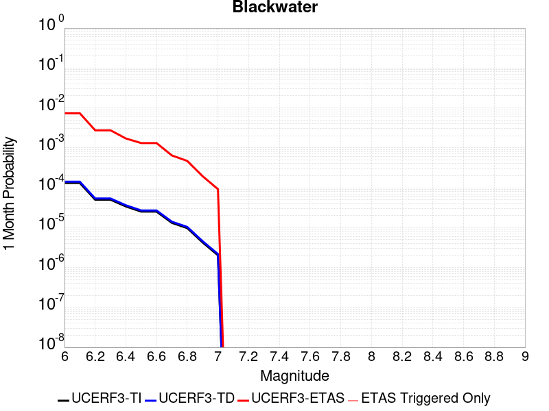 |  |  |

| Magnitude | 1 wk TI Prob | 1 wk TD Prob | 1 wk ETAS Prob | 1 wk ETAS/TD Gain | 1 wk ETAS Triggered Only | 1 mo TI Prob | 1 mo TD Prob | 1 mo ETAS Prob | 1 mo ETAS/TD Gain | 1 mo ETAS Triggered Only | 1 yr TI Prob | 1 yr TD Prob | 1 yr ETAS Prob | 1 yr ETAS/TD Gain | 1 yr ETAS Triggered Only | 10 yr TI Prob | 10 yr TD Prob | 10 yr ETAS Prob | 10 yr ETAS/TD Gain | 10 yr ETAS Triggered Only |
|-----|-----|-----|-----|-----|-----|-----|-----|-----|-----|-----|-----|-----|-----|-----|-----|-----|-----|-----|-----|-----|
| 6.0 | 3.0708583E-5 | 3.3095846E-5 | 0.004903401 | 148.1576 | 0.0048704664 | 1.3160157E-4 | 1.4183241E-4 | 0.0070320466 | 49.57997 | 0.006891192 | 0.0016010714 | 0.0017255784 | 0.012484184 | 7.2347817 | 0.010777202 | 0.015895851 | 0.017135633 | 0.03251517 | 1.8975178 | 0.015647668 |
| 6.1 | 3.0708583E-5 | 3.3095846E-5 | 0.004903401 | 148.1576 | 0.0048704664 | 1.3160157E-4 | 1.4183241E-4 | 0.0070320466 | 49.57997 | 0.006891192 | 0.0016010714 | 0.0017255784 | 0.012484184 | 7.2347817 | 0.010777202 | 0.015895851 | 0.017135633 | 0.03251517 | 1.8975178 | 0.015647668 |
| 6.2 | 1.1707779E-5 | 1.2545122E-5 | 0.0019296195 | 153.81433 | 0.0019170984 | 5.017523E-5 | 5.3763757E-5 | 0.0025924873 | 48.219982 | 0.00253886 | 6.107122E-4 | 6.5438676E-4 | 0.004641413 | 7.0927677 | 0.0039896374 | 0.006090366 | 0.0065255696 | 0.012136384 | 1.8598199 | 0.0056476686 |
| 6.3 | 1.1707779E-5 | 1.2545122E-5 | 0.0019296195 | 153.81433 | 0.0019170984 | 5.017523E-5 | 5.3763757E-5 | 0.0025924873 | 48.219982 | 0.00253886 | 6.107122E-4 | 6.5438676E-4 | 0.004641413 | 7.0927677 | 0.0039896374 | 0.006090366 | 0.0065255696 | 0.012136384 | 1.8598199 | 0.0056476686 |
| 6.4 | 7.929244E-6 | 8.480098E-6 | 0.0010447408 | 123.199135 | 0.0010362695 | 3.3982033E-5 | 3.6342793E-5 | 0.0013834441 | 38.066532 | 0.0013471503 | 4.136527E-4 | 4.423877E-4 | 0.0027729624 | 6.2681723 | 0.002331606 | 0.0041288356 | 0.0044154758 | 0.007923235 | 1.7944237 | 0.003523316 |
| 6.5 | 5.8832115E-6 | 6.285991E-6 | 8.3529635E-4 | 132.8822 | 8.2901557E-4 | 2.521352E-5 | 2.6939697E-5 | 0.0011149932 | 41.388485 | 0.0010880829 | 3.0693135E-4 | 3.27944E-4 | 0.0019854314 | 6.054178 | 0.0016580311 | 0.0030650778 | 0.0032748538 | 0.005702112 | 1.7411807 | 0.0024352332 |
| 6.6 | 5.8832115E-6 | 6.285991E-6 | 8.3529635E-4 | 132.8822 | 8.2901557E-4 | 2.521352E-5 | 2.6939697E-5 | 0.0011149932 | 41.388485 | 0.0010880829 | 3.0693135E-4 | 3.27944E-4 | 0.0019854314 | 6.054178 | 0.0016580311 | 0.0030650778 | 0.0032748538 | 0.005702112 | 1.7411807 | 0.0024352332 |
| 6.7 | 3.0715053E-6 | 3.2814662E-6 | 3.6597459E-4 | 111.52776 | 3.626943E-4 | 1.3163528E-5 | 1.4063357E-5 | 4.8037805E-4 | 34.158134 | 4.6632125E-4 | 1.6025416E-4 | 1.7120909E-4 | 8.964735E-4 | 5.2361326 | 7.253886E-4 | 0.0016013865 | 0.0017108864 | 0.002745383 | 1.6046553 | 0.0010362695 |
| 6.8 | 2.2722281E-6 | 2.4287538E-6 | 2.6149547E-4 | 107.666534 | 2.5906737E-4 | 9.738084E-6 | 1.0408908E-5 | 3.7309944E-4 | 35.844242 | 3.626943E-4 | 1.1855473E-4 | 1.26722E-4 | 7.484049E-4 | 5.9058795 | 6.2176166E-4 | 0.001184915 | 0.0012665876 | 0.0021463009 | 1.694554 | 8.80829E-4 |
| 6.9 | 9.952399E-7 | 1.0653489E-6 | 1.0469218E-4 | 98.270325 | 1.03626946E-4 | 4.265307E-6 | 4.5657757E-6 | 1.08192246E-4 | 23.696356 | 1.03626946E-4 | 5.1928873E-5 | 5.5587418E-5 | 3.1464038E-4 | 5.66028 | 2.5906737E-4 | 5.191674E-4 | 5.557858E-4 | 8.664938E-4 | 1.5590428 | 3.1088083E-4 |
| 7.0 | 4.7385504E-7 | 5.0755597E-7 | 5.2321E-5 | 103.084206 | 5.1813473E-5 | 2.0308057E-6 | 2.1752398E-6 | 5.39886E-5 | 24.819609 | 5.1813473E-5 | 2.4724779E-5 | 2.6483543E-5 | 2.3373195E-4 | 8.825554 | 2.0725389E-4 | 2.4722028E-4 | 2.6483546E-4 | 4.7203444E-4 | 1.7823689 | 2.0725389E-4 |

## Ash Hill
*[(top)](#table-of-contents)*

| 1 Week | 1 Month | 1 Year | 10 Year |
|-----|-----|-----|-----|
| 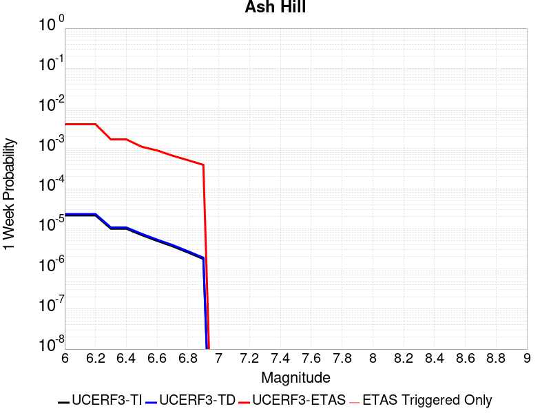 |  |  | 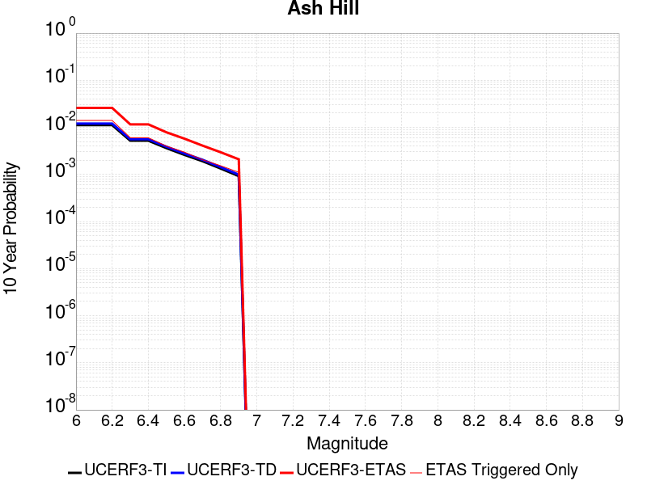 |

| Magnitude | 1 wk TI Prob | 1 wk TD Prob | 1 wk ETAS Prob | 1 wk ETAS/TD Gain | 1 wk ETAS Triggered Only | 1 mo TI Prob | 1 mo TD Prob | 1 mo ETAS Prob | 1 mo ETAS/TD Gain | 1 mo ETAS Triggered Only | 1 yr TI Prob | 1 yr TD Prob | 1 yr ETAS Prob | 1 yr ETAS/TD Gain | 1 yr ETAS Triggered Only | 10 yr TI Prob | 10 yr TD Prob | 10 yr ETAS Prob | 10 yr ETAS/TD Gain | 10 yr ETAS Triggered Only |
|-----|-----|-----|-----|-----|-----|-----|-----|-----|-----|-----|-----|-----|-----|-----|-----|-----|-----|-----|-----|-----|
| 6.0 | 2.1545662E-5 | 2.3194447E-5 | 0.0045826742 | 197.57635 | 0.0045595854 | 9.2335285E-5 | 9.940143E-5 | 0.0062645916 | 63.02315 | 0.006165803 | 0.0011236023 | 0.0012096206 | 0.011145773 | 9.2142725 | 0.009948187 | 0.011179381 | 0.012038348 | 0.026525041 | 2.2033787 | 0.014663212 |
| 6.1 | 2.1545662E-5 | 2.3194447E-5 | 0.0045826742 | 197.57635 | 0.0045595854 | 9.2335285E-5 | 9.940143E-5 | 0.0062645916 | 63.02315 | 0.006165803 | 0.0011236023 | 0.0012096206 | 0.011145773 | 9.2142725 | 0.009948187 | 0.011179381 | 0.012038348 | 0.026525041 | 2.2033787 | 0.014663212 |
| 6.2 | 2.1545662E-5 | 2.3194447E-5 | 0.0045826742 | 197.57635 | 0.0045595854 | 9.2335285E-5 | 9.940143E-5 | 0.0062645916 | 63.02315 | 0.006165803 | 0.0011236023 | 0.0012096206 | 0.011145773 | 9.2142725 | 0.009948187 | 0.011179381 | 0.012038348 | 0.026525041 | 2.2033787 | 0.014663212 |
| 6.3 | 1.0025529E-5 | 1.0746934E-5 | 0.0020314506 | 189.02606 | 0.0020207253 | 4.2965847E-5 | 4.605755E-5 | 0.0029474783 | 63.99555 | 0.0029015543 | 5.229836E-4 | 5.6061964E-4 | 0.005635493 | 10.052258 | 0.00507772 | 0.005217545 | 0.0055933665 | 0.012600584 | 2.2527728 | 0.007046632 |
| 6.4 | 1.0025529E-5 | 1.0746934E-5 | 0.0020314506 | 189.02606 | 0.0020207253 | 4.2965847E-5 | 4.605755E-5 | 0.0029474783 | 63.99555 | 0.0029015543 | 5.229836E-4 | 5.6061964E-4 | 0.005635493 | 10.052258 | 0.00507772 | 0.005217545 | 0.0055933665 | 0.012600584 | 2.2527728 | 0.007046632 |
| 6.5 | 6.9617327E-6 | 7.456634E-6 | 0.0014064099 | 188.61191 | 0.0013989637 | 2.9835655E-5 | 3.195666E-5 | 0.0018971821 | 59.367344 | 0.001865285 | 3.6318856E-4 | 3.8901155E-4 | 0.0037555771 | 9.654153 | 0.0033678757 | 0.0036259557 | 0.0038841602 | 0.008374424 | 2.1560447 | 0.004507772 |
| 6.6 | 4.9919777E-6 | 5.3466883E-6 | 0.0012488634 | 233.577 | 0.0012435233 | 2.1394015E-5 | 2.2914215E-5 | 0.0015254704 | 66.573105 | 0.0015025907 | 2.60441E-4 | 2.7895154E-4 | 0.0029207014 | 10.470283 | 0.002642487 | 0.0026013597 | 0.0027866727 | 0.0061968323 | 2.223739 | 0.0034196891 |
| 6.7 | 3.6630722E-6 | 3.924624E-6 | 9.883767E-4 | 251.83987 | 9.844559E-4 | 1.5698786E-5 | 1.681974E-5 | 0.0011566969 | 68.7702 | 0.0011398963 | 1.9111596E-4 | 2.0476682E-4 | 0.0021214727 | 10.360432 | 0.0019170984 | 0.0019095168 | 0.0020463446 | 0.004528302 | 2.2128737 | 0.0024870466 |
| 6.8 | 2.5599613E-6 | 2.744925E-6 | 6.763182E-4 | 246.38858 | 6.7357515E-4 | 1.0971216E-5 | 1.1763939E-5 | 8.4076973E-4 | 71.470085 | 8.2901557E-4 | 1.3356637E-4 | 1.4322149E-4 | 0.0014901789 | 10.404715 | 0.0013471503 | 0.0013348613 | 0.0014317769 | 0.0031909125 | 2.2286382 | 0.001761658 |
| 6.9 | 1.7684905E-6 | 1.8968707E-6 | 4.6821724E-4 | 246.83665 | 4.6632125E-4 | 7.579223E-6 | 8.129446E-6 | 5.78073E-4 | 71.108536 | 5.6994817E-4 | 9.2273134E-5 | 9.8976E-5 | 9.797178E-4 | 9.898539 | 8.80829E-4 | 9.223483E-4 | 9.8976E-4 | 0.0021285282 | 2.1505497 | 0.0011398963 |

## McLean Lake
*[(top)](#table-of-contents)*

| 1 Week | 1 Month | 1 Year | 10 Year |
|-----|-----|-----|-----|
|  | 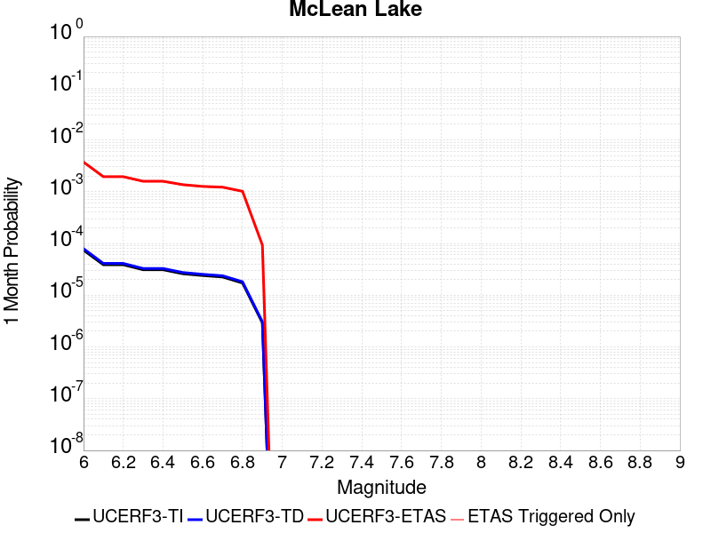 |  |  |

| Magnitude | 1 wk TI Prob | 1 wk TD Prob | 1 wk ETAS Prob | 1 wk ETAS/TD Gain | 1 wk ETAS Triggered Only | 1 mo TI Prob | 1 mo TD Prob | 1 mo ETAS Prob | 1 mo ETAS/TD Gain | 1 mo ETAS Triggered Only | 1 yr TI Prob | 1 yr TD Prob | 1 yr ETAS Prob | 1 yr ETAS/TD Gain | 1 yr ETAS Triggered Only | 10 yr TI Prob | 10 yr TD Prob | 10 yr ETAS Prob | 10 yr ETAS/TD Gain | 10 yr ETAS Triggered Only |
|-----|-----|-----|-----|-----|-----|-----|-----|-----|-----|-----|-----|-----|-----|-----|-----|-----|-----|-----|-----|-----|
| 6.0 | 1.7360222E-5 | 1.8501627E-5 | 0.0027645647 | 149.42279 | 0.002746114 | 7.439883E-5 | 7.9290556E-5 | 0.0037577553 | 47.39222 | 0.0036787565 | 9.0542925E-4 | 9.6498354E-4 | 0.0074354177 | 7.7052274 | 0.006476684 | 0.009017491 | 0.0096127745 | 0.019773224 | 2.0569737 | 0.010259068 |
| 6.1 | 9.062689E-6 | 9.592193E-6 | 0.0012531036 | 130.63785 | 0.0012435233 | 3.8839516E-5 | 4.1108804E-5 | 0.0017508831 | 42.59144 | 0.0017098446 | 4.727685E-4 | 5.003936E-4 | 0.0037112213 | 7.416604 | 0.0032124352 | 0.0047176396 | 0.004993552 | 0.010097471 | 2.0221019 | 0.005129534 |
| 6.2 | 9.062689E-6 | 9.592193E-6 | 0.0012531036 | 130.63785 | 0.0012435233 | 3.8839516E-5 | 4.1108804E-5 | 0.0017508831 | 42.59144 | 0.0017098446 | 4.727685E-4 | 5.003936E-4 | 0.0037112213 | 7.416604 | 0.0032124352 | 0.0047176396 | 0.004993552 | 0.010097471 | 2.0221019 | 0.005129534 |
| 6.3 | 7.2575485E-6 | 7.66771E-6 | 9.40303E-4 | 122.631546 | 9.326425E-4 | 3.110341E-5 | 3.2861237E-5 | 0.0012763437 | 38.8404 | 0.0012435233 | 3.786182E-4 | 4.0001926E-4 | 0.002886071 | 7.2148304 | 0.0024870466 | 0.0037797375 | 0.0039936965 | 0.0079674 | 1.9949939 | 0.0039896374 |
| 6.4 | 7.2575485E-6 | 7.66771E-6 | 9.40303E-4 | 122.631546 | 9.326425E-4 | 3.110341E-5 | 3.2861237E-5 | 0.0012763437 | 38.8404 | 0.0012435233 | 3.786182E-4 | 4.0001926E-4 | 0.002886071 | 7.2148304 | 0.0024870466 | 0.0037797375 | 0.0039936965 | 0.0079674 | 1.9949939 | 0.0039896374 |
| 6.5 | 6.06582E-6 | 6.4038773E-6 | 8.354141E-4 | 130.45442 | 8.2901557E-4 | 2.5996113E-5 | 2.7444936E-5 | 0.00116731 | 42.532803 | 0.0011398963 | 3.164567E-4 | 3.3409733E-4 | 0.00245774 | 7.356359 | 0.0021243524 | 0.0031600643 | 0.0033365893 | 0.0065899463 | 1.9750547 | 0.0032642486 |
| 6.6 | 5.598744E-6 | 5.910262E-6 | 7.3129457E-4 | 123.73302 | 7.253886E-4 | 2.3994397E-5 | 2.5329486E-5 | 0.0010615727 | 41.91055 | 0.0010362695 | 2.9209262E-4 | 3.0834923E-4 | 0.0023284515 | 7.5513453 | 0.0020207253 | 0.0029170897 | 0.003079843 | 0.0061274227 | 1.9895244 | 0.0030569949 |
| 6.7 | 5.246996E-6 | 5.539162E-6 | 7.309237E-4 | 131.95566 | 7.253886E-4 | 2.2486933E-5 | 2.3739085E-5 | 0.0010081717 | 42.46885 | 9.844559E-4 | 2.73744E-4 | 2.8899137E-4 | 0.0021537372 | 7.4526005 | 0.001865285 | 0.0027340704 | 0.0028867796 | 0.005779958 | 2.0022166 | 0.0029015543 |
| 6.8 | 4.02324E-6 | 4.2469046E-6 | 6.2600593E-4 | 147.40288 | 6.2176166E-4 | 1.7242342E-5 | 1.8200926E-5 | 7.953888E-4 | 43.700462 | 7.772021E-4 | 2.099053E-4 | 2.2157968E-4 | 0.0017238375 | 7.7797627 | 0.0015025907 | 0.0020970714 | 0.002214172 | 0.004488917 | 2.0273569 | 0.0022797927 |
| 6.9 | 6.835972E-7 | 7.1399285E-7 | 1.0434086E-4 | 146.13713 | 1.03626946E-4 | 2.9296991E-6 | 3.0599674E-6 | 1.06686595E-4 | 34.865273 | 1.03626946E-4 | 3.56685E-5 | 3.7254784E-5 | 1.926894E-4 | 5.1722054 | 1.5544042E-4 | 3.5662777E-4 | 3.7251666E-4 | 6.314875E-4 | 1.6951927 | 2.5906737E-4 |

## Gravel Hills-Harper Lk
*[(top)](#table-of-contents)*

| 1 Week | 1 Month | 1 Year | 10 Year |
|-----|-----|-----|-----|
|  |  |  |  |

| Magnitude | 1 wk TI Prob | 1 wk TD Prob | 1 wk ETAS Prob | 1 wk ETAS/TD Gain | 1 wk ETAS Triggered Only | 1 mo TI Prob | 1 mo TD Prob | 1 mo ETAS Prob | 1 mo ETAS/TD Gain | 1 mo ETAS Triggered Only | 1 yr TI Prob | 1 yr TD Prob | 1 yr ETAS Prob | 1 yr ETAS/TD Gain | 1 yr ETAS Triggered Only | 10 yr TI Prob | 10 yr TD Prob | 10 yr ETAS Prob | 10 yr ETAS/TD Gain | 10 yr ETAS Triggered Only |
|-----|-----|-----|-----|-----|-----|-----|-----|-----|-----|-----|-----|-----|-----|-----|-----|-----|-----|-----|-----|-----|
| 6.0 | 3.0679566E-5 | 3.1464646E-5 | 0.0029329278 | 93.21343 | 0.0029015543 | 1.3147724E-4 | 1.3484273E-4 | 0.0037094902 | 27.50975 | 0.0035751294 | 0.0015995599 | 0.0016406906 | 0.007951563 | 4.846473 | 0.0063212435 | 0.015880952 | 0.01630734 | 0.025124894 | 1.5407109 | 0.00896373 |
| 6.1 | 3.0679566E-5 | 3.1464646E-5 | 0.0029329278 | 93.21343 | 0.0029015543 | 1.3147724E-4 | 1.3484273E-4 | 0.0037094902 | 27.50975 | 0.0035751294 | 0.0015995599 | 0.0016406906 | 0.007951563 | 4.846473 | 0.0063212435 | 0.015880952 | 0.01630734 | 0.025124894 | 1.5407109 | 0.00896373 |
| 6.2 | 1.514536E-5 | 1.3635206E-5 | 7.908267E-4 | 57.99888 | 7.772021E-4 | 6.490707E-5 | 5.843536E-5 | 0.0011464547 | 19.619194 | 0.0010880829 | 7.8995706E-4 | 7.1123015E-4 | 0.0024716351 | 3.4751554 | 0.001761658 | 0.007871548 | 0.0070907404 | 0.010074613 | 1.4208125 | 0.0030051814 |
| 6.3 | 1.514536E-5 | 1.3635206E-5 | 7.908267E-4 | 57.99888 | 7.772021E-4 | 6.490707E-5 | 5.843536E-5 | 0.0011464547 | 19.619194 | 0.0010880829 | 7.8995706E-4 | 7.1123015E-4 | 0.0024716351 | 3.4751554 | 0.001761658 | 0.007871548 | 0.0070907404 | 0.010074613 | 1.4208125 | 0.0030051814 |
| 6.4 | 1.2532521E-5 | 1.06896905E-5 | 4.7700596E-4 | 44.62299 | 4.6632125E-4 | 5.37097E-5 | 4.581219E-5 | 7.1935647E-4 | 15.702294 | 6.7357515E-4 | 6.537194E-4 | 5.576265E-4 | 0.0016968872 | 3.0430534 | 0.0011398963 | 0.0065179965 | 0.005562863 | 0.0076753977 | 1.3797568 | 0.0021243524 |
| 6.5 | 1.1094058E-5 | 9.083664E-6 | 3.1996166E-4 | 35.223858 | 3.1088083E-4 | 4.7545094E-5 | 3.892943E-5 | 4.016096E-4 | 10.31635 | 3.626943E-4 | 5.787078E-4 | 4.7386673E-4 | 0.0010435448 | 2.2021904 | 5.6994817E-4 | 0.0057720304 | 0.0047289706 | 0.005915045 | 1.2508103 | 0.0011917099 |
| 6.6 | 9.688328E-6 | 7.5316952E-6 | 2.1478401E-4 | 28.517355 | 2.0725389E-4 | 4.1520743E-5 | 3.227831E-5 | 2.395255E-4 | 7.420634 | 2.0725389E-4 | 5.053978E-4 | 3.9292008E-4 | 7.0367876E-4 | 1.7908953 | 3.1088083E-4 | 0.0050424994 | 0.0039225104 | 0.004696664 | 1.1973617 | 7.772021E-4 |
| 6.7 | 8.974824E-6 | 6.749413E-6 | 1.1037566E-4 | 16.35337 | 1.03626946E-4 | 3.8462964E-5 | 2.8925748E-5 | 1.325497E-4 | 4.5824122 | 1.03626946E-4 | 4.6818596E-4 | 3.5211627E-4 | 5.0750194E-4 | 1.4412909 | 1.5544042E-4 | 0.004672008 | 0.0035158044 | 0.004083749 | 1.1615404 | 5.6994817E-4 |
| 6.8 | 7.4780046E-6 | 5.1161933E-6 | 5.1161933E-6 | 1.0 | 0.0 | 3.20482E-5 | 2.1926366E-5 | 2.1926366E-5 | 1.0 | 0.0 | 3.9011694E-4 | 2.669222E-4 | 2.669222E-4 | 1.0 | 0.0 | 0.0038943281 | 0.0026661542 | 0.00282118 | 1.0581459 | 1.5544042E-4 |
| 6.9 | 6.3409307E-6 | 3.9074966E-6 | 3.9074966E-6 | 1.0 | 0.0 | 2.7175134E-5 | 1.6746313E-5 | 1.6746313E-5 | 1.0 | 0.0 | 3.3080703E-4 | 2.0386827E-4 | 2.0386827E-4 | 1.0 | 0.0 | 0.0033031502 | 0.0020369107 | 0.0020886187 | 1.0253855 | 5.1813473E-5 |
| 7.0 | 5.1239335E-6 | 2.6058565E-6 | 2.6058565E-6 | 1.0 | 0.0 | 2.195953E-5 | 1.116791E-5 | 1.116791E-5 | 1.0 | 0.0 | 2.6732447E-4 | 1.3596108E-4 | 1.3596108E-4 | 1.0 | 0.0 | 0.0026700313 | 0.0013588042 | 0.0014105473 | 1.0380799 | 5.1813473E-5 |
| 7.1 | 4.438899E-6 | 2.0984728E-6 | 2.0984728E-6 | 1.0 | 0.0 | 1.9023713E-5 | 8.993425E-6 | 8.993425E-6 | 1.0 | 0.0 | 2.315891E-4 | 1.0948967E-4 | 1.0948967E-4 | 1.0 | 0.0 | 0.002313479 | 0.0010943791 | 0.0011461359 | 1.0472933 | 5.1813473E-5 |
| 7.2 | 3.50367E-6 | 1.2615716E-6 | 1.2615716E-6 | 1.0 | 0.0 | 1.5015643E-5 | 5.4067245E-6 | 5.4067245E-6 | 1.0 | 0.0 | 1.8280011E-4 | 6.582497E-5 | 6.582497E-5 | 1.0 | 0.0 | 0.0018264982 | 6.580629E-4 | 7.098423E-4 | 1.0786846 | 5.1813473E-5 |
| 7.3 | 2.561638E-6 | 7.1191585E-7 | 7.1191585E-7 | 1.0 | 0.0 | 1.0978401E-5 | 3.0510646E-6 | 3.0510646E-6 | 1.0 | 0.0 | 1.3365384E-4 | 3.71461E-5 | 3.71461E-5 | 1.0 | 0.0 | 0.0013357349 | 3.7140088E-4 | 4.231951E-4 | 1.1394564 | 5.1813473E-5 |
| 7.4 | 2.0368864E-6 | 5.304837E-7 | 5.304837E-7 | 1.0 | 0.0 | 8.729483E-6 | 2.2734996E-6 | 2.2734996E-6 | 1.0 | 0.0 | 1.06276275E-4 | 2.7679513E-5 | 2.7679513E-5 | 1.0 | 0.0 | 0.0010622547 | 2.767612E-4 | 2.767612E-4 | 1.0 | 0.0 |
| 7.5 | 1.1681728E-6 | 3.6030585E-7 | 3.6030585E-7 | 1.0 | 0.0 | 5.0064455E-6 | 1.544167E-6 | 1.544167E-6 | 1.0 | 0.0 | 6.0951766E-5 | 1.8800076E-5 | 1.8800076E-5 | 1.0 | 0.0 | 6.093505E-4 | 1.8798532E-4 | 1.8798532E-4 | 1.0 | 0.0 |
| 7.6 | 1.3154387E-7 | 7.1197384E-8 | 7.1197384E-8 | 1.0 | 0.0 | 5.6375933E-7 | 3.051316E-7 | 3.051316E-7 | 1.0 | 0.0 | 6.863748E-6 | 3.7149728E-6 | 3.7149728E-6 | 1.0 | 0.0 | 6.863536E-5 | 3.7149264E-5 | 3.7149264E-5 | 1.0 | 0.0 |

## So Sierra Nevada
*[(top)](#table-of-contents)*

| 1 Week | 1 Month | 1 Year | 10 Year |
|-----|-----|-----|-----|
|  |  |  |  |

| Magnitude | 1 wk TI Prob | 1 wk TD Prob | 1 wk ETAS Prob | 1 wk ETAS/TD Gain | 1 wk ETAS Triggered Only | 1 mo TI Prob | 1 mo TD Prob | 1 mo ETAS Prob | 1 mo ETAS/TD Gain | 1 mo ETAS Triggered Only | 1 yr TI Prob | 1 yr TD Prob | 1 yr ETAS Prob | 1 yr ETAS/TD Gain | 1 yr ETAS Triggered Only | 10 yr TI Prob | 10 yr TD Prob | 10 yr ETAS Prob | 10 yr ETAS/TD Gain | 10 yr ETAS Triggered Only |
|-----|-----|-----|-----|-----|-----|-----|-----|-----|-----|-----|-----|-----|-----|-----|-----|-----|-----|-----|-----|-----|
| 6.0 | 1.15488665E-5 | 1.1079643E-5 | 0.0034825439 | 314.31915 | 0.0034715026 | 4.9494203E-5 | 4.748339E-5 | 0.0047622854 | 100.29372 | 0.004715026 | 6.024253E-4 | 5.7796965E-4 | 0.0074133947 | 12.826616 | 0.0068393783 | 0.006007948 | 0.005765934 | 0.015038583 | 2.6081781 | 0.009326424 |
| 6.1 | 1.15488665E-5 | 1.1079643E-5 | 0.0034825439 | 314.31915 | 0.0034715026 | 4.9494203E-5 | 4.748339E-5 | 0.0047622854 | 100.29372 | 0.004715026 | 6.024253E-4 | 5.7796965E-4 | 0.0074133947 | 12.826616 | 0.0068393783 | 0.006007948 | 0.005765934 | 0.015038583 | 2.6081781 | 0.009326424 |
| 6.2 | 1.15488665E-5 | 1.1079643E-5 | 0.0034825439 | 314.31915 | 0.0034715026 | 4.9494203E-5 | 4.748339E-5 | 0.0047622854 | 100.29372 | 0.004715026 | 6.024253E-4 | 5.7796965E-4 | 0.0074133947 | 12.826616 | 0.0068393783 | 0.006007948 | 0.005765934 | 0.015038583 | 2.6081781 | 0.009326424 |
| 6.3 | 1.15488665E-5 | 1.1079643E-5 | 0.0034825439 | 314.31915 | 0.0034715026 | 4.9494203E-5 | 4.748339E-5 | 0.0047622854 | 100.29372 | 0.004715026 | 6.024253E-4 | 5.7796965E-4 | 0.0074133947 | 12.826616 | 0.0068393783 | 0.006007948 | 0.005765934 | 0.015038583 | 2.6081781 | 0.009326424 |
| 6.4 | 1.15488665E-5 | 1.1079643E-5 | 0.0034825439 | 314.31915 | 0.0034715026 | 4.9494203E-5 | 4.748339E-5 | 0.0047622854 | 100.29372 | 0.004715026 | 6.024253E-4 | 5.7796965E-4 | 0.0074133947 | 12.826616 | 0.0068393783 | 0.006007948 | 0.005765934 | 0.015038583 | 2.6081781 | 0.009326424 |
| 6.5 | 1.15488665E-5 | 1.1079643E-5 | 0.0034825439 | 314.31915 | 0.0034715026 | 4.9494203E-5 | 4.748339E-5 | 0.0047622854 | 100.29372 | 0.004715026 | 6.024253E-4 | 5.7796965E-4 | 0.0074133947 | 12.826616 | 0.0068393783 | 0.006007948 | 0.005765934 | 0.015038583 | 2.6081781 | 0.009326424 |
| 6.6 | 7.587044E-6 | 6.935635E-6 | 0.0027530305 | 396.93994 | 0.002746114 | 3.2515498E-5 | 2.9723828E-5 | 0.0035011233 | 117.78844 | 0.0034715026 | 3.9580427E-4 | 3.6183043E-4 | 0.0048679714 | 13.453736 | 0.004507772 | 0.003951 | 0.0036127048 | 0.009291596 | 2.5719223 | 0.005699482 |
| 6.7 | 7.587044E-6 | 6.935635E-6 | 0.0027530305 | 396.93994 | 0.002746114 | 3.2515498E-5 | 2.9723828E-5 | 0.0035011233 | 117.78844 | 0.0034715026 | 3.9580427E-4 | 3.6183043E-4 | 0.0048679714 | 13.453736 | 0.004507772 | 0.003951 | 0.0036127048 | 0.009291596 | 2.5719223 | 0.005699482 |
| 6.8 | 5.9026956E-6 | 5.1793927E-6 | 0.002181334 | 421.1563 | 0.0021761658 | 2.5297022E-5 | 2.2197215E-5 | 0.0029236872 | 131.71414 | 0.0029015543 | 3.0794772E-4 | 2.7021873E-4 | 0.003947981 | 14.610315 | 0.0036787565 | 0.0030752132 | 0.002699018 | 0.0074529913 | 2.7613716 | 0.0047668396 |
| 6.9 | 5.0118915E-6 | 4.2524252E-6 | 0.0018177162 | 427.454 | 0.0018134716 | 2.1479358E-5 | 1.8224557E-5 | 0.0025052258 | 137.4643 | 0.0024870466 | 2.614798E-4 | 2.2186211E-4 | 0.0031227728 | 14.075286 | 0.0029015543 | 0.0026117235 | 0.0022164788 | 0.0059904787 | 2.7027006 | 0.0037823834 |
| 7.0 | 4.4924795E-6 | 3.7139177E-6 | 0.0016617388 | 447.43558 | 0.0016580311 | 1.925334E-5 | 1.5916696E-5 | 0.002192048 | 137.72003 | 0.0021761658 | 2.3438422E-4 | 1.9376918E-4 | 0.0027321372 | 14.099958 | 0.00253886 | 0.0023413717 | 0.0019360651 | 0.0052457075 | 2.7094684 | 0.0033160623 |
| 7.1 | 3.9118436E-6 | 3.1119775E-6 | 0.0014538846 | 467.18994 | 0.0014507772 | 1.6764936E-5 | 1.3336982E-5 | 0.0018267843 | 136.97134 | 0.0018134716 | 2.0409399E-4 | 1.6236622E-4 | 0.0022345686 | 13.762521 | 0.002072539 | 0.0020390663 | 0.001622532 | 0.004312461 | 2.6578588 | 0.0026943006 |
| 7.2 | 3.4200818E-6 | 2.6054543E-6 | 0.0011424988 | 438.50275 | 0.0011398963 | 1.4657411E-5 | 1.11661875E-5 | 0.0014619272 | 130.92447 | 0.0014507772 | 1.7843937E-4 | 1.3594035E-4 | 0.001793746 | 13.195096 | 0.0016580311 | 0.0017829615 | 0.0013586218 | 0.003583574 | 2.637654 | 0.0022279792 |
| 7.3 | 2.6593618E-6 | 1.8284203E-6 | 5.7177554E-4 | 312.7156 | 5.6994817E-4 | 1.13972155E-5 | 7.836065E-6 | 6.8140595E-4 | 86.957664 | 6.7357515E-4 | 1.3875226E-4 | 9.540021E-5 | 9.2433667E-4 | 9.689042 | 8.2901557E-4 | 0.0013866565 | 9.5362146E-4 | 0.002195959 | 2.3027575 | 0.0012435233 |
| 7.4 | 2.2577992E-6 | 1.436438E-6 | 4.6775703E-4 | 325.63675 | 4.6632125E-4 | 9.676246E-6 | 6.15615E-6 | 5.242877E-4 | 85.16486 | 5.1813474E-4 | 1.1780193E-4 | 7.49488E-5 | 6.9666386E-4 | 9.295197 | 6.2176166E-4 | 0.001177395 | 7.492603E-4 | 0.001681204 | 2.2438183 | 9.326425E-4 |
| 7.5 | 1.489319E-6 | 7.353936E-7 | 2.0798913E-4 | 282.82693 | 2.0725389E-4 | 6.3827797E-6 | 3.1516831E-6 | 2.1040492E-4 | 66.75954 | 2.0725389E-4 | 7.770758E-5 | 3.8371072E-5 | 3.4923997E-4 | 9.101647 | 3.1088083E-4 | 7.7680405E-4 | 3.836449E-4 | 9.5337443E-4 | 2.485044 | 5.6994817E-4 |
| 7.6 | 1.0680322E-6 | 4.6596554E-7 | 4.6596554E-7 | 1.0 | 0.0 | 4.577273E-6 | 1.9969937E-6 | 1.9969937E-6 | 1.0 | 0.0 | 5.5726876E-5 | 2.4313129E-5 | 2.4313129E-5 | 1.0 | 0.0 | 5.5712904E-4 | 2.4310495E-4 | 4.5030846E-4 | 1.8523211 | 2.0725389E-4 |
| 7.7 | 5.509146E-7 | 1.5580486E-7 | 1.5580486E-7 | 1.0 | 0.0 | 2.3610605E-6 | 6.677349E-7 | 6.677349E-7 | 1.0 | 0.0 | 2.8745531E-5 | 8.129644E-6 | 8.129644E-6 | 1.0 | 0.0 | 2.8741814E-4 | 8.1293576E-5 | 1.849121E-4 | 2.2746212 | 1.03626946E-4 |

## Goldstone Lake
*[(top)](#table-of-contents)*

| 1 Week | 1 Month | 1 Year | 10 Year |
|-----|-----|-----|-----|
|  |  | 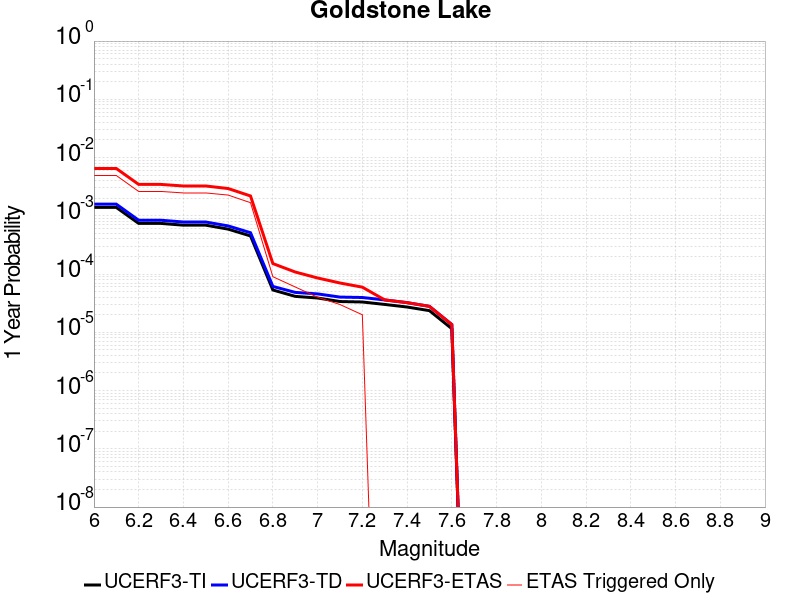 |  |

| Magnitude | 1 wk TI Prob | 1 wk TD Prob | 1 wk ETAS Prob | 1 wk ETAS/TD Gain | 1 wk ETAS Triggered Only | 1 mo TI Prob | 1 mo TD Prob | 1 mo ETAS Prob | 1 mo ETAS/TD Gain | 1 mo ETAS Triggered Only | 1 yr TI Prob | 1 yr TD Prob | 1 yr ETAS Prob | 1 yr ETAS/TD Gain | 1 yr ETAS Triggered Only | 10 yr TI Prob | 10 yr TD Prob | 10 yr ETAS Prob | 10 yr ETAS/TD Gain | 10 yr ETAS Triggered Only |
|-----|-----|-----|-----|-----|-----|-----|-----|-----|-----|-----|-----|-----|-----|-----|-----|-----|-----|-----|-----|-----|
| 6.0 | 2.671352E-5 | 3.037609E-5 | 0.0015329211 | 50.46473 | 0.0015025907 | 1.1448149E-4 | 1.3017785E-4 | 0.002357867 | 18.11266 | 0.0022279792 | 0.001392921 | 0.0015839594 | 0.006291517 | 3.972019 | 0.004715026 | 0.013842222 | 0.015746197 | 0.022987856 | 1.4598991 | 0.007357513 |
| 6.1 | 2.671352E-5 | 3.037609E-5 | 0.0015329211 | 50.46473 | 0.0015025907 | 1.1448149E-4 | 1.3017785E-4 | 0.002357867 | 18.11266 | 0.0022279792 | 0.001392921 | 0.0015839594 | 0.006291517 | 3.972019 | 0.004715026 | 0.013842222 | 0.015746197 | 0.022987856 | 1.4598991 | 0.007357513 |
| 6.2 | 1.4197047E-5 | 1.6096245E-5 | 8.969111E-4 | 55.72176 | 8.80829E-4 | 6.0843064E-5 | 6.8982634E-5 | 0.0012606103 | 18.274313 | 0.0011917099 | 7.4051257E-4 | 8.3963864E-4 | 0.0036352167 | 4.3295016 | 0.0027979275 | 0.007380498 | 0.0083743585 | 0.012330585 | 1.4724214 | 0.0039896374 |
| 6.3 | 1.4197047E-5 | 1.6096245E-5 | 8.969111E-4 | 55.72176 | 8.80829E-4 | 6.0843064E-5 | 6.8982634E-5 | 0.0012606103 | 18.274313 | 0.0011917099 | 7.4051257E-4 | 8.3963864E-4 | 0.0036352167 | 4.3295016 | 0.0027979275 | 0.007380498 | 0.0083743585 | 0.012330585 | 1.4724214 | 0.0039896374 |
| 6.4 | 1.3238931E-5 | 1.500846E-5 | 8.4401155E-4 | 56.23572 | 8.2901557E-4 | 5.6737044E-5 | 6.4320935E-5 | 0.001204144 | 18.720871 | 0.0011398963 | 6.9055456E-4 | 7.82924E-4 | 0.0034751152 | 4.4386363 | 0.0026943006 | 0.006884126 | 0.0078112837 | 0.011666939 | 1.4936007 | 0.0038860103 |
| 6.5 | 1.3238931E-5 | 1.500846E-5 | 8.4401155E-4 | 56.23572 | 8.2901557E-4 | 5.6737044E-5 | 6.4320935E-5 | 0.001204144 | 18.720871 | 0.0011398963 | 6.9055456E-4 | 7.82924E-4 | 0.0034751152 | 4.4386363 | 0.0026943006 | 0.006884126 | 0.0078112837 | 0.011666939 | 1.4936007 | 0.0038860103 |
| 6.6 | 1.1328278E-5 | 1.2855166E-5 | 7.900472E-4 | 61.457573 | 7.772021E-4 | 4.8548856E-5 | 5.5092944E-5 | 0.0011431159 | 20.748863 | 0.0010880829 | 5.90922E-4 | 6.7064585E-4 | 0.0032078032 | 4.7831554 | 0.00253886 | 0.0058935313 | 0.0066956086 | 0.010349734 | 1.5457495 | 0.0036787565 |
| 6.7 | 8.651175E-6 | 9.824565E-6 | 5.279542E-4 | 53.73818 | 5.1813474E-4 | 3.707594E-5 | 4.2105108E-5 | 8.1927446E-4 | 19.45784 | 7.772021E-4 | 4.5130608E-4 | 5.1259965E-4 | 0.0023769285 | 4.6370077 | 0.001865285 | 0.0045039062 | 0.005123051 | 0.0078035486 | 1.5232229 | 0.0026943006 |
| 6.8 | 1.0215377E-6 | 1.1754702E-6 | 1.0480229E-4 | 89.15776 | 1.03626946E-4 | 4.378012E-6 | 5.0377203E-6 | 1.0866414E-4 | 21.5701 | 1.03626946E-4 | 5.3300988E-5 | 6.1332634E-5 | 1.6495322E-4 | 2.6894853 | 1.03626946E-4 | 5.3288206E-4 | 6.1316835E-4 | 7.1673177E-4 | 1.1688988 | 1.03626946E-4 |
| 6.9 | 7.9360774E-7 | 9.2833966E-7 | 1.0455518E-4 | 112.62601 | 1.03626946E-4 | 3.4011714E-6 | 3.9785928E-6 | 1.0760513E-4 | 27.046026 | 1.03626946E-4 | 4.1408475E-5 | 4.843836E-5 | 1.5206028E-4 | 3.1392534 | 1.03626946E-4 | 4.140076E-4 | 4.8428503E-4 | 5.878618E-4 | 1.2138757 | 1.03626946E-4 |
| 7.0 | 7.4382757E-7 | 8.7473285E-7 | 5.268816E-5 | 60.23343 | 5.1813473E-5 | 3.1878285E-6 | 3.74885E-6 | 5.5562126E-5 | 14.821113 | 5.1813473E-5 | 3.8811122E-5 | 4.564136E-5 | 9.745247E-5 | 2.1351788 | 5.1813473E-5 | 3.8804344E-4 | 4.5632652E-4 | 5.081163E-4 | 1.113493 | 5.1813473E-5 |
| 7.1 | 6.4709513E-7 | 7.7113E-7 | 7.7113E-7 | 1.0 | 0.0 | 2.773262E-6 | 3.3048389E-6 | 3.3048389E-6 | 1.0 | 0.0 | 3.376394E-5 | 4.0235733E-5 | 4.0235733E-5 | 1.0 | 0.0 | 3.375881E-4 | 4.0229043E-4 | 4.0229043E-4 | 1.0 | 0.0 |
| 7.2 | 6.356704E-7 | 7.5883594E-7 | 7.5883594E-7 | 1.0 | 0.0 | 2.7242988E-6 | 3.2521505E-6 | 3.2521505E-6 | 1.0 | 0.0 | 3.3167835E-5 | 3.959427E-5 | 3.959427E-5 | 1.0 | 0.0 | 3.3162883E-4 | 3.958781E-4 | 3.958781E-4 | 1.0 | 0.0 |
| 7.3 | 5.7695723E-7 | 6.8965653E-7 | 6.8965653E-7 | 1.0 | 0.0 | 2.4726714E-6 | 2.9556677E-6 | 2.9556677E-6 | 1.0 | 0.0 | 3.0104358E-5 | 3.5984718E-5 | 3.5984718E-5 | 1.0 | 0.0 | 3.0100282E-4 | 3.5979465E-4 | 3.5979465E-4 | 1.0 | 0.0 |
| 7.4 | 5.209647E-7 | 6.193514E-7 | 6.193514E-7 | 1.0 | 0.0 | 2.232704E-6 | 2.6543607E-6 | 2.6543607E-6 | 1.0 | 0.0 | 2.718283E-5 | 3.2316417E-5 | 3.2316417E-5 | 1.0 | 0.0 | 2.7179506E-4 | 3.2312275E-4 | 3.2312275E-4 | 1.0 | 0.0 |
| 7.5 | 4.512955E-7 | 5.348885E-7 | 5.348885E-7 | 1.0 | 0.0 | 1.934122E-6 | 2.2923775E-6 | 2.2923775E-6 | 1.0 | 0.0 | 2.3547682E-5 | 2.7909393E-5 | 2.7909393E-5 | 1.0 | 0.0 | 2.3545188E-4 | 2.7906417E-4 | 2.7906417E-4 | 1.0 | 0.0 |
| 7.6 | 2.21172E-7 | 2.603961E-7 | 2.603961E-7 | 1.0 | 0.0 | 9.478797E-7 | 1.1159829E-6 | 1.1159829E-6 | 1.0 | 0.0 | 1.1540374E-5 | 1.3587036E-5 | 1.3587036E-5 | 1.0 | 0.0 | 1.1539775E-4 | 1.3586486E-4 | 1.3586486E-4 | 1.0 | 0.0 |

## San Andreas (Mojave N)
*[(top)](#table-of-contents)*

| 1 Week | 1 Month | 1 Year | 10 Year |
|-----|-----|-----|-----|
|  |  |  |  |

| Magnitude | 1 wk TI Prob | 1 wk TD Prob | 1 wk ETAS Prob | 1 wk ETAS/TD Gain | 1 wk ETAS Triggered Only | 1 mo TI Prob | 1 mo TD Prob | 1 mo ETAS Prob | 1 mo ETAS/TD Gain | 1 mo ETAS Triggered Only | 1 yr TI Prob | 1 yr TD Prob | 1 yr ETAS Prob | 1 yr ETAS/TD Gain | 1 yr ETAS Triggered Only | 10 yr TI Prob | 10 yr TD Prob | 10 yr ETAS Prob | 10 yr ETAS/TD Gain | 10 yr ETAS Triggered Only |
|-----|-----|-----|-----|-----|-----|-----|-----|-----|-----|-----|-----|-----|-----|-----|-----|-----|-----|-----|-----|-----|
| 6.0 | 9.877682E-5 | 1.9400702E-4 | 0.0032504087 | 16.754078 | 0.0030569949 | 4.2326056E-4 | 8.311939E-4 | 0.0043515814 | 5.2353387 | 0.003523316 | 0.0051410277 | 0.010072956 | 0.015253403 | 1.5142926 | 0.0052331607 | 0.05023708 | 0.09831428 | 0.10443453 | 1.0622519 | 0.0067875646 |
| 6.1 | 9.877682E-5 | 1.9400702E-4 | 0.0032504087 | 16.754078 | 0.0030569949 | 4.2326056E-4 | 8.311939E-4 | 0.0043515814 | 5.2353387 | 0.003523316 | 0.0051410277 | 0.010072956 | 0.015253403 | 1.5142926 | 0.0052331607 | 0.05023708 | 0.09831428 | 0.10443453 | 1.0622519 | 0.0067875646 |
| 6.2 | 9.877682E-5 | 1.9400702E-4 | 0.0032504087 | 16.754078 | 0.0030569949 | 4.2326056E-4 | 8.311939E-4 | 0.0043515814 | 5.2353387 | 0.003523316 | 0.0051410277 | 0.010072956 | 0.015253403 | 1.5142926 | 0.0052331607 | 0.05023708 | 0.09831428 | 0.10443453 | 1.0622519 | 0.0067875646 |
| 6.3 | 9.877682E-5 | 1.9400702E-4 | 0.0032504087 | 16.754078 | 0.0030569949 | 4.2326056E-4 | 8.311939E-4 | 0.0043515814 | 5.2353387 | 0.003523316 | 0.0051410277 | 0.010072956 | 0.015253403 | 1.5142926 | 0.0052331607 | 0.05023708 | 0.09831428 | 0.10443453 | 1.0622519 | 0.0067875646 |
| 6.4 | 9.877682E-5 | 1.9400702E-4 | 0.0032504087 | 16.754078 | 0.0030569949 | 4.2326056E-4 | 8.311939E-4 | 0.0043515814 | 5.2353387 | 0.003523316 | 0.0051410277 | 0.010072956 | 0.015253403 | 1.5142926 | 0.0052331607 | 0.05023708 | 0.09831428 | 0.10443453 | 1.0622519 | 0.0067875646 |
| 6.5 | 9.861474E-5 | 1.9374468E-4 | 0.0032501472 | 16.775414 | 0.0030569949 | 4.2256617E-4 | 8.300703E-4 | 0.004350462 | 5.241076 | 0.003523316 | 0.0051326132 | 0.010059402 | 0.0152399205 | 1.5149926 | 0.0052331607 | 0.050156746 | 0.098192066 | 0.10431315 | 1.0623379 | 0.0067875646 |
| 6.6 | 9.861474E-5 | 1.9374468E-4 | 0.0032501472 | 16.775414 | 0.0030569949 | 4.2256617E-4 | 8.300703E-4 | 0.004350462 | 5.241076 | 0.003523316 | 0.0051326132 | 0.010059402 | 0.0152399205 | 1.5149926 | 0.0052331607 | 0.050156746 | 0.098192066 | 0.10431315 | 1.0623379 | 0.0067875646 |
| 6.7 | 9.8552715E-5 | 1.9364421E-4 | 0.003250047 | 16.7836 | 0.0030569949 | 4.223004E-4 | 8.2964E-4 | 0.004350033 | 5.2432775 | 0.003523316 | 0.0051293927 | 0.010054212 | 0.015234757 | 1.5152612 | 0.0052331607 | 0.050125998 | 0.098145254 | 0.10426665 | 1.0623708 | 0.0067875646 |
| 6.8 | 9.8464974E-5 | 1.9349584E-4 | 0.0032498993 | 16.795706 | 0.0030569949 | 4.219245E-4 | 8.290045E-4 | 0.0043494 | 5.246533 | 0.003523316 | 0.0051248376 | 0.010046546 | 0.0152271325 | 1.5156584 | 0.0052331607 | 0.05008251 | 0.09807528 | 0.10419715 | 1.0624201 | 0.0067875646 |
| 6.9 | 9.825824E-5 | 1.9317595E-4 | 0.0032495803 | 16.821869 | 0.0030569949 | 4.2103877E-4 | 8.276344E-4 | 0.0043480345 | 5.253569 | 0.003523316 | 0.0051141046 | 0.010030019 | 0.015210691 | 1.5165167 | 0.0052331607 | 0.049980022 | 0.09792438 | 0.104047276 | 1.0625268 | 0.0067875646 |
| 7.0 | 9.781462E-5 | 1.924896E-4 | 0.003248896 | 16.878294 | 0.0030569949 | 4.1913814E-4 | 8.246948E-4 | 0.004345105 | 5.268743 | 0.003523316 | 0.005091073 | 0.009994558 | 0.015175416 | 1.5183678 | 0.0052331607 | 0.04976007 | 0.09760077 | 0.103725865 | 1.0627567 | 0.0067875646 |
| 7.1 | 9.7121134E-5 | 1.9150671E-4 | 0.003247916 | 16.959803 | 0.0030569949 | 4.1616702E-4 | 8.204851E-4 | 0.0043409104 | 5.2906632 | 0.003523316 | 0.005055068 | 0.009943774 | 0.0151248975 | 1.5210419 | 0.0052331607 | 0.04941613 | 0.09713728 | 0.103265524 | 1.0630884 | 0.0067875646 |
| 7.2 | 9.663819E-5 | 1.9081456E-4 | 0.0032472261 | 17.017706 | 0.0030569949 | 4.1409794E-4 | 8.175206E-4 | 0.004337956 | 5.306235 | 0.003523316 | 0.0050299936 | 0.00990801 | 0.015089321 | 1.5229416 | 0.0052331607 | 0.049176537 | 0.09681055 | 0.10294101 | 1.0633242 | 0.0067875646 |
| 7.3 | 9.6277574E-5 | 1.9033969E-4 | 0.0032467525 | 17.057674 | 0.0030569949 | 4.125529E-4 | 8.154867E-4 | 0.0043359296 | 5.3169837 | 0.003523316 | 0.0050112694 | 0.009883473 | 0.015064912 | 1.5242529 | 0.0052331607 | 0.04899759 | 0.09658401 | 0.102716 | 1.0634887 | 0.0067875646 |
| 7.4 | 9.593308E-5 | 1.897375E-4 | 0.0032461523 | 17.108648 | 0.0030569949 | 4.1107697E-4 | 8.129075E-4 | 0.0043333597 | 5.330692 | 0.003523316 | 0.0049933824 | 0.009852355 | 0.015033957 | 1.5259252 | 0.0052331607 | 0.04882661 | 0.09630218 | 0.102436095 | 1.0636944 | 0.0067875646 |
| 7.5 | 9.561707E-5 | 1.8919831E-4 | 0.0032456147 | 17.154564 | 0.0030569949 | 4.0972308E-4 | 8.1059814E-4 | 0.0043310584 | 5.34304 | 0.003523316 | 0.0049769743 | 0.009824493 | 0.01500624 | 1.5274316 | 0.0052331607 | 0.048669744 | 0.09604836 | 0.10218399 | 1.0638807 | 0.0067875646 |
| 7.6 | 9.418194E-5 | 1.8572104E-4 | 0.003242148 | 17.457085 | 0.0030569949 | 4.0357444E-4 | 7.957047E-4 | 0.0043162173 | 5.4243956 | 0.003523316 | 0.004902454 | 0.009644784 | 0.014827472 | 1.5373565 | 0.0052331607 | 0.047957025 | 0.094430685 | 0.100577295 | 1.0650913 | 0.0067875646 |
| 7.7 | 8.202141E-5 | 1.6021315E-4 | 0.0029576924 | 18.460983 | 0.0027979275 | 3.51473E-4 | 6.8644714E-4 | 0.0038966772 | 5.676587 | 0.0032124352 | 0.00427079 | 0.008325525 | 0.013206824 | 1.5863053 | 0.0049222796 | 0.04189639 | 0.08223219 | 0.08812873 | 1.0717059 | 0.0064248703 |
| 7.8 | 7.2859846E-5 | 1.4516473E-4 | 0.001906567 | 13.133819 | 0.001761658 | 3.1221908E-4 | 6.219862E-4 | 0.0025378922 | 4.080303 | 0.0019170984 | 0.003794643 | 0.0075464295 | 0.010528932 | 1.3952204 | 0.0030051814 | 0.037304975 | 0.07472468 | 0.078368254 | 1.0487599 | 0.0039378237 |
| 7.9 | 5.3874453E-5 | 1.0045676E-4 | 0.001136622 | 11.314541 | 0.0010362695 | 2.3087008E-4 | 4.3045796E-4 | 0.0016216548 | 3.7672782 | 0.0011917099 | 0.0028072202 | 0.0052282433 | 0.007083776 | 1.3549056 | 0.001865285 | 0.02772022 | 0.05242443 | 0.054781094 | 1.0449536 | 0.0024870466 |
| 8.0 | 3.468538E-5 | 5.4260272E-5 | 4.169349E-4 | 7.683981 | 3.626943E-4 | 1.4864317E-4 | 2.325233E-4 | 6.4693467E-4 | 2.7822359 | 4.1450778E-4 | 0.0018082283 | 0.002827298 | 0.0035506357 | 1.2558407 | 7.253886E-4 | 0.017935853 | 0.028947512 | 0.029853156 | 1.0312858 | 9.326425E-4 |
| 8.1 | 1.9152367E-5 | 1.940263E-5 | 1.2302757E-4 | 6.3407674 | 1.03626946E-4 | 8.207899E-5 | 8.3151484E-5 | 2.3857897E-4 | 2.8692088 | 1.5544042E-4 | 9.988535E-4 | 0.0010118998 | 0.0011671829 | 1.153457 | 1.5544042E-4 | 0.009943757 | 0.01085625 | 0.011112505 | 1.0236044 | 2.5906737E-4 |
| 8.2 | 8.643924E-6 | 5.4748625E-6 | 5.4748625E-6 | 1.0 | 0.0 | 3.704486E-5 | 2.3463486E-5 | 2.3463486E-5 | 1.0 | 0.0 | 4.5092785E-4 | 2.8563058E-4 | 2.8563058E-4 | 1.0 | 0.0 | 0.0045001395 | 0.0032487072 | 0.0032487072 | 1.0 | 0.0 |
| 8.3 | 1.983087E-6 | 7.6599065E-7 | 7.6599065E-7 | 1.0 | 0.0 | 8.498917E-6 | 3.282813E-6 | 3.282813E-6 | 1.0 | 0.0 | 1.034694E-4 | 3.9967534E-5 | 3.9967534E-5 | 1.0 | 0.0 | 0.0010342124 | 4.719687E-4 | 4.719687E-4 | 1.0 | 0.0 |

## San Andreas (Mojave S)
*[(top)](#table-of-contents)*

| 1 Week | 1 Month | 1 Year | 10 Year |
|-----|-----|-----|-----|
|  | 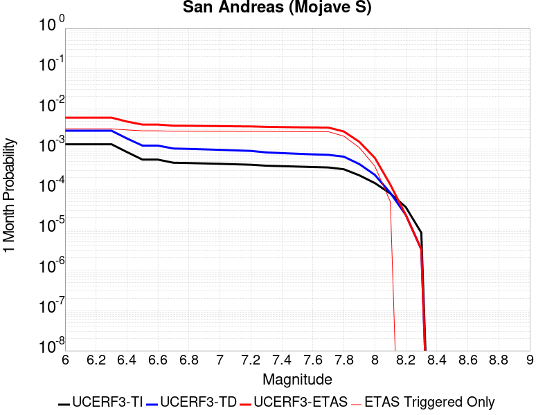 |  |  |

| Magnitude | 1 wk TI Prob | 1 wk TD Prob | 1 wk ETAS Prob | 1 wk ETAS/TD Gain | 1 wk ETAS Triggered Only | 1 mo TI Prob | 1 mo TD Prob | 1 mo ETAS Prob | 1 mo ETAS/TD Gain | 1 mo ETAS Triggered Only | 1 yr TI Prob | 1 yr TD Prob | 1 yr ETAS Prob | 1 yr ETAS/TD Gain | 1 yr ETAS Triggered Only | 10 yr TI Prob | 10 yr TD Prob | 10 yr ETAS Prob | 10 yr ETAS/TD Gain | 10 yr ETAS Triggered Only |
|-----|-----|-----|-----|-----|-----|-----|-----|-----|-----|-----|-----|-----|-----|-----|-----|-----|-----|-----|-----|-----|
| 6.0 | 3.1064058E-4 | 6.7460834E-4 | 0.00305642 | 4.5306587 | 0.0023834198 | 0.0013306376 | 0.0028881032 | 0.0056262864 | 1.9480903 | 0.002746114 | 0.016080605 | 0.03462235 | 0.03902407 | 1.1271353 | 0.0045595854 | 0.1496549 | 0.28660452 | 0.2908923 | 1.0149605 | 0.006010363 |
| 6.1 | 3.1064058E-4 | 6.7460834E-4 | 0.00305642 | 4.5306587 | 0.0023834198 | 0.0013306376 | 0.0028881032 | 0.0056262864 | 1.9480903 | 0.002746114 | 0.016080605 | 0.03462235 | 0.03902407 | 1.1271353 | 0.0045595854 | 0.1496549 | 0.28660452 | 0.2908923 | 1.0149605 | 0.006010363 |
| 6.2 | 3.1064058E-4 | 6.7460834E-4 | 0.00305642 | 4.5306587 | 0.0023834198 | 0.0013306376 | 0.0028881032 | 0.0056262864 | 1.9480903 | 0.002746114 | 0.016080605 | 0.03462235 | 0.03902407 | 1.1271353 | 0.0045595854 | 0.1496549 | 0.28660452 | 0.2908923 | 1.0149605 | 0.006010363 |
| 6.3 | 3.1064058E-4 | 6.7460834E-4 | 0.00305642 | 4.5306587 | 0.0023834198 | 0.0013306376 | 0.0028881032 | 0.0056262864 | 1.9480903 | 0.002746114 | 0.016080605 | 0.03462235 | 0.03902407 | 1.1271353 | 0.0045595854 | 0.1496549 | 0.28660452 | 0.2908923 | 1.0149605 | 0.006010363 |
| 6.4 | 1.9872203E-4 | 4.3179357E-4 | 0.0026588107 | 6.157597 | 0.0022279792 | 8.5138786E-4 | 0.0018492596 | 0.0043834248 | 2.3703673 | 0.00253886 | 0.010316478 | 0.02228844 | 0.02639179 | 1.1841022 | 0.004196891 | 0.098504856 | 0.19699748 | 0.20149097 | 1.0228099 | 0.005595855 |
| 6.5 | 1.291105E-4 | 2.875267E-4 | 0.0025148652 | 8.746546 | 0.0022279792 | 5.5321335E-4 | 0.0012316781 | 0.0037674112 | 3.0587628 | 0.00253886 | 0.006714592 | 0.0148934 | 0.01887466 | 1.267317 | 0.0040414506 | 0.065152965 | 0.13803436 | 0.14267915 | 1.0336496 | 0.005388601 |
| 6.6 | 1.291105E-4 | 2.875267E-4 | 0.0025148652 | 8.746546 | 0.0022279792 | 5.5321335E-4 | 0.0012316781 | 0.0037674112 | 3.0587628 | 0.00253886 | 0.006714592 | 0.0148934 | 0.01887466 | 1.267317 | 0.0040414506 | 0.065152965 | 0.13803436 | 0.14267915 | 1.0336496 | 0.005388601 |
| 6.7 | 1.08001186E-4 | 2.4333889E-4 | 0.002470776 | 10.153643 | 0.0022279792 | 4.6278012E-4 | 0.0010424647 | 0.0035269186 | 3.38325 | 0.0024870466 | 0.0056198016 | 0.012618446 | 0.01655774 | 1.3121854 | 0.0039896374 | 0.054797906 | 0.119176775 | 0.12374063 | 1.0382948 | 0.005181347 |
| 6.8 | 1.0624356E-4 | 2.3851555E-4 | 0.0024659634 | 10.338795 | 0.0022279792 | 4.5525006E-4 | 0.0010218095 | 0.003506315 | 3.4314759 | 0.0024870466 | 0.0055285925 | 0.012369843 | 0.01631013 | 1.3185397 | 0.0039896374 | 0.053930566 | 0.11712591 | 0.12170039 | 1.0390561 | 0.005181347 |
| 6.9 | 1.0393785E-4 | 2.3221898E-4 | 0.002459681 | 10.592074 | 0.0022279792 | 4.4537184E-4 | 9.948451E-4 | 0.0034794174 | 3.4974465 | 0.0024870466 | 0.0054089287 | 0.012045221 | 0.015986802 | 1.327232 | 0.0039896374 | 0.05279156 | 0.11442335 | 0.119011834 | 1.0401009 | 0.005181347 |
| 7.0 | 1.0155622E-4 | 2.2591476E-4 | 0.0024533907 | 10.859807 | 0.0022279792 | 4.3516833E-4 | 9.6784724E-4 | 0.0034524868 | 3.5671816 | 0.0024870466 | 0.005285311 | 0.0117200995 | 0.015662977 | 1.3364202 | 0.0039896374 | 0.05161361 | 0.111683756 | 0.11628643 | 1.0412117 | 0.005181347 |
| 7.1 | 9.885595E-5 | 2.1879886E-4 | 0.0024462906 | 11.180546 | 0.0022279792 | 4.2359953E-4 | 9.3737274E-4 | 0.003422088 | 3.6507227 | 0.0024870466 | 0.0051451353 | 0.011352993 | 0.015297336 | 1.3474276 | 0.0039896374 | 0.05027629 | 0.1085682 | 0.11318702 | 1.042543 | 0.005181347 |
| 7.2 | 9.6411415E-5 | 2.124288E-4 | 0.0024399348 | 11.485894 | 0.0022279792 | 4.1312634E-4 | 9.1009185E-4 | 0.003394875 | 3.7302554 | 0.0024870466 | 0.005018219 | 0.011024255 | 0.0149699105 | 1.3579067 | 0.0039896374 | 0.049064007 | 0.105758004 | 0.11034505 | 1.043373 | 0.005129534 |
| 7.3 | 9.1180635E-5 | 1.9471257E-4 | 0.0023704546 | 12.174122 | 0.0021761658 | 3.907156E-4 | 8.342157E-4 | 0.0032674174 | 3.9167535 | 0.0024352332 | 0.004746591 | 0.01010939 | 0.013956115 | 1.3805101 | 0.0038860103 | 0.046464786 | 0.09795115 | 0.10248476 | 1.0462844 | 0.005025907 |
| 7.4 | 8.887388E-5 | 1.8719878E-4 | 0.0023629572 | 12.622717 | 0.0021761658 | 3.8083247E-4 | 8.020339E-4 | 0.0032353138 | 4.033887 | 0.0024352332 | 0.0046267817 | 0.00972114 | 0.013569374 | 1.3958625 | 0.0038860103 | 0.045316286 | 0.09458615 | 0.09913667 | 1.0481099 | 0.005025907 |
| 7.5 | 8.6750515E-5 | 1.8051457E-4 | 0.0023562876 | 13.053171 | 0.0021761658 | 3.7173493E-4 | 7.7340455E-4 | 0.0032067543 | 4.146283 | 0.0024352332 | 0.004516484 | 0.009375632 | 0.013225208 | 1.4105939 | 0.0038860103 | 0.04425787 | 0.091549896 | 0.09611568 | 1.049872 | 0.005025907 |
| 7.6 | 8.453092E-5 | 1.7439072E-4 | 0.002350177 | 13.476502 | 0.0021761658 | 3.6222505E-4 | 7.471748E-4 | 0.0031805884 | 4.2568197 | 0.0024352332 | 0.0044011753 | 0.009058985 | 0.012909791 | 1.4250815 | 0.0038860103 | 0.04315024 | 0.08870898 | 0.09328905 | 1.0516303 | 0.005025907 |
| 7.7 | 8.259102E-5 | 1.6961215E-4 | 0.0023454088 | 13.828071 | 0.0021761658 | 3.539135E-4 | 7.2670676E-4 | 0.0031601703 | 4.348618 | 0.0024352332 | 0.004300386 | 0.008811831 | 0.012663598 | 1.4371132 | 0.0038860103 | 0.042181134 | 0.08645982 | 0.09105119 | 1.053104 | 0.005025907 |
| 7.8 | 7.444844E-5 | 1.5283503E-4 | 0.0019142238 | 12.524772 | 0.001761658 | 3.1902574E-4 | 6.548429E-4 | 0.002570686 | 3.925653 | 0.0019170984 | 0.0038772223 | 0.007943616 | 0.010924925 | 1.3753089 | 0.0030051814 | 0.03810269 | 0.078290746 | 0.08192027 | 1.0463597 | 0.0039378237 |
| 7.9 | 5.2586525E-5 | 1.00064186E-4 | 0.00113623 | 11.355011 | 0.0010362695 | 2.2535135E-4 | 4.2877605E-4 | 0.001619975 | 3.7781377 | 0.0011917099 | 0.0027402006 | 0.005207864 | 0.007063435 | 1.3563017 | 0.001865285 | 0.027066574 | 0.052200034 | 0.054557256 | 1.0451576 | 0.0024870466 |
| 8.0 | 3.379877E-5 | 5.4074168E-5 | 4.1674887E-4 | 7.7069864 | 3.626943E-4 | 1.4484383E-4 | 2.3172585E-4 | 6.461376E-4 | 2.7883706 | 4.1450778E-4 | 0.0017620471 | 0.002817614 | 0.0035409587 | 1.2567225 | 7.253886E-4 | 0.017481409 | 0.028834904 | 0.029740652 | 1.0314115 | 9.326425E-4 |
| 8.1 | 1.8668277E-5 | 1.9309397E-5 | 1.2293433E-4 | 6.366555 | 1.03626946E-4 | 8.000444E-5 | 8.275194E-5 | 2.3817949E-4 | 2.8782346 | 1.5544042E-4 | 9.736188E-4 | 0.0010070398 | 0.0011623236 | 1.1541984 | 1.5544042E-4 | 0.009693642 | 0.010798888 | 0.0110551575 | 1.0237311 | 2.5906737E-4 |
| 8.2 | 8.541571E-6 | 5.460819E-6 | 5.460819E-6 | 1.0 | 0.0 | 3.660622E-5 | 2.3403301E-5 | 2.3403301E-5 | 1.0 | 0.0 | 4.455896E-4 | 2.84898E-4 | 2.84898E-4 | 1.0 | 0.0 | 0.0044469717 | 0.0032408056 | 0.0032408056 | 1.0 | 0.0 |
| 8.3 | 1.983087E-6 | 7.6599065E-7 | 7.6599065E-7 | 1.0 | 0.0 | 8.498917E-6 | 3.282813E-6 | 3.282813E-6 | 1.0 | 0.0 | 1.034694E-4 | 3.9967534E-5 | 3.9967534E-5 | 1.0 | 0.0 | 0.0010342124 | 4.719687E-4 | 4.719687E-4 | 1.0 | 0.0 |

## Coyote Canyon
*[(top)](#table-of-contents)*

| 1 Week | 1 Month | 1 Year | 10 Year |
|-----|-----|-----|-----|
|  |  |  |  |

| Magnitude | 1 wk TI Prob | 1 wk TD Prob | 1 wk ETAS Prob | 1 wk ETAS/TD Gain | 1 wk ETAS Triggered Only | 1 mo TI Prob | 1 mo TD Prob | 1 mo ETAS Prob | 1 mo ETAS/TD Gain | 1 mo ETAS Triggered Only | 1 yr TI Prob | 1 yr TD Prob | 1 yr ETAS Prob | 1 yr ETAS/TD Gain | 1 yr ETAS Triggered Only | 10 yr TI Prob | 10 yr TD Prob | 10 yr ETAS Prob | 10 yr ETAS/TD Gain | 10 yr ETAS Triggered Only |
|-----|-----|-----|-----|-----|-----|-----|-----|-----|-----|-----|-----|-----|-----|-----|-----|-----|-----|-----|-----|-----|
| 6.0 | 3.5090034E-5 | 4.0364324E-5 | 0.001232026 | 30.522648 | 0.0011917099 | 1.503772E-4 | 1.7297994E-4 | 0.0021415513 | 12.380344 | 0.0019689118 | 0.0018293047 | 0.0021042528 | 0.005258224 | 2.4988556 | 0.0031606217 | 0.018143194 | 0.020869201 | 0.026043883 | 1.2479578 | 0.005284974 |
| 6.1 | 3.5090034E-5 | 4.0364324E-5 | 0.001232026 | 30.522648 | 0.0011917099 | 1.503772E-4 | 1.7297994E-4 | 0.0021415513 | 12.380344 | 0.0019689118 | 0.0018293047 | 0.0021042528 | 0.005258224 | 2.4988556 | 0.0031606217 | 0.018143194 | 0.020869201 | 0.026043883 | 1.2479578 | 0.005284974 |
| 6.2 | 1.841879E-5 | 2.1059794E-5 | 5.391836E-4 | 25.60251 | 5.1813474E-4 | 7.8935285E-5 | 9.0253714E-5 | 0.0010746209 | 11.906667 | 9.844559E-4 | 9.606133E-4 | 0.001098387 | 0.002754597 | 2.5078566 | 0.0016580311 | 0.0095647145 | 0.010939667 | 0.01365574 | 1.2482774 | 0.002746114 |
| 6.3 | 1.841879E-5 | 2.1059794E-5 | 5.391836E-4 | 25.60251 | 5.1813474E-4 | 7.8935285E-5 | 9.0253714E-5 | 0.0010746209 | 11.906667 | 9.844559E-4 | 9.606133E-4 | 0.001098387 | 0.002754597 | 2.5078566 | 0.0016580311 | 0.0095647145 | 0.010939667 | 0.01365574 | 1.2482774 | 0.002746114 |
| 6.4 | 1.712201E-5 | 1.9565212E-5 | 5.376898E-4 | 27.48193 | 5.1813474E-4 | 7.337798E-5 | 8.3848776E-5 | 0.0010682222 | 12.739865 | 9.844559E-4 | 8.930107E-4 | 0.0010204813 | 0.0026768204 | 2.623096 | 0.0016580311 | 0.008894307 | 0.010167871 | 0.012886062 | 1.2673315 | 0.002746114 |
| 6.5 | 1.4744935E-5 | 1.6836972E-5 | 5.34963E-4 | 31.773111 | 5.1813474E-4 | 6.3191044E-5 | 7.215698E-5 | 0.0010565419 | 14.642269 | 9.844559E-4 | 7.6907943E-4 | 8.7825063E-4 | 0.0024312895 | 2.7683322 | 0.0015544042 | 0.007664232 | 0.008756994 | 0.011273622 | 1.2873849 | 0.00253886 |
| 6.6 | 1.2017839E-5 | 1.37240895E-5 | 4.8003893E-4 | 34.977837 | 4.6632125E-4 | 5.150401E-5 | 5.88167E-5 | 9.395939E-4 | 15.974952 | 8.80829E-4 | 6.268809E-4 | 7.159466E-4 | 0.0021139088 | 2.9526067 | 0.0013989637 | 0.0062511545 | 0.0071450938 | 0.009254267 | 1.2951919 | 0.0021243524 |
| 6.7 | 1.00956095E-5 | 1.1533517E-5 | 3.2241075E-4 | 27.954247 | 3.1088083E-4 | 4.326618E-5 | 4.942891E-5 | 7.2297076E-4 | 14.626475 | 6.7357515E-4 | 5.266384E-4 | 6.017178E-4 | 0.0016891459 | 2.8072064 | 0.0010880829 | 0.005253921 | 0.0060094125 | 0.00765748 | 1.2742476 | 0.0016580311 |

## Death Valley (So)
*[(top)](#table-of-contents)*

| 1 Week | 1 Month | 1 Year | 10 Year |
|-----|-----|-----|-----|
|  | 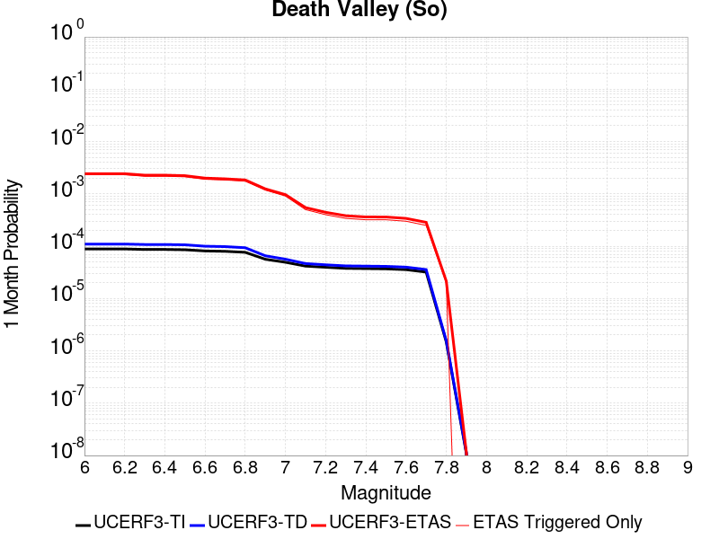 |  |  |

| Magnitude | 1 wk TI Prob | 1 wk TD Prob | 1 wk ETAS Prob | 1 wk ETAS/TD Gain | 1 wk ETAS Triggered Only | 1 mo TI Prob | 1 mo TD Prob | 1 mo ETAS Prob | 1 mo ETAS/TD Gain | 1 mo ETAS Triggered Only | 1 yr TI Prob | 1 yr TD Prob | 1 yr ETAS Prob | 1 yr ETAS/TD Gain | 1 yr ETAS Triggered Only | 10 yr TI Prob | 10 yr TD Prob | 10 yr ETAS Prob | 10 yr ETAS/TD Gain | 10 yr ETAS Triggered Only |
|-----|-----|-----|-----|-----|-----|-----|-----|-----|-----|-----|-----|-----|-----|-----|-----|-----|-----|-----|-----|-----|
| 6.0 | 2.0684236E-5 | 2.5617775E-5 | 0.0014245457 | 55.607704 | 0.0013989637 | 8.864371E-5 | 1.0978594E-4 | 0.0021820972 | 19.875925 | 0.002072539 | 0.0010787029 | 0.0013358411 | 0.0049061948 | 3.672738 | 0.0035751294 | 0.010734817 | 0.013281397 | 0.018751806 | 1.411885 | 0.0055440413 |
| 6.1 | 2.0684236E-5 | 2.5617775E-5 | 0.0014245457 | 55.607704 | 0.0013989637 | 8.864371E-5 | 1.0978594E-4 | 0.0021820972 | 19.875925 | 0.002072539 | 0.0010787029 | 0.0013358411 | 0.0049061948 | 3.672738 | 0.0035751294 | 0.010734817 | 0.013281397 | 0.018751806 | 1.411885 | 0.0055440413 |
| 6.2 | 2.0684236E-5 | 2.5617775E-5 | 0.0014245457 | 55.607704 | 0.0013989637 | 8.864371E-5 | 1.0978594E-4 | 0.0021820972 | 19.875925 | 0.002072539 | 0.0010787029 | 0.0013358411 | 0.0049061948 | 3.672738 | 0.0035751294 | 0.010734817 | 0.013281397 | 0.018751806 | 1.411885 | 0.0055440413 |
| 6.3 | 2.0240292E-5 | 2.511786E-5 | 0.0012167977 | 48.443527 | 0.0011917099 | 8.6741224E-5 | 1.07643624E-4 | 0.0019727277 | 18.326471 | 0.001865285 | 0.0010555626 | 0.00130979 | 0.004621509 | 3.528435 | 0.0033160623 | 0.010505628 | 0.013023956 | 0.018035544 | 1.3847977 | 0.00507772 |
| 6.4 | 2.0240292E-5 | 2.511786E-5 | 0.0012167977 | 48.443527 | 0.0011917099 | 8.6741224E-5 | 1.07643624E-4 | 0.0019727277 | 18.326471 | 0.001865285 | 0.0010555626 | 0.00130979 | 0.004621509 | 3.528435 | 0.0033160623 | 0.010505628 | 0.013023956 | 0.018035544 | 1.3847977 | 0.00507772 |
| 6.5 | 1.9962767E-5 | 2.4807114E-5 | 0.0011646752 | 46.94924 | 0.0011398963 | 8.55519E-5 | 1.0631196E-4 | 0.0019195906 | 18.056206 | 0.0018134716 | 0.0010410968 | 0.0012935963 | 0.0045536226 | 3.5201263 | 0.0032642486 | 0.010362327 | 0.012863902 | 0.017722862 | 1.3777205 | 0.0049222796 |
| 6.6 | 1.8937297E-5 | 2.3310964E-5 | 9.0411946E-4 | 38.785156 | 8.80829E-4 | 8.115732E-5 | 9.990039E-5 | 0.001446916 | 14.483587 | 0.0013471503 | 9.876423E-4 | 0.0012156231 | 0.0036996466 | 3.0434155 | 0.0024870466 | 0.009832645 | 0.012092789 | 0.015982993 | 1.3216963 | 0.0039378237 |
| 6.7 | 1.8621096E-5 | 2.2911607E-5 | 9.0372044E-4 | 39.443783 | 8.80829E-4 | 7.980225E-5 | 9.818898E-5 | 0.0013933986 | 14.190987 | 0.0012953368 | 9.711593E-4 | 0.0011948098 | 0.0036271333 | 3.035741 | 0.0024352332 | 0.009669261 | 0.011886904 | 0.015675524 | 1.3187222 | 0.0038341968 |
| 6.8 | 1.7830353E-5 | 2.1805688E-5 | 9.026155E-4 | 41.39358 | 8.80829E-4 | 7.641356E-5 | 9.344968E-5 | 0.0013886654 | 14.860034 | 0.0012953368 | 9.29938E-4 | 0.00113717 | 0.0034661249 | 3.0480268 | 0.002331606 | 0.009260561 | 0.011316354 | 0.014953481 | 1.3214045 | 0.0036787565 |
| 6.9 | 1.3135183E-5 | 1.5303925E-5 | 7.924941E-4 | 51.78372 | 7.772021E-4 | 5.6292425E-5 | 6.558664E-5 | 0.0011535982 | 17.58892 | 0.0010880829 | 6.8514474E-4 | 7.982312E-4 | 0.0025067108 | 3.1403317 | 0.0017098446 | 0.006830362 | 0.007954649 | 0.010576116 | 1.3295516 | 0.002642487 |
| 7.0 | 1.1507512E-5 | 1.3154199E-5 | 4.794693E-4 | 36.449905 | 4.6632125E-4 | 4.9316975E-5 | 5.6373956E-5 | 7.299111E-4 | 12.947665 | 6.7357515E-4 | 6.002687E-4 | 6.8614254E-4 | 0.0017217009 | 2.5092468 | 0.0010362695 | 0.0059864987 | 0.0068409415 | 0.008539089 | 1.2482331 | 0.0017098446 |
| 7.1 | 9.715903E-6 | 1.0865278E-5 | 3.2174273E-4 | 29.612011 | 3.1088083E-4 | 4.1638916E-5 | 4.656467E-5 | 4.6105313E-4 | 9.901351 | 4.1450778E-4 | 5.068359E-4 | 5.667817E-4 | 0.0011881909 | 2.0963821 | 6.2176166E-4 | 0.0050568148 | 0.0056538144 | 0.006581184 | 1.1640254 | 9.326425E-4 |
| 7.2 | 9.233269E-6 | 1.02863105E-5 | 2.69351E-4 | 26.185385 | 2.5906737E-4 | 3.9570554E-5 | 4.4083466E-5 | 4.0676177E-4 | 9.227082 | 3.626943E-4 | 4.81665E-4 | 5.3658825E-4 | 0.0010026593 | 1.8685822 | 4.6632125E-4 | 0.0048062233 | 0.0053533576 | 0.006126399 | 1.1444031 | 7.772021E-4 |
| 7.3 | 8.8041315E-6 | 9.808164E-6 | 2.1706002E-4 | 22.130545 | 2.0725389E-4 | 3.7731446E-5 | 4.2034335E-5 | 3.529021E-4 | 8.395568 | 3.1088083E-4 | 4.592835E-4 | 5.1165203E-4 | 9.2594774E-4 | 1.8097216 | 4.1450778E-4 | 0.0045833546 | 0.005105167 | 0.0057237544 | 1.1211689 | 6.2176166E-4 |
| 7.4 | 8.708749E-6 | 9.707175E-6 | 2.1695904E-4 | 22.35038 | 2.0725389E-4 | 3.7322676E-5 | 4.160154E-5 | 3.5246945E-4 | 8.472509 | 3.1088083E-4 | 4.5430884E-4 | 5.0638523E-4 | 9.206831E-4 | 1.8181477 | 4.1450778E-4 | 0.004533812 | 0.0050527398 | 0.0056713596 | 1.1224326 | 6.2176166E-4 |
| 7.5 | 8.612678E-6 | 9.604817E-6 | 2.1685672E-4 | 22.577911 | 2.0725389E-4 | 3.6910955E-5 | 4.1162875E-5 | 3.520309E-4 | 8.552145 | 3.1088083E-4 | 4.492982E-4 | 5.01047E-4 | 9.153471E-4 | 1.8268688 | 4.1450778E-4 | 0.004483909 | 0.0049995985 | 0.005618252 | 1.1237406 | 6.2176166E-4 |
| 7.6 | 8.319024E-6 | 9.283916E-6 | 1.647229E-4 | 17.742823 | 1.5544042E-4 | 3.5652476E-5 | 3.978763E-5 | 2.9884468E-4 | 7.510995 | 2.5906737E-4 | 4.3398244E-4 | 4.8431093E-4 | 8.4682956E-4 | 1.7485247 | 3.626943E-4 | 0.0043313587 | 0.0048329784 | 0.005400172 | 1.117359 | 5.6994817E-4 |
| 7.7 | 7.4718328E-6 | 8.34517E-6 | 1.637843E-4 | 19.626238 | 1.5544042E-4 | 3.2021748E-5 | 3.5764548E-5 | 2.4301102E-4 | 6.7947464 | 2.0725389E-4 | 3.8979502E-4 | 4.353504E-4 | 7.460959E-4 | 1.7137824 | 3.1088083E-4 | 0.00389112 | 0.0043453807 | 0.0048096757 | 1.1068479 | 4.6632125E-4 |
| 7.8 | 3.4586725E-7 | 3.6482615E-7 | 3.6482615E-7 | 1.0 | 0.0 | 1.4822873E-6 | 1.5635396E-6 | 5.337693E-5 | 34.13852 | 5.1813473E-5 | 1.80467E-5 | 1.9035933E-5 | 7.084842E-5 | 3.7218254 | 5.1813473E-5 | 1.8045233E-4 | 1.9034347E-4 | 2.4214709E-4 | 1.2721586 | 5.1813473E-5 |
| 7.9 | 2.5591178E-9 | 2.6696718E-9 | 2.6696718E-9 | 1.0 | 0.0 | 1.0967647E-8 | 1.14414505E-8 | 1.14414505E-8 | 1.0 | 0.0 | 1.335311E-7 | 1.3929966E-7 | 1.3929966E-7 | 1.0 | 0.0 | 1.3353102E-6 | 1.3929966E-6 | 1.3929966E-6 | 1.0 | 0.0 |

## Towne Pass
*[(top)](#table-of-contents)*

| 1 Week | 1 Month | 1 Year | 10 Year |
|-----|-----|-----|-----|
|  |  |  |  |

| Magnitude | 1 wk TI Prob | 1 wk TD Prob | 1 wk ETAS Prob | 1 wk ETAS/TD Gain | 1 wk ETAS Triggered Only | 1 mo TI Prob | 1 mo TD Prob | 1 mo ETAS Prob | 1 mo ETAS/TD Gain | 1 mo ETAS Triggered Only | 1 yr TI Prob | 1 yr TD Prob | 1 yr ETAS Prob | 1 yr ETAS/TD Gain | 1 yr ETAS Triggered Only | 10 yr TI Prob | 10 yr TD Prob | 10 yr ETAS Prob | 10 yr ETAS/TD Gain | 10 yr ETAS Triggered Only |
|-----|-----|-----|-----|-----|-----|-----|-----|-----|-----|-----|-----|-----|-----|-----|-----|-----|-----|-----|-----|-----|
| 6.0 | 3.849728E-6 | 3.8945414E-6 | 0.0013510395 | 346.90594 | 0.0013471503 | 1.649873E-5 | 1.669081E-5 | 0.0019337572 | 115.857605 | 0.0019170984 | 2.0085352E-4 | 2.0319603E-4 | 0.003881205 | 19.100792 | 0.0036787565 | 0.0020067208 | 0.0020305314 | 0.0069428165 | 3.4192114 | 0.0049222796 |
| 6.1 | 3.849728E-6 | 3.8945414E-6 | 0.0013510395 | 346.90594 | 0.0013471503 | 1.649873E-5 | 1.669081E-5 | 0.0019337572 | 115.857605 | 0.0019170984 | 2.0085352E-4 | 2.0319603E-4 | 0.003881205 | 19.100792 | 0.0036787565 | 0.0020067208 | 0.0020305314 | 0.0069428165 | 3.4192114 | 0.0049222796 |
| 6.2 | 3.849728E-6 | 3.8945414E-6 | 0.0013510395 | 346.90594 | 0.0013471503 | 1.649873E-5 | 1.669081E-5 | 0.0019337572 | 115.857605 | 0.0019170984 | 2.0085352E-4 | 2.0319603E-4 | 0.003881205 | 19.100792 | 0.0036787565 | 0.0020067208 | 0.0020305314 | 0.0069428165 | 3.4192114 | 0.0049222796 |
| 6.3 | 3.849728E-6 | 3.8945414E-6 | 0.0013510395 | 346.90594 | 0.0013471503 | 1.649873E-5 | 1.669081E-5 | 0.0019337572 | 115.857605 | 0.0019170984 | 2.0085352E-4 | 2.0319603E-4 | 0.003881205 | 19.100792 | 0.0036787565 | 0.0020067208 | 0.0020305314 | 0.0069428165 | 3.4192114 | 0.0049222796 |
| 6.4 | 3.849728E-6 | 3.8945414E-6 | 0.0013510395 | 346.90594 | 0.0013471503 | 1.649873E-5 | 1.669081E-5 | 0.0019337572 | 115.857605 | 0.0019170984 | 2.0085352E-4 | 2.0319603E-4 | 0.003881205 | 19.100792 | 0.0036787565 | 0.0020067208 | 0.0020305314 | 0.0069428165 | 3.4192114 | 0.0049222796 |
| 6.5 | 1.1953545E-6 | 1.203052E-6 | 5.301646E-5 | 44.068302 | 5.1813473E-5 | 5.1229376E-6 | 5.1559277E-6 | 2.1240875E-4 | 41.197 | 2.0725389E-4 | 6.236998E-5 | 6.277173E-5 | 5.290637E-4 | 8.428375 | 4.6632125E-4 | 6.235248E-4 | 6.275517E-4 | 0.0014042661 | 2.2376897 | 7.772021E-4 |
| 6.6 | 1.1953545E-6 | 1.203052E-6 | 5.301646E-5 | 44.068302 | 5.1813473E-5 | 5.1229376E-6 | 5.1559277E-6 | 2.1240875E-4 | 41.197 | 2.0725389E-4 | 6.236998E-5 | 6.277173E-5 | 5.290637E-4 | 8.428375 | 4.6632125E-4 | 6.235248E-4 | 6.275517E-4 | 0.0014042661 | 2.2376897 | 7.772021E-4 |
| 6.7 | 8.375951E-7 | 8.4106705E-7 | 5.2654494E-5 | 62.604397 | 5.1813473E-5 | 3.5896885E-6 | 3.6045683E-6 | 1.5904442E-4 | 44.123013 | 1.5544042E-4 | 4.370358E-5 | 4.3884793E-5 | 3.5475197E-4 | 8.083711 | 3.1088083E-4 | 4.3694986E-4 | 4.38767E-4 | 9.5667434E-4 | 2.1803699 | 5.1813474E-4 |
| 6.8 | 6.38041E-7 | 6.392156E-7 | 6.392156E-7 | 1.0 | 0.0 | 2.7344586E-6 | 2.7394929E-6 | 1.06366155E-4 | 38.82695 | 1.03626946E-4 | 3.3291526E-5 | 3.3352855E-5 | 1.8878808E-4 | 5.6603274 | 1.5544042E-4 | 3.3286537E-4 | 3.334823E-4 | 6.9605565E-4 | 2.0872343 | 3.626943E-4 |
| 6.9 | 5.3460053E-7 | 5.345333E-7 | 5.345333E-7 | 1.0 | 0.0 | 2.2911431E-6 | 2.2908553E-6 | 1.0591756E-4 | 46.234943 | 1.03626946E-4 | 2.789431E-5 | 2.789084E-5 | 1.8332692E-4 | 6.5730157 | 1.5544042E-4 | 2.789081E-4 | 2.7887672E-4 | 6.4146984E-4 | 2.3001916 | 3.626943E-4 |
| 7.0 | 3.557783E-7 | 3.5324226E-7 | 3.5324226E-7 | 1.0 | 0.0 | 1.5247632E-6 | 1.5138945E-6 | 1.5138945E-6 | 1.0 | 0.0 | 1.8563835E-5 | 1.843152E-5 | 7.024404E-5 | 3.8110824 | 5.1813473E-5 | 1.8562283E-4 | 1.8430075E-4 | 3.9151643E-4 | 2.1243346 | 2.0725389E-4 |
| 7.1 | 3.037942E-7 | 3.0002218E-7 | 3.0002218E-7 | 1.0 | 0.0 | 1.3019744E-6 | 1.2858087E-6 | 1.2858087E-6 | 1.0 | 0.0 | 1.5851423E-5 | 1.5654618E-5 | 6.746728E-5 | 4.3097367 | 5.1813473E-5 | 1.5850292E-4 | 1.5653588E-4 | 3.6375734E-4 | 2.323795 | 2.0725389E-4 |
| 7.2 | 2.0808248E-7 | 2.0217689E-7 | 2.0217689E-7 | 1.0 | 0.0 | 8.917818E-7 | 8.6647213E-7 | 8.6647213E-7 | 1.0 | 0.0 | 1.0857389E-5 | 1.0549252E-5 | 6.2362175E-5 | 5.911526 | 5.1813473E-5 | 1.0856859E-4 | 1.0548797E-4 | 3.1272E-4 | 2.9645085 | 2.0725389E-4 |
| 7.3 | 1.1162073E-7 | 1.0636894E-7 | 1.0636894E-7 | 1.0 | 0.0 | 4.7837443E-7 | 4.558668E-7 | 4.558668E-7 | 1.0 | 0.0 | 5.8241935E-6 | 5.550166E-6 | 5.736335E-5 | 10.335429 | 5.1813473E-5 | 5.8240406E-5 | 5.5500474E-5 | 2.1093227E-4 | 3.8005488 | 1.5544042E-4 |

## Nelson Lake
*[(top)](#table-of-contents)*

| 1 Week | 1 Month | 1 Year | 10 Year |
|-----|-----|-----|-----|
|  |  | 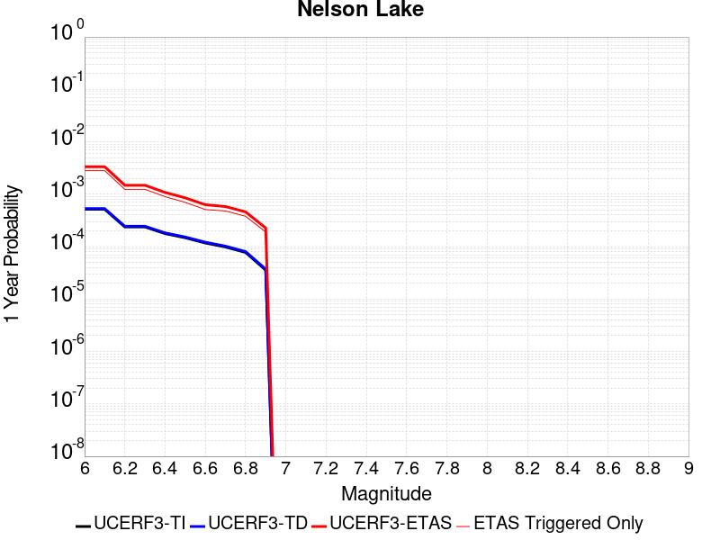 |  |

| Magnitude | 1 wk TI Prob | 1 wk TD Prob | 1 wk ETAS Prob | 1 wk ETAS/TD Gain | 1 wk ETAS Triggered Only | 1 mo TI Prob | 1 mo TD Prob | 1 mo ETAS Prob | 1 mo ETAS/TD Gain | 1 mo ETAS Triggered Only | 1 yr TI Prob | 1 yr TD Prob | 1 yr ETAS Prob | 1 yr ETAS/TD Gain | 1 yr ETAS Triggered Only | 10 yr TI Prob | 10 yr TD Prob | 10 yr ETAS Prob | 10 yr ETAS/TD Gain | 10 yr ETAS Triggered Only |
|-----|-----|-----|-----|-----|-----|-----|-----|-----|-----|-----|-----|-----|-----|-----|-----|-----|-----|-----|-----|-----|
| 6.0 | 9.913453E-6 | 1.0192255E-5 | 8.910123E-4 | 87.420525 | 8.80829E-4 | 4.2485535E-5 | 4.3680422E-5 | 0.0013389606 | 30.653564 | 0.0012953368 | 5.1713863E-4 | 5.316897E-4 | 0.0032763437 | 6.1621346 | 0.002746114 | 0.0051593683 | 0.005305204 | 0.0095313685 | 1.7966074 | 0.0042487048 |
| 6.1 | 9.913453E-6 | 1.0192255E-5 | 8.910123E-4 | 87.420525 | 8.80829E-4 | 4.2485535E-5 | 4.3680422E-5 | 0.0013389606 | 30.653564 | 0.0012953368 | 5.1713863E-4 | 5.316897E-4 | 0.0032763437 | 6.1621346 | 0.002746114 | 0.0051593683 | 0.005305204 | 0.0095313685 | 1.7966074 | 0.0042487048 |
| 6.2 | 4.5596407E-6 | 4.696313E-6 | 3.6738892E-4 | 78.22922 | 3.626943E-4 | 1.954117E-5 | 2.0126909E-5 | 5.9006363E-4 | 29.317152 | 5.6994817E-4 | 2.3788778E-4 | 2.4501883E-4 | 0.0013846359 | 5.651141 | 0.0011398963 | 0.0023763329 | 0.0024476128 | 0.004153272 | 1.6968665 | 0.0017098446 |
| 6.3 | 4.5596407E-6 | 4.696313E-6 | 3.6738892E-4 | 78.22922 | 3.626943E-4 | 1.954117E-5 | 2.0126909E-5 | 5.9006363E-4 | 29.317152 | 5.6994817E-4 | 2.3788778E-4 | 2.4501883E-4 | 0.0013846359 | 5.651141 | 0.0011398963 | 0.0023763329 | 0.0024476128 | 0.004153272 | 1.6968665 | 0.0017098446 |
| 6.4 | 3.4025713E-6 | 3.5098972E-6 | 2.6257636E-4 | 74.810265 | 2.5906737E-4 | 1.4582367E-5 | 1.5042335E-5 | 4.2954387E-4 | 28.555664 | 4.1450778E-4 | 1.7752586E-4 | 1.8312587E-4 | 0.0010119897 | 5.5261965 | 8.2901557E-4 | 0.001773841 | 0.0018298327 | 0.0029159246 | 1.5935471 | 0.0010880829 |
| 6.5 | 2.8352947E-6 | 2.927856E-6 | 2.1018114E-4 | 71.786705 | 2.0725389E-4 | 1.2151207E-5 | 1.2547898E-5 | 3.234248E-4 | 25.775219 | 3.1088083E-4 | 1.479309E-4 | 1.5276071E-4 | 8.2623295E-4 | 5.4086747 | 6.7357515E-4 | 0.0014783246 | 0.0015266308 | 0.0024061152 | 1.576095 | 8.80829E-4 |
| 6.6 | 2.251518E-6 | 2.3290677E-6 | 1.5776911E-4 | 67.739174 | 1.5544042E-4 | 9.649328E-6 | 9.981683E-6 | 2.6904646E-4 | 26.954016 | 2.5906737E-4 | 1.1747423E-4 | 1.2152085E-4 | 6.395926E-4 | 5.2632337 | 5.1813474E-4 | 0.0011741214 | 0.0012146058 | 0.0019391133 | 1.5964961 | 7.253886E-4 |
| 6.7 | 1.8911853E-6 | 1.9591396E-6 | 1.5739925E-4 | 80.341 | 1.5544042E-4 | 8.105055E-6 | 8.39629E-6 | 2.6746147E-4 | 31.854723 | 2.5906737E-4 | 9.867457E-5 | 1.0222061E-4 | 6.2030234E-4 | 6.068271 | 5.1813474E-4 | 9.863076E-4 | 0.0010217935 | 0.0016946803 | 1.6585351 | 6.7357515E-4 |
| 6.8 | 1.4874814E-6 | 1.5438305E-6 | 1.5698401E-4 | 101.68474 | 1.5544042E-4 | 6.374905E-6 | 6.6164025E-6 | 2.6568206E-4 | 40.15506 | 2.5906737E-4 | 7.76117E-5 | 8.055224E-5 | 4.9502664E-4 | 6.1454105 | 4.1450778E-4 | 7.75846E-4 | 8.0528157E-4 | 0.0013747708 | 1.7071927 | 5.6994817E-4 |
| 6.9 | 6.835972E-7 | 7.1399285E-7 | 1.0434086E-4 | 146.13713 | 1.03626946E-4 | 2.9296991E-6 | 3.0599674E-6 | 1.06686595E-4 | 34.865273 | 1.03626946E-4 | 3.56685E-5 | 3.7254784E-5 | 1.926894E-4 | 5.1722054 | 1.5544042E-4 | 3.5662777E-4 | 3.7251666E-4 | 6.314875E-4 | 1.6951927 | 2.5906737E-4 |

## San Andreas (San Bernardino N)
*[(top)](#table-of-contents)*

| 1 Week | 1 Month | 1 Year | 10 Year |
|-----|-----|-----|-----|
|  |  |  |  |

| Magnitude | 1 wk TI Prob | 1 wk TD Prob | 1 wk ETAS Prob | 1 wk ETAS/TD Gain | 1 wk ETAS Triggered Only | 1 mo TI Prob | 1 mo TD Prob | 1 mo ETAS Prob | 1 mo ETAS/TD Gain | 1 mo ETAS Triggered Only | 1 yr TI Prob | 1 yr TD Prob | 1 yr ETAS Prob | 1 yr ETAS/TD Gain | 1 yr ETAS Triggered Only | 10 yr TI Prob | 10 yr TD Prob | 10 yr ETAS Prob | 10 yr ETAS/TD Gain | 10 yr ETAS Triggered Only |
|-----|-----|-----|-----|-----|-----|-----|-----|-----|-----|-----|-----|-----|-----|-----|-----|-----|-----|-----|-----|-----|
| 6.0 | 1.4273766E-4 | 3.1606483E-4 | 0.0016109922 | 5.0970306 | 0.0012953368 | 6.115894E-4 | 0.0013538664 | 0.0028026793 | 2.07013 | 0.0014507772 | 0.0074207084 | 0.016360244 | 0.01870467 | 1.1433002 | 0.0023834198 | 0.07177748 | 0.15026689 | 0.15290855 | 1.0175798 | 0.0031088083 |
| 6.1 | 1.4273766E-4 | 3.1606483E-4 | 0.0016109922 | 5.0970306 | 0.0012953368 | 6.115894E-4 | 0.0013538664 | 0.0028026793 | 2.07013 | 0.0014507772 | 0.0074207084 | 0.016360244 | 0.01870467 | 1.1433002 | 0.0023834198 | 0.07177748 | 0.15026689 | 0.15290855 | 1.0175798 | 0.0031088083 |
| 6.2 | 1.4273766E-4 | 3.1606483E-4 | 0.0016109922 | 5.0970306 | 0.0012953368 | 6.115894E-4 | 0.0013538664 | 0.0028026793 | 2.07013 | 0.0014507772 | 0.0074207084 | 0.016360244 | 0.01870467 | 1.1433002 | 0.0023834198 | 0.07177748 | 0.15026689 | 0.15290855 | 1.0175798 | 0.0031088083 |
| 6.3 | 1.3730655E-4 | 3.0511338E-4 | 0.0016000549 | 5.244132 | 0.0012953368 | 5.883239E-4 | 0.0013069791 | 0.0027558603 | 2.1085725 | 0.0014507772 | 0.0071393442 | 0.015797773 | 0.01814354 | 1.1484872 | 0.0023834198 | 0.06914291 | 0.14556676 | 0.14822304 | 1.0182477 | 0.0031088083 |
| 6.4 | 1.3730655E-4 | 3.0511338E-4 | 0.0016000549 | 5.244132 | 0.0012953368 | 5.883239E-4 | 0.0013069791 | 0.0027558603 | 2.1085725 | 0.0014507772 | 0.0071393442 | 0.015797773 | 0.01814354 | 1.1484872 | 0.0023834198 | 0.06914291 | 0.14556676 | 0.14822304 | 1.0182477 | 0.0031088083 |
| 6.5 | 1.2942807E-4 | 2.8925808E-4 | 0.0015842202 | 5.47684 | 0.0012953368 | 5.545738E-4 | 0.0012390936 | 0.002688073 | 2.1693866 | 0.0014507772 | 0.0067310524 | 0.01498286 | 0.01733057 | 1.156693 | 0.0023834198 | 0.06530788 | 0.13870941 | 0.141387 | 1.0193036 | 0.0031088083 |
| 6.6 | 1.1125901E-4 | 2.536472E-4 | 0.0015486554 | 6.1055493 | 0.0012953368 | 4.767372E-4 | 0.0010866089 | 0.0025358095 | 2.3336914 | 0.0014507772 | 0.005788839 | 0.013149847 | 0.015501925 | 1.1788673 | 0.0023834198 | 0.056403454 | 0.122999296 | 0.12572572 | 1.0221663 | 0.0031088083 |
| 6.7 | 1.02209575E-4 | 2.3499702E-4 | 0.0015300293 | 6.510846 | 0.0012953368 | 4.3796748E-4 | 0.0010067427 | 0.0024560594 | 2.4396098 | 0.0014507772 | 0.0053192247 | 0.012188629 | 0.014542999 | 1.1931611 | 0.0023834198 | 0.051936906 | 0.114790924 | 0.11754287 | 1.0239736 | 0.0031088083 |
| 6.8 | 9.610582E-5 | 2.2025521E-4 | 0.0015153066 | 6.879777 | 0.0012953368 | 4.1181705E-4 | 9.436101E-4 | 0.0023930182 | 2.5360246 | 0.0014507772 | 0.0050023515 | 0.011428202 | 0.0137843825 | 1.2061726 | 0.0023834198 | 0.048912346 | 0.1081929 | 0.110965356 | 1.0256251 | 0.0031088083 |
| 6.9 | 9.3877505E-5 | 2.1481077E-4 | 0.0015098694 | 7.0288343 | 0.0012953368 | 4.0227012E-4 | 9.2029345E-4 | 0.0023697356 | 2.574978 | 0.0014507772 | 0.0048866454 | 0.011147255 | 0.013504107 | 1.2114289 | 0.0023834198 | 0.04780577 | 0.10578323 | 0.10856318 | 1.0262797 | 0.0031088083 |
| 7.0 | 9.1019785E-5 | 2.0808022E-4 | 0.0015031475 | 7.2238846 | 0.0012953368 | 3.900265E-4 | 8.914682E-4 | 0.0023409522 | 2.6259513 | 0.0014507772 | 0.0047382377 | 0.010799837 | 0.013157516 | 1.2183069 | 0.0023834198 | 0.046384744 | 0.102753714 | 0.105543084 | 1.0271461 | 0.0031088083 |
| 7.1 | 8.771155E-5 | 1.9982594E-4 | 0.0014949039 | 7.48103 | 0.0012953368 | 3.758525E-4 | 8.5611636E-4 | 0.0023056515 | 2.693152 | 0.0014507772 | 0.0045664064 | 0.0103736 | 0.012732294 | 1.2273748 | 0.0023834198 | 0.044737056 | 0.09906527 | 0.101866096 | 1.0282726 | 0.0031088083 |
| 7.2 | 8.0830236E-5 | 1.8388197E-4 | 0.0014789805 | 8.043097 | 0.0012953368 | 3.4636928E-4 | 7.8782777E-4 | 0.002237462 | 2.8400395 | 0.0014507772 | 0.0042088944 | 0.009549725 | 0.011910384 | 1.2471966 | 0.0023834198 | 0.041300658 | 0.09179615 | 0.09461958 | 1.0307577 | 0.0031088083 |
| 7.3 | 7.7668235E-5 | 1.7331762E-4 | 0.0014684299 | 8.472479 | 0.0012953368 | 3.328214E-4 | 7.425784E-4 | 0.0021922784 | 2.9522514 | 0.0014507772 | 0.0040445733 | 0.009003494 | 0.011365455 | 1.2623383 | 0.0023834198 | 0.03971748 | 0.08706327 | 0.08990141 | 1.0325986 | 0.0031088083 |
| 7.4 | 7.520177E-5 | 1.6551897E-4 | 0.0014606414 | 8.8246155 | 0.0012953368 | 3.2225347E-4 | 7.0917426E-4 | 0.0021589226 | 3.0442767 | 0.0014507772 | 0.0039163795 | 0.008600081 | 0.010963003 | 1.2747558 | 0.0023834198 | 0.038480744 | 0.08351955 | 0.08636871 | 1.0341138 | 0.0031088083 |
| 7.5 | 7.274697E-5 | 1.5839566E-4 | 0.0014535272 | 9.17656 | 0.0012953368 | 3.1173544E-4 | 6.78662E-4 | 0.0021284546 | 3.1362514 | 0.0014507772 | 0.003788775 | 0.008231463 | 0.010595263 | 1.2871666 | 0.0023834198 | 0.03724827 | 0.08023631 | 0.08309568 | 1.0356369 | 0.0031088083 |
| 7.6 | 7.1185845E-5 | 1.540943E-4 | 0.0014492315 | 9.404835 | 0.0012953368 | 3.0504653E-4 | 6.6023704E-4 | 0.0021100563 | 3.195907 | 0.0014507772 | 0.0037076178 | 0.008008812 | 0.010373143 | 1.2952163 | 0.0023834198 | 0.036463667 | 0.07822598 | 0.0810916 | 1.0366325 | 0.0031088083 |
| 7.7 | 6.709961E-5 | 1.4318313E-4 | 0.0014383345 | 10.045418 | 0.0012953368 | 2.8753807E-4 | 6.1349774E-4 | 0.002063385 | 3.363313 | 0.0014507772 | 0.003495157 | 0.0074437927 | 0.009809471 | 1.3178055 | 0.0023834198 | 0.034406938 | 0.07305469 | 0.07593639 | 1.0394458 | 0.0031088083 |
| 7.8 | 6.300812E-5 | 1.3202413E-4 | 0.0013753832 | 10.417666 | 0.0012435233 | 2.7000686E-4 | 5.65695E-4 | 0.0019638673 | 3.471601 | 0.0013989637 | 0.0032823787 | 0.006865616 | 0.0091812145 | 1.3372747 | 0.002331606 | 0.032343175 | 0.06771354 | 0.07056353 | 1.042089 | 0.0030569949 |
| 7.9 | 4.983037E-5 | 9.723488E-5 | 0.0011334035 | 11.656347 | 0.0010362695 | 2.1354125E-4 | 4.1665437E-4 | 0.0016078677 | 3.8589964 | 0.0011917099 | 0.0025967648 | 0.0050609782 | 0.006916823 | 1.3666968 | 0.001865285 | 0.025666296 | 0.05064886 | 0.053009942 | 1.0466167 | 0.0024870466 |
| 8.0 | 3.2211527E-5 | 5.3304586E-5 | 4.1597956E-4 | 7.803823 | 3.626943E-4 | 1.380421E-4 | 2.2842824E-4 | 6.4284133E-4 | 2.8141937 | 4.1450778E-4 | 0.0016793669 | 0.0027775685 | 0.0035009424 | 1.2604342 | 7.253886E-4 | 0.016667323 | 0.028361378 | 0.02926757 | 1.0319515 | 9.326425E-4 |
| 8.1 | 1.743376E-5 | 1.8824427E-5 | 1.2244942E-4 | 6.5048156 | 1.03626946E-4 | 7.471398E-5 | 8.067362E-5 | 2.3610149E-4 | 2.9266257 | 1.5544042E-4 | 9.0926304E-4 | 9.817594E-4 | 0.0011370472 | 1.158173 | 1.5544042E-4 | 0.009055517 | 0.010484105 | 0.010740456 | 1.0244514 | 2.5906737E-4 |
| 8.2 | 7.831616E-6 | 5.1551065E-6 | 5.1551065E-6 | 1.0 | 0.0 | 3.3563636E-5 | 2.2093127E-5 | 2.2093127E-5 | 1.0 | 0.0 | 4.0856065E-4 | 2.6895068E-4 | 2.6895068E-4 | 1.0 | 0.0 | 0.004078103 | 0.0030418145 | 0.0030418145 | 1.0 | 0.0 |
| 8.3 | 1.983087E-6 | 7.6599065E-7 | 7.6599065E-7 | 1.0 | 0.0 | 8.498917E-6 | 3.282813E-6 | 3.282813E-6 | 1.0 | 0.0 | 1.034694E-4 | 3.9967534E-5 | 3.9967534E-5 | 1.0 | 0.0 | 0.0010342124 | 4.719687E-4 | 4.719687E-4 | 1.0 | 0.0 |

## Bicycle Lake
*[(top)](#table-of-contents)*

| 1 Week | 1 Month | 1 Year | 10 Year |
|-----|-----|-----|-----|
|  |  |  |  |

| Magnitude | 1 wk TI Prob | 1 wk TD Prob | 1 wk ETAS Prob | 1 wk ETAS/TD Gain | 1 wk ETAS Triggered Only | 1 mo TI Prob | 1 mo TD Prob | 1 mo ETAS Prob | 1 mo ETAS/TD Gain | 1 mo ETAS Triggered Only | 1 yr TI Prob | 1 yr TD Prob | 1 yr ETAS Prob | 1 yr ETAS/TD Gain | 1 yr ETAS Triggered Only | 10 yr TI Prob | 10 yr TD Prob | 10 yr ETAS Prob | 10 yr ETAS/TD Gain | 10 yr ETAS Triggered Only |
|-----|-----|-----|-----|-----|-----|-----|-----|-----|-----|-----|-----|-----|-----|-----|-----|-----|-----|-----|-----|-----|
| 6.0 | 1.9621975E-5 | 2.2097078E-5 | 7.99282E-4 | 36.171387 | 7.772021E-4 | 8.4091465E-5 | 9.4699084E-5 | 0.0014417218 | 15.224241 | 0.0013471503 | 0.0010233327 | 0.0011524865 | 0.0033261443 | 2.886059 | 0.0021761658 | 0.01018633 | 0.011478408 | 0.014756407 | 1.2855796 | 0.0033160623 |
| 6.1 | 1.9621975E-5 | 2.2097078E-5 | 7.99282E-4 | 36.171387 | 7.772021E-4 | 8.4091465E-5 | 9.4699084E-5 | 0.0014417218 | 15.224241 | 0.0013471503 | 0.0010233327 | 0.0011524865 | 0.0033261443 | 2.886059 | 0.0021761658 | 0.01018633 | 0.011478408 | 0.014756407 | 1.2855796 | 0.0033160623 |
| 6.2 | 9.9971285E-6 | 1.1255639E-5 | 4.2575874E-4 | 37.82626 | 4.1450778E-4 | 4.2844134E-5 | 4.8237856E-5 | 7.7359146E-4 | 16.03702 | 7.253886E-4 | 5.2150246E-4 | 5.871896E-4 | 0.0017781997 | 3.0283227 | 0.0011917099 | 0.0052028033 | 0.005861487 | 0.007767348 | 1.3251499 | 0.0019170984 |
| 6.3 | 9.589428E-6 | 1.0798346E-5 | 4.2530164E-4 | 39.385815 | 4.1450778E-4 | 4.10969E-5 | 4.62781E-5 | 7.716331E-4 | 16.67383 | 7.253886E-4 | 5.002399E-4 | 5.6334207E-4 | 0.0017543805 | 3.1142368 | 0.0011917099 | 0.0049911533 | 0.0056242296 | 0.007530546 | 1.338947 | 0.0019170984 |
| 6.4 | 9.589428E-6 | 1.0798346E-5 | 4.2530164E-4 | 39.385815 | 4.1450778E-4 | 4.10969E-5 | 4.62781E-5 | 7.716331E-4 | 16.67383 | 7.253886E-4 | 5.002399E-4 | 5.6334207E-4 | 0.0017543805 | 3.1142368 | 0.0011917099 | 0.0049911533 | 0.0056242296 | 0.007530546 | 1.338947 | 0.0019170984 |
| 6.5 | 5.557707E-6 | 6.2856016E-6 | 2.6535132E-4 | 42.215744 | 2.5906737E-4 | 2.3818526E-5 | 2.6938165E-5 | 4.9324683E-4 | 18.310335 | 4.6632125E-4 | 2.8995197E-4 | 3.2794967E-4 | 0.0011566933 | 3.5270452 | 8.2901557E-4 | 0.0028957394 | 0.0032772934 | 0.004568385 | 1.3939506 | 0.0012953368 |
| 6.6 | 4.8742945E-6 | 5.5132896E-6 | 2.6457923E-4 | 47.989353 | 2.5906737E-4 | 2.0889667E-5 | 2.3628318E-5 | 4.8993854E-4 | 20.735228 | 4.6632125E-4 | 2.54302E-4 | 2.87663E-4 | 0.00111644 | 3.8810694 | 8.2901557E-4 | 0.002540112 | 0.0028754752 | 0.0040637585 | 1.4132476 | 0.0011917099 |
| 6.7 | 3.991108E-6 | 4.5159104E-6 | 1.5995563E-4 | 35.42046 | 1.5544042E-4 | 1.7104636E-5 | 1.9353902E-5 | 3.8204118E-4 | 19.73975 | 3.626943E-4 | 2.0822904E-4 | 2.3563375E-4 | 8.572489E-4 | 3.6380565 | 6.2176166E-4 | 0.0020803404 | 0.0023563374 | 0.003235091 | 1.372932 | 8.80829E-4 |

## Lenwood-Lockhart-Old Woman Springs
*[(top)](#table-of-contents)*

| 1 Week | 1 Month | 1 Year | 10 Year |
|-----|-----|-----|-----|
|  |  |  |  |

| Magnitude | 1 wk TI Prob | 1 wk TD Prob | 1 wk ETAS Prob | 1 wk ETAS/TD Gain | 1 wk ETAS Triggered Only | 1 mo TI Prob | 1 mo TD Prob | 1 mo ETAS Prob | 1 mo ETAS/TD Gain | 1 mo ETAS Triggered Only | 1 yr TI Prob | 1 yr TD Prob | 1 yr ETAS Prob | 1 yr ETAS/TD Gain | 1 yr ETAS Triggered Only | 10 yr TI Prob | 10 yr TD Prob | 10 yr ETAS Prob | 10 yr ETAS/TD Gain | 10 yr ETAS Triggered Only |
|-----|-----|-----|-----|-----|-----|-----|-----|-----|-----|-----|-----|-----|-----|-----|-----|-----|-----|-----|-----|-----|
| 6.0 | 3.744542E-5 | 4.396252E-5 | 0.0010283752 | 23.39209 | 9.844559E-4 | 1.604705E-4 | 1.8839816E-4 | 0.001638902 | 8.699141 | 0.0014507772 | 0.0019519776 | 0.0022915069 | 0.0045660753 | 1.9926083 | 0.0022797927 | 0.019349206 | 0.022696787 | 0.025583124 | 1.1271694 | 0.0029533678 |
| 6.1 | 3.744542E-5 | 4.396252E-5 | 0.0010283752 | 23.39209 | 9.844559E-4 | 1.604705E-4 | 1.8839816E-4 | 0.001638902 | 8.699141 | 0.0014507772 | 0.0019519776 | 0.0022915069 | 0.0045660753 | 1.9926083 | 0.0022797927 | 0.019349206 | 0.022696787 | 0.025583124 | 1.1271694 | 0.0029533678 |
| 6.2 | 3.744542E-5 | 4.396252E-5 | 0.0010283752 | 23.39209 | 9.844559E-4 | 1.604705E-4 | 1.8839816E-4 | 0.001638902 | 8.699141 | 0.0014507772 | 0.0019519776 | 0.0022915069 | 0.0045660753 | 1.9926083 | 0.0022797927 | 0.019349206 | 0.022696787 | 0.025583124 | 1.1271694 | 0.0029533678 |
| 6.3 | 2.1079984E-5 | 2.5353434E-5 | 2.844142E-4 | 11.217977 | 2.5906737E-4 | 9.0339665E-5 | 1.0865316E-4 | 6.267316E-4 | 5.7681856 | 5.1813474E-4 | 0.0010993304 | 0.0013220694 | 0.0022534789 | 1.7045088 | 9.326425E-4 | 0.010939079 | 0.0131442575 | 0.014371436 | 1.0933623 | 0.0012435233 |
| 6.4 | 2.1079984E-5 | 2.5353434E-5 | 2.844142E-4 | 11.217977 | 2.5906737E-4 | 9.0339665E-5 | 1.0865316E-4 | 6.267316E-4 | 5.7681856 | 5.1813474E-4 | 0.0010993304 | 0.0013220694 | 0.0022534789 | 1.7045088 | 9.326425E-4 | 0.010939079 | 0.0131442575 | 0.014371436 | 1.0933623 | 0.0012435233 |
| 6.5 | 1.7397282E-5 | 2.066241E-5 | 1.2428721E-4 | 6.0151362 | 1.03626946E-4 | 7.455765E-5 | 8.8550245E-5 | 4.5121243E-4 | 5.0955524 | 3.626943E-4 | 9.073613E-4 | 0.0010775778 | 0.0018021847 | 1.6724405 | 7.253886E-4 | 0.009036654 | 0.010724821 | 0.011647461 | 1.0860285 | 9.326425E-4 |
| 6.6 | 1.52050325E-5 | 1.7679693E-5 | 1.213048E-4 | 6.8612504 | 1.03626946E-4 | 6.51628E-5 | 7.576796E-5 | 3.3481568E-4 | 4.4189615 | 2.5906737E-4 | 7.9306826E-4 | 9.220924E-4 | 0.0014397494 | 1.5613937 | 5.1813474E-4 | 0.007902439 | 0.009183526 | 0.009902254 | 1.0782627 | 7.253886E-4 |
| 6.7 | 1.332523E-5 | 1.5264002E-5 | 1.18889366E-4 | 7.7888722 | 1.03626946E-4 | 5.7106878E-5 | 6.5415545E-5 | 3.2446595E-4 | 4.960074 | 2.5906737E-4 | 6.950544E-4 | 7.961491E-4 | 0.0013138714 | 1.650283 | 5.1813474E-4 | 0.006928845 | 0.007933599 | 0.00860183 | 1.084228 | 6.7357515E-4 |
| 6.8 | 1.1525329E-5 | 1.3030979E-5 | 6.484378E-5 | 4.976125 | 5.1813473E-5 | 4.9393333E-5 | 5.584588E-5 | 2.1127761E-4 | 3.7832265 | 1.5544042E-4 | 6.011979E-4 | 6.797157E-4 | 9.903853E-4 | 1.457058 | 3.1088083E-4 | 0.00599574 | 0.006776819 | 0.0071885176 | 1.0607511 | 4.1450778E-4 |
| 6.9 | 1.0253909E-5 | 1.15144385E-5 | 1.15144385E-5 | 1.0 | 0.0 | 4.3944583E-5 | 4.9346683E-5 | 1.5296851E-4 | 3.0998743 | 1.03626946E-4 | 5.3489394E-4 | 6.0063385E-4 | 8.0776325E-4 | 1.3448514 | 2.0725389E-4 | 0.0053360825 | 0.0059904843 | 0.0062995027 | 1.0515848 | 3.1088083E-4 |
| 7.0 | 8.104563E-6 | 8.991279E-6 | 8.991279E-6 | 1.0 | 0.0 | 3.4733377E-5 | 3.8533497E-5 | 9.034497E-5 | 2.3445828 | 5.1813473E-5 | 4.2279682E-4 | 4.6904673E-4 | 5.208359E-4 | 1.1104137 | 5.1813473E-5 | 0.0042199334 | 0.0046808156 | 0.0048355283 | 1.0330526 | 1.5544042E-4 |
| 7.1 | 6.7986157E-6 | 7.515816E-6 | 7.515816E-6 | 1.0 | 0.0 | 2.91366E-5 | 3.2210253E-5 | 8.402205E-5 | 2.60855 | 5.1813473E-5 | 3.5468035E-4 | 3.920914E-4 | 4.4388458E-4 | 1.1320946 | 5.1813473E-5 | 0.003541148 | 0.003914213 | 0.0040690447 | 1.0395564 | 1.5544042E-4 |
| 7.2 | 5.6893327E-6 | 6.2800136E-6 | 6.2800136E-6 | 1.0 | 0.0 | 2.4382627E-5 | 2.6914078E-5 | 7.872615E-5 | 2.925092 | 5.1813473E-5 | 2.9681803E-4 | 3.2763163E-4 | 3.7942812E-4 | 1.1580937 | 5.1813473E-5 | 0.002964219 | 0.0032716845 | 0.0034266165 | 1.0473554 | 1.5544042E-4 |
| 7.3 | 4.253348E-6 | 4.7069107E-6 | 4.7069107E-6 | 1.0 | 0.0 | 1.8228506E-5 | 2.0172329E-5 | 7.198475E-5 | 3.5684903 | 5.1813473E-5 | 2.2190946E-4 | 2.4557224E-4 | 2.97373E-4 | 1.2109389 | 5.1813473E-5 | 0.00221688 | 0.0024531898 | 0.0025565624 | 1.0421381 | 1.03626946E-4 |
| 7.4 | 2.5448119E-6 | 2.852045E-6 | 2.852045E-6 | 1.0 | 0.0 | 1.0906291E-5 | 1.2223002E-5 | 1.2223002E-5 | 1.0 | 0.0 | 1.3277601E-4 | 1.4880655E-4 | 1.4880655E-4 | 1.0 | 0.0 | 0.001326967 | 0.0014872311 | 0.0015389676 | 1.034787 | 5.1813473E-5 |
| 7.5 | 4.3706837E-8 | 4.562909E-8 | 4.562909E-8 | 1.0 | 0.0 | 1.8731501E-7 | 1.9555324E-7 | 1.9555324E-7 | 1.0 | 0.0 | 2.2805577E-6 | 2.3808586E-6 | 2.3808586E-6 | 1.0 | 0.0 | 2.2805343E-5 | 2.3808387E-5 | 2.3808387E-5 | 1.0 | 0.0 |

## Paradise
*[(top)](#table-of-contents)*

| 1 Week | 1 Month | 1 Year | 10 Year |
|-----|-----|-----|-----|
|  |  |  |  |

| Magnitude | 1 wk TI Prob | 1 wk TD Prob | 1 wk ETAS Prob | 1 wk ETAS/TD Gain | 1 wk ETAS Triggered Only | 1 mo TI Prob | 1 mo TD Prob | 1 mo ETAS Prob | 1 mo ETAS/TD Gain | 1 mo ETAS Triggered Only | 1 yr TI Prob | 1 yr TD Prob | 1 yr ETAS Prob | 1 yr ETAS/TD Gain | 1 yr ETAS Triggered Only | 10 yr TI Prob | 10 yr TD Prob | 10 yr ETAS Prob | 10 yr ETAS/TD Gain | 10 yr ETAS Triggered Only |
|-----|-----|-----|-----|-----|-----|-----|-----|-----|-----|-----|-----|-----|-----|-----|-----|-----|-----|-----|-----|-----|
| 6.0 | 1.4851273E-5 | 1.6694692E-5 | 4.8300816E-4 | 28.93184 | 4.6632125E-4 | 6.364676E-5 | 7.154685E-5 | 8.486933E-4 | 11.862064 | 7.772021E-4 | 7.7462377E-4 | 8.707584E-4 | 0.0023720406 | 2.724109 | 0.0015025907 | 0.0077192914 | 0.008675844 | 0.011141314 | 1.2841763 | 0.0024870466 |
| 6.1 | 1.4851273E-5 | 1.6694692E-5 | 4.8300816E-4 | 28.93184 | 4.6632125E-4 | 6.364676E-5 | 7.154685E-5 | 8.486933E-4 | 11.862064 | 7.772021E-4 | 7.7462377E-4 | 8.707584E-4 | 0.0023720406 | 2.724109 | 0.0015025907 | 0.0077192914 | 0.008675844 | 0.011141314 | 1.2841763 | 0.0024870466 |
| 6.2 | 1.4851273E-5 | 1.6694692E-5 | 4.8300816E-4 | 28.93184 | 4.6632125E-4 | 6.364676E-5 | 7.154685E-5 | 8.486933E-4 | 11.862064 | 7.772021E-4 | 7.7462377E-4 | 8.707584E-4 | 0.0023720406 | 2.724109 | 0.0015025907 | 0.0077192914 | 0.008675844 | 0.011141314 | 1.2841763 | 0.0024870466 |
| 6.3 | 1.0426831E-5 | 1.188862E-5 | 1.6732719E-4 | 14.074568 | 1.5544042E-4 | 4.4685654E-5 | 5.0950268E-5 | 3.6181527E-4 | 7.1013417 | 3.1088083E-4 | 5.43912E-4 | 6.201489E-4 | 0.0012933064 | 2.085477 | 6.7357515E-4 | 0.0054258266 | 0.0061847917 | 0.0072661447 | 1.1748407 | 0.0010880829 |
| 6.4 | 1.0426831E-5 | 1.188862E-5 | 1.6732719E-4 | 14.074568 | 1.5544042E-4 | 4.4685654E-5 | 5.0950268E-5 | 3.6181527E-4 | 7.1013417 | 3.1088083E-4 | 5.43912E-4 | 6.201489E-4 | 0.0012933064 | 2.085477 | 6.7357515E-4 | 0.0054258266 | 0.0061847917 | 0.0072661447 | 1.1748407 | 0.0010880829 |
| 6.5 | 9.25027E-6 | 1.06199595E-5 | 1.6605873E-4 | 15.636474 | 1.5544042E-4 | 3.964341E-5 | 4.551335E-5 | 3.045689E-4 | 6.6918592 | 2.5906737E-4 | 4.8255164E-4 | 5.53989E-4 | 0.0010718367 | 1.9347616 | 5.1813474E-4 | 0.0048150513 | 0.0055265795 | 0.006351013 | 1.1491761 | 8.2901557E-4 |
| 6.6 | 7.904275E-6 | 9.159525E-6 | 1.6459852E-4 | 17.970201 | 1.5544042E-4 | 3.3875025E-5 | 3.9254537E-5 | 2.4650028E-4 | 6.279536 | 2.0725389E-4 | 4.1235037E-4 | 4.7782314E-4 | 9.4392156E-4 | 1.9754622 | 4.6632125E-4 | 0.0041158604 | 0.0047683544 | 0.005490284 | 1.1514002 | 7.253886E-4 |
| 6.7 | 7.2061953E-6 | 8.407248E-6 | 1.1203332E-4 | 13.325801 | 1.03626946E-4 | 3.088333E-5 | 3.6030586E-5 | 1.396538E-4 | 3.875979 | 1.03626946E-4 | 3.7593965E-4 | 4.3858777E-4 | 6.975415E-4 | 1.5904262 | 2.5906737E-4 | 0.003753043 | 0.004377591 | 0.0048418706 | 1.1060584 | 4.6632125E-4 |
| 6.8 | 6.6948724E-6 | 7.842166E-6 | 1.114683E-4 | 14.213968 | 1.03626946E-4 | 2.8691995E-5 | 3.360887E-5 | 1.3723233E-4 | 4.0832176 | 1.03626946E-4 | 3.4926904E-4 | 4.0911473E-4 | 6.680761E-4 | 1.6329799 | 2.5906737E-4 | 0.003487206 | 0.0040839734 | 0.004496788 | 1.1010817 | 4.1450778E-4 |
| 6.9 | 6.0421025E-6 | 7.130621E-6 | 1.10756824E-4 | 15.532564 | 1.03626946E-4 | 2.5894467E-5 | 3.0559466E-5 | 1.3418324E-4 | 4.3908896 | 1.03626946E-4 | 3.1521954E-4 | 3.7200135E-4 | 5.7917816E-4 | 1.5569248 | 2.0725389E-4 | 0.0031477278 | 0.0037141247 | 0.00397223 | 1.0694928 | 2.5906737E-4 |
| 7.0 | 4.134091E-6 | 5.0803087E-6 | 5.6893517E-5 | 11.198831 | 5.1813473E-5 | 1.7717413E-5 | 2.177258E-5 | 7.3584924E-5 | 3.3797061 | 5.1813473E-5 | 2.1568815E-4 | 2.6505045E-4 | 4.2044968E-4 | 1.5863005 | 1.5544042E-4 | 0.0021547892 | 0.0026474963 | 0.0028025252 | 1.0585568 | 1.5544042E-4 |
| 7.1 | 3.7674888E-6 | 4.6318696E-6 | 4.6318696E-6 | 1.0 | 0.0 | 1.6146281E-5 | 1.9850726E-5 | 1.9850726E-5 | 1.0 | 0.0 | 1.9656324E-4 | 2.4165731E-4 | 3.452592E-4 | 1.4287142 | 1.03626946E-4 | 0.0019638946 | 0.002414096 | 0.0025174727 | 1.0428221 | 1.03626946E-4 |
| 7.2 | 3.4065345E-6 | 4.156723E-6 | 4.156723E-6 | 1.0 | 0.0 | 1.4599351E-5 | 1.7814415E-5 | 1.7814415E-5 | 1.0 | 0.0 | 1.777326E-4 | 2.1687041E-4 | 3.2047488E-4 | 1.4777253 | 1.03626946E-4 | 0.0017759053 | 0.002166736 | 0.0022701384 | 1.0477227 | 1.03626946E-4 |
| 7.3 | 2.9934936E-6 | 3.6293168E-6 | 3.6293168E-6 | 1.0 | 0.0 | 1.2829195E-5 | 1.555413E-5 | 1.555413E-5 | 1.0 | 0.0 | 1.5618425E-4 | 1.8935655E-4 | 2.9296387E-4 | 1.5471547 | 1.03626946E-4 | 0.0015607453 | 0.0018920974 | 0.0019955283 | 1.0546646 | 1.03626946E-4 |
| 7.4 | 2.4049796E-6 | 2.8889842E-6 | 2.8889842E-6 | 1.0 | 0.0 | 1.0307015E-5 | 1.238131E-5 | 1.238131E-5 | 1.0 | 0.0 | 1.2548068E-4 | 1.5073347E-4 | 2.5434478E-4 | 1.687381 | 1.03626946E-4 | 0.0012540985 | 0.0015064536 | 0.0016099245 | 1.068685 | 1.03626946E-4 |
| 7.5 | 1.2710091E-6 | 1.5134682E-6 | 1.5134682E-6 | 1.0 | 0.0 | 5.44717E-6 | 6.4862834E-6 | 6.4862834E-6 | 1.0 | 0.0 | 6.631728E-5 | 7.8968886E-5 | 7.8968886E-5 | 1.0 | 0.0 | 6.6297496E-4 | 7.8953087E-4 | 7.8953087E-4 | 1.0 | 0.0 |
| 7.6 | 2.21172E-7 | 2.603961E-7 | 2.603961E-7 | 1.0 | 0.0 | 9.478797E-7 | 1.1159829E-6 | 1.1159829E-6 | 1.0 | 0.0 | 1.1540374E-5 | 1.3587036E-5 | 1.3587036E-5 | 1.0 | 0.0 | 1.1539775E-4 | 1.3586486E-4 | 1.3586486E-4 | 1.0 | 0.0 |

## Garlic Springs
*[(top)](#table-of-contents)*

| 1 Week | 1 Month | 1 Year | 10 Year |
|-----|-----|-----|-----|
|  | 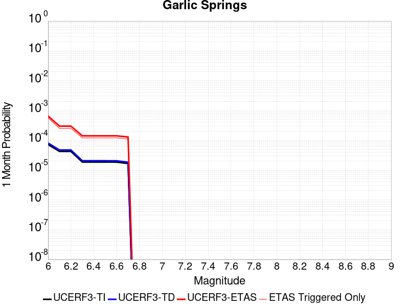 | 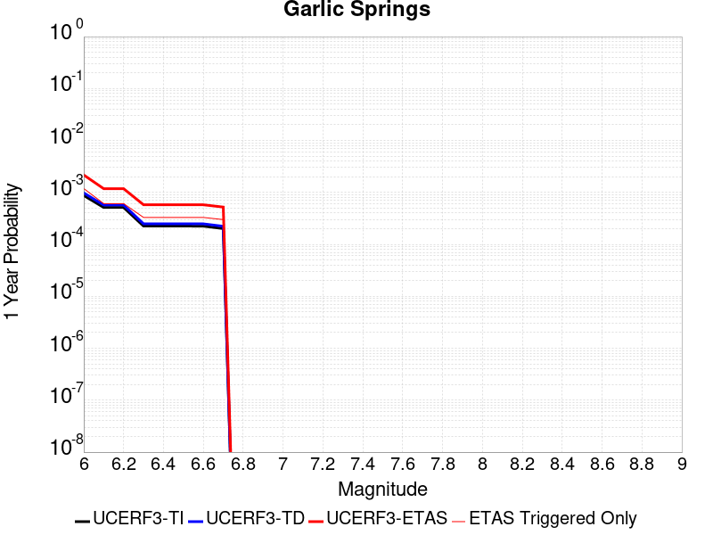 |  |

| Magnitude | 1 wk TI Prob | 1 wk TD Prob | 1 wk ETAS Prob | 1 wk ETAS/TD Gain | 1 wk ETAS Triggered Only | 1 mo TI Prob | 1 mo TD Prob | 1 mo ETAS Prob | 1 mo ETAS/TD Gain | 1 mo ETAS Triggered Only | 1 yr TI Prob | 1 yr TD Prob | 1 yr ETAS Prob | 1 yr ETAS/TD Gain | 1 yr ETAS Triggered Only | 10 yr TI Prob | 10 yr TD Prob | 10 yr ETAS Prob | 10 yr ETAS/TD Gain | 10 yr ETAS Triggered Only |
|-----|-----|-----|-----|-----|-----|-----|-----|-----|-----|-----|-----|-----|-----|-----|-----|-----|-----|-----|-----|-----|
| 6.0 | 1.6760017E-5 | 1.8776833E-5 | 4.3327681E-4 | 23.075075 | 4.1450778E-4 | 7.182667E-5 | 8.0470316E-5 | 7.5399125E-4 | 9.369805 | 6.7357515E-4 | 8.7413884E-4 | 9.794032E-4 | 0.0020146577 | 2.057026 | 0.0010362695 | 0.008707083 | 0.009762413 | 0.011917334 | 1.2207365 | 0.0021761658 |
| 6.1 | 9.852767E-6 | 1.09735865E-5 | 1.664123E-4 | 15.164804 | 1.5544042E-4 | 4.222546E-5 | 4.702921E-5 | 3.0608437E-4 | 6.508389 | 2.5906737E-4 | 5.139737E-4 | 5.7250116E-4 | 0.0010385554 | 1.8140669 | 4.6632125E-4 | 0.005127866 | 0.005717221 | 0.0069021177 | 1.2072505 | 0.0011917099 |
| 6.2 | 9.852767E-6 | 1.09735865E-5 | 1.664123E-4 | 15.164804 | 1.5544042E-4 | 4.222546E-5 | 4.702921E-5 | 3.0608437E-4 | 6.508389 | 2.5906737E-4 | 5.139737E-4 | 5.7250116E-4 | 0.0010385554 | 1.8140669 | 4.6632125E-4 | 0.005127866 | 0.005717221 | 0.0069021177 | 1.2072505 | 0.0011917099 |
| 6.3 | 4.3167724E-6 | 4.7780286E-6 | 5.6591252E-5 | 11.844059 | 5.1813473E-5 | 1.8500323E-5 | 2.0477235E-5 | 1.2410205E-4 | 6.060489 | 1.03626946E-4 | 2.2521814E-4 | 2.4930484E-4 | 4.5650706E-4 | 1.8311199 | 2.0725389E-4 | 0.0022499003 | 0.00249251 | 0.0030610375 | 1.2280945 | 5.6994817E-4 |
| 6.4 | 4.3167724E-6 | 4.7780286E-6 | 5.6591252E-5 | 11.844059 | 5.1813473E-5 | 1.8500323E-5 | 2.0477235E-5 | 1.2410205E-4 | 6.060489 | 1.03626946E-4 | 2.2521814E-4 | 2.4930484E-4 | 4.5650706E-4 | 1.8311199 | 2.0725389E-4 | 0.0022499003 | 0.00249251 | 0.0030610375 | 1.2280945 | 5.6994817E-4 |
| 6.5 | 4.3167724E-6 | 4.7780286E-6 | 5.6591252E-5 | 11.844059 | 5.1813473E-5 | 1.8500323E-5 | 2.0477235E-5 | 1.2410205E-4 | 6.060489 | 1.03626946E-4 | 2.2521814E-4 | 2.4930484E-4 | 4.5650706E-4 | 1.8311199 | 2.0725389E-4 | 0.0022499003 | 0.00249251 | 0.0030610375 | 1.2280945 | 5.6994817E-4 |
| 6.6 | 4.301311E-6 | 4.760897E-6 | 5.657412E-5 | 11.8830805 | 5.1813473E-5 | 1.8434059E-5 | 2.0403815E-5 | 1.2402864E-4 | 6.0786986 | 1.03626946E-4 | 2.2441156E-4 | 2.4841115E-4 | 4.5561357E-4 | 1.8341107 | 2.0725389E-4 | 0.0022418506 | 0.002483593 | 0.0030521257 | 1.2289153 | 5.6994817E-4 |
| 6.7 | 3.8599724E-6 | 4.27106E-6 | 5.608431E-5 | 13.13124 | 5.1813473E-5 | 1.6542634E-5 | 1.8304541E-5 | 1.2192959E-4 | 6.6611657 | 1.03626946E-4 | 2.0138794E-4 | 2.228578E-4 | 3.7826356E-4 | 1.6973315 | 1.5544042E-4 | 0.0020120554 | 0.002228578 | 0.00269386 | 1.2087798 | 4.6632125E-4 |

## San Andreas (San Bernardino S)
*[(top)](#table-of-contents)*

| 1 Week | 1 Month | 1 Year | 10 Year |
|-----|-----|-----|-----|
|  |  |  |  |

| Magnitude | 1 wk TI Prob | 1 wk TD Prob | 1 wk ETAS Prob | 1 wk ETAS/TD Gain | 1 wk ETAS Triggered Only | 1 mo TI Prob | 1 mo TD Prob | 1 mo ETAS Prob | 1 mo ETAS/TD Gain | 1 mo ETAS Triggered Only | 1 yr TI Prob | 1 yr TD Prob | 1 yr ETAS Prob | 1 yr ETAS/TD Gain | 1 yr ETAS Triggered Only | 10 yr TI Prob | 10 yr TD Prob | 10 yr ETAS Prob | 10 yr ETAS/TD Gain | 10 yr ETAS Triggered Only |
|-----|-----|-----|-----|-----|-----|-----|-----|-----|-----|-----|-----|-----|-----|-----|-----|-----|-----|-----|-----|-----|
| 6.0 | 1.2336002E-4 | 3.0004102E-4 | 8.698182E-4 | 2.8989975 | 5.6994817E-4 | 5.2857865E-4 | 0.0012852824 | 0.0019579919 | 1.5233942 | 6.7357515E-4 | 0.006416472 | 0.015540994 | 0.016714184 | 1.07549 | 0.0011917099 | 0.06234337 | 0.14283717 | 0.1443472 | 1.0105717 | 0.001761658 |
| 6.1 | 1.2336002E-4 | 3.0004102E-4 | 8.698182E-4 | 2.8989975 | 5.6994817E-4 | 5.2857865E-4 | 0.0012852824 | 0.0019579919 | 1.5233942 | 6.7357515E-4 | 0.006416472 | 0.015540994 | 0.016714184 | 1.07549 | 0.0011917099 | 0.06234337 | 0.14283717 | 0.1443472 | 1.0105717 | 0.001761658 |
| 6.2 | 1.2336002E-4 | 3.0004102E-4 | 8.698182E-4 | 2.8989975 | 5.6994817E-4 | 5.2857865E-4 | 0.0012852824 | 0.0019579919 | 1.5233942 | 6.7357515E-4 | 0.006416472 | 0.015540994 | 0.016714184 | 1.07549 | 0.0011917099 | 0.06234337 | 0.14283717 | 0.1443472 | 1.0105717 | 0.001761658 |
| 6.3 | 1.1712257E-4 | 2.8792414E-4 | 8.577082E-4 | 2.978938 | 5.6994817E-4 | 5.018573E-4 | 0.0012334028 | 0.0019061471 | 1.5454377 | 6.7357515E-4 | 0.006093008 | 0.014918125 | 0.016092056 | 1.0786916 | 0.0011917099 | 0.059286322 | 0.13754563 | 0.13906498 | 1.0110462 | 0.001761658 |
| 6.4 | 1.1712257E-4 | 2.8792414E-4 | 8.577082E-4 | 2.978938 | 5.6994817E-4 | 5.018573E-4 | 0.0012334028 | 0.0019061471 | 1.5454377 | 6.7357515E-4 | 0.006093008 | 0.014918125 | 0.016092056 | 1.0786916 | 0.0011917099 | 0.059286322 | 0.13754563 | 0.13906498 | 1.0110462 | 0.001761658 |
| 6.5 | 1.0689076E-4 | 2.680528E-4 | 8.3784823E-4 | 3.1256835 | 5.6994817E-4 | 4.5802278E-4 | 0.0011483167 | 0.0018211183 | 1.5859026 | 6.7357515E-4 | 0.0055621783 | 0.01389575 | 0.014968714 | 1.0772152 | 0.0010880829 | 0.05425003 | 0.12879294 | 0.1301923 | 1.0108651 | 0.0016062176 |
| 6.6 | 9.7648895E-5 | 2.50501E-4 | 8.203064E-4 | 3.2746632 | 5.6994817E-4 | 4.1842813E-4 | 0.0010731576 | 0.0017460099 | 1.6269836 | 6.7357515E-4 | 0.005082469 | 0.012991785 | 0.014065732 | 1.0826635 | 0.0010880829 | 0.049677886 | 0.12095292 | 0.12231931 | 1.0112969 | 0.0015544042 |
| 6.7 | 8.757013E-5 | 2.3120902E-4 | 8.010254E-4 | 3.4645076 | 5.6994817E-4 | 3.7524657E-4 | 9.905418E-4 | 0.0016634497 | 1.6793332 | 6.7357515E-4 | 0.00455906 | 0.011997245 | 0.013072274 | 1.0896063 | 0.0010880829 | 0.04466656 | 0.11226123 | 0.113595136 | 1.0118822 | 0.0015025907 |
| 6.8 | 8.562978E-5 | 2.2680782E-4 | 7.9662673E-4 | 3.5123425 | 5.6994817E-4 | 3.6693315E-4 | 9.7169366E-4 | 0.0016446143 | 1.6925235 | 6.7357515E-4 | 0.004458263 | 0.011770263 | 0.012794335 | 1.087005 | 0.0010362695 | 0.043698758 | 0.11027153 | 0.11156233 | 1.0117056 | 0.0014507772 |
| 6.9 | 6.124075E-5 | 1.7065753E-4 | 6.887038E-4 | 4.03559 | 5.1813474E-4 | 2.6243398E-4 | 7.311852E-4 | 0.0013524923 | 1.849726 | 6.2176166E-4 | 0.0031904527 | 0.008866051 | 0.009790424 | 1.1042598 | 9.326425E-4 | 0.031450346 | 0.08418263 | 0.08541638 | 1.0146556 | 0.0013471503 |
| 7.0 | 5.8598747E-5 | 1.649477E-4 | 6.8299694E-4 | 4.140688 | 5.1813474E-4 | 2.5111332E-4 | 7.06728E-4 | 0.0012762734 | 1.8058904 | 5.6994817E-4 | 0.0030530186 | 0.008570663 | 0.009443942 | 1.1018918 | 8.80829E-4 | 0.03011414 | 0.081500374 | 0.082690135 | 1.0145983 | 0.0012953368 |
| 7.1 | 5.613814E-5 | 1.5913323E-4 | 6.771855E-4 | 4.2554626 | 5.1813474E-4 | 2.4056983E-4 | 6.818221E-4 | 0.0012513816 | 1.8353493 | 5.6994817E-4 | 0.0029250039 | 0.008269769 | 0.009143313 | 1.1056311 | 8.80829E-4 | 0.028868021 | 0.07879931 | 0.07999258 | 1.015143 | 0.0012953368 |
| 7.2 | 4.991222E-5 | 1.4519796E-4 | 6.6325744E-4 | 4.567953 | 5.1813474E-4 | 2.1389198E-4 | 6.2212895E-4 | 0.0011917226 | 1.9155556 | 5.6994817E-4 | 0.002601025 | 0.007548217 | 0.008422397 | 1.1158128 | 8.80829E-4 | 0.025707912 | 0.07225321 | 0.073454954 | 1.0166324 | 0.0012953368 |
| 7.3 | 4.7410045E-5 | 1.3714004E-4 | 6.552037E-4 | 4.777625 | 5.1813474E-4 | 2.0317009E-4 | 5.8761094E-4 | 0.0011572242 | 1.9693714 | 5.6994817E-4 | 0.0024707897 | 0.0071307817 | 0.008005329 | 1.1226441 | 8.80829E-4 | 0.024434982 | 0.06853558 | 0.06974214 | 1.0176048 | 0.0012953368 |
| 7.4 | 4.5556746E-5 | 1.3121912E-4 | 6.4928585E-4 | 4.948104 | 5.1813474E-4 | 1.952286E-4 | 5.622468E-4 | 0.0011318745 | 2.0131276 | 5.6994817E-4 | 0.002374317 | 0.0068239477 | 0.007698766 | 1.1281983 | 8.80829E-4 | 0.023491086 | 0.065788016 | 0.06699813 | 1.0183942 | 0.0012953368 |
| 7.5 | 4.3084514E-5 | 1.2357246E-4 | 6.416432E-4 | 5.1924443 | 5.1813474E-4 | 1.8463485E-4 | 5.2948913E-4 | 0.0010991355 | 2.0758417 | 5.6994817E-4 | 0.0022456115 | 0.0064275465 | 0.007302714 | 1.1361588 | 8.80829E-4 | 0.022230545 | 0.062188786 | 0.06340357 | 1.0195338 | 0.0012953368 |
| 7.6 | 3.408608E-5 | 9.83552E-5 | 6.16439E-4 | 6.267477 | 5.1813474E-4 | 1.4607502E-4 | 4.214543E-4 | 9.911623E-4 | 2.351767 | 5.6994817E-4 | 0.0017770125 | 0.0051191594 | 0.005995479 | 1.1711843 | 8.80829E-4 | 0.017628696 | 0.050020292 | 0.051201615 | 1.0236169 | 0.0012435233 |
| 7.7 | 2.8315713E-5 | 8.248679E-5 | 5.4876955E-4 | 6.6528172 | 4.6632125E-4 | 1.2134742E-4 | 3.5346695E-4 | 8.714185E-4 | 2.4653466 | 5.1813474E-4 | 0.0014764034 | 0.0042949775 | 0.0051204325 | 1.1921908 | 8.2901557E-4 | 0.01466633 | 0.0422714 | 0.043412738 | 1.0270002 | 0.0011917099 |
| 7.8 | 2.6222975E-5 | 7.463088E-5 | 4.8910774E-4 | 6.553691 | 4.1450778E-4 | 1.1237934E-4 | 3.1980744E-4 | 7.8597956E-4 | 2.457665 | 4.6632125E-4 | 0.0013673597 | 0.0038867102 | 0.0046608914 | 1.1991868 | 7.772021E-4 | 0.013589768 | 0.03843674 | 0.039532825 | 1.0285165 | 0.0011398963 |
| 7.9 | 2.1469694E-5 | 5.787864E-5 | 4.2055195E-4 | 7.2660995 | 3.626943E-4 | 9.200973E-5 | 2.4802773E-4 | 6.624327E-4 | 2.670801 | 4.1450778E-4 | 0.0011196428 | 0.0030155594 | 0.0036871033 | 1.222693 | 6.7357515E-4 | 0.011140184 | 0.030152109 | 0.031106882 | 1.0316652 | 9.844559E-4 |
| 8.0 | 1.2420249E-5 | 3.131896E-5 | 1.3494266E-4 | 4.308657 | 1.03626946E-4 | 5.322855E-5 | 1.342172E-4 | 2.3783025E-4 | 1.7719803 | 1.03626946E-4 | 6.478649E-4 | 0.0016328706 | 0.001891515 | 1.1583985 | 2.5906737E-4 | 0.0064597935 | 0.016522504 | 0.016879205 | 1.0215888 | 3.626943E-4 |
| 8.1 | 4.9197724E-6 | 7.822348E-6 | 7.822348E-6 | 1.0 | 0.0 | 2.1084568E-5 | 3.352392E-5 | 3.352392E-5 | 1.0 | 0.0 | 2.566744E-4 | 4.0807744E-4 | 4.0807744E-4 | 1.0 | 0.0 | 0.002563781 | 0.0043843705 | 0.0044359565 | 1.011766 | 5.1813473E-5 |
| 8.2 | 2.5634774E-6 | 2.9067196E-6 | 2.9067196E-6 | 1.0 | 0.0 | 1.0986286E-5 | 1.2457311E-5 | 1.2457311E-5 | 1.0 | 0.0 | 1.3374983E-4 | 1.5165724E-4 | 1.5165724E-4 | 1.0 | 0.0 | 0.0013366934 | 0.0017049741 | 0.0017049741 | 1.0 | 0.0 |
| 8.3 | 5.2850464E-7 | 3.2088764E-7 | 3.2088764E-7 | 1.0 | 0.0 | 2.2650179E-6 | 1.375232E-6 | 1.375232E-6 | 1.0 | 0.0 | 2.7576245E-5 | 1.6743334E-5 | 1.6743334E-5 | 1.0 | 0.0 | 2.7572823E-4 | 1.9870348E-4 | 1.9870348E-4 | 1.0 | 0.0 |

## Death Valley (Black Mtns Frontal)
*[(top)](#table-of-contents)*

| 1 Week | 1 Month | 1 Year | 10 Year |
|-----|-----|-----|-----|
|  |  |  |  |

| Magnitude | 1 wk TI Prob | 1 wk TD Prob | 1 wk ETAS Prob | 1 wk ETAS/TD Gain | 1 wk ETAS Triggered Only | 1 mo TI Prob | 1 mo TD Prob | 1 mo ETAS Prob | 1 mo ETAS/TD Gain | 1 mo ETAS Triggered Only | 1 yr TI Prob | 1 yr TD Prob | 1 yr ETAS Prob | 1 yr ETAS/TD Gain | 1 yr ETAS Triggered Only | 10 yr TI Prob | 10 yr TD Prob | 10 yr ETAS Prob | 10 yr ETAS/TD Gain | 10 yr ETAS Triggered Only |
|-----|-----|-----|-----|-----|-----|-----|-----|-----|-----|-----|-----|-----|-----|-----|-----|-----|-----|-----|-----|-----|
| 6.0 | 1.6707214E-5 | 1.867027E-5 | 3.813578E-4 | 20.425941 | 3.626943E-4 | 7.160038E-5 | 8.001302E-5 | 5.4629694E-4 | 6.8276005 | 4.6632125E-4 | 8.71386E-4 | 9.737309E-4 | 0.0017501761 | 1.7973921 | 7.772021E-4 | 0.00867977 | 0.009695496 | 0.0110808965 | 1.142891 | 0.0013989637 |
| 6.1 | 1.6707214E-5 | 1.867027E-5 | 3.813578E-4 | 20.425941 | 3.626943E-4 | 7.160038E-5 | 8.001302E-5 | 5.4629694E-4 | 6.8276005 | 4.6632125E-4 | 8.71386E-4 | 9.737309E-4 | 0.0017501761 | 1.7973921 | 7.772021E-4 | 0.00867977 | 0.009695496 | 0.0110808965 | 1.142891 | 0.0013989637 |
| 6.2 | 1.6707214E-5 | 1.867027E-5 | 3.813578E-4 | 20.425941 | 3.626943E-4 | 7.160038E-5 | 8.001302E-5 | 5.4629694E-4 | 6.8276005 | 4.6632125E-4 | 8.71386E-4 | 9.737309E-4 | 0.0017501761 | 1.7973921 | 7.772021E-4 | 0.00867977 | 0.009695496 | 0.0110808965 | 1.142891 | 0.0013989637 |
| 6.3 | 1.6707214E-5 | 1.867027E-5 | 3.813578E-4 | 20.425941 | 3.626943E-4 | 7.160038E-5 | 8.001302E-5 | 5.4629694E-4 | 6.8276005 | 4.6632125E-4 | 8.71386E-4 | 9.737309E-4 | 0.0017501761 | 1.7973921 | 7.772021E-4 | 0.00867977 | 0.009695496 | 0.0110808965 | 1.142891 | 0.0013989637 |
| 6.4 | 1.5515609E-5 | 1.7338214E-5 | 3.2821365E-4 | 18.930073 | 3.1088083E-4 | 6.649377E-5 | 7.4304546E-5 | 4.8878154E-4 | 6.5780835 | 4.1450778E-4 | 8.0926094E-4 | 9.042885E-4 | 0.0015772545 | 1.7441939 | 6.7357515E-4 | 0.008063202 | 0.009006773 | 0.010136402 | 1.12542 | 0.0011398963 |
| 6.5 | 1.5515609E-5 | 1.7338214E-5 | 3.2821365E-4 | 18.930073 | 3.1088083E-4 | 6.649377E-5 | 7.4304546E-5 | 4.8878154E-4 | 6.5780835 | 4.1450778E-4 | 8.0926094E-4 | 9.042885E-4 | 0.0015772545 | 1.7441939 | 6.7357515E-4 | 0.008063202 | 0.009006773 | 0.010136402 | 1.12542 | 0.0011398963 |
| 6.6 | 1.5041828E-5 | 1.6809145E-5 | 3.2768474E-4 | 19.494432 | 3.1088083E-4 | 6.4463384E-5 | 7.203723E-5 | 4.8651514E-4 | 6.753662 | 4.1450778E-4 | 7.8455906E-4 | 8.767063E-4 | 0.0014979229 | 1.70858 | 6.2176166E-4 | 0.00781795 | 0.008733132 | 0.009811713 | 1.1235044 | 0.0010880829 |
| 6.7 | 1.4634985E-5 | 1.6356016E-5 | 2.7541912E-4 | 16.83901 | 2.5906737E-4 | 6.271985E-5 | 7.009536E-5 | 4.3276424E-4 | 6.1739354 | 3.626943E-4 | 7.6334673E-4 | 8.5308263E-4 | 0.0014225446 | 1.6675344 | 5.6994817E-4 | 0.007607299 | 0.008498715 | 0.009423432 | 1.1088066 | 9.326425E-4 |
| 6.8 | 1.4209158E-5 | 1.5882048E-5 | 2.7494528E-4 | 17.311703 | 2.5906737E-4 | 6.089497E-5 | 6.8064175E-5 | 4.3073378E-4 | 6.328348 | 3.626943E-4 | 7.4114406E-4 | 8.2837185E-4 | 0.0013460774 | 1.6249675 | 5.1813474E-4 | 0.007386771 | 0.008253456 | 0.0090756295 | 1.0996157 | 8.2901557E-4 |
| 6.9 | 1.3780098E-5 | 1.5404594E-5 | 2.2265529E-4 | 14.453825 | 2.0725389E-4 | 5.9056227E-5 | 6.6018045E-5 | 3.7687834E-4 | 5.7087173 | 3.1088083E-4 | 7.1877235E-4 | 8.0347876E-4 | 0.0012694253 | 1.5799115 | 4.6632125E-4 | 0.0071645193 | 0.008006332 | 0.008777312 | 1.0962962 | 7.772021E-4 |
| 7.0 | 1.3585064E-5 | 1.5188155E-5 | 2.2243889E-4 | 14.645551 | 2.0725389E-4 | 5.8220405E-5 | 6.50905E-5 | 3.759511E-4 | 5.775821 | 3.1088083E-4 | 7.086029E-4 | 7.9219416E-4 | 0.001258146 | 1.5881788 | 4.6632125E-4 | 0.007063476 | 0.007894293 | 0.0086653605 | 1.0976739 | 7.772021E-4 |
| 7.1 | 1.3398601E-5 | 1.49813395E-5 | 2.2223212E-4 | 14.833929 | 2.0725389E-4 | 5.742131E-5 | 6.420419E-5 | 3.7506505E-4 | 5.8417535 | 3.1088083E-4 | 6.9888023E-4 | 7.8141113E-4 | 0.0012473679 | 1.5963018 | 4.6632125E-4 | 0.0069668638 | 0.007787224 | 0.008558374 | 1.0990275 | 7.772021E-4 |
| 7.2 | 1.3126312E-5 | 1.4679561E-5 | 2.219304E-4 | 15.118327 | 2.0725389E-4 | 5.6254412E-5 | 6.291092E-5 | 3.737722E-4 | 5.941293 | 3.1088083E-4 | 6.846822E-4 | 7.6567667E-4 | 0.0012316409 | 1.6085652 | 4.6632125E-4 | 0.006825765 | 0.00763097 | 0.008402241 | 1.1010712 | 7.772021E-4 |
| 7.3 | 1.2922429E-5 | 1.4453788E-5 | 2.2170467E-4 | 15.338863 | 2.0725389E-4 | 5.5380664E-5 | 6.194336E-5 | 3.7280493E-4 | 6.0184803 | 3.1088083E-4 | 6.74051E-4 | 7.53905E-4 | 0.0012198746 | 1.6180749 | 4.6632125E-4 | 0.006720101 | 0.007514055 | 0.008233992 | 1.0958122 | 7.253886E-4 |
| 7.4 | 1.2768878E-5 | 1.4283772E-5 | 2.2153469E-4 | 15.509538 | 2.0725389E-4 | 5.4722615E-5 | 6.1214756E-5 | 3.7207655E-4 | 6.0782166 | 3.1088083E-4 | 6.660441E-4 | 7.4504025E-4 | 0.0012110141 | 1.6254344 | 4.6632125E-4 | 0.0066405144 | 0.0074260035 | 0.008146006 | 1.0969568 | 7.253886E-4 |
| 7.5 | 1.2521929E-5 | 1.40120155E-5 | 2.2126299E-4 | 15.790948 | 2.0725389E-4 | 5.366431E-5 | 6.005014E-5 | 3.709123E-4 | 6.1767097 | 3.1088083E-4 | 6.531671E-4 | 7.3087064E-4 | 0.001196851 | 1.637569 | 4.6632125E-4 | 0.006512506 | 0.0072852457 | 0.00800535 | 1.0988442 | 7.253886E-4 |
| 7.6 | 1.1301089E-5 | 1.2648149E-5 | 1.680866E-4 | 13.289423 | 1.5544042E-4 | 4.8432343E-5 | 5.4205255E-5 | 3.1325858E-4 | 5.779118 | 2.5906737E-4 | 5.895042E-4 | 6.5975444E-4 | 0.0010739887 | 1.6278613 | 4.1450778E-4 | 0.0058794282 | 0.00657851 | 0.0072476543 | 1.1017166 | 6.7357515E-4 |
| 7.7 | 9.189108E-6 | 1.0283358E-5 | 1.6572217E-4 | 16.11557 | 1.5544042E-4 | 3.93813E-5 | 4.407082E-5 | 2.5131556E-4 | 5.702539 | 2.0725389E-4 | 4.7936183E-4 | 5.3643517E-4 | 8.4714923E-4 | 1.5792202 | 3.1088083E-4 | 0.004783291 | 0.005351914 | 0.0058157393 | 1.0866654 | 4.6632125E-4 |
| 7.8 | 3.4586725E-7 | 3.6482615E-7 | 3.6482615E-7 | 1.0 | 0.0 | 1.4822873E-6 | 1.5635396E-6 | 5.337693E-5 | 34.13852 | 5.1813473E-5 | 1.80467E-5 | 1.9035933E-5 | 7.084842E-5 | 3.7218254 | 5.1813473E-5 | 1.8045233E-4 | 1.9034347E-4 | 2.4214709E-4 | 1.2721586 | 5.1813473E-5 |
| 7.9 | 2.5591178E-9 | 2.6696718E-9 | 2.6696718E-9 | 1.0 | 0.0 | 1.0967647E-8 | 1.14414505E-8 | 1.14414505E-8 | 1.0 | 0.0 | 1.335311E-7 | 1.3929966E-7 | 1.3929966E-7 | 1.0 | 0.0 | 1.3353102E-6 | 1.3929966E-6 | 1.3929966E-6 | 1.0 | 0.0 |

## Sierra Nevada  (No Extension)
*[(top)](#table-of-contents)*

| 1 Week | 1 Month | 1 Year | 10 Year |
|-----|-----|-----|-----|
|  |  |  |  |

| Magnitude | 1 wk TI Prob | 1 wk TD Prob | 1 wk ETAS Prob | 1 wk ETAS/TD Gain | 1 wk ETAS Triggered Only | 1 mo TI Prob | 1 mo TD Prob | 1 mo ETAS Prob | 1 mo ETAS/TD Gain | 1 mo ETAS Triggered Only | 1 yr TI Prob | 1 yr TD Prob | 1 yr ETAS Prob | 1 yr ETAS/TD Gain | 1 yr ETAS Triggered Only | 10 yr TI Prob | 10 yr TD Prob | 10 yr ETAS Prob | 10 yr ETAS/TD Gain | 10 yr ETAS Triggered Only |
|-----|-----|-----|-----|-----|-----|-----|-----|-----|-----|-----|-----|-----|-----|-----|-----|-----|-----|-----|-----|-----|
| 6.0 | 7.7690465E-6 | 6.976322E-6 | 5.2510743E-4 | 75.26996 | 5.1813474E-4 | 3.329549E-5 | 2.9898381E-5 | 5.480176E-4 | 18.32934 | 5.1813474E-4 | 4.0529718E-4 | 3.6398784E-4 | 9.855232E-4 | 2.7075717 | 6.2176166E-4 | 0.004045588 | 0.0036374326 | 0.0046183076 | 1.2696613 | 9.844559E-4 |
| 6.1 | 7.7690465E-6 | 6.976322E-6 | 5.2510743E-4 | 75.26996 | 5.1813474E-4 | 3.329549E-5 | 2.9898381E-5 | 5.480176E-4 | 18.32934 | 5.1813474E-4 | 4.0529718E-4 | 3.6398784E-4 | 9.855232E-4 | 2.7075717 | 6.2176166E-4 | 0.004045588 | 0.0036374326 | 0.0046183076 | 1.2696613 | 9.844559E-4 |
| 6.2 | 7.7690465E-6 | 6.976322E-6 | 5.2510743E-4 | 75.26996 | 5.1813474E-4 | 3.329549E-5 | 2.9898381E-5 | 5.480176E-4 | 18.32934 | 5.1813474E-4 | 4.0529718E-4 | 3.6398784E-4 | 9.855232E-4 | 2.7075717 | 6.2176166E-4 | 0.004045588 | 0.0036374326 | 0.0046183076 | 1.2696613 | 9.844559E-4 |
| 6.3 | 7.7690465E-6 | 6.976322E-6 | 5.2510743E-4 | 75.26996 | 5.1813474E-4 | 3.329549E-5 | 2.9898381E-5 | 5.480176E-4 | 18.32934 | 5.1813474E-4 | 4.0529718E-4 | 3.6398784E-4 | 9.855232E-4 | 2.7075717 | 6.2176166E-4 | 0.004045588 | 0.0036374326 | 0.0046183076 | 1.2696613 | 9.844559E-4 |
| 6.4 | 7.7690465E-6 | 6.976322E-6 | 5.2510743E-4 | 75.26996 | 5.1813474E-4 | 3.329549E-5 | 2.9898381E-5 | 5.480176E-4 | 18.32934 | 5.1813474E-4 | 4.0529718E-4 | 3.6398784E-4 | 9.855232E-4 | 2.7075717 | 6.2176166E-4 | 0.004045588 | 0.0036374326 | 0.0046183076 | 1.2696613 | 9.844559E-4 |
| 6.5 | 7.7690465E-6 | 6.976322E-6 | 5.2510743E-4 | 75.26996 | 5.1813474E-4 | 3.329549E-5 | 2.9898381E-5 | 5.480176E-4 | 18.32934 | 5.1813474E-4 | 4.0529718E-4 | 3.6398784E-4 | 9.855232E-4 | 2.7075717 | 6.2176166E-4 | 0.004045588 | 0.0036374326 | 0.0046183076 | 1.2696613 | 9.844559E-4 |
| 6.6 | 2.653E-6 | 1.614854E-6 | 4.1612197E-4 | 257.68396 | 4.1450778E-4 | 1.136995E-5 | 6.9207845E-6 | 4.2142568E-4 | 60.89276 | 4.1450778E-4 | 1.3842035E-4 | 8.425733E-5 | 6.0234836E-4 | 7.148914 | 5.1813474E-4 | 0.0013833415 | 8.422573E-4 | 0.0017223444 | 2.044915 | 8.80829E-4 |
| 6.7 | 2.5902466E-6 | 1.5501876E-6 | 4.1605733E-4 | 268.3916 | 4.1450778E-4 | 1.11010095E-5 | 6.643644E-6 | 4.2114867E-4 | 63.391212 | 4.1450778E-4 | 1.351464E-4 | 8.0883394E-5 | 5.989762E-4 | 7.4054284 | 5.1813474E-4 | 0.0013506424 | 8.0854254E-4 | 0.0016886593 | 2.0885227 | 8.80829E-4 |
| 6.8 | 2.5853892E-6 | 1.5469877E-6 | 4.1605413E-4 | 268.94467 | 4.1450778E-4 | 1.1080193E-5 | 6.629931E-6 | 4.2113496E-4 | 63.520264 | 4.1450778E-4 | 1.34893E-4 | 8.071645E-5 | 5.9880933E-4 | 7.4186783 | 5.1813474E-4 | 0.0013481114 | 8.068743E-4 | 0.0016869926 | 2.090775 | 8.80829E-4 |
| 6.9 | 2.458257E-6 | 1.4220619E-6 | 4.1592924E-4 | 292.48322 | 4.1450778E-4 | 1.0535345E-5 | 6.094537E-6 | 4.205998E-4 | 69.01259 | 4.1450778E-4 | 1.2826028E-4 | 7.4198484E-5 | 5.9229473E-4 | 7.982572 | 5.1813474E-4 | 0.0012818627 | 7.4173906E-4 | 0.0016219147 | 2.1866379 | 8.80829E-4 |
| 7.0 | 2.4341468E-6 | 1.3990258E-6 | 4.1590622E-4 | 297.28275 | 4.1450778E-4 | 1.0432016E-5 | 5.9958115E-6 | 4.205011E-4 | 70.13248 | 4.1450778E-4 | 1.270024E-4 | 7.2996576E-5 | 5.9109344E-4 | 8.09755 | 5.1813474E-4 | 0.0012692984 | 7.297279E-4 | 0.0016099141 | 2.2061841 | 8.80829E-4 |
| 7.1 | 2.3652476E-6 | 1.3339754E-6 | 4.158412E-4 | 311.73077 | 4.1450778E-4 | 1.0136736E-5 | 5.717025E-6 | 4.2022244E-4 | 73.503685 | 4.1450778E-4 | 1.2340778E-4 | 6.9602575E-5 | 5.877012E-4 | 8.443671 | 5.1813474E-4 | 0.0012333926 | 6.9580943E-4 | 0.0015760256 | 2.2650247 | 8.80829E-4 |
| 7.2 | 2.272158E-6 | 1.2502821E-6 | 4.1575753E-4 | 332.53098 | 4.1450778E-4 | 9.737784E-6 | 5.3583412E-6 | 4.1986388E-4 | 78.35706 | 4.1450778E-4 | 1.1855107E-4 | 6.5235865E-5 | 5.833368E-4 | 8.941964 | 5.1813474E-4 | 0.0011848784 | 6.5216864E-4 | 0.0015324232 | 2.3497345 | 8.80829E-4 |
| 7.3 | 2.1382127E-6 | 1.1419703E-6 | 3.6383586E-4 | 318.6036 | 3.626943E-4 | 9.163737E-6 | 4.8941492E-6 | 3.6758668E-4 | 75.10737 | 3.626943E-4 | 1.1156279E-4 | 5.958465E-5 | 5.258781E-4 | 8.825731 | 4.6632125E-4 | 0.001115068 | 5.956879E-4 | 0.0014242096 | 2.3908653 | 8.2901557E-4 |
| 7.4 | 1.9048055E-6 | 9.575242E-7 | 3.1183806E-4 | 325.67117 | 3.1088083E-4 | 8.163426E-6 | 4.1036687E-6 | 3.1498322E-4 | 76.75649 | 3.1088083E-4 | 9.9385186E-5 | 4.996103E-5 | 4.644481E-4 | 9.296207 | 4.1450778E-4 | 9.934074E-4 | 4.994987E-4 | 0.0012245249 | 2.4515078 | 7.253886E-4 |
| 7.5 | 1.5373403E-6 | 7.560042E-7 | 2.0800973E-4 | 275.14362 | 2.0725389E-4 | 6.5885843E-6 | 3.2400142E-6 | 2.1049324E-4 | 64.96676 | 2.0725389E-4 | 8.021306E-5 | 3.9446462E-5 | 3.5031504E-4 | 8.880772 | 3.1088083E-4 | 8.0184115E-4 | 3.943951E-4 | 9.6411846E-4 | 2.44455 | 5.6994817E-4 |
| 7.6 | 1.0680322E-6 | 4.6596554E-7 | 4.6596554E-7 | 1.0 | 0.0 | 4.577273E-6 | 1.9969937E-6 | 1.9969937E-6 | 1.0 | 0.0 | 5.5726876E-5 | 2.4313129E-5 | 2.4313129E-5 | 1.0 | 0.0 | 5.5712904E-4 | 2.4310495E-4 | 4.5030846E-4 | 1.8523211 | 2.0725389E-4 |
| 7.7 | 5.509146E-7 | 1.5580486E-7 | 1.5580486E-7 | 1.0 | 0.0 | 2.3610605E-6 | 6.677349E-7 | 6.677349E-7 | 1.0 | 0.0 | 2.8745531E-5 | 8.129644E-6 | 8.129644E-6 | 1.0 | 0.0 | 2.8741814E-4 | 8.1293576E-5 | 1.849121E-4 | 2.2746212 | 1.03626946E-4 |

## Coyote Lake
*[(top)](#table-of-contents)*

| 1 Week | 1 Month | 1 Year | 10 Year |
|-----|-----|-----|-----|
|  |  |  | 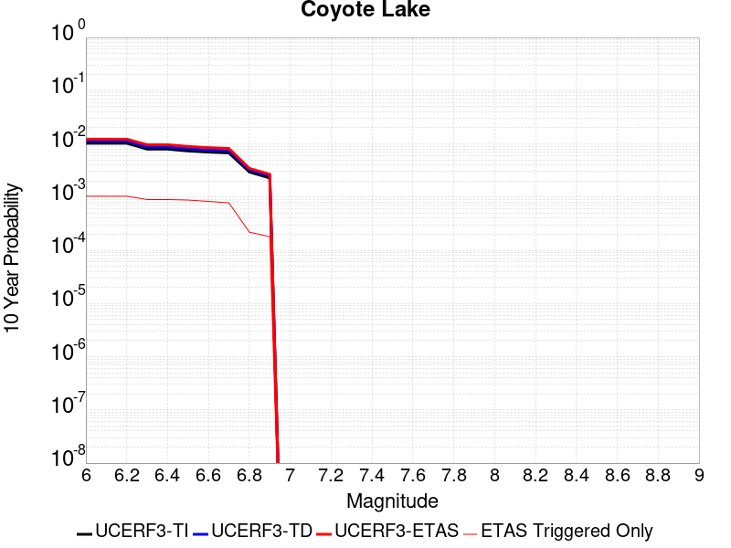 |

| Magnitude | 1 wk TI Prob | 1 wk TD Prob | 1 wk ETAS Prob | 1 wk ETAS/TD Gain | 1 wk ETAS Triggered Only | 1 mo TI Prob | 1 mo TD Prob | 1 mo ETAS Prob | 1 mo ETAS/TD Gain | 1 mo ETAS Triggered Only | 1 yr TI Prob | 1 yr TD Prob | 1 yr ETAS Prob | 1 yr ETAS/TD Gain | 1 yr ETAS Triggered Only | 10 yr TI Prob | 10 yr TD Prob | 10 yr ETAS Prob | 10 yr ETAS/TD Gain | 10 yr ETAS Triggered Only |
|-----|-----|-----|-----|-----|-----|-----|-----|-----|-----|-----|-----|-----|-----|-----|-----|-----|-----|-----|-----|-----|
| 6.0 | 1.980352E-5 | 2.1706745E-5 | 3.3258082E-4 | 15.321543 | 3.1088083E-4 | 8.486947E-5 | 9.302599E-5 | 4.5568656E-4 | 4.898486 | 3.626943E-4 | 0.0010327959 | 0.0011320751 | 0.0017531328 | 1.5486013 | 6.2176166E-4 | 0.010280091 | 0.011270258 | 0.012397308 | 1.100002 | 0.0011398963 |
| 6.1 | 1.980352E-5 | 2.1706745E-5 | 3.3258082E-4 | 15.321543 | 3.1088083E-4 | 8.486947E-5 | 9.302599E-5 | 4.5568656E-4 | 4.898486 | 3.626943E-4 | 0.0010327959 | 0.0011320751 | 0.0017531328 | 1.5486013 | 6.2176166E-4 | 0.010280091 | 0.011270258 | 0.012397308 | 1.100002 | 0.0011398963 |
| 6.2 | 1.980352E-5 | 2.1706745E-5 | 3.3258082E-4 | 15.321543 | 3.1088083E-4 | 8.486947E-5 | 9.302599E-5 | 4.5568656E-4 | 4.898486 | 3.626943E-4 | 0.0010327959 | 0.0011320751 | 0.0017531328 | 1.5486013 | 6.2176166E-4 | 0.010280091 | 0.011270258 | 0.012397308 | 1.100002 | 0.0011398963 |
| 6.3 | 1.5344787E-5 | 1.682067E-5 | 2.2407107E-4 | 13.321175 | 2.0725389E-4 | 6.576172E-5 | 7.2086936E-5 | 3.311356E-4 | 4.5935593 | 2.5906737E-4 | 8.003548E-4 | 8.773662E-4 | 0.0013950464 | 1.5900388 | 5.1813474E-4 | 0.007974784 | 0.00874507 | 0.009720916 | 1.1115882 | 9.844559E-4 |
| 6.4 | 1.5344787E-5 | 1.682067E-5 | 2.2407107E-4 | 13.321175 | 2.0725389E-4 | 6.576172E-5 | 7.2086936E-5 | 3.311356E-4 | 4.5935593 | 2.5906737E-4 | 8.003548E-4 | 8.773662E-4 | 0.0013950464 | 1.5900388 | 5.1813474E-4 | 0.007974784 | 0.00874507 | 0.009720916 | 1.1115882 | 9.844559E-4 |
| 6.5 | 1.4189697E-5 | 1.5557987E-5 | 2.2280865E-4 | 14.321175 | 2.0725389E-4 | 6.081157E-5 | 6.6675726E-5 | 3.257258E-4 | 4.8852234 | 2.5906737E-4 | 7.401293E-4 | 8.115349E-4 | 0.0012774777 | 1.5741501 | 4.6632125E-4 | 0.0073766913 | 0.008091656 | 0.009016752 | 1.1143272 | 9.326425E-4 |
| 6.6 | 1.3469301E-5 | 1.4771577E-5 | 2.220224E-4 | 15.030378 | 2.0725389E-4 | 5.7724297E-5 | 6.330556E-5 | 3.2235653E-4 | 5.0920725 | 2.5906737E-4 | 7.025667E-4 | 7.7053264E-4 | 0.0012364945 | 1.604727 | 4.6632125E-4 | 0.0070034964 | 0.0076845144 | 0.00860999 | 1.1204338 | 9.326425E-4 |
| 6.7 | 1.3027966E-5 | 1.4281745E-5 | 2.2153267E-4 | 15.511597 | 2.0725389E-4 | 5.5832945E-5 | 6.120638E-5 | 3.2025788E-4 | 5.2324266 | 2.5906737E-4 | 6.7955407E-4 | 7.4499263E-4 | 0.0011591916 | 1.5559772 | 4.1450778E-4 | 0.006774798 | 0.0074308286 | 0.008253684 | 1.1107353 | 8.2901557E-4 |
| 6.8 | 5.695434E-6 | 6.2244176E-6 | 5.8037567E-5 | 9.324176 | 5.1813473E-5 | 2.4408775E-5 | 2.6675973E-5 | 7.848806E-5 | 2.9422755 | 5.1813473E-5 | 2.971363E-4 | 3.2476155E-4 | 4.8015147E-4 | 1.4784739 | 1.5544042E-4 | 0.0029673933 | 0.0032458105 | 0.003504037 | 1.0795568 | 2.5906737E-4 |
| 6.9 | 4.385688E-6 | 4.7930553E-6 | 5.6606277E-5 | 11.810061 | 5.1813473E-5 | 1.879567E-5 | 2.0541665E-5 | 7.235407E-5 | 3.5223079 | 5.1813473E-5 | 2.2881327E-4 | 2.5009477E-4 | 4.0549634E-4 | 1.6213706 | 1.5544042E-4 | 0.002285778 | 0.0025009478 | 0.0027076835 | 1.0826629 | 2.0725389E-4 |

## San Andreas (Big Bend)
*[(top)](#table-of-contents)*

| 1 Week | 1 Month | 1 Year | 10 Year |
|-----|-----|-----|-----|
|  |  |  |  |

| Magnitude | 1 wk TI Prob | 1 wk TD Prob | 1 wk ETAS Prob | 1 wk ETAS/TD Gain | 1 wk ETAS Triggered Only | 1 mo TI Prob | 1 mo TD Prob | 1 mo ETAS Prob | 1 mo ETAS/TD Gain | 1 mo ETAS Triggered Only | 1 yr TI Prob | 1 yr TD Prob | 1 yr ETAS Prob | 1 yr ETAS/TD Gain | 1 yr ETAS Triggered Only | 10 yr TI Prob | 10 yr TD Prob | 10 yr ETAS Prob | 10 yr ETAS/TD Gain | 10 yr ETAS Triggered Only |
|-----|-----|-----|-----|-----|-----|-----|-----|-----|-----|-----|-----|-----|-----|-----|-----|-----|-----|-----|-----|-----|
| 6.0 | 1.0179969E-4 | 2.0072258E-4 | 5.1154103E-4 | 2.5484974 | 3.1088083E-4 | 4.362114E-4 | 8.599571E-4 | 0.0012223395 | 1.4213959 | 3.626943E-4 | 0.0052979486 | 0.010419999 | 0.010984008 | 1.0541276 | 5.6994817E-4 | 0.051734097 | 0.10144902 | 0.102333605 | 1.0087194 | 9.844559E-4 |
| 6.1 | 1.0179969E-4 | 2.0072258E-4 | 5.1154103E-4 | 2.5484974 | 3.1088083E-4 | 4.362114E-4 | 8.599571E-4 | 0.0012223395 | 1.4213959 | 3.626943E-4 | 0.0052979486 | 0.010419999 | 0.010984008 | 1.0541276 | 5.6994817E-4 | 0.051734097 | 0.10144902 | 0.102333605 | 1.0087194 | 9.844559E-4 |
| 6.2 | 1.0179969E-4 | 2.0072258E-4 | 5.1154103E-4 | 2.5484974 | 3.1088083E-4 | 4.362114E-4 | 8.599571E-4 | 0.0012223395 | 1.4213959 | 3.626943E-4 | 0.0052979486 | 0.010419999 | 0.010984008 | 1.0541276 | 5.6994817E-4 | 0.051734097 | 0.10144902 | 0.102333605 | 1.0087194 | 9.844559E-4 |
| 6.3 | 1.0179969E-4 | 2.0072258E-4 | 5.1154103E-4 | 2.5484974 | 3.1088083E-4 | 4.362114E-4 | 8.599571E-4 | 0.0012223395 | 1.4213959 | 3.626943E-4 | 0.0052979486 | 0.010419999 | 0.010984008 | 1.0541276 | 5.6994817E-4 | 0.051734097 | 0.10144902 | 0.102333605 | 1.0087194 | 9.844559E-4 |
| 6.4 | 9.1639464E-5 | 1.8429532E-4 | 4.4331493E-4 | 2.4054594 | 2.5906737E-4 | 3.9268145E-4 | 7.895982E-4 | 0.0010484611 | 1.3278412 | 2.5906737E-4 | 0.0047704205 | 0.009571102 | 0.009930325 | 1.0375321 | 3.626943E-4 | 0.046693064 | 0.09377527 | 0.09429178 | 1.0055078 | 5.6994817E-4 |
| 6.5 | 9.1639464E-5 | 1.8429532E-4 | 4.4331493E-4 | 2.4054594 | 2.5906737E-4 | 3.9268145E-4 | 7.895982E-4 | 0.0010484611 | 1.3278412 | 2.5906737E-4 | 0.0047704205 | 0.009571102 | 0.009930325 | 1.0375321 | 3.626943E-4 | 0.046693064 | 0.09377527 | 0.09429178 | 1.0055078 | 5.6994817E-4 |
| 6.6 | 9.042622E-5 | 1.823659E-4 | 3.8958198E-4 | 2.1362655 | 2.0725389E-4 | 3.8748336E-4 | 7.8133424E-4 | 9.884263E-4 | 1.2650491 | 2.0725389E-4 | 0.0047074095 | 0.009471365 | 0.0097793015 | 1.0325123 | 3.1088083E-4 | 0.046089325 | 0.092869274 | 0.093339294 | 1.005061 | 5.1813474E-4 |
| 6.7 | 8.9836685E-5 | 1.8150927E-4 | 3.8872554E-4 | 2.1416292 | 2.0725389E-4 | 3.8495753E-4 | 7.776651E-4 | 9.847578E-4 | 1.2663007 | 2.0725389E-4 | 0.00467679 | 0.00942708 | 0.00973503 | 1.0326666 | 3.1088083E-4 | 0.045795817 | 0.09246355 | 0.09288675 | 1.0045769 | 4.6632125E-4 |
| 6.8 | 8.9471854E-5 | 1.8097709E-4 | 3.8819347E-4 | 2.1449869 | 2.0725389E-4 | 3.8339442E-4 | 7.7538576E-4 | 9.82479E-4 | 1.2670841 | 2.0725389E-4 | 0.004657841 | 0.009399569 | 0.009707527 | 1.0327631 | 3.1088083E-4 | 0.04561414 | 0.092210755 | 0.09263408 | 1.0045907 | 4.6632125E-4 |
| 6.9 | 8.858234E-5 | 1.7979681E-4 | 3.8701345E-4 | 2.1525044 | 2.0725389E-4 | 3.7958333E-4 | 7.703304E-4 | 9.774247E-4 | 1.2688382 | 2.0725389E-4 | 0.004611638 | 0.009338548 | 0.009646527 | 1.0329791 | 3.1088083E-4 | 0.04517103 | 0.09165087 | 0.092074454 | 1.0046217 | 4.6632125E-4 |
| 7.0 | 8.7433385E-5 | 1.7818481E-4 | 3.3359753E-4 | 1.8721995 | 1.5544042E-4 | 3.746607E-4 | 7.634259E-4 | 9.187476E-4 | 1.2034535 | 1.5544042E-4 | 0.004551957 | 0.009255203 | 0.009511873 | 1.0277325 | 2.5906737E-4 | 0.044598386 | 0.09088532 | 0.091262154 | 1.0041462 | 4.1450778E-4 |
| 7.1 | 8.684964E-5 | 1.7730435E-4 | 3.327172E-4 | 1.8765315 | 1.5544042E-4 | 3.7215967E-4 | 7.596547E-4 | 9.1497705E-4 | 1.2044644 | 1.5544042E-4 | 0.0045216335 | 0.009209678 | 0.009466359 | 1.0278709 | 2.5906737E-4 | 0.04430731 | 0.09046686 | 0.09084387 | 1.0041673 | 4.1450778E-4 |
| 7.2 | 8.606521E-5 | 1.762105E-4 | 2.7981919E-4 | 1.5879824 | 1.03626946E-4 | 3.6879873E-4 | 7.549695E-4 | 8.585182E-4 | 1.1371561 | 1.03626946E-4 | 0.0044808835 | 0.0091531165 | 0.009358473 | 1.0224358 | 2.0725389E-4 | 0.043916024 | 0.089947365 | 0.09027744 | 1.0036696 | 3.626943E-4 |
| 7.3 | 8.568266E-5 | 1.7563057E-4 | 2.7923932E-4 | 1.5899243 | 1.03626946E-4 | 3.6715972E-4 | 7.524855E-4 | 8.5603446E-4 | 1.1376092 | 1.03626946E-4 | 0.0044610105 | 0.009123127 | 0.00932849 | 1.0225102 | 2.0725389E-4 | 0.043725148 | 0.08966853 | 0.0899987 | 1.0036821 | 3.626943E-4 |
| 7.4 | 8.5432206E-5 | 1.7525644E-4 | 2.7886522E-4 | 1.5911839 | 1.03626946E-4 | 3.6608664E-4 | 7.50883E-4 | 8.544322E-4 | 1.1379031 | 1.03626946E-4 | 0.004447999 | 0.009103781 | 0.0093091475 | 1.0225585 | 2.0725389E-4 | 0.043600157 | 0.08948871 | 0.08981895 | 1.0036902 | 3.626943E-4 |
| 7.5 | 8.4791965E-5 | 1.7394972E-4 | 2.7755863E-4 | 1.5956256 | 1.03626946E-4 | 3.633435E-4 | 7.4528606E-4 | 8.4883574E-4 | 1.1389395 | 1.03626946E-4 | 0.0044147377 | 0.009036204 | 0.009241586 | 1.0227287 | 2.0725389E-4 | 0.043280575 | 0.088866346 | 0.08919681 | 1.0037186 | 3.626943E-4 |
| 7.6 | 8.241105E-5 | 1.6840403E-4 | 2.7201354E-4 | 1.6152436 | 1.03626946E-4 | 3.531424E-4 | 7.215321E-4 | 8.250843E-4 | 1.143517 | 1.03626946E-4 | 0.0042910352 | 0.008749358 | 0.008954799 | 1.0234807 | 2.0725389E-4 | 0.042091176 | 0.086243294 | 0.08657471 | 1.0038428 | 3.626943E-4 |
| 7.7 | 7.00432E-5 | 1.42045E-4 | 2.4565723E-4 | 1.7294323 | 1.03626946E-4 | 3.001506E-4 | 6.0862233E-4 | 7.121862E-4 | 1.1701611 | 1.03626946E-4 | 0.0036482112 | 0.0073848404 | 0.0075905635 | 1.0278575 | 2.0725389E-4 | 0.035888977 | 0.07351733 | 0.07385336 | 1.0045707 | 3.626943E-4 |
| 7.8 | 6.415362E-5 | 1.2968935E-4 | 2.3330284E-4 | 1.7989361 | 1.03626946E-4 | 2.749151E-4 | 5.556931E-4 | 6.5926247E-4 | 1.1863787 | 1.03626946E-4 | 0.0033419547 | 0.0067446055 | 0.006898998 | 1.0228912 | 1.5544042E-4 | 0.03292141 | 0.06725231 | 0.06754228 | 1.0043117 | 3.1088083E-4 |
| 7.9 | 4.939911E-5 | 9.3411545E-5 | 1.970288E-4 | 2.1092556 | 1.03626946E-4 | 2.116933E-4 | 4.0027377E-4 | 5.0385925E-4 | 1.2587866 | 1.03626946E-4 | 0.0025743195 | 0.004862453 | 0.005017137 | 1.0318121 | 1.5544042E-4 | 0.025447013 | 0.048914436 | 0.049111553 | 1.0040299 | 2.0725389E-4 |
| 8.0 | 3.344983E-5 | 5.222685E-5 | 1.04037616E-4 | 1.9920331 | 5.1813473E-5 | 1.4334853E-4 | 2.2381016E-4 | 2.7561205E-4 | 1.2314545 | 5.1813473E-5 | 0.0017438711 | 0.0027214854 | 0.0028248304 | 1.0379738 | 1.03626946E-4 | 0.017302496 | 0.027922187 | 0.028073289 | 1.0054115 | 1.5544042E-4 |
| 8.1 | 1.9104898E-5 | 1.9173063E-5 | 7.0985545E-5 | 3.7023578 | 5.1813473E-5 | 8.1875565E-5 | 8.216769E-5 | 1.3397691E-4 | 1.6305302 | 5.1813473E-5 | 9.963791E-4 | 9.999331E-4 | 0.0010516947 | 1.0517651 | 5.1813473E-5 | 0.009919235 | 0.010749801 | 0.010852314 | 1.0095363 | 1.03626946E-4 |
| 8.2 | 8.643924E-6 | 5.4748625E-6 | 5.4748625E-6 | 1.0 | 0.0 | 3.704486E-5 | 2.3463486E-5 | 2.3463486E-5 | 1.0 | 0.0 | 4.5092785E-4 | 2.8563058E-4 | 2.8563058E-4 | 1.0 | 0.0 | 0.0045001395 | 0.0032487072 | 0.0032487072 | 1.0 | 0.0 |
| 8.3 | 1.983087E-6 | 7.6599065E-7 | 7.6599065E-7 | 1.0 | 0.0 | 8.498917E-6 | 3.282813E-6 | 3.282813E-6 | 1.0 | 0.0 | 1.034694E-4 | 3.9967534E-5 | 3.9967534E-5 | 1.0 | 0.0 | 0.0010342124 | 4.719687E-4 | 4.719687E-4 | 1.0 | 0.0 |

## San Andreas (San Gorgonio Pass-Garnet HIll)
*[(top)](#table-of-contents)*

| 1 Week | 1 Month | 1 Year | 10 Year |
|-----|-----|-----|-----|
|  |  |  | 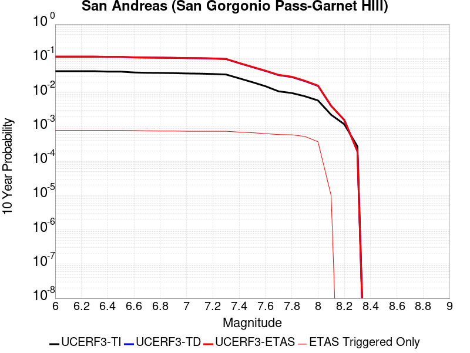 |

| Magnitude | 1 wk TI Prob | 1 wk TD Prob | 1 wk ETAS Prob | 1 wk ETAS/TD Gain | 1 wk ETAS Triggered Only | 1 mo TI Prob | 1 mo TD Prob | 1 mo ETAS Prob | 1 mo ETAS/TD Gain | 1 mo ETAS Triggered Only | 1 yr TI Prob | 1 yr TD Prob | 1 yr ETAS Prob | 1 yr ETAS/TD Gain | 1 yr ETAS Triggered Only | 10 yr TI Prob | 10 yr TD Prob | 10 yr ETAS Prob | 10 yr ETAS/TD Gain | 10 yr ETAS Triggered Only |
|-----|-----|-----|-----|-----|-----|-----|-----|-----|-----|-----|-----|-----|-----|-----|-----|-----|-----|-----|-----|-----|
| 6.0 | 8.31567E-5 | 2.3382473E-4 | 5.4463284E-4 | 2.3292356 | 3.1088083E-4 | 3.5633717E-4 | 0.0010017233 | 0.0013640544 | 1.3617076 | 3.626943E-4 | 0.004329778 | 0.012127888 | 0.01284448 | 1.0590862 | 7.253886E-4 | 0.042463828 | 0.11257892 | 0.11340656 | 1.0073518 | 9.326425E-4 |
| 6.1 | 8.31567E-5 | 2.3382473E-4 | 5.4463284E-4 | 2.3292356 | 3.1088083E-4 | 3.5633717E-4 | 0.0010017233 | 0.0013640544 | 1.3617076 | 3.626943E-4 | 0.004329778 | 0.012127888 | 0.01284448 | 1.0590862 | 7.253886E-4 | 0.042463828 | 0.11257892 | 0.11340656 | 1.0073518 | 9.326425E-4 |
| 6.2 | 8.31567E-5 | 2.3382473E-4 | 5.4463284E-4 | 2.3292356 | 3.1088083E-4 | 3.5633717E-4 | 0.0010017233 | 0.0013640544 | 1.3617076 | 3.626943E-4 | 0.004329778 | 0.012127888 | 0.01284448 | 1.0590862 | 7.253886E-4 | 0.042463828 | 0.11257892 | 0.11340656 | 1.0073518 | 9.326425E-4 |
| 6.3 | 8.31567E-5 | 2.3382473E-4 | 5.4463284E-4 | 2.3292356 | 3.1088083E-4 | 3.5633717E-4 | 0.0010017233 | 0.0013640544 | 1.3617076 | 3.626943E-4 | 0.004329778 | 0.012127888 | 0.01284448 | 1.0590862 | 7.253886E-4 | 0.042463828 | 0.11257892 | 0.11340656 | 1.0073518 | 9.326425E-4 |
| 6.4 | 8.059055E-5 | 2.2940808E-4 | 5.402176E-4 | 2.3548324 | 3.1088083E-4 | 3.4534236E-4 | 9.828096E-4 | 0.0013451474 | 1.3686756 | 3.626943E-4 | 0.0041964394 | 0.011900152 | 0.012616908 | 1.0602309 | 7.253886E-4 | 0.041180745 | 0.11056015 | 0.111389674 | 1.0075029 | 9.326425E-4 |
| 6.5 | 8.059055E-5 | 2.2940808E-4 | 5.402176E-4 | 2.3548324 | 3.1088083E-4 | 3.4534236E-4 | 9.828096E-4 | 0.0013451474 | 1.3686756 | 3.626943E-4 | 0.0041964394 | 0.011900152 | 0.012616908 | 1.0602309 | 7.253886E-4 | 0.041180745 | 0.11056015 | 0.111389674 | 1.0075029 | 9.326425E-4 |
| 6.6 | 7.619237E-5 | 2.218517E-4 | 5.3266354E-4 | 2.4009893 | 3.1088083E-4 | 3.2649786E-4 | 9.5044886E-4 | 0.0013127985 | 1.3812405 | 3.626943E-4 | 0.0039678677 | 0.01151087 | 0.012227909 | 1.0622923 | 7.253886E-4 | 0.03897764 | 0.10709683 | 0.10792959 | 1.0077758 | 9.326425E-4 |
| 6.7 | 7.440636E-5 | 2.1860997E-4 | 5.2942283E-4 | 2.421769 | 3.1088083E-4 | 3.188454E-4 | 9.3656575E-4 | 0.0012989204 | 1.3868972 | 3.626943E-4 | 0.0038750346 | 0.011343609 | 0.012060768 | 1.0632215 | 7.253886E-4 | 0.038081564 | 0.105605274 | 0.10643943 | 1.0078988 | 9.326425E-4 |
| 6.8 | 7.3735864E-5 | 2.1708169E-4 | 5.2789506E-4 | 2.4317806 | 3.1088083E-4 | 3.1597257E-4 | 9.3002064E-4 | 0.0012923776 | 1.3896226 | 3.626943E-4 | 0.0038401815 | 0.011264749 | 0.011981966 | 1.0636692 | 7.253886E-4 | 0.03774495 | 0.10490683 | 0.10574163 | 1.0079576 | 9.326425E-4 |
| 6.9 | 7.27575E-5 | 2.1477141E-4 | 5.255855E-4 | 2.4471855 | 3.1088083E-4 | 3.117806E-4 | 9.201265E-4 | 0.0012824871 | 1.393816 | 3.626943E-4 | 0.003789323 | 0.011145527 | 0.01186283 | 1.064358 | 7.253886E-4 | 0.037253562 | 0.103854746 | 0.10469053 | 1.0080476 | 9.326425E-4 |
| 7.0 | 7.102591E-5 | 2.1061185E-4 | 5.214272E-4 | 2.4757733 | 3.1088083E-4 | 3.0436125E-4 | 9.023122E-4 | 0.0012646792 | 1.4015983 | 3.626943E-4 | 0.003699303 | 0.010930831 | 0.011648291 | 1.0656363 | 7.253886E-4 | 0.03638325 | 0.10195695 | 0.1027945 | 1.0082148 | 9.326425E-4 |
| 7.1 | 7.028513E-5 | 2.0896831E-4 | 5.1978417E-4 | 2.4873827 | 3.1088083E-4 | 3.0118722E-4 | 8.9527335E-4 | 0.0012576429 | 1.4047586 | 3.626943E-4 | 0.0036607897 | 0.010845989 | 0.011563511 | 1.0661554 | 7.253886E-4 | 0.036010686 | 0.101199985 | 0.10203824 | 1.0082831 | 9.326425E-4 |
| 7.2 | 6.8498244E-5 | 2.0504706E-4 | 5.158642E-4 | 2.515833 | 3.1088083E-4 | 2.9353087E-4 | 8.784794E-4 | 0.0012408551 | 1.4125034 | 3.626943E-4 | 0.003567883 | 0.010643536 | 0.011361204 | 1.0674276 | 7.253886E-4 | 0.035111405 | 0.09939202 | 0.10023197 | 1.0084509 | 9.326425E-4 |
| 7.3 | 6.622592E-5 | 1.9732013E-4 | 5.081396E-4 | 2.5752041 | 3.1088083E-4 | 2.8379448E-4 | 8.453858E-4 | 0.0012077735 | 1.4286654 | 3.626943E-4 | 0.0034497243 | 0.0102444785 | 0.010962436 | 1.0700824 | 7.253886E-4 | 0.033966612 | 0.095888525 | 0.09673174 | 1.0087937 | 9.326425E-4 |
| 7.4 | 5.1050705E-5 | 1.4689034E-4 | 4.577255E-4 | 3.1161036 | 3.1088083E-4 | 2.1877038E-4 | 6.29379E-4 | 9.91845E-4 | 1.5759106 | 3.626943E-4 | 0.002660276 | 0.0076359594 | 0.008252974 | 1.0808038 | 6.2176166E-4 | 0.02628654 | 0.07286301 | 0.07363163 | 1.0105487 | 8.2901557E-4 |
| 7.5 | 3.9302922E-5 | 1.1129847E-4 | 4.221447E-4 | 3.7929065 | 3.1088083E-4 | 1.6843023E-4 | 4.7690657E-4 | 8.3942787E-4 | 1.7601517 | 3.626943E-4 | 0.0020487092 | 0.005790949 | 0.0064091096 | 1.1067461 | 6.2176166E-4 | 0.020299247 | 0.05600951 | 0.05679209 | 1.0139723 | 8.2901557E-4 |
| 7.6 | 2.9851626E-5 | 8.4949745E-5 | 3.9580415E-4 | 4.6592746 | 3.1088083E-4 | 1.2792926E-4 | 3.6401965E-4 | 7.265819E-4 | 1.9959965 | 3.626943E-4 | 0.0015564259 | 0.0044229585 | 0.00504197 | 1.1399542 | 6.2176166E-4 | 0.0154556995 | 0.04319374 | 0.04393737 | 1.0172162 | 7.772021E-4 |
| 7.7 | 2.1135214E-5 | 6.3529005E-5 | 3.225799E-4 | 5.077679 | 2.5906737E-4 | 9.0576345E-5 | 2.7223877E-4 | 5.8303494E-4 | 2.141631 | 3.1088083E-4 | 0.0011022091 | 0.0033094748 | 0.0038775369 | 1.1716472 | 5.6994817E-4 | 0.010967582 | 0.032582592 | 0.033284348 | 1.0215377 | 7.253886E-4 |
| 7.8 | 1.883379E-5 | 5.564028E-5 | 2.6288265E-4 | 4.7246823 | 2.0725389E-4 | 8.0713755E-5 | 2.3843657E-4 | 4.9744215E-4 | 2.0862663 | 2.5906737E-4 | 9.822468E-4 | 0.0028991038 | 0.0034157364 | 1.1782042 | 5.1813474E-4 | 0.0097791655 | 0.028695205 | 0.029349454 | 1.0227998 | 6.7357515E-4 |
| 7.9 | 1.5156185E-5 | 4.1658426E-5 | 2.4890367E-4 | 5.97487 | 2.0725389E-4 | 6.495346E-5 | 1.785239E-4 | 4.37545E-4 | 2.4509044 | 2.5906737E-4 | 7.9052144E-4 | 0.0021713632 | 0.002636672 | 1.2142934 | 4.6632125E-4 | 0.007877152 | 0.021759422 | 0.022367656 | 1.0279526 | 6.2176166E-4 |
| 8.0 | 1.1405907E-5 | 2.9974231E-5 | 1.3359806E-4 | 4.4570975 | 1.03626946E-4 | 4.8881542E-5 | 1.2845467E-4 | 2.320683E-4 | 1.8066163 | 1.03626946E-4 | 5.9497025E-4 | 0.0015628147 | 0.0018214771 | 1.1655107 | 2.5906737E-4 | 0.005933798 | 0.015772851 | 0.016129823 | 1.0226321 | 3.626943E-4 |
| 8.1 | 4.3511436E-6 | 7.369219E-6 | 7.369219E-6 | 1.0 | 0.0 | 1.8647626E-5 | 3.1581985E-5 | 3.1581985E-5 | 1.0 | 0.0 | 2.2701119E-4 | 3.8444297E-4 | 3.8444297E-4 | 1.0 | 0.0 | 0.0022677942 | 0.0041163345 | 0.004167935 | 1.0125355 | 5.1813473E-5 |
| 8.2 | 2.3042528E-6 | 2.7329415E-6 | 2.7329415E-6 | 1.0 | 0.0 | 9.875332E-6 | 1.1712554E-5 | 1.1712554E-5 | 1.0 | 0.0 | 1.2022553E-4 | 1.4259106E-4 | 1.4259106E-4 | 1.0 | 0.0 | 0.0012016051 | 0.0015979785 | 0.0015979785 | 1.0 | 0.0 |
| 8.3 | 5.202968E-7 | 3.1598344E-7 | 3.1598344E-7 | 1.0 | 0.0 | 2.2298414E-6 | 1.3542141E-6 | 1.3542141E-6 | 1.0 | 0.0 | 2.714798E-5 | 1.6487444E-5 | 1.6487444E-5 | 1.0 | 0.0 | 2.7144665E-4 | 1.9563142E-4 | 1.9563142E-4 | 1.0 | 0.0 |

## San Andreas (Parkfield)
*[(top)](#table-of-contents)*

| 1 Week | 1 Month | 1 Year | 10 Year |
|-----|-----|-----|-----|
|  |  |  |  |

| Magnitude | 1 wk TI Prob | 1 wk TD Prob | 1 wk ETAS Prob | 1 wk ETAS/TD Gain | 1 wk ETAS Triggered Only | 1 mo TI Prob | 1 mo TD Prob | 1 mo ETAS Prob | 1 mo ETAS/TD Gain | 1 mo ETAS Triggered Only | 1 yr TI Prob | 1 yr TD Prob | 1 yr ETAS Prob | 1 yr ETAS/TD Gain | 1 yr ETAS Triggered Only | 10 yr TI Prob | 10 yr TD Prob | 10 yr ETAS Prob | 10 yr ETAS/TD Gain | 10 yr ETAS Triggered Only |
|-----|-----|-----|-----|-----|-----|-----|-----|-----|-----|-----|-----|-----|-----|-----|-----|-----|-----|-----|-----|-----|
| 6.0 | 5.556969E-4 | 7.7782426E-4 | 9.849169E-4 | 1.2662461 | 2.0725389E-4 | 0.0023793848 | 0.0033298214 | 0.0035363853 | 1.0620345 | 2.0725389E-4 | 0.028586963 | 0.040191233 | 0.040688545 | 1.0123736 | 5.1813474E-4 | 0.25176284 | 0.33716413 | 0.3376793 | 1.0015279 | 7.772021E-4 |
| 6.1 | 1.925858E-4 | 3.0276453E-4 | 4.063601E-4 | 1.3421655 | 1.03626946E-4 | 8.2510663E-4 | 0.0012970108 | 0.0014005033 | 1.0797931 | 1.03626946E-4 | 0.0099994885 | 0.015778083 | 0.01608406 | 1.0193925 | 3.1088083E-4 | 0.095613256 | 0.1497237 | 0.15007614 | 1.002354 | 4.1450778E-4 |
| 6.2 | 9.4306815E-5 | 1.8242796E-4 | 2.86036E-4 | 1.5679395 | 1.03626946E-4 | 4.0410945E-4 | 7.816011E-4 | 8.85147E-4 | 1.1324793 | 1.03626946E-4 | 0.0049089384 | 0.009474681 | 0.009782616 | 1.0325009 | 3.1088083E-4 | 0.048019063 | 0.09185409 | 0.09223052 | 1.0040982 | 4.1450778E-4 |
| 6.3 | 9.283051E-5 | 1.7939322E-4 | 2.8300157E-4 | 1.5775489 | 1.03626946E-4 | 3.9778434E-4 | 7.686027E-4 | 8.7215E-4 | 1.1347215 | 1.03626946E-4 | 0.0048322747 | 0.009317789 | 0.009625773 | 1.0330534 | 3.1088083E-4 | 0.047285385 | 0.09050704 | 0.09088403 | 1.0041653 | 4.1450778E-4 |
| 6.4 | 9.138826E-5 | 1.770153E-4 | 2.806239E-4 | 1.5853087 | 1.03626946E-4 | 3.916052E-4 | 7.5841765E-4 | 8.61966E-4 | 1.1365321 | 1.03626946E-4 | 0.0047573745 | 0.00919484 | 0.009451525 | 1.0279162 | 2.5906737E-4 | 0.046568092 | 0.08940927 | 0.08973954 | 1.0036938 | 3.626943E-4 |
| 6.5 | 9.000255E-5 | 1.7459576E-4 | 2.7820462E-4 | 1.5934213 | 1.03626946E-4 | 3.8566816E-4 | 7.480541E-4 | 8.516036E-4 | 1.138425 | 1.03626946E-4 | 0.0046854047 | 0.009069731 | 0.00932645 | 1.0283049 | 2.5906737E-4 | 0.045878403 | 0.088295065 | 0.08862574 | 1.0037451 | 3.626943E-4 |
| 6.6 | 8.8109264E-5 | 1.7140752E-4 | 2.750167E-4 | 1.6044611 | 1.03626946E-4 | 3.7755648E-4 | 7.3439797E-4 | 8.379488E-4 | 1.141001 | 1.03626946E-4 | 0.0045870654 | 0.008904854 | 0.009161614 | 1.0288337 | 2.5906737E-4 | 0.04493529 | 0.0868267 | 0.0871579 | 1.0038146 | 3.626943E-4 |
| 6.7 | 8.738073E-5 | 1.7007832E-4 | 2.7368765E-4 | 1.6091859 | 1.03626946E-4 | 3.7443507E-4 | 7.287046E-4 | 8.3225605E-4 | 1.1421034 | 1.03626946E-4 | 0.0045492216 | 0.008836143 | 0.009092921 | 1.02906 | 2.5906737E-4 | 0.04457213 | 0.08622707 | 0.08655848 | 1.0038435 | 3.626943E-4 |
| 6.8 | 8.710195E-5 | 1.6953335E-4 | 2.731427E-4 | 1.6111445 | 1.03626946E-4 | 3.7324068E-4 | 7.263703E-4 | 8.29922E-4 | 1.1425605 | 1.03626946E-4 | 0.0045347405 | 0.008807961 | 0.009064746 | 1.0291538 | 2.5906737E-4 | 0.04443313 | 0.08597467 | 0.08630618 | 1.003856 | 3.626943E-4 |
| 6.9 | 8.6801556E-5 | 1.689429E-4 | 2.7255234E-4 | 1.6132808 | 1.03626946E-4 | 3.7195362E-4 | 7.2384125E-4 | 8.273932E-4 | 1.1430589 | 1.03626946E-4 | 0.0045191357 | 0.008777418 | 0.009034212 | 1.0292561 | 2.5906737E-4 | 0.044283327 | 0.085700735 | 0.086032346 | 1.0038694 | 3.626943E-4 |
| 7.0 | 8.5571606E-5 | 1.6647128E-4 | 2.70081E-4 | 1.6223878 | 1.03626946E-4 | 3.6668387E-4 | 7.132544E-4 | 8.1680744E-4 | 1.1451839 | 1.03626946E-4 | 0.004455241 | 0.008649553 | 0.00890638 | 1.0296924 | 2.5906737E-4 | 0.043669727 | 0.08454914 | 0.084881164 | 1.003927 | 3.626943E-4 |
| 7.1 | 7.82589E-5 | 1.5128135E-4 | 2.5489263E-4 | 1.6848912 | 1.03626946E-4 | 3.3535215E-4 | 6.481883E-4 | 7.5174804E-4 | 1.159768 | 1.03626946E-4 | 0.0040752706 | 0.007863307 | 0.0081203375 | 1.0326873 | 2.5906737E-4 | 0.040013418 | 0.07746111 | 0.07779571 | 1.0043195 | 3.626943E-4 |
| 7.2 | 7.690929E-5 | 1.4865391E-4 | 2.0045968E-4 | 1.3484992 | 5.1813473E-5 | 3.2956956E-4 | 6.369334E-4 | 6.8871386E-4 | 1.0812966 | 5.1813473E-5 | 0.004005129 | 0.007727258 | 0.00793291 | 1.0266138 | 2.0725389E-4 | 0.0393371 | 0.07623427 | 0.076473586 | 1.0031393 | 2.5906737E-4 |
| 7.3 | 7.5543794E-5 | 1.4561978E-4 | 1.974257E-4 | 1.3557616 | 5.1813473E-5 | 3.2371894E-4 | 6.2393624E-4 | 6.7571737E-4 | 1.0829911 | 5.1813473E-5 | 0.003934157 | 0.007570127 | 0.007775812 | 1.0271707 | 2.0725389E-4 | 0.038652334 | 0.074797355 | 0.07503704 | 1.0032045 | 2.5906737E-4 |
| 7.4 | 7.4214564E-5 | 1.4262961E-4 | 1.9443569E-4 | 1.363221 | 5.1813473E-5 | 3.1802364E-4 | 6.111273E-4 | 6.629091E-4 | 1.0847316 | 5.1813473E-5 | 0.003865065 | 0.00741525 | 0.007620967 | 1.0277424 | 2.0725389E-4 | 0.03798529 | 0.07337123 | 0.07361129 | 1.0032718 | 2.5906737E-4 |
| 7.5 | 6.149578E-5 | 1.11907226E-4 | 1.637149E-4 | 1.462952 | 5.1813473E-5 | 2.6352672E-4 | 4.7951436E-4 | 5.31303E-4 | 1.1080022 | 5.1813473E-5 | 0.0032037178 | 0.0058224914 | 0.0059770267 | 1.0265411 | 1.5544042E-4 | 0.03157923 | 0.058557566 | 0.058752682 | 1.003332 | 2.0725389E-4 |
| 7.6 | 6.0643448E-5 | 1.10193796E-4 | 1.6200155E-4 | 1.4701513 | 5.1813473E-5 | 2.598746E-4 | 4.7217376E-4 | 5.239628E-4 | 1.1096821 | 5.1813473E-5 | 0.0031593828 | 0.0057335934 | 0.0058881426 | 1.026955 | 1.5544042E-4 | 0.031148417 | 0.057718582 | 0.057913873 | 1.0033835 | 2.0725389E-4 |
| 7.7 | 5.1652263E-5 | 9.174698E-5 | 1.4355569E-4 | 1.5646913 | 5.1813473E-5 | 2.2134806E-4 | 3.931421E-4 | 4.4493523E-4 | 1.1317414 | 5.1813473E-5 | 0.002691582 | 0.0047760103 | 0.004930708 | 1.0323906 | 1.5544042E-4 | 0.026592141 | 0.04853623 | 0.048733424 | 1.0040629 | 2.0725389E-4 |
| 7.8 | 4.8090482E-5 | 8.559635E-5 | 1.374054E-4 | 1.6052716 | 5.1813473E-5 | 2.060858E-4 | 3.6678996E-4 | 4.1858444E-4 | 1.1412102 | 5.1813473E-5 | 0.0025062072 | 0.0044565317 | 0.004559697 | 1.0231493 | 1.03626946E-4 | 0.024781305 | 0.04530245 | 0.045450848 | 1.0032758 | 1.5544042E-4 |
| 7.9 | 3.970278E-5 | 6.750426E-5 | 1.1931423E-4 | 1.7675067 | 5.1813473E-5 | 1.7014367E-4 | 2.892719E-4 | 3.4107038E-4 | 1.179065 | 5.1813473E-5 | 0.002069531 | 0.0035162016 | 0.003619464 | 1.0293677 | 1.03626946E-4 | 0.020503636 | 0.035881363 | 0.036031224 | 1.0041766 | 1.5544042E-4 |
| 8.0 | 2.8982335E-5 | 4.069796E-5 | 9.250932E-5 | 2.2730703 | 5.1813473E-5 | 1.2420409E-4 | 1.7440817E-4 | 2.262126E-4 | 1.2970299 | 5.1813473E-5 | 0.0015111357 | 0.0021213528 | 0.00222476 | 1.0487459 | 1.03626946E-4 | 0.015009012 | 0.022010697 | 0.022162715 | 1.0069066 | 1.5544042E-4 |
| 8.1 | 1.8836186E-5 | 1.8681134E-5 | 7.049364E-5 | 3.7735202 | 5.1813473E-5 | 8.0724014E-5 | 8.005955E-5 | 1.3186887E-4 | 1.6471348 | 5.1813473E-5 | 9.823717E-4 | 9.742898E-4 | 0.0010260527 | 1.053129 | 5.1813473E-5 | 0.009780403 | 0.010488115 | 0.010590656 | 1.0097768 | 1.03626946E-4 |
| 8.2 | 8.643924E-6 | 5.4748625E-6 | 5.4748625E-6 | 1.0 | 0.0 | 3.704486E-5 | 2.3463486E-5 | 2.3463486E-5 | 1.0 | 0.0 | 4.5092785E-4 | 2.8563058E-4 | 2.8563058E-4 | 1.0 | 0.0 | 0.0045001395 | 0.0032487072 | 0.0032487072 | 1.0 | 0.0 |
| 8.3 | 1.983087E-6 | 7.6599065E-7 | 7.6599065E-7 | 1.0 | 0.0 | 8.498917E-6 | 3.282813E-6 | 3.282813E-6 | 1.0 | 0.0 | 1.034694E-4 | 3.9967534E-5 | 3.9967534E-5 | 1.0 | 0.0 | 0.0010342124 | 4.719687E-4 | 4.719687E-4 | 1.0 | 0.0 |

## San Jacinto (San Bernardino)
*[(top)](#table-of-contents)*

| 1 Week | 1 Month | 1 Year | 10 Year |
|-----|-----|-----|-----|
| 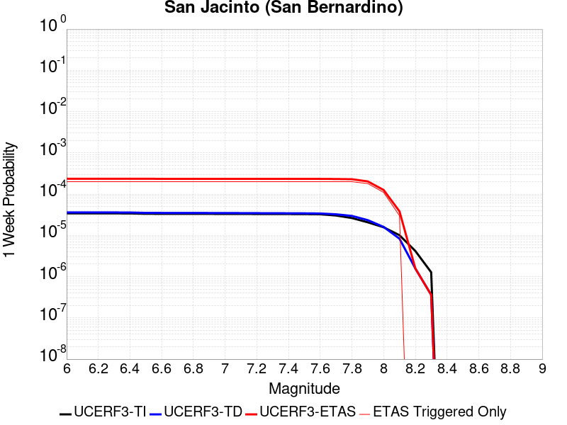 |  |  |  |

| Magnitude | 1 wk TI Prob | 1 wk TD Prob | 1 wk ETAS Prob | 1 wk ETAS/TD Gain | 1 wk ETAS Triggered Only | 1 mo TI Prob | 1 mo TD Prob | 1 mo ETAS Prob | 1 mo ETAS/TD Gain | 1 mo ETAS Triggered Only | 1 yr TI Prob | 1 yr TD Prob | 1 yr ETAS Prob | 1 yr ETAS/TD Gain | 1 yr ETAS Triggered Only | 10 yr TI Prob | 10 yr TD Prob | 10 yr ETAS Prob | 10 yr ETAS/TD Gain | 10 yr ETAS Triggered Only |
|-----|-----|-----|-----|-----|-----|-----|-----|-----|-----|-----|-----|-----|-----|-----|-----|-----|-----|-----|-----|-----|
| 6.0 | 3.409352E-5 | 3.5986508E-5 | 3.9866776E-4 | 11.078256 | 3.626943E-4 | 1.461069E-4 | 1.542188E-4 | 5.6866265E-4 | 3.6873758 | 4.1450778E-4 | 0.0017774 | 0.0018759987 | 0.0024965939 | 1.3308079 | 6.2176166E-4 | 0.01763251 | 0.019349935 | 0.0201121 | 1.0393884 | 7.772021E-4 |
| 6.1 | 3.409352E-5 | 3.5986508E-5 | 3.9866776E-4 | 11.078256 | 3.626943E-4 | 1.461069E-4 | 1.542188E-4 | 5.6866265E-4 | 3.6873758 | 4.1450778E-4 | 0.0017774 | 0.0018759987 | 0.0024965939 | 1.3308079 | 6.2176166E-4 | 0.01763251 | 0.019349935 | 0.0201121 | 1.0393884 | 7.772021E-4 |
| 6.2 | 3.409352E-5 | 3.5986508E-5 | 3.9866776E-4 | 11.078256 | 3.626943E-4 | 1.461069E-4 | 1.542188E-4 | 5.6866265E-4 | 3.6873758 | 4.1450778E-4 | 0.0017774 | 0.0018759987 | 0.0024965939 | 1.3308079 | 6.2176166E-4 | 0.01763251 | 0.019349935 | 0.0201121 | 1.0393884 | 7.772021E-4 |
| 6.3 | 3.409352E-5 | 3.5986508E-5 | 3.9866776E-4 | 11.078256 | 3.626943E-4 | 1.461069E-4 | 1.542188E-4 | 5.6866265E-4 | 3.6873758 | 4.1450778E-4 | 0.0017774 | 0.0018759987 | 0.0024965939 | 1.3308079 | 6.2176166E-4 | 0.01763251 | 0.019349935 | 0.0201121 | 1.0393884 | 7.772021E-4 |
| 6.4 | 3.400795E-5 | 3.5879173E-5 | 3.9856046E-4 | 11.108407 | 3.626943E-4 | 1.4574021E-4 | 1.5375883E-4 | 5.682029E-4 | 3.6954162 | 4.1450778E-4 | 0.0017729428 | 0.0018704084 | 0.002491007 | 1.3317986 | 6.2176166E-4 | 0.017588645 | 0.019295016 | 0.020057224 | 1.0395027 | 7.772021E-4 |
| 6.5 | 3.341482E-5 | 3.5139812E-5 | 3.9782136E-4 | 11.321101 | 3.626943E-4 | 1.4319851E-4 | 1.5059051E-4 | 5.6503585E-4 | 3.7521348 | 4.1450778E-4 | 0.0017420477 | 0.0018318989 | 0.0024525216 | 1.3387865 | 6.2176166E-4 | 0.017284546 | 0.018916558 | 0.019679058 | 1.0403086 | 7.772021E-4 |
| 6.6 | 3.3364955E-5 | 3.5077028E-5 | 3.9775862E-4 | 11.339575 | 3.626943E-4 | 1.4298483E-4 | 1.5032147E-4 | 5.6476693E-4 | 3.757061 | 4.1450778E-4 | 0.0017394501 | 0.001828629 | 0.0024492538 | 1.3393934 | 6.2176166E-4 | 0.017258976 | 0.018884424 | 0.019646948 | 1.0403786 | 7.772021E-4 |
| 6.7 | 3.335922E-5 | 3.5066805E-5 | 3.9774837E-4 | 11.34259 | 3.626943E-4 | 1.4296026E-4 | 1.5027766E-4 | 5.6472316E-4 | 3.757865 | 4.1450778E-4 | 0.0017391514 | 0.0018280965 | 0.0024487216 | 1.3394924 | 6.2176166E-4 | 0.017256035 | 0.018879214 | 0.019641744 | 1.0403899 | 7.772021E-4 |
| 6.8 | 3.327683E-5 | 3.496087E-5 | 3.976425E-4 | 11.37393 | 3.626943E-4 | 1.4260718E-4 | 1.498237E-4 | 5.642694E-4 | 3.7662222 | 4.1450778E-4 | 0.0017348597 | 0.0018225788 | 0.0024432072 | 1.3405222 | 6.2176166E-4 | 0.017213784 | 0.018824987 | 0.019587558 | 1.0405085 | 7.772021E-4 |
| 6.9 | 3.3235785E-5 | 3.4901823E-5 | 3.9758347E-4 | 11.391481 | 3.626943E-4 | 1.4243131E-4 | 1.4957068E-4 | 5.6401646E-4 | 3.7709026 | 4.1450778E-4 | 0.0017327217 | 0.0018195034 | 0.0024401338 | 1.3410988 | 6.2176166E-4 | 0.017192734 | 0.018794855 | 0.01955745 | 1.0405747 | 7.772021E-4 |
| 7.0 | 3.3197095E-5 | 3.4841752E-5 | 3.9752343E-4 | 11.409397 | 3.626943E-4 | 1.422655E-4 | 1.4931326E-4 | 5.637591E-4 | 3.7756803 | 4.1450778E-4 | 0.0017307063 | 0.0018163746 | 0.002437007 | 1.3416874 | 6.2176166E-4 | 0.017172894 | 0.018764233 | 0.01952685 | 1.0406421 | 7.772021E-4 |
| 7.1 | 3.3129716E-5 | 3.4721965E-5 | 3.9740367E-4 | 11.445311 | 3.626943E-4 | 1.4197677E-4 | 1.4879994E-4 | 5.63246E-4 | 3.785257 | 4.1450778E-4 | 0.0017271966 | 0.0018101353 | 0.0024307715 | 1.3428673 | 6.2176166E-4 | 0.017138338 | 0.018703312 | 0.019465977 | 1.0407771 | 7.772021E-4 |
| 7.2 | 3.3034008E-5 | 3.458941E-5 | 3.9727116E-4 | 11.48534 | 3.626943E-4 | 1.4156665E-4 | 1.4823192E-4 | 5.6267827E-4 | 3.7959316 | 4.1450778E-4 | 0.0017222111 | 0.0018032312 | 0.0024238718 | 1.3441824 | 6.2176166E-4 | 0.017089253 | 0.018635705 | 0.019398423 | 1.0409278 | 7.772021E-4 |
| 7.3 | 3.2956614E-5 | 3.445717E-5 | 3.9713897E-4 | 11.525583 | 3.626943E-4 | 1.4123498E-4 | 1.4766524E-4 | 5.621118E-4 | 3.806663 | 4.1450778E-4 | 0.0017181796 | 0.0017963431 | 0.0023652676 | 1.3167125 | 5.6994817E-4 | 0.017049557 | 0.018568452 | 0.019280372 | 1.0383402 | 7.253886E-4 |
| 7.4 | 3.2915937E-5 | 3.4378863E-5 | 3.970607E-4 | 11.549558 | 3.626943E-4 | 1.4106068E-4 | 1.4732967E-4 | 5.617764E-4 | 3.8130565 | 4.1450778E-4 | 0.0017160608 | 0.0017922645 | 0.0023611912 | 1.3174345 | 5.6994817E-4 | 0.017028693 | 0.018528719 | 0.019240666 | 1.038424 | 7.253886E-4 |
| 7.5 | 3.281791E-5 | 3.4243778E-5 | 3.9692566E-4 | 11.591176 | 3.626943E-4 | 1.406406E-4 | 1.4675081E-4 | 5.6119775E-4 | 3.8241544 | 4.1450778E-4 | 0.0017109542 | 0.0017852283 | 0.002354159 | 1.3186879 | 5.6994817E-4 | 0.016978411 | 0.018459605 | 0.019171603 | 1.0385706 | 7.253886E-4 |
| 7.6 | 3.2521442E-5 | 3.396873E-5 | 3.9665072E-4 | 11.676937 | 3.626943E-4 | 1.3937015E-4 | 1.4557215E-4 | 5.600196E-4 | 3.847024 | 4.1450778E-4 | 0.0016955109 | 0.0017709016 | 0.0023398404 | 1.3212707 | 5.6994817E-4 | 0.016826328 | 0.018317232 | 0.019029334 | 1.038876 | 7.253886E-4 |
| 7.7 | 3.0287873E-5 | 3.245276E-5 | 3.9513528E-4 | 12.175706 | 3.626943E-4 | 1.297987E-4 | 1.3907586E-4 | 5.53526E-4 | 3.980029 | 4.1450778E-4 | 0.0015791537 | 0.0016919347 | 0.0022609185 | 1.3362919 | 5.6994817E-4 | 0.01567979 | 0.01752809 | 0.018240765 | 1.040659 | 7.253886E-4 |
| 7.8 | 2.6316151E-5 | 2.9663592E-5 | 3.9234714E-4 | 13.226556 | 3.626943E-4 | 1.1277862E-4 | 1.2712348E-4 | 5.4157857E-4 | 4.260256 | 4.1450778E-4 | 0.0013722149 | 0.0015466306 | 0.002063964 | 1.3344905 | 5.1813474E-4 | 0.013637724 | 0.016069634 | 0.016732385 | 1.0412425 | 6.7357515E-4 |
| 7.9 | 2.0761147E-5 | 2.34181E-5 | 3.861039E-4 | 16.487413 | 3.626943E-4 | 8.897331E-5 | 1.0035944E-4 | 5.1482563E-4 | 5.1298175 | 4.1450778E-4 | 0.0010827117 | 0.0012211921 | 0.001738694 | 1.4237679 | 5.1813474E-4 | 0.010774517 | 0.012793174 | 0.013458132 | 1.0519775 | 6.7357515E-4 |
| 8.0 | 1.5738568E-5 | 1.6033575E-5 | 2.7509677E-4 | 17.157545 | 2.5906737E-4 | 6.744926E-5 | 6.871352E-5 | 3.7957297E-4 | 5.523993 | 3.1088083E-4 | 8.2088535E-4 | 8.3626667E-4 | 0.0011986577 | 1.4333439 | 3.626943E-4 | 0.008178596 | 0.008865921 | 0.009276753 | 1.0463384 | 4.1450778E-4 |
| 8.1 | 1.0105832E-5 | 8.3304985E-6 | 1.1195658E-4 | 13.439362 | 1.03626946E-4 | 4.3309992E-5 | 3.570165E-5 | 1.9113651E-4 | 5.353717 | 1.5544042E-4 | 5.2717153E-4 | 4.345814E-4 | 5.8995426E-4 | 1.3575231 | 1.5544042E-4 | 0.005259227 | 0.004677232 | 0.0048835166 | 1.044104 | 2.0725389E-4 |
| 8.2 | 4.189207E-6 | 1.5784357E-6 | 1.5784357E-6 | 1.0 | 0.0 | 1.7953622E-5 | 6.7647065E-6 | 6.7647065E-6 | 1.0 | 0.0 | 2.1856341E-4 | 8.235722E-5 | 8.235722E-5 | 1.0 | 0.0 | 0.0021834858 | 9.565867E-4 | 9.565867E-4 | 1.0 | 0.0 |
| 8.3 | 1.2758221E-6 | 3.6149942E-7 | 3.6149942E-7 | 1.0 | 0.0 | 5.4677976E-6 | 1.5492824E-6 | 1.5492824E-6 | 1.0 | 0.0 | 6.65684E-5 | 1.8862354E-5 | 1.8862354E-5 | 1.0 | 0.0 | 6.6548464E-4 | 2.2751294E-4 | 2.2751294E-4 | 1.0 | 0.0 |

## Death Valley (No)
*[(top)](#table-of-contents)*

| 1 Week | 1 Month | 1 Year | 10 Year |
|-----|-----|-----|-----|
|  | 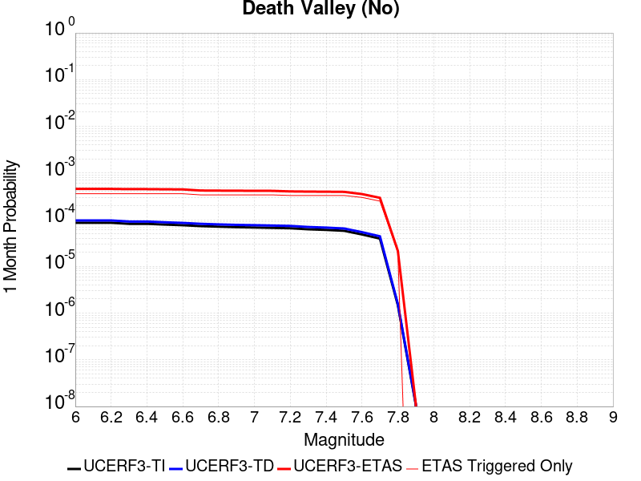 |  |  |

| Magnitude | 1 wk TI Prob | 1 wk TD Prob | 1 wk ETAS Prob | 1 wk ETAS/TD Gain | 1 wk ETAS Triggered Only | 1 mo TI Prob | 1 mo TD Prob | 1 mo ETAS Prob | 1 mo ETAS/TD Gain | 1 mo ETAS Triggered Only | 1 yr TI Prob | 1 yr TD Prob | 1 yr ETAS Prob | 1 yr ETAS/TD Gain | 1 yr ETAS Triggered Only | 10 yr TI Prob | 10 yr TD Prob | 10 yr ETAS Prob | 10 yr ETAS/TD Gain | 10 yr ETAS Triggered Only |
|-----|-----|-----|-----|-----|-----|-----|-----|-----|-----|-----|-----|-----|-----|-----|-----|-----|-----|-----|-----|-----|
| 6.0 | 2.0074807E-5 | 2.2500084E-5 | 2.297493E-4 | 10.211042 | 2.0725389E-4 | 8.603206E-5 | 9.642541E-5 | 4.0727627E-4 | 4.2237444 | 3.1088083E-4 | 0.001046937 | 0.0011733545 | 0.0016391285 | 1.3969594 | 4.6632125E-4 | 0.010420183 | 0.011672506 | 0.012440637 | 1.0658067 | 7.772021E-4 |
| 6.1 | 2.0074807E-5 | 2.2500084E-5 | 2.297493E-4 | 10.211042 | 2.0725389E-4 | 8.603206E-5 | 9.642541E-5 | 4.0727627E-4 | 4.2237444 | 3.1088083E-4 | 0.001046937 | 0.0011733545 | 0.0016391285 | 1.3969594 | 4.6632125E-4 | 0.010420183 | 0.011672506 | 0.012440637 | 1.0658067 | 7.772021E-4 |
| 6.2 | 2.0074807E-5 | 2.2500084E-5 | 2.297493E-4 | 10.211042 | 2.0725389E-4 | 8.603206E-5 | 9.642541E-5 | 4.0727627E-4 | 4.2237444 | 3.1088083E-4 | 0.001046937 | 0.0011733545 | 0.0016391285 | 1.3969594 | 4.6632125E-4 | 0.010420183 | 0.011672506 | 0.012440637 | 1.0658067 | 7.772021E-4 |
| 6.3 | 1.9050609E-5 | 2.1336948E-5 | 2.2858642E-4 | 10.713173 | 2.0725389E-4 | 8.164292E-5 | 9.1440896E-5 | 4.0229328E-4 | 4.39949 | 3.1088083E-4 | 9.935491E-4 | 0.001112731 | 0.0015785334 | 1.4186118 | 4.6632125E-4 | 0.009891188 | 0.011072419 | 0.011841015 | 1.0694155 | 7.772021E-4 |
| 6.4 | 1.9050609E-5 | 2.1336948E-5 | 2.2858642E-4 | 10.713173 | 2.0725389E-4 | 8.164292E-5 | 9.1440896E-5 | 4.0229328E-4 | 4.39949 | 3.1088083E-4 | 9.935491E-4 | 0.001112731 | 0.0015785334 | 1.4186118 | 4.6632125E-4 | 0.009891188 | 0.011072419 | 0.011841015 | 1.0694155 | 7.772021E-4 |
| 6.5 | 1.8367004E-5 | 2.0561009E-5 | 2.2781063E-4 | 11.079741 | 2.0725389E-4 | 7.8713354E-5 | 8.811567E-5 | 3.989691E-4 | 4.5277886 | 3.1088083E-4 | 9.5791375E-4 | 0.0010722869 | 0.001538108 | 1.4344184 | 4.6632125E-4 | 0.009537951 | 0.0106719155 | 0.011440823 | 1.0720496 | 7.772021E-4 |
| 6.6 | 1.779439E-5 | 1.9910927E-5 | 2.271607E-4 | 11.408845 | 2.0725389E-4 | 7.625944E-5 | 8.53298E-5 | 3.961841E-4 | 4.642975 | 3.1088083E-4 | 9.280632E-4 | 0.0010384015 | 0.0015042385 | 1.4486097 | 4.6632125E-4 | 0.009241969 | 0.010336253 | 0.011105421 | 1.0744146 | 7.772021E-4 |
| 6.7 | 1.7025437E-5 | 1.9043426E-5 | 2.2629337E-4 | 11.883018 | 2.0725389E-4 | 7.296412E-5 | 8.161216E-5 | 3.9246763E-4 | 4.8089356 | 3.1088083E-4 | 8.87976E-4 | 9.931813E-4 | 0.0014590394 | 1.4690565 | 4.6632125E-4 | 0.008844362 | 0.009888145 | 0.0106576625 | 1.0778222 | 7.772021E-4 |
| 6.8 | 1.6545107E-5 | 1.8512545E-5 | 2.2576259E-4 | 12.195113 | 2.0725389E-4 | 7.090568E-5 | 7.93371E-5 | 3.9019328E-4 | 4.918169 | 3.1088083E-4 | 8.629347E-4 | 9.655073E-4 | 0.0014313783 | 1.4825143 | 4.6632125E-4 | 0.008595915 | 0.009613829 | 0.010383559 | 1.0800649 | 7.772021E-4 |
| 6.9 | 1.615478E-5 | 1.8087594E-5 | 2.2533773E-4 | 12.4581375 | 2.0725389E-4 | 6.9232934E-5 | 7.751599E-5 | 3.8837272E-4 | 5.010227 | 3.1088083E-4 | 8.4258494E-4 | 9.433546E-4 | 0.001409236 | 1.493856 | 4.6632125E-4 | 0.008393973 | 0.009394196 | 0.01011277 | 1.0764912 | 7.253886E-4 |
| 7.0 | 1.5894311E-5 | 1.780555E-5 | 2.2505574E-4 | 12.63964 | 2.0725389E-4 | 6.81167E-5 | 7.6307304E-5 | 3.8716441E-4 | 5.073753 | 3.1088083E-4 | 8.2900526E-4 | 9.286515E-4 | 0.0013945397 | 1.5016825 | 4.6632125E-4 | 0.008259195 | 0.009248397 | 0.0099670775 | 1.0777086 | 7.253886E-4 |
| 7.1 | 1.5602263E-5 | 1.7483504E-5 | 2.2473377E-4 | 12.854047 | 2.0725389E-4 | 6.6865134E-5 | 7.492718E-5 | 3.8578472E-4 | 5.148795 | 3.1088083E-4 | 8.137789E-4 | 9.118627E-4 | 0.0013777587 | 1.5109278 | 4.6632125E-4 | 0.008108052 | 0.009081894 | 0.009800695 | 1.0791466 | 7.253886E-4 |
| 7.2 | 1.5323829E-5 | 1.717063E-5 | 2.2442096E-4 | 13.070047 | 2.0725389E-4 | 6.56719E-5 | 7.358637E-5 | 3.844443E-4 | 5.2243958 | 3.1088083E-4 | 7.99262E-4 | 8.9555193E-4 | 0.0013614555 | 1.5202419 | 4.6632125E-4 | 0.007963934 | 0.008920107 | 0.009639025 | 1.0805953 | 7.253886E-4 |
| 7.3 | 1.4556212E-5 | 1.6302456E-5 | 2.2355297E-4 | 13.71284 | 2.0725389E-4 | 6.238227E-5 | 6.9865826E-5 | 3.8072493E-4 | 5.449373 | 3.1088083E-4 | 7.592395E-4 | 8.5029035E-4 | 0.001316215 | 1.5479596 | 4.6632125E-4 | 0.0075665074 | 0.008471014 | 0.009190259 | 1.0849065 | 7.253886E-4 |
| 7.4 | 1.411725E-5 | 1.580796E-5 | 2.2305857E-4 | 14.110522 | 2.0725389E-4 | 6.0501097E-5 | 6.7746674E-5 | 3.7860643E-4 | 5.5885615 | 3.1088083E-4 | 7.363519E-4 | 8.245094E-4 | 0.0012904461 | 1.5651078 | 4.6632125E-4 | 0.0073391674 | 0.008215138 | 0.008934568 | 1.0875736 | 7.253886E-4 |
| 7.5 | 1.3503312E-5 | 1.5126289E-5 | 2.2237704E-4 | 14.701362 | 2.0725389E-4 | 5.7870053E-5 | 6.482538E-5 | 3.7568604E-4 | 5.795355 | 3.1088083E-4 | 7.043401E-4 | 7.8896893E-4 | 0.0012549222 | 1.5905851 | 4.6632125E-4 | 0.007021119 | 0.007862304 | 0.008581989 | 1.0915362 | 7.253886E-4 |
| 7.6 | 1.1279839E-5 | 1.2626327E-5 | 1.6806478E-4 | 13.310663 | 1.5544042E-4 | 4.834127E-5 | 5.4111737E-5 | 3.1316507E-4 | 5.787378 | 2.5906737E-4 | 5.88396E-4 | 6.5861654E-4 | 0.0010728514 | 1.6289468 | 4.1450778E-4 | 0.005868405 | 0.006567199 | 0.0072363503 | 1.1018931 | 6.7357515E-4 |
| 7.7 | 9.189108E-6 | 1.0283358E-5 | 1.6572217E-4 | 16.11557 | 1.5544042E-4 | 3.93813E-5 | 4.407082E-5 | 2.5131556E-4 | 5.702539 | 2.0725389E-4 | 4.7936183E-4 | 5.3643517E-4 | 8.4714923E-4 | 1.5792202 | 3.1088083E-4 | 0.004783291 | 0.005351914 | 0.0058157393 | 1.0866654 | 4.6632125E-4 |
| 7.8 | 3.4586725E-7 | 3.6482615E-7 | 3.6482615E-7 | 1.0 | 0.0 | 1.4822873E-6 | 1.5635396E-6 | 5.337693E-5 | 34.13852 | 5.1813473E-5 | 1.80467E-5 | 1.9035933E-5 | 7.084842E-5 | 3.7218254 | 5.1813473E-5 | 1.8045233E-4 | 1.9034347E-4 | 2.4214709E-4 | 1.2721586 | 5.1813473E-5 |
| 7.9 | 2.5591178E-9 | 2.6696718E-9 | 2.6696718E-9 | 1.0 | 0.0 | 1.0967647E-8 | 1.14414505E-8 | 1.14414505E-8 | 1.0 | 0.0 | 1.335311E-7 | 1.3929966E-7 | 1.3929966E-7 | 1.0 | 0.0 | 1.3353102E-6 | 1.3929966E-6 | 1.3929966E-6 | 1.0 | 0.0 |

## San Andreas (Coachella) rev
*[(top)](#table-of-contents)*

| 1 Week | 1 Month | 1 Year | 10 Year |
|-----|-----|-----|-----|
| 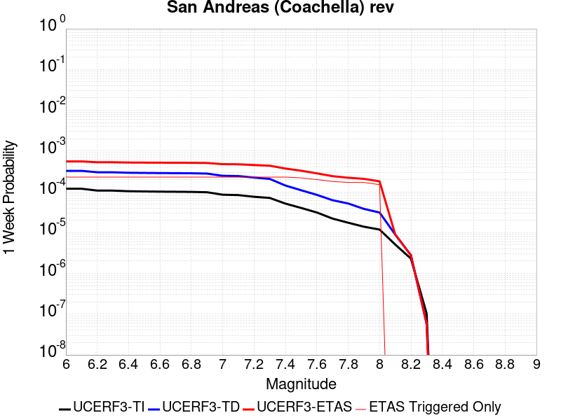 |  |  |  |

| Magnitude | 1 wk TI Prob | 1 wk TD Prob | 1 wk ETAS Prob | 1 wk ETAS/TD Gain | 1 wk ETAS Triggered Only | 1 mo TI Prob | 1 mo TD Prob | 1 mo ETAS Prob | 1 mo ETAS/TD Gain | 1 mo ETAS Triggered Only | 1 yr TI Prob | 1 yr TD Prob | 1 yr ETAS Prob | 1 yr ETAS/TD Gain | 1 yr ETAS Triggered Only | 10 yr TI Prob | 10 yr TD Prob | 10 yr ETAS Prob | 10 yr ETAS/TD Gain | 10 yr ETAS Triggered Only |
|-----|-----|-----|-----|-----|-----|-----|-----|-----|-----|-----|-----|-----|-----|-----|-----|-----|-----|-----|-----|-----|
| 6.0 | 1.1925945E-4 | 3.2729402E-4 | 5.862766E-4 | 1.7912842 | 2.5906737E-4 | 5.110118E-4 | 0.0014019393 | 0.0016606435 | 1.1845331 | 2.5906737E-4 | 0.0062038354 | 0.016936364 | 0.017547594 | 1.0360899 | 6.2176166E-4 | 0.060334753 | 0.15265316 | 0.15326782 | 1.0040265 | 7.253886E-4 |
| 6.1 | 1.1925945E-4 | 3.2729402E-4 | 5.862766E-4 | 1.7912842 | 2.5906737E-4 | 5.110118E-4 | 0.0014019393 | 0.0016606435 | 1.1845331 | 2.5906737E-4 | 0.0062038354 | 0.016936364 | 0.017547594 | 1.0360899 | 6.2176166E-4 | 0.060334753 | 0.15265316 | 0.15326782 | 1.0040265 | 7.253886E-4 |
| 6.2 | 1.07432395E-4 | 3.0230157E-4 | 5.612906E-4 | 1.8567241 | 2.5906737E-4 | 4.603433E-4 | 0.0012949388 | 0.0015536707 | 1.1998024 | 2.5906737E-4 | 0.005590286 | 0.015653009 | 0.016265038 | 1.0390998 | 6.2176166E-4 | 0.05451731 | 0.14182423 | 0.14244674 | 1.0043893 | 7.253886E-4 |
| 6.3 | 1.0718766E-4 | 3.0175463E-4 | 5.607438E-4 | 1.8582774 | 2.5906737E-4 | 4.592948E-4 | 0.0012925972 | 0.0015513296 | 1.2001648 | 2.5906737E-4 | 0.005577586 | 0.015624908 | 0.016236953 | 1.0391712 | 6.2176166E-4 | 0.054396555 | 0.14159249 | 0.14221518 | 1.0043976 | 7.253886E-4 |
| 6.4 | 1.0355944E-4 | 2.9383553E-4 | 5.5282674E-4 | 1.8814156 | 2.5906737E-4 | 4.4375064E-4 | 0.0012586913 | 0.0015174326 | 1.2055637 | 2.5906737E-4 | 0.0053892885 | 0.015217941 | 0.015830241 | 1.0402354 | 6.2176166E-4 | 0.052604496 | 0.13815255 | 0.13877773 | 1.0045253 | 7.253886E-4 |
| 6.5 | 1.0227914E-4 | 2.9102986E-4 | 5.500218E-4 | 1.8899153 | 2.5906737E-4 | 4.382655E-4 | 0.0012466786 | 0.001505423 | 1.207547 | 2.5906737E-4 | 0.0053228354 | 0.01507372 | 0.01568611 | 1.0406263 | 6.2176166E-4 | 0.051971316 | 0.13693172 | 0.13755777 | 1.004572 | 7.253886E-4 |
| 6.6 | 1.0116757E-4 | 2.8868738E-4 | 5.4767996E-4 | 1.8971385 | 2.5906737E-4 | 4.3350324E-4 | 0.0012366489 | 0.0014953959 | 1.2092323 | 2.5906737E-4 | 0.0052651367 | 0.01495329 | 0.015565755 | 1.0409585 | 6.2176166E-4 | 0.051421247 | 0.1359099 | 0.1365367 | 1.0046118 | 7.253886E-4 |
| 6.7 | 1.0050676E-4 | 2.8727303E-4 | 5.46266E-4 | 1.9015567 | 2.5906737E-4 | 4.3067214E-4 | 0.0012305931 | 0.0014893416 | 1.2102633 | 2.5906737E-4 | 0.005230834 | 0.014880571 | 0.01549308 | 1.0411617 | 6.2176166E-4 | 0.051094085 | 0.13529462 | 0.13592187 | 1.0046362 | 7.253886E-4 |
| 6.8 | 9.976819E-5 | 2.853096E-4 | 5.4430304E-4 | 1.9077629 | 2.5906737E-4 | 4.2750788E-4 | 0.0012221863 | 0.001480937 | 1.2117114 | 2.5906737E-4 | 0.0051924936 | 0.0147796115 | 0.015392183 | 1.0414472 | 6.2176166E-4 | 0.050728295 | 0.13444631 | 0.13507417 | 1.00467 | 7.253886E-4 |
| 6.9 | 9.77719E-5 | 2.8027873E-4 | 5.392735E-4 | 1.9240613 | 2.5906737E-4 | 4.1895514E-4 | 0.0012006456 | 0.0014594018 | 1.2155143 | 2.5906737E-4 | 0.0050888555 | 0.014520878 | 0.015133611 | 1.0421968 | 6.2176166E-4 | 0.049738888 | 0.1322748 | 0.13290425 | 1.0047586 | 7.253886E-4 |
| 7.0 | 8.500761E-5 | 2.4762485E-4 | 5.066281E-4 | 2.04595 | 2.5906737E-4 | 3.6426744E-4 | 0.001060821 | 0.0013196135 | 1.2439549 | 2.5906737E-4 | 0.0044259406 | 0.012839786 | 0.013402415 | 1.0438193 | 5.6994817E-4 | 0.04338823 | 0.11813272 | 0.11872672 | 1.0050282 | 6.7357515E-4 |
| 7.1 | 8.319876E-5 | 2.4365232E-4 | 5.0265656E-4 | 2.0630074 | 2.5906737E-4 | 3.5651738E-4 | 0.0010438096 | 0.0013026065 | 1.247935 | 2.5906737E-4 | 0.004331963 | 0.012635092 | 0.013197839 | 1.0445384 | 5.6994817E-4 | 0.042484846 | 0.116353 | 0.1169482 | 1.0051155 | 6.7357515E-4 |
| 7.2 | 7.563917E-5 | 2.2413683E-4 | 4.8314614E-4 | 2.1555855 | 2.5906737E-4 | 3.2412758E-4 | 9.602359E-4 | 0.0012190545 | 1.2695365 | 2.5906737E-4 | 0.0039391145 | 0.011628893 | 0.012192214 | 1.0484414 | 5.6994817E-4 | 0.03870018 | 0.10775925 | 0.10836024 | 1.0055772 | 6.7357515E-4 |
| 7.3 | 7.082985E-5 | 2.0729867E-4 | 4.663123E-4 | 2.249471 | 2.5906737E-4 | 3.0352117E-4 | 8.881233E-4 | 0.0011469605 | 1.291443 | 2.5906737E-4 | 0.0036891096 | 0.010759917 | 0.011323732 | 1.0523996 | 5.6994817E-4 | 0.03628465 | 0.100282 | 0.10088803 | 1.0060432 | 6.7357515E-4 |
| 7.4 | 5.146215E-5 | 1.4273795E-4 | 4.017683E-4 | 2.8147268 | 2.5906737E-4 | 2.2053342E-4 | 6.115915E-4 | 8.705004E-4 | 1.4233364 | 2.5906737E-4 | 0.0026816884 | 0.0074208933 | 0.007883754 | 1.0623727 | 4.6632125E-4 | 0.02649557 | 0.070849575 | 0.07137915 | 1.0074745 | 5.6994817E-4 |
| 7.5 | 4.0285166E-5 | 1.09416E-4 | 3.6845502E-4 | 3.3674693 | 2.5906737E-4 | 1.7263928E-4 | 4.6884175E-4 | 7.277877E-4 | 1.5523098 | 2.5906737E-4 | 0.002099857 | 0.0056932783 | 0.0061569447 | 1.081441 | 4.6632125E-4 | 0.020801254 | 0.055011146 | 0.05554974 | 1.0097907 | 5.6994817E-4 |
| 7.6 | 3.1168736E-5 | 8.4389096E-5 | 3.434346E-4 | 4.069656 | 2.5906737E-4 | 1.3357346E-4 | 3.6161754E-4 | 6.205912E-4 | 1.7161535 | 2.5906737E-4 | 0.0016250437 | 0.0043938323 | 0.0048581045 | 1.1056645 | 4.6632125E-4 | 0.016132116 | 0.04281005 | 0.043306004 | 1.011585 | 5.1813474E-4 |
| 7.7 | 2.2100989E-5 | 6.238755E-5 | 2.696285E-4 | 4.3218317 | 2.0725389E-4 | 9.4715084E-5 | 2.6734784E-4 | 4.7454634E-4 | 1.7750145 | 2.0725389E-4 | 0.001152546 | 0.0032501083 | 0.0036632689 | 1.127122 | 4.1450778E-4 | 0.011465867 | 0.0319002 | 0.032351647 | 1.0141518 | 4.6632125E-4 |
| 7.8 | 1.7484861E-5 | 5.179572E-5 | 2.0722808E-4 | 4.0008726 | 1.5544042E-4 | 7.493296E-5 | 2.2196278E-4 | 3.773687E-4 | 1.700144 | 1.5544042E-4 | 9.1192697E-4 | 0.0026990508 | 0.003060766 | 1.1340158 | 3.626943E-4 | 0.009081938 | 0.026640115 | 0.027043581 | 1.0151451 | 4.1450778E-4 |
| 7.9 | 1.3967285E-5 | 3.822255E-5 | 1.9365702E-4 | 5.0665646 | 1.5544042E-4 | 5.985842E-5 | 1.6380067E-4 | 3.1921561E-4 | 1.9488055 | 1.5544042E-4 | 7.2853256E-4 | 0.00199245 | 0.0023027116 | 1.1557186 | 3.1088083E-4 | 0.0072614877 | 0.019909438 | 0.02026491 | 1.0178545 | 3.626943E-4 |
| 8.0 | 1.1887396E-5 | 3.106521E-5 | 1.3468893E-4 | 4.335684 | 1.03626946E-4 | 5.094499E-5 | 1.3312983E-4 | 2.3674297E-4 | 1.7782865 | 1.03626946E-4 | 6.200787E-4 | 0.0016196516 | 0.0018782993 | 1.1596935 | 2.5906737E-4 | 0.006183513 | 0.016279267 | 0.016585087 | 1.0187858 | 3.1088083E-4 |
| 8.1 | 5.100864E-6 | 8.973418E-6 | 8.973418E-6 | 1.0 | 0.0 | 2.1860664E-5 | 3.8456936E-5 | 3.8456936E-5 | 1.0 | 0.0 | 2.6612106E-4 | 4.6811273E-4 | 4.6811273E-4 | 1.0 | 0.0 | 0.002658026 | 0.004917731 | 0.0049692895 | 1.0104842 | 5.1813473E-5 |
| 8.2 | 2.3004484E-6 | 2.7864487E-6 | 2.7864487E-6 | 1.0 | 0.0 | 9.859027E-6 | 1.1941868E-5 | 1.1941868E-5 | 1.0 | 0.0 | 1.2002704E-4 | 1.4538258E-4 | 1.4538258E-4 | 1.0 | 0.0 | 0.0011996223 | 0.0015973912 | 0.0015973912 | 1.0 | 0.0 |
| 8.3 | 1.0424446E-7 | 5.8161504E-8 | 5.8161504E-8 | 1.0 | 0.0 | 4.4676187E-7 | 2.4926356E-7 | 2.4926356E-7 | 1.0 | 0.0 | 5.439312E-6 | 3.03478E-6 | 3.03478E-6 | 1.0 | 0.0 | 5.4391792E-5 | 3.190716E-5 | 3.190716E-5 | 1.0 | 0.0 |

## Helendale-So Lockhart
*[(top)](#table-of-contents)*

| 1 Week | 1 Month | 1 Year | 10 Year |
|-----|-----|-----|-----|
|  |  |  |  |

| Magnitude | 1 wk TI Prob | 1 wk TD Prob | 1 wk ETAS Prob | 1 wk ETAS/TD Gain | 1 wk ETAS Triggered Only | 1 mo TI Prob | 1 mo TD Prob | 1 mo ETAS Prob | 1 mo ETAS/TD Gain | 1 mo ETAS Triggered Only | 1 yr TI Prob | 1 yr TD Prob | 1 yr ETAS Prob | 1 yr ETAS/TD Gain | 1 yr ETAS Triggered Only | 10 yr TI Prob | 10 yr TD Prob | 10 yr ETAS Prob | 10 yr ETAS/TD Gain | 10 yr ETAS Triggered Only |
|-----|-----|-----|-----|-----|-----|-----|-----|-----|-----|-----|-----|-----|-----|-----|-----|-----|-----|-----|-----|-----|
| 6.0 | 1.7296055E-5 | 1.8103729E-5 | 1.2172879E-4 | 6.7239623 | 1.03626946E-4 | 7.412385E-5 | 7.7585224E-5 | 3.3663248E-4 | 4.338874 | 2.5906737E-4 | 9.0208417E-4 | 9.4421144E-4 | 0.0015136214 | 1.6030536 | 5.6994817E-4 | 0.008984311 | 0.009404116 | 0.010122683 | 1.0764098 | 7.253886E-4 |
| 6.1 | 1.7296055E-5 | 1.8103729E-5 | 1.2172879E-4 | 6.7239623 | 1.03626946E-4 | 7.412385E-5 | 7.7585224E-5 | 3.3663248E-4 | 4.338874 | 2.5906737E-4 | 9.0208417E-4 | 9.4421144E-4 | 0.0015136214 | 1.6030536 | 5.6994817E-4 | 0.008984311 | 0.009404116 | 0.010122683 | 1.0764098 | 7.253886E-4 |
| 6.2 | 1.7296055E-5 | 1.8103729E-5 | 1.2172879E-4 | 6.7239623 | 1.03626946E-4 | 7.412385E-5 | 7.7585224E-5 | 3.3663248E-4 | 4.338874 | 2.5906737E-4 | 9.0208417E-4 | 9.4421144E-4 | 0.0015136214 | 1.6030536 | 5.6994817E-4 | 0.008984311 | 0.009404116 | 0.010122683 | 1.0764098 | 7.253886E-4 |
| 6.3 | 1.0669118E-5 | 1.1135425E-5 | 1.1476121E-4 | 10.305958 | 1.03626946E-4 | 4.5723988E-5 | 4.772239E-5 | 2.5496638E-4 | 5.3426995 | 2.0725389E-4 | 5.5654737E-4 | 5.80868E-4 | 9.95135E-4 | 1.7131861 | 4.1450778E-4 | 0.0055515557 | 0.0057937936 | 0.006257413 | 1.0800201 | 4.6632125E-4 |
| 6.4 | 1.0669118E-5 | 1.1135425E-5 | 1.1476121E-4 | 10.305958 | 1.03626946E-4 | 4.5723988E-5 | 4.772239E-5 | 2.5496638E-4 | 5.3426995 | 2.0725389E-4 | 5.5654737E-4 | 5.80868E-4 | 9.95135E-4 | 1.7131861 | 4.1450778E-4 | 0.0055515557 | 0.0057937936 | 0.006257413 | 1.0800201 | 4.6632125E-4 |
| 6.5 | 8.790038E-6 | 9.170197E-6 | 1.1279619E-4 | 12.300302 | 1.03626946E-4 | 3.767105E-5 | 3.930026E-5 | 2.46546E-4 | 6.2733936 | 2.0725389E-4 | 4.585485E-4 | 4.7837716E-4 | 8.9268666E-4 | 1.8660729 | 4.1450778E-4 | 0.0045760344 | 0.004773638 | 0.0052377335 | 1.0972204 | 4.6632125E-4 |
| 6.6 | 7.396949E-6 | 7.715537E-6 | 5.9528607E-5 | 7.7154202 | 5.1813473E-5 | 3.1700827E-5 | 3.3066175E-5 | 1.8850145E-4 | 5.7007337 | 1.5544042E-4 | 3.858892E-4 | 4.025073E-4 | 7.6505565E-4 | 1.9007248 | 3.626943E-4 | 0.003852198 | 0.00401789 | 0.0043791267 | 1.0899072 | 3.626943E-4 |
| 6.7 | 6.4600285E-6 | 6.738031E-6 | 5.855115E-5 | 8.689653 | 5.1813473E-5 | 2.7685543E-5 | 2.887696E-5 | 1.8431288E-4 | 6.382697 | 1.5544042E-4 | 3.3701936E-4 | 3.5152107E-4 | 6.104974E-4 | 1.7367305 | 2.5906737E-4 | 0.0033650869 | 0.003509732 | 0.0037678902 | 1.073555 | 2.5906737E-4 |
| 6.8 | 5.600104E-6 | 5.836009E-6 | 5.764918E-5 | 9.878184 | 5.1813473E-5 | 2.4000226E-5 | 2.5011232E-5 | 1.8044777E-4 | 7.2146688 | 1.5544042E-4 | 2.9216358E-4 | 3.044698E-4 | 5.116606E-4 | 1.680497 | 2.0725389E-4 | 0.0029177975 | 0.003040588 | 0.0032472117 | 1.0679551 | 2.0725389E-4 |
| 6.9 | 4.839122E-6 | 5.0395092E-6 | 5.0395092E-6 | 1.0 | 0.0 | 2.0738931E-5 | 2.159772E-5 | 1.2522243E-4 | 5.7979465 | 1.03626946E-4 | 2.5246723E-4 | 2.6292098E-4 | 4.1832053E-4 | 1.5910504 | 1.5544042E-4 | 0.002521806 | 0.002626147 | 0.002781179 | 1.0590341 | 1.5544042E-4 |
| 7.0 | 3.6937633E-6 | 3.845208E-6 | 3.845208E-6 | 1.0 | 0.0 | 1.5830317E-5 | 1.647936E-5 | 1.20104596E-4 | 7.288183 | 1.03626946E-4 | 1.9271708E-4 | 2.0061806E-4 | 3.042242E-4 | 1.5164348 | 1.03626946E-4 | 0.0019255003 | 0.002004401 | 0.0021078202 | 1.051596 | 1.03626946E-4 |
| 7.1 | 2.7858857E-6 | 2.8978538E-6 | 2.8978538E-6 | 1.0 | 0.0 | 1.1939455E-5 | 1.2419316E-5 | 6.423215E-5 | 5.171955 | 5.1813473E-5 | 1.4535317E-4 | 1.511949E-4 | 2.0300053E-4 | 1.3426415 | 5.1813473E-5 | 0.0014525814 | 0.0015109418 | 0.001562677 | 1.0342404 | 5.1813473E-5 |
| 7.2 | 2.1672065E-6 | 2.2540128E-6 | 2.2540128E-6 | 1.0 | 0.0 | 9.2879945E-6 | 9.66002E-6 | 6.1472994E-5 | 6.3636503 | 5.1813473E-5 | 1.1307546E-4 | 1.1760458E-4 | 1.6941196E-4 | 1.4405217 | 5.1813473E-5 | 0.0011301794 | 0.0011754417 | 0.0012271942 | 1.0440282 | 5.1813473E-5 |
| 7.3 | 1.4823496E-6 | 1.5422102E-6 | 1.5422102E-6 | 1.0 | 0.0 | 6.3529114E-6 | 6.6094562E-6 | 5.8422585E-5 | 8.839242 | 5.1813473E-5 | 7.734395E-5 | 8.046731E-5 | 1.3227662E-4 | 1.6438552 | 5.1813473E-5 | 7.731704E-4 | 8.0439687E-4 | 8.561687E-4 | 1.064361 | 5.1813473E-5 |
| 7.4 | 4.2321457E-7 | 4.4108765E-7 | 4.4108765E-7 | 1.0 | 0.0 | 1.8137755E-6 | 1.8903745E-6 | 1.8903745E-6 | 1.0 | 0.0 | 2.2082493E-5 | 2.3015113E-5 | 2.3015113E-5 | 1.0 | 0.0 | 2.2080299E-4 | 2.3013182E-4 | 2.3013182E-4 | 1.0 | 0.0 |
| 7.5 | 5.6942316E-8 | 5.9415648E-8 | 5.9415648E-8 | 1.0 | 0.0 | 2.440385E-7 | 2.5463845E-7 | 2.5463845E-7 | 1.0 | 0.0 | 2.9711643E-6 | 3.1002196E-6 | 3.1002196E-6 | 1.0 | 0.0 | 2.9711247E-5 | 3.1001844E-5 | 3.1001844E-5 | 1.0 | 0.0 |

## Independence rev 2011
*[(top)](#table-of-contents)*

| 1 Week | 1 Month | 1 Year | 10 Year |
|-----|-----|-----|-----|
|  | 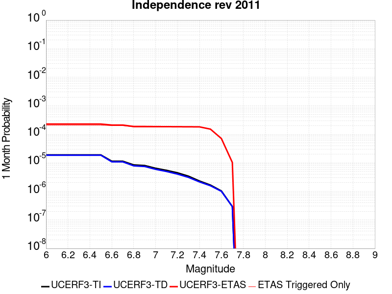 |  |  |

| Magnitude | 1 wk TI Prob | 1 wk TD Prob | 1 wk ETAS Prob | 1 wk ETAS/TD Gain | 1 wk ETAS Triggered Only | 1 mo TI Prob | 1 mo TD Prob | 1 mo ETAS Prob | 1 mo ETAS/TD Gain | 1 mo ETAS Triggered Only | 1 yr TI Prob | 1 yr TD Prob | 1 yr ETAS Prob | 1 yr ETAS/TD Gain | 1 yr ETAS Triggered Only | 10 yr TI Prob | 10 yr TD Prob | 10 yr ETAS Prob | 10 yr ETAS/TD Gain | 10 yr ETAS Triggered Only |
|-----|-----|-----|-----|-----|-----|-----|-----|-----|-----|-----|-----|-----|-----|-----|-----|-----|-----|-----|-----|-----|
| 6.0 | 4.422171E-6 | 4.326227E-6 | 2.6339246E-4 | 60.88272 | 2.5906737E-4 | 1.8952025E-5 | 1.8540857E-5 | 3.2941593E-4 | 17.767027 | 3.1088083E-4 | 2.3071647E-4 | 2.2571455E-4 | 6.4012874E-4 | 2.8360102 | 4.1450778E-4 | 0.0023047708 | 0.0022551466 | 0.002875506 | 1.2750862 | 6.2176166E-4 |
| 6.1 | 4.422171E-6 | 4.326227E-6 | 2.6339246E-4 | 60.88272 | 2.5906737E-4 | 1.8952025E-5 | 1.8540857E-5 | 3.2941593E-4 | 17.767027 | 3.1088083E-4 | 2.3071647E-4 | 2.2571455E-4 | 6.4012874E-4 | 2.8360102 | 4.1450778E-4 | 0.0023047708 | 0.0022551466 | 0.002875506 | 1.2750862 | 6.2176166E-4 |
| 6.2 | 4.422171E-6 | 4.326227E-6 | 2.6339246E-4 | 60.88272 | 2.5906737E-4 | 1.8952025E-5 | 1.8540857E-5 | 3.2941593E-4 | 17.767027 | 3.1088083E-4 | 2.3071647E-4 | 2.2571455E-4 | 6.4012874E-4 | 2.8360102 | 4.1450778E-4 | 0.0023047708 | 0.0022551466 | 0.002875506 | 1.2750862 | 6.2176166E-4 |
| 6.3 | 4.422171E-6 | 4.326227E-6 | 2.6339246E-4 | 60.88272 | 2.5906737E-4 | 1.8952025E-5 | 1.8540857E-5 | 3.2941593E-4 | 17.767027 | 3.1088083E-4 | 2.3071647E-4 | 2.2571455E-4 | 6.4012874E-4 | 2.8360102 | 4.1450778E-4 | 0.0023047708 | 0.0022551466 | 0.002875506 | 1.2750862 | 6.2176166E-4 |
| 6.4 | 4.422171E-6 | 4.326227E-6 | 2.6339246E-4 | 60.88272 | 2.5906737E-4 | 1.8952025E-5 | 1.8540857E-5 | 3.2941593E-4 | 17.767027 | 3.1088083E-4 | 2.3071647E-4 | 2.2571455E-4 | 6.4012874E-4 | 2.8360102 | 4.1450778E-4 | 0.0023047708 | 0.0022551466 | 0.002875506 | 1.2750862 | 6.2176166E-4 |
| 6.5 | 4.422171E-6 | 4.326227E-6 | 2.6339246E-4 | 60.88272 | 2.5906737E-4 | 1.8952025E-5 | 1.8540857E-5 | 3.2941593E-4 | 17.767027 | 3.1088083E-4 | 2.3071647E-4 | 2.2571455E-4 | 6.4012874E-4 | 2.8360102 | 4.1450778E-4 | 0.0023047708 | 0.0022551466 | 0.002875506 | 1.2750862 | 6.2176166E-4 |
| 6.6 | 2.663744E-6 | 2.5319862E-6 | 2.6159867E-4 | 103.31758 | 2.5906737E-4 | 1.1415996E-5 | 1.0851327E-5 | 3.217288E-4 | 29.648796 | 3.1088083E-4 | 1.3898089E-4 | 1.3210738E-4 | 5.465604E-4 | 4.1372433 | 4.1450778E-4 | 0.0013889399 | 0.0013203367 | 0.0019412775 | 1.4702897 | 6.2176166E-4 |
| 6.7 | 2.663744E-6 | 2.5319862E-6 | 2.6159867E-4 | 103.31758 | 2.5906737E-4 | 1.1415996E-5 | 1.0851327E-5 | 3.217288E-4 | 29.648796 | 3.1088083E-4 | 1.3898089E-4 | 1.3210738E-4 | 5.465604E-4 | 4.1372433 | 4.1450778E-4 | 0.0013889399 | 0.0013203367 | 0.0019412775 | 1.4702897 | 6.2176166E-4 |
| 6.8 | 1.9716529E-6 | 1.8322585E-6 | 2.0908576E-4 | 114.113686 | 2.0725389E-4 | 8.449913E-6 | 7.852514E-6 | 2.1510477E-4 | 27.393112 | 2.0725389E-4 | 1.0287284E-4 | 9.5600284E-5 | 4.064514E-4 | 4.251571 | 3.1088083E-4 | 0.0010282523 | 9.556045E-4 | 0.001473244 | 1.5416881 | 5.1813474E-4 |
| 6.9 | 1.8788617E-6 | 1.7429993E-6 | 2.0899653E-4 | 119.90626 | 2.0725389E-4 | 8.0522395E-6 | 7.4699765E-6 | 2.1472231E-4 | 28.74471 | 2.0725389E-4 | 9.80316E-5 | 9.0943286E-5 | 4.0179584E-4 | 4.4180923 | 3.1088083E-4 | 9.798837E-4 | 9.0907275E-4 | 0.0014267365 | 1.5694414 | 5.1813474E-4 |
| 7.0 | 1.5045488E-6 | 1.3849503E-6 | 2.0863855E-4 | 150.64694 | 2.0725389E-4 | 6.44805E-6 | 5.9354884E-6 | 2.1318815E-4 | 35.91754 | 2.0725389E-4 | 7.8502184E-5 | 7.226223E-5 | 3.8312058E-4 | 5.30181 | 3.1088083E-4 | 7.8474457E-4 | 7.2239246E-4 | 0.0012401529 | 1.7167301 | 5.1813474E-4 |
| 7.1 | 1.272341E-6 | 1.1625096E-6 | 2.0841615E-4 | 179.28122 | 2.0725389E-4 | 5.4528787E-6 | 4.982175E-6 | 2.1223503E-4 | 42.59887 | 2.0725389E-4 | 6.6386776E-5 | 6.0656326E-5 | 3.7151828E-4 | 6.124972 | 3.1088083E-4 | 6.636695E-4 | 6.064009E-4 | 0.0011242214 | 1.8539244 | 5.1813474E-4 |
| 7.2 | 1.0416892E-6 | 9.4098806E-7 | 2.0819467E-4 | 221.25114 | 2.0725389E-4 | 4.464375E-6 | 4.0328E-6 | 2.1128585E-4 | 52.391853 | 2.0725389E-4 | 5.4352407E-5 | 4.909825E-5 | 3.5996383E-4 | 7.3315 | 3.1088083E-4 | 5.4339116E-4 | 4.9087586E-4 | 0.0010087562 | 2.055013 | 5.1813474E-4 |
| 7.3 | 7.9450155E-7 | 7.235002E-7 | 2.0797724E-4 | 287.45984 | 2.0725389E-4 | 3.4050022E-6 | 3.1007114E-6 | 2.1035396E-4 | 67.840546 | 2.0725389E-4 | 4.1455114E-5 | 3.775052E-5 | 3.4861962E-4 | 9.23483 | 3.1088083E-4 | 4.144738E-4 | 3.7744216E-4 | 8.953813E-4 | 2.3722343 | 5.1813474E-4 |
| 7.4 | 5.3893444E-7 | 5.019512E-7 | 2.0775573E-4 | 413.89627 | 2.0725389E-4 | 2.309717E-6 | 2.1512178E-6 | 2.0940466E-4 | 97.34238 | 2.0725389E-4 | 2.8120441E-5 | 2.6190766E-5 | 3.3706345E-4 | 12.869553 | 3.1088083E-4 | 2.8116882E-4 | 2.6187726E-4 | 7.7987625E-4 | 2.9780223 | 5.1813474E-4 |
| 7.5 | 3.8852085E-7 | 3.682554E-7 | 1.0399516E-4 | 282.39957 | 1.03626946E-4 | 1.6650882E-6 | 1.5782365E-6 | 1.05205014E-4 | 66.65986 | 1.03626946E-4 | 2.027226E-5 | 1.9214862E-5 | 2.2646476E-4 | 11.785917 | 2.0725389E-4 | 2.0270412E-4 | 1.9213221E-4 | 6.065603E-4 | 3.1569946 | 4.1450778E-4 |
| 7.6 | 2.414929E-7 | 2.345755E-7 | 2.345755E-7 | 1.0 | 0.0 | 1.0349692E-6 | 1.0053232E-6 | 1.0053232E-6 | 1.0 | 0.0 | 1.2600677E-5 | 1.2239742E-5 | 1.2239742E-5 | 1.0 | 0.0 | 1.2599962E-4 | 1.223908E-4 | 2.7781219E-4 | 2.269878 | 1.5544042E-4 |
| 7.7 | 6.8298014E-8 | 6.85897E-8 | 6.85897E-8 | 1.0 | 0.0 | 2.9270575E-7 | 2.9395582E-7 | 2.9395582E-7 | 1.0 | 0.0 | 3.5636867E-6 | 3.5789067E-6 | 3.5789067E-6 | 1.0 | 0.0 | 3.5636294E-5 | 3.5788536E-5 | 8.760016E-5 | 2.4477155 | 5.1813473E-5 |

## San Jacinto (San Jacinto Valley) rev
*[(top)](#table-of-contents)*

| 1 Week | 1 Month | 1 Year | 10 Year |
|-----|-----|-----|-----|
|  |  |  |  |

| Magnitude | 1 wk TI Prob | 1 wk TD Prob | 1 wk ETAS Prob | 1 wk ETAS/TD Gain | 1 wk ETAS Triggered Only | 1 mo TI Prob | 1 mo TD Prob | 1 mo ETAS Prob | 1 mo ETAS/TD Gain | 1 mo ETAS Triggered Only | 1 yr TI Prob | 1 yr TD Prob | 1 yr ETAS Prob | 1 yr ETAS/TD Gain | 1 yr ETAS Triggered Only | 10 yr TI Prob | 10 yr TD Prob | 10 yr ETAS Prob | 10 yr ETAS/TD Gain | 10 yr ETAS Triggered Only |
|-----|-----|-----|-----|-----|-----|-----|-----|-----|-----|-----|-----|-----|-----|-----|-----|-----|-----|-----|-----|-----|
| 6.0 | 3.652694E-5 | 3.4402394E-5 | 3.4527254E-4 | 10.036294 | 3.1088083E-4 | 1.5653463E-4 | 1.474305E-4 | 5.1007135E-4 | 3.4597409 | 3.626943E-4 | 0.0019041431 | 0.00179349 | 0.0023106954 | 1.2883793 | 5.1813474E-4 | 0.018879099 | 0.018526595 | 0.019136837 | 1.0329387 | 6.2176166E-4 |
| 6.1 | 3.652694E-5 | 3.4402394E-5 | 3.4527254E-4 | 10.036294 | 3.1088083E-4 | 1.5653463E-4 | 1.474305E-4 | 5.1007135E-4 | 3.4597409 | 3.626943E-4 | 0.0019041431 | 0.00179349 | 0.0023106954 | 1.2883793 | 5.1813474E-4 | 0.018879099 | 0.018526595 | 0.019136837 | 1.0329387 | 6.2176166E-4 |
| 6.2 | 3.652694E-5 | 3.4402394E-5 | 3.4527254E-4 | 10.036294 | 3.1088083E-4 | 1.5653463E-4 | 1.474305E-4 | 5.1007135E-4 | 3.4597409 | 3.626943E-4 | 0.0019041431 | 0.00179349 | 0.0023106954 | 1.2883793 | 5.1813474E-4 | 0.018879099 | 0.018526595 | 0.019136837 | 1.0329387 | 6.2176166E-4 |
| 6.3 | 3.652694E-5 | 3.4402394E-5 | 3.4527254E-4 | 10.036294 | 3.1088083E-4 | 1.5653463E-4 | 1.474305E-4 | 5.1007135E-4 | 3.4597409 | 3.626943E-4 | 0.0019041431 | 0.00179349 | 0.0023106954 | 1.2883793 | 5.1813474E-4 | 0.018879099 | 0.018526595 | 0.019136837 | 1.0329387 | 6.2176166E-4 |
| 6.4 | 3.646941E-5 | 3.432397E-5 | 3.4519413E-4 | 10.056941 | 3.1088083E-4 | 1.5628811E-4 | 1.4709444E-4 | 5.097354E-4 | 3.4653614 | 3.626943E-4 | 0.0019011468 | 0.0017894056 | 0.0023066131 | 1.2890388 | 5.1813474E-4 | 0.018849645 | 0.018486476 | 0.019096743 | 1.0330116 | 6.2176166E-4 |
| 6.5 | 3.646941E-5 | 3.432397E-5 | 3.4519413E-4 | 10.056941 | 3.1088083E-4 | 1.5628811E-4 | 1.4709444E-4 | 5.097354E-4 | 3.4653614 | 3.626943E-4 | 0.0019011468 | 0.0017894056 | 0.0023066131 | 1.2890388 | 5.1813474E-4 | 0.018849645 | 0.018486476 | 0.019096743 | 1.0330116 | 6.2176166E-4 |
| 6.6 | 3.6442503E-5 | 3.4287354E-5 | 3.4515752E-4 | 10.066613 | 3.1088083E-4 | 1.561728E-4 | 1.4693754E-4 | 5.0957856E-4 | 3.4679942 | 3.626943E-4 | 0.0018997455 | 0.0017874985 | 0.002304707 | 1.2893476 | 5.1813474E-4 | 0.018835869 | 0.018467745 | 0.019078024 | 1.0330456 | 6.2176166E-4 |
| 6.7 | 3.6432113E-5 | 3.4272925E-5 | 3.451431E-4 | 10.07043 | 3.1088083E-4 | 1.5612828E-4 | 1.4687571E-4 | 5.0951674E-4 | 3.4690332 | 3.626943E-4 | 0.0018992044 | 0.0017867472 | 0.002303956 | 1.2894696 | 5.1813474E-4 | 0.018830549 | 0.018460369 | 0.019070653 | 1.0330591 | 6.2176166E-4 |
| 6.8 | 3.6409598E-5 | 3.424198E-5 | 3.4511217E-4 | 10.078627 | 3.1088083E-4 | 1.560318E-4 | 1.4674311E-4 | 5.093842E-4 | 3.4712648 | 3.626943E-4 | 0.0018980318 | 0.0017851355 | 0.0023023451 | 1.2897314 | 5.1813474E-4 | 0.018819023 | 0.018444523 | 0.019054817 | 1.0330881 | 6.2176166E-4 |
| 6.9 | 3.638078E-5 | 3.4202407E-5 | 3.450726E-4 | 10.089132 | 3.1088083E-4 | 1.5590832E-4 | 1.4657351E-4 | 5.0921465E-4 | 3.4741247 | 3.626943E-4 | 0.0018965311 | 0.001783074 | 0.0023002848 | 1.290067 | 5.1813474E-4 | 0.018804269 | 0.018424258 | 0.019034563 | 1.0331252 | 6.2176166E-4 |
| 7.0 | 3.6294874E-5 | 3.408442E-5 | 3.4495466E-4 | 10.120596 | 3.1088083E-4 | 1.5554018E-4 | 1.4606792E-4 | 5.087092E-4 | 3.4826896 | 3.626943E-4 | 0.0018920569 | 0.001776929 | 0.002294143 | 1.2910719 | 5.1813474E-4 | 0.018760284 | 0.018363839 | 0.018974183 | 1.0332361 | 6.2176166E-4 |
| 7.1 | 3.6260717E-5 | 3.4040702E-5 | 3.4491095E-4 | 10.13231 | 3.1088083E-4 | 1.5539382E-4 | 1.4588058E-4 | 5.08522E-4 | 3.4858785 | 3.626943E-4 | 0.001890278 | 0.0017746518 | 0.002291867 | 1.291446 | 5.1813474E-4 | 0.018742796 | 0.018341439 | 0.018951798 | 1.0332775 | 6.2176166E-4 |
| 7.2 | 3.6210204E-5 | 3.397492E-5 | 3.4484518E-4 | 10.149992 | 3.1088083E-4 | 1.5517735E-4 | 1.455987E-4 | 5.082402E-4 | 3.490692 | 3.626943E-4 | 0.001887647 | 0.0017712255 | 0.0022884423 | 1.2920108 | 5.1813474E-4 | 0.01871693 | 0.01830772 | 0.018918097 | 1.03334 | 6.2176166E-4 |
| 7.3 | 3.6119454E-5 | 3.386321E-5 | 3.447335E-4 | 10.180179 | 3.1088083E-4 | 1.5478847E-4 | 1.4511998E-4 | 5.0776167E-4 | 3.4989095 | 3.626943E-4 | 0.0018829206 | 0.0017654065 | 0.0022309045 | 1.2636775 | 4.6632125E-4 | 0.018670462 | 0.018250274 | 0.01880982 | 1.0306597 | 5.6994817E-4 |
| 7.4 | 3.607848E-5 | 3.381071E-5 | 3.4468103E-4 | 10.194434 | 3.1088083E-4 | 1.5461289E-4 | 1.44895E-4 | 5.0753675E-4 | 3.50279 | 3.626943E-4 | 0.0018807866 | 0.0017626719 | 0.002228171 | 1.2640873 | 4.6632125E-4 | 0.018649481 | 0.018223269 | 0.01878283 | 1.0307059 | 5.6994817E-4 |
| 7.5 | 3.5856774E-5 | 3.3620483E-5 | 3.4449087E-4 | 10.246458 | 3.1088083E-4 | 1.5366284E-4 | 1.4407984E-4 | 5.067219E-4 | 3.516952 | 3.626943E-4 | 0.0018692396 | 0.0017527633 | 0.0022182672 | 1.2655829 | 4.6632125E-4 | 0.018535944 | 0.018124366 | 0.018683985 | 1.0308765 | 5.6994817E-4 |
| 7.6 | 3.286655E-5 | 3.2143445E-5 | 3.4301428E-4 | 10.67136 | 3.1088083E-4 | 1.4084904E-4 | 1.3775036E-4 | 5.0039473E-4 | 3.6326199 | 3.626943E-4 | 0.001713488 | 0.0016758227 | 0.0021413623 | 1.2777978 | 4.6632125E-4 | 0.017003361 | 0.017344031 | 0.017904093 | 1.0322914 | 5.6994817E-4 |
| 7.7 | 2.8882527E-5 | 2.9236293E-5 | 3.4010803E-4 | 11.633077 | 3.1088083E-4 | 1.237764E-4 | 1.2529238E-4 | 4.8794126E-4 | 3.8944204 | 3.626943E-4 | 0.0015059357 | 0.0015243685 | 0.0019899788 | 1.3054447 | 4.6632125E-4 | 0.014957713 | 0.015830461 | 0.016391385 | 1.0354333 | 5.6994817E-4 |
| 7.8 | 2.4950225E-5 | 2.6527203E-5 | 3.3739978E-4 | 12.71901 | 3.1088083E-4 | 1.0692515E-4 | 1.1368306E-4 | 4.7633614E-4 | 4.190036 | 3.626943E-4 | 0.0013010362 | 0.0013832134 | 0.0017971478 | 1.2992556 | 4.1450778E-4 | 0.012934455 | 0.014411755 | 0.014922422 | 1.0354341 | 5.1813474E-4 |
| 7.9 | 1.9881603E-5 | 2.1507445E-5 | 3.3238158E-4 | 15.454257 | 3.1088083E-4 | 8.520408E-5 | 9.217151E-5 | 4.548324E-4 | 4.934631 | 3.626943E-4 | 0.001036866 | 0.0011216112 | 0.0015356541 | 1.36915 | 4.1450778E-4 | 0.010320415 | 0.011777027 | 0.012289059 | 1.0434773 | 5.1813474E-4 |
| 8.0 | 1.563292E-5 | 1.5937347E-5 | 2.7500058E-4 | 17.255104 | 2.5906737E-4 | 6.6996516E-5 | 6.8301124E-5 | 3.7916072E-4 | 5.55131 | 3.1088083E-4 | 8.153773E-4 | 8.3124964E-4 | 0.0011936425 | 1.4359615 | 3.626943E-4 | 0.00812392 | 0.008810506 | 0.009221362 | 1.0466325 | 4.1450778E-4 |
| 8.1 | 1.0045313E-5 | 8.301802E-6 | 1.1192788E-4 | 13.482359 | 1.03626946E-4 | 4.305063E-5 | 3.5578672E-5 | 1.9101356E-4 | 5.368766 | 1.5544042E-4 | 5.2401534E-4 | 4.3308473E-4 | 5.8845786E-4 | 1.3587592 | 1.5544042E-4 | 0.0052278144 | 0.0046591135 | 0.004865402 | 1.0442762 | 2.0725389E-4 |
| 8.2 | 4.1554413E-6 | 1.5655598E-6 | 1.5655598E-6 | 1.0 | 0.0 | 1.7808914E-5 | 6.709525E-6 | 6.709525E-6 | 1.0 | 0.0 | 2.1680194E-4 | 8.168544E-5 | 8.168544E-5 | 1.0 | 0.0 | 0.0021659054 | 9.482903E-4 | 9.482903E-4 | 1.0 | 0.0 |
| 8.3 | 1.2758221E-6 | 3.6149942E-7 | 3.6149942E-7 | 1.0 | 0.0 | 5.4677976E-6 | 1.5492824E-6 | 1.5492824E-6 | 1.0 | 0.0 | 6.65684E-5 | 1.8862354E-5 | 1.8862354E-5 | 1.0 | 0.0 | 6.6548464E-4 | 2.2751294E-4 | 2.2751294E-4 | 1.0 | 0.0 |

## Manix-Afton Hills
*[(top)](#table-of-contents)*

| 1 Week | 1 Month | 1 Year | 10 Year |
|-----|-----|-----|-----|
|  |  |  |  |

| Magnitude | 1 wk TI Prob | 1 wk TD Prob | 1 wk ETAS Prob | 1 wk ETAS/TD Gain | 1 wk ETAS Triggered Only | 1 mo TI Prob | 1 mo TD Prob | 1 mo ETAS Prob | 1 mo ETAS/TD Gain | 1 mo ETAS Triggered Only | 1 yr TI Prob | 1 yr TD Prob | 1 yr ETAS Prob | 1 yr ETAS/TD Gain | 1 yr ETAS Triggered Only | 10 yr TI Prob | 10 yr TD Prob | 10 yr ETAS Prob | 10 yr ETAS/TD Gain | 10 yr ETAS Triggered Only |
|-----|-----|-----|-----|-----|-----|-----|-----|-----|-----|-----|-----|-----|-----|-----|-----|-----|-----|-----|-----|-----|
| 6.0 | 1.3783202E-5 | 1.47110895E-5 | 1.7014921E-4 | 11.5660515 | 1.5544042E-4 | 5.906953E-5 | 6.30461E-5 | 2.7028692E-4 | 4.2871313 | 2.0725389E-4 | 7.189342E-4 | 7.6733343E-4 | 0.0011297495 | 1.4723058 | 3.626943E-4 | 0.0071661277 | 0.007648596 | 0.008265602 | 1.0806692 | 6.2176166E-4 |
| 6.1 | 1.3783202E-5 | 1.47110895E-5 | 1.7014921E-4 | 11.5660515 | 1.5544042E-4 | 5.906953E-5 | 6.30461E-5 | 2.7028692E-4 | 4.2871313 | 2.0725389E-4 | 7.189342E-4 | 7.6733343E-4 | 0.0011297495 | 1.4723058 | 3.626943E-4 | 0.0071661277 | 0.007648596 | 0.008265602 | 1.0806692 | 6.2176166E-4 |
| 6.2 | 1.3783202E-5 | 1.47110895E-5 | 1.7014921E-4 | 11.5660515 | 1.5544042E-4 | 5.906953E-5 | 6.30461E-5 | 2.7028692E-4 | 4.2871313 | 2.0725389E-4 | 7.189342E-4 | 7.6733343E-4 | 0.0011297495 | 1.4723058 | 3.626943E-4 | 0.0071661277 | 0.007648596 | 0.008265602 | 1.0806692 | 6.2176166E-4 |
| 6.3 | 1.10494875E-5 | 1.1793136E-5 | 1.1541886E-4 | 9.786952 | 1.03626946E-4 | 4.7354086E-5 | 5.054109E-5 | 2.0597364E-4 | 4.0753703 | 1.5544042E-4 | 5.763835E-4 | 6.151744E-4 | 9.25864E-4 | 1.505043 | 3.1088083E-4 | 0.005748908 | 0.0061357557 | 0.0065992153 | 1.0755343 | 4.6632125E-4 |
| 6.4 | 1.10494875E-5 | 1.1793136E-5 | 1.1541886E-4 | 9.786952 | 1.03626946E-4 | 4.7354086E-5 | 5.054109E-5 | 2.0597364E-4 | 4.0753703 | 1.5544042E-4 | 5.763835E-4 | 6.151744E-4 | 9.25864E-4 | 1.505043 | 3.1088083E-4 | 0.005748908 | 0.0061357557 | 0.0065992153 | 1.0755343 | 4.6632125E-4 |
| 6.5 | 9.788949E-6 | 1.045432E-5 | 6.226725E-5 | 5.956126 | 5.1813473E-5 | 4.1951964E-5 | 4.480351E-5 | 1.4842581E-4 | 3.3128166 | 1.03626946E-4 | 5.1064545E-4 | 5.453555E-4 | 8.0428156E-4 | 1.474784 | 2.5906737E-4 | 0.0050947363 | 0.0054410985 | 0.005853351 | 1.0757664 | 4.1450778E-4 |
| 6.6 | 8.810006E-6 | 9.4136285E-6 | 9.4136285E-6 | 1.0 | 0.0 | 3.775662E-5 | 4.0343548E-5 | 9.215493E-5 | 2.2842546 | 5.1813473E-5 | 4.5958988E-4 | 4.9108086E-4 | 6.9823297E-4 | 1.4218289 | 2.0725389E-4 | 0.0045864056 | 0.004900839 | 0.0052101966 | 1.0631233 | 3.1088083E-4 |
| 6.7 | 8.80128E-6 | 9.404108E-6 | 9.404108E-6 | 1.0 | 0.0 | 3.7719226E-5 | 4.0302748E-5 | 9.211413E-5 | 2.2855546 | 5.1813473E-5 | 4.591348E-4 | 4.9058435E-4 | 6.9773657E-4 | 1.422256 | 2.0725389E-4 | 0.004581874 | 0.0048958957 | 0.0052052545 | 1.0631874 | 3.1088083E-4 |
| 6.8 | 6.8994877E-6 | 7.380076E-6 | 7.380076E-6 | 1.0 | 0.0 | 2.9568899E-5 | 3.162856E-5 | 8.344039E-5 | 2.6381345 | 5.1813473E-5 | 3.5994186E-4 | 3.8501783E-4 | 5.9219194E-4 | 1.5380896 | 2.0725389E-4 | 0.003593594 | 0.0038443129 | 0.004102384 | 1.0671307 | 2.5906737E-4 |
| 6.9 | 4.9328037E-6 | 5.2709615E-6 | 5.2709615E-6 | 1.0 | 0.0 | 2.1140417E-5 | 2.2589675E-5 | 2.2589675E-5 | 1.0 | 0.0 | 2.5735417E-4 | 2.7500073E-4 | 3.785992E-4 | 1.3767207 | 1.03626946E-4 | 0.0025705635 | 0.0027472095 | 0.0029022228 | 1.0564258 | 1.5544042E-4 |
| 7.0 | 3.347973E-6 | 3.59003E-6 | 3.59003E-6 | 1.0 | 0.0 | 1.4348378E-5 | 1.5385775E-5 | 1.5385775E-5 | 1.0 | 0.0 | 1.746775E-4 | 1.8730981E-4 | 2.9091735E-4 | 1.5531346 | 1.03626946E-4 | 0.0017454025 | 0.0018719219 | 0.001975355 | 1.0552549 | 1.03626946E-4 |
| 7.1 | 1.2073567E-6 | 1.293482E-6 | 1.293482E-6 | 1.0 | 0.0 | 5.1743755E-6 | 5.543492E-6 | 5.543492E-6 | 1.0 | 0.0 | 6.29962E-5 | 6.749156E-5 | 6.749156E-5 | 1.0 | 0.0 | 6.297835E-4 | 6.7487074E-4 | 6.7487074E-4 | 1.0 | 0.0 |

## San Jacinto (Stepovers Combined)
*[(top)](#table-of-contents)*

| 1 Week | 1 Month | 1 Year | 10 Year |
|-----|-----|-----|-----|
|  |  |  |  |

| Magnitude | 1 wk TI Prob | 1 wk TD Prob | 1 wk ETAS Prob | 1 wk ETAS/TD Gain | 1 wk ETAS Triggered Only | 1 mo TI Prob | 1 mo TD Prob | 1 mo ETAS Prob | 1 mo ETAS/TD Gain | 1 mo ETAS Triggered Only | 1 yr TI Prob | 1 yr TD Prob | 1 yr ETAS Prob | 1 yr ETAS/TD Gain | 1 yr ETAS Triggered Only | 10 yr TI Prob | 10 yr TD Prob | 10 yr ETAS Prob | 10 yr ETAS/TD Gain | 10 yr ETAS Triggered Only |
|-----|-----|-----|-----|-----|-----|-----|-----|-----|-----|-----|-----|-----|-----|-----|-----|-----|-----|-----|-----|-----|
| 6.0 | 4.0667746E-5 | 3.5272755E-5 | 2.9433097E-4 | 8.344428 | 2.5906737E-4 | 1.742787E-4 | 1.5116022E-4 | 4.6199406E-4 | 3.0563204 | 3.1088083E-4 | 0.0021197782 | 0.0018388226 | 0.0023042865 | 1.2531314 | 4.6632125E-4 | 0.020996714 | 0.018986892 | 0.019546019 | 1.029448 | 5.6994817E-4 |
| 6.1 | 4.0667746E-5 | 3.5272755E-5 | 2.9433097E-4 | 8.344428 | 2.5906737E-4 | 1.742787E-4 | 1.5116022E-4 | 4.6199406E-4 | 3.0563204 | 3.1088083E-4 | 0.0021197782 | 0.0018388226 | 0.0023042865 | 1.2531314 | 4.6632125E-4 | 0.020996714 | 0.018986892 | 0.019546019 | 1.029448 | 5.6994817E-4 |
| 6.2 | 4.0667746E-5 | 3.5272755E-5 | 2.9433097E-4 | 8.344428 | 2.5906737E-4 | 1.742787E-4 | 1.5116022E-4 | 4.6199406E-4 | 3.0563204 | 3.1088083E-4 | 0.0021197782 | 0.0018388226 | 0.0023042865 | 1.2531314 | 4.6632125E-4 | 0.020996714 | 0.018986892 | 0.019546019 | 1.029448 | 5.6994817E-4 |
| 6.3 | 4.0667746E-5 | 3.5272755E-5 | 2.9433097E-4 | 8.344428 | 2.5906737E-4 | 1.742787E-4 | 1.5116022E-4 | 4.6199406E-4 | 3.0563204 | 3.1088083E-4 | 0.0021197782 | 0.0018388226 | 0.0023042865 | 1.2531314 | 4.6632125E-4 | 0.020996714 | 0.018986892 | 0.019546019 | 1.029448 | 5.6994817E-4 |
| 6.4 | 4.0577226E-5 | 3.5144654E-5 | 2.942029E-4 | 8.371199 | 2.5906737E-4 | 1.738908E-4 | 1.5061127E-4 | 4.6144528E-4 | 3.0638163 | 3.1088083E-4 | 0.0021150648 | 0.0018321523 | 0.0022976191 | 1.2540547 | 4.6632125E-4 | 0.020950472 | 0.018921461 | 0.019480625 | 1.0295519 | 5.6994817E-4 |
| 6.5 | 4.0577226E-5 | 3.5144654E-5 | 2.942029E-4 | 8.371199 | 2.5906737E-4 | 1.738908E-4 | 1.5061127E-4 | 4.6144528E-4 | 3.0638163 | 3.1088083E-4 | 0.0021150648 | 0.0018321523 | 0.0022976191 | 1.2540547 | 4.6632125E-4 | 0.020950472 | 0.018921461 | 0.019480625 | 1.0295519 | 5.6994817E-4 |
| 6.6 | 4.053861E-5 | 3.509E-5 | 2.9414828E-4 | 8.382681 | 2.5906737E-4 | 1.7372532E-4 | 1.5037706E-4 | 4.6121114E-4 | 3.0670311 | 3.1088083E-4 | 0.0021130538 | 0.0018293057 | 0.002294774 | 1.2544508 | 4.6632125E-4 | 0.020930743 | 0.018893538 | 0.019452719 | 1.0295963 | 5.6994817E-4 |
| 6.7 | 4.0516545E-5 | 3.5059067E-5 | 2.9411734E-4 | 8.3891945 | 2.5906737E-4 | 1.7363077E-4 | 1.5024451E-4 | 4.6107863E-4 | 3.068855 | 3.1088083E-4 | 0.002111905 | 0.001827695 | 0.002293164 | 1.2546754 | 4.6632125E-4 | 0.020919468 | 0.018877735 | 0.019436924 | 1.0296216 | 5.6994817E-4 |
| 6.8 | 4.049434E-5 | 3.5030633E-5 | 2.940889E-4 | 8.395193 | 2.5906737E-4 | 1.7353562E-4 | 1.5012265E-4 | 4.609568E-4 | 3.0705347 | 3.1088083E-4 | 0.0021107488 | 0.0018262138 | 0.0022916836 | 1.2548823 | 4.6632125E-4 | 0.020908125 | 0.018863149 | 0.019422345 | 1.029645 | 5.6994817E-4 |
| 6.9 | 4.046386E-5 | 3.499319E-5 | 2.9405148E-4 | 8.403106 | 2.5906737E-4 | 1.73405E-4 | 1.4996222E-4 | 4.6079644E-4 | 3.07275 | 3.1088083E-4 | 0.0021091616 | 0.0018242638 | 0.0022897343 | 1.2551553 | 4.6632125E-4 | 0.020892553 | 0.01884392 | 0.01940313 | 1.0296758 | 5.6994817E-4 |
| 7.0 | 4.036382E-5 | 3.487376E-5 | 2.9393207E-4 | 8.42846 | 2.5906737E-4 | 1.7297632E-4 | 1.4945042E-4 | 4.602848E-4 | 3.0798495 | 3.1088083E-4 | 0.0021039525 | 0.0018180435 | 0.002283517 | 1.2560298 | 4.6632125E-4 | 0.02084144 | 0.018782536 | 0.019341778 | 1.0297747 | 5.6994817E-4 |
| 7.1 | 4.0343282E-5 | 3.4852223E-5 | 2.9391056E-4 | 8.433051 | 2.5906737E-4 | 1.7288832E-4 | 1.4935812E-4 | 4.6019253E-4 | 3.0811348 | 3.1088083E-4 | 0.002102883 | 0.0018169218 | 0.0022823957 | 1.2561883 | 4.6632125E-4 | 0.020830948 | 0.018771412 | 0.019330662 | 1.0297927 | 5.6994817E-4 |
| 7.2 | 4.0257353E-5 | 3.4756722E-5 | 2.9381507E-4 | 8.453475 | 2.5906737E-4 | 1.725201E-4 | 1.489489E-4 | 4.5978342E-4 | 3.0868535 | 3.1088083E-4 | 0.0020984085 | 0.0018119477 | 0.0022774239 | 1.2568928 | 4.6632125E-4 | 0.020787042 | 0.018722152 | 0.01928143 | 1.0298725 | 5.6994817E-4 |
| 7.3 | 3.9940667E-5 | 3.4584376E-5 | 2.9364278E-4 | 8.490619 | 2.5906737E-4 | 1.7116306E-4 | 1.4821035E-4 | 4.590451E-4 | 3.0972538 | 3.1088083E-4 | 0.0020819185 | 0.0018029709 | 0.0022167314 | 1.2294881 | 4.1450778E-4 | 0.020625217 | 0.018630784 | 0.019139266 | 1.0272925 | 5.1813474E-4 |
| 7.4 | 3.9721202E-5 | 3.4469766E-5 | 2.935282E-4 | 8.515526 | 2.5906737E-4 | 1.7022261E-4 | 1.4771923E-4 | 4.5855413E-4 | 3.1042278 | 3.1088083E-4 | 0.0020704903 | 0.0017970012 | 0.0022107642 | 1.2302519 | 4.1450778E-4 | 0.020513052 | 0.018569905 | 0.019078419 | 1.0273837 | 5.1813474E-4 |
| 7.5 | 3.7036873E-5 | 3.3537188E-5 | 2.9259585E-4 | 8.72452 | 2.5906737E-4 | 1.5871979E-4 | 1.437229E-4 | 4.5455905E-4 | 3.1627462 | 3.1088083E-4 | 0.0019307006 | 0.0017484248 | 0.0021622078 | 1.2366605 | 4.1450778E-4 | 0.019140124 | 0.018071463 | 0.018580236 | 1.0281533 | 5.1813474E-4 |
| 7.6 | 3.2940967E-5 | 3.1317984E-5 | 2.9037724E-4 | 9.2719 | 2.5906737E-4 | 1.4116794E-4 | 1.3421304E-4 | 4.4505214E-4 | 3.3160126 | 3.1088083E-4 | 0.0017173645 | 0.0016328214 | 0.0020466524 | 1.2534454 | 4.1450778E-4 | 0.01704153 | 0.016904354 | 0.01741373 | 1.0301328 | 5.1813474E-4 |
| 7.7 | 2.8236149E-5 | 2.7883889E-5 | 2.8694404E-4 | 10.290674 | 2.5906737E-4 | 1.2100645E-4 | 1.19496915E-4 | 4.303406E-4 | 3.6012695 | 3.1088083E-4 | 0.0014722579 | 0.001453905 | 0.0018678101 | 1.2846851 | 4.1450778E-4 | 0.014625421 | 0.015115095 | 0.015625399 | 1.0337611 | 5.1813474E-4 |
| 7.8 | 2.4329287E-5 | 2.5207537E-5 | 2.8426838E-4 | 11.277118 | 2.5906737E-4 | 1.042642E-4 | 1.0802783E-4 | 4.1887508E-4 | 3.8774736 | 3.1088083E-4 | 0.0012686774 | 0.0013144462 | 0.0016766638 | 1.2755667 | 3.626943E-4 | 0.012614589 | 0.013712396 | 0.014172323 | 1.033541 | 4.6632125E-4 |
| 7.9 | 1.9370926E-5 | 2.0421452E-5 | 2.7948353E-4 | 13.6857815 | 2.5906737E-4 | 8.301561E-5 | 8.7517576E-5 | 3.983712E-4 | 4.5518994 | 3.1088083E-4 | 0.0010102465 | 0.0010650064 | 0.0014273145 | 1.3401933 | 3.626943E-4 | 0.0100566605 | 0.011199483 | 0.0116605805 | 1.0411714 | 4.6632125E-4 |
| 8.0 | 1.5583017E-5 | 1.588647E-5 | 2.749497E-4 | 17.307163 | 2.5906737E-4 | 6.6782646E-5 | 6.808309E-5 | 3.7894276E-4 | 5.5658865 | 3.1088083E-4 | 8.127754E-4 | 8.285971E-4 | 0.0011909909 | 1.4373583 | 3.626943E-4 | 0.008098091 | 0.008781809 | 0.009192677 | 1.0467862 | 4.1450778E-4 |
| 8.1 | 1.0024873E-5 | 8.292404E-6 | 1.1191849E-4 | 13.496507 | 1.03626946E-4 | 4.2963035E-5 | 3.5538393E-5 | 1.9097328E-4 | 5.3737173 | 1.5544042E-4 | 5.229494E-4 | 4.3259456E-4 | 5.8796775E-4 | 1.3591658 | 1.5544042E-4 | 0.0052172043 | 0.0046534105 | 0.0048597 | 1.0443308 | 2.0725389E-4 |
| 8.2 | 4.142796E-6 | 1.5610041E-6 | 1.5610041E-6 | 1.0 | 0.0 | 1.775472E-5 | 6.69E-6 | 6.69E-6 | 1.0 | 0.0 | 2.1614227E-4 | 8.144774E-5 | 8.144774E-5 | 1.0 | 0.0 | 0.0021593217 | 9.454649E-4 | 9.454649E-4 | 1.0 | 0.0 |
| 8.3 | 1.2750878E-6 | 3.612133E-7 | 3.612133E-7 | 1.0 | 0.0 | 5.4646503E-6 | 1.548056E-6 | 1.548056E-6 | 1.0 | 0.0 | 6.653009E-5 | 1.8847424E-5 | 1.8847424E-5 | 1.0 | 0.0 | 6.6510175E-4 | 2.2734253E-4 | 2.2734253E-4 | 1.0 | 0.0 |

## San Andreas (North Branch Mill Creek)
*[(top)](#table-of-contents)*

| 1 Week | 1 Month | 1 Year | 10 Year |
|-----|-----|-----|-----|
|  |  |  |  |

| Magnitude | 1 wk TI Prob | 1 wk TD Prob | 1 wk ETAS Prob | 1 wk ETAS/TD Gain | 1 wk ETAS Triggered Only | 1 mo TI Prob | 1 mo TD Prob | 1 mo ETAS Prob | 1 mo ETAS/TD Gain | 1 mo ETAS Triggered Only | 1 yr TI Prob | 1 yr TD Prob | 1 yr ETAS Prob | 1 yr ETAS/TD Gain | 1 yr ETAS Triggered Only | 10 yr TI Prob | 10 yr TD Prob | 10 yr ETAS Prob | 10 yr ETAS/TD Gain | 10 yr ETAS Triggered Only |
|-----|-----|-----|-----|-----|-----|-----|-----|-----|-----|-----|-----|-----|-----|-----|-----|-----|-----|-----|-----|-----|
| 6.0 | 1.3461156E-5 | 2.3499893E-5 | 2.8256117E-4 | 12.023934 | 2.5906737E-4 | 5.7689394E-5 | 1.00709956E-4 | 4.1155948E-4 | 4.0865817 | 3.1088083E-4 | 7.02142E-4 | 0.0012254574 | 0.0016394572 | 1.3378329 | 4.1450778E-4 | 0.0069992766 | 0.01222957 | 0.012792548 | 1.0460342 | 5.6994817E-4 |
| 6.1 | 1.3461156E-5 | 2.3499893E-5 | 2.8256117E-4 | 12.023934 | 2.5906737E-4 | 5.7689394E-5 | 1.00709956E-4 | 4.1155948E-4 | 4.0865817 | 3.1088083E-4 | 7.02142E-4 | 0.0012254574 | 0.0016394572 | 1.3378329 | 4.1450778E-4 | 0.0069992766 | 0.01222957 | 0.012792548 | 1.0460342 | 5.6994817E-4 |
| 6.2 | 1.3461156E-5 | 2.3499893E-5 | 2.8256117E-4 | 12.023934 | 2.5906737E-4 | 5.7689394E-5 | 1.00709956E-4 | 4.1155948E-4 | 4.0865817 | 3.1088083E-4 | 7.02142E-4 | 0.0012254574 | 0.0016394572 | 1.3378329 | 4.1450778E-4 | 0.0069992766 | 0.01222957 | 0.012792548 | 1.0460342 | 5.6994817E-4 |
| 6.3 | 1.3461156E-5 | 2.3499893E-5 | 2.8256117E-4 | 12.023934 | 2.5906737E-4 | 5.7689394E-5 | 1.00709956E-4 | 4.1155948E-4 | 4.0865817 | 3.1088083E-4 | 7.02142E-4 | 0.0012254574 | 0.0016394572 | 1.3378329 | 4.1450778E-4 | 0.0069992766 | 0.01222957 | 0.012792548 | 1.0460342 | 5.6994817E-4 |
| 6.4 | 1.3461156E-5 | 2.3499893E-5 | 2.8256117E-4 | 12.023934 | 2.5906737E-4 | 5.7689394E-5 | 1.00709956E-4 | 4.1155948E-4 | 4.0865817 | 3.1088083E-4 | 7.02142E-4 | 0.0012254574 | 0.0016394572 | 1.3378329 | 4.1450778E-4 | 0.0069992766 | 0.01222957 | 0.012792548 | 1.0460342 | 5.6994817E-4 |
| 6.5 | 1.3450706E-5 | 2.3488852E-5 | 2.825501E-4 | 12.029116 | 2.5906737E-4 | 5.764461E-5 | 1.0066265E-4 | 4.1151218E-4 | 4.0880327 | 3.1088083E-4 | 7.0159714E-4 | 0.001224882 | 0.0016388821 | 1.3379918 | 4.1450778E-4 | 0.006993862 | 0.01222388 | 0.012786861 | 1.0460559 | 5.6994817E-4 |
| 6.6 | 1.3074523E-5 | 2.3103135E-5 | 2.8216452E-4 | 12.213256 | 2.5906737E-4 | 5.6032466E-5 | 9.9009696E-5 | 4.0985976E-4 | 4.1395917 | 3.1088083E-4 | 6.8198174E-4 | 0.0012047797 | 0.0016187881 | 1.3436382 | 4.1450778E-4 | 0.006798926 | 0.012025044 | 0.012588139 | 1.0468268 | 5.6994817E-4 |
| 6.7 | 1.3050216E-5 | 2.3078432E-5 | 2.821398E-4 | 12.225259 | 2.5906737E-4 | 5.59283E-5 | 9.890384E-5 | 4.097539E-4 | 4.142953 | 3.1088083E-4 | 6.8071426E-4 | 0.0012034923 | 0.0016175011 | 1.3440063 | 4.1450778E-4 | 0.0067863287 | 0.012012309 | 0.012575411 | 1.046877 | 5.6994817E-4 |
| 6.8 | 1.29049395E-5 | 2.292684E-5 | 2.8198826E-4 | 12.299481 | 2.5906737E-4 | 5.530571E-5 | 9.825421E-5 | 4.0910448E-4 | 4.163735 | 3.1088083E-4 | 6.73139E-4 | 0.0011955918 | 0.0016096039 | 1.3462822 | 4.1450778E-4 | 0.0067110364 | 0.011934154 | 0.0124973 | 1.0471878 | 5.6994817E-4 |
| 6.9 | 1.2867369E-5 | 2.2886245E-5 | 2.8194766E-4 | 12.319526 | 2.5906737E-4 | 5.51447E-5 | 9.8080236E-5 | 4.089306E-4 | 4.1693473 | 3.1088083E-4 | 6.711799E-4 | 0.0011934759 | 0.001607489 | 1.3468969 | 4.1450778E-4 | 0.006691564 | 0.011913223 | 0.012476382 | 1.0472717 | 5.6994817E-4 |
| 7.0 | 1.2495996E-5 | 2.2286325E-5 | 2.8134792E-4 | 12.62424 | 2.5906737E-4 | 5.3553173E-5 | 9.550934E-5 | 4.063605E-4 | 4.2546673 | 3.1088083E-4 | 6.518148E-4 | 0.0011622087 | 0.0015762348 | 1.3562406 | 4.1450778E-4 | 0.0064990623 | 0.0116038285 | 0.012167163 | 1.0485473 | 5.6994817E-4 |
| 7.1 | 1.2452067E-5 | 2.2231397E-5 | 2.81293E-4 | 12.65296 | 2.5906737E-4 | 5.3364907E-5 | 9.527396E-5 | 4.0612518E-4 | 4.262709 | 3.1088083E-4 | 6.4952404E-4 | 0.0011593461 | 0.0015733732 | 1.3571213 | 4.1450778E-4 | 0.0064762887 | 0.0115755 | 0.012138851 | 1.0486676 | 5.6994817E-4 |
| 7.2 | 1.2002777E-5 | 2.1609963E-5 | 2.8067172E-4 | 12.9880705 | 2.5906737E-4 | 5.143946E-5 | 9.2610855E-5 | 4.034629E-4 | 4.3565397 | 3.1088083E-4 | 6.2609545E-4 | 0.0011269567 | 0.0015409973 | 1.3673972 | 4.1450778E-4 | 0.006243344 | 0.011254923 | 0.011818456 | 1.0500699 | 5.6994817E-4 |
| 7.3 | 1.1923425E-5 | 2.1479793E-5 | 2.8054157E-4 | 13.060721 | 2.5906737E-4 | 5.109939E-5 | 9.205302E-5 | 4.0290522E-4 | 4.376882 | 3.1088083E-4 | 6.219575E-4 | 0.001120172 | 0.0015342154 | 1.3696249 | 4.1450778E-4 | 0.0062021962 | 0.011187789 | 0.01175136 | 1.0503738 | 5.6994817E-4 |
| 7.4 | 1.16105175E-5 | 2.0853771E-5 | 2.7991572E-4 | 13.422787 | 2.5906737E-4 | 4.975841E-5 | 8.937026E-5 | 4.002233E-4 | 4.4782605 | 3.1088083E-4 | 6.0564023E-4 | 0.0010875424 | 0.0015015993 | 1.3807272 | 4.1450778E-4 | 0.006039923 | 0.010865397 | 0.011429152 | 1.0518854 | 5.6994817E-4 |
| 7.5 | 1.1037265E-5 | 1.9553907E-5 | 2.786162E-4 | 14.24862 | 2.5906737E-4 | 4.7301706E-5 | 8.379978E-5 | 3.9465455E-4 | 4.709494 | 3.1088083E-4 | 5.757461E-4 | 0.0010197869 | 0.001433872 | 1.4060506 | 4.1450778E-4 | 0.005742567 | 0.010194898 | 0.010759035 | 1.0553353 | 5.6994817E-4 |
| 7.6 | 1.0720915E-5 | 1.899582E-5 | 2.7805826E-4 | 14.637866 | 2.5906737E-4 | 4.5945973E-5 | 8.140812E-5 | 3.9226364E-4 | 4.818483 | 3.1088083E-4 | 5.592486E-4 | 9.906954E-4 | 0.0014047925 | 1.4179863 | 4.1450778E-4 | 0.005578433 | 0.009906623 | 0.010470924 | 1.0569621 | 5.6994817E-4 |
| 7.7 | 9.276279E-6 | 1.6441649E-5 | 2.7550475E-4 | 16.756516 | 2.5906737E-4 | 3.9754876E-5 | 7.0462316E-5 | 3.8132124E-4 | 5.4117045 | 3.1088083E-4 | 4.839081E-4 | 8.575427E-4 | 0.001271695 | 1.4829525 | 4.1450778E-4 | 0.0048285574 | 0.008586041 | 0.0091510955 | 1.0658108 | 5.6994817E-4 |
| 7.8 | 5.8346777E-6 | 1.1155013E-5 | 2.702195E-4 | 24.22404 | 2.5906737E-4 | 2.5005522E-5 | 4.7806327E-5 | 3.586723E-4 | 7.5026116 | 3.1088083E-4 | 3.043997E-4 | 5.818867E-4 | 9.961532E-4 | 1.7119368 | 4.1450778E-4 | 0.0030398308 | 0.0058469265 | 0.006413542 | 1.0969083 | 5.6994817E-4 |
| 7.9 | 4.690204E-6 | 8.509093E-6 | 2.6757424E-4 | 31.445683 | 2.5906737E-4 | 2.0100719E-5 | 3.6467034E-5 | 3.4733652E-4 | 9.524672 | 3.1088083E-4 | 2.4469878E-4 | 4.4389578E-4 | 8.582196E-4 | 1.9333807 | 4.1450778E-4 | 0.002444295 | 0.0044707474 | 0.0050381473 | 1.1269139 | 5.6994817E-4 |
| 8.0 | 2.9570454E-6 | 4.846947E-6 | 4.846947E-6 | 1.0 | 0.0 | 1.267299E-5 | 2.0772464E-5 | 2.0772464E-5 | 1.0 | 0.0 | 1.5428272E-4 | 2.5287544E-4 | 3.5647617E-4 | 1.4096909 | 1.03626946E-4 | 0.0015417566 | 0.002549644 | 0.0027046883 | 1.0608101 | 1.5544042E-4 |
| 8.1 | 1.6376824E-6 | 2.1968929E-6 | 2.1968929E-6 | 1.0 | 0.0 | 7.01862E-6 | 9.41522E-6 | 9.41522E-6 | 1.0 | 0.0 | 8.544835E-5 | 1.14624294E-4 | 1.14624294E-4 | 1.0 | 0.0 | 8.54155E-4 | 0.0011606582 | 0.0011606582 | 1.0 | 0.0 |
| 8.2 | 6.9631557E-7 | 4.5360213E-7 | 4.5360213E-7 | 1.0 | 0.0 | 2.984206E-6 | 1.9440076E-6 | 1.9440076E-6 | 1.0 | 0.0 | 3.63321E-5 | 2.3668037E-5 | 2.3668037E-5 | 1.0 | 0.0 | 3.6326164E-4 | 2.451564E-4 | 2.451564E-4 | 1.0 | 0.0 |
| 8.3 | 1.7876137E-7 | 8.360375E-8 | 8.360375E-8 | 1.0 | 0.0 | 7.661199E-7 | 3.5830175E-7 | 3.5830175E-7 | 1.0 | 0.0 | 9.32747E-6 | 4.3623154E-6 | 4.3623154E-6 | 1.0 | 0.0 | 9.3270784E-5 | 4.5817014E-5 | 4.5817014E-5 | 1.0 | 0.0 |

## Cady
*[(top)](#table-of-contents)*

| 1 Week | 1 Month | 1 Year | 10 Year |
|-----|-----|-----|-----|
|  |  |  |  |

| Magnitude | 1 wk TI Prob | 1 wk TD Prob | 1 wk ETAS Prob | 1 wk ETAS/TD Gain | 1 wk ETAS Triggered Only | 1 mo TI Prob | 1 mo TD Prob | 1 mo ETAS Prob | 1 mo ETAS/TD Gain | 1 mo ETAS Triggered Only | 1 yr TI Prob | 1 yr TD Prob | 1 yr ETAS Prob | 1 yr ETAS/TD Gain | 1 yr ETAS Triggered Only | 10 yr TI Prob | 10 yr TD Prob | 10 yr ETAS Prob | 10 yr ETAS/TD Gain | 10 yr ETAS Triggered Only |
|-----|-----|-----|-----|-----|-----|-----|-----|-----|-----|-----|-----|-----|-----|-----|-----|-----|-----|-----|-----|-----|
| 6.0 | 1.9892565E-5 | 2.1858728E-5 | 1.7729575E-4 | 8.110981 | 1.5544042E-4 | 8.525106E-5 | 9.3677416E-5 | 3.009119E-4 | 3.2122138 | 2.0725389E-4 | 0.0010374374 | 0.0011400167 | 0.0015022976 | 1.3177855 | 3.626943E-4 | 0.010326075 | 0.011350701 | 0.011862954 | 1.0451297 | 5.1813474E-4 |
| 6.1 | 1.9892565E-5 | 2.1858728E-5 | 1.7729575E-4 | 8.110981 | 1.5544042E-4 | 8.525106E-5 | 9.3677416E-5 | 3.009119E-4 | 3.2122138 | 2.0725389E-4 | 0.0010374374 | 0.0011400167 | 0.0015022976 | 1.3177855 | 3.626943E-4 | 0.010326075 | 0.011350701 | 0.011862954 | 1.0451297 | 5.1813474E-4 |
| 6.2 | 1.9892565E-5 | 2.1858728E-5 | 1.7729575E-4 | 8.110981 | 1.5544042E-4 | 8.525106E-5 | 9.3677416E-5 | 3.009119E-4 | 3.2122138 | 2.0725389E-4 | 0.0010374374 | 0.0011400167 | 0.0015022976 | 1.3177855 | 3.626943E-4 | 0.010326075 | 0.011350701 | 0.011862954 | 1.0451297 | 5.1813474E-4 |
| 6.3 | 1.1117327E-5 | 1.2176583E-5 | 1.15802264E-4 | 9.510242 | 1.03626946E-4 | 4.764482E-5 | 5.2184492E-5 | 1.5580603E-4 | 2.9856768 | 1.03626946E-4 | 5.7992124E-4 | 6.351925E-4 | 8.940953E-4 | 1.4075974 | 2.5906737E-4 | 0.0057841022 | 0.0063368753 | 0.006645786 | 1.0487481 | 3.1088083E-4 |
| 6.4 | 1.1117327E-5 | 1.2176583E-5 | 1.15802264E-4 | 9.510242 | 1.03626946E-4 | 4.764482E-5 | 5.2184492E-5 | 1.5580603E-4 | 2.9856768 | 1.03626946E-4 | 5.7992124E-4 | 6.351925E-4 | 8.940953E-4 | 1.4075974 | 2.5906737E-4 | 0.0057841022 | 0.0063368753 | 0.006645786 | 1.0487481 | 3.1088083E-4 |
| 6.5 | 6.103093E-6 | 6.672021E-6 | 1.1029827E-4 | 16.531464 | 1.03626946E-4 | 2.615585E-5 | 2.8594131E-5 | 1.322181E-4 | 4.6239595 | 1.03626946E-4 | 3.1840094E-4 | 3.480905E-4 | 5.034768E-4 | 1.4463962 | 1.5544042E-4 | 0.0031794512 | 0.0034766865 | 0.00368322 | 1.0594052 | 2.0725389E-4 |
| 6.6 | 5.817237E-6 | 6.3656585E-6 | 1.0999194E-4 | 17.278957 | 1.03626946E-4 | 2.4930776E-5 | 2.728118E-5 | 1.3090529E-4 | 4.7983737 | 1.03626946E-4 | 3.034899E-4 | 3.3211018E-4 | 4.8749897E-4 | 1.4678832 | 1.5544042E-4 | 0.0030307577 | 0.0033173605 | 0.003523927 | 1.0622683 | 2.0725389E-4 |
| 6.7 | 4.8846314E-6 | 5.3405684E-6 | 5.7153764E-5 | 10.701813 | 5.1813473E-5 | 2.0933967E-5 | 2.2888014E-5 | 7.47003E-5 | 3.26373 | 5.1813473E-5 | 2.5484123E-4 | 2.7863772E-4 | 3.822358E-4 | 1.371802 | 1.03626946E-4 | 0.0025454918 | 0.0027840391 | 0.0029390468 | 1.0556773 | 1.5544042E-4 |
| 6.8 | 1.7788773E-6 | 1.9399079E-6 | 1.9399079E-6 | 1.0 | 0.0 | 7.6237375E-6 | 8.313874E-6 | 8.313874E-6 | 1.0 | 0.0 | 9.281505E-5 | 1.01218284E-4 | 1.5302651E-4 | 1.5118465 | 5.1813473E-5 | 9.2776294E-4 | 0.0010118765 | 0.0010636376 | 1.0511535 | 5.1813473E-5 |
| 6.9 | 7.5455404E-7 | 8.297092E-7 | 8.297092E-7 | 1.0 | 0.0 | 3.233799E-6 | 3.5558937E-6 | 3.5558937E-6 | 1.0 | 0.0 | 3.937079E-5 | 4.3292483E-5 | 9.510371E-5 | 2.1967719 | 5.1813473E-5 | 3.9363815E-4 | 4.3287344E-4 | 4.8466446E-4 | 1.1196448 | 5.1813473E-5 |
| 7.0 | 6.8578805E-7 | 7.541816E-7 | 7.541816E-7 | 1.0 | 0.0 | 2.9390883E-6 | 3.2322048E-6 | 3.2322048E-6 | 1.0 | 0.0 | 3.578281E-5 | 3.9351715E-5 | 9.116314E-5 | 2.3166246 | 5.1813473E-5 | 3.577705E-4 | 3.9347992E-4 | 4.45273E-4 | 1.1316283 | 5.1813473E-5 |

## Death Valley (Fish Lake Valley)
*[(top)](#table-of-contents)*

| 1 Week | 1 Month | 1 Year | 10 Year |
|-----|-----|-----|-----|
|  |  |  |  |

| Magnitude | 1 wk TI Prob | 1 wk TD Prob | 1 wk ETAS Prob | 1 wk ETAS/TD Gain | 1 wk ETAS Triggered Only | 1 mo TI Prob | 1 mo TD Prob | 1 mo ETAS Prob | 1 mo ETAS/TD Gain | 1 mo ETAS Triggered Only | 1 yr TI Prob | 1 yr TD Prob | 1 yr ETAS Prob | 1 yr ETAS/TD Gain | 1 yr ETAS Triggered Only | 10 yr TI Prob | 10 yr TD Prob | 10 yr ETAS Prob | 10 yr ETAS/TD Gain | 10 yr ETAS Triggered Only |
|-----|-----|-----|-----|-----|-----|-----|-----|-----|-----|-----|-----|-----|-----|-----|-----|-----|-----|-----|-----|-----|
| 6.0 | 3.872328E-5 | 4.7267473E-5 | 2.0270054E-4 | 4.2883725 | 1.5544042E-4 | 1.6594635E-4 | 2.0256084E-4 | 4.0977277E-4 | 2.0229614 | 2.0725389E-4 | 0.0020185246 | 0.002463534 | 0.002825335 | 1.1468625 | 3.626943E-4 | 0.02000288 | 0.024388181 | 0.024944229 | 1.0227998 | 5.6994817E-4 |
| 6.1 | 3.872328E-5 | 4.7267473E-5 | 2.0270054E-4 | 4.2883725 | 1.5544042E-4 | 1.6594635E-4 | 2.0256084E-4 | 4.0977277E-4 | 2.0229614 | 2.0725389E-4 | 0.0020185246 | 0.002463534 | 0.002825335 | 1.1468625 | 3.626943E-4 | 0.02000288 | 0.024388181 | 0.024944229 | 1.0227998 | 5.6994817E-4 |
| 6.2 | 3.872328E-5 | 4.7267473E-5 | 2.0270054E-4 | 4.2883725 | 1.5544042E-4 | 1.6594635E-4 | 2.0256084E-4 | 4.0977277E-4 | 2.0229614 | 2.0725389E-4 | 0.0020185246 | 0.002463534 | 0.002825335 | 1.1468625 | 3.626943E-4 | 0.02000288 | 0.024388181 | 0.024944229 | 1.0227998 | 5.6994817E-4 |
| 6.3 | 2.8356371E-5 | 3.3609853E-5 | 1.8904504E-4 | 5.6246915 | 1.5544042E-4 | 1.2152165E-4 | 1.4403471E-4 | 3.5125876E-4 | 2.438709 | 2.0725389E-4 | 0.0014785219 | 0.0017522911 | 0.0021143497 | 1.2066202 | 3.626943E-4 | 0.014687235 | 0.017391782 | 0.017951818 | 1.0322012 | 5.6994817E-4 |
| 6.4 | 2.8356371E-5 | 3.3609853E-5 | 1.8904504E-4 | 5.6246915 | 1.5544042E-4 | 1.2152165E-4 | 1.4403471E-4 | 3.5125876E-4 | 2.438709 | 2.0725389E-4 | 0.0014785219 | 0.0017522911 | 0.0021143497 | 1.2066202 | 3.626943E-4 | 0.014687235 | 0.017391782 | 0.017951818 | 1.0322012 | 5.6994817E-4 |
| 6.5 | 2.4448687E-5 | 2.8607552E-5 | 1.8404351E-4 | 6.433389 | 1.5544042E-4 | 1.0477588E-4 | 1.2259831E-4 | 2.7801967E-4 | 2.2677283 | 1.5544042E-4 | 0.0012748998 | 0.0014916632 | 0.0018020802 | 1.2081014 | 3.1088083E-4 | 0.012676105 | 0.014821377 | 0.015331832 | 1.0344405 | 5.1813474E-4 |
| 6.6 | 2.1298161E-5 | 2.4660083E-5 | 1.8009667E-4 | 7.303165 | 1.5544042E-4 | 9.127464E-5 | 1.0568198E-4 | 2.6110598E-4 | 2.4706762 | 1.5544042E-4 | 0.0011107022 | 0.0012859525 | 0.0015964336 | 1.2414405 | 3.1088083E-4 | 0.011051672 | 0.012788526 | 0.013300034 | 1.0399975 | 5.1813474E-4 |
| 6.7 | 1.8959729E-5 | 2.1781025E-5 | 1.7721805E-4 | 8.136351 | 1.5544042E-4 | 8.125345E-5 | 9.334405E-5 | 2.4876997E-4 | 2.6650863 | 1.5544042E-4 | 9.888117E-4 | 0.001135897 | 0.0014464246 | 1.2733767 | 3.1088083E-4 | 0.009844234 | 0.01130357 | 0.011815848 | 1.04532 | 5.1813474E-4 |
| 6.8 | 1.6691629E-5 | 1.9018353E-5 | 1.7445581E-4 | 9.173024 | 1.5544042E-4 | 7.153359E-5 | 8.150477E-5 | 2.3693252E-4 | 2.9069772 | 1.5544042E-4 | 8.7057345E-4 | 9.918857E-4 | 0.0013024581 | 1.3131132 | 3.1088083E-4 | 0.008671708 | 0.009876343 | 0.010389361 | 1.051944 | 5.1813474E-4 |
| 6.9 | 1.450505E-5 | 1.638954E-5 | 1.718274E-4 | 10.483968 | 1.5544042E-4 | 6.216302E-5 | 7.0239046E-5 | 2.2566854E-4 | 3.2128646 | 1.5544042E-4 | 7.5657194E-4 | 8.5483363E-4 | 0.0011654487 | 1.3633631 | 3.1088083E-4 | 0.007540013 | 0.008516385 | 0.009030107 | 1.0603216 | 5.1813474E-4 |
| 7.0 | 1.2940855E-5 | 1.4537972E-5 | 1.6997612E-4 | 11.691874 | 1.5544042E-4 | 5.545963E-5 | 6.230414E-5 | 2.1773487E-4 | 3.4947095 | 1.5544042E-4 | 6.750118E-4 | 7.5829466E-4 | 0.0010689398 | 1.4096627 | 3.1088083E-4 | 0.006729651 | 0.0075576897 | 0.008071909 | 1.0680392 | 5.1813474E-4 |
| 7.1 | 1.2544658E-5 | 1.4078208E-5 | 1.6951644E-4 | 12.041052 | 1.5544042E-4 | 5.3761712E-5 | 6.0333812E-5 | 2.1576484E-4 | 3.5761845 | 1.5544042E-4 | 6.5435225E-4 | 7.343222E-4 | 0.0010449748 | 1.4230467 | 3.1088083E-4 | 0.006524288 | 0.007319551 | 0.007833893 | 1.0702696 | 5.1813474E-4 |
| 7.2 | 1.2489416E-5 | 1.4015674E-5 | 1.6945391E-4 | 12.090315 | 1.5544042E-4 | 5.3524967E-5 | 6.0065824E-5 | 2.154969E-4 | 3.5876791 | 1.5544042E-4 | 6.514716E-4 | 7.310616E-4 | 0.0010417151 | 1.4249349 | 3.1088083E-4 | 0.006495651 | 0.0072871596 | 0.007801519 | 1.0705843 | 5.1813474E-4 |
| 7.3 | 1.2368307E-5 | 1.3879812E-5 | 1.6931807E-4 | 12.198873 | 1.5544042E-4 | 5.3005948E-5 | 5.9483587E-5 | 2.1491475E-4 | 3.6130095 | 1.5544042E-4 | 6.451563E-4 | 7.2397763E-4 | 0.0010346334 | 1.4290959 | 3.1088083E-4 | 0.0064328653 | 0.007216782 | 0.0077311774 | 1.0712776 | 5.1813474E-4 |
| 7.4 | 1.2161707E-5 | 1.36478675E-5 | 1.6908617E-4 | 12.389199 | 1.5544042E-4 | 5.212056E-5 | 5.8489582E-5 | 2.1392091E-4 | 3.657419 | 1.5544042E-4 | 6.3438306E-4 | 7.118836E-4 | 0.0010225431 | 1.4363909 | 3.1088083E-4 | 0.006325751 | 0.0070966207 | 0.007611078 | 1.0724933 | 5.1813474E-4 |
| 7.5 | 1.1707948E-5 | 1.3145515E-5 | 1.6858388E-4 | 12.824441 | 1.5544042E-4 | 5.0175953E-5 | 5.6336736E-5 | 2.1176839E-4 | 3.7589753 | 1.5544042E-4 | 6.10721E-4 | 6.856895E-4 | 9.963572E-4 | 1.4530734 | 3.1088083E-4 | 0.0060904534 | 0.006836321 | 0.0073509137 | 1.0752733 | 5.1813474E-4 |
| 7.6 | 1.0319538E-5 | 1.1579622E-5 | 1.6701824E-4 | 14.423462 | 1.5544042E-4 | 4.4225842E-5 | 4.9626036E-5 | 2.0505874E-4 | 4.1320796 | 1.5544042E-4 | 5.383166E-4 | 6.040347E-4 | 9.1472775E-4 | 1.5143629 | 3.1088083E-4 | 0.0053701443 | 0.0060244603 | 0.006539474 | 1.085487 | 5.1813474E-4 |
| 7.7 | 8.937764E-6 | 1.0022779E-5 | 1.6546164E-4 | 16.508558 | 1.5544042E-4 | 3.830414E-5 | 4.295409E-5 | 1.9838783E-4 | 4.618602 | 1.5544042E-4 | 4.6625308E-4 | 5.228456E-4 | 7.817775E-4 | 1.4952359 | 2.5906737E-4 | 0.0046527605 | 0.005216664 | 0.0056290096 | 1.0790439 | 4.1450778E-4 |
| 7.8 | 3.108007E-7 | 3.284654E-7 | 3.284654E-7 | 1.0 | 0.0 | 1.3320023E-6 | 1.407708E-6 | 1.407708E-6 | 1.0 | 0.0 | 1.6217007E-5 | 1.7138715E-5 | 1.7138715E-5 | 1.0 | 0.0 | 1.6215823E-4 | 1.7137431E-4 | 1.7137431E-4 | 1.0 | 0.0 |
| 7.9 | 2.5591178E-9 | 2.6696718E-9 | 2.6696718E-9 | 1.0 | 0.0 | 1.0967647E-8 | 1.14414505E-8 | 1.14414505E-8 | 1.0 | 0.0 | 1.335311E-7 | 1.3929966E-7 | 1.3929966E-7 | 1.0 | 0.0 | 1.3353102E-6 | 1.3929966E-6 | 1.3929966E-6 | 1.0 | 0.0 |

## Elsinore (Glen Ivy) rev
*[(top)](#table-of-contents)*

| 1 Week | 1 Month | 1 Year | 10 Year |
|-----|-----|-----|-----|
|  |  |  | 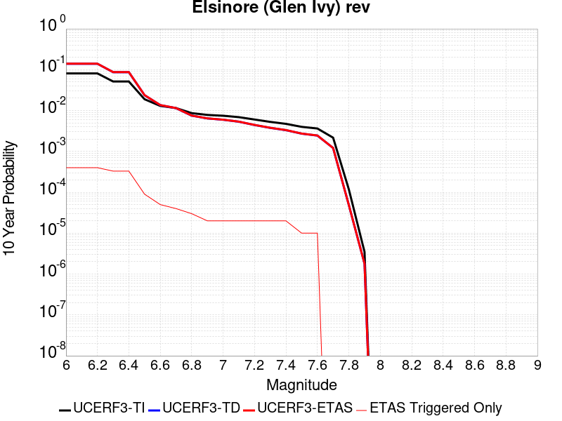 |

| Magnitude | 1 wk TI Prob | 1 wk TD Prob | 1 wk ETAS Prob | 1 wk ETAS/TD Gain | 1 wk ETAS Triggered Only | 1 mo TI Prob | 1 mo TD Prob | 1 mo ETAS Prob | 1 mo ETAS/TD Gain | 1 mo ETAS Triggered Only | 1 yr TI Prob | 1 yr TD Prob | 1 yr ETAS Prob | 1 yr ETAS/TD Gain | 1 yr ETAS Triggered Only | 10 yr TI Prob | 10 yr TD Prob | 10 yr ETAS Prob | 10 yr ETAS/TD Gain | 10 yr ETAS Triggered Only |
|-----|-----|-----|-----|-----|-----|-----|-----|-----|-----|-----|-----|-----|-----|-----|-----|-----|-----|-----|-----|-----|
| 6.0 | 1.6204086E-4 | 2.9360707E-4 | 3.454053E-4 | 1.1764203 | 5.1813473E-5 | 6.94276E-4 | 0.0012578638 | 0.0013613604 | 1.0822797 | 1.03626946E-4 | 0.008420097 | 0.015234485 | 0.015438582 | 1.013397 | 2.0725389E-4 | 0.081081145 | 0.13969168 | 0.14004828 | 1.0025527 | 4.1450778E-4 |
| 6.1 | 1.6204086E-4 | 2.9360707E-4 | 3.454053E-4 | 1.1764203 | 5.1813473E-5 | 6.94276E-4 | 0.0012578638 | 0.0013613604 | 1.0822797 | 1.03626946E-4 | 0.008420097 | 0.015234485 | 0.015438582 | 1.013397 | 2.0725389E-4 | 0.081081145 | 0.13969168 | 0.14004828 | 1.0025527 | 4.1450778E-4 |
| 6.2 | 1.6204086E-4 | 2.9360707E-4 | 3.454053E-4 | 1.1764203 | 5.1813473E-5 | 6.94276E-4 | 0.0012578638 | 0.0013613604 | 1.0822797 | 1.03626946E-4 | 0.008420097 | 0.015234485 | 0.015438582 | 1.013397 | 2.0725389E-4 | 0.081081145 | 0.13969168 | 0.14004828 | 1.0025527 | 4.1450778E-4 |
| 6.3 | 1.0111737E-4 | 1.7703383E-4 | 2.2883812E-4 | 1.2926238 | 5.1813473E-5 | 4.332882E-4 | 7.5861247E-4 | 8.6216076E-4 | 1.136497 | 1.03626946E-4 | 0.005262531 | 0.009217682 | 0.009423026 | 1.0222771 | 2.0725389E-4 | 0.0513964 | 0.0870191 | 0.087350234 | 1.0038053 | 3.626943E-4 |
| 6.4 | 1.0111737E-4 | 1.7703383E-4 | 2.2883812E-4 | 1.2926238 | 5.1813473E-5 | 4.332882E-4 | 7.5861247E-4 | 8.6216076E-4 | 1.136497 | 1.03626946E-4 | 0.005262531 | 0.009217682 | 0.009423026 | 1.0222771 | 2.0725389E-4 | 0.0513964 | 0.0870191 | 0.087350234 | 1.0038053 | 3.626943E-4 |
| 6.5 | 3.6624708E-5 | 4.6391084E-5 | 4.6391084E-5 | 1.0 | 0.0 | 1.569536E-4 | 1.9880582E-4 | 2.50609E-4 | 1.2605717 | 5.1813473E-5 | 0.001909235 | 0.0024181372 | 0.0025215135 | 1.0427504 | 1.03626946E-4 | 0.01892915 | 0.023739954 | 0.023841122 | 1.0042615 | 1.03626946E-4 |
| 6.6 | 2.5051324E-5 | 2.614772E-5 | 2.614772E-5 | 1.0 | 0.0 | 1.073584E-4 | 1.12057096E-4 | 1.6386477E-4 | 1.4623327 | 5.1813473E-5 | 0.0013063047 | 0.0013634858 | 0.0014669715 | 1.0758978 | 1.03626946E-4 | 0.012986525 | 0.013564618 | 0.013666839 | 1.0075359 | 1.03626946E-4 |
| 6.7 | 2.2189772E-5 | 2.2072849E-5 | 2.2072849E-5 | 1.0 | 0.0 | 9.509556E-5 | 9.4594696E-5 | 1.4640327E-4 | 1.54769 | 5.1813473E-5 | 0.0011571734 | 0.0011511183 | 0.001254626 | 1.0899192 | 1.03626946E-4 | 0.011511663 | 0.011465415 | 0.011567854 | 1.0089346 | 1.03626946E-4 |
| 6.8 | 1.6654378E-5 | 1.4437705E-5 | 1.4437705E-5 | 1.0 | 0.0 | 7.137396E-5 | 6.187444E-5 | 1.13684706E-4 | 1.8373452 | 5.1813473E-5 | 8.686314E-4 | 7.530661E-4 | 8.56615E-4 | 1.137503 | 1.03626946E-4 | 0.008652439 | 0.00751048 | 0.0076133288 | 1.013694 | 1.03626946E-4 |
| 6.9 | 1.5042909E-5 | 1.2332022E-5 | 1.2332022E-5 | 1.0 | 0.0 | 6.446802E-5 | 5.285047E-5 | 1.046612E-4 | 1.9803268 | 5.1813473E-5 | 7.8461546E-4 | 6.4326765E-4 | 6.950478E-4 | 1.0804955 | 5.1813473E-5 | 0.007818509 | 0.00641828 | 0.006469761 | 1.008021 | 5.1813473E-5 |
| 7.0 | 1.4361385E-5 | 1.1451324E-5 | 1.1451324E-5 | 1.0 | 0.0 | 6.154734E-5 | 4.9076196E-5 | 1.00887126E-4 | 2.0557241 | 5.1813473E-5 | 7.490812E-4 | 5.973418E-4 | 6.491243E-4 | 1.0866883 | 5.1813473E-5 | 0.007465612 | 0.0059613534 | 0.006012858 | 1.0086397 | 5.1813473E-5 |
| 7.1 | 1.3265571E-5 | 1.0244926E-5 | 1.0244926E-5 | 1.0 | 0.0 | 5.6851208E-5 | 4.39061E-5 | 9.5717296E-5 | 2.1800456 | 5.1813473E-5 | 6.919436E-4 | 5.344282E-4 | 5.8621395E-4 | 1.0968994 | 5.1813473E-5 | 0.006897931 | 0.0053347866 | 0.0053863237 | 1.0096606 | 5.1813473E-5 |
| 7.2 | 1.1596403E-5 | 8.505067E-6 | 8.505067E-6 | 1.0 | 0.0 | 4.9697923E-5 | 3.6449786E-5 | 8.826137E-5 | 2.4214509 | 5.1813473E-5 | 6.049042E-4 | 4.436875E-4 | 4.95478E-4 | 1.1167274 | 5.1813473E-5 | 0.006032603 | 0.0044294316 | 0.0044810157 | 1.0116457 | 5.1813473E-5 |
| 7.3 | 1.0150827E-5 | 7.2387597E-6 | 7.2387597E-6 | 1.0 | 0.0 | 4.3502816E-5 | 3.1022897E-5 | 8.283476E-5 | 2.670117 | 5.1813473E-5 | 5.2951806E-4 | 3.7763975E-4 | 4.2943365E-4 | 1.1371516 | 5.1813473E-5 | 0.005282581 | 0.0037703665 | 0.0038219846 | 1.0136905 | 5.1813473E-5 |
| 7.4 | 9.080705E-6 | 6.352519E-6 | 6.352519E-6 | 1.0 | 0.0 | 3.8916725E-5 | 2.7224805E-5 | 7.9036865E-5 | 2.9031196 | 5.1813473E-5 | 4.7370812E-4 | 3.3141294E-4 | 3.8320926E-4 | 1.1562893 | 5.1813473E-5 | 0.004726996 | 0.0033093381 | 0.00336098 | 1.015605 | 5.1813473E-5 |
| 7.5 | 7.671649E-6 | 5.2256332E-6 | 5.2256332E-6 | 1.0 | 0.0 | 3.287808E-5 | 2.2395385E-5 | 7.4207695E-5 | 3.3135262 | 5.1813473E-5 | 4.0021708E-4 | 2.7263095E-4 | 3.244303E-4 | 1.189998 | 5.1813473E-5 | 0.0039949706 | 0.00272309 | 0.0027747622 | 1.0189756 | 5.1813473E-5 |
| 7.6 | 6.990086E-6 | 4.687545E-6 | 4.687545E-6 | 1.0 | 0.0 | 2.9957167E-5 | 2.008933E-5 | 7.190176E-5 | 3.579102 | 5.1813473E-5 | 3.6466747E-4 | 2.445613E-4 | 2.963621E-4 | 1.2118111 | 5.1813473E-5 | 0.0036406964 | 0.002443038 | 0.0024947247 | 1.0211568 | 5.1813473E-5 |
| 7.7 | 4.163505E-6 | 2.3295343E-6 | 2.3295343E-6 | 1.0 | 0.0 | 1.7843471E-5 | 9.983683E-6 | 9.983683E-6 | 1.0 | 0.0 | 2.172226E-4 | 1.21545316E-4 | 1.21545316E-4 | 1.0 | 0.0 | 0.0021701038 | 0.0012148614 | 0.0012148614 | 1.0 | 0.0 |
| 7.8 | 2.2692414E-7 | 9.3854695E-8 | 9.3854695E-8 | 1.0 | 0.0 | 9.725317E-7 | 4.0223435E-7 | 4.0223435E-7 | 1.0 | 0.0 | 1.1840509E-5 | 4.8971956E-6 | 4.8971956E-6 | 1.0 | 0.0 | 1.1839878E-4 | 4.8971204E-5 | 4.8971204E-5 | 1.0 | 0.0 |
| 7.9 | 6.676829E-9 | 3.439853E-9 | 3.439853E-9 | 1.0 | 0.0 | 2.861498E-8 | 1.4742227E-8 | 1.4742227E-8 | 1.0 | 0.0 | 3.4838732E-7 | 1.7948659E-7 | 1.7948659E-7 | 1.0 | 0.0 | 3.4838679E-6 | 1.7948646E-6 | 1.7948646E-6 | 1.0 | 0.0 |

## San Andreas (Cholame) rev
*[(top)](#table-of-contents)*

| 1 Week | 1 Month | 1 Year | 10 Year |
|-----|-----|-----|-----|
|  |  |  |  |

| Magnitude | 1 wk TI Prob | 1 wk TD Prob | 1 wk ETAS Prob | 1 wk ETAS/TD Gain | 1 wk ETAS Triggered Only | 1 mo TI Prob | 1 mo TD Prob | 1 mo ETAS Prob | 1 mo ETAS/TD Gain | 1 mo ETAS Triggered Only | 1 yr TI Prob | 1 yr TD Prob | 1 yr ETAS Prob | 1 yr ETAS/TD Gain | 1 yr ETAS Triggered Only | 10 yr TI Prob | 10 yr TD Prob | 10 yr ETAS Prob | 10 yr ETAS/TD Gain | 10 yr ETAS Triggered Only |
|-----|-----|-----|-----|-----|-----|-----|-----|-----|-----|-----|-----|-----|-----|-----|-----|-----|-----|-----|-----|-----|
| 6.0 | 1.2302514E-4 | 2.5204287E-4 | 3.556437E-4 | 1.4110445 | 1.03626946E-4 | 5.27144E-4 | 0.0010797381 | 0.0011832532 | 1.0958705 | 1.03626946E-4 | 0.0063991086 | 0.0130670825 | 0.013373901 | 1.0234803 | 3.1088083E-4 | 0.06217949 | 0.12439073 | 0.12484441 | 1.0036472 | 5.1813474E-4 |
| 6.1 | 1.2302514E-4 | 2.5204287E-4 | 3.556437E-4 | 1.4110445 | 1.03626946E-4 | 5.27144E-4 | 0.0010797381 | 0.0011832532 | 1.0958705 | 1.03626946E-4 | 0.0063991086 | 0.0130670825 | 0.013373901 | 1.0234803 | 3.1088083E-4 | 0.06217949 | 0.12439073 | 0.12484441 | 1.0036472 | 5.1813474E-4 |
| 6.2 | 1.2203569E-4 | 2.5021084E-4 | 3.5381186E-4 | 1.4140549 | 1.03626946E-4 | 5.2290526E-4 | 0.0010718931 | 0.001175409 | 1.096573 | 1.03626946E-4 | 0.006347804 | 0.01297271 | 0.013279557 | 1.0236534 | 3.1088083E-4 | 0.061695136 | 0.12357691 | 0.124031015 | 1.0036746 | 5.1813474E-4 |
| 6.3 | 1.2142645E-4 | 2.4907055E-4 | 3.526717E-4 | 1.4159509 | 1.03626946E-4 | 5.202953E-4 | 0.0010670102 | 0.0011705266 | 1.0970154 | 1.03626946E-4 | 0.006316212 | 0.012913967 | 0.013220833 | 1.0237623 | 3.1088083E-4 | 0.06139677 | 0.12307103 | 0.123525396 | 1.0036919 | 5.1813474E-4 |
| 6.4 | 1.1865206E-4 | 2.44126E-4 | 3.4772765E-4 | 1.4243778 | 1.03626946E-4 | 5.0840975E-4 | 0.0010458364 | 0.001149355 | 1.0989816 | 1.03626946E-4 | 0.006172335 | 0.012659196 | 0.012914984 | 1.0202057 | 2.5906737E-4 | 0.060036868 | 0.1208638 | 0.12127376 | 1.0033919 | 4.6632125E-4 |
| 6.5 | 1.17443946E-4 | 2.4205919E-4 | 3.4566104E-4 | 1.4280021 | 1.03626946E-4 | 5.032341E-4 | 0.0010369857 | 0.0011405052 | 1.0998273 | 1.03626946E-4 | 0.006109677 | 0.012552682 | 0.012808498 | 1.0203793 | 2.5906737E-4 | 0.059444077 | 0.11993805 | 0.120348446 | 1.0034217 | 4.6632125E-4 |
| 6.6 | 1.13579066E-4 | 2.3514954E-4 | 3.387521E-4 | 1.4405817 | 1.03626946E-4 | 4.866766E-4 | 0.001007396 | 0.0011109186 | 1.1027625 | 1.03626946E-4 | 0.0059092017 | 0.012196515 | 0.012452423 | 1.020982 | 2.5906737E-4 | 0.057545185 | 0.11685214 | 0.11726397 | 1.0035244 | 4.6632125E-4 |
| 6.7 | 1.1271412E-4 | 2.3359268E-4 | 3.3719544E-4 | 1.4435188 | 1.03626946E-4 | 4.829711E-4 | 0.0010007289 | 0.0011042522 | 1.1034478 | 1.03626946E-4 | 0.005864331 | 0.012116249 | 0.012372177 | 1.0211227 | 2.5906737E-4 | 0.057119697 | 0.116155714 | 0.116567865 | 1.0035483 | 4.6632125E-4 |
| 6.8 | 1.1217975E-4 | 2.3247694E-4 | 3.360798E-4 | 1.4456478 | 1.03626946E-4 | 4.8068175E-4 | 9.959509E-4 | 0.0010994746 | 1.1039447 | 1.03626946E-4 | 0.005836608 | 0.012058721 | 0.012314664 | 1.0212247 | 2.5906737E-4 | 0.056856725 | 0.11565396 | 0.11606635 | 1.0035657 | 4.6632125E-4 |
| 6.9 | 1.1146753E-4 | 2.3096445E-4 | 3.3456745E-4 | 1.4485669 | 1.03626946E-4 | 4.7763053E-4 | 9.894737E-4 | 0.0010929981 | 1.1046257 | 1.03626946E-4 | 0.0057996577 | 0.011980731 | 0.012236695 | 1.0213646 | 2.5906737E-4 | 0.056506127 | 0.11497439 | 0.1153871 | 1.0035895 | 4.6632125E-4 |
| 7.0 | 1.0965793E-4 | 2.2719789E-4 | 3.308013E-4 | 1.4560051 | 1.03626946E-4 | 4.698779E-4 | 9.733434E-4 | 0.0010768694 | 1.1063613 | 1.03626946E-4 | 0.005705768 | 0.011786487 | 0.012042501 | 1.021721 | 2.5906737E-4 | 0.055614736 | 0.11327597 | 0.11368946 | 1.0036503 | 4.6632125E-4 |
| 7.1 | 9.927982E-5 | 2.0538924E-4 | 3.089949E-4 | 1.5044357 | 1.03626946E-4 | 4.2541555E-4 | 8.7994366E-4 | 9.834794E-4 | 1.1176618 | 1.03626946E-4 | 0.0051671406 | 0.010660981 | 0.010917286 | 1.0240414 | 2.5906737E-4 | 0.05048634 | 0.1033706 | 0.10378872 | 1.0040449 | 4.6632125E-4 |
| 7.2 | 9.696786E-5 | 2.0043184E-4 | 2.5223492E-4 | 1.2584574 | 5.1813473E-5 | 4.1551032E-4 | 8.5871184E-4 | 9.104808E-4 | 1.0602868 | 5.1813473E-5 | 0.00504711 | 0.010404981 | 0.010610078 | 1.0197115 | 2.0725389E-4 | 0.04934009 | 0.1011086 | 0.101434626 | 1.0032245 | 3.626943E-4 |
| 7.3 | 9.4727984E-5 | 1.9472468E-4 | 2.4652807E-4 | 1.266034 | 5.1813473E-5 | 4.0591392E-4 | 8.3426846E-4 | 8.860387E-4 | 1.0620546 | 5.1813473E-5 | 0.0049308087 | 0.010110183 | 0.010315341 | 1.0202923 | 2.0725389E-4 | 0.048228268 | 0.09847952 | 0.09880649 | 1.0033202 | 3.626943E-4 |
| 7.4 | 9.220358E-5 | 1.8843076E-4 | 2.4023447E-4 | 1.2749218 | 5.1813473E-5 | 3.9509835E-4 | 8.073114E-4 | 8.59083E-4 | 1.0641285 | 5.1813473E-5 | 0.004799717 | 0.009784967 | 0.009990192 | 1.0209736 | 2.0725389E-4 | 0.046973653 | 0.095557496 | 0.09588554 | 1.0034329 | 3.626943E-4 |
| 7.5 | 7.71631E-5 | 1.5177966E-4 | 2.0358527E-4 | 1.3413211 | 5.1813473E-5 | 3.306571E-4 | 6.503223E-4 | 7.021021E-4 | 1.0796217 | 5.1813473E-5 | 0.0040183207 | 0.007889002 | 0.008043216 | 1.0195479 | 1.5544042E-4 | 0.03946433 | 0.07828531 | 0.07857185 | 1.0036602 | 3.1088083E-4 |
| 7.6 | 7.5634416E-5 | 1.483744E-4 | 2.0018018E-4 | 1.3491558 | 5.1813473E-5 | 3.241072E-4 | 6.3573546E-4 | 6.87516E-4 | 1.0814499 | 5.1813473E-5 | 0.0039388672 | 0.0077126776 | 0.007866919 | 1.0199984 | 1.5544042E-4 | 0.038697794 | 0.07664872 | 0.076935776 | 1.0037451 | 3.1088083E-4 |
| 7.7 | 6.3783E-5 | 1.235872E-4 | 1.7539428E-4 | 1.4191945 | 5.1813473E-5 | 2.7332708E-4 | 5.29552E-4 | 5.81338E-4 | 1.0977921 | 5.1813473E-5 | 0.0033226798 | 0.0064282627 | 0.006582704 | 1.0240253 | 1.5544042E-4 | 0.032734364 | 0.06454029 | 0.06483111 | 1.004506 | 3.1088083E-4 |
| 7.8 | 5.863422E-5 | 1.1416107E-4 | 1.6596862E-4 | 1.453811 | 5.1813473E-5 | 2.512653E-4 | 4.8917E-4 | 5.409582E-4 | 1.1058694 | 5.1813473E-5 | 0.003054864 | 0.0059394026 | 0.0060424143 | 1.0173438 | 1.03626946E-4 | 0.030132094 | 0.059659187 | 0.0599028 | 1.0040834 | 2.5906737E-4 |
| 7.9 | 4.595283E-5 | 8.426331E-5 | 1.3607241E-4 | 1.6148478 | 5.1813473E-5 | 1.9692584E-4 | 3.610785E-4 | 4.1287328E-4 | 1.1434447 | 5.1813473E-5 | 0.0023949358 | 0.0043872762 | 0.0044904486 | 1.0235163 | 1.03626946E-4 | 0.023692891 | 0.044362005 | 0.04451055 | 1.0033485 | 1.5544042E-4 |
| 8.0 | 3.2950178E-5 | 5.0772942E-5 | 1.02583785E-4 | 2.020442 | 5.1813473E-5 | 1.412074E-4 | 2.1758018E-4 | 2.6938238E-4 | 1.2380832 | 5.1813473E-5 | 0.0017178444 | 0.0026458222 | 0.002749175 | 1.0390626 | 1.03626946E-4 | 0.017046256 | 0.027180137 | 0.027331352 | 1.0055635 | 1.5544042E-4 |
| 8.1 | 1.9177472E-5 | 1.9185145E-5 | 7.099762E-5 | 3.700656 | 5.1813473E-5 | 8.218658E-5 | 8.221946E-5 | 1.3402867E-4 | 1.6301332 | 5.1813473E-5 | 0.0010001622 | 0.0010005629 | 0.0010523245 | 1.0517325 | 5.1813473E-5 | 0.009956728 | 0.010758142 | 0.0108606545 | 1.0095288 | 1.03626946E-4 |
| 8.2 | 8.643924E-6 | 5.4748625E-6 | 5.4748625E-6 | 1.0 | 0.0 | 3.704486E-5 | 2.3463486E-5 | 2.3463486E-5 | 1.0 | 0.0 | 4.5092785E-4 | 2.8563058E-4 | 2.8563058E-4 | 1.0 | 0.0 | 0.0045001395 | 0.0032487072 | 0.0032487072 | 1.0 | 0.0 |
| 8.3 | 1.983087E-6 | 7.6599065E-7 | 7.6599065E-7 | 1.0 | 0.0 | 8.498917E-6 | 3.282813E-6 | 3.282813E-6 | 1.0 | 0.0 | 1.034694E-4 | 3.9967534E-5 | 3.9967534E-5 | 1.0 | 0.0 | 0.0010342124 | 4.719687E-4 | 4.719687E-4 | 1.0 | 0.0 |

## Red Pass
*[(top)](#table-of-contents)*

| 1 Week | 1 Month | 1 Year | 10 Year |
|-----|-----|-----|-----|
|  |  |  | 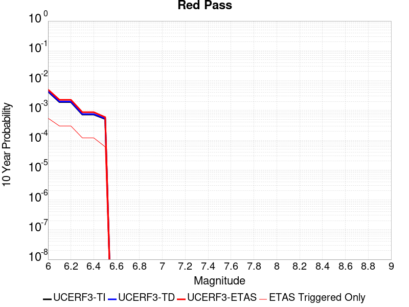 |

| Magnitude | 1 wk TI Prob | 1 wk TD Prob | 1 wk ETAS Prob | 1 wk ETAS/TD Gain | 1 wk ETAS Triggered Only | 1 mo TI Prob | 1 mo TD Prob | 1 mo ETAS Prob | 1 mo ETAS/TD Gain | 1 mo ETAS Triggered Only | 1 yr TI Prob | 1 yr TD Prob | 1 yr ETAS Prob | 1 yr ETAS/TD Gain | 1 yr ETAS Triggered Only | 10 yr TI Prob | 10 yr TD Prob | 10 yr ETAS Prob | 10 yr ETAS/TD Gain | 10 yr ETAS Triggered Only |
|-----|-----|-----|-----|-----|-----|-----|-----|-----|-----|-----|-----|-----|-----|-----|-----|-----|-----|-----|-----|-----|
| 6.0 | 8.258278E-6 | 8.551265E-6 | 2.1580337E-4 | 25.236427 | 2.0725389E-4 | 3.539214E-5 | 3.6647863E-5 | 2.9570571E-4 | 8.068839 | 2.5906737E-4 | 4.308141E-4 | 4.4611428E-4 | 8.604371E-4 | 1.928737 | 4.1450778E-4 | 0.0042997985 | 0.004453945 | 0.004969772 | 1.1158135 | 5.1813474E-4 |
| 6.1 | 3.649988E-6 | 3.7753161E-6 | 5.5588593E-5 | 14.724222 | 5.1813473E-5 | 1.5642712E-5 | 1.6179853E-5 | 1.1980512E-4 | 7.4045863 | 1.03626946E-4 | 1.9043336E-4 | 1.9697666E-4 | 3.5238644E-4 | 1.7889757 | 1.5544042E-4 | 0.0019027026 | 0.001968488 | 0.002175334 | 1.1050786 | 2.0725389E-4 |
| 6.2 | 3.649988E-6 | 3.7753161E-6 | 5.5588593E-5 | 14.724222 | 5.1813473E-5 | 1.5642712E-5 | 1.6179853E-5 | 1.1980512E-4 | 7.4045863 | 1.03626946E-4 | 1.9043336E-4 | 1.9697666E-4 | 3.5238644E-4 | 1.7889757 | 1.5544042E-4 | 0.0019027026 | 0.001968488 | 0.002175334 | 1.1050786 | 2.0725389E-4 |
| 6.3 | 1.3924937E-6 | 1.4411166E-6 | 1.4411166E-6 | 1.0 | 0.0 | 5.9678164E-6 | 6.1762075E-6 | 6.1762075E-6 | 1.0 | 0.0 | 7.265574E-5 | 7.519415E-5 | 7.519415E-5 | 1.0 | 0.0 | 7.263199E-4 | 7.518258E-4 | 7.518258E-4 | 1.0 | 0.0 |
| 6.4 | 1.3924937E-6 | 1.4411166E-6 | 1.4411166E-6 | 1.0 | 0.0 | 5.9678164E-6 | 6.1762075E-6 | 6.1762075E-6 | 1.0 | 0.0 | 7.265574E-5 | 7.519415E-5 | 7.519415E-5 | 1.0 | 0.0 | 7.263199E-4 | 7.518258E-4 | 7.518258E-4 | 1.0 | 0.0 |
| 6.5 | 9.876812E-7 | 1.0221912E-6 | 1.0221912E-6 | 1.0 | 0.0 | 4.2329125E-6 | 4.3808195E-6 | 4.3808195E-6 | 1.0 | 0.0 | 5.153449E-5 | 5.3336476E-5 | 5.3336476E-5 | 1.0 | 0.0 | 5.1522546E-4 | 5.333648E-4 | 5.333648E-4 | 1.0 | 0.0 |

## Santa Ynez (East)
*[(top)](#table-of-contents)*

| 1 Week | 1 Month | 1 Year | 10 Year |
|-----|-----|-----|-----|
|  |  |  | 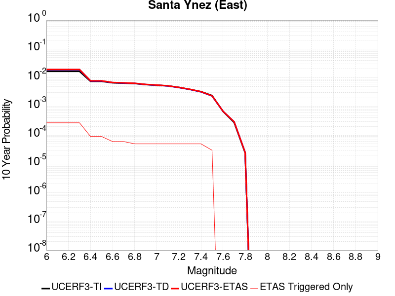 |

| Magnitude | 1 wk TI Prob | 1 wk TD Prob | 1 wk ETAS Prob | 1 wk ETAS/TD Gain | 1 wk ETAS Triggered Only | 1 mo TI Prob | 1 mo TD Prob | 1 mo ETAS Prob | 1 mo ETAS/TD Gain | 1 mo ETAS Triggered Only | 1 yr TI Prob | 1 yr TD Prob | 1 yr ETAS Prob | 1 yr ETAS/TD Gain | 1 yr ETAS Triggered Only | 10 yr TI Prob | 10 yr TD Prob | 10 yr ETAS Prob | 10 yr ETAS/TD Gain | 10 yr ETAS Triggered Only |
|-----|-----|-----|-----|-----|-----|-----|-----|-----|-----|-----|-----|-----|-----|-----|-----|-----|-----|-----|-----|-----|
| 6.0 | 3.2269712E-5 | 3.67505E-5 | 8.856207E-5 | 2.4098194 | 5.1813473E-5 | 1.3829143E-4 | 1.5749598E-4 | 3.647172E-4 | 2.3157241 | 2.0725389E-4 | 0.0016823979 | 0.0019164166 | 0.0022267017 | 1.161909 | 3.1088083E-4 | 0.016697178 | 0.019056441 | 0.01946305 | 1.021337 | 4.1450778E-4 |
| 6.1 | 3.2269712E-5 | 3.67505E-5 | 8.856207E-5 | 2.4098194 | 5.1813473E-5 | 1.3829143E-4 | 1.5749598E-4 | 3.647172E-4 | 2.3157241 | 2.0725389E-4 | 0.0016823979 | 0.0019164166 | 0.0022267017 | 1.161909 | 3.1088083E-4 | 0.016697178 | 0.019056441 | 0.01946305 | 1.021337 | 4.1450778E-4 |
| 6.2 | 3.2269712E-5 | 3.67505E-5 | 8.856207E-5 | 2.4098194 | 5.1813473E-5 | 1.3829143E-4 | 1.5749598E-4 | 3.647172E-4 | 2.3157241 | 2.0725389E-4 | 0.0016823979 | 0.0019164166 | 0.0022267017 | 1.161909 | 3.1088083E-4 | 0.016697178 | 0.019056441 | 0.01946305 | 1.021337 | 4.1450778E-4 |
| 6.3 | 3.2269712E-5 | 3.67505E-5 | 8.856207E-5 | 2.4098194 | 5.1813473E-5 | 1.3829143E-4 | 1.5749598E-4 | 3.647172E-4 | 2.3157241 | 2.0725389E-4 | 0.0016823979 | 0.0019164166 | 0.0022267017 | 1.161909 | 3.1088083E-4 | 0.016697178 | 0.019056441 | 0.01946305 | 1.021337 | 4.1450778E-4 |
| 6.4 | 1.4404779E-5 | 1.4849382E-5 | 6.666208E-5 | 4.489216 | 5.1813473E-5 | 6.1733306E-5 | 6.363868E-5 | 1.6725903E-4 | 2.6282604 | 1.03626946E-4 | 7.513438E-4 | 7.745306E-4 | 9.298506E-4 | 1.2005343 | 1.5544042E-4 | 0.0074880854 | 0.007718862 | 0.007873102 | 1.0199823 | 1.5544042E-4 |
| 6.5 | 1.4404779E-5 | 1.4849382E-5 | 6.666208E-5 | 4.489216 | 5.1813473E-5 | 6.1733306E-5 | 6.363868E-5 | 1.6725903E-4 | 2.6282604 | 1.03626946E-4 | 7.513438E-4 | 7.745306E-4 | 9.298506E-4 | 1.2005343 | 1.5544042E-4 | 0.0074880854 | 0.007718862 | 0.007873102 | 1.0199823 | 1.5544042E-4 |
| 6.6 | 1.280208E-5 | 1.3011947E-5 | 6.4824744E-5 | 4.9819403 | 5.1813473E-5 | 5.4864904E-5 | 5.5764307E-5 | 1.5938547E-4 | 2.858199 | 1.03626946E-4 | 6.6777546E-4 | 6.787207E-4 | 8.340556E-4 | 1.2288643 | 1.5544042E-4 | 0.006657724 | 0.0067666885 | 0.006921077 | 1.022816 | 1.5544042E-4 |
| 6.7 | 1.2457027E-5 | 1.2628468E-5 | 6.444129E-5 | 5.1028585 | 5.1813473E-5 | 5.3386164E-5 | 5.412089E-5 | 1.5774222E-4 | 2.9146273 | 1.03626946E-4 | 6.497827E-4 | 6.587243E-4 | 8.140623E-4 | 1.2358165 | 1.5544042E-4 | 0.00647886 | 0.006567915 | 0.0067223343 | 1.0235112 | 1.5544042E-4 |
| 6.8 | 1.2095134E-5 | 1.2230915E-5 | 6.404375E-5 | 5.2362194 | 5.1813473E-5 | 5.1835254E-5 | 5.241716E-5 | 1.5603867E-4 | 2.9768624 | 1.03626946E-4 | 6.309115E-4 | 6.379937E-4 | 7.933349E-4 | 1.243484 | 1.5544042E-4 | 0.0062912325 | 0.006361809 | 0.0065162606 | 1.0242779 | 1.5544042E-4 |
| 6.9 | 1.1104036E-5 | 1.1157347E-5 | 6.297024E-5 | 5.643836 | 5.1813473E-5 | 4.758786E-5 | 4.781633E-5 | 1.5143832E-4 | 3.1670835 | 1.03626946E-4 | 5.7922816E-4 | 5.820096E-4 | 7.373595E-4 | 1.2669199 | 1.5544042E-4 | 0.005777207 | 0.0058049993 | 0.0059595373 | 1.0266216 | 1.5544042E-4 |
| 7.0 | 1.0577444E-5 | 1.058168E-5 | 6.23946E-5 | 5.8964744 | 5.1813473E-5 | 4.5331115E-5 | 4.5349276E-5 | 1.4897152E-4 | 3.2849813 | 1.03626946E-4 | 5.5176654E-4 | 5.519888E-4 | 7.073434E-4 | 1.2814453 | 1.5544042E-4 | 0.0055039856 | 0.0055063153 | 0.0056609 | 1.028074 | 1.5544042E-4 |
| 7.1 | 1.0021775E-5 | 9.980988E-6 | 6.1793944E-5 | 6.191165 | 5.1813473E-5 | 4.294976E-5 | 4.2774966E-5 | 1.4639748E-4 | 3.4225037 | 1.03626946E-4 | 5.2278786E-4 | 5.2066194E-4 | 6.7602145E-4 | 1.2983884 | 1.5544042E-4 | 0.0052155964 | 0.0051945536 | 0.0053491867 | 1.0297683 | 1.5544042E-4 |
| 7.2 | 8.874109E-6 | 8.748793E-6 | 6.056181E-5 | 6.922304 | 5.1813473E-5 | 3.8031343E-5 | 3.7494297E-5 | 1.4111736E-4 | 3.763702 | 1.03626946E-4 | 4.629332E-4 | 4.5639853E-4 | 6.11768E-4 | 1.340425 | 1.5544042E-4 | 0.0046197 | 0.0045547304 | 0.0047094626 | 1.0339718 | 1.5544042E-4 |
| 7.3 | 7.5504267E-6 | 7.5051175E-6 | 5.93182E-5 | 7.9037004 | 5.1813473E-5 | 3.235857E-5 | 3.21644E-5 | 1.3578801E-4 | 4.2216864 | 1.03626946E-4 | 3.9389438E-4 | 3.915322E-4 | 5.469118E-4 | 1.39685 | 1.5544042E-4 | 0.0039319694 | 0.003908531 | 0.0040633637 | 1.0396141 | 1.5544042E-4 |
| 7.4 | 6.309394E-6 | 6.1831556E-6 | 5.7996305E-5 | 9.379726 | 5.1813473E-5 | 2.703998E-5 | 2.6498974E-5 | 1.3012317E-4 | 4.910498 | 1.03626946E-4 | 3.2916202E-4 | 3.225782E-4 | 4.7796848E-4 | 1.4817135 | 1.5544042E-4 | 0.003286749 | 0.003221197 | 0.0033761368 | 1.0481 | 1.5544042E-4 |
| 7.5 | 4.6103073E-6 | 4.4408903E-6 | 5.625413E-5 | 12.667309 | 5.1813473E-5 | 1.975831E-5 | 1.9032252E-5 | 1.2265722E-4 | 6.4447036 | 1.03626946E-4 | 2.4053088E-4 | 2.3169373E-4 | 3.3529667E-4 | 1.4471546 | 1.03626946E-4 | 0.002402707 | 0.002314591 | 0.0024179781 | 1.0446675 | 1.03626946E-4 |
| 7.6 | 1.2858658E-6 | 1.3008173E-6 | 1.3008173E-6 | 1.0 | 0.0 | 5.5108417E-6 | 5.5749197E-6 | 5.5749197E-6 | 1.0 | 0.0 | 6.7092435E-5 | 6.78726E-5 | 6.78726E-5 | 1.0 | 0.0 | 6.707218E-4 | 6.785256E-4 | 6.785256E-4 | 1.0 | 0.0 |
| 7.7 | 5.3302307E-7 | 5.612138E-7 | 5.612138E-7 | 1.0 | 0.0 | 2.2843826E-6 | 2.4052001E-6 | 2.4052001E-6 | 1.0 | 0.0 | 2.7812002E-5 | 2.9282954E-5 | 2.9282954E-5 | 1.0 | 0.0 | 2.7808524E-4 | 2.9279452E-4 | 2.9279452E-4 | 1.0 | 0.0 |
| 7.8 | 4.613933E-8 | 4.80301E-8 | 4.80301E-8 | 1.0 | 0.0 | 1.9773998E-7 | 2.0584326E-7 | 2.0584326E-7 | 1.0 | 0.0 | 2.4074816E-6 | 2.5061388E-6 | 2.5061388E-6 | 1.0 | 0.0 | 2.4074554E-5 | 2.5061116E-5 | 2.5061116E-5 | 1.0 | 0.0 |

## White Wolf (Extension)
*[(top)](#table-of-contents)*

| 1 Week | 1 Month | 1 Year | 10 Year |
|-----|-----|-----|-----|
|  |  |  | 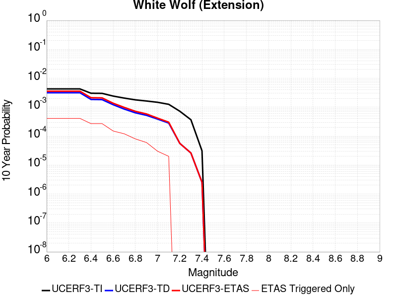 |

| Magnitude | 1 wk TI Prob | 1 wk TD Prob | 1 wk ETAS Prob | 1 wk ETAS/TD Gain | 1 wk ETAS Triggered Only | 1 mo TI Prob | 1 mo TD Prob | 1 mo ETAS Prob | 1 mo ETAS/TD Gain | 1 mo ETAS Triggered Only | 1 yr TI Prob | 1 yr TD Prob | 1 yr ETAS Prob | 1 yr ETAS/TD Gain | 1 yr ETAS Triggered Only | 10 yr TI Prob | 10 yr TD Prob | 10 yr ETAS Prob | 10 yr ETAS/TD Gain | 10 yr ETAS Triggered Only |
|-----|-----|-----|-----|-----|-----|-----|-----|-----|-----|-----|-----|-----|-----|-----|-----|-----|-----|-----|-----|-----|
| 6.0 | 8.222555E-6 | 6.0666657E-6 | 2.6513246E-4 | 43.70316 | 2.5906737E-4 | 3.5239045E-5 | 2.5999774E-5 | 3.8868465E-4 | 14.949539 | 3.626943E-4 | 4.289509E-4 | 3.1650788E-4 | 7.826815E-4 | 2.4728658 | 4.6632125E-4 | 0.0042812387 | 0.003161223 | 0.0036777197 | 1.1633852 | 5.1813474E-4 |
| 6.1 | 8.222555E-6 | 6.0666657E-6 | 2.6513246E-4 | 43.70316 | 2.5906737E-4 | 3.5239045E-5 | 2.5999774E-5 | 3.8868465E-4 | 14.949539 | 3.626943E-4 | 4.289509E-4 | 3.1650788E-4 | 7.826815E-4 | 2.4728658 | 4.6632125E-4 | 0.0042812387 | 0.003161223 | 0.0036777197 | 1.1633852 | 5.1813474E-4 |
| 6.2 | 8.222555E-6 | 6.0666657E-6 | 2.6513246E-4 | 43.70316 | 2.5906737E-4 | 3.5239045E-5 | 2.5999774E-5 | 3.8868465E-4 | 14.949539 | 3.626943E-4 | 4.289509E-4 | 3.1650788E-4 | 7.826815E-4 | 2.4728658 | 4.6632125E-4 | 0.0042812387 | 0.003161223 | 0.0036777197 | 1.1633852 | 5.1813474E-4 |
| 6.3 | 8.222555E-6 | 6.0666657E-6 | 2.6513246E-4 | 43.70316 | 2.5906737E-4 | 3.5239045E-5 | 2.5999774E-5 | 3.8868465E-4 | 14.949539 | 3.626943E-4 | 4.289509E-4 | 3.1650788E-4 | 7.826815E-4 | 2.4728658 | 4.6632125E-4 | 0.0042812387 | 0.003161223 | 0.0036777197 | 1.1633852 | 5.1813474E-4 |
| 6.4 | 5.821773E-6 | 3.5571766E-6 | 1.5899703E-4 | 44.69754 | 1.5544042E-4 | 2.4950215E-5 | 1.5244959E-5 | 2.7430838E-4 | 17.993382 | 2.5906737E-4 | 3.0372653E-4 | 1.8559267E-4 | 4.964158E-4 | 2.6747599 | 3.1088083E-4 | 0.0030331176 | 0.001854485 | 0.0022165067 | 1.1952142 | 3.626943E-4 |
| 6.5 | 5.766023E-6 | 3.4991106E-6 | 1.5893899E-4 | 45.42268 | 1.5544042E-4 | 2.4711293E-5 | 1.4996108E-5 | 2.7405957E-4 | 18.275381 | 2.5906737E-4 | 3.0081844E-4 | 1.8256342E-4 | 4.933875E-4 | 2.702554 | 3.1088083E-4 | 0.0030041158 | 0.0018242426 | 0.0021862753 | 1.1984564 | 3.626943E-4 |
| 6.6 | 4.643576E-6 | 2.332624E-6 | 1.0595933E-4 | 45.424946 | 1.03626946E-4 | 1.9900888E-5 | 9.996925E-6 | 1.6543579E-4 | 16.548668 | 1.5544042E-4 | 2.4226638E-4 | 1.2170619E-4 | 3.2893484E-4 | 2.702696 | 2.0725389E-4 | 0.0024200242 | 0.0012164378 | 0.00147519 | 1.2127131 | 2.5906737E-4 |
| 6.7 | 3.9529173E-6 | 1.6483477E-6 | 5.3461736E-5 | 32.43353 | 5.1813473E-5 | 1.6940963E-5 | 7.0643296E-6 | 1.1069054E-4 | 15.668938 | 1.03626946E-4 | 2.0623671E-4 | 8.6005006E-5 | 2.4143205E-4 | 2.8071861 | 1.5544042E-4 | 0.002060454 | 8.597357E-4 | 0.0010150425 | 1.1806448 | 1.5544042E-4 |
| 6.8 | 3.4377522E-6 | 1.2245237E-6 | 5.3037933E-5 | 43.31311 | 5.1813473E-5 | 1.473314E-5 | 5.2479486E-6 | 1.08874345E-4 | 20.746077 | 1.03626946E-4 | 1.7936122E-4 | 6.3891996E-5 | 2.1932248E-4 | 3.4327068 | 1.5544042E-4 | 0.0017921652 | 6.387454E-4 | 7.940865E-4 | 1.2431973 | 1.5544042E-4 |
| 6.9 | 3.1367306E-6 | 1.0033783E-6 | 5.28168E-5 | 52.638966 | 5.1813473E-5 | 1.3443062E-5 | 4.3001864E-6 | 5.6113437E-5 | 13.04907 | 5.1813473E-5 | 1.63657E-4 | 5.235359E-5 | 1.5597511E-4 | 2.979263 | 1.03626946E-4 | 0.0016353652 | 5.2342017E-4 | 6.269929E-4 | 1.1978768 | 1.03626946E-4 |
| 7.0 | 2.8298145E-6 | 7.4286646E-7 | 7.4286646E-7 | 1.0 | 0.0 | 1.2127721E-5 | 3.1837099E-6 | 3.1837099E-6 | 1.0 | 0.0 | 1.47645E-4 | 3.8761027E-5 | 9.057249E-5 | 2.3366895 | 5.1813473E-5 | 0.0014754693 | 3.8754768E-4 | 4.3934106E-4 | 1.1336439 | 5.1813473E-5 |
| 7.1 | 2.4091064E-6 | 5.4227525E-7 | 5.4227525E-7 | 1.0 | 0.0 | 1.03247E-5 | 2.3240348E-6 | 2.3240348E-6 | 1.0 | 0.0 | 1.2569598E-4 | 2.8294799E-5 | 2.8294799E-5 | 1.0 | 0.0 | 0.001256249 | 2.8291598E-4 | 2.8291598E-4 | 1.0 | 0.0 |
| 7.2 | 1.3875518E-6 | 1.0743063E-7 | 1.0743063E-7 | 1.0 | 0.0 | 5.9466374E-6 | 4.6041689E-7 | 4.6041689E-7 | 1.0 | 0.0 | 7.23979E-5 | 5.6055624E-6 | 5.6055624E-6 | 1.0 | 0.0 | 7.2374323E-4 | 5.6054323E-5 | 5.6054323E-5 | 1.0 | 0.0 |
| 7.3 | 7.056077E-7 | 5.002034E-8 | 5.002034E-8 | 1.0 | 0.0 | 3.0240296E-6 | 2.1437286E-7 | 2.1437286E-7 | 1.0 | 0.0 | 3.681694E-5 | 2.609987E-6 | 2.609987E-6 | 1.0 | 0.0 | 3.681084E-4 | 2.609961E-5 | 2.609961E-5 | 1.0 | 0.0 |
| 7.4 | 5.9334678E-8 | 4.8683537E-9 | 4.8683537E-9 | 1.0 | 0.0 | 2.5429145E-7 | 2.0864372E-8 | 2.0864372E-8 | 1.0 | 0.0 | 3.095994E-6 | 2.5402372E-7 | 2.5402372E-7 | 1.0 | 0.0 | 3.095951E-5 | 2.5402353E-6 | 2.5402353E-6 | 1.0 | 0.0 |

## Mission Ridge-Arroyo Parida-Santa Ana
*[(top)](#table-of-contents)*

| 1 Week | 1 Month | 1 Year | 10 Year |
|-----|-----|-----|-----|
|  |  |  |  |

| Magnitude | 1 wk TI Prob | 1 wk TD Prob | 1 wk ETAS Prob | 1 wk ETAS/TD Gain | 1 wk ETAS Triggered Only | 1 mo TI Prob | 1 mo TD Prob | 1 mo ETAS Prob | 1 mo ETAS/TD Gain | 1 mo ETAS Triggered Only | 1 yr TI Prob | 1 yr TD Prob | 1 yr ETAS Prob | 1 yr ETAS/TD Gain | 1 yr ETAS Triggered Only | 10 yr TI Prob | 10 yr TD Prob | 10 yr ETAS Prob | 10 yr ETAS/TD Gain | 10 yr ETAS Triggered Only |
|-----|-----|-----|-----|-----|-----|-----|-----|-----|-----|-----|-----|-----|-----|-----|-----|-----|-----|-----|-----|-----|
| 6.0 | 4.169034E-5 | 4.7138263E-5 | 1.5076032E-4 | 3.198258 | 1.03626946E-4 | 1.7866064E-4 | 2.0201034E-4 | 3.5741937E-4 | 1.7693121 | 1.5544042E-4 | 0.0021730233 | 0.00245745 | 0.0026641944 | 1.0841297 | 2.0725389E-4 | 0.021518968 | 0.024384614 | 0.024586815 | 1.0082921 | 2.0725389E-4 |
| 6.1 | 1.73813E-5 | 1.6854226E-5 | 1.20479424E-4 | 7.148321 | 1.03626946E-4 | 7.4489166E-5 | 7.223046E-5 | 2.2765965E-4 | 3.151851 | 1.5544042E-4 | 9.065282E-4 | 8.790618E-4 | 0.0010861335 | 1.2355599 | 2.0725389E-4 | 0.009028391 | 0.008756988 | 0.008962427 | 1.02346 | 2.0725389E-4 |
| 6.2 | 1.4622182E-5 | 1.367329E-5 | 1.1729881E-4 | 8.578683 | 1.03626946E-4 | 6.2664985E-5 | 5.8598518E-5 | 2.1402983E-4 | 3.6524785 | 1.5544042E-4 | 7.6267915E-4 | 7.132073E-4 | 9.2031335E-4 | 1.2903869 | 2.0725389E-4 | 0.007600669 | 0.007109627 | 0.0073154075 | 1.0289439 | 2.0725389E-4 |
| 6.3 | 1.3552434E-5 | 1.2482201E-5 | 1.1610785E-4 | 9.301873 | 1.03626946E-4 | 5.8080568E-5 | 5.3494066E-5 | 2.0892617E-4 | 3.905595 | 1.5544042E-4 | 7.069015E-4 | 6.510988E-4 | 8.582177E-4 | 1.3181068 | 2.0725389E-4 | 0.00704657 | 0.006492275 | 0.0066981832 | 1.0317159 | 2.0725389E-4 |
| 6.4 | 1.30977305E-5 | 1.1979156E-5 | 1.1560486E-4 | 9.650501 | 1.03626946E-4 | 5.613192E-5 | 5.1338247E-5 | 2.0677068E-4 | 4.0276146 | 1.5544042E-4 | 6.831918E-4 | 6.248669E-4 | 8.3199126E-4 | 1.3314697 | 2.0725389E-4 | 0.006810953 | 0.0062314444 | 0.006437407 | 1.0330521 | 2.0725389E-4 |
| 6.5 | 1.225205E-5 | 1.1048803E-5 | 1.146746E-4 | 10.378917 | 1.03626946E-4 | 5.2507727E-5 | 4.7351168E-5 | 2.0278423E-4 | 4.28256 | 1.5544042E-4 | 6.3909404E-4 | 5.7635066E-4 | 7.834851E-4 | 1.3593895 | 2.0725389E-4 | 0.006372592 | 0.005748869 | 0.0059549315 | 1.035844 | 2.0725389E-4 |
| 6.6 | 1.1352241E-5 | 1.0063535E-5 | 1.13689435E-4 | 11.297167 | 1.03626946E-4 | 4.8651553E-5 | 4.3128734E-5 | 1.9856244E-4 | 4.603948 | 1.5544042E-4 | 5.921717E-4 | 5.2496797E-4 | 7.32113E-4 | 1.3945862 | 2.0725389E-4 | 0.0059059616 | 0.0052375244 | 0.0054436927 | 1.0393637 | 2.0725389E-4 |
| 6.7 | 1.0864116E-5 | 9.517027E-6 | 1.1314298E-4 | 11.88848 | 1.03626946E-4 | 4.6559664E-5 | 4.0786632E-5 | 1.962207E-4 | 4.8109074 | 1.5544042E-4 | 5.667165E-4 | 4.964661E-4 | 7.036171E-4 | 1.417251 | 2.0725389E-4 | 0.005652734 | 0.004953804 | 0.005160031 | 1.04163 | 2.0725389E-4 |
| 6.8 | 1.0666365E-5 | 9.299779E-6 | 1.1292576E-4 | 12.142843 | 1.03626946E-4 | 4.571219E-5 | 3.9855597E-5 | 1.9528982E-4 | 4.899935 | 1.5544042E-4 | 5.564038E-4 | 4.8513585E-4 | 6.922892E-4 | 1.4270006 | 2.0725389E-4 | 0.005550127 | 0.0048410003 | 0.0050472505 | 1.0426049 | 2.0725389E-4 |
| 6.9 | 1.0038665E-5 | 8.592046E-6 | 1.122181E-4 | 13.060697 | 1.03626946E-4 | 4.302214E-5 | 3.682254E-5 | 1.9225723E-4 | 5.2211833 | 1.5544042E-4 | 5.236687E-4 | 4.4822405E-4 | 6.55385E-4 | 1.4621818 | 2.0725389E-4 | 0.005224364 | 0.004473411 | 0.0046797376 | 1.0461229 | 2.0725389E-4 |
| 7.0 | 9.5379955E-6 | 8.025073E-6 | 5.983813E-5 | 7.4563966 | 5.1813473E-5 | 4.0876483E-5 | 3.4392728E-5 | 1.3801611E-4 | 4.0129447 | 1.03626946E-4 | 4.975576E-4 | 4.1865272E-4 | 5.7402806E-4 | 1.3711318 | 1.5544042E-4 | 0.00496445 | 0.0041788397 | 0.0043336307 | 1.0370415 | 1.5544042E-4 |
| 7.1 | 9.207389E-6 | 7.652375E-6 | 5.946545E-5 | 7.7708488 | 5.1813473E-5 | 3.945964E-5 | 3.279549E-5 | 1.3641904E-4 | 4.159689 | 1.03626946E-4 | 4.803152E-4 | 3.9921363E-4 | 5.54592E-4 | 1.389211 | 1.5544042E-4 | 0.004792784 | 0.003985161 | 0.004139982 | 1.0388494 | 1.5544042E-4 |
| 7.2 | 7.638091E-6 | 5.9311183E-6 | 5.774428E-5 | 9.735817 | 5.1813473E-5 | 3.2734264E-5 | 2.541883E-5 | 1.2904314E-4 | 5.076675 | 1.03626946E-4 | 3.984668E-4 | 3.0943064E-4 | 4.6482295E-4 | 1.5021878 | 1.5544042E-4 | 0.0039775306 | 0.0030900547 | 0.0032450147 | 1.050148 | 1.5544042E-4 |
| 7.3 | 7.2500147E-6 | 5.5961527E-6 | 5.7409336E-5 | 10.258715 | 5.1813473E-5 | 3.1071122E-5 | 2.3983293E-5 | 1.2760775E-4 | 5.3206935 | 1.03626946E-4 | 3.7822526E-4 | 2.9195778E-4 | 4.473528E-4 | 1.5322517 | 1.5544042E-4 | 0.0037758215 | 0.0029157975 | 0.0030707847 | 1.0531543 | 1.5544042E-4 |
| 7.4 | 6.3899715E-6 | 4.9184964E-6 | 4.9184964E-6 | 1.0 | 0.0 | 2.7385306E-5 | 2.10791E-5 | 7.289148E-5 | 3.4579976 | 5.1813473E-5 | 3.3336508E-4 | 2.5660804E-4 | 3.602084E-4 | 1.40373 | 1.03626946E-4 | 0.0033286542 | 0.0025631618 | 0.002666523 | 1.0403258 | 1.03626946E-4 |
| 7.5 | 5.379025E-6 | 4.0838527E-6 | 4.0838527E-6 | 1.0 | 0.0 | 2.305276E-5 | 1.7502109E-5 | 6.931467E-5 | 3.9603612 | 5.1813473E-5 | 2.806312E-4 | 2.1306744E-4 | 3.1667232E-4 | 1.4862539 | 1.03626946E-4 | 0.0028027708 | 0.002128643 | 0.0022320494 | 1.0485785 | 1.03626946E-4 |
| 7.6 | 4.1270696E-6 | 3.0883439E-6 | 3.0883439E-6 | 1.0 | 0.0 | 1.768732E-5 | 1.3235693E-5 | 6.504848E-5 | 4.9146256 | 5.1813473E-5 | 2.1532185E-4 | 1.6113273E-4 | 2.6474296E-4 | 1.6430118 | 1.03626946E-4 | 0.0021511333 | 0.001610167 | 0.0017136271 | 1.0642543 | 1.03626946E-4 |
| 7.7 | 2.5406805E-6 | 1.8282013E-6 | 1.8282013E-6 | 1.0 | 0.0 | 1.0888585E-5 | 7.835125E-6 | 7.835125E-6 | 1.0 | 0.0 | 1.3256045E-4 | 9.538854E-5 | 9.538854E-5 | 1.0 | 0.0 | 0.0013248142 | 9.534821E-4 | 9.534821E-4 | 1.0 | 0.0 |
| 7.8 | 4.8608285E-7 | 3.5098864E-7 | 3.5098864E-7 | 1.0 | 0.0 | 2.0832106E-6 | 1.5042363E-6 | 1.5042363E-6 | 1.0 | 0.0 | 2.5362791E-5 | 1.8313924E-5 | 1.8313924E-5 | 1.0 | 0.0 | 2.5359896E-4 | 1.8312426E-4 | 1.8312426E-4 | 1.0 | 0.0 |
| 7.9 | 2.0472514E-8 | 1.2688783E-8 | 1.2688783E-8 | 1.0 | 0.0 | 8.7739345E-8 | 5.43805E-8 | 5.43805E-8 | 1.0 | 0.0 | 1.068226E-6 | 6.6208236E-7 | 6.6208236E-7 | 1.0 | 0.0 | 1.0682209E-5 | 6.620805E-6 | 6.620805E-6 | 1.0 | 0.0 |
| 8.0 | 4.443582E-9 | 2.0321211E-9 | 2.0321211E-9 | 1.0 | 0.0 | 1.9043922E-8 | 8.70909E-9 | 8.70909E-9 | 1.0 | 0.0 | 2.3185973E-7 | 1.0603316E-7 | 1.0603316E-7 | 1.0 | 0.0 | 2.3185949E-6 | 1.0603312E-6 | 1.0603312E-6 | 1.0 | 0.0 |

## Santa Ynez (West)
*[(top)](#table-of-contents)*

| 1 Week | 1 Month | 1 Year | 10 Year |
|-----|-----|-----|-----|
|  |  |  |  |

| Magnitude | 1 wk TI Prob | 1 wk TD Prob | 1 wk ETAS Prob | 1 wk ETAS/TD Gain | 1 wk ETAS Triggered Only | 1 mo TI Prob | 1 mo TD Prob | 1 mo ETAS Prob | 1 mo ETAS/TD Gain | 1 mo ETAS Triggered Only | 1 yr TI Prob | 1 yr TD Prob | 1 yr ETAS Prob | 1 yr ETAS/TD Gain | 1 yr ETAS Triggered Only | 10 yr TI Prob | 10 yr TD Prob | 10 yr ETAS Prob | 10 yr ETAS/TD Gain | 10 yr ETAS Triggered Only |
|-----|-----|-----|-----|-----|-----|-----|-----|-----|-----|-----|-----|-----|-----|-----|-----|-----|-----|-----|-----|-----|
| 6.0 | 4.7352758E-5 | 5.4972126E-5 | 1.5859338E-4 | 2.884978 | 1.03626946E-4 | 2.0292461E-4 | 2.3557522E-4 | 4.4278026E-4 | 1.8795707 | 2.0725389E-4 | 0.0024678076 | 0.0028645284 | 0.0031228536 | 1.0901808 | 2.5906737E-4 | 0.024405818 | 0.028304417 | 0.028606499 | 1.0106726 | 3.1088083E-4 |
| 6.1 | 4.7352758E-5 | 5.4972126E-5 | 1.5859338E-4 | 2.884978 | 1.03626946E-4 | 2.0292461E-4 | 2.3557522E-4 | 4.4278026E-4 | 1.8795707 | 2.0725389E-4 | 0.0024678076 | 0.0028645284 | 0.0031228536 | 1.0901808 | 2.5906737E-4 | 0.024405818 | 0.028304417 | 0.028606499 | 1.0106726 | 3.1088083E-4 |
| 6.2 | 3.0415853E-5 | 3.392511E-5 | 1.3754854E-4 | 4.054476 | 1.03626946E-4 | 1.3034715E-4 | 1.4538545E-4 | 3.0080325E-4 | 2.0690053 | 1.5544042E-4 | 0.0015858212 | 0.0017686661 | 0.0019755533 | 1.1169736 | 2.0725389E-4 | 0.015745522 | 0.017549807 | 0.017804328 | 1.0145028 | 2.5906737E-4 |
| 6.3 | 3.0415853E-5 | 3.392511E-5 | 1.3754854E-4 | 4.054476 | 1.03626946E-4 | 1.3034715E-4 | 1.4538545E-4 | 3.0080325E-4 | 2.0690053 | 1.5544042E-4 | 0.0015858212 | 0.0017686661 | 0.0019755533 | 1.1169736 | 2.0725389E-4 | 0.015745522 | 0.017549807 | 0.017804328 | 1.0145028 | 2.5906737E-4 |
| 6.4 | 2.5452082E-5 | 2.7912422E-5 | 1.3153648E-4 | 4.7124705 | 1.03626946E-4 | 1.09075794E-4 | 1.196193E-4 | 2.7504112E-4 | 2.299304 | 1.5544042E-4 | 0.0013271887 | 0.0014554089 | 0.0016623611 | 1.1421952 | 2.0725389E-4 | 0.013192902 | 0.014460951 | 0.014716272 | 1.0176558 | 2.5906737E-4 |
| 6.5 | 2.3143784E-5 | 2.5128256E-5 | 1.287526E-4 | 5.1238174 | 1.03626946E-4 | 9.9183875E-5 | 1.0768817E-4 | 2.6311184E-4 | 2.4432752 | 1.5544042E-4 | 0.0012068948 | 0.0013103267 | 0.0015173091 | 1.1579623 | 2.0725389E-4 | 0.012003611 | 0.01302768 | 0.013283372 | 1.0196269 | 2.5906737E-4 |
| 6.6 | 1.9118515E-5 | 2.035434E-5 | 1.2397917E-4 | 6.0910435 | 1.03626946E-4 | 8.193392E-5 | 8.7230015E-5 | 2.4265687E-4 | 2.7818048 | 1.5544042E-4 | 9.97089E-4 | 0.001061516 | 0.0012685498 | 1.195036 | 2.0725389E-4 | 0.00992627 | 0.010565365 | 0.010821695 | 1.0242614 | 2.5906737E-4 |
| 6.7 | 1.722807E-5 | 1.8146347E-5 | 6.995888E-5 | 3.8552597 | 5.1813473E-5 | 7.3832496E-5 | 7.776777E-5 | 1.8138665E-4 | 2.3324142 | 1.03626946E-4 | 8.985399E-4 | 9.464169E-4 | 0.0011017103 | 1.1640855 | 1.5544042E-4 | 0.008949154 | 0.0094245095 | 0.00962981 | 1.0217837 | 2.0725389E-4 |
| 6.8 | 1.5317364E-5 | 1.5926486E-5 | 6.773913E-5 | 4.253238 | 5.1813473E-5 | 6.56442E-5 | 6.82546E-5 | 1.7187448E-4 | 2.5181375 | 1.03626946E-4 | 7.98925E-4 | 8.306873E-4 | 9.859985E-4 | 1.1869673 | 1.5544042E-4 | 0.007960589 | 0.00827631 | 0.008481848 | 1.0248345 | 2.0725389E-4 |
| 6.9 | 1.3071226E-5 | 1.3329624E-5 | 6.5142405E-5 | 4.88704 | 5.1813473E-5 | 5.6018336E-5 | 5.7125722E-5 | 1.6074674E-4 | 2.813912 | 1.03626946E-4 | 6.8180985E-4 | 6.9528597E-4 | 8.506183E-4 | 1.2234079 | 1.5544042E-4 | 0.0067972173 | 0.006931367 | 0.0071371845 | 1.0296936 | 2.0725389E-4 |
| 7.0 | 1.1836986E-5 | 1.19327815E-5 | 6.374563E-5 | 5.34206 | 5.1813473E-5 | 5.0728955E-5 | 5.11395E-5 | 1.5476115E-4 | 3.0262547 | 1.03626946E-4 | 6.1745E-4 | 6.2244723E-4 | 7.777909E-4 | 1.2495692 | 1.5544042E-4 | 0.006157372 | 0.006207231 | 0.0064131985 | 1.0331819 | 2.0725389E-4 |
| 7.1 | 1.0597169E-5 | 1.0542201E-5 | 6.2355124E-5 | 5.914811 | 5.1813473E-5 | 4.541565E-5 | 4.5180084E-5 | 1.4880234E-4 | 3.2935383 | 1.03626946E-4 | 5.5279525E-4 | 5.4992986E-4 | 7.0528476E-4 | 1.2824996 | 1.5544042E-4 | 0.0055142213 | 0.005485821 | 0.0056404085 | 1.0281795 | 1.5544042E-4 |
| 7.2 | 9.59113E-6 | 9.459144E-6 | 6.127213E-5 | 6.477555 | 5.1813473E-5 | 4.11042E-5 | 4.0538565E-5 | 1.4416131E-4 | 3.5561523 | 1.03626946E-4 | 5.0032866E-4 | 4.934463E-4 | 6.4881E-4 | 1.3148544 | 1.5544042E-4 | 0.004992037 | 0.0049236254 | 0.0050783004 | 1.0314149 | 1.5544042E-4 |
| 7.3 | 8.586084E-6 | 8.379583E-6 | 6.0192622E-5 | 7.1832476 | 5.1813473E-5 | 3.679698E-5 | 3.5912013E-5 | 1.3953523E-4 | 3.8854754 | 1.03626946E-4 | 4.4791115E-4 | 4.3714207E-4 | 5.925145E-4 | 1.3554279 | 1.5544042E-4 | 0.004470094 | 0.004362933 | 0.0045176954 | 1.035472 | 1.5544042E-4 |
| 7.4 | 7.2622997E-6 | 6.9515427E-6 | 5.8764654E-5 | 8.453469 | 5.1813473E-5 | 3.112377E-5 | 2.979199E-5 | 1.3341584E-4 | 4.4782453 | 1.03626946E-4 | 3.78866E-4 | 3.626581E-4 | 5.180421E-4 | 1.4284588 | 1.5544042E-4 | 0.0037822074 | 0.0036207628 | 0.0037756406 | 1.0427748 | 1.5544042E-4 |
| 7.5 | 5.627296E-6 | 5.251588E-6 | 5.7064786E-5 | 10.866197 | 5.1813473E-5 | 2.411676E-5 | 2.2506614E-5 | 1.2613123E-4 | 5.6041846 | 1.03626946E-4 | 2.9358198E-4 | 2.739843E-4 | 3.7758285E-4 | 1.3781186 | 1.03626946E-4 | 0.0029319443 | 0.002736537 | 0.0028398803 | 1.0377643 | 1.03626946E-4 |
| 7.6 | 2.265244E-6 | 2.0608625E-6 | 2.0608625E-6 | 1.0 | 0.0 | 9.708152E-6 | 8.832238E-6 | 8.832238E-6 | 1.0 | 0.0 | 1.18190335E-4 | 1.0752728E-4 | 1.0752728E-4 | 1.0 | 0.0 | 0.001181275 | 0.0010747612 | 0.0010747612 | 1.0 | 0.0 |
| 7.7 | 1.3099874E-6 | 1.1016252E-6 | 1.1016252E-6 | 1.0 | 0.0 | 5.61422E-6 | 4.7212425E-6 | 4.7212425E-6 | 1.0 | 0.0 | 6.8350986E-5 | 5.7479636E-5 | 5.7479636E-5 | 1.0 | 0.0 | 6.832996E-4 | 5.7465007E-4 | 5.7465007E-4 | 1.0 | 0.0 |
| 7.8 | 7.903951E-7 | 6.0711415E-7 | 6.0711415E-7 | 1.0 | 0.0 | 3.3874032E-6 | 2.6019152E-6 | 2.6019152E-6 | 1.0 | 0.0 | 4.1240855E-5 | 3.167787E-5 | 3.167787E-5 | 1.0 | 0.0 | 4.12332E-4 | 3.167349E-4 | 3.167349E-4 | 1.0 | 0.0 |
| 7.9 | 7.0753297E-9 | 5.0899476E-9 | 5.0899476E-9 | 1.0 | 0.0 | 3.032284E-8 | 2.181406E-8 | 2.181406E-8 | 1.0 | 0.0 | 3.6918053E-7 | 2.6558615E-7 | 2.6558615E-7 | 1.0 | 0.0 | 3.691799E-6 | 2.6558594E-6 | 2.6558594E-6 | 1.0 | 0.0 |

## Red Mountain
*[(top)](#table-of-contents)*

| 1 Week | 1 Month | 1 Year | 10 Year |
|-----|-----|-----|-----|
|  |  |  |  |

| Magnitude | 1 wk TI Prob | 1 wk TD Prob | 1 wk ETAS Prob | 1 wk ETAS/TD Gain | 1 wk ETAS Triggered Only | 1 mo TI Prob | 1 mo TD Prob | 1 mo ETAS Prob | 1 mo ETAS/TD Gain | 1 mo ETAS Triggered Only | 1 yr TI Prob | 1 yr TD Prob | 1 yr ETAS Prob | 1 yr ETAS/TD Gain | 1 yr ETAS Triggered Only | 10 yr TI Prob | 10 yr TD Prob | 10 yr ETAS Prob | 10 yr ETAS/TD Gain | 10 yr ETAS Triggered Only |
|-----|-----|-----|-----|-----|-----|-----|-----|-----|-----|-----|-----|-----|-----|-----|-----|-----|-----|-----|-----|-----|
| 6.0 | 4.1810763E-5 | 4.7589947E-5 | 1.5121196E-4 | 3.177393 | 1.03626946E-4 | 1.7917668E-4 | 2.039419E-4 | 3.593506E-4 | 1.7620244 | 1.5544042E-4 | 0.0021792934 | 0.0024803306 | 0.0026870705 | 1.0833517 | 2.0725389E-4 | 0.021580452 | 0.024544092 | 0.024746258 | 1.0082369 | 2.0725389E-4 |
| 6.1 | 4.1810763E-5 | 4.7589947E-5 | 1.5121196E-4 | 3.177393 | 1.03626946E-4 | 1.7917668E-4 | 2.039419E-4 | 3.593506E-4 | 1.7620244 | 1.5544042E-4 | 0.0021792934 | 0.0024803306 | 0.0026870705 | 1.0833517 | 2.0725389E-4 | 0.021580452 | 0.024544092 | 0.024746258 | 1.0082369 | 2.0725389E-4 |
| 6.2 | 4.1810763E-5 | 4.7589947E-5 | 1.5121196E-4 | 3.177393 | 1.03626946E-4 | 1.7917668E-4 | 2.039419E-4 | 3.593506E-4 | 1.7620244 | 1.5544042E-4 | 0.0021792934 | 0.0024803306 | 0.0026870705 | 1.0833517 | 2.0725389E-4 | 0.021580452 | 0.024544092 | 0.024746258 | 1.0082369 | 2.0725389E-4 |
| 6.3 | 4.1810763E-5 | 4.7589947E-5 | 1.5121196E-4 | 3.177393 | 1.03626946E-4 | 1.7917668E-4 | 2.039419E-4 | 3.593506E-4 | 1.7620244 | 1.5544042E-4 | 0.0021792934 | 0.0024803306 | 0.0026870705 | 1.0833517 | 2.0725389E-4 | 0.021580452 | 0.024544092 | 0.024746258 | 1.0082369 | 2.0725389E-4 |
| 6.4 | 4.1810763E-5 | 4.7589947E-5 | 1.5121196E-4 | 3.177393 | 1.03626946E-4 | 1.7917668E-4 | 2.039419E-4 | 3.593506E-4 | 1.7620244 | 1.5544042E-4 | 0.0021792934 | 0.0024803306 | 0.0026870705 | 1.0833517 | 2.0725389E-4 | 0.021580452 | 0.024544092 | 0.024746258 | 1.0082369 | 2.0725389E-4 |
| 6.5 | 3.154503E-5 | 3.5359728E-5 | 1.38983E-4 | 3.930545 | 1.03626946E-4 | 1.3518598E-4 | 1.5153342E-4 | 3.0695027E-4 | 2.0256276 | 1.5544042E-4 | 0.0016446467 | 0.0018434501 | 0.002050322 | 1.1122199 | 2.0725389E-4 | 0.01632528 | 0.018291233 | 0.018494697 | 1.0111235 | 2.0725389E-4 |
| 6.6 | 3.1535834E-5 | 3.534911E-5 | 1.3897239E-4 | 3.9314253 | 1.03626946E-4 | 1.3514658E-4 | 1.5148791E-4 | 3.0690478E-4 | 2.025936 | 1.5544042E-4 | 0.0016441676 | 0.001842897 | 0.002049769 | 1.1122537 | 2.0725389E-4 | 0.01632056 | 0.018285794 | 0.018489258 | 1.0111269 | 2.0725389E-4 |
| 6.7 | 2.8267326E-5 | 3.146934E-5 | 1.3509303E-4 | 4.2928457 | 1.03626946E-4 | 1.2114006E-4 | 1.348621E-4 | 2.9028155E-4 | 2.1524324 | 1.5544042E-4 | 0.0014738824 | 0.0016407946 | 0.0018477084 | 1.1261059 | 2.0725389E-4 | 0.014641452 | 0.016295563 | 0.01649944 | 1.0125111 | 2.0725389E-4 |
| 6.8 | 2.8212884E-5 | 3.1407224E-5 | 1.3503092E-4 | 4.2993584 | 1.03626946E-4 | 1.20906756E-4 | 1.3459593E-4 | 2.9001542E-4 | 2.1547117 | 1.5544042E-4 | 0.0014710457 | 0.0016375587 | 0.0018444732 | 1.1263554 | 2.0725389E-4 | 0.014613459 | 0.01626368 | 0.016467562 | 1.012536 | 2.0725389E-4 |
| 6.9 | 2.4227871E-5 | 2.6706979E-5 | 1.3033116E-4 | 4.880041 | 1.03626946E-4 | 1.03829596E-4 | 1.14453884E-4 | 2.698765E-4 | 2.3579497 | 1.5544042E-4 | 0.0012633923 | 0.0013926612 | 0.0015996265 | 1.1486113 | 2.0725389E-4 | 0.012562336 | 0.013847026 | 0.014051409 | 1.0147601 | 2.0725389E-4 |
| 7.0 | 2.348524E-5 | 2.5835763E-5 | 1.2946002E-4 | 5.010885 | 1.03626946E-4 | 1.0064714E-4 | 1.1072042E-4 | 2.6614362E-4 | 2.4037447 | 1.5544042E-4 | 0.0012246901 | 0.0013472632 | 0.0015542379 | 1.153626 | 2.0725389E-4 | 0.012179627 | 0.01339859 | 0.013603067 | 1.015261 | 2.0725389E-4 |
| 7.1 | 2.2311642E-5 | 2.4462828E-5 | 1.2808724E-4 | 5.2359943 | 1.03626946E-4 | 9.561782E-5 | 1.048369E-4 | 2.6026103E-4 | 2.4825325 | 1.5544042E-4 | 0.0011635252 | 0.0012757168 | 0.0014827063 | 1.1622535 | 2.0725389E-4 | 0.01157452 | 0.012691451 | 0.012896075 | 1.0161229 | 2.0725389E-4 |
| 7.2 | 1.6533986E-5 | 1.7670347E-5 | 1.2129546E-4 | 6.864351 | 1.03626946E-4 | 7.085802E-5 | 7.572822E-5 | 2.3115687E-4 | 3.0524535 | 1.5544042E-4 | 8.623549E-4 | 9.216645E-4 | 0.0011287273 | 1.2246618 | 2.0725389E-4 | 0.008590161 | 0.009184699 | 0.00939005 | 1.0223578 | 2.0725389E-4 |
| 7.3 | 1.4703092E-5 | 1.555952E-5 | 1.1918485E-4 | 7.6599307 | 1.03626946E-4 | 6.301173E-5 | 6.66823E-5 | 2.2211236E-4 | 3.330904 | 1.5544042E-4 | 7.668978E-4 | 8.1161625E-4 | 0.0010187019 | 1.2551522 | 2.0725389E-4 | 0.0076425658 | 0.008092596 | 0.008298173 | 1.025403 | 2.0725389E-4 |
| 7.4 | 6.1331984E-6 | 5.528872E-6 | 5.734206E-5 | 10.371385 | 5.1813473E-5 | 2.6284872E-5 | 2.3694953E-5 | 1.2731944E-4 | 5.3732724 | 1.03626946E-4 | 3.199713E-4 | 2.8844838E-4 | 4.4384395E-4 | 1.5387292 | 1.5544042E-4 | 0.0031951098 | 0.0028807942 | 0.003035787 | 1.053802 | 1.5544042E-4 |
| 7.5 | 5.954766E-6 | 5.3385015E-6 | 5.7151698E-5 | 10.705569 | 5.1813473E-5 | 2.5520176E-5 | 2.2879094E-5 | 1.2650367E-4 | 5.5292253 | 1.03626946E-4 | 3.1066386E-4 | 2.785179E-4 | 4.3391503E-4 | 1.557943 | 1.5544042E-4 | 0.003102299 | 0.0027817423 | 0.0029367504 | 1.0557233 | 1.5544042E-4 |
| 7.6 | 4.9726646E-6 | 4.315295E-6 | 4.315295E-6 | 1.0 | 0.0 | 2.1311245E-5 | 1.8493993E-5 | 7.03065E-5 | 3.8015862 | 5.1813473E-5 | 2.5943352E-4 | 2.2514143E-4 | 3.2874505E-4 | 1.4601712 | 1.03626946E-4 | 0.0025913084 | 0.002249168 | 0.0023525618 | 1.0459698 | 1.03626946E-4 |
| 7.7 | 3.3613894E-6 | 2.8526642E-6 | 2.8526642E-6 | 1.0 | 0.0 | 1.4405875E-5 | 1.2225649E-5 | 1.2225649E-5 | 1.0 | 0.0 | 1.7537741E-4 | 1.4883737E-4 | 1.4883737E-4 | 1.0 | 0.0 | 0.0017523908 | 0.0014874031 | 0.0014874031 | 1.0 | 0.0 |
| 7.8 | 1.1828961E-6 | 1.0122756E-6 | 1.0122756E-6 | 1.0 | 0.0 | 5.069545E-6 | 4.338317E-6 | 4.338317E-6 | 1.0 | 0.0 | 6.171996E-5 | 5.281776E-5 | 5.281776E-5 | 1.0 | 0.0 | 6.170282E-4 | 5.2805495E-4 | 5.2805495E-4 | 1.0 | 0.0 |
| 7.9 | 2.2967266E-7 | 1.8618952E-7 | 1.8618952E-7 | 1.0 | 0.0 | 9.843111E-7 | 7.9795484E-7 | 7.9795484E-7 | 1.0 | 0.0 | 1.19839215E-5 | 9.7150605E-6 | 9.7150605E-6 | 1.0 | 0.0 | 1.1983275E-4 | 9.714664E-5 | 9.714664E-5 | 1.0 | 0.0 |

## San Jacinto (Anza) rev
*[(top)](#table-of-contents)*

| 1 Week | 1 Month | 1 Year | 10 Year |
|-----|-----|-----|-----|
|  |  |  |  |

| Magnitude | 1 wk TI Prob | 1 wk TD Prob | 1 wk ETAS Prob | 1 wk ETAS/TD Gain | 1 wk ETAS Triggered Only | 1 mo TI Prob | 1 mo TD Prob | 1 mo ETAS Prob | 1 mo ETAS/TD Gain | 1 mo ETAS Triggered Only | 1 yr TI Prob | 1 yr TD Prob | 1 yr ETAS Prob | 1 yr ETAS/TD Gain | 1 yr ETAS Triggered Only | 10 yr TI Prob | 10 yr TD Prob | 10 yr ETAS Prob | 10 yr ETAS/TD Gain | 10 yr ETAS Triggered Only |
|-----|-----|-----|-----|-----|-----|-----|-----|-----|-----|-----|-----|-----|-----|-----|-----|-----|-----|-----|-----|-----|
| 6.0 | 6.3015636E-5 | 4.3302647E-5 | 2.5054757E-4 | 5.785964 | 2.0725389E-4 | 2.7003905E-4 | 1.8556965E-4 | 4.4458892E-4 | 2.3958063 | 2.5906737E-4 | 0.0032827691 | 0.0022569813 | 0.002618857 | 1.1603361 | 3.626943E-4 | 0.032346968 | 0.023296192 | 0.023701044 | 1.0173784 | 4.1450778E-4 |
| 6.1 | 6.3015636E-5 | 4.3302647E-5 | 2.5054757E-4 | 5.785964 | 2.0725389E-4 | 2.7003905E-4 | 1.8556965E-4 | 4.4458892E-4 | 2.3958063 | 2.5906737E-4 | 0.0032827691 | 0.0022569813 | 0.002618857 | 1.1603361 | 3.626943E-4 | 0.032346968 | 0.023296192 | 0.023701044 | 1.0173784 | 4.1450778E-4 |
| 6.2 | 6.3015636E-5 | 4.3302647E-5 | 2.5054757E-4 | 5.785964 | 2.0725389E-4 | 2.7003905E-4 | 1.8556965E-4 | 4.4458892E-4 | 2.3958063 | 2.5906737E-4 | 0.0032827691 | 0.0022569813 | 0.002618857 | 1.1603361 | 3.626943E-4 | 0.032346968 | 0.023296192 | 0.023701044 | 1.0173784 | 4.1450778E-4 |
| 6.3 | 6.3015636E-5 | 4.3302647E-5 | 2.5054757E-4 | 5.785964 | 2.0725389E-4 | 2.7003905E-4 | 1.8556965E-4 | 4.4458892E-4 | 2.3958063 | 2.5906737E-4 | 0.0032827691 | 0.0022569813 | 0.002618857 | 1.1603361 | 3.626943E-4 | 0.032346968 | 0.023296192 | 0.023701044 | 1.0173784 | 4.1450778E-4 |
| 6.4 | 6.3015636E-5 | 4.3302647E-5 | 2.5054757E-4 | 5.785964 | 2.0725389E-4 | 2.7003905E-4 | 1.8556965E-4 | 4.4458892E-4 | 2.3958063 | 2.5906737E-4 | 0.0032827691 | 0.0022569813 | 0.002618857 | 1.1603361 | 3.626943E-4 | 0.032346968 | 0.023296192 | 0.023701044 | 1.0173784 | 4.1450778E-4 |
| 6.5 | 5.811017E-5 | 4.0082516E-5 | 2.473281E-4 | 6.1704736 | 2.0725389E-4 | 2.4901982E-4 | 1.7177092E-4 | 4.307938E-4 | 2.507955 | 2.5906737E-4 | 0.0030276014 | 0.002089311 | 0.0024512473 | 1.1732324 | 3.626943E-4 | 0.02986684 | 0.021593736 | 0.021999294 | 1.0187812 | 4.1450778E-4 |
| 6.6 | 5.811017E-5 | 4.0082516E-5 | 2.473281E-4 | 6.1704736 | 2.0725389E-4 | 2.4901982E-4 | 1.7177092E-4 | 4.307938E-4 | 2.507955 | 2.5906737E-4 | 0.0030276014 | 0.002089311 | 0.0024512473 | 1.1732324 | 3.626943E-4 | 0.02986684 | 0.021593736 | 0.021999294 | 1.0187812 | 4.1450778E-4 |
| 6.7 | 5.712442E-5 | 3.9505223E-5 | 2.4675092E-4 | 6.2460327 | 2.0725389E-4 | 2.4479596E-4 | 1.6929714E-4 | 4.2832064E-4 | 2.5299933 | 2.5906737E-4 | 0.0029763177 | 0.0020592497 | 0.002421197 | 1.1757667 | 3.626943E-4 | 0.029367693 | 0.021285562 | 0.021691246 | 1.0190592 | 4.1450778E-4 |
| 6.8 | 5.6967532E-5 | 3.9361643E-5 | 2.4660738E-4 | 6.2651696 | 2.0725389E-4 | 2.4412372E-4 | 1.6868189E-4 | 4.2770553E-4 | 2.535575 | 2.5906737E-4 | 0.0029681553 | 0.002051773 | 0.0024137232 | 1.1764085 | 3.626943E-4 | 0.029288229 | 0.021210281 | 0.021615997 | 1.0191283 | 4.1450778E-4 |
| 6.9 | 5.6211324E-5 | 3.9066435E-5 | 2.4631224E-4 | 6.304958 | 2.0725389E-4 | 2.4088343E-4 | 1.6741687E-4 | 4.2644085E-4 | 2.5471797 | 2.5906737E-4 | 0.0029288116 | 0.0020364004 | 0.002398356 | 1.177743 | 3.626943E-4 | 0.028905109 | 0.021049714 | 0.021455497 | 1.0192773 | 4.1450778E-4 |
| 7.0 | 5.4383527E-5 | 3.792697E-5 | 2.45173E-4 | 6.4643445 | 2.0725389E-4 | 2.3305144E-4 | 1.6253405E-4 | 4.215593E-4 | 2.5936675 | 2.5906737E-4 | 0.0028337094 | 0.001977061 | 0.0023390383 | 1.1830885 | 3.626943E-4 | 0.027978465 | 0.020440677 | 0.020846711 | 1.0198641 | 4.1450778E-4 |
| 7.1 | 5.1393665E-5 | 3.6389913E-5 | 2.4363626E-4 | 6.6951594 | 2.0725389E-4 | 2.2023996E-4 | 1.5594746E-4 | 4.1497443E-4 | 2.6609886 | 2.5906737E-4 | 0.0026781242 | 0.0018970112 | 0.0022590174 | 1.1908298 | 3.626943E-4 | 0.026460782 | 0.019614287 | 0.020020664 | 1.0207185 | 4.1450778E-4 |
| 7.2 | 4.785222E-5 | 3.4741795E-5 | 2.4198848E-4 | 6.9653416 | 2.0725389E-4 | 2.0506482E-4 | 1.4888494E-4 | 4.0791373E-4 | 2.7397919 | 2.5906737E-4 | 0.0024938055 | 0.0018111705 | 0.002173208 | 1.1998914 | 3.626943E-4 | 0.024660049 | 0.018728992 | 0.019135736 | 1.0217174 | 4.1450778E-4 |
| 7.3 | 4.2143256E-5 | 3.383628E-5 | 2.4108315E-4 | 7.12499 | 2.0725389E-4 | 1.8060145E-4 | 1.4500458E-4 | 4.0403436E-4 | 2.786356 | 2.5906737E-4 | 0.002196605 | 0.0017640047 | 0.0021260593 | 1.2052457 | 3.626943E-4 | 0.02175019 | 0.01823724 | 0.01864419 | 1.0223142 | 4.1450778E-4 |
| 7.4 | 4.0264713E-5 | 3.347446E-5 | 2.407214E-4 | 7.1911955 | 2.0725389E-4 | 1.7255165E-4 | 1.4345412E-4 | 4.0248432E-4 | 2.8056657 | 2.5906737E-4 | 0.002098792 | 0.0017451581 | 0.0021072195 | 1.2074662 | 3.626943E-4 | 0.020790804 | 0.018041821 | 0.01844885 | 1.0225604 | 4.1450778E-4 |
| 7.5 | 3.694492E-5 | 3.218847E-5 | 2.3943569E-4 | 7.438555 | 2.0725389E-4 | 1.5832575E-4 | 1.379433E-4 | 3.969749E-4 | 2.8778124 | 2.5906737E-4 | 0.0019259118 | 0.001678169 | 0.0020402547 | 1.2157624 | 3.626943E-4 | 0.01909306 | 0.01735827 | 0.017765583 | 1.023465 | 4.1450778E-4 |
| 7.6 | 3.200565E-5 | 2.9504106E-5 | 2.3675188E-4 | 8.02437 | 2.0725389E-4 | 1.3715986E-4 | 1.2644005E-4 | 3.8547465E-4 | 3.048675 | 2.5906737E-4 | 0.001668642 | 0.0015383229 | 0.0019004592 | 1.2354099 | 3.626943E-4 | 0.01656168 | 0.0159463 | 0.016354198 | 1.0255795 | 4.1450778E-4 |
| 7.7 | 2.731642E-5 | 2.6092788E-5 | 2.3334127E-4 | 8.94275 | 2.0725389E-4 | 1.1706512E-4 | 1.1182144E-4 | 3.7085984E-4 | 3.316536 | 2.5906737E-4 | 0.001424336 | 0.0013605768 | 0.0017227777 | 1.2662113 | 3.626943E-4 | 0.014152412 | 0.014167004 | 0.01457564 | 1.0288441 | 4.1450778E-4 |
| 7.8 | 2.3466424E-5 | 2.3504817E-5 | 2.3075384E-4 | 9.817299 | 2.0725389E-4 | 1.0056651E-4 | 1.0073105E-4 | 3.597723E-4 | 3.5716128 | 2.5906737E-4 | 0.0012237094 | 0.0012257113 | 0.0015362111 | 1.2533221 | 3.1088083E-4 | 0.012169928 | 0.012808893 | 0.013166942 | 1.0279531 | 3.626943E-4 |
| 7.9 | 1.8611925E-5 | 1.8908117E-5 | 2.2615808E-4 | 11.960899 | 2.0725389E-4 | 7.9762955E-5 | 8.1032274E-5 | 3.4007864E-4 | 4.1968293 | 2.5906737E-4 | 9.7068126E-4 | 9.861222E-4 | 0.0012966964 | 1.314945 | 3.1088083E-4 | 0.0096645225 | 0.010393824 | 0.010752749 | 1.0345324 | 3.626943E-4 |
| 8.0 | 1.5460775E-5 | 1.5740965E-5 | 2.2299158E-4 | 14.166323 | 2.0725389E-4 | 6.6258784E-5 | 6.7459536E-5 | 3.265094E-4 | 4.840078 | 2.5906737E-4 | 8.0640207E-4 | 8.21011E-4 | 0.0011316367 | 1.3783453 | 3.1088083E-4 | 0.008034821 | 0.0087028835 | 0.0090624215 | 1.0413125 | 3.626943E-4 |
| 8.1 | 9.983884E-6 | 8.269952E-6 | 1.11896035E-4 | 13.530435 | 1.03626946E-4 | 4.2787375E-5 | 3.544217E-5 | 1.9087708E-4 | 5.385592 | 1.5544042E-4 | 5.2081177E-4 | 4.314235E-4 | 5.8679684E-4 | 1.3601412 | 1.5544042E-4 | 0.0051959283 | 0.004640022 | 0.0048463144 | 1.0444593 | 2.0725389E-4 |
| 8.2 | 4.1226E-6 | 1.5529788E-6 | 1.5529788E-6 | 1.0 | 0.0 | 1.7668166E-5 | 6.6556063E-6 | 6.6556063E-6 | 1.0 | 0.0 | 2.1508869E-4 | 8.102902E-5 | 8.102902E-5 | 1.0 | 0.0 | 0.0021488064 | 9.4050163E-4 | 9.4050163E-4 | 1.0 | 0.0 |
| 8.3 | 1.2750878E-6 | 3.612133E-7 | 3.612133E-7 | 1.0 | 0.0 | 5.4646503E-6 | 1.548056E-6 | 1.548056E-6 | 1.0 | 0.0 | 6.653009E-5 | 1.8847424E-5 | 1.8847424E-5 | 1.0 | 0.0 | 6.6510175E-4 | 2.2734253E-4 | 2.2734253E-4 | 1.0 | 0.0 |

## Calico-Hidalgo
*[(top)](#table-of-contents)*

| 1 Week | 1 Month | 1 Year | 10 Year |
|-----|-----|-----|-----|
|  |  |  | 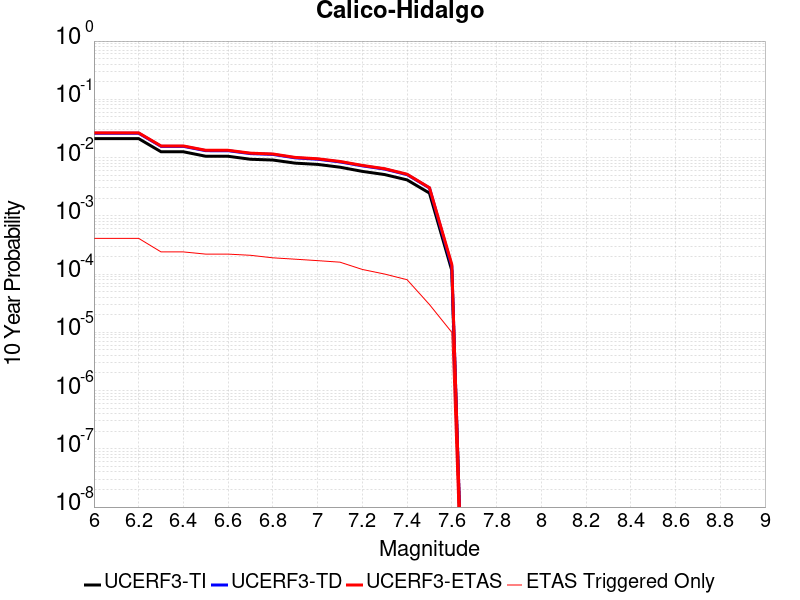 |

| Magnitude | 1 wk TI Prob | 1 wk TD Prob | 1 wk ETAS Prob | 1 wk ETAS/TD Gain | 1 wk ETAS Triggered Only | 1 mo TI Prob | 1 mo TD Prob | 1 mo ETAS Prob | 1 mo ETAS/TD Gain | 1 mo ETAS Triggered Only | 1 yr TI Prob | 1 yr TD Prob | 1 yr ETAS Prob | 1 yr ETAS/TD Gain | 1 yr ETAS Triggered Only | 10 yr TI Prob | 10 yr TD Prob | 10 yr ETAS Prob | 10 yr ETAS/TD Gain | 10 yr ETAS Triggered Only |
|-----|-----|-----|-----|-----|-----|-----|-----|-----|-----|-----|-----|-----|-----|-----|-----|-----|-----|-----|-----|-----|
| 6.0 | 4.0906612E-5 | 5.0703686E-5 | 1.0251453E-4 | 2.0218358 | 5.1813473E-5 | 1.7530227E-4 | 2.172857E-4 | 3.2089013E-4 | 1.476812 | 1.03626946E-4 | 0.0021322158 | 0.002642648 | 0.0029527072 | 1.117329 | 3.1088083E-4 | 0.02111873 | 0.026152607 | 0.026505817 | 1.0135057 | 3.626943E-4 |
| 6.1 | 4.0906612E-5 | 5.0703686E-5 | 1.0251453E-4 | 2.0218358 | 5.1813473E-5 | 1.7530227E-4 | 2.172857E-4 | 3.2089013E-4 | 1.476812 | 1.03626946E-4 | 0.0021322158 | 0.002642648 | 0.0029527072 | 1.117329 | 3.1088083E-4 | 0.02111873 | 0.026152607 | 0.026505817 | 1.0135057 | 3.626943E-4 |
| 6.2 | 4.0906612E-5 | 5.0703686E-5 | 1.0251453E-4 | 2.0218358 | 5.1813473E-5 | 1.7530227E-4 | 2.172857E-4 | 3.2089013E-4 | 1.476812 | 1.03626946E-4 | 0.0021322158 | 0.002642648 | 0.0029527072 | 1.117329 | 3.1088083E-4 | 0.02111873 | 0.026152607 | 0.026505817 | 1.0135057 | 3.626943E-4 |
| 6.3 | 2.4242801E-5 | 3.0090669E-5 | 8.190258E-5 | 2.72186 | 5.1813473E-5 | 1.0389358E-4 | 1.2895382E-4 | 2.325674E-4 | 1.8034936 | 1.03626946E-4 | 0.0012641704 | 0.0015689151 | 0.001827576 | 1.1648661 | 2.5906737E-4 | 0.01257003 | 0.01558206 | 0.01583709 | 1.016367 | 2.5906737E-4 |
| 6.4 | 2.4242801E-5 | 3.0090669E-5 | 8.190258E-5 | 2.72186 | 5.1813473E-5 | 1.0389358E-4 | 1.2895382E-4 | 2.325674E-4 | 1.8034936 | 1.03626946E-4 | 0.0012641704 | 0.0015689151 | 0.001827576 | 1.1648661 | 2.5906737E-4 | 0.01257003 | 0.01558206 | 0.01583709 | 1.016367 | 2.5906737E-4 |
| 6.5 | 2.0286952E-5 | 2.5315738E-5 | 2.5315738E-5 | 1.0 | 0.0 | 8.694118E-5 | 1.0849161E-4 | 1.6029946E-4 | 1.4775287 | 5.1813473E-5 | 0.0010579949 | 0.001320102 | 0.0015270823 | 1.1567911 | 2.0725389E-4 | 0.010529719 | 0.013124538 | 0.013329072 | 1.0155841 | 2.0725389E-4 |
| 6.6 | 2.0269223E-5 | 2.5296687E-5 | 2.5296687E-5 | 1.0 | 0.0 | 8.6865206E-5 | 1.08409964E-4 | 1.6021782E-4 | 1.4778883 | 5.1813473E-5 | 0.0010570707 | 0.0013191093 | 0.0015260899 | 1.1569092 | 2.0725389E-4 | 0.010520565 | 0.013114728 | 0.013319263 | 1.0155959 | 2.0725389E-4 |
| 6.7 | 1.799852E-5 | 2.25406E-5 | 2.25406E-5 | 1.0 | 0.0 | 7.713423E-5 | 9.659908E-5 | 1.4840755E-4 | 1.5363246 | 5.1813473E-5 | 9.3870464E-4 | 0.0011754738 | 0.0013824841 | 1.1761079 | 2.0725389E-4 | 0.009347493 | 0.011694173 | 0.011899004 | 1.0175155 | 2.0725389E-4 |
| 6.8 | 1.7458793E-5 | 2.184212E-5 | 2.184212E-5 | 1.0 | 0.0 | 7.4821255E-5 | 9.3605806E-5 | 1.4541444E-4 | 1.5534766 | 5.1813473E-5 | 9.10568E-4 | 0.0011390693 | 0.0013460872 | 1.1817429 | 2.0725389E-4 | 0.009068459 | 0.011333893 | 0.011538798 | 1.0180789 | 2.0725389E-4 |
| 6.9 | 1.542884E-5 | 1.9025927E-5 | 1.9025927E-5 | 1.0 | 0.0 | 6.612192E-5 | 8.153721E-5 | 1.3334646E-4 | 1.6354061 | 5.1813473E-5 | 8.04737E-4 | 9.922766E-4 | 0.0011993248 | 1.2086598 | 2.0725389E-4 | 0.008018291 | 0.009879857 | 0.010085064 | 1.0207702 | 2.0725389E-4 |
| 7.0 | 1.468253E-5 | 1.8030598E-5 | 1.8030598E-5 | 1.0 | 0.0 | 6.292361E-5 | 7.7271776E-5 | 1.2908125E-4 | 1.6704837 | 5.1813473E-5 | 7.658257E-4 | 9.4039086E-4 | 0.0011474498 | 1.220184 | 2.0725389E-4 | 0.0076319184 | 0.009365481 | 0.009570794 | 1.0219223 | 2.0725389E-4 |
| 7.1 | 1.3139281E-5 | 1.6200942E-5 | 1.6200942E-5 | 1.0 | 0.0 | 5.6309986E-5 | 6.943083E-5 | 1.2124071E-4 | 1.7462084 | 5.1813473E-5 | 6.853584E-4 | 8.4500515E-4 | 0.0010520839 | 1.2450621 | 2.0725389E-4 | 0.0068324856 | 0.0084192185 | 0.008624728 | 1.0244095 | 2.0725389E-4 |
| 7.2 | 1.1127404E-5 | 1.3866597E-5 | 1.3866597E-5 | 1.0 | 0.0 | 4.7688E-5 | 5.942698E-5 | 1.1123737E-4 | 1.8718328 | 5.1813473E-5 | 5.8044674E-4 | 7.232942E-4 | 9.303982E-4 | 1.2863344 | 2.0725389E-4 | 0.0057893298 | 0.0072105085 | 0.007416268 | 1.0285361 | 2.0725389E-4 |
| 7.3 | 9.808154E-6 | 1.2176215E-5 | 1.2176215E-5 | 1.0 | 0.0 | 4.2034266E-5 | 5.2182797E-5 | 1.0399357E-4 | 1.9928707 | 5.1813473E-5 | 5.11647E-4 | 6.3515105E-4 | 8.422733E-4 | 1.3260992 | 2.0725389E-4 | 0.0051047057 | 0.006334433 | 0.006540374 | 1.0325114 | 2.0725389E-4 |
| 7.4 | 7.942452E-6 | 9.792144E-6 | 9.792144E-6 | 1.0 | 0.0 | 3.4038632E-5 | 4.1965708E-5 | 9.3777E-5 | 2.2346103 | 5.1813473E-5 | 4.1434157E-4 | 5.1082217E-4 | 7.179702E-4 | 1.4055189 | 2.0725389E-4 | 0.0041356985 | 0.005097421 | 0.0053036185 | 1.0404513 | 2.0725389E-4 |
| 7.5 | 4.7121216E-6 | 5.772836E-6 | 5.772836E-6 | 1.0 | 0.0 | 2.019465E-5 | 2.4740535E-5 | 7.655272E-5 | 3.0942225 | 5.1813473E-5 | 2.4584212E-4 | 3.0118204E-4 | 3.529799E-4 | 1.1719819 | 5.1813473E-5 | 0.0024557032 | 0.0030084911 | 0.0030601488 | 1.0171705 | 5.1813473E-5 |
| 7.6 | 2.21172E-7 | 2.603961E-7 | 2.603961E-7 | 1.0 | 0.0 | 9.478797E-7 | 1.1159829E-6 | 1.1159829E-6 | 1.0 | 0.0 | 1.1540374E-5 | 1.3587036E-5 | 1.3587036E-5 | 1.0 | 0.0 | 1.1539775E-4 | 1.3586486E-4 | 1.3586486E-4 | 1.0 | 0.0 |

## Brawley (Seismic Zone) alt 1
*[(top)](#table-of-contents)*

| 1 Week | 1 Month | 1 Year | 10 Year |
|-----|-----|-----|-----|
| 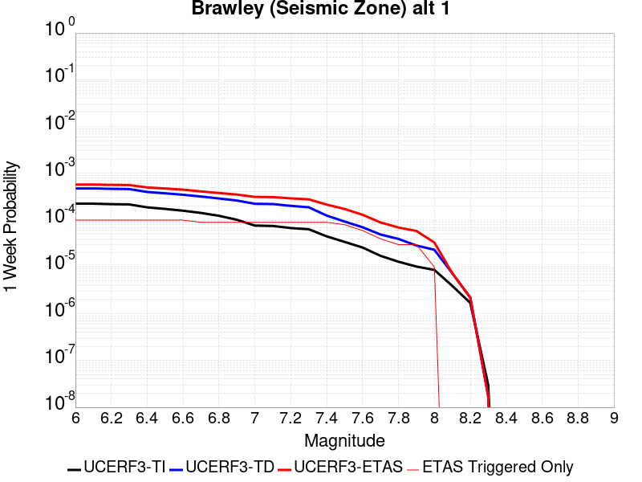 | 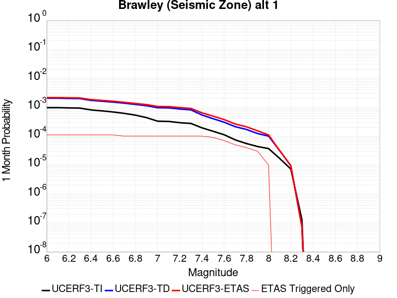 | 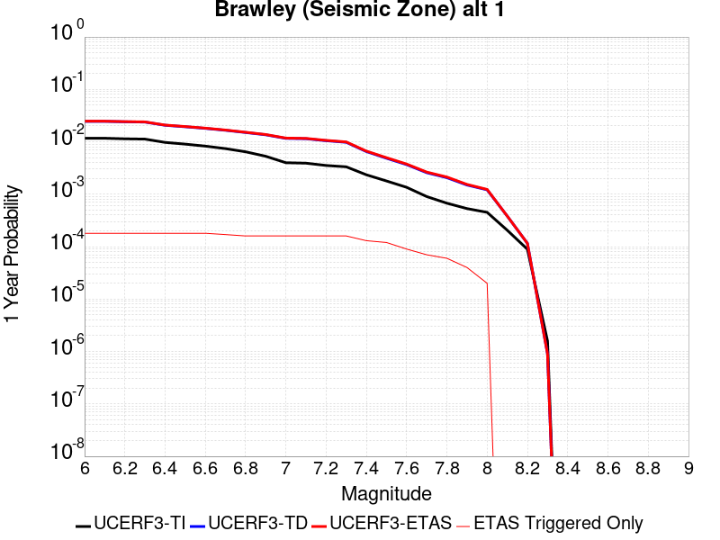 | 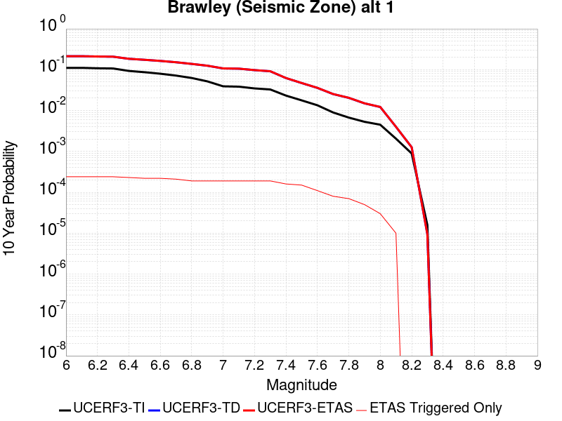 |

| Magnitude | 1 wk TI Prob | 1 wk TD Prob | 1 wk ETAS Prob | 1 wk ETAS/TD Gain | 1 wk ETAS Triggered Only | 1 mo TI Prob | 1 mo TD Prob | 1 mo ETAS Prob | 1 mo ETAS/TD Gain | 1 mo ETAS Triggered Only | 1 yr TI Prob | 1 yr TD Prob | 1 yr ETAS Prob | 1 yr ETAS/TD Gain | 1 yr ETAS Triggered Only | 10 yr TI Prob | 10 yr TD Prob | 10 yr ETAS Prob | 10 yr ETAS/TD Gain | 10 yr ETAS Triggered Only |
|-----|-----|-----|-----|-----|-----|-----|-----|-----|-----|-----|-----|-----|-----|-----|-----|-----|-----|-----|-----|-----|
| 6.0 | 2.2521618E-4 | 4.7632487E-4 | 6.3169125E-4 | 1.3261774 | 1.5544042E-4 | 9.6485513E-4 | 0.0020398323 | 0.0021949557 | 1.0760471 | 1.5544042E-4 | 0.011683988 | 0.024546238 | 0.024798945 | 1.0102952 | 2.5906737E-4 | 0.11088423 | 0.21350002 | 0.21382603 | 1.001527 | 4.1450778E-4 |
| 6.1 | 2.2521618E-4 | 4.7632487E-4 | 6.3169125E-4 | 1.3261774 | 1.5544042E-4 | 9.6485513E-4 | 0.0020398323 | 0.0021949557 | 1.0760471 | 1.5544042E-4 | 0.011683988 | 0.024546238 | 0.024798945 | 1.0102952 | 2.5906737E-4 | 0.11088423 | 0.21350002 | 0.21382603 | 1.001527 | 4.1450778E-4 |
| 6.2 | 2.198148E-4 | 4.6717093E-4 | 6.2253873E-4 | 1.3325716 | 1.5544042E-4 | 9.417233E-4 | 0.0020006616 | 0.002155791 | 1.0775391 | 1.5544042E-4 | 0.011405343 | 0.024080504 | 0.024333332 | 1.0104994 | 2.5906737E-4 | 0.10837428 | 0.20993657 | 0.21026406 | 1.00156 | 4.1450778E-4 |
| 6.3 | 2.1704129E-4 | 4.615278E-4 | 6.1689643E-4 | 1.3366399 | 1.5544042E-4 | 9.298453E-4 | 0.0019765133 | 0.0021316465 | 1.0784883 | 1.5544042E-4 | 0.011262234 | 0.02379366 | 0.024046564 | 1.010629 | 2.5906737E-4 | 0.107082725 | 0.20782755 | 0.20815592 | 1.00158 | 4.1450778E-4 |
| 6.4 | 1.876142E-4 | 4.00449E-4 | 5.5582717E-4 | 1.3880099 | 1.5544042E-4 | 8.038131E-4 | 0.0017150956 | 0.0018702694 | 1.0904753 | 1.5544042E-4 | 0.00974259 | 0.020680401 | 0.02093411 | 1.0122681 | 2.5906737E-4 | 0.093263686 | 0.18457815 | 0.18491615 | 1.0018312 | 4.1450778E-4 |
| 6.5 | 1.7390939E-4 | 3.7477075E-4 | 5.3015293E-4 | 1.4146059 | 1.5544042E-4 | 7.45113E-4 | 0.0016051838 | 0.0017603748 | 1.0966811 | 1.5544042E-4 | 0.009034078 | 0.019368723 | 0.019622773 | 1.0131165 | 2.5906737E-4 | 0.086755216 | 0.17440031 | 0.17469975 | 1.001717 | 3.626943E-4 |
| 6.6 | 1.591791E-4 | 3.4891962E-4 | 5.043058E-4 | 1.4453351 | 1.5544042E-4 | 6.8201777E-4 | 0.0014945229 | 0.001649731 | 1.1038513 | 1.5544042E-4 | 0.008271996 | 0.018045569 | 0.018299961 | 1.0140972 | 2.5906737E-4 | 0.07970774 | 0.16380852 | 0.16411181 | 1.0018514 | 3.626943E-4 |
| 6.7 | 1.4268003E-4 | 3.20582E-4 | 4.759726E-4 | 1.484714 | 1.5544042E-4 | 6.1134255E-4 | 0.0013732077 | 0.0015284346 | 1.1130397 | 1.5544042E-4 | 0.007417723 | 0.016592601 | 0.01684737 | 1.0153544 | 2.5906737E-4 | 0.07174956 | 0.15193306 | 0.15224065 | 1.0020245 | 3.626943E-4 |
| 6.8 | 1.239713E-4 | 2.9053655E-4 | 4.459318E-4 | 1.5348561 | 1.5544042E-4 | 5.3119735E-4 | 0.0012445687 | 0.0013998157 | 1.1247395 | 1.5544042E-4 | 0.0064481674 | 0.015048777 | 0.015303946 | 1.0169561 | 2.5906737E-4 | 0.06264243 | 0.13837762 | 0.13869013 | 1.0022583 | 3.626943E-4 |
| 6.9 | 1.0180238E-4 | 2.625439E-4 | 4.1794352E-4 | 1.5918995 | 1.5544042E-4 | 4.3622297E-4 | 0.0011247073 | 0.0012799728 | 1.1380498 | 1.5544042E-4 | 0.005298089 | 0.013608336 | 0.013863878 | 1.0187783 | 2.5906737E-4 | 0.05173543 | 0.124961674 | 0.12527904 | 1.0025398 | 3.626943E-4 |
| 7.0 | 7.6619996E-5 | 2.23993E-4 | 3.793986E-4 | 1.6937966 | 1.5544042E-4 | 3.283301E-4 | 9.5962E-4 | 0.0011149113 | 1.1618258 | 1.5544042E-4 | 0.0039900932 | 0.011621496 | 0.011877552 | 1.022033 | 2.5906737E-4 | 0.039192066 | 0.107266866 | 0.10759065 | 1.0030185 | 3.626943E-4 |
| 7.1 | 7.5127435E-5 | 2.2082464E-4 | 3.7623072E-4 | 1.7037534 | 1.5544042E-4 | 3.2193496E-4 | 9.4605127E-4 | 0.0011013446 | 1.164149 | 1.5544042E-4 | 0.0039125155 | 0.011458045 | 0.011714144 | 1.022351 | 2.5906737E-4 | 0.038443442 | 0.10583085 | 0.10615516 | 1.0030644 | 3.626943E-4 |
| 7.2 | 6.788582E-5 | 2.0210193E-4 | 3.5751093E-4 | 1.7689635 | 1.5544042E-4 | 2.9090676E-4 | 8.6586666E-4 | 0.0010211725 | 1.1793646 | 1.5544042E-4 | 0.0035360386 | 0.0104916105 | 0.01074796 | 1.0244337 | 2.5906737E-4 | 0.034803 | 0.09750131 | 0.09782864 | 1.0033572 | 3.626943E-4 |
| 7.3 | 6.399602E-5 | 1.8841137E-4 | 3.438225E-4 | 1.8248501 | 1.5544042E-4 | 2.7423984E-4 | 8.072303E-4 | 9.625452E-4 | 1.1924047 | 1.5544042E-4 | 0.0033337586 | 0.009784332 | 0.010040863 | 1.0262187 | 2.5906737E-4 | 0.03284188 | 0.09139617 | 0.09172571 | 1.0036057 | 3.626943E-4 |
| 7.4 | 4.506759E-5 | 1.2529209E-4 | 2.8071302E-4 | 2.240469 | 1.5544042E-4 | 1.9313251E-4 | 5.368565E-4 | 6.922134E-4 | 1.2893827 | 1.5544042E-4 | 0.0023488526 | 0.0065168133 | 0.006671241 | 1.0236968 | 1.5544042E-4 | 0.023241805 | 0.062363707 | 0.06260662 | 1.003895 | 2.5906737E-4 |
| 7.5 | 3.43289E-5 | 9.33541E-5 | 2.4878E-4 | 2.664907 | 1.5544042E-4 | 1.4711556E-4 | 4.00028E-4 | 5.554062E-4 | 1.3884184 | 1.5544042E-4 | 0.0017896603 | 0.0048595266 | 0.0050142114 | 1.0318313 | 1.5544042E-4 | 0.01775316 | 0.04705519 | 0.047302067 | 1.0052465 | 2.5906737E-4 |
| 7.6 | 2.5980507E-5 | 7.053101E-5 | 2.2596047E-4 | 3.2037036 | 1.5544042E-4 | 1.1134028E-4 | 3.0224086E-4 | 4.576343E-4 | 1.5141377 | 1.5544042E-4 | 0.001354725 | 0.003673598 | 0.0038284673 | 1.0421574 | 1.5544042E-4 | 0.013464959 | 0.035840835 | 0.03604066 | 1.0055754 | 2.0725389E-4 |
| 7.7 | 1.7292105E-5 | 4.9407296E-5 | 1.5302912E-4 | 3.097298 | 1.03626946E-4 | 7.4106916E-5 | 2.117284E-4 | 3.153334E-4 | 1.4893297 | 1.03626946E-4 | 9.018782E-4 | 0.0025747516 | 0.002678112 | 1.0401437 | 1.03626946E-4 | 0.008982267 | 0.025290398 | 0.025441907 | 1.0059907 | 1.5544042E-4 |
| 7.8 | 1.2927471E-5 | 3.9693266E-5 | 9.1504684E-5 | 2.3052948 | 5.1813473E-5 | 5.5402274E-5 | 1.7010293E-4 | 2.2190758E-4 | 1.3045489 | 5.1813473E-5 | 6.743139E-4 | 0.0020690386 | 0.002120745 | 1.0249904 | 5.1813473E-5 | 0.0067227143 | 0.020431727 | 0.020533238 | 1.0049683 | 1.03626946E-4 |
| 7.9 | 1.0200774E-5 | 2.874569E-5 | 8.055767E-5 | 2.802426 | 5.1813473E-5 | 4.371687E-5 | 1.2319001E-4 | 1.749971E-4 | 1.4205462 | 5.1813473E-5 | 5.321229E-4 | 0.0014988075 | 0.0015505434 | 1.034518 | 5.1813473E-5 | 0.005308505 | 0.014991644 | 0.015093717 | 1.0068086 | 1.03626946E-4 |
| 8.0 | 8.650396E-6 | 2.3277367E-5 | 2.3277367E-5 | 1.0 | 0.0 | 3.70726E-5 | 9.975634E-5 | 9.975634E-5 | 1.0 | 0.0 | 4.5126543E-4 | 0.0012138576 | 0.0012138576 | 1.0 | 0.0 | 0.0045035016 | 0.012211097 | 0.012262277 | 1.0041913 | 5.1813473E-5 |
| 8.1 | 3.9368224E-6 | 7.3279825E-6 | 7.3279825E-6 | 1.0 | 0.0 | 1.6871985E-5 | 3.140526E-5 | 3.140526E-5 | 1.0 | 0.0 | 2.0539707E-4 | 3.8229208E-4 | 3.8229208E-4 | 1.0 | 0.0 | 0.0020520731 | 0.004001185 | 0.004052791 | 1.0128977 | 5.1813473E-5 |
| 8.2 | 1.7101195E-6 | 2.217876E-6 | 2.217876E-6 | 1.0 | 0.0 | 7.329063E-6 | 9.505149E-6 | 9.505149E-6 | 1.0 | 0.0 | 8.922769E-5 | 1.1571907E-4 | 1.1571907E-4 | 1.0 | 0.0 | 8.9191867E-4 | 0.0012666774 | 0.0012666774 | 1.0 | 0.0 |
| 8.3 | 3.0346666E-8 | 1.721586E-8 | 1.721586E-8 | 1.0 | 0.0 | 1.3005713E-7 | 7.378226E-8 | 7.378226E-8 | 1.0 | 0.0 | 1.5834444E-6 | 8.9829894E-7 | 8.9829894E-7 | 1.0 | 0.0 | 1.5834332E-5 | 9.367729E-6 | 9.367729E-6 | 1.0 | 0.0 |

## Imperial
*[(top)](#table-of-contents)*

| 1 Week | 1 Month | 1 Year | 10 Year |
|-----|-----|-----|-----|
|  |  |  |  |

| Magnitude | 1 wk TI Prob | 1 wk TD Prob | 1 wk ETAS Prob | 1 wk ETAS/TD Gain | 1 wk ETAS Triggered Only | 1 mo TI Prob | 1 mo TD Prob | 1 mo ETAS Prob | 1 mo ETAS/TD Gain | 1 mo ETAS Triggered Only | 1 yr TI Prob | 1 yr TD Prob | 1 yr ETAS Prob | 1 yr ETAS/TD Gain | 1 yr ETAS Triggered Only | 10 yr TI Prob | 10 yr TD Prob | 10 yr ETAS Prob | 10 yr ETAS/TD Gain | 10 yr ETAS Triggered Only |
|-----|-----|-----|-----|-----|-----|-----|-----|-----|-----|-----|-----|-----|-----|-----|-----|-----|-----|-----|-----|-----|
| 6.0 | 2.7496446E-4 | 5.0552754E-4 | 6.608894E-4 | 1.3073262 | 1.5544042E-4 | 0.0011778869 | 0.002164787 | 0.002319891 | 1.0716486 | 1.5544042E-4 | 0.0142467655 | 0.026038699 | 0.02629102 | 1.0096903 | 2.5906737E-4 | 0.13367249 | 0.2280438 | 0.22836377 | 1.0014032 | 4.1450778E-4 |
| 6.1 | 2.5356023E-4 | 4.8656776E-4 | 6.4193254E-4 | 1.3193076 | 1.5544042E-4 | 0.001086234 | 0.0020836622 | 0.0022387789 | 1.0744442 | 1.5544042E-4 | 0.013144928 | 0.025071215 | 0.025323788 | 1.0100741 | 2.5906737E-4 | 0.123940155 | 0.21947981 | 0.21980335 | 1.0014741 | 4.1450778E-4 |
| 6.2 | 2.4820742E-4 | 4.7752203E-4 | 6.3288823E-4 | 1.3253592 | 1.5544042E-4 | 0.0010633124 | 0.0020449557 | 0.0022000782 | 1.0758562 | 1.5544042E-4 | 0.01286919 | 0.024611235 | 0.024863927 | 1.0102674 | 2.5906737E-4 | 0.12148927 | 0.21598552 | 0.2163105 | 1.0015047 | 4.1450778E-4 |
| 6.3 | 2.3205351E-4 | 4.5890483E-4 | 6.142739E-4 | 1.338565 | 1.5544042E-4 | 9.94136E-4 | 0.0019652895 | 0.0021204243 | 1.0789374 | 1.5544042E-4 | 0.012036599 | 0.02366133 | 0.023914268 | 1.0106899 | 2.5906737E-4 | 0.11405133 | 0.20793462 | 0.20826294 | 1.0015789 | 4.1450778E-4 |
| 6.4 | 2.0304754E-4 | 3.987652E-4 | 5.541436E-4 | 1.3896489 | 1.5544042E-4 | 8.6991355E-4 | 0.0017078889 | 0.0018630639 | 1.0908577 | 1.5544042E-4 | 0.010539869 | 0.020595672 | 0.020849403 | 1.0123197 | 2.5906737E-4 | 0.100537635 | 0.1850669 | 0.18540469 | 1.0018252 | 4.1450778E-4 |
| 6.5 | 1.854992E-4 | 3.6988858E-4 | 5.252715E-4 | 1.4200803 | 1.5544042E-4 | 7.9475436E-4 | 0.0015842861 | 0.0017394802 | 1.0979584 | 1.5544042E-4 | 0.009633281 | 0.01911948 | 0.019373596 | 1.0132909 | 2.5906737E-4 | 0.0922623 | 0.173298 | 0.17359784 | 1.0017302 | 3.626943E-4 |
| 6.6 | 1.6586106E-4 | 3.403506E-4 | 4.957381E-4 | 1.4565513 | 1.5544042E-4 | 7.106394E-4 | 0.0014578402 | 0.0016130541 | 1.1064683 | 1.5544042E-4 | 0.008617763 | 0.01760642 | 0.017860927 | 1.0144553 | 2.5906737E-4 | 0.08291132 | 0.16077545 | 0.16107982 | 1.0018932 | 3.626943E-4 |
| 6.7 | 1.4224656E-4 | 3.076692E-4 | 4.6306176E-4 | 1.5050639 | 1.5544042E-4 | 6.094856E-4 | 0.001317924 | 0.0014731596 | 1.117788 | 1.5544042E-4 | 0.0073952693 | 0.015929576 | 0.016184518 | 1.0160042 | 2.5906737E-4 | 0.07153955 | 0.14648417 | 0.14679372 | 1.0021133 | 3.626943E-4 |
| 6.8 | 1.2317259E-4 | 2.779122E-4 | 4.333094E-4 | 1.5591594 | 1.5544042E-4 | 5.2777573E-4 | 0.0011905148 | 0.0013457701 | 1.1304103 | 1.5544042E-4 | 0.0064067547 | 0.0143995695 | 0.0146549065 | 1.0177323 | 2.5906737E-4 | 0.06225166 | 0.13293684 | 0.13325131 | 1.0023656 | 3.626943E-4 |
| 6.9 | 9.859898E-5 | 2.5014306E-4 | 4.055446E-4 | 1.6212506 | 1.5544042E-4 | 4.2249862E-4 | 0.0010716055 | 0.0012268793 | 1.1448983 | 1.5544042E-4 | 0.0051317946 | 0.012969712 | 0.013225419 | 1.0197158 | 2.5906737E-4 | 0.05014893 | 0.11940631 | 0.1197257 | 1.0026748 | 3.626943E-4 |
| 7.0 | 7.3191884E-5 | 2.1266776E-4 | 3.6807513E-4 | 1.7307519 | 1.5544042E-4 | 3.136418E-4 | 9.1111806E-4 | 0.0010664169 | 1.1704485 | 1.5544042E-4 | 0.003811904 | 0.011037128 | 0.011293336 | 1.0232133 | 2.5906737E-4 | 0.037471764 | 0.10206493 | 0.1023906 | 1.0031909 | 3.626943E-4 |
| 7.1 | 7.1760296E-5 | 2.0968143E-4 | 3.6508925E-4 | 1.7411616 | 1.5544042E-4 | 3.0750787E-4 | 8.983284E-4 | 0.0010536291 | 1.1728776 | 1.5544042E-4 | 0.003737482 | 0.010882978 | 0.011139226 | 1.0235457 | 2.5906737E-4 | 0.03675245 | 0.10070146 | 0.10102763 | 1.003239 | 3.626943E-4 |
| 7.2 | 6.46614E-5 | 1.9136685E-4 | 3.4677752E-4 | 1.8121086 | 1.5544042E-4 | 2.7709085E-4 | 8.1988896E-4 | 9.752019E-4 | 1.1894317 | 1.5544042E-4 | 0.0033683628 | 0.0099370815 | 0.010193574 | 1.0258117 | 2.5906737E-4 | 0.033177625 | 0.09250898 | 0.09283812 | 1.0035579 | 3.626943E-4 |
| 7.3 | 6.088115E-5 | 1.78084E-4 | 3.3349672E-4 | 1.8726934 | 1.5544042E-4 | 2.6089314E-4 | 7.6299673E-4 | 9.183185E-4 | 1.2035681 | 1.5544042E-4 | 0.0031717476 | 0.009250494 | 0.009507164 | 1.0277467 | 2.5906737E-4 | 0.031268585 | 0.08655989 | 0.0868912 | 1.0038275 | 3.626943E-4 |
| 7.4 | 4.199346E-5 | 1.1510366E-4 | 2.705262E-4 | 2.350283 | 1.5544042E-4 | 1.7995955E-4 | 4.9320905E-4 | 6.485728E-4 | 1.3150059 | 1.5544042E-4 | 0.0021888057 | 0.0059884563 | 0.006142966 | 1.0258012 | 1.5544042E-4 | 0.02167372 | 0.057439793 | 0.057683982 | 1.0042511 | 2.5906737E-4 |
| 7.5 | 3.130448E-5 | 8.33328E-5 | 2.3876026E-4 | 2.8651414 | 1.5544042E-4 | 1.3415517E-4 | 3.57092E-4 | 5.124769E-4 | 1.4351397 | 1.5544042E-4 | 0.0016321153 | 0.004338988 | 0.004493754 | 1.0356687 | 1.5544042E-4 | 0.016201803 | 0.04213201 | 0.04238016 | 1.0058899 | 2.5906737E-4 |
| 7.6 | 2.3074248E-5 | 6.0844646E-5 | 2.162756E-4 | 3.5545542 | 1.5544042E-4 | 9.888588E-5 | 2.6073685E-4 | 4.1613673E-4 | 1.5960028 | 1.5544042E-4 | 0.0012032706 | 0.0031698733 | 0.0033248211 | 1.0488813 | 1.5544042E-4 | 0.011967761 | 0.031026395 | 0.031227218 | 1.0064727 | 2.0725389E-4 |
| 7.7 | 1.45864815E-5 | 4.0124698E-5 | 1.4374749E-4 | 3.5825186 | 1.03626946E-4 | 6.2511994E-5 | 1.7195169E-4 | 2.7556083E-4 | 1.6025479 | 1.03626946E-4 | 7.608177E-4 | 0.0020915072 | 0.0021949173 | 1.0494429 | 1.03626946E-4 | 0.007582182 | 0.020627763 | 0.020779997 | 1.00738 | 1.5544042E-4 |
| 7.8 | 1.0352979E-5 | 3.0960902E-5 | 8.277277E-5 | 2.6734612 | 5.1813473E-5 | 4.4369157E-5 | 1.3268284E-4 | 1.8448943E-4 | 1.3904544 | 5.1813473E-5 | 5.400606E-4 | 0.0016142189 | 0.0016659488 | 1.0320463 | 5.1813473E-5 | 0.0053875 | 0.016016833 | 0.0161188 | 1.0063663 | 1.03626946E-4 |
| 7.9 | 8.137906E-6 | 2.2149103E-5 | 7.3961426E-5 | 3.3392518 | 5.1813473E-5 | 3.4876273E-5 | 9.492128E-5 | 1.4672983E-4 | 1.5458055 | 5.1813473E-5 | 4.2453592E-4 | 0.0011550548 | 0.0012068084 | 1.0448062 | 5.1813473E-5 | 0.004237258 | 0.011617903 | 0.011720326 | 1.008816 | 1.03626946E-4 |
| 8.0 | 6.93792E-6 | 1.8008766E-5 | 1.8008766E-5 | 1.0 | 0.0 | 2.9733603E-5 | 7.717814E-5 | 7.717814E-5 | 1.0 | 0.0 | 3.6194647E-4 | 9.3923963E-4 | 9.3923963E-4 | 1.0 | 0.0 | 0.0036135751 | 0.00950155 | 0.009552872 | 1.0054014 | 5.1813473E-5 |
| 8.1 | 3.4286315E-6 | 6.379872E-6 | 6.379872E-6 | 1.0 | 0.0 | 1.4694053E-5 | 2.7342023E-5 | 2.7342023E-5 | 1.0 | 0.0 | 1.7888541E-4 | 3.328384E-4 | 3.328384E-4 | 1.0 | 0.0 | 0.0017874148 | 0.003486031 | 0.0035376637 | 1.0148114 | 5.1813473E-5 |
| 8.2 | 1.4906886E-6 | 1.9366646E-6 | 1.9366646E-6 | 1.0 | 0.0 | 6.3886496E-6 | 8.299965E-6 | 8.299965E-6 | 1.0 | 0.0 | 7.7779034E-5 | 1.0104742E-4 | 1.0104742E-4 | 1.0 | 0.0 | 7.775182E-4 | 0.0011075331 | 0.0011075331 | 1.0 | 0.0 |
| 8.3 | 2.5758007E-8 | 1.4500102E-8 | 1.4500102E-8 | 1.0 | 0.0 | 1.10391454E-7 | 6.214329E-8 | 6.214329E-8 | 1.0 | 0.0 | 1.3440151E-6 | 7.565946E-7 | 7.565946E-7 | 1.0 | 0.0 | 1.344007E-5 | 7.887763E-6 | 7.887763E-6 | 1.0 | 0.0 |

## San Andreas (Carrizo) rev
*[(top)](#table-of-contents)*

| 1 Week | 1 Month | 1 Year | 10 Year |
|-----|-----|-----|-----|
|  |  | 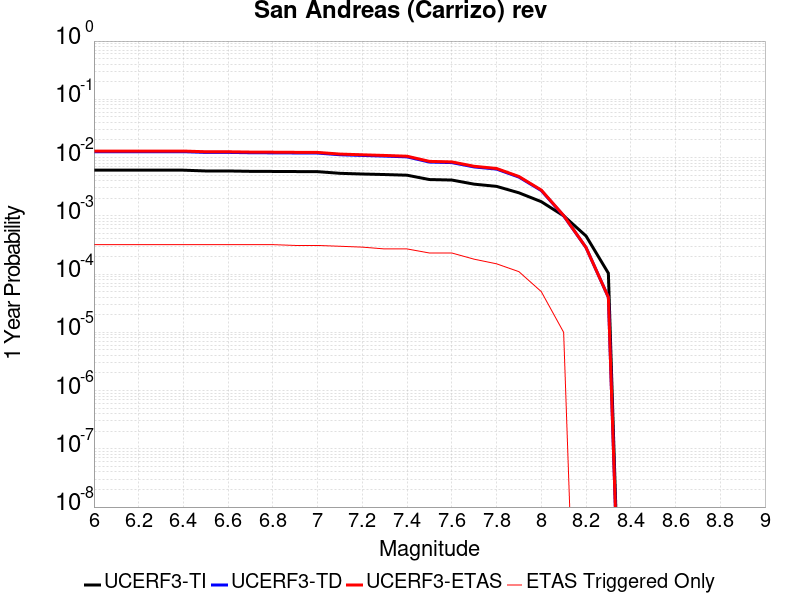 |  |

| Magnitude | 1 wk TI Prob | 1 wk TD Prob | 1 wk ETAS Prob | 1 wk ETAS/TD Gain | 1 wk ETAS Triggered Only | 1 mo TI Prob | 1 mo TD Prob | 1 mo ETAS Prob | 1 mo ETAS/TD Gain | 1 mo ETAS Triggered Only | 1 yr TI Prob | 1 yr TD Prob | 1 yr ETAS Prob | 1 yr ETAS/TD Gain | 1 yr ETAS Triggered Only | 10 yr TI Prob | 10 yr TD Prob | 10 yr ETAS Prob | 10 yr ETAS/TD Gain | 10 yr ETAS Triggered Only |
|-----|-----|-----|-----|-----|-----|-----|-----|-----|-----|-----|-----|-----|-----|-----|-----|-----|-----|-----|-----|-----|
| 6.0 | 1.1674632E-4 | 2.432302E-4 | 3.4683195E-4 | 1.4259411 | 1.03626946E-4 | 5.002454E-4 | 0.0010420004 | 0.0011455193 | 1.0993464 | 1.03626946E-4 | 0.006073493 | 0.012613042 | 0.012868842 | 1.0202806 | 2.5906737E-4 | 0.0591016 | 0.12061418 | 0.12097869 | 1.0030222 | 4.1450778E-4 |
| 6.1 | 1.1674632E-4 | 2.432302E-4 | 3.4683195E-4 | 1.4259411 | 1.03626946E-4 | 5.002454E-4 | 0.0010420004 | 0.0011455193 | 1.0993464 | 1.03626946E-4 | 0.006073493 | 0.012613042 | 0.012868842 | 1.0202806 | 2.5906737E-4 | 0.0591016 | 0.12061418 | 0.12097869 | 1.0030222 | 4.1450778E-4 |
| 6.2 | 1.1674632E-4 | 2.432302E-4 | 3.4683195E-4 | 1.4259411 | 1.03626946E-4 | 5.002454E-4 | 0.0010420004 | 0.0011455193 | 1.0993464 | 1.03626946E-4 | 0.006073493 | 0.012613042 | 0.012868842 | 1.0202806 | 2.5906737E-4 | 0.0591016 | 0.12061418 | 0.12097869 | 1.0030222 | 4.1450778E-4 |
| 6.3 | 1.1674632E-4 | 2.432302E-4 | 3.4683195E-4 | 1.4259411 | 1.03626946E-4 | 5.002454E-4 | 0.0010420004 | 0.0011455193 | 1.0993464 | 1.03626946E-4 | 0.006073493 | 0.012613042 | 0.012868842 | 1.0202806 | 2.5906737E-4 | 0.0591016 | 0.12061418 | 0.12097869 | 1.0030222 | 4.1450778E-4 |
| 6.4 | 1.1674632E-4 | 2.432302E-4 | 3.4683195E-4 | 1.4259411 | 1.03626946E-4 | 5.002454E-4 | 0.0010420004 | 0.0011455193 | 1.0993464 | 1.03626946E-4 | 0.006073493 | 0.012613042 | 0.012868842 | 1.0202806 | 2.5906737E-4 | 0.0591016 | 0.12061418 | 0.12097869 | 1.0030222 | 4.1450778E-4 |
| 6.5 | 1.13136164E-4 | 2.3643032E-4 | 3.4003277E-4 | 1.4381944 | 1.03626946E-4 | 4.847792E-4 | 0.0010128808 | 0.0011164028 | 1.1022055 | 1.03626946E-4 | 0.0058862255 | 0.012262545 | 0.012518435 | 1.0208677 | 2.5906737E-4 | 0.057327334 | 0.117585555 | 0.11795132 | 1.0031106 | 4.1450778E-4 |
| 6.6 | 1.13136164E-4 | 2.3643032E-4 | 3.4003277E-4 | 1.4381944 | 1.03626946E-4 | 4.847792E-4 | 0.0010128808 | 0.0011164028 | 1.1022055 | 1.03626946E-4 | 0.0058862255 | 0.012262545 | 0.012518435 | 1.0208677 | 2.5906737E-4 | 0.057327334 | 0.117585555 | 0.11795132 | 1.0031106 | 4.1450778E-4 |
| 6.7 | 1.1149675E-4 | 2.3334254E-4 | 3.369453E-4 | 1.4439943 | 1.03626946E-4 | 4.777557E-4 | 9.996577E-4 | 0.001103181 | 1.1035588 | 1.03626946E-4 | 0.0058011734 | 0.012103349 | 0.012359281 | 1.0211456 | 2.5906737E-4 | 0.05652051 | 0.1162071 | 0.11657344 | 1.0031525 | 4.1450778E-4 |
| 6.8 | 1.1103589E-4 | 2.3236412E-4 | 3.35967E-4 | 1.4458643 | 1.03626946E-4 | 4.7578133E-4 | 9.954676E-4 | 0.0010989915 | 1.1039951 | 1.03626946E-4 | 0.005777263 | 0.012052901 | 0.012308846 | 1.0212351 | 2.5906737E-4 | 0.056293584 | 0.1157674 | 0.11613392 | 1.003166 | 4.1450778E-4 |
| 6.9 | 1.1053259E-4 | 2.3128795E-4 | 3.3489094E-4 | 1.4479394 | 1.03626946E-4 | 4.7362508E-4 | 9.90859E-4 | 0.0010943833 | 1.1044793 | 1.03626946E-4 | 0.0057511497 | 0.01199741 | 0.012253369 | 1.0213345 | 2.5906737E-4 | 0.05604569 | 0.11528359 | 0.11565032 | 1.0031811 | 4.1450778E-4 |
| 7.0 | 1.1005377E-4 | 2.3029637E-4 | 3.3389946E-4 | 1.4498684 | 1.03626946E-4 | 4.7157376E-4 | 9.866126E-4 | 0.0010901373 | 1.1049294 | 1.03626946E-4 | 0.0057263062 | 0.011946279 | 0.012202251 | 1.0214269 | 2.5906737E-4 | 0.055809796 | 0.11483591 | 0.115202814 | 1.003195 | 4.1450778E-4 |
| 7.1 | 1.0308142E-4 | 2.1539345E-4 | 3.1899806E-4 | 1.4810017 | 1.03626946E-4 | 4.417027E-4 | 9.227892E-4 | 0.0010263205 | 1.112194 | 1.03626946E-4 | 0.0053644776 | 0.011177397 | 0.01143357 | 1.0229187 | 2.5906737E-4 | 0.052368138 | 0.108092256 | 0.10846196 | 1.0034202 | 4.1450778E-4 |
| 7.2 | 1.0027479E-4 | 2.094724E-4 | 2.6127504E-4 | 1.2473004 | 5.1813473E-5 | 4.296783E-4 | 8.9743105E-4 | 9.4919803E-4 | 1.0576835 | 5.1813473E-5 | 0.0052187922 | 0.010871782 | 0.011076783 | 1.0188562 | 2.0725389E-4 | 0.050979212 | 0.10539625 | 0.105720714 | 1.0030786 | 3.626943E-4 |
| 7.3 | 9.816942E-5 | 2.0422463E-4 | 2.5602753E-4 | 1.2536564 | 5.1813473E-5 | 4.2065824E-4 | 8.7495585E-4 | 9.26724E-4 | 1.0591666 | 5.1813473E-5 | 0.005109493 | 0.010600842 | 0.010805898 | 1.0193435 | 2.0725389E-4 | 0.049935985 | 0.102979995 | 0.10330534 | 1.0031593 | 3.626943E-4 |
| 7.4 | 9.5634205E-5 | 1.9791997E-4 | 2.4972318E-4 | 1.2617382 | 5.1813473E-5 | 4.0979648E-4 | 8.479536E-4 | 8.9972315E-4 | 1.0610523 | 5.1813473E-5 | 0.0049778637 | 0.010275229 | 0.010480354 | 1.019963 | 2.0725389E-4 | 0.048678253 | 0.10006632 | 0.10039272 | 1.0032618 | 3.626943E-4 |
| 7.5 | 8.052417E-5 | 1.611261E-4 | 2.1293122E-4 | 1.3215191 | 5.1813473E-5 | 3.4505792E-4 | 6.903579E-4 | 7.4213557E-4 | 1.0750012 | 5.1813473E-5 | 0.0041929903 | 0.008372796 | 0.008526934 | 1.0184095 | 1.5544042E-4 | 0.04114753 | 0.08281049 | 0.083095625 | 1.0034432 | 3.1088083E-4 |
| 7.6 | 7.897024E-5 | 1.5765853E-4 | 2.0946383E-4 | 1.3285918 | 5.1813473E-5 | 3.384E-4 | 6.755046E-4 | 7.272831E-4 | 1.0766516 | 5.1813473E-5 | 0.0041122385 | 0.008193332 | 0.008347499 | 1.0188161 | 1.5544042E-4 | 0.040369697 | 0.08115171 | 0.08143736 | 1.00352 | 3.1088083E-4 |
| 7.7 | 6.707427E-5 | 1.3276102E-4 | 1.8456762E-4 | 1.3902245 | 5.1813473E-5 | 2.8742946E-4 | 5.688518E-4 | 6.206358E-4 | 1.0910325 | 5.1813473E-5 | 0.003493839 | 0.00690381 | 0.007058177 | 1.0223597 | 1.5544042E-4 | 0.034394164 | 0.069048055 | 0.06933747 | 1.0041915 | 3.1088083E-4 |
| 7.8 | 6.147705E-5 | 1.2197486E-4 | 1.7378201E-4 | 1.4247363 | 5.1813473E-5 | 2.6344648E-4 | 5.226447E-4 | 5.744311E-4 | 1.0990852 | 5.1813473E-5 | 0.0032027436 | 0.006344659 | 0.0064476286 | 1.0162293 | 1.03626946E-4 | 0.031569764 | 0.06351457 | 0.06375717 | 1.0038198 | 2.5906737E-4 |
| 7.9 | 4.7636717E-5 | 8.87977E-5 | 1.4060657E-4 | 1.5834483 | 5.1813473E-5 | 2.0414138E-4 | 3.8050607E-4 | 4.3229983E-4 | 1.136118 | 5.1813473E-5 | 0.0024825884 | 0.0046228287 | 0.0047259764 | 1.0223128 | 1.03626946E-4 | 0.024550365 | 0.046628095 | 0.046776287 | 1.0031782 | 1.5544042E-4 |
| 8.0 | 3.3554235E-5 | 5.2136907E-5 | 1.0394768E-4 | 1.9937446 | 5.1813473E-5 | 1.4379594E-4 | 2.2342477E-4 | 2.7522666E-4 | 1.2318538 | 5.1813473E-5 | 0.0017493097 | 0.002716805 | 0.0028201505 | 1.0380393 | 1.03626946E-4 | 0.017356034 | 0.027880952 | 0.028032059 | 1.0054197 | 1.5544042E-4 |
| 8.1 | 1.9175432E-5 | 1.9184976E-5 | 7.0997456E-5 | 3.7006798 | 5.1813473E-5 | 8.217783E-5 | 8.2218736E-5 | 1.3402794E-4 | 1.6301388 | 5.1813473E-5 | 0.0010000558 | 0.0010005541 | 0.0010523157 | 1.051733 | 5.1813473E-5 | 0.009955673 | 0.0107580265 | 0.010860539 | 1.0095289 | 1.03626946E-4 |
| 8.2 | 8.643924E-6 | 5.4748625E-6 | 5.4748625E-6 | 1.0 | 0.0 | 3.704486E-5 | 2.3463486E-5 | 2.3463486E-5 | 1.0 | 0.0 | 4.5092785E-4 | 2.8563058E-4 | 2.8563058E-4 | 1.0 | 0.0 | 0.0045001395 | 0.0032487072 | 0.0032487072 | 1.0 | 0.0 |
| 8.3 | 1.983087E-6 | 7.6599065E-7 | 7.6599065E-7 | 1.0 | 0.0 | 8.498917E-6 | 3.282813E-6 | 3.282813E-6 | 1.0 | 0.0 | 1.034694E-4 | 3.9967534E-5 | 3.9967534E-5 | 1.0 | 0.0 | 0.0010342124 | 4.719687E-4 | 4.719687E-4 | 1.0 | 0.0 |

## Owens Valley
*[(top)](#table-of-contents)*

| 1 Week | 1 Month | 1 Year | 10 Year |
|-----|-----|-----|-----|
|  | 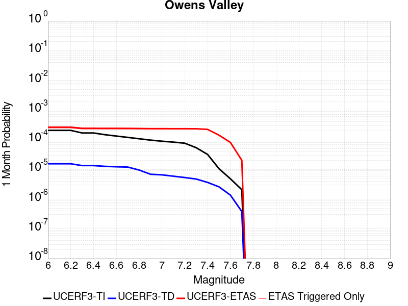 |  |  |

| Magnitude | 1 wk TI Prob | 1 wk TD Prob | 1 wk ETAS Prob | 1 wk ETAS/TD Gain | 1 wk ETAS Triggered Only | 1 mo TI Prob | 1 mo TD Prob | 1 mo ETAS Prob | 1 mo ETAS/TD Gain | 1 mo ETAS Triggered Only | 1 yr TI Prob | 1 yr TD Prob | 1 yr ETAS Prob | 1 yr ETAS/TD Gain | 1 yr ETAS Triggered Only | 10 yr TI Prob | 10 yr TD Prob | 10 yr ETAS Prob | 10 yr ETAS/TD Gain | 10 yr ETAS Triggered Only |
|-----|-----|-----|-----|-----|-----|-----|-----|-----|-----|-----|-----|-----|-----|-----|-----|-----|-----|-----|-----|-----|
| 6.0 | 4.83821E-5 | 3.626567E-6 | 1.5906642E-4 | 43.86143 | 1.5544042E-4 | 2.0733538E-4 | 1.5542342E-5 | 1.7098035E-4 | 11.000937 | 1.5544042E-4 | 0.002521386 | 1.8921259E-4 | 3.9642726E-4 | 2.0951421 | 2.0725389E-4 | 0.024929691 | 0.001925011 | 0.0022870072 | 1.1880488 | 3.626943E-4 |
| 6.1 | 4.83821E-5 | 3.626567E-6 | 1.5906642E-4 | 43.86143 | 1.5544042E-4 | 2.0733538E-4 | 1.5542342E-5 | 1.7098035E-4 | 11.000937 | 1.5544042E-4 | 0.002521386 | 1.8921259E-4 | 3.9642726E-4 | 2.0951421 | 2.0725389E-4 | 0.024929691 | 0.001925011 | 0.0022870072 | 1.1880488 | 3.626943E-4 |
| 6.2 | 4.83821E-5 | 3.626567E-6 | 1.5906642E-4 | 43.86143 | 1.5544042E-4 | 2.0733538E-4 | 1.5542342E-5 | 1.7098035E-4 | 11.000937 | 1.5544042E-4 | 0.002521386 | 1.8921259E-4 | 3.9642726E-4 | 2.0951421 | 2.0725389E-4 | 0.024929691 | 0.001925011 | 0.0022870072 | 1.1880488 | 3.626943E-4 |
| 6.3 | 3.953008E-5 | 3.1553948E-6 | 1.5859531E-4 | 50.26164 | 1.5544042E-4 | 1.6940363E-4 | 1.3523055E-5 | 1.6896137E-4 | 12.49432 | 1.5544042E-4 | 0.002060538 | 1.6463149E-4 | 3.2004633E-4 | 1.9440165 | 1.5544042E-4 | 0.020415364 | 0.0016592 | 0.001969565 | 1.187057 | 3.1088083E-4 |
| 6.4 | 3.953008E-5 | 3.1553948E-6 | 1.5859531E-4 | 50.26164 | 1.5544042E-4 | 1.6940363E-4 | 1.3523055E-5 | 1.6896137E-4 | 12.49432 | 1.5544042E-4 | 0.002060538 | 1.6463149E-4 | 3.2004633E-4 | 1.9440165 | 1.5544042E-4 | 0.020415364 | 0.0016592 | 0.001969565 | 1.187057 | 3.1088083E-4 |
| 6.5 | 3.457342E-5 | 2.9715961E-6 | 1.5841155E-4 | 53.30857 | 1.5544042E-4 | 1.4816338E-4 | 1.2735354E-5 | 1.6817379E-4 | 13.20527 | 1.5544042E-4 | 0.0018023965 | 1.550426E-4 | 3.104589E-4 | 2.0024104 | 1.5544042E-4 | 0.017878477 | 0.001555719 | 0.0018661162 | 1.1995201 | 3.1088083E-4 |
| 6.6 | 3.1127765E-5 | 2.8744932E-6 | 1.5831446E-4 | 55.075607 | 1.5544042E-4 | 1.3339789E-4 | 1.2319203E-5 | 1.6775771E-4 | 13.617578 | 1.5544042E-4 | 0.0016229092 | 1.4997667E-4 | 3.0539377E-4 | 2.0362751 | 1.5544042E-4 | 0.016111081 | 0.0015012559 | 0.00181167 | 1.2067696 | 3.1088083E-4 |
| 6.7 | 2.806885E-5 | 2.8104134E-6 | 1.5825039E-4 | 56.308582 | 1.5544042E-4 | 1.2028952E-4 | 1.20445775E-5 | 1.6748311E-4 | 13.905272 | 1.5544042E-4 | 0.001463541 | 1.4663354E-4 | 3.0205116E-4 | 2.059905 | 1.5544042E-4 | 0.014539397 | 0.0014657511 | 0.0017761763 | 1.2117857 | 3.1088083E-4 |
| 6.8 | 2.524524E-5 | 2.2353688E-6 | 1.5767543E-4 | 70.53666 | 1.5544042E-4 | 1.0818939E-4 | 9.580118E-6 | 1.6501904E-4 | 17.225157 | 1.5544042E-4 | 0.0013164099 | 1.16632E-4 | 2.7205428E-4 | 2.332587 | 1.5544042E-4 | 0.01308639 | 0.0011659812 | 0.0014764995 | 1.2663151 | 3.1088083E-4 |
| 6.9 | 2.2704568E-5 | 1.6081682E-6 | 1.5704833E-4 | 97.656654 | 1.5544042E-4 | 9.730166E-5 | 6.8921313E-6 | 1.6233147E-4 | 23.55316 | 1.5544042E-4 | 0.0011840039 | 8.390849E-5 | 2.3933586E-4 | 2.8523438 | 1.5544042E-4 | 0.011777153 | 8.3897985E-4 | 0.0011495998 | 1.3702353 | 3.1088083E-4 |
| 7.0 | 2.0871712E-5 | 1.5395453E-6 | 1.5697972E-4 | 101.96499 | 1.5544042E-4 | 8.944713E-5 | 6.598035E-6 | 1.6203742E-4 | 24.558437 | 1.5544042E-4 | 0.0010884746 | 8.032813E-5 | 2.3575606E-4 | 2.934913 | 1.5544042E-4 | 0.010831586 | 8.0316263E-4 | 0.0011137937 | 1.38676 | 3.1088083E-4 |
| 7.1 | 1.944928E-5 | 1.3864178E-6 | 1.5682662E-4 | 113.116425 | 1.5544042E-4 | 8.335139E-5 | 5.941777E-6 | 1.6138126E-4 | 27.160439 | 1.5544042E-4 | 0.0010143308 | 7.233874E-5 | 2.2776792E-4 | 3.1486297 | 1.5544042E-4 | 0.010097133 | 7.2330976E-4 | 0.0010339657 | 1.4294922 | 3.1088083E-4 |
| 7.2 | 1.7876306E-5 | 1.2489141E-6 | 1.5668913E-4 | 125.4603 | 1.5544042E-4 | 7.6610486E-5 | 5.352478E-6 | 1.6079206E-4 | 30.040676 | 1.5544042E-4 | 9.3233347E-4 | 6.516448E-5 | 2.2059477E-4 | 3.3851995 | 1.5544042E-4 | 0.009284316 | 6.5159105E-4 | 9.622693E-4 | 1.4767995 | 3.1088083E-4 |
| 7.3 | 1.2618672E-5 | 1.1115209E-6 | 1.5655176E-4 | 140.84465 | 1.5544042E-4 | 5.40789E-5 | 4.763652E-6 | 1.6020333E-4 | 33.630356 | 1.5544042E-4 | 6.582117E-4 | 5.799593E-5 | 2.1342732E-4 | 3.68004 | 1.5544042E-4 | 0.0065626553 | 5.7994033E-4 | 8.906409E-4 | 1.5357457 | 3.1088083E-4 |
| 7.4 | 7.4874442E-6 | 8.5486437E-7 | 1.0448172E-4 | 122.22022 | 1.03626946E-4 | 3.208865E-5 | 3.6636993E-6 | 1.0729026E-4 | 29.28468 | 1.03626946E-4 | 3.906093E-4 | 4.4604632E-5 | 1.4822696E-4 | 3.3231292 | 1.03626946E-4 | 0.003899234 | 4.4604883E-4 | 7.0500065E-4 | 1.5805459 | 2.5906737E-4 |
| 7.5 | 2.4734156E-6 | 6.068616E-7 | 1.0423374E-4 | 171.75868 | 1.03626946E-4 | 1.060031E-5 | 2.6008327E-6 | 1.06227504E-4 | 40.84365 | 1.03626946E-4 | 1.2905113E-4 | 3.166468E-5 | 1.3528834E-4 | 4.2725315 | 1.03626946E-4 | 0.0012897621 | 3.1660203E-4 | 5.237903E-4 | 1.6544124 | 2.0725389E-4 |
| 7.6 | 1.1328841E-6 | 3.196531E-7 | 3.196531E-7 | 1.0 | 0.0 | 4.8552088E-6 | 1.3699412E-6 | 1.3699412E-6 | 1.0 | 0.0 | 5.9110564E-5 | 1.6678909E-5 | 1.6678909E-5 | 1.0 | 0.0 | 5.9094845E-4 | 1.6677675E-4 | 2.703864E-4 | 1.6212476 | 1.03626946E-4 |
| 7.7 | 4.8613185E-7 | 8.964689E-8 | 8.964689E-8 | 1.0 | 0.0 | 2.0834207E-6 | 3.8420092E-7 | 3.8420092E-7 | 1.0 | 0.0 | 2.536535E-5 | 4.6776368E-6 | 4.6776368E-6 | 1.0 | 0.0 | 2.5362454E-4 | 4.677545E-5 | 9.85865E-5 | 2.1076548 | 5.1813473E-5 |

## Scodie Lineament
*[(top)](#table-of-contents)*

| 1 Week | 1 Month | 1 Year | 10 Year |
|-----|-----|-----|-----|
|  |  |  |  |

| Magnitude | 1 wk TI Prob | 1 wk TD Prob | 1 wk ETAS Prob | 1 wk ETAS/TD Gain | 1 wk ETAS Triggered Only | 1 mo TI Prob | 1 mo TD Prob | 1 mo ETAS Prob | 1 mo ETAS/TD Gain | 1 mo ETAS Triggered Only | 1 yr TI Prob | 1 yr TD Prob | 1 yr ETAS Prob | 1 yr ETAS/TD Gain | 1 yr ETAS Triggered Only | 10 yr TI Prob | 10 yr TD Prob | 10 yr ETAS Prob | 10 yr ETAS/TD Gain | 10 yr ETAS Triggered Only |
|-----|-----|-----|-----|-----|-----|-----|-----|-----|-----|-----|-----|-----|-----|-----|-----|-----|-----|-----|-----|-----|
| 6.0 | 3.2919327E-6 | 3.0133422E-6 | 1.5845329E-4 | 52.5839 | 1.5544042E-4 | 1.4108206E-5 | 1.2914278E-5 | 2.2016549E-4 | 17.048223 | 2.0725389E-4 | 1.7175387E-4 | 1.5722317E-4 | 4.680551E-4 | 2.9770112 | 3.1088083E-4 | 0.0017162118 | 0.0015714309 | 0.0019335552 | 1.2304424 | 3.626943E-4 |
| 6.1 | 1.8663811E-6 | 1.5490499E-6 | 5.336244E-5 | 34.448498 | 5.1813473E-5 | 7.998751E-6 | 6.6387715E-6 | 1.1026503E-4 | 16.609253 | 1.03626946E-4 | 9.738045E-5 | 8.082454E-5 | 1.8444311E-4 | 2.2820187 | 1.03626946E-4 | 9.7337784E-4 | 8.080003E-4 | 9.115435E-4 | 1.1281475 | 1.03626946E-4 |
| 6.2 | 1.8663811E-6 | 1.5490499E-6 | 5.336244E-5 | 34.448498 | 5.1813473E-5 | 7.998751E-6 | 6.6387715E-6 | 1.1026503E-4 | 16.609253 | 1.03626946E-4 | 9.738045E-5 | 8.082454E-5 | 1.8444311E-4 | 2.2820187 | 1.03626946E-4 | 9.7337784E-4 | 8.080003E-4 | 9.115435E-4 | 1.1281475 | 1.03626946E-4 |
| 6.3 | 1.8663811E-6 | 1.5490499E-6 | 5.336244E-5 | 34.448498 | 5.1813473E-5 | 7.998751E-6 | 6.6387715E-6 | 1.1026503E-4 | 16.609253 | 1.03626946E-4 | 9.738045E-5 | 8.082454E-5 | 1.8444311E-4 | 2.2820187 | 1.03626946E-4 | 9.7337784E-4 | 8.080003E-4 | 9.115435E-4 | 1.1281475 | 1.03626946E-4 |
| 6.4 | 1.8663811E-6 | 1.5490499E-6 | 5.336244E-5 | 34.448498 | 5.1813473E-5 | 7.998751E-6 | 6.6387715E-6 | 1.1026503E-4 | 16.609253 | 1.03626946E-4 | 9.738045E-5 | 8.082454E-5 | 1.8444311E-4 | 2.2820187 | 1.03626946E-4 | 9.7337784E-4 | 8.080003E-4 | 9.115435E-4 | 1.1281475 | 1.03626946E-4 |
| 6.5 | 1.8106311E-6 | 1.4909839E-6 | 5.330438E-5 | 35.75114 | 5.1813473E-5 | 7.759824E-6 | 6.3899183E-6 | 1.100162E-4 | 17.217152 | 1.03626946E-4 | 9.447177E-5 | 7.7794975E-5 | 1.8141385E-4 | 2.3319483 | 1.03626946E-4 | 9.4431615E-4 | 7.7772606E-4 | 8.812724E-4 | 1.1331398 | 1.03626946E-4 |
| 6.6 | 1.2414679E-6 | 8.997558E-7 | 8.997558E-7 | 1.0 | 0.0 | 5.320566E-6 | 3.856091E-6 | 5.5669363E-5 | 14.436735 | 5.1813473E-5 | 6.477596E-5 | 4.6946985E-5 | 9.875802E-5 | 2.1036074 | 5.1813473E-5 | 6.475708E-4 | 4.693793E-4 | 5.2116846E-4 | 1.1103354 | 5.1813473E-5 |
| 6.7 | 1.1062215E-6 | 7.594311E-7 | 7.594311E-7 | 1.0 | 0.0 | 4.7409408E-6 | 3.2547011E-6 | 5.5068005E-5 | 16.919527 | 5.1813473E-5 | 5.7719422E-5 | 3.9625334E-5 | 9.1436756E-5 | 2.3075325 | 5.1813473E-5 | 5.770443E-4 | 3.961897E-4 | 4.4798263E-4 | 1.1307276 | 5.1813473E-5 |
| 6.8 | 1.0006736E-6 | 6.500397E-7 | 6.500397E-7 | 1.0 | 0.0 | 4.288594E-6 | 2.7858816E-6 | 5.4599208E-5 | 19.598537 | 5.1813473E-5 | 5.221238E-5 | 3.3917644E-5 | 8.5729356E-5 | 2.527574 | 5.1813473E-5 | 5.220012E-4 | 3.3913075E-4 | 3.9092664E-4 | 1.1527314 | 5.1813473E-5 |
| 6.9 | 9.167364E-7 | 5.631625E-7 | 5.631625E-7 | 1.0 | 0.0 | 3.9288643E-6 | 2.4135516E-6 | 2.4135516E-6 | 1.0 | 0.0 | 4.7832873E-5 | 2.9384651E-5 | 2.9384651E-5 | 1.0 | 0.0 | 4.782258E-4 | 2.9381333E-4 | 2.9381333E-4 | 1.0 | 0.0 |
| 7.0 | 7.6987664E-7 | 4.113383E-7 | 4.113383E-7 | 1.0 | 0.0 | 3.2994672E-6 | 1.7628774E-6 | 1.7628774E-6 | 1.0 | 0.0 | 4.0170275E-5 | 2.1462862E-5 | 2.1462862E-5 | 1.0 | 0.0 | 4.0163012E-4 | 2.1461173E-4 | 2.1461173E-4 | 1.0 | 0.0 |
| 7.1 | 7.1038727E-7 | 3.5211494E-7 | 3.5211494E-7 | 1.0 | 0.0 | 3.0445133E-6 | 1.5090633E-6 | 1.5090633E-6 | 1.0 | 0.0 | 3.706632E-5 | 1.8372726E-5 | 1.8372726E-5 | 1.0 | 0.0 | 3.7060137E-4 | 1.8371557E-4 | 1.8371557E-4 | 1.0 | 0.0 |
| 7.2 | 2.0799602E-7 | 3.1186854E-8 | 3.1186854E-8 | 1.0 | 0.0 | 8.914113E-7 | 1.3365793E-7 | 1.3365793E-7 | 1.0 | 0.0 | 1.0852878E-5 | 1.6272843E-6 | 1.6272843E-6 | 1.0 | 0.0 | 1.08523476E-4 | 1.627273E-5 | 1.627273E-5 | 1.0 | 0.0 |
| 7.3 | 1.5048182E-7 | 1.5945696E-8 | 1.5945696E-8 | 1.0 | 0.0 | 6.449219E-7 | 6.83387E-8 | 6.83387E-8 | 1.0 | 0.0 | 7.851896E-6 | 8.320234E-7 | 8.320234E-7 | 1.0 | 0.0 | 7.851618E-5 | 8.320206E-6 | 8.320206E-6 | 1.0 | 0.0 |
| 7.4 | 5.9334678E-8 | 4.8683537E-9 | 4.8683537E-9 | 1.0 | 0.0 | 2.5429145E-7 | 2.0864372E-8 | 2.0864372E-8 | 1.0 | 0.0 | 3.095994E-6 | 2.5402372E-7 | 2.5402372E-7 | 1.0 | 0.0 | 3.095951E-5 | 2.5402353E-6 | 2.5402353E-6 | 1.0 | 0.0 |

## White Mountains
*[(top)](#table-of-contents)*

| 1 Week | 1 Month | 1 Year | 10 Year |
|-----|-----|-----|-----|
| 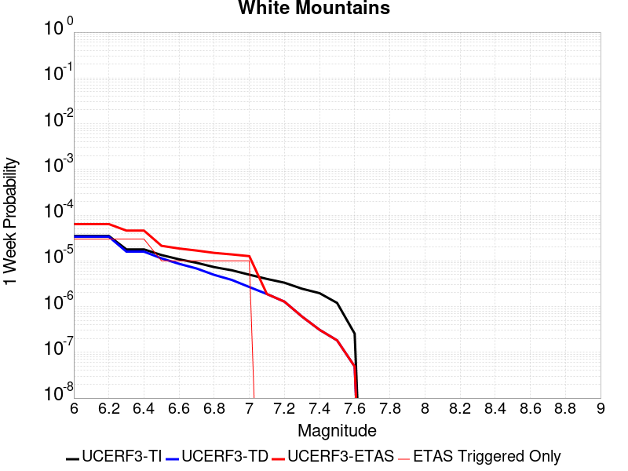 |  |  | 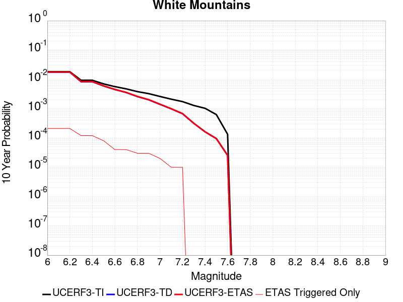 |

| Magnitude | 1 wk TI Prob | 1 wk TD Prob | 1 wk ETAS Prob | 1 wk ETAS/TD Gain | 1 wk ETAS Triggered Only | 1 mo TI Prob | 1 mo TD Prob | 1 mo ETAS Prob | 1 mo ETAS/TD Gain | 1 mo ETAS Triggered Only | 1 yr TI Prob | 1 yr TD Prob | 1 yr ETAS Prob | 1 yr ETAS/TD Gain | 1 yr ETAS Triggered Only | 10 yr TI Prob | 10 yr TD Prob | 10 yr ETAS Prob | 10 yr ETAS/TD Gain | 10 yr ETAS Triggered Only |
|-----|-----|-----|-----|-----|-----|-----|-----|-----|-----|-----|-----|-----|-----|-----|-----|-----|-----|-----|-----|-----|
| 6.0 | 3.503579E-5 | 3.378405E-5 | 1.374075E-4 | 4.0672297 | 1.03626946E-4 | 1.5014476E-4 | 1.4478143E-4 | 3.0019935E-4 | 2.0734658 | 1.5544042E-4 | 0.0018264796 | 0.0017614096 | 0.0020200205 | 1.1468205 | 2.5906737E-4 | 0.018115403 | 0.017486818 | 0.017792262 | 1.0174671 | 3.1088083E-4 |
| 6.1 | 3.503579E-5 | 3.378405E-5 | 1.374075E-4 | 4.0672297 | 1.03626946E-4 | 1.5014476E-4 | 1.4478143E-4 | 3.0019935E-4 | 2.0734658 | 1.5544042E-4 | 0.0018264796 | 0.0017614096 | 0.0020200205 | 1.1468205 | 2.5906737E-4 | 0.018115403 | 0.017486818 | 0.017792262 | 1.0174671 | 3.1088083E-4 |
| 6.2 | 3.503579E-5 | 3.378405E-5 | 1.374075E-4 | 4.0672297 | 1.03626946E-4 | 1.5014476E-4 | 1.4478143E-4 | 3.0019935E-4 | 2.0734658 | 1.5544042E-4 | 0.0018264796 | 0.0017614096 | 0.0020200205 | 1.1468205 | 2.5906737E-4 | 0.018115403 | 0.017486818 | 0.017792262 | 1.0174671 | 3.1088083E-4 |
| 6.3 | 1.7818425E-5 | 1.5916074E-5 | 1.19541364E-4 | 7.510732 | 1.03626946E-4 | 7.636245E-5 | 6.821004E-5 | 1.7182992E-4 | 2.5191293 | 1.03626946E-4 | 9.293162E-4 | 8.301551E-4 | 9.854665E-4 | 1.1870872 | 1.5544042E-4 | 0.009254395 | 0.008271999 | 0.008426153 | 1.0186357 | 1.5544042E-4 |
| 6.4 | 1.7818425E-5 | 1.5916074E-5 | 1.19541364E-4 | 7.510732 | 1.03626946E-4 | 7.636245E-5 | 6.821004E-5 | 1.7182992E-4 | 2.5191293 | 1.03626946E-4 | 9.293162E-4 | 8.301551E-4 | 9.854665E-4 | 1.1870872 | 1.5544042E-4 | 0.009254395 | 0.008271999 | 0.008426153 | 1.0186357 | 1.5544042E-4 |
| 6.5 | 1.3397557E-5 | 1.13362685E-5 | 6.314915E-5 | 5.5705414 | 5.1813473E-5 | 5.741684E-5 | 4.858314E-5 | 1.003941E-4 | 2.066439 | 5.1813473E-5 | 6.988258E-4 | 5.913462E-4 | 6.9491187E-4 | 1.1751354 | 1.03626946E-4 | 0.006966323 | 0.005898432 | 0.006001448 | 1.0174649 | 1.03626946E-4 |
| 6.6 | 1.0818695E-5 | 8.625366E-6 | 6.043839E-5 | 7.0070524 | 5.1813473E-5 | 4.6365014E-5 | 3.6965357E-5 | 8.877691E-5 | 2.4016247 | 5.1813473E-5 | 5.6434784E-4 | 4.4996463E-4 | 5.5354496E-4 | 1.2301966 | 1.03626946E-4 | 0.005629168 | 0.004490972 | 0.0045941337 | 1.0229709 | 1.03626946E-4 |
| 6.7 | 9.067908E-6 | 6.802442E-6 | 5.8615562E-5 | 8.616841 | 5.1813473E-5 | 3.8861883E-5 | 2.9153016E-5 | 8.096498E-5 | 2.777242 | 5.1813473E-5 | 4.7304068E-4 | 3.5488335E-4 | 4.584735E-4 | 1.2918992 | 1.03626946E-4 | 0.00472035 | 0.0035434833 | 0.003646743 | 1.0291407 | 1.03626946E-4 |
| 6.8 | 7.295947E-6 | 4.936391E-6 | 5.6749606E-5 | 11.496173 | 5.1813473E-5 | 3.126797E-5 | 2.1155796E-5 | 7.296817E-5 | 3.4490864 | 5.1813473E-5 | 3.8062103E-4 | 2.575425E-4 | 3.6114277E-4 | 1.4022647 | 1.03626946E-4 | 0.0037996976 | 0.0025725532 | 0.0026759137 | 1.0401782 | 1.03626946E-4 |
| 6.9 | 6.2243444E-6 | 3.832213E-6 | 5.5645487E-5 | 14.520457 | 5.1813473E-5 | 2.6675489E-5 | 1.642367E-5 | 6.823629E-5 | 4.1547527 | 5.1813473E-5 | 3.2472567E-4 | 1.9994036E-4 | 3.0354658E-4 | 1.5181856 | 1.03626946E-4 | 0.0032425157 | 0.0019976576 | 0.0021010775 | 1.0517706 | 1.03626946E-4 |
| 7.0 | 4.9878413E-6 | 2.6795342E-6 | 5.4492866E-5 | 20.336695 | 5.1813473E-5 | 2.1376287E-5 | 1.14836685E-5 | 6.3296546E-5 | 5.5118747 | 5.1813473E-5 | 2.602252E-4 | 1.3980496E-4 | 2.4341741E-4 | 1.7411214 | 1.03626946E-4 | 0.002599207 | 0.0013971963 | 0.0015006785 | 1.0740641 | 1.03626946E-4 |
| 7.1 | 4.0252844E-6 | 1.8857575E-6 | 1.8857575E-6 | 1.0 | 0.0 | 1.7251105E-5 | 8.081794E-6 | 8.081794E-6 | 1.0 | 0.0 | 2.1001195E-4 | 9.8391516E-5 | 1.5019989E-4 | 1.5265533 | 5.1813473E-5 | 0.0020981359 | 9.834924E-4 | 0.0010352549 | 1.0526314 | 5.1813473E-5 |
| 7.2 | 3.3284066E-6 | 1.281964E-6 | 1.281964E-6 | 1.0 | 0.0 | 1.4264522E-5 | 5.494121E-6 | 5.494121E-6 | 1.0 | 0.0 | 1.736567E-4 | 6.688897E-5 | 1.18698976E-4 | 1.7745672 | 5.1813473E-5 | 0.0017352107 | 6.6869846E-4 | 7.2047726E-4 | 1.0774323 | 5.1813473E-5 |
| 7.3 | 2.458226E-6 | 6.05722E-7 | 6.05722E-7 | 1.0 | 0.0 | 1.0535211E-5 | 2.5959491E-6 | 2.5959491E-6 | 1.0 | 0.0 | 1.2825865E-4 | 3.1605257E-5 | 3.1605257E-5 | 1.0 | 0.0 | 0.0012818464 | 3.160114E-4 | 3.160114E-4 | 1.0 | 0.0 |
| 7.4 | 1.965953E-6 | 3.1089303E-7 | 3.1089303E-7 | 1.0 | 0.0 | 8.425486E-6 | 1.332398E-6 | 1.332398E-6 | 1.0 | 0.0 | 1.0257547E-4 | 1.6221828E-5 | 1.6221828E-5 | 1.0 | 0.0 | 0.0010252813 | 1.6220656E-4 | 1.6220656E-4 | 1.0 | 0.0 |
| 7.5 | 1.2014192E-6 | 1.8244253E-7 | 1.8244253E-7 | 1.0 | 0.0 | 5.148929E-6 | 7.8189635E-7 | 7.8189635E-7 | 1.0 | 0.0 | 6.2686406E-5 | 9.519547E-6 | 9.519547E-6 | 1.0 | 0.0 | 6.266873E-4 | 9.519148E-5 | 9.519148E-5 | 1.0 | 0.0 |
| 7.6 | 2.5612175E-7 | 4.8946475E-8 | 4.8946475E-8 | 1.0 | 0.0 | 1.0976642E-6 | 2.0977059E-7 | 2.0977059E-7 | 1.0 | 0.0 | 1.3363979E-5 | 2.5539543E-6 | 2.5539543E-6 | 1.0 | 0.0 | 1.3363175E-4 | 2.5539286E-5 | 2.5539286E-5 | 1.0 | 0.0 |

## Chino alt 1
*[(top)](#table-of-contents)*

| 1 Week | 1 Month | 1 Year | 10 Year |
|-----|-----|-----|-----|
|  |  |  |  |

| Magnitude | 1 wk TI Prob | 1 wk TD Prob | 1 wk ETAS Prob | 1 wk ETAS/TD Gain | 1 wk ETAS Triggered Only | 1 mo TI Prob | 1 mo TD Prob | 1 mo ETAS Prob | 1 mo ETAS/TD Gain | 1 mo ETAS Triggered Only | 1 yr TI Prob | 1 yr TD Prob | 1 yr ETAS Prob | 1 yr ETAS/TD Gain | 1 yr ETAS Triggered Only | 10 yr TI Prob | 10 yr TD Prob | 10 yr ETAS Prob | 10 yr ETAS/TD Gain | 10 yr ETAS Triggered Only |
|-----|-----|-----|-----|-----|-----|-----|-----|-----|-----|-----|-----|-----|-----|-----|-----|-----|-----|-----|-----|-----|
| 6.0 | 3.939946E-5 | 4.8948554E-5 | 1.0075949E-4 | 2.0584774 | 5.1813473E-5 | 1.6884391E-4 | 2.097656E-4 | 3.133708E-4 | 1.4939095 | 1.03626946E-4 | 0.0020537362 | 0.0025513945 | 0.002809801 | 1.1012805 | 2.5906737E-4 | 0.020348595 | 0.025277847 | 0.02558087 | 1.0119877 | 3.1088083E-4 |
| 6.1 | 2.1505624E-5 | 2.6879026E-5 | 2.6879026E-5 | 1.0 | 0.0 | 9.2163704E-5 | 1.1519137E-4 | 1.1519137E-4 | 1.0 | 0.0 | 0.0011215154 | 0.001401664 | 0.0014534048 | 1.0369139 | 5.1813473E-5 | 0.011158722 | 0.013945141 | 0.013996232 | 1.0036637 | 5.1813473E-5 |
| 6.2 | 2.1505624E-5 | 2.6879026E-5 | 2.6879026E-5 | 1.0 | 0.0 | 9.2163704E-5 | 1.1519137E-4 | 1.1519137E-4 | 1.0 | 0.0 | 0.0011215154 | 0.001401664 | 0.0014534048 | 1.0369139 | 5.1813473E-5 | 0.011158722 | 0.013945141 | 0.013996232 | 1.0036637 | 5.1813473E-5 |
| 6.3 | 1.4290785E-5 | 1.8165128E-5 | 1.8165128E-5 | 1.0 | 0.0 | 6.1244784E-5 | 7.784848E-5 | 7.784848E-5 | 1.0 | 0.0 | 7.454001E-4 | 9.4743853E-4 | 9.992028E-4 | 1.0546361 | 5.1813473E-5 | 0.007429048 | 0.0094444575 | 0.009495782 | 1.0054343 | 5.1813473E-5 |
| 6.4 | 1.4290785E-5 | 1.8165128E-5 | 1.8165128E-5 | 1.0 | 0.0 | 6.1244784E-5 | 7.784848E-5 | 7.784848E-5 | 1.0 | 0.0 | 7.454001E-4 | 9.4743853E-4 | 9.992028E-4 | 1.0546361 | 5.1813473E-5 | 0.007429048 | 0.0094444575 | 0.009495782 | 1.0054343 | 5.1813473E-5 |
| 6.5 | 1.3017944E-5 | 1.6652088E-5 | 1.6652088E-5 | 1.0 | 0.0 | 5.5789995E-5 | 7.136439E-5 | 7.136439E-5 | 1.0 | 0.0 | 6.790315E-4 | 8.685589E-4 | 9.203273E-4 | 1.0596027 | 5.1813473E-5 | 0.0067696036 | 0.008661949 | 0.008713314 | 1.00593 | 5.1813473E-5 |
| 6.6 | 9.470016E-6 | 1.2039424E-5 | 1.2039424E-5 | 1.0 | 0.0 | 4.058515E-5 | 5.1596704E-5 | 5.1596704E-5 | 1.0 | 0.0 | 4.940122E-4 | 6.280428E-4 | 6.798237E-4 | 1.0824481 | 5.1813473E-5 | 0.004929154 | 0.0062718987 | 0.0063233874 | 1.0082093 | 5.1813473E-5 |
| 6.7 | 8.314155E-6 | 1.0407736E-5 | 1.0407736E-5 | 1.0 | 0.0 | 3.5631605E-5 | 4.4604003E-5 | 4.4604003E-5 | 1.0 | 0.0 | 4.3372845E-4 | 5.429507E-4 | 5.94736E-4 | 1.0953776 | 5.1813473E-5 | 0.004328829 | 0.005425775 | 0.0054773074 | 1.0094976 | 5.1813473E-5 |
| 6.8 | 3.4856364E-6 | 3.8133708E-6 | 3.8133708E-6 | 1.0 | 0.0 | 1.4938357E-5 | 1.6342927E-5 | 1.6342927E-5 | 1.0 | 0.0 | 1.8185932E-4 | 1.9895904E-4 | 2.507622E-4 | 1.260371 | 5.1813473E-5 | 0.0018171056 | 0.0019894864 | 0.002041197 | 1.0259918 | 5.1813473E-5 |
| 6.9 | 2.2645952E-6 | 2.1529022E-6 | 2.1529022E-6 | 1.0 | 0.0 | 9.705372E-6 | 9.226692E-6 | 9.226692E-6 | 1.0 | 0.0 | 1.18156495E-4 | 1.123294E-4 | 1.123294E-4 | 1.0 | 0.0 | 0.0011809369 | 0.0011233423 | 0.0011233423 | 1.0 | 0.0 |
| 7.0 | 1.7864003E-6 | 1.5430785E-6 | 1.5430785E-6 | 1.0 | 0.0 | 7.655979E-6 | 6.613177E-6 | 6.613177E-6 | 1.0 | 0.0 | 9.3207556E-5 | 8.051251E-5 | 8.051251E-5 | 1.0 | 0.0 | 9.316847E-4 | 8.0528046E-4 | 8.0528046E-4 | 1.0 | 0.0 |
| 7.1 | 1.7315456E-6 | 1.4733511E-6 | 1.4733511E-6 | 1.0 | 0.0 | 7.420889E-6 | 6.3143466E-6 | 6.3143466E-6 | 1.0 | 0.0 | 9.034557E-5 | 7.6874516E-5 | 7.6874516E-5 | 1.0 | 0.0 | 9.0308854E-4 | 7.6891703E-4 | 7.6891703E-4 | 1.0 | 0.0 |
| 7.2 | 1.6008337E-6 | 1.3574215E-6 | 1.3574215E-6 | 1.0 | 0.0 | 6.860698E-6 | 5.817508E-6 | 5.817508E-6 | 1.0 | 0.0 | 8.352579E-5 | 7.082591E-5 | 7.082591E-5 | 1.0 | 0.0 | 8.34944E-4 | 7.0845755E-4 | 7.0845755E-4 | 1.0 | 0.0 |
| 7.3 | 1.3320939E-6 | 1.121782E-6 | 1.121782E-6 | 1.0 | 0.0 | 5.7089615E-6 | 4.807629E-6 | 4.807629E-6 | 1.0 | 0.0 | 6.9504385E-5 | 5.8531357E-5 | 5.8531357E-5 | 1.0 | 0.0 | 6.9482654E-4 | 5.8530393E-4 | 5.8530393E-4 | 1.0 | 0.0 |
| 7.4 | 1.114294E-6 | 9.237111E-7 | 9.237111E-7 | 1.0 | 0.0 | 4.775537E-6 | 3.958756E-6 | 3.958756E-6 | 1.0 | 0.0 | 5.8140613E-5 | 4.8196827E-5 | 4.8196827E-5 | 1.0 | 0.0 | 5.81254E-4 | 4.8188053E-4 | 4.8188053E-4 | 1.0 | 0.0 |
| 7.5 | 9.354081E-7 | 7.6234323E-7 | 7.6234323E-7 | 1.0 | 0.0 | 4.0088858E-6 | 3.2671815E-6 | 3.2671815E-6 | 1.0 | 0.0 | 4.8807087E-5 | 3.9777242E-5 | 3.9777242E-5 | 1.0 | 0.0 | 4.879637E-4 | 3.977046E-4 | 3.977046E-4 | 1.0 | 0.0 |
| 7.6 | 8.521771E-7 | 6.88071E-7 | 6.88071E-7 | 1.0 | 0.0 | 3.6521824E-6 | 2.9488726E-6 | 2.9488726E-6 | 1.0 | 0.0 | 4.4464414E-5 | 3.5901965E-5 | 3.5901965E-5 | 1.0 | 0.0 | 4.4455516E-4 | 3.589648E-4 | 3.589648E-4 | 1.0 | 0.0 |
| 7.7 | 2.1803626E-7 | 1.418649E-7 | 1.418649E-7 | 1.0 | 0.0 | 9.344408E-7 | 6.079923E-7 | 6.079923E-7 | 1.0 | 0.0 | 1.1376757E-5 | 7.4022914E-6 | 7.4022914E-6 | 1.0 | 0.0 | 1.13761744E-4 | 7.402141E-5 | 7.402141E-5 | 1.0 | 0.0 |

## Lake Isabella (Seismicity)
*[(top)](#table-of-contents)*

| 1 Week | 1 Month | 1 Year | 10 Year |
|-----|-----|-----|-----|
|  |  |  |  |

| Magnitude | 1 wk TI Prob | 1 wk TD Prob | 1 wk ETAS Prob | 1 wk ETAS/TD Gain | 1 wk ETAS Triggered Only | 1 mo TI Prob | 1 mo TD Prob | 1 mo ETAS Prob | 1 mo ETAS/TD Gain | 1 mo ETAS Triggered Only | 1 yr TI Prob | 1 yr TD Prob | 1 yr ETAS Prob | 1 yr ETAS/TD Gain | 1 yr ETAS Triggered Only | 10 yr TI Prob | 10 yr TD Prob | 10 yr ETAS Prob | 10 yr ETAS/TD Gain | 10 yr ETAS Triggered Only |
|-----|-----|-----|-----|-----|-----|-----|-----|-----|-----|-----|-----|-----|-----|-----|-----|-----|-----|-----|-----|-----|
| 6.0 | 9.431637E-6 | 9.741651E-6 | 6.1554616E-5 | 6.3187046 | 5.1813473E-5 | 4.0420677E-5 | 4.1749343E-5 | 1.4537196E-4 | 3.482018 | 1.03626946E-4 | 4.920106E-4 | 5.0819275E-4 | 6.635542E-4 | 1.3057135 | 1.5544042E-4 | 0.004909227 | 0.005071599 | 0.0053293523 | 1.050823 | 2.5906737E-4 |
| 6.1 | 9.431637E-6 | 9.741651E-6 | 6.1554616E-5 | 6.3187046 | 5.1813473E-5 | 4.0420677E-5 | 4.1749343E-5 | 1.4537196E-4 | 3.482018 | 1.03626946E-4 | 4.920106E-4 | 5.0819275E-4 | 6.635542E-4 | 1.3057135 | 1.5544042E-4 | 0.004909227 | 0.005071599 | 0.0053293523 | 1.050823 | 2.5906737E-4 |
| 6.2 | 9.431637E-6 | 9.741651E-6 | 6.1554616E-5 | 6.3187046 | 5.1813473E-5 | 4.0420677E-5 | 4.1749343E-5 | 1.4537196E-4 | 3.482018 | 1.03626946E-4 | 4.920106E-4 | 5.0819275E-4 | 6.635542E-4 | 1.3057135 | 1.5544042E-4 | 0.004909227 | 0.005071599 | 0.0053293523 | 1.050823 | 2.5906737E-4 |
| 6.3 | 9.431637E-6 | 9.741651E-6 | 6.1554616E-5 | 6.3187046 | 5.1813473E-5 | 4.0420677E-5 | 4.1749343E-5 | 1.4537196E-4 | 3.482018 | 1.03626946E-4 | 4.920106E-4 | 5.0819275E-4 | 6.635542E-4 | 1.3057135 | 1.5544042E-4 | 0.004909227 | 0.005071599 | 0.0053293523 | 1.050823 | 2.5906737E-4 |
| 6.4 | 5.144063E-6 | 5.3000763E-6 | 5.3000763E-6 | 1.0 | 0.0 | 2.2045799E-5 | 2.2714434E-5 | 7.452673E-5 | 3.2810295 | 5.1813473E-5 | 2.6837454E-4 | 2.765166E-4 | 3.2831574E-4 | 1.1873274 | 5.1813473E-5 | 0.0026805066 | 0.0027620657 | 0.002813736 | 1.0187072 | 5.1813473E-5 |
| 6.5 | 5.144063E-6 | 5.3000763E-6 | 5.3000763E-6 | 1.0 | 0.0 | 2.2045799E-5 | 2.2714434E-5 | 7.452673E-5 | 3.2810295 | 5.1813473E-5 | 2.6837454E-4 | 2.765166E-4 | 3.2831574E-4 | 1.1873274 | 5.1813473E-5 | 0.0026805066 | 0.0027620657 | 0.002813736 | 1.0187072 | 5.1813473E-5 |
| 6.6 | 3.4009804E-6 | 3.498786E-6 | 3.498786E-6 | 1.0 | 0.0 | 1.4575549E-5 | 1.4994721E-5 | 6.680741E-5 | 4.4553957 | 5.1813473E-5 | 1.7744285E-4 | 1.8254704E-4 | 2.3435104E-4 | 1.2837845 | 5.1813473E-5 | 0.0017730123 | 0.0018241286 | 0.0018758476 | 1.0283527 | 5.1813473E-5 |
| 6.7 | 3.3880428E-6 | 3.4856528E-6 | 3.4856528E-6 | 1.0 | 0.0 | 1.4520103E-5 | 1.4938435E-5 | 6.6751134E-5 | 4.4684153 | 5.1813473E-5 | 1.767679E-4 | 1.8186188E-4 | 2.3366592E-4 | 1.2848538 | 5.1813473E-5 | 0.0017662736 | 0.0018172882 | 0.0018690075 | 1.0284597 | 5.1813473E-5 |
| 6.8 | 2.6582E-6 | 2.7337003E-6 | 2.7337003E-6 | 1.0 | 0.0 | 1.1392236E-5 | 1.1715813E-5 | 6.352868E-5 | 5.422473 | 5.1813473E-5 | 1.3869164E-4 | 1.4263204E-4 | 1.9443811E-4 | 1.363215 | 5.1813473E-5 | 0.0013860512 | 0.0014255369 | 0.0014772766 | 1.0362948 | 5.1813473E-5 |
| 6.9 | 2.406011E-6 | 2.4743288E-6 | 2.4743288E-6 | 1.0 | 0.0 | 1.0311434E-5 | 1.0604231E-5 | 6.241715E-5 | 5.886061 | 5.1813473E-5 | 1.2553448E-4 | 1.2910018E-4 | 1.8090697E-4 | 1.4012914 | 5.1813473E-5 | 0.0012546359 | 0.0012903814 | 0.001342128 | 1.0401018 | 5.1813473E-5 |
| 7.0 | 1.6953097E-6 | 1.7429371E-6 | 1.7429371E-6 | 1.0 | 0.0 | 7.265593E-6 | 7.469715E-6 | 5.92828E-5 | 7.9364204 | 5.1813473E-5 | 8.8455E-5 | 9.094104E-5 | 1.4274979E-4 | 1.5696962 | 5.1813473E-5 | 8.84198E-4 | 9.09141E-4 | 9.609073E-4 | 1.0569398 | 5.1813473E-5 |
| 7.1 | 3.5013824E-7 | 3.5714822E-7 | 3.5714822E-7 | 1.0 | 0.0 | 1.5005916E-6 | 1.5306344E-6 | 1.5306344E-6 | 1.0 | 0.0 | 1.826955E-5 | 1.8635317E-5 | 1.8635317E-5 | 1.0 | 0.0 | 1.8268047E-4 | 1.863378E-4 | 1.863378E-4 | 1.0 | 0.0 |
| 7.2 | 2.2321095E-7 | 2.2750574E-7 | 2.2750574E-7 | 1.0 | 0.0 | 9.56618E-7 | 9.750242E-7 | 9.750242E-7 | 1.0 | 0.0 | 1.1646762E-5 | 1.1870856E-5 | 1.1870856E-5 | 1.0 | 0.0 | 1.1646151E-4 | 1.1870232E-4 | 1.1870232E-4 | 1.0 | 0.0 |
| 7.3 | 1.5760406E-7 | 1.6060922E-7 | 1.6060922E-7 | 1.0 | 0.0 | 6.7544585E-7 | 6.8832503E-7 | 6.8832503E-7 | 1.0 | 0.0 | 8.223522E-6 | 8.380326E-6 | 8.380326E-6 | 1.0 | 0.0 | 8.2232174E-5 | 8.3800165E-5 | 8.3800165E-5 | 1.0 | 0.0 |
| 7.4 | 1.1216497E-7 | 1.1431706E-7 | 1.1431706E-7 | 1.0 | 0.0 | 4.8070694E-7 | 4.899302E-7 | 4.899302E-7 | 1.0 | 0.0 | 5.852591E-6 | 5.964884E-6 | 5.964884E-6 | 1.0 | 0.0 | 5.8524372E-5 | 5.9647282E-5 | 5.9647282E-5 | 1.0 | 0.0 |
| 7.5 | 4.885185E-8 | 4.9787737E-8 | 4.9787737E-8 | 1.0 | 0.0 | 2.0936506E-7 | 2.13376E-7 | 2.13376E-7 | 1.0 | 0.0 | 2.5490165E-6 | 2.59785E-6 | 2.59785E-6 | 1.0 | 0.0 | 2.5489873E-5 | 2.5978214E-5 | 2.5978214E-5 | 1.0 | 0.0 |
| 7.6 | 1.504641E-9 | 1.5317903E-9 | 1.5317903E-9 | 1.0 | 0.0 | 6.4484613E-9 | 6.5648154E-9 | 6.5648154E-9 | 1.0 | 0.0 | 7.851001E-8 | 7.992663E-8 | 7.992663E-8 | 1.0 | 0.0 | 7.8509987E-7 | 7.992663E-7 | 7.992663E-7 | 1.0 | 0.0 |

## San Andreas (Creeping Section) 2011 CFM
*[(top)](#table-of-contents)*

| 1 Week | 1 Month | 1 Year | 10 Year |
|-----|-----|-----|-----|
|  |  |  |  |

| Magnitude | 1 wk TI Prob | 1 wk TD Prob | 1 wk ETAS Prob | 1 wk ETAS/TD Gain | 1 wk ETAS Triggered Only | 1 mo TI Prob | 1 mo TD Prob | 1 mo ETAS Prob | 1 mo ETAS/TD Gain | 1 mo ETAS Triggered Only | 1 yr TI Prob | 1 yr TD Prob | 1 yr ETAS Prob | 1 yr ETAS/TD Gain | 1 yr ETAS Triggered Only | 10 yr TI Prob | 10 yr TD Prob | 10 yr ETAS Prob | 10 yr ETAS/TD Gain | 10 yr ETAS Triggered Only |
|-----|-----|-----|-----|-----|-----|-----|-----|-----|-----|-----|-----|-----|-----|-----|-----|-----|-----|-----|-----|-----|
| 6.0 | 5.986481E-4 | 0.001228691 | 0.0013321906 | 1.0842357 | 1.03626946E-4 | 0.0025631124 | 0.005246795 | 0.005349878 | 1.0196469 | 1.03626946E-4 | 0.030762846 | 0.061203245 | 0.061349172 | 1.0023843 | 1.5544042E-4 | 0.26835477 | 0.425928 | 0.42607674 | 1.0003492 | 2.5906737E-4 |
| 6.1 | 5.015945E-4 | 0.0010230356 | 0.0011265565 | 1.10119 | 1.03626946E-4 | 0.00214792 | 0.004369436 | 0.00447261 | 1.0236127 | 1.03626946E-4 | 0.025839351 | 0.051246606 | 0.051394083 | 1.0028777 | 1.5544042E-4 | 0.23032776 | 0.37284943 | 0.37301192 | 1.0004357 | 2.5906737E-4 |
| 6.2 | 4.073338E-4 | 8.1157376E-4 | 9.151166E-4 | 1.1275828 | 1.03626946E-4 | 0.0017445484 | 0.0034683137 | 0.003571581 | 1.0297745 | 1.03626946E-4 | 0.021034058 | 0.04093177 | 0.041080847 | 1.0036421 | 1.5544042E-4 | 0.19150782 | 0.31302592 | 0.31320387 | 1.0005685 | 2.5906737E-4 |
| 6.3 | 3.464099E-4 | 6.7455834E-4 | 7.7811535E-4 | 1.1535183 | 1.03626946E-4 | 0.0014837692 | 0.0028832308 | 0.002986559 | 1.0358377 | 1.03626946E-4 | 0.017915873 | 0.034187846 | 0.03433797 | 1.0043912 | 1.5544042E-4 | 0.16538359 | 0.27130842 | 0.2714972 | 1.0006958 | 2.5906737E-4 |
| 6.4 | 2.935057E-4 | 5.5516965E-4 | 6.5873907E-4 | 1.1865546 | 1.03626946E-4 | 0.0012572751 | 0.0023727308 | 0.002476112 | 1.0435705 | 1.03626946E-4 | 0.015200248 | 0.02826279 | 0.028413838 | 1.0053444 | 1.5544042E-4 | 0.14201577 | 0.23297668 | 0.23317538 | 1.000853 | 2.5906737E-4 |
| 6.5 | 2.3409708E-4 | 4.2132285E-4 | 5.2490615E-4 | 1.2458525 | 1.03626946E-4 | 0.0010028875 | 0.0018017791 | 0.0019052194 | 1.05741 | 1.03626946E-4 | 0.012141965 | 0.021586355 | 0.02173844 | 1.0070454 | 1.5544042E-4 | 0.11499573 | 0.1868149 | 0.18702558 | 1.0011277 | 2.5906737E-4 |
| 6.6 | 1.5842178E-4 | 2.5068692E-4 | 3.024874E-4 | 1.2066342 | 5.1813473E-5 | 6.7877385E-4 | 0.0010739256 | 0.0011256834 | 1.048195 | 5.1813473E-5 | 0.0082328 | 0.012995283 | 0.013097564 | 1.0078706 | 1.03626946E-4 | 0.07934396 | 0.12313759 | 0.12331933 | 1.0014758 | 2.0725389E-4 |
| 6.7 | 1.5616413E-4 | 2.4605254E-4 | 2.9785326E-4 | 1.2105271 | 5.1813473E-5 | 6.691031E-4 | 0.0010540807 | 0.0011058395 | 1.0491033 | 5.1813473E-5 | 0.0081159435 | 0.012757154 | 0.012859459 | 1.0080194 | 1.03626946E-4 | 0.0782586 | 0.12116472 | 0.12134686 | 1.0015032 | 2.0725389E-4 |
| 6.8 | 1.5538467E-4 | 2.442914E-4 | 2.9609224E-4 | 1.2120452 | 5.1813473E-5 | 6.6576427E-4 | 0.001046539 | 0.0010982984 | 1.0494576 | 5.1813473E-5 | 0.008075596 | 0.012666538 | 0.0127688525 | 1.0080775 | 1.03626946E-4 | 0.07788358 | 0.12039561 | 0.12057791 | 1.0015142 | 2.0725389E-4 |
| 6.9 | 1.5153569E-4 | 2.3538464E-4 | 2.8718592E-4 | 1.2200707 | 5.1813473E-5 | 6.49277E-4 | 0.0010084033 | 0.0010601645 | 1.0513299 | 5.1813473E-5 | 0.007876333 | 0.012208726 | 0.012311088 | 1.0083843 | 1.03626946E-4 | 0.07602952 | 0.11646574 | 0.11664886 | 1.0015723 | 2.0725389E-4 |
| 7.0 | 1.4588932E-4 | 2.2395732E-4 | 2.757592E-4 | 1.2313024 | 5.1813473E-5 | 6.250901E-4 | 9.59466E-4 | 0.0010112297 | 1.0539505 | 5.1813473E-5 | 0.0075839474 | 0.011619428 | 0.01172185 | 1.0088148 | 1.03626946E-4 | 0.073302895 | 0.11131206 | 0.11149625 | 1.0016546 | 2.0725389E-4 |
| 7.1 | 1.1565079E-4 | 1.6281323E-4 | 2.1461827E-4 | 1.3181869 | 5.1813473E-5 | 4.955521E-4 | 6.9758523E-4 | 7.493626E-4 | 1.0742236 | 5.1813473E-5 | 0.006016669 | 0.008460228 | 0.008562978 | 1.012145 | 1.03626946E-4 | 0.058563538 | 0.08366478 | 0.0838547 | 1.00227 | 2.0725389E-4 |
| 7.2 | 1.0393792E-4 | 1.4615392E-4 | 1.9795982E-4 | 1.3544612 | 5.1813473E-5 | 4.4537216E-4 | 6.262243E-4 | 6.7800534E-4 | 1.0826876 | 5.1813473E-5 | 0.005408933 | 0.0075977976 | 0.0077006374 | 1.0135355 | 1.03626946E-4 | 0.052791595 | 0.07561503 | 0.075758725 | 1.0019002 | 1.5544042E-4 |
| 7.3 | 9.332884E-5 | 1.2780601E-4 | 1.7961285E-4 | 1.4053553 | 5.1813473E-5 | 3.999194E-4 | 5.4762565E-4 | 5.9941073E-4 | 1.094563 | 5.1813473E-5 | 0.0048581534 | 0.0066470946 | 0.006750033 | 1.0154862 | 1.03626946E-4 | 0.047533102 | 0.06647954 | 0.06662465 | 1.0021827 | 1.5544042E-4 |
| 7.4 | 8.670252E-5 | 1.1702972E-4 | 1.6883713E-4 | 1.442686 | 5.1813473E-5 | 3.715293E-4 | 5.014601E-4 | 5.532476E-4 | 1.1032734 | 5.1813473E-5 | 0.004513991 | 0.0060883067 | 0.0061913026 | 1.016917 | 1.03626946E-4 | 0.044233937 | 0.061148684 | 0.06129462 | 1.0023866 | 1.5544042E-4 |
| 7.5 | 7.3036405E-5 | 9.005699E-5 | 1.4186579E-4 | 1.5752891 | 5.1813473E-5 | 3.129756E-4 | 3.859015E-4 | 4.3769498E-4 | 1.1342143 | 5.1813473E-5 | 0.0038038217 | 0.0046882504 | 0.0047913915 | 1.022 | 1.03626946E-4 | 0.03739367 | 0.047875606 | 0.048023608 | 1.0030913 | 1.5544042E-4 |
| 7.6 | 6.3935775E-5 | 8.280209E-5 | 1.3461127E-4 | 1.6256989 | 5.1813473E-5 | 2.7398168E-4 | 3.5481792E-4 | 4.0661302E-4 | 1.1459765 | 5.1813473E-5 | 0.0033306254 | 0.00431137 | 0.00441455 | 1.0239321 | 1.03626946E-4 | 0.032811474 | 0.043990135 | 0.044138737 | 1.003378 | 1.5544042E-4 |
| 7.7 | 5.5050095E-5 | 6.661729E-5 | 1.1842731E-4 | 1.7777263 | 5.1813473E-5 | 2.3590765E-4 | 2.8547147E-4 | 3.3727015E-4 | 1.1814497 | 5.1813473E-5 | 0.0028683927 | 0.0034700802 | 0.0035733473 | 1.0297594 | 1.03626946E-4 | 0.0283165 | 0.03579509 | 0.035944965 | 1.0041871 | 1.5544042E-4 |
| 7.8 | 5.027131E-5 | 6.1627725E-5 | 1.13438E-4 | 1.8406976 | 5.1813473E-5 | 2.1543067E-4 | 2.640921E-4 | 3.1589187E-4 | 1.1961429 | 5.1813473E-5 | 0.0026197135 | 0.003210584 | 0.0032622311 | 1.0160866 | 5.1813473E-5 | 0.025890453 | 0.03312572 | 0.033225913 | 1.0030247 | 1.03626946E-4 |
| 7.9 | 3.7271806E-5 | 5.0224386E-5 | 1.0203526E-4 | 2.0315878 | 5.1813473E-5 | 1.5972654E-4 | 2.1522962E-4 | 2.6703195E-4 | 1.2406839 | 5.1813473E-5 | 0.0019429359 | 0.0026172737 | 0.0026689514 | 1.0197449 | 5.1813473E-5 | 0.019260362 | 0.027066687 | 0.02716751 | 1.0037249 | 1.03626946E-4 |
| 8.0 | 2.7310243E-5 | 3.1428404E-5 | 8.324025E-5 | 2.6485674 | 5.1813473E-5 | 1.17038646E-4 | 1.3468621E-4 | 1.864927E-4 | 1.3846458 | 5.1813473E-5 | 0.0014240141 | 0.0016385721 | 0.0016903006 | 1.0315692 | 5.1813473E-5 | 0.014149235 | 0.01721387 | 0.017315712 | 1.0059164 | 1.03626946E-4 |
| 8.1 | 1.7940547E-5 | 1.7400796E-5 | 6.921337E-5 | 3.9775977 | 5.1813473E-5 | 7.688579E-5 | 7.457271E-5 | 1.2638232E-4 | 1.6947529 | 5.1813473E-5 | 9.3568244E-4 | 9.075451E-4 | 9.5931155E-4 | 1.0570401 | 5.1813473E-5 | 0.009317525 | 0.009799073 | 0.009901685 | 1.0104716 | 1.03626946E-4 |
| 8.2 | 8.643924E-6 | 5.4748625E-6 | 5.4748625E-6 | 1.0 | 0.0 | 3.704486E-5 | 2.3463486E-5 | 2.3463486E-5 | 1.0 | 0.0 | 4.5092785E-4 | 2.8563058E-4 | 2.8563058E-4 | 1.0 | 0.0 | 0.0045001395 | 0.0032487072 | 0.0032487072 | 1.0 | 0.0 |
| 8.3 | 1.983087E-6 | 7.6599065E-7 | 7.6599065E-7 | 1.0 | 0.0 | 8.498917E-6 | 3.282813E-6 | 3.282813E-6 | 1.0 | 0.0 | 1.034694E-4 | 3.9967534E-5 | 3.9967534E-5 | 1.0 | 0.0 | 0.0010342124 | 4.719687E-4 | 4.719687E-4 | 1.0 | 0.0 |

## San Jacinto (Lytle Creek connector)
*[(top)](#table-of-contents)*

| 1 Week | 1 Month | 1 Year | 10 Year |
|-----|-----|-----|-----|
|  |  |  | 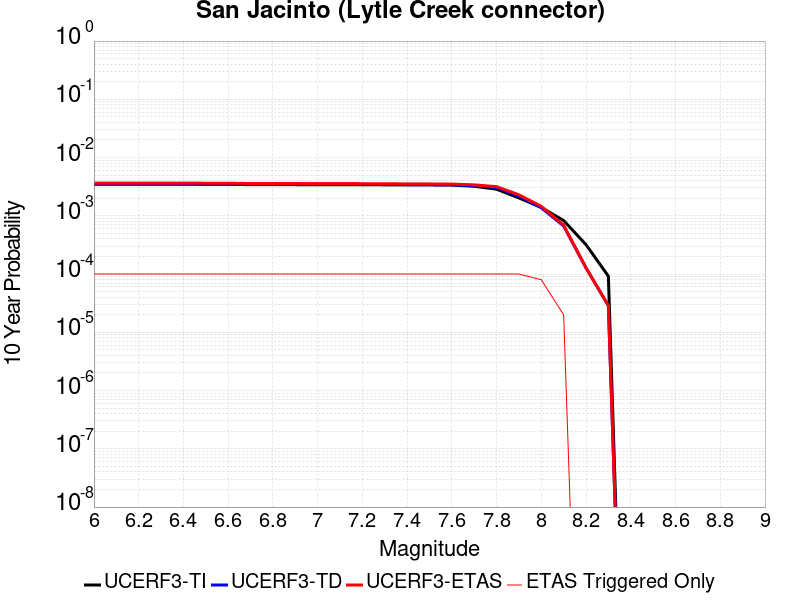 |

| Magnitude | 1 wk TI Prob | 1 wk TD Prob | 1 wk ETAS Prob | 1 wk ETAS/TD Gain | 1 wk ETAS Triggered Only | 1 mo TI Prob | 1 mo TD Prob | 1 mo ETAS Prob | 1 mo ETAS/TD Gain | 1 mo ETAS Triggered Only | 1 yr TI Prob | 1 yr TD Prob | 1 yr ETAS Prob | 1 yr ETAS/TD Gain | 1 yr ETAS Triggered Only | 10 yr TI Prob | 10 yr TD Prob | 10 yr ETAS Prob | 10 yr ETAS/TD Gain | 10 yr ETAS Triggered Only |
|-----|-----|-----|-----|-----|-----|-----|-----|-----|-----|-----|-----|-----|-----|-----|-----|-----|-----|-----|-----|-----|
| 6.0 | 6.693995E-6 | 6.660216E-6 | 1.6209959E-4 | 24.33849 | 1.5544042E-4 | 2.8688235E-5 | 2.854347E-5 | 2.3579145E-4 | 8.260783 | 2.0725389E-4 | 3.492233E-4 | 3.4746144E-4 | 5.546433E-4 | 1.5962731 | 2.0725389E-4 | 0.00348675 | 0.0035493854 | 0.003807533 | 1.0727303 | 2.5906737E-4 |
| 6.1 | 6.693995E-6 | 6.660216E-6 | 1.6209959E-4 | 24.33849 | 1.5544042E-4 | 2.8688235E-5 | 2.854347E-5 | 2.3579145E-4 | 8.260783 | 2.0725389E-4 | 3.492233E-4 | 3.4746144E-4 | 5.546433E-4 | 1.5962731 | 2.0725389E-4 | 0.00348675 | 0.0035493854 | 0.003807533 | 1.0727303 | 2.5906737E-4 |
| 6.2 | 6.693995E-6 | 6.660216E-6 | 1.6209959E-4 | 24.33849 | 1.5544042E-4 | 2.8688235E-5 | 2.854347E-5 | 2.3579145E-4 | 8.260783 | 2.0725389E-4 | 3.492233E-4 | 3.4746144E-4 | 5.546433E-4 | 1.5962731 | 2.0725389E-4 | 0.00348675 | 0.0035493854 | 0.003807533 | 1.0727303 | 2.5906737E-4 |
| 6.3 | 6.693995E-6 | 6.660216E-6 | 1.6209959E-4 | 24.33849 | 1.5544042E-4 | 2.8688235E-5 | 2.854347E-5 | 2.3579145E-4 | 8.260783 | 2.0725389E-4 | 3.492233E-4 | 3.4746144E-4 | 5.546433E-4 | 1.5962731 | 2.0725389E-4 | 0.00348675 | 0.0035493854 | 0.003807533 | 1.0727303 | 2.5906737E-4 |
| 6.4 | 6.693995E-6 | 6.660216E-6 | 1.6209959E-4 | 24.33849 | 1.5544042E-4 | 2.8688235E-5 | 2.854347E-5 | 2.3579145E-4 | 8.260783 | 2.0725389E-4 | 3.492233E-4 | 3.4746144E-4 | 5.546433E-4 | 1.5962731 | 2.0725389E-4 | 0.00348675 | 0.0035493854 | 0.003807533 | 1.0727303 | 2.5906737E-4 |
| 6.5 | 6.6561875E-6 | 6.6204343E-6 | 1.6205982E-4 | 24.47873 | 1.5544042E-4 | 2.8526205E-5 | 2.837298E-5 | 2.3562099E-4 | 8.304414 | 2.0725389E-4 | 3.472512E-4 | 3.4538636E-4 | 5.525687E-4 | 1.5998566 | 2.0725389E-4 | 0.0034670907 | 0.003528701 | 0.003786854 | 1.0731581 | 2.5906737E-4 |
| 6.6 | 6.6561875E-6 | 6.6204343E-6 | 1.6205982E-4 | 24.47873 | 1.5544042E-4 | 2.8526205E-5 | 2.837298E-5 | 2.3562099E-4 | 8.304414 | 2.0725389E-4 | 3.472512E-4 | 3.4538636E-4 | 5.525687E-4 | 1.5998566 | 2.0725389E-4 | 0.0034670907 | 0.003528701 | 0.003786854 | 1.0731581 | 2.5906737E-4 |
| 6.7 | 6.5802237E-6 | 6.539611E-6 | 1.6197901E-4 | 24.768906 | 1.5544042E-4 | 2.8200653E-5 | 2.8026603E-5 | 2.3527468E-4 | 8.394691 | 2.0725389E-4 | 3.4328885E-4 | 3.4117055E-4 | 5.483537E-4 | 1.6072716 | 2.0725389E-4 | 0.0034275902 | 0.0034866752 | 0.0037448392 | 1.074043 | 2.5906737E-4 |
| 6.8 | 6.575632E-6 | 6.5341005E-6 | 1.619735E-4 | 24.78895 | 1.5544042E-4 | 2.8180975E-5 | 2.8002989E-5 | 2.3525106E-4 | 8.400928 | 2.0725389E-4 | 3.4304935E-4 | 3.4088313E-4 | 5.4806634E-4 | 1.6077838 | 2.0725389E-4 | 0.0034252026 | 0.00348381 | 0.003741975 | 1.0741042 | 2.5906737E-4 |
| 6.9 | 6.570433E-6 | 6.525495E-6 | 1.619649E-4 | 24.820324 | 1.5544042E-4 | 2.8158694E-5 | 2.7966107E-5 | 2.352142E-4 | 8.410688 | 2.0725389E-4 | 3.4277816E-4 | 3.4043423E-4 | 5.4761756E-4 | 1.6085855 | 2.0725389E-4 | 0.0034224992 | 0.0034793352 | 0.003737501 | 1.0741998 | 2.5906737E-4 |
| 7.0 | 6.5643826E-6 | 6.515616E-6 | 1.6195502E-4 | 24.85644 | 1.5544042E-4 | 2.8132765E-5 | 2.792377E-5 | 2.3517187E-4 | 8.421925 | 2.0725389E-4 | 3.424626E-4 | 3.3991894E-4 | 5.4710236E-4 | 1.6095084 | 2.0725389E-4 | 0.0034193532 | 0.0034741985 | 0.0037323658 | 1.07431 | 2.5906737E-4 |
| 7.1 | 6.557402E-6 | 6.5043278E-6 | 1.6194372E-4 | 24.897842 | 1.5544042E-4 | 2.8102848E-5 | 2.7875392E-5 | 2.351235E-4 | 8.434805 | 2.0725389E-4 | 3.4209844E-4 | 3.3933012E-4 | 5.465137E-4 | 1.6105664 | 2.0725389E-4 | 0.0034157229 | 0.0034683298 | 0.0037264987 | 1.0744361 | 2.5906737E-4 |
| 7.2 | 6.546394E-6 | 6.4862943E-6 | 1.619257E-4 | 24.964285 | 1.5544042E-4 | 2.8055672E-5 | 2.7798109E-5 | 2.3504623E-4 | 8.455476 | 2.0725389E-4 | 3.4152428E-4 | 3.3838948E-4 | 5.4557325E-4 | 1.6122642 | 2.0725389E-4 | 0.0034099987 | 0.0034589572 | 0.0037171284 | 1.0746385 | 2.5906737E-4 |
| 7.3 | 6.5364216E-6 | 6.4670803E-6 | 1.6190649E-4 | 25.035484 | 1.5544042E-4 | 2.8012933E-5 | 2.7715765E-5 | 2.3496391E-4 | 8.477627 | 2.0725389E-4 | 3.4100408E-4 | 3.3738726E-4 | 5.445712E-4 | 1.6140835 | 2.0725389E-4 | 0.003404813 | 0.0034489788 | 0.0037071526 | 1.0748552 | 2.5906737E-4 |
| 7.4 | 6.5269523E-6 | 6.4481674E-6 | 1.6188758E-4 | 25.105982 | 1.5544042E-4 | 2.7972354E-5 | 2.7634711E-5 | 2.3488287E-4 | 8.499559 | 2.0725389E-4 | 3.4051016E-4 | 3.3640073E-4 | 5.4358493E-4 | 1.615885 | 2.0725389E-4 | 0.0033998888 | 0.003439161 | 0.0036973373 | 1.0750695 | 2.5906737E-4 |
| 7.5 | 6.5111835E-6 | 6.424442E-6 | 1.6186386E-4 | 25.195007 | 1.5544042E-4 | 2.7904773E-5 | 2.7533031E-5 | 2.3478121E-4 | 8.527256 | 2.0725389E-4 | 3.3968766E-4 | 3.3516317E-4 | 5.423476E-4 | 1.6181599 | 2.0725389E-4 | 0.0033916887 | 0.003426834 | 0.0036850136 | 1.0753405 | 2.5906737E-4 |
| 7.6 | 6.4768806E-6 | 6.383551E-6 | 1.6182297E-4 | 25.349993 | 1.5544042E-4 | 2.7757764E-5 | 2.735779E-5 | 2.34606E-4 | 8.575474 | 2.0725389E-4 | 3.3789838E-4 | 3.3303024E-4 | 5.402151E-4 | 1.6221203 | 2.0725389E-4 | 0.0033738504 | 0.0034055663 | 0.0036637513 | 1.0758127 | 2.5906737E-4 |
| 7.7 | 6.1655364E-6 | 6.1760365E-6 | 1.6161549E-4 | 26.168158 | 1.5544042E-4 | 2.642346E-5 | 2.646846E-5 | 2.3371686E-4 | 8.830013 | 2.0725389E-4 | 3.2165812E-4 | 3.2220592E-4 | 5.2939303E-4 | 1.6430271 | 2.0725389E-4 | 0.0032119295 | 0.0032971818 | 0.003555395 | 1.0783134 | 2.5906737E-4 |
| 7.8 | 5.5043524E-6 | 5.737097E-6 | 1.6117662E-4 | 28.09376 | 1.5544042E-4 | 2.3589868E-5 | 2.4587327E-5 | 2.3183612E-4 | 9.4290905 | 2.0725389E-4 | 2.871688E-4 | 2.9930964E-4 | 5.0650147E-4 | 1.6922325 | 2.0725389E-4 | 0.0028679797 | 0.0030672832 | 0.003325556 | 1.0842024 | 2.5906737E-4 |
| 7.9 | 3.889249E-6 | 4.076761E-6 | 1.5951654E-4 | 39.128254 | 1.5544042E-4 | 1.6668104E-5 | 1.7471715E-5 | 2.2472198E-4 | 12.862044 | 2.0725389E-4 | 2.0291525E-4 | 2.1269741E-4 | 4.199072E-4 | 1.9741999 | 2.0725389E-4 | 0.0020273007 | 0.0021943315 | 0.0024528303 | 1.117803 | 2.5906737E-4 |
| 8.0 | 2.668535E-6 | 2.5315155E-6 | 1.5797153E-4 | 62.401966 | 1.5544042E-4 | 1.1436528E-5 | 1.0849307E-5 | 2.1810095E-4 | 20.102755 | 2.0725389E-4 | 1.3923083E-4 | 1.3208234E-4 | 3.3930884E-4 | 2.5689192 | 2.0725389E-4 | 0.0013914363 | 0.0013757964 | 0.0015827651 | 1.1504356 | 2.0725389E-4 |
| 8.1 | 1.5911459E-6 | 1.218661E-6 | 5.303207E-5 | 43.51667 | 5.1813473E-5 | 6.8191785E-6 | 5.2228224E-6 | 1.0884922E-4 | 20.841072 | 1.03626946E-4 | 8.3020335E-5 | 6.3586034E-5 | 1.6720638E-4 | 2.6296089 | 1.03626946E-4 | 8.298933E-4 | 6.6932244E-4 | 7.7288004E-4 | 1.1547201 | 1.03626946E-4 |
| 8.2 | 6.1294963E-7 | 2.1812275E-7 | 2.1812275E-7 | 1.0 | 0.0 | 2.6269242E-6 | 9.3481145E-7 | 9.3481145E-7 | 1.0 | 0.0 | 3.1982334E-5 | 1.138127E-5 | 1.138127E-5 | 1.0 | 0.0 | 3.1977732E-4 | 1.2784546E-4 | 1.2784546E-4 | 1.0 | 0.0 |
| 8.3 | 1.762871E-7 | 4.7546838E-8 | 4.7546838E-8 | 1.0 | 0.0 | 7.5551594E-7 | 2.0377215E-7 | 2.0377215E-7 | 1.0 | 0.0 | 9.1983675E-6 | 2.480923E-6 | 2.480923E-6 | 1.0 | 0.0 | 9.197987E-5 | 2.868753E-5 | 2.868753E-5 | 1.0 | 0.0 |

## Ludlow
*[(top)](#table-of-contents)*

| 1 Week | 1 Month | 1 Year | 10 Year |
|-----|-----|-----|-----|
|  |  | 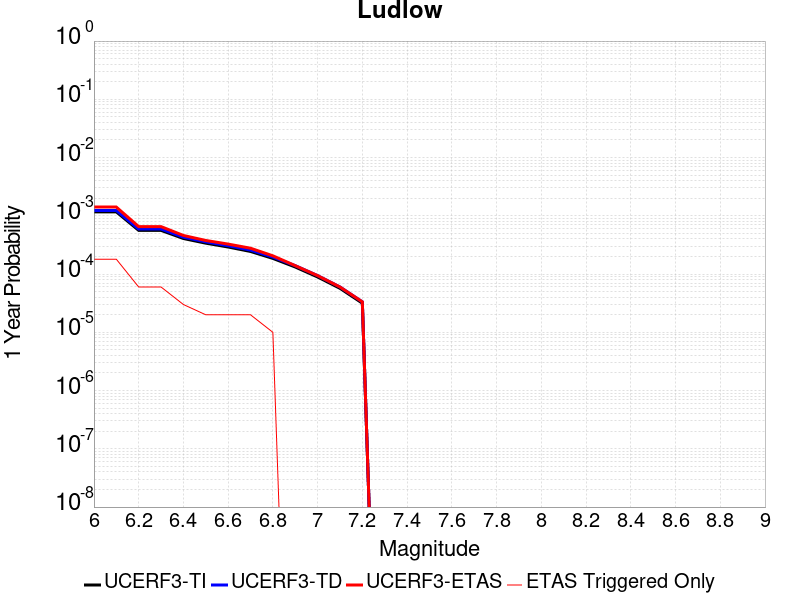 |  |

| Magnitude | 1 wk TI Prob | 1 wk TD Prob | 1 wk ETAS Prob | 1 wk ETAS/TD Gain | 1 wk ETAS Triggered Only | 1 mo TI Prob | 1 mo TD Prob | 1 mo ETAS Prob | 1 mo ETAS/TD Gain | 1 mo ETAS Triggered Only | 1 yr TI Prob | 1 yr TD Prob | 1 yr ETAS Prob | 1 yr ETAS/TD Gain | 1 yr ETAS Triggered Only | 10 yr TI Prob | 10 yr TD Prob | 10 yr ETAS Prob | 10 yr ETAS/TD Gain | 10 yr ETAS Triggered Only |
|-----|-----|-----|-----|-----|-----|-----|-----|-----|-----|-----|-----|-----|-----|-----|-----|-----|-----|-----|-----|-----|
| 6.0 | 2.2407607E-5 | 2.3657254E-5 | 2.3657254E-5 | 1.0 | 0.0 | 9.602906E-5 | 1.0138454E-4 | 1.5319276E-4 | 1.5110071 | 5.1813473E-5 | 0.0011685267 | 0.001233702 | 0.001337201 | 1.0838931 | 1.03626946E-4 | 0.011624013 | 0.012273042 | 0.01252893 | 1.0208496 | 2.5906737E-4 |
| 6.1 | 2.2407607E-5 | 2.3657254E-5 | 2.3657254E-5 | 1.0 | 0.0 | 9.602906E-5 | 1.0138454E-4 | 1.5319276E-4 | 1.5110071 | 5.1813473E-5 | 0.0011685267 | 0.001233702 | 0.001337201 | 1.0838931 | 1.03626946E-4 | 0.011624013 | 0.012273042 | 0.01252893 | 1.0208496 | 2.5906737E-4 |
| 6.2 | 1.0781252E-5 | 1.1365663E-5 | 1.1365663E-5 | 1.0 | 0.0 | 4.620455E-5 | 4.8709102E-5 | 4.8709102E-5 | 1.0 | 0.0 | 5.623952E-4 | 5.9287593E-4 | 6.446587E-4 | 1.0873417 | 5.1813473E-5 | 0.00560974 | 0.0059133614 | 0.0060163755 | 1.0174205 | 1.03626946E-4 |
| 6.3 | 1.0781252E-5 | 1.1365663E-5 | 1.1365663E-5 | 1.0 | 0.0 | 4.620455E-5 | 4.8709102E-5 | 4.8709102E-5 | 1.0 | 0.0 | 5.623952E-4 | 5.9287593E-4 | 6.446587E-4 | 1.0873417 | 5.1813473E-5 | 0.00560974 | 0.0059133614 | 0.0060163755 | 1.0174205 | 1.03626946E-4 |
| 6.4 | 7.814439E-6 | 8.237729E-6 | 8.237729E-6 | 1.0 | 0.0 | 3.3490025E-5 | 3.530408E-5 | 3.530408E-5 | 1.0 | 0.0 | 4.0766477E-4 | 4.2974384E-4 | 4.2974384E-4 | 1.0 | 0.0 | 0.0040691774 | 0.0042892746 | 0.0042892746 | 1.0 | 0.0 |
| 6.5 | 6.4986366E-6 | 6.85092E-6 | 6.85092E-6 | 1.0 | 0.0 | 2.7851002E-5 | 2.9360759E-5 | 2.9360759E-5 | 1.0 | 0.0 | 3.390332E-4 | 3.5740953E-4 | 3.5740953E-4 | 1.0 | 0.0 | 0.003385164 | 0.0035684432 | 0.0035684432 | 1.0 | 0.0 |
| 6.6 | 5.582177E-6 | 5.8860055E-6 | 5.8860055E-6 | 1.0 | 0.0 | 2.3923398E-5 | 2.5225498E-5 | 2.5225498E-5 | 1.0 | 0.0 | 2.9122844E-4 | 3.0707786E-4 | 3.0707786E-4 | 1.0 | 0.0 | 0.0029084706 | 0.003066609 | 0.003066609 | 1.0 | 0.0 |
| 6.7 | 4.6858763E-6 | 4.940427E-6 | 4.940427E-6 | 1.0 | 0.0 | 2.0082172E-5 | 2.1173091E-5 | 2.1173091E-5 | 1.0 | 0.0 | 2.4447302E-4 | 2.5775246E-4 | 2.5775246E-4 | 1.0 | 0.0 | 0.0024420423 | 0.0025745912 | 0.0025745912 | 1.0 | 0.0 |
| 6.8 | 3.5584908E-6 | 3.7520183E-6 | 3.7520183E-6 | 1.0 | 0.0 | 1.5250586E-5 | 1.6079981E-5 | 1.6079981E-5 | 1.0 | 0.0 | 1.8566006E-4 | 1.957566E-4 | 1.957566E-4 | 1.0 | 0.0 | 0.0018550502 | 0.0019558826 | 0.0019558826 | 1.0 | 0.0 |
| 6.9 | 2.532834E-6 | 2.6710034E-6 | 2.6710034E-6 | 1.0 | 0.0 | 1.0854958E-5 | 1.1447109E-5 | 1.1447109E-5 | 1.0 | 0.0 | 1.3215111E-4 | 1.3935992E-4 | 1.3935992E-4 | 1.0 | 0.0 | 0.0013207254 | 0.0013927529 | 0.0013927529 | 1.0 | 0.0 |
| 7.0 | 1.7083285E-6 | 1.8019439E-6 | 1.8019439E-6 | 1.0 | 0.0 | 7.3213873E-6 | 7.722595E-6 | 7.722595E-6 | 1.0 | 0.0 | 8.913424E-5 | 9.40187E-5 | 9.40187E-5 | 1.0 | 0.0 | 8.9098496E-4 | 9.3980576E-4 | 9.3980576E-4 | 1.0 | 0.0 |
| 7.1 | 1.0905424E-6 | 1.1497619E-6 | 1.1497619E-6 | 1.0 | 0.0 | 4.6737446E-6 | 4.9275427E-6 | 4.9275427E-6 | 1.0 | 0.0 | 5.6901354E-5 | 5.999128E-5 | 5.999128E-5 | 1.0 | 0.0 | 5.6886784E-4 | 5.997606E-4 | 5.997606E-4 | 1.0 | 0.0 |
| 7.2 | 6.06668E-7 | 6.387277E-7 | 6.387277E-7 | 1.0 | 0.0 | 2.600003E-6 | 2.7374022E-6 | 2.7374022E-6 | 1.0 | 0.0 | 3.1654577E-5 | 3.3327433E-5 | 3.3327433E-5 | 1.0 | 0.0 | 3.1650066E-4 | 3.3323118E-4 | 3.3323118E-4 | 1.0 | 0.0 |

## San Cayetano
*[(top)](#table-of-contents)*

| 1 Week | 1 Month | 1 Year | 10 Year |
|-----|-----|-----|-----|
|  |  |  |  |

| Magnitude | 1 wk TI Prob | 1 wk TD Prob | 1 wk ETAS Prob | 1 wk ETAS/TD Gain | 1 wk ETAS Triggered Only | 1 mo TI Prob | 1 mo TD Prob | 1 mo ETAS Prob | 1 mo ETAS/TD Gain | 1 mo ETAS Triggered Only | 1 yr TI Prob | 1 yr TD Prob | 1 yr ETAS Prob | 1 yr ETAS/TD Gain | 1 yr ETAS Triggered Only | 10 yr TI Prob | 10 yr TD Prob | 10 yr ETAS Prob | 10 yr ETAS/TD Gain | 10 yr ETAS Triggered Only |
|-----|-----|-----|-----|-----|-----|-----|-----|-----|-----|-----|-----|-----|-----|-----|-----|-----|-----|-----|-----|-----|
| 6.0 | 2.3476267E-5 | 1.816928E-5 | 1.816928E-5 | 1.0 | 0.0 | 1.0060869E-4 | 7.786603E-5 | 1.8148491E-4 | 2.3307326 | 1.03626946E-4 | 0.0012242225 | 9.476103E-4 | 0.0012064321 | 1.2731311 | 2.5906737E-4 | 0.012175002 | 0.009436584 | 0.009693207 | 1.0271945 | 2.5906737E-4 |
| 6.1 | 2.3476267E-5 | 1.816928E-5 | 1.816928E-5 | 1.0 | 0.0 | 1.0060869E-4 | 7.786603E-5 | 1.8148491E-4 | 2.3307326 | 1.03626946E-4 | 0.0012242225 | 9.476103E-4 | 0.0012064321 | 1.2731311 | 2.5906737E-4 | 0.012175002 | 0.009436584 | 0.009693207 | 1.0271945 | 2.5906737E-4 |
| 6.2 | 2.3476267E-5 | 1.816928E-5 | 1.816928E-5 | 1.0 | 0.0 | 1.0060869E-4 | 7.786603E-5 | 1.8148491E-4 | 2.3307326 | 1.03626946E-4 | 0.0012242225 | 9.476103E-4 | 0.0012064321 | 1.2731311 | 2.5906737E-4 | 0.012175002 | 0.009436584 | 0.009693207 | 1.0271945 | 2.5906737E-4 |
| 6.3 | 2.3476267E-5 | 1.816928E-5 | 1.816928E-5 | 1.0 | 0.0 | 1.0060869E-4 | 7.786603E-5 | 1.8148491E-4 | 2.3307326 | 1.03626946E-4 | 0.0012242225 | 9.476103E-4 | 0.0012064321 | 1.2731311 | 2.5906737E-4 | 0.012175002 | 0.009436584 | 0.009693207 | 1.0271945 | 2.5906737E-4 |
| 6.4 | 2.3476267E-5 | 1.816928E-5 | 1.816928E-5 | 1.0 | 0.0 | 1.0060869E-4 | 7.786603E-5 | 1.8148491E-4 | 2.3307326 | 1.03626946E-4 | 0.0012242225 | 9.476103E-4 | 0.0012064321 | 1.2731311 | 2.5906737E-4 | 0.012175002 | 0.009436584 | 0.009693207 | 1.0271945 | 2.5906737E-4 |
| 6.5 | 2.3476267E-5 | 1.816928E-5 | 1.816928E-5 | 1.0 | 0.0 | 1.0060869E-4 | 7.786603E-5 | 1.8148491E-4 | 2.3307326 | 1.03626946E-4 | 0.0012242225 | 9.476103E-4 | 0.0012064321 | 1.2731311 | 2.5906737E-4 | 0.012175002 | 0.009436584 | 0.009693207 | 1.0271945 | 2.5906737E-4 |
| 6.6 | 2.3476267E-5 | 1.816928E-5 | 1.816928E-5 | 1.0 | 0.0 | 1.0060869E-4 | 7.786603E-5 | 1.8148491E-4 | 2.3307326 | 1.03626946E-4 | 0.0012242225 | 9.476103E-4 | 0.0012064321 | 1.2731311 | 2.5906737E-4 | 0.012175002 | 0.009436584 | 0.009693207 | 1.0271945 | 2.5906737E-4 |
| 6.7 | 2.3476267E-5 | 1.816928E-5 | 1.816928E-5 | 1.0 | 0.0 | 1.0060869E-4 | 7.786603E-5 | 1.8148491E-4 | 2.3307326 | 1.03626946E-4 | 0.0012242225 | 9.476103E-4 | 0.0012064321 | 1.2731311 | 2.5906737E-4 | 0.012175002 | 0.009436584 | 0.009693207 | 1.0271945 | 2.5906737E-4 |
| 6.8 | 2.3241924E-5 | 1.7936987E-5 | 1.7936987E-5 | 1.0 | 0.0 | 9.960445E-5 | 7.687056E-5 | 1.8048953E-4 | 2.347967 | 1.03626946E-4 | 0.0012120095 | 9.3550084E-4 | 0.0011943259 | 1.27667 | 2.5906737E-4 | 0.012054204 | 0.009316482 | 0.0095731355 | 1.0275483 | 2.5906737E-4 |
| 6.9 | 2.2761007E-5 | 1.7432423E-5 | 1.7432423E-5 | 1.0 | 0.0 | 9.7543525E-5 | 7.470827E-5 | 1.7832746E-4 | 2.3869843 | 1.03626946E-4 | 0.0011869454 | 9.09197E-4 | 0.0011680288 | 1.2846818 | 2.5906737E-4 | 0.011806256 | 0.009055603 | 0.009312324 | 1.0283494 | 2.5906737E-4 |
| 7.0 | 2.240283E-5 | 1.7066168E-5 | 1.7066168E-5 | 1.0 | 0.0 | 9.600859E-5 | 7.313869E-5 | 1.7675805E-4 | 2.4167516 | 1.03626946E-4 | 0.0011682777 | 8.9010317E-4 | 0.00114894 | 1.2907941 | 2.5906737E-4 | 0.011621549 | 0.008866196 | 0.009122966 | 1.0289606 | 2.5906737E-4 |
| 7.1 | 2.1871154E-5 | 1.6586018E-5 | 1.6586018E-5 | 1.0 | 0.0 | 9.373015E-5 | 7.108101E-5 | 1.7470059E-4 | 2.4577672 | 1.03626946E-4 | 0.0011405671 | 8.6507114E-4 | 0.0011239144 | 1.2992162 | 2.5906737E-4 | 0.011347309 | 0.008617838 | 0.008874673 | 1.0298027 | 2.5906737E-4 |
| 7.2 | 2.0714133E-5 | 1.5564561E-5 | 1.5564561E-5 | 1.0 | 0.0 | 8.8771834E-5 | 6.670357E-5 | 1.1851359E-4 | 1.7767203 | 5.1813473E-5 | 0.0010802611 | 8.1181666E-4 | 0.0010189023 | 1.2550892 | 2.0725389E-4 | 0.010750249 | 0.008089285 | 0.008294863 | 1.0254135 | 2.0725389E-4 |
| 7.3 | 1.8408395E-5 | 1.3996864E-5 | 1.3996864E-5 | 1.0 | 0.0 | 7.8890735E-5 | 5.99852E-5 | 1.1179556E-4 | 1.8637191 | 5.1813473E-5 | 9.600714E-4 | 7.300781E-4 | 8.85405E-4 | 1.2127539 | 1.5544042E-4 | 0.009559342 | 0.0072775153 | 0.0074318247 | 1.0212035 | 1.5544042E-4 |
| 7.4 | 1.6856795E-5 | 1.28500815E-5 | 1.28500815E-5 | 1.0 | 0.0 | 7.2241404E-5 | 5.5070628E-5 | 1.0688125E-4 | 1.940803 | 5.1813473E-5 | 8.7918417E-4 | 6.7028153E-4 | 8.2561775E-4 | 1.2317477 | 1.5544042E-4 | 0.00875714 | 0.0066832784 | 0.00683768 | 1.0231026 | 1.5544042E-4 |
| 7.5 | 1.2822778E-5 | 9.577542E-6 | 9.577542E-6 | 1.0 | 0.0 | 5.495361E-5 | 4.1045972E-5 | 9.285731E-5 | 2.262276 | 5.1813473E-5 | 6.688548E-4 | 4.996217E-4 | 6.0319685E-4 | 1.2073072 | 1.03626946E-4 | 0.006668452 | 0.0049851555 | 0.005088266 | 1.0206835 | 1.03626946E-4 |
| 7.6 | 5.6272684E-6 | 3.854903E-6 | 3.854903E-6 | 1.0 | 0.0 | 2.4116642E-5 | 1.652091E-5 | 6.8333524E-5 | 4.136184 | 5.1813473E-5 | 2.9358055E-4 | 2.0112359E-4 | 3.047297E-4 | 1.5151365 | 1.03626946E-4 | 0.0029319301 | 0.0020094267 | 0.0021128454 | 1.0514668 | 1.03626946E-4 |
| 7.7 | 3.5261346E-6 | 2.3407013E-6 | 2.3407013E-6 | 1.0 | 0.0 | 1.5111918E-5 | 1.0031539E-5 | 1.0031539E-5 | 1.0 | 0.0 | 1.8397206E-4 | 1.2212721E-4 | 1.2212721E-4 | 1.0 | 0.0 | 0.0018381984 | 0.0012206084 | 0.0012206084 | 1.0 | 0.0 |
| 7.8 | 1.4826929E-6 | 1.056428E-6 | 1.056428E-6 | 1.0 | 0.0 | 6.354383E-6 | 4.5275406E-6 | 4.5275406E-6 | 1.0 | 0.0 | 7.736187E-5 | 5.5121433E-5 | 5.5121433E-5 | 1.0 | 0.0 | 7.733494E-4 | 5.5107963E-4 | 5.5107963E-4 | 1.0 | 0.0 |
| 7.9 | 2.7568166E-7 | 1.6978244E-7 | 1.6978244E-7 | 1.0 | 0.0 | 1.1814923E-6 | 7.2763885E-7 | 7.2763885E-7 | 1.0 | 0.0 | 1.4384574E-5 | 8.858967E-6 | 8.858967E-6 | 1.0 | 0.0 | 1.4383643E-4 | 8.8586174E-5 | 8.8586174E-5 | 1.0 | 0.0 |
| 8.0 | 5.407832E-8 | 2.6887697E-8 | 2.6887697E-8 | 1.0 | 0.0 | 2.3176422E-7 | 1.15232986E-7 | 1.15232986E-7 | 1.0 | 0.0 | 2.8217257E-6 | 1.4029607E-6 | 1.4029607E-6 | 1.0 | 0.0 | 2.8216898E-5 | 1.4029522E-5 | 1.4029522E-5 | 1.0 | 0.0 |

## Coronado Bank alt1
*[(top)](#table-of-contents)*

| 1 Week | 1 Month | 1 Year | 10 Year |
|-----|-----|-----|-----|
|  |  |  |  |

| Magnitude | 1 wk TI Prob | 1 wk TD Prob | 1 wk ETAS Prob | 1 wk ETAS/TD Gain | 1 wk ETAS Triggered Only | 1 mo TI Prob | 1 mo TD Prob | 1 mo ETAS Prob | 1 mo ETAS/TD Gain | 1 mo ETAS Triggered Only | 1 yr TI Prob | 1 yr TD Prob | 1 yr ETAS Prob | 1 yr ETAS/TD Gain | 1 yr ETAS Triggered Only | 10 yr TI Prob | 10 yr TD Prob | 10 yr ETAS Prob | 10 yr ETAS/TD Gain | 10 yr ETAS Triggered Only |
|-----|-----|-----|-----|-----|-----|-----|-----|-----|-----|-----|-----|-----|-----|-----|-----|-----|-----|-----|-----|-----|
| 6.0 | 7.533492E-5 | 9.394913E-5 | 1.9756633E-4 | 2.1029077 | 1.03626946E-4 | 3.22824E-4 | 4.0258127E-4 | 5.061665E-4 | 1.2573026 | 1.03626946E-4 | 0.0039233007 | 0.0048909658 | 0.0050972058 | 1.0421675 | 2.0725389E-4 | 0.03854755 | 0.04790356 | 0.04815022 | 1.005149 | 2.5906737E-4 |
| 6.1 | 4.1807285E-5 | 5.049283E-5 | 1.0230368E-4 | 2.0261033 | 5.1813473E-5 | 1.7916178E-4 | 2.1638049E-4 | 2.6818275E-4 | 1.2394036 | 5.1813473E-5 | 0.0021791123 | 0.0026313474 | 0.0027347016 | 1.039278 | 1.03626946E-4 | 0.021578677 | 0.026011046 | 0.026111979 | 1.0038804 | 1.03626946E-4 |
| 6.2 | 4.1807285E-5 | 5.049283E-5 | 1.0230368E-4 | 2.0261033 | 5.1813473E-5 | 1.7916178E-4 | 2.1638049E-4 | 2.6818275E-4 | 1.2394036 | 5.1813473E-5 | 0.0021791123 | 0.0026313474 | 0.0027347016 | 1.039278 | 1.03626946E-4 | 0.021578677 | 0.026011046 | 0.026111979 | 1.0038804 | 1.03626946E-4 |
| 6.3 | 3.1793104E-5 | 3.7711117E-5 | 3.7711117E-5 | 1.0 | 0.0 | 1.3624904E-4 | 1.6160926E-4 | 1.6160926E-4 | 1.0 | 0.0 | 0.0016575698 | 0.001965848 | 0.0020175597 | 1.026305 | 5.1813473E-5 | 0.016452603 | 0.019488465 | 0.019539269 | 1.0026069 | 5.1813473E-5 |
| 6.4 | 2.9878007E-5 | 3.5335794E-5 | 3.5335794E-5 | 1.0 | 0.0 | 1.2804232E-4 | 1.5143053E-4 | 1.5143053E-4 | 1.0 | 0.0 | 0.0015578003 | 0.0018421387 | 0.0018938567 | 1.028075 | 5.1813473E-5 | 0.015469253 | 0.01827244 | 0.018323308 | 1.0027838 | 5.1813473E-5 |
| 6.5 | 2.4512565E-5 | 2.8764043E-5 | 2.8764043E-5 | 1.0 | 0.0 | 1.0504962E-4 | 1.2326881E-4 | 1.2326881E-4 | 1.0 | 0.0 | 0.0012782287 | 0.0014997921 | 0.0014997921 | 1.0 | 0.0 | 0.012709012 | 0.014899683 | 0.014899683 | 1.0 | 0.0 |
| 6.6 | 2.1317413E-5 | 2.490667E-5 | 2.490667E-5 | 1.0 | 0.0 | 9.135714E-5 | 1.0673863E-4 | 1.0673863E-4 | 1.0 | 0.0 | 0.0011117056 | 0.0012987906 | 0.0012987906 | 1.0 | 0.0 | 0.011061605 | 0.012914404 | 0.012914404 | 1.0 | 0.0 |
| 6.7 | 1.8585655E-5 | 2.163488E-5 | 2.163488E-5 | 1.0 | 0.0 | 7.9650374E-5 | 9.271773E-5 | 9.271773E-5 | 1.0 | 0.0 | 9.6931186E-4 | 0.0011282742 | 0.0011282742 | 1.0 | 0.0 | 0.0096509475 | 0.011227623 | 0.011227623 | 1.0 | 0.0 |
| 6.8 | 1.5862879E-5 | 1.8419474E-5 | 1.8419474E-5 | 1.0 | 0.0 | 6.798199E-5 | 7.893833E-5 | 7.893833E-5 | 1.0 | 0.0 | 8.273665E-4 | 9.6066965E-4 | 9.6066965E-4 | 1.0 | 0.0 | 0.008242928 | 0.00956715 | 0.00956715 | 1.0 | 0.0 |
| 6.9 | 1.3021509E-5 | 1.5095265E-5 | 1.5095265E-5 | 1.0 | 0.0 | 5.5805274E-5 | 6.469249E-5 | 6.469249E-5 | 1.0 | 0.0 | 6.792174E-4 | 7.8736455E-4 | 7.8736455E-4 | 1.0 | 0.0 | 0.006771452 | 0.007847573 | 0.007847573 | 1.0 | 0.0 |
| 7.0 | 1.0974371E-5 | 1.2720104E-5 | 1.2720104E-5 | 1.0 | 0.0 | 4.7032172E-5 | 5.451369E-5 | 5.451369E-5 | 1.0 | 0.0 | 5.7246623E-4 | 6.6351966E-4 | 6.6351966E-4 | 1.0 | 0.0 | 0.0057099373 | 0.006617135 | 0.006617135 | 1.0 | 0.0 |
| 7.1 | 8.766221E-6 | 1.01638325E-5 | 1.01638325E-5 | 1.0 | 0.0 | 3.7568978E-5 | 4.355865E-5 | 4.355865E-5 | 1.0 | 0.0 | 4.573063E-4 | 5.3021475E-4 | 5.3021475E-4 | 1.0 | 0.0 | 0.0045636636 | 0.0052911965 | 0.0052911965 | 1.0 | 0.0 |
| 7.2 | 8.026024E-7 | 8.331765E-7 | 8.331765E-7 | 1.0 | 0.0 | 3.43972E-6 | 3.5707515E-6 | 3.5707515E-6 | 1.0 | 0.0 | 4.1877785E-5 | 4.3473043E-5 | 4.3473043E-5 | 1.0 | 0.0 | 4.1869894E-4 | 4.3464647E-4 | 4.3464647E-4 | 1.0 | 0.0 |
| 7.3 | 3.7293114E-7 | 3.7000953E-7 | 3.7000953E-7 | 1.0 | 0.0 | 1.5982754E-6 | 1.5857541E-6 | 1.5857541E-6 | 1.0 | 0.0 | 1.9458828E-5 | 1.9306386E-5 | 1.9306386E-5 | 1.0 | 0.0 | 1.9457124E-4 | 1.9304715E-4 | 1.9304715E-4 | 1.0 | 0.0 |
| 7.4 | 2.0557036E-7 | 1.9674363E-7 | 1.9674363E-7 | 1.0 | 0.0 | 8.810155E-7 | 8.431867E-7 | 8.431867E-7 | 1.0 | 0.0 | 1.0726311E-5 | 1.026575E-5 | 1.026575E-5 | 1.0 | 0.0 | 1.0725793E-4 | 1.0265279E-4 | 1.0265279E-4 | 1.0 | 0.0 |
| 7.5 | 6.845446E-8 | 6.279369E-8 | 6.279369E-8 | 1.0 | 0.0 | 2.9337625E-7 | 2.691158E-7 | 2.691158E-7 | 1.0 | 0.0 | 3.5718497E-6 | 3.2764797E-6 | 3.2764797E-6 | 1.0 | 0.0 | 3.5717923E-5 | 3.2764325E-5 | 3.2764325E-5 | 1.0 | 0.0 |
| 7.6 | 6.0975145E-9 | 5.53185E-9 | 5.53185E-9 | 1.0 | 0.0 | 2.6132206E-8 | 2.370793E-8 | 2.370793E-8 | 1.0 | 0.0 | 3.1815955E-7 | 2.88644E-7 | 2.88644E-7 | 1.0 | 0.0 | 3.181591E-6 | 2.8864374E-6 | 2.8864374E-6 | 1.0 | 0.0 |

## San Jacinto (Coyote Creek)
*[(top)](#table-of-contents)*

| 1 Week | 1 Month | 1 Year | 10 Year |
|-----|-----|-----|-----|
|  |  | 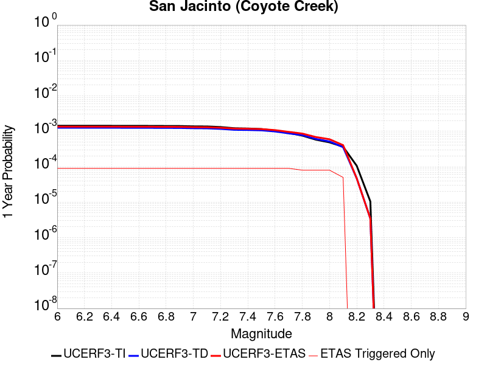 |  |

| Magnitude | 1 wk TI Prob | 1 wk TD Prob | 1 wk ETAS Prob | 1 wk ETAS/TD Gain | 1 wk ETAS Triggered Only | 1 mo TI Prob | 1 mo TD Prob | 1 mo ETAS Prob | 1 mo ETAS/TD Gain | 1 mo ETAS Triggered Only | 1 yr TI Prob | 1 yr TD Prob | 1 yr ETAS Prob | 1 yr ETAS/TD Gain | 1 yr ETAS Triggered Only | 10 yr TI Prob | 10 yr TD Prob | 10 yr ETAS Prob | 10 yr ETAS/TD Gain | 10 yr ETAS Triggered Only |
|-----|-----|-----|-----|-----|-----|-----|-----|-----|-----|-----|-----|-----|-----|-----|-----|-----|-----|-----|-----|-----|
| 6.0 | 2.7374346E-5 | 2.4145214E-5 | 1.2776966E-4 | 5.2917175 | 1.03626946E-4 | 1.1731335E-4 | 1.034754E-4 | 2.5889973E-4 | 2.5020413 | 1.5544042E-4 | 0.0014273542 | 0.0012590875 | 0.0014660804 | 1.1643991 | 2.0725389E-4 | 0.01418221 | 0.012928318 | 0.013184036 | 1.0197797 | 2.5906737E-4 |
| 6.1 | 2.7374346E-5 | 2.4145214E-5 | 1.2776966E-4 | 5.2917175 | 1.03626946E-4 | 1.1731335E-4 | 1.034754E-4 | 2.5889973E-4 | 2.5020413 | 1.5544042E-4 | 0.0014273542 | 0.0012590875 | 0.0014660804 | 1.1643991 | 2.0725389E-4 | 0.01418221 | 0.012928318 | 0.013184036 | 1.0197797 | 2.5906737E-4 |
| 6.2 | 2.7374346E-5 | 2.4145214E-5 | 1.2776966E-4 | 5.2917175 | 1.03626946E-4 | 1.1731335E-4 | 1.034754E-4 | 2.5889973E-4 | 2.5020413 | 1.5544042E-4 | 0.0014273542 | 0.0012590875 | 0.0014660804 | 1.1643991 | 2.0725389E-4 | 0.01418221 | 0.012928318 | 0.013184036 | 1.0197797 | 2.5906737E-4 |
| 6.3 | 2.7374346E-5 | 2.4145214E-5 | 1.2776966E-4 | 5.2917175 | 1.03626946E-4 | 1.1731335E-4 | 1.034754E-4 | 2.5889973E-4 | 2.5020413 | 1.5544042E-4 | 0.0014273542 | 0.0012590875 | 0.0014660804 | 1.1643991 | 2.0725389E-4 | 0.01418221 | 0.012928318 | 0.013184036 | 1.0197797 | 2.5906737E-4 |
| 6.4 | 2.7374346E-5 | 2.4145214E-5 | 1.2776966E-4 | 5.2917175 | 1.03626946E-4 | 1.1731335E-4 | 1.034754E-4 | 2.5889973E-4 | 2.5020413 | 1.5544042E-4 | 0.0014273542 | 0.0012590875 | 0.0014660804 | 1.1643991 | 2.0725389E-4 | 0.01418221 | 0.012928318 | 0.013184036 | 1.0197797 | 2.5906737E-4 |
| 6.5 | 2.7282445E-5 | 2.4031293E-5 | 1.2765575E-4 | 5.312063 | 1.03626946E-4 | 1.16919524E-4 | 1.029872E-4 | 2.584116E-4 | 2.5091624 | 1.5544042E-4 | 0.0014225657 | 0.0012531505 | 0.0014601448 | 1.165179 | 2.0725389E-4 | 0.014134934 | 0.012869646 | 0.013125379 | 1.019871 | 2.5906737E-4 |
| 6.6 | 2.7282445E-5 | 2.4031293E-5 | 1.2765575E-4 | 5.312063 | 1.03626946E-4 | 1.16919524E-4 | 1.029872E-4 | 2.584116E-4 | 2.5091624 | 1.5544042E-4 | 0.0014225657 | 0.0012531505 | 0.0014601448 | 1.165179 | 2.0725389E-4 | 0.014134934 | 0.012869646 | 0.013125379 | 1.019871 | 2.5906737E-4 |
| 6.7 | 2.7216198E-5 | 2.3956412E-5 | 1.2758088E-4 | 5.3255415 | 1.03626946E-4 | 1.1663563E-4 | 1.02666316E-4 | 2.5809076E-4 | 2.5138798 | 1.5544042E-4 | 0.0014191137 | 0.0012492483 | 0.0014562433 | 1.1656957 | 2.0725389E-4 | 0.014100855 | 0.0128310565 | 0.0130868 | 1.0199316 | 2.5906737E-4 |
| 6.8 | 2.7078617E-5 | 2.387363E-5 | 1.274981E-4 | 5.340541 | 1.03626946E-4 | 1.1604605E-4 | 1.0231156E-4 | 2.5773607E-4 | 2.5191295 | 1.5544042E-4 | 0.001411945 | 0.0012449342 | 0.00145193 | 1.1662705 | 2.0725389E-4 | 0.014030075 | 0.012788199 | 0.013043953 | 1.0199993 | 2.5906737E-4 |
| 6.9 | 2.6982952E-5 | 2.3793142E-5 | 1.2741762E-4 | 5.3552246 | 1.03626946E-4 | 1.15636096E-4 | 1.0196664E-4 | 2.573912E-4 | 2.5242689 | 1.5544042E-4 | 0.0014069602 | 0.0012407395 | 0.0014477362 | 1.1668334 | 2.0725389E-4 | 0.013980856 | 0.012746515 | 0.013002279 | 1.0200655 | 2.5906737E-4 |
| 7.0 | 2.6449972E-5 | 2.3370165E-5 | 1.2699468E-4 | 5.434052 | 1.03626946E-4 | 1.1335209E-4 | 1.00154015E-4 | 2.5557887E-4 | 2.5518584 | 1.5544042E-4 | 0.001379188 | 0.0012186957 | 0.0014256969 | 1.1698548 | 2.0725389E-4 | 0.0137065975 | 0.0125278765 | 0.012783699 | 1.0204202 | 2.5906737E-4 |
| 7.1 | 2.6257849E-5 | 2.3196202E-5 | 1.2682074E-4 | 5.4673066 | 1.03626946E-4 | 1.1252879E-4 | 9.940852E-5 | 2.548335E-4 | 2.5634975 | 1.5544042E-4 | 0.0013691769 | 0.0012096294 | 0.0014166326 | 1.1711295 | 2.0725389E-4 | 0.013607717 | 0.012437741 | 0.012693587 | 1.02057 | 2.5906737E-4 |
| 7.2 | 2.5270041E-5 | 2.2390966E-5 | 1.2601558E-4 | 5.6279655 | 1.03626946E-4 | 1.0829568E-4 | 9.595777E-5 | 2.5138326E-4 | 2.619728 | 1.5544042E-4 | 0.0013177024 | 0.0011676621 | 0.0013746739 | 1.1772875 | 2.0725389E-4 | 0.013099162 | 0.012018777 | 0.012274731 | 1.0212961 | 2.5906737E-4 |
| 7.3 | 2.339701E-5 | 2.1122814E-5 | 1.2474757E-4 | 5.9058213 | 1.03626946E-4 | 1.0026905E-4 | 9.0523215E-5 | 2.4594957E-4 | 2.7169776 | 1.5544042E-4 | 0.001220092 | 0.0011015651 | 0.0013085906 | 1.1879377 | 2.0725389E-4 | 0.012134149 | 0.011357696 | 0.011613821 | 1.0225508 | 2.5906737E-4 |
| 7.4 | 2.296333E-5 | 2.0853171E-5 | 1.2447796E-4 | 5.969258 | 1.03626946E-4 | 9.841056E-5 | 8.936768E-5 | 2.447942E-4 | 2.7391806 | 1.5544042E-4 | 0.0011974899 | 0.0010875105 | 0.001294539 | 1.1903692 | 2.0725389E-4 | 0.011910575 | 0.01121681 | 0.011472971 | 1.0228373 | 2.5906737E-4 |
| 7.5 | 2.2188895E-5 | 2.0376096E-5 | 1.2400093E-4 | 6.085608 | 1.03626946E-4 | 9.50918E-5 | 8.732321E-5 | 2.4275006E-4 | 2.779903 | 1.5544042E-4 | 0.0011571277 | 0.0010626436 | 0.0012696772 | 1.1948289 | 2.0725389E-4 | 0.011511209 | 0.010966429 | 0.011222655 | 1.0233647 | 2.5906737E-4 |
| 7.6 | 2.0013189E-5 | 1.8962366E-5 | 1.2258734E-4 | 6.464771 | 1.03626946E-4 | 8.5767984E-5 | 8.1264756E-5 | 2.3669255E-4 | 2.9126098 | 1.5544042E-4 | 0.001043725 | 9.889511E-4 | 0.001196 | 1.2093621 | 2.0725389E-4 | 0.010388365 | 0.010224434 | 0.010480852 | 1.025079 | 2.5906737E-4 |
| 7.7 | 1.7230794E-5 | 1.674371E-5 | 1.2036892E-4 | 7.188904 | 1.03626946E-4 | 7.384417E-5 | 7.175679E-5 | 2.2718604E-4 | 3.1660566 | 1.5544042E-4 | 8.986819E-4 | 8.7328954E-4 | 0.0010803625 | 1.2371182 | 2.0725389E-4 | 0.008950562 | 0.009062956 | 0.009319676 | 1.0283263 | 2.5906737E-4 |
| 7.8 | 1.4478809E-5 | 1.4990978E-5 | 1.18616364E-4 | 7.912517 | 1.03626946E-4 | 6.205057E-5 | 6.424547E-5 | 2.196759E-4 | 3.4193213 | 1.5544042E-4 | 7.552038E-4 | 7.819085E-4 | 9.372274E-4 | 1.1986407 | 1.5544042E-4 | 0.0075264242 | 0.008141387 | 0.008346953 | 1.0252496 | 2.0725389E-4 |
| 7.9 | 1.1114467E-5 | 1.1645102E-5 | 1.15270836E-4 | 9.898654 | 1.03626946E-4 | 4.7632562E-5 | 4.990663E-5 | 2.0533928E-4 | 4.114469 | 1.5544042E-4 | 5.797721E-4 | 6.074444E-4 | 7.627904E-4 | 1.255737 | 1.5544042E-4 | 0.0057826187 | 0.0063803247 | 0.0065862564 | 1.032276 | 2.0725389E-4 |
| 8.0 | 9.327402E-6 | 9.899186E-6 | 1.135251E-4 | 11.468124 | 1.03626946E-4 | 3.9973966E-5 | 4.2424395E-5 | 1.9785821E-4 | 4.663784 | 1.5544042E-4 | 4.8657437E-4 | 5.1639514E-4 | 6.717553E-4 | 1.3008552 | 1.5544042E-4 | 0.0048551033 | 0.0054499684 | 0.005656093 | 1.0378212 | 2.0725389E-4 |
| 8.1 | 7.0235833E-6 | 6.827495E-6 | 1.1045373E-4 | 16.177782 | 1.03626946E-4 | 3.0100724E-5 | 2.9260367E-5 | 1.8469624E-4 | 6.312164 | 1.5544042E-4 | 3.664147E-4 | 3.5618723E-4 | 5.115723E-4 | 1.4362454 | 1.5544042E-4 | 0.003658111 | 0.0037876023 | 0.0039940714 | 1.0545118 | 2.0725389E-4 |
| 8.2 | 2.0358202E-6 | 8.994527E-7 | 8.994527E-7 | 1.0 | 0.0 | 8.724915E-6 | 3.854792E-6 | 3.854792E-6 | 1.0 | 0.0 | 1.06220665E-4 | 4.69311E-5 | 4.69311E-5 | 1.0 | 0.0 | 0.001061699 | 5.3254166E-4 | 5.3254166E-4 | 1.0 | 0.0 |
| 8.3 | 2.0051264E-7 | 6.617272E-8 | 6.617272E-8 | 1.0 | 0.0 | 8.5933965E-7 | 2.8359733E-7 | 2.8359733E-7 | 1.0 | 0.0 | 1.046241E-5 | 3.4527925E-6 | 3.4527925E-6 | 1.0 | 0.0 | 1.0461917E-4 | 4.01389E-5 | 4.01389E-5 | 1.0 | 0.0 |

## San Jacinto (Borrego)
*[(top)](#table-of-contents)*

| 1 Week | 1 Month | 1 Year | 10 Year |
|-----|-----|-----|-----|
|  |  |  |  |

| Magnitude | 1 wk TI Prob | 1 wk TD Prob | 1 wk ETAS Prob | 1 wk ETAS/TD Gain | 1 wk ETAS Triggered Only | 1 mo TI Prob | 1 mo TD Prob | 1 mo ETAS Prob | 1 mo ETAS/TD Gain | 1 mo ETAS Triggered Only | 1 yr TI Prob | 1 yr TD Prob | 1 yr ETAS Prob | 1 yr ETAS/TD Gain | 1 yr ETAS Triggered Only | 10 yr TI Prob | 10 yr TD Prob | 10 yr ETAS Prob | 10 yr ETAS/TD Gain | 10 yr ETAS Triggered Only |
|-----|-----|-----|-----|-----|-----|-----|-----|-----|-----|-----|-----|-----|-----|-----|-----|-----|-----|-----|-----|-----|
| 6.0 | 3.543992E-5 | 2.7926513E-5 | 1.3155057E-4 | 4.7105975 | 1.03626946E-4 | 1.5187653E-4 | 1.1967963E-4 | 2.7510145E-4 | 2.2986488 | 1.5544042E-4 | 0.0018475284 | 0.0014561379 | 0.00166309 | 1.1421239 | 2.0725389E-4 | 0.018322436 | 0.014869647 | 0.015124862 | 1.0171635 | 2.5906737E-4 |
| 6.1 | 3.542281E-5 | 2.7926513E-5 | 1.3155057E-4 | 4.7105975 | 1.03626946E-4 | 1.5180321E-4 | 1.1967963E-4 | 2.7510145E-4 | 2.2986488 | 1.5544042E-4 | 0.0018466372 | 0.0014561379 | 0.00166309 | 1.1421239 | 2.0725389E-4 | 0.018313672 | 0.014869647 | 0.015124862 | 1.0171635 | 2.5906737E-4 |
| 6.2 | 3.4688688E-5 | 2.7926511E-5 | 1.3155057E-4 | 4.7105975 | 1.03626946E-4 | 1.4865733E-4 | 1.1967963E-4 | 2.7510145E-4 | 2.2986488 | 1.5544042E-4 | 0.0018084005 | 0.0014561379 | 0.00166309 | 1.1421239 | 2.0725389E-4 | 0.017937548 | 0.014869647 | 0.015124862 | 1.0171635 | 2.5906737E-4 |
| 6.3 | 3.2087122E-5 | 2.7771865E-5 | 1.3139592E-4 | 4.731261 | 1.03626946E-4 | 1.3750899E-4 | 1.1901691E-4 | 2.7443882E-4 | 2.3058808 | 1.5544042E-4 | 0.0016728862 | 0.00144808 | 0.0016550338 | 1.142916 | 2.0725389E-4 | 0.016603488 | 0.014790683 | 0.0150459185 | 1.0172565 | 2.5906737E-4 |
| 6.4 | 3.1828724E-5 | 2.7738852E-5 | 1.3136292E-4 | 4.7357016 | 1.03626946E-4 | 1.364017E-4 | 1.1887544E-4 | 2.7429737E-4 | 2.3074353 | 1.5544042E-4 | 0.0016594254 | 0.0014463598 | 0.001653314 | 1.1430862 | 2.0725389E-4 | 0.016470885 | 0.014773762 | 0.015029002 | 1.0172765 | 2.5906737E-4 |
| 6.5 | 3.1563577E-5 | 2.747857E-5 | 1.3110267E-4 | 4.7710876 | 1.03626946E-4 | 1.3526545E-4 | 1.1776006E-4 | 2.7318217E-4 | 2.3198204 | 1.5544042E-4 | 0.0016456128 | 0.0014327979 | 0.0016397549 | 1.1444426 | 2.0725389E-4 | 0.0163348 | 0.014640348 | 0.014895623 | 1.0174364 | 2.5906737E-4 |
| 6.6 | 3.1467625E-5 | 2.7322796E-5 | 1.3094691E-4 | 4.792588 | 1.03626946E-4 | 1.3485427E-4 | 1.1709251E-4 | 2.7251474E-4 | 2.3273456 | 1.5544042E-4 | 0.0016406142 | 0.0014246812 | 0.0016316398 | 1.1452667 | 2.0725389E-4 | 0.016285548 | 0.014560594 | 0.014815889 | 1.0175333 | 2.5906737E-4 |
| 6.7 | 3.1223695E-5 | 2.6940816E-5 | 1.3056496E-4 | 4.846363 | 1.03626946E-4 | 1.3380898E-4 | 1.15455594E-4 | 2.7087805E-4 | 2.3461666 | 1.5544042E-4 | 0.0016279068 | 0.0014047775 | 0.0016117403 | 1.1473278 | 2.0725389E-4 | 0.01616033 | 0.014364966 | 0.014620312 | 1.0177757 | 2.5906737E-4 |
| 6.8 | 3.1015585E-5 | 2.6761822E-5 | 1.3038599E-4 | 4.8720894 | 1.03626946E-4 | 1.3291716E-4 | 1.1468855E-4 | 2.7011114E-4 | 2.355171 | 1.5544042E-4 | 0.001617065 | 0.0013954508 | 0.0016024155 | 1.1483139 | 2.0725389E-4 | 0.016053487 | 0.014272246 | 0.014527616 | 1.0178927 | 2.5906737E-4 |
| 6.9 | 2.6641965E-5 | 2.2184247E-5 | 1.2580889E-4 | 5.6710916 | 1.03626946E-4 | 1.1417485E-4 | 9.50719E-5 | 2.5049754E-4 | 2.6348221 | 1.5544042E-4 | 0.0013891924 | 0.0011568897 | 0.0013639037 | 1.1789403 | 2.0725389E-4 | 0.0138054015 | 0.011882438 | 0.012138427 | 1.0215435 | 2.5906737E-4 |
| 7.0 | 2.3854353E-5 | 2.0479023E-5 | 1.2410384E-4 | 6.060047 | 1.03626946E-4 | 1.02228936E-4 | 8.77643E-5 | 2.4319108E-4 | 2.7709565 | 1.5544042E-4 | 0.0012439266 | 0.0010680092 | 0.0012750417 | 1.193849 | 2.0725389E-4 | 0.012369866 | 0.0109828 | 0.011239023 | 1.0233294 | 2.5906737E-4 |
| 7.1 | 2.3672901E-5 | 2.031551E-5 | 1.2394035E-4 | 6.1007743 | 1.03626946E-4 | 1.0145135E-4 | 8.7063585E-5 | 2.4249047E-4 | 2.785211 | 1.5544042E-4 | 0.0012344702 | 0.0010594862 | 0.0012665206 | 1.1954101 | 2.0725389E-4 | 0.0122763505 | 0.010897976 | 0.01115422 | 1.023513 | 2.5906737E-4 |
| 7.2 | 2.2717244E-5 | 1.9542893E-5 | 1.231678E-4 | 6.302435 | 1.03626946E-4 | 9.735599E-5 | 8.375258E-5 | 2.3917998E-4 | 2.8557923 | 1.5544042E-4 | 0.0011846646 | 0.001019213 | 0.0012262557 | 1.2031398 | 2.0725389E-4 | 0.01178369 | 0.010495341 | 0.01075169 | 1.0244249 | 2.5906737E-4 |
| 7.3 | 2.1016205E-5 | 1.8384526E-5 | 1.22009566E-4 | 6.636536 | 1.03626946E-4 | 9.006634E-5 | 7.878846E-5 | 2.3421663E-4 | 2.9727278 | 1.5544042E-4 | 0.001096006 | 9.5882936E-4 | 0.0011658845 | 1.2159458 | 2.0725389E-4 | 0.010906163 | 0.009890967 | 0.010147472 | 1.0259333 | 2.5906737E-4 |
| 7.4 | 2.0683625E-5 | 1.8187047E-5 | 1.218121E-4 | 6.6977396 | 1.03626946E-4 | 8.86411E-5 | 7.794217E-5 | 2.3337048E-4 | 2.994149 | 1.5544042E-4 | 0.001078671 | 9.485349E-4 | 0.0011555922 | 1.2182918 | 2.0725389E-4 | 0.010734501 | 0.009787692 | 0.010044224 | 1.0262096 | 2.5906737E-4 |
| 7.5 | 1.9993966E-5 | 1.7782075E-5 | 1.21407174E-4 | 6.8275037 | 1.03626946E-4 | 8.568561E-5 | 7.620667E-5 | 2.3163525E-4 | 3.0395663 | 1.5544042E-4 | 0.001042723 | 9.2742336E-4 | 0.001134485 | 1.2232655 | 2.0725389E-4 | 0.010378438 | 0.009574614 | 0.009831201 | 1.0267986 | 2.5906737E-4 |
| 7.6 | 1.788966E-5 | 1.6435291E-5 | 1.2006053E-4 | 7.3050447 | 1.03626946E-4 | 7.666772E-5 | 7.043507E-5 | 2.2586454E-4 | 3.2067058 | 1.5544042E-4 | 9.3302975E-4 | 8.572113E-4 | 0.0010642875 | 1.2415696 | 2.0725389E-4 | 0.00929122 | 0.008866487 | 0.009123257 | 1.0289596 | 2.5906737E-4 |
| 7.7 | 1.5125781E-5 | 1.4237377E-5 | 1.17862844E-4 | 8.27841 | 1.03626946E-4 | 6.4823165E-5 | 6.1015908E-5 | 2.1644685E-4 | 3.5473835 | 1.5544042E-4 | 7.889362E-4 | 7.426163E-4 | 9.4971625E-4 | 1.2788788 | 2.0725389E-4 | 0.007861412 | 0.0077142045 | 0.007971273 | 1.0333241 | 2.5906737E-4 |
| 7.8 | 1.250089E-5 | 1.26304985E-5 | 1.1625613E-4 | 9.204398 | 1.03626946E-4 | 5.3574146E-5 | 5.412959E-5 | 2.095616E-4 | 3.8714795 | 1.5544042E-4 | 6.5207E-4 | 6.588291E-4 | 8.141671E-4 | 1.2357789 | 1.5544042E-4 | 0.006501599 | 0.0068677636 | 0.0070735943 | 1.0299705 | 2.0725389E-4 |
| 7.9 | 9.561E-6 | 9.754616E-6 | 1.1338055E-4 | 11.623271 | 1.03626946E-4 | 4.0975072E-5 | 4.1804833E-5 | 1.9723875E-4 | 4.718085 | 1.5544042E-4 | 4.987573E-4 | 5.088555E-4 | 6.642169E-4 | 1.3053151 | 1.5544042E-4 | 0.0049763937 | 0.0053523467 | 0.005558491 | 1.0385149 | 2.0725389E-4 |
| 8.0 | 8.01699E-6 | 8.293488E-6 | 1.1191957E-4 | 13.494874 | 1.03626946E-4 | 3.4358076E-5 | 3.554304E-5 | 1.9097792E-4 | 5.373146 | 1.5544042E-4 | 4.1822926E-4 | 4.3265108E-4 | 5.880242E-4 | 1.3591188 | 1.5544042E-4 | 0.0041744304 | 0.004573375 | 0.004779681 | 1.0451102 | 2.0725389E-4 |
| 8.1 | 6.541947E-6 | 6.4622354E-6 | 1.10088506E-4 | 17.03567 | 1.03626946E-4 | 2.8036617E-5 | 2.7695003E-5 | 1.8313111E-4 | 6.6124244 | 1.5544042E-4 | 3.4129233E-4 | 3.37135E-4 | 4.92523E-4 | 1.4609073 | 1.5544042E-4 | 0.0034076865 | 0.0035806994 | 0.0037872111 | 1.0576736 | 2.0725389E-4 |
| 8.2 | 1.7968189E-6 | 7.9713476E-7 | 7.9713476E-7 | 1.0 | 0.0 | 7.70063E-6 | 3.4162877E-6 | 3.4162877E-6 | 1.0 | 0.0 | 9.3751136E-5 | 4.159253E-5 | 4.159253E-5 | 1.0 | 0.0 | 9.371159E-4 | 4.712058E-4 | 4.712058E-4 | 1.0 | 0.0 |
| 8.3 | 1.5167889E-7 | 4.897714E-8 | 4.897714E-8 | 1.0 | 0.0 | 6.500522E-7 | 2.09902E-7 | 2.09902E-7 | 1.0 | 0.0 | 7.9143565E-6 | 2.5555544E-6 | 2.5555544E-6 | 1.0 | 0.0 | 7.914075E-5 | 2.969505E-5 | 2.969505E-5 | 1.0 | 0.0 |

## Great Valley 09 (Laguna Seca)
*[(top)](#table-of-contents)*

| 1 Week | 1 Month | 1 Year | 10 Year |
|-----|-----|-----|-----|
|  |  |  |  |

| Magnitude | 1 wk TI Prob | 1 wk TD Prob | 1 wk ETAS Prob | 1 wk ETAS/TD Gain | 1 wk ETAS Triggered Only | 1 mo TI Prob | 1 mo TD Prob | 1 mo ETAS Prob | 1 mo ETAS/TD Gain | 1 mo ETAS Triggered Only | 1 yr TI Prob | 1 yr TD Prob | 1 yr ETAS Prob | 1 yr ETAS/TD Gain | 1 yr ETAS Triggered Only | 10 yr TI Prob | 10 yr TD Prob | 10 yr ETAS Prob | 10 yr ETAS/TD Gain | 10 yr ETAS Triggered Only |
|-----|-----|-----|-----|-----|-----|-----|-----|-----|-----|-----|-----|-----|-----|-----|-----|-----|-----|-----|-----|-----|
| 6.0 | 5.4353277E-5 | 7.05022E-5 | 1.7412184E-4 | 2.469736 | 1.03626946E-4 | 2.3292181E-4 | 3.0211566E-4 | 4.5750913E-4 | 1.5143509 | 1.5544042E-4 | 0.0028321352 | 0.0036721937 | 0.0038786866 | 1.0562315 | 2.0725389E-4 | 0.02796312 | 0.03611547 | 0.03631524 | 1.0055314 | 2.0725389E-4 |
| 6.1 | 4.5578287E-5 | 5.822118E-5 | 1.618421E-4 | 2.7797801 | 1.03626946E-4 | 1.953209E-4 | 2.4949326E-4 | 3.5309434E-4 | 1.415246 | 1.03626946E-4 | 0.0023754383 | 0.003033432 | 0.003188401 | 1.051087 | 1.5544042E-4 | 0.023502063 | 0.029919548 | 0.030070337 | 1.0050398 | 1.5544042E-4 |
| 6.2 | 2.8536782E-5 | 3.4737273E-5 | 1.3836061E-4 | 3.9830592 | 1.03626946E-4 | 1.2229476E-4 | 1.4886224E-4 | 2.5247375E-4 | 1.6960229 | 1.03626946E-4 | 0.0014879217 | 0.001810813 | 0.001965972 | 1.0856847 | 1.5544042E-4 | 0.014779986 | 0.017958116 | 0.018110765 | 1.0085003 | 1.5544042E-4 |
| 6.3 | 2.3698774E-5 | 2.8213295E-5 | 1.3183731E-4 | 4.6728787 | 1.03626946E-4 | 1.01562226E-4 | 1.20905075E-4 | 2.2451949E-4 | 1.8569897 | 1.03626946E-4 | 0.0012358186 | 0.0014710218 | 0.0016262336 | 1.1055129 | 1.5544042E-4 | 0.012289686 | 0.014611342 | 0.014764511 | 1.0104829 | 1.5544042E-4 |
| 6.4 | 1.9191197E-5 | 2.2123184E-5 | 1.2574783E-4 | 5.6839848 | 1.03626946E-4 | 8.2245395E-5 | 9.4806666E-5 | 1.9842379E-4 | 2.0929308 | 1.03626946E-4 | 0.0010008777 | 0.0011536429 | 0.0013089039 | 1.1345834 | 1.5544042E-4 | 0.009963818 | 0.011476948 | 0.011630604 | 1.0133883 | 1.5544042E-4 |
| 6.5 | 1.5203241E-5 | 1.6802203E-5 | 6.8614805E-5 | 4.0836787 | 5.1813473E-5 | 6.5155116E-5 | 7.200386E-5 | 1.238136E-4 | 1.7195412 | 5.1813473E-5 | 7.9297484E-4 | 8.7626575E-4 | 9.798019E-4 | 1.1181561 | 1.03626946E-4 | 0.007901512 | 0.0087295165 | 0.00883224 | 1.0117673 | 1.03626946E-4 |
| 6.6 | 1.0984925E-5 | 1.1242595E-5 | 1.1242595E-5 | 1.0 | 0.0 | 4.70774E-5 | 4.8181686E-5 | 4.8181686E-5 | 1.0 | 0.0 | 5.730166E-4 | 5.8645656E-4 | 6.382396E-4 | 1.0882982 | 5.1813473E-5 | 0.005715413 | 0.0058494853 | 0.005900996 | 1.008806 | 5.1813473E-5 |
| 6.7 | 9.134616E-6 | 9.019894E-6 | 9.019894E-6 | 1.0 | 0.0 | 3.9147766E-5 | 3.865613E-5 | 3.865613E-5 | 1.0 | 0.0 | 4.7651984E-4 | 4.7053912E-4 | 5.223282E-4 | 1.1100633 | 5.1813473E-5 | 0.004754993 | 0.0046956735 | 0.0047472436 | 1.0109825 | 5.1813473E-5 |
| 6.8 | 7.785589E-6 | 7.4519444E-6 | 7.4519444E-6 | 1.0 | 0.0 | 3.3366385E-5 | 3.1936524E-5 | 3.1936524E-5 | 1.0 | 0.0 | 4.0616E-4 | 3.8875983E-4 | 3.8875983E-4 | 1.0 | 0.0 | 0.0040541845 | 0.0038810016 | 0.0038810016 | 1.0 | 0.0 |
| 6.9 | 5.579095E-6 | 4.898492E-6 | 4.898492E-6 | 1.0 | 0.0 | 2.3910188E-5 | 2.0993377E-5 | 2.0993377E-5 | 1.0 | 0.0 | 2.9106764E-4 | 2.5556577E-4 | 2.5556577E-4 | 1.0 | 0.0 | 0.002906867 | 0.002552856 | 0.002552856 | 1.0 | 0.0 |
| 7.0 | 2.6816688E-6 | 1.5216126E-6 | 1.5216126E-6 | 1.0 | 0.0 | 1.1492816E-5 | 6.521181E-6 | 6.521181E-6 | 1.0 | 0.0 | 1.3991605E-4 | 7.939258E-5 | 7.939258E-5 | 1.0 | 0.0 | 0.0013982799 | 7.9365086E-4 | 7.9365086E-4 | 1.0 | 0.0 |
| 7.1 | 1.9951021E-6 | 7.453827E-7 | 7.453827E-7 | 1.0 | 0.0 | 8.55041E-6 | 3.1944935E-6 | 3.1944935E-6 | 1.0 | 0.0 | 1.0409627E-4 | 3.8892307E-5 | 3.8892307E-5 | 1.0 | 0.0 | 0.0010404752 | 3.8885913E-4 | 3.8885913E-4 | 1.0 | 0.0 |
| 7.2 | 1.9951021E-6 | 7.453827E-7 | 7.453827E-7 | 1.0 | 0.0 | 8.55041E-6 | 3.1944935E-6 | 3.1944935E-6 | 1.0 | 0.0 | 1.0409627E-4 | 3.8892307E-5 | 3.8892307E-5 | 1.0 | 0.0 | 0.0010404752 | 3.8885913E-4 | 3.8885913E-4 | 1.0 | 0.0 |
| 7.3 | 1.7087556E-6 | 6.578881E-7 | 6.578881E-7 | 1.0 | 0.0 | 7.3232177E-6 | 2.8195177E-6 | 2.8195177E-6 | 1.0 | 0.0 | 8.915652E-5 | 3.4327128E-5 | 3.4327128E-5 | 1.0 | 0.0 | 8.9120766E-4 | 3.432223E-4 | 3.432223E-4 | 1.0 | 0.0 |
| 7.4 | 1.3804846E-6 | 6.073852E-7 | 6.073852E-7 | 1.0 | 0.0 | 5.916349E-6 | 2.6030768E-6 | 2.6030768E-6 | 1.0 | 0.0 | 7.2029165E-5 | 3.169204E-5 | 3.169204E-5 | 1.0 | 0.0 | 7.200583E-4 | 3.1687922E-4 | 3.1687922E-4 | 1.0 | 0.0 |
| 7.5 | 1.3804846E-6 | 6.073852E-7 | 6.073852E-7 | 1.0 | 0.0 | 5.916349E-6 | 2.6030768E-6 | 2.6030768E-6 | 1.0 | 0.0 | 7.2029165E-5 | 3.169204E-5 | 3.169204E-5 | 1.0 | 0.0 | 7.200583E-4 | 3.1687922E-4 | 3.1687922E-4 | 1.0 | 0.0 |

## Lost Hills
*[(top)](#table-of-contents)*

| 1 Week | 1 Month | 1 Year | 10 Year |
|-----|-----|-----|-----|
| 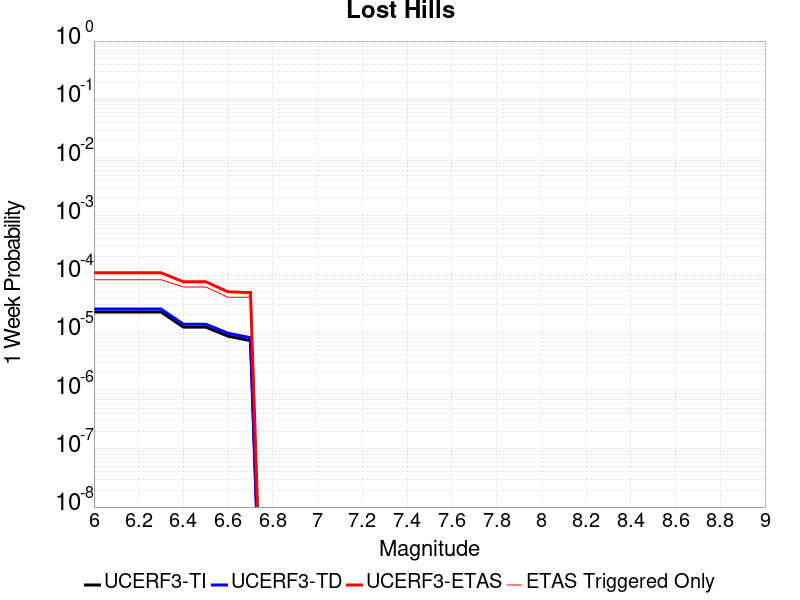 |  |  |  |

| Magnitude | 1 wk TI Prob | 1 wk TD Prob | 1 wk ETAS Prob | 1 wk ETAS/TD Gain | 1 wk ETAS Triggered Only | 1 mo TI Prob | 1 mo TD Prob | 1 mo ETAS Prob | 1 mo ETAS/TD Gain | 1 mo ETAS Triggered Only | 1 yr TI Prob | 1 yr TD Prob | 1 yr ETAS Prob | 1 yr ETAS/TD Gain | 1 yr ETAS Triggered Only | 10 yr TI Prob | 10 yr TD Prob | 10 yr ETAS Prob | 10 yr ETAS/TD Gain | 10 yr ETAS Triggered Only |
|-----|-----|-----|-----|-----|-----|-----|-----|-----|-----|-----|-----|-----|-----|-----|-----|-----|-----|-----|-----|-----|
| 6.0 | 2.233523E-5 | 2.5106583E-5 | 7.691875E-5 | 3.0636888 | 5.1813473E-5 | 9.571891E-5 | 1.0759615E-4 | 1.5940405E-4 | 1.4815032 | 5.1813473E-5 | 0.0011647546 | 0.001309364 | 0.0014646009 | 1.118559 | 1.5544042E-4 | 0.011586686 | 0.013033091 | 0.013237643 | 1.0156949 | 2.0725389E-4 |
| 6.1 | 2.233523E-5 | 2.5106583E-5 | 7.691875E-5 | 3.0636888 | 5.1813473E-5 | 9.571891E-5 | 1.0759615E-4 | 1.5940405E-4 | 1.4815032 | 5.1813473E-5 | 0.0011647546 | 0.001309364 | 0.0014646009 | 1.118559 | 1.5544042E-4 | 0.011586686 | 0.013033091 | 0.013237643 | 1.0156949 | 2.0725389E-4 |
| 6.2 | 2.233523E-5 | 2.5106583E-5 | 7.691875E-5 | 3.0636888 | 5.1813473E-5 | 9.571891E-5 | 1.0759615E-4 | 1.5940405E-4 | 1.4815032 | 5.1813473E-5 | 0.0011647546 | 0.001309364 | 0.0014646009 | 1.118559 | 1.5544042E-4 | 0.011586686 | 0.013033091 | 0.013237643 | 1.0156949 | 2.0725389E-4 |
| 6.3 | 2.233523E-5 | 2.5106583E-5 | 7.691875E-5 | 3.0636888 | 5.1813473E-5 | 9.571891E-5 | 1.0759615E-4 | 1.5940405E-4 | 1.4815032 | 5.1813473E-5 | 0.0011647546 | 0.001309364 | 0.0014646009 | 1.118559 | 1.5544042E-4 | 0.011586686 | 0.013033091 | 0.013237643 | 1.0156949 | 2.0725389E-4 |
| 6.4 | 1.2288092E-5 | 1.3781108E-5 | 6.5593864E-5 | 4.7596946 | 5.1813473E-5 | 5.2662188E-5 | 5.906108E-5 | 1.1087149E-4 | 1.8772343 | 5.1813473E-5 | 6.409735E-4 | 7.189252E-4 | 8.7425386E-4 | 1.2160568 | 1.5544042E-4 | 0.006391279 | 0.0071752006 | 0.0073809675 | 1.0286775 | 2.0725389E-4 |
| 6.5 | 1.2288092E-5 | 1.3781108E-5 | 6.5593864E-5 | 4.7596946 | 5.1813473E-5 | 5.2662188E-5 | 5.906108E-5 | 1.1087149E-4 | 1.8772343 | 5.1813473E-5 | 6.409735E-4 | 7.189252E-4 | 8.7425386E-4 | 1.2160568 | 1.5544042E-4 | 0.006391279 | 0.0071752006 | 0.0073809675 | 1.0286775 | 2.0725389E-4 |
| 6.6 | 8.58281E-6 | 9.63377E-6 | 6.144674E-5 | 6.3782654 | 5.1813473E-5 | 3.6782953E-5 | 4.12874E-5 | 9.309873E-5 | 2.2548945 | 5.1813473E-5 | 4.4774043E-4 | 5.026414E-4 | 6.0621626E-4 | 1.2060611 | 1.03626946E-4 | 0.0044683935 | 0.005023205 | 0.005177865 | 1.030789 | 1.5544042E-4 |
| 6.7 | 7.205685E-6 | 8.088302E-6 | 5.9901355E-5 | 7.405925 | 5.1813473E-5 | 3.088114E-5 | 3.466415E-5 | 8.6475826E-5 | 2.494676 | 5.1813473E-5 | 3.7591302E-4 | 4.2203604E-4 | 5.2561925E-4 | 1.2454369 | 1.03626946E-4 | 0.0037527776 | 0.0042203604 | 0.00432355 | 1.0244504 | 1.03626946E-4 |

## Baker
*[(top)](#table-of-contents)*

| 1 Week | 1 Month | 1 Year | 10 Year |
|-----|-----|-----|-----|
|  |  |  |  |

| Magnitude | 1 wk TI Prob | 1 wk TD Prob | 1 wk ETAS Prob | 1 wk ETAS/TD Gain | 1 wk ETAS Triggered Only | 1 mo TI Prob | 1 mo TD Prob | 1 mo ETAS Prob | 1 mo ETAS/TD Gain | 1 mo ETAS Triggered Only | 1 yr TI Prob | 1 yr TD Prob | 1 yr ETAS Prob | 1 yr ETAS/TD Gain | 1 yr ETAS Triggered Only | 10 yr TI Prob | 10 yr TD Prob | 10 yr ETAS Prob | 10 yr ETAS/TD Gain | 10 yr ETAS Triggered Only |
|-----|-----|-----|-----|-----|-----|-----|-----|-----|-----|-----|-----|-----|-----|-----|-----|-----|-----|-----|-----|-----|
| 6.0 | 5.695525E-6 | 5.8348373E-6 | 1.0946117E-4 | 18.759937 | 1.03626946E-4 | 2.4409164E-5 | 2.5006228E-5 | 1.8044276E-4 | 7.215913 | 1.5544042E-4 | 2.9714106E-4 | 3.044123E-4 | 4.598054E-4 | 1.5104692 | 1.5544042E-4 | 0.0029674405 | 0.0030403486 | 0.0032469726 | 1.0679605 | 2.0725389E-4 |
| 6.1 | 5.695525E-6 | 5.8348373E-6 | 1.0946117E-4 | 18.759937 | 1.03626946E-4 | 2.4409164E-5 | 2.5006228E-5 | 1.8044276E-4 | 7.215913 | 1.5544042E-4 | 2.9714106E-4 | 3.044123E-4 | 4.598054E-4 | 1.5104692 | 1.5544042E-4 | 0.0029674405 | 0.0030403486 | 0.0032469726 | 1.0679605 | 2.0725389E-4 |
| 6.2 | 5.695525E-6 | 5.8348373E-6 | 1.0946117E-4 | 18.759937 | 1.03626946E-4 | 2.4409164E-5 | 2.5006228E-5 | 1.8044276E-4 | 7.215913 | 1.5544042E-4 | 2.9714106E-4 | 3.044123E-4 | 4.598054E-4 | 1.5104692 | 1.5544042E-4 | 0.0029674405 | 0.0030403486 | 0.0032469726 | 1.0679605 | 2.0725389E-4 |
| 6.3 | 3.2995713E-6 | 3.383667E-6 | 5.5196964E-5 | 16.312763 | 5.1813473E-5 | 1.4140943E-5 | 1.4501353E-5 | 1.18126794E-4 | 8.145916 | 1.03626946E-4 | 1.7215237E-4 | 1.7654014E-4 | 2.801488E-4 | 1.5868844 | 1.03626946E-4 | 0.0017201907 | 0.001764046 | 0.0019192122 | 1.0879604 | 1.5544042E-4 |
| 6.4 | 3.2995713E-6 | 3.383667E-6 | 5.5196964E-5 | 16.312763 | 5.1813473E-5 | 1.4140943E-5 | 1.4501353E-5 | 1.18126794E-4 | 8.145916 | 1.03626946E-4 | 1.7215237E-4 | 1.7654014E-4 | 2.801488E-4 | 1.5868844 | 1.03626946E-4 | 0.0017201907 | 0.001764046 | 0.0019192122 | 1.0879604 | 1.5544042E-4 |
| 6.5 | 2.782202E-6 | 2.8558404E-6 | 5.4669163E-5 | 19.142933 | 5.1813473E-5 | 1.1923668E-5 | 1.223926E-5 | 1.1586493E-4 | 9.466661 | 1.03626946E-4 | 1.4516099E-4 | 1.4900314E-4 | 2.5261464E-4 | 1.6953646 | 1.03626946E-4 | 0.001450662 | 0.0014890651 | 0.001644274 | 1.1042324 | 1.5544042E-4 |
| 6.6 | 2.3163404E-6 | 2.38092E-6 | 5.4194268E-5 | 22.761902 | 5.1813473E-5 | 9.927136E-6 | 1.0203904E-5 | 1.1382979E-4 | 11.155514 | 1.03626946E-4 | 1.20856166E-4 | 1.2422565E-4 | 2.2783972E-4 | 1.8340795 | 1.03626946E-4 | 0.0012079047 | 0.0012415823 | 0.0013968297 | 1.1250399 | 1.5544042E-4 |
| 6.7 | 2.037056E-6 | 2.0965003E-6 | 5.3909862E-5 | 25.714214 | 5.1813473E-5 | 8.7302105E-6 | 8.984972E-6 | 1.12610986E-4 | 12.533259 | 1.03626946E-4 | 1.0628513E-4 | 1.093867E-4 | 2.130023E-4 | 1.9472413 | 1.03626946E-4 | 0.0010623431 | 0.0010933448 | 0.0012486152 | 1.1420141 | 1.5544042E-4 |
| 6.8 | 1.8356744E-6 | 1.8915287E-6 | 5.37049E-5 | 28.392328 | 5.1813473E-5 | 7.867153E-6 | 8.106527E-6 | 1.1173263E-4 | 13.783046 | 1.03626946E-4 | 9.577837E-5 | 9.869264E-5 | 2.0230935E-4 | 2.0498931 | 1.03626946E-4 | 9.57371E-4 | 9.86502E-4 | 0.0011417891 | 1.1574118 | 1.5544042E-4 |
| 6.9 | 1.6310546E-6 | 1.6832072E-6 | 5.349659E-5 | 31.782536 | 5.1813473E-5 | 6.9902153E-6 | 7.213726E-6 | 1.1083992E-4 | 15.365142 | 1.03626946E-4 | 8.510255E-5 | 8.782368E-5 | 1.9144153E-4 | 2.1798394 | 1.03626946E-4 | 8.5069967E-4 | 8.7790104E-4 | 0.001033205 | 1.1769037 | 1.5544042E-4 |
| 7.0 | 1.2058036E-6 | 1.2508665E-6 | 5.3064272E-5 | 42.42201 | 5.1813473E-5 | 5.1677193E-6 | 5.3608455E-6 | 1.0898723E-4 | 20.33023 | 1.03626946E-4 | 6.291517E-5 | 6.5266366E-5 | 1.6888654E-4 | 2.5876505 | 1.03626946E-4 | 6.289736E-4 | 6.524743E-4 | 8.078133E-4 | 1.2380768 | 1.5544042E-4 |
| 7.1 | 1.052382E-6 | 1.0951609E-6 | 5.2908577E-5 | 48.311237 | 5.1813473E-5 | 4.5102006E-6 | 4.693538E-6 | 1.0832E-4 | 23.078537 | 1.03626946E-4 | 5.491031E-5 | 5.7142337E-5 | 1.6076336E-4 | 2.8133843 | 1.03626946E-4 | 5.4896745E-4 | 5.7127734E-4 | 7.2662893E-4 | 1.2719373 | 1.5544042E-4 |
| 7.2 | 1.0067454E-6 | 1.0487711E-6 | 5.286219E-5 | 50.403934 | 5.1813473E-5 | 4.3146156E-6 | 4.4947255E-6 | 1.081212E-4 | 24.05513 | 1.03626946E-4 | 5.252918E-5 | 5.4721917E-5 | 1.5834319E-4 | 2.8935974 | 1.03626946E-4 | 5.251676E-4 | 5.470853E-4 | 7.024407E-4 | 1.2839692 | 1.5544042E-4 |
| 7.3 | 9.3596316E-7 | 9.767723E-7 | 5.2790194E-5 | 54.045544 | 5.1813473E-5 | 4.0112645E-6 | 4.1861604E-6 | 1.07812666E-4 | 25.754547 | 1.03626946E-4 | 4.8836053E-5 | 5.096532E-5 | 1.5458697E-4 | 3.0331798 | 1.03626946E-4 | 4.8825322E-4 | 5.095371E-4 | 6.1311125E-4 | 1.203271 | 1.03626946E-4 |
| 7.4 | 8.8117395E-7 | 9.2076635E-7 | 5.273419E-5 | 57.272064 | 5.1813473E-5 | 3.7764542E-6 | 3.9461356E-6 | 1.0757267E-4 | 27.260258 | 1.03626946E-4 | 4.5977362E-5 | 4.8043148E-5 | 1.5166511E-4 | 3.156852 | 1.03626946E-4 | 4.596785E-4 | 4.8032837E-4 | 5.8390555E-4 | 1.2156383 | 1.03626946E-4 |
| 7.5 | 8.292386E-7 | 8.6745956E-7 | 5.2680887E-5 | 60.730076 | 5.1813473E-5 | 3.5538749E-6 | 3.7176785E-6 | 1.0734424E-4 | 28.873995 | 1.03626946E-4 | 4.326757E-5 | 4.5261804E-5 | 1.4888405E-4 | 3.2893972 | 1.03626946E-4 | 4.3259145E-4 | 4.5252658E-4 | 5.561066E-4 | 1.2288927 | 1.03626946E-4 |
| 7.6 | 7.553842E-7 | 7.9144706E-7 | 7.9144706E-7 | 1.0 | 0.0 | 3.2373566E-6 | 3.3919116E-6 | 5.5205208E-5 | 16.275545 | 5.1813473E-5 | 3.9414106E-5 | 4.129575E-5 | 9.310708E-5 | 2.2546408 | 5.1813473E-5 | 3.9407116E-4 | 4.1288146E-4 | 4.6467353E-4 | 1.1254406 | 5.1813473E-5 |
| 7.7 | 6.5285366E-7 | 6.852797E-7 | 6.852797E-7 | 1.0 | 0.0 | 2.797941E-6 | 2.9369096E-6 | 5.4750228E-5 | 18.642122 | 5.1813473E-5 | 3.40644E-5 | 3.5756293E-5 | 8.756791E-5 | 2.4490209 | 5.1813473E-5 | 3.405918E-4 | 3.5750607E-4 | 4.0930102E-4 | 1.1448785 | 5.1813473E-5 |
| 7.8 | 3.4586725E-7 | 3.6482615E-7 | 3.6482615E-7 | 1.0 | 0.0 | 1.4822873E-6 | 1.5635396E-6 | 5.337693E-5 | 34.13852 | 5.1813473E-5 | 1.80467E-5 | 1.9035933E-5 | 7.084842E-5 | 3.7218254 | 5.1813473E-5 | 1.8045233E-4 | 1.9034347E-4 | 2.4214709E-4 | 1.2721586 | 5.1813473E-5 |
| 7.9 | 2.5591178E-9 | 2.6696718E-9 | 2.6696718E-9 | 1.0 | 0.0 | 1.0967647E-8 | 1.14414505E-8 | 1.14414505E-8 | 1.0 | 0.0 | 1.335311E-7 | 1.3929966E-7 | 1.3929966E-7 | 1.0 | 0.0 | 1.3353102E-6 | 1.3929966E-6 | 1.3929966E-6 | 1.0 | 0.0 |

## Big Pine (East)
*[(top)](#table-of-contents)*

| 1 Week | 1 Month | 1 Year | 10 Year |
|-----|-----|-----|-----|
|  |  |  |  |

| Magnitude | 1 wk TI Prob | 1 wk TD Prob | 1 wk ETAS Prob | 1 wk ETAS/TD Gain | 1 wk ETAS Triggered Only | 1 mo TI Prob | 1 mo TD Prob | 1 mo ETAS Prob | 1 mo ETAS/TD Gain | 1 mo ETAS Triggered Only | 1 yr TI Prob | 1 yr TD Prob | 1 yr ETAS Prob | 1 yr ETAS/TD Gain | 1 yr ETAS Triggered Only | 10 yr TI Prob | 10 yr TD Prob | 10 yr ETAS Prob | 10 yr ETAS/TD Gain | 10 yr ETAS Triggered Only |
|-----|-----|-----|-----|-----|-----|-----|-----|-----|-----|-----|-----|-----|-----|-----|-----|-----|-----|-----|-----|-----|
| 6.0 | 9.916913E-6 | 1.2816984E-5 | 1.6825541E-4 | 13.127535 | 1.5544042E-4 | 4.250036E-5 | 5.49289E-5 | 2.1036078E-4 | 3.8296921 | 1.5544042E-4 | 5.173191E-4 | 6.685763E-4 | 8.239128E-4 | 1.2323393 | 1.5544042E-4 | 0.0051611643 | 0.006670441 | 0.0068763127 | 1.0308633 | 2.0725389E-4 |
| 6.1 | 9.916913E-6 | 1.2816984E-5 | 1.6825541E-4 | 13.127535 | 1.5544042E-4 | 4.250036E-5 | 5.49289E-5 | 2.1036078E-4 | 3.8296921 | 1.5544042E-4 | 5.173191E-4 | 6.685763E-4 | 8.239128E-4 | 1.2323393 | 1.5544042E-4 | 0.0051611643 | 0.006670441 | 0.0068763127 | 1.0308633 | 2.0725389E-4 |
| 6.2 | 9.916913E-6 | 1.2816984E-5 | 1.6825541E-4 | 13.127535 | 1.5544042E-4 | 4.250036E-5 | 5.49289E-5 | 2.1036078E-4 | 3.8296921 | 1.5544042E-4 | 5.173191E-4 | 6.685763E-4 | 8.239128E-4 | 1.2323393 | 1.5544042E-4 | 0.0051611643 | 0.006670441 | 0.0068763127 | 1.0308633 | 2.0725389E-4 |
| 6.3 | 5.479711E-6 | 8.112951E-6 | 1.1173906E-4 | 13.7729225 | 1.03626946E-4 | 2.3484265E-5 | 3.4769346E-5 | 1.3839269E-4 | 3.9803073 | 1.03626946E-4 | 2.858834E-4 | 4.2323777E-4 | 5.2682083E-4 | 1.2447397 | 1.03626946E-4 | 0.0028551589 | 0.004227244 | 0.004382027 | 1.0366156 | 1.5544042E-4 |
| 6.4 | 5.465009E-6 | 8.097245E-6 | 1.1172335E-4 | 13.797699 | 1.03626946E-4 | 2.3421257E-5 | 3.4702036E-5 | 1.3832538E-4 | 3.9860885 | 1.03626946E-4 | 2.851165E-4 | 4.2241855E-4 | 5.2600174E-4 | 1.2452146 | 1.03626946E-4 | 0.0028475097 | 0.0042190826 | 0.004373867 | 1.0366868 | 1.5544042E-4 |
| 6.5 | 4.826767E-6 | 7.422301E-6 | 1.1104847E-4 | 14.961462 | 1.03626946E-4 | 2.068598E-5 | 3.180949E-5 | 1.3543313E-4 | 4.257633 | 1.03626946E-4 | 2.518227E-4 | 3.872145E-4 | 4.908013E-4 | 1.2675179 | 1.03626946E-4 | 0.0025153751 | 0.003868283 | 0.004023122 | 1.0400279 | 1.5544042E-4 |
| 6.6 | 4.3146847E-6 | 6.8822374E-6 | 1.1050847E-4 | 16.057056 | 1.03626946E-4 | 1.8491375E-5 | 2.9494982E-5 | 1.3311887E-4 | 4.513272 | 1.03626946E-4 | 2.2510924E-4 | 3.590447E-4 | 4.6263443E-4 | 1.2885149 | 1.03626946E-4 | 0.0022488134 | 0.0035874986 | 0.0037423812 | 1.043173 | 1.5544042E-4 |
| 6.7 | 3.6968106E-6 | 5.9954727E-6 | 1.096218E-4 | 18.284096 | 1.03626946E-4 | 1.5843378E-5 | 2.5694639E-5 | 1.2931891E-4 | 5.0329146 | 1.03626946E-4 | 1.9287605E-4 | 3.1278885E-4 | 4.1638338E-4 | 1.3311963 | 1.03626946E-4 | 0.0019270873 | 0.0031262483 | 0.0032295513 | 1.0330437 | 1.03626946E-4 |
| 6.8 | 3.4671132E-6 | 5.702177E-6 | 1.0932853E-4 | 19.17312 | 1.03626946E-4 | 1.4858972E-5 | 2.4437682E-5 | 1.2806209E-4 | 5.2403536 | 1.03626946E-4 | 1.8089297E-4 | 2.974896E-4 | 4.010857E-4 | 1.3482344 | 1.03626946E-4 | 0.0018074579 | 0.002973667 | 0.003076986 | 1.0347446 | 1.03626946E-4 |
| 6.9 | 2.7686972E-6 | 4.825223E-6 | 1.0845166E-4 | 22.47599 | 1.03626946E-4 | 1.1865792E-5 | 2.0679368E-5 | 1.2430416E-4 | 6.0110235 | 1.03626946E-4 | 1.4445644E-4 | 2.5174298E-4 | 3.5534383E-4 | 1.4115343 | 1.03626946E-4 | 0.0014436257 | 0.0025172636 | 0.0026206297 | 1.0410628 | 1.03626946E-4 |
| 7.0 | 2.1472624E-6 | 3.9850406E-6 | 5.5798304E-5 | 14.001942 | 5.1813473E-5 | 9.20252E-6 | 1.7078637E-5 | 6.8891226E-5 | 4.033766 | 5.1813473E-5 | 1.12034926E-4 | 2.079131E-4 | 2.597158E-4 | 1.2491555 | 5.1813473E-5 | 0.0011197845 | 0.0020798394 | 0.002131545 | 1.0248604 | 5.1813473E-5 |
| 7.1 | 1.7018335E-6 | 3.344876E-6 | 5.5158172E-5 | 16.490349 | 5.1813473E-5 | 7.293552E-6 | 1.4335106E-5 | 6.614783E-5 | 4.6143947 | 5.1813473E-5 | 8.879537E-5 | 1.7451629E-4 | 2.2632073E-4 | 1.2968458 | 5.1813473E-5 | 8.87599E-4 | 0.0017464145 | 0.0017981374 | 1.0296167 | 5.1813473E-5 |
| 7.2 | 1.25603E-6 | 2.794484E-6 | 2.794484E-6 | 1.0 | 0.0 | 5.3829745E-6 | 1.1976307E-5 | 1.1976307E-5 | 1.0 | 0.0 | 6.553574E-5 | 1.4580201E-4 | 1.4580201E-4 | 1.0 | 0.0 | 6.551642E-4 | 0.001459661 | 0.001459661 | 1.0 | 0.0 |
| 7.3 | 1.112297E-6 | 2.610332E-6 | 2.610332E-6 | 1.0 | 0.0 | 4.7669787E-6 | 1.118709E-5 | 1.118709E-5 | 1.0 | 0.0 | 5.803642E-5 | 1.3619453E-4 | 1.3619453E-4 | 1.0 | 0.0 | 5.802127E-4 | 0.0013635408 | 0.0013635408 | 1.0 | 0.0 |
| 7.4 | 1.0137181E-6 | 2.4834917E-6 | 2.4834917E-6 | 1.0 | 0.0 | 4.3444993E-6 | 1.0643494E-5 | 1.0643494E-5 | 1.0 | 0.0 | 5.2892992E-5 | 1.2957705E-4 | 1.2957705E-4 | 1.0 | 0.0 | 5.288041E-4 | 0.0012972289 | 0.0012972289 | 1.0 | 0.0 |
| 7.5 | 9.598608E-7 | 2.4071483E-6 | 2.4071483E-6 | 1.0 | 0.0 | 4.1136827E-6 | 1.031631E-5 | 1.031631E-5 | 1.0 | 0.0 | 5.0082934E-5 | 1.2559404E-4 | 1.2559404E-4 | 1.0 | 0.0 | 5.007165E-4 | 0.0012572526 | 0.0012572526 | 1.0 | 0.0 |
| 7.6 | 7.929459E-7 | 2.0448588E-6 | 2.0448588E-6 | 1.0 | 0.0 | 3.3983351E-6 | 8.763653E-6 | 8.763653E-6 | 1.0 | 0.0 | 4.1373947E-5 | 1.06692416E-4 | 1.06692416E-4 | 1.0 | 0.0 | 4.1366243E-4 | 0.0010685222 | 0.0010685222 | 1.0 | 0.0 |
| 7.7 | 4.155788E-7 | 1.1605589E-6 | 1.1605589E-6 | 1.0 | 0.0 | 1.7810507E-6 | 4.9738146E-6 | 4.9738146E-6 | 1.0 | 0.0 | 2.1684076E-5 | 6.0554554E-5 | 6.0554554E-5 | 1.0 | 0.0 | 2.1681961E-4 | 6.0857297E-4 | 6.0857297E-4 | 1.0 | 0.0 |
| 7.8 | 1.14666925E-7 | 2.592015E-7 | 2.592015E-7 | 1.0 | 0.0 | 4.914296E-7 | 1.1108631E-6 | 1.1108631E-6 | 1.0 | 0.0 | 5.9831386E-6 | 1.3524678E-5 | 1.3524678E-5 | 1.0 | 0.0 | 5.9829777E-5 | 1.3634123E-4 | 1.3634123E-4 | 1.0 | 0.0 |
| 7.9 | 2.9231824E-8 | 4.1463963E-8 | 4.1463963E-8 | 1.0 | 0.0 | 1.2527924E-7 | 1.7770269E-7 | 1.7770269E-7 | 1.0 | 0.0 | 1.5252737E-6 | 2.1635283E-6 | 2.1635283E-6 | 1.0 | 0.0 | 1.5252632E-5 | 2.1967755E-5 | 2.1967755E-5 | 1.0 | 0.0 |

## Ventura-Pitas Point
*[(top)](#table-of-contents)*

| 1 Week | 1 Month | 1 Year | 10 Year |
|-----|-----|-----|-----|
|  |  |  |  |

| Magnitude | 1 wk TI Prob | 1 wk TD Prob | 1 wk ETAS Prob | 1 wk ETAS/TD Gain | 1 wk ETAS Triggered Only | 1 mo TI Prob | 1 mo TD Prob | 1 mo ETAS Prob | 1 mo ETAS/TD Gain | 1 mo ETAS Triggered Only | 1 yr TI Prob | 1 yr TD Prob | 1 yr ETAS Prob | 1 yr ETAS/TD Gain | 1 yr ETAS Triggered Only | 10 yr TI Prob | 10 yr TD Prob | 10 yr ETAS Prob | 10 yr ETAS/TD Gain | 10 yr ETAS Triggered Only |
|-----|-----|-----|-----|-----|-----|-----|-----|-----|-----|-----|-----|-----|-----|-----|-----|-----|-----|-----|-----|-----|
| 6.0 | 3.3179622E-5 | 3.3735185E-5 | 8.5546904E-5 | 2.5358365 | 5.1813473E-5 | 1.4219063E-4 | 1.445728E-4 | 2.4818475E-4 | 1.7166767 | 1.03626946E-4 | 0.0017297962 | 0.0017590096 | 0.001965899 | 1.1176169 | 2.0725389E-4 | 0.017163932 | 0.0174764 | 0.017680032 | 1.0116519 | 2.0725389E-4 |
| 6.1 | 3.3179622E-5 | 3.3735185E-5 | 8.5546904E-5 | 2.5358365 | 5.1813473E-5 | 1.4219063E-4 | 1.445728E-4 | 2.4818475E-4 | 1.7166767 | 1.03626946E-4 | 0.0017297962 | 0.0017590096 | 0.001965899 | 1.1176169 | 2.0725389E-4 | 0.017163932 | 0.0174764 | 0.017680032 | 1.0116519 | 2.0725389E-4 |
| 6.2 | 3.3179622E-5 | 3.3735185E-5 | 8.5546904E-5 | 2.5358365 | 5.1813473E-5 | 1.4219063E-4 | 1.445728E-4 | 2.4818475E-4 | 1.7166767 | 1.03626946E-4 | 0.0017297962 | 0.0017590096 | 0.001965899 | 1.1176169 | 2.0725389E-4 | 0.017163932 | 0.0174764 | 0.017680032 | 1.0116519 | 2.0725389E-4 |
| 6.3 | 3.3179622E-5 | 3.3735185E-5 | 8.5546904E-5 | 2.5358365 | 5.1813473E-5 | 1.4219063E-4 | 1.445728E-4 | 2.4818475E-4 | 1.7166767 | 1.03626946E-4 | 0.0017297962 | 0.0017590096 | 0.001965899 | 1.1176169 | 2.0725389E-4 | 0.017163932 | 0.0174764 | 0.017680032 | 1.0116519 | 2.0725389E-4 |
| 6.4 | 1.8754668E-5 | 1.701961E-5 | 6.88322E-5 | 4.0442877 | 5.1813473E-5 | 8.037467E-5 | 7.293928E-5 | 1.7655866E-4 | 2.4206252 | 1.03626946E-4 | 9.781223E-4 | 8.8769704E-4 | 0.0010947669 | 1.2332665 | 2.0725389E-4 | 0.009738282 | 0.008843848 | 0.009049268 | 1.0232276 | 2.0725389E-4 |
| 6.5 | 1.8754668E-5 | 1.701961E-5 | 6.88322E-5 | 4.0442877 | 5.1813473E-5 | 8.037467E-5 | 7.293928E-5 | 1.7655866E-4 | 2.4206252 | 1.03626946E-4 | 9.781223E-4 | 8.8769704E-4 | 0.0010947669 | 1.2332665 | 2.0725389E-4 | 0.009738282 | 0.008843848 | 0.009049268 | 1.0232276 | 2.0725389E-4 |
| 6.6 | 1.4361558E-5 | 1.2122275E-5 | 1.2122275E-5 | 1.0 | 0.0 | 6.154808E-5 | 5.1951585E-5 | 1.03762366E-4 | 1.9972897 | 5.1813473E-5 | 7.490902E-4 | 6.3232926E-4 | 7.358907E-4 | 1.1637777 | 1.03626946E-4 | 0.0074657016 | 0.0063055577 | 0.006408531 | 1.0163306 | 1.03626946E-4 |
| 6.7 | 1.4361558E-5 | 1.2122275E-5 | 1.2122275E-5 | 1.0 | 0.0 | 6.154808E-5 | 5.1951585E-5 | 1.03762366E-4 | 1.9972897 | 5.1813473E-5 | 7.490902E-4 | 6.3232926E-4 | 7.358907E-4 | 1.1637777 | 1.03626946E-4 | 0.0074657016 | 0.0063055577 | 0.006408531 | 1.0163306 | 1.03626946E-4 |
| 6.8 | 1.3663846E-5 | 1.13444175E-5 | 1.13444175E-5 | 1.0 | 0.0 | 5.8558027E-5 | 4.861804E-5 | 1.0042899E-4 | 2.0656734 | 5.1813473E-5 | 7.127108E-4 | 5.917658E-4 | 6.9533143E-4 | 1.1750112 | 1.03626946E-4 | 0.007104293 | 0.005902116 | 0.0060051316 | 1.0174539 | 1.03626946E-4 |
| 6.9 | 1.3644157E-5 | 1.1322519E-5 | 1.1322519E-5 | 1.0 | 0.0 | 5.8473648E-5 | 4.8524187E-5 | 1.0033514E-4 | 2.0677347 | 5.1813473E-5 | 7.116841E-4 | 5.9062376E-4 | 6.941895E-4 | 1.1753497 | 1.03626946E-4 | 0.007094092 | 0.0058907564 | 0.005993773 | 1.0174878 | 1.03626946E-4 |
| 7.0 | 1.3568845E-5 | 1.1242086E-5 | 1.1242086E-5 | 1.0 | 0.0 | 5.8150898E-5 | 4.817949E-5 | 9.999046E-5 | 2.0753741 | 5.1813473E-5 | 7.077572E-4 | 5.864293E-4 | 6.899955E-4 | 1.1766047 | 1.03626946E-4 | 0.007055073 | 0.0058490336 | 0.005952054 | 1.0176133 | 1.03626946E-4 |
| 7.1 | 1.306572E-5 | 1.072054E-5 | 1.072054E-5 | 1.0 | 0.0 | 5.599474E-5 | 4.5944373E-5 | 9.775546E-5 | 2.1276917 | 5.1813473E-5 | 6.815227E-4 | 5.5923103E-4 | 6.628E-4 | 1.1851989 | 1.03626946E-4 | 0.0067943637 | 0.0055784425 | 0.005681491 | 1.0184727 | 1.03626946E-4 |
| 7.2 | 1.232604E-5 | 9.995143E-6 | 9.995143E-6 | 1.0 | 0.0 | 5.2824813E-5 | 4.2835632E-5 | 4.2835632E-5 | 1.0 | 0.0 | 6.429523E-4 | 5.214008E-4 | 5.7318725E-4 | 1.0993217 | 5.1813473E-5 | 0.0064109527 | 0.005201967 | 0.005253511 | 1.0099086 | 5.1813473E-5 |
| 7.3 | 1.0917261E-5 | 8.84384E-6 | 8.84384E-6 | 1.0 | 0.0 | 4.678742E-5 | 3.790163E-5 | 3.790163E-5 | 1.0 | 0.0 | 5.69488E-4 | 4.6135622E-4 | 4.6135622E-4 | 1.0 | 0.0 | 0.0056803077 | 0.00460415 | 0.00460415 | 1.0 | 0.0 |
| 7.4 | 1.039959E-5 | 8.423562E-6 | 8.423562E-6 | 1.0 | 0.0 | 4.456891E-5 | 3.610049E-5 | 3.610049E-5 | 1.0 | 0.0 | 5.424914E-4 | 4.3943635E-4 | 4.3943635E-4 | 1.0 | 0.0 | 0.0054116896 | 0.004385836 | 0.004385836 | 1.0 | 0.0 |
| 7.5 | 9.015877E-6 | 7.2975445E-6 | 7.2975445E-6 | 1.0 | 0.0 | 3.86389E-5 | 3.1274823E-5 | 3.1274823E-5 | 1.0 | 0.0 | 4.7032707E-4 | 3.8070587E-4 | 3.8070587E-4 | 1.0 | 0.0 | 0.004693329 | 0.0038006818 | 0.0038006818 | 1.0 | 0.0 |
| 7.6 | 4.900162E-6 | 3.8741155E-6 | 3.8741155E-6 | 1.0 | 0.0 | 2.1000526E-5 | 1.6603248E-5 | 1.6603248E-5 | 1.0 | 0.0 | 2.556514E-4 | 2.0212591E-4 | 2.0212591E-4 | 1.0 | 0.0 | 0.0025535747 | 0.0020194345 | 0.0020194345 | 1.0 | 0.0 |
| 7.7 | 3.8850626E-6 | 3.1267302E-6 | 3.1267302E-6 | 1.0 | 0.0 | 1.6650163E-5 | 1.3400205E-5 | 1.3400205E-5 | 1.0 | 0.0 | 2.0269687E-4 | 1.6313537E-4 | 1.6313537E-4 | 1.0 | 0.0 | 0.002025121 | 0.0016301654 | 0.0016301654 | 1.0 | 0.0 |
| 7.8 | 2.4654719E-6 | 2.029875E-6 | 2.029875E-6 | 1.0 | 0.0 | 1.0566265E-5 | 8.699436E-6 | 8.699436E-6 | 1.0 | 0.0 | 1.2863669E-4 | 1.0591053E-4 | 1.0591053E-4 | 1.0 | 0.0 | 0.0012856225 | 0.0010586053 | 0.0010586053 | 1.0 | 0.0 |
| 7.9 | 4.095894E-7 | 3.2764765E-7 | 3.2764765E-7 | 1.0 | 0.0 | 1.7553821E-6 | 1.4042034E-6 | 1.4042034E-6 | 1.0 | 0.0 | 2.1371567E-5 | 1.7096047E-5 | 1.7096047E-5 | 1.0 | 0.0 | 2.1369511E-4 | 1.7094762E-4 | 1.7094762E-4 | 1.0 | 0.0 |
| 8.0 | 7.791402E-9 | 5.683497E-9 | 5.683497E-9 | 1.0 | 0.0 | 3.3391725E-8 | 2.4357844E-8 | 2.4357844E-8 | 1.0 | 0.0 | 4.0654416E-7 | 2.9655675E-7 | 2.9655675E-7 | 1.0 | 0.0 | 4.065434E-6 | 2.9655655E-6 | 2.9655655E-6 | 1.0 | 0.0 |

## San Jacinto (Superstition Mtn)
*[(top)](#table-of-contents)*

| 1 Week | 1 Month | 1 Year | 10 Year |
|-----|-----|-----|-----|
|  |  | 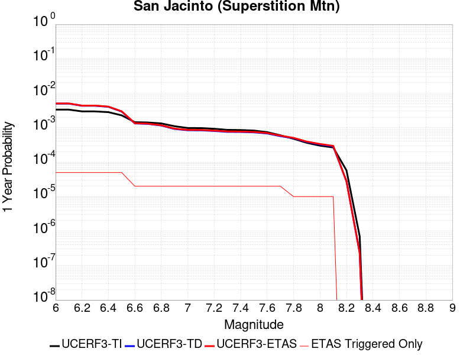 |  |

| Magnitude | 1 wk TI Prob | 1 wk TD Prob | 1 wk ETAS Prob | 1 wk ETAS/TD Gain | 1 wk ETAS Triggered Only | 1 mo TI Prob | 1 mo TD Prob | 1 mo ETAS Prob | 1 mo ETAS/TD Gain | 1 mo ETAS Triggered Only | 1 yr TI Prob | 1 yr TD Prob | 1 yr ETAS Prob | 1 yr ETAS/TD Gain | 1 yr ETAS Triggered Only | 10 yr TI Prob | 10 yr TD Prob | 10 yr ETAS Prob | 10 yr ETAS/TD Gain | 10 yr ETAS Triggered Only |
|-----|-----|-----|-----|-----|-----|-----|-----|-----|-----|-----|-----|-----|-----|-----|-----|-----|-----|-----|-----|-----|
| 6.0 | 6.4193904E-5 | 9.599367E-5 | 2.5141917E-4 | 2.6191223 | 1.5544042E-4 | 2.7508775E-4 | 4.1134638E-4 | 5.667228E-4 | 1.3777267 | 1.5544042E-4 | 0.0033440501 | 0.0049980893 | 0.0052043074 | 1.0412594 | 2.0725389E-4 | 0.03294174 | 0.048823986 | 0.04902112 | 1.0040376 | 2.0725389E-4 |
| 6.1 | 6.4193904E-5 | 9.599367E-5 | 2.5141917E-4 | 2.6191223 | 1.5544042E-4 | 2.7508775E-4 | 4.1134638E-4 | 5.667228E-4 | 1.3777267 | 1.5544042E-4 | 0.0033440501 | 0.0049980893 | 0.0052043074 | 1.0412594 | 2.0725389E-4 | 0.03294174 | 0.048823986 | 0.04902112 | 1.0040376 | 2.0725389E-4 |
| 6.2 | 5.7023593E-5 | 8.3144434E-5 | 2.3857193E-4 | 2.8693674 | 1.5544042E-4 | 2.4436394E-4 | 3.5629404E-4 | 5.1167904E-4 | 1.4361147 | 1.5544042E-4 | 0.002971072 | 0.0043308944 | 0.004537251 | 1.0476475 | 2.0725389E-4 | 0.029316625 | 0.04250403 | 0.042702474 | 1.0046688 | 2.0725389E-4 |
| 6.3 | 5.6940098E-5 | 8.298979E-5 | 2.3841731E-4 | 2.872851 | 1.5544042E-4 | 2.4400617E-4 | 3.5563146E-4 | 5.110166E-4 | 1.4369274 | 1.5544042E-4 | 0.002966728 | 0.00432286 | 0.0045292177 | 1.0477364 | 2.0725389E-4 | 0.029274331 | 0.042427283 | 0.042625744 | 1.0046777 | 2.0725389E-4 |
| 6.4 | 5.4171585E-5 | 7.7483564E-5 | 2.3291193E-4 | 3.0059528 | 1.5544042E-4 | 2.3214328E-4 | 3.3203943E-4 | 4.8742825E-4 | 1.467983 | 1.5544042E-4 | 0.0028226813 | 0.0040367353 | 0.004243152 | 1.0511347 | 2.0725389E-4 | 0.02787096 | 0.03971653 | 0.039915554 | 1.0050111 | 2.0725389E-4 |
| 6.5 | 4.375144E-5 | 5.642133E-5 | 2.1185297E-4 | 3.7548385 | 1.5544042E-4 | 1.874927E-4 | 2.4178992E-4 | 3.9719275E-4 | 1.6427184 | 1.5544042E-4 | 0.0022803338 | 0.002940994 | 0.0031476384 | 1.0702634 | 2.0725389E-4 | 0.022570757 | 0.029236801 | 0.029437996 | 1.0068816 | 2.0725389E-4 |
| 6.6 | 2.772192E-5 | 2.5488358E-5 | 7.730051E-5 | 3.032777 | 5.1813473E-5 | 1.1880282E-4 | 1.09231354E-4 | 1.6103916E-4 | 1.4742943 | 5.1813473E-5 | 0.0014454646 | 0.0013290998 | 0.001432589 | 1.0778642 | 1.03626946E-4 | 0.014360986 | 0.01354049 | 0.013642713 | 1.0075495 | 1.03626946E-4 |
| 6.7 | 2.7124124E-5 | 2.4699386E-5 | 7.651158E-5 | 3.0977118 | 5.1813473E-5 | 1.1624106E-4 | 1.05850326E-4 | 1.5765832E-4 | 1.4894457 | 5.1813473E-5 | 0.0014143161 | 0.001287985 | 0.0013914785 | 1.080353 | 1.03626946E-4 | 0.014053487 | 0.013133943 | 0.01323621 | 1.0077864 | 1.03626946E-4 |
| 6.8 | 2.5475807E-5 | 2.216446E-5 | 7.3976786E-5 | 3.3376307 | 5.1813473E-5 | 1.0917746E-4 | 9.4987154E-5 | 1.467957E-4 | 1.545427 | 5.1813473E-5 | 0.001328425 | 0.001155867 | 0.0012593742 | 1.0895494 | 1.03626946E-4 | 0.0132051185 | 0.011822182 | 0.011924583 | 1.0086619 | 1.03626946E-4 |
| 6.9 | 2.1162023E-5 | 1.7626244E-5 | 6.94388E-5 | 3.9395123 | 5.1813473E-5 | 9.069123E-5 | 7.5538876E-5 | 1.2734844E-4 | 1.6858661 | 5.1813473E-5 | 0.0011036064 | 9.193016E-4 | 0.0010228333 | 1.1126199 | 1.03626946E-4 | 0.010981417 | 0.00944688 | 0.009549527 | 1.0108658 | 1.03626946E-4 |
| 7.0 | 1.8754288E-5 | 1.6161559E-5 | 6.797419E-5 | 4.2059183 | 5.1813473E-5 | 8.037304E-5 | 6.9261994E-5 | 1.2107188E-4 | 1.7480276 | 5.1813473E-5 | 9.781026E-4 | 8.4294105E-4 | 9.464806E-4 | 1.1228313 | 1.03626946E-4 | 0.009738087 | 0.008670042 | 0.008772771 | 1.0118487 | 1.03626946E-4 |
| 7.1 | 1.8678527E-5 | 1.6086702E-5 | 6.789934E-5 | 4.2208366 | 5.1813473E-5 | 8.0048376E-5 | 6.89412E-5 | 1.20751094E-4 | 1.7515086 | 5.1813473E-5 | 9.7415317E-4 | 8.3903834E-4 | 9.425783E-4 | 1.1234032 | 1.03626946E-4 | 0.009698939 | 0.008630998 | 0.008733731 | 1.0119027 | 1.03626946E-4 |
| 7.2 | 1.7804578E-5 | 1.5381282E-5 | 6.7193956E-5 | 4.368554 | 5.1813473E-5 | 7.6303106E-5 | 6.5918124E-5 | 1.1772818E-4 | 1.7859759 | 5.1813473E-5 | 9.285943E-4 | 8.022599E-4 | 9.058037E-4 | 1.1290652 | 1.03626946E-4 | 0.009247236 | 0.008262311 | 0.008365083 | 1.0124385 | 1.03626946E-4 |
| 7.3 | 1.6583685E-5 | 1.4530388E-5 | 6.6343106E-5 | 4.565818 | 5.1813473E-5 | 7.1070994E-5 | 6.227162E-5 | 1.14081864E-4 | 1.8320042 | 5.1813473E-5 | 8.649459E-4 | 7.5789524E-4 | 8.6144364E-4 | 1.1366262 | 1.03626946E-4 | 0.00861587 | 0.007817623 | 0.00792044 | 1.0131519 | 1.03626946E-4 |
| 7.4 | 1.6387552E-5 | 1.4395274E-5 | 6.6208E-5 | 4.599287 | 5.1813473E-5 | 7.023047E-5 | 6.169258E-5 | 1.1350286E-4 | 1.8398137 | 5.1813473E-5 | 8.5472054E-4 | 7.5085036E-4 | 8.5439946E-4 | 1.1379092 | 1.03626946E-4 | 0.008514405 | 0.0077470057 | 0.00784983 | 1.0132728 | 1.03626946E-4 |
| 7.5 | 1.5790754E-5 | 1.4035962E-5 | 6.5848704E-5 | 4.691428 | 5.1813473E-5 | 6.767291E-5 | 6.0152746E-5 | 1.119631E-4 | 1.8613132 | 5.1813473E-5 | 8.236062E-4 | 7.321156E-4 | 8.3566667E-4 | 1.1414409 | 1.03626946E-4 | 0.008205604 | 0.007557569 | 0.0076604127 | 1.0136081 | 1.03626946E-4 |
| 7.6 | 1.4248672E-5 | 1.3054932E-5 | 6.486773E-5 | 4.968829 | 5.1813473E-5 | 6.106431E-5 | 5.594852E-5 | 1.0775909E-4 | 1.92604 | 5.1813473E-5 | 7.432043E-4 | 6.8096205E-4 | 7.8451843E-4 | 1.1520736 | 1.03626946E-4 | 0.007407237 | 0.0070401574 | 0.0071430546 | 1.0146158 | 1.03626946E-4 |
| 7.7 | 1.15449975E-5 | 1.090368E-5 | 6.271659E-5 | 5.7518735 | 5.1813473E-5 | 4.947762E-5 | 4.6729223E-5 | 9.854027E-5 | 2.1087506 | 5.1813473E-5 | 6.022235E-4 | 5.687805E-4 | 6.7234854E-4 | 1.1820878 | 1.03626946E-4 | 0.006005941 | 0.0059101824 | 0.006013197 | 1.01743 | 1.03626946E-4 |
| 7.8 | 9.1391985E-6 | 9.514299E-6 | 6.132728E-5 | 6.4458013 | 5.1813473E-5 | 3.9167408E-5 | 4.0774932E-5 | 9.258629E-5 | 2.270667 | 5.1813473E-5 | 4.767588E-4 | 4.963223E-4 | 5.4811005E-4 | 1.1043429 | 5.1813473E-5 | 0.0047573727 | 0.0051766867 | 0.0052282317 | 1.0099572 | 5.1813473E-5 |
| 7.9 | 6.973017E-6 | 7.3821784E-6 | 5.9195267E-5 | 8.018672 | 5.1813473E-5 | 2.9884017E-5 | 3.1637526E-5 | 8.344936E-5 | 2.63767 | 5.1813473E-5 | 3.6377716E-4 | 3.8511935E-4 | 4.3691287E-4 | 1.1344869 | 5.1813473E-5 | 0.0036318225 | 0.0040517948 | 0.004103398 | 1.012736 | 5.1813473E-5 |
| 8.0 | 5.7638235E-6 | 6.259972E-6 | 5.8073118E-5 | 9.276897 | 5.1813473E-5 | 2.4701867E-5 | 2.6828178E-5 | 7.864026E-5 | 2.931256 | 5.1813473E-5 | 3.0070372E-4 | 3.2658462E-4 | 3.7838117E-4 | 1.1586007 | 5.1813473E-5 | 0.0030029714 | 0.0034534496 | 0.003505084 | 1.0149516 | 5.1813473E-5 |
| 8.1 | 5.1124434E-6 | 5.4956718E-6 | 5.730886E-5 | 10.427999 | 5.1813473E-5 | 2.1910288E-5 | 2.355267E-5 | 7.536492E-5 | 3.1998463 | 5.1813473E-5 | 2.6672508E-4 | 2.867165E-4 | 3.3851512E-4 | 1.1806614 | 5.1813473E-5 | 0.0026640517 | 0.003040336 | 0.003091992 | 1.0169902 | 5.1813473E-5 |
| 8.2 | 1.1075938E-6 | 5.336568E-7 | 5.336568E-7 | 1.0 | 0.0 | 4.7468216E-6 | 2.2870988E-6 | 2.2870988E-6 | 1.0 | 0.0 | 5.779102E-5 | 2.7845093E-5 | 2.7845093E-5 | 1.0 | 0.0 | 5.777599E-4 | 3.1346595E-4 | 3.1346595E-4 | 1.0 | 0.0 |
| 8.3 | 1.3584393E-8 | 4.473836E-9 | 4.473836E-9 | 1.0 | 0.0 | 5.8218827E-8 | 1.9173582E-8 | 1.9173582E-8 | 1.0 | 0.0 | 7.0881396E-7 | 2.3343837E-7 | 2.3343837E-7 | 1.0 | 0.0 | 7.0881174E-6 | 2.6163038E-6 | 2.6163038E-6 | 1.0 | 0.0 |

## Cleghorn Lake
*[(top)](#table-of-contents)*

| 1 Week | 1 Month | 1 Year | 10 Year |
|-----|-----|-----|-----|
|  |  |  |  |

| Magnitude | 1 wk TI Prob | 1 wk TD Prob | 1 wk ETAS Prob | 1 wk ETAS/TD Gain | 1 wk ETAS Triggered Only | 1 mo TI Prob | 1 mo TD Prob | 1 mo ETAS Prob | 1 mo ETAS/TD Gain | 1 mo ETAS Triggered Only | 1 yr TI Prob | 1 yr TD Prob | 1 yr ETAS Prob | 1 yr ETAS/TD Gain | 1 yr ETAS Triggered Only | 10 yr TI Prob | 10 yr TD Prob | 10 yr ETAS Prob | 10 yr ETAS/TD Gain | 10 yr ETAS Triggered Only |
|-----|-----|-----|-----|-----|-----|-----|-----|-----|-----|-----|-----|-----|-----|-----|-----|-----|-----|-----|-----|-----|
| 6.0 | 1.5467183E-5 | 1.6794203E-5 | 6.86068E-5 | 4.085148 | 5.1813473E-5 | 6.6286244E-5 | 7.197348E-5 | 1.7559297E-4 | 2.4396896 | 1.03626946E-4 | 8.067362E-4 | 8.759797E-4 | 9.795158E-4 | 1.1181947 | 1.03626946E-4 | 0.008038137 | 0.008730696 | 0.00893614 | 1.0235313 | 2.0725389E-4 |
| 6.1 | 1.5467183E-5 | 1.6794203E-5 | 6.86068E-5 | 4.085148 | 5.1813473E-5 | 6.6286244E-5 | 7.197348E-5 | 1.7559297E-4 | 2.4396896 | 1.03626946E-4 | 8.067362E-4 | 8.759797E-4 | 9.795158E-4 | 1.1181947 | 1.03626946E-4 | 0.008038137 | 0.008730696 | 0.00893614 | 1.0235313 | 2.0725389E-4 |
| 6.2 | 1.2624631E-5 | 1.3681544E-5 | 6.549431E-5 | 4.787055 | 5.1813473E-5 | 5.410444E-5 | 5.863415E-5 | 1.6225502E-4 | 2.7672443 | 1.03626946E-4 | 6.585225E-4 | 7.1368564E-4 | 8.172386E-4 | 1.1450961 | 1.03626946E-4 | 0.0065657445 | 0.0071187317 | 0.0073245103 | 1.0289066 | 2.0725389E-4 |
| 6.3 | 1.2624631E-5 | 1.3681544E-5 | 6.549431E-5 | 4.787055 | 5.1813473E-5 | 5.410444E-5 | 5.863415E-5 | 1.6225502E-4 | 2.7672443 | 1.03626946E-4 | 6.585225E-4 | 7.1368564E-4 | 8.172386E-4 | 1.1450961 | 1.03626946E-4 | 0.0065657445 | 0.0071187317 | 0.0073245103 | 1.0289066 | 2.0725389E-4 |
| 6.4 | 9.417684E-6 | 1.0170118E-5 | 1.0170118E-5 | 1.0 | 0.0 | 4.036088E-5 | 4.3585722E-5 | 4.3585722E-5 | 1.0 | 0.0 | 4.912829E-4 | 5.3056807E-4 | 5.3056807E-4 | 1.0 | 0.0 | 0.004901982 | 0.005297049 | 0.005348588 | 1.0097297 | 5.1813473E-5 |
| 6.5 | 9.368219E-6 | 1.0117545E-5 | 1.0117545E-5 | 1.0 | 0.0 | 4.014889E-5 | 4.3360415E-5 | 4.3360415E-5 | 1.0 | 0.0 | 4.8870314E-4 | 5.2782625E-4 | 5.2782625E-4 | 1.0 | 0.0 | 0.004876298 | 0.0052697617 | 0.005321302 | 1.0097804 | 5.1813473E-5 |
| 6.6 | 7.803798E-6 | 8.441831E-6 | 8.441831E-6 | 1.0 | 0.0 | 3.3444423E-5 | 3.6179E-5 | 3.6179E-5 | 1.0 | 0.0 | 4.0710976E-4 | 4.4043022E-4 | 4.4043022E-4 | 1.0 | 0.0 | 0.0040636472 | 0.0043994905 | 0.0043994905 | 1.0 | 0.0 |
| 6.7 | 2.3108669E-6 | 2.4438336E-6 | 2.4438336E-6 | 1.0 | 0.0 | 9.903678E-6 | 1.0473532E-5 | 1.0473532E-5 | 1.0 | 0.0 | 1.205706E-4 | 1.2750797E-4 | 1.2750797E-4 | 1.0 | 0.0 | 0.001205052 | 0.0012743667 | 0.0012743667 | 1.0 | 0.0 |
| 6.8 | 2.0882828E-6 | 2.2062823E-6 | 2.2062823E-6 | 1.0 | 0.0 | 8.949753E-6 | 9.455462E-6 | 9.455462E-6 | 1.0 | 0.0 | 1.08957785E-4 | 1.1511434E-4 | 1.1511434E-4 | 1.0 | 0.0 | 0.0010890438 | 0.0011505639 | 0.0011505639 | 1.0 | 0.0 |
| 6.9 | 1.876935E-6 | 1.981051E-6 | 1.981051E-6 | 1.0 | 0.0 | 8.043982E-6 | 8.490192E-6 | 8.490192E-6 | 1.0 | 0.0 | 9.7931086E-5 | 1.03363345E-4 | 1.03363345E-4 | 1.0 | 0.0 | 9.788794E-4 | 0.0010331686 | 0.0010331686 | 1.0 | 0.0 |
| 7.0 | 1.5357559E-6 | 1.6202807E-6 | 1.6202807E-6 | 1.0 | 0.0 | 6.5817944E-6 | 6.9440425E-6 | 6.9440425E-6 | 1.0 | 0.0 | 8.01304E-5 | 8.454057E-5 | 8.454057E-5 | 1.0 | 0.0 | 8.010151E-4 | 8.450965E-4 | 8.450965E-4 | 1.0 | 0.0 |
| 7.1 | 1.0905424E-6 | 1.1497619E-6 | 1.1497619E-6 | 1.0 | 0.0 | 4.6737446E-6 | 4.9275427E-6 | 4.9275427E-6 | 1.0 | 0.0 | 5.6901354E-5 | 5.999128E-5 | 5.999128E-5 | 1.0 | 0.0 | 5.6886784E-4 | 5.997606E-4 | 5.997606E-4 | 1.0 | 0.0 |
| 7.2 | 6.06668E-7 | 6.387277E-7 | 6.387277E-7 | 1.0 | 0.0 | 2.600003E-6 | 2.7374022E-6 | 2.7374022E-6 | 1.0 | 0.0 | 3.1654577E-5 | 3.3327433E-5 | 3.3327433E-5 | 1.0 | 0.0 | 3.1650066E-4 | 3.3323118E-4 | 3.3323118E-4 | 1.0 | 0.0 |

## Pinto Mtn
*[(top)](#table-of-contents)*

| 1 Week | 1 Month | 1 Year | 10 Year |
|-----|-----|-----|-----|
|  |  |  |  |

| Magnitude | 1 wk TI Prob | 1 wk TD Prob | 1 wk ETAS Prob | 1 wk ETAS/TD Gain | 1 wk ETAS Triggered Only | 1 mo TI Prob | 1 mo TD Prob | 1 mo ETAS Prob | 1 mo ETAS/TD Gain | 1 mo ETAS Triggered Only | 1 yr TI Prob | 1 yr TD Prob | 1 yr ETAS Prob | 1 yr ETAS/TD Gain | 1 yr ETAS Triggered Only | 10 yr TI Prob | 10 yr TD Prob | 10 yr ETAS Prob | 10 yr ETAS/TD Gain | 10 yr ETAS Triggered Only |
|-----|-----|-----|-----|-----|-----|-----|-----|-----|-----|-----|-----|-----|-----|-----|-----|-----|-----|-----|-----|-----|
| 6.0 | 4.4194956E-5 | 4.785362E-5 | 4.785362E-5 | 1.0 | 0.0 | 1.893932E-4 | 2.0507174E-4 | 3.6048028E-4 | 1.7578253 | 1.5544042E-4 | 0.0023034236 | 0.0024940541 | 0.0027007912 | 1.082892 | 2.0725389E-4 | 0.022796938 | 0.024678145 | 0.024880284 | 1.008191 | 2.0725389E-4 |
| 6.1 | 4.4194956E-5 | 4.785362E-5 | 4.785362E-5 | 1.0 | 0.0 | 1.893932E-4 | 2.0507174E-4 | 3.6048028E-4 | 1.7578253 | 1.5544042E-4 | 0.0023034236 | 0.0024940541 | 0.0027007912 | 1.082892 | 2.0725389E-4 | 0.022796938 | 0.024678145 | 0.024880284 | 1.008191 | 2.0725389E-4 |
| 6.2 | 4.4194956E-5 | 4.785362E-5 | 4.785362E-5 | 1.0 | 0.0 | 1.893932E-4 | 2.0507174E-4 | 3.6048028E-4 | 1.7578253 | 1.5544042E-4 | 0.0023034236 | 0.0024940541 | 0.0027007912 | 1.082892 | 2.0725389E-4 | 0.022796938 | 0.024678145 | 0.024880284 | 1.008191 | 2.0725389E-4 |
| 6.3 | 4.4194956E-5 | 4.785362E-5 | 4.785362E-5 | 1.0 | 0.0 | 1.893932E-4 | 2.0507174E-4 | 3.6048028E-4 | 1.7578253 | 1.5544042E-4 | 0.0023034236 | 0.0024940541 | 0.0027007912 | 1.082892 | 2.0725389E-4 | 0.022796938 | 0.024678145 | 0.024880284 | 1.008191 | 2.0725389E-4 |
| 6.4 | 3.729929E-5 | 3.9603186E-5 | 3.9603186E-5 | 1.0 | 0.0 | 1.5984432E-4 | 1.6971743E-4 | 2.215221E-4 | 1.3052408 | 5.1813473E-5 | 0.0019443673 | 0.002064445 | 0.002167858 | 1.0500925 | 1.03626946E-4 | 0.019274427 | 0.02046269 | 0.020564197 | 1.0049605 | 1.03626946E-4 |
| 6.5 | 3.729929E-5 | 3.9603186E-5 | 3.9603186E-5 | 1.0 | 0.0 | 1.5984432E-4 | 1.6971743E-4 | 2.215221E-4 | 1.3052408 | 5.1813473E-5 | 0.0019443673 | 0.002064445 | 0.002167858 | 1.0500925 | 1.03626946E-4 | 0.019274427 | 0.02046269 | 0.020564197 | 1.0049605 | 1.03626946E-4 |
| 6.6 | 3.0204548E-5 | 3.1205298E-5 | 3.1205298E-5 | 1.0 | 0.0 | 1.2944164E-4 | 1.3373033E-4 | 1.8553688E-4 | 1.3873956 | 5.1813473E-5 | 0.0015748127 | 0.0016269855 | 0.0017304438 | 1.063589 | 1.03626946E-4 | 0.015636992 | 0.01615461 | 0.016256562 | 1.006311 | 1.03626946E-4 |
| 6.7 | 2.9857754E-5 | 3.081468E-5 | 3.081468E-5 | 1.0 | 0.0 | 1.2795553E-4 | 1.3205643E-4 | 1.8386306E-4 | 1.3923067 | 5.1813473E-5 | 0.0015567453 | 0.001606636 | 0.0017100964 | 1.0643957 | 1.03626946E-4 | 0.015458848 | 0.01595405 | 0.016056022 | 1.0063918 | 1.03626946E-4 |
| 6.8 | 2.4819734E-5 | 2.5009364E-5 | 2.5009364E-5 | 1.0 | 0.0 | 1.0636595E-4 | 1.07178705E-4 | 1.5898662E-4 | 1.4833789 | 5.1813473E-5 | 0.0012942362 | 0.0013041412 | 0.0014076331 | 1.0793563 | 1.03626946E-4 | 0.012867244 | 0.0129672475 | 0.01306953 | 1.0078878 | 1.03626946E-4 |
| 6.9 | 2.331124E-5 | 2.3337643E-5 | 2.3337643E-5 | 1.0 | 0.0 | 9.990149E-5 | 1.00014746E-4 | 1.5182304E-4 | 1.5180064 | 5.1813473E-5 | 0.001215622 | 0.0012170197 | 0.0013205205 | 1.0850445 | 1.03626946E-4 | 0.012089936 | 0.012105742 | 0.012208113 | 1.0084565 | 1.03626946E-4 |
| 7.0 | 2.1818534E-5 | 2.1760772E-5 | 2.1760772E-5 | 1.0 | 0.0 | 9.3504656E-5 | 9.325723E-5 | 1.4506587E-4 | 1.5555456 | 5.1813473E-5 | 0.0011378246 | 0.0011348352 | 0.0012383446 | 1.091211 | 1.03626946E-4 | 0.011320163 | 0.011292503 | 0.011394961 | 1.009073 | 1.03626946E-4 |
| 7.1 | 2.066081E-5 | 2.0540418E-5 | 2.0540418E-5 | 1.0 | 0.0 | 8.854332E-5 | 8.8027504E-5 | 1.3983641E-4 | 1.5885537 | 5.1813473E-5 | 0.0010774818 | 0.0010712275 | 0.0011747434 | 1.096633 | 1.03626946E-4 | 0.010722724 | 0.010662688 | 0.010765211 | 1.0096151 | 1.03626946E-4 |
| 7.2 | 1.8990233E-5 | 1.9053701E-5 | 1.9053701E-5 | 1.0 | 0.0 | 8.138417E-5 | 8.1656275E-5 | 1.3346551E-4 | 1.6344796 | 5.1813473E-5 | 9.904018E-4 | 9.937311E-4 | 0.001097255 | 1.104177 | 1.03626946E-4 | 0.009859995 | 0.009894874 | 0.009997475 | 1.0103692 | 1.03626946E-4 |
| 7.3 | 1.3335872E-5 | 1.4906372E-5 | 1.4906372E-5 | 1.0 | 0.0 | 5.7152483E-5 | 6.388296E-5 | 1.1569312E-4 | 1.8110169 | 5.1813473E-5 | 6.956093E-4 | 7.775102E-4 | 8.810566E-4 | 1.1331768 | 1.03626946E-4 | 0.006934359 | 0.0077491994 | 0.0078520235 | 1.013269 | 1.03626946E-4 |
| 7.4 | 9.414066E-6 | 1.186061E-5 | 1.186061E-5 | 1.0 | 0.0 | 4.0345374E-5 | 5.0830247E-5 | 1.0264109E-4 | 2.0192914 | 5.1813473E-5 | 4.910942E-4 | 6.1869196E-4 | 7.222548E-4 | 1.16739 | 1.03626946E-4 | 0.0049001034 | 0.006170644 | 0.0062736315 | 1.0166899 | 1.03626946E-4 |
| 7.5 | 7.2101157E-6 | 9.157893E-6 | 9.157893E-6 | 1.0 | 0.0 | 3.090013E-5 | 3.924757E-5 | 9.105901E-5 | 2.3201184 | 5.1813473E-5 | 3.7614413E-4 | 4.7774217E-4 | 5.295309E-4 | 1.1084031 | 5.1813473E-5 | 0.0037550807 | 0.004767927 | 0.0048194933 | 1.0108153 | 5.1813473E-5 |
| 7.6 | 3.296375E-6 | 4.5453176E-6 | 4.5453176E-6 | 1.0 | 0.0 | 1.4127245E-5 | 1.9479796E-5 | 1.9479796E-5 | 1.0 | 0.0 | 1.7198564E-4 | 2.3714209E-4 | 2.3714209E-4 | 1.0 | 0.0 | 0.0017185259 | 0.0023690276 | 0.0023690276 | 1.0 | 0.0 |
| 7.7 | 2.5741092E-6 | 3.584251E-6 | 3.584251E-6 | 1.0 | 0.0 | 1.103185E-5 | 1.5360993E-5 | 1.5360993E-5 | 1.0 | 0.0 | 1.3430449E-4 | 1.8700535E-4 | 1.8700535E-4 | 1.0 | 0.0 | 0.0013422335 | 0.0018686098 | 0.0018686098 | 1.0 | 0.0 |

## Pisgah-Bullion Mtn-Mesquite Lk
*[(top)](#table-of-contents)*

| 1 Week | 1 Month | 1 Year | 10 Year |
|-----|-----|-----|-----|
|  |  |  |  |

| Magnitude | 1 wk TI Prob | 1 wk TD Prob | 1 wk ETAS Prob | 1 wk ETAS/TD Gain | 1 wk ETAS Triggered Only | 1 mo TI Prob | 1 mo TD Prob | 1 mo ETAS Prob | 1 mo ETAS/TD Gain | 1 mo ETAS Triggered Only | 1 yr TI Prob | 1 yr TD Prob | 1 yr ETAS Prob | 1 yr ETAS/TD Gain | 1 yr ETAS Triggered Only | 10 yr TI Prob | 10 yr TD Prob | 10 yr ETAS Prob | 10 yr ETAS/TD Gain | 10 yr ETAS Triggered Only |
|-----|-----|-----|-----|-----|-----|-----|-----|-----|-----|-----|-----|-----|-----|-----|-----|-----|-----|-----|-----|-----|
| 6.0 | 3.0240792E-5 | 2.4091114E-5 | 2.4091114E-5 | 1.0 | 0.0 | 1.2959696E-4 | 1.03244114E-4 | 1.03244114E-4 | 1.0 | 0.0 | 0.0015767008 | 0.0012563728 | 0.0013598695 | 1.0823774 | 1.03626946E-4 | 0.015655609 | 0.012502721 | 0.012656217 | 1.0122771 | 1.5544042E-4 |
| 6.1 | 3.0240792E-5 | 2.4091114E-5 | 2.4091114E-5 | 1.0 | 0.0 | 1.2959696E-4 | 1.03244114E-4 | 1.03244114E-4 | 1.0 | 0.0 | 0.0015767008 | 0.0012563728 | 0.0013598695 | 1.0823774 | 1.03626946E-4 | 0.015655609 | 0.012502721 | 0.012656217 | 1.0122771 | 1.5544042E-4 |
| 6.2 | 3.0240792E-5 | 2.4091114E-5 | 2.4091114E-5 | 1.0 | 0.0 | 1.2959696E-4 | 1.03244114E-4 | 1.03244114E-4 | 1.0 | 0.0 | 0.0015767008 | 0.0012563728 | 0.0013598695 | 1.0823774 | 1.03626946E-4 | 0.015655609 | 0.012502721 | 0.012656217 | 1.0122771 | 1.5544042E-4 |
| 6.3 | 2.0498217E-5 | 1.36380695E-5 | 1.36380695E-5 | 1.0 | 0.0 | 8.784654E-5 | 5.844765E-5 | 5.844765E-5 | 1.0 | 0.0 | 0.0010690069 | 7.1138405E-4 | 7.6316064E-4 | 1.0727829 | 5.1813473E-5 | 0.01063879 | 0.0070926943 | 0.0071441405 | 1.0072534 | 5.1813473E-5 |
| 6.4 | 2.0498217E-5 | 1.36380695E-5 | 1.36380695E-5 | 1.0 | 0.0 | 8.784654E-5 | 5.844765E-5 | 5.844765E-5 | 1.0 | 0.0 | 0.0010690069 | 7.1138405E-4 | 7.6316064E-4 | 1.0727829 | 5.1813473E-5 | 0.01063879 | 0.0070926943 | 0.0071441405 | 1.0072534 | 5.1813473E-5 |
| 6.5 | 1.7316182E-5 | 1.0477042E-5 | 1.0477042E-5 | 1.0 | 0.0 | 7.42101E-5 | 4.4900895E-5 | 4.4900895E-5 | 1.0 | 0.0 | 9.0313336E-4 | 5.465413E-4 | 5.465413E-4 | 1.0 | 0.0 | 0.008994718 | 0.0054529672 | 0.0054529672 | 1.0 | 0.0 |
| 6.6 | 1.5251077E-5 | 8.414273E-6 | 8.414273E-6 | 1.0 | 0.0 | 6.536012E-5 | 3.6060712E-5 | 3.6060712E-5 | 1.0 | 0.0 | 7.9546886E-4 | 4.3895794E-4 | 4.3895794E-4 | 1.0 | 0.0 | 0.007926274 | 0.0043816264 | 0.0043816264 | 1.0 | 0.0 |
| 6.7 | 1.2997425E-5 | 6.4114965E-6 | 6.4114965E-6 | 1.0 | 0.0 | 5.570206E-5 | 2.7477578E-5 | 2.7477578E-5 | 1.0 | 0.0 | 6.7796157E-4 | 3.3449283E-4 | 3.3449283E-4 | 1.0 | 0.0 | 0.0067589693 | 0.0033403537 | 0.0033403537 | 1.0 | 0.0 |
| 6.8 | 1.035386E-5 | 4.3332193E-6 | 4.3332193E-6 | 1.0 | 0.0 | 4.437293E-5 | 1.8570812E-5 | 1.8570812E-5 | 1.0 | 0.0 | 5.401065E-4 | 2.2607706E-4 | 2.2607706E-4 | 1.0 | 0.0 | 0.0053879567 | 0.0022585576 | 0.0022585576 | 1.0 | 0.0 |
| 6.9 | 8.816252E-6 | 3.580638E-6 | 3.580638E-6 | 1.0 | 0.0 | 3.778339E-5 | 1.5345504E-5 | 1.5345504E-5 | 1.0 | 0.0 | 4.5991567E-4 | 1.8681608E-4 | 1.8681608E-4 | 1.0 | 0.0 | 0.00458965 | 0.0018666488 | 0.0018666488 | 1.0 | 0.0 |
| 7.0 | 6.8232207E-6 | 2.5675843E-6 | 2.5675843E-6 | 1.0 | 0.0 | 2.9242048E-5 | 1.1003888E-5 | 1.1003888E-5 | 1.0 | 0.0 | 3.5596377E-4 | 1.3396442E-4 | 1.3396442E-4 | 1.0 | 0.0 | 0.0035539411 | 0.0013388677 | 0.0013388677 | 1.0 | 0.0 |
| 7.1 | 5.837013E-6 | 2.22738E-6 | 2.22738E-6 | 1.0 | 0.0 | 2.501553E-5 | 9.545881E-6 | 9.545881E-6 | 1.0 | 0.0 | 3.045215E-4 | 1.16215204E-4 | 1.16215204E-4 | 1.0 | 0.0 | 0.0030410455 | 0.0011615733 | 0.0011615733 | 1.0 | 0.0 |
| 7.2 | 4.278052E-6 | 1.6275711E-6 | 1.6275711E-6 | 1.0 | 0.0 | 1.833438E-5 | 6.9752873E-6 | 6.9752873E-6 | 1.0 | 0.0 | 2.231982E-4 | 8.492105E-5 | 8.492105E-5 | 1.0 | 0.0 | 0.0022297418 | 8.489092E-4 | 8.489092E-4 | 1.0 | 0.0 |
| 7.3 | 1.8803692E-6 | 8.344926E-7 | 8.344926E-7 | 1.0 | 0.0 | 8.0587E-6 | 3.5763926E-6 | 3.5763926E-6 | 1.0 | 0.0 | 9.811026E-5 | 4.354186E-5 | 4.354186E-5 | 1.0 | 0.0 | 9.806695E-4 | 4.3534773E-4 | 4.3534773E-4 | 1.0 | 0.0 |

## Whittier alt 1
*[(top)](#table-of-contents)*

| 1 Week | 1 Month | 1 Year | 10 Year |
|-----|-----|-----|-----|
|  |  |  |  |

| Magnitude | 1 wk TI Prob | 1 wk TD Prob | 1 wk ETAS Prob | 1 wk ETAS/TD Gain | 1 wk ETAS Triggered Only | 1 mo TI Prob | 1 mo TD Prob | 1 mo ETAS Prob | 1 mo ETAS/TD Gain | 1 mo ETAS Triggered Only | 1 yr TI Prob | 1 yr TD Prob | 1 yr ETAS Prob | 1 yr ETAS/TD Gain | 1 yr ETAS Triggered Only | 10 yr TI Prob | 10 yr TD Prob | 10 yr ETAS Prob | 10 yr ETAS/TD Gain | 10 yr ETAS Triggered Only |
|-----|-----|-----|-----|-----|-----|-----|-----|-----|-----|-----|-----|-----|-----|-----|-----|-----|-----|-----|-----|-----|
| 6.0 | 4.2554693E-5 | 4.725218E-5 | 4.725218E-5 | 1.0 | 0.0 | 1.8236451E-4 | 2.0249544E-4 | 3.061014E-4 | 1.5116459 | 1.03626946E-4 | 0.002218027 | 0.0024629154 | 0.002617973 | 1.0629569 | 1.5544042E-4 | 0.02196019 | 0.024390234 | 0.024541883 | 1.0062176 | 1.5544042E-4 |
| 6.1 | 4.2554693E-5 | 4.725218E-5 | 4.725218E-5 | 1.0 | 0.0 | 1.8236451E-4 | 2.0249544E-4 | 3.061014E-4 | 1.5116459 | 1.03626946E-4 | 0.002218027 | 0.0024629154 | 0.002617973 | 1.0629569 | 1.5544042E-4 | 0.02196019 | 0.024390234 | 0.024541883 | 1.0062176 | 1.5544042E-4 |
| 6.2 | 4.2554693E-5 | 4.725218E-5 | 4.725218E-5 | 1.0 | 0.0 | 1.8236451E-4 | 2.0249544E-4 | 3.061014E-4 | 1.5116459 | 1.03626946E-4 | 0.002218027 | 0.0024629154 | 0.002617973 | 1.0629569 | 1.5544042E-4 | 0.02196019 | 0.024390234 | 0.024541883 | 1.0062176 | 1.5544042E-4 |
| 6.3 | 1.9617712E-5 | 1.8268593E-5 | 1.8268593E-5 | 1.0 | 0.0 | 8.40732E-5 | 7.829172E-5 | 1.8191055E-4 | 2.3234966 | 1.03626946E-4 | 0.0010231105 | 9.52804E-4 | 0.0010563321 | 1.1086564 | 1.03626946E-4 | 0.01018413 | 0.009490474 | 0.009593118 | 1.0108154 | 1.03626946E-4 |
| 6.4 | 1.5611336E-5 | 1.3604271E-5 | 1.3604271E-5 | 1.0 | 0.0 | 6.690401E-5 | 5.8302747E-5 | 1.101132E-4 | 1.888645 | 5.1813473E-5 | 8.142519E-4 | 7.0961076E-4 | 7.6138746E-4 | 1.0729649 | 5.1813473E-5 | 0.008112748 | 0.0070754145 | 0.0071268613 | 1.0072712 | 5.1813473E-5 |
| 6.5 | 1.5150166E-5 | 1.3100925E-5 | 1.3100925E-5 | 1.0 | 0.0 | 6.492767E-5 | 5.6145647E-5 | 1.07956206E-4 | 1.9227886 | 5.1813473E-5 | 7.9020765E-4 | 6.8336475E-4 | 7.351428E-4 | 1.0757693 | 5.1813473E-5 | 0.007874036 | 0.0068145846 | 0.0068660453 | 1.0075516 | 5.1813473E-5 |
| 6.6 | 1.295588E-5 | 1.0380725E-5 | 1.0380725E-5 | 1.0 | 0.0 | 5.552402E-5 | 4.4488075E-5 | 9.629924E-5 | 2.164608 | 5.1813473E-5 | 6.7579525E-4 | 5.4150965E-4 | 5.932951E-4 | 1.0956316 | 5.1813473E-5 | 0.006737438 | 0.0054033357 | 0.005454869 | 1.0095373 | 5.1813473E-5 |
| 6.7 | 1.2542085E-5 | 9.899369E-6 | 9.899369E-6 | 1.0 | 0.0 | 5.3750682E-5 | 4.242519E-5 | 9.423646E-5 | 2.2212386 | 5.1813473E-5 | 6.542181E-4 | 5.164061E-4 | 5.681928E-4 | 1.1002829 | 5.1813473E-5 | 0.006522954 | 0.0051534795 | 0.005205026 | 1.0100023 | 5.1813473E-5 |
| 6.8 | 1.2195878E-5 | 9.495415E-6 | 9.495415E-6 | 1.0 | 0.0 | 5.2267E-5 | 4.069401E-5 | 9.250537E-5 | 2.2731938 | 5.1813473E-5 | 6.36165E-4 | 4.9533875E-4 | 5.471266E-4 | 1.1045502 | 5.1813473E-5 | 0.0063434686 | 0.004943688 | 0.0049952455 | 1.0104289 | 5.1813473E-5 |
| 6.9 | 1.1580298E-5 | 8.772933E-6 | 8.772933E-6 | 1.0 | 0.0 | 4.9628903E-5 | 3.7597754E-5 | 8.9409274E-5 | 2.3780484 | 5.1813473E-5 | 6.040644E-4 | 4.5765814E-4 | 5.0944794E-4 | 1.1131625 | 5.1813473E-5 | 0.00602425 | 0.0045684157 | 0.004619993 | 1.0112898 | 5.1813473E-5 |
| 7.0 | 1.0964795E-5 | 8.083994E-6 | 8.083994E-6 | 1.0 | 0.0 | 4.6991136E-5 | 3.4645236E-5 | 8.6456916E-5 | 2.495492 | 5.1813473E-5 | 5.7196687E-4 | 4.2172565E-4 | 4.7351726E-4 | 1.1228088 | 5.1813473E-5 | 0.0057049696 | 0.004210462 | 0.004262057 | 1.0122541 | 5.1813473E-5 |
| 7.1 | 1.0230601E-5 | 7.3266697E-6 | 7.3266697E-6 | 1.0 | 0.0 | 4.3844695E-5 | 3.1399642E-5 | 8.321149E-5 | 2.6500776 | 5.1813473E-5 | 5.336784E-4 | 3.8222488E-4 | 4.3401856E-4 | 1.1355058 | 5.1813473E-5 | 0.005323986 | 0.0038168381 | 0.003868454 | 1.0135231 | 5.1813473E-5 |
| 7.2 | 9.40865E-6 | 6.543289E-6 | 6.543289E-6 | 1.0 | 0.0 | 4.032216E-5 | 2.8042374E-5 | 7.985439E-5 | 2.8476331 | 5.1813473E-5 | 4.908117E-4 | 3.4136363E-4 | 3.931594E-4 | 1.151732 | 5.1813473E-5 | 0.0048972913 | 0.003409485 | 0.003461122 | 1.0151451 | 5.1813473E-5 |
| 7.3 | 8.237384E-6 | 5.5977525E-6 | 5.5977525E-6 | 1.0 | 0.0 | 3.5302593E-5 | 2.3990153E-5 | 7.580238E-5 | 3.159729 | 5.1813473E-5 | 4.2972428E-4 | 2.92042E-4 | 3.4384037E-4 | 1.177366 | 5.1813473E-5 | 0.0042889426 | 0.002916903 | 0.0029685656 | 1.0177114 | 5.1813473E-5 |
| 7.4 | 7.5316966E-6 | 5.027819E-6 | 5.027819E-6 | 1.0 | 0.0 | 3.2278298E-5 | 2.1547625E-5 | 7.335998E-5 | 3.4045508 | 5.1813473E-5 | 3.9291743E-4 | 2.6231175E-4 | 3.1411165E-4 | 1.1974745 | 5.1813473E-5 | 0.0039222343 | 0.0026201333 | 0.002671811 | 1.0197233 | 5.1813473E-5 |
| 7.5 | 6.149649E-6 | 3.933841E-6 | 3.933841E-6 | 1.0 | 0.0 | 2.6355372E-5 | 1.6859214E-5 | 6.867181E-5 | 4.0732512 | 5.1813473E-5 | 3.208294E-4 | 2.052425E-4 | 2.5704535E-4 | 1.2523983 | 5.1813473E-5 | 0.003203666 | 0.0020506186 | 0.002102326 | 1.0252154 | 5.1813473E-5 |
| 7.6 | 5.457711E-6 | 3.3953788E-6 | 3.3953788E-6 | 1.0 | 0.0 | 2.338998E-5 | 1.4551547E-5 | 6.6364264E-5 | 4.560633 | 5.1813473E-5 | 2.8473578E-4 | 1.771515E-4 | 2.2895579E-4 | 1.2924293 | 5.1813473E-5 | 0.0028437122 | 0.0017701836 | 0.0018219053 | 1.0292183 | 5.1813473E-5 |
| 7.7 | 4.1676276E-6 | 2.3331952E-6 | 2.3331952E-6 | 1.0 | 0.0 | 1.7861139E-5 | 9.999374E-6 | 9.999374E-6 | 1.0 | 0.0 | 2.1743766E-4 | 1.2173632E-4 | 1.2173632E-4 | 1.0 | 0.0 | 0.0021722503 | 0.0012167693 | 0.0012167693 | 1.0 | 0.0 |
| 7.8 | 2.2692414E-7 | 9.3854695E-8 | 9.3854695E-8 | 1.0 | 0.0 | 9.725317E-7 | 4.0223435E-7 | 4.0223435E-7 | 1.0 | 0.0 | 1.1840509E-5 | 4.8971956E-6 | 4.8971956E-6 | 1.0 | 0.0 | 1.1839878E-4 | 4.8971204E-5 | 4.8971204E-5 | 1.0 | 0.0 |
| 7.9 | 6.676829E-9 | 3.439853E-9 | 3.439853E-9 | 1.0 | 0.0 | 2.861498E-8 | 1.4742227E-8 | 1.4742227E-8 | 1.0 | 0.0 | 3.4838732E-7 | 1.7948659E-7 | 1.7948659E-7 | 1.0 | 0.0 | 3.4838679E-6 | 1.7948646E-6 | 1.7948646E-6 | 1.0 | 0.0 |

## Dry Mountain
*[(top)](#table-of-contents)*

| 1 Week | 1 Month | 1 Year | 10 Year |
|-----|-----|-----|-----|
|  |  |  | 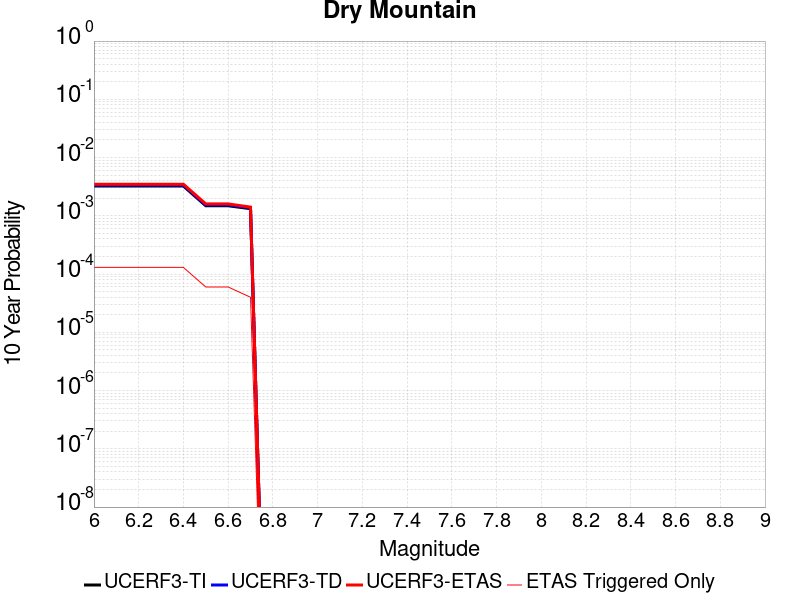 |

| Magnitude | 1 wk TI Prob | 1 wk TD Prob | 1 wk ETAS Prob | 1 wk ETAS/TD Gain | 1 wk ETAS Triggered Only | 1 mo TI Prob | 1 mo TD Prob | 1 mo ETAS Prob | 1 mo ETAS/TD Gain | 1 mo ETAS Triggered Only | 1 yr TI Prob | 1 yr TD Prob | 1 yr ETAS Prob | 1 yr ETAS/TD Gain | 1 yr ETAS Triggered Only | 10 yr TI Prob | 10 yr TD Prob | 10 yr ETAS Prob | 10 yr ETAS/TD Gain | 10 yr ETAS Triggered Only |
|-----|-----|-----|-----|-----|-----|-----|-----|-----|-----|-----|-----|-----|-----|-----|-----|-----|-----|-----|-----|-----|
| 6.0 | 6.222801E-6 | 6.439381E-6 | 1.1006566E-4 | 17.092583 | 1.03626946E-4 | 2.6668875E-5 | 2.7597147E-5 | 1.3122123E-4 | 4.7548842 | 1.03626946E-4 | 3.2464517E-4 | 3.3595937E-4 | 4.913476E-4 | 1.4625208 | 1.5544042E-4 | 0.0032417132 | 0.0033560768 | 0.0035109955 | 1.0461607 | 1.5544042E-4 |
| 6.1 | 6.222801E-6 | 6.439381E-6 | 1.1006566E-4 | 17.092583 | 1.03626946E-4 | 2.6668875E-5 | 2.7597147E-5 | 1.3122123E-4 | 4.7548842 | 1.03626946E-4 | 3.2464517E-4 | 3.3595937E-4 | 4.913476E-4 | 1.4625208 | 1.5544042E-4 | 0.0032417132 | 0.0033560768 | 0.0035109955 | 1.0461607 | 1.5544042E-4 |
| 6.2 | 6.222801E-6 | 6.439381E-6 | 1.1006566E-4 | 17.092583 | 1.03626946E-4 | 2.6668875E-5 | 2.7597147E-5 | 1.3122123E-4 | 4.7548842 | 1.03626946E-4 | 3.2464517E-4 | 3.3595937E-4 | 4.913476E-4 | 1.4625208 | 1.5544042E-4 | 0.0032417132 | 0.0033560768 | 0.0035109955 | 1.0461607 | 1.5544042E-4 |
| 6.3 | 6.222801E-6 | 6.439381E-6 | 1.1006566E-4 | 17.092583 | 1.03626946E-4 | 2.6668875E-5 | 2.7597147E-5 | 1.3122123E-4 | 4.7548842 | 1.03626946E-4 | 3.2464517E-4 | 3.3595937E-4 | 4.913476E-4 | 1.4625208 | 1.5544042E-4 | 0.0032417132 | 0.0033560768 | 0.0035109955 | 1.0461607 | 1.5544042E-4 |
| 6.4 | 6.222801E-6 | 6.439381E-6 | 1.1006566E-4 | 17.092583 | 1.03626946E-4 | 2.6668875E-5 | 2.7597147E-5 | 1.3122123E-4 | 4.7548842 | 1.03626946E-4 | 3.2464517E-4 | 3.3595937E-4 | 4.913476E-4 | 1.4625208 | 1.5544042E-4 | 0.0032417132 | 0.0033560768 | 0.0035109955 | 1.0461607 | 1.5544042E-4 |
| 6.5 | 2.8528623E-6 | 2.9521684E-6 | 5.4765485E-5 | 18.550936 | 5.1813473E-5 | 1.22264955E-5 | 1.2652138E-5 | 6.4464955E-5 | 5.095183 | 5.1813473E-5 | 1.4884741E-4 | 1.540376E-4 | 2.576486E-4 | 1.6726344 | 1.03626946E-4 | 0.0014874774 | 0.0015401616 | 0.0016436289 | 1.0671796 | 1.03626946E-4 |
| 6.6 | 2.8528623E-6 | 2.9521684E-6 | 5.4765485E-5 | 18.550936 | 5.1813473E-5 | 1.22264955E-5 | 1.2652138E-5 | 6.4464955E-5 | 5.095183 | 5.1813473E-5 | 1.4884741E-4 | 1.540376E-4 | 2.576486E-4 | 1.6726344 | 1.03626946E-4 | 0.0014874774 | 0.0015401616 | 0.0016436289 | 1.0671796 | 1.03626946E-4 |
| 6.7 | 2.541E-6 | 2.6293578E-6 | 5.4442695E-5 | 20.7057 | 5.1813473E-5 | 1.0889954E-5 | 1.1268677E-5 | 6.308156E-5 | 5.5979567 | 5.1813473E-5 | 1.3257713E-4 | 1.3719614E-4 | 1.890025E-4 | 1.3776081 | 5.1813473E-5 | 0.0013249806 | 0.0013719613 | 0.0014237037 | 1.0377141 | 5.1813473E-5 |

## Newport-Inglewood (Offshore)
*[(top)](#table-of-contents)*

| 1 Week | 1 Month | 1 Year | 10 Year |
|-----|-----|-----|-----|
|  | 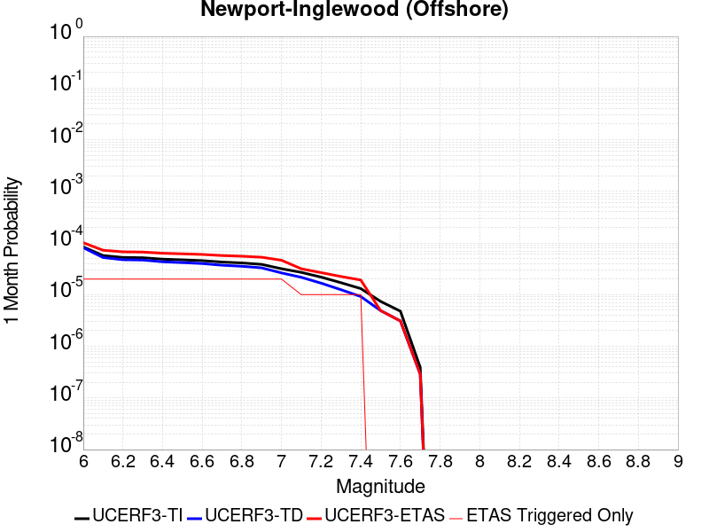 |  |  |

| Magnitude | 1 wk TI Prob | 1 wk TD Prob | 1 wk ETAS Prob | 1 wk ETAS/TD Gain | 1 wk ETAS Triggered Only | 1 mo TI Prob | 1 mo TD Prob | 1 mo ETAS Prob | 1 mo ETAS/TD Gain | 1 mo ETAS Triggered Only | 1 yr TI Prob | 1 yr TD Prob | 1 yr ETAS Prob | 1 yr ETAS/TD Gain | 1 yr ETAS Triggered Only | 10 yr TI Prob | 10 yr TD Prob | 10 yr ETAS Prob | 10 yr ETAS/TD Gain | 10 yr ETAS Triggered Only |
|-----|-----|-----|-----|-----|-----|-----|-----|-----|-----|-----|-----|-----|-----|-----|-----|-----|-----|-----|-----|-----|
| 6.0 | 1.9626508E-5 | 1.8965357E-5 | 1.8965357E-5 | 1.0 | 0.0 | 8.411089E-5 | 8.1277634E-5 | 8.1277634E-5 | 1.0 | 0.0 | 0.001023569 | 9.891186E-4 | 0.001092643 | 1.1046634 | 1.03626946E-4 | 0.010188672 | 0.009848503 | 0.010002413 | 1.0156277 | 1.5544042E-4 |
| 6.1 | 1.331886E-5 | 1.2218092E-5 | 1.2218092E-5 | 1.0 | 0.0 | 5.707958E-5 | 5.2362207E-5 | 5.2362207E-5 | 1.0 | 0.0 | 6.947222E-4 | 6.3732493E-4 | 6.8910536E-4 | 1.0812465 | 5.1813473E-5 | 0.006925544 | 0.006355149 | 0.006406633 | 1.0081012 | 5.1813473E-5 |
| 6.2 | 1.2250852E-5 | 1.1076029E-5 | 1.1076029E-5 | 1.0 | 0.0 | 5.2502597E-5 | 4.7467838E-5 | 4.7467838E-5 | 1.0 | 0.0 | 6.3903164E-4 | 5.777687E-4 | 6.2955223E-4 | 1.0896268 | 5.1813473E-5 | 0.006371971 | 0.0057627866 | 0.005814302 | 1.0089393 | 5.1813473E-5 |
| 6.3 | 1.2106258E-5 | 1.0918891E-5 | 1.0918891E-5 | 1.0 | 0.0 | 5.1882926E-5 | 4.6794412E-5 | 4.6794412E-5 | 1.0 | 0.0 | 6.3149154E-4 | 5.69574E-4 | 6.21358E-4 | 1.090917 | 5.1813473E-5 | 0.0062970007 | 0.005681259 | 0.0057327785 | 1.0090683 | 5.1813473E-5 |
| 6.4 | 1.1348758E-5 | 1.0109362E-5 | 1.0109362E-5 | 1.0 | 0.0 | 4.8636626E-5 | 4.3325123E-5 | 4.3325123E-5 | 1.0 | 0.0 | 5.919901E-4 | 5.273565E-4 | 5.7914265E-4 | 1.0981995 | 5.1813473E-5 | 0.005904155 | 0.0052611465 | 0.0053126873 | 1.0097965 | 5.1813473E-5 |
| 6.5 | 1.100837E-5 | 9.7433895E-6 | 9.7433895E-6 | 1.0 | 0.0 | 4.7177873E-5 | 4.1756717E-5 | 4.1756717E-5 | 1.0 | 0.0 | 5.7423924E-4 | 5.082702E-4 | 5.6005735E-4 | 1.101889 | 5.1813473E-5 | 0.005727576 | 0.0050711688 | 0.0051227193 | 1.0101655 | 5.1813473E-5 |
| 6.6 | 1.0634696E-5 | 9.345544E-6 | 9.345544E-6 | 1.0 | 0.0 | 4.557647E-5 | 4.0051716E-5 | 4.0051716E-5 | 1.0 | 0.0 | 5.5475225E-4 | 4.8752132E-4 | 5.393095E-4 | 1.1062276 | 5.1813473E-5 | 0.0055336943 | 0.0048646047 | 0.004916166 | 1.0105993 | 5.1813473E-5 |
| 6.7 | 9.9780855E-6 | 8.667911E-6 | 8.667911E-6 | 1.0 | 0.0 | 4.276252E-5 | 3.7147664E-5 | 3.7147664E-5 | 1.0 | 0.0 | 5.205093E-4 | 4.5217964E-4 | 4.5217964E-4 | 1.0 | 0.0 | 0.0051929182 | 0.004512675 | 0.004512675 | 1.0 | 0.0 |
| 6.8 | 9.59546E-6 | 8.27295E-6 | 8.27295E-6 | 1.0 | 0.0 | 4.1122752E-5 | 3.5455025E-5 | 3.5455025E-5 | 1.0 | 0.0 | 5.0055445E-4 | 4.315801E-4 | 4.315801E-4 | 1.0 | 0.0 | 0.004994285 | 0.004307495 | 0.004307495 | 1.0 | 0.0 |
| 6.9 | 9.000614E-6 | 7.70684E-6 | 7.70684E-6 | 1.0 | 0.0 | 3.857349E-5 | 3.30289E-5 | 3.30289E-5 | 1.0 | 0.0 | 4.6953102E-4 | 4.0205332E-4 | 4.0205332E-4 | 1.0 | 0.0 | 0.004685402 | 0.0040133307 | 0.0040133307 | 1.0 | 0.0 |
| 7.0 | 7.4070194E-6 | 6.148904E-6 | 6.148904E-6 | 1.0 | 0.0 | 3.1743984E-5 | 2.635218E-5 | 2.635218E-5 | 1.0 | 0.0 | 3.8641447E-4 | 3.207907E-4 | 3.207907E-4 | 1.0 | 0.0 | 0.0038574322 | 0.0032032963 | 0.0032032963 | 1.0 | 0.0 |
| 7.1 | 6.299615E-6 | 5.0565927E-6 | 5.0565927E-6 | 1.0 | 0.0 | 2.699807E-5 | 2.1670932E-5 | 2.1670932E-5 | 1.0 | 0.0 | 3.2865192E-4 | 2.638118E-4 | 2.638118E-4 | 1.0 | 0.0 | 0.003281663 | 0.002635001 | 0.002635001 | 1.0 | 0.0 |
| 7.2 | 5.096653E-6 | 3.892769E-6 | 3.892769E-6 | 1.0 | 0.0 | 2.1842614E-5 | 1.668319E-5 | 1.668319E-5 | 1.0 | 0.0 | 2.6590136E-4 | 2.0309901E-4 | 2.0309901E-4 | 1.0 | 0.0 | 0.0026558342 | 0.0020291451 | 0.0020291451 | 1.0 | 0.0 |
| 7.3 | 3.9753018E-6 | 2.9099103E-6 | 2.9099103E-6 | 1.0 | 0.0 | 1.7036897E-5 | 1.2470985E-5 | 1.2470985E-5 | 1.0 | 0.0 | 2.0740448E-4 | 1.5182374E-4 | 1.5182374E-4 | 1.0 | 0.0 | 0.00207211 | 0.0015172083 | 0.0015172083 | 1.0 | 0.0 |
| 7.4 | 3.0568392E-6 | 2.1449955E-6 | 2.1449955E-6 | 1.0 | 0.0 | 1.3100675E-5 | 9.192806E-6 | 9.192806E-6 | 1.0 | 0.0 | 1.5948903E-4 | 1.1191672E-4 | 1.1191672E-4 | 1.0 | 0.0 | 0.0015937461 | 0.0011186098 | 0.0011186098 | 1.0 | 0.0 |
| 7.5 | 1.7279019E-6 | 1.1469883E-6 | 1.1469883E-6 | 1.0 | 0.0 | 7.405273E-6 | 4.915655E-6 | 4.915655E-6 | 1.0 | 0.0 | 9.015547E-5 | 5.9846494E-5 | 5.9846494E-5 | 1.0 | 0.0 | 9.01189E-4 | 5.9830764E-4 | 5.9830764E-4 | 1.0 | 0.0 |
| 7.6 | 1.1156416E-6 | 7.223012E-7 | 7.223012E-7 | 1.0 | 0.0 | 4.7813123E-6 | 3.095573E-6 | 3.095573E-6 | 1.0 | 0.0 | 5.821092E-5 | 3.7687976E-5 | 3.7687976E-5 | 1.0 | 0.0 | 5.8195676E-4 | 3.7681818E-4 | 3.7681818E-4 | 1.0 | 0.0 |
| 7.7 | 9.117973E-8 | 6.734145E-8 | 6.734145E-8 | 1.0 | 0.0 | 3.907702E-7 | 2.886062E-7 | 2.886062E-7 | 1.0 | 0.0 | 4.757617E-6 | 3.513775E-6 | 3.513775E-6 | 1.0 | 0.0 | 4.7575148E-5 | 3.5137225E-5 | 3.5137225E-5 | 1.0 | 0.0 |

## Big Pine (Central)
*[(top)](#table-of-contents)*

| 1 Week | 1 Month | 1 Year | 10 Year |
|-----|-----|-----|-----|
|  |  |  |  |

| Magnitude | 1 wk TI Prob | 1 wk TD Prob | 1 wk ETAS Prob | 1 wk ETAS/TD Gain | 1 wk ETAS Triggered Only | 1 mo TI Prob | 1 mo TD Prob | 1 mo ETAS Prob | 1 mo ETAS/TD Gain | 1 mo ETAS Triggered Only | 1 yr TI Prob | 1 yr TD Prob | 1 yr ETAS Prob | 1 yr ETAS/TD Gain | 1 yr ETAS Triggered Only | 10 yr TI Prob | 10 yr TD Prob | 10 yr ETAS Prob | 10 yr ETAS/TD Gain | 10 yr ETAS Triggered Only |
|-----|-----|-----|-----|-----|-----|-----|-----|-----|-----|-----|-----|-----|-----|-----|-----|-----|-----|-----|-----|-----|
| 6.0 | 1.2706755E-5 | 1.4250529E-5 | 1.6968873E-4 | 11.907539 | 1.5544042E-4 | 5.4456385E-5 | 6.107247E-5 | 2.165034E-4 | 3.5450244 | 1.5544042E-4 | 6.628048E-4 | 7.433402E-4 | 8.9866505E-4 | 1.2089553 | 1.5544042E-4 | 0.006608314 | 0.0074135666 | 0.0075678546 | 1.0208116 | 1.5544042E-4 |
| 6.1 | 8.342579E-6 | 9.510762E-6 | 1.1313672E-4 | 11.895653 | 1.03626946E-4 | 3.5753423E-5 | 4.0759893E-5 | 1.4438262E-4 | 3.5422716 | 1.03626946E-4 | 4.3521097E-4 | 4.961604E-4 | 5.9973594E-4 | 1.2087541 | 1.03626946E-4 | 0.0043435963 | 0.0049540824 | 0.005057196 | 1.0208138 | 1.03626946E-4 |
| 6.2 | 6.923899E-6 | 7.967147E-6 | 1.1159327E-4 | 14.006678 | 1.03626946E-4 | 2.9673516E-5 | 3.4144578E-5 | 1.3776799E-4 | 4.034842 | 1.03626946E-4 | 3.6121515E-4 | 4.156502E-4 | 5.1923405E-4 | 1.2492093 | 1.03626946E-4 | 0.003606286 | 0.0041520367 | 0.0042552333 | 1.0248544 | 1.03626946E-4 |
| 6.3 | 2.728396E-6 | 3.4242908E-6 | 1.0705088E-4 | 31.262205 | 1.03626946E-4 | 1.1693074E-5 | 1.4675454E-5 | 1.1830088E-4 | 8.061139 | 1.03626946E-4 | 1.4235388E-4 | 1.7865987E-4 | 2.822683E-4 | 1.5799199 | 1.03626946E-4 | 0.0014226272 | 0.0017866704 | 0.0018901122 | 1.0578964 | 1.03626946E-4 |
| 6.4 | 2.7136944E-6 | 3.408584E-6 | 1.0703517E-4 | 31.401653 | 1.03626946E-4 | 1.1630066E-5 | 1.4608141E-5 | 1.1823357E-4 | 8.093677 | 1.03626946E-4 | 1.4158686E-4 | 1.7784047E-4 | 2.8144897E-4 | 1.5825925 | 1.03626946E-4 | 0.0014149669 | 0.0017784894 | 0.0018819321 | 1.0581632 | 1.03626946E-4 |
| 6.5 | 2.6971882E-6 | 3.3909291E-6 | 1.0701752E-4 | 31.55994 | 1.03626946E-4 | 1.1559327E-5 | 1.45324775E-5 | 1.18157914E-4 | 8.13061 | 1.03626946E-4 | 1.4072572E-4 | 1.7691942E-4 | 2.8052804E-4 | 1.585626 | 1.03626946E-4 | 0.0014063664 | 0.0017692937 | 0.0018727373 | 1.0584661 | 1.03626946E-4 |
| 6.6 | 2.669092E-6 | 3.3609497E-6 | 1.0698754E-4 | 31.832535 | 1.03626946E-4 | 1.1438916E-5 | 1.4403995E-5 | 1.1802944E-4 | 8.194216 | 1.03626946E-4 | 1.3925991E-4 | 1.753554E-4 | 2.7896417E-4 | 1.5908502 | 1.03626946E-4 | 0.0013917267 | 0.0017536782 | 0.0018571235 | 1.0589876 | 1.03626946E-4 |
| 6.7 | 2.6408059E-6 | 3.3309752E-6 | 1.06957574E-4 | 32.109985 | 1.03626946E-4 | 1.1317691E-5 | 1.4275535E-5 | 1.17901E-4 | 8.258955 | 1.03626946E-4 | 1.3778417E-4 | 1.7379165E-4 | 2.7740057E-4 | 1.5961676 | 1.03626946E-4 | 0.0013769877 | 0.0017380653 | 0.001841512 | 1.0595183 | 1.03626946E-4 |
| 6.8 | 2.1786943E-6 | 2.8544325E-6 | 1.0648108E-4 | 37.303764 | 1.03626946E-4 | 9.337228E-6 | 1.2233229E-5 | 1.1585891E-4 | 9.470836 | 1.03626946E-4 | 1.1367482E-4 | 1.4893012E-4 | 2.5254162E-4 | 1.6957055 | 1.03626946E-4 | 0.0011361669 | 0.0014897975 | 0.0015932701 | 1.0694541 | 1.03626946E-4 |
| 6.9 | 1.4411696E-6 | 2.068499E-6 | 1.05695224E-4 | 51.097546 | 1.03626946E-4 | 6.1764263E-6 | 8.864968E-6 | 1.1249099E-4 | 12.689385 | 1.03626946E-4 | 7.51954E-5 | 1.079259E-4 | 2.1154166E-4 | 1.9600638 | 1.03626946E-4 | 7.5169955E-4 | 0.0010801847 | 0.0011836997 | 1.0958308 | 1.03626946E-4 |
| 7.0 | 1.0073411E-6 | 1.554261E-6 | 5.336765E-5 | 34.336353 | 5.1813473E-5 | 4.317169E-6 | 6.6611024E-6 | 5.847423E-5 | 8.778461 | 5.1813473E-5 | 5.2560266E-5 | 8.1096056E-5 | 1.3290532E-4 | 1.638863 | 5.1813473E-5 | 5.2547833E-4 | 8.1210316E-4 | 8.6387456E-4 | 1.0637498 | 5.1813473E-5 |
| 7.1 | 8.947104E-7 | 1.4302494E-6 | 5.3243646E-5 | 37.226826 | 5.1813473E-5 | 3.834468E-6 | 6.129627E-6 | 5.794278E-5 | 9.452906 | 5.1813473E-5 | 4.6683643E-5 | 7.46258E-5 | 1.264354E-4 | 1.6942587 | 5.1813473E-5 | 4.6673836E-4 | 7.474457E-4 | 7.9922046E-4 | 1.069269 | 5.1813473E-5 |
| 7.2 | 5.215166E-7 | 1.0111678E-6 | 1.0111678E-6 | 1.0 | 0.0 | 2.2350691E-6 | 4.3335694E-6 | 4.3335694E-6 | 1.0 | 0.0 | 2.7211627E-5 | 5.2759973E-5 | 5.2759973E-5 | 1.0 | 0.0 | 2.7208295E-4 | 5.2890263E-4 | 5.2890263E-4 | 1.0 | 0.0 |
| 7.3 | 4.4024807E-7 | 9.219589E-7 | 9.219589E-7 | 1.0 | 0.0 | 1.8867761E-6 | 3.9512465E-6 | 3.9512465E-6 | 1.0 | 0.0 | 2.2971257E-5 | 4.810541E-5 | 4.810541E-5 | 1.0 | 0.0 | 2.2968883E-4 | 4.8237795E-4 | 4.8237795E-4 | 1.0 | 0.0 |
| 7.4 | 3.6130905E-7 | 8.358523E-7 | 8.358523E-7 | 1.0 | 0.0 | 1.5484665E-6 | 3.5822195E-6 | 3.5822195E-6 | 1.0 | 0.0 | 1.8852415E-5 | 4.3612687E-5 | 4.3612687E-5 | 1.0 | 0.0 | 1.8850817E-4 | 4.374597E-4 | 4.374597E-4 | 1.0 | 0.0 |
| 7.5 | 3.408184E-7 | 8.108147E-7 | 8.108147E-7 | 1.0 | 0.0 | 1.4606494E-6 | 3.4749157E-6 | 3.4749157E-6 | 1.0 | 0.0 | 1.7783263E-5 | 4.2306317E-5 | 4.2306317E-5 | 1.0 | 0.0 | 1.778184E-4 | 4.2437963E-4 | 4.2437963E-4 | 1.0 | 0.0 |
| 7.6 | 3.1428627E-7 | 7.7316E-7 | 7.7316E-7 | 1.0 | 0.0 | 1.3469405E-6 | 3.3135389E-6 | 3.3135389E-6 | 1.0 | 0.0 | 1.6398877E-5 | 4.0341627E-5 | 4.0341627E-5 | 1.0 | 0.0 | 1.6397667E-4 | 4.0471106E-4 | 4.0471106E-4 | 1.0 | 0.0 |
| 7.7 | 1.7972785E-7 | 5.077752E-7 | 5.077752E-7 | 1.0 | 0.0 | 7.70262E-7 | 2.1761778E-6 | 2.1761778E-6 | 1.0 | 0.0 | 9.377899E-6 | 2.6494654E-5 | 2.6494654E-5 | 1.0 | 0.0 | 9.377503E-5 | 2.662899E-4 | 2.662899E-4 | 1.0 | 0.0 |
| 7.8 | 4.9230927E-8 | 1.198079E-7 | 1.198079E-7 | 1.0 | 0.0 | 2.1098968E-7 | 5.134623E-7 | 5.134623E-7 | 1.0 | 0.0 | 2.5687964E-6 | 6.2513873E-6 | 6.2513873E-6 | 1.0 | 0.0 | 2.5687666E-5 | 6.295415E-5 | 6.295415E-5 | 1.0 | 0.0 |
| 7.9 | 3.6805972E-9 | 4.105293E-9 | 4.105293E-9 | 1.0 | 0.0 | 1.5773987E-8 | 1.7594115E-8 | 1.7594115E-8 | 1.0 | 0.0 | 1.9204828E-7 | 2.1420831E-7 | 2.1420831E-7 | 1.0 | 0.0 | 1.920481E-6 | 2.1900614E-6 | 2.1900614E-6 | 1.0 | 0.0 |

## Pitas Point (Lower West)
*[(top)](#table-of-contents)*

| 1 Week | 1 Month | 1 Year | 10 Year |
|-----|-----|-----|-----|
|  |  |  | 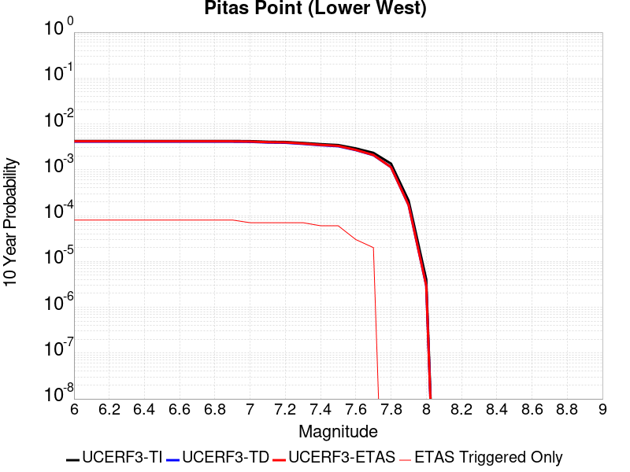 |

| Magnitude | 1 wk TI Prob | 1 wk TD Prob | 1 wk ETAS Prob | 1 wk ETAS/TD Gain | 1 wk ETAS Triggered Only | 1 mo TI Prob | 1 mo TD Prob | 1 mo ETAS Prob | 1 mo ETAS/TD Gain | 1 mo ETAS Triggered Only | 1 yr TI Prob | 1 yr TD Prob | 1 yr ETAS Prob | 1 yr ETAS/TD Gain | 1 yr ETAS Triggered Only | 10 yr TI Prob | 10 yr TD Prob | 10 yr ETAS Prob | 10 yr ETAS/TD Gain | 10 yr ETAS Triggered Only |
|-----|-----|-----|-----|-----|-----|-----|-----|-----|-----|-----|-----|-----|-----|-----|-----|-----|-----|-----|-----|-----|
| 6.0 | 8.151497E-6 | 7.855762E-6 | 1.1148189E-4 | 14.191098 | 1.03626946E-4 | 3.493452E-5 | 3.3667122E-5 | 1.891023E-4 | 5.616824 | 1.5544042E-4 | 4.252448E-4 | 4.0982084E-4 | 5.6519755E-4 | 1.3791332 | 1.5544042E-4 | 0.0042443196 | 0.0040907315 | 0.004245536 | 1.0378428 | 1.5544042E-4 |
| 6.1 | 8.151497E-6 | 7.855762E-6 | 1.1148189E-4 | 14.191098 | 1.03626946E-4 | 3.493452E-5 | 3.3667122E-5 | 1.891023E-4 | 5.616824 | 1.5544042E-4 | 4.252448E-4 | 4.0982084E-4 | 5.6519755E-4 | 1.3791332 | 1.5544042E-4 | 0.0042443196 | 0.0040907315 | 0.004245536 | 1.0378428 | 1.5544042E-4 |
| 6.2 | 8.151497E-6 | 7.855762E-6 | 1.1148189E-4 | 14.191098 | 1.03626946E-4 | 3.493452E-5 | 3.3667122E-5 | 1.891023E-4 | 5.616824 | 1.5544042E-4 | 4.252448E-4 | 4.0982084E-4 | 5.6519755E-4 | 1.3791332 | 1.5544042E-4 | 0.0042443196 | 0.0040907315 | 0.004245536 | 1.0378428 | 1.5544042E-4 |
| 6.3 | 8.151497E-6 | 7.855762E-6 | 1.1148189E-4 | 14.191098 | 1.03626946E-4 | 3.493452E-5 | 3.3667122E-5 | 1.891023E-4 | 5.616824 | 1.5544042E-4 | 4.252448E-4 | 4.0982084E-4 | 5.6519755E-4 | 1.3791332 | 1.5544042E-4 | 0.0042443196 | 0.0040907315 | 0.004245536 | 1.0378428 | 1.5544042E-4 |
| 6.4 | 8.151497E-6 | 7.855762E-6 | 1.1148189E-4 | 14.191098 | 1.03626946E-4 | 3.493452E-5 | 3.3667122E-5 | 1.891023E-4 | 5.616824 | 1.5544042E-4 | 4.252448E-4 | 4.0982084E-4 | 5.6519755E-4 | 1.3791332 | 1.5544042E-4 | 0.0042443196 | 0.0040907315 | 0.004245536 | 1.0378428 | 1.5544042E-4 |
| 6.5 | 8.151497E-6 | 7.855762E-6 | 1.1148189E-4 | 14.191098 | 1.03626946E-4 | 3.493452E-5 | 3.3667122E-5 | 1.891023E-4 | 5.616824 | 1.5544042E-4 | 4.252448E-4 | 4.0982084E-4 | 5.6519755E-4 | 1.3791332 | 1.5544042E-4 | 0.0042443196 | 0.0040907315 | 0.004245536 | 1.0378428 | 1.5544042E-4 |
| 6.6 | 8.151497E-6 | 7.855762E-6 | 1.1148189E-4 | 14.191098 | 1.03626946E-4 | 3.493452E-5 | 3.3667122E-5 | 1.891023E-4 | 5.616824 | 1.5544042E-4 | 4.252448E-4 | 4.0982084E-4 | 5.6519755E-4 | 1.3791332 | 1.5544042E-4 | 0.0042443196 | 0.0040907315 | 0.004245536 | 1.0378428 | 1.5544042E-4 |
| 6.7 | 8.151497E-6 | 7.855762E-6 | 1.1148189E-4 | 14.191098 | 1.03626946E-4 | 3.493452E-5 | 3.3667122E-5 | 1.891023E-4 | 5.616824 | 1.5544042E-4 | 4.252448E-4 | 4.0982084E-4 | 5.6519755E-4 | 1.3791332 | 1.5544042E-4 | 0.0042443196 | 0.0040907315 | 0.004245536 | 1.0378428 | 1.5544042E-4 |
| 6.8 | 8.151497E-6 | 7.855762E-6 | 1.1148189E-4 | 14.191098 | 1.03626946E-4 | 3.493452E-5 | 3.3667122E-5 | 1.891023E-4 | 5.616824 | 1.5544042E-4 | 4.252448E-4 | 4.0982084E-4 | 5.6519755E-4 | 1.3791332 | 1.5544042E-4 | 0.0042443196 | 0.0040907315 | 0.004245536 | 1.0378428 | 1.5544042E-4 |
| 6.9 | 8.151497E-6 | 7.855762E-6 | 1.1148189E-4 | 14.191098 | 1.03626946E-4 | 3.493452E-5 | 3.3667122E-5 | 1.891023E-4 | 5.616824 | 1.5544042E-4 | 4.252448E-4 | 4.0982084E-4 | 5.6519755E-4 | 1.3791332 | 1.5544042E-4 | 0.0042443196 | 0.0040907315 | 0.004245536 | 1.0378428 | 1.5544042E-4 |
| 7.0 | 8.103535E-6 | 7.805192E-6 | 1.1143133E-4 | 14.276565 | 1.03626946E-4 | 3.4728975E-5 | 3.3450397E-5 | 1.888856E-4 | 5.6467376 | 1.5544042E-4 | 4.2274324E-4 | 4.0718322E-4 | 5.6256034E-4 | 1.3815901 | 1.5544042E-4 | 0.0042193993 | 0.004064452 | 0.0042192605 | 1.0380884 | 1.5544042E-4 |
| 7.1 | 7.853298E-6 | 7.540883E-6 | 1.1116704E-4 | 14.741914 | 1.03626946E-4 | 3.3656554E-5 | 3.2317676E-5 | 1.8775306E-4 | 5.8096094 | 1.5544042E-4 | 4.096915E-4 | 3.9339735E-4 | 5.487766E-4 | 1.3949678 | 1.5544042E-4 | 0.00408937 | 0.0039270855 | 0.0040819156 | 1.0394262 | 1.5544042E-4 |
| 7.2 | 7.771102E-6 | 7.453165E-6 | 1.1107934E-4 | 14.903646 | 1.03626946E-4 | 3.33043E-5 | 3.194175E-5 | 1.873772E-4 | 5.866216 | 1.5544042E-4 | 4.0540437E-4 | 3.8882208E-4 | 5.4420205E-4 | 1.3996172 | 1.5544042E-4 | 0.0040466557 | 0.0038814936 | 0.0040363306 | 1.0398911 | 1.5544042E-4 |
| 7.3 | 7.3945344E-6 | 7.0492697E-6 | 1.1067548E-4 | 15.700276 | 1.03626946E-4 | 3.1690477E-5 | 3.021081E-5 | 1.8564652E-4 | 6.1450367 | 1.5544042E-4 | 3.8576324E-4 | 3.6775516E-4 | 5.231384E-4 | 1.4225183 | 1.5544042E-4 | 0.0038509427 | 0.0036715334 | 0.003826403 | 1.0421813 | 1.5544042E-4 |
| 7.4 | 6.964645E-6 | 6.5901186E-6 | 5.840325E-5 | 8.862246 | 5.1813473E-5 | 2.9848137E-5 | 2.8243063E-5 | 1.3186708E-4 | 4.669008 | 1.03626946E-4 | 3.6334046E-4 | 3.4380553E-4 | 4.4739683E-4 | 1.3013079 | 1.03626946E-4 | 0.0036274698 | 0.0034327896 | 0.0035360607 | 1.0300838 | 1.03626946E-4 |
| 7.5 | 6.6525035E-6 | 6.259157E-6 | 5.8072303E-5 | 9.277975 | 5.1813473E-5 | 2.851042E-5 | 2.6824686E-5 | 1.3044885E-4 | 4.863015 | 1.03626946E-4 | 3.4705905E-4 | 3.265421E-4 | 4.301352E-4 | 1.3172427 | 1.03626946E-4 | 0.0034651754 | 0.0032606742 | 0.0033639632 | 1.0316772 | 1.03626946E-4 |
| 7.6 | 5.613338E-6 | 5.151386E-6 | 5.151386E-6 | 1.0 | 0.0 | 2.405694E-5 | 2.2077185E-5 | 2.2077185E-5 | 1.0 | 0.0 | 2.928539E-4 | 2.6875688E-4 | 2.6875688E-4 | 1.0 | 0.0 | 0.0029246826 | 0.0026843501 | 0.0026843501 | 1.0 | 0.0 |
| 7.7 | 4.494704E-6 | 3.996911E-6 | 3.996911E-6 | 1.0 | 0.0 | 1.9262876E-5 | 1.7129507E-5 | 1.7129507E-5 | 1.0 | 0.0 | 2.3450027E-4 | 2.0853203E-4 | 2.0853203E-4 | 1.0 | 0.0 | 0.0023425296 | 0.0020833875 | 0.0020833875 | 1.0 | 0.0 |
| 7.8 | 2.6075882E-6 | 2.1836374E-6 | 2.1836374E-6 | 1.0 | 0.0 | 1.117533E-5 | 9.358413E-6 | 9.358413E-6 | 1.0 | 0.0 | 1.3605114E-4 | 1.1393277E-4 | 1.1393277E-4 | 1.0 | 0.0 | 0.0013596788 | 0.0011387484 | 0.0011387484 | 1.0 | 0.0 |
| 7.9 | 4.045984E-7 | 3.242375E-7 | 3.242375E-7 | 1.0 | 0.0 | 1.733992E-6 | 1.3895885E-6 | 1.3895885E-6 | 1.0 | 0.0 | 2.1111147E-5 | 1.6918111E-5 | 1.6918111E-5 | 1.0 | 0.0 | 2.1109142E-4 | 1.6916855E-4 | 1.6916855E-4 | 1.0 | 0.0 |
| 8.0 | 7.791402E-9 | 5.683497E-9 | 5.683497E-9 | 1.0 | 0.0 | 3.3391725E-8 | 2.4357844E-8 | 2.4357844E-8 | 1.0 | 0.0 | 4.0654416E-7 | 2.9655675E-7 | 2.9655675E-7 | 1.0 | 0.0 | 4.065434E-6 | 2.9655655E-6 | 2.9655655E-6 | 1.0 | 0.0 |

## Oak Ridge (Onshore)
*[(top)](#table-of-contents)*

| 1 Week | 1 Month | 1 Year | 10 Year |
|-----|-----|-----|-----|
| 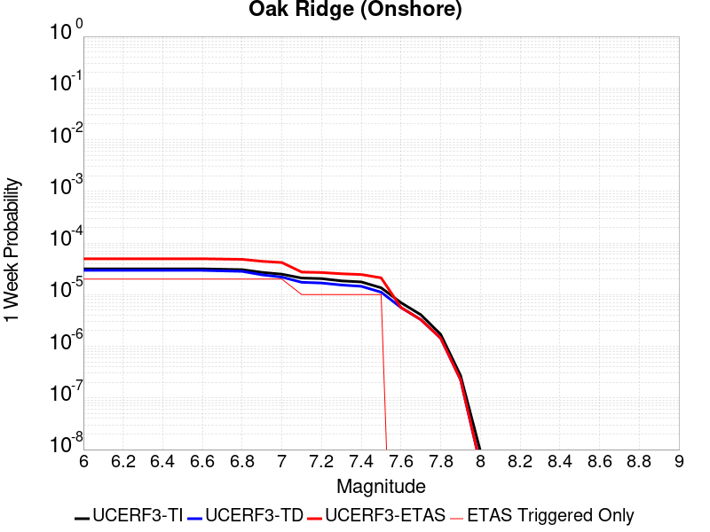 |  |  |  |

| Magnitude | 1 wk TI Prob | 1 wk TD Prob | 1 wk ETAS Prob | 1 wk ETAS/TD Gain | 1 wk ETAS Triggered Only | 1 mo TI Prob | 1 mo TD Prob | 1 mo ETAS Prob | 1 mo ETAS/TD Gain | 1 mo ETAS Triggered Only | 1 yr TI Prob | 1 yr TD Prob | 1 yr ETAS Prob | 1 yr ETAS/TD Gain | 1 yr ETAS Triggered Only | 10 yr TI Prob | 10 yr TD Prob | 10 yr ETAS Prob | 10 yr ETAS/TD Gain | 10 yr ETAS Triggered Only |
|-----|-----|-----|-----|-----|-----|-----|-----|-----|-----|-----|-----|-----|-----|-----|-----|-----|-----|-----|-----|-----|
| 6.0 | 3.155064E-5 | 2.9525974E-5 | 2.9525974E-5 | 1.0 | 0.0 | 1.3521002E-4 | 1.2653397E-4 | 1.7834088E-4 | 1.4094309 | 5.1813473E-5 | 0.001644939 | 0.0015395004 | 0.0016429678 | 1.0672084 | 1.03626946E-4 | 0.01632816 | 0.015292859 | 0.015394901 | 1.0066725 | 1.03626946E-4 |
| 6.1 | 3.155064E-5 | 2.9525974E-5 | 2.9525974E-5 | 1.0 | 0.0 | 1.3521002E-4 | 1.2653397E-4 | 1.7834088E-4 | 1.4094309 | 5.1813473E-5 | 0.001644939 | 0.0015395004 | 0.0016429678 | 1.0672084 | 1.03626946E-4 | 0.01632816 | 0.015292859 | 0.015394901 | 1.0066725 | 1.03626946E-4 |
| 6.2 | 3.155064E-5 | 2.9525974E-5 | 2.9525974E-5 | 1.0 | 0.0 | 1.3521002E-4 | 1.2653397E-4 | 1.7834088E-4 | 1.4094309 | 5.1813473E-5 | 0.001644939 | 0.0015395004 | 0.0016429678 | 1.0672084 | 1.03626946E-4 | 0.01632816 | 0.015292859 | 0.015394901 | 1.0066725 | 1.03626946E-4 |
| 6.3 | 3.155064E-5 | 2.9525974E-5 | 2.9525974E-5 | 1.0 | 0.0 | 1.3521002E-4 | 1.2653397E-4 | 1.7834088E-4 | 1.4094309 | 5.1813473E-5 | 0.001644939 | 0.0015395004 | 0.0016429678 | 1.0672084 | 1.03626946E-4 | 0.01632816 | 0.015292859 | 0.015394901 | 1.0066725 | 1.03626946E-4 |
| 6.4 | 3.155064E-5 | 2.9525974E-5 | 2.9525974E-5 | 1.0 | 0.0 | 1.3521002E-4 | 1.2653397E-4 | 1.7834088E-4 | 1.4094309 | 5.1813473E-5 | 0.001644939 | 0.0015395004 | 0.0016429678 | 1.0672084 | 1.03626946E-4 | 0.01632816 | 0.015292859 | 0.015394901 | 1.0066725 | 1.03626946E-4 |
| 6.5 | 3.155064E-5 | 2.9525974E-5 | 2.9525974E-5 | 1.0 | 0.0 | 1.3521002E-4 | 1.2653397E-4 | 1.7834088E-4 | 1.4094309 | 5.1813473E-5 | 0.001644939 | 0.0015395004 | 0.0016429678 | 1.0672084 | 1.03626946E-4 | 0.01632816 | 0.015292859 | 0.015394901 | 1.0066725 | 1.03626946E-4 |
| 6.6 | 3.155064E-5 | 2.9525974E-5 | 2.9525974E-5 | 1.0 | 0.0 | 1.3521002E-4 | 1.2653397E-4 | 1.7834088E-4 | 1.4094309 | 5.1813473E-5 | 0.001644939 | 0.0015395004 | 0.0016429678 | 1.0672084 | 1.03626946E-4 | 0.01632816 | 0.015292859 | 0.015394901 | 1.0066725 | 1.03626946E-4 |
| 6.7 | 3.098897E-5 | 2.8864175E-5 | 2.8864175E-5 | 1.0 | 0.0 | 1.328031E-4 | 1.2369796E-4 | 1.7550502E-4 | 1.4188191 | 5.1813473E-5 | 0.0016156785 | 0.0015050198 | 0.0016084908 | 1.0687506 | 1.03626946E-4 | 0.016039822 | 0.014952714 | 0.015054791 | 1.0068266 | 1.03626946E-4 |
| 6.8 | 3.0449872E-5 | 2.8239372E-5 | 2.8239372E-5 | 1.0 | 0.0 | 1.3049292E-4 | 1.2102048E-4 | 1.7282768E-4 | 1.4280863 | 5.1813473E-5 | 0.0015875935 | 0.0014724657 | 0.0015759399 | 1.0702728 | 1.03626946E-4 | 0.015762992 | 0.014631462 | 0.0147335725 | 1.0069789 | 1.03626946E-4 |
| 6.9 | 2.697928E-5 | 2.4219773E-5 | 2.4219773E-5 | 1.0 | 0.0 | 1.15620365E-4 | 1.0379502E-4 | 1.5560312E-4 | 1.4991385 | 5.1813473E-5 | 0.0014067689 | 0.0012629933 | 0.0013664893 | 1.0819451 | 1.03626946E-4 | 0.0139789665 | 0.01256087 | 0.012663195 | 1.0081464 | 1.03626946E-4 |
| 7.0 | 2.4893961E-5 | 2.1862043E-5 | 2.1862043E-5 | 1.0 | 0.0 | 1.0668404E-4 | 9.3691204E-5 | 1.4549981E-4 | 1.5529721 | 5.1813473E-5 | 0.0012981043 | 0.0011401111 | 0.00124362 | 1.0907884 | 1.03626946E-4 | 0.012905477 | 0.011344905 | 0.011447357 | 1.0090306 | 1.03626946E-4 |
| 7.1 | 2.0945363E-5 | 1.7354487E-5 | 1.7354487E-5 | 1.0 | 0.0 | 8.976275E-5 | 7.437428E-5 | 1.2618389E-4 | 1.6966066 | 5.1813473E-5 | 0.0010923136 | 9.051354E-4 | 0.0010086686 | 1.1143842 | 1.03626946E-4 | 0.0108696 | 0.009015423 | 0.0091181155 | 1.0113908 | 1.03626946E-4 |
| 7.2 | 2.0439404E-5 | 1.6809423E-5 | 1.6809423E-5 | 1.0 | 0.0 | 8.7594504E-5 | 7.203843E-5 | 1.2384816E-4 | 1.7191958 | 5.1813473E-5 | 0.0010659413 | 8.767196E-4 | 9.802557E-4 | 1.1180949 | 1.03626946E-4 | 0.010608427 | 0.008733526 | 0.008836248 | 1.0117618 | 1.03626946E-4 |
| 7.3 | 1.8463334E-5 | 1.5381811E-5 | 1.5381811E-5 | 1.0 | 0.0 | 7.912617E-5 | 6.59204E-5 | 1.1773046E-4 | 1.7859488 | 5.1813473E-5 | 9.6293533E-4 | 8.0228975E-4 | 9.0583356E-4 | 1.1290604 | 1.03626946E-4 | 0.009587734 | 0.007994797 | 0.008097596 | 1.0128582 | 1.03626946E-4 |
| 7.4 | 1.763139E-5 | 1.451684E-5 | 1.451684E-5 | 1.0 | 0.0 | 7.556091E-5 | 6.221356E-5 | 1.1402382E-4 | 1.8327806 | 5.1813473E-5 | 9.1956573E-4 | 7.571909E-4 | 8.607394E-4 | 1.1367534 | 1.03626946E-4 | 0.009157699 | 0.007546914 | 0.0076497584 | 1.0136274 | 1.03626946E-4 |
| 7.5 | 1.3594944E-5 | 1.1163356E-5 | 1.1163356E-5 | 1.0 | 0.0 | 5.8262744E-5 | 4.784209E-5 | 9.965309E-5 | 2.0829585 | 5.1813473E-5 | 7.0911803E-4 | 5.8232434E-4 | 6.858909E-4 | 1.1778504 | 1.03626946E-4 | 0.007068595 | 0.0058082556 | 0.005911281 | 1.0177377 | 1.03626946E-4 |
| 7.6 | 6.9889534E-6 | 5.6367144E-6 | 5.6367144E-6 | 1.0 | 0.0 | 2.9952313E-5 | 2.4157125E-5 | 7.596934E-5 | 3.1448007 | 5.1813473E-5 | 3.646084E-4 | 2.9407372E-4 | 3.976702E-4 | 1.3522806 | 1.03626946E-4 | 0.0036401073 | 0.0029368899 | 0.0030402124 | 1.0351809 | 1.03626946E-4 |
| 7.7 | 4.0824193E-6 | 3.2832586E-6 | 3.2832586E-6 | 1.0 | 0.0 | 1.7495966E-5 | 1.4071033E-5 | 1.4071033E-5 | 1.0 | 0.0 | 2.1299256E-4 | 1.713015E-4 | 1.713015E-4 | 1.0 | 0.0 | 0.0021278851 | 0.0017117079 | 0.0017117079 | 1.0 | 0.0 |
| 7.8 | 1.7023609E-6 | 1.4370495E-6 | 1.4370495E-6 | 1.0 | 0.0 | 7.295812E-6 | 6.1587693E-6 | 6.1587693E-6 | 1.0 | 0.0 | 8.882289E-5 | 7.498047E-5 | 7.498047E-5 | 1.0 | 0.0 | 8.8787393E-4 | 7.495545E-4 | 7.495545E-4 | 1.0 | 0.0 |
| 7.9 | 2.721225E-7 | 2.2616497E-7 | 2.2616497E-7 | 1.0 | 0.0 | 1.1662388E-6 | 9.692781E-7 | 9.692781E-7 | 1.0 | 0.0 | 1.4198865E-5 | 1.1800899E-5 | 1.1800899E-5 | 1.0 | 0.0 | 1.4197957E-4 | 1.1800301E-4 | 1.1800301E-4 | 1.0 | 0.0 |
| 8.0 | 9.364255E-9 | 5.1206666E-9 | 5.1206666E-9 | 1.0 | 0.0 | 4.0132523E-8 | 2.1945715E-8 | 2.1945715E-8 | 1.0 | 0.0 | 4.8861335E-7 | 2.6718905E-7 | 2.6718905E-7 | 1.0 | 0.0 | 4.8861225E-6 | 2.6718876E-6 | 2.6718876E-6 | 1.0 | 0.0 |

## San Clemente
*[(top)](#table-of-contents)*

| 1 Week | 1 Month | 1 Year | 10 Year |
|-----|-----|-----|-----|
|  |  |  |  |

| Magnitude | 1 wk TI Prob | 1 wk TD Prob | 1 wk ETAS Prob | 1 wk ETAS/TD Gain | 1 wk ETAS Triggered Only | 1 mo TI Prob | 1 mo TD Prob | 1 mo ETAS Prob | 1 mo ETAS/TD Gain | 1 mo ETAS Triggered Only | 1 yr TI Prob | 1 yr TD Prob | 1 yr ETAS Prob | 1 yr ETAS/TD Gain | 1 yr ETAS Triggered Only | 10 yr TI Prob | 10 yr TD Prob | 10 yr ETAS Prob | 10 yr ETAS/TD Gain | 10 yr ETAS Triggered Only |
|-----|-----|-----|-----|-----|-----|-----|-----|-----|-----|-----|-----|-----|-----|-----|-----|-----|-----|-----|-----|-----|
| 6.0 | 6.681379E-5 | 8.163422E-5 | 1.852527E-4 | 2.269302 | 1.03626946E-4 | 2.8631336E-4 | 3.498173E-4 | 4.53408E-4 | 1.296128 | 1.03626946E-4 | 0.003480294 | 0.0042512873 | 0.004406067 | 1.0364077 | 1.5544042E-4 | 0.03426291 | 0.041755714 | 0.04190466 | 1.0035672 | 1.5544042E-4 |
| 6.1 | 6.681379E-5 | 8.163422E-5 | 8.163422E-5 | 1.0 | 0.0 | 2.8631336E-4 | 3.498173E-4 | 3.498173E-4 | 1.0 | 0.0 | 0.003480294 | 0.0042512873 | 0.0043028807 | 1.0121359 | 5.1813473E-5 | 0.03426291 | 0.041755714 | 0.041805364 | 1.0011891 | 5.1813473E-5 |
| 6.2 | 3.9400576E-5 | 4.6451984E-5 | 4.6451984E-5 | 1.0 | 0.0 | 1.6884868E-4 | 1.9906509E-4 | 1.9906509E-4 | 1.0 | 0.0 | 0.0020537945 | 0.002420985 | 0.0024726728 | 1.02135 | 5.1813473E-5 | 0.020349167 | 0.02395286 | 0.024003433 | 1.0021113 | 5.1813473E-5 |
| 6.3 | 3.2590255E-5 | 3.7929087E-5 | 3.7929087E-5 | 1.0 | 0.0 | 1.3966505E-4 | 1.6254328E-4 | 1.6254328E-4 | 1.0 | 0.0 | 0.0016990956 | 0.0019771985 | 0.0020289095 | 1.0261537 | 5.1813473E-5 | 0.01686163 | 0.019599866 | 0.019650664 | 1.0025917 | 5.1813473E-5 |
| 6.4 | 2.9454652E-5 | 3.4097775E-5 | 3.4097775E-5 | 1.0 | 0.0 | 1.2622811E-4 | 1.4612528E-4 | 1.4612528E-4 | 1.0 | 0.0 | 0.0015357438 | 0.0017776482 | 0.0018293696 | 1.0290954 | 5.1813473E-5 | 0.015251739 | 0.017637458 | 0.017688356 | 1.0028859 | 5.1813473E-5 |
| 6.5 | 2.790836E-5 | 3.2247463E-5 | 3.2247463E-5 | 1.0 | 0.0 | 1.1960178E-4 | 1.3819622E-4 | 1.3819622E-4 | 1.0 | 0.0 | 0.001455179 | 0.0016812651 | 0.0017329914 | 1.0307664 | 5.1813473E-5 | 0.014456868 | 0.016688475 | 0.016739424 | 1.003053 | 5.1813473E-5 |
| 6.6 | 2.2492153E-5 | 2.5762707E-5 | 2.5762707E-5 | 1.0 | 0.0 | 9.639138E-5 | 1.1040701E-4 | 1.1040701E-4 | 1.0 | 0.0 | 0.0011729331 | 0.0013433908 | 0.0013433908 | 1.0 | 0.0 | 0.011667615 | 0.013354415 | 0.013354415 | 1.0 | 0.0 |
| 6.7 | 1.9862755E-5 | 2.2666423E-5 | 2.2666423E-5 | 1.0 | 0.0 | 8.512331E-5 | 9.713826E-5 | 9.713826E-5 | 1.0 | 0.0 | 0.0010358836 | 0.0011820279 | 0.0011820279 | 1.0 | 0.0 | 0.010310682 | 0.011758701 | 0.011758701 | 1.0 | 0.0 |
| 6.8 | 1.6697575E-5 | 1.897771E-5 | 1.897771E-5 | 1.0 | 0.0 | 7.155907E-5 | 8.133056E-5 | 8.133056E-5 | 1.0 | 0.0 | 8.7088346E-4 | 9.897591E-4 | 9.897591E-4 | 1.0 | 0.0 | 0.008674784 | 0.0098545365 | 0.0098545365 | 1.0 | 0.0 |
| 6.9 | 1.5218415E-5 | 1.72694E-5 | 1.72694E-5 | 1.0 | 0.0 | 6.522015E-5 | 7.4009666E-5 | 7.4009666E-5 | 1.0 | 0.0 | 7.93766E-4 | 9.00704E-4 | 9.00704E-4 | 1.0 | 0.0 | 0.007909367 | 0.008971481 | 0.008971481 | 1.0 | 0.0 |
| 7.0 | 1.2392958E-5 | 1.4033016E-5 | 1.4033016E-5 | 1.0 | 0.0 | 5.3111595E-5 | 6.014015E-5 | 6.014015E-5 | 1.0 | 0.0 | 6.4644177E-4 | 7.319679E-4 | 7.319679E-4 | 1.0 | 0.0 | 0.0064456454 | 0.0072963564 | 0.0072963564 | 1.0 | 0.0 |
| 7.1 | 1.0934128E-5 | 1.2375138E-5 | 1.2375138E-5 | 1.0 | 0.0 | 4.6859706E-5 | 5.303527E-5 | 5.303527E-5 | 1.0 | 0.0 | 5.7036756E-4 | 6.455204E-4 | 6.455204E-4 | 1.0 | 0.0 | 0.0056890585 | 0.0064371997 | 0.0064371997 | 1.0 | 0.0 |
| 7.2 | 9.5798805E-6 | 1.0844935E-5 | 1.0844935E-5 | 1.0 | 0.0 | 4.1055984E-5 | 4.6477508E-5 | 4.6477508E-5 | 1.0 | 0.0 | 4.9974193E-4 | 5.657239E-4 | 5.657239E-4 | 1.0 | 0.0 | 0.0049861963 | 0.0056435615 | 0.0056435615 | 1.0 | 0.0 |
| 7.3 | 8.0167365E-6 | 9.083918E-6 | 9.083918E-6 | 1.0 | 0.0 | 3.4356988E-5 | 3.8930535E-5 | 3.8930535E-5 | 1.0 | 0.0 | 4.1821605E-4 | 4.7388324E-4 | 4.7388324E-4 | 1.0 | 0.0 | 0.0041742986 | 0.0047294297 | 0.0047294297 | 1.0 | 0.0 |
| 7.4 | 2.9581017E-6 | 3.3623792E-6 | 3.3623792E-6 | 1.0 | 0.0 | 1.2677518E-5 | 1.4410146E-5 | 1.4410146E-5 | 1.0 | 0.0 | 1.5433785E-4 | 1.7543444E-4 | 1.7543444E-4 | 1.0 | 0.0 | 0.001542307 | 0.0017534546 | 0.0017534546 | 1.0 | 0.0 |

## Great Valley 03a Dunnigan Hills
*[(top)](#table-of-contents)*

| 1 Week | 1 Month | 1 Year | 10 Year |
|-----|-----|-----|-----|
| 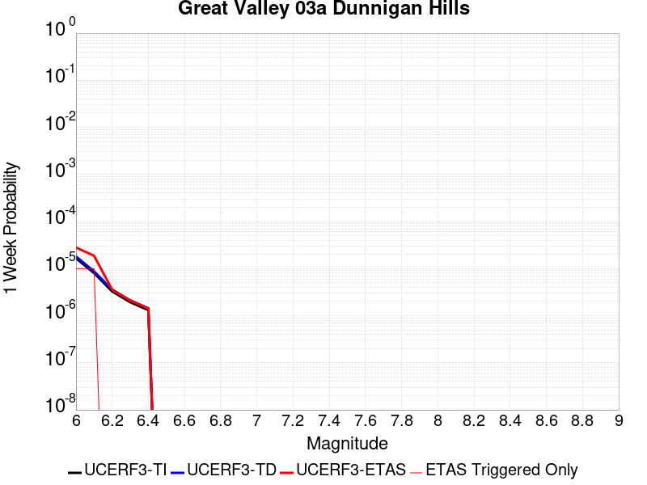 |  |  | 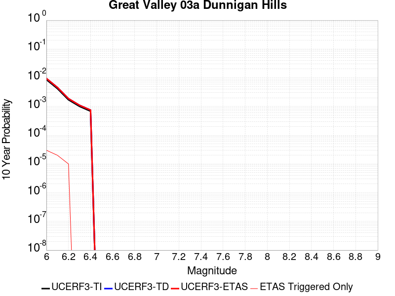 |

| Magnitude | 1 wk TI Prob | 1 wk TD Prob | 1 wk ETAS Prob | 1 wk ETAS/TD Gain | 1 wk ETAS Triggered Only | 1 mo TI Prob | 1 mo TD Prob | 1 mo ETAS Prob | 1 mo ETAS/TD Gain | 1 mo ETAS Triggered Only | 1 yr TI Prob | 1 yr TD Prob | 1 yr ETAS Prob | 1 yr ETAS/TD Gain | 1 yr ETAS Triggered Only | 10 yr TI Prob | 10 yr TD Prob | 10 yr ETAS Prob | 10 yr ETAS/TD Gain | 10 yr ETAS Triggered Only |
|-----|-----|-----|-----|-----|-----|-----|-----|-----|-----|-----|-----|-----|-----|-----|-----|-----|-----|-----|-----|-----|
| 6.0 | 1.6591328E-5 | 1.8107954E-5 | 6.992049E-5 | 3.8613136 | 5.1813473E-5 | 7.110376E-5 | 7.7603596E-5 | 1.2941305E-4 | 1.6676166 | 5.1813473E-5 | 8.6534437E-4 | 9.444834E-4 | 9.96248E-4 | 1.0548073 | 5.1813473E-5 | 0.008619824 | 0.009411525 | 0.009514176 | 1.010907 | 1.03626946E-4 |
| 6.1 | 8.041125E-6 | 8.769726E-6 | 6.0582744E-5 | 6.908168 | 5.1813473E-5 | 3.4461507E-5 | 3.7584115E-5 | 8.939564E-5 | 2.3785484 | 5.1813473E-5 | 4.194881E-4 | 4.5751085E-4 | 5.093006E-4 | 1.113199 | 5.1813473E-5 | 0.004186971 | 0.004567687 | 0.0046708407 | 1.0225834 | 1.03626946E-4 |
| 6.2 | 3.2807004E-6 | 3.5795688E-6 | 3.5795688E-6 | 1.0 | 0.0 | 1.4060069E-5 | 1.5340942E-5 | 1.5340942E-5 | 1.0 | 0.0 | 1.7116789E-4 | 1.8676413E-4 | 1.8676413E-4 | 1.0 | 0.0 | 0.0017103611 | 0.0018664796 | 0.0019181964 | 1.0277082 | 5.1813473E-5 |
| 6.3 | 1.9339366E-6 | 2.1103806E-6 | 2.1103806E-6 | 1.0 | 0.0 | 8.288273E-6 | 9.044474E-6 | 9.044474E-6 | 1.0 | 0.0 | 1.00905054E-4 | 1.1011375E-4 | 1.1011375E-4 | 1.0 | 0.0 | 0.0010085925 | 0.0011008718 | 0.0011008718 | 1.0 | 0.0 |
| 6.4 | 1.3142635E-6 | 1.4339867E-6 | 1.4339867E-6 | 1.0 | 0.0 | 5.6325457E-6 | 6.145657E-6 | 6.145657E-6 | 1.0 | 0.0 | 6.857408E-5 | 7.482337E-5 | 7.482337E-5 | 1.0 | 0.0 | 6.8552926E-4 | 7.4823375E-4 | 7.4823375E-4 | 1.0 | 0.0 |

## Del Valle
*[(top)](#table-of-contents)*

| 1 Week | 1 Month | 1 Year | 10 Year |
|-----|-----|-----|-----|
|  |  |  | 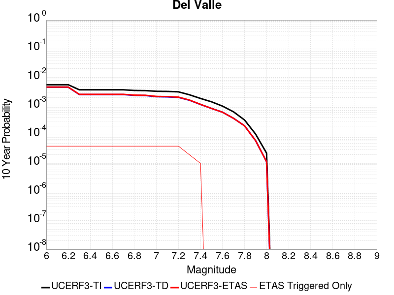 |

| Magnitude | 1 wk TI Prob | 1 wk TD Prob | 1 wk ETAS Prob | 1 wk ETAS/TD Gain | 1 wk ETAS Triggered Only | 1 mo TI Prob | 1 mo TD Prob | 1 mo ETAS Prob | 1 mo ETAS/TD Gain | 1 mo ETAS Triggered Only | 1 yr TI Prob | 1 yr TD Prob | 1 yr ETAS Prob | 1 yr ETAS/TD Gain | 1 yr ETAS Triggered Only | 10 yr TI Prob | 10 yr TD Prob | 10 yr ETAS Prob | 10 yr ETAS/TD Gain | 10 yr ETAS Triggered Only |
|-----|-----|-----|-----|-----|-----|-----|-----|-----|-----|-----|-----|-----|-----|-----|-----|-----|-----|-----|-----|-----|
| 6.0 | 1.0716125E-5 | 8.767882E-6 | 8.767882E-6 | 1.0 | 0.0 | 4.592544E-5 | 3.7576207E-5 | 3.7576207E-5 | 1.0 | 0.0 | 5.589988E-4 | 4.5741405E-4 | 5.6099356E-4 | 1.2264459 | 1.03626946E-4 | 0.0055759475 | 0.00456668 | 0.004669834 | 1.0225884 | 1.03626946E-4 |
| 6.1 | 1.0716125E-5 | 8.767882E-6 | 8.767882E-6 | 1.0 | 0.0 | 4.592544E-5 | 3.7576207E-5 | 3.7576207E-5 | 1.0 | 0.0 | 5.589988E-4 | 4.5741405E-4 | 5.6099356E-4 | 1.2264459 | 1.03626946E-4 | 0.0055759475 | 0.00456668 | 0.004669834 | 1.0225884 | 1.03626946E-4 |
| 6.2 | 1.0716125E-5 | 8.767882E-6 | 8.767882E-6 | 1.0 | 0.0 | 4.592544E-5 | 3.7576207E-5 | 3.7576207E-5 | 1.0 | 0.0 | 5.589988E-4 | 4.5741405E-4 | 5.6099356E-4 | 1.2264459 | 1.03626946E-4 | 0.0055759475 | 0.00456668 | 0.004669834 | 1.0225884 | 1.03626946E-4 |
| 6.3 | 7.1293784E-6 | 4.865823E-6 | 4.865823E-6 | 1.0 | 0.0 | 3.055412E-5 | 2.0853364E-5 | 2.0853364E-5 | 1.0 | 0.0 | 3.7193293E-4 | 2.5386087E-4 | 3.574615E-4 | 1.4081 | 1.03626946E-4 | 0.0037131102 | 0.0025357946 | 0.0026391589 | 1.0407621 | 1.03626946E-4 |
| 6.4 | 7.1293784E-6 | 4.865823E-6 | 4.865823E-6 | 1.0 | 0.0 | 3.055412E-5 | 2.0853364E-5 | 2.0853364E-5 | 1.0 | 0.0 | 3.7193293E-4 | 2.5386087E-4 | 3.574615E-4 | 1.4081 | 1.03626946E-4 | 0.0037131102 | 0.0025357946 | 0.0026391589 | 1.0407621 | 1.03626946E-4 |
| 6.5 | 7.1293784E-6 | 4.865823E-6 | 4.865823E-6 | 1.0 | 0.0 | 3.055412E-5 | 2.0853364E-5 | 2.0853364E-5 | 1.0 | 0.0 | 3.7193293E-4 | 2.5386087E-4 | 3.574615E-4 | 1.4081 | 1.03626946E-4 | 0.0037131102 | 0.0025357946 | 0.0026391589 | 1.0407621 | 1.03626946E-4 |
| 6.6 | 7.1293784E-6 | 4.865823E-6 | 4.865823E-6 | 1.0 | 0.0 | 3.055412E-5 | 2.0853364E-5 | 2.0853364E-5 | 1.0 | 0.0 | 3.7193293E-4 | 2.5386087E-4 | 3.574615E-4 | 1.4081 | 1.03626946E-4 | 0.0037131102 | 0.0025357946 | 0.0026391589 | 1.0407621 | 1.03626946E-4 |
| 6.7 | 7.12272E-6 | 4.8631987E-6 | 4.8631987E-6 | 1.0 | 0.0 | 3.0525585E-5 | 2.0842117E-5 | 2.0842117E-5 | 1.0 | 0.0 | 3.7158563E-4 | 2.5372396E-4 | 3.573246E-4 | 1.4083203 | 1.03626946E-4 | 0.003709649 | 0.0025344288 | 0.002637793 | 1.0407841 | 1.03626946E-4 |
| 6.8 | 6.7558703E-6 | 4.5594015E-6 | 4.5594015E-6 | 1.0 | 0.0 | 2.895341E-5 | 1.9540148E-5 | 1.9540148E-5 | 1.0 | 0.0 | 3.5245073E-4 | 2.3787597E-4 | 3.4147827E-4 | 1.4355307 | 1.03626946E-4 | 0.0035189227 | 0.0023762889 | 0.0024796694 | 1.0435051 | 1.03626946E-4 |
| 6.9 | 6.6700386E-6 | 4.502539E-6 | 4.502539E-6 | 1.0 | 0.0 | 2.8585566E-5 | 1.9296456E-5 | 1.9296456E-5 | 1.0 | 0.0 | 3.479737E-4 | 2.3490966E-4 | 3.3851227E-4 | 1.4410317 | 1.03626946E-4 | 0.003474293 | 0.0023466884 | 0.0024500722 | 1.0440552 | 1.03626946E-4 |
| 7.0 | 6.3181424E-6 | 4.0987034E-6 | 4.0987034E-6 | 1.0 | 0.0 | 2.7077473E-5 | 1.7565755E-5 | 1.7565755E-5 | 1.0 | 0.0 | 3.2961834E-4 | 2.1384252E-4 | 3.174473E-4 | 1.4844911 | 1.03626946E-4 | 0.0032912986 | 0.002136422 | 0.0022398278 | 1.0484012 | 1.03626946E-4 |
| 7.1 | 6.248759E-6 | 4.033895E-6 | 4.033895E-6 | 1.0 | 0.0 | 2.678012E-5 | 1.7288008E-5 | 1.7288008E-5 | 1.0 | 0.0 | 3.2599916E-4 | 2.104616E-4 | 3.1406674E-4 | 1.4922757 | 1.03626946E-4 | 0.0032552136 | 0.0021026772 | 0.0022060864 | 1.0491797 | 1.03626946E-4 |
| 7.2 | 6.0411944E-6 | 3.869888E-6 | 3.869888E-6 | 1.0 | 0.0 | 2.5890577E-5 | 1.658513E-5 | 1.658513E-5 | 1.0 | 0.0 | 3.1517216E-4 | 2.0190567E-4 | 3.055117E-4 | 1.5131407 | 1.03626946E-4 | 0.0031472554 | 0.0020172757 | 0.0021206937 | 1.0512661 | 1.03626946E-4 |
| 7.3 | 4.7691183E-6 | 3.0781202E-6 | 3.0781202E-6 | 1.0 | 0.0 | 2.0438918E-5 | 1.3191879E-5 | 1.3191879E-5 | 1.0 | 0.0 | 2.488154E-4 | 1.605995E-4 | 2.1240466E-4 | 1.3225735 | 5.1813473E-5 | 0.00248537 | 0.0016048603 | 0.0016565906 | 1.0322335 | 5.1813473E-5 |
| 7.4 | 3.5524722E-6 | 2.1893363E-6 | 2.1893363E-6 | 1.0 | 0.0 | 1.5224792E-5 | 9.382837E-6 | 9.382837E-6 | 1.0 | 0.0 | 1.8534607E-4 | 1.1423013E-4 | 1.6603769E-4 | 1.4535366 | 5.1813473E-5 | 0.0018519156 | 0.0011417224 | 0.0011934767 | 1.04533 | 5.1813473E-5 |
| 7.5 | 2.7133442E-6 | 1.5916097E-6 | 1.5916097E-6 | 1.0 | 0.0 | 1.1628566E-5 | 6.821167E-6 | 6.821167E-6 | 1.0 | 0.0 | 1.415686E-4 | 8.304456E-5 | 8.304456E-5 | 1.0 | 0.0 | 0.0014147845 | 8.301372E-4 | 8.301372E-4 | 1.0 | 0.0 |
| 7.6 | 1.915338E-6 | 1.173914E-6 | 1.173914E-6 | 1.0 | 0.0 | 8.208566E-6 | 5.0310505E-6 | 5.0310505E-6 | 1.0 | 0.0 | 9.993471E-5 | 6.125133E-5 | 6.125133E-5 | 1.0 | 0.0 | 9.988978E-4 | 6.123454E-4 | 6.123454E-4 | 1.0 | 0.0 |
| 7.7 | 1.2120448E-6 | 7.180313E-7 | 7.180313E-7 | 1.0 | 0.0 | 5.194467E-6 | 3.0772733E-6 | 3.0772733E-6 | 1.0 | 0.0 | 6.3240805E-5 | 3.746516E-5 | 3.746516E-5 | 1.0 | 0.0 | 6.322281E-4 | 3.7458882E-4 | 3.7458882E-4 | 1.0 | 0.0 |
| 7.8 | 6.272381E-7 | 3.932549E-7 | 3.932549E-7 | 1.0 | 0.0 | 2.6881603E-6 | 1.6853771E-6 | 1.6853771E-6 | 1.0 | 0.0 | 3.272786E-5 | 2.0519275E-5 | 2.0519275E-5 | 1.0 | 0.0 | 3.272304E-4 | 2.0517396E-4 | 2.0517396E-4 | 1.0 | 0.0 |
| 7.9 | 2.0292627E-7 | 1.2004622E-7 | 1.2004622E-7 | 1.0 | 0.0 | 8.6968373E-7 | 5.1448376E-7 | 5.1448376E-7 | 1.0 | 0.0 | 1.0588348E-5 | 6.263822E-6 | 6.263822E-6 | 1.0 | 0.0 | 1.0587843E-4 | 6.263647E-5 | 6.263647E-5 | 1.0 | 0.0 |
| 8.0 | 4.374492E-8 | 2.189964E-8 | 2.189964E-8 | 1.0 | 0.0 | 1.8747821E-7 | 9.385559E-8 | 9.385559E-8 | 1.0 | 0.0 | 2.2825448E-6 | 1.1426913E-6 | 1.1426913E-6 | 1.0 | 0.0 | 2.2825214E-5 | 1.1426858E-5 | 1.1426858E-5 | 1.0 | 0.0 |

## Santa Rosa Island
*[(top)](#table-of-contents)*

| 1 Week | 1 Month | 1 Year | 10 Year |
|-----|-----|-----|-----|
|  |  |  |  |

| Magnitude | 1 wk TI Prob | 1 wk TD Prob | 1 wk ETAS Prob | 1 wk ETAS/TD Gain | 1 wk ETAS Triggered Only | 1 mo TI Prob | 1 mo TD Prob | 1 mo ETAS Prob | 1 mo ETAS/TD Gain | 1 mo ETAS Triggered Only | 1 yr TI Prob | 1 yr TD Prob | 1 yr ETAS Prob | 1 yr ETAS/TD Gain | 1 yr ETAS Triggered Only | 10 yr TI Prob | 10 yr TD Prob | 10 yr ETAS Prob | 10 yr ETAS/TD Gain | 10 yr ETAS Triggered Only |
|-----|-----|-----|-----|-----|-----|-----|-----|-----|-----|-----|-----|-----|-----|-----|-----|-----|-----|-----|-----|-----|
| 6.0 | 4.1143165E-5 | 4.7091133E-5 | 4.7091133E-5 | 1.0 | 0.0 | 1.7631594E-4 | 2.0180465E-4 | 2.5360766E-4 | 1.2566988 | 5.1813473E-5 | 0.002144533 | 0.0024544 | 0.0025060864 | 1.0210587 | 5.1813473E-5 | 0.021239553 | 0.024293551 | 0.024394661 | 1.004162 | 1.03626946E-4 |
| 6.1 | 2.1061249E-5 | 2.3864959E-5 | 2.3864959E-5 | 1.0 | 0.0 | 9.0259375E-5 | 1.0227455E-4 | 1.5408272E-4 | 1.5065597 | 5.1813473E-5 | 0.0010983539 | 0.0012445104 | 0.0012962593 | 1.0415817 | 5.1813473E-5 | 0.01092941 | 0.012378449 | 0.01242962 | 1.0041339 | 5.1813473E-5 |
| 6.2 | 2.1061249E-5 | 2.3864959E-5 | 2.3864959E-5 | 1.0 | 0.0 | 9.0259375E-5 | 1.0227455E-4 | 1.5408272E-4 | 1.5065597 | 5.1813473E-5 | 0.0010983539 | 0.0012445104 | 0.0012962593 | 1.0415817 | 5.1813473E-5 | 0.01092941 | 0.012378449 | 0.01242962 | 1.0041339 | 5.1813473E-5 |
| 6.3 | 1.5158236E-5 | 1.7074419E-5 | 1.7074419E-5 | 1.0 | 0.0 | 6.496225E-5 | 7.3174095E-5 | 1.2498378E-4 | 1.7080331 | 5.1813473E-5 | 7.906284E-4 | 8.905424E-4 | 9.4230974E-4 | 1.0581301 | 5.1813473E-5 | 0.007878214 | 0.008870989 | 0.008922343 | 1.0057889 | 5.1813473E-5 |
| 6.4 | 1.2341918E-5 | 1.3852917E-5 | 1.3852917E-5 | 1.0 | 0.0 | 5.2892858E-5 | 5.9368336E-5 | 1.11178735E-4 | 1.872694 | 5.1813473E-5 | 6.437803E-4 | 7.225779E-4 | 7.74354E-4 | 1.0716546 | 5.1813473E-5 | 0.006419184 | 0.007203121 | 0.0072545614 | 1.0071414 | 5.1813473E-5 |
| 6.5 | 9.061158E-6 | 1.0117031E-5 | 1.0117031E-5 | 1.0 | 0.0 | 3.883296E-5 | 4.3358013E-5 | 9.516924E-5 | 2.194963 | 5.1813473E-5 | 4.726887E-4 | 5.277613E-4 | 5.795474E-4 | 1.0981241 | 5.1813473E-5 | 0.004716845 | 0.0052656173 | 0.005317158 | 1.0097882 | 5.1813473E-5 |
| 6.6 | 7.5461685E-6 | 8.400733E-6 | 8.400733E-6 | 1.0 | 0.0 | 3.2340322E-5 | 3.600267E-5 | 3.600267E-5 | 1.0 | 0.0 | 3.936723E-4 | 4.3824865E-4 | 4.3824865E-4 | 1.0 | 0.0 | 0.003929756 | 0.0043742736 | 0.0043742736 | 1.0 | 0.0 |
| 6.7 | 5.5023775E-6 | 6.087381E-6 | 6.087381E-6 | 1.0 | 0.0 | 2.3581404E-5 | 2.6088532E-5 | 2.6088532E-5 | 1.0 | 0.0 | 2.8706578E-4 | 3.1758484E-4 | 3.1758484E-4 | 1.0 | 0.0 | 0.0028669522 | 0.0031716314 | 0.0031716314 | 1.0 | 0.0 |
| 6.8 | 3.7351679E-6 | 4.0831405E-6 | 4.0831405E-6 | 1.0 | 0.0 | 1.6007763E-5 | 1.749907E-5 | 1.749907E-5 | 1.0 | 0.0 | 1.948771E-4 | 2.1303284E-4 | 2.1303284E-4 | 1.0 | 0.0 | 0.0019470629 | 0.0021285315 | 0.0021285315 | 1.0 | 0.0 |
| 6.9 | 2.456366E-6 | 2.6292705E-6 | 2.6292705E-6 | 1.0 | 0.0 | 1.0527241E-5 | 1.1268254E-5 | 1.1268254E-5 | 1.0 | 0.0 | 1.2816161E-4 | 1.3718237E-4 | 1.3718237E-4 | 1.0 | 0.0 | 0.0012808773 | 0.0013709799 | 0.0013709799 | 1.0 | 0.0 |
| 7.0 | 2.3245157E-6 | 2.4827782E-6 | 2.4827782E-6 | 1.0 | 0.0 | 9.962172E-6 | 1.0640435E-5 | 1.0640435E-5 | 1.0 | 0.0 | 1.2128269E-4 | 1.2953962E-4 | 1.2953962E-4 | 1.0 | 0.0 | 0.0012121652 | 0.0012946434 | 0.0012946434 | 1.0 | 0.0 |
| 7.1 | 2.2248344E-6 | 2.37325E-6 | 2.37325E-6 | 1.0 | 0.0 | 9.53497E-6 | 1.0171032E-5 | 1.0171032E-5 | 1.0 | 0.0 | 1.1608207E-4 | 1.2382529E-4 | 1.2382529E-4 | 1.0 | 0.0 | 0.0011602144 | 0.001237565 | 0.001237565 | 1.0 | 0.0 |
| 7.2 | 2.1350402E-6 | 2.276154E-6 | 2.276154E-6 | 1.0 | 0.0 | 9.150141E-6 | 9.754909E-6 | 9.754909E-6 | 1.0 | 0.0 | 1.1139726E-4 | 1.1875956E-4 | 1.1875956E-4 | 1.0 | 0.0 | 0.0011134144 | 0.0011869629 | 0.0011869629 | 1.0 | 0.0 |
| 7.3 | 1.9793572E-6 | 2.108719E-6 | 2.108719E-6 | 1.0 | 0.0 | 8.482932E-6 | 9.037336E-6 | 9.037336E-6 | 1.0 | 0.0 | 1.032748E-4 | 1.10024026E-4 | 1.10024026E-4 | 1.0 | 0.0 | 0.0010322682 | 0.0010996973 | 0.0010996973 | 1.0 | 0.0 |
| 7.4 | 1.6951194E-6 | 1.8045733E-6 | 1.8045733E-6 | 1.0 | 0.0 | 7.264777E-6 | 7.733863E-6 | 7.733863E-6 | 1.0 | 0.0 | 8.844508E-5 | 9.415573E-5 | 9.415573E-5 | 1.0 | 0.0 | 8.840988E-4 | 9.4116E-4 | 9.4116E-4 | 1.0 | 0.0 |
| 7.5 | 8.987207E-7 | 9.5122147E-7 | 9.5122147E-7 | 1.0 | 0.0 | 3.8516546E-6 | 4.076657E-6 | 4.076657E-6 | 1.0 | 0.0 | 4.6892885E-5 | 4.963218E-5 | 4.963218E-5 | 1.0 | 0.0 | 4.688299E-4 | 4.9621216E-4 | 4.9621216E-4 | 1.0 | 0.0 |
| 7.6 | 3.8783037E-7 | 4.052932E-7 | 4.052932E-7 | 1.0 | 0.0 | 1.6621291E-6 | 1.7369698E-6 | 1.7369698E-6 | 1.0 | 0.0 | 2.0236233E-5 | 2.1147409E-5 | 2.1147409E-5 | 1.0 | 0.0 | 2.023439E-4 | 2.1145462E-4 | 2.1145462E-4 | 1.0 | 0.0 |
| 7.7 | 6.181804E-8 | 6.339035E-8 | 6.339035E-8 | 1.0 | 0.0 | 2.6493444E-7 | 2.7167292E-7 | 2.7167292E-7 | 1.0 | 0.0 | 3.225572E-6 | 3.3076128E-6 | 3.3076128E-6 | 1.0 | 0.0 | 3.225525E-5 | 3.307564E-5 | 3.307564E-5 | 1.0 | 0.0 |
| 7.8 | 1.3704449E-9 | 1.3964153E-9 | 1.3964153E-9 | 1.0 | 0.0 | 5.873335E-9 | 5.984637E-9 | 5.984637E-9 | 1.0 | 0.0 | 7.1507856E-8 | 7.286295E-8 | 7.286295E-8 | 1.0 | 0.0 | 7.1507833E-7 | 7.286294E-7 | 7.286294E-7 | 1.0 | 0.0 |

## Monterey Bay-Tularcitos
*[(top)](#table-of-contents)*

| 1 Week | 1 Month | 1 Year | 10 Year |
|-----|-----|-----|-----|
|  |  | 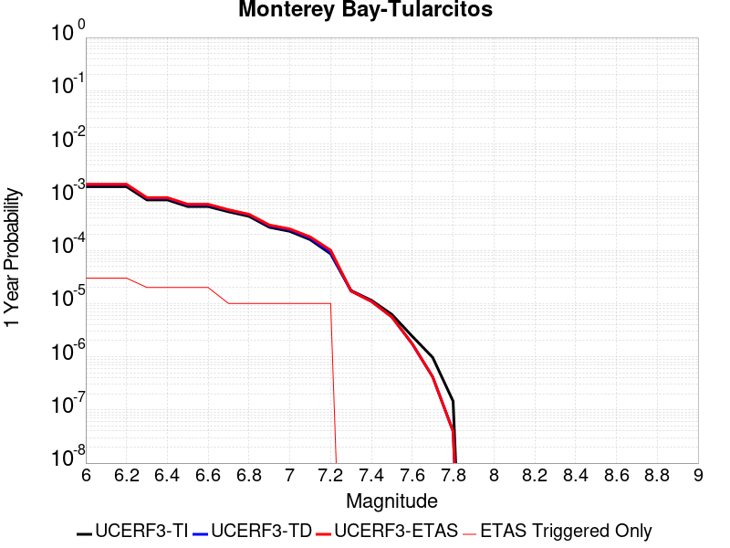 | 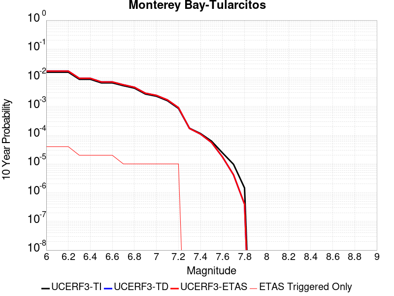 |

| Magnitude | 1 wk TI Prob | 1 wk TD Prob | 1 wk ETAS Prob | 1 wk ETAS/TD Gain | 1 wk ETAS Triggered Only | 1 mo TI Prob | 1 mo TD Prob | 1 mo ETAS Prob | 1 mo ETAS/TD Gain | 1 mo ETAS Triggered Only | 1 yr TI Prob | 1 yr TD Prob | 1 yr ETAS Prob | 1 yr ETAS/TD Gain | 1 yr ETAS Triggered Only | 10 yr TI Prob | 10 yr TD Prob | 10 yr ETAS Prob | 10 yr ETAS/TD Gain | 10 yr ETAS Triggered Only |
|-----|-----|-----|-----|-----|-----|-----|-----|-----|-----|-----|-----|-----|-----|-----|-----|-----|-----|-----|-----|-----|
| 6.0 | 3.0131365E-5 | 3.279877E-5 | 8.461054E-5 | 2.5796864 | 5.1813473E-5 | 1.2912804E-4 | 1.4055918E-4 | 1.9236538E-4 | 1.3685721 | 5.1813473E-5 | 0.001571 | 0.0017100703 | 0.0017617951 | 1.0302472 | 5.1813473E-5 | 0.015599402 | 0.016979916 | 0.017081784 | 1.0059993 | 1.03626946E-4 |
| 6.1 | 3.0131365E-5 | 3.279877E-5 | 8.461054E-5 | 2.5796864 | 5.1813473E-5 | 1.2912804E-4 | 1.4055918E-4 | 1.9236538E-4 | 1.3685721 | 5.1813473E-5 | 0.001571 | 0.0017100703 | 0.0017617951 | 1.0302472 | 5.1813473E-5 | 0.015599402 | 0.016979916 | 0.017081784 | 1.0059993 | 1.03626946E-4 |
| 6.2 | 3.0131365E-5 | 3.279877E-5 | 8.461054E-5 | 2.5796864 | 5.1813473E-5 | 1.2912804E-4 | 1.4055918E-4 | 1.9236538E-4 | 1.3685721 | 5.1813473E-5 | 0.001571 | 0.0017100703 | 0.0017617951 | 1.0302472 | 5.1813473E-5 | 0.015599402 | 0.016979916 | 0.017081784 | 1.0059993 | 1.03626946E-4 |
| 6.3 | 1.6998249E-5 | 1.8330798E-5 | 1.8330798E-5 | 1.0 | 0.0 | 7.28476E-5 | 7.85583E-5 | 7.85583E-5 | 1.0 | 0.0 | 8.865586E-4 | 9.5604634E-4 | 9.5604634E-4 | 1.0 | 0.0 | 0.0088303005 | 0.009521258 | 0.009521258 | 1.0 | 0.0 |
| 6.4 | 1.6998249E-5 | 1.8330798E-5 | 1.8330798E-5 | 1.0 | 0.0 | 7.28476E-5 | 7.85583E-5 | 7.85583E-5 | 1.0 | 0.0 | 8.865586E-4 | 9.5604634E-4 | 9.5604634E-4 | 1.0 | 0.0 | 0.0088303005 | 0.009521258 | 0.009521258 | 1.0 | 0.0 |
| 6.5 | 1.27470785E-5 | 1.3693312E-5 | 1.3693312E-5 | 1.0 | 0.0 | 5.4629192E-5 | 5.8684363E-5 | 5.8684363E-5 | 1.0 | 0.0 | 6.649074E-4 | 7.1425823E-4 | 7.1425823E-4 | 1.0 | 0.0 | 0.0066292146 | 0.007120678 | 0.007120678 | 1.0 | 0.0 |
| 6.6 | 1.2739422E-5 | 1.36854E-5 | 1.36854E-5 | 1.0 | 0.0 | 5.4596385E-5 | 5.8650454E-5 | 5.8650454E-5 | 1.0 | 0.0 | 6.645082E-4 | 7.1384566E-4 | 7.1384566E-4 | 1.0 | 0.0 | 0.0066252467 | 0.007116579 | 0.007116579 | 1.0 | 0.0 |
| 6.7 | 1.0160109E-5 | 1.0885755E-5 | 1.0885755E-5 | 1.0 | 0.0 | 4.35426E-5 | 4.665244E-5 | 4.665244E-5 | 1.0 | 0.0 | 5.300022E-4 | 5.6785246E-4 | 5.6785246E-4 | 1.0 | 0.0 | 0.005287399 | 0.0056647263 | 0.0056647263 | 1.0 | 0.0 |
| 6.8 | 8.349859E-6 | 8.932587E-6 | 8.932587E-6 | 1.0 | 0.0 | 3.578462E-5 | 3.8281985E-5 | 3.8281985E-5 | 1.0 | 0.0 | 4.3559066E-4 | 4.6598914E-4 | 4.6598914E-4 | 1.0 | 0.0 | 0.004347378 | 0.004650685 | 0.004650685 | 1.0 | 0.0 |
| 6.9 | 5.193639E-6 | 5.53643E-6 | 5.53643E-6 | 1.0 | 0.0 | 2.2258262E-5 | 2.372736E-5 | 2.372736E-5 | 1.0 | 0.0 | 2.7096065E-4 | 2.8884556E-4 | 2.8884556E-4 | 1.0 | 0.0 | 0.0027063051 | 0.0028850222 | 0.0028850222 | 1.0 | 0.0 |
| 7.0 | 4.359381E-6 | 4.643366E-6 | 4.643366E-6 | 1.0 | 0.0 | 1.8682927E-5 | 1.9900004E-5 | 1.9900004E-5 | 1.0 | 0.0 | 2.274409E-4 | 2.422586E-4 | 2.422586E-4 | 1.0 | 0.0 | 0.0022720827 | 0.002420238 | 0.002420238 | 1.0 | 0.0 |
| 7.1 | 3.0398533E-6 | 3.2310427E-6 | 3.2310427E-6 | 1.0 | 0.0 | 1.3027877E-5 | 1.3847267E-5 | 1.3847267E-5 | 1.0 | 0.0 | 1.5860285E-4 | 1.6858005E-4 | 1.6858005E-4 | 1.0 | 0.0 | 0.001584897 | 0.0016847793 | 0.0016847793 | 1.0 | 0.0 |
| 7.2 | 1.642335E-6 | 1.7333153E-6 | 1.7333153E-6 | 1.0 | 0.0 | 7.0385595E-6 | 7.428485E-6 | 7.428485E-6 | 1.0 | 0.0 | 8.569109E-5 | 9.044012E-5 | 9.044012E-5 | 1.0 | 0.0 | 8.5658056E-4 | 9.042358E-4 | 9.042358E-4 | 1.0 | 0.0 |
| 7.3 | 3.356842E-7 | 3.2952389E-7 | 3.2952389E-7 | 1.0 | 0.0 | 1.4386458E-6 | 1.4122444E-6 | 1.4122444E-6 | 1.0 | 0.0 | 1.7515373E-5 | 1.7193941E-5 | 1.7193941E-5 | 1.0 | 0.0 | 1.7513991E-4 | 1.719262E-4 | 1.719262E-4 | 1.0 | 0.0 |
| 7.4 | 2.1973483E-7 | 2.1006413E-7 | 2.1006413E-7 | 1.0 | 0.0 | 9.417204E-7 | 9.0027453E-7 | 9.0027453E-7 | 1.0 | 0.0 | 1.1465385E-5 | 1.0960787E-5 | 1.0960787E-5 | 1.0 | 0.0 | 1.1464794E-4 | 1.096025E-4 | 1.096025E-4 | 1.0 | 0.0 |
| 7.5 | 1.1944135E-7 | 1.0696043E-7 | 1.0696043E-7 | 1.0 | 0.0 | 5.118914E-7 | 4.5840173E-7 | 4.5840173E-7 | 1.0 | 0.0 | 6.23226E-6 | 5.581027E-6 | 5.581027E-6 | 1.0 | 0.0 | 6.2320854E-5 | 5.5808883E-5 | 5.5808883E-5 | 1.0 | 0.0 |
| 7.6 | 4.636058E-8 | 3.336489E-8 | 3.336489E-8 | 1.0 | 0.0 | 1.9868818E-7 | 1.4299238E-7 | 1.4299238E-7 | 1.0 | 0.0 | 2.419026E-6 | 1.7409308E-6 | 1.7409308E-6 | 1.0 | 0.0 | 2.4189996E-5 | 1.7409173E-5 | 1.7409173E-5 | 1.0 | 0.0 |
| 7.7 | 1.8588572E-8 | 8.003744E-9 | 8.003744E-9 | 1.0 | 0.0 | 7.9665305E-8 | 3.430176E-8 | 3.430176E-8 | 1.0 | 0.0 | 9.699246E-7 | 4.1762385E-7 | 4.1762385E-7 | 1.0 | 0.0 | 9.699204E-6 | 4.176231E-6 | 4.176231E-6 | 1.0 | 0.0 |
| 7.8 | 2.7960154E-9 | 7.6099427E-10 | 7.6099427E-10 | 1.0 | 0.0 | 1.1982923E-8 | 3.2614043E-9 | 3.2614043E-9 | 1.0 | 0.0 | 1.4589209E-7 | 3.9707597E-8 | 3.9707597E-8 | 1.0 | 0.0 | 1.4589199E-6 | 3.9707595E-7 | 3.9707595E-7 | 1.0 | 0.0 |

## Elsinore (Coyote Mountains)
*[(top)](#table-of-contents)*

| 1 Week | 1 Month | 1 Year | 10 Year |
|-----|-----|-----|-----|
|  |  |  |  |

| Magnitude | 1 wk TI Prob | 1 wk TD Prob | 1 wk ETAS Prob | 1 wk ETAS/TD Gain | 1 wk ETAS Triggered Only | 1 mo TI Prob | 1 mo TD Prob | 1 mo ETAS Prob | 1 mo ETAS/TD Gain | 1 mo ETAS Triggered Only | 1 yr TI Prob | 1 yr TD Prob | 1 yr ETAS Prob | 1 yr ETAS/TD Gain | 1 yr ETAS Triggered Only | 10 yr TI Prob | 10 yr TD Prob | 10 yr ETAS Prob | 10 yr ETAS/TD Gain | 10 yr ETAS Triggered Only |
|-----|-----|-----|-----|-----|-----|-----|-----|-----|-----|-----|-----|-----|-----|-----|-----|-----|-----|-----|-----|-----|
| 6.0 | 4.20513E-5 | 4.8631882E-5 | 1.00442834E-4 | 2.06537 | 5.1813473E-5 | 1.8020741E-4 | 2.0840895E-4 | 3.120143E-4 | 1.4971253 | 1.03626946E-4 | 0.0021918174 | 0.002535 | 0.0026383642 | 1.0407748 | 1.03626946E-4 | 0.021703249 | 0.025111282 | 0.025212307 | 1.0040231 | 1.03626946E-4 |
| 6.1 | 4.20513E-5 | 4.8631882E-5 | 1.00442834E-4 | 2.06537 | 5.1813473E-5 | 1.8020741E-4 | 2.0840895E-4 | 3.120143E-4 | 1.4971253 | 1.03626946E-4 | 0.0021918174 | 0.002535 | 0.0026383642 | 1.0407748 | 1.03626946E-4 | 0.021703249 | 0.025111282 | 0.025212307 | 1.0040231 | 1.03626946E-4 |
| 6.2 | 2.3413893E-5 | 2.469566E-5 | 7.650785E-5 | 3.0980282 | 5.1813473E-5 | 1.0034139E-4 | 1.0583479E-4 | 2.0945077E-4 | 1.9790351 | 1.03626946E-4 | 0.0012209718 | 0.0012878707 | 0.0013913641 | 1.0803602 | 1.03626946E-4 | 0.012142851 | 0.01281264 | 0.012914939 | 1.0079843 | 1.03626946E-4 |
| 6.3 | 2.3413893E-5 | 2.469566E-5 | 7.650785E-5 | 3.0980282 | 5.1813473E-5 | 1.0034139E-4 | 1.0583479E-4 | 2.0945077E-4 | 1.9790351 | 1.03626946E-4 | 0.0012209718 | 0.0012878707 | 0.0013913641 | 1.0803602 | 1.03626946E-4 | 0.012142851 | 0.01281264 | 0.012914939 | 1.0079843 | 1.03626946E-4 |
| 6.4 | 1.6894814E-5 | 1.6568361E-5 | 6.838098E-5 | 4.127202 | 5.1813473E-5 | 7.240433E-5 | 7.1005554E-5 | 1.7462514E-4 | 2.4593167 | 1.03626946E-4 | 8.811662E-4 | 8.6418656E-4 | 9.6772396E-4 | 1.119809 | 1.03626946E-4 | 0.0087768035 | 0.00861194 | 0.008714675 | 1.0119293 | 1.03626946E-4 |
| 6.5 | 1.6894814E-5 | 1.6568361E-5 | 6.838098E-5 | 4.127202 | 5.1813473E-5 | 7.240433E-5 | 7.1005554E-5 | 1.7462514E-4 | 2.4593167 | 1.03626946E-4 | 8.811662E-4 | 8.6418656E-4 | 9.6772396E-4 | 1.119809 | 1.03626946E-4 | 0.0087768035 | 0.00861194 | 0.008714675 | 1.0119293 | 1.03626946E-4 |
| 6.6 | 1.1910969E-5 | 1.0530774E-5 | 1.0530774E-5 | 1.0 | 0.0 | 5.1046012E-5 | 4.5131183E-5 | 9.694231E-5 | 2.148012 | 5.1813473E-5 | 6.21308E-4 | 5.4934516E-4 | 6.011302E-4 | 1.0942668 | 5.1813473E-5 | 0.0061957375 | 0.005481174 | 0.005532704 | 1.0094012 | 5.1813473E-5 |
| 6.7 | 9.1486E-6 | 7.2028593E-6 | 7.2028593E-6 | 1.0 | 0.0 | 3.9207694E-5 | 3.0869054E-5 | 8.268093E-5 | 2.6784406 | 5.1813473E-5 | 4.7724912E-4 | 3.757697E-4 | 4.2756373E-4 | 1.1378344 | 5.1813473E-5 | 0.0047622547 | 0.0037517229 | 0.0038033419 | 1.0137588 | 5.1813473E-5 |
| 6.8 | 7.90441E-6 | 5.7290276E-6 | 5.7290276E-6 | 1.0 | 0.0 | 3.3875604E-5 | 2.4552752E-5 | 7.636495E-5 | 3.11024 | 5.1813473E-5 | 4.1235742E-4 | 2.9889002E-4 | 3.50688E-4 | 1.1733011 | 5.1813473E-5 | 0.0041159308 | 0.002985009 | 0.0030366678 | 1.0173061 | 5.1813473E-5 |
| 6.9 | 7.77015E-6 | 5.582982E-6 | 5.582982E-6 | 1.0 | 0.0 | 3.3300217E-5 | 2.3926852E-5 | 7.573908E-5 | 3.165443 | 5.1813473E-5 | 4.0535472E-4 | 2.9127175E-4 | 3.4307013E-4 | 1.1778352 | 5.1813473E-5 | 0.004046161 | 0.002909027 | 0.0029606898 | 1.0177594 | 5.1813473E-5 |
| 7.0 | 7.675798E-6 | 5.47984E-6 | 5.47984E-6 | 1.0 | 0.0 | 3.289586E-5 | 2.3484827E-5 | 7.529708E-5 | 3.2062013 | 5.1813473E-5 | 4.004335E-4 | 2.858915E-4 | 3.3769017E-4 | 1.181183 | 5.1813473E-5 | 0.003997127 | 0.0028553635 | 0.0029070291 | 1.0180942 | 5.1813473E-5 |
| 7.1 | 7.447814E-6 | 5.238714E-6 | 5.238714E-6 | 1.0 | 0.0 | 3.191881E-5 | 2.2451446E-5 | 7.426376E-5 | 3.3077493 | 5.1813473E-5 | 3.8854225E-4 | 2.7331332E-4 | 3.2511263E-4 | 1.1895236 | 5.1813473E-5 | 0.003878636 | 0.0027298962 | 0.0027815683 | 1.0189282 | 5.1813473E-5 |
| 7.2 | 7.128185E-6 | 4.905372E-6 | 4.905372E-6 | 1.0 | 0.0 | 3.0549007E-5 | 2.102286E-5 | 7.2835246E-5 | 3.4645734 | 5.1813473E-5 | 3.7187067E-4 | 2.5592445E-4 | 3.0772467E-4 | 1.2024043 | 5.1813473E-5 | 0.00371249 | 0.0025564157 | 0.0026080967 | 1.0202162 | 5.1813473E-5 |
| 7.3 | 7.0913875E-6 | 4.874047E-6 | 4.874047E-6 | 1.0 | 0.0 | 3.0391306E-5 | 2.0888614E-5 | 7.2701005E-5 | 3.480413 | 5.1813473E-5 | 3.6995133E-4 | 2.5429038E-4 | 3.0609066E-4 | 1.2037053 | 5.1813473E-5 | 0.0036933604 | 0.0025401122 | 0.0025917941 | 1.0203463 | 5.1813473E-5 |
| 7.4 | 7.051521E-6 | 4.837899E-6 | 4.837899E-6 | 1.0 | 0.0 | 3.0220453E-5 | 2.0733693E-5 | 7.254609E-5 | 3.498947 | 5.1813473E-5 | 3.6787192E-4 | 2.5240466E-4 | 3.0420505E-4 | 1.2052276 | 5.1813473E-5 | 0.0036726352 | 0.0025212981 | 0.002572981 | 1.0204985 | 5.1813473E-5 |
| 7.5 | 6.910666E-6 | 4.733448E-6 | 4.733448E-6 | 1.0 | 0.0 | 2.9616802E-5 | 2.0286056E-5 | 7.2098475E-5 | 3.5540905 | 5.1813473E-5 | 3.605249E-4 | 2.4695593E-4 | 2.9875658E-4 | 1.2097567 | 5.1813473E-5 | 0.0035994058 | 0.0024669329 | 0.0025186185 | 1.0209514 | 5.1813473E-5 |
| 7.6 | 6.341753E-6 | 4.3065565E-6 | 4.3065565E-6 | 1.0 | 0.0 | 2.7178658E-5 | 1.8456547E-5 | 7.026906E-5 | 3.8072703 | 5.1813473E-5 | 3.3084993E-4 | 2.2468645E-4 | 2.7648828E-4 | 1.2305516 | 5.1813473E-5 | 0.0033035777 | 0.002244708 | 0.0022964051 | 1.0230306 | 5.1813473E-5 |
| 7.7 | 3.9205916E-6 | 2.2439415E-6 | 2.2439415E-6 | 1.0 | 0.0 | 1.6802427E-5 | 9.616861E-6 | 9.616861E-6 | 1.0 | 0.0 | 2.0455034E-4 | 1.1707973E-4 | 1.1707973E-4 | 1.0 | 0.0 | 0.0020436216 | 0.0011702535 | 0.0011702535 | 1.0 | 0.0 |
| 7.8 | 2.0846227E-7 | 8.486417E-8 | 8.486417E-8 | 1.0 | 0.0 | 8.9340944E-7 | 3.6370355E-7 | 3.6370355E-7 | 1.0 | 0.0 | 1.0877206E-5 | 4.428085E-6 | 4.428085E-6 | 1.0 | 0.0 | 1.0876673E-4 | 4.4280296E-5 | 4.4280296E-5 | 1.0 | 0.0 |
| 7.9 | 4.4969806E-9 | 2.2691855E-9 | 2.2691855E-9 | 1.0 | 0.0 | 1.9272775E-8 | 9.72508E-9 | 9.72508E-9 | 1.0 | 0.0 | 2.3464601E-7 | 1.18402845E-7 | 1.18402845E-7 | 1.0 | 0.0 | 2.3464577E-6 | 1.184028E-6 | 1.184028E-6 | 1.0 | 0.0 |

## Reliz 2011 CFM
*[(top)](#table-of-contents)*

| 1 Week | 1 Month | 1 Year | 10 Year |
|-----|-----|-----|-----|
|  |  | 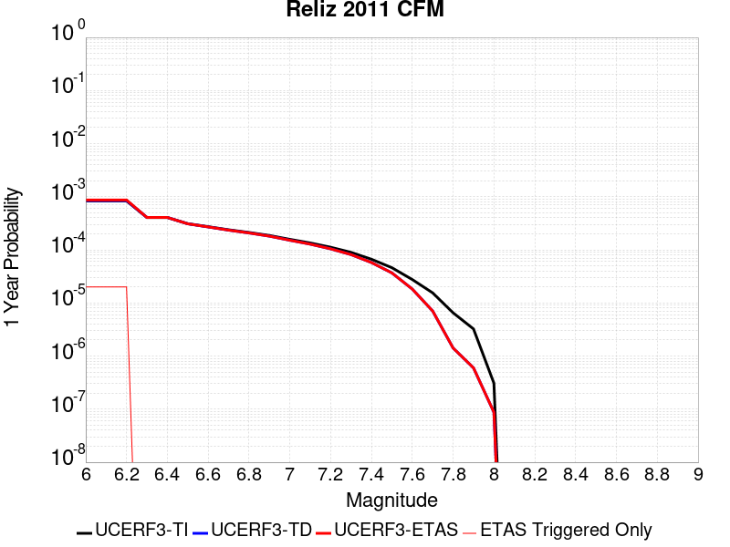 |  |

| Magnitude | 1 wk TI Prob | 1 wk TD Prob | 1 wk ETAS Prob | 1 wk ETAS/TD Gain | 1 wk ETAS Triggered Only | 1 mo TI Prob | 1 mo TD Prob | 1 mo ETAS Prob | 1 mo ETAS/TD Gain | 1 mo ETAS Triggered Only | 1 yr TI Prob | 1 yr TD Prob | 1 yr ETAS Prob | 1 yr ETAS/TD Gain | 1 yr ETAS Triggered Only | 10 yr TI Prob | 10 yr TD Prob | 10 yr ETAS Prob | 10 yr ETAS/TD Gain | 10 yr ETAS Triggered Only |
|-----|-----|-----|-----|-----|-----|-----|-----|-----|-----|-----|-----|-----|-----|-----|-----|-----|-----|-----|-----|-----|
| 6.0 | 1.6002472E-5 | 1.6282804E-5 | 6.809543E-5 | 4.182046 | 5.1813473E-5 | 6.8580215E-5 | 6.9781694E-5 | 1.2159155E-4 | 1.7424563 | 5.1813473E-5 | 8.3464425E-4 | 8.4928074E-4 | 9.010502E-4 | 1.0609568 | 5.1813473E-5 | 0.008315164 | 0.008462547 | 0.008565297 | 1.0121417 | 1.03626946E-4 |
| 6.1 | 1.6002472E-5 | 1.6282804E-5 | 6.809543E-5 | 4.182046 | 5.1813473E-5 | 6.8580215E-5 | 6.9781694E-5 | 1.2159155E-4 | 1.7424563 | 5.1813473E-5 | 8.3464425E-4 | 8.4928074E-4 | 9.010502E-4 | 1.0609568 | 5.1813473E-5 | 0.008315164 | 0.008462547 | 0.008565297 | 1.0121417 | 1.03626946E-4 |
| 6.2 | 1.6002472E-5 | 1.6282804E-5 | 6.809543E-5 | 4.182046 | 5.1813473E-5 | 6.8580215E-5 | 6.9781694E-5 | 1.2159155E-4 | 1.7424563 | 5.1813473E-5 | 8.3464425E-4 | 8.4928074E-4 | 9.010502E-4 | 1.0609568 | 5.1813473E-5 | 0.008315164 | 0.008462547 | 0.008565297 | 1.0121417 | 1.03626946E-4 |
| 6.3 | 7.792404E-6 | 7.803802E-6 | 7.803802E-6 | 1.0 | 0.0 | 3.339559E-5 | 3.344444E-5 | 3.344444E-5 | 1.0 | 0.0 | 4.0651546E-4 | 4.0711078E-4 | 4.0711078E-4 | 1.0 | 0.0 | 0.0040577264 | 0.004063926 | 0.004063926 | 1.0 | 0.0 |
| 6.4 | 7.792404E-6 | 7.803802E-6 | 7.803802E-6 | 1.0 | 0.0 | 3.339559E-5 | 3.344444E-5 | 3.344444E-5 | 1.0 | 0.0 | 4.0651546E-4 | 4.0711078E-4 | 4.0711078E-4 | 1.0 | 0.0 | 0.0040577264 | 0.004063926 | 0.004063926 | 1.0 | 0.0 |
| 6.5 | 5.9659374E-6 | 5.928738E-6 | 5.928738E-6 | 1.0 | 0.0 | 2.5568053E-5 | 2.5408632E-5 | 2.5408632E-5 | 1.0 | 0.0 | 3.1124658E-4 | 3.093064E-4 | 3.093064E-4 | 1.0 | 0.0 | 0.00310811 | 0.0030889767 | 0.0030889767 | 1.0 | 0.0 |
| 6.6 | 5.2350692E-6 | 5.178986E-6 | 5.178986E-6 | 1.0 | 0.0 | 2.2435817E-5 | 2.2195467E-5 | 2.2195467E-5 | 1.0 | 0.0 | 2.7312184E-4 | 2.7019644E-4 | 2.7019644E-4 | 1.0 | 0.0 | 0.002727864 | 0.0026988892 | 0.0026988892 | 1.0 | 0.0 |
| 6.7 | 4.580206E-6 | 4.5061206E-6 | 4.5061206E-6 | 1.0 | 0.0 | 1.9629308E-5 | 1.9311801E-5 | 1.9311801E-5 | 1.0 | 0.0 | 2.389606E-4 | 2.350959E-4 | 2.350959E-4 | 1.0 | 0.0 | 0.002387038 | 0.0023486738 | 0.0023486738 | 1.0 | 0.0 |
| 6.8 | 4.0765017E-6 | 3.9882384E-6 | 3.9882384E-6 | 1.0 | 0.0 | 1.7470604E-5 | 1.7092338E-5 | 1.7092338E-5 | 1.0 | 0.0 | 2.1268385E-4 | 2.0807938E-4 | 2.0807938E-4 | 1.0 | 0.0 | 0.002124804 | 0.0020790435 | 0.0020790435 | 1.0 | 0.0 |
| 6.9 | 3.5752896E-6 | 3.4725176E-6 | 3.4725176E-6 | 1.0 | 0.0 | 1.532258E-5 | 1.4882134E-5 | 1.4882134E-5 | 1.0 | 0.0 | 1.8653645E-4 | 1.8117494E-4 | 1.8117494E-4 | 1.0 | 0.0 | 0.0018637994 | 0.0018104686 | 0.0018104686 | 1.0 | 0.0 |
| 7.0 | 3.0259848E-6 | 2.9079417E-6 | 2.9079417E-6 | 1.0 | 0.0 | 1.2968442E-5 | 1.2462548E-5 | 1.2462548E-5 | 1.0 | 0.0 | 1.5787935E-4 | 1.5172097E-4 | 1.5172097E-4 | 1.0 | 0.0 | 0.0015776722 | 0.001516369 | 0.001516369 | 1.0 | 0.0 |
| 7.1 | 2.5861116E-6 | 2.455167E-6 | 2.455167E-6 | 1.0 | 0.0 | 1.1083288E-5 | 1.05221025E-5 | 1.05221025E-5 | 1.0 | 0.0 | 1.3493067E-4 | 1.2809907E-4 | 1.2809907E-4 | 1.0 | 0.0 | 0.0013484878 | 0.001280447 | 0.001280447 | 1.0 | 0.0 |
| 7.2 | 2.1482588E-6 | 2.003237E-6 | 2.003237E-6 | 1.0 | 0.0 | 9.20679E-6 | 8.585273E-6 | 8.585273E-6 | 1.0 | 0.0 | 1.12086906E-4 | 1.0452068E-4 | 1.0452068E-4 | 1.0 | 0.0 | 0.0011203039 | 0.0010449095 | 0.0010449095 | 1.0 | 0.0 |
| 7.3 | 1.7194744E-6 | 1.5611241E-6 | 1.5611241E-6 | 1.0 | 0.0 | 7.3691554E-6 | 6.690515E-6 | 6.690515E-6 | 1.0 | 0.0 | 8.971577E-5 | 8.1453974E-5 | 8.1453974E-5 | 1.0 | 0.0 | 8.967956E-4 | 8.1443513E-4 | 8.1443513E-4 | 1.0 | 0.0 |
| 7.4 | 1.2755178E-6 | 1.10563E-6 | 1.10563E-6 | 1.0 | 0.0 | 5.4664933E-6 | 4.7384056E-6 | 4.7384056E-6 | 1.0 | 0.0 | 6.655252E-5 | 5.768856E-5 | 5.768856E-5 | 1.0 | 0.0 | 6.6532596E-4 | 5.7692965E-4 | 5.7692965E-4 | 1.0 | 0.0 |
| 7.5 | 8.8463224E-7 | 7.0580273E-7 | 7.0580273E-7 | 1.0 | 0.0 | 3.7912755E-6 | 3.0248652E-6 | 3.0248652E-6 | 1.0 | 0.0 | 4.6157802E-5 | 3.6827114E-5 | 3.6827114E-5 | 1.0 | 0.0 | 4.6148215E-4 | 3.684038E-4 | 3.684038E-4 | 1.0 | 0.0 |
| 7.6 | 5.291355E-7 | 3.500777E-7 | 3.500777E-7 | 1.0 | 0.0 | 2.2677216E-6 | 1.5003321E-6 | 1.5003321E-6 | 1.0 | 0.0 | 2.760916E-5 | 1.8266392E-5 | 1.8266392E-5 | 1.0 | 0.0 | 2.760573E-4 | 1.8284164E-4 | 1.8284164E-4 | 1.0 | 0.0 |
| 7.7 | 2.9663357E-7 | 1.351113E-7 | 1.351113E-7 | 1.0 | 0.0 | 1.2712861E-6 | 5.7904833E-7 | 5.7904833E-7 | 1.0 | 0.0 | 1.5477797E-5 | 7.049891E-6 | 7.049891E-6 | 1.0 | 0.0 | 1.547672E-4 | 7.068132E-5 | 7.068132E-5 | 1.0 | 0.0 |
| 7.8 | 1.2509386E-7 | 2.7157126E-8 | 2.7157126E-8 | 1.0 | 0.0 | 5.3611643E-7 | 1.1638769E-7 | 1.1638769E-7 | 1.0 | 0.0 | 6.527198E-6 | 1.4170191E-6 | 1.4170191E-6 | 1.0 | 0.0 | 6.527006E-5 | 1.4326506E-5 | 1.4326506E-5 | 1.0 | 0.0 |
| 7.9 | 6.213493E-8 | 1.1482114E-8 | 1.1482114E-8 | 1.0 | 0.0 | 2.6629255E-7 | 4.920906E-8 | 4.920906E-8 | 1.0 | 0.0 | 3.242107E-6 | 5.9912014E-7 | 5.9912014E-7 | 1.0 | 0.0 | 3.2420594E-5 | 6.1224223E-6 | 6.1224223E-6 | 1.0 | 0.0 |
| 8.0 | 5.92383E-9 | 1.677887E-9 | 1.677887E-9 | 1.0 | 0.0 | 2.5387841E-8 | 7.190944E-9 | 7.190944E-9 | 1.0 | 0.0 | 3.0909692E-7 | 8.754974E-8 | 8.754974E-8 | 1.0 | 0.0 | 3.090965E-6 | 9.003061E-7 | 9.003061E-7 | 1.0 | 0.0 |

## Oceanside alt1
*[(top)](#table-of-contents)*

| 1 Week | 1 Month | 1 Year | 10 Year |
|-----|-----|-----|-----|
|  |  |  |  |

| Magnitude | 1 wk TI Prob | 1 wk TD Prob | 1 wk ETAS Prob | 1 wk ETAS/TD Gain | 1 wk ETAS Triggered Only | 1 mo TI Prob | 1 mo TD Prob | 1 mo ETAS Prob | 1 mo ETAS/TD Gain | 1 mo ETAS Triggered Only | 1 yr TI Prob | 1 yr TD Prob | 1 yr ETAS Prob | 1 yr ETAS/TD Gain | 1 yr ETAS Triggered Only | 10 yr TI Prob | 10 yr TD Prob | 10 yr ETAS Prob | 10 yr ETAS/TD Gain | 10 yr ETAS Triggered Only |
|-----|-----|-----|-----|-----|-----|-----|-----|-----|-----|-----|-----|-----|-----|-----|-----|-----|-----|-----|-----|-----|
| 6.0 | 1.1617542E-5 | 1.1423493E-5 | 1.1423493E-5 | 1.0 | 0.0 | 4.9788516E-5 | 4.8956997E-5 | 1.0076793E-4 | 2.0582948 | 5.1813473E-5 | 6.060066E-4 | 5.9590454E-4 | 6.994697E-4 | 1.173795 | 1.03626946E-4 | 0.0060435664 | 0.005944664 | 0.006047675 | 1.0173283 | 1.03626946E-4 |
| 6.1 | 1.1617542E-5 | 1.1423493E-5 | 1.1423493E-5 | 1.0 | 0.0 | 4.9788516E-5 | 4.8956997E-5 | 1.0076793E-4 | 2.0582948 | 5.1813473E-5 | 6.060066E-4 | 5.9590454E-4 | 6.994697E-4 | 1.173795 | 1.03626946E-4 | 0.0060435664 | 0.005944664 | 0.006047675 | 1.0173283 | 1.03626946E-4 |
| 6.2 | 1.1617542E-5 | 1.1423493E-5 | 1.1423493E-5 | 1.0 | 0.0 | 4.9788516E-5 | 4.8956997E-5 | 1.0076793E-4 | 2.0582948 | 5.1813473E-5 | 6.060066E-4 | 5.9590454E-4 | 6.994697E-4 | 1.173795 | 1.03626946E-4 | 0.0060435664 | 0.005944664 | 0.006047675 | 1.0173283 | 1.03626946E-4 |
| 6.3 | 1.1617542E-5 | 1.1423493E-5 | 1.1423493E-5 | 1.0 | 0.0 | 4.9788516E-5 | 4.8956997E-5 | 1.0076793E-4 | 2.0582948 | 5.1813473E-5 | 6.060066E-4 | 5.9590454E-4 | 6.994697E-4 | 1.173795 | 1.03626946E-4 | 0.0060435664 | 0.005944664 | 0.006047675 | 1.0173283 | 1.03626946E-4 |
| 6.4 | 1.1617542E-5 | 1.1423493E-5 | 1.1423493E-5 | 1.0 | 0.0 | 4.9788516E-5 | 4.8956997E-5 | 1.0076793E-4 | 2.0582948 | 5.1813473E-5 | 6.060066E-4 | 5.9590454E-4 | 6.994697E-4 | 1.173795 | 1.03626946E-4 | 0.0060435664 | 0.005944664 | 0.006047675 | 1.0173283 | 1.03626946E-4 |
| 6.5 | 1.1617542E-5 | 1.1423493E-5 | 1.1423493E-5 | 1.0 | 0.0 | 4.9788516E-5 | 4.8956997E-5 | 1.0076793E-4 | 2.0582948 | 5.1813473E-5 | 6.060066E-4 | 5.9590454E-4 | 6.994697E-4 | 1.173795 | 1.03626946E-4 | 0.0060435664 | 0.005944664 | 0.006047675 | 1.0173283 | 1.03626946E-4 |
| 6.6 | 7.561768E-6 | 7.1336153E-6 | 7.1336153E-6 | 1.0 | 0.0 | 3.2407173E-5 | 3.0572286E-5 | 8.238417E-5 | 2.6947339 | 5.1813473E-5 | 3.9448592E-4 | 3.7215507E-4 | 4.7574347E-4 | 1.2783474 | 1.03626946E-4 | 0.0039378637 | 0.00371543 | 0.003818672 | 1.0277873 | 1.03626946E-4 |
| 6.7 | 7.1042605E-6 | 6.6556854E-6 | 6.6556854E-6 | 1.0 | 0.0 | 3.0446476E-5 | 2.8524059E-5 | 8.033605E-5 | 2.8164313 | 5.1813473E-5 | 3.706228E-4 | 3.472259E-4 | 4.5081685E-4 | 1.2983388 | 1.03626946E-4 | 0.0037000529 | 0.003466917 | 0.0035701846 | 1.0297866 | 1.03626946E-4 |
| 6.8 | 6.285554E-6 | 5.799706E-6 | 5.799706E-6 | 1.0 | 0.0 | 2.693781E-5 | 2.4855648E-5 | 7.6667835E-5 | 3.0845234 | 5.1813473E-5 | 3.2791847E-4 | 3.0257605E-4 | 4.0617163E-4 | 1.3423787 | 1.03626946E-4 | 0.0032743502 | 0.0030216982 | 0.003125012 | 1.0341907 | 1.03626946E-4 |
| 6.9 | 6.148883E-6 | 5.6565445E-6 | 5.6565445E-6 | 1.0 | 0.0 | 2.635209E-5 | 2.424211E-5 | 7.6054326E-5 | 3.1372814 | 5.1813473E-5 | 3.2078946E-4 | 2.9510827E-4 | 3.9870464E-4 | 1.3510453 | 1.03626946E-4 | 0.003203268 | 0.0029472208 | 0.0030505424 | 1.0350573 | 1.03626946E-4 |
| 7.0 | 5.253857E-6 | 4.722404E-6 | 4.722404E-6 | 1.0 | 0.0 | 2.2516335E-5 | 2.0238718E-5 | 7.205114E-5 | 3.5600643 | 5.1813473E-5 | 2.7410188E-4 | 2.4637886E-4 | 3.4998026E-4 | 1.4204963 | 1.03626946E-4 | 0.0027376404 | 0.0024610884 | 0.0025644603 | 1.0420026 | 1.03626946E-4 |
| 7.1 | 4.730754E-6 | 4.17851E-6 | 4.17851E-6 | 1.0 | 0.0 | 2.0274503E-5 | 1.7907778E-5 | 6.972032E-5 | 3.8932981 | 5.1813473E-5 | 2.468141E-4 | 2.1800565E-4 | 3.2161E-4 | 1.475237 | 1.03626946E-4 | 0.0024654015 | 0.0021779444 | 0.0022813457 | 1.0474765 | 1.03626946E-4 |
| 7.2 | 3.7998386E-6 | 3.214026E-6 | 3.214026E-6 | 1.0 | 0.0 | 1.6284921E-5 | 1.37743245E-5 | 6.558708E-5 | 4.761546 | 5.1813473E-5 | 1.9825088E-4 | 1.6768962E-4 | 2.7129918E-4 | 1.6178651 | 1.03626946E-4 | 0.001980741 | 0.001675643 | 0.0017790964 | 1.0617394 | 1.03626946E-4 |
| 7.3 | 3.2656465E-6 | 2.698376E-6 | 2.698376E-6 | 1.0 | 0.0 | 1.3995553E-5 | 1.1564418E-5 | 6.337729E-5 | 5.48037 | 5.1813473E-5 | 1.7038253E-4 | 1.407878E-4 | 1.9259397E-4 | 1.3679734 | 5.1813473E-5 | 0.0017025196 | 0.0014069972 | 0.0014587378 | 1.0367738 | 5.1813473E-5 |
| 7.4 | 2.593703E-6 | 2.0680277E-6 | 2.0680277E-6 | 1.0 | 0.0 | 1.1115822E-5 | 8.862946E-6 | 6.0675957E-5 | 6.846026 | 5.1813473E-5 | 1.3532673E-4 | 1.0790111E-4 | 1.59709E-4 | 1.4801422 | 5.1813473E-5 | 0.0013524436 | 0.0010784961 | 0.0011302538 | 1.0479906 | 5.1813473E-5 |
| 7.5 | 1.8715585E-6 | 1.4137177E-6 | 1.4137177E-6 | 1.0 | 0.0 | 8.020941E-6 | 6.0587763E-6 | 5.7871934E-5 | 9.551753 | 5.1813473E-5 | 9.7650576E-5 | 7.376316E-5 | 1.2557281E-4 | 1.7023784 | 5.1813473E-5 | 9.7607676E-4 | 7.3739287E-4 | 7.891681E-4 | 1.0702139 | 5.1813473E-5 |
| 7.6 | 1.2246786E-6 | 8.5268175E-7 | 8.5268175E-7 | 1.0 | 0.0 | 5.248612E-6 | 3.6543456E-6 | 5.5467626E-5 | 15.178539 | 5.1813473E-5 | 6.389998E-5 | 4.4490793E-5 | 9.630196E-5 | 2.1645367 | 5.1813473E-5 | 6.3881604E-4 | 4.4482335E-4 | 4.966138E-4 | 1.1164292 | 5.1813473E-5 |
| 7.7 | 5.140719E-7 | 2.734703E-7 | 2.734703E-7 | 1.0 | 0.0 | 2.2031636E-6 | 1.1720151E-6 | 5.2985426E-5 | 45.208824 | 5.1813473E-5 | 2.6823185E-5 | 1.4269205E-5 | 6.6081935E-5 | 4.6310873 | 5.1813473E-5 | 2.6819948E-4 | 1.4268424E-4 | 1.9449032E-4 | 1.363082 | 5.1813473E-5 |
| 7.8 | 1.16056995E-8 | 9.782373E-9 | 9.782373E-9 | 1.0 | 0.0 | 4.9738713E-8 | 4.1924455E-8 | 4.1924455E-8 | 1.0 | 0.0 | 6.0556863E-7 | 5.1043025E-7 | 5.1043025E-7 | 1.0 | 0.0 | 6.05567E-6 | 5.1043025E-6 | 5.1043025E-6 | 1.0 | 0.0 |

## Pleito
*[(top)](#table-of-contents)*

| 1 Week | 1 Month | 1 Year | 10 Year |
|-----|-----|-----|-----|
|  |  |  |  |

| Magnitude | 1 wk TI Prob | 1 wk TD Prob | 1 wk ETAS Prob | 1 wk ETAS/TD Gain | 1 wk ETAS Triggered Only | 1 mo TI Prob | 1 mo TD Prob | 1 mo ETAS Prob | 1 mo ETAS/TD Gain | 1 mo ETAS Triggered Only | 1 yr TI Prob | 1 yr TD Prob | 1 yr ETAS Prob | 1 yr ETAS/TD Gain | 1 yr ETAS Triggered Only | 10 yr TI Prob | 10 yr TD Prob | 10 yr ETAS Prob | 10 yr ETAS/TD Gain | 10 yr ETAS Triggered Only |
|-----|-----|-----|-----|-----|-----|-----|-----|-----|-----|-----|-----|-----|-----|-----|-----|-----|-----|-----|-----|-----|
| 6.0 | 1.6763008E-5 | 2.4763838E-5 | 2.4763838E-5 | 1.0 | 0.0 | 7.183948E-5 | 1.0612683E-4 | 1.0612683E-4 | 1.0 | 0.0 | 8.742947E-4 | 0.0012914003 | 0.0013431469 | 1.04007 | 5.1813473E-5 | 0.00870863 | 0.0129538905 | 0.013056175 | 1.0078961 | 1.03626946E-4 |
| 6.1 | 1.6763008E-5 | 2.4763838E-5 | 2.4763838E-5 | 1.0 | 0.0 | 7.183948E-5 | 1.0612683E-4 | 1.0612683E-4 | 1.0 | 0.0 | 8.742947E-4 | 0.0012914003 | 0.0013431469 | 1.04007 | 5.1813473E-5 | 0.00870863 | 0.0129538905 | 0.013056175 | 1.0078961 | 1.03626946E-4 |
| 6.2 | 1.6763008E-5 | 2.4763838E-5 | 2.4763838E-5 | 1.0 | 0.0 | 7.183948E-5 | 1.0612683E-4 | 1.0612683E-4 | 1.0 | 0.0 | 8.742947E-4 | 0.0012914003 | 0.0013431469 | 1.04007 | 5.1813473E-5 | 0.00870863 | 0.0129538905 | 0.013056175 | 1.0078961 | 1.03626946E-4 |
| 6.3 | 1.6763008E-5 | 2.4763838E-5 | 2.4763838E-5 | 1.0 | 0.0 | 7.183948E-5 | 1.0612683E-4 | 1.0612683E-4 | 1.0 | 0.0 | 8.742947E-4 | 0.0012914003 | 0.0013431469 | 1.04007 | 5.1813473E-5 | 0.00870863 | 0.0129538905 | 0.013056175 | 1.0078961 | 1.03626946E-4 |
| 6.4 | 1.6763008E-5 | 2.4763838E-5 | 2.4763838E-5 | 1.0 | 0.0 | 7.183948E-5 | 1.0612683E-4 | 1.0612683E-4 | 1.0 | 0.0 | 8.742947E-4 | 0.0012914003 | 0.0013431469 | 1.04007 | 5.1813473E-5 | 0.00870863 | 0.0129538905 | 0.013056175 | 1.0078961 | 1.03626946E-4 |
| 6.5 | 1.6763008E-5 | 2.4763838E-5 | 2.4763838E-5 | 1.0 | 0.0 | 7.183948E-5 | 1.0612683E-4 | 1.0612683E-4 | 1.0 | 0.0 | 8.742947E-4 | 0.0012914003 | 0.0013431469 | 1.04007 | 5.1813473E-5 | 0.00870863 | 0.0129538905 | 0.013056175 | 1.0078961 | 1.03626946E-4 |
| 6.6 | 9.910213E-6 | 1.7214623E-5 | 1.7214623E-5 | 1.0 | 0.0 | 4.247165E-5 | 7.377489E-5 | 7.377489E-5 | 1.0 | 0.0 | 5.169696E-4 | 8.978429E-4 | 8.978429E-4 | 1.0 | 0.0 | 0.0051576863 | 0.009050702 | 0.0091020465 | 1.0056729 | 5.1813473E-5 |
| 6.7 | 9.910213E-6 | 1.7214623E-5 | 1.7214623E-5 | 1.0 | 0.0 | 4.247165E-5 | 7.377489E-5 | 7.377489E-5 | 1.0 | 0.0 | 5.169696E-4 | 8.978429E-4 | 8.978429E-4 | 1.0 | 0.0 | 0.0051576863 | 0.009050702 | 0.0091020465 | 1.0056729 | 5.1813473E-5 |
| 6.8 | 8.300162E-6 | 1.5474232E-5 | 1.5474232E-5 | 1.0 | 0.0 | 3.557164E-5 | 6.631646E-5 | 6.631646E-5 | 1.0 | 0.0 | 4.3299864E-4 | 8.071053E-4 | 8.071053E-4 | 1.0 | 0.0 | 0.004321559 | 0.008150139 | 0.00820153 | 1.0063056 | 5.1813473E-5 |
| 6.9 | 8.183114E-6 | 1.5345448E-5 | 1.5345448E-5 | 1.0 | 0.0 | 3.5070017E-5 | 6.576455E-5 | 6.576455E-5 | 1.0 | 0.0 | 4.2689382E-4 | 8.003907E-4 | 8.003907E-4 | 1.0 | 0.0 | 0.0042607468 | 0.008083483 | 0.008134878 | 1.006358 | 5.1813473E-5 |
| 7.0 | 7.1748823E-6 | 1.413244E-5 | 1.413244E-5 | 1.0 | 0.0 | 3.0749135E-5 | 6.0566195E-5 | 6.0566195E-5 | 1.0 | 0.0 | 3.743064E-4 | 7.371445E-4 | 7.371445E-4 | 1.0 | 0.0 | 0.0037367654 | 0.007454939 | 0.0075063664 | 1.0068984 | 5.1813473E-5 |
| 7.1 | 7.1671807E-6 | 1.412281E-5 | 1.412281E-5 | 1.0 | 0.0 | 3.0716128E-5 | 6.052493E-5 | 6.052493E-5 | 1.0 | 0.0 | 3.7390468E-4 | 7.366424E-4 | 7.366424E-4 | 1.0 | 0.0 | 0.0037327618 | 0.0074499524 | 0.0075013796 | 1.006903 | 5.1813473E-5 |
| 7.2 | 7.0649667E-6 | 1.39701015E-5 | 1.39701015E-5 | 1.0 | 0.0 | 3.0278077E-5 | 5.9870494E-5 | 5.9870494E-5 | 1.0 | 0.0 | 3.6857324E-4 | 7.2868E-4 | 7.2868E-4 | 1.0 | 0.0 | 0.0036796255 | 0.0073707094 | 0.007422141 | 1.0069778 | 5.1813473E-5 |
| 7.3 | 7.02082E-6 | 1.3913556E-5 | 1.3913556E-5 | 1.0 | 0.0 | 3.008888E-5 | 5.9628168E-5 | 5.9628168E-5 | 1.0 | 0.0 | 3.6627054E-4 | 7.2573166E-4 | 7.2573166E-4 | 1.0 | 0.0 | 0.0036566744 | 0.007341209 | 0.007392642 | 1.007006 | 5.1813473E-5 |
| 7.4 | 6.987146E-6 | 1.3873118E-5 | 1.3873118E-5 | 1.0 | 0.0 | 2.9944567E-5 | 5.945487E-5 | 5.945487E-5 | 1.0 | 0.0 | 3.6451413E-4 | 7.2362315E-4 | 7.2362315E-4 | 1.0 | 0.0 | 0.0036391679 | 0.007320144 | 0.0073715784 | 1.0070264 | 5.1813473E-5 |
| 7.5 | 6.9494554E-6 | 1.3830024E-5 | 1.3830024E-5 | 1.0 | 0.0 | 2.9783041E-5 | 5.9270187E-5 | 5.9270187E-5 | 1.0 | 0.0 | 3.625482E-4 | 7.2137616E-4 | 7.2137616E-4 | 1.0 | 0.0 | 0.0036195726 | 0.0072977724 | 0.007349208 | 1.0070481 | 5.1813473E-5 |
| 7.6 | 6.92694E-6 | 1.3789138E-5 | 1.3789138E-5 | 1.0 | 0.0 | 2.9686547E-5 | 5.909497E-5 | 5.909497E-5 | 1.0 | 0.0 | 3.6137376E-4 | 7.1924424E-4 | 7.1924424E-4 | 1.0 | 0.0 | 0.0036078666 | 0.0072765257 | 0.007327962 | 1.0070689 | 5.1813473E-5 |
| 7.7 | 6.395867E-6 | 1.2668219E-5 | 1.2668219E-5 | 1.0 | 0.0 | 2.741057E-5 | 5.429124E-5 | 5.429124E-5 | 1.0 | 0.0 | 3.336726E-4 | 6.6079566E-4 | 6.6079566E-4 | 1.0 | 0.0 | 0.0033317201 | 0.0066951844 | 0.006746651 | 1.0076871 | 5.1813473E-5 |
| 7.8 | 5.8664327E-6 | 1.153586E-5 | 1.153586E-5 | 1.0 | 0.0 | 2.5141611E-5 | 4.9438466E-5 | 4.9438466E-5 | 1.0 | 0.0 | 3.060561E-4 | 6.017473E-4 | 6.017473E-4 | 1.0 | 0.0 | 0.0030563495 | 0.0061006667 | 0.0061521637 | 1.0084413 | 5.1813473E-5 |
| 7.9 | 3.7167474E-6 | 7.1140853E-6 | 7.1140853E-6 | 1.0 | 0.0 | 1.592882E-5 | 3.0488582E-5 | 3.0488582E-5 | 1.0 | 0.0 | 1.9391612E-4 | 3.7113542E-4 | 3.7113542E-4 | 1.0 | 0.0 | 0.0019374699 | 0.0037674906 | 0.0037674906 | 1.0 | 0.0 |
| 8.0 | 1.0903841E-6 | 1.2879392E-6 | 1.2879392E-6 | 1.0 | 0.0 | 4.6730665E-6 | 5.5197274E-6 | 5.5197274E-6 | 1.0 | 0.0 | 5.68931E-5 | 6.720063E-5 | 6.720063E-5 | 1.0 | 0.0 | 5.6878536E-4 | 6.941948E-4 | 6.941948E-4 | 1.0 | 0.0 |
| 8.1 | 2.6894583E-7 | 1.1060341E-7 | 1.1060341E-7 | 1.0 | 0.0 | 1.1526245E-6 | 4.740145E-7 | 4.740145E-7 | 1.0 | 0.0 | 1.4033113E-5 | 5.7711113E-6 | 5.7711113E-6 | 1.0 | 0.0 | 1.4032227E-4 | 6.456908E-5 | 6.456908E-5 | 1.0 | 0.0 |
| 8.2 | 5.2967013E-9 | 2.4578228E-9 | 2.4578228E-9 | 1.0 | 0.0 | 2.2700148E-8 | 1.0533527E-8 | 1.0533527E-8 | 1.0 | 0.0 | 2.7637427E-7 | 1.2824569E-7 | 1.2824569E-7 | 1.0 | 0.0 | 2.7637393E-6 | 1.4592787E-6 | 1.4592787E-6 | 1.0 | 0.0 |

## Los Alamos 2011 CFM
*[(top)](#table-of-contents)*

| 1 Week | 1 Month | 1 Year | 10 Year |
|-----|-----|-----|-----|
|  |  |  |  |

| Magnitude | 1 wk TI Prob | 1 wk TD Prob | 1 wk ETAS Prob | 1 wk ETAS/TD Gain | 1 wk ETAS Triggered Only | 1 mo TI Prob | 1 mo TD Prob | 1 mo ETAS Prob | 1 mo ETAS/TD Gain | 1 mo ETAS Triggered Only | 1 yr TI Prob | 1 yr TD Prob | 1 yr ETAS Prob | 1 yr ETAS/TD Gain | 1 yr ETAS Triggered Only | 10 yr TI Prob | 10 yr TD Prob | 10 yr ETAS Prob | 10 yr ETAS/TD Gain | 10 yr ETAS Triggered Only |
|-----|-----|-----|-----|-----|-----|-----|-----|-----|-----|-----|-----|-----|-----|-----|-----|-----|-----|-----|-----|-----|
| 6.0 | 4.6284417E-6 | 4.751731E-6 | 4.751731E-6 | 1.0 | 0.0 | 1.9836029E-5 | 2.0364414E-5 | 2.0364414E-5 | 1.0 | 0.0 | 2.4147688E-4 | 2.4791027E-4 | 3.5151152E-4 | 1.4178982 | 1.03626946E-4 | 0.0024121467 | 0.0024765113 | 0.0025798818 | 1.0417403 | 1.03626946E-4 |
| 6.1 | 4.6284417E-6 | 4.751731E-6 | 4.751731E-6 | 1.0 | 0.0 | 1.9836029E-5 | 2.0364414E-5 | 2.0364414E-5 | 1.0 | 0.0 | 2.4147688E-4 | 2.4791027E-4 | 3.5151152E-4 | 1.4178982 | 1.03626946E-4 | 0.0024121467 | 0.0024765113 | 0.0025798818 | 1.0417403 | 1.03626946E-4 |
| 6.2 | 4.6284417E-6 | 4.751731E-6 | 4.751731E-6 | 1.0 | 0.0 | 1.9836029E-5 | 2.0364414E-5 | 2.0364414E-5 | 1.0 | 0.0 | 2.4147688E-4 | 2.4791027E-4 | 3.5151152E-4 | 1.4178982 | 1.03626946E-4 | 0.0024121467 | 0.0024765113 | 0.0025798818 | 1.0417403 | 1.03626946E-4 |
| 6.3 | 4.6284417E-6 | 4.751731E-6 | 4.751731E-6 | 1.0 | 0.0 | 1.9836029E-5 | 2.0364414E-5 | 2.0364414E-5 | 1.0 | 0.0 | 2.4147688E-4 | 2.4791027E-4 | 3.5151152E-4 | 1.4178982 | 1.03626946E-4 | 0.0024121467 | 0.0024765113 | 0.0025798818 | 1.0417403 | 1.03626946E-4 |
| 6.4 | 4.6284417E-6 | 4.751731E-6 | 4.751731E-6 | 1.0 | 0.0 | 1.9836029E-5 | 2.0364414E-5 | 2.0364414E-5 | 1.0 | 0.0 | 2.4147688E-4 | 2.4791027E-4 | 3.5151152E-4 | 1.4178982 | 1.03626946E-4 | 0.0024121467 | 0.0024765113 | 0.0025798818 | 1.0417403 | 1.03626946E-4 |
| 6.5 | 4.6284417E-6 | 4.751731E-6 | 4.751731E-6 | 1.0 | 0.0 | 1.9836029E-5 | 2.0364414E-5 | 2.0364414E-5 | 1.0 | 0.0 | 2.4147688E-4 | 2.4791027E-4 | 3.5151152E-4 | 1.4178982 | 1.03626946E-4 | 0.0024121467 | 0.0024765113 | 0.0025798818 | 1.0417403 | 1.03626946E-4 |
| 6.6 | 4.6284417E-6 | 4.751731E-6 | 4.751731E-6 | 1.0 | 0.0 | 1.9836029E-5 | 2.0364414E-5 | 2.0364414E-5 | 1.0 | 0.0 | 2.4147688E-4 | 2.4791027E-4 | 3.5151152E-4 | 1.4178982 | 1.03626946E-4 | 0.0024121467 | 0.0024765113 | 0.0025798818 | 1.0417403 | 1.03626946E-4 |
| 6.7 | 4.062321E-6 | 4.166349E-6 | 4.166349E-6 | 1.0 | 0.0 | 1.7409831E-5 | 1.7855667E-5 | 1.7855667E-5 | 1.0 | 0.0 | 2.1194408E-4 | 2.1737257E-4 | 2.6917478E-4 | 1.2383107 | 5.1813473E-5 | 0.0021174205 | 0.0021717492 | 0.0022234502 | 1.0238061 | 5.1813473E-5 |
| 6.8 | 4.062321E-6 | 4.166349E-6 | 4.166349E-6 | 1.0 | 0.0 | 1.7409831E-5 | 1.7855667E-5 | 1.7855667E-5 | 1.0 | 0.0 | 2.1194408E-4 | 2.1737257E-4 | 2.6917478E-4 | 1.2383107 | 5.1813473E-5 | 0.0021174205 | 0.0021717492 | 0.0022234502 | 1.0238061 | 5.1813473E-5 |
| 6.9 | 3.2936077E-6 | 3.372958E-6 | 3.372958E-6 | 1.0 | 0.0 | 1.4115385E-5 | 1.4455459E-5 | 1.4455459E-5 | 1.0 | 0.0 | 1.7184127E-4 | 1.7598194E-4 | 2.277863E-4 | 1.2943732 | 5.1813473E-5 | 0.0017170844 | 0.0017585184 | 0.0018102408 | 1.0294125 | 5.1813473E-5 |
| 7.0 | 3.1687898E-6 | 3.2448156E-6 | 3.2448156E-6 | 1.0 | 0.0 | 1.3580457E-5 | 1.3906283E-5 | 1.3906283E-5 | 1.0 | 0.0 | 1.6532952E-4 | 1.6929678E-4 | 2.2110148E-4 | 1.3059993 | 5.1813473E-5 | 0.0016520657 | 0.0016917696 | 0.0017434955 | 1.0305749 | 5.1813473E-5 |
| 7.1 | 2.9379228E-6 | 3.0073259E-6 | 3.0073259E-6 | 1.0 | 0.0 | 1.25910365E-5 | 1.288848E-5 | 1.288848E-5 | 1.0 | 0.0 | 1.5328509E-4 | 1.5690686E-4 | 2.087122E-4 | 1.3301662 | 5.1813473E-5 | 0.001531794 | 0.0015680499 | 0.0016197821 | 1.0329914 | 5.1813473E-5 |
| 7.2 | 2.0020686E-6 | 2.0416298E-6 | 2.0416298E-6 | 1.0 | 0.0 | 8.580266E-6 | 8.749813E-6 | 8.749813E-6 | 1.0 | 0.0 | 1.0445973E-4 | 1.0652381E-4 | 1.0652381E-4 | 1.0 | 0.0 | 0.0010441064 | 0.001064732 | 0.001064732 | 1.0 | 0.0 |
| 7.3 | 1.7364243E-6 | 1.7678802E-6 | 1.7678802E-6 | 1.0 | 0.0 | 7.441797E-6 | 7.576608E-6 | 7.576608E-6 | 1.0 | 0.0 | 9.0600115E-5 | 9.2241324E-5 | 9.2241324E-5 | 1.0 | 0.0 | 9.0563187E-4 | 9.2203356E-4 | 9.2203356E-4 | 1.0 | 0.0 |
| 7.4 | 1.5718434E-6 | 1.5983177E-6 | 1.5983177E-6 | 1.0 | 0.0 | 6.7364545E-6 | 6.849915E-6 | 6.849915E-6 | 1.0 | 0.0 | 8.201325E-5 | 8.339455E-5 | 8.339455E-5 | 1.0 | 0.0 | 8.198299E-4 | 8.3363557E-4 | 8.3363557E-4 | 1.0 | 0.0 |
| 7.5 | 1.3841119E-6 | 1.4042793E-6 | 1.4042793E-6 | 1.0 | 0.0 | 5.9318945E-6 | 6.0183256E-6 | 6.0183256E-6 | 1.0 | 0.0 | 7.221842E-5 | 7.327068E-5 | 7.327068E-5 | 1.0 | 0.0 | 7.2194956E-4 | 7.324681E-4 | 7.324681E-4 | 1.0 | 0.0 |
| 7.6 | 1.0843726E-6 | 1.093442E-6 | 1.093442E-6 | 1.0 | 0.0 | 4.647303E-6 | 4.6861724E-6 | 4.6861724E-6 | 1.0 | 0.0 | 5.6579443E-5 | 5.705268E-5 | 5.705268E-5 | 1.0 | 0.0 | 5.656504E-4 | 5.703829E-4 | 5.703829E-4 | 1.0 | 0.0 |
| 7.7 | 5.544814E-7 | 5.5018705E-7 | 5.5018705E-7 | 1.0 | 0.0 | 2.3763469E-6 | 2.3579425E-6 | 2.3579425E-6 | 1.0 | 0.0 | 2.8931638E-5 | 2.8707573E-5 | 2.8707573E-5 | 1.0 | 0.0 | 2.8927872E-4 | 2.870388E-4 | 2.870388E-4 | 1.0 | 0.0 |
| 7.8 | 2.0707465E-7 | 1.977846E-7 | 1.977846E-7 | 1.0 | 0.0 | 8.874625E-7 | 8.4764804E-7 | 8.4764804E-7 | 1.0 | 0.0 | 1.08048025E-5 | 1.0320066E-5 | 1.0320066E-5 | 1.0 | 0.0 | 1.0804277E-4 | 1.0319592E-4 | 1.0319592E-4 | 1.0 | 0.0 |
| 7.9 | 3.9821284E-8 | 3.433109E-8 | 3.433109E-8 | 1.0 | 0.0 | 1.7066264E-7 | 1.4713324E-7 | 1.4713324E-7 | 1.0 | 0.0 | 2.0778157E-6 | 1.7913457E-6 | 1.7913457E-6 | 1.0 | 0.0 | 2.0777963E-5 | 1.7913319E-5 | 1.7913319E-5 | 1.0 | 0.0 |
| 8.0 | 7.880441E-11 | 8.2353124E-11 | 8.2353124E-11 | 1.0 | 0.0 | 3.3773329E-10 | 3.52942E-10 | 3.52942E-10 | 1.0 | 0.0 | 4.1119033E-9 | 4.2970694E-9 | 4.2970694E-9 | 1.0 | 0.0 | 4.1119034E-8 | 4.2970694E-8 | 4.2970694E-8 | 1.0 | 0.0 |

## Malibu Coast alt 1
*[(top)](#table-of-contents)*

| 1 Week | 1 Month | 1 Year | 10 Year |
|-----|-----|-----|-----|
|  |  |  |  |

| Magnitude | 1 wk TI Prob | 1 wk TD Prob | 1 wk ETAS Prob | 1 wk ETAS/TD Gain | 1 wk ETAS Triggered Only | 1 mo TI Prob | 1 mo TD Prob | 1 mo ETAS Prob | 1 mo ETAS/TD Gain | 1 mo ETAS Triggered Only | 1 yr TI Prob | 1 yr TD Prob | 1 yr ETAS Prob | 1 yr ETAS/TD Gain | 1 yr ETAS Triggered Only | 10 yr TI Prob | 10 yr TD Prob | 10 yr ETAS Prob | 10 yr ETAS/TD Gain | 10 yr ETAS Triggered Only |
|-----|-----|-----|-----|-----|-----|-----|-----|-----|-----|-----|-----|-----|-----|-----|-----|-----|-----|-----|-----|-----|
| 6.0 | 1.6572556E-5 | 1.7598066E-5 | 1.7598066E-5 | 1.0 | 0.0 | 7.102331E-5 | 7.541821E-5 | 1.2722777E-4 | 1.6869636 | 5.1813473E-5 | 8.6436566E-4 | 9.178488E-4 | 9.696147E-4 | 1.0563992 | 5.1813473E-5 | 0.0086101135 | 0.009142512 | 0.009245192 | 1.011231 | 1.03626946E-4 |
| 6.1 | 1.6572556E-5 | 1.7598066E-5 | 1.7598066E-5 | 1.0 | 0.0 | 7.102331E-5 | 7.541821E-5 | 1.2722777E-4 | 1.6869636 | 5.1813473E-5 | 8.6436566E-4 | 9.178488E-4 | 9.696147E-4 | 1.0563992 | 5.1813473E-5 | 0.0086101135 | 0.009142512 | 0.009245192 | 1.011231 | 1.03626946E-4 |
| 6.2 | 1.1085717E-5 | 1.1557147E-5 | 1.1557147E-5 | 1.0 | 0.0 | 4.750935E-5 | 4.952971E-5 | 1.01340614E-4 | 2.0460572 | 5.1813473E-5 | 5.782728E-4 | 6.028609E-4 | 6.546431E-4 | 1.0858941 | 5.1813473E-5 | 0.0057677035 | 0.0060126255 | 0.0060641277 | 1.0085657 | 5.1813473E-5 |
| 6.3 | 1.0208568E-5 | 1.0592237E-5 | 1.0592237E-5 | 1.0 | 0.0 | 4.375027E-5 | 4.539453E-5 | 9.720565E-5 | 2.1413517 | 5.1813473E-5 | 5.325294E-4 | 5.5254117E-4 | 6.04326E-4 | 1.0937213 | 5.1813473E-5 | 0.0053125503 | 0.0055119814 | 0.0055635097 | 1.0093484 | 5.1813473E-5 |
| 6.4 | 9.0682315E-6 | 9.342637E-6 | 9.342637E-6 | 1.0 | 0.0 | 3.8863272E-5 | 4.003927E-5 | 9.185067E-5 | 2.2940145 | 5.1813473E-5 | 4.730576E-4 | 4.8737114E-4 | 5.3915934E-4 | 1.1062603 | 5.1813473E-5 | 0.0047205184 | 0.004863236 | 0.004914798 | 1.0106024 | 5.1813473E-5 |
| 6.5 | 7.605796E-6 | 7.748587E-6 | 7.748587E-6 | 1.0 | 0.0 | 3.259586E-5 | 3.3207816E-5 | 3.3207816E-5 | 1.0 | 0.0 | 3.9678233E-4 | 4.0423148E-4 | 4.0423148E-4 | 1.0 | 0.0 | 0.0039607463 | 0.0040351 | 0.0040351 | 1.0 | 0.0 |
| 6.6 | 5.889873E-6 | 5.8795385E-6 | 5.8795385E-6 | 1.0 | 0.0 | 2.5242069E-5 | 2.519778E-5 | 2.519778E-5 | 1.0 | 0.0 | 3.0727885E-4 | 3.0673988E-4 | 3.0673988E-4 | 1.0 | 0.0 | 0.003068543 | 0.0030631777 | 0.0030631777 | 1.0 | 0.0 |
| 6.7 | 5.66586E-6 | 5.641641E-6 | 5.641641E-6 | 1.0 | 0.0 | 2.428203E-5 | 2.417824E-5 | 2.417824E-5 | 1.0 | 0.0 | 2.955936E-4 | 2.9433038E-4 | 2.9433038E-4 | 1.0 | 0.0 | 0.0029520073 | 0.0029394177 | 0.0029394177 | 1.0 | 0.0 |
| 6.8 | 5.521556E-6 | 5.489427E-6 | 5.489427E-6 | 1.0 | 0.0 | 2.3663597E-5 | 2.3525903E-5 | 2.3525903E-5 | 1.0 | 0.0 | 2.880662E-4 | 2.8639034E-4 | 2.8639034E-4 | 1.0 | 0.0 | 0.0028769306 | 0.002860224 | 0.002860224 | 1.0 | 0.0 |
| 6.9 | 5.29752E-6 | 5.2499317E-6 | 5.2499317E-6 | 1.0 | 0.0 | 2.270346E-5 | 2.2499513E-5 | 2.2499513E-5 | 1.0 | 0.0 | 2.7637955E-4 | 2.7389723E-4 | 2.7389723E-4 | 1.0 | 0.0 | 0.0027603607 | 0.0027356069 | 0.0027356069 | 1.0 | 0.0 |
| 7.0 | 5.106743E-6 | 5.0476788E-6 | 5.0476788E-6 | 1.0 | 0.0 | 2.1885859E-5 | 2.163273E-5 | 2.163273E-5 | 1.0 | 0.0 | 2.6642776E-4 | 2.6334674E-4 | 2.6334674E-4 | 1.0 | 0.0 | 0.0026610855 | 0.0026303562 | 0.0026303562 | 1.0 | 0.0 |
| 7.1 | 4.8469647E-6 | 4.770373E-6 | 4.770373E-6 | 1.0 | 0.0 | 2.0772539E-5 | 2.0444295E-5 | 2.0444295E-5 | 1.0 | 0.0 | 2.528763E-4 | 2.4888094E-4 | 2.4888094E-4 | 1.0 | 0.0 | 0.0025258875 | 0.00248603 | 0.00248603 | 1.0 | 0.0 |
| 7.2 | 4.545514E-6 | 4.4481935E-6 | 4.4481935E-6 | 1.0 | 0.0 | 1.9480629E-5 | 1.9063547E-5 | 1.9063547E-5 | 1.0 | 0.0 | 2.3715083E-4 | 2.3207403E-4 | 2.3207403E-4 | 1.0 | 0.0 | 0.0023689792 | 0.0023183243 | 0.0023183243 | 1.0 | 0.0 |
| 7.3 | 3.794097E-6 | 3.6519348E-6 | 3.6519348E-6 | 1.0 | 0.0 | 1.6260314E-5 | 1.5651056E-5 | 1.5651056E-5 | 1.0 | 0.0 | 1.9795135E-4 | 1.9053498E-4 | 1.9053498E-4 | 1.0 | 0.0 | 0.001977751 | 0.0019037209 | 0.0019037209 | 1.0 | 0.0 |
| 7.4 | 2.808217E-6 | 2.719077E-6 | 2.719077E-6 | 1.0 | 0.0 | 1.203516E-5 | 1.1653135E-5 | 1.1653135E-5 | 1.0 | 0.0 | 1.4651821E-4 | 1.418677E-4 | 1.418677E-4 | 1.0 | 0.0 | 0.0014642165 | 0.001417774 | 0.001417774 | 1.0 | 0.0 |
| 7.5 | 1.83809E-6 | 1.8190691E-6 | 1.8190691E-6 | 1.0 | 0.0 | 7.877505E-6 | 7.795988E-6 | 7.795988E-6 | 1.0 | 0.0 | 9.59044E-5 | 9.491203E-5 | 9.491203E-5 | 1.0 | 0.0 | 9.5863023E-4 | 9.48717E-4 | 9.48717E-4 | 1.0 | 0.0 |
| 7.6 | 1.1292672E-6 | 1.1001447E-6 | 1.1001447E-6 | 1.0 | 0.0 | 4.839708E-6 | 4.714897E-6 | 4.714897E-6 | 1.0 | 0.0 | 5.8921847E-5 | 5.7402376E-5 | 5.7402376E-5 | 1.0 | 0.0 | 5.890623E-4 | 5.738771E-4 | 5.738771E-4 | 1.0 | 0.0 |
| 7.7 | 5.065272E-7 | 4.609151E-7 | 4.609151E-7 | 1.0 | 0.0 | 2.170829E-6 | 1.975349E-6 | 1.975349E-6 | 1.0 | 0.0 | 2.6429525E-5 | 2.404962E-5 | 2.404962E-5 | 1.0 | 0.0 | 2.642638E-4 | 2.4047129E-4 | 2.4047129E-4 | 1.0 | 0.0 |
| 7.8 | 8.952991E-8 | 6.707874E-8 | 6.707874E-8 | 1.0 | 0.0 | 3.8369956E-7 | 2.8748025E-7 | 2.8748025E-7 | 1.0 | 0.0 | 4.671532E-6 | 3.5000667E-6 | 3.5000667E-6 | 1.0 | 0.0 | 4.671434E-5 | 3.5000136E-5 | 3.5000136E-5 | 1.0 | 0.0 |
| 7.9 | 8.007447E-10 | 6.1608785E-10 | 6.1608785E-10 | 1.0 | 0.0 | 3.4317629E-9 | 2.6403764E-9 | 2.6403764E-9 | 1.0 | 0.0 | 4.1781714E-8 | 3.2146584E-8 | 3.2146584E-8 | 1.0 | 0.0 | 4.1781706E-7 | 3.214658E-7 | 3.214658E-7 | 1.0 | 0.0 |

## Santa Cruz Catalina Ridge alt1
*[(top)](#table-of-contents)*

| 1 Week | 1 Month | 1 Year | 10 Year |
|-----|-----|-----|-----|
|  |  |  |  |

| Magnitude | 1 wk TI Prob | 1 wk TD Prob | 1 wk ETAS Prob | 1 wk ETAS/TD Gain | 1 wk ETAS Triggered Only | 1 mo TI Prob | 1 mo TD Prob | 1 mo ETAS Prob | 1 mo ETAS/TD Gain | 1 mo ETAS Triggered Only | 1 yr TI Prob | 1 yr TD Prob | 1 yr ETAS Prob | 1 yr ETAS/TD Gain | 1 yr ETAS Triggered Only | 10 yr TI Prob | 10 yr TD Prob | 10 yr ETAS Prob | 10 yr ETAS/TD Gain | 10 yr ETAS Triggered Only |
|-----|-----|-----|-----|-----|-----|-----|-----|-----|-----|-----|-----|-----|-----|-----|-----|-----|-----|-----|-----|-----|
| 6.0 | 3.2833184E-5 | 3.65584E-5 | 8.8369976E-5 | 2.4172277 | 5.1813473E-5 | 1.4070606E-4 | 1.5667039E-4 | 2.0847573E-4 | 1.3306646 | 5.1813473E-5 | 0.00171175 | 0.0019059596 | 0.0019576743 | 1.0271331 | 5.1813473E-5 | 0.016986247 | 0.018913029 | 0.019014696 | 1.0053755 | 1.03626946E-4 |
| 6.1 | 1.9835548E-5 | 2.1659505E-5 | 2.1659505E-5 | 1.0 | 0.0 | 8.500672E-5 | 9.282326E-5 | 9.282326E-5 | 1.0 | 0.0 | 0.0010344655 | 0.0011295575 | 0.0011295575 | 1.0 | 0.0 | 0.010296632 | 0.011240295 | 0.011291526 | 1.0045578 | 5.1813473E-5 |
| 6.2 | 1.9835548E-5 | 2.1659505E-5 | 2.1659505E-5 | 1.0 | 0.0 | 8.500672E-5 | 9.282326E-5 | 9.282326E-5 | 1.0 | 0.0 | 0.0010344655 | 0.0011295575 | 0.0011295575 | 1.0 | 0.0 | 0.010296632 | 0.011240295 | 0.011291526 | 1.0045578 | 5.1813473E-5 |
| 6.3 | 1.5728183E-5 | 1.703395E-5 | 1.703395E-5 | 1.0 | 0.0 | 6.7404755E-5 | 7.300063E-5 | 7.300063E-5 | 1.0 | 0.0 | 8.2034385E-4 | 8.884264E-4 | 8.884264E-4 | 1.0 | 0.0 | 0.008173222 | 0.008849427 | 0.008900782 | 1.0058032 | 5.1813473E-5 |
| 6.4 | 1.5728183E-5 | 1.703395E-5 | 1.703395E-5 | 1.0 | 0.0 | 6.7404755E-5 | 7.300063E-5 | 7.300063E-5 | 1.0 | 0.0 | 8.2034385E-4 | 8.884264E-4 | 8.884264E-4 | 1.0 | 0.0 | 0.008173222 | 0.008849427 | 0.008900782 | 1.0058032 | 5.1813473E-5 |
| 6.5 | 1.3707734E-5 | 1.4794522E-5 | 1.4794522E-5 | 1.0 | 0.0 | 5.8746107E-5 | 6.3403575E-5 | 6.3403575E-5 | 1.0 | 0.0 | 7.1499916E-4 | 7.716686E-4 | 7.716686E-4 | 1.0 | 0.0 | 0.0071270303 | 0.0076902895 | 0.0077417046 | 1.0066857 | 5.1813473E-5 |
| 6.6 | 1.2539813E-5 | 1.3510219E-5 | 1.3510219E-5 | 1.0 | 0.0 | 5.3740947E-5 | 5.789967E-5 | 5.789967E-5 | 1.0 | 0.0 | 6.540996E-4 | 7.0470315E-4 | 7.0470315E-4 | 1.0 | 0.0 | 0.0065217763 | 0.0070249885 | 0.007076438 | 1.0073237 | 5.1813473E-5 |
| 6.7 | 1.1504083E-5 | 1.2377375E-5 | 1.2377375E-5 | 1.0 | 0.0 | 4.930228E-5 | 5.3044827E-5 | 5.3044827E-5 | 1.0 | 0.0 | 6.0008996E-4 | 6.456314E-4 | 6.456314E-4 | 1.0 | 0.0 | 0.005984721 | 0.006437786 | 0.0064892657 | 1.0079966 | 5.1813473E-5 |
| 6.8 | 1.012739E-5 | 1.0877071E-5 | 1.0877071E-5 | 1.0 | 0.0 | 4.340238E-5 | 4.6615194E-5 | 4.6615194E-5 | 1.0 | 0.0 | 5.282958E-4 | 5.673937E-4 | 5.673937E-4 | 1.0 | 0.0 | 0.0052704164 | 0.0056596193 | 0.0057111396 | 1.0091032 | 5.1813473E-5 |
| 6.9 | 8.9607865E-6 | 9.609117E-6 | 9.609117E-6 | 1.0 | 0.0 | 3.8402806E-5 | 4.1181287E-5 | 4.1181287E-5 | 1.0 | 0.0 | 4.6745385E-4 | 5.012679E-4 | 5.012679E-4 | 1.0 | 0.0 | 0.0046647177 | 0.005001492 | 0.005053046 | 1.0103078 | 5.1813473E-5 |
| 7.0 | 8.046829E-6 | 8.619746E-6 | 8.619746E-6 | 1.0 | 0.0 | 3.4485955E-5 | 3.694125E-5 | 3.694125E-5 | 1.0 | 0.0 | 4.1978562E-4 | 4.496677E-4 | 4.496677E-4 | 1.0 | 0.0 | 0.004189935 | 0.0044876686 | 0.00453925 | 1.0114939 | 5.1813473E-5 |
| 7.1 | 7.136131E-6 | 7.637656E-6 | 7.637656E-6 | 1.0 | 0.0 | 3.0583058E-5 | 3.2732405E-5 | 3.2732405E-5 | 1.0 | 0.0 | 3.7228514E-4 | 3.9844486E-4 | 3.9844486E-4 | 1.0 | 0.0 | 0.0037166206 | 0.003977381 | 0.0040289885 | 1.0129752 | 5.1813473E-5 |
| 7.2 | 6.362014E-6 | 6.8049585E-6 | 6.8049585E-6 | 1.0 | 0.0 | 2.726549E-5 | 2.9163786E-5 | 2.9163786E-5 | 1.0 | 0.0 | 3.3190678E-4 | 3.550119E-4 | 3.550119E-4 | 1.0 | 0.0 | 0.0033141149 | 0.003544516 | 0.003596146 | 1.0145661 | 5.1813473E-5 |
| 7.3 | 5.004101E-6 | 5.351715E-6 | 5.351715E-6 | 1.0 | 0.0 | 2.1445969E-5 | 2.2935723E-5 | 2.2935723E-5 | 1.0 | 0.0 | 2.6107338E-4 | 2.792072E-4 | 2.792072E-4 | 1.0 | 0.0 | 0.002607669 | 0.0027886187 | 0.0028402875 | 1.0185286 | 5.1813473E-5 |
| 7.4 | 3.4901443E-6 | 3.7320526E-6 | 3.7320526E-6 | 1.0 | 0.0 | 1.4957676E-5 | 1.5994416E-5 | 1.5994416E-5 | 1.0 | 0.0 | 1.8209449E-4 | 1.9471499E-4 | 1.9471499E-4 | 1.0 | 0.0 | 0.0018194534 | 0.0019454823 | 0.0019454823 | 1.0 | 0.0 |
| 7.5 | 1.1215045E-6 | 1.189387E-6 | 1.189387E-6 | 1.0 | 0.0 | 4.806439E-6 | 5.097363E-6 | 5.097363E-6 | 1.0 | 0.0 | 5.851682E-5 | 6.205866E-5 | 6.205866E-5 | 1.0 | 0.0 | 5.850142E-4 | 6.2041637E-4 | 6.2041637E-4 | 1.0 | 0.0 |
| 7.6 | 2.8599047E-7 | 2.9951994E-7 | 2.9951994E-7 | 1.0 | 0.0 | 1.2256729E-6 | 1.2836562E-6 | 1.2836562E-6 | 1.0 | 0.0 | 1.4922465E-5 | 1.5628404E-5 | 1.5628404E-5 | 1.0 | 0.0 | 1.4921463E-4 | 1.5627318E-4 | 1.5627318E-4 | 1.0 | 0.0 |
| 7.7 | 2.0781519E-7 | 2.1744323E-7 | 2.1744323E-7 | 1.0 | 0.0 | 8.906362E-7 | 9.3189925E-7 | 9.3189925E-7 | 1.0 | 0.0 | 1.08434415E-5 | 1.13458145E-5 | 1.13458145E-5 | 1.0 | 0.0 | 1.0842913E-4 | 1.1345245E-4 | 1.1345245E-4 | 1.0 | 0.0 |
| 7.8 | 3.614776E-8 | 3.764102E-8 | 3.764102E-8 | 1.0 | 0.0 | 1.5491896E-7 | 1.6131864E-7 | 1.6131864E-7 | 1.0 | 0.0 | 1.8861368E-6 | 1.9640527E-6 | 1.9640527E-6 | 1.0 | 0.0 | 1.8861208E-5 | 1.9640367E-5 | 1.9640367E-5 | 1.0 | 0.0 |

## La Panza 2011
*[(top)](#table-of-contents)*

| 1 Week | 1 Month | 1 Year | 10 Year |
|-----|-----|-----|-----|
|  |  |  |  |

| Magnitude | 1 wk TI Prob | 1 wk TD Prob | 1 wk ETAS Prob | 1 wk ETAS/TD Gain | 1 wk ETAS Triggered Only | 1 mo TI Prob | 1 mo TD Prob | 1 mo ETAS Prob | 1 mo ETAS/TD Gain | 1 mo ETAS Triggered Only | 1 yr TI Prob | 1 yr TD Prob | 1 yr ETAS Prob | 1 yr ETAS/TD Gain | 1 yr ETAS Triggered Only | 10 yr TI Prob | 10 yr TD Prob | 10 yr ETAS Prob | 10 yr ETAS/TD Gain | 10 yr ETAS Triggered Only |
|-----|-----|-----|-----|-----|-----|-----|-----|-----|-----|-----|-----|-----|-----|-----|-----|-----|-----|-----|-----|-----|
| 6.0 | 4.6754544E-6 | 4.717587E-6 | 5.6530815E-5 | 11.982993 | 5.1813473E-5 | 2.0037509E-5 | 2.0218084E-5 | 7.203051E-5 | 3.5626771 | 5.1813473E-5 | 2.4392935E-4 | 2.4612935E-4 | 2.9793006E-4 | 1.2104614 | 5.1813473E-5 | 0.0024366176 | 0.002458762 | 0.002562134 | 1.0420424 | 1.03626946E-4 |
| 6.1 | 4.6754544E-6 | 4.717587E-6 | 5.6530815E-5 | 11.982993 | 5.1813473E-5 | 2.0037509E-5 | 2.0218084E-5 | 7.203051E-5 | 3.5626771 | 5.1813473E-5 | 2.4392935E-4 | 2.4612935E-4 | 2.9793006E-4 | 1.2104614 | 5.1813473E-5 | 0.0024366176 | 0.002458762 | 0.002562134 | 1.0420424 | 1.03626946E-4 |
| 6.2 | 4.6754544E-6 | 4.717587E-6 | 5.6530815E-5 | 11.982993 | 5.1813473E-5 | 2.0037509E-5 | 2.0218084E-5 | 7.203051E-5 | 3.5626771 | 5.1813473E-5 | 2.4392935E-4 | 2.4612935E-4 | 2.9793006E-4 | 1.2104614 | 5.1813473E-5 | 0.0024366176 | 0.002458762 | 0.002562134 | 1.0420424 | 1.03626946E-4 |
| 6.3 | 4.6754544E-6 | 4.717587E-6 | 5.6530815E-5 | 11.982993 | 5.1813473E-5 | 2.0037509E-5 | 2.0218084E-5 | 7.203051E-5 | 3.5626771 | 5.1813473E-5 | 2.4392935E-4 | 2.4612935E-4 | 2.9793006E-4 | 1.2104614 | 5.1813473E-5 | 0.0024366176 | 0.002458762 | 0.002562134 | 1.0420424 | 1.03626946E-4 |
| 6.4 | 4.6754544E-6 | 4.717587E-6 | 5.6530815E-5 | 11.982993 | 5.1813473E-5 | 2.0037509E-5 | 2.0218084E-5 | 7.203051E-5 | 3.5626771 | 5.1813473E-5 | 2.4392935E-4 | 2.4612935E-4 | 2.9793006E-4 | 1.2104614 | 5.1813473E-5 | 0.0024366176 | 0.002458762 | 0.002562134 | 1.0420424 | 1.03626946E-4 |
| 6.5 | 2.485343E-6 | 2.5005988E-6 | 5.431394E-5 | 21.720373 | 5.1813473E-5 | 1.0651426E-5 | 1.0716811E-5 | 6.2529725E-5 | 5.834733 | 5.1813473E-5 | 1.296734E-4 | 1.3046975E-4 | 1.8227646E-4 | 1.3970784 | 5.1813473E-5 | 0.0012959775 | 0.0013039699 | 0.0014074617 | 1.0793667 | 1.03626946E-4 |
| 6.6 | 2.485343E-6 | 2.5005988E-6 | 5.431394E-5 | 21.720373 | 5.1813473E-5 | 1.0651426E-5 | 1.0716811E-5 | 6.2529725E-5 | 5.834733 | 5.1813473E-5 | 1.296734E-4 | 1.3046975E-4 | 1.8227646E-4 | 1.3970784 | 5.1813473E-5 | 0.0012959775 | 0.0013039699 | 0.0014074617 | 1.0793667 | 1.03626946E-4 |
| 6.7 | 1.5108508E-6 | 1.5146375E-6 | 5.332803E-5 | 35.208447 | 5.1813473E-5 | 6.4750584E-6 | 6.491288E-6 | 5.8304424E-5 | 8.98195 | 5.1813473E-5 | 7.8830984E-5 | 7.902867E-5 | 1.3083805E-4 | 1.655577 | 5.1813473E-5 | 7.880303E-4 | 7.900165E-4 | 8.935616E-4 | 1.131067 | 1.03626946E-4 |
| 6.8 | 1.3865837E-6 | 1.3885102E-6 | 5.320191E-5 | 38.315823 | 5.1813473E-5 | 5.942488E-6 | 5.9507447E-6 | 5.7763908E-5 | 9.707005 | 5.1813473E-5 | 7.234739E-5 | 7.244801E-5 | 1.2425773E-4 | 1.7151296 | 5.1813473E-5 | 7.232384E-4 | 7.242537E-4 | 8.278056E-4 | 1.1429774 | 1.03626946E-4 |
| 6.9 | 9.826583E-7 | 9.796287E-7 | 9.796287E-7 | 1.0 | 0.0 | 4.2113857E-6 | 4.198402E-6 | 4.198402E-6 | 1.0 | 0.0 | 5.1272415E-5 | 5.11144E-5 | 5.11144E-5 | 1.0 | 0.0 | 5.126059E-4 | 5.110318E-4 | 5.628188E-4 | 1.1013381 | 5.1813473E-5 |
| 7.0 | 6.7797646E-7 | 6.7102144E-7 | 6.7102144E-7 | 1.0 | 0.0 | 2.9056102E-6 | 2.8758034E-6 | 2.8758034E-6 | 1.0 | 0.0 | 3.537523E-5 | 3.5012374E-5 | 3.5012374E-5 | 1.0 | 0.0 | 3.5369597E-4 | 3.5007167E-4 | 3.5007167E-4 | 1.0 | 0.0 |
| 7.1 | 3.4979826E-7 | 3.387388E-7 | 3.387388E-7 | 1.0 | 0.0 | 1.4991346E-6 | 1.4517369E-6 | 1.4517369E-6 | 1.0 | 0.0 | 1.825181E-5 | 1.7674765E-5 | 1.7674765E-5 | 1.0 | 0.0 | 1.825031E-4 | 1.7673477E-4 | 1.7673477E-4 | 1.0 | 0.0 |
| 7.2 | 2.5088332E-7 | 2.3831899E-7 | 2.3831899E-7 | 1.0 | 0.0 | 1.0752137E-6 | 1.0213668E-6 | 1.0213668E-6 | 1.0 | 0.0 | 1.3090649E-5 | 1.2435077E-5 | 1.2435077E-5 | 1.0 | 0.0 | 1.3089878E-4 | 1.2434467E-4 | 1.2434467E-4 | 1.0 | 0.0 |
| 7.3 | 1.0159086E-7 | 8.64462E-8 | 8.64462E-8 | 1.0 | 0.0 | 4.3538932E-7 | 3.7048366E-7 | 3.7048366E-7 | 1.0 | 0.0 | 5.300852E-6 | 4.5106294E-6 | 4.5106294E-6 | 1.0 | 0.0 | 5.3007258E-5 | 4.5105422E-5 | 4.5105422E-5 | 1.0 | 0.0 |
| 7.4 | 3.5006252E-8 | 1.9404325E-8 | 1.9404325E-8 | 1.0 | 0.0 | 1.5002678E-7 | 8.3161396E-8 | 8.3161396E-8 | 1.0 | 0.0 | 1.8265745E-6 | 1.0124895E-6 | 1.0124895E-6 | 1.0 | 0.0 | 1.8265595E-5 | 1.01248515E-5 | 1.01248515E-5 | 1.0 | 0.0 |
| 7.5 | 2.592274E-8 | 1.0239094E-8 | 1.0239094E-8 | 1.0 | 0.0 | 1.1109746E-7 | 4.388183E-8 | 4.388183E-8 | 1.0 | 0.0 | 1.3526106E-6 | 5.342612E-7 | 5.342612E-7 | 1.0 | 0.0 | 1.3526024E-5 | 5.3425997E-6 | 5.3425997E-6 | 1.0 | 0.0 |
| 7.6 | 1.9016717E-8 | 5.244801E-9 | 5.244801E-9 | 1.0 | 0.0 | 8.150022E-8 | 2.247772E-8 | 2.247772E-8 | 1.0 | 0.0 | 9.922647E-7 | 2.736662E-7 | 2.736662E-7 | 1.0 | 0.0 | 9.922603E-6 | 2.7366589E-6 | 2.7366589E-6 | 1.0 | 0.0 |
| 7.7 | 1.17738495E-8 | 1.2398075E-9 | 1.2398075E-9 | 1.0 | 0.0 | 5.0459356E-8 | 5.3134603E-9 | 5.3134603E-9 | 1.0 | 0.0 | 6.1434247E-7 | 6.469138E-8 | 6.469138E-8 | 1.0 | 0.0 | 6.143408E-6 | 6.469136E-7 | 6.469136E-7 | 1.0 | 0.0 |
| 7.8 | 5.489079E-9 | 2.0111768E-10 | 2.0111768E-10 | 1.0 | 0.0 | 2.3524624E-8 | 8.6193275E-10 | 8.6193275E-10 | 1.0 | 0.0 | 2.8641225E-7 | 1.04940305E-8 | 1.04940305E-8 | 1.0 | 0.0 | 2.8641189E-6 | 1.04940305E-7 | 1.04940305E-7 | 1.0 | 0.0 |
| 7.9 | 2.5081048E-9 | 6.683887E-11 | 6.683887E-11 | 1.0 | 0.0 | 1.0749021E-8 | 2.8645197E-10 | 2.8645197E-10 | 1.0 | 0.0 | 1.3086932E-7 | 3.487552E-9 | 3.487552E-9 | 1.0 | 0.0 | 1.3086925E-6 | 3.487552E-8 | 3.487552E-8 | 1.0 | 0.0 |

## Goose Lake 2011 CFM
*[(top)](#table-of-contents)*

| 1 Week | 1 Month | 1 Year | 10 Year |
|-----|-----|-----|-----|
|  |  |  | 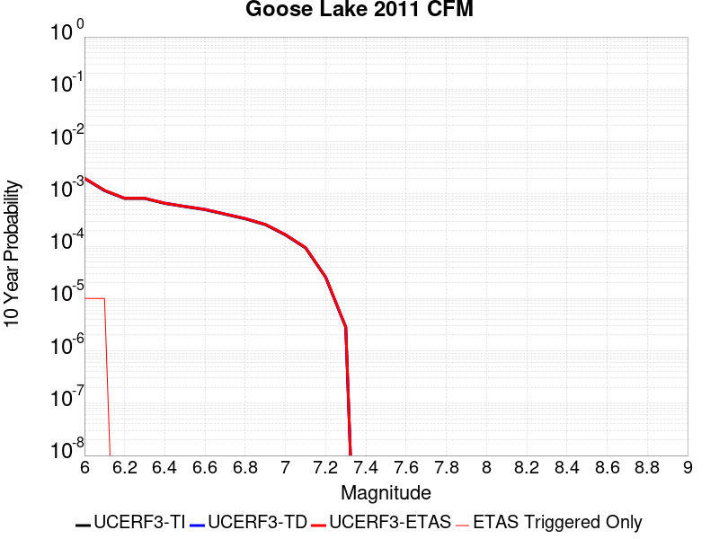 |

| Magnitude | 1 wk TI Prob | 1 wk TD Prob | 1 wk ETAS Prob | 1 wk ETAS/TD Gain | 1 wk ETAS Triggered Only | 1 mo TI Prob | 1 mo TD Prob | 1 mo ETAS Prob | 1 mo ETAS/TD Gain | 1 mo ETAS Triggered Only | 1 yr TI Prob | 1 yr TD Prob | 1 yr ETAS Prob | 1 yr ETAS/TD Gain | 1 yr ETAS Triggered Only | 10 yr TI Prob | 10 yr TD Prob | 10 yr ETAS Prob | 10 yr ETAS/TD Gain | 10 yr ETAS Triggered Only |
|-----|-----|-----|-----|-----|-----|-----|-----|-----|-----|-----|-----|-----|-----|-----|-----|-----|-----|-----|-----|-----|
| 6.0 | 3.780968E-6 | 3.8230223E-6 | 5.5636297E-5 | 14.552961 | 5.1813473E-5 | 1.6204049E-5 | 1.6384285E-5 | 6.819691E-5 | 4.162337 | 5.1813473E-5 | 1.9726643E-4 | 1.994615E-4 | 2.5126463E-4 | 1.259715 | 5.1813473E-5 | 0.001970914 | 0.001992933 | 0.0020446433 | 1.0259467 | 5.1813473E-5 |
| 6.1 | 2.2035124E-6 | 2.229801E-6 | 5.4043157E-5 | 24.236761 | 5.1813473E-5 | 9.443591E-6 | 9.556257E-6 | 6.136923E-5 | 6.4218903 | 5.1813473E-5 | 1.1496965E-4 | 1.163414E-4 | 1.6814885E-4 | 1.4453053 | 5.1813473E-5 | 0.0011491019 | 0.0011628233 | 0.0012145764 | 1.0445065 | 5.1813473E-5 |
| 6.2 | 1.5624689E-6 | 1.5826923E-6 | 1.5826923E-6 | 1.0 | 0.0 | 6.6962784E-6 | 6.7829496E-6 | 6.7829496E-6 | 1.0 | 0.0 | 8.152414E-5 | 8.2579325E-5 | 8.2579325E-5 | 1.0 | 0.0 | 8.1494235E-4 | 8.2549086E-4 | 8.2549086E-4 | 1.0 | 0.0 |
| 6.3 | 1.5624689E-6 | 1.5826923E-6 | 1.5826923E-6 | 1.0 | 0.0 | 6.6962784E-6 | 6.7829496E-6 | 6.7829496E-6 | 1.0 | 0.0 | 8.152414E-5 | 8.2579325E-5 | 8.2579325E-5 | 1.0 | 0.0 | 8.1494235E-4 | 8.2549086E-4 | 8.2549086E-4 | 1.0 | 0.0 |
| 6.4 | 1.256464E-6 | 1.2738695E-6 | 1.2738695E-6 | 1.0 | 0.0 | 5.3848344E-6 | 5.4594293E-6 | 5.4594293E-6 | 1.0 | 0.0 | 6.5558386E-5 | 6.646655E-5 | 6.646655E-5 | 1.0 | 0.0 | 6.553905E-4 | 6.644687E-4 | 6.644687E-4 | 1.0 | 0.0 |
| 6.5 | 1.0910911E-6 | 1.1069404E-6 | 1.1069404E-6 | 1.0 | 0.0 | 4.6760965E-6 | 4.7440217E-6 | 4.7440217E-6 | 1.0 | 0.0 | 5.692999E-5 | 5.7756948E-5 | 5.7756948E-5 | 1.0 | 0.0 | 5.6915404E-4 | 5.7742064E-4 | 5.7742064E-4 | 1.0 | 0.0 |
| 6.6 | 9.546601E-7 | 9.691246E-7 | 9.691246E-7 | 1.0 | 0.0 | 4.091394E-6 | 4.1533845E-6 | 4.1533845E-6 | 1.0 | 0.0 | 4.9811584E-5 | 5.056629E-5 | 5.056629E-5 | 1.0 | 0.0 | 4.980042E-4 | 5.055487E-4 | 5.055487E-4 | 1.0 | 0.0 |
| 6.7 | 7.790316E-7 | 7.9159634E-7 | 7.9159634E-7 | 1.0 | 0.0 | 3.3387028E-6 | 3.3925514E-6 | 3.3925514E-6 | 1.0 | 0.0 | 4.0647945E-5 | 4.1303538E-5 | 4.1303538E-5 | 1.0 | 0.0 | 4.0640513E-4 | 4.129592E-4 | 4.129592E-4 | 1.0 | 0.0 |
| 6.8 | 6.3714384E-7 | 6.4787395E-7 | 6.4787395E-7 | 1.0 | 0.0 | 2.7306137E-6 | 2.7765998E-6 | 2.7765998E-6 | 1.0 | 0.0 | 3.3244716E-5 | 3.3804583E-5 | 3.3804583E-5 | 1.0 | 0.0 | 3.323974E-4 | 3.379949E-4 | 3.379949E-4 | 1.0 | 0.0 |
| 6.9 | 4.92586E-7 | 5.0139147E-7 | 5.0139147E-7 | 1.0 | 0.0 | 2.1110811E-6 | 2.1488188E-6 | 2.1488188E-6 | 1.0 | 0.0 | 2.5702111E-5 | 2.616156E-5 | 2.616156E-5 | 1.0 | 0.0 | 2.569914E-4 | 2.6158517E-4 | 2.6158517E-4 | 1.0 | 0.0 |
| 7.0 | 3.130245E-7 | 3.190354E-7 | 3.190354E-7 | 1.0 | 0.0 | 1.3415328E-6 | 1.3672939E-6 | 1.3672939E-6 | 1.0 | 0.0 | 1.6333039E-5 | 1.6646678E-5 | 1.6646678E-5 | 1.0 | 0.0 | 1.6331839E-4 | 1.6645451E-4 | 1.6645451E-4 | 1.0 | 0.0 |
| 7.1 | 1.7680084E-7 | 1.8023923E-7 | 1.8023923E-7 | 1.0 | 0.0 | 7.5771766E-7 | 7.724536E-7 | 7.724536E-7 | 1.0 | 0.0 | 9.225173E-6 | 9.404583E-6 | 9.404583E-6 | 1.0 | 0.0 | 9.22479E-5 | 9.4041956E-5 | 9.4041956E-5 | 1.0 | 0.0 |
| 7.2 | 4.8641045E-8 | 4.9402068E-8 | 4.9402068E-8 | 1.0 | 0.0 | 2.084616E-7 | 2.1172312E-7 | 2.1172312E-7 | 1.0 | 0.0 | 2.538017E-6 | 2.577726E-6 | 2.577726E-6 | 1.0 | 0.0 | 2.537988E-5 | 2.5776973E-5 | 2.5776973E-5 | 1.0 | 0.0 |
| 7.3 | 5.3911844E-9 | 5.4758145E-9 | 5.4758145E-9 | 1.0 | 0.0 | 2.3105075E-8 | 2.3467775E-8 | 2.3467775E-8 | 1.0 | 0.0 | 2.8130427E-7 | 2.8572015E-7 | 2.8572015E-7 | 1.0 | 0.0 | 2.8130391E-6 | 2.8571992E-6 | 2.8571992E-6 | 1.0 | 0.0 |

## Kern Canyon (South Kern) 2011
*[(top)](#table-of-contents)*

| 1 Week | 1 Month | 1 Year | 10 Year |
|-----|-----|-----|-----|
|  |  |  |  |

| Magnitude | 1 wk TI Prob | 1 wk TD Prob | 1 wk ETAS Prob | 1 wk ETAS/TD Gain | 1 wk ETAS Triggered Only | 1 mo TI Prob | 1 mo TD Prob | 1 mo ETAS Prob | 1 mo ETAS/TD Gain | 1 mo ETAS Triggered Only | 1 yr TI Prob | 1 yr TD Prob | 1 yr ETAS Prob | 1 yr ETAS/TD Gain | 1 yr ETAS Triggered Only | 10 yr TI Prob | 10 yr TD Prob | 10 yr ETAS Prob | 10 yr ETAS/TD Gain | 10 yr ETAS Triggered Only |
|-----|-----|-----|-----|-----|-----|-----|-----|-----|-----|-----|-----|-----|-----|-----|-----|-----|-----|-----|-----|-----|
| 6.0 | 4.105075E-6 | 4.1137264E-6 | 1.0774024E-4 | 26.190424 | 1.03626946E-4 | 1.7593058E-5 | 1.763014E-5 | 1.2125526E-4 | 6.8777246 | 1.03626946E-4 | 2.1417443E-4 | 2.1462646E-4 | 3.1823115E-4 | 1.482721 | 1.03626946E-4 | 0.0021396813 | 0.0021442557 | 0.0022476604 | 1.0482241 | 1.03626946E-4 |
| 6.1 | 4.105075E-6 | 4.1137264E-6 | 1.0774024E-4 | 26.190424 | 1.03626946E-4 | 1.7593058E-5 | 1.763014E-5 | 1.2125526E-4 | 6.8777246 | 1.03626946E-4 | 2.1417443E-4 | 2.1462646E-4 | 3.1823115E-4 | 1.482721 | 1.03626946E-4 | 0.0021396813 | 0.0021442557 | 0.0022476604 | 1.0482241 | 1.03626946E-4 |
| 6.2 | 4.105075E-6 | 4.1137264E-6 | 1.0774024E-4 | 26.190424 | 1.03626946E-4 | 1.7593058E-5 | 1.763014E-5 | 1.2125526E-4 | 6.8777246 | 1.03626946E-4 | 2.1417443E-4 | 2.1462646E-4 | 3.1823115E-4 | 1.482721 | 1.03626946E-4 | 0.0021396813 | 0.0021442557 | 0.0022476604 | 1.0482241 | 1.03626946E-4 |
| 6.3 | 4.105075E-6 | 4.1137264E-6 | 1.0774024E-4 | 26.190424 | 1.03626946E-4 | 1.7593058E-5 | 1.763014E-5 | 1.2125526E-4 | 6.8777246 | 1.03626946E-4 | 2.1417443E-4 | 2.1462646E-4 | 3.1823115E-4 | 1.482721 | 1.03626946E-4 | 0.0021396813 | 0.0021442557 | 0.0022476604 | 1.0482241 | 1.03626946E-4 |
| 6.4 | 4.105075E-6 | 4.1137264E-6 | 1.0774024E-4 | 26.190424 | 1.03626946E-4 | 1.7593058E-5 | 1.763014E-5 | 1.2125526E-4 | 6.8777246 | 1.03626946E-4 | 2.1417443E-4 | 2.1462646E-4 | 3.1823115E-4 | 1.482721 | 1.03626946E-4 | 0.0021396813 | 0.0021442557 | 0.0022476604 | 1.0482241 | 1.03626946E-4 |
| 6.5 | 2.9849807E-6 | 2.9731548E-6 | 5.4786473E-5 | 18.42705 | 5.1813473E-5 | 1.2792712E-5 | 1.274203E-5 | 6.455484E-5 | 5.066292 | 5.1813473E-5 | 1.5574014E-4 | 1.5512333E-4 | 2.0692876E-4 | 1.3339629 | 5.1813473E-5 | 0.0015563103 | 0.0015501656 | 0.0016018988 | 1.0333726 | 5.1813473E-5 |
| 6.6 | 2.9849807E-6 | 2.9731548E-6 | 5.4786473E-5 | 18.42705 | 5.1813473E-5 | 1.2792712E-5 | 1.274203E-5 | 6.455484E-5 | 5.066292 | 5.1813473E-5 | 1.5574014E-4 | 1.5512333E-4 | 2.0692876E-4 | 1.3339629 | 5.1813473E-5 | 0.0015563103 | 0.0015501656 | 0.0016018988 | 1.0333726 | 5.1813473E-5 |
| 6.7 | 2.6756725E-6 | 2.6582206E-6 | 2.6582206E-6 | 1.0 | 0.0 | 1.1467117E-5 | 1.1392325E-5 | 1.1392325E-5 | 1.0 | 0.0 | 1.396032E-4 | 1.3869285E-4 | 1.3869285E-4 | 1.0 | 0.0 | 0.0013951553 | 0.0013860738 | 0.0013860738 | 1.0 | 0.0 |
| 6.8 | 2.3283721E-6 | 2.3047787E-6 | 2.3047787E-6 | 1.0 | 0.0 | 9.9787E-6 | 9.877586E-6 | 9.877586E-6 | 1.0 | 0.0 | 1.214839E-4 | 1.20253055E-4 | 1.20253055E-4 | 1.0 | 0.0 | 0.001214175 | 0.0012018873 | 0.0012018873 | 1.0 | 0.0 |
| 6.9 | 2.0972677E-6 | 2.0696411E-6 | 2.0696411E-6 | 1.0 | 0.0 | 8.988259E-6 | 8.869861E-6 | 8.869861E-6 | 1.0 | 0.0 | 1.0942656E-4 | 1.0798526E-4 | 1.0798526E-4 | 1.0 | 0.0 | 0.0010937268 | 0.0010793337 | 0.0010793337 | 1.0 | 0.0 |
| 7.0 | 1.7132242E-6 | 1.6787036E-6 | 1.6787036E-6 | 1.0 | 0.0 | 7.3423685E-6 | 7.194424E-6 | 7.194424E-6 | 1.0 | 0.0 | 8.938967E-5 | 8.758863E-5 | 8.758863E-5 | 1.0 | 0.0 | 8.935372E-4 | 8.7554497E-4 | 8.7554497E-4 | 1.0 | 0.0 |
| 7.1 | 1.4215541E-6 | 1.3815752E-6 | 1.3815752E-6 | 1.0 | 0.0 | 6.0923603E-6 | 5.9210233E-6 | 5.9210233E-6 | 1.0 | 0.0 | 7.417196E-5 | 7.20861E-5 | 7.20861E-5 | 1.0 | 0.0 | 7.414721E-4 | 7.206299E-4 | 7.206299E-4 | 1.0 | 0.0 |
| 7.2 | 9.097853E-7 | 8.6037755E-7 | 8.6037755E-7 | 1.0 | 0.0 | 3.899074E-6 | 3.6873273E-6 | 3.6873273E-6 | 1.0 | 0.0 | 4.7470192E-5 | 4.4892295E-5 | 4.4892295E-5 | 1.0 | 0.0 | 4.7460053E-4 | 4.4883334E-4 | 4.4883334E-4 | 1.0 | 0.0 |
| 7.3 | 6.144169E-7 | 5.628206E-7 | 5.628206E-7 | 1.0 | 0.0 | 2.6332125E-6 | 2.4120861E-6 | 2.4120861E-6 | 1.0 | 0.0 | 3.205889E-5 | 2.9366758E-5 | 2.9366758E-5 | 1.0 | 0.0 | 3.2054266E-4 | 2.936293E-4 | 2.936293E-4 | 1.0 | 0.0 |
| 7.4 | 4.049844E-7 | 3.5728314E-7 | 3.5728314E-7 | 1.0 | 0.0 | 1.7356463E-6 | 1.5312125E-6 | 1.5312125E-6 | 1.0 | 0.0 | 2.1131287E-5 | 1.8642357E-5 | 1.8642357E-5 | 1.0 | 0.0 | 2.1129279E-4 | 1.8640817E-4 | 1.8640817E-4 | 1.0 | 0.0 |
| 7.5 | 1.9871162E-7 | 1.583044E-7 | 1.583044E-7 | 1.0 | 0.0 | 8.5162094E-7 | 6.7844724E-7 | 6.7844724E-7 | 1.0 | 0.0 | 1.0368436E-5 | 8.260065E-6 | 8.260065E-6 | 1.0 | 0.0 | 1.0367952E-4 | 8.259767E-5 | 8.259767E-5 | 1.0 | 0.0 |
| 7.6 | 2.572245E-8 | 1.7352555E-8 | 1.7352555E-8 | 1.0 | 0.0 | 1.10239064E-7 | 7.436809E-8 | 7.436809E-8 | 1.0 | 0.0 | 1.3421597E-6 | 9.054312E-7 | 9.054312E-7 | 1.0 | 0.0 | 1.3421517E-5 | 9.05428E-6 | 9.05428E-6 | 1.0 | 0.0 |

## Santa Cruz Island
*[(top)](#table-of-contents)*

| 1 Week | 1 Month | 1 Year | 10 Year |
|-----|-----|-----|-----|
|  |  |  |  |

| Magnitude | 1 wk TI Prob | 1 wk TD Prob | 1 wk ETAS Prob | 1 wk ETAS/TD Gain | 1 wk ETAS Triggered Only | 1 mo TI Prob | 1 mo TD Prob | 1 mo ETAS Prob | 1 mo ETAS/TD Gain | 1 mo ETAS Triggered Only | 1 yr TI Prob | 1 yr TD Prob | 1 yr ETAS Prob | 1 yr ETAS/TD Gain | 1 yr ETAS Triggered Only | 10 yr TI Prob | 10 yr TD Prob | 10 yr ETAS Prob | 10 yr ETAS/TD Gain | 10 yr ETAS Triggered Only |
|-----|-----|-----|-----|-----|-----|-----|-----|-----|-----|-----|-----|-----|-----|-----|-----|-----|-----|-----|-----|-----|
| 6.0 | 2.9164563E-5 | 3.1599742E-5 | 8.341158E-5 | 2.6396284 | 5.1813473E-5 | 1.2498499E-4 | 1.3542121E-4 | 1.8722766E-4 | 1.3825579 | 5.1813473E-5 | 0.0015206301 | 0.0016476426 | 0.0016993707 | 1.0313952 | 5.1813473E-5 | 0.015102667 | 0.016368 | 0.01646993 | 1.0062275 | 1.03626946E-4 |
| 6.1 | 2.9164563E-5 | 3.1599742E-5 | 8.341158E-5 | 2.6396284 | 5.1813473E-5 | 1.2498499E-4 | 1.3542121E-4 | 1.8722766E-4 | 1.3825579 | 5.1813473E-5 | 0.0015206301 | 0.0016476426 | 0.0016993707 | 1.0313952 | 5.1813473E-5 | 0.015102667 | 0.016368 | 0.01646993 | 1.0062275 | 1.03626946E-4 |
| 6.2 | 2.9164563E-5 | 3.1599742E-5 | 8.341158E-5 | 2.6396284 | 5.1813473E-5 | 1.2498499E-4 | 1.3542121E-4 | 1.8722766E-4 | 1.3825579 | 5.1813473E-5 | 0.0015206301 | 0.0016476426 | 0.0016993707 | 1.0313952 | 5.1813473E-5 | 0.015102667 | 0.016368 | 0.01646993 | 1.0062275 | 1.03626946E-4 |
| 6.3 | 1.6635553E-5 | 1.780436E-5 | 6.961691E-5 | 3.9101048 | 5.1813473E-5 | 7.1293274E-5 | 7.630226E-5 | 1.2811179E-4 | 1.6790037 | 5.1813473E-5 | 8.6765E-4 | 9.2860236E-4 | 9.803678E-4 | 1.0557455 | 5.1813473E-5 | 0.008642701 | 0.009249094 | 0.0093004275 | 1.0055501 | 5.1813473E-5 |
| 6.4 | 1.6635553E-5 | 1.780436E-5 | 6.961691E-5 | 3.9101048 | 5.1813473E-5 | 7.1293274E-5 | 7.630226E-5 | 1.2811179E-4 | 1.6790037 | 5.1813473E-5 | 8.6765E-4 | 9.2860236E-4 | 9.803678E-4 | 1.0557455 | 5.1813473E-5 | 0.008642701 | 0.009249094 | 0.0093004275 | 1.0055501 | 5.1813473E-5 |
| 6.5 | 1.2238748E-5 | 1.3042995E-5 | 6.485579E-5 | 4.972461 | 5.1813473E-5 | 5.2450723E-5 | 5.5897377E-5 | 1.0770795E-4 | 1.9268874 | 5.1813473E-5 | 6.3840044E-4 | 6.8034173E-4 | 7.3211995E-4 | 1.0761062 | 5.1813473E-5 | 0.0063656955 | 0.0067829876 | 0.0068344497 | 1.007587 | 5.1813473E-5 |
| 6.6 | 1.0489767E-5 | 1.1156636E-5 | 6.296953E-5 | 5.644132 | 5.1813473E-5 | 4.495537E-5 | 4.781329E-5 | 9.962428E-5 | 2.0836108 | 5.1813473E-5 | 5.4719415E-4 | 5.819735E-4 | 6.3375686E-4 | 1.0889788 | 5.1813473E-5 | 0.005458487 | 0.0058047357 | 0.0058562486 | 1.0088743 | 5.1813473E-5 |
| 6.7 | 8.699222E-6 | 9.236782E-6 | 6.1049774E-5 | 6.6094203 | 5.1813473E-5 | 3.7281847E-5 | 3.958561E-5 | 9.139703E-5 | 2.3088448 | 5.1813473E-5 | 4.5381195E-4 | 4.8184878E-4 | 5.336373E-4 | 1.1074787 | 5.1813473E-5 | 0.0045288634 | 0.004808108 | 0.0048596724 | 1.0107244 | 5.1813473E-5 |
| 6.8 | 8.307732E-6 | 8.8169045E-6 | 8.8169045E-6 | 1.0 | 0.0 | 3.560408E-5 | 3.7786187E-5 | 3.7786187E-5 | 1.0 | 0.0 | 4.3339343E-4 | 4.5995016E-4 | 4.5995016E-4 | 1.0 | 0.0 | 0.004325492 | 0.0045900354 | 0.0045900354 | 1.0 | 0.0 |
| 6.9 | 8.073121E-6 | 8.564939E-6 | 8.564939E-6 | 1.0 | 0.0 | 3.459863E-5 | 3.6706366E-5 | 3.6706366E-5 | 1.0 | 0.0 | 4.2115687E-4 | 4.468088E-4 | 4.468088E-4 | 1.0 | 0.0 | 0.004203596 | 0.004459156 | 0.004459156 | 1.0 | 0.0 |
| 7.0 | 7.617019E-6 | 8.074664E-6 | 8.074664E-6 | 1.0 | 0.0 | 3.264396E-5 | 3.4605247E-5 | 3.4605247E-5 | 1.0 | 0.0 | 3.9736772E-4 | 4.212378E-4 | 4.212378E-4 | 1.0 | 0.0 | 0.003966579 | 0.0042044413 | 0.0042044413 | 1.0 | 0.0 |
| 7.1 | 7.1224836E-6 | 7.545788E-6 | 7.545788E-6 | 1.0 | 0.0 | 3.052457E-5 | 3.2338692E-5 | 3.2338692E-5 | 1.0 | 0.0 | 3.715733E-4 | 3.936528E-4 | 3.936528E-4 | 1.0 | 0.0 | 0.003709526 | 0.003929598 | 0.003929598 | 1.0 | 0.0 |
| 7.2 | 6.441115E-6 | 6.8273835E-6 | 6.8273835E-6 | 1.0 | 0.0 | 2.7604487E-5 | 2.9259887E-5 | 2.9259887E-5 | 1.0 | 0.0 | 3.360328E-4 | 3.5618112E-4 | 3.5618112E-4 | 1.0 | 0.0 | 0.0033552512 | 0.003556131 | 0.003556131 | 1.0 | 0.0 |
| 7.3 | 5.494274E-6 | 5.8199944E-6 | 5.8199944E-6 | 1.0 | 0.0 | 2.3546674E-5 | 2.4942596E-5 | 2.4942596E-5 | 1.0 | 0.0 | 2.8664304E-4 | 3.0363398E-4 | 3.0363398E-4 | 1.0 | 0.0 | 0.002862736 | 0.0030322142 | 0.0030322142 | 1.0 | 0.0 |
| 7.4 | 4.0802624E-6 | 4.312256E-6 | 4.312256E-6 | 1.0 | 0.0 | 1.7486722E-5 | 1.8480967E-5 | 1.8480967E-5 | 1.0 | 0.0 | 2.1288003E-4 | 2.2498262E-4 | 2.2498262E-4 | 1.0 | 0.0 | 0.0021267622 | 0.0022475575 | 0.0022475575 | 1.0 | 0.0 |
| 7.5 | 2.3584746E-6 | 2.4753094E-6 | 2.4753094E-6 | 1.0 | 0.0 | 1.0107709E-5 | 1.0608426E-5 | 1.0608426E-5 | 1.0 | 0.0 | 1.2305441E-4 | 1.2915E-4 | 1.2915E-4 | 1.0 | 0.0 | 0.0012298629 | 0.0012907543 | 0.0012907543 | 1.0 | 0.0 |
| 7.6 | 9.4981914E-7 | 9.86093E-7 | 9.86093E-7 | 1.0 | 0.0 | 4.0706473E-6 | 4.2261063E-6 | 4.2261063E-6 | 1.0 | 0.0 | 4.9559E-5 | 5.145164E-5 | 5.145164E-5 | 1.0 | 0.0 | 4.954795E-4 | 5.1439856E-4 | 5.1439856E-4 | 1.0 | 0.0 |
| 7.7 | 2.6013532E-7 | 2.6416603E-7 | 2.6416603E-7 | 1.0 | 0.0 | 1.1148652E-6 | 1.1321397E-6 | 1.1321397E-6 | 1.0 | 0.0 | 1.3573399E-5 | 1.3783714E-5 | 1.3783714E-5 | 1.0 | 0.0 | 1.357257E-4 | 1.3782867E-4 | 1.3782867E-4 | 1.0 | 0.0 |
| 7.8 | 4.1522263E-8 | 3.965679E-8 | 3.965679E-8 | 1.0 | 0.0 | 1.7795254E-7 | 1.6995766E-7 | 1.6995766E-7 | 1.0 | 0.0 | 2.16657E-6 | 2.0692328E-6 | 2.0692328E-6 | 1.0 | 0.0 | 2.1665488E-5 | 2.0692156E-5 | 2.0692156E-5 | 1.0 | 0.0 |
| 7.9 | 7.7242046E-10 | 5.9468175E-10 | 5.9468175E-10 | 1.0 | 0.0 | 3.3103735E-9 | 2.5486364E-9 | 2.5486364E-9 | 1.0 | 0.0 | 4.0303796E-8 | 3.1029646E-8 | 3.1029646E-8 | 1.0 | 0.0 | 4.030379E-7 | 3.1029643E-7 | 3.1029643E-7 | 1.0 | 0.0 |

## Rose Canyon
*[(top)](#table-of-contents)*

| 1 Week | 1 Month | 1 Year | 10 Year |
|-----|-----|-----|-----|
|  |  | 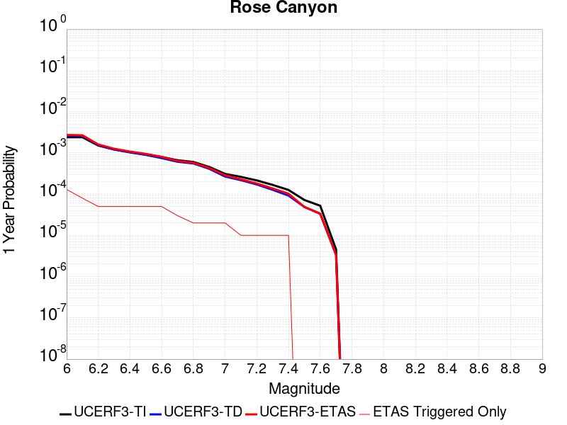 |  |

| Magnitude | 1 wk TI Prob | 1 wk TD Prob | 1 wk ETAS Prob | 1 wk ETAS/TD Gain | 1 wk ETAS Triggered Only | 1 mo TI Prob | 1 mo TD Prob | 1 mo ETAS Prob | 1 mo ETAS/TD Gain | 1 mo ETAS Triggered Only | 1 yr TI Prob | 1 yr TD Prob | 1 yr ETAS Prob | 1 yr ETAS/TD Gain | 1 yr ETAS Triggered Only | 10 yr TI Prob | 10 yr TD Prob | 10 yr ETAS Prob | 10 yr ETAS/TD Gain | 10 yr ETAS Triggered Only |
|-----|-----|-----|-----|-----|-----|-----|-----|-----|-----|-----|-----|-----|-----|-----|-----|-----|-----|-----|-----|-----|
| 6.0 | 4.5923203E-5 | 4.9714225E-5 | 1.5333602E-4 | 3.084349 | 1.03626946E-4 | 1.9679888E-4 | 2.1304491E-4 | 3.166498E-4 | 1.4863052 | 1.03626946E-4 | 0.0023933933 | 0.0025909345 | 0.002694293 | 1.0398923 | 1.03626946E-4 | 0.023677798 | 0.02563999 | 0.02574096 | 1.003938 | 1.03626946E-4 |
| 6.1 | 4.5923203E-5 | 4.9714225E-5 | 1.0152512E-4 | 2.0421743 | 5.1813473E-5 | 1.9679888E-4 | 2.1304491E-4 | 2.6484736E-4 | 1.2431526 | 5.1813473E-5 | 0.0023933933 | 0.0025909345 | 0.0026426136 | 1.0199462 | 5.1813473E-5 | 0.023677798 | 0.02563999 | 0.025690475 | 1.001969 | 5.1813473E-5 |
| 6.2 | 2.8844734E-5 | 2.9668723E-5 | 8.1480655E-5 | 2.7463486 | 5.1813473E-5 | 1.2361443E-4 | 1.2714567E-4 | 1.7895256E-4 | 1.4074608 | 5.1813473E-5 | 0.0015039665 | 0.0015468939 | 0.0015986272 | 1.0334433 | 5.1813473E-5 | 0.0149382865 | 0.015374276 | 0.015425293 | 1.0033183 | 5.1813473E-5 |
| 6.3 | 2.3171577E-5 | 2.3161238E-5 | 7.497351E-5 | 3.237025 | 5.1813473E-5 | 9.9302975E-5 | 9.9258745E-5 | 1.5106707E-4 | 1.5219523 | 5.1813473E-5 | 0.0012083431 | 0.0012078186 | 0.0012595695 | 1.0428466 | 5.1813473E-5 | 0.012017938 | 0.012022437 | 0.012073627 | 1.0042579 | 5.1813473E-5 |
| 6.4 | 2.0066604E-5 | 1.9667024E-5 | 7.147948E-5 | 3.6344836 | 5.1813473E-5 | 8.599689E-5 | 8.4284584E-5 | 1.3609369E-4 | 1.6146926 | 5.1813473E-5 | 0.0010465092 | 0.0010256917 | 0.0010774521 | 1.0504638 | 5.1813473E-5 | 0.010415946 | 0.010217559 | 0.010268843 | 1.0050192 | 5.1813473E-5 |
| 6.5 | 1.776989E-5 | 1.7113807E-5 | 6.892639E-5 | 4.027531 | 5.1813473E-5 | 7.615444E-5 | 7.334287E-5 | 1.2515254E-4 | 1.7064037 | 5.1813473E-5 | 9.267859E-4 | 8.925905E-4 | 9.443578E-4 | 1.0579966 | 5.1813473E-5 | 0.009229303 | 0.008896211 | 0.008947563 | 1.0057724 | 5.1813473E-5 |
| 6.6 | 1.5227364E-5 | 1.433926E-5 | 6.615199E-5 | 4.6133475 | 5.1813473E-5 | 6.52585E-5 | 6.1452556E-5 | 1.1326284E-4 | 1.8430941 | 5.1813473E-5 | 7.942326E-4 | 7.479332E-4 | 7.9970795E-4 | 1.0692238 | 5.1813473E-5 | 0.007914 | 0.007458359 | 0.007509786 | 1.0068952 | 5.1813473E-5 |
| 6.7 | 1.2703898E-5 | 1.1673274E-5 | 1.1673274E-5 | 1.0 | 0.0 | 5.4444143E-5 | 5.0027378E-5 | 5.0027378E-5 | 1.0 | 0.0 | 6.626558E-4 | 6.089174E-4 | 6.089174E-4 | 1.0 | 0.0 | 0.006606833 | 0.0060750856 | 0.0060750856 | 1.0 | 0.0 |
| 6.8 | 1.1554917E-5 | 1.0609337E-5 | 1.0609337E-5 | 1.0 | 0.0 | 4.9520135E-5 | 4.546782E-5 | 4.546782E-5 | 1.0 | 0.0 | 6.0274085E-4 | 5.5343413E-4 | 5.5343413E-4 | 1.0 | 0.0 | 0.0060110865 | 0.0055225673 | 0.0055225673 | 1.0 | 0.0 |
| 6.9 | 8.732078E-6 | 7.881357E-6 | 7.881357E-6 | 1.0 | 0.0 | 3.7422655E-5 | 3.3776825E-5 | 3.3776825E-5 | 1.0 | 0.0 | 4.5552556E-4 | 4.111582E-4 | 4.111582E-4 | 1.0 | 0.0 | 0.0045459294 | 0.0041048084 | 0.0041048084 | 1.0 | 0.0 |
| 7.0 | 5.9337494E-6 | 5.1074853E-6 | 5.1074853E-6 | 1.0 | 0.0 | 2.5430107E-5 | 2.188904E-5 | 2.188904E-5 | 1.0 | 0.0 | 3.0956755E-4 | 2.664666E-4 | 2.664666E-4 | 1.0 | 0.0 | 0.0030913667 | 0.0026614866 | 0.0026614866 | 1.0 | 0.0 |
| 7.1 | 5.013409E-6 | 4.1773833E-6 | 4.1773833E-6 | 1.0 | 0.0 | 2.1485863E-5 | 1.7902948E-5 | 1.7902948E-5 | 1.0 | 0.0 | 2.6155898E-4 | 2.179467E-4 | 2.179467E-4 | 1.0 | 0.0 | 0.0026125133 | 0.0021773411 | 0.0021773411 | 1.0 | 0.0 |
| 7.2 | 4.120763E-6 | 3.2821383E-6 | 3.2821383E-6 | 1.0 | 0.0 | 1.7660293E-5 | 1.4066231E-5 | 1.4066231E-5 | 1.0 | 0.0 | 2.1499286E-4 | 1.7124301E-4 | 1.7124301E-4 | 1.0 | 0.0 | 0.0021478499 | 0.00171112 | 0.00171112 | 1.0 | 0.0 |
| 7.3 | 3.2081239E-6 | 2.4405372E-6 | 2.4405372E-6 | 1.0 | 0.0 | 1.374903E-5 | 1.0459404E-5 | 1.0459404E-5 | 1.0 | 0.0 | 1.6738157E-4 | 1.2733586E-4 | 1.2733586E-4 | 1.0 | 0.0 | 0.0016725556 | 0.001272636 | 0.001272636 | 1.0 | 0.0 |
| 7.4 | 2.4194755E-6 | 1.7680634E-6 | 1.7680634E-6 | 1.0 | 0.0 | 1.0369139E-5 | 7.577393E-6 | 7.577393E-6 | 1.0 | 0.0 | 1.2623696E-4 | 9.2250906E-5 | 9.2250906E-5 | 1.0 | 0.0 | 0.0012616527 | 9.2213147E-4 | 9.2213147E-4 | 1.0 | 0.0 |
| 7.5 | 1.3842889E-6 | 9.3786275E-7 | 9.3786275E-7 | 1.0 | 0.0 | 5.9326535E-6 | 4.019406E-6 | 4.019406E-6 | 1.0 | 0.0 | 7.222766E-5 | 4.8935202E-5 | 4.8935202E-5 | 1.0 | 0.0 | 7.220419E-4 | 4.892478E-4 | 4.892478E-4 | 1.0 | 0.0 |
| 7.6 | 1.0021575E-6 | 6.411463E-7 | 6.411463E-7 | 1.0 | 0.0 | 4.2949537E-6 | 2.7477672E-6 | 2.7477672E-6 | 1.0 | 0.0 | 5.2289808E-5 | 3.3453573E-5 | 3.3453573E-5 | 1.0 | 0.0 | 5.2277505E-4 | 3.344875E-4 | 3.344875E-4 | 1.0 | 0.0 |
| 7.7 | 8.7620116E-8 | 6.4492404E-8 | 6.4492404E-8 | 1.0 | 0.0 | 3.7551473E-7 | 2.76396E-7 | 2.76396E-7 | 1.0 | 0.0 | 4.5718825E-6 | 3.3651165E-6 | 3.3651165E-6 | 1.0 | 0.0 | 4.5717883E-5 | 3.3650686E-5 | 3.3650686E-5 | 1.0 | 0.0 |

## Antelope Valley 2011
*[(top)](#table-of-contents)*

| 1 Week | 1 Month | 1 Year | 10 Year |
|-----|-----|-----|-----|
|  |  |  |  |

| Magnitude | 1 wk TI Prob | 1 wk TD Prob | 1 wk ETAS Prob | 1 wk ETAS/TD Gain | 1 wk ETAS Triggered Only | 1 mo TI Prob | 1 mo TD Prob | 1 mo ETAS Prob | 1 mo ETAS/TD Gain | 1 mo ETAS Triggered Only | 1 yr TI Prob | 1 yr TD Prob | 1 yr ETAS Prob | 1 yr ETAS/TD Gain | 1 yr ETAS Triggered Only | 10 yr TI Prob | 10 yr TD Prob | 10 yr ETAS Prob | 10 yr ETAS/TD Gain | 10 yr ETAS Triggered Only |
|-----|-----|-----|-----|-----|-----|-----|-----|-----|-----|-----|-----|-----|-----|-----|-----|-----|-----|-----|-----|-----|
| 6.0 | 3.1646934E-5 | 3.6904403E-5 | 3.6904403E-5 | 1.0 | 0.0 | 1.3562266E-4 | 1.5815363E-4 | 1.5815363E-4 | 1.0 | 0.0 | 0.0016499552 | 0.0019240845 | 0.0019757983 | 1.026877 | 5.1813473E-5 | 0.016377583 | 0.019100651 | 0.0192023 | 1.0053217 | 1.03626946E-4 |
| 6.1 | 3.1646934E-5 | 3.6904403E-5 | 3.6904403E-5 | 1.0 | 0.0 | 1.3562266E-4 | 1.5815363E-4 | 1.5815363E-4 | 1.0 | 0.0 | 0.0016499552 | 0.0019240845 | 0.0019757983 | 1.026877 | 5.1813473E-5 | 0.016377583 | 0.019100651 | 0.0192023 | 1.0053217 | 1.03626946E-4 |
| 6.2 | 3.1646934E-5 | 3.6904403E-5 | 3.6904403E-5 | 1.0 | 0.0 | 1.3562266E-4 | 1.5815363E-4 | 1.5815363E-4 | 1.0 | 0.0 | 0.0016499552 | 0.0019240845 | 0.0019757983 | 1.026877 | 5.1813473E-5 | 0.016377583 | 0.019100651 | 0.0192023 | 1.0053217 | 1.03626946E-4 |
| 6.3 | 3.1646934E-5 | 3.6904403E-5 | 3.6904403E-5 | 1.0 | 0.0 | 1.3562266E-4 | 1.5815363E-4 | 1.5815363E-4 | 1.0 | 0.0 | 0.0016499552 | 0.0019240845 | 0.0019757983 | 1.026877 | 5.1813473E-5 | 0.016377583 | 0.019100651 | 0.0192023 | 1.0053217 | 1.03626946E-4 |
| 6.4 | 3.1646934E-5 | 3.6904403E-5 | 3.6904403E-5 | 1.0 | 0.0 | 1.3562266E-4 | 1.5815363E-4 | 1.5815363E-4 | 1.0 | 0.0 | 0.0016499552 | 0.0019240845 | 0.0019757983 | 1.026877 | 5.1813473E-5 | 0.016377583 | 0.019100651 | 0.0192023 | 1.0053217 | 1.03626946E-4 |
| 6.5 | 1.8034107E-5 | 2.0940959E-5 | 2.0940959E-5 | 1.0 | 0.0 | 7.7286735E-5 | 8.974457E-5 | 8.974457E-5 | 1.0 | 0.0 | 9.405598E-4 | 0.0010922146 | 0.0011439715 | 1.0473871 | 5.1813473E-5 | 0.009365888 | 0.010880542 | 0.0109830415 | 1.0094204 | 1.03626946E-4 |
| 6.6 | 1.8034107E-5 | 2.0940959E-5 | 2.0940959E-5 | 1.0 | 0.0 | 7.7286735E-5 | 8.974457E-5 | 8.974457E-5 | 1.0 | 0.0 | 9.405598E-4 | 0.0010922146 | 0.0011439715 | 1.0473871 | 5.1813473E-5 | 0.009365888 | 0.010880542 | 0.0109830415 | 1.0094204 | 1.03626946E-4 |
| 6.7 | 1.3567667E-5 | 1.5749509E-5 | 1.5749509E-5 | 1.0 | 0.0 | 5.814585E-5 | 6.749675E-5 | 6.749675E-5 | 1.0 | 0.0 | 7.076958E-4 | 8.2156935E-4 | 8.7334024E-4 | 1.0630146 | 5.1813473E-5 | 0.007054463 | 0.008195754 | 0.008247144 | 1.0062702 | 5.1813473E-5 |
| 6.8 | 9.867387E-6 | 1.1467935E-5 | 1.1467935E-5 | 1.0 | 0.0 | 4.2288117E-5 | 4.91479E-5 | 4.91479E-5 | 1.0 | 0.0 | 5.1473617E-4 | 5.9830636E-4 | 5.9830636E-4 | 1.0 | 0.0 | 0.005135455 | 0.005976268 | 0.005976268 | 1.0 | 0.0 |
| 6.9 | 7.273233E-6 | 8.454864E-6 | 8.454864E-6 | 1.0 | 0.0 | 3.1170628E-5 | 3.623513E-5 | 3.623513E-5 | 1.0 | 0.0 | 3.794363E-4 | 4.411627E-4 | 4.411627E-4 | 1.0 | 0.0 | 0.0037878908 | 0.004411627 | 0.004411627 | 1.0 | 0.0 |

## Santa Susana alt 1
*[(top)](#table-of-contents)*

| 1 Week | 1 Month | 1 Year | 10 Year |
|-----|-----|-----|-----|
|  |  | 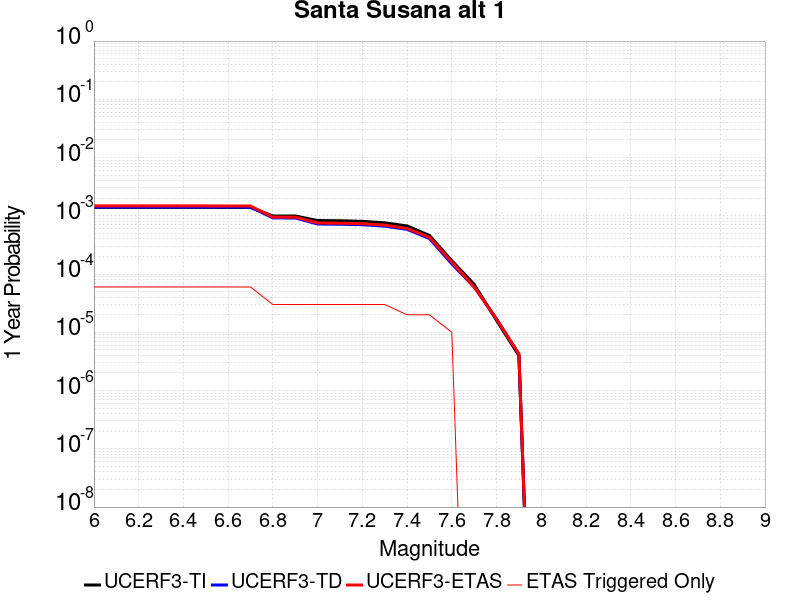 |  |

| Magnitude | 1 wk TI Prob | 1 wk TD Prob | 1 wk ETAS Prob | 1 wk ETAS/TD Gain | 1 wk ETAS Triggered Only | 1 mo TI Prob | 1 mo TD Prob | 1 mo ETAS Prob | 1 mo ETAS/TD Gain | 1 mo ETAS Triggered Only | 1 yr TI Prob | 1 yr TD Prob | 1 yr ETAS Prob | 1 yr ETAS/TD Gain | 1 yr ETAS Triggered Only | 10 yr TI Prob | 10 yr TD Prob | 10 yr ETAS Prob | 10 yr ETAS/TD Gain | 10 yr ETAS Triggered Only |
|-----|-----|-----|-----|-----|-----|-----|-----|-----|-----|-----|-----|-----|-----|-----|-----|-----|-----|-----|-----|-----|
| 6.0 | 2.674877E-5 | 2.7198023E-5 | 2.7198023E-5 | 1.0 | 0.0 | 1.1463255E-4 | 1.1655839E-4 | 1.6836582E-4 | 1.4444762 | 5.1813473E-5 | 0.0013947578 | 0.0014182882 | 0.0015217682 | 1.0729612 | 1.03626946E-4 | 0.013860362 | 0.014104128 | 0.014206293 | 1.0072436 | 1.03626946E-4 |
| 6.1 | 2.674877E-5 | 2.7198023E-5 | 2.7198023E-5 | 1.0 | 0.0 | 1.1463255E-4 | 1.1655839E-4 | 1.6836582E-4 | 1.4444762 | 5.1813473E-5 | 0.0013947578 | 0.0014182882 | 0.0015217682 | 1.0729612 | 1.03626946E-4 | 0.013860362 | 0.014104128 | 0.014206293 | 1.0072436 | 1.03626946E-4 |
| 6.2 | 2.674877E-5 | 2.7198023E-5 | 2.7198023E-5 | 1.0 | 0.0 | 1.1463255E-4 | 1.1655839E-4 | 1.6836582E-4 | 1.4444762 | 5.1813473E-5 | 0.0013947578 | 0.0014182882 | 0.0015217682 | 1.0729612 | 1.03626946E-4 | 0.013860362 | 0.014104128 | 0.014206293 | 1.0072436 | 1.03626946E-4 |
| 6.3 | 2.674877E-5 | 2.7198023E-5 | 2.7198023E-5 | 1.0 | 0.0 | 1.1463255E-4 | 1.1655839E-4 | 1.6836582E-4 | 1.4444762 | 5.1813473E-5 | 0.0013947578 | 0.0014182882 | 0.0015217682 | 1.0729612 | 1.03626946E-4 | 0.013860362 | 0.014104128 | 0.014206293 | 1.0072436 | 1.03626946E-4 |
| 6.4 | 2.674877E-5 | 2.7198023E-5 | 2.7198023E-5 | 1.0 | 0.0 | 1.1463255E-4 | 1.1655839E-4 | 1.6836582E-4 | 1.4444762 | 5.1813473E-5 | 0.0013947578 | 0.0014182882 | 0.0015217682 | 1.0729612 | 1.03626946E-4 | 0.013860362 | 0.014104128 | 0.014206293 | 1.0072436 | 1.03626946E-4 |
| 6.5 | 2.674877E-5 | 2.7198023E-5 | 2.7198023E-5 | 1.0 | 0.0 | 1.1463255E-4 | 1.1655839E-4 | 1.6836582E-4 | 1.4444762 | 5.1813473E-5 | 0.0013947578 | 0.0014182882 | 0.0015217682 | 1.0729612 | 1.03626946E-4 | 0.013860362 | 0.014104128 | 0.014206293 | 1.0072436 | 1.03626946E-4 |
| 6.6 | 2.6647976E-5 | 2.7074359E-5 | 2.7074359E-5 | 1.0 | 0.0 | 1.14200615E-4 | 1.1602845E-4 | 1.6783591E-4 | 1.4465065 | 5.1813473E-5 | 0.0013895056 | 0.0014118447 | 0.0015153254 | 1.0732946 | 1.03626946E-4 | 0.013808494 | 0.014040513 | 0.014142685 | 1.0072769 | 1.03626946E-4 |
| 6.7 | 2.6647976E-5 | 2.7074359E-5 | 2.7074359E-5 | 1.0 | 0.0 | 1.14200615E-4 | 1.1602845E-4 | 1.6783591E-4 | 1.4465065 | 5.1813473E-5 | 0.0013895056 | 0.0014118447 | 0.0015153254 | 1.0732946 | 1.03626946E-4 | 0.013808494 | 0.014040513 | 0.014142685 | 1.0072769 | 1.03626946E-4 |
| 6.8 | 1.9073179E-5 | 1.7637283E-5 | 1.7637283E-5 | 1.0 | 0.0 | 8.1739636E-5 | 7.558627E-5 | 7.558627E-5 | 1.0 | 0.0 | 9.947256E-4 | 9.198925E-4 | 9.716583E-4 | 1.0562738 | 5.1813473E-5 | 0.009902848 | 0.009163101 | 0.009214439 | 1.0056027 | 5.1813473E-5 |
| 6.9 | 1.9041876E-5 | 1.7619415E-5 | 1.7619415E-5 | 1.0 | 0.0 | 8.160549E-5 | 7.55097E-5 | 7.55097E-5 | 1.0 | 0.0 | 9.930939E-4 | 9.1896096E-4 | 9.7072683E-4 | 1.0563308 | 5.1813473E-5 | 0.0098866755 | 0.0091538625 | 0.009205202 | 1.0056084 | 5.1813473E-5 |
| 7.0 | 1.5917482E-5 | 1.3863864E-5 | 1.3863864E-5 | 1.0 | 0.0 | 6.8215995E-5 | 5.9415237E-5 | 5.9415237E-5 | 1.0 | 0.0 | 8.302132E-4 | 7.231451E-4 | 7.749211E-4 | 1.0715984 | 5.1813473E-5 | 0.008271185 | 0.0072088144 | 0.0072602546 | 1.0071357 | 5.1813473E-5 |
| 7.1 | 1.577788E-5 | 1.3743872E-5 | 1.3743872E-5 | 1.0 | 0.0 | 6.761774E-5 | 5.8901005E-5 | 5.8901005E-5 | 1.0 | 0.0 | 8.2293496E-4 | 7.1688846E-4 | 7.6866476E-4 | 1.0722237 | 5.1813473E-5 | 0.008198941 | 0.007146652 | 0.0071980953 | 1.0071982 | 5.1813473E-5 |
| 7.2 | 1.5416446E-5 | 1.3469944E-5 | 1.3469944E-5 | 1.0 | 0.0 | 6.606882E-5 | 5.772708E-5 | 5.772708E-5 | 1.0 | 0.0 | 8.0409093E-4 | 7.026052E-4 | 7.543823E-4 | 1.0736929 | 5.1813473E-5 | 0.008011877 | 0.0070047234 | 0.007056174 | 1.0073451 | 5.1813473E-5 |
| 7.3 | 1.4534083E-5 | 1.2717879E-5 | 1.2717879E-5 | 1.0 | 0.0 | 6.228744E-5 | 5.4504082E-5 | 5.4504082E-5 | 1.0 | 0.0 | 7.580857E-4 | 6.633896E-4 | 7.151687E-4 | 1.0780523 | 5.1813473E-5 | 0.007555048 | 0.0066149444 | 0.006666415 | 1.007781 | 5.1813473E-5 |
| 7.4 | 1.2858995E-5 | 1.1229652E-5 | 1.1229652E-5 | 1.0 | 0.0 | 5.5108816E-5 | 4.8126214E-5 | 4.8126214E-5 | 1.0 | 0.0 | 6.7074323E-4 | 5.857831E-4 | 6.375662E-4 | 1.0883998 | 5.1813473E-5 | 0.0066872234 | 0.005843165 | 0.0058946754 | 1.0088155 | 5.1813473E-5 |
| 7.5 | 8.827668E-6 | 7.805457E-6 | 7.805457E-6 | 1.0 | 0.0 | 3.7832317E-5 | 3.3451546E-5 | 3.3451546E-5 | 1.0 | 0.0 | 4.605111E-4 | 4.071989E-4 | 4.5899127E-4 | 1.1271918 | 5.1813473E-5 | 0.0045955796 | 0.0040647765 | 0.004116379 | 1.0126951 | 5.1813473E-5 |
| 7.6 | 3.2533426E-6 | 2.871988E-6 | 2.871988E-6 | 1.0 | 0.0 | 1.3942822E-5 | 1.2308465E-5 | 1.2308465E-5 | 1.0 | 0.0 | 1.6974064E-4 | 1.4984563E-4 | 2.0165133E-4 | 1.3457272 | 5.1813473E-5 | 0.0016961104 | 0.0014974826 | 0.0015492185 | 1.0345485 | 5.1813473E-5 |
| 7.7 | 1.2751709E-6 | 1.1491089E-6 | 1.1491089E-6 | 1.0 | 0.0 | 5.4650063E-6 | 4.9247437E-6 | 4.9247437E-6 | 1.0 | 0.0 | 6.653442E-5 | 5.9957198E-5 | 5.9957198E-5 | 1.0 | 0.0 | 6.6514505E-4 | 5.994191E-4 | 5.994191E-4 | 1.0 | 0.0 |
| 7.8 | 3.067544E-7 | 3.2400436E-7 | 3.2400436E-7 | 1.0 | 0.0 | 1.3146611E-6 | 1.3885895E-6 | 1.3885895E-6 | 1.0 | 0.0 | 1.600588E-5 | 1.6905957E-5 | 1.6905957E-5 | 1.0 | 0.0 | 1.6004729E-4 | 1.6904772E-4 | 1.6904772E-4 | 1.0 | 0.0 |
| 7.9 | 7.622999E-8 | 8.087964E-8 | 8.087964E-8 | 1.0 | 0.0 | 3.2669993E-7 | 3.4662696E-7 | 3.4662696E-7 | 1.0 | 0.0 | 3.977564E-6 | 4.2201773E-6 | 4.2201773E-6 | 1.0 | 0.0 | 3.977493E-5 | 4.220118E-5 | 4.220118E-5 | 1.0 | 0.0 |

## Channel Islands Thrust
*[(top)](#table-of-contents)*

| 1 Week | 1 Month | 1 Year | 10 Year |
|-----|-----|-----|-----|
|  |  |  |  |

| Magnitude | 1 wk TI Prob | 1 wk TD Prob | 1 wk ETAS Prob | 1 wk ETAS/TD Gain | 1 wk ETAS Triggered Only | 1 mo TI Prob | 1 mo TD Prob | 1 mo ETAS Prob | 1 mo ETAS/TD Gain | 1 mo ETAS Triggered Only | 1 yr TI Prob | 1 yr TD Prob | 1 yr ETAS Prob | 1 yr ETAS/TD Gain | 1 yr ETAS Triggered Only | 10 yr TI Prob | 10 yr TD Prob | 10 yr ETAS Prob | 10 yr ETAS/TD Gain | 10 yr ETAS Triggered Only |
|-----|-----|-----|-----|-----|-----|-----|-----|-----|-----|-----|-----|-----|-----|-----|-----|-----|-----|-----|-----|-----|
| 6.0 | 2.2156251E-5 | 2.4092022E-5 | 2.4092022E-5 | 1.0 | 0.0 | 9.495191E-5 | 1.03248036E-4 | 1.5505616E-4 | 1.5017831 | 5.1813473E-5 | 0.0011554264 | 0.0012564264 | 0.0013081749 | 1.0411869 | 5.1813473E-5 | 0.011494373 | 0.0125038205 | 0.012606151 | 1.008184 | 1.03626946E-4 |
| 6.1 | 2.2156251E-5 | 2.4092022E-5 | 2.4092022E-5 | 1.0 | 0.0 | 9.495191E-5 | 1.03248036E-4 | 1.5505616E-4 | 1.5017831 | 5.1813473E-5 | 0.0011554264 | 0.0012564264 | 0.0013081749 | 1.0411869 | 5.1813473E-5 | 0.011494373 | 0.0125038205 | 0.012606151 | 1.008184 | 1.03626946E-4 |
| 6.2 | 2.2156251E-5 | 2.4092022E-5 | 2.4092022E-5 | 1.0 | 0.0 | 9.495191E-5 | 1.03248036E-4 | 1.5505616E-4 | 1.5017831 | 5.1813473E-5 | 0.0011554264 | 0.0012564264 | 0.0013081749 | 1.0411869 | 5.1813473E-5 | 0.011494373 | 0.0125038205 | 0.012606151 | 1.008184 | 1.03626946E-4 |
| 6.3 | 2.2156251E-5 | 2.4092022E-5 | 2.4092022E-5 | 1.0 | 0.0 | 9.495191E-5 | 1.03248036E-4 | 1.5505616E-4 | 1.5017831 | 5.1813473E-5 | 0.0011554264 | 0.0012564264 | 0.0013081749 | 1.0411869 | 5.1813473E-5 | 0.011494373 | 0.0125038205 | 0.012606151 | 1.008184 | 1.03626946E-4 |
| 6.4 | 2.2156251E-5 | 2.4092022E-5 | 2.4092022E-5 | 1.0 | 0.0 | 9.495191E-5 | 1.03248036E-4 | 1.5505616E-4 | 1.5017831 | 5.1813473E-5 | 0.0011554264 | 0.0012564264 | 0.0013081749 | 1.0411869 | 5.1813473E-5 | 0.011494373 | 0.0125038205 | 0.012606151 | 1.008184 | 1.03626946E-4 |
| 6.5 | 2.2156251E-5 | 2.4092022E-5 | 2.4092022E-5 | 1.0 | 0.0 | 9.495191E-5 | 1.03248036E-4 | 1.5505616E-4 | 1.5017831 | 5.1813473E-5 | 0.0011554264 | 0.0012564264 | 0.0013081749 | 1.0411869 | 5.1813473E-5 | 0.011494373 | 0.0125038205 | 0.012606151 | 1.008184 | 1.03626946E-4 |
| 6.6 | 2.2156251E-5 | 2.4092022E-5 | 2.4092022E-5 | 1.0 | 0.0 | 9.495191E-5 | 1.03248036E-4 | 1.5505616E-4 | 1.5017831 | 5.1813473E-5 | 0.0011554264 | 0.0012564264 | 0.0013081749 | 1.0411869 | 5.1813473E-5 | 0.011494373 | 0.0125038205 | 0.012606151 | 1.008184 | 1.03626946E-4 |
| 6.7 | 1.0601296E-5 | 1.1379544E-5 | 1.1379544E-5 | 1.0 | 0.0 | 4.5433335E-5 | 4.876859E-5 | 4.876859E-5 | 1.0 | 0.0 | 5.5301044E-4 | 5.936007E-4 | 5.936007E-4 | 1.0 | 0.0 | 0.005516363 | 0.005920653 | 0.005920653 | 1.0 | 0.0 |
| 6.8 | 1.0246747E-5 | 1.0996669E-5 | 1.0996669E-5 | 1.0 | 0.0 | 4.391389E-5 | 4.7127756E-5 | 4.7127756E-5 | 1.0 | 0.0 | 5.345204E-4 | 5.7363417E-4 | 5.7363417E-4 | 1.0 | 0.0 | 0.0053323656 | 0.005722025 | 0.005722025 | 1.0 | 0.0 |
| 6.9 | 9.049551E-6 | 9.699645E-6 | 9.699645E-6 | 1.0 | 0.0 | 3.878322E-5 | 4.1569267E-5 | 4.1569267E-5 | 1.0 | 0.0 | 4.7208337E-4 | 5.059924E-4 | 5.059924E-4 | 1.0 | 0.0 | 0.0047108172 | 0.0050488203 | 0.0050488203 | 1.0 | 0.0 |
| 7.0 | 8.6542195E-6 | 9.274603E-6 | 9.274603E-6 | 1.0 | 0.0 | 3.7088983E-5 | 3.9747716E-5 | 3.9747716E-5 | 1.0 | 0.0 | 4.5146482E-4 | 4.8382508E-4 | 4.8382508E-4 | 1.0 | 0.0 | 0.004505487 | 0.004828129 | 0.004828129 | 1.0 | 0.0 |
| 7.1 | 8.391028E-6 | 8.992924E-6 | 8.992924E-6 | 1.0 | 0.0 | 3.5961057E-5 | 3.854056E-5 | 3.854056E-5 | 1.0 | 0.0 | 4.3773788E-4 | 4.6913436E-4 | 4.6913436E-4 | 1.0 | 0.0 | 0.004368766 | 0.0046818503 | 0.0046818503 | 1.0 | 0.0 |
| 7.2 | 5.965188E-6 | 6.3716952E-6 | 6.3716952E-6 | 1.0 | 0.0 | 2.556484E-5 | 2.7306982E-5 | 2.7306982E-5 | 1.0 | 0.0 | 3.1120746E-4 | 3.3241234E-4 | 3.3241234E-4 | 1.0 | 0.0 | 0.00310772 | 0.0033192092 | 0.0033192092 | 1.0 | 0.0 |
| 7.3 | 4.877518E-6 | 5.2060063E-6 | 5.2060063E-6 | 1.0 | 0.0 | 2.0903482E-5 | 2.2311267E-5 | 2.2311267E-5 | 1.0 | 0.0 | 2.5447016E-4 | 2.716063E-4 | 2.716063E-4 | 1.0 | 0.0 | 0.0025417898 | 0.0027127895 | 0.0027127895 | 1.0 | 0.0 |
| 7.4 | 3.8829853E-6 | 4.141863E-6 | 4.141863E-6 | 1.0 | 0.0 | 1.664126E-5 | 1.7750723E-5 | 1.7750723E-5 | 1.0 | 0.0 | 2.0258849E-4 | 2.1609402E-4 | 2.1609402E-4 | 1.0 | 0.0 | 0.002024039 | 0.0021588807 | 0.0021588807 | 1.0 | 0.0 |
| 7.5 | 1.3489616E-6 | 1.4277903E-6 | 1.4277903E-6 | 1.0 | 0.0 | 5.7812517E-6 | 6.119087E-6 | 6.119087E-6 | 1.0 | 0.0 | 7.038446E-5 | 7.449738E-5 | 7.449738E-5 | 1.0 | 0.0 | 7.036218E-4 | 7.44728E-4 | 7.44728E-4 | 1.0 | 0.0 |
| 7.6 | 6.058192E-7 | 6.353778E-7 | 6.353778E-7 | 1.0 | 0.0 | 2.5963652E-6 | 2.7230449E-6 | 2.7230449E-6 | 1.0 | 0.0 | 3.161029E-5 | 3.3152584E-5 | 3.3152584E-5 | 1.0 | 0.0 | 3.1605794E-4 | 3.31478E-4 | 3.31478E-4 | 1.0 | 0.0 |
| 7.7 | 2.2170494E-7 | 2.2607902E-7 | 2.2607902E-7 | 1.0 | 0.0 | 9.5016367E-7 | 9.689098E-7 | 9.689098E-7 | 1.0 | 0.0 | 1.1568181E-5 | 1.1796425E-5 | 1.1796425E-5 | 1.0 | 0.0 | 1.1567579E-4 | 1.1795909E-4 | 1.1795909E-4 | 1.0 | 0.0 |
| 7.8 | 2.1613102E-8 | 1.5466682E-8 | 1.5466682E-8 | 1.0 | 0.0 | 9.262757E-8 | 6.628578E-8 | 6.628578E-8 | 1.0 | 0.0 | 1.1277401E-6 | 8.070291E-7 | 8.070291E-7 | 1.0 | 0.0 | 1.1277344E-5 | 8.070269E-6 | 8.070269E-6 | 1.0 | 0.0 |

## San Jacinto (Clark) rev
*[(top)](#table-of-contents)*

| 1 Week | 1 Month | 1 Year | 10 Year |
|-----|-----|-----|-----|
|  |  |  |  |

| Magnitude | 1 wk TI Prob | 1 wk TD Prob | 1 wk ETAS Prob | 1 wk ETAS/TD Gain | 1 wk ETAS Triggered Only | 1 mo TI Prob | 1 mo TD Prob | 1 mo ETAS Prob | 1 mo ETAS/TD Gain | 1 mo ETAS Triggered Only | 1 yr TI Prob | 1 yr TD Prob | 1 yr ETAS Prob | 1 yr ETAS/TD Gain | 1 yr ETAS Triggered Only | 10 yr TI Prob | 10 yr TD Prob | 10 yr ETAS Prob | 10 yr ETAS/TD Gain | 10 yr ETAS Triggered Only |
|-----|-----|-----|-----|-----|-----|-----|-----|-----|-----|-----|-----|-----|-----|-----|-----|-----|-----|-----|-----|-----|
| 6.0 | 4.482615E-5 | 2.1154196E-5 | 7.296657E-5 | 3.449272 | 5.1813473E-5 | 1.9209793E-4 | 9.065773E-5 | 1.4246651E-4 | 1.5714766 | 5.1813473E-5 | 0.0023362834 | 0.0011032083 | 0.001206721 | 1.0938287 | 1.03626946E-4 | 0.02311874 | 0.011503847 | 0.011606282 | 1.0089045 | 1.03626946E-4 |
| 6.1 | 4.482615E-5 | 2.1154196E-5 | 7.296657E-5 | 3.449272 | 5.1813473E-5 | 1.9209793E-4 | 9.065773E-5 | 1.4246651E-4 | 1.5714766 | 5.1813473E-5 | 0.0023362834 | 0.0011032083 | 0.001206721 | 1.0938287 | 1.03626946E-4 | 0.02311874 | 0.011503847 | 0.011606282 | 1.0089045 | 1.03626946E-4 |
| 6.2 | 4.482615E-5 | 2.1154196E-5 | 7.296657E-5 | 3.449272 | 5.1813473E-5 | 1.9209793E-4 | 9.065773E-5 | 1.4246651E-4 | 1.5714766 | 5.1813473E-5 | 0.0023362834 | 0.0011032083 | 0.001206721 | 1.0938287 | 1.03626946E-4 | 0.02311874 | 0.011503847 | 0.011606282 | 1.0089045 | 1.03626946E-4 |
| 6.3 | 4.482615E-5 | 2.1154196E-5 | 7.296657E-5 | 3.449272 | 5.1813473E-5 | 1.9209793E-4 | 9.065773E-5 | 1.4246651E-4 | 1.5714766 | 5.1813473E-5 | 0.0023362834 | 0.0011032083 | 0.001206721 | 1.0938287 | 1.03626946E-4 | 0.02311874 | 0.011503847 | 0.011606282 | 1.0089045 | 1.03626946E-4 |
| 6.4 | 4.482615E-5 | 2.1154196E-5 | 7.296657E-5 | 3.449272 | 5.1813473E-5 | 1.9209793E-4 | 9.065773E-5 | 1.4246651E-4 | 1.5714766 | 5.1813473E-5 | 0.0023362834 | 0.0011032083 | 0.001206721 | 1.0938287 | 1.03626946E-4 | 0.02311874 | 0.011503847 | 0.011606282 | 1.0089045 | 1.03626946E-4 |
| 6.5 | 3.7294863E-5 | 1.7356087E-5 | 6.916866E-5 | 3.985268 | 5.1813473E-5 | 1.5982533E-4 | 7.438113E-5 | 1.2619076E-4 | 1.6965424 | 5.1813473E-5 | 0.0019441366 | 9.052186E-4 | 0.0010087517 | 1.1143737 | 1.03626946E-4 | 0.01927216 | 0.0094941035 | 0.009596746 | 1.0108112 | 1.03626946E-4 |
| 6.6 | 3.7294863E-5 | 1.7356087E-5 | 6.916866E-5 | 3.985268 | 5.1813473E-5 | 1.5982533E-4 | 7.438113E-5 | 1.2619076E-4 | 1.6965424 | 5.1813473E-5 | 0.0019441366 | 9.052186E-4 | 0.0010087517 | 1.1143737 | 1.03626946E-4 | 0.01927216 | 0.0094941035 | 0.009596746 | 1.0108112 | 1.03626946E-4 |
| 6.7 | 3.6039248E-5 | 1.6604314E-5 | 6.841692E-5 | 4.120431 | 5.1813473E-5 | 1.5444479E-4 | 7.1159426E-5 | 1.2296921E-4 | 1.7280804 | 5.1813473E-5 | 0.0018787434 | 8.6602574E-4 | 9.6956297E-4 | 1.1195544 | 1.03626946E-4 | 0.01862939 | 0.009096047 | 0.009198731 | 1.0112889 | 1.03626946E-4 |
| 6.8 | 3.5031844E-5 | 1.6232942E-5 | 6.804557E-5 | 4.19182 | 5.1813473E-5 | 1.5012783E-4 | 6.956792E-5 | 1.2137779E-4 | 1.744738 | 5.1813473E-5 | 0.0018262739 | 8.4666436E-4 | 9.5020357E-4 | 1.1222907 | 1.03626946E-4 | 0.01811338 | 0.008895969 | 0.008998674 | 1.0115452 | 1.03626946E-4 |
| 6.9 | 3.435112E-5 | 1.6063195E-5 | 6.787584E-5 | 4.22555 | 5.1813473E-5 | 1.4721078E-4 | 6.884047E-5 | 1.2065037E-4 | 1.7526083 | 5.1813473E-5 | 0.0017908178 | 8.3781447E-4 | 9.413546E-4 | 1.1235836 | 1.03626946E-4 | 0.017764548 | 0.008804181 | 0.008906895 | 1.0116665 | 1.03626946E-4 |
| 7.0 | 2.8959772E-5 | 1.4336745E-5 | 6.614947E-5 | 4.6139812 | 5.1813473E-5 | 1.241074E-4 | 6.144176E-5 | 1.1325205E-4 | 1.8432422 | 5.1813473E-5 | 0.0015099603 | 7.477995E-4 | 8.51349E-4 | 1.1384722 | 1.03626946E-4 | 0.014997416 | 0.007868037 | 0.007970848 | 1.013067 | 1.03626946E-4 |
| 7.1 | 2.6002877E-5 | 1.2829002E-5 | 6.464181E-5 | 5.038725 | 5.1813473E-5 | 1.11436144E-4 | 5.498029E-5 | 1.0679091E-4 | 1.9423491 | 5.1813473E-5 | 0.0013558907 | 6.691816E-4 | 7.727392E-4 | 1.1547526 | 1.03626946E-4 | 0.013476475 | 0.0070465137 | 0.0071494104 | 1.0146025 | 1.03626946E-4 |
| 7.2 | 2.2544838E-5 | 1.1262543E-5 | 6.307543E-5 | 5.6004605 | 5.1813473E-5 | 9.661716E-5 | 4.8267157E-5 | 1.0007813E-4 | 2.0734208 | 5.1813473E-5 | 0.001175679 | 5.874956E-4 | 6.910617E-4 | 1.176284 | 1.03626946E-4 | 0.011694785 | 0.0061927503 | 0.0062957355 | 1.0166299 | 1.03626946E-4 |
| 7.3 | 1.75334E-5 | 1.0811715E-5 | 6.2624626E-5 | 5.7922935 | 5.1813473E-5 | 7.514098E-5 | 4.6335106E-5 | 9.814618E-5 | 2.1181817 | 5.1813473E-5 | 9.144575E-4 | 5.6398526E-4 | 6.6755374E-4 | 1.1836369 | 1.03626946E-4 | 0.009107036 | 0.0059337732 | 0.0060367854 | 1.0173603 | 1.03626946E-4 |
| 7.4 | 1.5924552E-5 | 1.0611516E-5 | 6.2424435E-5 | 5.8827066 | 5.1813473E-5 | 6.82463E-5 | 4.547714E-5 | 9.7288255E-5 | 2.1392782 | 5.1813473E-5 | 8.305819E-4 | 5.535449E-4 | 6.571145E-4 | 1.1871024 | 1.03626946E-4 | 0.008274844 | 0.0058210334 | 0.005924057 | 1.0176985 | 1.03626946E-4 |
| 7.5 | 1.3428931E-5 | 9.8519E-6 | 6.166486E-5 | 6.259185 | 5.1813473E-5 | 5.7551293E-5 | 4.2221753E-5 | 9.4033036E-5 | 2.227123 | 5.1813473E-5 | 7.004617E-4 | 5.1392964E-4 | 6.1750336E-4 | 1.2015328 | 1.03626946E-4 | 0.006982579 | 0.0054066023 | 0.005509669 | 1.0190631 | 1.03626946E-4 |
| 7.6 | 1.0688787E-5 | 8.614839E-6 | 6.0427865E-5 | 7.0143924 | 5.1813473E-5 | 4.5808283E-5 | 3.692022E-5 | 8.873178E-5 | 2.4033382 | 5.1813473E-5 | 5.5757316E-4 | 4.4941145E-4 | 5.529918E-4 | 1.2304801 | 1.03626946E-4 | 0.005561762 | 0.0047416524 | 0.004844788 | 1.0217509 | 1.03626946E-4 |
| 7.7 | 8.81236E-6 | 7.4680274E-6 | 5.9281112E-5 | 7.937988 | 5.1813473E-5 | 3.776671E-5 | 3.2005442E-5 | 8.381726E-5 | 2.6188438 | 5.1813473E-5 | 4.597127E-4 | 3.8959677E-4 | 4.931833E-4 | 1.2658815 | 1.03626946E-4 | 0.0045876284 | 0.0041346536 | 0.004237852 | 1.0249594 | 1.03626946E-4 |
| 7.8 | 7.780431E-6 | 6.696579E-6 | 5.8509704E-5 | 8.737253 | 5.1813473E-5 | 3.3344273E-5 | 2.8699309E-5 | 8.0511294E-5 | 2.805339 | 5.1813473E-5 | 4.0589093E-4 | 3.4935825E-4 | 4.52949E-4 | 1.2965173 | 1.03626946E-4 | 0.0040515037 | 0.0037227906 | 0.0038260317 | 1.0277323 | 1.03626946E-4 |
| 7.9 | 6.5437994E-6 | 5.780382E-6 | 5.7593556E-5 | 9.963625 | 5.1813473E-5 | 2.8044553E-5 | 2.477283E-5 | 7.658502E-5 | 3.0914924 | 5.1813473E-5 | 3.4138895E-4 | 3.0156763E-4 | 4.0516333E-4 | 1.3435239 | 1.03626946E-4 | 0.0034086495 | 0.0032344845 | 0.0033377763 | 1.0319345 | 1.03626946E-4 |
| 8.0 | 5.4488164E-6 | 4.8133406E-6 | 5.6626563E-5 | 11.7645035 | 5.1813473E-5 | 2.3351862E-5 | 2.062844E-5 | 7.2440846E-5 | 3.5116975 | 5.1813473E-5 | 2.8427184E-4 | 2.5112246E-4 | 3.547234E-4 | 1.4125514 | 1.03626946E-4 | 0.0028390845 | 0.002710839 | 0.002814185 | 1.0381233 | 1.03626946E-4 |
| 8.1 | 2.8397242E-6 | 1.3670389E-6 | 1.3670389E-6 | 1.0 | 0.0 | 1.217019E-5 | 5.858725E-6 | 5.858725E-6 | 1.0 | 0.0 | 1.4816198E-4 | 7.132765E-5 | 7.132765E-5 | 1.0 | 0.0 | 0.0014806325 | 8.115382E-4 | 8.115382E-4 | 1.0 | 0.0 |
| 8.2 | 2.030244E-6 | 6.318974E-7 | 6.318974E-7 | 1.0 | 0.0 | 8.701017E-6 | 2.708129E-6 | 2.708129E-6 | 1.0 | 0.0 | 1.05929736E-4 | 3.2970976E-5 | 3.2970976E-5 | 1.0 | 0.0 | 0.0010587925 | 3.9486602E-4 | 3.9486602E-4 | 1.0 | 0.0 |
| 8.3 | 1.0659804E-6 | 2.9250086E-7 | 2.9250086E-7 | 1.0 | 0.0 | 4.568479E-6 | 1.2535745E-6 | 1.2535745E-6 | 1.0 | 0.0 | 5.5619817E-5 | 1.5262167E-5 | 1.5262167E-5 | 1.0 | 0.0 | 5.5605895E-4 | 1.8566217E-4 | 1.8566217E-4 | 1.0 | 0.0 |

## Elysian Park (Upper)
*[(top)](#table-of-contents)*

| 1 Week | 1 Month | 1 Year | 10 Year |
|-----|-----|-----|-----|
|  |  |  |  |

| Magnitude | 1 wk TI Prob | 1 wk TD Prob | 1 wk ETAS Prob | 1 wk ETAS/TD Gain | 1 wk ETAS Triggered Only | 1 mo TI Prob | 1 mo TD Prob | 1 mo ETAS Prob | 1 mo ETAS/TD Gain | 1 mo ETAS Triggered Only | 1 yr TI Prob | 1 yr TD Prob | 1 yr ETAS Prob | 1 yr ETAS/TD Gain | 1 yr ETAS Triggered Only | 10 yr TI Prob | 10 yr TD Prob | 10 yr ETAS Prob | 10 yr ETAS/TD Gain | 10 yr ETAS Triggered Only |
|-----|-----|-----|-----|-----|-----|-----|-----|-----|-----|-----|-----|-----|-----|-----|-----|-----|-----|-----|-----|-----|
| 6.0 | 3.1876025E-5 | 3.7035516E-5 | 8.884707E-5 | 2.3989694 | 5.1813473E-5 | 1.3660437E-4 | 1.587167E-4 | 2.1052196E-4 | 1.3264008 | 5.1813473E-5 | 0.0016618895 | 0.0019311075 | 0.0020345342 | 1.0535583 | 1.03626946E-4 | 0.016495159 | 0.019189782 | 0.019291421 | 1.0052965 | 1.03626946E-4 |
| 6.1 | 3.1876025E-5 | 3.7035516E-5 | 8.884707E-5 | 2.3989694 | 5.1813473E-5 | 1.3660437E-4 | 1.587167E-4 | 2.1052196E-4 | 1.3264008 | 5.1813473E-5 | 0.0016618895 | 0.0019311075 | 0.0020345342 | 1.0535583 | 1.03626946E-4 | 0.016495159 | 0.019189782 | 0.019291421 | 1.0052965 | 1.03626946E-4 |
| 6.2 | 3.1876025E-5 | 3.7035516E-5 | 8.884707E-5 | 2.3989694 | 5.1813473E-5 | 1.3660437E-4 | 1.587167E-4 | 2.1052196E-4 | 1.3264008 | 5.1813473E-5 | 0.0016618895 | 0.0019311075 | 0.0020345342 | 1.0535583 | 1.03626946E-4 | 0.016495159 | 0.019189782 | 0.019291421 | 1.0052965 | 1.03626946E-4 |
| 6.3 | 3.1876025E-5 | 3.7035516E-5 | 8.884707E-5 | 2.3989694 | 5.1813473E-5 | 1.3660437E-4 | 1.587167E-4 | 2.1052196E-4 | 1.3264008 | 5.1813473E-5 | 0.0016618895 | 0.0019311075 | 0.0020345342 | 1.0535583 | 1.03626946E-4 | 0.016495159 | 0.019189782 | 0.019291421 | 1.0052965 | 1.03626946E-4 |
| 6.4 | 1.9273462E-5 | 2.1202266E-5 | 2.1202266E-5 | 1.0 | 0.0 | 8.259794E-5 | 9.086466E-5 | 9.086466E-5 | 1.0 | 0.0 | 0.001005166 | 0.0011058892 | 0.0011576454 | 1.0468005 | 5.1813473E-5 | 0.010006315 | 0.011020724 | 0.011071966 | 1.0046496 | 5.1813473E-5 |
| 6.5 | 1.9273462E-5 | 2.1202266E-5 | 2.1202266E-5 | 1.0 | 0.0 | 8.259794E-5 | 9.086466E-5 | 9.086466E-5 | 1.0 | 0.0 | 0.001005166 | 0.0011058892 | 0.0011576454 | 1.0468005 | 5.1813473E-5 | 0.010006315 | 0.011020724 | 0.011071966 | 1.0046496 | 5.1813473E-5 |
| 6.6 | 9.813258E-6 | 9.665599E-6 | 9.665599E-6 | 1.0 | 0.0 | 4.205614E-5 | 4.1423376E-5 | 4.1423376E-5 | 1.0 | 0.0 | 5.119132E-4 | 5.0422014E-4 | 5.560075E-4 | 1.1027079 | 5.1813473E-5 | 0.005107356 | 0.0050314846 | 0.0050830375 | 1.010246 | 5.1813473E-5 |
| 6.7 | 9.801478E-6 | 9.653168E-6 | 9.653168E-6 | 1.0 | 0.0 | 4.2005657E-5 | 4.1370105E-5 | 4.1370105E-5 | 1.0 | 0.0 | 5.112989E-4 | 5.035719E-4 | 5.5535923E-4 | 1.1028401 | 5.1813473E-5 | 0.0051012407 | 0.0050250315 | 0.0050765844 | 1.0102593 | 5.1813473E-5 |
| 6.8 | 8.102489E-6 | 7.773004E-6 | 7.773004E-6 | 1.0 | 0.0 | 3.4724493E-5 | 3.3312477E-5 | 3.3312477E-5 | 1.0 | 0.0 | 4.2268867E-4 | 4.055089E-4 | 4.055089E-4 | 1.0 | 0.0 | 0.004218856 | 0.0040481836 | 0.0040481836 | 1.0 | 0.0 |
| 6.9 | 6.08275E-6 | 5.4814514E-6 | 5.4814514E-6 | 1.0 | 0.0 | 2.6068668E-5 | 2.3491726E-5 | 2.3491726E-5 | 1.0 | 0.0 | 3.173398E-4 | 2.85975E-4 | 2.85975E-4 | 1.0 | 0.0 | 0.0031688702 | 0.0028561477 | 0.0028561477 | 1.0 | 0.0 |
| 7.0 | 5.5995934E-6 | 4.98278E-6 | 4.98278E-6 | 1.0 | 0.0 | 2.3998036E-5 | 2.13546E-5 | 2.13546E-5 | 1.0 | 0.0 | 2.9213692E-4 | 2.599619E-4 | 2.599619E-4 | 1.0 | 0.0 | 0.0029175316 | 0.0025966454 | 0.0025966454 | 1.0 | 0.0 |
| 7.1 | 4.709881E-6 | 4.0874015E-6 | 4.0874015E-6 | 1.0 | 0.0 | 2.0185047E-5 | 1.7517319E-5 | 1.7517319E-5 | 1.0 | 0.0 | 2.4572524E-4 | 2.132529E-4 | 2.132529E-4 | 1.0 | 0.0 | 0.002454537 | 0.002130524 | 0.002130524 | 1.0 | 0.0 |
| 7.2 | 3.6063436E-6 | 2.9779544E-6 | 2.9779544E-6 | 1.0 | 0.0 | 1.5455667E-5 | 1.27626E-5 | 1.27626E-5 | 1.0 | 0.0 | 1.881565E-4 | 1.5537368E-4 | 1.5537368E-4 | 1.0 | 0.0 | 0.0018799726 | 0.0015526618 | 0.0015526618 | 1.0 | 0.0 |
| 7.3 | 2.471135E-6 | 2.0954615E-6 | 2.0954615E-6 | 1.0 | 0.0 | 1.0590536E-5 | 8.980519E-6 | 8.980519E-6 | 1.0 | 0.0 | 1.2893214E-4 | 1.093324E-4 | 1.093324E-4 | 1.0 | 0.0 | 0.0012885736 | 0.0010927934 | 0.0010927934 | 1.0 | 0.0 |
| 7.4 | 1.163943E-6 | 1.0275091E-6 | 1.0275091E-6 | 1.0 | 0.0 | 4.988318E-6 | 4.4036033E-6 | 4.4036033E-6 | 1.0 | 0.0 | 6.0731076E-5 | 5.3612584E-5 | 5.3612584E-5 | 1.0 | 0.0 | 6.071448E-4 | 5.359995E-4 | 5.359995E-4 | 1.0 | 0.0 |
| 7.5 | 4.99459E-7 | 4.917604E-7 | 4.917604E-7 | 1.0 | 0.0 | 2.140537E-6 | 2.1075427E-6 | 2.1075427E-6 | 1.0 | 0.0 | 2.6060725E-5 | 2.5659048E-5 | 2.5659048E-5 | 1.0 | 0.0 | 2.605767E-4 | 2.5656243E-4 | 2.5656243E-4 | 1.0 | 0.0 |
| 7.6 | 2.4667852E-7 | 2.4778336E-7 | 2.4778336E-7 | 1.0 | 0.0 | 1.0571932E-6 | 1.0619283E-6 | 1.0619283E-6 | 1.0 | 0.0 | 1.2871251E-5 | 1.2928905E-5 | 1.2928905E-5 | 1.0 | 0.0 | 1.2870505E-4 | 1.2928189E-4 | 1.2928189E-4 | 1.0 | 0.0 |
| 7.7 | 8.2312795E-8 | 7.3864456E-8 | 7.3864456E-8 | 1.0 | 0.0 | 3.527691E-7 | 3.165619E-7 | 3.165619E-7 | 1.0 | 0.0 | 4.294955E-6 | 3.8541357E-6 | 3.8541357E-6 | 1.0 | 0.0 | 4.2948723E-5 | 3.8540802E-5 | 3.8540802E-5 | 1.0 | 0.0 |
| 7.8 | 2.7819295E-8 | 1.7566023E-8 | 1.7566023E-8 | 1.0 | 0.0 | 1.1922555E-7 | 7.5282955E-8 | 7.5282955E-8 | 1.0 | 0.0 | 1.45157E-6 | 9.165697E-7 | 9.165697E-7 | 1.0 | 0.0 | 1.45156055E-5 | 9.165675E-6 | 9.165675E-6 | 1.0 | 0.0 |

## San Pedro Basin
*[(top)](#table-of-contents)*

| 1 Week | 1 Month | 1 Year | 10 Year |
|-----|-----|-----|-----|
|  |  | 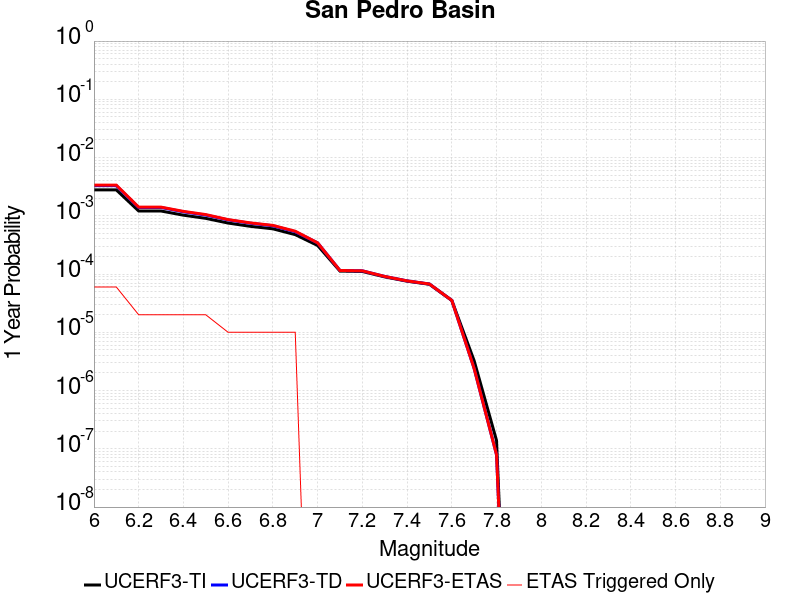 |  |

| Magnitude | 1 wk TI Prob | 1 wk TD Prob | 1 wk ETAS Prob | 1 wk ETAS/TD Gain | 1 wk ETAS Triggered Only | 1 mo TI Prob | 1 mo TD Prob | 1 mo ETAS Prob | 1 mo ETAS/TD Gain | 1 mo ETAS Triggered Only | 1 yr TI Prob | 1 yr TD Prob | 1 yr ETAS Prob | 1 yr ETAS/TD Gain | 1 yr ETAS Triggered Only | 10 yr TI Prob | 10 yr TD Prob | 10 yr ETAS Prob | 10 yr ETAS/TD Gain | 10 yr ETAS Triggered Only |
|-----|-----|-----|-----|-----|-----|-----|-----|-----|-----|-----|-----|-----|-----|-----|-----|-----|-----|-----|-----|-----|
| 6.0 | 5.3449043E-5 | 6.336954E-5 | 1.15179726E-4 | 1.8175882 | 5.1813473E-5 | 2.2904722E-4 | 2.715589E-4 | 3.233583E-4 | 1.1907483 | 5.1813473E-5 | 0.0027850836 | 0.0033018254 | 0.0033534677 | 1.0156406 | 5.1813473E-5 | 0.027504366 | 0.03258945 | 0.0326897 | 1.0030762 | 1.03626946E-4 |
| 6.1 | 5.3449043E-5 | 6.336954E-5 | 1.15179726E-4 | 1.8175882 | 5.1813473E-5 | 2.2904722E-4 | 2.715589E-4 | 3.233583E-4 | 1.1907483 | 5.1813473E-5 | 0.0027850836 | 0.0033018254 | 0.0033534677 | 1.0156406 | 5.1813473E-5 | 0.027504366 | 0.03258945 | 0.0326897 | 1.0030762 | 1.03626946E-4 |
| 6.2 | 2.3189454E-5 | 2.6642796E-5 | 2.6642796E-5 | 1.0 | 0.0 | 9.9379584E-5 | 1.14178685E-4 | 1.14178685E-4 | 1.0 | 0.0 | 0.0012092749 | 0.0013892864 | 0.0013892864 | 1.0 | 0.0 | 0.012027155 | 0.013810883 | 0.013861981 | 1.0036998 | 5.1813473E-5 |
| 6.3 | 2.3189454E-5 | 2.6642796E-5 | 2.6642796E-5 | 1.0 | 0.0 | 9.9379584E-5 | 1.14178685E-4 | 1.14178685E-4 | 1.0 | 0.0 | 0.0012092749 | 0.0013892864 | 0.0013892864 | 1.0 | 0.0 | 0.012027155 | 0.013810883 | 0.013861981 | 1.0036998 | 5.1813473E-5 |
| 6.4 | 1.966056E-5 | 2.2463413E-5 | 2.2463413E-5 | 1.0 | 0.0 | 8.425682E-5 | 9.626844E-5 | 9.626844E-5 | 1.0 | 0.0 | 0.001025344 | 0.0011714783 | 0.0011714783 | 1.0 | 0.0 | 0.010206259 | 0.011657117 | 0.011708326 | 1.004393 | 5.1813473E-5 |
| 6.5 | 1.7342953E-5 | 1.9745148E-5 | 1.9745148E-5 | 1.0 | 0.0 | 7.4324824E-5 | 8.4619525E-5 | 8.4619525E-5 | 1.0 | 0.0 | 9.04529E-4 | 0.0010297928 | 0.0010297928 | 1.0 | 0.0 | 0.009008561 | 0.010253931 | 0.010305214 | 1.0050012 | 5.1813473E-5 |
| 6.6 | 1.439804E-5 | 1.6322716E-5 | 1.6322716E-5 | 1.0 | 0.0 | 6.170443E-5 | 6.99528E-5 | 6.99528E-5 | 1.0 | 0.0 | 7.509924E-4 | 8.513747E-4 | 8.513747E-4 | 1.0 | 0.0 | 0.0074845953 | 0.008484332 | 0.008484332 | 1.0 | 0.0 |
| 6.7 | 1.2634884E-5 | 1.4285297E-5 | 1.4285297E-5 | 1.0 | 0.0 | 5.414838E-5 | 6.1221435E-5 | 6.1221435E-5 | 1.0 | 0.0 | 6.590571E-4 | 7.4514654E-4 | 7.4514654E-4 | 1.0 | 0.0 | 0.006571059 | 0.007429501 | 0.007429501 | 1.0 | 0.0 |
| 6.8 | 1.146091E-5 | 1.2933192E-5 | 1.2933192E-5 | 1.0 | 0.0 | 4.911726E-5 | 5.5426954E-5 | 5.5426954E-5 | 1.0 | 0.0 | 5.9783855E-4 | 6.7464396E-4 | 6.7464396E-4 | 1.0 | 0.0 | 0.0059623276 | 0.006728899 | 0.006728899 | 1.0 | 0.0 |
| 6.9 | 9.109035E-6 | 1.0235011E-5 | 1.0235011E-5 | 1.0 | 0.0 | 3.9038136E-5 | 4.3863754E-5 | 4.3863754E-5 | 1.0 | 0.0 | 4.7518566E-4 | 5.3393835E-4 | 5.3393835E-4 | 1.0 | 0.0 | 0.0047417083 | 0.005329309 | 0.005329309 | 1.0 | 0.0 |
| 7.0 | 5.9351028E-6 | 6.583964E-6 | 6.583964E-6 | 1.0 | 0.0 | 2.5435906E-5 | 2.8216817E-5 | 2.8216817E-5 | 1.0 | 0.0 | 3.0963816E-4 | 3.435092E-4 | 3.435092E-4 | 1.0 | 0.0 | 0.0030920706 | 0.0034320992 | 0.0034320992 | 1.0 | 0.0 |
| 7.1 | 2.1557585E-6 | 2.209648E-6 | 2.209648E-6 | 1.0 | 0.0 | 9.238933E-6 | 9.469887E-6 | 9.469887E-6 | 1.0 | 0.0 | 1.1247819E-4 | 1.1528993E-4 | 1.1528993E-4 | 1.0 | 0.0 | 0.0011242128 | 0.0011523166 | 0.0011523166 | 1.0 | 0.0 |
| 7.2 | 2.1251979E-6 | 2.1779945E-6 | 2.1779945E-6 | 1.0 | 0.0 | 9.107958E-6 | 9.334229E-6 | 9.334229E-6 | 1.0 | 0.0 | 1.1088375E-4 | 1.1363847E-4 | 1.1363847E-4 | 1.0 | 0.0 | 0.0011082845 | 0.0011358189 | 0.0011358189 | 1.0 | 0.0 |
| 7.3 | 1.7145798E-6 | 1.7442874E-6 | 1.7442874E-6 | 1.0 | 0.0 | 7.3481783E-6 | 7.4754967E-6 | 7.4754967E-6 | 1.0 | 0.0 | 8.94604E-5 | 9.1010465E-5 | 9.1010465E-5 | 1.0 | 0.0 | 8.9424395E-4 | 9.0974104E-4 | 9.0974104E-4 | 1.0 | 0.0 |
| 7.4 | 1.4467993E-6 | 1.4641868E-6 | 1.4641868E-6 | 1.0 | 0.0 | 6.200554E-6 | 6.2750714E-6 | 6.2750714E-6 | 1.0 | 0.0 | 7.548913E-5 | 7.639639E-5 | 7.639639E-5 | 1.0 | 0.0 | 7.546349E-4 | 7.6370855E-4 | 7.6370855E-4 | 1.0 | 0.0 |
| 7.5 | 1.2803735E-6 | 1.2931497E-6 | 1.2931497E-6 | 1.0 | 0.0 | 5.487303E-6 | 5.5420587E-6 | 5.5420587E-6 | 1.0 | 0.0 | 6.680587E-5 | 6.7472545E-5 | 6.7472545E-5 | 1.0 | 0.0 | 6.678579E-4 | 6.7452766E-4 | 6.7452766E-4 | 1.0 | 0.0 |
| 7.6 | 6.755009E-7 | 6.769465E-7 | 6.769465E-7 | 1.0 | 0.0 | 2.8950008E-6 | 2.9011965E-6 | 2.9011965E-6 | 1.0 | 0.0 | 3.5246063E-5 | 3.5321555E-5 | 3.5321555E-5 | 1.0 | 0.0 | 3.5240475E-4 | 3.5316512E-4 | 3.5316512E-4 | 1.0 | 0.0 |
| 7.7 | 6.211885E-8 | 4.569953E-8 | 4.569953E-8 | 1.0 | 0.0 | 2.6622362E-7 | 1.9585512E-7 | 1.9585512E-7 | 1.0 | 0.0 | 3.2412677E-6 | 2.3845337E-6 | 2.3845337E-6 | 1.0 | 0.0 | 3.2412205E-5 | 2.3845101E-5 | 2.3845101E-5 | 1.0 | 0.0 |
| 7.8 | 2.6580573E-9 | 1.5138163E-9 | 1.5138163E-9 | 1.0 | 0.0 | 1.1391674E-8 | 6.487784E-9 | 6.487784E-9 | 1.0 | 0.0 | 1.3869362E-7 | 7.898877E-8 | 7.898877E-8 | 1.0 | 0.0 | 1.3869354E-6 | 7.898877E-7 | 7.898877E-7 | 1.0 | 0.0 |

## Mission Creek
*[(top)](#table-of-contents)*

| 1 Week | 1 Month | 1 Year | 10 Year |
|-----|-----|-----|-----|
|  |  |  |  |

| Magnitude | 1 wk TI Prob | 1 wk TD Prob | 1 wk ETAS Prob | 1 wk ETAS/TD Gain | 1 wk ETAS Triggered Only | 1 mo TI Prob | 1 mo TD Prob | 1 mo ETAS Prob | 1 mo ETAS/TD Gain | 1 mo ETAS Triggered Only | 1 yr TI Prob | 1 yr TD Prob | 1 yr ETAS Prob | 1 yr ETAS/TD Gain | 1 yr ETAS Triggered Only | 10 yr TI Prob | 10 yr TD Prob | 10 yr ETAS Prob | 10 yr ETAS/TD Gain | 10 yr ETAS Triggered Only |
|-----|-----|-----|-----|-----|-----|-----|-----|-----|-----|-----|-----|-----|-----|-----|-----|-----|-----|-----|-----|-----|
| 6.0 | 1.1549387E-5 | 1.632237E-5 | 1.632237E-5 | 1.0 | 0.0 | 4.9496433E-5 | 6.9951224E-5 | 6.9951224E-5 | 1.0 | 0.0 | 6.0245243E-4 | 8.513384E-4 | 8.513384E-4 | 1.0 | 0.0 | 0.006008218 | 0.008509998 | 0.008612743 | 1.0120734 | 1.03626946E-4 |
| 6.1 | 1.1549387E-5 | 1.632237E-5 | 1.632237E-5 | 1.0 | 0.0 | 4.9496433E-5 | 6.9951224E-5 | 6.9951224E-5 | 1.0 | 0.0 | 6.0245243E-4 | 8.513384E-4 | 8.513384E-4 | 1.0 | 0.0 | 0.006008218 | 0.008509998 | 0.008612743 | 1.0120734 | 1.03626946E-4 |
| 6.2 | 1.1549387E-5 | 1.632237E-5 | 1.632237E-5 | 1.0 | 0.0 | 4.9496433E-5 | 6.9951224E-5 | 6.9951224E-5 | 1.0 | 0.0 | 6.0245243E-4 | 8.513384E-4 | 8.513384E-4 | 1.0 | 0.0 | 0.006008218 | 0.008509998 | 0.008612743 | 1.0120734 | 1.03626946E-4 |
| 6.3 | 1.1549387E-5 | 1.632237E-5 | 1.632237E-5 | 1.0 | 0.0 | 4.9496433E-5 | 6.9951224E-5 | 6.9951224E-5 | 1.0 | 0.0 | 6.0245243E-4 | 8.513384E-4 | 8.513384E-4 | 1.0 | 0.0 | 0.006008218 | 0.008509998 | 0.008612743 | 1.0120734 | 1.03626946E-4 |
| 6.4 | 1.1549387E-5 | 1.632237E-5 | 1.632237E-5 | 1.0 | 0.0 | 4.9496433E-5 | 6.9951224E-5 | 6.9951224E-5 | 1.0 | 0.0 | 6.0245243E-4 | 8.513384E-4 | 8.513384E-4 | 1.0 | 0.0 | 0.006008218 | 0.008509998 | 0.008612743 | 1.0120734 | 1.03626946E-4 |
| 6.5 | 1.1549387E-5 | 1.632237E-5 | 1.632237E-5 | 1.0 | 0.0 | 4.9496433E-5 | 6.9951224E-5 | 6.9951224E-5 | 1.0 | 0.0 | 6.0245243E-4 | 8.513384E-4 | 8.513384E-4 | 1.0 | 0.0 | 0.006008218 | 0.008509998 | 0.008612743 | 1.0120734 | 1.03626946E-4 |
| 6.6 | 9.202681E-6 | 1.3845646E-5 | 1.3845646E-5 | 1.0 | 0.0 | 3.9439463E-5 | 5.9337188E-5 | 5.9337188E-5 | 1.0 | 0.0 | 4.800697E-4 | 7.221998E-4 | 7.221998E-4 | 1.0 | 0.0 | 0.004790339 | 0.0072271815 | 0.0072786207 | 1.0071174 | 5.1813473E-5 |
| 6.7 | 9.019164E-6 | 1.3651316E-5 | 1.3651316E-5 | 1.0 | 0.0 | 3.8652986E-5 | 5.8504378E-5 | 5.8504378E-5 | 1.0 | 0.0 | 4.7049852E-4 | 7.12067E-4 | 7.12067E-4 | 1.0 | 0.0 | 0.004695036 | 0.007126506 | 0.00717795 | 1.0072187 | 5.1813473E-5 |
| 6.8 | 8.673558E-6 | 1.3273427E-5 | 1.3273427E-5 | 1.0 | 0.0 | 3.717186E-5 | 5.6884925E-5 | 5.6884925E-5 | 1.0 | 0.0 | 4.524734E-4 | 6.923627E-4 | 6.923627E-4 | 1.0 | 0.0 | 0.0045155324 | 0.006930694 | 0.0069821486 | 1.0074241 | 5.1813473E-5 |
| 6.9 | 7.002255E-6 | 1.1477657E-5 | 1.1477657E-5 | 1.0 | 0.0 | 3.000932E-5 | 4.9189068E-5 | 4.9189068E-5 | 1.0 | 0.0 | 3.653022E-4 | 5.9871917E-4 | 5.9871917E-4 | 1.0 | 0.0 | 0.0036470229 | 0.005999517 | 0.0060510198 | 1.0085845 | 5.1813473E-5 |
| 7.0 | 5.84644E-6 | 9.67498E-6 | 9.67498E-6 | 1.0 | 0.0 | 2.5055931E-5 | 4.1463565E-5 | 4.1463565E-5 | 1.0 | 0.0 | 3.0501327E-4 | 5.047066E-4 | 5.047066E-4 | 1.0 | 0.0 | 0.0030459496 | 0.0050638523 | 0.0051154033 | 1.0101802 | 5.1813473E-5 |
| 7.1 | 5.54703E-6 | 9.329456E-6 | 9.329456E-6 | 1.0 | 0.0 | 2.377277E-5 | 3.9982795E-5 | 3.9982795E-5 | 1.0 | 0.0 | 2.8939504E-4 | 4.8668624E-4 | 4.8668624E-4 | 1.0 | 0.0 | 0.0028901845 | 0.004884446 | 0.004936007 | 1.010556 | 5.1813473E-5 |
| 7.2 | 4.384709E-6 | 7.68157E-6 | 7.68157E-6 | 1.0 | 0.0 | 1.8791474E-5 | 3.2920623E-5 | 3.2920623E-5 | 1.0 | 0.0 | 2.2876218E-4 | 4.0073853E-4 | 4.0073853E-4 | 1.0 | 0.0 | 0.0022852682 | 0.004028366 | 0.0040799705 | 1.0128103 | 5.1813473E-5 |
| 7.3 | 3.7888456E-6 | 6.915452E-6 | 6.915452E-6 | 1.0 | 0.0 | 1.623781E-5 | 2.9637333E-5 | 2.9637333E-5 | 1.0 | 0.0 | 1.9767738E-4 | 3.6077813E-4 | 3.6077813E-4 | 1.0 | 0.0 | 0.0019750162 | 0.0036301152 | 0.0036817405 | 1.0142214 | 5.1813473E-5 |
| 7.4 | 2.1982462E-6 | 5.0237763E-6 | 5.0237763E-6 | 1.0 | 0.0 | 9.421021E-6 | 2.1530293E-5 | 2.1530293E-5 | 1.0 | 0.0 | 1.1469489E-4 | 2.621E-4 | 2.621E-4 | 1.0 | 0.0 | 0.0011463572 | 0.0026458844 | 0.002697561 | 1.0195309 | 5.1813473E-5 |
| 7.5 | 2.051923E-6 | 4.615016E-6 | 4.615016E-6 | 1.0 | 0.0 | 8.793926E-6 | 1.9778492E-5 | 1.9778492E-5 | 1.0 | 0.0 | 1.0706078E-4 | 2.4077666E-4 | 2.4077666E-4 | 1.0 | 0.0 | 0.0010700922 | 0.0024335422 | 0.0024852294 | 1.0212395 | 5.1813473E-5 |
| 7.6 | 1.8733427E-6 | 4.1233748E-6 | 4.1233748E-6 | 1.0 | 0.0 | 8.028587E-6 | 1.7671488E-5 | 1.7671488E-5 | 1.0 | 0.0 | 9.774366E-5 | 2.151292E-4 | 2.151292E-4 | 1.0 | 0.0 | 9.770069E-4 | 0.0021780801 | 0.002229781 | 1.0237368 | 5.1813473E-5 |
| 7.7 | 1.8411953E-6 | 4.0430496E-6 | 4.0430496E-6 | 1.0 | 0.0 | 7.890813E-6 | 1.732724E-5 | 1.732724E-5 | 1.0 | 0.0 | 9.606641E-5 | 2.1093882E-4 | 2.1093882E-4 | 1.0 | 0.0 | 9.6024893E-4 | 0.0021363653 | 0.002188068 | 1.0242013 | 5.1813473E-5 |
| 7.8 | 1.7194251E-6 | 3.7104276E-6 | 3.7104276E-6 | 1.0 | 0.0 | 7.368944E-6 | 1.5901736E-5 | 1.5901736E-5 | 1.0 | 0.0 | 8.97132E-5 | 1.9358651E-4 | 1.9358651E-4 | 1.0 | 0.0 | 8.967699E-4 | 0.0019623525 | 0.0020140642 | 1.0263519 | 5.1813473E-5 |
| 7.9 | 1.4035052E-6 | 2.9500632E-6 | 2.9500632E-6 | 1.0 | 0.0 | 6.0150082E-6 | 1.2643067E-5 | 1.2643067E-5 | 1.0 | 0.0 | 7.3230265E-5 | 1.5391852E-4 | 1.5391852E-4 | 1.0 | 0.0 | 7.3206134E-4 | 0.0015631086 | 0.0016148412 | 1.0330958 | 5.1813473E-5 |
| 8.0 | 3.9318823E-7 | 5.528522E-7 | 5.528522E-7 | 1.0 | 0.0 | 1.6850913E-6 | 2.3693647E-6 | 2.3693647E-6 | 1.0 | 0.0 | 2.0515794E-5 | 2.8846638E-5 | 2.8846638E-5 | 1.0 | 0.0 | 2.0513899E-4 | 2.9899E-4 | 2.9899E-4 | 1.0 | 0.0 |
| 8.1 | 1.596793E-7 | 1.1380002E-7 | 1.1380002E-7 | 1.0 | 0.0 | 6.8433974E-7 | 4.877143E-7 | 4.877143E-7 | 1.0 | 0.0 | 8.331805E-6 | 5.937906E-6 | 5.937906E-6 | 1.0 | 0.0 | 8.331492E-5 | 6.549966E-5 | 6.549966E-5 | 1.0 | 0.0 |
| 8.2 | 4.9003038E-8 | 2.5444924E-8 | 2.5444924E-8 | 1.0 | 0.0 | 2.10013E-7 | 1.0904967E-7 | 1.0904967E-7 | 1.0 | 0.0 | 2.5569052E-6 | 1.327679E-6 | 1.327679E-6 | 1.0 | 0.0 | 2.556876E-5 | 1.495635E-5 | 1.495635E-5 | 1.0 | 0.0 |

## San Juan
*[(top)](#table-of-contents)*

| 1 Week | 1 Month | 1 Year | 10 Year |
|-----|-----|-----|-----|
|  |  |  |  |

| Magnitude | 1 wk TI Prob | 1 wk TD Prob | 1 wk ETAS Prob | 1 wk ETAS/TD Gain | 1 wk ETAS Triggered Only | 1 mo TI Prob | 1 mo TD Prob | 1 mo ETAS Prob | 1 mo ETAS/TD Gain | 1 mo ETAS Triggered Only | 1 yr TI Prob | 1 yr TD Prob | 1 yr ETAS Prob | 1 yr ETAS/TD Gain | 1 yr ETAS Triggered Only | 10 yr TI Prob | 10 yr TD Prob | 10 yr ETAS Prob | 10 yr ETAS/TD Gain | 10 yr ETAS Triggered Only |
|-----|-----|-----|-----|-----|-----|-----|-----|-----|-----|-----|-----|-----|-----|-----|-----|-----|-----|-----|-----|-----|
| 6.0 | 8.682808E-6 | 8.7491635E-6 | 8.7491635E-6 | 1.0 | 0.0 | 3.72115E-5 | 3.74959E-5 | 3.74959E-5 | 1.0 | 0.0 | 4.5295584E-4 | 4.564218E-4 | 5.082116E-4 | 1.1134692 | 5.1813473E-5 | 0.004520337 | 0.004555385 | 0.00465854 | 1.0226446 | 1.03626946E-4 |
| 6.1 | 8.682808E-6 | 8.7491635E-6 | 8.7491635E-6 | 1.0 | 0.0 | 3.72115E-5 | 3.74959E-5 | 3.74959E-5 | 1.0 | 0.0 | 4.5295584E-4 | 4.564218E-4 | 5.082116E-4 | 1.1134692 | 5.1813473E-5 | 0.004520337 | 0.004555385 | 0.00465854 | 1.0226446 | 1.03626946E-4 |
| 6.2 | 8.682808E-6 | 8.7491635E-6 | 8.7491635E-6 | 1.0 | 0.0 | 3.72115E-5 | 3.74959E-5 | 3.74959E-5 | 1.0 | 0.0 | 4.5295584E-4 | 4.564218E-4 | 5.082116E-4 | 1.1134692 | 5.1813473E-5 | 0.004520337 | 0.004555385 | 0.00465854 | 1.0226446 | 1.03626946E-4 |
| 6.3 | 6.3054235E-6 | 6.2825848E-6 | 6.2825848E-6 | 1.0 | 0.0 | 2.7022963E-5 | 2.6925094E-5 | 2.6925094E-5 | 1.0 | 0.0 | 3.2895492E-4 | 3.2776513E-4 | 3.2776513E-4 | 1.0 | 0.0 | 0.003284684 | 0.003273017 | 0.0033246607 | 1.0157787 | 5.1813473E-5 |
| 6.4 | 6.1490473E-6 | 6.1144656E-6 | 6.1144656E-6 | 1.0 | 0.0 | 2.6352795E-5 | 2.6204598E-5 | 2.6204598E-5 | 1.0 | 0.0 | 3.2079802E-4 | 3.1899565E-4 | 3.1899565E-4 | 1.0 | 0.0 | 0.0032033534 | 0.0031855737 | 0.0032372223 | 1.0162132 | 5.1813473E-5 |
| 6.5 | 5.204848E-6 | 5.137233E-6 | 5.137233E-6 | 1.0 | 0.0 | 2.23063E-5 | 2.2016533E-5 | 2.2016533E-5 | 1.0 | 0.0 | 2.7154534E-4 | 2.6801927E-4 | 2.6801927E-4 | 1.0 | 0.0 | 0.0027121378 | 0.0026771144 | 0.002728789 | 1.0193024 | 5.1813473E-5 |
| 6.6 | 4.5179986E-6 | 4.4150297E-6 | 4.4150297E-6 | 1.0 | 0.0 | 1.9362706E-5 | 1.8921424E-5 | 1.8921424E-5 | 1.0 | 0.0 | 2.3571544E-4 | 2.3034477E-4 | 2.3034477E-4 | 1.0 | 0.0 | 0.0023546559 | 0.0023011973 | 0.0023528915 | 1.022464 | 5.1813473E-5 |
| 6.7 | 3.9442616E-6 | 3.819828E-6 | 3.819828E-6 | 1.0 | 0.0 | 1.6903869E-5 | 1.6370592E-5 | 1.6370592E-5 | 1.0 | 0.0 | 2.0578515E-4 | 1.992944E-4 | 1.992944E-4 | 1.0 | 0.0 | 0.002055947 | 0.0019912818 | 0.0019912818 | 1.0 | 0.0 |
| 6.8 | 3.4536245E-6 | 3.3163353E-6 | 3.3163353E-6 | 1.0 | 0.0 | 1.4801163E-5 | 1.4212792E-5 | 1.4212792E-5 | 1.0 | 0.0 | 1.8018926E-4 | 1.7302761E-4 | 1.7302761E-4 | 1.0 | 0.0 | 0.0018004322 | 0.0017290477 | 0.0017290477 | 1.0 | 0.0 |
| 6.9 | 3.059865E-6 | 2.9120315E-6 | 2.9120315E-6 | 1.0 | 0.0 | 1.3113641E-5 | 1.2480078E-5 | 1.2480078E-5 | 1.0 | 0.0 | 1.596469E-4 | 1.5193493E-4 | 1.5193493E-4 | 1.0 | 0.0 | 0.0015953224 | 0.0015184252 | 0.0015184252 | 1.0 | 0.0 |
| 7.0 | 2.6504351E-6 | 2.4920002E-6 | 2.4920002E-6 | 1.0 | 0.0 | 1.1358958E-5 | 1.0679961E-5 | 1.0679961E-5 | 1.0 | 0.0 | 1.3828653E-4 | 1.300213E-4 | 1.300213E-4 | 1.0 | 0.0 | 0.0013820052 | 0.0012995641 | 0.0012995641 | 1.0 | 0.0 |
| 7.1 | 2.2039317E-6 | 2.0338296E-6 | 2.0338296E-6 | 1.0 | 0.0 | 9.445387E-6 | 8.716386E-6 | 8.716386E-6 | 1.0 | 0.0 | 1.1499152E-4 | 1.0611736E-4 | 1.0611736E-4 | 1.0 | 0.0 | 0.0011493203 | 0.0010607769 | 0.0010607769 | 1.0 | 0.0 |
| 7.2 | 1.0786707E-6 | 8.7701903E-7 | 8.7701903E-7 | 1.0 | 0.0 | 4.622866E-6 | 3.7586476E-6 | 3.7586476E-6 | 1.0 | 0.0 | 5.628194E-5 | 4.5760586E-5 | 4.5760586E-5 | 1.0 | 0.0 | 5.6267687E-4 | 4.5757066E-4 | 4.5757066E-4 | 1.0 | 0.0 |
| 7.3 | 6.846433E-7 | 4.868805E-7 | 4.868805E-7 | 1.0 | 0.0 | 2.9341822E-6 | 2.086629E-6 | 2.086629E-6 | 1.0 | 0.0 | 3.5723086E-5 | 2.5404412E-5 | 2.5404412E-5 | 1.0 | 0.0 | 3.571734E-4 | 2.540486E-4 | 2.540486E-4 | 1.0 | 0.0 |
| 7.4 | 5.23043E-7 | 3.2628162E-7 | 3.2628162E-7 | 1.0 | 0.0 | 2.2416111E-6 | 1.398349E-6 | 1.398349E-6 | 1.0 | 0.0 | 2.7291273E-5 | 1.7024766E-5 | 1.7024766E-5 | 1.0 | 0.0 | 2.7287923E-4 | 1.7026656E-4 | 1.7026656E-4 | 1.0 | 0.0 |
| 7.5 | 4.648444E-7 | 2.7234944E-7 | 2.7234944E-7 | 1.0 | 0.0 | 1.9921886E-6 | 1.1672114E-6 | 1.1672114E-6 | 1.0 | 0.0 | 2.4254627E-5 | 1.42107065E-5 | 1.42107065E-5 | 1.0 | 0.0 | 2.425198E-4 | 1.421276E-4 | 1.421276E-4 | 1.0 | 0.0 |
| 7.6 | 3.9906567E-7 | 2.2083314E-7 | 2.2083314E-7 | 1.0 | 0.0 | 1.7102802E-6 | 9.464274E-7 | 9.464274E-7 | 1.0 | 0.0 | 2.0822463E-5 | 1.1522693E-5 | 1.1522693E-5 | 1.0 | 0.0 | 2.0820512E-4 | 1.15245566E-4 | 1.15245566E-4 | 1.0 | 0.0 |
| 7.7 | 1.8784601E-7 | 5.3666906E-8 | 5.3666906E-8 | 1.0 | 0.0 | 8.0505407E-7 | 2.30001E-7 | 2.30001E-7 | 1.0 | 0.0 | 9.80149E-6 | 2.8002585E-6 | 2.8002585E-6 | 1.0 | 0.0 | 9.801057E-5 | 2.8011282E-5 | 2.8011282E-5 | 1.0 | 0.0 |
| 7.8 | 1.00154914E-7 | 1.2415832E-8 | 1.2415832E-8 | 1.0 | 0.0 | 4.2923529E-7 | 5.3210716E-8 | 5.3210716E-8 | 1.0 | 0.0 | 5.225927E-6 | 6.4784024E-7 | 6.4784024E-7 | 1.0 | 0.0 | 5.225804E-5 | 6.484273E-6 | 6.484273E-6 | 1.0 | 0.0 |
| 7.9 | 6.171429E-8 | 4.2966155E-9 | 4.2966155E-9 | 1.0 | 0.0 | 2.6448978E-7 | 1.8414067E-8 | 1.8414067E-8 | 1.0 | 0.0 | 3.2201583E-6 | 2.2419121E-7 | 2.2419121E-7 | 1.0 | 0.0 | 3.2201115E-5 | 2.2472002E-6 | 2.2472002E-6 | 1.0 | 0.0 |
| 8.0 | 1.3974572E-8 | 3.3788217E-10 | 3.3788217E-10 | 1.0 | 0.0 | 5.989102E-8 | 1.448067E-9 | 1.448067E-9 | 1.0 | 0.0 | 7.2917294E-7 | 1.763022E-8 | 1.763022E-8 | 1.0 | 0.0 | 7.2917055E-6 | 1.8060365E-7 | 1.8060365E-7 | 1.0 | 0.0 |
| 8.1 | 1.8403477E-9 | 1.1302803E-10 | 1.1302803E-10 | 1.0 | 0.0 | 7.887204E-9 | 4.844063E-10 | 4.844063E-10 | 1.0 | 0.0 | 9.602671E-8 | 5.8976446E-9 | 5.8976446E-9 | 1.0 | 0.0 | 9.602667E-7 | 6.021993E-8 | 6.021993E-8 | 1.0 | 0.0 |

## Newport-Inglewood alt 1
*[(top)](#table-of-contents)*

| 1 Week | 1 Month | 1 Year | 10 Year |
|-----|-----|-----|-----|
| 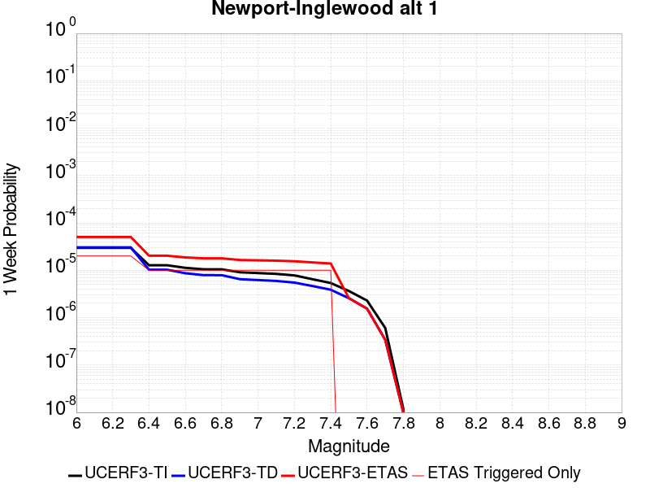 | 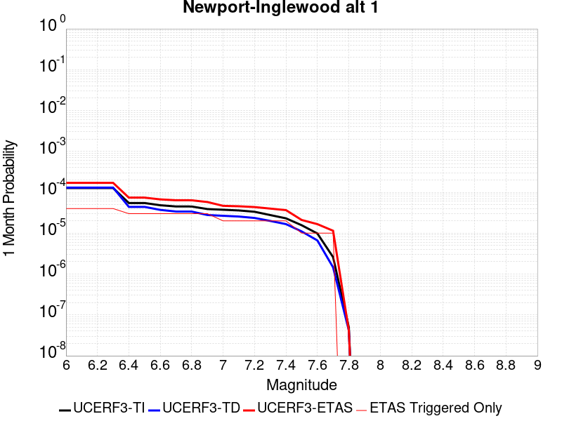 | 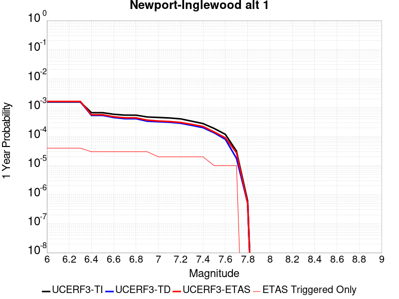 |  |

| Magnitude | 1 wk TI Prob | 1 wk TD Prob | 1 wk ETAS Prob | 1 wk ETAS/TD Gain | 1 wk ETAS Triggered Only | 1 mo TI Prob | 1 mo TD Prob | 1 mo ETAS Prob | 1 mo ETAS/TD Gain | 1 mo ETAS Triggered Only | 1 yr TI Prob | 1 yr TD Prob | 1 yr ETAS Prob | 1 yr ETAS/TD Gain | 1 yr ETAS Triggered Only | 10 yr TI Prob | 10 yr TD Prob | 10 yr ETAS Prob | 10 yr ETAS/TD Gain | 10 yr ETAS Triggered Only |
|-----|-----|-----|-----|-----|-----|-----|-----|-----|-----|-----|-----|-----|-----|-----|-----|-----|-----|-----|-----|-----|
| 6.0 | 2.9668912E-5 | 3.0404817E-5 | 3.0404817E-5 | 1.0 | 0.0 | 1.2714628E-4 | 1.303026E-4 | 1.8210932E-4 | 1.3975878 | 5.1813473E-5 | 0.0015469068 | 0.0015857625 | 0.0016374938 | 1.0326223 | 5.1813473E-5 | 0.015361829 | 0.015792042 | 0.015843038 | 1.0032291 | 5.1813473E-5 |
| 6.1 | 2.9668912E-5 | 3.0404817E-5 | 3.0404817E-5 | 1.0 | 0.0 | 1.2714628E-4 | 1.303026E-4 | 1.8210932E-4 | 1.3975878 | 5.1813473E-5 | 0.0015469068 | 0.0015857625 | 0.0016374938 | 1.0326223 | 5.1813473E-5 | 0.015361829 | 0.015792042 | 0.015843038 | 1.0032291 | 5.1813473E-5 |
| 6.2 | 2.9668912E-5 | 3.0404817E-5 | 3.0404817E-5 | 1.0 | 0.0 | 1.2714628E-4 | 1.303026E-4 | 1.8210932E-4 | 1.3975878 | 5.1813473E-5 | 0.0015469068 | 0.0015857625 | 0.0016374938 | 1.0326223 | 5.1813473E-5 | 0.015361829 | 0.015792042 | 0.015843038 | 1.0032291 | 5.1813473E-5 |
| 6.3 | 2.9668912E-5 | 3.0404817E-5 | 3.0404817E-5 | 1.0 | 0.0 | 1.2714628E-4 | 1.303026E-4 | 1.8210932E-4 | 1.3975878 | 5.1813473E-5 | 0.0015469068 | 0.0015857625 | 0.0016374938 | 1.0326223 | 5.1813473E-5 | 0.015361829 | 0.015792042 | 0.015843038 | 1.0032291 | 5.1813473E-5 |
| 6.4 | 1.275942E-5 | 1.0272503E-5 | 1.0272503E-5 | 1.0 | 0.0 | 5.4682085E-5 | 4.402429E-5 | 9.583548E-5 | 2.1768773 | 5.1813473E-5 | 6.65551E-4 | 5.358681E-4 | 5.876538E-4 | 1.0966389 | 5.1813473E-5 | 0.0066356123 | 0.005346184 | 0.0053977207 | 1.0096399 | 5.1813473E-5 |
| 6.5 | 1.275942E-5 | 1.0272503E-5 | 1.0272503E-5 | 1.0 | 0.0 | 5.4682085E-5 | 4.402429E-5 | 9.583548E-5 | 2.1768773 | 5.1813473E-5 | 6.65551E-4 | 5.358681E-4 | 5.876538E-4 | 1.0966389 | 5.1813473E-5 | 0.0066356123 | 0.005346184 | 0.0053977207 | 1.0096399 | 5.1813473E-5 |
| 6.6 | 1.1255358E-5 | 8.661884E-6 | 8.661884E-6 | 1.0 | 0.0 | 4.8236358E-5 | 3.712184E-5 | 8.893339E-5 | 2.395716 | 5.1813473E-5 | 5.871194E-4 | 4.518664E-4 | 5.0365645E-4 | 1.1146137 | 5.1813473E-5 | 0.005855706 | 0.004509653 | 0.004561233 | 1.0114377 | 5.1813473E-5 |
| 6.7 | 1.0504745E-5 | 7.8997955E-6 | 7.8997955E-6 | 1.0 | 0.0 | 4.5019555E-5 | 3.3855835E-5 | 8.5667554E-5 | 2.530363 | 5.1813473E-5 | 5.4797524E-4 | 4.1211807E-4 | 4.6391017E-4 | 1.125673 | 5.1813473E-5 | 0.0054662596 | 0.004113668 | 0.0041652685 | 1.0125437 | 5.1813473E-5 |
| 6.8 | 1.0476007E-5 | 7.881176E-6 | 7.881176E-6 | 1.0 | 0.0 | 4.4896402E-5 | 3.3776043E-5 | 8.5587766E-5 | 2.5339785 | 5.1813473E-5 | 5.464766E-4 | 4.1114696E-4 | 4.6293912E-4 | 1.12597 | 5.1813473E-5 | 0.005451347 | 0.0041039926 | 0.0041555935 | 1.0125734 | 5.1813473E-5 |
| 6.9 | 9.076797E-6 | 6.4896312E-6 | 6.4896312E-6 | 1.0 | 0.0 | 3.889998E-5 | 2.781241E-5 | 7.962444E-5 | 2.8629105 | 5.1813473E-5 | 4.7350433E-4 | 3.385638E-4 | 3.9035975E-4 | 1.1529872 | 5.1813473E-5 | 0.004724967 | 0.0033805177 | 0.003432156 | 1.0152752 | 5.1813473E-5 |
| 7.0 | 8.73795E-6 | 6.2120125E-6 | 6.2120125E-6 | 1.0 | 0.0 | 3.7447822E-5 | 2.6622642E-5 | 7.8434736E-5 | 2.9461665 | 5.1813473E-5 | 4.5583185E-4 | 3.2408274E-4 | 3.758794E-4 | 1.1598254 | 5.1813473E-5 | 0.0045489795 | 0.0032361327 | 0.0032877785 | 1.0159591 | 5.1813473E-5 |
| 7.1 | 8.391299E-6 | 5.95579E-6 | 5.95579E-6 | 1.0 | 0.0 | 3.5962214E-5 | 2.5524565E-5 | 7.7336714E-5 | 3.0298934 | 5.1813473E-5 | 4.37752E-4 | 3.1071753E-4 | 3.625149E-4 | 1.1667024 | 5.1813473E-5 | 0.004368907 | 0.0031028606 | 0.0031545132 | 1.0166467 | 5.1813473E-5 |
| 7.2 | 7.796882E-6 | 5.4965344E-6 | 5.4965344E-6 | 1.0 | 0.0 | 3.341478E-5 | 2.3556364E-5 | 7.536862E-5 | 3.1995013 | 5.1813473E-5 | 4.06749E-4 | 2.867612E-4 | 3.3855982E-4 | 1.1806333 | 5.1813473E-5 | 0.0040600533 | 0.0028639357 | 0.0029156008 | 1.01804 | 5.1813473E-5 |
| 7.3 | 6.4738833E-6 | 4.6478162E-6 | 4.6478162E-6 | 1.0 | 0.0 | 2.774492E-5 | 1.9919062E-5 | 7.17315E-5 | 3.6011486 | 5.1813473E-5 | 3.3774204E-4 | 2.4248775E-4 | 2.9428865E-4 | 1.2136228 | 5.1813473E-5 | 0.0033722918 | 0.0024222482 | 0.0024739362 | 1.0213388 | 5.1813473E-5 |
| 7.4 | 5.382145E-6 | 3.8857597E-6 | 3.8857597E-6 | 1.0 | 0.0 | 2.3066134E-5 | 1.665315E-5 | 6.846576E-5 | 4.1112795 | 5.1813473E-5 | 2.8079396E-4 | 2.0273338E-4 | 2.5453634E-4 | 1.2555226 | 5.1813473E-5 | 0.0028043943 | 0.0020254988 | 0.0020772074 | 1.0255288 | 5.1813473E-5 |
| 7.5 | 3.648244E-6 | 2.5737843E-6 | 2.5737843E-6 | 1.0 | 0.0 | 1.5635238E-5 | 1.1030458E-5 | 6.2843355E-5 | 5.6972575 | 5.1813473E-5 | 1.9034238E-4 | 1.3428765E-4 | 1.8609417E-4 | 1.3857876 | 5.1813473E-5 | 0.0019017943 | 0.0013420755 | 0.0013938195 | 1.0385551 | 5.1813473E-5 |
| 7.6 | 2.2906888E-6 | 1.5479842E-6 | 1.5479842E-6 | 1.0 | 0.0 | 9.817201E-6 | 6.634202E-6 | 5.844733E-5 | 8.810002 | 5.1813473E-5 | 1.1951787E-4 | 8.076848E-5 | 1.3257777E-4 | 1.6414542 | 5.1813473E-5 | 0.0011945361 | 8.07398E-4 | 8.5916964E-4 | 1.0641216 | 5.1813473E-5 |
| 7.7 | 6.0479874E-7 | 3.397512E-7 | 3.397512E-7 | 1.0 | 0.0 | 2.5919921E-6 | 1.4560758E-6 | 5.3269472E-5 | 36.58427 | 5.1813473E-5 | 3.1557047E-5 | 1.7727592E-5 | 6.954015E-5 | 3.9227066 | 5.1813473E-5 | 3.1552566E-4 | 1.7726317E-4 | 2.2906746E-4 | 1.292245 | 5.1813473E-5 |
| 7.8 | 1.16056995E-8 | 9.782373E-9 | 9.782373E-9 | 1.0 | 0.0 | 4.9738713E-8 | 4.1924455E-8 | 4.1924455E-8 | 1.0 | 0.0 | 6.0556863E-7 | 5.1043025E-7 | 5.1043025E-7 | 1.0 | 0.0 | 6.05567E-6 | 5.1043025E-6 | 5.1043025E-6 | 1.0 | 0.0 |

## Cleghorn Pass
*[(top)](#table-of-contents)*

| 1 Week | 1 Month | 1 Year | 10 Year |
|-----|-----|-----|-----|
|  |  |  | 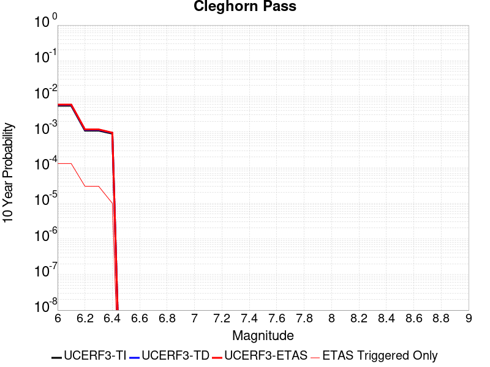 |

| Magnitude | 1 wk TI Prob | 1 wk TD Prob | 1 wk ETAS Prob | 1 wk ETAS/TD Gain | 1 wk ETAS Triggered Only | 1 mo TI Prob | 1 mo TD Prob | 1 mo ETAS Prob | 1 mo ETAS/TD Gain | 1 mo ETAS Triggered Only | 1 yr TI Prob | 1 yr TD Prob | 1 yr ETAS Prob | 1 yr ETAS/TD Gain | 1 yr ETAS Triggered Only | 10 yr TI Prob | 10 yr TD Prob | 10 yr ETAS Prob | 10 yr ETAS/TD Gain | 10 yr ETAS Triggered Only |
|-----|-----|-----|-----|-----|-----|-----|-----|-----|-----|-----|-----|-----|-----|-----|-----|-----|-----|-----|-----|-----|
| 6.0 | 1.0522846E-5 | 1.1040642E-5 | 1.1040642E-5 | 1.0 | 0.0 | 4.509713E-5 | 4.7316473E-5 | 4.7316473E-5 | 1.0 | 0.0 | 5.4891926E-4 | 5.759784E-4 | 5.759784E-4 | 1.0 | 0.0 | 0.0054756533 | 0.005750022 | 0.0058530527 | 1.0179183 | 1.03626946E-4 |
| 6.1 | 1.0522846E-5 | 1.1040642E-5 | 1.1040642E-5 | 1.0 | 0.0 | 4.509713E-5 | 4.7316473E-5 | 4.7316473E-5 | 1.0 | 0.0 | 5.4891926E-4 | 5.759784E-4 | 5.759784E-4 | 1.0 | 0.0 | 0.0054756533 | 0.005750022 | 0.0058530527 | 1.0179183 | 1.03626946E-4 |
| 6.2 | 2.1045846E-6 | 2.2082024E-6 | 2.2082024E-6 | 1.0 | 0.0 | 9.019617E-6 | 9.463714E-6 | 9.463714E-6 | 1.0 | 0.0 | 1.098083E-4 | 1.1521882E-4 | 1.1521882E-4 | 1.0 | 0.0 | 0.0010975406 | 0.0011520023 | 0.0012555098 | 1.0898502 | 1.03626946E-4 |
| 6.3 | 2.1045846E-6 | 2.2082024E-6 | 2.2082024E-6 | 1.0 | 0.0 | 9.019617E-6 | 9.463714E-6 | 9.463714E-6 | 1.0 | 0.0 | 1.098083E-4 | 1.1521882E-4 | 1.1521882E-4 | 1.0 | 0.0 | 0.0010975406 | 0.0011520023 | 0.0012555098 | 1.0898502 | 1.03626946E-4 |
| 6.4 | 1.7259927E-6 | 1.810877E-6 | 1.810877E-6 | 1.0 | 0.0 | 7.3970905E-6 | 7.760902E-6 | 7.760902E-6 | 1.0 | 0.0 | 9.005586E-5 | 9.4488976E-5 | 9.4488976E-5 | 1.0 | 0.0 | 9.001937E-4 | 9.448898E-4 | 9.448898E-4 | 1.0 | 0.0 |

## Cleghorn
*[(top)](#table-of-contents)*

| 1 Week | 1 Month | 1 Year | 10 Year |
|-----|-----|-----|-----|
| 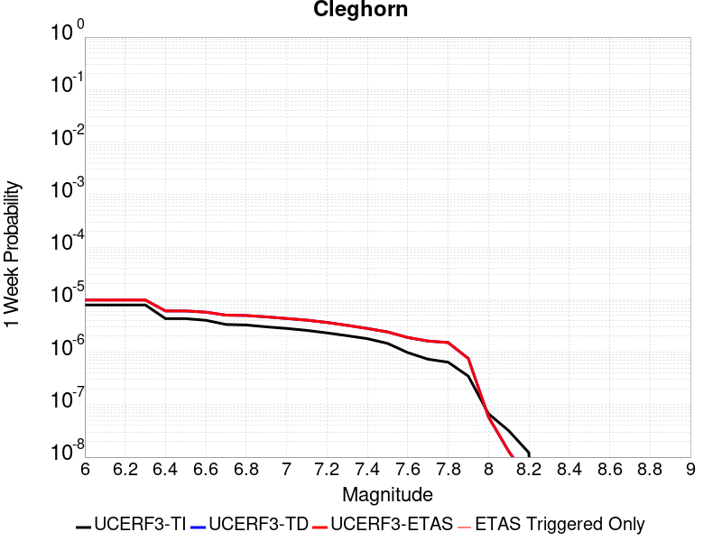 |  | 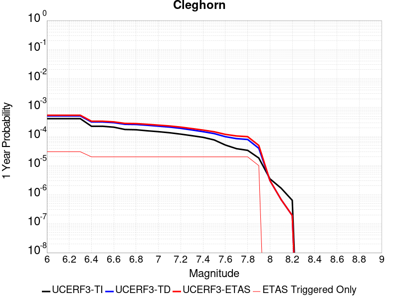 |  |

| Magnitude | 1 wk TI Prob | 1 wk TD Prob | 1 wk ETAS Prob | 1 wk ETAS/TD Gain | 1 wk ETAS Triggered Only | 1 mo TI Prob | 1 mo TD Prob | 1 mo ETAS Prob | 1 mo ETAS/TD Gain | 1 mo ETAS Triggered Only | 1 yr TI Prob | 1 yr TD Prob | 1 yr ETAS Prob | 1 yr ETAS/TD Gain | 1 yr ETAS Triggered Only | 10 yr TI Prob | 10 yr TD Prob | 10 yr ETAS Prob | 10 yr ETAS/TD Gain | 10 yr ETAS Triggered Only |
|-----|-----|-----|-----|-----|-----|-----|-----|-----|-----|-----|-----|-----|-----|-----|-----|-----|-----|-----|-----|-----|
| 6.0 | 7.9267165E-6 | 9.831582E-6 | 9.831582E-6 | 1.0 | 0.0 | 3.39712E-5 | 4.2134732E-5 | 4.2134732E-5 | 1.0 | 0.0 | 4.1352084E-4 | 5.128803E-4 | 5.6466716E-4 | 1.1009727 | 5.1813473E-5 | 0.004127522 | 0.0051320773 | 0.0052351723 | 1.0200884 | 1.03626946E-4 |
| 6.1 | 7.9267165E-6 | 9.831582E-6 | 9.831582E-6 | 1.0 | 0.0 | 3.39712E-5 | 4.2134732E-5 | 4.2134732E-5 | 1.0 | 0.0 | 4.1352084E-4 | 5.128803E-4 | 5.6466716E-4 | 1.1009727 | 5.1813473E-5 | 0.004127522 | 0.0051320773 | 0.0052351723 | 1.0200884 | 1.03626946E-4 |
| 6.2 | 7.9267165E-6 | 9.831582E-6 | 9.831582E-6 | 1.0 | 0.0 | 3.39712E-5 | 4.2134732E-5 | 4.2134732E-5 | 1.0 | 0.0 | 4.1352084E-4 | 5.128803E-4 | 5.6466716E-4 | 1.1009727 | 5.1813473E-5 | 0.004127522 | 0.0051320773 | 0.0052351723 | 1.0200884 | 1.03626946E-4 |
| 6.3 | 7.9267165E-6 | 9.831582E-6 | 9.831582E-6 | 1.0 | 0.0 | 3.39712E-5 | 4.2134732E-5 | 4.2134732E-5 | 1.0 | 0.0 | 4.1352084E-4 | 5.128803E-4 | 5.6466716E-4 | 1.1009727 | 5.1813473E-5 | 0.004127522 | 0.0051320773 | 0.0052351723 | 1.0200884 | 1.03626946E-4 |
| 6.4 | 4.3445207E-6 | 6.0914435E-6 | 6.0914435E-6 | 1.0 | 0.0 | 1.8619241E-5 | 2.610593E-5 | 2.610593E-5 | 1.0 | 0.0 | 2.2666567E-4 | 3.1779436E-4 | 3.1779436E-4 | 1.0 | 0.0 | 0.0022643462 | 0.0031875873 | 0.0032392356 | 1.0162029 | 5.1813473E-5 |
| 6.5 | 4.3445207E-6 | 6.0914435E-6 | 6.0914435E-6 | 1.0 | 0.0 | 1.8619241E-5 | 2.610593E-5 | 2.610593E-5 | 1.0 | 0.0 | 2.2666567E-4 | 3.1779436E-4 | 3.1779436E-4 | 1.0 | 0.0 | 0.0022643462 | 0.0031875873 | 0.0032392356 | 1.0162029 | 5.1813473E-5 |
| 6.6 | 4.040109E-6 | 5.773851E-6 | 5.773851E-6 | 1.0 | 0.0 | 1.7314638E-5 | 2.4744846E-5 | 2.4744846E-5 | 1.0 | 0.0 | 2.1078532E-4 | 3.012278E-4 | 3.012278E-4 | 1.0 | 0.0 | 0.002105855 | 0.003022377 | 0.003074034 | 1.0170915 | 5.1813473E-5 |
| 6.7 | 3.3632055E-6 | 5.067348E-6 | 5.067348E-6 | 1.0 | 0.0 | 1.4413658E-5 | 2.1717027E-5 | 2.1717027E-5 | 1.0 | 0.0 | 1.7547216E-4 | 2.6437303E-4 | 2.6437303E-4 | 1.0 | 0.0 | 0.0017533366 | 0.0026547113 | 0.0026547113 | 1.0 | 0.0 |
| 6.8 | 3.2902772E-6 | 4.9892556E-6 | 4.9892556E-6 | 1.0 | 0.0 | 1.4101111E-5 | 2.1382351E-5 | 2.1382351E-5 | 1.0 | 0.0 | 1.716675E-4 | 2.6029933E-4 | 2.6029933E-4 | 1.0 | 0.0 | 0.0017153495 | 0.0026140702 | 0.0026140702 | 1.0 | 0.0 |
| 6.9 | 3.031547E-6 | 4.6910186E-6 | 4.6910186E-6 | 1.0 | 0.0 | 1.299228E-5 | 2.0104211E-5 | 2.0104211E-5 | 1.0 | 0.0 | 1.5816953E-4 | 2.4474156E-4 | 2.4474156E-4 | 1.0 | 0.0 | 0.00158057 | 0.0024588439 | 0.0024588439 | 1.0 | 0.0 |
| 7.0 | 2.8259715E-6 | 4.3705895E-6 | 4.3705895E-6 | 1.0 | 0.0 | 1.211125E-5 | 1.8730963E-5 | 1.8730963E-5 | 1.0 | 0.0 | 1.4744449E-4 | 2.2802586E-4 | 2.2802586E-4 | 1.0 | 0.0 | 0.001473467 | 0.0022920412 | 0.0022920412 | 1.0 | 0.0 |
| 7.1 | 2.5962665E-6 | 4.0658106E-6 | 4.0658106E-6 | 1.0 | 0.0 | 1.1126809E-5 | 1.7424789E-5 | 1.7424789E-5 | 1.0 | 0.0 | 1.3546048E-4 | 2.1212637E-4 | 2.1212637E-4 | 1.0 | 0.0 | 0.0013537793 | 0.002133366 | 0.002133366 | 1.0 | 0.0 |
| 7.2 | 2.3247253E-6 | 3.6763672E-6 | 3.6763672E-6 | 1.0 | 0.0 | 9.96307E-6 | 1.5755764E-5 | 1.5755764E-5 | 1.0 | 0.0 | 1.21293626E-4 | 1.9180974E-4 | 1.9180974E-4 | 1.0 | 0.0 | 0.0012122744 | 0.0019305905 | 0.0019305905 | 1.0 | 0.0 |
| 7.3 | 2.056928E-6 | 3.2350938E-6 | 3.2350938E-6 | 1.0 | 0.0 | 8.815376E-6 | 1.3864615E-5 | 1.3864615E-5 | 1.0 | 0.0 | 1.0732192E-4 | 1.6878877E-4 | 1.6878877E-4 | 1.0 | 0.0 | 0.001072701 | 0.0017008206 | 0.0017008206 | 1.0 | 0.0 |
| 7.4 | 1.8055999E-6 | 2.8255042E-6 | 2.8255042E-6 | 1.0 | 0.0 | 7.738263E-6 | 1.2109249E-5 | 1.2109249E-5 | 1.0 | 0.0 | 9.4209274E-5 | 1.4742027E-4 | 1.4742027E-4 | 1.0 | 0.0 | 9.4169343E-4 | 0.0014875771 | 0.0014875771 | 1.0 | 0.0 |
| 7.5 | 1.4683443E-6 | 2.4247483E-6 | 2.4247483E-6 | 1.0 | 0.0 | 6.292889E-6 | 1.0391738E-5 | 1.0391738E-5 | 1.0 | 0.0 | 7.661323E-5 | 1.2651215E-4 | 1.2651215E-4 | 1.0 | 0.0 | 7.658682E-4 | 0.0012787961 | 0.0012787961 | 1.0 | 0.0 |
| 7.6 | 9.804088E-7 | 1.900266E-6 | 1.900266E-6 | 1.0 | 0.0 | 4.201745E-6 | 8.143972E-6 | 8.143972E-6 | 1.0 | 0.0 | 5.1155046E-5 | 9.91484E-5 | 9.91484E-5 | 1.0 | 0.0 | 5.114327E-4 | 0.001005471 | 0.001005471 | 1.0 | 0.0 |
| 7.7 | 7.3434086E-7 | 1.6284146E-6 | 1.6284146E-6 | 1.0 | 0.0 | 3.1471714E-6 | 6.978901E-6 | 6.978901E-6 | 1.0 | 0.0 | 3.831614E-5 | 8.4964835E-5 | 8.4964835E-5 | 1.0 | 0.0 | 3.8309532E-4 | 8.6378685E-4 | 8.6378685E-4 | 1.0 | 0.0 |
| 7.8 | 6.434184E-7 | 1.5220047E-6 | 1.5220047E-6 | 1.0 | 0.0 | 2.7575045E-6 | 6.5228614E-6 | 6.5228614E-6 | 1.0 | 0.0 | 3.35721E-5 | 7.941297E-5 | 7.941297E-5 | 1.0 | 0.0 | 3.3567028E-4 | 8.079678E-4 | 8.079678E-4 | 1.0 | 0.0 |
| 7.9 | 3.4943926E-7 | 7.574459E-7 | 7.574459E-7 | 1.0 | 0.0 | 1.497596E-6 | 3.2461926E-6 | 3.2461926E-6 | 1.0 | 0.0 | 1.8233079E-5 | 3.952169E-5 | 3.952169E-5 | 1.0 | 0.0 | 1.8231584E-4 | 4.040099E-4 | 4.040099E-4 | 1.0 | 0.0 |
| 8.0 | 6.717524E-8 | 5.838828E-8 | 5.838828E-8 | 1.0 | 0.0 | 2.8789387E-7 | 2.5023547E-7 | 2.5023547E-7 | 1.0 | 0.0 | 3.505102E-6 | 3.0466126E-6 | 3.0466126E-6 | 1.0 | 0.0 | 3.5050467E-5 | 3.273506E-5 | 3.273506E-5 | 1.0 | 0.0 |
| 8.1 | 3.1984914E-8 | 1.2956093E-8 | 1.2956093E-8 | 1.0 | 0.0 | 1.370782E-7 | 5.552611E-8 | 5.552611E-8 | 1.0 | 0.0 | 1.6689258E-6 | 6.760302E-7 | 6.760302E-7 | 1.0 | 0.0 | 1.6689133E-5 | 7.74454E-6 | 7.74454E-6 | 1.0 | 0.0 |
| 8.2 | 1.21887656E-8 | 3.6495305E-9 | 3.6495305E-9 | 1.0 | 0.0 | 5.2237567E-8 | 1.5640845E-8 | 1.5640845E-8 | 1.0 | 0.0 | 6.359922E-7 | 1.9042727E-7 | 1.9042727E-7 | 1.0 | 0.0 | 6.3599036E-6 | 2.2470974E-6 | 2.2470974E-6 | 1.0 | 0.0 |

## Santa Ynez River
*[(top)](#table-of-contents)*

| 1 Week | 1 Month | 1 Year | 10 Year |
|-----|-----|-----|-----|
|  |  | 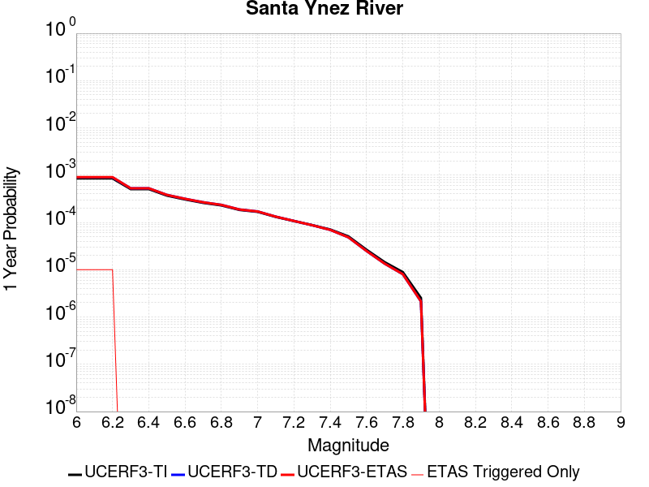 |  |

| Magnitude | 1 wk TI Prob | 1 wk TD Prob | 1 wk ETAS Prob | 1 wk ETAS/TD Gain | 1 wk ETAS Triggered Only | 1 mo TI Prob | 1 mo TD Prob | 1 mo ETAS Prob | 1 mo ETAS/TD Gain | 1 mo ETAS Triggered Only | 1 yr TI Prob | 1 yr TD Prob | 1 yr ETAS Prob | 1 yr ETAS/TD Gain | 1 yr ETAS Triggered Only | 10 yr TI Prob | 10 yr TD Prob | 10 yr ETAS Prob | 10 yr ETAS/TD Gain | 10 yr ETAS Triggered Only |
|-----|-----|-----|-----|-----|-----|-----|-----|-----|-----|-----|-----|-----|-----|-----|-----|-----|-----|-----|-----|-----|
| 6.0 | 1.6396456E-5 | 1.7209435E-5 | 6.902202E-5 | 4.010708 | 5.1813473E-5 | 7.026863E-5 | 7.375284E-5 | 1.255625E-4 | 1.7024767 | 5.1813473E-5 | 8.551848E-4 | 8.976064E-4 | 9.493734E-4 | 1.0576723 | 5.1813473E-5 | 0.0085190125 | 0.008943358 | 0.009046058 | 1.0114834 | 1.03626946E-4 |
| 6.1 | 1.6396456E-5 | 1.7209435E-5 | 6.902202E-5 | 4.010708 | 5.1813473E-5 | 7.026863E-5 | 7.375284E-5 | 1.255625E-4 | 1.7024767 | 5.1813473E-5 | 8.551848E-4 | 8.976064E-4 | 9.493734E-4 | 1.0576723 | 5.1813473E-5 | 0.0085190125 | 0.008943358 | 0.009046058 | 1.0114834 | 1.03626946E-4 |
| 6.2 | 1.6396456E-5 | 1.7209435E-5 | 6.902202E-5 | 4.010708 | 5.1813473E-5 | 7.026863E-5 | 7.375284E-5 | 1.255625E-4 | 1.7024767 | 5.1813473E-5 | 8.551848E-4 | 8.976064E-4 | 9.493734E-4 | 1.0576723 | 5.1813473E-5 | 0.0085190125 | 0.008943358 | 0.009046058 | 1.0114834 | 1.03626946E-4 |
| 6.3 | 9.736976E-6 | 1.012233E-5 | 1.012233E-5 | 1.0 | 0.0 | 4.172923E-5 | 4.338072E-5 | 4.338072E-5 | 1.0 | 0.0 | 5.0793495E-4 | 5.280373E-4 | 5.280373E-4 | 1.0 | 0.0 | 0.005067755 | 0.005268332 | 0.005268332 | 1.0 | 0.0 |
| 6.4 | 9.736976E-6 | 1.012233E-5 | 1.012233E-5 | 1.0 | 0.0 | 4.172923E-5 | 4.338072E-5 | 4.338072E-5 | 1.0 | 0.0 | 5.0793495E-4 | 5.280373E-4 | 5.280373E-4 | 1.0 | 0.0 | 0.005067755 | 0.005268332 | 0.005268332 | 1.0 | 0.0 |
| 6.5 | 7.081964E-6 | 7.3298966E-6 | 7.3298966E-6 | 1.0 | 0.0 | 3.035092E-5 | 3.1413474E-5 | 3.1413474E-5 | 1.0 | 0.0 | 3.694598E-4 | 3.8239348E-4 | 3.8239348E-4 | 1.0 | 0.0 | 0.0036884616 | 0.0038175168 | 0.0038175168 | 1.0 | 0.0 |
| 6.6 | 5.873247E-6 | 6.059743E-6 | 6.059743E-6 | 1.0 | 0.0 | 2.5170815E-5 | 2.5970074E-5 | 2.5970074E-5 | 1.0 | 0.0 | 3.064116E-4 | 3.1614062E-4 | 3.1614062E-4 | 1.0 | 0.0 | 0.0030598943 | 0.0031569963 | 0.0031569963 | 1.0 | 0.0 |
| 6.7 | 4.973277E-6 | 5.115901E-6 | 5.115901E-6 | 1.0 | 0.0 | 2.1313872E-5 | 2.1925109E-5 | 2.1925109E-5 | 1.0 | 0.0 | 2.5946548E-4 | 2.66906E-4 | 2.66906E-4 | 1.0 | 0.0 | 0.0025916274 | 0.0026659032 | 0.0026659032 | 1.0 | 0.0 |
| 6.8 | 4.396492E-6 | 4.5109778E-6 | 4.5109778E-6 | 1.0 | 0.0 | 1.884197E-5 | 1.9332621E-5 | 1.9332621E-5 | 1.0 | 0.0 | 2.2937685E-4 | 2.3534958E-4 | 2.3534958E-4 | 1.0 | 0.0 | 0.0022914023 | 0.0023510386 | 0.0023510386 | 1.0 | 0.0 |
| 6.9 | 3.5255632E-6 | 3.6013332E-6 | 3.6013332E-6 | 1.0 | 0.0 | 1.5109469E-5 | 1.5434196E-5 | 1.5434196E-5 | 1.0 | 0.0 | 1.8394225E-4 | 1.8789528E-4 | 1.8789528E-4 | 1.0 | 0.0 | 0.0018379007 | 0.0018773803 | 0.0018773803 | 1.0 | 0.0 |
| 7.0 | 3.211603E-6 | 3.273654E-6 | 3.273654E-6 | 1.0 | 0.0 | 1.376394E-5 | 1.4029872E-5 | 1.4029872E-5 | 1.0 | 0.0 | 1.6756308E-4 | 1.7080043E-4 | 1.7080043E-4 | 1.0 | 0.0 | 0.0016743679 | 0.0017067058 | 0.0017067058 | 1.0 | 0.0 |
| 7.1 | 2.5094619E-6 | 2.5409204E-6 | 2.5409204E-6 | 1.0 | 0.0 | 1.0754793E-5 | 1.0889614E-5 | 1.0889614E-5 | 1.0 | 0.0 | 1.3093173E-4 | 1.3257304E-4 | 1.3257304E-4 | 1.0 | 0.0 | 0.0013085462 | 0.0013249456 | 0.0013249456 | 1.0 | 0.0 |
| 7.2 | 2.0515774E-6 | 2.0619375E-6 | 2.0619375E-6 | 1.0 | 0.0 | 8.792445E-6 | 8.836846E-6 | 8.836846E-6 | 1.0 | 0.0 | 1.0704277E-4 | 1.0758333E-4 | 1.0758333E-4 | 1.0 | 0.0 | 0.0010699122 | 0.0010753168 | 0.0010753168 | 1.0 | 0.0 |
| 7.3 | 1.6845745E-6 | 1.6773907E-6 | 1.6773907E-6 | 1.0 | 0.0 | 7.219585E-6 | 7.1887976E-6 | 7.1887976E-6 | 1.0 | 0.0 | 8.78949E-5 | 8.752012E-5 | 8.752012E-5 | 1.0 | 0.0 | 8.7860145E-4 | 8.7485946E-4 | 8.7485946E-4 | 1.0 | 0.0 |
| 7.4 | 1.3600285E-6 | 1.3333357E-6 | 1.3333357E-6 | 1.0 | 0.0 | 5.82868E-6 | 5.714284E-6 | 5.714284E-6 | 1.0 | 0.0 | 7.096187E-5 | 6.956921E-5 | 6.956921E-5 | 1.0 | 0.0 | 7.0939213E-4 | 6.954765E-4 | 6.954765E-4 | 1.0 | 0.0 |
| 7.5 | 9.735342E-7 | 9.290103E-7 | 9.290103E-7 | 1.0 | 0.0 | 4.172283E-6 | 3.9814668E-6 | 3.9814668E-6 | 1.0 | 0.0 | 5.079636E-5 | 4.8473295E-5 | 4.8473295E-5 | 1.0 | 0.0 | 5.0784746E-4 | 4.8462892E-4 | 4.8462892E-4 | 1.0 | 0.0 |
| 7.6 | 5.067187E-7 | 4.77857E-7 | 4.77857E-7 | 1.0 | 0.0 | 2.1716498E-6 | 2.047957E-6 | 2.047957E-6 | 1.0 | 0.0 | 2.6439517E-5 | 2.4933597E-5 | 2.4933597E-5 | 1.0 | 0.0 | 2.643637E-4 | 2.4930874E-4 | 2.4930874E-4 | 1.0 | 0.0 |
| 7.7 | 2.769089E-7 | 2.5759124E-7 | 2.5759124E-7 | 1.0 | 0.0 | 1.1867519E-6 | 1.1039621E-6 | 1.1039621E-6 | 1.0 | 0.0 | 1.4448608E-5 | 1.34406555E-5 | 1.34406555E-5 | 1.0 | 0.0 | 1.444767E-4 | 1.3439846E-4 | 1.3439846E-4 | 1.0 | 0.0 |
| 7.8 | 1.7044663E-7 | 1.5449015E-7 | 1.5449015E-7 | 1.0 | 0.0 | 7.3048534E-7 | 6.621005E-7 | 6.621005E-7 | 1.0 | 0.0 | 8.893623E-6 | 8.061043E-6 | 8.061043E-6 | 1.0 | 0.0 | 8.893267E-5 | 8.060753E-5 | 8.060753E-5 | 1.0 | 0.0 |
| 7.9 | 4.8344287E-8 | 4.0910923E-8 | 4.0910923E-8 | 1.0 | 0.0 | 2.0718979E-7 | 1.7533252E-7 | 1.7533252E-7 | 1.0 | 0.0 | 2.5225327E-6 | 2.1346711E-6 | 2.1346711E-6 | 1.0 | 0.0 | 2.5225041E-5 | 2.1346512E-5 | 2.1346512E-5 | 1.0 | 0.0 |

## Carlsbad
*[(top)](#table-of-contents)*

| 1 Week | 1 Month | 1 Year | 10 Year |
|-----|-----|-----|-----|
|  |  |  |  |

| Magnitude | 1 wk TI Prob | 1 wk TD Prob | 1 wk ETAS Prob | 1 wk ETAS/TD Gain | 1 wk ETAS Triggered Only | 1 mo TI Prob | 1 mo TD Prob | 1 mo ETAS Prob | 1 mo ETAS/TD Gain | 1 mo ETAS Triggered Only | 1 yr TI Prob | 1 yr TD Prob | 1 yr ETAS Prob | 1 yr ETAS/TD Gain | 1 yr ETAS Triggered Only | 10 yr TI Prob | 10 yr TD Prob | 10 yr ETAS Prob | 10 yr ETAS/TD Gain | 10 yr ETAS Triggered Only |
|-----|-----|-----|-----|-----|-----|-----|-----|-----|-----|-----|-----|-----|-----|-----|-----|-----|-----|-----|-----|-----|
| 6.0 | 4.9038536E-6 | 4.9872565E-6 | 4.9872565E-6 | 1.0 | 0.0 | 2.1016345E-5 | 2.1373784E-5 | 2.1373784E-5 | 1.0 | 0.0 | 2.5584397E-4 | 2.601952E-4 | 3.119952E-4 | 1.1990813 | 5.1813473E-5 | 0.002555496 | 0.0025989525 | 0.0026506314 | 1.0198845 | 5.1813473E-5 |
| 6.1 | 4.9038536E-6 | 4.9872565E-6 | 4.9872565E-6 | 1.0 | 0.0 | 2.1016345E-5 | 2.1373784E-5 | 2.1373784E-5 | 1.0 | 0.0 | 2.5584397E-4 | 2.601952E-4 | 3.119952E-4 | 1.1990813 | 5.1813473E-5 | 0.002555496 | 0.0025989525 | 0.0026506314 | 1.0198845 | 5.1813473E-5 |
| 6.2 | 4.3820614E-6 | 4.4547687E-6 | 4.4547687E-6 | 1.0 | 0.0 | 1.8780129E-5 | 1.9091729E-5 | 1.9091729E-5 | 1.0 | 0.0 | 2.2862408E-4 | 2.3241735E-4 | 2.8421878E-4 | 1.2228811 | 5.1813473E-5 | 0.00228389 | 0.0023217786 | 0.0023734716 | 1.0222645 | 5.1813473E-5 |
| 6.3 | 4.302872E-6 | 4.373006E-6 | 4.373006E-6 | 1.0 | 0.0 | 1.8440749E-5 | 1.8741322E-5 | 1.8741322E-5 | 1.0 | 0.0 | 2.24493E-4 | 2.2815206E-4 | 2.799537E-4 | 1.2270488 | 5.1813473E-5 | 0.0022426634 | 0.0022792136 | 0.002330909 | 1.0226812 | 5.1813473E-5 |
| 6.4 | 4.0835243E-6 | 4.1476546E-6 | 4.1476546E-6 | 1.0 | 0.0 | 1.75007E-5 | 1.7775543E-5 | 1.7775543E-5 | 1.0 | 0.0 | 2.1305021E-4 | 2.1639607E-4 | 2.6819835E-4 | 1.2393863 | 5.1813473E-5 | 0.0021284607 | 0.0021618877 | 0.0022135891 | 1.0239149 | 5.1813473E-5 |
| 6.5 | 3.987806E-6 | 4.0488867E-6 | 4.0488867E-6 | 1.0 | 0.0 | 1.7090486E-5 | 1.7352257E-5 | 1.7352257E-5 | 1.0 | 0.0 | 2.080568E-4 | 2.1124359E-4 | 2.6304612E-4 | 1.2452265 | 5.1813473E-5 | 0.002078621 | 0.0021104617 | 0.002162166 | 1.0244989 | 5.1813473E-5 |
| 6.6 | 3.8707576E-6 | 3.927488E-6 | 3.927488E-6 | 1.0 | 0.0 | 1.6588854E-5 | 1.6831984E-5 | 1.6831984E-5 | 1.0 | 0.0 | 2.0195059E-4 | 2.0491047E-4 | 2.5671333E-4 | 1.2528073 | 5.1813473E-5 | 0.0020176715 | 0.0020472489 | 0.0020989561 | 1.025257 | 5.1813473E-5 |
| 6.7 | 3.3093434E-6 | 3.3423917E-6 | 3.3423917E-6 | 1.0 | 0.0 | 1.4182823E-5 | 1.4324457E-5 | 1.4324457E-5 | 1.0 | 0.0 | 1.7266218E-4 | 1.7438637E-4 | 2.261908E-4 | 1.297067 | 5.1813473E-5 | 0.001725281 | 0.0017425013 | 0.0017942245 | 1.0296834 | 5.1813473E-5 |
| 6.8 | 3.136983E-6 | 3.1664536E-6 | 3.1664536E-6 | 1.0 | 0.0 | 1.3444143E-5 | 1.3570445E-5 | 1.3570445E-5 | 1.0 | 0.0 | 1.6367015E-4 | 1.6520769E-4 | 2.170126E-4 | 1.3135744 | 5.1813473E-5 | 0.0016354966 | 0.0016508545 | 0.0017025823 | 1.031334 | 5.1813473E-5 |
| 6.9 | 2.9056644E-6 | 2.9267585E-6 | 2.9267585E-6 | 1.0 | 0.0 | 1.2452788E-5 | 1.2543191E-5 | 1.2543191E-5 | 1.0 | 0.0 | 1.5160214E-4 | 1.5270269E-4 | 2.0450825E-4 | 1.3392577 | 5.1813473E-5 | 0.0015149876 | 0.001525983 | 0.0015777174 | 1.0339024 | 5.1813473E-5 |
| 7.0 | 2.5071035E-6 | 2.5113977E-6 | 2.5113977E-6 | 1.0 | 0.0 | 1.0744685E-5 | 1.07630885E-5 | 1.07630885E-5 | 1.0 | 0.0 | 1.308087E-4 | 1.3103275E-4 | 1.8283943E-4 | 1.395372 | 5.1813473E-5 | 0.0013073172 | 0.0013095582 | 0.0013613038 | 1.0395138 | 5.1813473E-5 |
| 7.1 | 2.1786877E-6 | 2.1678832E-6 | 2.1678832E-6 | 1.0 | 0.0 | 9.3372E-6 | 9.290896E-6 | 9.290896E-6 | 1.0 | 0.0 | 1.13674476E-4 | 1.1311081E-4 | 1.6491841E-4 | 1.4580253 | 5.1813473E-5 | 0.0011361635 | 0.0011305353 | 0.0011822901 | 1.0457791 | 5.1813473E-5 |
| 7.2 | 1.6628418E-6 | 1.6213872E-6 | 1.6213872E-6 | 1.0 | 0.0 | 7.1264453E-6 | 6.948784E-6 | 6.948784E-6 | 1.0 | 0.0 | 8.676102E-5 | 8.4598185E-5 | 1.3640728E-4 | 1.6124136 | 5.1813473E-5 | 8.672715E-4 | 8.45662E-4 | 8.974317E-4 | 1.0612179 | 5.1813473E-5 |
| 7.3 | 1.0595926E-6 | 9.816804E-7 | 9.816804E-7 | 1.0 | 0.0 | 4.541103E-6 | 4.2071947E-6 | 4.2071947E-6 | 1.0 | 0.0 | 5.5286528E-5 | 5.1221403E-5 | 5.1221403E-5 | 1.0 | 0.0 | 5.527277E-4 | 5.1209686E-4 | 5.1209686E-4 | 1.0 | 0.0 |
| 7.4 | 7.956623E-7 | 7.1737975E-7 | 7.1737975E-7 | 1.0 | 0.0 | 3.4099767E-6 | 3.074481E-6 | 3.074481E-6 | 1.0 | 0.0 | 4.1515676E-5 | 3.743117E-5 | 3.743117E-5 | 1.0 | 0.0 | 4.150792E-4 | 3.7424936E-4 | 3.7424936E-4 | 1.0 | 0.0 |
| 7.5 | 5.1043804E-7 | 4.4483627E-7 | 4.4483627E-7 | 1.0 | 0.0 | 2.1875896E-6 | 1.9064398E-6 | 1.9064398E-6 | 1.0 | 0.0 | 2.663358E-5 | 2.3210663E-5 | 2.3210663E-5 | 1.0 | 0.0 | 2.6630386E-4 | 2.3208297E-4 | 2.3208297E-4 | 1.0 | 0.0 |
| 7.6 | 2.3723294E-7 | 1.989569E-7 | 1.989569E-7 | 1.0 | 0.0 | 1.0167122E-6 | 8.5267214E-7 | 8.5267214E-7 | 1.0 | 0.0 | 1.2378401E-5 | 1.0381237E-5 | 1.0381237E-5 | 1.0 | 0.0 | 1.237771E-4 | 1.038078E-4 | 1.038078E-4 | 1.0 | 0.0 |
| 7.7 | 1.9992152E-8 | 9.8601785E-9 | 9.8601785E-9 | 1.0 | 0.0 | 8.568065E-8 | 4.225791E-8 | 4.225791E-8 | 1.0 | 0.0 | 1.0431614E-6 | 5.1449E-7 | 5.1449E-7 | 1.0 | 0.0 | 1.0431565E-5 | 5.1449E-6 | 5.1449E-6 | 1.0 | 0.0 |

## Blue Cut
*[(top)](#table-of-contents)*

| 1 Week | 1 Month | 1 Year | 10 Year |
|-----|-----|-----|-----|
|  |  |  |  |

| Magnitude | 1 wk TI Prob | 1 wk TD Prob | 1 wk ETAS Prob | 1 wk ETAS/TD Gain | 1 wk ETAS Triggered Only | 1 mo TI Prob | 1 mo TD Prob | 1 mo ETAS Prob | 1 mo ETAS/TD Gain | 1 mo ETAS Triggered Only | 1 yr TI Prob | 1 yr TD Prob | 1 yr ETAS Prob | 1 yr ETAS/TD Gain | 1 yr ETAS Triggered Only | 10 yr TI Prob | 10 yr TD Prob | 10 yr ETAS Prob | 10 yr ETAS/TD Gain | 10 yr ETAS Triggered Only |
|-----|-----|-----|-----|-----|-----|-----|-----|-----|-----|-----|-----|-----|-----|-----|-----|-----|-----|-----|-----|-----|
| 6.0 | 2.1227985E-5 | 2.2719574E-5 | 2.2719574E-5 | 1.0 | 0.0 | 9.097391E-5 | 9.73663E-5 | 9.73663E-5 | 1.0 | 0.0 | 0.0011070445 | 0.0011848481 | 0.0012366002 | 1.0436783 | 5.1813473E-5 | 0.011015458 | 0.011791152 | 0.011842354 | 1.0043424 | 5.1813473E-5 |
| 6.1 | 2.1227985E-5 | 2.2719574E-5 | 2.2719574E-5 | 1.0 | 0.0 | 9.097391E-5 | 9.73663E-5 | 9.73663E-5 | 1.0 | 0.0 | 0.0011070445 | 0.0011848481 | 0.0012366002 | 1.0436783 | 5.1813473E-5 | 0.011015458 | 0.011791152 | 0.011842354 | 1.0043424 | 5.1813473E-5 |
| 6.2 | 2.1227985E-5 | 2.2719574E-5 | 2.2719574E-5 | 1.0 | 0.0 | 9.097391E-5 | 9.73663E-5 | 9.73663E-5 | 1.0 | 0.0 | 0.0011070445 | 0.0011848481 | 0.0012366002 | 1.0436783 | 5.1813473E-5 | 0.011015458 | 0.011791152 | 0.011842354 | 1.0043424 | 5.1813473E-5 |
| 6.3 | 1.1613981E-5 | 1.2353542E-5 | 1.2353542E-5 | 1.0 | 0.0 | 4.9773254E-5 | 5.2942745E-5 | 5.2942745E-5 | 1.0 | 0.0 | 6.0582085E-4 | 6.443998E-4 | 6.9617986E-4 | 1.080354 | 5.1813473E-5 | 0.0060417196 | 0.0064265593 | 0.0064780395 | 1.0080106 | 5.1813473E-5 |
| 6.4 | 1.1613981E-5 | 1.2353542E-5 | 1.2353542E-5 | 1.0 | 0.0 | 4.9773254E-5 | 5.2942745E-5 | 5.2942745E-5 | 1.0 | 0.0 | 6.0582085E-4 | 6.443998E-4 | 6.9617986E-4 | 1.080354 | 5.1813473E-5 | 0.0060417196 | 0.0064265593 | 0.0064780395 | 1.0080106 | 5.1813473E-5 |
| 6.5 | 8.931326E-6 | 9.4816E-6 | 9.4816E-6 | 1.0 | 0.0 | 3.8276554E-5 | 4.0634844E-5 | 4.0634844E-5 | 1.0 | 0.0 | 4.6591737E-4 | 4.946261E-4 | 5.4641394E-4 | 1.104701 | 5.1813473E-5 | 0.0046494175 | 0.004936161 | 0.004987719 | 1.0104449 | 5.1813473E-5 |
| 6.6 | 7.345353E-6 | 7.79028E-6 | 7.79028E-6 | 1.0 | 0.0 | 3.1479703E-5 | 3.338653E-5 | 3.338653E-5 | 1.0 | 0.0 | 3.83198E-4 | 4.064132E-4 | 4.064132E-4 | 1.0 | 0.0 | 0.0038253788 | 0.0040574907 | 0.0040574907 | 1.0 | 0.0 |
| 6.7 | 6.2775666E-6 | 6.655149E-6 | 6.655149E-6 | 1.0 | 0.0 | 2.690358E-5 | 2.8521798E-5 | 2.8521798E-5 | 1.0 | 0.0 | 3.2750185E-4 | 3.472051E-4 | 3.472051E-4 | 1.0 | 0.0 | 0.0032701963 | 0.003467367 | 0.003467367 | 1.0 | 0.0 |
| 6.8 | 5.5234095E-6 | 5.8551113E-6 | 5.8551113E-6 | 1.0 | 0.0 | 2.367154E-5 | 2.5093133E-5 | 2.5093133E-5 | 1.0 | 0.0 | 2.8816288E-4 | 3.0547334E-4 | 3.0547334E-4 | 1.0 | 0.0 | 0.002877895 | 0.0030512505 | 0.0030512505 | 1.0 | 0.0 |
| 6.9 | 4.7780054E-6 | 5.0654203E-6 | 5.0654203E-6 | 1.0 | 0.0 | 2.0477004E-5 | 2.1708804E-5 | 2.1708804E-5 | 1.0 | 0.0 | 2.4927902E-4 | 2.642797E-4 | 2.642797E-4 | 1.0 | 0.0 | 0.0024899957 | 0.002640346 | 0.002640346 | 1.0 | 0.0 |
| 7.0 | 3.883171E-6 | 4.118487E-6 | 4.118487E-6 | 1.0 | 0.0 | 1.6642054E-5 | 1.7650578E-5 | 1.7650578E-5 | 1.0 | 0.0 | 2.0259817E-4 | 2.1488148E-4 | 2.1488148E-4 | 1.0 | 0.0 | 0.0020241356 | 0.0021474129 | 0.0021474129 | 1.0 | 0.0 |
| 7.1 | 2.8358215E-6 | 3.0097158E-6 | 3.0097158E-6 | 1.0 | 0.0 | 1.2153464E-5 | 1.2898756E-5 | 1.2898756E-5 | 1.0 | 0.0 | 1.4795837E-4 | 1.5703762E-4 | 1.5703762E-4 | 1.0 | 0.0 | 0.001478599 | 0.0015699116 | 0.0015699116 | 1.0 | 0.0 |

## Earthquake Valley (So Extension)
*[(top)](#table-of-contents)*

| 1 Week | 1 Month | 1 Year | 10 Year |
|-----|-----|-----|-----|
|  |  |  |  |

| Magnitude | 1 wk TI Prob | 1 wk TD Prob | 1 wk ETAS Prob | 1 wk ETAS/TD Gain | 1 wk ETAS Triggered Only | 1 mo TI Prob | 1 mo TD Prob | 1 mo ETAS Prob | 1 mo ETAS/TD Gain | 1 mo ETAS Triggered Only | 1 yr TI Prob | 1 yr TD Prob | 1 yr ETAS Prob | 1 yr ETAS/TD Gain | 1 yr ETAS Triggered Only | 10 yr TI Prob | 10 yr TD Prob | 10 yr ETAS Prob | 10 yr ETAS/TD Gain | 10 yr ETAS Triggered Only |
|-----|-----|-----|-----|-----|-----|-----|-----|-----|-----|-----|-----|-----|-----|-----|-----|-----|-----|-----|-----|-----|
| 6.0 | 3.0194888E-5 | 3.7072114E-5 | 3.7072114E-5 | 1.0 | 0.0 | 1.2940024E-4 | 1.5887388E-4 | 1.5887388E-4 | 1.0 | 0.0 | 0.0015743093 | 0.0019331174 | 0.0019848307 | 1.0267513 | 5.1813473E-5 | 0.01563203 | 0.019213019 | 0.019263836 | 1.002645 | 5.1813473E-5 |
| 6.1 | 3.0194888E-5 | 3.7072114E-5 | 3.7072114E-5 | 1.0 | 0.0 | 1.2940024E-4 | 1.5887388E-4 | 1.5887388E-4 | 1.0 | 0.0 | 0.0015743093 | 0.0019331174 | 0.0019848307 | 1.0267513 | 5.1813473E-5 | 0.01563203 | 0.019213019 | 0.019263836 | 1.002645 | 5.1813473E-5 |
| 6.2 | 3.0194888E-5 | 3.7072114E-5 | 3.7072114E-5 | 1.0 | 0.0 | 1.2940024E-4 | 1.5887388E-4 | 1.5887388E-4 | 1.0 | 0.0 | 0.0015743093 | 0.0019331174 | 0.0019848307 | 1.0267513 | 5.1813473E-5 | 0.01563203 | 0.019213019 | 0.019263836 | 1.002645 | 5.1813473E-5 |
| 6.3 | 1.5795305E-5 | 1.844658E-5 | 1.844658E-5 | 1.0 | 0.0 | 6.769241E-5 | 7.9055004E-5 | 7.9055004E-5 | 1.0 | 0.0 | 8.238434E-4 | 9.6218096E-4 | 0.0010139446 | 1.0537982 | 5.1813473E-5 | 0.008207959 | 0.009591061 | 0.0096423775 | 1.0053505 | 5.1813473E-5 |
| 6.4 | 1.5795305E-5 | 1.844658E-5 | 1.844658E-5 | 1.0 | 0.0 | 6.769241E-5 | 7.9055004E-5 | 7.9055004E-5 | 1.0 | 0.0 | 8.238434E-4 | 9.6218096E-4 | 0.0010139446 | 1.0537982 | 5.1813473E-5 | 0.008207959 | 0.009591061 | 0.0096423775 | 1.0053505 | 5.1813473E-5 |
| 6.5 | 1.5795305E-5 | 1.844658E-5 | 1.844658E-5 | 1.0 | 0.0 | 6.769241E-5 | 7.9055004E-5 | 7.9055004E-5 | 1.0 | 0.0 | 8.238434E-4 | 9.6218096E-4 | 0.0010139446 | 1.0537982 | 5.1813473E-5 | 0.008207959 | 0.009591061 | 0.0096423775 | 1.0053505 | 5.1813473E-5 |
| 6.6 | 1.5795305E-5 | 1.844658E-5 | 1.844658E-5 | 1.0 | 0.0 | 6.769241E-5 | 7.9055004E-5 | 7.9055004E-5 | 1.0 | 0.0 | 8.238434E-4 | 9.6218096E-4 | 0.0010139446 | 1.0537982 | 5.1813473E-5 | 0.008207959 | 0.009591061 | 0.0096423775 | 1.0053505 | 5.1813473E-5 |
| 6.7 | 1.1363076E-5 | 1.3138294E-5 | 1.3138294E-5 | 1.0 | 0.0 | 4.8697988E-5 | 5.6306188E-5 | 5.6306188E-5 | 1.0 | 0.0 | 5.927367E-4 | 6.8538834E-4 | 7.371663E-4 | 1.0755454 | 5.1813473E-5 | 0.0059115817 | 0.0068402183 | 0.006891677 | 1.0075231 | 5.1813473E-5 |
| 6.8 | 1.0049611E-5 | 1.1594334E-5 | 1.1594334E-5 | 1.0 | 0.0 | 4.306905E-5 | 4.9689468E-5 | 4.9689468E-5 | 1.0 | 0.0 | 5.242395E-4 | 6.048745E-4 | 6.5665663E-4 | 1.085608 | 5.1813473E-5 | 0.0052300454 | 0.006039458 | 0.0060909586 | 1.0085274 | 5.1813473E-5 |
| 6.9 | 1.0049611E-5 | 1.1594334E-5 | 1.1594334E-5 | 1.0 | 0.0 | 4.306905E-5 | 4.9689468E-5 | 4.9689468E-5 | 1.0 | 0.0 | 5.242395E-4 | 6.048745E-4 | 6.5665663E-4 | 1.085608 | 5.1813473E-5 | 0.0052300454 | 0.006039458 | 0.0060909586 | 1.0085274 | 5.1813473E-5 |
| 7.0 | 1.0049611E-5 | 1.1594334E-5 | 1.1594334E-5 | 1.0 | 0.0 | 4.306905E-5 | 4.9689468E-5 | 4.9689468E-5 | 1.0 | 0.0 | 5.242395E-4 | 6.048745E-4 | 6.5665663E-4 | 1.085608 | 5.1813473E-5 | 0.0052300454 | 0.006039458 | 0.0060909586 | 1.0085274 | 5.1813473E-5 |
| 7.1 | 8.140254E-6 | 9.383458E-6 | 9.383458E-6 | 1.0 | 0.0 | 3.4886336E-5 | 4.0214578E-5 | 4.0214578E-5 | 1.0 | 0.0 | 4.2465836E-4 | 4.8956956E-4 | 5.413577E-4 | 1.105783 | 5.1813473E-5 | 0.0042384774 | 0.0048914864 | 0.0049430467 | 1.0105407 | 5.1813473E-5 |
| 7.2 | 1.673835E-7 | 1.4154125E-7 | 1.4154125E-7 | 1.0 | 0.0 | 7.173577E-7 | 6.066052E-7 | 6.066052E-7 | 1.0 | 0.0 | 8.733795E-6 | 7.385397E-6 | 7.385397E-6 | 1.0 | 0.0 | 8.733451E-5 | 7.385187E-5 | 7.385187E-5 | 1.0 | 0.0 |
| 7.3 | 1.6632116E-7 | 1.4052354E-7 | 1.4052354E-7 | 1.0 | 0.0 | 7.1280476E-7 | 6.0224363E-7 | 6.0224363E-7 | 1.0 | 0.0 | 8.678364E-6 | 7.332295E-6 | 7.332295E-6 | 1.0 | 0.0 | 8.6780245E-5 | 7.332089E-5 | 7.332089E-5 | 1.0 | 0.0 |
| 7.4 | 1.6569169E-7 | 1.3996983E-7 | 1.3996983E-7 | 1.0 | 0.0 | 7.1010703E-7 | 5.9987053E-7 | 5.9987053E-7 | 1.0 | 0.0 | 8.645519E-6 | 7.303403E-6 | 7.303403E-6 | 1.0 | 0.0 | 8.645182E-5 | 7.303199E-5 | 7.303199E-5 | 1.0 | 0.0 |
| 7.5 | 1.1764555E-7 | 1.0095917E-7 | 1.0095917E-7 | 1.0 | 0.0 | 5.041951E-7 | 4.326821E-7 | 4.326821E-7 | 1.0 | 0.0 | 6.138558E-6 | 5.267894E-6 | 5.267894E-6 | 1.0 | 0.0 | 6.1383886E-5 | 5.2677904E-5 | 5.2677904E-5 | 1.0 | 0.0 |
| 7.6 | 1.07927605E-7 | 9.260736E-8 | 9.260736E-8 | 1.0 | 0.0 | 4.6254678E-7 | 3.9688865E-7 | 3.9688865E-7 | 1.0 | 0.0 | 5.6314925E-6 | 4.832111E-6 | 4.832111E-6 | 1.0 | 0.0 | 5.63135E-5 | 4.8320264E-5 | 4.8320264E-5 | 1.0 | 0.0 |
| 7.7 | 2.1826905E-8 | 1.1180516E-8 | 1.1180516E-8 | 1.0 | 0.0 | 9.3543875E-8 | 4.7916494E-8 | 4.7916494E-8 | 1.0 | 0.0 | 1.1388961E-6 | 5.833832E-7 | 5.833832E-7 | 1.0 | 0.0 | 1.1388902E-5 | 5.8338223E-6 | 5.8338223E-6 | 1.0 | 0.0 |
| 7.8 | 2.6169649E-9 | 1.1969472E-9 | 1.1969472E-9 | 1.0 | 0.0 | 1.1215564E-8 | 5.1297735E-9 | 5.1297735E-9 | 1.0 | 0.0 | 1.3654947E-7 | 6.2454994E-8 | 6.2454994E-8 | 1.0 | 0.0 | 1.365494E-6 | 6.245499E-7 | 6.245499E-7 | 1.0 | 0.0 |

## Calaveras (Central) 2011 CFM
*[(top)](#table-of-contents)*

| 1 Week | 1 Month | 1 Year | 10 Year |
|-----|-----|-----|-----|
|  |  |  |  |

| Magnitude | 1 wk TI Prob | 1 wk TD Prob | 1 wk ETAS Prob | 1 wk ETAS/TD Gain | 1 wk ETAS Triggered Only | 1 mo TI Prob | 1 mo TD Prob | 1 mo ETAS Prob | 1 mo ETAS/TD Gain | 1 mo ETAS Triggered Only | 1 yr TI Prob | 1 yr TD Prob | 1 yr ETAS Prob | 1 yr ETAS/TD Gain | 1 yr ETAS Triggered Only | 10 yr TI Prob | 10 yr TD Prob | 10 yr ETAS Prob | 10 yr ETAS/TD Gain | 10 yr ETAS Triggered Only |
|-----|-----|-----|-----|-----|-----|-----|-----|-----|-----|-----|-----|-----|-----|-----|-----|-----|-----|-----|-----|-----|
| 6.0 | 1.5010907E-4 | 2.481574E-4 | 2.481574E-4 | 1.0 | 0.0 | 6.4316596E-4 | 0.0010621005 | 0.0010621005 | 1.0 | 0.0 | 0.0078024664 | 0.012850073 | 0.012850073 | 1.0 | 0.0 | 0.07534136 | 0.120401435 | 0.12044701 | 1.0003785 | 5.1813473E-5 |
| 6.1 | 1.4521465E-4 | 2.397987E-4 | 2.397987E-4 | 1.0 | 0.0 | 6.222001E-4 | 0.0010263061 | 0.0010263061 | 1.0 | 0.0 | 0.0075490056 | 0.012419341 | 0.012419341 | 1.0 | 0.0 | 0.07297657 | 0.11667323 | 0.11671899 | 1.0003923 | 5.1813473E-5 |
| 6.2 | 1.429998E-4 | 2.3911126E-4 | 2.3911126E-4 | 1.0 | 0.0 | 6.127123E-4 | 0.0010233623 | 0.0010233623 | 1.0 | 0.0 | 0.007434286 | 0.01238394 | 0.01238394 | 1.0 | 0.0 | 0.07190444 | 0.1163272 | 0.11637298 | 1.0003936 | 5.1813473E-5 |
| 6.3 | 1.3536277E-4 | 2.3242626E-4 | 2.3242626E-4 | 1.0 | 0.0 | 5.799972E-4 | 9.947343E-4 | 9.947343E-4 | 1.0 | 0.0 | 0.0070386264 | 0.012040132 | 0.012040132 | 1.0 | 0.0 | 0.0681982 | 0.11323977 | 0.11328572 | 1.0004058 | 5.1813473E-5 |
| 6.4 | 1.2993296E-4 | 2.2666177E-4 | 2.2666177E-4 | 1.0 | 0.0 | 5.5673666E-4 | 9.700479E-4 | 9.700479E-4 | 1.0 | 0.0 | 0.006757223 | 0.011742937 | 0.011742937 | 1.0 | 0.0 | 0.06555412 | 0.11051771 | 0.1105638 | 1.000417 | 5.1813473E-5 |
| 6.5 | 1.0498927E-4 | 1.7981697E-4 | 1.7981697E-4 | 1.0 | 0.0 | 4.498764E-4 | 7.704157E-4 | 7.704157E-4 | 1.0 | 0.0 | 0.005463498 | 0.00933924 | 0.00933924 | 1.0 | 0.0 | 0.053311124 | 0.089199215 | 0.08924641 | 1.000529 | 5.1813473E-5 |
| 6.6 | 1.0157505E-4 | 1.7469203E-4 | 1.7469203E-4 | 1.0 | 0.0 | 4.35249E-4 | 7.484645E-4 | 7.484645E-4 | 1.0 | 0.0 | 0.0052862884 | 0.009074297 | 0.009074297 | 1.0 | 0.0 | 0.05162293 | 0.08677671 | 0.08682403 | 1.0005453 | 5.1813473E-5 |
| 6.7 | 9.660386E-5 | 1.6728524E-4 | 1.6728524E-4 | 1.0 | 0.0 | 4.1395082E-4 | 7.1673887E-4 | 7.1673887E-4 | 1.0 | 0.0 | 0.0050282106 | 0.008691208 | 0.008691208 | 1.0 | 0.0 | 0.049159497 | 0.083266065 | 0.08331356 | 1.0005704 | 5.1813473E-5 |
| 6.8 | 9.089927E-5 | 1.5643016E-4 | 1.5643016E-4 | 1.0 | 0.0 | 3.8951015E-4 | 6.702439E-4 | 6.702439E-4 | 1.0 | 0.0 | 0.0047319788 | 0.008129478 | 0.008129478 | 1.0 | 0.0 | 0.046324775 | 0.078159414 | 0.07820718 | 1.0006111 | 5.1813473E-5 |
| 6.9 | 7.353187E-5 | 1.2295354E-4 | 1.2295354E-4 | 1.0 | 0.0 | 3.150985E-4 | 5.2683795E-4 | 5.2683795E-4 | 1.0 | 0.0 | 0.0038295772 | 0.006395508 | 0.006395508 | 1.0 | 0.0 | 0.037642512 | 0.062187865 | 0.062236454 | 1.0007814 | 5.1813473E-5 |
| 7.0 | 5.746064E-5 | 9.3887444E-5 | 9.3887444E-5 | 1.0 | 0.0 | 2.4623662E-4 | 4.0231308E-4 | 4.0231308E-4 | 1.0 | 0.0 | 0.0029938098 | 0.004887232 | 0.004887232 | 1.0 | 0.0 | 0.02953797 | 0.04798685 | 0.048036177 | 1.001028 | 5.1813473E-5 |
| 7.1 | 4.9557195E-5 | 8.052461E-5 | 8.052461E-5 | 1.0 | 0.0 | 2.123707E-4 | 3.4506017E-4 | 3.4506017E-4 | 1.0 | 0.0 | 0.0025825473 | 0.0041930773 | 0.0041930773 | 1.0 | 0.0 | 0.0255274 | 0.041373078 | 0.041422747 | 1.0012006 | 5.1813473E-5 |
| 7.2 | 3.687595E-5 | 5.9524526E-5 | 5.9524526E-5 | 1.0 | 0.0 | 1.5803022E-4 | 2.5508032E-4 | 2.5508032E-4 | 1.0 | 0.0 | 0.0019223199 | 0.0031012094 | 0.0031012094 | 1.0 | 0.0 | 0.01905776 | 0.030883716 | 0.030883716 | 1.0 | 0.0 |
| 7.3 | 2.5846984E-5 | 4.247213E-5 | 4.247213E-5 | 1.0 | 0.0 | 1.1076809E-4 | 1.8201082E-4 | 1.8201082E-4 | 1.0 | 0.0 | 0.0013477671 | 0.002213747 | 0.002213747 | 1.0 | 0.0 | 0.013396223 | 0.02217554 | 0.02217554 | 1.0 | 0.0 |
| 7.4 | 1.7747854E-5 | 2.9936204E-5 | 2.9936204E-5 | 1.0 | 0.0 | 7.6060016E-5 | 1.2829172E-4 | 1.2829172E-4 | 1.0 | 0.0 | 9.2563726E-4 | 0.0015608355 | 0.0015608355 | 1.0 | 0.0 | 0.009217911 | 0.015709236 | 0.015709236 | 1.0 | 0.0 |
| 7.5 | 1.4883479E-5 | 2.6243379E-5 | 2.6243379E-5 | 1.0 | 0.0 | 6.378478E-5 | 1.1246678E-4 | 1.1246678E-4 | 1.0 | 0.0 | 7.76303E-4 | 0.0013684258 | 0.0013684258 | 1.0 | 0.0 | 0.0077359667 | 0.013802425 | 0.013802425 | 1.0 | 0.0 |
| 7.6 | 8.166975E-6 | 1.4963478E-5 | 1.4963478E-5 | 1.0 | 0.0 | 3.5000852E-5 | 6.412763E-5 | 6.412763E-5 | 1.0 | 0.0 | 4.2605202E-4 | 7.804755E-4 | 7.804755E-4 | 1.0 | 0.0 | 0.004252361 | 0.00793984 | 0.00793984 | 1.0 | 0.0 |
| 7.7 | 3.3858064E-6 | 6.253914E-6 | 6.253914E-6 | 1.0 | 0.0 | 1.4510518E-5 | 2.6802214E-5 | 2.6802214E-5 | 1.0 | 0.0 | 1.7665124E-4 | 3.2626814E-4 | 3.2626814E-4 | 1.0 | 0.0 | 0.0017651088 | 0.0033882293 | 0.0033882293 | 1.0 | 0.0 |
| 7.8 | 2.7721615E-6 | 5.3663807E-6 | 5.3663807E-6 | 1.0 | 0.0 | 1.1880637E-5 | 2.2998573E-5 | 2.2998573E-5 | 1.0 | 0.0 | 1.4463716E-4 | 2.799717E-4 | 2.799717E-4 | 1.0 | 0.0 | 0.0014454306 | 0.0029074624 | 0.0029074624 | 1.0 | 0.0 |
| 7.9 | 1.9736292E-6 | 4.1284193E-6 | 4.1284193E-6 | 1.0 | 0.0 | 8.4583835E-6 | 1.7693106E-5 | 1.7693106E-5 | 1.0 | 0.0 | 1.0297595E-4 | 2.1539231E-4 | 2.1539231E-4 | 1.0 | 0.0 | 0.0010292825 | 0.0022236116 | 0.0022236116 | 1.0 | 0.0 |
| 8.0 | 1.1767289E-6 | 2.5544743E-6 | 2.5544743E-6 | 1.0 | 0.0 | 5.0431145E-6 | 1.0947701E-5 | 1.0947701E-5 | 1.0 | 0.0 | 6.139818E-5 | 1.3328013E-4 | 1.3328013E-4 | 1.0 | 0.0 | 6.1381224E-4 | 0.0013660848 | 0.0013660848 | 1.0 | 0.0 |
| 8.1 | 7.5112825E-7 | 1.5409794E-6 | 1.5409794E-6 | 1.0 | 0.0 | 3.2191172E-6 | 6.6041807E-6 | 6.6041807E-6 | 1.0 | 0.0 | 3.9192048E-5 | 8.0402955E-5 | 8.0402955E-5 | 1.0 | 0.0 | 3.9185135E-4 | 8.235564E-4 | 8.235564E-4 | 1.0 | 0.0 |

## Santa Susana East (connector)
*[(top)](#table-of-contents)*

| 1 Week | 1 Month | 1 Year | 10 Year |
|-----|-----|-----|-----|
|  |  |  |  |

| Magnitude | 1 wk TI Prob | 1 wk TD Prob | 1 wk ETAS Prob | 1 wk ETAS/TD Gain | 1 wk ETAS Triggered Only | 1 mo TI Prob | 1 mo TD Prob | 1 mo ETAS Prob | 1 mo ETAS/TD Gain | 1 mo ETAS Triggered Only | 1 yr TI Prob | 1 yr TD Prob | 1 yr ETAS Prob | 1 yr ETAS/TD Gain | 1 yr ETAS Triggered Only | 10 yr TI Prob | 10 yr TD Prob | 10 yr ETAS Prob | 10 yr ETAS/TD Gain | 10 yr ETAS Triggered Only |
|-----|-----|-----|-----|-----|-----|-----|-----|-----|-----|-----|-----|-----|-----|-----|-----|-----|-----|-----|-----|-----|
| 6.0 | 2.858397E-5 | 3.202091E-5 | 3.202091E-5 | 1.0 | 0.0 | 1.2249697E-4 | 1.3722685E-4 | 1.890332E-4 | 1.3775235 | 5.1813473E-5 | 0.0014903803 | 0.0016697381 | 0.001721465 | 1.030979 | 5.1813473E-5 | 0.014804244 | 0.016599052 | 0.016650006 | 1.0030696 | 5.1813473E-5 |
| 6.1 | 2.858397E-5 | 3.202091E-5 | 3.202091E-5 | 1.0 | 0.0 | 1.2249697E-4 | 1.3722685E-4 | 1.890332E-4 | 1.3775235 | 5.1813473E-5 | 0.0014903803 | 0.0016697381 | 0.001721465 | 1.030979 | 5.1813473E-5 | 0.014804244 | 0.016599052 | 0.016650006 | 1.0030696 | 5.1813473E-5 |
| 6.2 | 2.858397E-5 | 3.202091E-5 | 3.202091E-5 | 1.0 | 0.0 | 1.2249697E-4 | 1.3722685E-4 | 1.890332E-4 | 1.3775235 | 5.1813473E-5 | 0.0014903803 | 0.0016697381 | 0.001721465 | 1.030979 | 5.1813473E-5 | 0.014804244 | 0.016599052 | 0.016650006 | 1.0030696 | 5.1813473E-5 |
| 6.3 | 1.943582E-5 | 2.036718E-5 | 2.036718E-5 | 1.0 | 0.0 | 8.329371E-5 | 8.7285625E-5 | 1.3909457E-4 | 1.5935565 | 5.1813473E-5 | 0.001013629 | 0.0010622967 | 0.001114055 | 1.0487231 | 5.1813473E-5 | 0.010090181 | 0.010583619 | 0.010634883 | 1.0048438 | 5.1813473E-5 |
| 6.4 | 1.943582E-5 | 2.036718E-5 | 2.036718E-5 | 1.0 | 0.0 | 8.329371E-5 | 8.7285625E-5 | 1.3909457E-4 | 1.5935565 | 5.1813473E-5 | 0.001013629 | 0.0010622967 | 0.001114055 | 1.0487231 | 5.1813473E-5 | 0.010090181 | 0.010583619 | 0.010634883 | 1.0048438 | 5.1813473E-5 |
| 6.5 | 1.943582E-5 | 2.036718E-5 | 2.036718E-5 | 1.0 | 0.0 | 8.329371E-5 | 8.7285625E-5 | 1.3909457E-4 | 1.5935565 | 5.1813473E-5 | 0.001013629 | 0.0010622967 | 0.001114055 | 1.0487231 | 5.1813473E-5 | 0.010090181 | 0.010583619 | 0.010634883 | 1.0048438 | 5.1813473E-5 |
| 6.6 | 1.943582E-5 | 2.036718E-5 | 2.036718E-5 | 1.0 | 0.0 | 8.329371E-5 | 8.7285625E-5 | 1.3909457E-4 | 1.5935565 | 5.1813473E-5 | 0.001013629 | 0.0010622967 | 0.001114055 | 1.0487231 | 5.1813473E-5 | 0.010090181 | 0.010583619 | 0.010634883 | 1.0048438 | 5.1813473E-5 |
| 6.7 | 1.9404439E-5 | 2.03546E-5 | 2.03546E-5 | 1.0 | 0.0 | 8.3159226E-5 | 8.723172E-5 | 1.3904067E-4 | 1.5939233 | 5.1813473E-5 | 0.0010119933 | 0.0010616409 | 0.0011133994 | 1.0487533 | 5.1813473E-5 | 0.010073971 | 0.010577125 | 0.01062839 | 1.0048468 | 5.1813473E-5 |
| 6.8 | 1.2217526E-5 | 1.1592998E-5 | 1.1592998E-5 | 1.0 | 0.0 | 5.2359774E-5 | 4.9683425E-5 | 4.9683425E-5 | 1.0 | 0.0 | 6.372938E-4 | 6.0474465E-4 | 6.0474465E-4 | 1.0 | 0.0 | 0.0063546924 | 0.006033037 | 0.006033037 | 1.0 | 0.0 |
| 6.9 | 1.2217526E-5 | 1.1592998E-5 | 1.1592998E-5 | 1.0 | 0.0 | 5.2359774E-5 | 4.9683425E-5 | 4.9683425E-5 | 1.0 | 0.0 | 6.372938E-4 | 6.0474465E-4 | 6.0474465E-4 | 1.0 | 0.0 | 0.0063546924 | 0.006033037 | 0.006033037 | 1.0 | 0.0 |
| 7.0 | 9.276017E-6 | 8.059113E-6 | 8.059113E-6 | 1.0 | 0.0 | 3.9753755E-5 | 3.4538618E-5 | 3.4538618E-5 | 1.0 | 0.0 | 4.8389446E-4 | 4.2042998E-4 | 4.2042998E-4 | 1.0 | 0.0 | 0.0048284214 | 0.0041970722 | 0.0041970722 | 1.0 | 0.0 |
| 7.1 | 9.130355E-6 | 7.942286E-6 | 7.942286E-6 | 1.0 | 0.0 | 3.9129503E-5 | 3.4037945E-5 | 3.4037945E-5 | 1.0 | 0.0 | 4.7629757E-4 | 4.1433662E-4 | 4.1433662E-4 | 1.0 | 0.0 | 0.00475278 | 0.004136367 | 0.004136367 | 1.0 | 0.0 |
| 7.2 | 8.851015E-6 | 7.741445E-6 | 7.741445E-6 | 1.0 | 0.0 | 3.7932372E-5 | 3.317722E-5 | 3.317722E-5 | 1.0 | 0.0 | 4.6172875E-4 | 4.038612E-4 | 4.038612E-4 | 1.0 | 0.0 | 0.0046077054 | 0.0040319953 | 0.0040319953 | 1.0 | 0.0 |
| 7.3 | 8.573006E-6 | 7.550166E-6 | 7.550166E-6 | 1.0 | 0.0 | 3.6740938E-5 | 3.2357475E-5 | 3.2357475E-5 | 1.0 | 0.0 | 4.472291E-4 | 3.9388443E-4 | 3.9388443E-4 | 1.0 | 0.0 | 0.004463301 | 0.0039325804 | 0.0039325804 | 1.0 | 0.0 |
| 7.4 | 7.852282E-6 | 6.817687E-6 | 6.817687E-6 | 1.0 | 0.0 | 3.36522E-5 | 2.9218349E-5 | 2.9218349E-5 | 1.0 | 0.0 | 4.096385E-4 | 3.5567835E-4 | 3.5567835E-4 | 1.0 | 0.0 | 0.0040888423 | 0.0035517553 | 0.0035517553 | 1.0 | 0.0 |
| 7.5 | 4.8869324E-6 | 4.279055E-6 | 4.279055E-6 | 1.0 | 0.0 | 2.0943828E-5 | 1.8338687E-5 | 1.8338687E-5 | 1.0 | 0.0 | 2.5496128E-4 | 2.232523E-4 | 2.232523E-4 | 1.0 | 0.0 | 0.0025466895 | 0.0022304445 | 0.0022304445 | 1.0 | 0.0 |
| 7.6 | 1.3894544E-6 | 1.1568179E-6 | 1.1568179E-6 | 1.0 | 0.0 | 5.954791E-6 | 4.957783E-6 | 4.957783E-6 | 1.0 | 0.0 | 7.249717E-5 | 6.0359558E-5 | 6.0359558E-5 | 1.0 | 0.0 | 7.247352E-4 | 6.0345343E-4 | 6.0345343E-4 | 1.0 | 0.0 |
| 7.7 | 2.9924632E-7 | 2.371928E-7 | 2.371928E-7 | 1.0 | 0.0 | 1.2824837E-6 | 1.0165402E-6 | 1.0165402E-6 | 1.0 | 0.0 | 1.5614127E-5 | 1.2376314E-5 | 1.2376314E-5 | 1.0 | 0.0 | 1.5613029E-4 | 1.2375697E-4 | 1.2375697E-4 | 1.0 | 0.0 |
| 7.8 | 4.8188564E-8 | 2.6323061E-8 | 2.6323061E-8 | 1.0 | 0.0 | 2.065224E-7 | 1.1281311E-7 | 1.1281311E-7 | 1.0 | 0.0 | 2.5144072E-6 | 1.3734989E-6 | 1.3734989E-6 | 1.0 | 0.0 | 2.5143789E-5 | 1.3734912E-5 | 1.3734912E-5 | 1.0 | 0.0 |
| 7.9 | 2.6127251E-9 | 2.7681102E-9 | 2.7681102E-9 | 1.0 | 0.0 | 1.1197393E-8 | 1.186333E-8 | 1.186333E-8 | 1.0 | 0.0 | 1.3632825E-7 | 1.4443603E-7 | 1.4443603E-7 | 1.0 | 0.0 | 1.3632817E-6 | 1.4443604E-6 | 1.4443604E-6 | 1.0 | 0.0 |

## Owens Valley Keough Hot Springs
*[(top)](#table-of-contents)*

| 1 Week | 1 Month | 1 Year | 10 Year |
|-----|-----|-----|-----|
|  |  |  |  |

| Magnitude | 1 wk TI Prob | 1 wk TD Prob | 1 wk ETAS Prob | 1 wk ETAS/TD Gain | 1 wk ETAS Triggered Only | 1 mo TI Prob | 1 mo TD Prob | 1 mo ETAS Prob | 1 mo ETAS/TD Gain | 1 mo ETAS Triggered Only | 1 yr TI Prob | 1 yr TD Prob | 1 yr ETAS Prob | 1 yr ETAS/TD Gain | 1 yr ETAS Triggered Only | 10 yr TI Prob | 10 yr TD Prob | 10 yr ETAS Prob | 10 yr ETAS/TD Gain | 10 yr ETAS Triggered Only |
|-----|-----|-----|-----|-----|-----|-----|-----|-----|-----|-----|-----|-----|-----|-----|-----|-----|-----|-----|-----|-----|
| 6.0 | 1.5708529E-5 | 4.950656E-6 | 4.950656E-6 | 1.0 | 0.0 | 6.7320536E-5 | 2.1216953E-5 | 2.1216953E-5 | 1.0 | 0.0 | 8.193192E-4 | 2.582909E-4 | 2.582909E-4 | 1.0 | 0.0 | 0.008163051 | 0.0025805652 | 0.002632245 | 1.0200266 | 5.1813473E-5 |
| 6.1 | 1.5708529E-5 | 4.950656E-6 | 4.950656E-6 | 1.0 | 0.0 | 6.7320536E-5 | 2.1216953E-5 | 2.1216953E-5 | 1.0 | 0.0 | 8.193192E-4 | 2.582909E-4 | 2.582909E-4 | 1.0 | 0.0 | 0.008163051 | 0.0025805652 | 0.002632245 | 1.0200266 | 5.1813473E-5 |
| 6.2 | 1.5708529E-5 | 4.950656E-6 | 4.950656E-6 | 1.0 | 0.0 | 6.7320536E-5 | 2.1216953E-5 | 2.1216953E-5 | 1.0 | 0.0 | 8.193192E-4 | 2.582909E-4 | 2.582909E-4 | 1.0 | 0.0 | 0.008163051 | 0.0025805652 | 0.002632245 | 1.0200266 | 5.1813473E-5 |
| 6.3 | 1.5708529E-5 | 4.950656E-6 | 4.950656E-6 | 1.0 | 0.0 | 6.7320536E-5 | 2.1216953E-5 | 2.1216953E-5 | 1.0 | 0.0 | 8.193192E-4 | 2.582909E-4 | 2.582909E-4 | 1.0 | 0.0 | 0.008163051 | 0.0025805652 | 0.002632245 | 1.0200266 | 5.1813473E-5 |
| 6.4 | 1.4622509E-5 | 3.7265204E-6 | 3.7265204E-6 | 1.0 | 0.0 | 6.266639E-5 | 1.5970723E-5 | 1.5970723E-5 | 1.0 | 0.0 | 7.626962E-4 | 1.944295E-4 | 1.944295E-4 | 1.0 | 0.0 | 0.007600839 | 0.0019430731 | 0.0019947859 | 1.026614 | 5.1813473E-5 |
| 6.5 | 1.3335527E-5 | 2.2777172E-6 | 2.2777172E-6 | 1.0 | 0.0 | 5.7151006E-5 | 9.761612E-6 | 9.761612E-6 | 1.0 | 0.0 | 6.955913E-4 | 1.18841825E-4 | 1.18841825E-4 | 1.0 | 0.0 | 0.0069341804 | 0.0011880046 | 0.0012397566 | 1.043562 | 5.1813473E-5 |
| 6.6 | 1.3332855E-5 | 2.2748663E-6 | 2.2748663E-6 | 1.0 | 0.0 | 5.7139558E-5 | 9.749395E-6 | 9.749395E-6 | 1.0 | 0.0 | 6.9545204E-4 | 1.186931E-4 | 1.186931E-4 | 1.0 | 0.0 | 0.0069327964 | 0.0011865189 | 0.0012382709 | 1.0436167 | 5.1813473E-5 |
| 6.7 | 1.3318214E-5 | 2.2640966E-6 | 2.2640966E-6 | 1.0 | 0.0 | 5.707681E-5 | 9.703239E-6 | 9.703239E-6 | 1.0 | 0.0 | 6.946886E-4 | 1.1813121E-4 | 1.1813121E-4 | 1.0 | 0.0 | 0.0069252094 | 0.001180906 | 0.0012326583 | 1.0438242 | 5.1813473E-5 |
| 6.8 | 1.2441338E-5 | 1.6777863E-6 | 1.6777863E-6 | 1.0 | 0.0 | 5.331893E-5 | 7.1904947E-6 | 7.1904947E-6 | 1.0 | 0.0 | 6.489646E-4 | 8.7541055E-5 | 8.7541055E-5 | 1.0 | 0.0 | 0.0064707273 | 8.752499E-4 | 9.27018E-4 | 1.0591466 | 5.1813473E-5 |
| 6.9 | 1.1130476E-5 | 1.0303868E-6 | 1.0303868E-6 | 1.0 | 0.0 | 4.7701167E-5 | 4.415936E-6 | 4.415936E-6 | 1.0 | 0.0 | 5.806069E-4 | 5.3762706E-5 | 5.3762706E-5 | 1.0 | 0.0 | 0.0057909233 | 5.37651E-4 | 5.894366E-4 | 1.0963182 | 5.1813473E-5 |
| 7.0 | 1.0986073E-5 | 9.579413E-7 | 9.579413E-7 | 1.0 | 0.0 | 4.7082318E-5 | 4.1054564E-6 | 4.1054564E-6 | 1.0 | 0.0 | 5.730765E-4 | 4.99828E-5 | 4.99828E-5 | 1.0 | 0.0 | 0.0057160086 | 4.9986853E-4 | 5.5165606E-4 | 1.1036024 | 5.1813473E-5 |
| 7.1 | 1.0451338E-5 | 8.0002656E-7 | 8.0002656E-7 | 1.0 | 0.0 | 4.4790682E-5 | 3.4286807E-6 | 3.4286807E-6 | 1.0 | 0.0 | 5.451901E-4 | 4.1743395E-5 | 4.1743395E-5 | 1.0 | 0.0 | 0.005438545 | 4.1750458E-4 | 4.692964E-4 | 1.124051 | 5.1813473E-5 |
| 7.2 | 9.989061E-6 | 6.544956E-7 | 6.544956E-7 | 1.0 | 0.0 | 4.280956E-5 | 2.804978E-6 | 2.804978E-6 | 1.0 | 0.0 | 5.2108173E-4 | 3.4150078E-5 | 3.4150078E-5 | 1.0 | 0.0 | 0.0051986156 | 3.415851E-4 | 3.9338088E-4 | 1.1516336 | 5.1813473E-5 |
| 7.3 | 9.465365E-6 | 5.4600474E-7 | 5.4600474E-7 | 1.0 | 0.0 | 4.056522E-5 | 2.3400182E-6 | 2.3400182E-6 | 1.0 | 0.0 | 4.937696E-4 | 2.8489352E-5 | 2.8489352E-5 | 1.0 | 0.0 | 0.0049267393 | 2.8498896E-4 | 3.3678766E-4 | 1.1817569 | 5.1813473E-5 |
| 7.4 | 6.3824805E-6 | 4.016335E-7 | 4.016335E-7 | 1.0 | 0.0 | 2.73532E-5 | 1.7212853E-6 | 1.7212853E-6 | 1.0 | 0.0 | 3.3297433E-4 | 2.095645E-5 | 2.095645E-5 | 1.0 | 0.0 | 0.0033247585 | 2.0963654E-4 | 2.6143913E-4 | 1.2471068 | 5.1813473E-5 |
| 7.5 | 1.6192645E-6 | 2.516124E-7 | 2.516124E-7 | 1.0 | 0.0 | 6.9396865E-6 | 1.0783383E-6 | 1.0783383E-6 | 1.0 | 0.0 | 8.448741E-5 | 1.31286915E-5 | 1.31286915E-5 | 1.0 | 0.0 | 8.4455294E-4 | 1.3127929E-4 | 1.8308595E-4 | 1.3946294 | 5.1813473E-5 |
| 7.6 | 5.7062545E-7 | 1.07924045E-7 | 1.07924045E-7 | 1.0 | 0.0 | 2.4455355E-6 | 4.6253152E-7 | 4.6253152E-7 | 1.0 | 0.0 | 2.9773988E-5 | 5.6313074E-6 | 5.6313074E-6 | 1.0 | 0.0 | 2.977E-4 | 5.6311732E-5 | 1.0812229E-4 | 1.9200668 | 5.1813473E-5 |
| 7.7 | 2.5988817E-7 | 4.5457977E-8 | 4.5457977E-8 | 1.0 | 0.0 | 1.113806E-6 | 1.9481989E-7 | 1.9481989E-7 | 1.0 | 0.0 | 1.3560503E-5 | 2.3719301E-6 | 2.3719301E-6 | 1.0 | 0.0 | 1.3559677E-4 | 2.371909E-5 | 7.553133E-5 | 3.184411 | 5.1813473E-5 |

## Compton
*[(top)](#table-of-contents)*

| 1 Week | 1 Month | 1 Year | 10 Year |
|-----|-----|-----|-----|
|  |  |  | 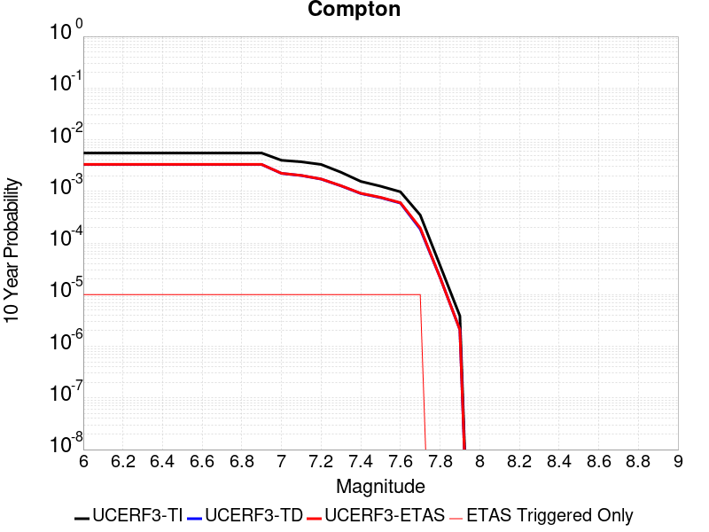 |

| Magnitude | 1 wk TI Prob | 1 wk TD Prob | 1 wk ETAS Prob | 1 wk ETAS/TD Gain | 1 wk ETAS Triggered Only | 1 mo TI Prob | 1 mo TD Prob | 1 mo ETAS Prob | 1 mo ETAS/TD Gain | 1 mo ETAS Triggered Only | 1 yr TI Prob | 1 yr TD Prob | 1 yr ETAS Prob | 1 yr ETAS/TD Gain | 1 yr ETAS Triggered Only | 10 yr TI Prob | 10 yr TD Prob | 10 yr ETAS Prob | 10 yr ETAS/TD Gain | 10 yr ETAS Triggered Only |
|-----|-----|-----|-----|-----|-----|-----|-----|-----|-----|-----|-----|-----|-----|-----|-----|-----|-----|-----|-----|-----|
| 6.0 | 1.06050875E-5 | 6.358671E-6 | 6.358671E-6 | 1.0 | 0.0 | 4.5449582E-5 | 2.7251177E-5 | 7.906323E-5 | 2.9012778 | 5.1813473E-5 | 5.5320817E-4 | 3.317354E-4 | 3.835317E-4 | 1.1561373 | 5.1813473E-5 | 0.0055183303 | 0.0033126862 | 0.003364328 | 1.0155891 | 5.1813473E-5 |
| 6.1 | 1.06050875E-5 | 6.358671E-6 | 6.358671E-6 | 1.0 | 0.0 | 4.5449582E-5 | 2.7251177E-5 | 7.906323E-5 | 2.9012778 | 5.1813473E-5 | 5.5320817E-4 | 3.317354E-4 | 3.835317E-4 | 1.1561373 | 5.1813473E-5 | 0.0055183303 | 0.0033126862 | 0.003364328 | 1.0155891 | 5.1813473E-5 |
| 6.2 | 1.06050875E-5 | 6.358671E-6 | 6.358671E-6 | 1.0 | 0.0 | 4.5449582E-5 | 2.7251177E-5 | 7.906323E-5 | 2.9012778 | 5.1813473E-5 | 5.5320817E-4 | 3.317354E-4 | 3.835317E-4 | 1.1561373 | 5.1813473E-5 | 0.0055183303 | 0.0033126862 | 0.003364328 | 1.0155891 | 5.1813473E-5 |
| 6.3 | 1.06050875E-5 | 6.358671E-6 | 6.358671E-6 | 1.0 | 0.0 | 4.5449582E-5 | 2.7251177E-5 | 7.906323E-5 | 2.9012778 | 5.1813473E-5 | 5.5320817E-4 | 3.317354E-4 | 3.835317E-4 | 1.1561373 | 5.1813473E-5 | 0.0055183303 | 0.0033126862 | 0.003364328 | 1.0155891 | 5.1813473E-5 |
| 6.4 | 1.06050875E-5 | 6.358671E-6 | 6.358671E-6 | 1.0 | 0.0 | 4.5449582E-5 | 2.7251177E-5 | 7.906323E-5 | 2.9012778 | 5.1813473E-5 | 5.5320817E-4 | 3.317354E-4 | 3.835317E-4 | 1.1561373 | 5.1813473E-5 | 0.0055183303 | 0.0033126862 | 0.003364328 | 1.0155891 | 5.1813473E-5 |
| 6.5 | 1.06050875E-5 | 6.358671E-6 | 6.358671E-6 | 1.0 | 0.0 | 4.5449582E-5 | 2.7251177E-5 | 7.906323E-5 | 2.9012778 | 5.1813473E-5 | 5.5320817E-4 | 3.317354E-4 | 3.835317E-4 | 1.1561373 | 5.1813473E-5 | 0.0055183303 | 0.0033126862 | 0.003364328 | 1.0155891 | 5.1813473E-5 |
| 6.6 | 1.06050875E-5 | 6.358671E-6 | 6.358671E-6 | 1.0 | 0.0 | 4.5449582E-5 | 2.7251177E-5 | 7.906323E-5 | 2.9012778 | 5.1813473E-5 | 5.5320817E-4 | 3.317354E-4 | 3.835317E-4 | 1.1561373 | 5.1813473E-5 | 0.0055183303 | 0.0033126862 | 0.003364328 | 1.0155891 | 5.1813473E-5 |
| 6.7 | 1.06050875E-5 | 6.358671E-6 | 6.358671E-6 | 1.0 | 0.0 | 4.5449582E-5 | 2.7251177E-5 | 7.906323E-5 | 2.9012778 | 5.1813473E-5 | 5.5320817E-4 | 3.317354E-4 | 3.835317E-4 | 1.1561373 | 5.1813473E-5 | 0.0055183303 | 0.0033126862 | 0.003364328 | 1.0155891 | 5.1813473E-5 |
| 6.8 | 1.06050875E-5 | 6.358671E-6 | 6.358671E-6 | 1.0 | 0.0 | 4.5449582E-5 | 2.7251177E-5 | 7.906323E-5 | 2.9012778 | 5.1813473E-5 | 5.5320817E-4 | 3.317354E-4 | 3.835317E-4 | 1.1561373 | 5.1813473E-5 | 0.0055183303 | 0.0033126862 | 0.003364328 | 1.0155891 | 5.1813473E-5 |
| 6.9 | 1.06050875E-5 | 6.358671E-6 | 6.358671E-6 | 1.0 | 0.0 | 4.5449582E-5 | 2.7251177E-5 | 7.906323E-5 | 2.9012778 | 5.1813473E-5 | 5.5320817E-4 | 3.317354E-4 | 3.835317E-4 | 1.1561373 | 5.1813473E-5 | 0.0055183303 | 0.0033126862 | 0.003364328 | 1.0155891 | 5.1813473E-5 |
| 7.0 | 7.672486E-6 | 4.2720512E-6 | 4.2720512E-6 | 1.0 | 0.0 | 3.288167E-5 | 1.8308665E-5 | 7.012119E-5 | 3.8299453 | 5.1813473E-5 | 4.0026082E-4 | 2.2288582E-4 | 2.7468774E-4 | 1.2324146 | 5.1813473E-5 | 0.0039954064 | 0.002226685 | 0.0022783831 | 1.0232176 | 5.1813473E-5 |
| 7.1 | 7.163992E-6 | 3.883762E-6 | 3.883762E-6 | 1.0 | 0.0 | 3.0702464E-5 | 1.6644592E-5 | 6.84572E-5 | 4.1128798 | 5.1813473E-5 | 3.7373835E-4 | 2.0262963E-4 | 2.5443258E-4 | 1.2556535 | 5.1813473E-5 | 0.0037311043 | 0.0020245055 | 0.0020762142 | 1.0255413 | 5.1813473E-5 |
| 7.2 | 6.3689185E-6 | 3.3102428E-6 | 3.3102428E-6 | 1.0 | 0.0 | 2.729508E-5 | 1.418668E-5 | 6.599942E-5 | 4.65221 | 5.1813473E-5 | 3.322669E-4 | 1.7270957E-4 | 2.2451408E-4 | 1.2999517 | 5.1813473E-5 | 0.0033177056 | 0.0017257951 | 0.0017775192 | 1.0299711 | 5.1813473E-5 |
| 7.3 | 4.4987873E-6 | 2.4480942E-6 | 2.4480942E-6 | 1.0 | 0.0 | 1.9280375E-5 | 1.0491792E-5 | 6.2304716E-5 | 5.938425 | 5.1813473E-5 | 2.3471327E-4 | 1.2773038E-4 | 1.7953724E-4 | 1.4055954 | 5.1813473E-5 | 0.002344655 | 0.0012765999 | 0.0013283473 | 1.0405353 | 5.1813473E-5 |
| 7.4 | 2.987296E-6 | 1.7394335E-6 | 1.7394335E-6 | 1.0 | 0.0 | 1.2802635E-5 | 7.454694E-6 | 5.926778E-5 | 7.9503975 | 5.1813473E-5 | 1.5586092E-4 | 9.0757174E-5 | 1.4256594E-4 | 1.5708504 | 5.1813473E-5 | 0.0015575165 | 9.072069E-4 | 9.5897337E-4 | 1.0570613 | 5.1813473E-5 |
| 7.5 | 2.4111696E-6 | 1.4472155E-6 | 1.4472155E-6 | 1.0 | 0.0 | 1.0333543E-5 | 6.2023378E-6 | 5.801549E-5 | 9.35381 | 5.1813473E-5 | 1.2580362E-4 | 7.551089E-5 | 1.2732045E-4 | 1.6861204 | 5.1813473E-5 | 0.0012573242 | 7.54857E-4 | 8.066314E-4 | 1.0685883 | 5.1813473E-5 |
| 7.6 | 1.8783096E-6 | 1.1360459E-6 | 1.1360459E-6 | 1.0 | 0.0 | 8.049874E-6 | 4.8687593E-6 | 5.668198E-5 | 11.641976 | 5.1813473E-5 | 9.8002805E-5 | 5.927557E-5 | 1.11085974E-4 | 1.8740599 | 5.1813473E-5 | 9.795959E-4 | 5.926016E-4 | 6.4438436E-4 | 1.0873821 | 5.1813473E-5 |
| 7.7 | 6.6646817E-7 | 3.560237E-7 | 3.560237E-7 | 1.0 | 0.0 | 2.856289E-6 | 1.525815E-6 | 5.333921E-5 | 34.957848 | 5.1813473E-5 | 3.4774763E-5 | 1.8576653E-5 | 7.0389164E-5 | 3.7891197 | 5.1813473E-5 | 3.4769322E-4 | 1.8575235E-4 | 2.375562E-4 | 1.2788867 | 5.1813473E-5 |
| 7.8 | 7.054689E-8 | 4.1342968E-8 | 4.1342968E-8 | 1.0 | 0.0 | 3.0234378E-7 | 1.7718413E-7 | 1.7718413E-7 | 1.0 | 0.0 | 3.6810293E-6 | 2.1572148E-6 | 2.1572148E-6 | 1.0 | 0.0 | 3.6809684E-5 | 2.1571948E-5 | 2.1571948E-5 | 1.0 | 0.0 |
| 7.9 | 7.420925E-9 | 4.0131285E-9 | 4.0131285E-9 | 1.0 | 0.0 | 3.1803964E-8 | 1.7199122E-8 | 1.7199122E-8 | 1.0 | 0.0 | 3.872132E-7 | 2.093993E-7 | 2.093993E-7 | 1.0 | 0.0 | 3.872125E-6 | 2.0939913E-6 | 2.0939913E-6 | 1.0 | 0.0 |

## Deep Springs
*[(top)](#table-of-contents)*

| 1 Week | 1 Month | 1 Year | 10 Year |
|-----|-----|-----|-----|
|  |  | 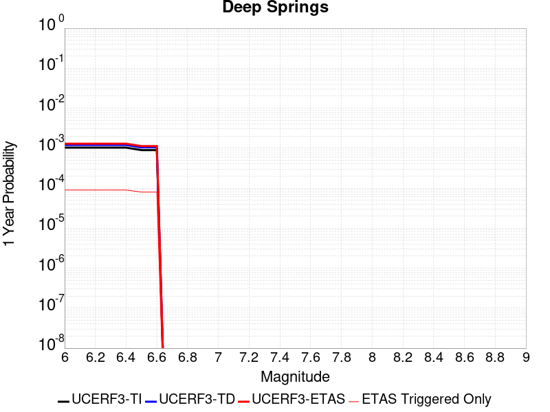 |  |

| Magnitude | 1 wk TI Prob | 1 wk TD Prob | 1 wk ETAS Prob | 1 wk ETAS/TD Gain | 1 wk ETAS Triggered Only | 1 mo TI Prob | 1 mo TD Prob | 1 mo ETAS Prob | 1 mo ETAS/TD Gain | 1 mo ETAS Triggered Only | 1 yr TI Prob | 1 yr TD Prob | 1 yr ETAS Prob | 1 yr ETAS/TD Gain | 1 yr ETAS Triggered Only | 10 yr TI Prob | 10 yr TD Prob | 10 yr ETAS Prob | 10 yr ETAS/TD Gain | 10 yr ETAS Triggered Only |
|-----|-----|-----|-----|-----|-----|-----|-----|-----|-----|-----|-----|-----|-----|-----|-----|-----|-----|-----|-----|-----|
| 6.0 | 1.9810619E-5 | 2.311252E-5 | 2.311252E-5 | 1.0 | 0.0 | 8.489989E-5 | 9.905276E-5 | 9.905276E-5 | 1.0 | 0.0 | 0.001033166 | 0.0012058079 | 0.0012058079 | 1.0 | 0.0 | 0.010283757 | 0.012042425 | 0.012093615 | 1.0042508 | 5.1813473E-5 |
| 6.1 | 1.9810619E-5 | 2.311252E-5 | 2.311252E-5 | 1.0 | 0.0 | 8.489989E-5 | 9.905276E-5 | 9.905276E-5 | 1.0 | 0.0 | 0.001033166 | 0.0012058079 | 0.0012058079 | 1.0 | 0.0 | 0.010283757 | 0.012042425 | 0.012093615 | 1.0042508 | 5.1813473E-5 |
| 6.2 | 1.9810619E-5 | 2.311252E-5 | 2.311252E-5 | 1.0 | 0.0 | 8.489989E-5 | 9.905276E-5 | 9.905276E-5 | 1.0 | 0.0 | 0.001033166 | 0.0012058079 | 0.0012058079 | 1.0 | 0.0 | 0.010283757 | 0.012042425 | 0.012093615 | 1.0042508 | 5.1813473E-5 |
| 6.3 | 1.9810619E-5 | 2.311252E-5 | 2.311252E-5 | 1.0 | 0.0 | 8.489989E-5 | 9.905276E-5 | 9.905276E-5 | 1.0 | 0.0 | 0.001033166 | 0.0012058079 | 0.0012058079 | 1.0 | 0.0 | 0.010283757 | 0.012042425 | 0.012093615 | 1.0042508 | 5.1813473E-5 |
| 6.4 | 1.9810619E-5 | 2.311252E-5 | 2.311252E-5 | 1.0 | 0.0 | 8.489989E-5 | 9.905276E-5 | 9.905276E-5 | 1.0 | 0.0 | 0.001033166 | 0.0012058079 | 0.0012058079 | 1.0 | 0.0 | 0.010283757 | 0.012042425 | 0.012093615 | 1.0042508 | 5.1813473E-5 |
| 6.5 | 1.7190405E-5 | 2.0050555E-5 | 2.0050555E-5 | 1.0 | 0.0 | 7.367108E-5 | 8.593095E-5 | 8.593095E-5 | 1.0 | 0.0 | 8.9657627E-4 | 0.0010462094 | 0.0010462094 | 1.0 | 0.0 | 0.008929676 | 0.010462056 | 0.010513328 | 1.0049007 | 5.1813473E-5 |
| 6.6 | 1.7190405E-5 | 2.0050555E-5 | 2.0050555E-5 | 1.0 | 0.0 | 7.367108E-5 | 8.593095E-5 | 8.593095E-5 | 1.0 | 0.0 | 8.9657627E-4 | 0.0010462094 | 0.0010462094 | 1.0 | 0.0 | 0.008929676 | 0.010462056 | 0.010513328 | 1.0049007 | 5.1813473E-5 |

## Superstition Hills
*[(top)](#table-of-contents)*

| 1 Week | 1 Month | 1 Year | 10 Year |
|-----|-----|-----|-----|
|  |  | 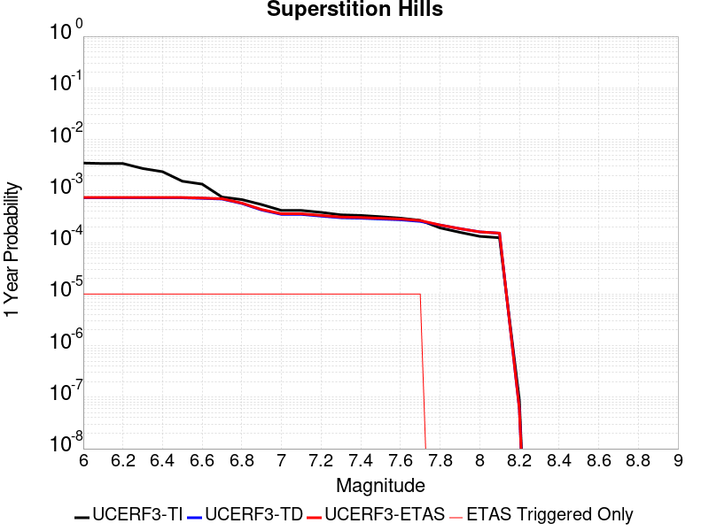 |  |

| Magnitude | 1 wk TI Prob | 1 wk TD Prob | 1 wk ETAS Prob | 1 wk ETAS/TD Gain | 1 wk ETAS Triggered Only | 1 mo TI Prob | 1 mo TD Prob | 1 mo ETAS Prob | 1 mo ETAS/TD Gain | 1 mo ETAS Triggered Only | 1 yr TI Prob | 1 yr TD Prob | 1 yr ETAS Prob | 1 yr ETAS/TD Gain | 1 yr ETAS Triggered Only | 10 yr TI Prob | 10 yr TD Prob | 10 yr ETAS Prob | 10 yr ETAS/TD Gain | 10 yr ETAS Triggered Only |
|-----|-----|-----|-----|-----|-----|-----|-----|-----|-----|-----|-----|-----|-----|-----|-----|-----|-----|-----|-----|-----|
| 6.0 | 6.6865185E-5 | 1.41376995E-5 | 1.41376995E-5 | 1.0 | 0.0 | 2.8653358E-4 | 6.0588824E-5 | 6.0588824E-5 | 1.0 | 0.0 | 0.0034829667 | 7.374355E-4 | 7.892107E-4 | 1.0702099 | 5.1813473E-5 | 0.03428881 | 0.0075204074 | 0.0075718313 | 1.0068378 | 5.1813473E-5 |
| 6.1 | 6.544851E-5 | 1.41376995E-5 | 1.41376995E-5 | 1.0 | 0.0 | 2.8046346E-4 | 6.0588824E-5 | 6.0588824E-5 | 1.0 | 0.0 | 0.0034092965 | 7.374355E-4 | 7.892107E-4 | 1.0702099 | 5.1813473E-5 | 0.033574644 | 0.007520407 | 0.007571831 | 1.0068378 | 5.1813473E-5 |
| 6.2 | 6.544851E-5 | 1.41376995E-5 | 1.41376995E-5 | 1.0 | 0.0 | 2.8046346E-4 | 6.0588824E-5 | 6.0588824E-5 | 1.0 | 0.0 | 0.0034092965 | 7.374355E-4 | 7.892107E-4 | 1.0702099 | 5.1813473E-5 | 0.033574644 | 0.007520407 | 0.007571831 | 1.0068378 | 5.1813473E-5 |
| 6.3 | 5.2402065E-5 | 1.4137698E-5 | 1.4137698E-5 | 1.0 | 0.0 | 2.2456095E-4 | 6.058882E-5 | 6.058882E-5 | 1.0 | 0.0 | 0.0027306017 | 7.374354E-4 | 7.8921067E-4 | 1.0702099 | 5.1813473E-5 | 0.02697292 | 0.007520402 | 0.0075718253 | 1.006838 | 5.1813473E-5 |
| 6.4 | 4.542238E-5 | 1.4137698E-5 | 1.4137698E-5 | 1.0 | 0.0 | 1.9465282E-4 | 6.0588816E-5 | 6.0588816E-5 | 1.0 | 0.0 | 0.0023673223 | 7.3743536E-4 | 7.892106E-4 | 1.0702099 | 5.1813473E-5 | 0.023422617 | 0.0075203986 | 0.0075718225 | 1.006838 | 5.1813473E-5 |
| 6.5 | 2.9672969E-5 | 1.4137696E-5 | 1.4137696E-5 | 1.0 | 0.0 | 1.2716366E-4 | 6.058881E-5 | 6.058881E-5 | 1.0 | 0.0 | 0.0015471181 | 7.374353E-4 | 7.8921055E-4 | 1.0702099 | 5.1813473E-5 | 0.015363912 | 0.007520392 | 0.007571816 | 1.006838 | 5.1813473E-5 |
| 6.6 | 2.6056105E-5 | 1.3803458E-5 | 1.3803458E-5 | 1.0 | 0.0 | 1.1166424E-4 | 5.9156428E-5 | 5.9156428E-5 | 1.0 | 0.0 | 0.0013586642 | 7.200076E-4 | 7.7178376E-4 | 1.0719106 | 5.1813473E-5 | 0.013503874 | 0.0073448285 | 0.0073962617 | 1.0070026 | 5.1813473E-5 |
| 6.7 | 1.4611248E-5 | 1.3383359E-5 | 1.3383359E-5 | 1.0 | 0.0 | 6.261813E-5 | 5.7356083E-5 | 5.7356083E-5 | 1.0 | 0.0 | 7.6210906E-4 | 6.981025E-4 | 7.498798E-4 | 1.0741686 | 5.1813473E-5 | 0.0075950073 | 0.00712602 | 0.007177464 | 1.0072192 | 5.1813473E-5 |
| 6.8 | 1.30607E-5 | 1.09787925E-5 | 1.09787925E-5 | 1.0 | 0.0 | 5.597323E-5 | 4.705117E-5 | 4.705117E-5 | 1.0 | 0.0 | 6.8126095E-4 | 5.7270617E-4 | 6.2448997E-4 | 1.0904195 | 5.1813473E-5 | 0.006791762 | 0.00587438 | 0.005925889 | 1.0087684 | 5.1813473E-5 |
| 6.9 | 1.0443096E-5 | 8.195349E-6 | 8.195349E-6 | 1.0 | 0.0 | 4.4755358E-5 | 3.5122466E-5 | 3.5122466E-5 | 1.0 | 0.0 | 5.447602E-4 | 4.2753448E-4 | 4.793258E-4 | 1.1211395 | 5.1813473E-5 | 0.005434267 | 0.0044094524 | 0.0044610375 | 1.0116987 | 5.1813473E-5 |
| 7.0 | 8.045912E-6 | 6.739692E-6 | 6.739692E-6 | 1.0 | 0.0 | 3.4482026E-5 | 2.888408E-5 | 2.888408E-5 | 1.0 | 0.0 | 4.197378E-4 | 3.5160795E-4 | 4.0340322E-4 | 1.1473097 | 5.1813473E-5 | 0.0041894587 | 0.0036334093 | 0.0036850346 | 1.0142084 | 5.1813473E-5 |
| 7.1 | 8.045912E-6 | 6.739692E-6 | 6.739692E-6 | 1.0 | 0.0 | 3.4482026E-5 | 2.888408E-5 | 2.888408E-5 | 1.0 | 0.0 | 4.197378E-4 | 3.5160795E-4 | 4.0340322E-4 | 1.1473097 | 5.1813473E-5 | 0.0041894587 | 0.0036334093 | 0.0036850346 | 1.0142084 | 5.1813473E-5 |
| 7.2 | 7.375506E-6 | 6.2466297E-6 | 6.2466297E-6 | 1.0 | 0.0 | 3.1608928E-5 | 2.6771E-5 | 2.6771E-5 | 1.0 | 0.0 | 3.8477074E-4 | 3.2588904E-4 | 3.7768562E-4 | 1.1589394 | 5.1813473E-5 | 0.003841052 | 0.003373887 | 0.0034255255 | 1.0153054 | 5.1813473E-5 |
| 7.3 | 6.6063913E-6 | 5.7990574E-6 | 5.7990574E-6 | 1.0 | 0.0 | 2.8312797E-5 | 2.485287E-5 | 2.485287E-5 | 1.0 | 0.0 | 3.446538E-4 | 3.025424E-4 | 3.5434018E-4 | 1.1712084 | 5.1813473E-5 | 0.0034411973 | 0.003138153 | 0.003189804 | 1.016459 | 5.1813473E-5 |
| 7.4 | 6.4313126E-6 | 5.680481E-6 | 5.680481E-6 | 1.0 | 0.0 | 2.7562477E-5 | 2.4344696E-5 | 2.4344696E-5 | 1.0 | 0.0 | 3.355215E-4 | 2.9635706E-4 | 3.4815518E-4 | 1.1747828 | 5.1813473E-5 | 0.0033501536 | 0.0030759154 | 0.0031275693 | 1.0167931 | 5.1813473E-5 |
| 7.5 | 6.0742927E-6 | 5.4763104E-6 | 5.4763104E-6 | 1.0 | 0.0 | 2.6032423E-5 | 2.3469694E-5 | 2.3469694E-5 | 1.0 | 0.0 | 3.1689866E-4 | 2.8570674E-4 | 3.375054E-4 | 1.1813002 | 5.1813473E-5 | 0.0031644711 | 0.002967756 | 0.0030194158 | 1.017407 | 5.1813473E-5 |
| 7.6 | 5.6987187E-6 | 5.294521E-6 | 5.294521E-6 | 1.0 | 0.0 | 2.4422852E-5 | 2.269061E-5 | 2.269061E-5 | 1.0 | 0.0 | 2.9730765E-4 | 2.7622381E-4 | 3.28023E-4 | 1.187526 | 5.1813473E-5 | 0.002969102 | 0.0028710118 | 0.0029226765 | 1.0179954 | 5.1813473E-5 |
| 7.7 | 5.1658035E-6 | 4.925535E-6 | 4.925535E-6 | 1.0 | 0.0 | 2.2138971E-5 | 2.1109268E-5 | 2.1109268E-5 | 1.0 | 0.0 | 2.6950863E-4 | 2.5697565E-4 | 3.087758E-4 | 1.2015761 | 5.1813473E-5 | 0.00269182 | 0.0026760625 | 0.0027277372 | 1.01931 | 5.1813473E-5 |
| 7.8 | 3.6864697E-6 | 4.1964995E-6 | 4.1964995E-6 | 1.0 | 0.0 | 1.579906E-5 | 1.7984876E-5 | 1.7984876E-5 | 1.0 | 0.0 | 1.9233658E-4 | 2.1894433E-4 | 2.1894433E-4 | 1.0 | 0.0 | 0.0019217018 | 0.0022892624 | 0.0022892624 | 1.0 | 0.0 |
| 7.9 | 3.0265903E-6 | 3.5637288E-6 | 3.5637288E-6 | 1.0 | 0.0 | 1.2971037E-5 | 1.5273037E-5 | 1.5273037E-5 | 1.0 | 0.0 | 1.5791094E-4 | 1.859338E-4 | 1.859338E-4 | 1.0 | 0.0 | 0.0015779877 | 0.0019534735 | 0.0019534735 | 1.0 | 0.0 |
| 8.0 | 2.5271493E-6 | 3.0867361E-6 | 3.0867361E-6 | 1.0 | 0.0 | 1.0830595E-5 | 1.3228804E-5 | 1.3228804E-5 | 1.0 | 0.0 | 1.3185451E-4 | 1.610492E-4 | 1.610492E-4 | 1.0 | 0.0 | 0.0013177631 | 0.0016973554 | 0.0016973554 | 1.0 | 0.0 |
| 8.1 | 2.3749135E-6 | 2.917377E-6 | 2.917377E-6 | 1.0 | 0.0 | 1.0178161E-5 | 1.25029865E-5 | 1.25029865E-5 | 1.0 | 0.0 | 1.2391206E-4 | 1.5221364E-4 | 1.5221364E-4 | 1.0 | 0.0 | 0.0012384299 | 0.001604949 | 0.001604949 | 1.0 | 0.0 |
| 8.2 | 1.7186406E-9 | 1.1440594E-9 | 1.1440594E-9 | 1.0 | 0.0 | 7.3656024E-9 | 4.9031117E-9 | 4.9031117E-9 | 1.0 | 0.0 | 8.9676206E-8 | 5.969538E-8 | 5.969538E-8 | 1.0 | 0.0 | 8.9676166E-7 | 6.389059E-7 | 6.389059E-7 | 1.0 | 0.0 |

## Hayward (So) extension 2011 CFM
*[(top)](#table-of-contents)*

| 1 Week | 1 Month | 1 Year | 10 Year |
|-----|-----|-----|-----|
|  | 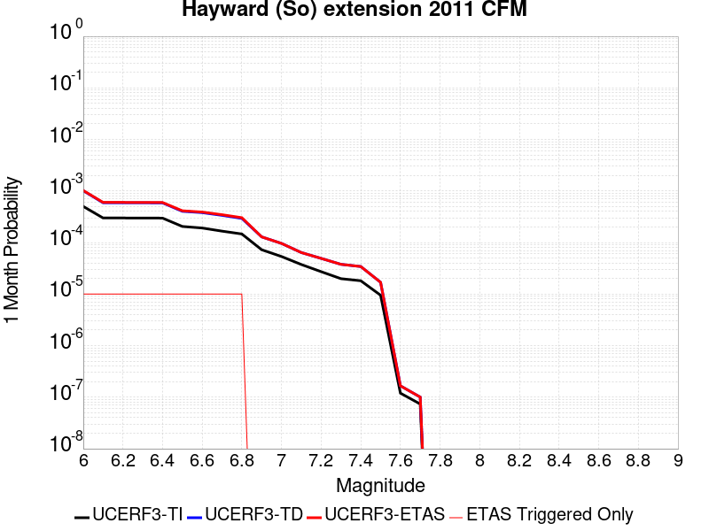 |  |  |

| Magnitude | 1 wk TI Prob | 1 wk TD Prob | 1 wk ETAS Prob | 1 wk ETAS/TD Gain | 1 wk ETAS Triggered Only | 1 mo TI Prob | 1 mo TD Prob | 1 mo ETAS Prob | 1 mo ETAS/TD Gain | 1 mo ETAS Triggered Only | 1 yr TI Prob | 1 yr TD Prob | 1 yr ETAS Prob | 1 yr ETAS/TD Gain | 1 yr ETAS Triggered Only | 10 yr TI Prob | 10 yr TD Prob | 10 yr ETAS Prob | 10 yr ETAS/TD Gain | 10 yr ETAS Triggered Only |
|-----|-----|-----|-----|-----|-----|-----|-----|-----|-----|-----|-----|-----|-----|-----|-----|-----|-----|-----|-----|-----|
| 6.0 | 1.1721256E-4 | 2.3697627E-4 | 2.3697627E-4 | 1.0 | 0.0 | 5.022428E-4 | 0.0010129517 | 0.0010129517 | 1.0 | 0.0 | 0.0060976758 | 0.012248711 | 0.012248711 | 1.0 | 0.0 | 0.0593305 | 0.112843215 | 0.112889186 | 1.0004073 | 5.1813473E-5 |
| 6.1 | 6.99169E-5 | 1.3822885E-4 | 1.3822885E-4 | 1.0 | 0.0 | 2.9960944E-4 | 5.9128006E-4 | 5.9128006E-4 | 1.0 | 0.0 | 0.0036416445 | 0.0071720886 | 0.0071720886 | 1.0 | 0.0 | 0.035825435 | 0.067803554 | 0.067803554 | 1.0 | 0.0 |
| 6.2 | 6.99169E-5 | 1.3822885E-4 | 1.3822885E-4 | 1.0 | 0.0 | 2.9960944E-4 | 5.9128006E-4 | 5.9128006E-4 | 1.0 | 0.0 | 0.0036416445 | 0.0071720886 | 0.0071720886 | 1.0 | 0.0 | 0.035825435 | 0.067803554 | 0.067803554 | 1.0 | 0.0 |
| 6.3 | 6.970908E-5 | 1.379104E-4 | 1.379104E-4 | 1.0 | 0.0 | 2.9871898E-4 | 5.899159E-4 | 5.899159E-4 | 1.0 | 0.0 | 0.0036308395 | 0.007155625 | 0.007155625 | 1.0 | 0.0 | 0.035720866 | 0.067652516 | 0.067652516 | 1.0 | 0.0 |
| 6.4 | 6.9517155E-5 | 1.375792E-4 | 1.375792E-4 | 1.0 | 0.0 | 2.9789665E-4 | 5.884971E-4 | 5.884971E-4 | 1.0 | 0.0 | 0.0036208609 | 0.0071385372 | 0.0071385372 | 1.0 | 0.0 | 0.03562429 | 0.06749655 | 0.06749655 | 1.0 | 0.0 |
| 6.5 | 4.786248E-5 | 9.41498E-5 | 9.41498E-5 | 1.0 | 0.0 | 2.0510878E-4 | 4.034394E-4 | 4.034394E-4 | 1.0 | 0.0 | 0.0024943394 | 0.004901227 | 0.004901227 | 1.0 | 0.0 | 0.02466527 | 0.046901822 | 0.046901822 | 1.0 | 0.0 |
| 6.6 | 4.4662214E-5 | 8.881654E-5 | 8.881654E-5 | 1.0 | 0.0 | 1.9139545E-4 | 3.805894E-4 | 3.805894E-4 | 1.0 | 0.0 | 0.0023277493 | 0.0046242937 | 0.0046242937 | 1.0 | 0.0 | 0.02303517 | 0.044293344 | 0.044293344 | 1.0 | 0.0 |
| 6.7 | 3.884542E-5 | 7.8648096E-5 | 7.8648096E-5 | 1.0 | 0.0 | 1.6646975E-4 | 3.370222E-4 | 3.370222E-4 | 1.0 | 0.0 | 0.002024885 | 0.0040959697 | 0.0040959697 | 1.0 | 0.0 | 0.020065336 | 0.039333146 | 0.039333146 | 1.0 | 0.0 |
| 6.8 | 3.4221863E-5 | 6.855653E-5 | 6.855653E-5 | 1.0 | 0.0 | 1.4665688E-4 | 2.93783E-4 | 2.93783E-4 | 1.0 | 0.0 | 0.0017840851 | 0.0035713627 | 0.0035713627 | 1.0 | 0.0 | 0.017698295 | 0.034421004 | 0.034421004 | 1.0 | 0.0 |
| 6.9 | 1.6927712E-5 | 3.0061563E-5 | 3.0061563E-5 | 1.0 | 0.0 | 7.2545314E-5 | 1.2882923E-4 | 1.2882923E-4 | 1.0 | 0.0 | 8.828813E-4 | 0.0015674243 | 0.0015674243 | 1.0 | 0.0 | 0.008793819 | 0.01546327 | 0.01546327 | 1.0 | 0.0 |
| 7.0 | 1.2509653E-5 | 2.2462571E-5 | 2.2462571E-5 | 1.0 | 0.0 | 5.3611697E-5 | 9.6264856E-5 | 9.6264856E-5 | 1.0 | 0.0 | 6.525269E-4 | 0.0011714385 | 0.0011714385 | 1.0 | 0.0 | 0.0065061417 | 0.01158231 | 0.01158231 | 1.0 | 0.0 |
| 7.1 | 8.751583E-6 | 1.4925648E-5 | 1.4925648E-5 | 1.0 | 0.0 | 3.750624E-5 | 6.3965526E-5 | 6.3965526E-5 | 1.0 | 0.0 | 4.5654282E-4 | 7.785079E-4 | 7.785079E-4 | 1.0 | 0.0 | 0.0045560603 | 0.007763496 | 0.007763496 | 1.0 | 0.0 |
| 7.2 | 6.354379E-6 | 1.1498636E-5 | 1.1498636E-5 | 1.0 | 0.0 | 2.7232769E-5 | 4.9278966E-5 | 4.9278966E-5 | 1.0 | 0.0 | 3.3150852E-4 | 5.99811E-4 | 5.99811E-4 | 1.0 | 0.0 | 0.0033101442 | 0.0060003046 | 0.0060003046 | 1.0 | 0.0 |
| 7.3 | 4.645554E-6 | 8.818172E-6 | 8.818172E-6 | 1.0 | 0.0 | 1.9909365E-5 | 3.779164E-5 | 3.779164E-5 | 1.0 | 0.0 | 2.4236954E-4 | 4.6002E-4 | 4.6002E-4 | 1.0 | 0.0 | 0.0024210536 | 0.004610708 | 0.004610708 | 1.0 | 0.0 |
| 7.4 | 4.23437E-6 | 7.992532E-6 | 7.992532E-6 | 1.0 | 0.0 | 1.8147173E-5 | 3.425328E-5 | 3.425328E-5 | 1.0 | 0.0 | 2.2091944E-4 | 4.1695772E-4 | 4.1695772E-4 | 1.0 | 0.0 | 0.0022069993 | 0.004181972 | 0.004181972 | 1.0 | 0.0 |
| 7.5 | 2.2187417E-6 | 3.9522306E-6 | 3.9522306E-6 | 1.0 | 0.0 | 9.508858E-6 | 1.6938036E-5 | 1.6938036E-5 | 1.0 | 0.0 | 1.157642E-4 | 2.0620368E-4 | 2.0620368E-4 | 1.0 | 0.0 | 0.0011570391 | 0.0020734754 | 0.0020734754 | 1.0 | 0.0 |
| 7.6 | 2.7952495E-8 | 3.878529E-8 | 3.878529E-8 | 1.0 | 0.0 | 1.1979641E-7 | 1.6622266E-7 | 1.6622266E-7 | 1.0 | 0.0 | 1.4585203E-6 | 2.0237592E-6 | 2.0237592E-6 | 1.0 | 0.0 | 1.4585107E-5 | 2.0328182E-5 | 2.0328182E-5 | 1.0 | 0.0 |
| 7.7 | 1.7192724E-8 | 2.3436517E-8 | 2.3436517E-8 | 1.0 | 0.0 | 7.36831E-8 | 1.0044221E-7 | 1.0044221E-7 | 1.0 | 0.0 | 8.9709135E-7 | 1.2228833E-6 | 1.2228833E-6 | 1.0 | 0.0 | 8.970877E-6 | 1.2296933E-5 | 1.2296933E-5 | 1.0 | 0.0 |

## Elsinore (Temecula) rev
*[(top)](#table-of-contents)*

| 1 Week | 1 Month | 1 Year | 10 Year |
|-----|-----|-----|-----|
|  |  |  |  |

| Magnitude | 1 wk TI Prob | 1 wk TD Prob | 1 wk ETAS Prob | 1 wk ETAS/TD Gain | 1 wk ETAS Triggered Only | 1 mo TI Prob | 1 mo TD Prob | 1 mo ETAS Prob | 1 mo ETAS/TD Gain | 1 mo ETAS Triggered Only | 1 yr TI Prob | 1 yr TD Prob | 1 yr ETAS Prob | 1 yr ETAS/TD Gain | 1 yr ETAS Triggered Only | 10 yr TI Prob | 10 yr TD Prob | 10 yr ETAS Prob | 10 yr ETAS/TD Gain | 10 yr ETAS Triggered Only |
|-----|-----|-----|-----|-----|-----|-----|-----|-----|-----|-----|-----|-----|-----|-----|-----|-----|-----|-----|-----|-----|
| 6.0 | 2.9514995E-5 | 2.2517117E-5 | 2.2517117E-5 | 1.0 | 0.0 | 1.264867E-4 | 9.649849E-5 | 1.4830695E-4 | 1.5368838 | 5.1813473E-5 | 0.0015388876 | 0.0011742581 | 0.0012260106 | 1.0440726 | 5.1813473E-5 | 0.015282745 | 0.011696897 | 0.011748105 | 1.0043778 | 5.1813473E-5 |
| 6.1 | 2.9514995E-5 | 2.2517117E-5 | 2.2517117E-5 | 1.0 | 0.0 | 1.264867E-4 | 9.649849E-5 | 1.4830695E-4 | 1.5368838 | 5.1813473E-5 | 0.0015388876 | 0.0011742581 | 0.0012260106 | 1.0440726 | 5.1813473E-5 | 0.015282745 | 0.011696897 | 0.011748105 | 1.0043778 | 5.1813473E-5 |
| 6.2 | 2.9514995E-5 | 2.2517117E-5 | 2.2517117E-5 | 1.0 | 0.0 | 1.264867E-4 | 9.649849E-5 | 1.4830695E-4 | 1.5368838 | 5.1813473E-5 | 0.0015388876 | 0.0011742581 | 0.0012260106 | 1.0440726 | 5.1813473E-5 | 0.015282745 | 0.011696897 | 0.011748105 | 1.0043778 | 5.1813473E-5 |
| 6.3 | 2.3223649E-5 | 1.8406454E-5 | 1.8406454E-5 | 1.0 | 0.0 | 9.952613E-5 | 7.888251E-5 | 1.306919E-4 | 1.6567917 | 5.1813473E-5 | 0.001211057 | 9.599888E-4 | 0.0010117525 | 1.0539212 | 5.1813473E-5 | 0.012044783 | 0.009569948 | 0.009621265 | 1.0053624 | 5.1813473E-5 |
| 6.4 | 2.3223649E-5 | 1.8406454E-5 | 1.8406454E-5 | 1.0 | 0.0 | 9.952613E-5 | 7.888251E-5 | 1.306919E-4 | 1.6567917 | 5.1813473E-5 | 0.001211057 | 9.599888E-4 | 0.0010117525 | 1.0539212 | 5.1813473E-5 | 0.012044783 | 0.009569948 | 0.009621265 | 1.0053624 | 5.1813473E-5 |
| 6.5 | 1.8338875E-5 | 1.4750118E-5 | 1.4750118E-5 | 1.0 | 0.0 | 7.8592806E-5 | 6.321331E-5 | 1.15023504E-4 | 1.819609 | 5.1813473E-5 | 9.5644733E-4 | 7.69359E-4 | 8.211326E-4 | 1.0672945 | 5.1813473E-5 | 0.009523412 | 0.0076739118 | 0.0077253277 | 1.0067 | 5.1813473E-5 |
| 6.6 | 1.8223333E-5 | 1.4612673E-5 | 1.4612673E-5 | 1.0 | 0.0 | 7.809766E-5 | 6.262429E-5 | 1.14434515E-4 | 1.8273184 | 5.1813473E-5 | 9.504242E-4 | 7.6219277E-4 | 8.1396673E-4 | 1.0679277 | 5.1813473E-5 | 0.009463696 | 0.0076027405 | 0.0076541603 | 1.0067633 | 5.1813473E-5 |
| 6.7 | 1.7512752E-5 | 1.402721E-5 | 1.402721E-5 | 1.0 | 0.0 | 7.505249E-5 | 6.011528E-5 | 1.11925634E-4 | 1.86185 | 5.1813473E-5 | 9.13381E-4 | 7.3166634E-4 | 7.834419E-4 | 1.070764 | 5.1813473E-5 | 0.00909636 | 0.00729892 | 0.0073503554 | 1.0070469 | 5.1813473E-5 |
| 6.8 | 1.7417142E-5 | 1.3951195E-5 | 1.3951195E-5 | 1.0 | 0.0 | 7.4642754E-5 | 5.9789512E-5 | 1.1159989E-4 | 1.8665462 | 5.1813473E-5 | 9.083966E-4 | 7.277028E-4 | 7.794785E-4 | 1.0711496 | 5.1813473E-5 | 0.009046922 | 0.0072594886 | 0.007310926 | 1.0070856 | 5.1813473E-5 |
| 6.9 | 1.6402591E-5 | 1.2988613E-5 | 1.2988613E-5 | 1.0 | 0.0 | 7.0294926E-5 | 5.5664343E-5 | 1.0747493E-4 | 1.930768 | 5.1813473E-5 | 8.5550465E-4 | 6.775103E-4 | 7.292887E-4 | 1.0764245 | 5.1813473E-5 | 0.008522186 | 0.006760169 | 0.006811632 | 1.0076127 | 5.1813473E-5 |
| 7.0 | 1.3912486E-5 | 1.0878233E-5 | 1.0878233E-5 | 1.0 | 0.0 | 5.9623577E-5 | 4.6620182E-5 | 9.8431236E-5 | 2.1113439 | 5.1813473E-5 | 7.2567526E-4 | 5.674556E-4 | 6.192397E-4 | 1.0912566 | 5.1813473E-5 | 0.0072331014 | 0.005663986 | 0.0057155057 | 1.009096 | 5.1813473E-5 |
| 7.1 | 1.3405147E-5 | 1.03274215E-5 | 1.03274215E-5 | 1.0 | 0.0 | 5.7449364E-5 | 4.425964E-5 | 9.607082E-5 | 2.170619 | 5.1813473E-5 | 6.9922156E-4 | 5.3873047E-4 | 5.90516E-4 | 1.0961251 | 5.1813473E-5 | 0.0069702556 | 0.005377577 | 0.005429112 | 1.0095832 | 5.1813473E-5 |
| 7.2 | 1.21402E-5 | 8.996737E-6 | 8.996737E-6 | 1.0 | 0.0 | 5.202839E-5 | 3.8556886E-5 | 9.036836E-5 | 2.3437672 | 5.1813473E-5 | 6.332616E-4 | 4.6933076E-4 | 5.211199E-4 | 1.1103468 | 5.1813473E-5 | 0.0063146 | 0.004684821 | 0.0047363914 | 1.011008 | 5.1813473E-5 |
| 7.3 | 1.05047775E-5 | 7.571771E-6 | 7.571771E-6 | 1.0 | 0.0 | 4.5019697E-5 | 3.245005E-5 | 8.426184E-5 | 2.5966628 | 5.1813473E-5 | 5.4797693E-4 | 3.950092E-4 | 4.468022E-4 | 1.1311184 | 5.1813473E-5 | 0.005466277 | 0.00394346 | 0.0039950693 | 1.0130873 | 5.1813473E-5 |
| 7.4 | 9.624483E-6 | 6.7868696E-6 | 6.7868696E-6 | 1.0 | 0.0 | 4.124713E-5 | 2.9086266E-5 | 8.089823E-5 | 2.7813206 | 5.1813473E-5 | 5.0206814E-4 | 3.5406914E-4 | 4.0586427E-4 | 1.1462853 | 5.1813473E-5 | 0.005009353 | 0.003535204 | 0.0035868343 | 1.0146046 | 5.1813473E-5 |
| 7.5 | 8.215151E-6 | 5.635538E-6 | 5.635538E-6 | 1.0 | 0.0 | 3.5207315E-5 | 2.4152088E-5 | 7.596431E-5 | 3.145248 | 5.1813473E-5 | 4.2856473E-4 | 2.9401327E-4 | 3.458115E-4 | 1.1761765 | 5.1813473E-5 | 0.004277392 | 0.002936371 | 0.0029880323 | 1.0175936 | 5.1813473E-5 |
| 7.6 | 6.975058E-6 | 4.676045E-6 | 4.676045E-6 | 1.0 | 0.0 | 2.9892764E-5 | 2.0040046E-5 | 7.185248E-5 | 3.585445 | 5.1813473E-5 | 3.6388362E-4 | 2.439614E-4 | 2.9576223E-4 | 1.2123321 | 5.1813473E-5 | 0.0036328835 | 0.002437052 | 0.0024887393 | 1.0212089 | 5.1813473E-5 |
| 7.7 | 4.159604E-6 | 2.3269924E-6 | 2.3269924E-6 | 1.0 | 0.0 | 1.7826753E-5 | 9.97279E-6 | 9.97279E-6 | 1.0 | 0.0 | 2.1701909E-4 | 1.21412704E-4 | 1.21412704E-4 | 1.0 | 0.0 | 0.0021680726 | 0.0012135367 | 0.0012135367 | 1.0 | 0.0 |
| 7.8 | 2.2692414E-7 | 9.3854695E-8 | 9.3854695E-8 | 1.0 | 0.0 | 9.725317E-7 | 4.0223435E-7 | 4.0223435E-7 | 1.0 | 0.0 | 1.1840509E-5 | 4.8971956E-6 | 4.8971956E-6 | 1.0 | 0.0 | 1.1839878E-4 | 4.8971204E-5 | 4.8971204E-5 | 1.0 | 0.0 |
| 7.9 | 6.676829E-9 | 3.439853E-9 | 3.439853E-9 | 1.0 | 0.0 | 2.861498E-8 | 1.4742227E-8 | 1.4742227E-8 | 1.0 | 0.0 | 3.4838732E-7 | 1.7948659E-7 | 1.7948659E-7 | 1.0 | 0.0 | 3.4838679E-6 | 1.7948646E-6 | 1.7948646E-6 | 1.0 | 0.0 |

## Pine Mtn
*[(top)](#table-of-contents)*

| 1 Week | 1 Month | 1 Year | 10 Year |
|-----|-----|-----|-----|
|  |  |  |  |

| Magnitude | 1 wk TI Prob | 1 wk TD Prob | 1 wk ETAS Prob | 1 wk ETAS/TD Gain | 1 wk ETAS Triggered Only | 1 mo TI Prob | 1 mo TD Prob | 1 mo ETAS Prob | 1 mo ETAS/TD Gain | 1 mo ETAS Triggered Only | 1 yr TI Prob | 1 yr TD Prob | 1 yr ETAS Prob | 1 yr ETAS/TD Gain | 1 yr ETAS Triggered Only | 10 yr TI Prob | 10 yr TD Prob | 10 yr ETAS Prob | 10 yr ETAS/TD Gain | 10 yr ETAS Triggered Only |
|-----|-----|-----|-----|-----|-----|-----|-----|-----|-----|-----|-----|-----|-----|-----|-----|-----|-----|-----|-----|-----|
| 6.0 | 6.894797E-6 | 7.225461E-6 | 5.9038557E-5 | 8.170905 | 5.1813473E-5 | 2.9548795E-5 | 3.096591E-5 | 8.277778E-5 | 2.6731904 | 5.1813473E-5 | 3.596972E-4 | 3.7694772E-4 | 4.2874168E-4 | 1.1374035 | 5.1813473E-5 | 0.0035911554 | 0.003763381 | 0.0038149995 | 1.013716 | 5.1813473E-5 |
| 6.1 | 6.894797E-6 | 7.225461E-6 | 5.9038557E-5 | 8.170905 | 5.1813473E-5 | 2.9548795E-5 | 3.096591E-5 | 8.277778E-5 | 2.6731904 | 5.1813473E-5 | 3.596972E-4 | 3.7694772E-4 | 4.2874168E-4 | 1.1374035 | 5.1813473E-5 | 0.0035911554 | 0.003763381 | 0.0038149995 | 1.013716 | 5.1813473E-5 |
| 6.2 | 6.894797E-6 | 7.225461E-6 | 5.9038557E-5 | 8.170905 | 5.1813473E-5 | 2.9548795E-5 | 3.096591E-5 | 8.277778E-5 | 2.6731904 | 5.1813473E-5 | 3.596972E-4 | 3.7694772E-4 | 4.2874168E-4 | 1.1374035 | 5.1813473E-5 | 0.0035911554 | 0.003763381 | 0.0038149995 | 1.013716 | 5.1813473E-5 |
| 6.3 | 6.894797E-6 | 7.225461E-6 | 5.9038557E-5 | 8.170905 | 5.1813473E-5 | 2.9548795E-5 | 3.096591E-5 | 8.277778E-5 | 2.6731904 | 5.1813473E-5 | 3.596972E-4 | 3.7694772E-4 | 4.2874168E-4 | 1.1374035 | 5.1813473E-5 | 0.0035911554 | 0.003763381 | 0.0038149995 | 1.013716 | 5.1813473E-5 |
| 6.4 | 6.894797E-6 | 7.225461E-6 | 5.9038557E-5 | 8.170905 | 5.1813473E-5 | 2.9548795E-5 | 3.096591E-5 | 8.277778E-5 | 2.6731904 | 5.1813473E-5 | 3.596972E-4 | 3.7694772E-4 | 4.2874168E-4 | 1.1374035 | 5.1813473E-5 | 0.0035911554 | 0.003763381 | 0.0038149995 | 1.013716 | 5.1813473E-5 |
| 6.5 | 6.894797E-6 | 7.225461E-6 | 5.9038557E-5 | 8.170905 | 5.1813473E-5 | 2.9548795E-5 | 3.096591E-5 | 8.277778E-5 | 2.6731904 | 5.1813473E-5 | 3.596972E-4 | 3.7694772E-4 | 4.2874168E-4 | 1.1374035 | 5.1813473E-5 | 0.0035911554 | 0.003763381 | 0.0038149995 | 1.013716 | 5.1813473E-5 |
| 6.6 | 6.894797E-6 | 7.225461E-6 | 5.9038557E-5 | 8.170905 | 5.1813473E-5 | 2.9548795E-5 | 3.096591E-5 | 8.277778E-5 | 2.6731904 | 5.1813473E-5 | 3.596972E-4 | 3.7694772E-4 | 4.2874168E-4 | 1.1374035 | 5.1813473E-5 | 0.0035911554 | 0.003763381 | 0.0038149995 | 1.013716 | 5.1813473E-5 |
| 6.7 | 6.0867933E-6 | 6.3971133E-6 | 5.8210255E-5 | 9.099457 | 5.1813473E-5 | 2.6085996E-5 | 2.7415923E-5 | 7.9227975E-5 | 2.8898525 | 5.1813473E-5 | 3.1755073E-4 | 3.3373994E-4 | 3.855361E-4 | 1.1551992 | 5.1813473E-5 | 0.0031709734 | 0.0033326065 | 0.0033842472 | 1.0154957 | 5.1813473E-5 |
| 6.8 | 5.6530425E-6 | 5.9505956E-6 | 5.776376E-5 | 9.707223 | 5.1813473E-5 | 2.42271E-5 | 2.5502315E-5 | 7.7314464E-5 | 3.0316646 | 5.1813473E-5 | 2.94925E-4 | 3.104485E-4 | 3.622459E-4 | 1.166847 | 5.1813473E-5 | 0.002945339 | 0.0031003528 | 0.0031520056 | 1.0166603 | 5.1813473E-5 |
| 6.9 | 4.6015225E-6 | 4.863834E-6 | 5.6677054E-5 | 11.652752 | 5.1813473E-5 | 1.9720663E-5 | 2.0844845E-5 | 7.265723E-5 | 3.4856215 | 5.1813473E-5 | 2.4007261E-4 | 2.5375787E-4 | 3.055582E-4 | 1.2041329 | 5.1813473E-5 | 0.0023981342 | 0.0025348254 | 0.0025865075 | 1.0203888 | 5.1813473E-5 |
| 7.0 | 4.4875965E-6 | 4.747473E-6 | 5.6560697E-5 | 11.913854 | 5.1813473E-5 | 1.9232413E-5 | 2.0346162E-5 | 7.215858E-5 | 3.546545 | 5.1813473E-5 | 2.3412947E-4 | 2.4768783E-4 | 2.9948846E-4 | 1.2091368 | 5.1813473E-5 | 0.0023388295 | 0.0024742614 | 0.0025259466 | 1.0208892 | 5.1813473E-5 |
| 7.1 | 3.203907E-6 | 3.4294096E-6 | 5.5242705E-5 | 16.108517 | 5.1813473E-5 | 1.3730958E-5 | 1.4697391E-5 | 6.65101E-5 | 4.5253 | 5.1813473E-5 | 1.6716159E-4 | 1.789267E-4 | 2.307309E-4 | 1.2895275 | 5.1813473E-5 | 0.0016703589 | 0.0017878925 | 0.0018396134 | 1.0289284 | 5.1813473E-5 |
| 7.2 | 2.2060601E-6 | 2.3784817E-6 | 2.3784817E-6 | 1.0 | 0.0 | 9.4545085E-6 | 1.0193455E-5 | 1.0193455E-5 | 1.0 | 0.0 | 1.15102564E-4 | 1.240987E-4 | 1.240987E-4 | 1.0 | 0.0 | 0.0011504296 | 0.0012403389 | 0.0012403389 | 1.0 | 0.0 |
| 7.3 | 1.3765207E-6 | 1.5216481E-6 | 1.5216481E-6 | 1.0 | 0.0 | 5.899361E-6 | 6.521333E-6 | 6.521333E-6 | 1.0 | 0.0 | 7.182235E-5 | 7.939443E-5 | 7.939443E-5 | 1.0 | 0.0 | 7.1799144E-4 | 7.936697E-4 | 7.936697E-4 | 1.0 | 0.0 |
| 7.4 | 1.1245983E-6 | 1.2587075E-6 | 1.2587075E-6 | 1.0 | 0.0 | 4.819698E-6 | 5.39445E-6 | 5.39445E-6 | 1.0 | 0.0 | 5.8678244E-5 | 6.567554E-5 | 6.567554E-5 | 1.0 | 0.0 | 5.866275E-4 | 6.5656955E-4 | 6.5656955E-4 | 1.0 | 0.0 |
| 7.5 | 8.031682E-7 | 9.276951E-7 | 9.276951E-7 | 1.0 | 0.0 | 3.4421448E-6 | 3.9758306E-6 | 3.9758306E-6 | 1.0 | 0.0 | 4.1907308E-5 | 4.840473E-5 | 4.840473E-5 | 1.0 | 0.0 | 4.1899405E-4 | 4.8394862E-4 | 4.8394862E-4 | 1.0 | 0.0 |
| 7.6 | 4.8953444E-7 | 6.003009E-7 | 6.003009E-7 | 1.0 | 0.0 | 2.098003E-6 | 2.5727159E-6 | 2.5727159E-6 | 1.0 | 0.0 | 2.5542888E-5 | 3.1322415E-5 | 3.1322415E-5 | 1.0 | 0.0 | 2.5539953E-4 | 3.1318486E-4 | 3.1318486E-4 | 1.0 | 0.0 |
| 7.7 | 6.634529E-8 | 6.788826E-8 | 6.788826E-8 | 1.0 | 0.0 | 2.843369E-7 | 2.9094966E-7 | 2.9094966E-7 | 1.0 | 0.0 | 3.4617963E-6 | 3.5423066E-6 | 3.5423066E-6 | 1.0 | 0.0 | 3.4617424E-5 | 3.542255E-5 | 3.542255E-5 | 1.0 | 0.0 |
| 7.8 | 9.235578E-9 | 9.488566E-9 | 9.488566E-9 | 1.0 | 0.0 | 3.9581046E-8 | 4.0665284E-8 | 4.0665284E-8 | 1.0 | 0.0 | 4.818991E-7 | 4.950997E-7 | 4.950997E-7 | 1.0 | 0.0 | 4.8189804E-6 | 4.950988E-6 | 4.950988E-6 | 1.0 | 0.0 |

## Earthquake Valley
*[(top)](#table-of-contents)*

| 1 Week | 1 Month | 1 Year | 10 Year |
|-----|-----|-----|-----|
|  |  |  |  |

| Magnitude | 1 wk TI Prob | 1 wk TD Prob | 1 wk ETAS Prob | 1 wk ETAS/TD Gain | 1 wk ETAS Triggered Only | 1 mo TI Prob | 1 mo TD Prob | 1 mo ETAS Prob | 1 mo ETAS/TD Gain | 1 mo ETAS Triggered Only | 1 yr TI Prob | 1 yr TD Prob | 1 yr ETAS Prob | 1 yr ETAS/TD Gain | 1 yr ETAS Triggered Only | 10 yr TI Prob | 10 yr TD Prob | 10 yr ETAS Prob | 10 yr ETAS/TD Gain | 10 yr ETAS Triggered Only |
|-----|-----|-----|-----|-----|-----|-----|-----|-----|-----|-----|-----|-----|-----|-----|-----|-----|-----|-----|-----|-----|
| 6.0 | 1.9416384E-5 | 2.258408E-5 | 2.258408E-5 | 1.0 | 0.0 | 8.321042E-5 | 9.6785996E-5 | 9.6785996E-5 | 1.0 | 0.0 | 0.001012616 | 0.0011778527 | 0.0012296052 | 1.0439379 | 5.1813473E-5 | 0.010080142 | 0.011727943 | 0.011779149 | 1.0043662 | 5.1813473E-5 |
| 6.1 | 1.9416384E-5 | 2.258408E-5 | 2.258408E-5 | 1.0 | 0.0 | 8.321042E-5 | 9.6785996E-5 | 9.6785996E-5 | 1.0 | 0.0 | 0.001012616 | 0.0011778527 | 0.0012296052 | 1.0439379 | 5.1813473E-5 | 0.010080142 | 0.011727943 | 0.011779149 | 1.0043662 | 5.1813473E-5 |
| 6.2 | 1.9416384E-5 | 2.258408E-5 | 2.258408E-5 | 1.0 | 0.0 | 8.321042E-5 | 9.6785996E-5 | 9.6785996E-5 | 1.0 | 0.0 | 0.001012616 | 0.0011778527 | 0.0012296052 | 1.0439379 | 5.1813473E-5 | 0.010080142 | 0.011727943 | 0.011779149 | 1.0043662 | 5.1813473E-5 |
| 6.3 | 1.9416384E-5 | 2.258408E-5 | 2.258408E-5 | 1.0 | 0.0 | 8.321042E-5 | 9.6785996E-5 | 9.6785996E-5 | 1.0 | 0.0 | 0.001012616 | 0.0011778527 | 0.0012296052 | 1.0439379 | 5.1813473E-5 | 0.010080142 | 0.011727943 | 0.011779149 | 1.0043662 | 5.1813473E-5 |
| 6.4 | 1.9416384E-5 | 2.258408E-5 | 2.258408E-5 | 1.0 | 0.0 | 8.321042E-5 | 9.6785996E-5 | 9.6785996E-5 | 1.0 | 0.0 | 0.001012616 | 0.0011778527 | 0.0012296052 | 1.0439379 | 5.1813473E-5 | 0.010080142 | 0.011727943 | 0.011779149 | 1.0043662 | 5.1813473E-5 |
| 6.5 | 1.9389157E-5 | 2.255267E-5 | 2.255267E-5 | 1.0 | 0.0 | 8.309374E-5 | 9.665139E-5 | 9.665139E-5 | 1.0 | 0.0 | 0.0010111968 | 0.0011762156 | 0.0012279681 | 1.0439992 | 5.1813473E-5 | 0.010066078 | 0.011711745 | 0.0117629515 | 1.0043722 | 5.1813473E-5 |
| 6.6 | 1.9389157E-5 | 2.255267E-5 | 2.255267E-5 | 1.0 | 0.0 | 8.309374E-5 | 9.665139E-5 | 9.665139E-5 | 1.0 | 0.0 | 0.0010111968 | 0.0011762156 | 0.0012279681 | 1.0439992 | 5.1813473E-5 | 0.010066078 | 0.011711745 | 0.0117629515 | 1.0043722 | 5.1813473E-5 |
| 6.7 | 1.4925434E-5 | 1.7208227E-5 | 1.7208227E-5 | 1.0 | 0.0 | 6.396457E-5 | 7.374794E-5 | 7.374794E-5 | 1.0 | 0.0 | 7.7849044E-4 | 8.9759636E-4 | 9.4936334E-4 | 1.0576729 | 5.1813473E-5 | 0.007757689 | 0.008948085 | 0.008999434 | 1.0057386 | 5.1813473E-5 |
| 6.8 | 1.3570335E-5 | 1.5616843E-5 | 1.5616843E-5 | 1.0 | 0.0 | 5.8157282E-5 | 6.692807E-5 | 6.692807E-5 | 1.0 | 0.0 | 7.0783484E-4 | 8.1462675E-4 | 8.66398E-4 | 1.0635521 | 5.1813473E-5 | 0.0070558446 | 0.008124476 | 0.008175869 | 1.0063256 | 5.1813473E-5 |
| 6.9 | 1.3570335E-5 | 1.5616843E-5 | 1.5616843E-5 | 1.0 | 0.0 | 5.8157282E-5 | 6.692807E-5 | 6.692807E-5 | 1.0 | 0.0 | 7.0783484E-4 | 8.1462675E-4 | 8.66398E-4 | 1.0635521 | 5.1813473E-5 | 0.0070558446 | 0.008124476 | 0.008175869 | 1.0063256 | 5.1813473E-5 |
| 7.0 | 1.3433392E-5 | 1.5460388E-5 | 1.5460388E-5 | 1.0 | 0.0 | 5.757041E-5 | 6.6257584E-5 | 6.6257584E-5 | 1.0 | 0.0 | 7.0069433E-4 | 8.064695E-4 | 8.582412E-4 | 1.0641955 | 5.1813473E-5 | 0.006984891 | 0.008043497 | 0.008094893 | 1.0063899 | 5.1813473E-5 |
| 7.1 | 8.181609E-6 | 9.416851E-6 | 9.416851E-6 | 1.0 | 0.0 | 3.5063567E-5 | 4.0357685E-5 | 4.0357685E-5 | 1.0 | 0.0 | 4.268153E-4 | 4.9131113E-4 | 5.4309913E-4 | 1.1054078 | 5.1813473E-5 | 0.0042599645 | 0.0049088253 | 0.0049603847 | 1.0105034 | 5.1813473E-5 |
| 7.2 | 2.0663983E-7 | 1.726294E-7 | 1.726294E-7 | 1.0 | 0.0 | 8.855989E-7 | 7.398401E-7 | 7.398401E-7 | 1.0 | 0.0 | 1.0782113E-5 | 9.00752E-6 | 9.00752E-6 | 1.0 | 0.0 | 1.07815904E-4 | 9.00719E-5 | 9.00719E-5 | 1.0 | 0.0 |
| 7.3 | 2.0462376E-7 | 1.7078433E-7 | 1.7078433E-7 | 1.0 | 0.0 | 8.7695867E-7 | 7.319327E-7 | 7.319327E-7 | 1.0 | 0.0 | 1.0676919E-5 | 8.911247E-6 | 8.911247E-6 | 1.0 | 0.0 | 1.0676406E-4 | 8.910926E-5 | 8.910926E-5 | 1.0 | 0.0 |
| 7.4 | 2.0171088E-7 | 1.6860913E-7 | 1.6860913E-7 | 1.0 | 0.0 | 8.644749E-7 | 7.2261037E-7 | 7.2261037E-7 | 1.0 | 0.0 | 1.0524931E-5 | 8.79775E-6 | 8.79775E-6 | 1.0 | 0.0 | 1.05244326E-4 | 8.7974375E-5 | 8.7974375E-5 | 1.0 | 0.0 |
| 7.5 | 1.4847944E-7 | 1.2559275E-7 | 1.2559275E-7 | 1.0 | 0.0 | 6.363403E-7 | 5.3825454E-7 | 5.3825454E-7 | 1.0 | 0.0 | 7.747416E-6 | 6.5532317E-6 | 6.5532317E-6 | 1.0 | 0.0 | 7.747146E-5 | 6.55306E-5 | 6.55306E-5 | 1.0 | 0.0 |
| 7.6 | 1.3185847E-7 | 1.1123213E-7 | 1.1123213E-7 | 1.0 | 0.0 | 5.6510765E-7 | 4.7670906E-7 | 4.7670906E-7 | 1.0 | 0.0 | 6.8801637E-6 | 5.8039195E-6 | 5.8039195E-6 | 1.0 | 0.0 | 6.8799505E-5 | 5.803789E-5 | 5.803789E-5 | 1.0 | 0.0 |
| 7.7 | 2.8609954E-8 | 1.4170958E-8 | 1.4170958E-8 | 1.0 | 0.0 | 1.2261408E-7 | 6.0732674E-8 | 6.0732674E-8 | 1.0 | 0.0 | 1.4928254E-6 | 7.394201E-7 | 7.394201E-7 | 1.0 | 0.0 | 1.4928154E-5 | 7.394182E-6 | 7.394182E-6 | 1.0 | 0.0 |
| 7.8 | 6.527266E-9 | 2.923417E-9 | 2.923417E-9 | 1.0 | 0.0 | 2.7973995E-8 | 1.2528931E-8 | 1.2528931E-8 | 1.0 | 0.0 | 3.4058334E-7 | 1.5253973E-7 | 1.5253973E-7 | 1.0 | 0.0 | 3.4058282E-6 | 1.5253964E-6 | 1.5253964E-6 | 1.0 | 0.0 |
| 7.9 | 1.2898267E-9 | 7.127684E-10 | 7.127684E-10 | 1.0 | 0.0 | 5.527829E-9 | 3.0547218E-9 | 3.0547218E-9 | 1.0 | 0.0 | 6.7301315E-8 | 3.719124E-8 | 3.719124E-8 | 1.0 | 0.0 | 6.7301295E-7 | 3.719124E-7 | 3.719124E-7 | 1.0 | 0.0 |

## Mission (connected) 2011 CFM
*[(top)](#table-of-contents)*

| 1 Week | 1 Month | 1 Year | 10 Year |
|-----|-----|-----|-----|
|  |  | 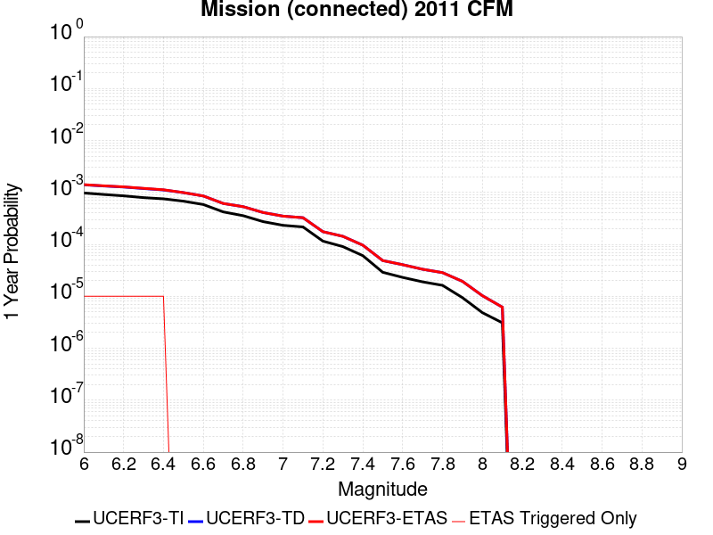 | 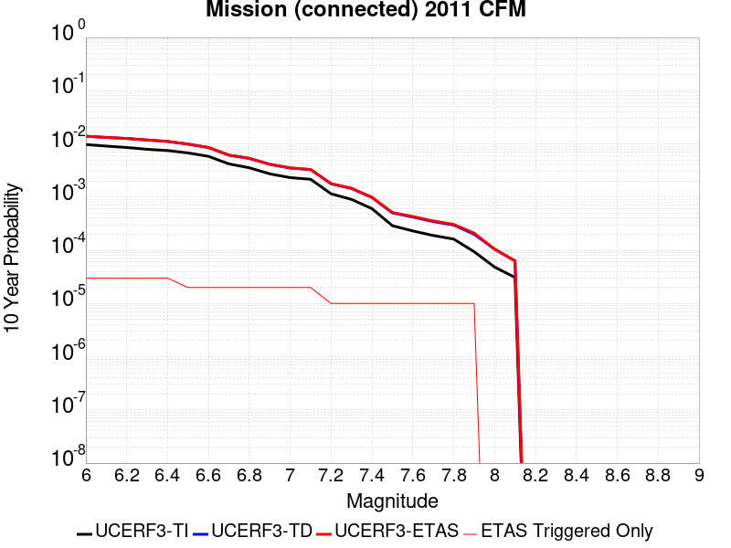 |

| Magnitude | 1 wk TI Prob | 1 wk TD Prob | 1 wk ETAS Prob | 1 wk ETAS/TD Gain | 1 wk ETAS Triggered Only | 1 mo TI Prob | 1 mo TD Prob | 1 mo ETAS Prob | 1 mo ETAS/TD Gain | 1 mo ETAS Triggered Only | 1 yr TI Prob | 1 yr TD Prob | 1 yr ETAS Prob | 1 yr ETAS/TD Gain | 1 yr ETAS Triggered Only | 10 yr TI Prob | 10 yr TD Prob | 10 yr ETAS Prob | 10 yr ETAS/TD Gain | 10 yr ETAS Triggered Only |
|-----|-----|-----|-----|-----|-----|-----|-----|-----|-----|-----|-----|-----|-----|-----|-----|-----|-----|-----|-----|-----|
| 6.0 | 1.8735573E-5 | 2.6882515E-5 | 2.6882515E-5 | 1.0 | 0.0 | 8.029284E-5 | 1.1520558E-4 | 1.1520558E-4 | 1.0 | 0.0 | 9.771269E-4 | 0.0014016571 | 0.0014016571 | 1.0 | 0.0 | 0.009728416 | 0.013937562 | 0.013988653 | 1.0036657 | 5.1813473E-5 |
| 6.1 | 1.7515964E-5 | 2.5523792E-5 | 2.5523792E-5 | 1.0 | 0.0 | 7.506625E-5 | 1.0938298E-4 | 1.0938298E-4 | 1.0 | 0.0 | 9.135484E-4 | 0.0013308554 | 0.0013308554 | 1.0 | 0.0 | 0.009098019 | 0.0132381655 | 0.013289293 | 1.0038621 | 5.1813473E-5 |
| 6.2 | 1.6486343E-5 | 2.4368448E-5 | 2.4368448E-5 | 1.0 | 0.0 | 7.065384E-5 | 1.0443191E-4 | 1.0443191E-4 | 1.0 | 0.0 | 8.5987104E-4 | 0.0012706495 | 0.0012706495 | 1.0 | 0.0 | 0.008565514 | 0.012643143 | 0.012694301 | 1.0040463 | 5.1813473E-5 |
| 6.3 | 1.5229385E-5 | 2.2797909E-5 | 2.2797909E-5 | 1.0 | 0.0 | 6.526716E-5 | 9.7701544E-5 | 9.7701544E-5 | 1.0 | 0.0 | 7.9433795E-4 | 0.0011887997 | 0.0011887997 | 1.0 | 0.0 | 0.007915046 | 0.011836352 | 0.011887551 | 1.0043256 | 5.1813473E-5 |
| 6.4 | 1.4435828E-5 | 2.1398E-5 | 2.1398E-5 | 1.0 | 0.0 | 6.186637E-5 | 9.1702364E-5 | 9.1702364E-5 | 1.0 | 0.0 | 7.529627E-4 | 0.0011158385 | 0.0011158385 | 1.0 | 0.0 | 0.007504165 | 0.011119362 | 0.0111706 | 1.0046079 | 5.1813473E-5 |
| 6.5 | 1.30127955E-5 | 1.9037068E-5 | 1.9037068E-5 | 1.0 | 0.0 | 5.576793E-5 | 8.1584905E-5 | 8.1584905E-5 | 1.0 | 0.0 | 6.78763E-4 | 9.927875E-4 | 9.927875E-4 | 1.0 | 0.0 | 0.0067669353 | 0.009911527 | 0.009962826 | 1.0051758 | 5.1813473E-5 |
| 6.6 | 1.1220718E-5 | 1.639339E-5 | 1.639339E-5 | 1.0 | 0.0 | 4.8087906E-5 | 7.0255504E-5 | 7.0255504E-5 | 1.0 | 0.0 | 5.8531296E-4 | 8.5502357E-4 | 8.5502357E-4 | 1.0 | 0.0 | 0.005837737 | 0.00854963 | 0.0086010005 | 1.0060085 | 5.1813473E-5 |
| 6.7 | 8.086152E-6 | 1.1750298E-5 | 1.1750298E-5 | 1.0 | 0.0 | 3.4654473E-5 | 5.035745E-5 | 5.035745E-5 | 1.0 | 0.0 | 4.2183654E-4 | 6.129302E-4 | 6.129302E-4 | 1.0 | 0.0 | 0.004210367 | 0.0061497535 | 0.006201248 | 1.0083735 | 5.1813473E-5 |
| 6.8 | 6.8361655E-6 | 1.0195406E-5 | 1.0195406E-5 | 1.0 | 0.0 | 2.9297524E-5 | 4.3693864E-5 | 4.3693864E-5 | 1.0 | 0.0 | 3.5663895E-4 | 5.3184363E-4 | 5.3184363E-4 | 1.0 | 0.0 | 0.0035606713 | 0.0053387266 | 0.005390263 | 1.0096534 | 5.1813473E-5 |
| 6.9 | 5.2517353E-6 | 7.8690955E-6 | 7.8690955E-6 | 1.0 | 0.0 | 2.2507242E-5 | 3.3724264E-5 | 3.3724264E-5 | 1.0 | 0.0 | 2.739912E-4 | 4.105158E-4 | 4.105158E-4 | 1.0 | 0.0 | 0.0027365363 | 0.004129868 | 0.0041814675 | 1.0124942 | 5.1813473E-5 |
| 7.0 | 4.4602784E-6 | 6.7016504E-6 | 6.7016504E-6 | 1.0 | 0.0 | 1.911534E-5 | 2.8721044E-5 | 2.8721044E-5 | 1.0 | 0.0 | 2.327044E-4 | 3.4962274E-4 | 3.4962274E-4 | 1.0 | 0.0 | 0.0023246086 | 0.0035221886 | 0.0035738195 | 1.0146588 | 5.1813473E-5 |
| 7.1 | 4.1492594E-6 | 6.2504096E-6 | 6.2504096E-6 | 1.0 | 0.0 | 1.7782419E-5 | 2.6787196E-5 | 2.6787196E-5 | 1.0 | 0.0 | 2.1647944E-4 | 3.2608546E-4 | 3.2608546E-4 | 1.0 | 0.0 | 0.0021626868 | 0.0032870003 | 0.0033386436 | 1.0157113 | 5.1813473E-5 |
| 7.2 | 2.213247E-6 | 3.3628444E-6 | 3.3628444E-6 | 1.0 | 0.0 | 9.485309E-6 | 1.441211E-5 | 1.441211E-5 | 1.0 | 0.0 | 1.15477524E-4 | 1.7545334E-4 | 1.7545334E-4 | 1.0 | 0.0 | 0.0011541754 | 0.0017818302 | 0.0017818302 | 1.0 | 0.0 |
| 7.3 | 1.7362703E-6 | 2.7384676E-6 | 2.7384676E-6 | 1.0 | 0.0 | 7.4411373E-6 | 1.1736238E-5 | 1.1736238E-5 | 1.0 | 0.0 | 9.0592075E-5 | 1.4287935E-4 | 1.4287935E-4 | 1.0 | 0.0 | 9.0555154E-4 | 0.0014532148 | 0.0014532148 | 1.0 | 0.0 |
| 7.4 | 1.1628409E-6 | 1.8493533E-6 | 1.8493533E-6 | 1.0 | 0.0 | 4.9835944E-6 | 7.925776E-6 | 7.925776E-6 | 1.0 | 0.0 | 6.0673574E-5 | 9.649206E-5 | 9.649206E-5 | 1.0 | 0.0 | 6.065701E-4 | 9.85306E-4 | 9.85306E-4 | 1.0 | 0.0 |
| 7.5 | 5.5610667E-7 | 9.343823E-7 | 9.343823E-7 | 1.0 | 0.0 | 2.3833122E-6 | 4.0044893E-6 | 4.0044893E-6 | 1.0 | 0.0 | 2.9016439E-5 | 4.8753573E-5 | 4.8753573E-5 | 1.0 | 0.0 | 2.901265E-4 | 5.0411286E-4 | 5.0411286E-4 | 1.0 | 0.0 |
| 7.6 | 4.4307663E-7 | 7.784628E-7 | 7.784628E-7 | 1.0 | 0.0 | 1.8988985E-6 | 3.3362649E-6 | 3.3362649E-6 | 1.0 | 0.0 | 2.3118844E-5 | 4.061827E-5 | 4.061827E-5 | 1.0 | 0.0 | 2.3116439E-4 | 4.2210697E-4 | 4.2210697E-4 | 1.0 | 0.0 |
| 7.7 | 3.639119E-7 | 6.3549425E-7 | 6.3549425E-7 | 1.0 | 0.0 | 1.5596215E-6 | 2.7235437E-6 | 2.7235437E-6 | 1.0 | 0.0 | 1.8988227E-5 | 3.315864E-5 | 3.315864E-5 | 1.0 | 0.0 | 1.8986604E-4 | 3.4690052E-4 | 3.4690052E-4 | 1.0 | 0.0 |
| 7.8 | 3.1152942E-7 | 5.474834E-7 | 5.474834E-7 | 1.0 | 0.0 | 1.3351254E-6 | 2.3463554E-6 | 2.3463554E-6 | 1.0 | 0.0 | 1.6255031E-5 | 2.8566503E-5 | 2.8566503E-5 | 1.0 | 0.0 | 1.6253842E-4 | 2.977112E-4 | 2.977112E-4 | 1.0 | 0.0 |
| 7.9 | 1.8035962E-7 | 3.7184682E-7 | 3.7184682E-7 | 1.0 | 0.0 | 7.729696E-7 | 1.5936282E-6 | 1.5936282E-6 | 1.0 | 0.0 | 9.410865E-6 | 1.9402252E-5 | 1.9402252E-5 | 1.0 | 0.0 | 9.410465E-5 | 2.0071324E-4 | 2.0071324E-4 | 1.0 | 0.0 |
| 8.0 | 9.279334E-8 | 1.9695527E-7 | 1.9695527E-7 | 1.0 | 0.0 | 3.976857E-7 | 8.4409373E-7 | 8.4409373E-7 | 1.0 | 0.0 | 4.841813E-6 | 1.0276794E-5 | 1.0276794E-5 | 1.0 | 0.0 | 4.841707E-5 | 1.05289524E-4 | 1.05289524E-4 | 1.0 | 0.0 |
| 8.1 | 5.9253985E-8 | 1.18509675E-7 | 1.18509675E-7 | 1.0 | 0.0 | 2.5394561E-7 | 5.078985E-7 | 5.078985E-7 | 1.0 | 0.0 | 3.0917836E-6 | 6.183647E-6 | 6.183647E-6 | 1.0 | 0.0 | 3.0917407E-5 | 6.322351E-5 | 6.322351E-5 | 1.0 | 0.0 |

## White Wolf
*[(top)](#table-of-contents)*

| 1 Week | 1 Month | 1 Year | 10 Year |
|-----|-----|-----|-----|
|  |  |  |  |

| Magnitude | 1 wk TI Prob | 1 wk TD Prob | 1 wk ETAS Prob | 1 wk ETAS/TD Gain | 1 wk ETAS Triggered Only | 1 mo TI Prob | 1 mo TD Prob | 1 mo ETAS Prob | 1 mo ETAS/TD Gain | 1 mo ETAS Triggered Only | 1 yr TI Prob | 1 yr TD Prob | 1 yr ETAS Prob | 1 yr ETAS/TD Gain | 1 yr ETAS Triggered Only | 10 yr TI Prob | 10 yr TD Prob | 10 yr ETAS Prob | 10 yr ETAS/TD Gain | 10 yr ETAS Triggered Only |
|-----|-----|-----|-----|-----|-----|-----|-----|-----|-----|-----|-----|-----|-----|-----|-----|-----|-----|-----|-----|-----|
| 6.0 | 2.0037822E-5 | 1.0469162E-6 | 1.0469162E-6 | 1.0 | 0.0 | 8.587355E-5 | 4.486776E-6 | 4.486776E-6 | 1.0 | 0.0 | 0.001045009 | 5.4625183E-5 | 1.0643582E-4 | 1.9484754 | 5.1813473E-5 | 0.010401085 | 5.461226E-4 | 5.979078E-4 | 1.0948234 | 5.1813473E-5 |
| 6.1 | 2.0037822E-5 | 1.0469162E-6 | 1.0469162E-6 | 1.0 | 0.0 | 8.587355E-5 | 4.486776E-6 | 4.486776E-6 | 1.0 | 0.0 | 0.001045009 | 5.4625183E-5 | 1.0643582E-4 | 1.9484754 | 5.1813473E-5 | 0.010401085 | 5.461226E-4 | 5.979078E-4 | 1.0948234 | 5.1813473E-5 |
| 6.2 | 2.0037822E-5 | 1.0469162E-6 | 1.0469162E-6 | 1.0 | 0.0 | 8.587355E-5 | 4.486776E-6 | 4.486776E-6 | 1.0 | 0.0 | 0.001045009 | 5.4625183E-5 | 1.0643582E-4 | 1.9484754 | 5.1813473E-5 | 0.010401085 | 5.461226E-4 | 5.979078E-4 | 1.0948234 | 5.1813473E-5 |
| 6.3 | 2.0037822E-5 | 1.0469162E-6 | 1.0469162E-6 | 1.0 | 0.0 | 8.587355E-5 | 4.486776E-6 | 4.486776E-6 | 1.0 | 0.0 | 0.001045009 | 5.4625183E-5 | 1.0643582E-4 | 1.9484754 | 5.1813473E-5 | 0.010401085 | 5.461226E-4 | 5.979078E-4 | 1.0948234 | 5.1813473E-5 |
| 6.4 | 1.132487E-5 | 1.0469162E-6 | 1.0469162E-6 | 1.0 | 0.0 | 4.8534253E-5 | 4.486776E-6 | 4.486776E-6 | 1.0 | 0.0 | 5.907443E-4 | 5.4625183E-5 | 1.0643582E-4 | 1.9484754 | 5.1813473E-5 | 0.005891764 | 5.461226E-4 | 5.979078E-4 | 1.0948234 | 5.1813473E-5 |
| 6.5 | 1.132487E-5 | 1.0469162E-6 | 1.0469162E-6 | 1.0 | 0.0 | 4.8534253E-5 | 4.486776E-6 | 4.486776E-6 | 1.0 | 0.0 | 5.907443E-4 | 5.4625183E-5 | 1.0643582E-4 | 1.9484754 | 5.1813473E-5 | 0.005891764 | 5.461226E-4 | 5.979078E-4 | 1.0948234 | 5.1813473E-5 |
| 6.6 | 9.347473E-6 | 1.0469162E-6 | 1.0469162E-6 | 1.0 | 0.0 | 4.0059982E-5 | 4.486776E-6 | 4.486776E-6 | 1.0 | 0.0 | 4.8762115E-4 | 5.4625183E-5 | 1.0643582E-4 | 1.9484754 | 5.1813473E-5 | 0.0048655253 | 5.461226E-4 | 5.979078E-4 | 1.0948234 | 5.1813473E-5 |
| 6.7 | 7.842647E-6 | 1.0048342E-6 | 1.0048342E-6 | 1.0 | 0.0 | 3.361091E-5 | 4.3064256E-6 | 4.3064256E-6 | 1.0 | 0.0 | 4.0913603E-4 | 5.2429517E-5 | 1.0424027E-4 | 1.9881982 | 5.1813473E-5 | 0.004083836 | 5.2417646E-4 | 5.7596277E-4 | 1.0987955 | 5.1813473E-5 |
| 6.8 | 6.26597E-6 | 9.734822E-7 | 9.734822E-7 | 1.0 | 0.0 | 2.685388E-5 | 4.17206E-6 | 4.17206E-6 | 1.0 | 0.0 | 3.2689696E-4 | 5.0793697E-5 | 1.02604536E-4 | 2.020025 | 5.1813473E-5 | 0.003264165 | 5.078258E-4 | 5.5961293E-4 | 1.1019782 | 5.1813473E-5 |
| 6.9 | 5.258436E-6 | 9.183254E-7 | 9.183254E-7 | 1.0 | 0.0 | 2.2535958E-5 | 3.9356746E-6 | 3.9356746E-6 | 1.0 | 0.0 | 2.7434074E-4 | 4.7915833E-5 | 9.972682E-5 | 2.0812917 | 5.1813473E-5 | 0.0027400232 | 4.790598E-4 | 5.3084845E-4 | 1.1081048 | 5.1813473E-5 |
| 7.0 | 4.675028E-6 | 8.6611794E-7 | 8.6611794E-7 | 1.0 | 0.0 | 2.003568E-5 | 3.7119291E-6 | 3.7119291E-6 | 1.0 | 0.0 | 2.4390711E-4 | 4.5191846E-5 | 9.700298E-5 | 2.1464708 | 5.1813473E-5 | 0.0024363957 | 4.518313E-4 | 5.0362136E-4 | 1.1146226 | 5.1813473E-5 |
| 7.1 | 2.8270078E-6 | 6.8741696E-7 | 6.8741696E-7 | 1.0 | 0.0 | 1.2115692E-5 | 2.9460696E-6 | 2.9460696E-6 | 1.0 | 0.0 | 1.4749856E-4 | 3.5867848E-5 | 3.5867848E-5 | 1.0 | 0.0 | 0.001474007 | 3.586247E-4 | 3.586247E-4 | 1.0 | 0.0 |
| 7.2 | 1.6881406E-6 | 2.2706382E-7 | 2.2706382E-7 | 1.0 | 0.0 | 7.2348685E-6 | 9.731303E-7 | 9.731303E-7 | 1.0 | 0.0 | 8.808096E-5 | 1.1847799E-5 | 1.1847799E-5 | 1.0 | 0.0 | 8.8046055E-4 | 1.1847183E-4 | 1.1847183E-4 | 1.0 | 0.0 |
| 7.3 | 9.086107E-7 | 1.5266386E-7 | 1.5266386E-7 | 1.0 | 0.0 | 3.8940398E-6 | 6.5427355E-7 | 6.5427355E-7 | 1.0 | 0.0 | 4.7408903E-5 | 7.965752E-6 | 7.965752E-6 | 1.0 | 0.0 | 4.739879E-4 | 7.965475E-5 | 7.965475E-5 | 1.0 | 0.0 |
| 7.4 | 1.9717383E-7 | 9.003913E-8 | 9.003913E-8 | 1.0 | 0.0 | 8.450304E-7 | 3.8588192E-7 | 3.8588192E-7 | 1.0 | 0.0 | 1.0288197E-5 | 4.6981027E-6 | 4.6981027E-6 | 1.0 | 0.0 | 1.028772E-4 | 4.6980065E-5 | 4.6980065E-5 | 1.0 | 0.0 |
| 7.5 | 1.086975E-7 | 6.6597195E-8 | 6.6597195E-8 | 1.0 | 0.0 | 4.6584634E-7 | 2.8541652E-7 | 2.8541652E-7 | 1.0 | 0.0 | 5.6716644E-6 | 3.474941E-6 | 3.474941E-6 | 1.0 | 0.0 | 5.6715195E-5 | 3.474889E-5 | 3.474889E-5 | 1.0 | 0.0 |
| 7.6 | 2.4217808E-8 | 1.5820765E-8 | 1.5820765E-8 | 1.0 | 0.0 | 1.03790605E-7 | 6.780328E-8 | 6.780328E-8 | 1.0 | 0.0 | 1.2636499E-6 | 8.255046E-7 | 8.255046E-7 | 1.0 | 0.0 | 1.2636427E-5 | 8.2550205E-6 | 8.2550205E-6 | 1.0 | 0.0 |

## San Joaquin Hills
*[(top)](#table-of-contents)*

| 1 Week | 1 Month | 1 Year | 10 Year |
|-----|-----|-----|-----|
|  |  |  |  |

| Magnitude | 1 wk TI Prob | 1 wk TD Prob | 1 wk ETAS Prob | 1 wk ETAS/TD Gain | 1 wk ETAS Triggered Only | 1 mo TI Prob | 1 mo TD Prob | 1 mo ETAS Prob | 1 mo ETAS/TD Gain | 1 mo ETAS Triggered Only | 1 yr TI Prob | 1 yr TD Prob | 1 yr ETAS Prob | 1 yr ETAS/TD Gain | 1 yr ETAS Triggered Only | 10 yr TI Prob | 10 yr TD Prob | 10 yr ETAS Prob | 10 yr ETAS/TD Gain | 10 yr ETAS Triggered Only |
|-----|-----|-----|-----|-----|-----|-----|-----|-----|-----|-----|-----|-----|-----|-----|-----|-----|-----|-----|-----|-----|
| 6.0 | 3.4525704E-6 | 2.8139818E-6 | 2.8139818E-6 | 1.0 | 0.0 | 1.4796647E-5 | 1.2059867E-5 | 6.3872714E-5 | 5.2963033 | 5.1813473E-5 | 1.8013427E-4 | 1.4681912E-4 | 1.9862498E-4 | 1.3528551 | 5.1813473E-5 | 0.0017998833 | 0.0014672345 | 0.0015189719 | 1.0352619 | 5.1813473E-5 |
| 6.1 | 3.4525704E-6 | 2.8139818E-6 | 2.8139818E-6 | 1.0 | 0.0 | 1.4796647E-5 | 1.2059867E-5 | 6.3872714E-5 | 5.2963033 | 5.1813473E-5 | 1.8013427E-4 | 1.4681912E-4 | 1.9862498E-4 | 1.3528551 | 5.1813473E-5 | 0.0017998833 | 0.0014672345 | 0.0015189719 | 1.0352619 | 5.1813473E-5 |
| 6.2 | 3.4525704E-6 | 2.8139818E-6 | 2.8139818E-6 | 1.0 | 0.0 | 1.4796647E-5 | 1.2059867E-5 | 6.3872714E-5 | 5.2963033 | 5.1813473E-5 | 1.8013427E-4 | 1.4681912E-4 | 1.9862498E-4 | 1.3528551 | 5.1813473E-5 | 0.0017998833 | 0.0014672345 | 0.0015189719 | 1.0352619 | 5.1813473E-5 |
| 6.3 | 3.4525704E-6 | 2.8139818E-6 | 2.8139818E-6 | 1.0 | 0.0 | 1.4796647E-5 | 1.2059867E-5 | 6.3872714E-5 | 5.2963033 | 5.1813473E-5 | 1.8013427E-4 | 1.4681912E-4 | 1.9862498E-4 | 1.3528551 | 5.1813473E-5 | 0.0017998833 | 0.0014672345 | 0.0015189719 | 1.0352619 | 5.1813473E-5 |
| 6.4 | 3.4525704E-6 | 2.8139818E-6 | 2.8139818E-6 | 1.0 | 0.0 | 1.4796647E-5 | 1.2059867E-5 | 6.3872714E-5 | 5.2963033 | 5.1813473E-5 | 1.8013427E-4 | 1.4681912E-4 | 1.9862498E-4 | 1.3528551 | 5.1813473E-5 | 0.0017998833 | 0.0014672345 | 0.0015189719 | 1.0352619 | 5.1813473E-5 |
| 6.5 | 3.4525704E-6 | 2.8139818E-6 | 2.8139818E-6 | 1.0 | 0.0 | 1.4796647E-5 | 1.2059867E-5 | 6.3872714E-5 | 5.2963033 | 5.1813473E-5 | 1.8013427E-4 | 1.4681912E-4 | 1.9862498E-4 | 1.3528551 | 5.1813473E-5 | 0.0017998833 | 0.0014672345 | 0.0015189719 | 1.0352619 | 5.1813473E-5 |
| 6.6 | 3.4525704E-6 | 2.8139818E-6 | 2.8139818E-6 | 1.0 | 0.0 | 1.4796647E-5 | 1.2059867E-5 | 6.3872714E-5 | 5.2963033 | 5.1813473E-5 | 1.8013427E-4 | 1.4681912E-4 | 1.9862498E-4 | 1.3528551 | 5.1813473E-5 | 0.0017998833 | 0.0014672345 | 0.0015189719 | 1.0352619 | 5.1813473E-5 |
| 6.7 | 3.4525704E-6 | 2.8139818E-6 | 2.8139818E-6 | 1.0 | 0.0 | 1.4796647E-5 | 1.2059867E-5 | 6.3872714E-5 | 5.2963033 | 5.1813473E-5 | 1.8013427E-4 | 1.4681912E-4 | 1.9862498E-4 | 1.3528551 | 5.1813473E-5 | 0.0017998833 | 0.0014672345 | 0.0015189719 | 1.0352619 | 5.1813473E-5 |
| 6.8 | 3.388654E-6 | 2.7484202E-6 | 2.7484202E-6 | 1.0 | 0.0 | 1.4522722E-5 | 1.1778891E-5 | 6.359175E-5 | 5.3987894 | 5.1813473E-5 | 1.767998E-4 | 1.4339869E-4 | 1.9520473E-4 | 1.3612728 | 5.1813473E-5 | 0.001766592 | 0.0014330745 | 0.0014848136 | 1.0361036 | 5.1813473E-5 |
| 6.9 | 3.2694352E-6 | 2.6283346E-6 | 2.6283346E-6 | 1.0 | 0.0 | 1.401179E-5 | 1.1264243E-5 | 6.307713E-5 | 5.5997667 | 5.1813473E-5 | 1.7058018E-4 | 1.3713364E-4 | 1.8894E-4 | 1.3777802 | 5.1813473E-5 | 0.0017044931 | 0.0013705015 | 0.0014222439 | 1.0377544 | 5.1813473E-5 |
| 7.0 | 3.246912E-6 | 2.6069915E-6 | 2.6069915E-6 | 1.0 | 0.0 | 1.39152635E-5 | 1.1172774E-5 | 6.2985666E-5 | 5.637424 | 5.1813473E-5 | 1.6940516E-4 | 1.3602014E-4 | 1.8782656E-4 | 1.3808732 | 5.1813473E-5 | 0.0016927607 | 0.0013593802 | 0.0014111232 | 1.0380636 | 5.1813473E-5 |
| 7.1 | 3.1864927E-6 | 2.5523198E-6 | 2.5523198E-6 | 1.0 | 0.0 | 1.3656326E-5 | 1.0938467E-5 | 6.275137E-5 | 5.7367606 | 5.1813473E-5 | 1.6625308E-4 | 1.3316782E-4 | 1.8497439E-4 | 1.3890322 | 5.1813473E-5 | 0.0016612876 | 0.0013308912 | 0.0013826357 | 1.0388796 | 5.1813473E-5 |
| 7.2 | 3.0220644E-6 | 2.3991677E-6 | 2.3991677E-6 | 1.0 | 0.0 | 1.295164E-5 | 1.0282108E-5 | 6.2095045E-5 | 6.039136 | 5.1813473E-5 | 1.576748E-4 | 1.2517757E-4 | 1.7698455E-4 | 1.413868 | 5.1813473E-5 | 0.0015756298 | 0.0012510809 | 0.0013028296 | 1.0413631 | 5.1813473E-5 |
| 7.3 | 2.787619E-6 | 2.2173858E-6 | 2.2173858E-6 | 1.0 | 0.0 | 1.1946884E-5 | 9.503048E-6 | 6.131603E-5 | 6.4522486 | 5.1813473E-5 | 1.454436E-4 | 1.1569356E-4 | 1.6750104E-4 | 1.4477991 | 5.1813473E-5 | 0.0014534845 | 0.0011563431 | 0.0012080967 | 1.0447562 | 5.1813473E-5 |
| 7.4 | 2.4593792E-6 | 1.9226306E-6 | 1.9226306E-6 | 1.0 | 0.0 | 1.0540153E-5 | 8.23982E-6 | 6.0052866E-5 | 7.288128 | 5.1813473E-5 | 1.2831882E-4 | 1.0031529E-4 | 1.5212355E-4 | 1.5164545 | 5.1813473E-5 | 0.0012824474 | 0.0010027088 | 0.0010544703 | 1.0516217 | 5.1813473E-5 |
| 7.5 | 1.926764E-6 | 1.4383021E-6 | 1.4383021E-6 | 1.0 | 0.0 | 8.257534E-6 | 6.1641376E-6 | 5.797729E-5 | 9.40558 | 5.1813473E-5 | 1.00530844E-4 | 7.504586E-5 | 1.2685543E-4 | 1.6903723 | 5.1813473E-5 | 0.0010048538 | 7.502115E-4 | 8.019861E-4 | 1.0690134 | 5.1813473E-5 |
| 7.6 | 1.1609359E-6 | 8.14558E-7 | 8.14558E-7 | 1.0 | 0.0 | 4.97543E-6 | 3.4909585E-6 | 5.530425E-5 | 15.842139 | 5.1813473E-5 | 6.0574173E-5 | 4.2501633E-5 | 9.4312905E-5 | 2.2190418 | 5.1813473E-5 | 6.055767E-4 | 4.249394E-4 | 4.7673084E-4 | 1.1218796 | 5.1813473E-5 |
| 7.7 | 5.1168536E-7 | 2.7155914E-7 | 2.7155914E-7 | 1.0 | 0.0 | 2.1929354E-6 | 1.1638244E-6 | 5.2977237E-5 | 45.519955 | 5.1813473E-5 | 2.669866E-5 | 1.41694845E-5 | 6.598222E-5 | 4.6566424 | 5.1813473E-5 | 2.6695454E-4 | 1.4168715E-4 | 1.9349328E-4 | 1.3656374 | 5.1813473E-5 |
| 7.8 | 1.16056995E-8 | 9.782373E-9 | 9.782373E-9 | 1.0 | 0.0 | 4.9738713E-8 | 4.1924455E-8 | 4.1924455E-8 | 1.0 | 0.0 | 6.0556863E-7 | 5.1043025E-7 | 5.1043025E-7 | 1.0 | 0.0 | 6.05567E-6 | 5.1043025E-6 | 5.1043025E-6 | 1.0 | 0.0 |

## Northridge
*[(top)](#table-of-contents)*

| 1 Week | 1 Month | 1 Year | 10 Year |
|-----|-----|-----|-----|
| 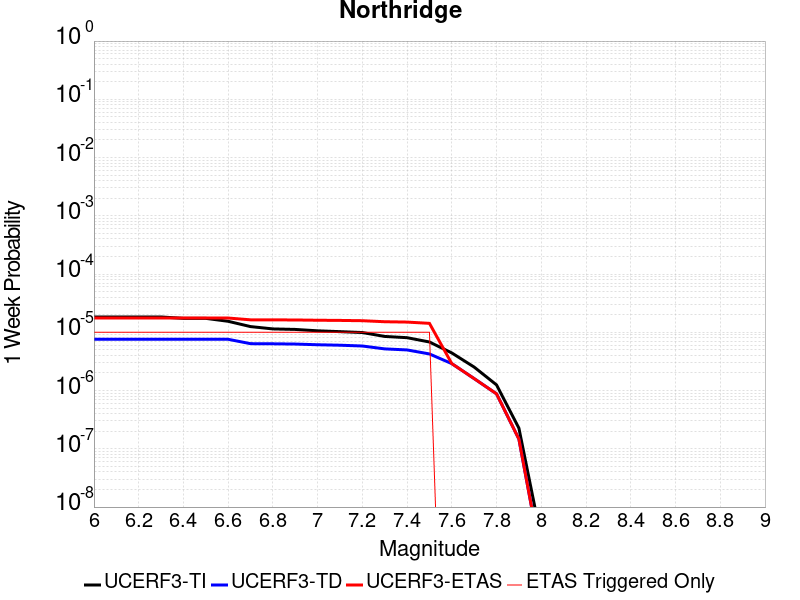 |  | 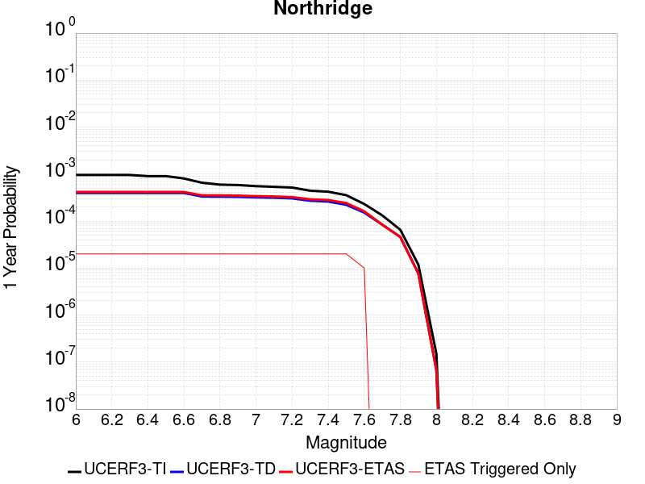 | 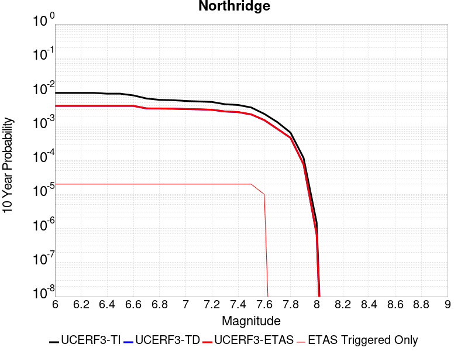 |

| Magnitude | 1 wk TI Prob | 1 wk TD Prob | 1 wk ETAS Prob | 1 wk ETAS/TD Gain | 1 wk ETAS Triggered Only | 1 mo TI Prob | 1 mo TD Prob | 1 mo ETAS Prob | 1 mo ETAS/TD Gain | 1 mo ETAS Triggered Only | 1 yr TI Prob | 1 yr TD Prob | 1 yr ETAS Prob | 1 yr ETAS/TD Gain | 1 yr ETAS Triggered Only | 10 yr TI Prob | 10 yr TD Prob | 10 yr ETAS Prob | 10 yr ETAS/TD Gain | 10 yr ETAS Triggered Only |
|-----|-----|-----|-----|-----|-----|-----|-----|-----|-----|-----|-----|-----|-----|-----|-----|-----|-----|-----|-----|-----|
| 6.0 | 1.8340852E-5 | 7.5880193E-6 | 7.5880193E-6 | 1.0 | 0.0 | 7.860128E-5 | 3.251969E-5 | 8.433148E-5 | 2.5932436 | 5.1813473E-5 | 9.565505E-4 | 3.958575E-4 | 4.4765044E-4 | 1.1308374 | 5.1813473E-5 | 0.009524435 | 0.003951746 | 0.004003355 | 1.0130597 | 5.1813473E-5 |
| 6.1 | 1.8340852E-5 | 7.5880193E-6 | 7.5880193E-6 | 1.0 | 0.0 | 7.860128E-5 | 3.251969E-5 | 8.433148E-5 | 2.5932436 | 5.1813473E-5 | 9.565505E-4 | 3.958575E-4 | 4.4765044E-4 | 1.1308374 | 5.1813473E-5 | 0.009524435 | 0.003951746 | 0.004003355 | 1.0130597 | 5.1813473E-5 |
| 6.2 | 1.8340852E-5 | 7.5880193E-6 | 7.5880193E-6 | 1.0 | 0.0 | 7.860128E-5 | 3.251969E-5 | 8.433148E-5 | 2.5932436 | 5.1813473E-5 | 9.565505E-4 | 3.958575E-4 | 4.4765044E-4 | 1.1308374 | 5.1813473E-5 | 0.009524435 | 0.003951746 | 0.004003355 | 1.0130597 | 5.1813473E-5 |
| 6.3 | 1.8340852E-5 | 7.5880193E-6 | 7.5880193E-6 | 1.0 | 0.0 | 7.860128E-5 | 3.251969E-5 | 8.433148E-5 | 2.5932436 | 5.1813473E-5 | 9.565505E-4 | 3.958575E-4 | 4.4765044E-4 | 1.1308374 | 5.1813473E-5 | 0.009524435 | 0.003951746 | 0.004003355 | 1.0130597 | 5.1813473E-5 |
| 6.4 | 1.7361892E-5 | 7.5880193E-6 | 7.5880193E-6 | 1.0 | 0.0 | 7.440598E-5 | 3.251969E-5 | 8.433148E-5 | 2.5932436 | 5.1813473E-5 | 9.055163E-4 | 3.958575E-4 | 4.4765044E-4 | 1.1308374 | 5.1813473E-5 | 0.009018354 | 0.003951746 | 0.004003355 | 1.0130597 | 5.1813473E-5 |
| 6.5 | 1.7361892E-5 | 7.5880193E-6 | 7.5880193E-6 | 1.0 | 0.0 | 7.440598E-5 | 3.251969E-5 | 8.433148E-5 | 2.5932436 | 5.1813473E-5 | 9.055163E-4 | 3.958575E-4 | 4.4765044E-4 | 1.1308374 | 5.1813473E-5 | 0.009018354 | 0.003951746 | 0.004003355 | 1.0130597 | 5.1813473E-5 |
| 6.6 | 1.5458201E-5 | 7.5880193E-6 | 7.5880193E-6 | 1.0 | 0.0 | 6.624775E-5 | 3.251969E-5 | 8.433148E-5 | 2.5932436 | 5.1813473E-5 | 8.0626784E-4 | 3.958575E-4 | 4.4765044E-4 | 1.1308374 | 5.1813473E-5 | 0.008033488 | 0.003951746 | 0.004003355 | 1.0130597 | 5.1813473E-5 |
| 6.7 | 1.2538368E-5 | 6.381603E-6 | 6.381603E-6 | 1.0 | 0.0 | 5.3734755E-5 | 2.7349442E-5 | 7.9161495E-5 | 2.8944464 | 5.1813473E-5 | 6.5402425E-4 | 3.3292902E-4 | 3.8472525E-4 | 1.1555774 | 5.1813473E-5 | 0.0065210275 | 0.0033243506 | 0.0033759917 | 1.0155343 | 5.1813473E-5 |
| 6.8 | 1.1438097E-5 | 6.3502566E-6 | 6.3502566E-6 | 1.0 | 0.0 | 4.9019498E-5 | 2.7215105E-5 | 7.9027166E-5 | 2.9037979 | 5.1813473E-5 | 5.9664896E-4 | 3.3129397E-4 | 3.8309026E-4 | 1.1563455 | 5.1813473E-5 | 0.005950495 | 0.0033080487 | 0.0033596908 | 1.015611 | 5.1813473E-5 |
| 6.9 | 1.1204891E-5 | 6.2867084E-6 | 6.2867084E-6 | 1.0 | 0.0 | 4.8020076E-5 | 2.694276E-5 | 7.8754834E-5 | 2.9230425 | 5.1813473E-5 | 5.8448757E-4 | 3.2797916E-4 | 3.7977565E-4 | 1.1579261 | 5.1813473E-5 | 0.0058295266 | 0.0032749989 | 0.0033266426 | 1.0157691 | 5.1813473E-5 |
| 7.0 | 1.061046E-5 | 6.115359E-6 | 6.115359E-6 | 1.0 | 0.0 | 4.5472607E-5 | 2.6208421E-5 | 7.802054E-5 | 2.976926 | 5.1813473E-5 | 5.534883E-4 | 3.1904122E-4 | 3.7083818E-4 | 1.1623518 | 5.1813473E-5 | 0.0055211177 | 0.0031858785 | 0.0032375269 | 1.0162116 | 5.1813473E-5 |
| 7.1 | 1.0266979E-5 | 6.004274E-6 | 6.004274E-6 | 1.0 | 0.0 | 4.40006E-5 | 2.5732352E-5 | 7.754449E-5 | 3.013502 | 5.1813473E-5 | 5.355756E-4 | 3.1324677E-4 | 3.6504402E-4 | 1.165356 | 5.1813473E-5 | 0.0053428668 | 0.003128098 | 0.0031797497 | 1.016512 | 5.1813473E-5 |
| 7.2 | 9.91273E-6 | 5.819984E-6 | 5.819984E-6 | 1.0 | 0.0 | 4.248244E-5 | 2.4942554E-5 | 7.675473E-5 | 3.0772605 | 5.1813473E-5 | 5.171009E-4 | 3.036337E-4 | 3.5543143E-4 | 1.1705929 | 5.1813473E-5 | 0.0051589934 | 0.0030322333 | 0.0030838898 | 1.0170357 | 5.1813473E-5 |
| 7.3 | 8.4959265E-6 | 5.193062E-6 | 5.193062E-6 | 1.0 | 0.0 | 3.6410605E-5 | 2.225579E-5 | 7.4068106E-5 | 3.3280377 | 5.1813473E-5 | 4.4320893E-4 | 2.709308E-4 | 3.2273022E-4 | 1.1911906 | 5.1813473E-5 | 0.00442326 | 0.0027060313 | 0.0027577046 | 1.0190955 | 5.1813473E-5 |
| 7.4 | 8.0847185E-6 | 4.9819355E-6 | 4.9819355E-6 | 1.0 | 0.0 | 3.4648332E-5 | 2.135098E-5 | 7.316334E-5 | 3.4266975 | 5.1813473E-5 | 4.2176177E-4 | 2.599174E-4 | 3.117174E-4 | 1.1992941 | 5.1813473E-5 | 0.0042096223 | 0.00259616 | 0.0026478388 | 1.0199059 | 5.1813473E-5 |
| 7.5 | 6.8220684E-6 | 4.2533075E-6 | 4.2533075E-6 | 1.0 | 0.0 | 2.9237108E-5 | 1.8228335E-5 | 7.0040864E-5 | 3.8424168 | 5.1813473E-5 | 3.5590364E-4 | 2.2190758E-4 | 2.7370956E-4 | 1.2334394 | 5.1813473E-5 | 0.0035533418 | 0.002216881 | 0.0022685796 | 1.0233204 | 5.1813473E-5 |
| 7.6 | 4.4224143E-6 | 2.8999582E-6 | 2.8999582E-6 | 1.0 | 0.0 | 1.8953066E-5 | 1.2428334E-5 | 6.424116E-5 | 5.1689277 | 5.1813473E-5 | 2.3072914E-4 | 1.5130457E-4 | 2.031102E-4 | 1.342393 | 5.1813473E-5 | 0.0023048974 | 0.0015120271 | 0.0015637623 | 1.0342157 | 5.1813473E-5 |
| 7.7 | 2.5297056E-6 | 1.6045905E-6 | 1.6045905E-6 | 1.0 | 0.0 | 1.0841551E-5 | 6.8767986E-6 | 6.8767986E-6 | 1.0 | 0.0 | 1.319879E-4 | 8.3721854E-5 | 8.3721854E-5 | 1.0 | 0.0 | 0.0013190953 | 8.369078E-4 | 8.369078E-4 | 1.0 | 0.0 |
| 7.8 | 1.2508156E-6 | 8.780076E-7 | 8.780076E-7 | 1.0 | 0.0 | 5.3606273E-6 | 3.7628845E-6 | 3.7628845E-6 | 1.0 | 0.0 | 6.526368E-5 | 4.581217E-5 | 4.581217E-5 | 1.0 | 0.0 | 6.524452E-4 | 4.5802852E-4 | 4.5802852E-4 | 1.0 | 0.0 |
| 7.9 | 2.262199E-7 | 1.4664671E-7 | 1.4664671E-7 | 1.0 | 0.0 | 9.695135E-7 | 6.284858E-7 | 6.284858E-7 | 1.0 | 0.0 | 1.1803763E-5 | 7.651788E-6 | 7.651788E-6 | 1.0 | 0.0 | 1.1803136E-4 | 7.651533E-5 | 7.651533E-5 | 1.0 | 0.0 |
| 8.0 | 2.865362E-9 | 1.2753101E-9 | 1.2753101E-9 | 1.0 | 0.0 | 1.2280123E-8 | 5.4656146E-9 | 5.4656146E-9 | 1.0 | 0.0 | 1.4951048E-7 | 6.654386E-8 | 6.654386E-8 | 1.0 | 0.0 | 1.4951038E-6 | 6.654386E-7 | 6.654386E-7 | 1.0 | 0.0 |

## Calaveras (So) - Paicines extension 2011 CFM
*[(top)](#table-of-contents)*

| 1 Week | 1 Month | 1 Year | 10 Year |
|-----|-----|-----|-----|
|  |  |  |  |

| Magnitude | 1 wk TI Prob | 1 wk TD Prob | 1 wk ETAS Prob | 1 wk ETAS/TD Gain | 1 wk ETAS Triggered Only | 1 mo TI Prob | 1 mo TD Prob | 1 mo ETAS Prob | 1 mo ETAS/TD Gain | 1 mo ETAS Triggered Only | 1 yr TI Prob | 1 yr TD Prob | 1 yr ETAS Prob | 1 yr ETAS/TD Gain | 1 yr ETAS Triggered Only | 10 yr TI Prob | 10 yr TD Prob | 10 yr ETAS Prob | 10 yr ETAS/TD Gain | 10 yr ETAS Triggered Only |
|-----|-----|-----|-----|-----|-----|-----|-----|-----|-----|-----|-----|-----|-----|-----|-----|-----|-----|-----|-----|-----|
| 6.0 | 1.5183659E-4 | 3.0533716E-4 | 3.0533716E-4 | 1.0 | 0.0 | 6.5056595E-4 | 0.0013069661 | 0.0013069661 | 1.0 | 0.0 | 0.007891912 | 0.01569571 | 0.01569571 | 1.0 | 0.0 | 0.076174594 | 0.13848671 | 0.13853136 | 1.0003223 | 5.1813473E-5 |
| 6.1 | 1.5024997E-4 | 3.0227835E-4 | 3.0227835E-4 | 1.0 | 0.0 | 6.437695E-4 | 0.00129387 | 0.00129387 | 1.0 | 0.0 | 0.0078097614 | 0.015539104 | 0.015539104 | 1.0 | 0.0 | 0.075409345 | 0.13715632 | 0.13720103 | 1.0003259 | 5.1813473E-5 |
| 6.2 | 1.2743923E-4 | 2.5306802E-4 | 2.5306802E-4 | 1.0 | 0.0 | 5.460538E-4 | 0.0010841049 | 0.0010841049 | 1.0 | 0.0 | 0.0066279583 | 0.013046704 | 0.013046704 | 1.0 | 0.0 | 0.064337276 | 0.11725405 | 0.11729978 | 1.00039 | 5.1813473E-5 |
| 6.3 | 1.1525114E-4 | 2.2595265E-4 | 2.2595265E-4 | 1.0 | 0.0 | 4.9383997E-4 | 9.6799526E-4 | 9.6799526E-4 | 1.0 | 0.0 | 0.0059959386 | 0.011667927 | 0.011667927 | 1.0 | 0.0 | 0.058367174 | 0.10637007 | 0.106416374 | 1.0004352 | 5.1813473E-5 |
| 6.4 | 1.07200925E-4 | 2.0836305E-4 | 2.0836305E-4 | 1.0 | 0.0 | 4.5935164E-4 | 8.926636E-4 | 8.926636E-4 | 1.0 | 0.0 | 0.0055782744 | 0.010772766 | 0.010772766 | 1.0 | 0.0 | 0.0544031 | 0.09919256 | 0.09923924 | 1.0004705 | 5.1813473E-5 |
| 6.5 | 9.69631E-5 | 1.8729115E-4 | 1.8729115E-4 | 1.0 | 0.0 | 4.1548995E-4 | 8.024135E-4 | 8.024135E-4 | 1.0 | 0.0 | 0.0050468626 | 0.009694662 | 0.009694662 | 1.0 | 0.0 | 0.04933773 | 0.090084255 | 0.0901314 | 1.0005233 | 5.1813473E-5 |
| 6.6 | 8.0552316E-5 | 1.5070537E-4 | 1.5070537E-4 | 1.0 | 0.0 | 3.4517853E-4 | 6.456994E-4 | 6.456994E-4 | 1.0 | 0.0 | 0.0041944524 | 0.007826256 | 0.007826256 | 1.0 | 0.0 | 0.04116161 | 0.074854024 | 0.07490196 | 1.0006404 | 5.1813473E-5 |
| 6.7 | 7.815757E-5 | 1.4610609E-4 | 1.4610609E-4 | 1.0 | 0.0 | 3.34918E-4 | 6.260017E-4 | 6.260017E-4 | 1.0 | 0.0 | 0.004070005 | 0.0075890915 | 0.0075890915 | 1.0 | 0.0 | 0.039962657 | 0.072703585 | 0.072751634 | 1.0006609 | 5.1813473E-5 |
| 6.8 | 6.965264E-5 | 1.2721405E-4 | 1.2721405E-4 | 1.0 | 0.0 | 2.9847719E-4 | 5.450839E-4 | 5.450839E-4 | 1.0 | 0.0 | 0.0036279052 | 0.00661342 | 0.00661342 | 1.0 | 0.0 | 0.03569247 | 0.06379891 | 0.063847415 | 1.0007603 | 5.1813473E-5 |
| 6.9 | 5.8000453E-5 | 1.01435086E-4 | 1.01435086E-4 | 1.0 | 0.0 | 2.4854968E-4 | 4.3464993E-4 | 4.3464993E-4 | 1.0 | 0.0 | 0.0030218933 | 0.0052791284 | 0.0052791284 | 1.0 | 0.0 | 0.029811295 | 0.051501602 | 0.05155075 | 1.0009543 | 5.1813473E-5 |
| 7.0 | 4.9865852E-5 | 8.567692E-5 | 8.567692E-5 | 1.0 | 0.0 | 2.1369329E-4 | 3.671356E-4 | 3.671356E-4 | 1.0 | 0.0 | 0.0025986114 | 0.0044608037 | 0.0044608037 | 1.0 | 0.0 | 0.025684336 | 0.043781694 | 0.043831237 | 1.0011317 | 5.1813473E-5 |
| 7.1 | 4.283875E-5 | 7.112159E-5 | 7.112159E-5 | 1.0 | 0.0 | 1.8358172E-4 | 3.047715E-4 | 3.047715E-4 | 1.0 | 0.0 | 0.0022328163 | 0.003704336 | 0.003704336 | 1.0 | 0.0 | 0.022105146 | 0.03673583 | 0.03678574 | 1.0013586 | 5.1813473E-5 |
| 7.2 | 3.450115E-5 | 5.5776054E-5 | 5.5776054E-5 | 1.0 | 0.0 | 1.478537E-4 | 2.390185E-4 | 2.390185E-4 | 1.0 | 0.0 | 0.0017986323 | 0.0029061958 | 0.0029061958 | 1.0 | 0.0 | 0.017841442 | 0.029079199 | 0.029079199 | 1.0 | 0.0 |
| 7.3 | 2.5709045E-5 | 4.0588155E-5 | 4.0588155E-5 | 1.0 | 0.0 | 1.1017697E-4 | 1.7393773E-4 | 1.7393773E-4 | 1.0 | 0.0 | 0.0013405791 | 0.002115652 | 0.002115652 | 1.0 | 0.0 | 0.013325208 | 0.021297242 | 0.021297242 | 1.0 | 0.0 |
| 7.4 | 1.8003093E-5 | 2.8509934E-5 | 2.8509934E-5 | 1.0 | 0.0 | 7.715383E-5 | 1.2217973E-4 | 1.2217973E-4 | 1.0 | 0.0 | 9.3894306E-4 | 0.0014865254 | 0.0014865254 | 1.0 | 0.0 | 0.009349857 | 0.015052196 | 0.015052196 | 1.0 | 0.0 |
| 7.5 | 1.5595824E-5 | 2.5822499E-5 | 2.5822499E-5 | 1.0 | 0.0 | 6.683753E-5 | 1.1066317E-4 | 1.1066317E-4 | 1.0 | 0.0 | 8.134431E-4 | 0.0013464936 | 0.0013464936 | 1.0 | 0.0 | 0.008104719 | 0.01365213 | 0.01365213 | 1.0 | 0.0 |
| 7.6 | 1.1110309E-5 | 1.9222098E-5 | 1.9222098E-5 | 1.0 | 0.0 | 4.761474E-5 | 8.2377825E-5 | 8.2377825E-5 | 1.0 | 0.0 | 5.795553E-4 | 0.0010024898 | 0.0010024898 | 1.0 | 0.0 | 0.0057804612 | 0.010203943 | 0.010203943 | 1.0 | 0.0 |
| 7.7 | 6.2140443E-6 | 1.0437076E-5 | 1.0437076E-5 | 1.0 | 0.0 | 2.6631347E-5 | 4.4729557E-5 | 4.4729557E-5 | 1.0 | 0.0 | 3.241884E-4 | 5.444464E-4 | 5.444464E-4 | 1.0 | 0.0 | 0.0032371588 | 0.005619835 | 0.005619835 | 1.0 | 0.0 |
| 7.8 | 5.305533E-6 | 9.433038E-6 | 9.433038E-6 | 1.0 | 0.0 | 2.27378E-5 | 4.042668E-5 | 4.042668E-5 | 1.0 | 0.0 | 2.7679754E-4 | 4.920837E-4 | 4.920837E-4 | 1.0 | 0.0 | 0.0027645302 | 0.005074324 | 0.005074324 | 1.0 | 0.0 |
| 7.9 | 3.363505E-6 | 7.3848937E-6 | 7.3848937E-6 | 1.0 | 0.0 | 1.4414942E-5 | 3.164916E-5 | 3.164916E-5 | 1.0 | 0.0 | 1.7548777E-4 | 3.8526047E-4 | 3.8526047E-4 | 1.0 | 0.0 | 0.0017534926 | 0.003948527 | 0.003948527 | 1.0 | 0.0 |
| 8.0 | 2.0271132E-6 | 4.413104E-6 | 4.413104E-6 | 1.0 | 0.0 | 8.687599E-6 | 1.8913164E-5 | 1.8913164E-5 | 1.0 | 0.0 | 1.05766376E-4 | 2.302435E-4 | 2.302435E-4 | 1.0 | 0.0 | 0.0010571606 | 0.002351099 | 0.002351099 | 1.0 | 0.0 |
| 8.1 | 1.2206116E-6 | 2.3751331E-6 | 2.3751331E-6 | 1.0 | 0.0 | 5.2311816E-6 | 1.0179103E-5 | 1.0179103E-5 | 1.0 | 0.0 | 6.3687774E-5 | 1.2392356E-4 | 1.2392356E-4 | 1.0 | 0.0 | 6.366953E-4 | 0.0012705477 | 0.0012705477 | 1.0 | 0.0 |

## Sargent 2011 CFM
*[(top)](#table-of-contents)*

| 1 Week | 1 Month | 1 Year | 10 Year |
|-----|-----|-----|-----|
| 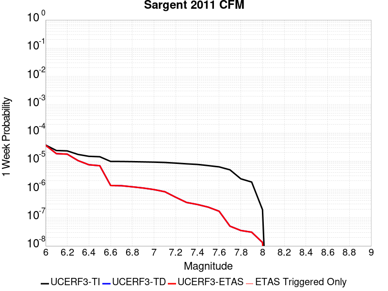 |  | 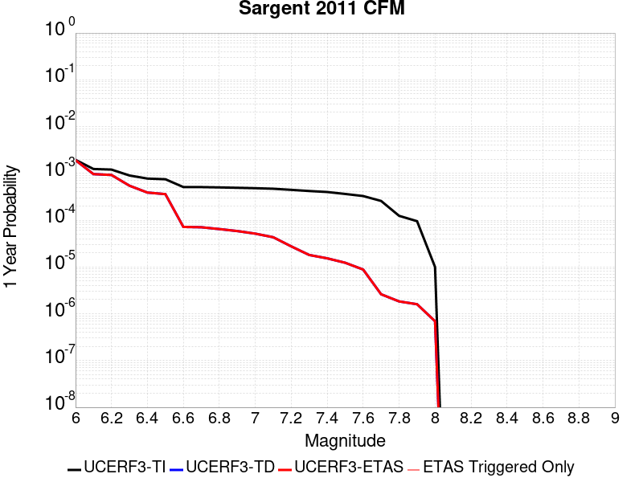 |  |

| Magnitude | 1 wk TI Prob | 1 wk TD Prob | 1 wk ETAS Prob | 1 wk ETAS/TD Gain | 1 wk ETAS Triggered Only | 1 mo TI Prob | 1 mo TD Prob | 1 mo ETAS Prob | 1 mo ETAS/TD Gain | 1 mo ETAS Triggered Only | 1 yr TI Prob | 1 yr TD Prob | 1 yr ETAS Prob | 1 yr ETAS/TD Gain | 1 yr ETAS Triggered Only | 10 yr TI Prob | 10 yr TD Prob | 10 yr ETAS Prob | 10 yr ETAS/TD Gain | 10 yr ETAS Triggered Only |
|-----|-----|-----|-----|-----|-----|-----|-----|-----|-----|-----|-----|-----|-----|-----|-----|-----|-----|-----|-----|-----|
| 6.0 | 3.7327867E-5 | 3.664913E-5 | 3.664913E-5 | 1.0 | 0.0 | 1.5996677E-4 | 1.5706103E-4 | 1.5706103E-4 | 1.0 | 0.0 | 0.0019458556 | 0.0019110236 | 0.0019110236 | 1.0 | 0.0 | 0.01928905 | 0.019018095 | 0.019068923 | 1.0026727 | 5.1813473E-5 |
| 6.1 | 2.3771476E-5 | 1.8479273E-5 | 1.8479273E-5 | 1.0 | 0.0 | 1.01873775E-4 | 7.919498E-5 | 7.919498E-5 | 1.0 | 0.0 | 0.0012396075 | 9.638493E-4 | 9.638493E-4 | 1.0 | 0.0 | 0.012327154 | 0.009636091 | 0.009636091 | 1.0 | 0.0 |
| 6.2 | 2.3112721E-5 | 1.7710632E-5 | 1.7710632E-5 | 1.0 | 0.0 | 9.9050754E-5 | 7.590099E-5 | 7.590099E-5 | 1.0 | 0.0 | 0.0012052758 | 9.237792E-4 | 9.237792E-4 | 1.0 | 0.0 | 0.011987597 | 0.009238743 | 0.009238743 | 1.0 | 0.0 |
| 6.3 | 1.728509E-5 | 1.0458927E-5 | 1.0458927E-5 | 1.0 | 0.0 | 7.407686E-5 | 4.482347E-5 | 4.482347E-5 | 1.0 | 0.0 | 9.015125E-4 | 5.456343E-4 | 5.456343E-4 | 1.0 | 0.0 | 0.008978641 | 0.0054791216 | 0.0054791216 | 1.0 | 0.0 |
| 6.4 | 1.48395575E-5 | 7.4559816E-6 | 7.4559816E-6 | 1.0 | 0.0 | 6.3596555E-5 | 3.195403E-5 | 3.195403E-5 | 1.0 | 0.0 | 7.7401294E-4 | 3.8900663E-4 | 3.8900663E-4 | 1.0 | 0.0 | 0.0077132257 | 0.003918666 | 0.003918666 | 1.0 | 0.0 |
| 6.5 | 1.4358964E-5 | 6.894759E-6 | 6.894759E-6 | 1.0 | 0.0 | 6.1536964E-5 | 2.9548846E-5 | 2.9548846E-5 | 1.0 | 0.0 | 7.48955E-4 | 3.5973339E-4 | 3.5973339E-4 | 1.0 | 0.0 | 0.0074643586 | 0.0036269152 | 0.0036269152 | 1.0 | 0.0 |
| 6.6 | 9.772591E-6 | 1.3736154E-6 | 1.3736154E-6 | 1.0 | 0.0 | 4.188186E-5 | 5.88691E-6 | 5.88691E-6 | 1.0 | 0.0 | 5.097923E-4 | 7.16708E-5 | 7.16708E-5 | 1.0 | 0.0 | 0.005086244 | 7.483097E-4 | 7.483097E-4 | 1.0 | 0.0 |
| 6.7 | 9.752745E-6 | 1.3523068E-6 | 1.3523068E-6 | 1.0 | 0.0 | 4.179681E-5 | 5.795587E-6 | 5.795587E-6 | 1.0 | 0.0 | 5.0875737E-4 | 7.055902E-5 | 7.055902E-5 | 1.0 | 0.0 | 0.005075942 | 7.371994E-4 | 7.371994E-4 | 1.0 | 0.0 |
| 6.8 | 9.608213E-6 | 1.2361709E-6 | 1.2361709E-6 | 1.0 | 0.0 | 4.1177405E-5 | 5.2978644E-6 | 5.2978644E-6 | 1.0 | 0.0 | 5.012196E-4 | 6.449961E-5 | 6.449961E-5 | 1.0 | 0.0 | 0.005000906 | 6.7634037E-4 | 6.7634037E-4 | 1.0 | 0.0 |
| 6.9 | 9.427164E-6 | 1.12094E-6 | 1.12094E-6 | 1.0 | 0.0 | 4.04015E-5 | 4.80402E-6 | 4.80402E-6 | 1.0 | 0.0 | 4.9177726E-4 | 5.8487396E-5 | 5.8487396E-5 | 1.0 | 0.0 | 0.004906904 | 6.1557174E-4 | 6.1557174E-4 | 1.0 | 0.0 |
| 7.0 | 9.247601E-6 | 9.873988E-7 | 9.873988E-7 | 1.0 | 0.0 | 3.9631974E-5 | 4.2317024E-6 | 4.2317024E-6 | 1.0 | 0.0 | 4.8241246E-4 | 5.1519775E-5 | 5.1519775E-5 | 1.0 | 0.0 | 0.0048136655 | 5.4542476E-4 | 5.4542476E-4 | 1.0 | 0.0 |
| 7.1 | 8.995454E-6 | 8.2711284E-7 | 8.2711284E-7 | 1.0 | 0.0 | 3.8551374E-5 | 3.5447645E-6 | 3.5447645E-6 | 1.0 | 0.0 | 4.6926187E-4 | 4.3156666E-5 | 4.3156666E-5 | 1.0 | 0.0 | 0.004682722 | 4.609069E-4 | 4.609069E-4 | 1.0 | 0.0 |
| 7.2 | 8.520861E-6 | 5.2766507E-7 | 5.2766507E-7 | 1.0 | 0.0 | 3.6517464E-5 | 2.2614197E-6 | 2.2614197E-6 | 1.0 | 0.0 | 4.445094E-4 | 2.7532446E-5 | 2.7532446E-5 | 1.0 | 0.0 | 0.004436213 | 3.0297207E-4 | 3.0297207E-4 | 1.0 | 0.0 |
| 7.3 | 8.043592E-6 | 3.456507E-7 | 3.456507E-7 | 1.0 | 0.0 | 3.4472083E-5 | 1.4813593E-6 | 1.4813593E-6 | 1.0 | 0.0 | 4.196168E-4 | 1.8035402E-5 | 1.8035402E-5 | 1.0 | 0.0 | 0.004188253 | 2.0669671E-4 | 2.0669671E-4 | 1.0 | 0.0 |
| 7.4 | 7.662316E-6 | 2.928958E-7 | 2.928958E-7 | 1.0 | 0.0 | 3.2838085E-5 | 1.2552671E-6 | 1.2552671E-6 | 1.0 | 0.0 | 3.9973034E-4 | 1.528277E-5 | 1.528277E-5 | 1.0 | 0.0 | 0.0039901207 | 1.7736501E-4 | 1.7736501E-4 | 1.0 | 0.0 |
| 7.5 | 6.961638E-6 | 2.3574503E-7 | 2.3574503E-7 | 1.0 | 0.0 | 2.9835252E-5 | 1.0103355E-6 | 1.0103355E-6 | 1.0 | 0.0 | 3.6318362E-4 | 1.2300766E-5 | 1.2300766E-5 | 1.0 | 0.0 | 0.0036259065 | 1.4409334E-4 | 1.4409334E-4 | 1.0 | 0.0 |
| 7.6 | 6.282332E-6 | 1.6892966E-7 | 1.6892966E-7 | 1.0 | 0.0 | 2.6924003E-5 | 7.2398404E-7 | 7.2398404E-7 | 1.0 | 0.0 | 3.2775043E-4 | 8.814471E-6 | 8.814471E-6 | 1.0 | 0.0 | 0.0032726745 | 1.05050465E-4 | 1.05050465E-4 | 1.0 | 0.0 |
| 7.7 | 4.934408E-6 | 5.001089E-8 | 5.001089E-8 | 1.0 | 0.0 | 2.114729E-5 | 2.1433237E-7 | 2.1433237E-7 | 1.0 | 0.0 | 2.5743784E-4 | 2.6094935E-6 | 2.6094935E-6 | 1.0 | 0.0 | 0.0025713982 | 3.2545366E-5 | 3.2545366E-5 | 1.0 | 0.0 |
| 7.8 | 2.373212E-6 | 3.5172643E-8 | 3.5172643E-8 | 1.0 | 0.0 | 1.0170869E-5 | 1.507399E-7 | 1.507399E-7 | 1.0 | 0.0 | 1.238233E-4 | 1.8352566E-6 | 1.8352566E-6 | 1.0 | 0.0 | 0.0012375432 | 2.4125171E-5 | 2.4125171E-5 | 1.0 | 0.0 |
| 7.9 | 1.8227792E-6 | 3.0619603E-8 | 3.0619603E-8 | 1.0 | 0.0 | 7.811887E-6 | 1.3122687E-7 | 1.3122687E-7 | 1.0 | 0.0 | 9.510558E-5 | 1.5976858E-6 | 1.5976858E-6 | 1.0 | 0.0 | 9.5064886E-4 | 2.1410624E-5 | 2.1410624E-5 | 1.0 | 0.0 |
| 8.0 | 1.9095137E-7 | 1.326461E-8 | 1.326461E-8 | 1.0 | 0.0 | 8.1836276E-7 | 5.684833E-8 | 5.684833E-8 | 1.0 | 0.0 | 9.963521E-6 | 6.921282E-7 | 6.921282E-7 | 1.0 | 0.0 | 9.963074E-5 | 8.463319E-6 | 8.463319E-6 | 1.0 | 0.0 |

## Sheephole
*[(top)](#table-of-contents)*

| 1 Week | 1 Month | 1 Year | 10 Year |
|-----|-----|-----|-----|
|  |  |  |  |

| Magnitude | 1 wk TI Prob | 1 wk TD Prob | 1 wk ETAS Prob | 1 wk ETAS/TD Gain | 1 wk ETAS Triggered Only | 1 mo TI Prob | 1 mo TD Prob | 1 mo ETAS Prob | 1 mo ETAS/TD Gain | 1 mo ETAS Triggered Only | 1 yr TI Prob | 1 yr TD Prob | 1 yr ETAS Prob | 1 yr ETAS/TD Gain | 1 yr ETAS Triggered Only | 10 yr TI Prob | 10 yr TD Prob | 10 yr ETAS Prob | 10 yr ETAS/TD Gain | 10 yr ETAS Triggered Only |
|-----|-----|-----|-----|-----|-----|-----|-----|-----|-----|-----|-----|-----|-----|-----|-----|-----|-----|-----|-----|-----|
| 6.0 | 4.5579695E-6 | 4.7412627E-6 | 4.7412627E-6 | 1.0 | 0.0 | 1.9534009E-5 | 2.031957E-5 | 2.031957E-5 | 1.0 | 0.0 | 2.3780059E-4 | 2.473682E-4 | 2.473682E-4 | 1.0 | 0.0 | 0.0023754628 | 0.002471473 | 0.0025231584 | 1.0209128 | 5.1813473E-5 |
| 6.1 | 4.5579695E-6 | 4.7412627E-6 | 4.7412627E-6 | 1.0 | 0.0 | 1.9534009E-5 | 2.031957E-5 | 2.031957E-5 | 1.0 | 0.0 | 2.3780059E-4 | 2.473682E-4 | 2.473682E-4 | 1.0 | 0.0 | 0.0023754628 | 0.002471473 | 0.0025231584 | 1.0209128 | 5.1813473E-5 |
| 6.2 | 2.6677674E-6 | 2.7873941E-6 | 2.7873941E-6 | 1.0 | 0.0 | 1.1433239E-5 | 1.1945926E-5 | 1.1945926E-5 | 1.0 | 0.0 | 1.3919079E-4 | 1.4543302E-4 | 1.4543302E-4 | 1.0 | 0.0 | 0.0013910364 | 0.0014534844 | 0.0015052225 | 1.0355959 | 5.1813473E-5 |
| 6.3 | 2.6677674E-6 | 2.7873941E-6 | 2.7873941E-6 | 1.0 | 0.0 | 1.1433239E-5 | 1.1945926E-5 | 1.1945926E-5 | 1.0 | 0.0 | 1.3919079E-4 | 1.4543302E-4 | 1.4543302E-4 | 1.0 | 0.0 | 0.0013910364 | 0.0014534844 | 0.0015052225 | 1.0355959 | 5.1813473E-5 |
| 6.4 | 2.2159759E-6 | 2.3228788E-6 | 2.3228788E-6 | 1.0 | 0.0 | 9.497005E-6 | 9.955161E-6 | 9.955161E-6 | 1.0 | 0.0 | 1.156199E-4 | 1.2119815E-4 | 1.2119815E-4 | 1.0 | 0.0 | 0.0011555976 | 0.0012113999 | 0.0012113999 | 1.0 | 0.0 |
| 6.5 | 2.1986082E-6 | 2.304759E-6 | 2.304759E-6 | 1.0 | 0.0 | 9.4225725E-6 | 9.877506E-6 | 9.877506E-6 | 1.0 | 0.0 | 1.1471378E-4 | 1.2025281E-4 | 1.2025281E-4 | 1.0 | 0.0 | 0.0011465458 | 0.0012019566 | 0.0012019566 | 1.0 | 0.0 |
| 6.6 | 1.5232331E-6 | 1.6018919E-6 | 1.6018919E-6 | 1.0 | 0.0 | 6.5281256E-6 | 6.865234E-6 | 6.865234E-6 | 1.0 | 0.0 | 7.947703E-5 | 8.35812E-5 | 8.35812E-5 | 1.0 | 0.0 | 7.9448614E-4 | 8.3551643E-4 | 8.3551643E-4 | 1.0 | 0.0 |
| 6.7 | 1.3137362E-6 | 1.382819E-6 | 1.382819E-6 | 1.0 | 0.0 | 5.6302856E-6 | 5.926355E-6 | 5.926355E-6 | 1.0 | 0.0 | 6.854657E-5 | 7.215112E-5 | 7.215112E-5 | 1.0 | 0.0 | 6.8525434E-4 | 7.212908E-4 | 7.212908E-4 | 1.0 | 0.0 |
| 6.8 | 1.2275751E-6 | 1.2922847E-6 | 1.2922847E-6 | 1.0 | 0.0 | 5.2610258E-6 | 5.5383516E-6 | 5.5383516E-6 | 1.0 | 0.0 | 6.4051106E-5 | 6.7427485E-5 | 6.7427485E-5 | 1.0 | 0.0 | 6.4032647E-4 | 6.740836E-4 | 6.740836E-4 | 1.0 | 0.0 |
| 6.9 | 1.1837088E-6 | 1.246102E-6 | 1.246102E-6 | 1.0 | 0.0 | 5.0730278E-6 | 5.340427E-6 | 5.340427E-6 | 1.0 | 0.0 | 6.176237E-5 | 6.501789E-5 | 6.501789E-5 | 1.0 | 0.0 | 6.17452E-4 | 6.5000186E-4 | 6.5000186E-4 | 1.0 | 0.0 |
| 7.0 | 9.849371E-7 | 1.0366288E-6 | 1.0366288E-6 | 1.0 | 0.0 | 4.2211523E-6 | 4.442688E-6 | 4.442688E-6 | 1.0 | 0.0 | 5.1391315E-5 | 5.4088487E-5 | 5.4088487E-5 | 1.0 | 0.0 | 5.137943E-4 | 5.407633E-4 | 5.407633E-4 | 1.0 | 0.0 |
| 7.1 | 8.1643645E-7 | 8.591669E-7 | 8.591669E-7 | 1.0 | 0.0 | 3.4990085E-6 | 3.682139E-6 | 3.682139E-6 | 1.0 | 0.0 | 4.2599597E-5 | 4.482921E-5 | 4.482921E-5 | 1.0 | 0.0 | 4.259143E-4 | 4.4821028E-4 | 4.4821028E-4 | 1.0 | 0.0 |
| 7.2 | 5.7295756E-7 | 6.029502E-7 | 6.029502E-7 | 1.0 | 0.0 | 2.45553E-6 | 2.58407E-6 | 2.58407E-6 | 1.0 | 0.0 | 2.9895667E-5 | 3.1460666E-5 | 3.1460666E-5 | 1.0 | 0.0 | 2.9891645E-4 | 3.145688E-4 | 3.145688E-4 | 1.0 | 0.0 |

## Elsinore (Stepovers Combined)
*[(top)](#table-of-contents)*

| 1 Week | 1 Month | 1 Year | 10 Year |
|-----|-----|-----|-----|
|  |  |  |  |

| Magnitude | 1 wk TI Prob | 1 wk TD Prob | 1 wk ETAS Prob | 1 wk ETAS/TD Gain | 1 wk ETAS Triggered Only | 1 mo TI Prob | 1 mo TD Prob | 1 mo ETAS Prob | 1 mo ETAS/TD Gain | 1 mo ETAS Triggered Only | 1 yr TI Prob | 1 yr TD Prob | 1 yr ETAS Prob | 1 yr ETAS/TD Gain | 1 yr ETAS Triggered Only | 10 yr TI Prob | 10 yr TD Prob | 10 yr ETAS Prob | 10 yr ETAS/TD Gain | 10 yr ETAS Triggered Only |
|-----|-----|-----|-----|-----|-----|-----|-----|-----|-----|-----|-----|-----|-----|-----|-----|-----|-----|-----|-----|-----|
| 6.0 | 2.144392E-5 | 1.9760193E-5 | 1.9760193E-5 | 1.0 | 0.0 | 9.189928E-5 | 8.468392E-5 | 1.3649299E-4 | 1.6117936 | 5.1813473E-5 | 0.0011182994 | 0.0010305607 | 0.0010823208 | 1.0502251 | 5.1813473E-5 | 0.011126885 | 0.010264917 | 0.010316199 | 1.0049958 | 5.1813473E-5 |
| 6.1 | 2.144392E-5 | 1.9760193E-5 | 1.9760193E-5 | 1.0 | 0.0 | 9.189928E-5 | 8.468392E-5 | 1.3649299E-4 | 1.6117936 | 5.1813473E-5 | 0.0011182994 | 0.0010305607 | 0.0010823208 | 1.0502251 | 5.1813473E-5 | 0.011126885 | 0.010264917 | 0.010316199 | 1.0049958 | 5.1813473E-5 |
| 6.2 | 2.144392E-5 | 1.9760193E-5 | 1.9760193E-5 | 1.0 | 0.0 | 9.189928E-5 | 8.468392E-5 | 1.3649299E-4 | 1.6117936 | 5.1813473E-5 | 0.0011182994 | 0.0010305607 | 0.0010823208 | 1.0502251 | 5.1813473E-5 | 0.011126885 | 0.010264917 | 0.010316199 | 1.0049958 | 5.1813473E-5 |
| 6.3 | 1.9751555E-5 | 1.7741453E-5 | 1.7741453E-5 | 1.0 | 0.0 | 8.4646774E-5 | 7.603267E-5 | 1.278422E-4 | 1.6814114 | 5.1813473E-5 | 0.0010300872 | 9.253213E-4 | 9.770868E-4 | 1.0559433 | 5.1813473E-5 | 0.010253254 | 0.009221276 | 0.009272612 | 1.0055671 | 5.1813473E-5 |
| 6.4 | 1.9751555E-5 | 1.7741453E-5 | 1.7741453E-5 | 1.0 | 0.0 | 8.4646774E-5 | 7.603267E-5 | 1.278422E-4 | 1.6814114 | 5.1813473E-5 | 0.0010300872 | 9.253213E-4 | 9.770868E-4 | 1.0559433 | 5.1813473E-5 | 0.010253254 | 0.009221276 | 0.009272612 | 1.0055671 | 5.1813473E-5 |
| 6.5 | 1.9751555E-5 | 1.7741453E-5 | 1.7741453E-5 | 1.0 | 0.0 | 8.4646774E-5 | 7.603267E-5 | 1.278422E-4 | 1.6814114 | 5.1813473E-5 | 0.0010300872 | 9.253213E-4 | 9.770868E-4 | 1.0559433 | 5.1813473E-5 | 0.010253254 | 0.009221276 | 0.009272612 | 1.0055671 | 5.1813473E-5 |
| 6.6 | 1.9188685E-5 | 1.7003393E-5 | 1.7003393E-5 | 1.0 | 0.0 | 8.2234634E-5 | 7.286974E-5 | 1.2467944E-4 | 1.7109905 | 5.1813473E-5 | 0.0010007467 | 8.868442E-4 | 9.386117E-4 | 1.0583727 | 5.1813473E-5 | 0.00996252 | 0.0088398475 | 0.0088912025 | 1.0058095 | 5.1813473E-5 |
| 6.7 | 1.7608272E-5 | 1.4732616E-5 | 1.4732616E-5 | 1.0 | 0.0 | 7.546184E-5 | 6.3138315E-5 | 1.1494851E-4 | 1.8205826 | 5.1813473E-5 | 9.183606E-4 | 7.684476E-4 | 8.2022126E-4 | 1.0673743 | 5.1813473E-5 | 0.009145746 | 0.00766491 | 0.0077163265 | 1.006708 | 5.1813473E-5 |
| 6.8 | 1.697165E-5 | 1.3783365E-5 | 1.3783365E-5 | 1.0 | 0.0 | 7.273361E-5 | 5.9070277E-5 | 1.1088069E-4 | 1.8770978 | 5.1813473E-5 | 8.8517193E-4 | 7.18952E-4 | 7.707282E-4 | 1.0720162 | 5.1813473E-5 | 0.008816543 | 0.007172675 | 0.007224117 | 1.0071719 | 5.1813473E-5 |
| 6.9 | 1.600365E-5 | 1.2846671E-5 | 1.2846671E-5 | 1.0 | 0.0 | 6.858527E-5 | 5.5056043E-5 | 1.0686666E-4 | 1.9410523 | 5.1813473E-5 | 8.347058E-4 | 6.7010894E-4 | 7.218877E-4 | 1.0772692 | 5.1813473E-5 | 0.008315775 | 0.0066867657 | 0.006738233 | 1.0076969 | 5.1813473E-5 |
| 7.0 | 1.3314581E-5 | 1.0447548E-5 | 1.0447548E-5 | 1.0 | 0.0 | 5.7061243E-5 | 4.4774453E-5 | 9.658561E-5 | 2.1571589 | 5.1813473E-5 | 6.944992E-4 | 5.449953E-4 | 5.9678056E-4 | 1.0950196 | 5.1813473E-5 | 0.006923327 | 0.0054405155 | 0.005492047 | 1.0094718 | 5.1813473E-5 |
| 7.1 | 1.2865345E-5 | 9.937536E-6 | 9.937536E-6 | 1.0 | 0.0 | 5.5136024E-5 | 4.258876E-5 | 9.440002E-5 | 2.216548 | 5.1813473E-5 | 6.710743E-4 | 5.183973E-4 | 5.701839E-4 | 1.0998975 | 5.1813473E-5 | 0.0066905143 | 0.0051752133 | 0.005226759 | 1.00996 | 5.1813473E-5 |
| 7.2 | 1.1650051E-5 | 8.633809E-6 | 8.633809E-6 | 1.0 | 0.0 | 4.9927836E-5 | 3.7001522E-5 | 8.881308E-5 | 2.4002547 | 5.1813473E-5 | 6.0770183E-4 | 4.504022E-4 | 5.0219236E-4 | 1.1149864 | 5.1813473E-5 | 0.0060604266 | 0.0044963174 | 0.0045478977 | 1.0114717 | 5.1813473E-5 |
| 7.3 | 1.0008533E-5 | 7.2010425E-6 | 7.2010425E-6 | 1.0 | 0.0 | 4.2893007E-5 | 3.0861254E-5 | 8.267313E-5 | 2.6788647 | 5.1813473E-5 | 5.220972E-4 | 3.7567242E-4 | 4.2746644E-4 | 1.1378701 | 5.1813473E-5 | 0.005208723 | 0.003750761 | 0.00380238 | 1.0137624 | 5.1813473E-5 |
| 7.4 | 9.116759E-6 | 6.410068E-6 | 6.410068E-6 | 1.0 | 0.0 | 3.907124E-5 | 2.747144E-5 | 7.928349E-5 | 2.8860333 | 5.1813473E-5 | 4.7558855E-4 | 3.3441483E-4 | 3.8621097E-4 | 1.1548859 | 5.1813473E-5 | 0.00474572 | 0.0033392678 | 0.0033909082 | 1.0154645 | 5.1813473E-5 |
| 7.5 | 7.870524E-6 | 5.3825365E-6 | 5.3825365E-6 | 1.0 | 0.0 | 3.3730383E-5 | 2.3067816E-5 | 7.4880096E-5 | 3.246085 | 5.1813473E-5 | 4.1059E-4 | 2.8081573E-4 | 3.3261467E-4 | 1.1844587 | 5.1813473E-5 | 0.0040983222 | 0.0028047354 | 0.0028564036 | 1.0184218 | 5.1813473E-5 |
| 7.6 | 6.9774537E-6 | 4.6776067E-6 | 4.6776067E-6 | 1.0 | 0.0 | 2.990303E-5 | 2.0046738E-5 | 7.185917E-5 | 3.5845816 | 5.1813473E-5 | 3.640086E-4 | 2.4404288E-4 | 2.9584373E-4 | 1.2122612 | 5.1813473E-5 | 0.003634129 | 0.0024378651 | 0.0024895524 | 1.0212018 | 5.1813473E-5 |
| 7.7 | 4.1616954E-6 | 2.32834E-6 | 2.32834E-6 | 1.0 | 0.0 | 1.7835715E-5 | 9.978567E-6 | 9.978567E-6 | 1.0 | 0.0 | 2.171282E-4 | 1.2148302E-4 | 1.2148302E-4 | 1.0 | 0.0 | 0.0021691616 | 0.0012142392 | 0.0012142392 | 1.0 | 0.0 |
| 7.8 | 2.2692414E-7 | 9.3854695E-8 | 9.3854695E-8 | 1.0 | 0.0 | 9.725317E-7 | 4.0223435E-7 | 4.0223435E-7 | 1.0 | 0.0 | 1.1840509E-5 | 4.8971956E-6 | 4.8971956E-6 | 1.0 | 0.0 | 1.1839878E-4 | 4.8971204E-5 | 4.8971204E-5 | 1.0 | 0.0 |
| 7.9 | 6.676829E-9 | 3.439853E-9 | 3.439853E-9 | 1.0 | 0.0 | 2.861498E-8 | 1.4742227E-8 | 1.4742227E-8 | 1.0 | 0.0 | 3.4838732E-7 | 1.7948659E-7 | 1.7948659E-7 | 1.0 | 0.0 | 3.4838679E-6 | 1.7948646E-6 | 1.7948646E-6 | 1.0 | 0.0 |

## Emerson-Copper Mtn 2011
*[(top)](#table-of-contents)*

| 1 Week | 1 Month | 1 Year | 10 Year |
|-----|-----|-----|-----|
|  |  |  |  |

| Magnitude | 1 wk TI Prob | 1 wk TD Prob | 1 wk ETAS Prob | 1 wk ETAS/TD Gain | 1 wk ETAS Triggered Only | 1 mo TI Prob | 1 mo TD Prob | 1 mo ETAS Prob | 1 mo ETAS/TD Gain | 1 mo ETAS Triggered Only | 1 yr TI Prob | 1 yr TD Prob | 1 yr ETAS Prob | 1 yr ETAS/TD Gain | 1 yr ETAS Triggered Only | 10 yr TI Prob | 10 yr TD Prob | 10 yr ETAS Prob | 10 yr ETAS/TD Gain | 10 yr ETAS Triggered Only |
|-----|-----|-----|-----|-----|-----|-----|-----|-----|-----|-----|-----|-----|-----|-----|-----|-----|-----|-----|-----|-----|
| 6.0 | 2.1364202E-5 | 9.968114E-6 | 9.968114E-6 | 1.0 | 0.0 | 9.1557646E-5 | 4.2719836E-5 | 9.45311E-5 | 2.212815 | 5.1813473E-5 | 0.0011141442 | 5.199986E-4 | 5.7178515E-4 | 1.0995897 | 5.1813473E-5 | 0.011085749 | 0.005188688 | 0.0052402327 | 1.0099341 | 5.1813473E-5 |
| 6.1 | 2.1364202E-5 | 9.968114E-6 | 9.968114E-6 | 1.0 | 0.0 | 9.1557646E-5 | 4.2719836E-5 | 9.45311E-5 | 2.212815 | 5.1813473E-5 | 0.0011141442 | 5.199986E-4 | 5.7178515E-4 | 1.0995897 | 5.1813473E-5 | 0.011085749 | 0.005188688 | 0.0052402327 | 1.0099341 | 5.1813473E-5 |
| 6.2 | 2.1364202E-5 | 9.968114E-6 | 9.968114E-6 | 1.0 | 0.0 | 9.1557646E-5 | 4.2719836E-5 | 9.45311E-5 | 2.212815 | 5.1813473E-5 | 0.0011141442 | 5.199986E-4 | 5.7178515E-4 | 1.0995897 | 5.1813473E-5 | 0.011085749 | 0.005188688 | 0.0052402327 | 1.0099341 | 5.1813473E-5 |
| 6.3 | 1.7751237E-5 | 8.089227E-6 | 8.089227E-6 | 1.0 | 0.0 | 7.607452E-5 | 3.466769E-5 | 8.647936E-5 | 2.4945235 | 5.1813473E-5 | 9.258136E-4 | 4.2200365E-4 | 4.7379525E-4 | 1.1227279 | 5.1813473E-5 | 0.00921966 | 0.0042126453 | 0.0042642406 | 1.0122477 | 5.1813473E-5 |
| 6.4 | 1.7751237E-5 | 8.089227E-6 | 8.089227E-6 | 1.0 | 0.0 | 7.607452E-5 | 3.466769E-5 | 8.647936E-5 | 2.4945235 | 5.1813473E-5 | 9.258136E-4 | 4.2200365E-4 | 4.7379525E-4 | 1.1227279 | 5.1813473E-5 | 0.00921966 | 0.0042126453 | 0.0042642406 | 1.0122477 | 5.1813473E-5 |
| 6.5 | 1.5886664E-5 | 6.603819E-6 | 6.603819E-6 | 1.0 | 0.0 | 6.808392E-5 | 2.8301802E-5 | 8.011381E-5 | 2.8306963 | 5.1813473E-5 | 8.286065E-4 | 3.4452465E-4 | 3.9632028E-4 | 1.1503394 | 5.1813473E-5 | 0.008255237 | 0.0034403696 | 0.0034920047 | 1.0150086 | 5.1813473E-5 |
| 6.6 | 1.5886664E-5 | 6.603819E-6 | 6.603819E-6 | 1.0 | 0.0 | 6.808392E-5 | 2.8301802E-5 | 8.011381E-5 | 2.8306963 | 5.1813473E-5 | 8.286065E-4 | 3.4452465E-4 | 3.9632028E-4 | 1.1503394 | 5.1813473E-5 | 0.008255237 | 0.0034403696 | 0.0034920047 | 1.0150086 | 5.1813473E-5 |
| 6.7 | 1.428471E-5 | 5.470403E-6 | 5.470403E-6 | 1.0 | 0.0 | 6.121875E-5 | 2.3444394E-5 | 7.525665E-5 | 3.2100062 | 5.1813473E-5 | 7.450834E-4 | 2.8540206E-4 | 3.3720073E-4 | 1.1814938 | 5.1813473E-5 | 0.007425902 | 0.0028507432 | 0.002902409 | 1.0181236 | 5.1813473E-5 |
| 6.8 | 1.3490684E-5 | 5.073699E-6 | 5.073699E-6 | 1.0 | 0.0 | 5.7815934E-5 | 2.1744265E-5 | 7.355661E-5 | 3.382805 | 5.1813473E-5 | 7.0368167E-4 | 2.6470813E-4 | 3.1650788E-4 | 1.1956863 | 5.1813473E-5 | 0.007014576 | 0.002644309 | 0.0026959856 | 1.0195426 | 5.1813473E-5 |
| 6.9 | 1.2235421E-5 | 4.289677E-6 | 4.289677E-6 | 1.0 | 0.0 | 5.2436466E-5 | 1.838422E-5 | 1.838422E-5 | 1.0 | 0.0 | 6.38227E-4 | 2.238085E-4 | 2.238085E-4 | 1.0 | 0.0 | 0.0063639707 | 0.0022361854 | 0.0022361854 | 1.0 | 0.0 |
| 7.0 | 1.1009851E-5 | 3.7189886E-6 | 3.7189886E-6 | 1.0 | 0.0 | 4.7184225E-5 | 1.5938444E-5 | 1.5938444E-5 | 1.0 | 0.0 | 5.743165E-4 | 1.9403672E-4 | 1.9403672E-4 | 1.0 | 0.0 | 0.005728345 | 0.0019390108 | 0.0019390108 | 1.0 | 0.0 |
| 7.1 | 9.726373E-6 | 3.2117953E-6 | 3.2117953E-6 | 1.0 | 0.0 | 4.168379E-5 | 1.3764783E-5 | 1.3764783E-5 | 1.0 | 0.0 | 5.07382E-4 | 1.6757673E-4 | 1.6757673E-4 | 1.0 | 0.0 | 0.0050622504 | 0.0016748349 | 0.0016748349 | 1.0 | 0.0 |
| 7.2 | 3.9335127E-6 | 1.1524792E-6 | 1.1524792E-6 | 1.0 | 0.0 | 1.6857803E-5 | 4.9391874E-6 | 4.9391874E-6 | 1.0 | 0.0 | 2.0522442E-4 | 6.0133007E-5 | 6.0133007E-5 | 1.0 | 0.0 | 0.00205035 | 6.011733E-4 | 6.011733E-4 | 1.0 | 0.0 |
| 7.3 | 2.661632E-6 | 6.911505E-7 | 6.911505E-7 | 1.0 | 0.0 | 1.14069435E-5 | 2.9620703E-6 | 2.9620703E-6 | 1.0 | 0.0 | 1.3887069E-4 | 3.6062618E-5 | 3.6062618E-5 | 1.0 | 0.0 | 0.0013878393 | 3.605687E-4 | 3.605687E-4 | 1.0 | 0.0 |
| 7.4 | 2.0893426E-6 | 5.4618386E-7 | 5.4618386E-7 | 1.0 | 0.0 | 8.954295E-6 | 2.3407858E-6 | 2.3407858E-6 | 1.0 | 0.0 | 1.0901308E-4 | 2.84987E-5 | 2.84987E-5 | 1.0 | 0.0 | 0.0010895962 | 2.84951E-4 | 2.84951E-4 | 1.0 | 0.0 |
| 7.5 | 1.1681728E-6 | 3.6030585E-7 | 3.6030585E-7 | 1.0 | 0.0 | 5.0064455E-6 | 1.544167E-6 | 1.544167E-6 | 1.0 | 0.0 | 6.0951766E-5 | 1.8800076E-5 | 1.8800076E-5 | 1.0 | 0.0 | 6.093505E-4 | 1.8798532E-4 | 1.8798532E-4 | 1.0 | 0.0 |
| 7.6 | 1.3154387E-7 | 7.1197384E-8 | 7.1197384E-8 | 1.0 | 0.0 | 5.6375933E-7 | 3.051316E-7 | 3.051316E-7 | 1.0 | 0.0 | 6.863748E-6 | 3.7149728E-6 | 3.7149728E-6 | 1.0 | 0.0 | 6.863536E-5 | 3.7149264E-5 | 3.7149264E-5 | 1.0 | 0.0 |

## San Gabriel (Extension)
*[(top)](#table-of-contents)*

| 1 Week | 1 Month | 1 Year | 10 Year |
|-----|-----|-----|-----|
|  | 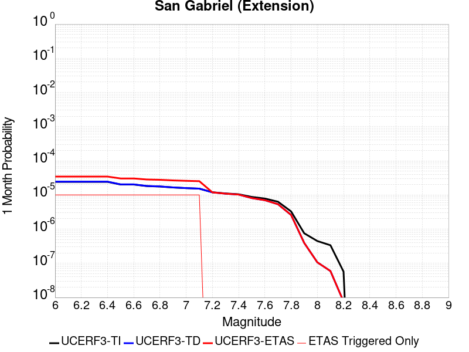 |  |  |

| Magnitude | 1 wk TI Prob | 1 wk TD Prob | 1 wk ETAS Prob | 1 wk ETAS/TD Gain | 1 wk ETAS Triggered Only | 1 mo TI Prob | 1 mo TD Prob | 1 mo ETAS Prob | 1 mo ETAS/TD Gain | 1 mo ETAS Triggered Only | 1 yr TI Prob | 1 yr TD Prob | 1 yr ETAS Prob | 1 yr ETAS/TD Gain | 1 yr ETAS Triggered Only | 10 yr TI Prob | 10 yr TD Prob | 10 yr ETAS Prob | 10 yr ETAS/TD Gain | 10 yr ETAS Triggered Only |
|-----|-----|-----|-----|-----|-----|-----|-----|-----|-----|-----|-----|-----|-----|-----|-----|-----|-----|-----|-----|-----|
| 6.0 | 5.6486106E-6 | 5.7168304E-6 | 5.7168304E-6 | 1.0 | 0.0 | 2.4208108E-5 | 2.450048E-5 | 2.450048E-5 | 1.0 | 0.0 | 2.9469383E-4 | 2.9825376E-4 | 2.9825376E-4 | 1.0 | 0.0 | 0.0029430336 | 0.0029786653 | 0.0030303244 | 1.017343 | 5.1813473E-5 |
| 6.1 | 5.6486106E-6 | 5.7168304E-6 | 5.7168304E-6 | 1.0 | 0.0 | 2.4208108E-5 | 2.450048E-5 | 2.450048E-5 | 1.0 | 0.0 | 2.9469383E-4 | 2.9825376E-4 | 2.9825376E-4 | 1.0 | 0.0 | 0.0029430336 | 0.0029786653 | 0.0030303244 | 1.017343 | 5.1813473E-5 |
| 6.2 | 5.6486106E-6 | 5.7168304E-6 | 5.7168304E-6 | 1.0 | 0.0 | 2.4208108E-5 | 2.450048E-5 | 2.450048E-5 | 1.0 | 0.0 | 2.9469383E-4 | 2.9825376E-4 | 2.9825376E-4 | 1.0 | 0.0 | 0.0029430336 | 0.0029786653 | 0.0030303244 | 1.017343 | 5.1813473E-5 |
| 6.3 | 5.6486106E-6 | 5.7168304E-6 | 5.7168304E-6 | 1.0 | 0.0 | 2.4208108E-5 | 2.450048E-5 | 2.450048E-5 | 1.0 | 0.0 | 2.9469383E-4 | 2.9825376E-4 | 2.9825376E-4 | 1.0 | 0.0 | 0.0029430336 | 0.0029786653 | 0.0030303244 | 1.017343 | 5.1813473E-5 |
| 6.4 | 5.6486106E-6 | 5.7168304E-6 | 5.7168304E-6 | 1.0 | 0.0 | 2.4208108E-5 | 2.450048E-5 | 2.450048E-5 | 1.0 | 0.0 | 2.9469383E-4 | 2.9825376E-4 | 2.9825376E-4 | 1.0 | 0.0 | 0.0029430336 | 0.0029786653 | 0.0030303244 | 1.017343 | 5.1813473E-5 |
| 6.5 | 4.7134554E-6 | 4.7542544E-6 | 4.7542544E-6 | 1.0 | 0.0 | 2.0200367E-5 | 2.0375222E-5 | 2.0375222E-5 | 1.0 | 0.0 | 2.459117E-4 | 2.4804095E-4 | 2.4804095E-4 | 1.0 | 0.0 | 0.0024563975 | 0.002477729 | 0.0025294141 | 1.0208598 | 5.1813473E-5 |
| 6.6 | 4.7134554E-6 | 4.7542544E-6 | 4.7542544E-6 | 1.0 | 0.0 | 2.0200367E-5 | 2.0375222E-5 | 2.0375222E-5 | 1.0 | 0.0 | 2.459117E-4 | 2.4804095E-4 | 2.4804095E-4 | 1.0 | 0.0 | 0.0024563975 | 0.002477729 | 0.0025294141 | 1.0208598 | 5.1813473E-5 |
| 6.7 | 4.2468837E-6 | 4.2740717E-6 | 4.2740717E-6 | 1.0 | 0.0 | 1.8200803E-5 | 1.8317325E-5 | 1.8317325E-5 | 1.0 | 0.0 | 2.2157225E-4 | 2.2299135E-4 | 2.2299135E-4 | 1.0 | 0.0 | 0.0022135144 | 0.0022277518 | 0.0022794497 | 1.0232064 | 5.1813473E-5 |
| 6.8 | 4.1180615E-6 | 4.1414614E-6 | 4.1414614E-6 | 1.0 | 0.0 | 1.7648716E-5 | 1.7749004E-5 | 1.7749004E-5 | 1.0 | 0.0 | 2.1485193E-4 | 2.160734E-4 | 2.160734E-4 | 1.0 | 0.0 | 0.0021464431 | 0.0021587082 | 0.0022104098 | 1.0239502 | 5.1813473E-5 |
| 6.9 | 3.863861E-6 | 3.8797766E-6 | 3.8797766E-6 | 1.0 | 0.0 | 1.65593E-5 | 1.6627511E-5 | 1.6627511E-5 | 1.0 | 0.0 | 2.0159081E-4 | 2.0242184E-4 | 2.0242184E-4 | 1.0 | 0.0 | 0.0020140803 | 0.002022446 | 0.0020741548 | 1.0255674 | 5.1813473E-5 |
| 7.0 | 3.6947372E-6 | 3.705676E-6 | 3.705676E-6 | 1.0 | 0.0 | 1.5834492E-5 | 1.5881375E-5 | 1.5881375E-5 | 1.0 | 0.0 | 1.9276788E-4 | 1.9333926E-4 | 1.9333926E-4 | 1.0 | 0.0 | 0.0019260074 | 0.0019317807 | 0.001983494 | 1.0267698 | 5.1813473E-5 |
| 7.1 | 3.5686835E-6 | 3.5728963E-6 | 3.5728963E-6 | 1.0 | 0.0 | 1.5294268E-5 | 1.5312327E-5 | 1.5312327E-5 | 1.0 | 0.0 | 1.861918E-4 | 1.8641229E-4 | 1.8641229E-4 | 1.0 | 0.0 | 0.0018603588 | 0.0018626289 | 0.0018626289 | 1.0 | 0.0 |
| 7.2 | 2.8023446E-6 | 2.7767885E-6 | 2.7767885E-6 | 1.0 | 0.0 | 1.2009994E-5 | 1.1900468E-5 | 1.1900468E-5 | 1.0 | 0.0 | 1.4621185E-4 | 1.4487868E-4 | 1.4487868E-4 | 1.0 | 0.0 | 0.001461157 | 0.0014478569 | 0.0014478569 | 1.0 | 0.0 |
| 7.3 | 2.5843012E-6 | 2.5459642E-6 | 2.5459642E-6 | 1.0 | 0.0 | 1.1075529E-5 | 1.0911231E-5 | 1.0911231E-5 | 1.0 | 0.0 | 1.3483623E-4 | 1.3283623E-4 | 1.3283623E-4 | 1.0 | 0.0 | 0.0013475444 | 0.0013275818 | 0.0013275818 | 1.0 | 0.0 |
| 7.4 | 2.4464468E-6 | 2.396665E-6 | 2.396665E-6 | 1.0 | 0.0 | 1.04847295E-5 | 1.0271382E-5 | 1.0271382E-5 | 1.0 | 0.0 | 1.276441E-4 | 1.25047E-4 | 1.25047E-4 | 1.0 | 0.0 | 0.0012757082 | 0.0012497796 | 0.0012497796 | 1.0 | 0.0 |
| 7.5 | 2.0420266E-6 | 1.8910426E-6 | 1.8910426E-6 | 1.0 | 0.0 | 8.751514E-6 | 8.104444E-6 | 8.104444E-6 | 1.0 | 0.0 | 1.0654447E-4 | 9.8667166E-5 | 9.8667166E-5 | 1.0 | 0.0 | 0.001064934 | 9.862408E-4 | 9.862408E-4 | 1.0 | 0.0 |
| 7.6 | 1.8326596E-6 | 1.6398341E-6 | 1.6398341E-6 | 1.0 | 0.0 | 7.854232E-6 | 7.0278415E-6 | 7.0278415E-6 | 1.0 | 0.0 | 9.562107E-5 | 8.5560634E-5 | 8.5560634E-5 | 1.0 | 0.0 | 9.5579936E-4 | 8.5528276E-4 | 8.5528276E-4 | 1.0 | 0.0 |
| 7.7 | 1.4786998E-6 | 1.2523838E-6 | 1.2523838E-6 | 1.0 | 0.0 | 6.3372695E-6 | 5.367348E-6 | 5.367348E-6 | 1.0 | 0.0 | 7.715353E-5 | 6.534551E-5 | 6.534551E-5 | 1.0 | 0.0 | 7.7126746E-4 | 6.532707E-4 | 6.532707E-4 | 1.0 | 0.0 |
| 7.8 | 7.6975533E-7 | 6.0693884E-7 | 6.0693884E-7 | 1.0 | 0.0 | 3.2989474E-6 | 2.601164E-6 | 2.601164E-6 | 1.0 | 0.0 | 4.0163945E-5 | 3.166871E-5 | 3.166871E-5 | 1.0 | 0.0 | 4.0156685E-4 | 3.1664805E-4 | 3.1664805E-4 | 1.0 | 0.0 |
| 7.9 | 1.7645915E-7 | 9.213256E-8 | 9.213256E-8 | 1.0 | 0.0 | 7.562533E-7 | 3.9485377E-7 | 3.9485377E-7 | 1.0 | 0.0 | 9.207345E-6 | 4.807334E-6 | 4.807334E-6 | 1.0 | 0.0 | 9.206964E-5 | 4.807699E-5 | 4.807699E-5 | 1.0 | 0.0 |
| 8.0 | 1.0463461E-7 | 2.4949307E-8 | 2.4949307E-8 | 1.0 | 0.0 | 4.4843398E-7 | 1.0692559E-7 | 1.0692559E-7 | 1.0 | 0.0 | 5.45967E-6 | 1.3018183E-6 | 1.3018183E-6 | 1.0 | 0.0 | 5.459536E-5 | 1.3022789E-5 | 1.3022789E-5 | 1.0 | 0.0 |
| 8.1 | 7.875717E-8 | 1.3866874E-8 | 1.3866874E-8 | 1.0 | 0.0 | 3.3753068E-7 | 5.942946E-8 | 5.942946E-8 | 1.0 | 0.0 | 4.109428E-6 | 7.235534E-7 | 7.235534E-7 | 1.0 | 0.0 | 4.109352E-5 | 7.2401926E-6 | 7.2401926E-6 | 1.0 | 0.0 |
| 8.2 | 1.33163E-8 | 1.7733891E-9 | 1.7733891E-9 | 1.0 | 0.0 | 5.7069855E-8 | 7.600239E-9 | 7.600239E-9 | 1.0 | 0.0 | 6.9482525E-7 | 9.25329E-8 | 9.25329E-8 | 1.0 | 0.0 | 6.9482307E-6 | 9.272953E-7 | 9.272953E-7 | 1.0 | 0.0 |

## Oceanic - West Huasna
*[(top)](#table-of-contents)*

| 1 Week | 1 Month | 1 Year | 10 Year |
|-----|-----|-----|-----|
|  |  |  |  |

| Magnitude | 1 wk TI Prob | 1 wk TD Prob | 1 wk ETAS Prob | 1 wk ETAS/TD Gain | 1 wk ETAS Triggered Only | 1 mo TI Prob | 1 mo TD Prob | 1 mo ETAS Prob | 1 mo ETAS/TD Gain | 1 mo ETAS Triggered Only | 1 yr TI Prob | 1 yr TD Prob | 1 yr ETAS Prob | 1 yr ETAS/TD Gain | 1 yr ETAS Triggered Only | 10 yr TI Prob | 10 yr TD Prob | 10 yr ETAS Prob | 10 yr ETAS/TD Gain | 10 yr ETAS Triggered Only |
|-----|-----|-----|-----|-----|-----|-----|-----|-----|-----|-----|-----|-----|-----|-----|-----|-----|-----|-----|-----|-----|
| 6.0 | 3.195567E-5 | 2.7926868E-5 | 2.7926868E-5 | 1.0 | 0.0 | 1.3694567E-4 | 1.1968133E-4 | 1.1968133E-4 | 1.0 | 0.0 | 0.0016660384 | 0.0014561893 | 0.0014561893 | 1.0 | 0.0 | 0.016536033 | 0.014471028 | 0.0145220915 | 1.0035287 | 5.1813473E-5 |
| 6.1 | 2.1156782E-5 | 1.7573486E-5 | 1.7573486E-5 | 1.0 | 0.0 | 9.066878E-5 | 7.531282E-5 | 7.531282E-5 | 1.0 | 0.0 | 0.0011033333 | 9.165572E-4 | 9.165572E-4 | 1.0 | 0.0 | 0.010978713 | 0.009128777 | 0.009180118 | 1.005624 | 5.1813473E-5 |
| 6.2 | 1.6195117E-5 | 1.3327152E-5 | 1.3327152E-5 | 1.0 | 0.0 | 6.9405796E-5 | 5.7115132E-5 | 5.7115132E-5 | 1.0 | 0.0 | 8.44688E-4 | 6.9515745E-4 | 6.9515745E-4 | 1.0 | 0.0 | 0.008414844 | 0.006930123 | 0.0069815777 | 1.0074247 | 5.1813473E-5 |
| 6.3 | 1.3559345E-5 | 1.1179142E-5 | 1.1179142E-5 | 1.0 | 0.0 | 5.811018E-5 | 4.7909736E-5 | 4.7909736E-5 | 1.0 | 0.0 | 7.072618E-4 | 5.831459E-4 | 5.831459E-4 | 1.0 | 0.0 | 0.0070501505 | 0.0058162753 | 0.0058162753 | 1.0 | 0.0 |
| 6.4 | 1.2120619E-5 | 1.0000977E-5 | 1.0000977E-5 | 1.0 | 0.0 | 5.1944477E-5 | 4.2860633E-5 | 4.2860633E-5 | 1.0 | 0.0 | 6.322405E-4 | 5.2170374E-4 | 5.2170374E-4 | 1.0 | 0.0 | 0.006304447 | 0.0052048573 | 0.0052048573 | 1.0 | 0.0 |
| 6.5 | 1.13511915E-5 | 9.3674735E-6 | 9.3674735E-6 | 1.0 | 0.0 | 4.8647056E-5 | 4.01457E-5 | 4.01457E-5 | 1.0 | 0.0 | 5.9211696E-4 | 4.886647E-4 | 4.886647E-4 | 1.0 | 0.0 | 0.0059054173 | 0.0048759608 | 0.0048759608 | 1.0 | 0.0 |
| 6.6 | 9.850605E-6 | 8.135418E-6 | 8.135418E-6 | 1.0 | 0.0 | 4.2216197E-5 | 3.4865614E-5 | 3.4865614E-5 | 1.0 | 0.0 | 5.1386096E-4 | 4.2440637E-4 | 4.2440637E-4 | 1.0 | 0.0 | 0.0051267436 | 0.004235991 | 0.004235991 | 1.0 | 0.0 |
| 6.7 | 8.8558645E-6 | 7.318433E-6 | 7.318433E-6 | 1.0 | 0.0 | 3.7953152E-5 | 3.1364336E-5 | 3.1364336E-5 | 1.0 | 0.0 | 4.6198163E-4 | 3.8179406E-4 | 3.8179406E-4 | 1.0 | 0.0 | 0.004610224 | 0.0038114067 | 0.0038114067 | 1.0 | 0.0 |
| 6.8 | 7.67136E-6 | 6.391756E-6 | 6.391756E-6 | 1.0 | 0.0 | 3.2876844E-5 | 2.7392953E-5 | 2.7392953E-5 | 1.0 | 0.0 | 4.0020206E-4 | 3.3345833E-4 | 3.3345833E-4 | 1.0 | 0.0 | 0.003994821 | 0.0033296007 | 0.0033296007 | 1.0 | 0.0 |
| 6.9 | 6.534529E-6 | 5.4583297E-6 | 5.4583297E-6 | 1.0 | 0.0 | 2.8004823E-5 | 2.3392633E-5 | 2.3392633E-5 | 1.0 | 0.0 | 3.4090536E-4 | 2.847682E-4 | 2.847682E-4 | 1.0 | 0.0 | 0.0034038287 | 0.0028440498 | 0.0028440498 | 1.0 | 0.0 |
| 7.0 | 5.460525E-6 | 4.5699517E-6 | 4.5699517E-6 | 1.0 | 0.0 | 2.3402039E-5 | 1.958536E-5 | 1.958536E-5 | 1.0 | 0.0 | 2.8488258E-4 | 2.3842578E-4 | 2.3842578E-4 | 1.0 | 0.0 | 0.0028451765 | 0.0023817138 | 0.0023817138 | 1.0 | 0.0 |
| 7.1 | 4.4825083E-6 | 3.7524428E-6 | 3.7524428E-6 | 1.0 | 0.0 | 1.9210609E-5 | 1.60818E-5 | 1.60818E-5 | 1.0 | 0.0 | 2.3386406E-4 | 1.9577841E-4 | 1.9577841E-4 | 1.0 | 0.0 | 0.002336181 | 0.0019560715 | 0.0019560715 | 1.0 | 0.0 |
| 7.2 | 2.821708E-6 | 2.4249334E-6 | 2.4249334E-6 | 1.0 | 0.0 | 1.2092979E-5 | 1.039253E-5 | 1.039253E-5 | 1.0 | 0.0 | 1.4722206E-4 | 1.2652173E-4 | 1.2652173E-4 | 1.0 | 0.0 | 0.0014712457 | 0.0012644994 | 0.0012644994 | 1.0 | 0.0 |
| 7.3 | 2.0644757E-6 | 1.7687412E-6 | 1.7687412E-6 | 1.0 | 0.0 | 8.847723E-6 | 7.5802973E-6 | 7.5802973E-6 | 1.0 | 0.0 | 1.0771569E-4 | 9.228622E-5 | 9.228622E-5 | 1.0 | 0.0 | 0.001076635 | 9.2248066E-4 | 9.2248066E-4 | 1.0 | 0.0 |
| 7.4 | 1.6980367E-6 | 1.4379892E-6 | 1.4379892E-6 | 1.0 | 0.0 | 7.27728E-6 | 6.162796E-6 | 6.162796E-6 | 1.0 | 0.0 | 8.8597284E-5 | 7.5029464E-5 | 7.5029464E-5 | 1.0 | 0.0 | 8.8561967E-4 | 7.500429E-4 | 7.500429E-4 | 1.0 | 0.0 |
| 7.5 | 1.3637683E-6 | 1.1302635E-6 | 1.1302635E-6 | 1.0 | 0.0 | 5.844708E-6 | 4.8439774E-6 | 4.8439774E-6 | 1.0 | 0.0 | 7.1156996E-5 | 5.897383E-5 | 5.897383E-5 | 1.0 | 0.0 | 7.1134215E-4 | 5.895833E-4 | 5.895833E-4 | 1.0 | 0.0 |
| 7.6 | 9.802994E-7 | 7.677247E-7 | 7.677247E-7 | 1.0 | 0.0 | 4.2012766E-6 | 3.2902446E-6 | 3.2902446E-6 | 1.0 | 0.0 | 5.1149345E-5 | 4.0057992E-5 | 4.0057992E-5 | 1.0 | 0.0 | 5.113757E-4 | 4.0050913E-4 | 4.0050913E-4 | 1.0 | 0.0 |
| 7.7 | 5.986191E-7 | 4.0050548E-7 | 4.0050548E-7 | 1.0 | 0.0 | 2.5655079E-6 | 1.7164509E-6 | 1.7164509E-6 | 1.0 | 0.0 | 3.1234613E-5 | 2.089759E-5 | 2.089759E-5 | 1.0 | 0.0 | 3.123022E-4 | 2.089576E-4 | 2.089576E-4 | 1.0 | 0.0 |
| 7.8 | 2.9189815E-7 | 1.5285792E-7 | 1.5285792E-7 | 1.0 | 0.0 | 1.2509914E-6 | 6.5510517E-7 | 6.5510517E-7 | 1.0 | 0.0 | 1.5230714E-5 | 7.9758765E-6 | 7.9758765E-6 | 1.0 | 0.0 | 1.522967E-4 | 7.9757214E-5 | 7.9757214E-5 | 1.0 | 0.0 |
| 7.9 | 1.2057845E-7 | 4.621248E-8 | 4.621248E-8 | 1.0 | 0.0 | 5.1676466E-7 | 1.9805347E-7 | 1.9805347E-7 | 1.0 | 0.0 | 6.2915915E-6 | 2.4112983E-6 | 2.4112983E-6 | 1.0 | 0.0 | 6.2914136E-5 | 2.4114026E-5 | 2.4114026E-5 | 1.0 | 0.0 |
| 8.0 | 3.3806387E-9 | 9.011393E-10 | 9.011393E-10 | 1.0 | 0.0 | 1.4488451E-8 | 3.8620254E-9 | 3.8620254E-9 | 1.0 | 0.0 | 1.7639688E-7 | 4.702016E-8 | 4.702016E-8 | 1.0 | 0.0 | 1.7639674E-6 | 4.7129527E-7 | 4.7129527E-7 | 1.0 | 0.0 |

## San Diego Trough north alt1
*[(top)](#table-of-contents)*

| 1 Week | 1 Month | 1 Year | 10 Year |
|-----|-----|-----|-----|
|  |  |  |  |

| Magnitude | 1 wk TI Prob | 1 wk TD Prob | 1 wk ETAS Prob | 1 wk ETAS/TD Gain | 1 wk ETAS Triggered Only | 1 mo TI Prob | 1 mo TD Prob | 1 mo ETAS Prob | 1 mo ETAS/TD Gain | 1 mo ETAS Triggered Only | 1 yr TI Prob | 1 yr TD Prob | 1 yr ETAS Prob | 1 yr ETAS/TD Gain | 1 yr ETAS Triggered Only | 10 yr TI Prob | 10 yr TD Prob | 10 yr ETAS Prob | 10 yr ETAS/TD Gain | 10 yr ETAS Triggered Only |
|-----|-----|-----|-----|-----|-----|-----|-----|-----|-----|-----|-----|-----|-----|-----|-----|-----|-----|-----|-----|-----|
| 6.0 | 7.329252E-5 | 8.821093E-5 | 1.4001984E-4 | 1.5873297 | 5.1813473E-5 | 3.14073E-4 | 3.7799572E-4 | 4.297896E-4 | 1.1370224 | 5.1813473E-5 | 0.0038171355 | 0.004593027 | 0.0046446025 | 1.011229 | 5.1813473E-5 | 0.03752231 | 0.045044992 | 0.04509447 | 1.0010984 | 5.1813473E-5 |
| 6.1 | 3.7940346E-5 | 4.4885E-5 | 4.4885E-5 | 1.0 | 0.0 | 1.6259136E-4 | 1.9235066E-4 | 1.9235066E-4 | 1.0 | 0.0 | 0.0019777524 | 0.0023394432 | 0.0023394432 | 1.0 | 0.0 | 0.019602431 | 0.023156688 | 0.023156688 | 1.0 | 0.0 |
| 6.2 | 2.8645263E-5 | 3.329678E-5 | 3.329678E-5 | 1.0 | 0.0 | 1.2275964E-4 | 1.4269284E-4 | 1.4269284E-4 | 1.0 | 0.0 | 0.0014935739 | 0.0017359189 | 0.0017359189 | 1.0 | 0.0 | 0.0148357535 | 0.017226247 | 0.017226247 | 1.0 | 0.0 |
| 6.3 | 2.8645263E-5 | 3.329678E-5 | 3.329678E-5 | 1.0 | 0.0 | 1.2275964E-4 | 1.4269284E-4 | 1.4269284E-4 | 1.0 | 0.0 | 0.0014935739 | 0.0017359189 | 0.0017359189 | 1.0 | 0.0 | 0.0148357535 | 0.017226247 | 0.017226247 | 1.0 | 0.0 |
| 6.4 | 2.2204576E-5 | 2.5448318E-5 | 2.5448318E-5 | 1.0 | 0.0 | 9.5159E-5 | 1.0905972E-4 | 1.0905972E-4 | 1.0 | 0.0 | 0.001157945 | 0.0013270034 | 0.0013270034 | 1.0 | 0.0 | 0.011519298 | 0.013191955 | 0.013191955 | 1.0 | 0.0 |
| 6.5 | 2.1004838E-5 | 2.4024694E-5 | 2.4024694E-5 | 1.0 | 0.0 | 9.0017624E-5 | 1.0295896E-4 | 1.0295896E-4 | 1.0 | 0.0 | 0.0010954136 | 0.0012528138 | 0.0012528138 | 1.0 | 0.0 | 0.010900296 | 0.012458589 | 0.012458589 | 1.0 | 0.0 |
| 6.6 | 1.820557E-5 | 2.0704787E-5 | 2.0704787E-5 | 1.0 | 0.0 | 7.802154E-5 | 8.873181E-5 | 8.873181E-5 | 1.0 | 0.0 | 9.4949827E-4 | 0.0010797799 | 0.0010797799 | 1.0 | 0.0 | 0.009454516 | 0.010746004 | 0.010746004 | 1.0 | 0.0 |
| 6.7 | 1.5884485E-5 | 1.7983646E-5 | 1.7983646E-5 | 1.0 | 0.0 | 6.807459E-5 | 7.707051E-5 | 7.707051E-5 | 1.0 | 0.0 | 8.284929E-4 | 9.3793223E-4 | 9.3793223E-4 | 1.0 | 0.0 | 0.008254109 | 0.009340104 | 0.009340104 | 1.0 | 0.0 |
| 6.8 | 1.4331171E-5 | 1.6201066E-5 | 1.6201066E-5 | 1.0 | 0.0 | 6.141786E-5 | 6.94313E-5 | 6.94313E-5 | 1.0 | 0.0 | 7.4750587E-4 | 8.450002E-4 | 8.450002E-4 | 1.0 | 0.0 | 0.0074499645 | 0.008418139 | 0.008418139 | 1.0 | 0.0 |
| 6.9 | 1.2574203E-5 | 1.4205835E-5 | 1.4205835E-5 | 1.0 | 0.0 | 5.3888325E-5 | 6.0880735E-5 | 6.0880735E-5 | 1.0 | 0.0 | 6.558929E-4 | 7.409723E-4 | 7.409723E-4 | 1.0 | 0.0 | 0.0065396037 | 0.007385203 | 0.007385203 | 1.0 | 0.0 |
| 7.0 | 1.0883844E-5 | 1.2289262E-5 | 1.2289262E-5 | 1.0 | 0.0 | 4.664421E-5 | 5.2667205E-5 | 5.2667205E-5 | 1.0 | 0.0 | 5.677453E-4 | 6.4103556E-4 | 6.4103556E-4 | 1.0 | 0.0 | 0.00566297 | 0.006391993 | 0.006391993 | 1.0 | 0.0 |
| 7.1 | 9.393088E-6 | 1.060702E-5 | 1.060702E-5 | 1.0 | 0.0 | 4.025547E-5 | 4.545787E-5 | 4.545787E-5 | 1.0 | 0.0 | 4.900001E-4 | 5.533098E-4 | 5.533098E-4 | 1.0 | 0.0 | 0.0048892107 | 0.005519418 | 0.005519418 | 1.0 | 0.0 |
| 7.2 | 8.190791E-6 | 9.258625E-6 | 9.258625E-6 | 1.0 | 0.0 | 3.510292E-5 | 3.9679224E-5 | 3.9679224E-5 | 1.0 | 0.0 | 4.2729423E-4 | 4.8298817E-4 | 4.8298817E-4 | 1.0 | 0.0 | 0.0042647356 | 0.004819465 | 0.004819465 | 1.0 | 0.0 |
| 7.3 | 6.268162E-6 | 7.089716E-6 | 7.089716E-6 | 1.0 | 0.0 | 2.6863276E-5 | 3.0384144E-5 | 3.0384144E-5 | 1.0 | 0.0 | 3.2701128E-4 | 3.6986457E-4 | 3.6986457E-4 | 1.0 | 0.0 | 0.003265305 | 0.003692536 | 0.003692536 | 1.0 | 0.0 |
| 7.4 | 4.985186E-6 | 5.6426816E-6 | 5.6426816E-6 | 1.0 | 0.0 | 2.1364907E-5 | 2.4182698E-5 | 2.4182698E-5 | 1.0 | 0.0 | 2.600867E-4 | 2.9438498E-4 | 2.9438498E-4 | 1.0 | 0.0 | 0.002597825 | 0.0029399914 | 0.0029399914 | 1.0 | 0.0 |
| 7.5 | 1.7489613E-6 | 1.969678E-6 | 1.969678E-6 | 1.0 | 0.0 | 7.495527E-6 | 8.4414505E-6 | 8.4414505E-6 | 1.0 | 0.0 | 9.125422E-5 | 1.02770035E-4 | 1.02770035E-4 | 1.0 | 0.0 | 9.1216754E-4 | 0.0010272472 | 0.0010272472 | 1.0 | 0.0 |
| 7.6 | 1.6988751E-7 | 1.7533823E-7 | 1.7533823E-7 | 1.0 | 0.0 | 7.2808916E-7 | 7.5144936E-7 | 7.5144936E-7 | 1.0 | 0.0 | 8.864449E-6 | 9.14886E-6 | 9.14886E-6 | 1.0 | 0.0 | 8.8640954E-5 | 9.1485024E-5 | 9.1485024E-5 | 1.0 | 0.0 |

## Tin Mountain
*[(top)](#table-of-contents)*

| 1 Week | 1 Month | 1 Year | 10 Year |
|-----|-----|-----|-----|
|  |  |  |  |

| Magnitude | 1 wk TI Prob | 1 wk TD Prob | 1 wk ETAS Prob | 1 wk ETAS/TD Gain | 1 wk ETAS Triggered Only | 1 mo TI Prob | 1 mo TD Prob | 1 mo ETAS Prob | 1 mo ETAS/TD Gain | 1 mo ETAS Triggered Only | 1 yr TI Prob | 1 yr TD Prob | 1 yr ETAS Prob | 1 yr ETAS/TD Gain | 1 yr ETAS Triggered Only | 10 yr TI Prob | 10 yr TD Prob | 10 yr ETAS Prob | 10 yr ETAS/TD Gain | 10 yr ETAS Triggered Only |
|-----|-----|-----|-----|-----|-----|-----|-----|-----|-----|-----|-----|-----|-----|-----|-----|-----|-----|-----|-----|-----|
| 6.0 | 4.083776E-6 | 4.1815365E-6 | 4.1815365E-6 | 1.0 | 0.0 | 1.750178E-5 | 1.792077E-5 | 1.792077E-5 | 1.0 | 0.0 | 2.1306332E-4 | 2.1816725E-4 | 2.1816725E-4 | 1.0 | 0.0 | 0.0021285915 | 0.0021798965 | 0.002231597 | 1.0237169 | 5.1813473E-5 |
| 6.1 | 4.083776E-6 | 4.1815365E-6 | 4.1815365E-6 | 1.0 | 0.0 | 1.750178E-5 | 1.792077E-5 | 1.792077E-5 | 1.0 | 0.0 | 2.1306332E-4 | 2.1816725E-4 | 2.1816725E-4 | 1.0 | 0.0 | 0.0021285915 | 0.0021798965 | 0.002231597 | 1.0237169 | 5.1813473E-5 |
| 6.2 | 4.083776E-6 | 4.1815365E-6 | 4.1815365E-6 | 1.0 | 0.0 | 1.750178E-5 | 1.792077E-5 | 1.792077E-5 | 1.0 | 0.0 | 2.1306332E-4 | 2.1816725E-4 | 2.1816725E-4 | 1.0 | 0.0 | 0.0021285915 | 0.0021798965 | 0.002231597 | 1.0237169 | 5.1813473E-5 |
| 6.3 | 4.083776E-6 | 4.1815365E-6 | 4.1815365E-6 | 1.0 | 0.0 | 1.750178E-5 | 1.792077E-5 | 1.792077E-5 | 1.0 | 0.0 | 2.1306332E-4 | 2.1816725E-4 | 2.1816725E-4 | 1.0 | 0.0 | 0.0021285915 | 0.0021798965 | 0.002231597 | 1.0237169 | 5.1813473E-5 |
| 6.4 | 4.083776E-6 | 4.1815365E-6 | 4.1815365E-6 | 1.0 | 0.0 | 1.750178E-5 | 1.792077E-5 | 1.792077E-5 | 1.0 | 0.0 | 2.1306332E-4 | 2.1816725E-4 | 2.1816725E-4 | 1.0 | 0.0 | 0.0021285915 | 0.0021798965 | 0.002231597 | 1.0237169 | 5.1813473E-5 |
| 6.5 | 2.3143427E-6 | 2.3731573E-6 | 2.3731573E-6 | 1.0 | 0.0 | 9.9185745E-6 | 1.0170638E-5 | 1.0170638E-5 | 1.0 | 0.0 | 1.2075195E-4 | 1.2382126E-4 | 1.2382126E-4 | 1.0 | 0.0 | 0.0012068636 | 0.0012375986 | 0.001289348 | 1.0418143 | 5.1813473E-5 |
| 6.6 | 2.3143427E-6 | 2.3731573E-6 | 2.3731573E-6 | 1.0 | 0.0 | 9.9185745E-6 | 1.0170638E-5 | 1.0170638E-5 | 1.0 | 0.0 | 1.2075195E-4 | 1.2382126E-4 | 1.2382126E-4 | 1.0 | 0.0 | 0.0012068636 | 0.0012375986 | 0.001289348 | 1.0418143 | 5.1813473E-5 |
| 6.7 | 1.7029532E-6 | 1.7497915E-6 | 1.7497915E-6 | 1.0 | 0.0 | 7.2983503E-6 | 7.499088E-6 | 7.499088E-6 | 1.0 | 0.0 | 8.885379E-5 | 9.1298105E-5 | 9.1298105E-5 | 1.0 | 0.0 | 8.881827E-4 | 9.1265864E-4 | 9.1265864E-4 | 1.0 | 0.0 |
| 6.8 | 1.2914646E-6 | 1.3299378E-6 | 1.3299378E-6 | 1.0 | 0.0 | 5.534837E-6 | 5.6997237E-6 | 5.6997237E-6 | 1.0 | 0.0 | 6.738455E-5 | 6.939237E-5 | 6.939237E-5 | 1.0 | 0.0 | 6.736412E-4 | 6.9375033E-4 | 6.9375033E-4 | 1.0 | 0.0 |
| 6.9 | 5.8708974E-7 | 6.1169936E-7 | 6.1169936E-7 | 1.0 | 0.0 | 2.5160964E-6 | 2.6215664E-6 | 2.6215664E-6 | 1.0 | 0.0 | 3.0633044E-5 | 3.1917145E-5 | 3.1917145E-5 | 1.0 | 0.0 | 3.0628822E-4 | 3.191297E-4 | 3.191297E-4 | 1.0 | 0.0 |
| 7.0 | 4.6248786E-7 | 4.832015E-7 | 4.832015E-7 | 1.0 | 0.0 | 1.9820893E-6 | 2.0708624E-6 | 2.0708624E-6 | 1.0 | 0.0 | 2.413167E-5 | 2.5212494E-5 | 2.5212494E-5 | 1.0 | 0.0 | 2.412905E-4 | 2.5210003E-4 | 2.5210003E-4 | 1.0 | 0.0 |
| 7.1 | 3.804606E-7 | 3.987147E-7 | 3.987147E-7 | 1.0 | 0.0 | 1.6305444E-6 | 1.7087764E-6 | 1.7087764E-6 | 1.0 | 0.0 | 1.9851697E-5 | 2.0804187E-5 | 2.0804187E-5 | 1.0 | 0.0 | 1.9849923E-4 | 2.0802575E-4 | 2.0802575E-4 | 1.0 | 0.0 |
| 7.2 | 3.5864858E-7 | 3.7616863E-7 | 3.7616863E-7 | 1.0 | 0.0 | 1.5370645E-6 | 1.6121504E-6 | 1.6121504E-6 | 1.0 | 0.0 | 1.87136E-5 | 1.9627789E-5 | 1.9627789E-5 | 1.0 | 0.0 | 1.8712023E-4 | 1.9626386E-4 | 1.9626386E-4 | 1.0 | 0.0 |
| 7.3 | 3.342063E-7 | 3.506347E-7 | 3.506347E-7 | 1.0 | 0.0 | 1.4323119E-6 | 1.5027196E-6 | 1.5027196E-6 | 1.0 | 0.0 | 1.7438259E-5 | 1.829549E-5 | 1.829549E-5 | 1.0 | 0.0 | 1.743689E-4 | 1.8294314E-4 | 1.8294314E-4 | 1.0 | 0.0 |
| 7.4 | 2.971242E-7 | 3.1165817E-7 | 3.1165817E-7 | 1.0 | 0.0 | 1.2733886E-6 | 1.3356774E-6 | 1.3356774E-6 | 1.0 | 0.0 | 1.5503398E-5 | 1.6261785E-5 | 1.6261785E-5 | 1.0 | 0.0 | 1.5502315E-4 | 1.6260923E-4 | 1.6260923E-4 | 1.0 | 0.0 |
| 7.5 | 1.4326713E-7 | 1.5012525E-7 | 1.5012525E-7 | 1.0 | 0.0 | 6.140018E-7 | 6.433939E-7 | 6.433939E-7 | 1.0 | 0.0 | 7.4754466E-6 | 7.8333205E-6 | 7.8333205E-6 | 1.0 | 0.0 | 7.475195E-5 | 7.833321E-5 | 7.833321E-5 | 1.0 | 0.0 |

## Davis Creek
*[(top)](#table-of-contents)*

| 1 Week | 1 Month | 1 Year | 10 Year |
|-----|-----|-----|-----|
|  |  |  |  |

| Magnitude | 1 wk TI Prob | 1 wk TD Prob | 1 wk ETAS Prob | 1 wk ETAS/TD Gain | 1 wk ETAS Triggered Only | 1 mo TI Prob | 1 mo TD Prob | 1 mo ETAS Prob | 1 mo ETAS/TD Gain | 1 mo ETAS Triggered Only | 1 yr TI Prob | 1 yr TD Prob | 1 yr ETAS Prob | 1 yr ETAS/TD Gain | 1 yr ETAS Triggered Only | 10 yr TI Prob | 10 yr TD Prob | 10 yr ETAS Prob | 10 yr ETAS/TD Gain | 10 yr ETAS Triggered Only |
|-----|-----|-----|-----|-----|-----|-----|-----|-----|-----|-----|-----|-----|-----|-----|-----|-----|-----|-----|-----|-----|
| 6.0 | 2.331472E-5 | 2.5417214E-5 | 7.722937E-5 | 3.0384672 | 5.1813473E-5 | 9.99164E-5 | 1.0892704E-4 | 1.6073487E-4 | 1.4756196 | 5.1813473E-5 | 0.0012158032 | 0.0013254983 | 0.0013772431 | 1.039038 | 5.1813473E-5 | 0.01209173 | 0.013187704 | 0.013238834 | 1.0038772 | 5.1813473E-5 |
| 6.1 | 1.0407654E-5 | 1.1316986E-5 | 1.1316986E-5 | 1.0 | 0.0 | 4.4603472E-5 | 4.8500624E-5 | 4.8500624E-5 | 1.0 | 0.0 | 5.4291193E-4 | 5.9036224E-4 | 5.9036224E-4 | 1.0 | 0.0 | 0.0054158745 | 0.005890611 | 0.005890611 | 1.0 | 0.0 |
| 6.2 | 1.0407654E-5 | 1.1316986E-5 | 1.1316986E-5 | 1.0 | 0.0 | 4.4603472E-5 | 4.8500624E-5 | 4.8500624E-5 | 1.0 | 0.0 | 5.4291193E-4 | 5.9036224E-4 | 5.9036224E-4 | 1.0 | 0.0 | 0.0054158745 | 0.005890611 | 0.005890611 | 1.0 | 0.0 |
| 6.3 | 5.1323277E-6 | 5.568556E-6 | 5.568556E-6 | 1.0 | 0.0 | 2.1995505E-5 | 2.386507E-5 | 2.386507E-5 | 1.0 | 0.0 | 2.6776237E-4 | 2.905271E-4 | 2.905271E-4 | 1.0 | 0.0 | 0.0026743996 | 0.0029023192 | 0.0029023192 | 1.0 | 0.0 |
| 6.4 | 2.4985154E-6 | 2.704538E-6 | 2.704538E-6 | 1.0 | 0.0 | 1.07078795E-5 | 1.1590847E-5 | 1.1590847E-5 | 1.0 | 0.0 | 1.3036063E-4 | 1.4111304E-4 | 1.4111304E-4 | 1.0 | 0.0 | 0.0013028418 | 0.001410589 | 0.001410589 | 1.0 | 0.0 |
| 6.5 | 2.4846438E-6 | 2.6904722E-6 | 2.6904722E-6 | 1.0 | 0.0 | 1.064843E-5 | 1.1530565E-5 | 1.1530565E-5 | 1.0 | 0.0 | 1.2963692E-4 | 1.403792E-4 | 1.403792E-4 | 1.0 | 0.0 | 0.0012956132 | 0.0014032599 | 0.0014032599 | 1.0 | 0.0 |
| 6.6 | 2.072566E-7 | 2.1018087E-7 | 2.1018087E-7 | 1.0 | 0.0 | 8.882423E-7 | 9.0077486E-7 | 9.0077486E-7 | 1.0 | 0.0 | 1.0814296E-5 | 1.0966881E-5 | 1.0966881E-5 | 1.0 | 0.0 | 1.081377E-4 | 1.09663575E-4 | 1.09663575E-4 | 1.0 | 0.0 |
| 6.7 | 1.7544528E-7 | 1.7790826E-7 | 1.7790826E-7 | 1.0 | 0.0 | 7.5190815E-7 | 7.6246374E-7 | 7.6246374E-7 | 1.0 | 0.0 | 9.154443E-6 | 9.282958E-6 | 9.282958E-6 | 1.0 | 0.0 | 9.1540656E-5 | 9.282586E-5 | 9.282586E-5 | 1.0 | 0.0 |
| 6.8 | 1.2320395E-7 | 1.2481138E-7 | 1.2481138E-7 | 1.0 | 0.0 | 5.280168E-7 | 5.349058E-7 | 5.349058E-7 | 1.0 | 0.0 | 6.428586E-6 | 6.5124595E-6 | 6.5124595E-6 | 1.0 | 0.0 | 6.4284E-5 | 6.5122804E-5 | 6.5122804E-5 | 1.0 | 0.0 |
| 6.9 | 6.399997E-8 | 6.486058E-8 | 6.486058E-8 | 1.0 | 0.0 | 2.7428555E-7 | 2.7797387E-7 | 2.7797387E-7 | 1.0 | 0.0 | 3.3394215E-6 | 3.3843273E-6 | 3.3843273E-6 | 1.0 | 0.0 | 3.3393713E-5 | 3.384282E-5 | 3.384282E-5 | 1.0 | 0.0 |
| 7.0 | 6.4455685E-9 | 6.535264E-9 | 6.535264E-9 | 1.0 | 0.0 | 2.7623864E-8 | 2.8008275E-8 | 2.8008275E-8 | 1.0 | 0.0 | 3.3632048E-7 | 3.4100074E-7 | 3.4100074E-7 | 1.0 | 0.0 | 3.3631998E-6 | 3.4100074E-6 | 3.4100074E-6 | 1.0 | 0.0 |

## Surprise Valley 2011 CFM
*[(top)](#table-of-contents)*

| 1 Week | 1 Month | 1 Year | 10 Year |
|-----|-----|-----|-----|
|  | 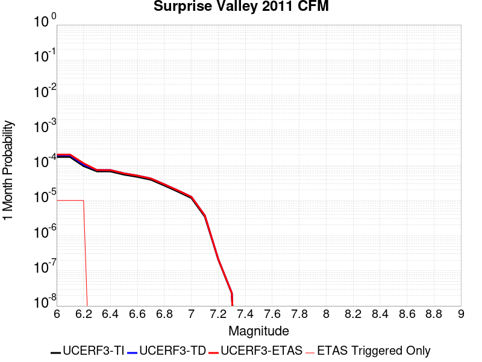 |  |  |

| Magnitude | 1 wk TI Prob | 1 wk TD Prob | 1 wk ETAS Prob | 1 wk ETAS/TD Gain | 1 wk ETAS Triggered Only | 1 mo TI Prob | 1 mo TD Prob | 1 mo ETAS Prob | 1 mo ETAS/TD Gain | 1 mo ETAS Triggered Only | 1 yr TI Prob | 1 yr TD Prob | 1 yr ETAS Prob | 1 yr ETAS/TD Gain | 1 yr ETAS Triggered Only | 10 yr TI Prob | 10 yr TD Prob | 10 yr ETAS Prob | 10 yr ETAS/TD Gain | 10 yr ETAS Triggered Only |
|-----|-----|-----|-----|-----|-----|-----|-----|-----|-----|-----|-----|-----|-----|-----|-----|-----|-----|-----|-----|-----|
| 6.0 | 4.0396248E-5 | 4.485131E-5 | 9.666246E-5 | 2.155176 | 5.1813473E-5 | 1.7311527E-4 | 1.9220692E-4 | 2.4401043E-4 | 1.2695194 | 5.1813473E-5 | 0.002105641 | 0.0023378176 | 0.00238951 | 1.0221114 | 5.1813473E-5 | 0.020858008 | 0.023153966 | 0.02320458 | 1.002186 | 5.1813473E-5 |
| 6.1 | 4.0396248E-5 | 4.485131E-5 | 9.666246E-5 | 2.155176 | 5.1813473E-5 | 1.7311527E-4 | 1.9220692E-4 | 2.4401043E-4 | 1.2695194 | 5.1813473E-5 | 0.002105641 | 0.0023378176 | 0.00238951 | 1.0221114 | 5.1813473E-5 | 0.020858008 | 0.023153966 | 0.02320458 | 1.002186 | 5.1813473E-5 |
| 6.2 | 2.2295266E-5 | 2.440125E-5 | 7.621346E-5 | 3.1233425 | 5.1813473E-5 | 9.554764E-5 | 1.0457276E-4 | 1.5638082E-4 | 1.4954258 | 5.1813473E-5 | 0.0011626717 | 0.0012724606 | 0.0013242081 | 1.0406673 | 5.1813473E-5 | 0.011566074 | 0.012654981 | 0.012706138 | 1.0040425 | 5.1813473E-5 |
| 6.3 | 1.572643E-5 | 1.7096807E-5 | 1.7096807E-5 | 1.0 | 0.0 | 6.7397246E-5 | 7.327003E-5 | 7.327003E-5 | 1.0 | 0.0 | 8.202525E-4 | 8.91708E-4 | 8.91708E-4 | 1.0 | 0.0 | 0.008172315 | 0.008882407 | 0.008882407 | 1.0 | 0.0 |
| 6.4 | 1.5714395E-5 | 1.7084629E-5 | 1.7084629E-5 | 1.0 | 0.0 | 6.734567E-5 | 7.3217845E-5 | 7.3217845E-5 | 1.0 | 0.0 | 8.1962504E-4 | 8.9107314E-4 | 8.9107314E-4 | 1.0 | 0.0 | 0.008166086 | 0.008876109 | 0.008876109 | 1.0 | 0.0 |
| 6.5 | 1.2733495E-5 | 1.38016E-5 | 1.38016E-5 | 1.0 | 0.0 | 5.457098E-5 | 5.9148413E-5 | 5.9148413E-5 | 1.0 | 0.0 | 6.641992E-4 | 7.1990065E-4 | 7.1990065E-4 | 1.0 | 0.0 | 0.0066221743 | 0.0071763797 | 0.0071763797 | 1.0 | 0.0 |
| 6.6 | 1.0983784E-5 | 1.1886554E-5 | 1.1886554E-5 | 1.0 | 0.0 | 4.7072506E-5 | 5.094141E-5 | 5.094141E-5 | 1.0 | 0.0 | 5.7295704E-4 | 6.200405E-4 | 6.200405E-4 | 1.0 | 0.0 | 0.0057148207 | 0.0061836545 | 0.0061836545 | 1.0 | 0.0 |
| 6.7 | 9.104806E-6 | 9.839491E-6 | 9.839491E-6 | 1.0 | 0.0 | 3.902001E-5 | 4.2168587E-5 | 4.2168587E-5 | 1.0 | 0.0 | 4.7496508E-4 | 5.132855E-4 | 5.132855E-4 | 1.0 | 0.0 | 0.004739512 | 0.005121397 | 0.005121397 | 1.0 | 0.0 |
| 6.8 | 6.2162403E-6 | 6.7041337E-6 | 6.7041337E-6 | 1.0 | 0.0 | 2.6640759E-5 | 2.8731698E-5 | 2.8731698E-5 | 1.0 | 0.0 | 3.2430296E-4 | 3.497545E-4 | 3.497545E-4 | 1.0 | 0.0 | 0.003238301 | 0.0034922638 | 0.0034922638 | 1.0 | 0.0 |
| 6.9 | 4.1792696E-6 | 4.50323E-6 | 4.50323E-6 | 1.0 | 0.0 | 1.7911032E-5 | 1.9299423E-5 | 1.9299423E-5 | 1.0 | 0.0 | 2.1804498E-4 | 2.3494668E-4 | 2.3494668E-4 | 1.0 | 0.0 | 0.0021783116 | 0.0023471361 | 0.0023471361 | 1.0 | 0.0 |
| 7.0 | 2.7478413E-6 | 2.9622424E-6 | 2.9622424E-6 | 1.0 | 0.0 | 1.177641E-5 | 1.269527E-5 | 1.269527E-5 | 1.0 | 0.0 | 1.4336836E-4 | 1.545552E-4 | 1.545552E-4 | 1.0 | 0.0 | 0.001432759 | 0.0015445995 | 0.0015445995 | 1.0 | 0.0 |
| 7.1 | 8.128648E-7 | 8.724922E-7 | 8.724922E-7 | 1.0 | 0.0 | 3.4837017E-6 | 3.7392501E-6 | 3.7392501E-6 | 1.0 | 0.0 | 4.2413245E-5 | 4.552502E-5 | 4.552502E-5 | 1.0 | 0.0 | 4.2405148E-4 | 4.5521575E-4 | 4.5521575E-4 | 1.0 | 0.0 |
| 7.2 | 4.8641045E-8 | 4.9402068E-8 | 4.9402068E-8 | 1.0 | 0.0 | 2.084616E-7 | 2.1172312E-7 | 2.1172312E-7 | 1.0 | 0.0 | 2.538017E-6 | 2.577726E-6 | 2.577726E-6 | 1.0 | 0.0 | 2.537988E-5 | 2.5776973E-5 | 2.5776973E-5 | 1.0 | 0.0 |
| 7.3 | 5.3911844E-9 | 5.4758145E-9 | 5.4758145E-9 | 1.0 | 0.0 | 2.3105075E-8 | 2.3467775E-8 | 2.3467775E-8 | 1.0 | 0.0 | 2.8130427E-7 | 2.8572015E-7 | 2.8572015E-7 | 1.0 | 0.0 | 2.8130391E-6 | 2.8571992E-6 | 2.8571992E-6 | 1.0 | 0.0 |

## Ozena
*[(top)](#table-of-contents)*

| 1 Week | 1 Month | 1 Year | 10 Year |
|-----|-----|-----|-----|
|  |  |  |  |

| Magnitude | 1 wk TI Prob | 1 wk TD Prob | 1 wk ETAS Prob | 1 wk ETAS/TD Gain | 1 wk ETAS Triggered Only | 1 mo TI Prob | 1 mo TD Prob | 1 mo ETAS Prob | 1 mo ETAS/TD Gain | 1 mo ETAS Triggered Only | 1 yr TI Prob | 1 yr TD Prob | 1 yr ETAS Prob | 1 yr ETAS/TD Gain | 1 yr ETAS Triggered Only | 10 yr TI Prob | 10 yr TD Prob | 10 yr ETAS Prob | 10 yr ETAS/TD Gain | 10 yr ETAS Triggered Only |
|-----|-----|-----|-----|-----|-----|-----|-----|-----|-----|-----|-----|-----|-----|-----|-----|-----|-----|-----|-----|-----|
| 6.0 | 1.4377547E-6 | 1.4513782E-6 | 1.4513782E-6 | 1.0 | 0.0 | 6.161791E-6 | 6.2201793E-6 | 6.2201793E-6 | 1.0 | 0.0 | 7.5017226E-5 | 7.572832E-5 | 7.572832E-5 | 1.0 | 0.0 | 7.4991904E-4 | 7.570518E-4 | 8.0882607E-4 | 1.0683893 | 5.1813473E-5 |
| 6.1 | 1.4377547E-6 | 1.4513782E-6 | 1.4513782E-6 | 1.0 | 0.0 | 6.161791E-6 | 6.2201793E-6 | 6.2201793E-6 | 1.0 | 0.0 | 7.5017226E-5 | 7.572832E-5 | 7.572832E-5 | 1.0 | 0.0 | 7.4991904E-4 | 7.570518E-4 | 8.0882607E-4 | 1.0683893 | 5.1813473E-5 |
| 6.2 | 1.4377547E-6 | 1.4513782E-6 | 1.4513782E-6 | 1.0 | 0.0 | 6.161791E-6 | 6.2201793E-6 | 6.2201793E-6 | 1.0 | 0.0 | 7.5017226E-5 | 7.572832E-5 | 7.572832E-5 | 1.0 | 0.0 | 7.4991904E-4 | 7.570518E-4 | 8.0882607E-4 | 1.0683893 | 5.1813473E-5 |
| 6.3 | 1.4377547E-6 | 1.4513782E-6 | 1.4513782E-6 | 1.0 | 0.0 | 6.161791E-6 | 6.2201793E-6 | 6.2201793E-6 | 1.0 | 0.0 | 7.5017226E-5 | 7.572832E-5 | 7.572832E-5 | 1.0 | 0.0 | 7.4991904E-4 | 7.570518E-4 | 8.0882607E-4 | 1.0683893 | 5.1813473E-5 |
| 6.4 | 1.4377547E-6 | 1.4513782E-6 | 1.4513782E-6 | 1.0 | 0.0 | 6.161791E-6 | 6.2201793E-6 | 6.2201793E-6 | 1.0 | 0.0 | 7.5017226E-5 | 7.572832E-5 | 7.572832E-5 | 1.0 | 0.0 | 7.4991904E-4 | 7.570518E-4 | 8.0882607E-4 | 1.0683893 | 5.1813473E-5 |
| 6.5 | 1.4377547E-6 | 1.4513782E-6 | 1.4513782E-6 | 1.0 | 0.0 | 6.161791E-6 | 6.2201793E-6 | 6.2201793E-6 | 1.0 | 0.0 | 7.5017226E-5 | 7.572832E-5 | 7.572832E-5 | 1.0 | 0.0 | 7.4991904E-4 | 7.570518E-4 | 8.0882607E-4 | 1.0683893 | 5.1813473E-5 |
| 6.6 | 1.4377547E-6 | 1.4513782E-6 | 1.4513782E-6 | 1.0 | 0.0 | 6.161791E-6 | 6.2201793E-6 | 6.2201793E-6 | 1.0 | 0.0 | 7.5017226E-5 | 7.572832E-5 | 7.572832E-5 | 1.0 | 0.0 | 7.4991904E-4 | 7.570518E-4 | 8.0882607E-4 | 1.0683893 | 5.1813473E-5 |
| 6.7 | 1.4377547E-6 | 1.4513782E-6 | 1.4513782E-6 | 1.0 | 0.0 | 6.161791E-6 | 6.2201793E-6 | 6.2201793E-6 | 1.0 | 0.0 | 7.5017226E-5 | 7.572832E-5 | 7.572832E-5 | 1.0 | 0.0 | 7.4991904E-4 | 7.570518E-4 | 8.0882607E-4 | 1.0683893 | 5.1813473E-5 |
| 6.8 | 9.223257E-7 | 9.317624E-7 | 9.317624E-7 | 1.0 | 0.0 | 3.9528186E-6 | 3.9932615E-6 | 3.9932615E-6 | 1.0 | 0.0 | 4.81245E-5 | 4.8616912E-5 | 4.8616912E-5 | 1.0 | 0.0 | 4.811408E-4 | 4.860668E-4 | 5.378551E-4 | 1.1065456 | 5.1813473E-5 |
| 6.9 | 9.141515E-7 | 9.235371E-7 | 9.235371E-7 | 1.0 | 0.0 | 3.917786E-6 | 3.9580104E-6 | 3.9580104E-6 | 1.0 | 0.0 | 4.7698002E-5 | 4.818775E-5 | 4.818775E-5 | 1.0 | 0.0 | 4.7687767E-4 | 4.8177704E-4 | 5.3356553E-4 | 1.1074947 | 5.1813473E-5 |
| 7.0 | 8.767648E-7 | 8.8585773E-7 | 8.8585773E-7 | 1.0 | 0.0 | 3.757558E-6 | 3.7965276E-6 | 3.7965276E-6 | 1.0 | 0.0 | 4.5747307E-5 | 4.6221783E-5 | 4.6221783E-5 | 1.0 | 0.0 | 4.5737892E-4 | 4.6212564E-4 | 4.6212564E-4 | 1.0 | 0.0 |
| 7.1 | 8.199402E-7 | 8.2853984E-7 | 8.2853984E-7 | 1.0 | 0.0 | 3.5140247E-6 | 3.5508804E-6 | 3.5508804E-6 | 1.0 | 0.0 | 4.2782412E-5 | 4.323115E-5 | 4.323115E-5 | 1.0 | 0.0 | 4.2774176E-4 | 4.322311E-4 | 4.322311E-4 | 1.0 | 0.0 |
| 7.2 | 7.38705E-7 | 7.464262E-7 | 7.464262E-7 | 1.0 | 0.0 | 3.1658747E-6 | 3.198966E-6 | 3.198966E-6 | 1.0 | 0.0 | 3.8543843E-5 | 3.894675E-5 | 3.894675E-5 | 1.0 | 0.0 | 3.853716E-4 | 3.8940276E-4 | 3.8940276E-4 | 1.0 | 0.0 |
| 7.3 | 6.490017E-7 | 6.557802E-7 | 6.557802E-7 | 1.0 | 0.0 | 2.7814328E-6 | 2.8104837E-6 | 2.8104837E-6 | 1.0 | 0.0 | 3.386342E-5 | 3.4217133E-5 | 3.4217133E-5 | 1.0 | 0.0 | 3.3858258E-4 | 3.4212202E-4 | 3.4212202E-4 | 1.0 | 0.0 |
| 7.4 | 5.346736E-7 | 5.4022604E-7 | 5.4022604E-7 | 1.0 | 0.0 | 2.291456E-6 | 2.3152527E-6 | 2.3152527E-6 | 1.0 | 0.0 | 2.789812E-5 | 2.8187867E-5 | 2.8187867E-5 | 1.0 | 0.0 | 2.789462E-4 | 2.8184598E-4 | 2.8184598E-4 | 1.0 | 0.0 |
| 7.5 | 2.939325E-7 | 2.9666057E-7 | 2.9666057E-7 | 1.0 | 0.0 | 1.25971E-6 | 1.271402E-6 | 1.271402E-6 | 1.0 | 0.0 | 1.5336862E-5 | 1.5479225E-5 | 1.5479225E-5 | 1.0 | 0.0 | 1.5335804E-4 | 1.5478309E-4 | 1.5478309E-4 | 1.0 | 0.0 |
| 7.6 | 1.4151905E-7 | 1.4253266E-7 | 1.4253266E-7 | 1.0 | 0.0 | 6.065101E-7 | 6.108541E-7 | 6.108541E-7 | 1.0 | 0.0 | 7.3842357E-6 | 7.4371237E-6 | 7.4371237E-6 | 1.0 | 0.0 | 7.38399E-5 | 7.436883E-5 | 7.436883E-5 | 1.0 | 0.0 |
| 7.7 | 4.4957577E-8 | 4.5252243E-8 | 4.5252243E-8 | 1.0 | 0.0 | 1.9267533E-7 | 1.9393818E-7 | 1.9393818E-7 | 1.0 | 0.0 | 2.3458194E-6 | 2.3611947E-6 | 2.3611947E-6 | 1.0 | 0.0 | 2.3457947E-5 | 2.3611707E-5 | 2.3611707E-5 | 1.0 | 0.0 |
| 7.8 | 5.9993255E-9 | 6.0412972E-9 | 6.0412972E-9 | 1.0 | 0.0 | 2.5711394E-8 | 2.5891273E-8 | 2.5891273E-8 | 1.0 | 0.0 | 3.1303617E-7 | 3.1522623E-7 | 3.1522623E-7 | 1.0 | 0.0 | 3.1303573E-6 | 3.1522588E-6 | 3.1522588E-6 | 1.0 | 0.0 |

## Camp Rock 2011
*[(top)](#table-of-contents)*

| 1 Week | 1 Month | 1 Year | 10 Year |
|-----|-----|-----|-----|
|  |  |  |  |

| Magnitude | 1 wk TI Prob | 1 wk TD Prob | 1 wk ETAS Prob | 1 wk ETAS/TD Gain | 1 wk ETAS Triggered Only | 1 mo TI Prob | 1 mo TD Prob | 1 mo ETAS Prob | 1 mo ETAS/TD Gain | 1 mo ETAS Triggered Only | 1 yr TI Prob | 1 yr TD Prob | 1 yr ETAS Prob | 1 yr ETAS/TD Gain | 1 yr ETAS Triggered Only | 10 yr TI Prob | 10 yr TD Prob | 10 yr ETAS Prob | 10 yr ETAS/TD Gain | 10 yr ETAS Triggered Only |
|-----|-----|-----|-----|-----|-----|-----|-----|-----|-----|-----|-----|-----|-----|-----|-----|-----|-----|-----|-----|-----|
| 6.0 | 1.6710783E-5 | 4.25026E-6 | 4.25026E-6 | 1.0 | 0.0 | 7.161568E-5 | 1.8215276E-5 | 1.8215276E-5 | 1.0 | 0.0 | 8.7157206E-4 | 2.2174895E-4 | 2.2174895E-4 | 1.0 | 0.0 | 0.008681616 | 0.0022153298 | 0.0022670284 | 1.0233368 | 5.1813473E-5 |
| 6.1 | 1.6710783E-5 | 4.25026E-6 | 4.25026E-6 | 1.0 | 0.0 | 7.161568E-5 | 1.8215276E-5 | 1.8215276E-5 | 1.0 | 0.0 | 8.7157206E-4 | 2.2174895E-4 | 2.2174895E-4 | 1.0 | 0.0 | 0.008681616 | 0.0022153298 | 0.0022670284 | 1.0233368 | 5.1813473E-5 |
| 6.2 | 1.6710783E-5 | 4.25026E-6 | 4.25026E-6 | 1.0 | 0.0 | 7.161568E-5 | 1.8215276E-5 | 1.8215276E-5 | 1.0 | 0.0 | 8.7157206E-4 | 2.2174895E-4 | 2.2174895E-4 | 1.0 | 0.0 | 0.008681616 | 0.0022153298 | 0.0022670284 | 1.0233368 | 5.1813473E-5 |
| 6.3 | 1.6710783E-5 | 4.25026E-6 | 4.25026E-6 | 1.0 | 0.0 | 7.161568E-5 | 1.8215276E-5 | 1.8215276E-5 | 1.0 | 0.0 | 8.7157206E-4 | 2.2174895E-4 | 2.2174895E-4 | 1.0 | 0.0 | 0.008681616 | 0.0022153298 | 0.0022670284 | 1.0233368 | 5.1813473E-5 |
| 6.4 | 7.982846E-6 | 3.6820884E-6 | 3.6820884E-6 | 1.0 | 0.0 | 3.421175E-5 | 1.5780286E-5 | 1.5780286E-5 | 1.0 | 0.0 | 4.1644843E-4 | 1.9210839E-4 | 1.9210839E-4 | 1.0 | 0.0 | 0.0041566887 | 0.001919458 | 0.001971172 | 1.026942 | 5.1813473E-5 |
| 6.5 | 7.982846E-6 | 3.6820884E-6 | 3.6820884E-6 | 1.0 | 0.0 | 3.421175E-5 | 1.5780286E-5 | 1.5780286E-5 | 1.0 | 0.0 | 4.1644843E-4 | 1.9210839E-4 | 1.9210839E-4 | 1.0 | 0.0 | 0.0041566887 | 0.001919458 | 0.001971172 | 1.026942 | 5.1813473E-5 |
| 6.6 | 7.048869E-6 | 3.4243571E-6 | 3.4243571E-6 | 1.0 | 0.0 | 3.0209088E-5 | 1.4675736E-5 | 1.4675736E-5 | 1.0 | 0.0 | 3.677336E-4 | 1.7866275E-4 | 1.7866275E-4 | 1.0 | 0.0 | 0.0036712566 | 0.0017852228 | 0.0018369438 | 1.0289717 | 5.1813473E-5 |
| 6.7 | 6.987307E-6 | 3.3623348E-6 | 3.3623348E-6 | 1.0 | 0.0 | 2.9945259E-5 | 1.4409929E-5 | 1.4409929E-5 | 1.0 | 0.0 | 3.6452254E-4 | 1.7542706E-4 | 1.7542706E-4 | 1.0 | 0.0 | 0.0036392517 | 0.001752917 | 0.0018046396 | 1.0295066 | 5.1813473E-5 |
| 6.8 | 6.3737602E-6 | 3.1179077E-6 | 3.1179077E-6 | 1.0 | 0.0 | 2.731583E-5 | 1.3362394E-5 | 1.3362394E-5 | 1.0 | 0.0 | 3.3251947E-4 | 1.626753E-4 | 1.626753E-4 | 1.0 | 0.0 | 0.0033202237 | 0.0016255907 | 0.00167732 | 1.0318218 | 5.1813473E-5 |
| 6.9 | 6.112211E-6 | 2.9331156E-6 | 2.9331156E-6 | 1.0 | 0.0 | 2.6194928E-5 | 1.2570436E-5 | 1.2570436E-5 | 1.0 | 0.0 | 3.1887658E-4 | 1.5303459E-4 | 1.5303459E-4 | 1.0 | 0.0 | 0.003184194 | 0.0015293199 | 0.0015810541 | 1.0338283 | 5.1813473E-5 |
| 7.0 | 5.5140117E-6 | 2.641923E-6 | 2.641923E-6 | 1.0 | 0.0 | 2.3631264E-5 | 1.132248E-5 | 1.132248E-5 | 1.0 | 0.0 | 2.8767265E-4 | 1.3784273E-4 | 1.3784273E-4 | 1.0 | 0.0 | 0.0028730053 | 0.0013775975 | 0.0014293395 | 1.0375596 | 5.1813473E-5 |
| 7.1 | 4.8151105E-6 | 2.1342705E-6 | 2.1342705E-6 | 1.0 | 0.0 | 2.0636026E-5 | 9.146843E-6 | 9.146843E-6 | 1.0 | 0.0 | 2.5121463E-4 | 1.1135734E-4 | 1.1135734E-4 | 1.0 | 0.0 | 0.0025093083 | 0.0011130372 | 0.001164793 | 1.0464996 | 5.1813473E-5 |
| 7.2 | 3.818335E-6 | 1.2937425E-6 | 1.2937425E-6 | 1.0 | 0.0 | 1.6364189E-5 | 5.5445994E-6 | 5.5445994E-6 | 1.0 | 0.0 | 1.9921579E-4 | 6.750349E-5 | 6.750349E-5 | 1.0 | 0.0 | 0.0019903728 | 6.748381E-4 | 7.266166E-4 | 1.0767273 | 5.1813473E-5 |
| 7.3 | 2.7166698E-6 | 7.3835776E-7 | 7.3835776E-7 | 1.0 | 0.0 | 1.1642818E-5 | 3.1643867E-6 | 3.1643867E-6 | 1.0 | 0.0 | 1.4174209E-4 | 3.8525748E-5 | 3.8525748E-5 | 1.0 | 0.0 | 0.0014165172 | 3.851927E-4 | 4.369862E-4 | 1.1344613 | 5.1813473E-5 |
| 7.4 | 2.0893426E-6 | 5.4618386E-7 | 5.4618386E-7 | 1.0 | 0.0 | 8.954295E-6 | 2.3407858E-6 | 2.3407858E-6 | 1.0 | 0.0 | 1.0901308E-4 | 2.84987E-5 | 2.84987E-5 | 1.0 | 0.0 | 0.0010895962 | 2.84951E-4 | 2.84951E-4 | 1.0 | 0.0 |
| 7.5 | 1.1681728E-6 | 3.6030585E-7 | 3.6030585E-7 | 1.0 | 0.0 | 5.0064455E-6 | 1.544167E-6 | 1.544167E-6 | 1.0 | 0.0 | 6.0951766E-5 | 1.8800076E-5 | 1.8800076E-5 | 1.0 | 0.0 | 6.093505E-4 | 1.8798532E-4 | 1.8798532E-4 | 1.0 | 0.0 |
| 7.6 | 1.3154387E-7 | 7.1197384E-8 | 7.1197384E-8 | 1.0 | 0.0 | 5.6375933E-7 | 3.051316E-7 | 3.051316E-7 | 1.0 | 0.0 | 6.863748E-6 | 3.7149728E-6 | 3.7149728E-6 | 1.0 | 0.0 | 6.863536E-5 | 3.7149264E-5 | 3.7149264E-5 | 1.0 | 0.0 |

## Holser alt 1
*[(top)](#table-of-contents)*

| 1 Week | 1 Month | 1 Year | 10 Year |
|-----|-----|-----|-----|
|  |  |  |  |

| Magnitude | 1 wk TI Prob | 1 wk TD Prob | 1 wk ETAS Prob | 1 wk ETAS/TD Gain | 1 wk ETAS Triggered Only | 1 mo TI Prob | 1 mo TD Prob | 1 mo ETAS Prob | 1 mo ETAS/TD Gain | 1 mo ETAS Triggered Only | 1 yr TI Prob | 1 yr TD Prob | 1 yr ETAS Prob | 1 yr ETAS/TD Gain | 1 yr ETAS Triggered Only | 10 yr TI Prob | 10 yr TD Prob | 10 yr ETAS Prob | 10 yr ETAS/TD Gain | 10 yr ETAS Triggered Only |
|-----|-----|-----|-----|-----|-----|-----|-----|-----|-----|-----|-----|-----|-----|-----|-----|-----|-----|-----|-----|-----|
| 6.0 | 6.2746653E-6 | 5.789965E-6 | 5.789965E-6 | 1.0 | 0.0 | 2.6891146E-5 | 2.4813964E-5 | 2.4813964E-5 | 1.0 | 0.0 | 3.273505E-4 | 3.020797E-4 | 3.538775E-4 | 1.1714708 | 5.1813473E-5 | 0.0032686873 | 0.0030178234 | 0.0030694806 | 1.0171174 | 5.1813473E-5 |
| 6.1 | 6.2746653E-6 | 5.789965E-6 | 5.789965E-6 | 1.0 | 0.0 | 2.6891146E-5 | 2.4813964E-5 | 2.4813964E-5 | 1.0 | 0.0 | 3.273505E-4 | 3.020797E-4 | 3.538775E-4 | 1.1714708 | 5.1813473E-5 | 0.0032686873 | 0.0030178234 | 0.0030694806 | 1.0171174 | 5.1813473E-5 |
| 6.2 | 6.2746653E-6 | 5.789965E-6 | 5.789965E-6 | 1.0 | 0.0 | 2.6891146E-5 | 2.4813964E-5 | 2.4813964E-5 | 1.0 | 0.0 | 3.273505E-4 | 3.020797E-4 | 3.538775E-4 | 1.1714708 | 5.1813473E-5 | 0.0032686873 | 0.0030178234 | 0.0030694806 | 1.0171174 | 5.1813473E-5 |
| 6.3 | 6.2746653E-6 | 5.789965E-6 | 5.789965E-6 | 1.0 | 0.0 | 2.6891146E-5 | 2.4813964E-5 | 2.4813964E-5 | 1.0 | 0.0 | 3.273505E-4 | 3.020797E-4 | 3.538775E-4 | 1.1714708 | 5.1813473E-5 | 0.0032686873 | 0.0030178234 | 0.0030694806 | 1.0171174 | 5.1813473E-5 |
| 6.4 | 6.2746653E-6 | 5.789965E-6 | 5.789965E-6 | 1.0 | 0.0 | 2.6891146E-5 | 2.4813964E-5 | 2.4813964E-5 | 1.0 | 0.0 | 3.273505E-4 | 3.020797E-4 | 3.538775E-4 | 1.1714708 | 5.1813473E-5 | 0.0032686873 | 0.0030178234 | 0.0030694806 | 1.0171174 | 5.1813473E-5 |
| 6.5 | 6.2746653E-6 | 5.789965E-6 | 5.789965E-6 | 1.0 | 0.0 | 2.6891146E-5 | 2.4813964E-5 | 2.4813964E-5 | 1.0 | 0.0 | 3.273505E-4 | 3.020797E-4 | 3.538775E-4 | 1.1714708 | 5.1813473E-5 | 0.0032686873 | 0.0030178234 | 0.0030694806 | 1.0171174 | 5.1813473E-5 |
| 6.6 | 3.375825E-6 | 2.7711897E-6 | 2.7711897E-6 | 1.0 | 0.0 | 1.4467741E-5 | 1.1876474E-5 | 1.1876474E-5 | 1.0 | 0.0 | 1.761305E-4 | 1.4458665E-4 | 1.4458665E-4 | 1.0 | 0.0 | 0.0017599097 | 0.0014449427 | 0.0014449427 | 1.0 | 0.0 |
| 6.7 | 3.375825E-6 | 2.7711897E-6 | 2.7711897E-6 | 1.0 | 0.0 | 1.4467741E-5 | 1.1876474E-5 | 1.1876474E-5 | 1.0 | 0.0 | 1.761305E-4 | 1.4458665E-4 | 1.4458665E-4 | 1.0 | 0.0 | 0.0017599097 | 0.0014449427 | 0.0014449427 | 1.0 | 0.0 |
| 6.8 | 3.366533E-6 | 2.7615893E-6 | 2.7615893E-6 | 1.0 | 0.0 | 1.4427919E-5 | 1.183533E-5 | 1.183533E-5 | 1.0 | 0.0 | 1.7564575E-4 | 1.4408577E-4 | 1.4408577E-4 | 1.0 | 0.0 | 0.0017550698 | 0.0014399405 | 0.0014399405 | 1.0 | 0.0 |
| 6.9 | 3.253174E-6 | 2.6438113E-6 | 2.6438113E-6 | 1.0 | 0.0 | 1.39421E-5 | 1.1330571E-5 | 1.1330571E-5 | 1.0 | 0.0 | 1.6973184E-4 | 1.3794114E-4 | 1.3794114E-4 | 1.0 | 0.0 | 0.0016960226 | 0.001378571 | 0.001378571 | 1.0 | 0.0 |
| 7.0 | 2.9336593E-6 | 2.311799E-6 | 2.311799E-6 | 1.0 | 0.0 | 1.2572766E-5 | 9.907673E-6 | 9.907673E-6 | 1.0 | 0.0 | 1.5306266E-4 | 1.2061927E-4 | 1.2061927E-4 | 1.0 | 0.0 | 0.0015295728 | 0.0012055405 | 0.0012055405 | 1.0 | 0.0 |
| 7.1 | 2.9087812E-6 | 2.2876513E-6 | 2.2876513E-6 | 1.0 | 0.0 | 1.2466146E-5 | 9.804184E-6 | 9.804184E-6 | 1.0 | 0.0 | 1.5176475E-4 | 1.19359414E-4 | 1.19359414E-4 | 1.0 | 0.0 | 0.0015166114 | 0.0011929555 | 0.0011929555 | 1.0 | 0.0 |
| 7.2 | 2.8674524E-6 | 2.2475429E-6 | 2.2475429E-6 | 1.0 | 0.0 | 1.2289024E-5 | 9.63229E-6 | 9.63229E-6 | 1.0 | 0.0 | 1.4960859E-4 | 1.1726685E-4 | 1.1726685E-4 | 1.0 | 0.0 | 0.0014950791 | 0.001172052 | 0.001172052 | 1.0 | 0.0 |
| 7.3 | 2.8057775E-6 | 2.1954324E-6 | 2.1954324E-6 | 1.0 | 0.0 | 1.2024705E-5 | 9.408962E-6 | 9.408962E-6 | 1.0 | 0.0 | 1.4639096E-4 | 1.14548115E-4 | 1.14548115E-4 | 1.0 | 0.0 | 0.0014629456 | 0.001144893 | 0.001144893 | 1.0 | 0.0 |
| 7.4 | 2.683666E-6 | 2.1092305E-6 | 2.1092305E-6 | 1.0 | 0.0 | 1.1501375E-5 | 9.039529E-6 | 9.039529E-6 | 1.0 | 0.0 | 1.4002025E-4 | 1.1005072E-4 | 1.1005072E-4 | 1.0 | 0.0 | 0.0013993206 | 0.0010999644 | 0.0010999644 | 1.0 | 0.0 |
| 7.5 | 2.434495E-6 | 1.9195363E-6 | 1.9195363E-6 | 1.0 | 0.0 | 1.0433508E-5 | 8.226558E-6 | 8.226558E-6 | 1.0 | 0.0 | 1.2702055E-4 | 1.0015376E-4 | 1.0015376E-4 | 1.0 | 0.0 | 0.0012694797 | 0.0010010883 | 0.0010010883 | 1.0 | 0.0 |
| 7.6 | 1.9914562E-6 | 1.5731459E-6 | 1.5731459E-6 | 1.0 | 0.0 | 8.534785E-6 | 6.742037E-6 | 6.742037E-6 | 1.0 | 0.0 | 1.03906044E-4 | 8.208122E-5 | 8.208122E-5 | 1.0 | 0.0 | 0.0010385747 | 8.205106E-4 | 8.205106E-4 | 1.0 | 0.0 |
| 7.7 | 1.5229501E-6 | 1.1896061E-6 | 1.1896061E-6 | 1.0 | 0.0 | 6.526913E-6 | 5.098302E-6 | 5.098302E-6 | 1.0 | 0.0 | 7.946226E-5 | 6.2070074E-5 | 6.2070074E-5 | 1.0 | 0.0 | 7.943385E-4 | 6.2052865E-4 | 6.2052865E-4 | 1.0 | 0.0 |
| 7.8 | 6.3489426E-7 | 4.687806E-7 | 4.687806E-7 | 1.0 | 0.0 | 2.7209726E-6 | 2.009058E-6 | 2.009058E-6 | 1.0 | 0.0 | 3.312734E-5 | 2.4460009E-5 | 2.4460009E-5 | 1.0 | 0.0 | 3.31224E-4 | 2.4457334E-4 | 2.4457334E-4 | 1.0 | 0.0 |
| 7.9 | 1.5459432E-7 | 1.0193758E-7 | 1.0193758E-7 | 1.0 | 0.0 | 6.6254694E-7 | 4.3687527E-7 | 4.3687527E-7 | 1.0 | 0.0 | 8.066479E-6 | 5.3189433E-6 | 5.3189433E-6 | 1.0 | 0.0 | 8.066186E-5 | 5.3188178E-5 | 5.3188178E-5 | 1.0 | 0.0 |
| 8.0 | 1.8307812E-8 | 9.690293E-9 | 9.690293E-9 | 1.0 | 0.0 | 7.846205E-8 | 4.152983E-8 | 4.152983E-8 | 1.0 | 0.0 | 9.55275E-7 | 5.0562556E-7 | 5.0562556E-7 | 1.0 | 0.0 | 9.552709E-6 | 5.0562444E-6 | 5.0562444E-6 | 1.0 | 0.0 |

## Great Valley 10 (Panoche)
*[(top)](#table-of-contents)*

| 1 Week | 1 Month | 1 Year | 10 Year |
|-----|-----|-----|-----|
|  |  |  |  |

| Magnitude | 1 wk TI Prob | 1 wk TD Prob | 1 wk ETAS Prob | 1 wk ETAS/TD Gain | 1 wk ETAS Triggered Only | 1 mo TI Prob | 1 mo TD Prob | 1 mo ETAS Prob | 1 mo ETAS/TD Gain | 1 mo ETAS Triggered Only | 1 yr TI Prob | 1 yr TD Prob | 1 yr ETAS Prob | 1 yr ETAS/TD Gain | 1 yr ETAS Triggered Only | 10 yr TI Prob | 10 yr TD Prob | 10 yr ETAS Prob | 10 yr ETAS/TD Gain | 10 yr ETAS Triggered Only |
|-----|-----|-----|-----|-----|-----|-----|-----|-----|-----|-----|-----|-----|-----|-----|-----|-----|-----|-----|-----|-----|
| 6.0 | 1.6014626E-5 | 1.6575399E-5 | 1.6575399E-5 | 1.0 | 0.0 | 6.863231E-5 | 7.103552E-5 | 7.103552E-5 | 1.0 | 0.0 | 8.35278E-4 | 8.645185E-4 | 9.162872E-4 | 1.0598816 | 5.1813473E-5 | 0.008321454 | 0.008612172 | 0.008663539 | 1.0059645 | 5.1813473E-5 |
| 6.1 | 1.6014626E-5 | 1.6575399E-5 | 1.6575399E-5 | 1.0 | 0.0 | 6.863231E-5 | 7.103552E-5 | 7.103552E-5 | 1.0 | 0.0 | 8.35278E-4 | 8.645185E-4 | 9.162872E-4 | 1.0598816 | 5.1813473E-5 | 0.008321454 | 0.008612172 | 0.008663539 | 1.0059645 | 5.1813473E-5 |
| 6.2 | 1.56782E-5 | 1.6198446E-5 | 1.6198446E-5 | 1.0 | 0.0 | 6.719056E-5 | 6.94201E-5 | 6.94201E-5 | 1.0 | 0.0 | 8.17738E-4 | 8.4486604E-4 | 8.9663576E-4 | 1.0612756 | 5.1813473E-5 | 0.008147354 | 0.008417147 | 0.008468525 | 1.0061039 | 5.1813473E-5 |
| 6.3 | 1.5263338E-5 | 1.5723514E-5 | 1.5723514E-5 | 1.0 | 0.0 | 6.541267E-5 | 6.738478E-5 | 6.738478E-5 | 1.0 | 0.0 | 7.961082E-4 | 8.201049E-4 | 8.718759E-4 | 1.0631273 | 5.1813473E-5 | 0.007932622 | 0.008171377 | 0.008222767 | 1.006289 | 5.1813473E-5 |
| 6.4 | 1.4720723E-5 | 1.5099376E-5 | 1.5099376E-5 | 1.0 | 0.0 | 6.308728E-5 | 6.471004E-5 | 6.471004E-5 | 1.0 | 0.0 | 7.67817E-4 | 7.8756385E-4 | 8.393365E-4 | 1.0657377 | 5.1813473E-5 | 0.007651695 | 0.007848303 | 0.00789971 | 1.0065501 | 5.1813473E-5 |
| 6.5 | 1.408264E-5 | 1.4355969E-5 | 1.4355969E-5 | 1.0 | 0.0 | 6.0352773E-5 | 6.1524166E-5 | 6.1524166E-5 | 1.0 | 0.0 | 7.3454727E-4 | 7.488031E-4 | 8.0057775E-4 | 1.0691433 | 5.1813473E-5 | 0.0073212404 | 0.0074633555 | 0.0075147827 | 1.0068905 | 5.1813473E-5 |
| 6.6 | 1.3197086E-5 | 1.3321889E-5 | 1.3321889E-5 | 1.0 | 0.0 | 5.6557717E-5 | 5.709259E-5 | 5.709259E-5 | 1.0 | 0.0 | 6.8837265E-4 | 6.9488434E-4 | 7.466618E-4 | 1.0745124 | 5.1813473E-5 | 0.006862442 | 0.0069276537 | 0.0069791083 | 1.0074275 | 5.1813473E-5 |
| 6.7 | 1.017583E-5 | 9.745382E-6 | 9.745382E-6 | 1.0 | 0.0 | 4.360997E-5 | 4.176527E-5 | 4.176527E-5 | 1.0 | 0.0 | 5.30822E-4 | 5.0837593E-4 | 5.6016305E-4 | 1.1018678 | 5.1813473E-5 | 0.0052955584 | 0.005072382 | 0.0051239324 | 1.010163 | 5.1813473E-5 |
| 6.8 | 8.557912E-6 | 7.872707E-6 | 7.872707E-6 | 1.0 | 0.0 | 3.667625E-5 | 3.373975E-5 | 3.373975E-5 | 1.0 | 0.0 | 4.4644187E-4 | 4.1070607E-4 | 4.1070607E-4 | 1.0 | 0.0 | 0.0044554602 | 0.004099677 | 0.004099677 | 1.0 | 0.0 |
| 6.9 | 6.14664E-6 | 5.092071E-6 | 5.092071E-6 | 1.0 | 0.0 | 2.6342475E-5 | 2.1822989E-5 | 2.1822989E-5 | 1.0 | 0.0 | 3.2067244E-4 | 2.6566387E-4 | 2.6566387E-4 | 1.0 | 0.0 | 0.003202101 | 0.002653601 | 0.002653601 | 1.0 | 0.0 |
| 7.0 | 3.2310581E-6 | 1.6951219E-6 | 1.6951219E-6 | 1.0 | 0.0 | 1.3847319E-5 | 7.264788E-6 | 7.264788E-6 | 1.0 | 0.0 | 1.6857806E-4 | 8.8445304E-5 | 8.8445304E-5 | 1.0 | 0.0 | 0.0016845023 | 8.841104E-4 | 8.841104E-4 | 1.0 | 0.0 |
| 7.1 | 2.544492E-6 | 9.1889206E-7 | 9.1889206E-7 | 1.0 | 0.0 | 1.090492E-5 | 3.938103E-6 | 3.938103E-6 | 1.0 | 0.0 | 1.327593E-4 | 4.79454E-5 | 4.79454E-5 | 1.0 | 0.0 | 0.0013268003 | 4.793553E-4 | 4.793553E-4 | 1.0 | 0.0 |
| 7.2 | 2.4479045E-6 | 8.841304E-7 | 8.841304E-7 | 1.0 | 0.0 | 1.0490977E-5 | 3.789125E-6 | 3.789125E-6 | 1.0 | 0.0 | 1.2772017E-4 | 4.6131667E-5 | 4.6131667E-5 | 1.0 | 0.0 | 0.0012764678 | 4.6122566E-4 | 4.6122566E-4 | 1.0 | 0.0 |
| 7.3 | 2.0559578E-6 | 7.892787E-7 | 7.892787E-7 | 1.0 | 0.0 | 8.811218E-6 | 3.3826188E-6 | 3.3826188E-6 | 1.0 | 0.0 | 1.072713E-4 | 4.1182655E-5 | 4.1182655E-5 | 1.0 | 0.0 | 0.0010721954 | 4.1175485E-4 | 4.1175485E-4 | 1.0 | 0.0 |
| 7.4 | 1.727687E-6 | 7.387757E-7 | 7.387757E-7 | 1.0 | 0.0 | 7.404352E-6 | 3.1661782E-6 | 3.1661782E-6 | 1.0 | 0.0 | 9.0144255E-5 | 3.8547583E-5 | 3.8547583E-5 | 1.0 | 0.0 | 9.0107694E-4 | 3.854136E-4 | 3.854136E-4 | 1.0 | 0.0 |
| 7.5 | 1.5002679E-6 | 6.546144E-7 | 6.546144E-7 | 1.0 | 0.0 | 6.4297037E-6 | 2.8054874E-6 | 2.8054874E-6 | 1.0 | 0.0 | 7.827883E-5 | 3.4156317E-5 | 3.4156317E-5 | 1.0 | 0.0 | 7.825126E-4 | 3.4151482E-4 | 3.4151482E-4 | 1.0 | 0.0 |

## San Gorgonio Pass
*[(top)](#table-of-contents)*

| 1 Week | 1 Month | 1 Year | 10 Year |
|-----|-----|-----|-----|
|  | 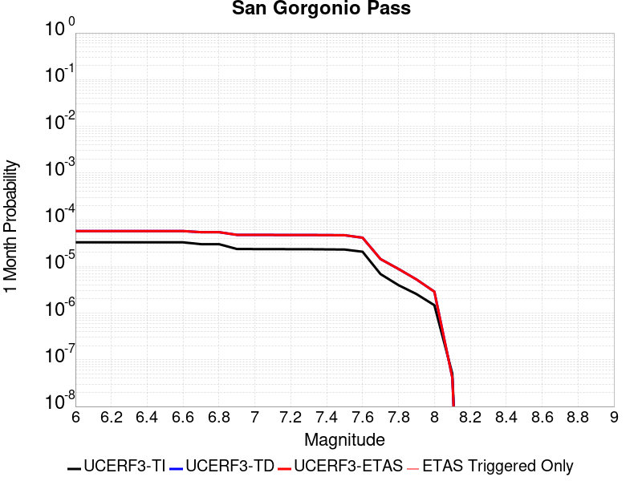 | 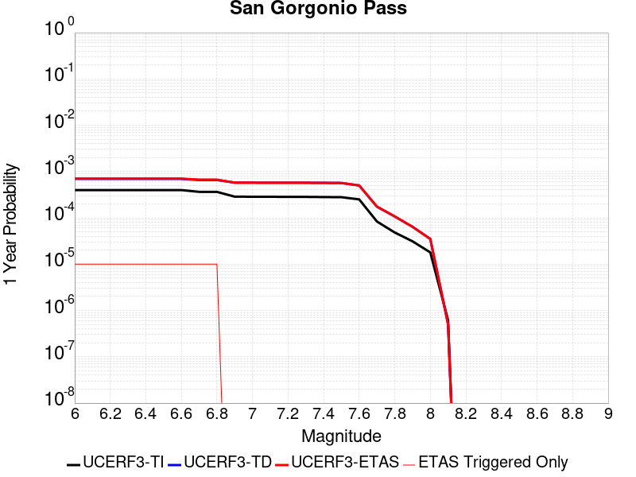 |  |

| Magnitude | 1 wk TI Prob | 1 wk TD Prob | 1 wk ETAS Prob | 1 wk ETAS/TD Gain | 1 wk ETAS Triggered Only | 1 mo TI Prob | 1 mo TD Prob | 1 mo ETAS Prob | 1 mo ETAS/TD Gain | 1 mo ETAS Triggered Only | 1 yr TI Prob | 1 yr TD Prob | 1 yr ETAS Prob | 1 yr ETAS/TD Gain | 1 yr ETAS Triggered Only | 10 yr TI Prob | 10 yr TD Prob | 10 yr ETAS Prob | 10 yr ETAS/TD Gain | 10 yr ETAS Triggered Only |
|-----|-----|-----|-----|-----|-----|-----|-----|-----|-----|-----|-----|-----|-----|-----|-----|-----|-----|-----|-----|-----|
| 6.0 | 7.644328E-6 | 1.3314231E-5 | 1.3314231E-5 | 1.0 | 0.0 | 3.2760996E-5 | 5.705979E-5 | 5.705979E-5 | 1.0 | 0.0 | 3.987921E-4 | 6.944901E-4 | 7.462676E-4 | 1.0745547 | 5.1813473E-5 | 0.003980772 | 0.0069299806 | 0.006981435 | 1.007425 | 5.1813473E-5 |
| 6.1 | 7.644328E-6 | 1.3314231E-5 | 1.3314231E-5 | 1.0 | 0.0 | 3.2760996E-5 | 5.705979E-5 | 5.705979E-5 | 1.0 | 0.0 | 3.987921E-4 | 6.944901E-4 | 7.462676E-4 | 1.0745547 | 5.1813473E-5 | 0.003980772 | 0.0069299806 | 0.006981435 | 1.007425 | 5.1813473E-5 |
| 6.2 | 7.644328E-6 | 1.3314231E-5 | 1.3314231E-5 | 1.0 | 0.0 | 3.2760996E-5 | 5.705979E-5 | 5.705979E-5 | 1.0 | 0.0 | 3.987921E-4 | 6.944901E-4 | 7.462676E-4 | 1.0745547 | 5.1813473E-5 | 0.003980772 | 0.0069299806 | 0.006981435 | 1.007425 | 5.1813473E-5 |
| 6.3 | 7.644328E-6 | 1.3314231E-5 | 1.3314231E-5 | 1.0 | 0.0 | 3.2760996E-5 | 5.705979E-5 | 5.705979E-5 | 1.0 | 0.0 | 3.987921E-4 | 6.944901E-4 | 7.462676E-4 | 1.0745547 | 5.1813473E-5 | 0.003980772 | 0.0069299806 | 0.006981435 | 1.007425 | 5.1813473E-5 |
| 6.4 | 7.644328E-6 | 1.3314231E-5 | 1.3314231E-5 | 1.0 | 0.0 | 3.2760996E-5 | 5.705979E-5 | 5.705979E-5 | 1.0 | 0.0 | 3.987921E-4 | 6.944901E-4 | 7.462676E-4 | 1.0745547 | 5.1813473E-5 | 0.003980772 | 0.0069299806 | 0.006981435 | 1.007425 | 5.1813473E-5 |
| 6.5 | 7.644328E-6 | 1.3314231E-5 | 1.3314231E-5 | 1.0 | 0.0 | 3.2760996E-5 | 5.705979E-5 | 5.705979E-5 | 1.0 | 0.0 | 3.987921E-4 | 6.944901E-4 | 7.462676E-4 | 1.0745547 | 5.1813473E-5 | 0.003980772 | 0.0069299806 | 0.006981435 | 1.007425 | 5.1813473E-5 |
| 6.6 | 7.644328E-6 | 1.3314231E-5 | 1.3314231E-5 | 1.0 | 0.0 | 3.2760996E-5 | 5.705979E-5 | 5.705979E-5 | 1.0 | 0.0 | 3.987921E-4 | 6.944901E-4 | 7.462676E-4 | 1.0745547 | 5.1813473E-5 | 0.003980772 | 0.0069299806 | 0.006981435 | 1.007425 | 5.1813473E-5 |
| 6.7 | 6.987586E-6 | 1.2618505E-5 | 1.2618505E-5 | 1.0 | 0.0 | 2.9946454E-5 | 5.4078235E-5 | 5.4078235E-5 | 1.0 | 0.0 | 3.645371E-4 | 6.582117E-4 | 7.099911E-4 | 1.0786667 | 5.1813473E-5 | 0.0036393967 | 0.0065693567 | 0.00662083 | 1.0078354 | 5.1813473E-5 |
| 6.8 | 6.987586E-6 | 1.2618505E-5 | 1.2618505E-5 | 1.0 | 0.0 | 2.9946454E-5 | 5.4078235E-5 | 5.4078235E-5 | 1.0 | 0.0 | 3.645371E-4 | 6.582117E-4 | 7.099911E-4 | 1.0786667 | 5.1813473E-5 | 0.0036393967 | 0.0065693567 | 0.00662083 | 1.0078354 | 5.1813473E-5 |
| 6.9 | 5.504702E-6 | 1.1049368E-5 | 1.1049368E-5 | 1.0 | 0.0 | 2.3591367E-5 | 4.7353606E-5 | 4.7353606E-5 | 1.0 | 0.0 | 2.8718702E-4 | 5.7638274E-4 | 5.7638274E-4 | 1.0 | 0.0 | 0.0028681618 | 0.005755309 | 0.005755309 | 1.0 | 0.0 |
| 7.0 | 5.4825764E-6 | 1.102571E-5 | 1.102571E-5 | 1.0 | 0.0 | 2.3496545E-5 | 4.7252215E-5 | 4.7252215E-5 | 1.0 | 0.0 | 2.8603288E-4 | 5.751489E-4 | 5.751489E-4 | 1.0 | 0.0 | 0.00285665 | 0.005743035 | 0.005743035 | 1.0 | 0.0 |
| 7.1 | 5.4692787E-6 | 1.101142E-5 | 1.101142E-5 | 1.0 | 0.0 | 2.3439556E-5 | 4.7190973E-5 | 4.7190973E-5 | 1.0 | 0.0 | 2.8533922E-4 | 5.744037E-4 | 5.744037E-4 | 1.0 | 0.0 | 0.0028497311 | 0.0057356213 | 0.0057356213 | 1.0 | 0.0 |
| 7.2 | 5.453661E-6 | 1.0994446E-5 | 1.0994446E-5 | 1.0 | 0.0 | 2.3372622E-5 | 4.7118232E-5 | 4.7118232E-5 | 1.0 | 0.0 | 2.8452452E-4 | 5.7351857E-4 | 5.7351857E-4 | 1.0 | 0.0 | 0.002841605 | 0.0057268157 | 0.0057268157 | 1.0 | 0.0 |
| 7.3 | 5.4422303E-6 | 1.0981369E-5 | 1.0981369E-5 | 1.0 | 0.0 | 2.3323635E-5 | 4.706219E-5 | 4.706219E-5 | 1.0 | 0.0 | 2.8392827E-4 | 5.728366E-4 | 5.728366E-4 | 1.0 | 0.0 | 0.0028356577 | 0.005720031 | 0.005720031 | 1.0 | 0.0 |
| 7.4 | 5.398595E-6 | 1.0928734E-5 | 1.0928734E-5 | 1.0 | 0.0 | 2.313663E-5 | 4.683662E-5 | 4.683662E-5 | 1.0 | 0.0 | 2.8165206E-4 | 5.700917E-4 | 5.700917E-4 | 1.0 | 0.0 | 0.0028129534 | 0.005692723 | 0.005692723 | 1.0 | 0.0 |
| 7.5 | 5.3578788E-6 | 1.0855281E-5 | 1.0855281E-5 | 1.0 | 0.0 | 2.2962136E-5 | 4.6521833E-5 | 4.6521833E-5 | 1.0 | 0.0 | 2.7952815E-4 | 5.662612E-4 | 5.662612E-4 | 1.0 | 0.0 | 0.002791768 | 0.0056546377 | 0.0056546377 | 1.0 | 0.0 |
| 7.6 | 4.8091474E-6 | 9.60368E-6 | 9.60368E-6 | 1.0 | 0.0 | 2.0610469E-5 | 4.1158008E-5 | 4.1158008E-5 | 1.0 | 0.0 | 2.5090357E-4 | 5.0098833E-4 | 5.0098833E-4 | 1.0 | 0.0 | 0.0025062046 | 0.0050053033 | 0.0050053033 | 1.0 | 0.0 |
| 7.7 | 1.5991155E-6 | 3.352866E-6 | 3.352866E-6 | 1.0 | 0.0 | 6.853334E-6 | 1.4369349E-5 | 1.4369349E-5 | 1.0 | 0.0 | 8.343615E-5 | 1.7493303E-4 | 1.7493303E-4 | 1.0 | 0.0 | 8.340483E-4 | 0.0017534072 | 0.0017534072 | 1.0 | 0.0 |
| 7.8 | 9.258398E-7 | 2.0579948E-6 | 2.0579948E-6 | 1.0 | 0.0 | 3.967879E-6 | 8.819949E-6 | 8.819949E-6 | 1.0 | 0.0 | 4.8307855E-5 | 1.073776E-4 | 1.073776E-4 | 1.0 | 0.0 | 4.8297356E-4 | 0.001078687 | 0.001078687 | 1.0 | 0.0 |
| 7.9 | 5.975575E-7 | 1.2291794E-6 | 1.2291794E-6 | 1.0 | 0.0 | 2.5609581E-6 | 5.2679006E-6 | 5.2679006E-6 | 1.0 | 0.0 | 3.117922E-5 | 6.4134816E-5 | 6.4134816E-5 | 1.0 | 0.0 | 3.1174847E-4 | 6.463092E-4 | 6.463092E-4 | 1.0 | 0.0 |
| 8.0 | 3.4413725E-7 | 6.7148494E-7 | 6.7148494E-7 | 1.0 | 0.0 | 1.4748731E-6 | 2.8777895E-6 | 2.8777895E-6 | 1.0 | 0.0 | 1.7956432E-5 | 3.503653E-5 | 3.503653E-5 | 1.0 | 0.0 | 1.7954981E-4 | 3.5373896E-4 | 3.5373896E-4 | 1.0 | 0.0 |
| 8.1 | 1.1787731E-8 | 9.634385E-9 | 9.634385E-9 | 1.0 | 0.0 | 5.0518846E-8 | 4.129022E-8 | 4.129022E-8 | 1.0 | 0.0 | 6.1506677E-7 | 5.027083E-7 | 5.027083E-7 | 1.0 | 0.0 | 6.1506507E-6 | 5.2424944E-6 | 5.2424944E-6 | 1.0 | 0.0 |

## Channel Islands Western Deep Ramp
*[(top)](#table-of-contents)*

| 1 Week | 1 Month | 1 Year | 10 Year |
|-----|-----|-----|-----|
|  |  | 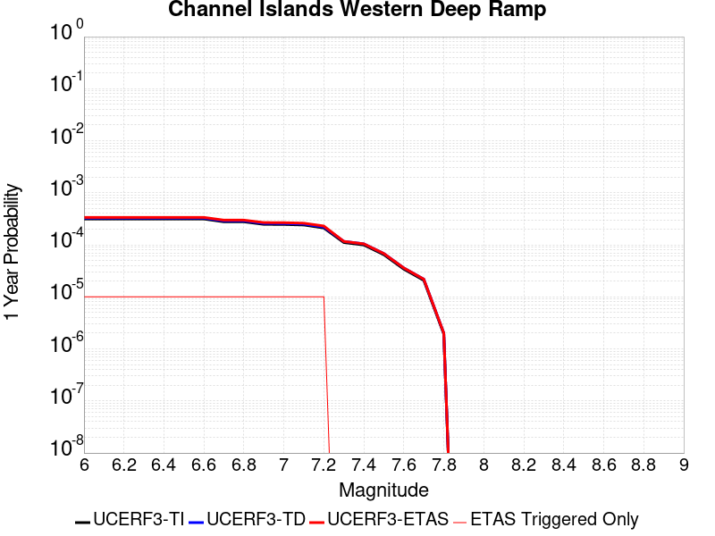 |  |

| Magnitude | 1 wk TI Prob | 1 wk TD Prob | 1 wk ETAS Prob | 1 wk ETAS/TD Gain | 1 wk ETAS Triggered Only | 1 mo TI Prob | 1 mo TD Prob | 1 mo ETAS Prob | 1 mo ETAS/TD Gain | 1 mo ETAS Triggered Only | 1 yr TI Prob | 1 yr TD Prob | 1 yr ETAS Prob | 1 yr ETAS/TD Gain | 1 yr ETAS Triggered Only | 10 yr TI Prob | 10 yr TD Prob | 10 yr ETAS Prob | 10 yr ETAS/TD Gain | 10 yr ETAS Triggered Only |
|-----|-----|-----|-----|-----|-----|-----|-----|-----|-----|-----|-----|-----|-----|-----|-----|-----|-----|-----|-----|-----|
| 6.0 | 6.0213506E-6 | 6.2548684E-6 | 6.2548684E-6 | 1.0 | 0.0 | 2.5805533E-5 | 2.6806329E-5 | 2.6806329E-5 | 1.0 | 0.0 | 3.1413708E-4 | 3.2632265E-4 | 3.2632265E-4 | 1.0 | 0.0 | 0.0031369338 | 0.0032588763 | 0.003310521 | 1.0158473 | 5.1813473E-5 |
| 6.1 | 6.0213506E-6 | 6.2548684E-6 | 6.2548684E-6 | 1.0 | 0.0 | 2.5805533E-5 | 2.6806329E-5 | 2.6806329E-5 | 1.0 | 0.0 | 3.1413708E-4 | 3.2632265E-4 | 3.2632265E-4 | 1.0 | 0.0 | 0.0031369338 | 0.0032588763 | 0.003310521 | 1.0158473 | 5.1813473E-5 |
| 6.2 | 6.0213506E-6 | 6.2548684E-6 | 6.2548684E-6 | 1.0 | 0.0 | 2.5805533E-5 | 2.6806329E-5 | 2.6806329E-5 | 1.0 | 0.0 | 3.1413708E-4 | 3.2632265E-4 | 3.2632265E-4 | 1.0 | 0.0 | 0.0031369338 | 0.0032588763 | 0.003310521 | 1.0158473 | 5.1813473E-5 |
| 6.3 | 6.0213506E-6 | 6.2548684E-6 | 6.2548684E-6 | 1.0 | 0.0 | 2.5805533E-5 | 2.6806329E-5 | 2.6806329E-5 | 1.0 | 0.0 | 3.1413708E-4 | 3.2632265E-4 | 3.2632265E-4 | 1.0 | 0.0 | 0.0031369338 | 0.0032588763 | 0.003310521 | 1.0158473 | 5.1813473E-5 |
| 6.4 | 6.0213506E-6 | 6.2548684E-6 | 6.2548684E-6 | 1.0 | 0.0 | 2.5805533E-5 | 2.6806329E-5 | 2.6806329E-5 | 1.0 | 0.0 | 3.1413708E-4 | 3.2632265E-4 | 3.2632265E-4 | 1.0 | 0.0 | 0.0031369338 | 0.0032588763 | 0.003310521 | 1.0158473 | 5.1813473E-5 |
| 6.5 | 6.0213506E-6 | 6.2548684E-6 | 6.2548684E-6 | 1.0 | 0.0 | 2.5805533E-5 | 2.6806329E-5 | 2.6806329E-5 | 1.0 | 0.0 | 3.1413708E-4 | 3.2632265E-4 | 3.2632265E-4 | 1.0 | 0.0 | 0.0031369338 | 0.0032588763 | 0.003310521 | 1.0158473 | 5.1813473E-5 |
| 6.6 | 6.0213506E-6 | 6.2548684E-6 | 6.2548684E-6 | 1.0 | 0.0 | 2.5805533E-5 | 2.6806329E-5 | 2.6806329E-5 | 1.0 | 0.0 | 3.1413708E-4 | 3.2632265E-4 | 3.2632265E-4 | 1.0 | 0.0 | 0.0031369338 | 0.0032588763 | 0.003310521 | 1.0158473 | 5.1813473E-5 |
| 6.7 | 5.313309E-6 | 5.5252403E-6 | 5.5252403E-6 | 1.0 | 0.0 | 2.2771126E-5 | 2.367941E-5 | 2.367941E-5 | 1.0 | 0.0 | 2.772032E-4 | 2.8826276E-4 | 2.8826276E-4 | 1.0 | 0.0 | 0.0027685766 | 0.0028792918 | 0.002930956 | 1.0179434 | 5.1813473E-5 |
| 6.8 | 5.313309E-6 | 5.5252403E-6 | 5.5252403E-6 | 1.0 | 0.0 | 2.2771126E-5 | 2.367941E-5 | 2.367941E-5 | 1.0 | 0.0 | 2.772032E-4 | 2.8826276E-4 | 2.8826276E-4 | 1.0 | 0.0 | 0.0027685766 | 0.0028792918 | 0.002930956 | 1.0179434 | 5.1813473E-5 |
| 6.9 | 4.744377E-6 | 4.9394303E-6 | 4.9394303E-6 | 1.0 | 0.0 | 2.0332885E-5 | 2.1168837E-5 | 2.1168837E-5 | 1.0 | 0.0 | 2.4752476E-4 | 2.5770385E-4 | 2.5770385E-4 | 1.0 | 0.0 | 0.0024724922 | 0.0025744175 | 0.0026260975 | 1.0200745 | 5.1813473E-5 |
| 7.0 | 4.722209E-6 | 4.9164732E-6 | 4.9164732E-6 | 1.0 | 0.0 | 2.0237881E-5 | 2.107045E-5 | 2.107045E-5 | 1.0 | 0.0 | 2.4636835E-4 | 2.5650626E-4 | 2.5650626E-4 | 1.0 | 0.0 | 0.002460954 | 0.0025624693 | 0.00261415 | 1.0201683 | 5.1813473E-5 |
| 7.1 | 4.611174E-6 | 4.801409E-6 | 4.801409E-6 | 1.0 | 0.0 | 1.9762025E-5 | 2.0577325E-5 | 2.0577325E-5 | 1.0 | 0.0 | 2.4057609E-4 | 2.5050386E-4 | 2.5050386E-4 | 1.0 | 0.0 | 0.002403158 | 0.002502582 | 0.0025542658 | 1.0206522 | 5.1813473E-5 |
| 7.2 | 4.043994E-6 | 4.2120264E-6 | 4.2120264E-6 | 1.0 | 0.0 | 1.7331287E-5 | 1.8051438E-5 | 1.8051438E-5 | 1.0 | 0.0 | 2.10988E-4 | 2.1975765E-4 | 2.1975765E-4 | 1.0 | 0.0 | 0.002107878 | 0.0021957543 | 0.002247454 | 1.0235453 | 5.1813473E-5 |
| 7.3 | 2.1233036E-6 | 2.2297875E-6 | 2.2297875E-6 | 1.0 | 0.0 | 9.099841E-6 | 9.556197E-6 | 9.556197E-6 | 1.0 | 0.0 | 1.1078493E-4 | 1.1634055E-4 | 1.1634055E-4 | 1.0 | 0.0 | 0.0011072971 | 0.001162802 | 0.0012145551 | 1.0445074 | 5.1813473E-5 |
| 7.4 | 1.9051884E-6 | 2.0014973E-6 | 2.0014973E-6 | 1.0 | 0.0 | 8.165067E-6 | 8.577817E-6 | 8.577817E-6 | 1.0 | 0.0 | 9.940516E-5 | 1.0442998E-4 | 1.0442998E-4 | 1.0 | 0.0 | 9.93607E-4 | 0.0010438144 | 0.0010438144 | 1.0 | 0.0 |
| 7.5 | 1.2408497E-6 | 1.3038839E-6 | 1.3038839E-6 | 1.0 | 0.0 | 5.317916E-6 | 5.588062E-6 | 5.588062E-6 | 1.0 | 0.0 | 6.4743705E-5 | 6.8032554E-5 | 6.8032554E-5 | 1.0 | 0.0 | 6.4724847E-4 | 6.8011944E-4 | 6.8011944E-4 | 1.0 | 0.0 |
| 7.6 | 6.5440025E-7 | 6.886718E-7 | 6.886718E-7 | 1.0 | 0.0 | 2.8045695E-6 | 2.9514472E-6 | 2.9514472E-6 | 1.0 | 0.0 | 3.4145098E-5 | 3.593329E-5 | 3.593329E-5 | 1.0 | 0.0 | 3.4139853E-4 | 3.5927625E-4 | 3.5927625E-4 | 1.0 | 0.0 |
| 7.7 | 3.985963E-7 | 4.1930787E-7 | 4.1930787E-7 | 1.0 | 0.0 | 1.7082689E-6 | 1.7970326E-6 | 1.7970326E-6 | 1.0 | 0.0 | 2.0797976E-5 | 2.1878664E-5 | 2.1878664E-5 | 1.0 | 0.0 | 2.0796029E-4 | 2.1876628E-4 | 2.1876628E-4 | 1.0 | 0.0 |
| 7.8 | 3.706329E-8 | 3.8591796E-8 | 3.8591796E-8 | 1.0 | 0.0 | 1.5884267E-7 | 1.653934E-7 | 1.653934E-7 | 1.0 | 0.0 | 1.9339077E-6 | 2.0136629E-6 | 2.0136629E-6 | 1.0 | 0.0 | 1.933891E-5 | 2.0136458E-5 | 2.0136458E-5 | 1.0 | 0.0 |

## San Luis Range 2011 CFM
*[(top)](#table-of-contents)*

| 1 Week | 1 Month | 1 Year | 10 Year |
|-----|-----|-----|-----|
|  |  | 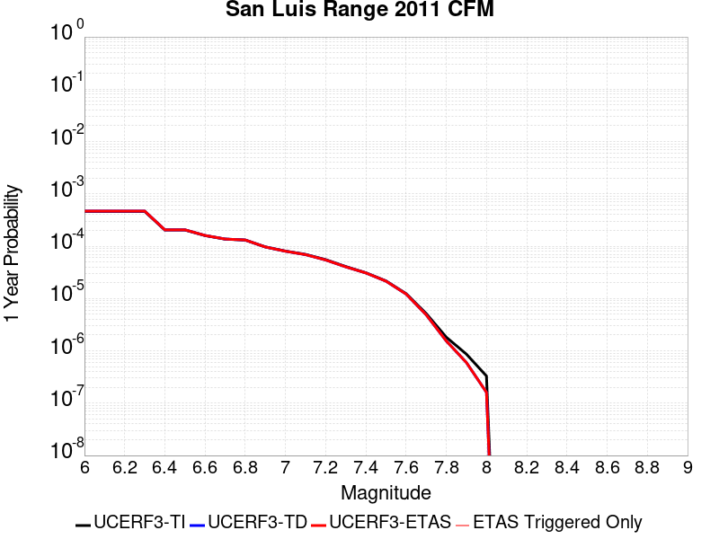 |  |

| Magnitude | 1 wk TI Prob | 1 wk TD Prob | 1 wk ETAS Prob | 1 wk ETAS/TD Gain | 1 wk ETAS Triggered Only | 1 mo TI Prob | 1 mo TD Prob | 1 mo ETAS Prob | 1 mo ETAS/TD Gain | 1 mo ETAS Triggered Only | 1 yr TI Prob | 1 yr TD Prob | 1 yr ETAS Prob | 1 yr ETAS/TD Gain | 1 yr ETAS Triggered Only | 10 yr TI Prob | 10 yr TD Prob | 10 yr ETAS Prob | 10 yr ETAS/TD Gain | 10 yr ETAS Triggered Only |
|-----|-----|-----|-----|-----|-----|-----|-----|-----|-----|-----|-----|-----|-----|-----|-----|-----|-----|-----|-----|-----|
| 6.0 | 8.8368415E-6 | 8.965454E-6 | 8.965454E-6 | 1.0 | 0.0 | 3.787163E-5 | 3.842285E-5 | 3.842285E-5 | 1.0 | 0.0 | 4.609895E-4 | 4.677057E-4 | 4.677057E-4 | 1.0 | 0.0 | 0.0046003438 | 0.0046679964 | 0.004719568 | 1.011048 | 5.1813473E-5 |
| 6.1 | 8.8368415E-6 | 8.965454E-6 | 8.965454E-6 | 1.0 | 0.0 | 3.787163E-5 | 3.842285E-5 | 3.842285E-5 | 1.0 | 0.0 | 4.609895E-4 | 4.677057E-4 | 4.677057E-4 | 1.0 | 0.0 | 0.0046003438 | 0.0046679964 | 0.004719568 | 1.011048 | 5.1813473E-5 |
| 6.2 | 8.8368415E-6 | 8.965454E-6 | 8.965454E-6 | 1.0 | 0.0 | 3.787163E-5 | 3.842285E-5 | 3.842285E-5 | 1.0 | 0.0 | 4.609895E-4 | 4.677057E-4 | 4.677057E-4 | 1.0 | 0.0 | 0.0046003438 | 0.0046679964 | 0.004719568 | 1.011048 | 5.1813473E-5 |
| 6.3 | 8.8368415E-6 | 8.965454E-6 | 8.965454E-6 | 1.0 | 0.0 | 3.787163E-5 | 3.842285E-5 | 3.842285E-5 | 1.0 | 0.0 | 4.609895E-4 | 4.677057E-4 | 4.677057E-4 | 1.0 | 0.0 | 0.0046003438 | 0.0046679964 | 0.004719568 | 1.011048 | 5.1813473E-5 |
| 6.4 | 3.9094193E-6 | 3.9412025E-6 | 3.9412025E-6 | 1.0 | 0.0 | 1.6754546E-5 | 1.689076E-5 | 1.689076E-5 | 1.0 | 0.0 | 2.039675E-4 | 2.056259E-4 | 2.056259E-4 | 1.0 | 0.0 | 0.0020378039 | 0.0020543851 | 0.0020543851 | 1.0 | 0.0 |
| 6.5 | 3.9094193E-6 | 3.9412025E-6 | 3.9412025E-6 | 1.0 | 0.0 | 1.6754546E-5 | 1.689076E-5 | 1.689076E-5 | 1.0 | 0.0 | 2.039675E-4 | 2.056259E-4 | 2.056259E-4 | 1.0 | 0.0 | 0.0020378039 | 0.0020543851 | 0.0020543851 | 1.0 | 0.0 |
| 6.6 | 3.0587726E-6 | 3.0753883E-6 | 3.0753883E-6 | 1.0 | 0.0 | 1.3108959E-5 | 1.318017E-5 | 1.318017E-5 | 1.0 | 0.0 | 1.595899E-4 | 1.6045687E-4 | 1.6045687E-4 | 1.0 | 0.0 | 0.0015947534 | 0.0016034221 | 0.0016034221 | 1.0 | 0.0 |
| 6.7 | 2.6160574E-6 | 2.6251273E-6 | 2.6251273E-6 | 1.0 | 0.0 | 1.1211626E-5 | 1.1250498E-5 | 1.1250498E-5 | 1.0 | 0.0 | 1.3649299E-4 | 1.3696625E-4 | 1.3696625E-4 | 1.0 | 0.0 | 0.0013640919 | 0.0013688246 | 0.0013688246 | 1.0 | 0.0 |
| 6.8 | 2.5110312E-6 | 2.51814E-6 | 2.51814E-6 | 1.0 | 0.0 | 1.0761518E-5 | 1.0791985E-5 | 1.0791985E-5 | 1.0 | 0.0 | 1.310136E-4 | 1.3138456E-4 | 1.3138456E-4 | 1.0 | 0.0 | 0.0013093639 | 0.0013130746 | 0.0013130746 | 1.0 | 0.0 |
| 6.9 | 1.8564405E-6 | 1.852487E-6 | 1.852487E-6 | 1.0 | 0.0 | 7.95615E-6 | 7.939206E-6 | 7.939206E-6 | 1.0 | 0.0 | 9.686181E-5 | 9.665557E-5 | 9.665557E-5 | 1.0 | 0.0 | 9.68196E-4 | 9.661373E-4 | 9.661373E-4 | 1.0 | 0.0 |
| 7.0 | 1.546127E-6 | 1.5369537E-6 | 1.5369537E-6 | 1.0 | 0.0 | 6.626242E-6 | 6.586928E-6 | 6.586928E-6 | 1.0 | 0.0 | 8.06715E-5 | 8.0192905E-5 | 8.0192905E-5 | 1.0 | 0.0 | 8.0642226E-4 | 8.016404E-4 | 8.016404E-4 | 1.0 | 0.0 |
| 7.1 | 1.3368208E-6 | 1.3235326E-6 | 1.3235326E-6 | 1.0 | 0.0 | 5.7292195E-6 | 5.67227E-6 | 5.67227E-6 | 1.0 | 0.0 | 6.975101E-5 | 6.905771E-5 | 6.905771E-5 | 1.0 | 0.0 | 6.972912E-4 | 6.9036294E-4 | 6.9036294E-4 | 1.0 | 0.0 |
| 7.2 | 1.0623363E-6 | 1.0454368E-6 | 1.0454368E-6 | 1.0 | 0.0 | 4.5528623E-6 | 4.4804356E-6 | 4.4804356E-6 | 1.0 | 0.0 | 5.5429686E-5 | 5.4547938E-5 | 5.4547938E-5 | 1.0 | 0.0 | 5.5415864E-4 | 5.4534577E-4 | 5.4534577E-4 | 1.0 | 0.0 |
| 7.3 | 7.831679E-7 | 7.7273904E-7 | 7.7273904E-7 | 1.0 | 0.0 | 3.3564295E-6 | 3.3117344E-6 | 3.3117344E-6 | 1.0 | 0.0 | 4.086376E-5 | 4.0319625E-5 | 4.0319625E-5 | 1.0 | 0.0 | 4.0856248E-4 | 4.031232E-4 | 4.031232E-4 | 1.0 | 0.0 |
| 7.4 | 5.9558846E-7 | 5.910636E-7 | 5.910636E-7 | 1.0 | 0.0 | 2.5525194E-6 | 2.5331274E-6 | 2.5331274E-6 | 1.0 | 0.0 | 3.107648E-5 | 3.084039E-5 | 3.084039E-5 | 1.0 | 0.0 | 3.1072134E-4 | 3.083612E-4 | 3.083612E-4 | 1.0 | 0.0 |
| 7.5 | 4.1616502E-7 | 4.119631E-7 | 4.119631E-7 | 1.0 | 0.0 | 1.7835631E-6 | 1.7655549E-6 | 1.7655549E-6 | 1.0 | 0.0 | 2.1714664E-5 | 2.149542E-5 | 2.149542E-5 | 1.0 | 0.0 | 2.1712543E-4 | 2.1493346E-4 | 2.1493346E-4 | 1.0 | 0.0 |
| 7.6 | 2.3816014E-7 | 2.3376548E-7 | 2.3376548E-7 | 1.0 | 0.0 | 1.0206859E-6 | 1.0018516E-6 | 1.0018516E-6 | 1.0 | 0.0 | 1.242678E-5 | 1.2197475E-5 | 1.2197475E-5 | 1.0 | 0.0 | 1.2426086E-4 | 1.2196808E-4 | 1.2196808E-4 | 1.0 | 0.0 |
| 7.7 | 9.918777E-8 | 9.3867584E-8 | 9.3867584E-8 | 1.0 | 0.0 | 4.2509038E-7 | 4.0228957E-7 | 4.0228957E-7 | 1.0 | 0.0 | 5.1754632E-6 | 4.8978645E-6 | 4.8978645E-6 | 1.0 | 0.0 | 5.1753424E-5 | 4.897757E-5 | 4.897757E-5 | 1.0 | 0.0 |
| 7.8 | 3.4982556E-8 | 2.968655E-8 | 2.968655E-8 | 1.0 | 0.0 | 1.4992524E-7 | 1.2722806E-7 | 1.2722806E-7 | 1.0 | 0.0 | 1.8253382E-6 | 1.5490006E-6 | 1.5490006E-6 | 1.0 | 0.0 | 1.8253233E-5 | 1.5489897E-5 | 1.5489897E-5 | 1.0 | 0.0 |
| 7.9 | 1.6624908E-8 | 1.1477036E-8 | 1.1477036E-8 | 1.0 | 0.0 | 7.12496E-8 | 4.91873E-8 | 4.91873E-8 | 1.0 | 0.0 | 8.6746354E-7 | 5.988552E-7 | 5.988552E-7 | 1.0 | 0.0 | 8.674601E-6 | 5.988536E-6 | 5.988536E-6 | 1.0 | 0.0 |
| 8.0 | 6.3352315E-9 | 3.0888412E-9 | 3.0888412E-9 | 1.0 | 0.0 | 2.715099E-8 | 1.3237893E-8 | 1.3237893E-8 | 1.0 | 0.0 | 3.3056327E-7 | 1.6117131E-7 | 1.6117131E-7 | 1.0 | 0.0 | 3.3056278E-6 | 1.611712E-6 | 1.611712E-6 | 1.0 | 0.0 |

## Earthquake Valley (No  Extension)
*[(top)](#table-of-contents)*

| 1 Week | 1 Month | 1 Year | 10 Year |
|-----|-----|-----|-----|
|  |  | 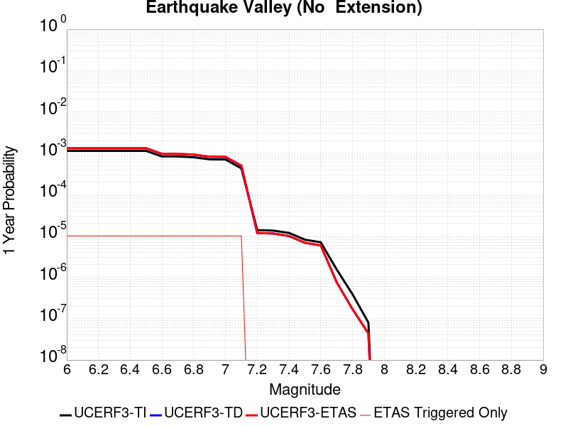 |  |

| Magnitude | 1 wk TI Prob | 1 wk TD Prob | 1 wk ETAS Prob | 1 wk ETAS/TD Gain | 1 wk ETAS Triggered Only | 1 mo TI Prob | 1 mo TD Prob | 1 mo ETAS Prob | 1 mo ETAS/TD Gain | 1 mo ETAS Triggered Only | 1 yr TI Prob | 1 yr TD Prob | 1 yr ETAS Prob | 1 yr ETAS/TD Gain | 1 yr ETAS Triggered Only | 10 yr TI Prob | 10 yr TD Prob | 10 yr ETAS Prob | 10 yr ETAS/TD Gain | 10 yr ETAS Triggered Only |
|-----|-----|-----|-----|-----|-----|-----|-----|-----|-----|-----|-----|-----|-----|-----|-----|-----|-----|-----|-----|-----|
| 6.0 | 2.1859703E-5 | 2.5198362E-5 | 2.5198362E-5 | 1.0 | 0.0 | 9.3681076E-5 | 1.07989326E-4 | 1.07989326E-4 | 1.0 | 0.0 | 0.0011399703 | 0.001314122 | 0.0013658674 | 1.0393764 | 5.1813473E-5 | 0.011341401 | 0.013077871 | 0.013129007 | 1.0039101 | 5.1813473E-5 |
| 6.1 | 2.1859703E-5 | 2.5198362E-5 | 2.5198362E-5 | 1.0 | 0.0 | 9.3681076E-5 | 1.07989326E-4 | 1.07989326E-4 | 1.0 | 0.0 | 0.0011399703 | 0.001314122 | 0.0013658674 | 1.0393764 | 5.1813473E-5 | 0.011341401 | 0.013077871 | 0.013129007 | 1.0039101 | 5.1813473E-5 |
| 6.2 | 2.1859703E-5 | 2.5198362E-5 | 2.5198362E-5 | 1.0 | 0.0 | 9.3681076E-5 | 1.07989326E-4 | 1.07989326E-4 | 1.0 | 0.0 | 0.0011399703 | 0.001314122 | 0.0013658674 | 1.0393764 | 5.1813473E-5 | 0.011341401 | 0.013077871 | 0.013129007 | 1.0039101 | 5.1813473E-5 |
| 6.3 | 2.1859703E-5 | 2.5198362E-5 | 2.5198362E-5 | 1.0 | 0.0 | 9.3681076E-5 | 1.07989326E-4 | 1.07989326E-4 | 1.0 | 0.0 | 0.0011399703 | 0.001314122 | 0.0013658674 | 1.0393764 | 5.1813473E-5 | 0.011341401 | 0.013077871 | 0.013129007 | 1.0039101 | 5.1813473E-5 |
| 6.4 | 2.1859703E-5 | 2.5198362E-5 | 2.5198362E-5 | 1.0 | 0.0 | 9.3681076E-5 | 1.07989326E-4 | 1.07989326E-4 | 1.0 | 0.0 | 0.0011399703 | 0.001314122 | 0.0013658674 | 1.0393764 | 5.1813473E-5 | 0.011341401 | 0.013077871 | 0.013129007 | 1.0039101 | 5.1813473E-5 |
| 6.5 | 2.1859703E-5 | 2.5198362E-5 | 2.5198362E-5 | 1.0 | 0.0 | 9.3681076E-5 | 1.07989326E-4 | 1.07989326E-4 | 1.0 | 0.0 | 0.0011399703 | 0.001314122 | 0.0013658674 | 1.0393764 | 5.1813473E-5 | 0.011341401 | 0.013077871 | 0.013129007 | 1.0039101 | 5.1813473E-5 |
| 6.6 | 1.597E-5 | 1.8356275E-5 | 1.8356275E-5 | 1.0 | 0.0 | 6.8441055E-5 | 7.866787E-5 | 7.866787E-5 | 1.0 | 0.0 | 8.329513E-4 | 9.574478E-4 | 0.0010092116 | 1.0540644 | 5.1813473E-5 | 0.008298361 | 0.009541836 | 0.009593155 | 1.0053784 | 5.1813473E-5 |
| 6.7 | 1.597E-5 | 1.8356275E-5 | 1.8356275E-5 | 1.0 | 0.0 | 6.8441055E-5 | 7.866787E-5 | 7.866787E-5 | 1.0 | 0.0 | 8.329513E-4 | 9.574478E-4 | 0.0010092116 | 1.0540644 | 5.1813473E-5 | 0.008298361 | 0.009541836 | 0.009593155 | 1.0053784 | 5.1813473E-5 |
| 6.8 | 1.5315149E-5 | 1.7602091E-5 | 1.7602091E-5 | 1.0 | 0.0 | 6.5634704E-5 | 7.543584E-5 | 7.543584E-5 | 1.0 | 0.0 | 7.988095E-4 | 9.181311E-4 | 9.69897E-4 | 1.0563818 | 5.1813473E-5 | 0.007959441 | 0.009151919 | 0.009203258 | 1.0056096 | 5.1813473E-5 |
| 6.9 | 1.3634728E-5 | 1.5675821E-5 | 1.5675821E-5 | 1.0 | 0.0 | 5.8433237E-5 | 6.718082E-5 | 6.718082E-5 | 1.0 | 0.0 | 7.1119244E-4 | 8.177017E-4 | 8.694728E-4 | 1.0633129 | 5.1813473E-5 | 0.007089207 | 0.008155 | 0.008206392 | 1.0063018 | 5.1813473E-5 |
| 7.0 | 1.3496271E-5 | 1.5517853E-5 | 1.5517853E-5 | 1.0 | 0.0 | 5.783988E-5 | 6.650385E-5 | 6.650385E-5 | 1.0 | 0.0 | 7.03973E-4 | 8.094657E-4 | 8.6123723E-4 | 1.0639577 | 5.1813473E-5 | 0.007017471 | 0.0080732405 | 0.008124636 | 1.0063661 | 5.1813473E-5 |
| 7.1 | 8.242798E-6 | 9.4726E-6 | 9.4726E-6 | 1.0 | 0.0 | 3.53258E-5 | 4.0596606E-5 | 4.0596606E-5 | 1.0 | 0.0 | 4.300067E-4 | 4.9421866E-4 | 5.460065E-4 | 1.1047873 | 5.1813473E-5 | 0.004291756 | 0.0049377717 | 0.0049893293 | 1.0104414 | 5.1813473E-5 |
| 7.2 | 2.6506527E-7 | 2.2560312E-7 | 2.2560312E-7 | 1.0 | 0.0 | 1.1359936E-6 | 9.668702E-7 | 9.668702E-7 | 1.0 | 0.0 | 1.3830633E-5 | 1.17715845E-5 | 1.17715845E-5 | 1.0 | 0.0 | 1.3829772E-4 | 1.1771003E-4 | 1.1771003E-4 | 1.0 | 0.0 |
| 7.3 | 2.5810488E-7 | 2.1955442E-7 | 2.1955442E-7 | 1.0 | 0.0 | 1.1061633E-6 | 9.409472E-7 | 9.409472E-7 | 1.0 | 0.0 | 1.3467455E-5 | 1.1455976E-5 | 1.1455976E-5 | 1.0 | 0.0 | 1.3466639E-4 | 1.1455427E-4 | 1.1455427E-4 | 1.0 | 0.0 |
| 7.4 | 2.2676066E-7 | 1.9110601E-7 | 1.9110601E-7 | 1.0 | 0.0 | 9.71831E-7 | 8.190255E-7 | 8.190255E-7 | 1.0 | 0.0 | 1.1831979E-5 | 9.9715935E-6 | 9.9715935E-6 | 1.0 | 0.0 | 1.1831349E-4 | 9.9711855E-5 | 9.9711855E-5 | 1.0 | 0.0 |
| 7.5 | 1.5553917E-7 | 1.3112096E-7 | 1.3112096E-7 | 1.0 | 0.0 | 6.6659624E-7 | 5.619469E-7 | 5.619469E-7 | 1.0 | 0.0 | 8.115779E-6 | 6.8416834E-6 | 6.8416834E-6 | 1.0 | 0.0 | 8.115482E-5 | 6.841495E-5 | 6.841495E-5 | 1.0 | 0.0 |
| 7.6 | 1.3448629E-7 | 1.1288419E-7 | 1.1288419E-7 | 1.0 | 0.0 | 5.7636964E-7 | 4.837893E-7 | 4.837893E-7 | 1.0 | 0.0 | 7.017278E-6 | 5.890121E-6 | 5.890121E-6 | 1.0 | 0.0 | 7.0170565E-5 | 5.889986E-5 | 5.889986E-5 | 1.0 | 0.0 |
| 7.7 | 2.9719402E-8 | 1.458206E-8 | 1.458206E-8 | 1.0 | 0.0 | 1.2736886E-7 | 6.249454E-8 | 6.249454E-8 | 1.0 | 0.0 | 1.5507147E-6 | 7.608708E-7 | 7.608708E-7 | 1.0 | 0.0 | 1.550704E-5 | 7.6086876E-6 | 7.6086876E-6 | 1.0 | 0.0 |
| 7.8 | 7.4390196E-9 | 3.2502152E-9 | 3.2502152E-9 | 1.0 | 0.0 | 3.1881513E-8 | 1.3929493E-8 | 1.3929493E-8 | 1.0 | 0.0 | 3.8815733E-7 | 1.6959156E-7 | 1.6959156E-7 | 1.0 | 0.0 | 3.8815665E-6 | 1.6959145E-6 | 1.6959145E-6 | 1.0 | 0.0 |
| 7.9 | 1.5373532E-9 | 8.440161E-10 | 8.440161E-10 | 1.0 | 0.0 | 6.5886567E-9 | 3.6172119E-9 | 3.6172119E-9 | 1.0 | 0.0 | 8.021689E-8 | 4.4039556E-8 | 4.4039556E-8 | 1.0 | 0.0 | 8.0216864E-7 | 4.4039552E-7 | 4.4039552E-7 | 1.0 | 0.0 |

## Ortigalita (North)
*[(top)](#table-of-contents)*

| 1 Week | 1 Month | 1 Year | 10 Year |
|-----|-----|-----|-----|
|  |  |  | 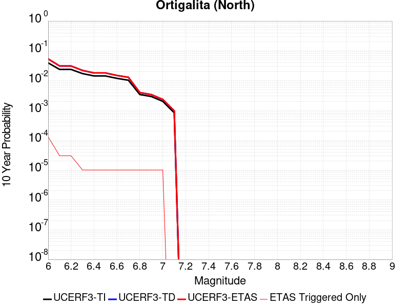 |

| Magnitude | 1 wk TI Prob | 1 wk TD Prob | 1 wk ETAS Prob | 1 wk ETAS/TD Gain | 1 wk ETAS Triggered Only | 1 mo TI Prob | 1 mo TD Prob | 1 mo ETAS Prob | 1 mo ETAS/TD Gain | 1 mo ETAS Triggered Only | 1 yr TI Prob | 1 yr TD Prob | 1 yr ETAS Prob | 1 yr ETAS/TD Gain | 1 yr ETAS Triggered Only | 10 yr TI Prob | 10 yr TD Prob | 10 yr ETAS Prob | 10 yr ETAS/TD Gain | 10 yr ETAS Triggered Only |
|-----|-----|-----|-----|-----|-----|-----|-----|-----|-----|-----|-----|-----|-----|-----|-----|-----|-----|-----|-----|-----|
| 6.0 | 7.711876E-5 | 1.05064966E-4 | 1.56873E-4 | 1.4931047 | 5.1813473E-5 | 3.3046713E-4 | 4.502116E-4 | 5.020017E-4 | 1.1150352 | 5.1813473E-5 | 0.004016016 | 0.0054681194 | 0.00551965 | 1.0094237 | 5.1813473E-5 | 0.039442103 | 0.053454787 | 0.05350383 | 1.0009174 | 5.1813473E-5 |
| 6.1 | 4.607858E-5 | 6.0239203E-5 | 6.0239203E-5 | 1.0 | 0.0 | 1.9746469E-4 | 2.5814527E-4 | 2.5814527E-4 | 1.0 | 0.0 | 0.0024014818 | 0.0031387596 | 0.0031387596 | 1.0 | 0.0 | 0.023756953 | 0.030975068 | 0.030975068 | 1.0 | 0.0 |
| 6.2 | 4.607858E-5 | 6.0239203E-5 | 6.0239203E-5 | 1.0 | 0.0 | 1.9746469E-4 | 2.5814527E-4 | 2.5814527E-4 | 1.0 | 0.0 | 0.0024014818 | 0.0031387596 | 0.0031387596 | 1.0 | 0.0 | 0.023756953 | 0.030975068 | 0.030975068 | 1.0 | 0.0 |
| 6.3 | 3.327423E-5 | 4.2475127E-5 | 4.2475127E-5 | 1.0 | 0.0 | 1.4259605E-4 | 1.8202531E-4 | 1.8202531E-4 | 1.0 | 0.0 | 0.0017347244 | 0.002214197 | 0.002214197 | 1.0 | 0.0 | 0.017212452 | 0.021945644 | 0.021945644 | 1.0 | 0.0 |
| 6.4 | 2.7732503E-5 | 3.4998593E-5 | 3.4998593E-5 | 1.0 | 0.0 | 1.1884817E-4 | 1.4998685E-4 | 1.4998685E-4 | 1.0 | 0.0 | 0.001446016 | 0.0018248095 | 0.0018248095 | 1.0 | 0.0 | 0.014366428 | 0.018121224 | 0.018121224 | 1.0 | 0.0 |
| 6.5 | 2.7689714E-5 | 3.4948407E-5 | 3.4948407E-5 | 1.0 | 0.0 | 1.186648E-4 | 1.497718E-4 | 1.497718E-4 | 1.0 | 0.0 | 0.0014437864 | 0.0018221956 | 0.0018221956 | 1.0 | 0.0 | 0.014344421 | 0.01809551 | 0.01809551 | 1.0 | 0.0 |
| 6.6 | 2.2976905E-5 | 2.8718265E-5 | 2.8718265E-5 | 1.0 | 0.0 | 9.846873E-5 | 1.230739E-4 | 1.230739E-4 | 1.0 | 0.0 | 0.0011981975 | 0.0014976363 | 0.0014976363 | 1.0 | 0.0 | 0.011917574 | 0.014898697 | 0.014898697 | 1.0 | 0.0 |
| 6.7 | 1.9871539E-5 | 2.4904411E-5 | 2.4904411E-5 | 1.0 | 0.0 | 8.516096E-5 | 1.0673023E-4 | 1.0673023E-4 | 1.0 | 0.0 | 0.0010363415 | 0.0012989145 | 0.0012989145 | 1.0 | 0.0 | 0.010315218 | 0.012936919 | 0.012936919 | 1.0 | 0.0 |
| 6.8 | 6.5640475E-6 | 7.6054926E-6 | 7.6054926E-6 | 1.0 | 0.0 | 2.813133E-5 | 3.2594577E-5 | 3.2594577E-5 | 1.0 | 0.0 | 3.424451E-4 | 3.9676955E-4 | 3.9676955E-4 | 1.0 | 0.0 | 0.0034191788 | 0.003960899 | 0.003960899 | 1.0 | 0.0 |
| 6.9 | 5.6219683E-6 | 6.5018376E-6 | 6.5018376E-6 | 1.0 | 0.0 | 2.4093928E-5 | 2.7864735E-5 | 2.7864735E-5 | 1.0 | 0.0 | 2.933041E-4 | 3.3920293E-4 | 3.3920293E-4 | 1.0 | 0.0 | 0.0029291727 | 0.003387109 | 0.003387109 | 1.0 | 0.0 |
| 7.0 | 3.875591E-6 | 4.4847548E-6 | 4.4847548E-6 | 1.0 | 0.0 | 1.6609569E-5 | 1.9220248E-5 | 1.9220248E-5 | 1.0 | 0.0 | 2.0220275E-4 | 2.339835E-4 | 2.339835E-4 | 1.0 | 0.0 | 0.0020201886 | 0.0023375798 | 0.0023375798 | 1.0 | 0.0 |
| 7.1 | 1.6017933E-6 | 1.8570418E-6 | 1.8570418E-6 | 1.0 | 0.0 | 6.8648105E-6 | 7.958732E-6 | 7.958732E-6 | 1.0 | 0.0 | 8.357586E-5 | 9.689432E-5 | 9.689432E-5 | 1.0 | 0.0 | 8.3544437E-4 | 9.686254E-4 | 9.686254E-4 | 1.0 | 0.0 |

## San Andreas (Santa Cruz Mts) 2011 CFM
*[(top)](#table-of-contents)*

| 1 Week | 1 Month | 1 Year | 10 Year |
|-----|-----|-----|-----|
|  |  |  |  |

| Magnitude | 1 wk TI Prob | 1 wk TD Prob | 1 wk ETAS Prob | 1 wk ETAS/TD Gain | 1 wk ETAS Triggered Only | 1 mo TI Prob | 1 mo TD Prob | 1 mo ETAS Prob | 1 mo ETAS/TD Gain | 1 mo ETAS Triggered Only | 1 yr TI Prob | 1 yr TD Prob | 1 yr ETAS Prob | 1 yr ETAS/TD Gain | 1 yr ETAS Triggered Only | 10 yr TI Prob | 10 yr TD Prob | 10 yr ETAS Prob | 10 yr ETAS/TD Gain | 10 yr ETAS Triggered Only |
|-----|-----|-----|-----|-----|-----|-----|-----|-----|-----|-----|-----|-----|-----|-----|-----|-----|-----|-----|-----|-----|
| 6.0 | 1.7221631E-4 | 1.3793171E-4 | 1.3793171E-4 | 1.0 | 0.0 | 7.378611E-4 | 5.9100403E-4 | 5.9100403E-4 | 1.0 | 0.0 | 0.008946515 | 0.007172124 | 0.007172124 | 1.0 | 0.0 | 0.08594794 | 0.0705551 | 0.07060325 | 1.0006826 | 5.1813473E-5 |
| 6.1 | 1.7221631E-4 | 1.3793171E-4 | 1.3793171E-4 | 1.0 | 0.0 | 7.378611E-4 | 5.9100403E-4 | 5.9100403E-4 | 1.0 | 0.0 | 0.008946515 | 0.007172124 | 0.007172124 | 1.0 | 0.0 | 0.08594794 | 0.0705551 | 0.07060325 | 1.0006826 | 5.1813473E-5 |
| 6.2 | 1.7221631E-4 | 1.3793171E-4 | 1.3793171E-4 | 1.0 | 0.0 | 7.378611E-4 | 5.9100403E-4 | 5.9100403E-4 | 1.0 | 0.0 | 0.008946515 | 0.007172124 | 0.007172124 | 1.0 | 0.0 | 0.08594794 | 0.0705551 | 0.07060325 | 1.0006826 | 5.1813473E-5 |
| 6.3 | 1.716926E-4 | 1.3712609E-4 | 1.3712609E-4 | 1.0 | 0.0 | 7.3561794E-4 | 5.875529E-4 | 5.875529E-4 | 1.0 | 0.0 | 0.008919428 | 0.0071303817 | 0.0071303817 | 1.0 | 0.0 | 0.08569809 | 0.070167266 | 0.07021544 | 1.0006866 | 5.1813473E-5 |
| 6.4 | 1.6392978E-4 | 1.3588481E-4 | 1.3588481E-4 | 1.0 | 0.0 | 7.02367E-4 | 5.822355E-4 | 5.822355E-4 | 1.0 | 0.0 | 0.008517839 | 0.007066063 | 0.007066063 | 1.0 | 0.0 | 0.08198654 | 0.06940135 | 0.069449574 | 1.0006948 | 5.1813473E-5 |
| 6.5 | 1.5742714E-4 | 1.2648388E-4 | 1.2648388E-4 | 1.0 | 0.0 | 6.745133E-4 | 5.4196286E-4 | 5.4196286E-4 | 1.0 | 0.0 | 0.00818132 | 0.0065787593 | 0.0065787593 | 1.0 | 0.0 | 0.078865945 | 0.06486309 | 0.06491155 | 1.000747 | 5.1813473E-5 |
| 6.6 | 1.3038084E-4 | 1.1588213E-4 | 1.1588213E-4 | 1.0 | 0.0 | 5.5865536E-4 | 4.9654447E-4 | 4.9654447E-4 | 1.0 | 0.0 | 0.006780438 | 0.0060289134 | 0.0060289134 | 1.0 | 0.0 | 0.0657725 | 0.05932738 | 0.059376117 | 1.0008216 | 5.1813473E-5 |
| 6.7 | 1.2867592E-4 | 1.1314701E-4 | 1.1314701E-4 | 1.0 | 0.0 | 5.5135164E-4 | 4.8482692E-4 | 4.8482692E-4 | 1.0 | 0.0 | 0.0066920654 | 0.00588703 | 0.00588703 | 1.0 | 0.0 | 0.06494093 | 0.058038417 | 0.058087222 | 1.0008409 | 5.1813473E-5 |
| 6.8 | 1.2801298E-4 | 1.1252261E-4 | 1.1252261E-4 | 1.0 | 0.0 | 5.485117E-4 | 4.8215193E-4 | 4.8215193E-4 | 1.0 | 0.0 | 0.0066577005 | 0.0058546383 | 0.0058546383 | 1.0 | 0.0 | 0.06461738 | 0.057752274 | 0.057801094 | 1.0008453 | 5.1813473E-5 |
| 6.9 | 1.269149E-4 | 1.1094465E-4 | 1.1094465E-4 | 1.0 | 0.0 | 5.4380763E-4 | 4.7539172E-4 | 4.7539172E-4 | 1.0 | 0.0 | 0.006600777 | 0.005772772 | 0.005772772 | 1.0 | 0.0 | 0.06408122 | 0.0570241 | 0.057072956 | 1.0008568 | 5.1813473E-5 |
| 7.0 | 1.2030331E-4 | 1.0824504E-4 | 1.0824504E-4 | 1.0 | 0.0 | 5.154837E-4 | 4.638261E-4 | 4.638261E-4 | 1.0 | 0.0 | 0.006257969 | 0.0056326967 | 0.0056326967 | 1.0 | 0.0 | 0.06084648 | 0.055696685 | 0.055745613 | 1.0008785 | 5.1813473E-5 |
| 7.1 | 8.049617E-5 | 5.3926604E-5 | 5.3926604E-5 | 1.0 | 0.0 | 3.4493793E-4 | 2.3109373E-4 | 2.3109373E-4 | 1.0 | 0.0 | 0.0041915346 | 0.0028099709 | 0.0028099709 | 1.0 | 0.0 | 0.041133516 | 0.029618956 | 0.029669235 | 1.0016975 | 5.1813473E-5 |
| 7.2 | 7.093979E-5 | 4.2937932E-5 | 4.2937932E-5 | 1.0 | 0.0 | 3.0399222E-4 | 1.8400686E-4 | 1.8400686E-4 | 1.0 | 0.0 | 0.0036948253 | 0.0022380045 | 0.0022380045 | 1.0 | 0.0 | 0.03633994 | 0.023941692 | 0.023992265 | 1.0021124 | 5.1813473E-5 |
| 7.3 | 6.193693E-5 | 2.8894141E-5 | 2.8894141E-5 | 1.0 | 0.0 | 2.6541698E-4 | 1.2382616E-4 | 1.2382616E-4 | 1.0 | 0.0 | 0.0032266637 | 0.0015065427 | 0.0015065427 | 1.0 | 0.0 | 0.031802133 | 0.016499156 | 0.016550114 | 1.0030886 | 5.1813473E-5 |
| 7.4 | 5.906492E-5 | 2.702346E-5 | 2.702346E-5 | 1.0 | 0.0 | 2.5311083E-4 | 1.1580969E-4 | 1.1580969E-4 | 1.0 | 0.0 | 0.0030772698 | 0.0014090725 | 0.0014090725 | 1.0 | 0.0 | 0.030350044 | 0.015471023 | 0.015522034 | 1.0032972 | 5.1813473E-5 |
| 7.5 | 5.424296E-5 | 2.4678277E-5 | 2.4678277E-5 | 1.0 | 0.0 | 2.324491E-4 | 1.05759755E-4 | 1.05759755E-4 | 1.0 | 0.0 | 0.002826395 | 0.0012868657 | 0.0012868657 | 1.0 | 0.0 | 0.027907165 | 0.014163188 | 0.014214267 | 1.0036066 | 5.1813473E-5 |
| 7.6 | 4.43084E-5 | 1.990431E-5 | 1.990431E-5 | 1.0 | 0.0 | 1.8987931E-4 | 8.53014E-5 | 8.53014E-5 | 1.0 | 0.0 | 0.0023093296 | 0.0010380499 | 0.0010380499 | 1.0 | 0.0 | 0.022854783 | 0.011412679 | 0.011463902 | 1.0044882 | 5.1813473E-5 |
| 7.7 | 4.118098E-5 | 1.8936442E-5 | 1.8936442E-5 | 1.0 | 0.0 | 1.7647797E-4 | 8.115366E-5 | 8.115366E-5 | 1.0 | 0.0 | 0.002146502 | 9.875982E-4 | 9.875982E-4 | 1.0 | 0.0 | 0.021258866 | 0.010870468 | 0.010921719 | 1.0047146 | 5.1813473E-5 |
| 7.8 | 3.5408906E-5 | 1.856446E-5 | 1.856446E-5 | 1.0 | 0.0 | 1.5174363E-4 | 7.955955E-5 | 7.955955E-5 | 1.0 | 0.0 | 0.0018459131 | 9.682073E-4 | 9.682073E-4 | 1.0 | 0.0 | 0.018306552 | 0.010652021 | 0.0107032815 | 1.0048124 | 5.1813473E-5 |
| 7.9 | 2.5860836E-5 | 1.7315993E-5 | 1.7315993E-5 | 1.0 | 0.0 | 1.10827445E-4 | 7.420929E-5 | 7.420929E-5 | 1.0 | 0.0 | 0.001348489 | 9.031238E-4 | 9.031238E-4 | 1.0 | 0.0 | 0.013403354 | 0.009907599 | 0.009958899 | 1.0051779 | 5.1813473E-5 |
| 8.0 | 1.9777332E-5 | 1.4839596E-5 | 1.4839596E-5 | 1.0 | 0.0 | 8.4757245E-5 | 6.3596715E-5 | 6.3596715E-5 | 1.0 | 0.0 | 0.0010314309 | 7.740152E-4 | 7.740152E-4 | 1.0 | 0.0 | 0.010266567 | 0.008508967 | 0.00856034 | 1.0060375 | 5.1813473E-5 |
| 8.1 | 1.468494E-5 | 1.2107374E-5 | 1.2107374E-5 | 1.0 | 0.0 | 6.293394E-5 | 5.1887713E-5 | 5.1887713E-5 | 1.0 | 0.0 | 7.6595135E-4 | 6.3155E-4 | 6.3155E-4 | 1.0 | 0.0 | 0.0076331664 | 0.006969149 | 0.0070206015 | 1.0073829 | 5.1813473E-5 |
| 8.2 | 8.63836E-6 | 5.469061E-6 | 5.469061E-6 | 1.0 | 0.0 | 3.7021015E-5 | 2.3438623E-5 | 2.3438623E-5 | 1.0 | 0.0 | 4.5063766E-4 | 2.8532793E-4 | 2.8532793E-4 | 1.0 | 0.0 | 0.004497249 | 0.00324569 | 0.00324569 | 1.0 | 0.0 |
| 8.3 | 1.983087E-6 | 7.6599065E-7 | 7.6599065E-7 | 1.0 | 0.0 | 8.498917E-6 | 3.282813E-6 | 3.282813E-6 | 1.0 | 0.0 | 1.034694E-4 | 3.9967534E-5 | 3.9967534E-5 | 1.0 | 0.0 | 0.0010342124 | 4.719687E-4 | 4.719687E-4 | 1.0 | 0.0 |

## Los Alamos extension
*[(top)](#table-of-contents)*

| 1 Week | 1 Month | 1 Year | 10 Year |
|-----|-----|-----|-----|
|  |  |  |  |

| Magnitude | 1 wk TI Prob | 1 wk TD Prob | 1 wk ETAS Prob | 1 wk ETAS/TD Gain | 1 wk ETAS Triggered Only | 1 mo TI Prob | 1 mo TD Prob | 1 mo ETAS Prob | 1 mo ETAS/TD Gain | 1 mo ETAS Triggered Only | 1 yr TI Prob | 1 yr TD Prob | 1 yr ETAS Prob | 1 yr ETAS/TD Gain | 1 yr ETAS Triggered Only | 10 yr TI Prob | 10 yr TD Prob | 10 yr ETAS Prob | 10 yr ETAS/TD Gain | 10 yr ETAS Triggered Only |
|-----|-----|-----|-----|-----|-----|-----|-----|-----|-----|-----|-----|-----|-----|-----|-----|-----|-----|-----|-----|-----|
| 6.0 | 4.0146506E-6 | 4.0861596E-6 | 4.0861596E-6 | 1.0 | 0.0 | 1.7205533E-5 | 1.7512002E-5 | 1.7512002E-5 | 1.0 | 0.0 | 2.0945723E-4 | 2.1318886E-4 | 2.6499128E-4 | 1.2429885 | 5.1813473E-5 | 0.0020925992 | 0.0021299527 | 0.0021816557 | 1.0242743 | 5.1813473E-5 |
| 6.1 | 4.0146506E-6 | 4.0861596E-6 | 4.0861596E-6 | 1.0 | 0.0 | 1.7205533E-5 | 1.7512002E-5 | 1.7512002E-5 | 1.0 | 0.0 | 2.0945723E-4 | 2.1318886E-4 | 2.6499128E-4 | 1.2429885 | 5.1813473E-5 | 0.0020925992 | 0.0021299527 | 0.0021816557 | 1.0242743 | 5.1813473E-5 |
| 6.2 | 4.0146506E-6 | 4.0861596E-6 | 4.0861596E-6 | 1.0 | 0.0 | 1.7205533E-5 | 1.7512002E-5 | 1.7512002E-5 | 1.0 | 0.0 | 2.0945723E-4 | 2.1318886E-4 | 2.6499128E-4 | 1.2429885 | 5.1813473E-5 | 0.0020925992 | 0.0021299527 | 0.0021816557 | 1.0242743 | 5.1813473E-5 |
| 6.3 | 4.0146506E-6 | 4.0861596E-6 | 4.0861596E-6 | 1.0 | 0.0 | 1.7205533E-5 | 1.7512002E-5 | 1.7512002E-5 | 1.0 | 0.0 | 2.0945723E-4 | 2.1318886E-4 | 2.6499128E-4 | 1.2429885 | 5.1813473E-5 | 0.0020925992 | 0.0021299527 | 0.0021816557 | 1.0242743 | 5.1813473E-5 |
| 6.4 | 4.0146506E-6 | 4.0861596E-6 | 4.0861596E-6 | 1.0 | 0.0 | 1.7205533E-5 | 1.7512002E-5 | 1.7512002E-5 | 1.0 | 0.0 | 2.0945723E-4 | 2.1318886E-4 | 2.6499128E-4 | 1.2429885 | 5.1813473E-5 | 0.0020925992 | 0.0021299527 | 0.0021816557 | 1.0242743 | 5.1813473E-5 |
| 6.5 | 4.0146506E-6 | 4.0861596E-6 | 4.0861596E-6 | 1.0 | 0.0 | 1.7205533E-5 | 1.7512002E-5 | 1.7512002E-5 | 1.0 | 0.0 | 2.0945723E-4 | 2.1318886E-4 | 2.6499128E-4 | 1.2429885 | 5.1813473E-5 | 0.0020925992 | 0.0021299527 | 0.0021816557 | 1.0242743 | 5.1813473E-5 |
| 6.6 | 4.0146506E-6 | 4.0861596E-6 | 4.0861596E-6 | 1.0 | 0.0 | 1.7205533E-5 | 1.7512002E-5 | 1.7512002E-5 | 1.0 | 0.0 | 2.0945723E-4 | 2.1318886E-4 | 2.6499128E-4 | 1.2429885 | 5.1813473E-5 | 0.0020925992 | 0.0021299527 | 0.0021816557 | 1.0242743 | 5.1813473E-5 |
| 6.7 | 4.0146506E-6 | 4.0861596E-6 | 4.0861596E-6 | 1.0 | 0.0 | 1.7205533E-5 | 1.7512002E-5 | 1.7512002E-5 | 1.0 | 0.0 | 2.0945723E-4 | 2.1318886E-4 | 2.6499128E-4 | 1.2429885 | 5.1813473E-5 | 0.0020925992 | 0.0021299527 | 0.0021816557 | 1.0242743 | 5.1813473E-5 |
| 6.8 | 3.6584688E-6 | 3.7188588E-6 | 3.7188588E-6 | 1.0 | 0.0 | 1.5679057E-5 | 1.5937874E-5 | 1.5937874E-5 | 1.0 | 0.0 | 1.9087581E-4 | 1.9402728E-4 | 2.4583068E-4 | 1.2669904 | 5.1813473E-5 | 0.0019071194 | 0.0019386712 | 0.0019903842 | 1.0266745 | 5.1813473E-5 |
| 6.9 | 3.644631E-6 | 3.7045688E-6 | 3.7045688E-6 | 1.0 | 0.0 | 1.5619753E-5 | 1.5876632E-5 | 1.5876632E-5 | 1.0 | 0.0 | 1.901539E-4 | 1.9328178E-4 | 2.4508525E-4 | 1.2680204 | 5.1813473E-5 | 0.0018999127 | 0.0019312293 | 0.0019829427 | 1.0267775 | 5.1813473E-5 |
| 7.0 | 3.6318522E-6 | 3.6913295E-6 | 3.6913295E-6 | 1.0 | 0.0 | 1.5564989E-5 | 1.5819893E-5 | 1.5819893E-5 | 1.0 | 0.0 | 1.8948725E-4 | 1.925911E-4 | 2.4439459E-4 | 1.2689817 | 5.1813473E-5 | 0.0018932576 | 0.0019243343 | 0.001976048 | 1.0268736 | 5.1813473E-5 |
| 7.1 | 3.5001724E-6 | 3.5554E-6 | 3.5554E-6 | 1.0 | 0.0 | 1.5000653E-5 | 1.5237345E-5 | 1.5237345E-5 | 1.0 | 0.0 | 1.8261763E-4 | 1.854998E-4 | 2.3730366E-4 | 1.2792664 | 5.1813473E-5 | 0.0018246764 | 0.0018535402 | 0.0019052577 | 1.027902 | 5.1813473E-5 |
| 7.2 | 2.5204702E-6 | 2.5436943E-6 | 2.5436943E-6 | 1.0 | 0.0 | 1.080197E-5 | 1.0901502E-5 | 1.0901502E-5 | 1.0 | 0.0 | 1.3150605E-4 | 1.3271775E-4 | 1.3271775E-4 | 1.0 | 0.0 | 0.0013142825 | 0.0013263905 | 0.0013263905 | 1.0 | 0.0 |
| 7.3 | 2.1399692E-6 | 2.1501316E-6 | 2.1501316E-6 | 1.0 | 0.0 | 9.1712645E-6 | 9.2148175E-6 | 9.2148175E-6 | 1.0 | 0.0 | 1.1165442E-4 | 1.1218466E-4 | 1.1218466E-4 | 1.0 | 0.0 | 0.0011159834 | 0.0011212835 | 0.0011212835 | 1.0 | 0.0 |
| 7.4 | 1.9660122E-6 | 1.9702363E-6 | 1.9702363E-6 | 1.0 | 0.0 | 8.42574E-6 | 8.4438425E-6 | 8.4438425E-6 | 1.0 | 0.0 | 1.0257855E-4 | 1.0279897E-4 | 1.0279897E-4 | 1.0 | 0.0 | 0.0010253121 | 0.0010275173 | 0.0010275173 | 1.0 | 0.0 |
| 7.5 | 1.7204633E-6 | 1.7150983E-6 | 1.7150983E-6 | 1.0 | 0.0 | 7.373393E-6 | 7.3504007E-6 | 7.3504007E-6 | 1.0 | 0.0 | 8.976737E-5 | 8.948748E-5 | 8.948748E-5 | 1.0 | 0.0 | 8.9731114E-4 | 8.9451746E-4 | 8.9451746E-4 | 1.0 | 0.0 |
| 7.6 | 1.3717638E-6 | 1.3535827E-6 | 1.3535827E-6 | 1.0 | 0.0 | 5.878974E-6 | 5.8010555E-6 | 5.8010555E-6 | 1.0 | 0.0 | 7.157416E-5 | 7.062559E-5 | 7.062559E-5 | 1.0 | 0.0 | 7.1551115E-4 | 7.060341E-4 | 7.060341E-4 | 1.0 | 0.0 |
| 7.7 | 8.272564E-7 | 7.957636E-7 | 7.957636E-7 | 1.0 | 0.0 | 3.5453797E-6 | 3.410411E-6 | 3.410411E-6 | 1.0 | 0.0 | 4.3164142E-5 | 4.1520965E-5 | 4.1520965E-5 | 1.0 | 0.0 | 4.315576E-4 | 4.1513226E-4 | 4.1513226E-4 | 1.0 | 0.0 |
| 7.8 | 3.9708277E-7 | 3.6719027E-7 | 3.6719027E-7 | 1.0 | 0.0 | 1.7017821E-6 | 1.5736716E-6 | 1.5736716E-6 | 1.0 | 0.0 | 2.0719E-5 | 1.9159284E-5 | 1.9159284E-5 | 1.0 | 0.0 | 2.071707E-4 | 1.9157639E-4 | 1.9157639E-4 | 1.0 | 0.0 |
| 7.9 | 9.292528E-8 | 7.889087E-8 | 7.889087E-8 | 1.0 | 0.0 | 3.9825116E-7 | 3.381037E-7 | 3.381037E-7 | 1.0 | 0.0 | 4.848697E-6 | 4.116405E-6 | 4.116405E-6 | 1.0 | 0.0 | 4.8485912E-5 | 4.1163294E-5 | 4.1163294E-5 | 1.0 | 0.0 |
| 8.0 | 7.880441E-11 | 8.2353124E-11 | 8.2353124E-11 | 1.0 | 0.0 | 3.3773329E-10 | 3.52942E-10 | 3.52942E-10 | 1.0 | 0.0 | 4.1119033E-9 | 4.2970694E-9 | 4.2970694E-9 | 1.0 | 0.0 | 4.1119034E-8 | 4.2970694E-8 | 4.2970694E-8 | 1.0 | 0.0 |

## Elsinore (Julian)
*[(top)](#table-of-contents)*

| 1 Week | 1 Month | 1 Year | 10 Year |
|-----|-----|-----|-----|
|  |  |  |  |

| Magnitude | 1 wk TI Prob | 1 wk TD Prob | 1 wk ETAS Prob | 1 wk ETAS/TD Gain | 1 wk ETAS Triggered Only | 1 mo TI Prob | 1 mo TD Prob | 1 mo ETAS Prob | 1 mo ETAS/TD Gain | 1 mo ETAS Triggered Only | 1 yr TI Prob | 1 yr TD Prob | 1 yr ETAS Prob | 1 yr ETAS/TD Gain | 1 yr ETAS Triggered Only | 10 yr TI Prob | 10 yr TD Prob | 10 yr ETAS Prob | 10 yr ETAS/TD Gain | 10 yr ETAS Triggered Only |
|-----|-----|-----|-----|-----|-----|-----|-----|-----|-----|-----|-----|-----|-----|-----|-----|-----|-----|-----|-----|-----|
| 6.0 | 1.1710231E-5 | 8.845509E-6 | 8.845509E-6 | 1.0 | 0.0 | 5.0185736E-5 | 3.7908783E-5 | 8.972029E-5 | 2.3667414 | 5.1813473E-5 | 6.1084004E-4 | 4.614434E-4 | 5.1323295E-4 | 1.1122339 | 5.1813473E-5 | 0.006091637 | 0.0046050567 | 0.0046566315 | 1.0111996 | 5.1813473E-5 |
| 6.1 | 1.1710231E-5 | 8.845509E-6 | 8.845509E-6 | 1.0 | 0.0 | 5.0185736E-5 | 3.7908783E-5 | 8.972029E-5 | 2.3667414 | 5.1813473E-5 | 6.1084004E-4 | 4.614434E-4 | 5.1323295E-4 | 1.1122339 | 5.1813473E-5 | 0.006091637 | 0.0046050567 | 0.0046566315 | 1.0111996 | 5.1813473E-5 |
| 6.2 | 1.1710231E-5 | 8.845509E-6 | 8.845509E-6 | 1.0 | 0.0 | 5.0185736E-5 | 3.7908783E-5 | 8.972029E-5 | 2.3667414 | 5.1813473E-5 | 6.1084004E-4 | 4.614434E-4 | 5.1323295E-4 | 1.1122339 | 5.1813473E-5 | 0.006091637 | 0.0046050567 | 0.0046566315 | 1.0111996 | 5.1813473E-5 |
| 6.3 | 1.1710231E-5 | 8.845509E-6 | 8.845509E-6 | 1.0 | 0.0 | 5.0185736E-5 | 3.7908783E-5 | 8.972029E-5 | 2.3667414 | 5.1813473E-5 | 6.1084004E-4 | 4.614434E-4 | 5.1323295E-4 | 1.1122339 | 5.1813473E-5 | 0.006091637 | 0.0046050567 | 0.0046566315 | 1.0111996 | 5.1813473E-5 |
| 6.4 | 1.1710231E-5 | 8.845509E-6 | 8.845509E-6 | 1.0 | 0.0 | 5.0185736E-5 | 3.7908783E-5 | 8.972029E-5 | 2.3667414 | 5.1813473E-5 | 6.1084004E-4 | 4.614434E-4 | 5.1323295E-4 | 1.1122339 | 5.1813473E-5 | 0.006091637 | 0.0046050567 | 0.0046566315 | 1.0111996 | 5.1813473E-5 |
| 6.5 | 1.1710231E-5 | 8.845509E-6 | 8.845509E-6 | 1.0 | 0.0 | 5.0185736E-5 | 3.7908783E-5 | 8.972029E-5 | 2.3667414 | 5.1813473E-5 | 6.1084004E-4 | 4.614434E-4 | 5.1323295E-4 | 1.1122339 | 5.1813473E-5 | 0.006091637 | 0.0046050567 | 0.0046566315 | 1.0111996 | 5.1813473E-5 |
| 6.6 | 1.1650619E-5 | 8.777881E-6 | 8.777881E-6 | 1.0 | 0.0 | 4.993027E-5 | 3.7618956E-5 | 8.9430476E-5 | 2.3772717 | 5.1813473E-5 | 6.0773146E-4 | 4.5791623E-4 | 5.09706E-4 | 1.1130987 | 5.1813473E-5 | 0.0060607214 | 0.004569931 | 0.0046215076 | 1.0112861 | 5.1813473E-5 |
| 6.7 | 1.1650619E-5 | 8.777881E-6 | 8.777881E-6 | 1.0 | 0.0 | 4.993027E-5 | 3.7618956E-5 | 8.9430476E-5 | 2.3772717 | 5.1813473E-5 | 6.0773146E-4 | 4.5791623E-4 | 5.09706E-4 | 1.1130987 | 5.1813473E-5 | 0.0060607214 | 0.004569931 | 0.0046215076 | 1.0112861 | 5.1813473E-5 |
| 6.8 | 1.1442698E-5 | 8.561041E-6 | 8.561041E-6 | 1.0 | 0.0 | 4.9039216E-5 | 3.6689667E-5 | 8.850124E-5 | 2.412157 | 5.1813473E-5 | 5.968889E-4 | 4.4660683E-4 | 4.9839716E-4 | 1.115964 | 5.1813473E-5 | 0.0059528816 | 0.004457295 | 0.004508877 | 1.0115726 | 5.1813473E-5 |
| 6.9 | 1.1300589E-5 | 8.408907E-6 | 8.408907E-6 | 1.0 | 0.0 | 4.8430196E-5 | 3.6037683E-5 | 8.784929E-5 | 2.4377062 | 5.1813473E-5 | 5.894781E-4 | 4.3867214E-4 | 4.904629E-4 | 1.1180625 | 5.1813473E-5 | 0.005879169 | 0.0043782624 | 0.004429849 | 1.0117824 | 5.1813473E-5 |
| 7.0 | 1.1117729E-5 | 8.226087E-6 | 8.226087E-6 | 1.0 | 0.0 | 4.764654E-5 | 3.525419E-5 | 8.706583E-5 | 2.469659 | 5.1813473E-5 | 5.799422E-4 | 4.291369E-4 | 4.8092814E-4 | 1.120687 | 5.1813473E-5 | 0.0057843104 | 0.004283281 | 0.0043348726 | 1.0120449 | 5.1813473E-5 |
| 7.1 | 1.08053955E-5 | 7.9117535E-6 | 7.9117535E-6 | 1.0 | 0.0 | 4.6308014E-5 | 3.3907087E-5 | 8.57188E-5 | 2.5280497 | 5.1813473E-5 | 5.6365423E-4 | 4.127422E-4 | 4.645343E-4 | 1.1254829 | 5.1813473E-5 | 0.005622267 | 0.0041199517 | 0.004171552 | 1.0125244 | 5.1813473E-5 |
| 7.2 | 1.032804E-5 | 7.433021E-6 | 7.433021E-6 | 1.0 | 0.0 | 4.4262277E-5 | 3.1855423E-5 | 8.366725E-5 | 2.6264677 | 5.1813473E-5 | 5.387599E-4 | 3.8777234E-4 | 4.3956572E-4 | 1.1335665 | 5.1813473E-5 | 0.0053745564 | 0.0038711445 | 0.003922757 | 1.0133327 | 5.1813473E-5 |
| 7.3 | 9.622426E-6 | 6.8978457E-6 | 6.8978457E-6 | 1.0 | 0.0 | 4.1238312E-5 | 2.9561868E-5 | 8.137381E-5 | 2.7526612 | 5.1813473E-5 | 5.019608E-4 | 3.5985775E-4 | 4.1165255E-4 | 1.1439314 | 5.1813473E-5 | 0.005008285 | 0.0035929221 | 0.0036445493 | 1.0143691 | 5.1813473E-5 |
| 7.4 | 9.144434E-6 | 6.4963933E-6 | 6.4963933E-6 | 1.0 | 0.0 | 3.9189843E-5 | 2.7841395E-5 | 7.965342E-5 | 2.860971 | 5.1813473E-5 | 4.7703186E-4 | 3.3891766E-4 | 3.9071357E-4 | 1.1528274 | 5.1813473E-5 | 0.0047600917 | 0.0033841513 | 0.0034357894 | 1.0152588 | 5.1813473E-5 |
| 7.5 | 7.988981E-6 | 5.4983307E-6 | 5.4983307E-6 | 1.0 | 0.0 | 3.4238044E-5 | 2.356407E-5 | 7.537632E-5 | 3.198782 | 5.1813473E-5 | 4.1676845E-4 | 2.8685606E-4 | 3.3865465E-4 | 1.1805736 | 5.1813473E-5 | 0.0041598766 | 0.002864985 | 0.0029166501 | 1.0180333 | 5.1813473E-5 |
| 7.6 | 6.9554876E-6 | 4.6625346E-6 | 4.6625346E-6 | 1.0 | 0.0 | 2.9808893E-5 | 1.9982144E-5 | 7.179458E-5 | 3.5929368 | 5.1813473E-5 | 3.6286283E-4 | 2.4325661E-4 | 2.9505749E-4 | 1.2129474 | 5.1813473E-5 | 0.0036227088 | 0.0024300197 | 0.0024817071 | 1.0212704 | 5.1813473E-5 |
| 7.7 | 4.1557314E-6 | 2.3246462E-6 | 2.3246462E-6 | 1.0 | 0.0 | 1.7810156E-5 | 9.962735E-6 | 9.962735E-6 | 1.0 | 0.0 | 2.1681708E-4 | 1.2129029E-4 | 1.2129029E-4 | 1.0 | 0.0 | 0.0021660565 | 0.001212314 | 0.001212314 | 1.0 | 0.0 |
| 7.8 | 2.2597293E-7 | 9.332915E-8 | 9.332915E-8 | 1.0 | 0.0 | 9.684551E-7 | 3.99982E-7 | 3.99982E-7 | 1.0 | 0.0 | 1.1790877E-5 | 4.8697734E-6 | 4.8697734E-6 | 1.0 | 0.0 | 1.17902506E-4 | 4.8696995E-5 | 4.8696995E-5 | 1.0 | 0.0 |
| 7.9 | 6.676829E-9 | 3.439853E-9 | 3.439853E-9 | 1.0 | 0.0 | 2.861498E-8 | 1.4742227E-8 | 1.4742227E-8 | 1.0 | 0.0 | 3.4838732E-7 | 1.7948659E-7 | 1.7948659E-7 | 1.0 | 0.0 | 3.4838679E-6 | 1.7948646E-6 | 1.7948646E-6 | 1.0 | 0.0 |

## Eureka Peak
*[(top)](#table-of-contents)*

| 1 Week | 1 Month | 1 Year | 10 Year |
|-----|-----|-----|-----|
|  |  |  |  |

| Magnitude | 1 wk TI Prob | 1 wk TD Prob | 1 wk ETAS Prob | 1 wk ETAS/TD Gain | 1 wk ETAS Triggered Only | 1 mo TI Prob | 1 mo TD Prob | 1 mo ETAS Prob | 1 mo ETAS/TD Gain | 1 mo ETAS Triggered Only | 1 yr TI Prob | 1 yr TD Prob | 1 yr ETAS Prob | 1 yr ETAS/TD Gain | 1 yr ETAS Triggered Only | 10 yr TI Prob | 10 yr TD Prob | 10 yr ETAS Prob | 10 yr ETAS/TD Gain | 10 yr ETAS Triggered Only |
|-----|-----|-----|-----|-----|-----|-----|-----|-----|-----|-----|-----|-----|-----|-----|-----|-----|-----|-----|-----|-----|
| 6.0 | 3.1949054E-5 | 9.310571E-6 | 9.310571E-6 | 1.0 | 0.0 | 1.3691733E-4 | 3.990228E-5 | 9.171368E-5 | 2.2984574 | 5.1813473E-5 | 0.0016656938 | 4.8578004E-4 | 5.3756835E-4 | 1.1066085 | 5.1813473E-5 | 0.016532637 | 0.0049248957 | 0.0049764537 | 1.010469 | 5.1813473E-5 |
| 6.1 | 3.1949054E-5 | 9.310571E-6 | 9.310571E-6 | 1.0 | 0.0 | 1.3691733E-4 | 3.990228E-5 | 9.171368E-5 | 2.2984574 | 5.1813473E-5 | 0.0016656938 | 4.8578004E-4 | 5.3756835E-4 | 1.1066085 | 5.1813473E-5 | 0.016532637 | 0.0049248957 | 0.0049764537 | 1.010469 | 5.1813473E-5 |
| 6.2 | 3.1949054E-5 | 9.310571E-6 | 9.310571E-6 | 1.0 | 0.0 | 1.3691733E-4 | 3.990228E-5 | 9.171368E-5 | 2.2984574 | 5.1813473E-5 | 0.0016656938 | 4.8578004E-4 | 5.3756835E-4 | 1.1066085 | 5.1813473E-5 | 0.016532637 | 0.0049248957 | 0.0049764537 | 1.010469 | 5.1813473E-5 |
| 6.3 | 2.7339745E-5 | 7.980718E-6 | 7.980718E-6 | 1.0 | 0.0 | 1.1716507E-4 | 3.4203054E-5 | 8.6014756E-5 | 2.5148268 | 5.1813473E-5 | 0.0014255513 | 4.164185E-4 | 4.682104E-4 | 1.1243746 | 5.1813473E-5 | 0.0141644105 | 0.004228374 | 0.0042799683 | 1.0122019 | 5.1813473E-5 |
| 6.4 | 2.7339745E-5 | 7.980718E-6 | 7.980718E-6 | 1.0 | 0.0 | 1.1716507E-4 | 3.4203054E-5 | 8.6014756E-5 | 2.5148268 | 5.1813473E-5 | 0.0014255513 | 4.164185E-4 | 4.682104E-4 | 1.1243746 | 5.1813473E-5 | 0.0141644105 | 0.004228374 | 0.0042799683 | 1.0122019 | 5.1813473E-5 |
| 6.5 | 9.738388E-8 | 1.8619214E-7 | 1.8619214E-7 | 1.0 | 0.0 | 4.1735944E-7 | 7.979661E-7 | 7.979661E-7 | 1.0 | 0.0 | 5.081339E-6 | 9.715194E-6 | 9.715194E-6 | 1.0 | 0.0 | 5.0812232E-5 | 9.714778E-5 | 9.714778E-5 | 1.0 | 0.0 |
| 6.6 | 9.3495956E-8 | 1.8328048E-7 | 1.8328048E-7 | 1.0 | 0.0 | 4.0069688E-7 | 7.8548754E-7 | 7.8548754E-7 | 1.0 | 0.0 | 4.8784736E-6 | 9.5632695E-6 | 9.5632695E-6 | 1.0 | 0.0 | 4.8783666E-5 | 9.562866E-5 | 9.562866E-5 | 1.0 | 0.0 |
| 6.7 | 9.3495956E-8 | 1.8328048E-7 | 1.8328048E-7 | 1.0 | 0.0 | 4.0069688E-7 | 7.8548754E-7 | 7.8548754E-7 | 1.0 | 0.0 | 4.8784736E-6 | 9.5632695E-6 | 9.5632695E-6 | 1.0 | 0.0 | 4.8783666E-5 | 9.562866E-5 | 9.562866E-5 | 1.0 | 0.0 |
| 6.8 | 8.591428E-8 | 1.8021015E-7 | 1.8021015E-7 | 1.0 | 0.0 | 3.68204E-7 | 7.72329E-7 | 7.72329E-7 | 1.0 | 0.0 | 4.4828744E-6 | 9.403066E-6 | 9.403066E-6 | 1.0 | 0.0 | 4.482784E-5 | 9.402676E-5 | 9.402676E-5 | 1.0 | 0.0 |
| 6.9 | 7.749723E-8 | 1.7439022E-7 | 1.7439022E-7 | 1.0 | 0.0 | 3.3213098E-7 | 7.473864E-7 | 7.473864E-7 | 1.0 | 0.0 | 4.043687E-6 | 9.099393E-6 | 9.099393E-6 | 1.0 | 0.0 | 4.0436134E-5 | 9.099028E-5 | 9.099028E-5 | 1.0 | 0.0 |
| 7.0 | 6.897872E-8 | 1.6415258E-7 | 1.6415258E-7 | 1.0 | 0.0 | 2.9562307E-7 | 7.035109E-7 | 7.035109E-7 | 1.0 | 0.0 | 3.5992048E-6 | 8.565212E-6 | 8.565212E-6 | 1.0 | 0.0 | 3.5991467E-5 | 8.564889E-5 | 8.564889E-5 | 1.0 | 0.0 |
| 7.1 | 5.859318E-8 | 1.4787166E-7 | 1.4787166E-7 | 1.0 | 0.0 | 2.5111362E-7 | 6.337355E-7 | 6.337355E-7 | 1.0 | 0.0 | 3.057304E-6 | 7.715704E-6 | 7.715704E-6 | 1.0 | 0.0 | 3.0572617E-5 | 7.715442E-5 | 7.715442E-5 | 1.0 | 0.0 |
| 7.2 | 5.1375338E-8 | 1.342105E-7 | 1.342105E-7 | 1.0 | 0.0 | 2.2018E-7 | 5.751877E-7 | 5.751877E-7 | 1.0 | 0.0 | 2.680688E-6 | 7.002888E-6 | 7.002888E-6 | 1.0 | 0.0 | 2.6806558E-5 | 7.0026734E-5 | 7.0026734E-5 | 1.0 | 0.0 |
| 7.3 | 4.5441396E-8 | 1.16363104E-7 | 1.16363104E-7 | 1.0 | 0.0 | 1.9474882E-7 | 4.986989E-7 | 4.986989E-7 | 1.0 | 0.0 | 2.3710643E-6 | 6.071643E-6 | 6.071643E-6 | 1.0 | 0.0 | 2.371039E-5 | 6.0714825E-5 | 6.0714825E-5 | 1.0 | 0.0 |
| 7.4 | 2.981918E-8 | 6.9113334E-8 | 6.9113334E-8 | 1.0 | 0.0 | 1.2779647E-7 | 2.9619997E-7 | 2.9619997E-7 | 1.0 | 0.0 | 1.5559209E-6 | 3.6062293E-6 | 3.6062293E-6 | 1.0 | 0.0 | 1.55591E-5 | 3.606175E-5 | 3.606175E-5 | 1.0 | 0.0 |
| 7.5 | 4.24214E-9 | 8.342421E-9 | 8.342421E-9 | 1.0 | 0.0 | 1.81806E-8 | 3.5753235E-8 | 3.5753235E-8 | 1.0 | 0.0 | 2.213488E-7 | 4.352956E-7 | 4.352956E-7 | 1.0 | 0.0 | 2.2134857E-6 | 4.352954E-6 | 4.352954E-6 | 1.0 | 0.0 |

## Puente Hills
*[(top)](#table-of-contents)*

| 1 Week | 1 Month | 1 Year | 10 Year |
|-----|-----|-----|-----|
|  |  |  |  |

| Magnitude | 1 wk TI Prob | 1 wk TD Prob | 1 wk ETAS Prob | 1 wk ETAS/TD Gain | 1 wk ETAS Triggered Only | 1 mo TI Prob | 1 mo TD Prob | 1 mo ETAS Prob | 1 mo ETAS/TD Gain | 1 mo ETAS Triggered Only | 1 yr TI Prob | 1 yr TD Prob | 1 yr ETAS Prob | 1 yr ETAS/TD Gain | 1 yr ETAS Triggered Only | 10 yr TI Prob | 10 yr TD Prob | 10 yr ETAS Prob | 10 yr ETAS/TD Gain | 10 yr ETAS Triggered Only |
|-----|-----|-----|-----|-----|-----|-----|-----|-----|-----|-----|-----|-----|-----|-----|-----|-----|-----|-----|-----|-----|
| 6.0 | 1.2101656E-5 | 8.098625E-6 | 8.098625E-6 | 1.0 | 0.0 | 5.1863204E-5 | 3.4707962E-5 | 3.4707962E-5 | 1.0 | 0.0 | 6.312516E-4 | 4.2249315E-4 | 4.7428472E-4 | 1.1225857 | 5.1813473E-5 | 0.0062946146 | 0.0042174594 | 0.0042690546 | 1.0122336 | 5.1813473E-5 |
| 6.1 | 1.2101656E-5 | 8.098625E-6 | 8.098625E-6 | 1.0 | 0.0 | 5.1863204E-5 | 3.4707962E-5 | 3.4707962E-5 | 1.0 | 0.0 | 6.312516E-4 | 4.2249315E-4 | 4.7428472E-4 | 1.1225857 | 5.1813473E-5 | 0.0062946146 | 0.0042174594 | 0.0042690546 | 1.0122336 | 5.1813473E-5 |
| 6.2 | 1.2101656E-5 | 8.098625E-6 | 8.098625E-6 | 1.0 | 0.0 | 5.1863204E-5 | 3.4707962E-5 | 3.4707962E-5 | 1.0 | 0.0 | 6.312516E-4 | 4.2249315E-4 | 4.7428472E-4 | 1.1225857 | 5.1813473E-5 | 0.0062946146 | 0.0042174594 | 0.0042690546 | 1.0122336 | 5.1813473E-5 |
| 6.3 | 1.2101656E-5 | 8.098625E-6 | 8.098625E-6 | 1.0 | 0.0 | 5.1863204E-5 | 3.4707962E-5 | 3.4707962E-5 | 1.0 | 0.0 | 6.312516E-4 | 4.2249315E-4 | 4.7428472E-4 | 1.1225857 | 5.1813473E-5 | 0.0062946146 | 0.0042174594 | 0.0042690546 | 1.0122336 | 5.1813473E-5 |
| 6.4 | 1.2101656E-5 | 8.098625E-6 | 8.098625E-6 | 1.0 | 0.0 | 5.1863204E-5 | 3.4707962E-5 | 3.4707962E-5 | 1.0 | 0.0 | 6.312516E-4 | 4.2249315E-4 | 4.7428472E-4 | 1.1225857 | 5.1813473E-5 | 0.0062946146 | 0.0042174594 | 0.0042690546 | 1.0122336 | 5.1813473E-5 |
| 6.5 | 1.2101656E-5 | 8.098625E-6 | 8.098625E-6 | 1.0 | 0.0 | 5.1863204E-5 | 3.4707962E-5 | 3.4707962E-5 | 1.0 | 0.0 | 6.312516E-4 | 4.2249315E-4 | 4.7428472E-4 | 1.1225857 | 5.1813473E-5 | 0.0062946146 | 0.0042174594 | 0.0042690546 | 1.0122336 | 5.1813473E-5 |
| 6.6 | 1.0222488E-5 | 6.3991847E-6 | 6.3991847E-6 | 1.0 | 0.0 | 4.3809923E-5 | 2.7424803E-5 | 2.7424803E-5 | 1.0 | 0.0 | 5.332553E-4 | 3.3384826E-4 | 3.8564444E-4 | 1.1551489 | 5.1813473E-5 | 0.0053197746 | 0.0033337125 | 0.0033853534 | 1.0154904 | 5.1813473E-5 |
| 6.7 | 1.0222488E-5 | 6.3991847E-6 | 6.3991847E-6 | 1.0 | 0.0 | 4.3809923E-5 | 2.7424803E-5 | 2.7424803E-5 | 1.0 | 0.0 | 5.332553E-4 | 3.3384826E-4 | 3.8564444E-4 | 1.1551489 | 5.1813473E-5 | 0.0053197746 | 0.0033337125 | 0.0033853534 | 1.0154904 | 5.1813473E-5 |
| 6.8 | 8.6367845E-6 | 5.0282533E-6 | 5.0282533E-6 | 1.0 | 0.0 | 3.7014266E-5 | 2.1549482E-5 | 2.1549482E-5 | 1.0 | 0.0 | 4.505555E-4 | 2.623339E-4 | 2.623339E-4 | 1.0 | 0.0 | 0.004496431 | 0.0026202986 | 0.0026202986 | 1.0 | 0.0 |
| 6.9 | 8.066481E-6 | 4.836117E-6 | 4.836117E-6 | 1.0 | 0.0 | 3.4570177E-5 | 2.0726053E-5 | 2.0726053E-5 | 1.0 | 0.0 | 4.2081063E-4 | 2.52311E-4 | 2.52311E-4 | 1.0 | 0.0 | 0.0042001465 | 0.0025202993 | 0.0025202993 | 1.0 | 0.0 |
| 7.0 | 7.393828E-6 | 4.417296E-6 | 4.417296E-6 | 1.0 | 0.0 | 3.168745E-5 | 1.8931134E-5 | 1.8931134E-5 | 1.0 | 0.0 | 3.857264E-4 | 2.3046264E-4 | 2.3046264E-4 | 1.0 | 0.0 | 0.0038505755 | 0.0023022818 | 0.0023022818 | 1.0 | 0.0 |
| 7.1 | 6.4660953E-6 | 3.8044495E-6 | 3.8044495E-6 | 1.0 | 0.0 | 2.7711543E-5 | 1.6304684E-5 | 1.6304684E-5 | 1.0 | 0.0 | 3.373358E-4 | 1.984918E-4 | 1.984918E-4 | 1.0 | 0.0 | 0.0033682417 | 0.001983181 | 0.001983181 | 1.0 | 0.0 |
| 7.2 | 5.143232E-6 | 2.7865456E-6 | 2.7865456E-6 | 1.0 | 0.0 | 2.2042237E-5 | 1.1942284E-5 | 1.1942284E-5 | 1.0 | 0.0 | 2.6833118E-4 | 1.453877E-4 | 1.453877E-4 | 1.0 | 0.0 | 0.002680074 | 0.0014529356 | 0.0014529356 | 1.0 | 0.0 |
| 7.3 | 3.928255E-6 | 2.0913774E-6 | 2.0913774E-6 | 1.0 | 0.0 | 1.683527E-5 | 8.963015E-6 | 8.963015E-6 | 1.0 | 0.0 | 2.0495013E-4 | 1.0911931E-4 | 1.0911931E-4 | 1.0 | 0.0 | 0.002047612 | 0.001090664 | 0.001090664 | 1.0 | 0.0 |
| 7.4 | 2.7894434E-6 | 1.3546753E-6 | 1.3546753E-6 | 1.0 | 0.0 | 1.1954703E-5 | 5.8057385E-6 | 5.8057385E-6 | 1.0 | 0.0 | 1.4553878E-4 | 7.068262E-5 | 7.068262E-5 | 1.0 | 0.0 | 0.001454435 | 7.066058E-4 | 7.066058E-4 | 1.0 | 0.0 |
| 7.5 | 2.041735E-6 | 8.787305E-7 | 8.787305E-7 | 1.0 | 0.0 | 8.750263E-6 | 3.7659825E-6 | 3.7659825E-6 | 1.0 | 0.0 | 1.06529245E-4 | 4.5849905E-5 | 4.5849905E-5 | 1.0 | 0.0 | 0.0010647819 | 4.5840783E-4 | 4.5840783E-4 | 1.0 | 0.0 |
| 7.6 | 1.6959062E-6 | 6.6986263E-7 | 6.6986263E-7 | 1.0 | 0.0 | 7.268149E-6 | 2.8708366E-6 | 2.8708366E-6 | 1.0 | 0.0 | 8.848612E-5 | 3.4951907E-5 | 3.4951907E-5 | 1.0 | 0.0 | 8.84509E-4 | 3.4946698E-4 | 3.4946698E-4 | 1.0 | 0.0 |
| 7.7 | 1.4767965E-6 | 5.407607E-7 | 5.407607E-7 | 1.0 | 0.0 | 6.3291122E-6 | 2.317544E-6 | 2.317544E-6 | 1.0 | 0.0 | 7.705422E-5 | 2.8215758E-5 | 2.8215758E-5 | 1.0 | 0.0 | 7.702751E-4 | 2.8212433E-4 | 2.8212433E-4 | 1.0 | 0.0 |
| 7.8 | 1.8432911E-7 | 7.28201E-8 | 7.28201E-8 | 1.0 | 0.0 | 7.8998164E-7 | 3.1208612E-7 | 3.1208612E-7 | 1.0 | 0.0 | 9.617985E-6 | 3.7996451E-6 | 3.7996451E-6 | 1.0 | 0.0 | 9.617568E-5 | 3.7996128E-5 | 3.7996128E-5 | 1.0 | 0.0 |

## Calaveras (So) 2011 CFM
*[(top)](#table-of-contents)*

| 1 Week | 1 Month | 1 Year | 10 Year |
|-----|-----|-----|-----|
|  |  |  |  |

| Magnitude | 1 wk TI Prob | 1 wk TD Prob | 1 wk ETAS Prob | 1 wk ETAS/TD Gain | 1 wk ETAS Triggered Only | 1 mo TI Prob | 1 mo TD Prob | 1 mo ETAS Prob | 1 mo ETAS/TD Gain | 1 mo ETAS Triggered Only | 1 yr TI Prob | 1 yr TD Prob | 1 yr ETAS Prob | 1 yr ETAS/TD Gain | 1 yr ETAS Triggered Only | 10 yr TI Prob | 10 yr TD Prob | 10 yr ETAS Prob | 10 yr ETAS/TD Gain | 10 yr ETAS Triggered Only |
|-----|-----|-----|-----|-----|-----|-----|-----|-----|-----|-----|-----|-----|-----|-----|-----|-----|-----|-----|-----|-----|
| 6.0 | 1.5950744E-4 | 3.071188E-4 | 3.071188E-4 | 1.0 | 0.0 | 6.834242E-4 | 0.0013155643 | 0.0013155643 | 1.0 | 0.0 | 0.00828899 | 0.01585904 | 0.01585904 | 1.0 | 0.0 | 0.079865426 | 0.14440064 | 0.14444497 | 1.000307 | 5.1813473E-5 |
| 6.1 | 1.3584697E-4 | 2.6036944E-4 | 2.6036944E-4 | 1.0 | 0.0 | 5.8207137E-4 | 0.0011153965 | 0.0011153965 | 1.0 | 0.0 | 0.007063716 | 0.013462106 | 0.013462106 | 1.0 | 0.0 | 0.06843361 | 0.12402854 | 0.12407393 | 1.000366 | 5.1813473E-5 |
| 6.2 | 1.14676266E-4 | 2.1726108E-4 | 2.1726108E-4 | 1.0 | 0.0 | 4.9137714E-4 | 9.307893E-4 | 9.307893E-4 | 1.0 | 0.0 | 0.0059661185 | 0.011245592 | 0.011245592 | 1.0 | 0.0 | 0.058084648 | 0.105019294 | 0.105065666 | 1.0004416 | 5.1813473E-5 |
| 6.3 | 8.691518E-5 | 1.5987165E-4 | 1.5987165E-4 | 1.0 | 0.0 | 3.7244044E-4 | 6.8496726E-4 | 6.8496726E-4 | 1.0 | 0.0 | 0.004525038 | 0.008300893 | 0.008300893 | 1.0 | 0.0 | 0.044339992 | 0.0793347 | 0.079382405 | 1.0006013 | 5.1813473E-5 |
| 6.4 | 8.50982E-5 | 1.5693568E-4 | 1.5693568E-4 | 1.0 | 0.0 | 3.646556E-4 | 6.7239115E-4 | 6.7239115E-4 | 1.0 | 0.0 | 0.0044306475 | 0.008148931 | 0.008148931 | 1.0 | 0.0 | 0.04343345 | 0.077940844 | 0.07798862 | 1.000613 | 5.1813473E-5 |
| 6.5 | 8.4062965E-5 | 1.5518135E-4 | 1.5518135E-4 | 1.0 | 0.0 | 3.602201E-4 | 6.648764E-4 | 6.648764E-4 | 1.0 | 0.0 | 0.004376863 | 0.008058134 | 0.008058134 | 1.0 | 0.0 | 0.042916555 | 0.077112116 | 0.077159934 | 1.0006201 | 5.1813473E-5 |
| 6.6 | 8.194716E-5 | 1.5154095E-4 | 1.5154095E-4 | 1.0 | 0.0 | 3.5115483E-4 | 6.492825E-4 | 6.492825E-4 | 1.0 | 0.0 | 0.0042669317 | 0.007869979 | 0.007869979 | 1.0 | 0.0 | 0.04185927 | 0.07539739 | 0.075445294 | 1.0006354 | 5.1813473E-5 |
| 6.7 | 8.012326E-5 | 1.4821833E-4 | 1.4821833E-4 | 1.0 | 0.0 | 3.433402E-4 | 6.350497E-4 | 6.350497E-4 | 1.0 | 0.0 | 0.004172157 | 0.007698474 | 0.007698474 | 1.0 | 0.0 | 0.040946912 | 0.073839515 | 0.073887505 | 1.0006499 | 5.1813473E-5 |
| 6.8 | 7.119773E-5 | 1.2880519E-4 | 1.2880519E-4 | 1.0 | 0.0 | 3.0509746E-4 | 5.519001E-4 | 5.519001E-4 | 1.0 | 0.0 | 0.0037082357 | 0.0066958875 | 0.0066958875 | 1.0 | 0.0 | 0.036469642 | 0.06468402 | 0.06473248 | 1.0007492 | 5.1813473E-5 |
| 6.9 | 5.7343088E-5 | 9.9189E-5 | 9.9189E-5 | 1.0 | 0.0 | 2.4573295E-4 | 4.2502693E-4 | 4.2502693E-4 | 1.0 | 0.0 | 0.0029876942 | 0.0051625078 | 0.0051625078 | 1.0 | 0.0 | 0.02947844 | 0.050509132 | 0.05055833 | 1.000974 | 5.1813473E-5 |
| 7.0 | 4.8746577E-5 | 8.284751E-5 | 8.284751E-5 | 1.0 | 0.0 | 2.0889717E-4 | 3.550128E-4 | 3.550128E-4 | 1.0 | 0.0 | 0.0025403565 | 0.004313781 | 0.004313781 | 1.0 | 0.0 | 0.025115121 | 0.04248505 | 0.042534664 | 1.0011678 | 5.1813473E-5 |
| 7.1 | 4.2998014E-5 | 7.264914E-5 | 7.264914E-5 | 1.0 | 0.0 | 1.8426418E-4 | 3.1131663E-4 | 3.1131663E-4 | 1.0 | 0.0 | 0.002241108 | 0.0037837527 | 0.0037837527 | 1.0 | 0.0 | 0.022186412 | 0.037423246 | 0.03747312 | 1.0013328 | 5.1813473E-5 |
| 7.2 | 3.221292E-5 | 5.390566E-5 | 5.390566E-5 | 1.0 | 0.0 | 1.3804805E-4 | 2.3100396E-4 | 2.3100396E-4 | 1.0 | 0.0 | 0.0016794393 | 0.0028088738 | 0.0028088738 | 1.0 | 0.0 | 0.016668037 | 0.028035998 | 0.028035998 | 1.0 | 0.0 |
| 7.3 | 2.3756531E-5 | 3.9471706E-5 | 3.9471706E-5 | 1.0 | 0.0 | 1.0180973E-4 | 1.6915359E-4 | 1.6915359E-4 | 1.0 | 0.0 | 0.0012388286 | 0.0020575167 | 0.0020575167 | 1.0 | 0.0 | 0.012319452 | 0.02064345 | 0.02064345 | 1.0 | 0.0 |
| 7.4 | 1.5997684E-5 | 2.734085E-5 | 2.734085E-5 | 1.0 | 0.0 | 6.8559704E-5 | 1.1716982E-4 | 1.1716982E-4 | 1.0 | 0.0 | 8.343947E-4 | 0.0014256114 | 0.0014256114 | 1.0 | 0.0 | 0.008312687 | 0.014376549 | 0.014376549 | 1.0 | 0.0 |
| 7.5 | 1.3814293E-5 | 2.4782603E-5 | 2.4782603E-5 | 1.0 | 0.0 | 5.9202768E-5 | 1.0620684E-4 | 1.0620684E-4 | 1.0 | 0.0 | 7.205553E-4 | 0.0012923037 | 0.0012923037 | 1.0 | 0.0 | 0.007182234 | 0.013055766 | 0.013055766 | 1.0 | 0.0 |
| 7.6 | 8.817309E-6 | 1.6429829E-5 | 1.6429829E-5 | 1.0 | 0.0 | 3.7787922E-5 | 7.041166E-5 | 7.041166E-5 | 1.0 | 0.0 | 4.5997082E-4 | 8.5692614E-4 | 8.5692614E-4 | 1.0 | 0.0 | 0.004590199 | 0.008719863 | 0.008719863 | 1.0 | 0.0 |
| 7.7 | 4.0352206E-6 | 7.706877E-6 | 7.706877E-6 | 1.0 | 0.0 | 1.7293689E-5 | 3.3029053E-5 | 3.3029053E-5 | 1.0 | 0.0 | 2.1053031E-4 | 4.020546E-4 | 4.020546E-4 | 1.0 | 0.0 | 0.0021033096 | 0.0041649863 | 0.0041649863 | 1.0 | 0.0 |
| 7.8 | 3.413169E-6 | 6.7868646E-6 | 6.7868646E-6 | 1.0 | 0.0 | 1.4627784E-5 | 2.9086239E-5 | 2.9086239E-5 | 1.0 | 0.0 | 1.7807873E-4 | 3.5406748E-4 | 3.5406748E-4 | 1.0 | 0.0 | 0.0017793609 | 0.0036663096 | 0.0036663096 | 1.0 | 0.0 |
| 7.9 | 2.4740732E-6 | 5.278809E-6 | 5.278809E-6 | 1.0 | 0.0 | 1.06031275E-5 | 2.2623271E-5 | 2.2623271E-5 | 1.0 | 0.0 | 1.2908543E-4 | 2.7540355E-4 | 2.7540355E-4 | 1.0 | 0.0 | 0.0012901047 | 0.002834638 | 0.002834638 | 1.0 | 0.0 |
| 8.0 | 1.5231818E-6 | 3.2887135E-6 | 3.2887135E-6 | 1.0 | 0.0 | 6.527906E-6 | 1.409441E-5 | 1.409441E-5 | 1.0 | 0.0 | 7.9474354E-5 | 1.7158597E-4 | 1.7158597E-4 | 1.0 | 0.0 | 7.944594E-4 | 0.001756374 | 0.001756374 | 1.0 | 0.0 |
| 8.1 | 1.0104524E-6 | 2.0456548E-6 | 2.0456548E-6 | 1.0 | 0.0 | 4.330503E-6 | 8.767062E-6 | 8.767062E-6 | 1.0 | 0.0 | 5.2722597E-5 | 1.06733794E-4 | 1.06733794E-4 | 1.0 | 0.0 | 5.271009E-4 | 0.0010929212 | 0.0010929212 | 1.0 | 0.0 |

## Great Valley 07 (Orestimba)
*[(top)](#table-of-contents)*

| 1 Week | 1 Month | 1 Year | 10 Year |
|-----|-----|-----|-----|
|  |  | 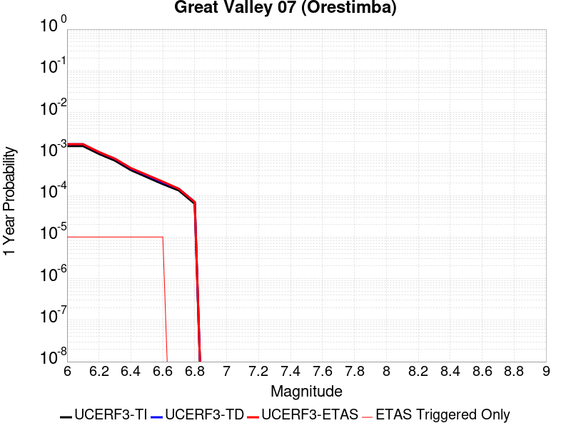 |  |

| Magnitude | 1 wk TI Prob | 1 wk TD Prob | 1 wk ETAS Prob | 1 wk ETAS/TD Gain | 1 wk ETAS Triggered Only | 1 mo TI Prob | 1 mo TD Prob | 1 mo ETAS Prob | 1 mo ETAS/TD Gain | 1 mo ETAS Triggered Only | 1 yr TI Prob | 1 yr TD Prob | 1 yr ETAS Prob | 1 yr ETAS/TD Gain | 1 yr ETAS Triggered Only | 10 yr TI Prob | 10 yr TD Prob | 10 yr ETAS Prob | 10 yr ETAS/TD Gain | 10 yr ETAS Triggered Only |
|-----|-----|-----|-----|-----|-----|-----|-----|-----|-----|-----|-----|-----|-----|-----|-----|-----|-----|-----|-----|-----|
| 6.0 | 2.9687902E-5 | 3.27575E-5 | 8.456927E-5 | 2.5816767 | 5.1813473E-5 | 1.2722766E-4 | 1.4038214E-4 | 1.9218834E-4 | 1.369037 | 5.1813473E-5 | 0.0015478961 | 0.0017078844 | 0.0017596094 | 1.030286 | 5.1813473E-5 | 0.015371585 | 0.016955135 | 0.017006071 | 1.0030041 | 5.1813473E-5 |
| 6.1 | 2.9687902E-5 | 3.27575E-5 | 8.456927E-5 | 2.5816767 | 5.1813473E-5 | 1.2722766E-4 | 1.4038214E-4 | 1.9218834E-4 | 1.369037 | 5.1813473E-5 | 0.0015478961 | 0.0017078844 | 0.0017596094 | 1.030286 | 5.1813473E-5 | 0.015371585 | 0.016955135 | 0.017006071 | 1.0030041 | 5.1813473E-5 |
| 6.2 | 1.9231524E-5 | 2.1159167E-5 | 7.297154E-5 | 3.4486964 | 5.1813473E-5 | 8.2418206E-5 | 9.067912E-5 | 1.4248789E-4 | 1.5713419 | 5.1813473E-5 | 0.0010029797 | 0.0011034822 | 0.0011552386 | 1.0469027 | 5.1813473E-5 | 0.00998465 | 0.01098244 | 0.011033685 | 1.0046661 | 5.1813473E-5 |
| 6.3 | 1.324766E-5 | 1.4548534E-5 | 6.636125E-5 | 4.5613704 | 5.1813473E-5 | 5.6774446E-5 | 6.234942E-5 | 1.1415966E-4 | 1.8309659 | 5.1813473E-5 | 6.910097E-4 | 7.5884897E-4 | 8.106231E-4 | 1.0682272 | 5.1813473E-5 | 0.006888649 | 0.0075635235 | 0.007614945 | 1.0067986 | 5.1813473E-5 |
| 6.4 | 7.818645E-6 | 8.57284E-6 | 6.0385868E-5 | 7.043858 | 5.1813473E-5 | 3.3508048E-5 | 3.6740246E-5 | 8.855181E-5 | 2.410213 | 5.1813473E-5 | 4.078841E-4 | 4.4722404E-4 | 4.9901434E-4 | 1.115804 | 5.1813473E-5 | 0.004071363 | 0.0044635804 | 0.0045151627 | 1.0115563 | 5.1813473E-5 |
| 6.5 | 5.3076565E-6 | 5.8178007E-6 | 5.7630972E-5 | 9.905972 | 5.1813473E-5 | 2.27469E-5 | 2.4933206E-5 | 7.674538E-5 | 3.0780392 | 5.1813473E-5 | 2.7690834E-4 | 3.035216E-4 | 3.5531935E-4 | 1.1706558 | 5.1813473E-5 | 0.0027656353 | 0.00303128 | 0.0030829364 | 1.0170411 | 5.1813473E-5 |
| 6.6 | 3.6003578E-6 | 3.9484953E-6 | 5.5761764E-5 | 14.122281 | 5.1813473E-5 | 1.5430012E-5 | 1.6922022E-5 | 6.873462E-5 | 4.0618443 | 5.1813473E-5 | 1.8784421E-4 | 2.0600771E-4 | 2.578105E-4 | 1.2514604 | 5.1813473E-5 | 0.0018768552 | 0.0020583214 | 0.0021100282 | 1.0251209 | 5.1813473E-5 |
| 6.7 | 2.5361826E-6 | 2.7834678E-6 | 2.7834678E-6 | 1.0 | 0.0 | 1.0869308E-5 | 1.1929101E-5 | 1.1929101E-5 | 1.0 | 0.0 | 1.3232579E-4 | 1.4522845E-4 | 1.4522845E-4 | 1.0 | 0.0 | 0.0013224703 | 0.0014514653 | 0.0014514653 | 1.0 | 0.0 |
| 6.8 | 1.2115831E-6 | 1.3313797E-6 | 1.3313797E-6 | 1.0 | 0.0 | 5.1924885E-6 | 5.7059065E-6 | 5.7059065E-6 | 1.0 | 0.0 | 6.3216714E-5 | 6.9468166E-5 | 6.9468166E-5 | 1.0 | 0.0 | 6.3198735E-4 | 6.945596E-4 | 6.945596E-4 | 1.0 | 0.0 |

