# Parent Section Magnitude-Probability Distributions

Only fault sections with at least one triggered aftershock are plotted. Sections are sorted by total supraseismogenic trigger rate (decreasing)

## Table Of Contents

* [Garlock (Central)](#garlock-central)
* [Tank Canyon](#tank-canyon)
* [Little Lake](#little-lake)
* [Owl Lake](#owl-lake)
* [Panamint Valley](#panamint-valley)
* [Garlock (East)](#garlock-east)
* [Airport Lake](#airport-lake)
* [Hunter Mountain-Saline Valley](#hunter-mountain-saline-valley)
* [Blackwater](#blackwater)
* [Ash Hill](#ash-hill)
* [Garlock (West)](#garlock-west)
* [McLean Lake](#mclean-lake)
* [So Sierra Nevada](#so-sierra-nevada)
* [Goldstone Lake](#goldstone-lake)
* [Gravel Hills-Harper Lk](#gravel-hills-harper-lk)
* [San Andreas (Mojave S)](#san-andreas-mojave-s)
* [San Andreas (Mojave N)](#san-andreas-mojave-n)
* [Death Valley (So)](#death-valley-so)
* [Coyote Canyon](#coyote-canyon)
* [Nelson Lake](#nelson-lake)
* [Towne Pass](#towne-pass)
* [Lenwood-Lockhart-Old Woman Springs](#lenwood-lockhart-old-woman-springs)
* [San Andreas (San Bernardino N)](#san-andreas-san-bernardino-n)
* [Bicycle Lake](#bicycle-lake)
* [Paradise](#paradise)
* [Garlic Springs](#garlic-springs)
* [San Andreas (San Bernardino S)](#san-andreas-san-bernardino-s)
* [Death Valley (Black Mtns Frontal)](#death-valley-black-mtns-frontal)
* [Sierra Nevada  (No Extension)](#sierra-nevada--no-extension)
* [Helendale-So Lockhart](#helendale-so-lockhart)
* [Coyote Lake](#coyote-lake)
* [San Andreas (Big Bend)](#san-andreas-big-bend)
* [San Andreas (San Gorgonio Pass-Garnet HIll)](#san-andreas-san-gorgonio-pass-garnet-hill)
* [Death Valley (No)](#death-valley-no)
* [San Andreas (Coachella) rev](#san-andreas-coachella-rev)
* [Red Pass](#red-pass)
* [San Andreas (Parkfield)](#san-andreas-parkfield)
* [Elsinore (Glen Ivy) rev](#elsinore-glen-ivy-rev)
* [Death Valley (Fish Lake Valley)](#death-valley-fish-lake-valley)
* [Lake Isabella (Seismicity)](#lake-isabella-seismicity)
* [Owens Valley](#owens-valley)
* [San Andreas (Cholame) rev](#san-andreas-cholame-rev)
* [San Jacinto (San Bernardino)](#san-jacinto-san-bernardino)
* [San Andreas (Carrizo) rev](#san-andreas-carrizo-rev)
* [Independence rev 2011](#independence-rev-2011)
* [Calico-Hidalgo](#calico-hidalgo)
* [Cady](#cady)
* [White Wolf (Extension)](#white-wolf-extension)
* [Manix-Afton Hills](#manix-afton-hills)
* [San Andreas (North Branch Mill Creek)](#san-andreas-north-branch-mill-creek)
* [Ludlow](#ludlow)
* [Baker](#baker)
* [San Jacinto (San Jacinto Valley) rev](#san-jacinto-san-jacinto-valley-rev)
* [San Andreas (Creeping Section) 2011 CFM](#san-andreas-creeping-section-2011-cfm)
* [Santa Ynez (West)](#santa-ynez-west)
* [Santa Ynez (East)](#santa-ynez-east)
* [San Jacinto (Stepovers Combined)](#san-jacinto-stepovers-combined)
* [Mission Ridge-Arroyo Parida-Santa Ana](#mission-ridge-arroyo-parida-santa-ana)
* [Scodie Lineament](#scodie-lineament)
* [Brawley (Seismic Zone) alt 1](#brawley-seismic-zone-alt-1)
* [Imperial](#imperial)
* [San Jacinto (Anza) rev](#san-jacinto-anza-rev)
* [Lost Hills](#lost-hills)
* [White Mountains](#white-mountains)
* [Mission Creek](#mission-creek)
* [Big Pine (Central)](#big-pine-central)
* [Big Pine (East)](#big-pine-east)
* [Rose Canyon](#rose-canyon)
* [Red Mountain](#red-mountain)
* [Kern Canyon (South Kern) 2011](#kern-canyon-south-kern-2011)
* [Cleghorn Lake](#cleghorn-lake)
* [Cleghorn Pass](#cleghorn-pass)
* [Deep Springs](#deep-springs)
* [Elysian Park (Upper)](#elysian-park-upper)
* [Pleito](#pleito)
* [Ventura-Pitas Point](#ventura-pitas-point)
* [Pinto Mtn](#pinto-mtn)
* [Ortigalita (North)](#ortigalita-north)
* [Coronado Bank alt1](#coronado-bank-alt1)
* [Chino alt 1](#chino-alt-1)
* [Great Valley 09 (Laguna Seca)](#great-valley-09-laguna-seca)
* [Kern Canyon (North Kern) 2011](#kern-canyon-north-kern-2011)
* [Santa Rosa Island](#santa-rosa-island)
* [Pisgah-Bullion Mtn-Mesquite Lk](#pisgah-bullion-mtn-mesquite-lk)
* [San Cayetano](#san-cayetano)
* [Tin Mountain](#tin-mountain)
* [Camp Rock 2011](#camp-rock-2011)
* [San Jacinto (Coyote Creek)](#san-jacinto-coyote-creek)
* [San Jacinto (Lytle Creek connector)](#san-jacinto-lytle-creek-connector)
* [Dry Mountain](#dry-mountain)
* [Whittier alt 1](#whittier-alt-1)
* [San Pedro Basin](#san-pedro-basin)
* [San Clemente](#san-clemente)
* [Santa Ynez River](#santa-ynez-river)
* [Bullion Mountains](#bullion-mountains)
* [San Jacinto (Borrego)](#san-jacinto-borrego)
* [Blue Cut](#blue-cut)
* [Santa Cruz Catalina Ridge alt1](#santa-cruz-catalina-ridge-alt1)
* [San Jacinto (Clark) rev](#san-jacinto-clark-rev)
* [Oak Ridge (Onshore)](#oak-ridge-onshore)
* [Kern Canyon (Lake Isabella) 2011](#kern-canyon-lake-isabella-2011)
* [Palos Verdes](#palos-verdes)
* [San Diego Trough north alt1](#san-diego-trough-north-alt1)
* [Pitas Point (Lower West)](#pitas-point-lower-west)
* [Santa Susana alt 1](#santa-susana-alt-1)
* [Oceanic - West Huasna](#oceanic---west-huasna)
* [San Jacinto (Superstition Mtn)](#san-jacinto-superstition-mtn)
* [Cleghorn](#cleghorn)
* [Pine Mtn](#pine-mtn)
* [Newport-Inglewood (Offshore)](#newport-inglewood-offshore)
* [Davis Creek](#davis-creek)
* [San Diego Trough south](#san-diego-trough-south)
* [Newport-Inglewood alt 1](#newport-inglewood-alt-1)
* [Puente Hills](#puente-hills)
* [Del Valle](#del-valle)
* [Owens Valley Keough Hot Springs](#owens-valley-keough-hot-springs)
* [Los Alamos 2011 CFM](#los-alamos-2011-cfm)
* [Robinson Creek](#robinson-creek)
* [Hayward (So) 2011 CFM](#hayward-so-2011-cfm)
* [Hayward (So) extension 2011 CFM](#hayward-so-extension-2011-cfm)
* [Calaveras (So) - Paicines extension 2011 CFM](#calaveras-so---paicines-extension-2011-cfm)
* [Raymond](#raymond)
* [San Gabriel (Extension)](#san-gabriel-extension)
* [Santa Cruz Island](#santa-cruz-island)
* [Ortigalita (South)](#ortigalita-south)
* [Channel Islands Thrust](#channel-islands-thrust)
* [Calaveras (So) 2011 CFM](#calaveras-so-2011-cfm)
* [Great Valley 03a Dunnigan Hills](#great-valley-03a-dunnigan-hills)
* [Reliz 2011 CFM](#reliz-2011-cfm)
* [Mission Hills 2011](#mission-hills-2011)
* [Malibu Coast alt 1](#malibu-coast-alt-1)
* [Sheephole](#sheephole)
* [Emerson-Copper Mtn 2011](#emerson-copper-mtn-2011)
* [Shoreline](#shoreline)
* [Cedar Mtn-Mahogany Mtn](#cedar-mtn-mahogany-mtn)
* [Fontana (Seismicity)](#fontana-seismicity)
* [Antelope Valley 2011](#antelope-valley-2011)
* [San Juan](#san-juan)
* [Calaveras (Central) 2011 CFM](#calaveras-central-2011-cfm)
* [Monterey Bay-Tularcitos](#monterey-bay-tularcitos)
* [Santa Susana East (connector)](#santa-susana-east-connector)
* [Elsinore (Coyote Mountains)](#elsinore-coyote-mountains)
* [Simi-Santa Rosa](#simi-santa-rosa)
* [White Wolf](#white-wolf)
* [La Panza 2011](#la-panza-2011)
* [Elsinore (Stepovers Combined)](#elsinore-stepovers-combined)
* [Channel Islands Western Deep Ramp](#channel-islands-western-deep-ramp)
* [Los Alamos extension](#los-alamos-extension)
* [Big Pine (West)](#big-pine-west)
* [Pitas Point (Lower)-Montalvo](#pitas-point-lower-montalvo)
* [Earthquake Valley](#earthquake-valley)
* [South Klamath Lake East](#south-klamath-lake-east)
* [Great Valley 03 Mysterious Ridge](#great-valley-03-mysterious-ridge)
* [Mission (connected) 2011 CFM](#mission-connected-2011-cfm)
* [Northridge](#northridge)
* [Johnson Valley (No) 2011 rev](#johnson-valley-no-2011-rev)
* [Likely 2011 CFM](#likely-2011-cfm)
* [Garberville - Briceland 2011 CFM](#garberville---briceland-2011-cfm)
* [San Andreas (Offshore) 2011 CFM](#san-andreas-offshore-2011-cfm)
* [Great Valley 10 (Panoche)](#great-valley-10-panoche)
* [Cucamonga](#cucamonga)
* [Elsinore (Julian)](#elsinore-julian)
* [Great Valley 07 (Orestimba)](#great-valley-07-orestimba)
* [Earthquake Valley (So Extension)](#earthquake-valley-so-extension)
* [Great Valley 11](#great-valley-11)
* [Oceanside alt1](#oceanside-alt1)
* [Great Valley 05 Pittsburg - Kirby Hills alt1](#great-valley-05-pittsburg---kirby-hills-alt1)
* [Elsinore (Temecula) rev](#elsinore-temecula-rev)
* [Burnt Mtn](#burnt-mtn)
* [Goose Lake 2011 CFM](#goose-lake-2011-cfm)
* [Verdugo](#verdugo)
* [Big Lagoon - Bald Mtn 2011 CFM](#big-lagoon---bald-mtn-2011-cfm)
* [Ozena](#ozena)
* [South Cuyama](#south-cuyama)
* [San Luis Range 2011 CFM](#san-luis-range-2011-cfm)
* [San Andreas (Santa Cruz Mts) 2011 CFM](#san-andreas-santa-cruz-mts-2011-cfm)
* [Sierra Madre](#sierra-madre)
* [Carlsbad](#carlsbad)
* [Keddie Ridge 2011 CFM](#keddie-ridge-2011-cfm)
* [Maacama 2011 CFM](#maacama-2011-cfm)
* [Hosgri](#hosgri)
* [Pittville 2011 CFM](#pittville-2011-cfm)
* [Great Valley 06 (Midland) 2011 CFM alt1](#great-valley-06-midland-2011-cfm-alt1)
* [Green Valley 2011 CFM](#green-valley-2011-cfm)
* [Compton](#compton)
* [Round Valley](#round-valley)
* [North Frontal  (West)](#north-frontal--west)
* [Walker Spring 2011 CFM](#walker-spring-2011-cfm)
* [San Gregorio (North) 2011 CFM](#san-gregorio-north-2011-cfm)
* [Northridge Hills](#northridge-hills)
* [Almanor 2011 CFM](#almanor-2011-cfm)
* [Greenville (No) 2011 CFM](#greenville-no-2011-cfm)
* [Breckenridge 2011](#breckenridge-2011)
* [South Klamath Lake West](#south-klamath-lake-west)
* [Hartley Springs 2011 CFM](#hartley-springs-2011-cfm)
* [Sargent 2011 CFM](#sargent-2011-cfm)
* [North Frontal  (East)](#north-frontal--east)
* [San Luis Range - Oceano 2011 CFM](#san-luis-range---oceano-2011-cfm)
* [Surprise Valley 2011 CFM](#surprise-valley-2011-cfm)
* [West Napa 2011 CFM](#west-napa-2011-cfm)
* [San Jose](#san-jose)
* [Great Valley 12](#great-valley-12)
* [Laguna Salada](#laguna-salada)
* [San Gregorio (South) 2011 CFM](#san-gregorio-south-2011-cfm)
* [San Gorgonio Pass](#san-gorgonio-pass)
* [Greenville (So) 2011 CFM](#greenville-so-2011-cfm)
* [Great Valley 04b Gordon Valley](#great-valley-04b-gordon-valley)
* [Swain Ravine - Spenceville](#swain-ravine---spenceville)
* [Hunting Creek - Berryessa 2011 CFM](#hunting-creek---berryessa-2011-cfm)
* [Eureka Peak](#eureka-peak)
* [Rinconada 2011 CFM](#rinconada-2011-cfm)
* [Honey Lake 2011 CFM](#honey-lake-2011-cfm)
* [San Gabriel](#san-gabriel)
* [Casmalia 2011 CFM](#casmalia-2011-cfm)
* [Cerro Prieto](#cerro-prieto)
* [Sierra Madre (San Fernando)](#sierra-madre-san-fernando)
* [Superstition Hills](#superstition-hills)
* [Hayward (No) 2011 CFM](#hayward-no-2011-cfm)
* [Fitzhugh Creek](#fitzhugh-creek)
* [San Joaquin Hills](#san-joaquin-hills)
* [Elmore Ranch](#elmore-ranch)
* [Malibu Coast (Extension) alt 1](#malibu-coast-extension-alt-1)
* [Gillem - Big Crack 2011 CFM](#gillem---big-crack-2011-cfm)
* [Sisar](#sisar)
* [Great Valley 08 (Quinto)](#great-valley-08-quinto)
* [Holser alt 1](#holser-alt-1)
* [Clayton](#clayton)
* [Earthquake Valley (No  Extension)](#earthquake-valley-no--extension)
* [Great Valley 04a Trout Creek](#great-valley-04a-trout-creek)

## Garlock (Central)
*[(top)](#table-of-contents)*

| 1 Week | 1 Month | 1 Year | 10 Year |
|-----|-----|-----|-----|
| 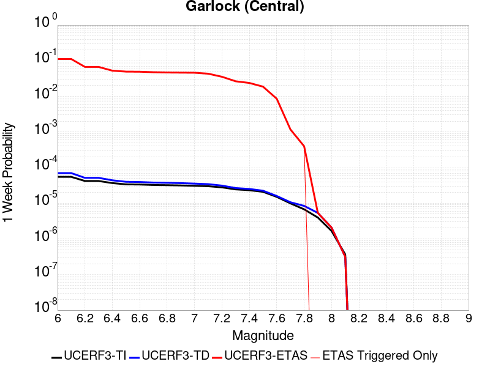 | 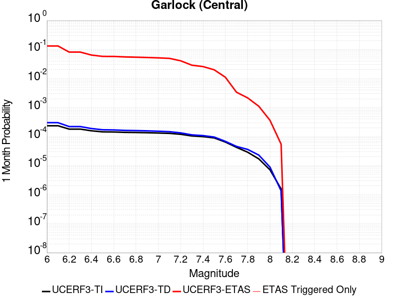 | 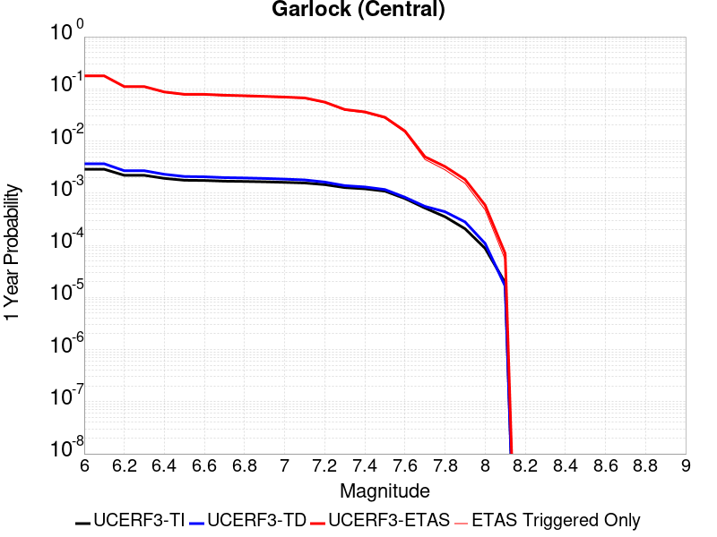 | 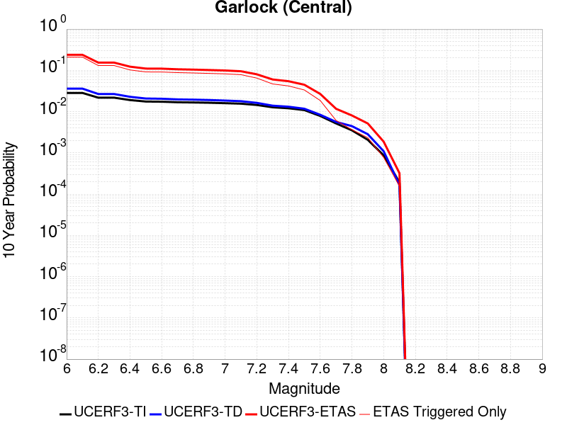 |

| Magnitude | 1 wk TI Prob | 1 wk TD Prob | 1 wk ETAS Prob | 1 wk ETAS/TD Gain | 1 wk ETAS Triggered Only | 1 mo TI Prob | 1 mo TD Prob | 1 mo ETAS Prob | 1 mo ETAS/TD Gain | 1 mo ETAS Triggered Only | 1 yr TI Prob | 1 yr TD Prob | 1 yr ETAS Prob | 1 yr ETAS/TD Gain | 1 yr ETAS Triggered Only | 10 yr TI Prob | 10 yr TD Prob | 10 yr ETAS Prob | 10 yr ETAS/TD Gain | 10 yr ETAS Triggered Only |
|-----|-----|-----|-----|-----|-----|-----|-----|-----|-----|-----|-----|-----|-----|-----|-----|-----|-----|-----|-----|-----|
| 6.0 | 5.5131142E-5 | 7.024681E-5 | 0.109973505 | 1565.5303 | 0.10991098 | 2.3625491E-4 | 3.010234E-4 | 0.13356918 | 443.71695 | 0.13330829 | 0.0028726095 | 0.0036588663 | 0.17586598 | 48.0657 | 0.17283951 | 0.028357591 | 0.036079824 | 0.23664379 | 6.558895 | 0.20807113 |
| 6.1 | 5.5131142E-5 | 7.024681E-5 | 0.109973505 | 1565.5303 | 0.10991098 | 2.3625491E-4 | 3.010234E-4 | 0.13356918 | 443.71695 | 0.13330829 | 0.0028726095 | 0.0036588663 | 0.17586598 | 48.0657 | 0.17283951 | 0.028357591 | 0.036079824 | 0.23664379 | 6.558895 | 0.20807113 |
| 6.2 | 4.216245E-5 | 5.1661493E-5 | 0.066608444 | 1289.3248 | 0.06656022 | 1.806837E-4 | 2.2138779E-4 | 0.081467815 | 367.98694 | 0.081264414 | 0.0021976046 | 0.0026920962 | 0.108320996 | 40.23667 | 0.10591403 | 0.021759989 | 0.026689773 | 0.15155439 | 5.6783695 | 0.12828861 |
| 6.3 | 4.216245E-5 | 5.1661493E-5 | 0.066608444 | 1289.3248 | 0.06656022 | 1.806837E-4 | 2.2138779E-4 | 0.081467815 | 367.98694 | 0.081264414 | 0.0021976046 | 0.0026920962 | 0.108320996 | 40.23667 | 0.10591403 | 0.021759989 | 0.026689773 | 0.15155439 | 5.6783695 | 0.12828861 |
| 6.4 | 3.6858168E-5 | 4.411054E-5 | 0.0519709 | 1178.1968 | 0.05192908 | 1.5795401E-4 | 1.8903162E-4 | 0.06332477 | 334.99567 | 0.06314768 | 0.0019213937 | 0.002299056 | 0.08441783 | 36.718475 | 0.082308 | 0.019048655 | 0.02284894 | 0.1205304 | 5.275098 | 0.099965565 |
| 6.5 | 3.39199E-5 | 4.0018083E-5 | 0.046550997 | 1163.249 | 0.046512842 | 1.453629E-4 | 1.7149492E-4 | 0.056933098 | 331.98126 | 0.056771338 | 0.0017683565 | 0.002085973 | 0.07607843 | 36.471436 | 0.07414713 | 0.017543508 | 0.020759864 | 0.108921416 | 5.246731 | 0.09003058 |
| 6.6 | 3.3571985E-5 | 3.9472274E-5 | 0.046487864 | 1177.7347 | 0.046450227 | 1.4387199E-4 | 1.6915603E-4 | 0.05684742 | 336.06497 | 0.05668785 | 0.0017502342 | 0.0020575512 | 0.075937554 | 36.906765 | 0.07403233 | 0.017365133 | 0.020481179 | 0.10852471 | 5.2987533 | 0.089884475 |
| 6.7 | 3.2580007E-5 | 3.8088703E-5 | 0.044722944 | 1174.1787 | 0.044686556 | 1.3962112E-4 | 1.632272E-4 | 0.05471325 | 335.19687 | 0.054558925 | 0.0016985617 | 0.0019855013 | 0.07316289 | 36.848576 | 0.07131899 | 0.016856372 | 0.019773813 | 0.10456655 | 5.2881327 | 0.08650324 |
| 6.8 | 3.2185937E-5 | 3.7515918E-5 | 0.043678846 | 1164.2749 | 0.043642968 | 1.3793244E-4 | 1.6077272E-4 | 0.05345882 | 332.51175 | 0.053306617 | 0.0016780337 | 0.001955672 | 0.07149996 | 36.5603 | 0.06968056 | 0.016654192 | 0.019480614 | 0.102456845 | 5.259426 | 0.084624775 |
| 6.9 | 3.165394E-5 | 3.6720503E-5 | 0.042624097 | 1160.771 | 0.04258894 | 1.3565269E-4 | 1.5736422E-4 | 0.052161746 | 331.47144 | 0.052012566 | 0.0016503202 | 0.001914247 | 0.06964905 | 36.384563 | 0.06786471 | 0.01638118 | 0.019073246 | 0.099893264 | 5.23735 | 0.08239149 |
| 7.0 | 3.0903822E-5 | 3.5625766E-5 | 0.041318607 | 1159.7957 | 0.041284453 | 1.3243823E-4 | 1.5267303E-4 | 0.05063389 | 331.64917 | 0.050488923 | 0.0016112428 | 0.0018572307 | 0.06764801 | 36.42413 | 0.06591319 | 0.015996104 | 0.018512413 | 0.09712525 | 5.246493 | 0.0800956 |
| 7.1 | 3.0069863E-5 | 3.4392073E-5 | 0.039741658 | 1155.547 | 0.03970863 | 1.2886449E-4 | 1.4738638E-4 | 0.048667207 | 330.2015 | 0.048526973 | 0.0015677959 | 0.0017929734 | 0.06491077 | 36.20286 | 0.06323116 | 0.01556781 | 0.017880075 | 0.09329452 | 5.2177925 | 0.07678741 |
| 7.2 | 2.7957109E-5 | 3.128145E-5 | 0.03286162 | 1050.5145 | 0.032831367 | 1.1981068E-4 | 1.340566E-4 | 0.04039039 | 301.29358 | 0.040261734 | 0.0014577188 | 0.0016309366 | 0.05393375 | 33.06919 | 0.05238826 | 0.014481937 | 0.016283695 | 0.078824 | 4.8406706 | 0.06357555 |
| 7.3 | 2.4519275E-5 | 2.6714795E-5 | 0.022901613 | 857.2633 | 0.02287551 | 1.0507837E-4 | 1.1448703E-4 | 0.028361255 | 247.72461 | 0.028250003 | 0.0012785783 | 0.001393003 | 0.03846182 | 27.61072 | 0.037120525 | 0.012712469 | 0.013928054 | 0.058537614 | 4.2028565 | 0.04523966 |
| 7.4 | 2.3225532E-5 | 2.51994E-5 | 0.020666905 | 820.1348 | 0.020642227 | 9.95342E-5 | 1.0799304E-4 | 0.025621032 | 237.24707 | 0.025515795 | 0.0012111551 | 0.0013140367 | 0.034831814 | 26.507492 | 0.033561878 | 0.012045753 | 0.013145725 | 0.05342402 | 4.0639844 | 0.040814836 |
| 7.5 | 2.097765E-5 | 2.2483688E-5 | 0.016156035 | 718.5669 | 0.016133914 | 8.9901114E-5 | 9.635517E-5 | 0.019974845 | 207.30434 | 0.019880405 | 0.0010939965 | 0.0011725046 | 0.027315073 | 23.296345 | 0.026173256 | 0.010886264 | 0.011740365 | 0.04324776 | 3.683681 | 0.031881697 |
| 7.6 | 1.511254E-5 | 1.5991332E-5 | 0.009074215 | 567.4458 | 0.009058368 | 6.476642E-5 | 6.853253E-5 | 0.011108967 | 162.09772 | 0.0110411905 | 7.882459E-4 | 8.3407195E-4 | 0.015327885 | 18.377174 | 0.014505912 | 0.007854558 | 0.008383559 | 0.02603796 | 3.1058362 | 0.01780366 |
| 7.7 | 9.934069E-6 | 1.0678794E-5 | 0.0027239858 | 255.08368 | 0.0027133361 | 4.2573887E-5 | 4.5765457E-5 | 0.0032807488 | 71.686134 | 0.0032351315 | 5.182138E-4 | 5.570524E-4 | 0.004906402 | 8.807793 | 0.0043517738 | 0.00517007 | 0.005627684 | 0.011023817 | 1.9588549 | 0.0054266723 |
| 7.8 | 6.7562896E-6 | 8.428449E-6 | 0.0016781597 | 199.10658 | 0.0016697453 | 2.8955206E-5 | 3.6121426E-5 | 0.0020188722 | 55.89127 | 0.0019828225 | 3.5247262E-4 | 4.3968976E-4 | 0.0030996762 | 7.0496893 | 0.0026611565 | 0.0035191406 | 0.004446654 | 0.007729737 | 1.7383265 | 0.0032977469 |
| 7.9 | 3.975453E-6 | 5.37103E-6 | 8.6111086E-4 | 160.32509 | 8.5574447E-4 | 1.7037546E-5 | 2.3018498E-5 | 0.0010457139 | 45.429283 | 0.001022719 | 2.0741238E-4 | 2.8021427E-4 | 0.0017199661 | 6.1380386 | 0.0014401553 | 0.002072189 | 0.0028336283 | 0.0047171754 | 1.6647121 | 0.0018888994 |
| 8.0 | 1.6729537E-6 | 2.0775144E-6 | 2.9428233E-4 | 141.65117 | 2.9220543E-4 | 7.169782E-6 | 8.903603E-6 | 3.637213E-4 | 40.851025 | 3.5482086E-4 | 8.7288594E-5 | 1.0839601E-4 | 5.988305E-4 | 5.5244703 | 4.9048767E-4 | 8.7254314E-4 | 0.0010969337 | 0.0017745238 | 1.6177127 | 6.7833404E-4 |
| 8.1 | 3.6733252E-7 | 3.1489964E-7 | 2.1186708E-5 | 67.28083 | 2.0871816E-5 | 1.5742813E-6 | 1.3495693E-6 | 4.3093143E-5 | 31.931034 | 4.174363E-5 | 1.9166706E-5 | 1.6430899E-5 | 5.8173846E-5 | 3.540515 | 4.174363E-5 | 1.9165053E-4 | 1.6638759E-4 | 2.1855845E-4 | 1.3135502 | 5.217954E-5 |

## Tank Canyon
*[(top)](#table-of-contents)*

| 1 Week | 1 Month | 1 Year | 10 Year |
|-----|-----|-----|-----|
| 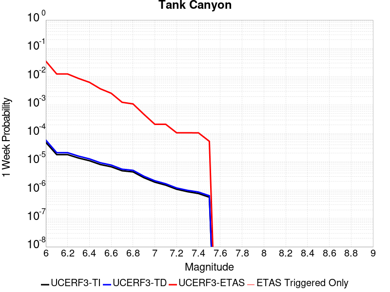 | 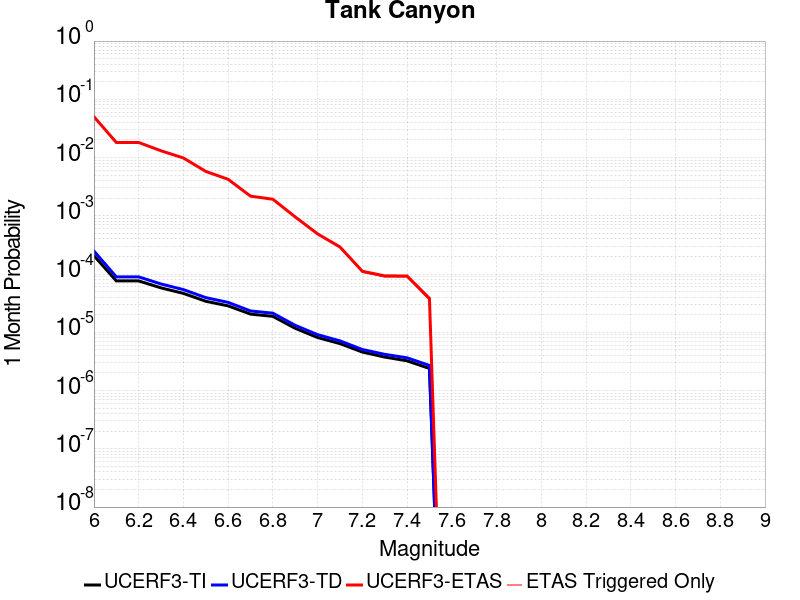 | 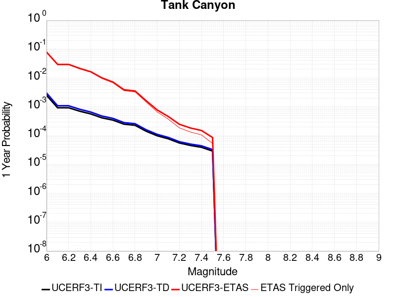 | 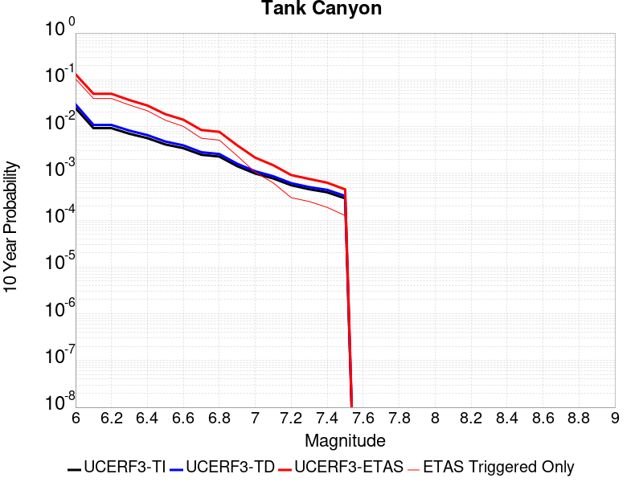 |

| Magnitude | 1 wk TI Prob | 1 wk TD Prob | 1 wk ETAS Prob | 1 wk ETAS/TD Gain | 1 wk ETAS Triggered Only | 1 mo TI Prob | 1 mo TD Prob | 1 mo ETAS Prob | 1 mo ETAS/TD Gain | 1 mo ETAS Triggered Only | 1 yr TI Prob | 1 yr TD Prob | 1 yr ETAS Prob | 1 yr ETAS/TD Gain | 1 yr ETAS Triggered Only | 10 yr TI Prob | 10 yr TD Prob | 10 yr ETAS Prob | 10 yr ETAS/TD Gain | 10 yr ETAS Triggered Only |
|-----|-----|-----|-----|-----|-----|-----|-----|-----|-----|-----|-----|-----|-----|-----|-----|-----|-----|-----|-----|-----|
| 6.0 | 4.8284557E-5 | 5.7964822E-5 | 0.035475384 | 612.0157 | 0.03541947 | 2.0691741E-4 | 2.4840087E-4 | 0.049264118 | 198.32507 | 0.049027894 | 0.0025163088 | 0.0030207601 | 0.07895195 | 26.136452 | 0.07616126 | 0.02488006 | 0.029863637 | 0.13127829 | 4.3959246 | 0.10453649 |
| 6.1 | 1.7796336E-5 | 2.0873314E-5 | 0.012616751 | 604.44403 | 0.012596141 | 7.626778E-5 | 8.945422E-5 | 0.01799587 | 201.17409 | 0.017908018 | 9.281647E-4 | 0.0010885983 | 0.029714406 | 27.296026 | 0.028657002 | 0.009242975 | 0.010836744 | 0.050197642 | 4.63217 | 0.039792117 |
| 6.2 | 1.7796336E-5 | 2.0873314E-5 | 0.012616751 | 604.44403 | 0.012596141 | 7.626778E-5 | 8.945422E-5 | 0.01799587 | 201.17409 | 0.017908018 | 9.281647E-4 | 0.0010885983 | 0.029714406 | 27.296026 | 0.028657002 | 0.009242975 | 0.010836744 | 0.050197642 | 4.63217 | 0.039792117 |
| 6.3 | 1.3515912E-5 | 1.5759564E-5 | 0.008990499 | 570.4789 | 0.008974881 | 5.792405E-5 | 6.753938E-5 | 0.012871534 | 190.5782 | 0.012804859 | 7.049971E-4 | 8.2200574E-4 | 0.021509828 | 26.16749 | 0.020704841 | 0.007027647 | 0.0081922645 | 0.036842212 | 4.497195 | 0.028886594 |
| 6.4 | 1.0870146E-5 | 1.2618021E-5 | 0.0067958725 | 538.58466 | 0.00678334 | 4.658551E-5 | 5.4076212E-5 | 0.009738075 | 180.08057 | 0.009684523 | 5.67031E-4 | 6.581969E-4 | 0.016479049 | 25.036655 | 0.015831273 | 0.005655863 | 0.0065644905 | 0.028180523 | 4.292873 | 0.021758867 |
| 6.5 | 7.964826E-6 | 9.196094E-6 | 0.004068727 | 442.44077 | 0.004059568 | 3.4134522E-5 | 3.9411298E-5 | 0.0058102407 | 147.42578 | 0.005771057 | 4.1550855E-4 | 4.7973756E-4 | 0.010211769 | 21.286156 | 0.009736702 | 0.0041473247 | 0.004788321 | 0.018383512 | 3.8392398 | 0.013660603 |
| 6.6 | 6.6317E-6 | 7.6122988E-6 | 0.0031592324 | 415.01688 | 0.0031516443 | 2.8421264E-5 | 3.2623782E-5 | 0.00437382 | 134.06845 | 0.004341338 | 3.4597394E-4 | 3.9713128E-4 | 0.007730661 | 19.46626 | 0.0073364433 | 0.0034543579 | 0.003965368 | 0.01400648 | 3.5322018 | 0.010081087 |
| 6.7 | 4.793663E-6 | 5.4307857E-6 | 0.001675167 | 308.45758 | 0.0016697453 | 2.0544108E-5 | 2.3274613E-5 | 0.002287814 | 98.29654 | 0.002264592 | 2.500958E-4 | 2.8333595E-4 | 0.004320888 | 15.250052 | 0.004038696 | 0.0024981452 | 0.0028304397 | 0.008439473 | 2.9816825 | 0.005624954 |
| 6.8 | 4.382823E-6 | 4.9692567E-6 | 0.0015077326 | 303.41208 | 0.0015027707 | 1.8783392E-5 | 2.1296666E-5 | 0.0020771266 | 97.53296 | 0.0020558739 | 2.286638E-4 | 2.5926033E-4 | 0.0039943466 | 15.406703 | 0.003736055 | 0.0022842865 | 0.002590253 | 0.00771142 | 2.9770916 | 0.0051344666 |
| 6.9 | 2.729601E-6 | 3.0735416E-6 | 7.4402074E-4 | 242.07275 | 7.409495E-4 | 1.1698237E-5 | 1.3172262E-5 | 9.941347E-4 | 75.471825 | 9.809753E-4 | 1.4241673E-4 | 1.6036171E-4 | 0.0018820104 | 11.736033 | 0.0017219248 | 0.001423255 | 0.0016026258 | 0.003957361 | 2.4692984 | 0.0023585153 |
| 7.0 | 1.8987357E-6 | 2.126939E-6 | 3.0476763E-4 | 143.2893 | 3.0264133E-4 | 8.137413E-6 | 9.115425E-6 | 4.2654792E-4 | 46.79408 | 4.1743633E-4 | 9.90685E-5 | 1.1097535E-4 | 9.144511E-4 | 8.2401285 | 8.035649E-4 | 9.902435E-4 | 0.0011092679 | 0.0021621254 | 1.9491463 | 0.0010540267 |
| 7.1 | 1.4928986E-6 | 1.6641272E-6 | 1.6863838E-4 | 101.33743 | 1.6697453E-4 | 6.398121E-6 | 7.1319573E-6 | 2.680278E-4 | 37.581238 | 2.608977E-4 | 7.789434E-5 | 8.682871E-5 | 5.564038E-4 | 6.408062 | 4.6961586E-4 | 7.786704E-4 | 8.6800574E-4 | 0.0014936167 | 1.7207452 | 6.261545E-4 |
| 7.2 | 1.069082E-6 | 1.1828573E-6 | 7.423413E-5 | 62.758312 | 7.305136E-5 | 4.581772E-6 | 5.0693816E-6 | 1.0942793E-4 | 21.586052 | 1.0435908E-4 | 5.5781646E-5 | 6.171851E-5 | 2.7042377E-4 | 4.3815675 | 2.0871816E-4 | 5.576765E-4 | 6.170659E-4 | 9.1952045E-4 | 1.4901496 | 3.0264133E-4 |
| 7.3 | 8.776551E-7 | 9.770005E-7 | 7.4028285E-5 | 75.77098 | 7.305136E-5 | 3.7613736E-6 | 4.1871413E-6 | 9.810992E-5 | 23.431242 | 9.392317E-5 | 4.579376E-5 | 5.097777E-5 | 2.1794379E-4 | 4.275271 | 1.6697453E-4 | 4.5784327E-4 | 5.097118E-4 | 7.600459E-4 | 1.4911288 | 2.504618E-4 |
| 7.4 | 7.55721E-7 | 8.510244E-7 | 6.346642E-5 | 74.57649 | 6.261545E-5 | 3.2388E-6 | 3.6472454E-6 | 8.7134205E-5 | 23.890413 | 8.348726E-5 | 3.9431678E-5 | 4.4404827E-5 | 1.6963016E-4 | 3.8200839 | 1.252309E-4 | 3.942468E-4 | 4.440104E-4 | 6.317733E-4 | 1.4228796 | 1.8784634E-4 |
| 7.5 | 5.587665E-7 | 6.305619E-7 | 2.1502365E-5 | 34.100323 | 2.0871816E-5 | 2.3947114E-6 | 2.702408E-6 | 4.4445926E-5 | 16.446785 | 4.174363E-5 | 2.915522E-5 | 3.290182E-5 | 1.0595077E-4 | 3.22021 | 7.305136E-5 | 2.9151395E-4 | 3.290182E-4 | 4.5420788E-4 | 1.3804947 | 1.252309E-4 |

## Little Lake
*[(top)](#table-of-contents)*

| 1 Week | 1 Month | 1 Year | 10 Year |
|-----|-----|-----|-----|
| 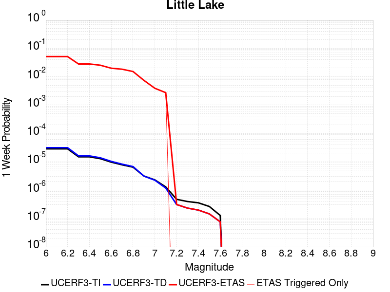 | 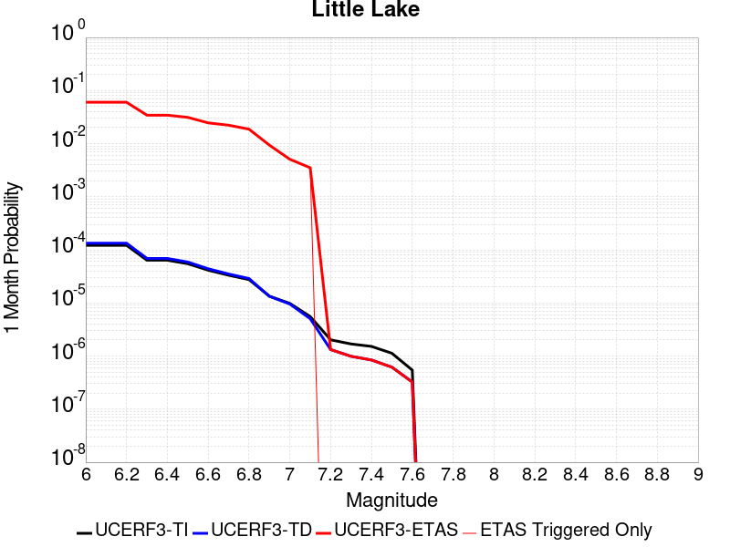 | 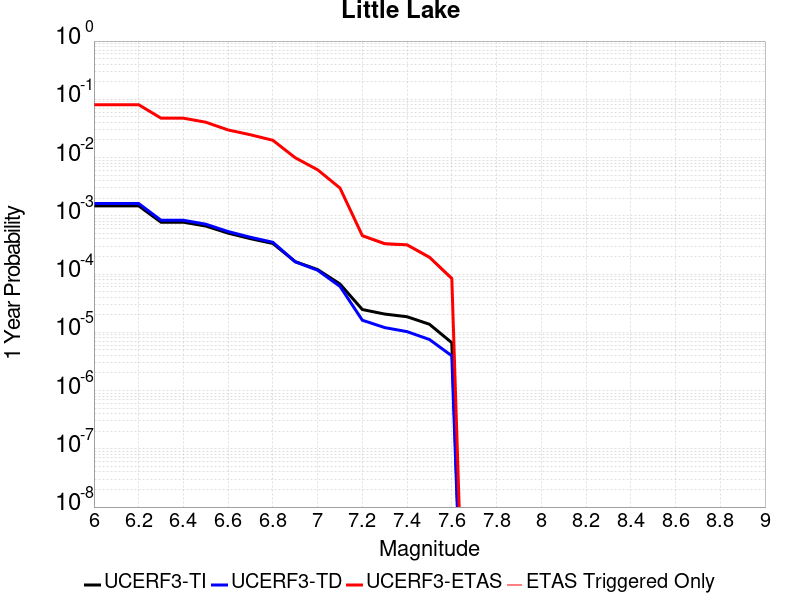 | 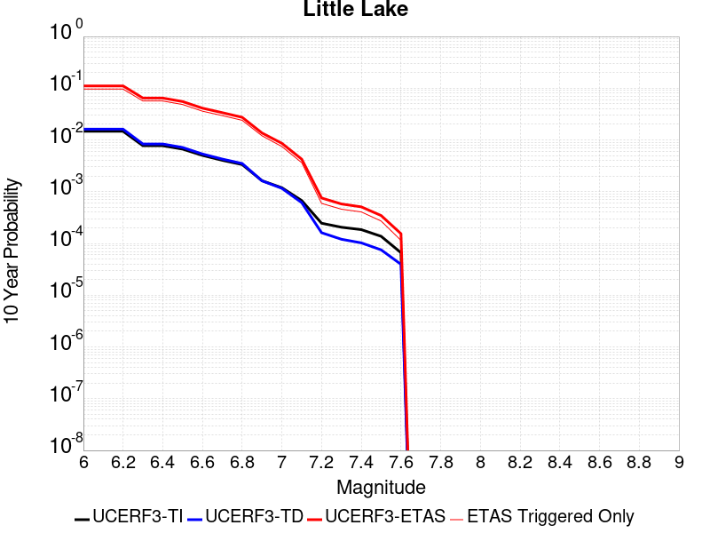 |

| Magnitude | 1 wk TI Prob | 1 wk TD Prob | 1 wk ETAS Prob | 1 wk ETAS/TD Gain | 1 wk ETAS Triggered Only | 1 mo TI Prob | 1 mo TD Prob | 1 mo ETAS Prob | 1 mo ETAS/TD Gain | 1 mo ETAS Triggered Only | 1 yr TI Prob | 1 yr TD Prob | 1 yr ETAS Prob | 1 yr ETAS/TD Gain | 1 yr ETAS Triggered Only | 10 yr TI Prob | 10 yr TD Prob | 10 yr ETAS Prob | 10 yr ETAS/TD Gain | 10 yr ETAS Triggered Only |
|-----|-----|-----|-----|-----|-----|-----|-----|-----|-----|-----|-----|-----|-----|-----|-----|-----|-----|-----|-----|-----|
| 6.0 | 2.8424427E-5 | 3.120572E-5 | 0.050372455 | 1614.2058 | 0.05034282 | 1.2181328E-4 | 1.337327E-4 | 0.06115476 | 457.29102 | 0.06102919 | 0.0014820677 | 0.0016271127 | 0.08104018 | 49.80612 | 0.07954249 | 0.014722223 | 0.016165402 | 0.11088039 | 6.8591175 | 0.09627125 |
| 6.1 | 2.8424427E-5 | 3.120572E-5 | 0.050372455 | 1614.2058 | 0.05034282 | 1.2181328E-4 | 1.337327E-4 | 0.06115476 | 457.29102 | 0.06102919 | 0.0014820677 | 0.0016271127 | 0.08104018 | 49.80612 | 0.07954249 | 0.014722223 | 0.016165402 | 0.11088039 | 6.8591175 | 0.09627125 |
| 6.2 | 2.8424427E-5 | 3.120572E-5 | 0.050372455 | 1614.2058 | 0.05034282 | 1.2181328E-4 | 1.337327E-4 | 0.06115476 | 457.29102 | 0.06102919 | 0.0014820677 | 0.0016271127 | 0.08104018 | 49.80612 | 0.07954249 | 0.014722223 | 0.016165402 | 0.11088039 | 6.8591175 | 0.09627125 |
| 6.3 | 1.48860645E-5 | 1.6081389E-5 | 0.029695326 | 1846.5647 | 0.029679721 | 6.379586E-5 | 6.8918576E-5 | 0.036195543 | 525.1928 | 0.036129113 | 7.7643775E-4 | 8.3878887E-4 | 0.047531586 | 56.666924 | 0.046731997 | 0.007737305 | 0.008359048 | 0.064552344 | 7.722452 | 0.05666698 |
| 6.4 | 1.48860645E-5 | 1.6081389E-5 | 0.029695326 | 1846.5647 | 0.029679721 | 6.379586E-5 | 6.8918576E-5 | 0.036195543 | 525.1928 | 0.036129113 | 7.7643775E-4 | 8.3878887E-4 | 0.047531586 | 56.666924 | 0.046731997 | 0.007737305 | 0.008359048 | 0.064552344 | 7.722452 | 0.05666698 |
| 6.5 | 1.2797581E-5 | 1.3765565E-5 | 0.025435288 | 1847.7474 | 0.02542187 | 5.4845623E-5 | 5.899409E-5 | 0.030926589 | 524.232 | 0.030869415 | 6.675408E-4 | 7.18042E-4 | 0.040502444 | 56.406784 | 0.03981299 | 0.006655392 | 0.00715977 | 0.05525641 | 7.7176237 | 0.048443485 |
| 6.6 | 9.661896E-6 | 1.0289038E-5 | 0.018784294 | 1825.6609 | 0.018774198 | 4.1407468E-5 | 4.409522E-5 | 0.022855984 | 518.33246 | 0.022812895 | 5.040193E-4 | 5.367433E-4 | 0.029971069 | 55.838734 | 0.029450132 | 0.005028777 | 0.0053560743 | 0.041156735 | 7.6841235 | 0.035993446 |
| 6.7 | 7.767871E-6 | 8.199687E-6 | 0.015515831 | 1892.247 | 0.0155077595 | 3.329045E-5 | 3.5141118E-5 | 0.018798243 | 534.93585 | 0.018763762 | 4.0523586E-4 | 4.2777284E-4 | 0.0247539 | 57.866924 | 0.024336537 | 0.004044977 | 0.004270846 | 0.033699114 | 7.890501 | 0.029554492 |
| 6.8 | 6.4235196E-6 | 6.7357446E-6 | 0.012467125 | 1850.8905 | 0.012460474 | 2.752908E-5 | 2.8867229E-5 | 0.015191804 | 526.2647 | 0.015163374 | 3.35115E-4 | 3.5141467E-4 | 0.020016188 | 56.958885 | 0.019671686 | 0.003346101 | 0.00350985 | 0.027396996 | 7.805745 | 0.02397128 |
| 6.9 | 3.1283696E-6 | 3.1121804E-6 | 0.005951561 | 1912.3445 | 0.0059484676 | 1.3407229E-5 | 1.3337856E-5 | 0.007527091 | 564.3404 | 0.0075138537 | 1.6322079E-4 | 1.6237781E-4 | 0.00994967 | 61.27481 | 0.009788882 | 0.0016310095 | 0.00162274 | 0.013635816 | 8.402958 | 0.012032602 |
| 7.0 | 2.290603E-6 | 2.2286815E-6 | 0.0037174036 | 1667.9833 | 0.0037151831 | 9.816834E-6 | 9.551463E-6 | 0.004653486 | 487.2014 | 0.004643979 | 1.19513395E-4 | 1.162839E-4 | 0.0061371024 | 52.77689 | 0.0060215187 | 0.0011944914 | 0.0011623327 | 0.008615334 | 7.4121065 | 0.007461674 |
| 7.1 | 1.293693E-6 | 1.1776827E-6 | 0.0017961517 | 1525.1575 | 0.0017949762 | 5.5443866E-6 | 5.0472063E-6 | 0.0023009353 | 455.88297 | 0.0022958997 | 6.750081E-5 | 6.14487E-5 | 0.0030041938 | 48.88946 | 0.002942926 | 6.7480316E-4 | 6.143856E-4 | 0.0042542797 | 6.924446 | 0.0036421318 |
| 7.2 | 4.715842E-7 | 3.0917857E-7 | 3.1338632E-4 | 1013.60944 | 3.1307724E-4 | 2.0210737E-6 | 1.3250503E-6 | 3.5614544E-4 | 268.7788 | 3.5482086E-4 | 2.4606294E-5 | 1.6132375E-5 | 4.6486917E-4 | 28.815918 | 4.4874405E-4 | 2.460357E-4 | 1.6131258E-4 | 7.560634E-4 | 4.6869464 | 5.9484673E-4 |
| 7.3 | 3.9430947E-7 | 2.3097488E-7 | 2.19385E-4 | 949.8219 | 2.1915407E-4 | 1.6898966E-6 | 9.89892E-7 | 2.5145142E-4 | 254.01907 | 2.504618E-4 | 2.0574296E-5 | 1.2051869E-5 | 3.459969E-4 | 28.708984 | 3.3394905E-4 | 2.0572392E-4 | 1.20512224E-4 | 5.7963684E-4 | 4.8097763 | 4.5917995E-4 |
| 7.4 | 3.547123E-7 | 1.9679135E-7 | 1.880431E-4 | 955.54553 | 1.8784634E-4 | 1.5201948E-6 | 8.4339126E-7 | 2.1999727E-4 | 260.84842 | 2.1915407E-4 | 1.8508214E-5 | 1.0268241E-5 | 3.1290646E-4 | 30.47323 | 3.0264133E-4 | 1.8506673E-4 | 1.02677724E-4 | 5.0963636E-4 | 4.9634557 | 4.0700042E-4 |
| 7.5 | 2.6354266E-7 | 1.4423138E-7 | 1.045033E-4 | 724.5531 | 1.0435908E-4 | 1.129468E-6 | 6.181344E-7 | 1.3628486E-4 | 220.47772 | 1.356668E-4 | 1.3751187E-5 | 7.5257603E-6 | 1.8493486E-4 | 24.573578 | 1.7741043E-4 | 1.3750336E-4 | 7.5255106E-5 | 3.465683E-4 | 4.605246 | 2.713336E-4 |
| 7.6 | 1.269913E-7 | 7.572556E-8 | 3.1383446E-5 | 414.43665 | 3.1307725E-5 | 5.4424834E-7 | 3.245381E-7 | 5.250406E-5 | 161.7809 | 5.217954E-5 | 6.6262032E-6 | 3.9512443E-6 | 6.656644E-5 | 16.846956 | 6.261545E-5 | 6.626006E-5 | 3.9511775E-5 | 1.5430222E-4 | 3.9052212 | 1.1479499E-4 |

## Owl Lake
*[(top)](#table-of-contents)*

| 1 Week | 1 Month | 1 Year | 10 Year |
|-----|-----|-----|-----|
| 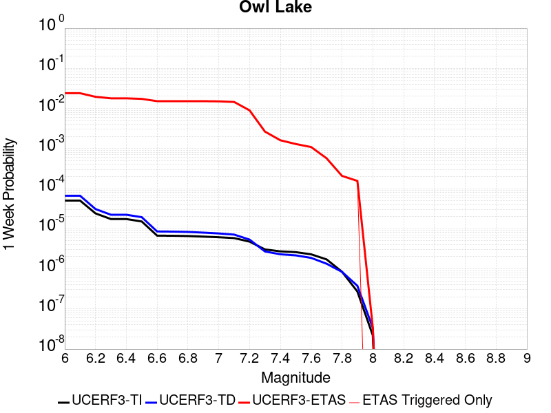 | 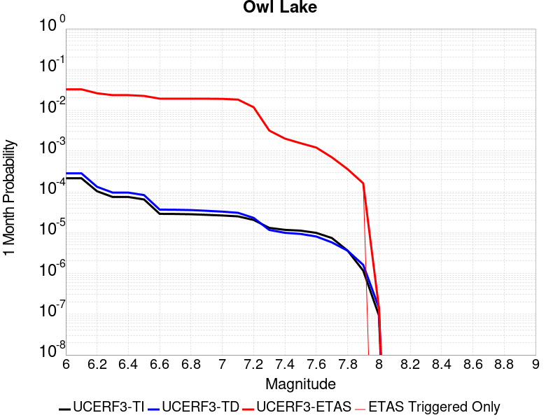 | 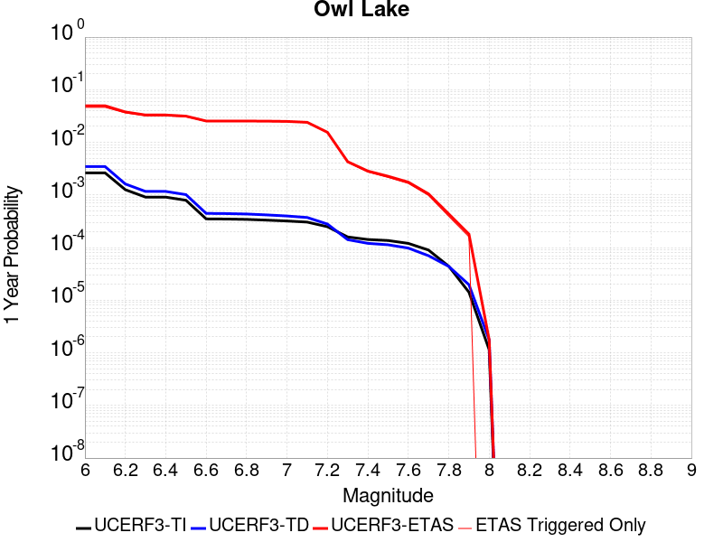 | 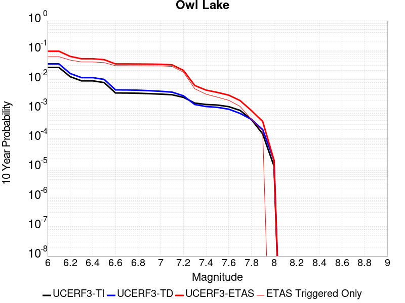 |

| Magnitude | 1 wk TI Prob | 1 wk TD Prob | 1 wk ETAS Prob | 1 wk ETAS/TD Gain | 1 wk ETAS Triggered Only | 1 mo TI Prob | 1 mo TD Prob | 1 mo ETAS Prob | 1 mo ETAS/TD Gain | 1 mo ETAS Triggered Only | 1 yr TI Prob | 1 yr TD Prob | 1 yr ETAS Prob | 1 yr ETAS/TD Gain | 1 yr ETAS Triggered Only | 10 yr TI Prob | 10 yr TD Prob | 10 yr ETAS Prob | 10 yr ETAS/TD Gain | 10 yr ETAS Triggered Only |
|-----|-----|-----|-----|-----|-----|-----|-----|-----|-----|-----|-----|-----|-----|-----|-----|-----|-----|-----|-----|-----|
| 6.0 | 5.0320643E-5 | 6.635816E-5 | 0.024756078 | 373.0676 | 0.024691358 | 2.1564208E-4 | 2.843674E-4 | 0.032396957 | 113.92642 | 0.032121725 | 0.0026222812 | 0.0034577388 | 0.048967365 | 14.161673 | 0.045667533 | 0.02591553 | 0.034140717 | 0.091272 | 2.673406 | 0.059150726 |
| 6.1 | 5.0320643E-5 | 6.635816E-5 | 0.024756078 | 373.0676 | 0.024691358 | 2.1564208E-4 | 2.843674E-4 | 0.032396957 | 113.92642 | 0.032121725 | 0.0026222812 | 0.0034577388 | 0.048967365 | 14.161673 | 0.045667533 | 0.02591553 | 0.034140717 | 0.091272 | 2.673406 | 0.059150726 |
| 6.2 | 2.4125871E-5 | 3.0981035E-5 | 0.020161225 | 650.76013 | 0.020130867 | 1.0339249E-4 | 1.3277028E-4 | 0.025885172 | 194.9621 | 0.02575582 | 0.0012580766 | 0.001615439 | 0.037363198 | 23.12882 | 0.0358056 | 0.012509781 | 0.016070465 | 0.060963027 | 3.7934825 | 0.04562579 |
| 6.3 | 1.7433485E-5 | 2.2355514E-5 | 0.018451758 | 825.37836 | 0.018429814 | 7.471279E-5 | 9.580672E-5 | 0.023355218 | 243.7743 | 0.023261638 | 9.0924866E-4 | 0.0011659743 | 0.03281245 | 28.141657 | 0.031683415 | 0.009055373 | 0.011628896 | 0.050844815 | 4.372282 | 0.039677322 |
| 6.4 | 1.7433485E-5 | 2.2355514E-5 | 0.018451758 | 825.37836 | 0.018429814 | 7.471279E-5 | 9.580672E-5 | 0.023355218 | 243.7743 | 0.023261638 | 9.0924866E-4 | 0.0011659743 | 0.03281245 | 28.141657 | 0.031683415 | 0.009055373 | 0.011628896 | 0.050844815 | 4.372282 | 0.039677322 |
| 6.5 | 1.5182742E-5 | 1.9429144E-5 | 0.017864484 | 919.4684 | 0.017845402 | 6.506727E-5 | 8.326596E-5 | 0.02243512 | 269.43927 | 0.022353714 | 7.919061E-4 | 0.0010134429 | 0.031351157 | 30.935299 | 0.030368492 | 0.0078909 | 0.010118429 | 0.047514163 | 4.6958046 | 0.037777986 |
| 6.6 | 6.7271576E-6 | 8.547361E-6 | 0.01547443 | 1810.4337 | 0.015466016 | 2.8830356E-5 | 3.6631063E-5 | 0.01886232 | 514.9269 | 0.018826379 | 3.5095305E-4 | 4.458976E-4 | 0.024938483 | 55.928722 | 0.024503512 | 0.0035039932 | 0.004467813 | 0.033755198 | 7.555196 | 0.029418824 |
| 6.7 | 6.682835E-6 | 8.479807E-6 | 0.015474364 | 1824.8486 | 0.015466016 | 2.8640408E-5 | 3.6341557E-5 | 0.018862035 | 519.0211 | 0.018826379 | 3.4864116E-4 | 4.4237426E-4 | 0.024924615 | 56.342823 | 0.024493076 | 0.003480947 | 0.0044327388 | 0.033700377 | 7.602608 | 0.029397953 |
| 6.8 | 6.5774975E-6 | 8.32628E-6 | 0.015474213 | 1858.4784 | 0.015466016 | 2.8188972E-5 | 3.5683603E-5 | 0.018861389 | 528.573 | 0.018826379 | 3.4314668E-4 | 4.343669E-4 | 0.024895942 | 57.315464 | 0.024472203 | 0.0034261728 | 0.004352885 | 0.03357092 | 7.712338 | 0.029345773 |
| 6.9 | 6.363419E-6 | 7.999454E-6 | 0.015421712 | 1927.8455 | 0.015413836 | 2.727151E-5 | 3.428296E-5 | 0.018807838 | 548.606 | 0.018774198 | 3.3198006E-4 | 4.1732067E-4 | 0.024785427 | 59.391808 | 0.024378281 | 0.0033148455 | 0.0041828766 | 0.033281192 | 7.9565325 | 0.029220542 |
| 7.0 | 6.1342453E-6 | 7.6316555E-6 | 0.015306556 | 2005.6665 | 0.015299041 | 2.6289357E-5 | 3.2706717E-5 | 0.018681064 | 571.16907 | 0.018648967 | 3.2002592E-4 | 3.9813702E-4 | 0.024547646 | 61.656273 | 0.024159126 | 0.0031956544 | 0.003991571 | 0.03283562 | 8.22624 | 0.028959645 |
| 7.1 | 5.842926E-6 | 7.142211E-6 | 0.01469036 | 2056.8364 | 0.014683322 | 2.504087E-5 | 3.0609146E-5 | 0.017969385 | 587.0593 | 0.017939325 | 3.0482994E-4 | 3.7260808E-4 | 0.023552556 | 63.21 | 0.023188587 | 0.0030441214 | 0.0037370329 | 0.031413604 | 8.406028 | 0.027780388 |
| 7.2 | 4.77173E-6 | 5.358483E-6 | 0.009470676 | 1767.4174 | 0.009465368 | 2.045011E-5 | 2.2964748E-5 | 0.011637864 | 506.77078 | 0.0116151655 | 2.4895166E-4 | 2.79564E-4 | 0.015240472 | 54.515144 | 0.014965092 | 0.0024867293 | 0.002808645 | 0.0205623 | 7.3210745 | 0.01780366 |
| 7.3 | 3.0494948E-6 | 2.710463E-6 | 0.002392527 | 882.70044 | 0.0023898229 | 1.3069198E-5 | 1.1616219E-5 | 0.0030797375 | 265.12393 | 0.003068157 | 1.5910587E-4 | 1.4141845E-4 | 0.004189978 | 29.628227 | 0.004049132 | 0.0015899199 | 0.0014232415 | 0.006279453 | 4.412079 | 0.004863133 |
| 7.4 | 2.7263884E-6 | 2.3056762E-6 | 0.0015781241 | 684.4517 | 0.0015758221 | 1.1684469E-5 | 9.881433E-6 | 0.0020239917 | 204.82776 | 0.0020141301 | 1.4224913E-4 | 1.20299905E-4 | 0.0028124403 | 23.378574 | 0.0026924643 | 0.0014215811 | 0.0012112238 | 0.0044424366 | 3.6677258 | 0.0032351315 |
| 7.5 | 2.6090431E-6 | 2.1656133E-6 | 0.0012649078 | 584.0875 | 0.0012627449 | 1.1181565E-5 | 9.281167E-6 | 0.0016372676 | 176.40752 | 0.0016280017 | 1.3612706E-4 | 1.1299244E-4 | 0.0023147203 | 20.485619 | 0.0022019765 | 0.001360437 | 0.0011379806 | 0.0037752606 | 3.3175087 | 0.0026402846 |
| 7.6 | 2.3008756E-6 | 1.8727933E-6 | 0.0010141539 | 541.5194 | 0.001012283 | 9.860858E-6 | 8.0262325E-6 | 0.0013020685 | 162.2266 | 0.0012940526 | 1.20049335E-4 | 9.7715085E-5 | 0.0017986018 | 18.406593 | 0.001701053 | 0.001199845 | 9.849932E-4 | 0.0030596931 | 3.1063092 | 0.0020767457 |
| 7.7 | 1.7184348E-6 | 1.3419171E-6 | 6.3793146E-4 | 475.38812 | 6.3659035E-4 | 7.3646997E-6 | 5.7510606E-6 | 7.988755E-4 | 138.90924 | 7.93129E-4 | 8.966153E-5 | 7.0016955E-5 | 0.0010926643 | 15.60571 | 0.001022719 | 8.962536E-4 | 7.078345E-4 | 0.0020113997 | 2.8416243 | 0.0013044885 |
| 7.8 | 8.4612907E-7 | 8.4058576E-7 | 2.8260986E-4 | 336.20587 | 2.8176952E-4 | 3.6262625E-6 | 3.6025056E-6 | 3.7929384E-4 | 105.28612 | 3.7569267E-4 | 4.4148852E-5 | 4.3859643E-5 | 4.6127764E-4 | 10.517132 | 4.1743633E-4 | 4.414008E-4 | 4.4398365E-4 | 9.3425356E-4 | 2.104252 | 4.9048767E-4 |
| 7.9 | 2.716738E-7 | 3.768106E-7 | 1.0473585E-4 | 277.95358 | 1.0435908E-4 | 1.1643157E-6 | 1.6149015E-6 | 1.5815327E-4 | 97.93369 | 1.5653862E-4 | 1.4175452E-5 | 1.966126E-5 | 1.866325E-4 | 9.492398 | 1.6697453E-4 | 1.4174548E-4 | 1.9836679E-4 | 3.8617587E-4 | 1.9467769 | 1.8784634E-4 |
| 8.0 | 2.1995428E-8 | 3.384878E-8 | 1.04697565E-5 | 309.3097 | 1.0435908E-5 | 9.426611E-8 | 1.4506621E-7 | 1.0580972E-5 | 72.93892 | 1.0435908E-5 | 1.1476893E-6 | 1.7661803E-6 | 1.220207E-5 | 6.908734 | 1.0435908E-5 | 1.14768345E-5 | 1.7963059E-5 | 2.839878E-5 | 1.5809546 | 1.0435908E-5 |

## Panamint Valley
*[(top)](#table-of-contents)*

| 1 Week | 1 Month | 1 Year | 10 Year |
|-----|-----|-----|-----|
| 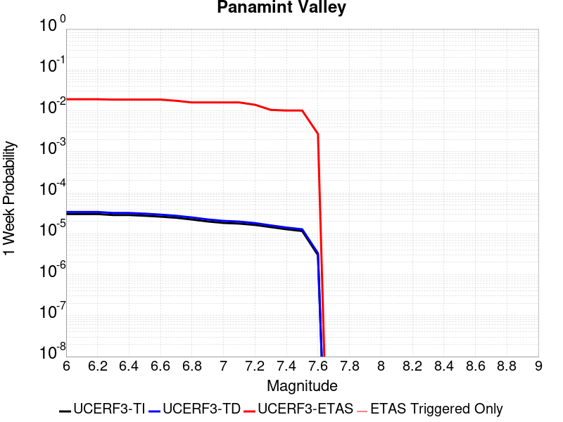 | 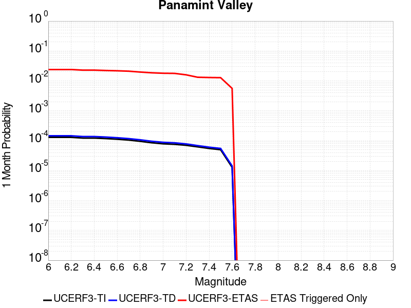 | 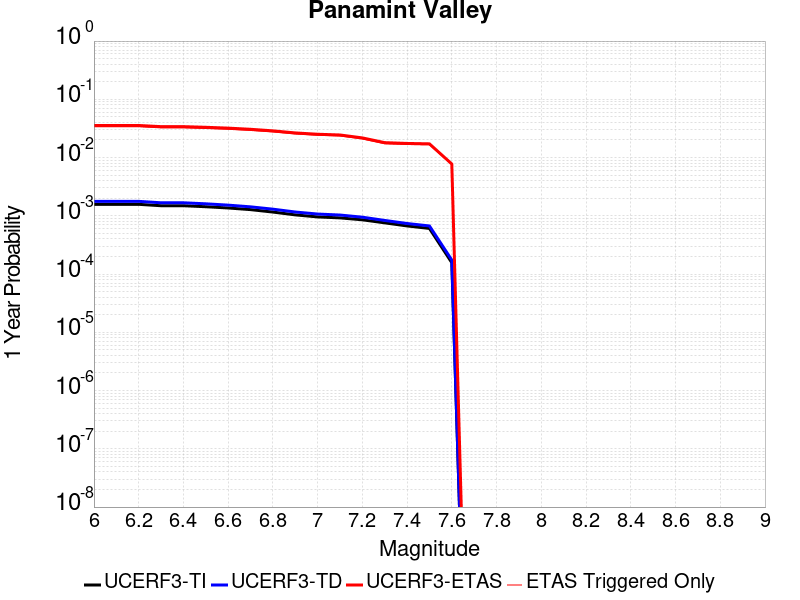 | 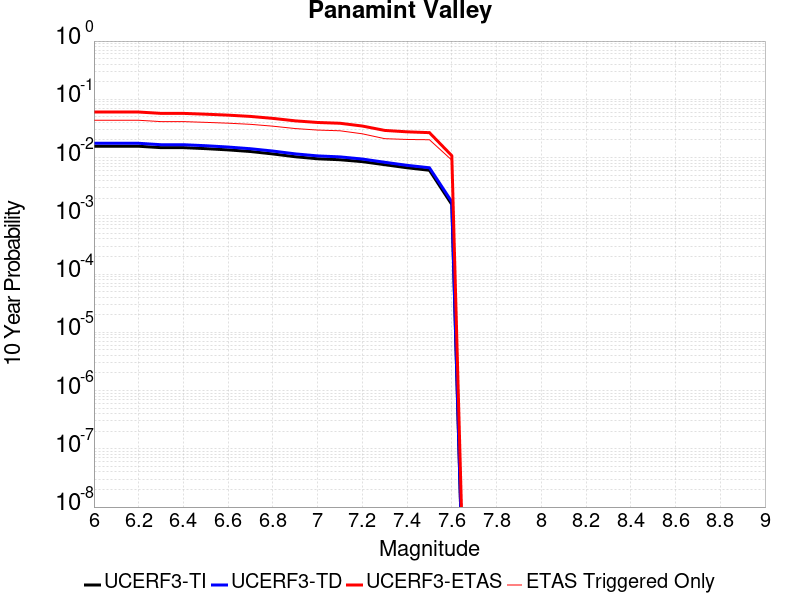 |

| Magnitude | 1 wk TI Prob | 1 wk TD Prob | 1 wk ETAS Prob | 1 wk ETAS/TD Gain | 1 wk ETAS Triggered Only | 1 mo TI Prob | 1 mo TD Prob | 1 mo ETAS Prob | 1 mo ETAS/TD Gain | 1 mo ETAS Triggered Only | 1 yr TI Prob | 1 yr TD Prob | 1 yr ETAS Prob | 1 yr ETAS/TD Gain | 1 yr ETAS Triggered Only | 10 yr TI Prob | 10 yr TD Prob | 10 yr ETAS Prob | 10 yr ETAS/TD Gain | 10 yr ETAS Triggered Only |
|-----|-----|-----|-----|-----|-----|-----|-----|-----|-----|-----|-----|-----|-----|-----|-----|-----|-----|-----|-----|-----|
| 6.0 | 3.0211835E-5 | 3.3984514E-5 | 0.018452736 | 542.97485 | 0.018419378 | 1.2947287E-4 | 1.4563995E-4 | 0.023623012 | 162.20146 | 0.023480793 | 0.0015751923 | 0.0017717537 | 0.035534605 | 20.056177 | 0.03382278 | 0.015640736 | 0.017583137 | 0.06048948 | 3.4401984 | 0.043674275 |
| 6.1 | 3.0211835E-5 | 3.3984514E-5 | 0.018452736 | 542.97485 | 0.018419378 | 1.2947287E-4 | 1.4563995E-4 | 0.023623012 | 162.20146 | 0.023480793 | 0.0015751923 | 0.0017717537 | 0.035534605 | 20.056177 | 0.03382278 | 0.015640736 | 0.017583137 | 0.06048948 | 3.4401984 | 0.043674275 |
| 6.2 | 3.0211835E-5 | 3.3984514E-5 | 0.018452736 | 542.97485 | 0.018419378 | 1.2947287E-4 | 1.4563995E-4 | 0.023623012 | 162.20146 | 0.023480793 | 0.0015751923 | 0.0017717537 | 0.035534605 | 20.056177 | 0.03382278 | 0.015640736 | 0.017583137 | 0.06048948 | 3.4401984 | 0.043674275 |
| 6.3 | 2.8573924E-5 | 3.210268E-5 | 0.017824754 | 555.24194 | 0.017793223 | 1.2245393E-4 | 1.3757581E-4 | 0.022717774 | 165.12912 | 0.022583304 | 0.001489857 | 0.0016737265 | 0.033897966 | 20.252989 | 0.032278262 | 0.01479908 | 0.016617801 | 0.057349607 | 3.4510949 | 0.041420117 |
| 6.4 | 2.8573924E-5 | 3.210268E-5 | 0.017824754 | 555.24194 | 0.017793223 | 1.2245393E-4 | 1.3757581E-4 | 0.022717774 | 165.12912 | 0.022583304 | 0.001489857 | 0.0016737265 | 0.033897966 | 20.252989 | 0.032278262 | 0.01479908 | 0.016617801 | 0.057349607 | 3.4510949 | 0.041420117 |
| 6.5 | 2.7468774E-5 | 3.0828433E-5 | 0.01747913 | 566.9808 | 0.017448839 | 1.1771801E-4 | 1.3211532E-4 | 0.022232449 | 168.28062 | 0.022103254 | 0.0014322745 | 0.0016073446 | 0.033000194 | 20.530878 | 0.03144339 | 0.014230782 | 0.015963677 | 0.055531338 | 3.4786057 | 0.040209554 |
| 6.6 | 2.6135967E-5 | 2.925248E-5 | 0.017081028 | 583.91724 | 0.017052274 | 1.1200648E-4 | 1.253619E-4 | 0.021693679 | 173.04843 | 0.021571022 | 0.0013628257 | 0.0015252391 | 0.031982873 | 20.969088 | 0.03050416 | 0.013544982 | 0.015154043 | 0.053479817 | 3.529079 | 0.0389155 |
| 6.7 | 2.4498746E-5 | 2.7341335E-5 | 0.016630417 | 608.25183 | 0.01660353 | 1.04990395E-4 | 1.1717203E-4 | 0.020976108 | 179.01976 | 0.02086138 | 0.0012775084 | 0.0014256609 | 0.030594124 | 21.459606 | 0.029210106 | 0.012701893 | 0.014171274 | 0.05083777 | 3.5873816 | 0.037193574 |
| 6.8 | 2.2244329E-5 | 2.4935423E-5 | 0.015761891 | 632.10846 | 0.01573735 | 9.532935E-5 | 1.0686185E-4 | 0.01980775 | 185.35849 | 0.019702993 | 0.0011600169 | 0.0013002884 | 0.028742304 | 22.104563 | 0.027477745 | 0.011539802 | 0.0129325185 | 0.04705955 | 3.6388543 | 0.034574162 |
| 6.9 | 1.9902658E-5 | 2.2290267E-5 | 0.014924435 | 669.5494 | 0.014902476 | 8.529431E-5 | 9.552632E-5 | 0.018554883 | 194.23845 | 0.018461121 | 0.0010379635 | 0.0011624309 | 0.026346276 | 22.66481 | 0.025213154 | 0.010331288 | 0.011568608 | 0.042679187 | 3.6892242 | 0.0314747 |
| 7.0 | 1.8353881E-5 | 2.0566185E-5 | 0.014317466 | 696.16534 | 0.014297194 | 7.865712E-5 | 8.813792E-5 | 0.017785877 | 201.79597 | 0.0176993 | 9.5722964E-4 | 0.0010725686 | 0.024945166 | 23.257408 | 0.023898229 | 0.009531168 | 0.010678849 | 0.040020976 | 3.7476864 | 0.02965885 |
| 7.1 | 1.7667631E-5 | 1.9772613E-5 | 0.014003613 | 708.2328 | 0.013984117 | 7.571623E-5 | 8.473711E-5 | 0.017406877 | 205.4221 | 0.017323608 | 9.2145515E-4 | 0.0010312037 | 0.024227154 | 23.494055 | 0.023219895 | 0.009176437 | 0.010269073 | 0.038797054 | 3.7780485 | 0.028823977 |
| 7.2 | 1.6381597E-5 | 1.8158249E-5 | 0.01246797 | 686.6284 | 0.012450038 | 7.020495E-5 | 7.781885E-5 | 0.015521761 | 199.46017 | 0.015445144 | 8.544101E-4 | 9.4704994E-4 | 0.021548875 | 22.753683 | 0.020621354 | 0.008511325 | 0.009434792 | 0.034771875 | 3.6854947 | 0.02557841 |
| 7.3 | 1.4520491E-5 | 1.5966476E-5 | 0.010284736 | 644.1456 | 0.010268933 | 6.222919E-5 | 6.842605E-5 | 0.012809798 | 187.20645 | 0.012742244 | 7.57377E-4 | 8.327849E-4 | 0.017891712 | 21.484192 | 0.017073145 | 0.0075480095 | 0.00829975 | 0.029236369 | 3.52256 | 0.021111842 |
| 7.4 | 1.2852287E-5 | 1.4145411E-5 | 0.010053347 | 710.71436 | 0.0100393435 | 5.5080065E-5 | 6.062187E-5 | 0.01252034 | 206.53174 | 0.012460474 | 6.7039346E-4 | 7.378371E-4 | 0.01730826 | 23.458103 | 0.016582659 | 0.0066837464 | 0.0073567946 | 0.027660696 | 3.759884 | 0.020454379 |
| 7.5 | 1.1637851E-5 | 1.2836797E-5 | 0.009926822 | 773.3098 | 0.009914112 | 4.987555E-5 | 5.5013777E-5 | 0.012368708 | 224.82928 | 0.012314371 | 6.070656E-4 | 6.6960254E-4 | 0.017063865 | 25.483572 | 0.016405247 | 0.006054099 | 0.0066787465 | 0.026768459 | 4.0080066 | 0.02022479 |
| 7.6 | 3.0068115E-6 | 3.3330316E-6 | 0.004605553 | 1381.791 | 0.0046022353 | 1.2886271E-5 | 1.4284384E-5 | 0.0056913374 | 398.43073 | 0.005677134 | 1.5687906E-4 | 1.7390578E-4 | 0.0075821117 | 43.598965 | 0.0074094944 | 0.0015676835 | 0.0017391363 | 0.010771333 | 6.1934958 | 0.009047932 |

## Garlock (East)
*[(top)](#table-of-contents)*

| 1 Week | 1 Month | 1 Year | 10 Year |
|-----|-----|-----|-----|
| 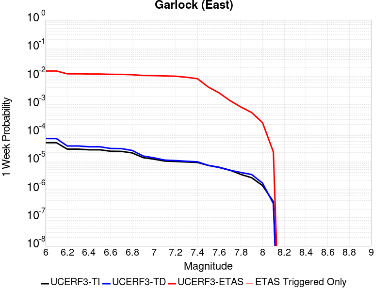 | 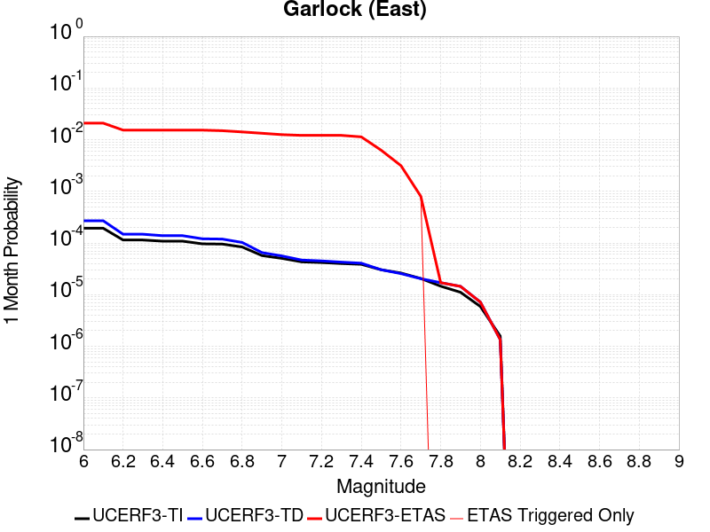 | 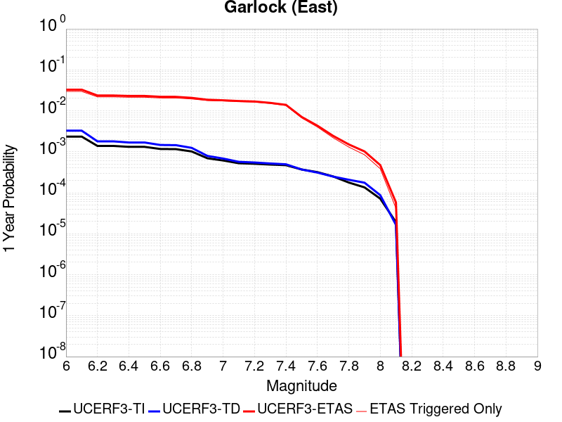 | 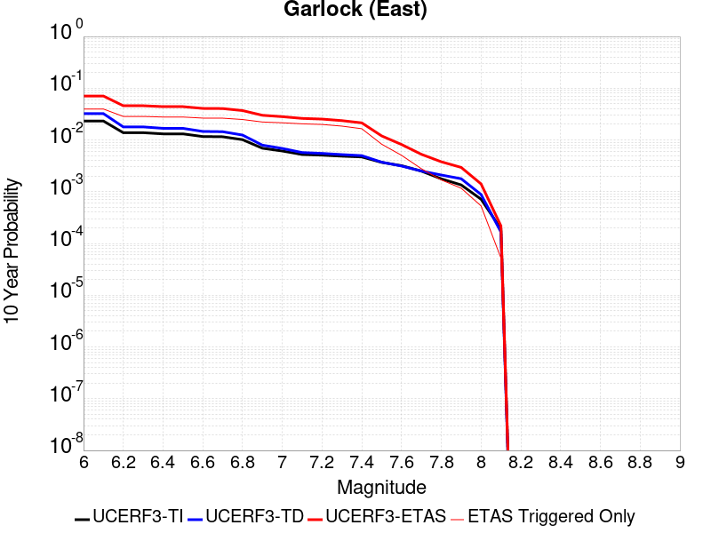 |

| Magnitude | 1 wk TI Prob | 1 wk TD Prob | 1 wk ETAS Prob | 1 wk ETAS/TD Gain | 1 wk ETAS Triggered Only | 1 mo TI Prob | 1 mo TD Prob | 1 mo ETAS Prob | 1 mo ETAS/TD Gain | 1 mo ETAS Triggered Only | 1 yr TI Prob | 1 yr TD Prob | 1 yr ETAS Prob | 1 yr ETAS/TD Gain | 1 yr ETAS Triggered Only | 10 yr TI Prob | 10 yr TD Prob | 10 yr ETAS Prob | 10 yr ETAS/TD Gain | 10 yr ETAS Triggered Only |
|-----|-----|-----|-----|-----|-----|-----|-----|-----|-----|-----|-----|-----|-----|-----|-----|-----|-----|-----|-----|-----|
| 6.0 | 4.5092507E-5 | 6.290325E-5 | 0.015580122 | 247.6839 | 0.015518195 | 1.9323928E-4 | 2.6956003E-4 | 0.0204576 | 75.892555 | 0.020193482 | 0.0023501497 | 0.0032774 | 0.032839045 | 10.019847 | 0.02965885 | 0.023254504 | 0.032351844 | 0.070745535 | 2.1867542 | 0.039677322 |
| 6.1 | 4.5092507E-5 | 6.290325E-5 | 0.015580122 | 247.6839 | 0.015518195 | 1.9323928E-4 | 2.6956003E-4 | 0.0204576 | 75.892555 | 0.020193482 | 0.0023501497 | 0.0032774 | 0.032839045 | 10.019847 | 0.02965885 | 0.023254504 | 0.032351844 | 0.070745535 | 2.1867542 | 0.039677322 |
| 6.2 | 2.6674514E-5 | 3.4509674E-5 | 0.012358892 | 358.1283 | 0.012324807 | 1.1431433E-4 | 1.4789042E-4 | 0.015747266 | 106.47929 | 0.0156016825 | 0.0013908884 | 0.0017991117 | 0.02367509 | 13.159322 | 0.021915406 | 0.01382215 | 0.017890299 | 0.04588088 | 2.5645676 | 0.028500464 |
| 6.3 | 2.6674514E-5 | 3.4509674E-5 | 0.012358892 | 358.1283 | 0.012324807 | 1.1431433E-4 | 1.4789042E-4 | 0.015747266 | 106.47929 | 0.0156016825 | 0.0013908884 | 0.0017991117 | 0.02367509 | 13.159322 | 0.021915406 | 0.01382215 | 0.017890299 | 0.04588088 | 2.5645676 | 0.028500464 |
| 6.4 | 2.5312667E-5 | 3.233893E-5 | 0.012168908 | 376.29282 | 0.01213696 | 1.0847834E-4 | 1.3858822E-4 | 0.015466812 | 111.602646 | 0.015330349 | 0.0013199237 | 0.0016860351 | 0.02308525 | 13.692034 | 0.021435354 | 0.013121112 | 0.016778335 | 0.04407209 | 2.6267262 | 0.027759515 |
| 6.5 | 2.5312667E-5 | 3.233893E-5 | 0.012168908 | 376.29282 | 0.01213696 | 1.0847834E-4 | 1.3858822E-4 | 0.015466812 | 111.602646 | 0.015330349 | 0.0013199237 | 0.0016860351 | 0.02308525 | 13.692034 | 0.021435354 | 0.013121112 | 0.016778335 | 0.04407209 | 2.6267262 | 0.027759515 |
| 6.6 | 2.246556E-5 | 2.8133776E-5 | 0.011841249 | 420.89084 | 0.011813448 | 9.627742E-5 | 1.20567885E-4 | 0.014989943 | 124.32783 | 0.014871169 | 0.0011715472 | 0.0014669491 | 0.02201637 | 15.008271 | 0.02057961 | 0.011653901 | 0.01461866 | 0.040697232 | 2.7839236 | 0.026465463 |
| 6.7 | 2.2241198E-5 | 2.7803519E-5 | 0.01179918 | 424.37723 | 0.011771704 | 9.531594E-5 | 1.1915263E-4 | 0.014946811 | 125.44256 | 0.014829425 | 0.0011598538 | 0.0014497414 | 0.021936992 | 15.131659 | 0.020516995 | 0.011538187 | 0.014448853 | 0.040449638 | 2.799505 | 0.026381975 |
| 6.8 | 1.9528685E-5 | 2.389819E-5 | 0.01146138 | 479.59195 | 0.011437755 | 8.369167E-5 | 1.0241691E-4 | 0.014408581 | 140.68558 | 0.014307629 | 0.0010184698 | 0.0012462323 | 0.020705791 | 16.614712 | 0.01948384 | 0.010138147 | 0.012436427 | 0.03698561 | 2.973974 | 0.024858333 |
| 6.9 | 1.3318621E-5 | 1.5198884E-5 | 0.010805763 | 710.95764 | 0.010790729 | 5.7078556E-5 | 6.513648E-5 | 0.013432664 | 206.22334 | 0.013368398 | 6.9470983E-4 | 7.927538E-4 | 0.01862401 | 23.492802 | 0.017845402 | 0.0069254204 | 0.007939888 | 0.030002233 | 3.7786722 | 0.02223892 |
| 7.0 | 1.1760853E-5 | 1.31077895E-5 | 0.010657595 | 813.07336 | 0.010644626 | 5.0402683E-5 | 5.6175057E-5 | 0.01318381 | 234.69151 | 0.013128372 | 6.134799E-4 | 6.8372174E-4 | 0.018068485 | 26.426666 | 0.017396659 | 0.0061178906 | 0.00685652 | 0.02820709 | 4.1139073 | 0.02149797 |
| 7.1 | 1.0064758E-5 | 1.0902931E-5 | 0.010404954 | 954.32635 | 0.010394164 | 4.3133965E-5 | 4.672603E-5 | 0.0127779385 | 273.46512 | 0.012731807 | 5.2502943E-4 | 5.687444E-4 | 0.01732971 | 30.47012 | 0.016770504 | 0.005237907 | 0.0057129986 | 0.02611278 | 4.570766 | 0.020516995 |
| 7.2 | 9.768808E-6 | 1.0498807E-5 | 0.010154095 | 967.16656 | 0.010143703 | 4.186565E-5 | 4.499413E-5 | 0.012494472 | 277.69116 | 0.012450038 | 5.095951E-4 | 5.4766936E-4 | 0.016891781 | 30.843029 | 0.016353067 | 0.0050842804 | 0.0055032647 | 0.025336534 | 4.6039095 | 0.01994302 |
| 7.3 | 9.344516E-6 | 9.944468E-6 | 0.009329118 | 938.1214 | 0.009319265 | 4.004731E-5 | 4.261847E-5 | 0.011490322 | 269.60898 | 0.011448191 | 4.8746695E-4 | 5.1875977E-4 | 0.015622116 | 30.114353 | 0.015111195 | 0.0048639905 | 0.0052149445 | 0.02364208 | 4.533525 | 0.018523736 |
| 7.4 | 9.023491E-6 | 9.490661E-6 | 0.0083059585 | 875.17175 | 0.0082965465 | 3.867153E-5 | 4.0673647E-5 | 0.010288319 | 252.94803 | 0.010248061 | 4.7072413E-4 | 4.950925E-4 | 0.013982041 | 28.24127 | 0.013493629 | 0.004697283 | 0.0049783974 | 0.021395428 | 4.2976537 | 0.016499171 |
| 7.5 | 7.081253E-6 | 7.087672E-6 | 0.0042127287 | 594.3741 | 0.0042056707 | 3.0347876E-5 | 3.0375388E-5 | 0.005164686 | 170.02864 | 0.0051344666 | 3.6942272E-4 | 3.6975832E-4 | 0.007087998 | 19.169271 | 0.0067207245 | 0.003688092 | 0.0037243143 | 0.011979565 | 3.2165828 | 0.008286111 |
| 7.6 | 6.116396E-6 | 5.959245E-6 | 0.0026044848 | 437.0495 | 0.002598541 | 2.6212863E-5 | 2.5539372E-5 | 0.0031562317 | 123.582985 | 0.0031307724 | 3.1909486E-4 | 3.1089774E-4 | 0.004337906 | 13.952838 | 0.0040282602 | 0.0031863707 | 0.0031357552 | 0.008170896 | 2.6057189 | 0.0050509796 |
| 7.7 | 4.797145E-6 | 4.757281E-6 | 0.0013927264 | 292.7568 | 0.0013879758 | 2.055903E-5 | 2.0388188E-5 | 0.0017005351 | 83.40785 | 0.0016801811 | 2.5027743E-4 | 2.4819805E-4 | 0.0024496282 | 9.869651 | 0.0022019765 | 0.0024999576 | 0.0025093474 | 0.005278333 | 2.1034684 | 0.0027759515 |
| 7.8 | 3.4028885E-6 | 3.978462E-6 | 8.284119E-4 | 208.22417 | 8.244367E-4 | 1.4583726E-5 | 1.7050439E-5 | 0.0010084448 | 59.1448 | 9.914113E-4 | 1.775424E-4 | 2.0756939E-4 | 0.0015117871 | 7.283285 | 0.0013044885 | 0.0017740062 | 0.0021012232 | 0.0037882878 | 1.8028965 | 0.0016906171 |
| 7.9 | 2.5928412E-6 | 3.3724489E-6 | 5.251661E-4 | 155.72247 | 5.217954E-4 | 1.1112129E-5 | 1.4453272E-5 | 6.3016295E-4 | 43.600018 | 6.1571854E-4 | 1.3528178E-4 | 1.7595445E-4 | 0.0010211143 | 5.8032875 | 8.4530853E-4 | 0.0013519945 | 0.0017812408 | 0.0029479805 | 1.6550151 | 0.0011688217 |
| 8.0 | 1.3743648E-6 | 1.6734747E-6 | 2.3126307E-4 | 138.19334 | 2.2958998E-4 | 5.8901214E-6 | 7.1720146E-6 | 2.889395E-4 | 40.287075 | 2.8176952E-4 | 7.1709874E-5 | 8.731581E-5 | 4.7341068E-4 | 5.421821 | 3.8612858E-4 | 7.1686733E-4 | 8.837234E-4 | 0.0014154844 | 1.6017278 | 5.322313E-4 |
| 8.1 | 3.6733252E-7 | 3.1489964E-7 | 2.1186708E-5 | 67.28083 | 2.0871816E-5 | 1.5742813E-6 | 1.3495693E-6 | 4.3093143E-5 | 31.931034 | 4.174363E-5 | 1.9166706E-5 | 1.6430899E-5 | 5.8173846E-5 | 3.540515 | 4.174363E-5 | 1.9165053E-4 | 1.6638759E-4 | 2.1855845E-4 | 1.3135502 | 5.217954E-5 |

## Airport Lake
*[(top)](#table-of-contents)*

| 1 Week | 1 Month | 1 Year | 10 Year |
|-----|-----|-----|-----|
| 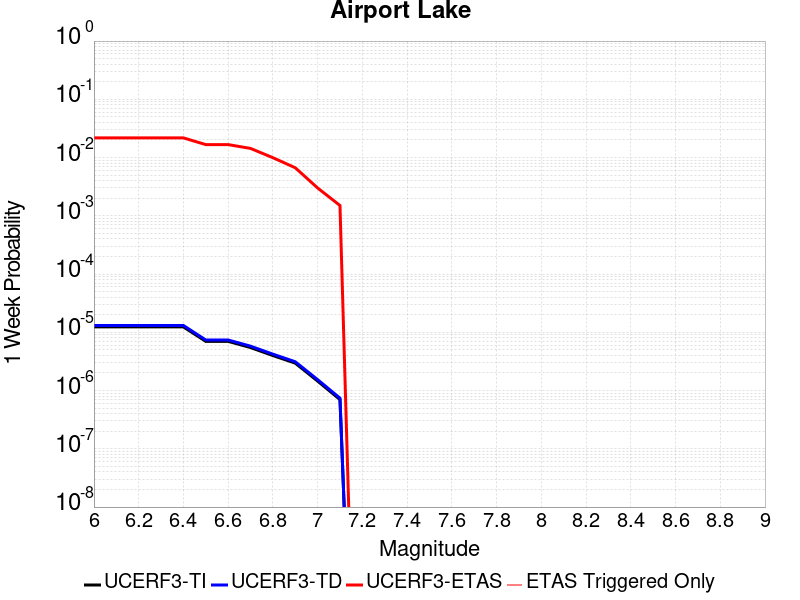 | 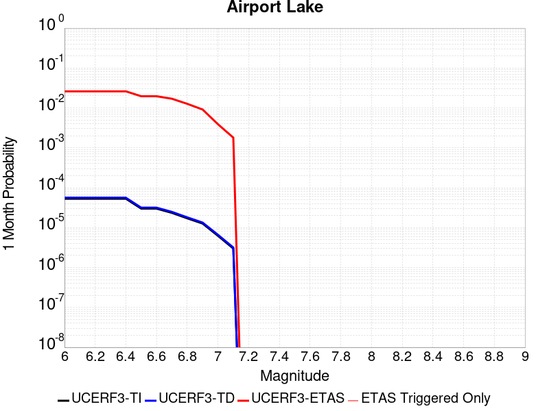 | 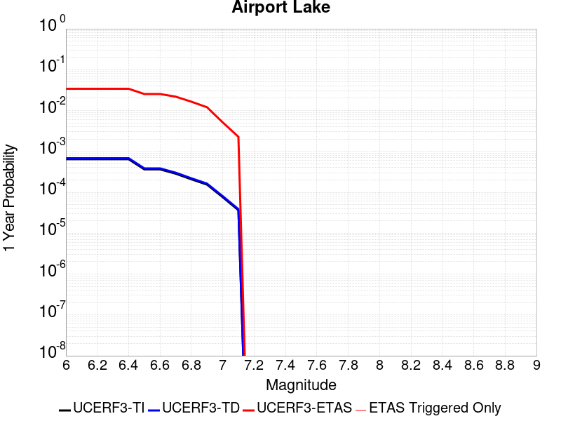 | 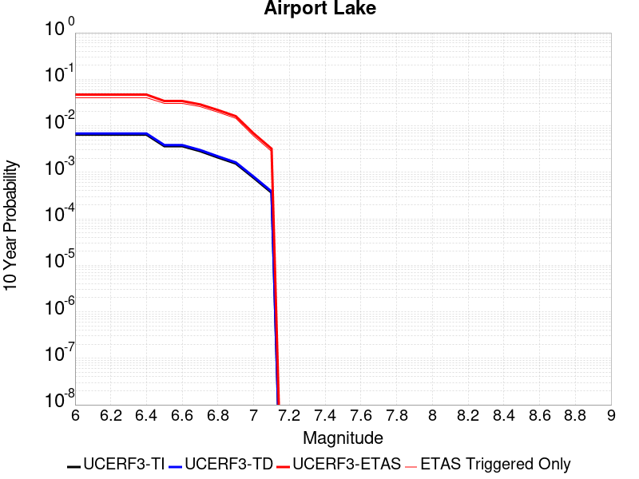 |

| Magnitude | 1 wk TI Prob | 1 wk TD Prob | 1 wk ETAS Prob | 1 wk ETAS/TD Gain | 1 wk ETAS Triggered Only | 1 mo TI Prob | 1 mo TD Prob | 1 mo ETAS Prob | 1 mo ETAS/TD Gain | 1 mo ETAS Triggered Only | 1 yr TI Prob | 1 yr TD Prob | 1 yr ETAS Prob | 1 yr ETAS/TD Gain | 1 yr ETAS Triggered Only | 10 yr TI Prob | 10 yr TD Prob | 10 yr ETAS Prob | 10 yr ETAS/TD Gain | 10 yr ETAS Triggered Only |
|-----|-----|-----|-----|-----|-----|-----|-----|-----|-----|-----|-----|-----|-----|-----|-----|-----|-----|-----|-----|-----|
| 6.0 | 1.2387061E-5 | 1.3103157E-5 | 0.021625586 | 1650.4103 | 0.021612765 | 5.3086325E-5 | 5.615534E-5 | 0.026353166 | 469.2905 | 0.026298488 | 6.461343E-4 | 6.8350515E-4 | 0.034577023 | 50.5878 | 0.0339167 | 0.0064425888 | 0.0068168393 | 0.047612567 | 6.9845514 | 0.041075733 |
| 6.1 | 1.2387061E-5 | 1.3103157E-5 | 0.021625586 | 1650.4103 | 0.021612765 | 5.3086325E-5 | 5.615534E-5 | 0.026353166 | 469.2905 | 0.026298488 | 6.461343E-4 | 6.8350515E-4 | 0.034577023 | 50.5878 | 0.0339167 | 0.0064425888 | 0.0068168393 | 0.047612567 | 6.9845514 | 0.041075733 |
| 6.2 | 1.2387061E-5 | 1.3103157E-5 | 0.021625586 | 1650.4103 | 0.021612765 | 5.3086325E-5 | 5.615534E-5 | 0.026353166 | 469.2905 | 0.026298488 | 6.461343E-4 | 6.8350515E-4 | 0.034577023 | 50.5878 | 0.0339167 | 0.0064425888 | 0.0068168393 | 0.047612567 | 6.9845514 | 0.041075733 |
| 6.3 | 1.2387061E-5 | 1.3103157E-5 | 0.021625586 | 1650.4103 | 0.021612765 | 5.3086325E-5 | 5.615534E-5 | 0.026353166 | 469.2905 | 0.026298488 | 6.461343E-4 | 6.8350515E-4 | 0.034577023 | 50.5878 | 0.0339167 | 0.0064425888 | 0.0068168393 | 0.047612567 | 6.9845514 | 0.041075733 |
| 6.4 | 1.2387061E-5 | 1.3103157E-5 | 0.021625586 | 1650.4103 | 0.021612765 | 5.3086325E-5 | 5.615534E-5 | 0.026353166 | 469.2905 | 0.026298488 | 6.461343E-4 | 6.8350515E-4 | 0.034577023 | 50.5878 | 0.0339167 | 0.0064425888 | 0.0068168393 | 0.047612567 | 6.9845514 | 0.041075733 |
| 6.5 | 6.9922594E-6 | 7.384925E-6 | 0.016078565 | 2177.2144 | 0.016071297 | 2.996648E-5 | 3.1649324E-5 | 0.019619228 | 619.89404 | 0.019588199 | 3.6478083E-4 | 3.8526783E-4 | 0.025588708 | 66.41797 | 0.025213154 | 0.003641826 | 0.0038465366 | 0.034347713 | 8.929517 | 0.030618954 |
| 6.6 | 6.9922594E-6 | 7.384925E-6 | 0.016078565 | 2177.2144 | 0.016071297 | 2.996648E-5 | 3.1649324E-5 | 0.019619228 | 619.89404 | 0.019588199 | 3.6478083E-4 | 3.8526783E-4 | 0.025588708 | 66.41797 | 0.025213154 | 0.003641826 | 0.0038465366 | 0.034347713 | 8.929517 | 0.030618954 |
| 6.7 | 5.477277E-6 | 5.7860684E-6 | 0.013801976 | 2385.3809 | 0.01379627 | 2.3473833E-5 | 2.4797222E-5 | 0.016909678 | 681.9182 | 0.0168853 | 2.8575645E-4 | 3.0186825E-4 | 0.021981139 | 72.81699 | 0.021685816 | 0.0028538927 | 0.003014966 | 0.029234165 | 9.69635 | 0.026298488 |
| 6.8 | 3.9950432E-6 | 4.2190873E-6 | 0.010106135 | 2395.337 | 0.010101959 | 1.7121502E-5 | 1.8081691E-5 | 0.012530509 | 692.99426 | 0.012512653 | 2.0843433E-4 | 2.2012512E-4 | 0.016454823 | 74.75214 | 0.016238272 | 0.0020823893 | 0.0021993418 | 0.021942306 | 9.976761 | 0.01978648 |
| 6.9 | 2.95695E-6 | 3.1230243E-6 | 0.007339543 | 2350.1396 | 0.0073364433 | 1.2672582E-5 | 1.3384334E-5 | 0.009134246 | 682.458 | 0.009120983 | 1.5427776E-4 | 1.6294434E-4 | 0.012037072 | 73.87229 | 0.011876063 | 0.001541707 | 0.0016284712 | 0.016037827 | 9.848395 | 0.014432861 |
| 7.0 | 1.456072E-6 | 1.540812E-6 | 0.003059257 | 1985.4836 | 0.003057721 | 6.2402937E-6 | 6.603469E-6 | 0.0038469923 | 582.5714 | 0.003840414 | 7.597293E-5 | 8.039528E-5 | 0.0051309685 | 63.821766 | 0.0050509796 | 7.594696E-4 | 8.0376083E-4 | 0.0070394175 | 8.7581005 | 0.006240673 |
| 7.1 | 6.995192E-7 | 7.4089746E-7 | 0.0013574079 | 1832.1132 | 0.0013566681 | 2.997936E-6 | 3.1752747E-6 | 0.0017877099 | 563.0095 | 0.0017845402 | 3.649926E-5 | 3.865897E-5 | 0.0023553409 | 60.926117 | 0.0023167715 | 3.6493264E-4 | 3.865897E-4 | 0.0032240592 | 8.339745 | 0.002838567 |

## Hunter Mountain-Saline Valley
*[(top)](#table-of-contents)*

| 1 Week | 1 Month | 1 Year | 10 Year |
|-----|-----|-----|-----|
| 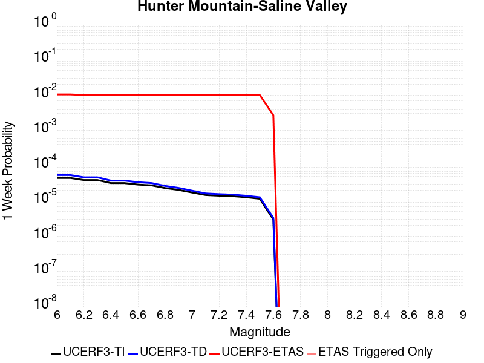 | 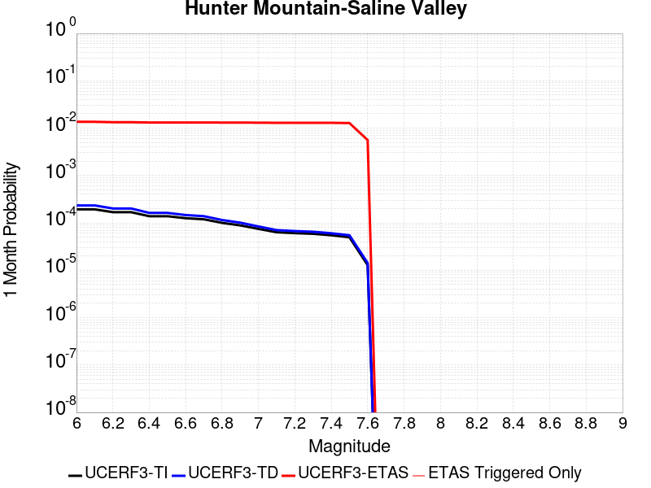 | 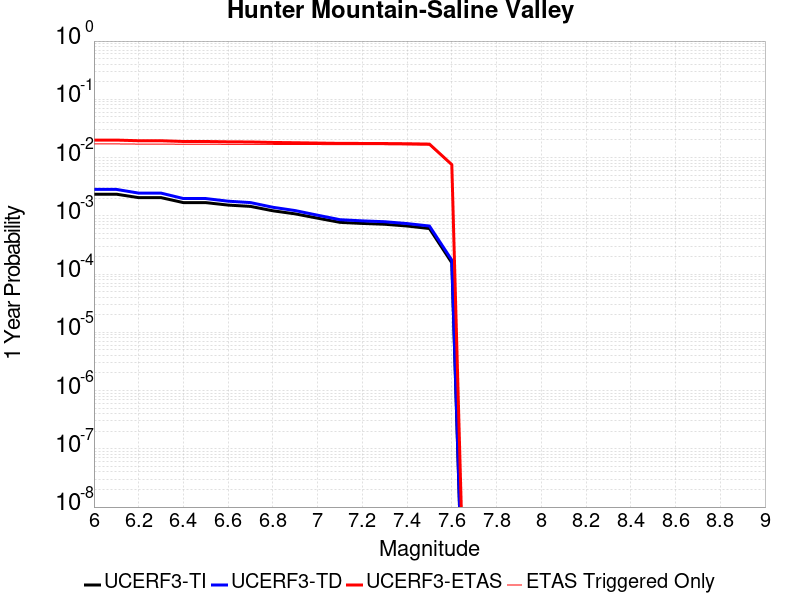 | 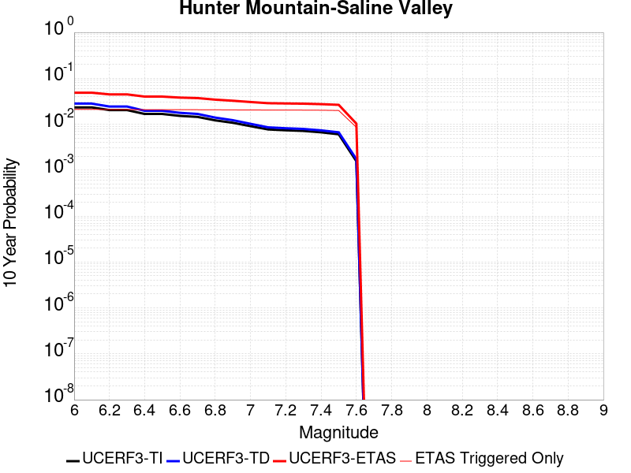 |

| Magnitude | 1 wk TI Prob | 1 wk TD Prob | 1 wk ETAS Prob | 1 wk ETAS/TD Gain | 1 wk ETAS Triggered Only | 1 mo TI Prob | 1 mo TD Prob | 1 mo ETAS Prob | 1 mo ETAS/TD Gain | 1 mo ETAS Triggered Only | 1 yr TI Prob | 1 yr TD Prob | 1 yr ETAS Prob | 1 yr ETAS/TD Gain | 1 yr ETAS Triggered Only | 10 yr TI Prob | 10 yr TD Prob | 10 yr ETAS Prob | 10 yr ETAS/TD Gain | 10 yr ETAS Triggered Only |
|-----|-----|-----|-----|-----|-----|-----|-----|-----|-----|-----|-----|-----|-----|-----|-----|-----|-----|-----|-----|-----|
| 6.0 | 4.5103672E-5 | 5.4570177E-5 | 0.010333379 | 189.35945 | 0.01027937 | 1.9328714E-4 | 2.3385242E-4 | 0.01301485 | 55.654114 | 0.012783987 | 0.002350731 | 0.0028435152 | 0.019951362 | 7.016443 | 0.017156633 | 0.023260195 | 0.028091887 | 0.0487628 | 1.7358321 | 0.02126838 |
| 6.1 | 4.5103672E-5 | 5.4570177E-5 | 0.010333379 | 189.35945 | 0.01027937 | 1.9328714E-4 | 2.3385242E-4 | 0.01301485 | 55.654114 | 0.012783987 | 0.002350731 | 0.0028435152 | 0.019951362 | 7.016443 | 0.017156633 | 0.023260195 | 0.028091887 | 0.0487628 | 1.7358321 | 0.02126838 |
| 6.2 | 3.9363465E-5 | 4.706337E-5 | 0.010263336 | 218.07483 | 0.010216754 | 1.6868966E-4 | 2.0168544E-4 | 0.012899624 | 63.95912 | 0.0127005 | 0.002051862 | 0.0024528175 | 0.019442445 | 7.926576 | 0.017031401 | 0.020330196 | 0.024273481 | 0.044883046 | 1.8490568 | 0.021122277 |
| 6.3 | 3.9363465E-5 | 4.706337E-5 | 0.010263336 | 218.07483 | 0.010216754 | 1.6868966E-4 | 2.0168544E-4 | 0.012899624 | 63.95912 | 0.0127005 | 0.002051862 | 0.0024528175 | 0.019442445 | 7.926576 | 0.017031401 | 0.020330196 | 0.024273481 | 0.044883046 | 1.8490568 | 0.021122277 |
| 6.4 | 3.2311684E-5 | 3.795099E-5 | 0.010212575 | 269.09903 | 0.01017501 | 1.384713E-4 | 1.6263737E-4 | 0.012798467 | 78.69327 | 0.012637884 | 0.0016845843 | 0.0019783843 | 0.018871939 | 9.539065 | 0.016927043 | 0.016718714 | 0.019616475 | 0.0401914 | 2.0488596 | 0.020986611 |
| 6.5 | 3.2311684E-5 | 3.795099E-5 | 0.010212575 | 269.09903 | 0.01017501 | 1.384713E-4 | 1.6263737E-4 | 0.012798467 | 78.69327 | 0.012637884 | 0.0016845843 | 0.0019783843 | 0.018871939 | 9.539065 | 0.016927043 | 0.016718714 | 0.019616475 | 0.0401914 | 2.0488596 | 0.020986611 |
| 6.6 | 2.9305844E-5 | 3.418183E-5 | 0.010187973 | 298.05228 | 0.010154138 | 1.2559042E-4 | 1.4648569E-4 | 0.01276165 | 87.118744 | 0.0126170125 | 0.0015279909 | 0.001782067 | 0.01861644 | 10.446544 | 0.016864426 | 0.015175272 | 0.01768569 | 0.03823963 | 2.162179 | 0.020923994 |
| 6.7 | 2.7826512E-5 | 3.2344276E-5 | 0.010175719 | 314.60648 | 0.010143703 | 1.19251024E-4 | 1.386113E-4 | 0.01274344 | 91.93652 | 0.012606577 | 0.0014509142 | 0.0016863465 | 0.018511916 | 10.977529 | 0.016853992 | 0.014414776 | 0.016743187 | 0.037306584 | 2.2281651 | 0.02091356 |
| 6.8 | 2.3389874E-5 | 2.6866714E-5 | 0.010149426 | 377.7695 | 0.010122831 | 1.0023846E-4 | 1.15138246E-4 | 0.0126993945 | 110.29692 | 0.012585705 | 0.00121972 | 0.001400954 | 0.018179227 | 12.97632 | 0.016801812 | 0.01213047 | 0.013927434 | 0.034467395 | 2.4747844 | 0.020830072 |
| 6.9 | 2.069209E-5 | 2.3570032E-5 | 0.010125291 | 429.58325 | 0.010101959 | 8.867737E-5 | 1.01010715E-4 | 0.012643705 | 125.17192 | 0.012543961 | 0.0010791123 | 0.0012291478 | 0.017968616 | 14.618759 | 0.016760068 | 0.010738871 | 0.012228523 | 0.032700792 | 2.6741407 | 0.020725712 |
| 7.0 | 1.7462342E-5 | 1.9633546E-5 | 0.0101109585 | 514.9838 | 0.010091523 | 7.483646E-5 | 8.414118E-5 | 0.012606177 | 149.82173 | 0.01252309 | 9.1075303E-4 | 0.0010239601 | 0.017735591 | 17.32059 | 0.01672876 | 0.009070295 | 0.0101960525 | 0.03061748 | 3.0028758 | 0.02063179 |
| 7.1 | 1.4807709E-5 | 1.6441749E-5 | 0.010086928 | 613.49475 | 0.010070651 | 6.3460066E-5 | 7.046283E-5 | 0.012561364 | 178.26936 | 0.012491781 | 7.723524E-4 | 8.575638E-4 | 0.017509416 | 20.417625 | 0.016666144 | 0.007696735 | 0.008545532 | 0.028918238 | 3.3840187 | 0.020548303 |
| 7.2 | 1.4180048E-5 | 1.5698337E-5 | 0.010086191 | 642.5007 | 0.010070651 | 6.077022E-5 | 6.727694E-5 | 0.012558218 | 186.66452 | 0.012491781 | 7.396263E-4 | 8.188051E-4 | 0.017471304 | 21.337559 | 0.016666144 | 0.0073716943 | 0.008160833 | 0.028541444 | 3.4973688 | 0.020548303 |
| 7.3 | 1.3730402E-5 | 1.5172075E-5 | 0.010075235 | 664.0644 | 0.010060215 | 5.8843252E-5 | 6.502165E-5 | 0.012524686 | 192.6233 | 0.012460474 | 7.161811E-4 | 7.9136714E-4 | 0.01741304 | 22.003744 | 0.016634837 | 0.007138774 | 0.007888422 | 0.028233217 | 3.57907 | 0.020506559 |
| 7.4 | 1.2810095E-5 | 1.4109277E-5 | 0.010053311 | 712.532 | 0.0100393435 | 5.489925E-5 | 6.0467017E-5 | 0.012499317 | 206.71297 | 0.012439602 | 6.681934E-4 | 7.359531E-4 | 0.017275121 | 23.47313 | 0.01655135 | 0.006661878 | 0.007338053 | 0.027590541 | 3.7599266 | 0.0204022 |
| 7.5 | 1.1595659E-5 | 1.2800664E-5 | 0.009926787 | 775.4899 | 0.009914112 | 4.9694736E-5 | 5.4858923E-5 | 0.012347684 | 225.08069 | 0.0122935 | 6.0486543E-4 | 6.6771836E-4 | 0.017030725 | 25.50585 | 0.01637394 | 0.006032217 | 0.0066599925 | 0.026698252 | 4.0087514 | 0.020172609 |
| 7.6 | 2.997694E-6 | 3.3251579E-6 | 0.004605545 | 1385.0605 | 0.0046022353 | 1.28471975E-5 | 1.425064E-5 | 0.005680868 | 398.6395 | 0.005666698 | 1.564034E-4 | 1.73495E-4 | 0.0075712698 | 43.639698 | 0.007399059 | 0.0015629337 | 0.001735031 | 0.010746429 | 6.1937966 | 0.00902706 |

## Blackwater
*[(top)](#table-of-contents)*

| 1 Week | 1 Month | 1 Year | 10 Year |
|-----|-----|-----|-----|
| 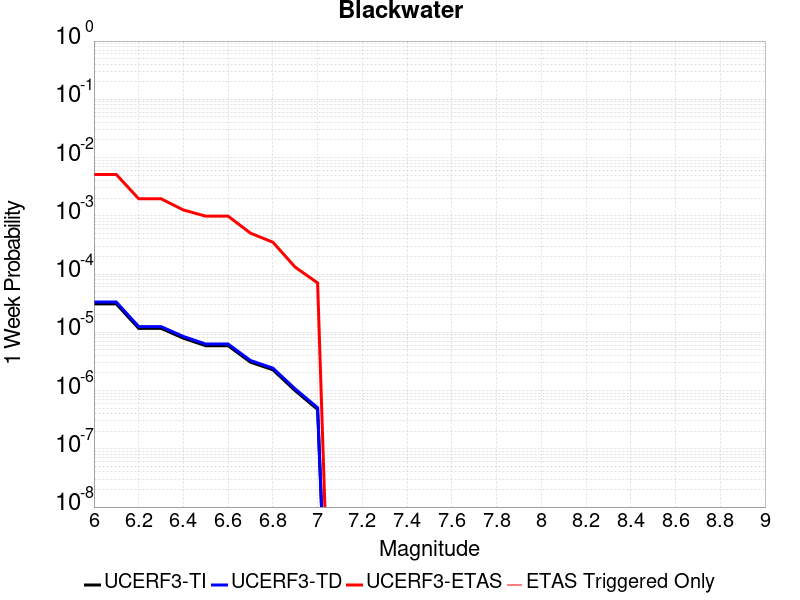 | 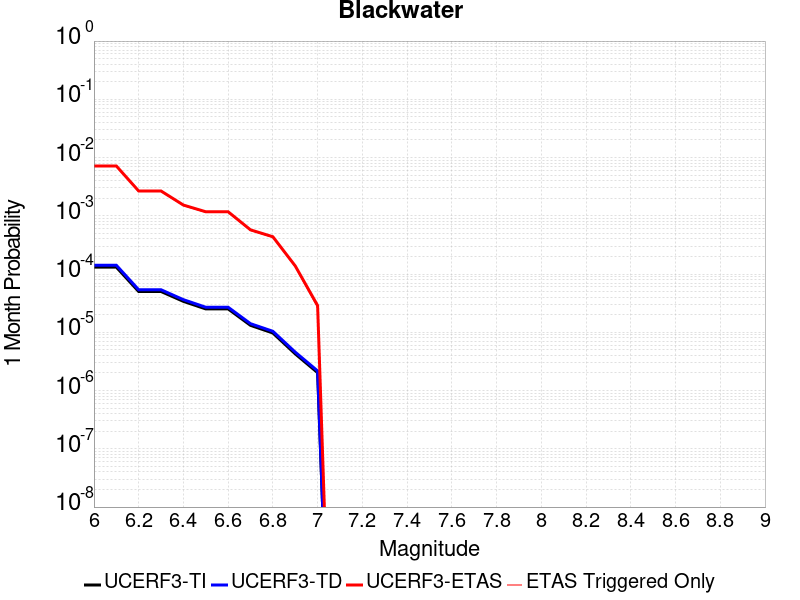 | 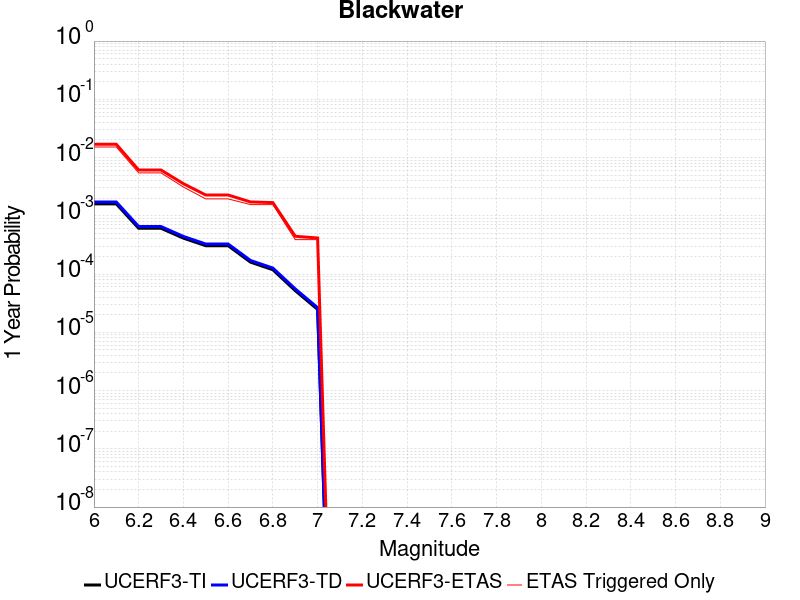 | 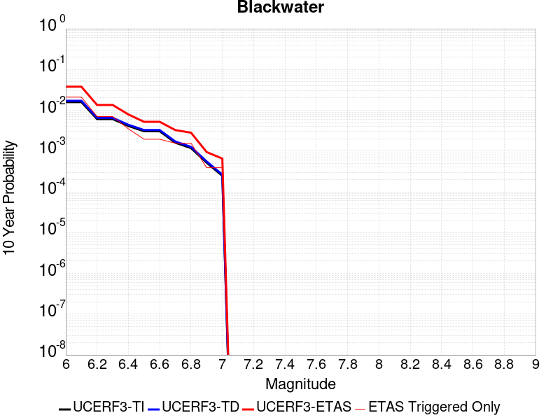 |

| Magnitude | 1 wk TI Prob | 1 wk TD Prob | 1 wk ETAS Prob | 1 wk ETAS/TD Gain | 1 wk ETAS Triggered Only | 1 mo TI Prob | 1 mo TD Prob | 1 mo ETAS Prob | 1 mo ETAS/TD Gain | 1 mo ETAS Triggered Only | 1 yr TI Prob | 1 yr TD Prob | 1 yr ETAS Prob | 1 yr ETAS/TD Gain | 1 yr ETAS Triggered Only | 10 yr TI Prob | 10 yr TD Prob | 10 yr ETAS Prob | 10 yr ETAS/TD Gain | 10 yr ETAS Triggered Only |
|-----|-----|-----|-----|-----|-----|-----|-----|-----|-----|-----|-----|-----|-----|-----|-----|-----|-----|-----|-----|-----|
| 6.0 | 3.0708583E-5 | 3.3095846E-5 | 0.0050734724 | 153.29634 | 0.0050405436 | 1.3160157E-4 | 1.4183241E-4 | 0.007331153 | 51.688843 | 0.0071903407 | 0.0016010714 | 0.0017255784 | 0.013195686 | 7.6471086 | 0.011489934 | 0.015895851 | 0.017135633 | 0.03348542 | 1.9541397 | 0.016634837 |
| 6.1 | 3.0708583E-5 | 3.3095846E-5 | 0.0050734724 | 153.29634 | 0.0050405436 | 1.3160157E-4 | 1.4183241E-4 | 0.007331153 | 51.688843 | 0.0071903407 | 0.0016010714 | 0.0017255784 | 0.013195686 | 7.6471086 | 0.011489934 | 0.015895851 | 0.017135633 | 0.03348542 | 1.9541397 | 0.016634837 |
| 6.2 | 1.1707779E-5 | 1.2545122E-5 | 0.0019535997 | 155.72583 | 0.0019410788 | 5.017523E-5 | 5.3763757E-5 | 0.0027565185 | 51.270947 | 0.0027029002 | 6.107122E-4 | 6.5438676E-4 | 0.0048468765 | 7.406746 | 0.0041952347 | 0.006090366 | 0.0065255696 | 0.012559634 | 1.9246801 | 0.0060736984 |
| 6.3 | 1.1707779E-5 | 1.2545122E-5 | 0.0019535997 | 155.72583 | 0.0019410788 | 5.017523E-5 | 5.3763757E-5 | 0.0027565185 | 51.270947 | 0.0027029002 | 6.107122E-4 | 6.5438676E-4 | 0.0048468765 | 7.406746 | 0.0041952347 | 0.006090366 | 0.0065255696 | 0.012559634 | 1.9246801 | 0.0060736984 |
| 6.4 | 7.929244E-6 | 8.480098E-6 | 0.0012503426 | 147.44435 | 0.001241873 | 3.3982033E-5 | 3.6342793E-5 | 0.0017060274 | 46.942657 | 0.0016697453 | 4.136527E-4 | 4.423877E-4 | 0.0030815045 | 6.965619 | 0.0026402846 | 0.0041288356 | 0.0044154758 | 0.008301272 | 1.88004 | 0.0039030295 |
| 6.5 | 5.8832115E-6 | 6.285991E-6 | 9.663835E-4 | 153.73607 | 9.601035E-4 | 2.521352E-5 | 2.6939697E-5 | 0.0013000862 | 48.259125 | 0.0012731807 | 3.0693135E-4 | 3.27944E-4 | 0.0022683863 | 6.916993 | 0.0019410788 | 0.0030650778 | 0.0032748538 | 0.0061041247 | 1.8639381 | 0.002838567 |
| 6.6 | 5.8832115E-6 | 6.285991E-6 | 9.663835E-4 | 153.73607 | 9.601035E-4 | 2.521352E-5 | 2.6939697E-5 | 0.0013000862 | 48.259125 | 0.0012731807 | 3.0693135E-4 | 3.27944E-4 | 0.0022683863 | 6.916993 | 0.0019410788 | 0.0030650778 | 0.0032748538 | 0.0061041247 | 1.8639381 | 0.002838567 |
| 6.7 | 3.0715053E-6 | 3.2814662E-6 | 5.1463925E-4 | 156.8321 | 5.113595E-4 | 1.3163528E-5 | 1.4063357E-5 | 6.610805E-4 | 47.007305 | 6.470263E-4 | 1.6025416E-4 | 1.7120909E-4 | 0.0011520165 | 6.728711 | 9.809753E-4 | 0.0016013865 | 0.0017108864 | 0.0030548153 | 1.7855161 | 0.0013462321 |
| 6.8 | 2.2722281E-6 | 2.4287538E-6 | 3.6768464E-4 | 151.3882 | 3.6525677E-4 | 9.738084E-6 | 1.0408908E-5 | 4.9045566E-4 | 47.11884 | 4.8005176E-4 | 1.1855473E-4 | 1.26722E-4 | 8.6757756E-4 | 6.846306 | 7.409495E-4 | 0.001184915 | 0.0012665876 | 0.0022880111 | 1.8064374 | 0.001022719 |
| 6.9 | 9.952399E-7 | 1.0653489E-6 | 1.3673201E-4 | 128.34482 | 1.356668E-4 | 4.265307E-6 | 4.5657757E-6 | 2.0284712E-4 | 44.427746 | 1.9828224E-4 | 5.1928873E-5 | 5.5587418E-5 | 3.6864725E-4 | 6.631847 | 3.1307724E-4 | 5.191674E-4 | 5.557858E-4 | 9.6255995E-4 | 1.7318903 | 4.0700042E-4 |
| 7.0 | 4.7385504E-7 | 5.0755597E-7 | 7.355888E-5 | 144.92761 | 7.305136E-5 | 2.0308057E-6 | 2.1752398E-6 | 9.609821E-5 | 44.178215 | 9.392317E-5 | 2.4724779E-5 | 2.6483543E-5 | 2.1432491E-4 | 8.092758 | 1.8784634E-4 | 2.4722028E-4 | 2.6483546E-4 | 4.7349834E-4 | 1.7878964 | 2.0871816E-4 |

## Ash Hill
*[(top)](#table-of-contents)*

| 1 Week | 1 Month | 1 Year | 10 Year |
|-----|-----|-----|-----|
| 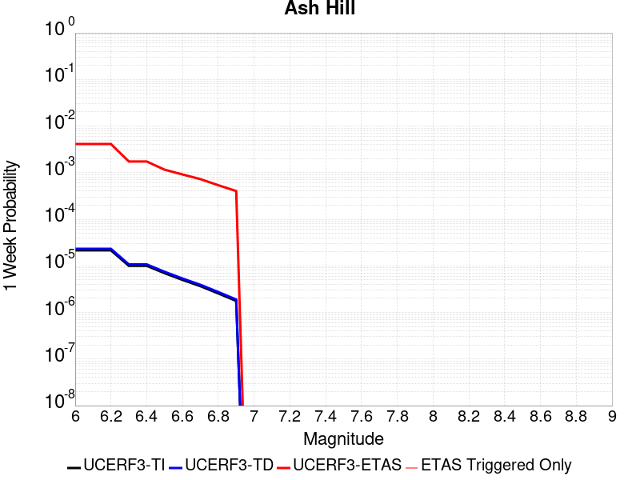 | 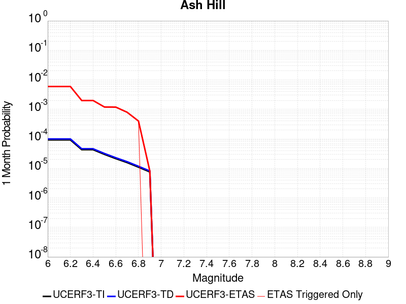 | 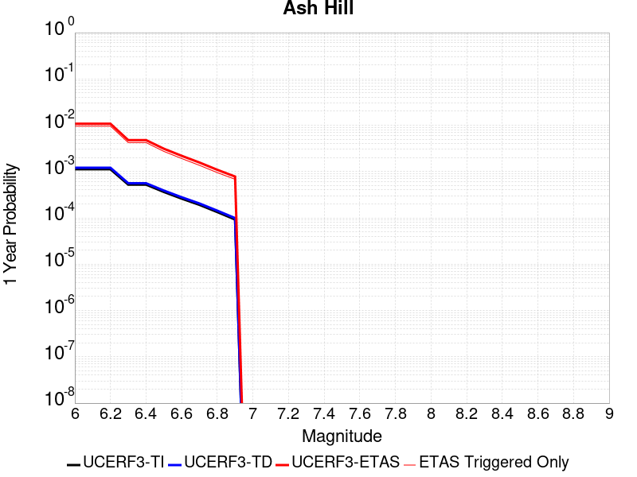 | 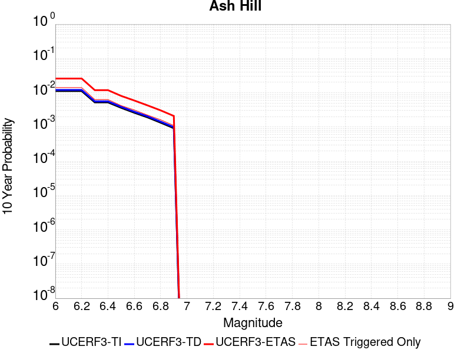 |

| Magnitude | 1 wk TI Prob | 1 wk TD Prob | 1 wk ETAS Prob | 1 wk ETAS/TD Gain | 1 wk ETAS Triggered Only | 1 mo TI Prob | 1 mo TD Prob | 1 mo ETAS Prob | 1 mo ETAS/TD Gain | 1 mo ETAS Triggered Only | 1 yr TI Prob | 1 yr TD Prob | 1 yr ETAS Prob | 1 yr ETAS/TD Gain | 1 yr ETAS Triggered Only | 10 yr TI Prob | 10 yr TD Prob | 10 yr ETAS Prob | 10 yr ETAS/TD Gain | 10 yr ETAS Triggered Only |
|-----|-----|-----|-----|-----|-----|-----|-----|-----|-----|-----|-----|-----|-----|-----|-----|-----|-----|-----|-----|-----|
| 6.0 | 2.1545662E-5 | 2.3194447E-5 | 0.0039887475 | 171.96994 | 0.003965645 | 9.2335285E-5 | 9.940143E-5 | 0.005786406 | 58.212498 | 0.0056875697 | 0.0011236023 | 0.0012096206 | 0.010621847 | 8.781139 | 0.009423625 | 0.011179381 | 0.012038348 | 0.025885051 | 2.150216 | 0.014015424 |
| 6.1 | 2.1545662E-5 | 2.3194447E-5 | 0.0039887475 | 171.96994 | 0.003965645 | 9.2335285E-5 | 9.940143E-5 | 0.005786406 | 58.212498 | 0.0056875697 | 0.0011236023 | 0.0012096206 | 0.010621847 | 8.781139 | 0.009423625 | 0.011179381 | 0.012038348 | 0.025885051 | 2.150216 | 0.014015424 |
| 6.2 | 2.1545662E-5 | 2.3194447E-5 | 0.0039887475 | 171.96994 | 0.003965645 | 9.2335285E-5 | 9.940143E-5 | 0.005786406 | 58.212498 | 0.0056875697 | 0.0011236023 | 0.0012096206 | 0.010621847 | 8.781139 | 0.009423625 | 0.011179381 | 0.012038348 | 0.025885051 | 2.150216 | 0.014015424 |
| 6.3 | 1.0025529E-5 | 1.0746934E-5 | 0.0016596026 | 154.42567 | 0.0016488734 | 4.2965847E-5 | 4.605755E-5 | 0.0023105452 | 50.16648 | 0.002264592 | 5.229836E-4 | 5.6061964E-4 | 0.004576192 | 8.162739 | 0.0040178243 | 0.005217545 | 0.0055933665 | 0.011601959 | 2.0742357 | 0.0060423906 |
| 6.4 | 1.0025529E-5 | 1.0746934E-5 | 0.0016596026 | 154.42567 | 0.0016488734 | 4.2965847E-5 | 4.605755E-5 | 0.0023105452 | 50.16648 | 0.002264592 | 5.229836E-4 | 5.6061964E-4 | 0.004576192 | 8.162739 | 0.0040178243 | 0.005217545 | 0.0055933665 | 0.011601959 | 2.0742357 | 0.0060423906 |
| 6.5 | 6.9617327E-6 | 7.456634E-6 | 0.001092783 | 146.55177 | 0.0010853345 | 2.9835655E-5 | 3.195666E-5 | 0.0015346793 | 48.023773 | 0.0015027707 | 3.6318856E-4 | 3.8901155E-4 | 0.0029969737 | 7.7040734 | 0.002608977 | 0.0036259557 | 0.0038841602 | 0.007886379 | 2.0303948 | 0.0040178243 |
| 6.6 | 4.9919777E-6 | 5.3466883E-6 | 8.819583E-4 | 164.95412 | 8.766163E-4 | 2.1394015E-5 | 2.2914215E-5 | 0.0011499664 | 50.185722 | 0.0011270781 | 2.60441E-4 | 2.7895154E-4 | 0.002156891 | 7.732135 | 0.0018784634 | 0.0026013597 | 0.0027866727 | 0.005752618 | 2.0643322 | 0.0029742338 |
| 6.7 | 3.6630722E-6 | 3.924624E-6 | 6.6138426E-4 | 168.5217 | 6.574622E-4 | 1.5698786E-5 | 1.681974E-5 | 8.621141E-4 | 51.25609 | 8.4530853E-4 | 1.9111596E-4 | 2.0476682E-4 | 0.0015194219 | 7.4202547 | 0.0013149244 | 0.0019095168 | 0.0020463446 | 0.0041084257 | 2.0076902 | 0.0020663098 |
| 6.8 | 2.5599613E-6 | 2.744925E-6 | 5.036671E-4 | 183.4903 | 5.009236E-4 | 1.0971216E-5 | 1.1763939E-5 | 6.4834685E-4 | 55.11307 | 6.3659035E-4 | 1.3356637E-4 | 1.4322149E-4 | 0.0010823187 | 7.556957 | 9.392317E-4 | 0.0013348613 | 0.0014317769 | 0.002963659 | 2.0699167 | 0.0015340785 |
| 6.9 | 1.7684905E-6 | 1.8968707E-6 | 3.7758885E-4 | 199.05882 | 3.7569267E-4 | 7.579223E-6 | 8.129446E-6 | 4.986131E-4 | 61.33421 | 4.9048767E-4 | 9.2273134E-5 | 9.8976E-5 | 7.9811265E-4 | 8.063698 | 6.9920585E-4 | 9.223483E-4 | 9.8976E-4 | 0.0021157225 | 2.1376116 | 0.0011270781 |

## Garlock (West)
*[(top)](#table-of-contents)*

| 1 Week | 1 Month | 1 Year | 10 Year |
|-----|-----|-----|-----|
| 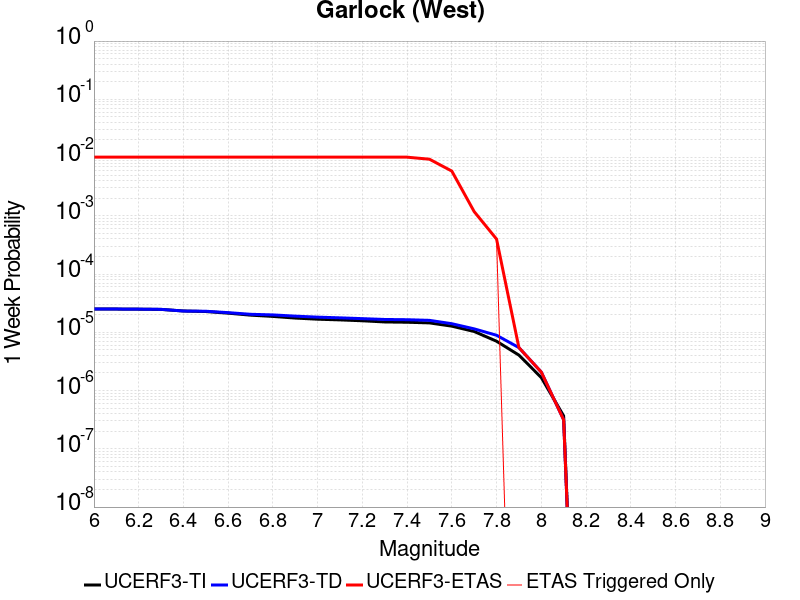 | 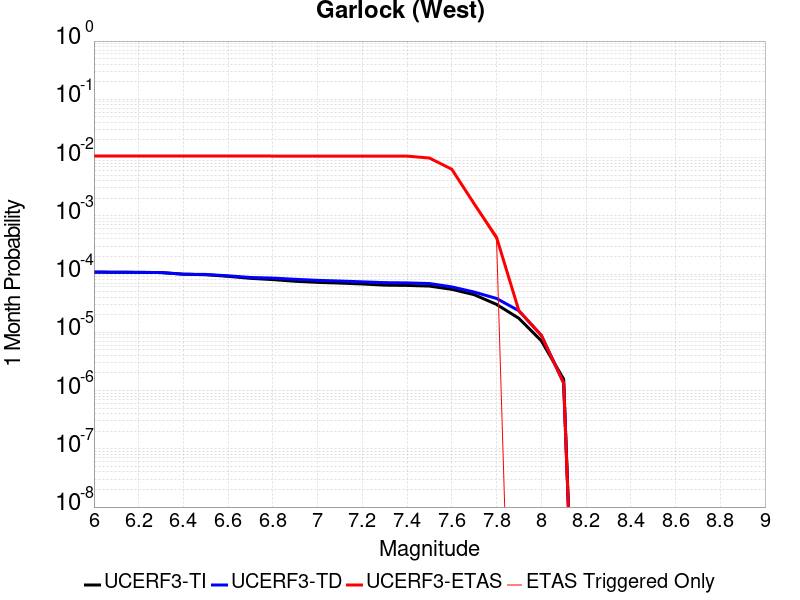 | 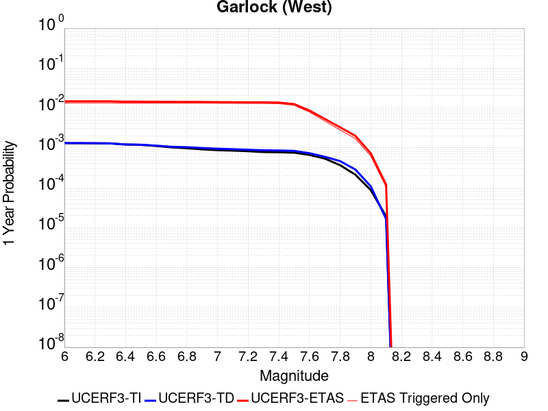 | 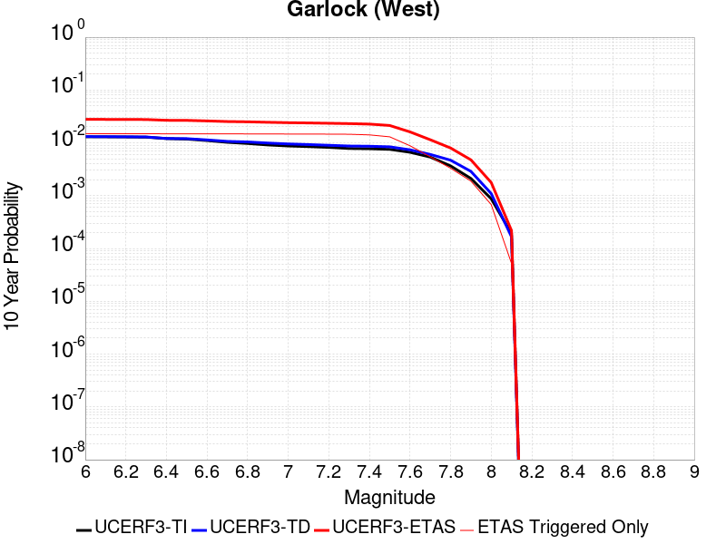 |

| Magnitude | 1 wk TI Prob | 1 wk TD Prob | 1 wk ETAS Prob | 1 wk ETAS/TD Gain | 1 wk ETAS Triggered Only | 1 mo TI Prob | 1 mo TD Prob | 1 mo ETAS Prob | 1 mo ETAS/TD Gain | 1 mo ETAS Triggered Only | 1 yr TI Prob | 1 yr TD Prob | 1 yr ETAS Prob | 1 yr ETAS/TD Gain | 1 yr ETAS Triggered Only | 10 yr TI Prob | 10 yr TD Prob | 10 yr ETAS Prob | 10 yr ETAS/TD Gain | 10 yr ETAS Triggered Only |
|-----|-----|-----|-----|-----|-----|-----|-----|-----|-----|-----|-----|-----|-----|-----|-----|-----|-----|-----|-----|-----|
| 6.0 | 2.5181727E-5 | 2.51973E-5 | 0.0073823268 | 292.98087 | 0.007357315 | 1.0791722E-4 | 1.0798398E-4 | 0.009165374 | 84.87717 | 0.009058368 | 0.0013131002 | 0.0013139155 | 0.013414085 | 10.209245 | 0.012116089 | 0.013053683 | 0.013141977 | 0.027869202 | 2.120625 | 0.014923348 |
| 6.1 | 2.5077732E-5 | 2.5098372E-5 | 0.007382229 | 294.13177 | 0.007357315 | 1.0747157E-4 | 1.0756004E-4 | 0.009164954 | 85.207794 | 0.009058368 | 0.001307681 | 0.0013087603 | 0.01339857 | 10.237605 | 0.012105653 | 0.013000126 | 0.013091032 | 0.02780872 | 2.124257 | 0.014912913 |
| 6.2 | 2.494612E-5 | 2.498005E-5 | 0.007382111 | 295.52026 | 0.007357315 | 1.0690756E-4 | 1.0705298E-4 | 0.009164452 | 85.60669 | 0.009058368 | 0.0013008224 | 0.0013025942 | 0.013392478 | 10.281389 | 0.012105653 | 0.012932341 | 0.013030097 | 0.027748693 | 2.1295846 | 0.014912913 |
| 6.3 | 2.4733758E-5 | 2.479942E-5 | 0.007381932 | 297.66553 | 0.007357315 | 1.0599751E-4 | 1.06278916E-4 | 0.009163684 | 86.22298 | 0.009058368 | 0.0012897556 | 0.0012931811 | 0.01338318 | 10.349037 | 0.012105653 | 0.012822957 | 0.012937066 | 0.027657049 | 2.1378145 | 0.014912913 |
| 6.4 | 2.3237335E-5 | 2.317873E-5 | 0.007380323 | 318.4093 | 0.007357315 | 9.958477E-5 | 9.933365E-5 | 0.009146367 | 92.077225 | 0.009047932 | 0.0012117702 | 0.001208719 | 0.0132372 | 10.951428 | 0.012043037 | 0.012051838 | 0.012101916 | 0.026741566 | 2.209697 | 0.014818989 |
| 6.5 | 2.2732203E-5 | 2.2993298E-5 | 0.007380139 | 320.96915 | 0.007357315 | 9.742009E-5 | 9.8539E-5 | 0.009145579 | 92.811775 | 0.009047932 | 0.0011854442 | 0.0011990548 | 0.013227652 | 11.031733 | 0.012043037 | 0.011791403 | 0.012006322 | 0.026647389 | 2.2194464 | 0.014818989 |
| 6.6 | 2.1319436E-5 | 2.17735E-5 | 0.0073789284 | 338.89493 | 0.007357315 | 9.136581E-5 | 9.331167E-5 | 0.009140399 | 97.95559 | 0.009047932 | 0.001111811 | 0.0011354799 | 0.0131648425 | 11.594079 | 0.012043037 | 0.011062649 | 0.011377227 | 0.026027616 | 2.2876945 | 0.014818989 |
| 6.7 | 1.970802E-5 | 2.0393396E-5 | 0.0073775584 | 361.76215 | 0.007357315 | 8.446021E-5 | 8.739735E-5 | 0.0091345385 | 104.51734 | 0.009047932 | 0.001027818 | 0.001063545 | 0.013093774 | 12.311443 | 0.012043037 | 0.010230771 | 0.010664964 | 0.025315585 | 2.373715 | 0.014808553 |
| 6.8 | 1.8744462E-5 | 1.9901045E-5 | 0.007366634 | 370.16318 | 0.007346879 | 8.033094E-5 | 8.5287415E-5 | 0.009111578 | 106.83379 | 0.00902706 | 9.775903E-4 | 0.0010378812 | 0.013026719 | 12.551262 | 0.012001294 | 0.009733009 | 0.01041075 | 0.025023827 | 2.4036524 | 0.0147668095 |
| 6.9 | 1.7559682E-5 | 1.8953415E-5 | 0.0073656933 | 388.6209 | 0.007346879 | 7.5253614E-5 | 8.12264E-5 | 0.009107553 | 112.125534 | 0.00902706 | 9.158276E-4 | 9.884841E-4 | 0.01296749 | 13.118561 | 0.011990858 | 0.0091206245 | 0.009921231 | 0.024510538 | 2.4705138 | 0.014735502 |
| 7.0 | 1.6794445E-5 | 1.8216237E-5 | 0.00734409 | 403.16174 | 0.0073260074 | 7.197421E-5 | 7.8067256E-5 | 0.009083552 | 116.35547 | 0.009006188 | 8.759337E-4 | 9.5005584E-4 | 0.012898244 | 13.576302 | 0.01195955 | 0.008724891 | 0.009540141 | 0.024093717 | 2.5255098 | 0.014693758 |
| 7.1 | 1.6337795E-5 | 1.7717046E-5 | 0.0073435945 | 414.4932 | 0.0073260074 | 7.0017246E-5 | 7.5927994E-5 | 0.009081433 | 119.60586 | 0.009006188 | 8.521265E-4 | 9.240326E-4 | 0.012862106 | 13.919537 | 0.0119491145 | 0.008488664 | 0.009281996 | 0.023818688 | 2.566117 | 0.014672887 |
| 7.2 | 1.5780008E-5 | 1.7165687E-5 | 0.0073430473 | 427.77475 | 0.0073260074 | 6.762685E-5 | 7.356516E-5 | 0.009079091 | 123.415634 | 0.009006188 | 8.2304585E-4 | 8.9528906E-4 | 0.012823279 | 14.32306 | 0.011938679 | 0.008200042 | 0.008996838 | 0.023486005 | 2.6104732 | 0.014620707 |
| 7.3 | 1.5058865E-5 | 1.6618762E-5 | 0.007311197 | 439.93634 | 0.0072946995 | 6.45364E-5 | 7.122133E-5 | 0.009045463 | 127.004974 | 0.008974881 | 7.854473E-4 | 8.667759E-4 | 0.012763826 | 14.725636 | 0.011907371 | 0.00782677 | 0.008713539 | 0.023134433 | 2.6549985 | 0.014547655 |
| 7.4 | 1.4887923E-5 | 1.6454731E-5 | 0.0071127554 | 432.262 | 0.0070964172 | 6.380382E-5 | 7.051838E-5 | 0.008804757 | 124.85762 | 0.008734855 | 7.7653467E-4 | 8.582243E-4 | 0.0124529945 | 14.510186 | 0.011604729 | 0.0077382675 | 0.008628399 | 0.022657389 | 2.6259089 | 0.014151091 |
| 7.5 | 1.4509299E-5 | 1.6046748E-5 | 0.0065070773 | 405.50754 | 0.006491135 | 6.218123E-5 | 6.876997E-5 | 0.008041255 | 116.92974 | 0.007973034 | 7.567935E-4 | 8.36954E-4 | 0.011462244 | 13.69519 | 0.01063419 | 0.0075422134 | 0.008416704 | 0.02132075 | 2.533147 | 0.013013577 |
| 7.6 | 1.2756717E-5 | 1.4050848E-5 | 0.0044805566 | 318.88156 | 0.0044665686 | 5.4670498E-5 | 6.0216535E-5 | 0.0054448205 | 90.42069 | 0.0053849285 | 6.6541E-4 | 7.328904E-4 | 0.007844963 | 10.704144 | 0.007117289 | 0.006634211 | 0.0073816874 | 0.016124576 | 2.1844025 | 0.008807906 |
| 7.7 | 1.0328985E-5 | 1.1460557E-5 | 0.0027247656 | 237.75157 | 0.0027133361 | 4.4266326E-5 | 4.911575E-5 | 0.0032840883 | 66.86426 | 0.0032351315 | 5.388092E-4 | 5.978206E-4 | 0.0049469927 | 8.275045 | 0.0043517738 | 0.0053750467 | 0.006038511 | 0.011442787 | 1.8949683 | 0.005437108 |
| 7.8 | 7.0306583E-6 | 8.899601E-6 | 0.00167863 | 188.61856 | 0.0016697453 | 3.0131043E-5 | 3.814059E-5 | 0.0020208876 | 52.985218 | 0.0019828225 | 3.667837E-4 | 4.642629E-4 | 0.003124184 | 6.729342 | 0.0026611565 | 0.003661789 | 0.0046952725 | 0.007987922 | 1.7012691 | 0.0033081828 |
| 7.9 | 4.060633E-6 | 5.4653938E-6 | 8.6120516E-4 | 157.57422 | 8.5574447E-4 | 1.7402595E-5 | 2.3422906E-5 | 0.001046118 | 44.662174 | 0.001022719 | 2.11856E-4 | 2.851367E-4 | 0.0017248814 | 6.049314 | 0.0014401553 | 0.0021165414 | 0.002884201 | 0.0047676526 | 1.6530236 | 0.0018888994 |
| 8.0 | 1.6729537E-6 | 2.0775144E-6 | 2.9428233E-4 | 141.65117 | 2.9220543E-4 | 7.169782E-6 | 8.903603E-6 | 3.637213E-4 | 40.851025 | 3.5482086E-4 | 8.7288594E-5 | 1.0839601E-4 | 5.988305E-4 | 5.5244703 | 4.9048767E-4 | 8.7254314E-4 | 0.0010969337 | 0.0017745238 | 1.6177127 | 6.7833404E-4 |
| 8.1 | 3.6733252E-7 | 3.1489964E-7 | 2.1186708E-5 | 67.28083 | 2.0871816E-5 | 1.5742813E-6 | 1.3495693E-6 | 4.3093143E-5 | 31.931034 | 4.174363E-5 | 1.9166706E-5 | 1.6430899E-5 | 5.8173846E-5 | 3.540515 | 4.174363E-5 | 1.9165053E-4 | 1.6638759E-4 | 2.1855845E-4 | 1.3135502 | 5.217954E-5 |

## McLean Lake
*[(top)](#table-of-contents)*

| 1 Week | 1 Month | 1 Year | 10 Year |
|-----|-----|-----|-----|
| 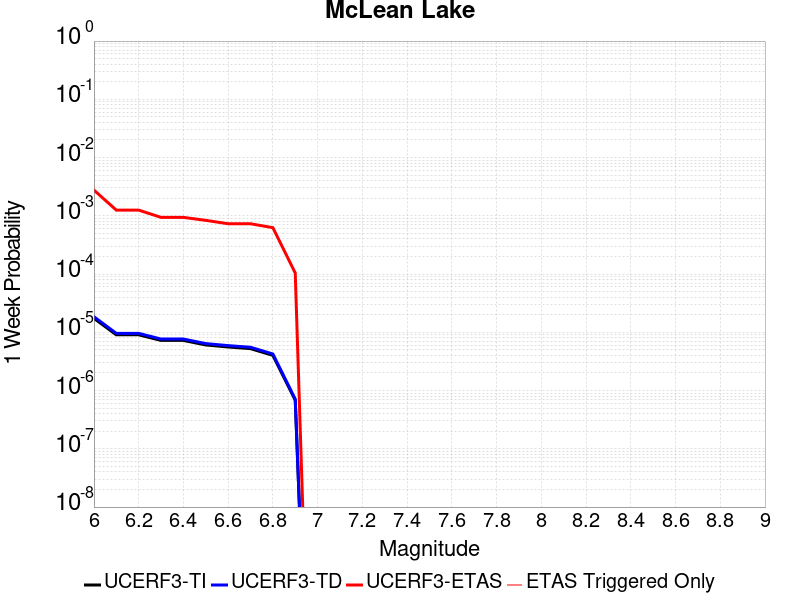 | 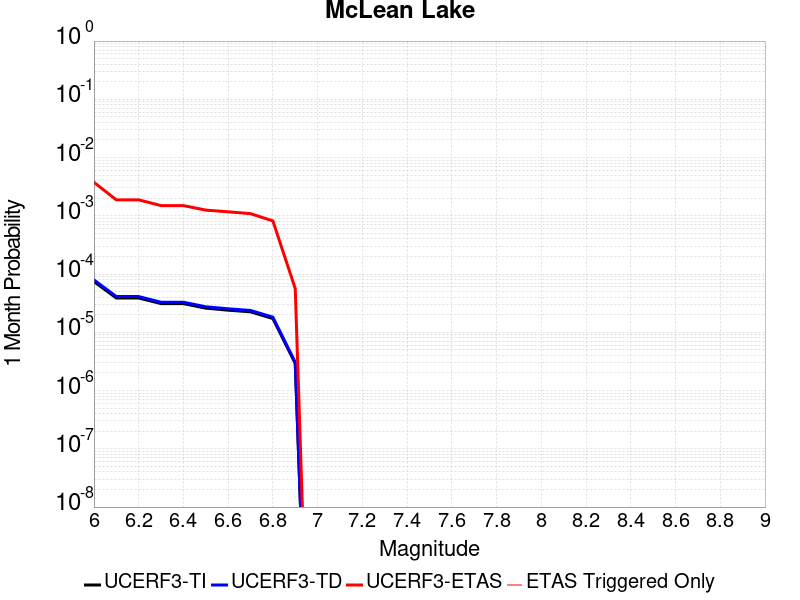 |  | 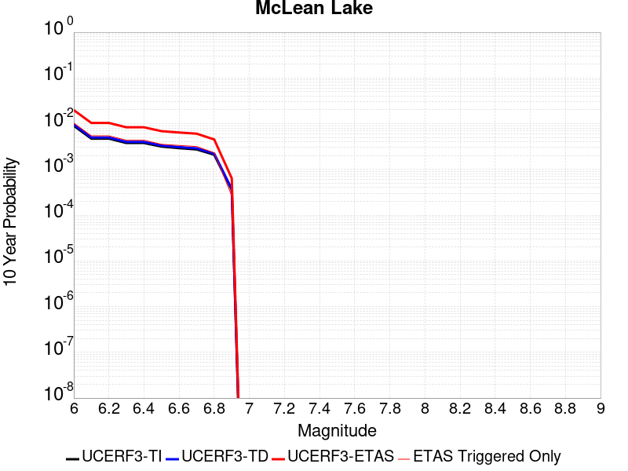 |

| Magnitude | 1 wk TI Prob | 1 wk TD Prob | 1 wk ETAS Prob | 1 wk ETAS/TD Gain | 1 wk ETAS Triggered Only | 1 mo TI Prob | 1 mo TD Prob | 1 mo ETAS Prob | 1 mo ETAS/TD Gain | 1 mo ETAS Triggered Only | 1 yr TI Prob | 1 yr TD Prob | 1 yr ETAS Prob | 1 yr ETAS/TD Gain | 1 yr ETAS Triggered Only | 10 yr TI Prob | 10 yr TD Prob | 10 yr ETAS Prob | 10 yr ETAS/TD Gain | 10 yr ETAS Triggered Only |
|-----|-----|-----|-----|-----|-----|-----|-----|-----|-----|-----|-----|-----|-----|-----|-----|-----|-----|-----|-----|-----|
| 6.0 | 1.7360222E-5 | 1.8501627E-5 | 0.0024604588 | 132.98608 | 0.0024420025 | 7.439883E-5 | 7.9290556E-5 | 0.0037628738 | 47.456776 | 0.0036838755 | 9.0542925E-4 | 9.6498354E-4 | 0.0076792226 | 7.9578795 | 0.0067207245 | 0.009017491 | 0.0096127745 | 0.019969035 | 2.0773437 | 0.01045678 |
| 6.1 | 9.062689E-6 | 9.592193E-6 | 0.0012931966 | 134.81761 | 0.0012836166 | 3.8839516E-5 | 4.1108804E-5 | 0.001940366 | 47.20074 | 0.0018993352 | 4.727685E-4 | 5.003936E-4 | 0.0039842427 | 7.9622173 | 0.0034855932 | 0.0047176396 | 0.004993552 | 0.010600802 | 2.122898 | 0.00563539 |
| 6.2 | 9.062689E-6 | 9.592193E-6 | 0.0012931966 | 134.81761 | 0.0012836166 | 3.8839516E-5 | 4.1108804E-5 | 0.001940366 | 47.20074 | 0.0018993352 | 4.727685E-4 | 5.003936E-4 | 0.0039842427 | 7.9622173 | 0.0034855932 | 0.0047176396 | 0.004993552 | 0.010600802 | 2.122898 | 0.00563539 |
| 6.3 | 7.2575485E-6 | 7.66771E-6 | 0.0010721221 | 139.823 | 0.0010644626 | 3.110341E-5 | 3.2861237E-5 | 0.001598196 | 48.634686 | 0.0015653862 | 3.786182E-4 | 4.0001926E-4 | 0.003227019 | 8.06716 | 0.002828131 | 0.0037797375 | 0.0039936965 | 0.008525581 | 2.1347592 | 0.0045500556 |
| 6.4 | 7.2575485E-6 | 7.66771E-6 | 0.0010721221 | 139.823 | 0.0010644626 | 3.110341E-5 | 3.2861237E-5 | 0.001598196 | 48.634686 | 0.0015653862 | 3.786182E-4 | 4.0001926E-4 | 0.003227019 | 8.06716 | 0.002828131 | 0.0037797375 | 0.0039936965 | 0.008525581 | 2.1347592 | 0.0045500556 |
| 6.5 | 6.06582E-6 | 6.4038773E-6 | 9.3519373E-4 | 146.03555 | 9.287958E-4 | 2.5996113E-5 | 2.7444936E-5 | 0.0013736401 | 50.05077 | 0.0013462321 | 3.164567E-4 | 3.3409733E-4 | 0.002702257 | 8.088233 | 0.002368951 | 0.0031600643 | 0.0033365893 | 0.007112184 | 2.1315732 | 0.0037882347 |
| 6.6 | 5.598744E-6 | 5.910262E-6 | 8.4077794E-4 | 142.25731 | 8.3487266E-4 | 2.3994397E-5 | 2.5329486E-5 | 0.0012671711 | 50.027508 | 0.001241873 | 2.9209262E-4 | 3.0834923E-4 | 0.0025409448 | 8.240478 | 0.0022332843 | 0.0029170897 | 0.003079843 | 0.0066275275 | 2.1519043 | 0.0035586446 |
| 6.7 | 5.246996E-6 | 5.539162E-6 | 8.0909964E-4 | 146.06895 | 8.035649E-4 | 2.2486933E-5 | 2.3739085E-5 | 0.00122384 | 51.5538 | 0.0012001294 | 2.73744E-4 | 2.8899137E-4 | 0.0023964355 | 8.292412 | 0.0021080533 | 0.0027340704 | 0.0028867796 | 0.0061854124 | 2.1426687 | 0.0033081828 |
| 6.8 | 4.02324E-6 | 4.2469046E-6 | 6.82578E-4 | 160.72366 | 6.7833404E-4 | 1.7242342E-5 | 1.8200926E-5 | 0.0010095942 | 55.469383 | 9.914113E-4 | 2.099053E-4 | 2.2157968E-4 | 0.0017761855 | 8.016012 | 0.0015549503 | 0.0020970714 | 0.002214172 | 0.0046507674 | 2.1004546 | 0.0024420025 |
| 6.9 | 6.835972E-7 | 7.1399285E-7 | 7.3765295E-5 | 103.313774 | 7.305136E-5 | 2.9296991E-6 | 3.0599674E-6 | 9.6982854E-5 | 31.694078 | 9.392317E-5 | 3.56685E-5 | 3.7254784E-5 | 2.3552965E-4 | 6.322131 | 1.9828224E-4 | 3.5662777E-4 | 3.7251666E-4 | 7.2720536E-4 | 1.9521419 | 3.5482086E-4 |

## So Sierra Nevada
*[(top)](#table-of-contents)*

| 1 Week | 1 Month | 1 Year | 10 Year |
|-----|-----|-----|-----|
| 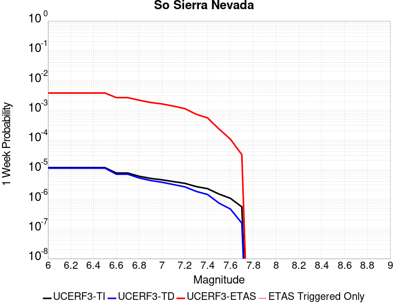 | 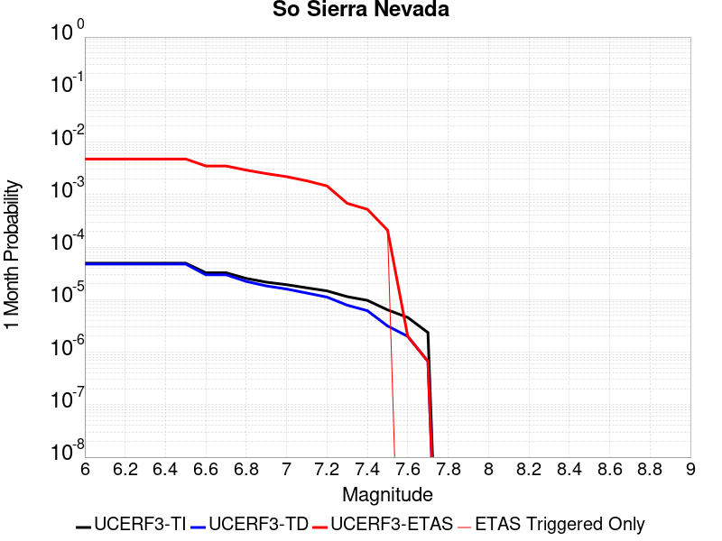 | 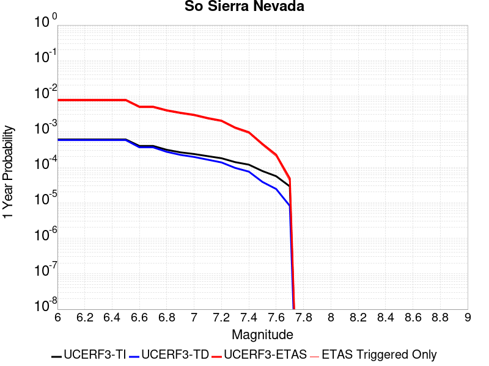 | 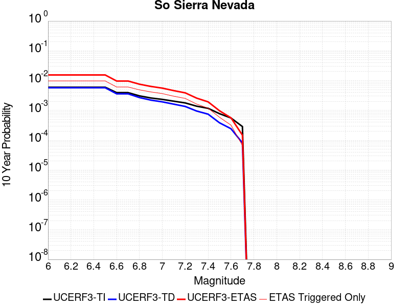 |

| Magnitude | 1 wk TI Prob | 1 wk TD Prob | 1 wk ETAS Prob | 1 wk ETAS/TD Gain | 1 wk ETAS Triggered Only | 1 mo TI Prob | 1 mo TD Prob | 1 mo ETAS Prob | 1 mo ETAS/TD Gain | 1 mo ETAS Triggered Only | 1 yr TI Prob | 1 yr TD Prob | 1 yr ETAS Prob | 1 yr ETAS/TD Gain | 1 yr ETAS Triggered Only | 10 yr TI Prob | 10 yr TD Prob | 10 yr ETAS Prob | 10 yr ETAS/TD Gain | 10 yr ETAS Triggered Only |
|-----|-----|-----|-----|-----|-----|-----|-----|-----|-----|-----|-----|-----|-----|-----|-----|-----|-----|-----|-----|-----|
| 6.0 | 1.15488665E-5 | 1.1079643E-5 | 0.0037470933 | 338.19623 | 0.003736055 | 4.9494203E-5 | 4.748339E-5 | 0.005025175 | 105.83017 | 0.004977928 | 6.024253E-4 | 5.7796965E-4 | 0.0077641546 | 13.433498 | 0.0071903407 | 0.006007948 | 0.005765934 | 0.015301235 | 2.6537304 | 0.0095906 |
| 6.1 | 1.15488665E-5 | 1.1079643E-5 | 0.0037470933 | 338.19623 | 0.003736055 | 4.9494203E-5 | 4.748339E-5 | 0.005025175 | 105.83017 | 0.004977928 | 6.024253E-4 | 5.7796965E-4 | 0.0077641546 | 13.433498 | 0.0071903407 | 0.006007948 | 0.005765934 | 0.015301235 | 2.6537304 | 0.0095906 |
| 6.2 | 1.15488665E-5 | 1.1079643E-5 | 0.0037470933 | 338.19623 | 0.003736055 | 4.9494203E-5 | 4.748339E-5 | 0.005025175 | 105.83017 | 0.004977928 | 6.024253E-4 | 5.7796965E-4 | 0.0077641546 | 13.433498 | 0.0071903407 | 0.006007948 | 0.005765934 | 0.015301235 | 2.6537304 | 0.0095906 |
| 6.3 | 1.15488665E-5 | 1.1079643E-5 | 0.0037470933 | 338.19623 | 0.003736055 | 4.9494203E-5 | 4.748339E-5 | 0.005025175 | 105.83017 | 0.004977928 | 6.024253E-4 | 5.7796965E-4 | 0.0077641546 | 13.433498 | 0.0071903407 | 0.006007948 | 0.005765934 | 0.015301235 | 2.6537304 | 0.0095906 |
| 6.4 | 1.15488665E-5 | 1.1079643E-5 | 0.0037470933 | 338.19623 | 0.003736055 | 4.9494203E-5 | 4.748339E-5 | 0.005025175 | 105.83017 | 0.004977928 | 6.024253E-4 | 5.7796965E-4 | 0.0077641546 | 13.433498 | 0.0071903407 | 0.006007948 | 0.005765934 | 0.015301235 | 2.6537304 | 0.0095906 |
| 6.5 | 1.15488665E-5 | 1.1079643E-5 | 0.0037470933 | 338.19623 | 0.003736055 | 4.9494203E-5 | 4.748339E-5 | 0.005025175 | 105.83017 | 0.004977928 | 6.024253E-4 | 5.7796965E-4 | 0.0077641546 | 13.433498 | 0.0071903407 | 0.006007948 | 0.005765934 | 0.015301235 | 2.6537304 | 0.0095906 |
| 6.6 | 7.587044E-6 | 6.935635E-6 | 0.0026263304 | 378.67194 | 0.002619413 | 3.2515498E-5 | 2.9723828E-5 | 0.0034108574 | 114.75162 | 0.0033812341 | 3.9580427E-4 | 3.6183043E-4 | 0.004941536 | 13.65705 | 0.0045813634 | 0.003951 | 0.0036127048 | 0.009550081 | 2.643471 | 0.0059589036 |
| 6.7 | 7.587044E-6 | 6.935635E-6 | 0.0026263304 | 378.67194 | 0.002619413 | 3.2515498E-5 | 2.9723828E-5 | 0.0034108574 | 114.75162 | 0.0033812341 | 3.9580427E-4 | 3.6183043E-4 | 0.004941536 | 13.65705 | 0.0045813634 | 0.003951 | 0.0036127048 | 0.009550081 | 2.643471 | 0.0059589036 |
| 6.8 | 5.9026956E-6 | 5.1793927E-6 | 0.0021445295 | 414.05035 | 0.002139361 | 2.5297022E-5 | 2.2197215E-5 | 0.0027876515 | 125.58564 | 0.0027655156 | 3.0794772E-4 | 2.7021873E-4 | 0.0038696341 | 14.320376 | 0.0036003883 | 0.0030752132 | 0.002699018 | 0.0074241324 | 2.7506793 | 0.004737902 |
| 6.9 | 5.0118915E-6 | 4.2524252E-6 | 0.0017992209 | 423.10464 | 0.0017949762 | 2.1479358E-5 | 1.8224557E-5 | 0.0023975682 | 131.557 | 0.002379387 | 2.614798E-4 | 2.2186211E-4 | 0.0032789048 | 14.77902 | 0.003057721 | 0.0026117235 | 0.0022164788 | 0.0062045725 | 2.7992926 | 0.003996953 |
| 7.0 | 4.4924795E-6 | 3.7139177E-6 | 0.0016108378 | 433.73007 | 0.0016071298 | 1.925334E-5 | 1.5916696E-5 | 0.0021030651 | 132.1295 | 0.0020871817 | 2.3438422E-4 | 1.9376918E-4 | 0.0028857116 | 14.892522 | 0.0026924643 | 0.0023413717 | 0.0019360651 | 0.005456573 | 2.8183827 | 0.0035273368 |
| 7.1 | 3.9118436E-6 | 3.1119775E-6 | 0.0013597758 | 436.9491 | 0.0013566681 | 1.6764936E-5 | 1.3336982E-5 | 0.0017456745 | 130.88977 | 0.0017323607 | 2.0409399E-4 | 1.6236622E-4 | 0.0023744195 | 14.623851 | 0.0022124124 | 0.0020390663 | 0.001622532 | 0.004539845 | 2.7980003 | 0.0029220541 |
| 7.2 | 3.4200818E-6 | 2.6054543E-6 | 0.0011192447 | 429.57755 | 0.0011166421 | 1.4657411E-5 | 1.11661875E-5 | 0.0014513053 | 129.97322 | 0.0014401553 | 1.7843937E-4 | 1.3594035E-4 | 0.0019724104 | 14.509381 | 0.0018367198 | 0.0017829615 | 0.0013586218 | 0.0037973064 | 2.7949696 | 0.0024420025 |
| 7.3 | 2.6593618E-6 | 1.8284203E-6 | 7.2190474E-4 | 394.8243 | 7.2007766E-4 | 1.13972155E-5 | 7.836065E-6 | 9.261888E-4 | 118.19565 | 9.183599E-4 | 1.3875226E-4 | 9.540021E-5 | 0.0012849802 | 13.469365 | 0.0011896935 | 0.0013866565 | 9.5362146E-4 | 0.0025592188 | 2.683684 | 0.0016071298 |
| 7.4 | 2.2577992E-6 | 1.436438E-6 | 5.4410286E-4 | 378.7862 | 5.426672E-4 | 9.676246E-6 | 6.15615E-6 | 6.84486E-4 | 111.18735 | 6.7833404E-4 | 1.1780193E-4 | 7.49488E-5 | 9.619345E-4 | 12.834555 | 8.8705216E-4 | 0.001177395 | 7.492603E-4 | 0.0019276344 | 2.5727165 | 0.0011792576 |
| 7.5 | 1.489319E-6 | 7.353936E-7 | 2.303252E-4 | 313.1999 | 2.2958998E-4 | 6.3827797E-6 | 3.1516831E-6 | 3.0579205E-4 | 97.025 | 3.0264133E-4 | 7.770758E-5 | 3.8371072E-5 | 4.3492037E-4 | 11.33459 | 3.965645E-4 | 7.7680405E-4 | 3.836449E-4 | 9.678315E-4 | 2.5227275 | 5.8441085E-4 |
| 7.6 | 1.0680322E-6 | 4.6596554E-7 | 1.04825E-4 | 224.96298 | 1.0435908E-4 | 4.577273E-6 | 1.9969937E-6 | 1.3766352E-4 | 68.93539 | 1.356668E-4 | 5.5726876E-5 | 2.4313129E-5 | 2.0171925E-4 | 8.296721 | 1.7741043E-4 | 5.5712904E-4 | 2.4310495E-4 | 5.3523935E-4 | 2.2016802 | 2.9220543E-4 |
| 7.7 | 5.509146E-7 | 1.5580486E-7 | 3.1463525E-5 | 201.94186 | 3.1307725E-5 | 2.3610605E-6 | 6.677349E-7 | 3.1975436E-5 | 47.88642 | 3.1307725E-5 | 2.8745531E-5 | 8.129644E-6 | 6.0308757E-5 | 7.4183764 | 5.217954E-5 | 2.8741814E-4 | 8.1293576E-5 | 1.54339E-4 | 1.8985386 | 7.305136E-5 |

## Goldstone Lake
*[(top)](#table-of-contents)*

| 1 Week | 1 Month | 1 Year | 10 Year |
|-----|-----|-----|-----|
| 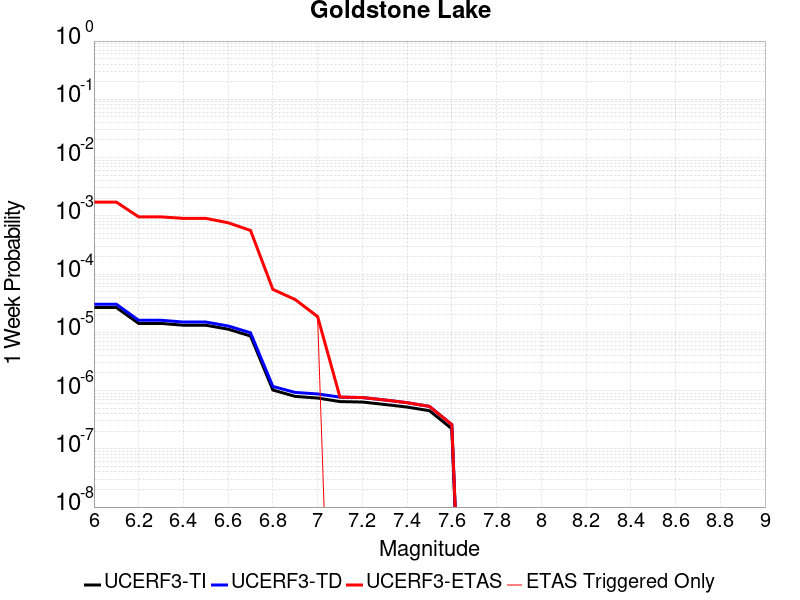 | 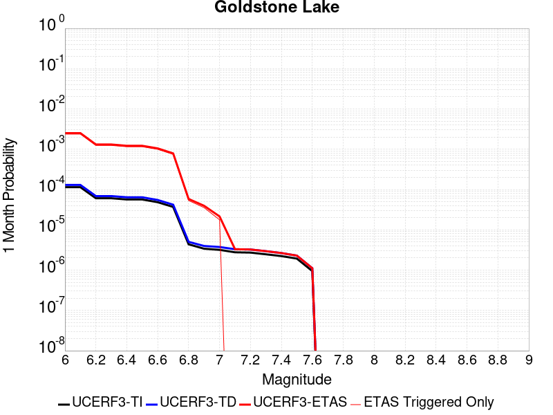 | 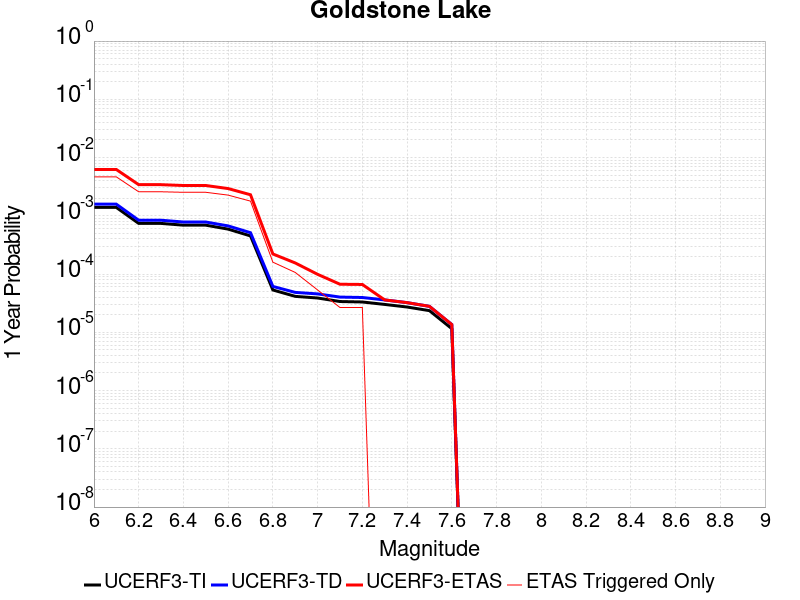 | 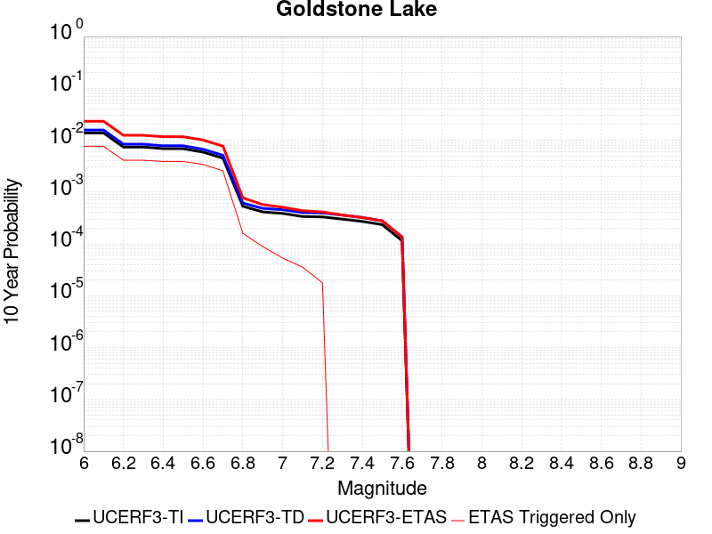 |

| Magnitude | 1 wk TI Prob | 1 wk TD Prob | 1 wk ETAS Prob | 1 wk ETAS/TD Gain | 1 wk ETAS Triggered Only | 1 mo TI Prob | 1 mo TD Prob | 1 mo ETAS Prob | 1 mo ETAS/TD Gain | 1 mo ETAS Triggered Only | 1 yr TI Prob | 1 yr TD Prob | 1 yr ETAS Prob | 1 yr ETAS/TD Gain | 1 yr ETAS Triggered Only | 10 yr TI Prob | 10 yr TD Prob | 10 yr ETAS Prob | 10 yr ETAS/TD Gain | 10 yr ETAS Triggered Only |
|-----|-----|-----|-----|-----|-----|-----|-----|-----|-----|-----|-----|-----|-----|-----|-----|-----|-----|-----|-----|-----|
| 6.0 | 2.671352E-5 | 3.037609E-5 | 0.0018252977 | 60.08995 | 0.0017949762 | 1.1448149E-4 | 1.3017785E-4 | 0.0027283807 | 20.95887 | 0.002598541 | 0.001392921 | 0.0015839594 | 0.0064914864 | 4.0982656 | 0.0049153124 | 0.013842222 | 0.015746197 | 0.023480697 | 1.4911981 | 0.007858238 |
| 6.1 | 2.671352E-5 | 3.037609E-5 | 0.0018252977 | 60.08995 | 0.0017949762 | 1.1448149E-4 | 1.3017785E-4 | 0.0027283807 | 20.95887 | 0.002598541 | 0.001392921 | 0.0015839594 | 0.0064914864 | 4.0982656 | 0.0049153124 | 0.013842222 | 0.015746197 | 0.023480697 | 1.4911981 | 0.007858238 |
| 6.2 | 1.4197047E-5 | 1.6096245E-5 | 0.0010179273 | 63.240047 | 0.0010018472 | 6.0843064E-5 | 6.8982634E-5 | 0.0014881683 | 21.573084 | 0.0014192834 | 7.4051257E-4 | 8.3963864E-4 | 0.0034881337 | 4.1543274 | 0.0026507205 | 0.007380498 | 0.0083743585 | 0.012472371 | 1.4893522 | 0.0041326196 |
| 6.3 | 1.4197047E-5 | 1.6096245E-5 | 0.0010179273 | 63.240047 | 0.0010018472 | 6.0843064E-5 | 6.8982634E-5 | 0.0014881683 | 21.573084 | 0.0014192834 | 7.4051257E-4 | 8.3963864E-4 | 0.0034881337 | 4.1543274 | 0.0026507205 | 0.007380498 | 0.0083743585 | 0.012472371 | 1.4893522 | 0.0041326196 |
| 6.4 | 1.3238931E-5 | 1.500846E-5 | 9.2291884E-4 | 61.49324 | 9.0792397E-4 | 5.6737044E-5 | 6.4320935E-5 | 0.0013582903 | 21.11739 | 0.0012940526 | 6.9055456E-4 | 7.82924E-4 | 0.0032751532 | 4.1832323 | 0.002494182 | 0.006884126 | 0.0078112837 | 0.011673471 | 1.494437 | 0.0038925936 |
| 6.5 | 1.3238931E-5 | 1.500846E-5 | 9.2291884E-4 | 61.49324 | 9.0792397E-4 | 5.6737044E-5 | 6.4320935E-5 | 0.0013582903 | 21.11739 | 0.0012940526 | 6.9055456E-4 | 7.82924E-4 | 0.0032751532 | 4.1832323 | 0.002494182 | 0.006884126 | 0.0078112837 | 0.011673471 | 1.494437 | 0.0038925936 |
| 6.6 | 1.1328278E-5 | 1.2855166E-5 | 8.0597395E-4 | 62.696507 | 7.93129E-4 | 4.8548856E-5 | 5.5092944E-5 | 0.0012238502 | 22.214283 | 0.0011688217 | 5.90922E-4 | 6.7064585E-4 | 0.0029545769 | 4.4055696 | 0.0022854637 | 0.0058935313 | 0.0066956086 | 0.01022006 | 1.5263826 | 0.0035482086 |
| 6.7 | 8.651175E-6 | 9.824565E-6 | 6.1510125E-4 | 62.6085 | 6.0528266E-4 | 3.707594E-5 | 4.2105108E-5 | 9.08249E-4 | 21.570993 | 8.6618034E-4 | 4.5130608E-4 | 5.1259965E-4 | 0.0021919196 | 4.276085 | 0.0016801811 | 0.0045039062 | 0.005123051 | 0.0077186623 | 1.5066533 | 0.002608977 |
| 6.8 | 1.0215377E-6 | 1.1754702E-6 | 3.2483156E-5 | 27.634182 | 3.1307725E-5 | 4.378012E-6 | 5.0377203E-6 | 3.6345285E-5 | 7.2146297 | 3.1307725E-5 | 5.3300988E-5 | 6.1332634E-5 | 1.4481478E-4 | 2.3611374 | 8.348726E-5 | 5.3288206E-4 | 6.1316835E-4 | 7.1746344E-4 | 1.1700921 | 1.0435908E-4 |
| 6.9 | 7.9360774E-7 | 9.2833966E-7 | 2.1800137E-5 | 23.482931 | 2.0871816E-5 | 3.4011714E-6 | 3.9785928E-6 | 2.4850326E-5 | 6.246009 | 2.0871816E-5 | 4.1408475E-5 | 4.843836E-5 | 1.00615376E-4 | 2.0771837 | 5.217954E-5 | 4.140076E-4 | 4.8428503E-4 | 5.468702E-4 | 1.129232 | 6.261545E-5 |
| 7.0 | 7.4382757E-7 | 8.7473285E-7 | 1.1310632E-5 | 12.930384 | 1.0435908E-5 | 3.1878285E-6 | 3.74885E-6 | 1.4184719E-5 | 3.783752 | 1.0435908E-5 | 3.8811122E-5 | 4.564136E-5 | 7.6947654E-5 | 1.6859194 | 3.1307725E-5 | 3.8804344E-4 | 4.5632652E-4 | 4.980511E-4 | 1.0914358 | 4.174363E-5 |
| 7.1 | 6.4709513E-7 | 7.7113E-7 | 7.7113E-7 | 1.0 | 0.0 | 2.773262E-6 | 3.3048389E-6 | 3.3048389E-6 | 1.0 | 0.0 | 3.376394E-5 | 4.0235733E-5 | 6.110671E-5 | 1.5187174 | 2.0871816E-5 | 3.375881E-4 | 4.0229043E-4 | 4.3358555E-4 | 1.0777924 | 3.1307725E-5 |
| 7.2 | 6.356704E-7 | 7.5883594E-7 | 7.5883594E-7 | 1.0 | 0.0 | 2.7242988E-6 | 3.2521505E-6 | 3.2521505E-6 | 1.0 | 0.0 | 3.3167835E-5 | 3.959427E-5 | 5.0029765E-5 | 1.2635608 | 1.0435908E-5 | 3.3162883E-4 | 3.958781E-4 | 4.1674165E-4 | 1.052702 | 2.0871816E-5 |
| 7.3 | 5.7695723E-7 | 6.8965653E-7 | 6.8965653E-7 | 1.0 | 0.0 | 2.4726714E-6 | 2.9556677E-6 | 2.9556677E-6 | 1.0 | 0.0 | 3.0104358E-5 | 3.5984718E-5 | 3.5984718E-5 | 1.0 | 0.0 | 3.0100282E-4 | 3.5979465E-4 | 3.702268E-4 | 1.0289948 | 1.0435908E-5 |
| 7.4 | 5.209647E-7 | 6.193514E-7 | 6.193514E-7 | 1.0 | 0.0 | 2.232704E-6 | 2.6543607E-6 | 2.6543607E-6 | 1.0 | 0.0 | 2.718283E-5 | 3.2316417E-5 | 3.2316417E-5 | 1.0 | 0.0 | 2.7179506E-4 | 3.2312275E-4 | 3.3355528E-4 | 1.0322866 | 1.0435908E-5 |
| 7.5 | 4.512955E-7 | 5.348885E-7 | 5.348885E-7 | 1.0 | 0.0 | 1.934122E-6 | 2.2923775E-6 | 2.2923775E-6 | 1.0 | 0.0 | 2.3547682E-5 | 2.7909393E-5 | 2.7909393E-5 | 1.0 | 0.0 | 2.3545188E-4 | 2.7906417E-4 | 2.8949717E-4 | 1.0373857 | 1.0435908E-5 |
| 7.6 | 2.21172E-7 | 2.603961E-7 | 2.603961E-7 | 1.0 | 0.0 | 9.478797E-7 | 1.1159829E-6 | 1.1159829E-6 | 1.0 | 0.0 | 1.1540374E-5 | 1.3587036E-5 | 1.3587036E-5 | 1.0 | 0.0 | 1.1539775E-4 | 1.3586486E-4 | 1.4629935E-4 | 1.0768005 | 1.0435908E-5 |

## Gravel Hills-Harper Lk
*[(top)](#table-of-contents)*

| 1 Week | 1 Month | 1 Year | 10 Year |
|-----|-----|-----|-----|
| 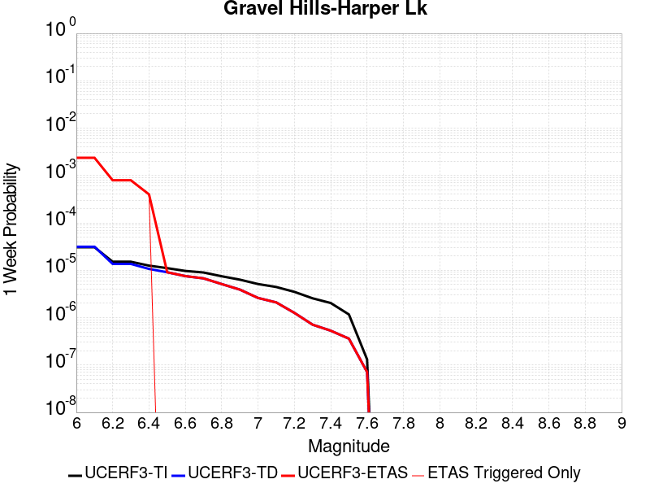 | 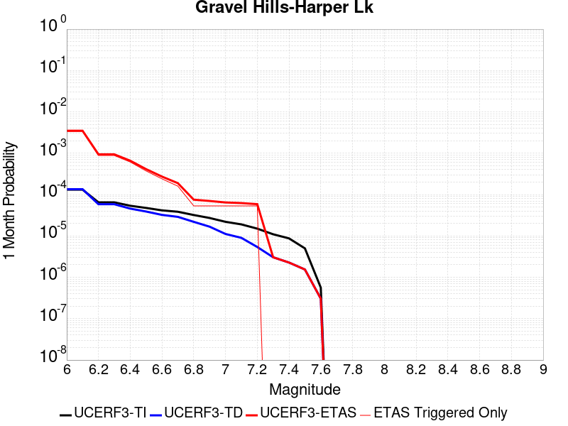 | 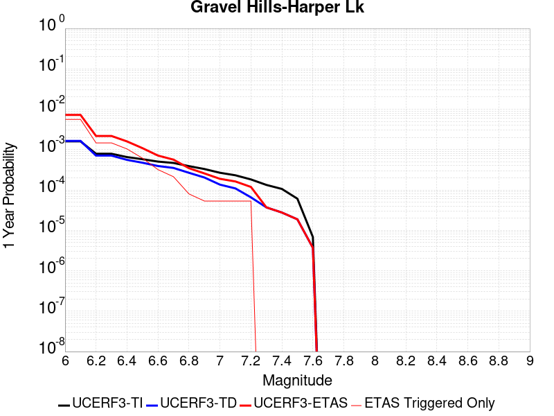 | 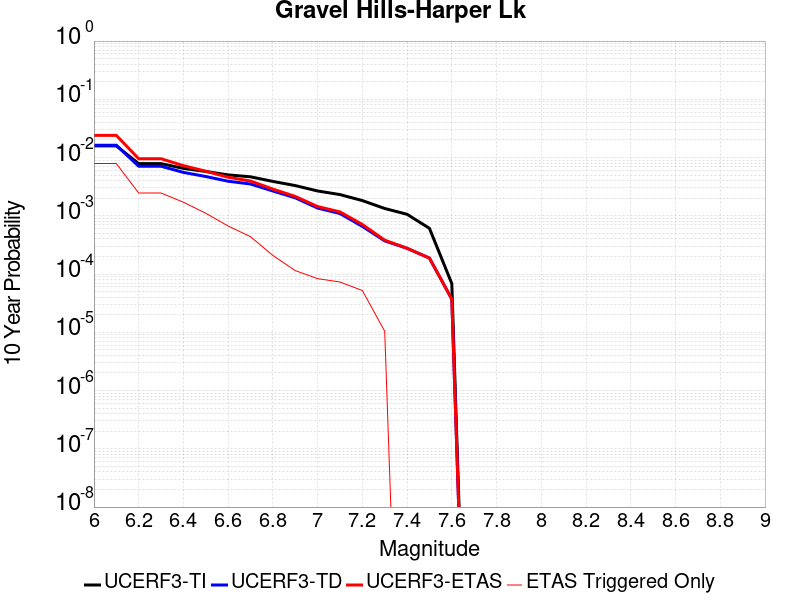 |

| Magnitude | 1 wk TI Prob | 1 wk TD Prob | 1 wk ETAS Prob | 1 wk ETAS/TD Gain | 1 wk ETAS Triggered Only | 1 mo TI Prob | 1 mo TD Prob | 1 mo ETAS Prob | 1 mo ETAS/TD Gain | 1 mo ETAS Triggered Only | 1 yr TI Prob | 1 yr TD Prob | 1 yr ETAS Prob | 1 yr ETAS/TD Gain | 1 yr ETAS Triggered Only | 10 yr TI Prob | 10 yr TD Prob | 10 yr ETAS Prob | 10 yr ETAS/TD Gain | 10 yr ETAS Triggered Only |
|-----|-----|-----|-----|-----|-----|-----|-----|-----|-----|-----|-----|-----|-----|-----|-----|-----|-----|-----|-----|-----|
| 6.0 | 3.0679566E-5 | 3.1464646E-5 | 0.0022229364 | 70.6487 | 0.0021915406 | 1.3147724E-4 | 1.3484273E-4 | 0.003286062 | 24.369587 | 0.0031516443 | 0.0015995599 | 0.0016406906 | 0.0069542713 | 4.2386246 | 0.005322313 | 0.015880952 | 0.01630734 | 0.024068227 | 1.4759139 | 0.007889546 |
| 6.1 | 3.0679566E-5 | 3.1464646E-5 | 0.0022229364 | 70.6487 | 0.0021915406 | 1.3147724E-4 | 1.3484273E-4 | 0.003286062 | 24.369587 | 0.0031516443 | 0.0015995599 | 0.0016406906 | 0.0069542713 | 4.2386246 | 0.005322313 | 0.015880952 | 0.01630734 | 0.024068227 | 1.4759139 | 0.007889546 |
| 6.2 | 1.514536E-5 | 1.3635206E-5 | 5.667308E-4 | 41.56378 | 5.531031E-4 | 6.490707E-5 | 5.843536E-5 | 9.55871E-4 | 16.35775 | 8.974881E-4 | 7.8995706E-4 | 7.1123015E-4 | 0.002212932 | 3.111415 | 0.0015027707 | 0.007871548 | 0.0070907404 | 0.009536151 | 1.3448738 | 0.0024628742 |
| 6.3 | 1.514536E-5 | 1.3635206E-5 | 5.667308E-4 | 41.56378 | 5.531031E-4 | 6.490707E-5 | 5.843536E-5 | 9.55871E-4 | 16.35775 | 8.974881E-4 | 7.8995706E-4 | 7.1123015E-4 | 0.002212932 | 3.111415 | 0.0015027707 | 0.007871548 | 0.0070907404 | 0.009536151 | 1.3448738 | 0.0024628742 |
| 6.4 | 1.2532521E-5 | 1.06896905E-5 | 4.0724996E-4 | 38.09745 | 3.965645E-4 | 5.37097E-5 | 4.581219E-5 | 6.71938E-4 | 14.667232 | 6.261545E-4 | 6.537194E-4 | 5.576265E-4 | 0.0016214955 | 2.9078524 | 0.0010644626 | 0.0065179965 | 0.005562863 | 0.007264831 | 1.3059518 | 0.0017114889 |
| 6.5 | 1.1094058E-5 | 9.083664E-6 | 2.908506E-4 | 32.01909 | 2.8176952E-4 | 4.7545094E-5 | 3.892943E-5 | 4.354785E-4 | 11.1863575 | 3.965645E-4 | 5.787078E-4 | 4.7386673E-4 | 0.0011414484 | 2.408796 | 6.678981E-4 | 0.0057720304 | 0.0047289706 | 0.0058299457 | 1.2328149 | 0.0011062062 |
| 6.6 | 9.688328E-6 | 7.5316952E-6 | 2.0581245E-4 | 27.32618 | 1.9828224E-4 | 4.1520743E-5 | 3.227831E-5 | 2.82732E-4 | 8.759195 | 2.504618E-4 | 5.053978E-4 | 3.9292008E-4 | 7.6846516E-4 | 1.9557798 | 3.7569267E-4 | 0.0050424994 | 0.0039225104 | 0.0045877886 | 1.1696053 | 6.678981E-4 |
| 6.7 | 8.974824E-6 | 6.749413E-6 | 1.3197947E-4 | 19.554213 | 1.252309E-4 | 3.8462964E-5 | 2.8925748E-5 | 1.9589544E-4 | 6.7723556 | 1.6697453E-4 | 4.6818596E-4 | 3.5211627E-4 | 5.607609E-4 | 1.5925448 | 2.0871816E-4 | 0.004672008 | 0.0035158044 | 0.0039525717 | 1.1242297 | 4.3830814E-4 |
| 6.8 | 7.4780046E-6 | 5.1161933E-6 | 4.685961E-5 | 9.159078 | 4.174363E-5 | 3.20482E-5 | 2.1926366E-5 | 9.4976116E-5 | 4.331594 | 7.305136E-5 | 3.9011694E-4 | 2.669222E-4 | 3.712534E-4 | 1.3908676 | 1.0435908E-4 | 0.0038943281 | 0.0026661542 | 0.0028743157 | 1.0780756 | 2.0871816E-4 |
| 6.9 | 6.3409307E-6 | 3.9074966E-6 | 3.5215096E-5 | 9.012189 | 3.1307725E-5 | 2.7175134E-5 | 1.6746313E-5 | 5.8489244E-5 | 3.492664 | 4.174363E-5 | 3.3080703E-4 | 2.0386827E-4 | 2.6647095E-4 | 1.3070742 | 6.261545E-5 | 0.0033031502 | 0.0020369107 | 0.0021514718 | 1.0562426 | 1.1479499E-4 |
| 7.0 | 5.1239335E-6 | 2.6058565E-6 | 3.3913497E-5 | 13.0143385 | 3.1307725E-5 | 2.195953E-5 | 1.116791E-5 | 5.2911077E-5 | 4.7377777 | 4.174363E-5 | 2.6732447E-4 | 1.3596108E-4 | 1.8813352E-4 | 1.3837308 | 5.217954E-5 | 0.0026700313 | 0.0013588042 | 0.001442178 | 1.0613582 | 8.348726E-5 |
| 7.1 | 4.438899E-6 | 2.0984728E-6 | 3.340613E-5 | 15.919258 | 3.1307725E-5 | 1.9023713E-5 | 8.993425E-6 | 5.0736682E-5 | 5.6415305 | 4.174363E-5 | 2.315891E-4 | 1.0948967E-4 | 1.616635E-4 | 1.4765183 | 5.217954E-5 | 0.002313479 | 0.0010943791 | 0.0011673506 | 1.0666784 | 7.305136E-5 |
| 7.2 | 3.50367E-6 | 1.2615716E-6 | 2.2133361E-5 | 17.544277 | 2.0871816E-5 | 1.5015643E-5 | 5.4067245E-6 | 3.671428E-5 | 6.7904844 | 3.1307725E-5 | 1.8280011E-4 | 6.582497E-5 | 9.713063E-5 | 1.4755895 | 3.1307725E-5 | 0.0018264982 | 6.580629E-4 | 7.1020814E-4 | 1.0792404 | 5.217954E-5 |
| 7.3 | 2.561638E-6 | 7.1191585E-7 | 7.1191585E-7 | 1.0 | 0.0 | 1.0978401E-5 | 3.0510646E-6 | 3.0510646E-6 | 1.0 | 0.0 | 1.3365384E-4 | 3.71461E-5 | 3.71461E-5 | 1.0 | 0.0 | 0.0013357349 | 3.7140088E-4 | 3.818329E-4 | 1.0280883 | 1.0435908E-5 |
| 7.4 | 2.0368864E-6 | 5.304837E-7 | 5.304837E-7 | 1.0 | 0.0 | 8.729483E-6 | 2.2734996E-6 | 2.2734996E-6 | 1.0 | 0.0 | 1.06276275E-4 | 2.7679513E-5 | 2.7679513E-5 | 1.0 | 0.0 | 0.0010622547 | 2.767612E-4 | 2.767612E-4 | 1.0 | 0.0 |
| 7.5 | 1.1681728E-6 | 3.6030585E-7 | 3.6030585E-7 | 1.0 | 0.0 | 5.0064455E-6 | 1.544167E-6 | 1.544167E-6 | 1.0 | 0.0 | 6.0951766E-5 | 1.8800076E-5 | 1.8800076E-5 | 1.0 | 0.0 | 6.093505E-4 | 1.8798532E-4 | 1.8798532E-4 | 1.0 | 0.0 |
| 7.6 | 1.3154387E-7 | 7.1197384E-8 | 7.1197384E-8 | 1.0 | 0.0 | 5.6375933E-7 | 3.051316E-7 | 3.051316E-7 | 1.0 | 0.0 | 6.863748E-6 | 3.7149728E-6 | 3.7149728E-6 | 1.0 | 0.0 | 6.863536E-5 | 3.7149264E-5 | 3.7149264E-5 | 1.0 | 0.0 |

## San Andreas (Mojave S)
*[(top)](#table-of-contents)*

| 1 Week | 1 Month | 1 Year | 10 Year |
|-----|-----|-----|-----|
| 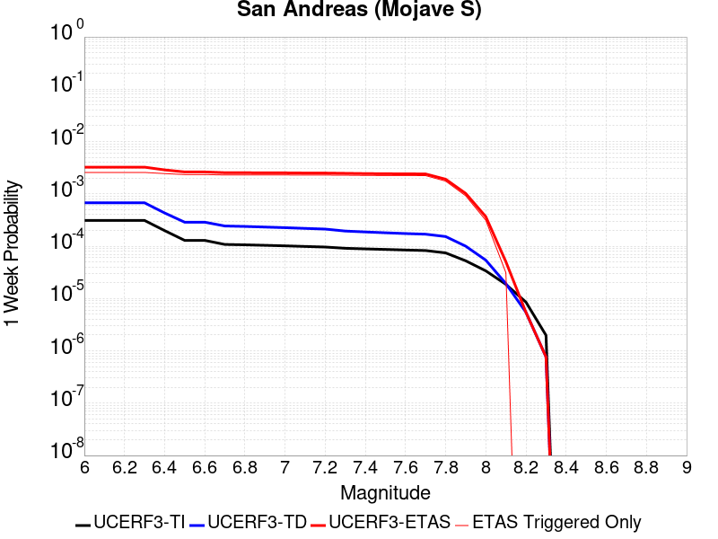 | 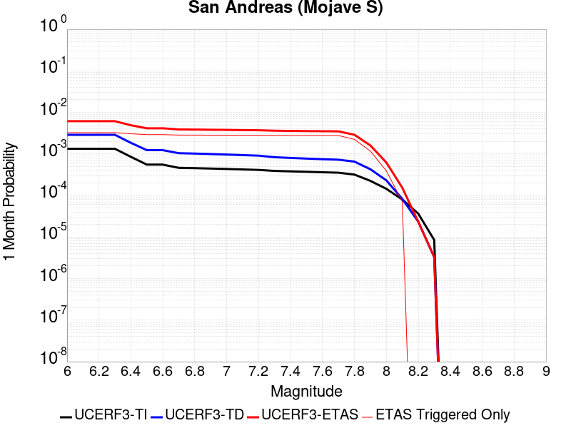 | 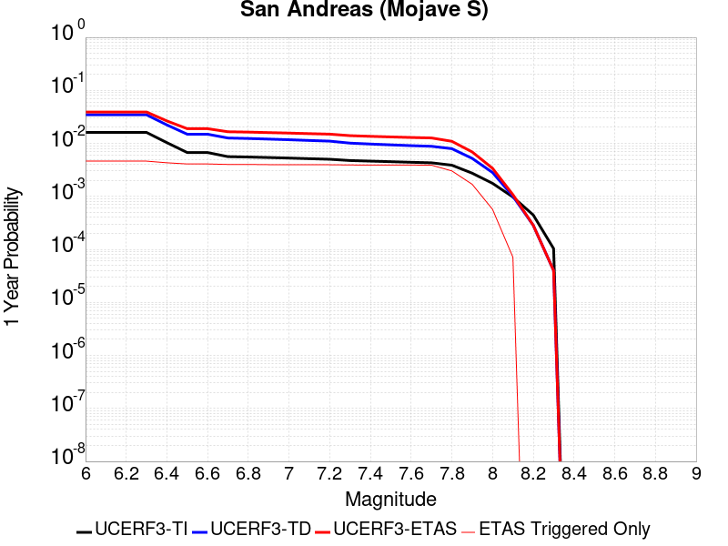 | 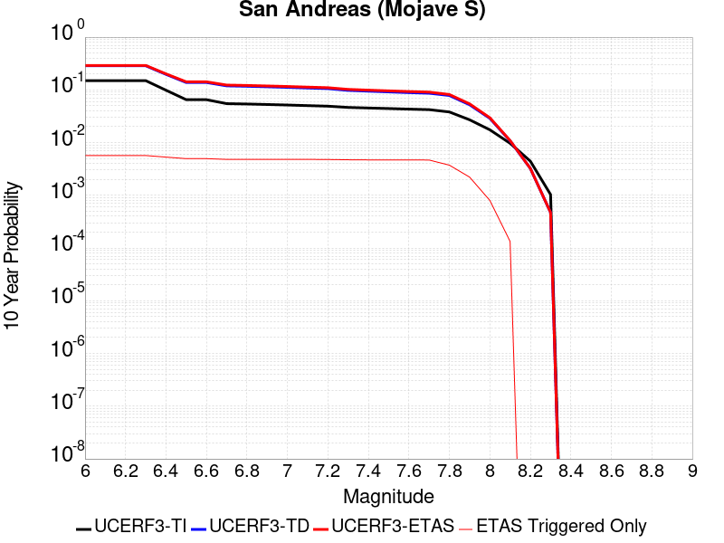 |

| Magnitude | 1 wk TI Prob | 1 wk TD Prob | 1 wk ETAS Prob | 1 wk ETAS/TD Gain | 1 wk ETAS Triggered Only | 1 mo TI Prob | 1 mo TD Prob | 1 mo ETAS Prob | 1 mo ETAS/TD Gain | 1 mo ETAS Triggered Only | 1 yr TI Prob | 1 yr TD Prob | 1 yr ETAS Prob | 1 yr ETAS/TD Gain | 1 yr ETAS Triggered Only | 10 yr TI Prob | 10 yr TD Prob | 10 yr ETAS Prob | 10 yr ETAS/TD Gain | 10 yr ETAS Triggered Only |
|-----|-----|-----|-----|-----|-----|-----|-----|-----|-----|-----|-----|-----|-----|-----|-----|-----|-----|-----|-----|-----|
| 6.0 | 3.1064058E-4 | 6.7460834E-4 | 0.0032401097 | 4.80295 | 0.0025672333 | 0.0013306376 | 0.0028881032 | 0.006082674 | 2.1061137 | 0.0032038237 | 0.016080605 | 0.03462235 | 0.038954422 | 1.1251236 | 0.0044874405 | 0.1496549 | 0.28660452 | 0.2906918 | 1.014261 | 0.0057293135 |
| 6.1 | 3.1064058E-4 | 6.7460834E-4 | 0.0032401097 | 4.80295 | 0.0025672333 | 0.0013306376 | 0.0028881032 | 0.006082674 | 2.1061137 | 0.0032038237 | 0.016080605 | 0.03462235 | 0.038954422 | 1.1251236 | 0.0044874405 | 0.1496549 | 0.28660452 | 0.2906918 | 1.014261 | 0.0057293135 |
| 6.2 | 3.1064058E-4 | 6.7460834E-4 | 0.0032401097 | 4.80295 | 0.0025672333 | 0.0013306376 | 0.0028881032 | 0.006082674 | 2.1061137 | 0.0032038237 | 0.016080605 | 0.03462235 | 0.038954422 | 1.1251236 | 0.0044874405 | 0.1496549 | 0.28660452 | 0.2906918 | 1.014261 | 0.0057293135 |
| 6.3 | 3.1064058E-4 | 6.7460834E-4 | 0.0032401097 | 4.80295 | 0.0025672333 | 0.0013306376 | 0.0028881032 | 0.006082674 | 2.1061137 | 0.0032038237 | 0.016080605 | 0.03462235 | 0.038954422 | 1.1251236 | 0.0044874405 | 0.1496549 | 0.28660452 | 0.2906918 | 1.014261 | 0.0057293135 |
| 6.4 | 1.9872203E-4 | 4.3179357E-4 | 0.0028727415 | 6.653044 | 0.0024420025 | 8.5138786E-4 | 0.0018492596 | 0.004849243 | 2.622262 | 0.0030055414 | 0.010316478 | 0.02228844 | 0.026349356 | 1.1821983 | 0.0041534915 | 0.098504856 | 0.19699748 | 0.20125455 | 1.0216098 | 0.005301441 |
| 6.5 | 1.291105E-4 | 2.875267E-4 | 0.002624498 | 9.127841 | 0.0023376434 | 5.5321335E-4 | 0.0012316781 | 0.004077172 | 3.3102577 | 0.0028490028 | 0.006714592 | 0.0148934 | 0.01874858 | 1.2588516 | 0.0039134654 | 0.065152965 | 0.13803436 | 0.14231616 | 1.0310199 | 0.004967492 |
| 6.6 | 1.291105E-4 | 2.875267E-4 | 0.002624498 | 9.127841 | 0.0023376434 | 5.5321335E-4 | 0.0012316781 | 0.004077172 | 3.3102577 | 0.0028490028 | 0.006714592 | 0.0148934 | 0.01874858 | 1.2588516 | 0.0039134654 | 0.065152965 | 0.13803436 | 0.14231616 | 1.0310199 | 0.004967492 |
| 6.7 | 1.08001186E-4 | 2.4333889E-4 | 0.0025386799 | 10.4326935 | 0.0022958997 | 4.6278012E-4 | 0.0010424647 | 0.0038259474 | 3.6700978 | 0.0027863875 | 0.0056198016 | 0.012618446 | 0.016400095 | 1.2996922 | 0.0038299782 | 0.054797906 | 0.119176775 | 0.123432755 | 1.0357115 | 0.0048318254 |
| 6.8 | 1.0624356E-4 | 2.3851555E-4 | 0.0025338677 | 10.62349 | 0.0022958997 | 4.5525006E-4 | 0.0010218095 | 0.0038053498 | 3.7241282 | 0.0027863875 | 0.0055285925 | 0.012369843 | 0.016152445 | 1.3057922 | 0.0038299782 | 0.053930566 | 0.11712591 | 0.12139181 | 1.0364214 | 0.0048318254 |
| 6.9 | 1.0393785E-4 | 2.3221898E-4 | 0.0025275855 | 10.884491 | 0.0022958997 | 4.4537184E-4 | 9.948451E-4 | 0.003768035 | 3.7875595 | 0.0027759515 | 0.0054089287 | 0.012045221 | 0.015808446 | 1.3124247 | 0.0038091063 | 0.05279156 | 0.11442335 | 0.11868382 | 1.0372343 | 0.0048109535 |
| 7.0 | 1.0155622E-4 | 2.2591476E-4 | 0.0025212958 | 11.160386 | 0.0022958997 | 4.3516833E-4 | 9.6784724E-4 | 0.003741112 | 3.865395 | 0.0027759515 | 0.005285311 | 0.0117200995 | 0.015484563 | 1.3211972 | 0.0038091063 | 0.05161361 | 0.111683756 | 0.1159574 | 1.0382656 | 0.0048109535 |
| 7.1 | 9.885595E-5 | 2.1879886E-4 | 0.0025037627 | 11.443216 | 0.0022854637 | 4.2359953E-4 | 9.3737274E-4 | 0.003700296 | 3.9475183 | 0.0027655156 | 0.0051451353 | 0.011352993 | 0.015108537 | 1.3307977 | 0.0037986704 | 0.05027629 | 0.1085682 | 0.11284754 | 1.0394161 | 0.0048005176 |
| 7.2 | 9.6411415E-5 | 2.124288E-4 | 0.0024974071 | 11.756443 | 0.0022854637 | 4.1312634E-4 | 9.1009185E-4 | 0.0036730906 | 4.035956 | 0.0027655156 | 0.005018219 | 0.011024255 | 0.0147810485 | 1.3407753 | 0.0037986704 | 0.049064007 | 0.105758004 | 0.11004149 | 1.0405028 | 0.0047900816 |
| 7.3 | 9.1180635E-5 | 1.9471257E-4 | 0.0024692975 | 12.681757 | 0.0022750278 | 3.907156E-4 | 8.342157E-4 | 0.003586997 | 4.299844 | 0.0027550797 | 0.004746591 | 0.01010939 | 0.0138386665 | 1.3688924 | 0.0037673628 | 0.046464786 | 0.09795115 | 0.102243796 | 1.0438243 | 0.004758774 |
| 7.4 | 8.887388E-5 | 1.8719878E-4 | 0.002440933 | 13.039256 | 0.0022541562 | 3.8083247E-4 | 8.020339E-4 | 0.0035340488 | 4.4063582 | 0.0027342078 | 0.0046267817 | 0.00972114 | 0.013431211 | 1.3816497 | 0.003746491 | 0.045316286 | 0.09458615 | 0.09887591 | 1.0453529 | 0.004737902 |
| 7.5 | 8.6750515E-5 | 1.8051457E-4 | 0.0024238296 | 13.427336 | 0.0022437202 | 3.7173493E-4 | 7.7340455E-4 | 0.00349507 | 4.5190706 | 0.0027237718 | 0.004516484 | 0.009375632 | 0.013066321 | 1.393647 | 0.003725619 | 0.04425787 | 0.091549896 | 0.09583508 | 1.0468072 | 0.0047170306 |
| 7.6 | 8.453092E-5 | 1.7439072E-4 | 0.0024177197 | 13.863809 | 0.0022437202 | 3.6222505E-4 | 7.471748E-4 | 0.0034689116 | 4.6427045 | 0.0027237718 | 0.0044011753 | 0.009058985 | 0.012750853 | 1.4075367 | 0.003725619 | 0.04315024 | 0.08870898 | 0.09300757 | 1.0484571 | 0.0047170306 |
| 7.7 | 8.259102E-5 | 1.6961215E-4 | 0.0024025177 | 14.164773 | 0.0022332843 | 3.539135E-4 | 7.2670676E-4 | 0.003438071 | 4.7310295 | 0.0027133361 | 0.004300386 | 0.008811831 | 0.012473588 | 1.4155502 | 0.0036943115 | 0.042181134 | 0.08645982 | 0.090721354 | 1.0492891 | 0.004664851 |
| 7.8 | 7.444844E-5 | 1.5283503E-4 | 0.0019057996 | 12.469652 | 0.0017532326 | 3.1902574E-4 | 6.548429E-4 | 0.0027510868 | 4.2011404 | 0.0020976174 | 0.0038772223 | 0.007943616 | 0.0107699875 | 1.3558041 | 0.0028490028 | 0.03810269 | 0.078290746 | 0.0815804 | 1.0420184 | 0.0035690805 |
| 7.9 | 5.2586525E-5 | 1.00064186E-4 | 0.0010183322 | 10.176789 | 9.183599E-4 | 2.2535135E-4 | 4.2877605E-4 | 0.0015240766 | 3.5544815 | 0.0010957703 | 0.0027402006 | 0.005207864 | 0.006765098 | 1.2990159 | 0.0015653862 | 0.027066574 | 0.052200034 | 0.054118916 | 1.0367602 | 0.002024566 |
| 8.0 | 3.379877E-5 | 5.4074168E-5 | 3.6713446E-4 | 6.7894616 | 3.1307724E-4 | 1.4484383E-4 | 2.3172585E-4 | 6.1776495E-4 | 2.6659303 | 3.8612858E-4 | 0.0017620471 | 0.002817614 | 0.0033587522 | 1.1920555 | 5.426672E-4 | 0.017481409 | 0.028834904 | 0.029554486 | 1.0249553 | 7.409495E-4 |
| 8.1 | 1.8668277E-5 | 1.9309397E-5 | 5.0616516E-5 | 2.6213412 | 3.1307725E-5 | 8.000444E-5 | 8.275194E-5 | 1.3492716E-4 | 1.6305015 | 5.217954E-5 | 9.736188E-4 | 0.0010070398 | 0.0010591667 | 1.0517626 | 5.217954E-5 | 0.009693642 | 0.010798888 | 0.0108711505 | 1.0066917 | 7.305136E-5 |
| 8.2 | 8.541571E-6 | 5.460819E-6 | 5.460819E-6 | 1.0 | 0.0 | 3.660622E-5 | 2.3403301E-5 | 2.3403301E-5 | 1.0 | 0.0 | 4.455896E-4 | 2.84898E-4 | 2.84898E-4 | 1.0 | 0.0 | 0.0044469717 | 0.0032408056 | 0.0032408056 | 1.0 | 0.0 |
| 8.3 | 1.983087E-6 | 7.6599065E-7 | 7.6599065E-7 | 1.0 | 0.0 | 8.498917E-6 | 3.282813E-6 | 3.282813E-6 | 1.0 | 0.0 | 1.034694E-4 | 3.9967534E-5 | 3.9967534E-5 | 1.0 | 0.0 | 0.0010342124 | 4.719687E-4 | 4.719687E-4 | 1.0 | 0.0 |

## San Andreas (Mojave N)
*[(top)](#table-of-contents)*

| 1 Week | 1 Month | 1 Year | 10 Year |
|-----|-----|-----|-----|
| 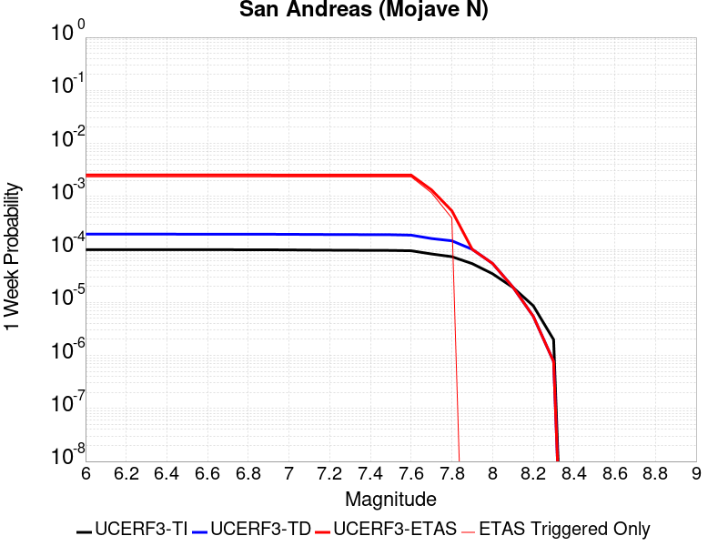 | 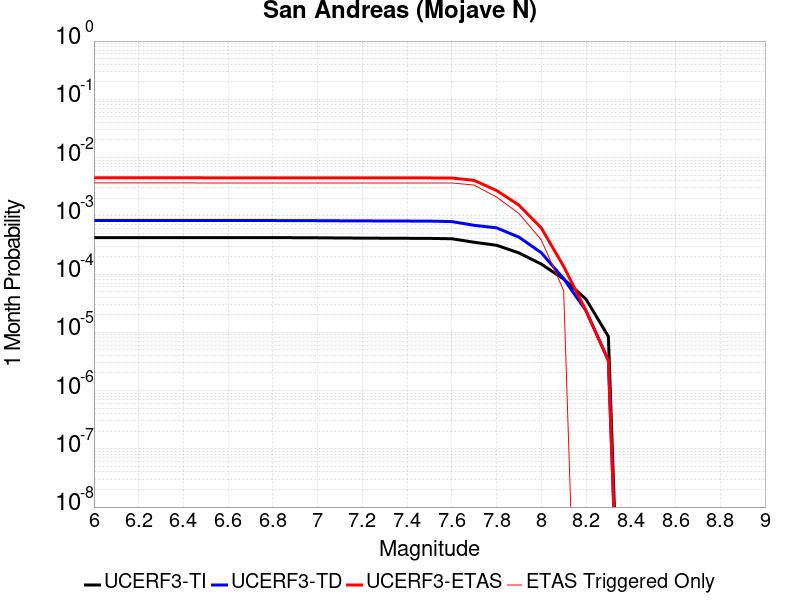 | 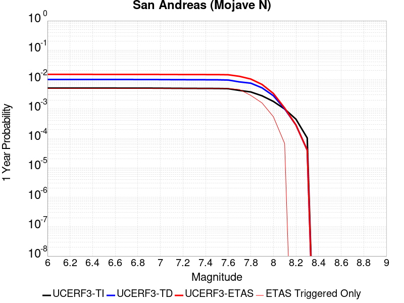 | 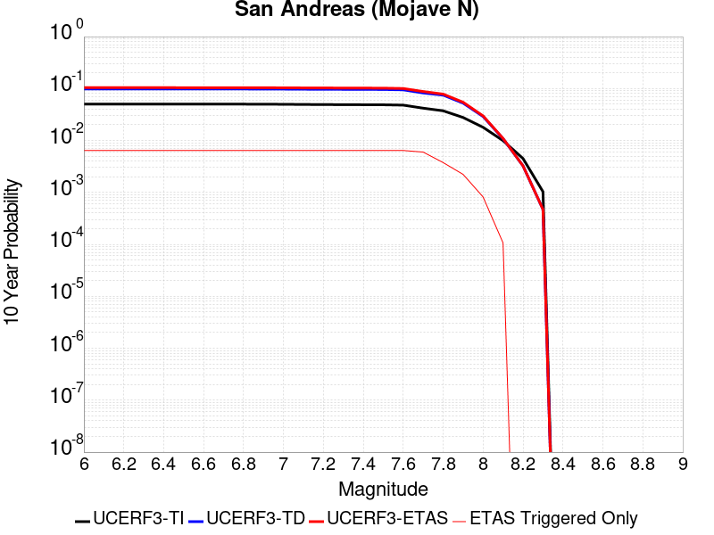 |

| Magnitude | 1 wk TI Prob | 1 wk TD Prob | 1 wk ETAS Prob | 1 wk ETAS/TD Gain | 1 wk ETAS Triggered Only | 1 mo TI Prob | 1 mo TD Prob | 1 mo ETAS Prob | 1 mo ETAS/TD Gain | 1 mo ETAS Triggered Only | 1 yr TI Prob | 1 yr TD Prob | 1 yr ETAS Prob | 1 yr ETAS/TD Gain | 1 yr ETAS Triggered Only | 10 yr TI Prob | 10 yr TD Prob | 10 yr ETAS Prob | 10 yr ETAS/TD Gain | 10 yr ETAS Triggered Only |
|-----|-----|-----|-----|-----|-----|-----|-----|-----|-----|-----|-----|-----|-----|-----|-----|-----|-----|-----|-----|-----|
| 6.0 | 9.877682E-5 | 1.9400702E-4 | 0.0032407008 | 16.70404 | 0.0030472851 | 4.2326056E-4 | 8.311939E-4 | 0.0045015803 | 5.4158 | 0.0036734396 | 0.0051410277 | 0.010072956 | 0.015000742 | 1.4892095 | 0.004977928 | 0.05023708 | 0.09831428 | 0.10393199 | 1.0571404 | 0.006230237 |
| 6.1 | 9.877682E-5 | 1.9400702E-4 | 0.0032407008 | 16.70404 | 0.0030472851 | 4.2326056E-4 | 8.311939E-4 | 0.0045015803 | 5.4158 | 0.0036734396 | 0.0051410277 | 0.010072956 | 0.015000742 | 1.4892095 | 0.004977928 | 0.05023708 | 0.09831428 | 0.10393199 | 1.0571404 | 0.006230237 |
| 6.2 | 9.877682E-5 | 1.9400702E-4 | 0.0032407008 | 16.70404 | 0.0030472851 | 4.2326056E-4 | 8.311939E-4 | 0.0045015803 | 5.4158 | 0.0036734396 | 0.0051410277 | 0.010072956 | 0.015000742 | 1.4892095 | 0.004977928 | 0.05023708 | 0.09831428 | 0.10393199 | 1.0571404 | 0.006230237 |
| 6.3 | 9.877682E-5 | 1.9400702E-4 | 0.0032407008 | 16.70404 | 0.0030472851 | 4.2326056E-4 | 8.311939E-4 | 0.0045015803 | 5.4158 | 0.0036734396 | 0.0051410277 | 0.010072956 | 0.015000742 | 1.4892095 | 0.004977928 | 0.05023708 | 0.09831428 | 0.10393199 | 1.0571404 | 0.006230237 |
| 6.4 | 9.877682E-5 | 1.9400702E-4 | 0.0032407008 | 16.70404 | 0.0030472851 | 4.2326056E-4 | 8.311939E-4 | 0.0045015803 | 5.4158 | 0.0036734396 | 0.0051410277 | 0.010072956 | 0.015000742 | 1.4892095 | 0.004977928 | 0.05023708 | 0.09831428 | 0.10393199 | 1.0571404 | 0.006230237 |
| 6.5 | 9.861474E-5 | 1.9374468E-4 | 0.0032300055 | 16.671453 | 0.0030368492 | 4.2256617E-4 | 8.300703E-4 | 0.0044900333 | 5.4092207 | 0.0036630037 | 0.0051326132 | 0.010059402 | 0.014976925 | 1.4888483 | 0.004967492 | 0.050156746 | 0.098192066 | 0.10380113 | 1.0571234 | 0.006219801 |
| 6.6 | 9.861474E-5 | 1.9374468E-4 | 0.0032300055 | 16.671453 | 0.0030368492 | 4.2256617E-4 | 8.300703E-4 | 0.0044900333 | 5.4092207 | 0.0036630037 | 0.0051326132 | 0.010059402 | 0.014976925 | 1.4888483 | 0.004967492 | 0.050156746 | 0.098192066 | 0.10380113 | 1.0571234 | 0.006219801 |
| 6.7 | 9.8552715E-5 | 1.9364421E-4 | 0.0032299054 | 16.679586 | 0.0030368492 | 4.223004E-4 | 8.2964E-4 | 0.004489605 | 5.4115095 | 0.0036630037 | 0.0051293927 | 0.010054212 | 0.01497176 | 1.4891033 | 0.004967492 | 0.050125998 | 0.098145254 | 0.10375461 | 1.0571536 | 0.006219801 |
| 6.8 | 9.8464974E-5 | 1.9349584E-4 | 0.0032297573 | 16.691612 | 0.0030368492 | 4.219245E-4 | 8.290045E-4 | 0.0044889716 | 5.4148936 | 0.0036630037 | 0.0051248376 | 0.010046546 | 0.014964133 | 1.4894803 | 0.004967492 | 0.05008251 | 0.09807528 | 0.10368507 | 1.0571989 | 0.006219801 |
| 6.9 | 9.825824E-5 | 1.9317595E-4 | 0.0032294386 | 16.717602 | 0.0030368492 | 4.2103877E-4 | 8.276344E-4 | 0.004487606 | 5.422209 | 0.0036630037 | 0.0051141046 | 0.010030019 | 0.014947687 | 1.4902949 | 0.004967492 | 0.049980022 | 0.09792438 | 0.10353511 | 1.0572965 | 0.006219801 |
| 7.0 | 9.781462E-5 | 1.924896E-4 | 0.0032287543 | 16.773655 | 0.0030368492 | 4.1913814E-4 | 8.246948E-4 | 0.0044846777 | 5.4379845 | 0.0036630037 | 0.005091073 | 0.009994558 | 0.014912402 | 1.4920522 | 0.004967492 | 0.04976007 | 0.09760077 | 0.10321352 | 1.0575072 | 0.006219801 |
| 7.1 | 9.7121134E-5 | 1.9150671E-4 | 0.0032277743 | 16.854628 | 0.0030368492 | 4.1616702E-4 | 8.204851E-4 | 0.0044804835 | 5.4607735 | 0.0036630037 | 0.005055068 | 0.009943774 | 0.014861871 | 1.4945905 | 0.004967492 | 0.04941613 | 0.09713728 | 0.10275291 | 1.0578113 | 0.006219801 |
| 7.2 | 9.663819E-5 | 1.9081456E-4 | 0.0032270842 | 16.912148 | 0.0030368492 | 4.1409794E-4 | 8.175206E-4 | 0.00447753 | 5.4769626 | 0.0036630037 | 0.0050299936 | 0.00990801 | 0.014826285 | 1.4963937 | 0.004967492 | 0.049176537 | 0.09681055 | 0.102428205 | 1.0580274 | 0.006219801 |
| 7.3 | 9.6277574E-5 | 1.9033969E-4 | 0.0032266108 | 16.951855 | 0.0030368492 | 4.125529E-4 | 8.154867E-4 | 0.004475503 | 5.4881377 | 0.0036630037 | 0.0050112694 | 0.009883473 | 0.014801869 | 1.4976385 | 0.004967492 | 0.04899759 | 0.09658401 | 0.10220307 | 1.0581781 | 0.006219801 |
| 7.4 | 9.593308E-5 | 1.897375E-4 | 0.0032260106 | 17.002493 | 0.0030368492 | 4.1107697E-4 | 8.129075E-4 | 0.0044729337 | 5.5023894 | 0.0036630037 | 0.0049933824 | 0.009852355 | 0.014770906 | 1.4992259 | 0.004967492 | 0.04882661 | 0.09630218 | 0.101923004 | 1.0583665 | 0.006219801 |
| 7.5 | 9.561707E-5 | 1.8919831E-4 | 0.003225473 | 17.048105 | 0.0030368492 | 4.0972308E-4 | 8.1059814E-4 | 0.0044706324 | 5.515227 | 0.0036630037 | 0.0049769743 | 0.009824493 | 0.014743182 | 1.5006558 | 0.004967492 | 0.048669744 | 0.09604836 | 0.101670764 | 1.0585371 | 0.006219801 |
| 7.6 | 9.418194E-5 | 1.8572104E-4 | 0.0032220061 | 17.348633 | 0.0030368492 | 4.0357444E-4 | 7.957047E-4 | 0.0044557936 | 5.599808 | 0.0036630037 | 0.004902454 | 0.009644784 | 0.014564366 | 1.5100769 | 0.004967492 | 0.047957025 | 0.094430685 | 0.100063145 | 1.0596465 | 0.006219801 |
| 7.7 | 8.202141E-5 | 1.6021315E-4 | 0.0029670226 | 18.51922 | 0.0028072593 | 3.51473E-4 | 6.8644714E-4 | 0.0040549315 | 5.9071283 | 0.0033707982 | 0.00427079 | 0.008325525 | 0.012848048 | 1.5432118 | 0.0045604915 | 0.04189639 | 0.08223219 | 0.0874808 | 1.0638266 | 0.0057188775 |
| 7.8 | 7.2859846E-5 | 1.4516473E-4 | 0.0018981427 | 13.075786 | 0.0017532326 | 3.1221908E-4 | 6.219862E-4 | 0.002718299 | 4.3703527 | 0.0020976174 | 0.003794643 | 0.0075464295 | 0.010373932 | 1.3746809 | 0.0028490028 | 0.037304975 | 0.07472468 | 0.07802706 | 1.044194 | 0.0035690805 |
| 7.9 | 5.3874453E-5 | 1.0045676E-4 | 0.0010187244 | 10.140924 | 9.183599E-4 | 2.3087008E-4 | 4.3045796E-4 | 0.0015257566 | 3.5444963 | 0.0010957703 | 0.0028072202 | 0.0052282433 | 0.006785445 | 1.2978442 | 0.0015653862 | 0.02772022 | 0.05242443 | 0.05434286 | 1.0365942 | 0.002024566 |
| 8.0 | 3.468538E-5 | 5.4260272E-5 | 3.6732052E-4 | 6.7696033 | 3.1307724E-4 | 1.4864317E-4 | 2.325233E-4 | 6.185621E-4 | 2.6602156 | 3.8612858E-4 | 0.0018082283 | 0.002827298 | 0.0033684308 | 1.1913958 | 5.426672E-4 | 0.017935853 | 0.028947512 | 0.029667012 | 1.0248554 | 7.409495E-4 |
| 8.1 | 1.9152367E-5 | 1.940263E-5 | 5.0709747E-5 | 2.6135502 | 3.1307725E-5 | 8.207899E-5 | 8.3151484E-5 | 1.3532669E-4 | 1.6274717 | 5.217954E-5 | 9.988535E-4 | 0.0010118998 | 0.0010640265 | 1.0515138 | 5.217954E-5 | 0.009943757 | 0.01085625 | 0.010928509 | 1.0066559 | 7.305136E-5 |
| 8.2 | 8.643924E-6 | 5.4748625E-6 | 5.4748625E-6 | 1.0 | 0.0 | 3.704486E-5 | 2.3463486E-5 | 2.3463486E-5 | 1.0 | 0.0 | 4.5092785E-4 | 2.8563058E-4 | 2.8563058E-4 | 1.0 | 0.0 | 0.0045001395 | 0.0032487072 | 0.0032487072 | 1.0 | 0.0 |
| 8.3 | 1.983087E-6 | 7.6599065E-7 | 7.6599065E-7 | 1.0 | 0.0 | 8.498917E-6 | 3.282813E-6 | 3.282813E-6 | 1.0 | 0.0 | 1.034694E-4 | 3.9967534E-5 | 3.9967534E-5 | 1.0 | 0.0 | 0.0010342124 | 4.719687E-4 | 4.719687E-4 | 1.0 | 0.0 |

## Death Valley (So)
*[(top)](#table-of-contents)*

| 1 Week | 1 Month | 1 Year | 10 Year |
|-----|-----|-----|-----|
| 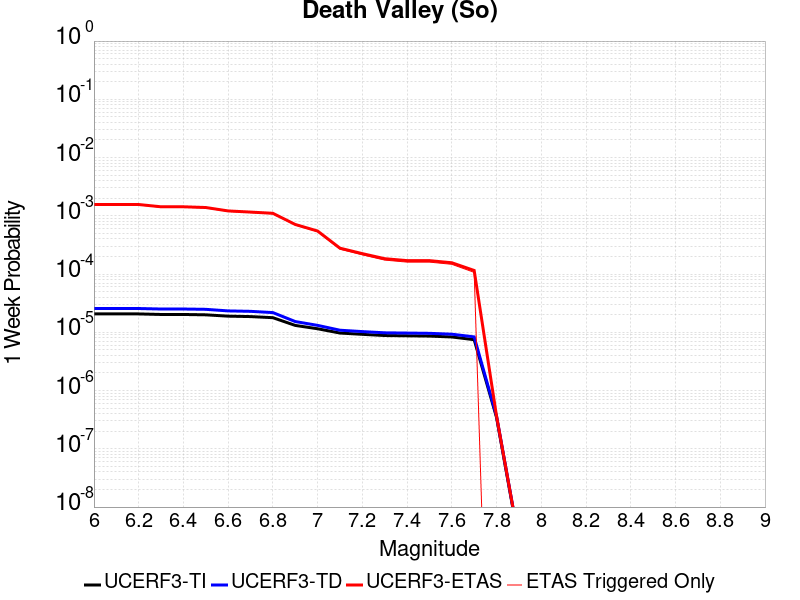 | 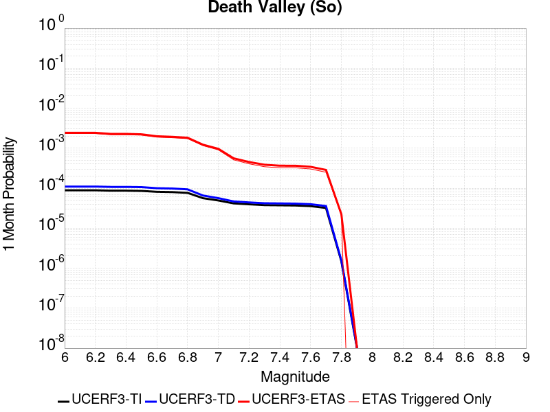 | 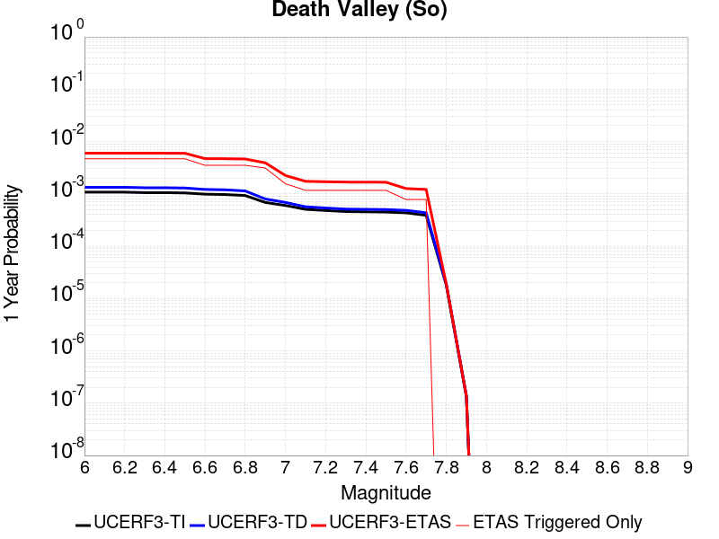 | 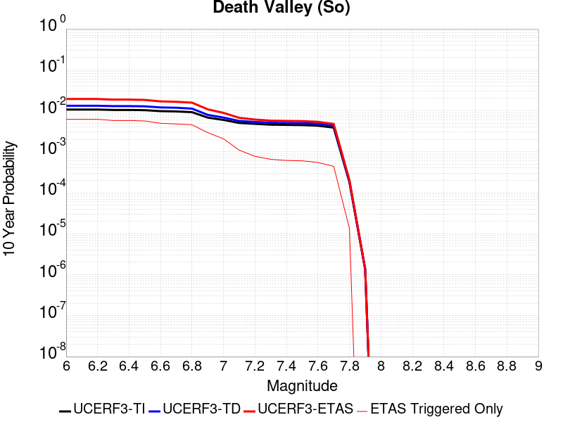 |

| Magnitude | 1 wk TI Prob | 1 wk TD Prob | 1 wk ETAS Prob | 1 wk ETAS/TD Gain | 1 wk ETAS Triggered Only | 1 mo TI Prob | 1 mo TD Prob | 1 mo ETAS Prob | 1 mo ETAS/TD Gain | 1 mo ETAS Triggered Only | 1 yr TI Prob | 1 yr TD Prob | 1 yr ETAS Prob | 1 yr ETAS/TD Gain | 1 yr ETAS Triggered Only | 10 yr TI Prob | 10 yr TD Prob | 10 yr ETAS Prob | 10 yr ETAS/TD Gain | 10 yr ETAS Triggered Only |
|-----|-----|-----|-----|-----|-----|-----|-----|-----|-----|-----|-----|-----|-----|-----|-----|-----|-----|-----|-----|-----|
| 6.0 | 2.0684236E-5 | 2.5617775E-5 | 0.0016327064 | 63.733337 | 0.0016071298 | 8.864371E-5 | 1.0978594E-4 | 0.0024263032 | 22.100307 | 0.0023167715 | 0.0010787029 | 0.0013358411 | 0.005264923 | 3.941279 | 0.0039343373 | 0.010734817 | 0.013281397 | 0.01934651 | 1.4566622 | 0.00614675 |
| 6.1 | 2.0684236E-5 | 2.5617775E-5 | 0.0016327064 | 63.733337 | 0.0016071298 | 8.864371E-5 | 1.0978594E-4 | 0.0024263032 | 22.100307 | 0.0023167715 | 0.0010787029 | 0.0013358411 | 0.005264923 | 3.941279 | 0.0039343373 | 0.010734817 | 0.013281397 | 0.01934651 | 1.4566622 | 0.00614675 |
| 6.2 | 2.0684236E-5 | 2.5617775E-5 | 0.0016327064 | 63.733337 | 0.0016071298 | 8.864371E-5 | 1.0978594E-4 | 0.0024263032 | 22.100307 | 0.0023167715 | 0.0010787029 | 0.0013358411 | 0.005264923 | 3.941279 | 0.0039343373 | 0.010734817 | 0.013281397 | 0.01934651 | 1.4566622 | 0.00614675 |
| 6.3 | 2.0240292E-5 | 2.511786E-5 | 0.0015069796 | 59.996334 | 0.001481899 | 8.6741224E-5 | 1.07643624E-4 | 0.0022780788 | 21.163155 | 0.002170669 | 0.0010555626 | 0.00130979 | 0.005020107 | 3.8327572 | 0.0037151831 | 0.010505628 | 0.013023956 | 0.018709552 | 1.436549 | 0.0057606213 |
| 6.4 | 2.0240292E-5 | 2.511786E-5 | 0.0015069796 | 59.996334 | 0.001481899 | 8.6741224E-5 | 1.07643624E-4 | 0.0022780788 | 21.163155 | 0.002170669 | 0.0010555626 | 0.00130979 | 0.005020107 | 3.8327572 | 0.0037151831 | 0.010505628 | 0.013023956 | 0.018709552 | 1.436549 | 0.0057606213 |
| 6.5 | 1.9962767E-5 | 2.4807114E-5 | 0.0014649266 | 59.052685 | 0.0014401553 | 8.55519E-5 | 1.0631196E-4 | 0.002224576 | 20.924984 | 0.0021184892 | 0.0010410968 | 0.0012935963 | 0.004910172 | 3.7957528 | 0.00362126 | 0.010362327 | 0.012863902 | 0.018406196 | 1.4308407 | 0.0056145187 |
| 6.6 | 1.8937297E-5 | 2.3310964E-5 | 0.0013068977 | 56.06365 | 0.0012836166 | 8.115732E-5 | 9.990039E-5 | 0.001988611 | 19.90594 | 0.0018888994 | 9.876423E-4 | 0.0012156231 | 0.004394706 | 3.6151876 | 0.0031829518 | 0.009832645 | 0.012092789 | 0.017020829 | 1.407519 | 0.004988364 |
| 6.7 | 1.8621096E-5 | 2.2911607E-5 | 0.0012647562 | 55.20155 | 0.001241873 | 7.980225E-5 | 9.818898E-5 | 0.0019242936 | 19.597855 | 0.0018262839 | 9.711593E-4 | 0.0011948098 | 0.0042697242 | 3.5735598 | 0.0030785927 | 0.009669261 | 0.011886904 | 0.016650982 | 1.4007838 | 0.0048213894 |
| 6.8 | 1.7830353E-5 | 2.1805688E-5 | 0.0011906018 | 54.60052 | 0.0011688217 | 7.641356E-5 | 9.344968E-5 | 0.0018256485 | 19.536167 | 0.0017323607 | 9.29938E-4 | 0.00113717 | 0.0040767496 | 3.5849955 | 0.002942926 | 0.009260561 | 0.011316354 | 0.01581492 | 1.3975278 | 0.0045500556 |
| 6.9 | 1.3135183E-5 | 1.5303925E-5 | 7.875493E-4 | 51.46061 | 7.7225716E-4 | 5.6292425E-5 | 6.558664E-5 | 0.0012238964 | 18.660759 | 0.0011583858 | 6.8514474E-4 | 7.982312E-4 | 0.002706478 | 3.390594 | 0.0019097711 | 0.006830362 | 0.007954649 | 0.0109155765 | 1.3722261 | 0.0029846698 |
| 7.0 | 1.1507512E-5 | 1.3154199E-5 | 6.1842886E-4 | 47.013798 | 6.0528266E-4 | 4.9316975E-5 | 5.6373956E-5 | 9.6424675E-4 | 17.104473 | 9.0792397E-4 | 6.002687E-4 | 6.8614254E-4 | 0.0021357385 | 3.1126745 | 0.0014505911 | 0.0059864987 | 0.0068409415 | 0.008996761 | 1.3151349 | 0.002170669 |
| 7.1 | 9.715903E-6 | 1.0865278E-5 | 3.343749E-4 | 30.77463 | 3.2351314E-4 | 4.1638916E-5 | 4.656467E-5 | 5.5790035E-4 | 11.981194 | 5.113595E-4 | 5.068359E-4 | 5.667817E-4 | 0.0013907511 | 2.4537687 | 8.244367E-4 | 0.0050568148 | 0.0056538144 | 0.0067848973 | 1.2000566 | 0.0011375139 |
| 7.2 | 9.233269E-6 | 1.02863105E-5 | 2.6074552E-4 | 25.34879 | 2.504618E-4 | 3.9570554E-5 | 4.4083466E-5 | 4.5106592E-4 | 10.232089 | 4.0700042E-4 | 4.81665E-4 | 5.3658825E-4 | 0.0011624068 | 2.1662917 | 6.261545E-4 | 0.0048062233 | 0.0053533576 | 0.006163001 | 1.1512402 | 8.1400084E-4 |
| 7.3 | 8.8041315E-6 | 9.808164E-6 | 2.0808847E-4 | 21.215843 | 1.9828224E-4 | 3.7731446E-5 | 4.2034335E-5 | 3.864048E-4 | 9.1926 | 3.4438496E-4 | 4.592835E-4 | 5.1165203E-4 | 0.0010227499 | 1.9989169 | 5.113595E-4 | 0.0045833546 | 0.005105167 | 0.005780038 | 1.1321937 | 6.7833404E-4 |
| 7.4 | 8.708749E-6 | 9.707175E-6 | 1.975517E-4 | 20.3511 | 1.8784634E-4 | 3.7322676E-5 | 4.160154E-5 | 3.6510124E-4 | 8.776147 | 3.2351314E-4 | 4.5430884E-4 | 5.0638523E-4 | 9.861939E-4 | 1.9475172 | 4.8005176E-4 | 0.004533812 | 0.0050527398 | 0.0056861136 | 1.1253525 | 6.3659035E-4 |
| 7.5 | 8.612678E-6 | 9.604817E-6 | 1.9744935E-4 | 20.557325 | 1.8784634E-4 | 3.6910955E-5 | 4.1162875E-5 | 3.646627E-4 | 8.859019 | 3.2351314E-4 | 4.492982E-4 | 5.01047E-4 | 9.704275E-4 | 1.9367995 | 4.6961586E-4 | 0.004483909 | 0.0049995985 | 0.0056226226 | 1.1246148 | 6.261545E-4 |
| 7.6 | 8.319024E-6 | 9.283916E-6 | 1.866927E-4 | 20.109262 | 1.7741043E-4 | 3.5652476E-5 | 3.978763E-5 | 3.4241693E-4 | 8.606115 | 3.0264133E-4 | 4.3398244E-4 | 4.8431093E-4 | 9.119759E-4 | 1.8830382 | 4.2787223E-4 | 0.0043313587 | 0.0048329784 | 0.0054041795 | 1.1181881 | 5.739749E-4 |
| 7.7 | 7.4718328E-6 | 8.34517E-6 | 1.4401085E-4 | 17.25679 | 1.356668E-4 | 3.2021748E-5 | 3.5764548E-5 | 2.8621737E-4 | 8.002824 | 2.504618E-4 | 3.8979502E-4 | 4.353504E-4 | 7.7958545E-4 | 1.790708 | 3.4438496E-4 | 0.00389112 | 0.0043453807 | 0.004802565 | 1.1052116 | 4.5917995E-4 |
| 7.8 | 3.4586725E-7 | 3.6482615E-7 | 1.080073E-5 | 29.605145 | 1.0435908E-5 | 1.4822873E-6 | 1.5635396E-6 | 2.2435323E-5 | 14.349059 | 2.0871816E-5 | 1.80467E-5 | 1.9035933E-5 | 3.990735E-5 | 2.0964222 | 2.0871816E-5 | 1.8045233E-4 | 1.9034347E-4 | 2.1121131E-4 | 1.1096326 | 2.0871816E-5 |
| 7.9 | 2.5591178E-9 | 2.6696718E-9 | 2.6696718E-9 | 1.0 | 0.0 | 1.0967647E-8 | 1.14414505E-8 | 1.14414505E-8 | 1.0 | 0.0 | 1.335311E-7 | 1.3929966E-7 | 1.3929966E-7 | 1.0 | 0.0 | 1.3353102E-6 | 1.3929966E-6 | 1.3929966E-6 | 1.0 | 0.0 |

## Coyote Canyon
*[(top)](#table-of-contents)*

| 1 Week | 1 Month | 1 Year | 10 Year |
|-----|-----|-----|-----|
| 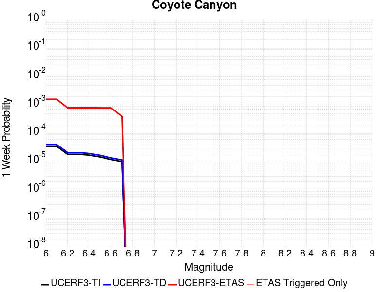 | 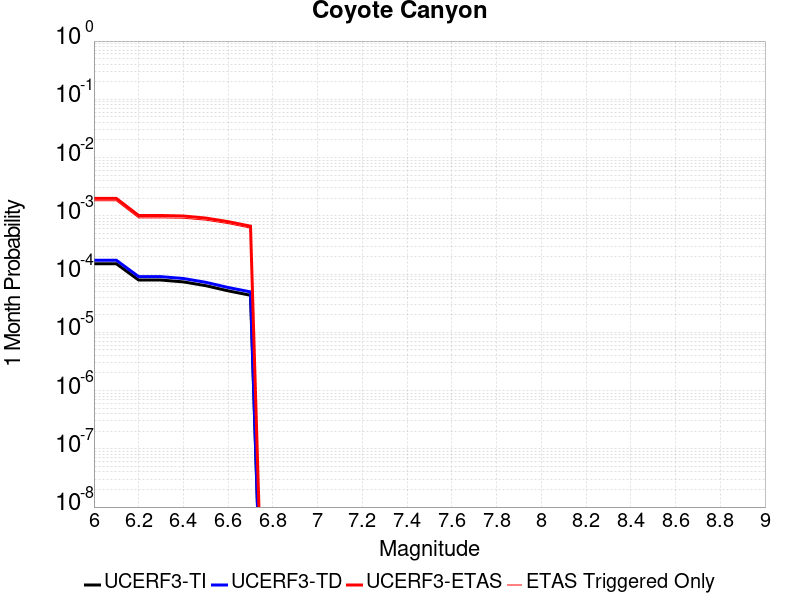 | 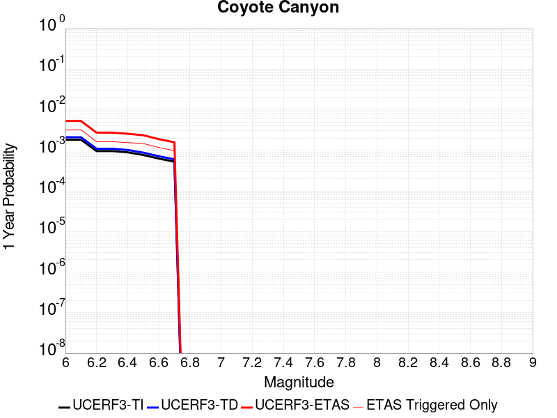 | 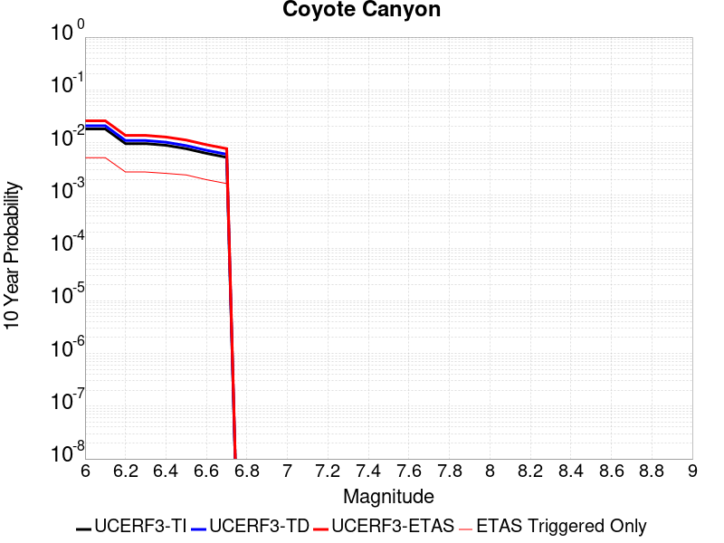 |

| Magnitude | 1 wk TI Prob | 1 wk TD Prob | 1 wk ETAS Prob | 1 wk ETAS/TD Gain | 1 wk ETAS Triggered Only | 1 mo TI Prob | 1 mo TD Prob | 1 mo ETAS Prob | 1 mo ETAS/TD Gain | 1 mo ETAS Triggered Only | 1 yr TI Prob | 1 yr TD Prob | 1 yr ETAS Prob | 1 yr ETAS/TD Gain | 1 yr ETAS Triggered Only | 10 yr TI Prob | 10 yr TD Prob | 10 yr ETAS Prob | 10 yr ETAS/TD Gain | 10 yr ETAS Triggered Only |
|-----|-----|-----|-----|-----|-----|-----|-----|-----|-----|-----|-----|-----|-----|-----|-----|-----|-----|-----|-----|-----|
| 6.0 | 3.5090034E-5 | 4.0364324E-5 | 0.001146526 | 28.404438 | 0.0011062062 | 1.503772E-4 | 1.7297994E-4 | 0.0019780798 | 11.435312 | 0.0018054121 | 0.0018293047 | 0.0021042528 | 0.0053742323 | 2.553986 | 0.003276875 | 0.018143194 | 0.020869201 | 0.025978262 | 1.2448133 | 0.005217954 |
| 6.1 | 3.5090034E-5 | 4.0364324E-5 | 0.001146526 | 28.404438 | 0.0011062062 | 1.503772E-4 | 1.7297994E-4 | 0.0019780798 | 11.435312 | 0.0018054121 | 0.0018293047 | 0.0021042528 | 0.0053742323 | 2.553986 | 0.003276875 | 0.018143194 | 0.020869201 | 0.025978262 | 1.2448133 | 0.005217954 |
| 6.2 | 1.841879E-5 | 2.1059794E-5 | 6.0545834E-4 | 28.74949 | 5.8441085E-4 | 7.8935285E-5 | 9.0253714E-5 | 9.980957E-4 | 11.058778 | 9.0792397E-4 | 9.606133E-4 | 0.001098387 | 0.0027871472 | 2.537491 | 0.0016906171 | 0.0095647145 | 0.010939667 | 0.0136955725 | 1.2519186 | 0.0027863875 |
| 6.3 | 1.841879E-5 | 2.1059794E-5 | 6.0545834E-4 | 28.74949 | 5.8441085E-4 | 7.8935285E-5 | 9.0253714E-5 | 9.980957E-4 | 11.058778 | 9.0792397E-4 | 9.606133E-4 | 0.001098387 | 0.0027871472 | 2.537491 | 0.0016906171 | 0.0095647145 | 0.010939667 | 0.0136955725 | 1.2519186 | 0.0027863875 |
| 6.4 | 1.712201E-5 | 1.9565212E-5 | 5.935289E-4 | 30.335932 | 5.739749E-4 | 7.337798E-5 | 8.3848776E-5 | 9.812616E-4 | 11.702754 | 8.974881E-4 | 8.930107E-4 | 0.0010204813 | 0.002625971 | 2.5732672 | 0.0016071298 | 0.008894307 | 0.010167871 | 0.01273999 | 1.2529655 | 0.002598541 |
| 6.5 | 1.4744935E-5 | 1.6836972E-5 | 5.386236E-4 | 31.990526 | 5.217954E-4 | 6.3191044E-5 | 7.215698E-5 | 8.9653424E-4 | 12.424774 | 8.244367E-4 | 7.6907943E-4 | 8.7825063E-4 | 0.002358848 | 2.6858485 | 0.001481899 | 0.007664232 | 0.008756994 | 0.01112589 | 1.2705146 | 0.0023898229 |
| 6.6 | 1.2017839E-5 | 1.37240895E-5 | 4.7289772E-4 | 34.457497 | 4.5917995E-4 | 5.150401E-5 | 5.88167E-5 | 7.8928727E-4 | 13.419442 | 7.3051354E-4 | 6.268809E-4 | 7.159466E-4 | 0.0019360736 | 2.704215 | 0.0012210013 | 0.0062511545 | 0.0071450938 | 0.00912411 | 1.2769755 | 0.0019932585 |
| 6.7 | 1.00956095E-5 | 1.1533517E-5 | 3.7678608E-4 | 32.668793 | 3.6525677E-4 | 4.326618E-5 | 4.942891E-5 | 6.4424623E-4 | 13.033794 | 5.9484673E-4 | 5.266384E-4 | 6.017178E-4 | 0.0016238213 | 2.6986427 | 0.001022719 | 0.005253921 | 0.0060094125 | 0.00768987 | 1.2796376 | 0.0016906171 |

## Nelson Lake
*[(top)](#table-of-contents)*

| 1 Week | 1 Month | 1 Year | 10 Year |
|-----|-----|-----|-----|
| 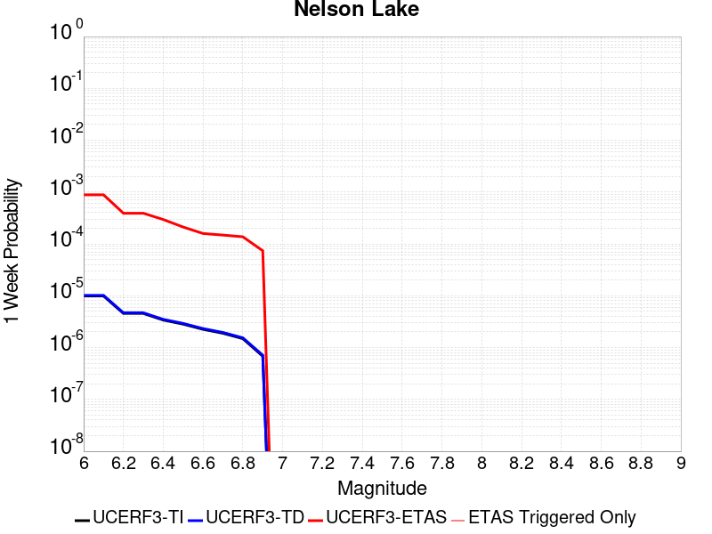 | 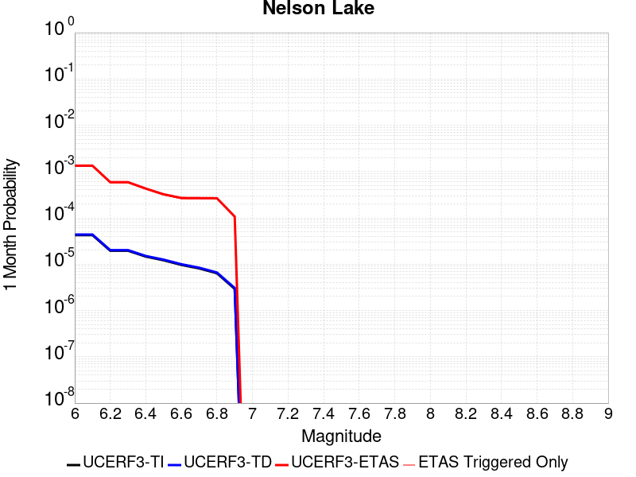 | 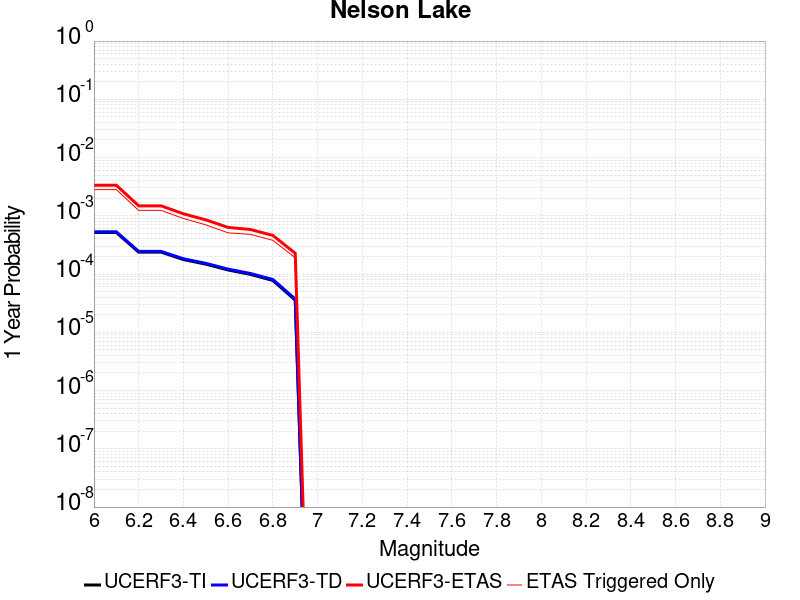 | 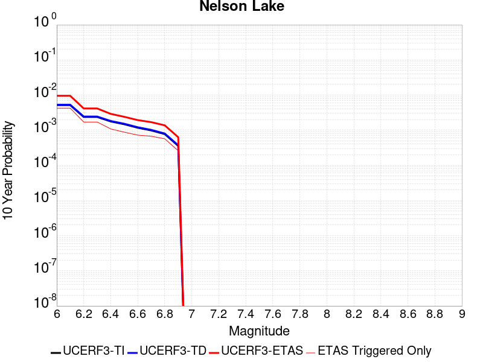 |

| Magnitude | 1 wk TI Prob | 1 wk TD Prob | 1 wk ETAS Prob | 1 wk ETAS/TD Gain | 1 wk ETAS Triggered Only | 1 mo TI Prob | 1 mo TD Prob | 1 mo ETAS Prob | 1 mo ETAS/TD Gain | 1 mo ETAS Triggered Only | 1 yr TI Prob | 1 yr TD Prob | 1 yr ETAS Prob | 1 yr ETAS/TD Gain | 1 yr ETAS Triggered Only | 10 yr TI Prob | 10 yr TD Prob | 10 yr ETAS Prob | 10 yr ETAS/TD Gain | 10 yr ETAS Triggered Only |
|-----|-----|-----|-----|-----|-----|-----|-----|-----|-----|-----|-----|-----|-----|-----|-----|-----|-----|-----|-----|-----|
| 6.0 | 9.913453E-6 | 1.0192255E-5 | 8.867996E-4 | 87.007195 | 8.766163E-4 | 4.2485535E-5 | 4.3680422E-5 | 0.0013585474 | 31.101974 | 0.0013149244 | 5.1713863E-4 | 5.316897E-4 | 0.0033478867 | 6.296693 | 0.002817695 | 0.0051593683 | 0.005305204 | 0.009893404 | 1.864849 | 0.004612671 |
| 6.1 | 9.913453E-6 | 1.0192255E-5 | 8.867996E-4 | 87.007195 | 8.766163E-4 | 4.2485535E-5 | 4.3680422E-5 | 0.0013585474 | 31.101974 | 0.0013149244 | 5.1713863E-4 | 5.316897E-4 | 0.0033478867 | 6.296693 | 0.002817695 | 0.0051593683 | 0.005305204 | 0.009893404 | 1.864849 | 0.004612671 |
| 6.2 | 4.5596407E-6 | 4.696313E-6 | 3.908231E-4 | 83.21913 | 3.8612858E-4 | 1.954117E-5 | 2.0126909E-5 | 5.9409026E-4 | 29.517216 | 5.739749E-4 | 2.3788778E-4 | 2.4501883E-4 | 0.0014552876 | 5.9394927 | 0.0012105653 | 0.0023763329 | 0.0024476128 | 0.0044151717 | 1.8038685 | 0.0019723866 |
| 6.3 | 4.5596407E-6 | 4.696313E-6 | 3.908231E-4 | 83.21913 | 3.8612858E-4 | 1.954117E-5 | 2.0126909E-5 | 5.9409026E-4 | 29.517216 | 5.739749E-4 | 2.3788778E-4 | 2.4501883E-4 | 0.0014552876 | 5.9394927 | 0.0012105653 | 0.0023763329 | 0.0024476128 | 0.0044151717 | 1.8038685 | 0.0019723866 |
| 6.4 | 3.4025713E-6 | 3.5098972E-6 | 2.957143E-4 | 84.25155 | 2.9220543E-4 | 1.4582367E-5 | 1.5042335E-5 | 4.4290812E-4 | 29.444107 | 4.2787223E-4 | 1.7752586E-4 | 1.8312587E-4 | 0.0010595816 | 5.7860837 | 8.766163E-4 | 0.001773841 | 0.0018298327 | 0.0032361022 | 1.7685236 | 0.0014088475 |
| 6.5 | 2.8352947E-6 | 2.927856E-6 | 2.116454E-4 | 72.28682 | 2.0871816E-4 | 1.2151207E-5 | 1.2547898E-5 | 3.4649277E-4 | 27.61361 | 3.3394905E-4 | 1.479309E-4 | 1.5276071E-4 | 8.5185975E-4 | 5.576432 | 6.9920585E-4 | 0.0014783246 | 0.0015266308 | 0.0026832481 | 1.7576274 | 0.0011583858 |
| 6.6 | 2.251518E-6 | 2.3290677E-6 | 1.5886732E-4 | 68.21069 | 1.5653862E-4 | 9.649328E-6 | 9.981683E-6 | 2.6044098E-4 | 26.091888 | 2.504618E-4 | 1.1747423E-4 | 1.2152085E-4 | 6.328182E-4 | 5.2074866 | 5.113595E-4 | 0.0011741214 | 0.0012146058 | 0.0020797339 | 1.7122709 | 8.6618034E-4 |
| 6.7 | 1.8911853E-6 | 1.9591396E-6 | 1.4806156E-4 | 75.57478 | 1.4610271E-4 | 8.105055E-6 | 8.39629E-6 | 2.4842017E-4 | 29.586899 | 2.4002588E-4 | 9.867457E-5 | 1.0222061E-4 | 5.822233E-4 | 5.6957526 | 4.8005176E-4 | 9.863076E-4 | 0.0010217935 | 0.0018349625 | 1.7958254 | 8.1400084E-4 |
| 6.8 | 1.4874814E-6 | 1.5438305E-6 | 1.3721042E-4 | 88.87661 | 1.356668E-4 | 6.374905E-6 | 6.6164025E-6 | 2.1533317E-4 | 32.545357 | 2.0871816E-4 | 7.76117E-5 | 8.055224E-5 | 4.6664974E-4 | 5.7931314 | 3.8612858E-4 | 7.75846E-4 | 8.0528157E-4 | 0.0014622143 | 1.8157802 | 6.574622E-4 |
| 6.9 | 6.835972E-7 | 7.1399285E-7 | 7.3765295E-5 | 103.313774 | 7.305136E-5 | 2.9296991E-6 | 3.0599674E-6 | 9.6982854E-5 | 31.694078 | 9.392317E-5 | 3.56685E-5 | 3.7254784E-5 | 2.3552965E-4 | 6.322131 | 1.9828224E-4 | 3.5662777E-4 | 3.7251666E-4 | 7.2720536E-4 | 1.9521419 | 3.5482086E-4 |

## Towne Pass
*[(top)](#table-of-contents)*

| 1 Week | 1 Month | 1 Year | 10 Year |
|-----|-----|-----|-----|
| 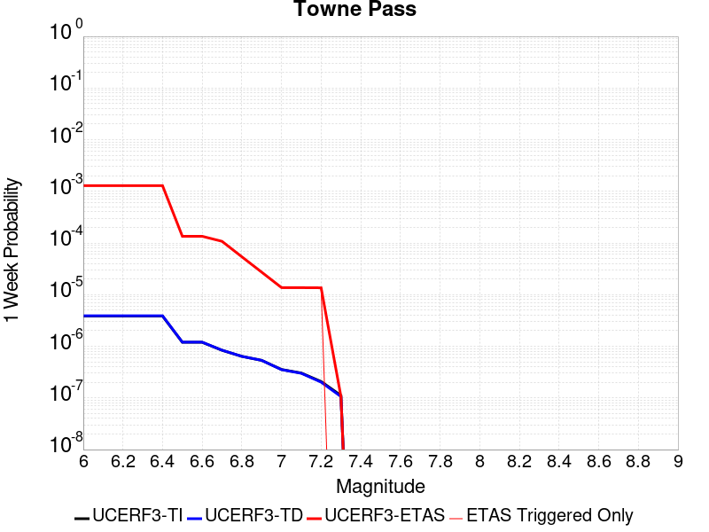 | 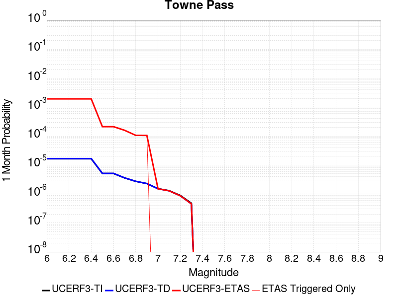 | 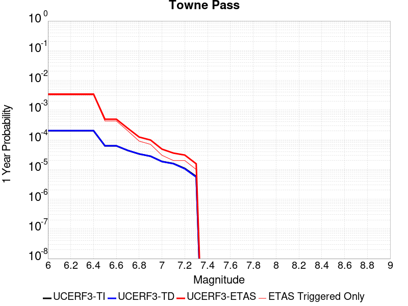 |  |

| Magnitude | 1 wk TI Prob | 1 wk TD Prob | 1 wk ETAS Prob | 1 wk ETAS/TD Gain | 1 wk ETAS Triggered Only | 1 mo TI Prob | 1 mo TD Prob | 1 mo ETAS Prob | 1 mo ETAS/TD Gain | 1 mo ETAS Triggered Only | 1 yr TI Prob | 1 yr TD Prob | 1 yr ETAS Prob | 1 yr ETAS/TD Gain | 1 yr ETAS Triggered Only | 10 yr TI Prob | 10 yr TD Prob | 10 yr ETAS Prob | 10 yr ETAS/TD Gain | 10 yr ETAS Triggered Only |
|-----|-----|-----|-----|-----|-----|-----|-----|-----|-----|-----|-----|-----|-----|-----|-----|-----|-----|-----|-----|-----|
| 6.0 | 3.849728E-6 | 3.8945414E-6 | 0.001224891 | 314.51483 | 0.0012210013 | 1.649873E-5 | 1.669081E-5 | 0.0018325085 | 109.791466 | 0.0018158479 | 2.0085352E-4 | 2.0319603E-4 | 0.0034794053 | 17.123392 | 0.003276875 | 0.0020067208 | 0.0020305314 | 0.0065713483 | 3.2362702 | 0.0045500556 |
| 6.1 | 3.849728E-6 | 3.8945414E-6 | 0.001224891 | 314.51483 | 0.0012210013 | 1.649873E-5 | 1.669081E-5 | 0.0018325085 | 109.791466 | 0.0018158479 | 2.0085352E-4 | 2.0319603E-4 | 0.0034794053 | 17.123392 | 0.003276875 | 0.0020067208 | 0.0020305314 | 0.0065713483 | 3.2362702 | 0.0045500556 |
| 6.2 | 3.849728E-6 | 3.8945414E-6 | 0.001224891 | 314.51483 | 0.0012210013 | 1.649873E-5 | 1.669081E-5 | 0.0018325085 | 109.791466 | 0.0018158479 | 2.0085352E-4 | 2.0319603E-4 | 0.0034794053 | 17.123392 | 0.003276875 | 0.0020067208 | 0.0020305314 | 0.0065713483 | 3.2362702 | 0.0045500556 |
| 6.3 | 3.849728E-6 | 3.8945414E-6 | 0.001224891 | 314.51483 | 0.0012210013 | 1.649873E-5 | 1.669081E-5 | 0.0018325085 | 109.791466 | 0.0018158479 | 2.0085352E-4 | 2.0319603E-4 | 0.0034794053 | 17.123392 | 0.003276875 | 0.0020067208 | 0.0020305314 | 0.0065713483 | 3.2362702 | 0.0045500556 |
| 6.4 | 3.849728E-6 | 3.8945414E-6 | 0.001224891 | 314.51483 | 0.0012210013 | 1.649873E-5 | 1.669081E-5 | 0.0018325085 | 109.791466 | 0.0018158479 | 2.0085352E-4 | 2.0319603E-4 | 0.0034794053 | 17.123392 | 0.003276875 | 0.0020067208 | 0.0020305314 | 0.0065713483 | 3.2362702 | 0.0045500556 |
| 6.5 | 1.1953545E-6 | 1.203052E-6 | 1.2643379E-4 | 105.09421 | 1.252309E-4 | 5.1229376E-6 | 5.1559277E-6 | 2.4518056E-4 | 47.553143 | 2.4002588E-4 | 6.236998E-5 | 6.277173E-5 | 5.114876E-4 | 8.148375 | 4.4874405E-4 | 6.235248E-4 | 6.275517E-4 | 0.0012324546 | 1.9639091 | 6.0528266E-4 |
| 6.6 | 1.1953545E-6 | 1.203052E-6 | 1.2643379E-4 | 105.09421 | 1.252309E-4 | 5.1229376E-6 | 5.1559277E-6 | 2.4518056E-4 | 47.553143 | 2.4002588E-4 | 6.236998E-5 | 6.277173E-5 | 5.114876E-4 | 8.148375 | 4.4874405E-4 | 6.235248E-4 | 6.275517E-4 | 0.0012324546 | 1.9639091 | 6.0528266E-4 |
| 6.7 | 8.375951E-7 | 8.4106705E-7 | 8.432826E-5 | 100.26342 | 8.348726E-5 | 3.5896885E-6 | 3.6045683E-6 | 1.4970676E-4 | 41.532505 | 1.4610271E-4 | 4.370358E-5 | 4.3884793E-5 | 2.525938E-4 | 5.7558384 | 2.0871816E-4 | 4.3694986E-4 | 4.38767E-4 | 7.6213817E-4 | 1.7369999 | 3.2351314E-4 |
| 6.8 | 6.38041E-7 | 6.392156E-7 | 4.238282E-5 | 66.30442 | 4.174363E-5 | 2.7344586E-6 | 2.7394929E-6 | 7.5790645E-5 | 27.66594 | 7.305136E-5 | 3.3291526E-5 | 3.3352855E-5 | 1.272729E-4 | 3.815952 | 9.392317E-5 | 3.3286537E-4 | 3.334823E-4 | 5.21266E-4 | 1.5630994 | 1.8784634E-4 |
| 6.9 | 5.3460053E-7 | 5.345333E-7 | 2.1406338E-5 | 40.04678 | 2.0871816E-5 | 2.2911431E-6 | 2.2908553E-6 | 5.4470274E-5 | 23.777267 | 5.217954E-5 | 2.789431E-5 | 2.789084E-5 | 1.0094015E-4 | 3.619115 | 7.305136E-5 | 2.789081E-4 | 2.7887672E-4 | 4.3537168E-4 | 1.5611619 | 1.5653862E-4 |
| 7.0 | 3.557783E-7 | 3.5324226E-7 | 1.07891465E-5 | 30.543192 | 1.0435908E-5 | 1.5247632E-6 | 1.5138945E-6 | 2.2385679E-5 | 14.786815 | 2.0871816E-5 | 1.8563835E-5 | 1.843152E-5 | 4.9738665E-5 | 2.6985657 | 3.1307725E-5 | 1.8562283E-4 | 1.8430075E-4 | 2.6777262E-4 | 1.4529113 | 8.348726E-5 |
| 7.1 | 3.037942E-7 | 3.0002218E-7 | 1.07359265E-5 | 35.78378 | 1.0435908E-5 | 1.3019744E-6 | 1.2858087E-6 | 1.1721703E-5 | 9.11621 | 1.0435908E-5 | 1.5851423E-5 | 1.5654618E-5 | 3.6526104E-5 | 2.3332481 | 2.0871816E-5 | 1.5850292E-4 | 1.5653588E-4 | 2.295758E-4 | 1.4666017 | 7.305136E-5 |
| 7.2 | 2.0808248E-7 | 2.0217689E-7 | 1.0638083E-5 | 52.6177 | 1.0435908E-5 | 8.917818E-7 | 8.6647213E-7 | 1.1302371E-5 | 13.044126 | 1.0435908E-5 | 1.0857389E-5 | 1.0549252E-5 | 3.142085E-5 | 2.9784906 | 2.0871816E-5 | 1.0856859E-4 | 1.0548797E-4 | 1.7853163E-4 | 1.6924359 | 7.305136E-5 |
| 7.3 | 1.1162073E-7 | 1.0636894E-7 | 1.0636894E-7 | 1.0 | 0.0 | 4.7837443E-7 | 4.558668E-7 | 4.558668E-7 | 1.0 | 0.0 | 5.8241935E-6 | 5.550166E-6 | 1.5986016E-5 | 2.8802772 | 1.0435908E-5 | 5.8240406E-5 | 5.5500474E-5 | 9.724179E-5 | 1.7520893 | 4.174363E-5 |

## Lenwood-Lockhart-Old Woman Springs
*[(top)](#table-of-contents)*

| 1 Week | 1 Month | 1 Year | 10 Year |
|-----|-----|-----|-----|
| 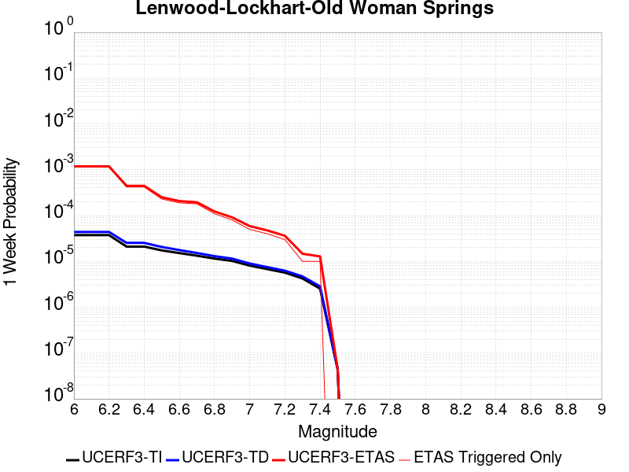 | 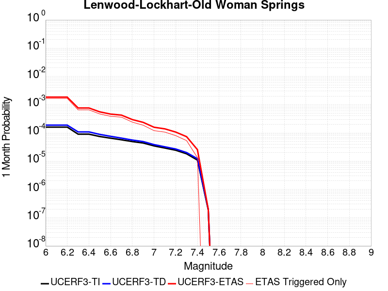 | 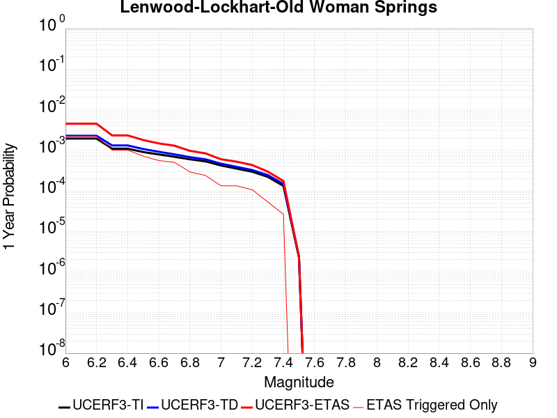 | 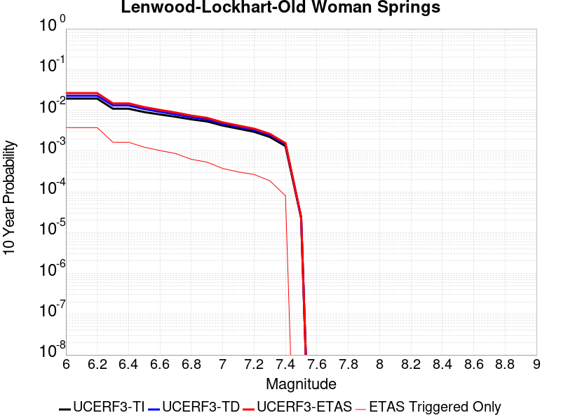 |

| Magnitude | 1 wk TI Prob | 1 wk TD Prob | 1 wk ETAS Prob | 1 wk ETAS/TD Gain | 1 wk ETAS Triggered Only | 1 mo TI Prob | 1 mo TD Prob | 1 mo ETAS Prob | 1 mo ETAS/TD Gain | 1 mo ETAS Triggered Only | 1 yr TI Prob | 1 yr TD Prob | 1 yr ETAS Prob | 1 yr ETAS/TD Gain | 1 yr ETAS Triggered Only | 10 yr TI Prob | 10 yr TD Prob | 10 yr ETAS Prob | 10 yr ETAS/TD Gain | 10 yr ETAS Triggered Only |
|-----|-----|-----|-----|-----|-----|-----|-----|-----|-----|-----|-----|-----|-----|-----|-----|-----|-----|-----|-----|-----|
| 6.0 | 3.744542E-5 | 4.396252E-5 | 0.0011918619 | 27.110865 | 0.0011479498 | 1.604705E-4 | 1.8839816E-4 | 0.0017952252 | 9.528889 | 0.0016071298 | 0.0019519776 | 0.0022915069 | 0.0049569774 | 2.1631956 | 0.0026715924 | 0.019349206 | 0.022696787 | 0.026348047 | 1.1608711 | 0.003736055 |
| 6.1 | 3.744542E-5 | 4.396252E-5 | 0.0011918619 | 27.110865 | 0.0011479498 | 1.604705E-4 | 1.8839816E-4 | 0.0017952252 | 9.528889 | 0.0016071298 | 0.0019519776 | 0.0022915069 | 0.0049569774 | 2.1631956 | 0.0026715924 | 0.019349206 | 0.022696787 | 0.026348047 | 1.1608711 | 0.003736055 |
| 6.2 | 3.744542E-5 | 4.396252E-5 | 0.0011918619 | 27.110865 | 0.0011479498 | 1.604705E-4 | 1.8839816E-4 | 0.0017952252 | 9.528889 | 0.0016071298 | 0.0019519776 | 0.0022915069 | 0.0049569774 | 2.1631956 | 0.0026715924 | 0.019349206 | 0.022696787 | 0.026348047 | 1.1608711 | 0.003736055 |
| 6.3 | 2.1079984E-5 | 2.5353434E-5 | 4.532148E-4 | 17.875875 | 4.2787223E-4 | 9.0339665E-5 | 1.0865316E-4 | 7.5560913E-4 | 6.954323 | 6.470263E-4 | 0.0010993304 | 0.0013220694 | 0.0024163912 | 1.8277339 | 0.0010957703 | 0.010939079 | 0.0131442575 | 0.014750861 | 1.1222285 | 0.0016280017 |
| 6.4 | 2.1079984E-5 | 2.5353434E-5 | 4.532148E-4 | 17.875875 | 4.2787223E-4 | 9.0339665E-5 | 1.0865316E-4 | 7.5560913E-4 | 6.954323 | 6.470263E-4 | 0.0010993304 | 0.0013220694 | 0.0024163912 | 1.8277339 | 0.0010957703 | 0.010939079 | 0.0131442575 | 0.014750861 | 1.1222285 | 0.0016280017 |
| 6.5 | 1.7397282E-5 | 2.066241E-5 | 2.6068333E-4 | 12.616308 | 2.4002588E-4 | 7.455765E-5 | 8.8550245E-5 | 5.163846E-4 | 5.831543 | 4.2787223E-4 | 9.073613E-4 | 0.0010775778 | 0.0018281535 | 1.6965396 | 7.5138535E-4 | 0.009036654 | 0.010724821 | 0.011891431 | 1.1087767 | 0.0011792576 |
| 6.6 | 1.52050325E-5 | 1.7679693E-5 | 2.1595844E-4 | 12.215055 | 1.9828224E-4 | 6.51628E-5 | 7.576796E-5 | 4.3056195E-4 | 5.6826386 | 3.5482086E-4 | 7.9306826E-4 | 9.220924E-4 | 0.0015372433 | 1.6671249 | 6.1571854E-4 | 0.007902439 | 0.009183526 | 0.010155492 | 1.1058381 | 9.809753E-4 |
| 6.7 | 1.332523E-5 | 1.5264002E-5 | 2.0310748E-4 | 13.306305 | 1.8784634E-4 | 5.7106878E-5 | 6.5415545E-5 | 3.9934277E-4 | 6.1047072 | 3.3394905E-4 | 6.950544E-4 | 7.961491E-4 | 0.0013383842 | 1.6810724 | 5.426672E-4 | 0.006928845 | 0.007933599 | 0.008782554 | 1.1070076 | 8.5574447E-4 |
| 6.8 | 1.1525329E-5 | 1.3030979E-5 | 1.2782447E-4 | 9.809276 | 1.1479499E-4 | 4.9393333E-5 | 5.584588E-5 | 2.8542304E-4 | 5.1109056 | 2.2958998E-4 | 6.011979E-4 | 6.797157E-4 | 0.0010655819 | 1.5676875 | 3.8612858E-4 | 0.00599574 | 0.006776819 | 0.0074090953 | 1.0932999 | 6.3659035E-4 |
| 6.9 | 1.0253909E-5 | 1.15144385E-5 | 9.500074E-5 | 8.250575 | 8.348726E-5 | 4.3944583E-5 | 4.9346683E-5 | 2.3718375E-4 | 4.8064785 | 1.8784634E-4 | 5.3489394E-4 | 6.0063385E-4 | 9.13523E-4 | 1.5209316 | 3.1307724E-4 | 0.0053360825 | 0.0059904843 | 0.0065299007 | 1.0900456 | 5.426672E-4 |
| 7.0 | 8.104563E-6 | 8.991279E-6 | 6.117035E-5 | 6.803298 | 5.217954E-5 | 3.4733377E-5 | 3.8533497E-5 | 1.6375957E-4 | 4.249798 | 1.252309E-4 | 4.2279682E-4 | 4.6904673E-4 | 6.67236E-4 | 1.4225363 | 1.9828224E-4 | 0.0042199334 | 0.0046808156 | 0.005075524 | 1.0843247 | 3.965645E-4 |
| 7.1 | 6.7986157E-6 | 7.515816E-6 | 4.9259135E-5 | 6.5540633 | 4.174363E-5 | 2.91366E-5 | 3.2210253E-5 | 1.4700154E-4 | 4.5638123 | 1.1479499E-4 | 3.5468035E-4 | 3.920914E-4 | 5.798641E-4 | 1.4789003 | 1.8784634E-4 | 0.003541148 | 0.003914213 | 0.0042364593 | 1.0823274 | 3.2351314E-4 |
| 7.2 | 5.6893327E-6 | 6.2800136E-6 | 3.7587542E-5 | 5.9852643 | 3.1307725E-5 | 2.4382627E-5 | 2.6914078E-5 | 1.20834724E-4 | 4.4896474 | 9.392317E-5 | 2.9681803E-4 | 3.2763163E-4 | 4.7368646E-4 | 1.4457898 | 1.4610271E-4 | 0.002964219 | 0.0032716845 | 0.0035421303 | 1.0826626 | 2.713336E-4 |
| 7.3 | 4.253348E-6 | 4.7069107E-6 | 1.5142769E-5 | 3.2171357 | 1.0435908E-5 | 1.8228506E-5 | 2.0172329E-5 | 7.235081E-5 | 3.5866368 | 5.217954E-5 | 2.2190946E-4 | 2.4557224E-4 | 3.499057E-4 | 1.4248585 | 1.0435908E-4 | 0.00221688 | 0.0024531898 | 0.0026405752 | 1.0763844 | 1.8784634E-4 |
| 7.4 | 2.5448119E-6 | 2.852045E-6 | 1.3287923E-5 | 4.659086 | 1.0435908E-5 | 1.0906291E-5 | 1.2223002E-5 | 3.3094562E-5 | 2.707564 | 2.0871816E-5 | 1.3277601E-4 | 1.4880655E-4 | 2.0097832E-4 | 1.3506013 | 5.217954E-5 | 0.001326967 | 0.0014872311 | 0.0015705943 | 1.0560526 | 8.348726E-5 |
| 7.5 | 4.3706837E-8 | 4.562909E-8 | 4.562909E-8 | 1.0 | 0.0 | 1.8731501E-7 | 1.9555324E-7 | 1.9555324E-7 | 1.0 | 0.0 | 2.2805577E-6 | 2.3808586E-6 | 2.3808586E-6 | 1.0 | 0.0 | 2.2805343E-5 | 2.3808387E-5 | 2.3808387E-5 | 1.0 | 0.0 |

## San Andreas (San Bernardino N)
*[(top)](#table-of-contents)*

| 1 Week | 1 Month | 1 Year | 10 Year |
|-----|-----|-----|-----|
| 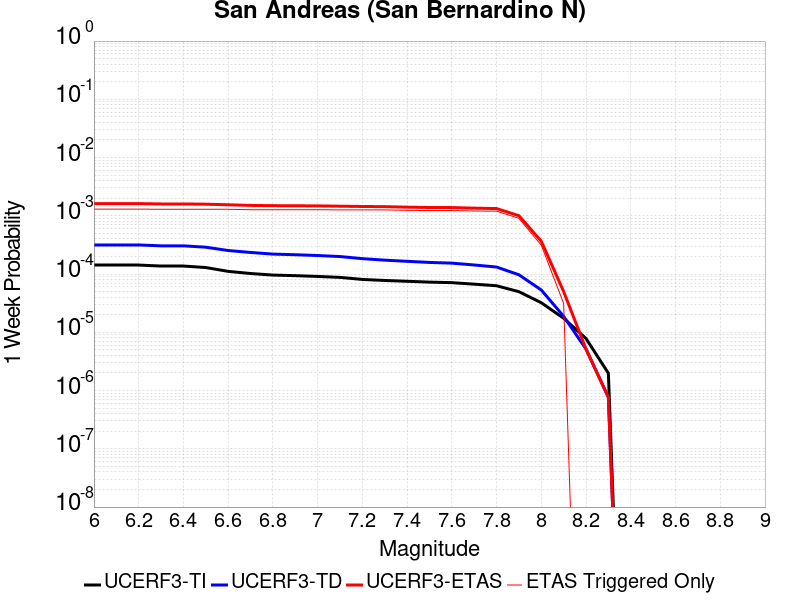 | 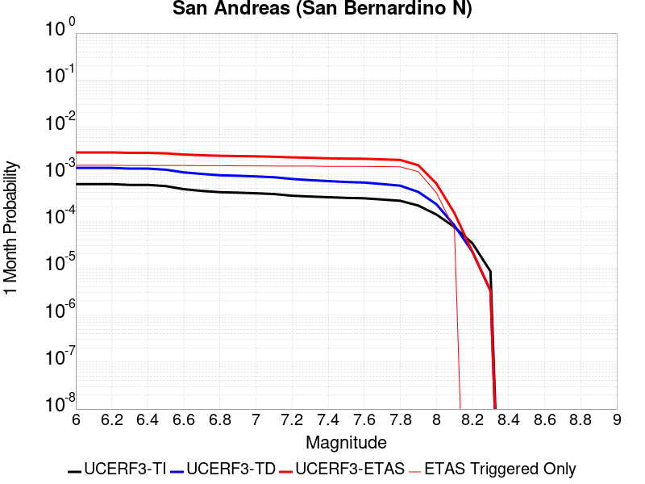 | 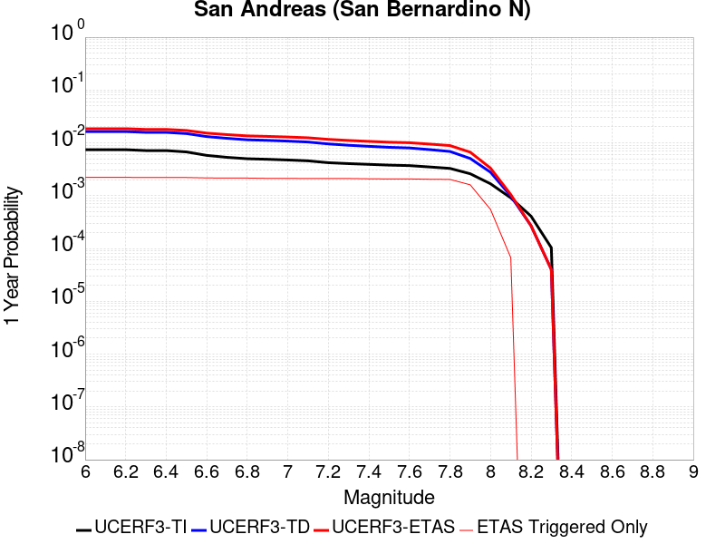 | 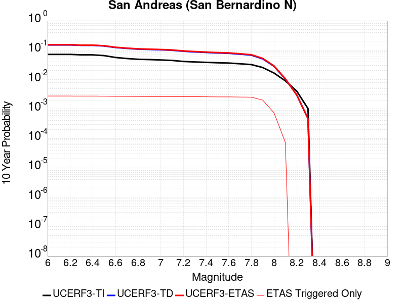 |

| Magnitude | 1 wk TI Prob | 1 wk TD Prob | 1 wk ETAS Prob | 1 wk ETAS/TD Gain | 1 wk ETAS Triggered Only | 1 mo TI Prob | 1 mo TD Prob | 1 mo ETAS Prob | 1 mo ETAS/TD Gain | 1 mo ETAS Triggered Only | 1 yr TI Prob | 1 yr TD Prob | 1 yr ETAS Prob | 1 yr ETAS/TD Gain | 1 yr ETAS Triggered Only | 10 yr TI Prob | 10 yr TD Prob | 10 yr ETAS Prob | 10 yr ETAS/TD Gain | 10 yr ETAS Triggered Only |
|-----|-----|-----|-----|-----|-----|-----|-----|-----|-----|-----|-----|-----|-----|-----|-----|-----|-----|-----|-----|-----|
| 6.0 | 1.4273766E-4 | 3.1606483E-4 | 0.001620141 | 5.1259766 | 0.0013044885 | 6.115894E-4 | 0.0013538664 | 0.0028858678 | 2.131575 | 0.0015340785 | 0.0074207084 | 0.016360244 | 0.018505665 | 1.1311363 | 0.0021811049 | 0.07177748 | 0.15026689 | 0.15260796 | 1.0155795 | 0.0027550797 |
| 6.1 | 1.4273766E-4 | 3.1606483E-4 | 0.001620141 | 5.1259766 | 0.0013044885 | 6.115894E-4 | 0.0013538664 | 0.0028858678 | 2.131575 | 0.0015340785 | 0.0074207084 | 0.016360244 | 0.018505665 | 1.1311363 | 0.0021811049 | 0.07177748 | 0.15026689 | 0.15260796 | 1.0155795 | 0.0027550797 |
| 6.2 | 1.4273766E-4 | 3.1606483E-4 | 0.001620141 | 5.1259766 | 0.0013044885 | 6.115894E-4 | 0.0013538664 | 0.0028858678 | 2.131575 | 0.0015340785 | 0.0074207084 | 0.016360244 | 0.018505665 | 1.1311363 | 0.0021811049 | 0.07177748 | 0.15026689 | 0.15260796 | 1.0155795 | 0.0027550797 |
| 6.3 | 1.3730655E-4 | 3.0511338E-4 | 0.0015987711 | 5.2399244 | 0.0012940526 | 5.883239E-4 | 0.0013069791 | 0.0028286304 | 2.1642506 | 0.0015236426 | 0.0071393442 | 0.015797773 | 0.01793415 | 1.1352328 | 0.002170669 | 0.06914291 | 0.14556676 | 0.14791188 | 1.0161102 | 0.0027446437 |
| 6.4 | 1.3730655E-4 | 3.0511338E-4 | 0.0015987711 | 5.2399244 | 0.0012940526 | 5.883239E-4 | 0.0013069791 | 0.0028286304 | 2.1642506 | 0.0015236426 | 0.0071393442 | 0.015797773 | 0.01793415 | 1.1352328 | 0.002170669 | 0.06914291 | 0.14556676 | 0.14791188 | 1.0161102 | 0.0027446437 |
| 6.5 | 1.2942807E-4 | 2.8925808E-4 | 0.0015829364 | 5.4724016 | 0.0012940526 | 5.545738E-4 | 0.0012390936 | 0.0027608483 | 2.2281191 | 0.0015236426 | 0.0067310524 | 0.01498286 | 0.017121006 | 1.1427062 | 0.002170669 | 0.06530788 | 0.13870941 | 0.14106436 | 1.0169775 | 0.0027342078 |
| 6.6 | 1.1125901E-4 | 2.536472E-4 | 0.0015473715 | 6.1004877 | 0.0012940526 | 4.767372E-4 | 0.0010866089 | 0.0026085959 | 2.400676 | 0.0015236426 | 0.005788839 | 0.013149847 | 0.015261076 | 1.1605515 | 0.002139361 | 0.056403454 | 0.122999296 | 0.1253606 | 1.0191976 | 0.0026924643 |
| 6.7 | 1.02209575E-4 | 2.3499702E-4 | 0.0015078785 | 6.4165864 | 0.0012731807 | 4.3796748E-4 | 0.0010067427 | 0.0025080005 | 2.491203 | 0.0015027707 | 0.0053192247 | 0.012188629 | 0.014281297 | 1.1716901 | 0.0021184892 | 0.051936906 | 0.114790924 | 0.11715584 | 1.020602 | 0.0026715924 |
| 6.8 | 9.610582E-5 | 2.2025521E-4 | 0.0014931555 | 6.7792068 | 0.0012731807 | 4.1181705E-4 | 9.436101E-4 | 0.0024449627 | 2.5910733 | 0.0015027707 | 0.0050023515 | 0.011428202 | 0.013522481 | 1.1832553 | 0.0021184892 | 0.048912346 | 0.1081929 | 0.11055683 | 1.0218493 | 0.0026507205 |
| 6.9 | 9.3877505E-5 | 2.1481077E-4 | 0.0014877181 | 6.925714 | 0.0012731807 | 4.0227012E-4 | 9.2029345E-4 | 0.002411255 | 2.6200936 | 0.0014923349 | 0.0048866454 | 0.011147255 | 0.01322149 | 1.1860758 | 0.0020976174 | 0.04780577 | 0.10578323 | 0.10813488 | 1.0222309 | 0.002629849 |
| 7.0 | 9.1019785E-5 | 2.0808022E-4 | 0.001480996 | 7.1174283 | 0.0012731807 | 3.900265E-4 | 8.914682E-4 | 0.0023824726 | 2.6725268 | 0.0014923349 | 0.0047382377 | 0.010799837 | 0.012874801 | 1.1921291 | 0.0020976174 | 0.046384744 | 0.102753714 | 0.105113335 | 1.0229639 | 0.002629849 |
| 7.1 | 8.771155E-5 | 1.9982594E-4 | 0.0014623185 | 7.3179607 | 0.0012627449 | 3.758525E-4 | 8.5611636E-4 | 0.0023367465 | 2.729473 | 0.001481899 | 0.0045664064 | 0.0103736 | 0.01243913 | 1.1991141 | 0.0020871817 | 0.044737056 | 0.09906527 | 0.101425186 | 1.0238218 | 0.002619413 |
| 7.2 | 8.0830236E-5 | 1.8388197E-4 | 0.0014463946 | 7.8658857 | 0.0012627449 | 3.4636928E-4 | 7.8782777E-4 | 0.0022685593 | 2.8795116 | 0.001481899 | 0.0042088944 | 0.009549725 | 0.011616974 | 1.2164721 | 0.0020871817 | 0.041300658 | 0.09179615 | 0.09417511 | 1.0259157 | 0.002619413 |
| 7.3 | 7.7668235E-5 | 1.7331762E-4 | 0.0014358436 | 8.284464 | 0.0012627449 | 3.328214E-4 | 7.425784E-4 | 0.0022233769 | 2.9941308 | 0.001481899 | 0.0040445733 | 0.009003494 | 0.011071883 | 1.2297319 | 0.0020871817 | 0.03971748 | 0.08706327 | 0.08945462 | 1.0274669 | 0.002619413 |
| 7.4 | 7.520177E-5 | 1.6551897E-4 | 0.0014071865 | 8.501662 | 0.001241873 | 3.2225347E-4 | 7.0917426E-4 | 0.0021691653 | 3.0587196 | 0.0014610271 | 0.0039163795 | 0.008600081 | 0.010648621 | 1.2382 | 0.0020663098 | 0.038480744 | 0.08351955 | 0.08590106 | 1.0285144 | 0.002598541 |
| 7.5 | 7.274697E-5 | 1.5839566E-4 | 0.0013896377 | 8.773206 | 0.0012314371 | 3.1173544E-4 | 6.78662E-4 | 0.0021282688 | 3.1359775 | 0.0014505911 | 0.003788775 | 0.008231463 | 0.010260064 | 1.2464448 | 0.002045438 | 0.03724827 | 0.08023631 | 0.08260716 | 1.0295483 | 0.0025776692 |
| 7.6 | 7.1185845E-5 | 1.540943E-4 | 0.0013853416 | 8.99022 | 0.0012314371 | 3.0504653E-4 | 6.6023704E-4 | 0.0021098705 | 3.1956258 | 0.0014505911 | 0.0037076178 | 0.008008812 | 0.010037867 | 1.253353 | 0.002045438 | 0.036463667 | 0.07822598 | 0.080602005 | 1.0303739 | 0.0025776692 |
| 7.7 | 6.709961E-5 | 1.4318313E-4 | 0.0013535751 | 9.453454 | 0.0012105653 | 2.8753807E-4 | 6.1349774E-4 | 0.0020423399 | 3.3290098 | 0.0014297194 | 0.003495157 | 0.0074437927 | 0.00944293 | 1.2685643 | 0.0020141301 | 0.034406938 | 0.07305469 | 0.07541503 | 1.0323092 | 0.0025463614 |
| 7.8 | 6.300812E-5 | 1.3202413E-4 | 0.0013319951 | 10.089027 | 0.0012001294 | 2.7000686E-4 | 5.65695E-4 | 0.0019737456 | 3.489063 | 0.0014088475 | 0.0032823787 | 0.006865616 | 0.00884519 | 1.2883315 | 0.0019932585 | 0.032343175 | 0.06771354 | 0.07006802 | 1.0347712 | 0.0025254898 |
| 7.9 | 4.983037E-5 | 9.723488E-5 | 0.0010050706 | 10.336523 | 9.0792397E-4 | 2.1354125E-4 | 4.1665437E-4 | 0.0015015366 | 3.603794 | 0.0010853345 | 0.0025967648 | 0.0050609782 | 0.0066080587 | 1.305688 | 0.0015549503 | 0.025666296 | 0.05064886 | 0.05255107 | 1.0375568 | 0.0020036944 |
| 8.0 | 3.2211527E-5 | 5.3304586E-5 | 3.6636513E-4 | 6.8730507 | 3.1307724E-4 | 1.380421E-4 | 2.2842824E-4 | 6.1446865E-4 | 2.6899855 | 3.8612858E-4 | 0.0016793669 | 0.0027775685 | 0.0033187286 | 1.1948322 | 5.426672E-4 | 0.016667323 | 0.028361378 | 0.029081313 | 1.0253843 | 7.409495E-4 |
| 8.1 | 1.743376E-5 | 1.8824427E-5 | 5.013156E-5 | 2.6631122 | 3.1307725E-5 | 7.471398E-5 | 8.067362E-5 | 1.3284895E-4 | 1.6467458 | 5.217954E-5 | 9.0926304E-4 | 9.817594E-4 | 0.0010338877 | 1.0530968 | 5.217954E-5 | 0.009055517 | 0.010484105 | 0.0105563905 | 1.0068948 | 7.305136E-5 |
| 8.2 | 7.831616E-6 | 5.1551065E-6 | 5.1551065E-6 | 1.0 | 0.0 | 3.3563636E-5 | 2.2093127E-5 | 2.2093127E-5 | 1.0 | 0.0 | 4.0856065E-4 | 2.6895068E-4 | 2.6895068E-4 | 1.0 | 0.0 | 0.004078103 | 0.0030418145 | 0.0030418145 | 1.0 | 0.0 |
| 8.3 | 1.983087E-6 | 7.6599065E-7 | 7.6599065E-7 | 1.0 | 0.0 | 8.498917E-6 | 3.282813E-6 | 3.282813E-6 | 1.0 | 0.0 | 1.034694E-4 | 3.9967534E-5 | 3.9967534E-5 | 1.0 | 0.0 | 0.0010342124 | 4.719687E-4 | 4.719687E-4 | 1.0 | 0.0 |

## Bicycle Lake
*[(top)](#table-of-contents)*

| 1 Week | 1 Month | 1 Year | 10 Year |
|-----|-----|-----|-----|
| 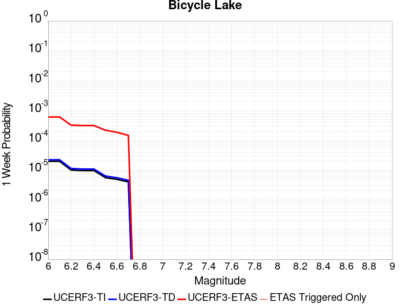 | 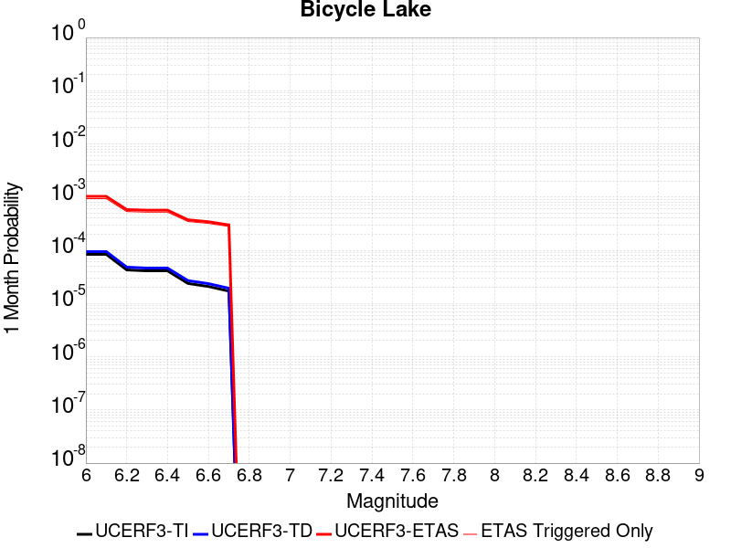 | 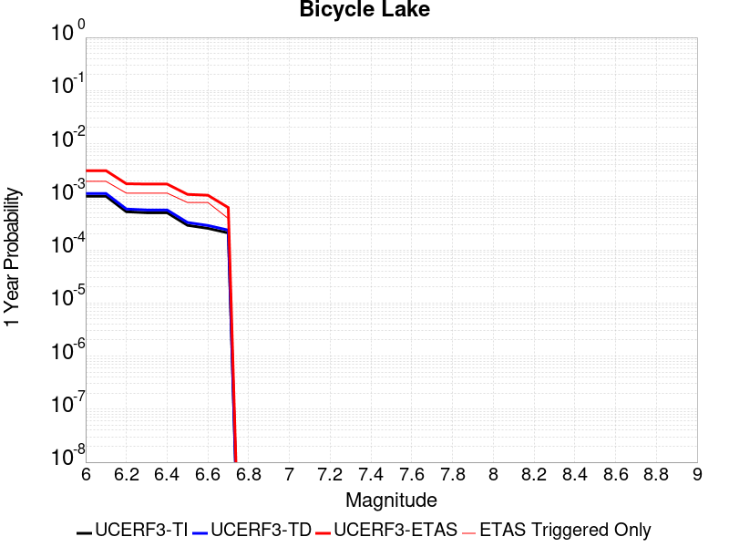 | 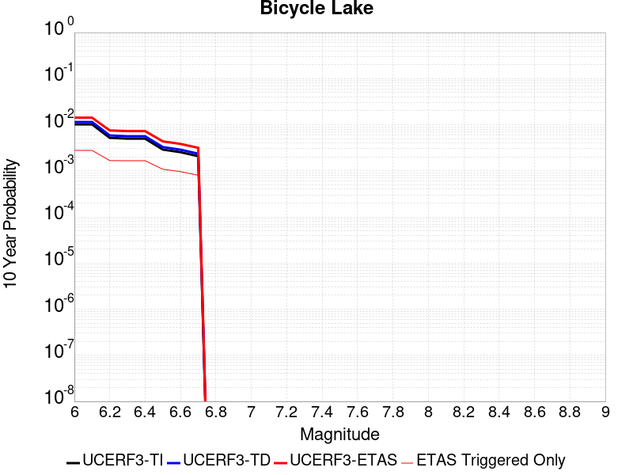 |

| Magnitude | 1 wk TI Prob | 1 wk TD Prob | 1 wk ETAS Prob | 1 wk ETAS/TD Gain | 1 wk ETAS Triggered Only | 1 mo TI Prob | 1 mo TD Prob | 1 mo ETAS Prob | 1 mo ETAS/TD Gain | 1 mo ETAS Triggered Only | 1 yr TI Prob | 1 yr TD Prob | 1 yr ETAS Prob | 1 yr ETAS/TD Gain | 1 yr ETAS Triggered Only | 10 yr TI Prob | 10 yr TD Prob | 10 yr ETAS Prob | 10 yr ETAS/TD Gain | 10 yr ETAS Triggered Only |
|-----|-----|-----|-----|-----|-----|-----|-----|-----|-----|-----|-----|-----|-----|-----|-----|-----|-----|-----|-----|-----|
| 6.0 | 1.9621975E-5 | 2.2097078E-5 | 6.06495E-4 | 27.446842 | 5.8441085E-4 | 8.4091465E-5 | 9.4699084E-5 | 0.0010338419 | 10.917126 | 9.392317E-4 | 0.0010233327 | 0.0011524865 | 0.0028724268 | 2.4923735 | 0.0017219248 | 0.01018633 | 0.011478408 | 0.014170915 | 1.2345715 | 0.0027237718 |
| 6.1 | 1.9621975E-5 | 2.2097078E-5 | 6.06495E-4 | 27.446842 | 5.8441085E-4 | 8.4091465E-5 | 9.4699084E-5 | 0.0010338419 | 10.917126 | 9.392317E-4 | 0.0010233327 | 0.0011524865 | 0.0028724268 | 2.4923735 | 0.0017219248 | 0.01018633 | 0.011478408 | 0.014170915 | 1.2345715 | 0.0027237718 |
| 6.2 | 9.9971285E-6 | 1.1255639E-5 | 3.3476515E-4 | 29.741993 | 3.2351314E-4 | 4.2844134E-5 | 4.8237856E-5 | 5.908789E-4 | 12.249277 | 5.426672E-4 | 5.2150246E-4 | 5.871896E-4 | 0.0016301677 | 2.77622 | 0.0010435908 | 0.0052028033 | 0.005861487 | 0.0075214445 | 1.2831974 | 0.0016697453 |
| 6.3 | 9.589428E-6 | 1.0798346E-5 | 3.238722E-4 | 29.99276 | 3.1307724E-4 | 4.10969E-5 | 4.62781E-5 | 5.784848E-4 | 12.500185 | 5.322313E-4 | 5.002399E-4 | 5.6334207E-4 | 0.0015854848 | 2.8144267 | 0.001022719 | 0.0049911533 | 0.0056242296 | 0.007253452 | 1.2896793 | 0.0016384375 |
| 6.4 | 9.589428E-6 | 1.0798346E-5 | 3.238722E-4 | 29.99276 | 3.1307724E-4 | 4.10969E-5 | 4.62781E-5 | 5.784848E-4 | 12.500185 | 5.322313E-4 | 5.002399E-4 | 5.6334207E-4 | 0.0015854848 | 2.8144267 | 0.001022719 | 0.0049911533 | 0.0056242296 | 0.007253452 | 1.2896793 | 0.0016384375 |
| 6.5 | 5.557707E-6 | 6.2856016E-6 | 2.2543829E-4 | 35.865826 | 2.1915407E-4 | 2.3818526E-5 | 2.6938165E-5 | 3.921851E-4 | 14.558716 | 3.6525677E-4 | 2.8995197E-4 | 3.2794967E-4 | 9.956288E-4 | 3.0359192 | 6.678981E-4 | 0.0028957394 | 0.0032772934 | 0.004348669 | 1.3269087 | 0.0010748985 |
| 6.6 | 4.8742945E-6 | 5.5132896E-6 | 1.933586E-4 | 35.071365 | 1.8784634E-4 | 2.0889667E-5 | 2.3628318E-5 | 3.575695E-4 | 15.133091 | 3.3394905E-4 | 2.54302E-4 | 2.87663E-4 | 8.823386E-4 | 3.067265 | 5.9484673E-4 | 0.002540112 | 0.0028754752 | 0.003832818 | 1.3329338 | 9.601035E-4 |
| 6.7 | 3.991108E-6 | 4.5159104E-6 | 1.5061795E-4 | 33.352734 | 1.4610271E-4 | 1.7104636E-5 | 1.9353902E-5 | 3.0111795E-4 | 15.558515 | 2.8176952E-4 | 2.0822904E-4 | 2.3563375E-4 | 7.364393E-4 | 3.1253557 | 5.009236E-4 | 0.0020803404 | 0.0023563374 | 0.003158009 | 1.3402193 | 8.035649E-4 |

## Paradise
*[(top)](#table-of-contents)*

| 1 Week | 1 Month | 1 Year | 10 Year |
|-----|-----|-----|-----|
| 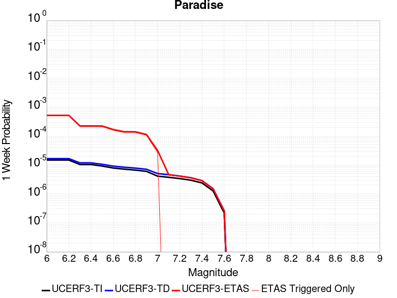 | 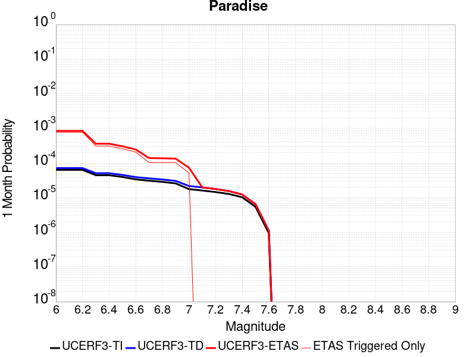 | 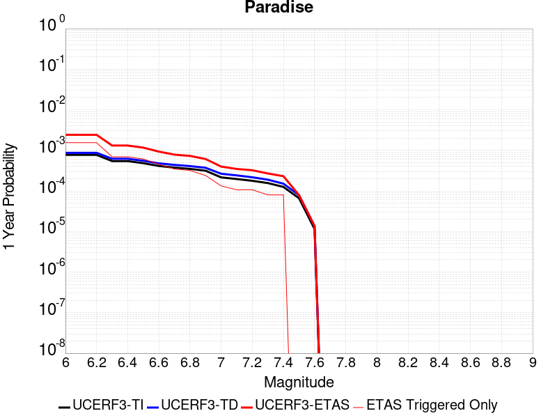 | 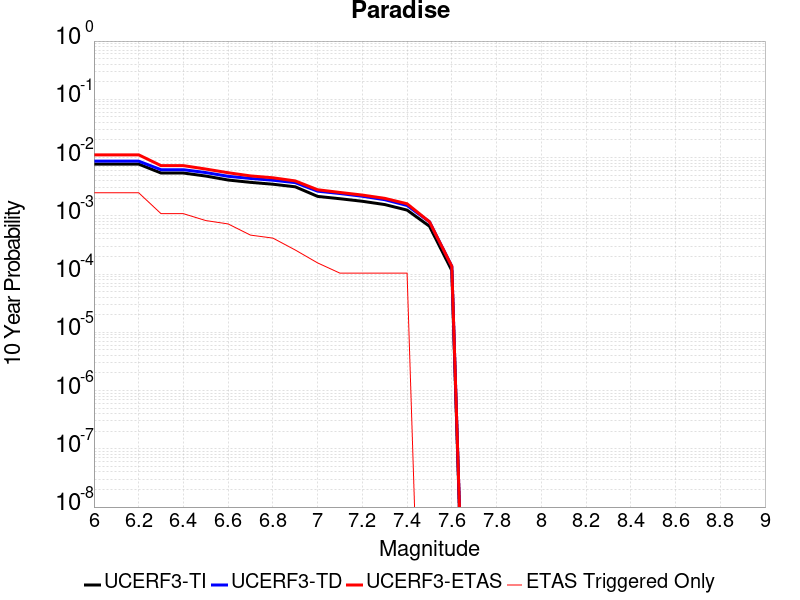 |

| Magnitude | 1 wk TI Prob | 1 wk TD Prob | 1 wk ETAS Prob | 1 wk ETAS/TD Gain | 1 wk ETAS Triggered Only | 1 mo TI Prob | 1 mo TD Prob | 1 mo ETAS Prob | 1 mo ETAS/TD Gain | 1 mo ETAS Triggered Only | 1 yr TI Prob | 1 yr TD Prob | 1 yr ETAS Prob | 1 yr ETAS/TD Gain | 1 yr ETAS Triggered Only | 10 yr TI Prob | 10 yr TD Prob | 10 yr ETAS Prob | 10 yr ETAS/TD Gain | 10 yr ETAS Triggered Only |
|-----|-----|-----|-----|-----|-----|-----|-----|-----|-----|-----|-----|-----|-----|-----|-----|-----|-----|-----|-----|-----|
| 6.0 | 1.4851273E-5 | 1.6694692E-5 | 4.863027E-4 | 29.129183 | 4.6961586E-4 | 6.364676E-5 | 7.154685E-5 | 8.333136E-4 | 11.647104 | 7.618213E-4 | 7.7462377E-4 | 8.707584E-4 | 0.0022992329 | 2.6404946 | 0.0014297194 | 0.0077192914 | 0.008675844 | 0.011107006 | 1.2802218 | 0.0024524385 |
| 6.1 | 1.4851273E-5 | 1.6694692E-5 | 4.863027E-4 | 29.129183 | 4.6961586E-4 | 6.364676E-5 | 7.154685E-5 | 8.333136E-4 | 11.647104 | 7.618213E-4 | 7.7462377E-4 | 8.707584E-4 | 0.0022992329 | 2.6404946 | 0.0014297194 | 0.0077192914 | 0.008675844 | 0.011107006 | 1.2802218 | 0.0024524385 |
| 6.2 | 1.4851273E-5 | 1.6694692E-5 | 4.863027E-4 | 29.129183 | 4.6961586E-4 | 6.364676E-5 | 7.154685E-5 | 8.333136E-4 | 11.647104 | 7.618213E-4 | 7.7462377E-4 | 8.707584E-4 | 0.0022992329 | 2.6404946 | 0.0014297194 | 0.0077192914 | 0.008675844 | 0.011107006 | 1.2802218 | 0.0024524385 |
| 6.3 | 1.0426831E-5 | 1.188862E-5 | 2.4147586E-4 | 20.311512 | 2.2958998E-4 | 4.4685654E-5 | 5.0950268E-5 | 4.6836532E-4 | 9.192597 | 4.1743633E-4 | 5.43912E-4 | 6.201489E-4 | 0.0013502095 | 2.1772342 | 7.3051354E-4 | 0.0054258266 | 0.0061847917 | 0.007346384 | 1.1878144 | 0.0011688217 |
| 6.4 | 1.0426831E-5 | 1.188862E-5 | 2.4147586E-4 | 20.311512 | 2.2958998E-4 | 4.4685654E-5 | 5.0950268E-5 | 4.6836532E-4 | 9.192597 | 4.1743633E-4 | 5.43912E-4 | 6.201489E-4 | 0.0013502095 | 2.1772342 | 7.3051354E-4 | 0.0054258266 | 0.0061847917 | 0.007346384 | 1.1878144 | 0.0011688217 |
| 6.5 | 9.25027E-6 | 1.06199595E-5 | 2.089001E-4 | 19.670517 | 1.9828224E-4 | 3.964341E-5 | 4.551335E-5 | 4.0031807E-4 | 8.795619 | 3.5482086E-4 | 4.8255164E-4 | 5.53989E-4 | 0.001127646 | 2.0355024 | 5.739749E-4 | 0.0048150513 | 0.0055265795 | 0.0064294855 | 1.1633753 | 9.0792397E-4 |
| 6.6 | 7.904275E-6 | 9.159525E-6 | 1.3438927E-4 | 14.672079 | 1.252309E-4 | 3.3875025E-5 | 3.9254537E-5 | 2.688355E-4 | 6.8485203 | 2.2958998E-4 | 4.1235037E-4 | 4.7782314E-4 | 8.4290537E-4 | 1.7640531 | 3.6525677E-4 | 0.0041158604 | 0.0047683544 | 0.00531882 | 1.1154414 | 5.531031E-4 |
| 6.7 | 7.2061953E-6 | 8.407248E-6 | 1.0232963E-4 | 12.171596 | 9.392317E-5 | 3.088333E-5 | 3.6030586E-5 | 1.716925E-4 | 4.7651873 | 1.356668E-4 | 3.7593965E-4 | 4.3858777E-4 | 6.889397E-4 | 1.5708138 | 2.504618E-4 | 0.003753043 | 0.004377591 | 0.0047620293 | 1.0878196 | 3.8612858E-4 |
| 6.8 | 6.6948724E-6 | 7.842166E-6 | 9.132877E-5 | 11.645861 | 8.348726E-5 | 2.8691995E-5 | 3.360887E-5 | 1.3796444E-4 | 4.105001 | 1.0435908E-4 | 3.4926904E-4 | 4.0911473E-4 | 5.9688423E-4 | 1.4589654 | 1.8784634E-4 | 0.003487206 | 0.0040839734 | 0.0043541985 | 1.0661674 | 2.713336E-4 |
| 6.9 | 6.0421025E-6 | 7.130621E-6 | 8.018145E-5 | 11.244667 | 7.305136E-5 | 2.5894467E-5 | 3.0559466E-5 | 1.2447976E-4 | 4.073362 | 9.392317E-5 | 3.1521954E-4 | 3.7200135E-4 | 5.180497E-4 | 1.3926017 | 1.4610271E-4 | 0.0031477278 | 0.0037141247 | 0.0039116703 | 1.0531877 | 1.9828224E-4 |
| 7.0 | 4.134091E-6 | 5.0803087E-6 | 2.5952018E-5 | 5.1083546 | 2.0871816E-5 | 1.7717413E-5 | 2.177258E-5 | 5.307962E-5 | 2.4379115 | 3.1307725E-5 | 2.1568815E-4 | 2.6505045E-4 | 3.3808243E-4 | 1.27554 | 7.305136E-5 | 0.0021547892 | 0.0026474963 | 0.0027411708 | 1.0353823 | 9.392317E-5 |
| 7.1 | 3.7674888E-6 | 4.6318696E-6 | 1.5067729E-5 | 3.2530556 | 1.0435908E-5 | 1.6146281E-5 | 1.9850726E-5 | 4.0722127E-5 | 2.0514176 | 2.0871816E-5 | 1.9656324E-4 | 2.4165731E-4 | 3.0425764E-4 | 1.2590458 | 6.261545E-5 | 0.0019638946 | 0.002414096 | 0.0024973815 | 1.0344998 | 8.348726E-5 |
| 7.2 | 3.4065345E-6 | 4.156723E-6 | 1.4592588E-5 | 3.510599 | 1.0435908E-5 | 1.4599351E-5 | 1.7814415E-5 | 3.868586E-5 | 2.1716042 | 2.0871816E-5 | 1.777326E-4 | 2.1687041E-4 | 2.6903863E-4 | 1.2405502 | 5.217954E-5 | 0.0017759053 | 0.002166736 | 0.002239629 | 1.0336419 | 7.305136E-5 |
| 7.3 | 2.9934936E-6 | 3.6293168E-6 | 1.4065186E-5 | 3.8754365 | 1.0435908E-5 | 1.2829195E-5 | 1.555413E-5 | 3.6425623E-5 | 2.3418617 | 2.0871816E-5 | 1.5618425E-4 | 1.8935655E-4 | 2.3109229E-4 | 1.2204082 | 4.174363E-5 | 0.0015607453 | 0.0018920974 | 0.0019545944 | 1.0330305 | 6.261545E-5 |
| 7.4 | 2.4049796E-6 | 2.8889842E-6 | 1.3324862E-5 | 4.6123 | 1.0435908E-5 | 1.0307015E-5 | 1.238131E-5 | 3.325287E-5 | 2.685731 | 2.0871816E-5 | 1.2548068E-4 | 1.5073347E-4 | 1.924708E-4 | 1.2768949 | 4.174363E-5 | 0.0012540985 | 0.0015064536 | 0.0015585546 | 1.0345851 | 5.217954E-5 |
| 7.5 | 1.2710091E-6 | 1.5134682E-6 | 1.5134682E-6 | 1.0 | 0.0 | 5.44717E-6 | 6.4862834E-6 | 6.4862834E-6 | 1.0 | 0.0 | 6.631728E-5 | 7.8968886E-5 | 7.8968886E-5 | 1.0 | 0.0 | 6.6297496E-4 | 7.8953087E-4 | 7.9995854E-4 | 1.0132074 | 1.0435908E-5 |
| 7.6 | 2.21172E-7 | 2.603961E-7 | 2.603961E-7 | 1.0 | 0.0 | 9.478797E-7 | 1.1159829E-6 | 1.1159829E-6 | 1.0 | 0.0 | 1.1540374E-5 | 1.3587036E-5 | 1.3587036E-5 | 1.0 | 0.0 | 1.1539775E-4 | 1.3586486E-4 | 1.4629935E-4 | 1.0768005 | 1.0435908E-5 |

## Garlic Springs
*[(top)](#table-of-contents)*

| 1 Week | 1 Month | 1 Year | 10 Year |
|-----|-----|-----|-----|
| 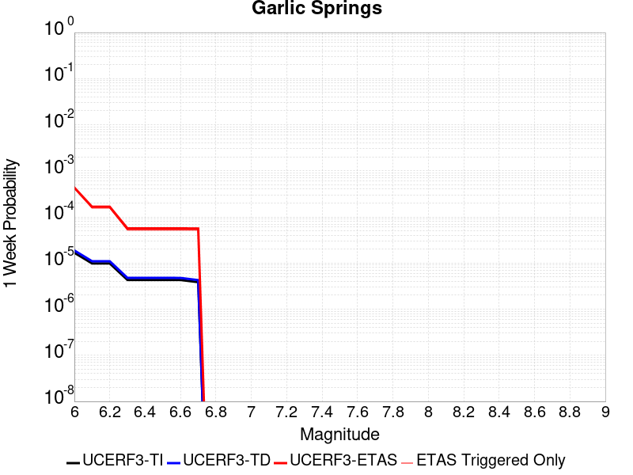 | 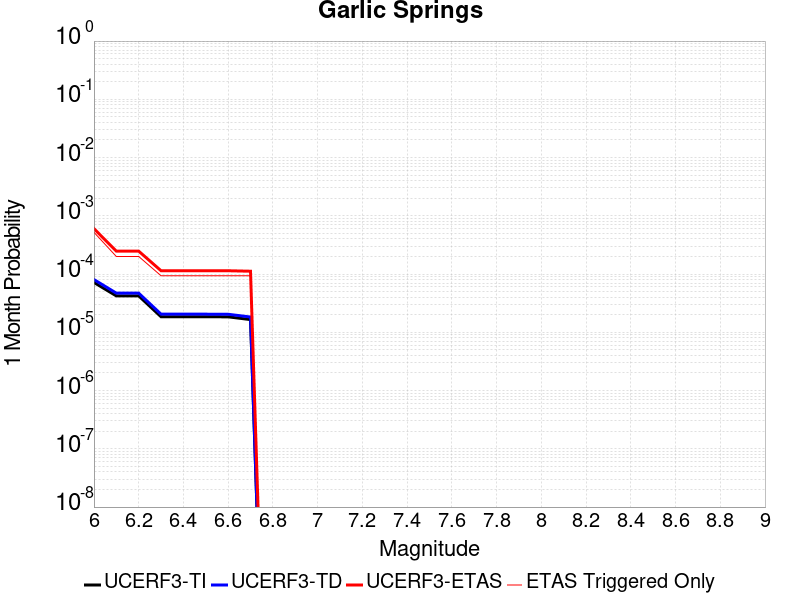 | 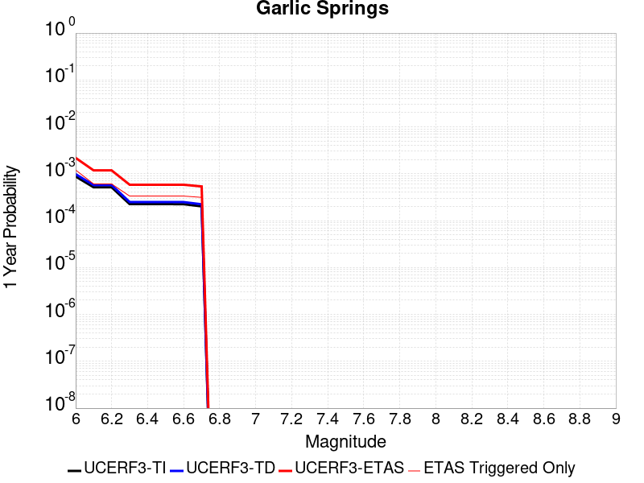 | 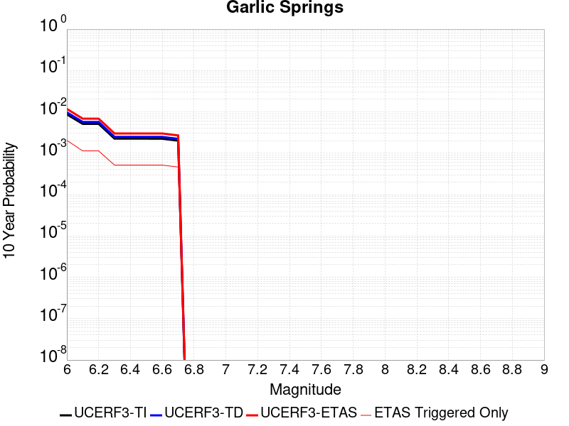 |

| Magnitude | 1 wk TI Prob | 1 wk TD Prob | 1 wk ETAS Prob | 1 wk ETAS/TD Gain | 1 wk ETAS Triggered Only | 1 mo TI Prob | 1 mo TD Prob | 1 mo ETAS Prob | 1 mo ETAS/TD Gain | 1 mo ETAS Triggered Only | 1 yr TI Prob | 1 yr TD Prob | 1 yr ETAS Prob | 1 yr ETAS/TD Gain | 1 yr ETAS Triggered Only | 10 yr TI Prob | 10 yr TD Prob | 10 yr ETAS Prob | 10 yr ETAS/TD Gain | 10 yr ETAS Triggered Only |
|-----|-----|-----|-----|-----|-----|-----|-----|-----|-----|-----|-----|-----|-----|-----|-----|-----|-----|-----|-----|-----|
| 6.0 | 1.6760017E-5 | 1.8776833E-5 | 3.318482E-4 | 17.673279 | 3.1307724E-4 | 7.182667E-5 | 8.0470316E-5 | 6.5439905E-4 | 8.132179 | 5.739749E-4 | 8.7413884E-4 | 9.794032E-4 | 0.0021783572 | 2.224168 | 0.0012001294 | 0.008707083 | 0.009762413 | 0.011849887 | 1.2138276 | 0.0021080533 |
| 6.1 | 9.852767E-6 | 1.09735865E-5 | 1.4663891E-4 | 13.362896 | 1.356668E-4 | 4.222546E-5 | 4.702921E-5 | 2.870438E-4 | 6.103522 | 2.4002588E-4 | 5.139737E-4 | 5.7250116E-4 | 0.0011774373 | 2.056655 | 6.0528266E-4 | 0.005127866 | 0.005717221 | 0.006858608 | 1.1996402 | 0.0011479498 |
| 6.2 | 9.852767E-6 | 1.09735865E-5 | 1.4663891E-4 | 13.362896 | 1.356668E-4 | 4.222546E-5 | 4.702921E-5 | 2.870438E-4 | 6.103522 | 2.4002588E-4 | 5.139737E-4 | 5.7250116E-4 | 0.0011774373 | 2.056655 | 6.0528266E-4 | 0.005127866 | 0.005717221 | 0.006858608 | 1.1996402 | 0.0011479498 |
| 6.3 | 4.3167724E-6 | 4.7780286E-6 | 5.695732E-5 | 11.920673 | 5.217954E-5 | 1.8500323E-5 | 2.0477235E-5 | 1.3526987E-4 | 6.605866 | 1.1479499E-4 | 2.2521814E-4 | 2.4930484E-4 | 5.831706E-4 | 2.339187 | 3.3394905E-4 | 0.0022499003 | 0.00249251 | 0.002992185 | 1.2004706 | 5.009236E-4 |
| 6.4 | 4.3167724E-6 | 4.7780286E-6 | 5.695732E-5 | 11.920673 | 5.217954E-5 | 1.8500323E-5 | 2.0477235E-5 | 1.3526987E-4 | 6.605866 | 1.1479499E-4 | 2.2521814E-4 | 2.4930484E-4 | 5.831706E-4 | 2.339187 | 3.3394905E-4 | 0.0022499003 | 0.00249251 | 0.002992185 | 1.2004706 | 5.009236E-4 |
| 6.5 | 4.3167724E-6 | 4.7780286E-6 | 5.695732E-5 | 11.920673 | 5.217954E-5 | 1.8500323E-5 | 2.0477235E-5 | 1.3526987E-4 | 6.605866 | 1.1479499E-4 | 2.2521814E-4 | 2.4930484E-4 | 5.831706E-4 | 2.339187 | 3.3394905E-4 | 0.0022499003 | 0.00249251 | 0.002992185 | 1.2004706 | 5.009236E-4 |
| 6.6 | 4.301311E-6 | 4.760897E-6 | 5.694019E-5 | 11.95997 | 5.217954E-5 | 1.8434059E-5 | 2.0403815E-5 | 1.3519646E-4 | 6.6260386 | 1.1479499E-4 | 2.2441156E-4 | 2.4841115E-4 | 5.8227725E-4 | 2.344006 | 3.3394905E-4 | 0.0022418506 | 0.002483593 | 0.0029832725 | 1.2011921 | 5.009236E-4 |
| 6.7 | 3.8599724E-6 | 4.27106E-6 | 5.6450375E-5 | 13.2169485 | 5.217954E-5 | 1.6542634E-5 | 1.8304541E-5 | 1.3309743E-4 | 7.271279 | 1.1479499E-4 | 2.0138794E-4 | 2.228578E-4 | 5.3586526E-4 | 2.4045165 | 3.1307724E-4 | 0.0020120554 | 0.002228578 | 0.0026867345 | 1.2055825 | 4.5917995E-4 |

## San Andreas (San Bernardino S)
*[(top)](#table-of-contents)*

| 1 Week | 1 Month | 1 Year | 10 Year |
|-----|-----|-----|-----|
| 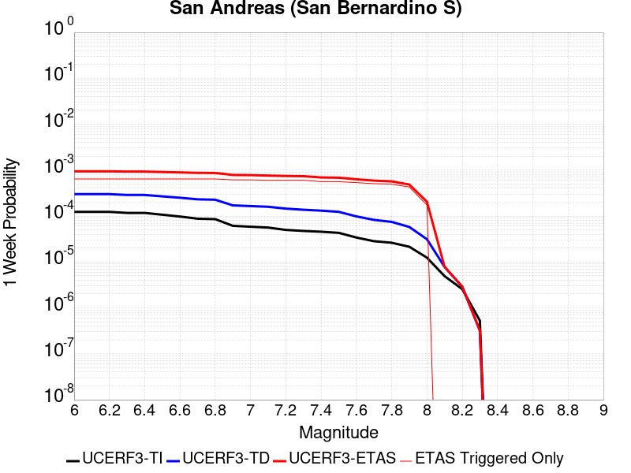 | 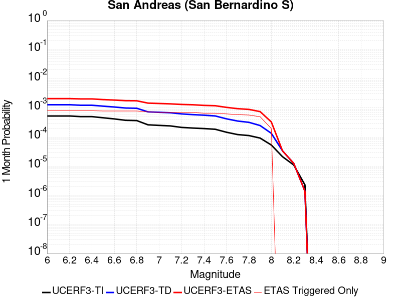 | 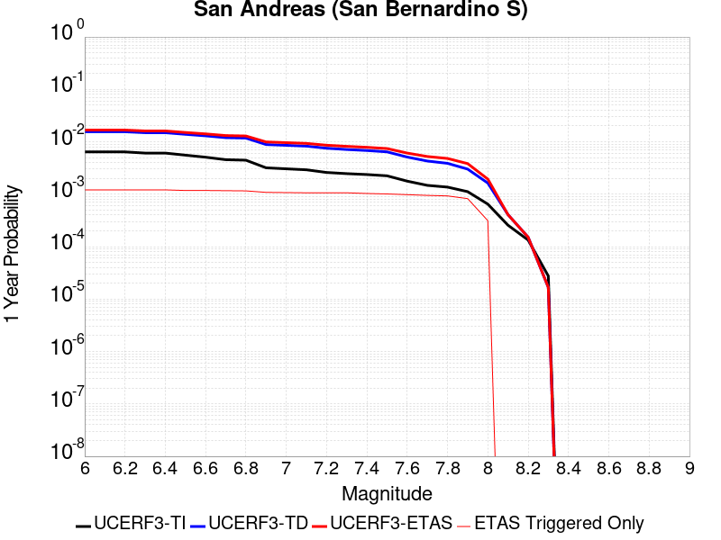 | 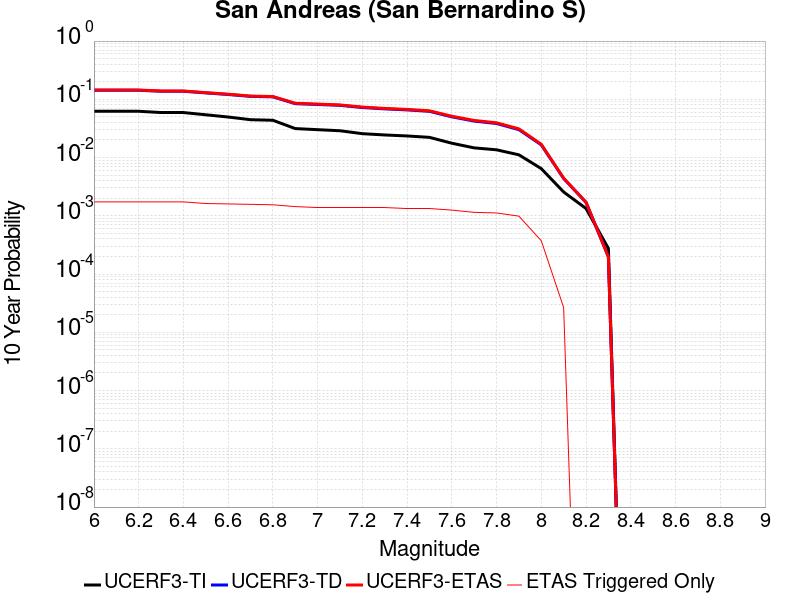 |

| Magnitude | 1 wk TI Prob | 1 wk TD Prob | 1 wk ETAS Prob | 1 wk ETAS/TD Gain | 1 wk ETAS Triggered Only | 1 mo TI Prob | 1 mo TD Prob | 1 mo ETAS Prob | 1 mo ETAS/TD Gain | 1 mo ETAS Triggered Only | 1 yr TI Prob | 1 yr TD Prob | 1 yr ETAS Prob | 1 yr ETAS/TD Gain | 1 yr ETAS Triggered Only | 10 yr TI Prob | 10 yr TD Prob | 10 yr ETAS Prob | 10 yr ETAS/TD Gain | 10 yr ETAS Triggered Only |
|-----|-----|-----|-----|-----|-----|-----|-----|-----|-----|-----|-----|-----|-----|-----|-----|-----|-----|-----|-----|-----|
| 6.0 | 1.2336002E-4 | 3.0004102E-4 | 9.5730595E-4 | 3.1905835 | 6.574622E-4 | 5.2857865E-4 | 0.0012852824 | 0.002077392 | 1.6162922 | 7.93129E-4 | 0.006416472 | 0.015540994 | 0.016732747 | 1.0766844 | 0.0012105653 | 0.06234337 | 0.14283717 | 0.14418791 | 1.0094565 | 0.0015758221 |
| 6.1 | 1.2336002E-4 | 3.0004102E-4 | 9.5730595E-4 | 3.1905835 | 6.574622E-4 | 5.2857865E-4 | 0.0012852824 | 0.002077392 | 1.6162922 | 7.93129E-4 | 0.006416472 | 0.015540994 | 0.016732747 | 1.0766844 | 0.0012105653 | 0.06234337 | 0.14283717 | 0.14418791 | 1.0094565 | 0.0015758221 |
| 6.2 | 1.2336002E-4 | 3.0004102E-4 | 9.5730595E-4 | 3.1905835 | 6.574622E-4 | 5.2857865E-4 | 0.0012852824 | 0.002077392 | 1.6162922 | 7.93129E-4 | 0.006416472 | 0.015540994 | 0.016732747 | 1.0766844 | 0.0012105653 | 0.06234337 | 0.14283717 | 0.14418791 | 1.0094565 | 0.0015758221 |
| 6.3 | 1.1712257E-4 | 2.8792414E-4 | 9.45197E-4 | 3.2827988 | 6.574622E-4 | 5.018573E-4 | 0.0012334028 | 0.0020151304 | 1.6337976 | 7.826931E-4 | 0.006093008 | 0.014918125 | 0.01611063 | 1.0799367 | 0.0012105653 | 0.059286322 | 0.13754563 | 0.1389047 | 1.0098809 | 0.0015758221 |
| 6.4 | 1.1712257E-4 | 2.8792414E-4 | 9.45197E-4 | 3.2827988 | 6.574622E-4 | 5.018573E-4 | 0.0012334028 | 0.0020151304 | 1.6337976 | 7.826931E-4 | 0.006093008 | 0.014918125 | 0.01611063 | 1.0799367 | 0.0012105653 | 0.059286322 | 0.13754563 | 0.1389047 | 1.0098809 | 0.0015758221 |
| 6.5 | 1.0689076E-4 | 2.680528E-4 | 9.2533877E-4 | 3.4520764 | 6.574622E-4 | 4.5802278E-4 | 0.0011483167 | 0.001919687 | 1.6717402 | 7.7225716E-4 | 0.0055621783 | 0.01389575 | 0.015058621 | 1.0836854 | 0.0011792576 | 0.05425003 | 0.12879294 | 0.13011126 | 1.0102359 | 0.0015132066 |
| 6.6 | 9.7648895E-5 | 2.50501E-4 | 9.0779853E-4 | 3.6239316 | 6.574622E-4 | 4.1842813E-4 | 0.0010731576 | 0.0018445861 | 1.7188398 | 7.7225716E-4 | 0.005082469 | 0.012991785 | 0.014155722 | 1.0895902 | 0.0011792576 | 0.049677886 | 0.12095292 | 0.12227392 | 1.0109216 | 0.0015027707 |
| 6.7 | 8.757013E-5 | 2.3120902E-4 | 8.885192E-4 | 3.8429263 | 6.574622E-4 | 3.7524657E-4 | 9.905418E-4 | 0.001762034 | 1.7788588 | 7.7225716E-4 | 0.00455906 | 0.011997245 | 0.013152044 | 1.0962553 | 0.0011688217 | 0.04466656 | 0.11226123 | 0.11357677 | 1.0117185 | 0.001481899 |
| 6.8 | 8.562978E-5 | 2.2680782E-4 | 8.841209E-4 | 3.8981059 | 6.574622E-4 | 3.6693315E-4 | 9.7169366E-4 | 0.0017432005 | 1.7939816 | 7.7225716E-4 | 0.004458263 | 0.011770263 | 0.012915015 | 1.097258 | 0.0011583858 | 0.043698758 | 0.11027153 | 0.11158074 | 1.0118725 | 0.001471463 |
| 6.9 | 6.124075E-5 | 1.7065753E-4 | 8.0713927E-4 | 4.729585 | 6.3659035E-4 | 2.6243398E-4 | 7.311852E-4 | 0.0014611647 | 1.9983509 | 7.3051354E-4 | 0.0031904527 | 0.008866051 | 0.009941762 | 1.1213293 | 0.0010853345 | 0.031450346 | 0.08418263 | 0.08542509 | 1.0147591 | 0.0013566681 |
| 7.0 | 5.8598747E-5 | 1.649477E-4 | 8.014331E-4 | 4.85871 | 6.3659035E-4 | 2.5111332E-4 | 7.06728E-4 | 0.0014262968 | 2.0181692 | 7.2007766E-4 | 0.0030530186 | 0.008570663 | 0.009636349 | 1.1243411 | 0.0010748985 | 0.03011414 | 0.081500374 | 0.0827273 | 1.0150542 | 0.0013357962 |
| 7.1 | 5.613814E-5 | 1.5913323E-4 | 7.8518805E-4 | 4.9341555 | 6.261545E-4 | 2.4056983E-4 | 6.818221E-4 | 0.00139098 | 2.0400922 | 7.096417E-4 | 0.0029250039 | 0.008269769 | 0.009325429 | 1.1276529 | 0.0010644626 | 0.028868021 | 0.07879931 | 0.080020234 | 1.0154941 | 0.0013253603 |
| 7.2 | 4.991222E-5 | 1.4519796E-4 | 7.712615E-4 | 5.3117933 | 6.261545E-4 | 2.1389198E-4 | 6.2212895E-4 | 0.0013313292 | 2.139957 | 7.096417E-4 | 0.002601025 | 0.007548217 | 0.008604645 | 1.1399573 | 0.0010644626 | 0.025707912 | 0.07225321 | 0.07348281 | 1.017018 | 0.0013253603 |
| 7.3 | 4.7410045E-5 | 1.3714004E-4 | 7.6320866E-4 | 5.5651774 | 6.261545E-4 | 2.0317009E-4 | 5.8761094E-4 | 0.0012968357 | 2.206963 | 7.096417E-4 | 0.0024707897 | 0.0071307817 | 0.0081876535 | 1.1482127 | 0.0010644626 | 0.024434982 | 0.06853558 | 0.069770105 | 1.0180129 | 0.0013253603 |
| 7.4 | 4.5556746E-5 | 1.3121912E-4 | 7.2598783E-4 | 5.5326376 | 5.9484673E-4 | 1.952286E-4 | 5.622468E-4 | 0.0012401994 | 2.205792 | 6.7833404E-4 | 0.002374317 | 0.0068239477 | 0.007850053 | 1.1503682 | 0.0010331549 | 0.023491086 | 0.065788016 | 0.06699693 | 1.018376 | 0.0012940526 |
| 7.5 | 4.3084514E-5 | 1.2357246E-4 | 7.079111E-4 | 5.728712 | 5.8441085E-4 | 1.8463485E-4 | 5.2948913E-4 | 0.0011970336 | 2.2607331 | 6.678981E-4 | 0.0022456115 | 0.0064275465 | 0.007433323 | 1.1564791 | 0.001012283 | 0.022230545 | 0.062188786 | 0.06338279 | 1.0191996 | 0.0012731807 |
| 7.6 | 3.408608E-5 | 9.83552E-5 | 6.618388E-4 | 6.729068 | 5.6353904E-4 | 1.4607502E-4 | 4.214543E-4 | 0.0010682079 | 2.534576 | 6.470263E-4 | 0.0017770125 | 0.0051191594 | 0.0060951128 | 1.1906472 | 9.809753E-4 | 0.017628696 | 0.050020292 | 0.051190134 | 1.0233873 | 0.0012314371 |
| 7.7 | 2.8315713E-5 | 8.248679E-5 | 6.2510924E-4 | 7.5782948 | 5.426672E-4 | 1.2134742E-4 | 3.5346695E-4 | 9.794001E-4 | 2.7708392 | 6.261545E-4 | 0.0014764034 | 0.0042949775 | 0.005240566 | 1.2201616 | 9.496676E-4 | 0.01466633 | 0.0422714 | 0.043410808 | 1.0269545 | 0.0011896935 |
| 7.8 | 2.6222975E-5 | 7.463088E-5 | 6.0682243E-4 | 8.130983 | 5.322313E-4 | 1.1237934E-4 | 3.1980744E-4 | 9.248965E-4 | 2.892042 | 6.0528266E-4 | 0.0013673597 | 0.0038867102 | 0.004811896 | 1.2380383 | 9.287958E-4 | 0.013589768 | 0.03843674 | 0.03956064 | 1.0292401 | 0.0011688217 |
| 7.9 | 2.1469694E-5 | 5.787864E-5 | 5.17032E-4 | 8.933037 | 4.5917995E-4 | 9.200973E-5 | 2.4802773E-4 | 7.80127E-4 | 3.1453216 | 5.322313E-4 | 0.0011196428 | 0.0030155594 | 0.00383751 | 1.2725699 | 8.244367E-4 | 0.011140184 | 0.030152109 | 0.03113387 | 1.0325602 | 0.001012283 |
| 8.0 | 1.2420249E-5 | 3.131896E-5 | 2.1915941E-4 | 6.9976597 | 1.8784634E-4 | 5.322855E-5 | 1.342172E-4 | 3.6377637E-4 | 2.7103555 | 2.2958998E-4 | 6.478649E-4 | 0.0016328706 | 0.0019454367 | 1.1914212 | 3.1307724E-4 | 0.0064597935 | 0.016522504 | 0.01692278 | 1.0242261 | 4.0700042E-4 |
| 8.1 | 4.9197724E-6 | 7.822348E-6 | 7.822348E-6 | 1.0 | 0.0 | 2.1084568E-5 | 3.352392E-5 | 3.352392E-5 | 1.0 | 0.0 | 2.566744E-4 | 4.0807744E-4 | 4.0807744E-4 | 1.0 | 0.0 | 0.002563781 | 0.0043843705 | 0.0043947604 | 1.0023698 | 1.0435908E-5 |
| 8.2 | 2.5634774E-6 | 2.9067196E-6 | 2.9067196E-6 | 1.0 | 0.0 | 1.0986286E-5 | 1.2457311E-5 | 1.2457311E-5 | 1.0 | 0.0 | 1.3374983E-4 | 1.5165724E-4 | 1.5165724E-4 | 1.0 | 0.0 | 0.0013366934 | 0.0017049741 | 0.0017049741 | 1.0 | 0.0 |
| 8.3 | 5.2850464E-7 | 3.2088764E-7 | 3.2088764E-7 | 1.0 | 0.0 | 2.2650179E-6 | 1.375232E-6 | 1.375232E-6 | 1.0 | 0.0 | 2.7576245E-5 | 1.6743334E-5 | 1.6743334E-5 | 1.0 | 0.0 | 2.7572823E-4 | 1.9870348E-4 | 1.9870348E-4 | 1.0 | 0.0 |

## Death Valley (Black Mtns Frontal)
*[(top)](#table-of-contents)*

| 1 Week | 1 Month | 1 Year | 10 Year |
|-----|-----|-----|-----|
| 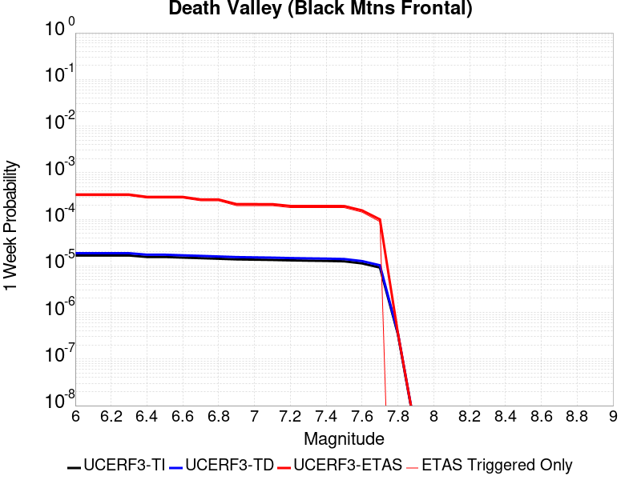 | 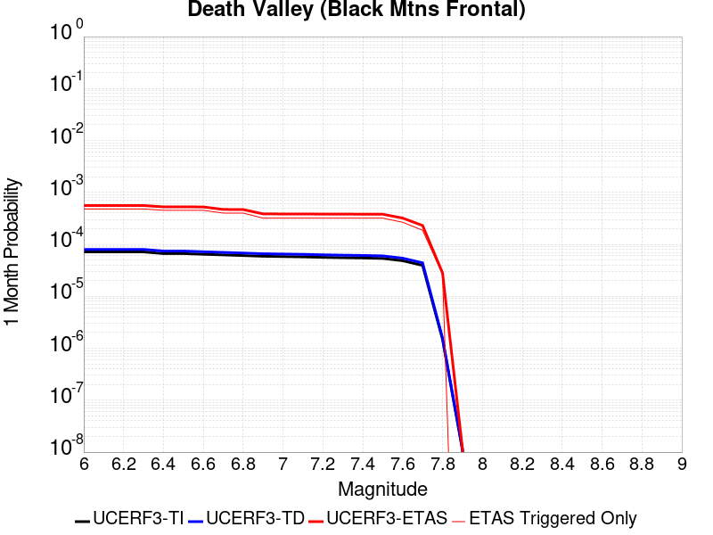 | 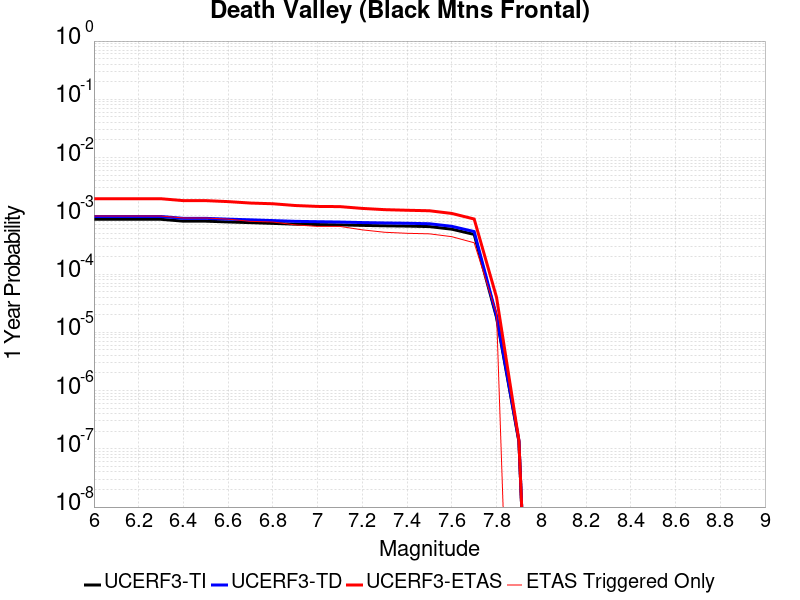 | 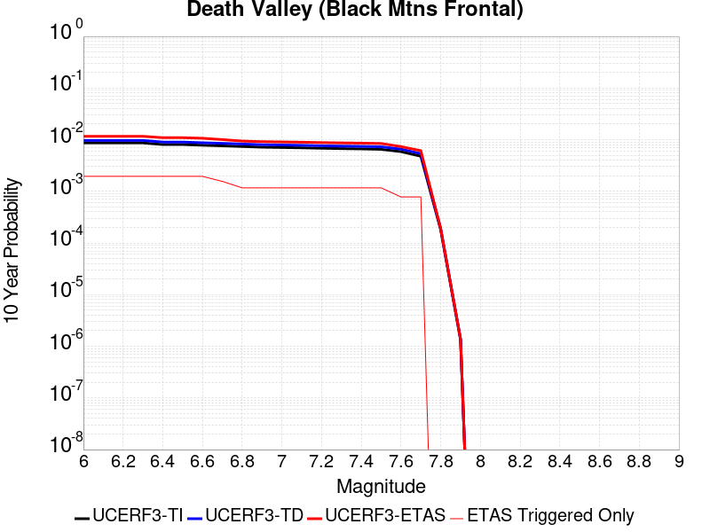 |

| Magnitude | 1 wk TI Prob | 1 wk TD Prob | 1 wk ETAS Prob | 1 wk ETAS/TD Gain | 1 wk ETAS Triggered Only | 1 mo TI Prob | 1 mo TD Prob | 1 mo ETAS Prob | 1 mo ETAS/TD Gain | 1 mo ETAS Triggered Only | 1 yr TI Prob | 1 yr TD Prob | 1 yr ETAS Prob | 1 yr ETAS/TD Gain | 1 yr ETAS Triggered Only | 10 yr TI Prob | 10 yr TD Prob | 10 yr ETAS Prob | 10 yr ETAS/TD Gain | 10 yr ETAS Triggered Only |
|-----|-----|-----|-----|-----|-----|-----|-----|-----|-----|-----|-----|-----|-----|-----|-----|-----|-----|-----|-----|-----|
| 6.0 | 1.6707214E-5 | 1.867027E-5 | 4.1522738E-4 | 22.240032 | 3.965645E-4 | 7.160038E-5 | 8.001302E-5 | 6.8524724E-4 | 8.564197 | 6.0528266E-4 | 8.71386E-4 | 9.737309E-4 | 0.0019641768 | 2.017166 | 9.914113E-4 | 0.00867977 | 0.009695496 | 0.011183698 | 1.153494 | 0.0015027707 |
| 6.1 | 1.6707214E-5 | 1.867027E-5 | 4.1522738E-4 | 22.240032 | 3.965645E-4 | 7.160038E-5 | 8.001302E-5 | 6.8524724E-4 | 8.564197 | 6.0528266E-4 | 8.71386E-4 | 9.737309E-4 | 0.0019641768 | 2.017166 | 9.914113E-4 | 0.00867977 | 0.009695496 | 0.011183698 | 1.153494 | 0.0015027707 |
| 6.2 | 1.6707214E-5 | 1.867027E-5 | 4.1522738E-4 | 22.240032 | 3.965645E-4 | 7.160038E-5 | 8.001302E-5 | 6.8524724E-4 | 8.564197 | 6.0528266E-4 | 8.71386E-4 | 9.737309E-4 | 0.0019641768 | 2.017166 | 9.914113E-4 | 0.00867977 | 0.009695496 | 0.011183698 | 1.153494 | 0.0015027707 |
| 6.3 | 1.6707214E-5 | 1.867027E-5 | 4.1522738E-4 | 22.240032 | 3.965645E-4 | 7.160038E-5 | 8.001302E-5 | 6.8524724E-4 | 8.564197 | 6.0528266E-4 | 8.71386E-4 | 9.737309E-4 | 0.0019641768 | 2.017166 | 9.914113E-4 | 0.00867977 | 0.009695496 | 0.011183698 | 1.153494 | 0.0015027707 |
| 6.4 | 1.5515609E-5 | 1.7338214E-5 | 3.8258865E-4 | 22.06621 | 3.6525677E-4 | 6.649377E-5 | 7.4304546E-5 | 6.378017E-4 | 8.583616 | 5.6353904E-4 | 8.0926094E-4 | 9.042885E-4 | 0.001821818 | 2.0146425 | 9.183599E-4 | 0.008063202 | 0.009006773 | 0.010330538 | 1.1469744 | 0.0013357962 |
| 6.5 | 1.5515609E-5 | 1.7338214E-5 | 3.8258865E-4 | 22.06621 | 3.6525677E-4 | 6.649377E-5 | 7.4304546E-5 | 6.378017E-4 | 8.583616 | 5.6353904E-4 | 8.0926094E-4 | 9.042885E-4 | 0.001821818 | 2.0146425 | 9.183599E-4 | 0.008063202 | 0.009006773 | 0.010330538 | 1.1469744 | 0.0013357962 |
| 6.6 | 1.5041828E-5 | 1.6809145E-5 | 3.7162405E-4 | 22.108444 | 3.5482086E-4 | 6.4463384E-5 | 7.203723E-5 | 6.251005E-4 | 8.677464 | 5.531031E-4 | 7.8455906E-4 | 8.767063E-4 | 0.0017525541 | 1.9990207 | 8.766163E-4 | 0.00781795 | 0.008733132 | 0.010005539 | 1.1456988 | 0.0012836166 |
| 6.7 | 1.4634985E-5 | 1.6356016E-5 | 3.502996E-4 | 21.417171 | 3.3394905E-4 | 6.271985E-5 | 7.009536E-5 | 5.9185416E-4 | 8.443557 | 5.217954E-4 | 7.6334673E-4 | 8.5308263E-4 | 0.0016559621 | 1.9411508 | 8.035649E-4 | 0.007607299 | 0.008498715 | 0.009647257 | 1.1351429 | 0.0011583858 |
| 6.8 | 1.4209158E-5 | 1.5882048E-5 | 3.3939004E-4 | 21.369413 | 3.2351314E-4 | 6.089497E-5 | 6.8064175E-5 | 5.7938887E-4 | 8.512391 | 5.113595E-4 | 7.4114406E-4 | 8.2837185E-4 | 0.0016104166 | 1.9440745 | 7.826931E-4 | 0.007386771 | 0.008253456 | 0.009350533 | 1.1329232 | 0.0011062062 |
| 6.9 | 1.3780098E-5 | 1.5404594E-5 | 2.9716975E-4 | 19.290985 | 2.8176952E-4 | 5.9056227E-5 | 6.6018045E-5 | 5.1473244E-4 | 7.796845 | 4.4874405E-4 | 7.1877235E-4 | 8.0347876E-4 | 0.0015021227 | 1.869524 | 6.9920585E-4 | 0.0071645193 | 0.008006332 | 0.008989806 | 1.122837 | 9.914113E-4 |
| 7.0 | 1.3585064E-5 | 1.5188155E-5 | 2.7608188E-4 | 18.177446 | 2.608977E-4 | 5.8220405E-5 | 6.50905E-5 | 4.929349E-4 | 7.573069 | 4.2787223E-4 | 7.086029E-4 | 7.9219416E-4 | 0.0014491355 | 1.8292681 | 6.574622E-4 | 0.007063476 | 0.007894293 | 0.008815757 | 1.1167253 | 9.287958E-4 |
| 7.1 | 1.3398601E-5 | 1.49813395E-5 | 2.7587512E-4 | 18.414583 | 2.608977E-4 | 5.742131E-5 | 6.420419E-5 | 4.920489E-4 | 7.6638136 | 4.2787223E-4 | 6.9888023E-4 | 7.8141113E-4 | 0.0014383596 | 1.8407207 | 6.574622E-4 | 0.0069668638 | 0.007787224 | 0.008657014 | 1.1116945 | 8.766163E-4 |
| 7.2 | 1.3126312E-5 | 1.4679561E-5 | 2.4426615E-4 | 16.639883 | 2.2958998E-4 | 5.6254412E-5 | 6.291092E-5 | 4.3857997E-4 | 6.9714446 | 3.7569267E-4 | 6.846822E-4 | 7.6567667E-4 | 0.0013392122 | 1.7490569 | 5.739749E-4 | 0.006825765 | 0.00763097 | 0.008397334 | 1.1004281 | 7.7225716E-4 |
| 7.3 | 1.2922429E-5 | 1.4453788E-5 | 2.2316893E-4 | 15.440169 | 2.0871816E-4 | 5.5380664E-5 | 6.194336E-5 | 4.06307E-4 | 6.5593305 | 3.4438496E-4 | 6.74051E-4 | 7.53905E-4 | 0.0012753069 | 1.6916018 | 5.217954E-4 | 0.006720101 | 0.007514055 | 0.008218364 | 1.0937322 | 7.096417E-4 |
| 7.4 | 1.2768878E-5 | 1.4283772E-5 | 2.1256319E-4 | 14.881447 | 1.9828224E-4 | 5.4722615E-5 | 6.1214756E-5 | 3.9514338E-4 | 6.4550343 | 3.3394905E-4 | 6.660441E-4 | 7.4504025E-4 | 0.0012455906 | 1.6718434 | 5.009236E-4 | 0.0066405144 | 0.0074260035 | 0.008088942 | 1.0892725 | 6.678981E-4 |
| 7.5 | 1.2521929E-5 | 1.40120155E-5 | 2.1229149E-4 | 15.150675 | 1.9828224E-4 | 5.366431E-5 | 6.005014E-5 | 3.9397913E-4 | 6.5608363 | 3.3394905E-4 | 6.531671E-4 | 7.3087064E-4 | 0.0012209999 | 1.6706101 | 4.9048767E-4 | 0.006512506 | 0.0072852457 | 0.007937918 | 1.0895883 | 6.574622E-4 |
| 7.6 | 1.1301089E-5 | 1.2648149E-5 | 1.9005634E-4 | 15.026416 | 1.7741043E-4 | 4.8432343E-5 | 5.4205255E-5 | 3.568302E-4 | 6.5829444 | 3.0264133E-4 | 5.895042E-4 | 6.5975444E-4 | 0.0010977734 | 1.663912 | 4.3830814E-4 | 0.0058794282 | 0.00657851 | 0.0071694436 | 1.0898279 | 5.9484673E-4 |
| 7.7 | 9.189108E-6 | 1.0283358E-5 | 1.4594877E-4 | 14.192714 | 1.356668E-4 | 3.93813E-5 | 4.407082E-5 | 2.9452157E-4 | 6.6829157 | 2.504618E-4 | 4.7936183E-4 | 5.3643517E-4 | 8.806354E-4 | 1.6416436 | 3.4438496E-4 | 0.004783291 | 0.005351914 | 0.0058086365 | 1.0853381 | 4.5917995E-4 |
| 7.8 | 3.4586725E-7 | 3.6482615E-7 | 1.080073E-5 | 29.605145 | 1.0435908E-5 | 1.4822873E-6 | 1.5635396E-6 | 2.2435323E-5 | 14.349059 | 2.0871816E-5 | 1.80467E-5 | 1.9035933E-5 | 3.990735E-5 | 2.0964222 | 2.0871816E-5 | 1.8045233E-4 | 1.9034347E-4 | 2.1121131E-4 | 1.1096326 | 2.0871816E-5 |
| 7.9 | 2.5591178E-9 | 2.6696718E-9 | 2.6696718E-9 | 1.0 | 0.0 | 1.0967647E-8 | 1.14414505E-8 | 1.14414505E-8 | 1.0 | 0.0 | 1.335311E-7 | 1.3929966E-7 | 1.3929966E-7 | 1.0 | 0.0 | 1.3353102E-6 | 1.3929966E-6 | 1.3929966E-6 | 1.0 | 0.0 |

## Sierra Nevada  (No Extension)
*[(top)](#table-of-contents)*

| 1 Week | 1 Month | 1 Year | 10 Year |
|-----|-----|-----|-----|
| 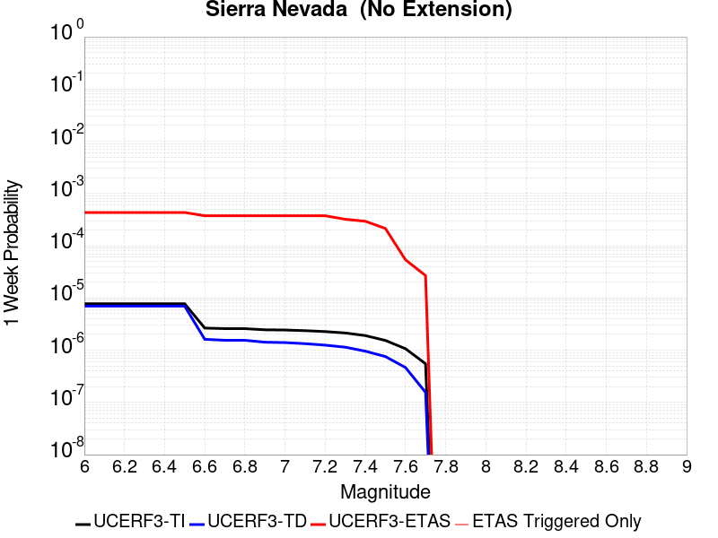 | 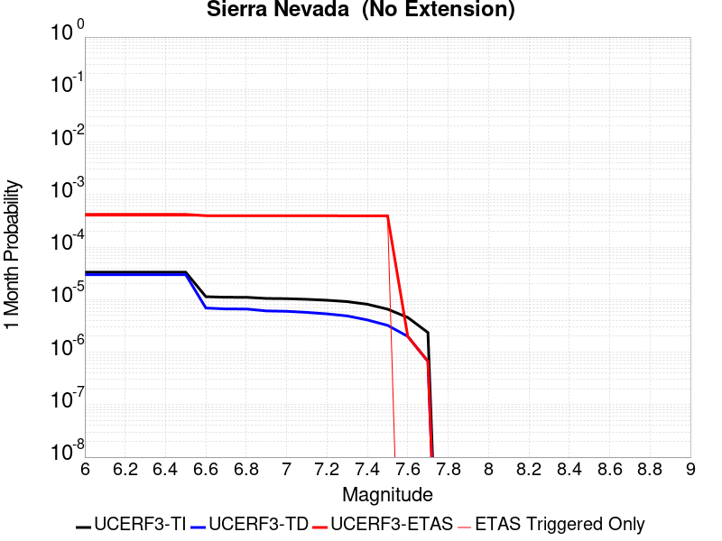 | 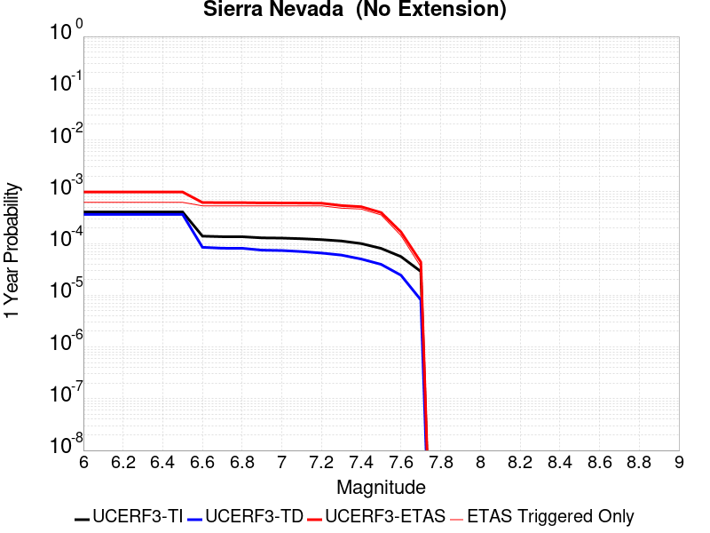 | 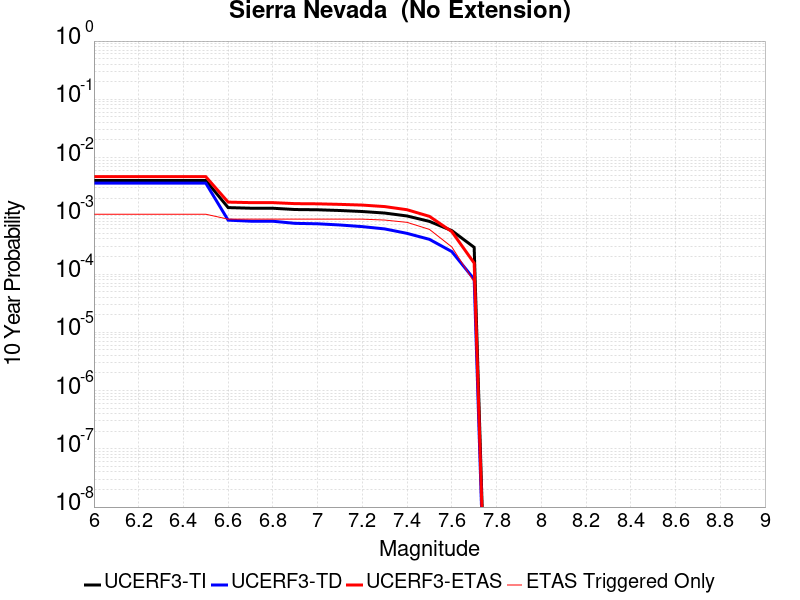 |

| Magnitude | 1 wk TI Prob | 1 wk TD Prob | 1 wk ETAS Prob | 1 wk ETAS/TD Gain | 1 wk ETAS Triggered Only | 1 mo TI Prob | 1 mo TD Prob | 1 mo ETAS Prob | 1 mo ETAS/TD Gain | 1 mo ETAS Triggered Only | 1 yr TI Prob | 1 yr TD Prob | 1 yr ETAS Prob | 1 yr ETAS/TD Gain | 1 yr ETAS Triggered Only | 10 yr TI Prob | 10 yr TD Prob | 10 yr ETAS Prob | 10 yr ETAS/TD Gain | 10 yr ETAS Triggered Only |
|-----|-----|-----|-----|-----|-----|-----|-----|-----|-----|-----|-----|-----|-----|-----|-----|-----|-----|-----|-----|-----|
| 6.0 | 7.7690465E-6 | 6.976322E-6 | 4.8702472E-4 | 69.811104 | 4.8005176E-4 | 3.329549E-5 | 2.9898381E-5 | 6.2472734E-4 | 20.895023 | 5.9484673E-4 | 4.0529718E-4 | 3.6398784E-4 | 0.001146396 | 3.149545 | 7.826931E-4 | 0.004045588 | 0.0036374326 | 0.004698023 | 1.2915767 | 0.0010644626 |
| 6.1 | 7.7690465E-6 | 6.976322E-6 | 4.8702472E-4 | 69.811104 | 4.8005176E-4 | 3.329549E-5 | 2.9898381E-5 | 6.2472734E-4 | 20.895023 | 5.9484673E-4 | 4.0529718E-4 | 3.6398784E-4 | 0.001146396 | 3.149545 | 7.826931E-4 | 0.004045588 | 0.0036374326 | 0.004698023 | 1.2915767 | 0.0010644626 |
| 6.2 | 7.7690465E-6 | 6.976322E-6 | 4.8702472E-4 | 69.811104 | 4.8005176E-4 | 3.329549E-5 | 2.9898381E-5 | 6.2472734E-4 | 20.895023 | 5.9484673E-4 | 4.0529718E-4 | 3.6398784E-4 | 0.001146396 | 3.149545 | 7.826931E-4 | 0.004045588 | 0.0036374326 | 0.004698023 | 1.2915767 | 0.0010644626 |
| 6.3 | 7.7690465E-6 | 6.976322E-6 | 4.8702472E-4 | 69.811104 | 4.8005176E-4 | 3.329549E-5 | 2.9898381E-5 | 6.2472734E-4 | 20.895023 | 5.9484673E-4 | 4.0529718E-4 | 3.6398784E-4 | 0.001146396 | 3.149545 | 7.826931E-4 | 0.004045588 | 0.0036374326 | 0.004698023 | 1.2915767 | 0.0010644626 |
| 6.4 | 7.7690465E-6 | 6.976322E-6 | 4.8702472E-4 | 69.811104 | 4.8005176E-4 | 3.329549E-5 | 2.9898381E-5 | 6.2472734E-4 | 20.895023 | 5.9484673E-4 | 4.0529718E-4 | 3.6398784E-4 | 0.001146396 | 3.149545 | 7.826931E-4 | 0.004045588 | 0.0036374326 | 0.004698023 | 1.2915767 | 0.0010644626 |
| 6.5 | 7.7690465E-6 | 6.976322E-6 | 4.8702472E-4 | 69.811104 | 4.8005176E-4 | 3.329549E-5 | 2.9898381E-5 | 6.2472734E-4 | 20.895023 | 5.9484673E-4 | 4.0529718E-4 | 3.6398784E-4 | 0.001146396 | 3.149545 | 7.826931E-4 | 0.004045588 | 0.0036374326 | 0.004698023 | 1.2915767 | 0.0010644626 |
| 6.6 | 2.653E-6 | 1.614854E-6 | 4.086146E-4 | 253.03502 | 4.0700042E-4 | 1.136995E-5 | 6.9207845E-6 | 4.8696922E-4 | 70.3633 | 4.8005176E-4 | 1.3842035E-4 | 8.425733E-5 | 7.207941E-4 | 8.554675 | 6.3659035E-4 | 0.0013833415 | 8.422573E-4 | 0.0017181352 | 2.0399172 | 8.766163E-4 |
| 6.7 | 2.5902466E-6 | 1.5501876E-6 | 4.0854997E-4 | 263.54874 | 4.0700042E-4 | 1.11010095E-5 | 6.643644E-6 | 4.866922E-4 | 73.25682 | 4.8005176E-4 | 1.351464E-4 | 8.0883394E-5 | 7.174223E-4 | 8.869834 | 6.3659035E-4 | 0.0013506424 | 8.0854254E-4 | 0.00168445 | 2.0833166 | 8.766163E-4 |
| 6.8 | 2.5853892E-6 | 1.5469877E-6 | 4.0854677E-4 | 264.0918 | 4.0700042E-4 | 1.1080193E-5 | 6.629931E-6 | 4.866785E-4 | 73.40627 | 4.8005176E-4 | 1.34893E-4 | 8.071645E-5 | 7.1725546E-4 | 8.886112 | 6.3659035E-4 | 0.0013481114 | 8.068743E-4 | 0.0016827832 | 2.0855582 | 8.766163E-4 |
| 6.9 | 2.458257E-6 | 1.4220619E-6 | 4.0842188E-4 | 287.204 | 4.0700042E-4 | 1.0535345E-5 | 6.094537E-6 | 4.8614337E-4 | 79.76707 | 4.8005176E-4 | 1.2826028E-4 | 7.4198484E-5 | 7.107416E-4 | 9.578924 | 6.3659035E-4 | 0.0012818627 | 7.4173906E-4 | 0.0016177051 | 2.1809626 | 8.766163E-4 |
| 7.0 | 2.4341468E-6 | 1.3990258E-6 | 4.0839886E-4 | 291.9166 | 4.0700042E-4 | 1.0432016E-5 | 5.9958115E-6 | 4.860447E-4 | 81.06404 | 4.8005176E-4 | 1.270024E-4 | 7.2996576E-5 | 7.095405E-4 | 9.720188 | 6.3659035E-4 | 0.0012692984 | 7.297279E-4 | 0.0016057044 | 2.2004154 | 8.766163E-4 |
| 7.1 | 2.3652476E-6 | 1.3339754E-6 | 4.0833384E-4 | 306.10297 | 4.0700042E-4 | 1.0136736E-5 | 5.717025E-6 | 4.8576604E-4 | 84.96832 | 4.8005176E-4 | 1.2340778E-4 | 6.9602575E-5 | 7.061486E-4 | 10.145438 | 6.3659035E-4 | 0.0012333926 | 6.9580943E-4 | 0.0015718158 | 2.2589743 | 8.766163E-4 |
| 7.2 | 2.272158E-6 | 1.2502821E-6 | 4.0825017E-4 | 326.52646 | 4.0700042E-4 | 9.737784E-6 | 5.3583412E-6 | 4.8540754E-4 | 90.58914 | 4.8005176E-4 | 1.1855107E-4 | 6.5235865E-5 | 7.0178474E-4 | 10.757651 | 6.3659035E-4 | 0.0011848784 | 6.5216864E-4 | 0.0015282133 | 2.3432791 | 8.766163E-4 |
| 7.3 | 2.1382127E-6 | 1.1419703E-6 | 3.768342E-4 | 329.98602 | 3.7569267E-4 | 9.163737E-6 | 4.8941492E-6 | 4.53636E-4 | 92.689445 | 4.4874405E-4 | 1.1156279E-4 | 5.958465E-5 | 6.6483126E-4 | 11.157761 | 6.0528266E-4 | 0.001115068 | 5.956879E-4 | 0.0014404929 | 2.4182007 | 8.4530853E-4 |
| 7.4 | 1.9048055E-6 | 9.575242E-7 | 3.4534215E-4 | 360.66153 | 3.4438496E-4 | 8.163426E-6 | 4.1036687E-6 | 4.2153828E-4 | 102.72229 | 4.1743633E-4 | 9.9385186E-5 | 4.996103E-5 | 6.134719E-4 | 12.279008 | 5.6353904E-4 | 9.934074E-4 | 4.994987E-4 | 0.0012713701 | 2.5452924 | 7.7225716E-4 |
| 7.5 | 1.5373403E-6 | 7.560042E-7 | 2.303458E-4 | 304.6885 | 2.2958998E-4 | 6.5885843E-6 | 3.2400142E-6 | 3.0588036E-4 | 94.407104 | 3.0264133E-4 | 8.021306E-5 | 3.9446462E-5 | 4.3599532E-4 | 11.052836 | 3.965645E-4 | 8.0184115E-4 | 3.943951E-4 | 9.785754E-4 | 2.481206 | 5.8441085E-4 |
| 7.6 | 1.0680322E-6 | 4.6596554E-7 | 1.04825E-4 | 224.96298 | 1.0435908E-4 | 4.577273E-6 | 1.9969937E-6 | 1.3766352E-4 | 68.93539 | 1.356668E-4 | 5.5726876E-5 | 2.4313129E-5 | 2.0171925E-4 | 8.296721 | 1.7741043E-4 | 5.5712904E-4 | 2.4310495E-4 | 5.3523935E-4 | 2.2016802 | 2.9220543E-4 |
| 7.7 | 5.509146E-7 | 1.5580486E-7 | 3.1463525E-5 | 201.94186 | 3.1307725E-5 | 2.3610605E-6 | 6.677349E-7 | 3.1975436E-5 | 47.88642 | 3.1307725E-5 | 2.8745531E-5 | 8.129644E-6 | 6.0308757E-5 | 7.4183764 | 5.217954E-5 | 2.8741814E-4 | 8.1293576E-5 | 1.54339E-4 | 1.8985386 | 7.305136E-5 |

## Helendale-So Lockhart
*[(top)](#table-of-contents)*

| 1 Week | 1 Month | 1 Year | 10 Year |
|-----|-----|-----|-----|
| 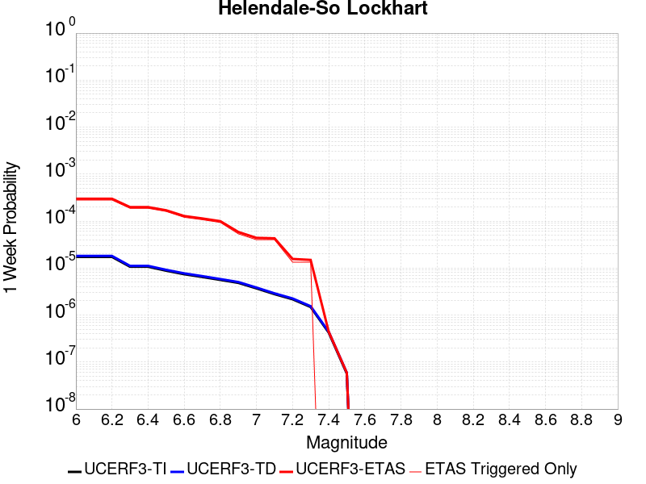 | 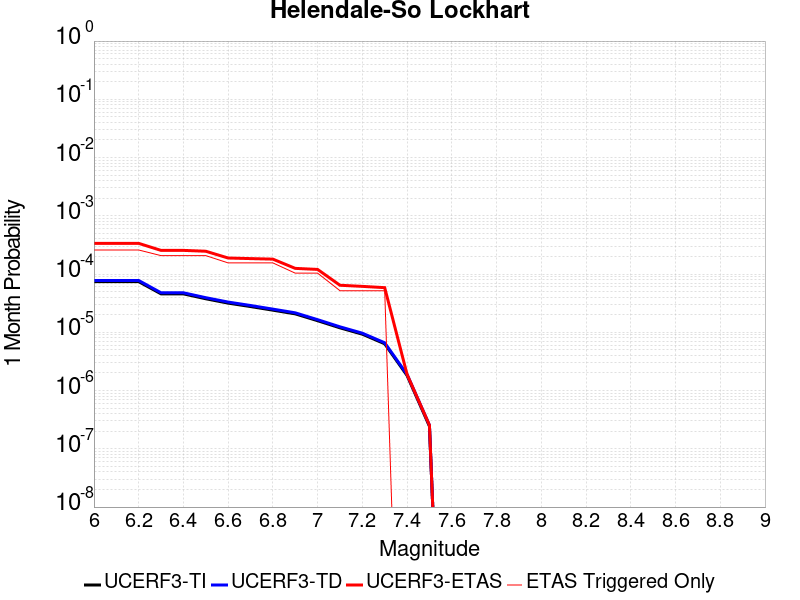 | 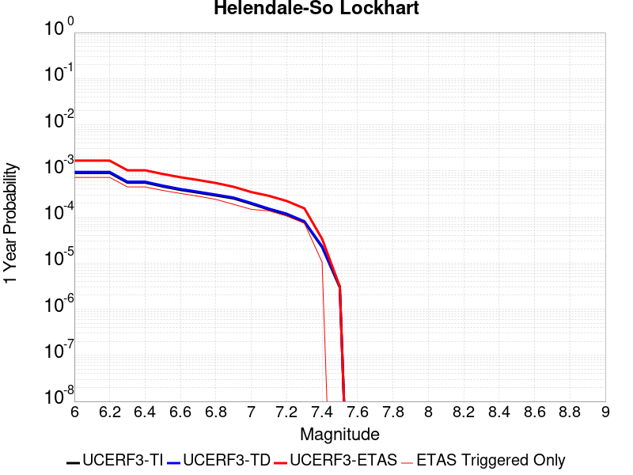 | 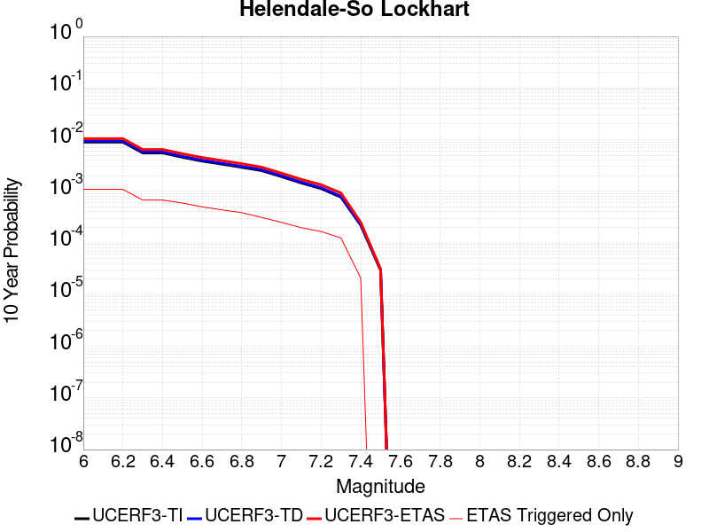 |

| Magnitude | 1 wk TI Prob | 1 wk TD Prob | 1 wk ETAS Prob | 1 wk ETAS/TD Gain | 1 wk ETAS Triggered Only | 1 mo TI Prob | 1 mo TD Prob | 1 mo ETAS Prob | 1 mo ETAS/TD Gain | 1 mo ETAS Triggered Only | 1 yr TI Prob | 1 yr TD Prob | 1 yr ETAS Prob | 1 yr ETAS/TD Gain | 1 yr ETAS Triggered Only | 10 yr TI Prob | 10 yr TD Prob | 10 yr ETAS Prob | 10 yr ETAS/TD Gain | 10 yr ETAS Triggered Only |
|-----|-----|-----|-----|-----|-----|-----|-----|-----|-----|-----|-----|-----|-----|-----|-----|-----|-----|-----|-----|-----|
| 6.0 | 1.7296055E-5 | 1.8103729E-5 | 2.894324E-4 | 15.987448 | 2.713336E-4 | 7.412385E-5 | 7.7585224E-5 | 5.1585934E-4 | 6.648938 | 4.3830814E-4 | 9.0208417E-4 | 9.4421144E-4 | 0.0016636092 | 1.7619032 | 7.2007766E-4 | 0.008984311 | 0.009404116 | 0.010489582 | 1.1154245 | 0.0010957703 |
| 6.1 | 1.7296055E-5 | 1.8103729E-5 | 2.894324E-4 | 15.987448 | 2.713336E-4 | 7.412385E-5 | 7.7585224E-5 | 5.1585934E-4 | 6.648938 | 4.3830814E-4 | 9.0208417E-4 | 9.4421144E-4 | 0.0016636092 | 1.7619032 | 7.2007766E-4 | 0.008984311 | 0.009404116 | 0.010489582 | 1.1154245 | 0.0010957703 |
| 6.2 | 1.7296055E-5 | 1.8103729E-5 | 2.894324E-4 | 15.987448 | 2.713336E-4 | 7.412385E-5 | 7.7585224E-5 | 5.1585934E-4 | 6.648938 | 4.3830814E-4 | 9.0208417E-4 | 9.4421144E-4 | 0.0016636092 | 1.7619032 | 7.2007766E-4 | 0.008984311 | 0.009404116 | 0.010489582 | 1.1154245 | 0.0010957703 |
| 6.3 | 1.0669118E-5 | 1.1135425E-5 | 1.8854388E-4 | 16.9319 | 1.7741043E-4 | 4.5723988E-5 | 4.772239E-5 | 3.3991388E-4 | 7.1227336 | 2.9220543E-4 | 5.5654737E-4 | 5.80868E-4 | 0.0010293514 | 1.7720917 | 4.4874405E-4 | 0.0055515557 | 0.0057937936 | 0.0064681973 | 1.1164011 | 6.7833404E-4 |
| 6.4 | 1.0669118E-5 | 1.1135425E-5 | 1.8854388E-4 | 16.9319 | 1.7741043E-4 | 4.5723988E-5 | 4.772239E-5 | 3.3991388E-4 | 7.1227336 | 2.9220543E-4 | 5.5654737E-4 | 5.80868E-4 | 0.0010293514 | 1.7720917 | 4.4874405E-4 | 0.0055515557 | 0.0057937936 | 0.0064681973 | 1.1164011 | 6.7833404E-4 |
| 6.5 | 8.790038E-6 | 9.170197E-6 | 1.6570737E-4 | 18.07021 | 1.5653862E-4 | 3.767105E-5 | 3.930026E-5 | 2.897522E-4 | 7.372781 | 2.504618E-4 | 4.585485E-4 | 4.7837716E-4 | 8.5389015E-4 | 1.7849725 | 3.7569267E-4 | 0.0045760344 | 0.004773638 | 0.0053656455 | 1.1240159 | 5.9484673E-4 |
| 6.6 | 7.396949E-6 | 7.715537E-6 | 1.2250963E-4 | 15.878304 | 1.1479499E-4 | 3.1700827E-5 | 3.3066175E-5 | 2.4177742E-4 | 7.3119264 | 2.0871816E-4 | 3.858892E-4 | 4.025073E-4 | 7.258902E-4 | 1.8034213 | 3.2351314E-4 | 0.003852198 | 0.00401789 | 0.004516801 | 1.1241723 | 5.009236E-4 |
| 6.7 | 6.4600285E-6 | 6.738031E-6 | 1.1109641E-4 | 16.487963 | 1.0435908E-4 | 2.7685543E-5 | 2.887696E-5 | 2.1671788E-4 | 7.5048714 | 1.8784634E-4 | 3.3701936E-4 | 3.5152107E-4 | 6.3319155E-4 | 1.8012904 | 2.8176952E-4 | 0.0033650869 | 0.003509732 | 0.0039465018 | 1.1244453 | 4.3830814E-4 |
| 6.8 | 5.600104E-6 | 5.836009E-6 | 9.975863E-5 | 17.093637 | 9.392317E-5 | 2.4000226E-5 | 2.5011232E-5 | 2.0241723E-4 | 8.093053 | 1.7741043E-4 | 2.9216358E-4 | 3.044698E-4 | 5.444226E-4 | 1.7881005 | 2.4002588E-4 | 0.0029177975 | 0.003040588 | 0.0034255425 | 1.1266053 | 3.8612858E-4 |
| 6.9 | 4.839122E-6 | 5.0395092E-6 | 5.7218786E-5 | 11.354039 | 5.217954E-5 | 2.0738931E-5 | 2.159772E-5 | 1.5726159E-4 | 7.281398 | 1.356668E-4 | 2.5246723E-4 | 2.6292098E-4 | 4.5071793E-4 | 1.7142714 | 1.8784634E-4 | 0.002521806 | 0.002626147 | 0.002938402 | 1.1189023 | 3.1307724E-4 |
| 7.0 | 3.6937633E-6 | 3.845208E-6 | 4.558868E-5 | 11.855972 | 4.174363E-5 | 1.5830317E-5 | 1.647936E-5 | 1.3127245E-4 | 7.965871 | 1.1479499E-4 | 1.9271708E-4 | 2.0061806E-4 | 3.4669146E-4 | 1.7281169 | 1.4610271E-4 | 0.0019255003 | 0.002004401 | 0.0022543608 | 1.1247054 | 2.504618E-4 |
| 7.1 | 2.7858857E-6 | 2.8978538E-6 | 4.4641365E-5 | 15.404975 | 4.174363E-5 | 1.1939455E-5 | 1.2419316E-5 | 1.167771E-4 | 9.402861 | 1.0435908E-4 | 1.4535317E-4 | 1.511949E-4 | 2.8684118E-4 | 1.8971618 | 1.356668E-4 | 0.0014525814 | 0.0015109418 | 0.0017089244 | 1.1310326 | 1.9828224E-4 |
| 7.2 | 2.1672065E-6 | 2.2540128E-6 | 2.3125782E-5 | 10.259827 | 2.0871816E-5 | 9.2879945E-6 | 9.66002E-6 | 8.271067E-5 | 8.562163 | 7.305136E-5 | 1.1307546E-4 | 1.1760458E-4 | 2.2195138E-4 | 1.8872682 | 1.0435908E-4 | 0.0011301794 | 0.0011754417 | 0.0013422199 | 1.1418856 | 1.6697453E-4 |
| 7.3 | 1.4823496E-6 | 1.5422102E-6 | 1.1978102E-5 | 7.7668414 | 1.0435908E-5 | 6.3529114E-6 | 6.6094562E-6 | 4.8352813E-5 | 7.315702 | 4.174363E-5 | 7.734395E-5 | 8.046731E-5 | 1.535128E-4 | 1.9077659 | 7.305136E-5 | 7.731704E-4 | 8.0439687E-4 | 9.2952704E-4 | 1.1555578 | 1.252309E-4 |
| 7.4 | 4.2321457E-7 | 4.4108765E-7 | 4.4108765E-7 | 1.0 | 0.0 | 1.8137755E-6 | 1.8903745E-6 | 1.8903745E-6 | 1.0 | 0.0 | 2.2082493E-5 | 2.3015113E-5 | 3.3450782E-5 | 1.4534267 | 1.0435908E-5 | 2.2080299E-4 | 2.3013182E-4 | 2.5099883E-4 | 1.0906742 | 2.0871816E-5 |
| 7.5 | 5.6942316E-8 | 5.9415648E-8 | 5.9415648E-8 | 1.0 | 0.0 | 2.440385E-7 | 2.5463845E-7 | 2.5463845E-7 | 1.0 | 0.0 | 2.9711643E-6 | 3.1002196E-6 | 3.1002196E-6 | 1.0 | 0.0 | 2.9711247E-5 | 3.1001844E-5 | 3.1001844E-5 | 1.0 | 0.0 |

## Coyote Lake
*[(top)](#table-of-contents)*

| 1 Week | 1 Month | 1 Year | 10 Year |
|-----|-----|-----|-----|
| 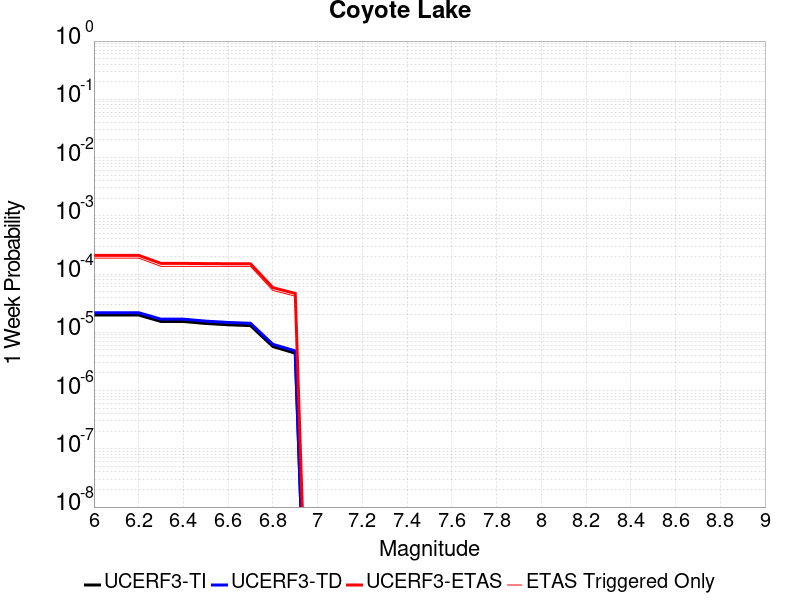 | 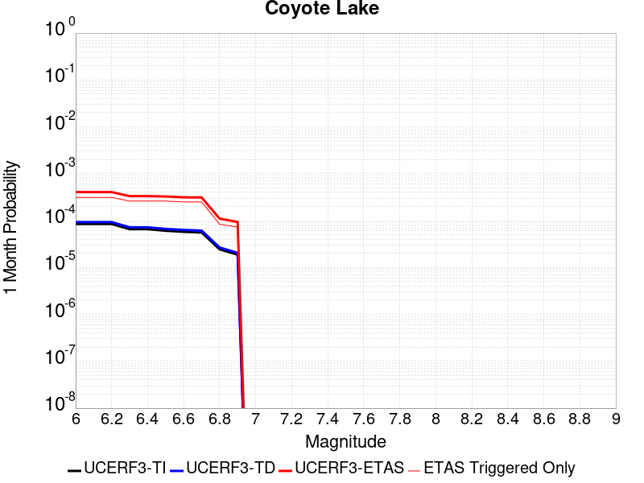 | 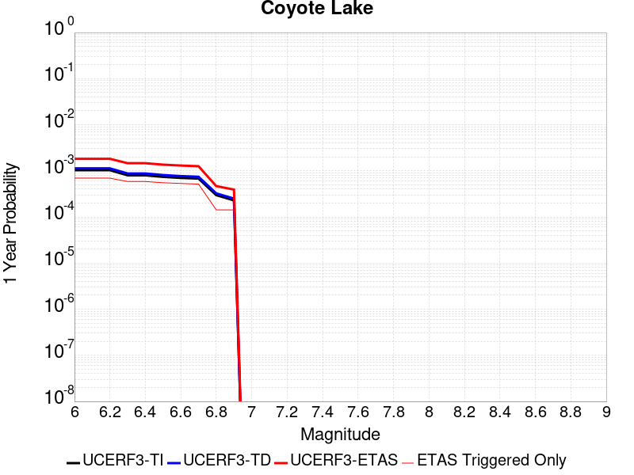 | 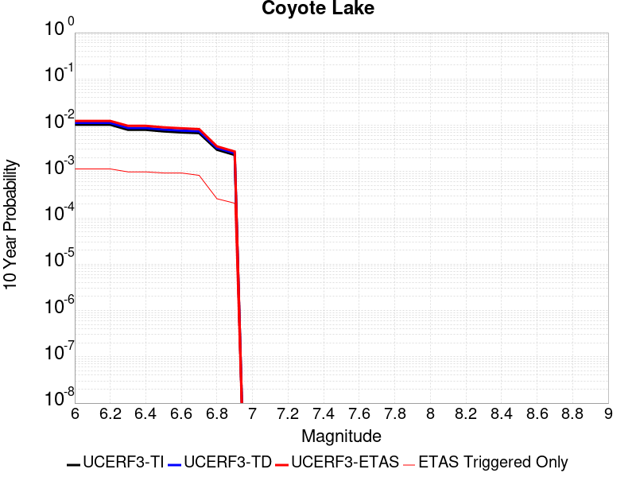 |

| Magnitude | 1 wk TI Prob | 1 wk TD Prob | 1 wk ETAS Prob | 1 wk ETAS/TD Gain | 1 wk ETAS Triggered Only | 1 mo TI Prob | 1 mo TD Prob | 1 mo ETAS Prob | 1 mo ETAS/TD Gain | 1 mo ETAS Triggered Only | 1 yr TI Prob | 1 yr TD Prob | 1 yr ETAS Prob | 1 yr ETAS/TD Gain | 1 yr ETAS Triggered Only | 10 yr TI Prob | 10 yr TD Prob | 10 yr ETAS Prob | 10 yr ETAS/TD Gain | 10 yr ETAS Triggered Only |
|-----|-----|-----|-----|-----|-----|-----|-----|-----|-----|-----|-----|-----|-----|-----|-----|-----|-----|-----|-----|-----|
| 6.0 | 1.980352E-5 | 2.1706745E-5 | 2.09549E-4 | 9.653636 | 1.8784634E-4 | 8.486947E-5 | 9.302599E-5 | 4.060741E-4 | 4.365168 | 3.1307724E-4 | 0.0010327959 | 0.0011320751 | 0.0018096411 | 1.598517 | 6.7833404E-4 | 0.010280091 | 0.011270258 | 0.012322724 | 1.0933844 | 0.0010644626 |
| 6.1 | 1.980352E-5 | 2.1706745E-5 | 2.09549E-4 | 9.653636 | 1.8784634E-4 | 8.486947E-5 | 9.302599E-5 | 4.060741E-4 | 4.365168 | 3.1307724E-4 | 0.0010327959 | 0.0011320751 | 0.0018096411 | 1.598517 | 6.7833404E-4 | 0.010280091 | 0.011270258 | 0.012322724 | 1.0933844 | 0.0010644626 |
| 6.2 | 1.980352E-5 | 2.1706745E-5 | 2.09549E-4 | 9.653636 | 1.8784634E-4 | 8.486947E-5 | 9.302599E-5 | 4.060741E-4 | 4.365168 | 3.1307724E-4 | 0.0010327959 | 0.0011320751 | 0.0018096411 | 1.598517 | 6.7833404E-4 | 0.010280091 | 0.011270258 | 0.012322724 | 1.0933844 | 0.0010644626 |
| 6.3 | 1.5344787E-5 | 1.682067E-5 | 1.5248518E-4 | 9.065346 | 1.356668E-4 | 6.576172E-5 | 7.2086936E-5 | 3.3296584E-4 | 4.6189485 | 2.608977E-4 | 8.003548E-4 | 8.773662E-4 | 0.0014612643 | 1.6655123 | 5.8441085E-4 | 0.007974784 | 0.00874507 | 0.009655398 | 1.1040963 | 9.183599E-4 |
| 6.4 | 1.5344787E-5 | 1.682067E-5 | 1.5248518E-4 | 9.065346 | 1.356668E-4 | 6.576172E-5 | 7.2086936E-5 | 3.3296584E-4 | 4.6189485 | 2.608977E-4 | 8.003548E-4 | 8.773662E-4 | 0.0014612643 | 1.6655123 | 5.8441085E-4 | 0.007974784 | 0.00874507 | 0.009655398 | 1.1040963 | 9.183599E-4 |
| 6.5 | 1.4189697E-5 | 1.5557987E-5 | 1.5122267E-4 | 9.719938 | 1.356668E-4 | 6.081157E-5 | 6.6675726E-5 | 3.2755602E-4 | 4.912673 | 2.608977E-4 | 7.401293E-4 | 8.115349E-4 | 0.0013746165 | 1.6938478 | 5.6353904E-4 | 0.0073766913 | 0.008091656 | 0.008981882 | 1.1100178 | 8.974881E-4 |
| 6.6 | 1.3469301E-5 | 1.4771577E-5 | 1.5043638E-4 | 10.184178 | 1.356668E-4 | 5.7724297E-5 | 6.330556E-5 | 3.137515E-4 | 4.9561443 | 2.504618E-4 | 7.025667E-4 | 7.7053264E-4 | 0.0013232096 | 1.7172661 | 5.531031E-4 | 0.0070034964 | 0.0076845144 | 0.008523327 | 1.1091563 | 8.4530853E-4 |
| 6.7 | 1.3027966E-5 | 1.4281745E-5 | 1.4994662E-4 | 10.49918 | 1.356668E-4 | 5.5832945E-5 | 6.120638E-5 | 3.1165284E-4 | 5.091836 | 2.504618E-4 | 6.7955407E-4 | 7.4499263E-4 | 0.0012768274 | 1.7138792 | 5.322313E-4 | 0.006774798 | 0.0074308286 | 0.008228422 | 1.1073358 | 8.035649E-4 |
| 6.8 | 5.695434E-6 | 6.2244176E-6 | 5.840363E-5 | 9.382987 | 5.217954E-5 | 2.4408775E-5 | 2.6675973E-5 | 1.1016101E-4 | 4.1295967 | 8.348726E-5 | 2.971363E-4 | 3.2476155E-4 | 4.7081683E-4 | 1.4497308 | 1.4610271E-4 | 0.0029673933 | 0.0032458105 | 0.003474655 | 1.0705047 | 2.2958998E-4 |
| 6.9 | 4.385688E-6 | 4.7930553E-6 | 4.6536486E-5 | 9.709148 | 4.174363E-5 | 1.879567E-5 | 2.0541665E-5 | 9.359152E-5 | 4.5561795 | 7.305136E-5 | 2.2881327E-4 | 2.5009477E-4 | 3.8572765E-4 | 1.5423259 | 1.356668E-4 | 0.002285778 | 0.0025009478 | 0.0026883243 | 1.0749222 | 1.8784634E-4 |

## San Andreas (Big Bend)
*[(top)](#table-of-contents)*

| 1 Week | 1 Month | 1 Year | 10 Year |
|-----|-----|-----|-----|
| 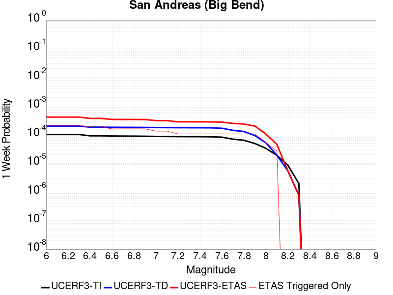 |  | 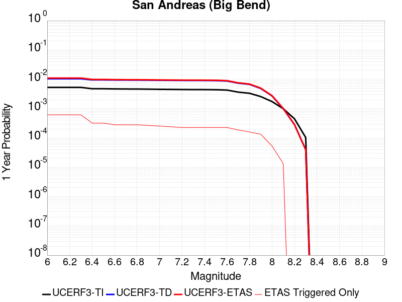 | 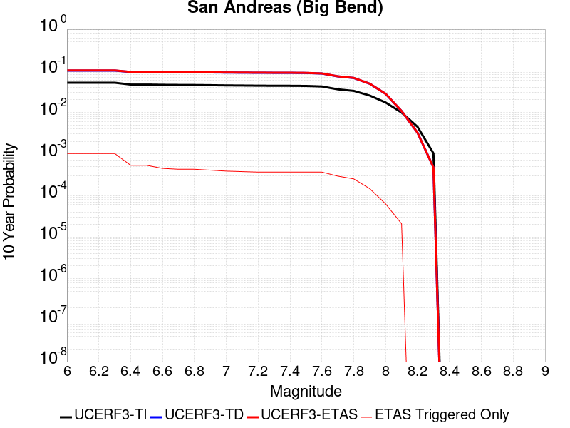 |

| Magnitude | 1 wk TI Prob | 1 wk TD Prob | 1 wk ETAS Prob | 1 wk ETAS/TD Gain | 1 wk ETAS Triggered Only | 1 mo TI Prob | 1 mo TD Prob | 1 mo ETAS Prob | 1 mo ETAS/TD Gain | 1 mo ETAS Triggered Only | 1 yr TI Prob | 1 yr TD Prob | 1 yr ETAS Prob | 1 yr ETAS/TD Gain | 1 yr ETAS Triggered Only | 10 yr TI Prob | 10 yr TD Prob | 10 yr ETAS Prob | 10 yr ETAS/TD Gain | 10 yr ETAS Triggered Only |
|-----|-----|-----|-----|-----|-----|-----|-----|-----|-----|-----|-----|-----|-----|-----|-----|-----|-----|-----|-----|-----|
| 6.0 | 1.0179969E-4 | 2.0072258E-4 | 5.033032E-4 | 2.5074565 | 3.0264133E-4 | 4.362114E-4 | 8.599571E-4 | 0.0012978883 | 1.5092478 | 4.3830814E-4 | 0.0052979486 | 0.010419999 | 0.011132573 | 1.0683852 | 7.2007766E-4 | 0.051734097 | 0.10144902 | 0.10236799 | 1.0090584 | 0.001022719 |
| 6.1 | 1.0179969E-4 | 2.0072258E-4 | 5.033032E-4 | 2.5074565 | 3.0264133E-4 | 4.362114E-4 | 8.599571E-4 | 0.0012978883 | 1.5092478 | 4.3830814E-4 | 0.0052979486 | 0.010419999 | 0.011132573 | 1.0683852 | 7.2007766E-4 | 0.051734097 | 0.10144902 | 0.10236799 | 1.0090584 | 0.001022719 |
| 6.2 | 1.0179969E-4 | 2.0072258E-4 | 5.033032E-4 | 2.5074565 | 3.0264133E-4 | 4.362114E-4 | 8.599571E-4 | 0.0012978883 | 1.5092478 | 4.3830814E-4 | 0.0052979486 | 0.010419999 | 0.011132573 | 1.0683852 | 7.2007766E-4 | 0.051734097 | 0.10144902 | 0.10236799 | 1.0090584 | 0.001022719 |
| 6.3 | 1.0179969E-4 | 2.0072258E-4 | 5.033032E-4 | 2.5074565 | 3.0264133E-4 | 4.362114E-4 | 8.599571E-4 | 0.0012978883 | 1.5092478 | 4.3830814E-4 | 0.0052979486 | 0.010419999 | 0.011132573 | 1.0683852 | 7.2007766E-4 | 0.051734097 | 0.10144902 | 0.10236799 | 1.0090584 | 0.001022719 |
| 6.4 | 9.1639464E-5 | 1.8429532E-4 | 3.6167307E-4 | 1.9624647 | 1.7741043E-4 | 3.9268145E-4 | 7.895982E-4 | 0.00105029 | 1.3301574 | 2.608977E-4 | 0.0047704205 | 0.009571102 | 0.009932863 | 1.0377972 | 3.6525677E-4 | 0.046693064 | 0.09377527 | 0.09425759 | 1.0051434 | 5.322313E-4 |
| 6.5 | 9.1639464E-5 | 1.8429532E-4 | 3.6167307E-4 | 1.9624647 | 1.7741043E-4 | 3.9268145E-4 | 7.895982E-4 | 0.00105029 | 1.3301574 | 2.608977E-4 | 0.0047704205 | 0.009571102 | 0.009932863 | 1.0377972 | 3.6525677E-4 | 0.046693064 | 0.09377527 | 0.09425759 | 1.0051434 | 5.322313E-4 |
| 6.6 | 9.042622E-5 | 1.823659E-4 | 3.2844197E-4 | 1.8010054 | 1.4610271E-4 | 3.8748336E-4 | 7.8133424E-4 | 0.0010107448 | 1.2936139 | 2.2958998E-4 | 0.0047074095 | 0.009471365 | 0.009781477 | 1.032742 | 3.1307724E-4 | 0.046089325 | 0.092869274 | 0.093276344 | 1.0043832 | 4.4874405E-4 |
| 6.7 | 8.9836685E-5 | 1.8150927E-4 | 3.2758547E-4 | 1.8047864 | 1.4610271E-4 | 3.8495753E-4 | 7.776651E-4 | 0.0010070766 | 1.2950003 | 2.2958998E-4 | 0.00467679 | 0.00942708 | 0.009737206 | 1.0328974 | 3.1307724E-4 | 0.045795817 | 0.09246355 | 0.09285186 | 1.0041996 | 4.2787223E-4 |
| 6.8 | 8.9471854E-5 | 1.8097709E-4 | 3.2705336E-4 | 1.8071533 | 1.4610271E-4 | 3.8339442E-4 | 7.7538576E-4 | 0.0010047978 | 1.2958682 | 2.2958998E-4 | 0.004657841 | 0.009399569 | 0.009709703 | 1.0329945 | 3.1307724E-4 | 0.04561414 | 0.092210755 | 0.092599176 | 1.0042123 | 4.2787223E-4 |
| 6.9 | 8.858234E-5 | 1.7979681E-4 | 3.2587326E-4 | 1.8124529 | 1.4610271E-4 | 3.7958333E-4 | 7.703304E-4 | 9.893157E-4 | 1.2842745 | 2.1915407E-4 | 0.004611638 | 0.009338548 | 0.0096383635 | 1.0321051 | 3.0264133E-4 | 0.04517103 | 0.09165087 | 0.09202057 | 1.0040338 | 4.0700042E-4 |
| 7.0 | 8.7433385E-5 | 1.7818481E-4 | 3.033934E-4 | 1.7026894 | 1.252309E-4 | 3.746607E-4 | 7.634259E-4 | 9.615568E-4 | 1.2595286 | 1.9828224E-4 | 0.004551957 | 0.009255203 | 0.009534365 | 1.0301627 | 2.8176952E-4 | 0.044598386 | 0.09088532 | 0.09123635 | 1.0038624 | 3.8612858E-4 |
| 7.1 | 8.684964E-5 | 1.7730435E-4 | 2.9207897E-4 | 1.6473311 | 1.1479499E-4 | 3.7215967E-4 | 7.596547E-4 | 9.473583E-4 | 1.2470907 | 1.8784634E-4 | 0.0045216335 | 0.009209678 | 0.009478512 | 1.0291904 | 2.713336E-4 | 0.04430731 | 0.09046686 | 0.09080856 | 1.0037771 | 3.7569267E-4 |
| 7.2 | 8.606521E-5 | 1.762105E-4 | 2.805512E-4 | 1.5921366 | 1.0435908E-4 | 3.6879873E-4 | 7.549695E-4 | 9.32246E-4 | 1.2348127 | 1.7741043E-4 | 0.0044808835 | 0.0091531165 | 0.009411626 | 1.0282428 | 2.608977E-4 | 0.043916024 | 0.089947365 | 0.09027977 | 1.0036955 | 3.6525677E-4 |
| 7.3 | 8.568266E-5 | 1.7563057E-4 | 2.799713E-4 | 1.5940922 | 1.0435908E-4 | 3.6715972E-4 | 7.524855E-4 | 9.2976243E-4 | 1.2355886 | 1.7741043E-4 | 0.0044610105 | 0.009123127 | 0.009381644 | 1.0283365 | 2.608977E-4 | 0.043725148 | 0.08966853 | 0.09000103 | 1.0037081 | 3.6525677E-4 |
| 7.4 | 8.5432206E-5 | 1.7525644E-4 | 2.7959724E-4 | 1.5953606 | 1.0435908E-4 | 3.6608664E-4 | 7.50883E-4 | 9.2816027E-4 | 1.2360916 | 1.7741043E-4 | 0.004447999 | 0.009103781 | 0.009362303 | 1.0283973 | 2.608977E-4 | 0.043600157 | 0.08948871 | 0.08982128 | 1.0037163 | 3.6525677E-4 |
| 7.5 | 8.4791965E-5 | 1.7394972E-4 | 2.7829065E-4 | 1.5998338 | 1.0435908E-4 | 3.633435E-4 | 7.4528606E-4 | 9.2256424E-4 | 1.237866 | 1.7741043E-4 | 0.0044147377 | 0.009036204 | 0.009294745 | 1.0286115 | 2.608977E-4 | 0.043280575 | 0.088866346 | 0.08919914 | 1.003745 | 3.6525677E-4 |
| 7.6 | 8.241105E-5 | 1.6840403E-4 | 2.7274553E-4 | 1.6195903 | 1.0435908E-4 | 3.531424E-4 | 7.215321E-4 | 8.988145E-4 | 1.2457027 | 1.7741043E-4 | 0.0042910352 | 0.008749358 | 0.009007974 | 1.0295582 | 2.608977E-4 | 0.042091176 | 0.086243294 | 0.08657705 | 1.0038699 | 3.6525677E-4 |
| 7.7 | 7.00432E-5 | 1.42045E-4 | 2.3595484E-4 | 1.6611273 | 9.392317E-5 | 3.001506E-4 | 6.0862233E-4 | 7.4420654E-4 | 1.2227724 | 1.356668E-4 | 0.0036482112 | 0.0073848404 | 0.0075920173 | 1.0280544 | 2.0871816E-4 | 0.035888977 | 0.07351733 | 0.073788054 | 1.0036825 | 2.9220543E-4 |
| 7.8 | 6.415362E-5 | 1.2968935E-4 | 2.1316578E-4 | 1.6436646 | 8.348726E-5 | 2.749151E-4 | 5.556931E-4 | 6.704243E-4 | 1.206465 | 1.1479499E-4 | 0.0033419547 | 0.0067446055 | 0.0069208196 | 1.0261266 | 1.7741043E-4 | 0.03292141 | 0.06725231 | 0.06748592 | 1.0034738 | 2.504618E-4 |
| 7.9 | 4.939911E-5 | 9.3411545E-5 | 1.5602114E-4 | 1.6702555 | 6.261545E-5 | 2.116933E-4 | 4.0027377E-4 | 4.732959E-4 | 1.1824304 | 7.305136E-5 | 0.0025743195 | 0.004862453 | 0.0049870745 | 1.0256294 | 1.252309E-4 | 0.025447013 | 0.048914436 | 0.049053393 | 1.0028408 | 1.4610271E-4 |
| 8.0 | 3.344983E-5 | 5.222685E-5 | 7.309757E-5 | 1.3996167 | 2.0871816E-5 | 1.4334853E-4 | 2.2381016E-4 | 2.5511088E-4 | 1.1398538 | 3.1307725E-5 | 0.0017438711 | 0.0027214854 | 0.002773523 | 1.019121 | 5.217954E-5 | 0.017302496 | 0.027922187 | 0.027983055 | 1.0021799 | 6.261545E-5 |
| 8.1 | 1.9104898E-5 | 1.9173063E-5 | 2.9608771E-5 | 1.5442901 | 1.0435908E-5 | 8.1875565E-5 | 8.216769E-5 | 9.260274E-5 | 1.126997 | 1.0435908E-5 | 9.963791E-4 | 9.999331E-4 | 0.0010103586 | 1.0104262 | 1.0435908E-5 | 0.009919235 | 0.010749801 | 0.0107704485 | 1.0019207 | 2.0871816E-5 |
| 8.2 | 8.643924E-6 | 5.4748625E-6 | 5.4748625E-6 | 1.0 | 0.0 | 3.704486E-5 | 2.3463486E-5 | 2.3463486E-5 | 1.0 | 0.0 | 4.5092785E-4 | 2.8563058E-4 | 2.8563058E-4 | 1.0 | 0.0 | 0.0045001395 | 0.0032487072 | 0.0032487072 | 1.0 | 0.0 |
| 8.3 | 1.983087E-6 | 7.6599065E-7 | 7.6599065E-7 | 1.0 | 0.0 | 8.498917E-6 | 3.282813E-6 | 3.282813E-6 | 1.0 | 0.0 | 1.034694E-4 | 3.9967534E-5 | 3.9967534E-5 | 1.0 | 0.0 | 0.0010342124 | 4.719687E-4 | 4.719687E-4 | 1.0 | 0.0 |

## San Andreas (San Gorgonio Pass-Garnet HIll)
*[(top)](#table-of-contents)*

| 1 Week | 1 Month | 1 Year | 10 Year |
|-----|-----|-----|-----|
| 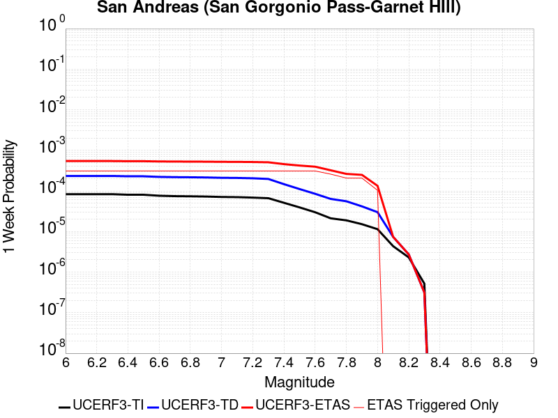 |  | 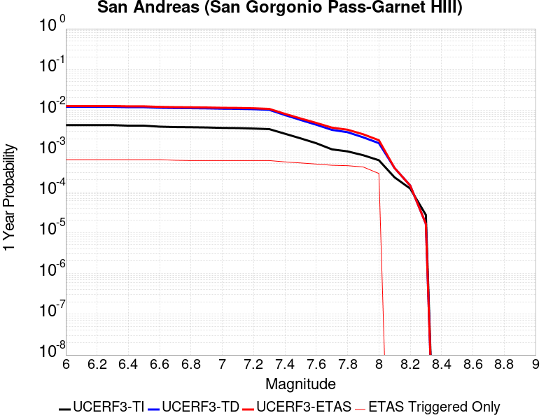 | 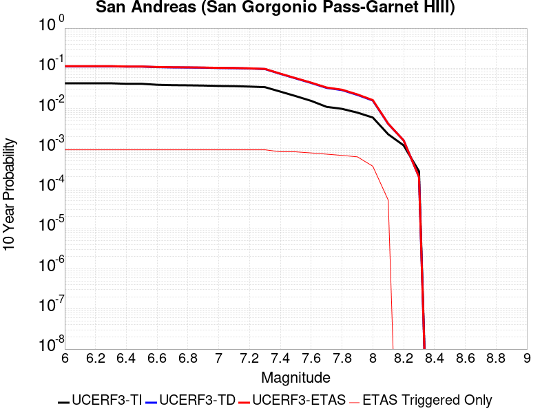 |

| Magnitude | 1 wk TI Prob | 1 wk TD Prob | 1 wk ETAS Prob | 1 wk ETAS/TD Gain | 1 wk ETAS Triggered Only | 1 mo TI Prob | 1 mo TD Prob | 1 mo ETAS Prob | 1 mo ETAS/TD Gain | 1 mo ETAS Triggered Only | 1 yr TI Prob | 1 yr TD Prob | 1 yr ETAS Prob | 1 yr ETAS/TD Gain | 1 yr ETAS Triggered Only | 10 yr TI Prob | 10 yr TD Prob | 10 yr ETAS Prob | 10 yr ETAS/TD Gain | 10 yr ETAS Triggered Only |
|-----|-----|-----|-----|-----|-----|-----|-----|-----|-----|-----|-----|-----|-----|-----|-----|-----|-----|-----|-----|-----|
| 6.0 | 8.31567E-5 | 2.3382473E-4 | 5.572622E-4 | 2.3832476 | 3.2351314E-4 | 3.5633717E-4 | 0.0010017233 | 0.0013770397 | 1.3746706 | 3.7569267E-4 | 0.004329778 | 0.012127888 | 0.01273614 | 1.0501531 | 6.1571854E-4 | 0.042463828 | 0.11257892 | 0.113282755 | 1.0062519 | 7.93129E-4 |
| 6.1 | 8.31567E-5 | 2.3382473E-4 | 5.572622E-4 | 2.3832476 | 3.2351314E-4 | 3.5633717E-4 | 0.0010017233 | 0.0013770397 | 1.3746706 | 3.7569267E-4 | 0.004329778 | 0.012127888 | 0.01273614 | 1.0501531 | 6.1571854E-4 | 0.042463828 | 0.11257892 | 0.113282755 | 1.0062519 | 7.93129E-4 |
| 6.2 | 8.31567E-5 | 2.3382473E-4 | 5.572622E-4 | 2.3832476 | 3.2351314E-4 | 3.5633717E-4 | 0.0010017233 | 0.0013770397 | 1.3746706 | 3.7569267E-4 | 0.004329778 | 0.012127888 | 0.01273614 | 1.0501531 | 6.1571854E-4 | 0.042463828 | 0.11257892 | 0.113282755 | 1.0062519 | 7.93129E-4 |
| 6.3 | 8.31567E-5 | 2.3382473E-4 | 5.572622E-4 | 2.3832476 | 3.2351314E-4 | 3.5633717E-4 | 0.0010017233 | 0.0013770397 | 1.3746706 | 3.7569267E-4 | 0.004329778 | 0.012127888 | 0.01273614 | 1.0501531 | 6.1571854E-4 | 0.042463828 | 0.11257892 | 0.113282755 | 1.0062519 | 7.93129E-4 |
| 6.4 | 8.059055E-5 | 2.2940808E-4 | 5.52847E-4 | 2.4098847 | 3.2351314E-4 | 3.4534236E-4 | 9.828096E-4 | 0.0013581329 | 1.3818883 | 3.7569267E-4 | 0.0041964394 | 0.011900152 | 0.012508543 | 1.0511247 | 6.1571854E-4 | 0.041180745 | 0.11056015 | 0.111265585 | 1.0063806 | 7.93129E-4 |
| 6.5 | 8.059055E-5 | 2.2940808E-4 | 5.52847E-4 | 2.4098847 | 3.2351314E-4 | 3.4534236E-4 | 9.828096E-4 | 0.0013581329 | 1.3818883 | 3.7569267E-4 | 0.0041964394 | 0.011900152 | 0.012508543 | 1.0511247 | 6.1571854E-4 | 0.041180745 | 0.11056015 | 0.111265585 | 1.0063806 | 7.93129E-4 |
| 6.6 | 7.619237E-5 | 2.218517E-4 | 5.452931E-4 | 2.457917 | 3.2351314E-4 | 3.2649786E-4 | 9.5044886E-4 | 0.0013257845 | 1.3949035 | 3.7569267E-4 | 0.0039678677 | 0.01151087 | 0.012119501 | 1.0528744 | 6.1571854E-4 | 0.03897764 | 0.10709683 | 0.1077957 | 1.0065256 | 7.826931E-4 |
| 6.7 | 7.440636E-5 | 2.1860997E-4 | 5.420524E-4 | 2.479541 | 3.2351314E-4 | 3.188454E-4 | 9.3656575E-4 | 0.0013119065 | 1.4007629 | 3.7569267E-4 | 0.0038750346 | 0.011343609 | 0.011931707 | 1.0518441 | 5.9484673E-4 | 0.038081564 | 0.105605274 | 0.106286645 | 1.0064521 | 7.618213E-4 |
| 6.8 | 7.3735864E-5 | 2.1708169E-4 | 5.405246E-4 | 2.4899595 | 3.2351314E-4 | 3.1597257E-4 | 9.3002064E-4 | 0.001305364 | 1.403586 | 3.7569267E-4 | 0.0038401815 | 0.011264749 | 0.011842577 | 1.0512952 | 5.8441085E-4 | 0.03774495 | 0.10490683 | 0.10557938 | 1.0064111 | 7.5138535E-4 |
| 6.9 | 7.27575E-5 | 2.1477141E-4 | 5.382151E-4 | 2.5059903 | 3.2351314E-4 | 3.117806E-4 | 9.201265E-4 | 0.0012954735 | 1.4079298 | 3.7569267E-4 | 0.003789323 | 0.011145527 | 0.011723423 | 1.0518502 | 5.8441085E-4 | 0.037253562 | 0.103854746 | 0.10452809 | 1.0064836 | 7.5138535E-4 |
| 7.0 | 7.102591E-5 | 2.1061185E-4 | 5.3405686E-4 | 2.53574 | 3.2351314E-4 | 3.0436125E-4 | 9.023122E-4 | 0.0012776658 | 1.415991 | 3.7569267E-4 | 0.003699303 | 0.010930831 | 0.011508854 | 1.05288 | 5.8441085E-4 | 0.03638325 | 0.10195695 | 0.10262235 | 1.0065264 | 7.409495E-4 |
| 7.1 | 7.028513E-5 | 2.0896831E-4 | 5.3241383E-4 | 2.547821 | 3.2351314E-4 | 3.0118722E-4 | 8.9527335E-4 | 0.0012706297 | 1.4192646 | 3.7569267E-4 | 0.0036607897 | 0.010845989 | 0.011424062 | 1.0532982 | 5.8441085E-4 | 0.036010686 | 0.101199985 | 0.101865955 | 1.0065807 | 7.409495E-4 |
| 7.2 | 6.8498244E-5 | 2.0504706E-4 | 5.284939E-4 | 2.5774271 | 3.2351314E-4 | 2.9353087E-4 | 8.784794E-4 | 0.001253842 | 1.4272867 | 3.7569267E-4 | 0.003567883 | 0.010643536 | 0.011221726 | 1.0543232 | 5.8441085E-4 | 0.035111405 | 0.09939202 | 0.10005932 | 1.0067139 | 7.409495E-4 |
| 7.3 | 6.622592E-5 | 1.9732013E-4 | 5.2076945E-4 | 2.639211 | 3.2351314E-4 | 2.8379448E-4 | 8.453858E-4 | 0.0012207609 | 1.4440281 | 3.7569267E-4 | 0.0034497243 | 0.0102444785 | 0.010822902 | 1.056462 | 5.8441085E-4 | 0.033966612 | 0.095888525 | 0.09655843 | 1.0069863 | 7.409495E-4 |
| 7.4 | 5.1050705E-5 | 1.4689034E-4 | 4.5992158E-4 | 3.1310542 | 3.1307724E-4 | 2.1877038E-4 | 6.29379E-4 | 9.94406E-4 | 1.5799794 | 3.6525677E-4 | 0.002660276 | 0.0076359594 | 0.008174483 | 1.0705247 | 5.426672E-4 | 0.02628654 | 0.07286301 | 0.07351127 | 1.008897 | 6.9920585E-4 |
| 7.5 | 3.9302922E-5 | 1.1129847E-4 | 4.0347138E-4 | 3.6251295 | 2.9220543E-4 | 1.6843023E-4 | 4.7690657E-4 | 8.2112727E-4 | 1.7217782 | 3.4438496E-4 | 0.0020487092 | 0.005790949 | 0.006299347 | 1.0877919 | 5.113595E-4 | 0.020299247 | 0.05600951 | 0.05664 | 1.0112568 | 6.678981E-4 |
| 7.6 | 2.9851626E-5 | 8.4949745E-5 | 3.562603E-4 | 4.193777 | 2.713336E-4 | 1.2792926E-4 | 3.6401965E-4 | 6.87415E-4 | 1.8884009 | 3.2351314E-4 | 0.0015564259 | 0.0044229585 | 0.004900887 | 1.1080563 | 4.8005176E-4 | 0.0154556995 | 0.04319374 | 0.043792848 | 1.0138702 | 6.261545E-4 |
| 7.7 | 2.1135214E-5 | 6.3529005E-5 | 3.139749E-4 | 4.9422293 | 2.504618E-4 | 9.0576345E-5 | 2.7223877E-4 | 5.747977E-4 | 2.1113734 | 3.0264133E-4 | 0.0011022091 | 0.0033094748 | 0.0037567338 | 1.135145 | 4.4874405E-4 | 0.010967582 | 0.032582592 | 0.033147965 | 1.0173519 | 5.8441085E-4 |
| 7.8 | 1.883379E-5 | 5.564028E-5 | 2.956528E-4 | 5.313647 | 2.4002588E-4 | 8.0713755E-5 | 2.3843657E-4 | 5.305723E-4 | 2.2252138 | 2.9220543E-4 | 9.822468E-4 | 0.0028991038 | 0.0033361414 | 1.1507491 | 4.3830814E-4 | 0.0097791655 | 0.028695205 | 0.02925271 | 1.0194285 | 5.739749E-4 |
| 7.9 | 1.5156185E-5 | 4.1658426E-5 | 2.8167432E-4 | 6.761521 | 2.4002588E-4 | 6.495346E-5 | 1.785239E-4 | 4.7067716E-4 | 2.6364937 | 2.9220543E-4 | 7.9052144E-4 | 0.0021713632 | 0.00257748 | 1.187033 | 4.0700042E-4 | 0.007877152 | 0.021759422 | 0.022269864 | 1.0234584 | 5.217954E-4 |
| 8.0 | 1.1405907E-5 | 2.9974231E-5 | 1.9694376E-4 | 6.5704355 | 1.6697453E-4 | 4.8881542E-5 | 1.2845467E-4 | 3.3714602E-4 | 2.6246302 | 2.0871816E-4 | 5.9497025E-4 | 0.0015628147 | 0.0018441438 | 1.1800144 | 2.8176952E-4 | 0.005933798 | 0.015772851 | 0.016142618 | 1.0234432 | 3.7569267E-4 |
| 8.1 | 4.3511436E-6 | 7.369219E-6 | 7.369219E-6 | 1.0 | 0.0 | 1.8647626E-5 | 3.1581985E-5 | 3.1581985E-5 | 1.0 | 0.0 | 2.2701119E-4 | 3.8444297E-4 | 3.8444297E-4 | 1.0 | 0.0 | 0.0022677942 | 0.0041163345 | 0.0041267276 | 1.0025249 | 1.0435908E-5 |
| 8.2 | 2.3042528E-6 | 2.7329415E-6 | 2.7329415E-6 | 1.0 | 0.0 | 9.875332E-6 | 1.1712554E-5 | 1.1712554E-5 | 1.0 | 0.0 | 1.2022553E-4 | 1.4259106E-4 | 1.4259106E-4 | 1.0 | 0.0 | 0.0012016051 | 0.0015979785 | 0.0015979785 | 1.0 | 0.0 |
| 8.3 | 5.202968E-7 | 3.1598344E-7 | 3.1598344E-7 | 1.0 | 0.0 | 2.2298414E-6 | 1.3542141E-6 | 1.3542141E-6 | 1.0 | 0.0 | 2.714798E-5 | 1.6487444E-5 | 1.6487444E-5 | 1.0 | 0.0 | 2.7144665E-4 | 1.9563142E-4 | 1.9563142E-4 | 1.0 | 0.0 |

## Death Valley (No)
*[(top)](#table-of-contents)*

| 1 Week | 1 Month | 1 Year | 10 Year |
|-----|-----|-----|-----|
| 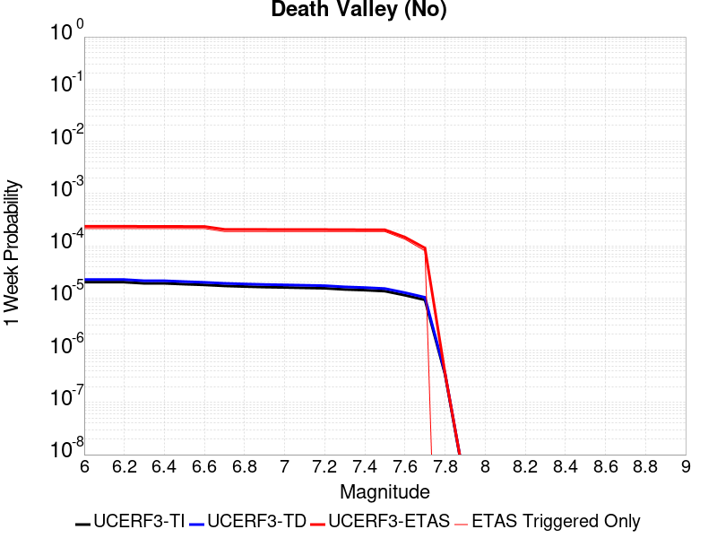 | 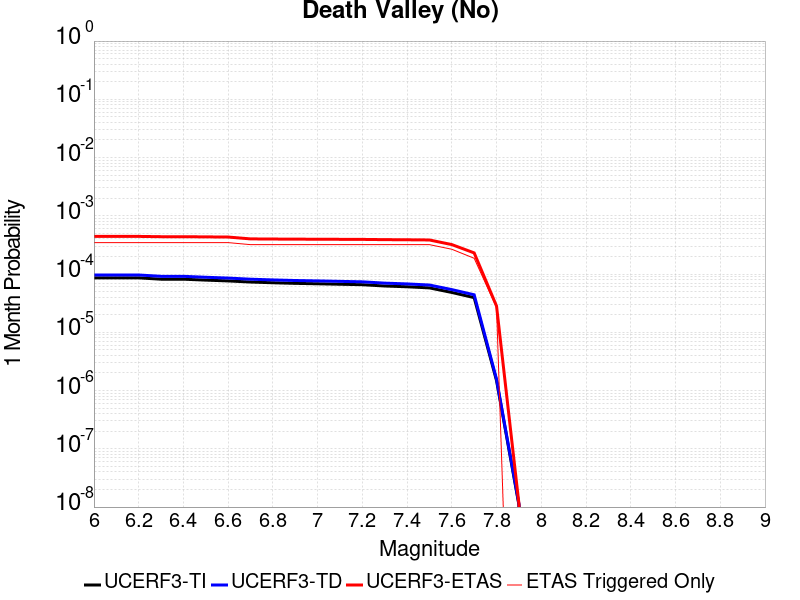 | 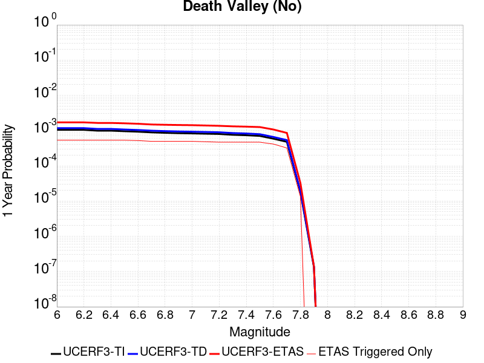 | 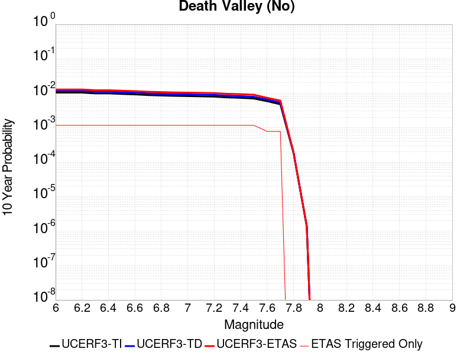 |

| Magnitude | 1 wk TI Prob | 1 wk TD Prob | 1 wk ETAS Prob | 1 wk ETAS/TD Gain | 1 wk ETAS Triggered Only | 1 mo TI Prob | 1 mo TD Prob | 1 mo ETAS Prob | 1 mo ETAS/TD Gain | 1 mo ETAS Triggered Only | 1 yr TI Prob | 1 yr TD Prob | 1 yr ETAS Prob | 1 yr ETAS/TD Gain | 1 yr ETAS Triggered Only | 10 yr TI Prob | 10 yr TD Prob | 10 yr ETAS Prob | 10 yr ETAS/TD Gain | 10 yr ETAS Triggered Only |
|-----|-----|-----|-----|-----|-----|-----|-----|-----|-----|-----|-----|-----|-----|-----|-----|-----|-----|-----|-----|-----|
| 6.0 | 2.0074807E-5 | 2.2500084E-5 | 2.6252057E-4 | 11.667538 | 2.4002588E-4 | 8.603206E-5 | 9.642541E-5 | 4.6164697E-4 | 4.787607 | 3.6525677E-4 | 0.001046937 | 0.0011733545 | 0.0016945376 | 1.4441822 | 5.217954E-4 | 0.010420183 | 0.011672506 | 0.012404807 | 1.0627372 | 7.409495E-4 |
| 6.1 | 2.0074807E-5 | 2.2500084E-5 | 2.6252057E-4 | 11.667538 | 2.4002588E-4 | 8.603206E-5 | 9.642541E-5 | 4.6164697E-4 | 4.787607 | 3.6525677E-4 | 0.001046937 | 0.0011733545 | 0.0016945376 | 1.4441822 | 5.217954E-4 | 0.010420183 | 0.011672506 | 0.012404807 | 1.0627372 | 7.409495E-4 |
| 6.2 | 2.0074807E-5 | 2.2500084E-5 | 2.6252057E-4 | 11.667538 | 2.4002588E-4 | 8.603206E-5 | 9.642541E-5 | 4.6164697E-4 | 4.787607 | 3.6525677E-4 | 0.001046937 | 0.0011733545 | 0.0016945376 | 1.4441822 | 5.217954E-4 | 0.010420183 | 0.011672506 | 0.012404807 | 1.0627372 | 7.409495E-4 |
| 6.3 | 1.9050609E-5 | 2.1336948E-5 | 2.613577E-4 | 12.249067 | 2.4002588E-4 | 8.164292E-5 | 9.1440896E-5 | 4.5666427E-4 | 4.9940925 | 3.6525677E-4 | 9.935491E-4 | 0.001112731 | 0.0016339459 | 1.4684104 | 5.217954E-4 | 0.009891188 | 0.011072419 | 0.011794844 | 1.0652455 | 7.3051354E-4 |
| 6.4 | 1.9050609E-5 | 2.1336948E-5 | 2.613577E-4 | 12.249067 | 2.4002588E-4 | 8.164292E-5 | 9.1440896E-5 | 4.5666427E-4 | 4.9940925 | 3.6525677E-4 | 9.935491E-4 | 0.001112731 | 0.0016339459 | 1.4684104 | 5.217954E-4 | 0.009891188 | 0.011072419 | 0.011794844 | 1.0652455 | 7.3051354E-4 |
| 6.5 | 1.8367004E-5 | 2.0561009E-5 | 2.6058196E-4 | 12.673598 | 2.4002588E-4 | 7.8713354E-5 | 8.811567E-5 | 4.5334027E-4 | 5.1448317 | 3.6525677E-4 | 9.5791375E-4 | 0.0010722869 | 0.0015935227 | 1.4860975 | 5.217954E-4 | 0.009537951 | 0.0106719155 | 0.011394633 | 1.0677215 | 7.3051354E-4 |
| 6.6 | 1.779439E-5 | 1.9910927E-5 | 2.5993204E-4 | 13.054742 | 2.4002588E-4 | 7.625944E-5 | 8.53298E-5 | 4.505554E-4 | 5.280165 | 3.6525677E-4 | 9.280632E-4 | 0.0010384015 | 0.00154923 | 1.4919374 | 5.113595E-4 | 0.009241969 | 0.010336253 | 0.0110385595 | 1.067946 | 7.096417E-4 |
| 6.7 | 1.7025437E-5 | 1.9043426E-5 | 2.3819332E-4 | 12.507903 | 2.1915407E-4 | 7.296412E-5 | 8.161216E-5 | 4.2596902E-4 | 5.2194304 | 3.4438496E-4 | 8.87976E-4 | 9.931813E-4 | 0.0014831818 | 1.4933646 | 4.9048767E-4 | 0.008844362 | 0.009888145 | 0.010570104 | 1.0689673 | 6.887699E-4 |
| 6.8 | 1.6545107E-5 | 1.8512545E-5 | 2.3766255E-4 | 12.837918 | 2.1915407E-4 | 7.090568E-5 | 7.93371E-5 | 4.2369473E-4 | 5.3404365 | 3.4438496E-4 | 8.629347E-4 | 9.655073E-4 | 0.0014555213 | 1.5075198 | 4.9048767E-4 | 0.008595915 | 0.009613829 | 0.010295977 | 1.0709549 | 6.887699E-4 |
| 6.9 | 1.615478E-5 | 1.8087594E-5 | 2.3723769E-4 | 13.116045 | 2.1915407E-4 | 6.9232934E-5 | 7.751599E-5 | 4.2187425E-4 | 5.4424157 | 3.4438496E-4 | 8.4258494E-4 | 9.433546E-4 | 0.0014333796 | 1.5194494 | 4.9048767E-4 | 0.008393973 | 0.009394196 | 0.010066157 | 1.0715294 | 6.7833404E-4 |
| 7.0 | 1.5894311E-5 | 1.780555E-5 | 2.3695572E-4 | 13.307969 | 2.1915407E-4 | 6.81167E-5 | 7.6307304E-5 | 4.2066598E-4 | 5.5127883 | 3.4438496E-4 | 8.2900526E-4 | 9.286515E-4 | 0.0014186837 | 1.5276815 | 4.9048767E-4 | 0.008259195 | 0.009248397 | 0.009910119 | 1.0715498 | 6.678981E-4 |
| 7.1 | 1.5602263E-5 | 1.7483504E-5 | 2.3663374E-4 | 13.534687 | 2.1915407E-4 | 6.6865134E-5 | 7.492718E-5 | 4.1928634E-4 | 5.5959177 | 3.4438496E-4 | 8.137789E-4 | 9.118627E-4 | 0.0013914767 | 1.5259718 | 4.8005176E-4 | 0.008108052 | 0.009081894 | 0.009733385 | 1.0717351 | 6.574622E-4 |
| 7.2 | 1.5323829E-5 | 1.717063E-5 | 2.258852E-4 | 13.155324 | 2.0871816E-4 | 6.56719E-5 | 7.358637E-5 | 4.0751084E-4 | 5.5378575 | 3.3394905E-4 | 7.99262E-4 | 8.9555193E-4 | 0.0013647472 | 1.5239174 | 4.6961586E-4 | 0.007963934 | 0.008920107 | 0.009561362 | 1.0718887 | 6.470263E-4 |
| 7.3 | 1.4556212E-5 | 1.6302456E-5 | 2.2501721E-4 | 13.802658 | 2.0871816E-4 | 6.238227E-5 | 6.9865826E-5 | 4.0379155E-4 | 5.7795286 | 3.3394905E-4 | 7.592395E-4 | 8.5029035E-4 | 0.0013195069 | 1.551831 | 4.6961586E-4 | 0.0075665074 | 0.008471014 | 0.009112559 | 1.0757341 | 6.470263E-4 |
| 7.4 | 1.411725E-5 | 1.580796E-5 | 2.2452282E-4 | 14.20315 | 2.0871816E-4 | 6.0501097E-5 | 6.7746674E-5 | 4.016731E-4 | 5.929045 | 3.3394905E-4 | 7.363519E-4 | 8.245094E-4 | 0.0012937381 | 1.5691004 | 4.6961586E-4 | 0.0073391674 | 0.008215138 | 0.008846499 | 1.0768533 | 6.3659035E-4 |
| 7.5 | 1.3503312E-5 | 1.5126289E-5 | 2.2384129E-4 | 14.798162 | 2.0871816E-4 | 5.7870053E-5 | 6.482538E-5 | 3.9875277E-4 | 6.1511836 | 3.3394905E-4 | 7.043401E-4 | 7.8896893E-4 | 0.0012582144 | 1.5947577 | 4.6961586E-4 | 0.007021119 | 0.007862304 | 0.00849389 | 1.0803308 | 6.3659035E-4 |
| 7.6 | 1.1279839E-5 | 1.2626327E-5 | 1.9003452E-4 | 15.050657 | 1.7741043E-4 | 4.834127E-5 | 5.4111737E-5 | 3.5673668E-4 | 6.5925937 | 3.0264133E-4 | 5.88396E-4 | 6.5861654E-4 | 0.001086207 | 1.6492251 | 4.2787223E-4 | 0.005868405 | 0.006567199 | 0.0071477713 | 1.088405 | 5.8441085E-4 |
| 7.7 | 9.189108E-6 | 1.0283358E-5 | 1.4594877E-4 | 14.192714 | 1.356668E-4 | 3.93813E-5 | 4.407082E-5 | 2.9452157E-4 | 6.6829157 | 2.504618E-4 | 4.7936183E-4 | 5.3643517E-4 | 8.806354E-4 | 1.6416436 | 3.4438496E-4 | 0.004783291 | 0.005351914 | 0.0058086365 | 1.0853381 | 4.5917995E-4 |
| 7.8 | 3.4586725E-7 | 3.6482615E-7 | 1.080073E-5 | 29.605145 | 1.0435908E-5 | 1.4822873E-6 | 1.5635396E-6 | 2.2435323E-5 | 14.349059 | 2.0871816E-5 | 1.80467E-5 | 1.9035933E-5 | 3.990735E-5 | 2.0964222 | 2.0871816E-5 | 1.8045233E-4 | 1.9034347E-4 | 2.1121131E-4 | 1.1096326 | 2.0871816E-5 |
| 7.9 | 2.5591178E-9 | 2.6696718E-9 | 2.6696718E-9 | 1.0 | 0.0 | 1.0967647E-8 | 1.14414505E-8 | 1.14414505E-8 | 1.0 | 0.0 | 1.335311E-7 | 1.3929966E-7 | 1.3929966E-7 | 1.0 | 0.0 | 1.3353102E-6 | 1.3929966E-6 | 1.3929966E-6 | 1.0 | 0.0 |

## San Andreas (Coachella) rev
*[(top)](#table-of-contents)*

| 1 Week | 1 Month | 1 Year | 10 Year |
|-----|-----|-----|-----|
| 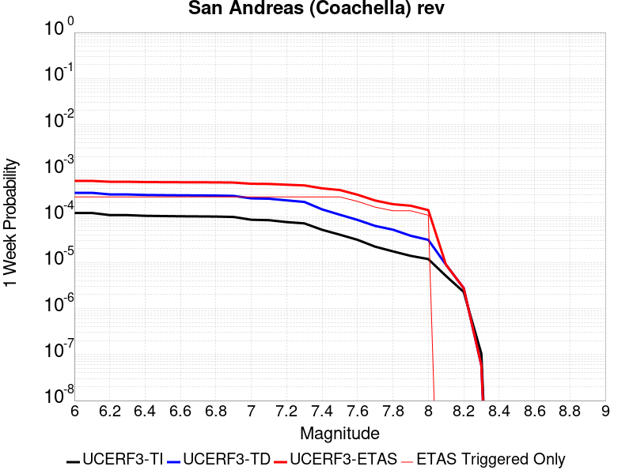 | 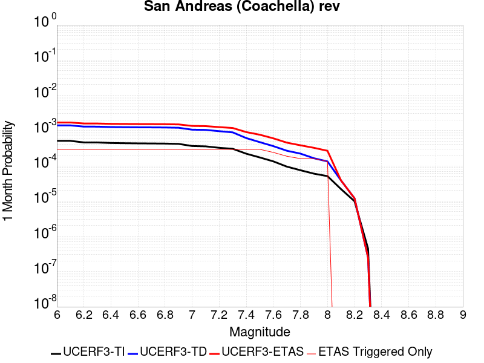 |  | 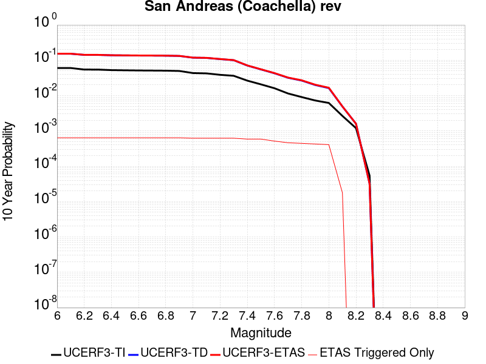 |

| Magnitude | 1 wk TI Prob | 1 wk TD Prob | 1 wk ETAS Prob | 1 wk ETAS/TD Gain | 1 wk ETAS Triggered Only | 1 mo TI Prob | 1 mo TD Prob | 1 mo ETAS Prob | 1 mo ETAS/TD Gain | 1 mo ETAS Triggered Only | 1 yr TI Prob | 1 yr TD Prob | 1 yr ETAS Prob | 1 yr ETAS/TD Gain | 1 yr ETAS Triggered Only | 10 yr TI Prob | 10 yr TD Prob | 10 yr ETAS Prob | 10 yr ETAS/TD Gain | 10 yr ETAS Triggered Only |
|-----|-----|-----|-----|-----|-----|-----|-----|-----|-----|-----|-----|-----|-----|-----|-----|-----|-----|-----|-----|-----|
| 6.0 | 1.1925945E-4 | 3.2729402E-4 | 5.5680884E-4 | 1.7012497 | 2.2958998E-4 | 5.110118E-4 | 0.0014019393 | 0.0016728925 | 1.1932703 | 2.713336E-4 | 0.0062038354 | 0.016936364 | 0.01735699 | 1.0248357 | 4.2787223E-4 | 0.060334753 | 0.15265316 | 0.15313067 | 1.003128 | 5.6353904E-4 |
| 6.1 | 1.1925945E-4 | 3.2729402E-4 | 5.5680884E-4 | 1.7012497 | 2.2958998E-4 | 5.110118E-4 | 0.0014019393 | 0.0016728925 | 1.1932703 | 2.713336E-4 | 0.0062038354 | 0.016936364 | 0.01735699 | 1.0248357 | 4.2787223E-4 | 0.060334753 | 0.15265316 | 0.15313067 | 1.003128 | 5.6353904E-4 |
| 6.2 | 1.07432395E-4 | 3.0230157E-4 | 5.3182215E-4 | 1.7592437 | 2.2958998E-4 | 4.603433E-4 | 0.0012949388 | 0.0015659211 | 1.2092626 | 2.713336E-4 | 0.005590286 | 0.015653009 | 0.01606391 | 1.0262507 | 4.1743633E-4 | 0.05451731 | 0.14182423 | 0.14229889 | 1.0033468 | 5.531031E-4 |
| 6.3 | 1.0718766E-4 | 3.0175463E-4 | 5.312753E-4 | 1.7606204 | 2.2958998E-4 | 4.592948E-4 | 0.0012925972 | 0.00156358 | 1.2096422 | 2.713336E-4 | 0.005577586 | 0.015624908 | 0.016035821 | 1.0262986 | 4.1743633E-4 | 0.054396555 | 0.14159249 | 0.14206728 | 1.0033532 | 5.531031E-4 |
| 6.4 | 1.0355944E-4 | 2.9383553E-4 | 5.2335806E-4 | 1.7811258 | 2.2958998E-4 | 4.4375064E-4 | 0.0012586913 | 0.0015296834 | 1.2152967 | 2.713336E-4 | 0.0053892885 | 0.015217941 | 0.015618748 | 1.0263377 | 4.0700042E-4 | 0.052604496 | 0.13815255 | 0.13862026 | 1.0033853 | 5.426672E-4 |
| 6.5 | 1.0227914E-4 | 2.9102986E-4 | 5.2055303E-4 | 1.7886584 | 2.2958998E-4 | 4.382655E-4 | 0.0012466786 | 0.001517674 | 1.2173738 | 2.713336E-4 | 0.0053228354 | 0.01507372 | 0.015474586 | 1.0265937 | 4.0700042E-4 | 0.051971316 | 0.13693172 | 0.13740008 | 1.0034204 | 5.426672E-4 |
| 6.6 | 1.0116757E-4 | 2.8868738E-4 | 5.1821105E-4 | 1.7950597 | 2.2958998E-4 | 4.3350324E-4 | 0.0012366489 | 0.001507647 | 1.2191391 | 2.713336E-4 | 0.0052651367 | 0.01495329 | 0.015354205 | 1.0268111 | 4.0700042E-4 | 0.051421247 | 0.1359099 | 0.13637881 | 1.0034502 | 5.426672E-4 |
| 6.7 | 1.0050676E-4 | 2.8727303E-4 | 5.16797E-4 | 1.7989752 | 2.2958998E-4 | 4.3067214E-4 | 0.0012305931 | 0.0015015928 | 1.2202188 | 2.713336E-4 | 0.005230834 | 0.014880571 | 0.015281514 | 1.0269442 | 4.0700042E-4 | 0.051094085 | 0.13529462 | 0.13576387 | 1.0034684 | 5.426672E-4 |
| 6.8 | 9.976819E-5 | 2.853096E-4 | 5.148341E-4 | 1.8044751 | 2.2958998E-4 | 4.2750788E-4 | 0.0012221863 | 0.0014931883 | 1.2217354 | 2.713336E-4 | 0.0051924936 | 0.0147796115 | 0.015170314 | 1.0264353 | 3.965645E-4 | 0.050728295 | 0.13444631 | 0.13490698 | 1.0034264 | 5.322313E-4 |
| 6.9 | 9.77719E-5 | 2.8027873E-4 | 5.0980435E-4 | 1.8189192 | 2.2958998E-4 | 4.1895514E-4 | 0.0012006456 | 0.0014716533 | 1.2257184 | 2.713336E-4 | 0.0050888555 | 0.014520878 | 0.014911684 | 1.0269134 | 3.965645E-4 | 0.049738888 | 0.1322748 | 0.13273664 | 1.0034914 | 5.322313E-4 |
| 7.0 | 8.500761E-5 | 2.4762485E-4 | 4.7715797E-4 | 1.9269389 | 2.2958998E-4 | 3.6426744E-4 | 0.001060821 | 0.0013318667 | 1.2555057 | 2.713336E-4 | 0.0044259406 | 0.012839786 | 0.013220957 | 1.0296867 | 3.8612858E-4 | 0.04338823 | 0.11813272 | 0.11859287 | 1.0038953 | 5.217954E-4 |
| 7.1 | 8.319876E-5 | 2.4365232E-4 | 4.7318634E-4 | 1.9420556 | 2.2958998E-4 | 3.5651738E-4 | 0.0010438096 | 0.00131486 | 1.2596742 | 2.713336E-4 | 0.004331963 | 0.012635092 | 0.013016342 | 1.0301739 | 3.8612858E-4 | 0.042484846 | 0.116353 | 0.116814084 | 1.0039628 | 5.217954E-4 |
| 7.2 | 7.563917E-5 | 2.2413683E-4 | 4.5367534E-4 | 2.0240998 | 2.2958998E-4 | 3.2412758E-4 | 9.602359E-4 | 0.0012313089 | 1.2822984 | 2.713336E-4 | 0.0039391145 | 0.011628893 | 0.0120105315 | 1.0328181 | 3.8612858E-4 | 0.03870018 | 0.10775925 | 0.10822482 | 1.0043204 | 5.217954E-4 |
| 7.3 | 7.082985E-5 | 2.0729867E-4 | 4.3684104E-4 | 2.1073027 | 2.2958998E-4 | 3.0352117E-4 | 8.881233E-4 | 0.0011592159 | 1.3052421 | 2.713336E-4 | 0.0036891096 | 0.010759917 | 0.011141891 | 1.0354997 | 3.8612858E-4 | 0.03628465 | 0.100282 | 0.10075147 | 1.0046815 | 5.217954E-4 |
| 7.4 | 5.146215E-5 | 1.4273795E-4 | 3.7229515E-4 | 2.6082423 | 2.2958998E-4 | 2.2053342E-4 | 6.115915E-4 | 8.8275917E-4 | 1.4433804 | 2.713336E-4 | 0.0026816884 | 0.0074208933 | 0.007773081 | 1.047459 | 3.5482086E-4 | 0.02649557 | 0.070849575 | 0.07130531 | 1.0064324 | 4.9048767E-4 |
| 7.5 | 4.0285166E-5 | 1.09416E-4 | 3.285461E-4 | 3.0027244 | 2.1915407E-4 | 1.7263928E-4 | 4.6884175E-4 | 7.2961714E-4 | 1.556212 | 2.608977E-4 | 0.002099857 | 0.0056932783 | 0.0060357023 | 1.0601454 | 3.4438496E-4 | 0.020801254 | 0.055011146 | 0.05546479 | 1.0082464 | 4.8005176E-4 |
| 7.6 | 3.1168736E-5 | 8.4389096E-5 | 2.8265463E-4 | 3.349421 | 1.9828224E-4 | 1.3357346E-4 | 3.6161754E-4 | 6.015566E-4 | 1.6635162 | 2.4002588E-4 | 0.0016250437 | 0.0043938323 | 0.004705534 | 1.0709407 | 3.1307724E-4 | 0.016132116 | 0.04281005 | 0.043229595 | 1.0098001 | 4.3830814E-4 |
| 7.7 | 2.2100989E-5 | 6.238755E-5 | 2.3978692E-4 | 3.8435059 | 1.7741043E-4 | 9.4715084E-5 | 2.6734784E-4 | 4.8644334E-4 | 1.8195146 | 2.1915407E-4 | 0.001152546 | 0.0032501083 | 0.003541364 | 1.0896142 | 2.9220543E-4 | 0.011465867 | 0.0319002 | 0.032294217 | 1.0123515 | 4.0700042E-4 |
| 7.8 | 1.7484861E-5 | 5.179572E-5 | 2.1876159E-4 | 4.223546 | 1.6697453E-4 | 7.493296E-5 | 2.2196278E-4 | 4.3063462E-4 | 1.9401208 | 2.0871816E-4 | 9.1192697E-4 | 0.0026990508 | 0.0029800597 | 1.104114 | 2.8176952E-4 | 0.009081938 | 0.026640115 | 0.027026115 | 1.0144894 | 3.965645E-4 |
| 7.9 | 1.3967285E-5 | 3.822255E-5 | 2.0519069E-4 | 5.3683147 | 1.6697453E-4 | 5.985842E-5 | 1.6380067E-4 | 3.7248462E-4 | 2.2740119 | 2.0871816E-4 | 7.2853256E-4 | 0.00199245 | 0.002252828 | 1.1306822 | 2.608977E-4 | 0.0072614877 | 0.019909438 | 0.020267421 | 1.0179807 | 3.6525677E-4 |
| 8.0 | 1.1887396E-5 | 3.106521E-5 | 1.7716338E-4 | 5.7029514 | 1.4610271E-4 | 5.094499E-5 | 1.3312983E-4 | 3.2095116E-4 | 2.4108133 | 1.8784634E-4 | 6.200787E-4 | 0.0016196516 | 0.0018592887 | 1.147956 | 2.4002588E-4 | 0.006183513 | 0.016279267 | 0.016618047 | 1.0208105 | 3.4438496E-4 |
| 8.1 | 5.100864E-6 | 8.973418E-6 | 8.973418E-6 | 1.0 | 0.0 | 2.1860664E-5 | 3.8456936E-5 | 3.8456936E-5 | 1.0 | 0.0 | 2.6612106E-4 | 4.6811273E-4 | 4.6811273E-4 | 1.0 | 0.0 | 0.002658026 | 0.004917731 | 0.0049281153 | 1.0021117 | 1.0435908E-5 |
| 8.2 | 2.3004484E-6 | 2.7864487E-6 | 2.7864487E-6 | 1.0 | 0.0 | 9.859027E-6 | 1.1941868E-5 | 1.1941868E-5 | 1.0 | 0.0 | 1.2002704E-4 | 1.4538258E-4 | 1.4538258E-4 | 1.0 | 0.0 | 0.0011996223 | 0.0015973912 | 0.0015973912 | 1.0 | 0.0 |
| 8.3 | 1.0424446E-7 | 5.8161504E-8 | 5.8161504E-8 | 1.0 | 0.0 | 4.4676187E-7 | 2.4926356E-7 | 2.4926356E-7 | 1.0 | 0.0 | 5.439312E-6 | 3.03478E-6 | 3.03478E-6 | 1.0 | 0.0 | 5.4391792E-5 | 3.190716E-5 | 3.190716E-5 | 1.0 | 0.0 |

## Red Pass
*[(top)](#table-of-contents)*

| 1 Week | 1 Month | 1 Year | 10 Year |
|-----|-----|-----|-----|
| 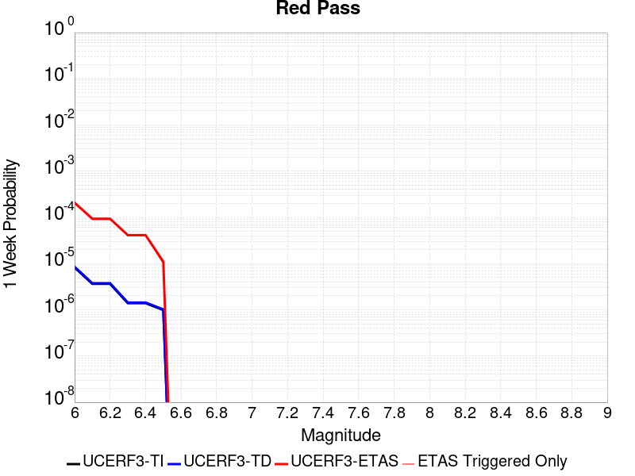 | 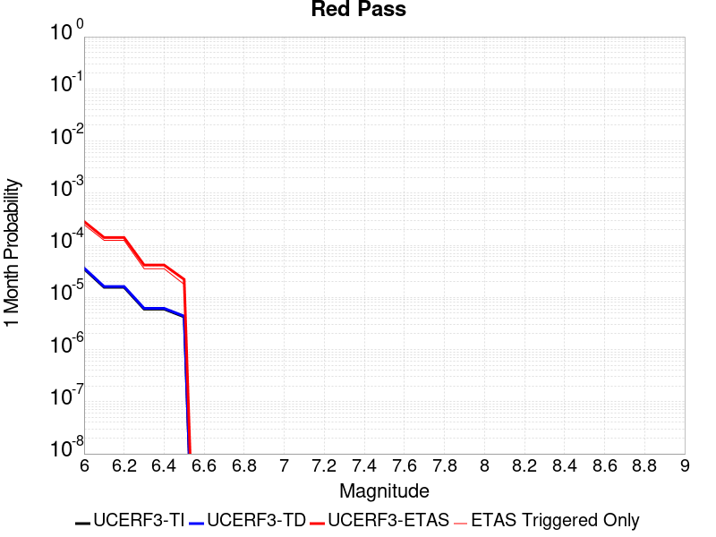 | 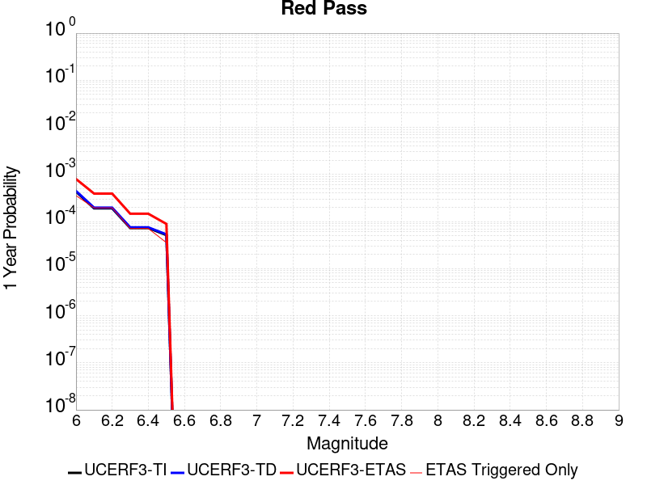 | 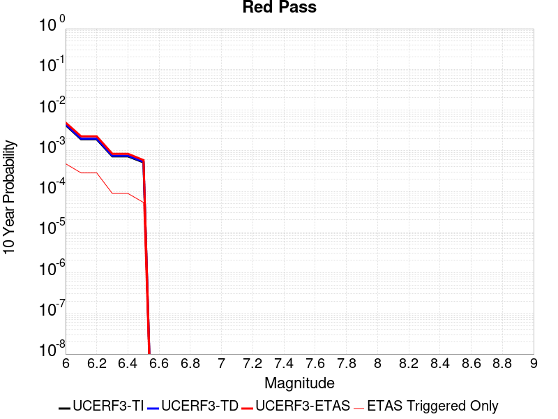 |

| Magnitude | 1 wk TI Prob | 1 wk TD Prob | 1 wk ETAS Prob | 1 wk ETAS/TD Gain | 1 wk ETAS Triggered Only | 1 mo TI Prob | 1 mo TD Prob | 1 mo ETAS Prob | 1 mo ETAS/TD Gain | 1 mo ETAS Triggered Only | 1 yr TI Prob | 1 yr TD Prob | 1 yr ETAS Prob | 1 yr ETAS/TD Gain | 1 yr ETAS Triggered Only | 10 yr TI Prob | 10 yr TD Prob | 10 yr ETAS Prob | 10 yr ETAS/TD Gain | 10 yr ETAS Triggered Only |
|-----|-----|-----|-----|-----|-----|-----|-----|-----|-----|-----|-----|-----|-----|-----|-----|-----|-----|-----|-----|-----|
| 6.0 | 8.258278E-6 | 8.551265E-6 | 1.96396E-4 | 22.966894 | 1.8784634E-4 | 3.539214E-5 | 3.6647863E-5 | 2.8710047E-4 | 7.83403 | 2.504618E-4 | 4.308141E-4 | 4.4611428E-4 | 8.633644E-4 | 1.9352987 | 4.1743633E-4 | 0.0042997985 | 0.004453945 | 0.004973416 | 1.1166317 | 5.217954E-4 |
| 6.1 | 3.649988E-6 | 3.7753161E-6 | 7.682639E-5 | 20.349659 | 7.305136E-5 | 1.5642712E-5 | 1.6179853E-5 | 1.101015E-4 | 6.804852 | 9.392317E-5 | 1.9043336E-4 | 1.9697666E-4 | 4.056537E-4 | 2.0593998 | 2.0871816E-4 | 0.0019027026 | 0.001968488 | 0.0022497028 | 1.1428583 | 2.8176952E-4 |
| 6.2 | 3.649988E-6 | 3.7753161E-6 | 7.682639E-5 | 20.349659 | 7.305136E-5 | 1.5642712E-5 | 1.6179853E-5 | 1.101015E-4 | 6.804852 | 9.392317E-5 | 1.9043336E-4 | 1.9697666E-4 | 4.056537E-4 | 2.0593998 | 2.0871816E-4 | 0.0019027026 | 0.001968488 | 0.0022497028 | 1.1428583 | 2.8176952E-4 |
| 6.3 | 1.3924937E-6 | 1.4411166E-6 | 3.2748794E-5 | 22.724598 | 3.1307725E-5 | 5.9678164E-6 | 6.1762075E-6 | 3.7483736E-5 | 6.069054 | 3.1307725E-5 | 7.265574E-5 | 7.519415E-5 | 1.5867513E-4 | 2.110206 | 8.348726E-5 | 7.263199E-4 | 7.518258E-4 | 8.561064E-4 | 1.1387031 | 1.0435908E-4 |
| 6.4 | 1.3924937E-6 | 1.4411166E-6 | 3.2748794E-5 | 22.724598 | 3.1307725E-5 | 5.9678164E-6 | 6.1762075E-6 | 3.7483736E-5 | 6.069054 | 3.1307725E-5 | 7.265574E-5 | 7.519415E-5 | 1.5867513E-4 | 2.110206 | 8.348726E-5 | 7.263199E-4 | 7.518258E-4 | 8.561064E-4 | 1.1387031 | 1.0435908E-4 |
| 6.5 | 9.876812E-7 | 1.0221912E-6 | 1.1458088E-5 | 11.209339 | 1.0435908E-5 | 4.2329125E-6 | 4.3808195E-6 | 1.4816682E-5 | 3.3821712 | 1.0435908E-5 | 5.153449E-5 | 5.3336476E-5 | 9.5077885E-5 | 1.7826052 | 4.174363E-5 | 5.1522546E-4 | 5.333648E-4 | 5.959468E-4 | 1.1173345 | 6.261545E-5 |

## San Andreas (Parkfield)
*[(top)](#table-of-contents)*

| 1 Week | 1 Month | 1 Year | 10 Year |
|-----|-----|-----|-----|
| 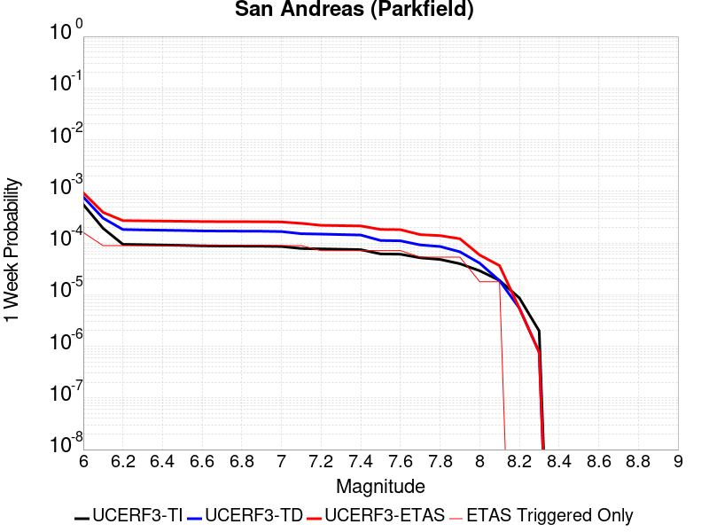 | 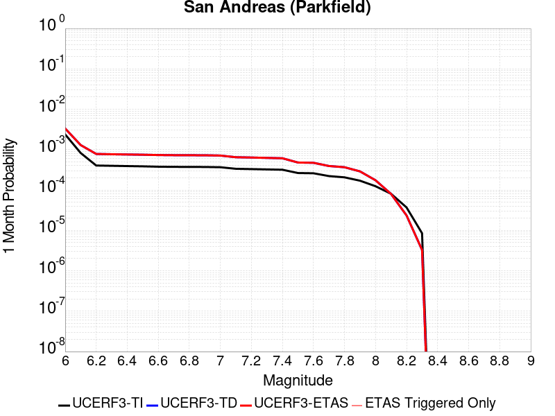 | 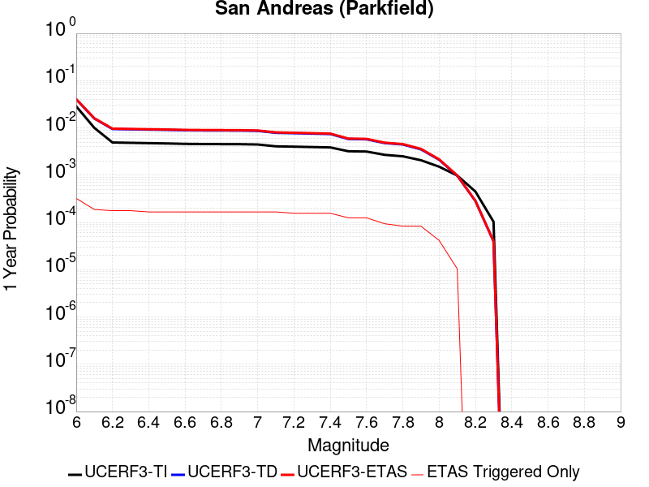 | 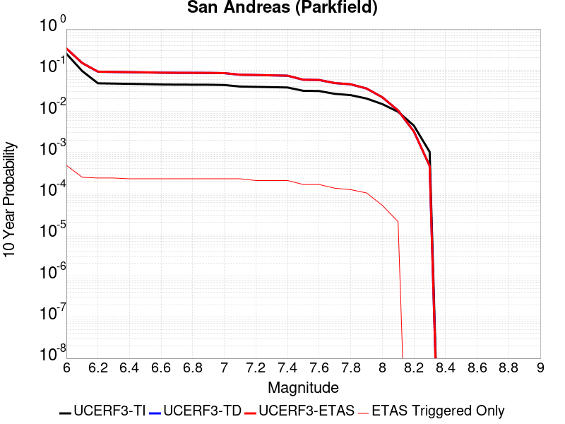 |

| Magnitude | 1 wk TI Prob | 1 wk TD Prob | 1 wk ETAS Prob | 1 wk ETAS/TD Gain | 1 wk ETAS Triggered Only | 1 mo TI Prob | 1 mo TD Prob | 1 mo ETAS Prob | 1 mo ETAS/TD Gain | 1 mo ETAS Triggered Only | 1 yr TI Prob | 1 yr TD Prob | 1 yr ETAS Prob | 1 yr ETAS/TD Gain | 1 yr ETAS Triggered Only | 10 yr TI Prob | 10 yr TD Prob | 10 yr ETAS Prob | 10 yr ETAS/TD Gain | 10 yr ETAS Triggered Only |
|-----|-----|-----|-----|-----|-----|-----|-----|-----|-----|-----|-----|-----|-----|-----|-----|-----|-----|-----|-----|-----|
| 6.0 | 5.556969E-4 | 7.7782426E-4 | 9.0295775E-4 | 1.1608763 | 1.252309E-4 | 0.0023793848 | 0.0033298214 | 0.0035066411 | 1.0531019 | 1.7741043E-4 | 0.028586963 | 0.040191233 | 0.040501744 | 1.0077258 | 3.2351314E-4 | 0.25176284 | 0.33716413 | 0.33748925 | 1.0009643 | 4.9048767E-4 |
| 6.1 | 1.925858E-4 | 3.0276453E-4 | 3.5492826E-4 | 1.1722914 | 5.217954E-5 | 8.2510663E-4 | 0.0012970108 | 0.0014012345 | 1.0803568 | 1.0435908E-4 | 0.0099994885 | 0.015778083 | 0.015962966 | 1.0117177 | 1.8784634E-4 | 0.095613256 | 0.1497237 | 0.14993665 | 1.0014224 | 2.504618E-4 |
| 6.2 | 9.4306815E-5 | 1.8242796E-4 | 2.3459799E-4 | 1.285976 | 5.217954E-5 | 4.0410945E-4 | 7.816011E-4 | 8.7545085E-4 | 1.1200737 | 9.392317E-5 | 0.0049089384 | 0.009474681 | 0.00965041 | 1.0185473 | 1.7741043E-4 | 0.048019063 | 0.09185409 | 0.09207207 | 1.0023731 | 2.4002588E-4 |
| 6.3 | 9.283051E-5 | 1.7939322E-4 | 2.3156339E-4 | 1.2908146 | 5.217954E-5 | 3.9778434E-4 | 7.686027E-4 | 8.624537E-4 | 1.122106 | 9.392317E-5 | 0.0048322747 | 0.009317789 | 0.009493547 | 1.0188626 | 1.7741043E-4 | 0.047285385 | 0.09050704 | 0.09072534 | 1.002412 | 2.4002588E-4 |
| 6.4 | 9.138826E-5 | 1.770153E-4 | 2.291856E-4 | 1.294722 | 5.217954E-5 | 3.916052E-4 | 7.5841765E-4 | 8.522696E-4 | 1.123747 | 9.392317E-5 | 0.0047573745 | 0.00919484 | 0.009360279 | 1.0179926 | 1.6697453E-4 | 0.046568092 | 0.08940927 | 0.08961833 | 1.0023383 | 2.2958998E-4 |
| 6.5 | 9.000255E-5 | 1.7459576E-4 | 2.2676619E-4 | 1.2988069 | 5.217954E-5 | 3.8566816E-4 | 7.480541E-4 | 8.4190705E-4 | 1.1254628 | 9.392317E-5 | 0.0046854047 | 0.009069731 | 0.009235192 | 1.0182431 | 1.6697453E-4 | 0.045878403 | 0.088295065 | 0.08850438 | 1.0023707 | 2.2958998E-4 |
| 6.6 | 8.8109264E-5 | 1.7140752E-4 | 2.2357811E-4 | 1.3043659 | 5.217954E-5 | 3.7755648E-4 | 7.3439797E-4 | 8.282522E-4 | 1.1277975 | 9.392317E-5 | 0.0045870654 | 0.008904854 | 0.0090703415 | 1.018584 | 1.6697453E-4 | 0.04493529 | 0.0868267 | 0.08703635 | 1.0024146 | 2.2958998E-4 |
| 6.7 | 8.738073E-5 | 1.7007832E-4 | 2.2224899E-4 | 1.3067449 | 5.217954E-5 | 3.7443507E-4 | 7.287046E-4 | 8.2255935E-4 | 1.1287967 | 9.392317E-5 | 0.0045492216 | 0.008836143 | 0.009001642 | 1.0187298 | 1.6697453E-4 | 0.04457213 | 0.08622707 | 0.08643686 | 1.0024331 | 2.2958998E-4 |
| 6.8 | 8.710195E-5 | 1.6953335E-4 | 2.2170403E-4 | 1.3077312 | 5.217954E-5 | 3.7324068E-4 | 7.263703E-4 | 8.202252E-4 | 1.1292108 | 9.392317E-5 | 0.0045347405 | 0.008807961 | 0.008973464 | 1.0187902 | 1.6697453E-4 | 0.04443313 | 0.08597467 | 0.08618452 | 1.0024408 | 2.2958998E-4 |
| 6.9 | 8.6801556E-5 | 1.689429E-4 | 2.2111363E-4 | 1.3088069 | 5.217954E-5 | 3.7195362E-4 | 7.2384125E-4 | 8.1769645E-4 | 1.1296626 | 9.392317E-5 | 0.0045191357 | 0.008777418 | 0.008942927 | 1.0188562 | 1.6697453E-4 | 0.044283327 | 0.085700735 | 0.08591065 | 1.0024494 | 2.2958998E-4 |
| 7.0 | 8.5571606E-5 | 1.6647128E-4 | 2.1864213E-4 | 1.3133925 | 5.217954E-5 | 3.6668387E-4 | 7.132544E-4 | 8.0711057E-4 | 1.1315887 | 9.392317E-5 | 0.004455241 | 0.008649553 | 0.008815084 | 1.0191374 | 1.6697453E-4 | 0.043669727 | 0.08454914 | 0.08475932 | 1.0024859 | 2.2958998E-4 |
| 7.1 | 7.82589E-5 | 1.5128135E-4 | 2.0345299E-4 | 1.344865 | 5.217954E-5 | 3.3535215E-4 | 6.481883E-4 | 7.420506E-4 | 1.1448071 | 9.392317E-5 | 0.0040752706 | 0.007863307 | 0.008028968 | 1.0210676 | 1.6697453E-4 | 0.040013418 | 0.07746111 | 0.07767291 | 1.0027343 | 2.2958998E-4 |
| 7.2 | 7.690929E-5 | 1.4865391E-4 | 1.9039134E-4 | 1.2807691 | 4.174363E-5 | 3.2956956E-4 | 6.369334E-4 | 7.203675E-4 | 1.1309935 | 8.348726E-5 | 0.004005129 | 0.007727258 | 0.007882587 | 1.0201014 | 1.5653862E-4 | 0.0393371 | 0.07623427 | 0.07642708 | 1.0025291 | 2.0871816E-4 |
| 7.3 | 7.5543794E-5 | 1.4561978E-4 | 1.8735733E-4 | 1.28662 | 4.174363E-5 | 3.2371894E-4 | 6.2393624E-4 | 7.073714E-4 | 1.1337239 | 8.348726E-5 | 0.003934157 | 0.007570127 | 0.007725481 | 1.0205219 | 1.5653862E-4 | 0.038652334 | 0.074797355 | 0.07499046 | 1.0025817 | 2.0871816E-4 |
| 7.4 | 7.4214564E-5 | 1.4262961E-4 | 1.843673E-4 | 1.2926298 | 4.174363E-5 | 3.1802364E-4 | 6.111273E-4 | 6.9456355E-4 | 1.1365284 | 8.348726E-5 | 0.003865065 | 0.00741525 | 0.0075706276 | 1.0209538 | 1.5653862E-4 | 0.03798529 | 0.07337123 | 0.073564634 | 1.002636 | 2.0871816E-4 |
| 7.5 | 6.149578E-5 | 1.11907226E-4 | 1.536462E-4 | 1.3729782 | 4.174363E-5 | 2.6352672E-4 | 4.7951436E-4 | 5.525307E-4 | 1.1522714 | 7.305136E-5 | 0.0032037178 | 0.0058224914 | 0.005946993 | 1.0213829 | 1.252309E-4 | 0.03157923 | 0.058557566 | 0.058714762 | 1.0026845 | 1.6697453E-4 |
| 7.6 | 6.0643448E-5 | 1.10193796E-4 | 1.5193284E-4 | 1.3787785 | 4.174363E-5 | 2.598746E-4 | 4.7217376E-4 | 5.4519065E-4 | 1.1546398 | 7.305136E-5 | 0.0031593828 | 0.0057335934 | 0.0058581065 | 1.0217164 | 1.252309E-4 | 0.031148417 | 0.057718582 | 0.057875916 | 1.002726 | 1.6697453E-4 |
| 7.7 | 5.1652263E-5 | 9.174698E-5 | 1.2305182E-4 | 1.3412086 | 3.1307725E-5 | 2.2134806E-4 | 3.931421E-4 | 4.3486935E-4 | 1.1061378 | 4.174363E-5 | 0.002691582 | 0.0047760103 | 0.004869485 | 1.0195717 | 9.392317E-5 | 0.026592141 | 0.04853623 | 0.04866531 | 1.0026594 | 1.356668E-4 |
| 7.8 | 4.8090482E-5 | 8.559635E-5 | 1.169014E-4 | 1.3657287 | 3.1307725E-5 | 2.060858E-4 | 3.6678996E-4 | 4.0851827E-4 | 1.1137663 | 4.174363E-5 | 0.0025062072 | 0.0044565317 | 0.004539647 | 1.0186502 | 8.348726E-5 | 0.024781305 | 0.04530245 | 0.045422006 | 1.002639 | 1.252309E-4 |
| 7.9 | 3.970278E-5 | 6.750426E-5 | 9.880987E-5 | 1.4637575 | 3.1307725E-5 | 1.7014367E-4 | 2.892719E-4 | 3.3100345E-4 | 1.1442641 | 4.174363E-5 | 0.002069531 | 0.0035162016 | 0.0035993953 | 1.0236601 | 8.348726E-5 | 0.020503636 | 0.035881363 | 0.035981975 | 1.002804 | 1.0435908E-4 |
| 8.0 | 2.8982335E-5 | 4.069796E-5 | 5.1133444E-5 | 1.256413 | 1.0435908E-5 | 1.2420409E-4 | 1.7440817E-4 | 1.9527634E-4 | 1.1196513 | 2.0871816E-5 | 0.0015111357 | 0.0021213528 | 0.0021630079 | 1.019636 | 4.174363E-5 | 0.015009012 | 0.022010697 | 0.022061728 | 1.0023185 | 5.217954E-5 |
| 8.1 | 1.8836186E-5 | 1.8681134E-5 | 2.9116847E-5 | 1.5586231 | 1.0435908E-5 | 8.0724014E-5 | 8.005955E-5 | 9.049462E-5 | 1.1303414 | 1.0435908E-5 | 9.823717E-4 | 9.742898E-4 | 9.847155E-4 | 1.0107008 | 1.0435908E-5 | 0.009780403 | 0.010488115 | 0.010508768 | 1.0019692 | 2.0871816E-5 |
| 8.2 | 8.643924E-6 | 5.4748625E-6 | 5.4748625E-6 | 1.0 | 0.0 | 3.704486E-5 | 2.3463486E-5 | 2.3463486E-5 | 1.0 | 0.0 | 4.5092785E-4 | 2.8563058E-4 | 2.8563058E-4 | 1.0 | 0.0 | 0.0045001395 | 0.0032487072 | 0.0032487072 | 1.0 | 0.0 |
| 8.3 | 1.983087E-6 | 7.6599065E-7 | 7.6599065E-7 | 1.0 | 0.0 | 8.498917E-6 | 3.282813E-6 | 3.282813E-6 | 1.0 | 0.0 | 1.034694E-4 | 3.9967534E-5 | 3.9967534E-5 | 1.0 | 0.0 | 0.0010342124 | 4.719687E-4 | 4.719687E-4 | 1.0 | 0.0 |

## Elsinore (Glen Ivy) rev
*[(top)](#table-of-contents)*

| 1 Week | 1 Month | 1 Year | 10 Year |
|-----|-----|-----|-----|
| 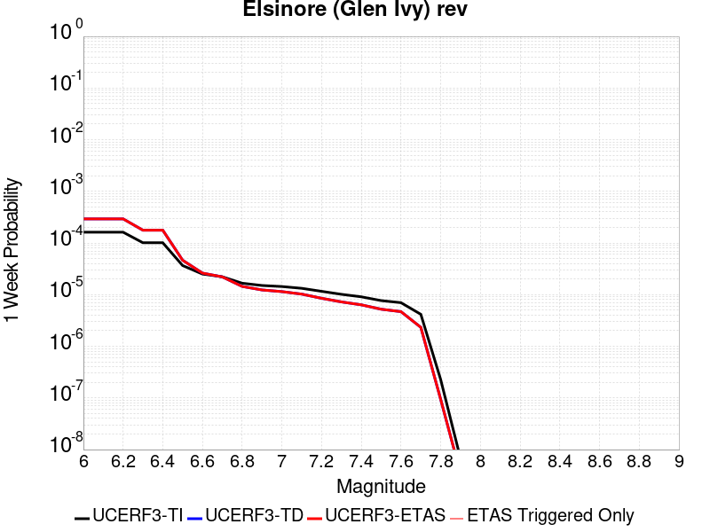 | 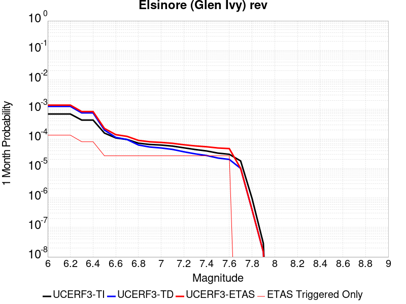 | 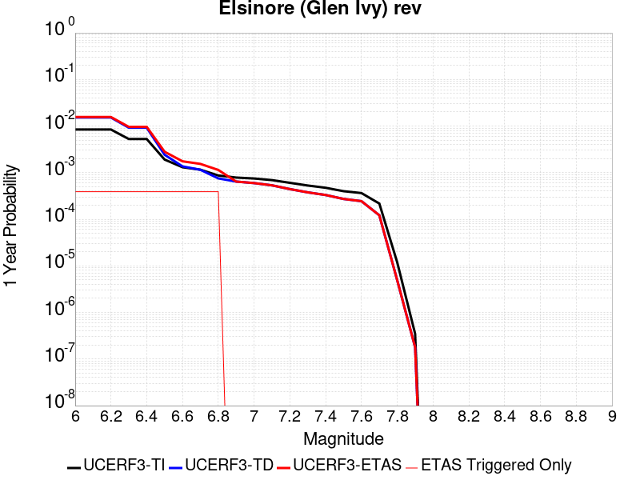 | 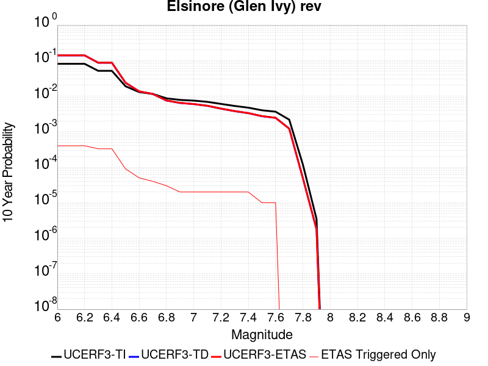 |

| Magnitude | 1 wk TI Prob | 1 wk TD Prob | 1 wk ETAS Prob | 1 wk ETAS/TD Gain | 1 wk ETAS Triggered Only | 1 mo TI Prob | 1 mo TD Prob | 1 mo ETAS Prob | 1 mo ETAS/TD Gain | 1 mo ETAS Triggered Only | 1 yr TI Prob | 1 yr TD Prob | 1 yr ETAS Prob | 1 yr ETAS/TD Gain | 1 yr ETAS Triggered Only | 10 yr TI Prob | 10 yr TD Prob | 10 yr ETAS Prob | 10 yr ETAS/TD Gain | 10 yr ETAS Triggered Only |
|-----|-----|-----|-----|-----|-----|-----|-----|-----|-----|-----|-----|-----|-----|-----|-----|-----|-----|-----|-----|-----|
| 6.0 | 1.6204086E-4 | 2.9360707E-4 | 3.8750266E-4 | 1.3198001 | 9.392317E-5 | 6.94276E-4 | 0.0012578638 | 0.00139336 | 1.1077193 | 1.356668E-4 | 0.008420097 | 0.015234485 | 0.0155016845 | 1.0175391 | 2.713336E-4 | 0.081081145 | 0.13969168 | 0.14004181 | 1.0025066 | 4.0700042E-4 |
| 6.1 | 1.6204086E-4 | 2.9360707E-4 | 3.8750266E-4 | 1.3198001 | 9.392317E-5 | 6.94276E-4 | 0.0012578638 | 0.00139336 | 1.1077193 | 1.356668E-4 | 0.008420097 | 0.015234485 | 0.0155016845 | 1.0175391 | 2.713336E-4 | 0.081081145 | 0.13969168 | 0.14004181 | 1.0025066 | 4.0700042E-4 |
| 6.2 | 1.6204086E-4 | 2.9360707E-4 | 3.8750266E-4 | 1.3198001 | 9.392317E-5 | 6.94276E-4 | 0.0012578638 | 0.00139336 | 1.1077193 | 1.356668E-4 | 0.008420097 | 0.015234485 | 0.0155016845 | 1.0175391 | 2.713336E-4 | 0.081081145 | 0.13969168 | 0.14004181 | 1.0025066 | 4.0700042E-4 |
| 6.3 | 1.0111737E-4 | 1.7703383E-4 | 2.5007225E-4 | 1.4125676 | 7.305136E-5 | 4.332882E-4 | 7.5861247E-4 | 8.420364E-4 | 1.1099691 | 8.348726E-5 | 0.005262531 | 0.009217682 | 0.009434816 | 1.0235562 | 2.1915407E-4 | 0.0513964 | 0.0870191 | 0.087323986 | 1.0035037 | 3.3394905E-4 |
| 6.4 | 1.0111737E-4 | 1.7703383E-4 | 2.5007225E-4 | 1.4125676 | 7.305136E-5 | 4.332882E-4 | 7.5861247E-4 | 8.420364E-4 | 1.1099691 | 8.348726E-5 | 0.005262531 | 0.009217682 | 0.009434816 | 1.0235562 | 2.1915407E-4 | 0.0513964 | 0.0870191 | 0.087323986 | 1.0035037 | 3.3394905E-4 |
| 6.5 | 3.6624708E-5 | 4.6391084E-5 | 5.6826506E-5 | 1.2249446 | 1.0435908E-5 | 1.569536E-4 | 1.9880582E-4 | 2.1967349E-4 | 1.1049651 | 2.0871816E-5 | 0.001909235 | 0.0024181372 | 0.0024806012 | 1.0258315 | 6.261545E-5 | 0.01892915 | 0.023739954 | 0.023831649 | 1.0038624 | 9.392317E-5 |
| 6.6 | 2.5051324E-5 | 2.614772E-5 | 2.614772E-5 | 1.0 | 0.0 | 1.073584E-4 | 1.12057096E-4 | 1.2249184E-4 | 1.0931199 | 1.0435908E-5 | 0.0013063047 | 0.0013634858 | 0.0014051725 | 1.0305736 | 4.174363E-5 | 0.012986525 | 0.013564618 | 0.01361609 | 1.0037946 | 5.217954E-5 |
| 6.7 | 2.2189772E-5 | 2.2072849E-5 | 2.2072849E-5 | 1.0 | 0.0 | 9.509556E-5 | 9.4594696E-5 | 1.0502962E-4 | 1.1103119 | 1.0435908E-5 | 0.0011571734 | 0.0011511183 | 0.00118239 | 1.0271664 | 3.1307725E-5 | 0.011511663 | 0.011465415 | 0.01150668 | 1.003599 | 4.174363E-5 |
| 6.8 | 1.6654378E-5 | 1.4437705E-5 | 1.4437705E-5 | 1.0 | 0.0 | 7.137396E-5 | 6.187444E-5 | 7.2309704E-5 | 1.1686522 | 1.0435908E-5 | 8.686314E-4 | 7.530661E-4 | 7.739222E-4 | 1.027695 | 2.0871816E-5 | 0.008652439 | 0.00751048 | 0.0075415527 | 1.0041373 | 3.1307725E-5 |
| 6.9 | 1.5042909E-5 | 1.2332022E-5 | 1.2332022E-5 | 1.0 | 0.0 | 6.446802E-5 | 5.285047E-5 | 6.328583E-5 | 1.1974506 | 1.0435908E-5 | 7.8461546E-4 | 6.4326765E-4 | 6.536968E-4 | 1.0162128 | 1.0435908E-5 | 0.007818509 | 0.00641828 | 0.006439018 | 1.003231 | 2.0871816E-5 |
| 7.0 | 1.4361385E-5 | 1.1451324E-5 | 1.1451324E-5 | 1.0 | 0.0 | 6.154734E-5 | 4.9076196E-5 | 5.9511593E-5 | 1.2126366 | 1.0435908E-5 | 7.490812E-4 | 5.973418E-4 | 6.077715E-4 | 1.0174601 | 1.0435908E-5 | 0.007465612 | 0.0059613534 | 0.0059821005 | 1.0034803 | 2.0871816E-5 |
| 7.1 | 1.3265571E-5 | 1.0244926E-5 | 1.0244926E-5 | 1.0 | 0.0 | 5.6851208E-5 | 4.39061E-5 | 5.434155E-5 | 1.2376765 | 1.0435908E-5 | 6.919436E-4 | 5.344282E-4 | 5.448585E-4 | 1.0195168 | 1.0435908E-5 | 0.006897931 | 0.0053347866 | 0.005355547 | 1.0038915 | 2.0871816E-5 |
| 7.2 | 1.1596403E-5 | 8.505067E-6 | 8.505067E-6 | 1.0 | 0.0 | 4.9697923E-5 | 3.6449786E-5 | 4.6885314E-5 | 1.2862988 | 1.0435908E-5 | 6.049042E-4 | 4.436875E-4 | 4.5411877E-4 | 1.0235105 | 1.0435908E-5 | 0.006032603 | 0.0044294316 | 0.004450211 | 1.0046912 | 2.0871816E-5 |
| 7.3 | 1.0150827E-5 | 7.2387597E-6 | 7.2387597E-6 | 1.0 | 0.0 | 4.3502816E-5 | 3.1022897E-5 | 4.145848E-5 | 1.3363833 | 1.0435908E-5 | 5.2951806E-4 | 3.7763975E-4 | 3.880717E-4 | 1.0276241 | 1.0435908E-5 | 0.005282581 | 0.0037703665 | 0.0037911597 | 1.0055149 | 2.0871816E-5 |
| 7.4 | 9.080705E-6 | 6.352519E-6 | 6.352519E-6 | 1.0 | 0.0 | 3.8916725E-5 | 2.7224805E-5 | 3.766043E-5 | 1.3833131 | 1.0435908E-5 | 4.7370812E-4 | 3.3141294E-4 | 3.418454E-4 | 1.0314786 | 1.0435908E-5 | 0.004726996 | 0.0033093381 | 0.0033301408 | 1.006286 | 2.0871816E-5 |
| 7.5 | 7.671649E-6 | 5.2256332E-6 | 5.2256332E-6 | 1.0 | 0.0 | 3.287808E-5 | 2.2395385E-5 | 3.283106E-5 | 1.4659743 | 1.0435908E-5 | 4.0021708E-4 | 2.7263095E-4 | 2.83064E-4 | 1.0382681 | 1.0435908E-5 | 0.0039949706 | 0.00272309 | 0.0027334974 | 1.003822 | 1.0435908E-5 |
| 7.6 | 6.990086E-6 | 4.687545E-6 | 4.687545E-6 | 1.0 | 0.0 | 2.9957167E-5 | 2.008933E-5 | 3.052503E-5 | 1.5194647 | 1.0435908E-5 | 3.6466747E-4 | 2.445613E-4 | 2.5499467E-4 | 1.0426615 | 1.0435908E-5 | 0.0036406964 | 0.002443038 | 0.0024534483 | 1.0042613 | 1.0435908E-5 |
| 7.7 | 4.163505E-6 | 2.3295343E-6 | 2.3295343E-6 | 1.0 | 0.0 | 1.7843471E-5 | 9.983683E-6 | 9.983683E-6 | 1.0 | 0.0 | 2.172226E-4 | 1.21545316E-4 | 1.21545316E-4 | 1.0 | 0.0 | 0.0021701038 | 0.0012148614 | 0.0012148614 | 1.0 | 0.0 |
| 7.8 | 2.2692414E-7 | 9.3854695E-8 | 9.3854695E-8 | 1.0 | 0.0 | 9.725317E-7 | 4.0223435E-7 | 4.0223435E-7 | 1.0 | 0.0 | 1.1840509E-5 | 4.8971956E-6 | 4.8971956E-6 | 1.0 | 0.0 | 1.1839878E-4 | 4.8971204E-5 | 4.8971204E-5 | 1.0 | 0.0 |
| 7.9 | 6.676829E-9 | 3.439853E-9 | 3.439853E-9 | 1.0 | 0.0 | 2.861498E-8 | 1.4742227E-8 | 1.4742227E-8 | 1.0 | 0.0 | 3.4838732E-7 | 1.7948659E-7 | 1.7948659E-7 | 1.0 | 0.0 | 3.4838679E-6 | 1.7948646E-6 | 1.7948646E-6 | 1.0 | 0.0 |

## Death Valley (Fish Lake Valley)
*[(top)](#table-of-contents)*

| 1 Week | 1 Month | 1 Year | 10 Year |
|-----|-----|-----|-----|
| 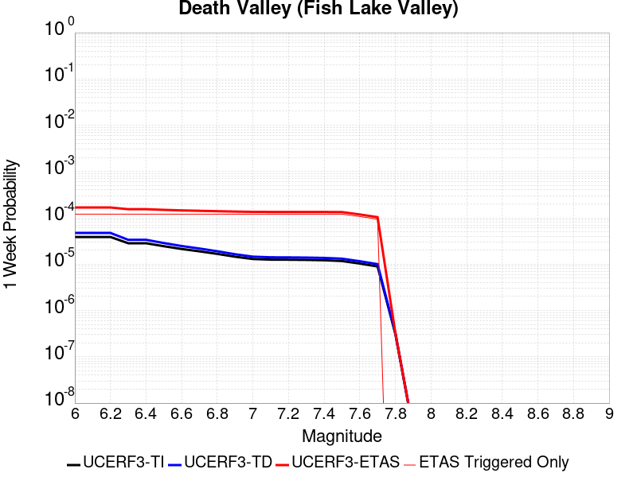 | 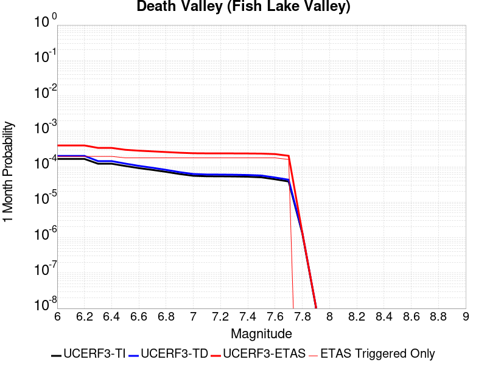 | 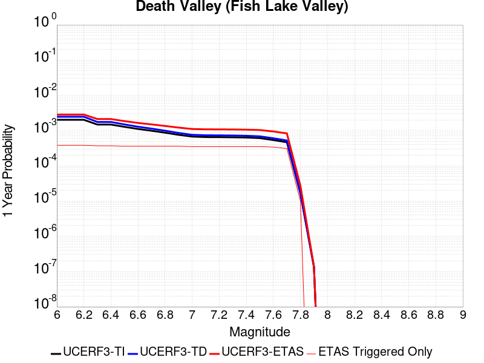 | 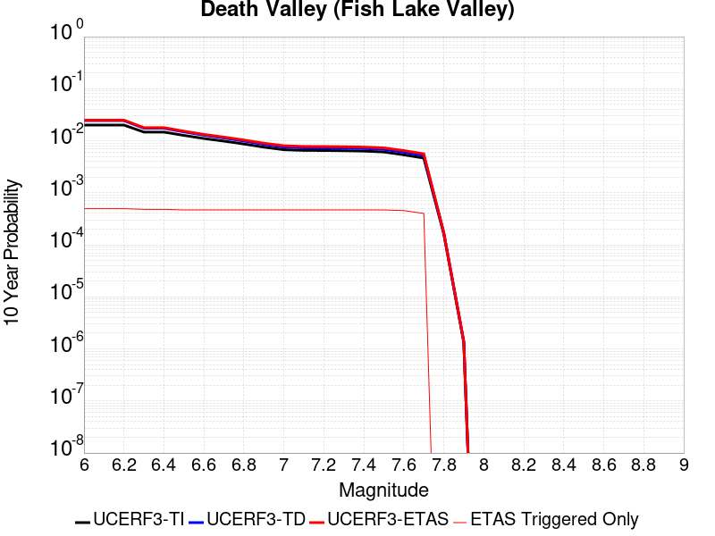 |

| Magnitude | 1 wk TI Prob | 1 wk TD Prob | 1 wk ETAS Prob | 1 wk ETAS/TD Gain | 1 wk ETAS Triggered Only | 1 mo TI Prob | 1 mo TD Prob | 1 mo ETAS Prob | 1 mo ETAS/TD Gain | 1 mo ETAS Triggered Only | 1 yr TI Prob | 1 yr TD Prob | 1 yr ETAS Prob | 1 yr ETAS/TD Gain | 1 yr ETAS Triggered Only | 10 yr TI Prob | 10 yr TD Prob | 10 yr ETAS Prob | 10 yr ETAS/TD Gain | 10 yr ETAS Triggered Only |
|-----|-----|-----|-----|-----|-----|-----|-----|-----|-----|-----|-----|-----|-----|-----|-----|-----|-----|-----|-----|-----|
| 6.0 | 3.872328E-5 | 4.7267473E-5 | 1.9336327E-4 | 4.0908318 | 1.4610271E-4 | 1.6594635E-4 | 2.0256084E-4 | 4.529719E-4 | 2.2362263 | 2.504618E-4 | 0.0020185246 | 0.002463534 | 0.0028383012 | 1.1521258 | 3.7569267E-4 | 0.02000288 | 0.024388181 | 0.024876887 | 1.0200387 | 5.009236E-4 |
| 6.1 | 3.872328E-5 | 4.7267473E-5 | 1.9336327E-4 | 4.0908318 | 1.4610271E-4 | 1.6594635E-4 | 2.0256084E-4 | 4.529719E-4 | 2.2362263 | 2.504618E-4 | 0.0020185246 | 0.002463534 | 0.0028383012 | 1.1521258 | 3.7569267E-4 | 0.02000288 | 0.024388181 | 0.024876887 | 1.0200387 | 5.009236E-4 |
| 6.2 | 3.872328E-5 | 4.7267473E-5 | 1.9336327E-4 | 4.0908318 | 1.4610271E-4 | 1.6594635E-4 | 2.0256084E-4 | 4.529719E-4 | 2.2362263 | 2.504618E-4 | 0.0020185246 | 0.002463534 | 0.0028383012 | 1.1521258 | 3.7569267E-4 | 0.02000288 | 0.024388181 | 0.024876887 | 1.0200387 | 5.009236E-4 |
| 6.3 | 2.8356371E-5 | 3.3609853E-5 | 1.7970765E-4 | 5.346874 | 1.4610271E-4 | 1.2152165E-4 | 1.4403471E-4 | 3.9446043E-4 | 2.7386484 | 2.504618E-4 | 0.0014785219 | 0.0017522911 | 0.0021169079 | 1.20808 | 3.6525677E-4 | 0.014687235 | 0.017391782 | 0.01787374 | 1.0277117 | 4.9048767E-4 |
| 6.4 | 2.8356371E-5 | 3.3609853E-5 | 1.7970765E-4 | 5.346874 | 1.4610271E-4 | 1.2152165E-4 | 1.4403471E-4 | 3.9446043E-4 | 2.7386484 | 2.504618E-4 | 0.0014785219 | 0.0017522911 | 0.0021169079 | 1.20808 | 3.6525677E-4 | 0.014687235 | 0.017391782 | 0.01787374 | 1.0277117 | 4.9048767E-4 |
| 6.5 | 2.4448687E-5 | 2.8607552E-5 | 1.7470609E-4 | 6.106992 | 1.4610271E-4 | 1.0477588E-4 | 1.2259831E-4 | 3.625948E-4 | 2.9575834 | 2.4002588E-4 | 0.0012748998 | 0.0014916632 | 0.0018459547 | 1.2375145 | 3.5482086E-4 | 0.012676105 | 0.014821377 | 0.015294313 | 1.0319091 | 4.8005176E-4 |
| 6.6 | 2.1298161E-5 | 2.4660083E-5 | 1.7075919E-4 | 6.924518 | 1.4610271E-4 | 9.127464E-5 | 1.0568198E-4 | 3.456825E-4 | 3.2709692 | 2.4002588E-4 | 0.0011107022 | 0.0012859525 | 0.0016403171 | 1.2755659 | 3.5482086E-4 | 0.011051672 | 0.012788526 | 0.013262438 | 1.0370576 | 4.8005176E-4 |
| 6.7 | 1.8959729E-5 | 2.1781025E-5 | 1.6788056E-4 | 7.7076516 | 1.4610271E-4 | 8.125345E-5 | 9.334405E-5 | 3.3334753E-4 | 3.5711703 | 2.4002588E-4 | 9.888117E-4 | 0.001135897 | 0.0014903147 | 1.3120158 | 3.5482086E-4 | 0.009844234 | 0.01130357 | 0.011778195 | 1.041989 | 4.8005176E-4 |
| 6.8 | 1.6691629E-5 | 1.9018353E-5 | 1.6511828E-4 | 8.68205 | 1.4610271E-4 | 7.153359E-5 | 8.150477E-5 | 3.215111E-4 | 3.9446905 | 2.4002588E-4 | 8.7057345E-4 | 9.918857E-4 | 0.0013463546 | 1.3573687 | 3.5482086E-4 | 0.008671708 | 0.009876343 | 0.010351654 | 1.0481262 | 4.8005176E-4 |
| 6.9 | 1.450505E-5 | 1.638954E-5 | 1.6248986E-4 | 9.914242 | 1.4610271E-4 | 6.216302E-5 | 7.0239046E-5 | 3.1024806E-4 | 4.4170313 | 2.4002588E-4 | 7.5657194E-4 | 8.5483363E-4 | 0.0012093512 | 1.4147211 | 3.5482086E-4 | 0.007540013 | 0.008516385 | 0.008992349 | 1.0558879 | 4.8005176E-4 |
| 7.0 | 1.2940855E-5 | 1.4537972E-5 | 1.502028E-4 | 10.331758 | 1.356668E-4 | 5.545963E-5 | 6.230414E-5 | 2.918798E-4 | 4.684758 | 2.2958998E-4 | 6.750118E-4 | 7.5829466E-4 | 0.0011024185 | 1.4538127 | 3.4438496E-4 | 0.006729651 | 0.0075576897 | 0.008023757 | 1.0616679 | 4.6961586E-4 |
| 7.1 | 1.2544658E-5 | 1.4078208E-5 | 1.497431E-4 | 10.636518 | 1.356668E-4 | 5.3761712E-5 | 6.0333812E-5 | 2.8990992E-4 | 4.805099 | 2.2958998E-4 | 6.5435225E-4 | 7.343222E-4 | 0.0010784543 | 1.468639 | 3.4438496E-4 | 0.006524288 | 0.007319551 | 0.0077857296 | 1.0636895 | 4.6961586E-4 |
| 7.2 | 1.2489416E-5 | 1.4015674E-5 | 1.4968058E-4 | 10.679513 | 1.356668E-4 | 5.3524967E-5 | 6.0065824E-5 | 2.8964202E-4 | 4.822077 | 2.2958998E-4 | 6.514716E-4 | 7.310616E-4 | 0.0010751948 | 1.4707308 | 3.4438496E-4 | 0.006495651 | 0.0072871596 | 0.0077533536 | 1.0639746 | 4.6961586E-4 |
| 7.3 | 1.2368307E-5 | 1.3879812E-5 | 1.4954474E-4 | 10.774261 | 1.356668E-4 | 5.3005948E-5 | 5.9483587E-5 | 2.890599E-4 | 4.8594904 | 2.2958998E-4 | 6.451563E-4 | 7.2397763E-4 | 0.0010681133 | 1.4753401 | 3.4438496E-4 | 0.0064328653 | 0.007216782 | 0.0076830084 | 1.0646031 | 4.6961586E-4 |
| 7.4 | 1.2161707E-5 | 1.36478675E-5 | 1.4931282E-4 | 10.940377 | 1.356668E-4 | 5.212056E-5 | 5.8489582E-5 | 2.8806613E-4 | 4.925084 | 2.2958998E-4 | 6.3438306E-4 | 7.118836E-4 | 0.0010560234 | 1.4834214 | 3.4438496E-4 | 0.006325751 | 0.0070966207 | 0.0075629037 | 1.065705 | 4.6961586E-4 |
| 7.5 | 1.1707948E-5 | 1.3145515E-5 | 1.4881053E-4 | 11.320251 | 1.356668E-4 | 5.0175953E-5 | 5.6336736E-5 | 2.859138E-4 | 5.0750856 | 2.2958998E-4 | 6.10721E-4 | 6.856895E-4 | 0.0010298383 | 1.5019019 | 3.4438496E-4 | 0.0060904534 | 0.006836321 | 0.0073027266 | 1.0682247 | 4.6961586E-4 |
| 7.6 | 1.0319538E-5 | 1.1579622E-5 | 1.3680906E-4 | 11.81464 | 1.252309E-4 | 4.4225842E-5 | 4.9626036E-5 | 2.6876922E-4 | 5.415891 | 2.1915407E-4 | 5.383166E-4 | 6.040347E-4 | 9.37782E-4 | 1.55253 | 3.3394905E-4 | 0.0053701443 | 0.0060244603 | 0.006480874 | 1.0757601 | 4.5917995E-4 |
| 7.7 | 8.937764E-6 | 1.0022779E-5 | 1.2481661E-4 | 12.453294 | 1.1479499E-4 | 3.830414E-5 | 4.295409E-5 | 2.5166327E-4 | 5.85889 | 2.0871816E-4 | 4.6625308E-4 | 5.228456E-4 | 8.253287E-4 | 1.5785323 | 3.0264133E-4 | 0.0046527605 | 0.005216664 | 0.0056319227 | 1.0796024 | 4.1743633E-4 |
| 7.8 | 3.108007E-7 | 3.284654E-7 | 1.076437E-5 | 32.7717 | 1.0435908E-5 | 1.3320023E-6 | 1.407708E-6 | 1.1843601E-5 | 8.413393 | 1.0435908E-5 | 1.6217007E-5 | 1.7138715E-5 | 2.7574444E-5 | 1.6088979 | 1.0435908E-5 | 1.6215823E-4 | 1.7137431E-4 | 1.8180843E-4 | 1.060885 | 1.0435908E-5 |
| 7.9 | 2.5591178E-9 | 2.6696718E-9 | 2.6696718E-9 | 1.0 | 0.0 | 1.0967647E-8 | 1.14414505E-8 | 1.14414505E-8 | 1.0 | 0.0 | 1.335311E-7 | 1.3929966E-7 | 1.3929966E-7 | 1.0 | 0.0 | 1.3353102E-6 | 1.3929966E-6 | 1.3929966E-6 | 1.0 | 0.0 |

## Lake Isabella (Seismicity)
*[(top)](#table-of-contents)*

| 1 Week | 1 Month | 1 Year | 10 Year |
|-----|-----|-----|-----|
| 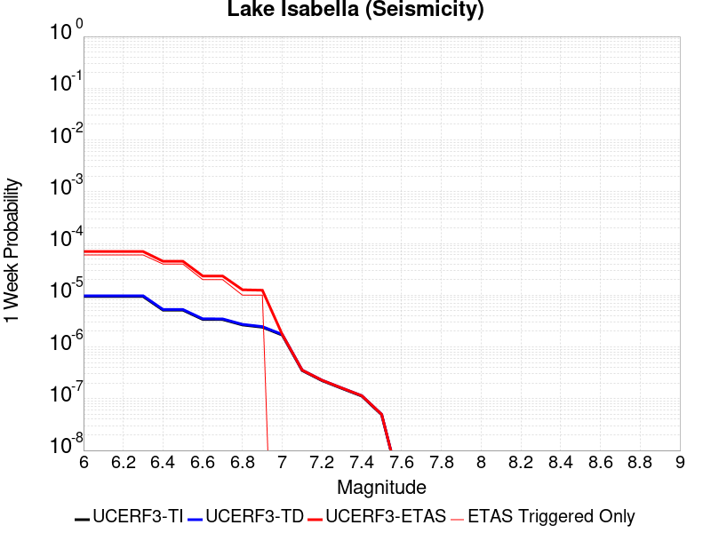 | 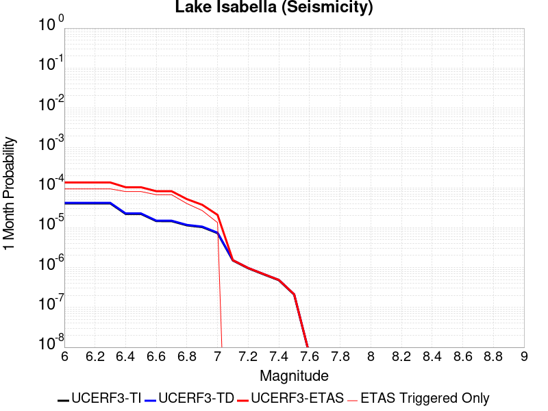 |  | 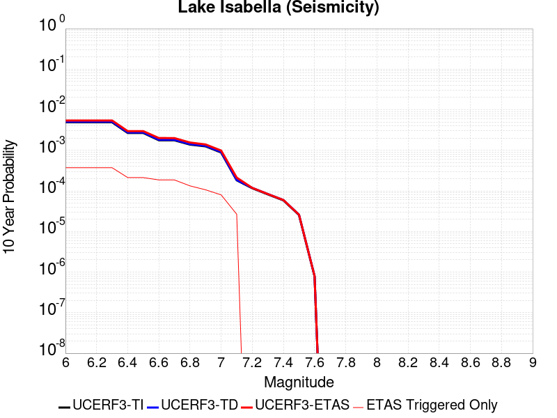 |

| Magnitude | 1 wk TI Prob | 1 wk TD Prob | 1 wk ETAS Prob | 1 wk ETAS/TD Gain | 1 wk ETAS Triggered Only | 1 mo TI Prob | 1 mo TD Prob | 1 mo ETAS Prob | 1 mo ETAS/TD Gain | 1 mo ETAS Triggered Only | 1 yr TI Prob | 1 yr TD Prob | 1 yr ETAS Prob | 1 yr ETAS/TD Gain | 1 yr ETAS Triggered Only | 10 yr TI Prob | 10 yr TD Prob | 10 yr ETAS Prob | 10 yr ETAS/TD Gain | 10 yr ETAS Triggered Only |
|-----|-----|-----|-----|-----|-----|-----|-----|-----|-----|-----|-----|-----|-----|-----|-----|-----|-----|-----|-----|-----|
| 6.0 | 9.431637E-6 | 9.741651E-6 | 7.235649E-5 | 7.427538 | 6.261545E-5 | 4.0420677E-5 | 4.1749343E-5 | 1.5653954E-4 | 3.749509 | 1.1479499E-4 | 4.920106E-4 | 5.0819275E-4 | 7.8981905E-4 | 1.5541723 | 2.8176952E-4 | 0.004909227 | 0.005071599 | 0.005518067 | 1.0880331 | 4.4874405E-4 |
| 6.1 | 9.431637E-6 | 9.741651E-6 | 7.235649E-5 | 7.427538 | 6.261545E-5 | 4.0420677E-5 | 4.1749343E-5 | 1.5653954E-4 | 3.749509 | 1.1479499E-4 | 4.920106E-4 | 5.0819275E-4 | 7.8981905E-4 | 1.5541723 | 2.8176952E-4 | 0.004909227 | 0.005071599 | 0.005518067 | 1.0880331 | 4.4874405E-4 |
| 6.2 | 9.431637E-6 | 9.741651E-6 | 7.235649E-5 | 7.427538 | 6.261545E-5 | 4.0420677E-5 | 4.1749343E-5 | 1.5653954E-4 | 3.749509 | 1.1479499E-4 | 4.920106E-4 | 5.0819275E-4 | 7.8981905E-4 | 1.5541723 | 2.8176952E-4 | 0.004909227 | 0.005071599 | 0.005518067 | 1.0880331 | 4.4874405E-4 |
| 6.3 | 9.431637E-6 | 9.741651E-6 | 7.235649E-5 | 7.427538 | 6.261545E-5 | 4.0420677E-5 | 4.1749343E-5 | 1.5653954E-4 | 3.749509 | 1.1479499E-4 | 4.920106E-4 | 5.0819275E-4 | 7.8981905E-4 | 1.5541723 | 2.8176952E-4 | 0.004909227 | 0.005071599 | 0.005518067 | 1.0880331 | 4.4874405E-4 |
| 6.4 | 5.144063E-6 | 5.3000763E-6 | 4.7043486E-5 | 8.876002 | 4.174363E-5 | 2.2045799E-5 | 2.2714434E-5 | 1.1663547E-4 | 5.1348615 | 9.392317E-5 | 2.6837454E-4 | 2.765166E-4 | 4.9561006E-4 | 1.7923338 | 2.1915407E-4 | 0.0026805066 | 0.0027620657 | 0.003053464 | 1.1055001 | 2.9220543E-4 |
| 6.5 | 5.144063E-6 | 5.3000763E-6 | 4.7043486E-5 | 8.876002 | 4.174363E-5 | 2.2045799E-5 | 2.2714434E-5 | 1.1663547E-4 | 5.1348615 | 9.392317E-5 | 2.6837454E-4 | 2.765166E-4 | 4.9561006E-4 | 1.7923338 | 2.1915407E-4 | 0.0026805066 | 0.0027620657 | 0.003053464 | 1.1055001 | 2.9220543E-4 |
| 6.6 | 3.4009804E-6 | 3.498786E-6 | 2.4370529E-5 | 6.965424 | 2.0871816E-5 | 1.4575549E-5 | 1.4994721E-5 | 8.804498E-5 | 5.8717318 | 7.305136E-5 | 1.7744285E-4 | 1.8254704E-4 | 3.2862308E-4 | 1.8002105 | 1.4610271E-4 | 0.0017730123 | 0.0018241286 | 0.0020116323 | 1.1027908 | 1.8784634E-4 |
| 6.7 | 3.3880428E-6 | 3.4856528E-6 | 2.4357396E-5 | 6.9879007 | 2.0871816E-5 | 1.4520103E-5 | 1.4938435E-5 | 8.79887E-5 | 5.890088 | 7.305136E-5 | 1.767679E-4 | 1.8186188E-4 | 3.27938E-4 | 1.8032258 | 1.4610271E-4 | 0.0017662736 | 0.0018172882 | 0.0020047931 | 1.1031785 | 1.8784634E-4 |
| 6.8 | 2.6582E-6 | 2.7337003E-6 | 1.316958E-5 | 4.8174925 | 1.0435908E-5 | 1.1392236E-5 | 1.1715813E-5 | 6.389474E-5 | 5.453718 | 5.217954E-5 | 1.3869164E-4 | 1.4263204E-4 | 2.365418E-4 | 1.6584059 | 9.392317E-5 | 0.0013860512 | 0.0014255369 | 0.0015610104 | 1.0950333 | 1.356668E-4 |
| 6.9 | 2.406011E-6 | 2.4743288E-6 | 1.2910211E-5 | 5.217662 | 1.0435908E-5 | 1.0311434E-5 | 1.0604231E-5 | 5.234742E-5 | 4.9364657 | 4.174363E-5 | 1.2553448E-4 | 1.2910018E-4 | 2.1257666E-4 | 1.6466024 | 8.348726E-5 | 0.0012546359 | 0.0012903814 | 0.0014154507 | 1.0969243 | 1.252309E-4 |
| 7.0 | 1.6953097E-6 | 1.7429371E-6 | 1.7429371E-6 | 1.0 | 0.0 | 7.265593E-6 | 7.469715E-6 | 2.8341376E-5 | 3.7941709 | 2.0871816E-5 | 8.8455E-5 | 9.094104E-5 | 1.5355079E-4 | 1.6884654 | 6.261545E-5 | 8.84198E-4 | 9.09141E-4 | 0.0010029788 | 1.1032159 | 9.392317E-5 |
| 7.1 | 3.5013824E-7 | 3.5714822E-7 | 3.5714822E-7 | 1.0 | 0.0 | 1.5005916E-6 | 1.5306344E-6 | 1.5306344E-6 | 1.0 | 0.0 | 1.826955E-5 | 1.8635317E-5 | 2.907103E-5 | 1.5599966 | 1.0435908E-5 | 1.8268047E-4 | 1.863378E-4 | 1.9677175E-4 | 1.0559949 | 1.0435908E-5 |
| 7.2 | 2.2321095E-7 | 2.2750574E-7 | 2.2750574E-7 | 1.0 | 0.0 | 9.56618E-7 | 9.750242E-7 | 9.750242E-7 | 1.0 | 0.0 | 1.1646762E-5 | 1.1870856E-5 | 1.1870856E-5 | 1.0 | 0.0 | 1.1646151E-4 | 1.1870232E-4 | 1.1870232E-4 | 1.0 | 0.0 |
| 7.3 | 1.5760406E-7 | 1.6060922E-7 | 1.6060922E-7 | 1.0 | 0.0 | 6.7544585E-7 | 6.8832503E-7 | 6.8832503E-7 | 1.0 | 0.0 | 8.223522E-6 | 8.380326E-6 | 8.380326E-6 | 1.0 | 0.0 | 8.2232174E-5 | 8.3800165E-5 | 8.3800165E-5 | 1.0 | 0.0 |
| 7.4 | 1.1216497E-7 | 1.1431706E-7 | 1.1431706E-7 | 1.0 | 0.0 | 4.8070694E-7 | 4.899302E-7 | 4.899302E-7 | 1.0 | 0.0 | 5.852591E-6 | 5.964884E-6 | 5.964884E-6 | 1.0 | 0.0 | 5.8524372E-5 | 5.9647282E-5 | 5.9647282E-5 | 1.0 | 0.0 |
| 7.5 | 4.885185E-8 | 4.9787737E-8 | 4.9787737E-8 | 1.0 | 0.0 | 2.0936506E-7 | 2.13376E-7 | 2.13376E-7 | 1.0 | 0.0 | 2.5490165E-6 | 2.59785E-6 | 2.59785E-6 | 1.0 | 0.0 | 2.5489873E-5 | 2.5978214E-5 | 2.5978214E-5 | 1.0 | 0.0 |
| 7.6 | 1.504641E-9 | 1.5317903E-9 | 1.5317903E-9 | 1.0 | 0.0 | 6.4484613E-9 | 6.5648154E-9 | 6.5648154E-9 | 1.0 | 0.0 | 7.851001E-8 | 7.992663E-8 | 7.992663E-8 | 1.0 | 0.0 | 7.8509987E-7 | 7.992663E-7 | 7.992663E-7 | 1.0 | 0.0 |

## Owens Valley
*[(top)](#table-of-contents)*

| 1 Week | 1 Month | 1 Year | 10 Year |
|-----|-----|-----|-----|
| 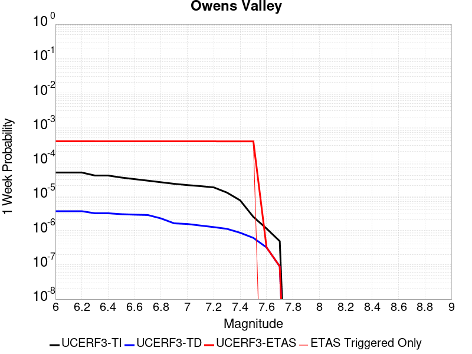 | 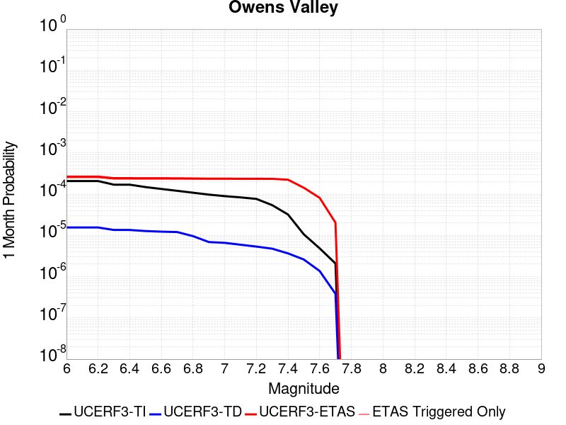 | 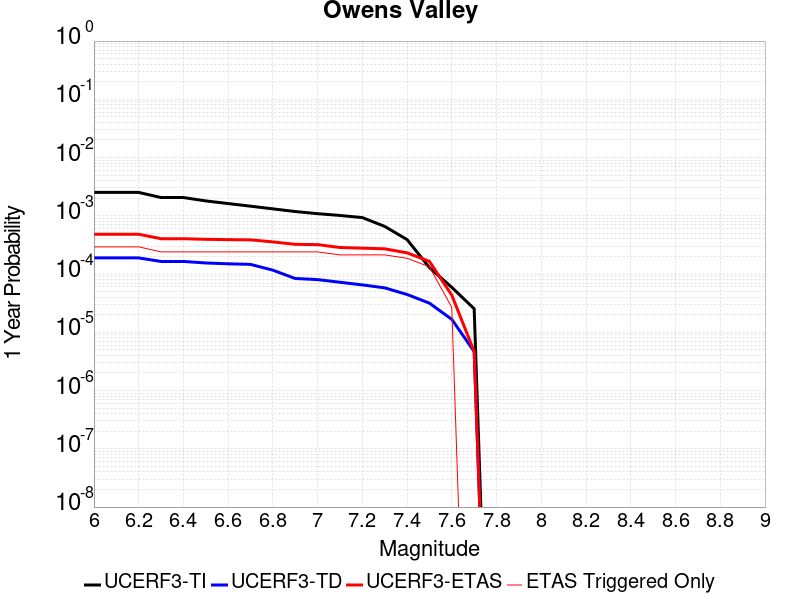 | 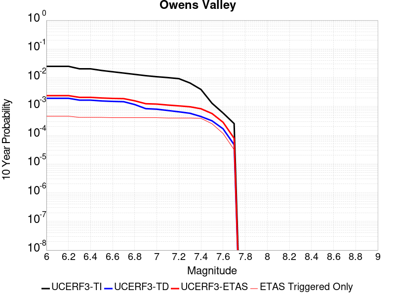 |

| Magnitude | 1 wk TI Prob | 1 wk TD Prob | 1 wk ETAS Prob | 1 wk ETAS/TD Gain | 1 wk ETAS Triggered Only | 1 mo TI Prob | 1 mo TD Prob | 1 mo ETAS Prob | 1 mo ETAS/TD Gain | 1 mo ETAS Triggered Only | 1 yr TI Prob | 1 yr TD Prob | 1 yr ETAS Prob | 1 yr ETAS/TD Gain | 1 yr ETAS Triggered Only | 10 yr TI Prob | 10 yr TD Prob | 10 yr ETAS Prob | 10 yr ETAS/TD Gain | 10 yr ETAS Triggered Only |
|-----|-----|-----|-----|-----|-----|-----|-----|-----|-----|-----|-----|-----|-----|-----|-----|-----|-----|-----|-----|-----|
| 6.0 | 4.83821E-5 | 3.626567E-6 | 2.332157E-4 | 64.30757 | 2.2958998E-4 | 2.0733538E-4 | 1.5542342E-5 | 2.7643598E-4 | 17.785992 | 2.608977E-4 | 0.002521386 | 1.8921259E-4 | 5.5440026E-4 | 2.930039 | 3.6525677E-4 | 0.024929691 | 0.001925011 | 0.002383307 | 1.2380745 | 4.5917995E-4 |
| 6.1 | 4.83821E-5 | 3.626567E-6 | 2.332157E-4 | 64.30757 | 2.2958998E-4 | 2.0733538E-4 | 1.5542342E-5 | 2.7643598E-4 | 17.785992 | 2.608977E-4 | 0.002521386 | 1.8921259E-4 | 5.5440026E-4 | 2.930039 | 3.6525677E-4 | 0.024929691 | 0.001925011 | 0.002383307 | 1.2380745 | 4.5917995E-4 |
| 6.2 | 4.83821E-5 | 3.626567E-6 | 2.332157E-4 | 64.30757 | 2.2958998E-4 | 2.0733538E-4 | 1.5542342E-5 | 2.7643598E-4 | 17.785992 | 2.608977E-4 | 0.002521386 | 1.8921259E-4 | 5.5440026E-4 | 2.930039 | 3.6525677E-4 | 0.024929691 | 0.001925011 | 0.002383307 | 1.2380745 | 4.5917995E-4 |
| 6.3 | 3.953008E-5 | 3.1553948E-6 | 2.1187289E-4 | 67.14624 | 2.0871816E-4 | 1.6940363E-4 | 1.3523055E-5 | 2.535457E-4 | 18.749144 | 2.4002588E-4 | 0.002060538 | 1.6463149E-4 | 4.9852557E-4 | 3.02813 | 3.3394905E-4 | 0.020415364 | 0.0016592 | 0.0020759436 | 1.2511715 | 4.1743633E-4 |
| 6.4 | 3.953008E-5 | 3.1553948E-6 | 2.1187289E-4 | 67.14624 | 2.0871816E-4 | 1.6940363E-4 | 1.3523055E-5 | 2.535457E-4 | 18.749144 | 2.4002588E-4 | 0.002060538 | 1.6463149E-4 | 4.9852557E-4 | 3.02813 | 3.3394905E-4 | 0.020415364 | 0.0016592 | 0.0020759436 | 1.2511715 | 4.1743633E-4 |
| 6.5 | 3.457342E-5 | 2.9715961E-6 | 2.1168913E-4 | 71.23752 | 2.0871816E-4 | 1.4816338E-4 | 1.2735354E-5 | 2.5275818E-4 | 19.84697 | 2.4002588E-4 | 0.0018023965 | 1.550426E-4 | 4.8893987E-4 | 3.153584 | 3.3394905E-4 | 0.017878477 | 0.001555719 | 0.0019725058 | 1.2679063 | 4.1743633E-4 |
| 6.6 | 3.1127765E-5 | 2.8744932E-6 | 2.1159205E-4 | 73.61021 | 2.0871816E-4 | 1.3339789E-4 | 1.2319203E-5 | 2.523421E-4 | 20.48364 | 2.4002588E-4 | 0.0016229092 | 1.4997667E-4 | 4.734413E-4 | 3.1567664 | 3.2351314E-4 | 0.016111081 | 0.0015012559 | 0.0019076453 | 1.2706996 | 4.0700042E-4 |
| 6.7 | 2.806885E-5 | 2.8104134E-6 | 2.1152798E-4 | 75.26579 | 2.0871816E-4 | 1.2028952E-4 | 1.20445775E-5 | 2.5206758E-4 | 20.927889 | 2.4002588E-4 | 0.001463541 | 1.4663354E-4 | 4.7009924E-4 | 3.2059462 | 3.2351314E-4 | 0.014539397 | 0.0014657511 | 0.0018721549 | 1.2772666 | 4.0700042E-4 |
| 6.8 | 2.524524E-5 | 2.2353688E-6 | 2.1095306E-4 | 94.37059 | 2.0871816E-4 | 1.0818939E-4 | 9.580118E-6 | 2.496037E-4 | 26.054344 | 2.4002588E-4 | 0.0013164099 | 1.16632E-4 | 4.4010743E-4 | 3.7734706 | 3.2351314E-4 | 0.01308639 | 0.0011659812 | 0.001572507 | 1.3486556 | 4.0700042E-4 |
| 6.9 | 2.2704568E-5 | 1.6081682E-6 | 2.1032599E-4 | 130.78606 | 2.0871816E-4 | 9.730166E-5 | 6.8921313E-6 | 2.4691634E-4 | 35.825832 | 2.4002588E-4 | 0.0011840039 | 8.390849E-5 | 4.073945E-4 | 4.8552237 | 3.2351314E-4 | 0.011777153 | 8.3897985E-4 | 0.0012456388 | 1.4847064 | 4.0700042E-4 |
| 7.0 | 2.0871712E-5 | 1.5395453E-6 | 2.1025738E-4 | 136.57109 | 2.0871816E-4 | 8.944713E-5 | 6.598035E-6 | 2.4662234E-4 | 37.37815 | 2.4002588E-4 | 0.0010884746 | 8.032813E-5 | 4.038153E-4 | 5.027072 | 3.2351314E-4 | 0.010831586 | 8.0316263E-4 | 0.0012098361 | 1.5063401 | 4.0700042E-4 |
| 7.1 | 1.944928E-5 | 1.3864178E-6 | 2.1010429E-4 | 151.54471 | 2.0871816E-4 | 8.335139E-5 | 5.941777E-6 | 2.4596622E-4 | 41.396072 | 2.4002588E-4 | 0.0010143308 | 7.233874E-5 | 3.8539333E-4 | 5.32762 | 3.1307724E-4 | 0.010097133 | 7.2330976E-4 | 0.0011195875 | 1.5478672 | 3.965645E-4 |
| 7.2 | 1.7876306E-5 | 1.2489141E-6 | 2.099668E-4 | 168.11949 | 2.0871816E-4 | 7.6610486E-5 | 5.352478E-6 | 2.4537707E-4 | 45.84364 | 2.4002588E-4 | 9.3233347E-4 | 6.516448E-5 | 3.782213E-4 | 5.8041024 | 3.1307724E-4 | 0.009284316 | 6.5159105E-4 | 0.0010478972 | 1.608213 | 3.965645E-4 |
| 7.3 | 1.2618672E-5 | 1.1115209E-6 | 2.0982945E-4 | 188.77689 | 2.0871816E-4 | 5.40789E-5 | 4.763652E-6 | 2.447884E-4 | 51.386703 | 2.4002588E-4 | 6.582117E-4 | 5.799593E-5 | 3.71055E-4 | 6.397949 | 3.1307724E-4 | 0.0065626553 | 5.7994033E-4 | 9.7627484E-4 | 1.6834056 | 3.965645E-4 |
| 7.4 | 7.4874442E-6 | 8.5486437E-7 | 1.9913695E-4 | 232.94565 | 1.9828224E-4 | 3.208865E-5 | 3.6636993E-6 | 2.3325284E-4 | 63.66593 | 2.2958998E-4 | 3.906093E-4 | 4.4604632E-5 | 3.4723248E-4 | 7.7846727 | 3.0264133E-4 | 0.003899234 | 4.4604883E-4 | 8.320052E-4 | 1.8652782 | 3.8612858E-4 |
| 7.5 | 2.4734156E-6 | 6.068616E-7 | 1.1540178E-4 | 190.16162 | 1.1479499E-4 | 1.060031E-5 | 2.6008327E-6 | 1.4870317E-4 | 57.175213 | 1.4610271E-4 | 1.2905113E-4 | 3.166468E-5 | 2.0906949E-4 | 6.6026087 | 1.7741043E-4 | 0.0012897621 | 3.1660203E-4 | 5.669845E-4 | 1.790843 | 2.504618E-4 |
| 7.6 | 1.1328841E-6 | 3.196531E-7 | 7.337098E-5 | 229.53316 | 7.305136E-5 | 4.8552088E-6 | 1.3699412E-6 | 8.485709E-5 | 61.942142 | 8.348726E-5 | 5.9110564E-5 | 1.6678909E-5 | 1.00164776E-4 | 6.005476 | 8.348726E-5 | 5.9094845E-4 | 1.6677675E-4 | 2.8155258E-4 | 1.6882005 | 1.1479499E-4 |
| 7.7 | 4.8613185E-7 | 8.964689E-8 | 2.096146E-5 | 233.82251 | 2.0871816E-5 | 2.0834207E-6 | 3.8420092E-7 | 2.1256008E-5 | 55.325245 | 2.0871816E-5 | 2.536535E-5 | 4.6776368E-6 | 2.5549354E-5 | 5.4620223 | 2.0871816E-5 | 2.5362454E-4 | 4.677545E-5 | 7.8081706E-5 | 1.6692883 | 3.1307725E-5 |

## San Andreas (Cholame) rev
*[(top)](#table-of-contents)*

| 1 Week | 1 Month | 1 Year | 10 Year |
|-----|-----|-----|-----|
| 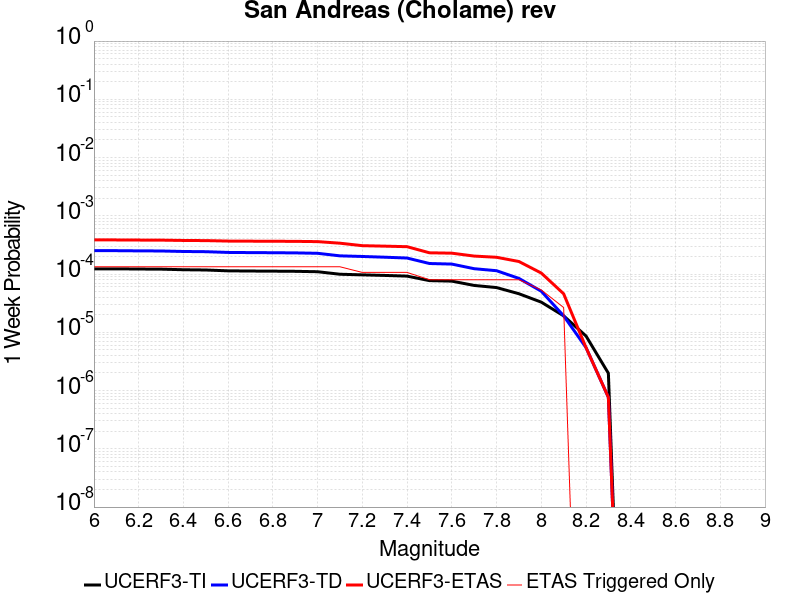 | 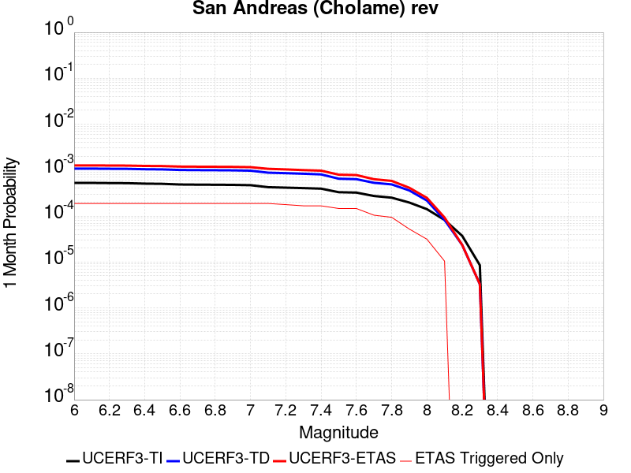 | 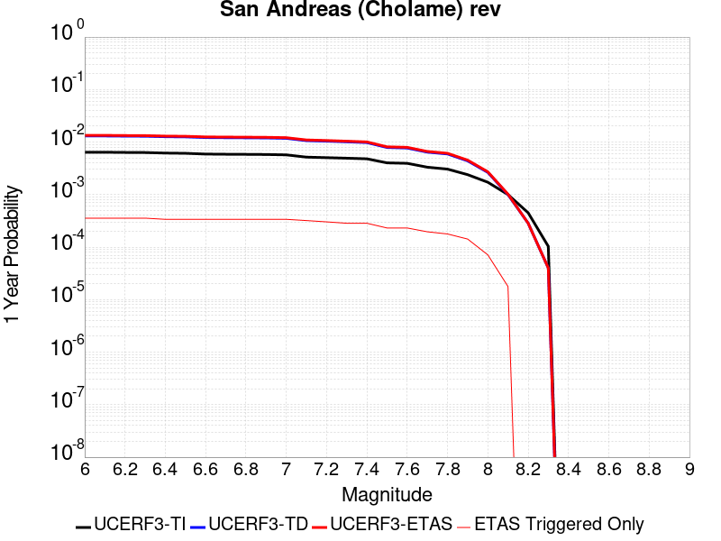 | 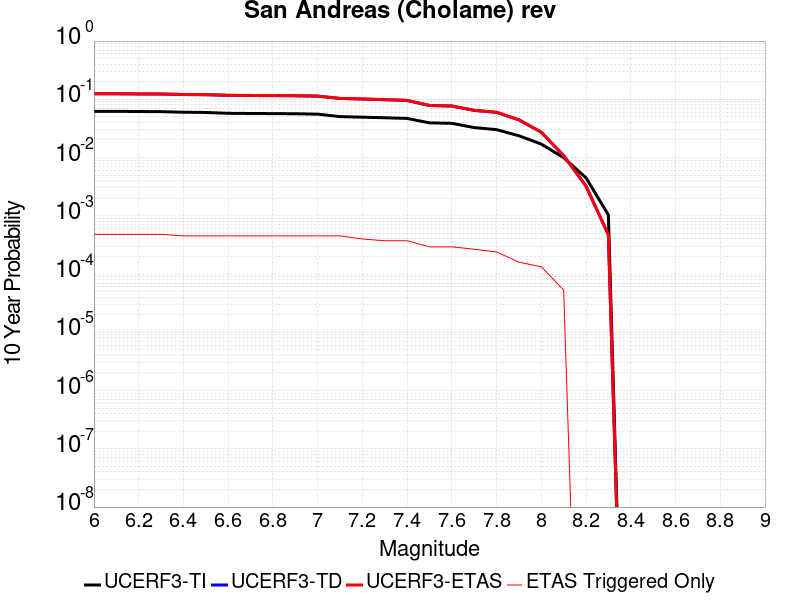 |

| Magnitude | 1 wk TI Prob | 1 wk TD Prob | 1 wk ETAS Prob | 1 wk ETAS/TD Gain | 1 wk ETAS Triggered Only | 1 mo TI Prob | 1 mo TD Prob | 1 mo ETAS Prob | 1 mo ETAS/TD Gain | 1 mo ETAS Triggered Only | 1 yr TI Prob | 1 yr TD Prob | 1 yr ETAS Prob | 1 yr ETAS/TD Gain | 1 yr ETAS Triggered Only | 10 yr TI Prob | 10 yr TD Prob | 10 yr ETAS Prob | 10 yr ETAS/TD Gain | 10 yr ETAS Triggered Only |
|-----|-----|-----|-----|-----|-----|-----|-----|-----|-----|-----|-----|-----|-----|-----|-----|-----|-----|-----|-----|-----|
| 6.0 | 1.2302514E-4 | 2.5204287E-4 | 3.5637565E-4 | 1.4139485 | 1.0435908E-4 | 5.27144E-4 | 0.0010797381 | 0.0012673817 | 1.1737862 | 1.8784634E-4 | 0.0063991086 | 0.0130670825 | 0.013386369 | 1.0244343 | 3.2351314E-4 | 0.06217949 | 0.12439073 | 0.124774516 | 1.0030854 | 4.3830814E-4 |
| 6.1 | 1.2302514E-4 | 2.5204287E-4 | 3.5637565E-4 | 1.4139485 | 1.0435908E-4 | 5.27144E-4 | 0.0010797381 | 0.0012673817 | 1.1737862 | 1.8784634E-4 | 0.0063991086 | 0.0130670825 | 0.013386369 | 1.0244343 | 3.2351314E-4 | 0.06217949 | 0.12439073 | 0.124774516 | 1.0030854 | 4.3830814E-4 |
| 6.2 | 1.2203569E-4 | 2.5021084E-4 | 3.545438E-4 | 1.4169803 | 1.0435908E-4 | 5.2290526E-4 | 0.0010718931 | 0.0012595381 | 1.1750594 | 1.8784634E-4 | 0.006347804 | 0.01297271 | 0.013292026 | 1.0246145 | 3.2351314E-4 | 0.061695136 | 0.12357691 | 0.12396105 | 1.0031085 | 4.3830814E-4 |
| 6.3 | 1.2142645E-4 | 2.4907055E-4 | 3.5340365E-4 | 1.4188896 | 1.0435908E-4 | 5.202953E-4 | 0.0010670102 | 0.0012546561 | 1.1758614 | 1.8784634E-4 | 0.006316212 | 0.012913967 | 0.013233302 | 1.024728 | 3.2351314E-4 | 0.06139677 | 0.12307103 | 0.1234554 | 1.0031232 | 4.3830814E-4 |
| 6.4 | 1.1865206E-4 | 2.44126E-4 | 3.484596E-4 | 1.427376 | 1.0435908E-4 | 5.0840975E-4 | 0.0010458364 | 0.0012334862 | 1.1794257 | 1.8784634E-4 | 0.006172335 | 0.012659196 | 0.01296831 | 1.0244181 | 3.1307724E-4 | 0.060036868 | 0.1208638 | 0.12123996 | 1.0031122 | 4.2787223E-4 |
| 6.5 | 1.17443946E-4 | 2.4205919E-4 | 3.46393E-4 | 1.4310261 | 1.0435908E-4 | 5.032341E-4 | 0.0010369857 | 0.0012246373 | 1.1809586 | 1.8784634E-4 | 0.006109677 | 0.012552682 | 0.01286183 | 1.024628 | 3.1307724E-4 | 0.059444077 | 0.11993805 | 0.120314606 | 1.0031396 | 4.2787223E-4 |
| 6.6 | 1.13579066E-4 | 2.3514954E-4 | 3.3948408E-4 | 1.4436945 | 1.0435908E-4 | 4.866766E-4 | 0.001007396 | 0.0011950531 | 1.1862794 | 1.8784634E-4 | 0.0059092017 | 0.012196515 | 0.012505773 | 1.0253563 | 3.1307724E-4 | 0.057545185 | 0.11685214 | 0.11723002 | 1.0032338 | 4.2787223E-4 |
| 6.7 | 1.1271412E-4 | 2.3359268E-4 | 3.379274E-4 | 1.4466523 | 1.0435908E-4 | 4.829711E-4 | 0.0010007289 | 0.0011883873 | 1.1875217 | 1.8784634E-4 | 0.005864331 | 0.012116249 | 0.012425533 | 1.0255264 | 3.1307724E-4 | 0.057119697 | 0.116155714 | 0.11653388 | 1.0032557 | 4.2787223E-4 |
| 6.8 | 1.1217975E-4 | 2.3247694E-4 | 3.3681176E-4 | 1.4487964 | 1.0435908E-4 | 4.8068175E-4 | 9.959509E-4 | 0.0011836102 | 1.1884222 | 1.8784634E-4 | 0.005836608 | 0.012058721 | 0.012368023 | 1.0256497 | 3.1307724E-4 | 0.056856725 | 0.11565396 | 0.116032355 | 1.0032717 | 4.2787223E-4 |
| 6.9 | 1.1146753E-4 | 2.3096445E-4 | 3.3529944E-4 | 1.4517361 | 1.0435908E-4 | 4.7763053E-4 | 9.894737E-4 | 0.0011771341 | 1.1896569 | 1.8784634E-4 | 0.0057996577 | 0.011980731 | 0.012279747 | 1.024958 | 3.0264133E-4 | 0.056506127 | 0.11497439 | 0.11534383 | 1.0032133 | 4.1743633E-4 |
| 7.0 | 1.0965793E-4 | 2.2719789E-4 | 3.3153326E-4 | 1.4592268 | 1.0435908E-4 | 4.698779E-4 | 9.733434E-4 | 0.0011610069 | 1.192803 | 1.8784634E-4 | 0.005705768 | 0.011786487 | 0.012085561 | 1.0253743 | 3.0264133E-4 | 0.055614736 | 0.11327597 | 0.11364611 | 1.0032676 | 4.1743633E-4 |
| 7.1 | 9.927982E-5 | 2.0538924E-4 | 3.0972686E-4 | 1.5079995 | 1.0435908E-4 | 4.2541555E-4 | 8.7994366E-4 | 0.0010676247 | 1.2132876 | 1.8784634E-4 | 0.0051671406 | 0.010660981 | 0.010950071 | 1.0271167 | 2.9220543E-4 | 0.05048634 | 0.1033706 | 0.10373553 | 1.0035303 | 4.0700042E-4 |
| 7.2 | 9.696786E-5 | 2.0043184E-4 | 2.9433618E-4 | 1.4685102 | 9.392317E-5 | 4.1551032E-4 | 8.5871184E-4 | 0.0010359699 | 1.2064233 | 1.7741043E-4 | 0.00504711 | 0.010404981 | 0.010683819 | 1.0267985 | 2.8176952E-4 | 0.04934009 | 0.1011086 | 0.10145569 | 1.0034329 | 3.8612858E-4 |
| 7.3 | 9.4727984E-5 | 1.9472468E-4 | 2.8862956E-4 | 1.4822444 | 9.392317E-5 | 4.0591392E-4 | 8.3426846E-4 | 0.0010011037 | 1.1999779 | 1.6697453E-4 | 0.0049308087 | 0.010110183 | 0.010368442 | 1.0255445 | 2.608977E-4 | 0.048228268 | 0.09847952 | 0.0988088 | 1.0033437 | 3.6525677E-4 |
| 7.4 | 9.220358E-5 | 1.8843076E-4 | 2.8233623E-4 | 1.4983554 | 9.392317E-5 | 3.9509835E-4 | 8.073114E-4 | 9.741511E-4 | 1.206661 | 1.6697453E-4 | 0.004799717 | 0.009784967 | 0.010043311 | 1.0264022 | 2.608977E-4 | 0.046973653 | 0.095557496 | 0.095878415 | 1.0033584 | 3.5482086E-4 |
| 7.5 | 7.71631E-5 | 1.5177966E-4 | 2.3525425E-4 | 1.5499722 | 8.348726E-5 | 3.306571E-4 | 6.503223E-4 | 7.9633E-4 | 1.2245159 | 1.4610271E-4 | 0.0040183207 | 0.007889002 | 0.008106426 | 1.0275606 | 2.1915407E-4 | 0.03946433 | 0.07828531 | 0.07856426 | 1.0035633 | 3.0264133E-4 |
| 7.6 | 7.5634416E-5 | 1.483744E-4 | 2.3184928E-4 | 1.5625962 | 8.348726E-5 | 3.241072E-4 | 6.3573546E-4 | 7.817453E-4 | 1.2296708 | 1.4610271E-4 | 0.0039388672 | 0.0077126776 | 0.007930141 | 1.0281956 | 2.1915407E-4 | 0.038697794 | 0.07664872 | 0.07692817 | 1.0036458 | 3.0264133E-4 |
| 7.7 | 6.3783E-5 | 1.235872E-4 | 1.9662954E-4 | 1.5910186 | 7.305136E-5 | 2.7332708E-4 | 5.29552E-4 | 6.338558E-4 | 1.1969662 | 1.0435908E-4 | 0.0033226798 | 0.0064282627 | 0.006594164 | 1.0258081 | 1.6697453E-4 | 0.032734364 | 0.06454029 | 0.06476483 | 1.003479 | 2.4002588E-4 |
| 7.8 | 5.863422E-5 | 1.1416107E-4 | 1.7676938E-4 | 1.5484208 | 6.261545E-5 | 2.512653E-4 | 4.8917E-4 | 5.830473E-4 | 1.1919112 | 9.392317E-5 | 0.003054864 | 0.0059394026 | 0.0060846377 | 1.0244528 | 1.4610271E-4 | 0.030132094 | 0.059659187 | 0.059855454 | 1.0032898 | 2.0871816E-4 |
| 7.9 | 4.595283E-5 | 8.426331E-5 | 1.2600342E-4 | 1.4953533 | 4.174363E-5 | 1.9692584E-4 | 3.610785E-4 | 4.132392E-4 | 1.144458 | 5.217954E-5 | 0.0023949358 | 0.0043872762 | 0.0044911774 | 1.0236824 | 1.0435908E-4 | 0.023692891 | 0.044362005 | 0.04448168 | 1.0026977 | 1.252309E-4 |
| 8.0 | 3.2950178E-5 | 5.0772942E-5 | 7.16437E-5 | 1.4110606 | 2.0871816E-5 | 1.412074E-4 | 2.1758018E-4 | 2.488811E-4 | 1.1438591 | 3.1307725E-5 | 0.0017178444 | 0.0026458222 | 0.0026978638 | 1.0196693 | 5.217954E-5 | 0.017046256 | 0.027180137 | 0.027241051 | 1.0022411 | 6.261545E-5 |
| 8.1 | 1.9177472E-5 | 1.9185145E-5 | 2.9620853E-5 | 1.5439472 | 1.0435908E-5 | 8.218658E-5 | 8.221946E-5 | 9.265451E-5 | 1.126917 | 1.0435908E-5 | 0.0010001622 | 0.0010005629 | 0.0010109884 | 1.0104196 | 1.0435908E-5 | 0.009956728 | 0.010758142 | 0.010778789 | 1.0019193 | 2.0871816E-5 |
| 8.2 | 8.643924E-6 | 5.4748625E-6 | 5.4748625E-6 | 1.0 | 0.0 | 3.704486E-5 | 2.3463486E-5 | 2.3463486E-5 | 1.0 | 0.0 | 4.5092785E-4 | 2.8563058E-4 | 2.8563058E-4 | 1.0 | 0.0 | 0.0045001395 | 0.0032487072 | 0.0032487072 | 1.0 | 0.0 |
| 8.3 | 1.983087E-6 | 7.6599065E-7 | 7.6599065E-7 | 1.0 | 0.0 | 8.498917E-6 | 3.282813E-6 | 3.282813E-6 | 1.0 | 0.0 | 1.034694E-4 | 3.9967534E-5 | 3.9967534E-5 | 1.0 | 0.0 | 0.0010342124 | 4.719687E-4 | 4.719687E-4 | 1.0 | 0.0 |

## San Jacinto (San Bernardino)
*[(top)](#table-of-contents)*

| 1 Week | 1 Month | 1 Year | 10 Year |
|-----|-----|-----|-----|
| 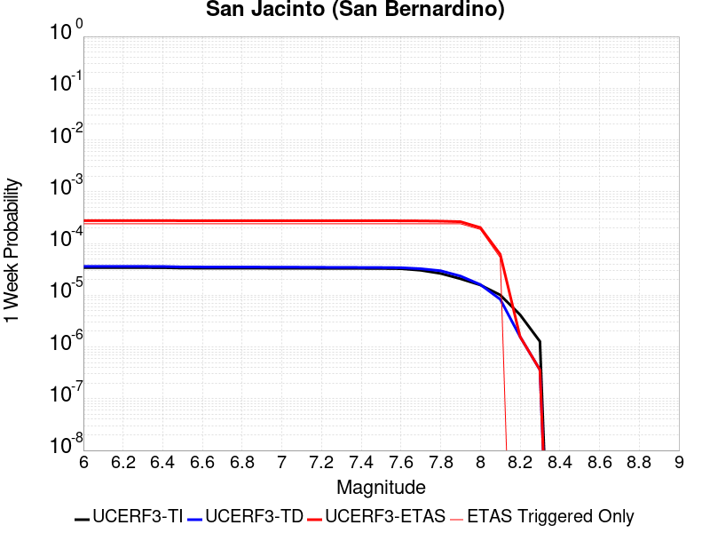 | 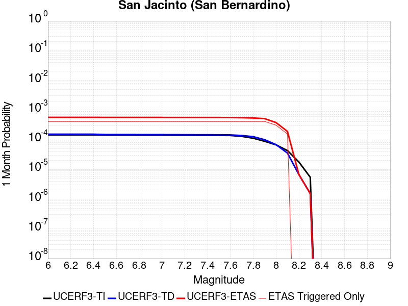 | 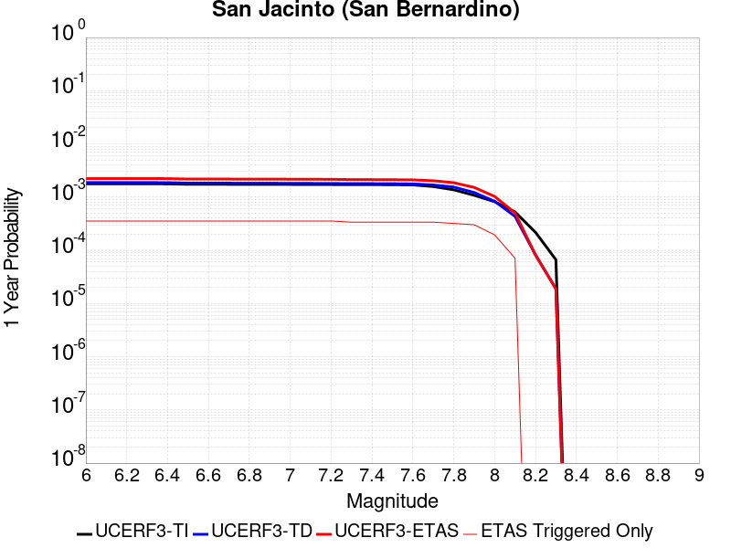 | 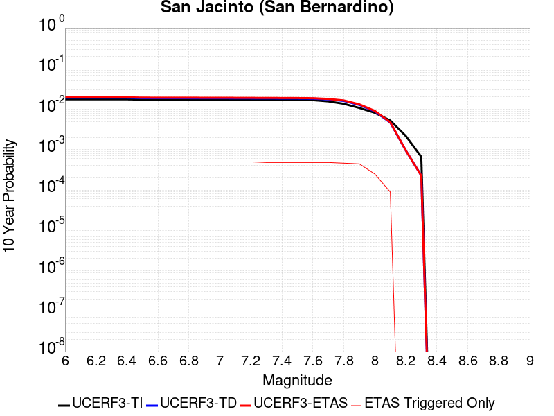 |

| Magnitude | 1 wk TI Prob | 1 wk TD Prob | 1 wk ETAS Prob | 1 wk ETAS/TD Gain | 1 wk ETAS Triggered Only | 1 mo TI Prob | 1 mo TD Prob | 1 mo ETAS Prob | 1 mo ETAS/TD Gain | 1 mo ETAS Triggered Only | 1 yr TI Prob | 1 yr TD Prob | 1 yr ETAS Prob | 1 yr ETAS/TD Gain | 1 yr ETAS Triggered Only | 10 yr TI Prob | 10 yr TD Prob | 10 yr ETAS Prob | 10 yr ETAS/TD Gain | 10 yr ETAS Triggered Only |
|-----|-----|-----|-----|-----|-----|-----|-----|-----|-----|-----|-----|-----|-----|-----|-----|-----|-----|-----|-----|-----|
| 6.0 | 3.409352E-5 | 3.5986508E-5 | 2.4469715E-4 | 6.799691 | 2.0871816E-4 | 1.461069E-4 | 1.542188E-4 | 4.0464196E-4 | 2.6238174 | 2.504618E-4 | 0.0017774 | 0.0018759987 | 0.0022093214 | 1.1776774 | 3.3394905E-4 | 0.01763251 | 0.019349935 | 0.019779762 | 1.0222133 | 4.3830814E-4 |
| 6.1 | 3.409352E-5 | 3.5986508E-5 | 2.4469715E-4 | 6.799691 | 2.0871816E-4 | 1.461069E-4 | 1.542188E-4 | 4.0464196E-4 | 2.6238174 | 2.504618E-4 | 0.0017774 | 0.0018759987 | 0.0022093214 | 1.1776774 | 3.3394905E-4 | 0.01763251 | 0.019349935 | 0.019779762 | 1.0222133 | 4.3830814E-4 |
| 6.2 | 3.409352E-5 | 3.5986508E-5 | 2.4469715E-4 | 6.799691 | 2.0871816E-4 | 1.461069E-4 | 1.542188E-4 | 4.0464196E-4 | 2.6238174 | 2.504618E-4 | 0.0017774 | 0.0018759987 | 0.0022093214 | 1.1776774 | 3.3394905E-4 | 0.01763251 | 0.019349935 | 0.019779762 | 1.0222133 | 4.3830814E-4 |
| 6.3 | 3.409352E-5 | 3.5986508E-5 | 2.4469715E-4 | 6.799691 | 2.0871816E-4 | 1.461069E-4 | 1.542188E-4 | 4.0464196E-4 | 2.6238174 | 2.504618E-4 | 0.0017774 | 0.0018759987 | 0.0022093214 | 1.1776774 | 3.3394905E-4 | 0.01763251 | 0.019349935 | 0.019779762 | 1.0222133 | 4.3830814E-4 |
| 6.4 | 3.400795E-5 | 3.5879173E-5 | 2.4458984E-4 | 6.8170424 | 2.0871816E-4 | 1.4574021E-4 | 1.5375883E-4 | 4.041821E-4 | 2.6286757 | 2.504618E-4 | 0.0017729428 | 0.0018704084 | 0.0022037327 | 1.1782094 | 3.3394905E-4 | 0.017588645 | 0.019295016 | 0.019724868 | 1.0222778 | 4.3830814E-4 |
| 6.5 | 3.341482E-5 | 3.5139812E-5 | 2.4385063E-4 | 6.9394407 | 2.0871816E-4 | 1.4319851E-4 | 1.5059051E-4 | 4.0101458E-4 | 2.6629474 | 2.504618E-4 | 0.0017420477 | 0.0018318989 | 0.0021652363 | 1.1819627 | 3.3394905E-4 | 0.017284546 | 0.018916558 | 0.019346576 | 1.0227323 | 4.3830814E-4 |
| 6.6 | 3.3364955E-5 | 3.5077028E-5 | 2.4378787E-4 | 6.9500713 | 2.0871816E-4 | 1.4298483E-4 | 1.5032147E-4 | 4.007456E-4 | 2.6659238 | 2.504618E-4 | 0.0017394501 | 0.001828629 | 0.0021619673 | 1.1822886 | 3.3394905E-4 | 0.017258976 | 0.018884424 | 0.019314455 | 1.0227717 | 4.3830814E-4 |
| 6.7 | 3.335922E-5 | 3.5066805E-5 | 2.4377764E-4 | 6.9518065 | 2.0871816E-4 | 1.4296026E-4 | 1.5027766E-4 | 4.007018E-4 | 2.6664097 | 2.504618E-4 | 0.0017391514 | 0.0018280965 | 0.002161435 | 1.1823419 | 3.3394905E-4 | 0.017256035 | 0.018879214 | 0.019309249 | 1.0227782 | 4.3830814E-4 |
| 6.8 | 3.327683E-5 | 3.496087E-5 | 2.4367173E-4 | 6.969842 | 2.0871816E-4 | 1.4260718E-4 | 1.498237E-4 | 4.0024795E-4 | 2.6714597 | 2.504618E-4 | 0.0017348597 | 0.0018225788 | 0.0021559193 | 1.182895 | 3.3394905E-4 | 0.017213784 | 0.018824987 | 0.019255044 | 1.022845 | 4.3830814E-4 |
| 6.9 | 3.3235785E-5 | 3.4901823E-5 | 2.436127E-4 | 6.979942 | 2.0871816E-4 | 1.4243131E-4 | 1.4957068E-4 | 3.99995E-4 | 2.6742876 | 2.504618E-4 | 0.0017327217 | 0.0018195034 | 0.0021528448 | 1.1832047 | 3.3394905E-4 | 0.017192734 | 0.018794855 | 0.019224925 | 1.0228823 | 4.3830814E-4 |
| 7.0 | 3.3197095E-5 | 3.4841752E-5 | 2.4355264E-4 | 6.990252 | 2.0871816E-4 | 1.422655E-4 | 1.4931326E-4 | 3.9973765E-4 | 2.6771743 | 2.504618E-4 | 0.0017307063 | 0.0018163746 | 0.0021497172 | 1.1835208 | 3.3394905E-4 | 0.017172894 | 0.018764233 | 0.019194316 | 1.0229204 | 4.3830814E-4 |
| 7.1 | 3.3129716E-5 | 3.4721965E-5 | 2.4343288E-4 | 7.0109186 | 2.0871816E-4 | 1.4197677E-4 | 1.4879994E-4 | 3.9922446E-4 | 2.6829612 | 2.504618E-4 | 0.0017271966 | 0.0018101353 | 0.00214348 | 1.1841545 | 3.3394905E-4 | 0.017138338 | 0.018703312 | 0.019133423 | 1.0229964 | 4.3830814E-4 |
| 7.2 | 3.3034008E-5 | 3.458941E-5 | 2.4330035E-4 | 7.0339546 | 2.0871816E-4 | 1.4156665E-4 | 1.4823192E-4 | 3.986566E-4 | 2.6894112 | 2.504618E-4 | 0.0017222111 | 0.0018032312 | 0.002136578 | 1.1848608 | 3.3394905E-4 | 0.017089253 | 0.018635705 | 0.019065846 | 1.0230815 | 4.3830814E-4 |
| 7.3 | 3.2956614E-5 | 3.445717E-5 | 2.4316814E-4 | 7.0571127 | 2.0871816E-4 | 1.4123498E-4 | 1.4766524E-4 | 3.9809005E-4 | 2.6958954 | 2.504618E-4 | 0.0017181796 | 0.0017963431 | 0.002119275 | 1.1797719 | 3.2351314E-4 | 0.017049557 | 0.018568452 | 0.01898838 | 1.0226151 | 4.2787223E-4 |
| 7.4 | 3.2915937E-5 | 3.4378863E-5 | 2.4308985E-4 | 7.0709095 | 2.0871816E-4 | 1.4106068E-4 | 1.4732967E-4 | 3.9775457E-4 | 2.6997585 | 2.504618E-4 | 0.0017160608 | 0.0017922645 | 0.0021151977 | 1.1801817 | 3.2351314E-4 | 0.017028693 | 0.018528719 | 0.018948663 | 1.0226645 | 4.2787223E-4 |
| 7.5 | 3.281791E-5 | 3.4243778E-5 | 2.4295479E-4 | 7.094859 | 2.0871816E-4 | 1.406406E-4 | 1.4675081E-4 | 3.9717584E-4 | 2.7064645 | 2.504618E-4 | 0.0017109542 | 0.0017852283 | 0.002108164 | 1.1808932 | 3.2351314E-4 | 0.016978411 | 0.018459605 | 0.01887958 | 1.022751 | 4.2787223E-4 |
| 7.6 | 3.2521442E-5 | 3.396873E-5 | 2.426798E-4 | 7.144212 | 2.0871816E-4 | 1.3937015E-4 | 1.4557215E-4 | 3.959975E-4 | 2.7202833 | 2.504618E-4 | 0.0016955109 | 0.0017709016 | 0.0020938418 | 1.1823592 | 3.2351314E-4 | 0.016826328 | 0.018317232 | 0.018737268 | 1.0229311 | 4.2787223E-4 |
| 7.7 | 3.0287873E-5 | 3.245276E-5 | 2.4116415E-4 | 7.4312363 | 2.0871816E-4 | 1.297987E-4 | 1.3907586E-4 | 3.8950282E-4 | 2.8006501 | 2.504618E-4 | 0.0015791537 | 0.0016919347 | 0.0020149003 | 1.1908855 | 3.2351314E-4 | 0.01567979 | 0.01752809 | 0.017948464 | 1.0239828 | 4.2787223E-4 |
| 7.8 | 2.6316151E-5 | 2.9663592E-5 | 2.3837556E-4 | 8.035964 | 2.0871816E-4 | 1.1277862E-4 | 1.2712348E-4 | 3.7755343E-4 | 2.9699738 | 2.504618E-4 | 0.0013722149 | 0.0015466306 | 0.0018592236 | 1.2021123 | 3.1307724E-4 | 0.013637724 | 0.016069634 | 0.016480362 | 1.0255593 | 4.1743633E-4 |
| 7.9 | 2.0761147E-5 | 2.34181E-5 | 2.1126005E-4 | 9.021229 | 1.8784634E-4 | 8.897331E-5 | 1.0035944E-4 | 3.2992638E-4 | 3.2874475 | 2.2958998E-4 | 0.0010827117 | 0.0012211921 | 0.0015026175 | 1.2304513 | 2.8176952E-4 | 0.010774517 | 0.012793174 | 0.0131743625 | 1.0297962 | 3.8612858E-4 |
| 8.0 | 1.5738568E-5 | 1.6033575E-5 | 1.3082672E-4 | 8.159548 | 1.1479499E-4 | 6.744926E-5 | 6.871352E-5 | 2.1480619E-4 | 3.1261125 | 1.4610271E-4 | 8.2088535E-4 | 8.3626667E-4 | 0.0010239559 | 1.2244371 | 1.8784634E-4 | 0.008178596 | 0.008865921 | 0.009093475 | 1.0256662 | 2.2958998E-4 |
| 8.1 | 1.0105832E-5 | 8.3304985E-6 | 3.9637962E-5 | 4.758174 | 3.1307725E-5 | 4.3309992E-5 | 3.570165E-5 | 8.787933E-5 | 2.461492 | 5.217954E-5 | 5.2717153E-4 | 4.345814E-4 | 4.8673828E-4 | 1.1200163 | 5.217954E-5 | 0.005259227 | 0.004677232 | 0.0047395546 | 1.0133246 | 6.261545E-5 |
| 8.2 | 4.189207E-6 | 1.5784357E-6 | 1.5784357E-6 | 1.0 | 0.0 | 1.7953622E-5 | 6.7647065E-6 | 6.7647065E-6 | 1.0 | 0.0 | 2.1856341E-4 | 8.235722E-5 | 8.235722E-5 | 1.0 | 0.0 | 0.0021834858 | 9.565867E-4 | 9.565867E-4 | 1.0 | 0.0 |
| 8.3 | 1.2758221E-6 | 3.6149942E-7 | 3.6149942E-7 | 1.0 | 0.0 | 5.4677976E-6 | 1.5492824E-6 | 1.5492824E-6 | 1.0 | 0.0 | 6.65684E-5 | 1.8862354E-5 | 1.8862354E-5 | 1.0 | 0.0 | 6.6548464E-4 | 2.2751294E-4 | 2.2751294E-4 | 1.0 | 0.0 |

## San Andreas (Carrizo) rev
*[(top)](#table-of-contents)*

| 1 Week | 1 Month | 1 Year | 10 Year |
|-----|-----|-----|-----|
| 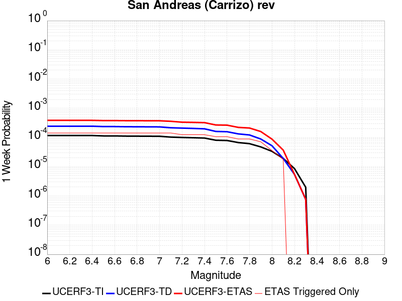 | 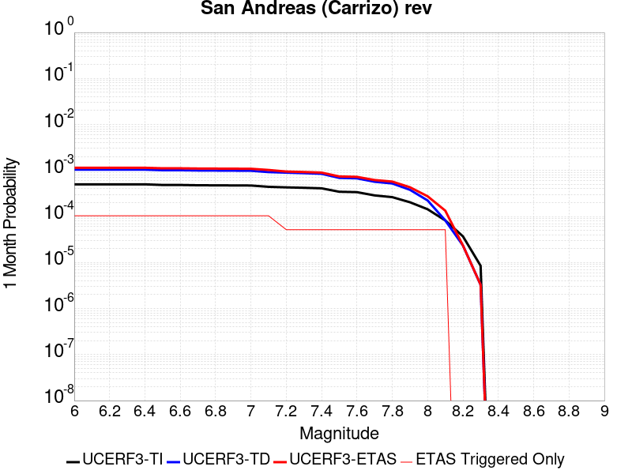 | 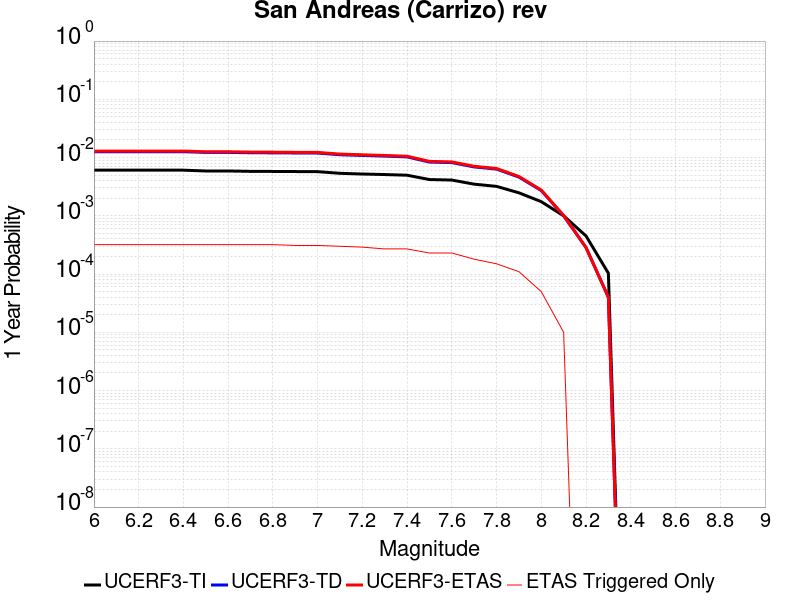 | 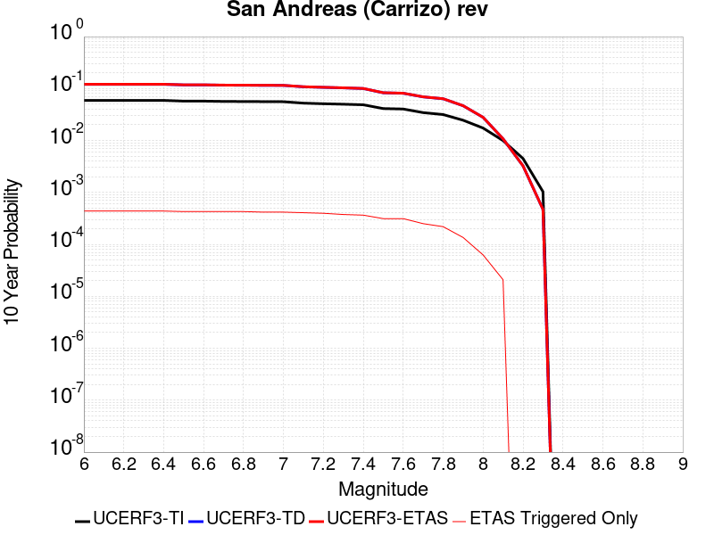 |

| Magnitude | 1 wk TI Prob | 1 wk TD Prob | 1 wk ETAS Prob | 1 wk ETAS/TD Gain | 1 wk ETAS Triggered Only | 1 mo TI Prob | 1 mo TD Prob | 1 mo ETAS Prob | 1 mo ETAS/TD Gain | 1 mo ETAS Triggered Only | 1 yr TI Prob | 1 yr TD Prob | 1 yr ETAS Prob | 1 yr ETAS/TD Gain | 1 yr ETAS Triggered Only | 10 yr TI Prob | 10 yr TD Prob | 10 yr ETAS Prob | 10 yr ETAS/TD Gain | 10 yr ETAS Triggered Only |
|-----|-----|-----|-----|-----|-----|-----|-----|-----|-----|-----|-----|-----|-----|-----|-----|-----|-----|-----|-----|-----|
| 6.0 | 1.1674632E-4 | 2.432302E-4 | 3.5799725E-4 | 1.4718455 | 1.1479499E-4 | 5.002454E-4 | 0.0010420004 | 0.001240076 | 1.1900917 | 1.9828224E-4 | 0.006073493 | 0.012613042 | 0.012932475 | 1.0253255 | 3.2351314E-4 | 0.0591016 | 0.12061418 | 0.12099962 | 1.0031956 | 4.3830814E-4 |
| 6.1 | 1.1674632E-4 | 2.432302E-4 | 3.5799725E-4 | 1.4718455 | 1.1479499E-4 | 5.002454E-4 | 0.0010420004 | 0.001240076 | 1.1900917 | 1.9828224E-4 | 0.006073493 | 0.012613042 | 0.012932475 | 1.0253255 | 3.2351314E-4 | 0.0591016 | 0.12061418 | 0.12099962 | 1.0031956 | 4.3830814E-4 |
| 6.2 | 1.1674632E-4 | 2.432302E-4 | 3.5799725E-4 | 1.4718455 | 1.1479499E-4 | 5.002454E-4 | 0.0010420004 | 0.001240076 | 1.1900917 | 1.9828224E-4 | 0.006073493 | 0.012613042 | 0.012932475 | 1.0253255 | 3.2351314E-4 | 0.0591016 | 0.12061418 | 0.12099962 | 1.0031956 | 4.3830814E-4 |
| 6.3 | 1.1674632E-4 | 2.432302E-4 | 3.5799725E-4 | 1.4718455 | 1.1479499E-4 | 5.002454E-4 | 0.0010420004 | 0.001240076 | 1.1900917 | 1.9828224E-4 | 0.006073493 | 0.012613042 | 0.012932475 | 1.0253255 | 3.2351314E-4 | 0.0591016 | 0.12061418 | 0.12099962 | 1.0031956 | 4.3830814E-4 |
| 6.4 | 1.1674632E-4 | 2.432302E-4 | 3.5799725E-4 | 1.4718455 | 1.1479499E-4 | 5.002454E-4 | 0.0010420004 | 0.001240076 | 1.1900917 | 1.9828224E-4 | 0.006073493 | 0.012613042 | 0.012932475 | 1.0253255 | 3.2351314E-4 | 0.0591016 | 0.12061418 | 0.12099962 | 1.0031956 | 4.3830814E-4 |
| 6.5 | 1.13136164E-4 | 2.3643032E-4 | 3.5119816E-4 | 1.4854193 | 1.1479499E-4 | 4.847792E-4 | 0.0010128808 | 0.0012109623 | 1.1955624 | 1.9828224E-4 | 0.0058862255 | 0.012262545 | 0.01258209 | 1.0260587 | 3.2351314E-4 | 0.057327334 | 0.117585555 | 0.11796311 | 1.0032109 | 4.2787223E-4 |
| 6.6 | 1.13136164E-4 | 2.3643032E-4 | 3.5119816E-4 | 1.4854193 | 1.1479499E-4 | 4.847792E-4 | 0.0010128808 | 0.0012109623 | 1.1955624 | 1.9828224E-4 | 0.0058862255 | 0.012262545 | 0.01258209 | 1.0260587 | 3.2351314E-4 | 0.057327334 | 0.117585555 | 0.11796311 | 1.0032109 | 4.2787223E-4 |
| 6.7 | 1.1149675E-4 | 2.3334254E-4 | 3.4811074E-4 | 1.4918443 | 1.1479499E-4 | 4.777557E-4 | 9.996577E-4 | 0.0011977417 | 1.1981518 | 1.9828224E-4 | 0.0058011734 | 0.012103349 | 0.012422946 | 1.0264057 | 3.2351314E-4 | 0.05652051 | 0.1162071 | 0.11658525 | 1.003254 | 4.2787223E-4 |
| 6.8 | 1.1103589E-4 | 2.3236412E-4 | 3.4713245E-4 | 1.4939158 | 1.1479499E-4 | 4.7578133E-4 | 9.954676E-4 | 0.0011935525 | 1.1989868 | 1.9828224E-4 | 0.005777263 | 0.012052901 | 0.012372515 | 1.0265176 | 3.2351314E-4 | 0.056293584 | 0.1157674 | 0.11614574 | 1.0032681 | 4.2787223E-4 |
| 6.9 | 1.1053259E-4 | 2.3128795E-4 | 3.460564E-4 | 1.4962145 | 1.1479499E-4 | 4.7362508E-4 | 9.90859E-4 | 0.0011889448 | 1.1999131 | 1.9828224E-4 | 0.0057511497 | 0.01199741 | 0.012306731 | 1.0257823 | 3.1307724E-4 | 0.05604569 | 0.11528359 | 0.11565291 | 1.0032035 | 4.1743633E-4 |
| 7.0 | 1.1005377E-4 | 2.3029637E-4 | 3.4506494E-4 | 1.4983516 | 1.1479499E-4 | 4.7157376E-4 | 9.866126E-4 | 0.0011846992 | 1.2007744 | 1.9828224E-4 | 0.0057263062 | 0.011946279 | 0.012255616 | 1.025894 | 3.1307724E-4 | 0.055809796 | 0.11483591 | 0.11520541 | 1.0032176 | 4.1743633E-4 |
| 7.1 | 1.0308142E-4 | 2.1539345E-4 | 3.301637E-4 | 1.5328401 | 1.1479499E-4 | 4.417027E-4 | 9.227892E-4 | 0.0011208885 | 1.2146745 | 1.9828224E-4 | 0.0053644776 | 0.011177397 | 0.011476656 | 1.0267736 | 3.0264133E-4 | 0.052368138 | 0.108092256 | 0.10845526 | 1.0033584 | 4.0700042E-4 |
| 7.2 | 1.0027479E-4 | 2.094724E-4 | 3.1380964E-4 | 1.4980953 | 1.0435908E-4 | 4.296783E-4 | 8.9743105E-4 | 0.0010851088 | 1.2091278 | 1.8784634E-4 | 0.0052187922 | 0.010871782 | 0.0111608105 | 1.0265852 | 2.9220543E-4 | 0.050979212 | 0.10539625 | 0.105751015 | 1.003366 | 3.965645E-4 |
| 7.3 | 9.816942E-5 | 2.0422463E-4 | 3.0856242E-4 | 1.510897 | 1.0435908E-4 | 4.2065824E-4 | 8.7495585E-4 | 0.001052211 | 1.2025876 | 1.7741043E-4 | 0.005109493 | 0.010600842 | 0.010869299 | 1.0253241 | 2.713336E-4 | 0.049935985 | 0.102979995 | 0.103317 | 1.0032725 | 3.7569267E-4 |
| 7.4 | 9.5634205E-5 | 1.9791997E-4 | 3.0225838E-4 | 1.5271748 | 1.0435908E-4 | 4.0979648E-4 | 8.479536E-4 | 0.0010252136 | 1.2090445 | 1.7741043E-4 | 0.0049778637 | 0.010275229 | 0.010543775 | 1.0261352 | 2.713336E-4 | 0.048678253 | 0.10006632 | 0.100395024 | 1.0032849 | 3.6525677E-4 |
| 7.5 | 8.052417E-5 | 1.611261E-4 | 2.5503413E-4 | 1.5828233 | 9.392317E-5 | 3.4505792E-4 | 6.903579E-4 | 8.467884E-4 | 1.2265934 | 1.5653862E-4 | 0.0041929903 | 0.008372796 | 0.008600463 | 1.0271914 | 2.2958998E-4 | 0.04114753 | 0.08281049 | 0.083097644 | 1.0034676 | 3.1307724E-4 |
| 7.6 | 7.897024E-5 | 1.5765853E-4 | 2.515669E-4 | 1.595644 | 9.392317E-5 | 3.384E-4 | 6.755046E-4 | 8.3193753E-4 | 1.2315793 | 1.5653862E-4 | 0.0041122385 | 0.008193332 | 0.008421041 | 1.027792 | 2.2958998E-4 | 0.040369697 | 0.08115171 | 0.081439376 | 1.0035448 | 3.1307724E-4 |
| 7.7 | 6.707427E-5 | 1.3276102E-4 | 2.1623721E-4 | 1.6287702 | 8.348726E-5 | 2.8742946E-4 | 5.688518E-4 | 6.835815E-4 | 1.2016864 | 1.1479499E-4 | 0.003493839 | 0.00690381 | 0.0070799957 | 1.0255201 | 1.7741043E-4 | 0.034394164 | 0.069048055 | 0.06928123 | 1.0033768 | 2.504618E-4 |
| 7.8 | 6.147705E-5 | 1.2197486E-4 | 1.950173E-4 | 1.5988319 | 7.305136E-5 | 2.6344648E-4 | 5.226447E-4 | 6.2694924E-4 | 1.1995707 | 1.0435908E-4 | 0.0032027436 | 0.006344659 | 0.0065002046 | 1.024516 | 1.5653862E-4 | 0.031569764 | 0.06351457 | 0.0637198 | 1.0032313 | 2.1915407E-4 |
| 7.9 | 4.7636717E-5 | 8.87977E-5 | 1.4097261E-4 | 1.5875704 | 5.217954E-5 | 2.0414138E-4 | 3.8050607E-4 | 4.430977E-4 | 1.1644957 | 6.261545E-5 | 0.0024825884 | 0.0046228287 | 0.004737093 | 1.0247175 | 1.1479499E-4 | 0.024550365 | 0.046628095 | 0.046757434 | 1.0027739 | 1.356668E-4 |
| 8.0 | 3.3554235E-5 | 5.2136907E-5 | 7.3007635E-5 | 1.4003062 | 2.0871816E-5 | 1.4379594E-4 | 2.2342477E-4 | 2.5472548E-4 | 1.1400951 | 3.1307725E-5 | 0.0017493097 | 0.002716805 | 0.0027688427 | 1.0191541 | 5.217954E-5 | 0.017356034 | 0.027880952 | 0.027941823 | 1.0021832 | 6.261545E-5 |
| 8.1 | 1.9175432E-5 | 1.9184976E-5 | 2.9620684E-5 | 1.5439521 | 1.0435908E-5 | 8.217783E-5 | 8.2218736E-5 | 9.265378E-5 | 1.1269182 | 1.0435908E-5 | 0.0010000558 | 0.0010005541 | 0.0010109795 | 1.0104197 | 1.0435908E-5 | 0.009955673 | 0.0107580265 | 0.010778674 | 1.0019193 | 2.0871816E-5 |
| 8.2 | 8.643924E-6 | 5.4748625E-6 | 5.4748625E-6 | 1.0 | 0.0 | 3.704486E-5 | 2.3463486E-5 | 2.3463486E-5 | 1.0 | 0.0 | 4.5092785E-4 | 2.8563058E-4 | 2.8563058E-4 | 1.0 | 0.0 | 0.0045001395 | 0.0032487072 | 0.0032487072 | 1.0 | 0.0 |
| 8.3 | 1.983087E-6 | 7.6599065E-7 | 7.6599065E-7 | 1.0 | 0.0 | 8.498917E-6 | 3.282813E-6 | 3.282813E-6 | 1.0 | 0.0 | 1.034694E-4 | 3.9967534E-5 | 3.9967534E-5 | 1.0 | 0.0 | 0.0010342124 | 4.719687E-4 | 4.719687E-4 | 1.0 | 0.0 |

## Independence rev 2011
*[(top)](#table-of-contents)*

| 1 Week | 1 Month | 1 Year | 10 Year |
|-----|-----|-----|-----|
| 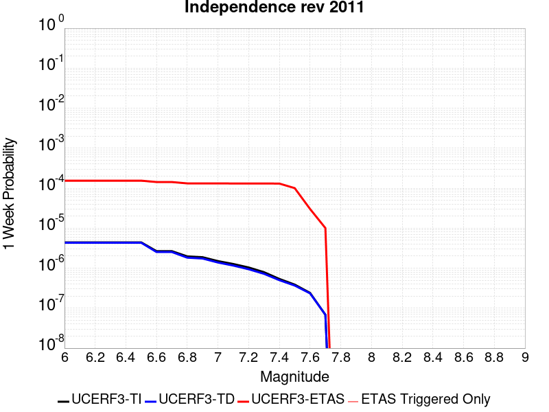 | 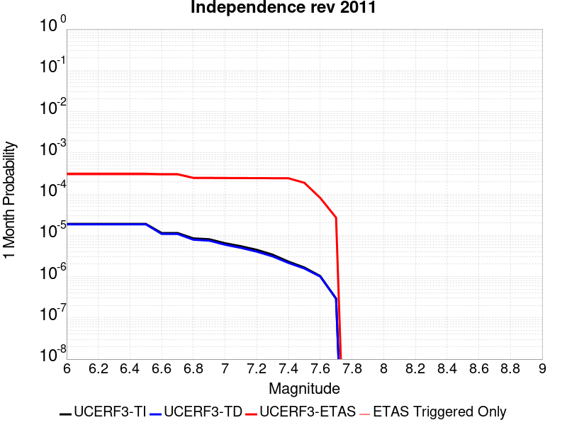 | 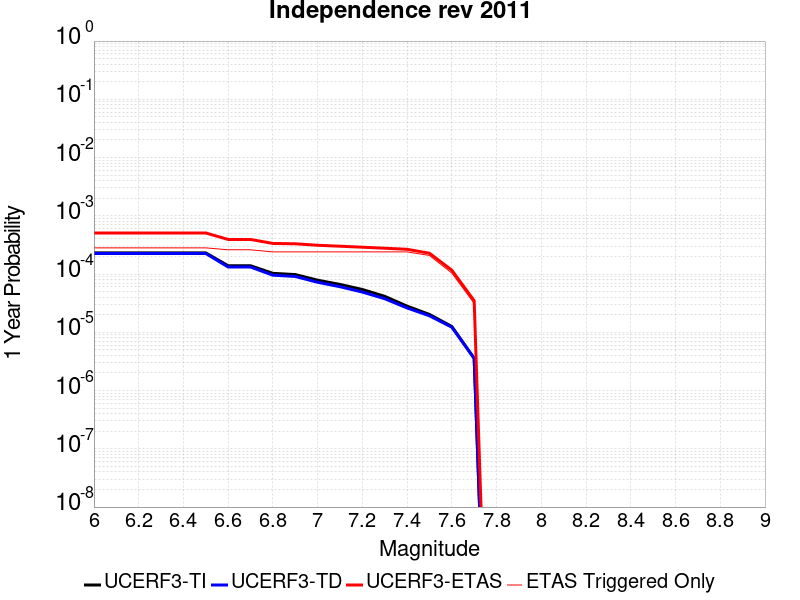 | 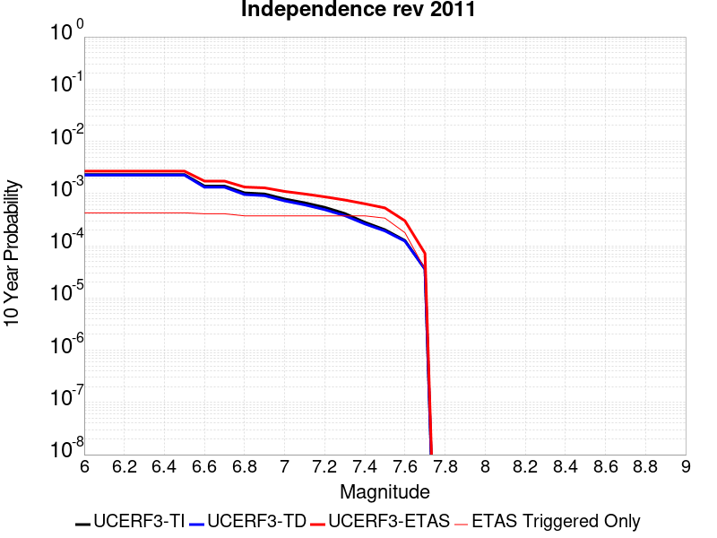 |

| Magnitude | 1 wk TI Prob | 1 wk TD Prob | 1 wk ETAS Prob | 1 wk ETAS/TD Gain | 1 wk ETAS Triggered Only | 1 mo TI Prob | 1 mo TD Prob | 1 mo ETAS Prob | 1 mo ETAS/TD Gain | 1 mo ETAS Triggered Only | 1 yr TI Prob | 1 yr TD Prob | 1 yr ETAS Prob | 1 yr ETAS/TD Gain | 1 yr ETAS Triggered Only | 10 yr TI Prob | 10 yr TD Prob | 10 yr ETAS Prob | 10 yr ETAS/TD Gain | 10 yr ETAS Triggered Only |
|-----|-----|-----|-----|-----|-----|-----|-----|-----|-----|-----|-----|-----|-----|-----|-----|-----|-----|-----|-----|-----|
| 6.0 | 4.422171E-6 | 4.326227E-6 | 1.6086416E-4 | 37.18348 | 1.5653862E-4 | 1.8952025E-5 | 1.8540857E-5 | 2.2725515E-4 | 12.256992 | 2.0871816E-4 | 2.3071647E-4 | 2.2571455E-4 | 5.0742045E-4 | 2.2480626 | 2.8176952E-4 | 0.0023047708 | 0.0022551466 | 0.0026716415 | 1.1846864 | 4.1743633E-4 |
| 6.1 | 4.422171E-6 | 4.326227E-6 | 1.6086416E-4 | 37.18348 | 1.5653862E-4 | 1.8952025E-5 | 1.8540857E-5 | 2.2725515E-4 | 12.256992 | 2.0871816E-4 | 2.3071647E-4 | 2.2571455E-4 | 5.0742045E-4 | 2.2480626 | 2.8176952E-4 | 0.0023047708 | 0.0022551466 | 0.0026716415 | 1.1846864 | 4.1743633E-4 |
| 6.2 | 4.422171E-6 | 4.326227E-6 | 1.6086416E-4 | 37.18348 | 1.5653862E-4 | 1.8952025E-5 | 1.8540857E-5 | 2.2725515E-4 | 12.256992 | 2.0871816E-4 | 2.3071647E-4 | 2.2571455E-4 | 5.0742045E-4 | 2.2480626 | 2.8176952E-4 | 0.0023047708 | 0.0022551466 | 0.0026716415 | 1.1846864 | 4.1743633E-4 |
| 6.3 | 4.422171E-6 | 4.326227E-6 | 1.6086416E-4 | 37.18348 | 1.5653862E-4 | 1.8952025E-5 | 1.8540857E-5 | 2.2725515E-4 | 12.256992 | 2.0871816E-4 | 2.3071647E-4 | 2.2571455E-4 | 5.0742045E-4 | 2.2480626 | 2.8176952E-4 | 0.0023047708 | 0.0022551466 | 0.0026716415 | 1.1846864 | 4.1743633E-4 |
| 6.4 | 4.422171E-6 | 4.326227E-6 | 1.6086416E-4 | 37.18348 | 1.5653862E-4 | 1.8952025E-5 | 1.8540857E-5 | 2.2725515E-4 | 12.256992 | 2.0871816E-4 | 2.3071647E-4 | 2.2571455E-4 | 5.0742045E-4 | 2.2480626 | 2.8176952E-4 | 0.0023047708 | 0.0022551466 | 0.0026716415 | 1.1846864 | 4.1743633E-4 |
| 6.5 | 4.422171E-6 | 4.326227E-6 | 1.6086416E-4 | 37.18348 | 1.5653862E-4 | 1.8952025E-5 | 1.8540857E-5 | 2.2725515E-4 | 12.256992 | 2.0871816E-4 | 2.3071647E-4 | 2.2571455E-4 | 5.0742045E-4 | 2.2480626 | 2.8176952E-4 | 0.0023047708 | 0.0022551466 | 0.0026716415 | 1.1846864 | 4.1743633E-4 |
| 6.6 | 2.663744E-6 | 2.5319862E-6 | 1.4863432E-4 | 58.70266 | 1.4610271E-4 | 1.1415996E-5 | 1.0851327E-5 | 2.0913142E-4 | 19.272429 | 1.9828224E-4 | 1.3898089E-4 | 1.3210738E-4 | 3.9297063E-4 | 2.97463 | 2.608977E-4 | 0.0013889399 | 0.0013203367 | 0.0017163777 | 1.2999544 | 3.965645E-4 |
| 6.7 | 2.663744E-6 | 2.5319862E-6 | 1.4863432E-4 | 58.70266 | 1.4610271E-4 | 1.1415996E-5 | 1.0851327E-5 | 2.0913142E-4 | 19.272429 | 1.9828224E-4 | 1.3898089E-4 | 1.3210738E-4 | 3.9297063E-4 | 2.97463 | 2.608977E-4 | 0.0013889399 | 0.0013203367 | 0.0017163777 | 1.2999544 | 3.965645E-4 |
| 6.8 | 1.9716529E-6 | 1.8322585E-6 | 1.374988E-4 | 75.04335 | 1.356668E-4 | 8.449913E-6 | 7.852514E-6 | 1.8526155E-4 | 23.592644 | 1.7741043E-4 | 1.0287284E-4 | 9.5600284E-5 | 3.3560322E-4 | 3.5104835 | 2.4002588E-4 | 0.0010282523 | 9.556045E-4 | 0.0013309382 | 1.3927709 | 3.7569267E-4 |
| 6.9 | 1.8788617E-6 | 1.7429993E-6 | 1.3740956E-4 | 78.83512 | 1.356668E-4 | 8.0522395E-6 | 7.4699765E-6 | 1.8487909E-4 | 24.74962 | 1.7741043E-4 | 9.80316E-5 | 9.0943286E-5 | 3.3094734E-4 | 3.639052 | 2.4002588E-4 | 9.798837E-4 | 9.0907275E-4 | 0.0012844239 | 1.4128945 | 3.7569267E-4 |
| 7.0 | 1.5045488E-6 | 1.3849503E-6 | 1.3705157E-4 | 98.95774 | 1.356668E-4 | 6.44805E-6 | 5.9354884E-6 | 1.8334486E-4 | 30.8896 | 1.7741043E-4 | 7.8502184E-5 | 7.226223E-5 | 3.1227077E-4 | 4.3213553 | 2.4002588E-4 | 7.8474457E-4 | 7.2239246E-4 | 0.0010978137 | 1.5196916 | 3.7569267E-4 |
| 7.1 | 1.272341E-6 | 1.1625096E-6 | 1.3682916E-4 | 117.701515 | 1.356668E-4 | 5.4528787E-6 | 4.982175E-6 | 1.8239173E-4 | 36.608856 | 1.7741043E-4 | 6.6386776E-5 | 6.0656326E-5 | 3.0066766E-4 | 4.956905 | 2.4002588E-4 | 6.636695E-4 | 6.064009E-4 | 9.818658E-4 | 1.6191694 | 3.7569267E-4 |
| 7.2 | 1.0416892E-6 | 9.4098806E-7 | 1.3660766E-4 | 145.17471 | 1.356668E-4 | 4.464375E-6 | 4.0328E-6 | 1.8144252E-4 | 44.9917 | 1.7741043E-4 | 5.4352407E-5 | 4.909825E-5 | 2.8911236E-4 | 5.888445 | 2.4002588E-4 | 5.4339116E-4 | 4.9087586E-4 | 8.663841E-4 | 1.764976 | 3.7569267E-4 |
| 7.3 | 7.9450155E-7 | 7.235002E-7 | 1.363902E-4 | 188.5144 | 1.356668E-4 | 3.4050022E-6 | 3.1007114E-6 | 1.805106E-4 | 58.215866 | 1.7741043E-4 | 4.1455114E-5 | 3.775052E-5 | 2.7776734E-4 | 7.357974 | 2.4002588E-4 | 4.144738E-4 | 3.7744216E-4 | 7.5299304E-4 | 1.9949892 | 3.7569267E-4 |
| 7.4 | 5.3893444E-7 | 5.019512E-7 | 1.3616869E-4 | 271.27872 | 1.356668E-4 | 2.309717E-6 | 2.1512178E-6 | 1.7956128E-4 | 83.46959 | 1.7741043E-4 | 2.8120441E-5 | 2.6190766E-5 | 2.6621035E-4 | 10.164283 | 2.4002588E-4 | 2.8116882E-4 | 2.6187726E-4 | 6.3747156E-4 | 2.434238 | 3.7569267E-4 |
| 7.5 | 3.8852085E-7 | 3.682554E-7 | 1.04727296E-4 | 284.38766 | 1.0435908E-4 | 1.6650882E-6 | 1.5782365E-6 | 1.4768072E-4 | 93.57325 | 1.4610271E-4 | 2.027226E-5 | 1.9214862E-5 | 2.27929E-4 | 11.862121 | 2.0871816E-4 | 2.0270412E-4 | 1.9213221E-4 | 5.260171E-4 | 2.737787 | 3.3394905E-4 |
| 7.6 | 2.414929E-7 | 2.345755E-7 | 3.154229E-5 | 134.46541 | 3.1307725E-5 | 1.0349692E-6 | 1.0053232E-6 | 6.3620704E-5 | 63.283836 | 6.261545E-5 | 1.2600677E-5 | 1.2239742E-5 | 1.1659754E-4 | 9.526144 | 1.0435908E-4 | 1.2599962E-4 | 1.223908E-4 | 3.2064877E-4 | 2.6198764 | 1.9828224E-4 |
| 7.7 | 6.8298014E-8 | 6.85897E-8 | 1.05044965E-5 | 153.14978 | 1.0435908E-5 | 2.9270575E-7 | 2.9395582E-7 | 1.0729861E-5 | 36.50161 | 1.0435908E-5 | 3.5636867E-6 | 3.5789067E-6 | 3.4886518E-5 | 9.747815 | 3.1307725E-5 | 3.5636294E-5 | 3.5788536E-5 | 7.7530676E-5 | 2.166355 | 4.174363E-5 |

## Calico-Hidalgo
*[(top)](#table-of-contents)*

| 1 Week | 1 Month | 1 Year | 10 Year |
|-----|-----|-----|-----|
| 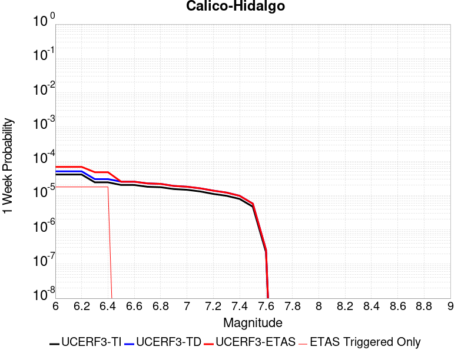 | 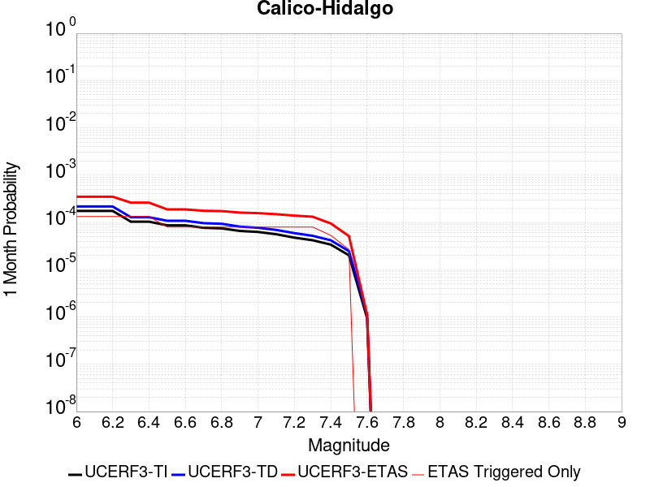 | 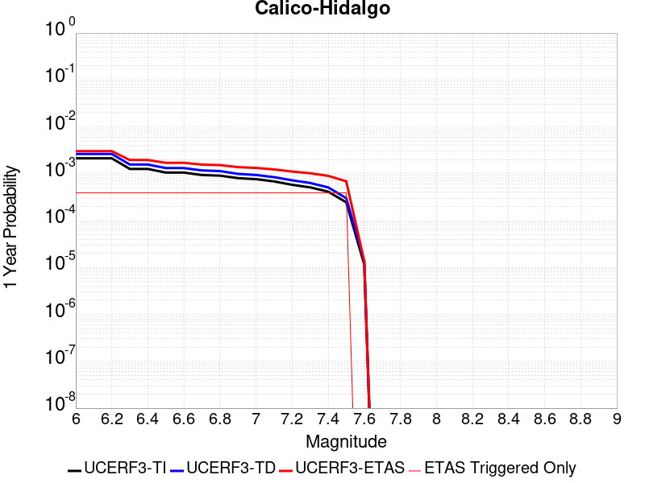 | 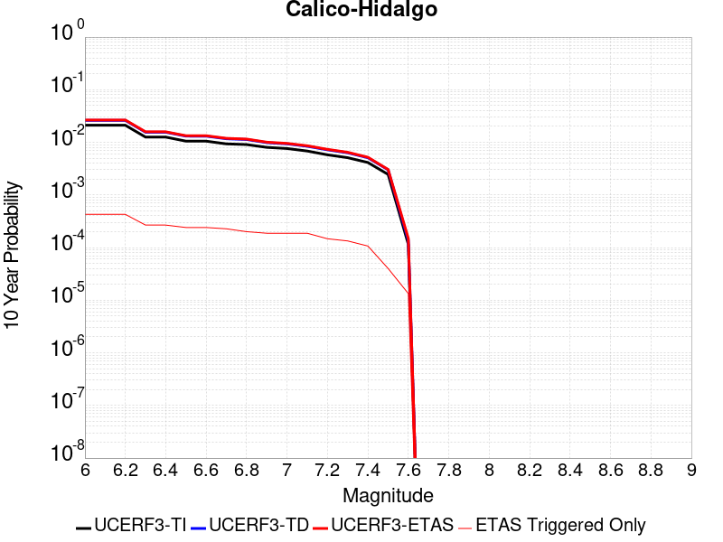 |

| Magnitude | 1 wk TI Prob | 1 wk TD Prob | 1 wk ETAS Prob | 1 wk ETAS/TD Gain | 1 wk ETAS Triggered Only | 1 mo TI Prob | 1 mo TD Prob | 1 mo ETAS Prob | 1 mo ETAS/TD Gain | 1 mo ETAS Triggered Only | 1 yr TI Prob | 1 yr TD Prob | 1 yr ETAS Prob | 1 yr ETAS/TD Gain | 1 yr ETAS Triggered Only | 10 yr TI Prob | 10 yr TD Prob | 10 yr ETAS Prob | 10 yr ETAS/TD Gain | 10 yr ETAS Triggered Only |
|-----|-----|-----|-----|-----|-----|-----|-----|-----|-----|-----|-----|-----|-----|-----|-----|-----|-----|-----|-----|-----|
| 6.0 | 4.0906612E-5 | 5.0703686E-5 | 1.0288058E-4 | 2.029055 | 5.217954E-5 | 1.7530227E-4 | 2.172857E-4 | 3.424894E-4 | 1.5762168 | 1.252309E-4 | 0.0021322158 | 0.002642648 | 0.0028924479 | 1.0945264 | 2.504618E-4 | 0.02111873 | 0.026152607 | 0.0265388 | 1.0147669 | 3.965645E-4 |
| 6.1 | 4.0906612E-5 | 5.0703686E-5 | 1.0288058E-4 | 2.029055 | 5.217954E-5 | 1.7530227E-4 | 2.172857E-4 | 3.424894E-4 | 1.5762168 | 1.252309E-4 | 0.0021322158 | 0.002642648 | 0.0028924479 | 1.0945264 | 2.504618E-4 | 0.02111873 | 0.026152607 | 0.0265388 | 1.0147669 | 3.965645E-4 |
| 6.2 | 4.0906612E-5 | 5.0703686E-5 | 1.0288058E-4 | 2.029055 | 5.217954E-5 | 1.7530227E-4 | 2.172857E-4 | 3.424894E-4 | 1.5762168 | 1.252309E-4 | 0.0021322158 | 0.002642648 | 0.0028924479 | 1.0945264 | 2.504618E-4 | 0.02111873 | 0.026152607 | 0.0265388 | 1.0147669 | 3.965645E-4 |
| 6.3 | 2.4242801E-5 | 3.0090669E-5 | 6.139745E-5 | 2.040415 | 3.1307725E-5 | 1.0389358E-4 | 1.2895382E-4 | 2.1243031E-4 | 1.6473364 | 8.348726E-5 | 0.0012641704 | 0.0015689151 | 0.0017356277 | 1.1062598 | 1.6697453E-4 | 0.01257003 | 0.01558206 | 0.015808074 | 1.0145047 | 2.2958998E-4 |
| 6.4 | 2.4242801E-5 | 3.0090669E-5 | 6.139745E-5 | 2.040415 | 3.1307725E-5 | 1.0389358E-4 | 1.2895382E-4 | 2.1243031E-4 | 1.6473364 | 8.348726E-5 | 0.0012641704 | 0.0015689151 | 0.0017356277 | 1.1062598 | 1.6697453E-4 | 0.01257003 | 0.01558206 | 0.015808074 | 1.0145047 | 2.2958998E-4 |
| 6.5 | 2.0286952E-5 | 2.5315738E-5 | 4.6187026E-5 | 1.8244392 | 2.0871816E-5 | 8.694118E-5 | 1.0849161E-4 | 1.7110026E-4 | 1.577083 | 6.261545E-5 | 0.0010579949 | 0.001320102 | 0.0014660119 | 1.1105292 | 1.4610271E-4 | 0.010529719 | 0.013124538 | 0.013330516 | 1.0156941 | 2.0871816E-4 |
| 6.6 | 2.0269223E-5 | 2.5296687E-5 | 4.6167974E-5 | 1.8250601 | 2.0871816E-5 | 8.6865206E-5 | 1.08409964E-4 | 1.7101862E-4 | 1.5775175 | 6.261545E-5 | 0.0010570707 | 0.0013191093 | 0.0014650193 | 1.1106125 | 1.4610271E-4 | 0.010520565 | 0.013114728 | 0.013320709 | 1.0157061 | 2.0871816E-4 |
| 6.7 | 1.799852E-5 | 2.25406E-5 | 4.3411947E-5 | 1.9259446 | 2.0871816E-5 | 7.713423E-5 | 9.659908E-5 | 1.5920847E-4 | 1.6481366 | 6.261545E-5 | 9.3870464E-4 | 0.0011754738 | 0.0013214048 | 1.1241465 | 1.4610271E-4 | 0.009347493 | 0.011694173 | 0.011890137 | 1.0167574 | 1.9828224E-4 |
| 6.8 | 1.7458793E-5 | 2.184212E-5 | 4.271348E-5 | 1.9555556 | 2.0871816E-5 | 7.4821255E-5 | 9.3605806E-5 | 1.4578046E-4 | 1.557387 | 5.217954E-5 | 9.10568E-4 | 0.0011390693 | 0.0012641576 | 1.1098162 | 1.252309E-4 | 0.009068459 | 0.011333893 | 0.011509293 | 1.0154756 | 1.7741043E-4 |
| 6.9 | 1.542884E-5 | 1.9025927E-5 | 3.9897346E-5 | 2.0969987 | 2.0871816E-5 | 6.612192E-5 | 8.153721E-5 | 1.337125E-4 | 1.6398953 | 5.217954E-5 | 8.04737E-4 | 9.922766E-4 | 0.0011069577 | 1.1155736 | 1.1479499E-4 | 0.008018291 | 0.009879857 | 0.010045183 | 1.0167335 | 1.6697453E-4 |
| 7.0 | 1.468253E-5 | 1.8030598E-5 | 3.890204E-5 | 2.1575565 | 2.0871816E-5 | 6.292361E-5 | 7.7271776E-5 | 1.2944729E-4 | 1.6752207 | 5.217954E-5 | 7.658257E-4 | 9.4039086E-4 | 0.0010550779 | 1.1219568 | 1.1479499E-4 | 0.0076319184 | 0.009365481 | 0.009530892 | 1.0176617 | 1.6697453E-4 |
| 7.1 | 1.3139281E-5 | 1.6200942E-5 | 2.663668E-5 | 1.6441439 | 1.0435908E-5 | 5.6309986E-5 | 6.943083E-5 | 1.1117157E-4 | 1.6011844 | 4.174363E-5 | 6.853584E-4 | 8.4500515E-4 | 9.4927603E-4 | 1.1233968 | 1.0435908E-4 | 0.0068324856 | 0.0084192185 | 0.008574439 | 1.0184364 | 1.5653862E-4 |
| 7.2 | 1.1127404E-5 | 1.3866597E-5 | 2.430236E-5 | 1.7525828 | 1.0435908E-5 | 4.7688E-5 | 5.942698E-5 | 1.0116813E-4 | 1.7023939 | 4.174363E-5 | 5.8044674E-4 | 7.232942E-4 | 8.067211E-4 | 1.115343 | 8.348726E-5 | 0.0057893298 | 0.0072105085 | 0.007324476 | 1.0158057 | 1.1479499E-4 |
| 7.3 | 9.808154E-6 | 1.2176215E-5 | 2.2611996E-5 | 1.8570628 | 1.0435908E-5 | 4.2034266E-5 | 5.2182797E-5 | 9.3924245E-5 | 1.7999083 | 4.174363E-5 | 5.11647E-4 | 6.3515105E-4 | 7.0815603E-4 | 1.1149411 | 7.305136E-5 | 0.0051047057 | 0.006334433 | 0.006438131 | 1.0163705 | 1.0435908E-4 |
| 7.4 | 7.942452E-6 | 9.792144E-6 | 2.022795E-5 | 2.0657325 | 1.0435908E-5 | 3.4038632E-5 | 4.1965708E-5 | 7.327212E-5 | 1.7459998 | 3.1307725E-5 | 4.1434157E-4 | 5.1082217E-4 | 5.7340565E-4 | 1.1225152 | 6.261545E-5 | 0.0041356985 | 0.005097421 | 0.0051804828 | 1.0162948 | 8.348726E-5 |
| 7.5 | 4.7121216E-6 | 5.772836E-6 | 5.772836E-6 | 1.0 | 0.0 | 2.019465E-5 | 2.4740535E-5 | 3.5176185E-5 | 1.4218037 | 1.0435908E-5 | 2.4584212E-4 | 3.0118204E-4 | 3.116148E-4 | 1.0346394 | 1.0435908E-5 | 0.0024557032 | 0.0030084911 | 0.0030397046 | 1.0103751 | 3.1307725E-5 |
| 7.6 | 2.21172E-7 | 2.603961E-7 | 2.603961E-7 | 1.0 | 0.0 | 9.478797E-7 | 1.1159829E-6 | 1.1159829E-6 | 1.0 | 0.0 | 1.1540374E-5 | 1.3587036E-5 | 1.3587036E-5 | 1.0 | 0.0 | 1.1539775E-4 | 1.3586486E-4 | 1.4629935E-4 | 1.0768005 | 1.0435908E-5 |

## Cady
*[(top)](#table-of-contents)*

| 1 Week | 1 Month | 1 Year | 10 Year |
|-----|-----|-----|-----|
| 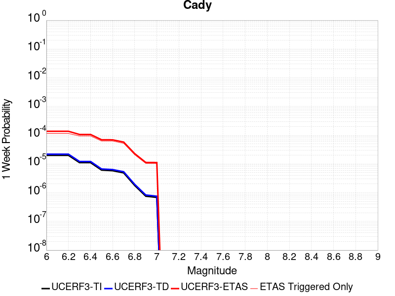 | 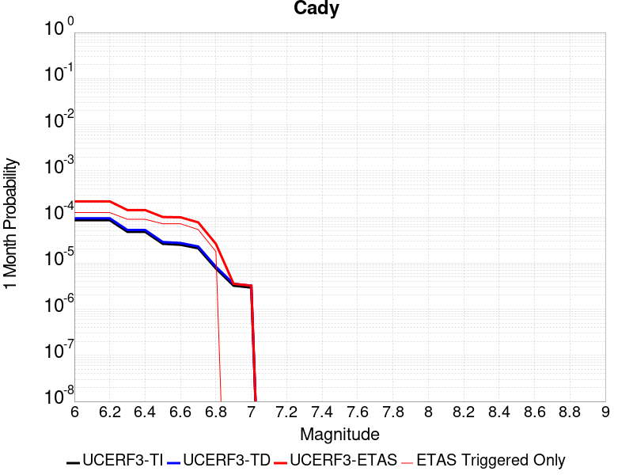 |  | 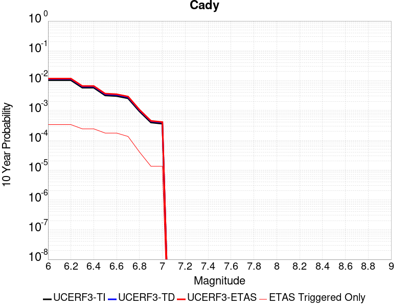 |

| Magnitude | 1 wk TI Prob | 1 wk TD Prob | 1 wk ETAS Prob | 1 wk ETAS/TD Gain | 1 wk ETAS Triggered Only | 1 mo TI Prob | 1 mo TD Prob | 1 mo ETAS Prob | 1 mo ETAS/TD Gain | 1 mo ETAS Triggered Only | 1 yr TI Prob | 1 yr TD Prob | 1 yr ETAS Prob | 1 yr ETAS/TD Gain | 1 yr ETAS Triggered Only | 10 yr TI Prob | 10 yr TD Prob | 10 yr ETAS Prob | 10 yr ETAS/TD Gain | 10 yr ETAS Triggered Only |
|-----|-----|-----|-----|-----|-----|-----|-----|-----|-----|-----|-----|-----|-----|-----|-----|-----|-----|-----|-----|-----|
| 6.0 | 1.9892565E-5 | 2.1858728E-5 | 1.366512E-4 | 6.251562 | 1.1479499E-4 | 8.525106E-5 | 9.3677416E-5 | 2.5020138E-4 | 2.6708825 | 1.5653862E-4 | 0.0010374374 | 0.0011400167 | 0.001390193 | 1.2194496 | 2.504618E-4 | 0.010326075 | 0.011350701 | 0.011722129 | 1.032723 | 3.7569267E-4 |
| 6.1 | 1.9892565E-5 | 2.1858728E-5 | 1.366512E-4 | 6.251562 | 1.1479499E-4 | 8.525106E-5 | 9.3677416E-5 | 2.5020138E-4 | 2.6708825 | 1.5653862E-4 | 0.0010374374 | 0.0011400167 | 0.001390193 | 1.2194496 | 2.504618E-4 | 0.010326075 | 0.011350701 | 0.011722129 | 1.032723 | 3.7569267E-4 |
| 6.2 | 1.9892565E-5 | 2.1858728E-5 | 1.366512E-4 | 6.251562 | 1.1479499E-4 | 8.525106E-5 | 9.3677416E-5 | 2.5020138E-4 | 2.6708825 | 1.5653862E-4 | 0.0010374374 | 0.0011400167 | 0.001390193 | 1.2194496 | 2.504618E-4 | 0.010326075 | 0.011350701 | 0.011722129 | 1.032723 | 3.7569267E-4 |
| 6.3 | 1.1117327E-5 | 1.2176583E-5 | 1.0609861E-4 | 8.713331 | 9.392317E-5 | 4.764482E-5 | 5.2184492E-5 | 1.6697349E-4 | 3.1996765 | 1.1479499E-4 | 5.7992124E-4 | 6.351925E-4 | 8.2291954E-4 | 1.2955436 | 1.8784634E-4 | 0.0057841022 | 0.0063368753 | 0.0066064894 | 1.0425469 | 2.713336E-4 |
| 6.4 | 1.1117327E-5 | 1.2176583E-5 | 1.0609861E-4 | 8.713331 | 9.392317E-5 | 4.764482E-5 | 5.2184492E-5 | 1.6697349E-4 | 3.1996765 | 1.1479499E-4 | 5.7992124E-4 | 6.351925E-4 | 8.2291954E-4 | 1.2955436 | 1.8784634E-4 | 0.0057841022 | 0.0063368753 | 0.0066064894 | 1.0425469 | 2.713336E-4 |
| 6.5 | 6.103093E-6 | 6.672021E-6 | 6.928705E-5 | 10.384718 | 6.261545E-5 | 2.615585E-5 | 2.8594131E-5 | 9.120779E-5 | 3.189738 | 6.261545E-5 | 3.1840094E-4 | 3.480905E-4 | 4.6284552E-4 | 1.3296701 | 1.1479499E-4 | 0.0031794512 | 0.0034766865 | 0.0036638798 | 1.0538424 | 1.8784634E-4 |
| 6.6 | 5.817237E-6 | 6.3656585E-6 | 6.8980706E-5 | 10.836382 | 6.261545E-5 | 2.4930776E-5 | 2.728118E-5 | 8.9894915E-5 | 3.295126 | 6.261545E-5 | 3.034899E-4 | 3.3211018E-4 | 4.4686702E-4 | 1.3455385 | 1.1479499E-4 | 0.0030307577 | 0.0033173605 | 0.0035045838 | 1.0564374 | 1.8784634E-4 |
| 6.7 | 4.8846314E-6 | 5.3405684E-6 | 5.751983E-5 | 10.770357 | 5.217954E-5 | 2.0933967E-5 | 2.2888014E-5 | 7.506636E-5 | 3.2797234 | 5.217954E-5 | 2.5484123E-4 | 2.7863772E-4 | 3.6210174E-4 | 1.299543 | 8.348726E-5 | 0.0025454918 | 0.0027840391 | 0.002929735 | 1.0523326 | 1.4610271E-4 |
| 6.8 | 1.7788773E-6 | 1.9399079E-6 | 2.2811682E-5 | 11.759157 | 2.0871816E-5 | 7.6237375E-6 | 8.313874E-6 | 2.9185516E-5 | 3.5104594 | 2.0871816E-5 | 9.281505E-5 | 1.01218284E-4 | 1.5339254E-4 | 1.5154628 | 5.217954E-5 | 9.2776294E-4 | 0.0010118765 | 0.0010640032 | 1.051515 | 5.217954E-5 |
| 6.9 | 7.5455404E-7 | 8.297092E-7 | 1.1265608E-5 | 13.577779 | 1.0435908E-5 | 3.233799E-6 | 3.5558937E-6 | 1.3991765E-5 | 3.9348094 | 1.0435908E-5 | 3.937079E-5 | 4.3292483E-5 | 6.4163396E-5 | 1.482091 | 2.0871816E-5 | 3.9363815E-4 | 4.3287344E-4 | 4.537362E-4 | 1.0481961 | 2.0871816E-5 |
| 7.0 | 6.8578805E-7 | 7.541816E-7 | 1.1190082E-5 | 14.837383 | 1.0435908E-5 | 2.9390883E-6 | 3.2322048E-6 | 1.3668079E-5 | 4.228717 | 1.0435908E-5 | 3.578281E-5 | 3.9351715E-5 | 6.022271E-5 | 1.5303707 | 2.0871816E-5 | 3.577705E-4 | 3.9347992E-4 | 4.1434352E-4 | 1.0530233 | 2.0871816E-5 |

## White Wolf (Extension)
*[(top)](#table-of-contents)*

| 1 Week | 1 Month | 1 Year | 10 Year |
|-----|-----|-----|-----|
| 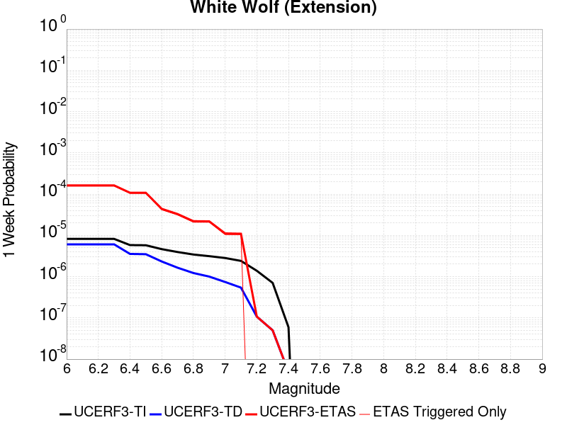 | 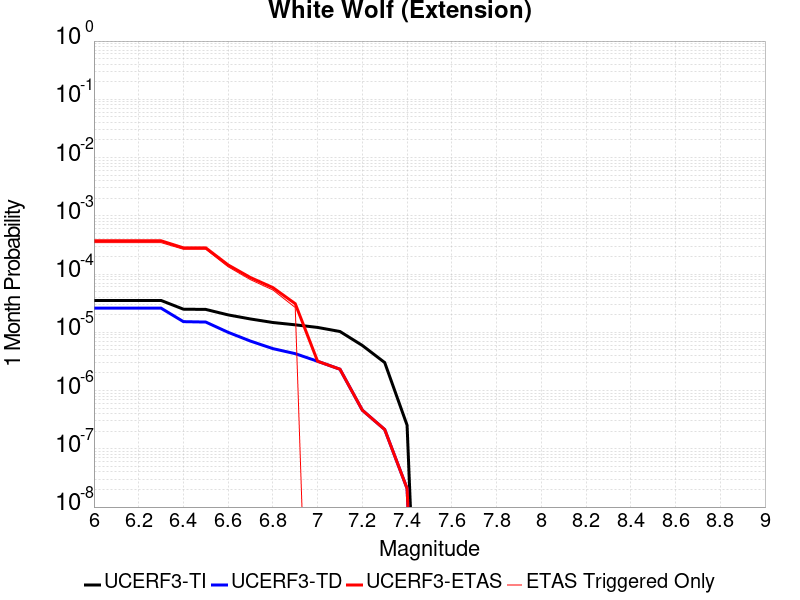 | 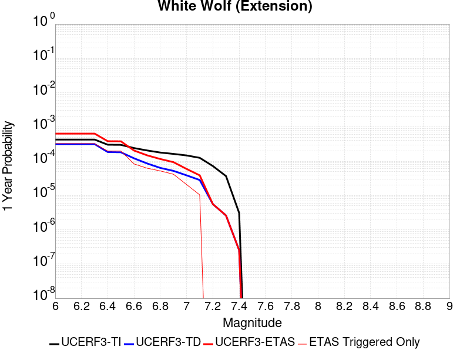 | 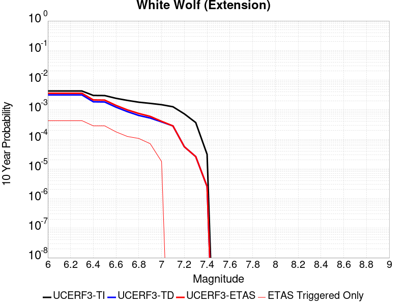 |

| Magnitude | 1 wk TI Prob | 1 wk TD Prob | 1 wk ETAS Prob | 1 wk ETAS/TD Gain | 1 wk ETAS Triggered Only | 1 mo TI Prob | 1 mo TD Prob | 1 mo ETAS Prob | 1 mo ETAS/TD Gain | 1 mo ETAS Triggered Only | 1 yr TI Prob | 1 yr TD Prob | 1 yr ETAS Prob | 1 yr ETAS/TD Gain | 1 yr ETAS Triggered Only | 10 yr TI Prob | 10 yr TD Prob | 10 yr ETAS Prob | 10 yr ETAS/TD Gain | 10 yr ETAS Triggered Only |
|-----|-----|-----|-----|-----|-----|-----|-----|-----|-----|-----|-----|-----|-----|-----|-----|-----|-----|-----|-----|-----|
| 6.0 | 8.222555E-6 | 6.0666657E-6 | 1.6260434E-4 | 26.802917 | 1.5653862E-4 | 3.5239045E-5 | 2.5999774E-5 | 2.4514814E-4 | 9.428857 | 2.1915407E-4 | 4.289509E-4 | 3.1650788E-4 | 6.3991867E-4 | 2.0218093 | 3.2351314E-4 | 0.0042812387 | 0.003161223 | 0.0035669368 | 1.1283407 | 4.0700042E-4 |
| 6.1 | 8.222555E-6 | 6.0666657E-6 | 1.6260434E-4 | 26.802917 | 1.5653862E-4 | 3.5239045E-5 | 2.5999774E-5 | 2.4514814E-4 | 9.428857 | 2.1915407E-4 | 4.289509E-4 | 3.1650788E-4 | 6.3991867E-4 | 2.0218093 | 3.2351314E-4 | 0.0042812387 | 0.003161223 | 0.0035669368 | 1.1283407 | 4.0700042E-4 |
| 6.2 | 8.222555E-6 | 6.0666657E-6 | 1.6260434E-4 | 26.802917 | 1.5653862E-4 | 3.5239045E-5 | 2.5999774E-5 | 2.4514814E-4 | 9.428857 | 2.1915407E-4 | 4.289509E-4 | 3.1650788E-4 | 6.3991867E-4 | 2.0218093 | 3.2351314E-4 | 0.0042812387 | 0.003161223 | 0.0035669368 | 1.1283407 | 4.0700042E-4 |
| 6.3 | 8.222555E-6 | 6.0666657E-6 | 1.6260434E-4 | 26.802917 | 1.5653862E-4 | 3.5239045E-5 | 2.5999774E-5 | 2.4514814E-4 | 9.428857 | 2.1915407E-4 | 4.289509E-4 | 3.1650788E-4 | 6.3991867E-4 | 2.0218093 | 3.2351314E-4 | 0.0042812387 | 0.003161223 | 0.0035669368 | 1.1283407 | 4.0700042E-4 |
| 6.4 | 5.821773E-6 | 3.5571766E-6 | 1.0791588E-4 | 30.337511 | 1.0435908E-4 | 2.4950215E-5 | 1.5244959E-5 | 1.6134544E-4 | 10.583528 | 1.4610271E-4 | 3.0372653E-4 | 1.8559267E-4 | 3.838381E-4 | 2.068175 | 1.9828224E-4 | 0.0030331176 | 0.001854485 | 0.002114899 | 1.1404238 | 2.608977E-4 |
| 6.5 | 5.766023E-6 | 3.4991106E-6 | 1.0785782E-4 | 30.824354 | 1.0435908E-4 | 2.4711293E-5 | 1.4996108E-5 | 1.6109663E-4 | 10.742562 | 1.4610271E-4 | 3.0081844E-4 | 1.8256342E-4 | 3.8080948E-4 | 2.0859025 | 1.9828224E-4 | 0.0030041158 | 0.0018242426 | 0.0020846643 | 1.1427561 | 2.608977E-4 |
| 6.6 | 4.643576E-6 | 2.332624E-6 | 4.4076158E-5 | 18.895525 | 4.174363E-5 | 1.9900888E-5 | 9.996925E-6 | 8.304755E-5 | 8.30731 | 7.305136E-5 | 2.4226638E-4 | 1.2170619E-4 | 2.0518329E-4 | 1.6858903 | 8.348726E-5 | 0.0024200242 | 0.0012164378 | 0.0013623628 | 1.1199609 | 1.4610271E-4 |
| 6.7 | 3.9529173E-6 | 1.6483477E-6 | 3.295602E-5 | 19.993366 | 3.1307725E-5 | 1.6940963E-5 | 7.0643296E-6 | 5.92435E-5 | 8.386288 | 5.217954E-5 | 2.0623671E-4 | 8.6005006E-5 | 1.4861507E-4 | 1.7279816 | 6.261545E-5 | 0.002060454 | 8.597357E-4 | 9.7443204E-4 | 1.1334088 | 1.1479499E-4 |
| 6.8 | 3.4377522E-6 | 1.2245237E-6 | 2.2096314E-5 | 18.044823 | 2.0871816E-5 | 1.473314E-5 | 5.2479486E-6 | 4.699136E-5 | 8.954234 | 4.174363E-5 | 1.7936122E-4 | 6.3891996E-5 | 1.160682E-4 | 1.8166313 | 5.217954E-5 | 0.0017921652 | 6.387454E-4 | 7.221793E-4 | 1.1306216 | 8.348726E-5 |
| 6.9 | 3.1367306E-6 | 1.0033783E-6 | 2.1875174E-5 | 21.80152 | 2.0871816E-5 | 1.3443062E-5 | 4.3001864E-6 | 3.5607776E-5 | 8.2805195 | 3.1307725E-5 | 1.63657E-4 | 5.235359E-5 | 9.4095034E-5 | 1.7972987 | 4.174363E-5 | 0.0016353652 | 5.2342017E-4 | 5.8600283E-4 | 1.1195649 | 6.261545E-5 |
| 7.0 | 2.8298145E-6 | 7.4286646E-7 | 1.1178767E-5 | 15.048151 | 1.0435908E-5 | 1.2127721E-5 | 3.1837099E-6 | 1.3619585E-5 | 4.2778974 | 1.0435908E-5 | 1.47645E-4 | 3.8761027E-5 | 5.9632035E-5 | 1.5384533 | 2.0871816E-5 | 0.0014754693 | 3.8754768E-4 | 4.1884326E-4 | 1.0807528 | 3.1307725E-5 |
| 7.1 | 2.4091064E-6 | 5.4227525E-7 | 1.0978178E-5 | 20.24466 | 1.0435908E-5 | 1.03247E-5 | 2.3240348E-6 | 1.2759919E-5 | 5.490416 | 1.0435908E-5 | 1.2569598E-4 | 2.8294799E-5 | 3.873041E-5 | 1.3688173 | 1.0435908E-5 | 0.001256249 | 2.8291598E-4 | 3.037819E-4 | 1.073753 | 2.0871816E-5 |
| 7.2 | 1.3875518E-6 | 1.0743063E-7 | 1.0743063E-7 | 1.0 | 0.0 | 5.9466374E-6 | 4.6041689E-7 | 4.6041689E-7 | 1.0 | 0.0 | 7.23979E-5 | 5.6055624E-6 | 5.6055624E-6 | 1.0 | 0.0 | 7.2374323E-4 | 5.6054323E-5 | 5.6054323E-5 | 1.0 | 0.0 |
| 7.3 | 7.056077E-7 | 5.002034E-8 | 5.002034E-8 | 1.0 | 0.0 | 3.0240296E-6 | 2.1437286E-7 | 2.1437286E-7 | 1.0 | 0.0 | 3.681694E-5 | 2.609987E-6 | 2.609987E-6 | 1.0 | 0.0 | 3.681084E-4 | 2.609961E-5 | 2.609961E-5 | 1.0 | 0.0 |
| 7.4 | 5.9334678E-8 | 4.8683537E-9 | 4.8683537E-9 | 1.0 | 0.0 | 2.5429145E-7 | 2.0864372E-8 | 2.0864372E-8 | 1.0 | 0.0 | 3.095994E-6 | 2.5402372E-7 | 2.5402372E-7 | 1.0 | 0.0 | 3.095951E-5 | 2.5402353E-6 | 2.5402353E-6 | 1.0 | 0.0 |

## Manix-Afton Hills
*[(top)](#table-of-contents)*

| 1 Week | 1 Month | 1 Year | 10 Year |
|-----|-----|-----|-----|
| 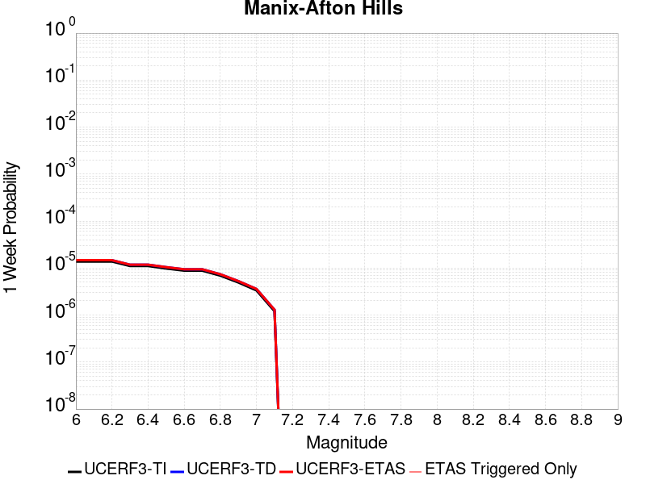 | 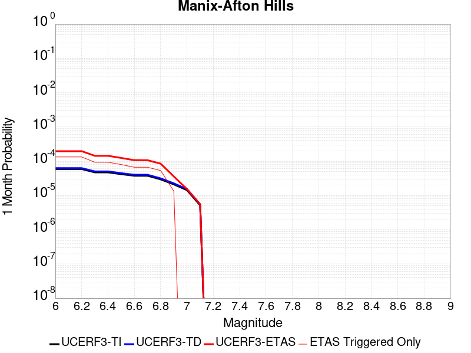 | 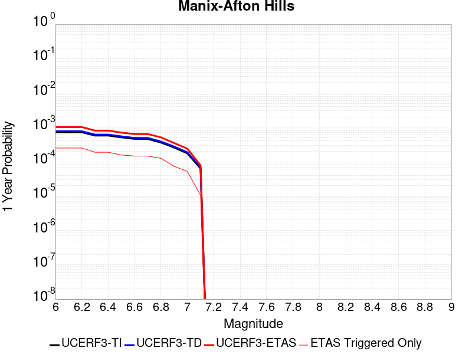 | 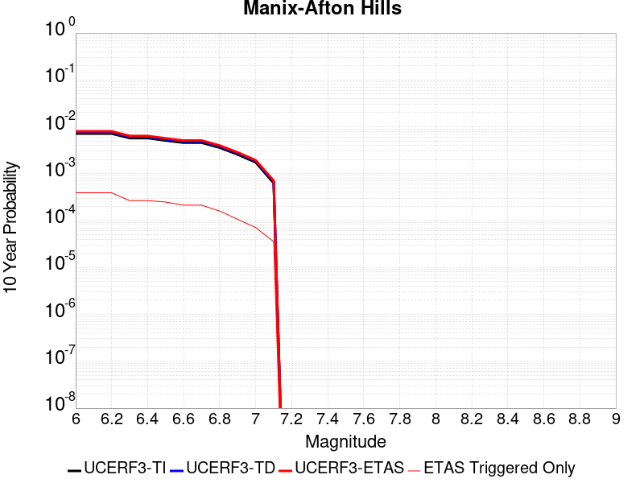 |

| Magnitude | 1 wk TI Prob | 1 wk TD Prob | 1 wk ETAS Prob | 1 wk ETAS/TD Gain | 1 wk ETAS Triggered Only | 1 mo TI Prob | 1 mo TD Prob | 1 mo ETAS Prob | 1 mo ETAS/TD Gain | 1 mo ETAS Triggered Only | 1 yr TI Prob | 1 yr TD Prob | 1 yr ETAS Prob | 1 yr ETAS/TD Gain | 1 yr ETAS Triggered Only | 10 yr TI Prob | 10 yr TD Prob | 10 yr ETAS Prob | 10 yr ETAS/TD Gain | 10 yr ETAS Triggered Only |
|-----|-----|-----|-----|-----|-----|-----|-----|-----|-----|-----|-----|-----|-----|-----|-----|-----|-----|-----|-----|-----|
| 6.0 | 1.3783202E-5 | 1.47110895E-5 | 1.0863288E-4 | 7.384421 | 9.392317E-5 | 5.906953E-5 | 6.30461E-5 | 1.882691E-4 | 2.9862132 | 1.252309E-4 | 7.189342E-4 | 7.6733343E-4 | 0.0010176031 | 1.326155 | 2.504618E-4 | 0.0071661277 | 0.007648596 | 0.008011059 | 1.0473895 | 3.6525677E-4 |
| 6.1 | 1.3783202E-5 | 1.47110895E-5 | 1.0863288E-4 | 7.384421 | 9.392317E-5 | 5.906953E-5 | 6.30461E-5 | 1.882691E-4 | 2.9862132 | 1.252309E-4 | 7.189342E-4 | 7.6733343E-4 | 0.0010176031 | 1.326155 | 2.504618E-4 | 0.0071661277 | 0.007648596 | 0.008011059 | 1.0473895 | 3.6525677E-4 |
| 6.2 | 1.3783202E-5 | 1.47110895E-5 | 1.0863288E-4 | 7.384421 | 9.392317E-5 | 5.906953E-5 | 6.30461E-5 | 1.882691E-4 | 2.9862132 | 1.252309E-4 | 7.189342E-4 | 7.6733343E-4 | 0.0010176031 | 1.326155 | 2.504618E-4 | 0.0071661277 | 0.007648596 | 0.008011059 | 1.0473895 | 3.6525677E-4 |
| 6.3 | 1.10494875E-5 | 1.1793136E-5 | 8.484363E-5 | 7.194323 | 7.305136E-5 | 4.7354086E-5 | 5.054109E-5 | 1.3402413E-4 | 2.6517856 | 8.348726E-5 | 5.763835E-4 | 6.151744E-4 | 8.029052E-4 | 1.3051667 | 1.8784634E-4 | 0.005748908 | 0.0061357557 | 0.0063846805 | 1.0405695 | 2.504618E-4 |
| 6.4 | 1.10494875E-5 | 1.1793136E-5 | 8.484363E-5 | 7.194323 | 7.305136E-5 | 4.7354086E-5 | 5.054109E-5 | 1.3402413E-4 | 2.6517856 | 8.348726E-5 | 5.763835E-4 | 6.151744E-4 | 8.029052E-4 | 1.3051667 | 1.8784634E-4 | 0.005748908 | 0.0061357557 | 0.0063846805 | 1.0405695 | 2.504618E-4 |
| 6.5 | 9.788949E-6 | 1.045432E-5 | 7.306911E-5 | 6.9893703 | 6.261545E-5 | 4.1951964E-5 | 4.480351E-5 | 1.1785159E-4 | 2.6304097 | 7.305136E-5 | 5.1064545E-4 | 5.453555E-4 | 7.018087E-4 | 1.286883 | 1.5653862E-4 | 0.0050947363 | 0.0054410985 | 0.00565906 | 1.0400584 | 2.1915407E-4 |
| 6.6 | 8.810006E-6 | 9.4136285E-6 | 6.159268E-5 | 6.5429263 | 5.217954E-5 | 3.775662E-5 | 4.0343548E-5 | 1.0295647E-4 | 2.5519934 | 6.261545E-5 | 4.5958988E-4 | 4.9108086E-4 | 6.3711184E-4 | 1.2973664 | 1.4610271E-4 | 0.0045864056 | 0.004900839 | 0.0050981496 | 1.0402606 | 1.9828224E-4 |
| 6.7 | 8.80128E-6 | 9.404108E-6 | 6.158316E-5 | 6.5485377 | 5.217954E-5 | 3.7719226E-5 | 4.0302748E-5 | 1.0291567E-4 | 2.5535645 | 6.261545E-5 | 4.591348E-4 | 4.9058435E-4 | 6.366154E-4 | 1.2976675 | 1.4610271E-4 | 0.004581874 | 0.0048958957 | 0.0050932076 | 1.0403014 | 1.9828224E-4 |
| 6.8 | 6.8994877E-6 | 7.380076E-6 | 4.91234E-5 | 6.6562185 | 4.174363E-5 | 2.9568899E-5 | 3.162856E-5 | 8.380645E-5 | 2.649708 | 5.217954E-5 | 3.5994186E-4 | 3.8501783E-4 | 5.102005E-4 | 1.3251348 | 1.252309E-4 | 0.003593594 | 0.0038443129 | 0.0040106457 | 1.0432673 | 1.6697453E-4 |
| 6.9 | 4.9328037E-6 | 5.2709615E-6 | 2.6142667E-5 | 4.959753 | 2.0871816E-5 | 2.1140417E-5 | 2.2589675E-5 | 4.346102E-5 | 1.9239329 | 2.0871816E-5 | 2.5735417E-4 | 2.7500073E-4 | 3.48032E-4 | 1.2655675 | 7.305136E-5 | 0.0025705635 | 0.0027472095 | 0.0028512818 | 1.0378829 | 1.0435908E-4 |
| 7.0 | 3.347973E-6 | 3.59003E-6 | 1.4025901E-5 | 3.9069035 | 1.0435908E-5 | 1.4348378E-5 | 1.5385775E-5 | 2.5821522E-5 | 1.6782725 | 1.0435908E-5 | 1.746775E-4 | 1.8730981E-4 | 2.3947957E-4 | 1.2785213 | 5.217954E-5 | 0.0017454025 | 0.0018719219 | 0.0019448366 | 1.0389518 | 7.305136E-5 |
| 7.1 | 1.2073567E-6 | 1.293482E-6 | 1.293482E-6 | 1.0 | 0.0 | 5.1743755E-6 | 5.543492E-6 | 5.543492E-6 | 1.0 | 0.0 | 6.29962E-5 | 6.749156E-5 | 7.792676E-5 | 1.1546149 | 1.0435908E-5 | 6.297835E-4 | 6.7487074E-4 | 7.0615736E-4 | 1.0463594 | 3.1307725E-5 |

## San Andreas (North Branch Mill Creek)
*[(top)](#table-of-contents)*

| 1 Week | 1 Month | 1 Year | 10 Year |
|-----|-----|-----|-----|
| 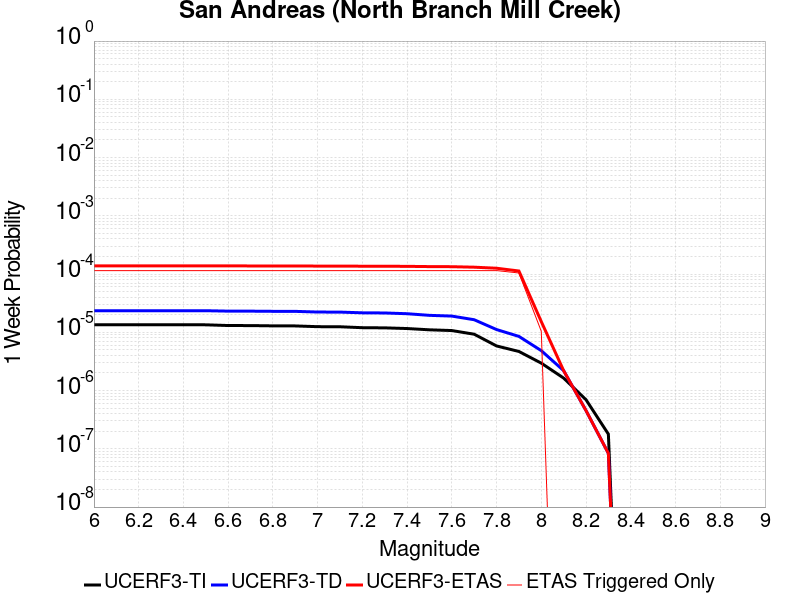 | 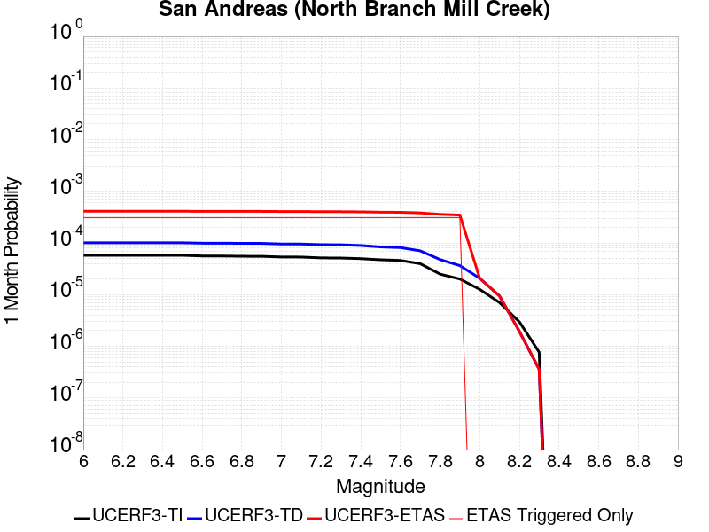 | 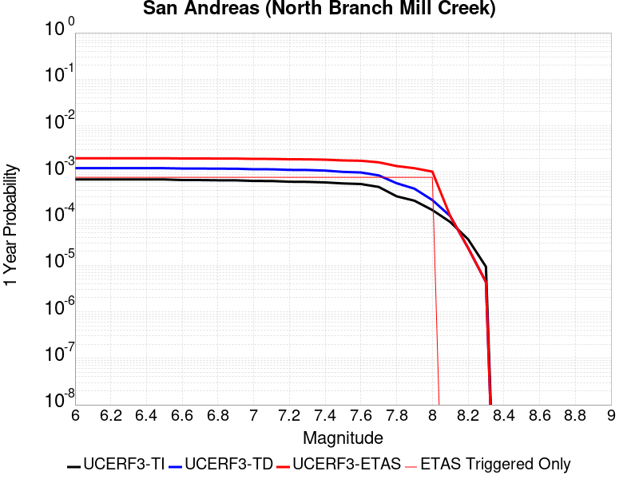 | 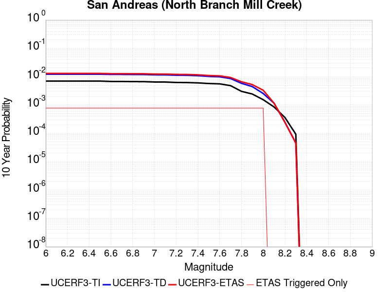 |

| Magnitude | 1 wk TI Prob | 1 wk TD Prob | 1 wk ETAS Prob | 1 wk ETAS/TD Gain | 1 wk ETAS Triggered Only | 1 mo TI Prob | 1 mo TD Prob | 1 mo ETAS Prob | 1 mo ETAS/TD Gain | 1 mo ETAS Triggered Only | 1 yr TI Prob | 1 yr TD Prob | 1 yr ETAS Prob | 1 yr ETAS/TD Gain | 1 yr ETAS Triggered Only | 10 yr TI Prob | 10 yr TD Prob | 10 yr ETAS Prob | 10 yr ETAS/TD Gain | 10 yr ETAS Triggered Only |
|-----|-----|-----|-----|-----|-----|-----|-----|-----|-----|-----|-----|-----|-----|-----|-----|-----|-----|-----|-----|-----|
| 6.0 | 1.3461156E-5 | 2.3499893E-5 | 1.3829218E-4 | 5.8848004 | 1.1479499E-4 | 5.7689394E-5 | 1.00709956E-4 | 2.6766767E-4 | 2.6578074 | 1.6697453E-4 | 7.02142E-4 | 0.0012254574 | 0.0014339198 | 1.1701099 | 2.0871816E-4 | 0.0069992766 | 0.01222957 | 0.012559434 | 1.0269728 | 3.3394905E-4 |
| 6.1 | 1.3461156E-5 | 2.3499893E-5 | 1.3829218E-4 | 5.8848004 | 1.1479499E-4 | 5.7689394E-5 | 1.00709956E-4 | 2.6766767E-4 | 2.6578074 | 1.6697453E-4 | 7.02142E-4 | 0.0012254574 | 0.0014339198 | 1.1701099 | 2.0871816E-4 | 0.0069992766 | 0.01222957 | 0.012559434 | 1.0269728 | 3.3394905E-4 |
| 6.2 | 1.3461156E-5 | 2.3499893E-5 | 1.3829218E-4 | 5.8848004 | 1.1479499E-4 | 5.7689394E-5 | 1.00709956E-4 | 2.6766767E-4 | 2.6578074 | 1.6697453E-4 | 7.02142E-4 | 0.0012254574 | 0.0014339198 | 1.1701099 | 2.0871816E-4 | 0.0069992766 | 0.01222957 | 0.012559434 | 1.0269728 | 3.3394905E-4 |
| 6.3 | 1.3461156E-5 | 2.3499893E-5 | 1.3829218E-4 | 5.8848004 | 1.1479499E-4 | 5.7689394E-5 | 1.00709956E-4 | 2.6766767E-4 | 2.6578074 | 1.6697453E-4 | 7.02142E-4 | 0.0012254574 | 0.0014339198 | 1.1701099 | 2.0871816E-4 | 0.0069992766 | 0.01222957 | 0.012559434 | 1.0269728 | 3.3394905E-4 |
| 6.4 | 1.3461156E-5 | 2.3499893E-5 | 1.3829218E-4 | 5.8848004 | 1.1479499E-4 | 5.7689394E-5 | 1.00709956E-4 | 2.6766767E-4 | 2.6578074 | 1.6697453E-4 | 7.02142E-4 | 0.0012254574 | 0.0014339198 | 1.1701099 | 2.0871816E-4 | 0.0069992766 | 0.01222957 | 0.012559434 | 1.0269728 | 3.3394905E-4 |
| 6.5 | 1.3450706E-5 | 2.3488852E-5 | 1.3828115E-4 | 5.8870964 | 1.1479499E-4 | 5.764461E-5 | 1.0066265E-4 | 2.6762037E-4 | 2.6585865 | 1.6697453E-4 | 7.0159714E-4 | 0.001224882 | 0.0014333444 | 1.1701899 | 2.0871816E-4 | 0.006993862 | 0.01222388 | 0.012553747 | 1.0269854 | 3.3394905E-4 |
| 6.6 | 1.3074523E-5 | 2.3103135E-5 | 1.3789548E-4 | 5.968691 | 1.1479499E-4 | 5.6032466E-5 | 9.9009696E-5 | 2.6596768E-4 | 2.686279 | 1.6697453E-4 | 6.8198174E-4 | 0.0012047797 | 0.0014132464 | 1.173033 | 2.0871816E-4 | 0.006798926 | 0.012025044 | 0.012354977 | 1.0274372 | 3.3394905E-4 |
| 6.7 | 1.3050216E-5 | 2.3078432E-5 | 1.3787077E-4 | 5.9740095 | 1.1479499E-4 | 5.59283E-5 | 9.890384E-5 | 2.6586183E-4 | 2.6880844 | 1.6697453E-4 | 6.8071426E-4 | 0.0012034923 | 0.0014119592 | 1.1732184 | 2.0871816E-4 | 0.0067863287 | 0.012012309 | 0.012342247 | 1.0274667 | 3.3394905E-4 |
| 6.8 | 1.29049395E-5 | 2.292684E-5 | 1.377192E-4 | 6.006898 | 1.1479499E-4 | 5.530571E-5 | 9.825421E-5 | 2.6521232E-4 | 2.6992464 | 1.6697453E-4 | 6.73139E-4 | 0.0011955918 | 0.0014040604 | 1.1743643 | 2.0871816E-4 | 0.0067110364 | 0.011934154 | 0.012264118 | 1.0276487 | 3.3394905E-4 |
| 6.9 | 1.2867369E-5 | 2.2886245E-5 | 1.3767861E-4 | 6.0157795 | 1.1479499E-4 | 5.51447E-5 | 9.8080236E-5 | 2.650384E-4 | 2.702261 | 1.6697453E-4 | 6.711799E-4 | 0.0011934759 | 0.001401945 | 1.1746739 | 2.0871816E-4 | 0.006691564 | 0.011913223 | 0.0122431945 | 1.0276978 | 3.3394905E-4 |
| 7.0 | 1.2495996E-5 | 2.2286325E-5 | 1.3707875E-4 | 6.150801 | 1.1479499E-4 | 5.3553173E-5 | 9.550934E-5 | 2.6246792E-4 | 2.7480865 | 1.6697453E-4 | 6.518148E-4 | 0.0011622087 | 0.0013706844 | 1.1793787 | 2.0871816E-4 | 0.0064990623 | 0.0116038285 | 0.011933902 | 1.0284452 | 3.3394905E-4 |
| 7.1 | 1.2452067E-5 | 2.2231397E-5 | 1.3702383E-4 | 6.1635275 | 1.1479499E-4 | 5.3364907E-5 | 9.527396E-5 | 2.6223258E-4 | 2.7524056 | 1.6697453E-4 | 6.4952404E-4 | 0.0011593461 | 0.0013678222 | 1.1798222 | 2.0871816E-4 | 0.0064762887 | 0.0115755 | 0.011905584 | 1.0285157 | 3.3394905E-4 |
| 7.2 | 1.2002777E-5 | 2.1609963E-5 | 1.3640246E-4 | 6.3120174 | 1.1479499E-4 | 5.143946E-5 | 9.2610855E-5 | 2.595699E-4 | 2.8028023 | 1.6697453E-4 | 6.2609545E-4 | 0.0011269567 | 0.0013354395 | 1.1849964 | 2.0871816E-4 | 0.006243344 | 0.011254923 | 0.011585114 | 1.0293374 | 3.3394905E-4 |
| 7.3 | 1.1923425E-5 | 2.1479793E-5 | 1.3627231E-4 | 6.3442097 | 1.1479499E-4 | 5.109939E-5 | 9.205302E-5 | 2.590122E-4 | 2.813728 | 1.6697453E-4 | 6.219575E-4 | 0.001120172 | 0.0013286563 | 1.1861181 | 2.0871816E-4 | 0.0062021962 | 0.011187789 | 0.011518002 | 1.0295155 | 3.3394905E-4 |
| 7.4 | 1.16105175E-5 | 2.0853771E-5 | 1.3564636E-4 | 6.504644 | 1.1479499E-4 | 4.975841E-5 | 8.937026E-5 | 2.5632986E-4 | 2.8681786 | 1.6697453E-4 | 6.0564023E-4 | 0.0010875424 | 0.0012960335 | 1.1917086 | 2.0871816E-4 | 0.006039923 | 0.010865397 | 0.011195717 | 1.0304011 | 3.3394905E-4 |
| 7.5 | 1.1037265E-5 | 1.9553907E-5 | 1.3434664E-4 | 6.8705783 | 1.1479499E-4 | 4.7301706E-5 | 8.379978E-5 | 2.5076032E-4 | 2.9923744 | 1.6697453E-4 | 5.757461E-4 | 0.0010197869 | 0.0012282922 | 1.2044597 | 2.0871816E-4 | 0.005742567 | 0.010194898 | 0.010525442 | 1.0324225 | 3.3394905E-4 |
| 7.6 | 1.0720915E-5 | 1.899582E-5 | 1.3378862E-4 | 7.0430565 | 1.1479499E-4 | 4.5945973E-5 | 8.140812E-5 | 2.4836906E-4 | 3.0509124 | 1.6697453E-4 | 5.592486E-4 | 9.906954E-4 | 0.0011992068 | 1.2104697 | 2.0871816E-4 | 0.005578433 | 0.009906623 | 0.010237263 | 1.0333757 | 3.3394905E-4 |
| 7.7 | 9.276279E-6 | 1.6441649E-5 | 1.3123474E-4 | 7.9818482 | 1.1479499E-4 | 3.9754876E-5 | 7.0462316E-5 | 2.3742508E-4 | 3.3695328 | 1.6697453E-4 | 4.839081E-4 | 8.575427E-4 | 0.0010660818 | 1.2431823 | 2.0871816E-4 | 0.0048285574 | 0.008586041 | 0.008917123 | 1.0385605 | 3.3394905E-4 |
| 7.8 | 5.8346777E-6 | 1.1155013E-5 | 1.2594872E-4 | 11.290772 | 1.1479499E-4 | 2.5005522E-5 | 4.7806327E-5 | 2.1477287E-4 | 4.492562 | 1.6697453E-4 | 3.043997E-4 | 5.818867E-4 | 7.904834E-4 | 1.3584834 | 2.0871816E-4 | 0.0030398308 | 0.0058469265 | 0.006178923 | 1.0567814 | 3.3394905E-4 |
| 7.9 | 4.690204E-6 | 8.509093E-6 | 1.1286728E-4 | 13.264314 | 1.0435908E-4 | 2.0100719E-5 | 3.6467034E-5 | 1.9299994E-4 | 5.2924495 | 1.5653862E-4 | 2.4469878E-4 | 4.4389578E-4 | 6.4209E-4 | 1.4464883 | 1.9828224E-4 | 0.002444295 | 0.0044707474 | 0.004792814 | 1.0720387 | 3.2351314E-4 |
| 8.0 | 2.9570454E-6 | 4.846947E-6 | 1.5282803E-5 | 3.1530786 | 1.0435908E-5 | 1.267299E-5 | 2.0772464E-5 | 3.1208154E-5 | 1.502381 | 1.0435908E-5 | 1.5428272E-4 | 2.5287544E-4 | 2.946085E-4 | 1.1650342 | 4.174363E-5 | 0.0015417566 | 0.002549644 | 0.002653737 | 1.0408264 | 1.0435908E-4 |
| 8.1 | 1.6376824E-6 | 2.1968929E-6 | 2.1968929E-6 | 1.0 | 0.0 | 7.01862E-6 | 9.41522E-6 | 9.41522E-6 | 1.0 | 0.0 | 8.544835E-5 | 1.14624294E-4 | 1.14624294E-4 | 1.0 | 0.0 | 8.54155E-4 | 0.0011606582 | 0.0011606582 | 1.0 | 0.0 |
| 8.2 | 6.9631557E-7 | 4.5360213E-7 | 4.5360213E-7 | 1.0 | 0.0 | 2.984206E-6 | 1.9440076E-6 | 1.9440076E-6 | 1.0 | 0.0 | 3.63321E-5 | 2.3668037E-5 | 2.3668037E-5 | 1.0 | 0.0 | 3.6326164E-4 | 2.451564E-4 | 2.451564E-4 | 1.0 | 0.0 |
| 8.3 | 1.7876137E-7 | 8.360375E-8 | 8.360375E-8 | 1.0 | 0.0 | 7.661199E-7 | 3.5830175E-7 | 3.5830175E-7 | 1.0 | 0.0 | 9.32747E-6 | 4.3623154E-6 | 4.3623154E-6 | 1.0 | 0.0 | 9.3270784E-5 | 4.5817014E-5 | 4.5817014E-5 | 1.0 | 0.0 |

## Ludlow
*[(top)](#table-of-contents)*

| 1 Week | 1 Month | 1 Year | 10 Year |
|-----|-----|-----|-----|
| 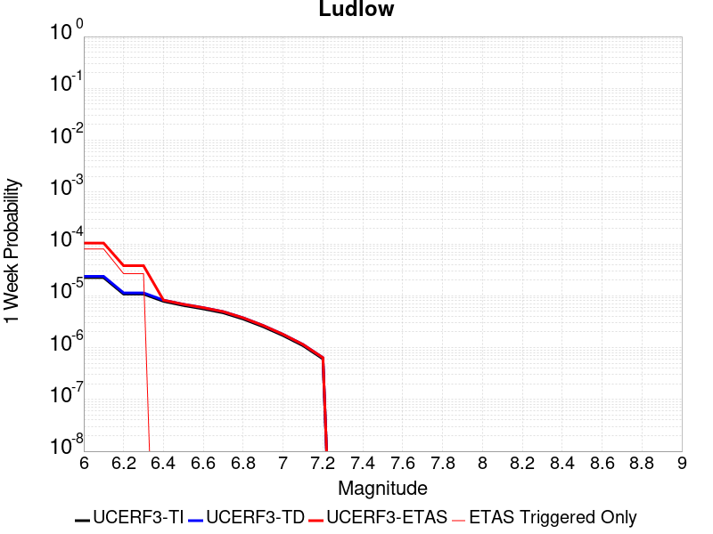 | 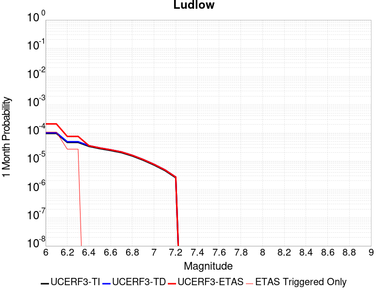 | 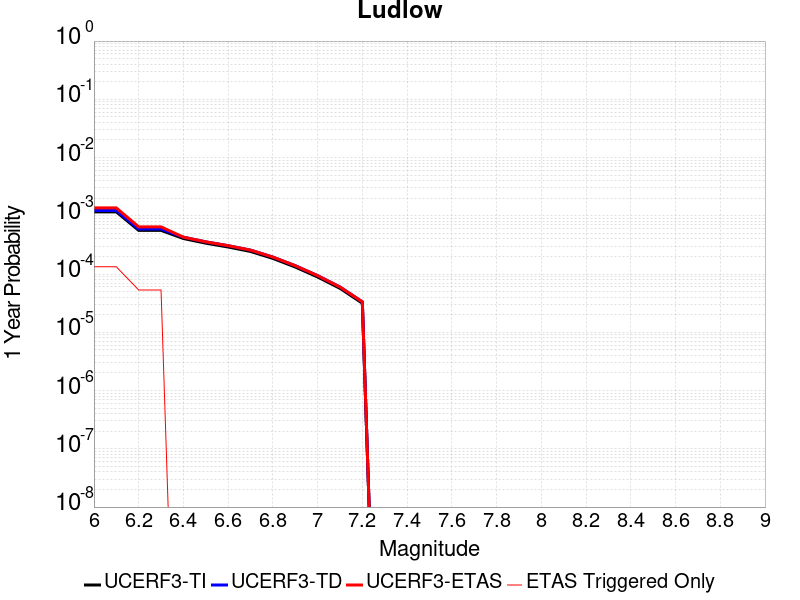 | 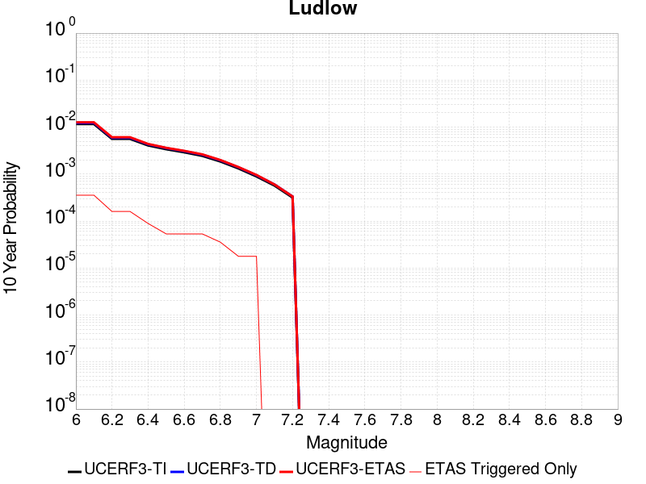 |

| Magnitude | 1 wk TI Prob | 1 wk TD Prob | 1 wk ETAS Prob | 1 wk ETAS/TD Gain | 1 wk ETAS Triggered Only | 1 mo TI Prob | 1 mo TD Prob | 1 mo ETAS Prob | 1 mo ETAS/TD Gain | 1 mo ETAS Triggered Only | 1 yr TI Prob | 1 yr TD Prob | 1 yr ETAS Prob | 1 yr ETAS/TD Gain | 1 yr ETAS Triggered Only | 10 yr TI Prob | 10 yr TD Prob | 10 yr ETAS Prob | 10 yr ETAS/TD Gain | 10 yr ETAS Triggered Only |
|-----|-----|-----|-----|-----|-----|-----|-----|-----|-----|-----|-----|-----|-----|-----|-----|-----|-----|-----|-----|-----|
| 6.0 | 2.2407607E-5 | 2.3657254E-5 | 1.2801387E-4 | 5.4111886 | 1.0435908E-4 | 9.602906E-5 | 1.0138454E-4 | 2.579073E-4 | 2.5438523 | 1.5653862E-4 | 0.0011685267 | 0.001233702 | 0.0014108935 | 1.1436259 | 1.7741043E-4 | 0.011624013 | 0.012273042 | 0.012602893 | 1.026876 | 3.3394905E-4 |
| 6.1 | 2.2407607E-5 | 2.3657254E-5 | 1.2801387E-4 | 5.4111886 | 1.0435908E-4 | 9.602906E-5 | 1.0138454E-4 | 2.579073E-4 | 2.5438523 | 1.5653862E-4 | 0.0011685267 | 0.001233702 | 0.0014108935 | 1.1436259 | 1.7741043E-4 | 0.011624013 | 0.012273042 | 0.012602893 | 1.026876 | 3.3394905E-4 |
| 6.2 | 1.0781252E-5 | 1.1365663E-5 | 4.2673033E-5 | 3.754557 | 3.1307725E-5 | 4.620455E-5 | 4.8709102E-5 | 9.0450696E-5 | 1.8569568 | 4.174363E-5 | 5.623952E-4 | 5.9287593E-4 | 6.450246E-4 | 1.0879587 | 5.217954E-5 | 0.00560974 | 0.0059133614 | 0.006048226 | 1.0228068 | 1.356668E-4 |
| 6.3 | 1.0781252E-5 | 1.1365663E-5 | 4.2673033E-5 | 3.754557 | 3.1307725E-5 | 4.620455E-5 | 4.8709102E-5 | 9.0450696E-5 | 1.8569568 | 4.174363E-5 | 5.623952E-4 | 5.9287593E-4 | 6.450246E-4 | 1.0879587 | 5.217954E-5 | 0.00560974 | 0.0059133614 | 0.006048226 | 1.0228068 | 1.356668E-4 |
| 6.4 | 7.814439E-6 | 8.237729E-6 | 1.867355E-5 | 2.2668324 | 1.0435908E-5 | 3.3490025E-5 | 3.530408E-5 | 5.6175162E-5 | 1.5911803 | 2.0871816E-5 | 4.0766477E-4 | 4.2974384E-4 | 4.5060666E-4 | 1.0485471 | 2.0871816E-5 | 0.0040691774 | 0.0042892746 | 0.0043620127 | 1.0169581 | 7.305136E-5 |
| 6.5 | 6.4986366E-6 | 6.85092E-6 | 1.7286757E-5 | 2.5232754 | 1.0435908E-5 | 2.7851002E-5 | 2.9360759E-5 | 3.979636E-5 | 1.3554268 | 1.0435908E-5 | 3.390332E-4 | 3.5740953E-4 | 3.678417E-4 | 1.0291883 | 1.0435908E-5 | 0.003385164 | 0.0035684432 | 0.003610038 | 1.0116563 | 4.174363E-5 |
| 6.6 | 5.582177E-6 | 5.8860055E-6 | 1.6321852E-5 | 2.7729928 | 1.0435908E-5 | 2.3923398E-5 | 2.5225498E-5 | 3.566114E-5 | 1.4136943 | 1.0435908E-5 | 2.9122844E-4 | 3.0707786E-4 | 3.1751057E-4 | 1.0339742 | 1.0435908E-5 | 0.0029084706 | 0.003066609 | 0.0031082244 | 1.0135705 | 4.174363E-5 |
| 6.7 | 4.6858763E-6 | 4.940427E-6 | 1.5376283E-5 | 3.1123388 | 1.0435908E-5 | 2.0082172E-5 | 2.1173091E-5 | 3.160878E-5 | 1.492875 | 1.0435908E-5 | 2.4447302E-4 | 2.5775246E-4 | 2.6818566E-4 | 1.0404776 | 1.0435908E-5 | 0.0024420423 | 0.0025745912 | 0.0026162274 | 1.0161719 | 4.174363E-5 |
| 6.8 | 3.5584908E-6 | 3.7520183E-6 | 1.4187887E-5 | 3.7814014 | 1.0435908E-5 | 1.5250586E-5 | 1.6079981E-5 | 2.6515721E-5 | 1.6489896 | 1.0435908E-5 | 1.8566006E-4 | 1.957566E-4 | 2.0619047E-4 | 1.0533001 | 1.0435908E-5 | 0.0018550502 | 0.0019558826 | 0.0019871292 | 1.0159756 | 3.1307725E-5 |
| 6.9 | 2.532834E-6 | 2.6710034E-6 | 2.6710034E-6 | 1.0 | 0.0 | 1.0854958E-5 | 1.1447109E-5 | 1.1447109E-5 | 1.0 | 0.0 | 1.3215111E-4 | 1.3935992E-4 | 1.3935992E-4 | 1.0 | 0.0 | 0.0013207254 | 0.0013927529 | 0.0014135956 | 1.0149652 | 2.0871816E-5 |
| 7.0 | 1.7083285E-6 | 1.8019439E-6 | 1.8019439E-6 | 1.0 | 0.0 | 7.3213873E-6 | 7.722595E-6 | 7.722595E-6 | 1.0 | 0.0 | 8.913424E-5 | 9.40187E-5 | 9.40187E-5 | 1.0 | 0.0 | 8.9098496E-4 | 9.3980576E-4 | 9.5023186E-4 | 1.0110939 | 1.0435908E-5 |
| 7.1 | 1.0905424E-6 | 1.1497619E-6 | 1.1497619E-6 | 1.0 | 0.0 | 4.6737446E-6 | 4.9275427E-6 | 4.9275427E-6 | 1.0 | 0.0 | 5.6901354E-5 | 5.999128E-5 | 5.999128E-5 | 1.0 | 0.0 | 5.6886784E-4 | 5.997606E-4 | 5.997606E-4 | 1.0 | 0.0 |
| 7.2 | 6.06668E-7 | 6.387277E-7 | 6.387277E-7 | 1.0 | 0.0 | 2.600003E-6 | 2.7374022E-6 | 2.7374022E-6 | 1.0 | 0.0 | 3.1654577E-5 | 3.3327433E-5 | 3.3327433E-5 | 1.0 | 0.0 | 3.1650066E-4 | 3.3323118E-4 | 3.3323118E-4 | 1.0 | 0.0 |

## Baker
*[(top)](#table-of-contents)*

| 1 Week | 1 Month | 1 Year | 10 Year |
|-----|-----|-----|-----|
|  |  | 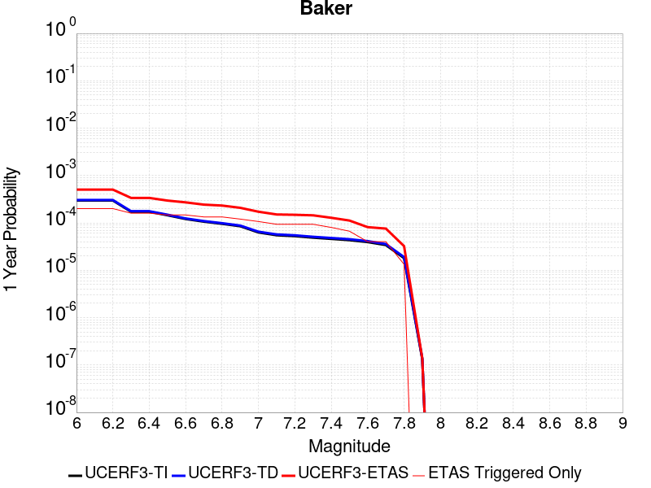 | 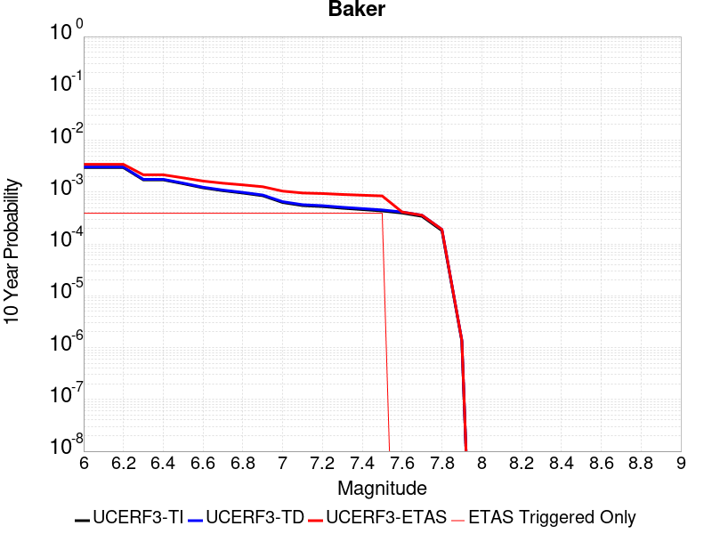 |

| Magnitude | 1 wk TI Prob | 1 wk TD Prob | 1 wk ETAS Prob | 1 wk ETAS/TD Gain | 1 wk ETAS Triggered Only | 1 mo TI Prob | 1 mo TD Prob | 1 mo ETAS Prob | 1 mo ETAS/TD Gain | 1 mo ETAS Triggered Only | 1 yr TI Prob | 1 yr TD Prob | 1 yr ETAS Prob | 1 yr ETAS/TD Gain | 1 yr ETAS Triggered Only | 10 yr TI Prob | 10 yr TD Prob | 10 yr ETAS Prob | 10 yr ETAS/TD Gain | 10 yr ETAS Triggered Only |
|-----|-----|-----|-----|-----|-----|-----|-----|-----|-----|-----|-----|-----|-----|-----|-----|-----|-----|-----|-----|-----|
| 6.0 | 5.695525E-6 | 5.8348373E-6 | 9.975746E-5 | 17.096872 | 9.392317E-5 | 2.4409164E-5 | 2.5006228E-5 | 1.6066963E-4 | 6.4251847 | 1.356668E-4 | 2.9714106E-4 | 3.044123E-4 | 5.3393235E-4 | 1.7539777 | 2.2958998E-4 | 0.0029674405 | 0.0030403486 | 0.0033628782 | 1.106083 | 3.2351314E-4 |
| 6.1 | 5.695525E-6 | 5.8348373E-6 | 9.975746E-5 | 17.096872 | 9.392317E-5 | 2.4409164E-5 | 2.5006228E-5 | 1.6066963E-4 | 6.4251847 | 1.356668E-4 | 2.9714106E-4 | 3.044123E-4 | 5.3393235E-4 | 1.7539777 | 2.2958998E-4 | 0.0029674405 | 0.0030403486 | 0.0033628782 | 1.106083 | 3.2351314E-4 |
| 6.2 | 5.695525E-6 | 5.8348373E-6 | 9.975746E-5 | 17.096872 | 9.392317E-5 | 2.4409164E-5 | 2.5006228E-5 | 1.6066963E-4 | 6.4251847 | 1.356668E-4 | 2.9714106E-4 | 3.044123E-4 | 5.3393235E-4 | 1.7539777 | 2.2958998E-4 | 0.0029674405 | 0.0030403486 | 0.0033628782 | 1.106083 | 3.2351314E-4 |
| 6.3 | 3.2995713E-6 | 3.383667E-6 | 6.59989E-5 | 19.50514 | 6.261545E-5 | 1.4140943E-5 | 1.4501353E-5 | 1.18858916E-4 | 8.196403 | 1.0435908E-4 | 1.7215237E-4 | 1.7654014E-4 | 3.6435333E-4 | 2.0638554 | 1.8784634E-4 | 0.0017201907 | 0.001764046 | 0.002014066 | 1.141731 | 2.504618E-4 |
| 6.4 | 3.2995713E-6 | 3.383667E-6 | 6.59989E-5 | 19.50514 | 6.261545E-5 | 1.4140943E-5 | 1.4501353E-5 | 1.18858916E-4 | 8.196403 | 1.0435908E-4 | 1.7215237E-4 | 1.7654014E-4 | 3.6435333E-4 | 2.0638554 | 1.8784634E-4 | 0.0017201907 | 0.001764046 | 0.002014066 | 1.141731 | 2.504618E-4 |
| 6.5 | 2.782202E-6 | 2.8558404E-6 | 6.547111E-5 | 22.925339 | 6.261545E-5 | 1.1923668E-5 | 1.223926E-5 | 1.1659706E-4 | 9.52648 | 1.0435908E-4 | 1.4516099E-4 | 1.4900314E-4 | 3.2638715E-4 | 2.1904716 | 1.7741043E-4 | 0.001450662 | 0.0014890651 | 0.0017183132 | 1.1539544 | 2.2958998E-4 |
| 6.6 | 2.3163404E-6 | 2.38092E-6 | 6.499622E-5 | 27.298782 | 6.261545E-5 | 9.927136E-6 | 1.0203904E-5 | 1.1456192E-4 | 11.227263 | 1.0435908E-4 | 1.20856166E-4 | 1.2422565E-4 | 3.0161405E-4 | 2.427953 | 1.7741043E-4 | 0.0012079047 | 0.0012415823 | 0.0014604643 | 1.1762928 | 2.1915407E-4 |
| 6.7 | 2.037056E-6 | 2.0965003E-6 | 6.4711814E-5 | 30.866589 | 6.261545E-5 | 8.7302105E-6 | 8.984972E-6 | 1.13343114E-4 | 12.614743 | 1.0435908E-4 | 1.0628513E-4 | 1.093867E-4 | 2.7634297E-4 | 2.526294 | 1.6697453E-4 | 0.0010623431 | 0.0010933448 | 0.0013018347 | 1.19069 | 2.0871816E-4 |
| 6.8 | 1.8356744E-6 | 1.8915287E-6 | 6.450686E-5 | 34.103027 | 6.261545E-5 | 7.867153E-6 | 8.106527E-6 | 1.1246476E-4 | 13.873359 | 1.0435908E-4 | 9.577837E-5 | 9.869264E-5 | 2.6565068E-4 | 2.6916971 | 1.6697453E-4 | 9.57371E-4 | 9.86502E-4 | 0.0011637375 | 1.1796604 | 1.7741043E-4 |
| 6.9 | 1.6310546E-6 | 1.6832072E-6 | 5.386266E-5 | 32.000015 | 5.217954E-5 | 6.9902153E-6 | 7.213726E-6 | 1.0113622E-4 | 14.01997 | 9.392317E-5 | 8.510255E-5 | 8.782368E-5 | 2.4434854E-4 | 2.7822626 | 1.5653862E-4 | 8.5069967E-4 | 8.7790104E-4 | 0.001044729 | 1.1900305 | 1.6697453E-4 |
| 7.0 | 1.2058036E-6 | 1.2508665E-6 | 5.343034E-5 | 42.71466 | 5.217954E-5 | 5.1677193E-6 | 5.3608455E-6 | 9.928351E-5 | 18.52012 | 9.392317E-5 | 6.291517E-5 | 6.5266366E-5 | 2.0092432E-4 | 3.0785277 | 1.356668E-4 | 6.289736E-4 | 6.524743E-4 | 7.984817E-4 | 1.2237749 | 1.4610271E-4 |
| 7.1 | 1.052382E-6 | 1.0951609E-6 | 4.2838747E-5 | 39.116398 | 4.174363E-5 | 4.5102006E-6 | 4.693538E-6 | 8.818041E-5 | 18.78762 | 8.348726E-5 | 5.491031E-5 | 5.7142337E-5 | 1.8236607E-4 | 3.1914353 | 1.252309E-4 | 5.4896745E-4 | 5.7127734E-4 | 7.068666E-4 | 1.2373441 | 1.356668E-4 |
| 7.2 | 1.0067454E-6 | 1.0487711E-6 | 4.279236E-5 | 40.802383 | 4.174363E-5 | 4.3146156E-6 | 4.4947255E-6 | 8.7981614E-5 | 19.574413 | 8.348726E-5 | 5.252918E-5 | 5.4721917E-5 | 1.6951062E-4 | 3.0976734 | 1.1479499E-4 | 5.251676E-4 | 5.470853E-4 | 6.7224767E-4 | 1.2287804 | 1.252309E-4 |
| 7.3 | 9.3596316E-7 | 9.767723E-7 | 4.2720363E-5 | 43.736256 | 4.174363E-5 | 4.0112645E-6 | 4.1861604E-6 | 8.767308E-5 | 20.943554 | 8.348726E-5 | 4.8836053E-5 | 5.096532E-5 | 1.6575445E-4 | 3.252299 | 1.1479499E-4 | 4.8825322E-4 | 5.095371E-4 | 6.242736E-4 | 1.2251779 | 1.1479499E-4 |
| 7.4 | 8.8117395E-7 | 9.2076635E-7 | 4.266436E-5 | 46.33571 | 4.174363E-5 | 3.7764542E-6 | 3.9461356E-6 | 7.69972E-5 | 19.512053 | 7.305136E-5 | 4.5977362E-5 | 4.8043148E-5 | 1.5239722E-4 | 3.1720905 | 1.0435908E-4 | 4.596785E-4 | 4.8032837E-4 | 5.8463734E-4 | 1.2171618 | 1.0435908E-4 |
| 7.5 | 8.292386E-7 | 8.6745956E-7 | 4.2611056E-5 | 49.121662 | 4.174363E-5 | 3.5538749E-6 | 3.7176785E-6 | 7.676876E-5 | 20.64965 | 7.305136E-5 | 4.326757E-5 | 4.5261804E-5 | 1.3918073E-4 | 3.0750148 | 9.392317E-5 | 4.3259145E-4 | 4.5252658E-4 | 5.4640725E-4 | 1.2074589 | 9.392317E-5 |
| 7.6 | 7.553842E-7 | 7.9144706E-7 | 3.2099146E-5 | 40.55754 | 3.1307725E-5 | 3.2373566E-6 | 3.3919116E-6 | 5.5571272E-5 | 16.383469 | 5.217954E-5 | 3.9414106E-5 | 4.129575E-5 | 1.0390861E-4 | 2.516206 | 6.261545E-5 | 3.9407116E-4 | 4.1288146E-4 | 4.7547105E-4 | 1.1515921 | 6.261545E-5 |
| 7.7 | 6.5285366E-7 | 6.852797E-7 | 3.1992982E-5 | 46.686024 | 3.1307725E-5 | 2.797941E-6 | 2.9369096E-6 | 5.5116296E-5 | 18.766766 | 5.217954E-5 | 3.40644E-5 | 3.5756293E-5 | 8.793397E-5 | 2.4592583 | 5.217954E-5 | 3.405918E-4 | 3.5750607E-4 | 4.0966697E-4 | 1.145902 | 5.217954E-5 |
| 7.8 | 3.4586725E-7 | 3.6482615E-7 | 1.080073E-5 | 29.605145 | 1.0435908E-5 | 1.4822873E-6 | 1.5635396E-6 | 2.2435323E-5 | 14.349059 | 2.0871816E-5 | 1.80467E-5 | 1.9035933E-5 | 3.990735E-5 | 2.0964222 | 2.0871816E-5 | 1.8045233E-4 | 1.9034347E-4 | 2.1121131E-4 | 1.1096326 | 2.0871816E-5 |
| 7.9 | 2.5591178E-9 | 2.6696718E-9 | 2.6696718E-9 | 1.0 | 0.0 | 1.0967647E-8 | 1.14414505E-8 | 1.14414505E-8 | 1.0 | 0.0 | 1.335311E-7 | 1.3929966E-7 | 1.3929966E-7 | 1.0 | 0.0 | 1.3353102E-6 | 1.3929966E-6 | 1.3929966E-6 | 1.0 | 0.0 |

## San Jacinto (San Jacinto Valley) rev
*[(top)](#table-of-contents)*

| 1 Week | 1 Month | 1 Year | 10 Year |
|-----|-----|-----|-----|
| 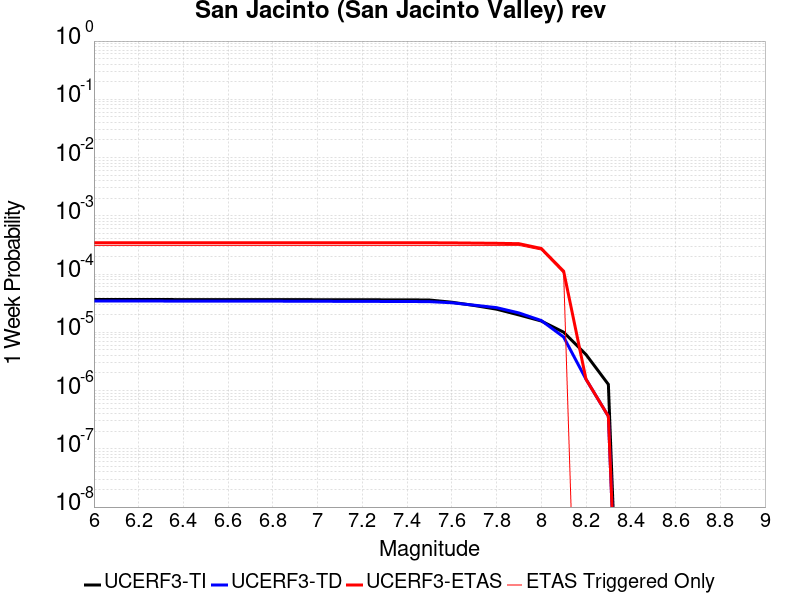 | 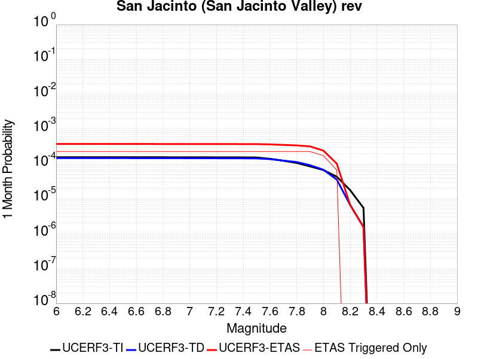 | 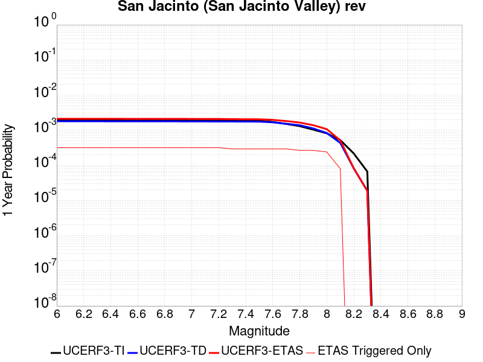 | 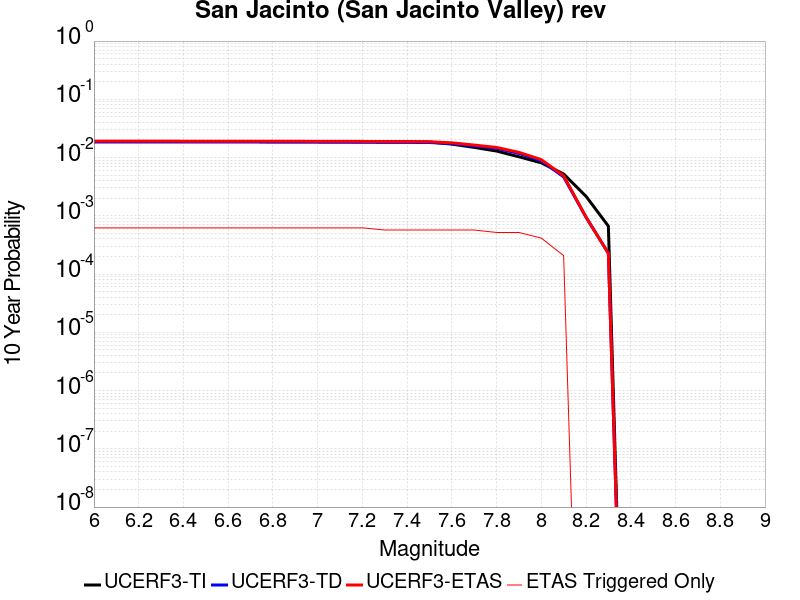 |

| Magnitude | 1 wk TI Prob | 1 wk TD Prob | 1 wk ETAS Prob | 1 wk ETAS/TD Gain | 1 wk ETAS Triggered Only | 1 mo TI Prob | 1 mo TD Prob | 1 mo ETAS Prob | 1 mo ETAS/TD Gain | 1 mo ETAS Triggered Only | 1 yr TI Prob | 1 yr TD Prob | 1 yr ETAS Prob | 1 yr ETAS/TD Gain | 1 yr ETAS Triggered Only | 10 yr TI Prob | 10 yr TD Prob | 10 yr ETAS Prob | 10 yr ETAS/TD Gain | 10 yr ETAS Triggered Only |
|-----|-----|-----|-----|-----|-----|-----|-----|-----|-----|-----|-----|-----|-----|-----|-----|-----|-----|-----|-----|-----|
| 6.0 | 3.652694E-5 | 3.4402394E-5 | 1.9093562E-4 | 5.5500684 | 1.5653862E-4 | 1.5653463E-4 | 1.474305E-4 | 3.3524915E-4 | 2.273947 | 1.8784634E-4 | 0.0019041431 | 0.00179349 | 0.0020435026 | 1.1394 | 2.504618E-4 | 0.018879099 | 0.018526595 | 0.018833872 | 1.0165857 | 3.1307724E-4 |
| 6.1 | 3.652694E-5 | 3.4402394E-5 | 1.9093562E-4 | 5.5500684 | 1.5653862E-4 | 1.5653463E-4 | 1.474305E-4 | 3.3524915E-4 | 2.273947 | 1.8784634E-4 | 0.0019041431 | 0.00179349 | 0.0020435026 | 1.1394 | 2.504618E-4 | 0.018879099 | 0.018526595 | 0.018833872 | 1.0165857 | 3.1307724E-4 |
| 6.2 | 3.652694E-5 | 3.4402394E-5 | 1.9093562E-4 | 5.5500684 | 1.5653862E-4 | 1.5653463E-4 | 1.474305E-4 | 3.3524915E-4 | 2.273947 | 1.8784634E-4 | 0.0019041431 | 0.00179349 | 0.0020435026 | 1.1394 | 2.504618E-4 | 0.018879099 | 0.018526595 | 0.018833872 | 1.0165857 | 3.1307724E-4 |
| 6.3 | 3.652694E-5 | 3.4402394E-5 | 1.9093562E-4 | 5.5500684 | 1.5653862E-4 | 1.5653463E-4 | 1.474305E-4 | 3.3524915E-4 | 2.273947 | 1.8784634E-4 | 0.0019041431 | 0.00179349 | 0.0020435026 | 1.1394 | 2.504618E-4 | 0.018879099 | 0.018526595 | 0.018833872 | 1.0165857 | 3.1307724E-4 |
| 6.4 | 3.646941E-5 | 3.432397E-5 | 1.9085722E-4 | 5.5604644 | 1.5653862E-4 | 1.5628811E-4 | 1.4709444E-4 | 3.3491314E-4 | 2.2768579 | 1.8784634E-4 | 0.0019011468 | 0.0017894056 | 0.0020394193 | 1.1397188 | 2.504618E-4 | 0.018849645 | 0.018486476 | 0.018793765 | 1.0166224 | 3.1307724E-4 |
| 6.5 | 3.646941E-5 | 3.432397E-5 | 1.9085722E-4 | 5.5604644 | 1.5653862E-4 | 1.5628811E-4 | 1.4709444E-4 | 3.3491314E-4 | 2.2768579 | 1.8784634E-4 | 0.0019011468 | 0.0017894056 | 0.0020394193 | 1.1397188 | 2.504618E-4 | 0.018849645 | 0.018486476 | 0.018793765 | 1.0166224 | 3.1307724E-4 |
| 6.6 | 3.6442503E-5 | 3.4287354E-5 | 1.908206E-4 | 5.565335 | 1.5653862E-4 | 1.561728E-4 | 1.4693754E-4 | 3.3475627E-4 | 2.2782216 | 1.8784634E-4 | 0.0018997455 | 0.0017874985 | 0.0020375126 | 1.1398681 | 2.504618E-4 | 0.018835869 | 0.018467745 | 0.01877504 | 1.0166396 | 3.1307724E-4 |
| 6.7 | 3.6432113E-5 | 3.4272925E-5 | 1.9080618E-4 | 5.567257 | 1.5653862E-4 | 1.5612828E-4 | 1.4687571E-4 | 3.3469446E-4 | 2.2787597 | 1.8784634E-4 | 0.0018992044 | 0.0017867472 | 0.0020367615 | 1.139927 | 2.504618E-4 | 0.018830549 | 0.018460369 | 0.018767666 | 1.0166464 | 3.1307724E-4 |
| 6.8 | 3.6409598E-5 | 3.424198E-5 | 1.9077524E-4 | 5.5713844 | 1.5653862E-4 | 1.560318E-4 | 1.4674311E-4 | 3.345619E-4 | 2.2799156 | 1.8784634E-4 | 0.0018980318 | 0.0017851355 | 0.00203515 | 1.1400536 | 2.504618E-4 | 0.018819023 | 0.018444523 | 0.018751826 | 1.0166609 | 3.1307724E-4 |
| 6.9 | 3.638078E-5 | 3.4202407E-5 | 1.9073566E-4 | 5.576674 | 1.5653862E-4 | 1.5590832E-4 | 1.4657351E-4 | 3.3439233E-4 | 2.2813966 | 1.8784634E-4 | 0.0018965311 | 0.001783074 | 0.0020330893 | 1.1402159 | 2.504618E-4 | 0.018804269 | 0.018424258 | 0.018731566 | 1.0166796 | 3.1307724E-4 |
| 7.0 | 3.6294874E-5 | 3.408442E-5 | 1.906177E-4 | 5.5925174 | 1.5653862E-4 | 1.5554018E-4 | 1.4606792E-4 | 3.3388683E-4 | 2.2858326 | 1.8784634E-4 | 0.0018920569 | 0.001776929 | 0.0020269456 | 1.1407017 | 2.504618E-4 | 0.018760284 | 0.018363839 | 0.018671168 | 1.0167356 | 3.1307724E-4 |
| 7.1 | 3.6260717E-5 | 3.4040702E-5 | 1.9057399E-4 | 5.5984154 | 1.5653862E-4 | 1.5539382E-4 | 1.4588058E-4 | 3.336995E-4 | 2.2874842 | 1.8784634E-4 | 0.001890278 | 0.0017746518 | 0.0020246692 | 1.1408825 | 2.504618E-4 | 0.018742796 | 0.018341439 | 0.018648775 | 1.0167563 | 3.1307724E-4 |
| 7.2 | 3.6210204E-5 | 3.397492E-5 | 1.9050822E-4 | 5.607319 | 1.5653862E-4 | 1.5517735E-4 | 1.455987E-4 | 3.3341767E-4 | 2.289977 | 1.8784634E-4 | 0.001887647 | 0.0017712255 | 0.0020212436 | 1.1411555 | 2.504618E-4 | 0.01871693 | 0.01830772 | 0.018615065 | 1.0167878 | 3.1307724E-4 |
| 7.3 | 3.6119454E-5 | 3.386321E-5 | 1.9039653E-4 | 5.622519 | 1.5653862E-4 | 1.5478847E-4 | 1.4511998E-4 | 3.3293906E-4 | 2.294233 | 1.8784634E-4 | 0.0018829206 | 0.0017654065 | 0.0020050087 | 1.1357206 | 2.4002588E-4 | 0.018670462 | 0.018250274 | 0.018547392 | 1.0162802 | 3.0264133E-4 |
| 7.4 | 3.607848E-5 | 3.381071E-5 | 1.9034403E-4 | 5.629697 | 1.5653862E-4 | 1.5461289E-4 | 1.44895E-4 | 3.3271412E-4 | 2.296243 | 1.8784634E-4 | 0.0018807866 | 0.0017626719 | 0.0020022746 | 1.1359316 | 2.4002588E-4 | 0.018649481 | 0.018223269 | 0.018520394 | 1.0163047 | 3.0264133E-4 |
| 7.5 | 3.5856774E-5 | 3.3620483E-5 | 1.9015383E-4 | 5.655893 | 1.5653862E-4 | 1.5366284E-4 | 1.4407984E-4 | 3.3189912E-4 | 2.303578 | 1.8784634E-4 | 0.0018692396 | 0.0017527633 | 0.0019923684 | 1.1367013 | 2.4002588E-4 | 0.018535944 | 0.018124366 | 0.018421523 | 1.0163954 | 3.0264133E-4 |
| 7.6 | 3.286655E-5 | 3.2143445E-5 | 1.8867703E-4 | 5.8698444 | 1.5653862E-4 | 1.4084904E-4 | 1.3775036E-4 | 3.2557084E-4 | 2.3634844 | 1.8784634E-4 | 0.001713488 | 0.0016758227 | 0.0019154462 | 1.1429887 | 2.4002588E-4 | 0.017003361 | 0.017344031 | 0.017641423 | 1.0171467 | 3.0264133E-4 |
| 7.7 | 2.8882527E-5 | 2.9236293E-5 | 1.8577033E-4 | 6.3541 | 1.5653862E-4 | 1.237764E-4 | 1.2529238E-4 | 3.131152E-4 | 2.499076 | 1.8784634E-4 | 0.0015059357 | 0.0015243685 | 0.0017640286 | 1.1572192 | 2.4002588E-4 | 0.014957713 | 0.015830461 | 0.016128311 | 1.018815 | 3.0264133E-4 |
| 7.8 | 2.4950225E-5 | 2.6527203E-5 | 1.8306167E-4 | 6.900903 | 1.5653862E-4 | 1.0692515E-4 | 1.1368306E-4 | 3.0150806E-4 | 2.652181 | 1.8784634E-4 | 0.0013010362 | 0.0013832134 | 0.0016124859 | 1.1657535 | 2.2958998E-4 | 0.012934455 | 0.014411755 | 0.014699749 | 1.0199833 | 2.9220543E-4 |
| 7.9 | 1.9881603E-5 | 2.1507445E-5 | 1.780427E-4 | 8.278189 | 1.5653862E-4 | 8.520408E-5 | 9.217151E-5 | 2.8000053E-4 | 3.0378208 | 1.8784634E-4 | 0.001036866 | 0.0011216112 | 0.0013509437 | 1.2044669 | 2.2958998E-4 | 0.010320415 | 0.011777027 | 0.012065791 | 1.0245193 | 2.9220543E-4 |
| 8.0 | 1.563292E-5 | 1.5937347E-5 | 1.307305E-4 | 8.202778 | 1.1479499E-4 | 6.6996516E-5 | 6.8301124E-5 | 2.1439386E-4 | 3.1389506 | 1.4610271E-4 | 8.153773E-4 | 8.3124964E-4 | 0.0010189399 | 1.2257928 | 1.8784634E-4 | 0.00812392 | 0.008810506 | 0.009038073 | 1.0258291 | 2.2958998E-4 |
| 8.1 | 1.0045313E-5 | 8.301802E-6 | 3.9609266E-5 | 4.7711644 | 3.1307725E-5 | 4.305063E-5 | 3.5578672E-5 | 8.775636E-5 | 2.466544 | 5.217954E-5 | 5.2401534E-4 | 4.3308473E-4 | 4.8524168E-4 | 1.1204313 | 5.217954E-5 | 0.0052278144 | 0.0046591135 | 0.0047214376 | 1.0133767 | 6.261545E-5 |
| 8.2 | 4.1554413E-6 | 1.5655598E-6 | 1.5655598E-6 | 1.0 | 0.0 | 1.7808914E-5 | 6.709525E-6 | 6.709525E-6 | 1.0 | 0.0 | 2.1680194E-4 | 8.168544E-5 | 8.168544E-5 | 1.0 | 0.0 | 0.0021659054 | 9.482903E-4 | 9.482903E-4 | 1.0 | 0.0 |
| 8.3 | 1.2758221E-6 | 3.6149942E-7 | 3.6149942E-7 | 1.0 | 0.0 | 5.4677976E-6 | 1.5492824E-6 | 1.5492824E-6 | 1.0 | 0.0 | 6.65684E-5 | 1.8862354E-5 | 1.8862354E-5 | 1.0 | 0.0 | 6.6548464E-4 | 2.2751294E-4 | 2.2751294E-4 | 1.0 | 0.0 |

## San Andreas (Creeping Section) 2011 CFM
*[(top)](#table-of-contents)*

| 1 Week | 1 Month | 1 Year | 10 Year |
|-----|-----|-----|-----|
| 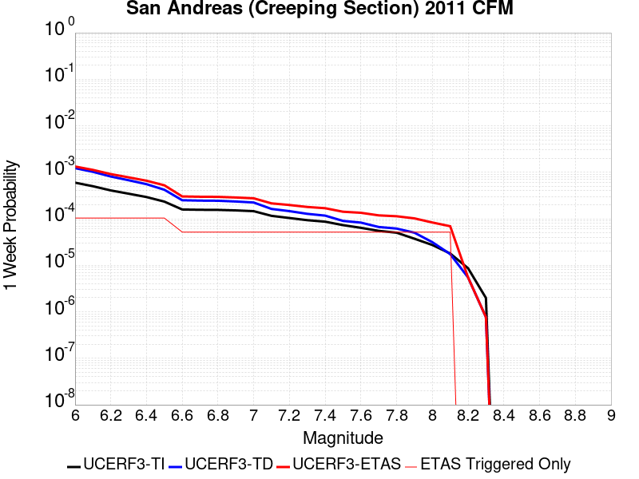 |  |  | 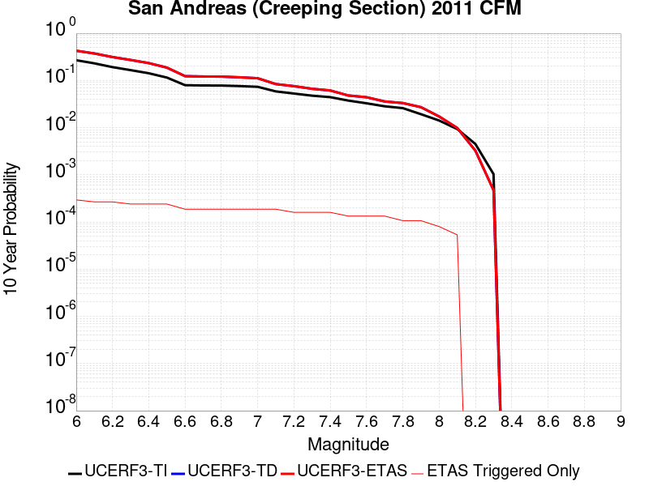 |

| Magnitude | 1 wk TI Prob | 1 wk TD Prob | 1 wk ETAS Prob | 1 wk ETAS/TD Gain | 1 wk ETAS Triggered Only | 1 mo TI Prob | 1 mo TD Prob | 1 mo ETAS Prob | 1 mo ETAS/TD Gain | 1 mo ETAS Triggered Only | 1 yr TI Prob | 1 yr TD Prob | 1 yr ETAS Prob | 1 yr ETAS/TD Gain | 1 yr ETAS Triggered Only | 10 yr TI Prob | 10 yr TD Prob | 10 yr ETAS Prob | 10 yr ETAS/TD Gain | 10 yr ETAS Triggered Only |
|-----|-----|-----|-----|-----|-----|-----|-----|-----|-----|-----|-----|-----|-----|-----|-----|-----|-----|-----|-----|-----|
| 6.0 | 5.986481E-4 | 0.001228691 | 0.0012808064 | 1.0424154 | 5.217954E-5 | 0.0025631124 | 0.005246795 | 0.0053609875 | 1.0217643 | 1.1479499E-4 | 0.030762846 | 0.061203245 | 0.0613698 | 1.0027213 | 1.7741043E-4 | 0.26835477 | 0.425928 | 0.4260718 | 1.0003376 | 2.504618E-4 |
| 6.1 | 5.015945E-4 | 0.0010230356 | 0.0010647365 | 1.040762 | 4.174363E-5 | 0.00214792 | 0.004369436 | 0.004473339 | 1.0237795 | 1.0435908E-4 | 0.025839351 | 0.051246606 | 0.051405024 | 1.0030913 | 1.6697453E-4 | 0.23032776 | 0.37284943 | 0.37298688 | 1.0003686 | 2.1915407E-4 |
| 6.2 | 4.073338E-4 | 8.1157376E-4 | 8.532835E-4 | 1.0513936 | 4.174363E-5 | 0.0017445484 | 0.0034683137 | 0.0035723108 | 1.029985 | 1.0435908E-4 | 0.021034058 | 0.04093177 | 0.041091908 | 1.0039123 | 1.6697453E-4 | 0.19150782 | 0.31302592 | 0.31317645 | 1.000481 | 2.1915407E-4 |
| 6.3 | 3.464099E-4 | 6.7455834E-4 | 7.162738E-4 | 1.0618411 | 4.174363E-5 | 0.0014837692 | 0.0028832308 | 0.002987289 | 1.0360909 | 1.0435908E-4 | 0.017915873 | 0.034187846 | 0.034349114 | 1.0047171 | 1.6697453E-4 | 0.16538359 | 0.27130842 | 0.2714605 | 1.0005606 | 2.0871816E-4 |
| 6.4 | 2.935057E-4 | 5.5516965E-4 | 5.968901E-4 | 1.075149 | 4.174363E-5 | 0.0012572751 | 0.0023727308 | 0.0024768424 | 1.0438783 | 1.0435908E-4 | 0.015200248 | 0.02826279 | 0.028425045 | 1.005741 | 1.6697453E-4 | 0.14201577 | 0.23297668 | 0.23313676 | 1.0006871 | 2.0871816E-4 |
| 6.5 | 2.3409708E-4 | 4.2132285E-4 | 4.630489E-4 | 1.0990357 | 4.174363E-5 | 0.0010028875 | 0.0018017791 | 0.0019059503 | 1.0578157 | 1.0435908E-4 | 0.012141965 | 0.021586355 | 0.021749724 | 1.0075682 | 1.6697453E-4 | 0.11499573 | 0.1868149 | 0.18698464 | 1.0009085 | 2.0871816E-4 |
| 6.6 | 1.5842178E-4 | 2.5068692E-4 | 2.8198678E-4 | 1.1248565 | 3.1307725E-5 | 6.7877385E-4 | 0.0010739256 | 0.0011468985 | 1.0679497 | 7.305136E-5 | 0.0082328 | 0.012995283 | 0.013129187 | 1.010304 | 1.356668E-4 | 0.07934396 | 0.12313759 | 0.123284005 | 1.001189 | 1.6697453E-4 |
| 6.7 | 1.5616413E-4 | 2.4605254E-4 | 2.7735258E-4 | 1.1272087 | 3.1307725E-5 | 6.691031E-4 | 0.0010540807 | 0.001127055 | 1.0692303 | 7.305136E-5 | 0.0081159435 | 0.012757154 | 0.01289109 | 1.0104989 | 1.356668E-4 | 0.0782586 | 0.12116472 | 0.12131146 | 1.001211 | 1.6697453E-4 |
| 6.8 | 1.5538467E-4 | 2.442914E-4 | 2.755915E-4 | 1.128126 | 3.1307725E-5 | 6.6576427E-4 | 0.001046539 | 0.001119514 | 1.0697298 | 7.305136E-5 | 0.008075596 | 0.012666538 | 0.012800487 | 1.0105749 | 1.356668E-4 | 0.07788358 | 0.12039561 | 0.120542474 | 1.0012199 | 1.6697453E-4 |
| 6.9 | 1.5153569E-4 | 2.3538464E-4 | 2.6668498E-4 | 1.1329753 | 3.1307725E-5 | 6.49277E-4 | 0.0010084033 | 0.0010709557 | 1.062031 | 6.261545E-5 | 0.007876333 | 0.012208726 | 0.012322119 | 1.009288 | 1.1479499E-4 | 0.07602952 | 0.11646574 | 0.11660405 | 1.0011876 | 1.5653862E-4 |
| 7.0 | 1.4588932E-4 | 2.2395732E-4 | 2.5525803E-4 | 1.1397619 | 3.1307725E-5 | 6.250901E-4 | 9.59466E-4 | 0.0010220214 | 1.0651981 | 6.261545E-5 | 0.0075839474 | 0.011619428 | 0.011732889 | 1.0097648 | 1.1479499E-4 | 0.073302895 | 0.11131206 | 0.11145118 | 1.0012498 | 1.5653862E-4 |
| 7.1 | 1.1565079E-4 | 1.6281323E-4 | 1.9411586E-4 | 1.192261 | 3.1307725E-5 | 4.955521E-4 | 6.9758523E-4 | 7.60157E-4 | 1.0896977 | 6.261545E-5 | 0.006016669 | 0.008460228 | 0.008574052 | 1.013454 | 1.1479499E-4 | 0.058563538 | 0.08366478 | 0.08380823 | 1.0017145 | 1.5653862E-4 |
| 7.2 | 1.0393792E-4 | 1.4615392E-4 | 1.7745707E-4 | 1.2141793 | 3.1307725E-5 | 4.4537216E-4 | 6.262243E-4 | 6.888006E-4 | 1.0999262 | 6.261545E-5 | 0.005408933 | 0.0075977976 | 0.0077117207 | 1.0149941 | 1.1479499E-4 | 0.052791595 | 0.07561503 | 0.07574044 | 1.0016586 | 1.356668E-4 |
| 7.3 | 9.332884E-5 | 1.2780601E-4 | 1.5910972E-4 | 1.2449316 | 3.1307725E-5 | 3.999194E-4 | 5.4762565E-4 | 6.102068E-4 | 1.1142772 | 6.261545E-5 | 0.0048581534 | 0.0066470946 | 0.006761126 | 1.0171552 | 1.1479499E-4 | 0.047533102 | 0.06647954 | 0.066606194 | 1.0019051 | 1.356668E-4 |
| 7.4 | 8.670252E-5 | 1.1702972E-4 | 1.4833377E-4 | 1.2674881 | 3.1307725E-5 | 3.715293E-4 | 5.014601E-4 | 5.6404417E-4 | 1.1248037 | 6.261545E-5 | 0.004513991 | 0.0060883067 | 0.0062024025 | 1.0187402 | 1.1479499E-4 | 0.044233937 | 0.061148684 | 0.061276056 | 1.002083 | 1.356668E-4 |
| 7.5 | 7.3036405E-5 | 9.005699E-5 | 1.2136189E-4 | 1.3476121 | 3.1307725E-5 | 3.129756E-4 | 3.859015E-4 | 4.380609E-4 | 1.1351625 | 5.217954E-5 | 0.0038038217 | 0.0046882504 | 0.0047817333 | 1.0199398 | 9.392317E-5 | 0.03739367 | 0.047875606 | 0.047984906 | 1.002283 | 1.1479499E-4 |
| 7.6 | 6.3935775E-5 | 8.280209E-5 | 1.1410722E-4 | 1.3780718 | 3.1307725E-5 | 2.7398168E-4 | 3.5481792E-4 | 4.0697894E-4 | 1.1470078 | 5.217954E-5 | 0.0033306254 | 0.00431137 | 0.0044048885 | 1.0216911 | 9.392317E-5 | 0.032811474 | 0.043990135 | 0.04409988 | 1.0024948 | 1.1479499E-4 |
| 7.7 | 5.5050095E-5 | 6.661729E-5 | 8.748772E-5 | 1.3132885 | 2.0871816E-5 | 2.3590765E-4 | 2.8547147E-4 | 3.0633732E-4 | 1.0730926 | 2.0871816E-5 | 0.0028683927 | 0.0034700802 | 0.0035324784 | 1.0179818 | 6.261545E-5 | 0.0283165 | 0.03579509 | 0.035875585 | 1.0022489 | 8.348726E-5 |
| 7.8 | 5.027131E-5 | 6.1627725E-5 | 8.249825E-5 | 1.3386549 | 2.0871816E-5 | 2.1543067E-4 | 2.640921E-4 | 2.849584E-4 | 1.0790114 | 2.0871816E-5 | 0.0026197135 | 0.003210584 | 0.003262596 | 1.0162002 | 5.217954E-5 | 0.025890453 | 0.03312572 | 0.033196352 | 1.0021322 | 7.305136E-5 |
| 7.9 | 3.7271806E-5 | 5.0224386E-5 | 7.109515E-5 | 1.4155505 | 2.0871816E-5 | 1.5972654E-4 | 2.1522962E-4 | 2.3609694E-4 | 1.0969537 | 2.0871816E-5 | 0.0019429359 | 0.0026172737 | 0.0026693167 | 1.0198845 | 5.217954E-5 | 0.019260362 | 0.027066687 | 0.027127609 | 1.0022508 | 6.261545E-5 |
| 8.0 | 2.7310243E-5 | 3.1428404E-5 | 4.1863983E-5 | 1.3320429 | 1.0435908E-5 | 1.17038646E-4 | 1.3468621E-4 | 1.4512072E-4 | 1.0774727 | 1.0435908E-5 | 0.0014240141 | 0.0016385721 | 0.0016594097 | 1.0127169 | 2.0871816E-5 | 0.014149235 | 0.01721387 | 0.017244637 | 1.0017874 | 3.1307725E-5 |
| 8.1 | 1.7940547E-5 | 1.7400796E-5 | 2.7836522E-5 | 1.5997269 | 1.0435908E-5 | 7.688579E-5 | 7.457271E-5 | 8.500784E-5 | 1.1399323 | 1.0435908E-5 | 9.3568244E-4 | 9.075451E-4 | 9.1797154E-4 | 1.0114886 | 1.0435908E-5 | 0.009317525 | 0.009799073 | 0.009819741 | 1.002109 | 2.0871816E-5 |
| 8.2 | 8.643924E-6 | 5.4748625E-6 | 5.4748625E-6 | 1.0 | 0.0 | 3.704486E-5 | 2.3463486E-5 | 2.3463486E-5 | 1.0 | 0.0 | 4.5092785E-4 | 2.8563058E-4 | 2.8563058E-4 | 1.0 | 0.0 | 0.0045001395 | 0.0032487072 | 0.0032487072 | 1.0 | 0.0 |
| 8.3 | 1.983087E-6 | 7.6599065E-7 | 7.6599065E-7 | 1.0 | 0.0 | 8.498917E-6 | 3.282813E-6 | 3.282813E-6 | 1.0 | 0.0 | 1.034694E-4 | 3.9967534E-5 | 3.9967534E-5 | 1.0 | 0.0 | 0.0010342124 | 4.719687E-4 | 4.719687E-4 | 1.0 | 0.0 |

## Santa Ynez (West)
*[(top)](#table-of-contents)*

| 1 Week | 1 Month | 1 Year | 10 Year |
|-----|-----|-----|-----|
| 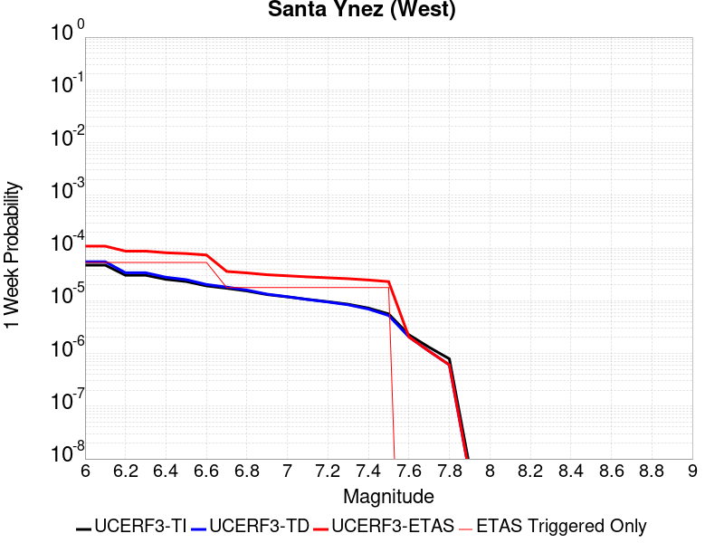 | 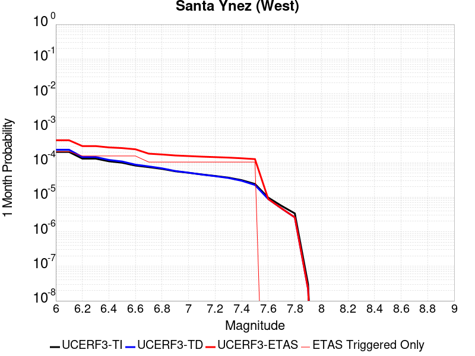 | 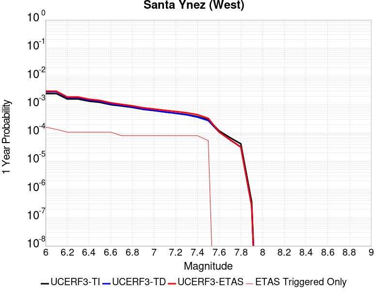 | 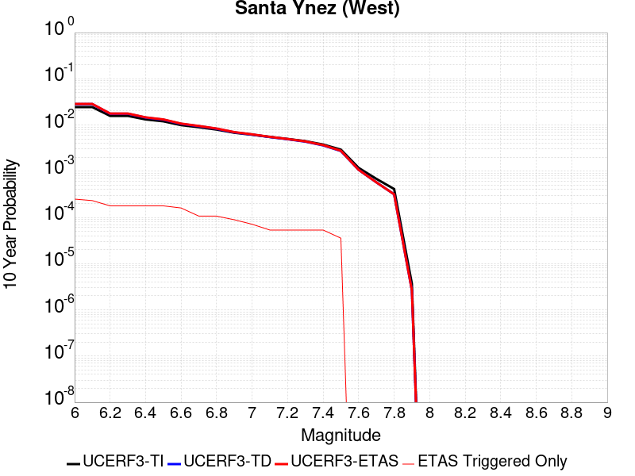 |

| Magnitude | 1 wk TI Prob | 1 wk TD Prob | 1 wk ETAS Prob | 1 wk ETAS/TD Gain | 1 wk ETAS Triggered Only | 1 mo TI Prob | 1 mo TD Prob | 1 mo ETAS Prob | 1 mo ETAS/TD Gain | 1 mo ETAS Triggered Only | 1 yr TI Prob | 1 yr TD Prob | 1 yr ETAS Prob | 1 yr ETAS/TD Gain | 1 yr ETAS Triggered Only | 10 yr TI Prob | 10 yr TD Prob | 10 yr ETAS Prob | 10 yr ETAS/TD Gain | 10 yr ETAS Triggered Only |
|-----|-----|-----|-----|-----|-----|-----|-----|-----|-----|-----|-----|-----|-----|-----|-----|-----|-----|-----|-----|-----|
| 6.0 | 4.7352758E-5 | 5.4972126E-5 | 1.1758413E-4 | 2.1389773 | 6.261545E-5 | 2.0292461E-4 | 2.3557522E-4 | 3.5034315E-4 | 1.4871818 | 1.1479499E-4 | 0.0024678076 | 0.0028645284 | 0.0030102124 | 1.050858 | 1.4610271E-4 | 0.024405818 | 0.028304417 | 0.028517367 | 1.0075237 | 2.1915407E-4 |
| 6.1 | 4.7352758E-5 | 5.4972126E-5 | 9.671346E-5 | 1.7593182 | 4.174363E-5 | 2.0292461E-4 | 2.3557522E-4 | 3.1904283E-4 | 1.354314 | 8.348726E-5 | 0.0024678076 | 0.0028645284 | 0.0029789945 | 1.0399599 | 1.1479499E-4 | 0.024405818 | 0.028304417 | 0.028486947 | 1.0064487 | 1.8784634E-4 |
| 6.2 | 3.0415853E-5 | 3.392511E-5 | 7.5667325E-5 | 2.2304225 | 4.174363E-5 | 1.3034715E-4 | 1.4538545E-4 | 2.0799179E-4 | 1.4306232 | 6.261545E-5 | 0.0015858212 | 0.0017686661 | 0.0018624231 | 1.05301 | 9.392317E-5 | 0.015745522 | 0.017549807 | 0.017703598 | 1.0087632 | 1.5653862E-4 |
| 6.3 | 3.0415853E-5 | 3.392511E-5 | 7.5667325E-5 | 2.2304225 | 4.174363E-5 | 1.3034715E-4 | 1.4538545E-4 | 2.0799179E-4 | 1.4306232 | 6.261545E-5 | 0.0015858212 | 0.0017686661 | 0.0018624231 | 1.05301 | 9.392317E-5 | 0.015745522 | 0.017549807 | 0.017703598 | 1.0087632 | 1.5653862E-4 |
| 6.4 | 2.5452082E-5 | 2.7912422E-5 | 6.965489E-5 | 2.4954798 | 4.174363E-5 | 1.09075794E-4 | 1.196193E-4 | 1.8222725E-4 | 1.5233935 | 6.261545E-5 | 0.0013271887 | 0.0014554089 | 0.0015491953 | 1.0644399 | 9.392317E-5 | 0.013192902 | 0.014460951 | 0.014615227 | 1.0106684 | 1.5653862E-4 |
| 6.5 | 2.3143784E-5 | 2.5128256E-5 | 6.687084E-5 | 2.661181 | 4.174363E-5 | 9.9183875E-5 | 1.0768817E-4 | 1.7029687E-4 | 1.5813888 | 6.261545E-5 | 0.0012068948 | 0.0013103267 | 0.0014041269 | 1.0715853 | 9.392317E-5 | 0.012003611 | 0.01302768 | 0.013182179 | 1.0118593 | 1.5653862E-4 |
| 6.6 | 1.9118515E-5 | 2.035434E-5 | 6.209712E-5 | 3.050805 | 4.174363E-5 | 8.193392E-5 | 8.7230015E-5 | 1.4984E-4 | 1.7177573 | 6.261545E-5 | 9.97089E-4 | 0.001061516 | 0.0011449147 | 1.0785656 | 8.348726E-5 | 0.00992627 | 0.010565365 | 0.010709924 | 1.0136824 | 1.4610271E-4 |
| 6.7 | 1.722807E-5 | 1.8146347E-5 | 3.9017785E-5 | 2.150173 | 2.0871816E-5 | 7.3832496E-5 | 7.776777E-5 | 1.1950816E-4 | 1.5367311 | 4.174363E-5 | 8.985399E-4 | 9.464169E-4 | 0.0010089731 | 1.066098 | 6.261545E-5 | 0.008949154 | 0.0094245095 | 0.009538223 | 1.0120656 | 1.1479499E-4 |
| 6.8 | 1.5317364E-5 | 1.5926486E-5 | 3.679797E-5 | 2.310489 | 2.0871816E-5 | 6.56442E-5 | 6.82546E-5 | 9.956019E-5 | 1.4586589 | 3.1307725E-5 | 7.98925E-4 | 8.306873E-4 | 8.828235E-4 | 1.0627627 | 5.217954E-5 | 0.007960589 | 0.00827631 | 0.008369455 | 1.0112545 | 9.392317E-5 |
| 6.9 | 1.3071226E-5 | 1.3329624E-5 | 3.4201163E-5 | 2.565801 | 2.0871816E-5 | 5.6018336E-5 | 5.7125722E-5 | 8.8431654E-5 | 1.5480182 | 3.1307725E-5 | 6.8180985E-4 | 6.9528597E-4 | 7.474292E-4 | 1.0749954 | 5.217954E-5 | 0.0067972173 | 0.006931367 | 0.0070142755 | 1.0119613 | 8.348726E-5 |
| 7.0 | 1.1836986E-5 | 1.19327815E-5 | 2.2368566E-5 | 1.8745474 | 1.0435908E-5 | 5.0728955E-5 | 5.11395E-5 | 7.201025E-5 | 1.4081141 | 2.0871816E-5 | 6.1745E-4 | 6.2244723E-4 | 6.641649E-4 | 1.067022 | 4.174363E-5 | 0.006157372 | 0.006207231 | 0.0062694578 | 1.0100249 | 6.261545E-5 |
| 7.1 | 1.0597169E-5 | 1.0542201E-5 | 2.0978E-5 | 1.9899069 | 1.0435908E-5 | 4.541565E-5 | 4.5180084E-5 | 6.605096E-5 | 1.4619485 | 2.0871816E-5 | 5.5279525E-4 | 5.4992986E-4 | 5.9165055E-4 | 1.0758655 | 4.174363E-5 | 0.0055142213 | 0.005485821 | 0.0055377143 | 1.0094595 | 5.217954E-5 |
| 7.2 | 9.59113E-6 | 9.459144E-6 | 1.9894953E-5 | 2.103251 | 1.0435908E-5 | 4.11042E-5 | 4.0538565E-5 | 6.140953E-5 | 1.5148424 | 2.0871816E-5 | 5.0032866E-4 | 4.934463E-4 | 5.351693E-4 | 1.0845543 | 4.174363E-5 | 0.004992037 | 0.0049236254 | 0.004975548 | 1.0105456 | 5.217954E-5 |
| 7.3 | 8.586084E-6 | 8.379583E-6 | 1.8815404E-5 | 2.2453866 | 1.0435908E-5 | 3.679698E-5 | 3.5912013E-5 | 5.6783076E-5 | 1.5811723 | 2.0871816E-5 | 4.4791115E-4 | 4.3714207E-4 | 4.7886744E-4 | 1.0954504 | 4.174363E-5 | 0.004470094 | 0.004362933 | 0.004414885 | 1.0119076 | 5.217954E-5 |
| 7.4 | 7.2622997E-6 | 6.9515427E-6 | 1.7387378E-5 | 2.5012257 | 1.0435908E-5 | 3.112377E-5 | 2.979199E-5 | 5.0663184E-5 | 1.7005639 | 2.0871816E-5 | 3.78866E-4 | 3.626581E-4 | 4.0438658E-4 | 1.115063 | 4.174363E-5 | 0.0037822074 | 0.0036207628 | 0.0036727535 | 1.014359 | 5.217954E-5 |
| 7.5 | 5.627296E-6 | 5.251588E-6 | 1.5687441E-5 | 2.9871805 | 1.0435908E-5 | 2.411676E-5 | 2.2506614E-5 | 4.337796E-5 | 1.9273428 | 2.0871816E-5 | 2.9358198E-4 | 2.739843E-4 | 3.0528344E-4 | 1.114237 | 3.1307725E-5 | 0.0029319443 | 0.002736537 | 0.0027677591 | 1.0114093 | 3.1307725E-5 |
| 7.6 | 2.265244E-6 | 2.0608625E-6 | 2.0608625E-6 | 1.0 | 0.0 | 9.708152E-6 | 8.832238E-6 | 8.832238E-6 | 1.0 | 0.0 | 1.18190335E-4 | 1.0752728E-4 | 1.0752728E-4 | 1.0 | 0.0 | 0.001181275 | 0.0010747612 | 0.0010747612 | 1.0 | 0.0 |
| 7.7 | 1.3099874E-6 | 1.1016252E-6 | 1.1016252E-6 | 1.0 | 0.0 | 5.61422E-6 | 4.7212425E-6 | 4.7212425E-6 | 1.0 | 0.0 | 6.8350986E-5 | 5.7479636E-5 | 5.7479636E-5 | 1.0 | 0.0 | 6.832996E-4 | 5.7465007E-4 | 5.7465007E-4 | 1.0 | 0.0 |
| 7.8 | 7.903951E-7 | 6.0711415E-7 | 6.0711415E-7 | 1.0 | 0.0 | 3.3874032E-6 | 2.6019152E-6 | 2.6019152E-6 | 1.0 | 0.0 | 4.1240855E-5 | 3.167787E-5 | 3.167787E-5 | 1.0 | 0.0 | 4.12332E-4 | 3.167349E-4 | 3.167349E-4 | 1.0 | 0.0 |
| 7.9 | 7.0753297E-9 | 5.0899476E-9 | 5.0899476E-9 | 1.0 | 0.0 | 3.032284E-8 | 2.181406E-8 | 2.181406E-8 | 1.0 | 0.0 | 3.6918053E-7 | 2.6558615E-7 | 2.6558615E-7 | 1.0 | 0.0 | 3.691799E-6 | 2.6558594E-6 | 2.6558594E-6 | 1.0 | 0.0 |

## Santa Ynez (East)
*[(top)](#table-of-contents)*

| 1 Week | 1 Month | 1 Year | 10 Year |
|-----|-----|-----|-----|
| 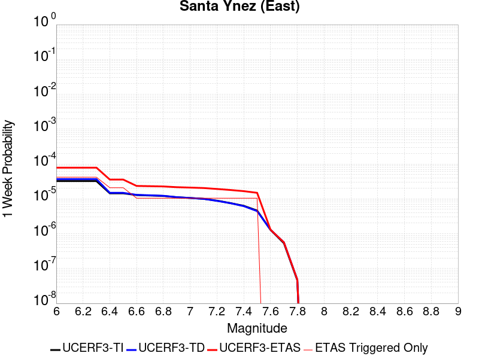 | 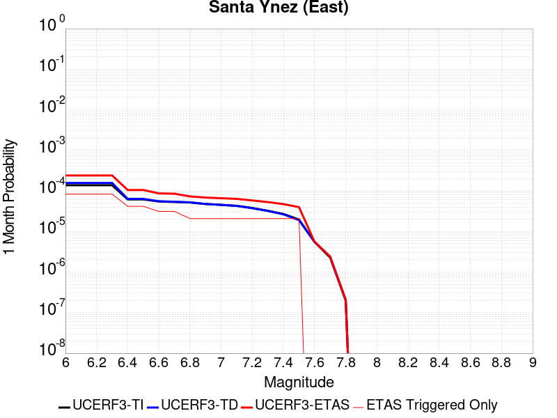 | 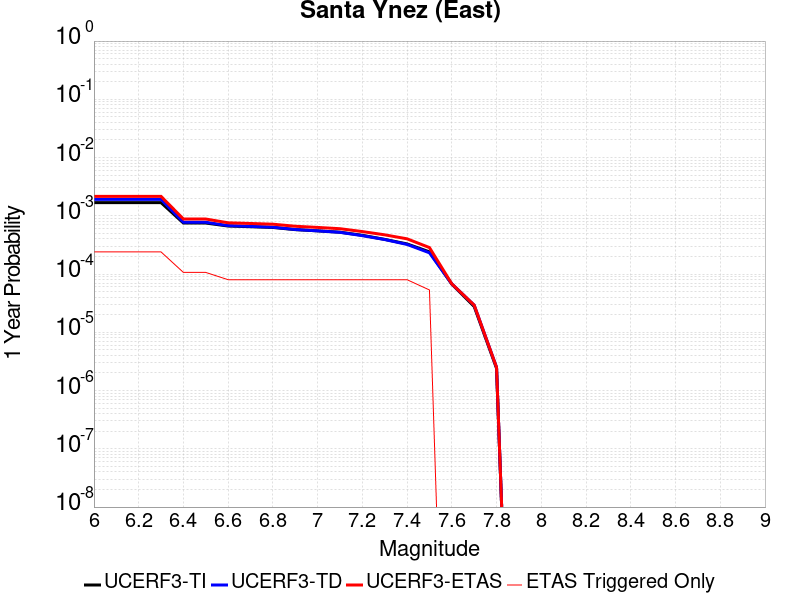 | 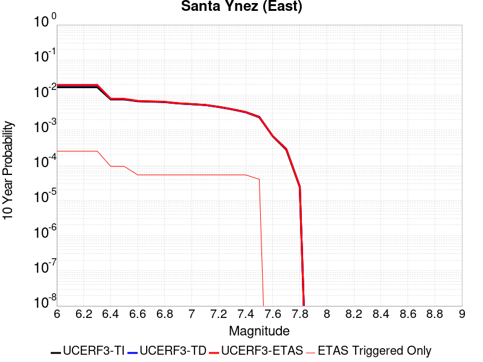 |

| Magnitude | 1 wk TI Prob | 1 wk TD Prob | 1 wk ETAS Prob | 1 wk ETAS/TD Gain | 1 wk ETAS Triggered Only | 1 mo TI Prob | 1 mo TD Prob | 1 mo ETAS Prob | 1 mo ETAS/TD Gain | 1 mo ETAS Triggered Only | 1 yr TI Prob | 1 yr TD Prob | 1 yr ETAS Prob | 1 yr ETAS/TD Gain | 1 yr ETAS Triggered Only | 10 yr TI Prob | 10 yr TD Prob | 10 yr ETAS Prob | 10 yr ETAS/TD Gain | 10 yr ETAS Triggered Only |
|-----|-----|-----|-----|-----|-----|-----|-----|-----|-----|-----|-----|-----|-----|-----|-----|-----|-----|-----|-----|-----|
| 6.0 | 3.2269712E-5 | 3.67505E-5 | 7.84926E-5 | 2.1358237 | 4.174363E-5 | 1.3829143E-4 | 1.5749598E-4 | 2.4097008E-4 | 1.530008 | 8.348726E-5 | 0.0016823979 | 0.0019164166 | 0.002083071 | 1.0869615 | 1.6697453E-4 | 0.016697178 | 0.019056441 | 0.01930213 | 1.0128927 | 2.504618E-4 |
| 6.1 | 3.2269712E-5 | 3.67505E-5 | 7.84926E-5 | 2.1358237 | 4.174363E-5 | 1.3829143E-4 | 1.5749598E-4 | 2.4097008E-4 | 1.530008 | 8.348726E-5 | 0.0016823979 | 0.0019164166 | 0.002083071 | 1.0869615 | 1.6697453E-4 | 0.016697178 | 0.019056441 | 0.01930213 | 1.0128927 | 2.504618E-4 |
| 6.2 | 3.2269712E-5 | 3.67505E-5 | 7.84926E-5 | 2.1358237 | 4.174363E-5 | 1.3829143E-4 | 1.5749598E-4 | 2.4097008E-4 | 1.530008 | 8.348726E-5 | 0.0016823979 | 0.0019164166 | 0.002083071 | 1.0869615 | 1.6697453E-4 | 0.016697178 | 0.019056441 | 0.01930213 | 1.0128927 | 2.504618E-4 |
| 6.3 | 3.2269712E-5 | 3.67505E-5 | 7.84926E-5 | 2.1358237 | 4.174363E-5 | 1.3829143E-4 | 1.5749598E-4 | 2.4097008E-4 | 1.530008 | 8.348726E-5 | 0.0016823979 | 0.0019164166 | 0.002083071 | 1.0869615 | 1.6697453E-4 | 0.016697178 | 0.019056441 | 0.01930213 | 1.0128927 | 2.504618E-4 |
| 6.4 | 1.4404779E-5 | 1.4849382E-5 | 3.572089E-5 | 2.4055471 | 2.0871816E-5 | 6.1733306E-5 | 6.363868E-5 | 1.0537966E-4 | 1.6559057 | 4.174363E-5 | 7.513438E-4 | 7.745306E-4 | 8.579532E-4 | 1.1077073 | 8.348726E-5 | 0.0074880854 | 0.007718862 | 0.00781206 | 1.0120741 | 9.392317E-5 |
| 6.5 | 1.4404779E-5 | 1.4849382E-5 | 3.572089E-5 | 2.4055471 | 2.0871816E-5 | 6.1733306E-5 | 6.363868E-5 | 1.0537966E-4 | 1.6559057 | 4.174363E-5 | 7.513438E-4 | 7.745306E-4 | 8.579532E-4 | 1.1077073 | 8.348726E-5 | 0.0074880854 | 0.007718862 | 0.00781206 | 1.0120741 | 9.392317E-5 |
| 6.6 | 1.280208E-5 | 1.3011947E-5 | 2.344772E-5 | 1.8020146 | 1.0435908E-5 | 5.4864904E-5 | 5.5764307E-5 | 8.7070286E-5 | 1.5613981 | 3.1307725E-5 | 6.6777546E-4 | 6.787207E-4 | 7.308648E-4 | 1.076827 | 5.217954E-5 | 0.006657724 | 0.0067666885 | 0.0068288804 | 1.0091909 | 6.261545E-5 |
| 6.7 | 1.2457027E-5 | 1.2628468E-5 | 2.3064244E-5 | 1.8263692 | 1.0435908E-5 | 5.3386164E-5 | 5.412089E-5 | 8.542692E-5 | 1.5784463 | 3.1307725E-5 | 6.497827E-4 | 6.587243E-4 | 7.1086944E-4 | 1.0791608 | 5.217954E-5 | 0.00647886 | 0.006567915 | 0.006630119 | 1.0094709 | 6.261545E-5 |
| 6.8 | 1.2095134E-5 | 1.2230915E-5 | 2.2666694E-5 | 1.8532298 | 1.0435908E-5 | 5.1835254E-5 | 5.241716E-5 | 7.328788E-5 | 1.3981658 | 2.0871816E-5 | 6.309115E-4 | 6.379937E-4 | 6.7971065E-4 | 1.0653878 | 4.174363E-5 | 0.0062912325 | 0.006361809 | 0.0064136568 | 1.0081499 | 5.217954E-5 |
| 6.9 | 1.1104036E-5 | 1.1157347E-5 | 2.159314E-5 | 1.9353291 | 1.0435908E-5 | 4.758786E-5 | 4.781633E-5 | 6.868715E-5 | 1.4364789 | 2.0871816E-5 | 5.7922816E-4 | 5.820096E-4 | 6.237289E-4 | 1.0716815 | 4.174363E-5 | 0.005777207 | 0.0058049993 | 0.005856876 | 1.0089365 | 5.217954E-5 |
| 7.0 | 1.0577444E-5 | 1.058168E-5 | 2.1017479E-5 | 1.9862137 | 1.0435908E-5 | 4.5331115E-5 | 4.5349276E-5 | 6.622015E-5 | 1.460225 | 2.0871816E-5 | 5.5176654E-4 | 5.519888E-4 | 5.9370935E-4 | 1.0755823 | 4.174363E-5 | 0.0055039856 | 0.0055063153 | 0.0055582076 | 1.0094241 | 5.217954E-5 |
| 7.1 | 1.0021775E-5 | 9.980988E-6 | 2.0416792E-5 | 2.0455682 | 1.0435908E-5 | 4.294976E-5 | 4.2774966E-5 | 6.3645886E-5 | 1.4879237 | 2.0871816E-5 | 5.2278786E-4 | 5.2066194E-4 | 5.6238385E-4 | 1.0801324 | 4.174363E-5 | 0.0052155964 | 0.0051945536 | 0.005246462 | 1.0099928 | 5.217954E-5 |
| 7.2 | 8.874109E-6 | 8.748793E-6 | 1.918461E-5 | 2.1928291 | 1.0435908E-5 | 3.8031343E-5 | 3.7494297E-5 | 5.836533E-5 | 1.5566455 | 2.0871816E-5 | 4.629332E-4 | 4.5639853E-4 | 4.981231E-4 | 1.0914214 | 4.174363E-5 | 0.0046197 | 0.0045547304 | 0.004606672 | 1.0114039 | 5.217954E-5 |
| 7.3 | 7.5504267E-6 | 7.5051175E-6 | 1.7940947E-5 | 2.390495 | 1.0435908E-5 | 3.235857E-5 | 3.21644E-5 | 5.3035543E-5 | 1.6488897 | 2.0871816E-5 | 3.9389438E-4 | 3.915322E-4 | 4.332595E-4 | 1.1065743 | 4.174363E-5 | 0.0039319694 | 0.003908531 | 0.0039605065 | 1.013298 | 5.217954E-5 |
| 7.4 | 6.309394E-6 | 6.1831556E-6 | 1.6618998E-5 | 2.6877859 | 1.0435908E-5 | 2.703998E-5 | 2.6498974E-5 | 4.737024E-5 | 1.7876253 | 2.0871816E-5 | 3.2916202E-4 | 3.225782E-4 | 3.6430836E-4 | 1.1293645 | 4.174363E-5 | 0.003286749 | 0.003221197 | 0.0032732084 | 1.0161467 | 5.217954E-5 |
| 7.5 | 4.6103073E-6 | 4.4408903E-6 | 1.4876752E-5 | 3.349948 | 1.0435908E-5 | 1.975831E-5 | 1.9032252E-5 | 3.9903673E-5 | 2.0966341 | 2.0871816E-5 | 2.4053088E-4 | 2.3169373E-4 | 2.629942E-4 | 1.1350942 | 3.1307725E-5 | 0.002402707 | 0.002314591 | 0.0023458265 | 1.013495 | 3.1307725E-5 |
| 7.6 | 1.2858658E-6 | 1.3008173E-6 | 1.3008173E-6 | 1.0 | 0.0 | 5.5108417E-6 | 5.5749197E-6 | 5.5749197E-6 | 1.0 | 0.0 | 6.7092435E-5 | 6.78726E-5 | 6.78726E-5 | 1.0 | 0.0 | 6.707218E-4 | 6.785256E-4 | 6.785256E-4 | 1.0 | 0.0 |
| 7.7 | 5.3302307E-7 | 5.612138E-7 | 5.612138E-7 | 1.0 | 0.0 | 2.2843826E-6 | 2.4052001E-6 | 2.4052001E-6 | 1.0 | 0.0 | 2.7812002E-5 | 2.9282954E-5 | 2.9282954E-5 | 1.0 | 0.0 | 2.7808524E-4 | 2.9279452E-4 | 2.9279452E-4 | 1.0 | 0.0 |
| 7.8 | 4.613933E-8 | 4.80301E-8 | 4.80301E-8 | 1.0 | 0.0 | 1.9773998E-7 | 2.0584326E-7 | 2.0584326E-7 | 1.0 | 0.0 | 2.4074816E-6 | 2.5061388E-6 | 2.5061388E-6 | 1.0 | 0.0 | 2.4074554E-5 | 2.5061116E-5 | 2.5061116E-5 | 1.0 | 0.0 |

## San Jacinto (Stepovers Combined)
*[(top)](#table-of-contents)*

| 1 Week | 1 Month | 1 Year | 10 Year |
|-----|-----|-----|-----|
| 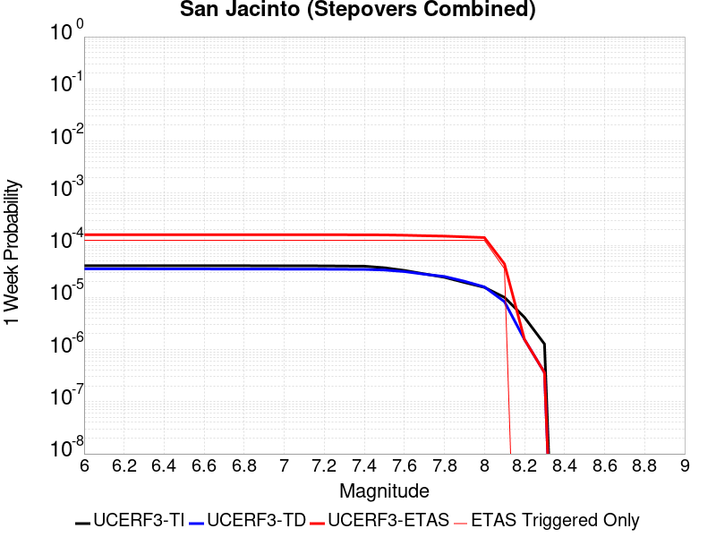 | 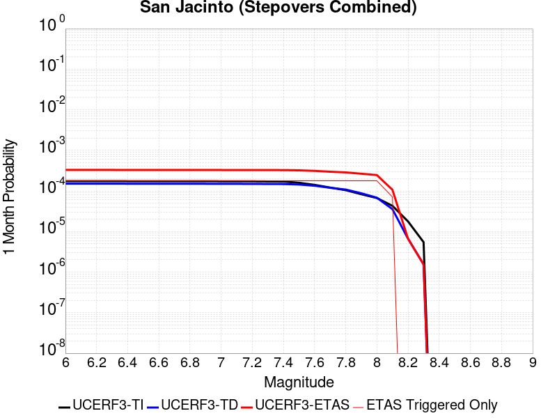 | 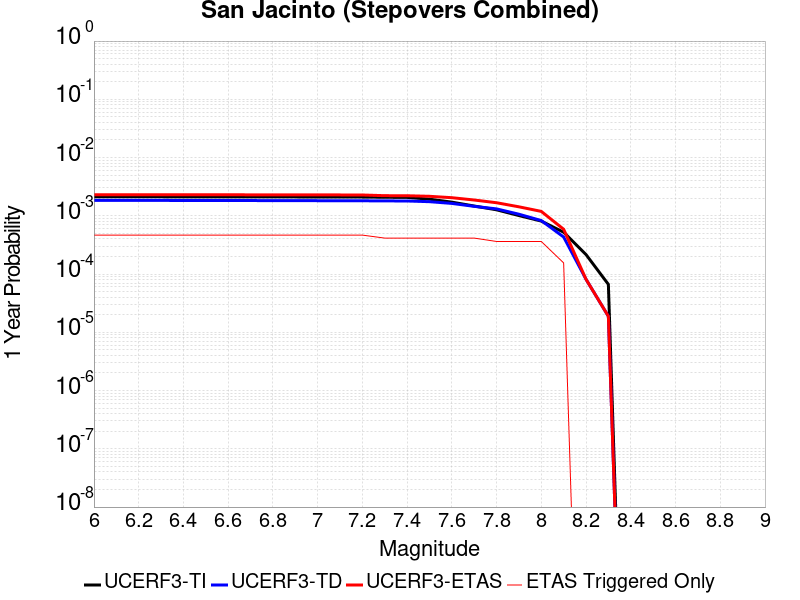 | 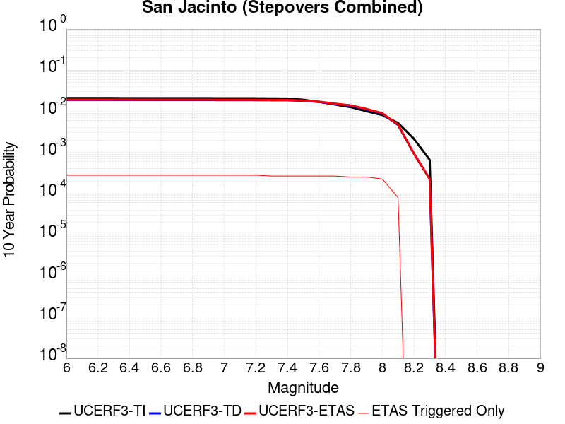 |

| Magnitude | 1 wk TI Prob | 1 wk TD Prob | 1 wk ETAS Prob | 1 wk ETAS/TD Gain | 1 wk ETAS Triggered Only | 1 mo TI Prob | 1 mo TD Prob | 1 mo ETAS Prob | 1 mo ETAS/TD Gain | 1 mo ETAS Triggered Only | 1 yr TI Prob | 1 yr TD Prob | 1 yr ETAS Prob | 1 yr ETAS/TD Gain | 1 yr ETAS Triggered Only | 10 yr TI Prob | 10 yr TD Prob | 10 yr ETAS Prob | 10 yr ETAS/TD Gain | 10 yr ETAS Triggered Only |
|-----|-----|-----|-----|-----|-----|-----|-----|-----|-----|-----|-----|-----|-----|-----|-----|-----|-----|-----|-----|-----|
| 6.0 | 4.0667746E-5 | 3.5272755E-5 | 1.6049923E-4 | 4.5502324 | 1.252309E-4 | 1.742787E-4 | 1.5116022E-4 | 3.0767516E-4 | 2.0354242 | 1.5653862E-4 | 0.0021197782 | 0.0018388226 | 0.0020575738 | 1.1189625 | 2.1915407E-4 | 0.020996714 | 0.018986892 | 0.019253073 | 1.0140193 | 2.713336E-4 |
| 6.1 | 4.0667746E-5 | 3.5272755E-5 | 1.6049923E-4 | 4.5502324 | 1.252309E-4 | 1.742787E-4 | 1.5116022E-4 | 3.0767516E-4 | 2.0354242 | 1.5653862E-4 | 0.0021197782 | 0.0018388226 | 0.0020575738 | 1.1189625 | 2.1915407E-4 | 0.020996714 | 0.018986892 | 0.019253073 | 1.0140193 | 2.713336E-4 |
| 6.2 | 4.0667746E-5 | 3.5272755E-5 | 1.6049923E-4 | 4.5502324 | 1.252309E-4 | 1.742787E-4 | 1.5116022E-4 | 3.0767516E-4 | 2.0354242 | 1.5653862E-4 | 0.0021197782 | 0.0018388226 | 0.0020575738 | 1.1189625 | 2.1915407E-4 | 0.020996714 | 0.018986892 | 0.019253073 | 1.0140193 | 2.713336E-4 |
| 6.3 | 4.0667746E-5 | 3.5272755E-5 | 1.6049923E-4 | 4.5502324 | 1.252309E-4 | 1.742787E-4 | 1.5116022E-4 | 3.0767516E-4 | 2.0354242 | 1.5653862E-4 | 0.0021197782 | 0.0018388226 | 0.0020575738 | 1.1189625 | 2.1915407E-4 | 0.020996714 | 0.018986892 | 0.019253073 | 1.0140193 | 2.713336E-4 |
| 6.4 | 4.0577226E-5 | 3.5144654E-5 | 1.6037114E-4 | 4.5631733 | 1.252309E-4 | 1.738908E-4 | 1.5061127E-4 | 3.0712632E-4 | 2.0391986 | 1.5653862E-4 | 0.0021150648 | 0.0018321523 | 0.0020509048 | 1.1193964 | 2.1915407E-4 | 0.020950472 | 0.018921461 | 0.019187659 | 1.0140686 | 2.713336E-4 |
| 6.5 | 4.0577226E-5 | 3.5144654E-5 | 1.6037114E-4 | 4.5631733 | 1.252309E-4 | 1.738908E-4 | 1.5061127E-4 | 3.0712632E-4 | 2.0391986 | 1.5653862E-4 | 0.0021150648 | 0.0018321523 | 0.0020509048 | 1.1193964 | 2.1915407E-4 | 0.020950472 | 0.018921461 | 0.019187659 | 1.0140686 | 2.713336E-4 |
| 6.6 | 4.053861E-5 | 3.509E-5 | 1.603165E-4 | 4.568723 | 1.252309E-4 | 1.7372532E-4 | 1.5037706E-4 | 3.0689215E-4 | 2.0408175 | 1.5653862E-4 | 0.0021130538 | 0.0018293057 | 0.002048059 | 1.1195827 | 2.1915407E-4 | 0.020930743 | 0.018893538 | 0.019159745 | 1.0140898 | 2.713336E-4 |
| 6.7 | 4.0516545E-5 | 3.5059067E-5 | 1.6028558E-4 | 4.5718718 | 1.252309E-4 | 1.7363077E-4 | 1.5024451E-4 | 3.067596E-4 | 2.041736 | 1.5653862E-4 | 0.002111905 | 0.001827695 | 0.0020464484 | 1.1196882 | 2.1915407E-4 | 0.020919468 | 0.018877735 | 0.019143946 | 1.0141019 | 2.713336E-4 |
| 6.8 | 4.049434E-5 | 3.5030633E-5 | 1.6025714E-4 | 4.574772 | 1.252309E-4 | 1.7353562E-4 | 1.5012265E-4 | 3.0663778E-4 | 2.0425816 | 1.5653862E-4 | 0.0021107488 | 0.0018262138 | 0.0020449676 | 1.1197854 | 2.1915407E-4 | 0.020908125 | 0.018863149 | 0.019129364 | 1.014113 | 2.713336E-4 |
| 6.9 | 4.046386E-5 | 3.499319E-5 | 1.602197E-4 | 4.5785966 | 1.252309E-4 | 1.73405E-4 | 1.4996222E-4 | 3.0647736E-4 | 2.043697 | 1.5653862E-4 | 0.0021091616 | 0.0018242638 | 0.0020430181 | 1.1199137 | 2.1915407E-4 | 0.020892553 | 0.01884392 | 0.019110141 | 1.0141276 | 2.713336E-4 |
| 7.0 | 4.036382E-5 | 3.487376E-5 | 1.6010029E-4 | 4.5908527 | 1.252309E-4 | 1.7297632E-4 | 1.4945042E-4 | 3.0596563E-4 | 2.047272 | 1.5653862E-4 | 0.0021039525 | 0.0018180435 | 0.0020367992 | 1.1203247 | 2.1915407E-4 | 0.02084144 | 0.018782536 | 0.019048773 | 1.0141747 | 2.713336E-4 |
| 7.1 | 4.0343282E-5 | 3.4852223E-5 | 1.6007875E-4 | 4.593072 | 1.252309E-4 | 1.7288832E-4 | 1.4935812E-4 | 3.0587337E-4 | 2.047919 | 1.5653862E-4 | 0.002102883 | 0.0018169218 | 0.0020356777 | 1.1203991 | 2.1915407E-4 | 0.020830948 | 0.018771412 | 0.019037653 | 1.0141833 | 2.713336E-4 |
| 7.2 | 4.0257353E-5 | 3.4756722E-5 | 1.5998326E-4 | 4.6029444 | 1.252309E-4 | 1.725201E-4 | 1.489489E-4 | 3.054642E-4 | 2.0507987 | 1.5653862E-4 | 0.0020984085 | 0.0018119477 | 0.0020307046 | 1.1207303 | 2.1915407E-4 | 0.020787042 | 0.018722152 | 0.018988406 | 1.0142213 | 2.713336E-4 |
| 7.3 | 3.9940667E-5 | 3.4584376E-5 | 1.5981094E-4 | 4.6208997 | 1.252309E-4 | 1.7116306E-4 | 1.4821035E-4 | 3.0472578E-4 | 2.0560355 | 1.5653862E-4 | 0.0020819185 | 0.0018029709 | 0.0020113126 | 1.1155547 | 2.0871816E-4 | 0.020625217 | 0.018630784 | 0.018886821 | 1.0137427 | 2.608977E-4 |
| 7.4 | 3.9721202E-5 | 3.4469766E-5 | 1.5969634E-4 | 4.6329393 | 1.252309E-4 | 1.7022261E-4 | 1.4771923E-4 | 3.042347E-4 | 2.0595472 | 1.5653862E-4 | 0.0020704903 | 0.0017970012 | 0.0020053443 | 1.1159393 | 2.0871816E-4 | 0.020513052 | 0.018569905 | 0.01882596 | 1.0137886 | 2.608977E-4 |
| 7.5 | 3.7036873E-5 | 3.3537188E-5 | 1.5876388E-4 | 4.7339654 | 1.252309E-4 | 1.5871979E-4 | 1.437229E-4 | 3.0023901E-4 | 2.089013 | 1.5653862E-4 | 0.0019307006 | 0.0017484248 | 0.001956778 | 1.1191663 | 2.0871816E-4 | 0.019140124 | 0.018071463 | 0.018327646 | 1.0141761 | 2.608977E-4 |
| 7.6 | 3.2940967E-5 | 3.1317984E-5 | 1.5654496E-4 | 4.9985642 | 1.252309E-4 | 1.4116794E-4 | 1.3421304E-4 | 2.9073065E-4 | 2.1661878 | 1.5653862E-4 | 0.0017173645 | 0.0016328214 | 0.0018411987 | 1.127618 | 2.0871816E-4 | 0.01704153 | 0.016904354 | 0.01716084 | 1.0151728 | 2.608977E-4 |
| 7.7 | 2.8236149E-5 | 2.7883889E-5 | 1.531113E-4 | 5.4910307 | 1.252309E-4 | 1.2100645E-4 | 1.19496915E-4 | 2.7601683E-4 | 2.3098238 | 1.5653862E-4 | 0.0014722579 | 0.001453905 | 0.0016623198 | 1.1433482 | 2.0871816E-4 | 0.014625421 | 0.015115095 | 0.015372049 | 1.0169998 | 2.608977E-4 |
| 7.8 | 2.4329287E-5 | 2.5207537E-5 | 1.5043527E-4 | 5.967869 | 1.252309E-4 | 1.042642E-4 | 1.0802783E-4 | 2.6454954E-4 | 2.4489017 | 1.5653862E-4 | 0.0012686774 | 0.0013144462 | 0.0015124677 | 1.1506503 | 1.9828224E-4 | 0.012614589 | 0.013712396 | 0.013959424 | 1.0180149 | 2.504618E-4 |
| 7.9 | 1.9370926E-5 | 2.0421452E-5 | 1.4564978E-4 | 7.1321955 | 1.252309E-4 | 8.301561E-5 | 8.7517576E-5 | 2.4404249E-4 | 2.788497 | 1.5653862E-4 | 0.0010102465 | 0.0010650064 | 0.0012630775 | 1.1859812 | 1.9828224E-4 | 0.0100566605 | 0.011199483 | 0.011447139 | 1.0221132 | 2.504618E-4 |
| 8.0 | 1.5583017E-5 | 1.588647E-5 | 1.3067963E-4 | 8.225845 | 1.1479499E-4 | 6.6782646E-5 | 6.808309E-5 | 2.1417586E-4 | 3.1458008 | 1.4610271E-4 | 8.127754E-4 | 8.285971E-4 | 0.0010162878 | 1.2265162 | 1.8784634E-4 | 0.008098091 | 0.008781809 | 0.009009384 | 1.0259142 | 2.2958998E-4 |
| 8.1 | 1.0024873E-5 | 8.292404E-6 | 3.959987E-5 | 4.775439 | 3.1307725E-5 | 4.2963035E-5 | 3.5538393E-5 | 8.771608E-5 | 2.4682062 | 5.217954E-5 | 5.229494E-4 | 4.3259456E-4 | 4.847515E-4 | 1.1205678 | 5.217954E-5 | 0.0052172043 | 0.0046534105 | 0.0047157346 | 1.0133932 | 6.261545E-5 |
| 8.2 | 4.142796E-6 | 1.5610041E-6 | 1.5610041E-6 | 1.0 | 0.0 | 1.775472E-5 | 6.69E-6 | 6.69E-6 | 1.0 | 0.0 | 2.1614227E-4 | 8.144774E-5 | 8.144774E-5 | 1.0 | 0.0 | 0.0021593217 | 9.454649E-4 | 9.454649E-4 | 1.0 | 0.0 |
| 8.3 | 1.2750878E-6 | 3.612133E-7 | 3.612133E-7 | 1.0 | 0.0 | 5.4646503E-6 | 1.548056E-6 | 1.548056E-6 | 1.0 | 0.0 | 6.653009E-5 | 1.8847424E-5 | 1.8847424E-5 | 1.0 | 0.0 | 6.6510175E-4 | 2.2734253E-4 | 2.2734253E-4 | 1.0 | 0.0 |

## Mission Ridge-Arroyo Parida-Santa Ana
*[(top)](#table-of-contents)*

| 1 Week | 1 Month | 1 Year | 10 Year |
|-----|-----|-----|-----|
| 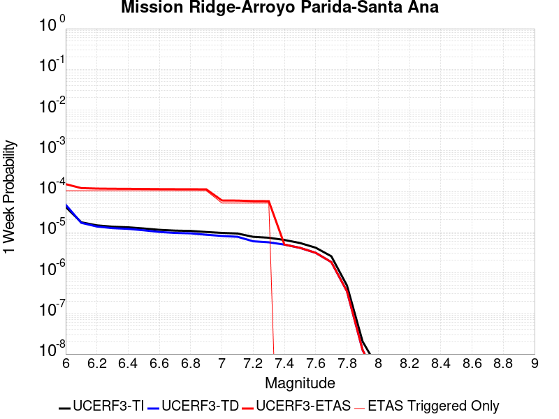 | 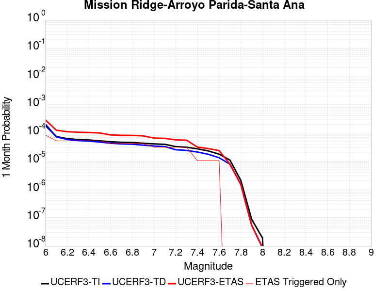 | 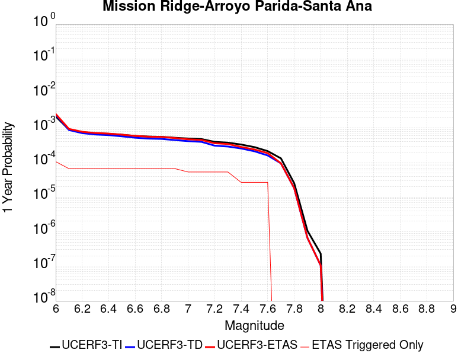 | 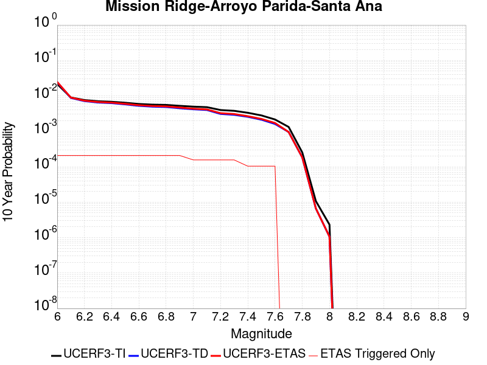 |

| Magnitude | 1 wk TI Prob | 1 wk TD Prob | 1 wk ETAS Prob | 1 wk ETAS/TD Gain | 1 wk ETAS Triggered Only | 1 mo TI Prob | 1 mo TD Prob | 1 mo ETAS Prob | 1 mo ETAS/TD Gain | 1 mo ETAS Triggered Only | 1 yr TI Prob | 1 yr TD Prob | 1 yr ETAS Prob | 1 yr ETAS/TD Gain | 1 yr ETAS Triggered Only | 10 yr TI Prob | 10 yr TD Prob | 10 yr ETAS Prob | 10 yr ETAS/TD Gain | 10 yr ETAS Triggered Only |
|-----|-----|-----|-----|-----|-----|-----|-----|-----|-----|-----|-----|-----|-----|-----|-----|-----|-----|-----|-----|-----|
| 6.0 | 4.169034E-5 | 4.7138263E-5 | 1.09750756E-4 | 2.3282733 | 6.261545E-5 | 1.7866064E-4 | 2.0201034E-4 | 2.8548075E-4 | 1.4131986 | 8.348726E-5 | 0.0021730233 | 0.00245745 | 0.0025615527 | 1.0423621 | 1.0435908E-4 | 0.021518968 | 0.024384614 | 0.024547517 | 1.0066806 | 1.6697453E-4 |
| 6.1 | 1.73813E-5 | 1.6854226E-5 | 5.8597154E-5 | 3.476704 | 4.174363E-5 | 7.4489166E-5 | 7.223046E-5 | 1.2440623E-4 | 1.7223513 | 5.217954E-5 | 9.065282E-4 | 8.790618E-4 | 9.4162225E-4 | 1.0711672 | 6.261545E-5 | 0.009028391 | 0.008756988 | 0.0088604335 | 1.0118129 | 1.0435908E-4 |
| 6.2 | 1.4622182E-5 | 1.367329E-5 | 5.541635E-5 | 4.052891 | 4.174363E-5 | 6.2664985E-5 | 5.8598518E-5 | 1.10775E-4 | 1.8904061 | 5.217954E-5 | 7.6267915E-4 | 7.132073E-4 | 7.757781E-4 | 1.0877316 | 6.261545E-5 | 0.007600669 | 0.007109627 | 0.007202883 | 1.0131168 | 9.392317E-5 |
| 6.3 | 1.3552434E-5 | 1.2482201E-5 | 5.422531E-5 | 4.3442106 | 4.174363E-5 | 5.8080568E-5 | 5.3494066E-5 | 1.0567081E-4 | 1.9753745 | 5.217954E-5 | 7.069015E-4 | 6.510988E-4 | 7.136735E-4 | 1.0961063 | 6.261545E-5 | 0.00704657 | 0.006492275 | 0.006585588 | 1.014373 | 9.392317E-5 |
| 6.4 | 1.30977305E-5 | 1.1979156E-5 | 5.3722288E-5 | 4.4846473 | 4.174363E-5 | 5.613192E-5 | 5.1338247E-5 | 1.0351511E-4 | 2.016335 | 5.217954E-5 | 6.831918E-4 | 6.248669E-4 | 6.8744324E-4 | 1.1001434 | 6.261545E-5 | 0.006810953 | 0.0062314444 | 0.006324782 | 1.0149785 | 9.392317E-5 |
| 6.5 | 1.225205E-5 | 1.1048803E-5 | 5.2791973E-5 | 4.778072 | 4.174363E-5 | 5.2507727E-5 | 4.7351168E-5 | 9.952824E-5 | 2.1019173 | 5.217954E-5 | 6.3909404E-4 | 5.7635066E-4 | 6.3893007E-4 | 1.1085786 | 6.261545E-5 | 0.006372592 | 0.005748869 | 0.005842252 | 1.0162437 | 9.392317E-5 |
| 6.6 | 1.1352241E-5 | 1.0063535E-5 | 4.1370942E-5 | 4.1109753 | 3.1307725E-5 | 4.8651553E-5 | 4.3128734E-5 | 8.487057E-5 | 1.9678427 | 4.174363E-5 | 5.921717E-4 | 5.2496797E-4 | 5.771201E-4 | 1.0993435 | 5.217954E-5 | 0.0059059616 | 0.0052375244 | 0.005320574 | 1.0158567 | 8.348726E-5 |
| 6.7 | 1.0864116E-5 | 9.517027E-6 | 4.0824452E-5 | 4.2896223 | 3.1307725E-5 | 4.6559664E-5 | 4.0786632E-5 | 8.252856E-5 | 2.0234218 | 4.174363E-5 | 5.667165E-4 | 4.964661E-4 | 5.486197E-4 | 1.1050497 | 5.217954E-5 | 0.005652734 | 0.004953804 | 0.005026493 | 1.0146735 | 7.305136E-5 |
| 6.8 | 1.0666365E-5 | 9.299779E-6 | 4.060721E-5 | 4.366471 | 3.1307725E-5 | 4.571219E-5 | 3.9855597E-5 | 8.1597565E-5 | 2.0473301 | 4.174363E-5 | 5.564038E-4 | 4.8513585E-4 | 5.3729006E-4 | 1.1075044 | 5.217954E-5 | 0.005550127 | 0.0048410003 | 0.004913698 | 1.015017 | 7.305136E-5 |
| 6.9 | 1.0038665E-5 | 8.592046E-6 | 3.98995E-5 | 4.643772 | 3.1307725E-5 | 4.302214E-5 | 3.682254E-5 | 7.856463E-5 | 2.1336017 | 4.174363E-5 | 5.236687E-4 | 4.4822405E-4 | 5.003802E-4 | 1.1163617 | 5.217954E-5 | 0.005224364 | 0.004473411 | 0.004546135 | 1.016257 | 7.305136E-5 |
| 7.0 | 9.5379955E-6 | 8.025073E-6 | 2.8896722E-5 | 3.6008048 | 2.0871816E-5 | 4.0876483E-5 | 3.4392728E-5 | 6.569937E-5 | 1.9102694 | 3.1307725E-5 | 4.975576E-4 | 4.1865272E-4 | 4.6037885E-4 | 1.0996677 | 4.174363E-5 | 0.00496445 | 0.0041788397 | 0.0042411936 | 1.0149213 | 6.261545E-5 |
| 7.1 | 9.207389E-6 | 7.652375E-6 | 2.8524031E-5 | 3.7274742 | 2.0871816E-5 | 3.945964E-5 | 3.279549E-5 | 6.410218E-5 | 1.9546037 | 3.1307725E-5 | 4.803152E-4 | 3.9921363E-4 | 4.409406E-4 | 1.104523 | 4.174363E-5 | 0.004792784 | 0.003985161 | 0.004047527 | 1.0156496 | 6.261545E-5 |
| 7.2 | 7.638091E-6 | 5.9311183E-6 | 2.680281E-5 | 4.519015 | 2.0871816E-5 | 3.2734264E-5 | 2.541883E-5 | 5.672576E-5 | 2.231643 | 3.1307725E-5 | 3.984668E-4 | 3.0943064E-4 | 3.5116135E-4 | 1.1348629 | 4.174363E-5 | 0.0039775306 | 0.0030900547 | 0.0031524766 | 1.020201 | 6.261545E-5 |
| 7.3 | 7.2500147E-6 | 5.5961527E-6 | 2.6467851E-5 | 4.7296515 | 2.0871816E-5 | 3.1071122E-5 | 2.3983293E-5 | 5.5290267E-5 | 2.3053658 | 3.1307725E-5 | 3.7822526E-4 | 2.9195778E-4 | 3.336892E-4 | 1.1429366 | 4.174363E-5 | 0.0037758215 | 0.0029157975 | 0.0029782304 | 1.0214119 | 6.261545E-5 |
| 7.4 | 6.3899715E-6 | 4.9184964E-6 | 4.9184964E-6 | 1.0 | 0.0 | 2.7385306E-5 | 2.10791E-5 | 3.1514788E-5 | 1.4950727 | 1.0435908E-5 | 3.3336508E-4 | 2.5660804E-4 | 2.774745E-4 | 1.0813165 | 2.0871816E-5 | 0.0033286542 | 0.0025631618 | 0.0026047984 | 1.0162443 | 4.174363E-5 |
| 7.5 | 5.379025E-6 | 4.0838527E-6 | 4.0838527E-6 | 1.0 | 0.0 | 2.305276E-5 | 1.7502109E-5 | 2.7937835E-5 | 1.5962553 | 1.0435908E-5 | 2.806312E-4 | 2.1306744E-4 | 2.3393481E-4 | 1.0979378 | 2.0871816E-5 | 0.0028027708 | 0.002128643 | 0.0021702978 | 1.0195687 | 4.174363E-5 |
| 7.6 | 4.1270696E-6 | 3.0883439E-6 | 3.0883439E-6 | 1.0 | 0.0 | 1.768732E-5 | 1.3235693E-5 | 2.3671462E-5 | 1.7884566 | 1.0435908E-5 | 2.1532185E-4 | 1.6113273E-4 | 1.8200118E-4 | 1.129511 | 2.0871816E-5 | 0.0021511333 | 0.001610167 | 0.0016414244 | 1.0194125 | 3.1307725E-5 |
| 7.7 | 2.5406805E-6 | 1.8282013E-6 | 1.8282013E-6 | 1.0 | 0.0 | 1.0888585E-5 | 7.835125E-6 | 7.835125E-6 | 1.0 | 0.0 | 1.3256045E-4 | 9.538854E-5 | 9.538854E-5 | 1.0 | 0.0 | 0.0013248142 | 9.534821E-4 | 9.6390804E-4 | 1.0109346 | 1.0435908E-5 |
| 7.8 | 4.8608285E-7 | 3.5098864E-7 | 3.5098864E-7 | 1.0 | 0.0 | 2.0832106E-6 | 1.5042363E-6 | 1.5042363E-6 | 1.0 | 0.0 | 2.5362791E-5 | 1.8313924E-5 | 1.8313924E-5 | 1.0 | 0.0 | 2.5359896E-4 | 1.8312426E-4 | 1.8312426E-4 | 1.0 | 0.0 |
| 7.9 | 2.0472514E-8 | 1.2688783E-8 | 1.2688783E-8 | 1.0 | 0.0 | 8.7739345E-8 | 5.43805E-8 | 5.43805E-8 | 1.0 | 0.0 | 1.068226E-6 | 6.6208236E-7 | 6.6208236E-7 | 1.0 | 0.0 | 1.0682209E-5 | 6.620805E-6 | 6.620805E-6 | 1.0 | 0.0 |
| 8.0 | 4.443582E-9 | 2.0321211E-9 | 2.0321211E-9 | 1.0 | 0.0 | 1.9043922E-8 | 8.70909E-9 | 8.70909E-9 | 1.0 | 0.0 | 2.3185973E-7 | 1.0603316E-7 | 1.0603316E-7 | 1.0 | 0.0 | 2.3185949E-6 | 1.0603312E-6 | 1.0603312E-6 | 1.0 | 0.0 |

## Scodie Lineament
*[(top)](#table-of-contents)*

| 1 Week | 1 Month | 1 Year | 10 Year |
|-----|-----|-----|-----|
| 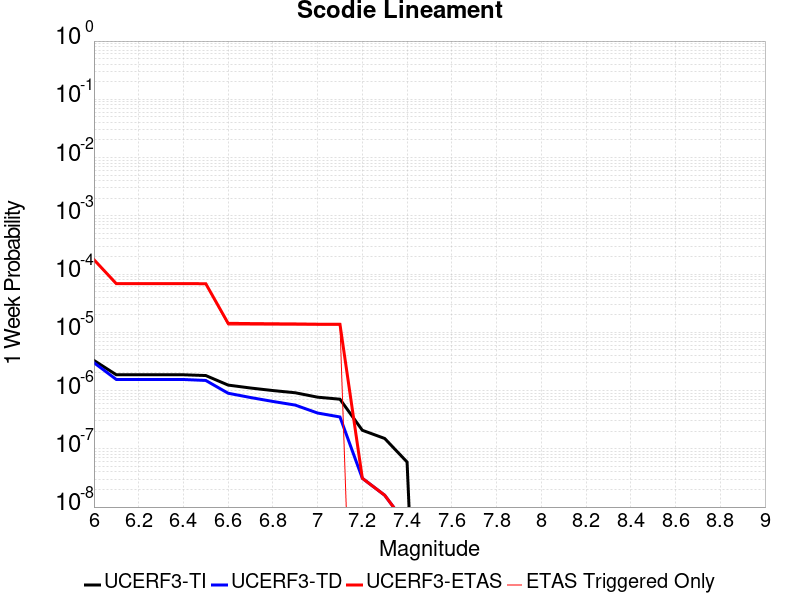 | 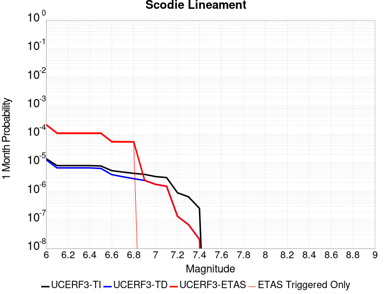 | 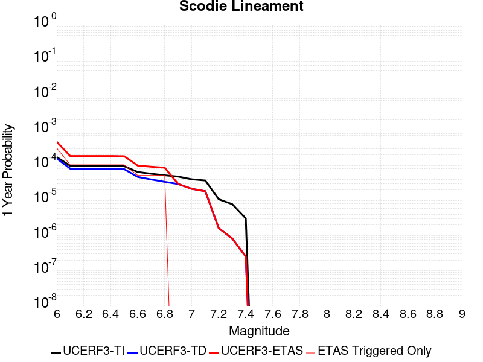 | 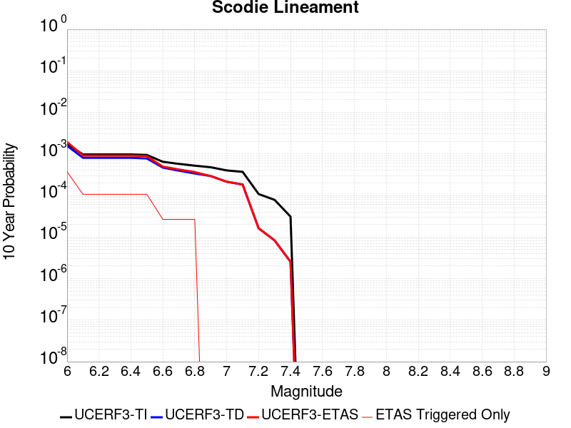 |

| Magnitude | 1 wk TI Prob | 1 wk TD Prob | 1 wk ETAS Prob | 1 wk ETAS/TD Gain | 1 wk ETAS Triggered Only | 1 mo TI Prob | 1 mo TD Prob | 1 mo ETAS Prob | 1 mo ETAS/TD Gain | 1 mo ETAS Triggered Only | 1 yr TI Prob | 1 yr TD Prob | 1 yr ETAS Prob | 1 yr ETAS/TD Gain | 1 yr ETAS Triggered Only | 10 yr TI Prob | 10 yr TD Prob | 10 yr ETAS Prob | 10 yr ETAS/TD Gain | 10 yr ETAS Triggered Only |
|-----|-----|-----|-----|-----|-----|-----|-----|-----|-----|-----|-----|-----|-----|-----|-----|-----|-----|-----|-----|-----|
| 6.0 | 3.2919327E-6 | 3.0133422E-6 | 1.3867974E-4 | 46.0219 | 1.356668E-4 | 1.4108206E-5 | 1.2914278E-5 | 1.5901511E-4 | 12.313124 | 1.4610271E-4 | 1.7175387E-4 | 1.5722317E-4 | 3.7634277E-4 | 2.3936853 | 2.1915407E-4 | 0.0017162118 | 0.0015714309 | 0.0018214991 | 1.159134 | 2.504618E-4 |
| 6.1 | 1.8663811E-6 | 1.5490499E-6 | 5.372851E-5 | 34.684814 | 5.217954E-5 | 7.998751E-6 | 6.6387715E-6 | 6.92538E-5 | 10.43172 | 6.261545E-5 | 9.738045E-5 | 8.082454E-5 | 1.7474013E-4 | 2.1619687 | 9.392317E-5 | 9.7337784E-4 | 8.080003E-4 | 9.12275E-4 | 1.1290529 | 1.0435908E-4 |
| 6.2 | 1.8663811E-6 | 1.5490499E-6 | 5.372851E-5 | 34.684814 | 5.217954E-5 | 7.998751E-6 | 6.6387715E-6 | 6.92538E-5 | 10.43172 | 6.261545E-5 | 9.738045E-5 | 8.082454E-5 | 1.7474013E-4 | 2.1619687 | 9.392317E-5 | 9.7337784E-4 | 8.080003E-4 | 9.12275E-4 | 1.1290529 | 1.0435908E-4 |
| 6.3 | 1.8663811E-6 | 1.5490499E-6 | 5.372851E-5 | 34.684814 | 5.217954E-5 | 7.998751E-6 | 6.6387715E-6 | 6.92538E-5 | 10.43172 | 6.261545E-5 | 9.738045E-5 | 8.082454E-5 | 1.7474013E-4 | 2.1619687 | 9.392317E-5 | 9.7337784E-4 | 8.080003E-4 | 9.12275E-4 | 1.1290529 | 1.0435908E-4 |
| 6.4 | 1.8663811E-6 | 1.5490499E-6 | 5.372851E-5 | 34.684814 | 5.217954E-5 | 7.998751E-6 | 6.6387715E-6 | 6.92538E-5 | 10.43172 | 6.261545E-5 | 9.738045E-5 | 8.082454E-5 | 1.7474013E-4 | 2.1619687 | 9.392317E-5 | 9.7337784E-4 | 8.080003E-4 | 9.12275E-4 | 1.1290529 | 1.0435908E-4 |
| 6.5 | 1.8106311E-6 | 1.4909839E-6 | 5.3670447E-5 | 35.996662 | 5.217954E-5 | 7.759824E-6 | 6.3899183E-6 | 6.9004964E-5 | 10.799037 | 6.261545E-5 | 9.447177E-5 | 7.7794975E-5 | 1.7171084E-4 | 2.2072227 | 9.392317E-5 | 9.4431615E-4 | 7.7772606E-4 | 8.82004E-4 | 1.1340805 | 1.0435908E-4 |
| 6.6 | 1.2414679E-6 | 8.997558E-7 | 1.1335655E-5 | 12.59859 | 1.0435908E-5 | 5.320566E-6 | 3.856091E-6 | 2.4727826E-5 | 6.412667 | 2.0871816E-5 | 6.477596E-5 | 4.6946985E-5 | 6.781782E-5 | 1.4445618 | 2.0871816E-5 | 6.475708E-4 | 4.693793E-4 | 5.006723E-4 | 1.066669 | 3.1307725E-5 |
| 6.7 | 1.1062215E-6 | 7.594311E-7 | 1.1195331E-5 | 14.741734 | 1.0435908E-5 | 4.7409408E-6 | 3.2547011E-6 | 2.412645E-5 | 7.4128003 | 2.0871816E-5 | 5.7719422E-5 | 3.9625334E-5 | 6.0496324E-5 | 1.5267081 | 2.0871816E-5 | 5.770443E-4 | 3.961897E-4 | 4.27485E-4 | 1.0789907 | 3.1307725E-5 |
| 6.8 | 1.0006736E-6 | 6.500397E-7 | 1.1085941E-5 | 17.054253 | 1.0435908E-5 | 4.288594E-6 | 2.7858816E-6 | 2.365764E-5 | 8.491976 | 2.0871816E-5 | 5.221238E-5 | 3.3917644E-5 | 5.478875E-5 | 1.6153467 | 2.0871816E-5 | 5.220012E-4 | 3.3913075E-4 | 3.7042785E-4 | 1.0922862 | 3.1307725E-5 |
| 6.9 | 9.167364E-7 | 5.631625E-7 | 1.0999064E-5 | 19.53089 | 1.0435908E-5 | 3.9288643E-6 | 2.4135516E-6 | 1.2849434E-5 | 5.3238697 | 1.0435908E-5 | 4.7832873E-5 | 2.9384651E-5 | 3.9820254E-5 | 1.3551378 | 1.0435908E-5 | 4.782258E-4 | 2.9381333E-4 | 3.1467903E-4 | 1.0710168 | 2.0871816E-5 |
| 7.0 | 7.6987664E-7 | 4.113383E-7 | 1.0847242E-5 | 26.37061 | 1.0435908E-5 | 3.2994672E-6 | 1.7628774E-6 | 1.2198767E-5 | 6.919804 | 1.0435908E-5 | 4.0170275E-5 | 2.1462862E-5 | 3.1898544E-5 | 1.4862206 | 1.0435908E-5 | 4.0163012E-4 | 2.1461173E-4 | 2.250454E-4 | 1.0486165 | 1.0435908E-5 |
| 7.1 | 7.1038727E-7 | 3.5211494E-7 | 1.0788019E-5 | 30.63778 | 1.0435908E-5 | 3.0445133E-6 | 1.5090633E-6 | 1.1944955E-5 | 7.915477 | 1.0435908E-5 | 3.706632E-5 | 1.8372726E-5 | 2.8808443E-5 | 1.5680004 | 1.0435908E-5 | 3.7060137E-4 | 1.8371557E-4 | 1.9414956E-4 | 1.0567943 | 1.0435908E-5 |
| 7.2 | 2.0799602E-7 | 3.1186854E-8 | 3.1186854E-8 | 1.0 | 0.0 | 8.914113E-7 | 1.3365793E-7 | 1.3365793E-7 | 1.0 | 0.0 | 1.0852878E-5 | 1.6272843E-6 | 1.6272843E-6 | 1.0 | 0.0 | 1.08523476E-4 | 1.627273E-5 | 1.627273E-5 | 1.0 | 0.0 |
| 7.3 | 1.5048182E-7 | 1.5945696E-8 | 1.5945696E-8 | 1.0 | 0.0 | 6.449219E-7 | 6.83387E-8 | 6.83387E-8 | 1.0 | 0.0 | 7.851896E-6 | 8.320234E-7 | 8.320234E-7 | 1.0 | 0.0 | 7.851618E-5 | 8.320206E-6 | 8.320206E-6 | 1.0 | 0.0 |
| 7.4 | 5.9334678E-8 | 4.8683537E-9 | 4.8683537E-9 | 1.0 | 0.0 | 2.5429145E-7 | 2.0864372E-8 | 2.0864372E-8 | 1.0 | 0.0 | 3.095994E-6 | 2.5402372E-7 | 2.5402372E-7 | 1.0 | 0.0 | 3.095951E-5 | 2.5402353E-6 | 2.5402353E-6 | 1.0 | 0.0 |

## Brawley (Seismic Zone) alt 1
*[(top)](#table-of-contents)*

| 1 Week | 1 Month | 1 Year | 10 Year |
|-----|-----|-----|-----|
| 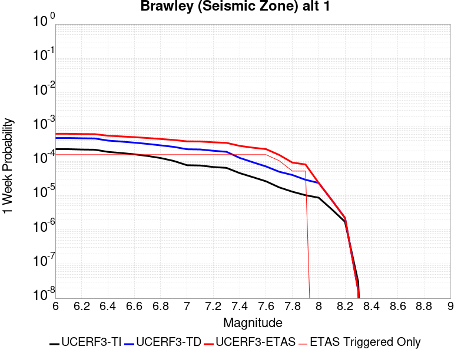 | 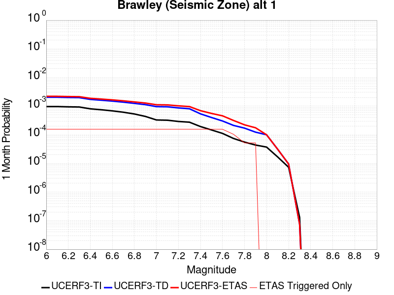 | 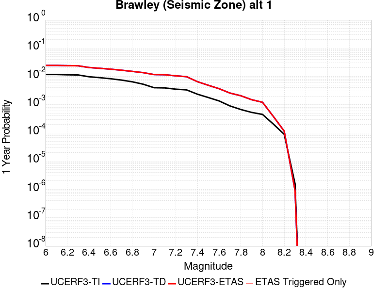 | 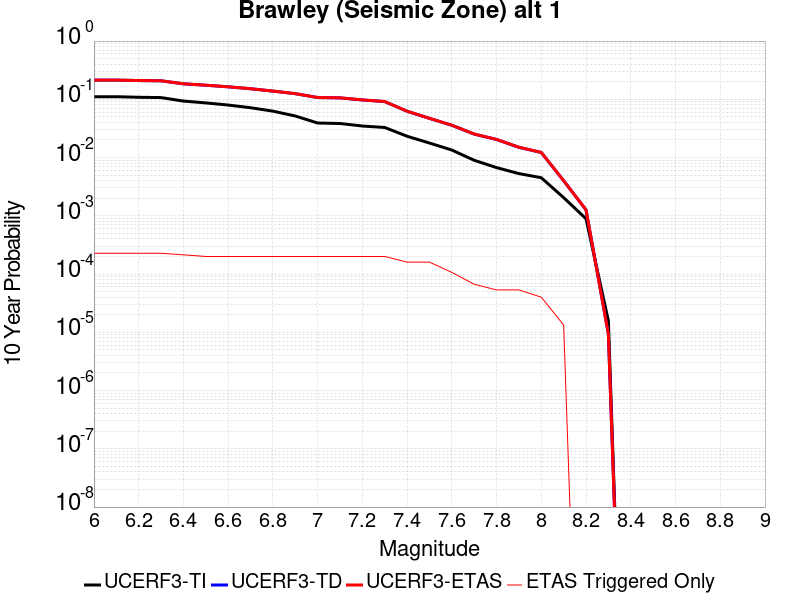 |

| Magnitude | 1 wk TI Prob | 1 wk TD Prob | 1 wk ETAS Prob | 1 wk ETAS/TD Gain | 1 wk ETAS Triggered Only | 1 mo TI Prob | 1 mo TD Prob | 1 mo ETAS Prob | 1 mo ETAS/TD Gain | 1 mo ETAS Triggered Only | 1 yr TI Prob | 1 yr TD Prob | 1 yr ETAS Prob | 1 yr ETAS/TD Gain | 1 yr ETAS Triggered Only | 10 yr TI Prob | 10 yr TD Prob | 10 yr ETAS Prob | 10 yr ETAS/TD Gain | 10 yr ETAS Triggered Only |
|-----|-----|-----|-----|-----|-----|-----|-----|-----|-----|-----|-----|-----|-----|-----|-----|-----|-----|-----|-----|-----|
| 6.0 | 2.2521618E-4 | 4.7632487E-4 | 5.806342E-4 | 1.2189878 | 1.0435908E-4 | 9.6485513E-4 | 0.0020398323 | 0.0021439786 | 1.0510563 | 1.0435908E-4 | 0.011683988 | 0.024546238 | 0.024719292 | 1.0070502 | 1.7741043E-4 | 0.11088423 | 0.21350002 | 0.2136888 | 1.0008842 | 2.4002588E-4 |
| 6.1 | 2.2521618E-4 | 4.7632487E-4 | 5.806342E-4 | 1.2189878 | 1.0435908E-4 | 9.6485513E-4 | 0.0020398323 | 0.0021439786 | 1.0510563 | 1.0435908E-4 | 0.011683988 | 0.024546238 | 0.024719292 | 1.0070502 | 1.7741043E-4 | 0.11088423 | 0.21350002 | 0.2136888 | 1.0008842 | 2.4002588E-4 |
| 6.2 | 2.198148E-4 | 4.6717093E-4 | 5.7148124E-4 | 1.2232809 | 1.0435908E-4 | 9.417233E-4 | 0.0020006616 | 0.0021048118 | 1.052058 | 1.0435908E-4 | 0.011405343 | 0.024080504 | 0.02425364 | 1.00719 | 1.7741043E-4 | 0.10837428 | 0.20993657 | 0.2101262 | 1.0009032 | 2.4002588E-4 |
| 6.3 | 2.1704129E-4 | 4.615278E-4 | 5.658387E-4 | 1.2260122 | 1.0435908E-4 | 9.298453E-4 | 0.0019765133 | 0.0020806661 | 1.0526953 | 1.0435908E-4 | 0.011262234 | 0.02379366 | 0.02396685 | 1.0072788 | 1.7741043E-4 | 0.107082725 | 0.20782755 | 0.20801769 | 1.0009149 | 2.4002588E-4 |
| 6.4 | 1.876142E-4 | 4.00449E-4 | 5.047663E-4 | 1.2605008 | 1.0435908E-4 | 8.038131E-4 | 0.0017150956 | 0.0018192757 | 1.060743 | 1.0435908E-4 | 0.00974259 | 0.020680401 | 0.020854143 | 1.0084013 | 1.7741043E-4 | 0.093263686 | 0.18457815 | 0.18476537 | 1.0010142 | 2.2958998E-4 |
| 6.5 | 1.7390939E-4 | 3.7477075E-4 | 4.7909073E-4 | 1.2783568 | 1.0435908E-4 | 7.45113E-4 | 0.0016051838 | 0.0017093754 | 1.0649095 | 1.0435908E-4 | 0.009034078 | 0.019368723 | 0.019542698 | 1.0089822 | 1.7741043E-4 | 0.086755216 | 0.17440031 | 0.17458124 | 1.0010375 | 2.1915407E-4 |
| 6.6 | 1.591791E-4 | 3.4891962E-4 | 4.5324228E-4 | 1.2989876 | 1.0435908E-4 | 6.8201777E-4 | 0.0014945229 | 0.001598726 | 1.0697234 | 1.0435908E-4 | 0.008271996 | 0.018045569 | 0.018219778 | 1.0096538 | 1.7741043E-4 | 0.07970774 | 0.16380852 | 0.16399178 | 1.0011187 | 2.1915407E-4 |
| 6.7 | 1.4268003E-4 | 3.20582E-4 | 4.1447507E-4 | 1.2928832 | 9.392317E-5 | 6.1134255E-4 | 0.0013732077 | 0.0014670019 | 1.068303 | 9.392317E-5 | 0.007417723 | 0.016592601 | 0.016756807 | 1.0098962 | 1.6697453E-4 | 0.07174956 | 0.15193306 | 0.15211007 | 1.001165 | 2.0871816E-4 |
| 6.8 | 1.239713E-4 | 2.9053655E-4 | 3.8443244E-4 | 1.3231809 | 9.392317E-5 | 5.3119735E-4 | 0.0012445687 | 0.0013383749 | 1.0753726 | 9.392317E-5 | 0.0064481674 | 0.015048777 | 0.01520296 | 1.0102456 | 1.5653862E-4 | 0.06264243 | 0.13837762 | 0.13853948 | 1.0011697 | 1.8784634E-4 |
| 6.9 | 1.0180238E-4 | 2.625439E-4 | 3.564424E-4 | 1.3576488 | 9.392317E-5 | 4.3622297E-4 | 0.0011247073 | 0.0012185248 | 1.083415 | 9.392317E-5 | 0.005298089 | 0.013608336 | 0.013762744 | 1.0113466 | 1.5653862E-4 | 0.05173543 | 0.124961674 | 0.12512605 | 1.0013154 | 1.8784634E-4 |
| 7.0 | 7.6619996E-5 | 2.23993E-4 | 3.1789514E-4 | 1.419219 | 9.392317E-5 | 3.283301E-4 | 9.5962E-4 | 0.0010534531 | 1.0977814 | 9.392317E-5 | 0.0039900932 | 0.011621496 | 0.011776214 | 1.0133132 | 1.5653862E-4 | 0.039192066 | 0.107266866 | 0.10743456 | 1.0015633 | 1.8784634E-4 |
| 7.1 | 7.5127435E-5 | 2.2082464E-4 | 3.1472708E-4 | 1.4252353 | 9.392317E-5 | 3.2193496E-4 | 9.4605127E-4 | 0.0010398856 | 1.0991852 | 9.392317E-5 | 0.0039125155 | 0.011458045 | 0.01161279 | 1.0135053 | 1.5653862E-4 | 0.038443442 | 0.10583085 | 0.105998814 | 1.0015872 | 1.8784634E-4 |
| 7.2 | 6.788582E-5 | 2.0210193E-4 | 2.9600612E-4 | 1.4646378 | 9.392317E-5 | 2.9090676E-4 | 8.6586666E-4 | 9.5970853E-4 | 1.1083791 | 9.392317E-5 | 0.0035360386 | 0.0104916105 | 0.010646507 | 1.0147638 | 1.5653862E-4 | 0.034803 | 0.09750131 | 0.097670846 | 1.0017388 | 1.8784634E-4 |
| 7.3 | 6.399602E-5 | 1.8841137E-4 | 2.8231685E-4 | 1.4984066 | 9.392317E-5 | 2.7423984E-4 | 8.072303E-4 | 9.0107764E-4 | 1.1162585 | 9.392317E-5 | 0.0033337586 | 0.009784332 | 0.009939338 | 1.0158423 | 1.5653862E-4 | 0.03284188 | 0.09139617 | 0.091566846 | 1.0018674 | 1.8784634E-4 |
| 7.4 | 4.506759E-5 | 1.2529209E-4 | 2.1920349E-4 | 1.7495397 | 9.392317E-5 | 1.9313251E-4 | 5.368565E-4 | 6.307292E-4 | 1.1748563 | 9.392317E-5 | 0.0023488526 | 0.0065168133 | 0.006641228 | 1.0190914 | 1.252309E-4 | 0.023241805 | 0.062363707 | 0.06251048 | 1.0023535 | 1.5653862E-4 |
| 7.5 | 3.43289E-5 | 9.33541E-5 | 1.7683356E-4 | 1.8942239 | 8.348726E-5 | 1.4711556E-4 | 4.00028E-4 | 4.8348185E-4 | 1.2086201 | 8.348726E-5 | 0.0017896603 | 0.0048595266 | 0.0049737636 | 1.0235078 | 1.1479499E-4 | 0.01775316 | 0.04705519 | 0.047194418 | 1.0029588 | 1.4610271E-4 |
| 7.6 | 2.5980507E-5 | 7.053101E-5 | 1.3314204E-4 | 1.8877093 | 6.261545E-5 | 1.1134028E-4 | 3.0224086E-4 | 3.6483738E-4 | 1.207108 | 6.261545E-5 | 0.001354725 | 0.003673598 | 0.0037567785 | 1.0226429 | 8.348726E-5 | 0.013464959 | 0.035840835 | 0.03594145 | 1.0028074 | 1.0435908E-4 |
| 7.7 | 1.7292105E-5 | 4.9407296E-5 | 9.114887E-5 | 1.8448462 | 4.174363E-5 | 7.4106916E-5 | 2.117284E-4 | 2.534632E-4 | 1.1971147 | 4.174363E-5 | 9.018782E-4 | 0.0025747516 | 0.0026372059 | 1.0242565 | 6.261545E-5 | 0.008982267 | 0.025290398 | 0.025361601 | 1.0028155 | 7.305136E-5 |
| 7.8 | 1.2927471E-5 | 3.9693266E-5 | 7.099975E-5 | 1.7887101 | 3.1307725E-5 | 5.5402274E-5 | 1.7010293E-4 | 2.0140533E-4 | 1.1840203 | 3.1307725E-5 | 6.743139E-4 | 0.0020690386 | 0.0021211102 | 1.025167 | 5.217954E-5 | 0.0067227143 | 0.020431727 | 0.020493064 | 1.003002 | 6.261545E-5 |
| 7.9 | 1.0200774E-5 | 2.874569E-5 | 6.0052513E-5 | 2.0890963 | 3.1307725E-5 | 4.371687E-5 | 1.2319001E-4 | 1.5449387E-4 | 1.2541105 | 3.1307725E-5 | 5.321229E-4 | 0.0014988075 | 0.0015404886 | 1.0278095 | 4.174363E-5 | 0.005308505 | 0.014991644 | 0.015043041 | 1.0034283 | 5.217954E-5 |
| 8.0 | 8.650396E-6 | 2.3277367E-5 | 3.3713033E-5 | 1.4483181 | 1.0435908E-5 | 3.70726E-5 | 9.975634E-5 | 1.10191206E-4 | 1.1046035 | 1.0435908E-5 | 4.5126543E-4 | 0.0012138576 | 0.001234704 | 1.0171738 | 2.0871816E-5 | 0.0045035016 | 0.012211097 | 0.012242022 | 1.0025326 | 3.1307725E-5 |
| 8.1 | 3.9368224E-6 | 7.3279825E-6 | 7.3279825E-6 | 1.0 | 0.0 | 1.6871985E-5 | 3.140526E-5 | 3.140526E-5 | 1.0 | 0.0 | 2.0539707E-4 | 3.8229208E-4 | 3.8229208E-4 | 1.0 | 0.0 | 0.0020520731 | 0.004001185 | 0.004011579 | 1.0025978 | 1.0435908E-5 |
| 8.2 | 1.7101195E-6 | 2.217876E-6 | 2.217876E-6 | 1.0 | 0.0 | 7.329063E-6 | 9.505149E-6 | 9.505149E-6 | 1.0 | 0.0 | 8.922769E-5 | 1.1571907E-4 | 1.1571907E-4 | 1.0 | 0.0 | 8.9191867E-4 | 0.0012666774 | 0.0012666774 | 1.0 | 0.0 |
| 8.3 | 3.0346666E-8 | 1.721586E-8 | 1.721586E-8 | 1.0 | 0.0 | 1.3005713E-7 | 7.378226E-8 | 7.378226E-8 | 1.0 | 0.0 | 1.5834444E-6 | 8.9829894E-7 | 8.9829894E-7 | 1.0 | 0.0 | 1.5834332E-5 | 9.367729E-6 | 9.367729E-6 | 1.0 | 0.0 |

## Imperial
*[(top)](#table-of-contents)*

| 1 Week | 1 Month | 1 Year | 10 Year |
|-----|-----|-----|-----|
| 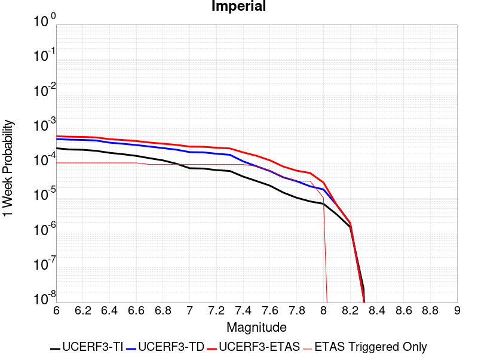 | 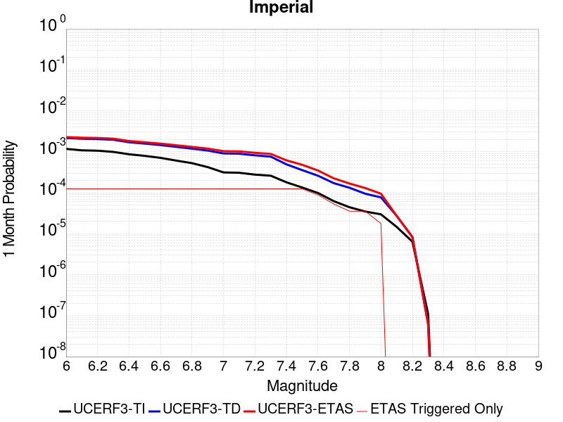 | 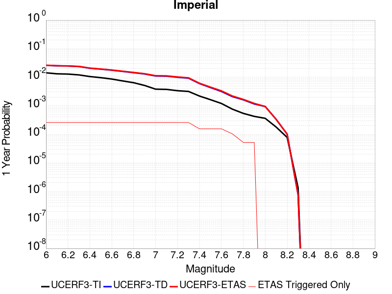 | 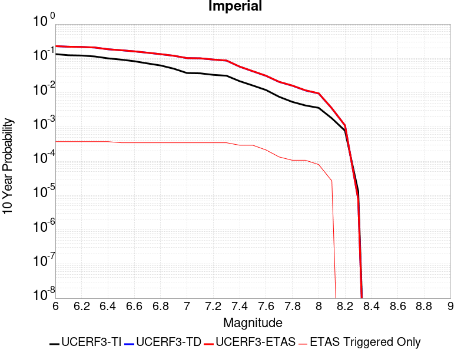 |

| Magnitude | 1 wk TI Prob | 1 wk TD Prob | 1 wk ETAS Prob | 1 wk ETAS/TD Gain | 1 wk ETAS Triggered Only | 1 mo TI Prob | 1 mo TD Prob | 1 mo ETAS Prob | 1 mo ETAS/TD Gain | 1 mo ETAS Triggered Only | 1 yr TI Prob | 1 yr TD Prob | 1 yr ETAS Prob | 1 yr ETAS/TD Gain | 1 yr ETAS Triggered Only | 10 yr TI Prob | 10 yr TD Prob | 10 yr ETAS Prob | 10 yr ETAS/TD Gain | 10 yr ETAS Triggered Only |
|-----|-----|-----|-----|-----|-----|-----|-----|-----|-----|-----|-----|-----|-----|-----|-----|-----|-----|-----|-----|-----|
| 6.0 | 2.7496446E-4 | 5.0552754E-4 | 6.0983386E-4 | 1.2063316 | 1.0435908E-4 | 0.0011778869 | 0.002164787 | 0.0022689202 | 1.0481032 | 1.0435908E-4 | 0.0142467655 | 0.026038699 | 0.026211489 | 1.0066359 | 1.7741043E-4 | 0.13367249 | 0.2280438 | 0.22822908 | 1.0008125 | 2.4002588E-4 |
| 6.1 | 2.5356023E-4 | 4.8656776E-4 | 5.908761E-4 | 1.2143757 | 1.0435908E-4 | 0.001086234 | 0.0020836622 | 0.0021878039 | 1.04998 | 1.0435908E-4 | 0.013144928 | 0.025071215 | 0.025244176 | 1.0068989 | 1.7741043E-4 | 0.123940155 | 0.21947981 | 0.21966715 | 1.0008535 | 2.4002588E-4 |
| 6.2 | 2.4820742E-4 | 4.7752203E-4 | 5.8183126E-4 | 1.2184386 | 1.0435908E-4 | 0.0010633124 | 0.0020449557 | 0.0021491013 | 1.0509281 | 1.0435908E-4 | 0.01286919 | 0.024611235 | 0.02478428 | 1.0070311 | 1.7741043E-4 | 0.12148927 | 0.21598552 | 0.21617371 | 1.0008713 | 2.4002588E-4 |
| 6.3 | 2.3205351E-4 | 4.5890483E-4 | 5.63216E-4 | 1.2273046 | 1.0435908E-4 | 9.94136E-4 | 0.0019652895 | 0.0020694435 | 1.0529968 | 1.0435908E-4 | 0.012036599 | 0.02366133 | 0.023834543 | 1.0073205 | 1.7741043E-4 | 0.11405133 | 0.20793462 | 0.20812473 | 1.0009143 | 2.4002588E-4 |
| 6.4 | 2.0304754E-4 | 3.987652E-4 | 5.0308264E-4 | 1.2616012 | 1.0435908E-4 | 8.6991355E-4 | 0.0017078889 | 0.0018120698 | 1.0609998 | 1.0435908E-4 | 0.010539869 | 0.020595672 | 0.020769428 | 1.0084366 | 1.7741043E-4 | 0.100537635 | 0.1850669 | 0.185254 | 1.001011 | 2.2958998E-4 |
| 6.5 | 1.854992E-4 | 3.6988858E-4 | 4.7420905E-4 | 1.2820321 | 1.0435908E-4 | 7.9475436E-4 | 0.0015842861 | 0.0016884798 | 1.065767 | 1.0435908E-4 | 0.009633281 | 0.01911948 | 0.0192935 | 1.0091016 | 1.7741043E-4 | 0.0922623 | 0.173298 | 0.17347918 | 1.0010455 | 2.1915407E-4 |
| 6.6 | 1.6586106E-4 | 3.403506E-4 | 4.446742E-4 | 1.306518 | 1.0435908E-4 | 7.106394E-4 | 0.0014578402 | 0.0015620472 | 1.0714804 | 1.0435908E-4 | 0.008617763 | 0.01760642 | 0.017780706 | 1.009899 | 1.7741043E-4 | 0.08291132 | 0.16077545 | 0.16095936 | 1.0011439 | 2.1915407E-4 |
| 6.7 | 1.4224656E-4 | 3.076692E-4 | 4.0156345E-4 | 1.3051794 | 9.392317E-5 | 6.094856E-4 | 0.001317924 | 0.0014117234 | 1.0711721 | 9.392317E-5 | 0.0073952693 | 0.015929576 | 0.016093891 | 1.0103151 | 1.6697453E-4 | 0.07153955 | 0.14648417 | 0.14666231 | 1.0012162 | 2.0871816E-4 |
| 6.8 | 1.2317259E-4 | 2.779122E-4 | 3.7180926E-4 | 1.337866 | 9.392317E-5 | 5.2777573E-4 | 0.0011905148 | 0.0012843261 | 1.078799 | 9.392317E-5 | 0.0064067547 | 0.0143995695 | 0.014553854 | 1.0107145 | 1.5653862E-4 | 0.06225166 | 0.13293684 | 0.1330997 | 1.0012252 | 1.8784634E-4 |
| 6.9 | 9.859898E-5 | 2.5014306E-4 | 3.4404272E-4 | 1.3753839 | 9.392317E-5 | 4.2249862E-4 | 0.0010716055 | 0.001165428 | 1.0875533 | 9.392317E-5 | 0.0051317946 | 0.012969712 | 0.01312422 | 1.0119131 | 1.5653862E-4 | 0.05014893 | 0.11940631 | 0.11957173 | 1.0013853 | 1.8784634E-4 |
| 7.0 | 7.3191884E-5 | 2.1266776E-4 | 3.0657096E-4 | 1.4415488 | 9.392317E-5 | 3.136418E-4 | 9.1111806E-4 | 0.0010049557 | 1.1029917 | 9.392317E-5 | 0.003811904 | 0.011037128 | 0.011191938 | 1.0140264 | 1.5653862E-4 | 0.037471764 | 0.10206493 | 0.1022336 | 1.0016526 | 1.8784634E-4 |
| 7.1 | 7.1760296E-5 | 2.0968143E-4 | 3.035849E-4 | 1.4478388 | 9.392317E-5 | 3.0750787E-4 | 8.983284E-4 | 9.921672E-4 | 1.1044594 | 9.392317E-5 | 0.003737482 | 0.010882978 | 0.0110378135 | 1.0142273 | 1.5653862E-4 | 0.03675245 | 0.10070146 | 0.100870386 | 1.0016775 | 1.8784634E-4 |
| 7.2 | 6.46614E-5 | 1.9136685E-4 | 2.8527205E-4 | 1.4907078 | 9.392317E-5 | 2.7709085E-4 | 8.1988896E-4 | 9.137351E-4 | 1.114462 | 9.392317E-5 | 0.0033683628 | 0.0099370815 | 0.010092065 | 1.0155964 | 1.5653862E-4 | 0.033177625 | 0.09250898 | 0.09267945 | 1.0018427 | 1.8784634E-4 |
| 7.3 | 6.088115E-5 | 1.78084E-4 | 2.7199043E-4 | 1.5273155 | 9.392317E-5 | 2.6089314E-4 | 7.6299673E-4 | 8.5684826E-4 | 1.1230038 | 9.392317E-5 | 0.0031717476 | 0.009250494 | 0.009405584 | 1.0167656 | 1.5653862E-4 | 0.031268585 | 0.08655989 | 0.08673148 | 1.0019823 | 1.8784634E-4 |
| 7.4 | 4.199346E-5 | 1.1510366E-4 | 2.0901603E-4 | 1.8158938 | 9.392317E-5 | 1.7995955E-4 | 4.9320905E-4 | 5.870859E-4 | 1.1903389 | 9.392317E-5 | 0.0021888057 | 0.0059884563 | 0.0061129373 | 1.0207868 | 1.252309E-4 | 0.02167372 | 0.057439793 | 0.05758734 | 1.0025687 | 1.5653862E-4 |
| 7.5 | 3.130448E-5 | 8.33328E-5 | 1.668131E-4 | 2.00177 | 8.348726E-5 | 1.3415517E-4 | 3.57092E-4 | 4.4054945E-4 | 1.2337141 | 8.348726E-5 | 0.0016321153 | 0.004338988 | 0.004453285 | 1.0263418 | 1.1479499E-4 | 0.016201803 | 0.04213201 | 0.042271957 | 1.0033216 | 1.4610271E-4 |
| 7.6 | 2.3074248E-5 | 6.0844646E-5 | 1.2345628E-4 | 2.029041 | 6.261545E-5 | 9.888588E-5 | 2.6073685E-4 | 3.2333596E-4 | 1.2400855 | 6.261545E-5 | 0.0012032706 | 0.0031698733 | 0.003253096 | 1.0262543 | 8.348726E-5 | 0.011967761 | 0.031026395 | 0.031127516 | 1.0032592 | 1.0435908E-4 |
| 7.7 | 1.45864815E-5 | 4.0124698E-5 | 8.186665E-5 | 2.0403059 | 4.174363E-5 | 6.2511994E-5 | 1.7195169E-4 | 2.1368815E-4 | 1.2427219 | 4.174363E-5 | 7.608177E-4 | 0.0020915072 | 0.0021539917 | 1.0298754 | 6.261545E-5 | 0.007582182 | 0.020627763 | 0.020699307 | 1.0034684 | 7.305136E-5 |
| 7.8 | 1.0352979E-5 | 3.0960902E-5 | 6.226765E-5 | 2.0111706 | 3.1307725E-5 | 4.4369157E-5 | 1.3268284E-4 | 1.639864E-4 | 1.2359278 | 3.1307725E-5 | 5.400606E-4 | 0.0016142189 | 0.0016663142 | 1.0322728 | 5.217954E-5 | 0.0053875 | 0.016016833 | 0.016078446 | 1.0038468 | 6.261545E-5 |
| 7.9 | 8.137906E-6 | 2.2149103E-5 | 5.3456133E-5 | 2.4134672 | 3.1307725E-5 | 3.4876273E-5 | 9.492128E-5 | 1.2622602E-4 | 1.329797 | 3.1307725E-5 | 4.2453592E-4 | 0.0011550548 | 0.0011967502 | 1.0360982 | 4.174363E-5 | 0.004237258 | 0.011617903 | 0.011669476 | 1.0044391 | 5.217954E-5 |
| 8.0 | 6.93792E-6 | 1.8008766E-5 | 2.8444485E-5 | 1.57948 | 1.0435908E-5 | 2.9733603E-5 | 7.717814E-5 | 8.761325E-5 | 1.135208 | 1.0435908E-5 | 3.6194647E-4 | 9.3923963E-4 | 9.600918E-4 | 1.0222012 | 2.0871816E-5 | 0.0036135751 | 0.00950155 | 0.009532561 | 1.0032637 | 3.1307725E-5 |
| 8.1 | 3.4286315E-6 | 6.379872E-6 | 6.379872E-6 | 1.0 | 0.0 | 1.4694053E-5 | 2.7342023E-5 | 2.7342023E-5 | 1.0 | 0.0 | 1.7888541E-4 | 3.328384E-4 | 3.328384E-4 | 1.0 | 0.0 | 0.0017874148 | 0.003486031 | 0.0034964303 | 1.0029832 | 1.0435908E-5 |
| 8.2 | 1.4906886E-6 | 1.9366646E-6 | 1.9366646E-6 | 1.0 | 0.0 | 6.3886496E-6 | 8.299965E-6 | 8.299965E-6 | 1.0 | 0.0 | 7.7779034E-5 | 1.0104742E-4 | 1.0104742E-4 | 1.0 | 0.0 | 7.775182E-4 | 0.0011075331 | 0.0011075331 | 1.0 | 0.0 |
| 8.3 | 2.5758007E-8 | 1.4500102E-8 | 1.4500102E-8 | 1.0 | 0.0 | 1.10391454E-7 | 6.214329E-8 | 6.214329E-8 | 1.0 | 0.0 | 1.3440151E-6 | 7.565946E-7 | 7.565946E-7 | 1.0 | 0.0 | 1.344007E-5 | 7.887763E-6 | 7.887763E-6 | 1.0 | 0.0 |

## San Jacinto (Anza) rev
*[(top)](#table-of-contents)*

| 1 Week | 1 Month | 1 Year | 10 Year |
|-----|-----|-----|-----|
| 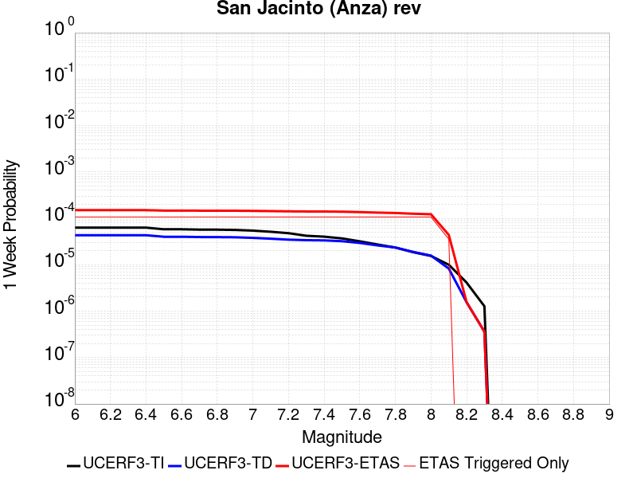 |  | 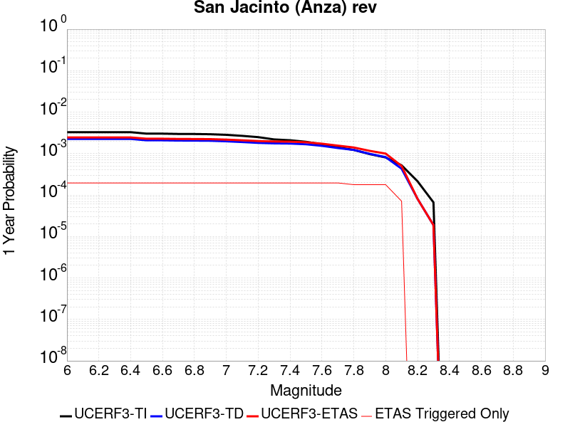 | 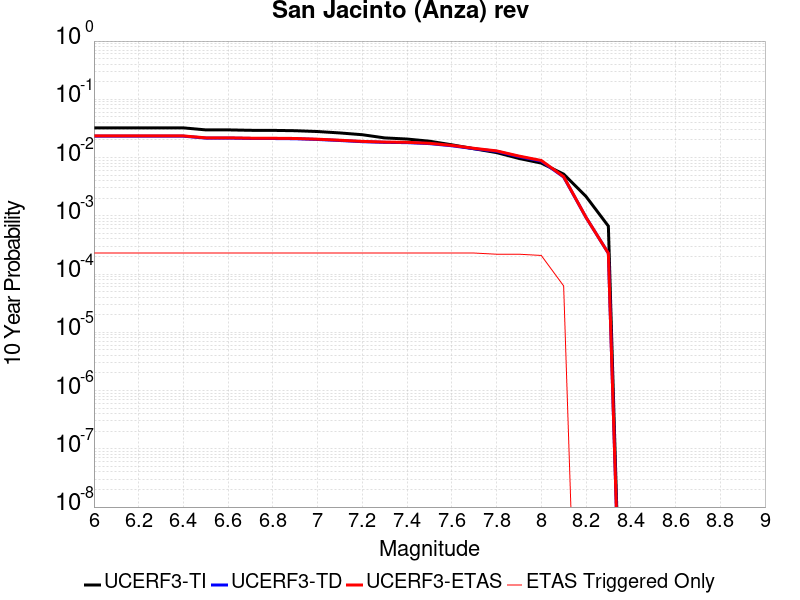 |

| Magnitude | 1 wk TI Prob | 1 wk TD Prob | 1 wk ETAS Prob | 1 wk ETAS/TD Gain | 1 wk ETAS Triggered Only | 1 mo TI Prob | 1 mo TD Prob | 1 mo ETAS Prob | 1 mo ETAS/TD Gain | 1 mo ETAS Triggered Only | 1 yr TI Prob | 1 yr TD Prob | 1 yr ETAS Prob | 1 yr ETAS/TD Gain | 1 yr ETAS Triggered Only | 10 yr TI Prob | 10 yr TD Prob | 10 yr ETAS Prob | 10 yr ETAS/TD Gain | 10 yr ETAS Triggered Only |
|-----|-----|-----|-----|-----|-----|-----|-----|-----|-----|-----|-----|-----|-----|-----|-----|-----|-----|-----|-----|-----|
| 6.0 | 6.3015636E-5 | 4.3302647E-5 | 1.5809266E-4 | 3.6508775 | 1.1479499E-4 | 2.7003905E-4 | 1.8556965E-4 | 3.3164525E-4 | 1.787174 | 1.4610271E-4 | 0.0032827691 | 0.0022569813 | 0.002454816 | 1.0876546 | 1.9828224E-4 | 0.032346968 | 0.023296192 | 0.023520434 | 1.0096257 | 2.2958998E-4 |
| 6.1 | 6.3015636E-5 | 4.3302647E-5 | 1.5809266E-4 | 3.6508775 | 1.1479499E-4 | 2.7003905E-4 | 1.8556965E-4 | 3.3164525E-4 | 1.787174 | 1.4610271E-4 | 0.0032827691 | 0.0022569813 | 0.002454816 | 1.0876546 | 1.9828224E-4 | 0.032346968 | 0.023296192 | 0.023520434 | 1.0096257 | 2.2958998E-4 |
| 6.2 | 6.3015636E-5 | 4.3302647E-5 | 1.5809266E-4 | 3.6508775 | 1.1479499E-4 | 2.7003905E-4 | 1.8556965E-4 | 3.3164525E-4 | 1.787174 | 1.4610271E-4 | 0.0032827691 | 0.0022569813 | 0.002454816 | 1.0876546 | 1.9828224E-4 | 0.032346968 | 0.023296192 | 0.023520434 | 1.0096257 | 2.2958998E-4 |
| 6.3 | 6.3015636E-5 | 4.3302647E-5 | 1.5809266E-4 | 3.6508775 | 1.1479499E-4 | 2.7003905E-4 | 1.8556965E-4 | 3.3164525E-4 | 1.787174 | 1.4610271E-4 | 0.0032827691 | 0.0022569813 | 0.002454816 | 1.0876546 | 1.9828224E-4 | 0.032346968 | 0.023296192 | 0.023520434 | 1.0096257 | 2.2958998E-4 |
| 6.4 | 6.3015636E-5 | 4.3302647E-5 | 1.5809266E-4 | 3.6508775 | 1.1479499E-4 | 2.7003905E-4 | 1.8556965E-4 | 3.3164525E-4 | 1.787174 | 1.4610271E-4 | 0.0032827691 | 0.0022569813 | 0.002454816 | 1.0876546 | 1.9828224E-4 | 0.032346968 | 0.023296192 | 0.023520434 | 1.0096257 | 2.2958998E-4 |
| 6.5 | 5.811017E-5 | 4.0082516E-5 | 1.548729E-4 | 3.863852 | 1.1479499E-4 | 2.4901982E-4 | 1.7177092E-4 | 3.1784855E-4 | 1.8504211 | 1.4610271E-4 | 0.0030276014 | 0.002089311 | 0.0022871788 | 1.0947049 | 1.9828224E-4 | 0.02986684 | 0.021593736 | 0.02181837 | 1.0104027 | 2.2958998E-4 |
| 6.6 | 5.811017E-5 | 4.0082516E-5 | 1.548729E-4 | 3.863852 | 1.1479499E-4 | 2.4901982E-4 | 1.7177092E-4 | 3.1784855E-4 | 1.8504211 | 1.4610271E-4 | 0.0030276014 | 0.002089311 | 0.0022871788 | 1.0947049 | 1.9828224E-4 | 0.02986684 | 0.021593736 | 0.02181837 | 1.0104027 | 2.2958998E-4 |
| 6.7 | 5.712442E-5 | 3.9505223E-5 | 1.5429567E-4 | 3.905703 | 1.1479499E-4 | 2.4479596E-4 | 1.6929714E-4 | 3.1537513E-4 | 1.8628496 | 1.4610271E-4 | 0.0029763177 | 0.0020592497 | 0.0022571236 | 1.0960903 | 1.9828224E-4 | 0.029367693 | 0.021285562 | 0.021510266 | 1.0105566 | 2.2958998E-4 |
| 6.8 | 5.6967532E-5 | 3.9361643E-5 | 1.541521E-4 | 3.9163027 | 1.1479499E-4 | 2.4412372E-4 | 1.6868189E-4 | 3.1475993E-4 | 1.8659973 | 1.4610271E-4 | 0.0029681553 | 0.002051773 | 0.0022496483 | 1.0964411 | 1.9828224E-4 | 0.029288229 | 0.021210281 | 0.021435002 | 1.0105948 | 2.2958998E-4 |
| 6.9 | 5.6211324E-5 | 3.9066435E-5 | 1.5385693E-4 | 3.9383407 | 1.1479499E-4 | 2.4088343E-4 | 1.6741687E-4 | 3.134951E-4 | 1.872542 | 1.4610271E-4 | 0.0029288116 | 0.0020364004 | 0.0022342787 | 1.0971707 | 1.9828224E-4 | 0.028905109 | 0.021049714 | 0.021274472 | 1.0106775 | 2.2958998E-4 |
| 7.0 | 5.4383527E-5 | 3.792697E-5 | 1.527176E-4 | 4.026623 | 1.1479499E-4 | 2.3305144E-4 | 1.6253405E-4 | 3.0861303E-4 | 1.8987591 | 1.4610271E-4 | 0.0028337094 | 0.001977061 | 0.0021749511 | 1.1000931 | 1.9828224E-4 | 0.027978465 | 0.020440677 | 0.020665573 | 1.0110024 | 2.2958998E-4 |
| 7.1 | 5.1393665E-5 | 3.6389913E-5 | 1.5118072E-4 | 4.154468 | 1.1479499E-4 | 2.2023996E-4 | 1.5594746E-4 | 3.020274E-4 | 1.9367253 | 1.4610271E-4 | 0.0026781242 | 0.0018970112 | 0.0020949172 | 1.1043252 | 1.9828224E-4 | 0.026460782 | 0.019614287 | 0.019839372 | 1.0114757 | 2.2958998E-4 |
| 7.2 | 4.785222E-5 | 3.4741795E-5 | 1.4953279E-4 | 4.304118 | 1.1479499E-4 | 2.0506482E-4 | 1.4888494E-4 | 2.949659E-4 | 1.9811668 | 1.4610271E-4 | 0.0024938055 | 0.0018111705 | 0.0020090935 | 1.1092792 | 1.9828224E-4 | 0.024660049 | 0.018728992 | 0.01895428 | 1.0120289 | 2.2958998E-4 |
| 7.3 | 4.2143256E-5 | 3.383628E-5 | 1.4862738E-4 | 4.392545 | 1.1479499E-4 | 1.8060145E-4 | 1.4500458E-4 | 2.9108612E-4 | 2.007427 | 1.4610271E-4 | 0.002196605 | 0.0017640047 | 0.0019619372 | 1.1122063 | 1.9828224E-4 | 0.02175019 | 0.01823724 | 0.018462645 | 1.0123595 | 2.2958998E-4 |
| 7.4 | 4.0264713E-5 | 3.347446E-5 | 1.4826561E-4 | 4.4292154 | 1.1479499E-4 | 1.7255165E-4 | 1.4345412E-4 | 2.8953588E-4 | 2.018317 | 1.4610271E-4 | 0.002098792 | 0.0017451581 | 0.0019430943 | 1.1134202 | 1.9828224E-4 | 0.020790804 | 0.018041821 | 0.018267268 | 1.0124959 | 2.2958998E-4 |
| 7.5 | 3.694492E-5 | 3.218847E-5 | 1.4697976E-4 | 4.566224 | 1.1479499E-4 | 1.5832575E-4 | 1.379433E-4 | 2.8402585E-4 | 2.0590043 | 1.4610271E-4 | 0.0019259118 | 0.001678169 | 0.0018761185 | 1.1179557 | 1.9828224E-4 | 0.01909306 | 0.01735827 | 0.017583875 | 1.0129969 | 2.2958998E-4 |
| 7.6 | 3.200565E-5 | 2.9504106E-5 | 1.442957E-4 | 4.890699 | 1.1479499E-4 | 1.3715986E-4 | 1.2644005E-4 | 2.7252428E-4 | 2.1553636 | 1.4610271E-4 | 0.001668642 | 0.0015383229 | 0.0017363001 | 1.1286968 | 1.9828224E-4 | 0.01656168 | 0.0159463 | 0.016172228 | 1.0141681 | 2.2958998E-4 |
| 7.7 | 2.731642E-5 | 2.6092788E-5 | 1.4088477E-4 | 5.3993764 | 1.1479499E-4 | 1.1706512E-4 | 1.1182144E-4 | 2.579078E-4 | 2.3064253 | 1.4610271E-4 | 0.001424336 | 0.0013605768 | 0.0015585893 | 1.1455357 | 1.9828224E-4 | 0.014152412 | 0.014167004 | 0.014393342 | 1.0159764 | 2.2958998E-4 |
| 7.8 | 2.3466424E-5 | 2.3504817E-5 | 1.3829711E-4 | 5.883777 | 1.1479499E-4 | 1.0056651E-4 | 1.0073105E-4 | 2.4681905E-4 | 2.4502778 | 1.4610271E-4 | 0.0012237094 | 0.0012257113 | 0.0014133274 | 1.1530671 | 1.8784634E-4 | 0.012169928 | 0.012808893 | 0.01302524 | 1.0168904 | 2.1915407E-4 |
| 7.9 | 1.8611925E-5 | 1.8908117E-5 | 1.3370093E-4 | 7.071087 | 1.1479499E-4 | 7.9762955E-5 | 8.1032274E-5 | 2.2712315E-4 | 2.8028727 | 1.4610271E-4 | 9.7068126E-4 | 9.861222E-4 | 0.0011737832 | 1.1903021 | 1.8784634E-4 | 0.0096645225 | 0.010393824 | 0.010610701 | 1.0208659 | 2.1915407E-4 |
| 8.0 | 1.5460775E-5 | 1.5740965E-5 | 1.200984E-4 | 7.629672 | 1.0435908E-4 | 6.6258784E-5 | 6.7459536E-5 | 2.0311719E-4 | 3.0109484 | 1.356668E-4 | 8.0640207E-4 | 8.21011E-4 | 9.982758E-4 | 1.2159103 | 1.7741043E-4 | 0.008034821 | 0.0087028835 | 0.008909785 | 1.0237739 | 2.0871816E-4 |
| 8.1 | 9.983884E-6 | 8.269952E-6 | 3.9577415E-5 | 4.785689 | 3.1307725E-5 | 4.2787375E-5 | 3.544217E-5 | 8.761986E-5 | 2.4721923 | 5.217954E-5 | 5.2081177E-4 | 4.314235E-4 | 4.8358054E-4 | 1.1208951 | 5.217954E-5 | 0.0051959283 | 0.004640022 | 0.004702347 | 1.013432 | 6.261545E-5 |
| 8.2 | 4.1226E-6 | 1.5529788E-6 | 1.5529788E-6 | 1.0 | 0.0 | 1.7668166E-5 | 6.6556063E-6 | 6.6556063E-6 | 1.0 | 0.0 | 2.1508869E-4 | 8.102902E-5 | 8.102902E-5 | 1.0 | 0.0 | 0.0021488064 | 9.4050163E-4 | 9.4050163E-4 | 1.0 | 0.0 |
| 8.3 | 1.2750878E-6 | 3.612133E-7 | 3.612133E-7 | 1.0 | 0.0 | 5.4646503E-6 | 1.548056E-6 | 1.548056E-6 | 1.0 | 0.0 | 6.653009E-5 | 1.8847424E-5 | 1.8847424E-5 | 1.0 | 0.0 | 6.6510175E-4 | 2.2734253E-4 | 2.2734253E-4 | 1.0 | 0.0 |

## Lost Hills
*[(top)](#table-of-contents)*

| 1 Week | 1 Month | 1 Year | 10 Year |
|-----|-----|-----|-----|
| 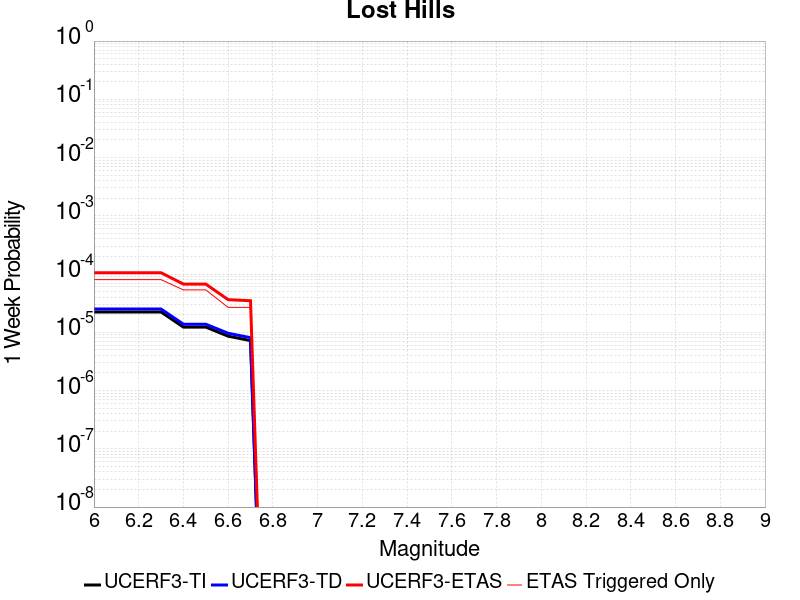 |  | 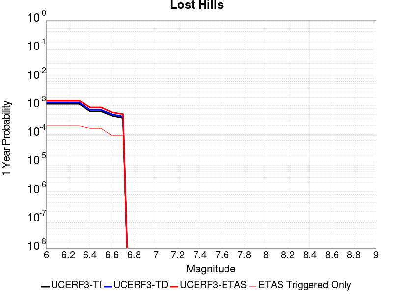 | 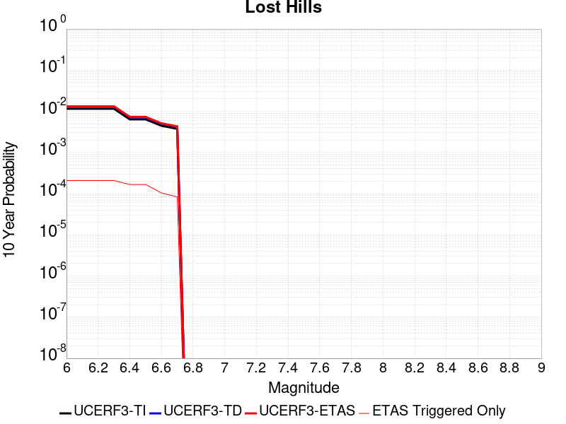 |

| Magnitude | 1 wk TI Prob | 1 wk TD Prob | 1 wk ETAS Prob | 1 wk ETAS/TD Gain | 1 wk ETAS Triggered Only | 1 mo TI Prob | 1 mo TD Prob | 1 mo ETAS Prob | 1 mo ETAS/TD Gain | 1 mo ETAS Triggered Only | 1 yr TI Prob | 1 yr TD Prob | 1 yr ETAS Prob | 1 yr ETAS/TD Gain | 1 yr ETAS Triggered Only | 10 yr TI Prob | 10 yr TD Prob | 10 yr ETAS Prob | 10 yr ETAS/TD Gain | 10 yr ETAS Triggered Only |
|-----|-----|-----|-----|-----|-----|-----|-----|-----|-----|-----|-----|-----|-----|-----|-----|-----|-----|-----|-----|-----|
| 6.0 | 2.233523E-5 | 2.5106583E-5 | 1.0859175E-4 | 4.32523 | 8.348726E-5 | 9.571891E-5 | 1.0759615E-4 | 1.9107443E-4 | 1.7758483 | 8.348726E-5 | 0.0011647546 | 0.001309364 | 0.0014552755 | 1.1114368 | 1.4610271E-4 | 0.011586686 | 0.013033091 | 0.0132390885 | 1.0158057 | 2.0871816E-4 |
| 6.1 | 2.233523E-5 | 2.5106583E-5 | 1.0859175E-4 | 4.32523 | 8.348726E-5 | 9.571891E-5 | 1.0759615E-4 | 1.9107443E-4 | 1.7758483 | 8.348726E-5 | 0.0011647546 | 0.001309364 | 0.0014552755 | 1.1114368 | 1.4610271E-4 | 0.011586686 | 0.013033091 | 0.0132390885 | 1.0158057 | 2.0871816E-4 |
| 6.2 | 2.233523E-5 | 2.5106583E-5 | 1.0859175E-4 | 4.32523 | 8.348726E-5 | 9.571891E-5 | 1.0759615E-4 | 1.9107443E-4 | 1.7758483 | 8.348726E-5 | 0.0011647546 | 0.001309364 | 0.0014552755 | 1.1114368 | 1.4610271E-4 | 0.011586686 | 0.013033091 | 0.0132390885 | 1.0158057 | 2.0871816E-4 |
| 6.3 | 2.233523E-5 | 2.5106583E-5 | 1.0859175E-4 | 4.32523 | 8.348726E-5 | 9.571891E-5 | 1.0759615E-4 | 1.9107443E-4 | 1.7758483 | 8.348726E-5 | 0.0011647546 | 0.001309364 | 0.0014552755 | 1.1114368 | 1.4610271E-4 | 0.011586686 | 0.013033091 | 0.0132390885 | 1.0158057 | 2.0871816E-4 |
| 6.4 | 1.2288092E-5 | 1.3781108E-5 | 7.639569E-5 | 5.543509 | 6.261545E-5 | 5.2662188E-5 | 5.906108E-5 | 1.2167283E-4 | 2.0601187 | 6.261545E-5 | 6.409735E-4 | 7.189252E-4 | 8.440661E-4 | 1.1740665 | 1.252309E-4 | 0.006391279 | 0.0071752006 | 0.007340977 | 1.0231041 | 1.6697453E-4 |
| 6.5 | 1.2288092E-5 | 1.3781108E-5 | 7.639569E-5 | 5.543509 | 6.261545E-5 | 5.2662188E-5 | 5.906108E-5 | 1.2167283E-4 | 2.0601187 | 6.261545E-5 | 6.409735E-4 | 7.189252E-4 | 8.440661E-4 | 1.1740665 | 1.252309E-4 | 0.006391279 | 0.0071752006 | 0.007340977 | 1.0231041 | 1.6697453E-4 |
| 6.6 | 8.58281E-6 | 9.63377E-6 | 5.1377E-5 | 5.3330107 | 4.174363E-5 | 3.6782953E-5 | 4.12874E-5 | 8.302931E-5 | 2.0110083 | 4.174363E-5 | 4.4774043E-4 | 5.026414E-4 | 5.75656E-4 | 1.1452619 | 7.305136E-5 | 0.0044683935 | 0.005023205 | 0.00512704 | 1.020671 | 1.0435908E-4 |
| 6.7 | 7.205685E-6 | 8.088302E-6 | 4.9831597E-5 | 6.160947 | 4.174363E-5 | 3.088114E-5 | 3.466415E-5 | 7.640634E-5 | 2.2041888 | 4.174363E-5 | 3.7591302E-4 | 4.2203604E-4 | 4.9505656E-4 | 1.1730196 | 7.305136E-5 | 0.0037527776 | 0.0042203604 | 0.0043034954 | 1.0196985 | 8.348726E-5 |

## White Mountains
*[(top)](#table-of-contents)*

| 1 Week | 1 Month | 1 Year | 10 Year |
|-----|-----|-----|-----|
| 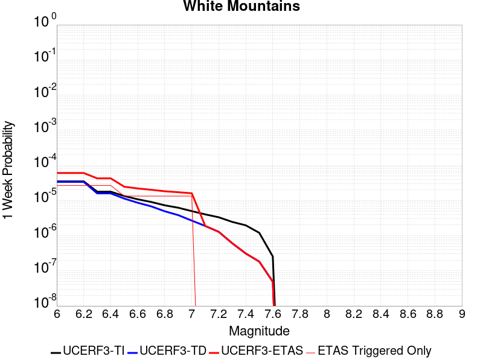 | 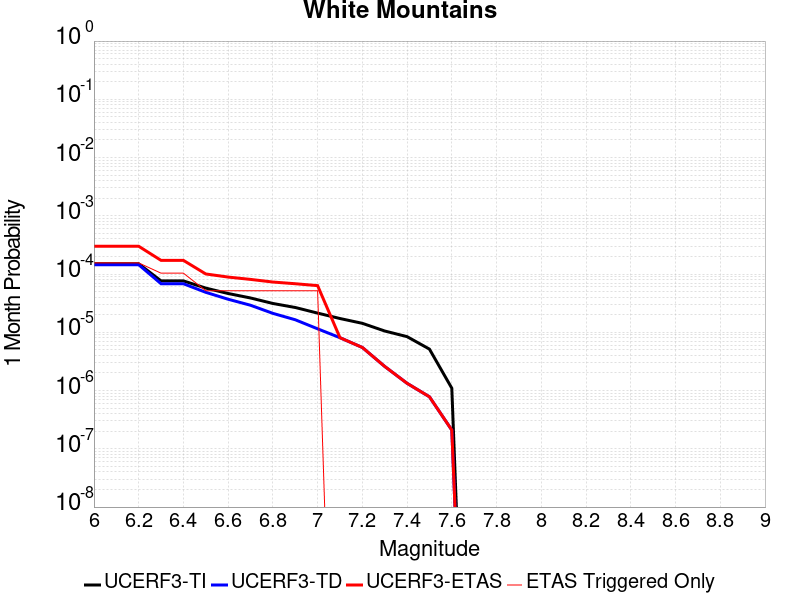 | 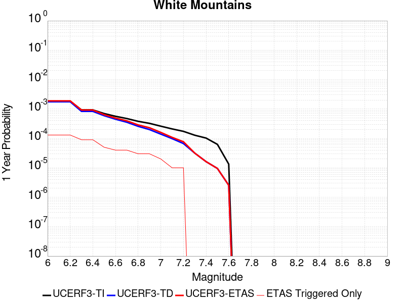 | 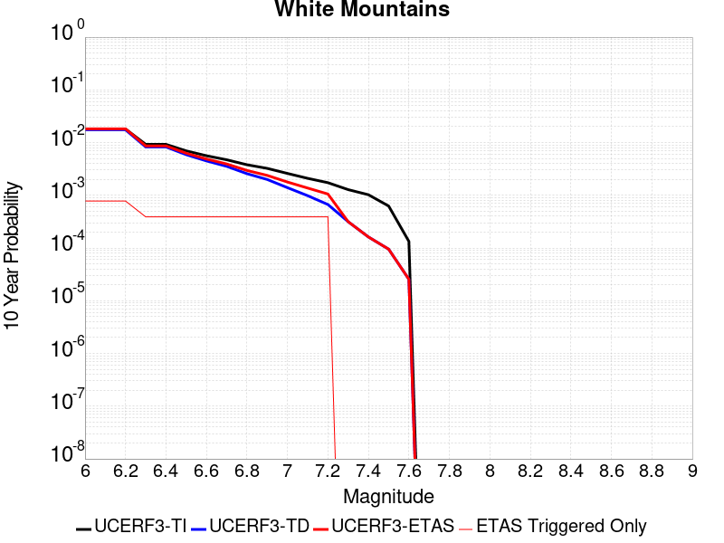 |

| Magnitude | 1 wk TI Prob | 1 wk TD Prob | 1 wk ETAS Prob | 1 wk ETAS/TD Gain | 1 wk ETAS Triggered Only | 1 mo TI Prob | 1 mo TD Prob | 1 mo ETAS Prob | 1 mo ETAS/TD Gain | 1 mo ETAS Triggered Only | 1 yr TI Prob | 1 yr TD Prob | 1 yr ETAS Prob | 1 yr ETAS/TD Gain | 1 yr ETAS Triggered Only | 10 yr TI Prob | 10 yr TD Prob | 10 yr ETAS Prob | 10 yr ETAS/TD Gain | 10 yr ETAS Triggered Only |
|-----|-----|-----|-----|-----|-----|-----|-----|-----|-----|-----|-----|-----|-----|-----|-----|-----|-----|-----|-----|-----|
| 6.0 | 3.503579E-5 | 3.378405E-5 | 6.509072E-5 | 1.92667 | 3.1307725E-5 | 1.5014476E-4 | 1.4478143E-4 | 2.1782222E-4 | 1.5044899 | 7.305136E-5 | 0.0018264796 | 0.0017614096 | 0.0018864198 | 1.0709717 | 1.252309E-4 | 0.018115403 | 0.017486818 | 0.017691886 | 1.011727 | 2.0871816E-4 |
| 6.1 | 3.503579E-5 | 3.378405E-5 | 6.509072E-5 | 1.92667 | 3.1307725E-5 | 1.5014476E-4 | 1.4478143E-4 | 2.1782222E-4 | 1.5044899 | 7.305136E-5 | 0.0018264796 | 0.0017614096 | 0.0018864198 | 1.0709717 | 1.252309E-4 | 0.018115403 | 0.017486818 | 0.017691886 | 1.011727 | 2.0871816E-4 |
| 6.2 | 3.503579E-5 | 3.378405E-5 | 6.509072E-5 | 1.92667 | 3.1307725E-5 | 1.5014476E-4 | 1.4478143E-4 | 2.1782222E-4 | 1.5044899 | 7.305136E-5 | 0.0018264796 | 0.0017614096 | 0.0018864198 | 1.0709717 | 1.252309E-4 | 0.018115403 | 0.017486818 | 0.017691886 | 1.011727 | 2.0871816E-4 |
| 6.3 | 1.7818425E-5 | 1.5916074E-5 | 4.72233E-5 | 2.9670193 | 3.1307725E-5 | 7.636245E-5 | 6.821004E-5 | 1.0995083E-4 | 1.6119448 | 4.174363E-5 | 9.293162E-4 | 8.301551E-4 | 9.135731E-4 | 1.1004847 | 8.348726E-5 | 0.009254395 | 0.008271999 | 0.008385844 | 1.0137627 | 1.1479499E-4 |
| 6.4 | 1.7818425E-5 | 1.5916074E-5 | 4.72233E-5 | 2.9670193 | 3.1307725E-5 | 7.636245E-5 | 6.821004E-5 | 1.0995083E-4 | 1.6119448 | 4.174363E-5 | 9.293162E-4 | 8.301551E-4 | 9.135731E-4 | 1.1004847 | 8.348726E-5 | 0.009254395 | 0.008271999 | 0.008385844 | 1.0137627 | 1.1479499E-4 |
| 6.5 | 1.3397557E-5 | 1.13362685E-5 | 2.1772059E-5 | 1.9205666 | 1.0435908E-5 | 5.741684E-5 | 4.858314E-5 | 6.945394E-5 | 1.4295894 | 2.0871816E-5 | 6.988258E-4 | 5.913462E-4 | 6.434949E-4 | 1.0881864 | 5.217954E-5 | 0.006966323 | 0.005898432 | 0.0059814267 | 1.0140706 | 8.348726E-5 |
| 6.6 | 1.0818695E-5 | 8.625366E-6 | 1.9061185E-5 | 2.2098985 | 1.0435908E-5 | 4.6365014E-5 | 3.6965357E-5 | 4.7400878E-5 | 1.2823055 | 1.0435908E-5 | 5.6434784E-4 | 4.4996463E-4 | 4.916895E-4 | 1.0927292 | 4.174363E-5 | 0.005629168 | 0.004490972 | 0.004532528 | 1.0092533 | 4.174363E-5 |
| 6.7 | 9.067908E-6 | 6.802442E-6 | 1.7238279E-5 | 2.534131 | 1.0435908E-5 | 3.8861883E-5 | 2.9153016E-5 | 3.958862E-5 | 1.3579596 | 1.0435908E-5 | 4.7304068E-4 | 3.5488335E-4 | 3.9661216E-4 | 1.1175846 | 4.174363E-5 | 0.00472035 | 0.0035434833 | 0.003585079 | 1.0117387 | 4.174363E-5 |
| 6.8 | 7.295947E-6 | 4.936391E-6 | 1.5372247E-5 | 3.114066 | 1.0435908E-5 | 3.126797E-5 | 2.1155796E-5 | 3.1591484E-5 | 1.4932779 | 1.0435908E-5 | 3.8062103E-4 | 2.575425E-4 | 2.8884216E-4 | 1.121532 | 3.1307725E-5 | 0.0037996976 | 0.0025725532 | 0.0026037805 | 1.0121386 | 3.1307725E-5 |
| 6.9 | 6.2243444E-6 | 3.832213E-6 | 1.4268081E-5 | 3.723196 | 1.0435908E-5 | 2.6675489E-5 | 1.642367E-5 | 2.6859407E-5 | 1.6354083 | 1.0435908E-5 | 3.2472567E-4 | 1.9994036E-4 | 2.3124184E-4 | 1.156554 | 3.1307725E-5 | 0.0032425157 | 0.0019976576 | 0.0020289028 | 1.0156409 | 3.1307725E-5 |
| 7.0 | 4.9878413E-6 | 2.6795342E-6 | 1.3115414E-5 | 4.894662 | 1.0435908E-5 | 2.1376287E-5 | 1.14836685E-5 | 2.1919457E-5 | 1.9087503 | 1.0435908E-5 | 2.602252E-4 | 1.3980496E-4 | 1.6067387E-4 | 1.1492715 | 2.0871816E-5 | 0.002599207 | 0.0013971963 | 0.001418039 | 1.0149175 | 2.0871816E-5 |
| 7.1 | 4.0252844E-6 | 1.8857575E-6 | 1.8857575E-6 | 1.0 | 0.0 | 1.7251105E-5 | 8.081794E-6 | 8.081794E-6 | 1.0 | 0.0 | 2.1001195E-4 | 9.8391516E-5 | 1.08826396E-4 | 1.1060547 | 1.0435908E-5 | 0.0020981359 | 9.834924E-4 | 9.93918E-4 | 1.0106007 | 1.0435908E-5 |
| 7.2 | 3.3284066E-6 | 1.281964E-6 | 1.281964E-6 | 1.0 | 0.0 | 1.4264522E-5 | 5.494121E-6 | 5.494121E-6 | 1.0 | 0.0 | 1.736567E-4 | 6.688897E-5 | 7.732418E-5 | 1.1560079 | 1.0435908E-5 | 0.0017352107 | 6.6869846E-4 | 6.7912735E-4 | 1.0155959 | 1.0435908E-5 |
| 7.3 | 2.458226E-6 | 6.05722E-7 | 6.05722E-7 | 1.0 | 0.0 | 1.0535211E-5 | 2.5959491E-6 | 2.5959491E-6 | 1.0 | 0.0 | 1.2825865E-4 | 3.1605257E-5 | 3.1605257E-5 | 1.0 | 0.0 | 0.0012818464 | 3.160114E-4 | 3.160114E-4 | 1.0 | 0.0 |
| 7.4 | 1.965953E-6 | 3.1089303E-7 | 3.1089303E-7 | 1.0 | 0.0 | 8.425486E-6 | 1.332398E-6 | 1.332398E-6 | 1.0 | 0.0 | 1.0257547E-4 | 1.6221828E-5 | 1.6221828E-5 | 1.0 | 0.0 | 0.0010252813 | 1.6220656E-4 | 1.6220656E-4 | 1.0 | 0.0 |
| 7.5 | 1.2014192E-6 | 1.8244253E-7 | 1.8244253E-7 | 1.0 | 0.0 | 5.148929E-6 | 7.8189635E-7 | 7.8189635E-7 | 1.0 | 0.0 | 6.2686406E-5 | 9.519547E-6 | 9.519547E-6 | 1.0 | 0.0 | 6.266873E-4 | 9.519148E-5 | 9.519148E-5 | 1.0 | 0.0 |
| 7.6 | 2.5612175E-7 | 4.8946475E-8 | 4.8946475E-8 | 1.0 | 0.0 | 1.0976642E-6 | 2.0977059E-7 | 2.0977059E-7 | 1.0 | 0.0 | 1.3363979E-5 | 2.5539543E-6 | 2.5539543E-6 | 1.0 | 0.0 | 1.3363175E-4 | 2.5539286E-5 | 2.5539286E-5 | 1.0 | 0.0 |

## Mission Creek
*[(top)](#table-of-contents)*

| 1 Week | 1 Month | 1 Year | 10 Year |
|-----|-----|-----|-----|
| 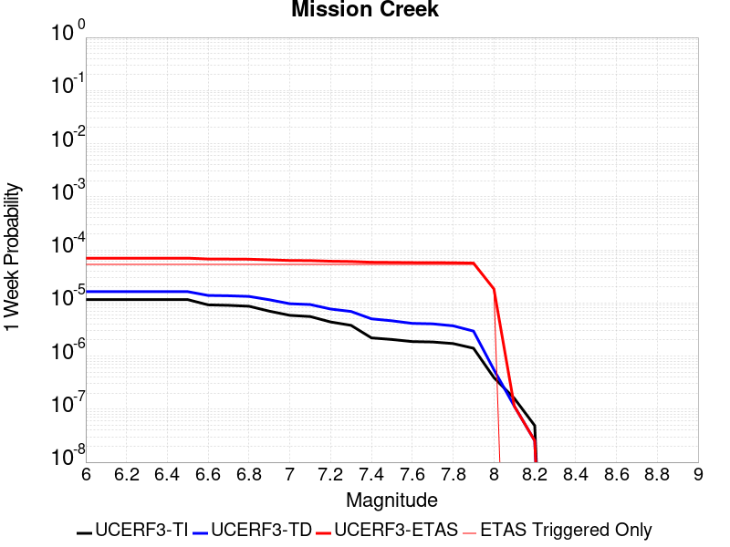 | 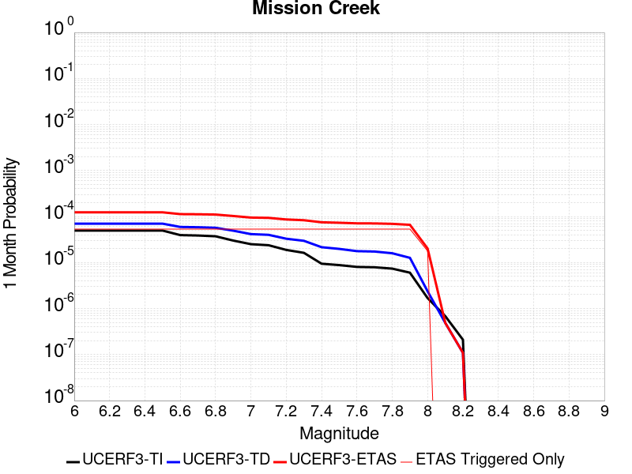 | 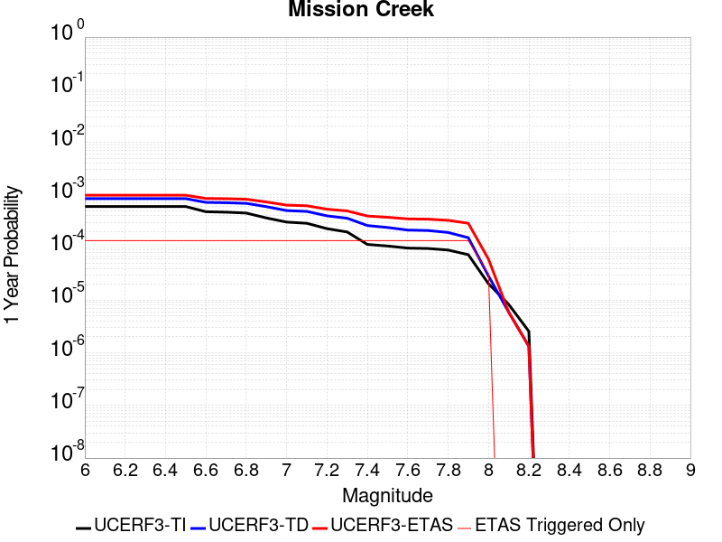 | 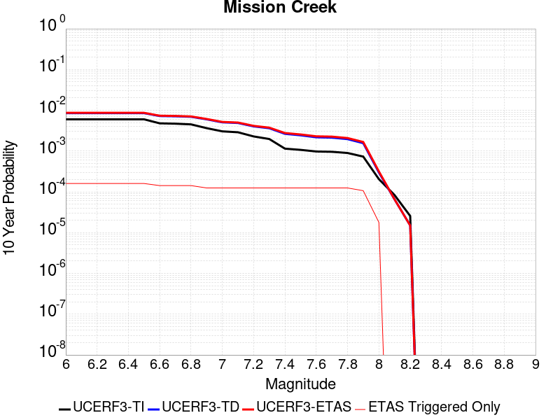 |

| Magnitude | 1 wk TI Prob | 1 wk TD Prob | 1 wk ETAS Prob | 1 wk ETAS/TD Gain | 1 wk ETAS Triggered Only | 1 mo TI Prob | 1 mo TD Prob | 1 mo ETAS Prob | 1 mo ETAS/TD Gain | 1 mo ETAS Triggered Only | 1 yr TI Prob | 1 yr TD Prob | 1 yr ETAS Prob | 1 yr ETAS/TD Gain | 1 yr ETAS Triggered Only | 10 yr TI Prob | 10 yr TD Prob | 10 yr ETAS Prob | 10 yr ETAS/TD Gain | 10 yr ETAS Triggered Only |
|-----|-----|-----|-----|-----|-----|-----|-----|-----|-----|-----|-----|-----|-----|-----|-----|-----|-----|-----|-----|-----|
| 6.0 | 1.1549387E-5 | 1.632237E-5 | 8.937253E-5 | 5.475463 | 7.305136E-5 | 4.9496433E-5 | 6.9951224E-5 | 1.4299747E-4 | 2.0442455 | 7.305136E-5 | 6.0245243E-4 | 8.513384E-4 | 9.868897E-4 | 1.1592214 | 1.356668E-4 | 0.006008218 | 0.008509998 | 0.008706593 | 1.0231017 | 1.9828224E-4 |
| 6.1 | 1.1549387E-5 | 1.632237E-5 | 8.937253E-5 | 5.475463 | 7.305136E-5 | 4.9496433E-5 | 6.9951224E-5 | 1.4299747E-4 | 2.0442455 | 7.305136E-5 | 6.0245243E-4 | 8.513384E-4 | 9.868897E-4 | 1.1592214 | 1.356668E-4 | 0.006008218 | 0.008509998 | 0.008706593 | 1.0231017 | 1.9828224E-4 |
| 6.2 | 1.1549387E-5 | 1.632237E-5 | 8.937253E-5 | 5.475463 | 7.305136E-5 | 4.9496433E-5 | 6.9951224E-5 | 1.4299747E-4 | 2.0442455 | 7.305136E-5 | 6.0245243E-4 | 8.513384E-4 | 9.868897E-4 | 1.1592214 | 1.356668E-4 | 0.006008218 | 0.008509998 | 0.008706593 | 1.0231017 | 1.9828224E-4 |
| 6.3 | 1.1549387E-5 | 1.632237E-5 | 8.937253E-5 | 5.475463 | 7.305136E-5 | 4.9496433E-5 | 6.9951224E-5 | 1.4299747E-4 | 2.0442455 | 7.305136E-5 | 6.0245243E-4 | 8.513384E-4 | 9.868897E-4 | 1.1592214 | 1.356668E-4 | 0.006008218 | 0.008509998 | 0.008706593 | 1.0231017 | 1.9828224E-4 |
| 6.4 | 1.1549387E-5 | 1.632237E-5 | 8.937253E-5 | 5.475463 | 7.305136E-5 | 4.9496433E-5 | 6.9951224E-5 | 1.4299747E-4 | 2.0442455 | 7.305136E-5 | 6.0245243E-4 | 8.513384E-4 | 9.868897E-4 | 1.1592214 | 1.356668E-4 | 0.006008218 | 0.008509998 | 0.008706593 | 1.0231017 | 1.9828224E-4 |
| 6.5 | 1.1549387E-5 | 1.632237E-5 | 8.937253E-5 | 5.475463 | 7.305136E-5 | 4.9496433E-5 | 6.9951224E-5 | 1.4299747E-4 | 2.0442455 | 7.305136E-5 | 6.0245243E-4 | 8.513384E-4 | 9.868897E-4 | 1.1592214 | 1.356668E-4 | 0.006008218 | 0.008509998 | 0.008706593 | 1.0231017 | 1.9828224E-4 |
| 6.6 | 9.202681E-6 | 1.3845646E-5 | 8.689599E-5 | 6.2760515 | 7.305136E-5 | 3.9439463E-5 | 5.9337188E-5 | 1.323842E-4 | 2.2310495 | 7.305136E-5 | 4.800697E-4 | 7.221998E-4 | 8.5776864E-4 | 1.1877165 | 1.356668E-4 | 0.004790339 | 0.0072271815 | 0.0074136704 | 1.0258038 | 1.8784634E-4 |
| 6.7 | 9.019164E-6 | 1.3651316E-5 | 8.670167E-5 | 6.3511586 | 7.305136E-5 | 3.8652986E-5 | 5.8504378E-5 | 1.3155147E-4 | 2.2485745 | 7.305136E-5 | 4.7049852E-4 | 7.12067E-4 | 8.4763725E-4 | 1.1903896 | 1.356668E-4 | 0.004695036 | 0.007126506 | 0.0073130135 | 1.026171 | 1.8784634E-4 |
| 6.8 | 8.673558E-6 | 1.3273427E-5 | 8.632381E-5 | 6.503506 | 7.305136E-5 | 3.717186E-5 | 5.6884925E-5 | 1.2993213E-4 | 2.2841222 | 7.305136E-5 | 4.524734E-4 | 6.923627E-4 | 8.279356E-4 | 1.1958119 | 1.356668E-4 | 0.0045155324 | 0.006930694 | 0.0071172384 | 1.0269157 | 1.8784634E-4 |
| 6.9 | 7.002255E-6 | 1.1477657E-5 | 8.4528176E-5 | 7.3645844 | 7.305136E-5 | 3.000932E-5 | 4.9189068E-5 | 1.2223683E-4 | 2.4850407 | 7.305136E-5 | 3.653022E-4 | 5.9871917E-4 | 7.343048E-4 | 1.2264594 | 1.356668E-4 | 0.0036470229 | 0.005999517 | 0.00616549 | 1.0276643 | 1.6697453E-4 |
| 7.0 | 5.84644E-6 | 9.67498E-6 | 8.272563E-5 | 8.55047 | 7.305136E-5 | 2.5055931E-5 | 4.1463565E-5 | 1.14511895E-4 | 2.7617474 | 7.305136E-5 | 3.0501327E-4 | 5.047066E-4 | 6.403049E-4 | 1.2686677 | 1.356668E-4 | 0.0030459496 | 0.0050638523 | 0.005229981 | 1.0328069 | 1.6697453E-4 |
| 7.1 | 5.54703E-6 | 9.329456E-6 | 8.238013E-5 | 8.830111 | 7.305136E-5 | 2.377277E-5 | 3.9982795E-5 | 1.1303123E-4 | 2.8269966 | 7.305136E-5 | 2.8939504E-4 | 4.8668624E-4 | 6.2228704E-4 | 1.2786205 | 1.356668E-4 | 0.0028901845 | 0.004884446 | 0.005050605 | 1.0340179 | 1.6697453E-4 |
| 7.2 | 4.384709E-6 | 7.68157E-6 | 8.073237E-5 | 10.509877 | 7.305136E-5 | 1.8791474E-5 | 3.2920623E-5 | 1.0596957E-4 | 3.218942 | 7.305136E-5 | 2.2876218E-4 | 4.0073853E-4 | 5.3635094E-4 | 1.3384063 | 1.356668E-4 | 0.0022852682 | 0.004028366 | 0.0041946676 | 1.0412828 | 1.6697453E-4 |
| 7.3 | 3.7888456E-6 | 6.915452E-6 | 7.99663E-5 | 11.563424 | 7.305136E-5 | 1.623781E-5 | 2.9637333E-5 | 1.0268652E-4 | 3.4647694 | 7.305136E-5 | 1.9767738E-4 | 3.6077813E-4 | 4.96396E-4 | 1.3759037 | 1.356668E-4 | 0.0019750162 | 0.0036301152 | 0.0037964836 | 1.04583 | 1.6697453E-4 |
| 7.4 | 2.1982462E-6 | 5.0237763E-6 | 7.8074765E-5 | 15.541051 | 7.305136E-5 | 9.421021E-6 | 2.1530293E-5 | 9.458008E-5 | 4.392884 | 7.305136E-5 | 1.1469489E-4 | 2.621E-4 | 3.9773123E-4 | 1.5174791 | 1.356668E-4 | 0.0011463572 | 0.0026458844 | 0.0028124172 | 1.0629402 | 1.6697453E-4 |
| 7.5 | 2.051923E-6 | 4.615016E-6 | 7.766603E-5 | 16.828985 | 7.305136E-5 | 8.793926E-6 | 1.9778492E-5 | 9.28284E-5 | 4.6934013 | 7.305136E-5 | 1.0706078E-4 | 2.4077666E-4 | 3.764108E-4 | 1.5633193 | 1.356668E-4 | 0.0010700922 | 0.0024335422 | 0.0026001101 | 1.0684468 | 1.6697453E-4 |
| 7.6 | 1.8733427E-6 | 4.1233748E-6 | 7.717443E-5 | 18.716326 | 7.305136E-5 | 8.028587E-6 | 1.7671488E-5 | 9.072155E-5 | 5.1337814 | 7.305136E-5 | 9.774366E-5 | 2.151292E-4 | 3.5076682E-4 | 1.6304938 | 1.356668E-4 | 9.770069E-4 | 0.0021780801 | 0.002344691 | 1.0764943 | 1.6697453E-4 |
| 7.7 | 1.8411953E-6 | 4.0430496E-6 | 7.709411E-5 | 19.068306 | 7.305136E-5 | 7.890813E-6 | 1.732724E-5 | 9.037733E-5 | 5.21591 | 7.305136E-5 | 9.606641E-5 | 2.1093882E-4 | 3.46577E-4 | 1.6430215 | 1.356668E-4 | 9.6024893E-4 | 0.0021363653 | 0.002302983 | 1.0779912 | 1.6697453E-4 |
| 7.8 | 1.7194251E-6 | 3.7104276E-6 | 7.676151E-5 | 20.688051 | 7.305136E-5 | 7.368944E-6 | 1.5901736E-5 | 8.895193E-5 | 5.59385 | 7.305136E-5 | 8.97132E-5 | 1.9358651E-4 | 3.2922704E-4 | 1.7006714 | 1.356668E-4 | 8.967699E-4 | 0.0019623525 | 0.0021289992 | 1.084922 | 1.6697453E-4 |
| 7.9 | 1.4035052E-6 | 2.9500632E-6 | 7.6001204E-5 | 25.762568 | 7.305136E-5 | 6.0150082E-6 | 1.2643067E-5 | 8.56935E-5 | 6.7779045 | 7.305136E-5 | 7.3230265E-5 | 1.5391852E-4 | 2.8956446E-4 | 1.8812839 | 1.356668E-4 | 7.3206134E-4 | 0.0015631086 | 0.0017194026 | 1.0999892 | 1.5653862E-4 |
| 8.0 | 3.9318823E-7 | 5.528522E-7 | 2.1424656E-5 | 38.752953 | 2.0871816E-5 | 1.6850913E-6 | 2.3693647E-6 | 2.3241131E-5 | 9.809014 | 2.0871816E-5 | 2.0515794E-5 | 2.8846638E-5 | 6.015346E-5 | 2.085285 | 3.1307725E-5 | 2.0513899E-4 | 2.9899E-4 | 3.3028834E-4 | 1.1046803 | 3.1307725E-5 |
| 8.1 | 1.596793E-7 | 1.1380002E-7 | 1.1380002E-7 | 1.0 | 0.0 | 6.8433974E-7 | 4.877143E-7 | 4.877143E-7 | 1.0 | 0.0 | 8.331805E-6 | 5.937906E-6 | 5.937906E-6 | 1.0 | 0.0 | 8.331492E-5 | 6.549966E-5 | 6.549966E-5 | 1.0 | 0.0 |
| 8.2 | 4.9003038E-8 | 2.5444924E-8 | 2.5444924E-8 | 1.0 | 0.0 | 2.10013E-7 | 1.0904967E-7 | 1.0904967E-7 | 1.0 | 0.0 | 2.5569052E-6 | 1.327679E-6 | 1.327679E-6 | 1.0 | 0.0 | 2.556876E-5 | 1.495635E-5 | 1.495635E-5 | 1.0 | 0.0 |

## Big Pine (Central)
*[(top)](#table-of-contents)*

| 1 Week | 1 Month | 1 Year | 10 Year |
|-----|-----|-----|-----|
| 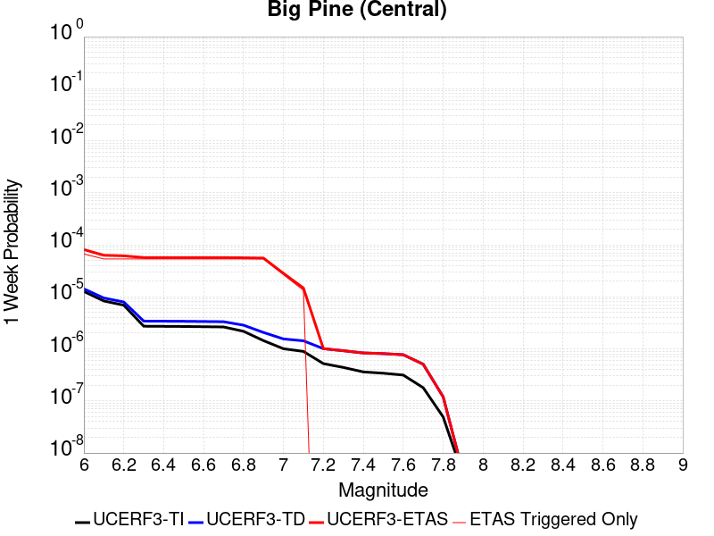 | 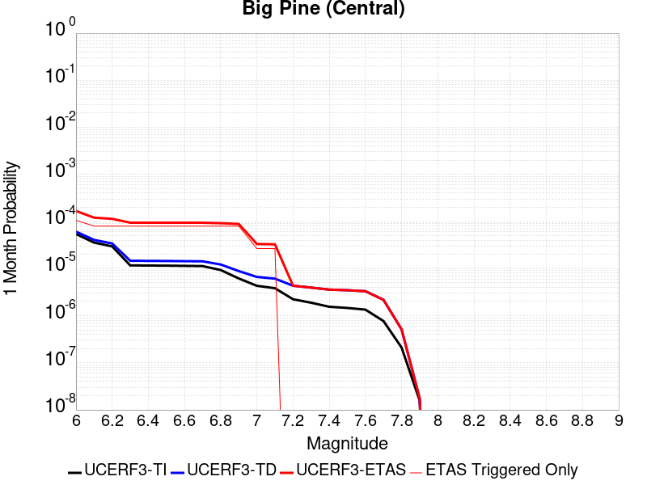 | 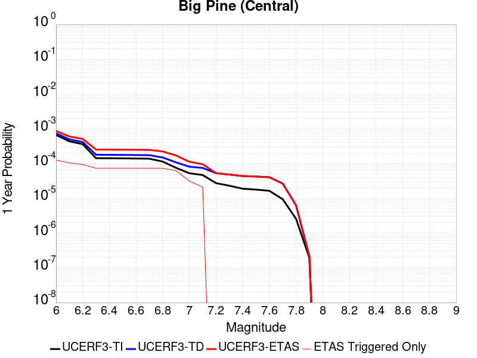 | 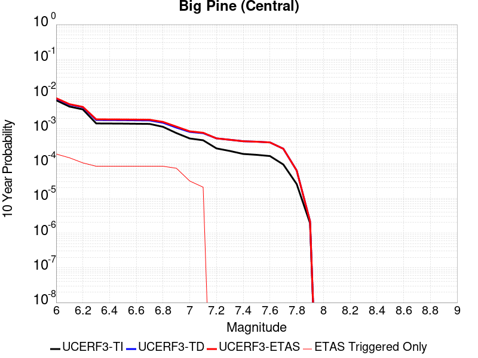 |

| Magnitude | 1 wk TI Prob | 1 wk TD Prob | 1 wk ETAS Prob | 1 wk ETAS/TD Gain | 1 wk ETAS Triggered Only | 1 mo TI Prob | 1 mo TD Prob | 1 mo ETAS Prob | 1 mo ETAS/TD Gain | 1 mo ETAS Triggered Only | 1 yr TI Prob | 1 yr TD Prob | 1 yr ETAS Prob | 1 yr ETAS/TD Gain | 1 yr ETAS Triggered Only | 10 yr TI Prob | 10 yr TD Prob | 10 yr ETAS Prob | 10 yr ETAS/TD Gain | 10 yr ETAS Triggered Only |
|-----|-----|-----|-----|-----|-----|-----|-----|-----|-----|-----|-----|-----|-----|-----|-----|-----|-----|-----|-----|-----|
| 6.0 | 1.2706755E-5 | 1.4250529E-5 | 7.6865086E-5 | 5.393841 | 6.261545E-5 | 5.4456385E-5 | 6.107247E-5 | 1.549899E-4 | 2.5378032 | 9.392317E-5 | 6.628048E-4 | 7.433402E-4 | 8.6847803E-4 | 1.1683452 | 1.252309E-4 | 0.006608314 | 0.0074135666 | 0.0076000206 | 1.0251503 | 1.8784634E-4 |
| 6.1 | 8.342579E-6 | 9.510762E-6 | 6.16898E-5 | 6.4863157 | 5.217954E-5 | 3.5753423E-5 | 4.0759893E-5 | 1.1380827E-4 | 2.7921631 | 7.305136E-5 | 4.3521097E-4 | 4.961604E-4 | 6.004677E-4 | 1.210229 | 1.0435908E-4 | 0.0043435963 | 0.0049540824 | 0.0050994614 | 1.0293453 | 1.4610271E-4 |
| 6.2 | 6.923899E-6 | 7.967147E-6 | 6.014627E-5 | 7.5492854 | 5.217954E-5 | 2.9673516E-5 | 3.4144578E-5 | 1.0719344E-4 | 3.1393986 | 7.305136E-5 | 3.6121515E-4 | 4.156502E-4 | 5.095343E-4 | 1.225873 | 9.392317E-5 | 0.003606286 | 0.0041520367 | 0.0042559626 | 1.02503 | 1.0435908E-4 |
| 6.3 | 2.728396E-6 | 3.4242908E-6 | 5.560365E-5 | 16.238005 | 5.217954E-5 | 1.1693074E-5 | 1.4675454E-5 | 7.728998E-5 | 5.266616 | 6.261545E-5 | 1.4235388E-4 | 1.7865987E-4 | 2.516982E-4 | 1.408812 | 7.305136E-5 | 0.0014226272 | 0.0017866704 | 0.0018700085 | 1.0466443 | 8.348726E-5 |
| 6.4 | 2.7136944E-6 | 3.408584E-6 | 5.5587945E-5 | 16.308222 | 5.217954E-5 | 1.1630066E-5 | 1.4608141E-5 | 7.722267E-5 | 5.286277 | 6.261545E-5 | 1.4158686E-4 | 1.7784047E-4 | 2.5087883E-4 | 1.410696 | 7.305136E-5 | 0.0014149669 | 0.0017784894 | 0.0018618283 | 1.0468593 | 8.348726E-5 |
| 6.5 | 2.6971882E-6 | 3.3909291E-6 | 5.557029E-5 | 16.387924 | 5.217954E-5 | 1.1559327E-5 | 1.45324775E-5 | 7.7147015E-5 | 5.3085933 | 6.261545E-5 | 1.4072572E-4 | 1.7691942E-4 | 2.4995784E-4 | 1.4128344 | 7.305136E-5 | 0.0014063664 | 0.0017692937 | 0.0018526332 | 1.0471033 | 8.348726E-5 |
| 6.6 | 2.669092E-6 | 3.3609497E-6 | 5.5540313E-5 | 16.525185 | 5.217954E-5 | 1.1438916E-5 | 1.4403995E-5 | 7.701854E-5 | 5.3470263 | 6.261545E-5 | 1.3925991E-4 | 1.753554E-4 | 2.4839395E-4 | 1.4165173 | 7.305136E-5 | 0.0013917267 | 0.0017536782 | 0.0018370191 | 1.0475235 | 8.348726E-5 |
| 6.7 | 2.6408059E-6 | 3.3309752E-6 | 5.551034E-5 | 16.66489 | 5.217954E-5 | 1.1317691E-5 | 1.4275535E-5 | 7.6890086E-5 | 5.386144 | 6.261545E-5 | 1.3778417E-4 | 1.7379165E-4 | 2.468303E-4 | 1.4202657 | 7.305136E-5 | 0.0013769877 | 0.0017380653 | 0.0018214073 | 1.0479511 | 8.348726E-5 |
| 6.8 | 2.1786943E-6 | 2.8544325E-6 | 5.5033823E-5 | 19.280127 | 5.217954E-5 | 9.337228E-6 | 1.2233229E-5 | 7.484791E-5 | 6.1184096 | 6.261545E-5 | 1.1367482E-4 | 1.4893012E-4 | 2.219706E-4 | 1.4904345 | 7.305136E-5 | 0.0011361669 | 0.0014897975 | 0.0015731604 | 1.0559559 | 8.348726E-5 |
| 6.9 | 1.4411696E-6 | 2.068499E-6 | 5.4247932E-5 | 26.225746 | 5.217954E-5 | 6.1764263E-6 | 8.864968E-6 | 6.104405E-5 | 6.8859863 | 5.217954E-5 | 7.51954E-5 | 1.079259E-4 | 1.705346E-4 | 1.580108 | 6.261545E-5 | 7.5169955E-4 | 0.0010801847 | 0.0011531571 | 1.0675555 | 7.305136E-5 |
| 7.0 | 1.0073411E-6 | 1.554261E-6 | 2.2426044E-5 | 14.428751 | 2.0871816E-5 | 4.317169E-6 | 6.6611024E-6 | 2.7532778E-5 | 4.1333666 | 2.0871816E-5 | 5.2560266E-5 | 8.1096056E-5 | 1.1240124E-4 | 1.386026 | 3.1307725E-5 | 5.2547833E-4 | 8.1210316E-4 | 8.4338547E-4 | 1.0385201 | 3.1307725E-5 |
| 7.1 | 8.947104E-7 | 1.4302494E-6 | 1.1866142E-5 | 8.296555 | 1.0435908E-5 | 3.834468E-6 | 6.129627E-6 | 1.6565471E-5 | 2.7025251 | 1.0435908E-5 | 4.6683643E-5 | 7.46258E-5 | 9.5496056E-5 | 1.2796655 | 2.0871816E-5 | 4.6673836E-4 | 7.474457E-4 | 7.683019E-4 | 1.0279033 | 2.0871816E-5 |
| 7.2 | 5.215166E-7 | 1.0111678E-6 | 1.0111678E-6 | 1.0 | 0.0 | 2.2350691E-6 | 4.3335694E-6 | 4.3335694E-6 | 1.0 | 0.0 | 2.7211627E-5 | 5.2759973E-5 | 5.2759973E-5 | 1.0 | 0.0 | 2.7208295E-4 | 5.2890263E-4 | 5.2890263E-4 | 1.0 | 0.0 |
| 7.3 | 4.4024807E-7 | 9.219589E-7 | 9.219589E-7 | 1.0 | 0.0 | 1.8867761E-6 | 3.9512465E-6 | 3.9512465E-6 | 1.0 | 0.0 | 2.2971257E-5 | 4.810541E-5 | 4.810541E-5 | 1.0 | 0.0 | 2.2968883E-4 | 4.8237795E-4 | 4.8237795E-4 | 1.0 | 0.0 |
| 7.4 | 3.6130905E-7 | 8.358523E-7 | 8.358523E-7 | 1.0 | 0.0 | 1.5484665E-6 | 3.5822195E-6 | 3.5822195E-6 | 1.0 | 0.0 | 1.8852415E-5 | 4.3612687E-5 | 4.3612687E-5 | 1.0 | 0.0 | 1.8850817E-4 | 4.374597E-4 | 4.374597E-4 | 1.0 | 0.0 |
| 7.5 | 3.408184E-7 | 8.108147E-7 | 8.108147E-7 | 1.0 | 0.0 | 1.4606494E-6 | 3.4749157E-6 | 3.4749157E-6 | 1.0 | 0.0 | 1.7783263E-5 | 4.2306317E-5 | 4.2306317E-5 | 1.0 | 0.0 | 1.778184E-4 | 4.2437963E-4 | 4.2437963E-4 | 1.0 | 0.0 |
| 7.6 | 3.1428627E-7 | 7.7316E-7 | 7.7316E-7 | 1.0 | 0.0 | 1.3469405E-6 | 3.3135389E-6 | 3.3135389E-6 | 1.0 | 0.0 | 1.6398877E-5 | 4.0341627E-5 | 4.0341627E-5 | 1.0 | 0.0 | 1.6397667E-4 | 4.0471106E-4 | 4.0471106E-4 | 1.0 | 0.0 |
| 7.7 | 1.7972785E-7 | 5.077752E-7 | 5.077752E-7 | 1.0 | 0.0 | 7.70262E-7 | 2.1761778E-6 | 2.1761778E-6 | 1.0 | 0.0 | 9.377899E-6 | 2.6494654E-5 | 2.6494654E-5 | 1.0 | 0.0 | 9.377503E-5 | 2.662899E-4 | 2.662899E-4 | 1.0 | 0.0 |
| 7.8 | 4.9230927E-8 | 1.198079E-7 | 1.198079E-7 | 1.0 | 0.0 | 2.1098968E-7 | 5.134623E-7 | 5.134623E-7 | 1.0 | 0.0 | 2.5687964E-6 | 6.2513873E-6 | 6.2513873E-6 | 1.0 | 0.0 | 2.5687666E-5 | 6.295415E-5 | 6.295415E-5 | 1.0 | 0.0 |
| 7.9 | 3.6805972E-9 | 4.105293E-9 | 4.105293E-9 | 1.0 | 0.0 | 1.5773987E-8 | 1.7594115E-8 | 1.7594115E-8 | 1.0 | 0.0 | 1.9204828E-7 | 2.1420831E-7 | 2.1420831E-7 | 1.0 | 0.0 | 1.920481E-6 | 2.1900614E-6 | 2.1900614E-6 | 1.0 | 0.0 |

## Big Pine (East)
*[(top)](#table-of-contents)*

| 1 Week | 1 Month | 1 Year | 10 Year |
|-----|-----|-----|-----|
| 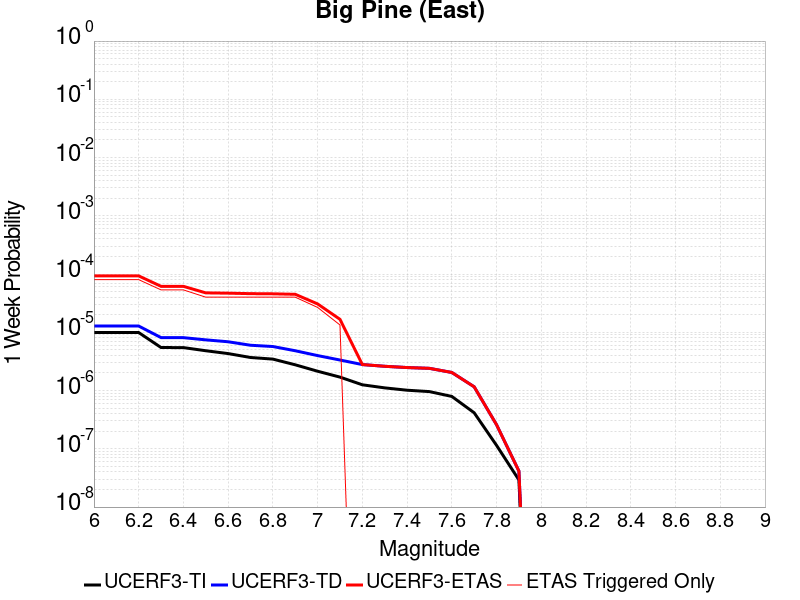 | 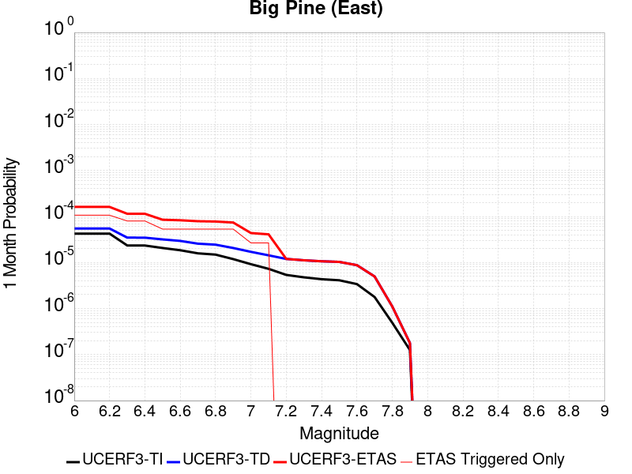 | 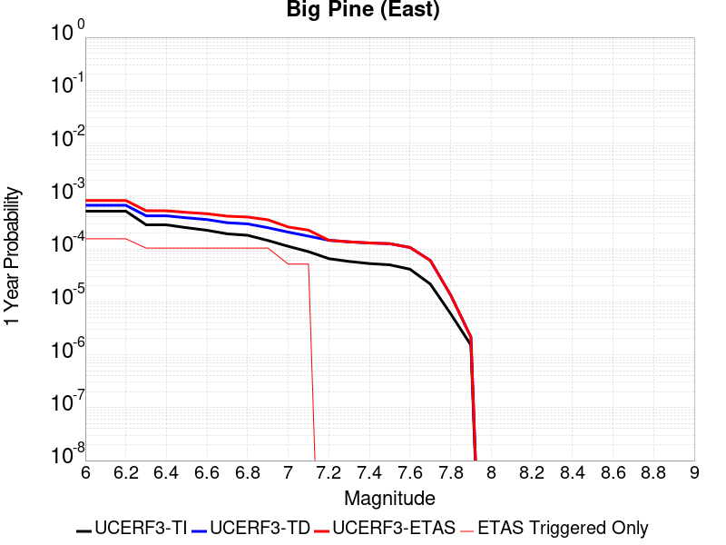 |  |

| Magnitude | 1 wk TI Prob | 1 wk TD Prob | 1 wk ETAS Prob | 1 wk ETAS/TD Gain | 1 wk ETAS Triggered Only | 1 mo TI Prob | 1 mo TD Prob | 1 mo ETAS Prob | 1 mo ETAS/TD Gain | 1 mo ETAS Triggered Only | 1 yr TI Prob | 1 yr TD Prob | 1 yr ETAS Prob | 1 yr ETAS/TD Gain | 1 yr ETAS Triggered Only | 10 yr TI Prob | 10 yr TD Prob | 10 yr ETAS Prob | 10 yr ETAS/TD Gain | 10 yr ETAS Triggered Only |
|-----|-----|-----|-----|-----|-----|-----|-----|-----|-----|-----|-----|-----|-----|-----|-----|-----|-----|-----|-----|-----|
| 6.0 | 9.916913E-6 | 1.2816984E-5 | 8.58674E-5 | 6.699501 | 7.305136E-5 | 4.250036E-5 | 5.49289E-5 | 1.3841157E-4 | 2.5198317 | 8.348726E-5 | 5.173191E-4 | 6.685763E-4 | 7.728656E-4 | 1.1559871 | 1.0435908E-4 | 0.0051611643 | 0.006670441 | 0.006846668 | 1.026419 | 1.7741043E-4 |
| 6.1 | 9.916913E-6 | 1.2816984E-5 | 8.58674E-5 | 6.699501 | 7.305136E-5 | 4.250036E-5 | 5.49289E-5 | 1.3841157E-4 | 2.5198317 | 8.348726E-5 | 5.173191E-4 | 6.685763E-4 | 7.728656E-4 | 1.1559871 | 1.0435908E-4 | 0.0051611643 | 0.006670441 | 0.006846668 | 1.026419 | 1.7741043E-4 |
| 6.2 | 9.916913E-6 | 1.2816984E-5 | 8.58674E-5 | 6.699501 | 7.305136E-5 | 4.250036E-5 | 5.49289E-5 | 1.3841157E-4 | 2.5198317 | 8.348726E-5 | 5.173191E-4 | 6.685763E-4 | 7.728656E-4 | 1.1559871 | 1.0435908E-4 | 0.0051611643 | 0.006670441 | 0.006846668 | 1.026419 | 1.7741043E-4 |
| 6.3 | 5.479711E-6 | 8.112951E-6 | 6.0292066E-5 | 7.4315825 | 5.217954E-5 | 2.3484265E-5 | 3.4769346E-5 | 9.738262E-5 | 2.8008182 | 6.261545E-5 | 2.858834E-4 | 4.2323777E-4 | 5.066897E-4 | 1.197175 | 8.348726E-5 | 0.0028551589 | 0.004227244 | 0.004351945 | 1.0294995 | 1.252309E-4 |
| 6.4 | 5.465009E-6 | 8.097245E-6 | 6.027636E-5 | 7.444058 | 5.217954E-5 | 2.3421257E-5 | 3.4702036E-5 | 9.731531E-5 | 2.8043113 | 6.261545E-5 | 2.851165E-4 | 4.2241855E-4 | 5.0587056E-4 | 1.1975576 | 8.348726E-5 | 0.0028475097 | 0.0042190826 | 0.0043437853 | 1.0295568 | 1.252309E-4 |
| 6.5 | 4.826767E-6 | 7.422301E-6 | 4.9165625E-5 | 6.62404 | 4.174363E-5 | 2.068598E-5 | 3.180949E-5 | 8.398737E-5 | 2.6403244 | 5.217954E-5 | 2.518227E-4 | 3.872145E-4 | 4.6023756E-4 | 1.1885855 | 7.305136E-5 | 0.0025153751 | 0.003868283 | 0.003982634 | 1.0295612 | 1.1479499E-4 |
| 6.6 | 4.3146847E-6 | 6.8822374E-6 | 4.862558E-5 | 7.0653744 | 4.174363E-5 | 1.8491375E-5 | 2.9494982E-5 | 8.167298E-5 | 2.7690465 | 5.217954E-5 | 2.2510924E-4 | 3.590447E-4 | 4.3206982E-4 | 1.2033873 | 7.305136E-5 | 0.0022488134 | 0.0035874986 | 0.0037018817 | 1.0318838 | 1.1479499E-4 |
| 6.7 | 3.6968106E-6 | 5.9954727E-6 | 4.7738853E-5 | 7.962484 | 4.174363E-5 | 1.5843378E-5 | 2.5694639E-5 | 7.7872835E-5 | 3.0307038 | 5.217954E-5 | 1.9287605E-4 | 3.1278885E-4 | 3.8581734E-4 | 1.2334754 | 7.305136E-5 | 0.0019270873 | 0.0031262483 | 0.0032198778 | 1.0299495 | 9.392317E-5 |
| 6.8 | 3.4671132E-6 | 5.702177E-6 | 4.744557E-5 | 8.320606 | 4.174363E-5 | 1.4858972E-5 | 2.4437682E-5 | 7.661594E-5 | 3.1351562 | 5.217954E-5 | 1.8089297E-4 | 2.974896E-4 | 3.7051924E-4 | 1.2454863 | 7.305136E-5 | 0.0018074579 | 0.002973667 | 0.0030673111 | 1.031491 | 9.392317E-5 |
| 6.9 | 2.7686972E-6 | 4.825223E-6 | 4.6568653E-5 | 9.651088 | 4.174363E-5 | 1.1865792E-5 | 2.0679368E-5 | 6.2422136E-5 | 3.0185707 | 4.174363E-5 | 1.4445644E-4 | 2.5174298E-4 | 3.1434264E-4 | 1.2486651 | 6.261545E-5 | 0.0014436257 | 0.0025172636 | 0.0025901312 | 1.0289471 | 7.305136E-5 |
| 7.0 | 2.1472624E-6 | 3.9850406E-6 | 2.4856774E-5 | 6.2375207 | 2.0871816E-5 | 9.20252E-6 | 1.7078637E-5 | 3.7950096E-5 | 2.22208 | 2.0871816E-5 | 1.12034926E-4 | 2.079131E-4 | 2.4964806E-4 | 1.2007327 | 4.174363E-5 | 0.0011197845 | 0.0020798394 | 0.002121496 | 1.0200288 | 4.174363E-5 |
| 7.1 | 1.7018335E-6 | 3.344876E-6 | 1.3780749E-5 | 4.119958 | 1.0435908E-5 | 7.293552E-6 | 1.4335106E-5 | 2.4770865E-5 | 1.7279861 | 1.0435908E-5 | 8.879537E-5 | 1.7451629E-4 | 2.0581855E-4 | 1.1793659 | 3.1307725E-5 | 8.87599E-4 | 0.0017464145 | 0.0017776674 | 1.0178956 | 3.1307725E-5 |
| 7.2 | 1.25603E-6 | 2.794484E-6 | 2.794484E-6 | 1.0 | 0.0 | 5.3829745E-6 | 1.1976307E-5 | 1.1976307E-5 | 1.0 | 0.0 | 6.553574E-5 | 1.4580201E-4 | 1.5623639E-4 | 1.0715655 | 1.0435908E-5 | 6.551642E-4 | 0.001459661 | 0.0014700817 | 1.0071391 | 1.0435908E-5 |
| 7.3 | 1.112297E-6 | 2.610332E-6 | 2.610332E-6 | 1.0 | 0.0 | 4.7669787E-6 | 1.118709E-5 | 1.118709E-5 | 1.0 | 0.0 | 5.803642E-5 | 1.3619453E-4 | 1.4662903E-4 | 1.0766146 | 1.0435908E-5 | 5.802127E-4 | 0.0013635408 | 0.0013739625 | 1.0076431 | 1.0435908E-5 |
| 7.4 | 1.0137181E-6 | 2.4834917E-6 | 2.4834917E-6 | 1.0 | 0.0 | 4.3444993E-6 | 1.0643494E-5 | 1.0643494E-5 | 1.0 | 0.0 | 5.2892992E-5 | 1.2957705E-4 | 1.400116E-4 | 1.0805278 | 1.0435908E-5 | 5.288041E-4 | 0.0012972289 | 0.0013076513 | 1.0080343 | 1.0435908E-5 |
| 7.5 | 9.598608E-7 | 2.4071483E-6 | 2.4071483E-6 | 1.0 | 0.0 | 4.1136827E-6 | 1.031631E-5 | 1.031631E-5 | 1.0 | 0.0 | 5.0082934E-5 | 1.2559404E-4 | 1.3602866E-4 | 1.083082 | 1.0435908E-5 | 5.007165E-4 | 0.0012572526 | 0.0012676754 | 1.0082902 | 1.0435908E-5 |
| 7.6 | 7.929459E-7 | 2.0448588E-6 | 2.0448588E-6 | 1.0 | 0.0 | 3.3983351E-6 | 8.763653E-6 | 8.763653E-6 | 1.0 | 0.0 | 4.1373947E-5 | 1.06692416E-4 | 1.17127216E-4 | 1.0978026 | 1.0435908E-5 | 4.1366243E-4 | 0.0010685222 | 0.001078947 | 1.0097562 | 1.0435908E-5 |
| 7.7 | 4.155788E-7 | 1.1605589E-6 | 1.1605589E-6 | 1.0 | 0.0 | 1.7810507E-6 | 4.9738146E-6 | 4.9738146E-6 | 1.0 | 0.0 | 2.1684076E-5 | 6.0554554E-5 | 7.098983E-5 | 1.1723285 | 1.0435908E-5 | 2.1681961E-4 | 6.0857297E-4 | 6.1900256E-4 | 1.0171378 | 1.0435908E-5 |
| 7.8 | 1.14666925E-7 | 2.592015E-7 | 2.592015E-7 | 1.0 | 0.0 | 4.914296E-7 | 1.1108631E-6 | 1.1108631E-6 | 1.0 | 0.0 | 5.9831386E-6 | 1.3524678E-5 | 2.3960445E-5 | 1.7716092 | 1.0435908E-5 | 5.9829777E-5 | 1.3634123E-4 | 1.4677571E-4 | 1.0765321 | 1.0435908E-5 |
| 7.9 | 2.9231824E-8 | 4.1463963E-8 | 4.1463963E-8 | 1.0 | 0.0 | 1.2527924E-7 | 1.7770269E-7 | 1.7770269E-7 | 1.0 | 0.0 | 1.5252737E-6 | 2.1635283E-6 | 2.1635283E-6 | 1.0 | 0.0 | 1.5252632E-5 | 2.1967755E-5 | 2.1967755E-5 | 1.0 | 0.0 |

## Rose Canyon
*[(top)](#table-of-contents)*

| 1 Week | 1 Month | 1 Year | 10 Year |
|-----|-----|-----|-----|
| 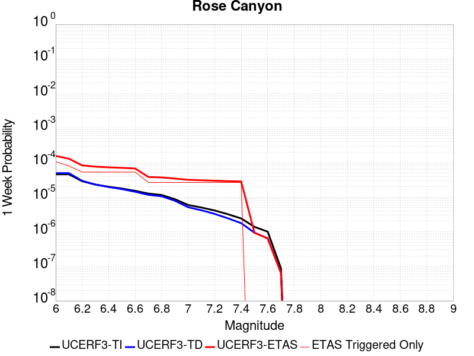 | 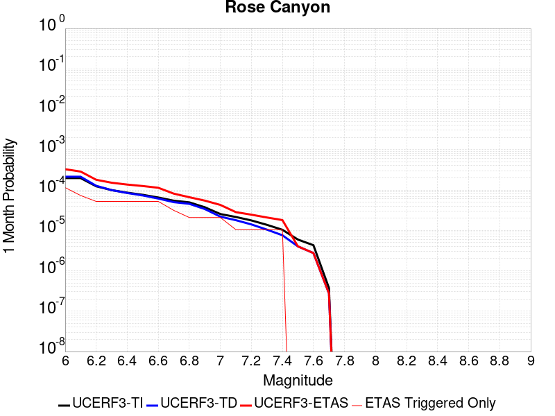 | 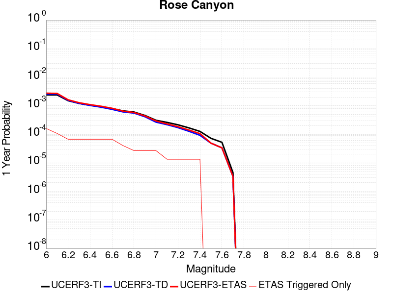 | 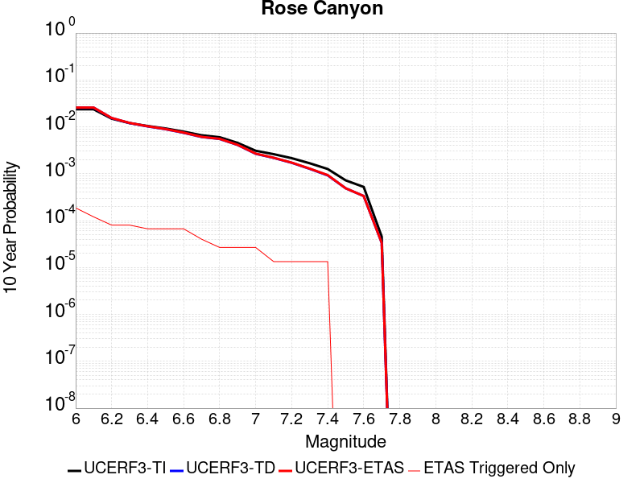 |

| Magnitude | 1 wk TI Prob | 1 wk TD Prob | 1 wk ETAS Prob | 1 wk ETAS/TD Gain | 1 wk ETAS Triggered Only | 1 mo TI Prob | 1 mo TD Prob | 1 mo ETAS Prob | 1 mo ETAS/TD Gain | 1 mo ETAS Triggered Only | 1 yr TI Prob | 1 yr TD Prob | 1 yr ETAS Prob | 1 yr ETAS/TD Gain | 1 yr ETAS Triggered Only | 10 yr TI Prob | 10 yr TD Prob | 10 yr ETAS Prob | 10 yr ETAS/TD Gain | 10 yr ETAS Triggered Only |
|-----|-----|-----|-----|-----|-----|-----|-----|-----|-----|-----|-----|-----|-----|-----|-----|-----|-----|-----|-----|-----|
| 6.0 | 4.5923203E-5 | 4.9714225E-5 | 1.2276195E-4 | 2.4693525 | 7.305136E-5 | 1.9679888E-4 | 2.1304491E-4 | 3.2781545E-4 | 1.5387151 | 1.1479499E-4 | 0.0023933933 | 0.0025909345 | 0.0027262496 | 1.0522264 | 1.356668E-4 | 0.023677798 | 0.02563999 | 0.025802685 | 1.0063453 | 1.6697453E-4 |
| 6.1 | 4.5923203E-5 | 4.9714225E-5 | 1.0189117E-4 | 2.0495374 | 5.217954E-5 | 1.9679888E-4 | 2.1304491E-4 | 2.860807E-4 | 1.3428187 | 7.305136E-5 | 0.0023933933 | 0.0025909345 | 0.0026742055 | 1.0321393 | 8.348726E-5 | 0.023677798 | 0.02563999 | 0.025741674 | 1.0039659 | 1.0435908E-4 |
| 6.2 | 2.8844734E-5 | 2.9668723E-5 | 7.1411116E-5 | 2.4069495 | 4.174363E-5 | 1.2361443E-4 | 1.2714567E-4 | 1.7931857E-4 | 1.4103396 | 5.217954E-5 | 0.0015039665 | 0.0015468939 | 0.0015989927 | 1.0336796 | 5.217954E-5 | 0.0149382865 | 0.015374276 | 0.015446205 | 1.0046785 | 7.305136E-5 |
| 6.3 | 2.3171577E-5 | 2.3161238E-5 | 6.49039E-5 | 2.802264 | 4.174363E-5 | 9.9302975E-5 | 9.9258745E-5 | 1.5143311E-4 | 1.5256399 | 5.217954E-5 | 0.0012083431 | 0.0012078186 | 0.0012599351 | 1.0431492 | 5.217954E-5 | 0.012017938 | 0.012022437 | 0.012094609 | 1.0060031 | 7.305136E-5 |
| 6.4 | 2.0066604E-5 | 1.9667024E-5 | 6.140983E-5 | 3.122477 | 4.174363E-5 | 8.599689E-5 | 8.4284584E-5 | 1.3645973E-4 | 1.6190354 | 5.217954E-5 | 0.0010465092 | 0.0010256917 | 0.0010778178 | 1.0508204 | 5.217954E-5 | 0.010415946 | 0.010217559 | 0.010279534 | 1.0060656 | 6.261545E-5 |
| 6.5 | 1.776989E-5 | 1.7113807E-5 | 5.8856724E-5 | 3.4391367 | 4.174363E-5 | 7.615444E-5 | 7.334287E-5 | 1.2551858E-4 | 1.7113945 | 5.217954E-5 | 9.267859E-4 | 8.925905E-4 | 9.447235E-4 | 1.0584064 | 5.217954E-5 | 0.009229303 | 0.008896211 | 0.008958269 | 1.0069758 | 6.261545E-5 |
| 6.6 | 1.5227364E-5 | 1.433926E-5 | 5.6082292E-5 | 3.9111009 | 4.174363E-5 | 6.52585E-5 | 6.1452556E-5 | 1.13628885E-4 | 1.8490506 | 5.217954E-5 | 7.942326E-4 | 7.479332E-4 | 8.000737E-4 | 1.0697128 | 5.217954E-5 | 0.007914 | 0.007458359 | 0.0075101494 | 1.006944 | 5.217954E-5 |
| 6.7 | 1.2703898E-5 | 1.1673274E-5 | 4.298063E-5 | 3.681969 | 3.1307725E-5 | 5.4444143E-5 | 5.0027378E-5 | 8.1333535E-5 | 1.6257805 | 3.1307725E-5 | 6.626558E-4 | 6.089174E-4 | 6.4020604E-4 | 1.0513841 | 3.1307725E-5 | 0.006606833 | 0.0060750856 | 0.0061062034 | 1.0051222 | 3.1307725E-5 |
| 6.8 | 1.1554917E-5 | 1.0609337E-5 | 3.1480933E-5 | 2.9672854 | 2.0871816E-5 | 4.9520135E-5 | 4.546782E-5 | 6.633868E-5 | 1.459025 | 2.0871816E-5 | 6.0274085E-4 | 5.5343413E-4 | 5.7429436E-4 | 1.0376924 | 2.0871816E-5 | 0.0060110865 | 0.0055225673 | 0.0055433237 | 1.0037585 | 2.0871816E-5 |
| 6.9 | 8.732078E-6 | 7.881357E-6 | 2.875301E-5 | 3.6482306 | 2.0871816E-5 | 3.7422655E-5 | 3.3776825E-5 | 5.4647935E-5 | 1.6179122 | 2.0871816E-5 | 4.5552556E-4 | 4.111582E-4 | 4.3202142E-4 | 1.0507426 | 2.0871816E-5 | 0.0045459294 | 0.0041048084 | 0.0041255946 | 1.0050639 | 2.0871816E-5 |
| 7.0 | 5.9337494E-6 | 5.1074853E-6 | 2.5979194E-5 | 5.086494 | 2.0871816E-5 | 2.5430107E-5 | 2.188904E-5 | 4.27604E-5 | 1.9535073 | 2.0871816E-5 | 3.0956755E-4 | 2.664666E-4 | 2.8733286E-4 | 1.0783072 | 2.0871816E-5 | 0.0030913667 | 0.0026614866 | 0.0026823028 | 1.0078213 | 2.0871816E-5 |
| 7.1 | 5.013409E-6 | 4.1773833E-6 | 1.4613247E-5 | 3.4981823 | 1.0435908E-5 | 2.1485863E-5 | 1.7902948E-5 | 2.8338669E-5 | 1.5829052 | 1.0435908E-5 | 2.6155898E-4 | 2.179467E-4 | 2.2838033E-4 | 1.0478724 | 1.0435908E-5 | 0.0026125133 | 0.0021773411 | 0.0021877545 | 1.0047826 | 1.0435908E-5 |
| 7.2 | 4.120763E-6 | 3.2821383E-6 | 1.3718012E-5 | 4.179596 | 1.0435908E-5 | 1.7660293E-5 | 1.4066231E-5 | 2.4501993E-5 | 1.7419016 | 1.0435908E-5 | 2.1499286E-4 | 1.7124301E-4 | 1.8167713E-4 | 1.0609317 | 1.0435908E-5 | 0.0021478499 | 0.00171112 | 0.001721538 | 1.0060885 | 1.0435908E-5 |
| 7.3 | 3.2081239E-6 | 2.4405372E-6 | 1.28764195E-5 | 5.2760596 | 1.0435908E-5 | 1.374903E-5 | 1.0459404E-5 | 2.0895202E-5 | 1.9977431 | 1.0435908E-5 | 1.6738157E-4 | 1.2733586E-4 | 1.3777045E-4 | 1.0819453 | 1.0435908E-5 | 0.0016725556 | 0.001272636 | 0.0012830587 | 1.0081898 | 1.0435908E-5 |
| 7.4 | 2.4194755E-6 | 1.7680634E-6 | 1.2203953E-5 | 6.902441 | 1.0435908E-5 | 1.0369139E-5 | 7.577393E-6 | 1.8013221E-5 | 2.377232 | 1.0435908E-5 | 1.2623696E-4 | 9.2250906E-5 | 1.0268585E-4 | 1.1131148 | 1.0435908E-5 | 0.0012616527 | 9.2213147E-4 | 9.3255774E-4 | 1.0113068 | 1.0435908E-5 |
| 7.5 | 1.3842889E-6 | 9.3786275E-7 | 9.3786275E-7 | 1.0 | 0.0 | 5.9326535E-6 | 4.019406E-6 | 4.019406E-6 | 1.0 | 0.0 | 7.222766E-5 | 4.8935202E-5 | 4.8935202E-5 | 1.0 | 0.0 | 7.220419E-4 | 4.892478E-4 | 4.892478E-4 | 1.0 | 0.0 |
| 7.6 | 1.0021575E-6 | 6.411463E-7 | 6.411463E-7 | 1.0 | 0.0 | 4.2949537E-6 | 2.7477672E-6 | 2.7477672E-6 | 1.0 | 0.0 | 5.2289808E-5 | 3.3453573E-5 | 3.3453573E-5 | 1.0 | 0.0 | 5.2277505E-4 | 3.344875E-4 | 3.344875E-4 | 1.0 | 0.0 |
| 7.7 | 8.7620116E-8 | 6.4492404E-8 | 6.4492404E-8 | 1.0 | 0.0 | 3.7551473E-7 | 2.76396E-7 | 2.76396E-7 | 1.0 | 0.0 | 4.5718825E-6 | 3.3651165E-6 | 3.3651165E-6 | 1.0 | 0.0 | 4.5717883E-5 | 3.3650686E-5 | 3.3650686E-5 | 1.0 | 0.0 |

## Red Mountain
*[(top)](#table-of-contents)*

| 1 Week | 1 Month | 1 Year | 10 Year |
|-----|-----|-----|-----|
| 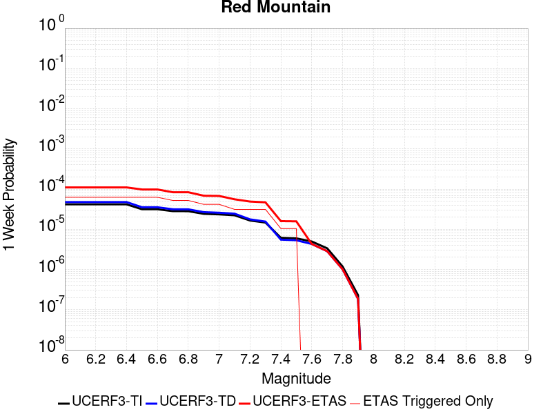 | 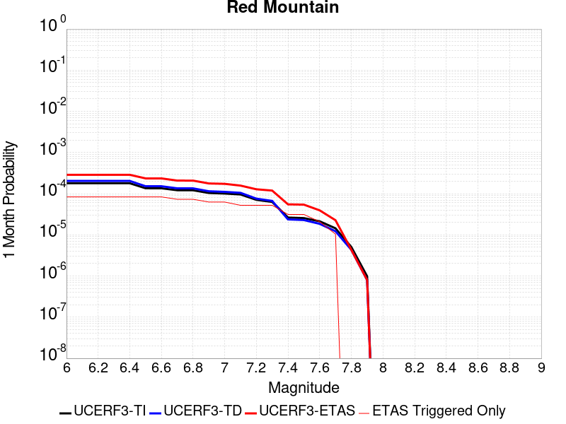 | 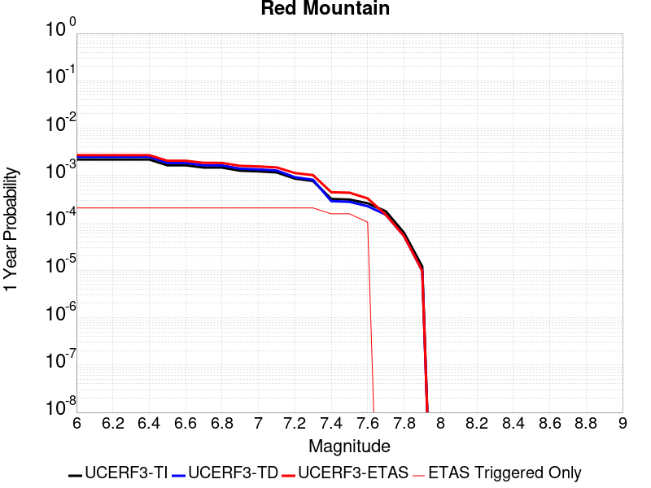 | 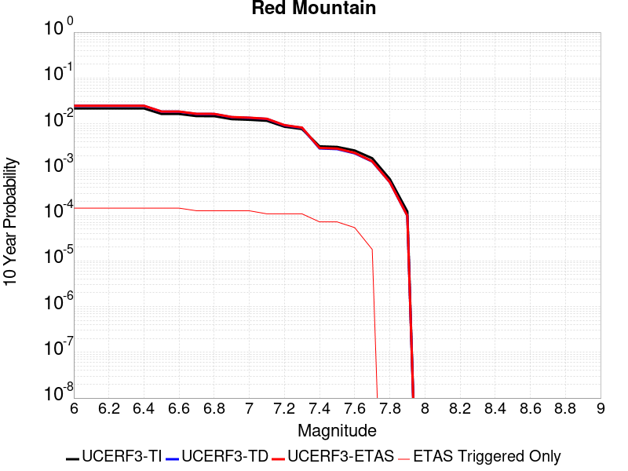 |

| Magnitude | 1 wk TI Prob | 1 wk TD Prob | 1 wk ETAS Prob | 1 wk ETAS/TD Gain | 1 wk ETAS Triggered Only | 1 mo TI Prob | 1 mo TD Prob | 1 mo ETAS Prob | 1 mo ETAS/TD Gain | 1 mo ETAS Triggered Only | 1 yr TI Prob | 1 yr TD Prob | 1 yr ETAS Prob | 1 yr ETAS/TD Gain | 1 yr ETAS Triggered Only | 10 yr TI Prob | 10 yr TD Prob | 10 yr ETAS Prob | 10 yr ETAS/TD Gain | 10 yr ETAS Triggered Only |
|-----|-----|-----|-----|-----|-----|-----|-----|-----|-----|-----|-----|-----|-----|-----|-----|-----|-----|-----|-----|-----|
| 6.0 | 4.1810763E-5 | 4.7589947E-5 | 1.1020241E-4 | 2.315666 | 6.261545E-5 | 1.7917668E-4 | 2.039419E-4 | 2.8741214E-4 | 1.4092844 | 8.348726E-5 | 0.0021792934 | 0.0024803306 | 0.0025740208 | 1.0377733 | 9.392317E-5 | 0.021580452 | 0.024544092 | 0.024666248 | 1.0049771 | 1.252309E-4 |
| 6.1 | 4.1810763E-5 | 4.7589947E-5 | 1.1020241E-4 | 2.315666 | 6.261545E-5 | 1.7917668E-4 | 2.039419E-4 | 2.8741214E-4 | 1.4092844 | 8.348726E-5 | 0.0021792934 | 0.0024803306 | 0.0025740208 | 1.0377733 | 9.392317E-5 | 0.021580452 | 0.024544092 | 0.024666248 | 1.0049771 | 1.252309E-4 |
| 6.2 | 4.1810763E-5 | 4.7589947E-5 | 1.1020241E-4 | 2.315666 | 6.261545E-5 | 1.7917668E-4 | 2.039419E-4 | 2.8741214E-4 | 1.4092844 | 8.348726E-5 | 0.0021792934 | 0.0024803306 | 0.0025740208 | 1.0377733 | 9.392317E-5 | 0.021580452 | 0.024544092 | 0.024666248 | 1.0049771 | 1.252309E-4 |
| 6.3 | 4.1810763E-5 | 4.7589947E-5 | 1.1020241E-4 | 2.315666 | 6.261545E-5 | 1.7917668E-4 | 2.039419E-4 | 2.8741214E-4 | 1.4092844 | 8.348726E-5 | 0.0021792934 | 0.0024803306 | 0.0025740208 | 1.0377733 | 9.392317E-5 | 0.021580452 | 0.024544092 | 0.024666248 | 1.0049771 | 1.252309E-4 |
| 6.4 | 4.1810763E-5 | 4.7589947E-5 | 1.1020241E-4 | 2.315666 | 6.261545E-5 | 1.7917668E-4 | 2.039419E-4 | 2.8741214E-4 | 1.4092844 | 8.348726E-5 | 0.0021792934 | 0.0024803306 | 0.0025740208 | 1.0377733 | 9.392317E-5 | 0.021580452 | 0.024544092 | 0.024666248 | 1.0049771 | 1.252309E-4 |
| 6.5 | 3.154503E-5 | 3.5359728E-5 | 9.797296E-5 | 2.7707498 | 6.261545E-5 | 1.3518598E-4 | 1.5153342E-4 | 2.3500802E-4 | 1.550866 | 8.348726E-5 | 0.0016446467 | 0.0018434501 | 0.0019372002 | 1.0508558 | 9.392317E-5 | 0.01632528 | 0.018291233 | 0.018403929 | 1.0061612 | 1.1479499E-4 |
| 6.6 | 3.1535834E-5 | 3.534911E-5 | 9.7962344E-5 | 2.7712817 | 6.261545E-5 | 1.3514658E-4 | 1.5148791E-4 | 2.3496253E-4 | 1.5510316 | 8.348726E-5 | 0.0016441676 | 0.001842897 | 0.0019366472 | 1.050871 | 9.392317E-5 | 0.01632056 | 0.018285794 | 0.01839849 | 1.006163 | 1.1479499E-4 |
| 6.7 | 2.8267326E-5 | 3.146934E-5 | 8.364724E-5 | 2.658055 | 5.217954E-5 | 1.2114006E-4 | 1.348621E-4 | 2.079036E-4 | 1.5416014 | 7.305136E-5 | 0.0014738824 | 0.0016407946 | 0.0017241448 | 1.0507988 | 8.348726E-5 | 0.014641452 | 0.016295563 | 0.016398221 | 1.0062997 | 1.0435908E-4 |
| 6.8 | 2.8212884E-5 | 3.1407224E-5 | 8.3585124E-5 | 2.6613343 | 5.217954E-5 | 1.20906756E-4 | 1.3459593E-4 | 2.0763745E-4 | 1.5426726 | 7.305136E-5 | 0.0014710457 | 0.0016375587 | 0.0017209093 | 1.0508993 | 8.348726E-5 | 0.014613459 | 0.01626368 | 0.016366342 | 1.0063124 | 1.0435908E-4 |
| 6.9 | 2.4227871E-5 | 2.6706979E-5 | 6.8449495E-5 | 2.5629816 | 4.174363E-5 | 1.03829596E-4 | 1.14453884E-4 | 1.7706216E-4 | 1.5470176 | 6.261545E-5 | 0.0012633923 | 0.0013926612 | 0.0014656108 | 1.0523814 | 7.305136E-5 | 0.012562336 | 0.013847026 | 0.013929357 | 1.0059458 | 8.348726E-5 |
| 7.0 | 2.348524E-5 | 2.5835763E-5 | 6.7578316E-5 | 2.6156888 | 4.174363E-5 | 1.0064714E-4 | 1.1072042E-4 | 1.7332894E-4 | 1.5654649 | 6.261545E-5 | 0.0012246901 | 0.0013472632 | 0.0014202162 | 1.054149 | 7.305136E-5 | 0.012179627 | 0.01339859 | 0.0134809585 | 1.0061475 | 8.348726E-5 |
| 7.1 | 2.2311642E-5 | 2.4462828E-5 | 5.5769786E-5 | 2.2797766 | 3.1307725E-5 | 9.561782E-5 | 1.048369E-4 | 1.5701097E-4 | 1.4976689 | 5.217954E-5 | 0.0011635252 | 0.0012757168 | 0.0013382523 | 1.0490199 | 6.261545E-5 | 0.01157452 | 0.012691451 | 0.012763576 | 1.005683 | 7.305136E-5 |
| 7.2 | 1.6533986E-5 | 1.7670347E-5 | 4.8977516E-5 | 2.771735 | 3.1307725E-5 | 7.085802E-5 | 7.572822E-5 | 1.2790381E-4 | 1.6889848 | 5.217954E-5 | 8.623549E-4 | 9.216645E-4 | 9.842223E-4 | 1.0678748 | 6.261545E-5 | 0.008590161 | 0.009184699 | 0.009257079 | 1.0078806 | 7.305136E-5 |
| 7.3 | 1.4703092E-5 | 1.555952E-5 | 4.6866757E-5 | 3.0120952 | 3.1307725E-5 | 6.301173E-5 | 6.66823E-5 | 1.1885836E-4 | 1.7824574 | 5.217954E-5 | 7.668978E-4 | 8.1161625E-4 | 8.7418087E-4 | 1.0770864 | 6.261545E-5 | 0.0076425658 | 0.008092596 | 0.008165056 | 1.0089539 | 7.305136E-5 |
| 7.4 | 6.1331984E-6 | 5.528872E-6 | 1.5964722E-5 | 2.887519 | 1.0435908E-5 | 2.6284872E-5 | 2.3694953E-5 | 5.5001936E-5 | 2.3212512 | 3.1307725E-5 | 3.199713E-4 | 2.8844838E-4 | 3.3018E-4 | 1.1446761 | 4.174363E-5 | 0.0031951098 | 0.0028807942 | 0.0029224176 | 1.0144485 | 4.174363E-5 |
| 7.5 | 5.954766E-6 | 5.3385015E-6 | 1.5774354E-5 | 2.954828 | 1.0435908E-5 | 2.5520176E-5 | 2.2879094E-5 | 5.41861E-5 | 2.3683674 | 3.1307725E-5 | 3.1066386E-4 | 2.785179E-4 | 3.202499E-4 | 1.149836 | 4.174363E-5 | 0.003102299 | 0.0027817423 | 0.0028233698 | 1.0149646 | 4.174363E-5 |
| 7.6 | 4.9726646E-6 | 4.315295E-6 | 4.315295E-6 | 1.0 | 0.0 | 2.1311245E-5 | 1.8493993E-5 | 3.9365423E-5 | 2.128552 | 2.0871816E-5 | 2.5943352E-4 | 2.2514143E-4 | 2.564421E-4 | 1.1390268 | 3.1307725E-5 | 0.0025913084 | 0.002249168 | 0.0022804053 | 1.0138884 | 3.1307725E-5 |
| 7.7 | 3.3613894E-6 | 2.8526642E-6 | 2.8526642E-6 | 1.0 | 0.0 | 1.4405875E-5 | 1.2225649E-5 | 2.2661428E-5 | 1.8535973 | 1.0435908E-5 | 1.7537741E-4 | 1.4883737E-4 | 1.5927172E-4 | 1.0701058 | 1.0435908E-5 | 0.0017523908 | 0.0014874031 | 0.0014978235 | 1.0070058 | 1.0435908E-5 |
| 7.8 | 1.1828961E-6 | 1.0122756E-6 | 1.0122756E-6 | 1.0 | 0.0 | 5.069545E-6 | 4.338317E-6 | 4.338317E-6 | 1.0 | 0.0 | 6.171996E-5 | 5.281776E-5 | 5.281776E-5 | 1.0 | 0.0 | 6.170282E-4 | 5.2805495E-4 | 5.2805495E-4 | 1.0 | 0.0 |
| 7.9 | 2.2967266E-7 | 1.8618952E-7 | 1.8618952E-7 | 1.0 | 0.0 | 9.843111E-7 | 7.9795484E-7 | 7.9795484E-7 | 1.0 | 0.0 | 1.19839215E-5 | 9.7150605E-6 | 9.7150605E-6 | 1.0 | 0.0 | 1.1983275E-4 | 9.714664E-5 | 9.714664E-5 | 1.0 | 0.0 |

## Kern Canyon (South Kern) 2011
*[(top)](#table-of-contents)*

| 1 Week | 1 Month | 1 Year | 10 Year |
|-----|-----|-----|-----|
| 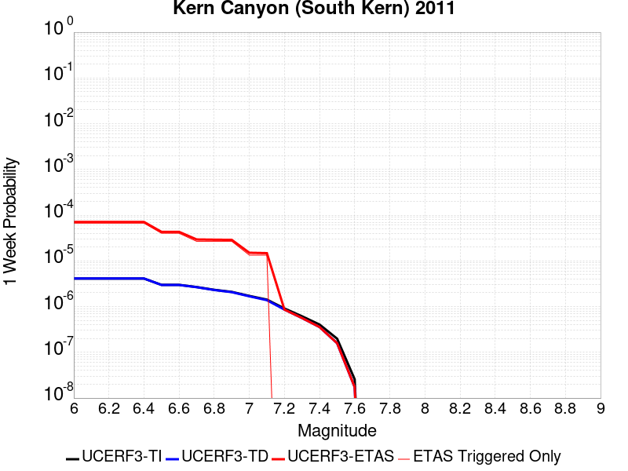 | 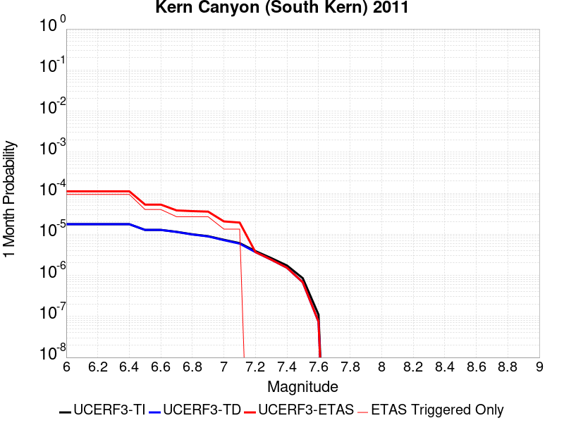 | 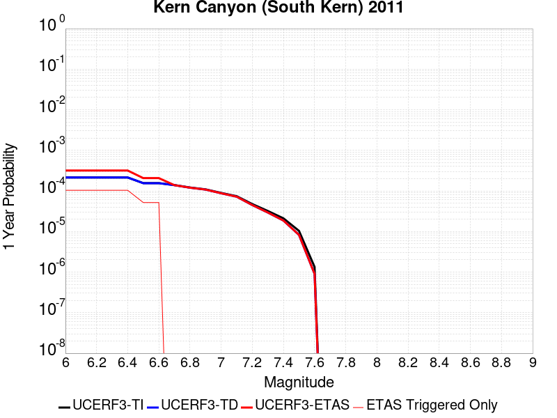 | 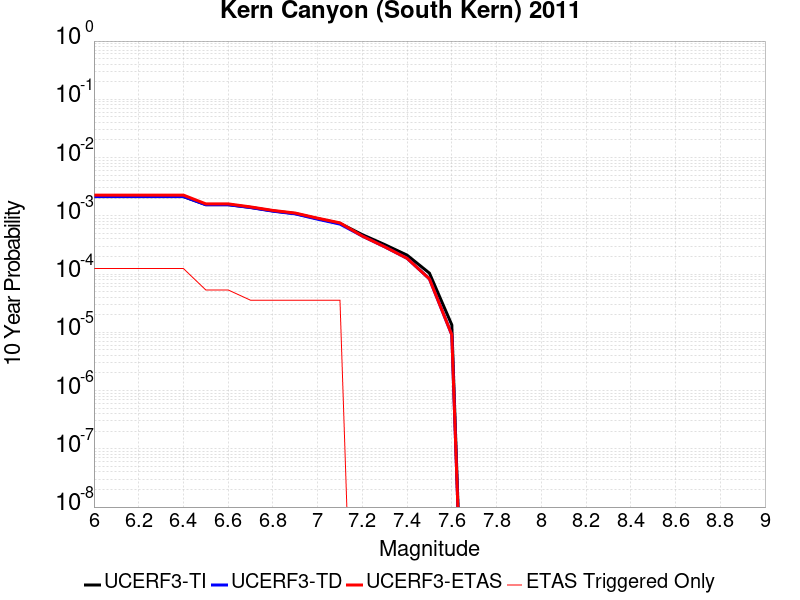 |

| Magnitude | 1 wk TI Prob | 1 wk TD Prob | 1 wk ETAS Prob | 1 wk ETAS/TD Gain | 1 wk ETAS Triggered Only | 1 mo TI Prob | 1 mo TD Prob | 1 mo ETAS Prob | 1 mo ETAS/TD Gain | 1 mo ETAS Triggered Only | 1 yr TI Prob | 1 yr TD Prob | 1 yr ETAS Prob | 1 yr ETAS/TD Gain | 1 yr ETAS Triggered Only | 10 yr TI Prob | 10 yr TD Prob | 10 yr ETAS Prob | 10 yr ETAS/TD Gain | 10 yr ETAS Triggered Only |
|-----|-----|-----|-----|-----|-----|-----|-----|-----|-----|-----|-----|-----|-----|-----|-----|-----|-----|-----|-----|-----|
| 6.0 | 4.105075E-6 | 4.1137264E-6 | 6.672891E-5 | 16.221039 | 6.261545E-5 | 1.7593058E-5 | 1.763014E-5 | 1.1155166E-4 | 6.3273263 | 9.392317E-5 | 2.1417443E-4 | 2.1462646E-4 | 3.5026413E-4 | 1.6319709 | 1.356668E-4 | 0.0021396813 | 0.0021442557 | 0.0023004587 | 1.0728471 | 1.5653862E-4 |
| 6.1 | 4.105075E-6 | 4.1137264E-6 | 6.672891E-5 | 16.221039 | 6.261545E-5 | 1.7593058E-5 | 1.763014E-5 | 1.1155166E-4 | 6.3273263 | 9.392317E-5 | 2.1417443E-4 | 2.1462646E-4 | 3.5026413E-4 | 1.6319709 | 1.356668E-4 | 0.0021396813 | 0.0021442557 | 0.0023004587 | 1.0728471 | 1.5653862E-4 |
| 6.2 | 4.105075E-6 | 4.1137264E-6 | 6.672891E-5 | 16.221039 | 6.261545E-5 | 1.7593058E-5 | 1.763014E-5 | 1.1155166E-4 | 6.3273263 | 9.392317E-5 | 2.1417443E-4 | 2.1462646E-4 | 3.5026413E-4 | 1.6319709 | 1.356668E-4 | 0.0021396813 | 0.0021442557 | 0.0023004587 | 1.0728471 | 1.5653862E-4 |
| 6.3 | 4.105075E-6 | 4.1137264E-6 | 6.672891E-5 | 16.221039 | 6.261545E-5 | 1.7593058E-5 | 1.763014E-5 | 1.1155166E-4 | 6.3273263 | 9.392317E-5 | 2.1417443E-4 | 2.1462646E-4 | 3.5026413E-4 | 1.6319709 | 1.356668E-4 | 0.0021396813 | 0.0021442557 | 0.0023004587 | 1.0728471 | 1.5653862E-4 |
| 6.4 | 4.105075E-6 | 4.1137264E-6 | 6.672891E-5 | 16.221039 | 6.261545E-5 | 1.7593058E-5 | 1.763014E-5 | 1.1155166E-4 | 6.3273263 | 9.392317E-5 | 2.1417443E-4 | 2.1462646E-4 | 3.5026413E-4 | 1.6319709 | 1.356668E-4 | 0.0021396813 | 0.0021442557 | 0.0023004587 | 1.0728471 | 1.5653862E-4 |
| 6.5 | 2.9849807E-6 | 2.9731548E-6 | 3.4280783E-5 | 11.530105 | 3.1307725E-5 | 1.2792712E-5 | 1.274203E-5 | 4.4049353E-5 | 3.4570122 | 3.1307725E-5 | 1.5574014E-4 | 1.5512333E-4 | 2.1772906E-4 | 1.4035869 | 6.261545E-5 | 0.0015563103 | 0.0015501656 | 0.0016335235 | 1.0537735 | 8.348726E-5 |
| 6.6 | 2.9849807E-6 | 2.9731548E-6 | 3.4280783E-5 | 11.530105 | 3.1307725E-5 | 1.2792712E-5 | 1.274203E-5 | 4.4049353E-5 | 3.4570122 | 3.1307725E-5 | 1.5574014E-4 | 1.5512333E-4 | 2.1772906E-4 | 1.4035869 | 6.261545E-5 | 0.0015563103 | 0.0015501656 | 0.0016335235 | 1.0537735 | 8.348726E-5 |
| 6.7 | 2.6756725E-6 | 2.6582206E-6 | 2.3529981E-5 | 8.851778 | 2.0871816E-5 | 1.1467117E-5 | 1.1392325E-5 | 3.2263903E-5 | 2.8320735 | 2.0871816E-5 | 1.396032E-4 | 1.3869285E-4 | 1.8043068E-4 | 1.3009373 | 4.174363E-5 | 0.0013951553 | 0.0013860738 | 0.0014486024 | 1.045112 | 6.261545E-5 |
| 6.8 | 2.3283721E-6 | 2.3047787E-6 | 2.3176546E-5 | 10.055866 | 2.0871816E-5 | 9.9787E-6 | 9.877586E-6 | 3.0749197E-5 | 3.1130273 | 2.0871816E-5 | 1.214839E-4 | 1.20253055E-4 | 1.6199166E-4 | 1.3470899 | 4.174363E-5 | 0.001214175 | 0.0012018873 | 0.0012644274 | 1.052035 | 6.261545E-5 |
| 6.9 | 2.0972677E-6 | 2.0696411E-6 | 2.2941414E-5 | 11.08473 | 2.0871816E-5 | 8.988259E-6 | 8.869861E-6 | 2.9741492E-5 | 3.3530958 | 2.0871816E-5 | 1.0942656E-4 | 1.0798526E-4 | 1.4972438E-4 | 1.3865261 | 4.174363E-5 | 0.0010937268 | 0.0010793337 | 0.0011418816 | 1.0579505 | 6.261545E-5 |
| 7.0 | 1.7132242E-6 | 1.6787036E-6 | 1.2114594E-5 | 7.2166367 | 1.0435908E-5 | 7.3423685E-6 | 7.194424E-6 | 1.7630256E-5 | 2.4505446 | 1.0435908E-5 | 8.938967E-5 | 8.758863E-5 | 1.0845862E-4 | 1.2382728 | 2.0871816E-5 | 8.935372E-4 | 8.7554497E-4 | 9.0682524E-4 | 1.0357267 | 3.1307725E-5 |
| 7.1 | 1.4215541E-6 | 1.3815752E-6 | 1.18174685E-5 | 8.553619 | 1.0435908E-5 | 6.0923603E-6 | 5.9210233E-6 | 1.635687E-5 | 2.7625072 | 1.0435908E-5 | 7.417196E-5 | 7.20861E-5 | 9.295641E-5 | 1.2895192 | 2.0871816E-5 | 7.414721E-4 | 7.206299E-4 | 7.4148667E-4 | 1.0289425 | 2.0871816E-5 |
| 7.2 | 9.097853E-7 | 8.6037755E-7 | 8.6037755E-7 | 1.0 | 0.0 | 3.899074E-6 | 3.6873273E-6 | 3.6873273E-6 | 1.0 | 0.0 | 4.7470192E-5 | 4.4892295E-5 | 4.4892295E-5 | 1.0 | 0.0 | 4.7460053E-4 | 4.4883334E-4 | 4.4883334E-4 | 1.0 | 0.0 |
| 7.3 | 6.144169E-7 | 5.628206E-7 | 5.628206E-7 | 1.0 | 0.0 | 2.6332125E-6 | 2.4120861E-6 | 2.4120861E-6 | 1.0 | 0.0 | 3.205889E-5 | 2.9366758E-5 | 2.9366758E-5 | 1.0 | 0.0 | 3.2054266E-4 | 2.936293E-4 | 2.936293E-4 | 1.0 | 0.0 |
| 7.4 | 4.049844E-7 | 3.5728314E-7 | 3.5728314E-7 | 1.0 | 0.0 | 1.7356463E-6 | 1.5312125E-6 | 1.5312125E-6 | 1.0 | 0.0 | 2.1131287E-5 | 1.8642357E-5 | 1.8642357E-5 | 1.0 | 0.0 | 2.1129279E-4 | 1.8640817E-4 | 1.8640817E-4 | 1.0 | 0.0 |
| 7.5 | 1.9871162E-7 | 1.583044E-7 | 1.583044E-7 | 1.0 | 0.0 | 8.5162094E-7 | 6.7844724E-7 | 6.7844724E-7 | 1.0 | 0.0 | 1.0368436E-5 | 8.260065E-6 | 8.260065E-6 | 1.0 | 0.0 | 1.0367952E-4 | 8.259767E-5 | 8.259767E-5 | 1.0 | 0.0 |
| 7.6 | 2.572245E-8 | 1.7352555E-8 | 1.7352555E-8 | 1.0 | 0.0 | 1.10239064E-7 | 7.436809E-8 | 7.436809E-8 | 1.0 | 0.0 | 1.3421597E-6 | 9.054312E-7 | 9.054312E-7 | 1.0 | 0.0 | 1.3421517E-5 | 9.05428E-6 | 9.05428E-6 | 1.0 | 0.0 |

## Cleghorn Lake
*[(top)](#table-of-contents)*

| 1 Week | 1 Month | 1 Year | 10 Year |
|-----|-----|-----|-----|
| 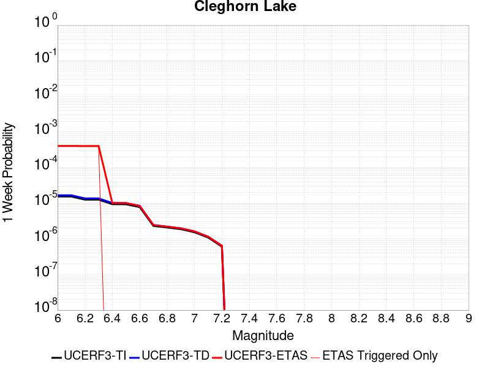 | 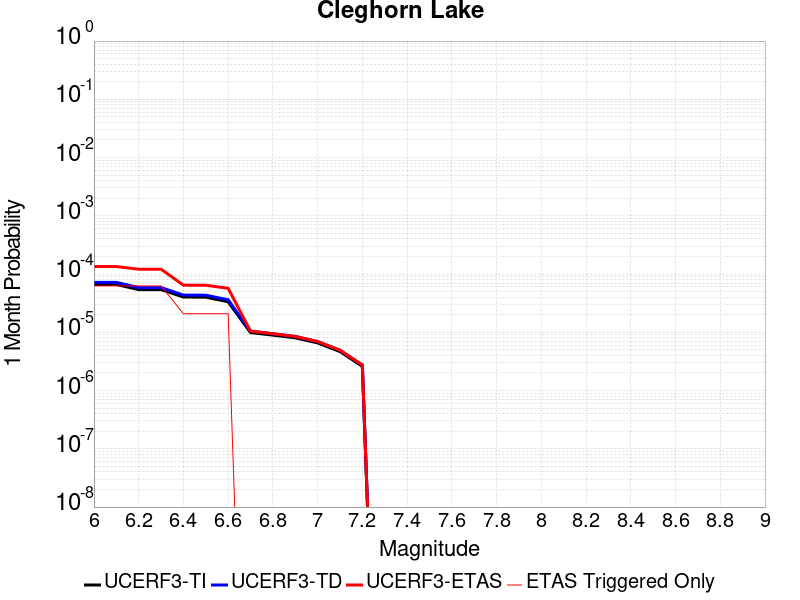 | 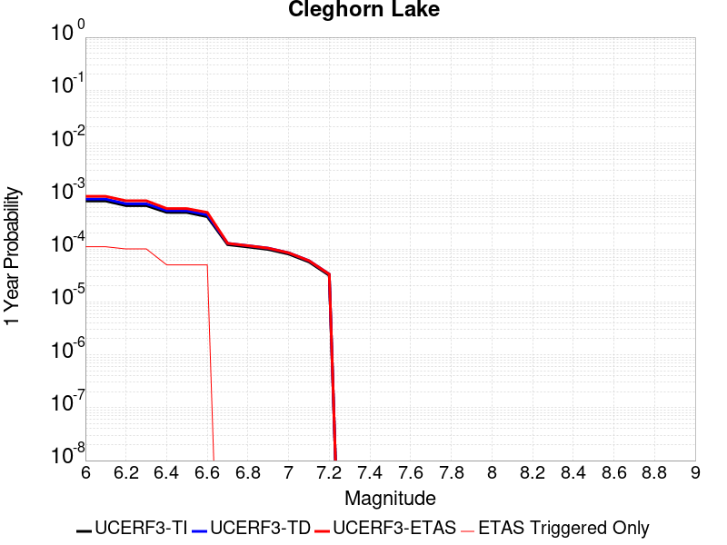 | 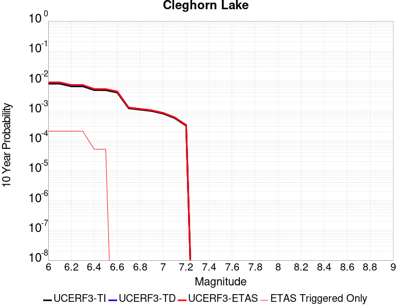 |

| Magnitude | 1 wk TI Prob | 1 wk TD Prob | 1 wk ETAS Prob | 1 wk ETAS/TD Gain | 1 wk ETAS Triggered Only | 1 mo TI Prob | 1 mo TD Prob | 1 mo ETAS Prob | 1 mo ETAS/TD Gain | 1 mo ETAS Triggered Only | 1 yr TI Prob | 1 yr TD Prob | 1 yr ETAS Prob | 1 yr ETAS/TD Gain | 1 yr ETAS Triggered Only | 10 yr TI Prob | 10 yr TD Prob | 10 yr ETAS Prob | 10 yr ETAS/TD Gain | 10 yr ETAS Triggered Only |
|-----|-----|-----|-----|-----|-----|-----|-----|-----|-----|-----|-----|-----|-----|-----|-----|-----|-----|-----|-----|-----|
| 6.0 | 1.5467183E-5 | 1.6794203E-5 | 5.8537134E-5 | 3.485556 | 4.174363E-5 | 6.6286244E-5 | 7.197348E-5 | 1.3458442E-4 | 1.8699168 | 6.261545E-5 | 8.067362E-4 | 8.759797E-4 | 9.802474E-4 | 1.1190298 | 1.0435908E-4 | 0.008038137 | 0.008730696 | 0.008875523 | 1.0165882 | 1.4610271E-4 |
| 6.1 | 1.5467183E-5 | 1.6794203E-5 | 5.8537134E-5 | 3.485556 | 4.174363E-5 | 6.6286244E-5 | 7.197348E-5 | 1.3458442E-4 | 1.8699168 | 6.261545E-5 | 8.067362E-4 | 8.759797E-4 | 9.802474E-4 | 1.1190298 | 1.0435908E-4 | 0.008038137 | 0.008730696 | 0.008875523 | 1.0165882 | 1.4610271E-4 |
| 6.2 | 1.2624631E-5 | 1.3681544E-5 | 5.5424603E-5 | 4.0510488 | 4.174363E-5 | 5.410444E-5 | 5.863415E-5 | 1.21245925E-4 | 2.0678382 | 6.261545E-5 | 6.585225E-4 | 7.1368564E-4 | 8.075418E-4 | 1.1315091 | 9.392317E-5 | 0.0065657445 | 0.0071187317 | 0.0072637945 | 1.0203776 | 1.4610271E-4 |
| 6.3 | 1.2624631E-5 | 1.3681544E-5 | 5.5424603E-5 | 4.0510488 | 4.174363E-5 | 5.410444E-5 | 5.863415E-5 | 1.21245925E-4 | 2.0678382 | 6.261545E-5 | 6.585225E-4 | 7.1368564E-4 | 8.075418E-4 | 1.1315091 | 9.392317E-5 | 0.0065657445 | 0.0071187317 | 0.0072637945 | 1.0203776 | 1.4610271E-4 |
| 6.4 | 9.417684E-6 | 1.0170118E-5 | 3.104172E-5 | 3.052248 | 2.0871816E-5 | 4.036088E-5 | 4.3585722E-5 | 6.4456624E-5 | 1.4788473 | 2.0871816E-5 | 4.912829E-4 | 5.3056807E-4 | 5.722895E-4 | 1.0786355 | 4.174363E-5 | 0.004901982 | 0.005297049 | 0.005380094 | 1.0156776 | 8.348726E-5 |
| 6.5 | 9.368219E-6 | 1.0117545E-5 | 3.0989147E-5 | 3.0629122 | 2.0871816E-5 | 4.014889E-5 | 4.3360415E-5 | 6.4231324E-5 | 1.4813356 | 2.0871816E-5 | 4.8870314E-4 | 5.2782625E-4 | 5.695479E-4 | 1.0790442 | 4.174363E-5 | 0.004876298 | 0.0052697617 | 0.0053528086 | 1.0157592 | 8.348726E-5 |
| 6.6 | 7.803798E-6 | 8.441831E-6 | 2.931347E-5 | 3.4724066 | 2.0871816E-5 | 3.3444423E-5 | 3.6179E-5 | 5.705006E-5 | 1.5768833 | 2.0871816E-5 | 4.0710976E-4 | 4.4043022E-4 | 4.8215545E-4 | 1.0947375 | 4.174363E-5 | 0.0040636472 | 0.0043994905 | 0.0044618305 | 1.0141698 | 6.261545E-5 |
| 6.7 | 2.3108669E-6 | 2.4438336E-6 | 2.4438336E-6 | 1.0 | 0.0 | 9.903678E-6 | 1.0473532E-5 | 1.0473532E-5 | 1.0 | 0.0 | 1.205706E-4 | 1.2750797E-4 | 1.2750797E-4 | 1.0 | 0.0 | 0.001205052 | 0.0012743667 | 0.0012847894 | 1.0081787 | 1.0435908E-5 |
| 6.8 | 2.0882828E-6 | 2.2062823E-6 | 2.2062823E-6 | 1.0 | 0.0 | 8.949753E-6 | 9.455462E-6 | 9.455462E-6 | 1.0 | 0.0 | 1.08957785E-4 | 1.1511434E-4 | 1.1511434E-4 | 1.0 | 0.0 | 0.0010890438 | 0.0011505639 | 0.0011609879 | 1.0090598 | 1.0435908E-5 |
| 6.9 | 1.876935E-6 | 1.981051E-6 | 1.981051E-6 | 1.0 | 0.0 | 8.043982E-6 | 8.490192E-6 | 8.490192E-6 | 1.0 | 0.0 | 9.7931086E-5 | 1.03363345E-4 | 1.03363345E-4 | 1.0 | 0.0 | 9.788794E-4 | 0.0010331686 | 0.0010435937 | 1.0100905 | 1.0435908E-5 |
| 7.0 | 1.5357559E-6 | 1.6202807E-6 | 1.6202807E-6 | 1.0 | 0.0 | 6.5817944E-6 | 6.9440425E-6 | 6.9440425E-6 | 1.0 | 0.0 | 8.01304E-5 | 8.454057E-5 | 8.454057E-5 | 1.0 | 0.0 | 8.010151E-4 | 8.450965E-4 | 8.5552357E-4 | 1.0123384 | 1.0435908E-5 |
| 7.1 | 1.0905424E-6 | 1.1497619E-6 | 1.1497619E-6 | 1.0 | 0.0 | 4.6737446E-6 | 4.9275427E-6 | 4.9275427E-6 | 1.0 | 0.0 | 5.6901354E-5 | 5.999128E-5 | 5.999128E-5 | 1.0 | 0.0 | 5.6886784E-4 | 5.997606E-4 | 5.997606E-4 | 1.0 | 0.0 |
| 7.2 | 6.06668E-7 | 6.387277E-7 | 6.387277E-7 | 1.0 | 0.0 | 2.600003E-6 | 2.7374022E-6 | 2.7374022E-6 | 1.0 | 0.0 | 3.1654577E-5 | 3.3327433E-5 | 3.3327433E-5 | 1.0 | 0.0 | 3.1650066E-4 | 3.3323118E-4 | 3.3323118E-4 | 1.0 | 0.0 |

## Cleghorn Pass
*[(top)](#table-of-contents)*

| 1 Week | 1 Month | 1 Year | 10 Year |
|-----|-----|-----|-----|
| 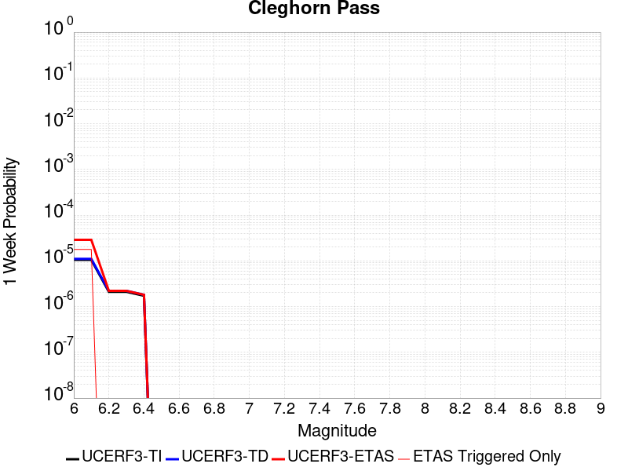 | 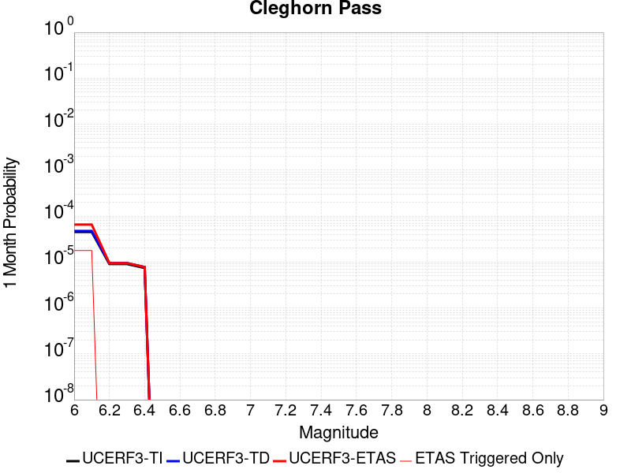 | 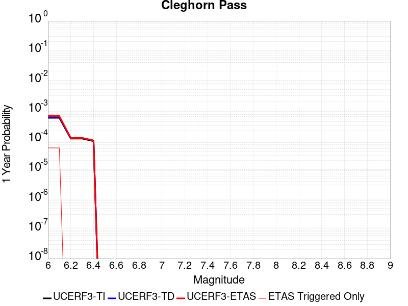 | 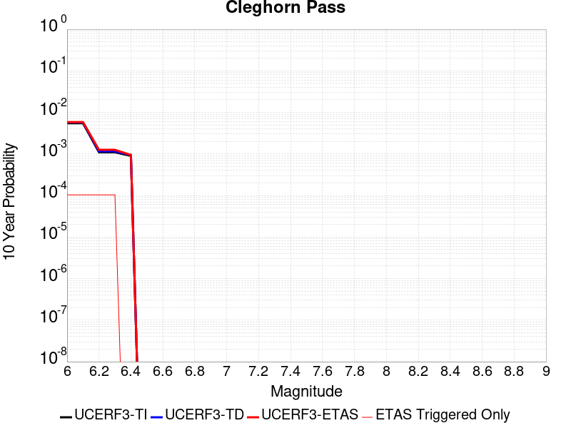 |

| Magnitude | 1 wk TI Prob | 1 wk TD Prob | 1 wk ETAS Prob | 1 wk ETAS/TD Gain | 1 wk ETAS Triggered Only | 1 mo TI Prob | 1 mo TD Prob | 1 mo ETAS Prob | 1 mo ETAS/TD Gain | 1 mo ETAS Triggered Only | 1 yr TI Prob | 1 yr TD Prob | 1 yr ETAS Prob | 1 yr ETAS/TD Gain | 1 yr ETAS Triggered Only | 10 yr TI Prob | 10 yr TD Prob | 10 yr ETAS Prob | 10 yr ETAS/TD Gain | 10 yr ETAS Triggered Only |
|-----|-----|-----|-----|-----|-----|-----|-----|-----|-----|-----|-----|-----|-----|-----|-----|-----|-----|-----|-----|-----|
| 6.0 | 1.0522846E-5 | 1.1040642E-5 | 3.1912226E-5 | 2.8904324 | 2.0871816E-5 | 4.509713E-5 | 4.7316473E-5 | 7.862272E-5 | 1.6616352 | 3.1307725E-5 | 5.4891926E-4 | 5.759784E-4 | 6.3855783E-4 | 1.1086488 | 6.261545E-5 | 0.0054756533 | 0.005750022 | 0.0058849086 | 1.0234585 | 1.356668E-4 |
| 6.1 | 1.0522846E-5 | 1.1040642E-5 | 3.1912226E-5 | 2.8904324 | 2.0871816E-5 | 4.509713E-5 | 4.7316473E-5 | 7.862272E-5 | 1.6616352 | 3.1307725E-5 | 5.4891926E-4 | 5.759784E-4 | 6.3855783E-4 | 1.1086488 | 6.261545E-5 | 0.0054756533 | 0.005750022 | 0.0058849086 | 1.0234585 | 1.356668E-4 |
| 6.2 | 2.1045846E-6 | 2.2082024E-6 | 2.2082024E-6 | 1.0 | 0.0 | 9.019617E-6 | 9.463714E-6 | 1.9899524E-5 | 2.102718 | 1.0435908E-5 | 1.098083E-4 | 1.1521882E-4 | 1.2565353E-4 | 1.0905643 | 1.0435908E-5 | 0.0010975406 | 0.0011520023 | 0.001183274 | 1.0271455 | 3.1307725E-5 |
| 6.3 | 2.1045846E-6 | 2.2082024E-6 | 2.2082024E-6 | 1.0 | 0.0 | 9.019617E-6 | 9.463714E-6 | 1.9899524E-5 | 2.102718 | 1.0435908E-5 | 1.098083E-4 | 1.1521882E-4 | 1.2565353E-4 | 1.0905643 | 1.0435908E-5 | 0.0010975406 | 0.0011520023 | 0.001183274 | 1.0271455 | 3.1307725E-5 |
| 6.4 | 1.7259927E-6 | 1.810877E-6 | 1.810877E-6 | 1.0 | 0.0 | 7.3970905E-6 | 7.760902E-6 | 1.8196728E-5 | 2.3446667 | 1.0435908E-5 | 9.005586E-5 | 9.4488976E-5 | 1.049239E-4 | 1.1104354 | 1.0435908E-5 | 9.001937E-4 | 9.448898E-4 | 9.5531583E-4 | 1.0110341 | 1.0435908E-5 |

## Deep Springs
*[(top)](#table-of-contents)*

| 1 Week | 1 Month | 1 Year | 10 Year |
|-----|-----|-----|-----|
| 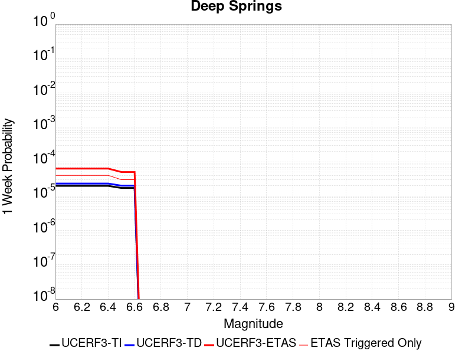 | 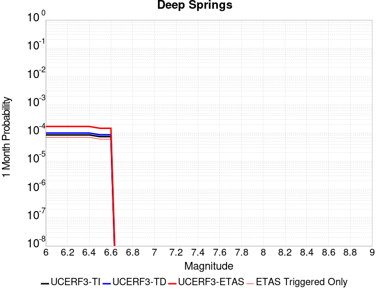 | 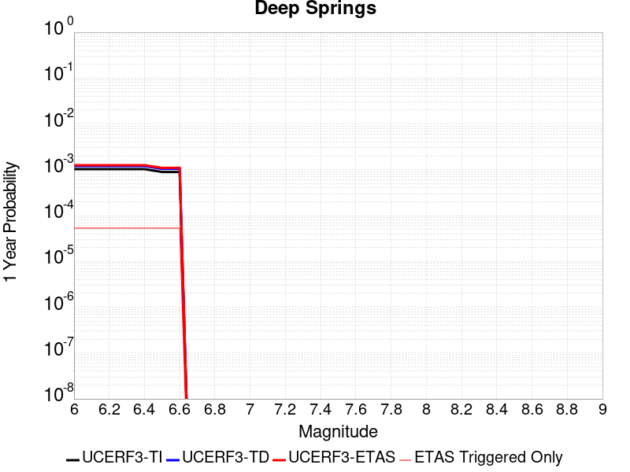 | 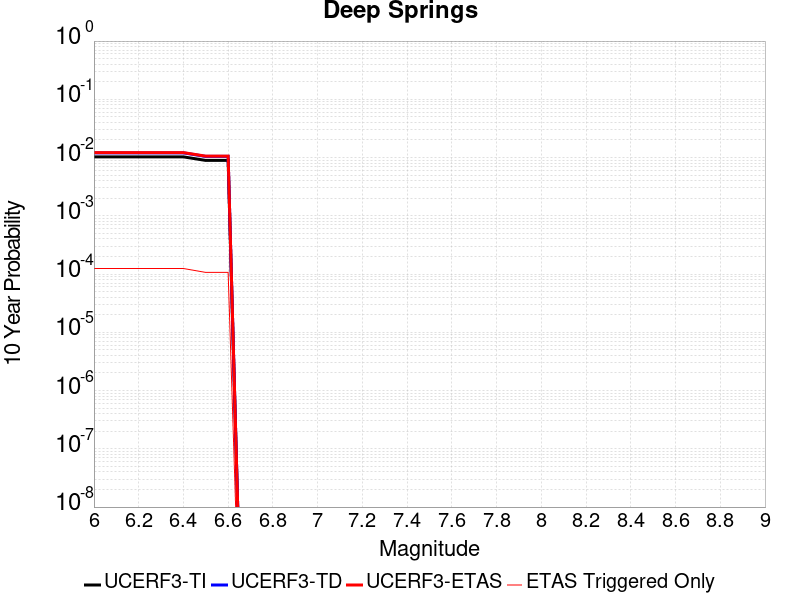 |

| Magnitude | 1 wk TI Prob | 1 wk TD Prob | 1 wk ETAS Prob | 1 wk ETAS/TD Gain | 1 wk ETAS Triggered Only | 1 mo TI Prob | 1 mo TD Prob | 1 mo ETAS Prob | 1 mo ETAS/TD Gain | 1 mo ETAS Triggered Only | 1 yr TI Prob | 1 yr TD Prob | 1 yr ETAS Prob | 1 yr ETAS/TD Gain | 1 yr ETAS Triggered Only | 10 yr TI Prob | 10 yr TD Prob | 10 yr ETAS Prob | 10 yr ETAS/TD Gain | 10 yr ETAS Triggered Only |
|-----|-----|-----|-----|-----|-----|-----|-----|-----|-----|-----|-----|-----|-----|-----|-----|-----|-----|-----|-----|-----|
| 6.0 | 1.9810619E-5 | 2.311252E-5 | 5.441952E-5 | 2.3545473 | 3.1307725E-5 | 8.489989E-5 | 9.905276E-5 | 1.61662E-4 | 1.6320797 | 6.261545E-5 | 0.001033166 | 0.0012058079 | 0.0012787712 | 1.0605098 | 7.305136E-5 | 0.010283757 | 0.012042425 | 0.012197078 | 1.0128424 | 1.5653862E-4 |
| 6.1 | 1.9810619E-5 | 2.311252E-5 | 5.441952E-5 | 2.3545473 | 3.1307725E-5 | 8.489989E-5 | 9.905276E-5 | 1.61662E-4 | 1.6320797 | 6.261545E-5 | 0.001033166 | 0.0012058079 | 0.0012787712 | 1.0605098 | 7.305136E-5 | 0.010283757 | 0.012042425 | 0.012197078 | 1.0128424 | 1.5653862E-4 |
| 6.2 | 1.9810619E-5 | 2.311252E-5 | 5.441952E-5 | 2.3545473 | 3.1307725E-5 | 8.489989E-5 | 9.905276E-5 | 1.61662E-4 | 1.6320797 | 6.261545E-5 | 0.001033166 | 0.0012058079 | 0.0012787712 | 1.0605098 | 7.305136E-5 | 0.010283757 | 0.012042425 | 0.012197078 | 1.0128424 | 1.5653862E-4 |
| 6.3 | 1.9810619E-5 | 2.311252E-5 | 5.441952E-5 | 2.3545473 | 3.1307725E-5 | 8.489989E-5 | 9.905276E-5 | 1.61662E-4 | 1.6320797 | 6.261545E-5 | 0.001033166 | 0.0012058079 | 0.0012787712 | 1.0605098 | 7.305136E-5 | 0.010283757 | 0.012042425 | 0.012197078 | 1.0128424 | 1.5653862E-4 |
| 6.4 | 1.9810619E-5 | 2.311252E-5 | 5.441952E-5 | 2.3545473 | 3.1307725E-5 | 8.489989E-5 | 9.905276E-5 | 1.61662E-4 | 1.6320797 | 6.261545E-5 | 0.001033166 | 0.0012058079 | 0.0012787712 | 1.0605098 | 7.305136E-5 | 0.010283757 | 0.012042425 | 0.012197078 | 1.0128424 | 1.5653862E-4 |
| 6.5 | 1.7190405E-5 | 2.0050555E-5 | 4.0921954E-5 | 2.0409386 | 2.0871816E-5 | 7.367108E-5 | 8.593095E-5 | 1.3810601E-4 | 1.6071742 | 5.217954E-5 | 8.9657627E-4 | 0.0010462094 | 0.0011087593 | 1.0597872 | 6.261545E-5 | 0.008929676 | 0.010462056 | 0.01057565 | 1.0108577 | 1.1479499E-4 |
| 6.6 | 1.7190405E-5 | 2.0050555E-5 | 4.0921954E-5 | 2.0409386 | 2.0871816E-5 | 7.367108E-5 | 8.593095E-5 | 1.3810601E-4 | 1.6071742 | 5.217954E-5 | 8.9657627E-4 | 0.0010462094 | 0.0011087593 | 1.0597872 | 6.261545E-5 | 0.008929676 | 0.010462056 | 0.01057565 | 1.0108577 | 1.1479499E-4 |

## Elysian Park (Upper)
*[(top)](#table-of-contents)*

| 1 Week | 1 Month | 1 Year | 10 Year |
|-----|-----|-----|-----|
| 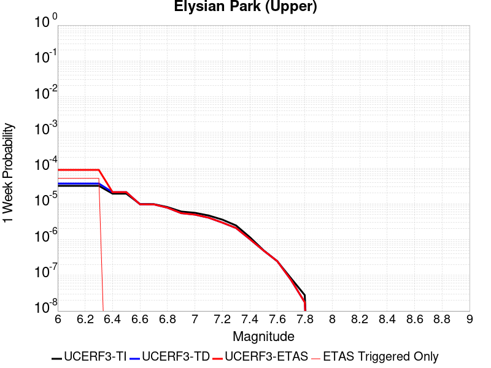 | 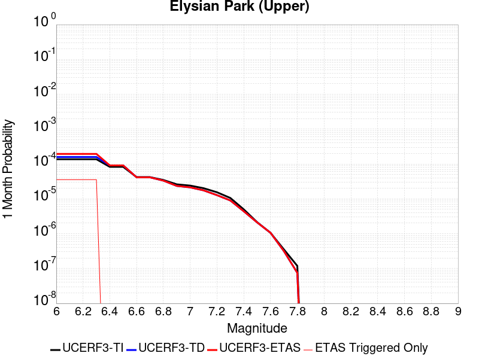 | 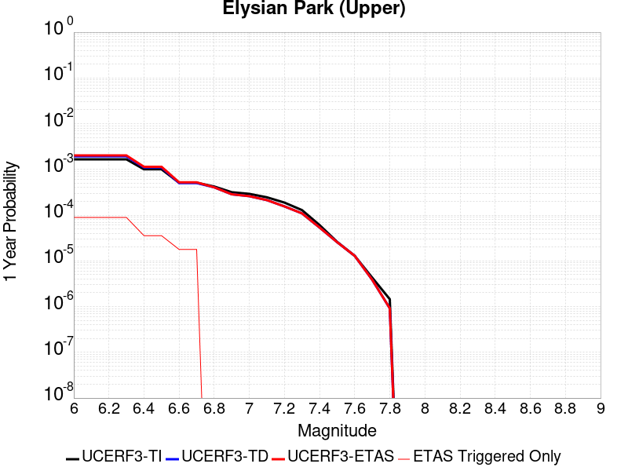 | 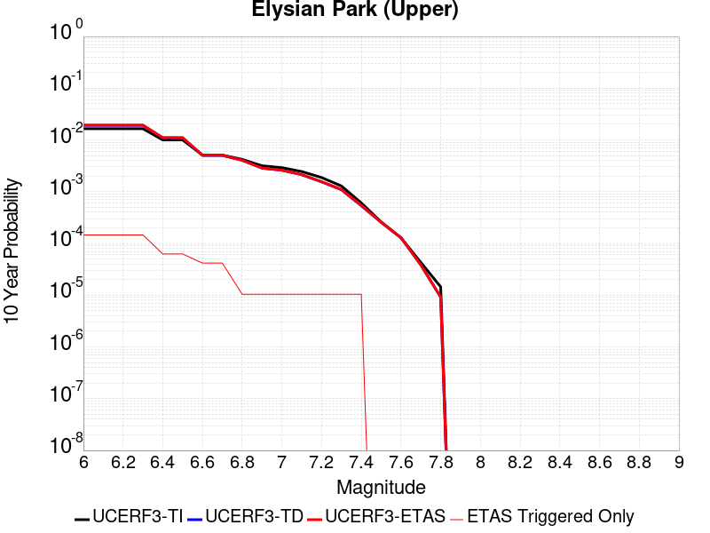 |

| Magnitude | 1 wk TI Prob | 1 wk TD Prob | 1 wk ETAS Prob | 1 wk ETAS/TD Gain | 1 wk ETAS Triggered Only | 1 mo TI Prob | 1 mo TD Prob | 1 mo ETAS Prob | 1 mo ETAS/TD Gain | 1 mo ETAS Triggered Only | 1 yr TI Prob | 1 yr TD Prob | 1 yr ETAS Prob | 1 yr ETAS/TD Gain | 1 yr ETAS Triggered Only | 10 yr TI Prob | 10 yr TD Prob | 10 yr ETAS Prob | 10 yr ETAS/TD Gain | 10 yr ETAS Triggered Only |
|-----|-----|-----|-----|-----|-----|-----|-----|-----|-----|-----|-----|-----|-----|-----|-----|-----|-----|-----|-----|-----|
| 6.0 | 3.1876025E-5 | 3.7035516E-5 | 7.87776E-5 | 2.1270826 | 4.174363E-5 | 1.3660437E-4 | 1.587167E-4 | 2.2132222E-4 | 1.3944482 | 6.261545E-5 | 0.0016618895 | 0.0019311075 | 0.0020456808 | 1.0593303 | 1.1479499E-4 | 0.016495159 | 0.019189782 | 0.019333083 | 1.0074675 | 1.4610271E-4 |
| 6.1 | 3.1876025E-5 | 3.7035516E-5 | 7.87776E-5 | 2.1270826 | 4.174363E-5 | 1.3660437E-4 | 1.587167E-4 | 2.2132222E-4 | 1.3944482 | 6.261545E-5 | 0.0016618895 | 0.0019311075 | 0.0020456808 | 1.0593303 | 1.1479499E-4 | 0.016495159 | 0.019189782 | 0.019333083 | 1.0074675 | 1.4610271E-4 |
| 6.2 | 3.1876025E-5 | 3.7035516E-5 | 7.87776E-5 | 2.1270826 | 4.174363E-5 | 1.3660437E-4 | 1.587167E-4 | 2.2132222E-4 | 1.3944482 | 6.261545E-5 | 0.0016618895 | 0.0019311075 | 0.0020456808 | 1.0593303 | 1.1479499E-4 | 0.016495159 | 0.019189782 | 0.019333083 | 1.0074675 | 1.4610271E-4 |
| 6.3 | 3.1876025E-5 | 3.7035516E-5 | 7.87776E-5 | 2.1270826 | 4.174363E-5 | 1.3660437E-4 | 1.587167E-4 | 2.2132222E-4 | 1.3944482 | 6.261545E-5 | 0.0016618895 | 0.0019311075 | 0.0020456808 | 1.0593303 | 1.1479499E-4 | 0.016495159 | 0.019189782 | 0.019333083 | 1.0074675 | 1.4610271E-4 |
| 6.4 | 1.9273462E-5 | 2.1202266E-5 | 3.1637952E-5 | 1.4921968 | 1.0435908E-5 | 8.259794E-5 | 9.086466E-5 | 1.1173458E-4 | 1.2296814 | 2.0871816E-5 | 0.001005166 | 0.0011058892 | 0.0011475867 | 1.037705 | 4.174363E-5 | 0.010006315 | 0.011020724 | 0.011082649 | 1.005619 | 6.261545E-5 |
| 6.5 | 1.9273462E-5 | 2.1202266E-5 | 3.1637952E-5 | 1.4921968 | 1.0435908E-5 | 8.259794E-5 | 9.086466E-5 | 1.1173458E-4 | 1.2296814 | 2.0871816E-5 | 0.001005166 | 0.0011058892 | 0.0011475867 | 1.037705 | 4.174363E-5 | 0.010006315 | 0.011020724 | 0.011082649 | 1.005619 | 6.261545E-5 |
| 6.6 | 9.813258E-6 | 9.665599E-6 | 2.0101406E-5 | 2.0796854 | 1.0435908E-5 | 4.205614E-5 | 4.1423376E-5 | 5.1858853E-5 | 1.2519224 | 1.0435908E-5 | 5.119132E-4 | 5.0422014E-4 | 5.250815E-4 | 1.0413734 | 2.0871816E-5 | 0.005107356 | 0.0050314846 | 0.0050730184 | 1.0082548 | 4.174363E-5 |
| 6.7 | 9.801478E-6 | 9.653168E-6 | 2.0088975E-5 | 2.081076 | 1.0435908E-5 | 4.2005657E-5 | 4.1370105E-5 | 5.1805582E-5 | 1.2522467 | 1.0435908E-5 | 5.112989E-4 | 5.035719E-4 | 5.2443316E-4 | 1.0414267 | 2.0871816E-5 | 0.0051012407 | 0.0050250315 | 0.0050665652 | 1.0082654 | 4.174363E-5 |
| 6.8 | 8.102489E-6 | 7.773004E-6 | 7.773004E-6 | 1.0 | 0.0 | 3.4724493E-5 | 3.3312477E-5 | 3.3312477E-5 | 1.0 | 0.0 | 4.2268867E-4 | 4.055089E-4 | 4.055089E-4 | 1.0 | 0.0 | 0.004218856 | 0.0040481836 | 0.004058577 | 1.0025675 | 1.0435908E-5 |
| 6.9 | 6.08275E-6 | 5.4814514E-6 | 5.4814514E-6 | 1.0 | 0.0 | 2.6068668E-5 | 2.3491726E-5 | 2.3491726E-5 | 1.0 | 0.0 | 3.173398E-4 | 2.85975E-4 | 2.85975E-4 | 1.0 | 0.0 | 0.0031688702 | 0.0028561477 | 0.0028665538 | 1.0036434 | 1.0435908E-5 |
| 7.0 | 5.5995934E-6 | 4.98278E-6 | 4.98278E-6 | 1.0 | 0.0 | 2.3998036E-5 | 2.13546E-5 | 2.13546E-5 | 1.0 | 0.0 | 2.9213692E-4 | 2.599619E-4 | 2.599619E-4 | 1.0 | 0.0 | 0.0029175316 | 0.0025966454 | 0.0026070543 | 1.0040085 | 1.0435908E-5 |
| 7.1 | 4.709881E-6 | 4.0874015E-6 | 4.0874015E-6 | 1.0 | 0.0 | 2.0185047E-5 | 1.7517319E-5 | 1.7517319E-5 | 1.0 | 0.0 | 2.4572524E-4 | 2.132529E-4 | 2.132529E-4 | 1.0 | 0.0 | 0.002454537 | 0.002130524 | 0.0021409376 | 1.0048878 | 1.0435908E-5 |
| 7.2 | 3.6063436E-6 | 2.9779544E-6 | 2.9779544E-6 | 1.0 | 0.0 | 1.5455667E-5 | 1.27626E-5 | 1.27626E-5 | 1.0 | 0.0 | 1.881565E-4 | 1.5537368E-4 | 1.5537368E-4 | 1.0 | 0.0 | 0.0018799726 | 0.0015526618 | 0.0015630815 | 1.0067109 | 1.0435908E-5 |
| 7.3 | 2.471135E-6 | 2.0954615E-6 | 2.0954615E-6 | 1.0 | 0.0 | 1.0590536E-5 | 8.980519E-6 | 8.980519E-6 | 1.0 | 0.0 | 1.2893214E-4 | 1.093324E-4 | 1.093324E-4 | 1.0 | 0.0 | 0.0012885736 | 0.0010927934 | 0.0011032178 | 1.0095394 | 1.0435908E-5 |
| 7.4 | 1.163943E-6 | 1.0275091E-6 | 1.0275091E-6 | 1.0 | 0.0 | 4.988318E-6 | 4.4036033E-6 | 4.4036033E-6 | 1.0 | 0.0 | 6.0731076E-5 | 5.3612584E-5 | 5.3612584E-5 | 1.0 | 0.0 | 6.071448E-4 | 5.359995E-4 | 5.464298E-4 | 1.0194596 | 1.0435908E-5 |
| 7.5 | 4.99459E-7 | 4.917604E-7 | 4.917604E-7 | 1.0 | 0.0 | 2.140537E-6 | 2.1075427E-6 | 2.1075427E-6 | 1.0 | 0.0 | 2.6060725E-5 | 2.5659048E-5 | 2.5659048E-5 | 1.0 | 0.0 | 2.605767E-4 | 2.5656243E-4 | 2.5656243E-4 | 1.0 | 0.0 |
| 7.6 | 2.4667852E-7 | 2.4778336E-7 | 2.4778336E-7 | 1.0 | 0.0 | 1.0571932E-6 | 1.0619283E-6 | 1.0619283E-6 | 1.0 | 0.0 | 1.2871251E-5 | 1.2928905E-5 | 1.2928905E-5 | 1.0 | 0.0 | 1.2870505E-4 | 1.2928189E-4 | 1.2928189E-4 | 1.0 | 0.0 |
| 7.7 | 8.2312795E-8 | 7.3864456E-8 | 7.3864456E-8 | 1.0 | 0.0 | 3.527691E-7 | 3.165619E-7 | 3.165619E-7 | 1.0 | 0.0 | 4.294955E-6 | 3.8541357E-6 | 3.8541357E-6 | 1.0 | 0.0 | 4.2948723E-5 | 3.8540802E-5 | 3.8540802E-5 | 1.0 | 0.0 |
| 7.8 | 2.7819295E-8 | 1.7566023E-8 | 1.7566023E-8 | 1.0 | 0.0 | 1.1922555E-7 | 7.5282955E-8 | 7.5282955E-8 | 1.0 | 0.0 | 1.45157E-6 | 9.165697E-7 | 9.165697E-7 | 1.0 | 0.0 | 1.45156055E-5 | 9.165675E-6 | 9.165675E-6 | 1.0 | 0.0 |

## Pleito
*[(top)](#table-of-contents)*

| 1 Week | 1 Month | 1 Year | 10 Year |
|-----|-----|-----|-----|
| 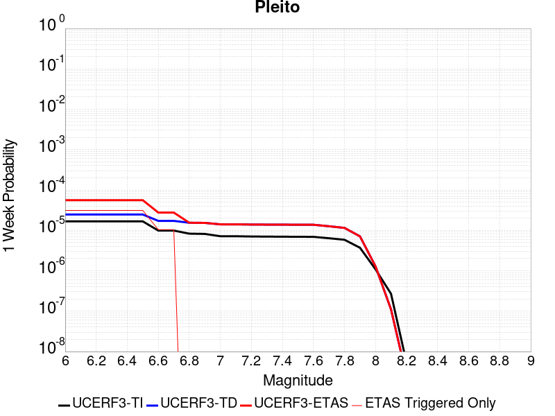 | 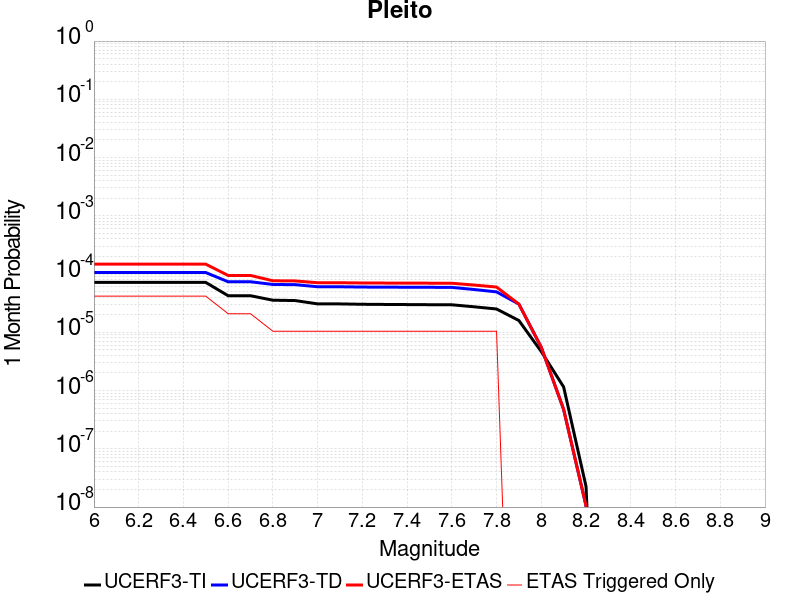 | 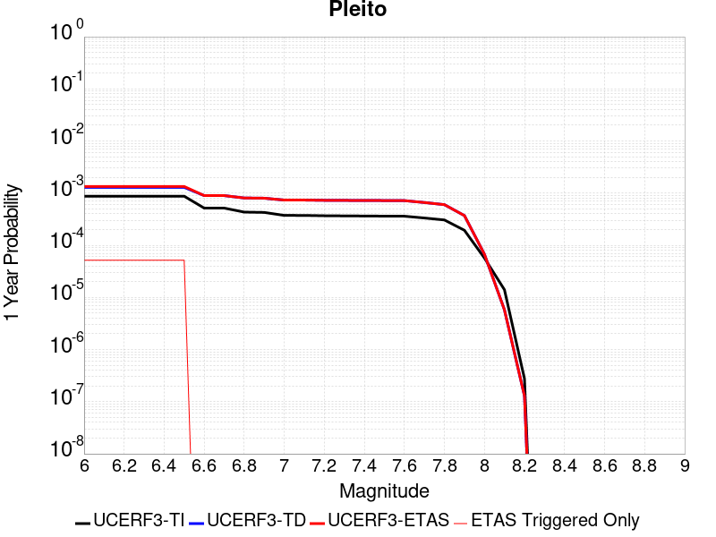 | 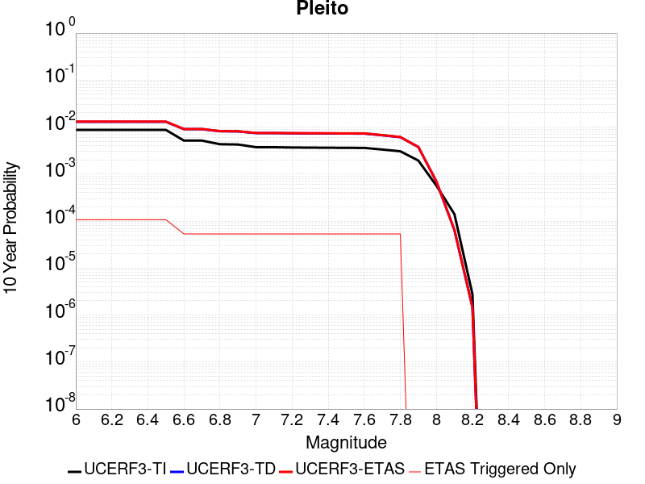 |

| Magnitude | 1 wk TI Prob | 1 wk TD Prob | 1 wk ETAS Prob | 1 wk ETAS/TD Gain | 1 wk ETAS Triggered Only | 1 mo TI Prob | 1 mo TD Prob | 1 mo ETAS Prob | 1 mo ETAS/TD Gain | 1 mo ETAS Triggered Only | 1 yr TI Prob | 1 yr TD Prob | 1 yr ETAS Prob | 1 yr ETAS/TD Gain | 1 yr ETAS Triggered Only | 10 yr TI Prob | 10 yr TD Prob | 10 yr ETAS Prob | 10 yr ETAS/TD Gain | 10 yr ETAS Triggered Only |
|-----|-----|-----|-----|-----|-----|-----|-----|-----|-----|-----|-----|-----|-----|-----|-----|-----|-----|-----|-----|-----|
| 6.0 | 1.6763008E-5 | 2.4763838E-5 | 5.607079E-5 | 2.2642202 | 3.1307725E-5 | 7.183948E-5 | 1.0612683E-4 | 1.4786603E-4 | 1.3932955 | 4.174363E-5 | 8.742947E-4 | 0.0012914003 | 0.0013852022 | 1.0726358 | 9.392317E-5 | 0.00870863 | 0.0129538905 | 0.0130981 | 1.0111326 | 1.4610271E-4 |
| 6.1 | 1.6763008E-5 | 2.4763838E-5 | 5.607079E-5 | 2.2642202 | 3.1307725E-5 | 7.183948E-5 | 1.0612683E-4 | 1.4786603E-4 | 1.3932955 | 4.174363E-5 | 8.742947E-4 | 0.0012914003 | 0.0013852022 | 1.0726358 | 9.392317E-5 | 0.00870863 | 0.0129538905 | 0.0130981 | 1.0111326 | 1.4610271E-4 |
| 6.2 | 1.6763008E-5 | 2.4763838E-5 | 5.607079E-5 | 2.2642202 | 3.1307725E-5 | 7.183948E-5 | 1.0612683E-4 | 1.4786603E-4 | 1.3932955 | 4.174363E-5 | 8.742947E-4 | 0.0012914003 | 0.0013852022 | 1.0726358 | 9.392317E-5 | 0.00870863 | 0.0129538905 | 0.0130981 | 1.0111326 | 1.4610271E-4 |
| 6.3 | 1.6763008E-5 | 2.4763838E-5 | 5.607079E-5 | 2.2642202 | 3.1307725E-5 | 7.183948E-5 | 1.0612683E-4 | 1.4786603E-4 | 1.3932955 | 4.174363E-5 | 8.742947E-4 | 0.0012914003 | 0.0013852022 | 1.0726358 | 9.392317E-5 | 0.00870863 | 0.0129538905 | 0.0130981 | 1.0111326 | 1.4610271E-4 |
| 6.4 | 1.6763008E-5 | 2.4763838E-5 | 5.607079E-5 | 2.2642202 | 3.1307725E-5 | 7.183948E-5 | 1.0612683E-4 | 1.4786603E-4 | 1.3932955 | 4.174363E-5 | 8.742947E-4 | 0.0012914003 | 0.0013852022 | 1.0726358 | 9.392317E-5 | 0.00870863 | 0.0129538905 | 0.0130981 | 1.0111326 | 1.4610271E-4 |
| 6.5 | 1.6763008E-5 | 2.4763838E-5 | 5.607079E-5 | 2.2642202 | 3.1307725E-5 | 7.183948E-5 | 1.0612683E-4 | 1.4786603E-4 | 1.3932955 | 4.174363E-5 | 8.742947E-4 | 0.0012914003 | 0.0013852022 | 1.0726358 | 9.392317E-5 | 0.00870863 | 0.0129538905 | 0.0130981 | 1.0111326 | 1.4610271E-4 |
| 6.6 | 9.910213E-6 | 1.7214623E-5 | 2.7650352E-5 | 1.606213 | 1.0435908E-5 | 4.247165E-5 | 7.377489E-5 | 9.464517E-5 | 1.2828913 | 2.0871816E-5 | 5.169696E-4 | 8.978429E-4 | 9.18696E-4 | 1.0232258 | 2.0871816E-5 | 0.0051576863 | 0.009050702 | 0.00910241 | 1.0057131 | 5.217954E-5 |
| 6.7 | 9.910213E-6 | 1.7214623E-5 | 2.7650352E-5 | 1.606213 | 1.0435908E-5 | 4.247165E-5 | 7.377489E-5 | 9.464517E-5 | 1.2828913 | 2.0871816E-5 | 5.169696E-4 | 8.978429E-4 | 9.18696E-4 | 1.0232258 | 2.0871816E-5 | 0.0051576863 | 0.009050702 | 0.00910241 | 1.0057131 | 5.217954E-5 |
| 6.8 | 8.300162E-6 | 1.5474232E-5 | 1.5474232E-5 | 1.0 | 0.0 | 3.557164E-5 | 6.631646E-5 | 7.6751676E-5 | 1.1573548 | 1.0435908E-5 | 4.3299864E-4 | 8.071053E-4 | 8.1753277E-4 | 1.0129197 | 1.0435908E-5 | 0.004321559 | 0.008150139 | 0.008181191 | 1.00381 | 3.1307725E-5 |
| 6.9 | 8.183114E-6 | 1.5345448E-5 | 1.5345448E-5 | 1.0 | 0.0 | 3.5070017E-5 | 6.576455E-5 | 7.619977E-5 | 1.1586754 | 1.0435908E-5 | 4.2689382E-4 | 8.003907E-4 | 8.108183E-4 | 1.013028 | 1.0435908E-5 | 0.0042607468 | 0.008083483 | 0.008114538 | 1.0038418 | 3.1307725E-5 |
| 7.0 | 7.1748823E-6 | 1.413244E-5 | 1.413244E-5 | 1.0 | 0.0 | 3.0749135E-5 | 6.0566195E-5 | 7.100147E-5 | 1.1722953 | 1.0435908E-5 | 3.743064E-4 | 7.371445E-4 | 7.475727E-4 | 1.0141468 | 1.0435908E-5 | 0.0037367654 | 0.007454939 | 0.0074860137 | 1.0041683 | 3.1307725E-5 |
| 7.1 | 7.1671807E-6 | 1.412281E-5 | 1.412281E-5 | 1.0 | 0.0 | 3.0716128E-5 | 6.052493E-5 | 7.09602E-5 | 1.1724129 | 1.0435908E-5 | 3.7390468E-4 | 7.366424E-4 | 7.470706E-4 | 1.0141565 | 1.0435908E-5 | 0.0037327618 | 0.0074499524 | 0.0074810265 | 1.0041711 | 3.1307725E-5 |
| 7.2 | 7.0649667E-6 | 1.39701015E-5 | 1.39701015E-5 | 1.0 | 0.0 | 3.0278077E-5 | 5.9870494E-5 | 7.0305774E-5 | 1.1742976 | 1.0435908E-5 | 3.6857324E-4 | 7.2868E-4 | 7.391083E-4 | 1.0143112 | 1.0435908E-5 | 0.0036796255 | 0.0073707094 | 0.0074017863 | 1.0042163 | 3.1307725E-5 |
| 7.3 | 7.02082E-6 | 1.3913556E-5 | 1.3913556E-5 | 1.0 | 0.0 | 3.008888E-5 | 5.9628168E-5 | 7.0063455E-5 | 1.1750059 | 1.0435908E-5 | 3.6627054E-4 | 7.2573166E-4 | 7.3616E-4 | 1.0143694 | 1.0435908E-5 | 0.0036566744 | 0.007341209 | 0.0073722866 | 1.0042334 | 3.1307725E-5 |
| 7.4 | 6.987146E-6 | 1.3873118E-5 | 1.3873118E-5 | 1.0 | 0.0 | 2.9944567E-5 | 5.945487E-5 | 6.989016E-5 | 1.1755161 | 1.0435908E-5 | 3.6451413E-4 | 7.2362315E-4 | 7.340515E-4 | 1.0144113 | 1.0435908E-5 | 0.0036391679 | 0.007320144 | 0.007351223 | 1.0042456 | 3.1307725E-5 |
| 7.5 | 6.9494554E-6 | 1.3830024E-5 | 1.3830024E-5 | 1.0 | 0.0 | 2.9783041E-5 | 5.9270187E-5 | 6.970548E-5 | 1.1760631 | 1.0435908E-5 | 3.625482E-4 | 7.2137616E-4 | 7.318045E-4 | 1.0144563 | 1.0435908E-5 | 0.0036195726 | 0.0072977724 | 0.007328852 | 1.0042588 | 3.1307725E-5 |
| 7.6 | 6.92694E-6 | 1.3789138E-5 | 1.3789138E-5 | 1.0 | 0.0 | 2.9686547E-5 | 5.909497E-5 | 6.953026E-5 | 1.1765851 | 1.0435908E-5 | 3.6137376E-4 | 7.1924424E-4 | 7.2967267E-4 | 1.0144991 | 1.0435908E-5 | 0.0036078666 | 0.0072765257 | 0.007307606 | 1.0042713 | 3.1307725E-5 |
| 7.7 | 6.395867E-6 | 1.2668219E-5 | 1.2668219E-5 | 1.0 | 0.0 | 2.741057E-5 | 5.429124E-5 | 6.472658E-5 | 1.1922104 | 1.0435908E-5 | 3.336726E-4 | 6.6079566E-4 | 6.7122467E-4 | 1.0157825 | 1.0435908E-5 | 0.0033317201 | 0.0066951844 | 0.0067159166 | 1.0030966 | 2.0871816E-5 |
| 7.8 | 5.8664327E-6 | 1.153586E-5 | 1.153586E-5 | 1.0 | 0.0 | 2.5141611E-5 | 4.9438466E-5 | 5.9873855E-5 | 1.2110784 | 1.0435908E-5 | 3.060561E-4 | 6.017473E-4 | 6.121769E-4 | 1.0173322 | 1.0435908E-5 | 0.0030563495 | 0.0061006667 | 0.006121411 | 1.0034003 | 2.0871816E-5 |
| 7.9 | 3.7167474E-6 | 7.1140853E-6 | 7.1140853E-6 | 1.0 | 0.0 | 1.592882E-5 | 3.0488582E-5 | 3.0488582E-5 | 1.0 | 0.0 | 1.9391612E-4 | 3.7113542E-4 | 3.7113542E-4 | 1.0 | 0.0 | 0.0019374699 | 0.0037674906 | 0.0037674906 | 1.0 | 0.0 |
| 8.0 | 1.0903841E-6 | 1.2879392E-6 | 1.2879392E-6 | 1.0 | 0.0 | 4.6730665E-6 | 5.5197274E-6 | 5.5197274E-6 | 1.0 | 0.0 | 5.68931E-5 | 6.720063E-5 | 6.720063E-5 | 1.0 | 0.0 | 5.6878536E-4 | 6.941948E-4 | 6.941948E-4 | 1.0 | 0.0 |
| 8.1 | 2.6894583E-7 | 1.1060341E-7 | 1.1060341E-7 | 1.0 | 0.0 | 1.1526245E-6 | 4.740145E-7 | 4.740145E-7 | 1.0 | 0.0 | 1.4033113E-5 | 5.7711113E-6 | 5.7711113E-6 | 1.0 | 0.0 | 1.4032227E-4 | 6.456908E-5 | 6.456908E-5 | 1.0 | 0.0 |
| 8.2 | 5.2967013E-9 | 2.4578228E-9 | 2.4578228E-9 | 1.0 | 0.0 | 2.2700148E-8 | 1.0533527E-8 | 1.0533527E-8 | 1.0 | 0.0 | 2.7637427E-7 | 1.2824569E-7 | 1.2824569E-7 | 1.0 | 0.0 | 2.7637393E-6 | 1.4592787E-6 | 1.4592787E-6 | 1.0 | 0.0 |

## Ventura-Pitas Point
*[(top)](#table-of-contents)*

| 1 Week | 1 Month | 1 Year | 10 Year |
|-----|-----|-----|-----|
| 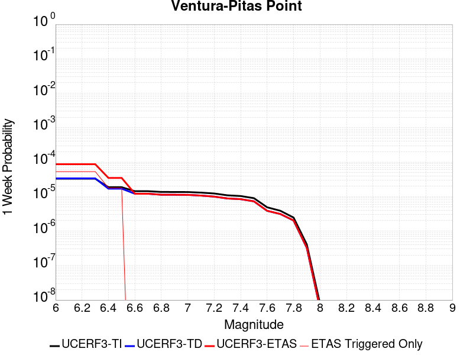 | 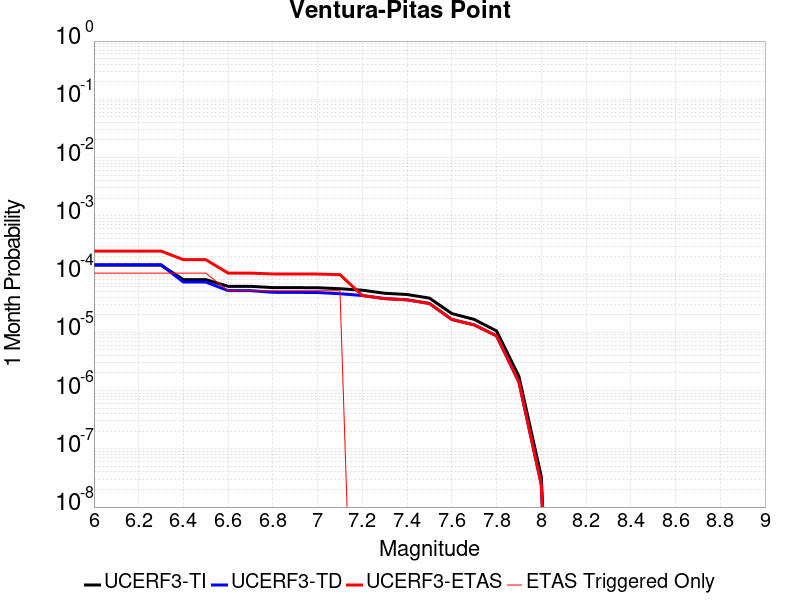 | 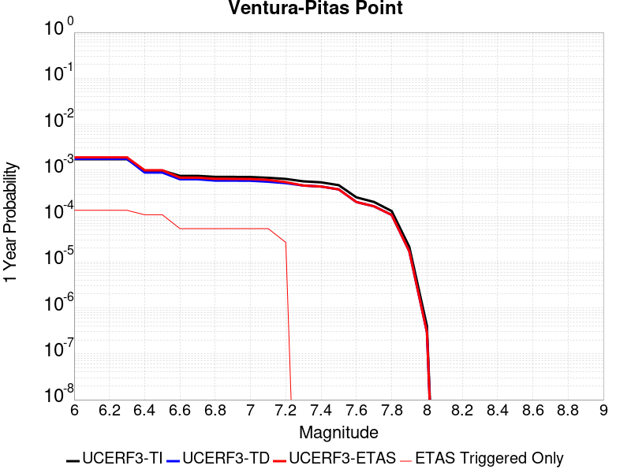 | 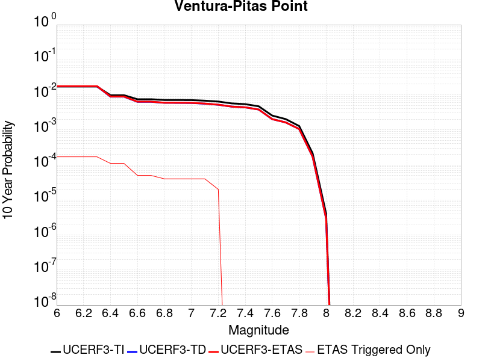 |

| Magnitude | 1 wk TI Prob | 1 wk TD Prob | 1 wk ETAS Prob | 1 wk ETAS/TD Gain | 1 wk ETAS Triggered Only | 1 mo TI Prob | 1 mo TD Prob | 1 mo ETAS Prob | 1 mo ETAS/TD Gain | 1 mo ETAS Triggered Only | 1 yr TI Prob | 1 yr TD Prob | 1 yr ETAS Prob | 1 yr ETAS/TD Gain | 1 yr ETAS Triggered Only | 10 yr TI Prob | 10 yr TD Prob | 10 yr ETAS Prob | 10 yr ETAS/TD Gain | 10 yr ETAS Triggered Only |
|-----|-----|-----|-----|-----|-----|-----|-----|-----|-----|-----|-----|-----|-----|-----|-----|-----|-----|-----|-----|-----|
| 6.0 | 3.3179622E-5 | 3.3735185E-5 | 8.5912965E-5 | 2.5466874 | 5.217954E-5 | 1.4219063E-4 | 1.445728E-4 | 2.071792E-4 | 1.4330441 | 6.261545E-5 | 0.0017297962 | 0.0017590096 | 0.0018631851 | 1.059224 | 1.0435908E-4 | 0.017163932 | 0.0174764 | 0.01761995 | 1.0082139 | 1.4610271E-4 |
| 6.1 | 3.3179622E-5 | 3.3735185E-5 | 8.5912965E-5 | 2.5466874 | 5.217954E-5 | 1.4219063E-4 | 1.445728E-4 | 2.071792E-4 | 1.4330441 | 6.261545E-5 | 0.0017297962 | 0.0017590096 | 0.0018631851 | 1.059224 | 1.0435908E-4 | 0.017163932 | 0.0174764 | 0.01761995 | 1.0082139 | 1.4610271E-4 |
| 6.2 | 3.3179622E-5 | 3.3735185E-5 | 8.5912965E-5 | 2.5466874 | 5.217954E-5 | 1.4219063E-4 | 1.445728E-4 | 2.071792E-4 | 1.4330441 | 6.261545E-5 | 0.0017297962 | 0.0017590096 | 0.0018631851 | 1.059224 | 1.0435908E-4 | 0.017163932 | 0.0174764 | 0.01761995 | 1.0082139 | 1.4610271E-4 |
| 6.3 | 3.3179622E-5 | 3.3735185E-5 | 8.5912965E-5 | 2.5466874 | 5.217954E-5 | 1.4219063E-4 | 1.445728E-4 | 2.071792E-4 | 1.4330441 | 6.261545E-5 | 0.0017297962 | 0.0017590096 | 0.0018631851 | 1.059224 | 1.0435908E-4 | 0.017163932 | 0.0174764 | 0.01761995 | 1.0082139 | 1.4610271E-4 |
| 6.4 | 1.8754668E-5 | 1.701961E-5 | 3.789107E-5 | 2.2263184 | 2.0871816E-5 | 8.037467E-5 | 7.293928E-5 | 1.0424472E-4 | 1.4291986 | 3.1307725E-5 | 9.781223E-4 | 8.8769704E-4 | 9.502569E-4 | 1.0704744 | 6.261545E-5 | 0.009738282 | 0.008843848 | 0.008947284 | 1.0116959 | 1.0435908E-4 |
| 6.5 | 1.8754668E-5 | 1.701961E-5 | 3.789107E-5 | 2.2263184 | 2.0871816E-5 | 8.037467E-5 | 7.293928E-5 | 1.0424472E-4 | 1.4291986 | 3.1307725E-5 | 9.781223E-4 | 8.8769704E-4 | 9.502569E-4 | 1.0704744 | 6.261545E-5 | 0.009738282 | 0.008843848 | 0.008947284 | 1.0116959 | 1.0435908E-4 |
| 6.6 | 1.4361558E-5 | 1.2122275E-5 | 2.2558055E-5 | 1.8608764 | 1.0435908E-5 | 6.154808E-5 | 5.1951585E-5 | 7.282232E-5 | 1.4017342 | 2.0871816E-5 | 7.490902E-4 | 6.3232926E-4 | 6.636172E-4 | 1.0494804 | 3.1307725E-5 | 0.0074657016 | 0.0063055577 | 0.006347038 | 1.0065784 | 4.174363E-5 |
| 6.7 | 1.4361558E-5 | 1.2122275E-5 | 2.2558055E-5 | 1.8608764 | 1.0435908E-5 | 6.154808E-5 | 5.1951585E-5 | 7.282232E-5 | 1.4017342 | 2.0871816E-5 | 7.490902E-4 | 6.3232926E-4 | 6.636172E-4 | 1.0494804 | 3.1307725E-5 | 0.0074657016 | 0.0063055577 | 0.006347038 | 1.0065784 | 4.174363E-5 |
| 6.8 | 1.3663846E-5 | 1.13444175E-5 | 1.13444175E-5 | 1.0 | 0.0 | 5.8558027E-5 | 4.861804E-5 | 5.905344E-5 | 1.2146405 | 1.0435908E-5 | 7.127108E-4 | 5.917658E-4 | 6.1262527E-4 | 1.0352495 | 2.0871816E-5 | 0.007104293 | 0.005902116 | 0.005933239 | 1.0052732 | 3.1307725E-5 |
| 6.9 | 1.3644157E-5 | 1.1322519E-5 | 1.1322519E-5 | 1.0 | 0.0 | 5.8473648E-5 | 4.8524187E-5 | 5.8959587E-5 | 1.2150557 | 1.0435908E-5 | 7.116841E-4 | 5.9062376E-4 | 6.114833E-4 | 1.0353178 | 2.0871816E-5 | 0.007094092 | 0.0058907564 | 0.00592188 | 1.0052834 | 3.1307725E-5 |
| 7.0 | 1.3568845E-5 | 1.1242086E-5 | 1.1242086E-5 | 1.0 | 0.0 | 5.8150898E-5 | 4.817949E-5 | 5.8614893E-5 | 1.2165943 | 1.0435908E-5 | 7.077572E-4 | 5.864293E-4 | 6.072889E-4 | 1.0355705 | 2.0871816E-5 | 0.007055073 | 0.0058490336 | 0.005880158 | 1.0053214 | 3.1307725E-5 |
| 7.1 | 1.306572E-5 | 1.072054E-5 | 1.072054E-5 | 1.0 | 0.0 | 5.599474E-5 | 4.5944373E-5 | 5.63798E-5 | 1.2271318 | 1.0435908E-5 | 6.815227E-4 | 5.5923103E-4 | 5.8009115E-4 | 1.0373014 | 2.0871816E-5 | 0.0067943637 | 0.0055784425 | 0.005609575 | 1.005581 | 3.1307725E-5 |
| 7.2 | 1.232604E-5 | 9.995143E-6 | 9.995143E-6 | 1.0 | 0.0 | 5.2824813E-5 | 4.2835632E-5 | 4.2835632E-5 | 1.0 | 0.0 | 6.429523E-4 | 5.214008E-4 | 5.318313E-4 | 1.0200047 | 1.0435908E-5 | 0.0064109527 | 0.005201967 | 0.00522273 | 1.0039914 | 2.0871816E-5 |
| 7.3 | 1.0917261E-5 | 8.84384E-6 | 8.84384E-6 | 1.0 | 0.0 | 4.678742E-5 | 3.790163E-5 | 3.790163E-5 | 1.0 | 0.0 | 5.69488E-4 | 4.6135622E-4 | 4.6135622E-4 | 1.0 | 0.0 | 0.0056803077 | 0.00460415 | 0.00460415 | 1.0 | 0.0 |
| 7.4 | 1.039959E-5 | 8.423562E-6 | 8.423562E-6 | 1.0 | 0.0 | 4.456891E-5 | 3.610049E-5 | 3.610049E-5 | 1.0 | 0.0 | 5.424914E-4 | 4.3943635E-4 | 4.3943635E-4 | 1.0 | 0.0 | 0.0054116896 | 0.004385836 | 0.004385836 | 1.0 | 0.0 |
| 7.5 | 9.015877E-6 | 7.2975445E-6 | 7.2975445E-6 | 1.0 | 0.0 | 3.86389E-5 | 3.1274823E-5 | 3.1274823E-5 | 1.0 | 0.0 | 4.7032707E-4 | 3.8070587E-4 | 3.8070587E-4 | 1.0 | 0.0 | 0.004693329 | 0.0038006818 | 0.0038006818 | 1.0 | 0.0 |
| 7.6 | 4.900162E-6 | 3.8741155E-6 | 3.8741155E-6 | 1.0 | 0.0 | 2.1000526E-5 | 1.6603248E-5 | 1.6603248E-5 | 1.0 | 0.0 | 2.556514E-4 | 2.0212591E-4 | 2.0212591E-4 | 1.0 | 0.0 | 0.0025535747 | 0.0020194345 | 0.0020194345 | 1.0 | 0.0 |
| 7.7 | 3.8850626E-6 | 3.1267302E-6 | 3.1267302E-6 | 1.0 | 0.0 | 1.6650163E-5 | 1.3400205E-5 | 1.3400205E-5 | 1.0 | 0.0 | 2.0269687E-4 | 1.6313537E-4 | 1.6313537E-4 | 1.0 | 0.0 | 0.002025121 | 0.0016301654 | 0.0016301654 | 1.0 | 0.0 |
| 7.8 | 2.4654719E-6 | 2.029875E-6 | 2.029875E-6 | 1.0 | 0.0 | 1.0566265E-5 | 8.699436E-6 | 8.699436E-6 | 1.0 | 0.0 | 1.2863669E-4 | 1.0591053E-4 | 1.0591053E-4 | 1.0 | 0.0 | 0.0012856225 | 0.0010586053 | 0.0010586053 | 1.0 | 0.0 |
| 7.9 | 4.095894E-7 | 3.2764765E-7 | 3.2764765E-7 | 1.0 | 0.0 | 1.7553821E-6 | 1.4042034E-6 | 1.4042034E-6 | 1.0 | 0.0 | 2.1371567E-5 | 1.7096047E-5 | 1.7096047E-5 | 1.0 | 0.0 | 2.1369511E-4 | 1.7094762E-4 | 1.7094762E-4 | 1.0 | 0.0 |
| 8.0 | 7.791402E-9 | 5.683497E-9 | 5.683497E-9 | 1.0 | 0.0 | 3.3391725E-8 | 2.4357844E-8 | 2.4357844E-8 | 1.0 | 0.0 | 4.0654416E-7 | 2.9655675E-7 | 2.9655675E-7 | 1.0 | 0.0 | 4.065434E-6 | 2.9655655E-6 | 2.9655655E-6 | 1.0 | 0.0 |

## Pinto Mtn
*[(top)](#table-of-contents)*

| 1 Week | 1 Month | 1 Year | 10 Year |
|-----|-----|-----|-----|
| 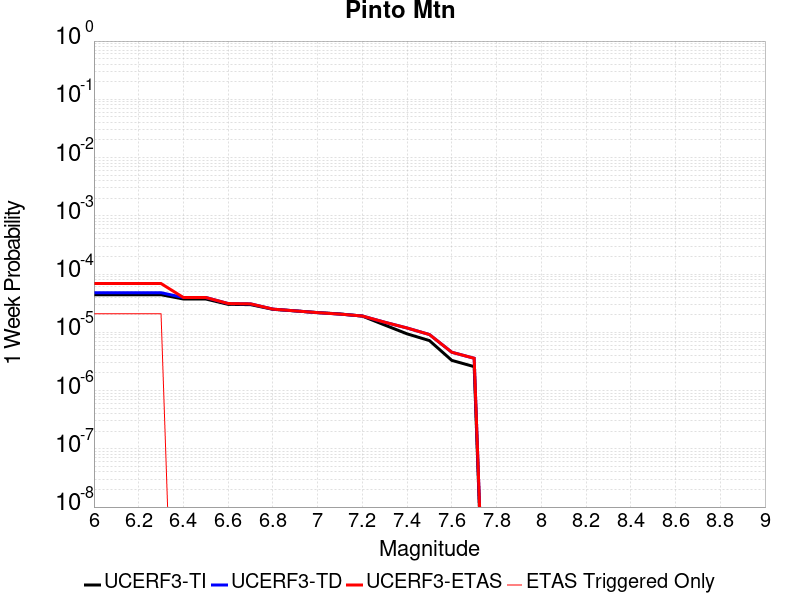 | 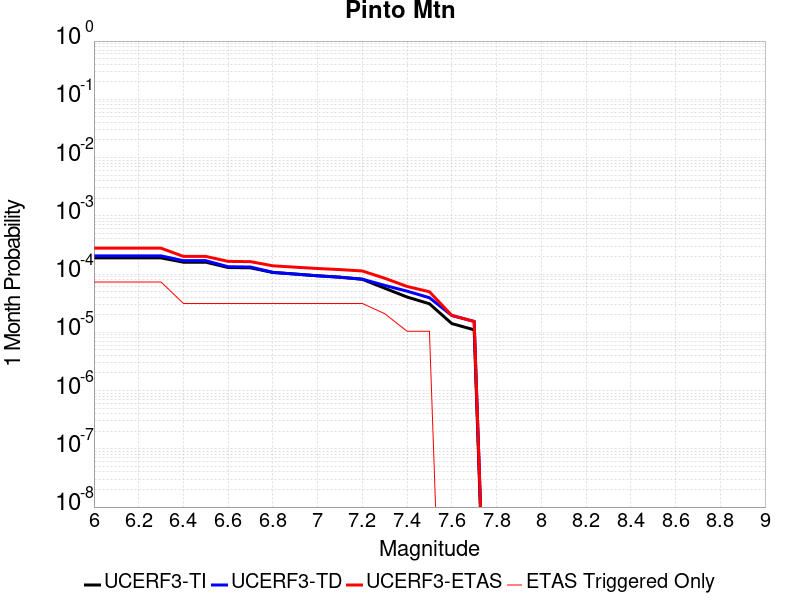 | 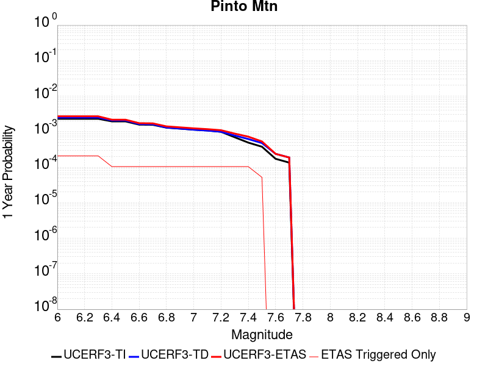 | 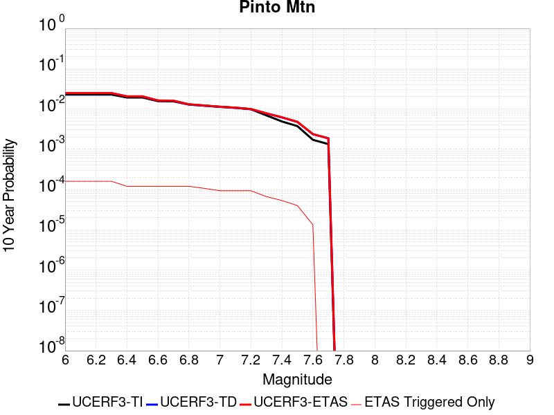 |

| Magnitude | 1 wk TI Prob | 1 wk TD Prob | 1 wk ETAS Prob | 1 wk ETAS/TD Gain | 1 wk ETAS Triggered Only | 1 mo TI Prob | 1 mo TD Prob | 1 mo ETAS Prob | 1 mo ETAS/TD Gain | 1 mo ETAS Triggered Only | 1 yr TI Prob | 1 yr TD Prob | 1 yr ETAS Prob | 1 yr ETAS/TD Gain | 1 yr ETAS Triggered Only | 10 yr TI Prob | 10 yr TD Prob | 10 yr ETAS Prob | 10 yr ETAS/TD Gain | 10 yr ETAS Triggered Only |
|-----|-----|-----|-----|-----|-----|-----|-----|-----|-----|-----|-----|-----|-----|-----|-----|-----|-----|-----|-----|-----|
| 6.0 | 4.4194956E-5 | 4.785362E-5 | 6.872444E-5 | 1.4361387 | 2.0871816E-5 | 1.893932E-4 | 2.0507174E-4 | 2.781081E-4 | 1.3561504 | 7.305136E-5 | 0.0023034236 | 0.0024940541 | 0.002587743 | 1.0375649 | 9.392317E-5 | 0.022796938 | 0.024678145 | 0.024820643 | 1.0057743 | 1.4610271E-4 |
| 6.1 | 4.4194956E-5 | 4.785362E-5 | 6.872444E-5 | 1.4361387 | 2.0871816E-5 | 1.893932E-4 | 2.0507174E-4 | 2.781081E-4 | 1.3561504 | 7.305136E-5 | 0.0023034236 | 0.0024940541 | 0.002587743 | 1.0375649 | 9.392317E-5 | 0.022796938 | 0.024678145 | 0.024820643 | 1.0057743 | 1.4610271E-4 |
| 6.2 | 4.4194956E-5 | 4.785362E-5 | 6.872444E-5 | 1.4361387 | 2.0871816E-5 | 1.893932E-4 | 2.0507174E-4 | 2.781081E-4 | 1.3561504 | 7.305136E-5 | 0.0023034236 | 0.0024940541 | 0.002587743 | 1.0375649 | 9.392317E-5 | 0.022796938 | 0.024678145 | 0.024820643 | 1.0057743 | 1.4610271E-4 |
| 6.3 | 4.4194956E-5 | 4.785362E-5 | 6.872444E-5 | 1.4361387 | 2.0871816E-5 | 1.893932E-4 | 2.0507174E-4 | 2.781081E-4 | 1.3561504 | 7.305136E-5 | 0.0023034236 | 0.0024940541 | 0.002587743 | 1.0375649 | 9.392317E-5 | 0.022796938 | 0.024678145 | 0.024820643 | 1.0057743 | 1.4610271E-4 |
| 6.4 | 3.729929E-5 | 3.9603186E-5 | 3.9603186E-5 | 1.0 | 0.0 | 1.5984432E-4 | 1.6971743E-4 | 2.0101984E-4 | 1.1844383 | 3.1307725E-5 | 0.0019443673 | 0.002064445 | 0.0021165167 | 1.0252231 | 5.217954E-5 | 0.019274427 | 0.02046269 | 0.020564914 | 1.0049956 | 1.0435908E-4 |
| 6.5 | 3.729929E-5 | 3.9603186E-5 | 3.9603186E-5 | 1.0 | 0.0 | 1.5984432E-4 | 1.6971743E-4 | 2.0101984E-4 | 1.1844383 | 3.1307725E-5 | 0.0019443673 | 0.002064445 | 0.0021165167 | 1.0252231 | 5.217954E-5 | 0.019274427 | 0.02046269 | 0.020564914 | 1.0049956 | 1.0435908E-4 |
| 6.6 | 3.0204548E-5 | 3.1205298E-5 | 3.1205298E-5 | 1.0 | 0.0 | 1.2944164E-4 | 1.3373033E-4 | 1.6503387E-4 | 1.2340796 | 3.1307725E-5 | 0.0015748127 | 0.0016269855 | 0.0016790801 | 1.0320191 | 5.217954E-5 | 0.015636992 | 0.01615461 | 0.016257282 | 1.0063556 | 1.0435908E-4 |
| 6.7 | 2.9857754E-5 | 3.081468E-5 | 3.081468E-5 | 1.0 | 0.0 | 1.2795553E-4 | 1.3205643E-4 | 1.6336002E-4 | 1.2370471 | 3.1307725E-5 | 0.0015567453 | 0.001606636 | 0.0016587316 | 1.0324253 | 5.217954E-5 | 0.015458848 | 0.01595405 | 0.016056743 | 1.0064368 | 1.0435908E-4 |
| 6.8 | 2.4819734E-5 | 2.5009364E-5 | 2.5009364E-5 | 1.0 | 0.0 | 1.0636595E-4 | 1.07178705E-4 | 1.3848307E-4 | 1.2920763 | 3.1307725E-5 | 0.0012942362 | 0.0013041412 | 0.0013562527 | 1.0399585 | 5.217954E-5 | 0.012867244 | 0.0129672475 | 0.013059952 | 1.0071492 | 9.392317E-5 |
| 6.9 | 2.331124E-5 | 2.3337643E-5 | 2.3337643E-5 | 1.0 | 0.0 | 9.990149E-5 | 1.00014746E-4 | 1.3131934E-4 | 1.3129997 | 3.1307725E-5 | 0.001215622 | 0.0012170197 | 0.0012691357 | 1.0428227 | 5.217954E-5 | 0.012089936 | 0.012105742 | 0.012188218 | 1.006813 | 8.348726E-5 |
| 7.0 | 2.1818534E-5 | 2.1760772E-5 | 2.1760772E-5 | 1.0 | 0.0 | 9.3504656E-5 | 9.325723E-5 | 1.2456204E-4 | 1.3356823 | 3.1307725E-5 | 0.0011378246 | 0.0011348352 | 0.0011869555 | 1.0459276 | 5.217954E-5 | 0.011320163 | 0.011292503 | 0.01136473 | 1.0063959 | 7.305136E-5 |
| 7.1 | 2.066081E-5 | 2.0540418E-5 | 2.0540418E-5 | 1.0 | 0.0 | 8.854332E-5 | 8.8027504E-5 | 1.1933247E-4 | 1.3556272 | 3.1307725E-5 | 0.0010774818 | 0.0010712275 | 0.001123351 | 1.0486579 | 5.217954E-5 | 0.010722724 | 0.010662688 | 0.01073496 | 1.0067781 | 7.305136E-5 |
| 7.2 | 1.8990233E-5 | 1.9053701E-5 | 1.9053701E-5 | 1.0 | 0.0 | 8.138417E-5 | 8.1656275E-5 | 1.1296144E-4 | 1.3833773 | 3.1307725E-5 | 9.904018E-4 | 9.937311E-4 | 0.0010458587 | 1.0524565 | 5.217954E-5 | 0.009859995 | 0.009894874 | 0.009967202 | 1.0073097 | 7.305136E-5 |
| 7.3 | 1.3335872E-5 | 1.4906372E-5 | 1.4906372E-5 | 1.0 | 0.0 | 5.7152483E-5 | 6.388296E-5 | 8.475344E-5 | 1.3266988 | 2.0871816E-5 | 6.956093E-4 | 7.775102E-4 | 8.087936E-4 | 1.0402353 | 3.1307725E-5 | 0.006934359 | 0.0077491994 | 0.0078009744 | 1.0066813 | 5.217954E-5 |
| 7.4 | 9.414066E-6 | 1.186061E-5 | 1.186061E-5 | 1.0 | 0.0 | 4.0345374E-5 | 5.0830247E-5 | 6.126563E-5 | 1.2052985 | 1.0435908E-5 | 4.910942E-4 | 6.1869196E-4 | 6.395509E-4 | 1.0337145 | 2.0871816E-5 | 0.0049001034 | 0.006170644 | 0.0062121297 | 1.0067232 | 4.174363E-5 |
| 7.5 | 7.2101157E-6 | 9.157893E-6 | 9.157893E-6 | 1.0 | 0.0 | 3.090013E-5 | 3.924757E-5 | 4.9683065E-5 | 1.265889 | 1.0435908E-5 | 3.7614413E-4 | 4.7774217E-4 | 4.881731E-4 | 1.0218338 | 1.0435908E-5 | 0.0037550807 | 0.004767927 | 0.004799085 | 1.006535 | 3.1307725E-5 |
| 7.6 | 3.296375E-6 | 4.5453176E-6 | 4.5453176E-6 | 1.0 | 0.0 | 1.4127245E-5 | 1.9479796E-5 | 1.9479796E-5 | 1.0 | 0.0 | 1.7198564E-4 | 2.3714209E-4 | 2.3714209E-4 | 1.0 | 0.0 | 0.0017185259 | 0.0023690276 | 0.0023794388 | 1.0043947 | 1.0435908E-5 |
| 7.7 | 2.5741092E-6 | 3.584251E-6 | 3.584251E-6 | 1.0 | 0.0 | 1.103185E-5 | 1.5360993E-5 | 1.5360993E-5 | 1.0 | 0.0 | 1.3430449E-4 | 1.8700535E-4 | 1.8700535E-4 | 1.0 | 0.0 | 0.0013422335 | 0.0018686098 | 0.0018686098 | 1.0 | 0.0 |

## Ortigalita (North)
*[(top)](#table-of-contents)*

| 1 Week | 1 Month | 1 Year | 10 Year |
|-----|-----|-----|-----|
| 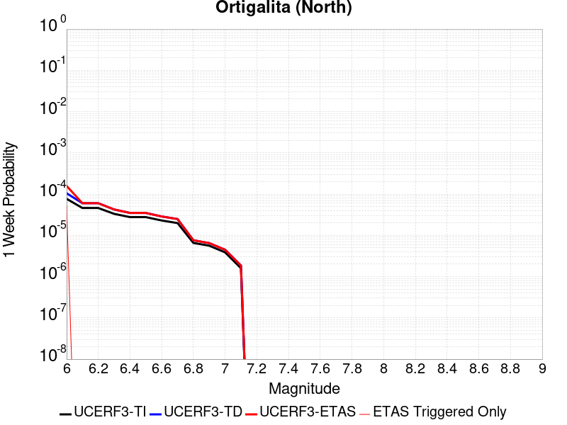 | 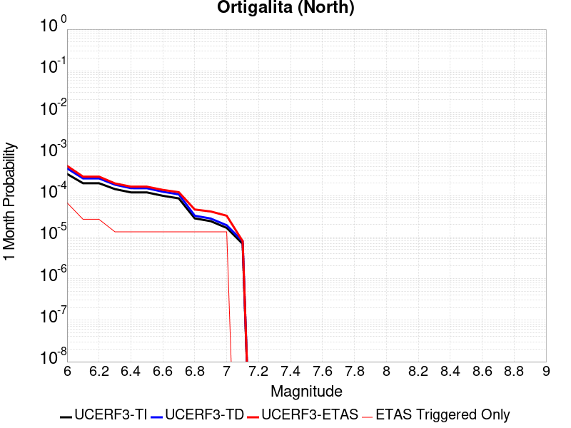 | 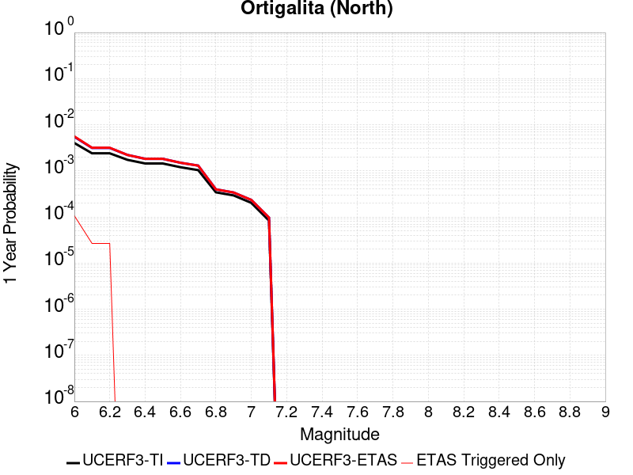 | 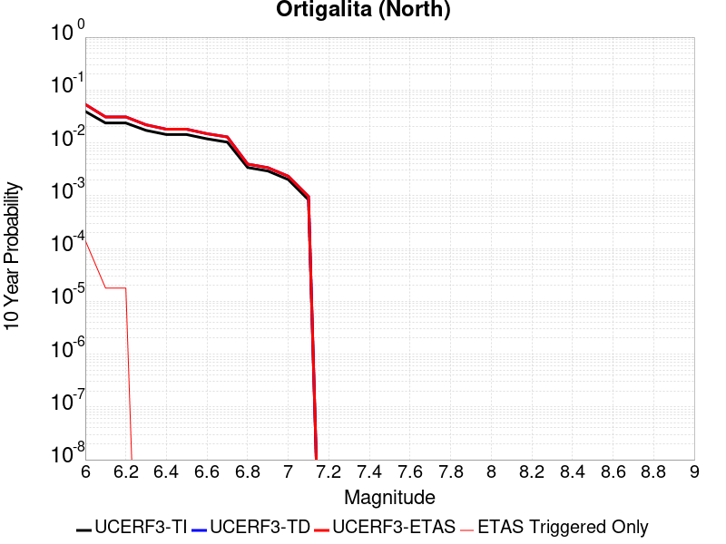 |

| Magnitude | 1 wk TI Prob | 1 wk TD Prob | 1 wk ETAS Prob | 1 wk ETAS/TD Gain | 1 wk ETAS Triggered Only | 1 mo TI Prob | 1 mo TD Prob | 1 mo ETAS Prob | 1 mo ETAS/TD Gain | 1 mo ETAS Triggered Only | 1 yr TI Prob | 1 yr TD Prob | 1 yr ETAS Prob | 1 yr ETAS/TD Gain | 1 yr ETAS Triggered Only | 10 yr TI Prob | 10 yr TD Prob | 10 yr ETAS Prob | 10 yr ETAS/TD Gain | 10 yr ETAS Triggered Only |
|-----|-----|-----|-----|-----|-----|-----|-----|-----|-----|-----|-----|-----|-----|-----|-----|-----|-----|-----|-----|-----|
| 6.0 | 7.711876E-5 | 1.05064966E-4 | 1.2593459E-4 | 1.1986355 | 2.0871816E-5 | 3.3046713E-4 | 4.502116E-4 | 5.1279884E-4 | 1.1390175 | 6.261545E-5 | 0.004016016 | 0.0054681194 | 0.0055511505 | 1.0151845 | 8.348726E-5 | 0.039442103 | 0.053454787 | 0.0535832 | 1.0024023 | 1.356668E-4 |
| 6.1 | 4.607858E-5 | 6.0239203E-5 | 6.0239203E-5 | 1.0 | 0.0 | 1.9746469E-4 | 2.5814527E-4 | 2.894449E-4 | 1.1212481 | 3.1307725E-5 | 0.0024014818 | 0.0031387596 | 0.003169969 | 1.0099432 | 3.1307725E-5 | 0.023756953 | 0.030975068 | 0.031005407 | 1.0009794 | 3.1307725E-5 |
| 6.2 | 4.607858E-5 | 6.0239203E-5 | 6.0239203E-5 | 1.0 | 0.0 | 1.9746469E-4 | 2.5814527E-4 | 2.894449E-4 | 1.1212481 | 3.1307725E-5 | 0.0024014818 | 0.0031387596 | 0.003169969 | 1.0099432 | 3.1307725E-5 | 0.023756953 | 0.030975068 | 0.031005407 | 1.0009794 | 3.1307725E-5 |
| 6.3 | 3.327423E-5 | 4.2475127E-5 | 4.2475127E-5 | 1.0 | 0.0 | 1.4259605E-4 | 1.8202531E-4 | 1.9245932E-4 | 1.0573218 | 1.0435908E-5 | 0.0017347244 | 0.002214197 | 0.00222461 | 1.0047027 | 1.0435908E-5 | 0.017212452 | 0.021945644 | 0.021955851 | 1.0004652 | 1.0435908E-5 |
| 6.4 | 2.7732503E-5 | 3.4998593E-5 | 3.4998593E-5 | 1.0 | 0.0 | 1.1884817E-4 | 1.4998685E-4 | 1.604212E-4 | 1.0695684 | 1.0435908E-5 | 0.001446016 | 0.0018248095 | 0.0018352264 | 1.0057085 | 1.0435908E-5 | 0.014366428 | 0.018121224 | 0.01813147 | 1.0005654 | 1.0435908E-5 |
| 6.5 | 2.7689714E-5 | 3.4948407E-5 | 3.4948407E-5 | 1.0 | 0.0 | 1.186648E-4 | 1.497718E-4 | 1.6020614E-4 | 1.0696683 | 1.0435908E-5 | 0.0014437864 | 0.0018221956 | 0.0018326124 | 1.0057167 | 1.0435908E-5 | 0.014344421 | 0.01809551 | 0.018105756 | 1.0005662 | 1.0435908E-5 |
| 6.6 | 2.2976905E-5 | 2.8718265E-5 | 2.8718265E-5 | 1.0 | 0.0 | 9.846873E-5 | 1.230739E-4 | 1.3350853E-4 | 1.0847834 | 1.0435908E-5 | 0.0011981975 | 0.0014976363 | 0.0015080567 | 1.0069578 | 1.0435908E-5 | 0.011917574 | 0.014898697 | 0.014908978 | 1.00069 | 1.0435908E-5 |
| 6.7 | 1.9871539E-5 | 2.4904411E-5 | 2.4904411E-5 | 1.0 | 0.0 | 8.516096E-5 | 1.0673023E-4 | 1.1716502E-4 | 1.097768 | 1.0435908E-5 | 0.0010363415 | 0.0012989145 | 0.001309337 | 1.0080239 | 1.0435908E-5 | 0.010315218 | 0.012936919 | 0.01294722 | 1.0007962 | 1.0435908E-5 |
| 6.8 | 6.5640475E-6 | 7.6054926E-6 | 7.6054926E-6 | 1.0 | 0.0 | 2.813133E-5 | 3.2594577E-5 | 4.3030144E-5 | 1.3201627 | 1.0435908E-5 | 3.424451E-4 | 3.9676955E-4 | 4.0720133E-4 | 1.0262917 | 1.0435908E-5 | 0.0034191788 | 0.003960899 | 0.0039712936 | 1.0026243 | 1.0435908E-5 |
| 6.9 | 5.6219683E-6 | 6.5018376E-6 | 6.5018376E-6 | 1.0 | 0.0 | 2.4093928E-5 | 2.7864735E-5 | 3.8300353E-5 | 1.3745098 | 1.0435908E-5 | 2.933041E-4 | 3.3920293E-4 | 3.496353E-4 | 1.0307555 | 1.0435908E-5 | 0.0029291727 | 0.003387109 | 0.0033975095 | 1.0030706 | 1.0435908E-5 |
| 7.0 | 3.875591E-6 | 4.4847548E-6 | 4.4847548E-6 | 1.0 | 0.0 | 1.6609569E-5 | 1.9220248E-5 | 2.9655956E-5 | 1.5429538 | 1.0435908E-5 | 2.0220275E-4 | 2.339835E-4 | 2.4441697E-4 | 1.0445906 | 1.0435908E-5 | 0.0020201886 | 0.0023375798 | 0.0023479913 | 1.004454 | 1.0435908E-5 |
| 7.1 | 1.6017933E-6 | 1.8570418E-6 | 1.8570418E-6 | 1.0 | 0.0 | 6.8648105E-6 | 7.958732E-6 | 7.958732E-6 | 1.0 | 0.0 | 8.357586E-5 | 9.689432E-5 | 9.689432E-5 | 1.0 | 0.0 | 8.3544437E-4 | 9.686254E-4 | 9.686254E-4 | 1.0 | 0.0 |

## Coronado Bank alt1
*[(top)](#table-of-contents)*

| 1 Week | 1 Month | 1 Year | 10 Year |
|-----|-----|-----|-----|
| 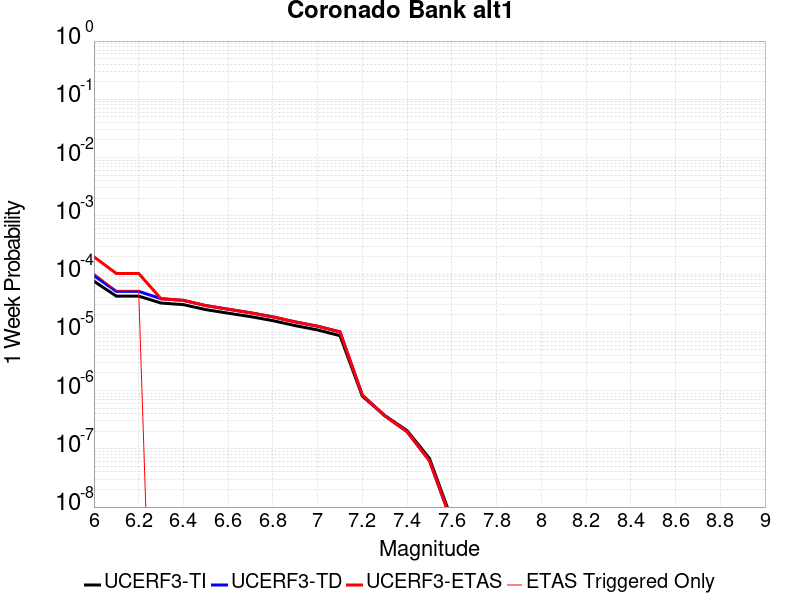 | 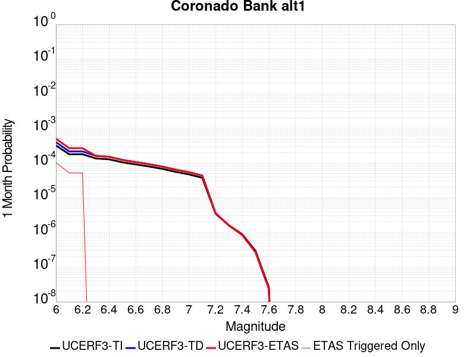 | 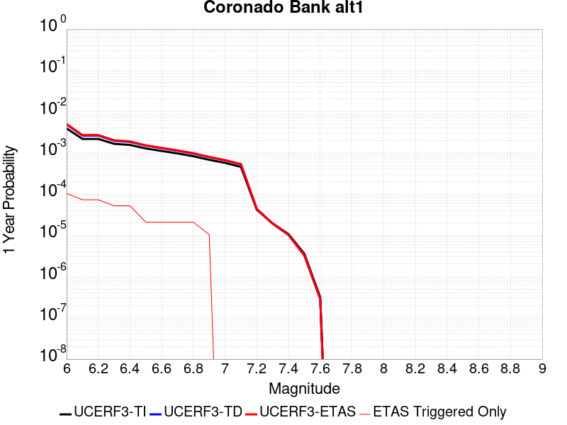 | 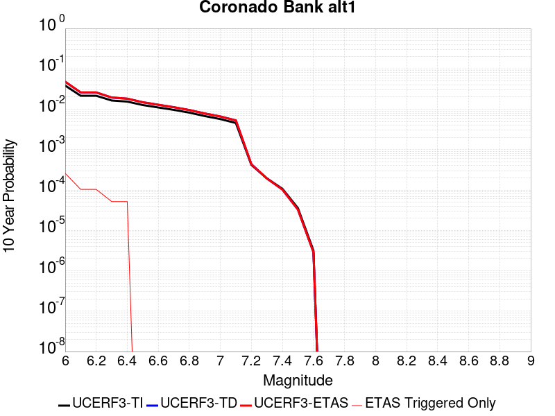 |

| Magnitude | 1 wk TI Prob | 1 wk TD Prob | 1 wk ETAS Prob | 1 wk ETAS/TD Gain | 1 wk ETAS Triggered Only | 1 mo TI Prob | 1 mo TD Prob | 1 mo ETAS Prob | 1 mo ETAS/TD Gain | 1 mo ETAS Triggered Only | 1 yr TI Prob | 1 yr TD Prob | 1 yr ETAS Prob | 1 yr ETAS/TD Gain | 1 yr ETAS Triggered Only | 10 yr TI Prob | 10 yr TD Prob | 10 yr ETAS Prob | 10 yr ETAS/TD Gain | 10 yr ETAS Triggered Only |
|-----|-----|-----|-----|-----|-----|-----|-----|-----|-----|-----|-----|-----|-----|-----|-----|-----|-----|-----|-----|-----|
| 6.0 | 7.533492E-5 | 9.394913E-5 | 1.4612377E-4 | 1.5553498 | 5.217954E-5 | 3.22824E-4 | 4.0258127E-4 | 4.651715E-4 | 1.1554723 | 6.261545E-5 | 0.0039233007 | 0.0048909658 | 0.0049948143 | 1.0212327 | 1.0435908E-4 | 0.03854755 | 0.04790356 | 0.04803273 | 1.0026964 | 1.356668E-4 |
| 6.1 | 4.1807285E-5 | 5.049283E-5 | 9.223435E-5 | 1.8266822 | 4.174363E-5 | 1.7916178E-4 | 2.1638049E-4 | 2.6854873E-4 | 1.241095 | 5.217954E-5 | 0.0021791123 | 0.0026313474 | 0.0027042066 | 1.0276889 | 7.305136E-5 | 0.021578677 | 0.026011046 | 0.026092362 | 1.0031261 | 8.348726E-5 |
| 6.2 | 4.1807285E-5 | 5.049283E-5 | 9.223435E-5 | 1.8266822 | 4.174363E-5 | 1.7916178E-4 | 2.1638049E-4 | 2.6854873E-4 | 1.241095 | 5.217954E-5 | 0.0021791123 | 0.0026313474 | 0.0027042066 | 1.0276889 | 7.305136E-5 | 0.021578677 | 0.026011046 | 0.026092362 | 1.0031261 | 8.348726E-5 |
| 6.3 | 3.1793104E-5 | 3.7711117E-5 | 5.8582144E-5 | 1.553445 | 2.0871816E-5 | 1.3624904E-4 | 1.6160926E-4 | 1.9291193E-4 | 1.1936935 | 3.1307725E-5 | 0.0016575698 | 0.001965848 | 0.002017925 | 1.0264908 | 5.217954E-5 | 0.016452603 | 0.019488465 | 0.019539628 | 1.0026252 | 5.217954E-5 |
| 6.4 | 2.9878007E-5 | 3.5335794E-5 | 5.6206874E-5 | 1.5906497 | 2.0871816E-5 | 1.2804232E-4 | 1.5143053E-4 | 1.8273352E-4 | 1.2067151 | 3.1307725E-5 | 0.0015578003 | 0.0018421387 | 0.0018942221 | 1.0282733 | 5.217954E-5 | 0.015469253 | 0.01827244 | 0.018323667 | 1.0028034 | 5.217954E-5 |
| 6.5 | 2.4512565E-5 | 2.8764043E-5 | 3.919965E-5 | 1.3628005 | 1.0435908E-5 | 1.0504962E-4 | 1.2326881E-4 | 1.4413804E-4 | 1.1692986 | 2.0871816E-5 | 0.0012782287 | 0.0014997921 | 0.0015206326 | 1.0138956 | 2.0871816E-5 | 0.012709012 | 0.014899683 | 0.014920244 | 1.00138 | 2.0871816E-5 |
| 6.6 | 2.1317413E-5 | 2.490667E-5 | 3.5342317E-5 | 1.4189901 | 1.0435908E-5 | 9.135714E-5 | 1.0673863E-4 | 1.2760822E-4 | 1.1955205 | 2.0871816E-5 | 0.0011117056 | 0.0012987906 | 0.0013196352 | 1.0160493 | 2.0871816E-5 | 0.011061605 | 0.012914404 | 0.012935007 | 1.0015953 | 2.0871816E-5 |
| 6.7 | 1.8585655E-5 | 2.163488E-5 | 3.2070562E-5 | 1.4823545 | 1.0435908E-5 | 7.9650374E-5 | 9.271773E-5 | 1.13587615E-4 | 1.2250905 | 2.0871816E-5 | 9.6931186E-4 | 0.0011282742 | 0.0011491226 | 1.018478 | 2.0871816E-5 | 0.0096509475 | 0.011227623 | 0.01124826 | 1.0018381 | 2.0871816E-5 |
| 6.8 | 1.5862879E-5 | 1.8419474E-5 | 2.8855191E-5 | 1.5665588 | 1.0435908E-5 | 6.798199E-5 | 7.893833E-5 | 9.9808494E-5 | 1.2643857 | 2.0871816E-5 | 8.273665E-4 | 9.6066965E-4 | 9.815214E-4 | 1.0217054 | 2.0871816E-5 | 0.008242928 | 0.00956715 | 0.0095878225 | 1.0021608 | 2.0871816E-5 |
| 6.9 | 1.3021509E-5 | 1.5095265E-5 | 2.5531015E-5 | 1.6913261 | 1.0435908E-5 | 5.5805274E-5 | 6.469249E-5 | 7.512772E-5 | 1.1613052 | 1.0435908E-5 | 6.792174E-4 | 7.8736455E-4 | 7.977922E-4 | 1.0132438 | 1.0435908E-5 | 0.006771452 | 0.007847573 | 0.007857926 | 1.0013194 | 1.0435908E-5 |
| 7.0 | 1.0974371E-5 | 1.2720104E-5 | 1.2720104E-5 | 1.0 | 0.0 | 4.7032172E-5 | 5.451369E-5 | 5.451369E-5 | 1.0 | 0.0 | 5.7246623E-4 | 6.6351966E-4 | 6.6351966E-4 | 1.0 | 0.0 | 0.0057099373 | 0.006617135 | 0.006617135 | 1.0 | 0.0 |
| 7.1 | 8.766221E-6 | 1.01638325E-5 | 1.01638325E-5 | 1.0 | 0.0 | 3.7568978E-5 | 4.355865E-5 | 4.355865E-5 | 1.0 | 0.0 | 4.573063E-4 | 5.3021475E-4 | 5.3021475E-4 | 1.0 | 0.0 | 0.0045636636 | 0.0052911965 | 0.0052911965 | 1.0 | 0.0 |
| 7.2 | 8.026024E-7 | 8.331765E-7 | 8.331765E-7 | 1.0 | 0.0 | 3.43972E-6 | 3.5707515E-6 | 3.5707515E-6 | 1.0 | 0.0 | 4.1877785E-5 | 4.3473043E-5 | 4.3473043E-5 | 1.0 | 0.0 | 4.1869894E-4 | 4.3464647E-4 | 4.3464647E-4 | 1.0 | 0.0 |
| 7.3 | 3.7293114E-7 | 3.7000953E-7 | 3.7000953E-7 | 1.0 | 0.0 | 1.5982754E-6 | 1.5857541E-6 | 1.5857541E-6 | 1.0 | 0.0 | 1.9458828E-5 | 1.9306386E-5 | 1.9306386E-5 | 1.0 | 0.0 | 1.9457124E-4 | 1.9304715E-4 | 1.9304715E-4 | 1.0 | 0.0 |
| 7.4 | 2.0557036E-7 | 1.9674363E-7 | 1.9674363E-7 | 1.0 | 0.0 | 8.810155E-7 | 8.431867E-7 | 8.431867E-7 | 1.0 | 0.0 | 1.0726311E-5 | 1.026575E-5 | 1.026575E-5 | 1.0 | 0.0 | 1.0725793E-4 | 1.0265279E-4 | 1.0265279E-4 | 1.0 | 0.0 |
| 7.5 | 6.845446E-8 | 6.279369E-8 | 6.279369E-8 | 1.0 | 0.0 | 2.9337625E-7 | 2.691158E-7 | 2.691158E-7 | 1.0 | 0.0 | 3.5718497E-6 | 3.2764797E-6 | 3.2764797E-6 | 1.0 | 0.0 | 3.5717923E-5 | 3.2764325E-5 | 3.2764325E-5 | 1.0 | 0.0 |
| 7.6 | 6.0975145E-9 | 5.53185E-9 | 5.53185E-9 | 1.0 | 0.0 | 2.6132206E-8 | 2.370793E-8 | 2.370793E-8 | 1.0 | 0.0 | 3.1815955E-7 | 2.88644E-7 | 2.88644E-7 | 1.0 | 0.0 | 3.181591E-6 | 2.8864374E-6 | 2.8864374E-6 | 1.0 | 0.0 |

## Chino alt 1
*[(top)](#table-of-contents)*

| 1 Week | 1 Month | 1 Year | 10 Year |
|-----|-----|-----|-----|
| 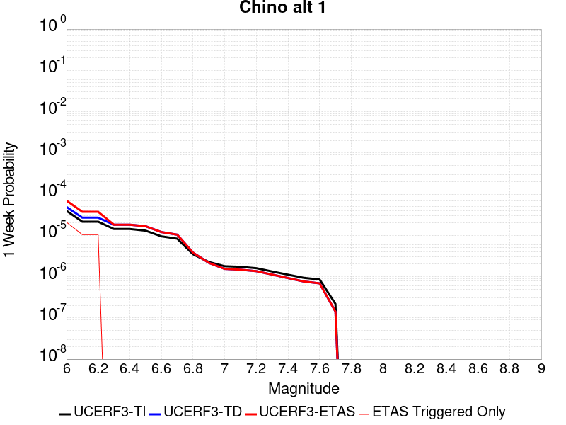 | 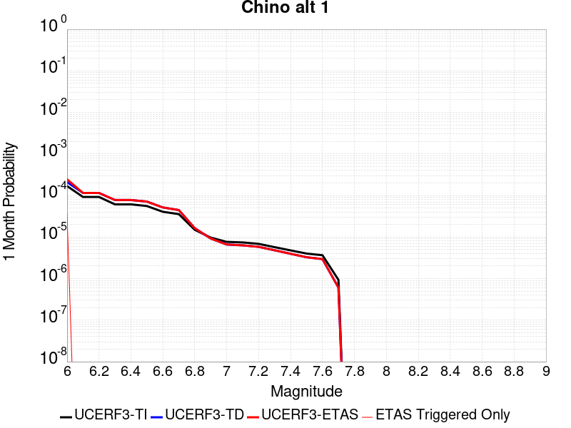 | 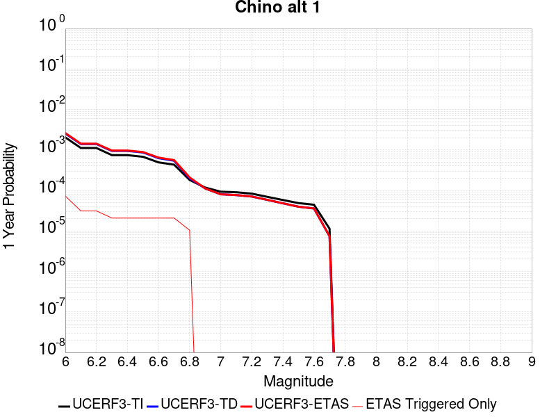 | 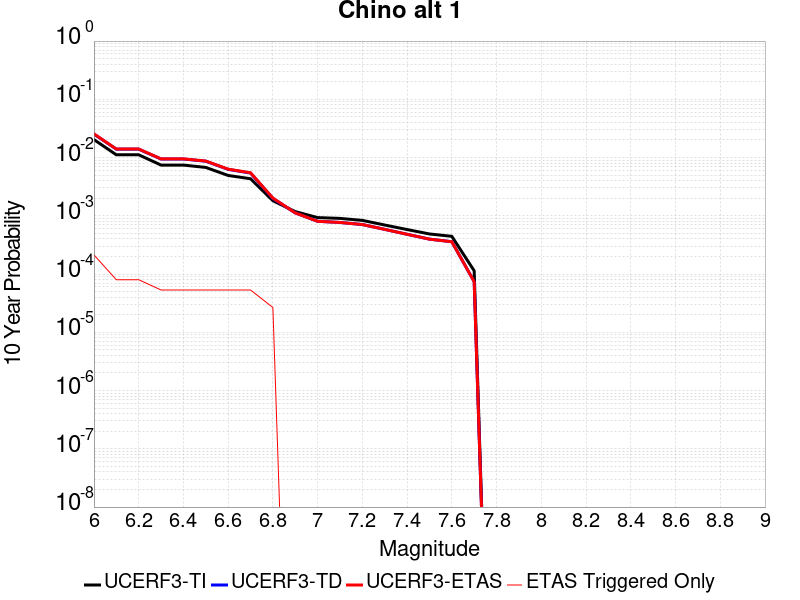 |

| Magnitude | 1 wk TI Prob | 1 wk TD Prob | 1 wk ETAS Prob | 1 wk ETAS/TD Gain | 1 wk ETAS Triggered Only | 1 mo TI Prob | 1 mo TD Prob | 1 mo ETAS Prob | 1 mo ETAS/TD Gain | 1 mo ETAS Triggered Only | 1 yr TI Prob | 1 yr TD Prob | 1 yr ETAS Prob | 1 yr ETAS/TD Gain | 1 yr ETAS Triggered Only | 10 yr TI Prob | 10 yr TD Prob | 10 yr ETAS Prob | 10 yr ETAS/TD Gain | 10 yr ETAS Triggered Only |
|-----|-----|-----|-----|-----|-----|-----|-----|-----|-----|-----|-----|-----|-----|-----|-----|-----|-----|-----|-----|-----|
| 6.0 | 3.939946E-5 | 4.8948554E-5 | 6.981935E-5 | 1.4263822 | 2.0871816E-5 | 1.6884391E-4 | 2.097656E-4 | 2.4106675E-4 | 1.1492196 | 3.1307725E-5 | 0.0020537362 | 0.0025513945 | 0.0026242596 | 1.0285589 | 7.305136E-5 | 0.020348595 | 0.025277847 | 0.025379568 | 1.0040241 | 1.0435908E-4 |
| 6.1 | 2.1505624E-5 | 2.6879026E-5 | 3.7314654E-5 | 1.3882443 | 1.0435908E-5 | 9.2163704E-5 | 1.1519137E-4 | 1.2562607E-4 | 1.0905858 | 1.0435908E-5 | 0.0011215154 | 0.001401664 | 0.0014329278 | 1.0223048 | 3.1307725E-5 | 0.011158722 | 0.013945141 | 0.013986303 | 1.0029516 | 4.174363E-5 |
| 6.2 | 2.1505624E-5 | 2.6879026E-5 | 3.7314654E-5 | 1.3882443 | 1.0435908E-5 | 9.2163704E-5 | 1.1519137E-4 | 1.2562607E-4 | 1.0905858 | 1.0435908E-5 | 0.0011215154 | 0.001401664 | 0.0014329278 | 1.0223048 | 3.1307725E-5 | 0.011158722 | 0.013945141 | 0.013986303 | 1.0029516 | 4.174363E-5 |
| 6.3 | 1.4290785E-5 | 1.8165128E-5 | 1.8165128E-5 | 1.0 | 0.0 | 6.1244784E-5 | 7.784848E-5 | 7.784848E-5 | 1.0 | 0.0 | 7.454001E-4 | 9.4743853E-4 | 9.6829055E-4 | 1.0220089 | 2.0871816E-5 | 0.007429048 | 0.0094444575 | 0.009465132 | 1.002189 | 2.0871816E-5 |
| 6.4 | 1.4290785E-5 | 1.8165128E-5 | 1.8165128E-5 | 1.0 | 0.0 | 6.1244784E-5 | 7.784848E-5 | 7.784848E-5 | 1.0 | 0.0 | 7.454001E-4 | 9.4743853E-4 | 9.6829055E-4 | 1.0220089 | 2.0871816E-5 | 0.007429048 | 0.0094444575 | 0.009465132 | 1.002189 | 2.0871816E-5 |
| 6.5 | 1.3017944E-5 | 1.6652088E-5 | 1.6652088E-5 | 1.0 | 0.0 | 5.5789995E-5 | 7.136439E-5 | 7.136439E-5 | 1.0 | 0.0 | 6.790315E-4 | 8.685589E-4 | 8.8941253E-4 | 1.0240096 | 2.0871816E-5 | 0.0067696036 | 0.008661949 | 0.00868264 | 1.0023887 | 2.0871816E-5 |
| 6.6 | 9.470016E-6 | 1.2039424E-5 | 1.2039424E-5 | 1.0 | 0.0 | 4.058515E-5 | 5.1596704E-5 | 5.1596704E-5 | 1.0 | 0.0 | 4.940122E-4 | 6.280428E-4 | 6.4890145E-4 | 1.0332122 | 2.0871816E-5 | 0.004929154 | 0.0062718987 | 0.0062926398 | 1.003307 | 2.0871816E-5 |
| 6.7 | 8.314155E-6 | 1.0407736E-5 | 1.0407736E-5 | 1.0 | 0.0 | 3.5631605E-5 | 4.4604003E-5 | 4.4604003E-5 | 1.0 | 0.0 | 4.3372845E-4 | 5.429507E-4 | 5.6381116E-4 | 1.0384206 | 2.0871816E-5 | 0.004328829 | 0.005425775 | 0.0054465337 | 1.0038259 | 2.0871816E-5 |
| 6.8 | 3.4856364E-6 | 3.8133708E-6 | 3.8133708E-6 | 1.0 | 0.0 | 1.4938357E-5 | 1.6342927E-5 | 1.6342927E-5 | 1.0 | 0.0 | 1.8185932E-4 | 1.9895904E-4 | 2.0939288E-4 | 1.0524421 | 1.0435908E-5 | 0.0018171056 | 0.0019894864 | 0.0019999016 | 1.0052351 | 1.0435908E-5 |
| 6.9 | 2.2645952E-6 | 2.1529022E-6 | 2.1529022E-6 | 1.0 | 0.0 | 9.705372E-6 | 9.226692E-6 | 9.226692E-6 | 1.0 | 0.0 | 1.18156495E-4 | 1.123294E-4 | 1.123294E-4 | 1.0 | 0.0 | 0.0011809369 | 0.0011233423 | 0.0011233423 | 1.0 | 0.0 |
| 7.0 | 1.7864003E-6 | 1.5430785E-6 | 1.5430785E-6 | 1.0 | 0.0 | 7.655979E-6 | 6.613177E-6 | 6.613177E-6 | 1.0 | 0.0 | 9.3207556E-5 | 8.051251E-5 | 8.051251E-5 | 1.0 | 0.0 | 9.316847E-4 | 8.0528046E-4 | 8.0528046E-4 | 1.0 | 0.0 |
| 7.1 | 1.7315456E-6 | 1.4733511E-6 | 1.4733511E-6 | 1.0 | 0.0 | 7.420889E-6 | 6.3143466E-6 | 6.3143466E-6 | 1.0 | 0.0 | 9.034557E-5 | 7.6874516E-5 | 7.6874516E-5 | 1.0 | 0.0 | 9.0308854E-4 | 7.6891703E-4 | 7.6891703E-4 | 1.0 | 0.0 |
| 7.2 | 1.6008337E-6 | 1.3574215E-6 | 1.3574215E-6 | 1.0 | 0.0 | 6.860698E-6 | 5.817508E-6 | 5.817508E-6 | 1.0 | 0.0 | 8.352579E-5 | 7.082591E-5 | 7.082591E-5 | 1.0 | 0.0 | 8.34944E-4 | 7.0845755E-4 | 7.0845755E-4 | 1.0 | 0.0 |
| 7.3 | 1.3320939E-6 | 1.121782E-6 | 1.121782E-6 | 1.0 | 0.0 | 5.7089615E-6 | 4.807629E-6 | 4.807629E-6 | 1.0 | 0.0 | 6.9504385E-5 | 5.8531357E-5 | 5.8531357E-5 | 1.0 | 0.0 | 6.9482654E-4 | 5.8530393E-4 | 5.8530393E-4 | 1.0 | 0.0 |
| 7.4 | 1.114294E-6 | 9.237111E-7 | 9.237111E-7 | 1.0 | 0.0 | 4.775537E-6 | 3.958756E-6 | 3.958756E-6 | 1.0 | 0.0 | 5.8140613E-5 | 4.8196827E-5 | 4.8196827E-5 | 1.0 | 0.0 | 5.81254E-4 | 4.8188053E-4 | 4.8188053E-4 | 1.0 | 0.0 |
| 7.5 | 9.354081E-7 | 7.6234323E-7 | 7.6234323E-7 | 1.0 | 0.0 | 4.0088858E-6 | 3.2671815E-6 | 3.2671815E-6 | 1.0 | 0.0 | 4.8807087E-5 | 3.9777242E-5 | 3.9777242E-5 | 1.0 | 0.0 | 4.879637E-4 | 3.977046E-4 | 3.977046E-4 | 1.0 | 0.0 |
| 7.6 | 8.521771E-7 | 6.88071E-7 | 6.88071E-7 | 1.0 | 0.0 | 3.6521824E-6 | 2.9488726E-6 | 2.9488726E-6 | 1.0 | 0.0 | 4.4464414E-5 | 3.5901965E-5 | 3.5901965E-5 | 1.0 | 0.0 | 4.4455516E-4 | 3.589648E-4 | 3.589648E-4 | 1.0 | 0.0 |
| 7.7 | 2.1803626E-7 | 1.418649E-7 | 1.418649E-7 | 1.0 | 0.0 | 9.344408E-7 | 6.079923E-7 | 6.079923E-7 | 1.0 | 0.0 | 1.1376757E-5 | 7.4022914E-6 | 7.4022914E-6 | 1.0 | 0.0 | 1.13761744E-4 | 7.402141E-5 | 7.402141E-5 | 1.0 | 0.0 |

## Great Valley 09 (Laguna Seca)
*[(top)](#table-of-contents)*

| 1 Week | 1 Month | 1 Year | 10 Year |
|-----|-----|-----|-----|
| 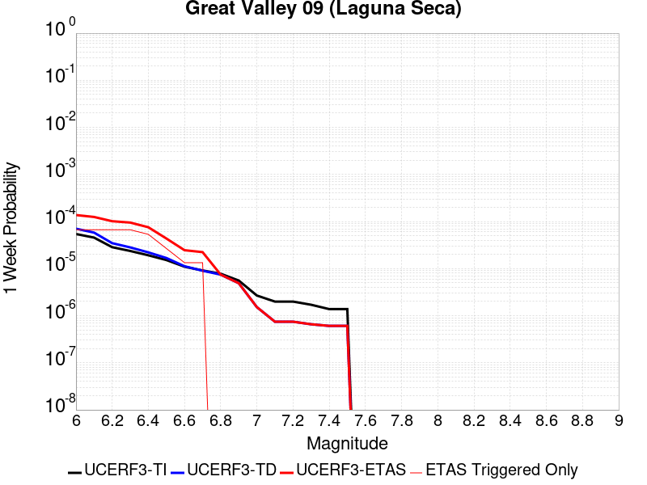 | 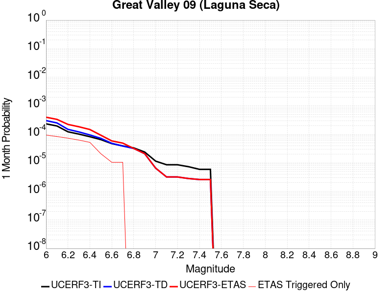 | 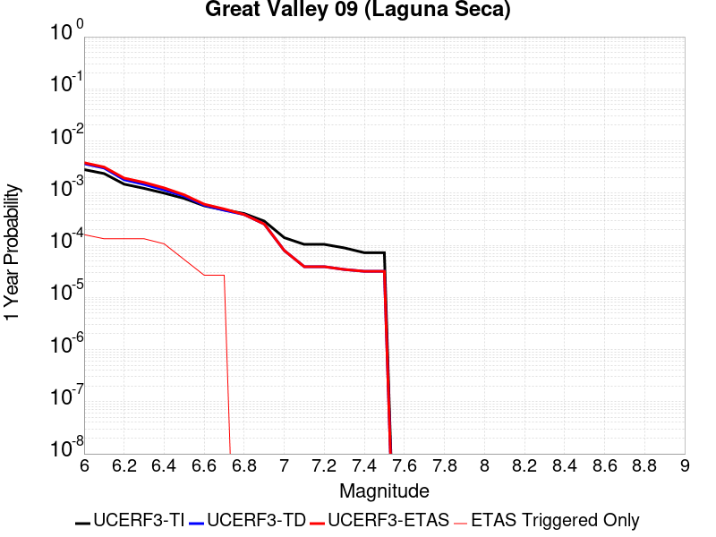 | 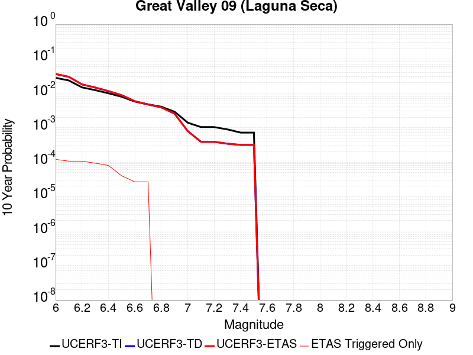 |

| Magnitude | 1 wk TI Prob | 1 wk TD Prob | 1 wk ETAS Prob | 1 wk ETAS/TD Gain | 1 wk ETAS Triggered Only | 1 mo TI Prob | 1 mo TD Prob | 1 mo ETAS Prob | 1 mo ETAS/TD Gain | 1 mo ETAS Triggered Only | 1 yr TI Prob | 1 yr TD Prob | 1 yr ETAS Prob | 1 yr ETAS/TD Gain | 1 yr ETAS Triggered Only | 10 yr TI Prob | 10 yr TD Prob | 10 yr ETAS Prob | 10 yr ETAS/TD Gain | 10 yr ETAS Triggered Only |
|-----|-----|-----|-----|-----|-----|-----|-----|-----|-----|-----|-----|-----|-----|-----|-----|-----|-----|-----|-----|-----|
| 6.0 | 5.4353277E-5 | 7.05022E-5 | 1.3311324E-4 | 1.888072 | 6.261545E-5 | 2.3292181E-4 | 3.0211566E-4 | 3.9601047E-4 | 1.3107909 | 9.392317E-5 | 0.0028321352 | 0.0036721937 | 0.0037761696 | 1.0283144 | 1.0435908E-4 | 0.02796312 | 0.03611547 | 0.036236178 | 1.0033423 | 1.252309E-4 |
| 6.1 | 4.5578287E-5 | 5.822118E-5 | 1.20832985E-4 | 2.0754128 | 6.261545E-5 | 1.953209E-4 | 2.4949326E-4 | 3.329597E-4 | 1.3345438 | 8.348726E-5 | 0.0023754383 | 0.003033432 | 0.0031270701 | 1.0308688 | 9.392317E-5 | 0.023502063 | 0.029919548 | 0.030030908 | 1.003722 | 1.1479499E-4 |
| 6.2 | 2.8536782E-5 | 3.4737273E-5 | 8.6915E-5 | 2.5020673 | 5.217954E-5 | 1.2229476E-4 | 1.4886224E-4 | 2.2190271E-4 | 1.4906583 | 7.305136E-5 | 0.0014879217 | 0.001810813 | 0.0018941491 | 1.0460213 | 8.348726E-5 | 0.014779986 | 0.017958116 | 0.018050354 | 1.0051363 | 9.392317E-5 |
| 6.3 | 2.3698774E-5 | 2.8213295E-5 | 8.0391364E-5 | 2.849414 | 5.217954E-5 | 1.01562226E-4 | 1.20905075E-4 | 1.8351295E-4 | 1.5178267 | 6.261545E-5 | 0.0012358186 | 0.0014710218 | 0.0015439657 | 1.0495872 | 7.305136E-5 | 0.012289686 | 0.014611342 | 0.014693609 | 1.0056304 | 8.348726E-5 |
| 6.4 | 1.9191197E-5 | 2.2123184E-5 | 6.386589E-5 | 2.886831 | 4.174363E-5 | 8.2245395E-5 | 9.4806666E-5 | 1.4698126E-4 | 1.5503262 | 5.217954E-5 | 0.0010008777 | 0.0011536429 | 0.0012161861 | 1.0542136 | 6.261545E-5 | 0.009963818 | 0.011476948 | 0.011549161 | 1.006292 | 7.305136E-5 |
| 6.5 | 1.5203241E-5 | 1.6802203E-5 | 3.7673668E-5 | 2.2421863 | 2.0871816E-5 | 6.5155116E-5 | 7.200386E-5 | 9.287417E-5 | 1.2898499 | 2.0871816E-5 | 7.9297484E-4 | 8.7626575E-4 | 9.075461E-4 | 1.0356972 | 3.1307725E-5 | 0.007901512 | 0.0087295165 | 0.008760551 | 1.003555 | 3.1307725E-5 |
| 6.6 | 1.0984925E-5 | 1.1242595E-5 | 2.1678386E-5 | 1.9282368 | 1.0435908E-5 | 4.70774E-5 | 4.8181686E-5 | 5.861709E-5 | 1.2165844 | 1.0435908E-5 | 5.730166E-4 | 5.8645656E-4 | 6.073161E-4 | 1.0355688 | 2.0871816E-5 | 0.005715413 | 0.0058494853 | 0.005870235 | 1.0035473 | 2.0871816E-5 |
| 6.7 | 9.134616E-6 | 9.019894E-6 | 1.9455707E-5 | 2.1569774 | 1.0435908E-5 | 3.9147766E-5 | 3.865613E-5 | 4.9091635E-5 | 1.2699573 | 1.0435908E-5 | 4.7651984E-4 | 4.7053912E-4 | 4.914011E-4 | 1.0443363 | 2.0871816E-5 | 0.004754993 | 0.0046956735 | 0.004716447 | 1.004424 | 2.0871816E-5 |
| 6.8 | 7.785589E-6 | 7.4519444E-6 | 7.4519444E-6 | 1.0 | 0.0 | 3.3366385E-5 | 3.1936524E-5 | 3.1936524E-5 | 1.0 | 0.0 | 4.0616E-4 | 3.8875983E-4 | 3.8875983E-4 | 1.0 | 0.0 | 0.0040541845 | 0.0038810016 | 0.0038810016 | 1.0 | 0.0 |
| 6.9 | 5.579095E-6 | 4.898492E-6 | 4.898492E-6 | 1.0 | 0.0 | 2.3910188E-5 | 2.0993377E-5 | 2.0993377E-5 | 1.0 | 0.0 | 2.9106764E-4 | 2.5556577E-4 | 2.5556577E-4 | 1.0 | 0.0 | 0.002906867 | 0.002552856 | 0.002552856 | 1.0 | 0.0 |
| 7.0 | 2.6816688E-6 | 1.5216126E-6 | 1.5216126E-6 | 1.0 | 0.0 | 1.1492816E-5 | 6.521181E-6 | 6.521181E-6 | 1.0 | 0.0 | 1.3991605E-4 | 7.939258E-5 | 7.939258E-5 | 1.0 | 0.0 | 0.0013982799 | 7.9365086E-4 | 7.9365086E-4 | 1.0 | 0.0 |
| 7.1 | 1.9951021E-6 | 7.453827E-7 | 7.453827E-7 | 1.0 | 0.0 | 8.55041E-6 | 3.1944935E-6 | 3.1944935E-6 | 1.0 | 0.0 | 1.0409627E-4 | 3.8892307E-5 | 3.8892307E-5 | 1.0 | 0.0 | 0.0010404752 | 3.8885913E-4 | 3.8885913E-4 | 1.0 | 0.0 |
| 7.2 | 1.9951021E-6 | 7.453827E-7 | 7.453827E-7 | 1.0 | 0.0 | 8.55041E-6 | 3.1944935E-6 | 3.1944935E-6 | 1.0 | 0.0 | 1.0409627E-4 | 3.8892307E-5 | 3.8892307E-5 | 1.0 | 0.0 | 0.0010404752 | 3.8885913E-4 | 3.8885913E-4 | 1.0 | 0.0 |
| 7.3 | 1.7087556E-6 | 6.578881E-7 | 6.578881E-7 | 1.0 | 0.0 | 7.3232177E-6 | 2.8195177E-6 | 2.8195177E-6 | 1.0 | 0.0 | 8.915652E-5 | 3.4327128E-5 | 3.4327128E-5 | 1.0 | 0.0 | 8.9120766E-4 | 3.432223E-4 | 3.432223E-4 | 1.0 | 0.0 |
| 7.4 | 1.3804846E-6 | 6.073852E-7 | 6.073852E-7 | 1.0 | 0.0 | 5.916349E-6 | 2.6030768E-6 | 2.6030768E-6 | 1.0 | 0.0 | 7.2029165E-5 | 3.169204E-5 | 3.169204E-5 | 1.0 | 0.0 | 7.200583E-4 | 3.1687922E-4 | 3.1687922E-4 | 1.0 | 0.0 |
| 7.5 | 1.3804846E-6 | 6.073852E-7 | 6.073852E-7 | 1.0 | 0.0 | 5.916349E-6 | 2.6030768E-6 | 2.6030768E-6 | 1.0 | 0.0 | 7.2029165E-5 | 3.169204E-5 | 3.169204E-5 | 1.0 | 0.0 | 7.200583E-4 | 3.1687922E-4 | 3.1687922E-4 | 1.0 | 0.0 |

## Kern Canyon (North Kern) 2011
*[(top)](#table-of-contents)*

| 1 Week | 1 Month | 1 Year | 10 Year |
|-----|-----|-----|-----|
| 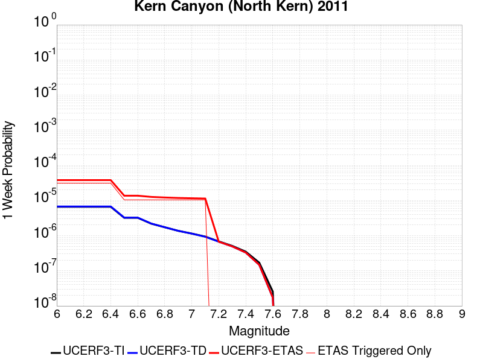 | 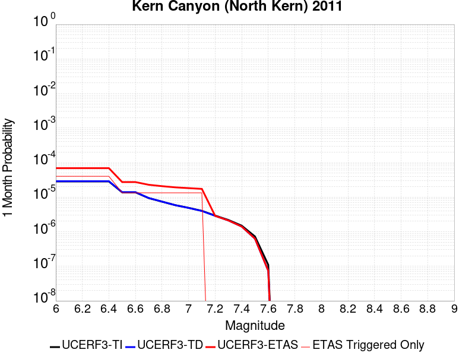 | 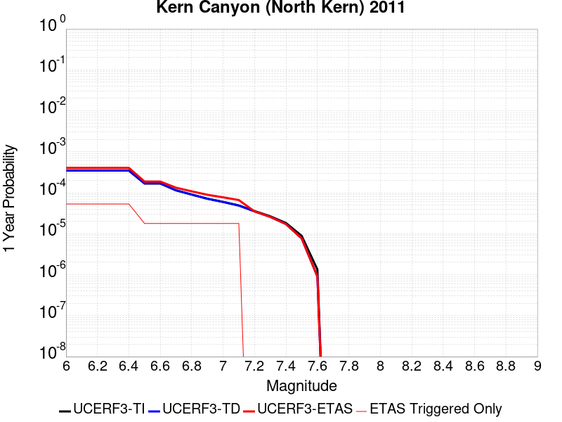 | 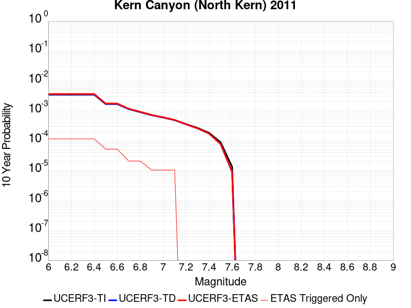 |

| Magnitude | 1 wk TI Prob | 1 wk TD Prob | 1 wk ETAS Prob | 1 wk ETAS/TD Gain | 1 wk ETAS Triggered Only | 1 mo TI Prob | 1 mo TD Prob | 1 mo ETAS Prob | 1 mo ETAS/TD Gain | 1 mo ETAS Triggered Only | 1 yr TI Prob | 1 yr TD Prob | 1 yr ETAS Prob | 1 yr ETAS/TD Gain | 1 yr ETAS Triggered Only | 10 yr TI Prob | 10 yr TD Prob | 10 yr ETAS Prob | 10 yr ETAS/TD Gain | 10 yr ETAS Triggered Only |
|-----|-----|-----|-----|-----|-----|-----|-----|-----|-----|-----|-----|-----|-----|-----|-----|-----|-----|-----|-----|-----|
| 6.0 | 6.6264497E-6 | 6.75733E-6 | 3.806484E-5 | 5.6331186 | 3.1307725E-5 | 2.8398761E-5 | 2.895971E-5 | 7.070213E-5 | 2.4413965 | 4.174363E-5 | 3.4570007E-4 | 3.5253543E-4 | 4.151288E-4 | 1.177552 | 6.261545E-5 | 0.0034516277 | 0.0035205502 | 0.003634941 | 1.0324923 | 1.1479499E-4 |
| 6.1 | 6.6264497E-6 | 6.75733E-6 | 3.806484E-5 | 5.6331186 | 3.1307725E-5 | 2.8398761E-5 | 2.895971E-5 | 7.070213E-5 | 2.4413965 | 4.174363E-5 | 3.4570007E-4 | 3.5253543E-4 | 4.151288E-4 | 1.177552 | 6.261545E-5 | 0.0034516277 | 0.0035205502 | 0.003634941 | 1.0324923 | 1.1479499E-4 |
| 6.2 | 6.6264497E-6 | 6.75733E-6 | 3.806484E-5 | 5.6331186 | 3.1307725E-5 | 2.8398761E-5 | 2.895971E-5 | 7.070213E-5 | 2.4413965 | 4.174363E-5 | 3.4570007E-4 | 3.5253543E-4 | 4.151288E-4 | 1.177552 | 6.261545E-5 | 0.0034516277 | 0.0035205502 | 0.003634941 | 1.0324923 | 1.1479499E-4 |
| 6.3 | 6.6264497E-6 | 6.75733E-6 | 3.806484E-5 | 5.6331186 | 3.1307725E-5 | 2.8398761E-5 | 2.895971E-5 | 7.070213E-5 | 2.4413965 | 4.174363E-5 | 3.4570007E-4 | 3.5253543E-4 | 4.151288E-4 | 1.177552 | 6.261545E-5 | 0.0034516277 | 0.0035205502 | 0.003634941 | 1.0324923 | 1.1479499E-4 |
| 6.4 | 6.6264497E-6 | 6.75733E-6 | 3.806484E-5 | 5.6331186 | 3.1307725E-5 | 2.8398761E-5 | 2.895971E-5 | 7.070213E-5 | 2.4413965 | 4.174363E-5 | 3.4570007E-4 | 3.5253543E-4 | 4.151288E-4 | 1.177552 | 6.261545E-5 | 0.0034516277 | 0.0035205502 | 0.003634941 | 1.0324923 | 1.1479499E-4 |
| 6.5 | 3.2162225E-6 | 3.2570915E-6 | 1.3692966E-5 | 4.2040467 | 1.0435908E-5 | 1.3783738E-5 | 1.3958893E-5 | 2.4394656E-5 | 1.7476068 | 1.0435908E-5 | 1.6780409E-4 | 1.6993708E-4 | 1.9080535E-4 | 1.1228 | 2.0871816E-5 | 0.0016767744 | 0.001698151 | 0.001750242 | 1.030675 | 5.217954E-5 |
| 6.6 | 3.2162225E-6 | 3.2570915E-6 | 1.3692966E-5 | 4.2040467 | 1.0435908E-5 | 1.3783738E-5 | 1.3958893E-5 | 2.4394656E-5 | 1.7476068 | 1.0435908E-5 | 1.6780409E-4 | 1.6993708E-4 | 1.9080535E-4 | 1.1228 | 2.0871816E-5 | 0.0016767744 | 0.001698151 | 0.001750242 | 1.030675 | 5.217954E-5 |
| 6.7 | 2.1908265E-6 | 2.2071222E-6 | 1.2643007E-5 | 5.728277 | 1.0435908E-5 | 9.389223E-6 | 9.459061E-6 | 1.9894871E-5 | 2.1032605 | 1.0435908E-5 | 1.1430779E-4 | 1.1515819E-4 | 1.255929E-4 | 1.0906119 | 1.0435908E-5 | 0.0011424901 | 0.0011510046 | 0.0011718523 | 1.0181127 | 2.0871816E-5 |
| 6.8 | 1.7303895E-6 | 1.7365529E-6 | 1.2172442E-5 | 7.0095434 | 1.0435908E-5 | 7.415934E-6 | 7.4423488E-6 | 1.787818E-5 | 2.4022226 | 1.0435908E-5 | 9.028525E-5 | 9.0606925E-5 | 1.0104189E-4 | 1.1151674 | 1.0435908E-5 | 9.024858E-4 | 9.057096E-4 | 9.2656247E-4 | 1.0230238 | 2.0871816E-5 |
| 6.9 | 1.3700314E-6 | 1.3688622E-6 | 1.1804756E-5 | 8.623772 | 1.0435908E-5 | 5.87155E-6 | 5.8665396E-6 | 1.6302387E-5 | 2.778876 | 1.0435908E-5 | 7.148377E-5 | 7.142282E-5 | 8.185799E-5 | 1.146104 | 1.0435908E-5 | 7.146078E-4 | 7.140032E-4 | 7.244317E-4 | 1.0146056 | 1.0435908E-5 |
| 7.0 | 1.1467797E-6 | 1.1413804E-6 | 1.1577276E-5 | 10.143223 | 1.0435908E-5 | 4.9147607E-6 | 4.8916213E-6 | 1.5327478E-5 | 3.1334147 | 1.0435908E-5 | 5.983557E-5 | 5.9553895E-5 | 6.998918E-5 | 1.1752243 | 1.0435908E-5 | 5.981946E-4 | 5.953825E-4 | 6.058122E-4 | 1.0175177 | 1.0435908E-5 |
| 7.1 | 9.3952065E-7 | 9.3026904E-7 | 1.1366167E-5 | 12.218151 | 1.0435908E-5 | 4.026511E-6 | 3.9868614E-6 | 1.4422728E-5 | 3.6175644 | 1.0435908E-5 | 4.9021666E-5 | 4.8538972E-5 | 5.8974376E-5 | 1.2149901 | 1.0435908E-5 | 4.901085E-4 | 4.8528548E-4 | 4.9571635E-4 | 1.0214943 | 1.0435908E-5 |
| 7.2 | 6.858055E-7 | 6.7193E-7 | 6.7193E-7 | 1.0 | 0.0 | 2.939163E-6 | 2.879697E-6 | 2.879697E-6 | 1.0 | 0.0 | 3.5783723E-5 | 3.5059755E-5 | 3.5059755E-5 | 1.0 | 0.0 | 3.5777962E-4 | 3.5054312E-4 | 3.5054312E-4 | 1.0 | 0.0 |
| 7.3 | 5.1101983E-7 | 4.9393E-7 | 4.9393E-7 | 1.0 | 0.0 | 2.1900833E-6 | 2.116841E-6 | 2.116841E-6 | 1.0 | 0.0 | 2.6663936E-5 | 2.5772239E-5 | 2.5772239E-5 | 1.0 | 0.0 | 2.6660739E-4 | 2.57693E-4 | 2.57693E-4 | 1.0 | 0.0 |
| 7.4 | 3.4999414E-7 | 3.2995905E-7 | 3.2995905E-7 | 1.0 | 0.0 | 1.499974E-6 | 1.4141094E-6 | 1.4141094E-6 | 1.0 | 0.0 | 1.8262032E-5 | 1.721665E-5 | 1.721665E-5 | 1.0 | 0.0 | 1.826053E-4 | 1.7215339E-4 | 1.7215339E-4 | 1.0 | 0.0 |
| 7.5 | 1.7021522E-7 | 1.4750044E-7 | 1.4750044E-7 | 1.0 | 0.0 | 7.2949354E-7 | 6.321446E-7 | 6.321446E-7 | 1.0 | 0.0 | 8.881548E-6 | 7.696334E-6 | 7.696334E-6 | 1.0 | 0.0 | 8.8811925E-5 | 7.696076E-5 | 7.696076E-5 | 1.0 | 0.0 |
| 7.6 | 2.572245E-8 | 1.7352555E-8 | 1.7352555E-8 | 1.0 | 0.0 | 1.10239064E-7 | 7.436809E-8 | 7.436809E-8 | 1.0 | 0.0 | 1.3421597E-6 | 9.054312E-7 | 9.054312E-7 | 1.0 | 0.0 | 1.3421517E-5 | 9.05428E-6 | 9.05428E-6 | 1.0 | 0.0 |

## Santa Rosa Island
*[(top)](#table-of-contents)*

| 1 Week | 1 Month | 1 Year | 10 Year |
|-----|-----|-----|-----|
| 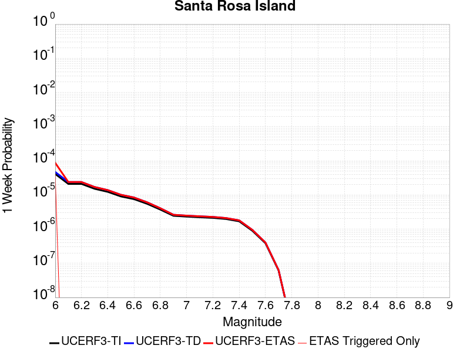 | 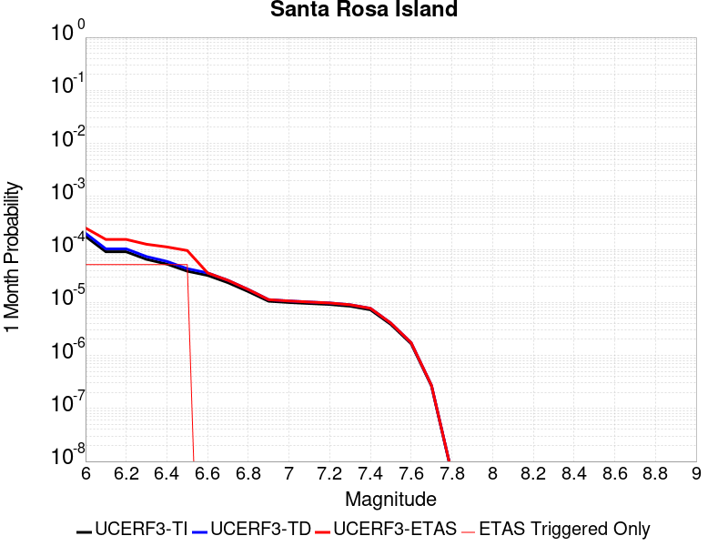 | 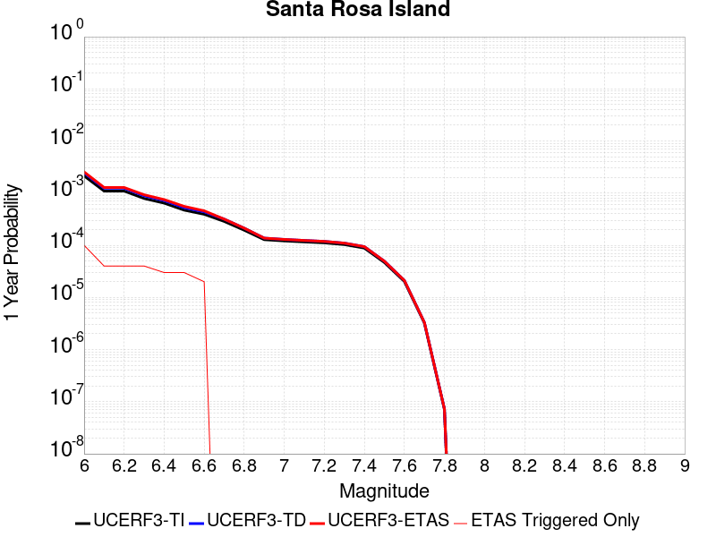 | 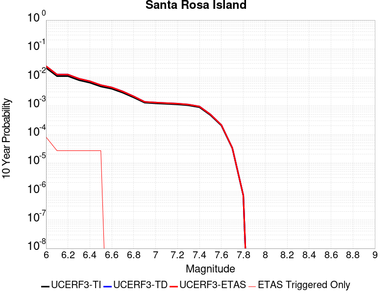 |

| Magnitude | 1 wk TI Prob | 1 wk TD Prob | 1 wk ETAS Prob | 1 wk ETAS/TD Gain | 1 wk ETAS Triggered Only | 1 mo TI Prob | 1 mo TD Prob | 1 mo ETAS Prob | 1 mo ETAS/TD Gain | 1 mo ETAS Triggered Only | 1 yr TI Prob | 1 yr TD Prob | 1 yr ETAS Prob | 1 yr ETAS/TD Gain | 1 yr ETAS Triggered Only | 10 yr TI Prob | 10 yr TD Prob | 10 yr ETAS Prob | 10 yr ETAS/TD Gain | 10 yr ETAS Triggered Only |
|-----|-----|-----|-----|-----|-----|-----|-----|-----|-----|-----|-----|-----|-----|-----|-----|-----|-----|-----|-----|-----|
| 6.0 | 4.1143165E-5 | 4.7091133E-5 | 7.839738E-5 | 1.6648014 | 3.1307725E-5 | 1.7631594E-4 | 2.0180465E-4 | 2.4353985E-4 | 1.20681 | 4.174363E-5 | 0.002144533 | 0.0024544 | 0.0025376824 | 1.0339319 | 8.348726E-5 | 0.021239553 | 0.024293551 | 0.024405558 | 1.0046105 | 1.1479499E-4 |
| 6.1 | 2.1061249E-5 | 2.3864959E-5 | 2.3864959E-5 | 1.0 | 0.0 | 9.0259375E-5 | 1.0227455E-4 | 1.1270939E-4 | 1.1020278 | 1.0435908E-5 | 0.0010983539 | 0.0012445104 | 0.001286202 | 1.0335004 | 4.174363E-5 | 0.01092941 | 0.012378449 | 0.0124299815 | 1.0041631 | 5.217954E-5 |
| 6.2 | 2.1061249E-5 | 2.3864959E-5 | 2.3864959E-5 | 1.0 | 0.0 | 9.0259375E-5 | 1.0227455E-4 | 1.1270939E-4 | 1.1020278 | 1.0435908E-5 | 0.0010983539 | 0.0012445104 | 0.001286202 | 1.0335004 | 4.174363E-5 | 0.01092941 | 0.012378449 | 0.0124299815 | 1.0041631 | 5.217954E-5 |
| 6.3 | 1.5158236E-5 | 1.7074419E-5 | 1.7074419E-5 | 1.0 | 0.0 | 6.496225E-5 | 7.3174095E-5 | 8.3609244E-5 | 1.1426071 | 1.0435908E-5 | 7.906284E-4 | 8.905424E-4 | 9.322489E-4 | 1.0468327 | 4.174363E-5 | 0.007878214 | 0.008870989 | 0.008912363 | 1.004664 | 4.174363E-5 |
| 6.4 | 1.2341918E-5 | 1.3852917E-5 | 1.3852917E-5 | 1.0 | 0.0 | 5.2892858E-5 | 5.9368336E-5 | 6.9803624E-5 | 1.175772 | 1.0435908E-5 | 6.437803E-4 | 7.225779E-4 | 7.53863E-4 | 1.0432965 | 3.1307725E-5 | 0.006419184 | 0.007203121 | 0.0072342036 | 1.0043151 | 3.1307725E-5 |
| 6.5 | 9.061158E-6 | 1.0117031E-5 | 1.0117031E-5 | 1.0 | 0.0 | 3.883296E-5 | 4.3358013E-5 | 5.379347E-5 | 1.2406812 | 1.0435908E-5 | 4.726887E-4 | 5.277613E-4 | 5.590525E-4 | 1.0592904 | 3.1307725E-5 | 0.004716845 | 0.0052656173 | 0.0052967602 | 1.0059143 | 3.1307725E-5 |
| 6.6 | 7.5461685E-6 | 8.400733E-6 | 8.400733E-6 | 1.0 | 0.0 | 3.2340322E-5 | 3.600267E-5 | 3.600267E-5 | 1.0 | 0.0 | 3.936723E-4 | 4.3824865E-4 | 4.5911132E-4 | 1.0476047 | 2.0871816E-5 | 0.003929756 | 0.0043742736 | 0.004395054 | 1.0047506 | 2.0871816E-5 |
| 6.7 | 5.5023775E-6 | 6.087381E-6 | 6.087381E-6 | 1.0 | 0.0 | 2.3581404E-5 | 2.6088532E-5 | 2.6088532E-5 | 1.0 | 0.0 | 2.8706578E-4 | 3.1758484E-4 | 3.1758484E-4 | 1.0 | 0.0 | 0.0028669522 | 0.0031716314 | 0.0031716314 | 1.0 | 0.0 |
| 6.8 | 3.7351679E-6 | 4.0831405E-6 | 4.0831405E-6 | 1.0 | 0.0 | 1.6007763E-5 | 1.749907E-5 | 1.749907E-5 | 1.0 | 0.0 | 1.948771E-4 | 2.1303284E-4 | 2.1303284E-4 | 1.0 | 0.0 | 0.0019470629 | 0.0021285315 | 0.0021285315 | 1.0 | 0.0 |
| 6.9 | 2.456366E-6 | 2.6292705E-6 | 2.6292705E-6 | 1.0 | 0.0 | 1.0527241E-5 | 1.1268254E-5 | 1.1268254E-5 | 1.0 | 0.0 | 1.2816161E-4 | 1.3718237E-4 | 1.3718237E-4 | 1.0 | 0.0 | 0.0012808773 | 0.0013709799 | 0.0013709799 | 1.0 | 0.0 |
| 7.0 | 2.3245157E-6 | 2.4827782E-6 | 2.4827782E-6 | 1.0 | 0.0 | 9.962172E-6 | 1.0640435E-5 | 1.0640435E-5 | 1.0 | 0.0 | 1.2128269E-4 | 1.2953962E-4 | 1.2953962E-4 | 1.0 | 0.0 | 0.0012121652 | 0.0012946434 | 0.0012946434 | 1.0 | 0.0 |
| 7.1 | 2.2248344E-6 | 2.37325E-6 | 2.37325E-6 | 1.0 | 0.0 | 9.53497E-6 | 1.0171032E-5 | 1.0171032E-5 | 1.0 | 0.0 | 1.1608207E-4 | 1.2382529E-4 | 1.2382529E-4 | 1.0 | 0.0 | 0.0011602144 | 0.001237565 | 0.001237565 | 1.0 | 0.0 |
| 7.2 | 2.1350402E-6 | 2.276154E-6 | 2.276154E-6 | 1.0 | 0.0 | 9.150141E-6 | 9.754909E-6 | 9.754909E-6 | 1.0 | 0.0 | 1.1139726E-4 | 1.1875956E-4 | 1.1875956E-4 | 1.0 | 0.0 | 0.0011134144 | 0.0011869629 | 0.0011869629 | 1.0 | 0.0 |
| 7.3 | 1.9793572E-6 | 2.108719E-6 | 2.108719E-6 | 1.0 | 0.0 | 8.482932E-6 | 9.037336E-6 | 9.037336E-6 | 1.0 | 0.0 | 1.032748E-4 | 1.10024026E-4 | 1.10024026E-4 | 1.0 | 0.0 | 0.0010322682 | 0.0010996973 | 0.0010996973 | 1.0 | 0.0 |
| 7.4 | 1.6951194E-6 | 1.8045733E-6 | 1.8045733E-6 | 1.0 | 0.0 | 7.264777E-6 | 7.733863E-6 | 7.733863E-6 | 1.0 | 0.0 | 8.844508E-5 | 9.415573E-5 | 9.415573E-5 | 1.0 | 0.0 | 8.840988E-4 | 9.4116E-4 | 9.4116E-4 | 1.0 | 0.0 |
| 7.5 | 8.987207E-7 | 9.5122147E-7 | 9.5122147E-7 | 1.0 | 0.0 | 3.8516546E-6 | 4.076657E-6 | 4.076657E-6 | 1.0 | 0.0 | 4.6892885E-5 | 4.963218E-5 | 4.963218E-5 | 1.0 | 0.0 | 4.688299E-4 | 4.9621216E-4 | 4.9621216E-4 | 1.0 | 0.0 |
| 7.6 | 3.8783037E-7 | 4.052932E-7 | 4.052932E-7 | 1.0 | 0.0 | 1.6621291E-6 | 1.7369698E-6 | 1.7369698E-6 | 1.0 | 0.0 | 2.0236233E-5 | 2.1147409E-5 | 2.1147409E-5 | 1.0 | 0.0 | 2.023439E-4 | 2.1145462E-4 | 2.1145462E-4 | 1.0 | 0.0 |
| 7.7 | 6.181804E-8 | 6.339035E-8 | 6.339035E-8 | 1.0 | 0.0 | 2.6493444E-7 | 2.7167292E-7 | 2.7167292E-7 | 1.0 | 0.0 | 3.225572E-6 | 3.3076128E-6 | 3.3076128E-6 | 1.0 | 0.0 | 3.225525E-5 | 3.307564E-5 | 3.307564E-5 | 1.0 | 0.0 |
| 7.8 | 1.3704449E-9 | 1.3964153E-9 | 1.3964153E-9 | 1.0 | 0.0 | 5.873335E-9 | 5.984637E-9 | 5.984637E-9 | 1.0 | 0.0 | 7.1507856E-8 | 7.286295E-8 | 7.286295E-8 | 1.0 | 0.0 | 7.1507833E-7 | 7.286294E-7 | 7.286294E-7 | 1.0 | 0.0 |

## Pisgah-Bullion Mtn-Mesquite Lk
*[(top)](#table-of-contents)*

| 1 Week | 1 Month | 1 Year | 10 Year |
|-----|-----|-----|-----|
| 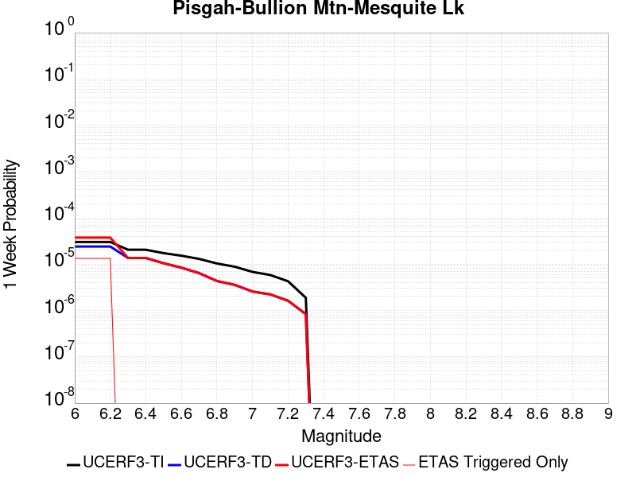 | 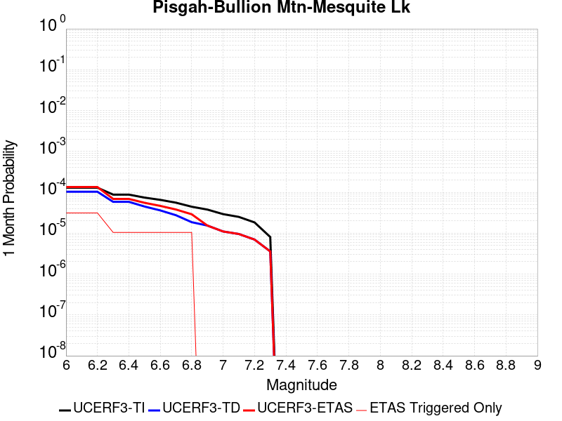 | 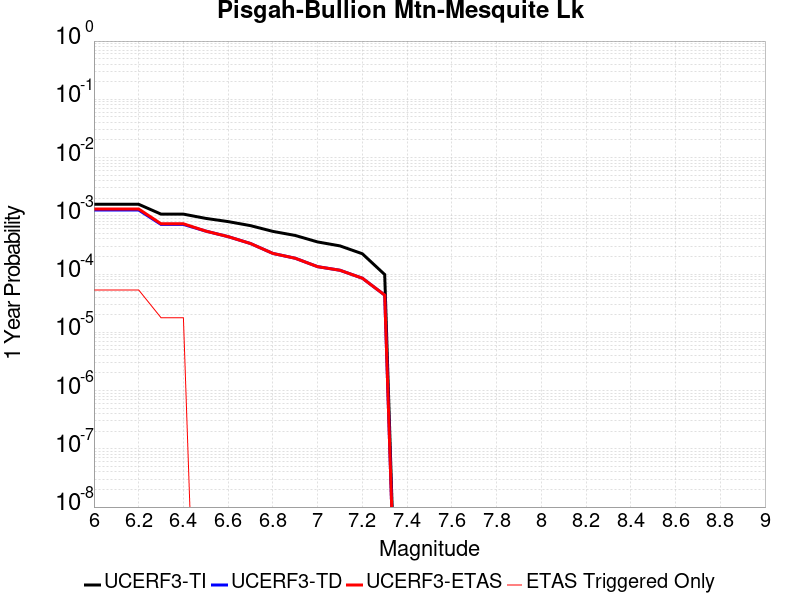 | 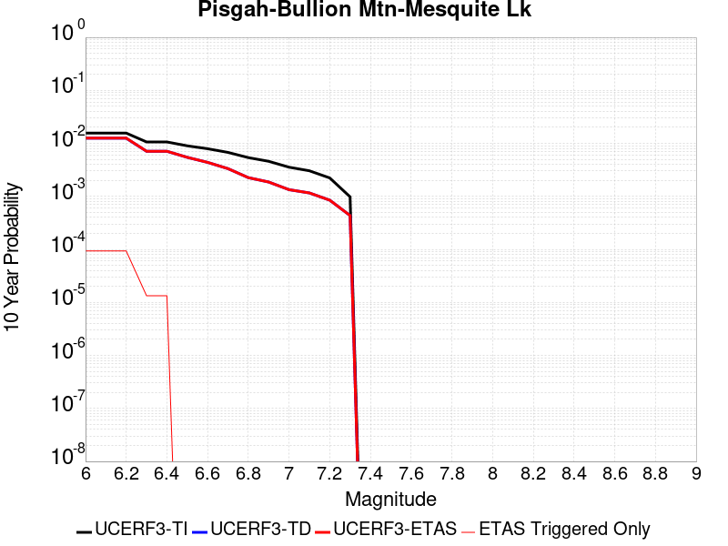 |

| Magnitude | 1 wk TI Prob | 1 wk TD Prob | 1 wk ETAS Prob | 1 wk ETAS/TD Gain | 1 wk ETAS Triggered Only | 1 mo TI Prob | 1 mo TD Prob | 1 mo ETAS Prob | 1 mo ETAS/TD Gain | 1 mo ETAS Triggered Only | 1 yr TI Prob | 1 yr TD Prob | 1 yr ETAS Prob | 1 yr ETAS/TD Gain | 1 yr ETAS Triggered Only | 10 yr TI Prob | 10 yr TD Prob | 10 yr ETAS Prob | 10 yr ETAS/TD Gain | 10 yr ETAS Triggered Only |
|-----|-----|-----|-----|-----|-----|-----|-----|-----|-----|-----|-----|-----|-----|-----|-----|-----|-----|-----|-----|-----|
| 6.0 | 3.0240792E-5 | 2.4091114E-5 | 4.4962428E-5 | 1.866349 | 2.0871816E-5 | 1.2959696E-4 | 1.03244114E-4 | 1.3454861E-4 | 1.3032085 | 3.1307725E-5 | 0.0015767008 | 0.0012563728 | 0.0013293324 | 1.0580716 | 7.305136E-5 | 0.015655609 | 0.012502721 | 0.01261608 | 1.0090668 | 1.1479499E-4 |
| 6.1 | 3.0240792E-5 | 2.4091114E-5 | 4.4962428E-5 | 1.866349 | 2.0871816E-5 | 1.2959696E-4 | 1.03244114E-4 | 1.3454861E-4 | 1.3032085 | 3.1307725E-5 | 0.0015767008 | 0.0012563728 | 0.0013293324 | 1.0580716 | 7.305136E-5 | 0.015655609 | 0.012502721 | 0.01261608 | 1.0090668 | 1.1479499E-4 |
| 6.2 | 3.0240792E-5 | 2.4091114E-5 | 4.4962428E-5 | 1.866349 | 2.0871816E-5 | 1.2959696E-4 | 1.03244114E-4 | 1.3454861E-4 | 1.3032085 | 3.1307725E-5 | 0.0015767008 | 0.0012563728 | 0.0013293324 | 1.0580716 | 7.305136E-5 | 0.015655609 | 0.012502721 | 0.01261608 | 1.0090668 | 1.1479499E-4 |
| 6.3 | 2.0498217E-5 | 1.36380695E-5 | 2.4073835E-5 | 1.7651937 | 1.0435908E-5 | 8.784654E-5 | 5.844765E-5 | 6.8882946E-5 | 1.178541 | 1.0435908E-5 | 0.0010690069 | 7.1138405E-4 | 7.426695E-4 | 1.0439783 | 3.1307725E-5 | 0.01063879 | 0.0070926943 | 0.00712378 | 1.0043827 | 3.1307725E-5 |
| 6.4 | 2.0498217E-5 | 1.36380695E-5 | 2.4073835E-5 | 1.7651937 | 1.0435908E-5 | 8.784654E-5 | 5.844765E-5 | 6.8882946E-5 | 1.178541 | 1.0435908E-5 | 0.0010690069 | 7.1138405E-4 | 7.426695E-4 | 1.0439783 | 3.1307725E-5 | 0.01063879 | 0.0070926943 | 0.00712378 | 1.0043827 | 3.1307725E-5 |
| 6.5 | 1.7316182E-5 | 1.0477042E-5 | 2.0912841E-5 | 1.9960634 | 1.0435908E-5 | 7.42101E-5 | 4.4900895E-5 | 5.5336335E-5 | 1.2324106 | 1.0435908E-5 | 9.0313336E-4 | 5.465413E-4 | 5.674017E-4 | 1.0381681 | 2.0871816E-5 | 0.008994718 | 0.0054529672 | 0.005473725 | 1.0038067 | 2.0871816E-5 |
| 6.6 | 1.5251077E-5 | 8.414273E-6 | 1.8850093E-5 | 2.2402523 | 1.0435908E-5 | 6.536012E-5 | 3.6060712E-5 | 4.6496243E-5 | 1.2893878 | 1.0435908E-5 | 7.9546886E-4 | 4.3895794E-4 | 4.598206E-4 | 1.0475277 | 2.0871816E-5 | 0.007926274 | 0.0043816264 | 0.0044024065 | 1.0047426 | 2.0871816E-5 |
| 6.7 | 1.2997425E-5 | 6.4114965E-6 | 1.6847338E-5 | 2.6276762 | 1.0435908E-5 | 5.570206E-5 | 2.7477578E-5 | 3.79132E-5 | 1.3797867 | 1.0435908E-5 | 6.7796157E-4 | 3.3449283E-4 | 3.5535765E-4 | 1.0623776 | 2.0871816E-5 | 0.0067589693 | 0.0033403537 | 0.0033611557 | 1.0062275 | 2.0871816E-5 |
| 6.8 | 1.035386E-5 | 4.3332193E-6 | 1.4769082E-5 | 3.4083393 | 1.0435908E-5 | 4.437293E-5 | 1.8570812E-5 | 2.9006527E-5 | 1.5619417 | 1.0435908E-5 | 5.401065E-4 | 2.2607706E-4 | 2.365106E-4 | 1.0461504 | 1.0435908E-5 | 0.0053879567 | 0.0022585576 | 0.0022689698 | 1.0046102 | 1.0435908E-5 |
| 6.9 | 8.816252E-6 | 3.580638E-6 | 3.580638E-6 | 1.0 | 0.0 | 3.778339E-5 | 1.5345504E-5 | 1.5345504E-5 | 1.0 | 0.0 | 4.5991567E-4 | 1.8681608E-4 | 1.8681608E-4 | 1.0 | 0.0 | 0.00458965 | 0.0018666488 | 0.0018666488 | 1.0 | 0.0 |
| 7.0 | 6.8232207E-6 | 2.5675843E-6 | 2.5675843E-6 | 1.0 | 0.0 | 2.9242048E-5 | 1.1003888E-5 | 1.1003888E-5 | 1.0 | 0.0 | 3.5596377E-4 | 1.3396442E-4 | 1.3396442E-4 | 1.0 | 0.0 | 0.0035539411 | 0.0013388677 | 0.0013388677 | 1.0 | 0.0 |
| 7.1 | 5.837013E-6 | 2.22738E-6 | 2.22738E-6 | 1.0 | 0.0 | 2.501553E-5 | 9.545881E-6 | 9.545881E-6 | 1.0 | 0.0 | 3.045215E-4 | 1.16215204E-4 | 1.16215204E-4 | 1.0 | 0.0 | 0.0030410455 | 0.0011615733 | 0.0011615733 | 1.0 | 0.0 |
| 7.2 | 4.278052E-6 | 1.6275711E-6 | 1.6275711E-6 | 1.0 | 0.0 | 1.833438E-5 | 6.9752873E-6 | 6.9752873E-6 | 1.0 | 0.0 | 2.231982E-4 | 8.492105E-5 | 8.492105E-5 | 1.0 | 0.0 | 0.0022297418 | 8.489092E-4 | 8.489092E-4 | 1.0 | 0.0 |
| 7.3 | 1.8803692E-6 | 8.344926E-7 | 8.344926E-7 | 1.0 | 0.0 | 8.0587E-6 | 3.5763926E-6 | 3.5763926E-6 | 1.0 | 0.0 | 9.811026E-5 | 4.354186E-5 | 4.354186E-5 | 1.0 | 0.0 | 9.806695E-4 | 4.3534773E-4 | 4.3534773E-4 | 1.0 | 0.0 |

## San Cayetano
*[(top)](#table-of-contents)*

| 1 Week | 1 Month | 1 Year | 10 Year |
|-----|-----|-----|-----|
| 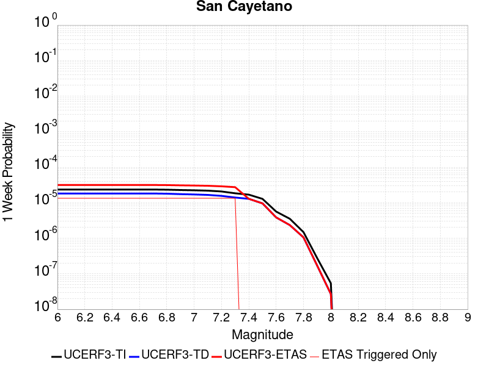 | 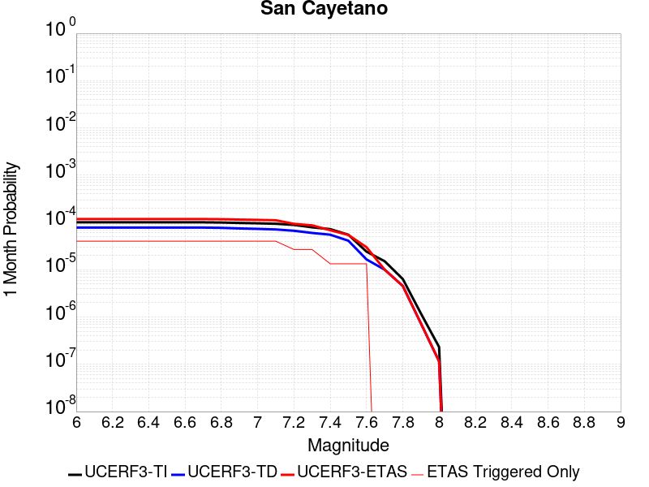 | 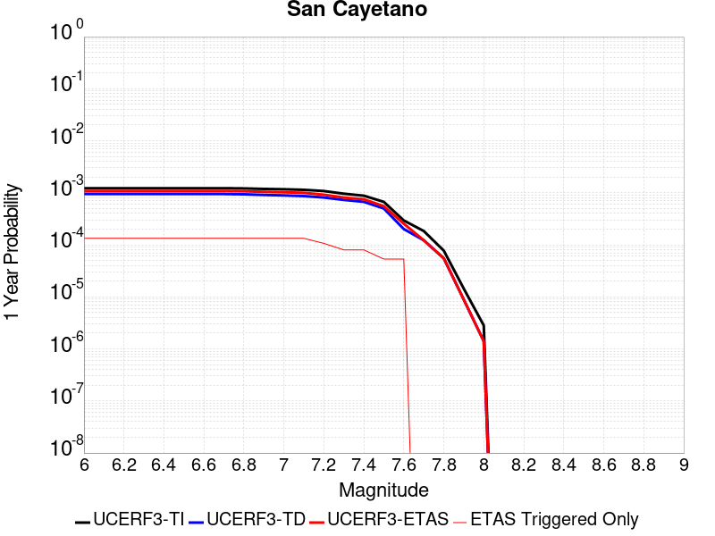 | 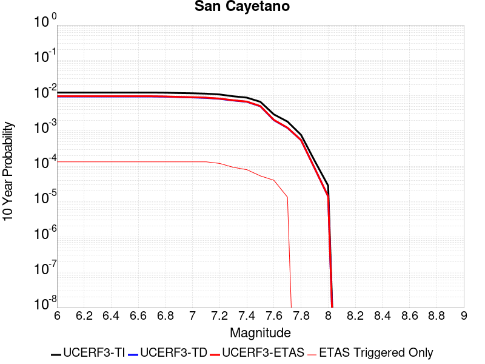 |

| Magnitude | 1 wk TI Prob | 1 wk TD Prob | 1 wk ETAS Prob | 1 wk ETAS/TD Gain | 1 wk ETAS Triggered Only | 1 mo TI Prob | 1 mo TD Prob | 1 mo ETAS Prob | 1 mo ETAS/TD Gain | 1 mo ETAS Triggered Only | 1 yr TI Prob | 1 yr TD Prob | 1 yr ETAS Prob | 1 yr ETAS/TD Gain | 1 yr ETAS Triggered Only | 10 yr TI Prob | 10 yr TD Prob | 10 yr ETAS Prob | 10 yr ETAS/TD Gain | 10 yr ETAS Triggered Only |
|-----|-----|-----|-----|-----|-----|-----|-----|-----|-----|-----|-----|-----|-----|-----|-----|-----|-----|-----|-----|-----|
| 6.0 | 2.3476267E-5 | 1.816928E-5 | 2.8604996E-5 | 1.5743606 | 1.0435908E-5 | 1.0060869E-4 | 7.786603E-5 | 1.0917132E-4 | 1.4020404 | 3.1307725E-5 | 0.0012242225 | 9.476103E-4 | 0.0010310184 | 1.0880195 | 8.348726E-5 | 0.012175002 | 0.009436584 | 0.009550296 | 1.0120502 | 1.1479499E-4 |
| 6.1 | 2.3476267E-5 | 1.816928E-5 | 2.8604996E-5 | 1.5743606 | 1.0435908E-5 | 1.0060869E-4 | 7.786603E-5 | 1.0917132E-4 | 1.4020404 | 3.1307725E-5 | 0.0012242225 | 9.476103E-4 | 0.0010310184 | 1.0880195 | 8.348726E-5 | 0.012175002 | 0.009436584 | 0.009550296 | 1.0120502 | 1.1479499E-4 |
| 6.2 | 2.3476267E-5 | 1.816928E-5 | 2.8604996E-5 | 1.5743606 | 1.0435908E-5 | 1.0060869E-4 | 7.786603E-5 | 1.0917132E-4 | 1.4020404 | 3.1307725E-5 | 0.0012242225 | 9.476103E-4 | 0.0010310184 | 1.0880195 | 8.348726E-5 | 0.012175002 | 0.009436584 | 0.009550296 | 1.0120502 | 1.1479499E-4 |
| 6.3 | 2.3476267E-5 | 1.816928E-5 | 2.8604996E-5 | 1.5743606 | 1.0435908E-5 | 1.0060869E-4 | 7.786603E-5 | 1.0917132E-4 | 1.4020404 | 3.1307725E-5 | 0.0012242225 | 9.476103E-4 | 0.0010310184 | 1.0880195 | 8.348726E-5 | 0.012175002 | 0.009436584 | 0.009550296 | 1.0120502 | 1.1479499E-4 |
| 6.4 | 2.3476267E-5 | 1.816928E-5 | 2.8604996E-5 | 1.5743606 | 1.0435908E-5 | 1.0060869E-4 | 7.786603E-5 | 1.0917132E-4 | 1.4020404 | 3.1307725E-5 | 0.0012242225 | 9.476103E-4 | 0.0010310184 | 1.0880195 | 8.348726E-5 | 0.012175002 | 0.009436584 | 0.009550296 | 1.0120502 | 1.1479499E-4 |
| 6.5 | 2.3476267E-5 | 1.816928E-5 | 2.8604996E-5 | 1.5743606 | 1.0435908E-5 | 1.0060869E-4 | 7.786603E-5 | 1.0917132E-4 | 1.4020404 | 3.1307725E-5 | 0.0012242225 | 9.476103E-4 | 0.0010310184 | 1.0880195 | 8.348726E-5 | 0.012175002 | 0.009436584 | 0.009550296 | 1.0120502 | 1.1479499E-4 |
| 6.6 | 2.3476267E-5 | 1.816928E-5 | 2.8604996E-5 | 1.5743606 | 1.0435908E-5 | 1.0060869E-4 | 7.786603E-5 | 1.0917132E-4 | 1.4020404 | 3.1307725E-5 | 0.0012242225 | 9.476103E-4 | 0.0010310184 | 1.0880195 | 8.348726E-5 | 0.012175002 | 0.009436584 | 0.009550296 | 1.0120502 | 1.1479499E-4 |
| 6.7 | 2.3476267E-5 | 1.816928E-5 | 2.8604996E-5 | 1.5743606 | 1.0435908E-5 | 1.0060869E-4 | 7.786603E-5 | 1.0917132E-4 | 1.4020404 | 3.1307725E-5 | 0.0012242225 | 9.476103E-4 | 0.0010310184 | 1.0880195 | 8.348726E-5 | 0.012175002 | 0.009436584 | 0.009550296 | 1.0120502 | 1.1479499E-4 |
| 6.8 | 2.3241924E-5 | 1.7936987E-5 | 2.8372708E-5 | 1.5817989 | 1.0435908E-5 | 9.960445E-5 | 7.687056E-5 | 1.08175875E-4 | 1.4072472 | 3.1307725E-5 | 0.0012120095 | 9.3550084E-4 | 0.00101891 | 1.0891598 | 8.348726E-5 | 0.012054204 | 0.009316482 | 0.009430207 | 1.0122069 | 1.1479499E-4 |
| 6.9 | 2.2761007E-5 | 1.7432423E-5 | 2.786815E-5 | 1.5986389 | 1.0435908E-5 | 9.7543525E-5 | 7.470827E-5 | 1.0601365E-4 | 1.4190351 | 3.1307725E-5 | 0.0011869454 | 9.09197E-4 | 9.926084E-4 | 1.0917418 | 8.348726E-5 | 0.011806256 | 0.009055603 | 0.009169359 | 1.0125619 | 1.1479499E-4 |
| 7.0 | 2.240283E-5 | 1.7066168E-5 | 2.7501897E-5 | 1.6114864 | 1.0435908E-5 | 9.600859E-5 | 7.313869E-5 | 1.0444412E-4 | 1.4280283 | 3.1307725E-5 | 0.0011682777 | 8.9010317E-4 | 9.7351614E-4 | 1.0937115 | 8.348726E-5 | 0.011621549 | 0.008866196 | 0.008979972 | 1.0128326 | 1.1479499E-4 |
| 7.1 | 2.1871154E-5 | 1.6586018E-5 | 2.7021753E-5 | 1.6291887 | 1.0435908E-5 | 9.373015E-5 | 7.108101E-5 | 1.0238651E-4 | 1.4404199 | 3.1307725E-5 | 0.0011405671 | 8.6507114E-4 | 9.4848615E-4 | 1.0964257 | 8.348726E-5 | 0.011347309 | 0.008617838 | 0.008731644 | 1.0132059 | 1.1479499E-4 |
| 7.2 | 2.0714133E-5 | 1.5564561E-5 | 2.6000305E-5 | 1.6704812 | 1.0435908E-5 | 8.8771834E-5 | 6.670357E-5 | 8.757399E-5 | 1.3128831 | 2.0871816E-5 | 0.0010802611 | 8.1181666E-4 | 8.848087E-4 | 1.0899119 | 7.305136E-5 | 0.010750249 | 0.008089285 | 0.0081928 | 1.0127965 | 1.0435908E-4 |
| 7.3 | 1.8408395E-5 | 1.3996864E-5 | 2.4432626E-5 | 1.7455785 | 1.0435908E-5 | 7.8890735E-5 | 5.99852E-5 | 8.085577E-5 | 1.3479285 | 2.0871816E-5 | 9.600714E-4 | 7.300781E-4 | 7.926478E-4 | 1.0857028 | 6.261545E-5 | 0.009559342 | 0.0072775153 | 0.007360395 | 1.0113884 | 8.348726E-5 |
| 7.4 | 1.6856795E-5 | 1.28500815E-5 | 1.28500815E-5 | 1.0 | 0.0 | 7.2241404E-5 | 5.5070628E-5 | 6.550596E-5 | 1.18949 | 1.0435908E-5 | 8.7918417E-4 | 6.7028153E-4 | 7.2242605E-4 | 1.077795 | 5.217954E-5 | 0.00875714 | 0.0066832784 | 0.0067558414 | 1.0108575 | 7.305136E-5 |
| 7.5 | 1.2822778E-5 | 9.577542E-6 | 9.577542E-6 | 1.0 | 0.0 | 5.495361E-5 | 4.1045972E-5 | 5.1481453E-5 | 1.2542388 | 1.0435908E-5 | 6.688548E-4 | 4.996217E-4 | 5.4134446E-4 | 1.0835087 | 4.174363E-5 | 0.006668452 | 0.0049851555 | 0.005037075 | 1.0104148 | 5.217954E-5 |
| 7.6 | 5.6272684E-6 | 3.854903E-6 | 3.854903E-6 | 1.0 | 0.0 | 2.4116642E-5 | 1.652091E-5 | 2.6956644E-5 | 1.6316683 | 1.0435908E-5 | 2.9358055E-4 | 2.0112359E-4 | 2.2199121E-4 | 1.1037552 | 2.0871816E-5 | 0.0029319301 | 0.0020094267 | 0.0020406714 | 1.0155491 | 3.1307725E-5 |
| 7.7 | 3.5261346E-6 | 2.3407013E-6 | 2.3407013E-6 | 1.0 | 0.0 | 1.5111918E-5 | 1.0031539E-5 | 1.0031539E-5 | 1.0 | 0.0 | 1.8397206E-4 | 1.2212721E-4 | 1.2212721E-4 | 1.0 | 0.0 | 0.0018381984 | 0.0012206084 | 0.0012310315 | 1.0085393 | 1.0435908E-5 |
| 7.8 | 1.4826929E-6 | 1.056428E-6 | 1.056428E-6 | 1.0 | 0.0 | 6.354383E-6 | 4.5275406E-6 | 4.5275406E-6 | 1.0 | 0.0 | 7.736187E-5 | 5.5121433E-5 | 5.5121433E-5 | 1.0 | 0.0 | 7.733494E-4 | 5.5107963E-4 | 5.5107963E-4 | 1.0 | 0.0 |
| 7.9 | 2.7568166E-7 | 1.6978244E-7 | 1.6978244E-7 | 1.0 | 0.0 | 1.1814923E-6 | 7.2763885E-7 | 7.2763885E-7 | 1.0 | 0.0 | 1.4384574E-5 | 8.858967E-6 | 8.858967E-6 | 1.0 | 0.0 | 1.4383643E-4 | 8.8586174E-5 | 8.8586174E-5 | 1.0 | 0.0 |
| 8.0 | 5.407832E-8 | 2.6887697E-8 | 2.6887697E-8 | 1.0 | 0.0 | 2.3176422E-7 | 1.15232986E-7 | 1.15232986E-7 | 1.0 | 0.0 | 2.8217257E-6 | 1.4029607E-6 | 1.4029607E-6 | 1.0 | 0.0 | 2.8216898E-5 | 1.4029522E-5 | 1.4029522E-5 | 1.0 | 0.0 |

## Tin Mountain
*[(top)](#table-of-contents)*

| 1 Week | 1 Month | 1 Year | 10 Year |
|-----|-----|-----|-----|
| 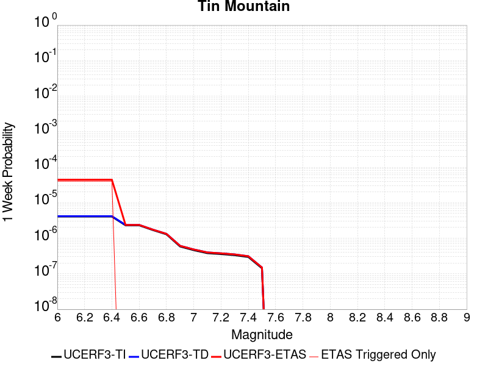 | 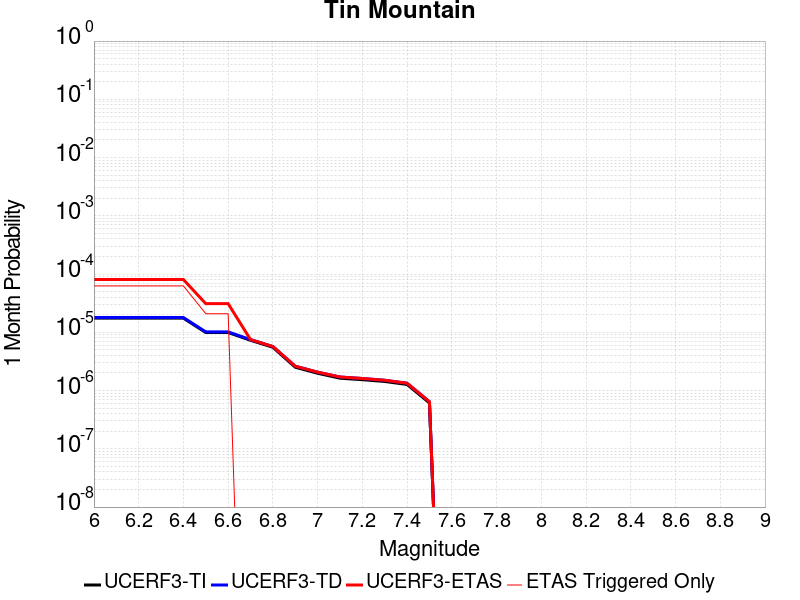 |  | 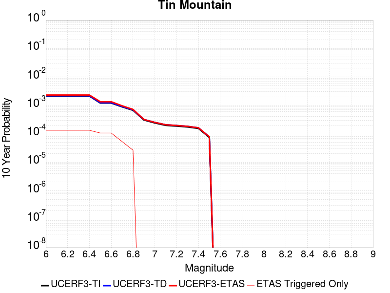 |

| Magnitude | 1 wk TI Prob | 1 wk TD Prob | 1 wk ETAS Prob | 1 wk ETAS/TD Gain | 1 wk ETAS Triggered Only | 1 mo TI Prob | 1 mo TD Prob | 1 mo ETAS Prob | 1 mo ETAS/TD Gain | 1 mo ETAS Triggered Only | 1 yr TI Prob | 1 yr TD Prob | 1 yr ETAS Prob | 1 yr ETAS/TD Gain | 1 yr ETAS Triggered Only | 10 yr TI Prob | 10 yr TD Prob | 10 yr ETAS Prob | 10 yr ETAS/TD Gain | 10 yr ETAS Triggered Only |
|-----|-----|-----|-----|-----|-----|-----|-----|-----|-----|-----|-----|-----|-----|-----|-----|-----|-----|-----|-----|-----|
| 6.0 | 4.083776E-6 | 4.1815365E-6 | 4.5924993E-5 | 10.982803 | 4.174363E-5 | 1.750178E-5 | 1.792077E-5 | 8.0535094E-5 | 4.4939528 | 6.261545E-5 | 2.1306332E-4 | 2.1816725E-4 | 2.9120265E-4 | 1.334768 | 7.305136E-5 | 0.0021285915 | 0.0021798965 | 0.0022944412 | 1.0525459 | 1.1479499E-4 |
| 6.1 | 4.083776E-6 | 4.1815365E-6 | 4.5924993E-5 | 10.982803 | 4.174363E-5 | 1.750178E-5 | 1.792077E-5 | 8.0535094E-5 | 4.4939528 | 6.261545E-5 | 2.1306332E-4 | 2.1816725E-4 | 2.9120265E-4 | 1.334768 | 7.305136E-5 | 0.0021285915 | 0.0021798965 | 0.0022944412 | 1.0525459 | 1.1479499E-4 |
| 6.2 | 4.083776E-6 | 4.1815365E-6 | 4.5924993E-5 | 10.982803 | 4.174363E-5 | 1.750178E-5 | 1.792077E-5 | 8.0535094E-5 | 4.4939528 | 6.261545E-5 | 2.1306332E-4 | 2.1816725E-4 | 2.9120265E-4 | 1.334768 | 7.305136E-5 | 0.0021285915 | 0.0021798965 | 0.0022944412 | 1.0525459 | 1.1479499E-4 |
| 6.3 | 4.083776E-6 | 4.1815365E-6 | 4.5924993E-5 | 10.982803 | 4.174363E-5 | 1.750178E-5 | 1.792077E-5 | 8.0535094E-5 | 4.4939528 | 6.261545E-5 | 2.1306332E-4 | 2.1816725E-4 | 2.9120265E-4 | 1.334768 | 7.305136E-5 | 0.0021285915 | 0.0021798965 | 0.0022944412 | 1.0525459 | 1.1479499E-4 |
| 6.4 | 4.083776E-6 | 4.1815365E-6 | 4.5924993E-5 | 10.982803 | 4.174363E-5 | 1.750178E-5 | 1.792077E-5 | 8.0535094E-5 | 4.4939528 | 6.261545E-5 | 2.1306332E-4 | 2.1816725E-4 | 2.9120265E-4 | 1.334768 | 7.305136E-5 | 0.0021285915 | 0.0021798965 | 0.0022944412 | 1.0525459 | 1.1479499E-4 |
| 6.5 | 2.3143427E-6 | 2.3731573E-6 | 1.28090405E-5 | 5.397468 | 1.0435908E-5 | 9.9185745E-6 | 1.0170638E-5 | 3.104224E-5 | 3.0521429 | 2.0871816E-5 | 1.2075195E-4 | 1.2382126E-4 | 1.551251E-4 | 1.2528148 | 3.1307725E-5 | 0.0012068636 | 0.0012375986 | 0.0012897135 | 1.0421097 | 5.217954E-5 |
| 6.6 | 2.3143427E-6 | 2.3731573E-6 | 1.28090405E-5 | 5.397468 | 1.0435908E-5 | 9.9185745E-6 | 1.0170638E-5 | 3.104224E-5 | 3.0521429 | 2.0871816E-5 | 1.2075195E-4 | 1.2382126E-4 | 1.551251E-4 | 1.2528148 | 3.1307725E-5 | 0.0012068636 | 0.0012375986 | 0.0012897135 | 1.0421097 | 5.217954E-5 |
| 6.7 | 1.7029532E-6 | 1.7497915E-6 | 1.7497915E-6 | 1.0 | 0.0 | 7.2983503E-6 | 7.499088E-6 | 7.499088E-6 | 1.0 | 0.0 | 8.885379E-5 | 9.1298105E-5 | 1.0173306E-4 | 1.1142954 | 1.0435908E-5 | 8.881827E-4 | 9.1265864E-4 | 9.3351136E-4 | 1.0228484 | 2.0871816E-5 |
| 6.8 | 1.2914646E-6 | 1.3299378E-6 | 1.3299378E-6 | 1.0 | 0.0 | 5.534837E-6 | 5.6997237E-6 | 5.6997237E-6 | 1.0 | 0.0 | 6.738455E-5 | 6.939237E-5 | 7.982755E-5 | 1.1503794 | 1.0435908E-5 | 6.736412E-4 | 6.9375033E-4 | 7.04179E-4 | 1.0150323 | 1.0435908E-5 |
| 6.9 | 5.8708974E-7 | 6.1169936E-7 | 6.1169936E-7 | 1.0 | 0.0 | 2.5160964E-6 | 2.6215664E-6 | 2.6215664E-6 | 1.0 | 0.0 | 3.0633044E-5 | 3.1917145E-5 | 3.1917145E-5 | 1.0 | 0.0 | 3.0628822E-4 | 3.191297E-4 | 3.191297E-4 | 1.0 | 0.0 |
| 7.0 | 4.6248786E-7 | 4.832015E-7 | 4.832015E-7 | 1.0 | 0.0 | 1.9820893E-6 | 2.0708624E-6 | 2.0708624E-6 | 1.0 | 0.0 | 2.413167E-5 | 2.5212494E-5 | 2.5212494E-5 | 1.0 | 0.0 | 2.412905E-4 | 2.5210003E-4 | 2.5210003E-4 | 1.0 | 0.0 |
| 7.1 | 3.804606E-7 | 3.987147E-7 | 3.987147E-7 | 1.0 | 0.0 | 1.6305444E-6 | 1.7087764E-6 | 1.7087764E-6 | 1.0 | 0.0 | 1.9851697E-5 | 2.0804187E-5 | 2.0804187E-5 | 1.0 | 0.0 | 1.9849923E-4 | 2.0802575E-4 | 2.0802575E-4 | 1.0 | 0.0 |
| 7.2 | 3.5864858E-7 | 3.7616863E-7 | 3.7616863E-7 | 1.0 | 0.0 | 1.5370645E-6 | 1.6121504E-6 | 1.6121504E-6 | 1.0 | 0.0 | 1.87136E-5 | 1.9627789E-5 | 1.9627789E-5 | 1.0 | 0.0 | 1.8712023E-4 | 1.9626386E-4 | 1.9626386E-4 | 1.0 | 0.0 |
| 7.3 | 3.342063E-7 | 3.506347E-7 | 3.506347E-7 | 1.0 | 0.0 | 1.4323119E-6 | 1.5027196E-6 | 1.5027196E-6 | 1.0 | 0.0 | 1.7438259E-5 | 1.829549E-5 | 1.829549E-5 | 1.0 | 0.0 | 1.743689E-4 | 1.8294314E-4 | 1.8294314E-4 | 1.0 | 0.0 |
| 7.4 | 2.971242E-7 | 3.1165817E-7 | 3.1165817E-7 | 1.0 | 0.0 | 1.2733886E-6 | 1.3356774E-6 | 1.3356774E-6 | 1.0 | 0.0 | 1.5503398E-5 | 1.6261785E-5 | 1.6261785E-5 | 1.0 | 0.0 | 1.5502315E-4 | 1.6260923E-4 | 1.6260923E-4 | 1.0 | 0.0 |
| 7.5 | 1.4326713E-7 | 1.5012525E-7 | 1.5012525E-7 | 1.0 | 0.0 | 6.140018E-7 | 6.433939E-7 | 6.433939E-7 | 1.0 | 0.0 | 7.4754466E-6 | 7.8333205E-6 | 7.8333205E-6 | 1.0 | 0.0 | 7.475195E-5 | 7.833321E-5 | 7.833321E-5 | 1.0 | 0.0 |

## Camp Rock 2011
*[(top)](#table-of-contents)*

| 1 Week | 1 Month | 1 Year | 10 Year |
|-----|-----|-----|-----|
| 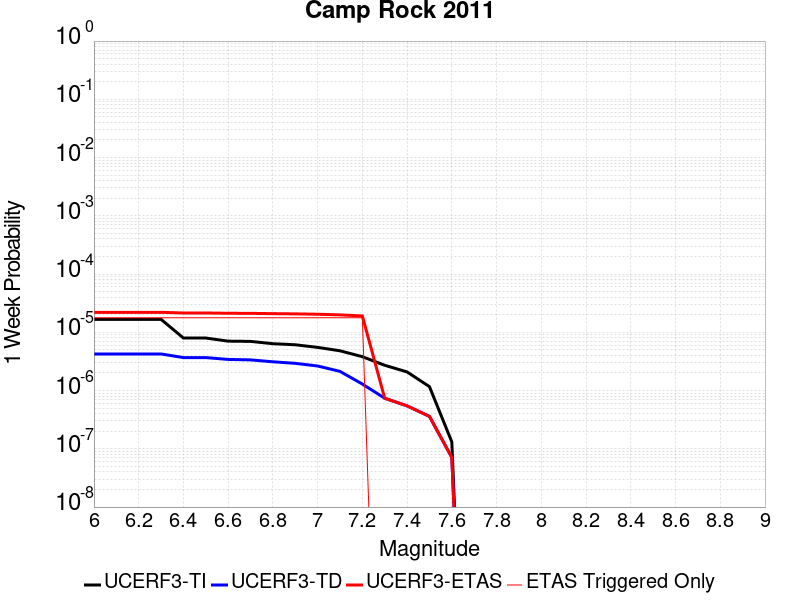 | 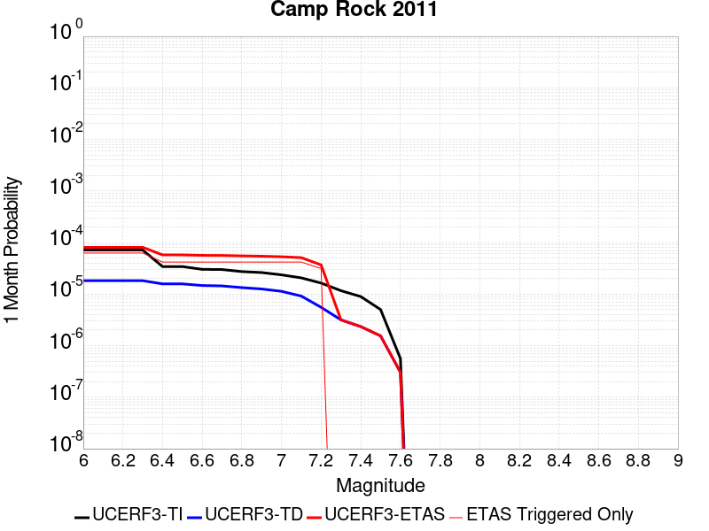 | 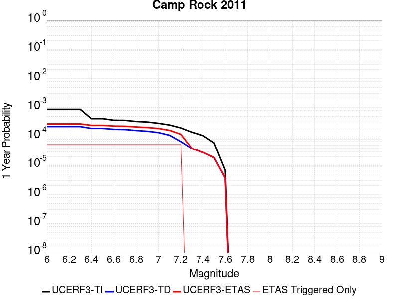 | 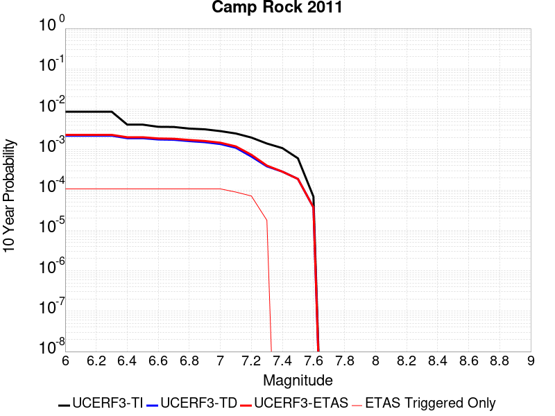 |

| Magnitude | 1 wk TI Prob | 1 wk TD Prob | 1 wk ETAS Prob | 1 wk ETAS/TD Gain | 1 wk ETAS Triggered Only | 1 mo TI Prob | 1 mo TD Prob | 1 mo ETAS Prob | 1 mo ETAS/TD Gain | 1 mo ETAS Triggered Only | 1 yr TI Prob | 1 yr TD Prob | 1 yr ETAS Prob | 1 yr ETAS/TD Gain | 1 yr ETAS Triggered Only | 10 yr TI Prob | 10 yr TD Prob | 10 yr ETAS Prob | 10 yr ETAS/TD Gain | 10 yr ETAS Triggered Only |
|-----|-----|-----|-----|-----|-----|-----|-----|-----|-----|-----|-----|-----|-----|-----|-----|-----|-----|-----|-----|-----|
| 6.0 | 1.6710783E-5 | 4.25026E-6 | 5.6429577E-5 | 13.276734 | 5.217954E-5 | 7.161568E-5 | 1.8215276E-5 | 8.082958E-5 | 4.4374614 | 6.261545E-5 | 8.7157206E-4 | 2.2174895E-4 | 3.052177E-4 | 1.376411 | 8.348726E-5 | 0.008681616 | 0.0022153298 | 0.0023298704 | 1.0517037 | 1.1479499E-4 |
| 6.1 | 1.6710783E-5 | 4.25026E-6 | 5.6429577E-5 | 13.276734 | 5.217954E-5 | 7.161568E-5 | 1.8215276E-5 | 8.082958E-5 | 4.4374614 | 6.261545E-5 | 8.7157206E-4 | 2.2174895E-4 | 3.052177E-4 | 1.376411 | 8.348726E-5 | 0.008681616 | 0.0022153298 | 0.0023298704 | 1.0517037 | 1.1479499E-4 |
| 6.2 | 1.6710783E-5 | 4.25026E-6 | 5.6429577E-5 | 13.276734 | 5.217954E-5 | 7.161568E-5 | 1.8215276E-5 | 8.082958E-5 | 4.4374614 | 6.261545E-5 | 8.7157206E-4 | 2.2174895E-4 | 3.052177E-4 | 1.376411 | 8.348726E-5 | 0.008681616 | 0.0022153298 | 0.0023298704 | 1.0517037 | 1.1479499E-4 |
| 6.3 | 1.6710783E-5 | 4.25026E-6 | 5.6429577E-5 | 13.276734 | 5.217954E-5 | 7.161568E-5 | 1.8215276E-5 | 8.082958E-5 | 4.4374614 | 6.261545E-5 | 8.7157206E-4 | 2.2174895E-4 | 3.052177E-4 | 1.376411 | 8.348726E-5 | 0.008681616 | 0.0022153298 | 0.0023298704 | 1.0517037 | 1.1479499E-4 |
| 6.4 | 7.982846E-6 | 3.6820884E-6 | 3.4989698E-5 | 9.502677 | 3.1307725E-5 | 3.421175E-5 | 1.5780286E-5 | 5.752326E-5 | 3.6452608 | 4.174363E-5 | 4.1644843E-4 | 1.9210839E-4 | 2.442779E-4 | 1.2715629 | 5.217954E-5 | 0.0041566887 | 0.001919458 | 0.002002785 | 1.0434117 | 8.348726E-5 |
| 6.5 | 7.982846E-6 | 3.6820884E-6 | 3.4989698E-5 | 9.502677 | 3.1307725E-5 | 3.421175E-5 | 1.5780286E-5 | 5.752326E-5 | 3.6452608 | 4.174363E-5 | 4.1644843E-4 | 1.9210839E-4 | 2.442779E-4 | 1.2715629 | 5.217954E-5 | 0.0041566887 | 0.001919458 | 0.002002785 | 1.0434117 | 8.348726E-5 |
| 6.6 | 7.048869E-6 | 3.4243571E-6 | 3.4731973E-5 | 10.142626 | 3.1307725E-5 | 3.0209088E-5 | 1.4675736E-5 | 5.6418754E-5 | 3.844356 | 4.174363E-5 | 3.677336E-4 | 1.7866275E-4 | 2.3083297E-4 | 1.2920039 | 5.217954E-5 | 0.0036712566 | 0.0017852228 | 0.001868561 | 1.0466822 | 8.348726E-5 |
| 6.7 | 6.987307E-6 | 3.3623348E-6 | 3.4669953E-5 | 10.311274 | 3.1307725E-5 | 2.9945259E-5 | 1.4409929E-5 | 5.615296E-5 | 3.8968244 | 4.174363E-5 | 3.6452254E-4 | 1.7542706E-4 | 2.2759745E-4 | 1.2973907 | 5.217954E-5 | 0.0036392517 | 0.001752917 | 0.0018362579 | 1.0475441 | 8.348726E-5 |
| 6.8 | 6.3737602E-6 | 3.1179077E-6 | 3.4425535E-5 | 11.041229 | 3.1307725E-5 | 2.731583E-5 | 1.3362394E-5 | 5.510547E-5 | 4.123922 | 4.174363E-5 | 3.3251947E-4 | 1.626753E-4 | 2.1484634E-4 | 1.3207066 | 5.217954E-5 | 0.0033202237 | 0.0016255907 | 0.0017089423 | 1.0512747 | 8.348726E-5 |
| 6.9 | 6.112211E-6 | 2.9331156E-6 | 3.4240747E-5 | 11.673849 | 3.1307725E-5 | 2.6194928E-5 | 1.2570436E-5 | 5.4313543E-5 | 4.3207364 | 4.174363E-5 | 3.1887658E-4 | 1.5303459E-4 | 2.0520615E-4 | 1.3409134 | 5.217954E-5 | 0.003184194 | 0.0015293199 | 0.0016126795 | 1.0545076 | 8.348726E-5 |
| 7.0 | 5.5140117E-6 | 2.641923E-6 | 3.3949564E-5 | 12.850323 | 3.1307725E-5 | 2.3631264E-5 | 1.132248E-5 | 5.306564E-5 | 4.686751 | 4.174363E-5 | 2.8767265E-4 | 1.3784273E-4 | 1.9001507E-4 | 1.3784919 | 5.217954E-5 | 0.0028730053 | 0.0013775975 | 0.0014609697 | 1.06052 | 8.348726E-5 |
| 7.1 | 4.8151105E-6 | 2.1342705E-6 | 3.3441927E-5 | 15.669021 | 3.1307725E-5 | 2.0636026E-5 | 9.146843E-6 | 5.0890092E-5 | 5.5636787 | 4.174363E-5 | 2.5121463E-4 | 1.1135734E-4 | 1.6353106E-4 | 1.4685253 | 5.217954E-5 | 0.0025093083 | 0.0011130372 | 0.0011860073 | 1.0655594 | 7.305136E-5 |
| 7.2 | 3.818335E-6 | 1.2937425E-6 | 2.2165532E-5 | 17.132877 | 2.0871816E-5 | 1.6364189E-5 | 5.5445994E-6 | 3.685215E-5 | 6.646495 | 3.1307725E-5 | 1.9921579E-4 | 6.750349E-5 | 9.88091E-5 | 1.4637629 | 3.1307725E-5 | 0.0019903728 | 6.748381E-4 | 7.2698237E-4 | 1.0772694 | 5.217954E-5 |
| 7.3 | 2.7166698E-6 | 7.3835776E-7 | 7.3835776E-7 | 1.0 | 0.0 | 1.1642818E-5 | 3.1643867E-6 | 3.1643867E-6 | 1.0 | 0.0 | 1.4174209E-4 | 3.8525748E-5 | 3.8525748E-5 | 1.0 | 0.0 | 0.0014165172 | 3.851927E-4 | 3.9562458E-4 | 1.0270822 | 1.0435908E-5 |
| 7.4 | 2.0893426E-6 | 5.4618386E-7 | 5.4618386E-7 | 1.0 | 0.0 | 8.954295E-6 | 2.3407858E-6 | 2.3407858E-6 | 1.0 | 0.0 | 1.0901308E-4 | 2.84987E-5 | 2.84987E-5 | 1.0 | 0.0 | 0.0010895962 | 2.84951E-4 | 2.84951E-4 | 1.0 | 0.0 |
| 7.5 | 1.1681728E-6 | 3.6030585E-7 | 3.6030585E-7 | 1.0 | 0.0 | 5.0064455E-6 | 1.544167E-6 | 1.544167E-6 | 1.0 | 0.0 | 6.0951766E-5 | 1.8800076E-5 | 1.8800076E-5 | 1.0 | 0.0 | 6.093505E-4 | 1.8798532E-4 | 1.8798532E-4 | 1.0 | 0.0 |
| 7.6 | 1.3154387E-7 | 7.1197384E-8 | 7.1197384E-8 | 1.0 | 0.0 | 5.6375933E-7 | 3.051316E-7 | 3.051316E-7 | 1.0 | 0.0 | 6.863748E-6 | 3.7149728E-6 | 3.7149728E-6 | 1.0 | 0.0 | 6.863536E-5 | 3.7149264E-5 | 3.7149264E-5 | 1.0 | 0.0 |

## San Jacinto (Coyote Creek)
*[(top)](#table-of-contents)*

| 1 Week | 1 Month | 1 Year | 10 Year |
|-----|-----|-----|-----|
| 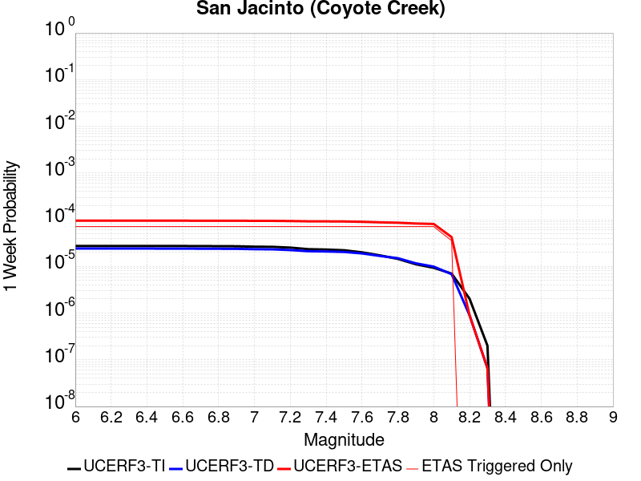 | 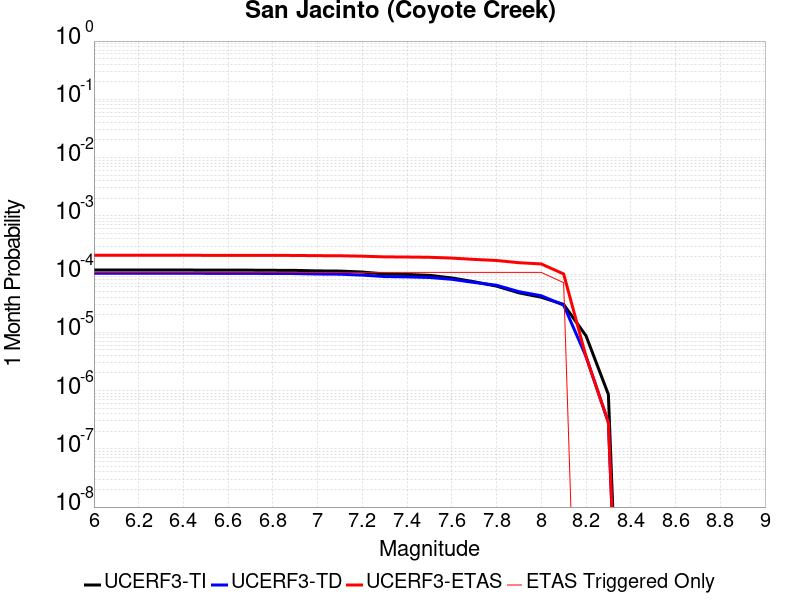 | 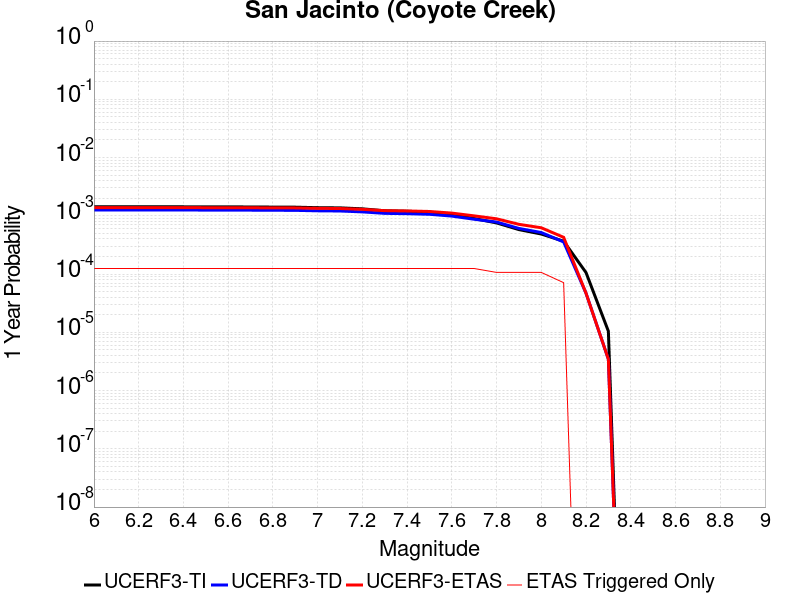 | 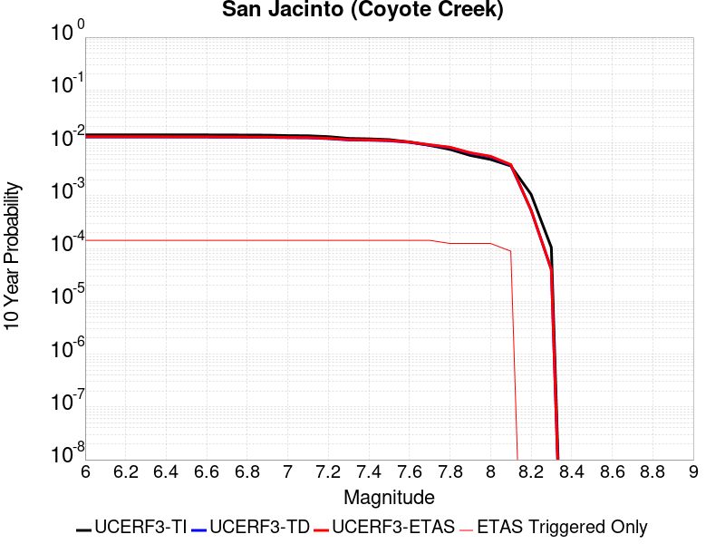 |

| Magnitude | 1 wk TI Prob | 1 wk TD Prob | 1 wk ETAS Prob | 1 wk ETAS/TD Gain | 1 wk ETAS Triggered Only | 1 mo TI Prob | 1 mo TD Prob | 1 mo ETAS Prob | 1 mo ETAS/TD Gain | 1 mo ETAS Triggered Only | 1 yr TI Prob | 1 yr TD Prob | 1 yr ETAS Prob | 1 yr ETAS/TD Gain | 1 yr ETAS Triggered Only | 10 yr TI Prob | 10 yr TD Prob | 10 yr ETAS Prob | 10 yr ETAS/TD Gain | 10 yr ETAS Triggered Only |
|-----|-----|-----|-----|-----|-----|-----|-----|-----|-----|-----|-----|-----|-----|-----|-----|-----|-----|-----|-----|-----|
| 6.0 | 2.7374346E-5 | 2.4145214E-5 | 7.632349E-5 | 3.1610196 | 5.217954E-5 | 1.1731335E-4 | 1.034754E-4 | 1.765192E-4 | 1.705905 | 7.305136E-5 | 0.0014273542 | 0.0012590875 | 0.0013528924 | 1.0745023 | 9.392317E-5 | 0.01418221 | 0.012928318 | 0.0130416285 | 1.0087645 | 1.1479499E-4 |
| 6.1 | 2.7374346E-5 | 2.4145214E-5 | 7.632349E-5 | 3.1610196 | 5.217954E-5 | 1.1731335E-4 | 1.034754E-4 | 1.765192E-4 | 1.705905 | 7.305136E-5 | 0.0014273542 | 0.0012590875 | 0.0013528924 | 1.0745023 | 9.392317E-5 | 0.01418221 | 0.012928318 | 0.0130416285 | 1.0087645 | 1.1479499E-4 |
| 6.2 | 2.7374346E-5 | 2.4145214E-5 | 7.632349E-5 | 3.1610196 | 5.217954E-5 | 1.1731335E-4 | 1.034754E-4 | 1.765192E-4 | 1.705905 | 7.305136E-5 | 0.0014273542 | 0.0012590875 | 0.0013528924 | 1.0745023 | 9.392317E-5 | 0.01418221 | 0.012928318 | 0.0130416285 | 1.0087645 | 1.1479499E-4 |
| 6.3 | 2.7374346E-5 | 2.4145214E-5 | 7.632349E-5 | 3.1610196 | 5.217954E-5 | 1.1731335E-4 | 1.034754E-4 | 1.765192E-4 | 1.705905 | 7.305136E-5 | 0.0014273542 | 0.0012590875 | 0.0013528924 | 1.0745023 | 9.392317E-5 | 0.01418221 | 0.012928318 | 0.0130416285 | 1.0087645 | 1.1479499E-4 |
| 6.4 | 2.7374346E-5 | 2.4145214E-5 | 7.632349E-5 | 3.1610196 | 5.217954E-5 | 1.1731335E-4 | 1.034754E-4 | 1.765192E-4 | 1.705905 | 7.305136E-5 | 0.0014273542 | 0.0012590875 | 0.0013528924 | 1.0745023 | 9.392317E-5 | 0.01418221 | 0.012928318 | 0.0130416285 | 1.0087645 | 1.1479499E-4 |
| 6.5 | 2.7282445E-5 | 2.4031293E-5 | 7.620958E-5 | 3.1712642 | 5.217954E-5 | 1.16919524E-4 | 1.029872E-4 | 1.7603104E-4 | 1.7092515 | 7.305136E-5 | 0.0014225657 | 0.0012531505 | 0.001346956 | 1.0748557 | 9.392317E-5 | 0.014134934 | 0.012869646 | 0.012982964 | 1.008805 | 1.1479499E-4 |
| 6.6 | 2.7282445E-5 | 2.4031293E-5 | 7.620958E-5 | 3.1712642 | 5.217954E-5 | 1.16919524E-4 | 1.029872E-4 | 1.7603104E-4 | 1.7092515 | 7.305136E-5 | 0.0014225657 | 0.0012531505 | 0.001346956 | 1.0748557 | 9.392317E-5 | 0.014134934 | 0.012869646 | 0.012982964 | 1.008805 | 1.1479499E-4 |
| 6.7 | 2.7216198E-5 | 2.3956412E-5 | 7.6134704E-5 | 3.178051 | 5.217954E-5 | 1.1663563E-4 | 1.02666316E-4 | 1.7571017E-4 | 1.7114686 | 7.305136E-5 | 0.0014191137 | 0.0012492483 | 0.0013430541 | 1.0750898 | 9.392317E-5 | 0.014100855 | 0.0128310565 | 0.012944379 | 1.0088319 | 1.1479499E-4 |
| 6.8 | 2.7078617E-5 | 2.387363E-5 | 7.6051925E-5 | 3.1856036 | 5.217954E-5 | 1.1604605E-4 | 1.0231156E-4 | 1.7535544E-4 | 1.7139357 | 7.305136E-5 | 0.001411945 | 0.0012449342 | 0.0013387403 | 1.0753504 | 9.392317E-5 | 0.014030075 | 0.012788199 | 0.012901526 | 1.0088618 | 1.1479499E-4 |
| 6.9 | 2.6982952E-5 | 2.3793142E-5 | 7.597144E-5 | 3.1929975 | 5.217954E-5 | 1.15636096E-4 | 1.0196664E-4 | 1.7501054E-4 | 1.716351 | 7.305136E-5 | 0.0014069602 | 0.0012407395 | 0.0013345461 | 1.0756054 | 9.392317E-5 | 0.013980856 | 0.012746515 | 0.012859846 | 1.0088912 | 1.1479499E-4 |
| 7.0 | 2.6449972E-5 | 2.3370165E-5 | 7.554849E-5 | 3.2326894 | 5.217954E-5 | 1.1335209E-4 | 1.00154015E-4 | 1.7319806E-4 | 1.7293171 | 7.305136E-5 | 0.001379188 | 0.0012186957 | 0.0013125043 | 1.0769746 | 9.392317E-5 | 0.0137065975 | 0.0125278765 | 0.012641233 | 1.0090483 | 1.1479499E-4 |
| 7.1 | 2.6257849E-5 | 2.3196202E-5 | 7.537453E-5 | 3.2494342 | 5.217954E-5 | 1.1252879E-4 | 9.940852E-5 | 1.7245261E-4 | 1.7347871 | 7.305136E-5 | 0.0013691769 | 0.0012096294 | 0.0013034389 | 1.0775523 | 9.392317E-5 | 0.013607717 | 0.012437741 | 0.012551108 | 1.0091147 | 1.1479499E-4 |
| 7.2 | 2.5270041E-5 | 2.2390966E-5 | 7.456934E-5 | 3.3303313 | 5.217954E-5 | 1.0829568E-4 | 9.595777E-5 | 1.6900212E-4 | 1.7612134 | 7.305136E-5 | 0.0013177024 | 0.0011676621 | 0.0012614755 | 1.080343 | 9.392317E-5 | 0.013099162 | 0.012018777 | 0.012132193 | 1.0094365 | 1.1479499E-4 |
| 7.3 | 2.339701E-5 | 2.1122814E-5 | 7.330125E-5 | 3.4702408 | 5.217954E-5 | 1.0026905E-4 | 9.0523215E-5 | 1.6356797E-4 | 1.8069172 | 7.305136E-5 | 0.001220092 | 0.0011015651 | 0.0011953848 | 1.0851694 | 9.392317E-5 | 0.012134149 | 0.011357696 | 0.011471187 | 1.0099925 | 1.1479499E-4 |
| 7.4 | 2.296333E-5 | 2.0853171E-5 | 7.3031624E-5 | 3.5021832 | 5.217954E-5 | 9.841056E-5 | 8.936768E-5 | 1.624125E-4 | 1.8173517 | 7.305136E-5 | 0.0011974899 | 0.0010875105 | 0.0011813315 | 1.0862714 | 9.392317E-5 | 0.011910575 | 0.01121681 | 0.011330317 | 1.0101194 | 1.1479499E-4 |
| 7.5 | 2.2188895E-5 | 2.0376096E-5 | 7.255457E-5 | 3.560769 | 5.217954E-5 | 9.50918E-5 | 8.732321E-5 | 1.6036819E-4 | 1.8364898 | 7.305136E-5 | 0.0011571277 | 0.0010626436 | 0.0011564669 | 1.0882924 | 9.392317E-5 | 0.011511209 | 0.010966429 | 0.011079964 | 1.0103531 | 1.1479499E-4 |
| 7.6 | 2.0013189E-5 | 1.8962366E-5 | 7.1140916E-5 | 3.75169 | 5.217954E-5 | 8.5767984E-5 | 8.1264756E-5 | 1.5431018E-4 | 1.8988572 | 7.305136E-5 | 0.001043725 | 9.889511E-4 | 0.0010827814 | 1.0948786 | 9.392317E-5 | 0.010388365 | 0.010224434 | 0.010338055 | 1.0111127 | 1.1479499E-4 |
| 7.7 | 1.7230794E-5 | 1.674371E-5 | 6.8922374E-5 | 4.1163144 | 5.217954E-5 | 7.384417E-5 | 7.175679E-5 | 1.448029E-4 | 2.017968 | 7.305136E-5 | 8.986819E-4 | 8.7328954E-4 | 9.671307E-4 | 1.107457 | 9.392317E-5 | 0.008950562 | 0.009062956 | 0.009176711 | 1.0125515 | 1.1479499E-4 |
| 7.8 | 1.4478809E-5 | 1.4990978E-5 | 6.7169734E-5 | 4.480677 | 5.217954E-5 | 6.205057E-5 | 6.424547E-5 | 1.3729214E-4 | 2.1369932 | 7.305136E-5 | 7.552038E-4 | 7.819085E-4 | 8.653305E-4 | 1.1066902 | 8.348726E-5 | 0.0075264242 | 0.008141387 | 0.008244896 | 1.012714 | 1.0435908E-4 |
| 7.9 | 1.1114467E-5 | 1.1645102E-5 | 6.382403E-5 | 5.480762 | 5.217954E-5 | 4.7632562E-5 | 4.990663E-5 | 1.2295434E-4 | 2.4636874 | 7.305136E-5 | 5.797721E-4 | 6.074444E-4 | 6.9088093E-4 | 1.1373566 | 8.348726E-5 | 0.0057826187 | 0.0063803247 | 0.006484018 | 1.016252 | 1.0435908E-4 |
| 8.0 | 9.327402E-6 | 9.899186E-6 | 6.207821E-5 | 6.2710414 | 5.217954E-5 | 3.9973966E-5 | 4.2424395E-5 | 1.15472656E-4 | 2.7218454 | 7.305136E-5 | 4.8657437E-4 | 5.1639514E-4 | 5.998393E-4 | 1.1615897 | 8.348726E-5 | 0.0048551033 | 0.0054499684 | 0.0055537587 | 1.0190442 | 1.0435908E-4 |
| 8.1 | 7.0235833E-6 | 6.827495E-6 | 3.8135004E-5 | 5.5855045 | 3.1307725E-5 | 3.0100724E-5 | 2.9260367E-5 | 8.143838E-5 | 2.7832317 | 5.217954E-5 | 3.664147E-4 | 3.5618723E-4 | 4.083482E-4 | 1.1464425 | 5.217954E-5 | 0.003658111 | 0.0037876023 | 0.0038499807 | 1.0164691 | 6.261545E-5 |
| 8.2 | 2.0358202E-6 | 8.994527E-7 | 8.994527E-7 | 1.0 | 0.0 | 8.724915E-6 | 3.854792E-6 | 3.854792E-6 | 1.0 | 0.0 | 1.06220665E-4 | 4.69311E-5 | 4.69311E-5 | 1.0 | 0.0 | 0.001061699 | 5.3254166E-4 | 5.3254166E-4 | 1.0 | 0.0 |
| 8.3 | 2.0051264E-7 | 6.617272E-8 | 6.617272E-8 | 1.0 | 0.0 | 8.5933965E-7 | 2.8359733E-7 | 2.8359733E-7 | 1.0 | 0.0 | 1.046241E-5 | 3.4527925E-6 | 3.4527925E-6 | 1.0 | 0.0 | 1.0461917E-4 | 4.01389E-5 | 4.01389E-5 | 1.0 | 0.0 |

## San Jacinto (Lytle Creek connector)
*[(top)](#table-of-contents)*

| 1 Week | 1 Month | 1 Year | 10 Year |
|-----|-----|-----|-----|
| 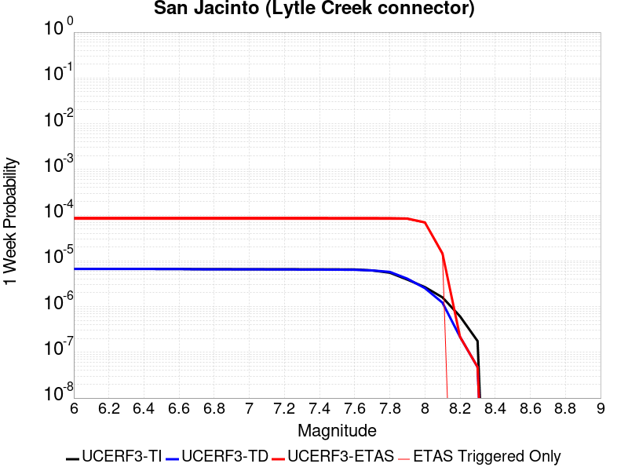 | 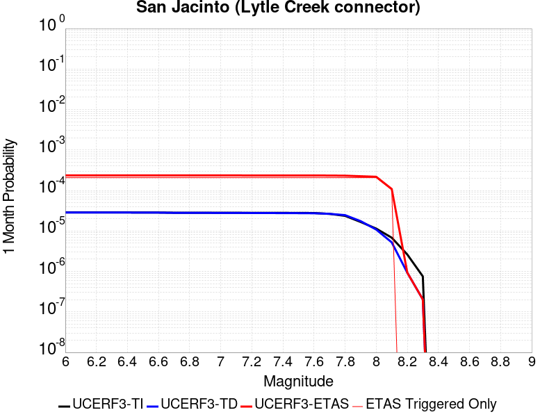 | 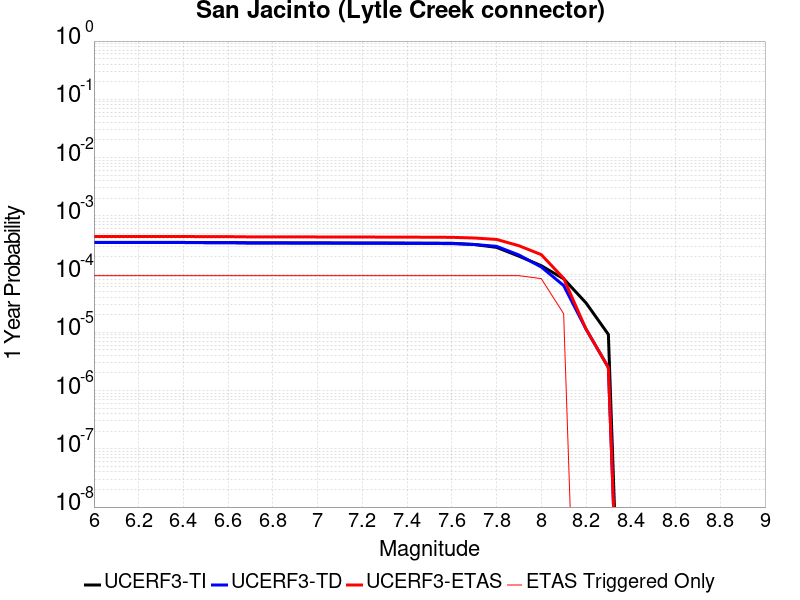 | 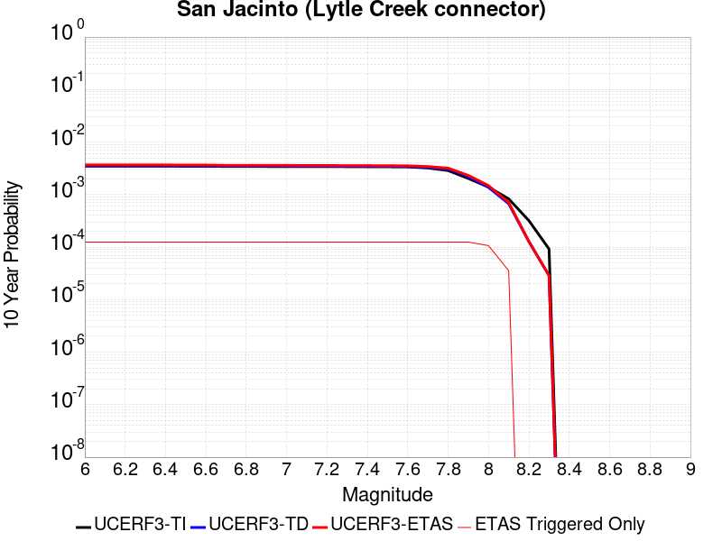 |

| Magnitude | 1 wk TI Prob | 1 wk TD Prob | 1 wk ETAS Prob | 1 wk ETAS/TD Gain | 1 wk ETAS Triggered Only | 1 mo TI Prob | 1 mo TD Prob | 1 mo ETAS Prob | 1 mo ETAS/TD Gain | 1 mo ETAS Triggered Only | 1 yr TI Prob | 1 yr TD Prob | 1 yr ETAS Prob | 1 yr ETAS/TD Gain | 1 yr ETAS Triggered Only | 10 yr TI Prob | 10 yr TD Prob | 10 yr ETAS Prob | 10 yr ETAS/TD Gain | 10 yr ETAS Triggered Only |
|-----|-----|-----|-----|-----|-----|-----|-----|-----|-----|-----|-----|-----|-----|-----|-----|-----|-----|-----|-----|-----|
| 6.0 | 6.693995E-6 | 6.660216E-6 | 7.9711084E-5 | 11.968243 | 7.305136E-5 | 2.8688235E-5 | 2.854347E-5 | 1.1202835E-4 | 3.9248328 | 8.348726E-5 | 3.492233E-4 | 3.4746144E-4 | 4.4135196E-4 | 1.2702186 | 9.392317E-5 | 0.00348675 | 0.0035493854 | 0.003653374 | 1.0292977 | 1.0435908E-4 |
| 6.1 | 6.693995E-6 | 6.660216E-6 | 7.9711084E-5 | 11.968243 | 7.305136E-5 | 2.8688235E-5 | 2.854347E-5 | 1.1202835E-4 | 3.9248328 | 8.348726E-5 | 3.492233E-4 | 3.4746144E-4 | 4.4135196E-4 | 1.2702186 | 9.392317E-5 | 0.00348675 | 0.0035493854 | 0.003653374 | 1.0292977 | 1.0435908E-4 |
| 6.2 | 6.693995E-6 | 6.660216E-6 | 7.9711084E-5 | 11.968243 | 7.305136E-5 | 2.8688235E-5 | 2.854347E-5 | 1.1202835E-4 | 3.9248328 | 8.348726E-5 | 3.492233E-4 | 3.4746144E-4 | 4.4135196E-4 | 1.2702186 | 9.392317E-5 | 0.00348675 | 0.0035493854 | 0.003653374 | 1.0292977 | 1.0435908E-4 |
| 6.3 | 6.693995E-6 | 6.660216E-6 | 7.9711084E-5 | 11.968243 | 7.305136E-5 | 2.8688235E-5 | 2.854347E-5 | 1.1202835E-4 | 3.9248328 | 8.348726E-5 | 3.492233E-4 | 3.4746144E-4 | 4.4135196E-4 | 1.2702186 | 9.392317E-5 | 0.00348675 | 0.0035493854 | 0.003653374 | 1.0292977 | 1.0435908E-4 |
| 6.4 | 6.693995E-6 | 6.660216E-6 | 7.9711084E-5 | 11.968243 | 7.305136E-5 | 2.8688235E-5 | 2.854347E-5 | 1.1202835E-4 | 3.9248328 | 8.348726E-5 | 3.492233E-4 | 3.4746144E-4 | 4.4135196E-4 | 1.2702186 | 9.392317E-5 | 0.00348675 | 0.0035493854 | 0.003653374 | 1.0292977 | 1.0435908E-4 |
| 6.5 | 6.6561875E-6 | 6.6204343E-6 | 7.967131E-5 | 12.034151 | 7.305136E-5 | 2.8526205E-5 | 2.837298E-5 | 1.1185787E-4 | 3.9424083 | 8.348726E-5 | 3.472512E-4 | 3.4538636E-4 | 4.392771E-4 | 1.2718426 | 9.392317E-5 | 0.0034670907 | 0.003528701 | 0.0036326917 | 1.02947 | 1.0435908E-4 |
| 6.6 | 6.6561875E-6 | 6.6204343E-6 | 7.967131E-5 | 12.034151 | 7.305136E-5 | 2.8526205E-5 | 2.837298E-5 | 1.1185787E-4 | 3.9424083 | 8.348726E-5 | 3.472512E-4 | 3.4538636E-4 | 4.392771E-4 | 1.2718426 | 9.392317E-5 | 0.0034670907 | 0.003528701 | 0.0036326917 | 1.02947 | 1.0435908E-4 |
| 6.7 | 6.5802237E-6 | 6.539611E-6 | 7.9590485E-5 | 12.170524 | 7.305136E-5 | 2.8200653E-5 | 2.8026603E-5 | 1.1151153E-4 | 3.978774 | 8.348726E-5 | 3.4328885E-4 | 3.4117055E-4 | 4.3506167E-4 | 1.2752029 | 9.392317E-5 | 0.0034275902 | 0.0034866752 | 0.0035906704 | 1.0298265 | 1.0435908E-4 |
| 6.8 | 6.575632E-6 | 6.5341005E-6 | 7.958498E-5 | 12.179944 | 7.305136E-5 | 2.8180975E-5 | 2.8002989E-5 | 1.1148791E-4 | 3.9812863 | 8.348726E-5 | 3.4304935E-4 | 3.4088313E-4 | 4.3477427E-4 | 1.2754351 | 9.392317E-5 | 0.0034252026 | 0.00348381 | 0.0035878054 | 1.0298511 | 1.0435908E-4 |
| 6.9 | 6.570433E-6 | 6.525495E-6 | 7.957637E-5 | 12.194688 | 7.305136E-5 | 2.8158694E-5 | 2.7966107E-5 | 1.1145104E-4 | 3.985218 | 8.348726E-5 | 3.4277816E-4 | 3.4043423E-4 | 4.3432543E-4 | 1.2757983 | 9.392317E-5 | 0.0034224992 | 0.0034793352 | 0.0035833311 | 1.0298896 | 1.0435908E-4 |
| 7.0 | 6.5643826E-6 | 6.515616E-6 | 7.95665E-5 | 12.211661 | 7.305136E-5 | 2.8132765E-5 | 2.792377E-5 | 1.114087E-4 | 3.9897444 | 8.348726E-5 | 3.424626E-4 | 3.3991894E-4 | 4.3381017E-4 | 1.2762166 | 9.392317E-5 | 0.0034193532 | 0.0034741985 | 0.0035781949 | 1.0299339 | 1.0435908E-4 |
| 7.1 | 6.557402E-6 | 6.5043278E-6 | 7.9555204E-5 | 12.231119 | 7.305136E-5 | 2.8102848E-5 | 2.7875392E-5 | 1.1136033E-4 | 3.9949331 | 8.348726E-5 | 3.4209844E-4 | 3.3933012E-4 | 4.3322143E-4 | 1.2766961 | 9.392317E-5 | 0.0034157229 | 0.0034683298 | 0.0035723269 | 1.0299848 | 1.0435908E-4 |
| 7.2 | 6.546394E-6 | 6.4862943E-6 | 7.9537174E-5 | 12.262344 | 7.305136E-5 | 2.8055672E-5 | 2.7798109E-5 | 1.1128305E-4 | 4.0032597 | 8.348726E-5 | 3.4152428E-4 | 3.3838948E-4 | 4.3228088E-4 | 1.2774655 | 9.392317E-5 | 0.0034099987 | 0.0034589572 | 0.0035629552 | 1.0300664 | 1.0435908E-4 |
| 7.3 | 6.5364216E-6 | 6.4670803E-6 | 7.9517966E-5 | 12.295806 | 7.305136E-5 | 2.8012933E-5 | 2.7715765E-5 | 1.11200716E-4 | 4.0121827 | 8.348726E-5 | 3.4100408E-4 | 3.3738726E-4 | 4.3127875E-4 | 1.2782899 | 9.392317E-5 | 0.003404813 | 0.0034489788 | 0.003552978 | 1.0301536 | 1.0435908E-4 |
| 7.4 | 6.5269523E-6 | 6.4481674E-6 | 7.949905E-5 | 12.328937 | 7.305136E-5 | 2.7972354E-5 | 2.7634711E-5 | 1.1111967E-4 | 4.021018 | 8.348726E-5 | 3.4051016E-4 | 3.3640073E-4 | 4.302923E-4 | 1.2791064 | 9.392317E-5 | 0.0033998888 | 0.003439161 | 0.003543161 | 1.0302399 | 1.0435908E-4 |
| 7.5 | 6.5111835E-6 | 6.424442E-6 | 7.947533E-5 | 12.370775 | 7.305136E-5 | 2.7904773E-5 | 2.7533031E-5 | 1.11017995E-4 | 4.0321746 | 8.348726E-5 | 3.3968766E-4 | 3.3516317E-4 | 4.2905487E-4 | 1.2801373 | 9.392317E-5 | 0.0033916887 | 0.003426834 | 0.0035308355 | 1.0303491 | 1.0435908E-4 |
| 7.6 | 6.4768806E-6 | 6.383551E-6 | 7.943444E-5 | 12.443613 | 7.305136E-5 | 2.7757764E-5 | 2.735779E-5 | 1.1084277E-4 | 4.051598 | 8.348726E-5 | 3.3789838E-4 | 3.3303024E-4 | 4.2692214E-4 | 1.281932 | 9.392317E-5 | 0.0033738504 | 0.0034055663 | 0.00350957 | 1.0305393 | 1.0435908E-4 |
| 7.7 | 6.1655364E-6 | 6.1760365E-6 | 7.922694E-5 | 12.82812 | 7.305136E-5 | 2.642346E-5 | 2.646846E-5 | 1.09953515E-4 | 4.1541333 | 8.348726E-5 | 3.2165812E-4 | 3.2220592E-4 | 4.160988E-4 | 1.2914065 | 9.392317E-5 | 0.0032119295 | 0.0032971818 | 0.0034011968 | 1.0315466 | 1.0435908E-4 |
| 7.8 | 5.5043524E-6 | 5.737097E-6 | 7.8788034E-5 | 13.733084 | 7.305136E-5 | 2.3589868E-5 | 2.4587327E-5 | 1.08072534E-4 | 4.395457 | 8.348726E-5 | 2.871688E-4 | 2.9930964E-4 | 3.9320468E-4 | 1.3137054 | 9.392317E-5 | 0.0028679797 | 0.0030672832 | 0.0031713222 | 1.033919 | 1.0435908E-4 |
| 7.9 | 3.889249E-6 | 4.076761E-6 | 7.712782E-5 | 18.918896 | 7.305136E-5 | 1.6668104E-5 | 1.7471715E-5 | 1.0095752E-4 | 5.7783403 | 8.348726E-5 | 2.0291525E-4 | 2.1269741E-4 | 3.0660062E-4 | 1.4414872 | 9.392317E-5 | 0.0020273007 | 0.0021943315 | 0.0022984615 | 1.0474541 | 1.0435908E-4 |
| 8.0 | 2.668535E-6 | 2.5315155E-6 | 6.514681E-5 | 25.73431 | 6.261545E-5 | 1.1436528E-5 | 1.0849307E-5 | 8.389987E-5 | 7.733201 | 7.305136E-5 | 1.3923083E-4 | 1.3208234E-4 | 2.1555857E-4 | 1.6320015 | 8.348726E-5 | 0.0013914363 | 0.0013757964 | 0.0014591687 | 1.0605993 | 8.348726E-5 |
| 8.1 | 1.5911459E-6 | 1.218661E-6 | 1.1654556E-5 | 9.563411 | 1.0435908E-5 | 6.8191785E-6 | 5.2228224E-6 | 2.6094529E-5 | 4.9962506 | 2.0871816E-5 | 8.3020335E-5 | 6.3586034E-5 | 8.445652E-5 | 1.3282244 | 2.0871816E-5 | 8.298933E-4 | 6.6932244E-4 | 6.901803E-4 | 1.0311626 | 2.0871816E-5 |
| 8.2 | 6.1294963E-7 | 2.1812275E-7 | 2.1812275E-7 | 1.0 | 0.0 | 2.6269242E-6 | 9.3481145E-7 | 9.3481145E-7 | 1.0 | 0.0 | 3.1982334E-5 | 1.138127E-5 | 1.138127E-5 | 1.0 | 0.0 | 3.1977732E-4 | 1.2784546E-4 | 1.2784546E-4 | 1.0 | 0.0 |
| 8.3 | 1.762871E-7 | 4.7546838E-8 | 4.7546838E-8 | 1.0 | 0.0 | 7.5551594E-7 | 2.0377215E-7 | 2.0377215E-7 | 1.0 | 0.0 | 9.1983675E-6 | 2.480923E-6 | 2.480923E-6 | 1.0 | 0.0 | 9.197987E-5 | 2.868753E-5 | 2.868753E-5 | 1.0 | 0.0 |

## Dry Mountain
*[(top)](#table-of-contents)*

| 1 Week | 1 Month | 1 Year | 10 Year |
|-----|-----|-----|-----|
| 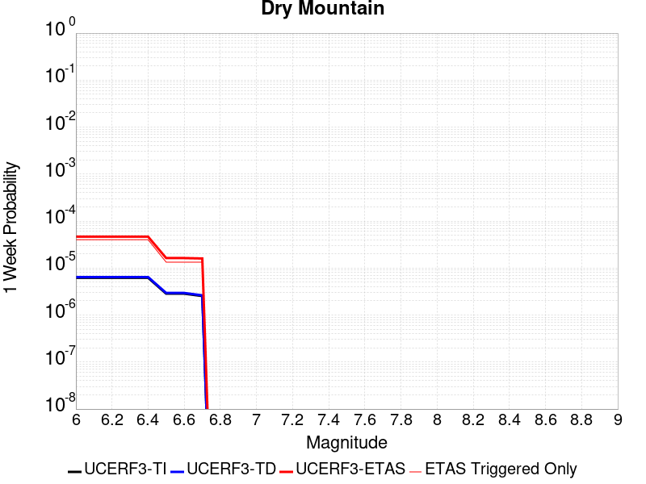 | 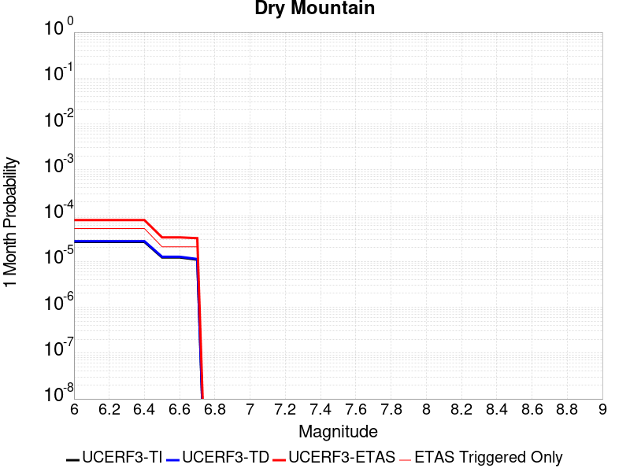 | 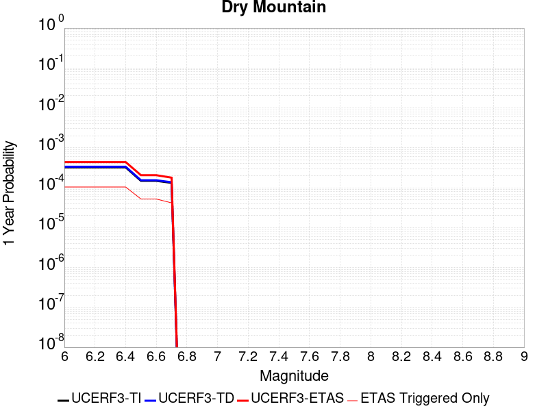 | 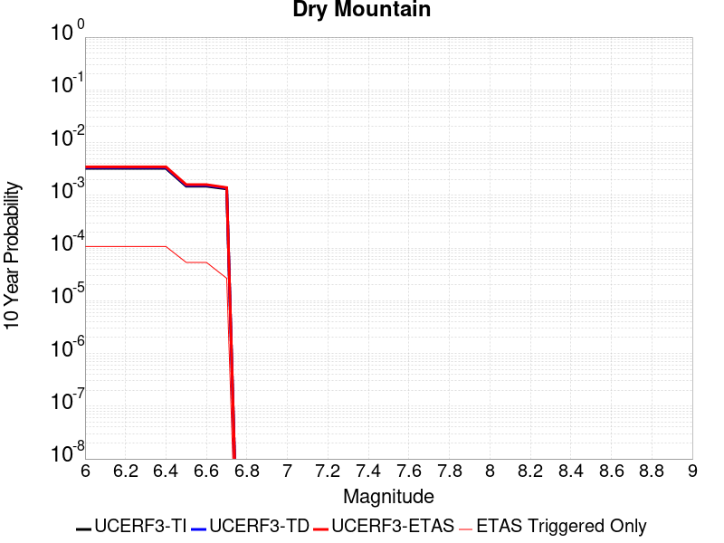 |

| Magnitude | 1 wk TI Prob | 1 wk TD Prob | 1 wk ETAS Prob | 1 wk ETAS/TD Gain | 1 wk ETAS Triggered Only | 1 mo TI Prob | 1 mo TD Prob | 1 mo ETAS Prob | 1 mo ETAS/TD Gain | 1 mo ETAS Triggered Only | 1 yr TI Prob | 1 yr TD Prob | 1 yr ETAS Prob | 1 yr ETAS/TD Gain | 1 yr ETAS Triggered Only | 10 yr TI Prob | 10 yr TD Prob | 10 yr ETAS Prob | 10 yr ETAS/TD Gain | 10 yr ETAS Triggered Only |
|-----|-----|-----|-----|-----|-----|-----|-----|-----|-----|-----|-----|-----|-----|-----|-----|-----|-----|-----|-----|-----|
| 6.0 | 6.222801E-6 | 6.439381E-6 | 4.8182745E-5 | 7.4825115 | 4.174363E-5 | 2.6668875E-5 | 2.7597147E-5 | 7.9775244E-5 | 2.8907063 | 5.217954E-5 | 3.2464517E-4 | 3.3595937E-4 | 4.402834E-4 | 1.3105257 | 1.0435908E-4 | 0.0032417132 | 0.0033560768 | 0.0034600857 | 1.0309912 | 1.0435908E-4 |
| 6.1 | 6.222801E-6 | 6.439381E-6 | 4.8182745E-5 | 7.4825115 | 4.174363E-5 | 2.6668875E-5 | 2.7597147E-5 | 7.9775244E-5 | 2.8907063 | 5.217954E-5 | 3.2464517E-4 | 3.3595937E-4 | 4.402834E-4 | 1.3105257 | 1.0435908E-4 | 0.0032417132 | 0.0033560768 | 0.0034600857 | 1.0309912 | 1.0435908E-4 |
| 6.2 | 6.222801E-6 | 6.439381E-6 | 4.8182745E-5 | 7.4825115 | 4.174363E-5 | 2.6668875E-5 | 2.7597147E-5 | 7.9775244E-5 | 2.8907063 | 5.217954E-5 | 3.2464517E-4 | 3.3595937E-4 | 4.402834E-4 | 1.3105257 | 1.0435908E-4 | 0.0032417132 | 0.0033560768 | 0.0034600857 | 1.0309912 | 1.0435908E-4 |
| 6.3 | 6.222801E-6 | 6.439381E-6 | 4.8182745E-5 | 7.4825115 | 4.174363E-5 | 2.6668875E-5 | 2.7597147E-5 | 7.9775244E-5 | 2.8907063 | 5.217954E-5 | 3.2464517E-4 | 3.3595937E-4 | 4.402834E-4 | 1.3105257 | 1.0435908E-4 | 0.0032417132 | 0.0033560768 | 0.0034600857 | 1.0309912 | 1.0435908E-4 |
| 6.4 | 6.222801E-6 | 6.439381E-6 | 4.8182745E-5 | 7.4825115 | 4.174363E-5 | 2.6668875E-5 | 2.7597147E-5 | 7.9775244E-5 | 2.8907063 | 5.217954E-5 | 3.2464517E-4 | 3.3595937E-4 | 4.402834E-4 | 1.3105257 | 1.0435908E-4 | 0.0032417132 | 0.0033560768 | 0.0034600857 | 1.0309912 | 1.0435908E-4 |
| 6.5 | 2.8528623E-6 | 2.9521684E-6 | 1.3388046E-5 | 4.534987 | 1.0435908E-5 | 1.22264955E-5 | 1.2652138E-5 | 3.352369E-5 | 2.6496463 | 2.0871816E-5 | 1.4884741E-4 | 1.540376E-4 | 2.062091E-4 | 1.3386933 | 5.217954E-5 | 0.0014874774 | 0.0015401616 | 0.0015922608 | 1.0338271 | 5.217954E-5 |
| 6.6 | 2.8528623E-6 | 2.9521684E-6 | 1.3388046E-5 | 4.534987 | 1.0435908E-5 | 1.22264955E-5 | 1.2652138E-5 | 3.352369E-5 | 2.6496463 | 2.0871816E-5 | 1.4884741E-4 | 1.540376E-4 | 2.062091E-4 | 1.3386933 | 5.217954E-5 | 0.0014874774 | 0.0015401616 | 0.0015922608 | 1.0338271 | 5.217954E-5 |
| 6.7 | 2.541E-6 | 2.6293578E-6 | 1.3065238E-5 | 4.9689846 | 1.0435908E-5 | 1.0889954E-5 | 1.1268677E-5 | 3.214026E-5 | 2.8521767 | 2.0871816E-5 | 1.3257713E-4 | 1.3719614E-4 | 1.7893405E-4 | 1.3042207 | 4.174363E-5 | 0.0013249806 | 0.0013719613 | 0.0014136478 | 1.0303845 | 4.174363E-5 |

## Whittier alt 1
*[(top)](#table-of-contents)*

| 1 Week | 1 Month | 1 Year | 10 Year |
|-----|-----|-----|-----|
| 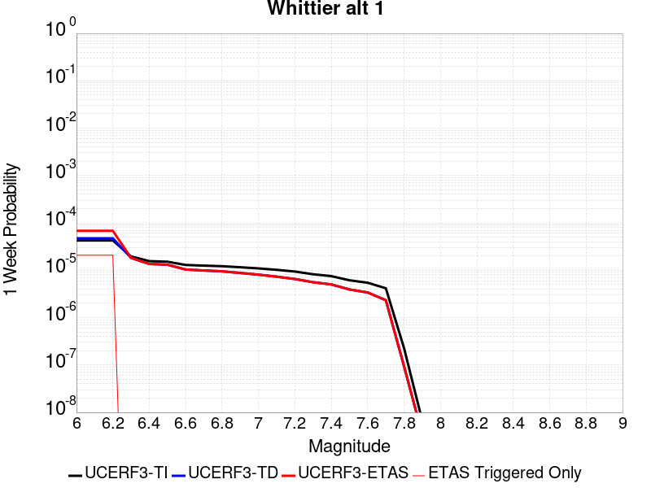 | 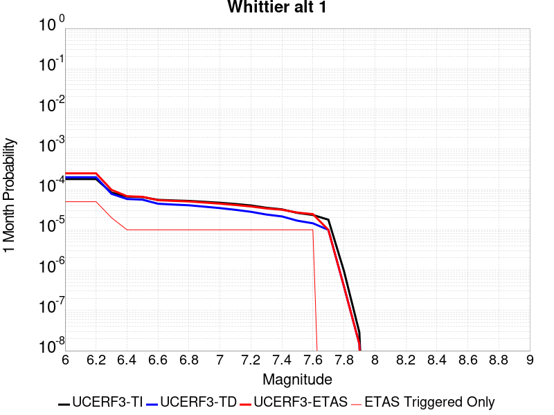 | 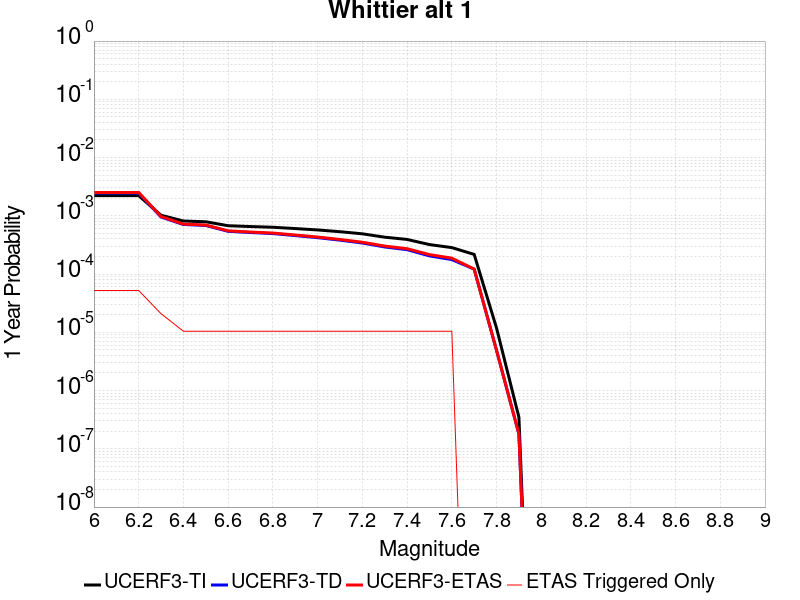 | 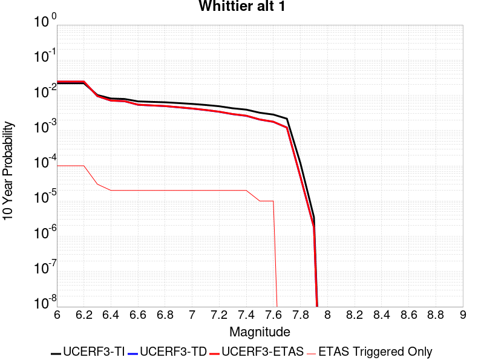 |

| Magnitude | 1 wk TI Prob | 1 wk TD Prob | 1 wk ETAS Prob | 1 wk ETAS/TD Gain | 1 wk ETAS Triggered Only | 1 mo TI Prob | 1 mo TD Prob | 1 mo ETAS Prob | 1 mo ETAS/TD Gain | 1 mo ETAS Triggered Only | 1 yr TI Prob | 1 yr TD Prob | 1 yr ETAS Prob | 1 yr ETAS/TD Gain | 1 yr ETAS Triggered Only | 10 yr TI Prob | 10 yr TD Prob | 10 yr ETAS Prob | 10 yr ETAS/TD Gain | 10 yr ETAS Triggered Only |
|-----|-----|-----|-----|-----|-----|-----|-----|-----|-----|-----|-----|-----|-----|-----|-----|-----|-----|-----|-----|-----|
| 6.0 | 4.2554693E-5 | 4.725218E-5 | 6.812301E-5 | 1.4416903 | 2.0871816E-5 | 1.8236451E-4 | 2.0249544E-4 | 2.442306E-4 | 1.2061043 | 4.174363E-5 | 0.002218027 | 0.0024629154 | 0.0025149663 | 1.0211339 | 5.217954E-5 | 0.02196019 | 0.024390234 | 0.024481867 | 1.0037569 | 9.392317E-5 |
| 6.1 | 4.2554693E-5 | 4.725218E-5 | 6.812301E-5 | 1.4416903 | 2.0871816E-5 | 1.8236451E-4 | 2.0249544E-4 | 2.442306E-4 | 1.2061043 | 4.174363E-5 | 0.002218027 | 0.0024629154 | 0.0025149663 | 1.0211339 | 5.217954E-5 | 0.02196019 | 0.024390234 | 0.024481867 | 1.0037569 | 9.392317E-5 |
| 6.2 | 4.2554693E-5 | 4.725218E-5 | 6.812301E-5 | 1.4416903 | 2.0871816E-5 | 1.8236451E-4 | 2.0249544E-4 | 2.442306E-4 | 1.2061043 | 4.174363E-5 | 0.002218027 | 0.0024629154 | 0.0025149663 | 1.0211339 | 5.217954E-5 | 0.02196019 | 0.024390234 | 0.024481867 | 1.0037569 | 9.392317E-5 |
| 6.3 | 1.9617712E-5 | 1.8268593E-5 | 1.8268593E-5 | 1.0 | 0.0 | 8.40732E-5 | 7.829172E-5 | 9.91619E-5 | 1.2665695 | 2.0871816E-5 | 0.0010231105 | 9.52804E-4 | 9.736559E-4 | 1.0218848 | 2.0871816E-5 | 0.01018413 | 0.009490474 | 0.009521485 | 1.0032675 | 3.1307725E-5 |
| 6.4 | 1.5611336E-5 | 1.3604271E-5 | 1.3604271E-5 | 1.0 | 0.0 | 6.690401E-5 | 5.8302747E-5 | 6.8738045E-5 | 1.1789846 | 1.0435908E-5 | 8.142519E-4 | 7.0961076E-4 | 7.2003924E-4 | 1.0146961 | 1.0435908E-5 | 0.008112748 | 0.0070754145 | 0.007096139 | 1.0029291 | 2.0871816E-5 |
| 6.5 | 1.5150166E-5 | 1.3100925E-5 | 1.3100925E-5 | 1.0 | 0.0 | 6.492767E-5 | 5.6145647E-5 | 6.658097E-5 | 1.1858616 | 1.0435908E-5 | 7.9020765E-4 | 6.8336475E-4 | 6.937935E-4 | 1.0152609 | 1.0435908E-5 | 0.007874036 | 0.0068145846 | 0.0068353144 | 1.003042 | 2.0871816E-5 |
| 6.6 | 1.295588E-5 | 1.0380725E-5 | 1.0380725E-5 | 1.0 | 0.0 | 5.552402E-5 | 4.4488075E-5 | 5.492352E-5 | 1.2345672 | 1.0435908E-5 | 6.7579525E-4 | 5.4150965E-4 | 5.519399E-4 | 1.0192615 | 1.0435908E-5 | 0.006737438 | 0.0054033357 | 0.005424095 | 1.0038419 | 2.0871816E-5 |
| 6.7 | 1.2542085E-5 | 9.899369E-6 | 9.899369E-6 | 1.0 | 0.0 | 5.3750682E-5 | 4.242519E-5 | 5.286065E-5 | 1.2459733 | 1.0435908E-5 | 6.542181E-4 | 5.164061E-4 | 5.268366E-4 | 1.0201983 | 1.0435908E-5 | 0.006522954 | 0.0051534795 | 0.0051742434 | 1.0040292 | 2.0871816E-5 |
| 6.8 | 1.2195878E-5 | 9.495415E-6 | 9.495415E-6 | 1.0 | 0.0 | 5.2267E-5 | 4.069401E-5 | 5.1129493E-5 | 1.2564378 | 1.0435908E-5 | 6.36165E-4 | 4.9533875E-4 | 5.057695E-4 | 1.0210578 | 1.0435908E-5 | 0.0063434686 | 0.004943688 | 0.0049644564 | 1.004201 | 2.0871816E-5 |
| 6.9 | 1.1580298E-5 | 8.772933E-6 | 8.772933E-6 | 1.0 | 0.0 | 4.9628903E-5 | 3.7597754E-5 | 4.8033267E-5 | 1.2775569 | 1.0435908E-5 | 6.040644E-4 | 4.5765814E-4 | 4.6808927E-4 | 1.0227925 | 1.0435908E-5 | 0.00602425 | 0.0045684157 | 0.0045891926 | 1.0045478 | 2.0871816E-5 |
| 7.0 | 1.0964795E-5 | 8.083994E-6 | 8.083994E-6 | 1.0 | 0.0 | 4.6991136E-5 | 3.4645236E-5 | 4.5080782E-5 | 1.3012116 | 1.0435908E-5 | 5.7196687E-4 | 4.2172565E-4 | 4.3215716E-4 | 1.0247353 | 1.0435908E-5 | 0.0057049696 | 0.004210462 | 0.0042312457 | 1.0049362 | 2.0871816E-5 |
| 7.1 | 1.0230601E-5 | 7.3266697E-6 | 7.3266697E-6 | 1.0 | 0.0 | 4.3844695E-5 | 3.1399642E-5 | 4.183522E-5 | 1.3323472 | 1.0435908E-5 | 5.336784E-4 | 3.8222488E-4 | 3.926568E-4 | 1.0272926 | 1.0435908E-5 | 0.005323986 | 0.0038168381 | 0.0038376304 | 1.0054475 | 2.0871816E-5 |
| 7.2 | 9.40865E-6 | 6.543289E-6 | 6.543289E-6 | 1.0 | 0.0 | 4.032216E-5 | 2.8042374E-5 | 3.847799E-5 | 1.3721374 | 1.0435908E-5 | 4.908117E-4 | 3.4136363E-4 | 3.5179598E-4 | 1.0305609 | 1.0435908E-5 | 0.0048972913 | 0.003409485 | 0.003430286 | 1.0061008 | 2.0871816E-5 |
| 7.3 | 8.237384E-6 | 5.5977525E-6 | 5.5977525E-6 | 1.0 | 0.0 | 3.5302593E-5 | 2.3990153E-5 | 3.442581E-5 | 1.4349976 | 1.0435908E-5 | 4.2972428E-4 | 2.92042E-4 | 3.024749E-4 | 1.0357238 | 1.0435908E-5 | 0.0042889426 | 0.002916903 | 0.002937714 | 1.0071346 | 2.0871816E-5 |
| 7.4 | 7.5316966E-6 | 5.027819E-6 | 5.027819E-6 | 1.0 | 0.0 | 3.2278298E-5 | 2.1547625E-5 | 3.198331E-5 | 1.4843078 | 1.0435908E-5 | 3.9291743E-4 | 2.6231175E-4 | 2.7274492E-4 | 1.039774 | 1.0435908E-5 | 0.0039222343 | 0.0026201333 | 0.0026409505 | 1.0079451 | 2.0871816E-5 |
| 7.5 | 6.149649E-6 | 3.933841E-6 | 3.933841E-6 | 1.0 | 0.0 | 2.6355372E-5 | 1.6859214E-5 | 2.7294946E-5 | 1.6189928 | 1.0435908E-5 | 3.208294E-4 | 2.052425E-4 | 2.1567626E-4 | 1.0508363 | 1.0435908E-5 | 0.003203666 | 0.0020506186 | 0.0020610332 | 1.0050787 | 1.0435908E-5 |
| 7.6 | 5.457711E-6 | 3.3953788E-6 | 3.3953788E-6 | 1.0 | 0.0 | 2.338998E-5 | 1.4551547E-5 | 2.4987303E-5 | 1.7171578 | 1.0435908E-5 | 2.8473578E-4 | 1.771515E-4 | 1.8758555E-4 | 1.058899 | 1.0435908E-5 | 0.0028437122 | 0.0017701836 | 0.001780601 | 1.005885 | 1.0435908E-5 |
| 7.7 | 4.1676276E-6 | 2.3331952E-6 | 2.3331952E-6 | 1.0 | 0.0 | 1.7861139E-5 | 9.999374E-6 | 9.999374E-6 | 1.0 | 0.0 | 2.1743766E-4 | 1.2173632E-4 | 1.2173632E-4 | 1.0 | 0.0 | 0.0021722503 | 0.0012167693 | 0.0012167693 | 1.0 | 0.0 |
| 7.8 | 2.2692414E-7 | 9.3854695E-8 | 9.3854695E-8 | 1.0 | 0.0 | 9.725317E-7 | 4.0223435E-7 | 4.0223435E-7 | 1.0 | 0.0 | 1.1840509E-5 | 4.8971956E-6 | 4.8971956E-6 | 1.0 | 0.0 | 1.1839878E-4 | 4.8971204E-5 | 4.8971204E-5 | 1.0 | 0.0 |
| 7.9 | 6.676829E-9 | 3.439853E-9 | 3.439853E-9 | 1.0 | 0.0 | 2.861498E-8 | 1.4742227E-8 | 1.4742227E-8 | 1.0 | 0.0 | 3.4838732E-7 | 1.7948659E-7 | 1.7948659E-7 | 1.0 | 0.0 | 3.4838679E-6 | 1.7948646E-6 | 1.7948646E-6 | 1.0 | 0.0 |

## San Pedro Basin
*[(top)](#table-of-contents)*

| 1 Week | 1 Month | 1 Year | 10 Year |
|-----|-----|-----|-----|
| 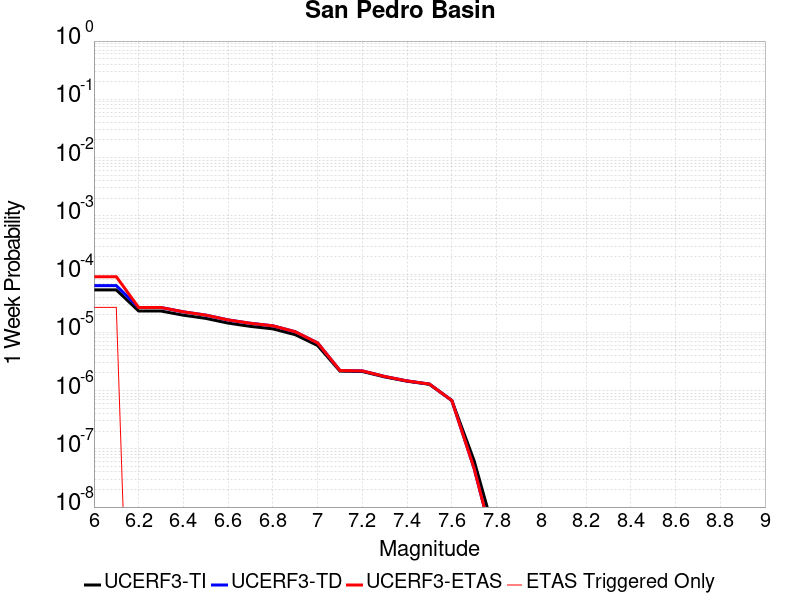 | 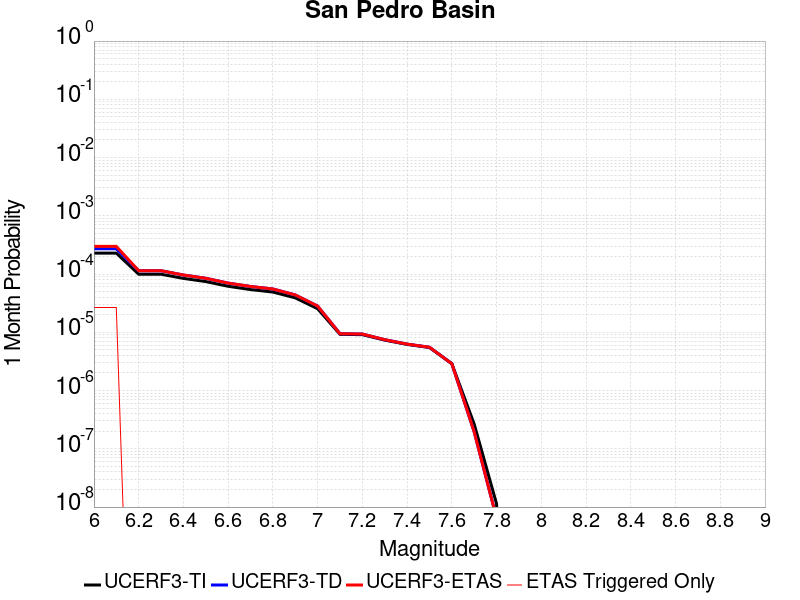 | 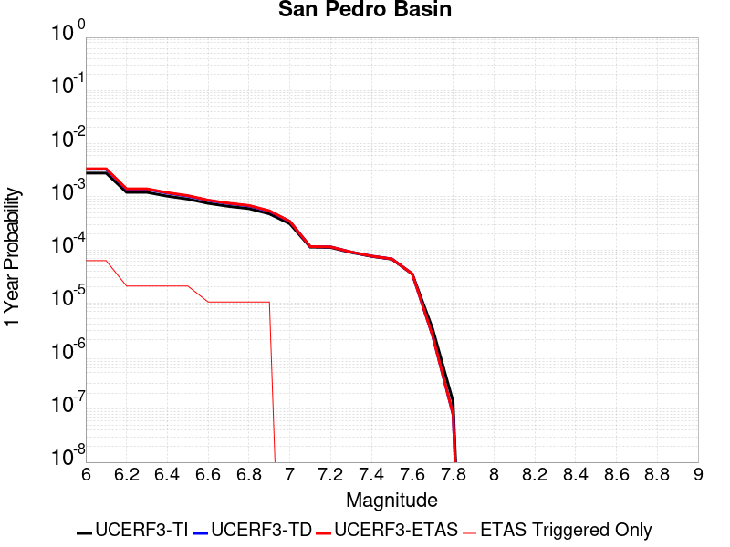 | 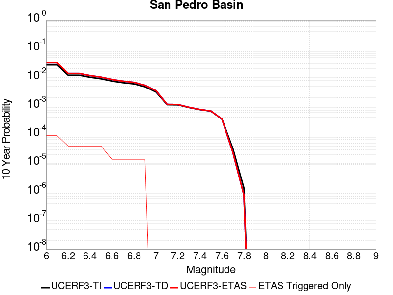 |

| Magnitude | 1 wk TI Prob | 1 wk TD Prob | 1 wk ETAS Prob | 1 wk ETAS/TD Gain | 1 wk ETAS Triggered Only | 1 mo TI Prob | 1 mo TD Prob | 1 mo ETAS Prob | 1 mo ETAS/TD Gain | 1 mo ETAS Triggered Only | 1 yr TI Prob | 1 yr TD Prob | 1 yr ETAS Prob | 1 yr ETAS/TD Gain | 1 yr ETAS Triggered Only | 10 yr TI Prob | 10 yr TD Prob | 10 yr ETAS Prob | 10 yr ETAS/TD Gain | 10 yr ETAS Triggered Only |
|-----|-----|-----|-----|-----|-----|-----|-----|-----|-----|-----|-----|-----|-----|-----|-----|-----|-----|-----|-----|-----|
| 6.0 | 5.3449043E-5 | 6.336954E-5 | 8.4240026E-5 | 1.3293458 | 2.0871816E-5 | 2.2904722E-4 | 2.715589E-4 | 2.9242507E-4 | 1.0768384 | 2.0871816E-5 | 0.0027850836 | 0.0033018254 | 0.003364234 | 1.0189012 | 6.261545E-5 | 0.027504366 | 0.03258945 | 0.032680314 | 1.0027881 | 9.392317E-5 |
| 6.1 | 5.3449043E-5 | 6.336954E-5 | 8.4240026E-5 | 1.3293458 | 2.0871816E-5 | 2.2904722E-4 | 2.715589E-4 | 2.9242507E-4 | 1.0768384 | 2.0871816E-5 | 0.0027850836 | 0.0033018254 | 0.003364234 | 1.0189012 | 6.261545E-5 | 0.027504366 | 0.03258945 | 0.032680314 | 1.0027881 | 9.392317E-5 |
| 6.2 | 2.3189454E-5 | 2.6642796E-5 | 2.6642796E-5 | 1.0 | 0.0 | 9.9379584E-5 | 1.14178685E-4 | 1.14178685E-4 | 1.0 | 0.0 | 0.0012092749 | 0.0013892864 | 0.0014101292 | 1.0150025 | 2.0871816E-5 | 0.012027155 | 0.013810883 | 0.013841759 | 1.0022355 | 3.1307725E-5 |
| 6.3 | 2.3189454E-5 | 2.6642796E-5 | 2.6642796E-5 | 1.0 | 0.0 | 9.9379584E-5 | 1.14178685E-4 | 1.14178685E-4 | 1.0 | 0.0 | 0.0012092749 | 0.0013892864 | 0.0014101292 | 1.0150025 | 2.0871816E-5 | 0.012027155 | 0.013810883 | 0.013841759 | 1.0022355 | 3.1307725E-5 |
| 6.4 | 1.966056E-5 | 2.2463413E-5 | 2.2463413E-5 | 1.0 | 0.0 | 8.425682E-5 | 9.626844E-5 | 9.626844E-5 | 1.0 | 0.0 | 0.001025344 | 0.0011714783 | 0.0011923257 | 1.0177958 | 2.0871816E-5 | 0.010206259 | 0.011657117 | 0.011688059 | 1.0026544 | 3.1307725E-5 |
| 6.5 | 1.7342953E-5 | 1.9745148E-5 | 1.9745148E-5 | 1.0 | 0.0 | 7.4324824E-5 | 8.4619525E-5 | 8.4619525E-5 | 1.0 | 0.0 | 9.04529E-4 | 0.0010297928 | 0.001050643 | 1.0202471 | 2.0871816E-5 | 0.009008561 | 0.010253931 | 0.010284917 | 1.003022 | 3.1307725E-5 |
| 6.6 | 1.439804E-5 | 1.6322716E-5 | 1.6322716E-5 | 1.0 | 0.0 | 6.170443E-5 | 6.99528E-5 | 6.99528E-5 | 1.0 | 0.0 | 7.509924E-4 | 8.513747E-4 | 8.6180173E-4 | 1.0122473 | 1.0435908E-5 | 0.0074845953 | 0.008484332 | 0.00849468 | 1.0012196 | 1.0435908E-5 |
| 6.7 | 1.2634884E-5 | 1.4285297E-5 | 1.4285297E-5 | 1.0 | 0.0 | 5.414838E-5 | 6.1221435E-5 | 6.1221435E-5 | 1.0 | 0.0 | 6.590571E-4 | 7.4514654E-4 | 7.5557467E-4 | 1.0139947 | 1.0435908E-5 | 0.006571059 | 0.007429501 | 0.0074398597 | 1.0013943 | 1.0435908E-5 |
| 6.8 | 1.146091E-5 | 1.2933192E-5 | 1.2933192E-5 | 1.0 | 0.0 | 4.911726E-5 | 5.5426954E-5 | 5.5426954E-5 | 1.0 | 0.0 | 5.9783855E-4 | 6.7464396E-4 | 6.8507285E-4 | 1.0154583 | 1.0435908E-5 | 0.0059623276 | 0.006728899 | 0.006739265 | 1.0015404 | 1.0435908E-5 |
| 6.9 | 9.109035E-6 | 1.0235011E-5 | 1.0235011E-5 | 1.0 | 0.0 | 3.9038136E-5 | 4.3863754E-5 | 4.3863754E-5 | 1.0 | 0.0 | 4.7518566E-4 | 5.3393835E-4 | 5.443687E-4 | 1.0195347 | 1.0435908E-5 | 0.0047417083 | 0.005329309 | 0.005339689 | 1.0019478 | 1.0435908E-5 |
| 7.0 | 5.9351028E-6 | 6.583964E-6 | 6.583964E-6 | 1.0 | 0.0 | 2.5435906E-5 | 2.8216817E-5 | 2.8216817E-5 | 1.0 | 0.0 | 3.0963816E-4 | 3.435092E-4 | 3.435092E-4 | 1.0 | 0.0 | 0.0030920706 | 0.0034320992 | 0.0034320992 | 1.0 | 0.0 |
| 7.1 | 2.1557585E-6 | 2.209648E-6 | 2.209648E-6 | 1.0 | 0.0 | 9.238933E-6 | 9.469887E-6 | 9.469887E-6 | 1.0 | 0.0 | 1.1247819E-4 | 1.1528993E-4 | 1.1528993E-4 | 1.0 | 0.0 | 0.0011242128 | 0.0011523166 | 0.0011523166 | 1.0 | 0.0 |
| 7.2 | 2.1251979E-6 | 2.1779945E-6 | 2.1779945E-6 | 1.0 | 0.0 | 9.107958E-6 | 9.334229E-6 | 9.334229E-6 | 1.0 | 0.0 | 1.1088375E-4 | 1.1363847E-4 | 1.1363847E-4 | 1.0 | 0.0 | 0.0011082845 | 0.0011358189 | 0.0011358189 | 1.0 | 0.0 |
| 7.3 | 1.7145798E-6 | 1.7442874E-6 | 1.7442874E-6 | 1.0 | 0.0 | 7.3481783E-6 | 7.4754967E-6 | 7.4754967E-6 | 1.0 | 0.0 | 8.94604E-5 | 9.1010465E-5 | 9.1010465E-5 | 1.0 | 0.0 | 8.9424395E-4 | 9.0974104E-4 | 9.0974104E-4 | 1.0 | 0.0 |
| 7.4 | 1.4467993E-6 | 1.4641868E-6 | 1.4641868E-6 | 1.0 | 0.0 | 6.200554E-6 | 6.2750714E-6 | 6.2750714E-6 | 1.0 | 0.0 | 7.548913E-5 | 7.639639E-5 | 7.639639E-5 | 1.0 | 0.0 | 7.546349E-4 | 7.6370855E-4 | 7.6370855E-4 | 1.0 | 0.0 |
| 7.5 | 1.2803735E-6 | 1.2931497E-6 | 1.2931497E-6 | 1.0 | 0.0 | 5.487303E-6 | 5.5420587E-6 | 5.5420587E-6 | 1.0 | 0.0 | 6.680587E-5 | 6.7472545E-5 | 6.7472545E-5 | 1.0 | 0.0 | 6.678579E-4 | 6.7452766E-4 | 6.7452766E-4 | 1.0 | 0.0 |
| 7.6 | 6.755009E-7 | 6.769465E-7 | 6.769465E-7 | 1.0 | 0.0 | 2.8950008E-6 | 2.9011965E-6 | 2.9011965E-6 | 1.0 | 0.0 | 3.5246063E-5 | 3.5321555E-5 | 3.5321555E-5 | 1.0 | 0.0 | 3.5240475E-4 | 3.5316512E-4 | 3.5316512E-4 | 1.0 | 0.0 |
| 7.7 | 6.211885E-8 | 4.569953E-8 | 4.569953E-8 | 1.0 | 0.0 | 2.6622362E-7 | 1.9585512E-7 | 1.9585512E-7 | 1.0 | 0.0 | 3.2412677E-6 | 2.3845337E-6 | 2.3845337E-6 | 1.0 | 0.0 | 3.2412205E-5 | 2.3845101E-5 | 2.3845101E-5 | 1.0 | 0.0 |
| 7.8 | 2.6580573E-9 | 1.5138163E-9 | 1.5138163E-9 | 1.0 | 0.0 | 1.1391674E-8 | 6.487784E-9 | 6.487784E-9 | 1.0 | 0.0 | 1.3869362E-7 | 7.898877E-8 | 7.898877E-8 | 1.0 | 0.0 | 1.3869354E-6 | 7.898877E-7 | 7.898877E-7 | 1.0 | 0.0 |

## San Clemente
*[(top)](#table-of-contents)*

| 1 Week | 1 Month | 1 Year | 10 Year |
|-----|-----|-----|-----|
|  | 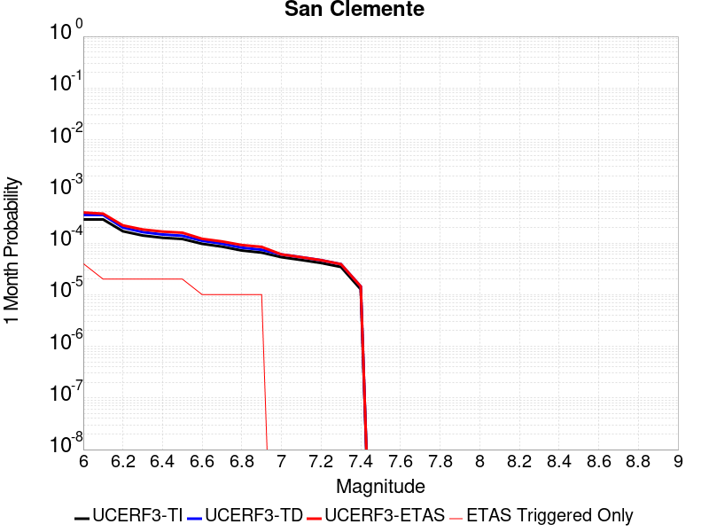 | 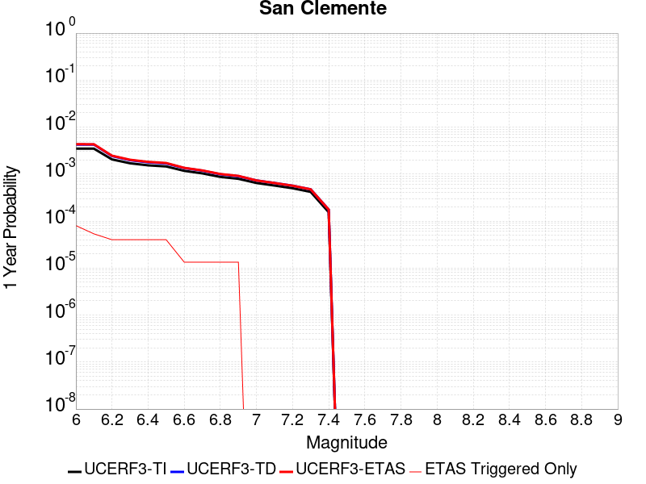 |  |

| Magnitude | 1 wk TI Prob | 1 wk TD Prob | 1 wk ETAS Prob | 1 wk ETAS/TD Gain | 1 wk ETAS Triggered Only | 1 mo TI Prob | 1 mo TD Prob | 1 mo ETAS Prob | 1 mo ETAS/TD Gain | 1 mo ETAS Triggered Only | 1 yr TI Prob | 1 yr TD Prob | 1 yr ETAS Prob | 1 yr ETAS/TD Gain | 1 yr ETAS Triggered Only | 10 yr TI Prob | 10 yr TD Prob | 10 yr ETAS Prob | 10 yr ETAS/TD Gain | 10 yr ETAS Triggered Only |
|-----|-----|-----|-----|-----|-----|-----|-----|-----|-----|-----|-----|-----|-----|-----|-----|-----|-----|-----|-----|-----|
| 6.0 | 6.681379E-5 | 8.163422E-5 | 1.1293939E-4 | 1.3834809 | 3.1307725E-5 | 2.8631336E-4 | 3.498173E-4 | 3.9154635E-4 | 1.1192881 | 4.174363E-5 | 0.003480294 | 0.0042512873 | 0.0043136366 | 1.014666 | 6.261545E-5 | 0.03426291 | 0.041755714 | 0.041845717 | 1.0021554 | 9.392317E-5 |
| 6.1 | 6.681379E-5 | 8.163422E-5 | 9.206928E-5 | 1.1278269 | 1.0435908E-5 | 2.8631336E-4 | 3.498173E-4 | 3.706818E-4 | 1.059644 | 2.0871816E-5 | 0.003480294 | 0.0042512873 | 0.0042928536 | 1.0097773 | 4.174363E-5 | 0.03426291 | 0.041755714 | 0.041825715 | 1.0016764 | 7.305136E-5 |
| 6.2 | 3.9400576E-5 | 4.6451984E-5 | 5.688741E-5 | 1.2246497 | 1.0435908E-5 | 1.6884868E-4 | 1.9906509E-4 | 2.1993276E-4 | 1.1048284 | 2.0871816E-5 | 0.0020537945 | 0.002420985 | 0.0024522168 | 1.0129005 | 3.1307725E-5 | 0.020349167 | 0.02395286 | 0.02400379 | 1.0021262 | 5.217954E-5 |
| 6.3 | 3.2590255E-5 | 3.7929087E-5 | 4.83646E-5 | 1.2751322 | 1.0435908E-5 | 1.3966505E-4 | 1.6254328E-4 | 1.834117E-4 | 1.1283869 | 2.0871816E-5 | 0.0016990956 | 0.0019771985 | 0.0020084442 | 1.0158031 | 3.1307725E-5 | 0.01686163 | 0.019599866 | 0.019651022 | 1.0026101 | 5.217954E-5 |
| 6.4 | 2.9454652E-5 | 3.4097775E-5 | 4.4533328E-5 | 1.3060479 | 1.0435908E-5 | 1.2622811E-4 | 1.4612528E-4 | 1.6699405E-4 | 1.1428142 | 2.0871816E-5 | 0.0015357438 | 0.0017776482 | 0.0018089003 | 1.0175806 | 3.1307725E-5 | 0.015251739 | 0.017637458 | 0.017688716 | 1.0029063 | 5.217954E-5 |
| 6.5 | 2.790836E-5 | 3.2247463E-5 | 4.2683034E-5 | 1.3236091 | 1.0435908E-5 | 1.1960178E-4 | 1.3819622E-4 | 1.5906515E-4 | 1.1510094 | 2.0871816E-5 | 0.001455179 | 0.0016812651 | 0.0017125201 | 1.0185902 | 3.1307725E-5 | 0.014456868 | 0.016688475 | 0.016739784 | 1.0030745 | 5.217954E-5 |
| 6.6 | 2.2492153E-5 | 2.5762707E-5 | 3.6198344E-5 | 1.4050677 | 1.0435908E-5 | 9.639138E-5 | 1.1040701E-4 | 1.2084177E-4 | 1.0945117 | 1.0435908E-5 | 0.0011729331 | 0.0013433908 | 0.0013538128 | 1.0077579 | 1.0435908E-5 | 0.011667615 | 0.013354415 | 0.013385305 | 1.002313 | 3.1307725E-5 |
| 6.7 | 1.9862755E-5 | 2.2666423E-5 | 3.3102093E-5 | 1.4604023 | 1.0435908E-5 | 8.512331E-5 | 9.713826E-5 | 1.0757315E-4 | 1.1074231 | 1.0435908E-5 | 0.0010358836 | 0.0011820279 | 0.0011924515 | 1.0088184 | 1.0435908E-5 | 0.010310682 | 0.011758701 | 0.011779327 | 1.0017542 | 2.0871816E-5 |
| 6.8 | 1.6697575E-5 | 1.897771E-5 | 2.9413419E-5 | 1.549893 | 1.0435908E-5 | 7.155907E-5 | 8.133056E-5 | 9.1765614E-5 | 1.1283042 | 1.0435908E-5 | 8.7088346E-4 | 9.897591E-4 | 0.0010001847 | 1.0105335 | 1.0435908E-5 | 0.008674784 | 0.0098545365 | 0.009875203 | 1.0020971 | 2.0871816E-5 |
| 6.9 | 1.5218415E-5 | 1.72694E-5 | 2.7705128E-5 | 1.6042901 | 1.0435908E-5 | 6.522015E-5 | 7.4009666E-5 | 8.44448E-5 | 1.1409969 | 1.0435908E-5 | 7.93766E-4 | 9.00704E-4 | 9.111305E-4 | 1.0115759 | 1.0435908E-5 | 0.007909367 | 0.008971481 | 0.008992164 | 1.0023056 | 2.0871816E-5 |
| 7.0 | 1.2392958E-5 | 1.4033016E-5 | 1.4033016E-5 | 1.0 | 0.0 | 5.3111595E-5 | 6.014015E-5 | 6.014015E-5 | 1.0 | 0.0 | 6.4644177E-4 | 7.319679E-4 | 7.319679E-4 | 1.0 | 0.0 | 0.0064456454 | 0.0072963564 | 0.0072963564 | 1.0 | 0.0 |
| 7.1 | 1.0934128E-5 | 1.2375138E-5 | 1.2375138E-5 | 1.0 | 0.0 | 4.6859706E-5 | 5.303527E-5 | 5.303527E-5 | 1.0 | 0.0 | 5.7036756E-4 | 6.455204E-4 | 6.455204E-4 | 1.0 | 0.0 | 0.0056890585 | 0.0064371997 | 0.0064371997 | 1.0 | 0.0 |
| 7.2 | 9.5798805E-6 | 1.0844935E-5 | 1.0844935E-5 | 1.0 | 0.0 | 4.1055984E-5 | 4.6477508E-5 | 4.6477508E-5 | 1.0 | 0.0 | 4.9974193E-4 | 5.657239E-4 | 5.657239E-4 | 1.0 | 0.0 | 0.0049861963 | 0.0056435615 | 0.0056435615 | 1.0 | 0.0 |
| 7.3 | 8.0167365E-6 | 9.083918E-6 | 9.083918E-6 | 1.0 | 0.0 | 3.4356988E-5 | 3.8930535E-5 | 3.8930535E-5 | 1.0 | 0.0 | 4.1821605E-4 | 4.7388324E-4 | 4.7388324E-4 | 1.0 | 0.0 | 0.0041742986 | 0.0047294297 | 0.0047294297 | 1.0 | 0.0 |
| 7.4 | 2.9581017E-6 | 3.3623792E-6 | 3.3623792E-6 | 1.0 | 0.0 | 1.2677518E-5 | 1.4410146E-5 | 1.4410146E-5 | 1.0 | 0.0 | 1.5433785E-4 | 1.7543444E-4 | 1.7543444E-4 | 1.0 | 0.0 | 0.001542307 | 0.0017534546 | 0.0017534546 | 1.0 | 0.0 |

## Santa Ynez River
*[(top)](#table-of-contents)*

| 1 Week | 1 Month | 1 Year | 10 Year |
|-----|-----|-----|-----|
| 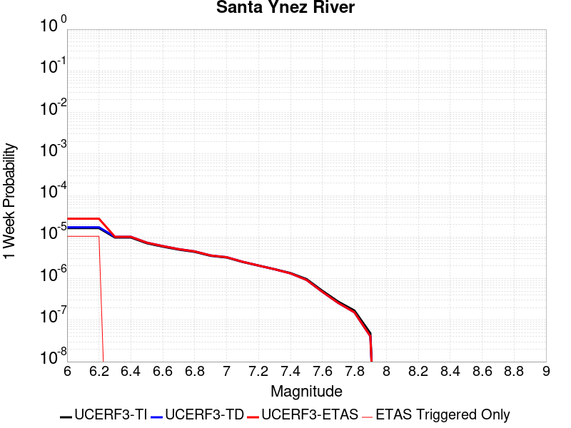 | 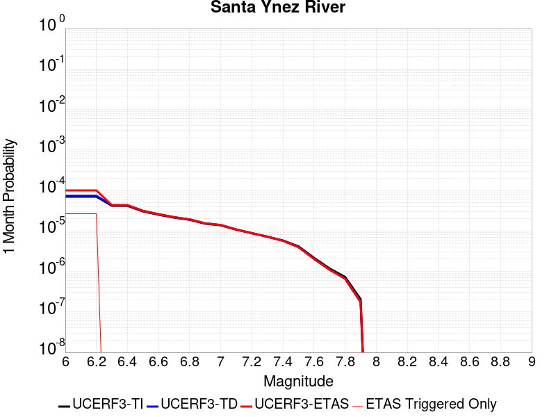 | 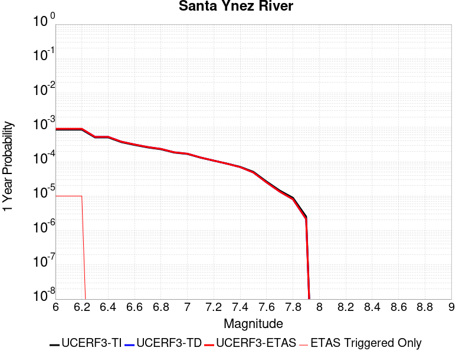 | 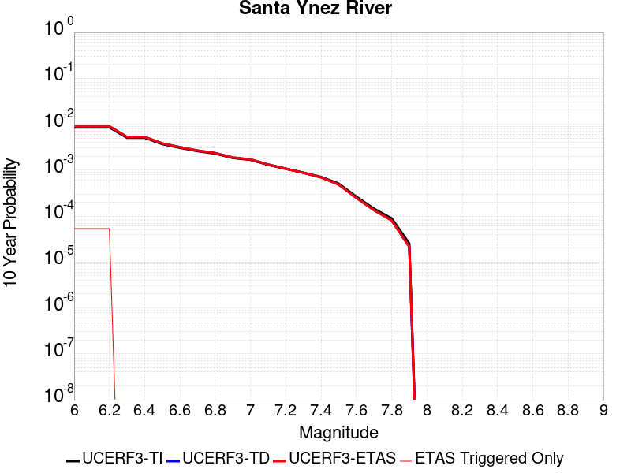 |

| Magnitude | 1 wk TI Prob | 1 wk TD Prob | 1 wk ETAS Prob | 1 wk ETAS/TD Gain | 1 wk ETAS Triggered Only | 1 mo TI Prob | 1 mo TD Prob | 1 mo ETAS Prob | 1 mo ETAS/TD Gain | 1 mo ETAS Triggered Only | 1 yr TI Prob | 1 yr TD Prob | 1 yr ETAS Prob | 1 yr ETAS/TD Gain | 1 yr ETAS Triggered Only | 10 yr TI Prob | 10 yr TD Prob | 10 yr ETAS Prob | 10 yr ETAS/TD Gain | 10 yr ETAS Triggered Only |
|-----|-----|-----|-----|-----|-----|-----|-----|-----|-----|-----|-----|-----|-----|-----|-----|-----|-----|-----|-----|-----|
| 6.0 | 1.6396456E-5 | 1.7209435E-5 | 2.7645165E-5 | 1.6063957 | 1.0435908E-5 | 7.026863E-5 | 7.375284E-5 | 8.418798E-5 | 1.141488 | 1.0435908E-5 | 8.551848E-4 | 8.976064E-4 | 9.08033E-4 | 1.011616 | 1.0435908E-5 | 0.0085190125 | 0.008943358 | 0.009015756 | 1.0080951 | 7.305136E-5 |
| 6.1 | 1.6396456E-5 | 1.7209435E-5 | 2.7645165E-5 | 1.6063957 | 1.0435908E-5 | 7.026863E-5 | 7.375284E-5 | 8.418798E-5 | 1.141488 | 1.0435908E-5 | 8.551848E-4 | 8.976064E-4 | 9.08033E-4 | 1.011616 | 1.0435908E-5 | 0.0085190125 | 0.008943358 | 0.009015756 | 1.0080951 | 7.305136E-5 |
| 6.2 | 1.6396456E-5 | 1.7209435E-5 | 2.7645165E-5 | 1.6063957 | 1.0435908E-5 | 7.026863E-5 | 7.375284E-5 | 8.418798E-5 | 1.141488 | 1.0435908E-5 | 8.551848E-4 | 8.976064E-4 | 9.08033E-4 | 1.011616 | 1.0435908E-5 | 0.0085190125 | 0.008943358 | 0.009015756 | 1.0080951 | 7.305136E-5 |
| 6.3 | 9.736976E-6 | 1.012233E-5 | 1.012233E-5 | 1.0 | 0.0 | 4.172923E-5 | 4.338072E-5 | 4.338072E-5 | 1.0 | 0.0 | 5.0793495E-4 | 5.280373E-4 | 5.280373E-4 | 1.0 | 0.0 | 0.005067755 | 0.005268332 | 0.005289094 | 1.0039408 | 2.0871816E-5 |
| 6.4 | 9.736976E-6 | 1.012233E-5 | 1.012233E-5 | 1.0 | 0.0 | 4.172923E-5 | 4.338072E-5 | 4.338072E-5 | 1.0 | 0.0 | 5.0793495E-4 | 5.280373E-4 | 5.280373E-4 | 1.0 | 0.0 | 0.005067755 | 0.005268332 | 0.005289094 | 1.0039408 | 2.0871816E-5 |
| 6.5 | 7.081964E-6 | 7.3298966E-6 | 7.3298966E-6 | 1.0 | 0.0 | 3.035092E-5 | 3.1413474E-5 | 3.1413474E-5 | 1.0 | 0.0 | 3.694598E-4 | 3.8239348E-4 | 3.8239348E-4 | 1.0 | 0.0 | 0.0036884616 | 0.0038175168 | 0.0038383089 | 1.0054466 | 2.0871816E-5 |
| 6.6 | 5.873247E-6 | 6.059743E-6 | 6.059743E-6 | 1.0 | 0.0 | 2.5170815E-5 | 2.5970074E-5 | 2.5970074E-5 | 1.0 | 0.0 | 3.064116E-4 | 3.1614062E-4 | 3.1614062E-4 | 1.0 | 0.0 | 0.0030598943 | 0.0031569963 | 0.0031778023 | 1.0065904 | 2.0871816E-5 |
| 6.7 | 4.973277E-6 | 5.115901E-6 | 5.115901E-6 | 1.0 | 0.0 | 2.1313872E-5 | 2.1925109E-5 | 2.1925109E-5 | 1.0 | 0.0 | 2.5946548E-4 | 2.66906E-4 | 2.66906E-4 | 1.0 | 0.0 | 0.0025916274 | 0.0026659032 | 0.0026867194 | 1.0078083 | 2.0871816E-5 |
| 6.8 | 4.396492E-6 | 4.5109778E-6 | 4.5109778E-6 | 1.0 | 0.0 | 1.884197E-5 | 1.9332621E-5 | 1.9332621E-5 | 1.0 | 0.0 | 2.2937685E-4 | 2.3534958E-4 | 2.3534958E-4 | 1.0 | 0.0 | 0.0022914023 | 0.0023510386 | 0.0023718614 | 1.0088568 | 2.0871816E-5 |
| 6.9 | 3.5255632E-6 | 3.6013332E-6 | 3.6013332E-6 | 1.0 | 0.0 | 1.5109469E-5 | 1.5434196E-5 | 1.5434196E-5 | 1.0 | 0.0 | 1.8394225E-4 | 1.8789528E-4 | 1.8789528E-4 | 1.0 | 0.0 | 0.0018379007 | 0.0018773803 | 0.0018982129 | 1.0110966 | 2.0871816E-5 |
| 7.0 | 3.211603E-6 | 3.273654E-6 | 3.273654E-6 | 1.0 | 0.0 | 1.376394E-5 | 1.4029872E-5 | 1.4029872E-5 | 1.0 | 0.0 | 1.6756308E-4 | 1.7080043E-4 | 1.7080043E-4 | 1.0 | 0.0 | 0.0016743679 | 0.0017067058 | 0.0017171239 | 1.0061042 | 1.0435908E-5 |
| 7.1 | 2.5094619E-6 | 2.5409204E-6 | 2.5409204E-6 | 1.0 | 0.0 | 1.0754793E-5 | 1.0889614E-5 | 1.0889614E-5 | 1.0 | 0.0 | 1.3093173E-4 | 1.3257304E-4 | 1.3257304E-4 | 1.0 | 0.0 | 0.0013085462 | 0.0013249456 | 0.0013353677 | 1.007866 | 1.0435908E-5 |
| 7.2 | 2.0515774E-6 | 2.0619375E-6 | 2.0619375E-6 | 1.0 | 0.0 | 8.792445E-6 | 8.836846E-6 | 8.836846E-6 | 1.0 | 0.0 | 1.0704277E-4 | 1.0758333E-4 | 1.0758333E-4 | 1.0 | 0.0 | 0.0010699122 | 0.0010753168 | 0.0010857414 | 1.0096946 | 1.0435908E-5 |
| 7.3 | 1.6845745E-6 | 1.6773907E-6 | 1.6773907E-6 | 1.0 | 0.0 | 7.219585E-6 | 7.1887976E-6 | 7.1887976E-6 | 1.0 | 0.0 | 8.78949E-5 | 8.752012E-5 | 8.752012E-5 | 1.0 | 0.0 | 8.7860145E-4 | 8.7485946E-4 | 8.852862E-4 | 1.0119182 | 1.0435908E-5 |
| 7.4 | 1.3600285E-6 | 1.3333357E-6 | 1.3333357E-6 | 1.0 | 0.0 | 5.82868E-6 | 5.714284E-6 | 5.714284E-6 | 1.0 | 0.0 | 7.096187E-5 | 6.956921E-5 | 6.956921E-5 | 1.0 | 0.0 | 7.0939213E-4 | 6.954765E-4 | 7.0590514E-4 | 1.014995 | 1.0435908E-5 |
| 7.5 | 9.735342E-7 | 9.290103E-7 | 9.290103E-7 | 1.0 | 0.0 | 4.172283E-6 | 3.9814668E-6 | 3.9814668E-6 | 1.0 | 0.0 | 5.079636E-5 | 4.8473295E-5 | 4.8473295E-5 | 1.0 | 0.0 | 5.0784746E-4 | 4.8462892E-4 | 4.8462892E-4 | 1.0 | 0.0 |
| 7.6 | 5.067187E-7 | 4.77857E-7 | 4.77857E-7 | 1.0 | 0.0 | 2.1716498E-6 | 2.047957E-6 | 2.047957E-6 | 1.0 | 0.0 | 2.6439517E-5 | 2.4933597E-5 | 2.4933597E-5 | 1.0 | 0.0 | 2.643637E-4 | 2.4930874E-4 | 2.4930874E-4 | 1.0 | 0.0 |
| 7.7 | 2.769089E-7 | 2.5759124E-7 | 2.5759124E-7 | 1.0 | 0.0 | 1.1867519E-6 | 1.1039621E-6 | 1.1039621E-6 | 1.0 | 0.0 | 1.4448608E-5 | 1.34406555E-5 | 1.34406555E-5 | 1.0 | 0.0 | 1.444767E-4 | 1.3439846E-4 | 1.3439846E-4 | 1.0 | 0.0 |
| 7.8 | 1.7044663E-7 | 1.5449015E-7 | 1.5449015E-7 | 1.0 | 0.0 | 7.3048534E-7 | 6.621005E-7 | 6.621005E-7 | 1.0 | 0.0 | 8.893623E-6 | 8.061043E-6 | 8.061043E-6 | 1.0 | 0.0 | 8.893267E-5 | 8.060753E-5 | 8.060753E-5 | 1.0 | 0.0 |
| 7.9 | 4.8344287E-8 | 4.0910923E-8 | 4.0910923E-8 | 1.0 | 0.0 | 2.0718979E-7 | 1.7533252E-7 | 1.7533252E-7 | 1.0 | 0.0 | 2.5225327E-6 | 2.1346711E-6 | 2.1346711E-6 | 1.0 | 0.0 | 2.5225041E-5 | 2.1346512E-5 | 2.1346512E-5 | 1.0 | 0.0 |

## Bullion Mountains
*[(top)](#table-of-contents)*

| 1 Week | 1 Month | 1 Year | 10 Year |
|-----|-----|-----|-----|
|  | 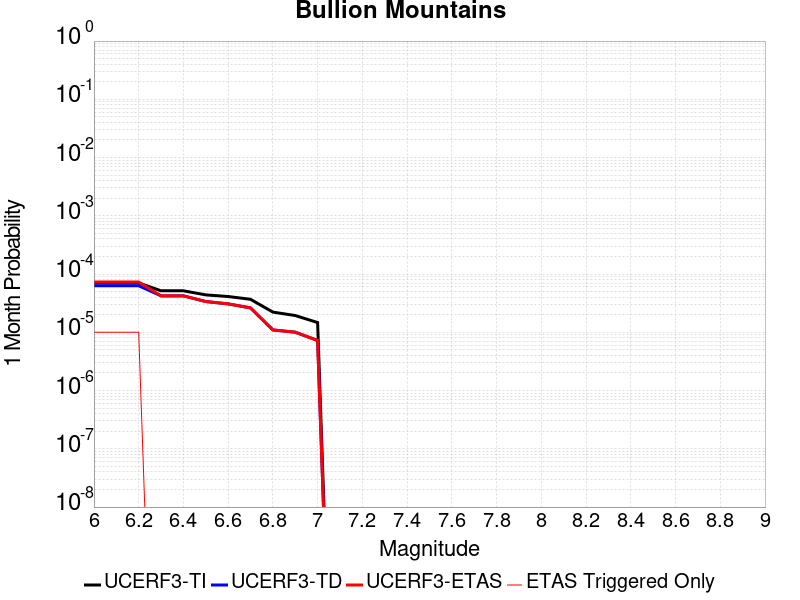 | 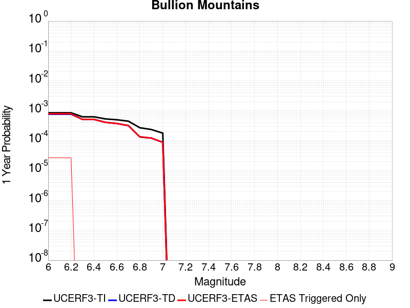 | 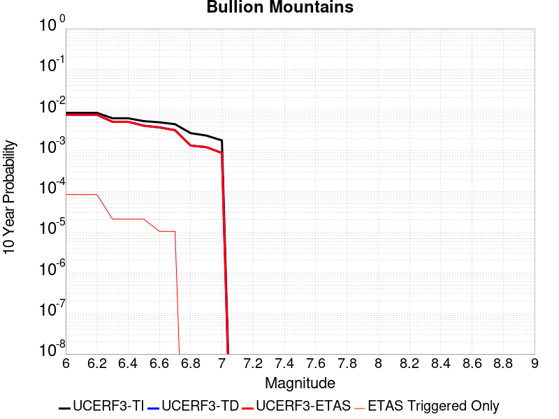 |

| Magnitude | 1 wk TI Prob | 1 wk TD Prob | 1 wk ETAS Prob | 1 wk ETAS/TD Gain | 1 wk ETAS Triggered Only | 1 mo TI Prob | 1 mo TD Prob | 1 mo ETAS Prob | 1 mo ETAS/TD Gain | 1 mo ETAS Triggered Only | 1 yr TI Prob | 1 yr TD Prob | 1 yr ETAS Prob | 1 yr ETAS/TD Gain | 1 yr ETAS Triggered Only | 10 yr TI Prob | 10 yr TD Prob | 10 yr ETAS Prob | 10 yr ETAS/TD Gain | 10 yr ETAS Triggered Only |
|-----|-----|-----|-----|-----|-----|-----|-----|-----|-----|-----|-----|-----|-----|-----|-----|-----|-----|-----|-----|-----|
| 6.0 | 1.6420427E-5 | 1.4692089E-5 | 2.5127843E-5 | 1.7102975 | 1.0435908E-5 | 7.037136E-5 | 6.296479E-5 | 7.340004E-5 | 1.1657315 | 1.0435908E-5 | 8.5643446E-4 | 7.663651E-4 | 8.1850466E-4 | 1.0680349 | 5.217954E-5 | 0.008531413 | 0.007641016 | 0.0077238656 | 1.0108427 | 8.348726E-5 |
| 6.1 | 1.6420427E-5 | 1.4692089E-5 | 2.5127843E-5 | 1.7102975 | 1.0435908E-5 | 7.037136E-5 | 6.296479E-5 | 7.340004E-5 | 1.1657315 | 1.0435908E-5 | 8.5643446E-4 | 7.663651E-4 | 8.1850466E-4 | 1.0680349 | 5.217954E-5 | 0.008531413 | 0.007641016 | 0.0077238656 | 1.0108427 | 8.348726E-5 |
| 6.2 | 1.6420427E-5 | 1.4692089E-5 | 2.5127843E-5 | 1.7102975 | 1.0435908E-5 | 7.037136E-5 | 6.296479E-5 | 7.340004E-5 | 1.1657315 | 1.0435908E-5 | 8.5643446E-4 | 7.663651E-4 | 8.1850466E-4 | 1.0680349 | 5.217954E-5 | 0.008531413 | 0.007641016 | 0.0077238656 | 1.0108427 | 8.348726E-5 |
| 6.3 | 1.2046778E-5 | 9.862335E-6 | 9.862335E-6 | 1.0 | 0.0 | 5.1628023E-5 | 4.2266598E-5 | 4.2266598E-5 | 1.0 | 0.0 | 6.283899E-4 | 5.144975E-4 | 5.144975E-4 | 1.0 | 0.0 | 0.0062661595 | 0.005135345 | 0.0051561096 | 1.0040435 | 2.0871816E-5 |
| 6.4 | 1.2046778E-5 | 9.862335E-6 | 9.862335E-6 | 1.0 | 0.0 | 5.1628023E-5 | 4.2266598E-5 | 4.2266598E-5 | 1.0 | 0.0 | 6.283899E-4 | 5.144975E-4 | 5.144975E-4 | 1.0 | 0.0 | 0.0062661595 | 0.005135345 | 0.0051561096 | 1.0040435 | 2.0871816E-5 |
| 6.5 | 1.0244343E-5 | 7.879458E-6 | 7.879458E-6 | 1.0 | 0.0 | 4.390359E-5 | 3.3768785E-5 | 3.3768785E-5 | 1.0 | 0.0 | 5.343951E-4 | 4.110781E-4 | 4.110781E-4 | 1.0 | 0.0 | 0.005331118 | 0.004105208 | 0.004125994 | 1.0050634 | 2.0871816E-5 |
| 6.6 | 9.605408E-6 | 7.1774966E-6 | 7.1774966E-6 | 1.0 | 0.0 | 4.1165385E-5 | 3.076045E-5 | 3.076045E-5 | 1.0 | 0.0 | 5.010733E-4 | 3.744645E-4 | 3.744645E-4 | 1.0 | 0.0 | 0.00499945 | 0.003740332 | 0.003750729 | 1.0027797 | 1.0435908E-5 |
| 6.7 | 8.60418E-6 | 6.1240044E-6 | 6.1240044E-6 | 1.0 | 0.0 | 3.687454E-5 | 2.624558E-5 | 2.624558E-5 | 1.0 | 0.0 | 4.48855E-4 | 3.1951256E-4 | 3.1951256E-4 | 1.0 | 0.0 | 0.004479495 | 0.0031924439 | 0.0032028463 | 1.0032585 | 1.0435908E-5 |
| 6.8 | 5.187994E-6 | 2.5631666E-6 | 2.5631666E-6 | 1.0 | 0.0 | 2.223407E-5 | 1.0984976E-5 | 1.0984976E-5 | 1.0 | 0.0 | 2.7066618E-4 | 1.3373788E-4 | 1.3373788E-4 | 1.0 | 0.0 | 0.0027033675 | 0.0013369655 | 0.0013369655 | 1.0 | 0.0 |
| 6.9 | 4.5302368E-6 | 2.3443165E-6 | 2.3443165E-6 | 1.0 | 0.0 | 1.9415156E-5 | 1.0047055E-5 | 1.0047055E-5 | 1.0 | 0.0 | 2.3635388E-4 | 1.2232E-4 | 1.2232E-4 | 1.0 | 0.0 | 0.0023610266 | 0.0012229157 | 0.0012229157 | 1.0 | 0.0 |
| 7.0 | 3.431668E-6 | 1.6882402E-6 | 1.6882402E-6 | 1.0 | 0.0 | 1.4707065E-5 | 7.235315E-6 | 7.235315E-6 | 1.0 | 0.0 | 1.7904381E-4 | 8.808996E-5 | 8.808996E-5 | 1.0 | 0.0 | 0.0017889962 | 8.808996E-4 | 8.808996E-4 | 1.0 | 0.0 |

## San Jacinto (Borrego)
*[(top)](#table-of-contents)*

| 1 Week | 1 Month | 1 Year | 10 Year |
|-----|-----|-----|-----|
| 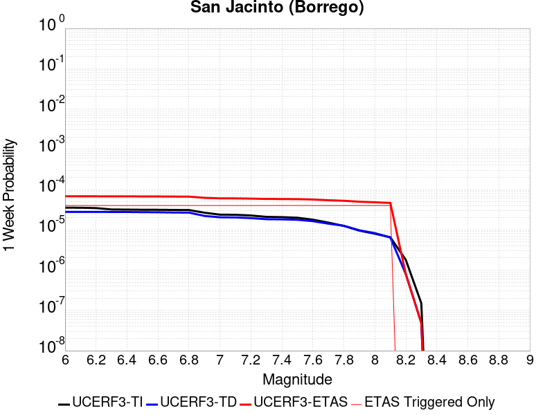 | 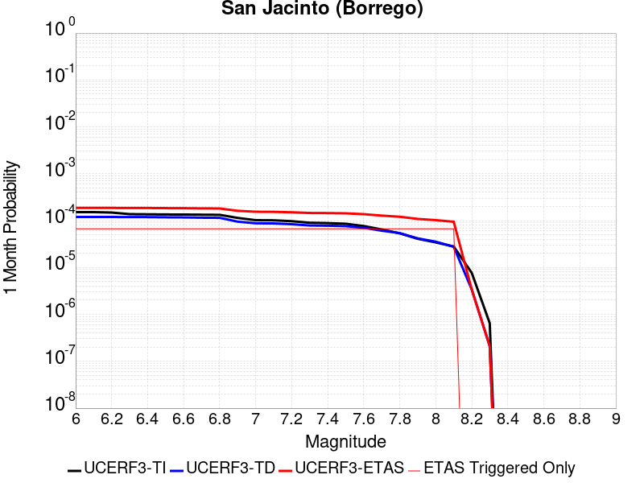 | 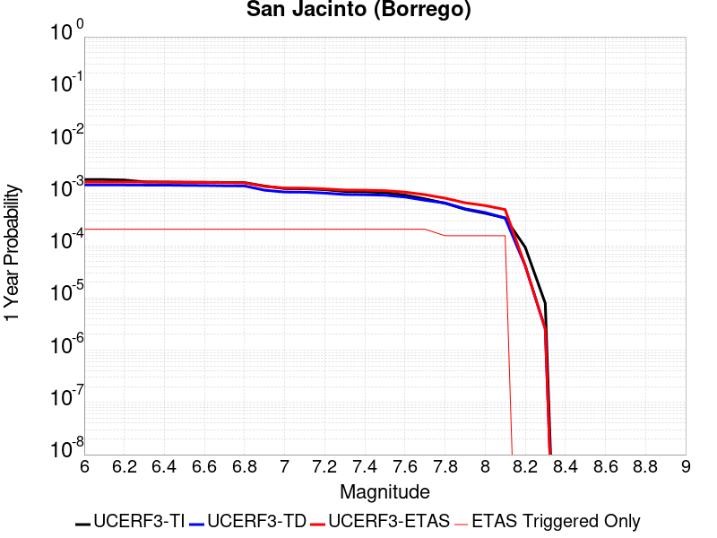 | 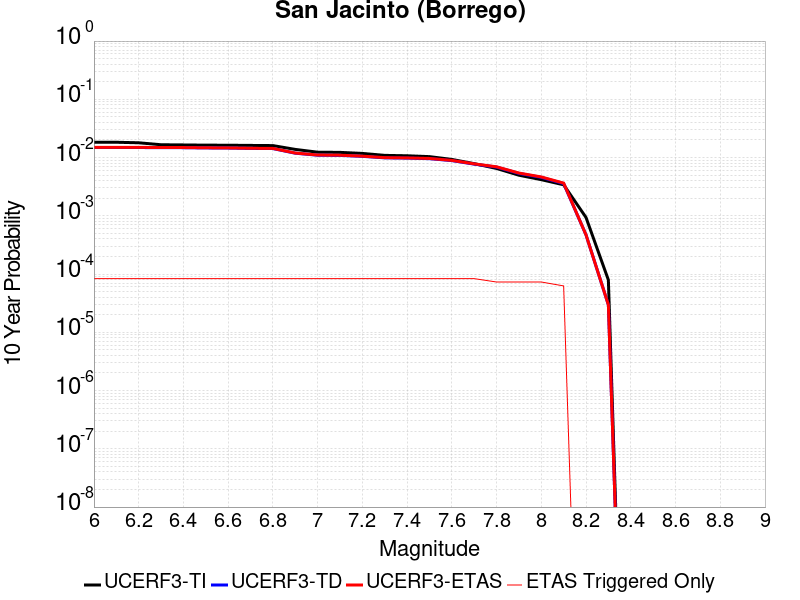 |

| Magnitude | 1 wk TI Prob | 1 wk TD Prob | 1 wk ETAS Prob | 1 wk ETAS/TD Gain | 1 wk ETAS Triggered Only | 1 mo TI Prob | 1 mo TD Prob | 1 mo ETAS Prob | 1 mo ETAS/TD Gain | 1 mo ETAS Triggered Only | 1 yr TI Prob | 1 yr TD Prob | 1 yr ETAS Prob | 1 yr ETAS/TD Gain | 1 yr ETAS Triggered Only | 10 yr TI Prob | 10 yr TD Prob | 10 yr ETAS Prob | 10 yr ETAS/TD Gain | 10 yr ETAS Triggered Only |
|-----|-----|-----|-----|-----|-----|-----|-----|-----|-----|-----|-----|-----|-----|-----|-----|-----|-----|-----|-----|-----|
| 6.0 | 3.543992E-5 | 2.7926513E-5 | 5.923336E-5 | 2.121044 | 3.1307725E-5 | 1.5187653E-4 | 1.1967963E-4 | 1.7185292E-4 | 1.4359413 | 5.217954E-5 | 0.0018475284 | 0.0014561379 | 0.0015186621 | 1.0429385 | 6.261545E-5 | 0.018322436 | 0.014869647 | 0.014951893 | 1.0055311 | 8.348726E-5 |
| 6.1 | 3.542281E-5 | 2.7926513E-5 | 5.923336E-5 | 2.121044 | 3.1307725E-5 | 1.5180321E-4 | 1.1967963E-4 | 1.7185292E-4 | 1.4359413 | 5.217954E-5 | 0.0018466372 | 0.0014561379 | 0.0015186621 | 1.0429385 | 6.261545E-5 | 0.018313672 | 0.014869647 | 0.014951893 | 1.0055311 | 8.348726E-5 |
| 6.2 | 3.4688688E-5 | 2.7926511E-5 | 5.923336E-5 | 2.121044 | 3.1307725E-5 | 1.4865733E-4 | 1.1967963E-4 | 1.7185292E-4 | 1.4359413 | 5.217954E-5 | 0.0018084005 | 0.0014561379 | 0.0015186621 | 1.0429385 | 6.261545E-5 | 0.017937548 | 0.014869647 | 0.014951893 | 1.0055311 | 8.348726E-5 |
| 6.3 | 3.2087122E-5 | 2.7771865E-5 | 5.9078717E-5 | 2.1272867 | 3.1307725E-5 | 1.3750899E-4 | 1.1901691E-4 | 1.7119024E-4 | 1.438369 | 5.217954E-5 | 0.0016728862 | 0.00144808 | 0.0015106048 | 1.0431777 | 6.261545E-5 | 0.016603488 | 0.014790683 | 0.014872936 | 1.0055611 | 8.348726E-5 |
| 6.4 | 3.1828724E-5 | 2.7738852E-5 | 5.9045706E-5 | 2.1286285 | 3.1307725E-5 | 1.364017E-4 | 1.1887544E-4 | 1.7104877E-4 | 1.4388908 | 5.217954E-5 | 0.0016594254 | 0.0014463598 | 0.0015088847 | 1.0432291 | 6.261545E-5 | 0.016470885 | 0.014773762 | 0.014856015 | 1.0055676 | 8.348726E-5 |
| 6.5 | 3.1563577E-5 | 2.747857E-5 | 5.8785434E-5 | 2.1393192 | 3.1307725E-5 | 1.3526545E-4 | 1.1776006E-4 | 1.6993345E-4 | 1.4430484 | 5.217954E-5 | 0.0016456128 | 0.0014327979 | 0.0014953236 | 1.043639 | 6.261545E-5 | 0.0163348 | 0.014640348 | 0.014722613 | 1.005619 | 8.348726E-5 |
| 6.6 | 3.1467625E-5 | 2.7322796E-5 | 5.8629663E-5 | 2.145815 | 3.1307725E-5 | 1.3485427E-4 | 1.1709251E-4 | 1.6926594E-4 | 1.4455744 | 5.217954E-5 | 0.0016406142 | 0.0014246812 | 0.0014872074 | 1.0438879 | 6.261545E-5 | 0.016285548 | 0.014560594 | 0.014642866 | 1.0056503 | 8.348726E-5 |
| 6.7 | 3.1223695E-5 | 2.6940816E-5 | 5.8247693E-5 | 2.1620615 | 3.1307725E-5 | 1.3380898E-4 | 1.15455594E-4 | 1.6762911E-4 | 1.4518925 | 5.217954E-5 | 0.0016279068 | 0.0014047775 | 0.001467305 | 1.0445106 | 6.261545E-5 | 0.01616033 | 0.014364966 | 0.014447254 | 1.0057284 | 8.348726E-5 |
| 6.8 | 3.1015585E-5 | 2.6761822E-5 | 5.806871E-5 | 2.169834 | 3.1307725E-5 | 1.3291716E-4 | 1.1468855E-4 | 1.6686211E-4 | 1.4549152 | 5.217954E-5 | 0.001617065 | 0.0013954508 | 0.0014579789 | 1.0448085 | 6.261545E-5 | 0.016053487 | 0.014272246 | 0.014354542 | 1.0057662 | 8.348726E-5 |
| 6.9 | 2.6641965E-5 | 2.2184247E-5 | 5.3491276E-5 | 2.411228 | 3.1307725E-5 | 1.1417485E-4 | 9.50719E-5 | 1.4724648E-4 | 1.5487907 | 5.217954E-5 | 0.0013891924 | 0.0011568897 | 0.0012194327 | 1.0540613 | 6.261545E-5 | 0.0138054015 | 0.011882438 | 0.011964934 | 1.0069426 | 8.348726E-5 |
| 7.0 | 2.3854353E-5 | 2.0479023E-5 | 5.1786104E-5 | 2.528739 | 3.1307725E-5 | 1.02228936E-4 | 8.77643E-5 | 1.3993926E-4 | 1.5944896 | 5.217954E-5 | 0.0012439266 | 0.0010680092 | 0.0011305577 | 1.0585656 | 6.261545E-5 | 0.012369866 | 0.0109828 | 0.011065371 | 1.0075182 | 8.348726E-5 |
| 7.1 | 2.3672901E-5 | 2.031551E-5 | 5.16226E-5 | 2.5410435 | 3.1307725E-5 | 1.0145135E-4 | 8.7063585E-5 | 1.3923857E-4 | 1.5992746 | 5.217954E-5 | 0.0012344702 | 0.0010594862 | 0.0011220353 | 1.0590372 | 6.261545E-5 | 0.0122763505 | 0.010897976 | 0.010980554 | 1.0075773 | 8.348726E-5 |
| 7.2 | 2.2717244E-5 | 1.9542893E-5 | 5.0850005E-5 | 2.6019692 | 3.1307725E-5 | 9.735599E-5 | 8.375258E-5 | 1.3592775E-4 | 1.622968 | 5.217954E-5 | 0.0011846646 | 0.001019213 | 0.0010817646 | 1.0613725 | 6.261545E-5 | 0.01178369 | 0.010495341 | 0.0105779525 | 1.0078712 | 8.348726E-5 |
| 7.3 | 2.1016205E-5 | 1.8384526E-5 | 4.9691673E-5 | 2.7029076 | 3.1307725E-5 | 9.006634E-5 | 7.878846E-5 | 1.3096388E-4 | 1.6622218 | 5.217954E-5 | 0.001096006 | 9.5882936E-4 | 0.0010213847 | 1.0652415 | 6.261545E-5 | 0.010906163 | 0.009890967 | 0.009973628 | 1.0083573 | 8.348726E-5 |
| 7.4 | 2.0683625E-5 | 1.8187047E-5 | 4.94942E-5 | 2.7213984 | 3.1307725E-5 | 8.86411E-5 | 7.794217E-5 | 1.3011764E-4 | 1.6694126 | 5.217954E-5 | 0.001078671 | 9.485349E-4 | 0.0010110909 | 1.0659502 | 6.261545E-5 | 0.010734501 | 0.009787692 | 0.0098703625 | 1.0084463 | 8.348726E-5 |
| 7.5 | 1.9993966E-5 | 1.7782075E-5 | 4.908924E-5 | 2.7606027 | 3.1307725E-5 | 8.568561E-5 | 7.620667E-5 | 1.2838223E-4 | 1.6846588 | 5.217954E-5 | 0.001042723 | 9.2742336E-4 | 9.899808E-4 | 1.0674529 | 6.261545E-5 | 0.010378438 | 0.009574614 | 0.009657302 | 1.0086361 | 8.348726E-5 |
| 7.6 | 1.788966E-5 | 1.6435291E-5 | 4.77425E-5 | 2.9048772 | 3.1307725E-5 | 7.666772E-5 | 7.043507E-5 | 1.2261093E-4 | 1.7407655 | 5.217954E-5 | 9.3302975E-4 | 8.572113E-4 | 9.1977307E-4 | 1.0729829 | 6.261545E-5 | 0.00929122 | 0.008866487 | 0.008949234 | 1.0093325 | 8.348726E-5 |
| 7.7 | 1.5125781E-5 | 1.4237377E-5 | 4.5544657E-5 | 3.1989498 | 3.1307725E-5 | 6.4823165E-5 | 6.1015908E-5 | 1.1319226E-4 | 1.8551271 | 5.217954E-5 | 7.889362E-4 | 7.426163E-4 | 8.0518523E-4 | 1.0842547 | 6.261545E-5 | 0.007861412 | 0.0077142045 | 0.0077970475 | 1.0107391 | 8.348726E-5 |
| 7.8 | 1.250089E-5 | 1.26304985E-5 | 4.3937827E-5 | 3.4787087 | 3.1307725E-5 | 5.3574146E-5 | 5.412959E-5 | 1.063063E-4 | 1.9639223 | 5.217954E-5 | 6.5207E-4 | 6.588291E-4 | 7.109743E-4 | 1.0791483 | 5.217954E-5 | 0.006501599 | 0.0068677636 | 0.006940313 | 1.0105639 | 7.305136E-5 |
| 7.9 | 9.561E-6 | 9.754616E-6 | 4.1062034E-5 | 4.2094975 | 3.1307725E-5 | 4.0975072E-5 | 4.1804833E-5 | 9.398219E-5 | 2.248118 | 5.217954E-5 | 4.987573E-4 | 5.088555E-4 | 5.610085E-4 | 1.1024908 | 5.217954E-5 | 0.0049763937 | 0.0053523467 | 0.005425007 | 1.0135754 | 7.305136E-5 |
| 8.0 | 8.01699E-6 | 8.293488E-6 | 3.9600953E-5 | 4.7749457 | 3.1307725E-5 | 3.4358076E-5 | 3.554304E-5 | 8.772072E-5 | 2.4680142 | 5.217954E-5 | 4.1822926E-4 | 4.3265108E-4 | 4.8480803E-4 | 1.1205521 | 5.217954E-5 | 0.0041744304 | 0.004573375 | 0.004646092 | 1.0159001 | 7.305136E-5 |
| 8.1 | 6.541947E-6 | 6.4622354E-6 | 3.7769758E-5 | 5.844689 | 3.1307725E-5 | 2.8036617E-5 | 2.7695003E-5 | 7.98731E-5 | 2.8840256 | 5.217954E-5 | 3.4129233E-4 | 3.37135E-4 | 3.8929694E-4 | 1.1547213 | 5.217954E-5 | 0.0034076865 | 0.0035806994 | 0.0036430906 | 1.0174243 | 6.261545E-5 |
| 8.2 | 1.7968189E-6 | 7.9713476E-7 | 7.9713476E-7 | 1.0 | 0.0 | 7.70063E-6 | 3.4162877E-6 | 3.4162877E-6 | 1.0 | 0.0 | 9.3751136E-5 | 4.159253E-5 | 4.159253E-5 | 1.0 | 0.0 | 9.371159E-4 | 4.712058E-4 | 4.712058E-4 | 1.0 | 0.0 |
| 8.3 | 1.5167889E-7 | 4.897714E-8 | 4.897714E-8 | 1.0 | 0.0 | 6.500522E-7 | 2.09902E-7 | 2.09902E-7 | 1.0 | 0.0 | 7.9143565E-6 | 2.5555544E-6 | 2.5555544E-6 | 1.0 | 0.0 | 7.914075E-5 | 2.969505E-5 | 2.969505E-5 | 1.0 | 0.0 |

## Blue Cut
*[(top)](#table-of-contents)*

| 1 Week | 1 Month | 1 Year | 10 Year |
|-----|-----|-----|-----|
| 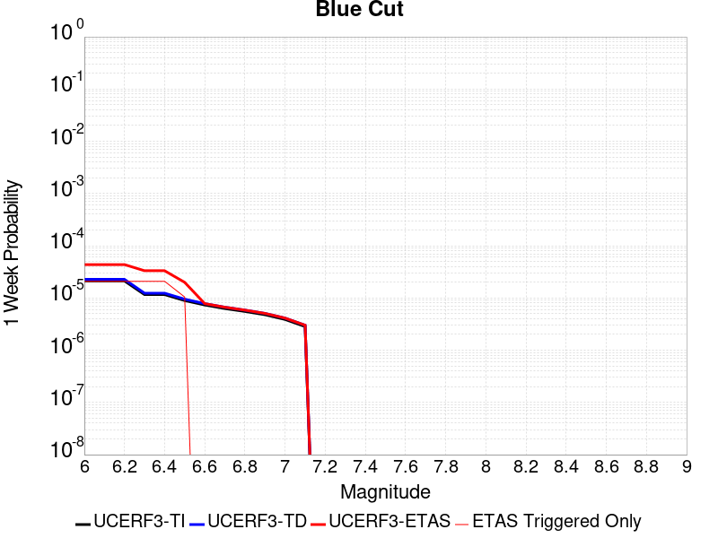 | 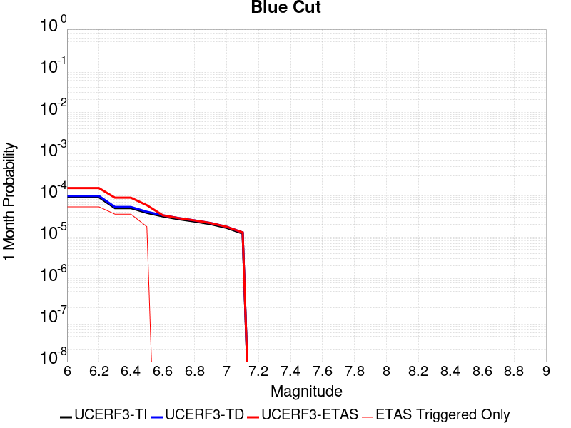 | 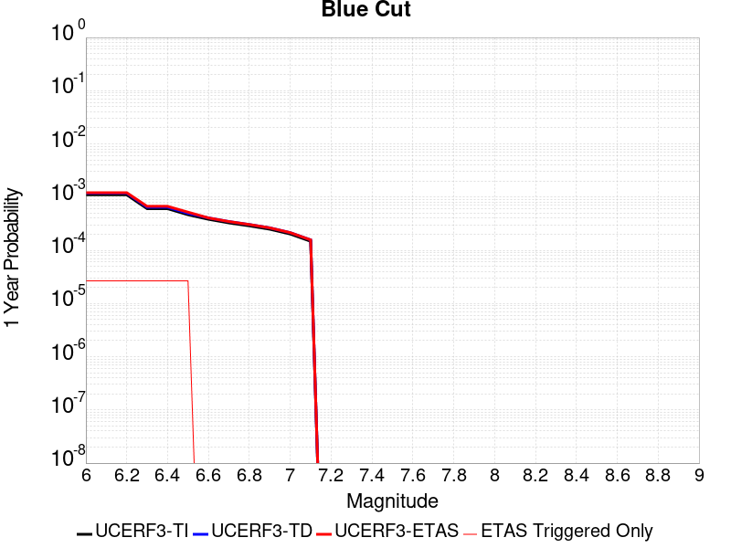 | 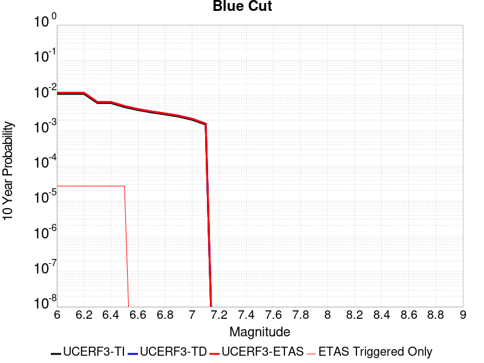 |

| Magnitude | 1 wk TI Prob | 1 wk TD Prob | 1 wk ETAS Prob | 1 wk ETAS/TD Gain | 1 wk ETAS Triggered Only | 1 mo TI Prob | 1 mo TD Prob | 1 mo ETAS Prob | 1 mo ETAS/TD Gain | 1 mo ETAS Triggered Only | 1 yr TI Prob | 1 yr TD Prob | 1 yr ETAS Prob | 1 yr ETAS/TD Gain | 1 yr ETAS Triggered Only | 10 yr TI Prob | 10 yr TD Prob | 10 yr ETAS Prob | 10 yr ETAS/TD Gain | 10 yr ETAS Triggered Only |
|-----|-----|-----|-----|-----|-----|-----|-----|-----|-----|-----|-----|-----|-----|-----|-----|-----|-----|-----|-----|-----|
| 6.0 | 2.1227985E-5 | 2.2719574E-5 | 4.3590917E-5 | 1.9186502 | 2.0871816E-5 | 9.097391E-5 | 9.73663E-5 | 1.2867097E-4 | 1.3215145 | 3.1307725E-5 | 0.0011070445 | 0.0011848481 | 0.0012369659 | 1.0439868 | 5.217954E-5 | 0.011015458 | 0.011791152 | 0.011863342 | 1.0061224 | 7.305136E-5 |
| 6.1 | 2.1227985E-5 | 2.2719574E-5 | 4.3590917E-5 | 1.9186502 | 2.0871816E-5 | 9.097391E-5 | 9.73663E-5 | 1.2867097E-4 | 1.3215145 | 3.1307725E-5 | 0.0011070445 | 0.0011848481 | 0.0012369659 | 1.0439868 | 5.217954E-5 | 0.011015458 | 0.011791152 | 0.011863342 | 1.0061224 | 7.305136E-5 |
| 6.2 | 2.1227985E-5 | 2.2719574E-5 | 4.3590917E-5 | 1.9186502 | 2.0871816E-5 | 9.097391E-5 | 9.73663E-5 | 1.2867097E-4 | 1.3215145 | 3.1307725E-5 | 0.0011070445 | 0.0011848481 | 0.0012369659 | 1.0439868 | 5.217954E-5 | 0.011015458 | 0.011791152 | 0.011863342 | 1.0061224 | 7.305136E-5 |
| 6.3 | 1.1613981E-5 | 1.2353542E-5 | 3.32251E-5 | 2.6895201 | 2.0871816E-5 | 4.9773254E-5 | 5.2942745E-5 | 7.3813455E-5 | 1.3942128 | 2.0871816E-5 | 6.0582085E-4 | 6.443998E-4 | 6.861165E-4 | 1.0647373 | 4.174363E-5 | 0.0060417196 | 0.0064265593 | 0.006488772 | 1.0096806 | 6.261545E-5 |
| 6.4 | 1.1613981E-5 | 1.2353542E-5 | 3.32251E-5 | 2.6895201 | 2.0871816E-5 | 4.9773254E-5 | 5.2942745E-5 | 7.3813455E-5 | 1.3942128 | 2.0871816E-5 | 6.0582085E-4 | 6.443998E-4 | 6.861165E-4 | 1.0647373 | 4.174363E-5 | 0.0060417196 | 0.0064265593 | 0.006488772 | 1.0096806 | 6.261545E-5 |
| 6.5 | 8.931326E-6 | 9.4816E-6 | 1.9917408E-5 | 2.100638 | 1.0435908E-5 | 3.8276554E-5 | 4.0634844E-5 | 5.107033E-5 | 1.2568113 | 1.0435908E-5 | 4.6591737E-4 | 4.946261E-4 | 5.1548757E-4 | 1.0421762 | 2.0871816E-5 | 0.0046494175 | 0.004936161 | 0.004967314 | 1.0063112 | 3.1307725E-5 |
| 6.6 | 7.345353E-6 | 7.79028E-6 | 7.79028E-6 | 1.0 | 0.0 | 3.1479703E-5 | 3.338653E-5 | 3.338653E-5 | 1.0 | 0.0 | 3.83198E-4 | 4.064132E-4 | 4.064132E-4 | 1.0 | 0.0 | 0.0038253788 | 0.0040574907 | 0.0040574907 | 1.0 | 0.0 |
| 6.7 | 6.2775666E-6 | 6.655149E-6 | 6.655149E-6 | 1.0 | 0.0 | 2.690358E-5 | 2.8521798E-5 | 2.8521798E-5 | 1.0 | 0.0 | 3.2750185E-4 | 3.472051E-4 | 3.472051E-4 | 1.0 | 0.0 | 0.0032701963 | 0.003467367 | 0.003467367 | 1.0 | 0.0 |
| 6.8 | 5.5234095E-6 | 5.8551113E-6 | 5.8551113E-6 | 1.0 | 0.0 | 2.367154E-5 | 2.5093133E-5 | 2.5093133E-5 | 1.0 | 0.0 | 2.8816288E-4 | 3.0547334E-4 | 3.0547334E-4 | 1.0 | 0.0 | 0.002877895 | 0.0030512505 | 0.0030512505 | 1.0 | 0.0 |
| 6.9 | 4.7780054E-6 | 5.0654203E-6 | 5.0654203E-6 | 1.0 | 0.0 | 2.0477004E-5 | 2.1708804E-5 | 2.1708804E-5 | 1.0 | 0.0 | 2.4927902E-4 | 2.642797E-4 | 2.642797E-4 | 1.0 | 0.0 | 0.0024899957 | 0.002640346 | 0.002640346 | 1.0 | 0.0 |
| 7.0 | 3.883171E-6 | 4.118487E-6 | 4.118487E-6 | 1.0 | 0.0 | 1.6642054E-5 | 1.7650578E-5 | 1.7650578E-5 | 1.0 | 0.0 | 2.0259817E-4 | 2.1488148E-4 | 2.1488148E-4 | 1.0 | 0.0 | 0.0020241356 | 0.0021474129 | 0.0021474129 | 1.0 | 0.0 |
| 7.1 | 2.8358215E-6 | 3.0097158E-6 | 3.0097158E-6 | 1.0 | 0.0 | 1.2153464E-5 | 1.2898756E-5 | 1.2898756E-5 | 1.0 | 0.0 | 1.4795837E-4 | 1.5703762E-4 | 1.5703762E-4 | 1.0 | 0.0 | 0.001478599 | 0.0015699116 | 0.0015699116 | 1.0 | 0.0 |

## Santa Cruz Catalina Ridge alt1
*[(top)](#table-of-contents)*

| 1 Week | 1 Month | 1 Year | 10 Year |
|-----|-----|-----|-----|
| 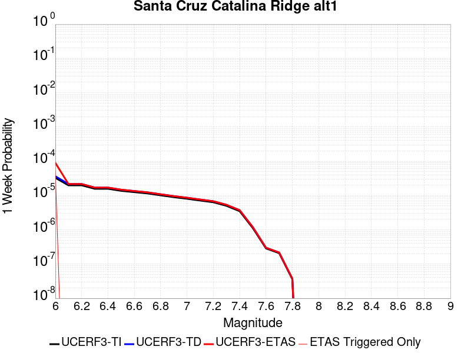 | 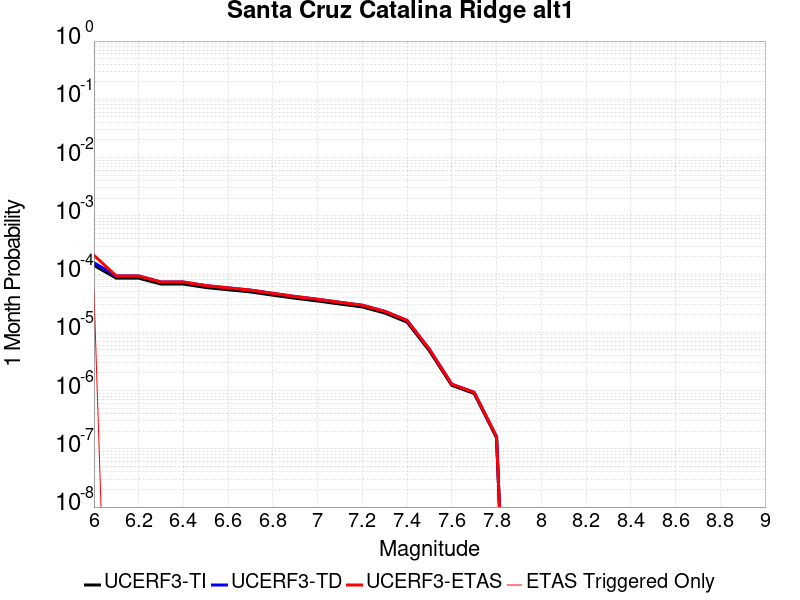 | 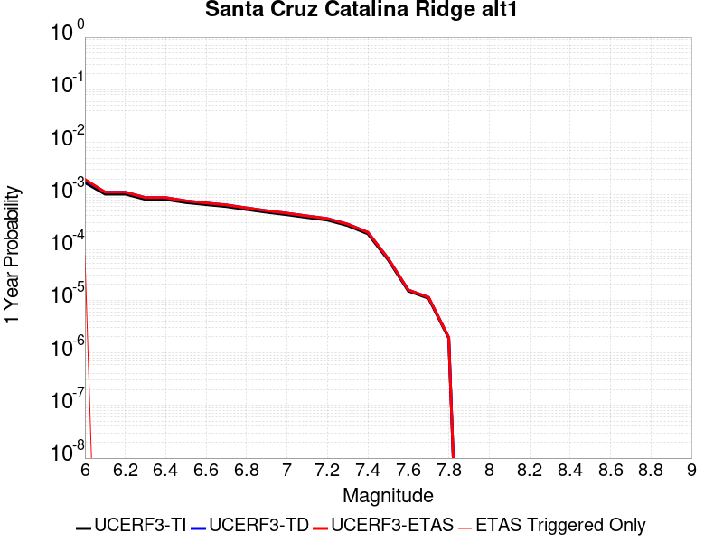 | 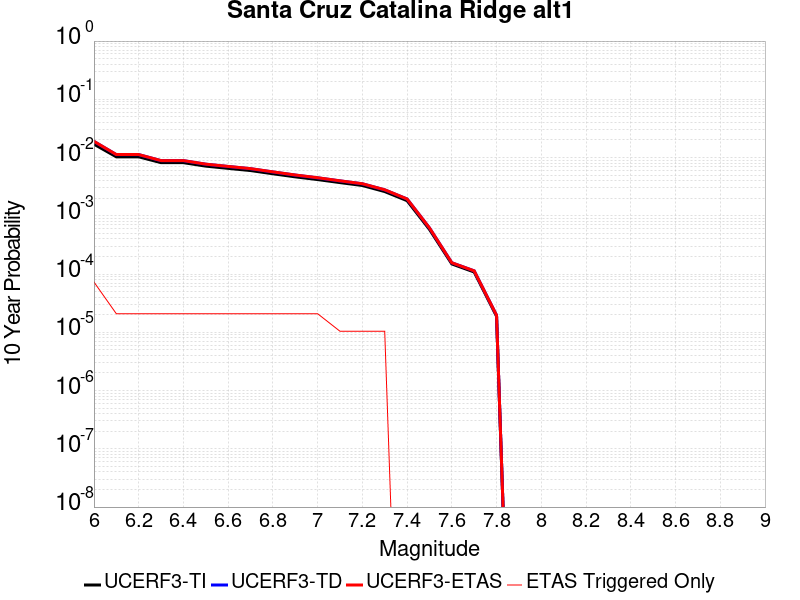 |

| Magnitude | 1 wk TI Prob | 1 wk TD Prob | 1 wk ETAS Prob | 1 wk ETAS/TD Gain | 1 wk ETAS Triggered Only | 1 mo TI Prob | 1 mo TD Prob | 1 mo ETAS Prob | 1 mo ETAS/TD Gain | 1 mo ETAS Triggered Only | 1 yr TI Prob | 1 yr TD Prob | 1 yr ETAS Prob | 1 yr ETAS/TD Gain | 1 yr ETAS Triggered Only | 10 yr TI Prob | 10 yr TD Prob | 10 yr ETAS Prob | 10 yr ETAS/TD Gain | 10 yr ETAS Triggered Only |
|-----|-----|-----|-----|-----|-----|-----|-----|-----|-----|-----|-----|-----|-----|-----|-----|-----|-----|-----|-----|-----|
| 6.0 | 3.2833184E-5 | 3.65584E-5 | 8.873603E-5 | 2.4272406 | 5.217954E-5 | 1.4070606E-4 | 1.5667039E-4 | 2.0884174E-4 | 1.3330008 | 5.217954E-5 | 0.00171175 | 0.0019059596 | 0.0019580396 | 1.0273249 | 5.217954E-5 | 0.016986247 | 0.018913029 | 0.0189847 | 1.0037894 | 7.305136E-5 |
| 6.1 | 1.9835548E-5 | 2.1659505E-5 | 3.2095188E-5 | 1.4818062 | 1.0435908E-5 | 8.500672E-5 | 9.282326E-5 | 1.032582E-4 | 1.1124173 | 1.0435908E-5 | 0.0010344655 | 0.0011295575 | 0.0011399816 | 1.0092285 | 1.0435908E-5 | 0.010296632 | 0.011240295 | 0.011260932 | 1.0018361 | 2.0871816E-5 |
| 6.2 | 1.9835548E-5 | 2.1659505E-5 | 3.2095188E-5 | 1.4818062 | 1.0435908E-5 | 8.500672E-5 | 9.282326E-5 | 1.032582E-4 | 1.1124173 | 1.0435908E-5 | 0.0010344655 | 0.0011295575 | 0.0011399816 | 1.0092285 | 1.0435908E-5 | 0.010296632 | 0.011240295 | 0.011260932 | 1.0018361 | 2.0871816E-5 |
| 6.3 | 1.5728183E-5 | 1.703395E-5 | 2.746968E-5 | 1.612643 | 1.0435908E-5 | 6.7404755E-5 | 7.300063E-5 | 8.343578E-5 | 1.142946 | 1.0435908E-5 | 8.2034385E-4 | 8.884264E-4 | 8.98853E-4 | 1.011736 | 1.0435908E-5 | 0.008173222 | 0.008849427 | 0.008870114 | 1.0023377 | 2.0871816E-5 |
| 6.4 | 1.5728183E-5 | 1.703395E-5 | 2.746968E-5 | 1.612643 | 1.0435908E-5 | 6.7404755E-5 | 7.300063E-5 | 8.343578E-5 | 1.142946 | 1.0435908E-5 | 8.2034385E-4 | 8.884264E-4 | 8.98853E-4 | 1.011736 | 1.0435908E-5 | 0.008173222 | 0.008849427 | 0.008870114 | 1.0023377 | 2.0871816E-5 |
| 6.5 | 1.3707734E-5 | 1.4794522E-5 | 2.5230276E-5 | 1.7053796 | 1.0435908E-5 | 5.8746107E-5 | 6.3403575E-5 | 7.383882E-5 | 1.1645845 | 1.0435908E-5 | 7.1499916E-4 | 7.716686E-4 | 7.8209647E-4 | 1.0135133 | 1.0435908E-5 | 0.0071270303 | 0.0076902895 | 0.0077110007 | 1.0026932 | 2.0871816E-5 |
| 6.6 | 1.2539813E-5 | 1.3510219E-5 | 2.3945986E-5 | 1.7724351 | 1.0435908E-5 | 5.3740947E-5 | 5.789967E-5 | 6.833497E-5 | 1.1802307 | 1.0435908E-5 | 6.540996E-4 | 7.0470315E-4 | 7.151317E-4 | 1.0147985 | 1.0435908E-5 | 0.0065217763 | 0.0070249885 | 0.0070457137 | 1.0029502 | 2.0871816E-5 |
| 6.7 | 1.1504083E-5 | 1.2377375E-5 | 2.2813154E-5 | 1.8431334 | 1.0435908E-5 | 4.930228E-5 | 5.3044827E-5 | 6.3480176E-5 | 1.196727 | 1.0435908E-5 | 6.0008996E-4 | 6.456314E-4 | 6.560606E-4 | 1.0161535 | 1.0435908E-5 | 0.005984721 | 0.006437786 | 0.006458523 | 1.0032212 | 2.0871816E-5 |
| 6.8 | 1.012739E-5 | 1.0877071E-5 | 2.1312866E-5 | 1.9594306 | 1.0435908E-5 | 4.340238E-5 | 4.6615194E-5 | 5.7050616E-5 | 1.2238631 | 1.0435908E-5 | 5.282958E-4 | 5.673937E-4 | 5.778237E-4 | 1.0183823 | 1.0435908E-5 | 0.0052704164 | 0.0056596193 | 0.0056803734 | 1.003667 | 2.0871816E-5 |
| 6.9 | 8.9607865E-6 | 9.609117E-6 | 2.0044925E-5 | 2.086032 | 1.0435908E-5 | 3.8402806E-5 | 4.1181287E-5 | 5.1616764E-5 | 1.2534034 | 1.0435908E-5 | 4.6745385E-4 | 5.012679E-4 | 5.116986E-4 | 1.0208086 | 1.0435908E-5 | 0.0046647177 | 0.005001492 | 0.005022259 | 1.0041523 | 2.0871816E-5 |
| 7.0 | 8.046829E-6 | 8.619746E-6 | 1.9055564E-5 | 2.2106874 | 1.0435908E-5 | 3.4485955E-5 | 3.694125E-5 | 4.7376772E-5 | 1.2824897 | 1.0435908E-5 | 4.1978562E-4 | 4.496677E-4 | 4.6009893E-4 | 1.0231977 | 1.0435908E-5 | 0.004189935 | 0.0044876686 | 0.004508447 | 1.0046301 | 2.0871816E-5 |
| 7.1 | 7.136131E-6 | 7.637656E-6 | 7.637656E-6 | 1.0 | 0.0 | 3.0583058E-5 | 3.2732405E-5 | 3.2732405E-5 | 1.0 | 0.0 | 3.7228514E-4 | 3.9844486E-4 | 3.9844486E-4 | 1.0 | 0.0 | 0.0037166206 | 0.003977381 | 0.0039877756 | 1.0026134 | 1.0435908E-5 |
| 7.2 | 6.362014E-6 | 6.8049585E-6 | 6.8049585E-6 | 1.0 | 0.0 | 2.726549E-5 | 2.9163786E-5 | 2.9163786E-5 | 1.0 | 0.0 | 3.3190678E-4 | 3.550119E-4 | 3.550119E-4 | 1.0 | 0.0 | 0.0033141149 | 0.003544516 | 0.0035549148 | 1.0029339 | 1.0435908E-5 |
| 7.3 | 5.004101E-6 | 5.351715E-6 | 5.351715E-6 | 1.0 | 0.0 | 2.1445969E-5 | 2.2935723E-5 | 2.2935723E-5 | 1.0 | 0.0 | 2.6107338E-4 | 2.792072E-4 | 2.792072E-4 | 1.0 | 0.0 | 0.002607669 | 0.0027886187 | 0.0027990255 | 1.0037318 | 1.0435908E-5 |
| 7.4 | 3.4901443E-6 | 3.7320526E-6 | 3.7320526E-6 | 1.0 | 0.0 | 1.4957676E-5 | 1.5994416E-5 | 1.5994416E-5 | 1.0 | 0.0 | 1.8209449E-4 | 1.9471499E-4 | 1.9471499E-4 | 1.0 | 0.0 | 0.0018194534 | 0.0019454823 | 0.0019454823 | 1.0 | 0.0 |
| 7.5 | 1.1215045E-6 | 1.189387E-6 | 1.189387E-6 | 1.0 | 0.0 | 4.806439E-6 | 5.097363E-6 | 5.097363E-6 | 1.0 | 0.0 | 5.851682E-5 | 6.205866E-5 | 6.205866E-5 | 1.0 | 0.0 | 5.850142E-4 | 6.2041637E-4 | 6.2041637E-4 | 1.0 | 0.0 |
| 7.6 | 2.8599047E-7 | 2.9951994E-7 | 2.9951994E-7 | 1.0 | 0.0 | 1.2256729E-6 | 1.2836562E-6 | 1.2836562E-6 | 1.0 | 0.0 | 1.4922465E-5 | 1.5628404E-5 | 1.5628404E-5 | 1.0 | 0.0 | 1.4921463E-4 | 1.5627318E-4 | 1.5627318E-4 | 1.0 | 0.0 |
| 7.7 | 2.0781519E-7 | 2.1744323E-7 | 2.1744323E-7 | 1.0 | 0.0 | 8.906362E-7 | 9.3189925E-7 | 9.3189925E-7 | 1.0 | 0.0 | 1.08434415E-5 | 1.13458145E-5 | 1.13458145E-5 | 1.0 | 0.0 | 1.0842913E-4 | 1.1345245E-4 | 1.1345245E-4 | 1.0 | 0.0 |
| 7.8 | 3.614776E-8 | 3.764102E-8 | 3.764102E-8 | 1.0 | 0.0 | 1.5491896E-7 | 1.6131864E-7 | 1.6131864E-7 | 1.0 | 0.0 | 1.8861368E-6 | 1.9640527E-6 | 1.9640527E-6 | 1.0 | 0.0 | 1.8861208E-5 | 1.9640367E-5 | 1.9640367E-5 | 1.0 | 0.0 |

## San Jacinto (Clark) rev
*[(top)](#table-of-contents)*

| 1 Week | 1 Month | 1 Year | 10 Year |
|-----|-----|-----|-----|
| 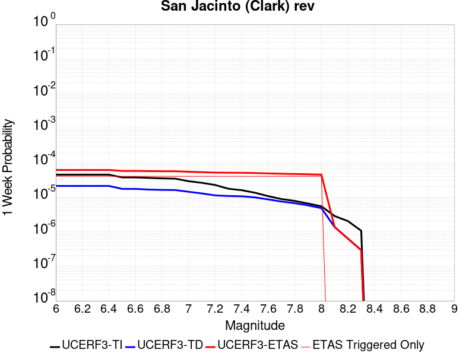 | 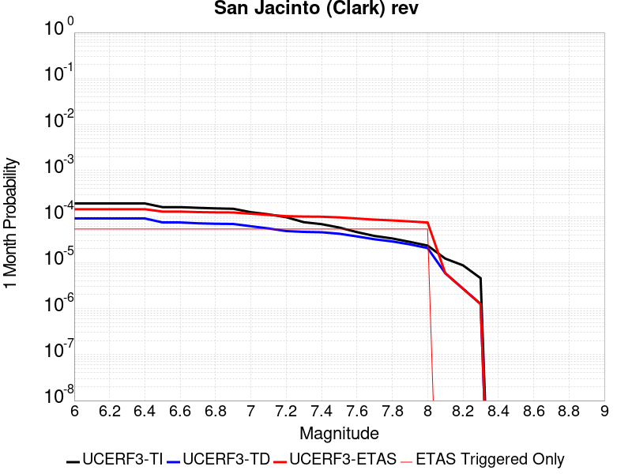 | 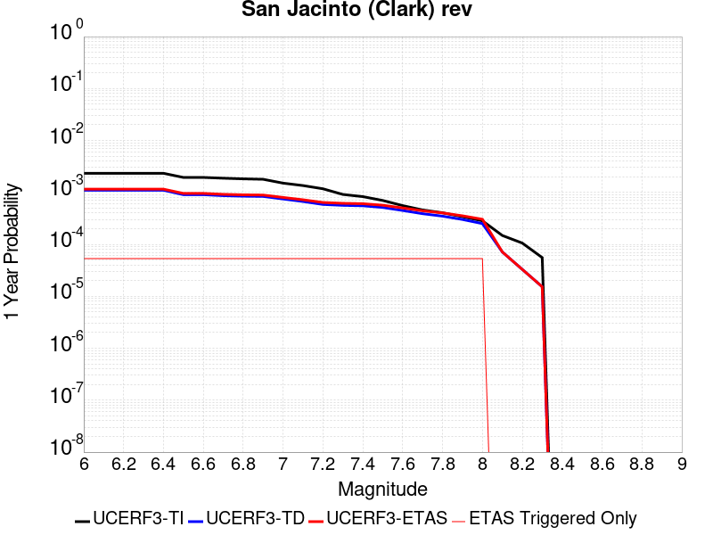 | 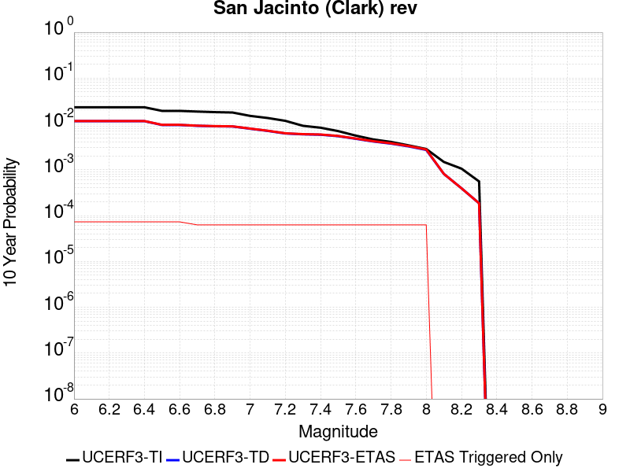 |

| Magnitude | 1 wk TI Prob | 1 wk TD Prob | 1 wk ETAS Prob | 1 wk ETAS/TD Gain | 1 wk ETAS Triggered Only | 1 mo TI Prob | 1 mo TD Prob | 1 mo ETAS Prob | 1 mo ETAS/TD Gain | 1 mo ETAS Triggered Only | 1 yr TI Prob | 1 yr TD Prob | 1 yr ETAS Prob | 1 yr ETAS/TD Gain | 1 yr ETAS Triggered Only | 10 yr TI Prob | 10 yr TD Prob | 10 yr ETAS Prob | 10 yr ETAS/TD Gain | 10 yr ETAS Triggered Only |
|-----|-----|-----|-----|-----|-----|-----|-----|-----|-----|-----|-----|-----|-----|-----|-----|-----|-----|-----|-----|-----|
| 6.0 | 4.482615E-5 | 2.1154196E-5 | 5.2461255E-5 | 2.479946 | 3.1307725E-5 | 1.9209793E-4 | 9.065773E-5 | 1.3239759E-4 | 1.4604113 | 4.174363E-5 | 0.0023362834 | 0.0011032083 | 0.0011657546 | 1.056695 | 6.261545E-5 | 0.02311874 | 0.011503847 | 0.011576058 | 1.0062771 | 7.305136E-5 |
| 6.1 | 4.482615E-5 | 2.1154196E-5 | 5.2461255E-5 | 2.479946 | 3.1307725E-5 | 1.9209793E-4 | 9.065773E-5 | 1.3239759E-4 | 1.4604113 | 4.174363E-5 | 0.0023362834 | 0.0011032083 | 0.0011657546 | 1.056695 | 6.261545E-5 | 0.02311874 | 0.011503847 | 0.011576058 | 1.0062771 | 7.305136E-5 |
| 6.2 | 4.482615E-5 | 2.1154196E-5 | 5.2461255E-5 | 2.479946 | 3.1307725E-5 | 1.9209793E-4 | 9.065773E-5 | 1.3239759E-4 | 1.4604113 | 4.174363E-5 | 0.0023362834 | 0.0011032083 | 0.0011657546 | 1.056695 | 6.261545E-5 | 0.02311874 | 0.011503847 | 0.011576058 | 1.0062771 | 7.305136E-5 |
| 6.3 | 4.482615E-5 | 2.1154196E-5 | 5.2461255E-5 | 2.479946 | 3.1307725E-5 | 1.9209793E-4 | 9.065773E-5 | 1.3239759E-4 | 1.4604113 | 4.174363E-5 | 0.0023362834 | 0.0011032083 | 0.0011657546 | 1.056695 | 6.261545E-5 | 0.02311874 | 0.011503847 | 0.011576058 | 1.0062771 | 7.305136E-5 |
| 6.4 | 4.482615E-5 | 2.1154196E-5 | 5.2461255E-5 | 2.479946 | 3.1307725E-5 | 1.9209793E-4 | 9.065773E-5 | 1.3239759E-4 | 1.4604113 | 4.174363E-5 | 0.0023362834 | 0.0011032083 | 0.0011657546 | 1.056695 | 6.261545E-5 | 0.02311874 | 0.011503847 | 0.011576058 | 1.0062771 | 7.305136E-5 |
| 6.5 | 3.7294863E-5 | 1.7356087E-5 | 4.8663267E-5 | 2.8038156 | 3.1307725E-5 | 1.5982533E-4 | 7.438113E-5 | 1.16121664E-4 | 1.5611708 | 4.174363E-5 | 0.0019441366 | 9.052186E-4 | 9.6777733E-4 | 1.069109 | 6.261545E-5 | 0.01927216 | 0.0094941035 | 0.009566461 | 1.0076213 | 7.305136E-5 |
| 6.6 | 3.7294863E-5 | 1.7356087E-5 | 4.8663267E-5 | 2.8038156 | 3.1307725E-5 | 1.5982533E-4 | 7.438113E-5 | 1.16121664E-4 | 1.5611708 | 4.174363E-5 | 0.0019441366 | 9.052186E-4 | 9.6777733E-4 | 1.069109 | 6.261545E-5 | 0.01927216 | 0.0094941035 | 0.009566461 | 1.0076213 | 7.305136E-5 |
| 6.7 | 3.6039248E-5 | 1.6604314E-5 | 4.7911515E-5 | 2.8854864 | 3.1307725E-5 | 1.5444479E-4 | 7.1159426E-5 | 1.1290008E-4 | 1.5865796 | 4.174363E-5 | 0.0018787434 | 8.6602574E-4 | 9.1816013E-4 | 1.0601995 | 5.217954E-5 | 0.01862939 | 0.009096047 | 0.009158093 | 1.0068212 | 6.261545E-5 |
| 6.8 | 3.5031844E-5 | 1.6232942E-5 | 4.7540158E-5 | 2.9286225 | 3.1307725E-5 | 1.5012783E-4 | 6.956792E-5 | 1.1130865E-4 | 1.5999997 | 4.174363E-5 | 0.0018262739 | 8.4666436E-4 | 8.987997E-4 | 1.0615773 | 5.217954E-5 | 0.01811338 | 0.008895969 | 0.008958028 | 1.006976 | 6.261545E-5 |
| 6.9 | 3.435112E-5 | 1.6063195E-5 | 4.7370417E-5 | 2.9490035 | 3.1307725E-5 | 1.4721078E-4 | 6.884047E-5 | 1.10581226E-4 | 1.6063404 | 4.174363E-5 | 0.0017908178 | 8.3781447E-4 | 8.899503E-4 | 1.0622283 | 5.217954E-5 | 0.017764548 | 0.008804181 | 0.008866245 | 1.0070494 | 6.261545E-5 |
| 7.0 | 2.8959772E-5 | 1.4336745E-5 | 4.564402E-5 | 3.1837087 | 3.1307725E-5 | 1.241074E-4 | 6.144176E-5 | 1.0318283E-4 | 1.6793599 | 4.174363E-5 | 0.0015099603 | 7.477995E-4 | 7.9994E-4 | 1.0697253 | 5.217954E-5 | 0.014997416 | 0.007868037 | 0.00793016 | 1.0078956 | 6.261545E-5 |
| 7.1 | 2.6002877E-5 | 1.2829002E-5 | 4.4136323E-5 | 3.4403553 | 3.1307725E-5 | 1.11436144E-4 | 5.498029E-5 | 9.6721626E-5 | 1.7592055 | 4.174363E-5 | 0.0013558907 | 6.691816E-4 | 7.2132616E-4 | 1.0779229 | 5.217954E-5 | 0.013476475 | 0.0070465137 | 0.0071086884 | 1.0088234 | 6.261545E-5 |
| 7.2 | 2.2544838E-5 | 1.1262543E-5 | 4.2569915E-5 | 3.779778 | 3.1307725E-5 | 9.661716E-5 | 4.8267157E-5 | 9.0008776E-5 | 1.8648037 | 4.174363E-5 | 0.001175679 | 5.874956E-4 | 6.396445E-4 | 1.0887647 | 5.217954E-5 | 0.011694785 | 0.0061927503 | 0.0062549775 | 1.0100485 | 6.261545E-5 |
| 7.3 | 1.75334E-5 | 1.0811715E-5 | 4.21191E-5 | 3.895691 | 3.1307725E-5 | 7.514098E-5 | 4.6335106E-5 | 8.80768E-5 | 1.9008656 | 4.174363E-5 | 9.144575E-4 | 5.6398526E-4 | 6.1613537E-4 | 1.0924672 | 5.217954E-5 | 0.009107036 | 0.0059337732 | 0.0059960173 | 1.0104898 | 6.261545E-5 |
| 7.4 | 1.5924552E-5 | 1.0611516E-5 | 4.191891E-5 | 3.9503222 | 3.1307725E-5 | 6.82463E-5 | 4.547714E-5 | 8.7218876E-5 | 1.9178618 | 4.174363E-5 | 8.305819E-4 | 5.535449E-4 | 6.056956E-4 | 1.0942122 | 5.217954E-5 | 0.008274844 | 0.0058210334 | 0.0058832844 | 1.0106941 | 6.261545E-5 |
| 7.5 | 1.3428931E-5 | 9.8519E-6 | 4.1159314E-5 | 4.177805 | 3.1307725E-5 | 5.7551293E-5 | 4.2221753E-5 | 8.396362E-5 | 1.9886342 | 4.174363E-5 | 7.004617E-4 | 5.1392964E-4 | 5.6608237E-4 | 1.1014783 | 5.217954E-5 | 0.006982579 | 0.0054066023 | 0.0054688794 | 1.0115187 | 6.261545E-5 |
| 7.6 | 1.0688787E-5 | 8.614839E-6 | 3.9922295E-5 | 4.634131 | 3.1307725E-5 | 4.5808283E-5 | 3.692022E-5 | 7.866231E-5 | 2.1306024 | 4.174363E-5 | 5.5757316E-4 | 4.4941145E-4 | 5.0156756E-4 | 1.1160542 | 5.217954E-5 | 0.005561762 | 0.0047416524 | 0.004803971 | 1.0131428 | 6.261545E-5 |
| 7.7 | 8.81236E-6 | 7.4680274E-6 | 3.8775517E-5 | 5.1922035 | 3.1307725E-5 | 3.776671E-5 | 3.2005442E-5 | 7.374774E-5 | 2.304225 | 4.174363E-5 | 4.597127E-4 | 3.8959677E-4 | 4.4175598E-4 | 1.13388 | 5.217954E-5 | 0.0045876284 | 0.0041346536 | 0.0041970103 | 1.0150814 | 6.261545E-5 |
| 7.8 | 7.780431E-6 | 6.696579E-6 | 3.8004095E-5 | 5.6751504 | 3.1307725E-5 | 3.3344273E-5 | 2.8699309E-5 | 7.044174E-5 | 2.4544752 | 4.174363E-5 | 4.0589093E-4 | 3.4935825E-4 | 4.0151956E-4 | 1.149306 | 5.217954E-5 | 0.0040515037 | 0.0037227906 | 0.003785173 | 1.0167569 | 6.261545E-5 |
| 7.9 | 6.5437994E-6 | 5.780382E-6 | 3.7087924E-5 | 6.416172 | 3.1307725E-5 | 2.8044553E-5 | 2.477283E-5 | 6.651543E-5 | 2.6850152 | 4.174363E-5 | 3.4138895E-4 | 3.0156763E-4 | 3.5373145E-4 | 1.1729754 | 5.217954E-5 | 0.0034086495 | 0.0032344845 | 0.0032968975 | 1.019296 | 6.261545E-5 |
| 8.0 | 5.4488164E-6 | 4.8133406E-6 | 3.6120913E-5 | 7.5043335 | 3.1307725E-5 | 2.3351862E-5 | 2.062844E-5 | 6.237121E-5 | 3.0235543 | 4.174363E-5 | 2.8427184E-4 | 2.5112246E-4 | 3.032889E-4 | 1.207733 | 5.217954E-5 | 0.0028390845 | 0.002710839 | 0.0027732847 | 1.0230355 | 6.261545E-5 |
| 8.1 | 2.8397242E-6 | 1.3670389E-6 | 1.3670389E-6 | 1.0 | 0.0 | 1.217019E-5 | 5.858725E-6 | 5.858725E-6 | 1.0 | 0.0 | 1.4816198E-4 | 7.132765E-5 | 7.132765E-5 | 1.0 | 0.0 | 0.0014806325 | 8.115382E-4 | 8.115382E-4 | 1.0 | 0.0 |
| 8.2 | 2.030244E-6 | 6.318974E-7 | 6.318974E-7 | 1.0 | 0.0 | 8.701017E-6 | 2.708129E-6 | 2.708129E-6 | 1.0 | 0.0 | 1.05929736E-4 | 3.2970976E-5 | 3.2970976E-5 | 1.0 | 0.0 | 0.0010587925 | 3.9486602E-4 | 3.9486602E-4 | 1.0 | 0.0 |
| 8.3 | 1.0659804E-6 | 2.9250086E-7 | 2.9250086E-7 | 1.0 | 0.0 | 4.568479E-6 | 1.2535745E-6 | 1.2535745E-6 | 1.0 | 0.0 | 5.5619817E-5 | 1.5262167E-5 | 1.5262167E-5 | 1.0 | 0.0 | 5.5605895E-4 | 1.8566217E-4 | 1.8566217E-4 | 1.0 | 0.0 |

## Oak Ridge (Onshore)
*[(top)](#table-of-contents)*

| 1 Week | 1 Month | 1 Year | 10 Year |
|-----|-----|-----|-----|
| 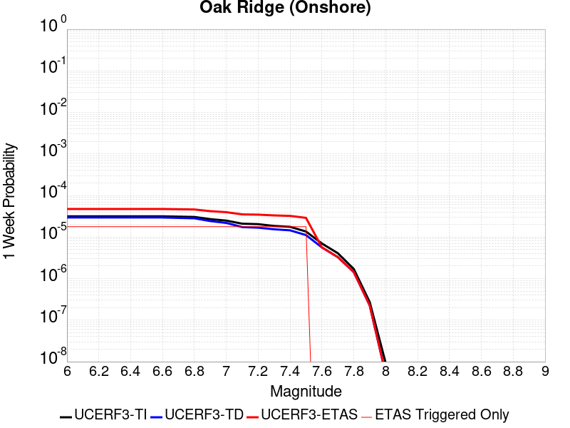 | 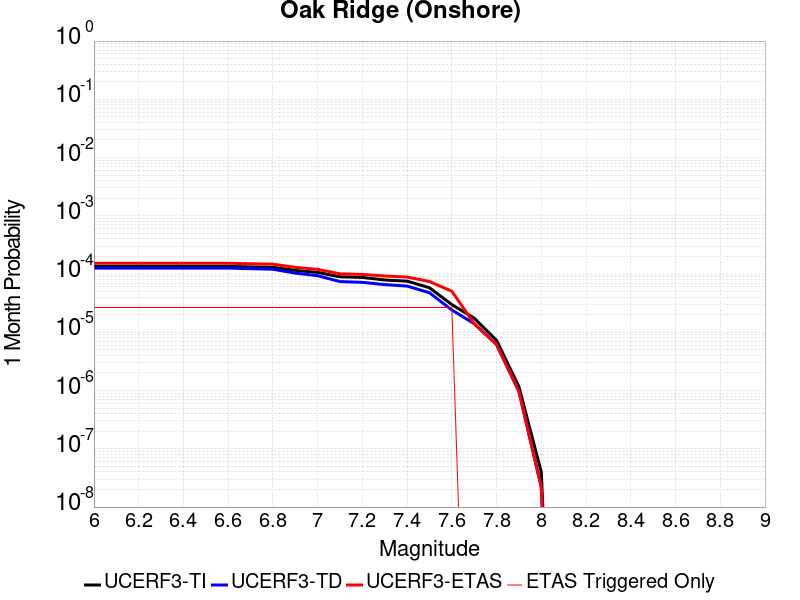 | 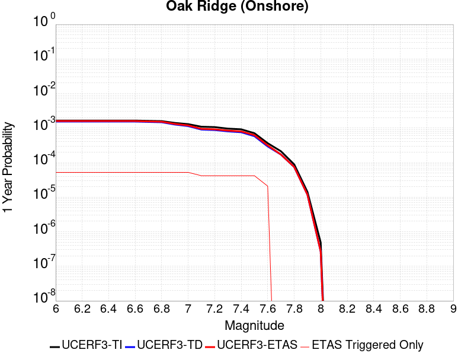 | 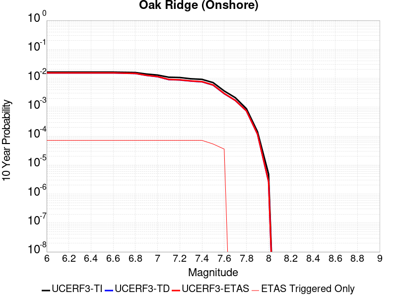 |

| Magnitude | 1 wk TI Prob | 1 wk TD Prob | 1 wk ETAS Prob | 1 wk ETAS/TD Gain | 1 wk ETAS Triggered Only | 1 mo TI Prob | 1 mo TD Prob | 1 mo ETAS Prob | 1 mo ETAS/TD Gain | 1 mo ETAS Triggered Only | 1 yr TI Prob | 1 yr TD Prob | 1 yr ETAS Prob | 1 yr ETAS/TD Gain | 1 yr ETAS Triggered Only | 10 yr TI Prob | 10 yr TD Prob | 10 yr ETAS Prob | 10 yr ETAS/TD Gain | 10 yr ETAS Triggered Only |
|-----|-----|-----|-----|-----|-----|-----|-----|-----|-----|-----|-----|-----|-----|-----|-----|-----|-----|-----|-----|-----|
| 6.0 | 3.155064E-5 | 2.9525974E-5 | 5.0397175E-5 | 1.7068759 | 2.0871816E-5 | 1.3521002E-4 | 1.2653397E-4 | 1.5783773E-4 | 1.2473941 | 3.1307725E-5 | 0.001644939 | 0.0015395004 | 0.0015915997 | 1.0338416 | 5.217954E-5 | 0.01632816 | 0.015292859 | 0.015354517 | 1.0040318 | 6.261545E-5 |
| 6.1 | 3.155064E-5 | 2.9525974E-5 | 5.0397175E-5 | 1.7068759 | 2.0871816E-5 | 1.3521002E-4 | 1.2653397E-4 | 1.5783773E-4 | 1.2473941 | 3.1307725E-5 | 0.001644939 | 0.0015395004 | 0.0015915997 | 1.0338416 | 5.217954E-5 | 0.01632816 | 0.015292859 | 0.015354517 | 1.0040318 | 6.261545E-5 |
| 6.2 | 3.155064E-5 | 2.9525974E-5 | 5.0397175E-5 | 1.7068759 | 2.0871816E-5 | 1.3521002E-4 | 1.2653397E-4 | 1.5783773E-4 | 1.2473941 | 3.1307725E-5 | 0.001644939 | 0.0015395004 | 0.0015915997 | 1.0338416 | 5.217954E-5 | 0.01632816 | 0.015292859 | 0.015354517 | 1.0040318 | 6.261545E-5 |
| 6.3 | 3.155064E-5 | 2.9525974E-5 | 5.0397175E-5 | 1.7068759 | 2.0871816E-5 | 1.3521002E-4 | 1.2653397E-4 | 1.5783773E-4 | 1.2473941 | 3.1307725E-5 | 0.001644939 | 0.0015395004 | 0.0015915997 | 1.0338416 | 5.217954E-5 | 0.01632816 | 0.015292859 | 0.015354517 | 1.0040318 | 6.261545E-5 |
| 6.4 | 3.155064E-5 | 2.9525974E-5 | 5.0397175E-5 | 1.7068759 | 2.0871816E-5 | 1.3521002E-4 | 1.2653397E-4 | 1.5783773E-4 | 1.2473941 | 3.1307725E-5 | 0.001644939 | 0.0015395004 | 0.0015915997 | 1.0338416 | 5.217954E-5 | 0.01632816 | 0.015292859 | 0.015354517 | 1.0040318 | 6.261545E-5 |
| 6.5 | 3.155064E-5 | 2.9525974E-5 | 5.0397175E-5 | 1.7068759 | 2.0871816E-5 | 1.3521002E-4 | 1.2653397E-4 | 1.5783773E-4 | 1.2473941 | 3.1307725E-5 | 0.001644939 | 0.0015395004 | 0.0015915997 | 1.0338416 | 5.217954E-5 | 0.01632816 | 0.015292859 | 0.015354517 | 1.0040318 | 6.261545E-5 |
| 6.6 | 3.155064E-5 | 2.9525974E-5 | 5.0397175E-5 | 1.7068759 | 2.0871816E-5 | 1.3521002E-4 | 1.2653397E-4 | 1.5783773E-4 | 1.2473941 | 3.1307725E-5 | 0.001644939 | 0.0015395004 | 0.0015915997 | 1.0338416 | 5.217954E-5 | 0.01632816 | 0.015292859 | 0.015354517 | 1.0040318 | 6.261545E-5 |
| 6.7 | 3.098897E-5 | 2.8864175E-5 | 4.9735387E-5 | 1.7230836 | 2.0871816E-5 | 1.328031E-4 | 1.2369796E-4 | 1.550018E-4 | 1.2530669 | 3.1307725E-5 | 0.0016156785 | 0.0015050198 | 0.0015571208 | 1.0346181 | 5.217954E-5 | 0.016039822 | 0.014952714 | 0.015014393 | 1.004125 | 6.261545E-5 |
| 6.8 | 3.0449872E-5 | 2.8239372E-5 | 4.91106E-5 | 1.7390825 | 2.0871816E-5 | 1.3049292E-4 | 1.2102048E-4 | 1.5232441E-4 | 1.2586664 | 3.1307725E-5 | 0.0015875935 | 0.0014724657 | 0.0015245683 | 1.0353847 | 5.217954E-5 | 0.015762992 | 0.014631462 | 0.0146931615 | 1.0042169 | 6.261545E-5 |
| 6.9 | 2.697928E-5 | 2.4219773E-5 | 4.5091085E-5 | 1.8617467 | 2.0871816E-5 | 1.15620365E-4 | 1.0379502E-4 | 1.350995E-4 | 1.301599 | 3.1307725E-5 | 0.0014067689 | 0.0012629933 | 0.001315107 | 1.041262 | 5.217954E-5 | 0.0139789665 | 0.01256087 | 0.012622699 | 1.0049224 | 6.261545E-5 |
| 7.0 | 2.4893961E-5 | 2.1862043E-5 | 4.27334E-5 | 1.9546849 | 2.0871816E-5 | 1.0668404E-4 | 9.3691204E-5 | 1.2499599E-4 | 1.3341273 | 3.1307725E-5 | 0.0012981043 | 0.0011401111 | 0.0011922312 | 1.0457149 | 5.217954E-5 | 0.012905477 | 0.011344905 | 0.01140681 | 1.0054567 | 6.261545E-5 |
| 7.1 | 2.0945363E-5 | 1.7354487E-5 | 2.7790215E-5 | 1.6013273 | 1.0435908E-5 | 8.976275E-5 | 7.437428E-5 | 9.524454E-5 | 1.2806113 | 2.0871816E-5 | 0.0010923136 | 9.051354E-4 | 9.4684126E-4 | 1.0460769 | 4.174363E-5 | 0.0108696 | 0.009015423 | 0.009067132 | 1.0057356 | 5.217954E-5 |
| 7.2 | 2.0439404E-5 | 1.6809423E-5 | 2.7245156E-5 | 1.6208264 | 1.0435908E-5 | 8.7594504E-5 | 7.203843E-5 | 9.290873E-5 | 1.2897109 | 2.0871816E-5 | 0.0010659413 | 8.767196E-4 | 9.184266E-4 | 1.0475717 | 4.174363E-5 | 0.010608427 | 0.008733526 | 0.00878525 | 1.0059224 | 5.217954E-5 |
| 7.3 | 1.8463334E-5 | 1.5381811E-5 | 2.5817557E-5 | 1.6784472 | 1.0435908E-5 | 7.912617E-5 | 6.59204E-5 | 8.6790846E-5 | 1.3166006 | 2.0871816E-5 | 9.6293533E-4 | 8.0228975E-4 | 8.439999E-4 | 1.0519888 | 4.174363E-5 | 0.009587734 | 0.007994797 | 0.008046559 | 1.0064745 | 5.217954E-5 |
| 7.4 | 1.763139E-5 | 1.451684E-5 | 2.4952597E-5 | 1.7188724 | 1.0435908E-5 | 7.556091E-5 | 6.221356E-5 | 8.308408E-5 | 1.3354657 | 2.0871816E-5 | 9.1956573E-4 | 7.571909E-4 | 7.9890294E-4 | 1.0550878 | 4.174363E-5 | 0.009157699 | 0.007546914 | 0.0075986995 | 1.0068618 | 5.217954E-5 |
| 7.5 | 1.3594944E-5 | 1.1163356E-5 | 2.1599148E-5 | 1.9348257 | 1.0435908E-5 | 5.8262744E-5 | 4.784209E-5 | 6.871291E-5 | 1.4362438 | 2.0871816E-5 | 7.0911803E-4 | 5.8232434E-4 | 6.2404363E-4 | 1.0716428 | 4.174363E-5 | 0.007068595 | 0.0058082556 | 0.0058497568 | 1.0071452 | 4.174363E-5 |
| 7.6 | 6.9889534E-6 | 5.6367144E-6 | 5.6367144E-6 | 1.0 | 0.0 | 2.9952313E-5 | 2.4157125E-5 | 3.459278E-5 | 1.4319907 | 1.0435908E-5 | 3.646084E-4 | 2.9407372E-4 | 3.1493942E-4 | 1.0709538 | 2.0871816E-5 | 0.0036401073 | 0.0029368899 | 0.0029577003 | 1.0070859 | 2.0871816E-5 |
| 7.7 | 4.0824193E-6 | 3.2832586E-6 | 3.2832586E-6 | 1.0 | 0.0 | 1.7495966E-5 | 1.4071033E-5 | 1.4071033E-5 | 1.0 | 0.0 | 2.1299256E-4 | 1.713015E-4 | 1.713015E-4 | 1.0 | 0.0 | 0.0021278851 | 0.0017117079 | 0.0017117079 | 1.0 | 0.0 |
| 7.8 | 1.7023609E-6 | 1.4370495E-6 | 1.4370495E-6 | 1.0 | 0.0 | 7.295812E-6 | 6.1587693E-6 | 6.1587693E-6 | 1.0 | 0.0 | 8.882289E-5 | 7.498047E-5 | 7.498047E-5 | 1.0 | 0.0 | 8.8787393E-4 | 7.495545E-4 | 7.495545E-4 | 1.0 | 0.0 |
| 7.9 | 2.721225E-7 | 2.2616497E-7 | 2.2616497E-7 | 1.0 | 0.0 | 1.1662388E-6 | 9.692781E-7 | 9.692781E-7 | 1.0 | 0.0 | 1.4198865E-5 | 1.1800899E-5 | 1.1800899E-5 | 1.0 | 0.0 | 1.4197957E-4 | 1.1800301E-4 | 1.1800301E-4 | 1.0 | 0.0 |
| 8.0 | 9.364255E-9 | 5.1206666E-9 | 5.1206666E-9 | 1.0 | 0.0 | 4.0132523E-8 | 2.1945715E-8 | 2.1945715E-8 | 1.0 | 0.0 | 4.8861335E-7 | 2.6718905E-7 | 2.6718905E-7 | 1.0 | 0.0 | 4.8861225E-6 | 2.6718876E-6 | 2.6718876E-6 | 1.0 | 0.0 |

## Kern Canyon (Lake Isabella) 2011
*[(top)](#table-of-contents)*

| 1 Week | 1 Month | 1 Year | 10 Year |
|-----|-----|-----|-----|
| 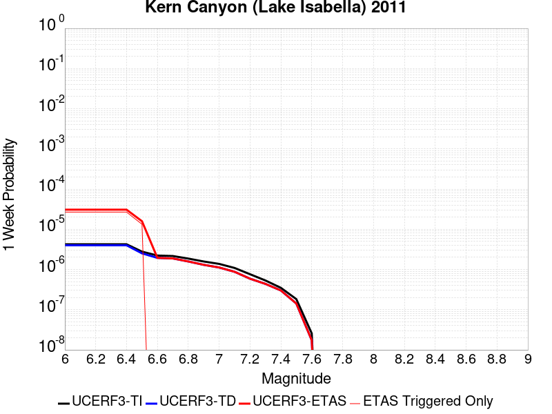 | 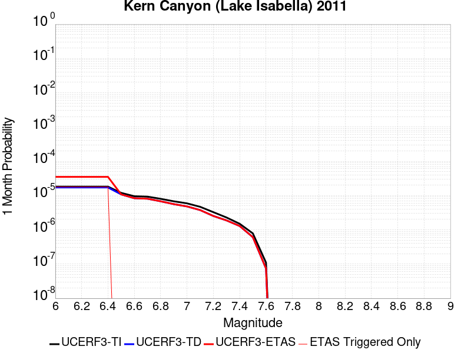 | 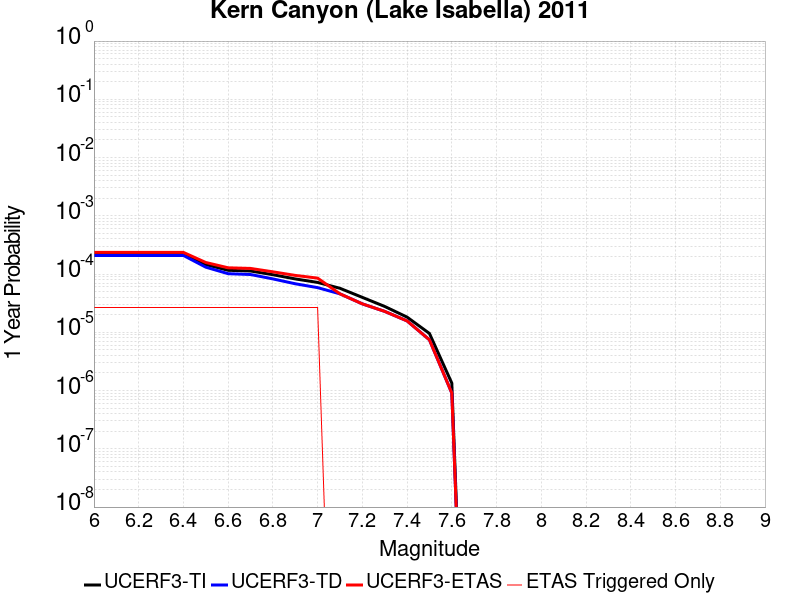 | 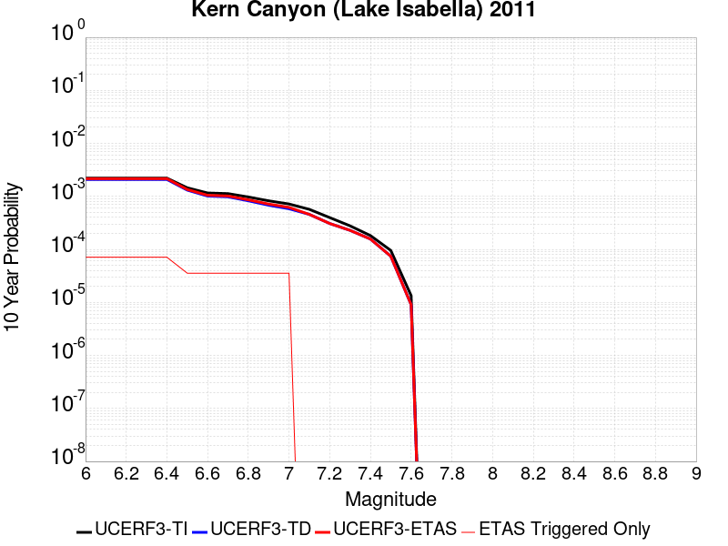 |

| Magnitude | 1 wk TI Prob | 1 wk TD Prob | 1 wk ETAS Prob | 1 wk ETAS/TD Gain | 1 wk ETAS Triggered Only | 1 mo TI Prob | 1 mo TD Prob | 1 mo ETAS Prob | 1 mo ETAS/TD Gain | 1 mo ETAS Triggered Only | 1 yr TI Prob | 1 yr TD Prob | 1 yr ETAS Prob | 1 yr ETAS/TD Gain | 1 yr ETAS Triggered Only | 10 yr TI Prob | 10 yr TD Prob | 10 yr ETAS Prob | 10 yr ETAS/TD Gain | 10 yr ETAS Triggered Only |
|-----|-----|-----|-----|-----|-----|-----|-----|-----|-----|-----|-----|-----|-----|-----|-----|-----|-----|-----|-----|-----|
| 6.0 | 4.2387383E-6 | 4.001639E-6 | 2.487337E-5 | 6.2157965 | 2.0871816E-5 | 1.8165894E-5 | 1.7149778E-5 | 3.8021237E-5 | 2.2170105 | 2.0871816E-5 | 2.2114732E-4 | 2.087804E-4 | 2.5051532E-4 | 1.1998986 | 4.174363E-5 | 0.0022092736 | 0.0020860266 | 0.0021589254 | 1.0349463 | 7.305136E-5 |
| 6.1 | 4.2387383E-6 | 4.001639E-6 | 2.487337E-5 | 6.2157965 | 2.0871816E-5 | 1.8165894E-5 | 1.7149778E-5 | 3.8021237E-5 | 2.2170105 | 2.0871816E-5 | 2.2114732E-4 | 2.087804E-4 | 2.5051532E-4 | 1.1998986 | 4.174363E-5 | 0.0022092736 | 0.0020860266 | 0.0021589254 | 1.0349463 | 7.305136E-5 |
| 6.2 | 4.2387383E-6 | 4.001639E-6 | 2.487337E-5 | 6.2157965 | 2.0871816E-5 | 1.8165894E-5 | 1.7149778E-5 | 3.8021237E-5 | 2.2170105 | 2.0871816E-5 | 2.2114732E-4 | 2.087804E-4 | 2.5051532E-4 | 1.1998986 | 4.174363E-5 | 0.0022092736 | 0.0020860266 | 0.0021589254 | 1.0349463 | 7.305136E-5 |
| 6.3 | 4.2387383E-6 | 4.001639E-6 | 2.487337E-5 | 6.2157965 | 2.0871816E-5 | 1.8165894E-5 | 1.7149778E-5 | 3.8021237E-5 | 2.2170105 | 2.0871816E-5 | 2.2114732E-4 | 2.087804E-4 | 2.5051532E-4 | 1.1998986 | 4.174363E-5 | 0.0022092736 | 0.0020860266 | 0.0021589254 | 1.0349463 | 7.305136E-5 |
| 6.4 | 4.2387383E-6 | 4.001639E-6 | 2.487337E-5 | 6.2157965 | 2.0871816E-5 | 1.8165894E-5 | 1.7149778E-5 | 3.8021237E-5 | 2.2170105 | 2.0871816E-5 | 2.2114732E-4 | 2.087804E-4 | 2.5051532E-4 | 1.1998986 | 4.174363E-5 | 0.0022092736 | 0.0020860266 | 0.0021589254 | 1.0349463 | 7.305136E-5 |
| 6.5 | 2.7857532E-6 | 2.517867E-6 | 1.2953748E-5 | 5.144731 | 1.0435908E-5 | 1.1938888E-5 | 1.0790815E-5 | 2.1226611E-5 | 1.9670998 | 1.0435908E-5 | 1.4534626E-4 | 1.3137059E-4 | 1.626742E-4 | 1.2382848 | 3.1307725E-5 | 0.0014525123 | 0.001312962 | 0.001365073 | 1.0396897 | 5.217954E-5 |
| 6.6 | 2.2233348E-6 | 1.9441236E-6 | 1.9441236E-6 | 1.0 | 0.0 | 9.528543E-6 | 8.331932E-6 | 8.331932E-6 | 1.0 | 0.0 | 1.1600384E-4 | 1.01436635E-4 | 1.2230633E-4 | 1.2057413 | 2.0871816E-5 | 0.001159433 | 0.001013912 | 0.0010556133 | 1.0411291 | 4.174363E-5 |
| 6.7 | 2.1635126E-6 | 1.8835036E-6 | 1.8835036E-6 | 1.0 | 0.0 | 9.272164E-6 | 8.072134E-6 | 8.072134E-6 | 1.0 | 0.0 | 1.1288274E-4 | 9.827388E-5 | 1.1914364E-4 | 1.2123632 | 2.0871816E-5 | 0.0011282542 | 9.823124E-4 | 0.001024015 | 1.0424535 | 4.174363E-5 |
| 6.8 | 1.8685711E-6 | 1.5831425E-6 | 1.5831425E-6 | 1.0 | 0.0 | 8.008137E-6 | 6.784879E-6 | 6.784879E-6 | 1.0 | 0.0 | 9.74947E-5 | 8.260282E-5 | 1.03472914E-4 | 1.2526559 | 2.0871816E-5 | 9.745194E-4 | 8.2572614E-4 | 8.6743524E-4 | 1.0505121 | 4.174363E-5 |
| 6.9 | 1.5815071E-6 | 1.3064928E-6 | 1.3064928E-6 | 1.0 | 0.0 | 6.77787E-6 | 5.599243E-6 | 5.599243E-6 | 1.0 | 0.0 | 8.251744E-5 | 6.816868E-5 | 8.903907E-5 | 1.3061581 | 2.0871816E-5 | 8.248681E-4 | 6.8148033E-4 | 7.2319555E-4 | 1.0612125 | 4.174363E-5 |
| 7.0 | 1.3772564E-6 | 1.1210718E-6 | 1.1210718E-6 | 1.0 | 0.0 | 5.9025137E-6 | 4.8045845E-6 | 4.8045845E-6 | 1.0 | 0.0 | 7.186073E-5 | 5.8494268E-5 | 6.892956E-5 | 1.1783986 | 1.0435908E-5 | 7.18375E-4 | 5.847908E-4 | 6.0565036E-4 | 1.0356702 | 2.0871816E-5 |
| 7.1 | 1.0916998E-6 | 8.763777E-7 | 8.763777E-7 | 1.0 | 0.0 | 4.678705E-6 | 3.7558991E-6 | 3.7558991E-6 | 1.0 | 0.0 | 5.6961744E-5 | 4.5727127E-5 | 4.5727127E-5 | 1.0 | 0.0 | 5.6947145E-4 | 4.571785E-4 | 4.571785E-4 | 1.0 | 0.0 |
| 7.2 | 7.6277024E-7 | 5.901454E-7 | 5.901454E-7 | 1.0 | 0.0 | 3.2690114E-6 | 2.5291922E-6 | 2.5291922E-6 | 1.0 | 0.0 | 3.9799485E-5 | 3.0792486E-5 | 3.0792486E-5 | 1.0 | 0.0 | 3.9792358E-4 | 3.0788282E-4 | 3.0788282E-4 | 1.0 | 0.0 |
| 7.3 | 5.3265916E-7 | 4.3824414E-7 | 4.3824414E-7 | 1.0 | 0.0 | 2.282823E-6 | 1.878188E-6 | 1.878188E-6 | 1.0 | 0.0 | 2.7793016E-5 | 2.2866701E-5 | 2.2866701E-5 | 1.0 | 0.0 | 2.778954E-4 | 2.2864387E-4 | 2.2864387E-4 | 1.0 | 0.0 |
| 7.4 | 3.4946007E-7 | 3.006571E-7 | 3.006571E-7 | 1.0 | 0.0 | 1.497685E-6 | 1.2885298E-6 | 1.2885298E-6 | 1.0 | 0.0 | 1.8234163E-5 | 1.568774E-5 | 1.568774E-5 | 1.0 | 0.0 | 1.8232666E-4 | 1.5686655E-4 | 1.5686655E-4 | 1.0 | 0.0 |
| 7.5 | 1.8317026E-7 | 1.4244812E-7 | 1.4244812E-7 | 1.0 | 0.0 | 7.850152E-7 | 6.104918E-7 | 6.104918E-7 | 1.0 | 0.0 | 9.557518E-6 | 7.432713E-6 | 7.432713E-6 | 1.0 | 0.0 | 9.5571064E-5 | 7.432472E-5 | 7.432472E-5 | 1.0 | 0.0 |
| 7.6 | 2.572245E-8 | 1.7352555E-8 | 1.7352555E-8 | 1.0 | 0.0 | 1.10239064E-7 | 7.436809E-8 | 7.436809E-8 | 1.0 | 0.0 | 1.3421597E-6 | 9.054312E-7 | 9.054312E-7 | 1.0 | 0.0 | 1.3421517E-5 | 9.05428E-6 | 9.05428E-6 | 1.0 | 0.0 |

## Palos Verdes
*[(top)](#table-of-contents)*

| 1 Week | 1 Month | 1 Year | 10 Year |
|-----|-----|-----|-----|
| 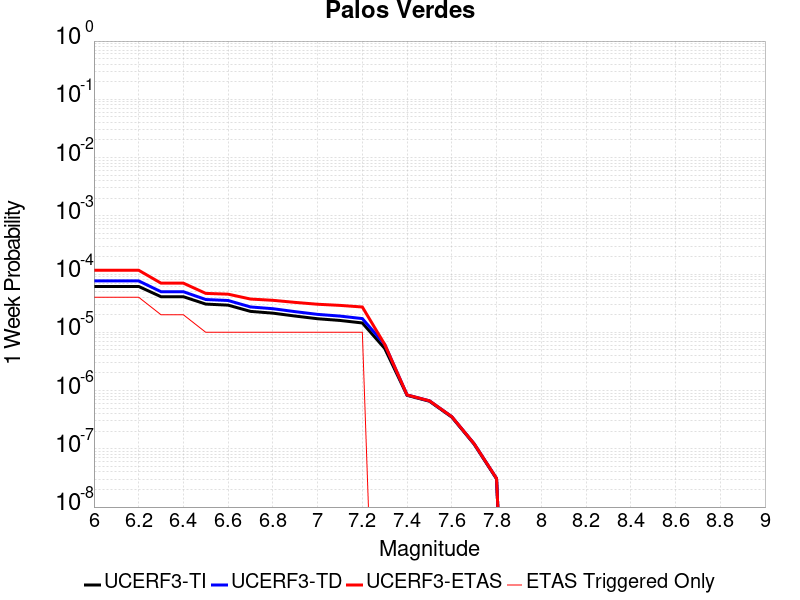 | 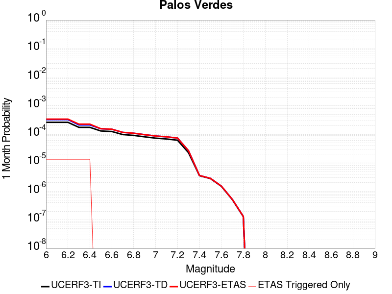 | 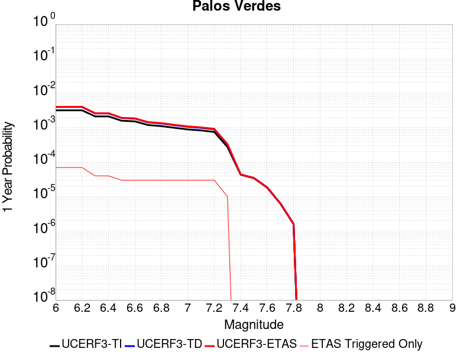 | 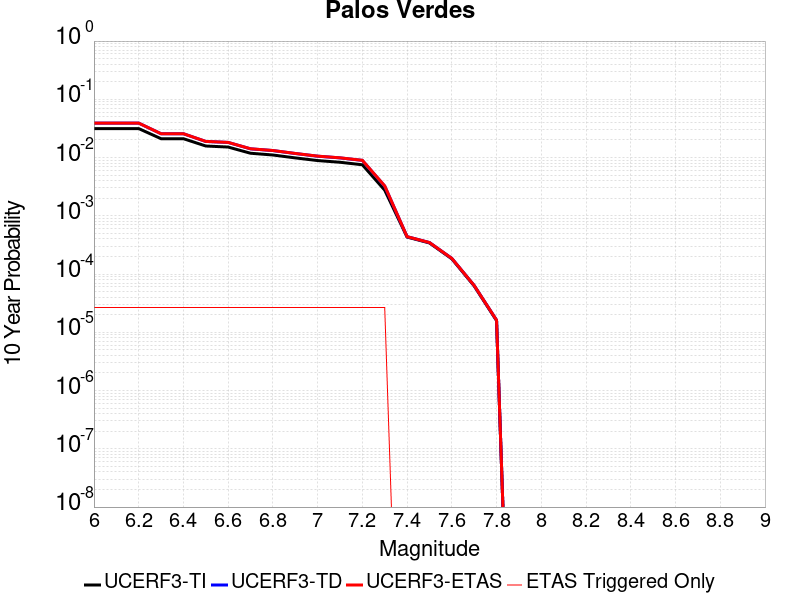 |

| Magnitude | 1 wk TI Prob | 1 wk TD Prob | 1 wk ETAS Prob | 1 wk ETAS/TD Gain | 1 wk ETAS Triggered Only | 1 mo TI Prob | 1 mo TD Prob | 1 mo ETAS Prob | 1 mo ETAS/TD Gain | 1 mo ETAS Triggered Only | 1 yr TI Prob | 1 yr TD Prob | 1 yr ETAS Prob | 1 yr ETAS/TD Gain | 1 yr ETAS Triggered Only | 10 yr TI Prob | 10 yr TD Prob | 10 yr ETAS Prob | 10 yr ETAS/TD Gain | 10 yr ETAS Triggered Only |
|-----|-----|-----|-----|-----|-----|-----|-----|-----|-----|-----|-----|-----|-----|-----|-----|-----|-----|-----|-----|-----|
| 6.0 | 6.126063E-5 | 7.622612E-5 | 1.0753146E-4 | 1.4106904 | 3.1307725E-5 | 2.6251914E-4 | 3.2664582E-4 | 3.6837583E-4 | 1.127753 | 4.174363E-5 | 0.0031914865 | 0.003970174 | 0.004032541 | 1.0157088 | 6.261545E-5 | 0.031460393 | 0.039048895 | 0.039119095 | 1.0017977 | 7.305136E-5 |
| 6.1 | 6.126063E-5 | 7.622612E-5 | 1.0753146E-4 | 1.4106904 | 3.1307725E-5 | 2.6251914E-4 | 3.2664582E-4 | 3.6837583E-4 | 1.127753 | 4.174363E-5 | 0.0031914865 | 0.003970174 | 0.004032541 | 1.0157088 | 6.261545E-5 | 0.031460393 | 0.039048895 | 0.039119095 | 1.0017977 | 7.305136E-5 |
| 6.2 | 6.126063E-5 | 7.622612E-5 | 1.0753146E-4 | 1.4106904 | 3.1307725E-5 | 2.6251914E-4 | 3.2664582E-4 | 3.6837583E-4 | 1.127753 | 4.174363E-5 | 0.0031914865 | 0.003970174 | 0.004032541 | 1.0157088 | 6.261545E-5 | 0.031460393 | 0.039048895 | 0.039119095 | 1.0017977 | 7.305136E-5 |
| 6.3 | 4.0838047E-5 | 4.9749437E-5 | 7.062021E-5 | 1.4195179 | 2.0871816E-5 | 1.7500846E-4 | 2.1319572E-4 | 2.3406307E-4 | 1.0978789 | 2.0871816E-5 | 0.0021286458 | 0.0025927818 | 0.0026344173 | 1.0160582 | 4.174363E-5 | 0.021083709 | 0.025646681 | 0.025687354 | 1.0015858 | 4.174363E-5 |
| 6.4 | 4.0838047E-5 | 4.9749437E-5 | 7.062021E-5 | 1.4195179 | 2.0871816E-5 | 1.7500846E-4 | 2.1319572E-4 | 2.3406307E-4 | 1.0978789 | 2.0871816E-5 | 0.0021286458 | 0.0025927818 | 0.0026344173 | 1.0160582 | 4.174363E-5 | 0.021083709 | 0.025646681 | 0.025687354 | 1.0015858 | 4.174363E-5 |
| 6.5 | 3.0512005E-5 | 3.656162E-5 | 4.699715E-5 | 1.2854229 | 1.0435908E-5 | 1.3075917E-4 | 1.5668393E-4 | 1.6711821E-4 | 1.0665944 | 1.0435908E-5 | 0.0015908304 | 0.0019060767 | 0.0019373246 | 1.0163939 | 3.1307725E-5 | 0.015794903 | 0.018909154 | 0.01893987 | 1.0016243 | 3.1307725E-5 |
| 6.6 | 2.9255087E-5 | 3.515442E-5 | 4.558996E-5 | 1.2968487 | 1.0435908E-5 | 1.2537291E-4 | 1.5065377E-4 | 1.610881E-4 | 1.0692604 | 1.0435908E-5 | 0.0015253464 | 0.0018327828 | 0.0018640332 | 1.0170507 | 3.1307725E-5 | 0.015149189 | 0.018188225 | 0.018218962 | 1.00169 | 3.1307725E-5 |
| 6.7 | 2.287198E-5 | 2.7248278E-5 | 3.76839E-5 | 1.3829829 | 1.0435908E-5 | 9.801909E-5 | 1.16773626E-4 | 1.2720832E-4 | 1.0893582 | 1.0435908E-5 | 0.001192729 | 0.0014208833 | 0.0014521466 | 1.0220027 | 3.1307725E-5 | 0.011863477 | 0.014127217 | 0.014158082 | 1.0021849 | 3.1307725E-5 |
| 6.8 | 2.1325764E-5 | 2.5431877E-5 | 3.586752E-5 | 1.4103371 | 1.0435908E-5 | 9.139293E-5 | 1.0898971E-4 | 1.1942448E-4 | 1.0957409 | 1.0435908E-5 | 0.001112141 | 0.0013262323 | 0.0013574985 | 1.0235752 | 3.1307725E-5 | 0.011065915 | 0.013192211 | 0.013223106 | 1.0023419 | 3.1307725E-5 |
| 6.9 | 1.9009392E-5 | 2.2613547E-5 | 3.304922E-5 | 1.4614787 | 1.0435908E-5 | 8.1466285E-5 | 9.6912096E-5 | 1.0734699E-4 | 1.1076739 | 1.0435908E-5 | 9.914007E-4 | 0.0011793535 | 0.0012106242 | 1.0265152 | 3.1307725E-5 | 0.009869894 | 0.011739632 | 0.0117705725 | 1.0026355 | 3.1307725E-5 |
| 7.0 | 1.7098473E-5 | 2.0319356E-5 | 3.075505E-5 | 1.513584 | 1.0435908E-5 | 7.3277115E-5 | 8.708052E-5 | 9.751553E-5 | 1.1198316 | 1.0435908E-5 | 8.917837E-4 | 0.001059775 | 0.0010910495 | 1.0295105 | 3.1307725E-5 | 0.008882134 | 0.010555646 | 0.010586624 | 1.0029347 | 3.1307725E-5 |
| 7.1 | 1.5982785E-5 | 1.899476E-5 | 2.943047E-5 | 1.5493994 | 1.0435908E-5 | 6.849585E-5 | 8.1404054E-5 | 9.183911E-5 | 1.1281885 | 1.0435908E-5 | 8.336179E-4 | 9.907284E-4 | 0.0010220051 | 1.0315694 | 3.1307725E-5 | 0.008304977 | 0.009871479 | 0.009902478 | 1.0031402 | 3.1307725E-5 |
| 7.2 | 1.4468002E-5 | 1.7197237E-5 | 2.7632965E-5 | 1.606826 | 1.0435908E-5 | 6.200425E-5 | 7.370083E-5 | 8.413597E-5 | 1.1415879 | 1.0435908E-5 | 7.546402E-4 | 8.970222E-4 | 9.2830183E-4 | 1.0348705 | 3.1307725E-5 | 0.007520827 | 0.008942284 | 0.008973312 | 1.0034698 | 3.1307725E-5 |
| 7.3 | 5.288233E-6 | 6.2036747E-6 | 6.2036747E-6 | 1.0 | 0.0 | 2.2663658E-5 | 2.6587102E-5 | 2.6587102E-5 | 1.0 | 0.0 | 2.7589512E-4 | 3.236848E-4 | 3.3411733E-4 | 1.0322305 | 1.0435908E-5 | 0.0027555283 | 0.0032355562 | 0.0032459584 | 1.003215 | 1.0435908E-5 |
| 7.4 | 8.279556E-7 | 8.408347E-7 | 8.408347E-7 | 1.0 | 0.0 | 3.5483763E-6 | 3.6035726E-6 | 3.6035726E-6 | 1.0 | 0.0 | 4.3200624E-5 | 4.3872686E-5 | 4.3872686E-5 | 1.0 | 0.0 | 4.3192226E-4 | 4.3864746E-4 | 4.3864746E-4 | 1.0 | 0.0 |
| 7.5 | 6.559831E-7 | 6.667229E-7 | 6.667229E-7 | 1.0 | 0.0 | 2.8113532E-6 | 2.857381E-6 | 2.857381E-6 | 1.0 | 0.0 | 3.4227687E-5 | 3.4788125E-5 | 3.4788125E-5 | 1.0 | 0.0 | 3.4222414E-4 | 3.4783344E-4 | 3.4783344E-4 | 1.0 | 0.0 |
| 7.6 | 3.5018968E-7 | 3.5620027E-7 | 3.5620027E-7 | 1.0 | 0.0 | 1.500812E-6 | 1.526572E-6 | 1.526572E-6 | 1.0 | 0.0 | 1.8272232E-5 | 1.8585903E-5 | 1.8585903E-5 | 1.0 | 0.0 | 1.8270731E-4 | 1.8584808E-4 | 1.8584808E-4 | 1.0 | 0.0 |
| 7.7 | 1.1986104E-7 | 1.2198376E-7 | 1.2198376E-7 | 1.0 | 0.0 | 5.1369005E-7 | 5.2278745E-7 | 5.2278745E-7 | 1.0 | 0.0 | 6.2541585E-6 | 6.364919E-6 | 6.364919E-6 | 1.0 | 0.0 | 6.2539824E-5 | 6.364741E-5 | 6.364741E-5 | 1.0 | 0.0 |
| 7.8 | 3.0445005E-8 | 3.1027582E-8 | 3.1027582E-8 | 1.0 | 0.0 | 1.3047858E-7 | 1.3297536E-7 | 1.3297536E-7 | 1.0 | 0.0 | 1.5885756E-6 | 1.6189739E-6 | 1.6189739E-6 | 1.0 | 0.0 | 1.5885644E-5 | 1.6189642E-5 | 1.6189642E-5 | 1.0 | 0.0 |

## San Diego Trough north alt1
*[(top)](#table-of-contents)*

| 1 Week | 1 Month | 1 Year | 10 Year |
|-----|-----|-----|-----|
| 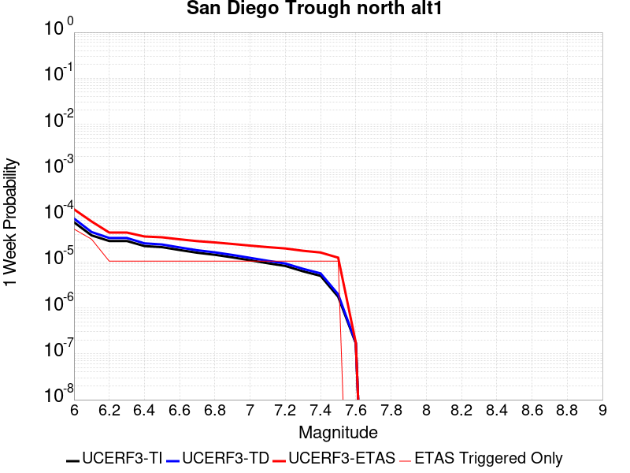 | 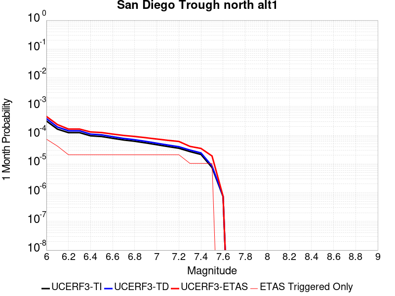 | 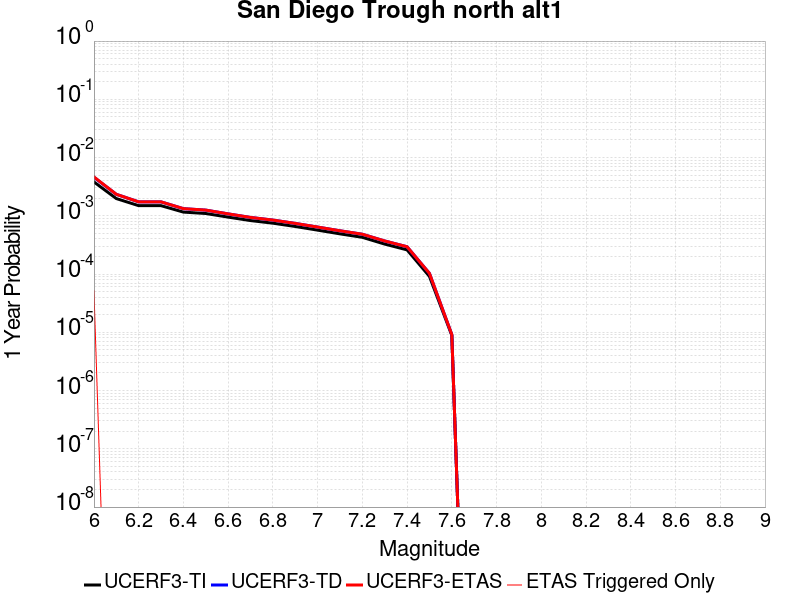 | 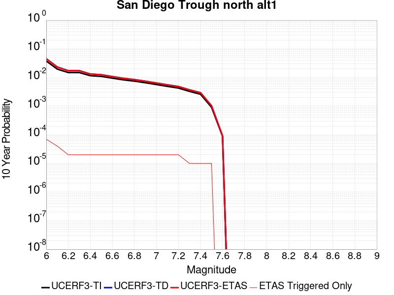 |

| Magnitude | 1 wk TI Prob | 1 wk TD Prob | 1 wk ETAS Prob | 1 wk ETAS/TD Gain | 1 wk ETAS Triggered Only | 1 mo TI Prob | 1 mo TD Prob | 1 mo ETAS Prob | 1 mo ETAS/TD Gain | 1 mo ETAS Triggered Only | 1 yr TI Prob | 1 yr TD Prob | 1 yr ETAS Prob | 1 yr ETAS/TD Gain | 1 yr ETAS Triggered Only | 10 yr TI Prob | 10 yr TD Prob | 10 yr ETAS Prob | 10 yr ETAS/TD Gain | 10 yr ETAS Triggered Only |
|-----|-----|-----|-----|-----|-----|-----|-----|-----|-----|-----|-----|-----|-----|-----|-----|-----|-----|-----|-----|-----|
| 6.0 | 7.329252E-5 | 8.821093E-5 | 1.4038586E-4 | 1.5914793 | 5.217954E-5 | 3.14073E-4 | 3.7799572E-4 | 4.5101947E-4 | 1.1931866 | 7.305136E-5 | 0.0038171355 | 0.004593027 | 0.0046657426 | 1.0158318 | 7.305136E-5 | 0.03752231 | 0.045044992 | 0.045114752 | 1.0015486 | 7.305136E-5 |
| 6.1 | 3.7940346E-5 | 4.4885E-5 | 7.619132E-5 | 1.6974784 | 3.1307725E-5 | 1.6259136E-4 | 1.9235066E-4 | 2.3408627E-4 | 1.2169766 | 4.174363E-5 | 0.0019777524 | 0.0023394432 | 0.0023810891 | 1.0178016 | 4.174363E-5 | 0.019602431 | 0.023156688 | 0.023197465 | 1.001761 | 4.174363E-5 |
| 6.2 | 2.8645263E-5 | 3.329678E-5 | 4.373234E-5 | 1.3134105 | 1.0435908E-5 | 1.2275964E-4 | 1.4269284E-4 | 1.6356168E-4 | 1.14625 | 2.0871816E-5 | 0.0014935739 | 0.0017359189 | 0.0017567545 | 1.0120026 | 2.0871816E-5 | 0.0148357535 | 0.017226247 | 0.01724676 | 1.0011908 | 2.0871816E-5 |
| 6.3 | 2.8645263E-5 | 3.329678E-5 | 4.373234E-5 | 1.3134105 | 1.0435908E-5 | 1.2275964E-4 | 1.4269284E-4 | 1.6356168E-4 | 1.14625 | 2.0871816E-5 | 0.0014935739 | 0.0017359189 | 0.0017567545 | 1.0120026 | 2.0871816E-5 | 0.0148357535 | 0.017226247 | 0.01724676 | 1.0011908 | 2.0871816E-5 |
| 6.4 | 2.2204576E-5 | 2.5448318E-5 | 3.588396E-5 | 1.410072 | 1.0435908E-5 | 9.5159E-5 | 1.0905972E-4 | 1.2992926E-4 | 1.1913588 | 2.0871816E-5 | 0.001157945 | 0.0013270034 | 0.0013478475 | 1.0157076 | 2.0871816E-5 | 0.011519298 | 0.013191955 | 0.013212551 | 1.0015613 | 2.0871816E-5 |
| 6.5 | 2.1004838E-5 | 2.4024694E-5 | 3.446035E-5 | 1.4343721 | 1.0435908E-5 | 9.0017624E-5 | 1.0295896E-4 | 1.2382863E-4 | 1.2026988 | 2.0871816E-5 | 0.0010954136 | 0.0012528138 | 0.0012736595 | 1.0166391 | 2.0871816E-5 | 0.010900296 | 0.012458589 | 0.012479201 | 1.0016544 | 2.0871816E-5 |
| 6.6 | 1.820557E-5 | 2.0704787E-5 | 3.1140476E-5 | 1.5040232 | 1.0435908E-5 | 7.802154E-5 | 8.873181E-5 | 1.0960177E-4 | 1.2352027 | 2.0871816E-5 | 9.4949827E-4 | 0.0010797799 | 0.0011006292 | 1.0193088 | 2.0871816E-5 | 0.009454516 | 0.010746004 | 0.0107666515 | 1.0019214 | 2.0871816E-5 |
| 6.7 | 1.5884485E-5 | 1.7983646E-5 | 2.8419367E-5 | 1.5802895 | 1.0435908E-5 | 6.807459E-5 | 7.707051E-5 | 9.794072E-5 | 1.2707937 | 2.0871816E-5 | 8.284929E-4 | 9.3793223E-4 | 9.587845E-4 | 1.0222322 | 2.0871816E-5 | 0.008254109 | 0.009340104 | 0.00936078 | 1.0022137 | 2.0871816E-5 |
| 6.8 | 1.4331171E-5 | 1.6201066E-5 | 2.6636804E-5 | 1.644139 | 1.0435908E-5 | 6.141786E-5 | 6.94313E-5 | 9.030166E-5 | 1.3005902 | 2.0871816E-5 | 7.4750587E-4 | 8.450002E-4 | 8.658544E-4 | 1.0246795 | 2.0871816E-5 | 0.0074499645 | 0.008418139 | 0.008438835 | 1.0024586 | 2.0871816E-5 |
| 6.9 | 1.2574203E-5 | 1.4205835E-5 | 2.4641595E-5 | 1.7346108 | 1.0435908E-5 | 5.3888325E-5 | 6.0880735E-5 | 8.1751285E-5 | 1.3428103 | 2.0871816E-5 | 6.558929E-4 | 7.409723E-4 | 7.618286E-4 | 1.0281472 | 2.0871816E-5 | 0.0065396037 | 0.007385203 | 0.007405921 | 1.0028054 | 2.0871816E-5 |
| 7.0 | 1.0883844E-5 | 1.2289262E-5 | 2.272504E-5 | 1.8491788 | 1.0435908E-5 | 4.664421E-5 | 5.2667205E-5 | 7.353792E-5 | 1.3962754 | 2.0871816E-5 | 5.677453E-4 | 6.4103556E-4 | 6.61894E-4 | 1.0325387 | 2.0871816E-5 | 0.00566297 | 0.006391993 | 0.006412731 | 1.0032444 | 2.0871816E-5 |
| 7.1 | 9.393088E-6 | 1.060702E-5 | 2.1042817E-5 | 1.9838576 | 1.0435908E-5 | 4.025547E-5 | 4.545787E-5 | 6.6328736E-5 | 1.4591255 | 2.0871816E-5 | 4.900001E-4 | 5.533098E-4 | 5.7417003E-4 | 1.0377009 | 2.0871816E-5 | 0.0048892107 | 0.005519418 | 0.0055401744 | 1.0037607 | 2.0871816E-5 |
| 7.2 | 8.190791E-6 | 9.258625E-6 | 1.9694437E-5 | 2.1271448 | 1.0435908E-5 | 3.510292E-5 | 3.9679224E-5 | 6.0550214E-5 | 1.5259929 | 2.0871816E-5 | 4.2729423E-4 | 4.8298817E-4 | 5.038499E-4 | 1.0431931 | 2.0871816E-5 | 0.0042647356 | 0.004819465 | 0.0048402357 | 1.0043099 | 2.0871816E-5 |
| 7.3 | 6.268162E-6 | 7.089716E-6 | 1.752555E-5 | 2.471968 | 1.0435908E-5 | 2.6863276E-5 | 3.0384144E-5 | 4.0819734E-5 | 1.3434552 | 1.0435908E-5 | 3.2701128E-4 | 3.6986457E-4 | 3.802966E-4 | 1.028205 | 1.0435908E-5 | 0.003265305 | 0.003692536 | 0.0037029332 | 1.0028157 | 1.0435908E-5 |
| 7.4 | 4.985186E-6 | 5.6426816E-6 | 1.6078531E-5 | 2.8494484 | 1.0435908E-5 | 2.1364907E-5 | 2.4182698E-5 | 3.4618355E-5 | 1.4315339 | 1.0435908E-5 | 2.600867E-4 | 2.9438498E-4 | 3.048178E-4 | 1.0354394 | 1.0435908E-5 | 0.002597825 | 0.0029399914 | 0.0029503966 | 1.0035392 | 1.0435908E-5 |
| 7.5 | 1.7489613E-6 | 1.969678E-6 | 1.2405565E-5 | 6.298271 | 1.0435908E-5 | 7.495527E-6 | 8.4414505E-6 | 1.887727E-5 | 2.236259 | 1.0435908E-5 | 9.125422E-5 | 1.02770035E-4 | 1.1320487E-4 | 1.1015358 | 1.0435908E-5 | 9.1216754E-4 | 0.0010272472 | 0.0010376723 | 1.0101486 | 1.0435908E-5 |
| 7.6 | 1.6988751E-7 | 1.7533823E-7 | 1.7533823E-7 | 1.0 | 0.0 | 7.2808916E-7 | 7.5144936E-7 | 7.5144936E-7 | 1.0 | 0.0 | 8.864449E-6 | 9.14886E-6 | 9.14886E-6 | 1.0 | 0.0 | 8.8640954E-5 | 9.1485024E-5 | 9.1485024E-5 | 1.0 | 0.0 |

## Pitas Point (Lower West)
*[(top)](#table-of-contents)*

| 1 Week | 1 Month | 1 Year | 10 Year |
|-----|-----|-----|-----|
| 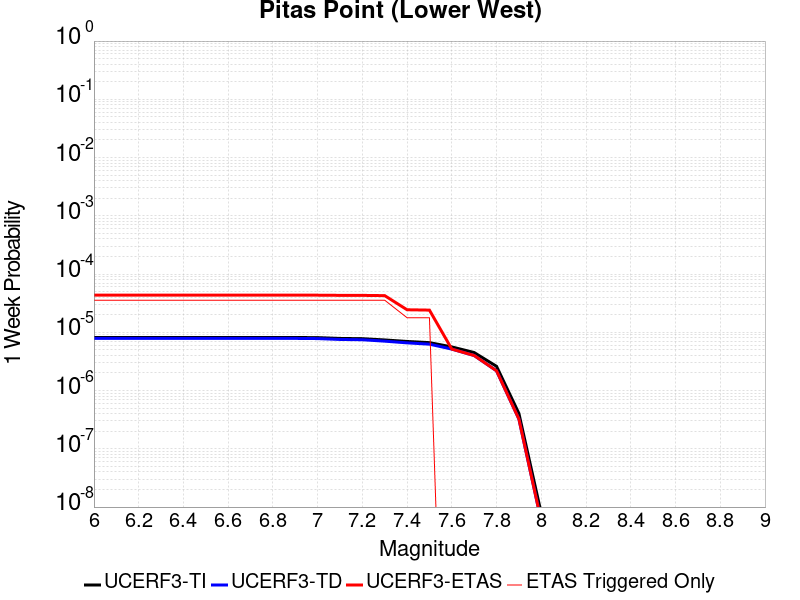 | 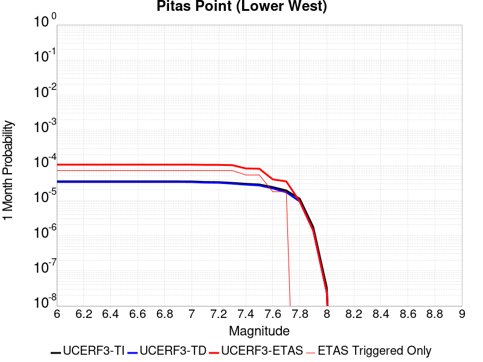 | 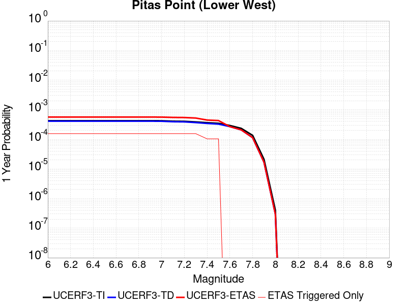 |  |

| Magnitude | 1 wk TI Prob | 1 wk TD Prob | 1 wk ETAS Prob | 1 wk ETAS/TD Gain | 1 wk ETAS Triggered Only | 1 mo TI Prob | 1 mo TD Prob | 1 mo ETAS Prob | 1 mo ETAS/TD Gain | 1 mo ETAS Triggered Only | 1 yr TI Prob | 1 yr TD Prob | 1 yr ETAS Prob | 1 yr ETAS/TD Gain | 1 yr ETAS Triggered Only | 10 yr TI Prob | 10 yr TD Prob | 10 yr ETAS Prob | 10 yr ETAS/TD Gain | 10 yr ETAS Triggered Only |
|-----|-----|-----|-----|-----|-----|-----|-----|-----|-----|-----|-----|-----|-----|-----|-----|-----|-----|-----|-----|-----|
| 6.0 | 8.151497E-6 | 7.855762E-6 | 3.916324E-5 | 4.985288 | 3.1307725E-5 | 3.493452E-5 | 3.3667122E-5 | 8.5844906E-5 | 2.5498142 | 5.217954E-5 | 4.252448E-4 | 4.0982084E-4 | 4.61979E-4 | 1.1272706 | 5.217954E-5 | 0.0042443196 | 0.0040907315 | 0.004163484 | 1.0177847 | 7.305136E-5 |
| 6.1 | 8.151497E-6 | 7.855762E-6 | 3.916324E-5 | 4.985288 | 3.1307725E-5 | 3.493452E-5 | 3.3667122E-5 | 8.5844906E-5 | 2.5498142 | 5.217954E-5 | 4.252448E-4 | 4.0982084E-4 | 4.61979E-4 | 1.1272706 | 5.217954E-5 | 0.0042443196 | 0.0040907315 | 0.004163484 | 1.0177847 | 7.305136E-5 |
| 6.2 | 8.151497E-6 | 7.855762E-6 | 3.916324E-5 | 4.985288 | 3.1307725E-5 | 3.493452E-5 | 3.3667122E-5 | 8.5844906E-5 | 2.5498142 | 5.217954E-5 | 4.252448E-4 | 4.0982084E-4 | 4.61979E-4 | 1.1272706 | 5.217954E-5 | 0.0042443196 | 0.0040907315 | 0.004163484 | 1.0177847 | 7.305136E-5 |
| 6.3 | 8.151497E-6 | 7.855762E-6 | 3.916324E-5 | 4.985288 | 3.1307725E-5 | 3.493452E-5 | 3.3667122E-5 | 8.5844906E-5 | 2.5498142 | 5.217954E-5 | 4.252448E-4 | 4.0982084E-4 | 4.61979E-4 | 1.1272706 | 5.217954E-5 | 0.0042443196 | 0.0040907315 | 0.004163484 | 1.0177847 | 7.305136E-5 |
| 6.4 | 8.151497E-6 | 7.855762E-6 | 3.916324E-5 | 4.985288 | 3.1307725E-5 | 3.493452E-5 | 3.3667122E-5 | 8.5844906E-5 | 2.5498142 | 5.217954E-5 | 4.252448E-4 | 4.0982084E-4 | 4.61979E-4 | 1.1272706 | 5.217954E-5 | 0.0042443196 | 0.0040907315 | 0.004163484 | 1.0177847 | 7.305136E-5 |
| 6.5 | 8.151497E-6 | 7.855762E-6 | 3.916324E-5 | 4.985288 | 3.1307725E-5 | 3.493452E-5 | 3.3667122E-5 | 8.5844906E-5 | 2.5498142 | 5.217954E-5 | 4.252448E-4 | 4.0982084E-4 | 4.61979E-4 | 1.1272706 | 5.217954E-5 | 0.0042443196 | 0.0040907315 | 0.004163484 | 1.0177847 | 7.305136E-5 |
| 6.6 | 8.151497E-6 | 7.855762E-6 | 3.916324E-5 | 4.985288 | 3.1307725E-5 | 3.493452E-5 | 3.3667122E-5 | 8.5844906E-5 | 2.5498142 | 5.217954E-5 | 4.252448E-4 | 4.0982084E-4 | 4.61979E-4 | 1.1272706 | 5.217954E-5 | 0.0042443196 | 0.0040907315 | 0.004163484 | 1.0177847 | 7.305136E-5 |
| 6.7 | 8.151497E-6 | 7.855762E-6 | 3.916324E-5 | 4.985288 | 3.1307725E-5 | 3.493452E-5 | 3.3667122E-5 | 8.5844906E-5 | 2.5498142 | 5.217954E-5 | 4.252448E-4 | 4.0982084E-4 | 4.61979E-4 | 1.1272706 | 5.217954E-5 | 0.0042443196 | 0.0040907315 | 0.004163484 | 1.0177847 | 7.305136E-5 |
| 6.8 | 8.151497E-6 | 7.855762E-6 | 3.916324E-5 | 4.985288 | 3.1307725E-5 | 3.493452E-5 | 3.3667122E-5 | 8.5844906E-5 | 2.5498142 | 5.217954E-5 | 4.252448E-4 | 4.0982084E-4 | 4.61979E-4 | 1.1272706 | 5.217954E-5 | 0.0042443196 | 0.0040907315 | 0.004163484 | 1.0177847 | 7.305136E-5 |
| 6.9 | 8.151497E-6 | 7.855762E-6 | 3.916324E-5 | 4.985288 | 3.1307725E-5 | 3.493452E-5 | 3.3667122E-5 | 8.5844906E-5 | 2.5498142 | 5.217954E-5 | 4.252448E-4 | 4.0982084E-4 | 4.61979E-4 | 1.1272706 | 5.217954E-5 | 0.0042443196 | 0.0040907315 | 0.004163484 | 1.0177847 | 7.305136E-5 |
| 7.0 | 8.103535E-6 | 7.805192E-6 | 2.8676845E-5 | 3.674073 | 2.0871816E-5 | 3.4728975E-5 | 3.3450397E-5 | 7.5192635E-5 | 2.2478845 | 4.174363E-5 | 4.2274324E-4 | 4.0718322E-4 | 4.4890985E-4 | 1.1024764 | 4.174363E-5 | 0.0042193993 | 0.004064452 | 0.004126813 | 1.0153431 | 6.261545E-5 |
| 7.1 | 7.853298E-6 | 7.540883E-6 | 2.8412542E-5 | 3.7678003 | 2.0871816E-5 | 3.3656554E-5 | 3.2317676E-5 | 7.405996E-5 | 2.291624 | 4.174363E-5 | 4.096915E-4 | 3.9339735E-4 | 4.3512456E-4 | 1.1060688 | 4.174363E-5 | 0.00408937 | 0.0039270855 | 0.0039894553 | 1.0158819 | 6.261545E-5 |
| 7.2 | 7.771102E-6 | 7.453165E-6 | 2.8324825E-5 | 3.8003755 | 2.0871816E-5 | 3.33043E-5 | 3.194175E-5 | 7.3684045E-5 | 2.3068256 | 4.174363E-5 | 4.0540437E-4 | 3.8882208E-4 | 4.305495E-4 | 1.1073174 | 4.174363E-5 | 0.0040466557 | 0.0038814936 | 0.003943866 | 1.0160692 | 6.261545E-5 |
| 7.3 | 7.3945344E-6 | 7.0492697E-6 | 2.7920938E-5 | 3.960827 | 2.0871816E-5 | 3.1690477E-5 | 3.021081E-5 | 7.195318E-5 | 2.3817031 | 4.174363E-5 | 3.8576324E-4 | 3.6775516E-4 | 4.0948341E-4 | 1.1134676 | 4.174363E-5 | 0.0038509427 | 0.0036715334 | 0.0037339188 | 1.0169917 | 6.261545E-5 |
| 7.4 | 6.964645E-6 | 6.5901186E-6 | 1.7025957E-5 | 2.5835586 | 1.0435908E-5 | 2.9848137E-5 | 2.8243063E-5 | 5.95499E-5 | 2.108479 | 3.1307725E-5 | 3.6334046E-4 | 3.4380553E-4 | 3.7510248E-4 | 1.091031 | 3.1307725E-5 | 0.0036274698 | 0.0034327896 | 0.00348479 | 1.0151482 | 5.217954E-5 |
| 7.5 | 6.6525035E-6 | 6.259157E-6 | 1.6695E-5 | 2.6672919 | 1.0435908E-5 | 2.851042E-5 | 2.6824686E-5 | 5.813157E-5 | 2.1670923 | 3.1307725E-5 | 3.4705905E-4 | 3.265421E-4 | 3.578396E-4 | 1.0958452 | 3.1307725E-5 | 0.0034651754 | 0.0032606742 | 0.0033126837 | 1.0159506 | 5.217954E-5 |
| 7.6 | 5.613338E-6 | 5.151386E-6 | 5.151386E-6 | 1.0 | 0.0 | 2.405694E-5 | 2.2077185E-5 | 3.251286E-5 | 1.4726906 | 1.0435908E-5 | 2.928539E-4 | 2.6875688E-4 | 2.7918996E-4 | 1.0388199 | 1.0435908E-5 | 0.0029246826 | 0.0026843501 | 0.0027051659 | 1.0077544 | 2.0871816E-5 |
| 7.7 | 4.494704E-6 | 3.996911E-6 | 3.996911E-6 | 1.0 | 0.0 | 1.9262876E-5 | 1.7129507E-5 | 2.7565236E-5 | 1.6092253 | 1.0435908E-5 | 2.3450027E-4 | 2.0853203E-4 | 2.1896575E-4 | 1.0500342 | 1.0435908E-5 | 0.0023425296 | 0.0020833875 | 0.0021042158 | 1.0099974 | 2.0871816E-5 |
| 7.8 | 2.6075882E-6 | 2.1836374E-6 | 2.1836374E-6 | 1.0 | 0.0 | 1.117533E-5 | 9.358413E-6 | 9.358413E-6 | 1.0 | 0.0 | 1.3605114E-4 | 1.1393277E-4 | 1.1393277E-4 | 1.0 | 0.0 | 0.0013596788 | 0.0011387484 | 0.0011387484 | 1.0 | 0.0 |
| 7.9 | 4.045984E-7 | 3.242375E-7 | 3.242375E-7 | 1.0 | 0.0 | 1.733992E-6 | 1.3895885E-6 | 1.3895885E-6 | 1.0 | 0.0 | 2.1111147E-5 | 1.6918111E-5 | 1.6918111E-5 | 1.0 | 0.0 | 2.1109142E-4 | 1.6916855E-4 | 1.6916855E-4 | 1.0 | 0.0 |
| 8.0 | 7.791402E-9 | 5.683497E-9 | 5.683497E-9 | 1.0 | 0.0 | 3.3391725E-8 | 2.4357844E-8 | 2.4357844E-8 | 1.0 | 0.0 | 4.0654416E-7 | 2.9655675E-7 | 2.9655675E-7 | 1.0 | 0.0 | 4.065434E-6 | 2.9655655E-6 | 2.9655655E-6 | 1.0 | 0.0 |

## Santa Susana alt 1
*[(top)](#table-of-contents)*

| 1 Week | 1 Month | 1 Year | 10 Year |
|-----|-----|-----|-----|
| 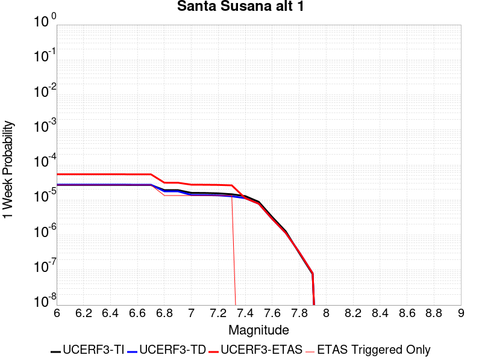 | 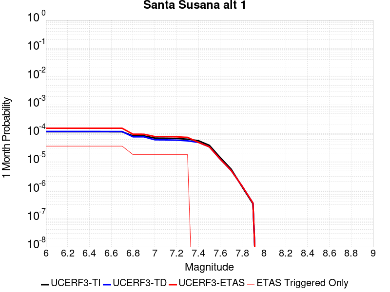 | 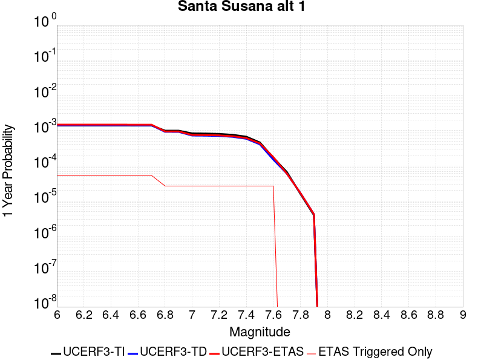 | 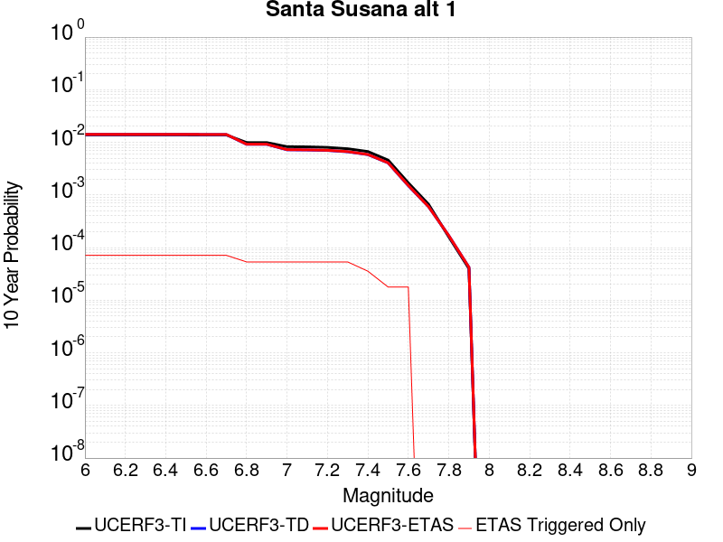 |

| Magnitude | 1 wk TI Prob | 1 wk TD Prob | 1 wk ETAS Prob | 1 wk ETAS/TD Gain | 1 wk ETAS Triggered Only | 1 mo TI Prob | 1 mo TD Prob | 1 mo ETAS Prob | 1 mo ETAS/TD Gain | 1 mo ETAS Triggered Only | 1 yr TI Prob | 1 yr TD Prob | 1 yr ETAS Prob | 1 yr ETAS/TD Gain | 1 yr ETAS Triggered Only | 10 yr TI Prob | 10 yr TD Prob | 10 yr ETAS Prob | 10 yr ETAS/TD Gain | 10 yr ETAS Triggered Only |
|-----|-----|-----|-----|-----|-----|-----|-----|-----|-----|-----|-----|-----|-----|-----|-----|-----|-----|-----|-----|-----|
| 6.0 | 2.674877E-5 | 2.7198023E-5 | 4.806927E-5 | 1.7673811 | 2.0871816E-5 | 1.1463255E-4 | 1.1655839E-4 | 1.4786246E-4 | 1.26857 | 3.1307725E-5 | 0.0013947578 | 0.0014182882 | 0.0014808149 | 1.044086 | 6.261545E-5 | 0.013860362 | 0.014104128 | 0.014176149 | 1.0051063 | 7.305136E-5 |
| 6.1 | 2.674877E-5 | 2.7198023E-5 | 4.806927E-5 | 1.7673811 | 2.0871816E-5 | 1.1463255E-4 | 1.1655839E-4 | 1.4786246E-4 | 1.26857 | 3.1307725E-5 | 0.0013947578 | 0.0014182882 | 0.0014808149 | 1.044086 | 6.261545E-5 | 0.013860362 | 0.014104128 | 0.014176149 | 1.0051063 | 7.305136E-5 |
| 6.2 | 2.674877E-5 | 2.7198023E-5 | 4.806927E-5 | 1.7673811 | 2.0871816E-5 | 1.1463255E-4 | 1.1655839E-4 | 1.4786246E-4 | 1.26857 | 3.1307725E-5 | 0.0013947578 | 0.0014182882 | 0.0014808149 | 1.044086 | 6.261545E-5 | 0.013860362 | 0.014104128 | 0.014176149 | 1.0051063 | 7.305136E-5 |
| 6.3 | 2.674877E-5 | 2.7198023E-5 | 4.806927E-5 | 1.7673811 | 2.0871816E-5 | 1.1463255E-4 | 1.1655839E-4 | 1.4786246E-4 | 1.26857 | 3.1307725E-5 | 0.0013947578 | 0.0014182882 | 0.0014808149 | 1.044086 | 6.261545E-5 | 0.013860362 | 0.014104128 | 0.014176149 | 1.0051063 | 7.305136E-5 |
| 6.4 | 2.674877E-5 | 2.7198023E-5 | 4.806927E-5 | 1.7673811 | 2.0871816E-5 | 1.1463255E-4 | 1.1655839E-4 | 1.4786246E-4 | 1.26857 | 3.1307725E-5 | 0.0013947578 | 0.0014182882 | 0.0014808149 | 1.044086 | 6.261545E-5 | 0.013860362 | 0.014104128 | 0.014176149 | 1.0051063 | 7.305136E-5 |
| 6.5 | 2.674877E-5 | 2.7198023E-5 | 4.806927E-5 | 1.7673811 | 2.0871816E-5 | 1.1463255E-4 | 1.1655839E-4 | 1.4786246E-4 | 1.26857 | 3.1307725E-5 | 0.0013947578 | 0.0014182882 | 0.0014808149 | 1.044086 | 6.261545E-5 | 0.013860362 | 0.014104128 | 0.014176149 | 1.0051063 | 7.305136E-5 |
| 6.6 | 2.6647976E-5 | 2.7074359E-5 | 4.794561E-5 | 1.7708862 | 2.0871816E-5 | 1.14200615E-4 | 1.1602845E-4 | 1.4733254E-4 | 1.2697967 | 3.1307725E-5 | 0.0013895056 | 0.0014118447 | 0.0014743719 | 1.0442874 | 6.261545E-5 | 0.013808494 | 0.014040513 | 0.014112539 | 1.0051298 | 7.305136E-5 |
| 6.7 | 2.6647976E-5 | 2.7074359E-5 | 4.794561E-5 | 1.7708862 | 2.0871816E-5 | 1.14200615E-4 | 1.1602845E-4 | 1.4733254E-4 | 1.2697967 | 3.1307725E-5 | 0.0013895056 | 0.0014118447 | 0.0014743719 | 1.0442874 | 6.261545E-5 | 0.013808494 | 0.014040513 | 0.014112539 | 1.0051298 | 7.305136E-5 |
| 6.8 | 1.9073179E-5 | 1.7637283E-5 | 2.8073007E-5 | 1.5916854 | 1.0435908E-5 | 8.1739636E-5 | 7.558627E-5 | 8.602139E-5 | 1.1380558 | 1.0435908E-5 | 9.947256E-4 | 9.198925E-4 | 9.511714E-4 | 1.0340028 | 3.1307725E-5 | 0.009902848 | 0.009163101 | 0.009204462 | 1.0045139 | 4.174363E-5 |
| 6.9 | 1.9041876E-5 | 1.7619415E-5 | 2.805514E-5 | 1.5922855 | 1.0435908E-5 | 8.160549E-5 | 7.55097E-5 | 8.594482E-5 | 1.1381958 | 1.0435908E-5 | 9.930939E-4 | 9.1896096E-4 | 9.502399E-4 | 1.0340374 | 3.1307725E-5 | 0.0098866755 | 0.0091538625 | 0.009195224 | 1.0045185 | 4.174363E-5 |
| 7.0 | 1.5917482E-5 | 1.3863864E-5 | 2.4299628E-5 | 1.7527312 | 1.0435908E-5 | 6.8215995E-5 | 5.9415237E-5 | 6.9850525E-5 | 1.1756332 | 1.0435908E-5 | 8.302132E-4 | 7.231451E-4 | 7.5443013E-4 | 1.0432625 | 3.1307725E-5 | 0.008271185 | 0.0072088144 | 0.0072502573 | 1.0057489 | 4.174363E-5 |
| 7.1 | 1.577788E-5 | 1.3743872E-5 | 2.4179637E-5 | 1.7593031 | 1.0435908E-5 | 6.761774E-5 | 5.8901005E-5 | 6.9336296E-5 | 1.1771666 | 1.0435908E-5 | 8.2293496E-4 | 7.1688846E-4 | 7.4817374E-4 | 1.0436404 | 3.1307725E-5 | 0.008198941 | 0.007146652 | 0.007188097 | 1.0057993 | 4.174363E-5 |
| 7.2 | 1.5416446E-5 | 1.3469944E-5 | 2.3905712E-5 | 1.7747446 | 1.0435908E-5 | 6.606882E-5 | 5.772708E-5 | 6.8162386E-5 | 1.1807697 | 1.0435908E-5 | 8.0409093E-4 | 7.026052E-4 | 7.338909E-4 | 1.0445281 | 3.1307725E-5 | 0.008011877 | 0.0070047234 | 0.0070461747 | 1.0059177 | 4.174363E-5 |
| 7.3 | 1.4534083E-5 | 1.2717879E-5 | 2.3153654E-5 | 1.8205594 | 1.0435908E-5 | 6.228744E-5 | 5.4504082E-5 | 6.493942E-5 | 1.1914598 | 1.0435908E-5 | 7.580857E-4 | 6.633896E-4 | 6.9467654E-4 | 1.0471623 | 3.1307725E-5 | 0.007555048 | 0.0066149444 | 0.006656412 | 1.0062687 | 4.174363E-5 |
| 7.4 | 1.2858995E-5 | 1.1229652E-5 | 1.1229652E-5 | 1.0 | 0.0 | 5.5108816E-5 | 4.8126214E-5 | 4.8126214E-5 | 1.0 | 0.0 | 6.7074323E-4 | 5.857831E-4 | 6.066427E-4 | 1.0356097 | 2.0871816E-5 | 0.0066872234 | 0.005843165 | 0.0058742897 | 1.0053267 | 3.1307725E-5 |
| 7.5 | 8.827668E-6 | 7.805457E-6 | 7.805457E-6 | 1.0 | 0.0 | 3.7832317E-5 | 3.3451546E-5 | 3.3451546E-5 | 1.0 | 0.0 | 4.605111E-4 | 4.071989E-4 | 4.2806222E-4 | 1.0512362 | 2.0871816E-5 | 0.0045955796 | 0.0040647765 | 0.0040855636 | 1.005114 | 2.0871816E-5 |
| 7.6 | 3.2533426E-6 | 2.871988E-6 | 2.871988E-6 | 1.0 | 0.0 | 1.3942822E-5 | 1.2308465E-5 | 1.2308465E-5 | 1.0 | 0.0 | 1.6974064E-4 | 1.4984563E-4 | 1.6027996E-4 | 1.069634 | 1.0435908E-5 | 0.0016961104 | 0.0014974826 | 0.001507903 | 1.0069585 | 1.0435908E-5 |
| 7.7 | 1.2751709E-6 | 1.1491089E-6 | 1.1491089E-6 | 1.0 | 0.0 | 5.4650063E-6 | 4.9247437E-6 | 4.9247437E-6 | 1.0 | 0.0 | 6.653442E-5 | 5.9957198E-5 | 5.9957198E-5 | 1.0 | 0.0 | 6.6514505E-4 | 5.994191E-4 | 5.994191E-4 | 1.0 | 0.0 |
| 7.8 | 3.067544E-7 | 3.2400436E-7 | 3.2400436E-7 | 1.0 | 0.0 | 1.3146611E-6 | 1.3885895E-6 | 1.3885895E-6 | 1.0 | 0.0 | 1.600588E-5 | 1.6905957E-5 | 1.6905957E-5 | 1.0 | 0.0 | 1.6004729E-4 | 1.6904772E-4 | 1.6904772E-4 | 1.0 | 0.0 |
| 7.9 | 7.622999E-8 | 8.087964E-8 | 8.087964E-8 | 1.0 | 0.0 | 3.2669993E-7 | 3.4662696E-7 | 3.4662696E-7 | 1.0 | 0.0 | 3.977564E-6 | 4.2201773E-6 | 4.2201773E-6 | 1.0 | 0.0 | 3.977493E-5 | 4.220118E-5 | 4.220118E-5 | 1.0 | 0.0 |

## Oceanic - West Huasna
*[(top)](#table-of-contents)*

| 1 Week | 1 Month | 1 Year | 10 Year |
|-----|-----|-----|-----|
| 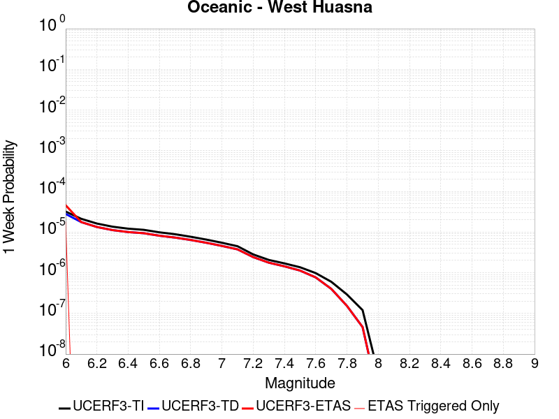 | 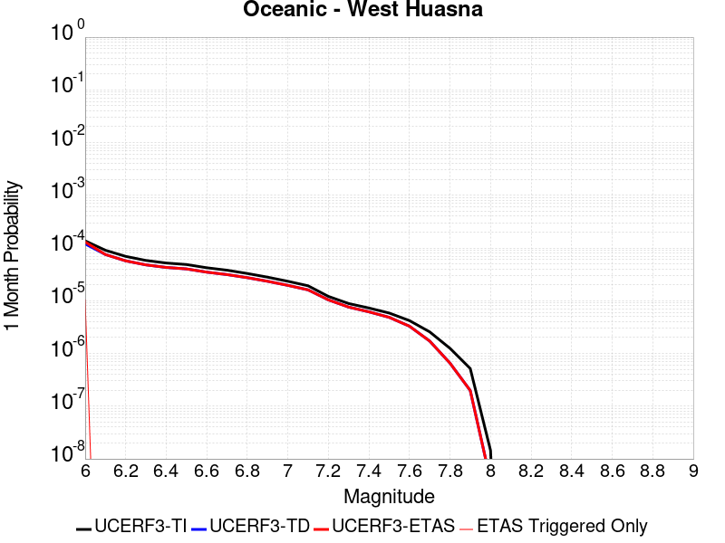 | 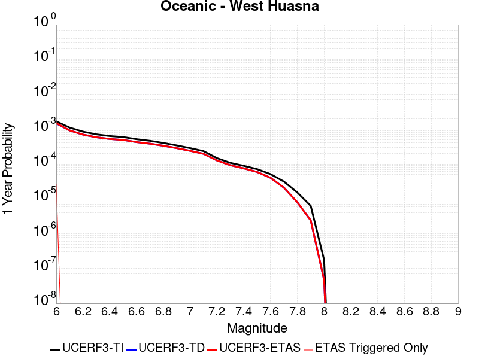 | 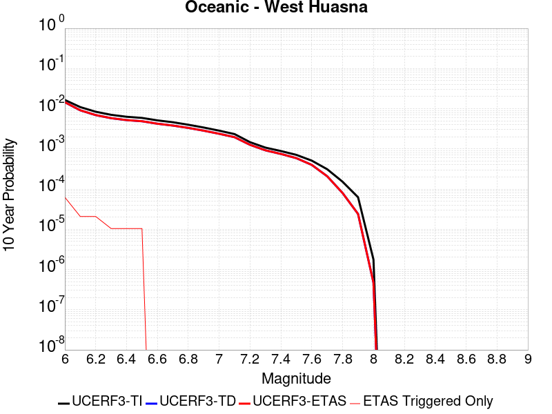 |

| Magnitude | 1 wk TI Prob | 1 wk TD Prob | 1 wk ETAS Prob | 1 wk ETAS/TD Gain | 1 wk ETAS Triggered Only | 1 mo TI Prob | 1 mo TD Prob | 1 mo ETAS Prob | 1 mo ETAS/TD Gain | 1 mo ETAS Triggered Only | 1 yr TI Prob | 1 yr TD Prob | 1 yr ETAS Prob | 1 yr ETAS/TD Gain | 1 yr ETAS Triggered Only | 10 yr TI Prob | 10 yr TD Prob | 10 yr ETAS Prob | 10 yr ETAS/TD Gain | 10 yr ETAS Triggered Only |
|-----|-----|-----|-----|-----|-----|-----|-----|-----|-----|-----|-----|-----|-----|-----|-----|-----|-----|-----|-----|-----|
| 6.0 | 3.195567E-5 | 2.7926868E-5 | 3.8362483E-5 | 1.3736765 | 1.0435908E-5 | 1.3694567E-4 | 1.1968133E-4 | 1.30116E-4 | 1.087187 | 1.0435908E-5 | 0.0016660384 | 0.0014561893 | 0.0014874515 | 1.0214684 | 3.1307725E-5 | 0.016536033 | 0.014471028 | 0.0145327365 | 1.0042644 | 6.261545E-5 |
| 6.1 | 2.1156782E-5 | 1.7573486E-5 | 1.7573486E-5 | 1.0 | 0.0 | 9.066878E-5 | 7.531282E-5 | 7.531282E-5 | 1.0 | 0.0 | 0.0011033333 | 9.165572E-4 | 9.2698354E-4 | 1.0113755 | 1.0435908E-5 | 0.010978713 | 0.009128777 | 0.009149459 | 1.0022655 | 2.0871816E-5 |
| 6.2 | 1.6195117E-5 | 1.3327152E-5 | 1.3327152E-5 | 1.0 | 0.0 | 6.9405796E-5 | 5.7115132E-5 | 5.7115132E-5 | 1.0 | 0.0 | 8.44688E-4 | 6.9515745E-4 | 7.055861E-4 | 1.0150019 | 1.0435908E-5 | 0.008414844 | 0.006930123 | 0.0069508506 | 1.0029908 | 2.0871816E-5 |
| 6.3 | 1.3559345E-5 | 1.1179142E-5 | 1.1179142E-5 | 1.0 | 0.0 | 5.811018E-5 | 4.7909736E-5 | 4.7909736E-5 | 1.0 | 0.0 | 7.072618E-4 | 5.831459E-4 | 5.935757E-4 | 1.0178854 | 1.0435908E-5 | 0.0070501505 | 0.0058162753 | 0.00582665 | 1.0017838 | 1.0435908E-5 |
| 6.4 | 1.2120619E-5 | 1.0000977E-5 | 1.0000977E-5 | 1.0 | 0.0 | 5.1944477E-5 | 4.2860633E-5 | 4.2860633E-5 | 1.0 | 0.0 | 6.322405E-4 | 5.2170374E-4 | 5.321342E-4 | 1.0199931 | 1.0435908E-5 | 0.006304447 | 0.0052048573 | 0.0052152392 | 1.0019946 | 1.0435908E-5 |
| 6.5 | 1.13511915E-5 | 9.3674735E-6 | 9.3674735E-6 | 1.0 | 0.0 | 4.8647056E-5 | 4.01457E-5 | 4.01457E-5 | 1.0 | 0.0 | 5.9211696E-4 | 4.886647E-4 | 4.9909553E-4 | 1.0213455 | 1.0435908E-5 | 0.0059054173 | 0.0048759608 | 0.004886346 | 1.0021298 | 1.0435908E-5 |
| 6.6 | 9.850605E-6 | 8.135418E-6 | 8.135418E-6 | 1.0 | 0.0 | 4.2216197E-5 | 3.4865614E-5 | 3.4865614E-5 | 1.0 | 0.0 | 5.1386096E-4 | 4.2440637E-4 | 4.2440637E-4 | 1.0 | 0.0 | 0.0051267436 | 0.004235991 | 0.004235991 | 1.0 | 0.0 |
| 6.7 | 8.8558645E-6 | 7.318433E-6 | 7.318433E-6 | 1.0 | 0.0 | 3.7953152E-5 | 3.1364336E-5 | 3.1364336E-5 | 1.0 | 0.0 | 4.6198163E-4 | 3.8179406E-4 | 3.8179406E-4 | 1.0 | 0.0 | 0.004610224 | 0.0038114067 | 0.0038114067 | 1.0 | 0.0 |
| 6.8 | 7.67136E-6 | 6.391756E-6 | 6.391756E-6 | 1.0 | 0.0 | 3.2876844E-5 | 2.7392953E-5 | 2.7392953E-5 | 1.0 | 0.0 | 4.0020206E-4 | 3.3345833E-4 | 3.3345833E-4 | 1.0 | 0.0 | 0.003994821 | 0.0033296007 | 0.0033296007 | 1.0 | 0.0 |
| 6.9 | 6.534529E-6 | 5.4583297E-6 | 5.4583297E-6 | 1.0 | 0.0 | 2.8004823E-5 | 2.3392633E-5 | 2.3392633E-5 | 1.0 | 0.0 | 3.4090536E-4 | 2.847682E-4 | 2.847682E-4 | 1.0 | 0.0 | 0.0034038287 | 0.0028440498 | 0.0028440498 | 1.0 | 0.0 |
| 7.0 | 5.460525E-6 | 4.5699517E-6 | 4.5699517E-6 | 1.0 | 0.0 | 2.3402039E-5 | 1.958536E-5 | 1.958536E-5 | 1.0 | 0.0 | 2.8488258E-4 | 2.3842578E-4 | 2.3842578E-4 | 1.0 | 0.0 | 0.0028451765 | 0.0023817138 | 0.0023817138 | 1.0 | 0.0 |
| 7.1 | 4.4825083E-6 | 3.7524428E-6 | 3.7524428E-6 | 1.0 | 0.0 | 1.9210609E-5 | 1.60818E-5 | 1.60818E-5 | 1.0 | 0.0 | 2.3386406E-4 | 1.9577841E-4 | 1.9577841E-4 | 1.0 | 0.0 | 0.002336181 | 0.0019560715 | 0.0019560715 | 1.0 | 0.0 |
| 7.2 | 2.821708E-6 | 2.4249334E-6 | 2.4249334E-6 | 1.0 | 0.0 | 1.2092979E-5 | 1.039253E-5 | 1.039253E-5 | 1.0 | 0.0 | 1.4722206E-4 | 1.2652173E-4 | 1.2652173E-4 | 1.0 | 0.0 | 0.0014712457 | 0.0012644994 | 0.0012644994 | 1.0 | 0.0 |
| 7.3 | 2.0644757E-6 | 1.7687412E-6 | 1.7687412E-6 | 1.0 | 0.0 | 8.847723E-6 | 7.5802973E-6 | 7.5802973E-6 | 1.0 | 0.0 | 1.0771569E-4 | 9.228622E-5 | 9.228622E-5 | 1.0 | 0.0 | 0.001076635 | 9.2248066E-4 | 9.2248066E-4 | 1.0 | 0.0 |
| 7.4 | 1.6980367E-6 | 1.4379892E-6 | 1.4379892E-6 | 1.0 | 0.0 | 7.27728E-6 | 6.162796E-6 | 6.162796E-6 | 1.0 | 0.0 | 8.8597284E-5 | 7.5029464E-5 | 7.5029464E-5 | 1.0 | 0.0 | 8.8561967E-4 | 7.500429E-4 | 7.500429E-4 | 1.0 | 0.0 |
| 7.5 | 1.3637683E-6 | 1.1302635E-6 | 1.1302635E-6 | 1.0 | 0.0 | 5.844708E-6 | 4.8439774E-6 | 4.8439774E-6 | 1.0 | 0.0 | 7.1156996E-5 | 5.897383E-5 | 5.897383E-5 | 1.0 | 0.0 | 7.1134215E-4 | 5.895833E-4 | 5.895833E-4 | 1.0 | 0.0 |
| 7.6 | 9.802994E-7 | 7.677247E-7 | 7.677247E-7 | 1.0 | 0.0 | 4.2012766E-6 | 3.2902446E-6 | 3.2902446E-6 | 1.0 | 0.0 | 5.1149345E-5 | 4.0057992E-5 | 4.0057992E-5 | 1.0 | 0.0 | 5.113757E-4 | 4.0050913E-4 | 4.0050913E-4 | 1.0 | 0.0 |
| 7.7 | 5.986191E-7 | 4.0050548E-7 | 4.0050548E-7 | 1.0 | 0.0 | 2.5655079E-6 | 1.7164509E-6 | 1.7164509E-6 | 1.0 | 0.0 | 3.1234613E-5 | 2.089759E-5 | 2.089759E-5 | 1.0 | 0.0 | 3.123022E-4 | 2.089576E-4 | 2.089576E-4 | 1.0 | 0.0 |
| 7.8 | 2.9189815E-7 | 1.5285792E-7 | 1.5285792E-7 | 1.0 | 0.0 | 1.2509914E-6 | 6.5510517E-7 | 6.5510517E-7 | 1.0 | 0.0 | 1.5230714E-5 | 7.9758765E-6 | 7.9758765E-6 | 1.0 | 0.0 | 1.522967E-4 | 7.9757214E-5 | 7.9757214E-5 | 1.0 | 0.0 |
| 7.9 | 1.2057845E-7 | 4.621248E-8 | 4.621248E-8 | 1.0 | 0.0 | 5.1676466E-7 | 1.9805347E-7 | 1.9805347E-7 | 1.0 | 0.0 | 6.2915915E-6 | 2.4112983E-6 | 2.4112983E-6 | 1.0 | 0.0 | 6.2914136E-5 | 2.4114026E-5 | 2.4114026E-5 | 1.0 | 0.0 |
| 8.0 | 3.3806387E-9 | 9.011393E-10 | 9.011393E-10 | 1.0 | 0.0 | 1.4488451E-8 | 3.8620254E-9 | 3.8620254E-9 | 1.0 | 0.0 | 1.7639688E-7 | 4.702016E-8 | 4.702016E-8 | 1.0 | 0.0 | 1.7639674E-6 | 4.7129527E-7 | 4.7129527E-7 | 1.0 | 0.0 |

## San Jacinto (Superstition Mtn)
*[(top)](#table-of-contents)*

| 1 Week | 1 Month | 1 Year | 10 Year |
|-----|-----|-----|-----|
| 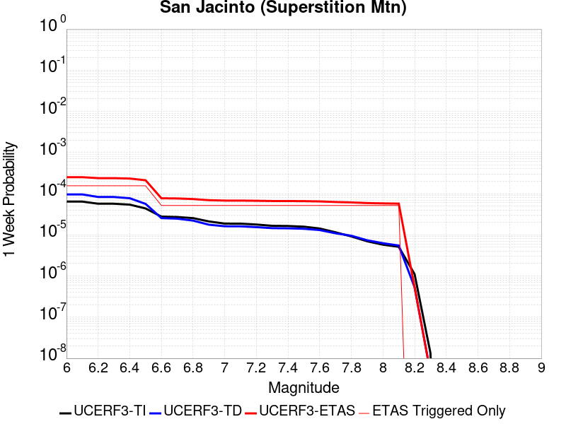 | 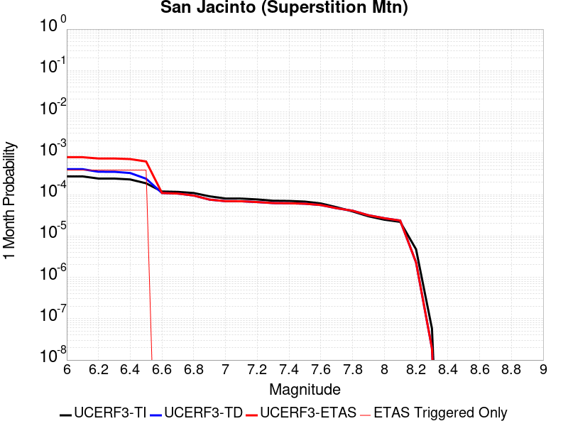 | 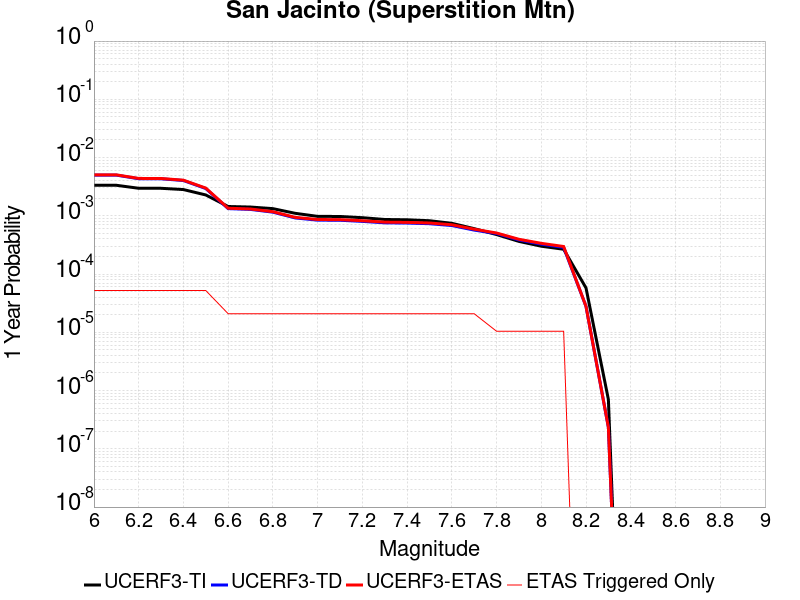 | 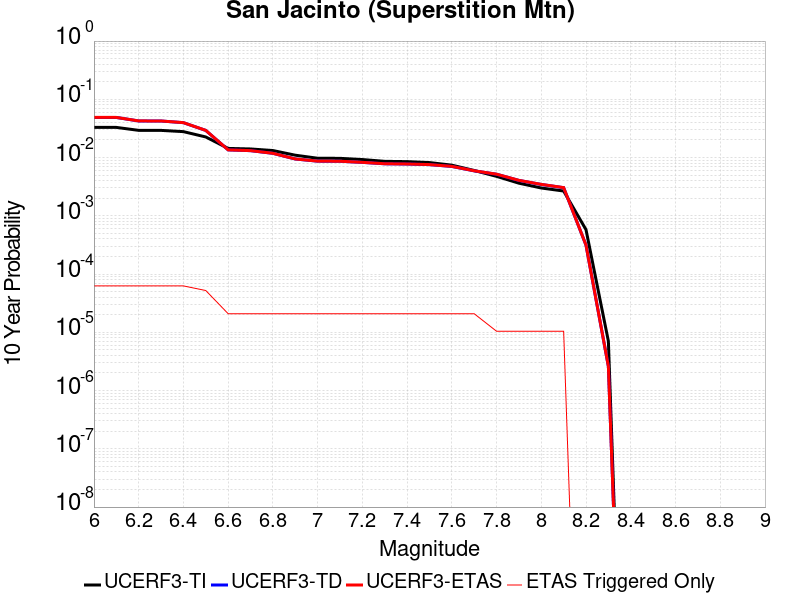 |

| Magnitude | 1 wk TI Prob | 1 wk TD Prob | 1 wk ETAS Prob | 1 wk ETAS/TD Gain | 1 wk ETAS Triggered Only | 1 mo TI Prob | 1 mo TD Prob | 1 mo ETAS Prob | 1 mo ETAS/TD Gain | 1 mo ETAS Triggered Only | 1 yr TI Prob | 1 yr TD Prob | 1 yr ETAS Prob | 1 yr ETAS/TD Gain | 1 yr ETAS Triggered Only | 10 yr TI Prob | 10 yr TD Prob | 10 yr ETAS Prob | 10 yr ETAS/TD Gain | 10 yr ETAS Triggered Only |
|-----|-----|-----|-----|-----|-----|-----|-----|-----|-----|-----|-----|-----|-----|-----|-----|-----|-----|-----|-----|-----|
| 6.0 | 6.4193904E-5 | 9.599367E-5 | 1.272984E-4 | 1.3261123 | 3.1307725E-5 | 2.7508775E-4 | 4.1134638E-4 | 4.426412E-4 | 1.076079 | 3.1307725E-5 | 0.0033440501 | 0.0049980893 | 0.005050008 | 1.0103877 | 5.217954E-5 | 0.03294174 | 0.048823986 | 0.048883542 | 1.0012199 | 6.261545E-5 |
| 6.1 | 6.4193904E-5 | 9.599367E-5 | 1.272984E-4 | 1.3261123 | 3.1307725E-5 | 2.7508775E-4 | 4.1134638E-4 | 4.426412E-4 | 1.076079 | 3.1307725E-5 | 0.0033440501 | 0.0049980893 | 0.005050008 | 1.0103877 | 5.217954E-5 | 0.03294174 | 0.048823986 | 0.048883542 | 1.0012199 | 6.261545E-5 |
| 6.2 | 5.7023593E-5 | 8.3144434E-5 | 1.14449555E-4 | 1.3765149 | 3.1307725E-5 | 2.4436394E-4 | 3.5629404E-4 | 3.8759058E-4 | 1.0878391 | 3.1307725E-5 | 0.002971072 | 0.0043308944 | 0.004382848 | 1.011996 | 5.217954E-5 | 0.029316625 | 0.04250403 | 0.042563982 | 1.0014106 | 6.261545E-5 |
| 6.3 | 5.6940098E-5 | 8.298979E-5 | 1.1429492E-4 | 1.3772166 | 3.1307725E-5 | 2.4400617E-4 | 3.5563146E-4 | 3.8692806E-4 | 1.0880029 | 3.1307725E-5 | 0.002966728 | 0.00432286 | 0.0043748138 | 1.0120184 | 5.217954E-5 | 0.029274331 | 0.042427283 | 0.04248724 | 1.0014132 | 6.261545E-5 |
| 6.4 | 5.4171585E-5 | 7.7483564E-5 | 1.0878886E-4 | 1.4040251 | 3.1307725E-5 | 2.3214328E-4 | 3.3203943E-4 | 3.6333676E-4 | 1.0942578 | 3.1307725E-5 | 0.0028226813 | 0.0040367353 | 0.004088704 | 1.012874 | 5.217954E-5 | 0.02787096 | 0.03971653 | 0.03977666 | 1.001514 | 6.261545E-5 |
| 6.5 | 4.375144E-5 | 5.642133E-5 | 8.772728E-5 | 1.5548604 | 3.1307725E-5 | 1.874927E-4 | 2.4178992E-4 | 2.7309006E-4 | 1.1294519 | 3.1307725E-5 | 0.0022803338 | 0.002940994 | 0.00299302 | 1.01769 | 5.217954E-5 | 0.022570757 | 0.029236801 | 0.029287456 | 1.0017326 | 5.217954E-5 |
| 6.6 | 2.772192E-5 | 2.5488358E-5 | 3.5924E-5 | 1.4094278 | 1.0435908E-5 | 1.1880282E-4 | 1.09231354E-4 | 1.1966612E-4 | 1.0955291 | 1.0435908E-5 | 0.0014454646 | 0.0013290998 | 0.0013499438 | 1.0156828 | 2.0871816E-5 | 0.014360986 | 0.01354049 | 0.013561079 | 1.0015205 | 2.0871816E-5 |
| 6.7 | 2.7124124E-5 | 2.4699386E-5 | 3.5135035E-5 | 1.4225065 | 1.0435908E-5 | 1.1624106E-4 | 1.05850326E-4 | 1.1628513E-4 | 1.0985807 | 1.0435908E-5 | 0.0014143161 | 0.001287985 | 0.00130883 | 1.0161841 | 2.0871816E-5 | 0.014053487 | 0.013133943 | 0.013154541 | 1.0015683 | 2.0871816E-5 |
| 6.8 | 2.5475807E-5 | 2.216446E-5 | 3.2600135E-5 | 1.4708292 | 1.0435908E-5 | 1.0917746E-4 | 9.4987154E-5 | 1.0542207E-4 | 1.1098561 | 1.0435908E-5 | 0.001328425 | 0.001155867 | 0.0011767147 | 1.0180364 | 2.0871816E-5 | 0.0132051185 | 0.011822182 | 0.011842807 | 1.0017446 | 2.0871816E-5 |
| 6.9 | 2.1162023E-5 | 1.7626244E-5 | 2.8061968E-5 | 1.592056 | 1.0435908E-5 | 9.069123E-5 | 7.5538876E-5 | 8.5973996E-5 | 1.1381423 | 1.0435908E-5 | 0.0011036064 | 9.193016E-4 | 9.401542E-4 | 1.0226831 | 2.0871816E-5 | 0.010981417 | 0.00944688 | 0.009467554 | 1.0021886 | 2.0871816E-5 |
| 7.0 | 1.8754288E-5 | 1.6161559E-5 | 2.6597298E-5 | 1.6457137 | 1.0435908E-5 | 8.037304E-5 | 6.9261994E-5 | 7.969718E-5 | 1.1506625 | 1.0435908E-5 | 9.781026E-4 | 8.4294105E-4 | 8.637953E-4 | 1.0247399 | 2.0871816E-5 | 0.009738087 | 0.008670042 | 0.0086907325 | 1.0023865 | 2.0871816E-5 |
| 7.1 | 1.8678527E-5 | 1.6086702E-5 | 2.652244E-5 | 1.6487185 | 1.0435908E-5 | 8.0048376E-5 | 6.89412E-5 | 7.937638E-5 | 1.1513636 | 1.0435908E-5 | 9.7415317E-4 | 8.3903834E-4 | 8.5989264E-4 | 1.024855 | 2.0871816E-5 | 0.009698939 | 0.008630998 | 0.00865169 | 1.0023974 | 2.0871816E-5 |
| 7.2 | 1.7804578E-5 | 1.5381282E-5 | 2.5817028E-5 | 1.6784706 | 1.0435908E-5 | 7.6303106E-5 | 6.5918124E-5 | 7.635334E-5 | 1.1583058 | 1.0435908E-5 | 9.285943E-4 | 8.022599E-4 | 8.2311494E-4 | 1.0259954 | 2.0871816E-5 | 0.009247236 | 0.008262311 | 0.008283011 | 1.0025053 | 2.0871816E-5 |
| 7.3 | 1.6583685E-5 | 1.4530388E-5 | 2.4966144E-5 | 1.7182021 | 1.0435908E-5 | 7.1070994E-5 | 6.227162E-5 | 7.270688E-5 | 1.1675764 | 1.0435908E-5 | 8.649459E-4 | 7.5789524E-4 | 7.787512E-4 | 1.0275183 | 2.0871816E-5 | 0.00861587 | 0.007817623 | 0.007838332 | 1.002649 | 2.0871816E-5 |
| 7.4 | 1.6387552E-5 | 1.4395274E-5 | 2.4831032E-5 | 1.7249433 | 1.0435908E-5 | 7.023047E-5 | 6.169258E-5 | 7.212785E-5 | 1.1691494 | 1.0435908E-5 | 8.5472054E-4 | 7.5085036E-4 | 7.717065E-4 | 1.0277767 | 2.0871816E-5 | 0.008514405 | 0.0077470057 | 0.007767716 | 1.0026733 | 2.0871816E-5 |
| 7.5 | 1.5790754E-5 | 1.4035962E-5 | 2.4471723E-5 | 1.7435017 | 1.0435908E-5 | 6.767291E-5 | 6.0152746E-5 | 7.058802E-5 | 1.1734797 | 1.0435908E-5 | 8.236062E-4 | 7.321156E-4 | 7.529721E-4 | 1.028488 | 2.0871816E-5 | 0.008205604 | 0.007557569 | 0.007578283 | 1.0027409 | 2.0871816E-5 |
| 7.6 | 1.4248672E-5 | 1.3054932E-5 | 2.3490704E-5 | 1.7993739 | 1.0435908E-5 | 6.106431E-5 | 5.594852E-5 | 6.6383844E-5 | 1.1865165 | 1.0435908E-5 | 7.432043E-4 | 6.8096205E-4 | 7.0181966E-4 | 1.0306296 | 2.0871816E-5 | 0.007407237 | 0.0070401574 | 0.007060882 | 1.0029438 | 2.0871816E-5 |
| 7.7 | 1.15449975E-5 | 1.090368E-5 | 2.1339474E-5 | 1.9570892 | 1.0435908E-5 | 4.947762E-5 | 4.6729223E-5 | 5.716464E-5 | 1.2233168 | 1.0435908E-5 | 6.022235E-4 | 5.687805E-4 | 5.8964046E-4 | 1.0366749 | 2.0871816E-5 | 0.006005941 | 0.0059101824 | 0.005930931 | 1.0035106 | 2.0871816E-5 |
| 7.8 | 9.1391985E-6 | 9.514299E-6 | 1.9950106E-5 | 2.0968552 | 1.0435908E-5 | 3.9167408E-5 | 4.0774932E-5 | 5.1210412E-5 | 1.2559289 | 1.0435908E-5 | 4.767588E-4 | 4.963223E-4 | 5.0675304E-4 | 1.021016 | 1.0435908E-5 | 0.0047573727 | 0.0051766867 | 0.0051870686 | 1.0020055 | 1.0435908E-5 |
| 7.9 | 6.973017E-6 | 7.3821784E-6 | 1.7818009E-5 | 2.413652 | 1.0435908E-5 | 2.9884017E-5 | 3.1637526E-5 | 4.2073105E-5 | 1.329848 | 1.0435908E-5 | 3.6377716E-4 | 3.8511935E-4 | 3.9555124E-4 | 1.0270875 | 1.0435908E-5 | 0.0036318225 | 0.0040517948 | 0.0040621883 | 1.0025651 | 1.0435908E-5 |
| 8.0 | 5.7638235E-6 | 6.259972E-6 | 1.6695814E-5 | 2.667075 | 1.0435908E-5 | 2.4701867E-5 | 2.6828178E-5 | 3.7263806E-5 | 1.3889802 | 1.0435908E-5 | 3.0070372E-4 | 3.2658462E-4 | 3.3701712E-4 | 1.0319443 | 1.0435908E-5 | 0.0030029714 | 0.0034534496 | 0.0034638494 | 1.0030115 | 1.0435908E-5 |
| 8.1 | 5.1124434E-6 | 5.4956718E-6 | 1.5931522E-5 | 2.8989217 | 1.0435908E-5 | 2.1910288E-5 | 2.355267E-5 | 3.398833E-5 | 1.4430777 | 1.0435908E-5 | 2.6672508E-4 | 2.867165E-4 | 2.971494E-4 | 1.0363876 | 1.0435908E-5 | 0.0026640517 | 0.003040336 | 0.0030507403 | 1.003422 | 1.0435908E-5 |
| 8.2 | 1.1075938E-6 | 5.336568E-7 | 5.336568E-7 | 1.0 | 0.0 | 4.7468216E-6 | 2.2870988E-6 | 2.2870988E-6 | 1.0 | 0.0 | 5.779102E-5 | 2.7845093E-5 | 2.7845093E-5 | 1.0 | 0.0 | 5.777599E-4 | 3.1346595E-4 | 3.1346595E-4 | 1.0 | 0.0 |
| 8.3 | 1.3584393E-8 | 4.473836E-9 | 4.473836E-9 | 1.0 | 0.0 | 5.8218827E-8 | 1.9173582E-8 | 1.9173582E-8 | 1.0 | 0.0 | 7.0881396E-7 | 2.3343837E-7 | 2.3343837E-7 | 1.0 | 0.0 | 7.0881174E-6 | 2.6163038E-6 | 2.6163038E-6 | 1.0 | 0.0 |

## Cleghorn
*[(top)](#table-of-contents)*

| 1 Week | 1 Month | 1 Year | 10 Year |
|-----|-----|-----|-----|
|  | 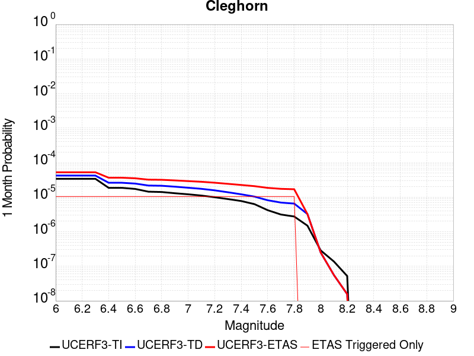 | 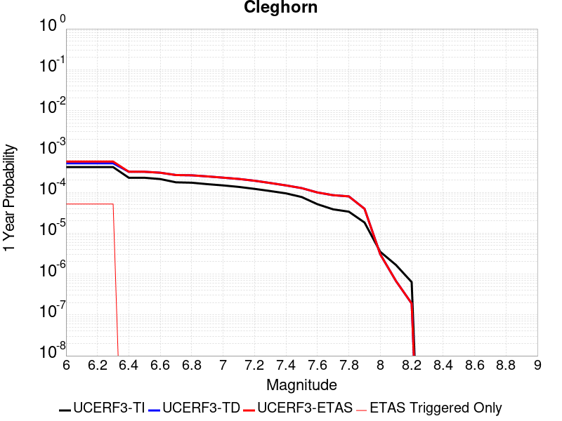 | 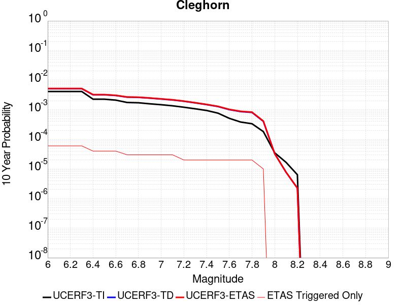 |

| Magnitude | 1 wk TI Prob | 1 wk TD Prob | 1 wk ETAS Prob | 1 wk ETAS/TD Gain | 1 wk ETAS Triggered Only | 1 mo TI Prob | 1 mo TD Prob | 1 mo ETAS Prob | 1 mo ETAS/TD Gain | 1 mo ETAS Triggered Only | 1 yr TI Prob | 1 yr TD Prob | 1 yr ETAS Prob | 1 yr ETAS/TD Gain | 1 yr ETAS Triggered Only | 10 yr TI Prob | 10 yr TD Prob | 10 yr ETAS Prob | 10 yr ETAS/TD Gain | 10 yr ETAS Triggered Only |
|-----|-----|-----|-----|-----|-----|-----|-----|-----|-----|-----|-----|-----|-----|-----|-----|-----|-----|-----|-----|-----|
| 6.0 | 7.9267165E-6 | 9.831582E-6 | 9.831582E-6 | 1.0 | 0.0 | 3.39712E-5 | 4.2134732E-5 | 5.25702E-5 | 1.247669 | 1.0435908E-5 | 4.1352084E-4 | 5.128803E-4 | 5.441719E-4 | 1.0610117 | 3.1307725E-5 | 0.004127522 | 0.0051320773 | 0.005194371 | 1.0121381 | 6.261545E-5 |
| 6.1 | 7.9267165E-6 | 9.831582E-6 | 9.831582E-6 | 1.0 | 0.0 | 3.39712E-5 | 4.2134732E-5 | 5.25702E-5 | 1.247669 | 1.0435908E-5 | 4.1352084E-4 | 5.128803E-4 | 5.441719E-4 | 1.0610117 | 3.1307725E-5 | 0.004127522 | 0.0051320773 | 0.005194371 | 1.0121381 | 6.261545E-5 |
| 6.2 | 7.9267165E-6 | 9.831582E-6 | 9.831582E-6 | 1.0 | 0.0 | 3.39712E-5 | 4.2134732E-5 | 5.25702E-5 | 1.247669 | 1.0435908E-5 | 4.1352084E-4 | 5.128803E-4 | 5.441719E-4 | 1.0610117 | 3.1307725E-5 | 0.004127522 | 0.0051320773 | 0.005194371 | 1.0121381 | 6.261545E-5 |
| 6.3 | 7.9267165E-6 | 9.831582E-6 | 9.831582E-6 | 1.0 | 0.0 | 3.39712E-5 | 4.2134732E-5 | 5.25702E-5 | 1.247669 | 1.0435908E-5 | 4.1352084E-4 | 5.128803E-4 | 5.441719E-4 | 1.0610117 | 3.1307725E-5 | 0.004127522 | 0.0051320773 | 0.005194371 | 1.0121381 | 6.261545E-5 |
| 6.4 | 4.3445207E-6 | 6.0914435E-6 | 6.0914435E-6 | 1.0 | 0.0 | 1.8619241E-5 | 2.610593E-5 | 3.6541565E-5 | 1.3997419 | 1.0435908E-5 | 2.2666567E-4 | 3.1779436E-4 | 3.3865953E-4 | 1.0656562 | 2.0871816E-5 | 0.0022643462 | 0.0031875873 | 0.0032291978 | 1.0130539 | 4.174363E-5 |
| 6.5 | 4.3445207E-6 | 6.0914435E-6 | 6.0914435E-6 | 1.0 | 0.0 | 1.8619241E-5 | 2.610593E-5 | 3.6541565E-5 | 1.3997419 | 1.0435908E-5 | 2.2666567E-4 | 3.1779436E-4 | 3.3865953E-4 | 1.0656562 | 2.0871816E-5 | 0.0022643462 | 0.0031875873 | 0.0032291978 | 1.0130539 | 4.174363E-5 |
| 6.6 | 4.040109E-6 | 5.773851E-6 | 5.773851E-6 | 1.0 | 0.0 | 1.7314638E-5 | 2.4744846E-5 | 3.5180496E-5 | 1.4217302 | 1.0435908E-5 | 2.1078532E-4 | 3.012278E-4 | 3.220933E-4 | 1.0692682 | 2.0871816E-5 | 0.002105855 | 0.003022377 | 0.0030639945 | 1.0137697 | 4.174363E-5 |
| 6.7 | 3.3632055E-6 | 5.067348E-6 | 5.067348E-6 | 1.0 | 0.0 | 1.4413658E-5 | 2.1717027E-5 | 3.2152708E-5 | 1.4805299 | 1.0435908E-5 | 1.7547216E-4 | 2.6437303E-4 | 2.8523934E-4 | 1.0789275 | 2.0871816E-5 | 0.0017533366 | 0.0026547113 | 0.0026859357 | 1.0117619 | 3.1307725E-5 |
| 6.8 | 3.2902772E-6 | 4.9892556E-6 | 4.9892556E-6 | 1.0 | 0.0 | 1.4101111E-5 | 2.1382351E-5 | 3.1818035E-5 | 1.4880513 | 1.0435908E-5 | 1.716675E-4 | 2.6029933E-4 | 2.8116573E-4 | 1.080163 | 2.0871816E-5 | 0.0017153495 | 0.0026140702 | 0.002645296 | 1.0119454 | 3.1307725E-5 |
| 6.9 | 3.031547E-6 | 4.6910186E-6 | 4.6910186E-6 | 1.0 | 0.0 | 1.299228E-5 | 2.0104211E-5 | 3.0539908E-5 | 1.5190802 | 1.0435908E-5 | 1.5816953E-4 | 2.4474156E-4 | 2.6560825E-4 | 1.0852602 | 2.0871816E-5 | 0.00158057 | 0.0024588439 | 0.0024900746 | 1.0127014 | 3.1307725E-5 |
| 7.0 | 2.8259715E-6 | 4.3705895E-6 | 4.3705895E-6 | 1.0 | 0.0 | 1.211125E-5 | 1.8730963E-5 | 2.9166677E-5 | 1.557137 | 1.0435908E-5 | 1.4744449E-4 | 2.2802586E-4 | 2.488929E-4 | 1.0915118 | 2.0871816E-5 | 0.001473467 | 0.0022920412 | 0.002323277 | 1.013628 | 3.1307725E-5 |
| 7.1 | 2.5962665E-6 | 4.0658106E-6 | 4.0658106E-6 | 1.0 | 0.0 | 1.1126809E-5 | 1.7424789E-5 | 2.7860515E-5 | 1.5989012 | 1.0435908E-5 | 1.3546048E-4 | 2.1212637E-4 | 2.3299376E-4 | 1.0983725 | 2.0871816E-5 | 0.0013537793 | 0.002133366 | 0.002164607 | 1.0146439 | 3.1307725E-5 |
| 7.2 | 2.3247253E-6 | 3.6763672E-6 | 3.6763672E-6 | 1.0 | 0.0 | 9.96307E-6 | 1.5755764E-5 | 2.6191508E-5 | 1.6623445 | 1.0435908E-5 | 1.21293626E-4 | 1.9180974E-4 | 2.1267755E-4 | 1.1087943 | 2.0871816E-5 | 0.0012122744 | 0.0019305905 | 0.001951422 | 1.0107902 | 2.0871816E-5 |
| 7.3 | 2.056928E-6 | 3.2350938E-6 | 3.2350938E-6 | 1.0 | 0.0 | 8.815376E-6 | 1.3864615E-5 | 2.4300378E-5 | 1.7526904 | 1.0435908E-5 | 1.0732192E-4 | 1.6878877E-4 | 1.8965706E-4 | 1.1236355 | 2.0871816E-5 | 0.001072701 | 0.0017008206 | 0.001721657 | 1.0122508 | 2.0871816E-5 |
| 7.4 | 1.8055999E-6 | 2.8255042E-6 | 2.8255042E-6 | 1.0 | 0.0 | 7.738263E-6 | 1.2109249E-5 | 2.254503E-5 | 1.8618026 | 1.0435908E-5 | 9.4209274E-5 | 1.4742027E-4 | 1.68289E-4 | 1.1415595 | 2.0871816E-5 | 9.4169343E-4 | 0.0014875771 | 0.0015084179 | 1.0140098 | 2.0871816E-5 |
| 7.5 | 1.4683443E-6 | 2.4247483E-6 | 2.4247483E-6 | 1.0 | 0.0 | 6.292889E-6 | 1.0391738E-5 | 2.0827538E-5 | 2.00424 | 1.0435908E-5 | 7.661323E-5 | 1.2651215E-4 | 1.4738133E-4 | 1.1649579 | 2.0871816E-5 | 7.658682E-4 | 0.0012787961 | 0.0012996413 | 1.0163006 | 2.0871816E-5 |
| 7.6 | 9.804088E-7 | 1.900266E-6 | 1.900266E-6 | 1.0 | 0.0 | 4.201745E-6 | 8.143972E-6 | 1.8579794E-5 | 2.281417 | 1.0435908E-5 | 5.1155046E-5 | 9.91484E-5 | 1.2001814E-4 | 1.21049 | 2.0871816E-5 | 5.114327E-4 | 0.001005471 | 0.0010263219 | 1.0207374 | 2.0871816E-5 |
| 7.7 | 7.3434086E-7 | 1.6284146E-6 | 1.6284146E-6 | 1.0 | 0.0 | 3.1471714E-6 | 6.978901E-6 | 1.7414735E-5 | 2.4953408 | 1.0435908E-5 | 3.831614E-5 | 8.4964835E-5 | 1.0583488E-4 | 1.2456316 | 2.0871816E-5 | 3.8309532E-4 | 8.6378685E-4 | 8.846406E-4 | 1.0241423 | 2.0871816E-5 |
| 7.8 | 6.434184E-7 | 1.5220047E-6 | 1.5220047E-6 | 1.0 | 0.0 | 2.7575045E-6 | 6.5228614E-6 | 1.6958702E-5 | 2.599887 | 1.0435908E-5 | 3.35721E-5 | 7.941297E-5 | 1.0028313E-4 | 1.2628055 | 2.0871816E-5 | 3.3567028E-4 | 8.079678E-4 | 8.288228E-4 | 1.0258116 | 2.0871816E-5 |
| 7.9 | 3.4943926E-7 | 7.574459E-7 | 7.574459E-7 | 1.0 | 0.0 | 1.497596E-6 | 3.2461926E-6 | 3.2461926E-6 | 1.0 | 0.0 | 1.8233079E-5 | 3.952169E-5 | 4.9957183E-5 | 1.2640448 | 1.0435908E-5 | 1.8231584E-4 | 4.040099E-4 | 4.144416E-4 | 1.0258204 | 1.0435908E-5 |
| 8.0 | 6.717524E-8 | 5.838828E-8 | 5.838828E-8 | 1.0 | 0.0 | 2.8789387E-7 | 2.5023547E-7 | 2.5023547E-7 | 1.0 | 0.0 | 3.505102E-6 | 3.0466126E-6 | 3.0466126E-6 | 1.0 | 0.0 | 3.5050467E-5 | 3.273506E-5 | 3.273506E-5 | 1.0 | 0.0 |
| 8.1 | 3.1984914E-8 | 1.2956093E-8 | 1.2956093E-8 | 1.0 | 0.0 | 1.370782E-7 | 5.552611E-8 | 5.552611E-8 | 1.0 | 0.0 | 1.6689258E-6 | 6.760302E-7 | 6.760302E-7 | 1.0 | 0.0 | 1.6689133E-5 | 7.74454E-6 | 7.74454E-6 | 1.0 | 0.0 |
| 8.2 | 1.21887656E-8 | 3.6495305E-9 | 3.6495305E-9 | 1.0 | 0.0 | 5.2237567E-8 | 1.5640845E-8 | 1.5640845E-8 | 1.0 | 0.0 | 6.359922E-7 | 1.9042727E-7 | 1.9042727E-7 | 1.0 | 0.0 | 6.3599036E-6 | 2.2470974E-6 | 2.2470974E-6 | 1.0 | 0.0 |

## Pine Mtn
*[(top)](#table-of-contents)*

| 1 Week | 1 Month | 1 Year | 10 Year |
|-----|-----|-----|-----|
| 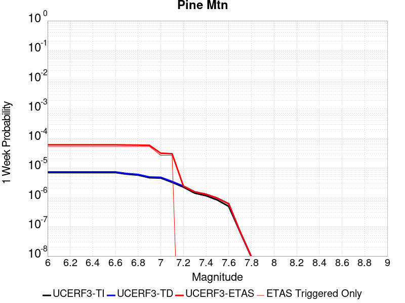 | 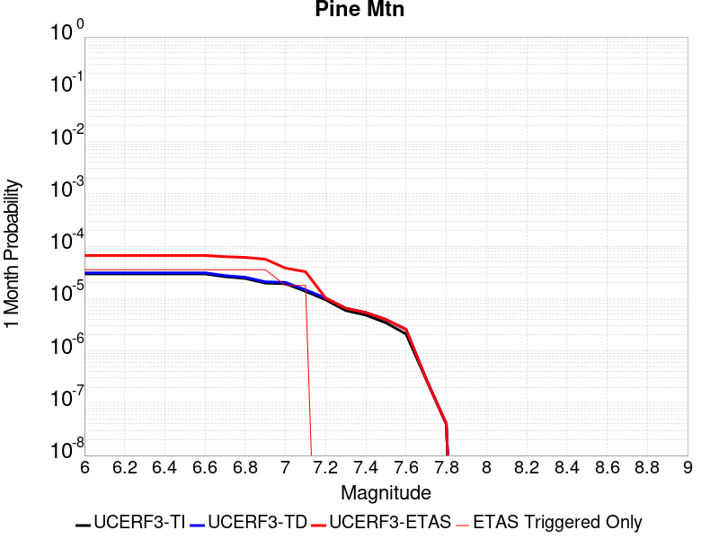 | 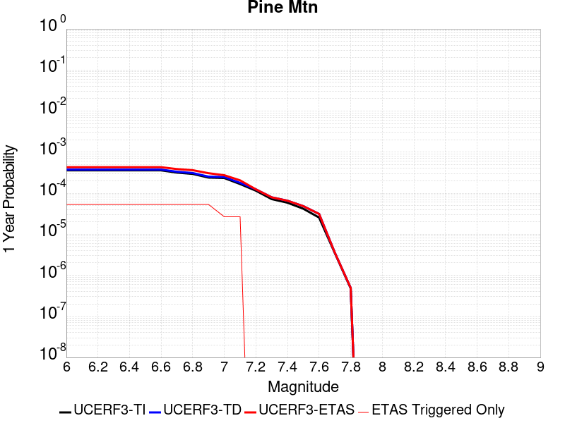 | 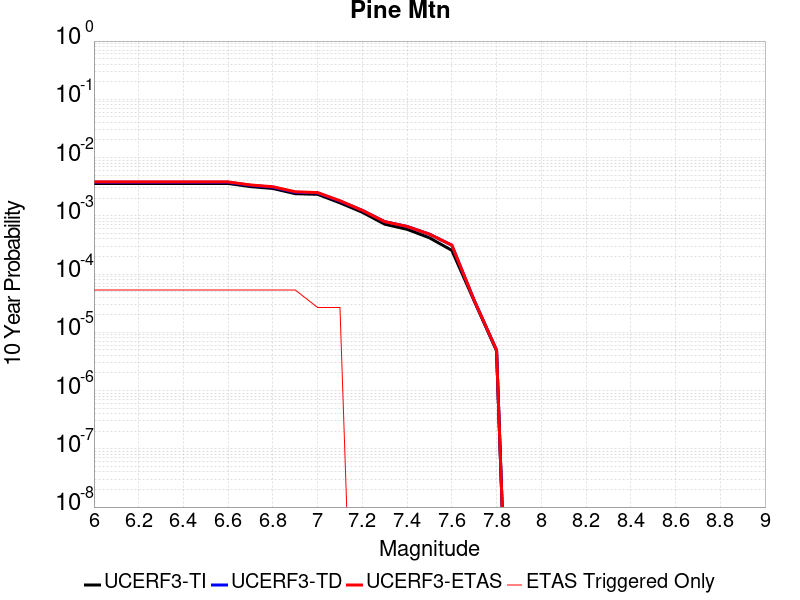 |

| Magnitude | 1 wk TI Prob | 1 wk TD Prob | 1 wk ETAS Prob | 1 wk ETAS/TD Gain | 1 wk ETAS Triggered Only | 1 mo TI Prob | 1 mo TD Prob | 1 mo ETAS Prob | 1 mo ETAS/TD Gain | 1 mo ETAS Triggered Only | 1 yr TI Prob | 1 yr TD Prob | 1 yr ETAS Prob | 1 yr ETAS/TD Gain | 1 yr ETAS Triggered Only | 10 yr TI Prob | 10 yr TD Prob | 10 yr ETAS Prob | 10 yr ETAS/TD Gain | 10 yr ETAS Triggered Only |
|-----|-----|-----|-----|-----|-----|-----|-----|-----|-----|-----|-----|-----|-----|-----|-----|-----|-----|-----|-----|-----|
| 6.0 | 6.894797E-6 | 7.225461E-6 | 2.8097125E-5 | 3.8886273 | 2.0871816E-5 | 2.9548795E-5 | 3.096591E-5 | 5.183708E-5 | 1.6740047 | 2.0871816E-5 | 3.596972E-4 | 3.7694772E-4 | 4.0824365E-4 | 1.0830246 | 3.1307725E-5 | 0.0035911554 | 0.003763381 | 0.003815364 | 1.0138129 | 5.217954E-5 |
| 6.1 | 6.894797E-6 | 7.225461E-6 | 2.8097125E-5 | 3.8886273 | 2.0871816E-5 | 2.9548795E-5 | 3.096591E-5 | 5.183708E-5 | 1.6740047 | 2.0871816E-5 | 3.596972E-4 | 3.7694772E-4 | 4.0824365E-4 | 1.0830246 | 3.1307725E-5 | 0.0035911554 | 0.003763381 | 0.003815364 | 1.0138129 | 5.217954E-5 |
| 6.2 | 6.894797E-6 | 7.225461E-6 | 2.8097125E-5 | 3.8886273 | 2.0871816E-5 | 2.9548795E-5 | 3.096591E-5 | 5.183708E-5 | 1.6740047 | 2.0871816E-5 | 3.596972E-4 | 3.7694772E-4 | 4.0824365E-4 | 1.0830246 | 3.1307725E-5 | 0.0035911554 | 0.003763381 | 0.003815364 | 1.0138129 | 5.217954E-5 |
| 6.3 | 6.894797E-6 | 7.225461E-6 | 2.8097125E-5 | 3.8886273 | 2.0871816E-5 | 2.9548795E-5 | 3.096591E-5 | 5.183708E-5 | 1.6740047 | 2.0871816E-5 | 3.596972E-4 | 3.7694772E-4 | 4.0824365E-4 | 1.0830246 | 3.1307725E-5 | 0.0035911554 | 0.003763381 | 0.003815364 | 1.0138129 | 5.217954E-5 |
| 6.4 | 6.894797E-6 | 7.225461E-6 | 2.8097125E-5 | 3.8886273 | 2.0871816E-5 | 2.9548795E-5 | 3.096591E-5 | 5.183708E-5 | 1.6740047 | 2.0871816E-5 | 3.596972E-4 | 3.7694772E-4 | 4.0824365E-4 | 1.0830246 | 3.1307725E-5 | 0.0035911554 | 0.003763381 | 0.003815364 | 1.0138129 | 5.217954E-5 |
| 6.5 | 6.894797E-6 | 7.225461E-6 | 2.8097125E-5 | 3.8886273 | 2.0871816E-5 | 2.9548795E-5 | 3.096591E-5 | 5.183708E-5 | 1.6740047 | 2.0871816E-5 | 3.596972E-4 | 3.7694772E-4 | 4.0824365E-4 | 1.0830246 | 3.1307725E-5 | 0.0035911554 | 0.003763381 | 0.003815364 | 1.0138129 | 5.217954E-5 |
| 6.6 | 6.894797E-6 | 7.225461E-6 | 2.8097125E-5 | 3.8886273 | 2.0871816E-5 | 2.9548795E-5 | 3.096591E-5 | 5.183708E-5 | 1.6740047 | 2.0871816E-5 | 3.596972E-4 | 3.7694772E-4 | 4.0824365E-4 | 1.0830246 | 3.1307725E-5 | 0.0035911554 | 0.003763381 | 0.003815364 | 1.0138129 | 5.217954E-5 |
| 6.7 | 6.0867933E-6 | 6.3971133E-6 | 2.7268796E-5 | 4.262672 | 2.0871816E-5 | 2.6085996E-5 | 2.7415923E-5 | 4.8287166E-5 | 1.7612818 | 2.0871816E-5 | 3.1755073E-4 | 3.3373994E-4 | 3.650372E-4 | 1.0937774 | 3.1307725E-5 | 0.0031709734 | 0.0033326065 | 0.003374211 | 1.0124841 | 4.174363E-5 |
| 6.8 | 5.6530425E-6 | 5.9505956E-6 | 2.6822287E-5 | 4.5074964 | 2.0871816E-5 | 2.42271E-5 | 2.5502315E-5 | 4.63736E-5 | 1.8184074 | 2.0871816E-5 | 2.94925E-4 | 3.104485E-4 | 3.417465E-4 | 1.1008154 | 3.1307725E-5 | 0.002945339 | 0.0031003528 | 0.003141967 | 1.0134224 | 4.174363E-5 |
| 6.9 | 4.6015225E-6 | 4.863834E-6 | 2.5735548E-5 | 5.291206 | 2.0871816E-5 | 1.9720663E-5 | 2.0844845E-5 | 4.1716226E-5 | 2.001273 | 2.0871816E-5 | 2.4007261E-4 | 2.5375787E-4 | 2.8505767E-4 | 1.123345 | 3.1307725E-5 | 0.0023981342 | 0.0025348254 | 0.0025764632 | 1.0164263 | 4.174363E-5 |
| 7.0 | 4.4875965E-6 | 4.747473E-6 | 1.5183331E-5 | 3.1981921 | 1.0435908E-5 | 1.9232413E-5 | 2.0346162E-5 | 3.078186E-5 | 1.5129073 | 1.0435908E-5 | 2.3412947E-4 | 2.4768783E-4 | 2.6855446E-4 | 1.0842458 | 2.0871816E-5 | 0.0023388295 | 0.0024742614 | 0.0024950816 | 1.0084147 | 2.0871816E-5 |
| 7.1 | 3.203907E-6 | 3.4294096E-6 | 1.3865281E-5 | 4.043052 | 1.0435908E-5 | 1.3730958E-5 | 1.4697391E-5 | 2.5133146E-5 | 1.7100413 | 1.0435908E-5 | 1.6716159E-4 | 1.789267E-4 | 1.9979478E-4 | 1.1166292 | 2.0871816E-5 | 0.0016703589 | 0.0017878925 | 0.001808727 | 1.0116531 | 2.0871816E-5 |
| 7.2 | 2.2060601E-6 | 2.3784817E-6 | 2.3784817E-6 | 1.0 | 0.0 | 9.4545085E-6 | 1.0193455E-5 | 1.0193455E-5 | 1.0 | 0.0 | 1.15102564E-4 | 1.240987E-4 | 1.240987E-4 | 1.0 | 0.0 | 0.0011504296 | 0.0012403389 | 0.0012403389 | 1.0 | 0.0 |
| 7.3 | 1.3765207E-6 | 1.5216481E-6 | 1.5216481E-6 | 1.0 | 0.0 | 5.899361E-6 | 6.521333E-6 | 6.521333E-6 | 1.0 | 0.0 | 7.182235E-5 | 7.939443E-5 | 7.939443E-5 | 1.0 | 0.0 | 7.1799144E-4 | 7.936697E-4 | 7.936697E-4 | 1.0 | 0.0 |
| 7.4 | 1.1245983E-6 | 1.2587075E-6 | 1.2587075E-6 | 1.0 | 0.0 | 4.819698E-6 | 5.39445E-6 | 5.39445E-6 | 1.0 | 0.0 | 5.8678244E-5 | 6.567554E-5 | 6.567554E-5 | 1.0 | 0.0 | 5.866275E-4 | 6.5656955E-4 | 6.5656955E-4 | 1.0 | 0.0 |
| 7.5 | 8.031682E-7 | 9.276951E-7 | 9.276951E-7 | 1.0 | 0.0 | 3.4421448E-6 | 3.9758306E-6 | 3.9758306E-6 | 1.0 | 0.0 | 4.1907308E-5 | 4.840473E-5 | 4.840473E-5 | 1.0 | 0.0 | 4.1899405E-4 | 4.8394862E-4 | 4.8394862E-4 | 1.0 | 0.0 |
| 7.6 | 4.8953444E-7 | 6.003009E-7 | 6.003009E-7 | 1.0 | 0.0 | 2.098003E-6 | 2.5727159E-6 | 2.5727159E-6 | 1.0 | 0.0 | 2.5542888E-5 | 3.1322415E-5 | 3.1322415E-5 | 1.0 | 0.0 | 2.5539953E-4 | 3.1318486E-4 | 3.1318486E-4 | 1.0 | 0.0 |
| 7.7 | 6.634529E-8 | 6.788826E-8 | 6.788826E-8 | 1.0 | 0.0 | 2.843369E-7 | 2.9094966E-7 | 2.9094966E-7 | 1.0 | 0.0 | 3.4617963E-6 | 3.5423066E-6 | 3.5423066E-6 | 1.0 | 0.0 | 3.4617424E-5 | 3.542255E-5 | 3.542255E-5 | 1.0 | 0.0 |
| 7.8 | 9.235578E-9 | 9.488566E-9 | 9.488566E-9 | 1.0 | 0.0 | 3.9581046E-8 | 4.0665284E-8 | 4.0665284E-8 | 1.0 | 0.0 | 4.818991E-7 | 4.950997E-7 | 4.950997E-7 | 1.0 | 0.0 | 4.8189804E-6 | 4.950988E-6 | 4.950988E-6 | 1.0 | 0.0 |

## Newport-Inglewood (Offshore)
*[(top)](#table-of-contents)*

| 1 Week | 1 Month | 1 Year | 10 Year |
|-----|-----|-----|-----|
| 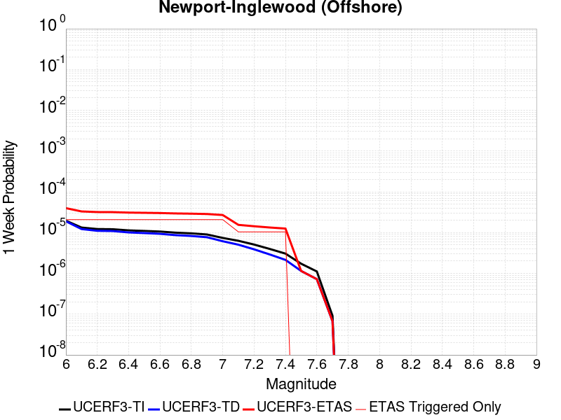 | 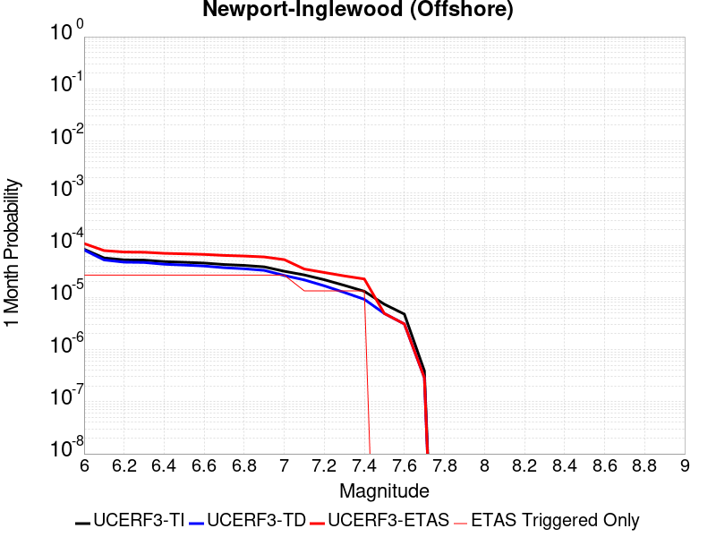 | 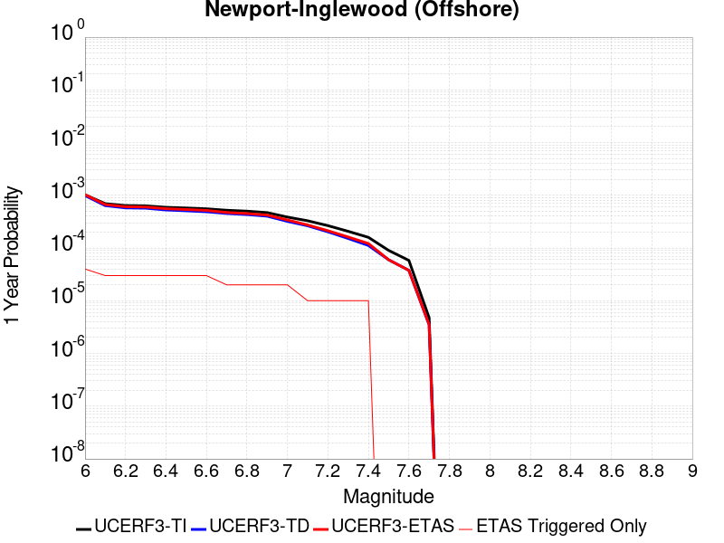 | 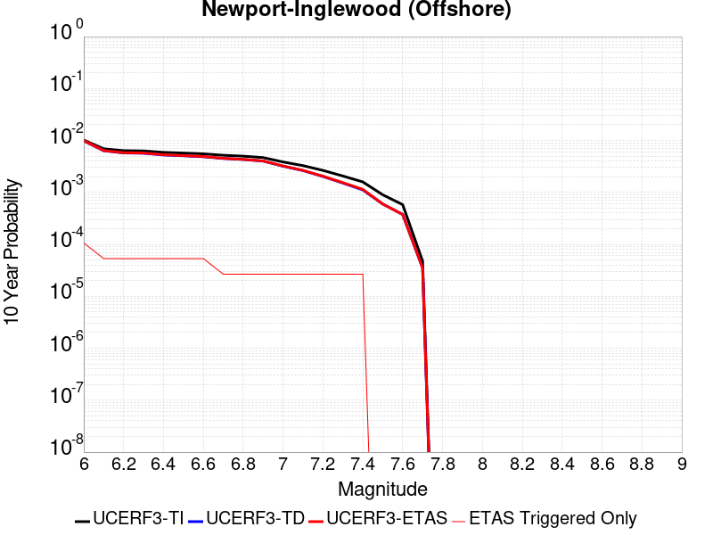 |

| Magnitude | 1 wk TI Prob | 1 wk TD Prob | 1 wk ETAS Prob | 1 wk ETAS/TD Gain | 1 wk ETAS Triggered Only | 1 mo TI Prob | 1 mo TD Prob | 1 mo ETAS Prob | 1 mo ETAS/TD Gain | 1 mo ETAS Triggered Only | 1 yr TI Prob | 1 yr TD Prob | 1 yr ETAS Prob | 1 yr ETAS/TD Gain | 1 yr ETAS Triggered Only | 10 yr TI Prob | 10 yr TD Prob | 10 yr ETAS Prob | 10 yr ETAS/TD Gain | 10 yr ETAS Triggered Only |
|-----|-----|-----|-----|-----|-----|-----|-----|-----|-----|-----|-----|-----|-----|-----|-----|-----|-----|-----|-----|-----|
| 6.0 | 1.9626508E-5 | 1.8965357E-5 | 3.9836777E-5 | 2.1005025 | 2.0871816E-5 | 8.411089E-5 | 8.1277634E-5 | 1.0214776E-4 | 1.2567756 | 2.0871816E-5 | 0.001023569 | 9.891186E-4 | 0.0010308209 | 1.0421611 | 4.174363E-5 | 0.010188672 | 0.009848503 | 0.009900169 | 1.005246 | 5.217954E-5 |
| 6.1 | 1.331886E-5 | 1.2218092E-5 | 3.3089655E-5 | 2.7082505 | 2.0871816E-5 | 5.707958E-5 | 5.2362207E-5 | 7.3232935E-5 | 1.3985837 | 2.0871816E-5 | 6.947222E-4 | 6.3732493E-4 | 6.686127E-4 | 1.0490923 | 3.1307725E-5 | 0.006925544 | 0.006355149 | 0.0063862577 | 1.0048951 | 3.1307725E-5 |
| 6.2 | 1.2250852E-5 | 1.1076029E-5 | 3.1947613E-5 | 2.8843923 | 2.0871816E-5 | 5.2502597E-5 | 4.7467838E-5 | 6.833866E-5 | 1.4396834 | 2.0871816E-5 | 6.3903164E-4 | 5.777687E-4 | 6.090583E-4 | 1.054156 | 3.1307725E-5 | 0.006371971 | 0.0057627866 | 0.005793914 | 1.0054015 | 3.1307725E-5 |
| 6.3 | 1.2106258E-5 | 1.0918891E-5 | 3.1790478E-5 | 2.9115117 | 2.0871816E-5 | 5.1882926E-5 | 4.6794412E-5 | 6.766525E-5 | 1.4460113 | 2.0871816E-5 | 6.3149154E-4 | 5.69574E-4 | 6.008639E-4 | 1.0549356 | 3.1307725E-5 | 0.0062970007 | 0.005681259 | 0.005712389 | 1.0054793 | 3.1307725E-5 |
| 6.4 | 1.1348758E-5 | 1.0109362E-5 | 3.0980966E-5 | 3.0645819 | 2.0871816E-5 | 4.8636626E-5 | 4.3325123E-5 | 6.4196036E-5 | 1.4817277 | 2.0871816E-5 | 5.919901E-4 | 5.273565E-4 | 5.586477E-4 | 1.059336 | 3.1307725E-5 | 0.005904155 | 0.0052611465 | 0.0052922894 | 1.0059195 | 3.1307725E-5 |
| 6.5 | 1.100837E-5 | 9.7433895E-6 | 3.0615003E-5 | 3.1421306 | 2.0871816E-5 | 4.7177873E-5 | 4.1756717E-5 | 6.262766E-5 | 1.4998224 | 2.0871816E-5 | 5.7423924E-4 | 5.082702E-4 | 5.39562E-4 | 1.0615653 | 3.1307725E-5 | 0.005727576 | 0.0050711688 | 0.005102318 | 1.0061424 | 3.1307725E-5 |
| 6.6 | 1.0634696E-5 | 9.345544E-6 | 3.0217165E-5 | 3.2333233 | 2.0871816E-5 | 4.557647E-5 | 4.0051716E-5 | 6.09227E-5 | 1.5211008 | 2.0871816E-5 | 5.5475225E-4 | 4.8752132E-4 | 5.188138E-4 | 1.0641868 | 3.1307725E-5 | 0.0055336943 | 0.0048646047 | 0.00489576 | 1.0064045 | 3.1307725E-5 |
| 6.7 | 9.9780855E-6 | 8.667911E-6 | 2.9539546E-5 | 3.40792 | 2.0871816E-5 | 4.276252E-5 | 3.7147664E-5 | 5.8018704E-5 | 1.5618399 | 2.0871816E-5 | 5.205093E-4 | 4.5217964E-4 | 4.7304202E-4 | 1.0461373 | 2.0871816E-5 | 0.0051929182 | 0.004512675 | 0.0045334524 | 1.0046043 | 2.0871816E-5 |
| 6.8 | 9.59546E-6 | 8.27295E-6 | 2.9144594E-5 | 3.5228777 | 2.0871816E-5 | 4.1122752E-5 | 3.5455025E-5 | 5.63261E-5 | 1.5886635 | 2.0871816E-5 | 5.0055445E-4 | 4.315801E-4 | 4.524429E-4 | 1.0483406 | 2.0871816E-5 | 0.004994285 | 0.004307495 | 0.004328277 | 1.0048246 | 2.0871816E-5 |
| 6.9 | 9.000614E-6 | 7.70684E-6 | 2.8578495E-5 | 3.7081988 | 2.0871816E-5 | 3.857349E-5 | 3.30289E-5 | 5.390003E-5 | 1.631905 | 2.0871816E-5 | 4.6953102E-4 | 4.0205332E-4 | 4.2291672E-4 | 1.0518922 | 2.0871816E-5 | 0.004685402 | 0.0040133307 | 0.0040341187 | 1.0051798 | 2.0871816E-5 |
| 7.0 | 7.4070194E-6 | 6.148904E-6 | 2.7020591E-5 | 4.3943753 | 2.0871816E-5 | 3.1743984E-5 | 2.635218E-5 | 4.7223446E-5 | 1.7920128 | 2.0871816E-5 | 3.8641447E-4 | 3.207907E-4 | 3.4165583E-4 | 1.0650427 | 2.0871816E-5 | 0.0038574322 | 0.0032032963 | 0.0032241012 | 1.0064949 | 2.0871816E-5 |
| 7.1 | 6.299615E-6 | 5.0565927E-6 | 1.5492447E-5 | 3.0638115 | 1.0435908E-5 | 2.699807E-5 | 2.1670932E-5 | 3.2106615E-5 | 1.481552 | 1.0435908E-5 | 3.2865192E-4 | 2.638118E-4 | 2.7424496E-4 | 1.0395477 | 1.0435908E-5 | 0.003281663 | 0.002635001 | 0.0026454094 | 1.00395 | 1.0435908E-5 |
| 7.2 | 5.096653E-6 | 3.892769E-6 | 1.4328636E-5 | 3.6808338 | 1.0435908E-5 | 2.1842614E-5 | 1.668319E-5 | 2.7118924E-5 | 1.6255239 | 1.0435908E-5 | 2.6590136E-4 | 2.0309901E-4 | 2.135328E-4 | 1.0513729 | 1.0435908E-5 | 0.0026558342 | 0.0020291451 | 0.00203956 | 1.0051326 | 1.0435908E-5 |
| 7.3 | 3.9753018E-6 | 2.9099103E-6 | 1.3345788E-5 | 4.586323 | 1.0435908E-5 | 1.7036897E-5 | 1.2470985E-5 | 2.2906763E-5 | 1.8368046 | 1.0435908E-5 | 2.0740448E-4 | 1.5182374E-4 | 1.6225806E-4 | 1.0687265 | 1.0435908E-5 | 0.00207211 | 0.0015172083 | 0.0015276283 | 1.0068679 | 1.0435908E-5 |
| 7.4 | 3.0568392E-6 | 2.1449955E-6 | 1.2580881E-5 | 5.865225 | 1.0435908E-5 | 1.3100675E-5 | 9.192806E-6 | 1.9628618E-5 | 2.135215 | 1.0435908E-5 | 1.5948903E-4 | 1.1191672E-4 | 1.2235146E-4 | 1.0932367 | 1.0435908E-5 | 0.0015937461 | 0.0011186098 | 0.0011290341 | 1.009319 | 1.0435908E-5 |
| 7.5 | 1.7279019E-6 | 1.1469883E-6 | 1.1469883E-6 | 1.0 | 0.0 | 7.405273E-6 | 4.915655E-6 | 4.915655E-6 | 1.0 | 0.0 | 9.015547E-5 | 5.9846494E-5 | 5.9846494E-5 | 1.0 | 0.0 | 9.01189E-4 | 5.9830764E-4 | 5.9830764E-4 | 1.0 | 0.0 |
| 7.6 | 1.1156416E-6 | 7.223012E-7 | 7.223012E-7 | 1.0 | 0.0 | 4.7813123E-6 | 3.095573E-6 | 3.095573E-6 | 1.0 | 0.0 | 5.821092E-5 | 3.7687976E-5 | 3.7687976E-5 | 1.0 | 0.0 | 5.8195676E-4 | 3.7681818E-4 | 3.7681818E-4 | 1.0 | 0.0 |
| 7.7 | 9.117973E-8 | 6.734145E-8 | 6.734145E-8 | 1.0 | 0.0 | 3.907702E-7 | 2.886062E-7 | 2.886062E-7 | 1.0 | 0.0 | 4.757617E-6 | 3.513775E-6 | 3.513775E-6 | 1.0 | 0.0 | 4.7575148E-5 | 3.5137225E-5 | 3.5137225E-5 | 1.0 | 0.0 |

## Davis Creek
*[(top)](#table-of-contents)*

| 1 Week | 1 Month | 1 Year | 10 Year |
|-----|-----|-----|-----|
| 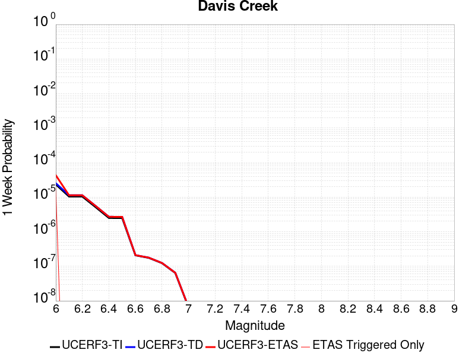 | 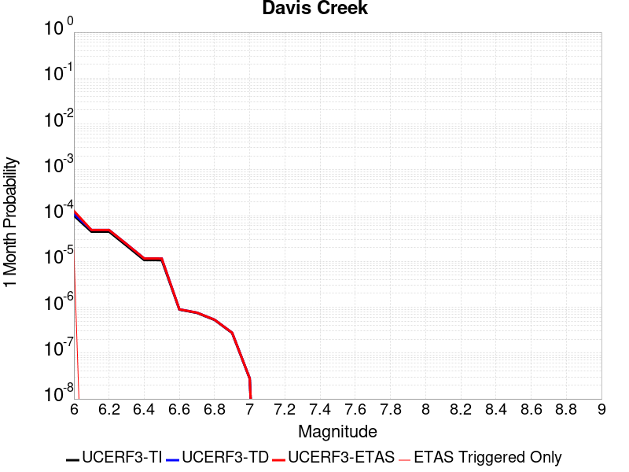 | 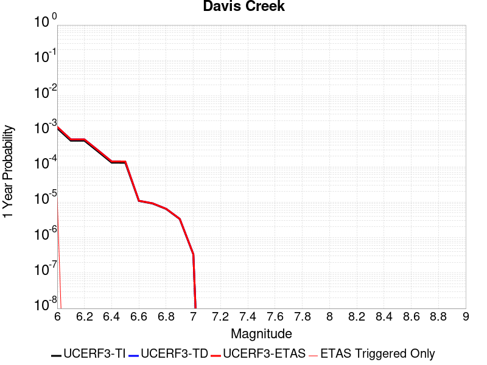 | 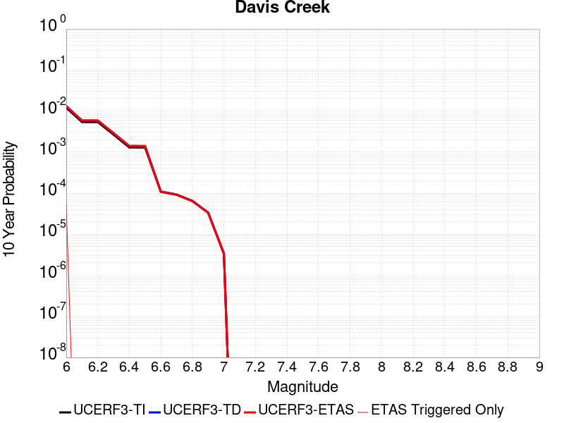 |

| Magnitude | 1 wk TI Prob | 1 wk TD Prob | 1 wk ETAS Prob | 1 wk ETAS/TD Gain | 1 wk ETAS Triggered Only | 1 mo TI Prob | 1 mo TD Prob | 1 mo ETAS Prob | 1 mo ETAS/TD Gain | 1 mo ETAS Triggered Only | 1 yr TI Prob | 1 yr TD Prob | 1 yr ETAS Prob | 1 yr ETAS/TD Gain | 1 yr ETAS Triggered Only | 10 yr TI Prob | 10 yr TD Prob | 10 yr ETAS Prob | 10 yr ETAS/TD Gain | 10 yr ETAS Triggered Only |
|-----|-----|-----|-----|-----|-----|-----|-----|-----|-----|-----|-----|-----|-----|-----|-----|-----|-----|-----|-----|-----|
| 6.0 | 2.331472E-5 | 2.5417214E-5 | 4.62885E-5 | 1.8211477 | 2.0871816E-5 | 9.99164E-5 | 1.0892704E-4 | 1.2979658E-4 | 1.191592 | 2.0871816E-5 | 0.0012158032 | 0.0013254983 | 0.0013463425 | 1.0157255 | 2.0871816E-5 | 0.01209173 | 0.013187704 | 0.013218599 | 1.0023427 | 3.1307725E-5 |
| 6.1 | 1.0407654E-5 | 1.1316986E-5 | 2.1752776E-5 | 1.922135 | 1.0435908E-5 | 4.4603472E-5 | 4.8500624E-5 | 5.8936024E-5 | 1.2151601 | 1.0435908E-5 | 5.4291193E-4 | 5.9036224E-4 | 6.0079194E-4 | 1.0176667 | 1.0435908E-5 | 0.0054158745 | 0.005890611 | 0.00591136 | 1.0035224 | 2.0871816E-5 |
| 6.2 | 1.0407654E-5 | 1.1316986E-5 | 2.1752776E-5 | 1.922135 | 1.0435908E-5 | 4.4603472E-5 | 4.8500624E-5 | 5.8936024E-5 | 1.2151601 | 1.0435908E-5 | 5.4291193E-4 | 5.9036224E-4 | 6.0079194E-4 | 1.0176667 | 1.0435908E-5 | 0.0054158745 | 0.005890611 | 0.00591136 | 1.0035224 | 2.0871816E-5 |
| 6.3 | 5.1323277E-6 | 5.568556E-6 | 1.6004406E-5 | 2.8740675 | 1.0435908E-5 | 2.1995505E-5 | 2.386507E-5 | 3.430073E-5 | 1.4372776 | 1.0435908E-5 | 2.6776237E-4 | 2.905271E-4 | 3.0095997E-4 | 1.0359101 | 1.0435908E-5 | 0.0026743996 | 0.0029023192 | 0.0029231303 | 1.0071706 | 2.0871816E-5 |
| 6.4 | 2.4985154E-6 | 2.704538E-6 | 2.704538E-6 | 1.0 | 0.0 | 1.07078795E-5 | 1.1590847E-5 | 1.1590847E-5 | 1.0 | 0.0 | 1.3036063E-4 | 1.4111304E-4 | 1.4111304E-4 | 1.0 | 0.0 | 0.0013028418 | 0.001410589 | 0.001410589 | 1.0 | 0.0 |
| 6.5 | 2.4846438E-6 | 2.6904722E-6 | 2.6904722E-6 | 1.0 | 0.0 | 1.064843E-5 | 1.1530565E-5 | 1.1530565E-5 | 1.0 | 0.0 | 1.2963692E-4 | 1.403792E-4 | 1.403792E-4 | 1.0 | 0.0 | 0.0012956132 | 0.0014032599 | 0.0014032599 | 1.0 | 0.0 |
| 6.6 | 2.072566E-7 | 2.1018087E-7 | 2.1018087E-7 | 1.0 | 0.0 | 8.882423E-7 | 9.0077486E-7 | 9.0077486E-7 | 1.0 | 0.0 | 1.0814296E-5 | 1.0966881E-5 | 1.0966881E-5 | 1.0 | 0.0 | 1.081377E-4 | 1.09663575E-4 | 1.09663575E-4 | 1.0 | 0.0 |
| 6.7 | 1.7544528E-7 | 1.7790826E-7 | 1.7790826E-7 | 1.0 | 0.0 | 7.5190815E-7 | 7.6246374E-7 | 7.6246374E-7 | 1.0 | 0.0 | 9.154443E-6 | 9.282958E-6 | 9.282958E-6 | 1.0 | 0.0 | 9.1540656E-5 | 9.282586E-5 | 9.282586E-5 | 1.0 | 0.0 |
| 6.8 | 1.2320395E-7 | 1.2481138E-7 | 1.2481138E-7 | 1.0 | 0.0 | 5.280168E-7 | 5.349058E-7 | 5.349058E-7 | 1.0 | 0.0 | 6.428586E-6 | 6.5124595E-6 | 6.5124595E-6 | 1.0 | 0.0 | 6.4284E-5 | 6.5122804E-5 | 6.5122804E-5 | 1.0 | 0.0 |
| 6.9 | 6.399997E-8 | 6.486058E-8 | 6.486058E-8 | 1.0 | 0.0 | 2.7428555E-7 | 2.7797387E-7 | 2.7797387E-7 | 1.0 | 0.0 | 3.3394215E-6 | 3.3843273E-6 | 3.3843273E-6 | 1.0 | 0.0 | 3.3393713E-5 | 3.384282E-5 | 3.384282E-5 | 1.0 | 0.0 |
| 7.0 | 6.4455685E-9 | 6.535264E-9 | 6.535264E-9 | 1.0 | 0.0 | 2.7623864E-8 | 2.8008275E-8 | 2.8008275E-8 | 1.0 | 0.0 | 3.3632048E-7 | 3.4100074E-7 | 3.4100074E-7 | 1.0 | 0.0 | 3.3631998E-6 | 3.4100074E-6 | 3.4100074E-6 | 1.0 | 0.0 |

## San Diego Trough south
*[(top)](#table-of-contents)*

| 1 Week | 1 Month | 1 Year | 10 Year |
|-----|-----|-----|-----|
| 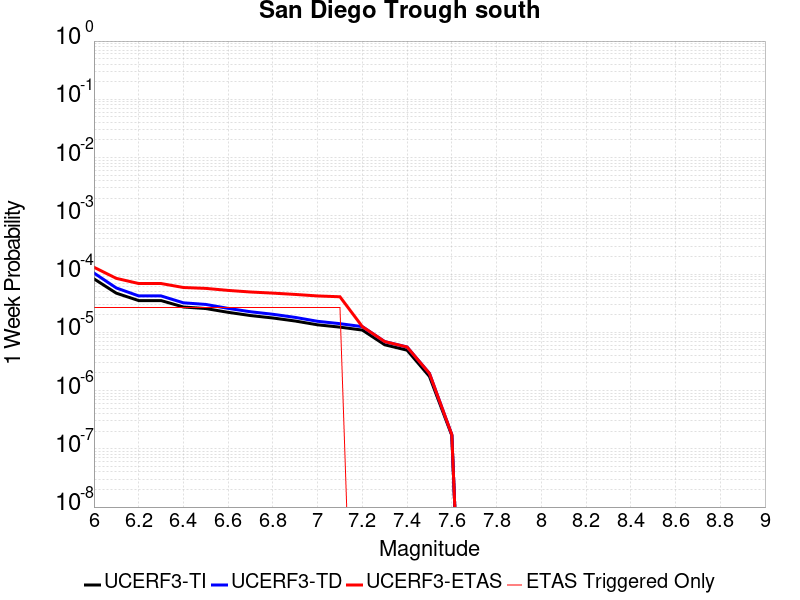 | 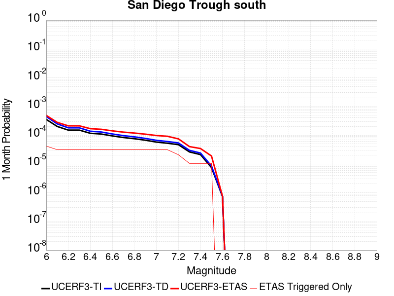 | 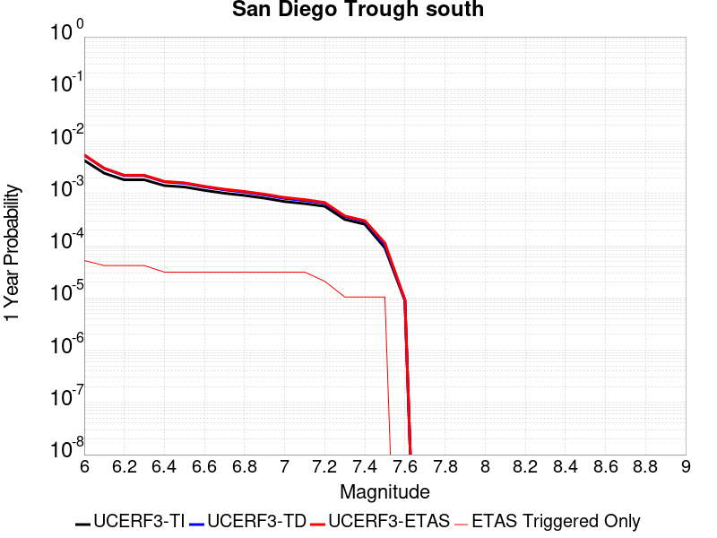 | 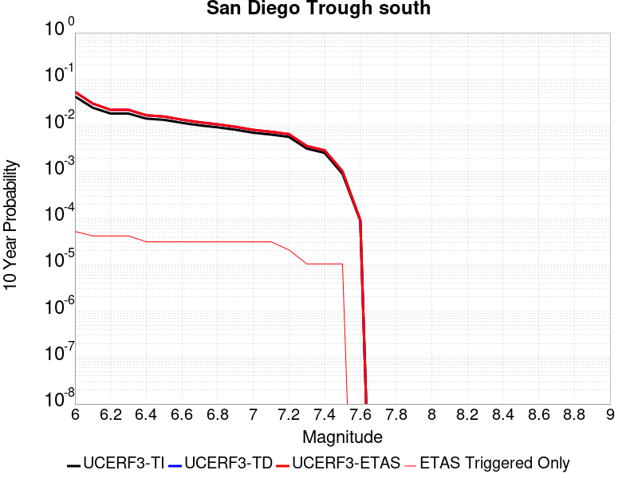 |

| Magnitude | 1 wk TI Prob | 1 wk TD Prob | 1 wk ETAS Prob | 1 wk ETAS/TD Gain | 1 wk ETAS Triggered Only | 1 mo TI Prob | 1 mo TD Prob | 1 mo ETAS Prob | 1 mo ETAS/TD Gain | 1 mo ETAS Triggered Only | 1 yr TI Prob | 1 yr TD Prob | 1 yr ETAS Prob | 1 yr ETAS/TD Gain | 1 yr ETAS Triggered Only | 10 yr TI Prob | 10 yr TD Prob | 10 yr ETAS Prob | 10 yr ETAS/TD Gain | 10 yr ETAS Triggered Only |
|-----|-----|-----|-----|-----|-----|-----|-----|-----|-----|-----|-----|-----|-----|-----|-----|-----|-----|-----|-----|-----|
| 6.0 | 8.279495E-5 | 1.04241306E-4 | 1.3554576E-4 | 1.3003076 | 3.1307725E-5 | 3.5478722E-4 | 4.4667677E-4 | 4.884018E-4 | 1.093412 | 4.174363E-5 | 0.004310982 | 0.0054256152 | 0.005477512 | 1.0095651 | 5.217954E-5 | 0.042283054 | 0.05299221 | 0.053041622 | 1.0009325 | 5.217954E-5 |
| 6.1 | 4.6961468E-5 | 5.772944E-5 | 7.860005E-5 | 1.3615246 | 2.0871816E-5 | 2.0124791E-4 | 2.473894E-4 | 2.7868937E-4 | 1.1265211 | 3.1307725E-5 | 0.00244744 | 0.0030079768 | 0.0030495948 | 1.0138359 | 4.174363E-5 | 0.024206603 | 0.029679462 | 0.029719967 | 1.0013647 | 4.174363E-5 |
| 6.2 | 3.5079658E-5 | 4.214154E-5 | 6.301247E-5 | 1.4952581 | 2.0871816E-5 | 1.5033272E-4 | 1.8059435E-4 | 2.1189642E-4 | 1.173328 | 3.1307725E-5 | 0.0018287642 | 0.0021965632 | 0.002238215 | 1.0189623 | 4.174363E-5 | 0.018137876 | 0.021751117 | 0.021791954 | 1.0018774 | 4.174363E-5 |
| 6.3 | 3.5079658E-5 | 4.214154E-5 | 6.301247E-5 | 1.4952581 | 2.0871816E-5 | 1.5033272E-4 | 1.8059435E-4 | 2.1189642E-4 | 1.173328 | 3.1307725E-5 | 0.0018287642 | 0.0021965632 | 0.002238215 | 1.0189623 | 4.174363E-5 | 0.018137876 | 0.021751117 | 0.021791954 | 1.0018774 | 4.174363E-5 |
| 6.4 | 2.7196904E-5 | 3.2087162E-5 | 5.295831E-5 | 1.6504515 | 2.0871816E-5 | 1.16552954E-4 | 1.3750927E-4 | 1.6881268E-4 | 1.2276459 | 3.1307725E-5 | 0.0014181085 | 0.0016729041 | 0.0017041594 | 1.0186833 | 3.1307725E-5 | 0.014090929 | 0.016604643 | 0.016635431 | 1.0018542 | 3.1307725E-5 |
| 6.5 | 2.5584688E-5 | 3.010164E-5 | 5.0972827E-5 | 1.6933571 | 2.0871816E-5 | 1.0964406E-4 | 1.2900073E-4 | 1.6030442E-4 | 1.2426628 | 3.1307725E-5 | 0.0013340989 | 0.0015694655 | 0.0016007241 | 1.0199167 | 3.1307725E-5 | 0.013261181 | 0.015585314 | 0.015616134 | 1.0019774 | 3.1307725E-5 |
| 6.6 | 2.2034688E-5 | 2.5742738E-5 | 4.661402E-5 | 1.8107637 | 2.0871816E-5 | 9.443096E-5 | 1.1032141E-4 | 1.4162567E-4 | 1.2837552 | 3.1307725E-5 | 0.0011490905 | 0.0013423424 | 0.001373608 | 1.023292 | 3.1307725E-5 | 0.011431668 | 0.013343317 | 0.013374208 | 1.002315 | 3.1307725E-5 |
| 6.7 | 1.9394853E-5 | 2.254176E-5 | 4.3413107E-5 | 1.9258969 | 2.0871816E-5 | 8.311815E-5 | 9.6603995E-5 | 1.279087E-4 | 1.3240517 | 3.1307725E-5 | 0.0010114936 | 0.0011755243 | 0.0012067952 | 1.0266017 | 3.1307725E-5 | 0.01006902 | 0.011693766 | 0.011724708 | 1.002646 | 3.1307725E-5 |
| 6.8 | 1.7615313E-5 | 2.0403182E-5 | 4.1274572E-5 | 2.0229478 | 2.0871816E-5 | 7.549201E-5 | 8.74393E-5 | 1.1874429E-4 | 1.3580196 | 3.1307725E-5 | 9.1872766E-4 | 0.0010640579 | 0.0010953323 | 1.0293916 | 3.1307725E-5 | 0.009149387 | 0.010590198 | 0.010621174 | 1.002925 | 3.1307725E-5 |
| 6.9 | 1.5621423E-5 | 1.8026114E-5 | 3.8897553E-5 | 2.1578445 | 2.0871816E-5 | 6.6947236E-5 | 7.725251E-5 | 1.0855781E-4 | 1.4052335 | 3.1307725E-5 | 8.147778E-4 | 9.40147E-4 | 9.7142527E-4 | 1.0332695 | 3.1307725E-5 | 0.008117969 | 0.009362142 | 0.0093931565 | 1.0033128 | 3.1307725E-5 |
| 7.0 | 1.3444376E-5 | 1.544809E-5 | 3.6319583E-5 | 2.3510728 | 2.0871816E-5 | 5.7617483E-5 | 6.620443E-5 | 9.7510085E-5 | 1.4728634 | 3.1307725E-5 | 7.0126704E-4 | 8.057436E-4 | 8.370261E-4 | 1.0388244 | 3.1307725E-5 | 0.006990582 | 0.008028555 | 0.008059612 | 1.0038682 | 3.1307725E-5 |
| 7.1 | 1.2268361E-5 | 1.407303E-5 | 3.494455E-5 | 2.4830866 | 2.0871816E-5 | 5.2577634E-5 | 6.0311606E-5 | 9.161744E-5 | 1.5190681 | 3.1307725E-5 | 6.399447E-4 | 7.3404907E-4 | 7.653338E-4 | 1.0426195 | 3.1307725E-5 | 0.0063810493 | 0.0073165493 | 0.0073476275 | 1.0042477 | 3.1307725E-5 |
| 7.2 | 1.0922655E-5 | 1.2513563E-5 | 2.294934E-5 | 1.8339573 | 1.0435908E-5 | 4.681054E-5 | 5.3628468E-5 | 7.449916E-5 | 1.389172 | 2.0871816E-5 | 5.697693E-4 | 6.5273355E-4 | 6.7359174E-4 | 1.0319551 | 2.0871816E-5 | 0.0056831064 | 0.0065084435 | 0.00652918 | 1.003186 | 2.0871816E-5 |
| 7.3 | 6.1106753E-6 | 6.928925E-6 | 1.736476E-5 | 2.5061262 | 1.0435908E-5 | 2.6188345E-5 | 2.9695057E-5 | 4.0130653E-5 | 1.3514254 | 1.0435908E-5 | 3.1879646E-4 | 3.6147775E-4 | 3.7190987E-4 | 1.0288597 | 1.0435908E-5 | 0.0031833951 | 0.003608943 | 0.0036193412 | 1.0028813 | 1.0435908E-5 |
| 7.4 | 4.933187E-6 | 5.5895525E-6 | 1.6025402E-5 | 2.8670278 | 1.0435908E-5 | 2.114206E-5 | 2.3955008E-5 | 3.4390665E-5 | 1.4356358 | 1.0435908E-5 | 2.5737417E-4 | 2.9161357E-4 | 3.0204645E-4 | 1.0357764 | 1.0435908E-5 | 0.002570763 | 0.0029123505 | 0.002922756 | 1.003573 | 1.0435908E-5 |
| 7.5 | 1.7489613E-6 | 1.969678E-6 | 1.2405565E-5 | 6.298271 | 1.0435908E-5 | 7.495527E-6 | 8.4414505E-6 | 1.887727E-5 | 2.236259 | 1.0435908E-5 | 9.125422E-5 | 1.02770035E-4 | 1.1320487E-4 | 1.1015358 | 1.0435908E-5 | 9.1216754E-4 | 0.0010272472 | 0.0010376723 | 1.0101486 | 1.0435908E-5 |
| 7.6 | 1.6988751E-7 | 1.7533823E-7 | 1.7533823E-7 | 1.0 | 0.0 | 7.2808916E-7 | 7.5144936E-7 | 7.5144936E-7 | 1.0 | 0.0 | 8.864449E-6 | 9.14886E-6 | 9.14886E-6 | 1.0 | 0.0 | 8.8640954E-5 | 9.1485024E-5 | 9.1485024E-5 | 1.0 | 0.0 |

## Newport-Inglewood alt 1
*[(top)](#table-of-contents)*

| 1 Week | 1 Month | 1 Year | 10 Year |
|-----|-----|-----|-----|
| 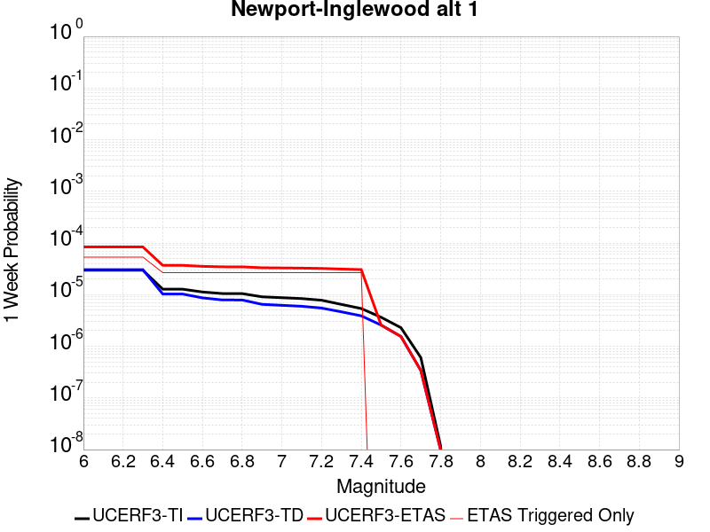 | 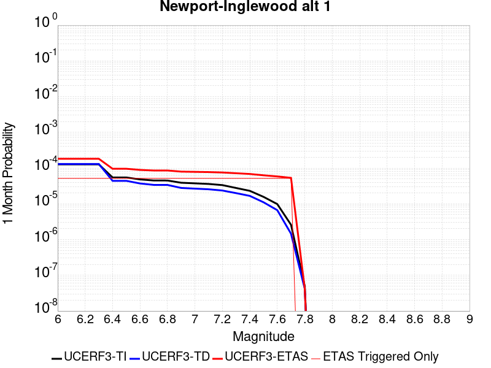 | 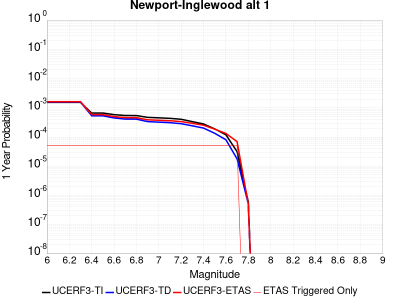 | 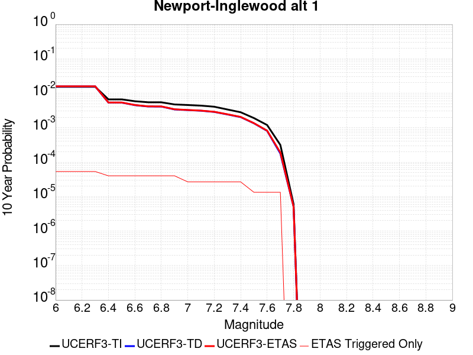 |

| Magnitude | 1 wk TI Prob | 1 wk TD Prob | 1 wk ETAS Prob | 1 wk ETAS/TD Gain | 1 wk ETAS Triggered Only | 1 mo TI Prob | 1 mo TD Prob | 1 mo ETAS Prob | 1 mo ETAS/TD Gain | 1 mo ETAS Triggered Only | 1 yr TI Prob | 1 yr TD Prob | 1 yr ETAS Prob | 1 yr ETAS/TD Gain | 1 yr ETAS Triggered Only | 10 yr TI Prob | 10 yr TD Prob | 10 yr ETAS Prob | 10 yr ETAS/TD Gain | 10 yr ETAS Triggered Only |
|-----|-----|-----|-----|-----|-----|-----|-----|-----|-----|-----|-----|-----|-----|-----|-----|-----|-----|-----|-----|-----|
| 6.0 | 2.9668912E-5 | 3.0404817E-5 | 5.1275998E-5 | 1.6864432 | 2.0871816E-5 | 1.2714628E-4 | 1.303026E-4 | 1.7204079E-4 | 1.3203174 | 4.174363E-5 | 0.0015469068 | 0.0015857625 | 0.00162744 | 1.0262823 | 4.174363E-5 | 0.015361829 | 0.015792042 | 0.015833128 | 1.0026016 | 4.174363E-5 |
| 6.1 | 2.9668912E-5 | 3.0404817E-5 | 5.1275998E-5 | 1.6864432 | 2.0871816E-5 | 1.2714628E-4 | 1.303026E-4 | 1.7204079E-4 | 1.3203174 | 4.174363E-5 | 0.0015469068 | 0.0015857625 | 0.00162744 | 1.0262823 | 4.174363E-5 | 0.015361829 | 0.015792042 | 0.015833128 | 1.0026016 | 4.174363E-5 |
| 6.2 | 2.9668912E-5 | 3.0404817E-5 | 5.1275998E-5 | 1.6864432 | 2.0871816E-5 | 1.2714628E-4 | 1.303026E-4 | 1.7204079E-4 | 1.3203174 | 4.174363E-5 | 0.0015469068 | 0.0015857625 | 0.00162744 | 1.0262823 | 4.174363E-5 | 0.015361829 | 0.015792042 | 0.015833128 | 1.0026016 | 4.174363E-5 |
| 6.3 | 2.9668912E-5 | 3.0404817E-5 | 5.1275998E-5 | 1.6864432 | 2.0871816E-5 | 1.2714628E-4 | 1.303026E-4 | 1.7204079E-4 | 1.3203174 | 4.174363E-5 | 0.0015469068 | 0.0015857625 | 0.00162744 | 1.0262823 | 4.174363E-5 | 0.015361829 | 0.015792042 | 0.015833128 | 1.0026016 | 4.174363E-5 |
| 6.4 | 1.275942E-5 | 1.0272503E-5 | 2.0708303E-5 | 2.0158966 | 1.0435908E-5 | 5.4682085E-5 | 4.402429E-5 | 7.533064E-5 | 1.7111152 | 3.1307725E-5 | 6.65551E-4 | 5.358681E-4 | 5.6715903E-4 | 1.058393 | 3.1307725E-5 | 0.0066356123 | 0.005346184 | 0.0053773248 | 1.0058248 | 3.1307725E-5 |
| 6.5 | 1.275942E-5 | 1.0272503E-5 | 2.0708303E-5 | 2.0158966 | 1.0435908E-5 | 5.4682085E-5 | 4.402429E-5 | 7.533064E-5 | 1.7111152 | 3.1307725E-5 | 6.65551E-4 | 5.358681E-4 | 5.6715903E-4 | 1.058393 | 3.1307725E-5 | 0.0066356123 | 0.005346184 | 0.0053773248 | 1.0058248 | 3.1307725E-5 |
| 6.6 | 1.1255358E-5 | 8.661884E-6 | 1.90977E-5 | 2.2047977 | 1.0435908E-5 | 4.8236358E-5 | 3.712184E-5 | 6.84284E-5 | 1.8433461 | 3.1307725E-5 | 5.871194E-4 | 4.518664E-4 | 4.8315997E-4 | 1.069254 | 3.1307725E-5 | 0.005855706 | 0.004509653 | 0.0045408197 | 1.006911 | 3.1307725E-5 |
| 6.7 | 1.0504745E-5 | 7.8997955E-6 | 1.833562E-5 | 2.3210247 | 1.0435908E-5 | 4.5019555E-5 | 3.3855835E-5 | 6.51625E-5 | 1.9247051 | 3.1307725E-5 | 5.4797524E-4 | 4.1211807E-4 | 4.434129E-4 | 1.0759366 | 3.1307725E-5 | 0.0054662596 | 0.004113668 | 0.004144847 | 1.0075793 | 3.1307725E-5 |
| 6.8 | 1.0476007E-5 | 7.881176E-6 | 1.8317003E-5 | 2.3241456 | 1.0435908E-5 | 4.4896402E-5 | 3.3776043E-5 | 6.5082706E-5 | 1.9268898 | 3.1307725E-5 | 5.464766E-4 | 4.1114696E-4 | 4.4244181E-4 | 1.076116 | 3.1307725E-5 | 0.005451347 | 0.0041039926 | 0.004135172 | 1.0075973 | 3.1307725E-5 |
| 6.9 | 9.076797E-6 | 6.4896312E-6 | 1.692547E-5 | 2.6080792 | 1.0435908E-5 | 3.889998E-5 | 2.781241E-5 | 5.9119262E-5 | 2.1256433 | 3.1307725E-5 | 4.7350433E-4 | 3.385638E-4 | 3.6986094E-4 | 1.0924408 | 3.1307725E-5 | 0.004724967 | 0.0033805177 | 0.0034117196 | 1.0092299 | 3.1307725E-5 |
| 7.0 | 8.73795E-6 | 6.2120125E-6 | 1.6647855E-5 | 2.6799457 | 1.0435908E-5 | 3.7447822E-5 | 2.6622642E-5 | 4.74939E-5 | 1.7839665 | 2.0871816E-5 | 4.5583185E-4 | 3.2408274E-4 | 3.4494777E-4 | 1.0643818 | 2.0871816E-5 | 0.0045489795 | 0.0032361327 | 0.003256937 | 1.0064287 | 2.0871816E-5 |
| 7.1 | 8.391299E-6 | 5.95579E-6 | 1.6391636E-5 | 2.7522185 | 1.0435908E-5 | 3.5962214E-5 | 2.5524565E-5 | 4.639585E-5 | 1.817694 | 2.0871816E-5 | 4.37752E-4 | 3.1071753E-4 | 3.3158288E-4 | 1.0671521 | 2.0871816E-5 | 0.004368907 | 0.0031028606 | 0.0031236676 | 1.0067058 | 2.0871816E-5 |
| 7.2 | 7.796882E-6 | 5.4965344E-6 | 1.5932384E-5 | 2.8986237 | 1.0435908E-5 | 3.341478E-5 | 2.3556364E-5 | 4.442769E-5 | 1.8860164 | 2.0871816E-5 | 4.06749E-4 | 2.867612E-4 | 3.0762702E-4 | 1.0727638 | 2.0871816E-5 | 0.0040600533 | 0.0028639357 | 0.0028847477 | 1.0072669 | 2.0871816E-5 |
| 7.3 | 6.4738833E-6 | 4.6478162E-6 | 1.5083676E-5 | 3.2453253 | 1.0435908E-5 | 2.774492E-5 | 1.9919062E-5 | 4.0790463E-5 | 2.0478103 | 2.0871816E-5 | 3.3774204E-4 | 2.4248775E-4 | 2.633545E-4 | 1.0860528 | 2.0871816E-5 | 0.0033722918 | 0.0024222482 | 0.0024430694 | 1.0085958 | 2.0871816E-5 |
| 7.4 | 5.382145E-6 | 3.8857597E-6 | 1.43216275E-5 | 3.6856697 | 1.0435908E-5 | 2.3066134E-5 | 1.665315E-5 | 3.752462E-5 | 2.2533045 | 2.0871816E-5 | 2.8079396E-4 | 2.0273338E-4 | 2.2360096E-4 | 1.1029311 | 2.0871816E-5 | 0.0028043943 | 0.0020254988 | 0.0020463285 | 1.0102837 | 2.0871816E-5 |
| 7.5 | 3.648244E-6 | 2.5737843E-6 | 2.5737843E-6 | 1.0 | 0.0 | 1.5635238E-5 | 1.1030458E-5 | 2.146625E-5 | 1.9460888 | 1.0435908E-5 | 1.9034238E-4 | 1.3428765E-4 | 1.4472216E-4 | 1.0777026 | 1.0435908E-5 | 0.0019017943 | 0.0013420755 | 0.0013524974 | 1.0077655 | 1.0435908E-5 |
| 7.6 | 2.2906888E-6 | 1.5479842E-6 | 1.5479842E-6 | 1.0 | 0.0 | 9.817201E-6 | 6.634202E-6 | 1.707004E-5 | 2.5730362 | 1.0435908E-5 | 1.1951787E-4 | 8.076848E-5 | 9.120355E-5 | 1.1291972 | 1.0435908E-5 | 0.0011945361 | 8.07398E-4 | 8.1782544E-4 | 1.0129149 | 1.0435908E-5 |
| 7.7 | 6.0479874E-7 | 3.397512E-7 | 3.397512E-7 | 1.0 | 0.0 | 2.5919921E-6 | 1.4560758E-6 | 1.1891969E-5 | 8.167135 | 1.0435908E-5 | 3.1557047E-5 | 1.7727592E-5 | 2.8163317E-5 | 1.5886712 | 1.0435908E-5 | 3.1552566E-4 | 1.7726317E-4 | 1.8769722E-4 | 1.058862 | 1.0435908E-5 |
| 7.8 | 1.16056995E-8 | 9.782373E-9 | 9.782373E-9 | 1.0 | 0.0 | 4.9738713E-8 | 4.1924455E-8 | 4.1924455E-8 | 1.0 | 0.0 | 6.0556863E-7 | 5.1043025E-7 | 5.1043025E-7 | 1.0 | 0.0 | 6.05567E-6 | 5.1043025E-6 | 5.1043025E-6 | 1.0 | 0.0 |

## Puente Hills
*[(top)](#table-of-contents)*

| 1 Week | 1 Month | 1 Year | 10 Year |
|-----|-----|-----|-----|
| 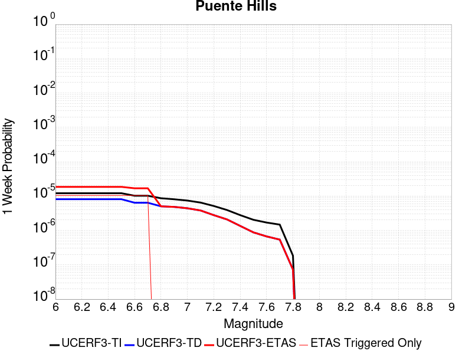 | 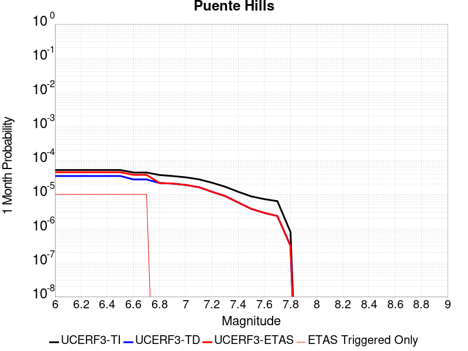 | 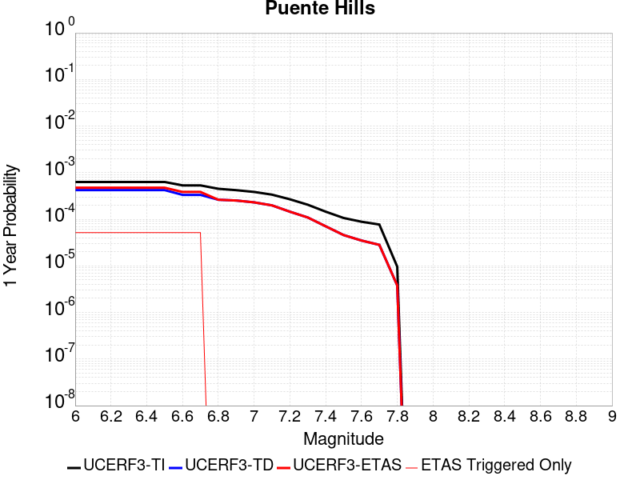 | 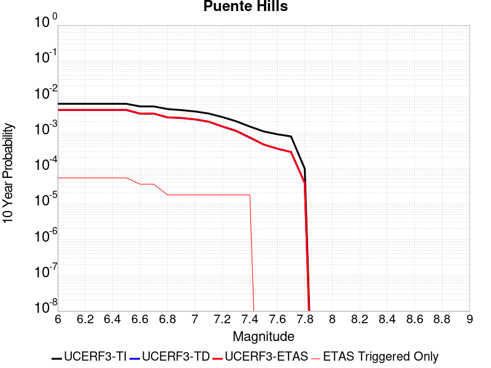 |

| Magnitude | 1 wk TI Prob | 1 wk TD Prob | 1 wk ETAS Prob | 1 wk ETAS/TD Gain | 1 wk ETAS Triggered Only | 1 mo TI Prob | 1 mo TD Prob | 1 mo ETAS Prob | 1 mo ETAS/TD Gain | 1 mo ETAS Triggered Only | 1 yr TI Prob | 1 yr TD Prob | 1 yr ETAS Prob | 1 yr ETAS/TD Gain | 1 yr ETAS Triggered Only | 10 yr TI Prob | 10 yr TD Prob | 10 yr ETAS Prob | 10 yr ETAS/TD Gain | 10 yr ETAS Triggered Only |
|-----|-----|-----|-----|-----|-----|-----|-----|-----|-----|-----|-----|-----|-----|-----|-----|-----|-----|-----|-----|-----|
| 6.0 | 1.2101656E-5 | 8.098625E-6 | 1.8534449E-5 | 2.288592 | 1.0435908E-5 | 5.1863204E-5 | 3.4707962E-5 | 4.5143508E-5 | 1.3006672 | 1.0435908E-5 | 6.312516E-4 | 4.2249315E-4 | 4.4335614E-4 | 1.0493807 | 2.0871816E-5 | 0.0062946146 | 0.0042174594 | 0.004269419 | 1.01232 | 5.217954E-5 |
| 6.1 | 1.2101656E-5 | 8.098625E-6 | 1.8534449E-5 | 2.288592 | 1.0435908E-5 | 5.1863204E-5 | 3.4707962E-5 | 4.5143508E-5 | 1.3006672 | 1.0435908E-5 | 6.312516E-4 | 4.2249315E-4 | 4.4335614E-4 | 1.0493807 | 2.0871816E-5 | 0.0062946146 | 0.0042174594 | 0.004269419 | 1.01232 | 5.217954E-5 |
| 6.2 | 1.2101656E-5 | 8.098625E-6 | 1.8534449E-5 | 2.288592 | 1.0435908E-5 | 5.1863204E-5 | 3.4707962E-5 | 4.5143508E-5 | 1.3006672 | 1.0435908E-5 | 6.312516E-4 | 4.2249315E-4 | 4.4335614E-4 | 1.0493807 | 2.0871816E-5 | 0.0062946146 | 0.0042174594 | 0.004269419 | 1.01232 | 5.217954E-5 |
| 6.3 | 1.2101656E-5 | 8.098625E-6 | 1.8534449E-5 | 2.288592 | 1.0435908E-5 | 5.1863204E-5 | 3.4707962E-5 | 4.5143508E-5 | 1.3006672 | 1.0435908E-5 | 6.312516E-4 | 4.2249315E-4 | 4.4335614E-4 | 1.0493807 | 2.0871816E-5 | 0.0062946146 | 0.0042174594 | 0.004269419 | 1.01232 | 5.217954E-5 |
| 6.4 | 1.2101656E-5 | 8.098625E-6 | 1.8534449E-5 | 2.288592 | 1.0435908E-5 | 5.1863204E-5 | 3.4707962E-5 | 4.5143508E-5 | 1.3006672 | 1.0435908E-5 | 6.312516E-4 | 4.2249315E-4 | 4.4335614E-4 | 1.0493807 | 2.0871816E-5 | 0.0062946146 | 0.0042174594 | 0.004269419 | 1.01232 | 5.217954E-5 |
| 6.5 | 1.2101656E-5 | 8.098625E-6 | 1.8534449E-5 | 2.288592 | 1.0435908E-5 | 5.1863204E-5 | 3.4707962E-5 | 4.5143508E-5 | 1.3006672 | 1.0435908E-5 | 6.312516E-4 | 4.2249315E-4 | 4.4335614E-4 | 1.0493807 | 2.0871816E-5 | 0.0062946146 | 0.0042174594 | 0.004269419 | 1.01232 | 5.217954E-5 |
| 6.6 | 1.0222488E-5 | 6.3991847E-6 | 1.6835025E-5 | 2.6308079 | 1.0435908E-5 | 4.3809923E-5 | 2.7424803E-5 | 3.7860424E-5 | 1.3805177 | 1.0435908E-5 | 5.332553E-4 | 3.3384826E-4 | 3.5471312E-4 | 1.062498 | 2.0871816E-5 | 0.0053197746 | 0.0033337125 | 0.003375317 | 1.0124799 | 4.174363E-5 |
| 6.7 | 1.0222488E-5 | 6.3991847E-6 | 1.6835025E-5 | 2.6308079 | 1.0435908E-5 | 4.3809923E-5 | 2.7424803E-5 | 3.7860424E-5 | 1.3805177 | 1.0435908E-5 | 5.332553E-4 | 3.3384826E-4 | 3.5471312E-4 | 1.062498 | 2.0871816E-5 | 0.0053197746 | 0.0033337125 | 0.003375317 | 1.0124799 | 4.174363E-5 |
| 6.8 | 8.6367845E-6 | 5.0282533E-6 | 5.0282533E-6 | 1.0 | 0.0 | 3.7014266E-5 | 2.1549482E-5 | 2.1549482E-5 | 1.0 | 0.0 | 4.505555E-4 | 2.623339E-4 | 2.623339E-4 | 1.0 | 0.0 | 0.004496431 | 0.0026202986 | 0.002630707 | 1.0039723 | 1.0435908E-5 |
| 6.9 | 8.066481E-6 | 4.836117E-6 | 4.836117E-6 | 1.0 | 0.0 | 3.4570177E-5 | 2.0726053E-5 | 2.0726053E-5 | 1.0 | 0.0 | 4.2081063E-4 | 2.52311E-4 | 2.52311E-4 | 1.0 | 0.0 | 0.0042001465 | 0.0025202993 | 0.002530709 | 1.0041304 | 1.0435908E-5 |
| 7.0 | 7.393828E-6 | 4.417296E-6 | 4.417296E-6 | 1.0 | 0.0 | 3.168745E-5 | 1.8931134E-5 | 1.8931134E-5 | 1.0 | 0.0 | 3.857264E-4 | 2.3046264E-4 | 2.3046264E-4 | 1.0 | 0.0 | 0.0038505755 | 0.0023022818 | 0.0023126937 | 1.0045224 | 1.0435908E-5 |
| 7.1 | 6.4660953E-6 | 3.8044495E-6 | 3.8044495E-6 | 1.0 | 0.0 | 2.7711543E-5 | 1.6304684E-5 | 1.6304684E-5 | 1.0 | 0.0 | 3.373358E-4 | 1.984918E-4 | 1.984918E-4 | 1.0 | 0.0 | 0.0033682417 | 0.001983181 | 0.0019935963 | 1.0052518 | 1.0435908E-5 |
| 7.2 | 5.143232E-6 | 2.7865456E-6 | 2.7865456E-6 | 1.0 | 0.0 | 2.2042237E-5 | 1.1942284E-5 | 1.1942284E-5 | 1.0 | 0.0 | 2.6833118E-4 | 1.453877E-4 | 1.453877E-4 | 1.0 | 0.0 | 0.002680074 | 0.0014529356 | 0.0014633563 | 1.0071722 | 1.0435908E-5 |
| 7.3 | 3.928255E-6 | 2.0913774E-6 | 2.0913774E-6 | 1.0 | 0.0 | 1.683527E-5 | 8.963015E-6 | 8.963015E-6 | 1.0 | 0.0 | 2.0495013E-4 | 1.0911931E-4 | 1.0911931E-4 | 1.0 | 0.0 | 0.002047612 | 0.001090664 | 0.0011010885 | 1.009558 | 1.0435908E-5 |
| 7.4 | 2.7894434E-6 | 1.3546753E-6 | 1.3546753E-6 | 1.0 | 0.0 | 1.1954703E-5 | 5.8057385E-6 | 5.8057385E-6 | 1.0 | 0.0 | 1.4553878E-4 | 7.068262E-5 | 7.068262E-5 | 1.0 | 0.0 | 0.001454435 | 7.066058E-4 | 7.1703433E-4 | 1.0147586 | 1.0435908E-5 |
| 7.5 | 2.041735E-6 | 8.787305E-7 | 8.787305E-7 | 1.0 | 0.0 | 8.750263E-6 | 3.7659825E-6 | 3.7659825E-6 | 1.0 | 0.0 | 1.06529245E-4 | 4.5849905E-5 | 4.5849905E-5 | 1.0 | 0.0 | 0.0010647819 | 4.5840783E-4 | 4.5840783E-4 | 1.0 | 0.0 |
| 7.6 | 1.6959062E-6 | 6.6986263E-7 | 6.6986263E-7 | 1.0 | 0.0 | 7.268149E-6 | 2.8708366E-6 | 2.8708366E-6 | 1.0 | 0.0 | 8.848612E-5 | 3.4951907E-5 | 3.4951907E-5 | 1.0 | 0.0 | 8.84509E-4 | 3.4946698E-4 | 3.4946698E-4 | 1.0 | 0.0 |
| 7.7 | 1.4767965E-6 | 5.407607E-7 | 5.407607E-7 | 1.0 | 0.0 | 6.3291122E-6 | 2.317544E-6 | 2.317544E-6 | 1.0 | 0.0 | 7.705422E-5 | 2.8215758E-5 | 2.8215758E-5 | 1.0 | 0.0 | 7.702751E-4 | 2.8212433E-4 | 2.8212433E-4 | 1.0 | 0.0 |
| 7.8 | 1.8432911E-7 | 7.28201E-8 | 7.28201E-8 | 1.0 | 0.0 | 7.8998164E-7 | 3.1208612E-7 | 3.1208612E-7 | 1.0 | 0.0 | 9.617985E-6 | 3.7996451E-6 | 3.7996451E-6 | 1.0 | 0.0 | 9.617568E-5 | 3.7996128E-5 | 3.7996128E-5 | 1.0 | 0.0 |

## Del Valle
*[(top)](#table-of-contents)*

| 1 Week | 1 Month | 1 Year | 10 Year |
|-----|-----|-----|-----|
| 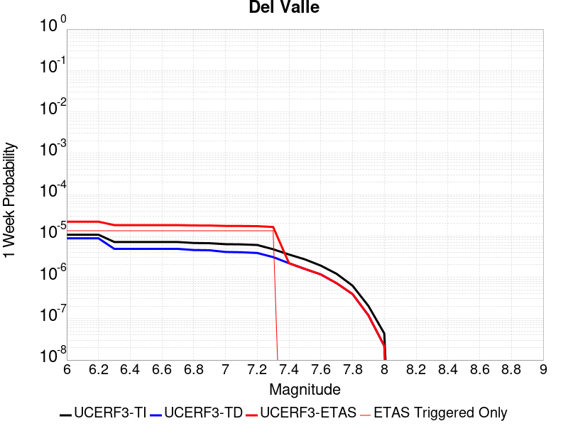 | 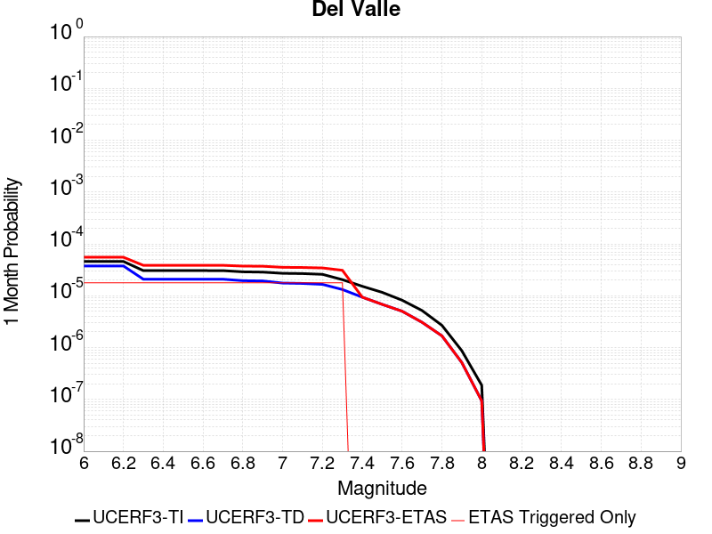 | 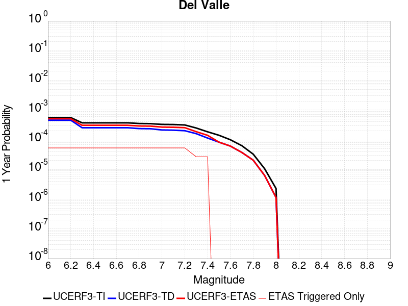 | 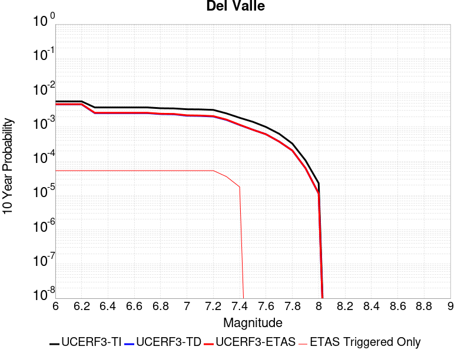 |

| Magnitude | 1 wk TI Prob | 1 wk TD Prob | 1 wk ETAS Prob | 1 wk ETAS/TD Gain | 1 wk ETAS Triggered Only | 1 mo TI Prob | 1 mo TD Prob | 1 mo ETAS Prob | 1 mo ETAS/TD Gain | 1 mo ETAS Triggered Only | 1 yr TI Prob | 1 yr TD Prob | 1 yr ETAS Prob | 1 yr ETAS/TD Gain | 1 yr ETAS Triggered Only | 10 yr TI Prob | 10 yr TD Prob | 10 yr ETAS Prob | 10 yr ETAS/TD Gain | 10 yr ETAS Triggered Only |
|-----|-----|-----|-----|-----|-----|-----|-----|-----|-----|-----|-----|-----|-----|-----|-----|-----|-----|-----|-----|-----|
| 6.0 | 1.0716125E-5 | 8.767882E-6 | 1.9203699E-5 | 2.1902323 | 1.0435908E-5 | 4.592544E-5 | 3.7576207E-5 | 4.8011723E-5 | 1.277716 | 1.0435908E-5 | 5.589988E-4 | 4.5741405E-4 | 4.8870745E-4 | 1.0684137 | 3.1307725E-5 | 0.0055759475 | 0.00456668 | 0.0046082335 | 1.0090991 | 4.174363E-5 |
| 6.1 | 1.0716125E-5 | 8.767882E-6 | 1.9203699E-5 | 2.1902323 | 1.0435908E-5 | 4.592544E-5 | 3.7576207E-5 | 4.8011723E-5 | 1.277716 | 1.0435908E-5 | 5.589988E-4 | 4.5741405E-4 | 4.8870745E-4 | 1.0684137 | 3.1307725E-5 | 0.0055759475 | 0.00456668 | 0.0046082335 | 1.0090991 | 4.174363E-5 |
| 6.2 | 1.0716125E-5 | 8.767882E-6 | 1.9203699E-5 | 2.1902323 | 1.0435908E-5 | 4.592544E-5 | 3.7576207E-5 | 4.8011723E-5 | 1.277716 | 1.0435908E-5 | 5.589988E-4 | 4.5741405E-4 | 4.8870745E-4 | 1.0684137 | 3.1307725E-5 | 0.0055759475 | 0.00456668 | 0.0046082335 | 1.0090991 | 4.174363E-5 |
| 6.3 | 7.1293784E-6 | 4.865823E-6 | 1.530168E-5 | 3.144726 | 1.0435908E-5 | 3.055412E-5 | 2.0853364E-5 | 3.1289055E-5 | 1.500432 | 1.0435908E-5 | 3.7193293E-4 | 2.5386087E-4 | 2.8516064E-4 | 1.123295 | 3.1307725E-5 | 0.0037131102 | 0.0025357946 | 0.0025774324 | 1.01642 | 4.174363E-5 |
| 6.4 | 7.1293784E-6 | 4.865823E-6 | 1.530168E-5 | 3.144726 | 1.0435908E-5 | 3.055412E-5 | 2.0853364E-5 | 3.1289055E-5 | 1.500432 | 1.0435908E-5 | 3.7193293E-4 | 2.5386087E-4 | 2.8516064E-4 | 1.123295 | 3.1307725E-5 | 0.0037131102 | 0.0025357946 | 0.0025774324 | 1.01642 | 4.174363E-5 |
| 6.5 | 7.1293784E-6 | 4.865823E-6 | 1.530168E-5 | 3.144726 | 1.0435908E-5 | 3.055412E-5 | 2.0853364E-5 | 3.1289055E-5 | 1.500432 | 1.0435908E-5 | 3.7193293E-4 | 2.5386087E-4 | 2.8516064E-4 | 1.123295 | 3.1307725E-5 | 0.0037131102 | 0.0025357946 | 0.0025774324 | 1.01642 | 4.174363E-5 |
| 6.6 | 7.1293784E-6 | 4.865823E-6 | 1.530168E-5 | 3.144726 | 1.0435908E-5 | 3.055412E-5 | 2.0853364E-5 | 3.1289055E-5 | 1.500432 | 1.0435908E-5 | 3.7193293E-4 | 2.5386087E-4 | 2.8516064E-4 | 1.123295 | 3.1307725E-5 | 0.0037131102 | 0.0025357946 | 0.0025774324 | 1.01642 | 4.174363E-5 |
| 6.7 | 7.12272E-6 | 4.8631987E-6 | 1.5299056E-5 | 3.1458833 | 1.0435908E-5 | 3.0525585E-5 | 2.0842117E-5 | 3.1277807E-5 | 1.500702 | 1.0435908E-5 | 3.7158563E-4 | 2.5372396E-4 | 2.8502374E-4 | 1.1233616 | 3.1307725E-5 | 0.003709649 | 0.0025344288 | 0.0025760666 | 1.0164288 | 4.174363E-5 |
| 6.8 | 6.7558703E-6 | 4.5594015E-6 | 1.4995262E-5 | 3.2888663 | 1.0435908E-5 | 2.895341E-5 | 1.9540148E-5 | 2.9975852E-5 | 1.5340648 | 1.0435908E-5 | 3.5245073E-4 | 2.3787597E-4 | 2.6917623E-4 | 1.1315824 | 3.1307725E-5 | 0.0035189227 | 0.0023762889 | 0.0024179332 | 1.017525 | 4.174363E-5 |
| 6.9 | 6.6700386E-6 | 4.502539E-6 | 1.49383995E-5 | 3.3177724 | 1.0435908E-5 | 2.8585566E-5 | 1.9296456E-5 | 2.9732162E-5 | 1.5408095 | 1.0435908E-5 | 3.479737E-4 | 2.3490966E-4 | 2.6621003E-4 | 1.1332443 | 3.1307725E-5 | 0.003474293 | 0.0023466884 | 0.0023883341 | 1.0177466 | 4.174363E-5 |
| 7.0 | 6.3181424E-6 | 4.0987034E-6 | 1.4534568E-5 | 3.5461383 | 1.0435908E-5 | 2.7077473E-5 | 1.7565755E-5 | 2.800148E-5 | 1.5940949 | 1.0435908E-5 | 3.2961834E-4 | 2.1384252E-4 | 2.4514354E-4 | 1.1463742 | 3.1307725E-5 | 0.0032912986 | 0.002136422 | 0.0021780767 | 1.0194973 | 4.174363E-5 |
| 7.1 | 6.248759E-6 | 4.033895E-6 | 1.4469761E-5 | 3.5870445 | 1.0435908E-5 | 2.678012E-5 | 1.7288008E-5 | 2.7723736E-5 | 1.6036396 | 1.0435908E-5 | 3.2599916E-4 | 2.104616E-4 | 2.4176274E-4 | 1.1487261 | 3.1307725E-5 | 0.0032552136 | 0.0021026772 | 0.0021443332 | 1.0198109 | 4.174363E-5 |
| 7.2 | 6.0411944E-6 | 3.869888E-6 | 1.4305755E-5 | 3.6966846 | 1.0435908E-5 | 2.5890577E-5 | 1.658513E-5 | 2.7020866E-5 | 1.6292223 | 1.0435908E-5 | 3.1517216E-4 | 2.0190567E-4 | 2.3320707E-4 | 1.1550298 | 3.1307725E-5 | 0.0031472554 | 0.0020172757 | 0.0020589351 | 1.0206513 | 4.174363E-5 |
| 7.3 | 4.7691183E-6 | 3.0781202E-6 | 1.3513996E-5 | 4.3903403 | 1.0435908E-5 | 2.0438918E-5 | 1.3191879E-5 | 2.3627648E-5 | 1.7910753 | 1.0435908E-5 | 2.488154E-4 | 1.605995E-4 | 1.8146797E-4 | 1.129941 | 2.0871816E-5 | 0.00248537 | 0.0016048603 | 0.0016256985 | 1.0129845 | 2.0871816E-5 |
| 7.4 | 3.5524722E-6 | 2.1893363E-6 | 2.1893363E-6 | 1.0 | 0.0 | 1.5224792E-5 | 9.382837E-6 | 9.382837E-6 | 1.0 | 0.0 | 1.8534607E-4 | 1.1423013E-4 | 1.2466485E-4 | 1.0913482 | 1.0435908E-5 | 0.0018519156 | 0.0011417224 | 0.0011521464 | 1.00913 | 1.0435908E-5 |
| 7.5 | 2.7133442E-6 | 1.5916097E-6 | 1.5916097E-6 | 1.0 | 0.0 | 1.1628566E-5 | 6.821167E-6 | 6.821167E-6 | 1.0 | 0.0 | 1.415686E-4 | 8.304456E-5 | 8.304456E-5 | 1.0 | 0.0 | 0.0014147845 | 8.301372E-4 | 8.301372E-4 | 1.0 | 0.0 |
| 7.6 | 1.915338E-6 | 1.173914E-6 | 1.173914E-6 | 1.0 | 0.0 | 8.208566E-6 | 5.0310505E-6 | 5.0310505E-6 | 1.0 | 0.0 | 9.993471E-5 | 6.125133E-5 | 6.125133E-5 | 1.0 | 0.0 | 9.988978E-4 | 6.123454E-4 | 6.123454E-4 | 1.0 | 0.0 |
| 7.7 | 1.2120448E-6 | 7.180313E-7 | 7.180313E-7 | 1.0 | 0.0 | 5.194467E-6 | 3.0772733E-6 | 3.0772733E-6 | 1.0 | 0.0 | 6.3240805E-5 | 3.746516E-5 | 3.746516E-5 | 1.0 | 0.0 | 6.322281E-4 | 3.7458882E-4 | 3.7458882E-4 | 1.0 | 0.0 |
| 7.8 | 6.272381E-7 | 3.932549E-7 | 3.932549E-7 | 1.0 | 0.0 | 2.6881603E-6 | 1.6853771E-6 | 1.6853771E-6 | 1.0 | 0.0 | 3.272786E-5 | 2.0519275E-5 | 2.0519275E-5 | 1.0 | 0.0 | 3.272304E-4 | 2.0517396E-4 | 2.0517396E-4 | 1.0 | 0.0 |
| 7.9 | 2.0292627E-7 | 1.2004622E-7 | 1.2004622E-7 | 1.0 | 0.0 | 8.6968373E-7 | 5.1448376E-7 | 5.1448376E-7 | 1.0 | 0.0 | 1.0588348E-5 | 6.263822E-6 | 6.263822E-6 | 1.0 | 0.0 | 1.0587843E-4 | 6.263647E-5 | 6.263647E-5 | 1.0 | 0.0 |
| 8.0 | 4.374492E-8 | 2.189964E-8 | 2.189964E-8 | 1.0 | 0.0 | 1.8747821E-7 | 9.385559E-8 | 9.385559E-8 | 1.0 | 0.0 | 2.2825448E-6 | 1.1426913E-6 | 1.1426913E-6 | 1.0 | 0.0 | 2.2825214E-5 | 1.1426858E-5 | 1.1426858E-5 | 1.0 | 0.0 |

## Owens Valley Keough Hot Springs
*[(top)](#table-of-contents)*

| 1 Week | 1 Month | 1 Year | 10 Year |
|-----|-----|-----|-----|
| 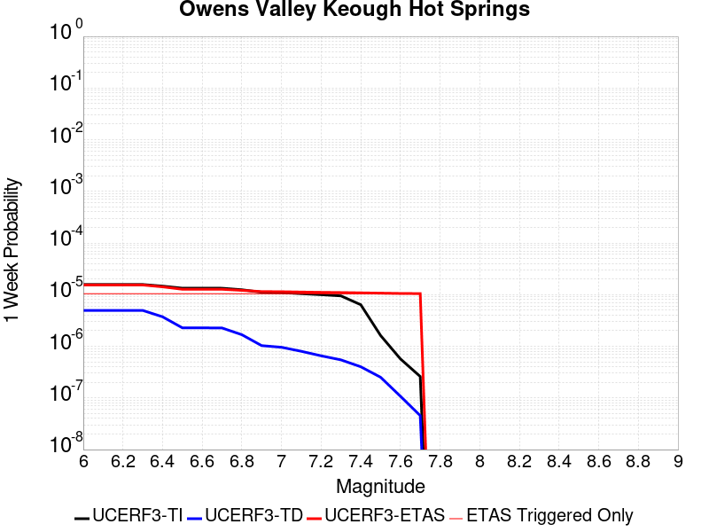 |  | 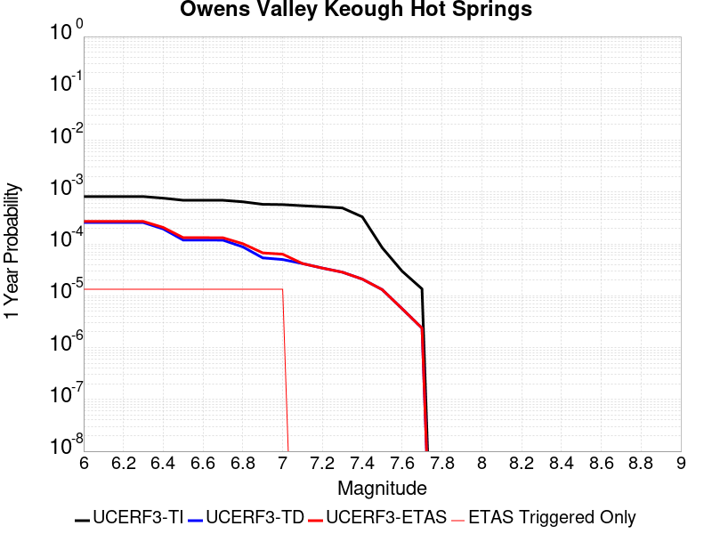 | 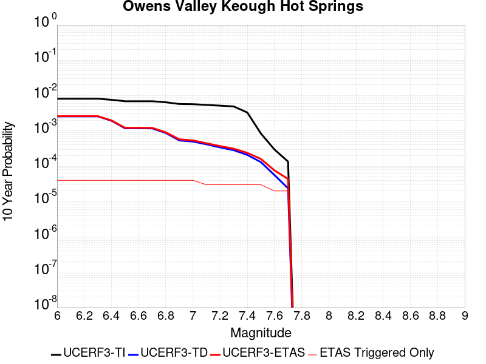 |

| Magnitude | 1 wk TI Prob | 1 wk TD Prob | 1 wk ETAS Prob | 1 wk ETAS/TD Gain | 1 wk ETAS Triggered Only | 1 mo TI Prob | 1 mo TD Prob | 1 mo ETAS Prob | 1 mo ETAS/TD Gain | 1 mo ETAS Triggered Only | 1 yr TI Prob | 1 yr TD Prob | 1 yr ETAS Prob | 1 yr ETAS/TD Gain | 1 yr ETAS Triggered Only | 10 yr TI Prob | 10 yr TD Prob | 10 yr ETAS Prob | 10 yr ETAS/TD Gain | 10 yr ETAS Triggered Only |
|-----|-----|-----|-----|-----|-----|-----|-----|-----|-----|-----|-----|-----|-----|-----|-----|-----|-----|-----|-----|-----|
| 6.0 | 1.5708529E-5 | 4.950656E-6 | 1.5386513E-5 | 3.1079745 | 1.0435908E-5 | 6.7320536E-5 | 2.1216953E-5 | 3.165264E-5 | 1.491856 | 1.0435908E-5 | 8.193192E-4 | 2.582909E-4 | 2.7915734E-4 | 1.0807865 | 2.0871816E-5 | 0.008163051 | 0.0025805652 | 0.002622201 | 1.0161344 | 4.174363E-5 |
| 6.1 | 1.5708529E-5 | 4.950656E-6 | 1.5386513E-5 | 3.1079745 | 1.0435908E-5 | 6.7320536E-5 | 2.1216953E-5 | 3.165264E-5 | 1.491856 | 1.0435908E-5 | 8.193192E-4 | 2.582909E-4 | 2.7915734E-4 | 1.0807865 | 2.0871816E-5 | 0.008163051 | 0.0025805652 | 0.002622201 | 1.0161344 | 4.174363E-5 |
| 6.2 | 1.5708529E-5 | 4.950656E-6 | 1.5386513E-5 | 3.1079745 | 1.0435908E-5 | 6.7320536E-5 | 2.1216953E-5 | 3.165264E-5 | 1.491856 | 1.0435908E-5 | 8.193192E-4 | 2.582909E-4 | 2.7915734E-4 | 1.0807865 | 2.0871816E-5 | 0.008163051 | 0.0025805652 | 0.002622201 | 1.0161344 | 4.174363E-5 |
| 6.3 | 1.5708529E-5 | 4.950656E-6 | 1.5386513E-5 | 3.1079745 | 1.0435908E-5 | 6.7320536E-5 | 2.1216953E-5 | 3.165264E-5 | 1.491856 | 1.0435908E-5 | 8.193192E-4 | 2.582909E-4 | 2.7915734E-4 | 1.0807865 | 2.0871816E-5 | 0.008163051 | 0.0025805652 | 0.002622201 | 1.0161344 | 4.174363E-5 |
| 6.4 | 1.4622509E-5 | 3.7265204E-6 | 1.416239E-5 | 3.8004324 | 1.0435908E-5 | 6.266639E-5 | 1.5970723E-5 | 2.6406464E-5 | 1.6534295 | 1.0435908E-5 | 7.626962E-4 | 1.944295E-4 | 2.1529726E-4 | 1.1073282 | 2.0871816E-5 | 0.007600839 | 0.0019430731 | 0.0019847357 | 1.0214416 | 4.174363E-5 |
| 6.5 | 1.3335527E-5 | 2.2777172E-6 | 1.2713601E-5 | 5.58173 | 1.0435908E-5 | 5.7151006E-5 | 9.761612E-6 | 2.0197418E-5 | 2.0690658 | 1.0435908E-5 | 6.955913E-4 | 1.18841825E-4 | 1.3971116E-4 | 1.175606 | 2.0871816E-5 | 0.0069341804 | 0.0011880046 | 0.0012296987 | 1.0350958 | 4.174363E-5 |
| 6.6 | 1.3332855E-5 | 2.2748663E-6 | 1.27107505E-5 | 5.5874715 | 1.0435908E-5 | 5.7139558E-5 | 9.749395E-6 | 2.01852E-5 | 2.0704055 | 1.0435908E-5 | 6.9545204E-4 | 1.186931E-4 | 1.3956243E-4 | 1.1758261 | 2.0871816E-5 | 0.0069327964 | 0.0011865189 | 0.001228213 | 1.0351398 | 4.174363E-5 |
| 6.7 | 1.3318214E-5 | 2.2640966E-6 | 1.2699981E-5 | 5.609293 | 1.0435908E-5 | 5.707681E-5 | 9.703239E-6 | 2.0139045E-5 | 2.0754972 | 1.0435908E-5 | 6.946886E-4 | 1.1813121E-4 | 1.3900056E-4 | 1.1766624 | 2.0871816E-5 | 0.0069252094 | 0.001180906 | 0.0012226003 | 1.035307 | 4.174363E-5 |
| 6.8 | 1.2441338E-5 | 1.6777863E-6 | 1.2113676E-5 | 7.2200356 | 1.0435908E-5 | 5.331893E-5 | 7.1904947E-6 | 1.7626327E-5 | 2.4513373 | 1.0435908E-5 | 6.489646E-4 | 8.7541055E-5 | 1.0841104E-4 | 1.2384022 | 2.0871816E-5 | 0.0064707273 | 8.752499E-4 | 9.16957E-4 | 1.0476516 | 4.174363E-5 |
| 6.9 | 1.1130476E-5 | 1.0303868E-6 | 1.14662835E-5 | 11.128136 | 1.0435908E-5 | 4.7701167E-5 | 4.415936E-6 | 1.48517975E-5 | 3.3632276 | 1.0435908E-5 | 5.806069E-4 | 5.3762706E-5 | 7.46334E-5 | 1.3882002 | 2.0871816E-5 | 0.0057909233 | 5.37651E-4 | 5.7937216E-4 | 1.077599 | 4.174363E-5 |
| 7.0 | 1.0986073E-5 | 9.579413E-7 | 1.13938395E-5 | 11.894089 | 1.0435908E-5 | 4.7082318E-5 | 4.1054564E-6 | 1.4541321E-5 | 3.54195 | 1.0435908E-5 | 5.730765E-4 | 4.99828E-5 | 7.085357E-5 | 1.4175591 | 2.0871816E-5 | 0.0057160086 | 4.9986853E-4 | 5.4159126E-4 | 1.0834675 | 4.174363E-5 |
| 7.1 | 1.0451338E-5 | 8.0002656E-7 | 1.1235926E-5 | 14.044441 | 1.0435908E-5 | 4.4790682E-5 | 3.4286807E-6 | 1.3864553E-5 | 4.0436993 | 1.0435908E-5 | 5.451901E-4 | 4.1743395E-5 | 5.2178864E-5 | 1.2499909 | 1.0435908E-5 | 0.005438545 | 4.1750458E-4 | 4.4879923E-4 | 1.0749564 | 3.1307725E-5 |
| 7.2 | 9.989061E-6 | 6.544956E-7 | 1.1090397E-5 | 16.944952 | 1.0435908E-5 | 4.280956E-5 | 2.804978E-6 | 1.3240857E-5 | 4.7204847 | 1.0435908E-5 | 5.2108173E-4 | 3.4150078E-5 | 4.4585628E-5 | 1.3055792 | 1.0435908E-5 | 0.0051986156 | 3.415851E-4 | 3.7288215E-4 | 1.091623 | 3.1307725E-5 |
| 7.3 | 9.465365E-6 | 5.4600474E-7 | 1.0981907E-5 | 20.113209 | 1.0435908E-5 | 4.056522E-5 | 2.3400182E-6 | 1.2775901E-5 | 5.4597445 | 1.0435908E-5 | 4.937696E-4 | 2.8489352E-5 | 3.892496E-5 | 1.3662987 | 1.0435908E-5 | 0.0049267393 | 2.8498896E-4 | 3.1628777E-4 | 1.1098247 | 3.1307725E-5 |
| 7.4 | 6.3824805E-6 | 4.016335E-7 | 1.0837537E-5 | 26.983648 | 1.0435908E-5 | 2.73532E-5 | 1.7212853E-6 | 1.2157176E-5 | 7.062847 | 1.0435908E-5 | 3.3297433E-4 | 2.095645E-5 | 3.1392137E-5 | 1.4979703 | 1.0435908E-5 | 0.0033247585 | 2.0963654E-4 | 2.4093769E-4 | 1.1493115 | 3.1307725E-5 |
| 7.5 | 1.6192645E-6 | 2.516124E-7 | 1.0687518E-5 | 42.47612 | 1.0435908E-5 | 6.9396865E-6 | 1.0783383E-6 | 1.1514235E-5 | 10.677757 | 1.0435908E-5 | 8.448741E-5 | 1.31286915E-5 | 2.3564462E-5 | 1.7948828 | 1.0435908E-5 | 8.4455294E-4 | 1.3127929E-4 | 1.625829E-4 | 1.2384505 | 3.1307725E-5 |
| 7.6 | 5.7062545E-7 | 1.07924045E-7 | 1.0543831E-5 | 97.69678 | 1.0435908E-5 | 2.4455355E-6 | 4.6253152E-7 | 1.0898435E-5 | 23.562576 | 1.0435908E-5 | 2.9773988E-5 | 5.6313074E-6 | 1.6067157E-5 | 2.853184 | 1.0435908E-5 | 2.977E-4 | 5.6311732E-5 | 7.718237E-5 | 1.3706268 | 2.0871816E-5 |
| 7.7 | 2.5988817E-7 | 4.5457977E-8 | 1.0481365E-5 | 230.57263 | 1.0435908E-5 | 1.113806E-6 | 1.9481989E-7 | 1.0630726E-5 | 54.56694 | 1.0435908E-5 | 1.3560503E-5 | 2.3719301E-6 | 1.2807814E-5 | 5.399743 | 1.0435908E-5 | 1.3559677E-4 | 2.371909E-5 | 4.459041E-5 | 1.8799376 | 2.0871816E-5 |

## Los Alamos 2011 CFM
*[(top)](#table-of-contents)*

| 1 Week | 1 Month | 1 Year | 10 Year |
|-----|-----|-----|-----|
|  | 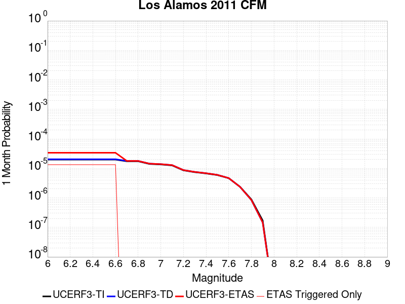 | 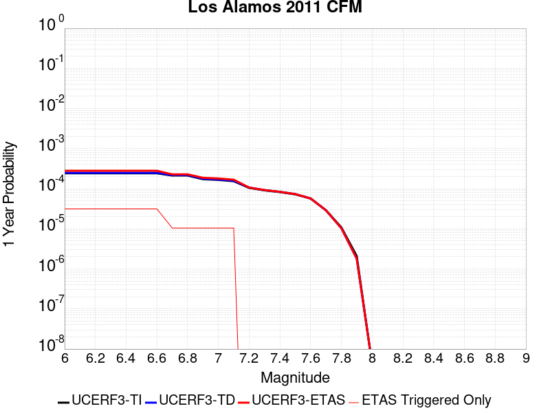 | 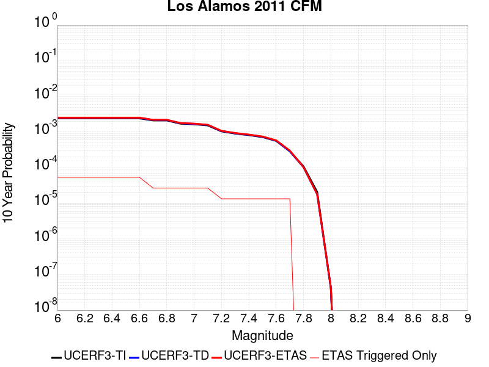 |

| Magnitude | 1 wk TI Prob | 1 wk TD Prob | 1 wk ETAS Prob | 1 wk ETAS/TD Gain | 1 wk ETAS Triggered Only | 1 mo TI Prob | 1 mo TD Prob | 1 mo ETAS Prob | 1 mo ETAS/TD Gain | 1 mo ETAS Triggered Only | 1 yr TI Prob | 1 yr TD Prob | 1 yr ETAS Prob | 1 yr ETAS/TD Gain | 1 yr ETAS Triggered Only | 10 yr TI Prob | 10 yr TD Prob | 10 yr ETAS Prob | 10 yr ETAS/TD Gain | 10 yr ETAS Triggered Only |
|-----|-----|-----|-----|-----|-----|-----|-----|-----|-----|-----|-----|-----|-----|-----|-----|-----|-----|-----|-----|-----|
| 6.0 | 4.6284417E-6 | 4.751731E-6 | 4.751731E-6 | 1.0 | 0.0 | 1.9836029E-5 | 2.0364414E-5 | 3.0800107E-5 | 1.5124476 | 1.0435908E-5 | 2.4147688E-4 | 2.4791027E-4 | 2.7921025E-4 | 1.1262552 | 3.1307725E-5 | 0.0024121467 | 0.0024765113 | 0.0025181517 | 1.0168141 | 4.174363E-5 |
| 6.1 | 4.6284417E-6 | 4.751731E-6 | 4.751731E-6 | 1.0 | 0.0 | 1.9836029E-5 | 2.0364414E-5 | 3.0800107E-5 | 1.5124476 | 1.0435908E-5 | 2.4147688E-4 | 2.4791027E-4 | 2.7921025E-4 | 1.1262552 | 3.1307725E-5 | 0.0024121467 | 0.0024765113 | 0.0025181517 | 1.0168141 | 4.174363E-5 |
| 6.2 | 4.6284417E-6 | 4.751731E-6 | 4.751731E-6 | 1.0 | 0.0 | 1.9836029E-5 | 2.0364414E-5 | 3.0800107E-5 | 1.5124476 | 1.0435908E-5 | 2.4147688E-4 | 2.4791027E-4 | 2.7921025E-4 | 1.1262552 | 3.1307725E-5 | 0.0024121467 | 0.0024765113 | 0.0025181517 | 1.0168141 | 4.174363E-5 |
| 6.3 | 4.6284417E-6 | 4.751731E-6 | 4.751731E-6 | 1.0 | 0.0 | 1.9836029E-5 | 2.0364414E-5 | 3.0800107E-5 | 1.5124476 | 1.0435908E-5 | 2.4147688E-4 | 2.4791027E-4 | 2.7921025E-4 | 1.1262552 | 3.1307725E-5 | 0.0024121467 | 0.0024765113 | 0.0025181517 | 1.0168141 | 4.174363E-5 |
| 6.4 | 4.6284417E-6 | 4.751731E-6 | 4.751731E-6 | 1.0 | 0.0 | 1.9836029E-5 | 2.0364414E-5 | 3.0800107E-5 | 1.5124476 | 1.0435908E-5 | 2.4147688E-4 | 2.4791027E-4 | 2.7921025E-4 | 1.1262552 | 3.1307725E-5 | 0.0024121467 | 0.0024765113 | 0.0025181517 | 1.0168141 | 4.174363E-5 |
| 6.5 | 4.6284417E-6 | 4.751731E-6 | 4.751731E-6 | 1.0 | 0.0 | 1.9836029E-5 | 2.0364414E-5 | 3.0800107E-5 | 1.5124476 | 1.0435908E-5 | 2.4147688E-4 | 2.4791027E-4 | 2.7921025E-4 | 1.1262552 | 3.1307725E-5 | 0.0024121467 | 0.0024765113 | 0.0025181517 | 1.0168141 | 4.174363E-5 |
| 6.6 | 4.6284417E-6 | 4.751731E-6 | 4.751731E-6 | 1.0 | 0.0 | 1.9836029E-5 | 2.0364414E-5 | 3.0800107E-5 | 1.5124476 | 1.0435908E-5 | 2.4147688E-4 | 2.4791027E-4 | 2.7921025E-4 | 1.1262552 | 3.1307725E-5 | 0.0024121467 | 0.0024765113 | 0.0025181517 | 1.0168141 | 4.174363E-5 |
| 6.7 | 4.062321E-6 | 4.166349E-6 | 4.166349E-6 | 1.0 | 0.0 | 1.7409831E-5 | 1.7855667E-5 | 1.7855667E-5 | 1.0 | 0.0 | 2.1194408E-4 | 2.1737257E-4 | 2.2780622E-4 | 1.0479989 | 1.0435908E-5 | 0.0021174205 | 0.0021717492 | 0.0021925757 | 1.0095897 | 2.0871816E-5 |
| 6.8 | 4.062321E-6 | 4.166349E-6 | 4.166349E-6 | 1.0 | 0.0 | 1.7409831E-5 | 1.7855667E-5 | 1.7855667E-5 | 1.0 | 0.0 | 2.1194408E-4 | 2.1737257E-4 | 2.2780622E-4 | 1.0479989 | 1.0435908E-5 | 0.0021174205 | 0.0021717492 | 0.0021925757 | 1.0095897 | 2.0871816E-5 |
| 6.9 | 3.2936077E-6 | 3.372958E-6 | 3.372958E-6 | 1.0 | 0.0 | 1.4115385E-5 | 1.4455459E-5 | 1.4455459E-5 | 1.0 | 0.0 | 1.7184127E-4 | 1.7598194E-4 | 1.8641601E-4 | 1.0592905 | 1.0435908E-5 | 0.0017170844 | 0.0017585184 | 0.0017793535 | 1.0118481 | 2.0871816E-5 |
| 7.0 | 3.1687898E-6 | 3.2448156E-6 | 3.2448156E-6 | 1.0 | 0.0 | 1.3580457E-5 | 1.3906283E-5 | 1.3906283E-5 | 1.0 | 0.0 | 1.6532952E-4 | 1.6929678E-4 | 1.7973092E-4 | 1.0616323 | 1.0435908E-5 | 0.0016520657 | 0.0016917696 | 0.0017126062 | 1.0123163 | 2.0871816E-5 |
| 7.1 | 2.9379228E-6 | 3.0073259E-6 | 3.0073259E-6 | 1.0 | 0.0 | 1.25910365E-5 | 1.288848E-5 | 1.288848E-5 | 1.0 | 0.0 | 1.5328509E-4 | 1.5690686E-4 | 1.6734113E-4 | 1.0664998 | 1.0435908E-5 | 0.001531794 | 0.0015680499 | 0.0015888889 | 1.0132898 | 2.0871816E-5 |
| 7.2 | 2.0020686E-6 | 2.0416298E-6 | 2.0416298E-6 | 1.0 | 0.0 | 8.580266E-6 | 8.749813E-6 | 8.749813E-6 | 1.0 | 0.0 | 1.0445973E-4 | 1.0652381E-4 | 1.0652381E-4 | 1.0 | 0.0 | 0.0010441064 | 0.001064732 | 0.0010751567 | 1.009791 | 1.0435908E-5 |
| 7.3 | 1.7364243E-6 | 1.7678802E-6 | 1.7678802E-6 | 1.0 | 0.0 | 7.441797E-6 | 7.576608E-6 | 7.576608E-6 | 1.0 | 0.0 | 9.0600115E-5 | 9.2241324E-5 | 9.2241324E-5 | 1.0 | 0.0 | 9.0563187E-4 | 9.2203356E-4 | 9.3245984E-4 | 1.011308 | 1.0435908E-5 |
| 7.4 | 1.5718434E-6 | 1.5983177E-6 | 1.5983177E-6 | 1.0 | 0.0 | 6.7364545E-6 | 6.849915E-6 | 6.849915E-6 | 1.0 | 0.0 | 8.201325E-5 | 8.339455E-5 | 8.339455E-5 | 1.0 | 0.0 | 8.198299E-4 | 8.3363557E-4 | 8.440628E-4 | 1.0125082 | 1.0435908E-5 |
| 7.5 | 1.3841119E-6 | 1.4042793E-6 | 1.4042793E-6 | 1.0 | 0.0 | 5.9318945E-6 | 6.0183256E-6 | 6.0183256E-6 | 1.0 | 0.0 | 7.221842E-5 | 7.327068E-5 | 7.327068E-5 | 1.0 | 0.0 | 7.2194956E-4 | 7.324681E-4 | 7.428964E-4 | 1.0142372 | 1.0435908E-5 |
| 7.6 | 1.0843726E-6 | 1.093442E-6 | 1.093442E-6 | 1.0 | 0.0 | 4.647303E-6 | 4.6861724E-6 | 4.6861724E-6 | 1.0 | 0.0 | 5.6579443E-5 | 5.705268E-5 | 5.705268E-5 | 1.0 | 0.0 | 5.656504E-4 | 5.703829E-4 | 5.8081286E-4 | 1.0182859 | 1.0435908E-5 |
| 7.7 | 5.544814E-7 | 5.5018705E-7 | 5.5018705E-7 | 1.0 | 0.0 | 2.3763469E-6 | 2.3579425E-6 | 2.3579425E-6 | 1.0 | 0.0 | 2.8931638E-5 | 2.8707573E-5 | 2.8707573E-5 | 1.0 | 0.0 | 2.8927872E-4 | 2.870388E-4 | 2.974717E-4 | 1.0363467 | 1.0435908E-5 |
| 7.8 | 2.0707465E-7 | 1.977846E-7 | 1.977846E-7 | 1.0 | 0.0 | 8.874625E-7 | 8.4764804E-7 | 8.4764804E-7 | 1.0 | 0.0 | 1.08048025E-5 | 1.0320066E-5 | 1.0320066E-5 | 1.0 | 0.0 | 1.0804277E-4 | 1.0319592E-4 | 1.0319592E-4 | 1.0 | 0.0 |
| 7.9 | 3.9821284E-8 | 3.433109E-8 | 3.433109E-8 | 1.0 | 0.0 | 1.7066264E-7 | 1.4713324E-7 | 1.4713324E-7 | 1.0 | 0.0 | 2.0778157E-6 | 1.7913457E-6 | 1.7913457E-6 | 1.0 | 0.0 | 2.0777963E-5 | 1.7913319E-5 | 1.7913319E-5 | 1.0 | 0.0 |
| 8.0 | 7.880441E-11 | 8.2353124E-11 | 8.2353124E-11 | 1.0 | 0.0 | 3.3773329E-10 | 3.52942E-10 | 3.52942E-10 | 1.0 | 0.0 | 4.1119033E-9 | 4.2970694E-9 | 4.2970694E-9 | 1.0 | 0.0 | 4.1119034E-8 | 4.2970694E-8 | 4.2970694E-8 | 1.0 | 0.0 |

## Robinson Creek
*[(top)](#table-of-contents)*

| 1 Week | 1 Month | 1 Year | 10 Year |
|-----|-----|-----|-----|
| 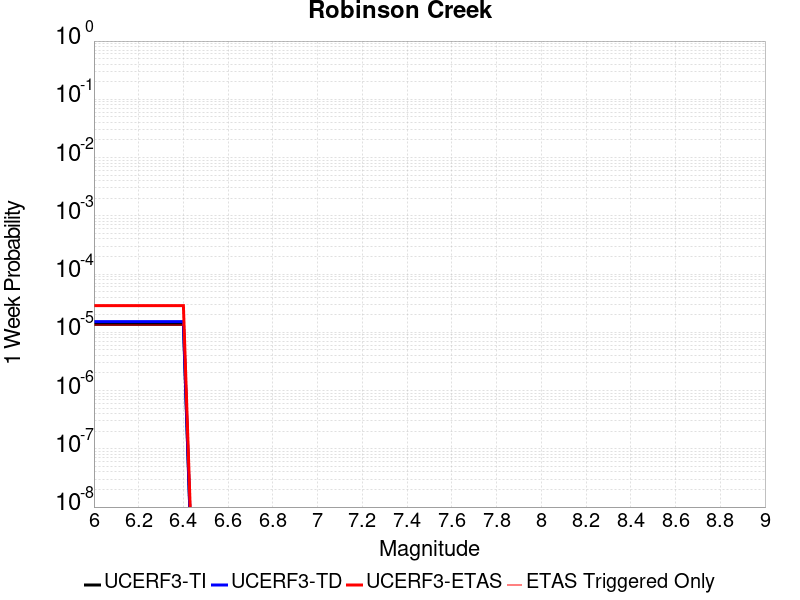 | 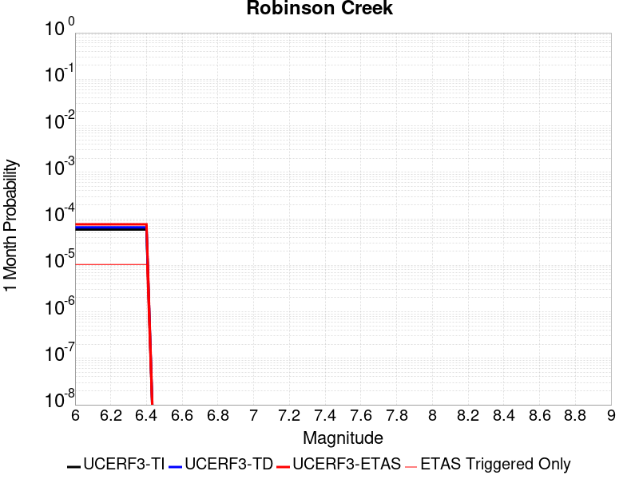 | 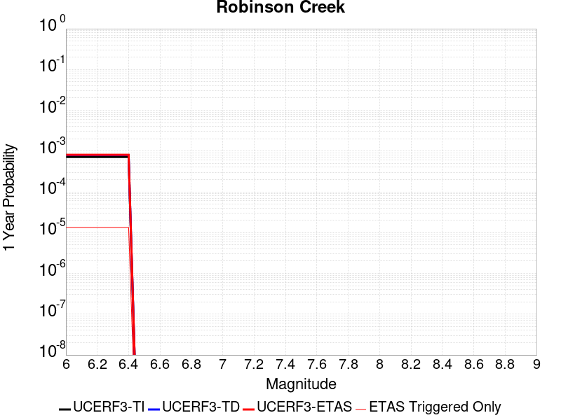 | 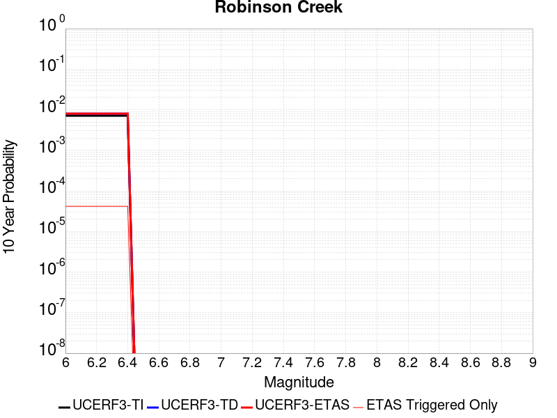 |

| Magnitude | 1 wk TI Prob | 1 wk TD Prob | 1 wk ETAS Prob | 1 wk ETAS/TD Gain | 1 wk ETAS Triggered Only | 1 mo TI Prob | 1 mo TD Prob | 1 mo ETAS Prob | 1 mo ETAS/TD Gain | 1 mo ETAS Triggered Only | 1 yr TI Prob | 1 yr TD Prob | 1 yr ETAS Prob | 1 yr ETAS/TD Gain | 1 yr ETAS Triggered Only | 10 yr TI Prob | 10 yr TD Prob | 10 yr ETAS Prob | 10 yr ETAS/TD Gain | 10 yr ETAS Triggered Only |
|-----|-----|-----|-----|-----|-----|-----|-----|-----|-----|-----|-----|-----|-----|-----|-----|-----|-----|-----|-----|-----|
| 6.0 | 1.3705327E-5 | 1.5285013E-5 | 2.5720761E-5 | 1.6827438 | 1.0435908E-5 | 5.8735794E-5 | 6.55072E-5 | 7.594242E-5 | 1.1592989 | 1.0435908E-5 | 7.1487366E-4 | 7.9755014E-4 | 8.184053E-4 | 1.026149 | 2.0871816E-5 | 0.0071257832 | 0.007975501 | 0.008016912 | 1.0051923 | 4.174363E-5 |
| 6.1 | 1.3705327E-5 | 1.5285013E-5 | 2.5720761E-5 | 1.6827438 | 1.0435908E-5 | 5.8735794E-5 | 6.55072E-5 | 7.594242E-5 | 1.1592989 | 1.0435908E-5 | 7.1487366E-4 | 7.9755014E-4 | 8.184053E-4 | 1.026149 | 2.0871816E-5 | 0.0071257832 | 0.007975501 | 0.008016912 | 1.0051923 | 4.174363E-5 |
| 6.2 | 1.3705327E-5 | 1.5285013E-5 | 2.5720761E-5 | 1.6827438 | 1.0435908E-5 | 5.8735794E-5 | 6.55072E-5 | 7.594242E-5 | 1.1592989 | 1.0435908E-5 | 7.1487366E-4 | 7.9755014E-4 | 8.184053E-4 | 1.026149 | 2.0871816E-5 | 0.0071257832 | 0.007975501 | 0.008016912 | 1.0051923 | 4.174363E-5 |
| 6.3 | 1.3705327E-5 | 1.5285013E-5 | 2.5720761E-5 | 1.6827438 | 1.0435908E-5 | 5.8735794E-5 | 6.55072E-5 | 7.594242E-5 | 1.1592989 | 1.0435908E-5 | 7.1487366E-4 | 7.9755014E-4 | 8.184053E-4 | 1.026149 | 2.0871816E-5 | 0.0071257832 | 0.007975501 | 0.008016912 | 1.0051923 | 4.174363E-5 |
| 6.4 | 1.3705327E-5 | 1.5285013E-5 | 2.5720761E-5 | 1.6827438 | 1.0435908E-5 | 5.8735794E-5 | 6.55072E-5 | 7.594242E-5 | 1.1592989 | 1.0435908E-5 | 7.1487366E-4 | 7.9755014E-4 | 8.184053E-4 | 1.026149 | 2.0871816E-5 | 0.0071257832 | 0.007975501 | 0.008016912 | 1.0051923 | 4.174363E-5 |

## Hayward (So) 2011 CFM
*[(top)](#table-of-contents)*

| 1 Week | 1 Month | 1 Year | 10 Year |
|-----|-----|-----|-----|
|  | 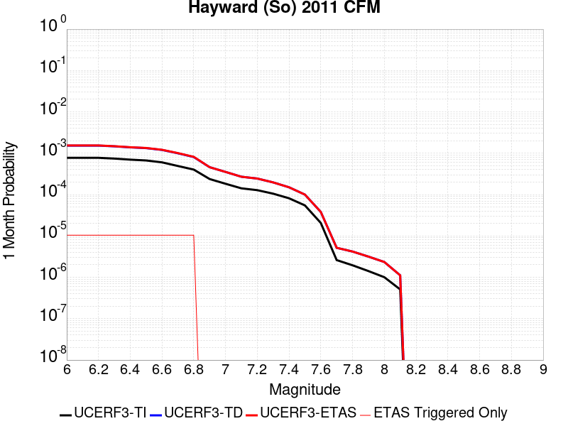 | 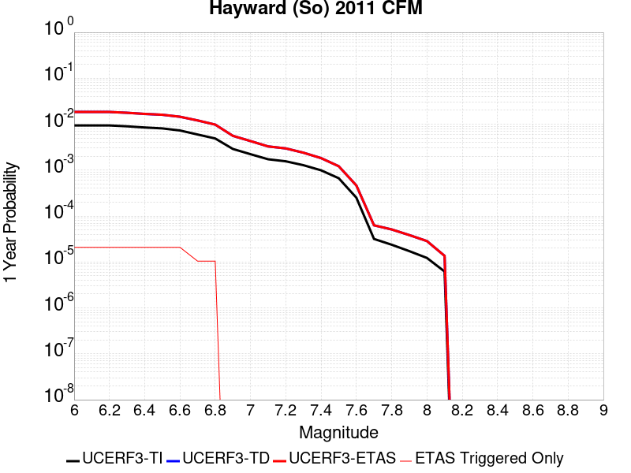 | 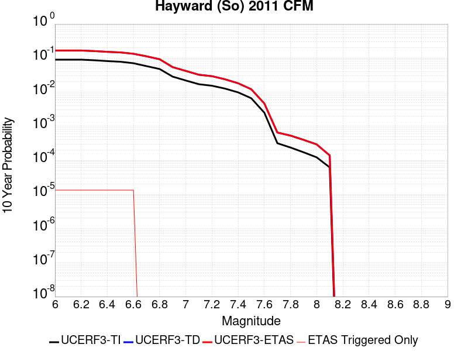 |

| Magnitude | 1 wk TI Prob | 1 wk TD Prob | 1 wk ETAS Prob | 1 wk ETAS/TD Gain | 1 wk ETAS Triggered Only | 1 mo TI Prob | 1 mo TD Prob | 1 mo ETAS Prob | 1 mo ETAS/TD Gain | 1 mo ETAS Triggered Only | 1 yr TI Prob | 1 yr TD Prob | 1 yr ETAS Prob | 1 yr ETAS/TD Gain | 1 yr ETAS Triggered Only | 10 yr TI Prob | 10 yr TD Prob | 10 yr ETAS Prob | 10 yr ETAS/TD Gain | 10 yr ETAS Triggered Only |
|-----|-----|-----|-----|-----|-----|-----|-----|-----|-----|-----|-----|-----|-----|-----|-----|-----|-----|-----|-----|-----|
| 6.0 | 1.8091932E-4 | 3.570541E-4 | 3.570541E-4 | 1.0 | 0.0 | 7.751381E-4 | 0.0015293444 | 0.0015397642 | 1.0068133 | 1.0435908E-5 | 0.00939654 | 0.018463207 | 0.018483695 | 1.0011096 | 2.0871816E-5 | 0.090090066 | 0.16673161 | 0.1667577 | 1.0001565 | 3.1307725E-5 |
| 6.1 | 1.8091932E-4 | 3.570541E-4 | 3.570541E-4 | 1.0 | 0.0 | 7.751381E-4 | 0.0015293444 | 0.0015397642 | 1.0068133 | 1.0435908E-5 | 0.00939654 | 0.018463207 | 0.018483695 | 1.0011096 | 2.0871816E-5 | 0.090090066 | 0.16673161 | 0.1667577 | 1.0001565 | 3.1307725E-5 |
| 6.2 | 1.8091932E-4 | 3.570541E-4 | 3.570541E-4 | 1.0 | 0.0 | 7.751381E-4 | 0.0015293444 | 0.0015397642 | 1.0068133 | 1.0435908E-5 | 0.00939654 | 0.018463207 | 0.018483695 | 1.0011096 | 2.0871816E-5 | 0.090090066 | 0.16673161 | 0.1667577 | 1.0001565 | 3.1307725E-5 |
| 6.3 | 1.7322872E-4 | 3.426234E-4 | 3.426234E-4 | 1.0 | 0.0 | 7.4219756E-4 | 0.0014675693 | 0.0014779898 | 1.0071006 | 1.0435908E-5 | 0.0089988755 | 0.017723544 | 0.017744046 | 1.0011568 | 2.0871816E-5 | 0.08643075 | 0.16066726 | 0.16068478 | 1.0001091 | 2.0871816E-5 |
| 6.4 | 1.6334097E-4 | 3.234411E-4 | 3.234411E-4 | 1.0 | 0.0 | 6.998449E-4 | 0.0013854484 | 0.0013958699 | 1.0075221 | 1.0435908E-5 | 0.008487372 | 0.016739385 | 0.016759908 | 1.001226 | 2.0871816E-5 | 0.081704415 | 0.15255594 | 0.15257363 | 1.000116 | 2.0871816E-5 |
| 6.5 | 1.5600289E-4 | 3.1018828E-4 | 3.1018828E-4 | 1.0 | 0.0 | 6.684125E-4 | 0.0013287093 | 0.0013391314 | 1.0078437 | 1.0435908E-5 | 0.008107598 | 0.016058935 | 0.01607947 | 1.0012789 | 2.0871816E-5 | 0.078181036 | 0.14683272 | 0.14685053 | 1.0001212 | 2.0871816E-5 |
| 6.6 | 1.4046066E-4 | 2.8032906E-4 | 2.8032906E-4 | 1.0 | 0.0 | 6.018354E-4 | 0.0012008639 | 0.0012112872 | 1.0086799 | 1.0435908E-5 | 0.0073027555 | 0.014524006 | 0.014544575 | 1.0014162 | 2.0871816E-5 | 0.07067384 | 0.13391982 | 0.1339379 | 1.000135 | 2.0871816E-5 |
| 6.7 | 1.14696966E-4 | 2.3271477E-4 | 2.3271477E-4 | 1.0 | 0.0 | 4.914658E-4 | 9.969729E-4 | 0.0010073984 | 1.0104572 | 1.0435908E-5 | 0.0059671924 | 0.012071652 | 0.012081963 | 1.000854 | 1.0435908E-5 | 0.058094822 | 0.11274672 | 0.112755984 | 1.0000821 | 1.0435908E-5 |
| 6.8 | 9.3874296E-5 | 1.8861453E-4 | 1.8861453E-4 | 1.0 | 0.0 | 4.0225635E-4 | 8.0810126E-4 | 8.1852876E-4 | 1.0129037 | 1.0435908E-5 | 0.0048864787 | 0.009794984 | 0.009805318 | 1.001055 | 1.0435908E-5 | 0.047804173 | 0.09259856 | 0.09260803 | 1.0001023 | 1.0435908E-5 |
| 6.9 | 5.551852E-5 | 1.072948E-4 | 1.072948E-4 | 1.0 | 0.0 | 2.3791482E-4 | 4.5975443E-4 | 4.5975443E-4 | 1.0 | 0.0 | 0.0028927654 | 0.0055832625 | 0.0055832625 | 1.0 | 0.0 | 0.028553981 | 0.054245494 | 0.054245494 | 1.0 | 0.0 |
| 7.0 | 4.2662363E-5 | 8.2464416E-5 | 8.2464416E-5 | 1.0 | 0.0 | 1.8282588E-4 | 3.5337146E-4 | 3.5337146E-4 | 1.0 | 0.0 | 0.0022236328 | 0.0042938837 | 0.0042938837 | 1.0 | 0.0 | 0.022015138 | 0.042064495 | 0.042064495 | 1.0 | 0.0 |
| 7.1 | 3.305886E-5 | 6.3019055E-5 | 6.3019055E-5 | 1.0 | 0.0 | 1.4167312E-4 | 2.700538E-4 | 2.700538E-4 | 1.0 | 0.0 | 0.0017235056 | 0.0032829668 | 0.0032829668 | 1.0 | 0.0 | 0.017101998 | 0.032452874 | 0.032452874 | 1.0 | 0.0 |
| 7.2 | 2.9856887E-5 | 5.7013647E-5 | 5.7013647E-5 | 1.0 | 0.0 | 1.2795182E-4 | 2.4432142E-4 | 2.4432142E-4 | 1.0 | 0.0 | 0.0015567001 | 0.0029705726 | 0.0029705726 | 1.0 | 0.0 | 0.015458403 | 0.029453589 | 0.029453589 | 1.0 | 0.0 |
| 7.3 | 2.4559737E-5 | 4.599088E-5 | 4.599088E-5 | 1.0 | 0.0 | 1.0525176E-4 | 1.9708896E-4 | 1.9708896E-4 | 1.0 | 0.0 | 0.0012806869 | 0.0023969305 | 0.0023969305 | 1.0 | 0.0 | 0.012733313 | 0.023857482 | 0.023857482 | 1.0 | 0.0 |
| 7.4 | 1.9002231E-5 | 3.5049303E-5 | 3.5049303E-5 | 1.0 | 0.0 | 8.143559E-5 | 1.502027E-4 | 1.502027E-4 | 1.0 | 0.0 | 9.910273E-4 | 0.0018271938 | 0.0018271938 | 1.0 | 0.0 | 0.009866194 | 0.018258283 | 0.018258283 | 1.0 | 0.0 |
| 7.5 | 1.2783333E-5 | 2.3330069E-5 | 2.3330069E-5 | 1.0 | 0.0 | 5.4784563E-5 | 9.998221E-5 | 9.998221E-5 | 1.0 | 0.0 | 6.667979E-4 | 0.0012166094 | 0.0012166094 | 1.0 | 0.0 | 0.006648007 | 0.012209582 | 0.012209582 | 1.0 | 0.0 |
| 7.6 | 4.8149627E-6 | 8.887544E-6 | 8.887544E-6 | 1.0 | 0.0 | 2.063539E-5 | 3.8088925E-5 | 3.8088925E-5 | 1.0 | 0.0 | 2.5120692E-4 | 4.636352E-4 | 4.636352E-4 | 1.0 | 0.0 | 0.0025092314 | 0.0046812436 | 0.0046812436 | 1.0 | 0.0 |
| 7.7 | 6.0838227E-7 | 1.2056693E-6 | 1.2056693E-6 | 1.0 | 0.0 | 2.6073499E-6 | 5.1671436E-6 | 5.1671436E-6 | 1.0 | 0.0 | 3.174402E-5 | 6.290816E-5 | 6.290816E-5 | 1.0 | 0.0 | 3.1739488E-4 | 6.5293367E-4 | 6.5293367E-4 | 1.0 | 0.0 |
| 7.8 | 4.5542808E-7 | 9.792182E-7 | 9.792182E-7 | 1.0 | 0.0 | 1.9518332E-6 | 4.1966427E-6 | 4.1966427E-6 | 1.0 | 0.0 | 2.376331E-5 | 5.1092928E-5 | 5.1092928E-5 | 1.0 | 0.0 | 2.3760769E-4 | 5.321372E-4 | 5.321372E-4 | 1.0 | 0.0 |
| 7.9 | 3.3016747E-7 | 7.386335E-7 | 7.386335E-7 | 1.0 | 0.0 | 1.4150027E-6 | 3.1655684E-6 | 3.1655684E-6 | 1.0 | 0.0 | 1.7227521E-5 | 3.8540114E-5 | 3.8540114E-5 | 1.0 | 0.0 | 1.7226185E-4 | 3.9930744E-4 | 3.9930744E-4 | 1.0 | 0.0 |
| 8.0 | 2.347038E-7 | 5.4714894E-7 | 5.4714894E-7 | 1.0 | 0.0 | 1.0058731E-6 | 2.344922E-6 | 2.344922E-6 | 1.0 | 0.0 | 1.2246436E-5 | 2.8549053E-5 | 2.8549053E-5 | 1.0 | 0.0 | 1.2245761E-4 | 2.9355253E-4 | 2.9355253E-4 | 1.0 | 0.0 |
| 8.1 | 1.18822804E-7 | 2.6058973E-7 | 2.6058973E-7 | 1.0 | 0.0 | 5.092405E-7 | 1.1168127E-6 | 1.1168127E-6 | 1.0 | 0.0 | 6.1999854E-6 | 1.359711E-5 | 1.359711E-5 | 1.0 | 0.0 | 6.199812E-5 | 1.3917852E-4 | 1.3917852E-4 | 1.0 | 0.0 |

## Hayward (So) extension 2011 CFM
*[(top)](#table-of-contents)*

| 1 Week | 1 Month | 1 Year | 10 Year |
|-----|-----|-----|-----|
|  | 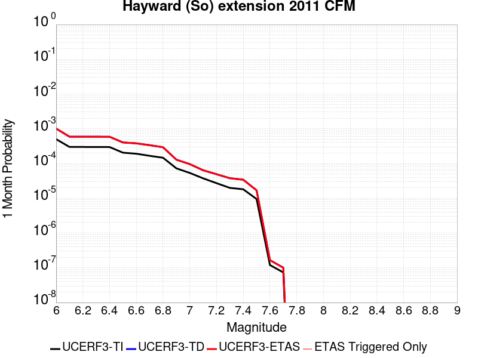 | 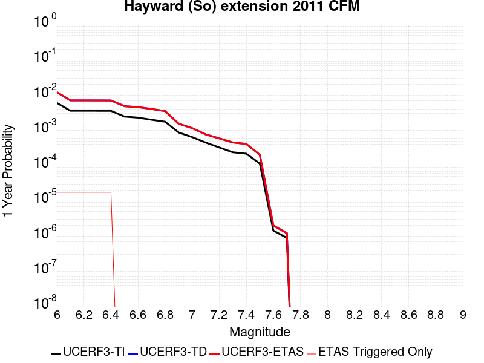 | 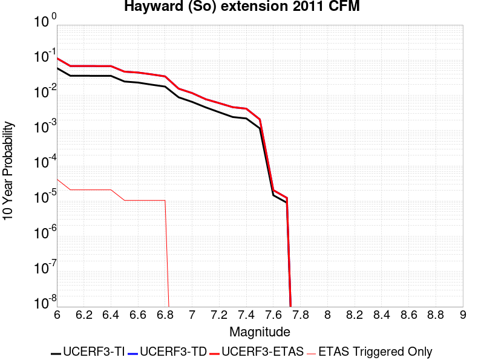 |

| Magnitude | 1 wk TI Prob | 1 wk TD Prob | 1 wk ETAS Prob | 1 wk ETAS/TD Gain | 1 wk ETAS Triggered Only | 1 mo TI Prob | 1 mo TD Prob | 1 mo ETAS Prob | 1 mo ETAS/TD Gain | 1 mo ETAS Triggered Only | 1 yr TI Prob | 1 yr TD Prob | 1 yr ETAS Prob | 1 yr ETAS/TD Gain | 1 yr ETAS Triggered Only | 10 yr TI Prob | 10 yr TD Prob | 10 yr ETAS Prob | 10 yr ETAS/TD Gain | 10 yr ETAS Triggered Only |
|-----|-----|-----|-----|-----|-----|-----|-----|-----|-----|-----|-----|-----|-----|-----|-----|-----|-----|-----|-----|-----|
| 6.0 | 1.1721256E-4 | 2.3697627E-4 | 2.3697627E-4 | 1.0 | 0.0 | 5.022428E-4 | 0.0010129517 | 0.001023377 | 1.010292 | 1.0435908E-5 | 0.0060976758 | 0.012248711 | 0.012269327 | 1.0016831 | 2.0871816E-5 | 0.0593305 | 0.112843215 | 0.11288025 | 1.0003282 | 4.174363E-5 |
| 6.1 | 6.99169E-5 | 1.3822885E-4 | 1.3822885E-4 | 1.0 | 0.0 | 2.9960944E-4 | 5.9128006E-4 | 6.0170976E-4 | 1.0176393 | 1.0435908E-5 | 0.0036416445 | 0.0071720886 | 0.0071928105 | 1.0028893 | 2.0871816E-5 | 0.035825435 | 0.067803554 | 0.06782301 | 1.0002869 | 2.0871816E-5 |
| 6.2 | 6.99169E-5 | 1.3822885E-4 | 1.3822885E-4 | 1.0 | 0.0 | 2.9960944E-4 | 5.9128006E-4 | 6.0170976E-4 | 1.0176393 | 1.0435908E-5 | 0.0036416445 | 0.0071720886 | 0.0071928105 | 1.0028893 | 2.0871816E-5 | 0.035825435 | 0.067803554 | 0.06782301 | 1.0002869 | 2.0871816E-5 |
| 6.3 | 6.970908E-5 | 1.379104E-4 | 1.379104E-4 | 1.0 | 0.0 | 2.9871898E-4 | 5.899159E-4 | 6.0034567E-4 | 1.01768 | 1.0435908E-5 | 0.0036308395 | 0.007155625 | 0.0071763475 | 1.002896 | 2.0871816E-5 | 0.035720866 | 0.067652516 | 0.06767198 | 1.0002877 | 2.0871816E-5 |
| 6.4 | 6.9517155E-5 | 1.375792E-4 | 1.375792E-4 | 1.0 | 0.0 | 2.9789665E-4 | 5.884971E-4 | 5.9892685E-4 | 1.0177227 | 1.0435908E-5 | 0.0036208609 | 0.0071385372 | 0.00715926 | 1.002903 | 2.0871816E-5 | 0.03562429 | 0.06749655 | 0.06751602 | 1.0002884 | 2.0871816E-5 |
| 6.5 | 4.786248E-5 | 9.41498E-5 | 9.41498E-5 | 1.0 | 0.0 | 2.0510878E-4 | 4.034394E-4 | 4.1387108E-4 | 1.025857 | 1.0435908E-5 | 0.0024943394 | 0.004901227 | 0.004911612 | 1.0021188 | 1.0435908E-5 | 0.02466527 | 0.046901822 | 0.04691177 | 1.0002121 | 1.0435908E-5 |
| 6.6 | 4.4662214E-5 | 8.881654E-5 | 8.881654E-5 | 1.0 | 0.0 | 1.9139545E-4 | 3.805894E-4 | 3.910213E-4 | 1.0274099 | 1.0435908E-5 | 0.0023277493 | 0.0046242937 | 0.004634681 | 1.0022464 | 1.0435908E-5 | 0.02303517 | 0.044293344 | 0.044303317 | 1.0002252 | 1.0435908E-5 |
| 6.7 | 3.884542E-5 | 7.8648096E-5 | 7.8648096E-5 | 1.0 | 0.0 | 1.6646975E-4 | 3.370222E-4 | 3.474546E-4 | 1.0309546 | 1.0435908E-5 | 0.002024885 | 0.0040959697 | 0.004106363 | 1.0025374 | 1.0435908E-5 | 0.020065336 | 0.039333146 | 0.03934317 | 1.0002549 | 1.0435908E-5 |
| 6.8 | 3.4221863E-5 | 6.855653E-5 | 6.855653E-5 | 1.0 | 0.0 | 1.4665688E-4 | 2.93783E-4 | 3.0421585E-4 | 1.0355121 | 1.0435908E-5 | 0.0017840851 | 0.0035713627 | 0.0035817614 | 1.0029117 | 1.0435908E-5 | 0.017698295 | 0.034421004 | 0.034431078 | 1.0002928 | 1.0435908E-5 |
| 6.9 | 1.6927712E-5 | 3.0061563E-5 | 3.0061563E-5 | 1.0 | 0.0 | 7.2545314E-5 | 1.2882923E-4 | 1.2882923E-4 | 1.0 | 0.0 | 8.828813E-4 | 0.0015674243 | 0.0015674243 | 1.0 | 0.0 | 0.008793819 | 0.01546327 | 0.01546327 | 1.0 | 0.0 |
| 7.0 | 1.2509653E-5 | 2.2462571E-5 | 2.2462571E-5 | 1.0 | 0.0 | 5.3611697E-5 | 9.6264856E-5 | 9.6264856E-5 | 1.0 | 0.0 | 6.525269E-4 | 0.0011714385 | 0.0011714385 | 1.0 | 0.0 | 0.0065061417 | 0.01158231 | 0.01158231 | 1.0 | 0.0 |
| 7.1 | 8.751583E-6 | 1.4925648E-5 | 1.4925648E-5 | 1.0 | 0.0 | 3.750624E-5 | 6.3965526E-5 | 6.3965526E-5 | 1.0 | 0.0 | 4.5654282E-4 | 7.785079E-4 | 7.785079E-4 | 1.0 | 0.0 | 0.0045560603 | 0.007763496 | 0.007763496 | 1.0 | 0.0 |
| 7.2 | 6.354379E-6 | 1.1498636E-5 | 1.1498636E-5 | 1.0 | 0.0 | 2.7232769E-5 | 4.9278966E-5 | 4.9278966E-5 | 1.0 | 0.0 | 3.3150852E-4 | 5.99811E-4 | 5.99811E-4 | 1.0 | 0.0 | 0.0033101442 | 0.0060003046 | 0.0060003046 | 1.0 | 0.0 |
| 7.3 | 4.645554E-6 | 8.818172E-6 | 8.818172E-6 | 1.0 | 0.0 | 1.9909365E-5 | 3.779164E-5 | 3.779164E-5 | 1.0 | 0.0 | 2.4236954E-4 | 4.6002E-4 | 4.6002E-4 | 1.0 | 0.0 | 0.0024210536 | 0.004610708 | 0.004610708 | 1.0 | 0.0 |
| 7.4 | 4.23437E-6 | 7.992532E-6 | 7.992532E-6 | 1.0 | 0.0 | 1.8147173E-5 | 3.425328E-5 | 3.425328E-5 | 1.0 | 0.0 | 2.2091944E-4 | 4.1695772E-4 | 4.1695772E-4 | 1.0 | 0.0 | 0.0022069993 | 0.004181972 | 0.004181972 | 1.0 | 0.0 |
| 7.5 | 2.2187417E-6 | 3.9522306E-6 | 3.9522306E-6 | 1.0 | 0.0 | 9.508858E-6 | 1.6938036E-5 | 1.6938036E-5 | 1.0 | 0.0 | 1.157642E-4 | 2.0620368E-4 | 2.0620368E-4 | 1.0 | 0.0 | 0.0011570391 | 0.0020734754 | 0.0020734754 | 1.0 | 0.0 |
| 7.6 | 2.7952495E-8 | 3.878529E-8 | 3.878529E-8 | 1.0 | 0.0 | 1.1979641E-7 | 1.6622266E-7 | 1.6622266E-7 | 1.0 | 0.0 | 1.4585203E-6 | 2.0237592E-6 | 2.0237592E-6 | 1.0 | 0.0 | 1.4585107E-5 | 2.0328182E-5 | 2.0328182E-5 | 1.0 | 0.0 |
| 7.7 | 1.7192724E-8 | 2.3436517E-8 | 2.3436517E-8 | 1.0 | 0.0 | 7.36831E-8 | 1.0044221E-7 | 1.0044221E-7 | 1.0 | 0.0 | 8.9709135E-7 | 1.2228833E-6 | 1.2228833E-6 | 1.0 | 0.0 | 8.970877E-6 | 1.2296933E-5 | 1.2296933E-5 | 1.0 | 0.0 |

## Calaveras (So) - Paicines extension 2011 CFM
*[(top)](#table-of-contents)*

| 1 Week | 1 Month | 1 Year | 10 Year |
|-----|-----|-----|-----|
| 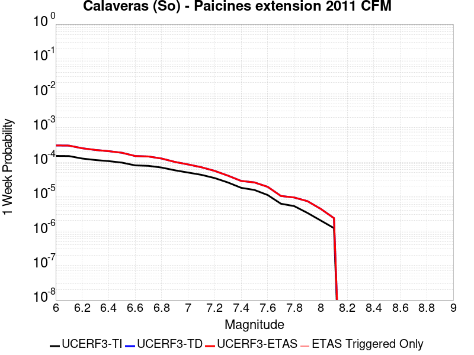 | 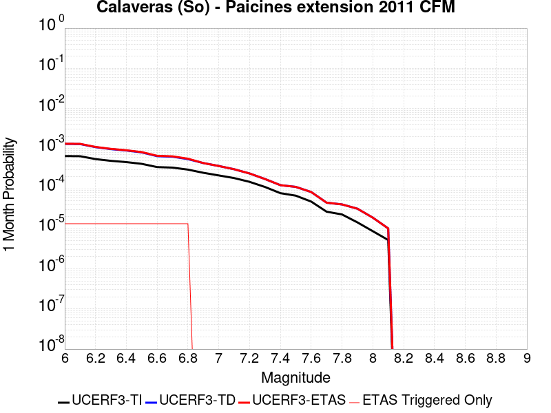 | 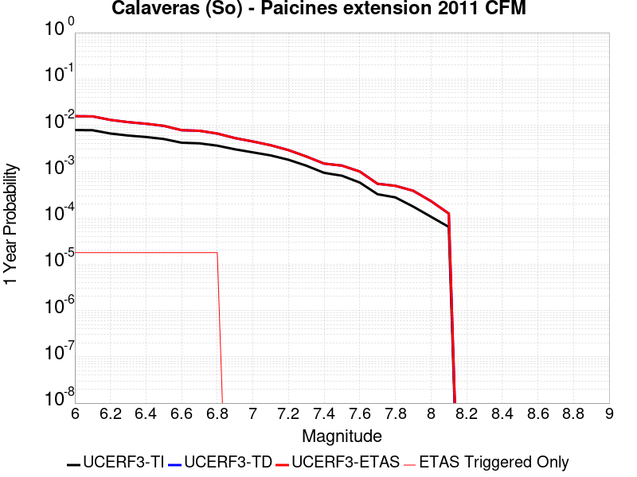 | 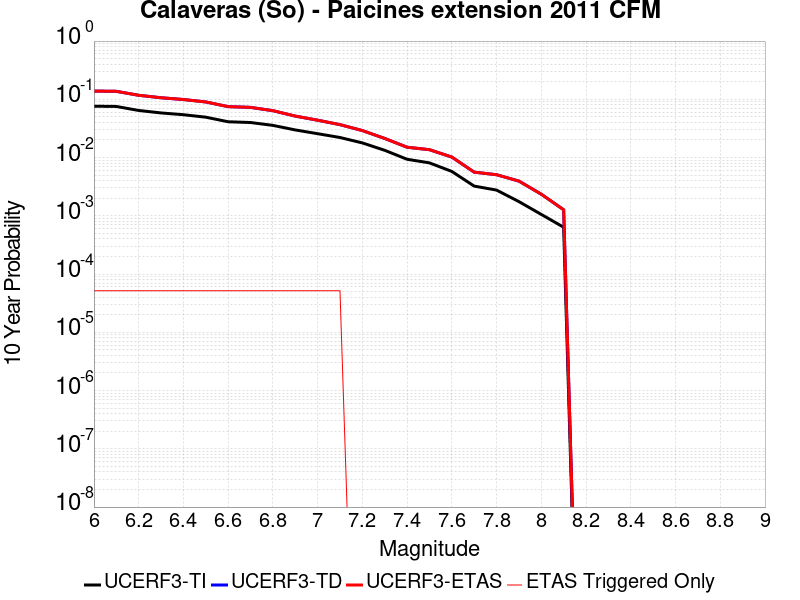 |

| Magnitude | 1 wk TI Prob | 1 wk TD Prob | 1 wk ETAS Prob | 1 wk ETAS/TD Gain | 1 wk ETAS Triggered Only | 1 mo TI Prob | 1 mo TD Prob | 1 mo ETAS Prob | 1 mo ETAS/TD Gain | 1 mo ETAS Triggered Only | 1 yr TI Prob | 1 yr TD Prob | 1 yr ETAS Prob | 1 yr ETAS/TD Gain | 1 yr ETAS Triggered Only | 10 yr TI Prob | 10 yr TD Prob | 10 yr ETAS Prob | 10 yr ETAS/TD Gain | 10 yr ETAS Triggered Only |
|-----|-----|-----|-----|-----|-----|-----|-----|-----|-----|-----|-----|-----|-----|-----|-----|-----|-----|-----|-----|-----|
| 6.0 | 1.5183659E-4 | 3.0533716E-4 | 3.0533716E-4 | 1.0 | 0.0 | 6.5056595E-4 | 0.0013069661 | 0.0013173884 | 1.0079744 | 1.0435908E-5 | 0.007891912 | 0.01569571 | 0.015716255 | 1.0013089 | 2.0871816E-5 | 0.076174594 | 0.13848671 | 0.13852268 | 1.0002596 | 4.174363E-5 |
| 6.1 | 1.5024997E-4 | 3.0227835E-4 | 3.0227835E-4 | 1.0 | 0.0 | 6.437695E-4 | 0.00129387 | 0.0013042925 | 1.0080552 | 1.0435908E-5 | 0.0078097614 | 0.015539104 | 0.015559652 | 1.0013223 | 2.0871816E-5 | 0.075409345 | 0.13715632 | 0.13719234 | 1.0002626 | 4.174363E-5 |
| 6.2 | 1.2743923E-4 | 2.5306802E-4 | 2.5306802E-4 | 1.0 | 0.0 | 5.460538E-4 | 0.0010841049 | 0.0010945295 | 1.0096159 | 1.0435908E-5 | 0.0066279583 | 0.013046704 | 0.013067303 | 1.0015789 | 2.0871816E-5 | 0.064337276 | 0.11725405 | 0.11729089 | 1.0003142 | 4.174363E-5 |
| 6.3 | 1.1525114E-4 | 2.2595265E-4 | 2.2595265E-4 | 1.0 | 0.0 | 4.9383997E-4 | 9.6799526E-4 | 9.784211E-4 | 1.0107706 | 1.0435908E-5 | 0.0059959386 | 0.011667927 | 0.011688556 | 1.001768 | 2.0871816E-5 | 0.058367174 | 0.10637007 | 0.106407374 | 1.0003507 | 4.174363E-5 |
| 6.4 | 1.07200925E-4 | 2.0836305E-4 | 2.0836305E-4 | 1.0 | 0.0 | 4.5935164E-4 | 8.926636E-4 | 9.030902E-4 | 1.0116804 | 1.0435908E-5 | 0.0055782744 | 0.010772766 | 0.010793412 | 1.0019166 | 2.0871816E-5 | 0.0544031 | 0.09919256 | 0.09923016 | 1.0003791 | 4.174363E-5 |
| 6.5 | 9.69631E-5 | 1.8729115E-4 | 1.8729115E-4 | 1.0 | 0.0 | 4.1548995E-4 | 8.024135E-4 | 8.1284106E-4 | 1.0129952 | 1.0435908E-5 | 0.0050468626 | 0.009694662 | 0.009715332 | 1.002132 | 2.0871816E-5 | 0.04933773 | 0.090084255 | 0.09012224 | 1.0004216 | 4.174363E-5 |
| 6.6 | 8.0552316E-5 | 1.5070537E-4 | 1.5070537E-4 | 1.0 | 0.0 | 3.4517853E-4 | 6.456994E-4 | 6.561285E-4 | 1.0161518 | 1.0435908E-5 | 0.0041944524 | 0.007826256 | 0.0078469645 | 1.002646 | 2.0871816E-5 | 0.04116161 | 0.074854024 | 0.07489264 | 1.0005159 | 4.174363E-5 |
| 6.7 | 7.815757E-5 | 1.4610609E-4 | 1.4610609E-4 | 1.0 | 0.0 | 3.34918E-4 | 6.260017E-4 | 6.3643104E-4 | 1.0166603 | 1.0435908E-5 | 0.004070005 | 0.0075890915 | 0.007609805 | 1.0027294 | 2.0871816E-5 | 0.039962657 | 0.072703585 | 0.07274229 | 1.0005324 | 4.174363E-5 |
| 6.8 | 6.965264E-5 | 1.2721405E-4 | 1.2721405E-4 | 1.0 | 0.0 | 2.9847719E-4 | 5.450839E-4 | 5.555141E-4 | 1.0191351 | 1.0435908E-5 | 0.0036279052 | 0.00661342 | 0.0066341534 | 1.0031351 | 2.0871816E-5 | 0.03569247 | 0.06379891 | 0.06383799 | 1.0006125 | 4.174363E-5 |
| 6.9 | 5.8000453E-5 | 1.01435086E-4 | 1.01435086E-4 | 1.0 | 0.0 | 2.4854968E-4 | 4.3464993E-4 | 4.3464993E-4 | 1.0 | 0.0 | 0.0030218933 | 0.0052791284 | 0.0052791284 | 1.0 | 0.0 | 0.029811295 | 0.051501602 | 0.051521398 | 1.0003844 | 2.0871816E-5 |
| 7.0 | 4.9865852E-5 | 8.567692E-5 | 8.567692E-5 | 1.0 | 0.0 | 2.1369329E-4 | 3.671356E-4 | 3.671356E-4 | 1.0 | 0.0 | 0.0025986114 | 0.0044608037 | 0.0044608037 | 1.0 | 0.0 | 0.025684336 | 0.043781694 | 0.043791674 | 1.0002279 | 1.0435908E-5 |
| 7.1 | 4.283875E-5 | 7.112159E-5 | 7.112159E-5 | 1.0 | 0.0 | 1.8358172E-4 | 3.047715E-4 | 3.047715E-4 | 1.0 | 0.0 | 0.0022328163 | 0.003704336 | 0.003704336 | 1.0 | 0.0 | 0.022105146 | 0.03673583 | 0.03674588 | 1.0002736 | 1.0435908E-5 |
| 7.2 | 3.450115E-5 | 5.5776054E-5 | 5.5776054E-5 | 1.0 | 0.0 | 1.478537E-4 | 2.390185E-4 | 2.390185E-4 | 1.0 | 0.0 | 0.0017986323 | 0.0029061958 | 0.0029061958 | 1.0 | 0.0 | 0.017841442 | 0.029079199 | 0.029079199 | 1.0 | 0.0 |
| 7.3 | 2.5709045E-5 | 4.0588155E-5 | 4.0588155E-5 | 1.0 | 0.0 | 1.1017697E-4 | 1.7393773E-4 | 1.7393773E-4 | 1.0 | 0.0 | 0.0013405791 | 0.002115652 | 0.002115652 | 1.0 | 0.0 | 0.013325208 | 0.021297242 | 0.021297242 | 1.0 | 0.0 |
| 7.4 | 1.8003093E-5 | 2.8509934E-5 | 2.8509934E-5 | 1.0 | 0.0 | 7.715383E-5 | 1.2217973E-4 | 1.2217973E-4 | 1.0 | 0.0 | 9.3894306E-4 | 0.0014865254 | 0.0014865254 | 1.0 | 0.0 | 0.009349857 | 0.015052196 | 0.015052196 | 1.0 | 0.0 |
| 7.5 | 1.5595824E-5 | 2.5822499E-5 | 2.5822499E-5 | 1.0 | 0.0 | 6.683753E-5 | 1.1066317E-4 | 1.1066317E-4 | 1.0 | 0.0 | 8.134431E-4 | 0.0013464936 | 0.0013464936 | 1.0 | 0.0 | 0.008104719 | 0.01365213 | 0.01365213 | 1.0 | 0.0 |
| 7.6 | 1.1110309E-5 | 1.9222098E-5 | 1.9222098E-5 | 1.0 | 0.0 | 4.761474E-5 | 8.2377825E-5 | 8.2377825E-5 | 1.0 | 0.0 | 5.795553E-4 | 0.0010024898 | 0.0010024898 | 1.0 | 0.0 | 0.0057804612 | 0.010203943 | 0.010203943 | 1.0 | 0.0 |
| 7.7 | 6.2140443E-6 | 1.0437076E-5 | 1.0437076E-5 | 1.0 | 0.0 | 2.6631347E-5 | 4.4729557E-5 | 4.4729557E-5 | 1.0 | 0.0 | 3.241884E-4 | 5.444464E-4 | 5.444464E-4 | 1.0 | 0.0 | 0.0032371588 | 0.005619835 | 0.005619835 | 1.0 | 0.0 |
| 7.8 | 5.305533E-6 | 9.433038E-6 | 9.433038E-6 | 1.0 | 0.0 | 2.27378E-5 | 4.042668E-5 | 4.042668E-5 | 1.0 | 0.0 | 2.7679754E-4 | 4.920837E-4 | 4.920837E-4 | 1.0 | 0.0 | 0.0027645302 | 0.005074324 | 0.005074324 | 1.0 | 0.0 |
| 7.9 | 3.363505E-6 | 7.3848937E-6 | 7.3848937E-6 | 1.0 | 0.0 | 1.4414942E-5 | 3.164916E-5 | 3.164916E-5 | 1.0 | 0.0 | 1.7548777E-4 | 3.8526047E-4 | 3.8526047E-4 | 1.0 | 0.0 | 0.0017534926 | 0.003948527 | 0.003948527 | 1.0 | 0.0 |
| 8.0 | 2.0271132E-6 | 4.413104E-6 | 4.413104E-6 | 1.0 | 0.0 | 8.687599E-6 | 1.8913164E-5 | 1.8913164E-5 | 1.0 | 0.0 | 1.05766376E-4 | 2.302435E-4 | 2.302435E-4 | 1.0 | 0.0 | 0.0010571606 | 0.002351099 | 0.002351099 | 1.0 | 0.0 |
| 8.1 | 1.2206116E-6 | 2.3751331E-6 | 2.3751331E-6 | 1.0 | 0.0 | 5.2311816E-6 | 1.0179103E-5 | 1.0179103E-5 | 1.0 | 0.0 | 6.3687774E-5 | 1.2392356E-4 | 1.2392356E-4 | 1.0 | 0.0 | 6.366953E-4 | 0.0012705477 | 0.0012705477 | 1.0 | 0.0 |

## Raymond
*[(top)](#table-of-contents)*

| 1 Week | 1 Month | 1 Year | 10 Year |
|-----|-----|-----|-----|
| 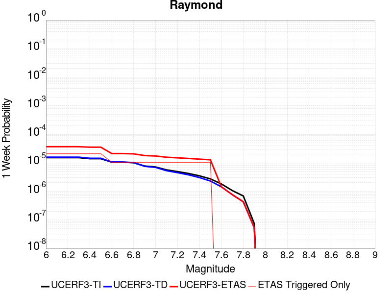 | 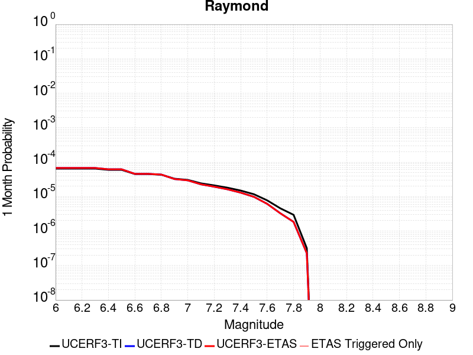 | 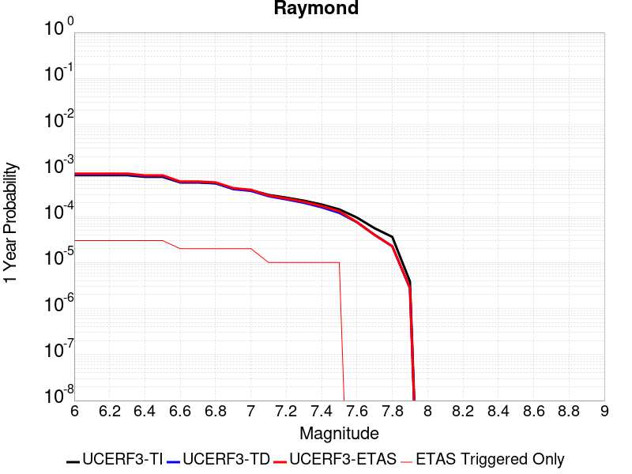 | 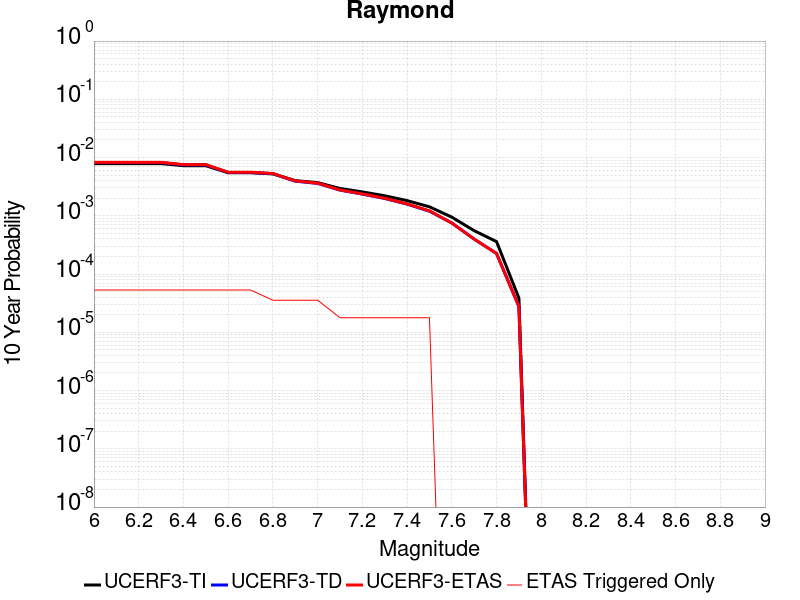 |

| Magnitude | 1 wk TI Prob | 1 wk TD Prob | 1 wk ETAS Prob | 1 wk ETAS/TD Gain | 1 wk ETAS Triggered Only | 1 mo TI Prob | 1 mo TD Prob | 1 mo ETAS Prob | 1 mo ETAS/TD Gain | 1 mo ETAS Triggered Only | 1 yr TI Prob | 1 yr TD Prob | 1 yr ETAS Prob | 1 yr ETAS/TD Gain | 1 yr ETAS Triggered Only | 10 yr TI Prob | 10 yr TD Prob | 10 yr ETAS Prob | 10 yr ETAS/TD Gain | 10 yr ETAS Triggered Only |
|-----|-----|-----|-----|-----|-----|-----|-----|-----|-----|-----|-----|-----|-----|-----|-----|-----|-----|-----|-----|-----|
| 6.0 | 1.5157413E-5 | 1.5810128E-5 | 3.6681613E-5 | 2.320134 | 2.0871816E-5 | 6.4958724E-5 | 6.7756075E-5 | 9.9061675E-5 | 1.4620339 | 3.1307725E-5 | 7.905855E-4 | 8.2464307E-4 | 8.5592497E-4 | 1.0379338 | 3.1307725E-5 | 0.007877788 | 0.008218348 | 0.008259749 | 1.0050375 | 4.174363E-5 |
| 6.1 | 1.5157413E-5 | 1.5810128E-5 | 3.6681613E-5 | 2.320134 | 2.0871816E-5 | 6.4958724E-5 | 6.7756075E-5 | 9.9061675E-5 | 1.4620339 | 3.1307725E-5 | 7.905855E-4 | 8.2464307E-4 | 8.5592497E-4 | 1.0379338 | 3.1307725E-5 | 0.007877788 | 0.008218348 | 0.008259749 | 1.0050375 | 4.174363E-5 |
| 6.2 | 1.5157413E-5 | 1.5810128E-5 | 3.6681613E-5 | 2.320134 | 2.0871816E-5 | 6.4958724E-5 | 6.7756075E-5 | 9.9061675E-5 | 1.4620339 | 3.1307725E-5 | 7.905855E-4 | 8.2464307E-4 | 8.5592497E-4 | 1.0379338 | 3.1307725E-5 | 0.007877788 | 0.008218348 | 0.008259749 | 1.0050375 | 4.174363E-5 |
| 6.3 | 1.5157413E-5 | 1.5810128E-5 | 3.6681613E-5 | 2.320134 | 2.0871816E-5 | 6.4958724E-5 | 6.7756075E-5 | 9.9061675E-5 | 1.4620339 | 3.1307725E-5 | 7.905855E-4 | 8.2464307E-4 | 8.5592497E-4 | 1.0379338 | 3.1307725E-5 | 0.007877788 | 0.008218348 | 0.008259749 | 1.0050375 | 4.174363E-5 |
| 6.4 | 1.3941944E-5 | 1.445469E-5 | 3.5326204E-5 | 2.4439268 | 2.0871816E-5 | 5.9749822E-5 | 6.1947336E-5 | 9.325312E-5 | 1.5053613 | 3.1307725E-5 | 7.2721124E-4 | 7.5397117E-4 | 7.852553E-4 | 1.0414925 | 3.1307725E-5 | 0.007248361 | 0.0075164647 | 0.0075578946 | 1.0055119 | 4.174363E-5 |
| 6.5 | 1.3941944E-5 | 1.445469E-5 | 3.5326204E-5 | 2.4439268 | 2.0871816E-5 | 5.9749822E-5 | 6.1947336E-5 | 9.325312E-5 | 1.5053613 | 3.1307725E-5 | 7.2721124E-4 | 7.5397117E-4 | 7.852553E-4 | 1.0414925 | 3.1307725E-5 | 0.007248361 | 0.0075164647 | 0.0075578946 | 1.0055119 | 4.174363E-5 |
| 6.6 | 1.0542609E-5 | 1.0671113E-5 | 2.110691E-5 | 1.9779483 | 1.0435908E-5 | 4.5181827E-5 | 4.573257E-5 | 6.660343E-5 | 1.4563676 | 2.0871816E-5 | 5.499499E-4 | 5.5665727E-4 | 5.7751744E-4 | 1.037474 | 2.0871816E-5 | 0.005485909 | 0.00555319 | 0.0055843242 | 1.0056065 | 3.1307725E-5 |
| 6.7 | 1.0542609E-5 | 1.0671113E-5 | 2.110691E-5 | 1.9779483 | 1.0435908E-5 | 4.5181827E-5 | 4.573257E-5 | 6.660343E-5 | 1.4563676 | 2.0871816E-5 | 5.499499E-4 | 5.5665727E-4 | 5.7751744E-4 | 1.037474 | 2.0871816E-5 | 0.005485909 | 0.00555319 | 0.0055843242 | 1.0056065 | 3.1307725E-5 |
| 6.8 | 1.0079132E-5 | 1.0176646E-5 | 2.0612448E-5 | 2.0254657 | 1.0435908E-5 | 4.3195567E-5 | 4.3613498E-5 | 6.4484404E-5 | 1.4785423 | 2.0871816E-5 | 5.257791E-4 | 5.3087034E-4 | 5.517311E-4 | 1.0392953 | 2.0871816E-5 | 0.0052453685 | 0.005296571 | 0.0053173327 | 1.0039197 | 2.0871816E-5 |
| 6.9 | 7.721598E-6 | 7.5489047E-6 | 1.7984734E-5 | 2.3824296 | 1.0435908E-5 | 3.3092143E-5 | 3.2352054E-5 | 5.3223193E-5 | 1.6451256 | 2.0871816E-5 | 4.0282236E-4 | 3.9381627E-4 | 4.1467987E-4 | 1.052978 | 2.0871816E-5 | 0.0040209293 | 0.0039313175 | 0.0039521074 | 1.0052882 | 2.0871816E-5 |
| 7.0 | 7.137566E-6 | 6.9113057E-6 | 1.7347142E-5 | 2.509966 | 1.0435908E-5 | 3.058921E-5 | 2.961955E-5 | 5.0490748E-5 | 1.7046427 | 2.0871816E-5 | 3.7236E-4 | 3.6055944E-4 | 3.814237E-4 | 1.0578665 | 2.0871816E-5 | 0.0037173668 | 0.0035998628 | 0.0036206595 | 1.0057771 | 2.0871816E-5 |
| 7.1 | 5.654976E-6 | 5.29954E-6 | 1.5735393E-5 | 2.9691997 | 1.0435908E-5 | 2.4235387E-5 | 2.2712118E-5 | 3.314779E-5 | 1.4594759 | 1.0435908E-5 | 2.9502588E-4 | 2.7648517E-4 | 2.869182E-4 | 1.0377345 | 1.0435908E-5 | 0.0029463451 | 0.002761443 | 0.00277185 | 1.0037687 | 1.0435908E-5 |
| 7.2 | 4.9358455E-6 | 4.5266574E-6 | 1.4962518E-5 | 3.305423 | 1.0435908E-5 | 2.1153453E-5 | 1.9399817E-5 | 2.9835523E-5 | 1.537928 | 1.0435908E-5 | 2.5751285E-4 | 2.3616731E-4 | 2.4660074E-4 | 1.0441781 | 1.0435908E-5 | 0.0025721465 | 0.0023591854 | 0.0023695969 | 1.0044131 | 1.0435908E-5 |
| 7.3 | 4.2368597E-6 | 3.8056164E-6 | 1.4241485E-5 | 3.742228 | 1.0435908E-5 | 1.8157843E-5 | 1.6309683E-5 | 2.6745422E-5 | 1.6398492 | 1.0435908E-5 | 2.2104931E-4 | 1.9855241E-4 | 2.0898625E-4 | 1.0525495 | 1.0435908E-5 | 0.0022082955 | 0.0019837688 | 0.001994184 | 1.0052502 | 1.0435908E-5 |
| 7.4 | 3.4999923E-6 | 3.043744E-6 | 1.347962E-5 | 4.4286313 | 1.0435908E-5 | 1.49998805E-5 | 1.3044552E-5 | 2.3480325E-5 | 1.80001 | 1.0435908E-5 | 1.8260824E-4 | 1.5880594E-4 | 1.6924019E-4 | 1.0657045 | 1.0435908E-5 | 0.0018245826 | 0.0015869403 | 0.0015973595 | 1.0065657 | 1.0435908E-5 |
| 7.5 | 2.738017E-6 | 2.3020468E-6 | 1.2737931E-5 | 5.5333066 | 1.0435908E-5 | 1.1734306E-5 | 9.865878E-6 | 2.0301683E-5 | 2.0577674 | 1.0435908E-5 | 1.428558E-4 | 1.2011051E-4 | 1.3054516E-4 | 1.0868754 | 1.0435908E-5 | 0.0014276401 | 0.0012004703 | 0.0012108936 | 1.0086827 | 1.0435908E-5 |
| 7.6 | 1.8186392E-6 | 1.442312E-6 | 1.442312E-6 | 1.0 | 0.0 | 7.794145E-6 | 6.181323E-6 | 6.181323E-6 | 1.0 | 0.0 | 9.488958E-5 | 7.5255055E-5 | 7.5255055E-5 | 1.0 | 0.0 | 9.4849075E-4 | 7.523072E-4 | 7.523072E-4 | 1.0 | 0.0 |
| 7.7 | 1.0660348E-6 | 7.6438056E-7 | 7.6438056E-7 | 1.0 | 0.0 | 4.5687125E-6 | 3.2759126E-6 | 3.2759126E-6 | 1.0 | 0.0 | 5.5622655E-5 | 3.9883522E-5 | 3.9883522E-5 | 1.0 | 0.0 | 5.5608735E-4 | 3.9877277E-4 | 3.9877277E-4 | 1.0 | 0.0 |
| 7.8 | 6.913602E-7 | 4.3204133E-7 | 4.3204133E-7 | 1.0 | 0.0 | 2.962969E-6 | 1.8516045E-6 | 1.8516045E-6 | 1.0 | 0.0 | 3.607355E-5 | 2.2543056E-5 | 2.2543056E-5 | 1.0 | 0.0 | 3.6067693E-4 | 2.2541556E-4 | 2.2541556E-4 | 1.0 | 0.0 |
| 7.9 | 7.425201E-8 | 5.3222113E-8 | 5.3222113E-8 | 1.0 | 0.0 | 3.1822285E-7 | 2.2809476E-7 | 2.2809476E-7 | 1.0 | 0.0 | 3.874356E-6 | 2.7770516E-6 | 2.7770516E-6 | 1.0 | 0.0 | 3.8742884E-5 | 2.7770298E-5 | 2.7770298E-5 | 1.0 | 0.0 |

## San Gabriel (Extension)
*[(top)](#table-of-contents)*

| 1 Week | 1 Month | 1 Year | 10 Year |
|-----|-----|-----|-----|
| 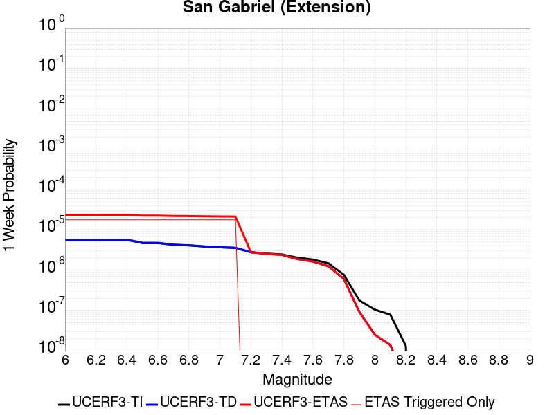 | 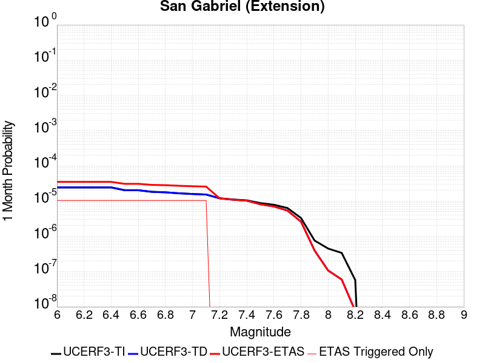 | 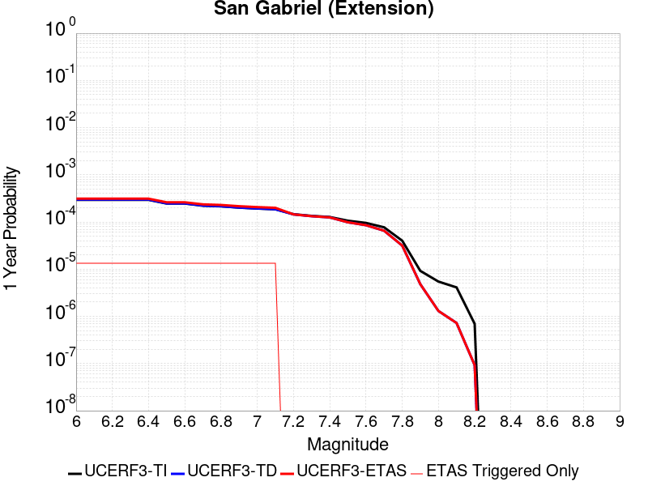 | 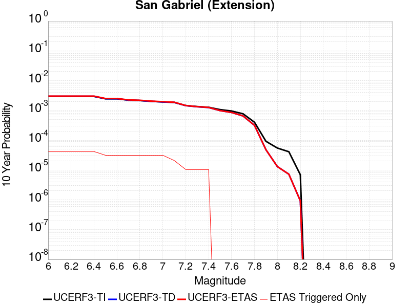 |

| Magnitude | 1 wk TI Prob | 1 wk TD Prob | 1 wk ETAS Prob | 1 wk ETAS/TD Gain | 1 wk ETAS Triggered Only | 1 mo TI Prob | 1 mo TD Prob | 1 mo ETAS Prob | 1 mo ETAS/TD Gain | 1 mo ETAS Triggered Only | 1 yr TI Prob | 1 yr TD Prob | 1 yr ETAS Prob | 1 yr ETAS/TD Gain | 1 yr ETAS Triggered Only | 10 yr TI Prob | 10 yr TD Prob | 10 yr ETAS Prob | 10 yr ETAS/TD Gain | 10 yr ETAS Triggered Only |
|-----|-----|-----|-----|-----|-----|-----|-----|-----|-----|-----|-----|-----|-----|-----|-----|-----|-----|-----|-----|-----|
| 6.0 | 5.6486106E-6 | 5.7168304E-6 | 1.6152679E-5 | 2.8254604 | 1.0435908E-5 | 2.4208108E-5 | 2.450048E-5 | 3.4936133E-5 | 1.4259367 | 1.0435908E-5 | 2.9469383E-4 | 2.9825376E-4 | 3.0868655E-4 | 1.0349796 | 1.0435908E-5 | 0.0029430336 | 0.0029786653 | 0.0030202845 | 1.0139725 | 4.174363E-5 |
| 6.1 | 5.6486106E-6 | 5.7168304E-6 | 1.6152679E-5 | 2.8254604 | 1.0435908E-5 | 2.4208108E-5 | 2.450048E-5 | 3.4936133E-5 | 1.4259367 | 1.0435908E-5 | 2.9469383E-4 | 2.9825376E-4 | 3.0868655E-4 | 1.0349796 | 1.0435908E-5 | 0.0029430336 | 0.0029786653 | 0.0030202845 | 1.0139725 | 4.174363E-5 |
| 6.2 | 5.6486106E-6 | 5.7168304E-6 | 1.6152679E-5 | 2.8254604 | 1.0435908E-5 | 2.4208108E-5 | 2.450048E-5 | 3.4936133E-5 | 1.4259367 | 1.0435908E-5 | 2.9469383E-4 | 2.9825376E-4 | 3.0868655E-4 | 1.0349796 | 1.0435908E-5 | 0.0029430336 | 0.0029786653 | 0.0030202845 | 1.0139725 | 4.174363E-5 |
| 6.3 | 5.6486106E-6 | 5.7168304E-6 | 1.6152679E-5 | 2.8254604 | 1.0435908E-5 | 2.4208108E-5 | 2.450048E-5 | 3.4936133E-5 | 1.4259367 | 1.0435908E-5 | 2.9469383E-4 | 2.9825376E-4 | 3.0868655E-4 | 1.0349796 | 1.0435908E-5 | 0.0029430336 | 0.0029786653 | 0.0030202845 | 1.0139725 | 4.174363E-5 |
| 6.4 | 5.6486106E-6 | 5.7168304E-6 | 1.6152679E-5 | 2.8254604 | 1.0435908E-5 | 2.4208108E-5 | 2.450048E-5 | 3.4936133E-5 | 1.4259367 | 1.0435908E-5 | 2.9469383E-4 | 2.9825376E-4 | 3.0868655E-4 | 1.0349796 | 1.0435908E-5 | 0.0029430336 | 0.0029786653 | 0.0030202845 | 1.0139725 | 4.174363E-5 |
| 6.5 | 4.7134554E-6 | 4.7542544E-6 | 1.5190113E-5 | 3.1950567 | 1.0435908E-5 | 2.0200367E-5 | 2.0375222E-5 | 3.0810916E-5 | 1.5121758 | 1.0435908E-5 | 2.459117E-4 | 2.4804095E-4 | 2.5847426E-4 | 1.0420629 | 1.0435908E-5 | 0.0024563975 | 0.002477729 | 0.0025089593 | 1.0126044 | 3.1307725E-5 |
| 6.6 | 4.7134554E-6 | 4.7542544E-6 | 1.5190113E-5 | 3.1950567 | 1.0435908E-5 | 2.0200367E-5 | 2.0375222E-5 | 3.0810916E-5 | 1.5121758 | 1.0435908E-5 | 2.459117E-4 | 2.4804095E-4 | 2.5847426E-4 | 1.0420629 | 1.0435908E-5 | 0.0024563975 | 0.002477729 | 0.0025089593 | 1.0126044 | 3.1307725E-5 |
| 6.7 | 4.2468837E-6 | 4.2740717E-6 | 1.4709935E-5 | 3.4416678 | 1.0435908E-5 | 1.8200803E-5 | 1.8317325E-5 | 2.8753042E-5 | 1.5697184 | 1.0435908E-5 | 2.2157225E-4 | 2.2299135E-4 | 2.3342493E-4 | 1.0467892 | 1.0435908E-5 | 0.0022135144 | 0.0022277518 | 0.0022589897 | 1.0140222 | 3.1307725E-5 |
| 6.8 | 4.1180615E-6 | 4.1414614E-6 | 1.4577326E-5 | 3.5198507 | 1.0435908E-5 | 1.7648716E-5 | 1.7749004E-5 | 2.8184726E-5 | 1.5879611 | 1.0435908E-5 | 2.1485193E-4 | 2.160734E-4 | 2.2650707E-4 | 1.0482875 | 1.0435908E-5 | 0.0021464431 | 0.0021587082 | 0.0021899485 | 1.0144717 | 3.1307725E-5 |
| 6.9 | 3.863861E-6 | 3.8797766E-6 | 1.4315644E-5 | 3.6898115 | 1.0435908E-5 | 1.65593E-5 | 1.6627511E-5 | 2.7063246E-5 | 1.6276186 | 1.0435908E-5 | 2.0159081E-4 | 2.0242184E-4 | 2.1285564E-4 | 1.0515448 | 1.0435908E-5 | 0.0020140803 | 0.002022446 | 0.0020536904 | 1.0154488 | 3.1307725E-5 |
| 7.0 | 3.6947372E-6 | 3.705676E-6 | 1.4141545E-5 | 3.816185 | 1.0435908E-5 | 1.5834492E-5 | 1.5881375E-5 | 2.6317117E-5 | 1.6571057 | 1.0435908E-5 | 1.9276788E-4 | 1.9333926E-4 | 2.0377315E-4 | 1.0539668 | 1.0435908E-5 | 0.0019260074 | 0.0019317807 | 0.001963028 | 1.0161754 | 3.1307725E-5 |
| 7.1 | 3.5686835E-6 | 3.5728963E-6 | 1.4008767E-5 | 3.9208434 | 1.0435908E-5 | 1.5294268E-5 | 1.5312327E-5 | 2.5748075E-5 | 1.681526 | 1.0435908E-5 | 1.861918E-4 | 1.8641229E-4 | 1.9684626E-4 | 1.0559725 | 1.0435908E-5 | 0.0018603588 | 0.0018626289 | 0.0018834618 | 1.0111847 | 2.0871816E-5 |
| 7.2 | 2.8023446E-6 | 2.7767885E-6 | 2.7767885E-6 | 1.0 | 0.0 | 1.2009994E-5 | 1.1900468E-5 | 1.1900468E-5 | 1.0 | 0.0 | 1.4621185E-4 | 1.4487868E-4 | 1.4487868E-4 | 1.0 | 0.0 | 0.001461157 | 0.0014478569 | 0.0014582777 | 1.0071974 | 1.0435908E-5 |
| 7.3 | 2.5843012E-6 | 2.5459642E-6 | 2.5459642E-6 | 1.0 | 0.0 | 1.1075529E-5 | 1.0911231E-5 | 1.0911231E-5 | 1.0 | 0.0 | 1.3483623E-4 | 1.3283623E-4 | 1.3283623E-4 | 1.0 | 0.0 | 0.0013475444 | 0.0013275818 | 0.0013380039 | 1.0078504 | 1.0435908E-5 |
| 7.4 | 2.4464468E-6 | 2.396665E-6 | 2.396665E-6 | 1.0 | 0.0 | 1.04847295E-5 | 1.0271382E-5 | 1.0271382E-5 | 1.0 | 0.0 | 1.276441E-4 | 1.25047E-4 | 1.25047E-4 | 1.0 | 0.0 | 0.0012757082 | 0.0012497796 | 0.0012602025 | 1.0083398 | 1.0435908E-5 |
| 7.5 | 2.0420266E-6 | 1.8910426E-6 | 1.8910426E-6 | 1.0 | 0.0 | 8.751514E-6 | 8.104444E-6 | 8.104444E-6 | 1.0 | 0.0 | 1.0654447E-4 | 9.8667166E-5 | 9.8667166E-5 | 1.0 | 0.0 | 0.001064934 | 9.862408E-4 | 9.862408E-4 | 1.0 | 0.0 |
| 7.6 | 1.8326596E-6 | 1.6398341E-6 | 1.6398341E-6 | 1.0 | 0.0 | 7.854232E-6 | 7.0278415E-6 | 7.0278415E-6 | 1.0 | 0.0 | 9.562107E-5 | 8.5560634E-5 | 8.5560634E-5 | 1.0 | 0.0 | 9.5579936E-4 | 8.5528276E-4 | 8.5528276E-4 | 1.0 | 0.0 |
| 7.7 | 1.4786998E-6 | 1.2523838E-6 | 1.2523838E-6 | 1.0 | 0.0 | 6.3372695E-6 | 5.367348E-6 | 5.367348E-6 | 1.0 | 0.0 | 7.715353E-5 | 6.534551E-5 | 6.534551E-5 | 1.0 | 0.0 | 7.7126746E-4 | 6.532707E-4 | 6.532707E-4 | 1.0 | 0.0 |
| 7.8 | 7.6975533E-7 | 6.0693884E-7 | 6.0693884E-7 | 1.0 | 0.0 | 3.2989474E-6 | 2.601164E-6 | 2.601164E-6 | 1.0 | 0.0 | 4.0163945E-5 | 3.166871E-5 | 3.166871E-5 | 1.0 | 0.0 | 4.0156685E-4 | 3.1664805E-4 | 3.1664805E-4 | 1.0 | 0.0 |
| 7.9 | 1.7645915E-7 | 9.213256E-8 | 9.213256E-8 | 1.0 | 0.0 | 7.562533E-7 | 3.9485377E-7 | 3.9485377E-7 | 1.0 | 0.0 | 9.207345E-6 | 4.807334E-6 | 4.807334E-6 | 1.0 | 0.0 | 9.206964E-5 | 4.807699E-5 | 4.807699E-5 | 1.0 | 0.0 |
| 8.0 | 1.0463461E-7 | 2.4949307E-8 | 2.4949307E-8 | 1.0 | 0.0 | 4.4843398E-7 | 1.0692559E-7 | 1.0692559E-7 | 1.0 | 0.0 | 5.45967E-6 | 1.3018183E-6 | 1.3018183E-6 | 1.0 | 0.0 | 5.459536E-5 | 1.3022789E-5 | 1.3022789E-5 | 1.0 | 0.0 |
| 8.1 | 7.875717E-8 | 1.3866874E-8 | 1.3866874E-8 | 1.0 | 0.0 | 3.3753068E-7 | 5.942946E-8 | 5.942946E-8 | 1.0 | 0.0 | 4.109428E-6 | 7.235534E-7 | 7.235534E-7 | 1.0 | 0.0 | 4.109352E-5 | 7.2401926E-6 | 7.2401926E-6 | 1.0 | 0.0 |
| 8.2 | 1.33163E-8 | 1.7733891E-9 | 1.7733891E-9 | 1.0 | 0.0 | 5.7069855E-8 | 7.600239E-9 | 7.600239E-9 | 1.0 | 0.0 | 6.9482525E-7 | 9.25329E-8 | 9.25329E-8 | 1.0 | 0.0 | 6.9482307E-6 | 9.272953E-7 | 9.272953E-7 | 1.0 | 0.0 |

## Santa Cruz Island
*[(top)](#table-of-contents)*

| 1 Week | 1 Month | 1 Year | 10 Year |
|-----|-----|-----|-----|
| 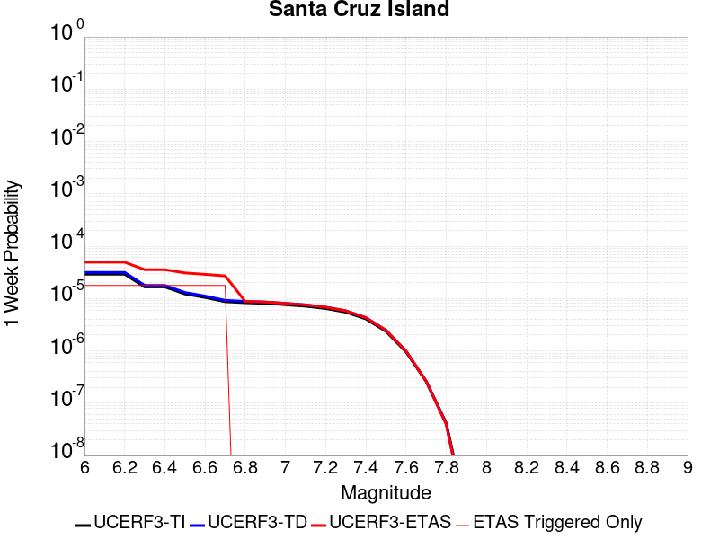 | 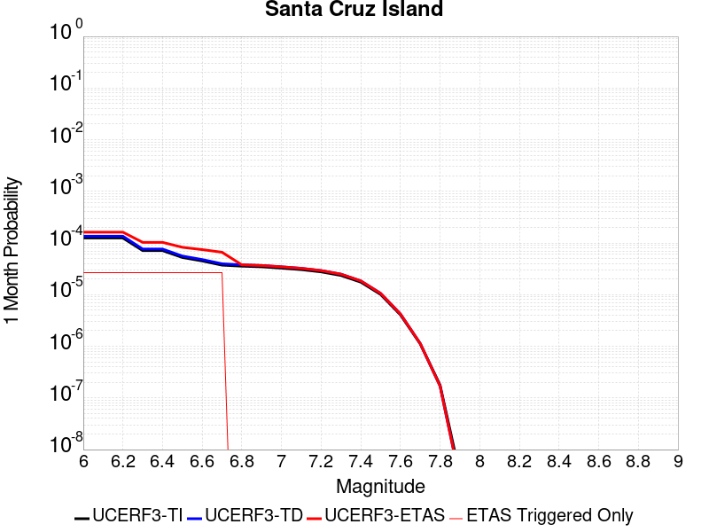 | 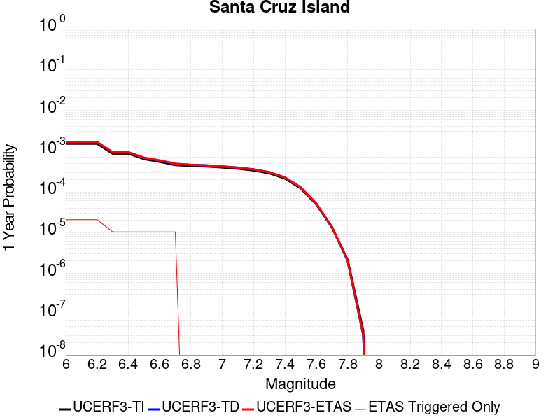 | 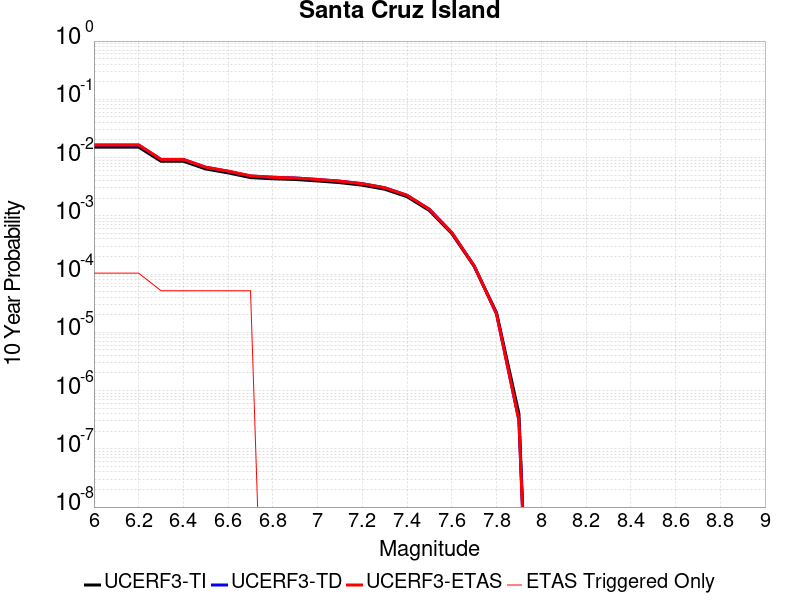 |

| Magnitude | 1 wk TI Prob | 1 wk TD Prob | 1 wk ETAS Prob | 1 wk ETAS/TD Gain | 1 wk ETAS Triggered Only | 1 mo TI Prob | 1 mo TD Prob | 1 mo ETAS Prob | 1 mo ETAS/TD Gain | 1 mo ETAS Triggered Only | 1 yr TI Prob | 1 yr TD Prob | 1 yr ETAS Prob | 1 yr ETAS/TD Gain | 1 yr ETAS Triggered Only | 10 yr TI Prob | 10 yr TD Prob | 10 yr ETAS Prob | 10 yr ETAS/TD Gain | 10 yr ETAS Triggered Only |
|-----|-----|-----|-----|-----|-----|-----|-----|-----|-----|-----|-----|-----|-----|-----|-----|-----|-----|-----|-----|-----|
| 6.0 | 2.9164563E-5 | 3.1599742E-5 | 4.203532E-5 | 1.3302425 | 1.0435908E-5 | 1.2498499E-4 | 1.3542121E-4 | 1.4585571E-4 | 1.0770521 | 1.0435908E-5 | 0.0015206301 | 0.0016476426 | 0.00166848 | 1.0126468 | 2.0871816E-5 | 0.015102667 | 0.016368 | 0.01640906 | 1.0025085 | 4.174363E-5 |
| 6.1 | 2.9164563E-5 | 3.1599742E-5 | 4.203532E-5 | 1.3302425 | 1.0435908E-5 | 1.2498499E-4 | 1.3542121E-4 | 1.4585571E-4 | 1.0770521 | 1.0435908E-5 | 0.0015206301 | 0.0016476426 | 0.00166848 | 1.0126468 | 2.0871816E-5 | 0.015102667 | 0.016368 | 0.01640906 | 1.0025085 | 4.174363E-5 |
| 6.2 | 2.9164563E-5 | 3.1599742E-5 | 4.203532E-5 | 1.3302425 | 1.0435908E-5 | 1.2498499E-4 | 1.3542121E-4 | 1.4585571E-4 | 1.0770521 | 1.0435908E-5 | 0.0015206301 | 0.0016476426 | 0.00166848 | 1.0126468 | 2.0871816E-5 | 0.015102667 | 0.016368 | 0.01640906 | 1.0025085 | 4.174363E-5 |
| 6.3 | 1.6635553E-5 | 1.780436E-5 | 2.8240082E-5 | 1.586133 | 1.0435908E-5 | 7.1293274E-5 | 7.630226E-5 | 8.6737375E-5 | 1.1367602 | 1.0435908E-5 | 8.6765E-4 | 9.2860236E-4 | 9.3902857E-4 | 1.0112278 | 1.0435908E-5 | 0.008642701 | 0.009249094 | 0.009259433 | 1.0011178 | 1.0435908E-5 |
| 6.4 | 1.6635553E-5 | 1.780436E-5 | 2.8240082E-5 | 1.586133 | 1.0435908E-5 | 7.1293274E-5 | 7.630226E-5 | 8.6737375E-5 | 1.1367602 | 1.0435908E-5 | 8.6765E-4 | 9.2860236E-4 | 9.3902857E-4 | 1.0112278 | 1.0435908E-5 | 0.008642701 | 0.009249094 | 0.009259433 | 1.0011178 | 1.0435908E-5 |
| 6.5 | 1.2238748E-5 | 1.3042995E-5 | 2.3478768E-5 | 1.8001055 | 1.0435908E-5 | 5.2450723E-5 | 5.5897377E-5 | 6.63327E-5 | 1.1866872 | 1.0435908E-5 | 6.3840044E-4 | 6.8034173E-4 | 6.9077057E-4 | 1.0153288 | 1.0435908E-5 | 0.0063656955 | 0.0067829876 | 0.006793353 | 1.0015281 | 1.0435908E-5 |
| 6.6 | 1.0489767E-5 | 1.1156636E-5 | 2.1592426E-5 | 1.9353887 | 1.0435908E-5 | 4.495537E-5 | 4.781329E-5 | 5.8248697E-5 | 1.2182533 | 1.0435908E-5 | 5.4719415E-4 | 5.819735E-4 | 5.924034E-4 | 1.0179214 | 1.0435908E-5 | 0.005458487 | 0.0058047357 | 0.005815111 | 1.0017874 | 1.0435908E-5 |
| 6.7 | 8.699222E-6 | 9.236782E-6 | 1.9672594E-5 | 2.1298103 | 1.0435908E-5 | 3.7281847E-5 | 3.958561E-5 | 5.0021106E-5 | 1.2636184 | 1.0435908E-5 | 4.5381195E-4 | 4.8184878E-4 | 4.9227965E-4 | 1.0216476 | 1.0435908E-5 | 0.0045288634 | 0.004808108 | 0.0048184935 | 1.0021601 | 1.0435908E-5 |
| 6.8 | 8.307732E-6 | 8.8169045E-6 | 8.8169045E-6 | 1.0 | 0.0 | 3.560408E-5 | 3.7786187E-5 | 3.7786187E-5 | 1.0 | 0.0 | 4.3339343E-4 | 4.5995016E-4 | 4.5995016E-4 | 1.0 | 0.0 | 0.004325492 | 0.0045900354 | 0.0045900354 | 1.0 | 0.0 |
| 6.9 | 8.073121E-6 | 8.564939E-6 | 8.564939E-6 | 1.0 | 0.0 | 3.459863E-5 | 3.6706366E-5 | 3.6706366E-5 | 1.0 | 0.0 | 4.2115687E-4 | 4.468088E-4 | 4.468088E-4 | 1.0 | 0.0 | 0.004203596 | 0.004459156 | 0.004459156 | 1.0 | 0.0 |
| 7.0 | 7.617019E-6 | 8.074664E-6 | 8.074664E-6 | 1.0 | 0.0 | 3.264396E-5 | 3.4605247E-5 | 3.4605247E-5 | 1.0 | 0.0 | 3.9736772E-4 | 4.212378E-4 | 4.212378E-4 | 1.0 | 0.0 | 0.003966579 | 0.0042044413 | 0.0042044413 | 1.0 | 0.0 |
| 7.1 | 7.1224836E-6 | 7.545788E-6 | 7.545788E-6 | 1.0 | 0.0 | 3.052457E-5 | 3.2338692E-5 | 3.2338692E-5 | 1.0 | 0.0 | 3.715733E-4 | 3.936528E-4 | 3.936528E-4 | 1.0 | 0.0 | 0.003709526 | 0.003929598 | 0.003929598 | 1.0 | 0.0 |
| 7.2 | 6.441115E-6 | 6.8273835E-6 | 6.8273835E-6 | 1.0 | 0.0 | 2.7604487E-5 | 2.9259887E-5 | 2.9259887E-5 | 1.0 | 0.0 | 3.360328E-4 | 3.5618112E-4 | 3.5618112E-4 | 1.0 | 0.0 | 0.0033552512 | 0.003556131 | 0.003556131 | 1.0 | 0.0 |
| 7.3 | 5.494274E-6 | 5.8199944E-6 | 5.8199944E-6 | 1.0 | 0.0 | 2.3546674E-5 | 2.4942596E-5 | 2.4942596E-5 | 1.0 | 0.0 | 2.8664304E-4 | 3.0363398E-4 | 3.0363398E-4 | 1.0 | 0.0 | 0.002862736 | 0.0030322142 | 0.0030322142 | 1.0 | 0.0 |
| 7.4 | 4.0802624E-6 | 4.312256E-6 | 4.312256E-6 | 1.0 | 0.0 | 1.7486722E-5 | 1.8480967E-5 | 1.8480967E-5 | 1.0 | 0.0 | 2.1288003E-4 | 2.2498262E-4 | 2.2498262E-4 | 1.0 | 0.0 | 0.0021267622 | 0.0022475575 | 0.0022475575 | 1.0 | 0.0 |
| 7.5 | 2.3584746E-6 | 2.4753094E-6 | 2.4753094E-6 | 1.0 | 0.0 | 1.0107709E-5 | 1.0608426E-5 | 1.0608426E-5 | 1.0 | 0.0 | 1.2305441E-4 | 1.2915E-4 | 1.2915E-4 | 1.0 | 0.0 | 0.0012298629 | 0.0012907543 | 0.0012907543 | 1.0 | 0.0 |
| 7.6 | 9.4981914E-7 | 9.86093E-7 | 9.86093E-7 | 1.0 | 0.0 | 4.0706473E-6 | 4.2261063E-6 | 4.2261063E-6 | 1.0 | 0.0 | 4.9559E-5 | 5.145164E-5 | 5.145164E-5 | 1.0 | 0.0 | 4.954795E-4 | 5.1439856E-4 | 5.1439856E-4 | 1.0 | 0.0 |
| 7.7 | 2.6013532E-7 | 2.6416603E-7 | 2.6416603E-7 | 1.0 | 0.0 | 1.1148652E-6 | 1.1321397E-6 | 1.1321397E-6 | 1.0 | 0.0 | 1.3573399E-5 | 1.3783714E-5 | 1.3783714E-5 | 1.0 | 0.0 | 1.357257E-4 | 1.3782867E-4 | 1.3782867E-4 | 1.0 | 0.0 |
| 7.8 | 4.1522263E-8 | 3.965679E-8 | 3.965679E-8 | 1.0 | 0.0 | 1.7795254E-7 | 1.6995766E-7 | 1.6995766E-7 | 1.0 | 0.0 | 2.16657E-6 | 2.0692328E-6 | 2.0692328E-6 | 1.0 | 0.0 | 2.1665488E-5 | 2.0692156E-5 | 2.0692156E-5 | 1.0 | 0.0 |
| 7.9 | 7.7242046E-10 | 5.9468175E-10 | 5.9468175E-10 | 1.0 | 0.0 | 3.3103735E-9 | 2.5486364E-9 | 2.5486364E-9 | 1.0 | 0.0 | 4.0303796E-8 | 3.1029646E-8 | 3.1029646E-8 | 1.0 | 0.0 | 4.030379E-7 | 3.1029643E-7 | 3.1029643E-7 | 1.0 | 0.0 |

## Ortigalita (South)
*[(top)](#table-of-contents)*

| 1 Week | 1 Month | 1 Year | 10 Year |
|-----|-----|-----|-----|
| 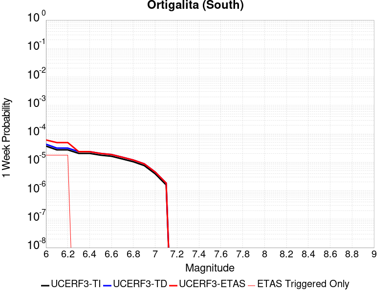 | 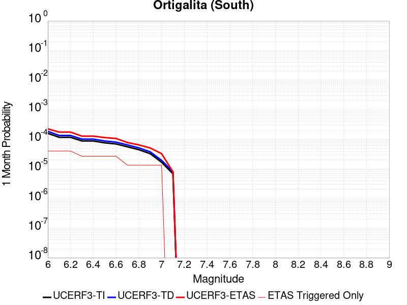 | 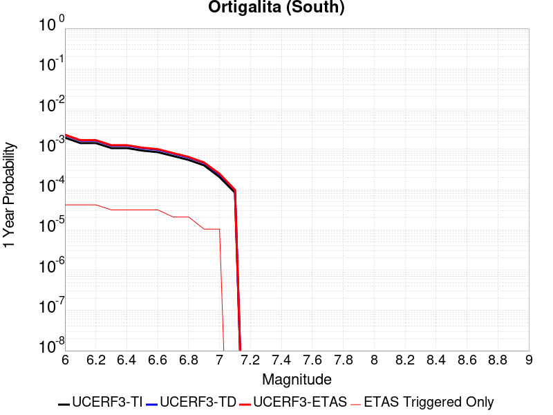 | 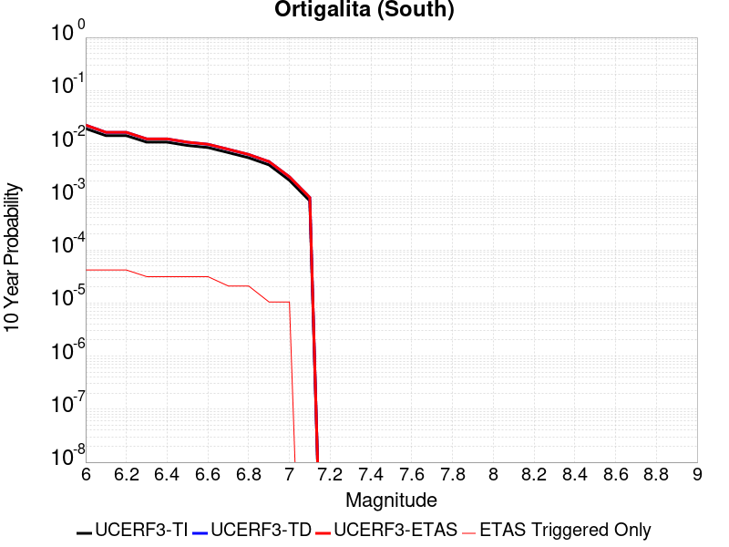 |

| Magnitude | 1 wk TI Prob | 1 wk TD Prob | 1 wk ETAS Prob | 1 wk ETAS/TD Gain | 1 wk ETAS Triggered Only | 1 mo TI Prob | 1 mo TD Prob | 1 mo ETAS Prob | 1 mo ETAS/TD Gain | 1 mo ETAS Triggered Only | 1 yr TI Prob | 1 yr TD Prob | 1 yr ETAS Prob | 1 yr ETAS/TD Gain | 1 yr ETAS Triggered Only | 10 yr TI Prob | 10 yr TD Prob | 10 yr ETAS Prob | 10 yr ETAS/TD Gain | 10 yr ETAS Triggered Only |
|-----|-----|-----|-----|-----|-----|-----|-----|-----|-----|-----|-----|-----|-----|-----|-----|-----|-----|-----|-----|-----|
| 6.0 | 3.72394E-5 | 4.325562E-5 | 5.3691074E-5 | 1.2412509 | 1.0435908E-5 | 1.5958765E-4 | 1.8536893E-4 | 2.2710483E-4 | 1.2251505 | 4.174363E-5 | 0.0019412481 | 0.0022546875 | 0.002296337 | 1.0184724 | 4.174363E-5 | 0.019243775 | 0.022334497 | 0.022375308 | 1.0018272 | 4.174363E-5 |
| 6.1 | 2.7299884E-5 | 3.149204E-5 | 4.1927622E-5 | 1.3313719 | 1.0435908E-5 | 1.16994255E-4 | 1.3495922E-4 | 1.7669723E-4 | 1.3092637 | 4.174363E-5 | 0.0014234743 | 0.0016419457 | 0.0016836207 | 1.0253816 | 4.174363E-5 | 0.014143906 | 0.01630407 | 0.016345134 | 1.0025185 | 4.174363E-5 |
| 6.2 | 2.7299884E-5 | 3.149204E-5 | 4.1927622E-5 | 1.3313719 | 1.0435908E-5 | 1.16994255E-4 | 1.3495922E-4 | 1.7669723E-4 | 1.3092637 | 4.174363E-5 | 0.0014234743 | 0.0016419457 | 0.0016836207 | 1.0253816 | 4.174363E-5 | 0.014143906 | 0.01630407 | 0.016345134 | 1.0025185 | 4.174363E-5 |
| 6.3 | 2.0546433E-5 | 2.363145E-5 | 2.363145E-5 | 1.0 | 0.0 | 8.805317E-5 | 1.0127382E-4 | 1.3257837E-4 | 1.309108 | 3.1307725E-5 | 0.00107152 | 0.0012323303 | 0.0012635995 | 1.0253739 | 3.1307725E-5 | 0.010663681 | 0.01225703 | 0.012287954 | 1.002523 | 3.1307725E-5 |
| 6.4 | 2.0546433E-5 | 2.363145E-5 | 2.363145E-5 | 1.0 | 0.0 | 8.805317E-5 | 1.0127382E-4 | 1.3257837E-4 | 1.309108 | 3.1307725E-5 | 0.00107152 | 0.0012323303 | 0.0012635995 | 1.0253739 | 3.1307725E-5 | 0.010663681 | 0.01225703 | 0.012287954 | 1.002523 | 3.1307725E-5 |
| 6.5 | 1.7779594E-5 | 2.0446974E-5 | 2.0446974E-5 | 1.0 | 0.0 | 7.619603E-5 | 8.762702E-5 | 1.18932E-4 | 1.3572526 | 3.1307725E-5 | 9.272918E-4 | 0.0010663504 | 0.0010976248 | 1.0293283 | 3.1307725E-5 | 0.009234319 | 0.010613803 | 0.010644779 | 1.0029184 | 3.1307725E-5 |
| 6.6 | 1.6272212E-5 | 1.8714967E-5 | 1.8714967E-5 | 1.0 | 0.0 | 6.973618E-5 | 8.0204605E-5 | 1.1150982E-4 | 1.3903168 | 3.1307725E-5 | 8.487073E-4 | 9.760658E-4 | 0.001007343 | 1.0320442 | 3.1307725E-5 | 0.008454733 | 0.009719091 | 0.009750093 | 1.0031899 | 3.1307725E-5 |
| 6.7 | 1.3051484E-5 | 1.5038758E-5 | 1.5038758E-5 | 1.0 | 0.0 | 5.593373E-5 | 6.445028E-5 | 8.532075E-5 | 1.3238229 | 2.0871816E-5 | 6.807804E-4 | 7.844092E-4 | 8.0526463E-4 | 1.0265875 | 2.0871816E-5 | 0.006786986 | 0.007817388 | 0.0078380965 | 1.0026491 | 2.0871816E-5 |
| 6.8 | 1.04277415E-5 | 1.1987235E-5 | 1.1987235E-5 | 1.0 | 0.0 | 4.4689557E-5 | 5.1372896E-5 | 7.224364E-5 | 1.4062598 | 2.0871816E-5 | 5.439595E-4 | 6.2529295E-4 | 6.461517E-4 | 1.0333583 | 2.0871816E-5 | 0.0054262993 | 0.00623609 | 0.0062568313 | 1.003326 | 2.0871816E-5 |
| 6.9 | 7.639968E-6 | 8.791503E-6 | 8.791503E-6 | 1.0 | 0.0 | 3.274231E-5 | 3.767736E-5 | 4.8112874E-5 | 1.2769704 | 1.0435908E-5 | 3.9856473E-4 | 4.586312E-4 | 4.690623E-4 | 1.022744 | 1.0435908E-5 | 0.003978506 | 0.004577433 | 0.004587821 | 1.0022694 | 1.0435908E-5 |
| 7.0 | 3.919831E-6 | 4.5334014E-6 | 4.5334014E-6 | 1.0 | 0.0 | 1.679917E-5 | 1.942873E-5 | 2.9864435E-5 | 1.5371275 | 1.0435908E-5 | 2.045107E-4 | 2.3652123E-4 | 2.4695467E-4 | 1.0441121 | 1.0435908E-5 | 0.0020432258 | 0.0023629034 | 0.0023733147 | 1.0044061 | 1.0435908E-5 |
| 7.1 | 1.6017933E-6 | 1.8570418E-6 | 1.8570418E-6 | 1.0 | 0.0 | 6.8648105E-6 | 7.958732E-6 | 7.958732E-6 | 1.0 | 0.0 | 8.357586E-5 | 9.689432E-5 | 9.689432E-5 | 1.0 | 0.0 | 8.3544437E-4 | 9.686254E-4 | 9.686254E-4 | 1.0 | 0.0 |

## Channel Islands Thrust
*[(top)](#table-of-contents)*

| 1 Week | 1 Month | 1 Year | 10 Year |
|-----|-----|-----|-----|
|  | 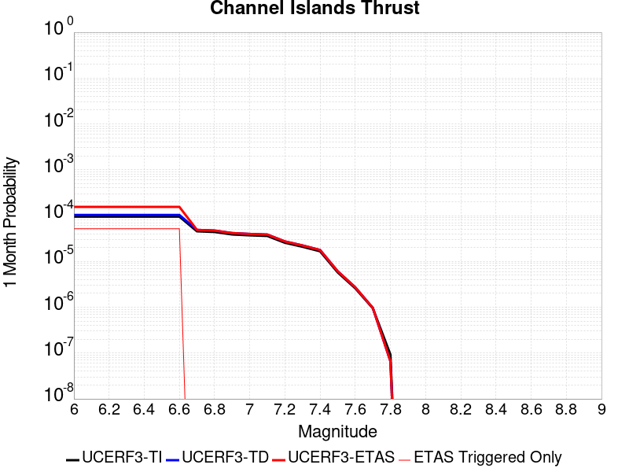 | 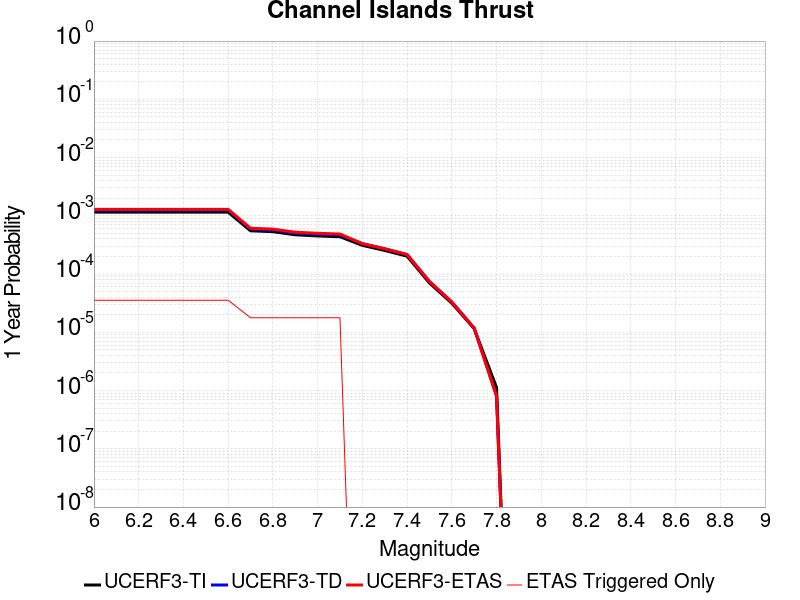 | 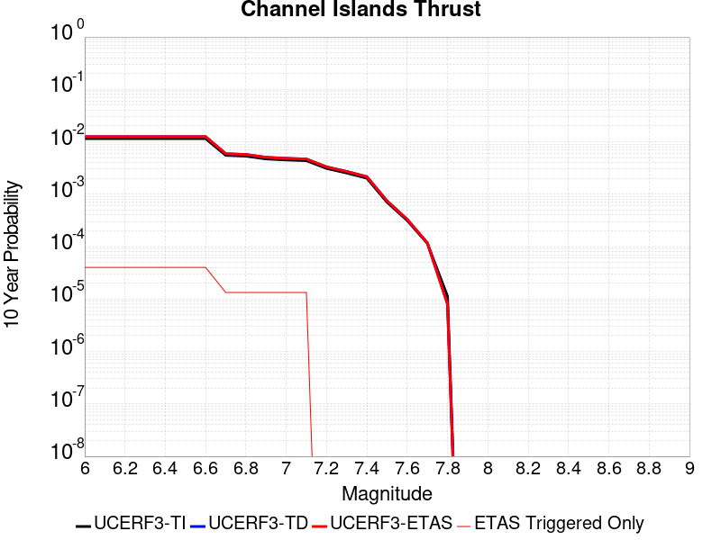 |

| Magnitude | 1 wk TI Prob | 1 wk TD Prob | 1 wk ETAS Prob | 1 wk ETAS/TD Gain | 1 wk ETAS Triggered Only | 1 mo TI Prob | 1 mo TD Prob | 1 mo ETAS Prob | 1 mo ETAS/TD Gain | 1 mo ETAS Triggered Only | 1 yr TI Prob | 1 yr TD Prob | 1 yr ETAS Prob | 1 yr ETAS/TD Gain | 1 yr ETAS Triggered Only | 10 yr TI Prob | 10 yr TD Prob | 10 yr ETAS Prob | 10 yr ETAS/TD Gain | 10 yr ETAS Triggered Only |
|-----|-----|-----|-----|-----|-----|-----|-----|-----|-----|-----|-----|-----|-----|-----|-----|-----|-----|-----|-----|-----|
| 6.0 | 2.2156251E-5 | 2.4092022E-5 | 2.4092022E-5 | 1.0 | 0.0 | 9.495191E-5 | 1.03248036E-4 | 1.13682865E-4 | 1.1010656 | 1.0435908E-5 | 0.0011554264 | 0.0012564264 | 0.0012772721 | 1.0165912 | 2.0871816E-5 | 0.011494373 | 0.0125038205 | 0.012545042 | 1.0032967 | 4.174363E-5 |
| 6.1 | 2.2156251E-5 | 2.4092022E-5 | 2.4092022E-5 | 1.0 | 0.0 | 9.495191E-5 | 1.03248036E-4 | 1.13682865E-4 | 1.1010656 | 1.0435908E-5 | 0.0011554264 | 0.0012564264 | 0.0012772721 | 1.0165912 | 2.0871816E-5 | 0.011494373 | 0.0125038205 | 0.012545042 | 1.0032967 | 4.174363E-5 |
| 6.2 | 2.2156251E-5 | 2.4092022E-5 | 2.4092022E-5 | 1.0 | 0.0 | 9.495191E-5 | 1.03248036E-4 | 1.13682865E-4 | 1.1010656 | 1.0435908E-5 | 0.0011554264 | 0.0012564264 | 0.0012772721 | 1.0165912 | 2.0871816E-5 | 0.011494373 | 0.0125038205 | 0.012545042 | 1.0032967 | 4.174363E-5 |
| 6.3 | 2.2156251E-5 | 2.4092022E-5 | 2.4092022E-5 | 1.0 | 0.0 | 9.495191E-5 | 1.03248036E-4 | 1.13682865E-4 | 1.1010656 | 1.0435908E-5 | 0.0011554264 | 0.0012564264 | 0.0012772721 | 1.0165912 | 2.0871816E-5 | 0.011494373 | 0.0125038205 | 0.012545042 | 1.0032967 | 4.174363E-5 |
| 6.4 | 2.2156251E-5 | 2.4092022E-5 | 2.4092022E-5 | 1.0 | 0.0 | 9.495191E-5 | 1.03248036E-4 | 1.13682865E-4 | 1.1010656 | 1.0435908E-5 | 0.0011554264 | 0.0012564264 | 0.0012772721 | 1.0165912 | 2.0871816E-5 | 0.011494373 | 0.0125038205 | 0.012545042 | 1.0032967 | 4.174363E-5 |
| 6.5 | 2.2156251E-5 | 2.4092022E-5 | 2.4092022E-5 | 1.0 | 0.0 | 9.495191E-5 | 1.03248036E-4 | 1.13682865E-4 | 1.1010656 | 1.0435908E-5 | 0.0011554264 | 0.0012564264 | 0.0012772721 | 1.0165912 | 2.0871816E-5 | 0.011494373 | 0.0125038205 | 0.012545042 | 1.0032967 | 4.174363E-5 |
| 6.6 | 2.2156251E-5 | 2.4092022E-5 | 2.4092022E-5 | 1.0 | 0.0 | 9.495191E-5 | 1.03248036E-4 | 1.13682865E-4 | 1.1010656 | 1.0435908E-5 | 0.0011554264 | 0.0012564264 | 0.0012772721 | 1.0165912 | 2.0871816E-5 | 0.011494373 | 0.0125038205 | 0.012545042 | 1.0032967 | 4.174363E-5 |
| 6.7 | 1.0601296E-5 | 1.1379544E-5 | 1.1379544E-5 | 1.0 | 0.0 | 4.5433335E-5 | 4.876859E-5 | 4.876859E-5 | 1.0 | 0.0 | 5.5301044E-4 | 5.936007E-4 | 6.040304E-4 | 1.0175703 | 1.0435908E-5 | 0.005516363 | 0.005920653 | 0.0059414017 | 1.0035044 | 2.0871816E-5 |
| 6.8 | 1.0246747E-5 | 1.0996669E-5 | 1.0996669E-5 | 1.0 | 0.0 | 4.391389E-5 | 4.7127756E-5 | 4.7127756E-5 | 1.0 | 0.0 | 5.345204E-4 | 5.7363417E-4 | 5.8406405E-4 | 1.0181822 | 1.0435908E-5 | 0.0053323656 | 0.005722025 | 0.005742777 | 1.0036267 | 2.0871816E-5 |
| 6.9 | 9.049551E-6 | 9.699645E-6 | 9.699645E-6 | 1.0 | 0.0 | 3.878322E-5 | 4.1569267E-5 | 4.1569267E-5 | 1.0 | 0.0 | 4.7208337E-4 | 5.059924E-4 | 5.16423E-4 | 1.0206141 | 1.0435908E-5 | 0.0047108172 | 0.0050488203 | 0.0050695864 | 1.0041131 | 2.0871816E-5 |
| 7.0 | 8.6542195E-6 | 9.274603E-6 | 9.274603E-6 | 1.0 | 0.0 | 3.7088983E-5 | 3.9747716E-5 | 3.9747716E-5 | 1.0 | 0.0 | 4.5146482E-4 | 4.8382508E-4 | 4.942559E-4 | 1.0215591 | 1.0435908E-5 | 0.004505487 | 0.004828129 | 0.0048489003 | 1.0043021 | 2.0871816E-5 |
| 7.1 | 8.391028E-6 | 8.992924E-6 | 8.992924E-6 | 1.0 | 0.0 | 3.5961057E-5 | 3.854056E-5 | 3.854056E-5 | 1.0 | 0.0 | 4.3773788E-4 | 4.6913436E-4 | 4.7956538E-4 | 1.0222346 | 1.0435908E-5 | 0.004368766 | 0.0046818503 | 0.0047026244 | 1.0044372 | 2.0871816E-5 |
| 7.2 | 5.965188E-6 | 6.3716952E-6 | 6.3716952E-6 | 1.0 | 0.0 | 2.556484E-5 | 2.7306982E-5 | 2.7306982E-5 | 1.0 | 0.0 | 3.1120746E-4 | 3.3241234E-4 | 3.3241234E-4 | 1.0 | 0.0 | 0.00310772 | 0.0033192092 | 0.0033192092 | 1.0 | 0.0 |
| 7.3 | 4.877518E-6 | 5.2060063E-6 | 5.2060063E-6 | 1.0 | 0.0 | 2.0903482E-5 | 2.2311267E-5 | 2.2311267E-5 | 1.0 | 0.0 | 2.5447016E-4 | 2.716063E-4 | 2.716063E-4 | 1.0 | 0.0 | 0.0025417898 | 0.0027127895 | 0.0027127895 | 1.0 | 0.0 |
| 7.4 | 3.8829853E-6 | 4.141863E-6 | 4.141863E-6 | 1.0 | 0.0 | 1.664126E-5 | 1.7750723E-5 | 1.7750723E-5 | 1.0 | 0.0 | 2.0258849E-4 | 2.1609402E-4 | 2.1609402E-4 | 1.0 | 0.0 | 0.002024039 | 0.0021588807 | 0.0021588807 | 1.0 | 0.0 |
| 7.5 | 1.3489616E-6 | 1.4277903E-6 | 1.4277903E-6 | 1.0 | 0.0 | 5.7812517E-6 | 6.119087E-6 | 6.119087E-6 | 1.0 | 0.0 | 7.038446E-5 | 7.449738E-5 | 7.449738E-5 | 1.0 | 0.0 | 7.036218E-4 | 7.44728E-4 | 7.44728E-4 | 1.0 | 0.0 |
| 7.6 | 6.058192E-7 | 6.353778E-7 | 6.353778E-7 | 1.0 | 0.0 | 2.5963652E-6 | 2.7230449E-6 | 2.7230449E-6 | 1.0 | 0.0 | 3.161029E-5 | 3.3152584E-5 | 3.3152584E-5 | 1.0 | 0.0 | 3.1605794E-4 | 3.31478E-4 | 3.31478E-4 | 1.0 | 0.0 |
| 7.7 | 2.2170494E-7 | 2.2607902E-7 | 2.2607902E-7 | 1.0 | 0.0 | 9.5016367E-7 | 9.689098E-7 | 9.689098E-7 | 1.0 | 0.0 | 1.1568181E-5 | 1.1796425E-5 | 1.1796425E-5 | 1.0 | 0.0 | 1.1567579E-4 | 1.1795909E-4 | 1.1795909E-4 | 1.0 | 0.0 |
| 7.8 | 2.1613102E-8 | 1.5466682E-8 | 1.5466682E-8 | 1.0 | 0.0 | 9.262757E-8 | 6.628578E-8 | 6.628578E-8 | 1.0 | 0.0 | 1.1277401E-6 | 8.070291E-7 | 8.070291E-7 | 1.0 | 0.0 | 1.1277344E-5 | 8.070269E-6 | 8.070269E-6 | 1.0 | 0.0 |

## Calaveras (So) 2011 CFM
*[(top)](#table-of-contents)*

| 1 Week | 1 Month | 1 Year | 10 Year |
|-----|-----|-----|-----|
|  | 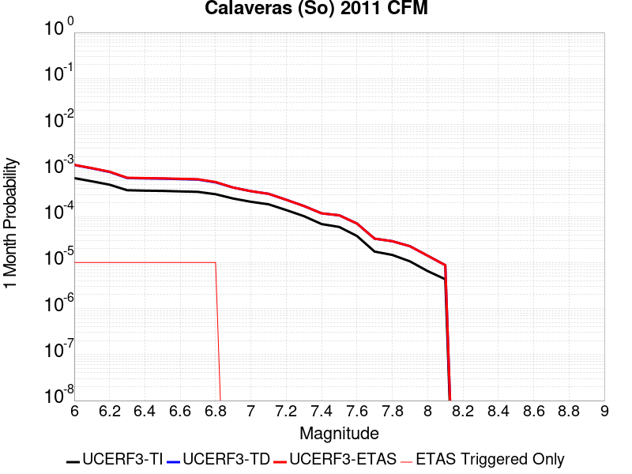 | 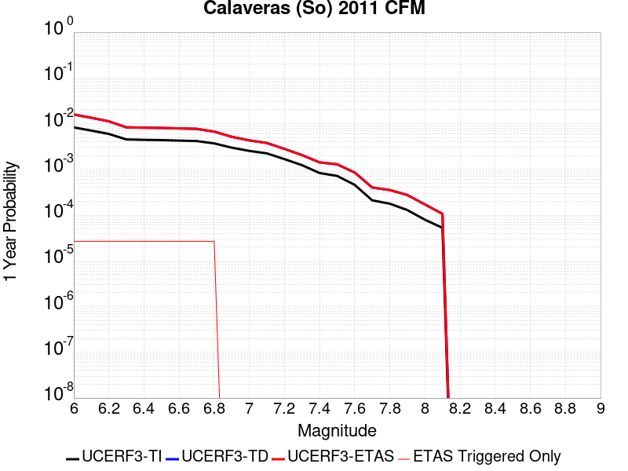 | 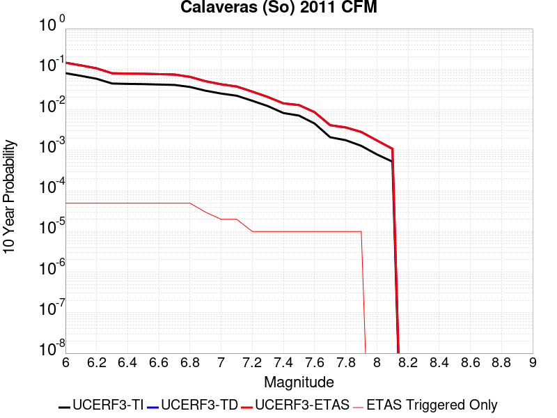 |

| Magnitude | 1 wk TI Prob | 1 wk TD Prob | 1 wk ETAS Prob | 1 wk ETAS/TD Gain | 1 wk ETAS Triggered Only | 1 mo TI Prob | 1 mo TD Prob | 1 mo ETAS Prob | 1 mo ETAS/TD Gain | 1 mo ETAS Triggered Only | 1 yr TI Prob | 1 yr TD Prob | 1 yr ETAS Prob | 1 yr ETAS/TD Gain | 1 yr ETAS Triggered Only | 10 yr TI Prob | 10 yr TD Prob | 10 yr ETAS Prob | 10 yr ETAS/TD Gain | 10 yr ETAS Triggered Only |
|-----|-----|-----|-----|-----|-----|-----|-----|-----|-----|-----|-----|-----|-----|-----|-----|-----|-----|-----|-----|-----|
| 6.0 | 1.5950744E-4 | 3.071188E-4 | 3.071188E-4 | 1.0 | 0.0 | 6.834242E-4 | 0.0013155643 | 0.0013259865 | 1.0079222 | 1.0435908E-5 | 0.00828899 | 0.01585904 | 0.01587958 | 1.0012952 | 2.0871816E-5 | 0.079865426 | 0.14440064 | 0.14443636 | 1.0002474 | 4.174363E-5 |
| 6.1 | 1.3584697E-4 | 2.6036944E-4 | 2.6036944E-4 | 1.0 | 0.0 | 5.8207137E-4 | 0.0011153965 | 0.0011258208 | 1.0093458 | 1.0435908E-5 | 0.007063716 | 0.013462106 | 0.013482696 | 1.0015296 | 2.0871816E-5 | 0.06843361 | 0.12402854 | 0.12406511 | 1.0002948 | 4.174363E-5 |
| 6.2 | 1.14676266E-4 | 2.1726108E-4 | 2.1726108E-4 | 1.0 | 0.0 | 4.9137714E-4 | 9.307893E-4 | 9.412155E-4 | 1.0112015 | 1.0435908E-5 | 0.0059661185 | 0.011245592 | 0.011266229 | 1.0018351 | 2.0871816E-5 | 0.058084648 | 0.105019294 | 0.10505665 | 1.0003557 | 4.174363E-5 |
| 6.3 | 8.691518E-5 | 1.5987165E-4 | 1.5987165E-4 | 1.0 | 0.0 | 3.7244044E-4 | 6.8496726E-4 | 6.9539604E-4 | 1.0152252 | 1.0435908E-5 | 0.004525038 | 0.008300893 | 0.008321592 | 1.0024935 | 2.0871816E-5 | 0.044339992 | 0.0793347 | 0.079373136 | 1.0004845 | 4.174363E-5 |
| 6.4 | 8.50982E-5 | 1.5693568E-4 | 1.5693568E-4 | 1.0 | 0.0 | 3.646556E-4 | 6.7239115E-4 | 6.8282004E-4 | 1.0155102 | 1.0435908E-5 | 0.0044306475 | 0.008148931 | 0.008169632 | 1.0025405 | 2.0871816E-5 | 0.04343345 | 0.077940844 | 0.07797933 | 1.0004939 | 4.174363E-5 |
| 6.5 | 8.4062965E-5 | 1.5518135E-4 | 1.5518135E-4 | 1.0 | 0.0 | 3.602201E-4 | 6.648764E-4 | 6.753054E-4 | 1.0156856 | 1.0435908E-5 | 0.004376863 | 0.008058134 | 0.008078837 | 1.0025693 | 2.0871816E-5 | 0.042916555 | 0.077112116 | 0.077150635 | 1.0004996 | 4.174363E-5 |
| 6.6 | 8.194716E-5 | 1.5154095E-4 | 1.5154095E-4 | 1.0 | 0.0 | 3.5115483E-4 | 6.492825E-4 | 6.5971166E-4 | 1.0160625 | 1.0435908E-5 | 0.0042669317 | 0.007869979 | 0.007890687 | 1.0026312 | 2.0871816E-5 | 0.04185927 | 0.07539739 | 0.07543598 | 1.0005119 | 4.174363E-5 |
| 6.7 | 8.012326E-5 | 1.4821833E-4 | 1.4821833E-4 | 1.0 | 0.0 | 3.433402E-4 | 6.350497E-4 | 6.4547895E-4 | 1.0164227 | 1.0435908E-5 | 0.004172157 | 0.007698474 | 0.007719185 | 1.0026903 | 2.0871816E-5 | 0.040946912 | 0.073839515 | 0.07387818 | 1.0005236 | 4.174363E-5 |
| 6.8 | 7.119773E-5 | 1.2880519E-4 | 1.2880519E-4 | 1.0 | 0.0 | 3.0509746E-4 | 5.519001E-4 | 5.6233024E-4 | 1.0188986 | 1.0435908E-5 | 0.0037082357 | 0.0066958875 | 0.0067166197 | 1.0030962 | 2.0871816E-5 | 0.036469642 | 0.06468402 | 0.06472306 | 1.0006036 | 4.174363E-5 |
| 6.9 | 5.7343088E-5 | 9.9189E-5 | 9.9189E-5 | 1.0 | 0.0 | 2.4573295E-4 | 4.2502693E-4 | 4.2502693E-4 | 1.0 | 0.0 | 0.0029876942 | 0.0051625078 | 0.0051625078 | 1.0 | 0.0 | 0.02947844 | 0.050509132 | 0.05052895 | 1.0003923 | 2.0871816E-5 |
| 7.0 | 4.8746577E-5 | 8.284751E-5 | 8.284751E-5 | 1.0 | 0.0 | 2.0889717E-4 | 3.550128E-4 | 3.550128E-4 | 1.0 | 0.0 | 0.0025403565 | 0.004313781 | 0.004313781 | 1.0 | 0.0 | 0.025115121 | 0.04248505 | 0.042495042 | 1.0002352 | 1.0435908E-5 |
| 7.1 | 4.2998014E-5 | 7.264914E-5 | 7.264914E-5 | 1.0 | 0.0 | 1.8426418E-4 | 3.1131663E-4 | 3.1131663E-4 | 1.0 | 0.0 | 0.002241108 | 0.0037837527 | 0.0037837527 | 1.0 | 0.0 | 0.022186412 | 0.037423246 | 0.03743329 | 1.0002685 | 1.0435908E-5 |
| 7.2 | 3.221292E-5 | 5.390566E-5 | 5.390566E-5 | 1.0 | 0.0 | 1.3804805E-4 | 2.3100396E-4 | 2.3100396E-4 | 1.0 | 0.0 | 0.0016794393 | 0.0028088738 | 0.0028088738 | 1.0 | 0.0 | 0.016668037 | 0.028035998 | 0.028035998 | 1.0 | 0.0 |
| 7.3 | 2.3756531E-5 | 3.9471706E-5 | 3.9471706E-5 | 1.0 | 0.0 | 1.0180973E-4 | 1.6915359E-4 | 1.6915359E-4 | 1.0 | 0.0 | 0.0012388286 | 0.0020575167 | 0.0020575167 | 1.0 | 0.0 | 0.012319452 | 0.02064345 | 0.02064345 | 1.0 | 0.0 |
| 7.4 | 1.5997684E-5 | 2.734085E-5 | 2.734085E-5 | 1.0 | 0.0 | 6.8559704E-5 | 1.1716982E-4 | 1.1716982E-4 | 1.0 | 0.0 | 8.343947E-4 | 0.0014256114 | 0.0014256114 | 1.0 | 0.0 | 0.008312687 | 0.014376549 | 0.014376549 | 1.0 | 0.0 |
| 7.5 | 1.3814293E-5 | 2.4782603E-5 | 2.4782603E-5 | 1.0 | 0.0 | 5.9202768E-5 | 1.0620684E-4 | 1.0620684E-4 | 1.0 | 0.0 | 7.205553E-4 | 0.0012923037 | 0.0012923037 | 1.0 | 0.0 | 0.007182234 | 0.013055766 | 0.013055766 | 1.0 | 0.0 |
| 7.6 | 8.817309E-6 | 1.6429829E-5 | 1.6429829E-5 | 1.0 | 0.0 | 3.7787922E-5 | 7.041166E-5 | 7.041166E-5 | 1.0 | 0.0 | 4.5997082E-4 | 8.5692614E-4 | 8.5692614E-4 | 1.0 | 0.0 | 0.004590199 | 0.008719863 | 0.008719863 | 1.0 | 0.0 |
| 7.7 | 4.0352206E-6 | 7.706877E-6 | 7.706877E-6 | 1.0 | 0.0 | 1.7293689E-5 | 3.3029053E-5 | 3.3029053E-5 | 1.0 | 0.0 | 2.1053031E-4 | 4.020546E-4 | 4.020546E-4 | 1.0 | 0.0 | 0.0021033096 | 0.0041649863 | 0.0041649863 | 1.0 | 0.0 |
| 7.8 | 3.413169E-6 | 6.7868646E-6 | 6.7868646E-6 | 1.0 | 0.0 | 1.4627784E-5 | 2.9086239E-5 | 2.9086239E-5 | 1.0 | 0.0 | 1.7807873E-4 | 3.5406748E-4 | 3.5406748E-4 | 1.0 | 0.0 | 0.0017793609 | 0.0036663096 | 0.0036663096 | 1.0 | 0.0 |
| 7.9 | 2.4740732E-6 | 5.278809E-6 | 5.278809E-6 | 1.0 | 0.0 | 1.06031275E-5 | 2.2623271E-5 | 2.2623271E-5 | 1.0 | 0.0 | 1.2908543E-4 | 2.7540355E-4 | 2.7540355E-4 | 1.0 | 0.0 | 0.0012901047 | 0.002834638 | 0.002834638 | 1.0 | 0.0 |
| 8.0 | 1.5231818E-6 | 3.2887135E-6 | 3.2887135E-6 | 1.0 | 0.0 | 6.527906E-6 | 1.409441E-5 | 1.409441E-5 | 1.0 | 0.0 | 7.9474354E-5 | 1.7158597E-4 | 1.7158597E-4 | 1.0 | 0.0 | 7.944594E-4 | 0.001756374 | 0.001756374 | 1.0 | 0.0 |
| 8.1 | 1.0104524E-6 | 2.0456548E-6 | 2.0456548E-6 | 1.0 | 0.0 | 4.330503E-6 | 8.767062E-6 | 8.767062E-6 | 1.0 | 0.0 | 5.2722597E-5 | 1.06733794E-4 | 1.06733794E-4 | 1.0 | 0.0 | 5.271009E-4 | 0.0010929212 | 0.0010929212 | 1.0 | 0.0 |

## Great Valley 03a Dunnigan Hills
*[(top)](#table-of-contents)*

| 1 Week | 1 Month | 1 Year | 10 Year |
|-----|-----|-----|-----|
| 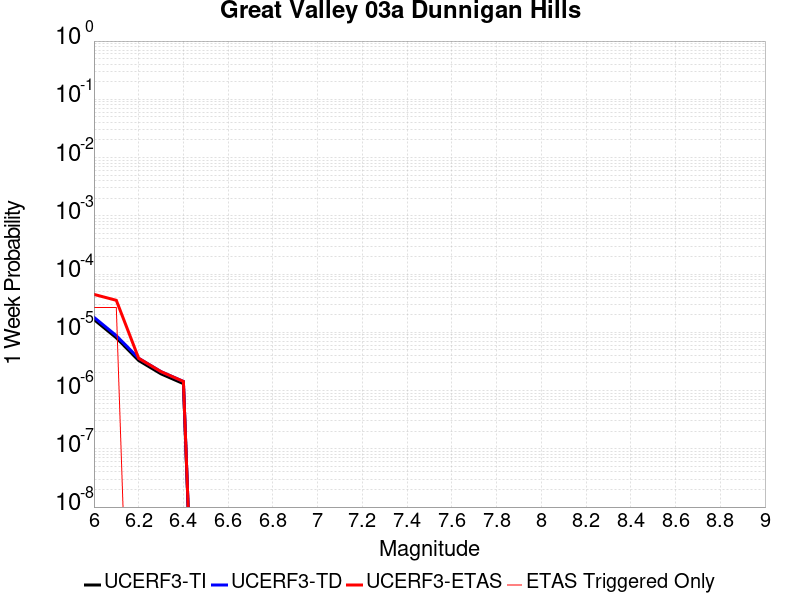 | 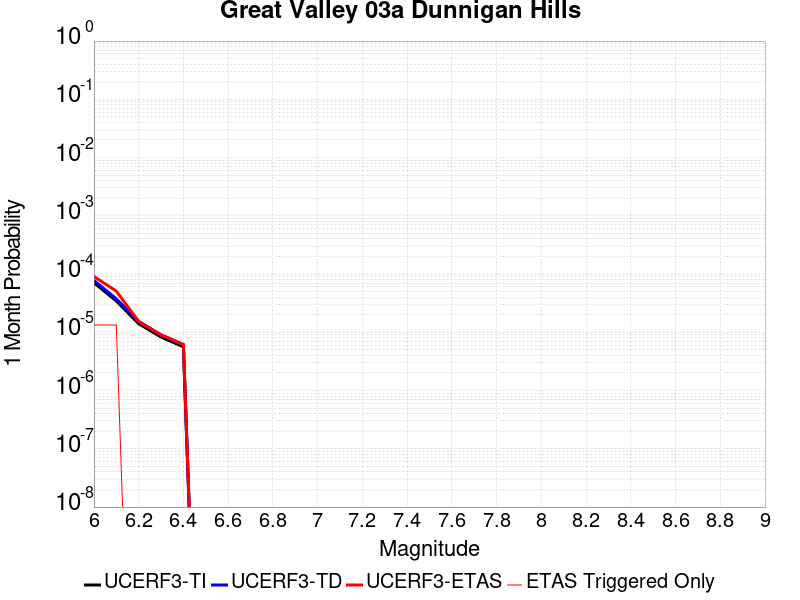 | 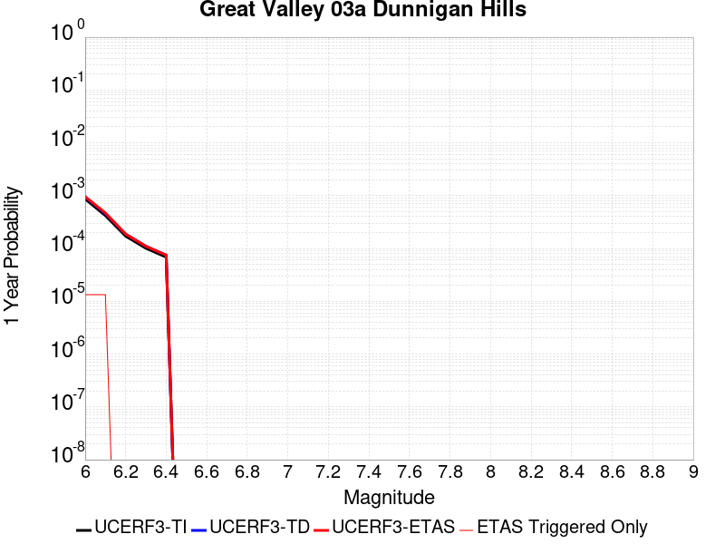 | 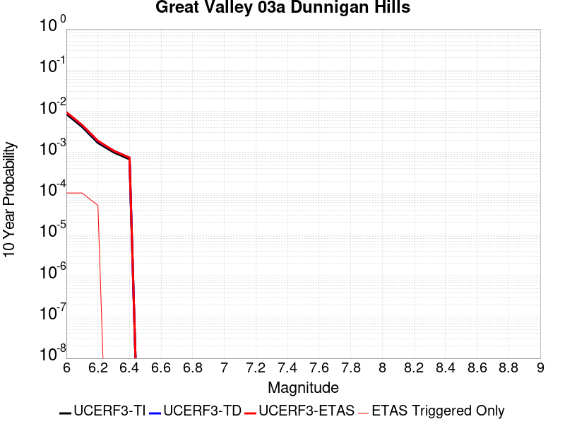 |

| Magnitude | 1 wk TI Prob | 1 wk TD Prob | 1 wk ETAS Prob | 1 wk ETAS/TD Gain | 1 wk ETAS Triggered Only | 1 mo TI Prob | 1 mo TD Prob | 1 mo ETAS Prob | 1 mo ETAS/TD Gain | 1 mo ETAS Triggered Only | 1 yr TI Prob | 1 yr TD Prob | 1 yr ETAS Prob | 1 yr ETAS/TD Gain | 1 yr ETAS Triggered Only | 10 yr TI Prob | 10 yr TD Prob | 10 yr ETAS Prob | 10 yr ETAS/TD Gain | 10 yr ETAS Triggered Only |
|-----|-----|-----|-----|-----|-----|-----|-----|-----|-----|-----|-----|-----|-----|-----|-----|-----|-----|-----|-----|-----|
| 6.0 | 1.6591328E-5 | 1.8107954E-5 | 2.8543673E-5 | 1.5763057 | 1.0435908E-5 | 7.110376E-5 | 7.7603596E-5 | 8.8038694E-5 | 1.1344666 | 1.0435908E-5 | 8.6534437E-4 | 9.444834E-4 | 9.549094E-4 | 1.0110389 | 1.0435908E-5 | 0.008619824 | 0.009411525 | 0.009442538 | 1.0032952 | 3.1307725E-5 |
| 6.1 | 8.041125E-6 | 8.769726E-6 | 1.9205543E-5 | 2.189982 | 1.0435908E-5 | 3.4461507E-5 | 3.7584115E-5 | 4.8019632E-5 | 1.2776576 | 1.0435908E-5 | 4.194881E-4 | 4.5751085E-4 | 4.6794198E-4 | 1.0227997 | 1.0435908E-5 | 0.004186971 | 0.004567687 | 0.0045884633 | 1.0045485 | 2.0871816E-5 |
| 6.2 | 3.2807004E-6 | 3.5795688E-6 | 3.5795688E-6 | 1.0 | 0.0 | 1.4060069E-5 | 1.5340942E-5 | 1.5340942E-5 | 1.0 | 0.0 | 1.7116789E-4 | 1.8676413E-4 | 1.8676413E-4 | 1.0 | 0.0 | 0.0017103611 | 0.0018664796 | 0.0018768961 | 1.0055808 | 1.0435908E-5 |
| 6.3 | 1.9339366E-6 | 2.1103806E-6 | 2.1103806E-6 | 1.0 | 0.0 | 8.288273E-6 | 9.044474E-6 | 9.044474E-6 | 1.0 | 0.0 | 1.00905054E-4 | 1.1011375E-4 | 1.1011375E-4 | 1.0 | 0.0 | 0.0010085925 | 0.0011008718 | 0.0011008718 | 1.0 | 0.0 |
| 6.4 | 1.3142635E-6 | 1.4339867E-6 | 1.4339867E-6 | 1.0 | 0.0 | 5.6325457E-6 | 6.145657E-6 | 6.145657E-6 | 1.0 | 0.0 | 6.857408E-5 | 7.482337E-5 | 7.482337E-5 | 1.0 | 0.0 | 6.8552926E-4 | 7.4823375E-4 | 7.4823375E-4 | 1.0 | 0.0 |

## Reliz 2011 CFM
*[(top)](#table-of-contents)*

| 1 Week | 1 Month | 1 Year | 10 Year |
|-----|-----|-----|-----|
|  | 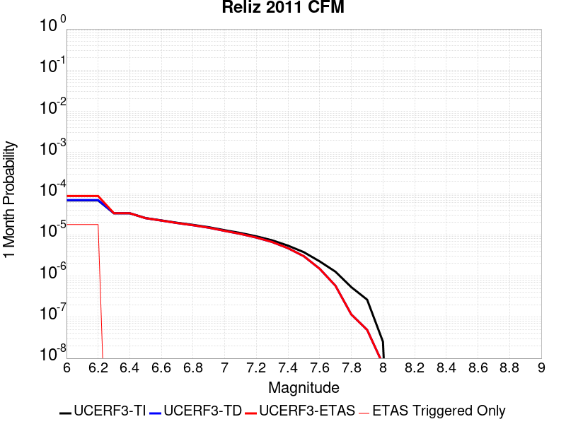 | 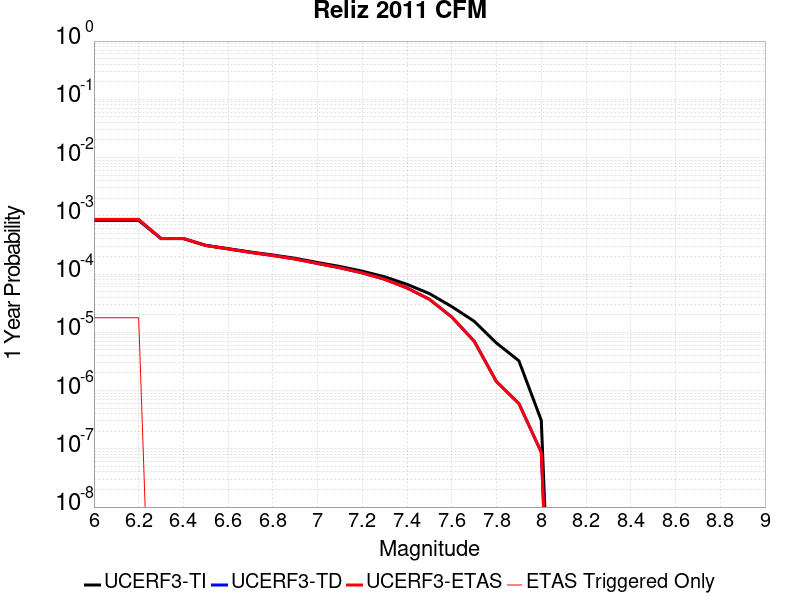 | 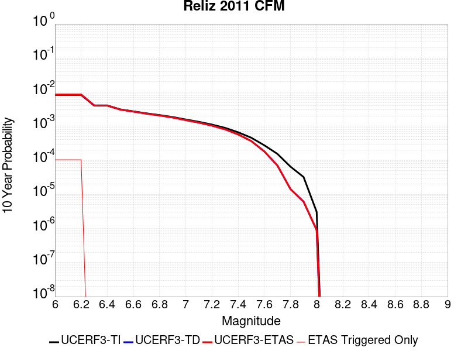 |

| Magnitude | 1 wk TI Prob | 1 wk TD Prob | 1 wk ETAS Prob | 1 wk ETAS/TD Gain | 1 wk ETAS Triggered Only | 1 mo TI Prob | 1 mo TD Prob | 1 mo ETAS Prob | 1 mo ETAS/TD Gain | 1 mo ETAS Triggered Only | 1 yr TI Prob | 1 yr TD Prob | 1 yr ETAS Prob | 1 yr ETAS/TD Gain | 1 yr ETAS Triggered Only | 10 yr TI Prob | 10 yr TD Prob | 10 yr ETAS Prob | 10 yr ETAS/TD Gain | 10 yr ETAS Triggered Only |
|-----|-----|-----|-----|-----|-----|-----|-----|-----|-----|-----|-----|-----|-----|-----|-----|-----|-----|-----|-----|-----|
| 6.0 | 1.6002472E-5 | 1.6282804E-5 | 3.715428E-5 | 2.281811 | 2.0871816E-5 | 6.8580215E-5 | 6.9781694E-5 | 9.065205E-5 | 1.2990807 | 2.0871816E-5 | 8.3464425E-4 | 8.4928074E-4 | 8.7013486E-4 | 1.024555 | 2.0871816E-5 | 0.008315164 | 0.008462547 | 0.00849359 | 1.0036683 | 3.1307725E-5 |
| 6.1 | 1.6002472E-5 | 1.6282804E-5 | 3.715428E-5 | 2.281811 | 2.0871816E-5 | 6.8580215E-5 | 6.9781694E-5 | 9.065205E-5 | 1.2990807 | 2.0871816E-5 | 8.3464425E-4 | 8.4928074E-4 | 8.7013486E-4 | 1.024555 | 2.0871816E-5 | 0.008315164 | 0.008462547 | 0.00849359 | 1.0036683 | 3.1307725E-5 |
| 6.2 | 1.6002472E-5 | 1.6282804E-5 | 3.715428E-5 | 2.281811 | 2.0871816E-5 | 6.8580215E-5 | 6.9781694E-5 | 9.065205E-5 | 1.2990807 | 2.0871816E-5 | 8.3464425E-4 | 8.4928074E-4 | 8.7013486E-4 | 1.024555 | 2.0871816E-5 | 0.008315164 | 0.008462547 | 0.00849359 | 1.0036683 | 3.1307725E-5 |
| 6.3 | 7.792404E-6 | 7.803802E-6 | 7.803802E-6 | 1.0 | 0.0 | 3.339559E-5 | 3.344444E-5 | 3.344444E-5 | 1.0 | 0.0 | 4.0651546E-4 | 4.0711078E-4 | 4.0711078E-4 | 1.0 | 0.0 | 0.0040577264 | 0.004063926 | 0.004063926 | 1.0 | 0.0 |
| 6.4 | 7.792404E-6 | 7.803802E-6 | 7.803802E-6 | 1.0 | 0.0 | 3.339559E-5 | 3.344444E-5 | 3.344444E-5 | 1.0 | 0.0 | 4.0651546E-4 | 4.0711078E-4 | 4.0711078E-4 | 1.0 | 0.0 | 0.0040577264 | 0.004063926 | 0.004063926 | 1.0 | 0.0 |
| 6.5 | 5.9659374E-6 | 5.928738E-6 | 5.928738E-6 | 1.0 | 0.0 | 2.5568053E-5 | 2.5408632E-5 | 2.5408632E-5 | 1.0 | 0.0 | 3.1124658E-4 | 3.093064E-4 | 3.093064E-4 | 1.0 | 0.0 | 0.00310811 | 0.0030889767 | 0.0030889767 | 1.0 | 0.0 |
| 6.6 | 5.2350692E-6 | 5.178986E-6 | 5.178986E-6 | 1.0 | 0.0 | 2.2435817E-5 | 2.2195467E-5 | 2.2195467E-5 | 1.0 | 0.0 | 2.7312184E-4 | 2.7019644E-4 | 2.7019644E-4 | 1.0 | 0.0 | 0.002727864 | 0.0026988892 | 0.0026988892 | 1.0 | 0.0 |
| 6.7 | 4.580206E-6 | 4.5061206E-6 | 4.5061206E-6 | 1.0 | 0.0 | 1.9629308E-5 | 1.9311801E-5 | 1.9311801E-5 | 1.0 | 0.0 | 2.389606E-4 | 2.350959E-4 | 2.350959E-4 | 1.0 | 0.0 | 0.002387038 | 0.0023486738 | 0.0023486738 | 1.0 | 0.0 |
| 6.8 | 4.0765017E-6 | 3.9882384E-6 | 3.9882384E-6 | 1.0 | 0.0 | 1.7470604E-5 | 1.7092338E-5 | 1.7092338E-5 | 1.0 | 0.0 | 2.1268385E-4 | 2.0807938E-4 | 2.0807938E-4 | 1.0 | 0.0 | 0.002124804 | 0.0020790435 | 0.0020790435 | 1.0 | 0.0 |
| 6.9 | 3.5752896E-6 | 3.4725176E-6 | 3.4725176E-6 | 1.0 | 0.0 | 1.532258E-5 | 1.4882134E-5 | 1.4882134E-5 | 1.0 | 0.0 | 1.8653645E-4 | 1.8117494E-4 | 1.8117494E-4 | 1.0 | 0.0 | 0.0018637994 | 0.0018104686 | 0.0018104686 | 1.0 | 0.0 |
| 7.0 | 3.0259848E-6 | 2.9079417E-6 | 2.9079417E-6 | 1.0 | 0.0 | 1.2968442E-5 | 1.2462548E-5 | 1.2462548E-5 | 1.0 | 0.0 | 1.5787935E-4 | 1.5172097E-4 | 1.5172097E-4 | 1.0 | 0.0 | 0.0015776722 | 0.001516369 | 0.001516369 | 1.0 | 0.0 |
| 7.1 | 2.5861116E-6 | 2.455167E-6 | 2.455167E-6 | 1.0 | 0.0 | 1.1083288E-5 | 1.05221025E-5 | 1.05221025E-5 | 1.0 | 0.0 | 1.3493067E-4 | 1.2809907E-4 | 1.2809907E-4 | 1.0 | 0.0 | 0.0013484878 | 0.001280447 | 0.001280447 | 1.0 | 0.0 |
| 7.2 | 2.1482588E-6 | 2.003237E-6 | 2.003237E-6 | 1.0 | 0.0 | 9.20679E-6 | 8.585273E-6 | 8.585273E-6 | 1.0 | 0.0 | 1.12086906E-4 | 1.0452068E-4 | 1.0452068E-4 | 1.0 | 0.0 | 0.0011203039 | 0.0010449095 | 0.0010449095 | 1.0 | 0.0 |
| 7.3 | 1.7194744E-6 | 1.5611241E-6 | 1.5611241E-6 | 1.0 | 0.0 | 7.3691554E-6 | 6.690515E-6 | 6.690515E-6 | 1.0 | 0.0 | 8.971577E-5 | 8.1453974E-5 | 8.1453974E-5 | 1.0 | 0.0 | 8.967956E-4 | 8.1443513E-4 | 8.1443513E-4 | 1.0 | 0.0 |
| 7.4 | 1.2755178E-6 | 1.10563E-6 | 1.10563E-6 | 1.0 | 0.0 | 5.4664933E-6 | 4.7384056E-6 | 4.7384056E-6 | 1.0 | 0.0 | 6.655252E-5 | 5.768856E-5 | 5.768856E-5 | 1.0 | 0.0 | 6.6532596E-4 | 5.7692965E-4 | 5.7692965E-4 | 1.0 | 0.0 |
| 7.5 | 8.8463224E-7 | 7.0580273E-7 | 7.0580273E-7 | 1.0 | 0.0 | 3.7912755E-6 | 3.0248652E-6 | 3.0248652E-6 | 1.0 | 0.0 | 4.6157802E-5 | 3.6827114E-5 | 3.6827114E-5 | 1.0 | 0.0 | 4.6148215E-4 | 3.684038E-4 | 3.684038E-4 | 1.0 | 0.0 |
| 7.6 | 5.291355E-7 | 3.500777E-7 | 3.500777E-7 | 1.0 | 0.0 | 2.2677216E-6 | 1.5003321E-6 | 1.5003321E-6 | 1.0 | 0.0 | 2.760916E-5 | 1.8266392E-5 | 1.8266392E-5 | 1.0 | 0.0 | 2.760573E-4 | 1.8284164E-4 | 1.8284164E-4 | 1.0 | 0.0 |
| 7.7 | 2.9663357E-7 | 1.351113E-7 | 1.351113E-7 | 1.0 | 0.0 | 1.2712861E-6 | 5.7904833E-7 | 5.7904833E-7 | 1.0 | 0.0 | 1.5477797E-5 | 7.049891E-6 | 7.049891E-6 | 1.0 | 0.0 | 1.547672E-4 | 7.068132E-5 | 7.068132E-5 | 1.0 | 0.0 |
| 7.8 | 1.2509386E-7 | 2.7157126E-8 | 2.7157126E-8 | 1.0 | 0.0 | 5.3611643E-7 | 1.1638769E-7 | 1.1638769E-7 | 1.0 | 0.0 | 6.527198E-6 | 1.4170191E-6 | 1.4170191E-6 | 1.0 | 0.0 | 6.527006E-5 | 1.4326506E-5 | 1.4326506E-5 | 1.0 | 0.0 |
| 7.9 | 6.213493E-8 | 1.1482114E-8 | 1.1482114E-8 | 1.0 | 0.0 | 2.6629255E-7 | 4.920906E-8 | 4.920906E-8 | 1.0 | 0.0 | 3.242107E-6 | 5.9912014E-7 | 5.9912014E-7 | 1.0 | 0.0 | 3.2420594E-5 | 6.1224223E-6 | 6.1224223E-6 | 1.0 | 0.0 |
| 8.0 | 5.92383E-9 | 1.677887E-9 | 1.677887E-9 | 1.0 | 0.0 | 2.5387841E-8 | 7.190944E-9 | 7.190944E-9 | 1.0 | 0.0 | 3.0909692E-7 | 8.754974E-8 | 8.754974E-8 | 1.0 | 0.0 | 3.090965E-6 | 9.003061E-7 | 9.003061E-7 | 1.0 | 0.0 |

## Mission Hills 2011
*[(top)](#table-of-contents)*

| 1 Week | 1 Month | 1 Year | 10 Year |
|-----|-----|-----|-----|
| 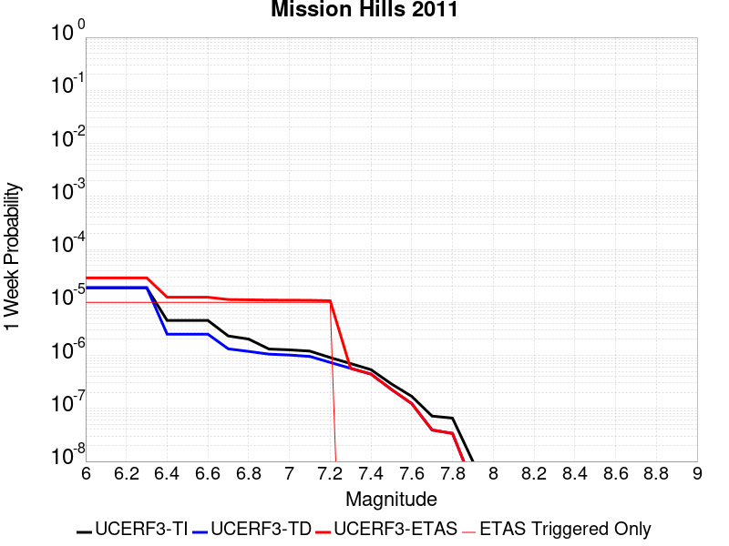 | 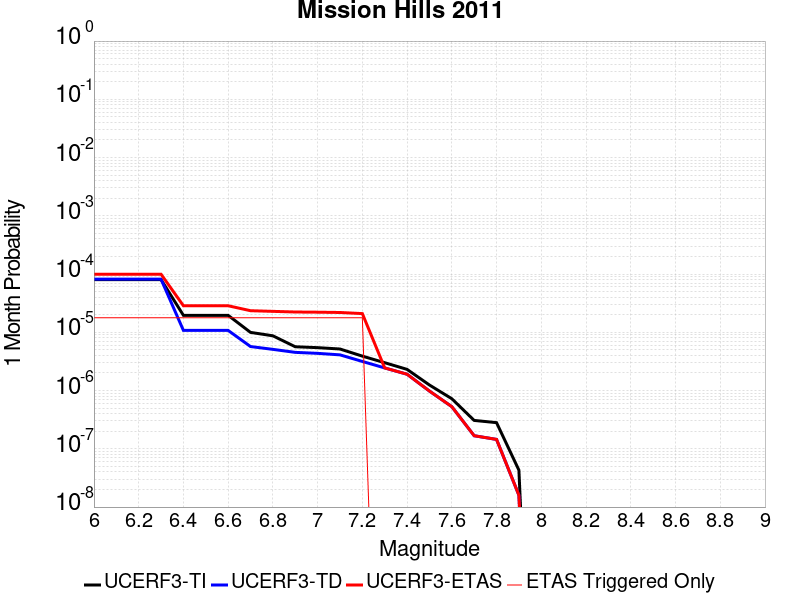 | 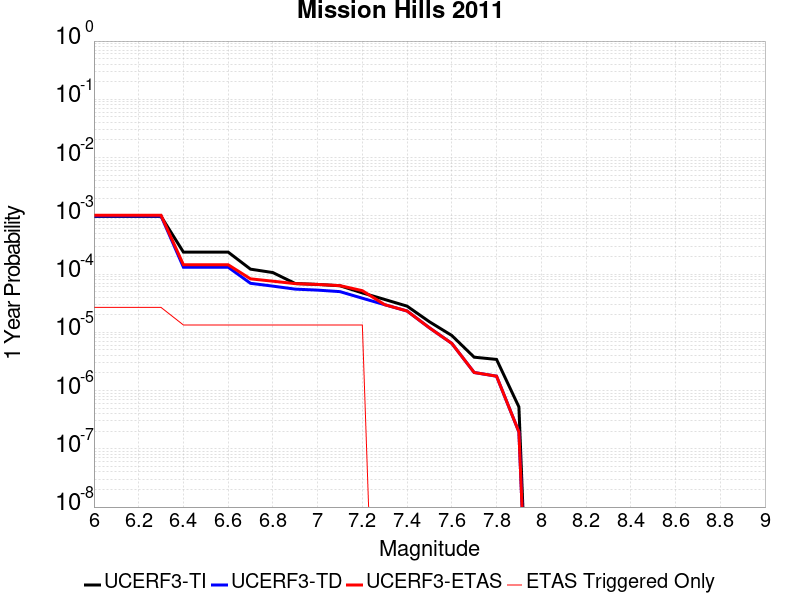 | 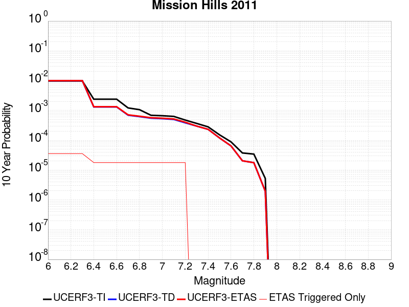 |

| Magnitude | 1 wk TI Prob | 1 wk TD Prob | 1 wk ETAS Prob | 1 wk ETAS/TD Gain | 1 wk ETAS Triggered Only | 1 mo TI Prob | 1 mo TD Prob | 1 mo ETAS Prob | 1 mo ETAS/TD Gain | 1 mo ETAS Triggered Only | 1 yr TI Prob | 1 yr TD Prob | 1 yr ETAS Prob | 1 yr ETAS/TD Gain | 1 yr ETAS Triggered Only | 10 yr TI Prob | 10 yr TD Prob | 10 yr ETAS Prob | 10 yr ETAS/TD Gain | 10 yr ETAS Triggered Only |
|-----|-----|-----|-----|-----|-----|-----|-----|-----|-----|-----|-----|-----|-----|-----|-----|-----|-----|-----|-----|-----|
| 6.0 | 1.8765717E-5 | 1.9054645E-5 | 2.9490355E-5 | 1.5476726 | 1.0435908E-5 | 8.0422025E-5 | 8.166215E-5 | 9.20972E-5 | 1.1277833 | 1.0435908E-5 | 9.786983E-4 | 9.941267E-4 | 0.0010254033 | 1.0314614 | 3.1307725E-5 | 0.009743992 | 0.009930461 | 0.009961457 | 1.0031214 | 3.1307725E-5 |
| 6.1 | 1.8765717E-5 | 1.9054645E-5 | 2.9490355E-5 | 1.5476726 | 1.0435908E-5 | 8.0422025E-5 | 8.166215E-5 | 9.20972E-5 | 1.1277833 | 1.0435908E-5 | 9.786983E-4 | 9.941267E-4 | 0.0010254033 | 1.0314614 | 3.1307725E-5 | 0.009743992 | 0.009930461 | 0.009961457 | 1.0031214 | 3.1307725E-5 |
| 6.2 | 1.8765717E-5 | 1.9054645E-5 | 2.9490355E-5 | 1.5476726 | 1.0435908E-5 | 8.0422025E-5 | 8.166215E-5 | 9.20972E-5 | 1.1277833 | 1.0435908E-5 | 9.786983E-4 | 9.941267E-4 | 0.0010254033 | 1.0314614 | 3.1307725E-5 | 0.009743992 | 0.009930461 | 0.009961457 | 1.0031214 | 3.1307725E-5 |
| 6.3 | 1.8765717E-5 | 1.9054645E-5 | 2.9490355E-5 | 1.5476726 | 1.0435908E-5 | 8.0422025E-5 | 8.166215E-5 | 9.20972E-5 | 1.1277833 | 1.0435908E-5 | 9.786983E-4 | 9.941267E-4 | 0.0010254033 | 1.0314614 | 3.1307725E-5 | 0.009743992 | 0.009930461 | 0.009961457 | 1.0031214 | 3.1307725E-5 |
| 6.4 | 4.566357E-6 | 2.5148488E-6 | 1.2950731E-5 | 5.1497054 | 1.0435908E-5 | 1.9569954E-5 | 1.0777889E-5 | 2.1213684E-5 | 1.9682597 | 1.0435908E-5 | 2.3823815E-4 | 1.3121472E-4 | 1.4164926E-4 | 1.0795226 | 1.0435908E-5 | 0.002379829 | 0.0013115506 | 0.0013219728 | 1.0079465 | 1.0435908E-5 |
| 6.5 | 4.566357E-6 | 2.5148488E-6 | 1.2950731E-5 | 5.1497054 | 1.0435908E-5 | 1.9569954E-5 | 1.0777889E-5 | 2.1213684E-5 | 1.9682597 | 1.0435908E-5 | 2.3823815E-4 | 1.3121472E-4 | 1.4164926E-4 | 1.0795226 | 1.0435908E-5 | 0.002379829 | 0.0013115506 | 0.0013219728 | 1.0079465 | 1.0435908E-5 |
| 6.6 | 4.566357E-6 | 2.5148488E-6 | 1.2950731E-5 | 5.1497054 | 1.0435908E-5 | 1.9569954E-5 | 1.0777889E-5 | 2.1213684E-5 | 1.9682597 | 1.0435908E-5 | 2.3823815E-4 | 1.3121472E-4 | 1.4164926E-4 | 1.0795226 | 1.0435908E-5 | 0.002379829 | 0.0013115506 | 0.0013219728 | 1.0079465 | 1.0435908E-5 |
| 6.7 | 2.3266773E-6 | 1.3296187E-6 | 1.1765513E-5 | 8.848786 | 1.0435908E-5 | 9.971435E-6 | 5.698354E-6 | 1.6134203E-5 | 2.8313794 | 1.0435908E-5 | 1.2139547E-4 | 6.937531E-5 | 7.9810496E-5 | 1.1504164 | 1.0435908E-5 | 0.0012132917 | 6.9354265E-4 | 7.039713E-4 | 1.0150368 | 1.0435908E-5 |
| 6.8 | 2.032735E-6 | 1.1894115E-6 | 1.1625307E-5 | 9.773999 | 1.0435908E-5 | 8.711692E-6 | 5.097468E-6 | 1.5533324E-5 | 3.0472624 | 1.0435908E-5 | 1.06059684E-4 | 6.205996E-5 | 7.249522E-5 | 1.168148 | 1.0435908E-5 | 0.0010600908 | 6.2043115E-4 | 6.3086057E-4 | 1.0168099 | 1.0435908E-5 |
| 6.9 | 1.3186259E-6 | 1.0561778E-6 | 1.1492075E-5 | 10.880815 | 1.0435908E-5 | 5.6512413E-6 | 4.5264687E-6 | 1.4962329E-5 | 3.3055193 | 1.0435908E-5 | 6.8801695E-5 | 5.5108394E-5 | 6.5543725E-5 | 1.1893601 | 1.0435908E-5 | 6.8780396E-4 | 5.5095024E-4 | 5.613804E-4 | 1.0189313 | 1.0435908E-5 |
| 7.0 | 1.2726016E-6 | 1.0159088E-6 | 1.1451806E-5 | 11.272475 | 1.0435908E-5 | 5.4539955E-6 | 4.3538876E-6 | 1.478975E-5 | 3.3969069 | 1.0435908E-5 | 6.6400375E-5 | 5.300732E-5 | 6.3442676E-5 | 1.1968663 | 1.0435908E-5 | 6.6380535E-4 | 5.299496E-4 | 5.4038E-4 | 1.0196818 | 1.0435908E-5 |
| 7.1 | 1.2063913E-6 | 9.570072E-7 | 1.1392905E-5 | 11.904722 | 1.0435908E-5 | 5.170238E-6 | 4.101453E-6 | 1.4537318E-5 | 3.5444312 | 1.0435908E-5 | 6.294583E-5 | 4.9934075E-5 | 6.036946E-5 | 1.2089833 | 1.0435908E-5 | 6.2928005E-4 | 4.992311E-4 | 5.096618E-4 | 1.0208936 | 1.0435908E-5 |
| 7.2 | 9.105806E-7 | 7.3765557E-7 | 1.1173555E-5 | 15.147388 | 1.0435908E-5 | 3.9024826E-6 | 3.1613772E-6 | 1.3597252E-5 | 4.3010535 | 1.0435908E-5 | 4.7511687E-5 | 3.8489103E-5 | 4.892461E-5 | 1.2711289 | 1.0435908E-5 | 4.7501532E-4 | 3.8482592E-4 | 3.952578E-4 | 1.0271081 | 1.0435908E-5 |
| 7.3 | 7.020432E-7 | 5.710089E-7 | 5.710089E-7 | 1.0 | 0.0 | 3.0087533E-6 | 2.447179E-6 | 2.447179E-6 | 1.0 | 0.0 | 3.6630954E-5 | 2.979401E-5 | 2.979401E-5 | 1.0 | 0.0 | 3.6624918E-4 | 2.9790145E-4 | 2.9790145E-4 | 1.0 | 0.0 |
| 7.4 | 5.3900635E-7 | 4.4480825E-7 | 4.4480825E-7 | 1.0 | 0.0 | 2.3100251E-6 | 1.9063198E-6 | 1.9063198E-6 | 1.0 | 0.0 | 2.8124194E-5 | 2.3209208E-5 | 2.3209208E-5 | 1.0 | 0.0 | 2.8120633E-4 | 2.3206905E-4 | 2.3206905E-4 | 1.0 | 0.0 |
| 7.5 | 2.907075E-7 | 2.2875415E-7 | 2.2875415E-7 | 1.0 | 0.0 | 1.2458887E-6 | 9.803746E-7 | 9.803746E-7 | 1.0 | 0.0 | 1.5168589E-5 | 1.1935997E-5 | 1.1935997E-5 | 1.0 | 0.0 | 1.5167553E-4 | 1.1935373E-4 | 1.1935373E-4 | 1.0 | 0.0 |
| 7.6 | 1.6903675E-7 | 1.2353402E-7 | 1.2353402E-7 | 1.0 | 0.0 | 7.2444305E-7 | 5.294314E-7 | 5.294314E-7 | 1.0 | 0.0 | 8.820059E-6 | 6.4458095E-6 | 6.4458095E-6 | 1.0 | 0.0 | 8.8197085E-5 | 6.445635E-5 | 6.445635E-5 | 1.0 | 0.0 |
| 7.7 | 7.168073E-8 | 3.9135116E-8 | 3.9135116E-8 | 1.0 | 0.0 | 3.072031E-7 | 1.6772192E-7 | 1.6772192E-7 | 1.0 | 0.0 | 3.7401915E-6 | 2.0420127E-6 | 2.0420127E-6 | 1.0 | 0.0 | 3.7401285E-5 | 2.041995E-5 | 2.041995E-5 | 1.0 | 0.0 |
| 7.8 | 6.564101E-8 | 3.3835356E-8 | 3.3835356E-8 | 1.0 | 0.0 | 2.813186E-7 | 1.4500866E-7 | 1.4500866E-7 | 1.0 | 0.0 | 3.4250486E-6 | 1.7654792E-6 | 1.7654792E-6 | 1.0 | 0.0 | 3.424996E-5 | 1.7654662E-5 | 1.7654662E-5 | 1.0 | 0.0 |
| 7.9 | 1.0029074E-8 | 3.7292542E-9 | 3.7292542E-9 | 1.0 | 0.0 | 4.2981743E-8 | 1.5982518E-8 | 1.5982518E-8 | 1.0 | 0.0 | 5.2330256E-7 | 1.9458714E-7 | 1.9458714E-7 | 1.0 | 0.0 | 5.2330133E-6 | 1.945871E-6 | 1.945871E-6 | 1.0 | 0.0 |

## Malibu Coast alt 1
*[(top)](#table-of-contents)*

| 1 Week | 1 Month | 1 Year | 10 Year |
|-----|-----|-----|-----|
| 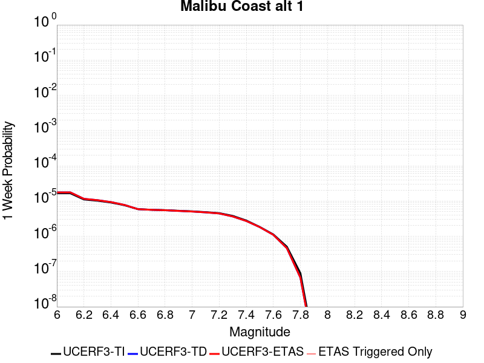 | 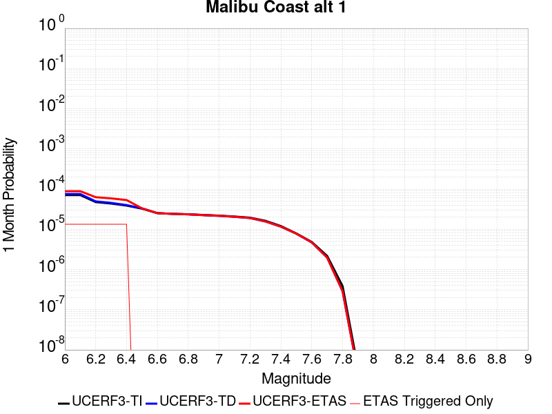 | 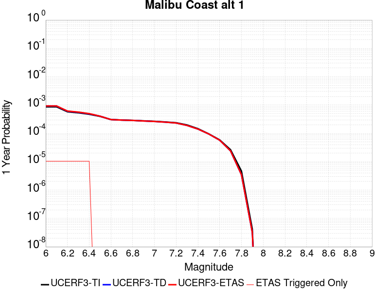 | 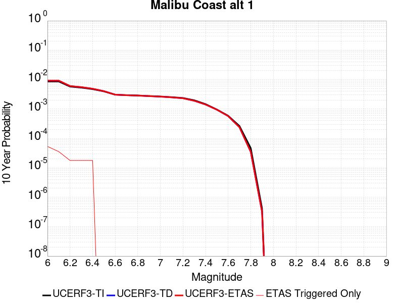 |

| Magnitude | 1 wk TI Prob | 1 wk TD Prob | 1 wk ETAS Prob | 1 wk ETAS/TD Gain | 1 wk ETAS Triggered Only | 1 mo TI Prob | 1 mo TD Prob | 1 mo ETAS Prob | 1 mo ETAS/TD Gain | 1 mo ETAS Triggered Only | 1 yr TI Prob | 1 yr TD Prob | 1 yr ETAS Prob | 1 yr ETAS/TD Gain | 1 yr ETAS Triggered Only | 10 yr TI Prob | 10 yr TD Prob | 10 yr ETAS Prob | 10 yr ETAS/TD Gain | 10 yr ETAS Triggered Only |
|-----|-----|-----|-----|-----|-----|-----|-----|-----|-----|-----|-----|-----|-----|-----|-----|-----|-----|-----|-----|-----|
| 6.0 | 1.6572556E-5 | 1.7598066E-5 | 1.7598066E-5 | 1.0 | 0.0 | 7.102331E-5 | 7.541821E-5 | 8.585333E-5 | 1.1383634 | 1.0435908E-5 | 8.6436566E-4 | 9.178488E-4 | 9.282751E-4 | 1.0113596 | 1.0435908E-5 | 0.0086101135 | 0.009142512 | 0.009173534 | 1.003393 | 3.1307725E-5 |
| 6.1 | 1.6572556E-5 | 1.7598066E-5 | 1.7598066E-5 | 1.0 | 0.0 | 7.102331E-5 | 7.541821E-5 | 8.585333E-5 | 1.1383634 | 1.0435908E-5 | 8.6436566E-4 | 9.178488E-4 | 9.282751E-4 | 1.0113596 | 1.0435908E-5 | 0.0086101135 | 0.009142512 | 0.009163193 | 1.0022621 | 2.0871816E-5 |
| 6.2 | 1.1085717E-5 | 1.1557147E-5 | 1.1557147E-5 | 1.0 | 0.0 | 4.750935E-5 | 4.952971E-5 | 5.99651E-5 | 1.2106895 | 1.0435908E-5 | 5.782728E-4 | 6.028609E-4 | 6.132905E-4 | 1.0173002 | 1.0435908E-5 | 0.0057677035 | 0.0060126255 | 0.006022999 | 1.0017252 | 1.0435908E-5 |
| 6.3 | 1.0208568E-5 | 1.0592237E-5 | 1.0592237E-5 | 1.0 | 0.0 | 4.375027E-5 | 4.539453E-5 | 5.5829965E-5 | 1.2298831 | 1.0435908E-5 | 5.325294E-4 | 5.5254117E-4 | 5.6297134E-4 | 1.0188767 | 1.0435908E-5 | 0.0053125503 | 0.0055119814 | 0.00552236 | 1.0018829 | 1.0435908E-5 |
| 6.4 | 9.0682315E-6 | 9.342637E-6 | 9.342637E-6 | 1.0 | 0.0 | 3.8863272E-5 | 4.003927E-5 | 5.0474762E-5 | 1.2606313 | 1.0435908E-5 | 4.730576E-4 | 4.8737114E-4 | 4.978019E-4 | 1.0214022 | 1.0435908E-5 | 0.0047205184 | 0.004863236 | 0.0048736213 | 1.0021354 | 1.0435908E-5 |
| 6.5 | 7.605796E-6 | 7.748587E-6 | 7.748587E-6 | 1.0 | 0.0 | 3.259586E-5 | 3.3207816E-5 | 3.3207816E-5 | 1.0 | 0.0 | 3.9678233E-4 | 4.0423148E-4 | 4.0423148E-4 | 1.0 | 0.0 | 0.0039607463 | 0.0040351 | 0.0040351 | 1.0 | 0.0 |
| 6.6 | 5.889873E-6 | 5.8795385E-6 | 5.8795385E-6 | 1.0 | 0.0 | 2.5242069E-5 | 2.519778E-5 | 2.519778E-5 | 1.0 | 0.0 | 3.0727885E-4 | 3.0673988E-4 | 3.0673988E-4 | 1.0 | 0.0 | 0.003068543 | 0.0030631777 | 0.0030631777 | 1.0 | 0.0 |
| 6.7 | 5.66586E-6 | 5.641641E-6 | 5.641641E-6 | 1.0 | 0.0 | 2.428203E-5 | 2.417824E-5 | 2.417824E-5 | 1.0 | 0.0 | 2.955936E-4 | 2.9433038E-4 | 2.9433038E-4 | 1.0 | 0.0 | 0.0029520073 | 0.0029394177 | 0.0029394177 | 1.0 | 0.0 |
| 6.8 | 5.521556E-6 | 5.489427E-6 | 5.489427E-6 | 1.0 | 0.0 | 2.3663597E-5 | 2.3525903E-5 | 2.3525903E-5 | 1.0 | 0.0 | 2.880662E-4 | 2.8639034E-4 | 2.8639034E-4 | 1.0 | 0.0 | 0.0028769306 | 0.002860224 | 0.002860224 | 1.0 | 0.0 |
| 6.9 | 5.29752E-6 | 5.2499317E-6 | 5.2499317E-6 | 1.0 | 0.0 | 2.270346E-5 | 2.2499513E-5 | 2.2499513E-5 | 1.0 | 0.0 | 2.7637955E-4 | 2.7389723E-4 | 2.7389723E-4 | 1.0 | 0.0 | 0.0027603607 | 0.0027356069 | 0.0027356069 | 1.0 | 0.0 |
| 7.0 | 5.106743E-6 | 5.0476788E-6 | 5.0476788E-6 | 1.0 | 0.0 | 2.1885859E-5 | 2.163273E-5 | 2.163273E-5 | 1.0 | 0.0 | 2.6642776E-4 | 2.6334674E-4 | 2.6334674E-4 | 1.0 | 0.0 | 0.0026610855 | 0.0026303562 | 0.0026303562 | 1.0 | 0.0 |
| 7.1 | 4.8469647E-6 | 4.770373E-6 | 4.770373E-6 | 1.0 | 0.0 | 2.0772539E-5 | 2.0444295E-5 | 2.0444295E-5 | 1.0 | 0.0 | 2.528763E-4 | 2.4888094E-4 | 2.4888094E-4 | 1.0 | 0.0 | 0.0025258875 | 0.00248603 | 0.00248603 | 1.0 | 0.0 |
| 7.2 | 4.545514E-6 | 4.4481935E-6 | 4.4481935E-6 | 1.0 | 0.0 | 1.9480629E-5 | 1.9063547E-5 | 1.9063547E-5 | 1.0 | 0.0 | 2.3715083E-4 | 2.3207403E-4 | 2.3207403E-4 | 1.0 | 0.0 | 0.0023689792 | 0.0023183243 | 0.0023183243 | 1.0 | 0.0 |
| 7.3 | 3.794097E-6 | 3.6519348E-6 | 3.6519348E-6 | 1.0 | 0.0 | 1.6260314E-5 | 1.5651056E-5 | 1.5651056E-5 | 1.0 | 0.0 | 1.9795135E-4 | 1.9053498E-4 | 1.9053498E-4 | 1.0 | 0.0 | 0.001977751 | 0.0019037209 | 0.0019037209 | 1.0 | 0.0 |
| 7.4 | 2.808217E-6 | 2.719077E-6 | 2.719077E-6 | 1.0 | 0.0 | 1.203516E-5 | 1.1653135E-5 | 1.1653135E-5 | 1.0 | 0.0 | 1.4651821E-4 | 1.418677E-4 | 1.418677E-4 | 1.0 | 0.0 | 0.0014642165 | 0.001417774 | 0.001417774 | 1.0 | 0.0 |
| 7.5 | 1.83809E-6 | 1.8190691E-6 | 1.8190691E-6 | 1.0 | 0.0 | 7.877505E-6 | 7.795988E-6 | 7.795988E-6 | 1.0 | 0.0 | 9.59044E-5 | 9.491203E-5 | 9.491203E-5 | 1.0 | 0.0 | 9.5863023E-4 | 9.48717E-4 | 9.48717E-4 | 1.0 | 0.0 |
| 7.6 | 1.1292672E-6 | 1.1001447E-6 | 1.1001447E-6 | 1.0 | 0.0 | 4.839708E-6 | 4.714897E-6 | 4.714897E-6 | 1.0 | 0.0 | 5.8921847E-5 | 5.7402376E-5 | 5.7402376E-5 | 1.0 | 0.0 | 5.890623E-4 | 5.738771E-4 | 5.738771E-4 | 1.0 | 0.0 |
| 7.7 | 5.065272E-7 | 4.609151E-7 | 4.609151E-7 | 1.0 | 0.0 | 2.170829E-6 | 1.975349E-6 | 1.975349E-6 | 1.0 | 0.0 | 2.6429525E-5 | 2.404962E-5 | 2.404962E-5 | 1.0 | 0.0 | 2.642638E-4 | 2.4047129E-4 | 2.4047129E-4 | 1.0 | 0.0 |
| 7.8 | 8.952991E-8 | 6.707874E-8 | 6.707874E-8 | 1.0 | 0.0 | 3.8369956E-7 | 2.8748025E-7 | 2.8748025E-7 | 1.0 | 0.0 | 4.671532E-6 | 3.5000667E-6 | 3.5000667E-6 | 1.0 | 0.0 | 4.671434E-5 | 3.5000136E-5 | 3.5000136E-5 | 1.0 | 0.0 |
| 7.9 | 8.007447E-10 | 6.1608785E-10 | 6.1608785E-10 | 1.0 | 0.0 | 3.4317629E-9 | 2.6403764E-9 | 2.6403764E-9 | 1.0 | 0.0 | 4.1781714E-8 | 3.2146584E-8 | 3.2146584E-8 | 1.0 | 0.0 | 4.1781706E-7 | 3.214658E-7 | 3.214658E-7 | 1.0 | 0.0 |

## Sheephole
*[(top)](#table-of-contents)*

| 1 Week | 1 Month | 1 Year | 10 Year |
|-----|-----|-----|-----|
|  | 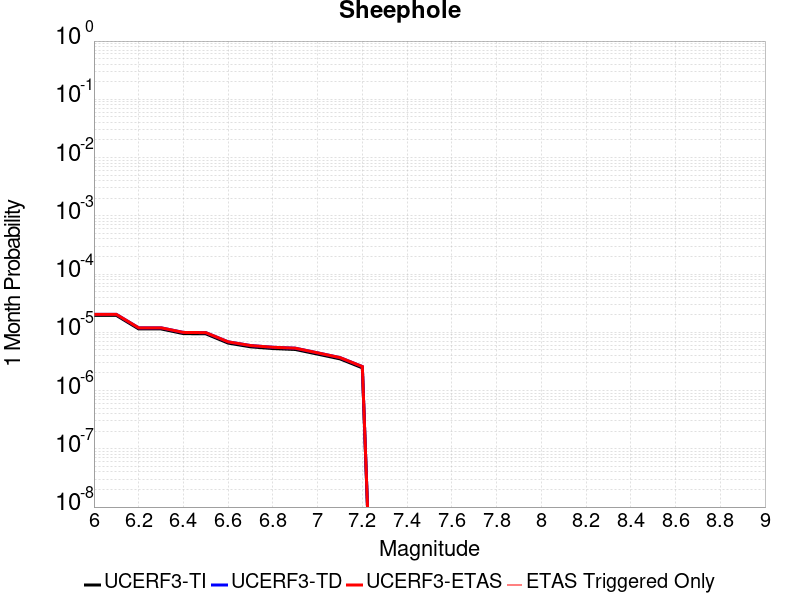 |  | 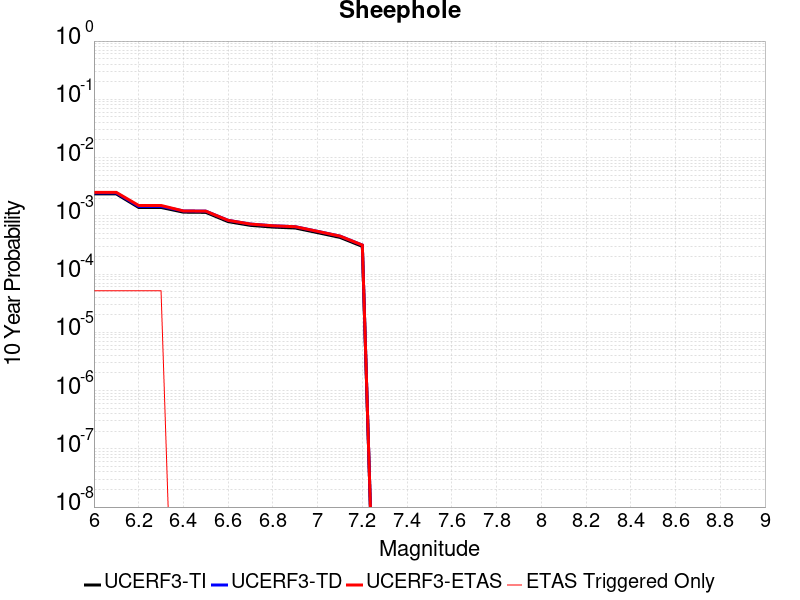 |

| Magnitude | 1 wk TI Prob | 1 wk TD Prob | 1 wk ETAS Prob | 1 wk ETAS/TD Gain | 1 wk ETAS Triggered Only | 1 mo TI Prob | 1 mo TD Prob | 1 mo ETAS Prob | 1 mo ETAS/TD Gain | 1 mo ETAS Triggered Only | 1 yr TI Prob | 1 yr TD Prob | 1 yr ETAS Prob | 1 yr ETAS/TD Gain | 1 yr ETAS Triggered Only | 10 yr TI Prob | 10 yr TD Prob | 10 yr ETAS Prob | 10 yr ETAS/TD Gain | 10 yr ETAS Triggered Only |
|-----|-----|-----|-----|-----|-----|-----|-----|-----|-----|-----|-----|-----|-----|-----|-----|-----|-----|-----|-----|-----|
| 6.0 | 4.5579695E-6 | 4.7412627E-6 | 4.7412627E-6 | 1.0 | 0.0 | 1.9534009E-5 | 2.031957E-5 | 2.031957E-5 | 1.0 | 0.0 | 2.3780059E-4 | 2.473682E-4 | 2.473682E-4 | 1.0 | 0.0 | 0.0023754628 | 0.002471473 | 0.0025027036 | 1.0126363 | 3.1307725E-5 |
| 6.1 | 4.5579695E-6 | 4.7412627E-6 | 4.7412627E-6 | 1.0 | 0.0 | 1.9534009E-5 | 2.031957E-5 | 2.031957E-5 | 1.0 | 0.0 | 2.3780059E-4 | 2.473682E-4 | 2.473682E-4 | 1.0 | 0.0 | 0.0023754628 | 0.002471473 | 0.0025027036 | 1.0126363 | 3.1307725E-5 |
| 6.2 | 2.6677674E-6 | 2.7873941E-6 | 2.7873941E-6 | 1.0 | 0.0 | 1.1433239E-5 | 1.1945926E-5 | 1.1945926E-5 | 1.0 | 0.0 | 1.3919079E-4 | 1.4543302E-4 | 1.4543302E-4 | 1.0 | 0.0 | 0.0013910364 | 0.0014534844 | 0.0014847466 | 1.0215085 | 3.1307725E-5 |
| 6.3 | 2.6677674E-6 | 2.7873941E-6 | 2.7873941E-6 | 1.0 | 0.0 | 1.1433239E-5 | 1.1945926E-5 | 1.1945926E-5 | 1.0 | 0.0 | 1.3919079E-4 | 1.4543302E-4 | 1.4543302E-4 | 1.0 | 0.0 | 0.0013910364 | 0.0014534844 | 0.0014847466 | 1.0215085 | 3.1307725E-5 |
| 6.4 | 2.2159759E-6 | 2.3228788E-6 | 2.3228788E-6 | 1.0 | 0.0 | 9.497005E-6 | 9.955161E-6 | 9.955161E-6 | 1.0 | 0.0 | 1.156199E-4 | 1.2119815E-4 | 1.2119815E-4 | 1.0 | 0.0 | 0.0011555976 | 0.0012113999 | 0.0012322464 | 1.0172086 | 2.0871816E-5 |
| 6.5 | 2.1986082E-6 | 2.304759E-6 | 2.304759E-6 | 1.0 | 0.0 | 9.4225725E-6 | 9.877506E-6 | 9.877506E-6 | 1.0 | 0.0 | 1.1471378E-4 | 1.2025281E-4 | 1.2025281E-4 | 1.0 | 0.0 | 0.0011465458 | 0.0012019566 | 0.0012228034 | 1.017344 | 2.0871816E-5 |
| 6.6 | 1.5232331E-6 | 1.6018919E-6 | 1.6018919E-6 | 1.0 | 0.0 | 6.5281256E-6 | 6.865234E-6 | 6.865234E-6 | 1.0 | 0.0 | 7.947703E-5 | 8.35812E-5 | 8.35812E-5 | 1.0 | 0.0 | 7.9448614E-4 | 8.3551643E-4 | 8.459436E-4 | 1.0124799 | 1.0435908E-5 |
| 6.7 | 1.3137362E-6 | 1.382819E-6 | 1.382819E-6 | 1.0 | 0.0 | 5.6302856E-6 | 5.926355E-6 | 5.926355E-6 | 1.0 | 0.0 | 6.854657E-5 | 7.215112E-5 | 7.215112E-5 | 1.0 | 0.0 | 6.8525434E-4 | 7.212908E-4 | 7.3171925E-4 | 1.014458 | 1.0435908E-5 |
| 6.8 | 1.2275751E-6 | 1.2922847E-6 | 1.2922847E-6 | 1.0 | 0.0 | 5.2610258E-6 | 5.5383516E-6 | 5.5383516E-6 | 1.0 | 0.0 | 6.4051106E-5 | 6.7427485E-5 | 6.7427485E-5 | 1.0 | 0.0 | 6.4032647E-4 | 6.740836E-4 | 6.845125E-4 | 1.0154712 | 1.0435908E-5 |
| 6.9 | 1.1837088E-6 | 1.246102E-6 | 1.246102E-6 | 1.0 | 0.0 | 5.0730278E-6 | 5.340427E-6 | 5.340427E-6 | 1.0 | 0.0 | 6.176237E-5 | 6.501789E-5 | 6.501789E-5 | 1.0 | 0.0 | 6.17452E-4 | 6.5000186E-4 | 6.60431E-4 | 1.0160447 | 1.0435908E-5 |
| 7.0 | 9.849371E-7 | 1.0366288E-6 | 1.0366288E-6 | 1.0 | 0.0 | 4.2211523E-6 | 4.442688E-6 | 4.442688E-6 | 1.0 | 0.0 | 5.1391315E-5 | 5.4088487E-5 | 5.4088487E-5 | 1.0 | 0.0 | 5.137943E-4 | 5.407633E-4 | 5.5119355E-4 | 1.0192881 | 1.0435908E-5 |
| 7.1 | 8.1643645E-7 | 8.591669E-7 | 8.591669E-7 | 1.0 | 0.0 | 3.4990085E-6 | 3.682139E-6 | 3.682139E-6 | 1.0 | 0.0 | 4.2599597E-5 | 4.482921E-5 | 4.482921E-5 | 1.0 | 0.0 | 4.259143E-4 | 4.4821028E-4 | 4.4821028E-4 | 1.0 | 0.0 |
| 7.2 | 5.7295756E-7 | 6.029502E-7 | 6.029502E-7 | 1.0 | 0.0 | 2.45553E-6 | 2.58407E-6 | 2.58407E-6 | 1.0 | 0.0 | 2.9895667E-5 | 3.1460666E-5 | 3.1460666E-5 | 1.0 | 0.0 | 2.9891645E-4 | 3.145688E-4 | 3.145688E-4 | 1.0 | 0.0 |

## Emerson-Copper Mtn 2011
*[(top)](#table-of-contents)*

| 1 Week | 1 Month | 1 Year | 10 Year |
|-----|-----|-----|-----|
| 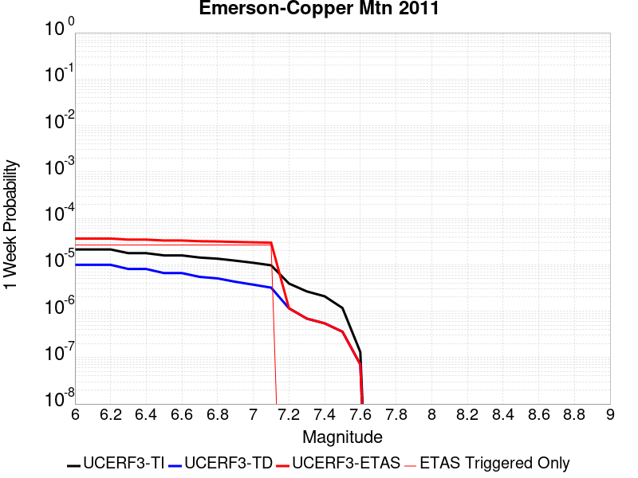 | 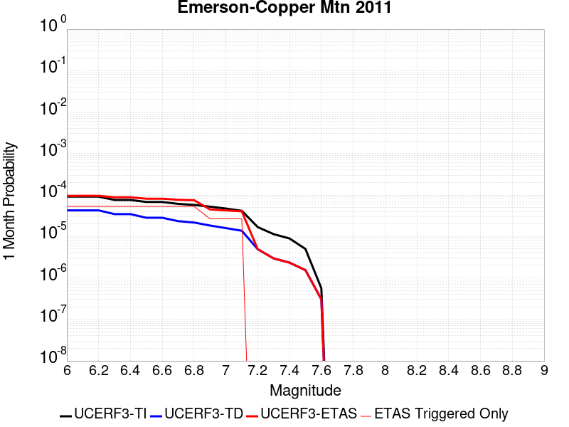 | 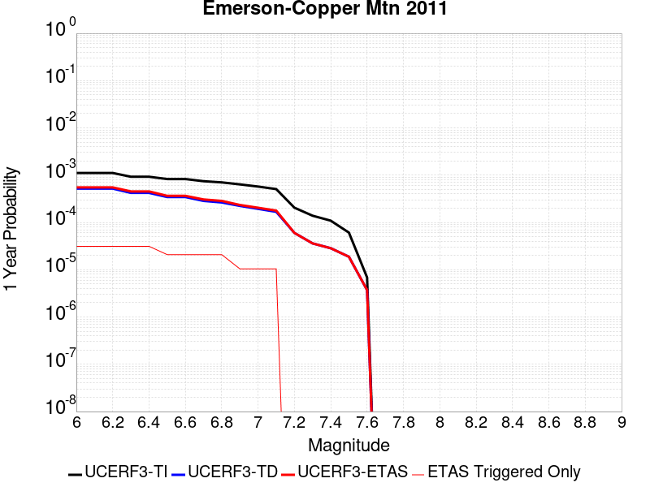 | 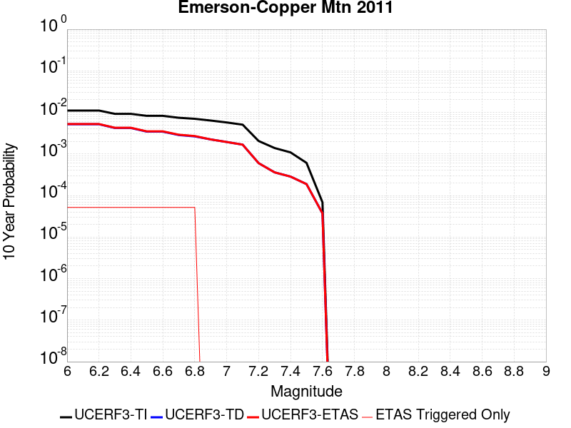 |

| Magnitude | 1 wk TI Prob | 1 wk TD Prob | 1 wk ETAS Prob | 1 wk ETAS/TD Gain | 1 wk ETAS Triggered Only | 1 mo TI Prob | 1 mo TD Prob | 1 mo ETAS Prob | 1 mo ETAS/TD Gain | 1 mo ETAS Triggered Only | 1 yr TI Prob | 1 yr TD Prob | 1 yr ETAS Prob | 1 yr ETAS/TD Gain | 1 yr ETAS Triggered Only | 10 yr TI Prob | 10 yr TD Prob | 10 yr ETAS Prob | 10 yr ETAS/TD Gain | 10 yr ETAS Triggered Only |
|-----|-----|-----|-----|-----|-----|-----|-----|-----|-----|-----|-----|-----|-----|-----|-----|-----|-----|-----|-----|-----|
| 6.0 | 2.1364202E-5 | 9.968114E-6 | 2.0403917E-5 | 2.0469186 | 1.0435908E-5 | 9.1557646E-5 | 4.2719836E-5 | 6.3590756E-5 | 1.4885535 | 2.0871816E-5 | 0.0011141442 | 5.199986E-4 | 5.5129005E-4 | 1.060176 | 3.1307725E-5 | 0.011085749 | 0.005188688 | 0.0052198335 | 1.0060025 | 3.1307725E-5 |
| 6.1 | 2.1364202E-5 | 9.968114E-6 | 2.0403917E-5 | 2.0469186 | 1.0435908E-5 | 9.1557646E-5 | 4.2719836E-5 | 6.3590756E-5 | 1.4885535 | 2.0871816E-5 | 0.0011141442 | 5.199986E-4 | 5.5129005E-4 | 1.060176 | 3.1307725E-5 | 0.011085749 | 0.005188688 | 0.0052198335 | 1.0060025 | 3.1307725E-5 |
| 6.2 | 2.1364202E-5 | 9.968114E-6 | 2.0403917E-5 | 2.0469186 | 1.0435908E-5 | 9.1557646E-5 | 4.2719836E-5 | 6.3590756E-5 | 1.4885535 | 2.0871816E-5 | 0.0011141442 | 5.199986E-4 | 5.5129005E-4 | 1.060176 | 3.1307725E-5 | 0.011085749 | 0.005188688 | 0.0052198335 | 1.0060025 | 3.1307725E-5 |
| 6.3 | 1.7751237E-5 | 8.089227E-6 | 1.852505E-5 | 2.2900891 | 1.0435908E-5 | 7.607452E-5 | 3.466769E-5 | 5.553878E-5 | 1.602033 | 2.0871816E-5 | 9.258136E-4 | 4.2200365E-4 | 4.5329815E-4 | 1.074157 | 3.1307725E-5 | 0.00921966 | 0.0042126453 | 0.0042438214 | 1.0074005 | 3.1307725E-5 |
| 6.4 | 1.7751237E-5 | 8.089227E-6 | 1.852505E-5 | 2.2900891 | 1.0435908E-5 | 7.607452E-5 | 3.466769E-5 | 5.553878E-5 | 1.602033 | 2.0871816E-5 | 9.258136E-4 | 4.2200365E-4 | 4.5329815E-4 | 1.074157 | 3.1307725E-5 | 0.00921966 | 0.0042126453 | 0.0042438214 | 1.0074005 | 3.1307725E-5 |
| 6.5 | 1.5886664E-5 | 6.603819E-6 | 1.7039658E-5 | 2.5802734 | 1.0435908E-5 | 6.808392E-5 | 2.8301802E-5 | 4.9173024E-5 | 1.7374521 | 2.0871816E-5 | 8.286065E-4 | 3.4452465E-4 | 3.6538928E-4 | 1.0605606 | 2.0871816E-5 | 0.008255237 | 0.0034403696 | 0.0034611695 | 1.0060458 | 2.0871816E-5 |
| 6.6 | 1.5886664E-5 | 6.603819E-6 | 1.7039658E-5 | 2.5802734 | 1.0435908E-5 | 6.808392E-5 | 2.8301802E-5 | 4.9173024E-5 | 1.7374521 | 2.0871816E-5 | 8.286065E-4 | 3.4452465E-4 | 3.6538928E-4 | 1.0605606 | 2.0871816E-5 | 0.008255237 | 0.0034403696 | 0.0034611695 | 1.0060458 | 2.0871816E-5 |
| 6.7 | 1.428471E-5 | 5.470403E-6 | 1.5906253E-5 | 2.9076934 | 1.0435908E-5 | 6.121875E-5 | 2.3444394E-5 | 4.4315722E-5 | 1.8902481 | 2.0871816E-5 | 7.450834E-4 | 2.8540206E-4 | 3.062679E-4 | 1.0731105 | 2.0871816E-5 | 0.007425902 | 0.0028507432 | 0.0028715555 | 1.0073006 | 2.0871816E-5 |
| 6.8 | 1.3490684E-5 | 5.073699E-6 | 1.5509553E-5 | 3.0568535 | 1.0435908E-5 | 5.7815934E-5 | 2.1744265E-5 | 4.2615626E-5 | 1.959856 | 2.0871816E-5 | 7.0368167E-4 | 2.6470813E-4 | 2.855744E-4 | 1.0788275 | 2.0871816E-5 | 0.007014576 | 0.002644309 | 0.0026651258 | 1.0078722 | 2.0871816E-5 |
| 6.9 | 1.2235421E-5 | 4.289677E-6 | 1.47255405E-5 | 3.4327853 | 1.0435908E-5 | 5.2436466E-5 | 1.838422E-5 | 2.8819937E-5 | 1.5676453 | 1.0435908E-5 | 6.38227E-4 | 2.238085E-4 | 2.3424208E-4 | 1.0466183 | 1.0435908E-5 | 0.0063639707 | 0.0022361854 | 0.002246598 | 1.0046564 | 1.0435908E-5 |
| 7.0 | 1.1009851E-5 | 3.7189886E-6 | 1.4154858E-5 | 3.8061042 | 1.0435908E-5 | 4.7184225E-5 | 1.5938444E-5 | 2.6374186E-5 | 1.6547529 | 1.0435908E-5 | 5.743165E-4 | 1.9403672E-4 | 2.044706E-4 | 1.0537727 | 1.0435908E-5 | 0.005728345 | 0.0019390108 | 0.0019494265 | 1.0053717 | 1.0435908E-5 |
| 7.1 | 9.726373E-6 | 3.2117953E-6 | 1.3647669E-5 | 4.2492337 | 1.0435908E-5 | 4.168379E-5 | 1.3764783E-5 | 2.4200548E-5 | 1.7581495 | 1.0435908E-5 | 5.07382E-4 | 1.6757673E-4 | 1.7801089E-4 | 1.0622649 | 1.0435908E-5 | 0.0050622504 | 0.0016748349 | 0.0016852532 | 1.0062206 | 1.0435908E-5 |
| 7.2 | 3.9335127E-6 | 1.1524792E-6 | 1.1524792E-6 | 1.0 | 0.0 | 1.6857803E-5 | 4.9391874E-6 | 4.9391874E-6 | 1.0 | 0.0 | 2.0522442E-4 | 6.0133007E-5 | 6.0133007E-5 | 1.0 | 0.0 | 0.00205035 | 6.011733E-4 | 6.011733E-4 | 1.0 | 0.0 |
| 7.3 | 2.661632E-6 | 6.911505E-7 | 6.911505E-7 | 1.0 | 0.0 | 1.14069435E-5 | 2.9620703E-6 | 2.9620703E-6 | 1.0 | 0.0 | 1.3887069E-4 | 3.6062618E-5 | 3.6062618E-5 | 1.0 | 0.0 | 0.0013878393 | 3.605687E-4 | 3.605687E-4 | 1.0 | 0.0 |
| 7.4 | 2.0893426E-6 | 5.4618386E-7 | 5.4618386E-7 | 1.0 | 0.0 | 8.954295E-6 | 2.3407858E-6 | 2.3407858E-6 | 1.0 | 0.0 | 1.0901308E-4 | 2.84987E-5 | 2.84987E-5 | 1.0 | 0.0 | 0.0010895962 | 2.84951E-4 | 2.84951E-4 | 1.0 | 0.0 |
| 7.5 | 1.1681728E-6 | 3.6030585E-7 | 3.6030585E-7 | 1.0 | 0.0 | 5.0064455E-6 | 1.544167E-6 | 1.544167E-6 | 1.0 | 0.0 | 6.0951766E-5 | 1.8800076E-5 | 1.8800076E-5 | 1.0 | 0.0 | 6.093505E-4 | 1.8798532E-4 | 1.8798532E-4 | 1.0 | 0.0 |
| 7.6 | 1.3154387E-7 | 7.1197384E-8 | 7.1197384E-8 | 1.0 | 0.0 | 5.6375933E-7 | 3.051316E-7 | 3.051316E-7 | 1.0 | 0.0 | 6.863748E-6 | 3.7149728E-6 | 3.7149728E-6 | 1.0 | 0.0 | 6.863536E-5 | 3.7149264E-5 | 3.7149264E-5 | 1.0 | 0.0 |

## Shoreline
*[(top)](#table-of-contents)*

| 1 Week | 1 Month | 1 Year | 10 Year |
|-----|-----|-----|-----|
| 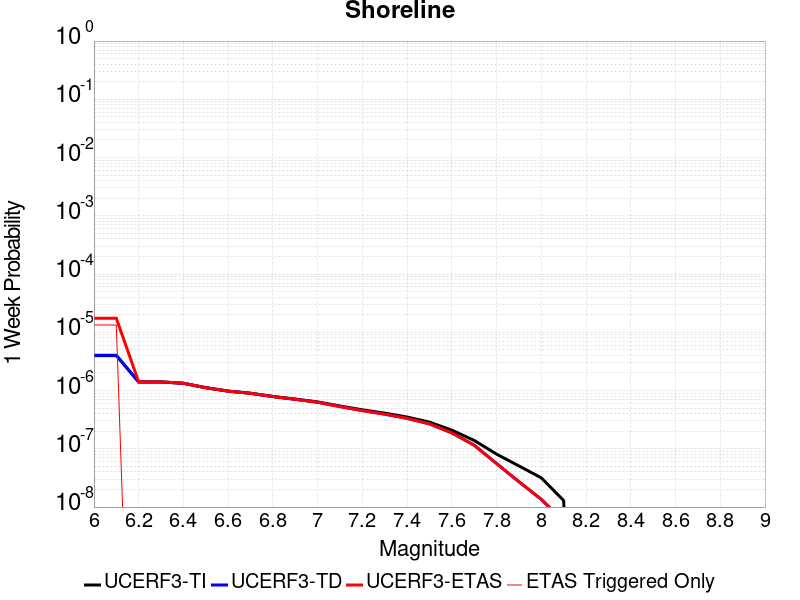 | 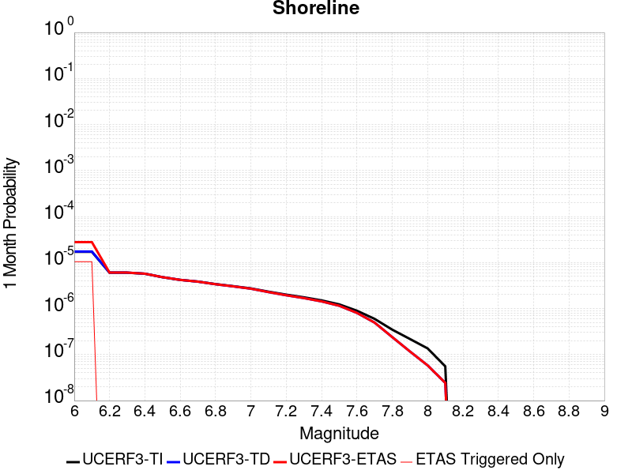 | 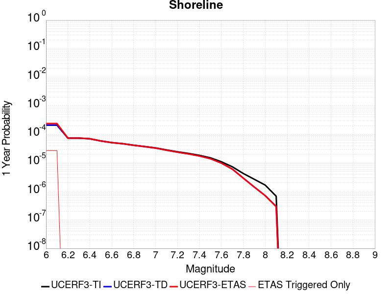 | 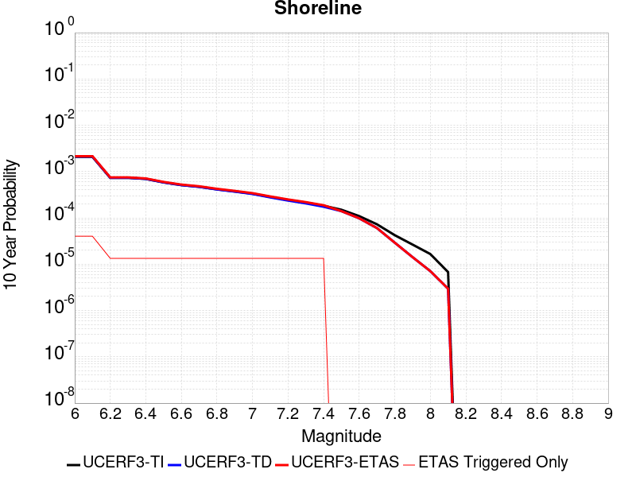 |

| Magnitude | 1 wk TI Prob | 1 wk TD Prob | 1 wk ETAS Prob | 1 wk ETAS/TD Gain | 1 wk ETAS Triggered Only | 1 mo TI Prob | 1 mo TD Prob | 1 mo ETAS Prob | 1 mo ETAS/TD Gain | 1 mo ETAS Triggered Only | 1 yr TI Prob | 1 yr TD Prob | 1 yr ETAS Prob | 1 yr ETAS/TD Gain | 1 yr ETAS Triggered Only | 10 yr TI Prob | 10 yr TD Prob | 10 yr ETAS Prob | 10 yr ETAS/TD Gain | 10 yr ETAS Triggered Only |
|-----|-----|-----|-----|-----|-----|-----|-----|-----|-----|-----|-----|-----|-----|-----|-----|-----|-----|-----|-----|-----|
| 6.0 | 3.9888673E-6 | 4.047929E-6 | 1.4483795E-5 | 3.5780752 | 1.0435908E-5 | 1.7095033E-5 | 1.7348184E-5 | 2.778391E-5 | 1.6015458 | 1.0435908E-5 | 2.0811215E-4 | 2.1119925E-4 | 2.3206665E-4 | 1.0988044 | 2.0871816E-5 | 0.0020791737 | 0.002110534 | 0.0021417758 | 1.0148027 | 3.1307725E-5 |
| 6.1 | 3.9888673E-6 | 4.047929E-6 | 1.4483795E-5 | 3.5780752 | 1.0435908E-5 | 1.7095033E-5 | 1.7348184E-5 | 2.778391E-5 | 1.6015458 | 1.0435908E-5 | 2.0811215E-4 | 2.1119925E-4 | 2.3206665E-4 | 1.0988044 | 2.0871816E-5 | 0.0020791737 | 0.002110534 | 0.0021417758 | 1.0148027 | 3.1307725E-5 |
| 6.2 | 1.4039653E-6 | 1.4100891E-6 | 1.4100891E-6 | 1.0 | 0.0 | 6.0169805E-6 | 6.0432253E-6 | 6.0432253E-6 | 1.0 | 0.0 | 7.325427E-5 | 7.357384E-5 | 7.357384E-5 | 1.0 | 0.0 | 7.3230127E-4 | 7.355009E-4 | 7.459291E-4 | 1.0141784 | 1.0435908E-5 |
| 6.3 | 1.4039653E-6 | 1.4100891E-6 | 1.4100891E-6 | 1.0 | 0.0 | 6.0169805E-6 | 6.0432253E-6 | 6.0432253E-6 | 1.0 | 0.0 | 7.325427E-5 | 7.357384E-5 | 7.357384E-5 | 1.0 | 0.0 | 7.3230127E-4 | 7.355009E-4 | 7.459291E-4 | 1.0141784 | 1.0435908E-5 |
| 6.4 | 1.3314152E-6 | 1.3361605E-6 | 1.3361605E-6 | 1.0 | 0.0 | 5.7060524E-6 | 5.7263896E-6 | 5.7263896E-6 | 1.0 | 0.0 | 6.946897E-5 | 6.971662E-5 | 6.971662E-5 | 1.0 | 0.0 | 6.9447263E-4 | 6.9695286E-4 | 7.073815E-4 | 1.0149632 | 1.0435908E-5 |
| 6.5 | 1.1187026E-6 | 1.120364E-6 | 1.120364E-6 | 1.0 | 0.0 | 4.794431E-6 | 4.8015513E-6 | 4.8015513E-6 | 1.0 | 0.0 | 5.8370628E-5 | 5.8457343E-5 | 5.8457343E-5 | 1.0 | 0.0 | 5.83553E-4 | 5.844222E-4 | 5.9485197E-4 | 1.0178463 | 1.0435908E-5 |
| 6.6 | 9.793089E-7 | 9.784919E-7 | 9.784919E-7 | 1.0 | 0.0 | 4.1970316E-6 | 4.1935305E-6 | 4.1935305E-6 | 1.0 | 0.0 | 5.1097657E-5 | 5.105505E-5 | 5.105505E-5 | 1.0 | 0.0 | 5.108591E-4 | 5.1043445E-4 | 5.20865E-4 | 1.0204347 | 1.0435908E-5 |
| 6.7 | 8.995986E-7 | 8.9728E-7 | 8.9728E-7 | 1.0 | 0.0 | 3.8554167E-6 | 3.84548E-6 | 3.84548E-6 | 1.0 | 0.0 | 4.693869E-5 | 4.6817724E-5 | 4.6817724E-5 | 1.0 | 0.0 | 4.6928777E-4 | 4.6807955E-4 | 4.7851057E-4 | 1.0222847 | 1.0435908E-5 |
| 6.8 | 7.931612E-7 | 7.8804027E-7 | 7.8804027E-7 | 1.0 | 0.0 | 3.3992578E-6 | 3.377311E-6 | 3.377311E-6 | 1.0 | 0.0 | 4.1385178E-5 | 4.1117994E-5 | 4.1117994E-5 | 1.0 | 0.0 | 4.1377472E-4 | 4.1110438E-4 | 4.21536E-4 | 1.0253747 | 1.0435908E-5 |
| 6.9 | 7.1465956E-7 | 7.078006E-7 | 7.078006E-7 | 1.0 | 0.0 | 3.062823E-6 | 3.0334277E-6 | 3.0334277E-6 | 1.0 | 0.0 | 3.7289232E-5 | 3.6931357E-5 | 3.6931357E-5 | 1.0 | 0.0 | 3.7282976E-4 | 3.6925258E-4 | 3.7968464E-4 | 1.0282518 | 1.0435908E-5 |
| 7.0 | 6.389046E-7 | 6.299458E-7 | 6.299458E-7 | 1.0 | 0.0 | 2.7381598E-6 | 2.699765E-6 | 2.699765E-6 | 1.0 | 0.0 | 3.3336586E-5 | 3.2869146E-5 | 3.2869146E-5 | 1.0 | 0.0 | 3.3331584E-4 | 3.2864307E-4 | 3.3907557E-4 | 1.0317441 | 1.0435908E-5 |
| 7.1 | 5.4300875E-7 | 5.3111313E-7 | 5.3111313E-7 | 1.0 | 0.0 | 2.3271782E-6 | 2.276197E-6 | 2.276197E-6 | 1.0 | 0.0 | 2.8333026E-5 | 2.7712347E-5 | 2.7712347E-5 | 1.0 | 0.0 | 2.8329415E-4 | 2.77089E-4 | 2.8752204E-4 | 1.0376523 | 1.0435908E-5 |
| 7.2 | 4.6768855E-7 | 4.5348952E-7 | 4.5348952E-7 | 1.0 | 0.0 | 2.0043778E-6 | 1.9435251E-6 | 1.9435251E-6 | 1.0 | 0.0 | 2.4403027E-5 | 2.3662162E-5 | 2.3662162E-5 | 1.0 | 0.0 | 2.4400349E-4 | 2.3659648E-4 | 2.470299E-4 | 1.044098 | 1.0435908E-5 |
| 7.3 | 4.0966103E-7 | 3.9385662E-7 | 3.9385662E-7 | 1.0 | 0.0 | 1.7556889E-6 | 1.6879559E-6 | 1.6879559E-6 | 1.0 | 0.0 | 2.1375303E-5 | 2.055067E-5 | 2.055067E-5 | 1.0 | 0.0 | 2.1373246E-4 | 2.0548773E-4 | 2.159215E-4 | 1.0507756 | 1.0435908E-5 |
| 7.4 | 3.5105785E-7 | 3.3363975E-7 | 3.3363975E-7 | 1.0 | 0.0 | 1.5045327E-6 | 1.4298838E-6 | 1.4298838E-6 | 1.0 | 0.0 | 1.8317533E-5 | 1.7408696E-5 | 1.7408696E-5 | 1.0 | 0.0 | 1.8316023E-4 | 1.7407336E-4 | 1.8450744E-4 | 1.0599408 | 1.0435908E-5 |
| 7.5 | 2.8737534E-7 | 2.6820038E-7 | 2.6820038E-7 | 1.0 | 0.0 | 1.2316079E-6 | 1.1494297E-6 | 1.1494297E-6 | 1.0 | 0.0 | 1.4994724E-5 | 1.3994217E-5 | 1.3994217E-5 | 1.0 | 0.0 | 1.4993713E-4 | 1.3993339E-4 | 1.3993339E-4 | 1.0 | 0.0 |
| 7.6 | 2.0924051E-7 | 1.8778988E-7 | 1.8778988E-7 | 1.0 | 0.0 | 8.967448E-7 | 8.048135E-7 | 8.048135E-7 | 1.0 | 0.0 | 1.0917813E-5 | 9.79856E-6 | 9.79856E-6 | 1.0 | 0.0 | 1.0917276E-4 | 9.798129E-5 | 9.798129E-5 | 1.0 | 0.0 |
| 7.7 | 1.392265E-7 | 1.15433906E-7 | 1.15433906E-7 | 1.0 | 0.0 | 5.9668486E-7 | 4.9471663E-7 | 4.9471663E-7 | 1.0 | 0.0 | 7.2646135E-6 | 6.023158E-6 | 6.023158E-6 | 1.0 | 0.0 | 7.2643765E-5 | 6.0229955E-5 | 6.0229955E-5 | 1.0 | 0.0 |
| 7.8 | 8.1080074E-8 | 5.586722E-8 | 5.586722E-8 | 1.0 | 0.0 | 3.4748598E-7 | 2.394309E-7 | 2.394309E-7 | 1.0 | 0.0 | 4.2306337E-6 | 2.9150672E-6 | 2.9150672E-6 | 1.0 | 0.0 | 4.230553E-5 | 2.9150291E-5 | 2.9150291E-5 | 1.0 | 0.0 |
| 7.9 | 5.0859036E-8 | 2.7244445E-8 | 2.7244445E-8 | 1.0 | 0.0 | 2.1796728E-7 | 1.16761896E-7 | 1.16761896E-7 | 1.0 | 0.0 | 2.6537484E-6 | 1.4215751E-6 | 1.4215751E-6 | 1.0 | 0.0 | 2.6537167E-5 | 1.4215661E-5 | 1.4215661E-5 | 1.0 | 0.0 |
| 8.0 | 3.1760536E-8 | 1.3577206E-8 | 1.3577206E-8 | 1.0 | 0.0 | 1.3611657E-7 | 5.8188025E-8 | 5.8188025E-8 | 1.0 | 0.0 | 1.6572179E-6 | 7.0843896E-7 | 7.0843896E-7 | 1.0 | 0.0 | 1.6572056E-5 | 7.084367E-6 | 7.084367E-6 | 1.0 | 0.0 |
| 8.1 | 1.2947896E-8 | 5.6628693E-9 | 5.6628693E-9 | 1.0 | 0.0 | 5.5490982E-8 | 2.426944E-8 | 2.426944E-8 | 1.0 | 0.0 | 6.756025E-7 | 2.954804E-7 | 2.954804E-7 | 1.0 | 0.0 | 6.7560045E-6 | 2.9548003E-6 | 2.9548003E-6 | 1.0 | 0.0 |

## Cedar Mtn-Mahogany Mtn
*[(top)](#table-of-contents)*

| 1 Week | 1 Month | 1 Year | 10 Year |
|-----|-----|-----|-----|
|  | 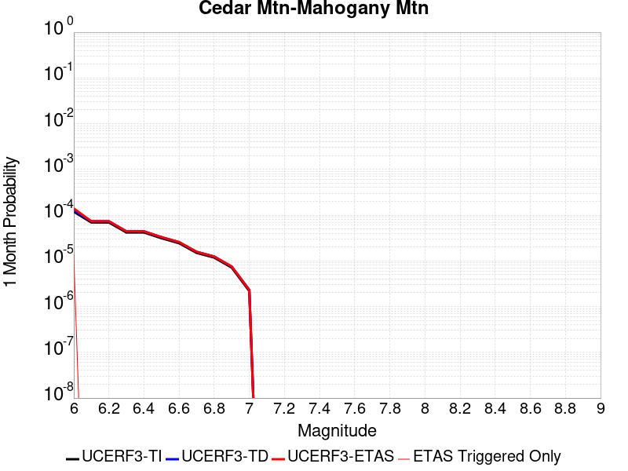 | 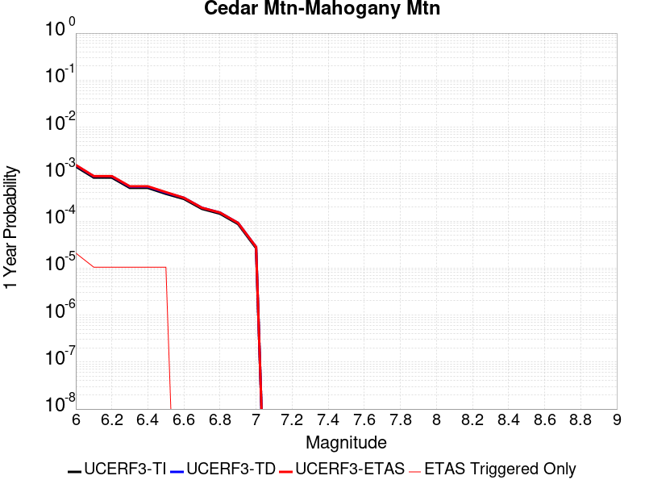 | 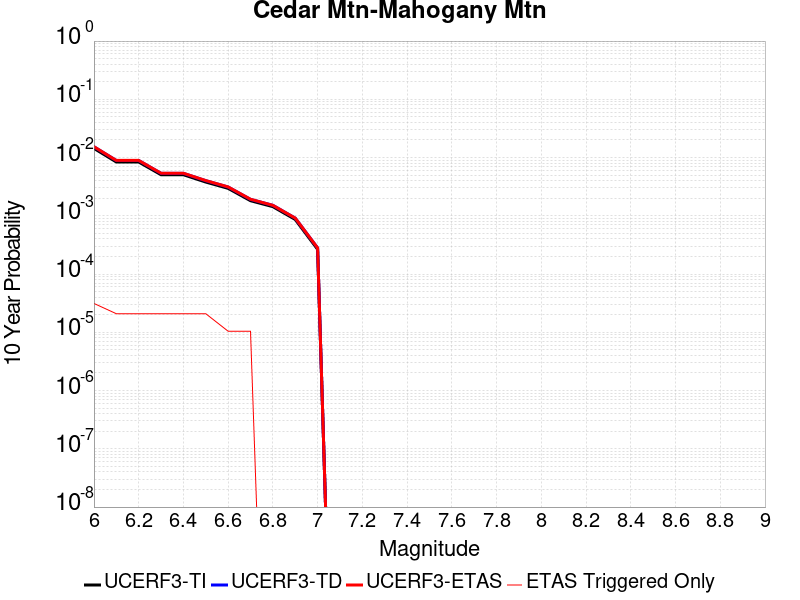 |

| Magnitude | 1 wk TI Prob | 1 wk TD Prob | 1 wk ETAS Prob | 1 wk ETAS/TD Gain | 1 wk ETAS Triggered Only | 1 mo TI Prob | 1 mo TD Prob | 1 mo ETAS Prob | 1 mo ETAS/TD Gain | 1 mo ETAS Triggered Only | 1 yr TI Prob | 1 yr TD Prob | 1 yr ETAS Prob | 1 yr ETAS/TD Gain | 1 yr ETAS Triggered Only | 10 yr TI Prob | 10 yr TD Prob | 10 yr ETAS Prob | 10 yr ETAS/TD Gain | 10 yr ETAS Triggered Only |
|-----|-----|-----|-----|-----|-----|-----|-----|-----|-----|-----|-----|-----|-----|-----|-----|-----|-----|-----|-----|-----|
| 6.0 | 2.7763876E-5 | 2.9588866E-5 | 2.9588866E-5 | 1.0 | 0.0 | 1.1898261E-4 | 1.2680366E-4 | 1.3723824E-4 | 1.0822893 | 1.0435908E-5 | 0.0014476506 | 0.0015428112 | 0.0015636508 | 1.0135076 | 2.0871816E-5 | 0.0143825635 | 0.015328225 | 0.015359052 | 1.0020112 | 3.1307725E-5 |
| 6.1 | 1.6162443E-5 | 1.7142966E-5 | 1.7142966E-5 | 1.0 | 0.0 | 6.926578E-5 | 7.346788E-5 | 7.346788E-5 | 1.0 | 0.0 | 8.4298453E-4 | 8.941221E-4 | 9.0454874E-4 | 1.0116613 | 1.0435908E-5 | 0.008397939 | 0.008907059 | 0.008927745 | 1.0023224 | 2.0871816E-5 |
| 6.2 | 1.6162443E-5 | 1.7142966E-5 | 1.7142966E-5 | 1.0 | 0.0 | 6.926578E-5 | 7.346788E-5 | 7.346788E-5 | 1.0 | 0.0 | 8.4298453E-4 | 8.941221E-4 | 9.0454874E-4 | 1.0116613 | 1.0435908E-5 | 0.008397939 | 0.008907059 | 0.008927745 | 1.0023224 | 2.0871816E-5 |
| 6.3 | 9.746053E-6 | 1.0303152E-5 | 1.0303152E-5 | 1.0 | 0.0 | 4.1768133E-5 | 4.415564E-5 | 4.415564E-5 | 1.0 | 0.0 | 5.0840835E-4 | 5.3746643E-4 | 5.478967E-4 | 1.0194064 | 1.0435908E-5 | 0.0050724675 | 0.005362084 | 0.0053828442 | 1.0038716 | 2.0871816E-5 |
| 6.4 | 9.746053E-6 | 1.0303152E-5 | 1.0303152E-5 | 1.0 | 0.0 | 4.1768133E-5 | 4.415564E-5 | 4.415564E-5 | 1.0 | 0.0 | 5.0840835E-4 | 5.3746643E-4 | 5.478967E-4 | 1.0194064 | 1.0435908E-5 | 0.0050724675 | 0.005362084 | 0.0053828442 | 1.0038716 | 2.0871816E-5 |
| 6.5 | 7.290083E-6 | 7.695325E-6 | 7.695325E-6 | 1.0 | 0.0 | 3.124284E-5 | 3.297956E-5 | 3.297956E-5 | 1.0 | 0.0 | 3.8031515E-4 | 4.014543E-4 | 4.1188602E-4 | 1.0259848 | 1.0435908E-5 | 0.0037966494 | 0.004007511 | 0.0040282994 | 1.0051873 | 2.0871816E-5 |
| 6.6 | 5.67907E-6 | 5.9891527E-6 | 5.9891527E-6 | 1.0 | 0.0 | 2.4338644E-5 | 2.5667552E-5 | 2.5667552E-5 | 1.0 | 0.0 | 2.962827E-4 | 3.12459E-4 | 3.12459E-4 | 1.0 | 0.0 | 0.0029588798 | 0.003120333 | 0.0031307363 | 1.003334 | 1.0435908E-5 |
| 6.7 | 3.4853963E-6 | 3.672631E-6 | 3.672631E-6 | 1.0 | 0.0 | 1.4937327E-5 | 1.5739755E-5 | 1.5739755E-5 | 1.0 | 0.0 | 1.8184677E-4 | 1.916153E-4 | 1.916153E-4 | 1.0 | 0.0 | 0.0018169804 | 0.0019145629 | 0.0019249788 | 1.0054404 | 1.0435908E-5 |
| 6.8 | 2.7535168E-6 | 2.9015764E-6 | 2.9015764E-6 | 1.0 | 0.0 | 1.1800733E-5 | 1.2435271E-5 | 1.2435271E-5 | 1.0 | 0.0 | 1.4366445E-4 | 1.5138938E-4 | 1.5138938E-4 | 1.0 | 0.0 | 0.0014357162 | 0.0015129098 | 0.0015129098 | 1.0 | 0.0 |
| 6.9 | 1.6594106E-6 | 1.7496985E-6 | 1.7496985E-6 | 1.0 | 0.0 | 7.1117406E-6 | 7.4986883E-6 | 7.4986883E-6 | 1.0 | 0.0 | 8.6582E-5 | 9.129302E-5 | 9.129302E-5 | 1.0 | 0.0 | 8.654827E-4 | 9.125856E-4 | 9.125856E-4 | 1.0 | 0.0 |
| 7.0 | 5.10215E-7 | 5.389254E-7 | 5.389254E-7 | 1.0 | 0.0 | 2.186634E-6 | 2.3096788E-6 | 2.3096788E-6 | 1.0 | 0.0 | 2.6621943E-5 | 2.8120105E-5 | 2.8120105E-5 | 1.0 | 0.0 | 2.6618753E-4 | 2.81178E-4 | 2.81178E-4 | 1.0 | 0.0 |

## Fontana (Seismicity)
*[(top)](#table-of-contents)*

| 1 Week | 1 Month | 1 Year | 10 Year |
|-----|-----|-----|-----|
| 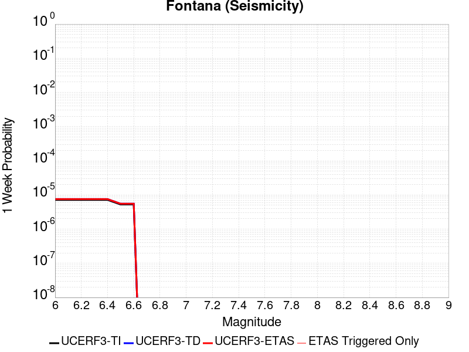 |  | 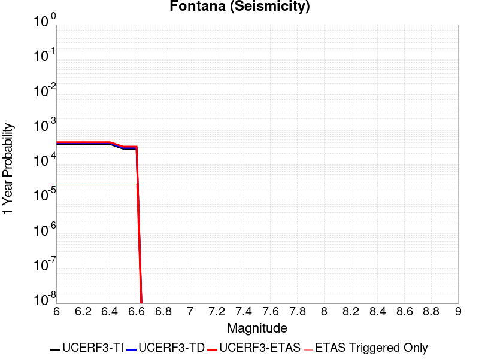 | 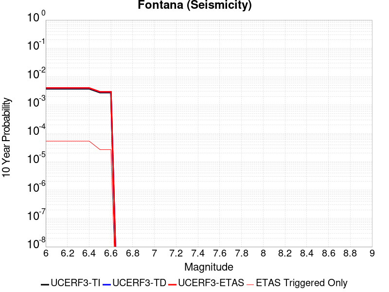 |

| Magnitude | 1 wk TI Prob | 1 wk TD Prob | 1 wk ETAS Prob | 1 wk ETAS/TD Gain | 1 wk ETAS Triggered Only | 1 mo TI Prob | 1 mo TD Prob | 1 mo ETAS Prob | 1 mo ETAS/TD Gain | 1 mo ETAS Triggered Only | 1 yr TI Prob | 1 yr TD Prob | 1 yr ETAS Prob | 1 yr ETAS/TD Gain | 1 yr ETAS Triggered Only | 10 yr TI Prob | 10 yr TD Prob | 10 yr ETAS Prob | 10 yr ETAS/TD Gain | 10 yr ETAS Triggered Only |
|-----|-----|-----|-----|-----|-----|-----|-----|-----|-----|-----|-----|-----|-----|-----|-----|-----|-----|-----|-----|-----|
| 6.0 | 7.1789214E-6 | 7.5520006E-6 | 7.5520006E-6 | 1.0 | 0.0 | 3.076644E-5 | 3.2365548E-5 | 3.2365548E-5 | 1.0 | 0.0 | 3.7451705E-4 | 3.9402005E-4 | 4.0445186E-4 | 1.0264753 | 1.0435908E-5 | 0.003738865 | 0.003937214 | 0.0039683986 | 1.0079204 | 3.1307725E-5 |
| 6.1 | 7.1789214E-6 | 7.5520006E-6 | 7.5520006E-6 | 1.0 | 0.0 | 3.076644E-5 | 3.2365548E-5 | 3.2365548E-5 | 1.0 | 0.0 | 3.7451705E-4 | 3.9402005E-4 | 4.0445186E-4 | 1.0264753 | 1.0435908E-5 | 0.003738865 | 0.003937214 | 0.0039683986 | 1.0079204 | 3.1307725E-5 |
| 6.2 | 7.1789214E-6 | 7.5520006E-6 | 7.5520006E-6 | 1.0 | 0.0 | 3.076644E-5 | 3.2365548E-5 | 3.2365548E-5 | 1.0 | 0.0 | 3.7451705E-4 | 3.9402005E-4 | 4.0445186E-4 | 1.0264753 | 1.0435908E-5 | 0.003738865 | 0.003937214 | 0.0039683986 | 1.0079204 | 3.1307725E-5 |
| 6.3 | 7.1789214E-6 | 7.5520006E-6 | 7.5520006E-6 | 1.0 | 0.0 | 3.076644E-5 | 3.2365548E-5 | 3.2365548E-5 | 1.0 | 0.0 | 3.7451705E-4 | 3.9402005E-4 | 4.0445186E-4 | 1.0264753 | 1.0435908E-5 | 0.003738865 | 0.003937214 | 0.0039683986 | 1.0079204 | 3.1307725E-5 |
| 6.4 | 7.1789214E-6 | 7.5520006E-6 | 7.5520006E-6 | 1.0 | 0.0 | 3.076644E-5 | 3.2365548E-5 | 3.2365548E-5 | 1.0 | 0.0 | 3.7451705E-4 | 3.9402005E-4 | 4.0445186E-4 | 1.0264753 | 1.0435908E-5 | 0.003738865 | 0.003937214 | 0.0039683986 | 1.0079204 | 3.1307725E-5 |
| 6.5 | 5.2611317E-6 | 5.532726E-6 | 5.532726E-6 | 1.0 | 0.0 | 2.2547512E-5 | 2.3711682E-5 | 2.3711682E-5 | 1.0 | 0.0 | 2.744814E-4 | 2.8868974E-4 | 2.9912262E-4 | 1.0361388 | 1.0435908E-5 | 0.002741426 | 0.0028868972 | 0.002897303 | 1.0036045 | 1.0435908E-5 |
| 6.6 | 5.2611317E-6 | 5.532726E-6 | 5.532726E-6 | 1.0 | 0.0 | 2.2547512E-5 | 2.3711682E-5 | 2.3711682E-5 | 1.0 | 0.0 | 2.744814E-4 | 2.8868974E-4 | 2.9912262E-4 | 1.0361388 | 1.0435908E-5 | 0.002741426 | 0.0028868972 | 0.002897303 | 1.0036045 | 1.0435908E-5 |

## Antelope Valley 2011
*[(top)](#table-of-contents)*

| 1 Week | 1 Month | 1 Year | 10 Year |
|-----|-----|-----|-----|
|  |  | 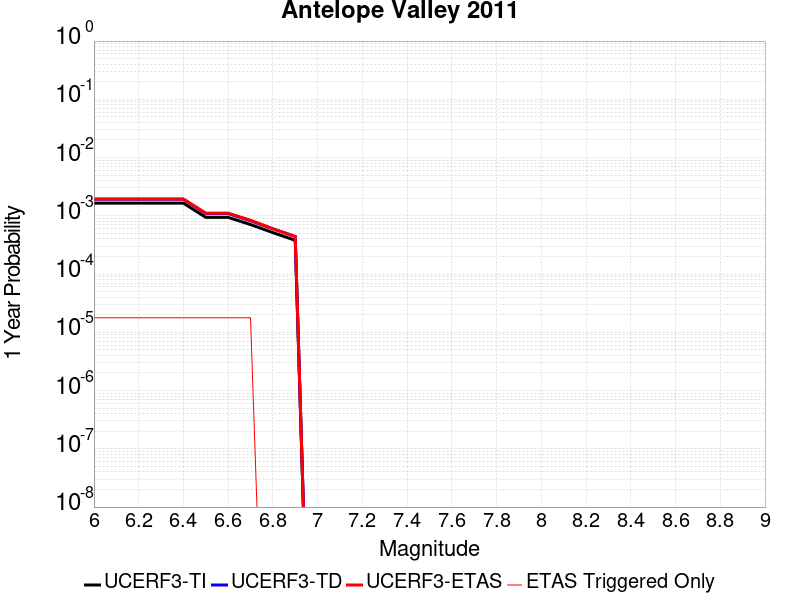 | 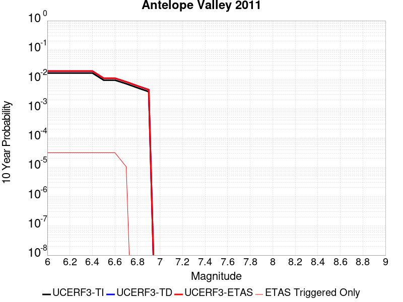 |

| Magnitude | 1 wk TI Prob | 1 wk TD Prob | 1 wk ETAS Prob | 1 wk ETAS/TD Gain | 1 wk ETAS Triggered Only | 1 mo TI Prob | 1 mo TD Prob | 1 mo ETAS Prob | 1 mo ETAS/TD Gain | 1 mo ETAS Triggered Only | 1 yr TI Prob | 1 yr TD Prob | 1 yr ETAS Prob | 1 yr ETAS/TD Gain | 1 yr ETAS Triggered Only | 10 yr TI Prob | 10 yr TD Prob | 10 yr ETAS Prob | 10 yr ETAS/TD Gain | 10 yr ETAS Triggered Only |
|-----|-----|-----|-----|-----|-----|-----|-----|-----|-----|-----|-----|-----|-----|-----|-----|-----|-----|-----|-----|-----|
| 6.0 | 3.1646934E-5 | 3.6904403E-5 | 3.6904403E-5 | 1.0 | 0.0 | 1.3562266E-4 | 1.5815363E-4 | 1.5815363E-4 | 1.0 | 0.0 | 0.0016499552 | 0.0019240845 | 0.0019345003 | 1.0054134 | 1.0435908E-5 | 0.016377583 | 0.019100651 | 0.01913136 | 1.0016078 | 3.1307725E-5 |
| 6.1 | 3.1646934E-5 | 3.6904403E-5 | 3.6904403E-5 | 1.0 | 0.0 | 1.3562266E-4 | 1.5815363E-4 | 1.5815363E-4 | 1.0 | 0.0 | 0.0016499552 | 0.0019240845 | 0.0019345003 | 1.0054134 | 1.0435908E-5 | 0.016377583 | 0.019100651 | 0.01913136 | 1.0016078 | 3.1307725E-5 |
| 6.2 | 3.1646934E-5 | 3.6904403E-5 | 3.6904403E-5 | 1.0 | 0.0 | 1.3562266E-4 | 1.5815363E-4 | 1.5815363E-4 | 1.0 | 0.0 | 0.0016499552 | 0.0019240845 | 0.0019345003 | 1.0054134 | 1.0435908E-5 | 0.016377583 | 0.019100651 | 0.01913136 | 1.0016078 | 3.1307725E-5 |
| 6.3 | 3.1646934E-5 | 3.6904403E-5 | 3.6904403E-5 | 1.0 | 0.0 | 1.3562266E-4 | 1.5815363E-4 | 1.5815363E-4 | 1.0 | 0.0 | 0.0016499552 | 0.0019240845 | 0.0019345003 | 1.0054134 | 1.0435908E-5 | 0.016377583 | 0.019100651 | 0.01913136 | 1.0016078 | 3.1307725E-5 |
| 6.4 | 3.1646934E-5 | 3.6904403E-5 | 3.6904403E-5 | 1.0 | 0.0 | 1.3562266E-4 | 1.5815363E-4 | 1.5815363E-4 | 1.0 | 0.0 | 0.0016499552 | 0.0019240845 | 0.0019345003 | 1.0054134 | 1.0435908E-5 | 0.016377583 | 0.019100651 | 0.01913136 | 1.0016078 | 3.1307725E-5 |
| 6.5 | 1.8034107E-5 | 2.0940959E-5 | 2.0940959E-5 | 1.0 | 0.0 | 7.7286735E-5 | 8.974457E-5 | 8.974457E-5 | 1.0 | 0.0 | 9.405598E-4 | 0.0010922146 | 0.001102639 | 1.0095444 | 1.0435908E-5 | 0.009365888 | 0.010880542 | 0.010911508 | 1.0028461 | 3.1307725E-5 |
| 6.6 | 1.8034107E-5 | 2.0940959E-5 | 2.0940959E-5 | 1.0 | 0.0 | 7.7286735E-5 | 8.974457E-5 | 8.974457E-5 | 1.0 | 0.0 | 9.405598E-4 | 0.0010922146 | 0.001102639 | 1.0095444 | 1.0435908E-5 | 0.009365888 | 0.010880542 | 0.010911508 | 1.0028461 | 3.1307725E-5 |
| 6.7 | 1.3567667E-5 | 1.5749509E-5 | 1.5749509E-5 | 1.0 | 0.0 | 5.814585E-5 | 6.749675E-5 | 6.749675E-5 | 1.0 | 0.0 | 7.076958E-4 | 8.2156935E-4 | 8.319967E-4 | 1.012692 | 1.0435908E-5 | 0.007054463 | 0.008195754 | 0.008206105 | 1.0012629 | 1.0435908E-5 |
| 6.8 | 9.867387E-6 | 1.1467935E-5 | 1.1467935E-5 | 1.0 | 0.0 | 4.2288117E-5 | 4.91479E-5 | 4.91479E-5 | 1.0 | 0.0 | 5.1473617E-4 | 5.9830636E-4 | 5.9830636E-4 | 1.0 | 0.0 | 0.005135455 | 0.005976268 | 0.005976268 | 1.0 | 0.0 |
| 6.9 | 7.273233E-6 | 8.454864E-6 | 8.454864E-6 | 1.0 | 0.0 | 3.1170628E-5 | 3.623513E-5 | 3.623513E-5 | 1.0 | 0.0 | 3.794363E-4 | 4.411627E-4 | 4.411627E-4 | 1.0 | 0.0 | 0.0037878908 | 0.004411627 | 0.004411627 | 1.0 | 0.0 |

## San Juan
*[(top)](#table-of-contents)*

| 1 Week | 1 Month | 1 Year | 10 Year |
|-----|-----|-----|-----|
| 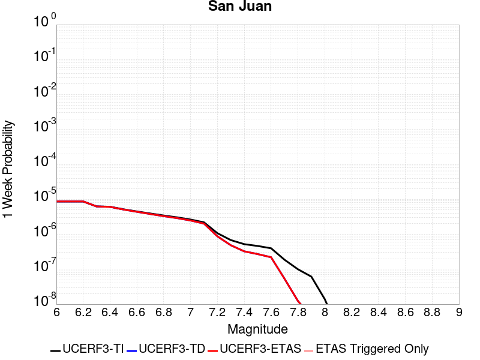 | 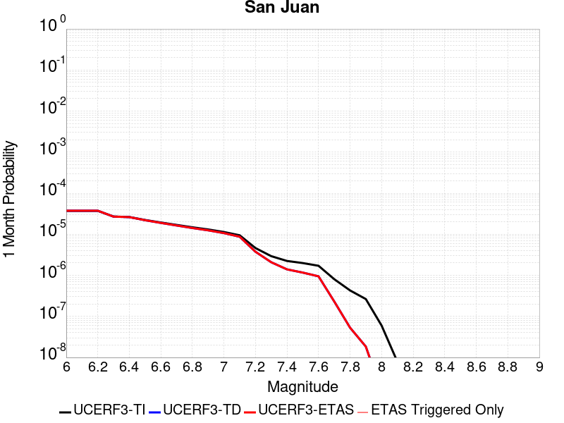 | 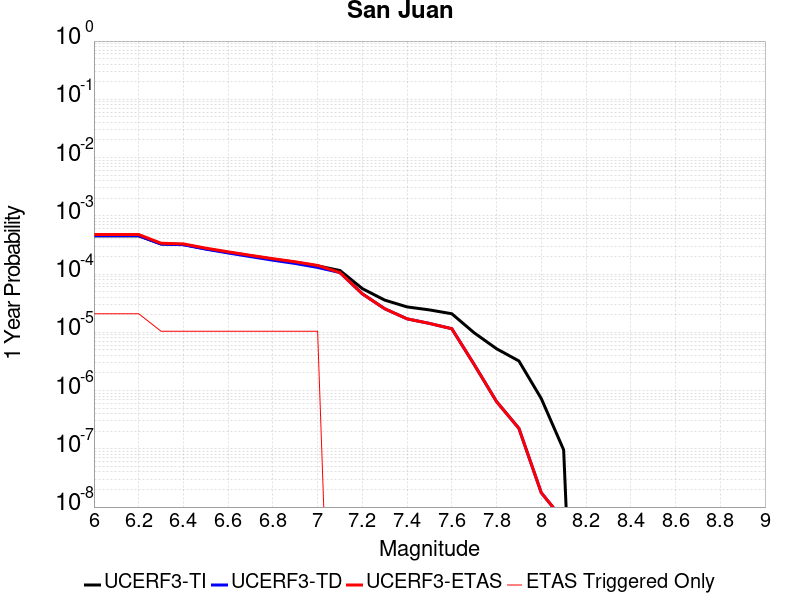 | 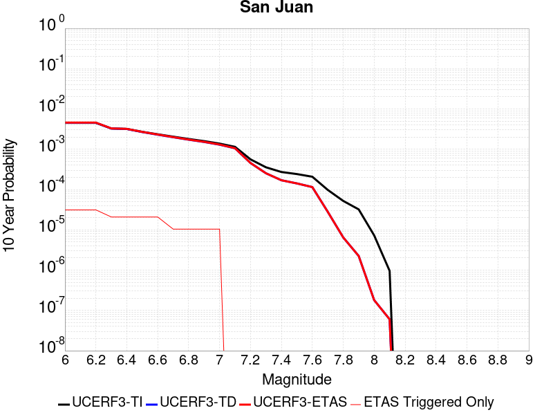 |

| Magnitude | 1 wk TI Prob | 1 wk TD Prob | 1 wk ETAS Prob | 1 wk ETAS/TD Gain | 1 wk ETAS Triggered Only | 1 mo TI Prob | 1 mo TD Prob | 1 mo ETAS Prob | 1 mo ETAS/TD Gain | 1 mo ETAS Triggered Only | 1 yr TI Prob | 1 yr TD Prob | 1 yr ETAS Prob | 1 yr ETAS/TD Gain | 1 yr ETAS Triggered Only | 10 yr TI Prob | 10 yr TD Prob | 10 yr ETAS Prob | 10 yr ETAS/TD Gain | 10 yr ETAS Triggered Only |
|-----|-----|-----|-----|-----|-----|-----|-----|-----|-----|-----|-----|-----|-----|-----|-----|-----|-----|-----|-----|-----|
| 6.0 | 8.682808E-6 | 8.7491635E-6 | 8.7491635E-6 | 1.0 | 0.0 | 3.72115E-5 | 3.74959E-5 | 3.74959E-5 | 1.0 | 0.0 | 4.5295584E-4 | 4.564218E-4 | 4.772841E-4 | 1.0457083 | 2.0871816E-5 | 0.004520337 | 0.004555385 | 0.00458655 | 1.0068414 | 3.1307725E-5 |
| 6.1 | 8.682808E-6 | 8.7491635E-6 | 8.7491635E-6 | 1.0 | 0.0 | 3.72115E-5 | 3.74959E-5 | 3.74959E-5 | 1.0 | 0.0 | 4.5295584E-4 | 4.564218E-4 | 4.772841E-4 | 1.0457083 | 2.0871816E-5 | 0.004520337 | 0.004555385 | 0.00458655 | 1.0068414 | 3.1307725E-5 |
| 6.2 | 8.682808E-6 | 8.7491635E-6 | 8.7491635E-6 | 1.0 | 0.0 | 3.72115E-5 | 3.74959E-5 | 3.74959E-5 | 1.0 | 0.0 | 4.5295584E-4 | 4.564218E-4 | 4.772841E-4 | 1.0457083 | 2.0871816E-5 | 0.004520337 | 0.004555385 | 0.00458655 | 1.0068414 | 3.1307725E-5 |
| 6.3 | 6.3054235E-6 | 6.2825848E-6 | 6.2825848E-6 | 1.0 | 0.0 | 2.7022963E-5 | 2.6925094E-5 | 2.6925094E-5 | 1.0 | 0.0 | 3.2895492E-4 | 3.2776513E-4 | 3.381976E-4 | 1.0318291 | 1.0435908E-5 | 0.003284684 | 0.003273017 | 0.0032938204 | 1.0063561 | 2.0871816E-5 |
| 6.4 | 6.1490473E-6 | 6.1144656E-6 | 6.1144656E-6 | 1.0 | 0.0 | 2.6352795E-5 | 2.6204598E-5 | 2.6204598E-5 | 1.0 | 0.0 | 3.2079802E-4 | 3.1899565E-4 | 3.2942824E-4 | 1.0327045 | 1.0435908E-5 | 0.0032033534 | 0.0031855737 | 0.003206379 | 1.0065311 | 2.0871816E-5 |
| 6.5 | 5.204848E-6 | 5.137233E-6 | 5.137233E-6 | 1.0 | 0.0 | 2.23063E-5 | 2.2016533E-5 | 2.2016533E-5 | 1.0 | 0.0 | 2.7154534E-4 | 2.6801927E-4 | 2.7845238E-4 | 1.0389267 | 1.0435908E-5 | 0.0027121378 | 0.0026771144 | 0.0026979304 | 1.0077755 | 2.0871816E-5 |
| 6.6 | 4.5179986E-6 | 4.4150297E-6 | 4.4150297E-6 | 1.0 | 0.0 | 1.9362706E-5 | 1.8921424E-5 | 1.8921424E-5 | 1.0 | 0.0 | 2.3571544E-4 | 2.3034477E-4 | 2.4077827E-4 | 1.0452951 | 1.0435908E-5 | 0.0023546559 | 0.0023011973 | 0.002322021 | 1.009049 | 2.0871816E-5 |
| 6.7 | 3.9442616E-6 | 3.819828E-6 | 3.819828E-6 | 1.0 | 0.0 | 1.6903869E-5 | 1.6370592E-5 | 1.6370592E-5 | 1.0 | 0.0 | 2.0578515E-4 | 1.992944E-4 | 2.0972823E-4 | 1.0523539 | 1.0435908E-5 | 0.002055947 | 0.0019912818 | 0.0020016967 | 1.0052303 | 1.0435908E-5 |
| 6.8 | 3.4536245E-6 | 3.3163353E-6 | 3.3163353E-6 | 1.0 | 0.0 | 1.4801163E-5 | 1.4212792E-5 | 1.4212792E-5 | 1.0 | 0.0 | 1.8018926E-4 | 1.7302761E-4 | 1.8346171E-4 | 1.0603031 | 1.0435908E-5 | 0.0018004322 | 0.0017290477 | 0.0017394656 | 1.0060252 | 1.0435908E-5 |
| 6.9 | 3.059865E-6 | 2.9120315E-6 | 2.9120315E-6 | 1.0 | 0.0 | 1.3113641E-5 | 1.2480078E-5 | 1.2480078E-5 | 1.0 | 0.0 | 1.596469E-4 | 1.5193493E-4 | 1.6236925E-4 | 1.0686762 | 1.0435908E-5 | 0.0015953224 | 0.0015184252 | 0.0015288453 | 1.0068624 | 1.0435908E-5 |
| 7.0 | 2.6504351E-6 | 2.4920002E-6 | 2.4920002E-6 | 1.0 | 0.0 | 1.1358958E-5 | 1.0679961E-5 | 1.0679961E-5 | 1.0 | 0.0 | 1.3828653E-4 | 1.300213E-4 | 1.4045586E-4 | 1.0802526 | 1.0435908E-5 | 0.0013820052 | 0.0012995641 | 0.0013099866 | 1.0080199 | 1.0435908E-5 |
| 7.1 | 2.2039317E-6 | 2.0338296E-6 | 2.0338296E-6 | 1.0 | 0.0 | 9.445387E-6 | 8.716386E-6 | 8.716386E-6 | 1.0 | 0.0 | 1.1499152E-4 | 1.0611736E-4 | 1.0611736E-4 | 1.0 | 0.0 | 0.0011493203 | 0.0010607769 | 0.0010607769 | 1.0 | 0.0 |
| 7.2 | 1.0786707E-6 | 8.7701903E-7 | 8.7701903E-7 | 1.0 | 0.0 | 4.622866E-6 | 3.7586476E-6 | 3.7586476E-6 | 1.0 | 0.0 | 5.628194E-5 | 4.5760586E-5 | 4.5760586E-5 | 1.0 | 0.0 | 5.6267687E-4 | 4.5757066E-4 | 4.5757066E-4 | 1.0 | 0.0 |
| 7.3 | 6.846433E-7 | 4.868805E-7 | 4.868805E-7 | 1.0 | 0.0 | 2.9341822E-6 | 2.086629E-6 | 2.086629E-6 | 1.0 | 0.0 | 3.5723086E-5 | 2.5404412E-5 | 2.5404412E-5 | 1.0 | 0.0 | 3.571734E-4 | 2.540486E-4 | 2.540486E-4 | 1.0 | 0.0 |
| 7.4 | 5.23043E-7 | 3.2628162E-7 | 3.2628162E-7 | 1.0 | 0.0 | 2.2416111E-6 | 1.398349E-6 | 1.398349E-6 | 1.0 | 0.0 | 2.7291273E-5 | 1.7024766E-5 | 1.7024766E-5 | 1.0 | 0.0 | 2.7287923E-4 | 1.7026656E-4 | 1.7026656E-4 | 1.0 | 0.0 |
| 7.5 | 4.648444E-7 | 2.7234944E-7 | 2.7234944E-7 | 1.0 | 0.0 | 1.9921886E-6 | 1.1672114E-6 | 1.1672114E-6 | 1.0 | 0.0 | 2.4254627E-5 | 1.42107065E-5 | 1.42107065E-5 | 1.0 | 0.0 | 2.425198E-4 | 1.421276E-4 | 1.421276E-4 | 1.0 | 0.0 |
| 7.6 | 3.9906567E-7 | 2.2083314E-7 | 2.2083314E-7 | 1.0 | 0.0 | 1.7102802E-6 | 9.464274E-7 | 9.464274E-7 | 1.0 | 0.0 | 2.0822463E-5 | 1.1522693E-5 | 1.1522693E-5 | 1.0 | 0.0 | 2.0820512E-4 | 1.15245566E-4 | 1.15245566E-4 | 1.0 | 0.0 |
| 7.7 | 1.8784601E-7 | 5.3666906E-8 | 5.3666906E-8 | 1.0 | 0.0 | 8.0505407E-7 | 2.30001E-7 | 2.30001E-7 | 1.0 | 0.0 | 9.80149E-6 | 2.8002585E-6 | 2.8002585E-6 | 1.0 | 0.0 | 9.801057E-5 | 2.8011282E-5 | 2.8011282E-5 | 1.0 | 0.0 |
| 7.8 | 1.00154914E-7 | 1.2415832E-8 | 1.2415832E-8 | 1.0 | 0.0 | 4.2923529E-7 | 5.3210716E-8 | 5.3210716E-8 | 1.0 | 0.0 | 5.225927E-6 | 6.4784024E-7 | 6.4784024E-7 | 1.0 | 0.0 | 5.225804E-5 | 6.484273E-6 | 6.484273E-6 | 1.0 | 0.0 |
| 7.9 | 6.171429E-8 | 4.2966155E-9 | 4.2966155E-9 | 1.0 | 0.0 | 2.6448978E-7 | 1.8414067E-8 | 1.8414067E-8 | 1.0 | 0.0 | 3.2201583E-6 | 2.2419121E-7 | 2.2419121E-7 | 1.0 | 0.0 | 3.2201115E-5 | 2.2472002E-6 | 2.2472002E-6 | 1.0 | 0.0 |
| 8.0 | 1.3974572E-8 | 3.3788217E-10 | 3.3788217E-10 | 1.0 | 0.0 | 5.989102E-8 | 1.448067E-9 | 1.448067E-9 | 1.0 | 0.0 | 7.2917294E-7 | 1.763022E-8 | 1.763022E-8 | 1.0 | 0.0 | 7.2917055E-6 | 1.8060365E-7 | 1.8060365E-7 | 1.0 | 0.0 |
| 8.1 | 1.8403477E-9 | 1.1302803E-10 | 1.1302803E-10 | 1.0 | 0.0 | 7.887204E-9 | 4.844063E-10 | 4.844063E-10 | 1.0 | 0.0 | 9.602671E-8 | 5.8976446E-9 | 5.8976446E-9 | 1.0 | 0.0 | 9.602667E-7 | 6.021993E-8 | 6.021993E-8 | 1.0 | 0.0 |

## Calaveras (Central) 2011 CFM
*[(top)](#table-of-contents)*

| 1 Week | 1 Month | 1 Year | 10 Year |
|-----|-----|-----|-----|
|  |  | 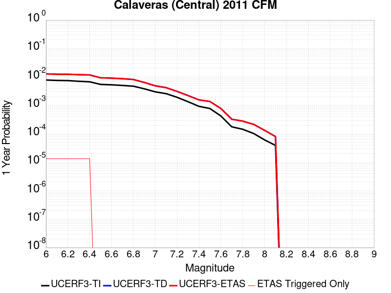 | 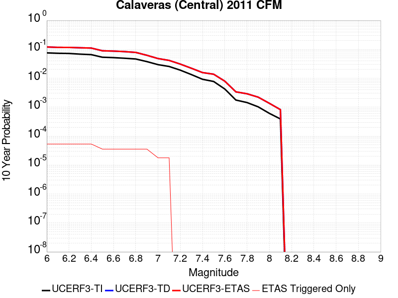 |

| Magnitude | 1 wk TI Prob | 1 wk TD Prob | 1 wk ETAS Prob | 1 wk ETAS/TD Gain | 1 wk ETAS Triggered Only | 1 mo TI Prob | 1 mo TD Prob | 1 mo ETAS Prob | 1 mo ETAS/TD Gain | 1 mo ETAS Triggered Only | 1 yr TI Prob | 1 yr TD Prob | 1 yr ETAS Prob | 1 yr ETAS/TD Gain | 1 yr ETAS Triggered Only | 10 yr TI Prob | 10 yr TD Prob | 10 yr ETAS Prob | 10 yr ETAS/TD Gain | 10 yr ETAS Triggered Only |
|-----|-----|-----|-----|-----|-----|-----|-----|-----|-----|-----|-----|-----|-----|-----|-----|-----|-----|-----|-----|-----|
| 6.0 | 1.5010907E-4 | 2.481574E-4 | 2.481574E-4 | 1.0 | 0.0 | 6.4316596E-4 | 0.0010621005 | 0.0010621005 | 1.0 | 0.0 | 0.0078024664 | 0.012850073 | 0.012860375 | 1.0008017 | 1.0435908E-5 | 0.07534136 | 0.120401435 | 0.12042897 | 1.0002288 | 3.1307725E-5 |
| 6.1 | 1.4521465E-4 | 2.397987E-4 | 2.397987E-4 | 1.0 | 0.0 | 6.222001E-4 | 0.0010263061 | 0.0010263061 | 1.0 | 0.0 | 0.0075490056 | 0.012419341 | 0.012429648 | 1.0008298 | 1.0435908E-5 | 0.07297657 | 0.11667323 | 0.11670088 | 1.000237 | 3.1307725E-5 |
| 6.2 | 1.429998E-4 | 2.3911126E-4 | 2.3911126E-4 | 1.0 | 0.0 | 6.127123E-4 | 0.0010233623 | 0.0010233623 | 1.0 | 0.0 | 0.007434286 | 0.01238394 | 0.012394247 | 1.0008323 | 1.0435908E-5 | 0.07190444 | 0.1163272 | 0.11635486 | 1.0002378 | 3.1307725E-5 |
| 6.3 | 1.3536277E-4 | 2.3242626E-4 | 2.3242626E-4 | 1.0 | 0.0 | 5.799972E-4 | 9.947343E-4 | 9.947343E-4 | 1.0 | 0.0 | 0.0070386264 | 0.012040132 | 0.012050442 | 1.0008563 | 1.0435908E-5 | 0.0681982 | 0.11323977 | 0.11326754 | 1.0002452 | 3.1307725E-5 |
| 6.4 | 1.2993296E-4 | 2.2666177E-4 | 2.2666177E-4 | 1.0 | 0.0 | 5.5673666E-4 | 9.700479E-4 | 9.700479E-4 | 1.0 | 0.0 | 0.006757223 | 0.011742937 | 0.011753251 | 1.0008782 | 1.0435908E-5 | 0.06555412 | 0.11051771 | 0.11054556 | 1.000252 | 3.1307725E-5 |
| 6.5 | 1.0498927E-4 | 1.7981697E-4 | 1.7981697E-4 | 1.0 | 0.0 | 4.498764E-4 | 7.704157E-4 | 7.704157E-4 | 1.0 | 0.0 | 0.005463498 | 0.00933924 | 0.00933924 | 1.0 | 0.0 | 0.053311124 | 0.089199215 | 0.08921822 | 1.0002131 | 2.0871816E-5 |
| 6.6 | 1.0157505E-4 | 1.7469203E-4 | 1.7469203E-4 | 1.0 | 0.0 | 4.35249E-4 | 7.484645E-4 | 7.484645E-4 | 1.0 | 0.0 | 0.0052862884 | 0.009074297 | 0.009074297 | 1.0 | 0.0 | 0.05162293 | 0.08677671 | 0.08679577 | 1.0002197 | 2.0871816E-5 |
| 6.7 | 9.660386E-5 | 1.6728524E-4 | 1.6728524E-4 | 1.0 | 0.0 | 4.1395082E-4 | 7.1673887E-4 | 7.1673887E-4 | 1.0 | 0.0 | 0.0050282106 | 0.008691208 | 0.008691208 | 1.0 | 0.0 | 0.049159497 | 0.083266065 | 0.0832852 | 1.0002298 | 2.0871816E-5 |
| 6.8 | 9.089927E-5 | 1.5643016E-4 | 1.5643016E-4 | 1.0 | 0.0 | 3.8951015E-4 | 6.702439E-4 | 6.702439E-4 | 1.0 | 0.0 | 0.0047319788 | 0.008129478 | 0.008129478 | 1.0 | 0.0 | 0.046324775 | 0.078159414 | 0.07817866 | 1.0002462 | 2.0871816E-5 |
| 6.9 | 7.353187E-5 | 1.2295354E-4 | 1.2295354E-4 | 1.0 | 0.0 | 3.150985E-4 | 5.2683795E-4 | 5.2683795E-4 | 1.0 | 0.0 | 0.0038295772 | 0.006395508 | 0.006395508 | 1.0 | 0.0 | 0.037642512 | 0.062187865 | 0.062207438 | 1.0003147 | 2.0871816E-5 |
| 7.0 | 5.746064E-5 | 9.3887444E-5 | 9.3887444E-5 | 1.0 | 0.0 | 2.4623662E-4 | 4.0231308E-4 | 4.0231308E-4 | 1.0 | 0.0 | 0.0029938098 | 0.004887232 | 0.004887232 | 1.0 | 0.0 | 0.02953797 | 0.04798685 | 0.047996785 | 1.0002071 | 1.0435908E-5 |
| 7.1 | 4.9557195E-5 | 8.052461E-5 | 8.052461E-5 | 1.0 | 0.0 | 2.123707E-4 | 3.4506017E-4 | 3.4506017E-4 | 1.0 | 0.0 | 0.0025825473 | 0.0041930773 | 0.0041930773 | 1.0 | 0.0 | 0.0255274 | 0.041373078 | 0.041383084 | 1.0002418 | 1.0435908E-5 |
| 7.2 | 3.687595E-5 | 5.9524526E-5 | 5.9524526E-5 | 1.0 | 0.0 | 1.5803022E-4 | 2.5508032E-4 | 2.5508032E-4 | 1.0 | 0.0 | 0.0019223199 | 0.0031012094 | 0.0031012094 | 1.0 | 0.0 | 0.01905776 | 0.030883716 | 0.030883716 | 1.0 | 0.0 |
| 7.3 | 2.5846984E-5 | 4.247213E-5 | 4.247213E-5 | 1.0 | 0.0 | 1.1076809E-4 | 1.8201082E-4 | 1.8201082E-4 | 1.0 | 0.0 | 0.0013477671 | 0.002213747 | 0.002213747 | 1.0 | 0.0 | 0.013396223 | 0.02217554 | 0.02217554 | 1.0 | 0.0 |
| 7.4 | 1.7747854E-5 | 2.9936204E-5 | 2.9936204E-5 | 1.0 | 0.0 | 7.6060016E-5 | 1.2829172E-4 | 1.2829172E-4 | 1.0 | 0.0 | 9.2563726E-4 | 0.0015608355 | 0.0015608355 | 1.0 | 0.0 | 0.009217911 | 0.015709236 | 0.015709236 | 1.0 | 0.0 |
| 7.5 | 1.4883479E-5 | 2.6243379E-5 | 2.6243379E-5 | 1.0 | 0.0 | 6.378478E-5 | 1.1246678E-4 | 1.1246678E-4 | 1.0 | 0.0 | 7.76303E-4 | 0.0013684258 | 0.0013684258 | 1.0 | 0.0 | 0.0077359667 | 0.013802425 | 0.013802425 | 1.0 | 0.0 |
| 7.6 | 8.166975E-6 | 1.4963478E-5 | 1.4963478E-5 | 1.0 | 0.0 | 3.5000852E-5 | 6.412763E-5 | 6.412763E-5 | 1.0 | 0.0 | 4.2605202E-4 | 7.804755E-4 | 7.804755E-4 | 1.0 | 0.0 | 0.004252361 | 0.00793984 | 0.00793984 | 1.0 | 0.0 |
| 7.7 | 3.3858064E-6 | 6.253914E-6 | 6.253914E-6 | 1.0 | 0.0 | 1.4510518E-5 | 2.6802214E-5 | 2.6802214E-5 | 1.0 | 0.0 | 1.7665124E-4 | 3.2626814E-4 | 3.2626814E-4 | 1.0 | 0.0 | 0.0017651088 | 0.0033882293 | 0.0033882293 | 1.0 | 0.0 |
| 7.8 | 2.7721615E-6 | 5.3663807E-6 | 5.3663807E-6 | 1.0 | 0.0 | 1.1880637E-5 | 2.2998573E-5 | 2.2998573E-5 | 1.0 | 0.0 | 1.4463716E-4 | 2.799717E-4 | 2.799717E-4 | 1.0 | 0.0 | 0.0014454306 | 0.0029074624 | 0.0029074624 | 1.0 | 0.0 |
| 7.9 | 1.9736292E-6 | 4.1284193E-6 | 4.1284193E-6 | 1.0 | 0.0 | 8.4583835E-6 | 1.7693106E-5 | 1.7693106E-5 | 1.0 | 0.0 | 1.0297595E-4 | 2.1539231E-4 | 2.1539231E-4 | 1.0 | 0.0 | 0.0010292825 | 0.0022236116 | 0.0022236116 | 1.0 | 0.0 |
| 8.0 | 1.1767289E-6 | 2.5544743E-6 | 2.5544743E-6 | 1.0 | 0.0 | 5.0431145E-6 | 1.0947701E-5 | 1.0947701E-5 | 1.0 | 0.0 | 6.139818E-5 | 1.3328013E-4 | 1.3328013E-4 | 1.0 | 0.0 | 6.1381224E-4 | 0.0013660848 | 0.0013660848 | 1.0 | 0.0 |
| 8.1 | 7.5112825E-7 | 1.5409794E-6 | 1.5409794E-6 | 1.0 | 0.0 | 3.2191172E-6 | 6.6041807E-6 | 6.6041807E-6 | 1.0 | 0.0 | 3.9192048E-5 | 8.0402955E-5 | 8.0402955E-5 | 1.0 | 0.0 | 3.9185135E-4 | 8.235564E-4 | 8.235564E-4 | 1.0 | 0.0 |

## Monterey Bay-Tularcitos
*[(top)](#table-of-contents)*

| 1 Week | 1 Month | 1 Year | 10 Year |
|-----|-----|-----|-----|
| 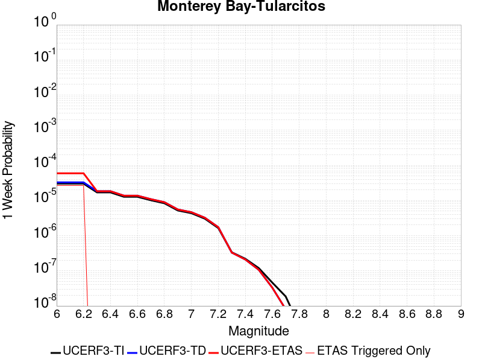 | 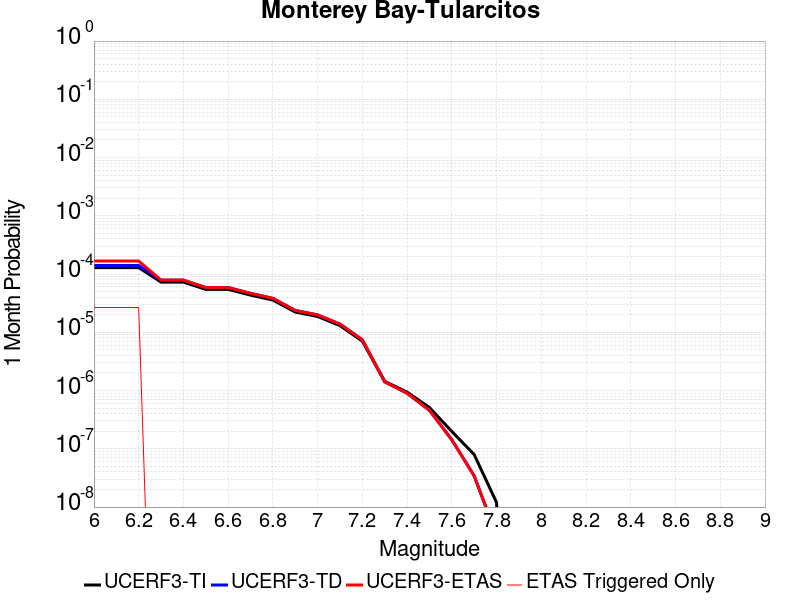 | 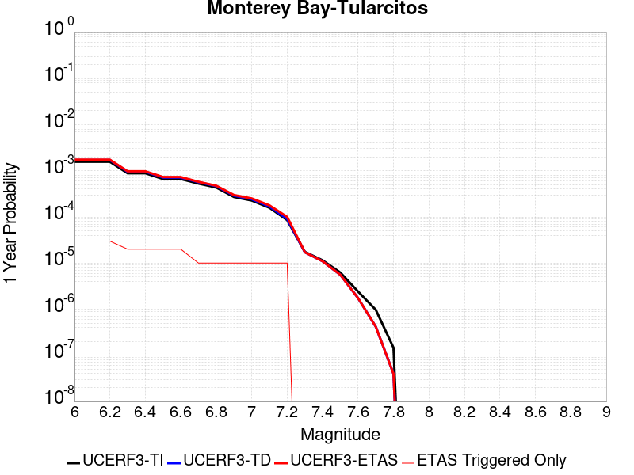 | 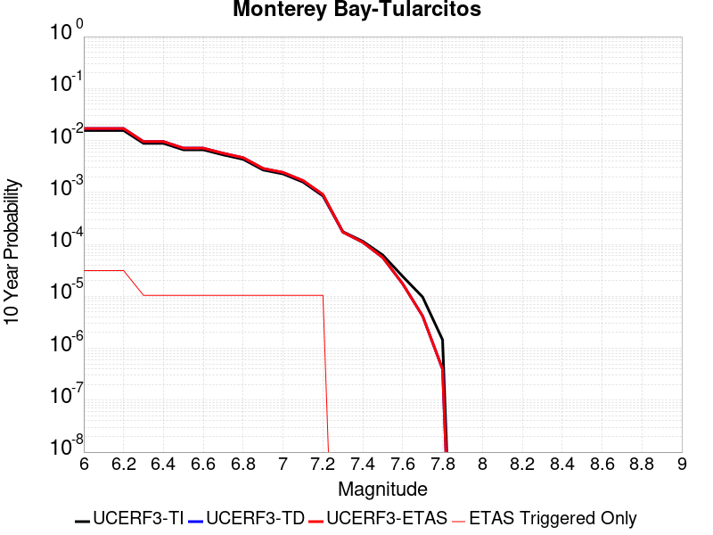 |

| Magnitude | 1 wk TI Prob | 1 wk TD Prob | 1 wk ETAS Prob | 1 wk ETAS/TD Gain | 1 wk ETAS Triggered Only | 1 mo TI Prob | 1 mo TD Prob | 1 mo ETAS Prob | 1 mo ETAS/TD Gain | 1 mo ETAS Triggered Only | 1 yr TI Prob | 1 yr TD Prob | 1 yr ETAS Prob | 1 yr ETAS/TD Gain | 1 yr ETAS Triggered Only | 10 yr TI Prob | 10 yr TD Prob | 10 yr ETAS Prob | 10 yr ETAS/TD Gain | 10 yr ETAS Triggered Only |
|-----|-----|-----|-----|-----|-----|-----|-----|-----|-----|-----|-----|-----|-----|-----|-----|-----|-----|-----|-----|-----|
| 6.0 | 3.0131365E-5 | 3.279877E-5 | 5.36699E-5 | 1.6363388 | 2.0871816E-5 | 1.2912804E-4 | 1.4055918E-4 | 1.6142806E-4 | 1.1484704 | 2.0871816E-5 | 0.001571 | 0.0017100703 | 0.0017309063 | 1.0121844 | 2.0871816E-5 | 0.015599402 | 0.016979916 | 0.017010693 | 1.0018125 | 3.1307725E-5 |
| 6.1 | 3.0131365E-5 | 3.279877E-5 | 5.36699E-5 | 1.6363388 | 2.0871816E-5 | 1.2912804E-4 | 1.4055918E-4 | 1.6142806E-4 | 1.1484704 | 2.0871816E-5 | 0.001571 | 0.0017100703 | 0.0017309063 | 1.0121844 | 2.0871816E-5 | 0.015599402 | 0.016979916 | 0.017010693 | 1.0018125 | 3.1307725E-5 |
| 6.2 | 3.0131365E-5 | 3.279877E-5 | 5.36699E-5 | 1.6363388 | 2.0871816E-5 | 1.2912804E-4 | 1.4055918E-4 | 1.6142806E-4 | 1.1484704 | 2.0871816E-5 | 0.001571 | 0.0017100703 | 0.0017309063 | 1.0121844 | 2.0871816E-5 | 0.015599402 | 0.016979916 | 0.017010693 | 1.0018125 | 3.1307725E-5 |
| 6.3 | 1.6998249E-5 | 1.8330798E-5 | 2.8766515E-5 | 1.5692996 | 1.0435908E-5 | 7.28476E-5 | 7.85583E-5 | 8.899339E-5 | 1.1328324 | 1.0435908E-5 | 8.865586E-4 | 9.5604634E-4 | 9.6647226E-4 | 1.0109053 | 1.0435908E-5 | 0.0088303005 | 0.009521258 | 0.009531595 | 1.0010856 | 1.0435908E-5 |
| 6.4 | 1.6998249E-5 | 1.8330798E-5 | 2.8766515E-5 | 1.5692996 | 1.0435908E-5 | 7.28476E-5 | 7.85583E-5 | 8.899339E-5 | 1.1328324 | 1.0435908E-5 | 8.865586E-4 | 9.5604634E-4 | 9.6647226E-4 | 1.0109053 | 1.0435908E-5 | 0.0088303005 | 0.009521258 | 0.009531595 | 1.0010856 | 1.0435908E-5 |
| 6.5 | 1.27470785E-5 | 1.3693312E-5 | 2.4129078E-5 | 1.7621067 | 1.0435908E-5 | 5.4629192E-5 | 5.8684363E-5 | 6.911966E-5 | 1.1778207 | 1.0435908E-5 | 6.649074E-4 | 7.1425823E-4 | 7.246867E-4 | 1.0146004 | 1.0435908E-5 | 0.0066292146 | 0.007120678 | 0.00713104 | 1.0014552 | 1.0435908E-5 |
| 6.6 | 1.2739422E-5 | 1.36854E-5 | 2.4121166E-5 | 1.7625474 | 1.0435908E-5 | 5.4596385E-5 | 5.8650454E-5 | 6.908575E-5 | 1.1779236 | 1.0435908E-5 | 6.645082E-4 | 7.1384566E-4 | 7.2427414E-4 | 1.0146089 | 1.0435908E-5 | 0.0066252467 | 0.007116579 | 0.0071269404 | 1.001456 | 1.0435908E-5 |
| 6.7 | 1.0160109E-5 | 1.0885755E-5 | 2.1321548E-5 | 1.9586653 | 1.0435908E-5 | 4.35426E-5 | 4.665244E-5 | 5.7087862E-5 | 1.2236843 | 1.0435908E-5 | 5.300022E-4 | 5.6785246E-4 | 5.7828246E-4 | 1.0183674 | 1.0435908E-5 | 0.005287399 | 0.0056647263 | 0.005675103 | 1.0018318 | 1.0435908E-5 |
| 6.8 | 8.349859E-6 | 8.932587E-6 | 1.93684E-5 | 2.1682858 | 1.0435908E-5 | 3.578462E-5 | 3.8281985E-5 | 4.8717495E-5 | 1.2725958 | 1.0435908E-5 | 4.3559066E-4 | 4.6598914E-4 | 4.764202E-4 | 1.0223848 | 1.0435908E-5 | 0.004347378 | 0.004650685 | 0.0046610725 | 1.0022335 | 1.0435908E-5 |
| 6.9 | 5.193639E-6 | 5.53643E-6 | 1.597228E-5 | 2.884942 | 1.0435908E-5 | 2.2258262E-5 | 2.372736E-5 | 3.416302E-5 | 1.4398155 | 1.0435908E-5 | 2.7096065E-4 | 2.8884556E-4 | 2.9927844E-4 | 1.0361192 | 1.0435908E-5 | 0.0027063051 | 0.0028850222 | 0.002895428 | 1.0036068 | 1.0435908E-5 |
| 7.0 | 4.359381E-6 | 4.643366E-6 | 1.5079226E-5 | 3.2474773 | 1.0435908E-5 | 1.8682927E-5 | 1.9900004E-5 | 3.0335705E-5 | 1.5244069 | 1.0435908E-5 | 2.274409E-4 | 2.422586E-4 | 2.5269197E-4 | 1.0430671 | 1.0435908E-5 | 0.0022720827 | 0.002420238 | 0.0024306485 | 1.0043015 | 1.0435908E-5 |
| 7.1 | 3.0398533E-6 | 3.2310427E-6 | 1.3666917E-5 | 4.2298784 | 1.0435908E-5 | 1.3027877E-5 | 1.3847267E-5 | 2.428303E-5 | 1.7536335 | 1.0435908E-5 | 1.5860285E-4 | 1.6858005E-4 | 1.790142E-4 | 1.0618943 | 1.0435908E-5 | 0.001584897 | 0.0016847793 | 0.0016951977 | 1.0061837 | 1.0435908E-5 |
| 7.2 | 1.642335E-6 | 1.7333153E-6 | 1.2169206E-5 | 7.020768 | 1.0435908E-5 | 7.0385595E-6 | 7.428485E-6 | 1.7864315E-5 | 2.4048398 | 1.0435908E-5 | 8.569109E-5 | 9.044012E-5 | 1.0087508E-4 | 1.1153798 | 1.0435908E-5 | 8.5658056E-4 | 9.042358E-4 | 9.1466226E-4 | 1.0115308 | 1.0435908E-5 |
| 7.3 | 3.356842E-7 | 3.2952389E-7 | 3.2952389E-7 | 1.0 | 0.0 | 1.4386458E-6 | 1.4122444E-6 | 1.4122444E-6 | 1.0 | 0.0 | 1.7515373E-5 | 1.7193941E-5 | 1.7193941E-5 | 1.0 | 0.0 | 1.7513991E-4 | 1.719262E-4 | 1.719262E-4 | 1.0 | 0.0 |
| 7.4 | 2.1973483E-7 | 2.1006413E-7 | 2.1006413E-7 | 1.0 | 0.0 | 9.417204E-7 | 9.0027453E-7 | 9.0027453E-7 | 1.0 | 0.0 | 1.1465385E-5 | 1.0960787E-5 | 1.0960787E-5 | 1.0 | 0.0 | 1.1464794E-4 | 1.096025E-4 | 1.096025E-4 | 1.0 | 0.0 |
| 7.5 | 1.1944135E-7 | 1.0696043E-7 | 1.0696043E-7 | 1.0 | 0.0 | 5.118914E-7 | 4.5840173E-7 | 4.5840173E-7 | 1.0 | 0.0 | 6.23226E-6 | 5.581027E-6 | 5.581027E-6 | 1.0 | 0.0 | 6.2320854E-5 | 5.5808883E-5 | 5.5808883E-5 | 1.0 | 0.0 |
| 7.6 | 4.636058E-8 | 3.336489E-8 | 3.336489E-8 | 1.0 | 0.0 | 1.9868818E-7 | 1.4299238E-7 | 1.4299238E-7 | 1.0 | 0.0 | 2.419026E-6 | 1.7409308E-6 | 1.7409308E-6 | 1.0 | 0.0 | 2.4189996E-5 | 1.7409173E-5 | 1.7409173E-5 | 1.0 | 0.0 |
| 7.7 | 1.8588572E-8 | 8.003744E-9 | 8.003744E-9 | 1.0 | 0.0 | 7.9665305E-8 | 3.430176E-8 | 3.430176E-8 | 1.0 | 0.0 | 9.699246E-7 | 4.1762385E-7 | 4.1762385E-7 | 1.0 | 0.0 | 9.699204E-6 | 4.176231E-6 | 4.176231E-6 | 1.0 | 0.0 |
| 7.8 | 2.7960154E-9 | 7.6099427E-10 | 7.6099427E-10 | 1.0 | 0.0 | 1.1982923E-8 | 3.2614043E-9 | 3.2614043E-9 | 1.0 | 0.0 | 1.4589209E-7 | 3.9707597E-8 | 3.9707597E-8 | 1.0 | 0.0 | 1.4589199E-6 | 3.9707595E-7 | 3.9707595E-7 | 1.0 | 0.0 |

## Santa Susana East (connector)
*[(top)](#table-of-contents)*

| 1 Week | 1 Month | 1 Year | 10 Year |
|-----|-----|-----|-----|
| 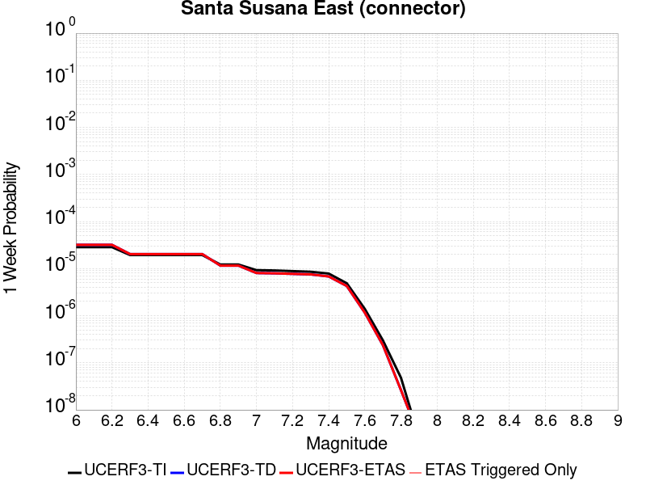 | 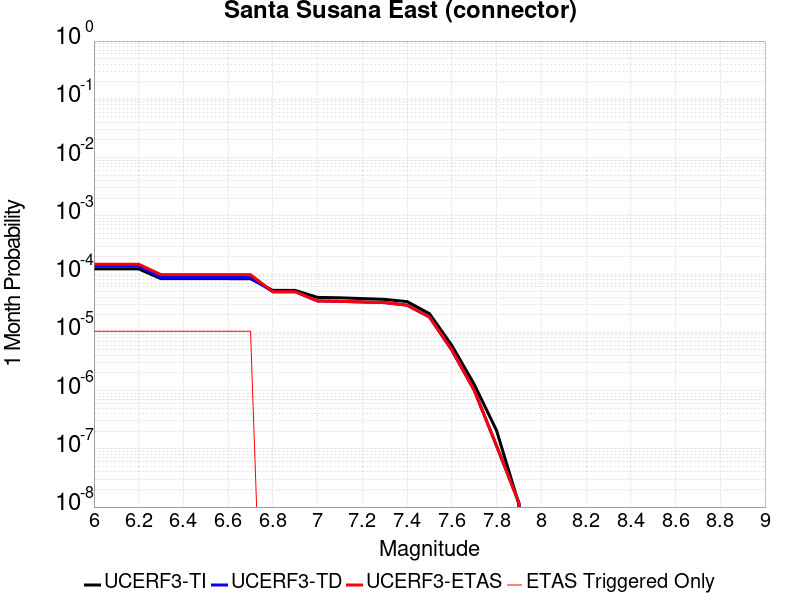 | 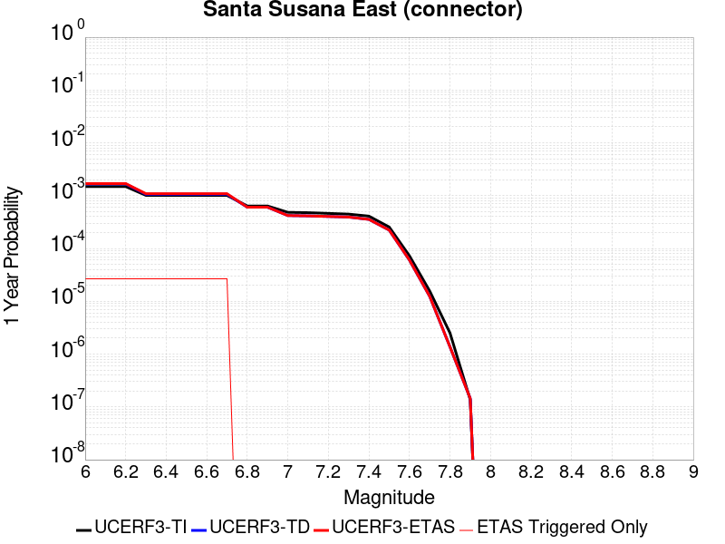 | 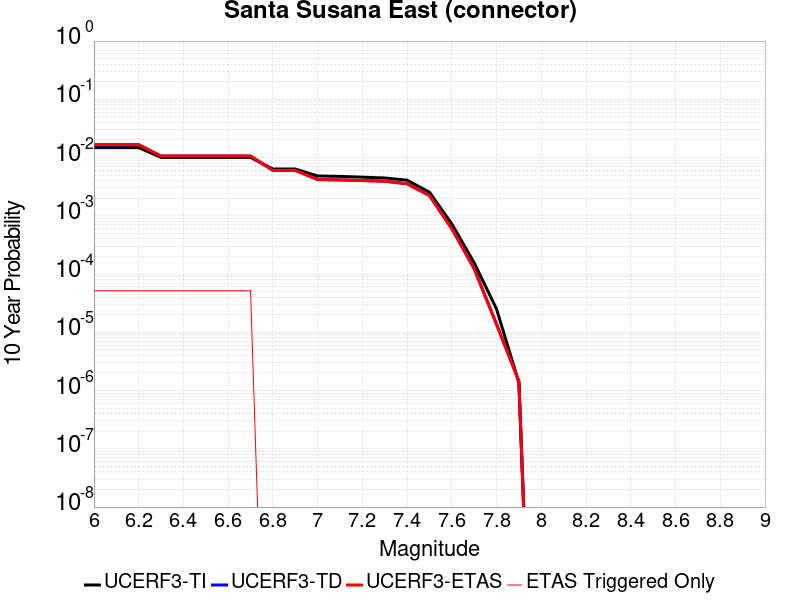 |

| Magnitude | 1 wk TI Prob | 1 wk TD Prob | 1 wk ETAS Prob | 1 wk ETAS/TD Gain | 1 wk ETAS Triggered Only | 1 mo TI Prob | 1 mo TD Prob | 1 mo ETAS Prob | 1 mo ETAS/TD Gain | 1 mo ETAS Triggered Only | 1 yr TI Prob | 1 yr TD Prob | 1 yr ETAS Prob | 1 yr ETAS/TD Gain | 1 yr ETAS Triggered Only | 10 yr TI Prob | 10 yr TD Prob | 10 yr ETAS Prob | 10 yr ETAS/TD Gain | 10 yr ETAS Triggered Only |
|-----|-----|-----|-----|-----|-----|-----|-----|-----|-----|-----|-----|-----|-----|-----|-----|-----|-----|-----|-----|-----|
| 6.0 | 2.858397E-5 | 3.202091E-5 | 3.202091E-5 | 1.0 | 0.0 | 1.2249697E-4 | 1.3722685E-4 | 1.4766133E-4 | 1.0760381 | 1.0435908E-5 | 0.0014903803 | 0.0016697381 | 0.001690575 | 1.0124792 | 2.0871816E-5 | 0.014804244 | 0.016599052 | 0.01662984 | 1.0018548 | 3.1307725E-5 |
| 6.1 | 2.858397E-5 | 3.202091E-5 | 3.202091E-5 | 1.0 | 0.0 | 1.2249697E-4 | 1.3722685E-4 | 1.4766133E-4 | 1.0760381 | 1.0435908E-5 | 0.0014903803 | 0.0016697381 | 0.001690575 | 1.0124792 | 2.0871816E-5 | 0.014804244 | 0.016599052 | 0.01662984 | 1.0018548 | 3.1307725E-5 |
| 6.2 | 2.858397E-5 | 3.202091E-5 | 3.202091E-5 | 1.0 | 0.0 | 1.2249697E-4 | 1.3722685E-4 | 1.4766133E-4 | 1.0760381 | 1.0435908E-5 | 0.0014903803 | 0.0016697381 | 0.001690575 | 1.0124792 | 2.0871816E-5 | 0.014804244 | 0.016599052 | 0.01662984 | 1.0018548 | 3.1307725E-5 |
| 6.3 | 1.943582E-5 | 2.036718E-5 | 2.036718E-5 | 1.0 | 0.0 | 8.329371E-5 | 8.7285625E-5 | 9.772062E-5 | 1.11955 | 1.0435908E-5 | 0.001013629 | 0.0010622967 | 0.0010831463 | 1.019627 | 2.0871816E-5 | 0.010090181 | 0.010583619 | 0.010614594 | 1.0029268 | 3.1307725E-5 |
| 6.4 | 1.943582E-5 | 2.036718E-5 | 2.036718E-5 | 1.0 | 0.0 | 8.329371E-5 | 8.7285625E-5 | 9.772062E-5 | 1.11955 | 1.0435908E-5 | 0.001013629 | 0.0010622967 | 0.0010831463 | 1.019627 | 2.0871816E-5 | 0.010090181 | 0.010583619 | 0.010614594 | 1.0029268 | 3.1307725E-5 |
| 6.5 | 1.943582E-5 | 2.036718E-5 | 2.036718E-5 | 1.0 | 0.0 | 8.329371E-5 | 8.7285625E-5 | 9.772062E-5 | 1.11955 | 1.0435908E-5 | 0.001013629 | 0.0010622967 | 0.0010831463 | 1.019627 | 2.0871816E-5 | 0.010090181 | 0.010583619 | 0.010614594 | 1.0029268 | 3.1307725E-5 |
| 6.6 | 1.943582E-5 | 2.036718E-5 | 2.036718E-5 | 1.0 | 0.0 | 8.329371E-5 | 8.7285625E-5 | 9.772062E-5 | 1.11955 | 1.0435908E-5 | 0.001013629 | 0.0010622967 | 0.0010831463 | 1.019627 | 2.0871816E-5 | 0.010090181 | 0.010583619 | 0.010614594 | 1.0029268 | 3.1307725E-5 |
| 6.7 | 1.9404439E-5 | 2.03546E-5 | 2.03546E-5 | 1.0 | 0.0 | 8.3159226E-5 | 8.723172E-5 | 9.7666714E-5 | 1.1196239 | 1.0435908E-5 | 0.0010119933 | 0.0010616409 | 0.0010824907 | 1.0196391 | 2.0871816E-5 | 0.010073971 | 0.010577125 | 0.010608101 | 1.0029286 | 3.1307725E-5 |
| 6.8 | 1.2217526E-5 | 1.1592998E-5 | 1.1592998E-5 | 1.0 | 0.0 | 5.2359774E-5 | 4.9683425E-5 | 4.9683425E-5 | 1.0 | 0.0 | 6.372938E-4 | 6.0474465E-4 | 6.0474465E-4 | 1.0 | 0.0 | 0.0063546924 | 0.006033037 | 0.00604341 | 1.0017194 | 1.0435908E-5 |
| 6.9 | 1.2217526E-5 | 1.1592998E-5 | 1.1592998E-5 | 1.0 | 0.0 | 5.2359774E-5 | 4.9683425E-5 | 4.9683425E-5 | 1.0 | 0.0 | 6.372938E-4 | 6.0474465E-4 | 6.0474465E-4 | 1.0 | 0.0 | 0.0063546924 | 0.006033037 | 0.00604341 | 1.0017194 | 1.0435908E-5 |
| 7.0 | 9.276017E-6 | 8.059113E-6 | 8.059113E-6 | 1.0 | 0.0 | 3.9753755E-5 | 3.4538618E-5 | 3.4538618E-5 | 1.0 | 0.0 | 4.8389446E-4 | 4.2042998E-4 | 4.2042998E-4 | 1.0 | 0.0 | 0.0048284214 | 0.0041970722 | 0.0042074644 | 1.0024761 | 1.0435908E-5 |
| 7.1 | 9.130355E-6 | 7.942286E-6 | 7.942286E-6 | 1.0 | 0.0 | 3.9129503E-5 | 3.4037945E-5 | 3.4037945E-5 | 1.0 | 0.0 | 4.7629757E-4 | 4.1433662E-4 | 4.1433662E-4 | 1.0 | 0.0 | 0.00475278 | 0.004136367 | 0.0041467594 | 1.0025126 | 1.0435908E-5 |
| 7.2 | 8.851015E-6 | 7.741445E-6 | 7.741445E-6 | 1.0 | 0.0 | 3.7932372E-5 | 3.317722E-5 | 3.317722E-5 | 1.0 | 0.0 | 4.6172875E-4 | 4.038612E-4 | 4.038612E-4 | 1.0 | 0.0 | 0.0046077054 | 0.0040319953 | 0.0040423893 | 1.0025778 | 1.0435908E-5 |
| 7.3 | 8.573006E-6 | 7.550166E-6 | 7.550166E-6 | 1.0 | 0.0 | 3.6740938E-5 | 3.2357475E-5 | 3.2357475E-5 | 1.0 | 0.0 | 4.472291E-4 | 3.9388443E-4 | 3.9388443E-4 | 1.0 | 0.0 | 0.004463301 | 0.0039325804 | 0.0039429753 | 1.0026432 | 1.0435908E-5 |
| 7.4 | 7.852282E-6 | 6.817687E-6 | 6.817687E-6 | 1.0 | 0.0 | 3.36522E-5 | 2.9218349E-5 | 2.9218349E-5 | 1.0 | 0.0 | 4.096385E-4 | 3.5567835E-4 | 3.5567835E-4 | 1.0 | 0.0 | 0.0040888423 | 0.0035517553 | 0.0035621542 | 1.0029278 | 1.0435908E-5 |
| 7.5 | 4.8869324E-6 | 4.279055E-6 | 4.279055E-6 | 1.0 | 0.0 | 2.0943828E-5 | 1.8338687E-5 | 1.8338687E-5 | 1.0 | 0.0 | 2.5496128E-4 | 2.232523E-4 | 2.232523E-4 | 1.0 | 0.0 | 0.0025466895 | 0.0022304445 | 0.0022304445 | 1.0 | 0.0 |
| 7.6 | 1.3894544E-6 | 1.1568179E-6 | 1.1568179E-6 | 1.0 | 0.0 | 5.954791E-6 | 4.957783E-6 | 4.957783E-6 | 1.0 | 0.0 | 7.249717E-5 | 6.0359558E-5 | 6.0359558E-5 | 1.0 | 0.0 | 7.247352E-4 | 6.0345343E-4 | 6.0345343E-4 | 1.0 | 0.0 |
| 7.7 | 2.9924632E-7 | 2.371928E-7 | 2.371928E-7 | 1.0 | 0.0 | 1.2824837E-6 | 1.0165402E-6 | 1.0165402E-6 | 1.0 | 0.0 | 1.5614127E-5 | 1.2376314E-5 | 1.2376314E-5 | 1.0 | 0.0 | 1.5613029E-4 | 1.2375697E-4 | 1.2375697E-4 | 1.0 | 0.0 |
| 7.8 | 4.8188564E-8 | 2.6323061E-8 | 2.6323061E-8 | 1.0 | 0.0 | 2.065224E-7 | 1.1281311E-7 | 1.1281311E-7 | 1.0 | 0.0 | 2.5144072E-6 | 1.3734989E-6 | 1.3734989E-6 | 1.0 | 0.0 | 2.5143789E-5 | 1.3734912E-5 | 1.3734912E-5 | 1.0 | 0.0 |
| 7.9 | 2.6127251E-9 | 2.7681102E-9 | 2.7681102E-9 | 1.0 | 0.0 | 1.1197393E-8 | 1.186333E-8 | 1.186333E-8 | 1.0 | 0.0 | 1.3632825E-7 | 1.4443603E-7 | 1.4443603E-7 | 1.0 | 0.0 | 1.3632817E-6 | 1.4443604E-6 | 1.4443604E-6 | 1.0 | 0.0 |

## Elsinore (Coyote Mountains)
*[(top)](#table-of-contents)*

| 1 Week | 1 Month | 1 Year | 10 Year |
|-----|-----|-----|-----|
| 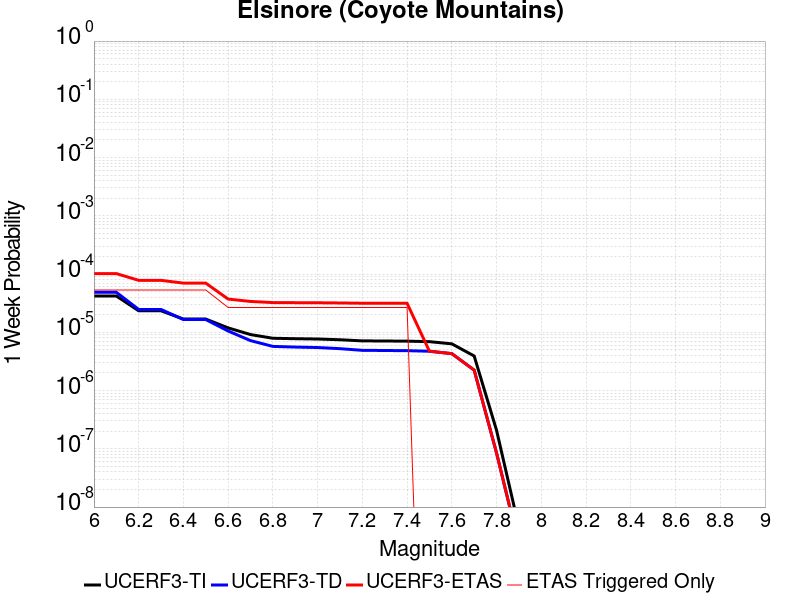 | 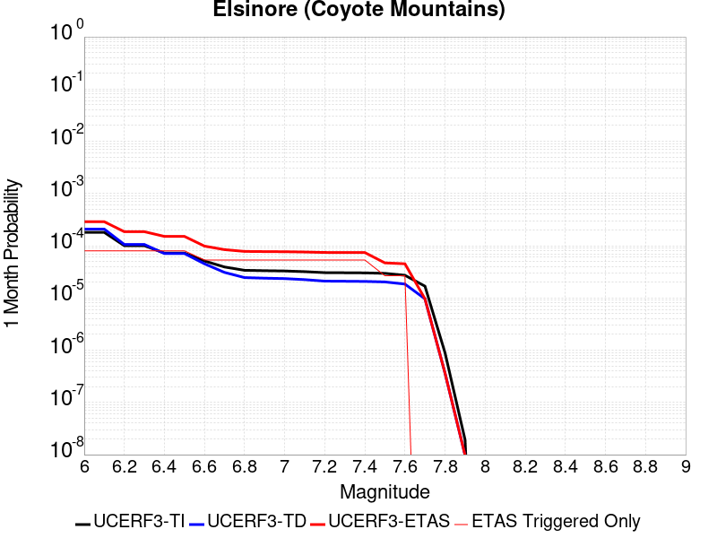 | 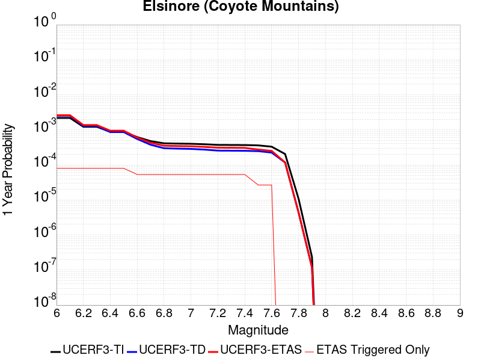 | 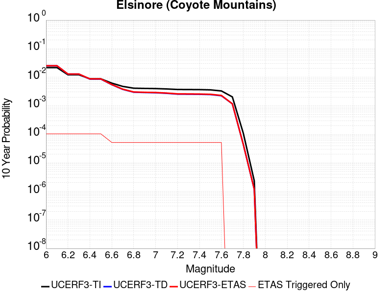 |

| Magnitude | 1 wk TI Prob | 1 wk TD Prob | 1 wk ETAS Prob | 1 wk ETAS/TD Gain | 1 wk ETAS Triggered Only | 1 mo TI Prob | 1 mo TD Prob | 1 mo ETAS Prob | 1 mo ETAS/TD Gain | 1 mo ETAS Triggered Only | 1 yr TI Prob | 1 yr TD Prob | 1 yr ETAS Prob | 1 yr ETAS/TD Gain | 1 yr ETAS Triggered Only | 10 yr TI Prob | 10 yr TD Prob | 10 yr ETAS Prob | 10 yr ETAS/TD Gain | 10 yr ETAS Triggered Only |
|-----|-----|-----|-----|-----|-----|-----|-----|-----|-----|-----|-----|-----|-----|-----|-----|-----|-----|-----|-----|-----|
| 6.0 | 4.20513E-5 | 4.8631882E-5 | 6.950268E-5 | 1.4291588 | 2.0871816E-5 | 1.8020741E-4 | 2.0840895E-4 | 2.3971015E-4 | 1.1501912 | 3.1307725E-5 | 0.0021918174 | 0.002535 | 0.0025662284 | 1.0123188 | 3.1307725E-5 | 0.021703249 | 0.025111282 | 0.025141804 | 1.0012155 | 3.1307725E-5 |
| 6.1 | 4.20513E-5 | 4.8631882E-5 | 6.950268E-5 | 1.4291588 | 2.0871816E-5 | 1.8020741E-4 | 2.0840895E-4 | 2.3971015E-4 | 1.1501912 | 3.1307725E-5 | 0.0021918174 | 0.002535 | 0.0025662284 | 1.0123188 | 3.1307725E-5 | 0.021703249 | 0.025111282 | 0.025141804 | 1.0012155 | 3.1307725E-5 |
| 6.2 | 2.3413893E-5 | 2.469566E-5 | 4.556696E-5 | 1.8451403 | 2.0871816E-5 | 1.0034139E-4 | 1.0583479E-4 | 1.371392E-4 | 1.2957857 | 3.1307725E-5 | 0.0012209718 | 0.0012878707 | 0.0013191381 | 1.0242784 | 3.1307725E-5 | 0.012142851 | 0.01281264 | 0.012843546 | 1.0024122 | 3.1307725E-5 |
| 6.3 | 2.3413893E-5 | 2.469566E-5 | 4.556696E-5 | 1.8451403 | 2.0871816E-5 | 1.0034139E-4 | 1.0583479E-4 | 1.371392E-4 | 1.2957857 | 3.1307725E-5 | 0.0012209718 | 0.0012878707 | 0.0013191381 | 1.0242784 | 3.1307725E-5 | 0.012142851 | 0.01281264 | 0.012843546 | 1.0024122 | 3.1307725E-5 |
| 6.4 | 1.6894814E-5 | 1.6568361E-5 | 3.7439833E-5 | 2.2597184 | 2.0871816E-5 | 7.240433E-5 | 7.1005554E-5 | 1.0231105E-4 | 1.440888 | 3.1307725E-5 | 8.811662E-4 | 8.6418656E-4 | 8.9546724E-4 | 1.0361967 | 3.1307725E-5 | 0.0087768035 | 0.00861194 | 0.008642978 | 1.003604 | 3.1307725E-5 |
| 6.5 | 1.6894814E-5 | 1.6568361E-5 | 3.7439833E-5 | 2.2597184 | 2.0871816E-5 | 7.240433E-5 | 7.1005554E-5 | 1.0231105E-4 | 1.440888 | 3.1307725E-5 | 8.811662E-4 | 8.6418656E-4 | 8.9546724E-4 | 1.0361967 | 3.1307725E-5 | 0.0087768035 | 0.00861194 | 0.008642978 | 1.003604 | 3.1307725E-5 |
| 6.6 | 1.1910969E-5 | 1.0530774E-5 | 2.0966572E-5 | 1.9909811 | 1.0435908E-5 | 5.1046012E-5 | 4.5131183E-5 | 6.600205E-5 | 1.4624491 | 2.0871816E-5 | 6.21308E-4 | 5.4934516E-4 | 5.702055E-4 | 1.0379732 | 2.0871816E-5 | 0.0061957375 | 0.005481174 | 0.0055019315 | 1.003787 | 2.0871816E-5 |
| 6.7 | 9.1486E-6 | 7.2028593E-6 | 1.7638691E-5 | 2.4488459 | 1.0435908E-5 | 3.9207694E-5 | 3.0869054E-5 | 5.1740226E-5 | 1.6761196 | 2.0871816E-5 | 4.7724912E-4 | 3.757697E-4 | 3.966337E-4 | 1.0555233 | 2.0871816E-5 | 0.0047622547 | 0.0037517229 | 0.0037725163 | 1.0055424 | 2.0871816E-5 |
| 6.8 | 7.90441E-6 | 5.7290276E-6 | 1.6164875E-5 | 2.821574 | 1.0435908E-5 | 3.3875604E-5 | 2.4552752E-5 | 4.5424054E-5 | 1.8500596 | 2.0871816E-5 | 4.1235742E-4 | 2.9889002E-4 | 3.197556E-4 | 1.0698103 | 2.0871816E-5 | 0.0041159308 | 0.002985009 | 0.0030058185 | 1.0069714 | 2.0871816E-5 |
| 6.9 | 7.77015E-6 | 5.582982E-6 | 1.6018832E-5 | 2.869225 | 1.0435908E-5 | 3.3300217E-5 | 2.3926852E-5 | 4.479817E-5 | 1.8722968 | 2.0871816E-5 | 4.0535472E-4 | 2.9127175E-4 | 3.121375E-4 | 1.0716367 | 2.0871816E-5 | 0.004046161 | 0.002909027 | 0.0029298381 | 1.007154 | 2.0871816E-5 |
| 7.0 | 7.675798E-6 | 5.47984E-6 | 1.5915692E-5 | 2.9044077 | 1.0435908E-5 | 3.289586E-5 | 2.3484827E-5 | 4.435615E-5 | 1.8887154 | 2.0871816E-5 | 4.004335E-4 | 2.858915E-4 | 3.0675734E-4 | 1.0729852 | 2.0871816E-5 | 0.003997127 | 0.0028553635 | 0.0028761758 | 1.0072888 | 2.0871816E-5 |
| 7.1 | 7.447814E-6 | 5.238714E-6 | 1.5674568E-5 | 2.9920638 | 1.0435908E-5 | 3.191881E-5 | 2.2451446E-5 | 4.3322794E-5 | 1.9296215 | 2.0871816E-5 | 3.8854225E-4 | 2.7331332E-4 | 2.9417942E-4 | 1.076345 | 2.0871816E-5 | 0.003878636 | 0.0027298962 | 0.002750711 | 1.0076247 | 2.0871816E-5 |
| 7.2 | 7.128185E-6 | 4.905372E-6 | 1.534123E-5 | 3.1274343 | 1.0435908E-5 | 3.0549007E-5 | 2.102286E-5 | 4.1894236E-5 | 1.9927944 | 2.0871816E-5 | 3.7187067E-4 | 2.5592445E-4 | 2.7679093E-4 | 1.0815337 | 2.0871816E-5 | 0.00371249 | 0.0025564157 | 0.002577234 | 1.0081437 | 2.0871816E-5 |
| 7.3 | 7.0913875E-6 | 4.874047E-6 | 1.5309904E-5 | 3.141107 | 1.0435908E-5 | 3.0391306E-5 | 2.0888614E-5 | 4.175999E-5 | 1.999175 | 2.0871816E-5 | 3.6995133E-4 | 2.5429038E-4 | 2.751569E-4 | 1.0820578 | 2.0871816E-5 | 0.0036933604 | 0.0025401122 | 0.002560931 | 1.008196 | 2.0871816E-5 |
| 7.4 | 7.051521E-6 | 4.837899E-6 | 1.5273756E-5 | 3.1571054 | 1.0435908E-5 | 3.0220453E-5 | 2.0733693E-5 | 4.1605075E-5 | 2.006641 | 2.0871816E-5 | 3.6787192E-4 | 2.5240466E-4 | 2.732712E-4 | 1.082671 | 2.0871816E-5 | 0.0036726352 | 0.0025212981 | 0.0025421174 | 1.0082574 | 2.0871816E-5 |
| 7.5 | 6.910666E-6 | 4.733448E-6 | 4.733448E-6 | 1.0 | 0.0 | 2.9616802E-5 | 2.0286056E-5 | 3.0721752E-5 | 1.5144271 | 1.0435908E-5 | 3.605249E-4 | 2.4695593E-4 | 2.5738924E-4 | 1.0422478 | 1.0435908E-5 | 0.0035994058 | 0.0024669329 | 0.002477343 | 1.0042199 | 1.0435908E-5 |
| 7.6 | 6.341753E-6 | 4.3065565E-6 | 4.3065565E-6 | 1.0 | 0.0 | 2.7178658E-5 | 1.8456547E-5 | 2.8892262E-5 | 1.5654209 | 1.0435908E-5 | 3.3084993E-4 | 2.2468645E-4 | 2.3512001E-4 | 1.0464361 | 1.0435908E-5 | 0.0033035777 | 0.002244708 | 0.0022551205 | 1.0046387 | 1.0435908E-5 |
| 7.7 | 3.9205916E-6 | 2.2439415E-6 | 2.2439415E-6 | 1.0 | 0.0 | 1.6802427E-5 | 9.616861E-6 | 9.616861E-6 | 1.0 | 0.0 | 2.0455034E-4 | 1.1707973E-4 | 1.1707973E-4 | 1.0 | 0.0 | 0.0020436216 | 0.0011702535 | 0.0011702535 | 1.0 | 0.0 |
| 7.8 | 2.0846227E-7 | 8.486417E-8 | 8.486417E-8 | 1.0 | 0.0 | 8.9340944E-7 | 3.6370355E-7 | 3.6370355E-7 | 1.0 | 0.0 | 1.0877206E-5 | 4.428085E-6 | 4.428085E-6 | 1.0 | 0.0 | 1.0876673E-4 | 4.4280296E-5 | 4.4280296E-5 | 1.0 | 0.0 |
| 7.9 | 4.4969806E-9 | 2.2691855E-9 | 2.2691855E-9 | 1.0 | 0.0 | 1.9272775E-8 | 9.72508E-9 | 9.72508E-9 | 1.0 | 0.0 | 2.3464601E-7 | 1.18402845E-7 | 1.18402845E-7 | 1.0 | 0.0 | 2.3464577E-6 | 1.184028E-6 | 1.184028E-6 | 1.0 | 0.0 |

## Simi-Santa Rosa
*[(top)](#table-of-contents)*

| 1 Week | 1 Month | 1 Year | 10 Year |
|-----|-----|-----|-----|
| 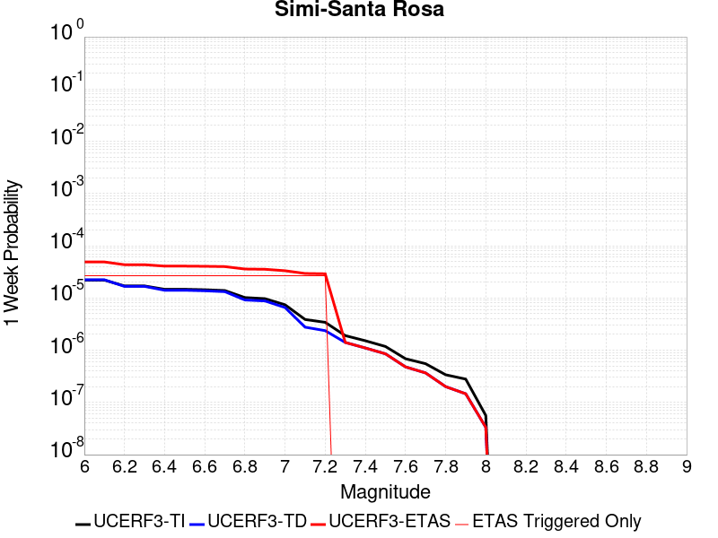 | 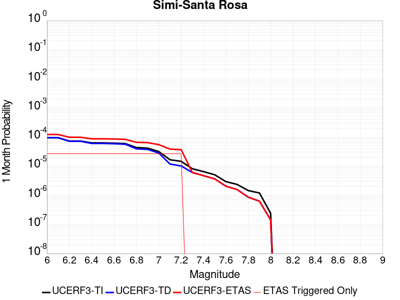 | 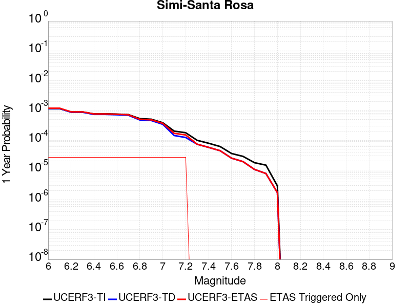 | 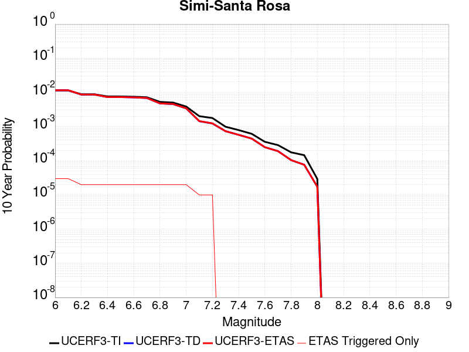 |

| Magnitude | 1 wk TI Prob | 1 wk TD Prob | 1 wk ETAS Prob | 1 wk ETAS/TD Gain | 1 wk ETAS Triggered Only | 1 mo TI Prob | 1 mo TD Prob | 1 mo ETAS Prob | 1 mo ETAS/TD Gain | 1 mo ETAS Triggered Only | 1 yr TI Prob | 1 yr TD Prob | 1 yr ETAS Prob | 1 yr ETAS/TD Gain | 1 yr ETAS Triggered Only | 10 yr TI Prob | 10 yr TD Prob | 10 yr ETAS Prob | 10 yr ETAS/TD Gain | 10 yr ETAS Triggered Only |
|-----|-----|-----|-----|-----|-----|-----|-----|-----|-----|-----|-----|-----|-----|-----|-----|-----|-----|-----|-----|-----|
| 6.0 | 2.198912E-5 | 2.2275442E-5 | 4.3146792E-5 | 1.9369669 | 2.0871816E-5 | 9.4235686E-5 | 9.5462936E-5 | 1.1633276E-4 | 1.2186171 | 2.0871816E-5 | 0.0011467156 | 0.0011616853 | 0.001182533 | 1.017946 | 2.0871816E-5 | 0.011408163 | 0.011560575 | 0.011591521 | 1.0026768 | 3.1307725E-5 |
| 6.1 | 2.198912E-5 | 2.2275442E-5 | 4.3146792E-5 | 1.9369669 | 2.0871816E-5 | 9.4235686E-5 | 9.5462936E-5 | 1.1633276E-4 | 1.2186171 | 2.0871816E-5 | 0.0011467156 | 0.0011616853 | 0.001182533 | 1.017946 | 2.0871816E-5 | 0.011408163 | 0.011560575 | 0.011591521 | 1.0026768 | 3.1307725E-5 |
| 6.2 | 1.69983E-5 | 1.6668559E-5 | 3.7540027E-5 | 2.2521458 | 2.0871816E-5 | 7.284782E-5 | 7.143489E-5 | 9.2305214E-5 | 1.2921587 | 2.0871816E-5 | 8.865613E-4 | 8.6940196E-4 | 8.902556E-4 | 1.0239862 | 2.0871816E-5 | 0.008830327 | 0.008662928 | 0.008683618 | 1.0023885 | 2.0871816E-5 |
| 6.3 | 1.69983E-5 | 1.6668559E-5 | 3.7540027E-5 | 2.2521458 | 2.0871816E-5 | 7.284782E-5 | 7.143489E-5 | 9.2305214E-5 | 1.2921587 | 2.0871816E-5 | 8.865613E-4 | 8.6940196E-4 | 8.902556E-4 | 1.0239862 | 2.0871816E-5 | 0.008830327 | 0.008662928 | 0.008683618 | 1.0023885 | 2.0871816E-5 |
| 6.4 | 1.4666188E-5 | 1.4052543E-5 | 3.4924065E-5 | 2.4852488 | 2.0871816E-5 | 6.285358E-5 | 6.0223934E-5 | 8.109449E-5 | 1.3465493 | 2.0871816E-5 | 7.6497364E-4 | 7.3300465E-4 | 7.5386115E-4 | 1.0284535 | 2.0871816E-5 | 0.0076234564 | 0.007308344 | 0.0073290635 | 1.002835 | 2.0871816E-5 |
| 6.5 | 1.4666188E-5 | 1.4052543E-5 | 3.4924065E-5 | 2.4852488 | 2.0871816E-5 | 6.285358E-5 | 6.0223934E-5 | 8.109449E-5 | 1.3465493 | 2.0871816E-5 | 7.6497364E-4 | 7.3300465E-4 | 7.5386115E-4 | 1.0284535 | 2.0871816E-5 | 0.0076234564 | 0.007308344 | 0.0073290635 | 1.002835 | 2.0871816E-5 |
| 6.6 | 1.4377586E-5 | 1.3729583E-5 | 3.460111E-5 | 2.5201867 | 2.0871816E-5 | 6.1616774E-5 | 5.883988E-5 | 7.9710466E-5 | 1.3547014 | 2.0871816E-5 | 7.4992597E-4 | 7.1616494E-4 | 7.370218E-4 | 1.029123 | 2.0871816E-5 | 0.007474003 | 0.0071410383 | 0.007161761 | 1.0029019 | 2.0871816E-5 |
| 6.7 | 1.3881404E-5 | 1.320755E-5 | 3.407909E-5 | 2.5802734 | 2.0871816E-5 | 5.9490372E-5 | 5.66027E-5 | 7.7473334E-5 | 1.3687215 | 2.0871816E-5 | 7.240546E-4 | 6.8894465E-4 | 7.098021E-4 | 1.0302745 | 2.0871816E-5 | 0.007217 | 0.006870538 | 0.0068912664 | 1.003017 | 2.0871816E-5 |
| 6.8 | 1.0176516E-5 | 9.154151E-6 | 3.0025774E-5 | 3.2800176 | 2.0871816E-5 | 4.3612912E-5 | 3.9231574E-5 | 6.010257E-5 | 1.5319948 | 2.0871816E-5 | 5.308578E-4 | 4.7755634E-4 | 4.984182E-4 | 1.0436846 | 2.0871816E-5 | 0.0052959146 | 0.004766934 | 0.004787707 | 1.0043576 | 2.0871816E-5 |
| 6.9 | 9.699797E-6 | 8.774719E-6 | 2.9646353E-5 | 3.3786097 | 2.0871816E-5 | 4.15699E-5 | 3.7605492E-5 | 5.8476522E-5 | 1.5549996 | 2.0871816E-5 | 5.05996E-4 | 4.577671E-4 | 4.7862937E-4 | 1.045574 | 2.0871816E-5 | 0.005048454 | 0.0045698597 | 0.004590636 | 1.0045464 | 2.0871816E-5 |
| 7.0 | 7.4049476E-6 | 6.559333E-6 | 2.7431011E-5 | 4.181982 | 2.0871816E-5 | 3.1735104E-5 | 2.8111197E-5 | 4.8982427E-5 | 1.7424525 | 2.0871816E-5 | 3.8630638E-4 | 3.422127E-4 | 3.630774E-4 | 1.06097 | 2.0871816E-5 | 0.0038563553 | 0.0034180996 | 0.0034389002 | 1.0060854 | 2.0871816E-5 |
| 7.1 | 3.873439E-6 | 2.7595095E-6 | 1.3195388E-5 | 4.781788 | 1.0435908E-5 | 1.6600346E-5 | 1.1826417E-5 | 2.2262202E-5 | 1.882413 | 1.0435908E-5 | 2.0209046E-4 | 1.4397735E-4 | 1.5441175E-4 | 1.0724726 | 1.0435908E-5 | 0.0020190678 | 0.0014388643 | 0.0014492852 | 1.0072424 | 1.0435908E-5 |
| 7.2 | 3.417706E-6 | 2.3676484E-6 | 1.2803532E-5 | 5.4076996 | 1.0435908E-5 | 1.4647229E-5 | 1.0147027E-5 | 2.058283E-5 | 2.028459 | 1.0435908E-5 | 1.7831543E-4 | 1.2353327E-4 | 1.3396789E-4 | 1.0844681 | 1.0435908E-5 | 0.0017817242 | 0.0012346683 | 0.0012450913 | 1.0084419 | 1.0435908E-5 |
| 7.3 | 1.90225E-6 | 1.4073753E-6 | 1.4073753E-6 | 1.0 | 0.0 | 8.152474E-6 | 6.0315947E-6 | 6.0315947E-6 | 1.0 | 0.0 | 9.9251854E-5 | 7.343221E-5 | 7.343221E-5 | 1.0 | 0.0 | 9.920754E-4 | 7.340817E-4 | 7.340817E-4 | 1.0 | 0.0 |
| 7.4 | 1.5170556E-6 | 1.1024773E-6 | 1.1024773E-6 | 1.0 | 0.0 | 6.5016507E-6 | 4.724894E-6 | 4.724894E-6 | 1.0 | 0.0 | 7.915472E-5 | 5.7524077E-5 | 5.7524077E-5 | 1.0 | 0.0 | 7.9126534E-4 | 5.7509297E-4 | 5.7509297E-4 | 1.0 | 0.0 |
| 7.5 | 1.178732E-6 | 8.535102E-7 | 8.535102E-7 | 1.0 | 0.0 | 5.0516987E-6 | 3.6578958E-6 | 3.6578958E-6 | 1.0 | 0.0 | 6.1502695E-5 | 4.453398E-5 | 4.453398E-5 | 1.0 | 0.0 | 6.148568E-4 | 4.452515E-4 | 4.452515E-4 | 1.0 | 0.0 |
| 7.6 | 6.8722386E-7 | 4.793198E-7 | 4.793198E-7 | 1.0 | 0.0 | 2.9452417E-6 | 2.054226E-6 | 2.054226E-6 | 1.0 | 0.0 | 3.5857727E-5 | 2.5009915E-5 | 2.5009915E-5 | 1.0 | 0.0 | 3.5851944E-4 | 2.5007114E-4 | 2.5007114E-4 | 1.0 | 0.0 |
| 7.7 | 5.5126515E-7 | 3.6731157E-7 | 3.6731157E-7 | 1.0 | 0.0 | 2.3625628E-6 | 1.5741915E-6 | 1.5741915E-6 | 1.0 | 0.0 | 2.8763823E-5 | 1.9165615E-5 | 1.9165615E-5 | 1.0 | 0.0 | 2.87601E-4 | 1.9163972E-4 | 1.9163972E-4 | 1.0 | 0.0 |
| 7.8 | 3.3860243E-7 | 2.0075942E-7 | 2.0075942E-7 | 1.0 | 0.0 | 1.4511525E-6 | 8.6039717E-7 | 8.6039717E-7 | 1.0 | 0.0 | 1.7667637E-5 | 1.0475286E-5 | 1.0475286E-5 | 1.0 | 0.0 | 1.7666233E-4 | 1.04747975E-4 | 1.04747975E-4 | 1.0 | 0.0 |
| 7.9 | 2.7955386E-7 | 1.4649108E-7 | 1.4649108E-7 | 1.0 | 0.0 | 1.1980875E-6 | 6.278188E-7 | 6.278188E-7 | 1.0 | 0.0 | 1.4586617E-5 | 7.643667E-6 | 7.643667E-6 | 1.0 | 0.0 | 1.458566E-4 | 7.643409E-5 | 7.643409E-5 | 1.0 | 0.0 |
| 8.0 | 5.6259015E-8 | 3.3355324E-8 | 3.3355324E-8 | 1.0 | 0.0 | 2.4111003E-7 | 1.4295138E-7 | 1.4295138E-7 | 1.0 | 0.0 | 2.9355108E-6 | 1.7404317E-6 | 1.7404317E-6 | 1.0 | 0.0 | 2.935472E-5 | 1.7404194E-5 | 1.7404194E-5 | 1.0 | 0.0 |

## White Wolf
*[(top)](#table-of-contents)*

| 1 Week | 1 Month | 1 Year | 10 Year |
|-----|-----|-----|-----|
| 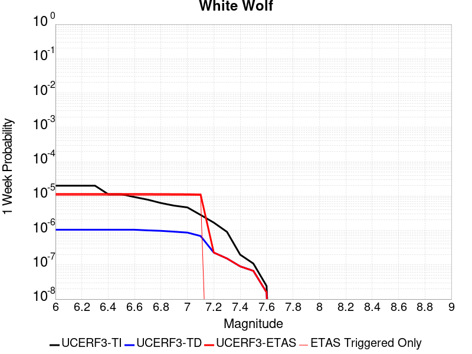 | 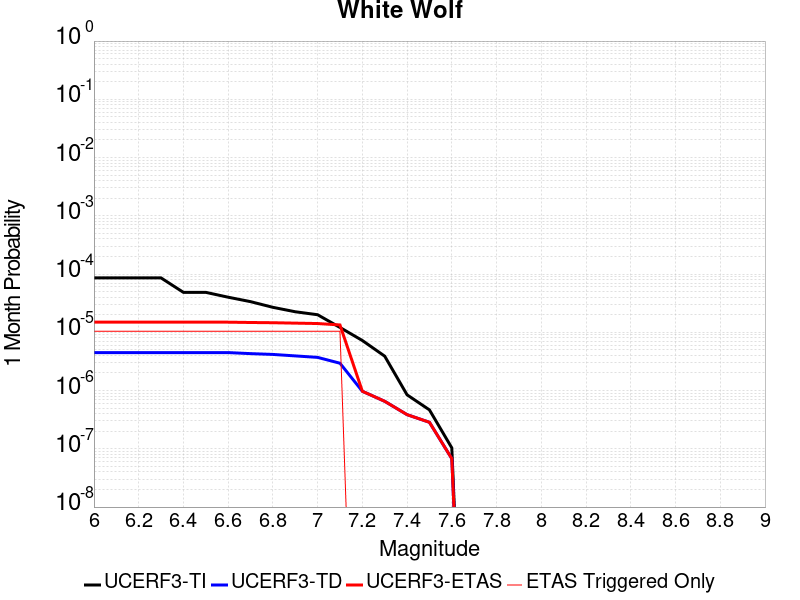 | 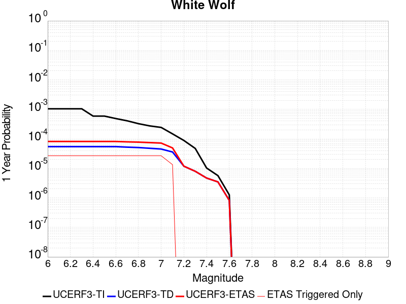 | 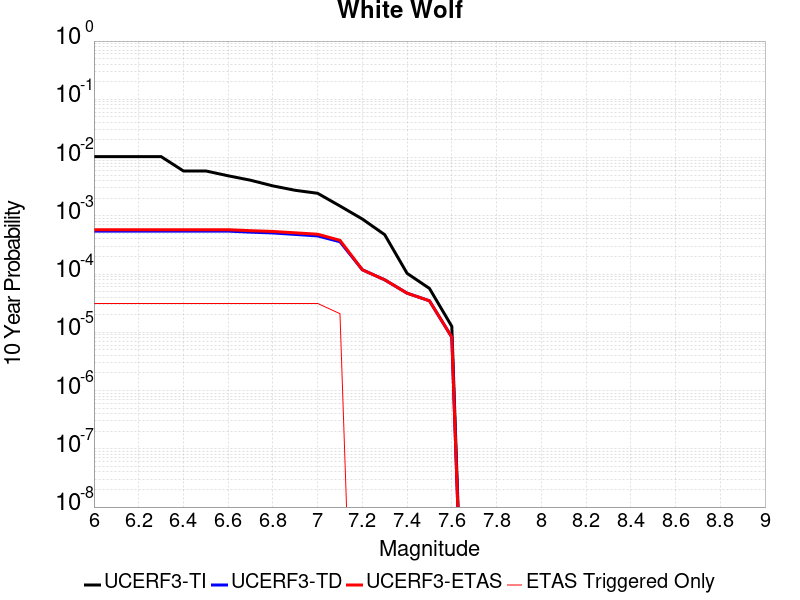 |

| Magnitude | 1 wk TI Prob | 1 wk TD Prob | 1 wk ETAS Prob | 1 wk ETAS/TD Gain | 1 wk ETAS Triggered Only | 1 mo TI Prob | 1 mo TD Prob | 1 mo ETAS Prob | 1 mo ETAS/TD Gain | 1 mo ETAS Triggered Only | 1 yr TI Prob | 1 yr TD Prob | 1 yr ETAS Prob | 1 yr ETAS/TD Gain | 1 yr ETAS Triggered Only | 10 yr TI Prob | 10 yr TD Prob | 10 yr ETAS Prob | 10 yr ETAS/TD Gain | 10 yr ETAS Triggered Only |
|-----|-----|-----|-----|-----|-----|-----|-----|-----|-----|-----|-----|-----|-----|-----|-----|-----|-----|-----|-----|-----|
| 6.0 | 2.0037822E-5 | 1.0469162E-6 | 1.14828135E-5 | 10.968226 | 1.0435908E-5 | 8.587355E-5 | 4.486776E-6 | 1.4922637E-5 | 3.3259153 | 1.0435908E-5 | 0.001045009 | 5.4625183E-5 | 7.549586E-5 | 1.3820705 | 2.0871816E-5 | 0.010401085 | 5.461226E-4 | 5.7741324E-4 | 1.0572959 | 3.1307725E-5 |
| 6.1 | 2.0037822E-5 | 1.0469162E-6 | 1.14828135E-5 | 10.968226 | 1.0435908E-5 | 8.587355E-5 | 4.486776E-6 | 1.4922637E-5 | 3.3259153 | 1.0435908E-5 | 0.001045009 | 5.4625183E-5 | 7.549586E-5 | 1.3820705 | 2.0871816E-5 | 0.010401085 | 5.461226E-4 | 5.7741324E-4 | 1.0572959 | 3.1307725E-5 |
| 6.2 | 2.0037822E-5 | 1.0469162E-6 | 1.14828135E-5 | 10.968226 | 1.0435908E-5 | 8.587355E-5 | 4.486776E-6 | 1.4922637E-5 | 3.3259153 | 1.0435908E-5 | 0.001045009 | 5.4625183E-5 | 7.549586E-5 | 1.3820705 | 2.0871816E-5 | 0.010401085 | 5.461226E-4 | 5.7741324E-4 | 1.0572959 | 3.1307725E-5 |
| 6.3 | 2.0037822E-5 | 1.0469162E-6 | 1.14828135E-5 | 10.968226 | 1.0435908E-5 | 8.587355E-5 | 4.486776E-6 | 1.4922637E-5 | 3.3259153 | 1.0435908E-5 | 0.001045009 | 5.4625183E-5 | 7.549586E-5 | 1.3820705 | 2.0871816E-5 | 0.010401085 | 5.461226E-4 | 5.7741324E-4 | 1.0572959 | 3.1307725E-5 |
| 6.4 | 1.132487E-5 | 1.0469162E-6 | 1.14828135E-5 | 10.968226 | 1.0435908E-5 | 4.8534253E-5 | 4.486776E-6 | 1.4922637E-5 | 3.3259153 | 1.0435908E-5 | 5.907443E-4 | 5.4625183E-5 | 7.549586E-5 | 1.3820705 | 2.0871816E-5 | 0.005891764 | 5.461226E-4 | 5.7741324E-4 | 1.0572959 | 3.1307725E-5 |
| 6.5 | 1.132487E-5 | 1.0469162E-6 | 1.14828135E-5 | 10.968226 | 1.0435908E-5 | 4.8534253E-5 | 4.486776E-6 | 1.4922637E-5 | 3.3259153 | 1.0435908E-5 | 5.907443E-4 | 5.4625183E-5 | 7.549586E-5 | 1.3820705 | 2.0871816E-5 | 0.005891764 | 5.461226E-4 | 5.7741324E-4 | 1.0572959 | 3.1307725E-5 |
| 6.6 | 9.347473E-6 | 1.0469162E-6 | 1.14828135E-5 | 10.968226 | 1.0435908E-5 | 4.0059982E-5 | 4.486776E-6 | 1.4922637E-5 | 3.3259153 | 1.0435908E-5 | 4.8762115E-4 | 5.4625183E-5 | 7.549586E-5 | 1.3820705 | 2.0871816E-5 | 0.0048655253 | 5.461226E-4 | 5.7741324E-4 | 1.0572959 | 3.1307725E-5 |
| 6.7 | 7.842647E-6 | 1.0048342E-6 | 1.1440731E-5 | 11.385691 | 1.0435908E-5 | 3.361091E-5 | 4.3064256E-6 | 1.4742288E-5 | 3.4233236 | 1.0435908E-5 | 4.0913603E-4 | 5.2429517E-5 | 7.330024E-5 | 1.398072 | 2.0871816E-5 | 0.004083836 | 5.2417646E-4 | 5.5546773E-4 | 1.0596962 | 3.1307725E-5 |
| 6.8 | 6.26597E-6 | 9.734822E-7 | 1.140938E-5 | 11.720173 | 1.0435908E-5 | 2.685388E-5 | 4.17206E-6 | 1.4607925E-5 | 3.5013695 | 1.0435908E-5 | 3.2689696E-4 | 5.0793697E-5 | 7.166446E-5 | 1.4108926 | 2.0871816E-5 | 0.003264165 | 5.078258E-4 | 5.391176E-4 | 1.0616192 | 3.1307725E-5 |
| 6.9 | 5.258436E-6 | 9.183254E-7 | 1.1354224E-5 | 12.364053 | 1.0435908E-5 | 2.2535958E-5 | 3.9356746E-6 | 1.43715415E-5 | 3.6516082 | 1.0435908E-5 | 2.7434074E-4 | 4.7915833E-5 | 6.878665E-5 | 1.4355724 | 2.0871816E-5 | 0.0027400232 | 4.790598E-4 | 5.1035255E-4 | 1.0653211 | 3.1307725E-5 |
| 7.0 | 4.675028E-6 | 8.6611794E-7 | 1.1302017E-5 | 13.04905 | 1.0435908E-5 | 2.003568E-5 | 3.7119291E-6 | 1.41477985E-5 | 3.811441 | 1.0435908E-5 | 2.4390711E-4 | 4.5191846E-5 | 6.606272E-5 | 1.4618282 | 2.0871816E-5 | 0.0024363957 | 4.518313E-4 | 4.8312487E-4 | 1.0692594 | 3.1307725E-5 |
| 7.1 | 2.8270078E-6 | 6.8741696E-7 | 1.1123318E-5 | 16.181326 | 1.0435908E-5 | 1.2115692E-5 | 2.9460696E-6 | 1.3381947E-5 | 4.542305 | 1.0435908E-5 | 1.4749856E-4 | 3.5867848E-5 | 4.6303383E-5 | 1.290944 | 1.0435908E-5 | 0.001474007 | 3.586247E-4 | 3.79489E-4 | 1.0581788 | 2.0871816E-5 |
| 7.2 | 1.6881406E-6 | 2.2706382E-7 | 2.2706382E-7 | 1.0 | 0.0 | 7.2348685E-6 | 9.731303E-7 | 9.731303E-7 | 1.0 | 0.0 | 8.808096E-5 | 1.1847799E-5 | 1.1847799E-5 | 1.0 | 0.0 | 8.8046055E-4 | 1.1847183E-4 | 1.1847183E-4 | 1.0 | 0.0 |
| 7.3 | 9.086107E-7 | 1.5266386E-7 | 1.5266386E-7 | 1.0 | 0.0 | 3.8940398E-6 | 6.5427355E-7 | 6.5427355E-7 | 1.0 | 0.0 | 4.7408903E-5 | 7.965752E-6 | 7.965752E-6 | 1.0 | 0.0 | 4.739879E-4 | 7.965475E-5 | 7.965475E-5 | 1.0 | 0.0 |
| 7.4 | 1.9717383E-7 | 9.003913E-8 | 9.003913E-8 | 1.0 | 0.0 | 8.450304E-7 | 3.8588192E-7 | 3.8588192E-7 | 1.0 | 0.0 | 1.0288197E-5 | 4.6981027E-6 | 4.6981027E-6 | 1.0 | 0.0 | 1.028772E-4 | 4.6980065E-5 | 4.6980065E-5 | 1.0 | 0.0 |
| 7.5 | 1.086975E-7 | 6.6597195E-8 | 6.6597195E-8 | 1.0 | 0.0 | 4.6584634E-7 | 2.8541652E-7 | 2.8541652E-7 | 1.0 | 0.0 | 5.6716644E-6 | 3.474941E-6 | 3.474941E-6 | 1.0 | 0.0 | 5.6715195E-5 | 3.474889E-5 | 3.474889E-5 | 1.0 | 0.0 |
| 7.6 | 2.4217808E-8 | 1.5820765E-8 | 1.5820765E-8 | 1.0 | 0.0 | 1.03790605E-7 | 6.780328E-8 | 6.780328E-8 | 1.0 | 0.0 | 1.2636499E-6 | 8.255046E-7 | 8.255046E-7 | 1.0 | 0.0 | 1.2636427E-5 | 8.2550205E-6 | 8.2550205E-6 | 1.0 | 0.0 |

## La Panza 2011
*[(top)](#table-of-contents)*

| 1 Week | 1 Month | 1 Year | 10 Year |
|-----|-----|-----|-----|
| 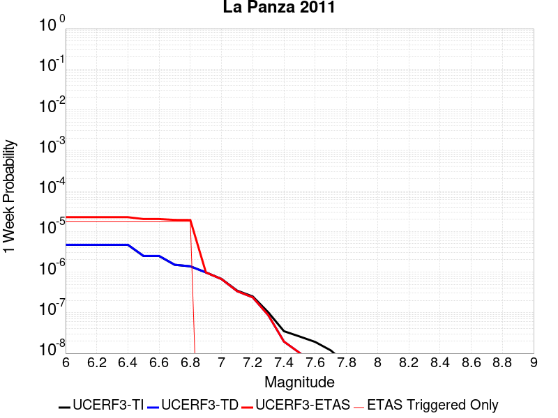 | 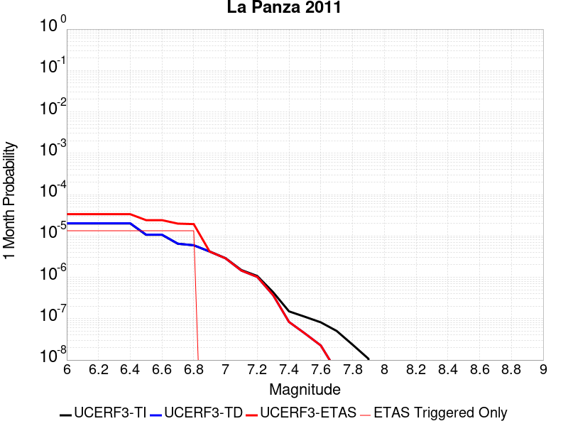 | 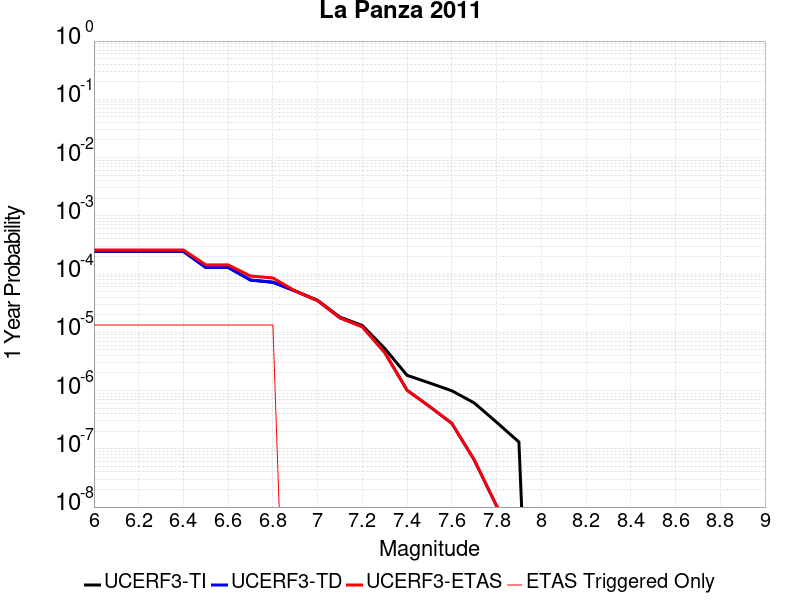 | 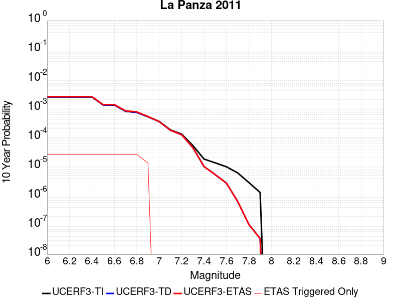 |

| Magnitude | 1 wk TI Prob | 1 wk TD Prob | 1 wk ETAS Prob | 1 wk ETAS/TD Gain | 1 wk ETAS Triggered Only | 1 mo TI Prob | 1 mo TD Prob | 1 mo ETAS Prob | 1 mo ETAS/TD Gain | 1 mo ETAS Triggered Only | 1 yr TI Prob | 1 yr TD Prob | 1 yr ETAS Prob | 1 yr ETAS/TD Gain | 1 yr ETAS Triggered Only | 10 yr TI Prob | 10 yr TD Prob | 10 yr ETAS Prob | 10 yr ETAS/TD Gain | 10 yr ETAS Triggered Only |
|-----|-----|-----|-----|-----|-----|-----|-----|-----|-----|-----|-----|-----|-----|-----|-----|-----|-----|-----|-----|-----|
| 6.0 | 4.6754544E-6 | 4.717587E-6 | 2.5589305E-5 | 5.424236 | 2.0871816E-5 | 2.0037509E-5 | 2.0218084E-5 | 4.108948E-5 | 2.032313 | 2.0871816E-5 | 2.4392935E-4 | 2.4612935E-4 | 2.66996E-4 | 1.0847793 | 2.0871816E-5 | 0.0024366176 | 0.002458762 | 0.0024899927 | 1.0127019 | 3.1307725E-5 |
| 6.1 | 4.6754544E-6 | 4.717587E-6 | 2.5589305E-5 | 5.424236 | 2.0871816E-5 | 2.0037509E-5 | 2.0218084E-5 | 4.108948E-5 | 2.032313 | 2.0871816E-5 | 2.4392935E-4 | 2.4612935E-4 | 2.66996E-4 | 1.0847793 | 2.0871816E-5 | 0.0024366176 | 0.002458762 | 0.0024899927 | 1.0127019 | 3.1307725E-5 |
| 6.2 | 4.6754544E-6 | 4.717587E-6 | 2.5589305E-5 | 5.424236 | 2.0871816E-5 | 2.0037509E-5 | 2.0218084E-5 | 4.108948E-5 | 2.032313 | 2.0871816E-5 | 2.4392935E-4 | 2.4612935E-4 | 2.66996E-4 | 1.0847793 | 2.0871816E-5 | 0.0024366176 | 0.002458762 | 0.0024899927 | 1.0127019 | 3.1307725E-5 |
| 6.3 | 4.6754544E-6 | 4.717587E-6 | 2.5589305E-5 | 5.424236 | 2.0871816E-5 | 2.0037509E-5 | 2.0218084E-5 | 4.108948E-5 | 2.032313 | 2.0871816E-5 | 2.4392935E-4 | 2.4612935E-4 | 2.66996E-4 | 1.0847793 | 2.0871816E-5 | 0.0024366176 | 0.002458762 | 0.0024899927 | 1.0127019 | 3.1307725E-5 |
| 6.4 | 4.6754544E-6 | 4.717587E-6 | 2.5589305E-5 | 5.424236 | 2.0871816E-5 | 2.0037509E-5 | 2.0218084E-5 | 4.108948E-5 | 2.032313 | 2.0871816E-5 | 2.4392935E-4 | 2.4612935E-4 | 2.66996E-4 | 1.0847793 | 2.0871816E-5 | 0.0024366176 | 0.002458762 | 0.0024899927 | 1.0127019 | 3.1307725E-5 |
| 6.5 | 2.485343E-6 | 2.5005988E-6 | 2.3372362E-5 | 9.346705 | 2.0871816E-5 | 1.0651426E-5 | 1.0716811E-5 | 3.1588403E-5 | 2.9475563 | 2.0871816E-5 | 1.296734E-4 | 1.3046975E-4 | 1.5133884E-4 | 1.1599535 | 2.0871816E-5 | 0.0012959775 | 0.0013039699 | 0.0013352368 | 1.0239782 | 3.1307725E-5 |
| 6.6 | 2.485343E-6 | 2.5005988E-6 | 2.3372362E-5 | 9.346705 | 2.0871816E-5 | 1.0651426E-5 | 1.0716811E-5 | 3.1588403E-5 | 2.9475563 | 2.0871816E-5 | 1.296734E-4 | 1.3046975E-4 | 1.5133884E-4 | 1.1599535 | 2.0871816E-5 | 0.0012959775 | 0.0013039699 | 0.0013352368 | 1.0239782 | 3.1307725E-5 |
| 6.7 | 1.5108508E-6 | 1.5146375E-6 | 2.238642E-5 | 14.780053 | 2.0871816E-5 | 6.4750584E-6 | 6.491288E-6 | 2.7362968E-5 | 4.2153373 | 2.0871816E-5 | 7.8830984E-5 | 7.902867E-5 | 9.989884E-5 | 1.2640835 | 2.0871816E-5 | 7.880303E-4 | 7.900165E-4 | 8.212995E-4 | 1.0395979 | 3.1307725E-5 |
| 6.8 | 1.3865837E-6 | 1.3885102E-6 | 2.2260298E-5 | 16.031786 | 2.0871816E-5 | 5.942488E-6 | 5.9507447E-6 | 2.6822436E-5 | 4.507408 | 2.0871816E-5 | 7.234739E-5 | 7.244801E-5 | 9.331831E-5 | 1.2880728 | 2.0871816E-5 | 7.232384E-4 | 7.242537E-4 | 7.5553876E-4 | 1.0431962 | 3.1307725E-5 |
| 6.9 | 9.826583E-7 | 9.796287E-7 | 1.1415526E-5 | 11.652912 | 1.0435908E-5 | 4.2113857E-6 | 4.198402E-6 | 1.4634266E-5 | 3.4856753 | 1.0435908E-5 | 5.1272415E-5 | 5.11144E-5 | 6.154978E-5 | 1.2041572 | 1.0435908E-5 | 5.126059E-4 | 5.110318E-4 | 5.3189293E-4 | 1.0408217 | 2.0871816E-5 |
| 7.0 | 6.7797646E-7 | 6.7102144E-7 | 1.1106922E-5 | 16.552261 | 1.0435908E-5 | 2.9056102E-6 | 2.8758034E-6 | 1.3311681E-5 | 4.6288567 | 1.0435908E-5 | 3.537523E-5 | 3.5012374E-5 | 4.5447916E-5 | 1.298053 | 1.0435908E-5 | 3.5369597E-4 | 3.5007167E-4 | 3.6050394E-4 | 1.0298003 | 1.0435908E-5 |
| 7.1 | 3.4979826E-7 | 3.387388E-7 | 3.387388E-7 | 1.0 | 0.0 | 1.4991346E-6 | 1.4517369E-6 | 1.4517369E-6 | 1.0 | 0.0 | 1.825181E-5 | 1.7674765E-5 | 1.7674765E-5 | 1.0 | 0.0 | 1.825031E-4 | 1.7673477E-4 | 1.7673477E-4 | 1.0 | 0.0 |
| 7.2 | 2.5088332E-7 | 2.3831899E-7 | 2.3831899E-7 | 1.0 | 0.0 | 1.0752137E-6 | 1.0213668E-6 | 1.0213668E-6 | 1.0 | 0.0 | 1.3090649E-5 | 1.2435077E-5 | 1.2435077E-5 | 1.0 | 0.0 | 1.3089878E-4 | 1.2434467E-4 | 1.2434467E-4 | 1.0 | 0.0 |
| 7.3 | 1.0159086E-7 | 8.64462E-8 | 8.64462E-8 | 1.0 | 0.0 | 4.3538932E-7 | 3.7048366E-7 | 3.7048366E-7 | 1.0 | 0.0 | 5.300852E-6 | 4.5106294E-6 | 4.5106294E-6 | 1.0 | 0.0 | 5.3007258E-5 | 4.5105422E-5 | 4.5105422E-5 | 1.0 | 0.0 |
| 7.4 | 3.5006252E-8 | 1.9404325E-8 | 1.9404325E-8 | 1.0 | 0.0 | 1.5002678E-7 | 8.3161396E-8 | 8.3161396E-8 | 1.0 | 0.0 | 1.8265745E-6 | 1.0124895E-6 | 1.0124895E-6 | 1.0 | 0.0 | 1.8265595E-5 | 1.01248515E-5 | 1.01248515E-5 | 1.0 | 0.0 |
| 7.5 | 2.592274E-8 | 1.0239094E-8 | 1.0239094E-8 | 1.0 | 0.0 | 1.1109746E-7 | 4.388183E-8 | 4.388183E-8 | 1.0 | 0.0 | 1.3526106E-6 | 5.342612E-7 | 5.342612E-7 | 1.0 | 0.0 | 1.3526024E-5 | 5.3425997E-6 | 5.3425997E-6 | 1.0 | 0.0 |
| 7.6 | 1.9016717E-8 | 5.244801E-9 | 5.244801E-9 | 1.0 | 0.0 | 8.150022E-8 | 2.247772E-8 | 2.247772E-8 | 1.0 | 0.0 | 9.922647E-7 | 2.736662E-7 | 2.736662E-7 | 1.0 | 0.0 | 9.922603E-6 | 2.7366589E-6 | 2.7366589E-6 | 1.0 | 0.0 |
| 7.7 | 1.17738495E-8 | 1.2398075E-9 | 1.2398075E-9 | 1.0 | 0.0 | 5.0459356E-8 | 5.3134603E-9 | 5.3134603E-9 | 1.0 | 0.0 | 6.1434247E-7 | 6.469138E-8 | 6.469138E-8 | 1.0 | 0.0 | 6.143408E-6 | 6.469136E-7 | 6.469136E-7 | 1.0 | 0.0 |
| 7.8 | 5.489079E-9 | 2.0111768E-10 | 2.0111768E-10 | 1.0 | 0.0 | 2.3524624E-8 | 8.6193275E-10 | 8.6193275E-10 | 1.0 | 0.0 | 2.8641225E-7 | 1.04940305E-8 | 1.04940305E-8 | 1.0 | 0.0 | 2.8641189E-6 | 1.04940305E-7 | 1.04940305E-7 | 1.0 | 0.0 |
| 7.9 | 2.5081048E-9 | 6.683887E-11 | 6.683887E-11 | 1.0 | 0.0 | 1.0749021E-8 | 2.8645197E-10 | 2.8645197E-10 | 1.0 | 0.0 | 1.3086932E-7 | 3.487552E-9 | 3.487552E-9 | 1.0 | 0.0 | 1.3086925E-6 | 3.487552E-8 | 3.487552E-8 | 1.0 | 0.0 |

## Elsinore (Stepovers Combined)
*[(top)](#table-of-contents)*

| 1 Week | 1 Month | 1 Year | 10 Year |
|-----|-----|-----|-----|
| 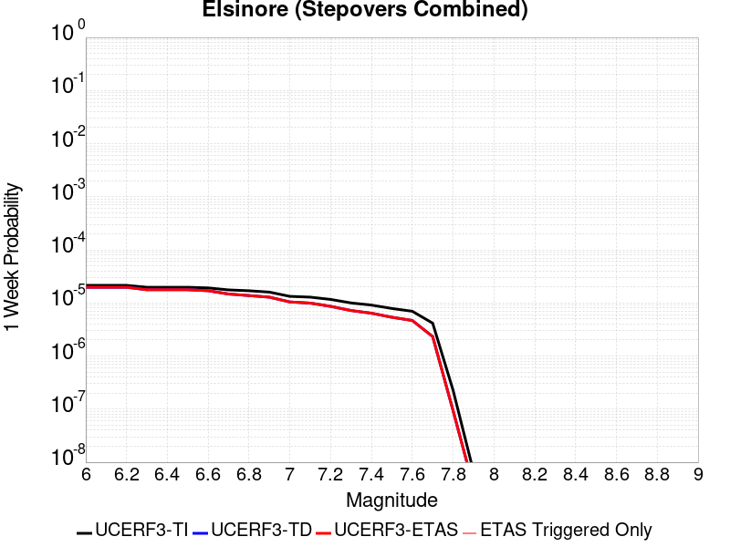 | 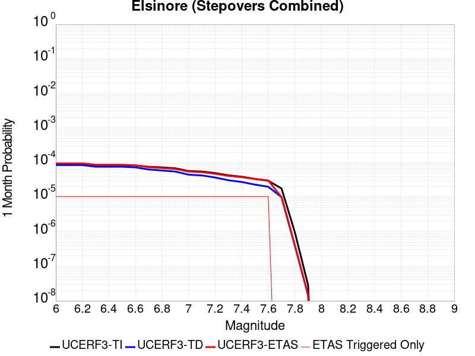 | 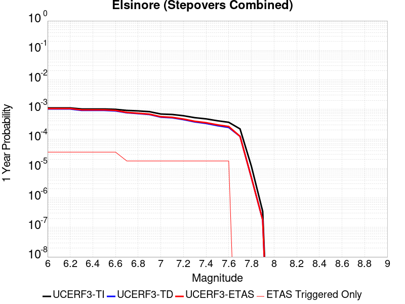 | 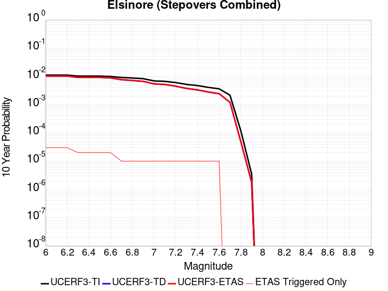 |

| Magnitude | 1 wk TI Prob | 1 wk TD Prob | 1 wk ETAS Prob | 1 wk ETAS/TD Gain | 1 wk ETAS Triggered Only | 1 mo TI Prob | 1 mo TD Prob | 1 mo ETAS Prob | 1 mo ETAS/TD Gain | 1 mo ETAS Triggered Only | 1 yr TI Prob | 1 yr TD Prob | 1 yr ETAS Prob | 1 yr ETAS/TD Gain | 1 yr ETAS Triggered Only | 10 yr TI Prob | 10 yr TD Prob | 10 yr ETAS Prob | 10 yr ETAS/TD Gain | 10 yr ETAS Triggered Only |
|-----|-----|-----|-----|-----|-----|-----|-----|-----|-----|-----|-----|-----|-----|-----|-----|-----|-----|-----|-----|-----|
| 6.0 | 2.144392E-5 | 1.9760193E-5 | 1.9760193E-5 | 1.0 | 0.0 | 9.189928E-5 | 8.468392E-5 | 9.5118936E-5 | 1.1232232 | 1.0435908E-5 | 0.0011182994 | 0.0010305607 | 0.001051411 | 1.020232 | 2.0871816E-5 | 0.011126885 | 0.010264917 | 0.010295904 | 1.0030186 | 3.1307725E-5 |
| 6.1 | 2.144392E-5 | 1.9760193E-5 | 1.9760193E-5 | 1.0 | 0.0 | 9.189928E-5 | 8.468392E-5 | 9.5118936E-5 | 1.1232232 | 1.0435908E-5 | 0.0011182994 | 0.0010305607 | 0.001051411 | 1.020232 | 2.0871816E-5 | 0.011126885 | 0.010264917 | 0.010295904 | 1.0030186 | 3.1307725E-5 |
| 6.2 | 2.144392E-5 | 1.9760193E-5 | 1.9760193E-5 | 1.0 | 0.0 | 9.189928E-5 | 8.468392E-5 | 9.5118936E-5 | 1.1232232 | 1.0435908E-5 | 0.0011182994 | 0.0010305607 | 0.001051411 | 1.020232 | 2.0871816E-5 | 0.011126885 | 0.010264917 | 0.010295904 | 1.0030186 | 3.1307725E-5 |
| 6.3 | 1.9751555E-5 | 1.7741453E-5 | 1.7741453E-5 | 1.0 | 0.0 | 8.4646774E-5 | 7.603267E-5 | 8.6467786E-5 | 1.1372452 | 1.0435908E-5 | 0.0010300872 | 9.253213E-4 | 9.461738E-4 | 1.0225354 | 2.0871816E-5 | 0.010253254 | 0.009221276 | 0.009241955 | 1.0022426 | 2.0871816E-5 |
| 6.4 | 1.9751555E-5 | 1.7741453E-5 | 1.7741453E-5 | 1.0 | 0.0 | 8.4646774E-5 | 7.603267E-5 | 8.6467786E-5 | 1.1372452 | 1.0435908E-5 | 0.0010300872 | 9.253213E-4 | 9.461738E-4 | 1.0225354 | 2.0871816E-5 | 0.010253254 | 0.009221276 | 0.009241955 | 1.0022426 | 2.0871816E-5 |
| 6.5 | 1.9751555E-5 | 1.7741453E-5 | 1.7741453E-5 | 1.0 | 0.0 | 8.4646774E-5 | 7.603267E-5 | 8.6467786E-5 | 1.1372452 | 1.0435908E-5 | 0.0010300872 | 9.253213E-4 | 9.461738E-4 | 1.0225354 | 2.0871816E-5 | 0.010253254 | 0.009221276 | 0.009241955 | 1.0022426 | 2.0871816E-5 |
| 6.6 | 1.9188685E-5 | 1.7003393E-5 | 1.7003393E-5 | 1.0 | 0.0 | 8.2234634E-5 | 7.286974E-5 | 8.330489E-5 | 1.1432028 | 1.0435908E-5 | 0.0010007467 | 8.868442E-4 | 9.076975E-4 | 1.023514 | 2.0871816E-5 | 0.00996252 | 0.0088398475 | 0.008860535 | 1.0023402 | 2.0871816E-5 |
| 6.7 | 1.7608272E-5 | 1.4732616E-5 | 1.4732616E-5 | 1.0 | 0.0 | 7.546184E-5 | 6.3138315E-5 | 7.357356E-5 | 1.165276 | 1.0435908E-5 | 9.183606E-4 | 7.684476E-4 | 7.788755E-4 | 1.0135701 | 1.0435908E-5 | 0.009145746 | 0.00766491 | 0.007675266 | 1.0013511 | 1.0435908E-5 |
| 6.8 | 1.697165E-5 | 1.3783365E-5 | 1.3783365E-5 | 1.0 | 0.0 | 7.273361E-5 | 5.9070277E-5 | 6.9505564E-5 | 1.1766589 | 1.0435908E-5 | 8.8517193E-4 | 7.18952E-4 | 7.293804E-4 | 1.014505 | 1.0435908E-5 | 0.008816543 | 0.007172675 | 0.007183036 | 1.0014445 | 1.0435908E-5 |
| 6.9 | 1.600365E-5 | 1.2846671E-5 | 1.2846671E-5 | 1.0 | 0.0 | 6.858527E-5 | 5.5056043E-5 | 6.5491375E-5 | 1.1895401 | 1.0435908E-5 | 8.347058E-4 | 6.7010894E-4 | 6.805379E-4 | 1.015563 | 1.0435908E-5 | 0.008315775 | 0.0066867657 | 0.0066971323 | 1.0015502 | 1.0435908E-5 |
| 7.0 | 1.3314581E-5 | 1.0447548E-5 | 1.0447548E-5 | 1.0 | 0.0 | 5.7061243E-5 | 4.4774453E-5 | 5.5209894E-5 | 1.2330668 | 1.0435908E-5 | 6.944992E-4 | 5.449953E-4 | 5.5542553E-4 | 1.0191382 | 1.0435908E-5 | 0.006923327 | 0.0054405155 | 0.0054508946 | 1.0019077 | 1.0435908E-5 |
| 7.1 | 1.2865345E-5 | 9.937536E-6 | 9.937536E-6 | 1.0 | 0.0 | 5.5136024E-5 | 4.258876E-5 | 5.302422E-5 | 1.2450286 | 1.0435908E-5 | 6.710743E-4 | 5.183973E-4 | 5.2882783E-4 | 1.0201206 | 1.0435908E-5 | 0.0066905143 | 0.0051752133 | 0.0051855952 | 1.002006 | 1.0435908E-5 |
| 7.2 | 1.1650051E-5 | 8.633809E-6 | 8.633809E-6 | 1.0 | 0.0 | 4.9927836E-5 | 3.7001522E-5 | 4.7437046E-5 | 1.2820295 | 1.0435908E-5 | 6.0770183E-4 | 4.504022E-4 | 4.608334E-4 | 1.0231597 | 1.0435908E-5 | 0.0060604266 | 0.0044963174 | 0.0045067063 | 1.0023105 | 1.0435908E-5 |
| 7.3 | 1.0008533E-5 | 7.2010425E-6 | 7.2010425E-6 | 1.0 | 0.0 | 4.2893007E-5 | 3.0861254E-5 | 4.129684E-5 | 1.3381453 | 1.0435908E-5 | 5.220972E-4 | 3.7567242E-4 | 3.8610442E-4 | 1.0277689 | 1.0435908E-5 | 0.005208723 | 0.003750761 | 0.0037611576 | 1.0027719 | 1.0435908E-5 |
| 7.4 | 9.116759E-6 | 6.410068E-6 | 6.410068E-6 | 1.0 | 0.0 | 3.907124E-5 | 2.747144E-5 | 3.7907063E-5 | 1.3798716 | 1.0435908E-5 | 4.7558855E-4 | 3.3441483E-4 | 3.4484724E-4 | 1.031196 | 1.0435908E-5 | 0.00474572 | 0.0033392678 | 0.003349669 | 1.0031148 | 1.0435908E-5 |
| 7.5 | 7.870524E-6 | 5.3825365E-6 | 5.3825365E-6 | 1.0 | 0.0 | 3.3730383E-5 | 2.3067816E-5 | 3.3503482E-5 | 1.4523908 | 1.0435908E-5 | 4.1059E-4 | 2.8081573E-4 | 2.9124873E-4 | 1.0371524 | 1.0435908E-5 | 0.0040983222 | 0.0028047354 | 0.0028151423 | 1.0037104 | 1.0435908E-5 |
| 7.6 | 6.9774537E-6 | 4.6776067E-6 | 4.6776067E-6 | 1.0 | 0.0 | 2.990303E-5 | 2.0046738E-5 | 3.0482437E-5 | 1.5205684 | 1.0435908E-5 | 3.640086E-4 | 2.4404288E-4 | 2.5447624E-4 | 1.0427521 | 1.0435908E-5 | 0.003634129 | 0.0024378651 | 0.0024482755 | 1.0042703 | 1.0435908E-5 |
| 7.7 | 4.1616954E-6 | 2.32834E-6 | 2.32834E-6 | 1.0 | 0.0 | 1.7835715E-5 | 9.978567E-6 | 9.978567E-6 | 1.0 | 0.0 | 2.171282E-4 | 1.2148302E-4 | 1.2148302E-4 | 1.0 | 0.0 | 0.0021691616 | 0.0012142392 | 0.0012142392 | 1.0 | 0.0 |
| 7.8 | 2.2692414E-7 | 9.3854695E-8 | 9.3854695E-8 | 1.0 | 0.0 | 9.725317E-7 | 4.0223435E-7 | 4.0223435E-7 | 1.0 | 0.0 | 1.1840509E-5 | 4.8971956E-6 | 4.8971956E-6 | 1.0 | 0.0 | 1.1839878E-4 | 4.8971204E-5 | 4.8971204E-5 | 1.0 | 0.0 |
| 7.9 | 6.676829E-9 | 3.439853E-9 | 3.439853E-9 | 1.0 | 0.0 | 2.861498E-8 | 1.4742227E-8 | 1.4742227E-8 | 1.0 | 0.0 | 3.4838732E-7 | 1.7948659E-7 | 1.7948659E-7 | 1.0 | 0.0 | 3.4838679E-6 | 1.7948646E-6 | 1.7948646E-6 | 1.0 | 0.0 |

## Channel Islands Western Deep Ramp
*[(top)](#table-of-contents)*

| 1 Week | 1 Month | 1 Year | 10 Year |
|-----|-----|-----|-----|
|  | 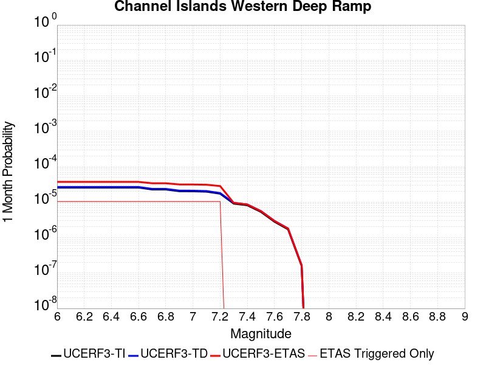 | 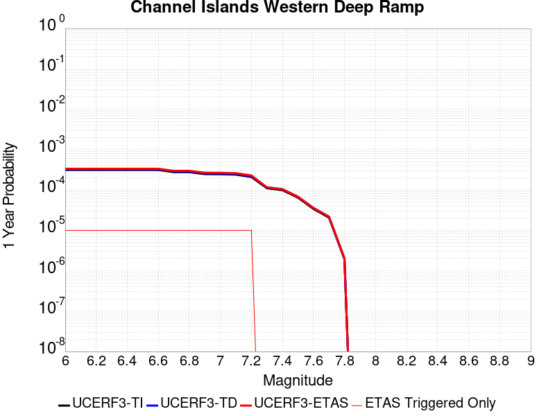 | 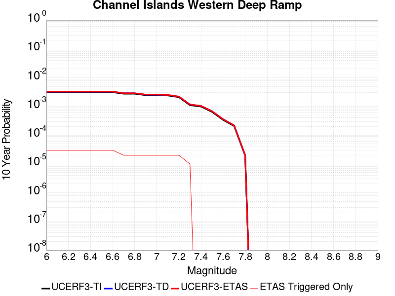 |

| Magnitude | 1 wk TI Prob | 1 wk TD Prob | 1 wk ETAS Prob | 1 wk ETAS/TD Gain | 1 wk ETAS Triggered Only | 1 mo TI Prob | 1 mo TD Prob | 1 mo ETAS Prob | 1 mo ETAS/TD Gain | 1 mo ETAS Triggered Only | 1 yr TI Prob | 1 yr TD Prob | 1 yr ETAS Prob | 1 yr ETAS/TD Gain | 1 yr ETAS Triggered Only | 10 yr TI Prob | 10 yr TD Prob | 10 yr ETAS Prob | 10 yr ETAS/TD Gain | 10 yr ETAS Triggered Only |
|-----|-----|-----|-----|-----|-----|-----|-----|-----|-----|-----|-----|-----|-----|-----|-----|-----|-----|-----|-----|-----|
| 6.0 | 6.0213506E-6 | 6.2548684E-6 | 6.2548684E-6 | 1.0 | 0.0 | 2.5805533E-5 | 2.6806329E-5 | 3.7241956E-5 | 1.3892971 | 1.0435908E-5 | 3.1413708E-4 | 3.2632265E-4 | 3.3675515E-4 | 1.0319699 | 1.0435908E-5 | 0.0031369338 | 0.0032588763 | 0.0032900819 | 1.0095756 | 3.1307725E-5 |
| 6.1 | 6.0213506E-6 | 6.2548684E-6 | 6.2548684E-6 | 1.0 | 0.0 | 2.5805533E-5 | 2.6806329E-5 | 3.7241956E-5 | 1.3892971 | 1.0435908E-5 | 3.1413708E-4 | 3.2632265E-4 | 3.3675515E-4 | 1.0319699 | 1.0435908E-5 | 0.0031369338 | 0.0032588763 | 0.0032900819 | 1.0095756 | 3.1307725E-5 |
| 6.2 | 6.0213506E-6 | 6.2548684E-6 | 6.2548684E-6 | 1.0 | 0.0 | 2.5805533E-5 | 2.6806329E-5 | 3.7241956E-5 | 1.3892971 | 1.0435908E-5 | 3.1413708E-4 | 3.2632265E-4 | 3.3675515E-4 | 1.0319699 | 1.0435908E-5 | 0.0031369338 | 0.0032588763 | 0.0032900819 | 1.0095756 | 3.1307725E-5 |
| 6.3 | 6.0213506E-6 | 6.2548684E-6 | 6.2548684E-6 | 1.0 | 0.0 | 2.5805533E-5 | 2.6806329E-5 | 3.7241956E-5 | 1.3892971 | 1.0435908E-5 | 3.1413708E-4 | 3.2632265E-4 | 3.3675515E-4 | 1.0319699 | 1.0435908E-5 | 0.0031369338 | 0.0032588763 | 0.0032900819 | 1.0095756 | 3.1307725E-5 |
| 6.4 | 6.0213506E-6 | 6.2548684E-6 | 6.2548684E-6 | 1.0 | 0.0 | 2.5805533E-5 | 2.6806329E-5 | 3.7241956E-5 | 1.3892971 | 1.0435908E-5 | 3.1413708E-4 | 3.2632265E-4 | 3.3675515E-4 | 1.0319699 | 1.0435908E-5 | 0.0031369338 | 0.0032588763 | 0.0032900819 | 1.0095756 | 3.1307725E-5 |
| 6.5 | 6.0213506E-6 | 6.2548684E-6 | 6.2548684E-6 | 1.0 | 0.0 | 2.5805533E-5 | 2.6806329E-5 | 3.7241956E-5 | 1.3892971 | 1.0435908E-5 | 3.1413708E-4 | 3.2632265E-4 | 3.3675515E-4 | 1.0319699 | 1.0435908E-5 | 0.0031369338 | 0.0032588763 | 0.0032900819 | 1.0095756 | 3.1307725E-5 |
| 6.6 | 6.0213506E-6 | 6.2548684E-6 | 6.2548684E-6 | 1.0 | 0.0 | 2.5805533E-5 | 2.6806329E-5 | 3.7241956E-5 | 1.3892971 | 1.0435908E-5 | 3.1413708E-4 | 3.2632265E-4 | 3.3675515E-4 | 1.0319699 | 1.0435908E-5 | 0.0031369338 | 0.0032588763 | 0.0032900819 | 1.0095756 | 3.1307725E-5 |
| 6.7 | 5.313309E-6 | 5.5252403E-6 | 5.5252403E-6 | 1.0 | 0.0 | 2.2771126E-5 | 2.367941E-5 | 3.411507E-5 | 1.4407061 | 1.0435908E-5 | 2.772032E-4 | 2.8826276E-4 | 2.9869567E-4 | 1.0361923 | 1.0435908E-5 | 0.0027685766 | 0.0028792918 | 0.0029001033 | 1.007228 | 2.0871816E-5 |
| 6.8 | 5.313309E-6 | 5.5252403E-6 | 5.5252403E-6 | 1.0 | 0.0 | 2.2771126E-5 | 2.367941E-5 | 3.411507E-5 | 1.4407061 | 1.0435908E-5 | 2.772032E-4 | 2.8826276E-4 | 2.9869567E-4 | 1.0361923 | 1.0435908E-5 | 0.0027685766 | 0.0028792918 | 0.0029001033 | 1.007228 | 2.0871816E-5 |
| 6.9 | 4.744377E-6 | 4.9394303E-6 | 4.9394303E-6 | 1.0 | 0.0 | 2.0332885E-5 | 2.1168837E-5 | 3.1604523E-5 | 1.492974 | 1.0435908E-5 | 2.4752476E-4 | 2.5770385E-4 | 2.6813705E-4 | 1.0404853 | 1.0435908E-5 | 0.0024724922 | 0.0025744175 | 0.0025952356 | 1.0080866 | 2.0871816E-5 |
| 7.0 | 4.722209E-6 | 4.9164732E-6 | 4.9164732E-6 | 1.0 | 0.0 | 2.0237881E-5 | 2.107045E-5 | 3.1506137E-5 | 1.495276 | 1.0435908E-5 | 2.4636835E-4 | 2.5650626E-4 | 2.669395E-4 | 1.0406743 | 1.0435908E-5 | 0.002460954 | 0.0025624693 | 0.0025832877 | 1.0081244 | 2.0871816E-5 |
| 7.1 | 4.611174E-6 | 4.801409E-6 | 4.801409E-6 | 1.0 | 0.0 | 1.9762025E-5 | 2.0577325E-5 | 3.101302E-5 | 1.5071453 | 1.0435908E-5 | 2.4057609E-4 | 2.5050386E-4 | 2.6093717E-4 | 1.0416492 | 1.0435908E-5 | 0.002403158 | 0.002502582 | 0.0025234015 | 1.0083193 | 2.0871816E-5 |
| 7.2 | 4.043994E-6 | 4.2120264E-6 | 4.2120264E-6 | 1.0 | 0.0 | 1.7331287E-5 | 1.8051438E-5 | 2.8487157E-5 | 1.5781101 | 1.0435908E-5 | 2.10988E-4 | 2.1975765E-4 | 2.3019128E-4 | 1.0474778 | 1.0435908E-5 | 0.002107878 | 0.0021957543 | 0.00221658 | 1.0094846 | 2.0871816E-5 |
| 7.3 | 2.1233036E-6 | 2.2297875E-6 | 2.2297875E-6 | 1.0 | 0.0 | 9.099841E-6 | 9.556197E-6 | 9.556197E-6 | 1.0 | 0.0 | 1.1078493E-4 | 1.1634055E-4 | 1.1634055E-4 | 1.0 | 0.0 | 0.0011072971 | 0.001162802 | 0.0011732257 | 1.0089643 | 1.0435908E-5 |
| 7.4 | 1.9051884E-6 | 2.0014973E-6 | 2.0014973E-6 | 1.0 | 0.0 | 8.165067E-6 | 8.577817E-6 | 8.577817E-6 | 1.0 | 0.0 | 9.940516E-5 | 1.0442998E-4 | 1.0442998E-4 | 1.0 | 0.0 | 9.93607E-4 | 0.0010438144 | 0.0010438144 | 1.0 | 0.0 |
| 7.5 | 1.2408497E-6 | 1.3038839E-6 | 1.3038839E-6 | 1.0 | 0.0 | 5.317916E-6 | 5.588062E-6 | 5.588062E-6 | 1.0 | 0.0 | 6.4743705E-5 | 6.8032554E-5 | 6.8032554E-5 | 1.0 | 0.0 | 6.4724847E-4 | 6.8011944E-4 | 6.8011944E-4 | 1.0 | 0.0 |
| 7.6 | 6.5440025E-7 | 6.886718E-7 | 6.886718E-7 | 1.0 | 0.0 | 2.8045695E-6 | 2.9514472E-6 | 2.9514472E-6 | 1.0 | 0.0 | 3.4145098E-5 | 3.593329E-5 | 3.593329E-5 | 1.0 | 0.0 | 3.4139853E-4 | 3.5927625E-4 | 3.5927625E-4 | 1.0 | 0.0 |
| 7.7 | 3.985963E-7 | 4.1930787E-7 | 4.1930787E-7 | 1.0 | 0.0 | 1.7082689E-6 | 1.7970326E-6 | 1.7970326E-6 | 1.0 | 0.0 | 2.0797976E-5 | 2.1878664E-5 | 2.1878664E-5 | 1.0 | 0.0 | 2.0796029E-4 | 2.1876628E-4 | 2.1876628E-4 | 1.0 | 0.0 |
| 7.8 | 3.706329E-8 | 3.8591796E-8 | 3.8591796E-8 | 1.0 | 0.0 | 1.5884267E-7 | 1.653934E-7 | 1.653934E-7 | 1.0 | 0.0 | 1.9339077E-6 | 2.0136629E-6 | 2.0136629E-6 | 1.0 | 0.0 | 1.933891E-5 | 2.0136458E-5 | 2.0136458E-5 | 1.0 | 0.0 |

## Los Alamos extension
*[(top)](#table-of-contents)*

| 1 Week | 1 Month | 1 Year | 10 Year |
|-----|-----|-----|-----|
|  | 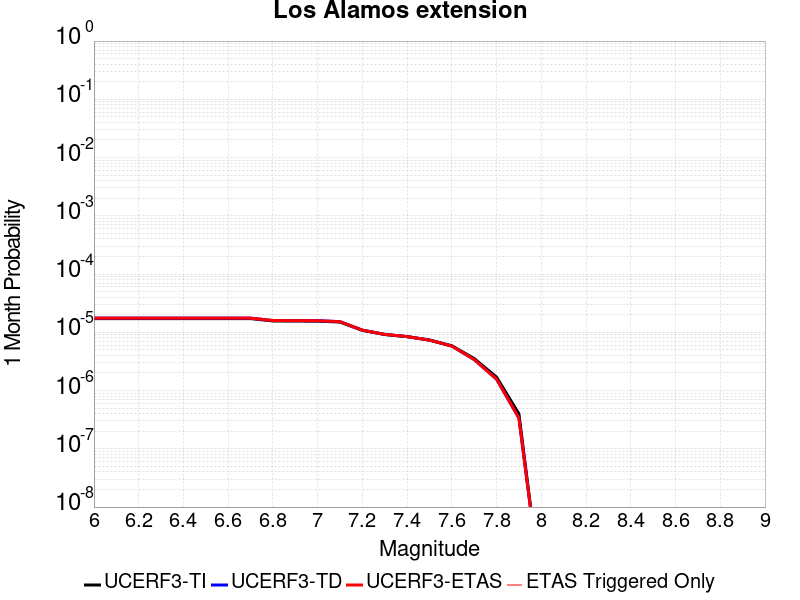 | 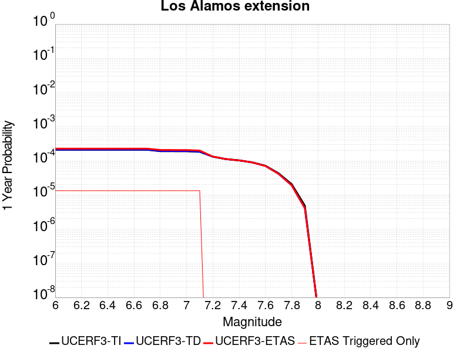 | 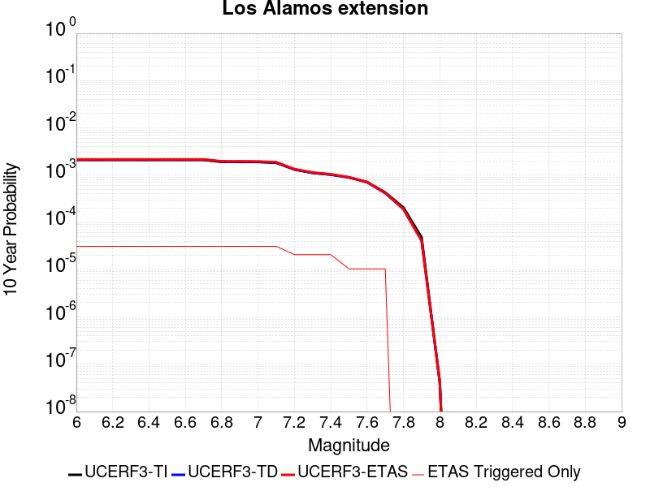 |

| Magnitude | 1 wk TI Prob | 1 wk TD Prob | 1 wk ETAS Prob | 1 wk ETAS/TD Gain | 1 wk ETAS Triggered Only | 1 mo TI Prob | 1 mo TD Prob | 1 mo ETAS Prob | 1 mo ETAS/TD Gain | 1 mo ETAS Triggered Only | 1 yr TI Prob | 1 yr TD Prob | 1 yr ETAS Prob | 1 yr ETAS/TD Gain | 1 yr ETAS Triggered Only | 10 yr TI Prob | 10 yr TD Prob | 10 yr ETAS Prob | 10 yr ETAS/TD Gain | 10 yr ETAS Triggered Only |
|-----|-----|-----|-----|-----|-----|-----|-----|-----|-----|-----|-----|-----|-----|-----|-----|-----|-----|-----|-----|-----|
| 6.0 | 4.0146506E-6 | 4.0861596E-6 | 4.0861596E-6 | 1.0 | 0.0 | 1.7205533E-5 | 1.7512002E-5 | 1.7512002E-5 | 1.0 | 0.0 | 2.0945723E-4 | 2.1318886E-4 | 2.2362254E-4 | 1.048941 | 1.0435908E-5 | 0.0020925992 | 0.0021299527 | 0.0021611936 | 1.0146675 | 3.1307725E-5 |
| 6.1 | 4.0146506E-6 | 4.0861596E-6 | 4.0861596E-6 | 1.0 | 0.0 | 1.7205533E-5 | 1.7512002E-5 | 1.7512002E-5 | 1.0 | 0.0 | 2.0945723E-4 | 2.1318886E-4 | 2.2362254E-4 | 1.048941 | 1.0435908E-5 | 0.0020925992 | 0.0021299527 | 0.0021611936 | 1.0146675 | 3.1307725E-5 |
| 6.2 | 4.0146506E-6 | 4.0861596E-6 | 4.0861596E-6 | 1.0 | 0.0 | 1.7205533E-5 | 1.7512002E-5 | 1.7512002E-5 | 1.0 | 0.0 | 2.0945723E-4 | 2.1318886E-4 | 2.2362254E-4 | 1.048941 | 1.0435908E-5 | 0.0020925992 | 0.0021299527 | 0.0021611936 | 1.0146675 | 3.1307725E-5 |
| 6.3 | 4.0146506E-6 | 4.0861596E-6 | 4.0861596E-6 | 1.0 | 0.0 | 1.7205533E-5 | 1.7512002E-5 | 1.7512002E-5 | 1.0 | 0.0 | 2.0945723E-4 | 2.1318886E-4 | 2.2362254E-4 | 1.048941 | 1.0435908E-5 | 0.0020925992 | 0.0021299527 | 0.0021611936 | 1.0146675 | 3.1307725E-5 |
| 6.4 | 4.0146506E-6 | 4.0861596E-6 | 4.0861596E-6 | 1.0 | 0.0 | 1.7205533E-5 | 1.7512002E-5 | 1.7512002E-5 | 1.0 | 0.0 | 2.0945723E-4 | 2.1318886E-4 | 2.2362254E-4 | 1.048941 | 1.0435908E-5 | 0.0020925992 | 0.0021299527 | 0.0021611936 | 1.0146675 | 3.1307725E-5 |
| 6.5 | 4.0146506E-6 | 4.0861596E-6 | 4.0861596E-6 | 1.0 | 0.0 | 1.7205533E-5 | 1.7512002E-5 | 1.7512002E-5 | 1.0 | 0.0 | 2.0945723E-4 | 2.1318886E-4 | 2.2362254E-4 | 1.048941 | 1.0435908E-5 | 0.0020925992 | 0.0021299527 | 0.0021611936 | 1.0146675 | 3.1307725E-5 |
| 6.6 | 4.0146506E-6 | 4.0861596E-6 | 4.0861596E-6 | 1.0 | 0.0 | 1.7205533E-5 | 1.7512002E-5 | 1.7512002E-5 | 1.0 | 0.0 | 2.0945723E-4 | 2.1318886E-4 | 2.2362254E-4 | 1.048941 | 1.0435908E-5 | 0.0020925992 | 0.0021299527 | 0.0021611936 | 1.0146675 | 3.1307725E-5 |
| 6.7 | 4.0146506E-6 | 4.0861596E-6 | 4.0861596E-6 | 1.0 | 0.0 | 1.7205533E-5 | 1.7512002E-5 | 1.7512002E-5 | 1.0 | 0.0 | 2.0945723E-4 | 2.1318886E-4 | 2.2362254E-4 | 1.048941 | 1.0435908E-5 | 0.0020925992 | 0.0021299527 | 0.0021611936 | 1.0146675 | 3.1307725E-5 |
| 6.8 | 3.6584688E-6 | 3.7188588E-6 | 3.7188588E-6 | 1.0 | 0.0 | 1.5679057E-5 | 1.5937874E-5 | 1.5937874E-5 | 1.0 | 0.0 | 1.9087581E-4 | 1.9402728E-4 | 2.0446116E-4 | 1.0537753 | 1.0435908E-5 | 0.0019071194 | 0.0019386712 | 0.0019699181 | 1.0161178 | 3.1307725E-5 |
| 6.9 | 3.644631E-6 | 3.7045688E-6 | 3.7045688E-6 | 1.0 | 0.0 | 1.5619753E-5 | 1.5876632E-5 | 1.5876632E-5 | 1.0 | 0.0 | 1.901539E-4 | 1.9328178E-4 | 2.0371568E-4 | 1.0539827 | 1.0435908E-5 | 0.0018999127 | 0.0019312293 | 0.0019624764 | 1.01618 | 3.1307725E-5 |
| 7.0 | 3.6318522E-6 | 3.6913295E-6 | 3.6913295E-6 | 1.0 | 0.0 | 1.5564989E-5 | 1.5819893E-5 | 1.5819893E-5 | 1.0 | 0.0 | 1.8948725E-4 | 1.925911E-4 | 2.03025E-4 | 1.0541764 | 1.0435908E-5 | 0.0018932576 | 0.0019243343 | 0.0019555818 | 1.0162381 | 3.1307725E-5 |
| 7.1 | 3.5001724E-6 | 3.5554E-6 | 3.5554E-6 | 1.0 | 0.0 | 1.5000653E-5 | 1.5237345E-5 | 1.5237345E-5 | 1.0 | 0.0 | 1.8261763E-4 | 1.854998E-4 | 1.9593377E-4 | 1.0562478 | 1.0435908E-5 | 0.0018246764 | 0.0018535402 | 0.0018847899 | 1.0168594 | 3.1307725E-5 |
| 7.2 | 2.5204702E-6 | 2.5436943E-6 | 2.5436943E-6 | 1.0 | 0.0 | 1.080197E-5 | 1.0901502E-5 | 1.0901502E-5 | 1.0 | 0.0 | 1.3150605E-4 | 1.3271775E-4 | 1.3271775E-4 | 1.0 | 0.0 | 0.0013142825 | 0.0013263905 | 0.0013472347 | 1.0157149 | 2.0871816E-5 |
| 7.3 | 2.1399692E-6 | 2.1501316E-6 | 2.1501316E-6 | 1.0 | 0.0 | 9.1712645E-6 | 9.2148175E-6 | 9.2148175E-6 | 1.0 | 0.0 | 1.1165442E-4 | 1.1218466E-4 | 1.1218466E-4 | 1.0 | 0.0 | 0.0011159834 | 0.0011212835 | 0.001142132 | 1.0185933 | 2.0871816E-5 |
| 7.4 | 1.9660122E-6 | 1.9702363E-6 | 1.9702363E-6 | 1.0 | 0.0 | 8.42574E-6 | 8.4438425E-6 | 8.4438425E-6 | 1.0 | 0.0 | 1.0257855E-4 | 1.0279897E-4 | 1.0279897E-4 | 1.0 | 0.0 | 0.0010253121 | 0.0010275173 | 0.0010483677 | 1.020292 | 2.0871816E-5 |
| 7.5 | 1.7204633E-6 | 1.7150983E-6 | 1.7150983E-6 | 1.0 | 0.0 | 7.373393E-6 | 7.3504007E-6 | 7.3504007E-6 | 1.0 | 0.0 | 8.976737E-5 | 8.948748E-5 | 8.948748E-5 | 1.0 | 0.0 | 8.9731114E-4 | 8.9451746E-4 | 9.04944E-4 | 1.011656 | 1.0435908E-5 |
| 7.6 | 1.3717638E-6 | 1.3535827E-6 | 1.3535827E-6 | 1.0 | 0.0 | 5.878974E-6 | 5.8010555E-6 | 5.8010555E-6 | 1.0 | 0.0 | 7.157416E-5 | 7.062559E-5 | 7.062559E-5 | 1.0 | 0.0 | 7.1551115E-4 | 7.060341E-4 | 7.164626E-4 | 1.0147706 | 1.0435908E-5 |
| 7.7 | 8.272564E-7 | 7.957636E-7 | 7.957636E-7 | 1.0 | 0.0 | 3.5453797E-6 | 3.410411E-6 | 3.410411E-6 | 1.0 | 0.0 | 4.3164142E-5 | 4.1520965E-5 | 4.1520965E-5 | 1.0 | 0.0 | 4.315576E-4 | 4.1513226E-4 | 4.2556383E-4 | 1.0251284 | 1.0435908E-5 |
| 7.8 | 3.9708277E-7 | 3.6719027E-7 | 3.6719027E-7 | 1.0 | 0.0 | 1.7017821E-6 | 1.5736716E-6 | 1.5736716E-6 | 1.0 | 0.0 | 2.0719E-5 | 1.9159284E-5 | 1.9159284E-5 | 1.0 | 0.0 | 2.071707E-4 | 1.9157639E-4 | 1.9157639E-4 | 1.0 | 0.0 |
| 7.9 | 9.292528E-8 | 7.889087E-8 | 7.889087E-8 | 1.0 | 0.0 | 3.9825116E-7 | 3.381037E-7 | 3.381037E-7 | 1.0 | 0.0 | 4.848697E-6 | 4.116405E-6 | 4.116405E-6 | 1.0 | 0.0 | 4.8485912E-5 | 4.1163294E-5 | 4.1163294E-5 | 1.0 | 0.0 |
| 8.0 | 7.880441E-11 | 8.2353124E-11 | 8.2353124E-11 | 1.0 | 0.0 | 3.3773329E-10 | 3.52942E-10 | 3.52942E-10 | 1.0 | 0.0 | 4.1119033E-9 | 4.2970694E-9 | 4.2970694E-9 | 1.0 | 0.0 | 4.1119034E-8 | 4.2970694E-8 | 4.2970694E-8 | 1.0 | 0.0 |

## Big Pine (West)
*[(top)](#table-of-contents)*

| 1 Week | 1 Month | 1 Year | 10 Year |
|-----|-----|-----|-----|
| 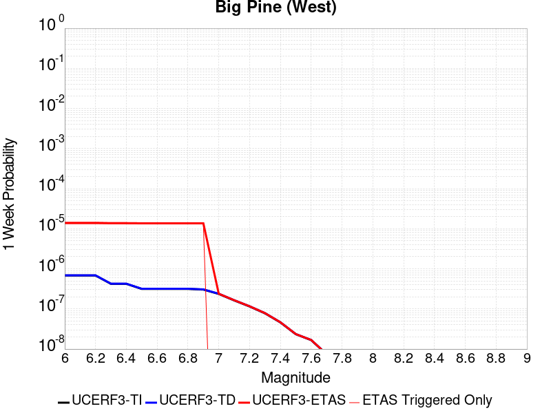 | 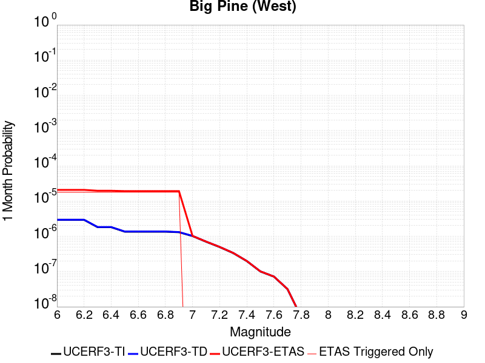 | 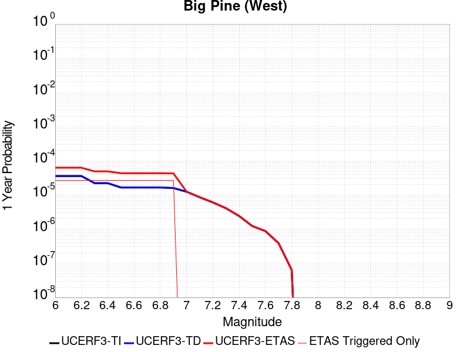 | 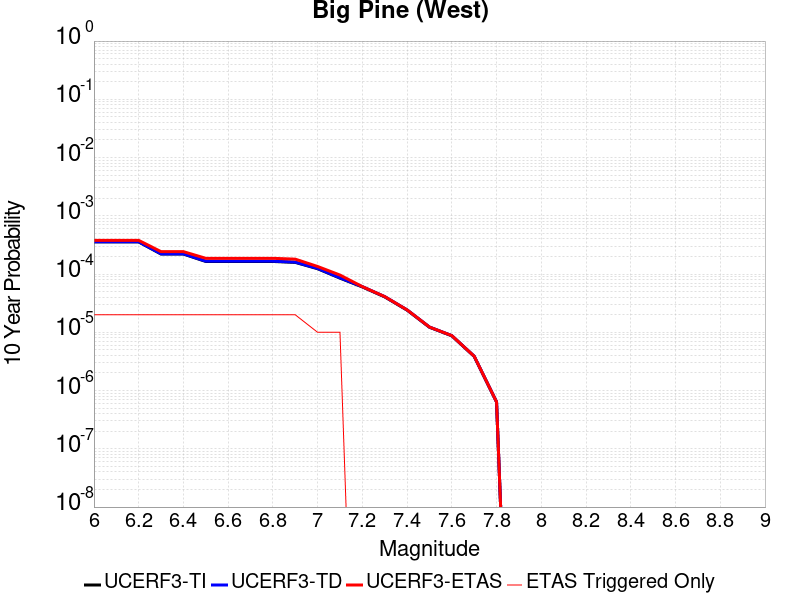 |

| Magnitude | 1 wk TI Prob | 1 wk TD Prob | 1 wk ETAS Prob | 1 wk ETAS/TD Gain | 1 wk ETAS Triggered Only | 1 mo TI Prob | 1 mo TD Prob | 1 mo ETAS Prob | 1 mo ETAS/TD Gain | 1 mo ETAS Triggered Only | 1 yr TI Prob | 1 yr TD Prob | 1 yr ETAS Prob | 1 yr ETAS/TD Gain | 1 yr ETAS Triggered Only | 10 yr TI Prob | 10 yr TD Prob | 10 yr ETAS Prob | 10 yr ETAS/TD Gain | 10 yr ETAS Triggered Only |
|-----|-----|-----|-----|-----|-----|-----|-----|-----|-----|-----|-----|-----|-----|-----|-----|-----|-----|-----|-----|-----|
| 6.0 | 6.8306974E-7 | 6.8818304E-7 | 1.1124083E-5 | 16.164427 | 1.0435908E-5 | 2.9274386E-6 | 2.949353E-6 | 1.338523E-5 | 4.5383615 | 1.0435908E-5 | 3.564098E-5 | 3.5907877E-5 | 5.6778943E-5 | 1.5812392 | 2.0871816E-5 | 3.5635266E-4 | 3.5903015E-4 | 3.7989445E-4 | 1.058113 | 2.0871816E-5 |
| 6.1 | 6.8306974E-7 | 6.8818304E-7 | 1.1124083E-5 | 16.164427 | 1.0435908E-5 | 2.9274386E-6 | 2.949353E-6 | 1.338523E-5 | 4.5383615 | 1.0435908E-5 | 3.564098E-5 | 3.5907877E-5 | 5.6778943E-5 | 1.5812392 | 2.0871816E-5 | 3.5635266E-4 | 3.5903015E-4 | 3.7989445E-4 | 1.058113 | 2.0871816E-5 |
| 6.2 | 6.8306974E-7 | 6.8818304E-7 | 1.1124083E-5 | 16.164427 | 1.0435908E-5 | 2.9274386E-6 | 2.949353E-6 | 1.338523E-5 | 4.5383615 | 1.0435908E-5 | 3.564098E-5 | 3.5907877E-5 | 5.6778943E-5 | 1.5812392 | 2.0871816E-5 | 3.5635266E-4 | 3.5903015E-4 | 3.7989445E-4 | 1.058113 | 2.0871816E-5 |
| 6.3 | 4.227652E-7 | 4.2665604E-7 | 1.0862559E-5 | 25.459757 | 1.0435908E-5 | 1.8118495E-6 | 1.8285248E-6 | 1.2264413E-5 | 6.7072725 | 1.0435908E-5 | 2.2059045E-5 | 2.226208E-5 | 4.313343E-5 | 1.9375292 | 2.0871816E-5 | 2.2056856E-4 | 2.2260031E-4 | 2.4346748E-4 | 1.0937427 | 2.0871816E-5 |
| 6.4 | 4.227652E-7 | 4.2665604E-7 | 1.0862559E-5 | 25.459757 | 1.0435908E-5 | 1.8118495E-6 | 1.8285248E-6 | 1.2264413E-5 | 6.7072725 | 1.0435908E-5 | 2.2059045E-5 | 2.226208E-5 | 4.313343E-5 | 1.9375292 | 2.0871816E-5 | 2.2056856E-4 | 2.2260031E-4 | 2.4346748E-4 | 1.0937427 | 2.0871816E-5 |
| 6.5 | 3.1538403E-7 | 3.1884528E-7 | 1.0754749E-5 | 33.73031 | 1.0435908E-5 | 1.3516451E-6 | 1.3664791E-6 | 1.1802373E-5 | 8.637068 | 1.0435908E-5 | 1.6456155E-5 | 1.6636759E-5 | 3.7508227E-5 | 2.2545393 | 2.0871816E-5 | 1.6454936E-4 | 1.6635554E-4 | 1.8722388E-4 | 1.1254443 | 2.0871816E-5 |
| 6.6 | 3.1538403E-7 | 3.1884528E-7 | 1.0754749E-5 | 33.73031 | 1.0435908E-5 | 1.3516451E-6 | 1.3664791E-6 | 1.1802373E-5 | 8.637068 | 1.0435908E-5 | 1.6456155E-5 | 1.6636759E-5 | 3.7508227E-5 | 2.2545393 | 2.0871816E-5 | 1.6454936E-4 | 1.6635554E-4 | 1.8722388E-4 | 1.1254443 | 2.0871816E-5 |
| 6.7 | 3.1538403E-7 | 3.1884528E-7 | 1.0754749E-5 | 33.73031 | 1.0435908E-5 | 1.3516451E-6 | 1.3664791E-6 | 1.1802373E-5 | 8.637068 | 1.0435908E-5 | 1.6456155E-5 | 1.6636759E-5 | 3.7508227E-5 | 2.2545393 | 2.0871816E-5 | 1.6454936E-4 | 1.6635554E-4 | 1.8722388E-4 | 1.1254443 | 2.0871816E-5 |
| 6.8 | 3.1538403E-7 | 3.1884528E-7 | 1.0754749E-5 | 33.73031 | 1.0435908E-5 | 1.3516451E-6 | 1.3664791E-6 | 1.1802373E-5 | 8.637068 | 1.0435908E-5 | 1.6456155E-5 | 1.6636759E-5 | 3.7508227E-5 | 2.2545393 | 2.0871816E-5 | 1.6454936E-4 | 1.6635554E-4 | 1.8722388E-4 | 1.1254443 | 2.0871816E-5 |
| 6.9 | 3.0402092E-7 | 3.0739798E-7 | 1.07433025E-5 | 34.949165 | 1.0435908E-5 | 1.3029462E-6 | 1.3174192E-6 | 1.1753314E-5 | 8.921468 | 1.0435908E-5 | 1.5863254E-5 | 1.6039465E-5 | 3.6910948E-5 | 2.3012578 | 2.0871816E-5 | 1.5862122E-4 | 1.6038347E-4 | 1.8125193E-4 | 1.1301161 | 2.0871816E-5 |
| 7.0 | 2.3673063E-7 | 2.3944315E-7 | 2.3944315E-7 | 1.0 | 0.0 | 1.0145594E-6 | 1.0261845E-6 | 1.0261845E-6 | 1.0 | 0.0 | 1.235219E-5 | 1.2493728E-5 | 2.2929506E-5 | 1.8352814 | 1.0435908E-5 | 1.2351504E-4 | 1.2493054E-4 | 1.3536513E-4 | 1.0835233 | 1.0435908E-5 |
| 7.1 | 1.632138E-7 | 1.6514511E-7 | 1.6514511E-7 | 1.0 | 0.0 | 6.9948754E-7 | 7.0776457E-7 | 7.0776457E-7 | 1.0 | 0.0 | 8.516227E-6 | 8.617002E-6 | 1.9052819E-5 | 2.211073 | 1.0435908E-5 | 8.5159016E-5 | 8.616685E-5 | 9.6601856E-5 | 1.1211023 | 1.0435908E-5 |
| 7.2 | 1.1523723E-7 | 1.1657165E-7 | 1.1657165E-7 | 1.0 | 0.0 | 4.9387376E-7 | 4.9959266E-7 | 4.9959266E-7 | 1.0 | 0.0 | 6.0128964E-6 | 6.082525E-6 | 6.082525E-6 | 1.0 | 0.0 | 6.0127335E-5 | 6.0823695E-5 | 6.0823695E-5 | 1.0 | 0.0 |
| 7.3 | 7.777805E-8 | 7.862446E-8 | 7.862446E-8 | 1.0 | 0.0 | 3.3333444E-7 | 3.3696193E-7 | 3.3696193E-7 | 1.0 | 0.0 | 4.0583395E-6 | 4.102504E-6 | 4.102504E-6 | 1.0 | 0.0 | 4.0582654E-5 | 4.102434E-5 | 4.102434E-5 | 1.0 | 0.0 |
| 7.4 | 4.609946E-8 | 4.6522135E-8 | 4.6522135E-8 | 1.0 | 0.0 | 1.975691E-7 | 1.9938055E-7 | 1.9938055E-7 | 1.0 | 0.0 | 2.4054011E-6 | 2.4274557E-6 | 2.4274557E-6 | 1.0 | 0.0 | 2.405375E-5 | 2.427431E-5 | 2.427431E-5 | 1.0 | 0.0 |
| 7.5 | 2.3439137E-8 | 2.3608283E-8 | 2.3608283E-8 | 1.0 | 0.0 | 1.00453434E-7 | 1.0117836E-7 | 1.0117836E-7 | 1.0 | 0.0 | 1.2230199E-6 | 1.2318458E-6 | 1.2318458E-6 | 1.0 | 0.0 | 1.2230132E-5 | 1.2318393E-5 | 1.2318393E-5 | 1.0 | 0.0 |
| 7.6 | 1.6699769E-8 | 1.6817072E-8 | 1.6817072E-8 | 1.0 | 0.0 | 7.157044E-8 | 7.207316E-8 | 7.207316E-8 | 1.0 | 0.0 | 8.713697E-7 | 8.7749044E-7 | 8.7749044E-7 | 1.0 | 0.0 | 8.713663E-6 | 8.774871E-6 | 8.774871E-6 | 1.0 | 0.0 |
| 7.7 | 7.4061512E-9 | 7.4541635E-9 | 7.4541635E-9 | 1.0 | 0.0 | 3.1740647E-8 | 3.1946417E-8 | 3.1946417E-8 | 1.0 | 0.0 | 3.864423E-7 | 3.8894754E-7 | 3.8894754E-7 | 1.0 | 0.0 | 3.8644166E-6 | 3.8894696E-6 | 3.8894696E-6 | 1.0 | 0.0 |
| 7.8 | 1.2189427E-9 | 1.2270763E-9 | 1.2270763E-9 | 1.0 | 0.0 | 5.2240403E-9 | 5.258898E-9 | 5.258898E-9 | 1.0 | 0.0 | 6.3602684E-8 | 6.4027084E-8 | 6.4027084E-8 | 1.0 | 0.0 | 6.360267E-7 | 6.4027074E-7 | 6.4027074E-7 | 1.0 | 0.0 |

## Pitas Point (Lower)-Montalvo
*[(top)](#table-of-contents)*

| 1 Week | 1 Month | 1 Year | 10 Year |
|-----|-----|-----|-----|
| 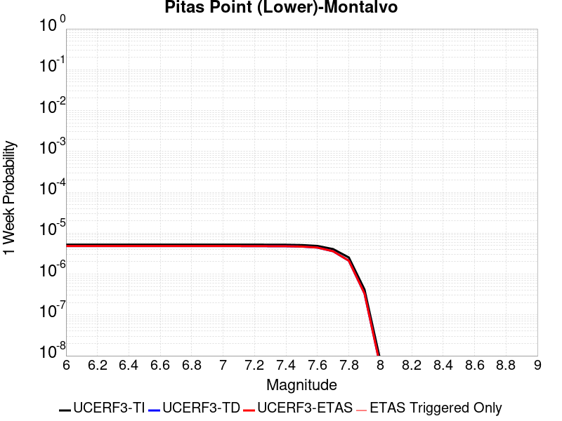 | 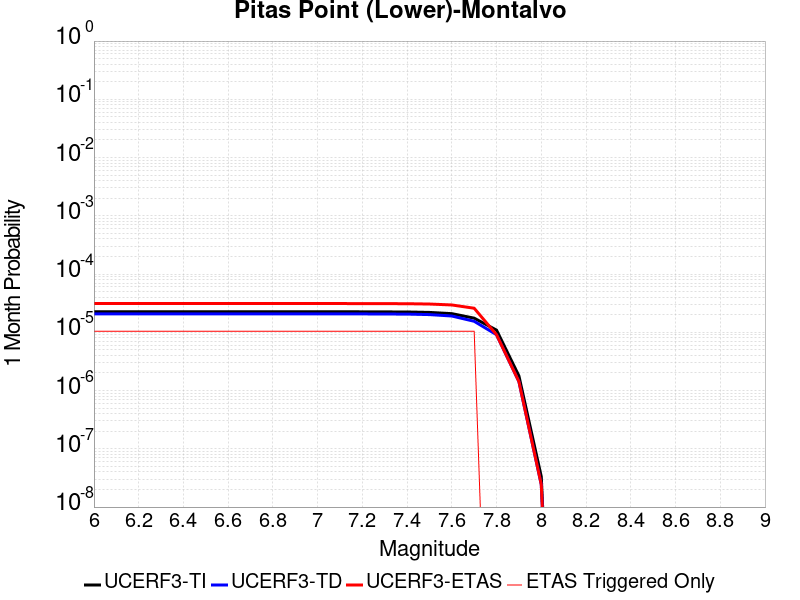 | 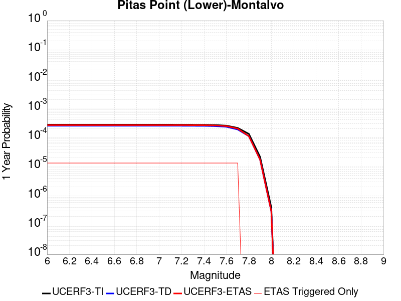 | 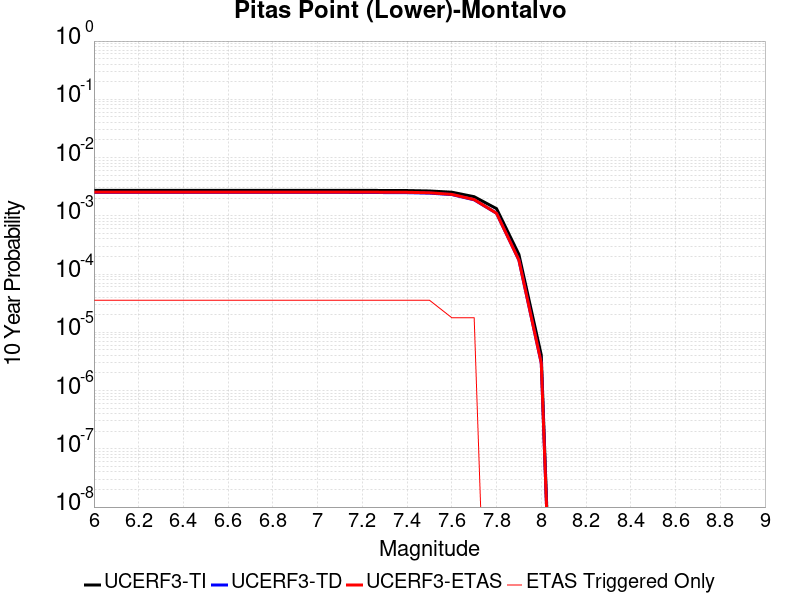 |

| Magnitude | 1 wk TI Prob | 1 wk TD Prob | 1 wk ETAS Prob | 1 wk ETAS/TD Gain | 1 wk ETAS Triggered Only | 1 mo TI Prob | 1 mo TD Prob | 1 mo ETAS Prob | 1 mo ETAS/TD Gain | 1 mo ETAS Triggered Only | 1 yr TI Prob | 1 yr TD Prob | 1 yr ETAS Prob | 1 yr ETAS/TD Gain | 1 yr ETAS Triggered Only | 10 yr TI Prob | 10 yr TD Prob | 10 yr ETAS Prob | 10 yr ETAS/TD Gain | 10 yr ETAS Triggered Only |
|-----|-----|-----|-----|-----|-----|-----|-----|-----|-----|-----|-----|-----|-----|-----|-----|-----|-----|-----|-----|-----|
| 6.0 | 5.2543637E-6 | 4.8378706E-6 | 4.8378706E-6 | 1.0 | 0.0 | 2.2518509E-5 | 2.0733567E-5 | 3.116926E-5 | 1.5033234 | 1.0435908E-5 | 2.7412834E-4 | 2.5240227E-4 | 2.6283553E-4 | 1.0413359 | 1.0435908E-5 | 0.0027379042 | 0.0025211885 | 0.0025420075 | 1.0082577 | 2.0871816E-5 |
| 6.1 | 5.2543637E-6 | 4.8378706E-6 | 4.8378706E-6 | 1.0 | 0.0 | 2.2518509E-5 | 2.0733567E-5 | 3.116926E-5 | 1.5033234 | 1.0435908E-5 | 2.7412834E-4 | 2.5240227E-4 | 2.6283553E-4 | 1.0413359 | 1.0435908E-5 | 0.0027379042 | 0.0025211885 | 0.0025420075 | 1.0082577 | 2.0871816E-5 |
| 6.2 | 5.2543637E-6 | 4.8378706E-6 | 4.8378706E-6 | 1.0 | 0.0 | 2.2518509E-5 | 2.0733567E-5 | 3.116926E-5 | 1.5033234 | 1.0435908E-5 | 2.7412834E-4 | 2.5240227E-4 | 2.6283553E-4 | 1.0413359 | 1.0435908E-5 | 0.0027379042 | 0.0025211885 | 0.0025420075 | 1.0082577 | 2.0871816E-5 |
| 6.3 | 5.2543637E-6 | 4.8378706E-6 | 4.8378706E-6 | 1.0 | 0.0 | 2.2518509E-5 | 2.0733567E-5 | 3.116926E-5 | 1.5033234 | 1.0435908E-5 | 2.7412834E-4 | 2.5240227E-4 | 2.6283553E-4 | 1.0413359 | 1.0435908E-5 | 0.0027379042 | 0.0025211885 | 0.0025420075 | 1.0082577 | 2.0871816E-5 |
| 6.4 | 5.2543637E-6 | 4.8378706E-6 | 4.8378706E-6 | 1.0 | 0.0 | 2.2518509E-5 | 2.0733567E-5 | 3.116926E-5 | 1.5033234 | 1.0435908E-5 | 2.7412834E-4 | 2.5240227E-4 | 2.6283553E-4 | 1.0413359 | 1.0435908E-5 | 0.0027379042 | 0.0025211885 | 0.0025420075 | 1.0082577 | 2.0871816E-5 |
| 6.5 | 5.2543637E-6 | 4.8378706E-6 | 4.8378706E-6 | 1.0 | 0.0 | 2.2518509E-5 | 2.0733567E-5 | 3.116926E-5 | 1.5033234 | 1.0435908E-5 | 2.7412834E-4 | 2.5240227E-4 | 2.6283553E-4 | 1.0413359 | 1.0435908E-5 | 0.0027379042 | 0.0025211885 | 0.0025420075 | 1.0082577 | 2.0871816E-5 |
| 6.6 | 5.2543637E-6 | 4.8378706E-6 | 4.8378706E-6 | 1.0 | 0.0 | 2.2518509E-5 | 2.0733567E-5 | 3.116926E-5 | 1.5033234 | 1.0435908E-5 | 2.7412834E-4 | 2.5240227E-4 | 2.6283553E-4 | 1.0413359 | 1.0435908E-5 | 0.0027379042 | 0.0025211885 | 0.0025420075 | 1.0082577 | 2.0871816E-5 |
| 6.7 | 5.2543637E-6 | 4.8378706E-6 | 4.8378706E-6 | 1.0 | 0.0 | 2.2518509E-5 | 2.0733567E-5 | 3.116926E-5 | 1.5033234 | 1.0435908E-5 | 2.7412834E-4 | 2.5240227E-4 | 2.6283553E-4 | 1.0413359 | 1.0435908E-5 | 0.0027379042 | 0.0025211885 | 0.0025420075 | 1.0082577 | 2.0871816E-5 |
| 6.8 | 5.2543637E-6 | 4.8378706E-6 | 4.8378706E-6 | 1.0 | 0.0 | 2.2518509E-5 | 2.0733567E-5 | 3.116926E-5 | 1.5033234 | 1.0435908E-5 | 2.7412834E-4 | 2.5240227E-4 | 2.6283553E-4 | 1.0413359 | 1.0435908E-5 | 0.0027379042 | 0.0025211885 | 0.0025420075 | 1.0082577 | 2.0871816E-5 |
| 6.9 | 5.2543637E-6 | 4.8378706E-6 | 4.8378706E-6 | 1.0 | 0.0 | 2.2518509E-5 | 2.0733567E-5 | 3.116926E-5 | 1.5033234 | 1.0435908E-5 | 2.7412834E-4 | 2.5240227E-4 | 2.6283553E-4 | 1.0413359 | 1.0435908E-5 | 0.0027379042 | 0.0025211885 | 0.0025420075 | 1.0082577 | 2.0871816E-5 |
| 7.0 | 5.2543637E-6 | 4.8378706E-6 | 4.8378706E-6 | 1.0 | 0.0 | 2.2518509E-5 | 2.0733567E-5 | 3.116926E-5 | 1.5033234 | 1.0435908E-5 | 2.7412834E-4 | 2.5240227E-4 | 2.6283553E-4 | 1.0413359 | 1.0435908E-5 | 0.0027379042 | 0.0025211885 | 0.0025420075 | 1.0082577 | 2.0871816E-5 |
| 7.1 | 5.2543637E-6 | 4.8378706E-6 | 4.8378706E-6 | 1.0 | 0.0 | 2.2518509E-5 | 2.0733567E-5 | 3.116926E-5 | 1.5033234 | 1.0435908E-5 | 2.7412834E-4 | 2.5240227E-4 | 2.6283553E-4 | 1.0413359 | 1.0435908E-5 | 0.0027379042 | 0.0025211885 | 0.0025420075 | 1.0082577 | 2.0871816E-5 |
| 7.2 | 5.2458695E-6 | 4.8290244E-6 | 4.8290244E-6 | 1.0 | 0.0 | 2.2482105E-5 | 2.0695656E-5 | 3.113135E-5 | 1.5042455 | 1.0435908E-5 | 2.7368523E-4 | 2.519408E-4 | 2.6237406E-4 | 1.0414116 | 1.0435908E-5 | 0.0027334841 | 0.0025165842 | 0.0025374035 | 1.0082729 | 2.0871816E-5 |
| 7.3 | 5.22665E-6 | 4.8089414E-6 | 4.8089414E-6 | 1.0 | 0.0 | 2.2399736E-5 | 2.0609588E-5 | 3.104528E-5 | 1.5063514 | 1.0435908E-5 | 2.7268266E-4 | 2.5089315E-4 | 2.6132644E-4 | 1.0415846 | 1.0435908E-5 | 0.002723483 | 0.0025061315 | 0.002526951 | 1.0083075 | 2.0871816E-5 |
| 7.4 | 5.210642E-6 | 4.792154E-6 | 4.792154E-6 | 1.0 | 0.0 | 2.233113E-5 | 2.0537642E-5 | 3.0973337E-5 | 1.5081252 | 1.0435908E-5 | 2.718476E-4 | 2.5001742E-4 | 2.6045073E-4 | 1.0417303 | 1.0435908E-5 | 0.002715153 | 0.0024973939 | 0.0025182136 | 1.0083365 | 2.0871816E-5 |
| 7.5 | 5.1226016E-6 | 4.7000403E-6 | 4.7000403E-6 | 1.0 | 0.0 | 2.1953823E-5 | 2.0142877E-5 | 3.0578576E-5 | 1.5180838 | 1.0435908E-5 | 2.67255E-4 | 2.4521223E-4 | 2.5564557E-4 | 1.0425482 | 1.0435908E-5 | 0.0026693381 | 0.0024494485 | 0.002470269 | 1.0085001 | 2.0871816E-5 |
| 7.6 | 4.8796987E-6 | 4.4449403E-6 | 4.4449403E-6 | 1.0 | 0.0 | 2.0912828E-5 | 1.9049607E-5 | 2.9485316E-5 | 1.5478176 | 1.0435908E-5 | 2.5458392E-4 | 2.3190459E-4 | 2.4233806E-4 | 1.0449904 | 1.0435908E-5 | 0.0025429246 | 0.0023166565 | 0.0023270682 | 1.0044943 | 1.0435908E-5 |
| 7.7 | 4.0834398E-6 | 3.6091124E-6 | 3.6091124E-6 | 1.0 | 0.0 | 1.7500339E-5 | 1.5467534E-5 | 2.590328E-5 | 1.6746871 | 1.0435908E-5 | 2.1304579E-4 | 1.8830119E-4 | 1.9873513E-4 | 1.055411 | 1.0435908E-5 | 0.0021284167 | 0.00188144 | 0.0018918563 | 1.0055363 | 1.0435908E-5 |
| 7.8 | 2.5445438E-6 | 2.121228E-6 | 2.121228E-6 | 1.0 | 0.0 | 1.0905142E-5 | 9.090945E-6 | 9.090945E-6 | 1.0 | 0.0 | 1.3276201E-4 | 1.1067669E-4 | 1.1067669E-4 | 1.0 | 0.0 | 0.0013268272 | 0.0011062203 | 0.0011062203 | 1.0 | 0.0 |
| 7.9 | 4.1677114E-7 | 3.3293693E-7 | 3.3293693E-7 | 1.0 | 0.0 | 1.7861609E-6 | 1.4268718E-6 | 1.4268718E-6 | 1.0 | 0.0 | 2.1746291E-5 | 1.737203E-5 | 1.737203E-5 | 1.0 | 0.0 | 2.1744163E-4 | 1.7370703E-4 | 1.7370703E-4 | 1.0 | 0.0 |
| 8.0 | 7.791402E-9 | 5.683497E-9 | 5.683497E-9 | 1.0 | 0.0 | 3.3391725E-8 | 2.4357844E-8 | 2.4357844E-8 | 1.0 | 0.0 | 4.0654416E-7 | 2.9655675E-7 | 2.9655675E-7 | 1.0 | 0.0 | 4.065434E-6 | 2.9655655E-6 | 2.9655655E-6 | 1.0 | 0.0 |

## Earthquake Valley
*[(top)](#table-of-contents)*

| 1 Week | 1 Month | 1 Year | 10 Year |
|-----|-----|-----|-----|
| 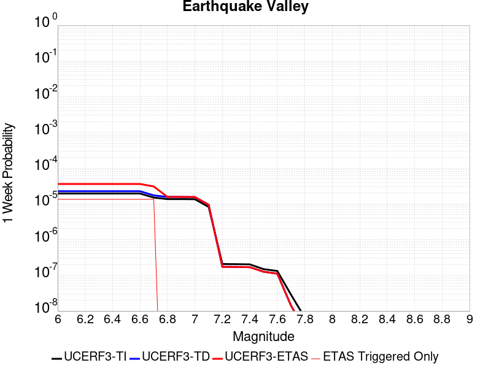 | 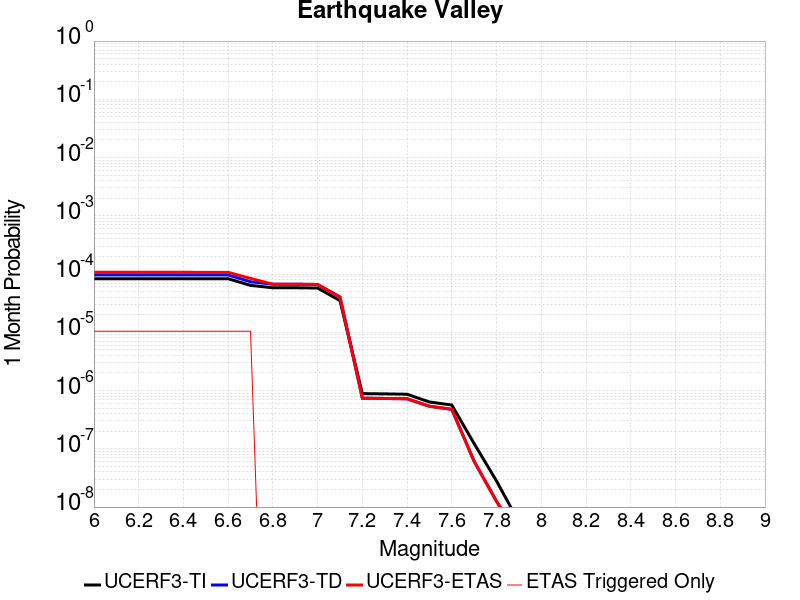 | 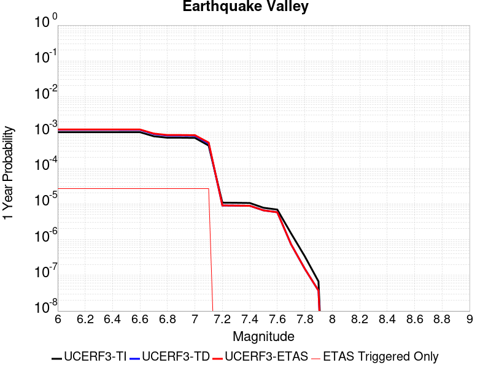 | 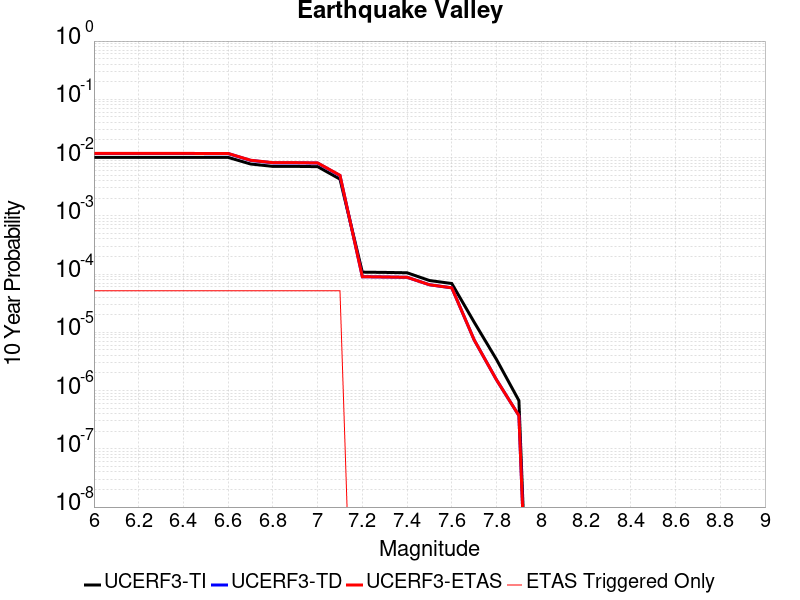 |

| Magnitude | 1 wk TI Prob | 1 wk TD Prob | 1 wk ETAS Prob | 1 wk ETAS/TD Gain | 1 wk ETAS Triggered Only | 1 mo TI Prob | 1 mo TD Prob | 1 mo ETAS Prob | 1 mo ETAS/TD Gain | 1 mo ETAS Triggered Only | 1 yr TI Prob | 1 yr TD Prob | 1 yr ETAS Prob | 1 yr ETAS/TD Gain | 1 yr ETAS Triggered Only | 10 yr TI Prob | 10 yr TD Prob | 10 yr ETAS Prob | 10 yr ETAS/TD Gain | 10 yr ETAS Triggered Only |
|-----|-----|-----|-----|-----|-----|-----|-----|-----|-----|-----|-----|-----|-----|-----|-----|-----|-----|-----|-----|-----|
| 6.0 | 1.9416384E-5 | 2.258408E-5 | 3.301975E-5 | 1.462081 | 1.0435908E-5 | 8.321042E-5 | 9.6785996E-5 | 1.072209E-4 | 1.1078141 | 1.0435908E-5 | 0.001012616 | 0.0011778527 | 0.0011986999 | 1.0176994 | 2.0871816E-5 | 0.010080142 | 0.011727943 | 0.01174857 | 1.0017588 | 2.0871816E-5 |
| 6.1 | 1.9416384E-5 | 2.258408E-5 | 3.301975E-5 | 1.462081 | 1.0435908E-5 | 8.321042E-5 | 9.6785996E-5 | 1.072209E-4 | 1.1078141 | 1.0435908E-5 | 0.001012616 | 0.0011778527 | 0.0011986999 | 1.0176994 | 2.0871816E-5 | 0.010080142 | 0.011727943 | 0.01174857 | 1.0017588 | 2.0871816E-5 |
| 6.2 | 1.9416384E-5 | 2.258408E-5 | 3.301975E-5 | 1.462081 | 1.0435908E-5 | 8.321042E-5 | 9.6785996E-5 | 1.072209E-4 | 1.1078141 | 1.0435908E-5 | 0.001012616 | 0.0011778527 | 0.0011986999 | 1.0176994 | 2.0871816E-5 | 0.010080142 | 0.011727943 | 0.01174857 | 1.0017588 | 2.0871816E-5 |
| 6.3 | 1.9416384E-5 | 2.258408E-5 | 3.301975E-5 | 1.462081 | 1.0435908E-5 | 8.321042E-5 | 9.6785996E-5 | 1.072209E-4 | 1.1078141 | 1.0435908E-5 | 0.001012616 | 0.0011778527 | 0.0011986999 | 1.0176994 | 2.0871816E-5 | 0.010080142 | 0.011727943 | 0.01174857 | 1.0017588 | 2.0871816E-5 |
| 6.4 | 1.9416384E-5 | 2.258408E-5 | 3.301975E-5 | 1.462081 | 1.0435908E-5 | 8.321042E-5 | 9.6785996E-5 | 1.072209E-4 | 1.1078141 | 1.0435908E-5 | 0.001012616 | 0.0011778527 | 0.0011986999 | 1.0176994 | 2.0871816E-5 | 0.010080142 | 0.011727943 | 0.01174857 | 1.0017588 | 2.0871816E-5 |
| 6.5 | 1.9389157E-5 | 2.255267E-5 | 3.298834E-5 | 1.4627246 | 1.0435908E-5 | 8.309374E-5 | 9.665139E-5 | 1.07086285E-4 | 1.1079643 | 1.0435908E-5 | 0.0010111968 | 0.0011762156 | 0.0011970629 | 1.017724 | 2.0871816E-5 | 0.010066078 | 0.011711745 | 0.011732372 | 1.0017612 | 2.0871816E-5 |
| 6.6 | 1.9389157E-5 | 2.255267E-5 | 3.298834E-5 | 1.4627246 | 1.0435908E-5 | 8.309374E-5 | 9.665139E-5 | 1.07086285E-4 | 1.1079643 | 1.0435908E-5 | 0.0010111968 | 0.0011762156 | 0.0011970629 | 1.017724 | 2.0871816E-5 | 0.010066078 | 0.011711745 | 0.011732372 | 1.0017612 | 2.0871816E-5 |
| 6.7 | 1.4925434E-5 | 1.7208227E-5 | 2.7643955E-5 | 1.6064383 | 1.0435908E-5 | 6.396457E-5 | 7.374794E-5 | 8.418308E-5 | 1.1414974 | 1.0435908E-5 | 7.7849044E-4 | 8.9759636E-4 | 9.184494E-4 | 1.0232321 | 2.0871816E-5 | 0.007757689 | 0.008948085 | 0.00896877 | 1.0023117 | 2.0871816E-5 |
| 6.8 | 1.3570335E-5 | 1.5616843E-5 | 1.5616843E-5 | 1.0 | 0.0 | 5.8157282E-5 | 6.692807E-5 | 6.692807E-5 | 1.0 | 0.0 | 7.0783484E-4 | 8.1462675E-4 | 8.250541E-4 | 1.0128002 | 1.0435908E-5 | 0.0070558446 | 0.008124476 | 0.008134828 | 1.0012741 | 1.0435908E-5 |
| 6.9 | 1.3570335E-5 | 1.5616843E-5 | 1.5616843E-5 | 1.0 | 0.0 | 5.8157282E-5 | 6.692807E-5 | 6.692807E-5 | 1.0 | 0.0 | 7.0783484E-4 | 8.1462675E-4 | 8.250541E-4 | 1.0128002 | 1.0435908E-5 | 0.0070558446 | 0.008124476 | 0.008134828 | 1.0012741 | 1.0435908E-5 |
| 7.0 | 1.3433392E-5 | 1.5460388E-5 | 1.5460388E-5 | 1.0 | 0.0 | 5.757041E-5 | 6.6257584E-5 | 6.6257584E-5 | 1.0 | 0.0 | 7.0069433E-4 | 8.064695E-4 | 8.16897E-4 | 1.0129298 | 1.0435908E-5 | 0.006984891 | 0.008043497 | 0.0080538485 | 1.001287 | 1.0435908E-5 |
| 7.1 | 8.181609E-6 | 9.416851E-6 | 9.416851E-6 | 1.0 | 0.0 | 3.5063567E-5 | 4.0357685E-5 | 4.0357685E-5 | 1.0 | 0.0 | 4.268153E-4 | 4.9131113E-4 | 5.017419E-4 | 1.0212305 | 1.0435908E-5 | 0.0042599645 | 0.0049088253 | 0.00491921 | 1.0021155 | 1.0435908E-5 |
| 7.2 | 2.0663983E-7 | 1.726294E-7 | 1.726294E-7 | 1.0 | 0.0 | 8.855989E-7 | 7.398401E-7 | 7.398401E-7 | 1.0 | 0.0 | 1.0782113E-5 | 9.00752E-6 | 9.00752E-6 | 1.0 | 0.0 | 1.07815904E-4 | 9.00719E-5 | 9.00719E-5 | 1.0 | 0.0 |
| 7.3 | 2.0462376E-7 | 1.7078433E-7 | 1.7078433E-7 | 1.0 | 0.0 | 8.7695867E-7 | 7.319327E-7 | 7.319327E-7 | 1.0 | 0.0 | 1.0676919E-5 | 8.911247E-6 | 8.911247E-6 | 1.0 | 0.0 | 1.0676406E-4 | 8.910926E-5 | 8.910926E-5 | 1.0 | 0.0 |
| 7.4 | 2.0171088E-7 | 1.6860913E-7 | 1.6860913E-7 | 1.0 | 0.0 | 8.644749E-7 | 7.2261037E-7 | 7.2261037E-7 | 1.0 | 0.0 | 1.0524931E-5 | 8.79775E-6 | 8.79775E-6 | 1.0 | 0.0 | 1.05244326E-4 | 8.7974375E-5 | 8.7974375E-5 | 1.0 | 0.0 |
| 7.5 | 1.4847944E-7 | 1.2559275E-7 | 1.2559275E-7 | 1.0 | 0.0 | 6.363403E-7 | 5.3825454E-7 | 5.3825454E-7 | 1.0 | 0.0 | 7.747416E-6 | 6.5532317E-6 | 6.5532317E-6 | 1.0 | 0.0 | 7.747146E-5 | 6.55306E-5 | 6.55306E-5 | 1.0 | 0.0 |
| 7.6 | 1.3185847E-7 | 1.1123213E-7 | 1.1123213E-7 | 1.0 | 0.0 | 5.6510765E-7 | 4.7670906E-7 | 4.7670906E-7 | 1.0 | 0.0 | 6.8801637E-6 | 5.8039195E-6 | 5.8039195E-6 | 1.0 | 0.0 | 6.8799505E-5 | 5.803789E-5 | 5.803789E-5 | 1.0 | 0.0 |
| 7.7 | 2.8609954E-8 | 1.4170958E-8 | 1.4170958E-8 | 1.0 | 0.0 | 1.2261408E-7 | 6.0732674E-8 | 6.0732674E-8 | 1.0 | 0.0 | 1.4928254E-6 | 7.394201E-7 | 7.394201E-7 | 1.0 | 0.0 | 1.4928154E-5 | 7.394182E-6 | 7.394182E-6 | 1.0 | 0.0 |
| 7.8 | 6.527266E-9 | 2.923417E-9 | 2.923417E-9 | 1.0 | 0.0 | 2.7973995E-8 | 1.2528931E-8 | 1.2528931E-8 | 1.0 | 0.0 | 3.4058334E-7 | 1.5253973E-7 | 1.5253973E-7 | 1.0 | 0.0 | 3.4058282E-6 | 1.5253964E-6 | 1.5253964E-6 | 1.0 | 0.0 |
| 7.9 | 1.2898267E-9 | 7.127684E-10 | 7.127684E-10 | 1.0 | 0.0 | 5.527829E-9 | 3.0547218E-9 | 3.0547218E-9 | 1.0 | 0.0 | 6.7301315E-8 | 3.719124E-8 | 3.719124E-8 | 1.0 | 0.0 | 6.7301295E-7 | 3.719124E-7 | 3.719124E-7 | 1.0 | 0.0 |

## South Klamath Lake East
*[(top)](#table-of-contents)*

| 1 Week | 1 Month | 1 Year | 10 Year |
|-----|-----|-----|-----|
| 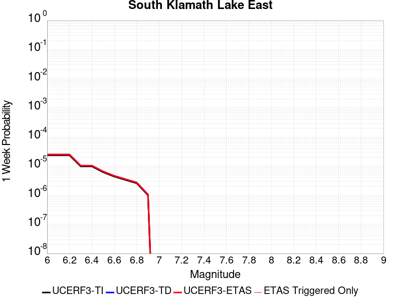 | 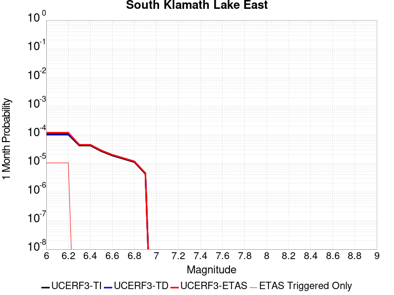 | 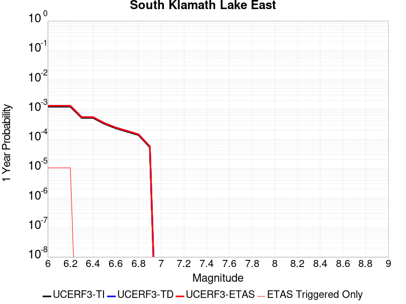 |  |

| Magnitude | 1 wk TI Prob | 1 wk TD Prob | 1 wk ETAS Prob | 1 wk ETAS/TD Gain | 1 wk ETAS Triggered Only | 1 mo TI Prob | 1 mo TD Prob | 1 mo ETAS Prob | 1 mo ETAS/TD Gain | 1 mo ETAS Triggered Only | 1 yr TI Prob | 1 yr TD Prob | 1 yr ETAS Prob | 1 yr ETAS/TD Gain | 1 yr ETAS Triggered Only | 10 yr TI Prob | 10 yr TD Prob | 10 yr ETAS Prob | 10 yr ETAS/TD Gain | 10 yr ETAS Triggered Only |
|-----|-----|-----|-----|-----|-----|-----|-----|-----|-----|-----|-----|-----|-----|-----|-----|-----|-----|-----|-----|-----|
| 6.0 | 2.3539369E-5 | 2.5047308E-5 | 2.5047308E-5 | 1.0 | 0.0 | 1.0087911E-4 | 1.0734166E-4 | 1.1777644E-4 | 1.097211 | 1.0435908E-5 | 0.0012275111 | 0.0013061843 | 0.0013166066 | 1.0079792 | 1.0435908E-5 | 0.012207527 | 0.012993417 | 0.013003717 | 1.0007927 | 1.0435908E-5 |
| 6.1 | 2.3539369E-5 | 2.5047308E-5 | 2.5047308E-5 | 1.0 | 0.0 | 1.0087911E-4 | 1.0734166E-4 | 1.1777644E-4 | 1.097211 | 1.0435908E-5 | 0.0012275111 | 0.0013061843 | 0.0013166066 | 1.0079792 | 1.0435908E-5 | 0.012207527 | 0.012993417 | 0.013003717 | 1.0007927 | 1.0435908E-5 |
| 6.2 | 2.3539369E-5 | 2.5047308E-5 | 2.5047308E-5 | 1.0 | 0.0 | 1.0087911E-4 | 1.0734166E-4 | 1.1777644E-4 | 1.097211 | 1.0435908E-5 | 0.0012275111 | 0.0013061843 | 0.0013166066 | 1.0079792 | 1.0435908E-5 | 0.012207527 | 0.012993417 | 0.013003717 | 1.0007927 | 1.0435908E-5 |
| 6.3 | 9.807823E-6 | 1.0396044E-5 | 1.0396044E-5 | 1.0 | 0.0 | 4.2032847E-5 | 4.455376E-5 | 4.455376E-5 | 1.0 | 0.0 | 5.1162974E-4 | 5.4231536E-4 | 5.4231536E-4 | 1.0 | 0.0 | 0.005104534 | 0.005410756 | 0.005410756 | 1.0 | 0.0 |
| 6.4 | 9.807823E-6 | 1.0396044E-5 | 1.0396044E-5 | 1.0 | 0.0 | 4.2032847E-5 | 4.455376E-5 | 4.455376E-5 | 1.0 | 0.0 | 5.1162974E-4 | 5.4231536E-4 | 5.4231536E-4 | 1.0 | 0.0 | 0.005104534 | 0.005410756 | 0.005410756 | 1.0 | 0.0 |
| 6.5 | 6.191981E-6 | 6.5508398E-6 | 6.5508398E-6 | 1.0 | 0.0 | 2.653679E-5 | 2.8074743E-5 | 2.8074743E-5 | 1.0 | 0.0 | 3.2303753E-4 | 3.4175918E-4 | 3.4175918E-4 | 1.0 | 0.0 | 0.0032256835 | 0.003412614 | 0.003412614 | 1.0 | 0.0 |
| 6.6 | 4.3693776E-6 | 4.6165574E-6 | 4.6165574E-6 | 1.0 | 0.0 | 1.8725768E-5 | 1.9785102E-5 | 1.9785102E-5 | 1.0 | 0.0 | 2.2796239E-4 | 2.4085813E-4 | 2.4085813E-4 | 1.0 | 0.0 | 0.0022772867 | 0.0024060833 | 0.0024060833 | 1.0 | 0.0 |
| 6.7 | 3.360834E-6 | 3.5512403E-6 | 3.5512403E-6 | 1.0 | 0.0 | 1.4403494E-5 | 1.5219517E-5 | 1.5219517E-5 | 1.0 | 0.0 | 1.7534842E-4 | 1.8528267E-4 | 1.8528267E-4 | 1.0 | 0.0 | 0.0017521014 | 0.0018513618 | 0.0018513618 | 1.0 | 0.0 |
| 6.8 | 2.57873E-6 | 2.7251708E-6 | 2.7251708E-6 | 1.0 | 0.0 | 1.1051653E-5 | 1.1679254E-5 | 1.1679254E-5 | 1.0 | 0.0 | 1.3454557E-4 | 1.4218627E-4 | 1.4218627E-4 | 1.0 | 0.0 | 0.0013446413 | 0.0014210136 | 0.0014210136 | 1.0 | 0.0 |
| 6.9 | 9.987825E-7 | 1.0566213E-6 | 1.0566213E-6 | 1.0 | 0.0 | 4.2804895E-6 | 4.528371E-6 | 4.528371E-6 | 1.0 | 0.0 | 5.211371E-5 | 5.5131848E-5 | 5.5131848E-5 | 1.0 | 0.0 | 5.210149E-4 | 5.5121386E-4 | 5.5121386E-4 | 1.0 | 0.0 |

## Great Valley 03 Mysterious Ridge
*[(top)](#table-of-contents)*

| 1 Week | 1 Month | 1 Year | 10 Year |
|-----|-----|-----|-----|
|  |  | 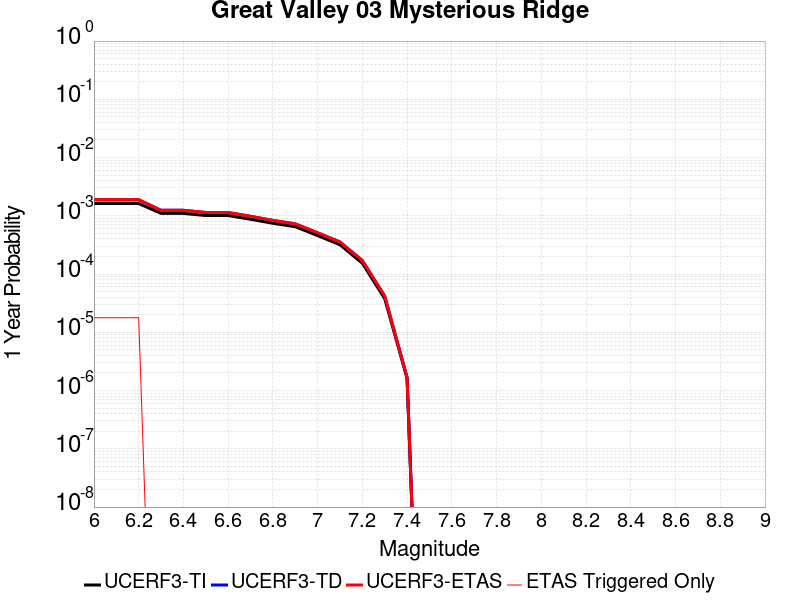 | 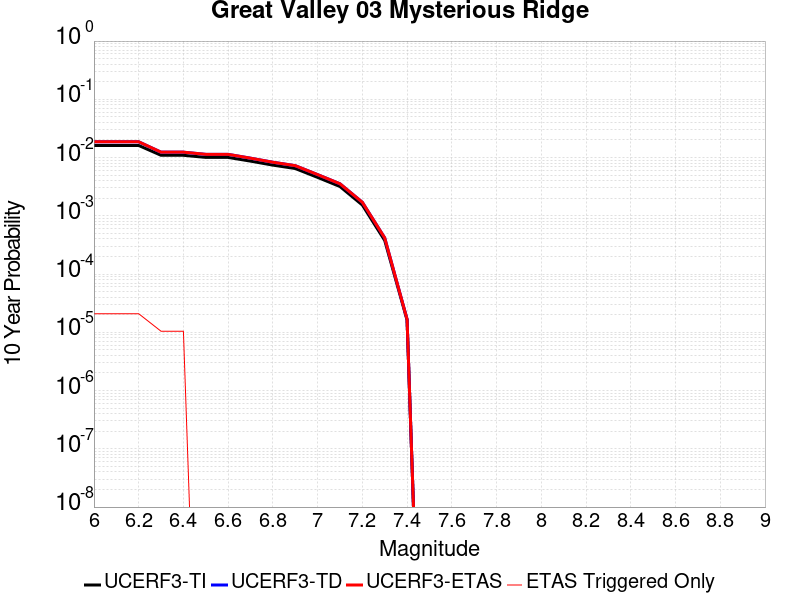 |

| Magnitude | 1 wk TI Prob | 1 wk TD Prob | 1 wk ETAS Prob | 1 wk ETAS/TD Gain | 1 wk ETAS Triggered Only | 1 mo TI Prob | 1 mo TD Prob | 1 mo ETAS Prob | 1 mo ETAS/TD Gain | 1 mo ETAS Triggered Only | 1 yr TI Prob | 1 yr TD Prob | 1 yr ETAS Prob | 1 yr ETAS/TD Gain | 1 yr ETAS Triggered Only | 10 yr TI Prob | 10 yr TD Prob | 10 yr ETAS Prob | 10 yr ETAS/TD Gain | 10 yr ETAS Triggered Only |
|-----|-----|-----|-----|-----|-----|-----|-----|-----|-----|-----|-----|-----|-----|-----|-----|-----|-----|-----|-----|-----|
| 6.0 | 3.1182444E-5 | 3.603423E-5 | 3.603423E-5 | 1.0 | 0.0 | 1.336322E-4 | 1.544242E-4 | 1.544242E-4 | 1.0 | 0.0 | 0.0016257578 | 0.0018786696 | 0.001889086 | 1.0055445 | 1.0435908E-5 | 0.016139153 | 0.018646652 | 0.018667134 | 1.0010985 | 2.0871816E-5 |
| 6.1 | 3.1182444E-5 | 3.603423E-5 | 3.603423E-5 | 1.0 | 0.0 | 1.336322E-4 | 1.544242E-4 | 1.544242E-4 | 1.0 | 0.0 | 0.0016257578 | 0.0018786696 | 0.001889086 | 1.0055445 | 1.0435908E-5 | 0.016139153 | 0.018646652 | 0.018667134 | 1.0010985 | 2.0871816E-5 |
| 6.2 | 3.1182444E-5 | 3.603423E-5 | 3.603423E-5 | 1.0 | 0.0 | 1.336322E-4 | 1.544242E-4 | 1.544242E-4 | 1.0 | 0.0 | 0.0016257578 | 0.0018786696 | 0.001889086 | 1.0055445 | 1.0435908E-5 | 0.016139153 | 0.018646652 | 0.018667134 | 1.0010985 | 2.0871816E-5 |
| 6.3 | 2.106934E-5 | 2.3850307E-5 | 2.3850307E-5 | 1.0 | 0.0 | 9.0294045E-5 | 1.0221177E-4 | 1.0221177E-4 | 1.0 | 0.0 | 0.0010987755 | 0.0012437489 | 0.0012437489 | 1.0 | 0.0 | 0.010933585 | 0.012371127 | 0.0123814335 | 1.0008332 | 1.0435908E-5 |
| 6.4 | 2.106934E-5 | 2.3850307E-5 | 2.3850307E-5 | 1.0 | 0.0 | 9.0294045E-5 | 1.0221177E-4 | 1.0221177E-4 | 1.0 | 0.0 | 0.0010987755 | 0.0012437489 | 0.0012437489 | 1.0 | 0.0 | 0.010933585 | 0.012371127 | 0.0123814335 | 1.0008332 | 1.0435908E-5 |
| 6.5 | 1.9389783E-5 | 2.1884984E-5 | 2.1884984E-5 | 1.0 | 0.0 | 8.309642E-5 | 9.3789575E-5 | 9.3789575E-5 | 1.0 | 0.0 | 0.0010112294 | 0.0011413174 | 0.0011413174 | 1.0 | 0.0 | 0.010066401 | 0.011357434 | 0.011357434 | 1.0 | 0.0 |
| 6.6 | 1.9370193E-5 | 2.1864906E-5 | 2.1864906E-5 | 1.0 | 0.0 | 8.301247E-5 | 9.370353E-5 | 9.370353E-5 | 1.0 | 0.0 | 0.0010102082 | 0.001140271 | 0.001140271 | 1.0 | 0.0 | 0.010056281 | 0.011347076 | 0.011347076 | 1.0 | 0.0 |
| 6.7 | 1.6723505E-5 | 1.8799281E-5 | 1.8799281E-5 | 1.0 | 0.0 | 7.16702E-5 | 8.056597E-5 | 8.056597E-5 | 1.0 | 0.0 | 8.722353E-4 | 9.804688E-4 | 9.804688E-4 | 1.0 | 0.0 | 0.008688197 | 0.009763439 | 0.009763439 | 1.0 | 0.0 |
| 6.8 | 1.426937E-5 | 1.599721E-5 | 1.599721E-5 | 1.0 | 0.0 | 6.115301E-5 | 6.855775E-5 | 6.855775E-5 | 1.0 | 0.0 | 7.4428355E-4 | 8.343854E-4 | 8.343854E-4 | 1.0 | 0.0 | 0.007417957 | 0.008314005 | 0.008314005 | 1.0 | 0.0 |
| 6.9 | 1.2469891E-5 | 1.3956928E-5 | 1.3956928E-5 | 1.0 | 0.0 | 5.3441294E-5 | 5.9814105E-5 | 5.9814105E-5 | 1.0 | 0.0 | 6.504535E-4 | 7.280055E-4 | 7.280055E-4 | 1.0 | 0.0 | 0.006485529 | 0.00725743 | 0.00725743 | 1.0 | 0.0 |
| 7.0 | 8.7746275E-6 | 9.791734E-6 | 9.791734E-6 | 1.0 | 0.0 | 3.7605005E-5 | 4.196394E-5 | 4.196394E-5 | 1.0 | 0.0 | 4.5774475E-4 | 5.1079853E-4 | 5.1079853E-4 | 1.0 | 0.0 | 0.00456803 | 0.005096977 | 0.005096977 | 1.0 | 0.0 |
| 7.1 | 6.1067153E-6 | 6.813725E-6 | 6.813725E-6 | 1.0 | 0.0 | 2.6171374E-5 | 2.9201385E-5 | 2.9201385E-5 | 1.0 | 0.0 | 3.1858988E-4 | 3.5547445E-4 | 3.5547445E-4 | 1.0 | 0.0 | 0.0031813353 | 0.003549609 | 0.003549609 | 1.0 | 0.0 |
| 7.2 | 2.939283E-6 | 3.2741057E-6 | 3.2741057E-6 | 1.0 | 0.0 | 1.2596866E-5 | 1.4031816E-5 | 1.4031816E-5 | 1.0 | 0.0 | 1.5335606E-4 | 1.7082572E-4 | 1.7082572E-4 | 1.0 | 0.0 | 0.0015325027 | 0.001707116 | 0.001707116 | 1.0 | 0.0 |
| 7.3 | 7.2387763E-7 | 8.008505E-7 | 8.008505E-7 | 1.0 | 0.0 | 3.102329E-6 | 3.4322145E-6 | 3.4322145E-6 | 1.0 | 0.0 | 3.77702E-5 | 4.178687E-5 | 4.178687E-5 | 1.0 | 0.0 | 3.7763783E-4 | 4.1783508E-4 | 4.1783508E-4 | 1.0 | 0.0 |
| 7.4 | 3.112171E-8 | 3.2068368E-8 | 3.2068368E-8 | 1.0 | 0.0 | 1.3337875E-7 | 1.3743585E-7 | 1.3743585E-7 | 1.0 | 0.0 | 1.6238852E-6 | 1.6732803E-6 | 1.6732803E-6 | 1.0 | 0.0 | 1.6238733E-5 | 1.6732685E-5 | 1.6732685E-5 | 1.0 | 0.0 |

## Mission (connected) 2011 CFM
*[(top)](#table-of-contents)*

| 1 Week | 1 Month | 1 Year | 10 Year |
|-----|-----|-----|-----|
|  |  |  | 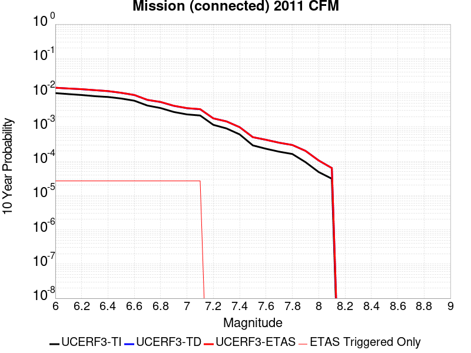 |

| Magnitude | 1 wk TI Prob | 1 wk TD Prob | 1 wk ETAS Prob | 1 wk ETAS/TD Gain | 1 wk ETAS Triggered Only | 1 mo TI Prob | 1 mo TD Prob | 1 mo ETAS Prob | 1 mo ETAS/TD Gain | 1 mo ETAS Triggered Only | 1 yr TI Prob | 1 yr TD Prob | 1 yr ETAS Prob | 1 yr ETAS/TD Gain | 1 yr ETAS Triggered Only | 10 yr TI Prob | 10 yr TD Prob | 10 yr ETAS Prob | 10 yr ETAS/TD Gain | 10 yr ETAS Triggered Only |
|-----|-----|-----|-----|-----|-----|-----|-----|-----|-----|-----|-----|-----|-----|-----|-----|-----|-----|-----|-----|-----|
| 6.0 | 1.8735573E-5 | 2.6882515E-5 | 2.6882515E-5 | 1.0 | 0.0 | 8.029284E-5 | 1.1520558E-4 | 1.1520558E-4 | 1.0 | 0.0 | 9.771269E-4 | 0.0014016571 | 0.0014120784 | 1.007435 | 1.0435908E-5 | 0.009728416 | 0.013937562 | 0.013958142 | 1.0014766 | 2.0871816E-5 |
| 6.1 | 1.7515964E-5 | 2.5523792E-5 | 2.5523792E-5 | 1.0 | 0.0 | 7.506625E-5 | 1.0938298E-4 | 1.0938298E-4 | 1.0 | 0.0 | 9.135484E-4 | 0.0013308554 | 0.0013412774 | 1.0078311 | 1.0435908E-5 | 0.009098019 | 0.0132381655 | 0.013258762 | 1.0015558 | 2.0871816E-5 |
| 6.2 | 1.6486343E-5 | 2.4368448E-5 | 2.4368448E-5 | 1.0 | 0.0 | 7.065384E-5 | 1.0443191E-4 | 1.0443191E-4 | 1.0 | 0.0 | 8.5987104E-4 | 0.0012706495 | 0.0012810722 | 1.0082027 | 1.0435908E-5 | 0.008565514 | 0.012643143 | 0.01266375 | 1.00163 | 2.0871816E-5 |
| 6.3 | 1.5229385E-5 | 2.2797909E-5 | 2.2797909E-5 | 1.0 | 0.0 | 6.526716E-5 | 9.7701544E-5 | 9.7701544E-5 | 1.0 | 0.0 | 7.9433795E-4 | 0.0011887997 | 0.0011992232 | 1.0087681 | 1.0435908E-5 | 0.007915046 | 0.011836352 | 0.011856976 | 1.0017425 | 2.0871816E-5 |
| 6.4 | 1.4435828E-5 | 2.1398E-5 | 2.1398E-5 | 1.0 | 0.0 | 6.186637E-5 | 9.1702364E-5 | 9.1702364E-5 | 1.0 | 0.0 | 7.529627E-4 | 0.0011158385 | 0.0011262627 | 1.0093421 | 1.0435908E-5 | 0.007504165 | 0.011119362 | 0.011140002 | 1.0018562 | 2.0871816E-5 |
| 6.5 | 1.30127955E-5 | 1.9037068E-5 | 1.9037068E-5 | 1.0 | 0.0 | 5.576793E-5 | 8.1584905E-5 | 8.1584905E-5 | 1.0 | 0.0 | 6.78763E-4 | 9.927875E-4 | 9.927875E-4 | 1.0 | 0.0 | 0.0067669353 | 0.009911527 | 0.009921859 | 1.0010425 | 1.0435908E-5 |
| 6.6 | 1.1220718E-5 | 1.639339E-5 | 1.639339E-5 | 1.0 | 0.0 | 4.8087906E-5 | 7.0255504E-5 | 7.0255504E-5 | 1.0 | 0.0 | 5.8531296E-4 | 8.5502357E-4 | 8.5502357E-4 | 1.0 | 0.0 | 0.005837737 | 0.00854963 | 0.008559977 | 1.0012102 | 1.0435908E-5 |
| 6.7 | 8.086152E-6 | 1.1750298E-5 | 1.1750298E-5 | 1.0 | 0.0 | 3.4654473E-5 | 5.035745E-5 | 5.035745E-5 | 1.0 | 0.0 | 4.2183654E-4 | 6.129302E-4 | 6.129302E-4 | 1.0 | 0.0 | 0.004210367 | 0.0061497535 | 0.006160125 | 1.0016866 | 1.0435908E-5 |
| 6.8 | 6.8361655E-6 | 1.0195406E-5 | 1.0195406E-5 | 1.0 | 0.0 | 2.9297524E-5 | 4.3693864E-5 | 4.3693864E-5 | 1.0 | 0.0 | 3.5663895E-4 | 5.3184363E-4 | 5.3184363E-4 | 1.0 | 0.0 | 0.0035606713 | 0.0053387266 | 0.0053491066 | 1.0019443 | 1.0435908E-5 |
| 6.9 | 5.2517353E-6 | 7.8690955E-6 | 7.8690955E-6 | 1.0 | 0.0 | 2.2507242E-5 | 3.3724264E-5 | 3.3724264E-5 | 1.0 | 0.0 | 2.739912E-4 | 4.105158E-4 | 4.105158E-4 | 1.0 | 0.0 | 0.0027365363 | 0.004129868 | 0.0041402606 | 1.0025165 | 1.0435908E-5 |
| 7.0 | 4.4602784E-6 | 6.7016504E-6 | 6.7016504E-6 | 1.0 | 0.0 | 1.911534E-5 | 2.8721044E-5 | 2.8721044E-5 | 1.0 | 0.0 | 2.327044E-4 | 3.4962274E-4 | 3.4962274E-4 | 1.0 | 0.0 | 0.0023246086 | 0.0035221886 | 0.0035325878 | 1.0029525 | 1.0435908E-5 |
| 7.1 | 4.1492594E-6 | 6.2504096E-6 | 6.2504096E-6 | 1.0 | 0.0 | 1.7782419E-5 | 2.6787196E-5 | 2.6787196E-5 | 1.0 | 0.0 | 2.1647944E-4 | 3.2608546E-4 | 3.2608546E-4 | 1.0 | 0.0 | 0.0021626868 | 0.0032870003 | 0.0032974018 | 1.0031644 | 1.0435908E-5 |
| 7.2 | 2.213247E-6 | 3.3628444E-6 | 3.3628444E-6 | 1.0 | 0.0 | 9.485309E-6 | 1.441211E-5 | 1.441211E-5 | 1.0 | 0.0 | 1.15477524E-4 | 1.7545334E-4 | 1.7545334E-4 | 1.0 | 0.0 | 0.0011541754 | 0.0017818302 | 0.0017818302 | 1.0 | 0.0 |
| 7.3 | 1.7362703E-6 | 2.7384676E-6 | 2.7384676E-6 | 1.0 | 0.0 | 7.4411373E-6 | 1.1736238E-5 | 1.1736238E-5 | 1.0 | 0.0 | 9.0592075E-5 | 1.4287935E-4 | 1.4287935E-4 | 1.0 | 0.0 | 9.0555154E-4 | 0.0014532148 | 0.0014532148 | 1.0 | 0.0 |
| 7.4 | 1.1628409E-6 | 1.8493533E-6 | 1.8493533E-6 | 1.0 | 0.0 | 4.9835944E-6 | 7.925776E-6 | 7.925776E-6 | 1.0 | 0.0 | 6.0673574E-5 | 9.649206E-5 | 9.649206E-5 | 1.0 | 0.0 | 6.065701E-4 | 9.85306E-4 | 9.85306E-4 | 1.0 | 0.0 |
| 7.5 | 5.5610667E-7 | 9.343823E-7 | 9.343823E-7 | 1.0 | 0.0 | 2.3833122E-6 | 4.0044893E-6 | 4.0044893E-6 | 1.0 | 0.0 | 2.9016439E-5 | 4.8753573E-5 | 4.8753573E-5 | 1.0 | 0.0 | 2.901265E-4 | 5.0411286E-4 | 5.0411286E-4 | 1.0 | 0.0 |
| 7.6 | 4.4307663E-7 | 7.784628E-7 | 7.784628E-7 | 1.0 | 0.0 | 1.8988985E-6 | 3.3362649E-6 | 3.3362649E-6 | 1.0 | 0.0 | 2.3118844E-5 | 4.061827E-5 | 4.061827E-5 | 1.0 | 0.0 | 2.3116439E-4 | 4.2210697E-4 | 4.2210697E-4 | 1.0 | 0.0 |
| 7.7 | 3.639119E-7 | 6.3549425E-7 | 6.3549425E-7 | 1.0 | 0.0 | 1.5596215E-6 | 2.7235437E-6 | 2.7235437E-6 | 1.0 | 0.0 | 1.8988227E-5 | 3.315864E-5 | 3.315864E-5 | 1.0 | 0.0 | 1.8986604E-4 | 3.4690052E-4 | 3.4690052E-4 | 1.0 | 0.0 |
| 7.8 | 3.1152942E-7 | 5.474834E-7 | 5.474834E-7 | 1.0 | 0.0 | 1.3351254E-6 | 2.3463554E-6 | 2.3463554E-6 | 1.0 | 0.0 | 1.6255031E-5 | 2.8566503E-5 | 2.8566503E-5 | 1.0 | 0.0 | 1.6253842E-4 | 2.977112E-4 | 2.977112E-4 | 1.0 | 0.0 |
| 7.9 | 1.8035962E-7 | 3.7184682E-7 | 3.7184682E-7 | 1.0 | 0.0 | 7.729696E-7 | 1.5936282E-6 | 1.5936282E-6 | 1.0 | 0.0 | 9.410865E-6 | 1.9402252E-5 | 1.9402252E-5 | 1.0 | 0.0 | 9.410465E-5 | 2.0071324E-4 | 2.0071324E-4 | 1.0 | 0.0 |
| 8.0 | 9.279334E-8 | 1.9695527E-7 | 1.9695527E-7 | 1.0 | 0.0 | 3.976857E-7 | 8.4409373E-7 | 8.4409373E-7 | 1.0 | 0.0 | 4.841813E-6 | 1.0276794E-5 | 1.0276794E-5 | 1.0 | 0.0 | 4.841707E-5 | 1.05289524E-4 | 1.05289524E-4 | 1.0 | 0.0 |
| 8.1 | 5.9253985E-8 | 1.18509675E-7 | 1.18509675E-7 | 1.0 | 0.0 | 2.5394561E-7 | 5.078985E-7 | 5.078985E-7 | 1.0 | 0.0 | 3.0917836E-6 | 6.183647E-6 | 6.183647E-6 | 1.0 | 0.0 | 3.0917407E-5 | 6.322351E-5 | 6.322351E-5 | 1.0 | 0.0 |

## Northridge
*[(top)](#table-of-contents)*

| 1 Week | 1 Month | 1 Year | 10 Year |
|-----|-----|-----|-----|
| 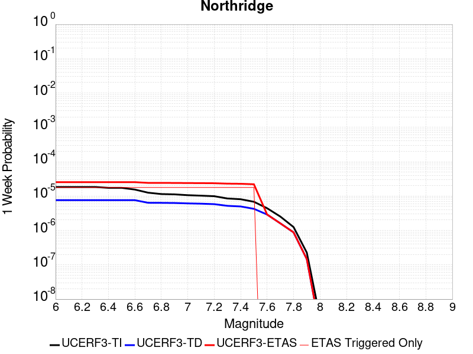 | 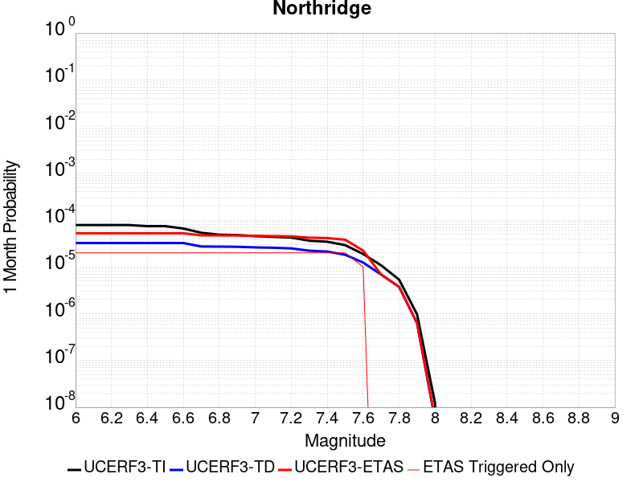 | 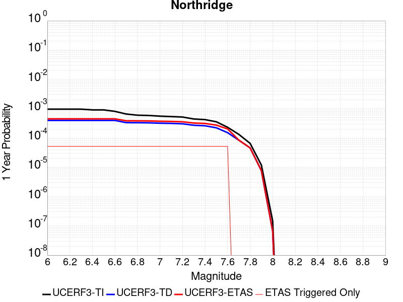 | 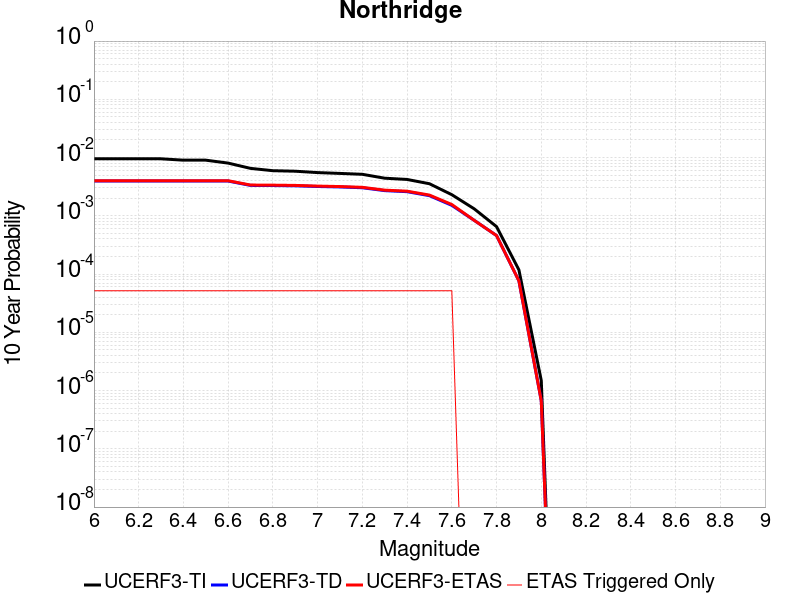 |

| Magnitude | 1 wk TI Prob | 1 wk TD Prob | 1 wk ETAS Prob | 1 wk ETAS/TD Gain | 1 wk ETAS Triggered Only | 1 mo TI Prob | 1 mo TD Prob | 1 mo ETAS Prob | 1 mo ETAS/TD Gain | 1 mo ETAS Triggered Only | 1 yr TI Prob | 1 yr TD Prob | 1 yr ETAS Prob | 1 yr ETAS/TD Gain | 1 yr ETAS Triggered Only | 10 yr TI Prob | 10 yr TD Prob | 10 yr ETAS Prob | 10 yr ETAS/TD Gain | 10 yr ETAS Triggered Only |
|-----|-----|-----|-----|-----|-----|-----|-----|-----|-----|-----|-----|-----|-----|-----|-----|-----|-----|-----|-----|-----|
| 6.0 | 1.8340852E-5 | 7.5880193E-6 | 1.8023848E-5 | 2.3753033 | 1.0435908E-5 | 7.860128E-5 | 3.251969E-5 | 5.3390828E-5 | 1.6418 | 2.0871816E-5 | 9.565505E-4 | 3.958575E-4 | 4.1672104E-4 | 1.0527047 | 2.0871816E-5 | 0.009524435 | 0.003951746 | 0.0039725355 | 1.0052608 | 2.0871816E-5 |
| 6.1 | 1.8340852E-5 | 7.5880193E-6 | 1.8023848E-5 | 2.3753033 | 1.0435908E-5 | 7.860128E-5 | 3.251969E-5 | 5.3390828E-5 | 1.6418 | 2.0871816E-5 | 9.565505E-4 | 3.958575E-4 | 4.1672104E-4 | 1.0527047 | 2.0871816E-5 | 0.009524435 | 0.003951746 | 0.0039725355 | 1.0052608 | 2.0871816E-5 |
| 6.2 | 1.8340852E-5 | 7.5880193E-6 | 1.8023848E-5 | 2.3753033 | 1.0435908E-5 | 7.860128E-5 | 3.251969E-5 | 5.3390828E-5 | 1.6418 | 2.0871816E-5 | 9.565505E-4 | 3.958575E-4 | 4.1672104E-4 | 1.0527047 | 2.0871816E-5 | 0.009524435 | 0.003951746 | 0.0039725355 | 1.0052608 | 2.0871816E-5 |
| 6.3 | 1.8340852E-5 | 7.5880193E-6 | 1.8023848E-5 | 2.3753033 | 1.0435908E-5 | 7.860128E-5 | 3.251969E-5 | 5.3390828E-5 | 1.6418 | 2.0871816E-5 | 9.565505E-4 | 3.958575E-4 | 4.1672104E-4 | 1.0527047 | 2.0871816E-5 | 0.009524435 | 0.003951746 | 0.0039725355 | 1.0052608 | 2.0871816E-5 |
| 6.4 | 1.7361892E-5 | 7.5880193E-6 | 1.8023848E-5 | 2.3753033 | 1.0435908E-5 | 7.440598E-5 | 3.251969E-5 | 5.3390828E-5 | 1.6418 | 2.0871816E-5 | 9.055163E-4 | 3.958575E-4 | 4.1672104E-4 | 1.0527047 | 2.0871816E-5 | 0.009018354 | 0.003951746 | 0.0039725355 | 1.0052608 | 2.0871816E-5 |
| 6.5 | 1.7361892E-5 | 7.5880193E-6 | 1.8023848E-5 | 2.3753033 | 1.0435908E-5 | 7.440598E-5 | 3.251969E-5 | 5.3390828E-5 | 1.6418 | 2.0871816E-5 | 9.055163E-4 | 3.958575E-4 | 4.1672104E-4 | 1.0527047 | 2.0871816E-5 | 0.009018354 | 0.003951746 | 0.0039725355 | 1.0052608 | 2.0871816E-5 |
| 6.6 | 1.5458201E-5 | 7.5880193E-6 | 1.8023848E-5 | 2.3753033 | 1.0435908E-5 | 6.624775E-5 | 3.251969E-5 | 5.3390828E-5 | 1.6418 | 2.0871816E-5 | 8.0626784E-4 | 3.958575E-4 | 4.1672104E-4 | 1.0527047 | 2.0871816E-5 | 0.008033488 | 0.003951746 | 0.0039725355 | 1.0052608 | 2.0871816E-5 |
| 6.7 | 1.2538368E-5 | 6.381603E-6 | 1.6817445E-5 | 2.6353009 | 1.0435908E-5 | 5.3734755E-5 | 2.7349442E-5 | 4.822069E-5 | 1.7631323 | 2.0871816E-5 | 6.5402425E-4 | 3.3292902E-4 | 3.537939E-4 | 1.0626706 | 2.0871816E-5 | 0.0065210275 | 0.0033243506 | 0.003345153 | 1.0062575 | 2.0871816E-5 |
| 6.8 | 1.1438097E-5 | 6.3502566E-6 | 1.6786098E-5 | 2.6433733 | 1.0435908E-5 | 4.9019498E-5 | 2.7215105E-5 | 4.8086353E-5 | 1.7668993 | 2.0871816E-5 | 5.9664896E-4 | 3.3129397E-4 | 3.5215885E-4 | 1.06298 | 2.0871816E-5 | 0.005950495 | 0.0033080487 | 0.0033288514 | 1.0062885 | 2.0871816E-5 |
| 6.9 | 1.1204891E-5 | 6.2867084E-6 | 1.6722552E-5 | 2.659985 | 1.0435908E-5 | 4.8020076E-5 | 2.694276E-5 | 4.7814014E-5 | 1.7746516 | 2.0871816E-5 | 5.8448757E-4 | 3.2797916E-4 | 3.4884413E-4 | 1.0636168 | 2.0871816E-5 | 0.0058295266 | 0.0032749989 | 0.0032958023 | 1.0063522 | 2.0871816E-5 |
| 7.0 | 1.061046E-5 | 6.115359E-6 | 1.6551203E-5 | 2.7064974 | 1.0435908E-5 | 4.5472607E-5 | 2.6208421E-5 | 4.707969E-5 | 1.7963574 | 2.0871816E-5 | 5.534883E-4 | 3.1904122E-4 | 3.399064E-4 | 1.0653995 | 2.0871816E-5 | 0.0055211177 | 0.0031858785 | 0.0032066838 | 1.0065305 | 2.0871816E-5 |
| 7.1 | 1.0266979E-5 | 6.004274E-6 | 1.6440119E-5 | 2.7380695 | 1.0435908E-5 | 4.40006E-5 | 2.5732352E-5 | 4.660363E-5 | 1.811091 | 2.0871816E-5 | 5.355756E-4 | 3.1324677E-4 | 3.3411203E-4 | 1.0666097 | 2.0871816E-5 | 0.0053428668 | 0.003128098 | 0.0031489048 | 1.0066515 | 2.0871816E-5 |
| 7.2 | 9.91273E-6 | 5.819984E-6 | 1.6255832E-5 | 2.7931058 | 1.0435908E-5 | 4.248244E-5 | 2.4942554E-5 | 4.581385E-5 | 1.8367746 | 2.0871816E-5 | 5.171009E-4 | 3.036337E-4 | 3.2449915E-4 | 1.0687193 | 2.0871816E-5 | 0.0051589934 | 0.0030322333 | 0.0030530419 | 1.0068624 | 2.0871816E-5 |
| 7.3 | 8.4959265E-6 | 5.193062E-6 | 1.5628915E-5 | 3.0095763 | 1.0435908E-5 | 3.6410605E-5 | 2.225579E-5 | 4.312714E-5 | 1.9377942 | 2.0871816E-5 | 4.4320893E-4 | 2.709308E-4 | 2.9179695E-4 | 1.0770166 | 2.0871816E-5 | 0.00442326 | 0.0027060313 | 0.0027268468 | 1.0076922 | 2.0871816E-5 |
| 7.4 | 8.0847185E-6 | 4.9819355E-6 | 1.541779E-5 | 3.0947392 | 1.0435908E-5 | 3.4648332E-5 | 2.135098E-5 | 4.222235E-5 | 1.9775369 | 2.0871816E-5 | 4.2176177E-4 | 2.599174E-4 | 2.807838E-4 | 1.0802809 | 2.0871816E-5 | 0.0042096223 | 0.00259616 | 0.0026169776 | 1.0080186 | 2.0871816E-5 |
| 7.5 | 6.8220684E-6 | 4.2533075E-6 | 1.4689171E-5 | 3.4535878 | 1.0435908E-5 | 2.9237108E-5 | 1.8228335E-5 | 3.909977E-5 | 2.1449995 | 2.0871816E-5 | 3.5590364E-4 | 2.2190758E-4 | 2.4277477E-4 | 1.0940355 | 2.0871816E-5 | 0.0035533418 | 0.002216881 | 0.0022377064 | 1.009394 | 2.0871816E-5 |
| 7.6 | 4.4224143E-6 | 2.8999582E-6 | 2.8999582E-6 | 1.0 | 0.0 | 1.8953066E-5 | 1.2428334E-5 | 2.2864113E-5 | 1.8396764 | 1.0435908E-5 | 2.3072914E-4 | 1.5130457E-4 | 1.617389E-4 | 1.0689625 | 1.0435908E-5 | 0.0023048974 | 0.0015120271 | 0.0015224473 | 1.0068915 | 1.0435908E-5 |
| 7.7 | 2.5297056E-6 | 1.6045905E-6 | 1.6045905E-6 | 1.0 | 0.0 | 1.0841551E-5 | 6.8767986E-6 | 6.8767986E-6 | 1.0 | 0.0 | 1.319879E-4 | 8.3721854E-5 | 8.3721854E-5 | 1.0 | 0.0 | 0.0013190953 | 8.369078E-4 | 8.369078E-4 | 1.0 | 0.0 |
| 7.8 | 1.2508156E-6 | 8.780076E-7 | 8.780076E-7 | 1.0 | 0.0 | 5.3606273E-6 | 3.7628845E-6 | 3.7628845E-6 | 1.0 | 0.0 | 6.526368E-5 | 4.581217E-5 | 4.581217E-5 | 1.0 | 0.0 | 6.524452E-4 | 4.5802852E-4 | 4.5802852E-4 | 1.0 | 0.0 |
| 7.9 | 2.262199E-7 | 1.4664671E-7 | 1.4664671E-7 | 1.0 | 0.0 | 9.695135E-7 | 6.284858E-7 | 6.284858E-7 | 1.0 | 0.0 | 1.1803763E-5 | 7.651788E-6 | 7.651788E-6 | 1.0 | 0.0 | 1.1803136E-4 | 7.651533E-5 | 7.651533E-5 | 1.0 | 0.0 |
| 8.0 | 2.865362E-9 | 1.2753101E-9 | 1.2753101E-9 | 1.0 | 0.0 | 1.2280123E-8 | 5.4656146E-9 | 5.4656146E-9 | 1.0 | 0.0 | 1.4951048E-7 | 6.654386E-8 | 6.654386E-8 | 1.0 | 0.0 | 1.4951038E-6 | 6.654386E-7 | 6.654386E-7 | 1.0 | 0.0 |

## Johnson Valley (No) 2011 rev
*[(top)](#table-of-contents)*

| 1 Week | 1 Month | 1 Year | 10 Year |
|-----|-----|-----|-----|
| 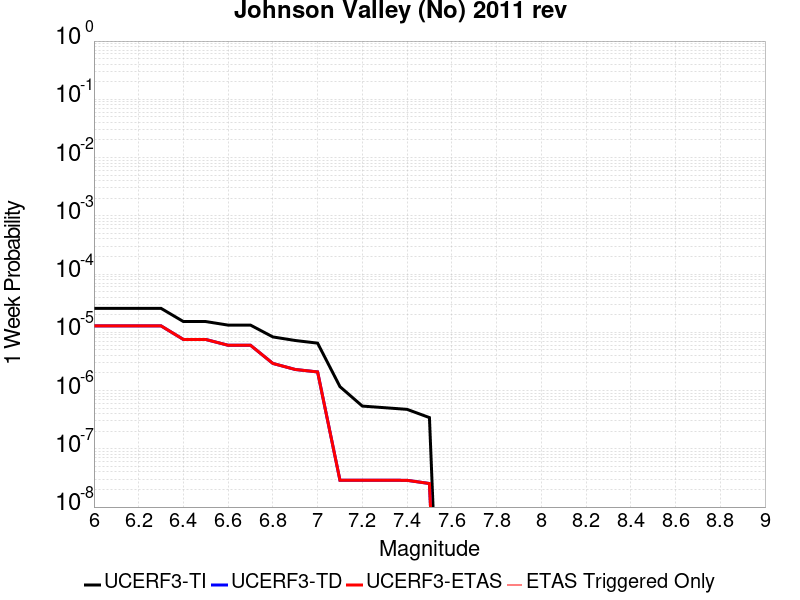 |  | 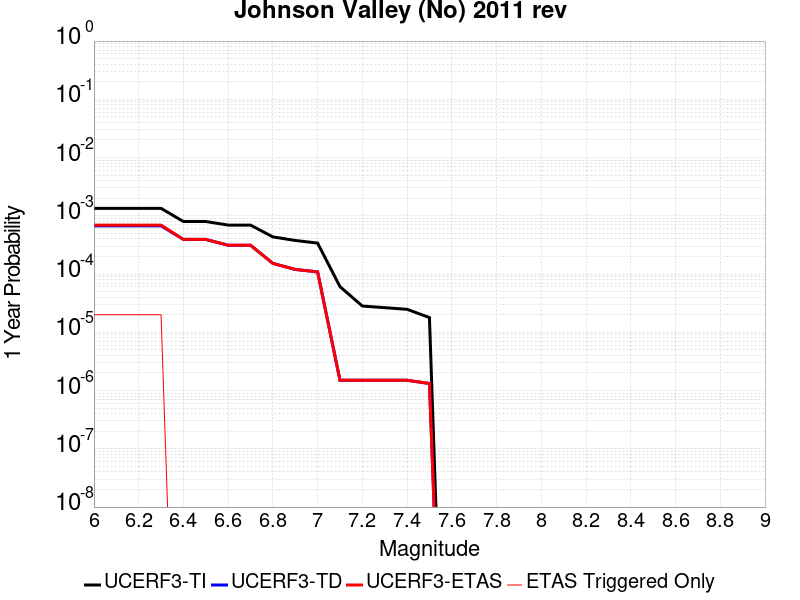 | 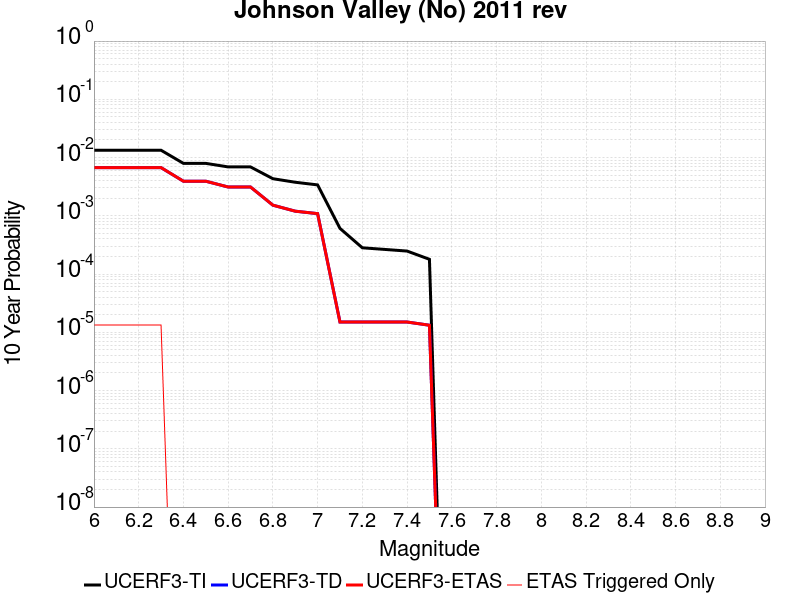 |

| Magnitude | 1 wk TI Prob | 1 wk TD Prob | 1 wk ETAS Prob | 1 wk ETAS/TD Gain | 1 wk ETAS Triggered Only | 1 mo TI Prob | 1 mo TD Prob | 1 mo ETAS Prob | 1 mo ETAS/TD Gain | 1 mo ETAS Triggered Only | 1 yr TI Prob | 1 yr TD Prob | 1 yr ETAS Prob | 1 yr ETAS/TD Gain | 1 yr ETAS Triggered Only | 10 yr TI Prob | 10 yr TD Prob | 10 yr ETAS Prob | 10 yr ETAS/TD Gain | 10 yr ETAS Triggered Only |
|-----|-----|-----|-----|-----|-----|-----|-----|-----|-----|-----|-----|-----|-----|-----|-----|-----|-----|-----|-----|-----|
| 6.0 | 2.577707E-5 | 1.2900938E-5 | 1.2900938E-5 | 1.0 | 0.0 | 1.1046848E-4 | 5.5288787E-5 | 5.5288787E-5 | 1.0 | 0.0 | 0.0013441239 | 6.7297276E-4 | 6.9383055E-4 | 1.0309935 | 2.0871816E-5 | 0.013360229 | 0.006713257 | 0.006733989 | 1.0030881 | 2.0871816E-5 |
| 6.1 | 2.577707E-5 | 1.2900938E-5 | 1.2900938E-5 | 1.0 | 0.0 | 1.1046848E-4 | 5.5288787E-5 | 5.5288787E-5 | 1.0 | 0.0 | 0.0013441239 | 6.7297276E-4 | 6.9383055E-4 | 1.0309935 | 2.0871816E-5 | 0.013360229 | 0.006713257 | 0.006733989 | 1.0030881 | 2.0871816E-5 |
| 6.2 | 2.577707E-5 | 1.2900938E-5 | 1.2900938E-5 | 1.0 | 0.0 | 1.1046848E-4 | 5.5288787E-5 | 5.5288787E-5 | 1.0 | 0.0 | 0.0013441239 | 6.7297276E-4 | 6.9383055E-4 | 1.0309935 | 2.0871816E-5 | 0.013360229 | 0.006713257 | 0.006733989 | 1.0030881 | 2.0871816E-5 |
| 6.3 | 2.577707E-5 | 1.2900938E-5 | 1.2900938E-5 | 1.0 | 0.0 | 1.1046848E-4 | 5.5288787E-5 | 5.5288787E-5 | 1.0 | 0.0 | 0.0013441239 | 6.7297276E-4 | 6.9383055E-4 | 1.0309935 | 2.0871816E-5 | 0.013360229 | 0.006713257 | 0.006733989 | 1.0030881 | 2.0871816E-5 |
| 6.4 | 1.5296591E-5 | 7.536742E-6 | 7.536742E-6 | 1.0 | 0.0 | 6.555518E-5 | 3.2300028E-5 | 3.2300028E-5 | 1.0 | 0.0 | 7.97842E-4 | 3.9320064E-4 | 3.9320064E-4 | 1.0 | 0.0 | 0.007949836 | 0.0039268904 | 0.0039268904 | 1.0 | 0.0 |
| 6.5 | 1.5296591E-5 | 7.536742E-6 | 7.536742E-6 | 1.0 | 0.0 | 6.555518E-5 | 3.2300028E-5 | 3.2300028E-5 | 1.0 | 0.0 | 7.97842E-4 | 3.9320064E-4 | 3.9320064E-4 | 1.0 | 0.0 | 0.007949836 | 0.0039268904 | 0.0039268904 | 1.0 | 0.0 |
| 6.6 | 1.3289383E-5 | 5.9917306E-6 | 5.9917306E-6 | 1.0 | 0.0 | 5.6953253E-5 | 2.5678688E-5 | 2.5678688E-5 | 1.0 | 0.0 | 6.9318525E-4 | 3.1261015E-4 | 3.1261015E-4 | 1.0 | 0.0 | 0.0069102696 | 0.0031233684 | 0.0031233684 | 1.0 | 0.0 |
| 6.7 | 1.3289383E-5 | 5.9917306E-6 | 5.9917306E-6 | 1.0 | 0.0 | 5.6953253E-5 | 2.5678688E-5 | 2.5678688E-5 | 1.0 | 0.0 | 6.9318525E-4 | 3.1261015E-4 | 3.1261015E-4 | 1.0 | 0.0 | 0.0069102696 | 0.0031233684 | 0.0031233684 | 1.0 | 0.0 |
| 6.8 | 8.330789E-6 | 2.9211888E-6 | 2.9211888E-6 | 1.0 | 0.0 | 3.570289E-5 | 1.2519352E-5 | 1.2519352E-5 | 1.0 | 0.0 | 4.34596E-4 | 1.5241816E-4 | 1.5241816E-4 | 1.0 | 0.0 | 0.0043374705 | 0.0015236961 | 0.0015236961 | 1.0 | 0.0 |
| 6.9 | 7.2359003E-6 | 2.3013247E-6 | 2.3013247E-6 | 1.0 | 0.0 | 3.1010633E-5 | 9.8628125E-6 | 9.8628125E-6 | 1.0 | 0.0 | 3.7748902E-4 | 1.2007845E-4 | 1.2007845E-4 | 1.0 | 0.0 | 0.0037684843 | 0.0012006586 | 0.0012006586 | 1.0 | 0.0 |
| 7.0 | 6.5149957E-6 | 2.088482E-6 | 2.088482E-6 | 1.0 | 0.0 | 2.792111E-5 | 8.950637E-6 | 8.950637E-6 | 1.0 | 0.0 | 3.398865E-4 | 1.0897385E-4 | 1.0897385E-4 | 1.0 | 0.0 | 0.003393671 | 0.0010897239 | 0.0010897239 | 1.0 | 0.0 |
| 7.1 | 1.1662233E-6 | 2.8802024E-8 | 2.8802024E-8 | 1.0 | 0.0 | 4.9980904E-6 | 1.2343725E-7 | 1.2343725E-7 | 1.0 | 0.0 | 6.0850052E-5 | 1.5028476E-6 | 1.5028476E-6 | 1.0 | 0.0 | 6.083339E-4 | 1.50283895E-5 | 1.50283895E-5 | 1.0 | 0.0 |
| 7.2 | 5.413881E-7 | 2.8802024E-8 | 2.8802024E-8 | 1.0 | 0.0 | 2.3202326E-6 | 1.2343725E-7 | 1.2343725E-7 | 1.0 | 0.0 | 2.8248465E-5 | 1.5028476E-6 | 1.5028476E-6 | 1.0 | 0.0 | 2.8244875E-4 | 1.50283895E-5 | 1.50283895E-5 | 1.0 | 0.0 |
| 7.3 | 5.076821E-7 | 2.8802024E-8 | 2.8802024E-8 | 1.0 | 0.0 | 2.1757785E-6 | 1.2343723E-7 | 1.2343723E-7 | 1.0 | 0.0 | 2.648978E-5 | 1.5028475E-6 | 1.5028475E-6 | 1.0 | 0.0 | 2.6486625E-4 | 1.50283895E-5 | 1.50283895E-5 | 1.0 | 0.0 |
| 7.4 | 4.7568687E-7 | 2.8783948E-8 | 2.8783948E-8 | 1.0 | 0.0 | 2.0386565E-6 | 1.2335977E-7 | 1.2335977E-7 | 1.0 | 0.0 | 2.482036E-5 | 1.5019043E-6 | 1.5019043E-6 | 1.0 | 0.0 | 2.4817587E-4 | 1.5018958E-5 | 1.5018958E-5 | 1.0 | 0.0 |
| 7.5 | 3.435626E-7 | 2.5357679E-8 | 2.5357679E-8 | 1.0 | 0.0 | 1.4724103E-6 | 1.0867576E-7 | 1.0867576E-7 | 1.0 | 0.0 | 1.7926448E-5 | 1.3231268E-6 | 1.3231268E-6 | 1.0 | 0.0 | 1.7925001E-4 | 1.3231205E-5 | 1.3231205E-5 | 1.0 | 0.0 |

## Likely 2011 CFM
*[(top)](#table-of-contents)*

| 1 Week | 1 Month | 1 Year | 10 Year |
|-----|-----|-----|-----|
|  |  | 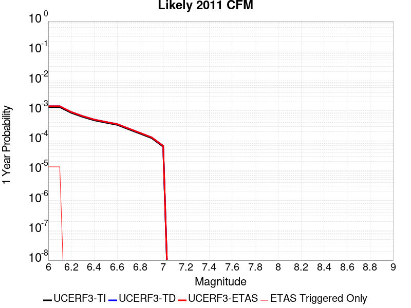 | 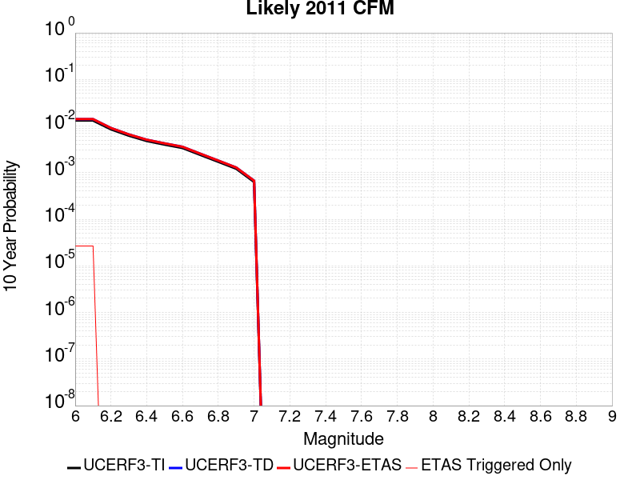 |

| Magnitude | 1 wk TI Prob | 1 wk TD Prob | 1 wk ETAS Prob | 1 wk ETAS/TD Gain | 1 wk ETAS Triggered Only | 1 mo TI Prob | 1 mo TD Prob | 1 mo ETAS Prob | 1 mo ETAS/TD Gain | 1 mo ETAS Triggered Only | 1 yr TI Prob | 1 yr TD Prob | 1 yr ETAS Prob | 1 yr ETAS/TD Gain | 1 yr ETAS Triggered Only | 10 yr TI Prob | 10 yr TD Prob | 10 yr ETAS Prob | 10 yr ETAS/TD Gain | 10 yr ETAS Triggered Only |
|-----|-----|-----|-----|-----|-----|-----|-----|-----|-----|-----|-----|-----|-----|-----|-----|-----|-----|-----|-----|-----|
| 6.0 | 2.5315949E-5 | 2.7104748E-5 | 2.7104748E-5 | 1.0 | 0.0 | 1.0849241E-4 | 1.16158284E-4 | 1.16158284E-4 | 1.0 | 0.0 | 0.0013200947 | 0.0014133542 | 0.0014237753 | 1.0073733 | 1.0435908E-5 | 0.013122803 | 0.01404831 | 0.0140688885 | 1.0014648 | 2.0871816E-5 |
| 6.1 | 2.5315949E-5 | 2.7104748E-5 | 2.7104748E-5 | 1.0 | 0.0 | 1.0849241E-4 | 1.16158284E-4 | 1.16158284E-4 | 1.0 | 0.0 | 0.0013200947 | 0.0014133542 | 0.0014237753 | 1.0073733 | 1.0435908E-5 | 0.013122803 | 0.01404831 | 0.0140688885 | 1.0014648 | 2.0871816E-5 |
| 6.2 | 1.6375941E-5 | 1.7465842E-5 | 1.7465842E-5 | 1.0 | 0.0 | 7.0180715E-5 | 7.485153E-5 | 7.485153E-5 | 1.0 | 0.0 | 8.5411523E-4 | 9.109487E-4 | 9.109487E-4 | 1.0 | 0.0 | 0.008508399 | 0.009073433 | 0.009083774 | 1.0011398 | 1.0435908E-5 |
| 6.3 | 1.1945543E-5 | 1.2712587E-5 | 1.2712587E-5 | 1.0 | 0.0 | 5.119418E-5 | 5.4481407E-5 | 5.4481407E-5 | 1.0 | 0.0 | 6.2311086E-4 | 6.631146E-4 | 6.631146E-4 | 1.0 | 0.0 | 0.0062136655 | 0.0066119144 | 0.0066222814 | 1.001568 | 1.0435908E-5 |
| 6.4 | 9.192729E-6 | 9.768488E-6 | 9.768488E-6 | 1.0 | 0.0 | 3.939681E-5 | 4.1864292E-5 | 4.1864292E-5 | 1.0 | 0.0 | 4.7955062E-4 | 5.0958124E-4 | 5.0958124E-4 | 1.0 | 0.0 | 0.004785171 | 0.0050844094 | 0.0050844094 | 1.0 | 0.0 |
| 6.5 | 7.67906E-6 | 8.152622E-6 | 8.152622E-6 | 1.0 | 0.0 | 3.2909844E-5 | 3.4939352E-5 | 3.4939352E-5 | 1.0 | 0.0 | 4.006037E-4 | 4.2530545E-4 | 4.2530545E-4 | 1.0 | 0.0 | 0.0039988225 | 0.004245108 | 0.004245108 | 1.0 | 0.0 |
| 6.6 | 6.4884057E-6 | 6.8847507E-6 | 6.8847507E-6 | 1.0 | 0.0 | 2.7807157E-5 | 2.9505749E-5 | 2.9505749E-5 | 1.0 | 0.0 | 3.3849955E-4 | 3.591747E-4 | 3.591747E-4 | 1.0 | 0.0 | 0.003379844 | 0.0035860867 | 0.0035860867 | 1.0 | 0.0 |
| 6.7 | 4.6060636E-6 | 4.884041E-6 | 4.884041E-6 | 1.0 | 0.0 | 1.9740122E-5 | 2.0931442E-5 | 2.0931442E-5 | 1.0 | 0.0 | 2.403095E-4 | 2.5481134E-4 | 2.5481134E-4 | 1.0 | 0.0 | 0.002400498 | 0.0025452746 | 0.0025452746 | 1.0 | 0.0 |
| 6.8 | 3.2795615E-6 | 3.4773732E-6 | 3.4773732E-6 | 1.0 | 0.0 | 1.4055187E-5 | 1.4902946E-5 | 1.4902946E-5 | 1.0 | 0.0 | 1.7110848E-4 | 1.8142881E-4 | 1.8142881E-4 | 1.0 | 0.0 | 0.0017097679 | 0.0018128622 | 0.0018128622 | 1.0 | 0.0 |
| 6.9 | 2.3289967E-6 | 2.4705569E-6 | 2.4705569E-6 | 1.0 | 0.0 | 9.981376E-6 | 1.058806E-5 | 1.058806E-5 | 1.0 | 0.0 | 1.2151648E-4 | 1.2890245E-4 | 1.2890245E-4 | 1.0 | 0.0 | 0.0012145005 | 0.0012883197 | 0.0012883197 | 1.0 | 0.0 |
| 7.0 | 1.211292E-6 | 1.2863958E-6 | 1.2863958E-6 | 1.0 | 0.0 | 5.1912407E-6 | 5.5131145E-6 | 5.5131145E-6 | 1.0 | 0.0 | 6.320152E-5 | 6.712041E-5 | 6.712041E-5 | 1.0 | 0.0 | 6.3183554E-4 | 6.710312E-4 | 6.710312E-4 | 1.0 | 0.0 |

## Garberville - Briceland 2011 CFM
*[(top)](#table-of-contents)*

| 1 Week | 1 Month | 1 Year | 10 Year |
|-----|-----|-----|-----|
|  |  |  | 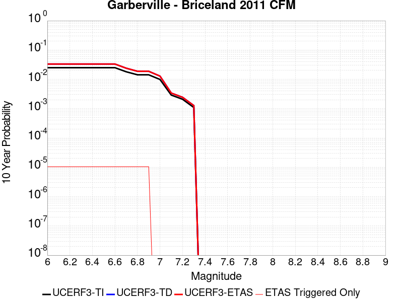 |

| Magnitude | 1 wk TI Prob | 1 wk TD Prob | 1 wk ETAS Prob | 1 wk ETAS/TD Gain | 1 wk ETAS Triggered Only | 1 mo TI Prob | 1 mo TD Prob | 1 mo ETAS Prob | 1 mo ETAS/TD Gain | 1 mo ETAS Triggered Only | 1 yr TI Prob | 1 yr TD Prob | 1 yr ETAS Prob | 1 yr ETAS/TD Gain | 1 yr ETAS Triggered Only | 10 yr TI Prob | 10 yr TD Prob | 10 yr ETAS Prob | 10 yr ETAS/TD Gain | 10 yr ETAS Triggered Only |
|-----|-----|-----|-----|-----|-----|-----|-----|-----|-----|-----|-----|-----|-----|-----|-----|-----|-----|-----|-----|-----|
| 6.0 | 4.8399295E-5 | 6.452381E-5 | 6.452381E-5 | 1.0 | 0.0 | 2.0740906E-4 | 2.7650563E-4 | 2.7650563E-4 | 1.0 | 0.0 | 0.002522281 | 0.003362017 | 0.003362017 | 1.0 | 0.0 | 0.024938442 | 0.03317861 | 0.0331887 | 1.0003041 | 1.0435908E-5 |
| 6.1 | 4.8399295E-5 | 6.452381E-5 | 6.452381E-5 | 1.0 | 0.0 | 2.0740906E-4 | 2.7650563E-4 | 2.7650563E-4 | 1.0 | 0.0 | 0.002522281 | 0.003362017 | 0.003362017 | 1.0 | 0.0 | 0.024938442 | 0.03317861 | 0.0331887 | 1.0003041 | 1.0435908E-5 |
| 6.2 | 4.8399295E-5 | 6.452381E-5 | 6.452381E-5 | 1.0 | 0.0 | 2.0740906E-4 | 2.7650563E-4 | 2.7650563E-4 | 1.0 | 0.0 | 0.002522281 | 0.003362017 | 0.003362017 | 1.0 | 0.0 | 0.024938442 | 0.03317861 | 0.0331887 | 1.0003041 | 1.0435908E-5 |
| 6.3 | 4.8399295E-5 | 6.452381E-5 | 6.452381E-5 | 1.0 | 0.0 | 2.0740906E-4 | 2.7650563E-4 | 2.7650563E-4 | 1.0 | 0.0 | 0.002522281 | 0.003362017 | 0.003362017 | 1.0 | 0.0 | 0.024938442 | 0.03317861 | 0.0331887 | 1.0003041 | 1.0435908E-5 |
| 6.4 | 4.8399295E-5 | 6.452381E-5 | 6.452381E-5 | 1.0 | 0.0 | 2.0740906E-4 | 2.7650563E-4 | 2.7650563E-4 | 1.0 | 0.0 | 0.002522281 | 0.003362017 | 0.003362017 | 1.0 | 0.0 | 0.024938442 | 0.03317861 | 0.0331887 | 1.0003041 | 1.0435908E-5 |
| 6.5 | 4.8399295E-5 | 6.452381E-5 | 6.452381E-5 | 1.0 | 0.0 | 2.0740906E-4 | 2.7650563E-4 | 2.7650563E-4 | 1.0 | 0.0 | 0.002522281 | 0.003362017 | 0.003362017 | 1.0 | 0.0 | 0.024938442 | 0.03317861 | 0.0331887 | 1.0003041 | 1.0435908E-5 |
| 6.6 | 4.8399295E-5 | 6.452381E-5 | 6.452381E-5 | 1.0 | 0.0 | 2.0740906E-4 | 2.7650563E-4 | 2.7650563E-4 | 1.0 | 0.0 | 0.002522281 | 0.003362017 | 0.003362017 | 1.0 | 0.0 | 0.024938442 | 0.03317861 | 0.0331887 | 1.0003041 | 1.0435908E-5 |
| 6.7 | 3.495179E-5 | 4.6308873E-5 | 4.6308873E-5 | 1.0 | 0.0 | 1.4978478E-4 | 1.9845461E-4 | 1.9845461E-4 | 1.0 | 0.0 | 0.0018221042 | 0.002414053 | 0.002414053 | 1.0 | 0.0 | 0.018072363 | 0.023930617 | 0.023940803 | 1.0004257 | 1.0435908E-5 |
| 6.8 | 2.7517597E-5 | 3.6241618E-5 | 3.6241618E-5 | 1.0 | 0.0 | 1.1792722E-4 | 1.5531474E-4 | 1.5531474E-4 | 1.0 | 0.0 | 0.0014348183 | 0.0018897996 | 0.0018897996 | 1.0 | 0.0 | 0.014255894 | 0.018783508 | 0.018793747 | 1.0005451 | 1.0435908E-5 |
| 6.9 | 2.74461E-5 | 3.6159345E-5 | 3.6159345E-5 | 1.0 | 0.0 | 1.1762084E-4 | 1.5496218E-4 | 1.5496218E-4 | 1.0 | 0.0 | 0.001431093 | 0.0018855145 | 0.0018855145 | 1.0 | 0.0 | 0.014219119 | 0.018741382 | 0.018751621 | 1.0005465 | 1.0435908E-5 |
| 7.0 | 1.9023773E-5 | 2.4707579E-5 | 2.4707579E-5 | 1.0 | 0.0 | 8.152791E-5 | 1.0588763E-4 | 1.0588763E-4 | 1.0 | 0.0 | 9.921503E-4 | 0.0012888284 | 0.0012888284 | 1.0 | 0.0 | 0.009877323 | 0.012852574 | 0.012852574 | 1.0 | 0.0 |
| 7.1 | 5.566844E-6 | 6.512147E-6 | 6.512147E-6 | 1.0 | 0.0 | 2.3857683E-5 | 2.7908927E-5 | 2.7908927E-5 | 1.0 | 0.0 | 2.9042858E-4 | 3.3974246E-4 | 3.3974246E-4 | 1.0 | 0.0 | 0.002900493 | 0.0033926512 | 0.0033926512 | 1.0 | 0.0 |
| 7.2 | 4.011353E-6 | 4.6746213E-6 | 4.6746213E-6 | 1.0 | 0.0 | 1.7191402E-5 | 2.0033956E-5 | 2.0033956E-5 | 1.0 | 0.0 | 2.0928521E-4 | 2.4388955E-4 | 2.4388955E-4 | 1.0 | 0.0 | 0.0020908823 | 0.0024365564 | 0.0024365564 | 1.0 | 0.0 |
| 7.3 | 2.0974871E-6 | 2.4395908E-6 | 2.4395908E-6 | 1.0 | 0.0 | 8.989199E-6 | 1.0455362E-5 | 1.0455362E-5 | 1.0 | 0.0 | 1.09438006E-4 | 1.272891E-4 | 1.272891E-4 | 1.0 | 0.0 | 0.0010938413 | 0.0012724071 | 0.0012724071 | 1.0 | 0.0 |

## San Andreas (Offshore) 2011 CFM
*[(top)](#table-of-contents)*

| 1 Week | 1 Month | 1 Year | 10 Year |
|-----|-----|-----|-----|
|  | 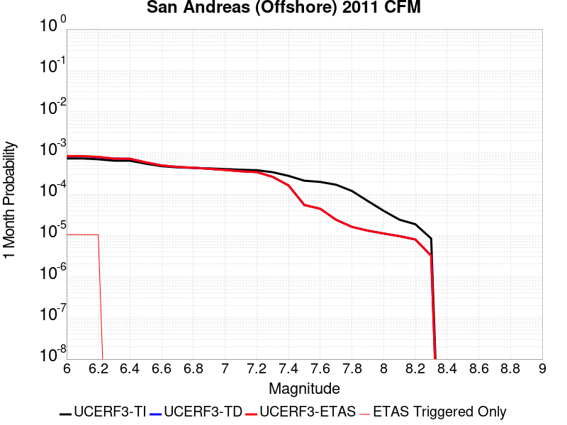 |  | 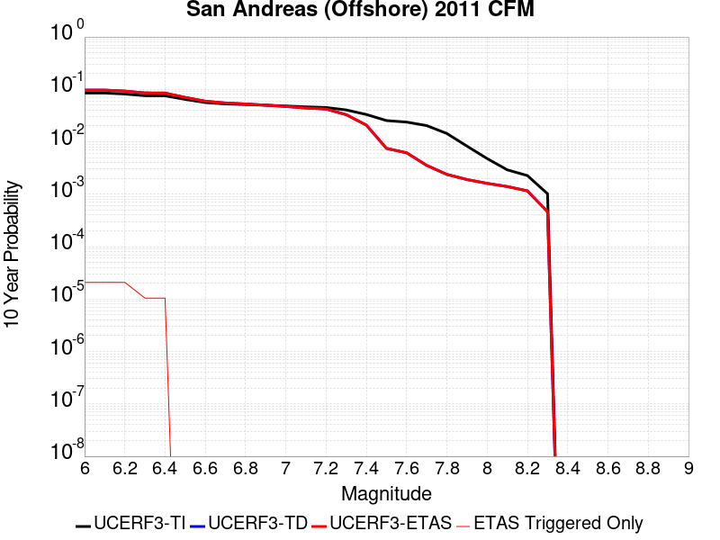 |

| Magnitude | 1 wk TI Prob | 1 wk TD Prob | 1 wk ETAS Prob | 1 wk ETAS/TD Gain | 1 wk ETAS Triggered Only | 1 mo TI Prob | 1 mo TD Prob | 1 mo ETAS Prob | 1 mo ETAS/TD Gain | 1 mo ETAS Triggered Only | 1 yr TI Prob | 1 yr TD Prob | 1 yr ETAS Prob | 1 yr ETAS/TD Gain | 1 yr ETAS Triggered Only | 10 yr TI Prob | 10 yr TD Prob | 10 yr ETAS Prob | 10 yr ETAS/TD Gain | 10 yr ETAS Triggered Only |
|-----|-----|-----|-----|-----|-----|-----|-----|-----|-----|-----|-----|-----|-----|-----|-----|-----|-----|-----|-----|-----|
| 6.0 | 1.7072787E-4 | 1.9226041E-4 | 2.0269433E-4 | 1.0542697 | 1.0435908E-5 | 7.3148566E-4 | 8.237154E-4 | 8.3414273E-4 | 1.0126588 | 1.0435908E-5 | 0.008869528 | 0.0099831335 | 0.009993466 | 1.001035 | 1.0435908E-5 | 0.085237645 | 0.09682738 | 0.09684623 | 1.0001947 | 2.0871816E-5 |
| 6.1 | 1.7072787E-4 | 1.9226041E-4 | 2.0269433E-4 | 1.0542697 | 1.0435908E-5 | 7.3148566E-4 | 8.237154E-4 | 8.3414273E-4 | 1.0126588 | 1.0435908E-5 | 0.008869528 | 0.0099831335 | 0.009993466 | 1.001035 | 1.0435908E-5 | 0.085237645 | 0.09682738 | 0.09684623 | 1.0001947 | 2.0871816E-5 |
| 6.2 | 1.6312556E-4 | 1.8407789E-4 | 1.9451187E-4 | 1.0566825 | 1.0435908E-5 | 6.989222E-4 | 7.8866904E-4 | 7.990968E-4 | 1.0132219 | 1.0435908E-5 | 0.008476226 | 0.009560268 | 0.009570605 | 1.0010811 | 1.0435908E-5 | 0.08160117 | 0.09284818 | 0.09286711 | 1.000204 | 2.0871816E-5 |
| 6.3 | 1.5103363E-4 | 1.6880741E-4 | 1.6880741E-4 | 1.0 | 0.0 | 6.471264E-4 | 7.232619E-4 | 7.232619E-4 | 1.0 | 0.0 | 0.007850339 | 0.008770605 | 0.008770605 | 1.0 | 0.0 | 0.075787395 | 0.085489064 | 0.08549861 | 1.0001116 | 1.0435908E-5 |
| 6.4 | 1.5047993E-4 | 1.676667E-4 | 1.676667E-4 | 1.0 | 0.0 | 6.4475456E-4 | 7.1837584E-4 | 7.1837584E-4 | 1.0 | 0.0 | 0.007821669 | 0.008711592 | 0.008711592 | 1.0 | 0.0 | 0.0755203 | 0.08496926 | 0.08497881 | 1.0001124 | 1.0435908E-5 |
| 6.5 | 1.2760791E-4 | 1.3735025E-4 | 1.3735025E-4 | 1.0 | 0.0 | 5.467764E-4 | 5.885125E-4 | 5.885125E-4 | 1.0 | 0.0 | 0.0066367025 | 0.0071418737 | 0.0071418737 | 1.0 | 0.0 | 0.064419635 | 0.07025001 | 0.07025001 | 1.0 | 0.0 |
| 6.6 | 1.1063525E-4 | 1.15566356E-4 | 1.15566356E-4 | 1.0 | 0.0 | 4.740649E-4 | 4.9519143E-4 | 4.9519143E-4 | 1.0 | 0.0 | 0.0057564764 | 0.006012491 | 0.006012491 | 1.0 | 0.0 | 0.05609626 | 0.05948894 | 0.05948894 | 1.0 | 0.0 |
| 6.7 | 1.0391049E-4 | 1.0645922E-4 | 1.0645922E-4 | 1.0 | 0.0 | 4.4525467E-4 | 4.5617504E-4 | 4.5617504E-4 | 1.0 | 0.0 | 0.0054075094 | 0.005539975 | 0.005539975 | 1.0 | 0.0 | 0.052778035 | 0.05498876 | 0.05498876 | 1.0 | 0.0 |
| 6.8 | 1.0096706E-4 | 1.01582686E-4 | 1.01582686E-4 | 1.0 | 0.0 | 4.3264418E-4 | 4.3528268E-4 | 4.3528268E-4 | 1.0 | 0.0 | 0.0052547283 | 0.005286866 | 0.005286866 | 1.0 | 0.0 | 0.051321987 | 0.052687574 | 0.052687574 | 1.0 | 0.0 |
| 6.9 | 9.800265E-5 | 9.588748E-5 | 9.588748E-5 | 1.0 | 0.0 | 4.1994374E-4 | 4.1088252E-4 | 4.1088252E-4 | 1.0 | 0.0 | 0.0051008356 | 0.0049911886 | 0.0049911886 | 1.0 | 0.0 | 0.049853306 | 0.05001504 | 0.05001504 | 1.0 | 0.0 |
| 7.0 | 9.4642375E-5 | 9.002143E-5 | 9.002143E-5 | 1.0 | 0.0 | 4.0554712E-4 | 3.8574997E-4 | 3.8574997E-4 | 1.0 | 0.0 | 0.004926363 | 0.0046865544 | 0.0046865544 | 1.0 | 0.0 | 0.048185747 | 0.047196057 | 0.047196057 | 1.0 | 0.0 |
| 7.1 | 9.0996844E-5 | 8.354169E-5 | 8.354169E-5 | 1.0 | 0.0 | 3.8992817E-4 | 3.5798753E-4 | 3.5798753E-4 | 1.0 | 0.0 | 0.004737046 | 0.004349944 | 0.004349944 | 1.0 | 0.0 | 0.04637333 | 0.044047635 | 0.044047635 | 1.0 | 0.0 |
| 7.2 | 8.848287E-5 | 7.9818135E-5 | 7.9818135E-5 | 1.0 | 0.0 | 3.791572E-4 | 3.4203375E-4 | 3.4203375E-4 | 1.0 | 0.0 | 0.004606472 | 0.0041564633 | 0.0041564633 | 1.0 | 0.0 | 0.045121472 | 0.042191572 | 0.042191572 | 1.0 | 0.0 |
| 7.3 | 7.9280784E-5 | 6.1276216E-5 | 6.1276216E-5 | 1.0 | 0.0 | 3.3973053E-4 | 2.625865E-4 | 2.625865E-4 | 1.0 | 0.0 | 0.004128377 | 0.0031924061 | 0.0031924061 | 1.0 | 0.0 | 0.040525194 | 0.032904375 | 0.032904375 | 1.0 | 0.0 |
| 7.4 | 6.468038E-5 | 3.7933212E-5 | 3.7933212E-5 | 1.0 | 0.0 | 2.771722E-4 | 1.625611E-4 | 1.625611E-4 | 1.0 | 0.0 | 0.0033693502 | 0.0019774425 | 0.0019774425 | 1.0 | 0.0 | 0.0331872 | 0.02082181 | 0.02082181 | 1.0 | 0.0 |
| 7.5 | 4.930574E-5 | 1.2703362E-5 | 1.2703362E-5 | 1.0 | 0.0 | 2.1129321E-4 | 5.444185E-5 | 5.444185E-5 | 1.0 | 0.0 | 0.0025694598 | 6.6262955E-4 | 6.6262955E-4 | 1.0 | 0.0 | 0.02539953 | 0.007481418 | 0.007481418 | 1.0 | 0.0 |
| 7.6 | 4.612566E-5 | 1.0336213E-5 | 1.0336213E-5 | 1.0 | 0.0 | 1.9766642E-4 | 4.429731E-5 | 4.429731E-5 | 1.0 | 0.0 | 0.0024039324 | 5.391877E-4 | 5.391877E-4 | 1.0 | 0.0 | 0.023780935 | 0.006172099 | 0.006172099 | 1.0 | 0.0 |
| 7.7 | 3.9435414E-5 | 5.574925E-6 | 5.574925E-6 | 1.0 | 0.0 | 1.6899795E-4 | 2.3892318E-5 | 2.3892318E-5 | 1.0 | 0.0 | 0.0020556084 | 2.9085035E-4 | 2.9085035E-4 | 1.0 | 0.0 | 0.020366974 | 0.0035420412 | 0.0035420412 | 1.0 | 0.0 |
| 7.8 | 2.7787428E-5 | 3.7553348E-6 | 3.7553348E-6 | 1.0 | 0.0 | 1.1908354E-4 | 1.6094193E-5 | 1.6094193E-5 | 1.0 | 0.0 | 0.0014488777 | 1.9592921E-4 | 1.9592921E-4 | 1.0 | 0.0 | 0.014394675 | 0.0023877125 | 0.0023877125 | 1.0 | 0.0 |
| 7.9 | 1.590671E-5 | 3.04085E-6 | 3.04085E-6 | 1.0 | 0.0 | 6.816983E-5 | 1.303215E-5 | 1.303215E-5 | 1.0 | 0.0 | 8.2965166E-4 | 1.586549E-4 | 1.586549E-4 | 1.0 | 0.0 | 0.008265611 | 0.001904262 | 0.001904262 | 1.0 | 0.0 |
| 8.0 | 9.193638E-6 | 2.5920847E-6 | 2.5920847E-6 | 1.0 | 0.0 | 3.940071E-5 | 1.1108887E-5 | 1.1108887E-5 | 1.0 | 0.0 | 4.7959806E-4 | 1.3524233E-4 | 1.3524233E-4 | 1.0 | 0.0 | 0.0047856434 | 0.0016115032 | 0.0016115032 | 1.0 | 0.0 |
| 8.1 | 5.601576E-6 | 2.2343472E-6 | 2.2343472E-6 | 1.0 | 0.0 | 2.4006533E-5 | 9.575739E-6 | 9.575739E-6 | 1.0 | 0.0 | 2.9224035E-4 | 1.16578405E-4 | 1.16578405E-4 | 1.0 | 0.0 | 0.0029185633 | 0.0014020674 | 0.0014020674 | 1.0 | 0.0 |
| 8.2 | 4.3508785E-6 | 1.857566E-6 | 1.857566E-6 | 1.0 | 0.0 | 1.864649E-5 | 7.960973E-6 | 7.960973E-6 | 1.0 | 0.0 | 2.2699735E-4 | 9.692056E-5 | 9.692056E-5 | 1.0 | 0.0 | 0.0022676561 | 0.0011594221 | 0.0011594221 | 1.0 | 0.0 |
| 8.3 | 1.9573292E-6 | 7.514906E-7 | 7.514906E-7 | 1.0 | 0.0 | 8.388526E-6 | 3.22067E-6 | 3.22067E-6 | 1.0 | 0.0 | 1.0212552E-4 | 3.921097E-5 | 3.921097E-5 | 1.0 | 0.0 | 0.001020786 | 4.640846E-4 | 4.640846E-4 | 1.0 | 0.0 |

## Great Valley 10 (Panoche)
*[(top)](#table-of-contents)*

| 1 Week | 1 Month | 1 Year | 10 Year |
|-----|-----|-----|-----|
| 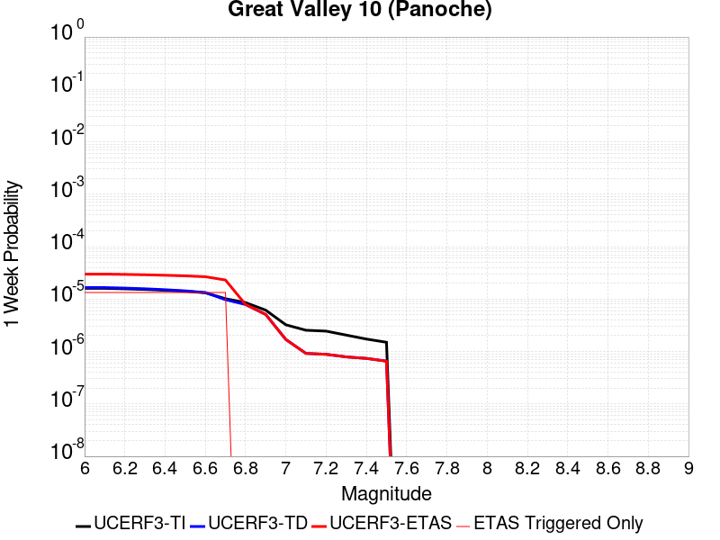 | 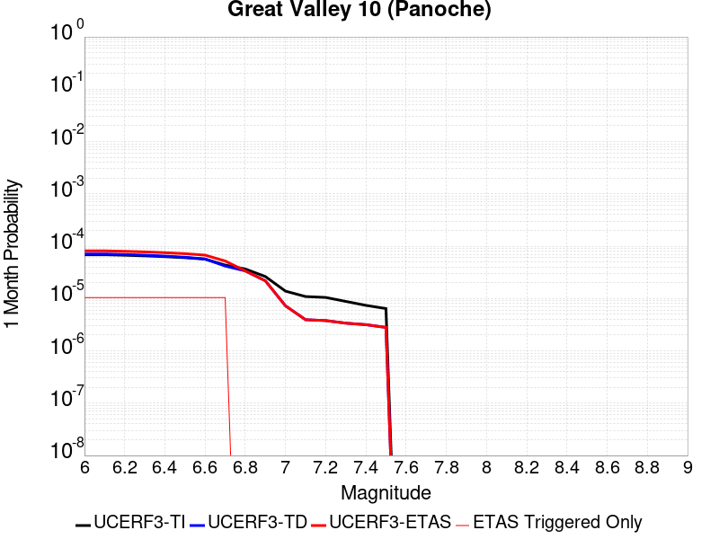 | 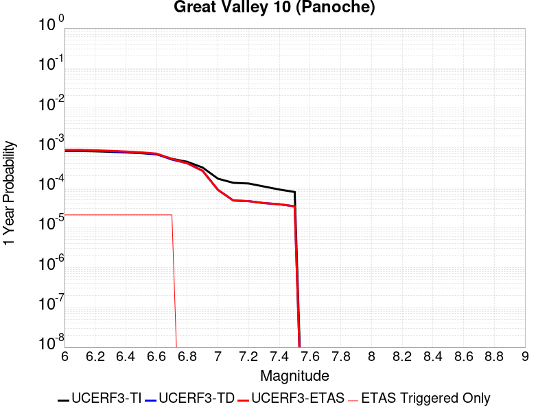 |  |

| Magnitude | 1 wk TI Prob | 1 wk TD Prob | 1 wk ETAS Prob | 1 wk ETAS/TD Gain | 1 wk ETAS Triggered Only | 1 mo TI Prob | 1 mo TD Prob | 1 mo ETAS Prob | 1 mo ETAS/TD Gain | 1 mo ETAS Triggered Only | 1 yr TI Prob | 1 yr TD Prob | 1 yr ETAS Prob | 1 yr ETAS/TD Gain | 1 yr ETAS Triggered Only | 10 yr TI Prob | 10 yr TD Prob | 10 yr ETAS Prob | 10 yr ETAS/TD Gain | 10 yr ETAS Triggered Only |
|-----|-----|-----|-----|-----|-----|-----|-----|-----|-----|-----|-----|-----|-----|-----|-----|-----|-----|-----|-----|-----|
| 6.0 | 1.6014626E-5 | 1.6575399E-5 | 2.7011134E-5 | 1.6295918 | 1.0435908E-5 | 6.863231E-5 | 7.103552E-5 | 8.147069E-5 | 1.1469007 | 1.0435908E-5 | 8.35278E-4 | 8.645185E-4 | 8.853723E-4 | 1.0241219 | 2.0871816E-5 | 0.008321454 | 0.008612172 | 0.008632864 | 1.0024027 | 2.0871816E-5 |
| 6.1 | 1.6014626E-5 | 1.6575399E-5 | 2.7011134E-5 | 1.6295918 | 1.0435908E-5 | 6.863231E-5 | 7.103552E-5 | 8.147069E-5 | 1.1469007 | 1.0435908E-5 | 8.35278E-4 | 8.645185E-4 | 8.853723E-4 | 1.0241219 | 2.0871816E-5 | 0.008321454 | 0.008612172 | 0.008632864 | 1.0024027 | 2.0871816E-5 |
| 6.2 | 1.56782E-5 | 1.6198446E-5 | 2.6634185E-5 | 1.6442432 | 1.0435908E-5 | 6.719056E-5 | 6.94201E-5 | 7.985528E-5 | 1.1503193 | 1.0435908E-5 | 8.17738E-4 | 8.4486604E-4 | 8.657202E-4 | 1.0246835 | 2.0871816E-5 | 0.008147354 | 0.008417147 | 0.008437843 | 1.0024588 | 2.0871816E-5 |
| 6.3 | 1.5263338E-5 | 1.5723514E-5 | 2.6159258E-5 | 1.663703 | 1.0435908E-5 | 6.541267E-5 | 6.738478E-5 | 7.781999E-5 | 1.1548599 | 1.0435908E-5 | 7.961082E-4 | 8.201049E-4 | 8.409596E-4 | 1.0254292 | 2.0871816E-5 | 0.007932622 | 0.008171377 | 0.008192078 | 1.0025334 | 2.0871816E-5 |
| 6.4 | 1.4720723E-5 | 1.5099376E-5 | 2.5535126E-5 | 1.6911379 | 1.0435908E-5 | 6.308728E-5 | 6.471004E-5 | 7.514527E-5 | 1.1612614 | 1.0435908E-5 | 7.67817E-4 | 7.8756385E-4 | 8.084192E-4 | 1.0264809 | 2.0871816E-5 | 0.007651695 | 0.007848303 | 0.007869011 | 1.0026386 | 2.0871816E-5 |
| 6.5 | 1.408264E-5 | 1.4355969E-5 | 2.4791727E-5 | 1.7269281 | 1.0435908E-5 | 6.0352773E-5 | 6.1524166E-5 | 7.195943E-5 | 1.1696125 | 1.0435908E-5 | 7.3454727E-4 | 7.488031E-4 | 7.696593E-4 | 1.0278527 | 2.0871816E-5 | 0.0073212404 | 0.0074633555 | 0.007484072 | 1.0027757 | 2.0871816E-5 |
| 6.6 | 1.3197086E-5 | 1.3321889E-5 | 2.3757659E-5 | 1.783355 | 1.0435908E-5 | 5.6557717E-5 | 5.709259E-5 | 6.75279E-5 | 1.1827787 | 1.0435908E-5 | 6.8837265E-4 | 6.9488434E-4 | 7.1574165E-4 | 1.0300155 | 2.0871816E-5 | 0.006862442 | 0.0069276537 | 0.0069483807 | 1.0029919 | 2.0871816E-5 |
| 6.7 | 1.017583E-5 | 9.745382E-6 | 2.0181189E-5 | 2.0708463 | 1.0435908E-5 | 4.360997E-5 | 4.176527E-5 | 5.220074E-5 | 1.24986 | 1.0435908E-5 | 5.30822E-4 | 5.0837593E-4 | 5.2923715E-4 | 1.041035 | 2.0871816E-5 | 0.0052955584 | 0.005072382 | 0.005093148 | 1.0040939 | 2.0871816E-5 |
| 6.8 | 8.557912E-6 | 7.872707E-6 | 7.872707E-6 | 1.0 | 0.0 | 3.667625E-5 | 3.373975E-5 | 3.373975E-5 | 1.0 | 0.0 | 4.4644187E-4 | 4.1070607E-4 | 4.1070607E-4 | 1.0 | 0.0 | 0.0044554602 | 0.004099677 | 0.004099677 | 1.0 | 0.0 |
| 6.9 | 6.14664E-6 | 5.092071E-6 | 5.092071E-6 | 1.0 | 0.0 | 2.6342475E-5 | 2.1822989E-5 | 2.1822989E-5 | 1.0 | 0.0 | 3.2067244E-4 | 2.6566387E-4 | 2.6566387E-4 | 1.0 | 0.0 | 0.003202101 | 0.002653601 | 0.002653601 | 1.0 | 0.0 |
| 7.0 | 3.2310581E-6 | 1.6951219E-6 | 1.6951219E-6 | 1.0 | 0.0 | 1.3847319E-5 | 7.264788E-6 | 7.264788E-6 | 1.0 | 0.0 | 1.6857806E-4 | 8.8445304E-5 | 8.8445304E-5 | 1.0 | 0.0 | 0.0016845023 | 8.841104E-4 | 8.841104E-4 | 1.0 | 0.0 |
| 7.1 | 2.544492E-6 | 9.1889206E-7 | 9.1889206E-7 | 1.0 | 0.0 | 1.090492E-5 | 3.938103E-6 | 3.938103E-6 | 1.0 | 0.0 | 1.327593E-4 | 4.79454E-5 | 4.79454E-5 | 1.0 | 0.0 | 0.0013268003 | 4.793553E-4 | 4.793553E-4 | 1.0 | 0.0 |
| 7.2 | 2.4479045E-6 | 8.841304E-7 | 8.841304E-7 | 1.0 | 0.0 | 1.0490977E-5 | 3.789125E-6 | 3.789125E-6 | 1.0 | 0.0 | 1.2772017E-4 | 4.6131667E-5 | 4.6131667E-5 | 1.0 | 0.0 | 0.0012764678 | 4.6122566E-4 | 4.6122566E-4 | 1.0 | 0.0 |
| 7.3 | 2.0559578E-6 | 7.892787E-7 | 7.892787E-7 | 1.0 | 0.0 | 8.811218E-6 | 3.3826188E-6 | 3.3826188E-6 | 1.0 | 0.0 | 1.072713E-4 | 4.1182655E-5 | 4.1182655E-5 | 1.0 | 0.0 | 0.0010721954 | 4.1175485E-4 | 4.1175485E-4 | 1.0 | 0.0 |
| 7.4 | 1.727687E-6 | 7.387757E-7 | 7.387757E-7 | 1.0 | 0.0 | 7.404352E-6 | 3.1661782E-6 | 3.1661782E-6 | 1.0 | 0.0 | 9.0144255E-5 | 3.8547583E-5 | 3.8547583E-5 | 1.0 | 0.0 | 9.0107694E-4 | 3.854136E-4 | 3.854136E-4 | 1.0 | 0.0 |
| 7.5 | 1.5002679E-6 | 6.546144E-7 | 6.546144E-7 | 1.0 | 0.0 | 6.4297037E-6 | 2.8054874E-6 | 2.8054874E-6 | 1.0 | 0.0 | 7.827883E-5 | 3.4156317E-5 | 3.4156317E-5 | 1.0 | 0.0 | 7.825126E-4 | 3.4151482E-4 | 3.4151482E-4 | 1.0 | 0.0 |

## Cucamonga
*[(top)](#table-of-contents)*

| 1 Week | 1 Month | 1 Year | 10 Year |
|-----|-----|-----|-----|
| 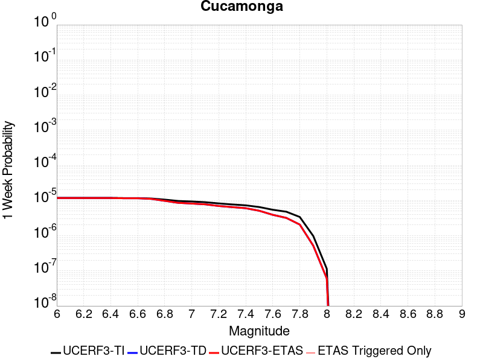 |  | 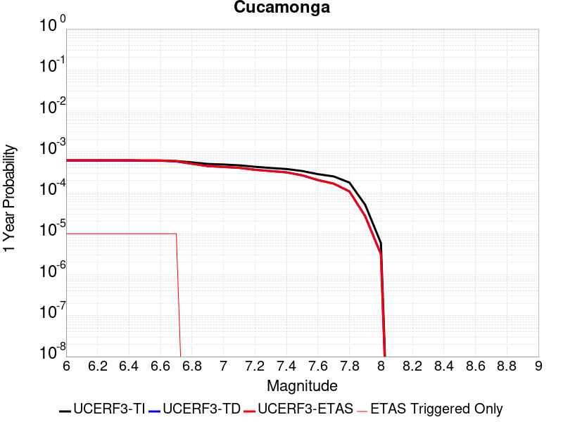 | 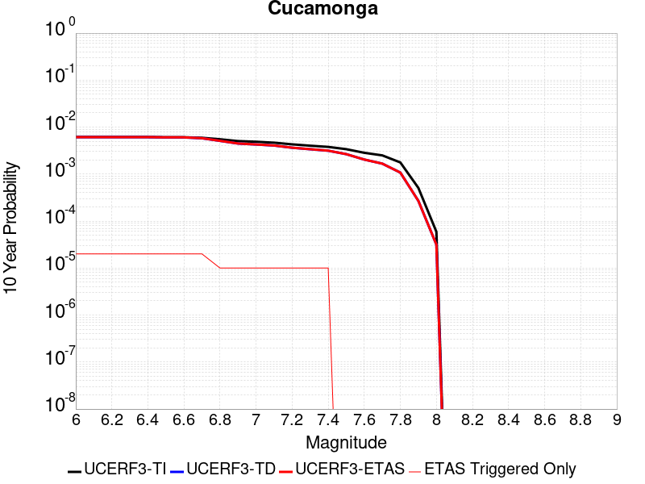 |

| Magnitude | 1 wk TI Prob | 1 wk TD Prob | 1 wk ETAS Prob | 1 wk ETAS/TD Gain | 1 wk ETAS Triggered Only | 1 mo TI Prob | 1 mo TD Prob | 1 mo ETAS Prob | 1 mo ETAS/TD Gain | 1 mo ETAS Triggered Only | 1 yr TI Prob | 1 yr TD Prob | 1 yr ETAS Prob | 1 yr ETAS/TD Gain | 1 yr ETAS Triggered Only | 10 yr TI Prob | 10 yr TD Prob | 10 yr ETAS Prob | 10 yr ETAS/TD Gain | 10 yr ETAS Triggered Only |
|-----|-----|-----|-----|-----|-----|-----|-----|-----|-----|-----|-----|-----|-----|-----|-----|-----|-----|-----|-----|-----|
| 6.0 | 1.1848348E-5 | 1.1737008E-5 | 1.1737008E-5 | 1.0 | 0.0 | 5.0777642E-5 | 5.030051E-5 | 5.030051E-5 | 1.0 | 0.0 | 6.180424E-4 | 6.1223935E-4 | 6.226688E-4 | 1.017035 | 1.0435908E-5 | 0.0061632637 | 0.0061067017 | 0.006127446 | 1.003397 | 2.0871816E-5 |
| 6.1 | 1.1848348E-5 | 1.1737008E-5 | 1.1737008E-5 | 1.0 | 0.0 | 5.0777642E-5 | 5.030051E-5 | 5.030051E-5 | 1.0 | 0.0 | 6.180424E-4 | 6.1223935E-4 | 6.226688E-4 | 1.017035 | 1.0435908E-5 | 0.0061632637 | 0.0061067017 | 0.006127446 | 1.003397 | 2.0871816E-5 |
| 6.2 | 1.1848348E-5 | 1.1737008E-5 | 1.1737008E-5 | 1.0 | 0.0 | 5.0777642E-5 | 5.030051E-5 | 5.030051E-5 | 1.0 | 0.0 | 6.180424E-4 | 6.1223935E-4 | 6.226688E-4 | 1.017035 | 1.0435908E-5 | 0.0061632637 | 0.0061067017 | 0.006127446 | 1.003397 | 2.0871816E-5 |
| 6.3 | 1.1848348E-5 | 1.1737008E-5 | 1.1737008E-5 | 1.0 | 0.0 | 5.0777642E-5 | 5.030051E-5 | 5.030051E-5 | 1.0 | 0.0 | 6.180424E-4 | 6.1223935E-4 | 6.226688E-4 | 1.017035 | 1.0435908E-5 | 0.0061632637 | 0.0061067017 | 0.006127446 | 1.003397 | 2.0871816E-5 |
| 6.4 | 1.1848348E-5 | 1.1737008E-5 | 1.1737008E-5 | 1.0 | 0.0 | 5.0777642E-5 | 5.030051E-5 | 5.030051E-5 | 1.0 | 0.0 | 6.180424E-4 | 6.1223935E-4 | 6.226688E-4 | 1.017035 | 1.0435908E-5 | 0.0061632637 | 0.0061067017 | 0.006127446 | 1.003397 | 2.0871816E-5 |
| 6.5 | 1.16988695E-5 | 1.15760395E-5 | 1.15760395E-5 | 1.0 | 0.0 | 5.013705E-5 | 4.9610666E-5 | 4.9610666E-5 | 1.0 | 0.0 | 6.102476E-4 | 6.0384517E-4 | 6.1427476E-4 | 1.017272 | 1.0435908E-5 | 0.006085745 | 0.006023216 | 0.006043962 | 1.0034443 | 2.0871816E-5 |
| 6.6 | 1.16988695E-5 | 1.15760395E-5 | 1.15760395E-5 | 1.0 | 0.0 | 5.013705E-5 | 4.9610666E-5 | 4.9610666E-5 | 1.0 | 0.0 | 6.102476E-4 | 6.0384517E-4 | 6.1427476E-4 | 1.017272 | 1.0435908E-5 | 0.006085745 | 0.006023216 | 0.006043962 | 1.0034443 | 2.0871816E-5 |
| 6.7 | 1.1397107E-5 | 1.11149475E-5 | 1.11149475E-5 | 1.0 | 0.0 | 4.884383E-5 | 4.7634636E-5 | 4.7634636E-5 | 1.0 | 0.0 | 5.9451134E-4 | 5.797998E-4 | 5.902297E-4 | 1.0179887 | 1.0435908E-5 | 0.005929234 | 0.0057840226 | 0.005804774 | 1.0035876 | 2.0871816E-5 |
| 6.8 | 1.058387E-5 | 9.784992E-6 | 9.784992E-6 | 1.0 | 0.0 | 4.5358654E-5 | 4.193501E-5 | 4.193501E-5 | 1.0 | 0.0 | 5.521017E-4 | 5.1044027E-4 | 5.1044027E-4 | 1.0 | 0.0 | 0.00550732 | 0.0050936877 | 0.0051040705 | 1.0020384 | 1.0435908E-5 |
| 6.9 | 9.690046E-6 | 8.57948E-6 | 8.57948E-6 | 1.0 | 0.0 | 4.1528107E-5 | 3.6768684E-5 | 3.6768684E-5 | 1.0 | 0.0 | 5.054874E-4 | 4.475672E-4 | 4.475672E-4 | 1.0 | 0.0 | 0.005043391 | 0.004467594 | 0.0044779833 | 1.0023255 | 1.0435908E-5 |
| 7.0 | 9.381461E-6 | 8.187101E-6 | 8.187101E-6 | 1.0 | 0.0 | 4.020564E-5 | 3.5087105E-5 | 3.5087105E-5 | 1.0 | 0.0 | 4.893937E-4 | 4.2710215E-4 | 4.2710215E-4 | 1.0 | 0.0 | 0.0048831734 | 0.0042637475 | 0.0042741387 | 1.0024371 | 1.0435908E-5 |
| 7.1 | 8.946492E-6 | 7.781886E-6 | 7.781886E-6 | 1.0 | 0.0 | 3.8341543E-5 | 3.3350516E-5 | 3.3350516E-5 | 1.0 | 0.0 | 4.667083E-4 | 4.0596718E-4 | 4.0596718E-4 | 1.0 | 0.0 | 0.0046572937 | 0.004053192 | 0.004063586 | 1.0025643 | 1.0435908E-5 |
| 7.2 | 8.251016E-6 | 6.9752796E-6 | 6.9752796E-6 | 1.0 | 0.0 | 3.5361016E-5 | 2.9893714E-5 | 2.9893714E-5 | 1.0 | 0.0 | 4.3043532E-4 | 3.6389544E-4 | 3.6389544E-4 | 1.0 | 0.0 | 0.0042960253 | 0.0036339292 | 0.0036443272 | 1.0028614 | 1.0435908E-5 |
| 7.3 | 7.717881E-6 | 6.4863502E-6 | 6.4863502E-6 | 1.0 | 0.0 | 3.3076216E-5 | 2.7798349E-5 | 2.7798349E-5 | 1.0 | 0.0 | 4.026285E-4 | 3.3839257E-4 | 3.3839257E-4 | 1.0 | 0.0 | 0.004018998 | 0.00337971 | 0.0033901106 | 1.0030774 | 1.0435908E-5 |
| 7.4 | 7.275623E-6 | 6.031997E-6 | 6.031997E-6 | 1.0 | 0.0 | 3.118087E-5 | 2.585116E-5 | 2.585116E-5 | 1.0 | 0.0 | 3.7956095E-4 | 3.1469265E-4 | 3.1469265E-4 | 1.0 | 0.0 | 0.0037891332 | 0.0031434062 | 0.0031538093 | 1.0033095 | 1.0435908E-5 |
| 7.5 | 6.5109502E-6 | 5.1006014E-6 | 5.1006014E-6 | 1.0 | 0.0 | 2.7903774E-5 | 2.1859538E-5 | 2.1859538E-5 | 1.0 | 0.0 | 3.3967546E-4 | 2.661075E-4 | 2.661075E-4 | 1.0 | 0.0 | 0.0033915674 | 0.002658813 | 0.002658813 | 1.0 | 0.0 |
| 7.6 | 5.4495326E-6 | 3.90857E-6 | 3.90857E-6 | 1.0 | 0.0 | 2.335493E-5 | 1.6750908E-5 | 1.6750908E-5 | 1.0 | 0.0 | 2.8430918E-4 | 2.0392328E-4 | 2.0392328E-4 | 1.0 | 0.0 | 0.0028394572 | 0.002038282 | 0.002038282 | 1.0 | 0.0 |
| 7.7 | 4.7997164E-6 | 3.2002547E-6 | 3.2002547E-6 | 1.0 | 0.0 | 2.057005E-5 | 1.3715306E-5 | 1.3715306E-5 | 1.0 | 0.0 | 2.504116E-4 | 1.6697108E-4 | 1.6697108E-4 | 1.0 | 0.0 | 0.002501296 | 0.0016693877 | 0.0016693877 | 1.0 | 0.0 |
| 7.8 | 3.3941733E-6 | 2.0641899E-6 | 2.0641899E-6 | 1.0 | 0.0 | 1.4546376E-5 | 8.846498E-6 | 8.846498E-6 | 1.0 | 0.0 | 1.7708774E-4 | 1.07700806E-4 | 1.07700806E-4 | 1.0 | 0.0 | 0.0017694668 | 0.001076723 | 0.001076723 | 1.0 | 0.0 |
| 7.9 | 9.750552E-7 | 5.155946E-7 | 5.155946E-7 | 1.0 | 0.0 | 4.178801E-6 | 2.2096892E-6 | 2.2096892E-6 | 1.0 | 0.0 | 5.0875715E-5 | 2.690264E-5 | 2.690264E-5 | 1.0 | 0.0 | 5.086407E-4 | 2.6899425E-4 | 2.6899425E-4 | 1.0 | 0.0 |
| 8.0 | 1.133857E-7 | 6.053707E-8 | 6.053707E-8 | 1.0 | 0.0 | 4.8593864E-7 | 2.5944456E-7 | 2.5944456E-7 | 1.0 | 0.0 | 5.9162867E-6 | 3.158733E-6 | 3.158733E-6 | 1.0 | 0.0 | 5.916129E-5 | 3.1586897E-5 | 3.1586897E-5 | 1.0 | 0.0 |

## Elsinore (Julian)
*[(top)](#table-of-contents)*

| 1 Week | 1 Month | 1 Year | 10 Year |
|-----|-----|-----|-----|
| 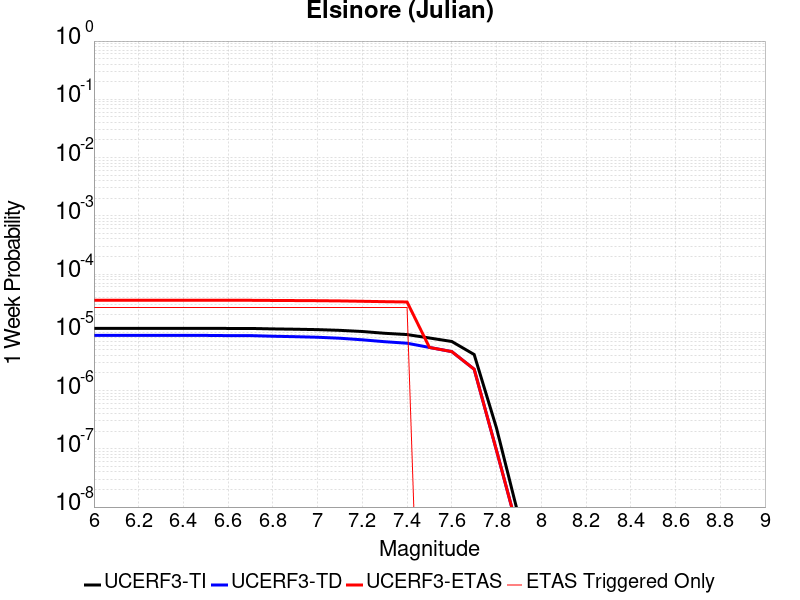 | 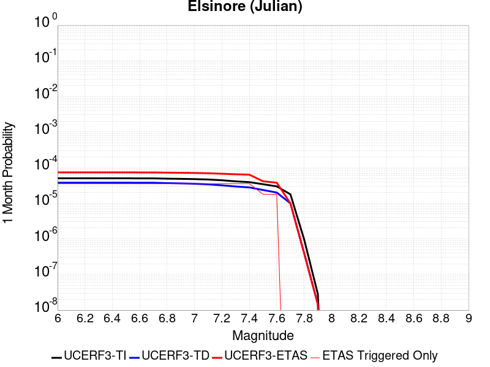 | 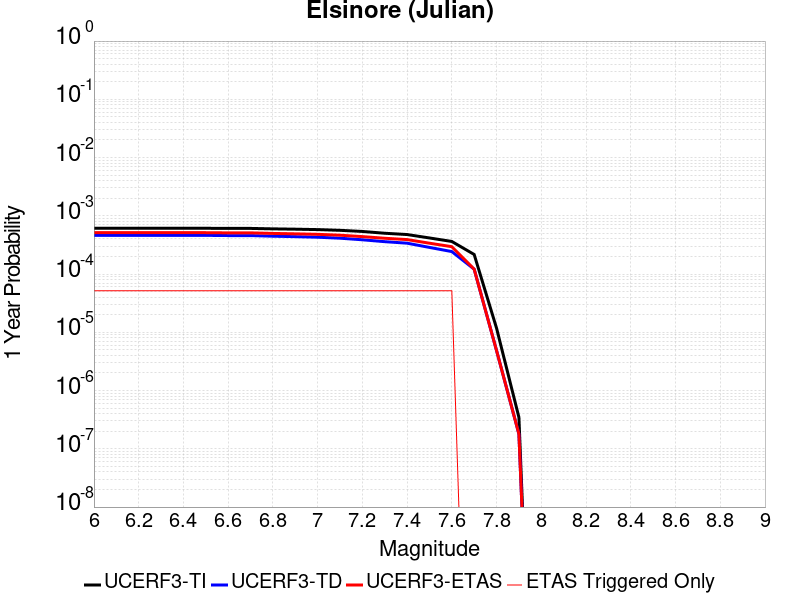 | 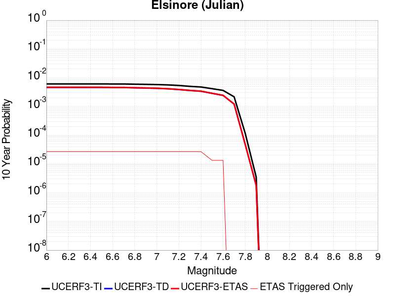 |

| Magnitude | 1 wk TI Prob | 1 wk TD Prob | 1 wk ETAS Prob | 1 wk ETAS/TD Gain | 1 wk ETAS Triggered Only | 1 mo TI Prob | 1 mo TD Prob | 1 mo ETAS Prob | 1 mo ETAS/TD Gain | 1 mo ETAS Triggered Only | 1 yr TI Prob | 1 yr TD Prob | 1 yr ETAS Prob | 1 yr ETAS/TD Gain | 1 yr ETAS Triggered Only | 10 yr TI Prob | 10 yr TD Prob | 10 yr ETAS Prob | 10 yr ETAS/TD Gain | 10 yr ETAS Triggered Only |
|-----|-----|-----|-----|-----|-----|-----|-----|-----|-----|-----|-----|-----|-----|-----|-----|-----|-----|-----|-----|-----|
| 6.0 | 1.1710231E-5 | 8.845509E-6 | 1.9281324E-5 | 2.179787 | 1.0435908E-5 | 5.0185736E-5 | 3.7908783E-5 | 5.8779806E-5 | 1.550559 | 2.0871816E-5 | 6.1084004E-4 | 4.614434E-4 | 4.8230556E-4 | 1.0452107 | 2.0871816E-5 | 0.006091637 | 0.0046050567 | 0.004625832 | 1.0045115 | 2.0871816E-5 |
| 6.1 | 1.1710231E-5 | 8.845509E-6 | 1.9281324E-5 | 2.179787 | 1.0435908E-5 | 5.0185736E-5 | 3.7908783E-5 | 5.8779806E-5 | 1.550559 | 2.0871816E-5 | 6.1084004E-4 | 4.614434E-4 | 4.8230556E-4 | 1.0452107 | 2.0871816E-5 | 0.006091637 | 0.0046050567 | 0.004625832 | 1.0045115 | 2.0871816E-5 |
| 6.2 | 1.1710231E-5 | 8.845509E-6 | 1.9281324E-5 | 2.179787 | 1.0435908E-5 | 5.0185736E-5 | 3.7908783E-5 | 5.8779806E-5 | 1.550559 | 2.0871816E-5 | 6.1084004E-4 | 4.614434E-4 | 4.8230556E-4 | 1.0452107 | 2.0871816E-5 | 0.006091637 | 0.0046050567 | 0.004625832 | 1.0045115 | 2.0871816E-5 |
| 6.3 | 1.1710231E-5 | 8.845509E-6 | 1.9281324E-5 | 2.179787 | 1.0435908E-5 | 5.0185736E-5 | 3.7908783E-5 | 5.8779806E-5 | 1.550559 | 2.0871816E-5 | 6.1084004E-4 | 4.614434E-4 | 4.8230556E-4 | 1.0452107 | 2.0871816E-5 | 0.006091637 | 0.0046050567 | 0.004625832 | 1.0045115 | 2.0871816E-5 |
| 6.4 | 1.1710231E-5 | 8.845509E-6 | 1.9281324E-5 | 2.179787 | 1.0435908E-5 | 5.0185736E-5 | 3.7908783E-5 | 5.8779806E-5 | 1.550559 | 2.0871816E-5 | 6.1084004E-4 | 4.614434E-4 | 4.8230556E-4 | 1.0452107 | 2.0871816E-5 | 0.006091637 | 0.0046050567 | 0.004625832 | 1.0045115 | 2.0871816E-5 |
| 6.5 | 1.1710231E-5 | 8.845509E-6 | 1.9281324E-5 | 2.179787 | 1.0435908E-5 | 5.0185736E-5 | 3.7908783E-5 | 5.8779806E-5 | 1.550559 | 2.0871816E-5 | 6.1084004E-4 | 4.614434E-4 | 4.8230556E-4 | 1.0452107 | 2.0871816E-5 | 0.006091637 | 0.0046050567 | 0.004625832 | 1.0045115 | 2.0871816E-5 |
| 6.6 | 1.1650619E-5 | 8.777881E-6 | 1.9213698E-5 | 2.1888766 | 1.0435908E-5 | 4.993027E-5 | 3.7618956E-5 | 5.8489986E-5 | 1.5548009 | 2.0871816E-5 | 6.0773146E-4 | 4.5791623E-4 | 4.7877847E-4 | 1.0455592 | 2.0871816E-5 | 0.0060607214 | 0.004569931 | 0.0045907074 | 1.0045463 | 2.0871816E-5 |
| 6.7 | 1.1650619E-5 | 8.777881E-6 | 1.9213698E-5 | 2.1888766 | 1.0435908E-5 | 4.993027E-5 | 3.7618956E-5 | 5.8489986E-5 | 1.5548009 | 2.0871816E-5 | 6.0773146E-4 | 4.5791623E-4 | 4.7877847E-4 | 1.0455592 | 2.0871816E-5 | 0.0060607214 | 0.004569931 | 0.0045907074 | 1.0045463 | 2.0871816E-5 |
| 6.8 | 1.1442698E-5 | 8.561041E-6 | 1.899686E-5 | 2.2189894 | 1.0435908E-5 | 4.9039216E-5 | 3.6689667E-5 | 5.756072E-5 | 1.5688536 | 2.0871816E-5 | 5.968889E-4 | 4.4660683E-4 | 4.6746933E-4 | 1.0467134 | 2.0871816E-5 | 0.0059528816 | 0.004457295 | 0.0044780737 | 1.0046618 | 2.0871816E-5 |
| 6.9 | 1.1300589E-5 | 8.408907E-6 | 1.8844727E-5 | 2.2410436 | 1.0435908E-5 | 4.8430196E-5 | 3.6037683E-5 | 5.690875E-5 | 1.5791456 | 2.0871816E-5 | 5.894781E-4 | 4.3867214E-4 | 4.5953481E-4 | 1.0475587 | 2.0871816E-5 | 0.005879169 | 0.0043782624 | 0.0043990426 | 1.0047463 | 2.0871816E-5 |
| 7.0 | 1.1117729E-5 | 8.226087E-6 | 1.8661909E-5 | 2.2686253 | 1.0435908E-5 | 4.764654E-5 | 3.525419E-5 | 5.612527E-5 | 1.5920169 | 2.0871816E-5 | 5.799422E-4 | 4.291369E-4 | 4.4999976E-4 | 1.0486158 | 2.0871816E-5 | 0.0057843104 | 0.004283281 | 0.004304063 | 1.0048519 | 2.0871816E-5 |
| 7.1 | 1.08053955E-5 | 7.9117535E-6 | 1.8347579E-5 | 2.3190281 | 1.0435908E-5 | 4.6308014E-5 | 3.3907087E-5 | 5.4778193E-5 | 1.6155382 | 2.0871816E-5 | 5.6365423E-4 | 4.127422E-4 | 4.336054E-4 | 1.0505477 | 2.0871816E-5 | 0.005622267 | 0.0041199517 | 0.004140738 | 1.0050452 | 2.0871816E-5 |
| 7.2 | 1.032804E-5 | 7.433021E-6 | 1.7868852E-5 | 2.4039824 | 1.0435908E-5 | 4.4262277E-5 | 3.1855423E-5 | 5.2726577E-5 | 1.6551836 | 2.0871816E-5 | 5.387599E-4 | 3.8777234E-4 | 4.0863606E-4 | 1.053804 | 2.0871816E-5 | 0.0053745564 | 0.0038711445 | 0.0038919356 | 1.0053707 | 2.0871816E-5 |
| 7.3 | 9.622426E-6 | 6.8978457E-6 | 1.7333681E-5 | 2.5129123 | 1.0435908E-5 | 4.1238312E-5 | 2.9561868E-5 | 5.0433067E-5 | 1.7060176 | 2.0871816E-5 | 5.019608E-4 | 3.5985775E-4 | 3.8072205E-4 | 1.0579793 | 2.0871816E-5 | 0.005008285 | 0.0035929221 | 0.0036137188 | 1.0057883 | 2.0871816E-5 |
| 7.4 | 9.144434E-6 | 6.4963933E-6 | 1.6932234E-5 | 2.6064053 | 1.0435908E-5 | 3.9189843E-5 | 2.7841395E-5 | 4.871263E-5 | 1.7496475 | 2.0871816E-5 | 4.7703186E-4 | 3.3891766E-4 | 3.597824E-4 | 1.0615629 | 2.0871816E-5 | 0.0047600917 | 0.0033841513 | 0.0034049526 | 1.0061467 | 2.0871816E-5 |
| 7.5 | 7.988981E-6 | 5.4983307E-6 | 5.4983307E-6 | 1.0 | 0.0 | 3.4238044E-5 | 2.356407E-5 | 3.399973E-5 | 1.4428633 | 1.0435908E-5 | 4.1676845E-4 | 2.8685606E-4 | 2.9728896E-4 | 1.0363698 | 1.0435908E-5 | 0.0041598766 | 0.002864985 | 0.002875391 | 1.0036322 | 1.0435908E-5 |
| 7.6 | 6.9554876E-6 | 4.6625346E-6 | 4.6625346E-6 | 1.0 | 0.0 | 2.9808893E-5 | 1.9982144E-5 | 3.0417843E-5 | 1.5222512 | 1.0435908E-5 | 3.6286283E-4 | 2.4325661E-4 | 2.5368997E-4 | 1.0428904 | 1.0435908E-5 | 0.0036227088 | 0.0024300197 | 0.0024404302 | 1.0042841 | 1.0435908E-5 |
| 7.7 | 4.1557314E-6 | 2.3246462E-6 | 2.3246462E-6 | 1.0 | 0.0 | 1.7810156E-5 | 9.962735E-6 | 9.962735E-6 | 1.0 | 0.0 | 2.1681708E-4 | 1.2129029E-4 | 1.2129029E-4 | 1.0 | 0.0 | 0.0021660565 | 0.001212314 | 0.001212314 | 1.0 | 0.0 |
| 7.8 | 2.2597293E-7 | 9.332915E-8 | 9.332915E-8 | 1.0 | 0.0 | 9.684551E-7 | 3.99982E-7 | 3.99982E-7 | 1.0 | 0.0 | 1.1790877E-5 | 4.8697734E-6 | 4.8697734E-6 | 1.0 | 0.0 | 1.17902506E-4 | 4.8696995E-5 | 4.8696995E-5 | 1.0 | 0.0 |
| 7.9 | 6.676829E-9 | 3.439853E-9 | 3.439853E-9 | 1.0 | 0.0 | 2.861498E-8 | 1.4742227E-8 | 1.4742227E-8 | 1.0 | 0.0 | 3.4838732E-7 | 1.7948659E-7 | 1.7948659E-7 | 1.0 | 0.0 | 3.4838679E-6 | 1.7948646E-6 | 1.7948646E-6 | 1.0 | 0.0 |

## Great Valley 07 (Orestimba)
*[(top)](#table-of-contents)*

| 1 Week | 1 Month | 1 Year | 10 Year |
|-----|-----|-----|-----|
| 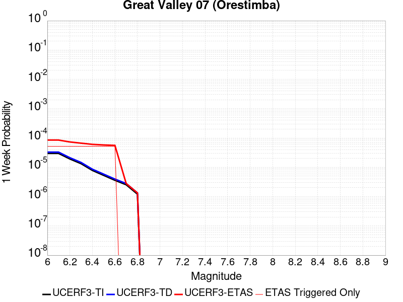 | 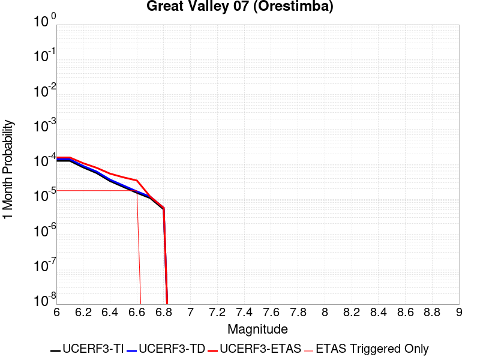 | 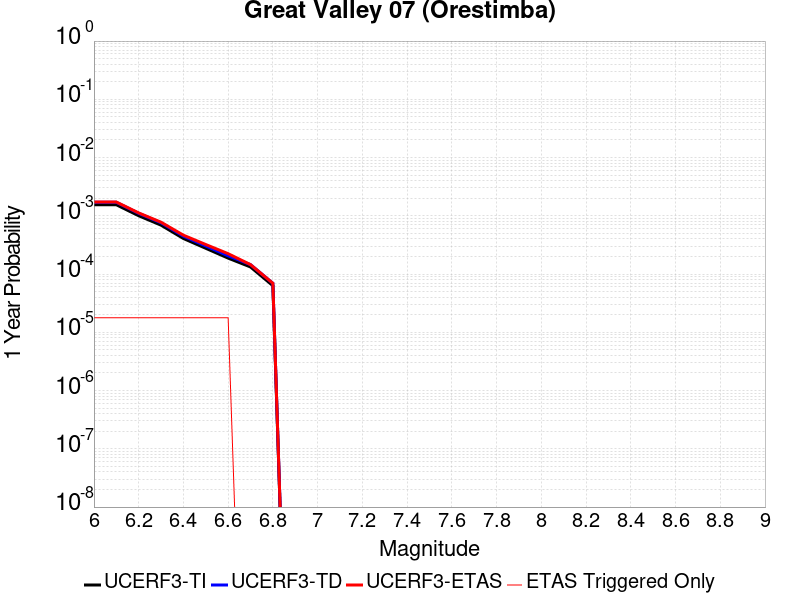 |  |

| Magnitude | 1 wk TI Prob | 1 wk TD Prob | 1 wk ETAS Prob | 1 wk ETAS/TD Gain | 1 wk ETAS Triggered Only | 1 mo TI Prob | 1 mo TD Prob | 1 mo ETAS Prob | 1 mo ETAS/TD Gain | 1 mo ETAS Triggered Only | 1 yr TI Prob | 1 yr TD Prob | 1 yr ETAS Prob | 1 yr ETAS/TD Gain | 1 yr ETAS Triggered Only | 10 yr TI Prob | 10 yr TD Prob | 10 yr ETAS Prob | 10 yr ETAS/TD Gain | 10 yr ETAS Triggered Only |
|-----|-----|-----|-----|-----|-----|-----|-----|-----|-----|-----|-----|-----|-----|-----|-----|-----|-----|-----|-----|-----|
| 6.0 | 2.9687902E-5 | 3.27575E-5 | 4.3193064E-5 | 1.3185703 | 1.0435908E-5 | 1.2722766E-4 | 1.4038214E-4 | 1.5081657E-4 | 1.0743289 | 1.0435908E-5 | 0.0015478961 | 0.0017078844 | 0.0017183025 | 1.0060999 | 1.0435908E-5 | 0.015371585 | 0.016955135 | 0.016975654 | 1.0012101 | 2.0871816E-5 |
| 6.1 | 2.9687902E-5 | 3.27575E-5 | 4.3193064E-5 | 1.3185703 | 1.0435908E-5 | 1.2722766E-4 | 1.4038214E-4 | 1.5081657E-4 | 1.0743289 | 1.0435908E-5 | 0.0015478961 | 0.0017078844 | 0.0017183025 | 1.0060999 | 1.0435908E-5 | 0.015371585 | 0.016955135 | 0.016975654 | 1.0012101 | 2.0871816E-5 |
| 6.2 | 1.9231524E-5 | 2.1159167E-5 | 3.1594853E-5 | 1.4931993 | 1.0435908E-5 | 8.2418206E-5 | 9.067912E-5 | 1.0111408E-4 | 1.1150757 | 1.0435908E-5 | 0.0010029797 | 0.0011034822 | 0.0011139066 | 1.0094469 | 1.0435908E-5 | 0.00998465 | 0.01098244 | 0.011003083 | 1.0018796 | 2.0871816E-5 |
| 6.3 | 1.324766E-5 | 1.4548534E-5 | 2.4984289E-5 | 1.7173064 | 1.0435908E-5 | 5.6774446E-5 | 6.234942E-5 | 7.278468E-5 | 1.1673673 | 1.0435908E-5 | 6.910097E-4 | 7.5884897E-4 | 7.692769E-4 | 1.0137419 | 1.0435908E-5 | 0.006888649 | 0.0075635235 | 0.0075842375 | 1.0027387 | 2.0871816E-5 |
| 6.4 | 7.818645E-6 | 8.57284E-6 | 1.9008658E-5 | 2.2173116 | 1.0435908E-5 | 3.3508048E-5 | 3.6740246E-5 | 4.717577E-5 | 1.2840352 | 1.0435908E-5 | 4.078841E-4 | 4.4722404E-4 | 4.576553E-4 | 1.0233244 | 1.0435908E-5 | 0.004071363 | 0.0044635804 | 0.00447397 | 1.0023276 | 1.0435908E-5 |
| 6.5 | 5.3076565E-6 | 5.8178007E-6 | 1.6253647E-5 | 2.7937787 | 1.0435908E-5 | 2.27469E-5 | 2.4933206E-5 | 3.5368852E-5 | 1.4185442 | 1.0435908E-5 | 2.7690834E-4 | 3.035216E-4 | 3.1395434E-4 | 1.0343723 | 1.0435908E-5 | 0.0027656353 | 0.00303128 | 0.0030416842 | 1.0034323 | 1.0435908E-5 |
| 6.6 | 3.6003578E-6 | 3.9484953E-6 | 1.4384362E-5 | 3.6429982 | 1.0435908E-5 | 1.5430012E-5 | 1.6922022E-5 | 2.7357753E-5 | 1.6166953 | 1.0435908E-5 | 1.8784421E-4 | 2.0600771E-4 | 2.1644146E-4 | 1.0506474 | 1.0435908E-5 | 0.0018768552 | 0.0020583214 | 0.002068736 | 1.0050597 | 1.0435908E-5 |
| 6.7 | 2.5361826E-6 | 2.7834678E-6 | 2.7834678E-6 | 1.0 | 0.0 | 1.0869308E-5 | 1.1929101E-5 | 1.1929101E-5 | 1.0 | 0.0 | 1.3232579E-4 | 1.4522845E-4 | 1.4522845E-4 | 1.0 | 0.0 | 0.0013224703 | 0.0014514653 | 0.0014514653 | 1.0 | 0.0 |
| 6.8 | 1.2115831E-6 | 1.3313797E-6 | 1.3313797E-6 | 1.0 | 0.0 | 5.1924885E-6 | 5.7059065E-6 | 5.7059065E-6 | 1.0 | 0.0 | 6.3216714E-5 | 6.9468166E-5 | 6.9468166E-5 | 1.0 | 0.0 | 6.3198735E-4 | 6.945596E-4 | 6.945596E-4 | 1.0 | 0.0 |

## Earthquake Valley (So Extension)
*[(top)](#table-of-contents)*

| 1 Week | 1 Month | 1 Year | 10 Year |
|-----|-----|-----|-----|
| 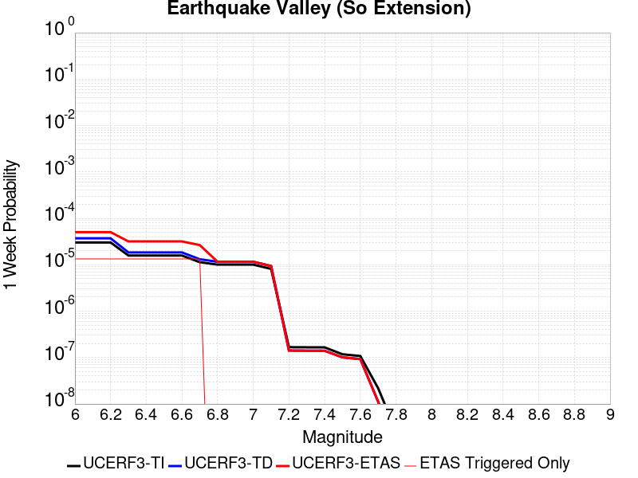 | 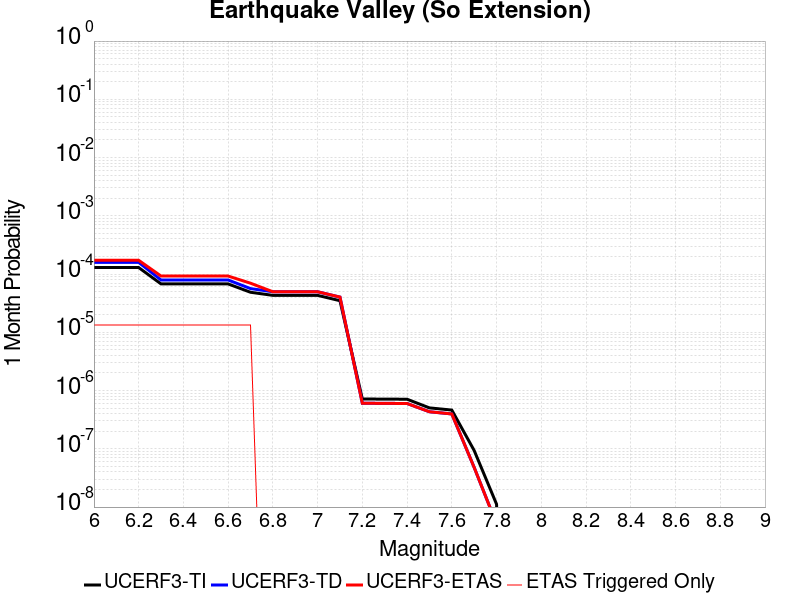 | 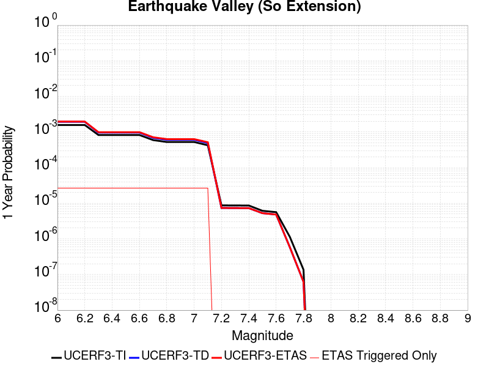 | 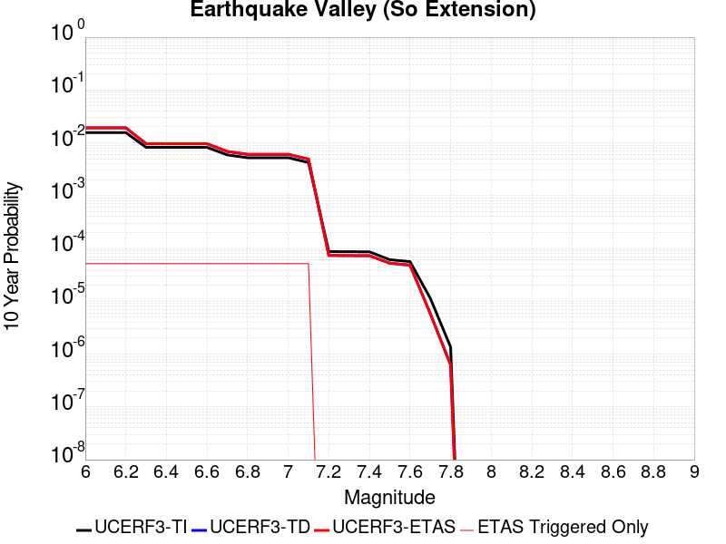 |

| Magnitude | 1 wk TI Prob | 1 wk TD Prob | 1 wk ETAS Prob | 1 wk ETAS/TD Gain | 1 wk ETAS Triggered Only | 1 mo TI Prob | 1 mo TD Prob | 1 mo ETAS Prob | 1 mo ETAS/TD Gain | 1 mo ETAS Triggered Only | 1 yr TI Prob | 1 yr TD Prob | 1 yr ETAS Prob | 1 yr ETAS/TD Gain | 1 yr ETAS Triggered Only | 10 yr TI Prob | 10 yr TD Prob | 10 yr ETAS Prob | 10 yr ETAS/TD Gain | 10 yr ETAS Triggered Only |
|-----|-----|-----|-----|-----|-----|-----|-----|-----|-----|-----|-----|-----|-----|-----|-----|-----|-----|-----|-----|-----|
| 6.0 | 3.0194888E-5 | 3.7072114E-5 | 4.7507634E-5 | 1.2814925 | 1.0435908E-5 | 1.2940024E-4 | 1.5887388E-4 | 1.6930813E-4 | 1.0656763 | 1.0435908E-5 | 0.0015743093 | 0.0019331174 | 0.0019539488 | 1.010776 | 2.0871816E-5 | 0.01563203 | 0.019213019 | 0.01923349 | 1.0010655 | 2.0871816E-5 |
| 6.1 | 3.0194888E-5 | 3.7072114E-5 | 4.7507634E-5 | 1.2814925 | 1.0435908E-5 | 1.2940024E-4 | 1.5887388E-4 | 1.6930813E-4 | 1.0656763 | 1.0435908E-5 | 0.0015743093 | 0.0019331174 | 0.0019539488 | 1.010776 | 2.0871816E-5 | 0.01563203 | 0.019213019 | 0.01923349 | 1.0010655 | 2.0871816E-5 |
| 6.2 | 3.0194888E-5 | 3.7072114E-5 | 4.7507634E-5 | 1.2814925 | 1.0435908E-5 | 1.2940024E-4 | 1.5887388E-4 | 1.6930813E-4 | 1.0656763 | 1.0435908E-5 | 0.0015743093 | 0.0019331174 | 0.0019539488 | 1.010776 | 2.0871816E-5 | 0.01563203 | 0.019213019 | 0.01923349 | 1.0010655 | 2.0871816E-5 |
| 6.3 | 1.5795305E-5 | 1.844658E-5 | 2.8882296E-5 | 1.5657263 | 1.0435908E-5 | 6.769241E-5 | 7.9055004E-5 | 8.949009E-5 | 1.1319977 | 1.0435908E-5 | 8.238434E-4 | 9.6218096E-4 | 9.830327E-4 | 1.0216713 | 2.0871816E-5 | 0.008207959 | 0.009591061 | 0.009611732 | 1.0021553 | 2.0871816E-5 |
| 6.4 | 1.5795305E-5 | 1.844658E-5 | 2.8882296E-5 | 1.5657263 | 1.0435908E-5 | 6.769241E-5 | 7.9055004E-5 | 8.949009E-5 | 1.1319977 | 1.0435908E-5 | 8.238434E-4 | 9.6218096E-4 | 9.830327E-4 | 1.0216713 | 2.0871816E-5 | 0.008207959 | 0.009591061 | 0.009611732 | 1.0021553 | 2.0871816E-5 |
| 6.5 | 1.5795305E-5 | 1.844658E-5 | 2.8882296E-5 | 1.5657263 | 1.0435908E-5 | 6.769241E-5 | 7.9055004E-5 | 8.949009E-5 | 1.1319977 | 1.0435908E-5 | 8.238434E-4 | 9.6218096E-4 | 9.830327E-4 | 1.0216713 | 2.0871816E-5 | 0.008207959 | 0.009591061 | 0.009611732 | 1.0021553 | 2.0871816E-5 |
| 6.6 | 1.5795305E-5 | 1.844658E-5 | 2.8882296E-5 | 1.5657263 | 1.0435908E-5 | 6.769241E-5 | 7.9055004E-5 | 8.949009E-5 | 1.1319977 | 1.0435908E-5 | 8.238434E-4 | 9.6218096E-4 | 9.830327E-4 | 1.0216713 | 2.0871816E-5 | 0.008207959 | 0.009591061 | 0.009611732 | 1.0021553 | 2.0871816E-5 |
| 6.7 | 1.1363076E-5 | 1.3138294E-5 | 2.3574064E-5 | 1.7943017 | 1.0435908E-5 | 4.8697988E-5 | 5.6306188E-5 | 6.674151E-5 | 1.1853317 | 1.0435908E-5 | 5.927367E-4 | 6.8538834E-4 | 7.062459E-4 | 1.0304316 | 2.0871816E-5 | 0.0059115817 | 0.0068402183 | 0.0068609472 | 1.0030304 | 2.0871816E-5 |
| 6.8 | 1.0049611E-5 | 1.1594334E-5 | 1.1594334E-5 | 1.0 | 0.0 | 4.306905E-5 | 4.9689468E-5 | 4.9689468E-5 | 1.0 | 0.0 | 5.242395E-4 | 6.048745E-4 | 6.153041E-4 | 1.0172426 | 1.0435908E-5 | 0.0052300454 | 0.006039458 | 0.006049831 | 1.0017176 | 1.0435908E-5 |
| 6.9 | 1.0049611E-5 | 1.1594334E-5 | 1.1594334E-5 | 1.0 | 0.0 | 4.306905E-5 | 4.9689468E-5 | 4.9689468E-5 | 1.0 | 0.0 | 5.242395E-4 | 6.048745E-4 | 6.153041E-4 | 1.0172426 | 1.0435908E-5 | 0.0052300454 | 0.006039458 | 0.006049831 | 1.0017176 | 1.0435908E-5 |
| 7.0 | 1.0049611E-5 | 1.1594334E-5 | 1.1594334E-5 | 1.0 | 0.0 | 4.306905E-5 | 4.9689468E-5 | 4.9689468E-5 | 1.0 | 0.0 | 5.242395E-4 | 6.048745E-4 | 6.153041E-4 | 1.0172426 | 1.0435908E-5 | 0.0052300454 | 0.006039458 | 0.006049831 | 1.0017176 | 1.0435908E-5 |
| 7.1 | 8.140254E-6 | 9.383458E-6 | 9.383458E-6 | 1.0 | 0.0 | 3.4886336E-5 | 4.0214578E-5 | 4.0214578E-5 | 1.0 | 0.0 | 4.2465836E-4 | 4.8956956E-4 | 5.000003E-4 | 1.021306 | 1.0435908E-5 | 0.0042384774 | 0.0048914864 | 0.0049018716 | 1.002123 | 1.0435908E-5 |
| 7.2 | 1.673835E-7 | 1.4154125E-7 | 1.4154125E-7 | 1.0 | 0.0 | 7.173577E-7 | 6.066052E-7 | 6.066052E-7 | 1.0 | 0.0 | 8.733795E-6 | 7.385397E-6 | 7.385397E-6 | 1.0 | 0.0 | 8.733451E-5 | 7.385187E-5 | 7.385187E-5 | 1.0 | 0.0 |
| 7.3 | 1.6632116E-7 | 1.4052354E-7 | 1.4052354E-7 | 1.0 | 0.0 | 7.1280476E-7 | 6.0224363E-7 | 6.0224363E-7 | 1.0 | 0.0 | 8.678364E-6 | 7.332295E-6 | 7.332295E-6 | 1.0 | 0.0 | 8.6780245E-5 | 7.332089E-5 | 7.332089E-5 | 1.0 | 0.0 |
| 7.4 | 1.6569169E-7 | 1.3996983E-7 | 1.3996983E-7 | 1.0 | 0.0 | 7.1010703E-7 | 5.9987053E-7 | 5.9987053E-7 | 1.0 | 0.0 | 8.645519E-6 | 7.303403E-6 | 7.303403E-6 | 1.0 | 0.0 | 8.645182E-5 | 7.303199E-5 | 7.303199E-5 | 1.0 | 0.0 |
| 7.5 | 1.1764555E-7 | 1.0095917E-7 | 1.0095917E-7 | 1.0 | 0.0 | 5.041951E-7 | 4.326821E-7 | 4.326821E-7 | 1.0 | 0.0 | 6.138558E-6 | 5.267894E-6 | 5.267894E-6 | 1.0 | 0.0 | 6.1383886E-5 | 5.2677904E-5 | 5.2677904E-5 | 1.0 | 0.0 |
| 7.6 | 1.07927605E-7 | 9.260736E-8 | 9.260736E-8 | 1.0 | 0.0 | 4.6254678E-7 | 3.9688865E-7 | 3.9688865E-7 | 1.0 | 0.0 | 5.6314925E-6 | 4.832111E-6 | 4.832111E-6 | 1.0 | 0.0 | 5.63135E-5 | 4.8320264E-5 | 4.8320264E-5 | 1.0 | 0.0 |
| 7.7 | 2.1826905E-8 | 1.1180516E-8 | 1.1180516E-8 | 1.0 | 0.0 | 9.3543875E-8 | 4.7916494E-8 | 4.7916494E-8 | 1.0 | 0.0 | 1.1388961E-6 | 5.833832E-7 | 5.833832E-7 | 1.0 | 0.0 | 1.1388902E-5 | 5.8338223E-6 | 5.8338223E-6 | 1.0 | 0.0 |
| 7.8 | 2.6169649E-9 | 1.1969472E-9 | 1.1969472E-9 | 1.0 | 0.0 | 1.1215564E-8 | 5.1297735E-9 | 5.1297735E-9 | 1.0 | 0.0 | 1.3654947E-7 | 6.2454994E-8 | 6.2454994E-8 | 1.0 | 0.0 | 1.365494E-6 | 6.245499E-7 | 6.245499E-7 | 1.0 | 0.0 |

## Great Valley 11
*[(top)](#table-of-contents)*

| 1 Week | 1 Month | 1 Year | 10 Year |
|-----|-----|-----|-----|
| 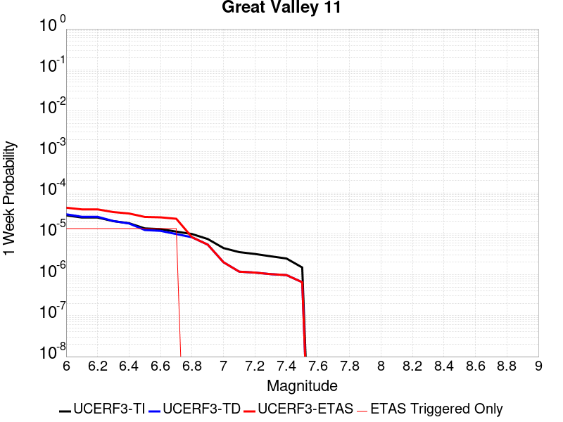 | 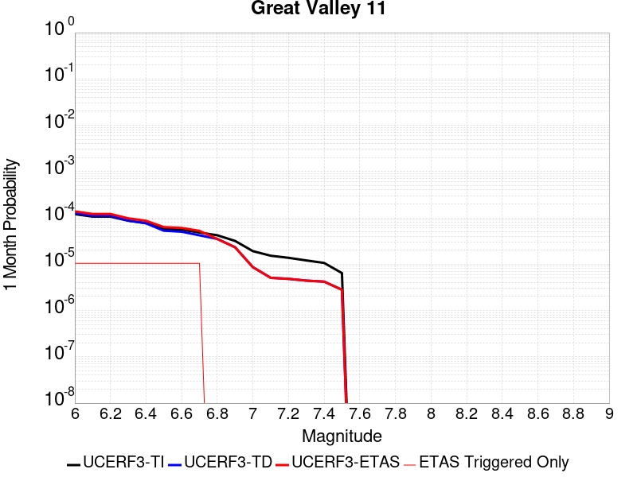 | 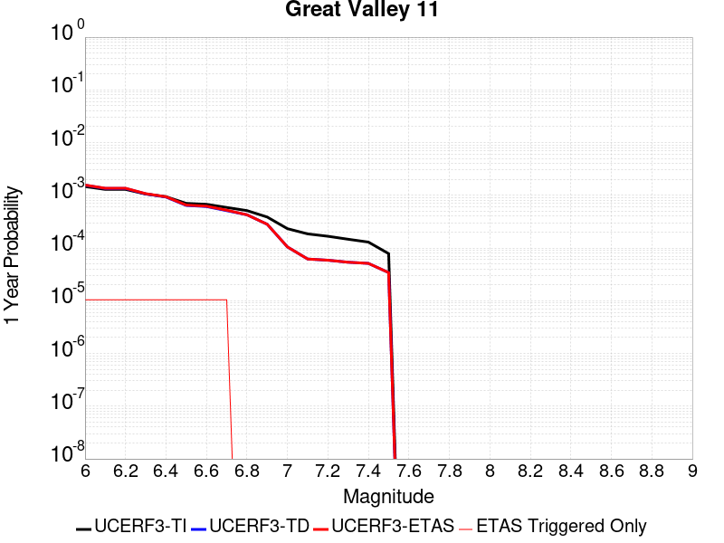 |  |

| Magnitude | 1 wk TI Prob | 1 wk TD Prob | 1 wk ETAS Prob | 1 wk ETAS/TD Gain | 1 wk ETAS Triggered Only | 1 mo TI Prob | 1 mo TD Prob | 1 mo ETAS Prob | 1 mo ETAS/TD Gain | 1 mo ETAS Triggered Only | 1 yr TI Prob | 1 yr TD Prob | 1 yr ETAS Prob | 1 yr ETAS/TD Gain | 1 yr ETAS Triggered Only | 10 yr TI Prob | 10 yr TD Prob | 10 yr ETAS Prob | 10 yr ETAS/TD Gain | 10 yr ETAS Triggered Only |
|-----|-----|-----|-----|-----|-----|-----|-----|-----|-----|-----|-----|-----|-----|-----|-----|-----|-----|-----|-----|-----|
| 6.0 | 2.8099583E-5 | 2.9832152E-5 | 4.0267747E-5 | 1.3498104 | 1.0435908E-5 | 1.20421224E-4 | 1.278462E-4 | 1.3828077E-4 | 1.0816182 | 1.0435908E-5 | 0.0014651422 | 0.0015554909 | 0.0015659105 | 1.0066986 | 1.0435908E-5 | 0.0145552 | 0.01545356 | 0.01547411 | 1.0013298 | 2.0871816E-5 |
| 6.1 | 2.483194E-5 | 2.590715E-5 | 3.6342786E-5 | 1.4028091 | 1.0435908E-5 | 1.0641825E-4 | 1.11026246E-4 | 1.21460995E-4 | 1.0939845 | 1.0435908E-5 | 0.0012948721 | 0.0013509706 | 0.0013613923 | 1.0077143 | 1.0435908E-5 | 0.012873529 | 0.013433994 | 0.013454585 | 1.0015328 | 2.0871816E-5 |
| 6.2 | 2.483194E-5 | 2.590715E-5 | 3.6342786E-5 | 1.4028091 | 1.0435908E-5 | 1.0641825E-4 | 1.11026246E-4 | 1.21460995E-4 | 1.0939845 | 1.0435908E-5 | 0.0012948721 | 0.0013509706 | 0.0013613923 | 1.0077143 | 1.0435908E-5 | 0.012873529 | 0.013433994 | 0.013454585 | 1.0015328 | 2.0871816E-5 |
| 6.3 | 2.0257901E-5 | 2.0398922E-5 | 3.0834617E-5 | 1.5115807 | 1.0435908E-5 | 8.681669E-5 | 8.742122E-5 | 9.785622E-5 | 1.1193645 | 1.0435908E-5 | 0.0010564806 | 0.0010638756 | 0.0010743004 | 1.0097989 | 1.0435908E-5 | 0.01051472 | 0.010592012 | 0.010612662 | 1.0019497 | 2.0871816E-5 |
| 6.4 | 1.8054898E-5 | 1.7780874E-5 | 2.8216597E-5 | 1.5869071 | 1.0435908E-5 | 7.737584E-5 | 7.62017E-5 | 8.6636814E-5 | 1.1369407 | 1.0435908E-5 | 9.416436E-4 | 9.2739856E-4 | 9.3782484E-4 | 1.0112424 | 1.0435908E-5 | 0.009376635 | 0.009239036 | 0.009259715 | 1.0022383 | 2.0871816E-5 |
| 6.5 | 1.34804895E-5 | 1.2321055E-5 | 2.2756834E-5 | 1.8469875 | 1.0435908E-5 | 5.777225E-5 | 5.2803476E-5 | 6.323883E-5 | 1.1976264 | 1.0435908E-5 | 7.031501E-4 | 6.4269686E-4 | 6.5312604E-4 | 1.0162272 | 1.0435908E-5 | 0.007009294 | 0.0064088185 | 0.0064295563 | 1.0032358 | 2.0871816E-5 |
| 6.6 | 1.294883E-5 | 1.1732312E-5 | 2.2168097E-5 | 1.889491 | 1.0435908E-5 | 5.5493805E-5 | 5.028039E-5 | 6.071577E-5 | 1.2075438 | 1.0435908E-5 | 6.754276E-4 | 6.1199587E-4 | 6.224254E-4 | 1.0170418 | 1.0435908E-5 | 0.006733784 | 0.0061035305 | 0.006124275 | 1.0033988 | 2.0871816E-5 |
| 6.7 | 1.1272237E-5 | 9.811886E-6 | 2.0247691E-5 | 2.0635881 | 1.0435908E-5 | 4.8308695E-5 | 4.2050277E-5 | 5.2485746E-5 | 1.2481664 | 1.0435908E-5 | 5.879996E-4 | 5.118446E-4 | 5.2227516E-4 | 1.0203784 | 1.0435908E-5 | 0.005864462 | 0.0051069413 | 0.0051277066 | 1.0040661 | 2.0871816E-5 |
| 6.8 | 9.8337505E-6 | 8.19377E-6 | 8.19377E-6 | 1.0 | 0.0 | 4.2143965E-5 | 3.5115696E-5 | 3.5115696E-5 | 1.0 | 0.0 | 5.1298196E-4 | 4.2745177E-4 | 4.2745177E-4 | 1.0 | 0.0 | 0.005117994 | 0.0042665056 | 0.0042665056 | 1.0 | 0.0 |
| 6.9 | 7.4224813E-6 | 5.4131347E-6 | 5.4131347E-6 | 1.0 | 0.0 | 3.1810247E-5 | 2.319895E-5 | 2.319895E-5 | 1.0 | 0.0 | 3.872209E-4 | 2.8241202E-4 | 2.8241202E-4 | 1.0 | 0.0 | 0.0038654688 | 0.0028206722 | 0.0028206722 | 1.0 | 0.0 |
| 7.0 | 4.4628923E-6 | 2.0110795E-6 | 2.0110795E-6 | 1.0 | 0.0 | 1.912654E-5 | 8.618884E-6 | 8.618884E-6 | 1.0 | 0.0 | 2.3284076E-4 | 1.04929975E-4 | 1.04929975E-4 | 1.0 | 0.0 | 0.0023259693 | 0.0010488159 | 0.0010488159 | 1.0 | 0.0 |
| 7.1 | 3.5546527E-6 | 1.1855836E-6 | 1.1855836E-6 | 1.0 | 0.0 | 1.5234136E-5 | 5.081063E-6 | 5.081063E-6 | 1.0 | 0.0 | 1.8545982E-4 | 6.186026E-5 | 6.186026E-5 | 1.0 | 0.0 | 0.0018530512 | 6.1843713E-4 | 6.1843713E-4 | 1.0 | 0.0 |
| 7.2 | 3.2039936E-6 | 1.1254128E-6 | 1.1254128E-6 | 1.0 | 0.0 | 1.3731329E-5 | 4.823189E-6 | 4.823189E-6 | 1.0 | 0.0 | 1.671661E-4 | 5.8720816E-5 | 5.8720816E-5 | 1.0 | 0.0 | 0.0016704041 | 5.870597E-4 | 5.870597E-4 | 1.0 | 0.0 |
| 7.3 | 2.8120473E-6 | 1.0305612E-6 | 1.0305612E-6 | 1.0 | 0.0 | 1.2051575E-5 | 4.4166836E-6 | 4.4166836E-6 | 1.0 | 0.0 | 1.4671806E-4 | 5.3771862E-5 | 5.3771862E-5 | 1.0 | 0.0 | 0.0014662122 | 5.3759513E-4 | 5.3759513E-4 | 1.0 | 0.0 |
| 7.4 | 2.4837766E-6 | 9.800582E-7 | 9.800582E-7 | 1.0 | 0.0 | 1.0644713E-5 | 4.200243E-6 | 4.200243E-6 | 1.0 | 0.0 | 1.2959167E-4 | 5.1136827E-5 | 5.1136827E-5 | 1.0 | 0.0 | 0.0012951613 | 5.112572E-4 | 5.112572E-4 | 1.0 | 0.0 |
| 7.5 | 1.5002679E-6 | 6.546144E-7 | 6.546144E-7 | 1.0 | 0.0 | 6.4297037E-6 | 2.8054874E-6 | 2.8054874E-6 | 1.0 | 0.0 | 7.827883E-5 | 3.4156317E-5 | 3.4156317E-5 | 1.0 | 0.0 | 7.825126E-4 | 3.4151482E-4 | 3.4151482E-4 | 1.0 | 0.0 |

## Oceanside alt1
*[(top)](#table-of-contents)*

| 1 Week | 1 Month | 1 Year | 10 Year |
|-----|-----|-----|-----|
| 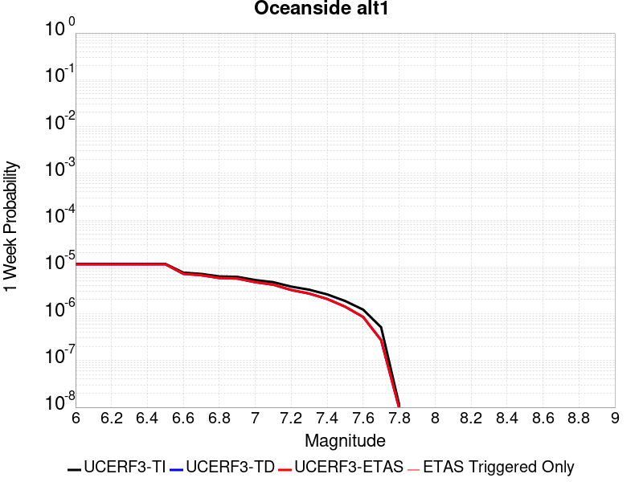 | 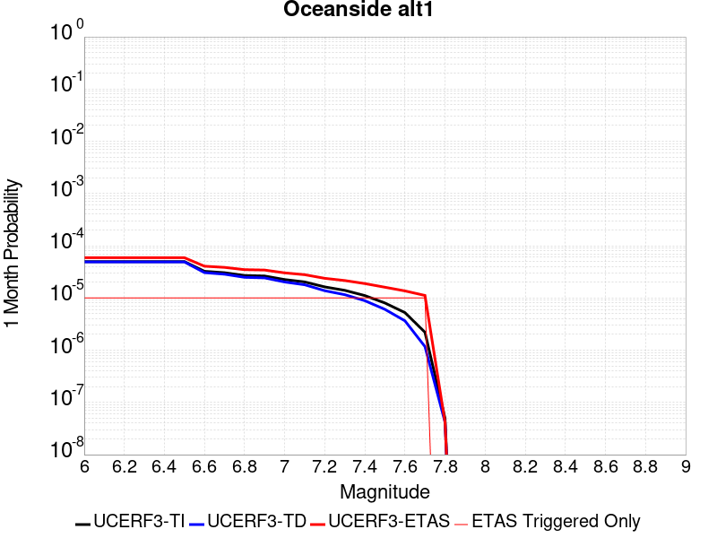 | 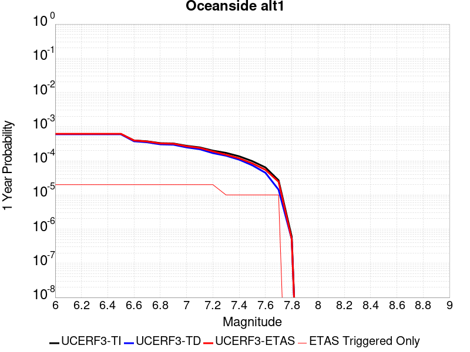 | 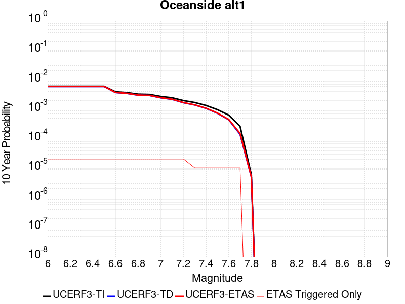 |

| Magnitude | 1 wk TI Prob | 1 wk TD Prob | 1 wk ETAS Prob | 1 wk ETAS/TD Gain | 1 wk ETAS Triggered Only | 1 mo TI Prob | 1 mo TD Prob | 1 mo ETAS Prob | 1 mo ETAS/TD Gain | 1 mo ETAS Triggered Only | 1 yr TI Prob | 1 yr TD Prob | 1 yr ETAS Prob | 1 yr ETAS/TD Gain | 1 yr ETAS Triggered Only | 10 yr TI Prob | 10 yr TD Prob | 10 yr ETAS Prob | 10 yr ETAS/TD Gain | 10 yr ETAS Triggered Only |
|-----|-----|-----|-----|-----|-----|-----|-----|-----|-----|-----|-----|-----|-----|-----|-----|-----|-----|-----|-----|-----|
| 6.0 | 1.1617542E-5 | 1.1423493E-5 | 1.1423493E-5 | 1.0 | 0.0 | 4.9788516E-5 | 4.8956997E-5 | 5.9392394E-5 | 1.2131543 | 1.0435908E-5 | 6.060066E-4 | 5.9590454E-4 | 6.167639E-4 | 1.0350046 | 2.0871816E-5 | 0.0060435664 | 0.005944664 | 0.005965412 | 1.0034901 | 2.0871816E-5 |
| 6.1 | 1.1617542E-5 | 1.1423493E-5 | 1.1423493E-5 | 1.0 | 0.0 | 4.9788516E-5 | 4.8956997E-5 | 5.9392394E-5 | 1.2131543 | 1.0435908E-5 | 6.060066E-4 | 5.9590454E-4 | 6.167639E-4 | 1.0350046 | 2.0871816E-5 | 0.0060435664 | 0.005944664 | 0.005965412 | 1.0034901 | 2.0871816E-5 |
| 6.2 | 1.1617542E-5 | 1.1423493E-5 | 1.1423493E-5 | 1.0 | 0.0 | 4.9788516E-5 | 4.8956997E-5 | 5.9392394E-5 | 1.2131543 | 1.0435908E-5 | 6.060066E-4 | 5.9590454E-4 | 6.167639E-4 | 1.0350046 | 2.0871816E-5 | 0.0060435664 | 0.005944664 | 0.005965412 | 1.0034901 | 2.0871816E-5 |
| 6.3 | 1.1617542E-5 | 1.1423493E-5 | 1.1423493E-5 | 1.0 | 0.0 | 4.9788516E-5 | 4.8956997E-5 | 5.9392394E-5 | 1.2131543 | 1.0435908E-5 | 6.060066E-4 | 5.9590454E-4 | 6.167639E-4 | 1.0350046 | 2.0871816E-5 | 0.0060435664 | 0.005944664 | 0.005965412 | 1.0034901 | 2.0871816E-5 |
| 6.4 | 1.1617542E-5 | 1.1423493E-5 | 1.1423493E-5 | 1.0 | 0.0 | 4.9788516E-5 | 4.8956997E-5 | 5.9392394E-5 | 1.2131543 | 1.0435908E-5 | 6.060066E-4 | 5.9590454E-4 | 6.167639E-4 | 1.0350046 | 2.0871816E-5 | 0.0060435664 | 0.005944664 | 0.005965412 | 1.0034901 | 2.0871816E-5 |
| 6.5 | 1.1617542E-5 | 1.1423493E-5 | 1.1423493E-5 | 1.0 | 0.0 | 4.9788516E-5 | 4.8956997E-5 | 5.9392394E-5 | 1.2131543 | 1.0435908E-5 | 6.060066E-4 | 5.9590454E-4 | 6.167639E-4 | 1.0350046 | 2.0871816E-5 | 0.0060435664 | 0.005944664 | 0.005965412 | 1.0034901 | 2.0871816E-5 |
| 6.6 | 7.561768E-6 | 7.1336153E-6 | 7.1336153E-6 | 1.0 | 0.0 | 3.2407173E-5 | 3.0572286E-5 | 4.1007876E-5 | 1.3413415 | 1.0435908E-5 | 3.9448592E-4 | 3.7215507E-4 | 3.9301912E-4 | 1.0560628 | 2.0871816E-5 | 0.0039378637 | 0.00371543 | 0.0037362243 | 1.0055968 | 2.0871816E-5 |
| 6.7 | 7.1042605E-6 | 6.6556854E-6 | 6.6556854E-6 | 1.0 | 0.0 | 3.0446476E-5 | 2.8524059E-5 | 3.8959668E-5 | 1.365853 | 1.0435908E-5 | 3.706228E-4 | 3.472259E-4 | 3.6809046E-4 | 1.0600893 | 2.0871816E-5 | 0.0037000529 | 0.003466917 | 0.0034877164 | 1.0059994 | 2.0871816E-5 |
| 6.8 | 6.285554E-6 | 5.799706E-6 | 5.799706E-6 | 1.0 | 0.0 | 2.693781E-5 | 2.4855648E-5 | 3.5291298E-5 | 1.4198502 | 1.0435908E-5 | 3.2791847E-4 | 3.0257605E-4 | 3.2344155E-4 | 1.0689595 | 2.0871816E-5 | 0.0032743502 | 0.0030216982 | 0.003042507 | 1.0068865 | 2.0871816E-5 |
| 6.9 | 6.148883E-6 | 5.6565445E-6 | 5.6565445E-6 | 1.0 | 0.0 | 2.635209E-5 | 2.424211E-5 | 3.4677767E-5 | 1.4304763 | 1.0435908E-5 | 3.2078946E-4 | 2.9510827E-4 | 3.1597394E-4 | 1.070705 | 2.0871816E-5 | 0.003203268 | 0.0029472208 | 0.0029680312 | 1.007061 | 2.0871816E-5 |
| 7.0 | 5.253857E-6 | 4.722404E-6 | 4.722404E-6 | 1.0 | 0.0 | 2.2516335E-5 | 2.0238718E-5 | 3.0674415E-5 | 1.5156302 | 1.0435908E-5 | 2.7410188E-4 | 2.4637886E-4 | 2.6724552E-4 | 1.0846934 | 2.0871816E-5 | 0.0027376404 | 0.0024610884 | 0.002481909 | 1.0084598 | 2.0871816E-5 |
| 7.1 | 4.730754E-6 | 4.17851E-6 | 4.17851E-6 | 1.0 | 0.0 | 2.0274503E-5 | 1.7907778E-5 | 2.83435E-5 | 1.5827479 | 1.0435908E-5 | 2.468141E-4 | 2.1800565E-4 | 2.3887292E-4 | 1.095719 | 2.0871816E-5 | 0.0024654015 | 0.0021779444 | 0.0021987706 | 1.0095624 | 2.0871816E-5 |
| 7.2 | 3.7998386E-6 | 3.214026E-6 | 3.214026E-6 | 1.0 | 0.0 | 1.6284921E-5 | 1.37743245E-5 | 2.4210089E-5 | 1.7576244 | 1.0435908E-5 | 1.9825088E-4 | 1.6768962E-4 | 1.8855794E-4 | 1.124446 | 2.0871816E-5 | 0.001980741 | 0.001675643 | 0.00169648 | 1.0124351 | 2.0871816E-5 |
| 7.3 | 3.2656465E-6 | 2.698376E-6 | 2.698376E-6 | 1.0 | 0.0 | 1.3995553E-5 | 1.1564418E-5 | 2.2000206E-5 | 1.9024049 | 1.0435908E-5 | 1.7038253E-4 | 1.407878E-4 | 1.5122224E-4 | 1.0741147 | 1.0435908E-5 | 0.0017025196 | 0.0014069972 | 0.0014174185 | 1.0074067 | 1.0435908E-5 |
| 7.4 | 2.593703E-6 | 2.0680277E-6 | 2.0680277E-6 | 1.0 | 0.0 | 1.1115822E-5 | 8.862946E-6 | 1.929876E-5 | 2.1774657 | 1.0435908E-5 | 1.3532673E-4 | 1.0790111E-4 | 1.183359E-4 | 1.0967069 | 1.0435908E-5 | 0.0013524436 | 0.0010784961 | 0.0010889207 | 1.009666 | 1.0435908E-5 |
| 7.5 | 1.8715585E-6 | 1.4137177E-6 | 1.4137177E-6 | 1.0 | 0.0 | 8.020941E-6 | 6.0587763E-6 | 1.6494621E-5 | 2.7224345 | 1.0435908E-5 | 9.7650576E-5 | 7.376316E-5 | 8.4198306E-5 | 1.1414682 | 1.0435908E-5 | 9.7607676E-4 | 7.3739287E-4 | 7.4782106E-4 | 1.014142 | 1.0435908E-5 |
| 7.6 | 1.2246786E-6 | 8.5268175E-7 | 8.5268175E-7 | 1.0 | 0.0 | 5.248612E-6 | 3.6543456E-6 | 1.4090216E-5 | 3.8557425 | 1.0435908E-5 | 6.389998E-5 | 4.4490793E-5 | 5.4926237E-5 | 1.2345529 | 1.0435908E-5 | 6.3881604E-4 | 4.4482335E-4 | 4.5525463E-4 | 1.0234504 | 1.0435908E-5 |
| 7.7 | 5.140719E-7 | 2.734703E-7 | 2.734703E-7 | 1.0 | 0.0 | 2.2031636E-6 | 1.1720151E-6 | 1.1607911E-5 | 9.904233 | 1.0435908E-5 | 2.6823185E-5 | 1.4269205E-5 | 2.4704965E-5 | 1.7313483 | 1.0435908E-5 | 2.6819948E-4 | 1.4268424E-4 | 1.5311866E-4 | 1.0731294 | 1.0435908E-5 |
| 7.8 | 1.16056995E-8 | 9.782373E-9 | 9.782373E-9 | 1.0 | 0.0 | 4.9738713E-8 | 4.1924455E-8 | 4.1924455E-8 | 1.0 | 0.0 | 6.0556863E-7 | 5.1043025E-7 | 5.1043025E-7 | 1.0 | 0.0 | 6.05567E-6 | 5.1043025E-6 | 5.1043025E-6 | 1.0 | 0.0 |

## Great Valley 05 Pittsburg - Kirby Hills alt1
*[(top)](#table-of-contents)*

| 1 Week | 1 Month | 1 Year | 10 Year |
|-----|-----|-----|-----|
| 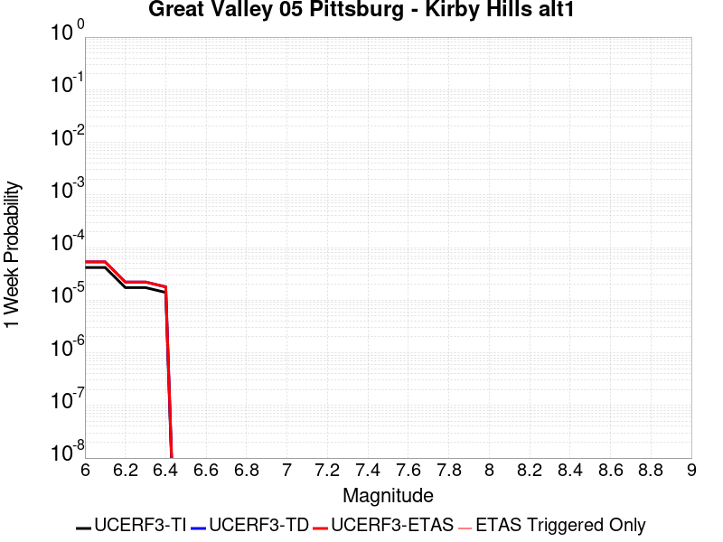 | 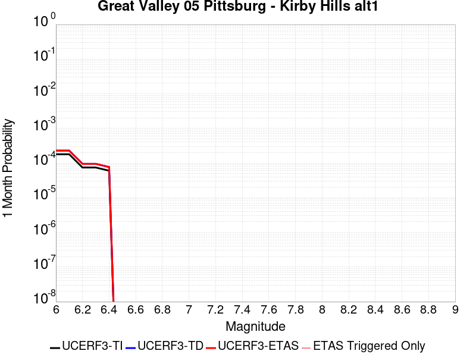 | 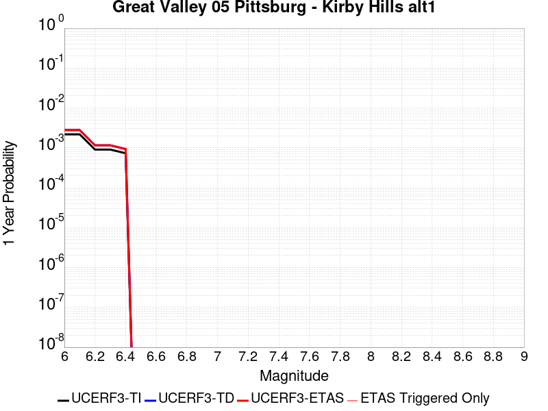 | 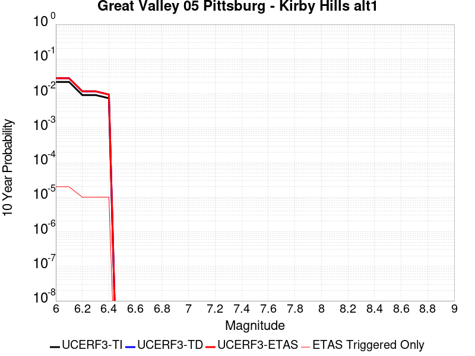 |

| Magnitude | 1 wk TI Prob | 1 wk TD Prob | 1 wk ETAS Prob | 1 wk ETAS/TD Gain | 1 wk ETAS Triggered Only | 1 mo TI Prob | 1 mo TD Prob | 1 mo ETAS Prob | 1 mo ETAS/TD Gain | 1 mo ETAS Triggered Only | 1 yr TI Prob | 1 yr TD Prob | 1 yr ETAS Prob | 1 yr ETAS/TD Gain | 1 yr ETAS Triggered Only | 10 yr TI Prob | 10 yr TD Prob | 10 yr ETAS Prob | 10 yr ETAS/TD Gain | 10 yr ETAS Triggered Only |
|-----|-----|-----|-----|-----|-----|-----|-----|-----|-----|-----|-----|-----|-----|-----|-----|-----|-----|-----|-----|-----|
| 6.0 | 4.187212E-5 | 5.3442072E-5 | 5.3442072E-5 | 1.0 | 0.0 | 1.794396E-4 | 2.290231E-4 | 2.290231E-4 | 1.0 | 0.0 | 0.002182488 | 0.0027857882 | 0.0027857882 | 1.0 | 0.0 | 0.021611776 | 0.02760304 | 0.027623335 | 1.0007353 | 2.0871816E-5 |
| 6.1 | 4.187212E-5 | 5.3442072E-5 | 5.3442072E-5 | 1.0 | 0.0 | 1.794396E-4 | 2.290231E-4 | 2.290231E-4 | 1.0 | 0.0 | 0.002182488 | 0.0027857882 | 0.0027857882 | 1.0 | 0.0 | 0.021611776 | 0.02760304 | 0.027623335 | 1.0007353 | 2.0871816E-5 |
| 6.2 | 1.7353306E-5 | 2.2154374E-5 | 2.2154374E-5 | 1.0 | 0.0 | 7.436919E-5 | 9.494618E-5 | 9.494618E-5 | 1.0 | 0.0 | 9.050688E-4 | 0.0011557543 | 0.0011557543 | 1.0 | 0.0 | 0.009013915 | 0.011535114 | 0.011545429 | 1.0008943 | 1.0435908E-5 |
| 6.3 | 1.7353306E-5 | 2.2154374E-5 | 2.2154374E-5 | 1.0 | 0.0 | 7.436919E-5 | 9.494618E-5 | 9.494618E-5 | 1.0 | 0.0 | 9.050688E-4 | 0.0011557543 | 0.0011557543 | 1.0 | 0.0 | 0.009013915 | 0.011535114 | 0.011545429 | 1.0008943 | 1.0435908E-5 |
| 6.4 | 1.4028824E-5 | 1.7900597E-5 | 1.7900597E-5 | 1.0 | 0.0 | 6.0122147E-5 | 7.671684E-5 | 7.671684E-5 | 1.0 | 0.0 | 7.3174125E-4 | 9.340275E-4 | 9.340275E-4 | 1.0 | 0.0 | 0.0072933645 | 0.009338138 | 0.009348476 | 1.0011071 | 1.0435908E-5 |

## Elsinore (Temecula) rev
*[(top)](#table-of-contents)*

| 1 Week | 1 Month | 1 Year | 10 Year |
|-----|-----|-----|-----|
| 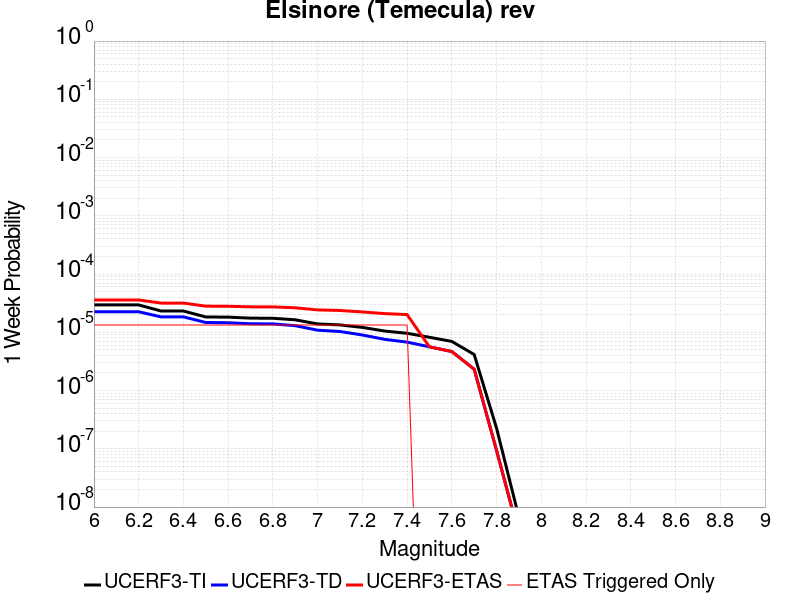 | 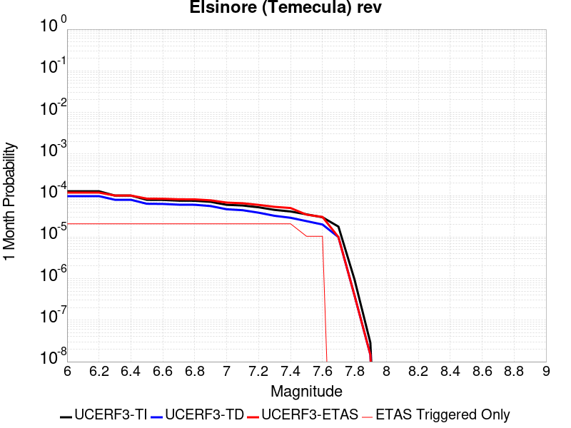 | 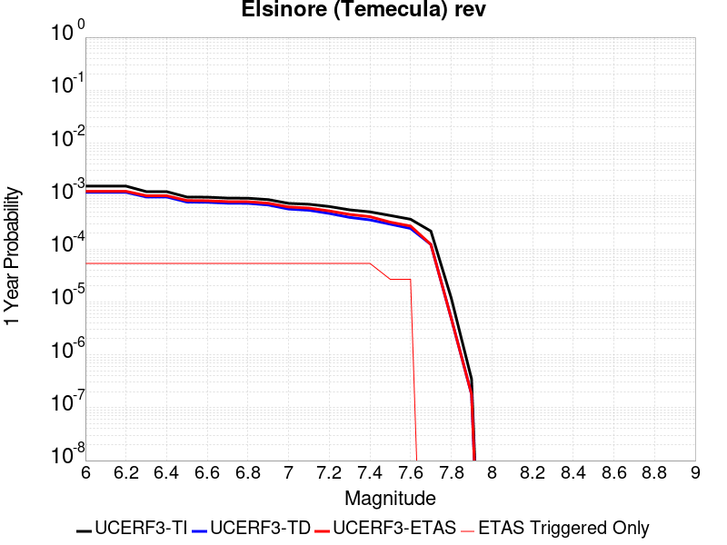 | 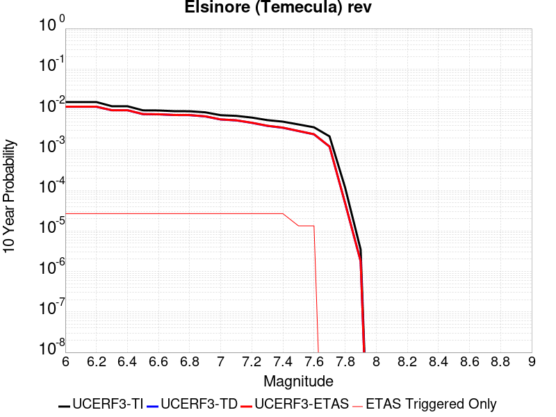 |

| Magnitude | 1 wk TI Prob | 1 wk TD Prob | 1 wk ETAS Prob | 1 wk ETAS/TD Gain | 1 wk ETAS Triggered Only | 1 mo TI Prob | 1 mo TD Prob | 1 mo ETAS Prob | 1 mo ETAS/TD Gain | 1 mo ETAS Triggered Only | 1 yr TI Prob | 1 yr TD Prob | 1 yr ETAS Prob | 1 yr ETAS/TD Gain | 1 yr ETAS Triggered Only | 10 yr TI Prob | 10 yr TD Prob | 10 yr ETAS Prob | 10 yr ETAS/TD Gain | 10 yr ETAS Triggered Only |
|-----|-----|-----|-----|-----|-----|-----|-----|-----|-----|-----|-----|-----|-----|-----|-----|-----|-----|-----|-----|-----|
| 6.0 | 2.9514995E-5 | 2.2517117E-5 | 3.295279E-5 | 1.4634551 | 1.0435908E-5 | 1.264867E-4 | 9.649849E-5 | 1.1736828E-4 | 1.2162708 | 2.0871816E-5 | 0.0015388876 | 0.0011742581 | 0.0011951054 | 1.0177536 | 2.0871816E-5 | 0.015282745 | 0.011696897 | 0.011717525 | 1.0017635 | 2.0871816E-5 |
| 6.1 | 2.9514995E-5 | 2.2517117E-5 | 3.295279E-5 | 1.4634551 | 1.0435908E-5 | 1.264867E-4 | 9.649849E-5 | 1.1736828E-4 | 1.2162708 | 2.0871816E-5 | 0.0015388876 | 0.0011742581 | 0.0011951054 | 1.0177536 | 2.0871816E-5 | 0.015282745 | 0.011696897 | 0.011717525 | 1.0017635 | 2.0871816E-5 |
| 6.2 | 2.9514995E-5 | 2.2517117E-5 | 3.295279E-5 | 1.4634551 | 1.0435908E-5 | 1.264867E-4 | 9.649849E-5 | 1.1736828E-4 | 1.2162708 | 2.0871816E-5 | 0.0015388876 | 0.0011742581 | 0.0011951054 | 1.0177536 | 2.0871816E-5 | 0.015282745 | 0.011696897 | 0.011717525 | 1.0017635 | 2.0871816E-5 |
| 6.3 | 2.3223649E-5 | 1.8406454E-5 | 2.884217E-5 | 1.5669596 | 1.0435908E-5 | 9.952613E-5 | 7.888251E-5 | 9.975269E-5 | 1.2645729 | 2.0871816E-5 | 0.001211057 | 9.599888E-4 | 9.808405E-4 | 1.0217209 | 2.0871816E-5 | 0.012044783 | 0.009569948 | 0.009590619 | 1.0021601 | 2.0871816E-5 |
| 6.4 | 2.3223649E-5 | 1.8406454E-5 | 2.884217E-5 | 1.5669596 | 1.0435908E-5 | 9.952613E-5 | 7.888251E-5 | 9.975269E-5 | 1.2645729 | 2.0871816E-5 | 0.001211057 | 9.599888E-4 | 9.808405E-4 | 1.0217209 | 2.0871816E-5 | 0.012044783 | 0.009569948 | 0.009590619 | 1.0021601 | 2.0871816E-5 |
| 6.5 | 1.8338875E-5 | 1.4750118E-5 | 2.5185871E-5 | 1.7075031 | 1.0435908E-5 | 7.8592806E-5 | 6.321331E-5 | 8.4083804E-5 | 1.3301599 | 2.0871816E-5 | 9.5644733E-4 | 7.69359E-4 | 7.9021475E-4 | 1.027108 | 2.0871816E-5 | 0.009523412 | 0.0076739118 | 0.0076946234 | 1.002699 | 2.0871816E-5 |
| 6.6 | 1.8223333E-5 | 1.4612673E-5 | 2.5048428E-5 | 1.7141578 | 1.0435908E-5 | 7.809766E-5 | 6.262429E-5 | 8.34948E-5 | 1.3332654 | 2.0871816E-5 | 9.504242E-4 | 7.6219277E-4 | 7.830487E-4 | 1.0273631 | 2.0871816E-5 | 0.009463696 | 0.0076027405 | 0.0076234536 | 1.0027244 | 2.0871816E-5 |
| 6.7 | 1.7512752E-5 | 1.402721E-5 | 2.4462972E-5 | 1.7439656 | 1.0435908E-5 | 7.505249E-5 | 6.011528E-5 | 8.098584E-5 | 1.3471756 | 2.0871816E-5 | 9.13381E-4 | 7.3166634E-4 | 7.5252284E-4 | 1.0285056 | 2.0871816E-5 | 0.00909636 | 0.00729892 | 0.0073196394 | 1.0028387 | 2.0871816E-5 |
| 6.8 | 1.7417142E-5 | 1.3951195E-5 | 2.4386956E-5 | 1.7480192 | 1.0435908E-5 | 7.4642754E-5 | 5.9789512E-5 | 8.066008E-5 | 1.3490673 | 2.0871816E-5 | 9.083966E-4 | 7.277028E-4 | 7.485594E-4 | 1.0286609 | 2.0871816E-5 | 0.009046922 | 0.0072594886 | 0.0072802086 | 1.0028542 | 2.0871816E-5 |
| 6.9 | 1.6402591E-5 | 1.2988613E-5 | 2.3424385E-5 | 1.8034555 | 1.0435908E-5 | 7.0294926E-5 | 5.5664343E-5 | 7.6535E-5 | 1.3749375 | 2.0871816E-5 | 8.5550465E-4 | 6.775103E-4 | 6.98368E-4 | 1.0307858 | 2.0871816E-5 | 0.008522186 | 0.006760169 | 0.0067808996 | 1.0030665 | 2.0871816E-5 |
| 7.0 | 1.3912486E-5 | 1.0878233E-5 | 2.1314028E-5 | 1.959328 | 1.0435908E-5 | 5.9623577E-5 | 4.6620182E-5 | 6.7491026E-5 | 1.4476783 | 2.0871816E-5 | 7.2567526E-4 | 5.674556E-4 | 5.883156E-4 | 1.0367606 | 2.0871816E-5 | 0.0072331014 | 0.005663986 | 0.0056847394 | 1.0036641 | 2.0871816E-5 |
| 7.1 | 1.3405147E-5 | 1.03274215E-5 | 2.0763222E-5 | 2.0104942 | 1.0435908E-5 | 5.7449364E-5 | 4.425964E-5 | 6.513053E-5 | 1.4715558 | 2.0871816E-5 | 6.9922156E-4 | 5.3873047E-4 | 5.5959105E-4 | 1.0387217 | 2.0871816E-5 | 0.0069702556 | 0.005377577 | 0.0053983363 | 1.0038604 | 2.0871816E-5 |
| 7.2 | 1.21402E-5 | 8.996737E-6 | 1.9432551E-5 | 2.1599555 | 1.0435908E-5 | 5.202839E-5 | 3.8556886E-5 | 5.9427897E-5 | 1.5413043 | 2.0871816E-5 | 6.332616E-4 | 4.6933076E-4 | 4.901928E-4 | 1.0444505 | 2.0871816E-5 | 0.0063146 | 0.004684821 | 0.004705595 | 1.0044343 | 2.0871816E-5 |
| 7.3 | 1.05047775E-5 | 7.571771E-6 | 1.80076E-5 | 2.3782547 | 1.0435908E-5 | 4.5019697E-5 | 3.245005E-5 | 5.332119E-5 | 1.6431774 | 2.0871816E-5 | 5.4797693E-4 | 3.950092E-4 | 4.1587278E-4 | 1.052818 | 2.0871816E-5 | 0.005466277 | 0.00394346 | 0.00396425 | 1.0052719 | 2.0871816E-5 |
| 7.4 | 9.624483E-6 | 6.7868696E-6 | 1.7222706E-5 | 2.537651 | 1.0435908E-5 | 4.124713E-5 | 2.9086266E-5 | 4.9957474E-5 | 1.7175623 | 2.0871816E-5 | 5.0206814E-4 | 3.5406914E-4 | 3.7493356E-4 | 1.0589275 | 2.0871816E-5 | 0.005009353 | 0.003535204 | 0.0035560022 | 1.0058831 | 2.0871816E-5 |
| 7.5 | 8.215151E-6 | 5.635538E-6 | 5.635538E-6 | 1.0 | 0.0 | 3.5207315E-5 | 2.4152088E-5 | 3.4587745E-5 | 1.4320809 | 1.0435908E-5 | 4.2856473E-4 | 2.9401327E-4 | 3.0444612E-4 | 1.0354842 | 1.0435908E-5 | 0.004277392 | 0.002936371 | 0.002946776 | 1.0035436 | 1.0435908E-5 |
| 7.6 | 6.975058E-6 | 4.676045E-6 | 4.676045E-6 | 1.0 | 0.0 | 2.9892764E-5 | 2.0040046E-5 | 3.0475745E-5 | 1.5207423 | 1.0435908E-5 | 3.6388362E-4 | 2.439614E-4 | 2.5439478E-4 | 1.0427665 | 1.0435908E-5 | 0.0036328835 | 0.002437052 | 0.0024474626 | 1.0042717 | 1.0435908E-5 |
| 7.7 | 4.159604E-6 | 2.3269924E-6 | 2.3269924E-6 | 1.0 | 0.0 | 1.7826753E-5 | 9.97279E-6 | 9.97279E-6 | 1.0 | 0.0 | 2.1701909E-4 | 1.21412704E-4 | 1.21412704E-4 | 1.0 | 0.0 | 0.0021680726 | 0.0012135367 | 0.0012135367 | 1.0 | 0.0 |
| 7.8 | 2.2692414E-7 | 9.3854695E-8 | 9.3854695E-8 | 1.0 | 0.0 | 9.725317E-7 | 4.0223435E-7 | 4.0223435E-7 | 1.0 | 0.0 | 1.1840509E-5 | 4.8971956E-6 | 4.8971956E-6 | 1.0 | 0.0 | 1.1839878E-4 | 4.8971204E-5 | 4.8971204E-5 | 1.0 | 0.0 |
| 7.9 | 6.676829E-9 | 3.439853E-9 | 3.439853E-9 | 1.0 | 0.0 | 2.861498E-8 | 1.4742227E-8 | 1.4742227E-8 | 1.0 | 0.0 | 3.4838732E-7 | 1.7948659E-7 | 1.7948659E-7 | 1.0 | 0.0 | 3.4838679E-6 | 1.7948646E-6 | 1.7948646E-6 | 1.0 | 0.0 |

## Burnt Mtn
*[(top)](#table-of-contents)*

| 1 Week | 1 Month | 1 Year | 10 Year |
|-----|-----|-----|-----|
|  | 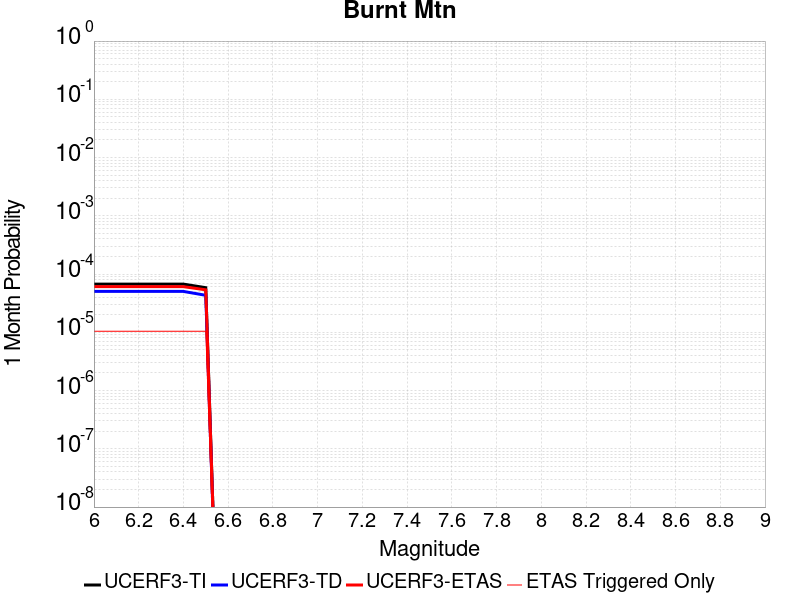 | 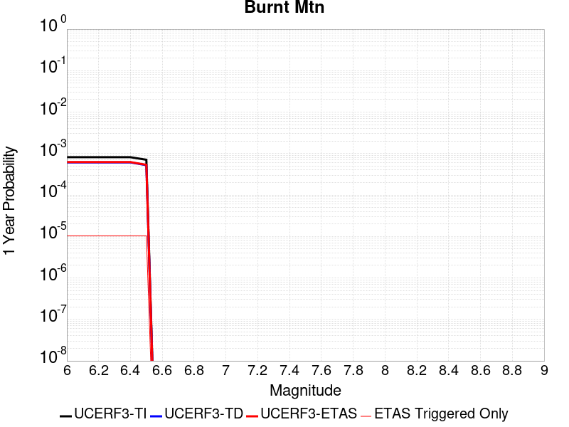 | 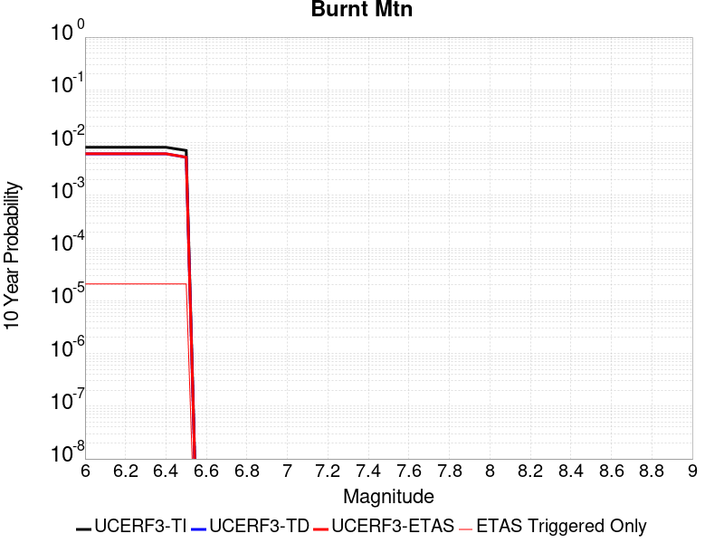 |

| Magnitude | 1 wk TI Prob | 1 wk TD Prob | 1 wk ETAS Prob | 1 wk ETAS/TD Gain | 1 wk ETAS Triggered Only | 1 mo TI Prob | 1 mo TD Prob | 1 mo ETAS Prob | 1 mo ETAS/TD Gain | 1 mo ETAS Triggered Only | 1 yr TI Prob | 1 yr TD Prob | 1 yr ETAS Prob | 1 yr ETAS/TD Gain | 1 yr ETAS Triggered Only | 10 yr TI Prob | 10 yr TD Prob | 10 yr ETAS Prob | 10 yr ETAS/TD Gain | 10 yr ETAS Triggered Only |
|-----|-----|-----|-----|-----|-----|-----|-----|-----|-----|-----|-----|-----|-----|-----|-----|-----|-----|-----|-----|-----|
| 6.0 | 1.5673151E-5 | 1.1749407E-5 | 2.2185193E-5 | 1.8881967 | 1.0435908E-5 | 6.716892E-5 | 5.0354356E-5 | 6.078974E-5 | 1.2072389 | 1.0435908E-5 | 8.1747473E-4 | 6.1302073E-4 | 6.2345027E-4 | 1.0170133 | 1.0435908E-5 | 0.008144741 | 0.006125938 | 0.006146682 | 1.0033863 | 2.0871816E-5 |
| 6.1 | 1.5673151E-5 | 1.1749407E-5 | 2.2185193E-5 | 1.8881967 | 1.0435908E-5 | 6.716892E-5 | 5.0354356E-5 | 6.078974E-5 | 1.2072389 | 1.0435908E-5 | 8.1747473E-4 | 6.1302073E-4 | 6.2345027E-4 | 1.0170133 | 1.0435908E-5 | 0.008144741 | 0.006125938 | 0.006146682 | 1.0033863 | 2.0871816E-5 |
| 6.2 | 1.5673151E-5 | 1.1749407E-5 | 2.2185193E-5 | 1.8881967 | 1.0435908E-5 | 6.716892E-5 | 5.0354356E-5 | 6.078974E-5 | 1.2072389 | 1.0435908E-5 | 8.1747473E-4 | 6.1302073E-4 | 6.2345027E-4 | 1.0170133 | 1.0435908E-5 | 0.008144741 | 0.006125938 | 0.006146682 | 1.0033863 | 2.0871816E-5 |
| 6.3 | 1.5673151E-5 | 1.1749407E-5 | 2.2185193E-5 | 1.8881967 | 1.0435908E-5 | 6.716892E-5 | 5.0354356E-5 | 6.078974E-5 | 1.2072389 | 1.0435908E-5 | 8.1747473E-4 | 6.1302073E-4 | 6.2345027E-4 | 1.0170133 | 1.0435908E-5 | 0.008144741 | 0.006125938 | 0.006146682 | 1.0033863 | 2.0871816E-5 |
| 6.4 | 1.5673151E-5 | 1.1749407E-5 | 2.2185193E-5 | 1.8881967 | 1.0435908E-5 | 6.716892E-5 | 5.0354356E-5 | 6.078974E-5 | 1.2072389 | 1.0435908E-5 | 8.1747473E-4 | 6.1302073E-4 | 6.2345027E-4 | 1.0170133 | 1.0435908E-5 | 0.008144741 | 0.006125938 | 0.006146682 | 1.0033863 | 2.0871816E-5 |
| 6.5 | 1.36191375E-5 | 1.0078299E-5 | 2.05141E-5 | 2.0354726 | 1.0435908E-5 | 5.8366426E-5 | 4.3192707E-5 | 5.3628166E-5 | 1.2416023 | 1.0435908E-5 | 7.103795E-4 | 5.2587123E-4 | 5.3630164E-4 | 1.0198345 | 1.0435908E-5 | 0.0070811296 | 0.0052587125 | 0.0052794744 | 1.0039481 | 2.0871816E-5 |

## Goose Lake 2011 CFM
*[(top)](#table-of-contents)*

| 1 Week | 1 Month | 1 Year | 10 Year |
|-----|-----|-----|-----|
| 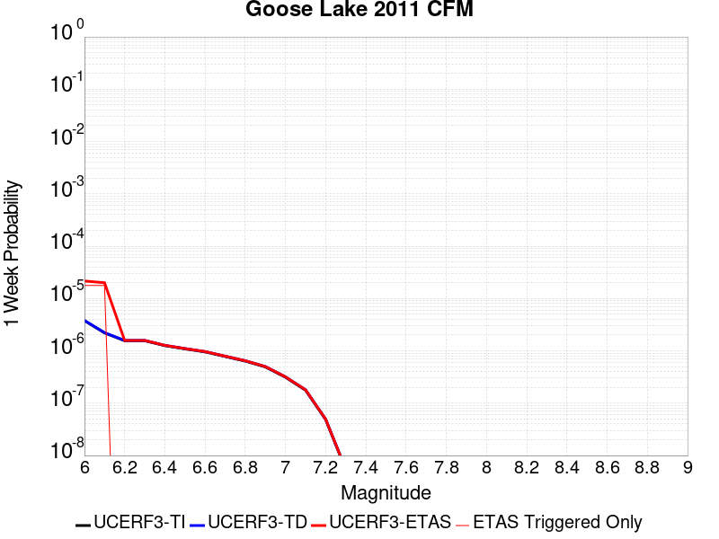 | 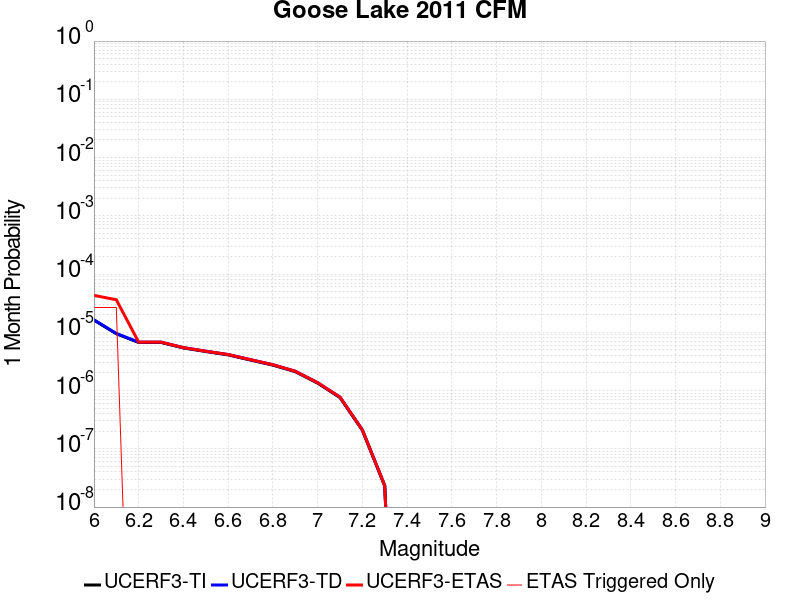 | 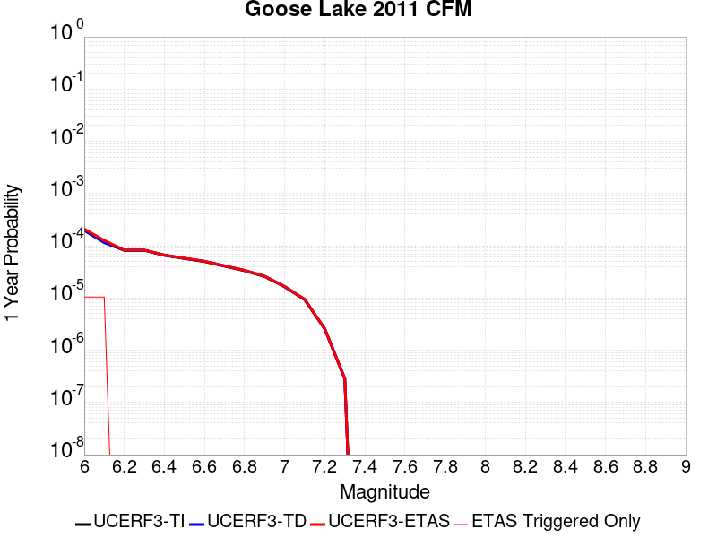 | 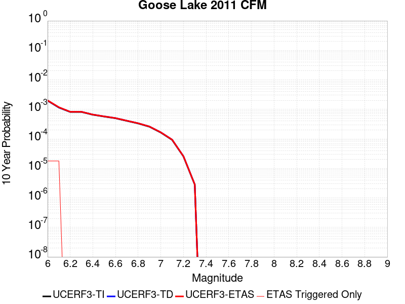 |

| Magnitude | 1 wk TI Prob | 1 wk TD Prob | 1 wk ETAS Prob | 1 wk ETAS/TD Gain | 1 wk ETAS Triggered Only | 1 mo TI Prob | 1 mo TD Prob | 1 mo ETAS Prob | 1 mo ETAS/TD Gain | 1 mo ETAS Triggered Only | 1 yr TI Prob | 1 yr TD Prob | 1 yr ETAS Prob | 1 yr ETAS/TD Gain | 1 yr ETAS Triggered Only | 10 yr TI Prob | 10 yr TD Prob | 10 yr ETAS Prob | 10 yr ETAS/TD Gain | 10 yr ETAS Triggered Only |
|-----|-----|-----|-----|-----|-----|-----|-----|-----|-----|-----|-----|-----|-----|-----|-----|-----|-----|-----|-----|-----|
| 6.0 | 3.780968E-6 | 3.8230223E-6 | 1.4258891E-5 | 3.729743 | 1.0435908E-5 | 1.6204049E-5 | 1.6384285E-5 | 2.6820022E-5 | 1.6369358 | 1.0435908E-5 | 1.9726643E-4 | 1.994615E-4 | 2.0989533E-4 | 1.05231 | 1.0435908E-5 | 0.001970914 | 0.001992933 | 0.0020033482 | 1.005226 | 1.0435908E-5 |
| 6.1 | 2.2035124E-6 | 2.229801E-6 | 1.2665686E-5 | 5.6801863 | 1.0435908E-5 | 9.443591E-6 | 9.556257E-6 | 1.9992065E-5 | 2.0920393 | 1.0435908E-5 | 1.1496965E-4 | 1.163414E-4 | 1.267761E-4 | 1.0896903 | 1.0435908E-5 | 0.0011491019 | 0.0011628233 | 0.001173247 | 1.0089642 | 1.0435908E-5 |
| 6.2 | 1.5624689E-6 | 1.5826923E-6 | 1.5826923E-6 | 1.0 | 0.0 | 6.6962784E-6 | 6.7829496E-6 | 6.7829496E-6 | 1.0 | 0.0 | 8.152414E-5 | 8.2579325E-5 | 8.2579325E-5 | 1.0 | 0.0 | 8.1494235E-4 | 8.2549086E-4 | 8.2549086E-4 | 1.0 | 0.0 |
| 6.3 | 1.5624689E-6 | 1.5826923E-6 | 1.5826923E-6 | 1.0 | 0.0 | 6.6962784E-6 | 6.7829496E-6 | 6.7829496E-6 | 1.0 | 0.0 | 8.152414E-5 | 8.2579325E-5 | 8.2579325E-5 | 1.0 | 0.0 | 8.1494235E-4 | 8.2549086E-4 | 8.2549086E-4 | 1.0 | 0.0 |
| 6.4 | 1.256464E-6 | 1.2738695E-6 | 1.2738695E-6 | 1.0 | 0.0 | 5.3848344E-6 | 5.4594293E-6 | 5.4594293E-6 | 1.0 | 0.0 | 6.5558386E-5 | 6.646655E-5 | 6.646655E-5 | 1.0 | 0.0 | 6.553905E-4 | 6.644687E-4 | 6.644687E-4 | 1.0 | 0.0 |
| 6.5 | 1.0910911E-6 | 1.1069404E-6 | 1.1069404E-6 | 1.0 | 0.0 | 4.6760965E-6 | 4.7440217E-6 | 4.7440217E-6 | 1.0 | 0.0 | 5.692999E-5 | 5.7756948E-5 | 5.7756948E-5 | 1.0 | 0.0 | 5.6915404E-4 | 5.7742064E-4 | 5.7742064E-4 | 1.0 | 0.0 |
| 6.6 | 9.546601E-7 | 9.691246E-7 | 9.691246E-7 | 1.0 | 0.0 | 4.091394E-6 | 4.1533845E-6 | 4.1533845E-6 | 1.0 | 0.0 | 4.9811584E-5 | 5.056629E-5 | 5.056629E-5 | 1.0 | 0.0 | 4.980042E-4 | 5.055487E-4 | 5.055487E-4 | 1.0 | 0.0 |
| 6.7 | 7.790316E-7 | 7.9159634E-7 | 7.9159634E-7 | 1.0 | 0.0 | 3.3387028E-6 | 3.3925514E-6 | 3.3925514E-6 | 1.0 | 0.0 | 4.0647945E-5 | 4.1303538E-5 | 4.1303538E-5 | 1.0 | 0.0 | 4.0640513E-4 | 4.129592E-4 | 4.129592E-4 | 1.0 | 0.0 |
| 6.8 | 6.3714384E-7 | 6.4787395E-7 | 6.4787395E-7 | 1.0 | 0.0 | 2.7306137E-6 | 2.7765998E-6 | 2.7765998E-6 | 1.0 | 0.0 | 3.3244716E-5 | 3.3804583E-5 | 3.3804583E-5 | 1.0 | 0.0 | 3.323974E-4 | 3.379949E-4 | 3.379949E-4 | 1.0 | 0.0 |
| 6.9 | 4.92586E-7 | 5.0139147E-7 | 5.0139147E-7 | 1.0 | 0.0 | 2.1110811E-6 | 2.1488188E-6 | 2.1488188E-6 | 1.0 | 0.0 | 2.5702111E-5 | 2.616156E-5 | 2.616156E-5 | 1.0 | 0.0 | 2.569914E-4 | 2.6158517E-4 | 2.6158517E-4 | 1.0 | 0.0 |
| 7.0 | 3.130245E-7 | 3.190354E-7 | 3.190354E-7 | 1.0 | 0.0 | 1.3415328E-6 | 1.3672939E-6 | 1.3672939E-6 | 1.0 | 0.0 | 1.6333039E-5 | 1.6646678E-5 | 1.6646678E-5 | 1.0 | 0.0 | 1.6331839E-4 | 1.6645451E-4 | 1.6645451E-4 | 1.0 | 0.0 |
| 7.1 | 1.7680084E-7 | 1.8023923E-7 | 1.8023923E-7 | 1.0 | 0.0 | 7.5771766E-7 | 7.724536E-7 | 7.724536E-7 | 1.0 | 0.0 | 9.225173E-6 | 9.404583E-6 | 9.404583E-6 | 1.0 | 0.0 | 9.22479E-5 | 9.4041956E-5 | 9.4041956E-5 | 1.0 | 0.0 |
| 7.2 | 4.8641045E-8 | 4.9402068E-8 | 4.9402068E-8 | 1.0 | 0.0 | 2.084616E-7 | 2.1172312E-7 | 2.1172312E-7 | 1.0 | 0.0 | 2.538017E-6 | 2.577726E-6 | 2.577726E-6 | 1.0 | 0.0 | 2.537988E-5 | 2.5776973E-5 | 2.5776973E-5 | 1.0 | 0.0 |
| 7.3 | 5.3911844E-9 | 5.4758145E-9 | 5.4758145E-9 | 1.0 | 0.0 | 2.3105075E-8 | 2.3467775E-8 | 2.3467775E-8 | 1.0 | 0.0 | 2.8130427E-7 | 2.8572015E-7 | 2.8572015E-7 | 1.0 | 0.0 | 2.8130391E-6 | 2.8571992E-6 | 2.8571992E-6 | 1.0 | 0.0 |

## Verdugo
*[(top)](#table-of-contents)*

| 1 Week | 1 Month | 1 Year | 10 Year |
|-----|-----|-----|-----|
| 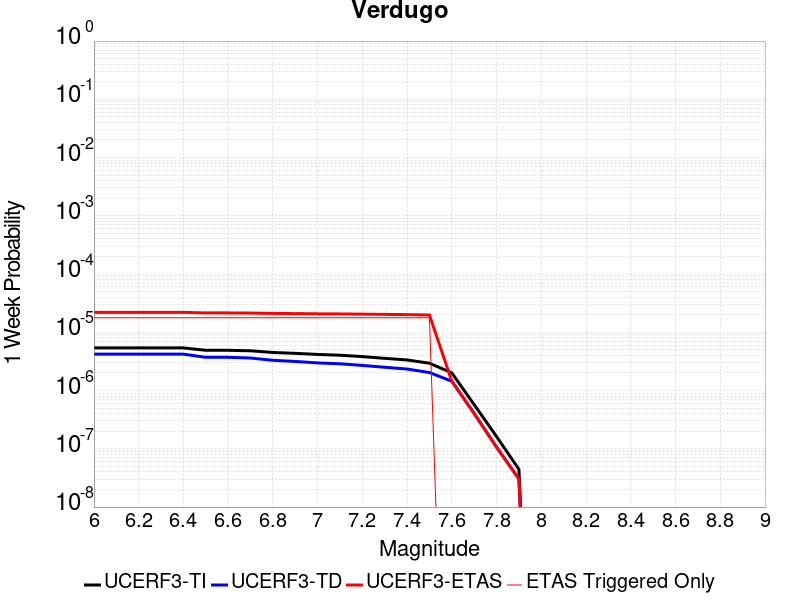 | 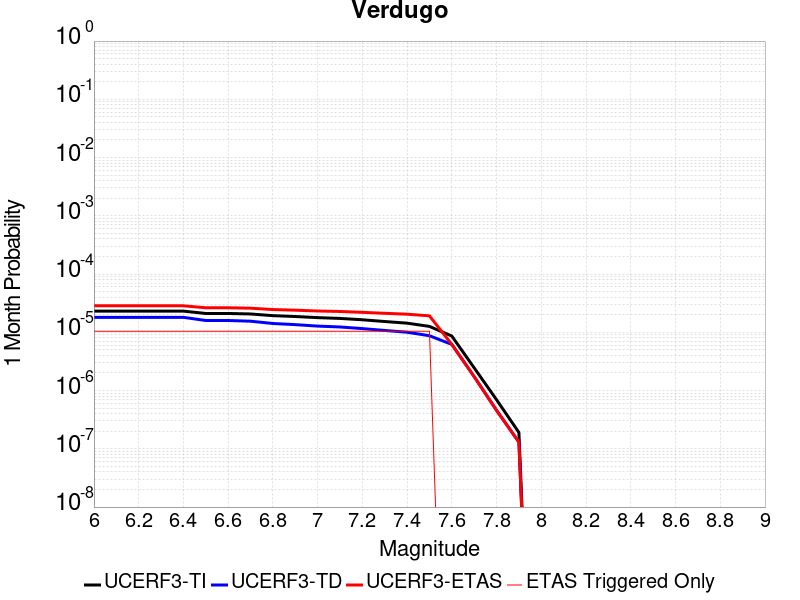 | 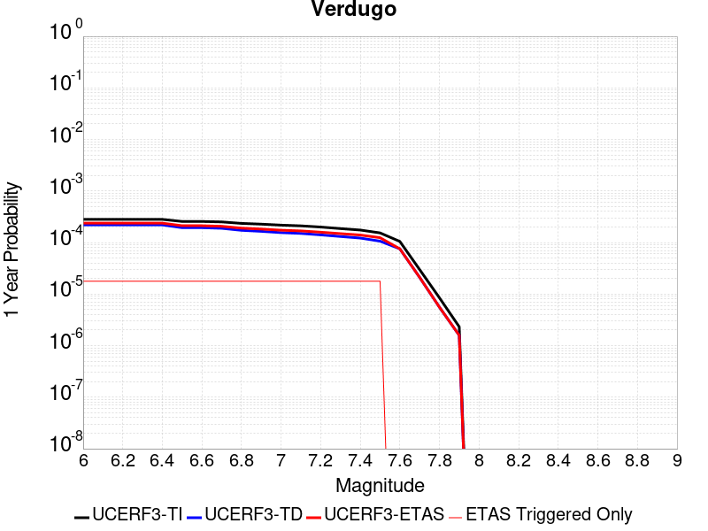 | 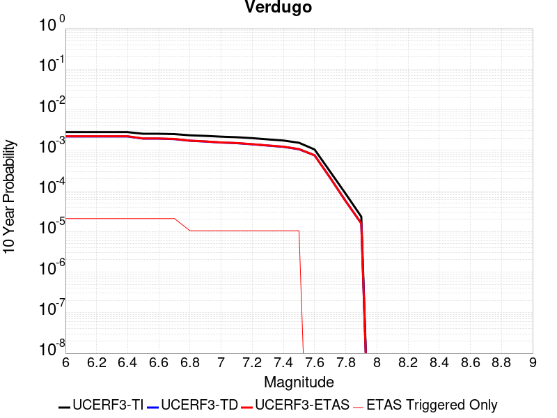 |

| Magnitude | 1 wk TI Prob | 1 wk TD Prob | 1 wk ETAS Prob | 1 wk ETAS/TD Gain | 1 wk ETAS Triggered Only | 1 mo TI Prob | 1 mo TD Prob | 1 mo ETAS Prob | 1 mo ETAS/TD Gain | 1 mo ETAS Triggered Only | 1 yr TI Prob | 1 yr TD Prob | 1 yr ETAS Prob | 1 yr ETAS/TD Gain | 1 yr ETAS Triggered Only | 10 yr TI Prob | 10 yr TD Prob | 10 yr ETAS Prob | 10 yr ETAS/TD Gain | 10 yr ETAS Triggered Only |
|-----|-----|-----|-----|-----|-----|-----|-----|-----|-----|-----|-----|-----|-----|-----|-----|-----|-----|-----|-----|-----|
| 6.0 | 5.392987E-6 | 4.216517E-6 | 1.4652381E-5 | 3.474996 | 1.0435908E-5 | 2.3112598E-5 | 1.8070665E-5 | 2.8506385E-5 | 1.577495 | 1.0435908E-5 | 2.8135953E-4 | 2.1998861E-4 | 2.3042223E-4 | 1.047428 | 1.0435908E-5 | 0.0028100356 | 0.0021977562 | 0.0022185822 | 1.009476 | 2.0871816E-5 |
| 6.1 | 5.392987E-6 | 4.216517E-6 | 1.4652381E-5 | 3.474996 | 1.0435908E-5 | 2.3112598E-5 | 1.8070665E-5 | 2.8506385E-5 | 1.577495 | 1.0435908E-5 | 2.8135953E-4 | 2.1998861E-4 | 2.3042223E-4 | 1.047428 | 1.0435908E-5 | 0.0028100356 | 0.0021977562 | 0.0022185822 | 1.009476 | 2.0871816E-5 |
| 6.2 | 5.392987E-6 | 4.216517E-6 | 1.4652381E-5 | 3.474996 | 1.0435908E-5 | 2.3112598E-5 | 1.8070665E-5 | 2.8506385E-5 | 1.577495 | 1.0435908E-5 | 2.8135953E-4 | 2.1998861E-4 | 2.3042223E-4 | 1.047428 | 1.0435908E-5 | 0.0028100356 | 0.0021977562 | 0.0022185822 | 1.009476 | 2.0871816E-5 |
| 6.3 | 5.392987E-6 | 4.216517E-6 | 1.4652381E-5 | 3.474996 | 1.0435908E-5 | 2.3112598E-5 | 1.8070665E-5 | 2.8506385E-5 | 1.577495 | 1.0435908E-5 | 2.8135953E-4 | 2.1998861E-4 | 2.3042223E-4 | 1.047428 | 1.0435908E-5 | 0.0028100356 | 0.0021977562 | 0.0022185822 | 1.009476 | 2.0871816E-5 |
| 6.4 | 5.392987E-6 | 4.216517E-6 | 1.4652381E-5 | 3.474996 | 1.0435908E-5 | 2.3112598E-5 | 1.8070665E-5 | 2.8506385E-5 | 1.577495 | 1.0435908E-5 | 2.8135953E-4 | 2.1998861E-4 | 2.3042223E-4 | 1.047428 | 1.0435908E-5 | 0.0028100356 | 0.0021977562 | 0.0022185822 | 1.009476 | 2.0871816E-5 |
| 6.5 | 4.9154837E-6 | 3.722465E-6 | 1.4158334E-5 | 3.8034835 | 1.0435908E-5 | 2.1066187E-5 | 1.5953325E-5 | 2.6389067E-5 | 1.6541421 | 1.0435908E-5 | 2.5645064E-4 | 1.9421462E-4 | 2.046485E-4 | 1.0537235 | 1.0435908E-5 | 0.002561549 | 0.0019404698 | 0.001961301 | 1.0107352 | 2.0871816E-5 |
| 6.6 | 4.9154837E-6 | 3.722465E-6 | 1.4158334E-5 | 3.8034835 | 1.0435908E-5 | 2.1066187E-5 | 1.5953325E-5 | 2.6389067E-5 | 1.6541421 | 1.0435908E-5 | 2.5645064E-4 | 1.9421462E-4 | 2.046485E-4 | 1.0537235 | 1.0435908E-5 | 0.002561549 | 0.0019404698 | 0.001961301 | 1.0107352 | 2.0871816E-5 |
| 6.7 | 4.817006E-6 | 3.6206518E-6 | 1.4056522E-5 | 3.882318 | 1.0435908E-5 | 2.0644147E-5 | 1.5516987E-5 | 2.5952733E-5 | 1.6725368 | 1.0435908E-5 | 2.513135E-4 | 1.8890314E-4 | 1.9933708E-4 | 1.0552343 | 1.0435908E-5 | 0.0025102948 | 0.0018874453 | 0.0019082777 | 1.0110373 | 2.0871816E-5 |
| 6.8 | 4.507407E-6 | 3.3071042E-6 | 1.3742978E-5 | 4.1555924 | 1.0435908E-5 | 1.9317316E-5 | 1.4173227E-5 | 2.4608988E-5 | 1.736301 | 1.0435908E-5 | 2.3516294E-4 | 1.7254551E-4 | 1.8297962E-4 | 1.0604717 | 1.0435908E-5 | 0.0023491425 | 0.0017241298 | 0.0017345477 | 1.0060424 | 1.0435908E-5 |
| 6.9 | 4.3573054E-6 | 3.161011E-6 | 1.3596886E-5 | 4.301436 | 1.0435908E-5 | 1.8674033E-5 | 1.354712E-5 | 2.3982886E-5 | 1.770331 | 1.0435908E-5 | 2.2733262E-4 | 1.6492383E-4 | 1.7535801E-4 | 1.0632668 | 1.0435908E-5 | 0.0022710022 | 0.0016480266 | 0.0016584453 | 1.0063219 | 1.0435908E-5 |
| 7.0 | 4.171527E-6 | 2.9836704E-6 | 1.3419547E-5 | 4.497664 | 1.0435908E-5 | 1.787785E-5 | 1.2787096E-5 | 2.322287E-5 | 1.8161176 | 1.0435908E-5 | 2.1764109E-4 | 1.5567189E-4 | 1.6610617E-4 | 1.0670274 | 1.0435908E-5 | 0.0021742806 | 0.0015556397 | 0.0015660593 | 1.006698 | 1.0435908E-5 |
| 7.1 | 4.0405484E-6 | 2.882261E-6 | 1.3318139E-5 | 4.620726 | 1.0435908E-5 | 1.731652E-5 | 1.235249E-5 | 2.2788268E-5 | 1.8448321 | 1.0435908E-5 | 2.1080824E-4 | 1.503813E-4 | 1.6081563E-4 | 1.0693859 | 1.0435908E-5 | 0.0021060838 | 0.0015028063 | 0.0015132265 | 1.0069338 | 1.0435908E-5 |
| 7.2 | 3.8306007E-6 | 2.7018452E-6 | 1.3137725E-5 | 4.862501 | 1.0435908E-5 | 1.6416758E-5 | 1.15792855E-5 | 2.2015072E-5 | 1.9012462 | 1.0435908E-5 | 1.9985568E-4 | 1.4096878E-4 | 1.5140322E-4 | 1.0740194 | 1.0435908E-5 | 0.0019967605 | 0.0014088044 | 0.0014192256 | 1.0073972 | 1.0435908E-5 |
| 7.3 | 3.5750938E-6 | 2.5121758E-6 | 1.2948058E-5 | 5.154121 | 1.0435908E-5 | 1.532174E-5 | 1.0766424E-5 | 2.1202219E-5 | 1.9692907 | 1.0435908E-5 | 1.8652623E-4 | 1.3107344E-4 | 1.4150798E-4 | 1.0796083 | 1.0435908E-5 | 0.0018636974 | 0.0013099718 | 0.001320394 | 1.007956 | 1.0435908E-5 |
| 7.4 | 3.3510041E-6 | 2.3408586E-6 | 1.2776742E-5 | 5.4581437 | 1.0435908E-5 | 1.4361368E-5 | 1.0032213E-5 | 2.0468016E-5 | 2.0402293 | 1.0435908E-5 | 1.7483562E-4 | 1.2213545E-4 | 1.3257009E-4 | 1.0854349 | 1.0435908E-5 | 0.0017469813 | 0.0012206937 | 0.0012311168 | 1.0085387 | 1.0435908E-5 |
| 7.5 | 2.948287E-6 | 2.0391124E-6 | 1.2474999E-5 | 6.1178575 | 1.0435908E-5 | 1.2635454E-5 | 8.739024E-6 | 1.917484E-5 | 2.1941626 | 1.0435908E-5 | 1.538258E-4 | 1.0639253E-4 | 1.1682733E-4 | 1.0980783 | 1.0435908E-5 | 0.0015371935 | 0.0010634261 | 0.001073851 | 1.009803 | 1.0435908E-5 |
| 7.6 | 2.0134323E-6 | 1.4471265E-6 | 1.4471265E-6 | 1.0 | 0.0 | 8.628967E-6 | 6.2019562E-6 | 6.2019562E-6 | 1.0 | 0.0 | 1.05052604E-4 | 7.550629E-5 | 7.550629E-5 | 1.0 | 0.0 | 0.0010500296 | 7.548152E-4 | 7.548152E-4 | 1.0 | 0.0 |
| 7.7 | 5.726436E-7 | 4.045248E-7 | 4.045248E-7 | 1.0 | 0.0 | 2.4541846E-6 | 1.7336766E-6 | 1.7336766E-6 | 1.0 | 0.0 | 2.9879287E-5 | 2.1107335E-5 | 2.1107335E-5 | 1.0 | 0.0 | 2.987527E-4 | 2.1105584E-4 | 2.1105584E-4 | 1.0 | 0.0 |
| 7.8 | 1.6248204E-7 | 1.0687696E-7 | 1.0687696E-7 | 1.0 | 0.0 | 6.963514E-7 | 4.5804404E-7 | 4.5804404E-7 | 1.0 | 0.0 | 8.478045E-6 | 5.5766723E-6 | 5.5766723E-6 | 1.0 | 0.0 | 8.477722E-5 | 5.5765355E-5 | 5.5765355E-5 | 1.0 | 0.0 |
| 7.9 | 4.4475744E-8 | 3.0375546E-8 | 3.0375546E-8 | 1.0 | 0.0 | 1.9061031E-7 | 1.301809E-7 | 1.301809E-7 | 1.0 | 0.0 | 2.320678E-6 | 1.5849514E-6 | 1.5849514E-6 | 1.0 | 0.0 | 2.3206538E-5 | 1.5849415E-5 | 1.5849415E-5 | 1.0 | 0.0 |

## Big Lagoon - Bald Mtn 2011 CFM
*[(top)](#table-of-contents)*

| 1 Week | 1 Month | 1 Year | 10 Year |
|-----|-----|-----|-----|
| 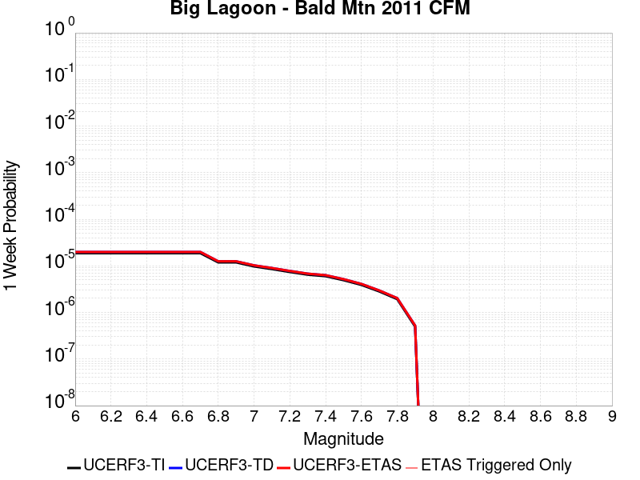 | 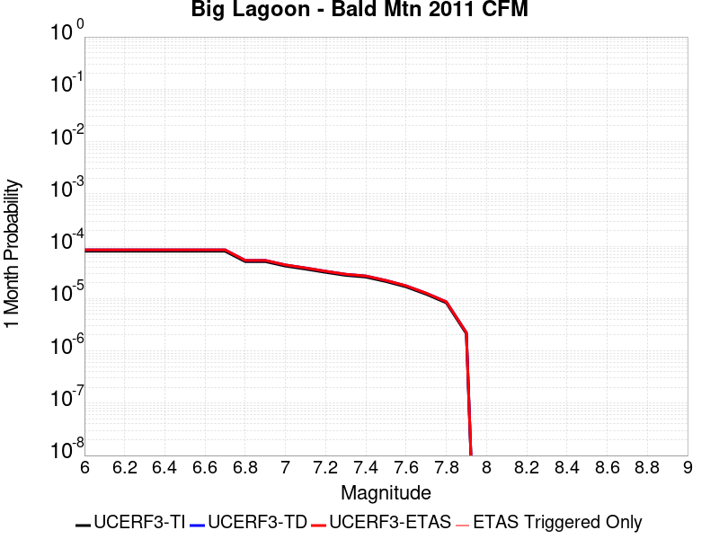 | 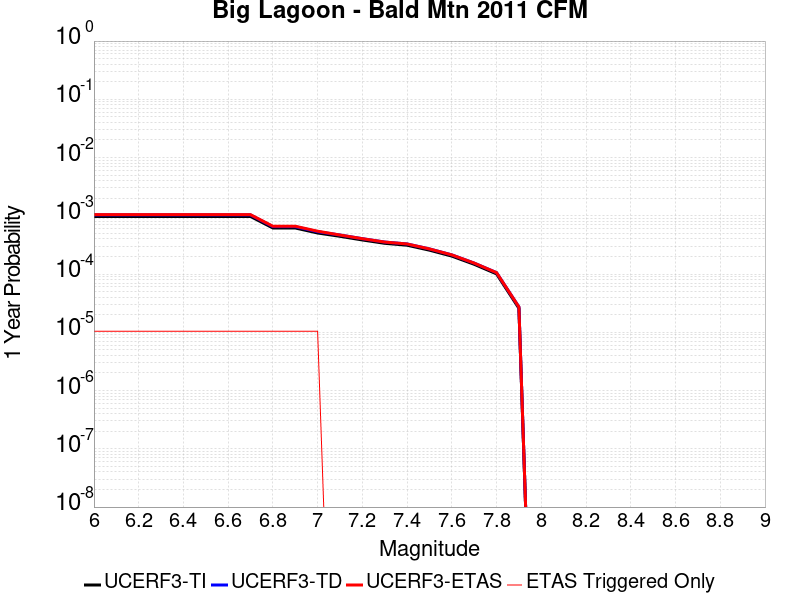 | 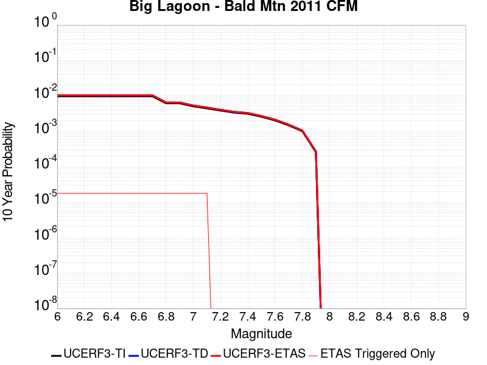 |

| Magnitude | 1 wk TI Prob | 1 wk TD Prob | 1 wk ETAS Prob | 1 wk ETAS/TD Gain | 1 wk ETAS Triggered Only | 1 mo TI Prob | 1 mo TD Prob | 1 mo ETAS Prob | 1 mo ETAS/TD Gain | 1 mo ETAS Triggered Only | 1 yr TI Prob | 1 yr TD Prob | 1 yr ETAS Prob | 1 yr ETAS/TD Gain | 1 yr ETAS Triggered Only | 10 yr TI Prob | 10 yr TD Prob | 10 yr ETAS Prob | 10 yr ETAS/TD Gain | 10 yr ETAS Triggered Only |
|-----|-----|-----|-----|-----|-----|-----|-----|-----|-----|-----|-----|-----|-----|-----|-----|-----|-----|-----|-----|-----|
| 6.0 | 1.8699735E-5 | 1.985018E-5 | 1.985018E-5 | 1.0 | 0.0 | 8.013926E-5 | 8.5069645E-5 | 8.5069645E-5 | 1.0 | 0.0 | 9.752587E-4 | 0.0010352687 | 0.0010456938 | 1.01007 | 1.0435908E-5 | 0.009709897 | 0.010308274 | 0.010328931 | 1.0020039 | 2.0871816E-5 |
| 6.1 | 1.8699735E-5 | 1.985018E-5 | 1.985018E-5 | 1.0 | 0.0 | 8.013926E-5 | 8.5069645E-5 | 8.5069645E-5 | 1.0 | 0.0 | 9.752587E-4 | 0.0010352687 | 0.0010456938 | 1.01007 | 1.0435908E-5 | 0.009709897 | 0.010308274 | 0.010328931 | 1.0020039 | 2.0871816E-5 |
| 6.2 | 1.8699735E-5 | 1.985018E-5 | 1.985018E-5 | 1.0 | 0.0 | 8.013926E-5 | 8.5069645E-5 | 8.5069645E-5 | 1.0 | 0.0 | 9.752587E-4 | 0.0010352687 | 0.0010456938 | 1.01007 | 1.0435908E-5 | 0.009709897 | 0.010308274 | 0.010328931 | 1.0020039 | 2.0871816E-5 |
| 6.3 | 1.8699735E-5 | 1.985018E-5 | 1.985018E-5 | 1.0 | 0.0 | 8.013926E-5 | 8.5069645E-5 | 8.5069645E-5 | 1.0 | 0.0 | 9.752587E-4 | 0.0010352687 | 0.0010456938 | 1.01007 | 1.0435908E-5 | 0.009709897 | 0.010308274 | 0.010328931 | 1.0020039 | 2.0871816E-5 |
| 6.4 | 1.8699735E-5 | 1.985018E-5 | 1.985018E-5 | 1.0 | 0.0 | 8.013926E-5 | 8.5069645E-5 | 8.5069645E-5 | 1.0 | 0.0 | 9.752587E-4 | 0.0010352687 | 0.0010456938 | 1.01007 | 1.0435908E-5 | 0.009709897 | 0.010308274 | 0.010328931 | 1.0020039 | 2.0871816E-5 |
| 6.5 | 1.8699735E-5 | 1.985018E-5 | 1.985018E-5 | 1.0 | 0.0 | 8.013926E-5 | 8.5069645E-5 | 8.5069645E-5 | 1.0 | 0.0 | 9.752587E-4 | 0.0010352687 | 0.0010456938 | 1.01007 | 1.0435908E-5 | 0.009709897 | 0.010308274 | 0.010328931 | 1.0020039 | 2.0871816E-5 |
| 6.6 | 1.8699735E-5 | 1.985018E-5 | 1.985018E-5 | 1.0 | 0.0 | 8.013926E-5 | 8.5069645E-5 | 8.5069645E-5 | 1.0 | 0.0 | 9.752587E-4 | 0.0010352687 | 0.0010456938 | 1.01007 | 1.0435908E-5 | 0.009709897 | 0.010308274 | 0.010328931 | 1.0020039 | 2.0871816E-5 |
| 6.7 | 1.8699735E-5 | 1.985018E-5 | 1.985018E-5 | 1.0 | 0.0 | 8.013926E-5 | 8.5069645E-5 | 8.5069645E-5 | 1.0 | 0.0 | 9.752587E-4 | 0.0010352687 | 0.0010456938 | 1.01007 | 1.0435908E-5 | 0.009709897 | 0.010308274 | 0.010328931 | 1.0020039 | 2.0871816E-5 |
| 6.8 | 1.18505095E-5 | 1.2499804E-5 | 1.2499804E-5 | 1.0 | 0.0 | 5.078691E-5 | 5.3569514E-5 | 5.3569514E-5 | 1.0 | 0.0 | 6.181552E-4 | 6.520185E-4 | 6.624476E-4 | 1.0159951 | 1.0435908E-5 | 0.006164385 | 0.0065015587 | 0.006522295 | 1.0031894 | 2.0871816E-5 |
| 6.9 | 1.18505095E-5 | 1.2499804E-5 | 1.2499804E-5 | 1.0 | 0.0 | 5.078691E-5 | 5.3569514E-5 | 5.3569514E-5 | 1.0 | 0.0 | 6.181552E-4 | 6.520185E-4 | 6.624476E-4 | 1.0159951 | 1.0435908E-5 | 0.006164385 | 0.0065015587 | 0.006522295 | 1.0031894 | 2.0871816E-5 |
| 7.0 | 9.719786E-6 | 1.0235487E-5 | 1.0235487E-5 | 1.0 | 0.0 | 4.1655563E-5 | 4.386565E-5 | 4.386565E-5 | 1.0 | 0.0 | 5.0703844E-4 | 5.3393573E-4 | 5.443661E-4 | 1.0195348 | 1.0435908E-5 | 0.005058831 | 0.0053267754 | 0.005347536 | 1.0038974 | 2.0871816E-5 |
| 7.1 | 8.523418E-6 | 8.969463E-6 | 8.969463E-6 | 1.0 | 0.0 | 3.652842E-5 | 3.844E-5 | 3.844E-5 | 1.0 | 0.0 | 4.4464276E-4 | 4.6790804E-4 | 4.6790804E-4 | 1.0 | 0.0 | 0.0044375416 | 0.004669392 | 0.0046797795 | 1.0022246 | 1.0435908E-5 |
| 7.2 | 7.378894E-6 | 7.761112E-6 | 7.761112E-6 | 1.0 | 0.0 | 3.162345E-5 | 3.326149E-5 | 3.326149E-5 | 1.0 | 0.0 | 3.8494746E-4 | 4.048843E-4 | 4.048843E-4 | 1.0 | 0.0 | 0.0038428132 | 0.0040415623 | 0.0040415623 | 1.0 | 0.0 |
| 7.3 | 6.4640294E-6 | 6.7924434E-6 | 6.7924434E-6 | 1.0 | 0.0 | 2.7702688E-5 | 2.9110151E-5 | 2.9110151E-5 | 1.0 | 0.0 | 3.3722803E-4 | 3.5435913E-4 | 3.5435913E-4 | 1.0 | 0.0 | 0.0033671674 | 0.0035380109 | 0.0035380109 | 1.0 | 0.0 |
| 7.4 | 5.9959093E-6 | 6.2988E-6 | 6.2988E-6 | 1.0 | 0.0 | 2.5696501E-5 | 2.6994581E-5 | 2.6994581E-5 | 1.0 | 0.0 | 3.1280998E-4 | 3.2861007E-4 | 3.2861007E-4 | 1.0 | 0.0 | 0.0031237002 | 0.0032813034 | 0.0032813034 | 1.0 | 0.0 |
| 7.5 | 4.929265E-6 | 5.176396E-6 | 5.176396E-6 | 1.0 | 0.0 | 2.112525E-5 | 2.2184367E-5 | 2.2184367E-5 | 1.0 | 0.0 | 2.5716957E-4 | 2.700616E-4 | 2.700616E-4 | 1.0 | 0.0 | 0.0025687215 | 0.002697375 | 0.002697375 | 1.0 | 0.0 |
| 7.6 | 3.8982403E-6 | 4.0889267E-6 | 4.0889267E-6 | 1.0 | 0.0 | 1.6706637E-5 | 1.7523857E-5 | 1.7523857E-5 | 1.0 | 0.0 | 2.0338432E-4 | 2.1333233E-4 | 2.1333233E-4 | 1.0 | 0.0 | 0.0020319829 | 0.002131303 | 0.002131303 | 1.0 | 0.0 |
| 7.7 | 2.820968E-6 | 2.9572116E-6 | 2.9572116E-6 | 1.0 | 0.0 | 1.2089806E-5 | 1.2673704E-5 | 1.2673704E-5 | 1.0 | 0.0 | 1.4718344E-4 | 1.5429159E-4 | 1.5429159E-4 | 1.0 | 0.0 | 0.00147086 | 0.0015418624 | 0.0015418624 | 1.0 | 0.0 |
| 7.8 | 1.9314455E-6 | 2.0260186E-6 | 2.0260186E-6 | 1.0 | 0.0 | 8.277597E-6 | 8.682909E-6 | 8.682909E-6 | 1.0 | 0.0 | 1.0077508E-4 | 1.0570941E-4 | 1.0570941E-4 | 1.0 | 0.0 | 0.0010072939 | 0.0010566041 | 0.0010566041 | 1.0 | 0.0 |
| 7.9 | 4.9586197E-7 | 5.2189216E-7 | 5.2189216E-7 | 1.0 | 0.0 | 2.125121E-6 | 2.2366787E-6 | 2.2366787E-6 | 1.0 | 0.0 | 2.5873042E-5 | 2.7231245E-5 | 2.7231245E-5 | 1.0 | 0.0 | 2.5870028E-4 | 2.7228118E-4 | 2.7228118E-4 | 1.0 | 0.0 |

## Ozena
*[(top)](#table-of-contents)*

| 1 Week | 1 Month | 1 Year | 10 Year |
|-----|-----|-----|-----|
|  |  |  | 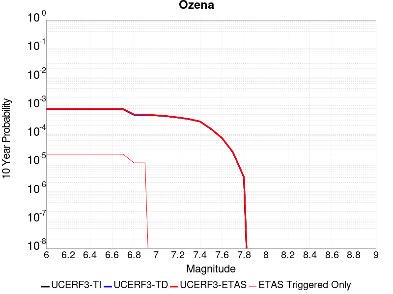 |

| Magnitude | 1 wk TI Prob | 1 wk TD Prob | 1 wk ETAS Prob | 1 wk ETAS/TD Gain | 1 wk ETAS Triggered Only | 1 mo TI Prob | 1 mo TD Prob | 1 mo ETAS Prob | 1 mo ETAS/TD Gain | 1 mo ETAS Triggered Only | 1 yr TI Prob | 1 yr TD Prob | 1 yr ETAS Prob | 1 yr ETAS/TD Gain | 1 yr ETAS Triggered Only | 10 yr TI Prob | 10 yr TD Prob | 10 yr ETAS Prob | 10 yr ETAS/TD Gain | 10 yr ETAS Triggered Only |
|-----|-----|-----|-----|-----|-----|-----|-----|-----|-----|-----|-----|-----|-----|-----|-----|-----|-----|-----|-----|-----|
| 6.0 | 1.4377547E-6 | 1.4513782E-6 | 1.4513782E-6 | 1.0 | 0.0 | 6.161791E-6 | 6.2201793E-6 | 6.2201793E-6 | 1.0 | 0.0 | 7.5017226E-5 | 7.572832E-5 | 7.572832E-5 | 1.0 | 0.0 | 7.4991904E-4 | 7.570518E-4 | 7.779078E-4 | 1.027549 | 2.0871816E-5 |
| 6.1 | 1.4377547E-6 | 1.4513782E-6 | 1.4513782E-6 | 1.0 | 0.0 | 6.161791E-6 | 6.2201793E-6 | 6.2201793E-6 | 1.0 | 0.0 | 7.5017226E-5 | 7.572832E-5 | 7.572832E-5 | 1.0 | 0.0 | 7.4991904E-4 | 7.570518E-4 | 7.779078E-4 | 1.027549 | 2.0871816E-5 |
| 6.2 | 1.4377547E-6 | 1.4513782E-6 | 1.4513782E-6 | 1.0 | 0.0 | 6.161791E-6 | 6.2201793E-6 | 6.2201793E-6 | 1.0 | 0.0 | 7.5017226E-5 | 7.572832E-5 | 7.572832E-5 | 1.0 | 0.0 | 7.4991904E-4 | 7.570518E-4 | 7.779078E-4 | 1.027549 | 2.0871816E-5 |
| 6.3 | 1.4377547E-6 | 1.4513782E-6 | 1.4513782E-6 | 1.0 | 0.0 | 6.161791E-6 | 6.2201793E-6 | 6.2201793E-6 | 1.0 | 0.0 | 7.5017226E-5 | 7.572832E-5 | 7.572832E-5 | 1.0 | 0.0 | 7.4991904E-4 | 7.570518E-4 | 7.779078E-4 | 1.027549 | 2.0871816E-5 |
| 6.4 | 1.4377547E-6 | 1.4513782E-6 | 1.4513782E-6 | 1.0 | 0.0 | 6.161791E-6 | 6.2201793E-6 | 6.2201793E-6 | 1.0 | 0.0 | 7.5017226E-5 | 7.572832E-5 | 7.572832E-5 | 1.0 | 0.0 | 7.4991904E-4 | 7.570518E-4 | 7.779078E-4 | 1.027549 | 2.0871816E-5 |
| 6.5 | 1.4377547E-6 | 1.4513782E-6 | 1.4513782E-6 | 1.0 | 0.0 | 6.161791E-6 | 6.2201793E-6 | 6.2201793E-6 | 1.0 | 0.0 | 7.5017226E-5 | 7.572832E-5 | 7.572832E-5 | 1.0 | 0.0 | 7.4991904E-4 | 7.570518E-4 | 7.779078E-4 | 1.027549 | 2.0871816E-5 |
| 6.6 | 1.4377547E-6 | 1.4513782E-6 | 1.4513782E-6 | 1.0 | 0.0 | 6.161791E-6 | 6.2201793E-6 | 6.2201793E-6 | 1.0 | 0.0 | 7.5017226E-5 | 7.572832E-5 | 7.572832E-5 | 1.0 | 0.0 | 7.4991904E-4 | 7.570518E-4 | 7.779078E-4 | 1.027549 | 2.0871816E-5 |
| 6.7 | 1.4377547E-6 | 1.4513782E-6 | 1.4513782E-6 | 1.0 | 0.0 | 6.161791E-6 | 6.2201793E-6 | 6.2201793E-6 | 1.0 | 0.0 | 7.5017226E-5 | 7.572832E-5 | 7.572832E-5 | 1.0 | 0.0 | 7.4991904E-4 | 7.570518E-4 | 7.779078E-4 | 1.027549 | 2.0871816E-5 |
| 6.8 | 9.223257E-7 | 9.317624E-7 | 9.317624E-7 | 1.0 | 0.0 | 3.9528186E-6 | 3.9932615E-6 | 3.9932615E-6 | 1.0 | 0.0 | 4.81245E-5 | 4.8616912E-5 | 4.8616912E-5 | 1.0 | 0.0 | 4.811408E-4 | 4.860668E-4 | 4.9649767E-4 | 1.0214597 | 1.0435908E-5 |
| 6.9 | 9.141515E-7 | 9.235371E-7 | 9.235371E-7 | 1.0 | 0.0 | 3.917786E-6 | 3.9580104E-6 | 3.9580104E-6 | 1.0 | 0.0 | 4.7698002E-5 | 4.818775E-5 | 4.818775E-5 | 1.0 | 0.0 | 4.7687767E-4 | 4.8177704E-4 | 4.9220794E-4 | 1.0216508 | 1.0435908E-5 |
| 7.0 | 8.767648E-7 | 8.8585773E-7 | 8.8585773E-7 | 1.0 | 0.0 | 3.757558E-6 | 3.7965276E-6 | 3.7965276E-6 | 1.0 | 0.0 | 4.5747307E-5 | 4.6221783E-5 | 4.6221783E-5 | 1.0 | 0.0 | 4.5737892E-4 | 4.6212564E-4 | 4.6212564E-4 | 1.0 | 0.0 |
| 7.1 | 8.199402E-7 | 8.2853984E-7 | 8.2853984E-7 | 1.0 | 0.0 | 3.5140247E-6 | 3.5508804E-6 | 3.5508804E-6 | 1.0 | 0.0 | 4.2782412E-5 | 4.323115E-5 | 4.323115E-5 | 1.0 | 0.0 | 4.2774176E-4 | 4.322311E-4 | 4.322311E-4 | 1.0 | 0.0 |
| 7.2 | 7.38705E-7 | 7.464262E-7 | 7.464262E-7 | 1.0 | 0.0 | 3.1658747E-6 | 3.198966E-6 | 3.198966E-6 | 1.0 | 0.0 | 3.8543843E-5 | 3.894675E-5 | 3.894675E-5 | 1.0 | 0.0 | 3.853716E-4 | 3.8940276E-4 | 3.8940276E-4 | 1.0 | 0.0 |
| 7.3 | 6.490017E-7 | 6.557802E-7 | 6.557802E-7 | 1.0 | 0.0 | 2.7814328E-6 | 2.8104837E-6 | 2.8104837E-6 | 1.0 | 0.0 | 3.386342E-5 | 3.4217133E-5 | 3.4217133E-5 | 1.0 | 0.0 | 3.3858258E-4 | 3.4212202E-4 | 3.4212202E-4 | 1.0 | 0.0 |
| 7.4 | 5.346736E-7 | 5.4022604E-7 | 5.4022604E-7 | 1.0 | 0.0 | 2.291456E-6 | 2.3152527E-6 | 2.3152527E-6 | 1.0 | 0.0 | 2.789812E-5 | 2.8187867E-5 | 2.8187867E-5 | 1.0 | 0.0 | 2.789462E-4 | 2.8184598E-4 | 2.8184598E-4 | 1.0 | 0.0 |
| 7.5 | 2.939325E-7 | 2.9666057E-7 | 2.9666057E-7 | 1.0 | 0.0 | 1.25971E-6 | 1.271402E-6 | 1.271402E-6 | 1.0 | 0.0 | 1.5336862E-5 | 1.5479225E-5 | 1.5479225E-5 | 1.0 | 0.0 | 1.5335804E-4 | 1.5478309E-4 | 1.5478309E-4 | 1.0 | 0.0 |
| 7.6 | 1.4151905E-7 | 1.4253266E-7 | 1.4253266E-7 | 1.0 | 0.0 | 6.065101E-7 | 6.108541E-7 | 6.108541E-7 | 1.0 | 0.0 | 7.3842357E-6 | 7.4371237E-6 | 7.4371237E-6 | 1.0 | 0.0 | 7.38399E-5 | 7.436883E-5 | 7.436883E-5 | 1.0 | 0.0 |
| 7.7 | 4.4957577E-8 | 4.5252243E-8 | 4.5252243E-8 | 1.0 | 0.0 | 1.9267533E-7 | 1.9393818E-7 | 1.9393818E-7 | 1.0 | 0.0 | 2.3458194E-6 | 2.3611947E-6 | 2.3611947E-6 | 1.0 | 0.0 | 2.3457947E-5 | 2.3611707E-5 | 2.3611707E-5 | 1.0 | 0.0 |
| 7.8 | 5.9993255E-9 | 6.0412972E-9 | 6.0412972E-9 | 1.0 | 0.0 | 2.5711394E-8 | 2.5891273E-8 | 2.5891273E-8 | 1.0 | 0.0 | 3.1303617E-7 | 3.1522623E-7 | 3.1522623E-7 | 1.0 | 0.0 | 3.1303573E-6 | 3.1522588E-6 | 3.1522588E-6 | 1.0 | 0.0 |

## South Cuyama
*[(top)](#table-of-contents)*

| 1 Week | 1 Month | 1 Year | 10 Year |
|-----|-----|-----|-----|
| 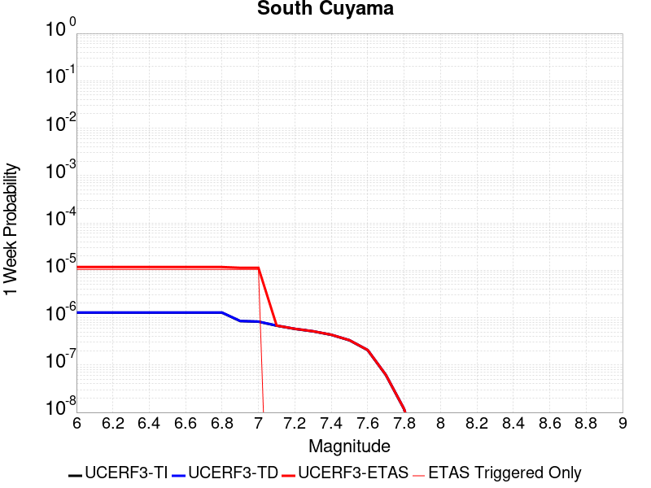 | 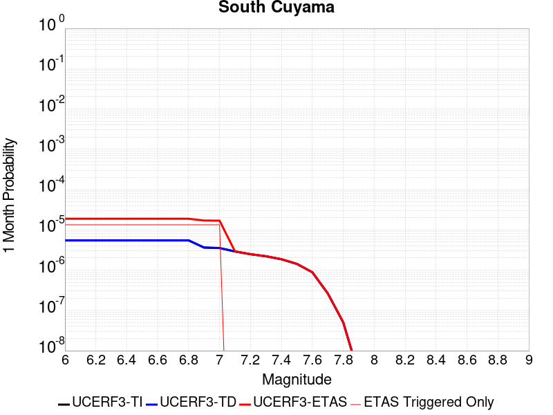 | 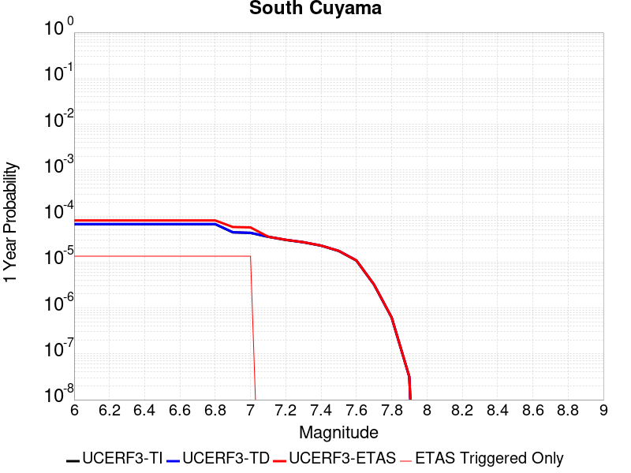 | 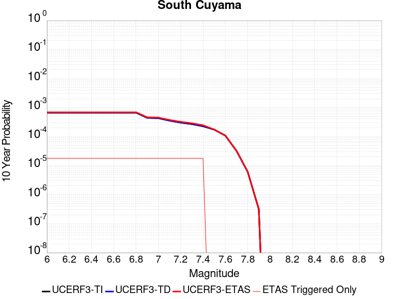 |

| Magnitude | 1 wk TI Prob | 1 wk TD Prob | 1 wk ETAS Prob | 1 wk ETAS/TD Gain | 1 wk ETAS Triggered Only | 1 mo TI Prob | 1 mo TD Prob | 1 mo ETAS Prob | 1 mo ETAS/TD Gain | 1 mo ETAS Triggered Only | 1 yr TI Prob | 1 yr TD Prob | 1 yr ETAS Prob | 1 yr ETAS/TD Gain | 1 yr ETAS Triggered Only | 10 yr TI Prob | 10 yr TD Prob | 10 yr ETAS Prob | 10 yr ETAS/TD Gain | 10 yr ETAS Triggered Only |
|-----|-----|-----|-----|-----|-----|-----|-----|-----|-----|-----|-----|-----|-----|-----|-----|-----|-----|-----|-----|-----|
| 6.0 | 1.2747308E-6 | 1.2818697E-6 | 1.1717764E-5 | 9.14115 | 1.0435908E-5 | 5.4631205E-6 | 5.4937163E-6 | 1.5929567E-5 | 2.8995976 | 1.0435908E-5 | 6.6511464E-5 | 6.6884015E-5 | 7.731922E-5 | 1.1560194 | 1.0435908E-5 | 6.649156E-4 | 6.686458E-4 | 6.895037E-4 | 1.0311942 | 2.0871816E-5 |
| 6.1 | 1.2747308E-6 | 1.2818697E-6 | 1.1717764E-5 | 9.14115 | 1.0435908E-5 | 5.4631205E-6 | 5.4937163E-6 | 1.5929567E-5 | 2.8995976 | 1.0435908E-5 | 6.6511464E-5 | 6.6884015E-5 | 7.731922E-5 | 1.1560194 | 1.0435908E-5 | 6.649156E-4 | 6.686458E-4 | 6.895037E-4 | 1.0311942 | 2.0871816E-5 |
| 6.2 | 1.2747308E-6 | 1.2818697E-6 | 1.1717764E-5 | 9.14115 | 1.0435908E-5 | 5.4631205E-6 | 5.4937163E-6 | 1.5929567E-5 | 2.8995976 | 1.0435908E-5 | 6.6511464E-5 | 6.6884015E-5 | 7.731922E-5 | 1.1560194 | 1.0435908E-5 | 6.649156E-4 | 6.686458E-4 | 6.895037E-4 | 1.0311942 | 2.0871816E-5 |
| 6.3 | 1.2747308E-6 | 1.2818697E-6 | 1.1717764E-5 | 9.14115 | 1.0435908E-5 | 5.4631205E-6 | 5.4937163E-6 | 1.5929567E-5 | 2.8995976 | 1.0435908E-5 | 6.6511464E-5 | 6.6884015E-5 | 7.731922E-5 | 1.1560194 | 1.0435908E-5 | 6.649156E-4 | 6.686458E-4 | 6.895037E-4 | 1.0311942 | 2.0871816E-5 |
| 6.4 | 1.2747308E-6 | 1.2818697E-6 | 1.1717764E-5 | 9.14115 | 1.0435908E-5 | 5.4631205E-6 | 5.4937163E-6 | 1.5929567E-5 | 2.8995976 | 1.0435908E-5 | 6.6511464E-5 | 6.6884015E-5 | 7.731922E-5 | 1.1560194 | 1.0435908E-5 | 6.649156E-4 | 6.686458E-4 | 6.895037E-4 | 1.0311942 | 2.0871816E-5 |
| 6.5 | 1.2747308E-6 | 1.2818697E-6 | 1.1717764E-5 | 9.14115 | 1.0435908E-5 | 5.4631205E-6 | 5.4937163E-6 | 1.5929567E-5 | 2.8995976 | 1.0435908E-5 | 6.6511464E-5 | 6.6884015E-5 | 7.731922E-5 | 1.1560194 | 1.0435908E-5 | 6.649156E-4 | 6.686458E-4 | 6.895037E-4 | 1.0311942 | 2.0871816E-5 |
| 6.6 | 1.2747308E-6 | 1.2818697E-6 | 1.1717764E-5 | 9.14115 | 1.0435908E-5 | 5.4631205E-6 | 5.4937163E-6 | 1.5929567E-5 | 2.8995976 | 1.0435908E-5 | 6.6511464E-5 | 6.6884015E-5 | 7.731922E-5 | 1.1560194 | 1.0435908E-5 | 6.649156E-4 | 6.686458E-4 | 6.895037E-4 | 1.0311942 | 2.0871816E-5 |
| 6.7 | 1.2747308E-6 | 1.2818697E-6 | 1.1717764E-5 | 9.14115 | 1.0435908E-5 | 5.4631205E-6 | 5.4937163E-6 | 1.5929567E-5 | 2.8995976 | 1.0435908E-5 | 6.6511464E-5 | 6.6884015E-5 | 7.731922E-5 | 1.1560194 | 1.0435908E-5 | 6.649156E-4 | 6.686458E-4 | 6.895037E-4 | 1.0311942 | 2.0871816E-5 |
| 6.8 | 1.2747308E-6 | 1.2818697E-6 | 1.1717764E-5 | 9.14115 | 1.0435908E-5 | 5.4631205E-6 | 5.4937163E-6 | 1.5929567E-5 | 2.8995976 | 1.0435908E-5 | 6.6511464E-5 | 6.6884015E-5 | 7.731922E-5 | 1.1560194 | 1.0435908E-5 | 6.649156E-4 | 6.686458E-4 | 6.895037E-4 | 1.0311942 | 2.0871816E-5 |
| 6.9 | 8.4566324E-7 | 8.507883E-7 | 1.1286687E-5 | 13.266153 | 1.0435908E-5 | 3.624266E-6 | 3.6462304E-6 | 1.40821E-5 | 3.8620982 | 1.0435908E-5 | 4.4124543E-5 | 4.439196E-5 | 5.4827407E-5 | 1.2350751 | 1.0435908E-5 | 4.4115784E-4 | 4.4383196E-4 | 4.6469452E-4 | 1.0470055 | 2.0871816E-5 |
| 7.0 | 8.2277904E-7 | 8.27782E-7 | 1.1263681E-5 | 13.607062 | 1.0435908E-5 | 3.526191E-6 | 3.5476323E-6 | 1.3983503E-5 | 3.941644 | 1.0435908E-5 | 4.293053E-5 | 4.3191576E-5 | 5.3627035E-5 | 1.2416086 | 1.0435908E-5 | 4.292224E-4 | 4.3183283E-4 | 4.5269562E-4 | 1.0483122 | 2.0871816E-5 |
| 7.1 | 6.7661887E-7 | 6.80913E-7 | 6.80913E-7 | 1.0 | 0.0 | 2.899792E-6 | 2.9181954E-6 | 2.9181954E-6 | 1.0 | 0.0 | 3.5304394E-5 | 3.5528454E-5 | 3.5528454E-5 | 1.0 | 0.0 | 3.5298787E-4 | 3.552281E-4 | 3.6566032E-4 | 1.0293676 | 1.0435908E-5 |
| 7.2 | 5.783336E-7 | 5.8211907E-7 | 5.8211907E-7 | 1.0 | 0.0 | 2.4785702E-6 | 2.4947938E-6 | 2.4947938E-6 | 1.0 | 0.0 | 3.0176174E-5 | 3.0373692E-5 | 3.0373692E-5 | 1.0 | 0.0 | 3.0172078E-4 | 3.0369565E-4 | 3.1412838E-4 | 1.0343527 | 1.0435908E-5 |
| 7.3 | 5.136759E-7 | 5.170938E-7 | 5.170938E-7 | 1.0 | 0.0 | 2.2014663E-6 | 2.2161144E-6 | 2.2161144E-6 | 1.0 | 0.0 | 2.6802521E-5 | 2.698086E-5 | 2.698086E-5 | 1.0 | 0.0 | 2.679929E-4 | 2.6977606E-4 | 2.8020915E-4 | 1.0386732 | 1.0435908E-5 |
| 7.4 | 4.3370295E-7 | 4.3665364E-7 | 4.3665364E-7 | 1.0 | 0.0 | 1.8587256E-6 | 1.8713713E-6 | 1.8713713E-6 | 1.0 | 0.0 | 2.2629749E-5 | 2.278371E-5 | 2.278371E-5 | 1.0 | 0.0 | 2.2627445E-4 | 2.278139E-4 | 2.3824743E-4 | 1.0457984 | 1.0435908E-5 |
| 7.5 | 3.3242574E-7 | 3.3476465E-7 | 3.3476465E-7 | 1.0 | 0.0 | 1.4246809E-6 | 1.4347048E-6 | 1.4347048E-6 | 1.0 | 0.0 | 1.7345352E-5 | 1.7467393E-5 | 1.7467393E-5 | 1.0 | 0.0 | 1.7343998E-4 | 1.7466032E-4 | 1.7466032E-4 | 1.0 | 0.0 |
| 7.6 | 2.0627535E-7 | 2.07789E-7 | 2.07789E-7 | 1.0 | 0.0 | 8.840369E-7 | 8.90524E-7 | 8.90524E-7 | 1.0 | 0.0 | 1.0763096E-5 | 1.0842076E-5 | 1.0842076E-5 | 1.0 | 0.0 | 1.0762575E-4 | 1.0841556E-4 | 1.0841556E-4 | 1.0 | 0.0 |
| 7.7 | 6.15236E-8 | 6.1983044E-8 | 6.1983044E-8 | 1.0 | 0.0 | 2.6367252E-7 | 2.656416E-7 | 2.656416E-7 | 1.0 | 0.0 | 3.2102084E-6 | 3.2341818E-6 | 3.2341818E-6 | 1.0 | 0.0 | 3.210162E-5 | 3.234136E-5 | 3.234136E-5 | 1.0 | 0.0 |
| 7.8 | 1.1765573E-8 | 1.1873414E-8 | 1.1873414E-8 | 1.0 | 0.0 | 5.0423886E-8 | 5.0886058E-8 | 5.0886058E-8 | 1.0 | 0.0 | 6.1391063E-7 | 6.195376E-7 | 6.195376E-7 | 1.0 | 0.0 | 6.1390897E-6 | 6.19536E-6 | 6.19536E-6 | 1.0 | 0.0 |
| 7.9 | 6.0381755E-10 | 6.10058E-10 | 6.10058E-10 | 1.0 | 0.0 | 2.5877895E-9 | 2.614534E-9 | 2.614534E-9 | 1.0 | 0.0 | 3.1506335E-8 | 3.1831952E-8 | 3.1831952E-8 | 1.0 | 0.0 | 3.1506332E-7 | 3.183195E-7 | 3.183195E-7 | 1.0 | 0.0 |

## San Luis Range 2011 CFM
*[(top)](#table-of-contents)*

| 1 Week | 1 Month | 1 Year | 10 Year |
|-----|-----|-----|-----|
|  |  | 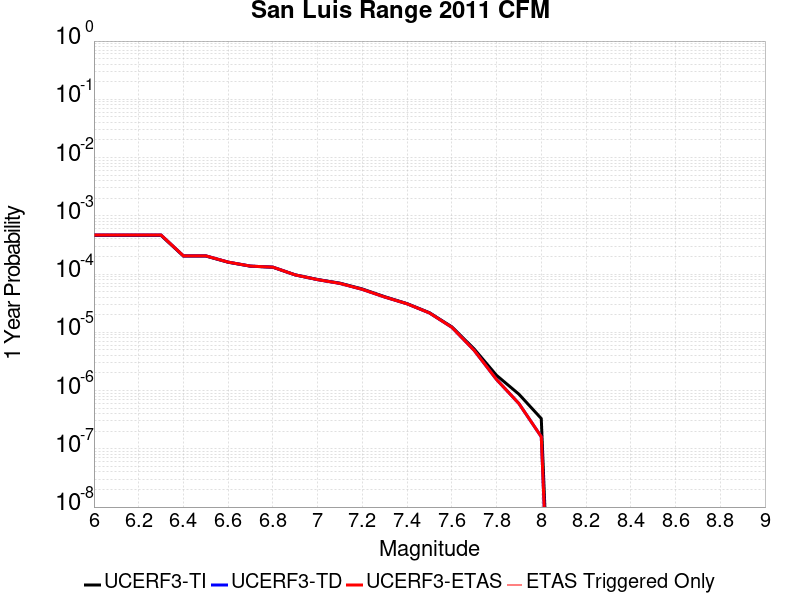 | 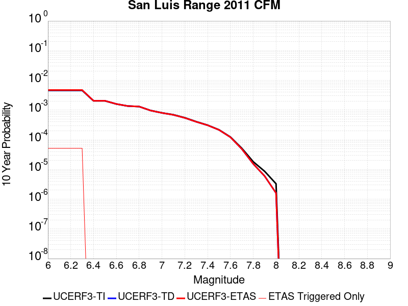 |

| Magnitude | 1 wk TI Prob | 1 wk TD Prob | 1 wk ETAS Prob | 1 wk ETAS/TD Gain | 1 wk ETAS Triggered Only | 1 mo TI Prob | 1 mo TD Prob | 1 mo ETAS Prob | 1 mo ETAS/TD Gain | 1 mo ETAS Triggered Only | 1 yr TI Prob | 1 yr TD Prob | 1 yr ETAS Prob | 1 yr ETAS/TD Gain | 1 yr ETAS Triggered Only | 10 yr TI Prob | 10 yr TD Prob | 10 yr ETAS Prob | 10 yr ETAS/TD Gain | 10 yr ETAS Triggered Only |
|-----|-----|-----|-----|-----|-----|-----|-----|-----|-----|-----|-----|-----|-----|-----|-----|-----|-----|-----|-----|-----|
| 6.0 | 8.8368415E-6 | 8.965454E-6 | 8.965454E-6 | 1.0 | 0.0 | 3.787163E-5 | 3.842285E-5 | 3.842285E-5 | 1.0 | 0.0 | 4.609895E-4 | 4.677057E-4 | 4.677057E-4 | 1.0 | 0.0 | 0.0046003438 | 0.0046679964 | 0.0046887705 | 1.0044504 | 2.0871816E-5 |
| 6.1 | 8.8368415E-6 | 8.965454E-6 | 8.965454E-6 | 1.0 | 0.0 | 3.787163E-5 | 3.842285E-5 | 3.842285E-5 | 1.0 | 0.0 | 4.609895E-4 | 4.677057E-4 | 4.677057E-4 | 1.0 | 0.0 | 0.0046003438 | 0.0046679964 | 0.0046887705 | 1.0044504 | 2.0871816E-5 |
| 6.2 | 8.8368415E-6 | 8.965454E-6 | 8.965454E-6 | 1.0 | 0.0 | 3.787163E-5 | 3.842285E-5 | 3.842285E-5 | 1.0 | 0.0 | 4.609895E-4 | 4.677057E-4 | 4.677057E-4 | 1.0 | 0.0 | 0.0046003438 | 0.0046679964 | 0.0046887705 | 1.0044504 | 2.0871816E-5 |
| 6.3 | 8.8368415E-6 | 8.965454E-6 | 8.965454E-6 | 1.0 | 0.0 | 3.787163E-5 | 3.842285E-5 | 3.842285E-5 | 1.0 | 0.0 | 4.609895E-4 | 4.677057E-4 | 4.677057E-4 | 1.0 | 0.0 | 0.0046003438 | 0.0046679964 | 0.0046887705 | 1.0044504 | 2.0871816E-5 |
| 6.4 | 3.9094193E-6 | 3.9412025E-6 | 3.9412025E-6 | 1.0 | 0.0 | 1.6754546E-5 | 1.689076E-5 | 1.689076E-5 | 1.0 | 0.0 | 2.039675E-4 | 2.056259E-4 | 2.056259E-4 | 1.0 | 0.0 | 0.0020378039 | 0.0020543851 | 0.0020647997 | 1.0050694 | 1.0435908E-5 |
| 6.5 | 3.9094193E-6 | 3.9412025E-6 | 3.9412025E-6 | 1.0 | 0.0 | 1.6754546E-5 | 1.689076E-5 | 1.689076E-5 | 1.0 | 0.0 | 2.039675E-4 | 2.056259E-4 | 2.056259E-4 | 1.0 | 0.0 | 0.0020378039 | 0.0020543851 | 0.0020647997 | 1.0050694 | 1.0435908E-5 |
| 6.6 | 3.0587726E-6 | 3.0753883E-6 | 3.0753883E-6 | 1.0 | 0.0 | 1.3108959E-5 | 1.318017E-5 | 1.318017E-5 | 1.0 | 0.0 | 1.595899E-4 | 1.6045687E-4 | 1.6045687E-4 | 1.0 | 0.0 | 0.0015947534 | 0.0016034221 | 0.0016138413 | 1.0064981 | 1.0435908E-5 |
| 6.7 | 2.6160574E-6 | 2.6251273E-6 | 2.6251273E-6 | 1.0 | 0.0 | 1.1211626E-5 | 1.1250498E-5 | 1.1250498E-5 | 1.0 | 0.0 | 1.3649299E-4 | 1.3696625E-4 | 1.3696625E-4 | 1.0 | 0.0 | 0.0013640919 | 0.0013688246 | 0.0013792462 | 1.0076135 | 1.0435908E-5 |
| 6.8 | 2.5110312E-6 | 2.51814E-6 | 2.51814E-6 | 1.0 | 0.0 | 1.0761518E-5 | 1.0791985E-5 | 1.0791985E-5 | 1.0 | 0.0 | 1.310136E-4 | 1.3138456E-4 | 1.3138456E-4 | 1.0 | 0.0 | 0.0013093639 | 0.0013130746 | 0.0013234968 | 1.0079372 | 1.0435908E-5 |
| 6.9 | 1.8564405E-6 | 1.852487E-6 | 1.852487E-6 | 1.0 | 0.0 | 7.95615E-6 | 7.939206E-6 | 7.939206E-6 | 1.0 | 0.0 | 9.686181E-5 | 9.665557E-5 | 9.665557E-5 | 1.0 | 0.0 | 9.68196E-4 | 9.661373E-4 | 9.765631E-4 | 1.0107913 | 1.0435908E-5 |
| 7.0 | 1.546127E-6 | 1.5369537E-6 | 1.5369537E-6 | 1.0 | 0.0 | 6.626242E-6 | 6.586928E-6 | 6.586928E-6 | 1.0 | 0.0 | 8.06715E-5 | 8.0192905E-5 | 8.0192905E-5 | 1.0 | 0.0 | 8.0642226E-4 | 8.016404E-4 | 8.1206794E-4 | 1.0130078 | 1.0435908E-5 |
| 7.1 | 1.3368208E-6 | 1.3235326E-6 | 1.3235326E-6 | 1.0 | 0.0 | 5.7292195E-6 | 5.67227E-6 | 5.67227E-6 | 1.0 | 0.0 | 6.975101E-5 | 6.905771E-5 | 6.905771E-5 | 1.0 | 0.0 | 6.972912E-4 | 6.9036294E-4 | 7.0079166E-4 | 1.0151061 | 1.0435908E-5 |
| 7.2 | 1.0623363E-6 | 1.0454368E-6 | 1.0454368E-6 | 1.0 | 0.0 | 4.5528623E-6 | 4.4804356E-6 | 4.4804356E-6 | 1.0 | 0.0 | 5.5429686E-5 | 5.4547938E-5 | 5.4547938E-5 | 1.0 | 0.0 | 5.5415864E-4 | 5.4534577E-4 | 5.55776E-4 | 1.0191258 | 1.0435908E-5 |
| 7.3 | 7.831679E-7 | 7.7273904E-7 | 7.7273904E-7 | 1.0 | 0.0 | 3.3564295E-6 | 3.3117344E-6 | 3.3117344E-6 | 1.0 | 0.0 | 4.086376E-5 | 4.0319625E-5 | 4.0319625E-5 | 1.0 | 0.0 | 4.0856248E-4 | 4.031232E-4 | 4.135549E-4 | 1.0258772 | 1.0435908E-5 |
| 7.4 | 5.9558846E-7 | 5.910636E-7 | 5.910636E-7 | 1.0 | 0.0 | 2.5525194E-6 | 2.5331274E-6 | 2.5331274E-6 | 1.0 | 0.0 | 3.107648E-5 | 3.084039E-5 | 3.084039E-5 | 1.0 | 0.0 | 3.1072134E-4 | 3.083612E-4 | 3.1879387E-4 | 1.0338327 | 1.0435908E-5 |
| 7.5 | 4.1616502E-7 | 4.119631E-7 | 4.119631E-7 | 1.0 | 0.0 | 1.7835631E-6 | 1.7655549E-6 | 1.7655549E-6 | 1.0 | 0.0 | 2.1714664E-5 | 2.149542E-5 | 2.149542E-5 | 1.0 | 0.0 | 2.1712543E-4 | 2.1493346E-4 | 2.1493346E-4 | 1.0 | 0.0 |
| 7.6 | 2.3816014E-7 | 2.3376548E-7 | 2.3376548E-7 | 1.0 | 0.0 | 1.0206859E-6 | 1.0018516E-6 | 1.0018516E-6 | 1.0 | 0.0 | 1.242678E-5 | 1.2197475E-5 | 1.2197475E-5 | 1.0 | 0.0 | 1.2426086E-4 | 1.2196808E-4 | 1.2196808E-4 | 1.0 | 0.0 |
| 7.7 | 9.918777E-8 | 9.3867584E-8 | 9.3867584E-8 | 1.0 | 0.0 | 4.2509038E-7 | 4.0228957E-7 | 4.0228957E-7 | 1.0 | 0.0 | 5.1754632E-6 | 4.8978645E-6 | 4.8978645E-6 | 1.0 | 0.0 | 5.1753424E-5 | 4.897757E-5 | 4.897757E-5 | 1.0 | 0.0 |
| 7.8 | 3.4982556E-8 | 2.968655E-8 | 2.968655E-8 | 1.0 | 0.0 | 1.4992524E-7 | 1.2722806E-7 | 1.2722806E-7 | 1.0 | 0.0 | 1.8253382E-6 | 1.5490006E-6 | 1.5490006E-6 | 1.0 | 0.0 | 1.8253233E-5 | 1.5489897E-5 | 1.5489897E-5 | 1.0 | 0.0 |
| 7.9 | 1.6624908E-8 | 1.1477036E-8 | 1.1477036E-8 | 1.0 | 0.0 | 7.12496E-8 | 4.91873E-8 | 4.91873E-8 | 1.0 | 0.0 | 8.6746354E-7 | 5.988552E-7 | 5.988552E-7 | 1.0 | 0.0 | 8.674601E-6 | 5.988536E-6 | 5.988536E-6 | 1.0 | 0.0 |
| 8.0 | 6.3352315E-9 | 3.0888412E-9 | 3.0888412E-9 | 1.0 | 0.0 | 2.715099E-8 | 1.3237893E-8 | 1.3237893E-8 | 1.0 | 0.0 | 3.3056327E-7 | 1.6117131E-7 | 1.6117131E-7 | 1.0 | 0.0 | 3.3056278E-6 | 1.611712E-6 | 1.611712E-6 | 1.0 | 0.0 |

## San Andreas (Santa Cruz Mts) 2011 CFM
*[(top)](#table-of-contents)*

| 1 Week | 1 Month | 1 Year | 10 Year |
|-----|-----|-----|-----|
|  | 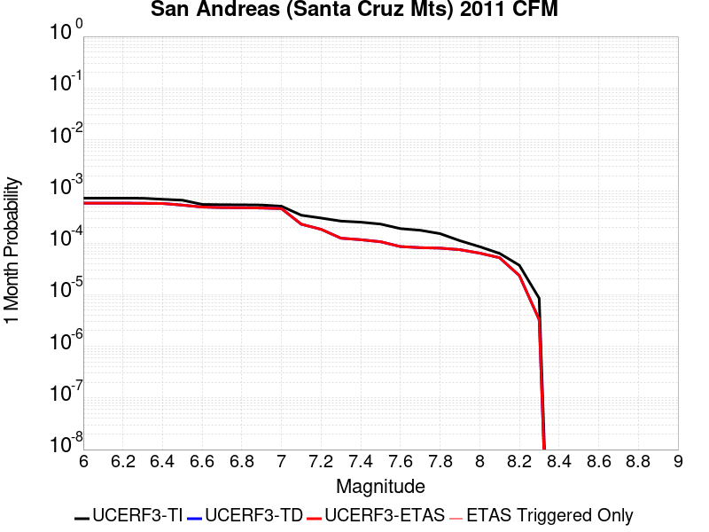 | 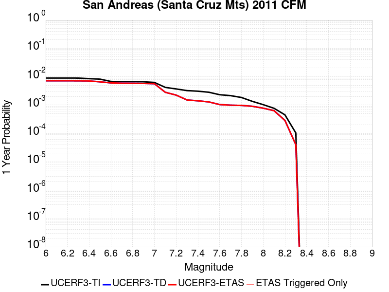 | 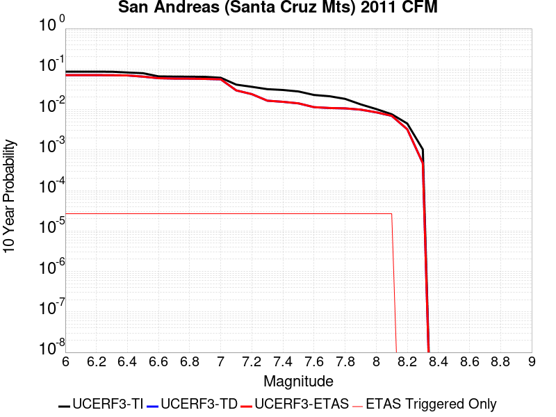 |

| Magnitude | 1 wk TI Prob | 1 wk TD Prob | 1 wk ETAS Prob | 1 wk ETAS/TD Gain | 1 wk ETAS Triggered Only | 1 mo TI Prob | 1 mo TD Prob | 1 mo ETAS Prob | 1 mo ETAS/TD Gain | 1 mo ETAS Triggered Only | 1 yr TI Prob | 1 yr TD Prob | 1 yr ETAS Prob | 1 yr ETAS/TD Gain | 1 yr ETAS Triggered Only | 10 yr TI Prob | 10 yr TD Prob | 10 yr ETAS Prob | 10 yr ETAS/TD Gain | 10 yr ETAS Triggered Only |
|-----|-----|-----|-----|-----|-----|-----|-----|-----|-----|-----|-----|-----|-----|-----|-----|-----|-----|-----|-----|-----|
| 6.0 | 1.7221631E-4 | 1.3793171E-4 | 1.3793171E-4 | 1.0 | 0.0 | 7.378611E-4 | 5.9100403E-4 | 5.9100403E-4 | 1.0 | 0.0 | 0.008946515 | 0.007172124 | 0.007172124 | 1.0 | 0.0 | 0.08594794 | 0.0705551 | 0.07057449 | 1.0002749 | 2.0871816E-5 |
| 6.1 | 1.7221631E-4 | 1.3793171E-4 | 1.3793171E-4 | 1.0 | 0.0 | 7.378611E-4 | 5.9100403E-4 | 5.9100403E-4 | 1.0 | 0.0 | 0.008946515 | 0.007172124 | 0.007172124 | 1.0 | 0.0 | 0.08594794 | 0.0705551 | 0.07057449 | 1.0002749 | 2.0871816E-5 |
| 6.2 | 1.7221631E-4 | 1.3793171E-4 | 1.3793171E-4 | 1.0 | 0.0 | 7.378611E-4 | 5.9100403E-4 | 5.9100403E-4 | 1.0 | 0.0 | 0.008946515 | 0.007172124 | 0.007172124 | 1.0 | 0.0 | 0.08594794 | 0.0705551 | 0.07057449 | 1.0002749 | 2.0871816E-5 |
| 6.3 | 1.716926E-4 | 1.3712609E-4 | 1.3712609E-4 | 1.0 | 0.0 | 7.3561794E-4 | 5.875529E-4 | 5.875529E-4 | 1.0 | 0.0 | 0.008919428 | 0.0071303817 | 0.0071303817 | 1.0 | 0.0 | 0.08569809 | 0.070167266 | 0.070186675 | 1.0002766 | 2.0871816E-5 |
| 6.4 | 1.6392978E-4 | 1.3588481E-4 | 1.3588481E-4 | 1.0 | 0.0 | 7.02367E-4 | 5.822355E-4 | 5.822355E-4 | 1.0 | 0.0 | 0.008517839 | 0.007066063 | 0.007066063 | 1.0 | 0.0 | 0.08198654 | 0.06940135 | 0.06942078 | 1.0002799 | 2.0871816E-5 |
| 6.5 | 1.5742714E-4 | 1.2648388E-4 | 1.2648388E-4 | 1.0 | 0.0 | 6.745133E-4 | 5.4196286E-4 | 5.4196286E-4 | 1.0 | 0.0 | 0.00818132 | 0.0065787593 | 0.0065787593 | 1.0 | 0.0 | 0.078865945 | 0.06486309 | 0.06488261 | 1.0003009 | 2.0871816E-5 |
| 6.6 | 1.3038084E-4 | 1.1588213E-4 | 1.1588213E-4 | 1.0 | 0.0 | 5.5865536E-4 | 4.9654447E-4 | 4.9654447E-4 | 1.0 | 0.0 | 0.006780438 | 0.0060289134 | 0.0060289134 | 1.0 | 0.0 | 0.0657725 | 0.05932738 | 0.05934701 | 1.0003309 | 2.0871816E-5 |
| 6.7 | 1.2867592E-4 | 1.1314701E-4 | 1.1314701E-4 | 1.0 | 0.0 | 5.5135164E-4 | 4.8482692E-4 | 4.8482692E-4 | 1.0 | 0.0 | 0.0066920654 | 0.00588703 | 0.00588703 | 1.0 | 0.0 | 0.06494093 | 0.058038417 | 0.058058076 | 1.0003388 | 2.0871816E-5 |
| 6.8 | 1.2801298E-4 | 1.1252261E-4 | 1.1252261E-4 | 1.0 | 0.0 | 5.485117E-4 | 4.8215193E-4 | 4.8215193E-4 | 1.0 | 0.0 | 0.0066577005 | 0.0058546383 | 0.0058546383 | 1.0 | 0.0 | 0.06461738 | 0.057752274 | 0.05777194 | 1.0003406 | 2.0871816E-5 |
| 6.9 | 1.269149E-4 | 1.1094465E-4 | 1.1094465E-4 | 1.0 | 0.0 | 5.4380763E-4 | 4.7539172E-4 | 4.7539172E-4 | 1.0 | 0.0 | 0.006600777 | 0.005772772 | 0.005772772 | 1.0 | 0.0 | 0.06408122 | 0.0570241 | 0.05704378 | 1.0003451 | 2.0871816E-5 |
| 7.0 | 1.2030331E-4 | 1.0824504E-4 | 1.0824504E-4 | 1.0 | 0.0 | 5.154837E-4 | 4.638261E-4 | 4.638261E-4 | 1.0 | 0.0 | 0.006257969 | 0.0056326967 | 0.0056326967 | 1.0 | 0.0 | 0.06084648 | 0.055696685 | 0.055716395 | 1.0003538 | 2.0871816E-5 |
| 7.1 | 8.049617E-5 | 5.3926604E-5 | 5.3926604E-5 | 1.0 | 0.0 | 3.4493793E-4 | 2.3109373E-4 | 2.3109373E-4 | 1.0 | 0.0 | 0.0041915346 | 0.0028099709 | 0.0028099709 | 1.0 | 0.0 | 0.041133516 | 0.029618956 | 0.02963921 | 1.0006838 | 2.0871816E-5 |
| 7.2 | 7.093979E-5 | 4.2937932E-5 | 4.2937932E-5 | 1.0 | 0.0 | 3.0399222E-4 | 1.8400686E-4 | 1.8400686E-4 | 1.0 | 0.0 | 0.0036948253 | 0.0022380045 | 0.0022380045 | 1.0 | 0.0 | 0.03633994 | 0.023941692 | 0.023951877 | 1.0004255 | 1.0435908E-5 |
| 7.3 | 6.193693E-5 | 2.8894141E-5 | 2.8894141E-5 | 1.0 | 0.0 | 2.6541698E-4 | 1.2382616E-4 | 1.2382616E-4 | 1.0 | 0.0 | 0.0032266637 | 0.0015065427 | 0.0015065427 | 1.0 | 0.0 | 0.031802133 | 0.016499156 | 0.01650942 | 1.000622 | 1.0435908E-5 |
| 7.4 | 5.906492E-5 | 2.702346E-5 | 2.702346E-5 | 1.0 | 0.0 | 2.5311083E-4 | 1.1580969E-4 | 1.1580969E-4 | 1.0 | 0.0 | 0.0030772698 | 0.0014090725 | 0.0014090725 | 1.0 | 0.0 | 0.030350044 | 0.015471023 | 0.015481297 | 1.0006641 | 1.0435908E-5 |
| 7.5 | 5.424296E-5 | 2.4678277E-5 | 2.4678277E-5 | 1.0 | 0.0 | 2.324491E-4 | 1.05759755E-4 | 1.05759755E-4 | 1.0 | 0.0 | 0.002826395 | 0.0012868657 | 0.0012868657 | 1.0 | 0.0 | 0.027907165 | 0.014163188 | 0.014173476 | 1.0007263 | 1.0435908E-5 |
| 7.6 | 4.43084E-5 | 1.990431E-5 | 1.990431E-5 | 1.0 | 0.0 | 1.8987931E-4 | 8.53014E-5 | 8.53014E-5 | 1.0 | 0.0 | 0.0023093296 | 0.0010380499 | 0.0010380499 | 1.0 | 0.0 | 0.022854783 | 0.011412679 | 0.011422996 | 1.000904 | 1.0435908E-5 |
| 7.7 | 4.118098E-5 | 1.8936442E-5 | 1.8936442E-5 | 1.0 | 0.0 | 1.7647797E-4 | 8.115366E-5 | 8.115366E-5 | 1.0 | 0.0 | 0.002146502 | 9.875982E-4 | 9.875982E-4 | 1.0 | 0.0 | 0.021258866 | 0.010870468 | 0.010880791 | 1.0009496 | 1.0435908E-5 |
| 7.8 | 3.5408906E-5 | 1.856446E-5 | 1.856446E-5 | 1.0 | 0.0 | 1.5174363E-4 | 7.955955E-5 | 7.955955E-5 | 1.0 | 0.0 | 0.0018459131 | 9.682073E-4 | 9.682073E-4 | 1.0 | 0.0 | 0.018306552 | 0.010652021 | 0.010662345 | 1.0009693 | 1.0435908E-5 |
| 7.9 | 2.5860836E-5 | 1.7315993E-5 | 1.7315993E-5 | 1.0 | 0.0 | 1.10827445E-4 | 7.420929E-5 | 7.420929E-5 | 1.0 | 0.0 | 0.001348489 | 9.031238E-4 | 9.031238E-4 | 1.0 | 0.0 | 0.013403354 | 0.009907599 | 0.009917932 | 1.0010428 | 1.0435908E-5 |
| 8.0 | 1.9777332E-5 | 1.4839596E-5 | 1.4839596E-5 | 1.0 | 0.0 | 8.4757245E-5 | 6.3596715E-5 | 6.3596715E-5 | 1.0 | 0.0 | 0.0010314309 | 7.740152E-4 | 7.740152E-4 | 1.0 | 0.0 | 0.010266567 | 0.008508967 | 0.008519315 | 1.001216 | 1.0435908E-5 |
| 8.1 | 1.468494E-5 | 1.2107374E-5 | 1.2107374E-5 | 1.0 | 0.0 | 6.293394E-5 | 5.1887713E-5 | 5.1887713E-5 | 1.0 | 0.0 | 7.6595135E-4 | 6.3155E-4 | 6.3155E-4 | 1.0 | 0.0 | 0.0076331664 | 0.006969149 | 0.006979512 | 1.001487 | 1.0435908E-5 |
| 8.2 | 8.63836E-6 | 5.469061E-6 | 5.469061E-6 | 1.0 | 0.0 | 3.7021015E-5 | 2.3438623E-5 | 2.3438623E-5 | 1.0 | 0.0 | 4.5063766E-4 | 2.8532793E-4 | 2.8532793E-4 | 1.0 | 0.0 | 0.004497249 | 0.00324569 | 0.00324569 | 1.0 | 0.0 |
| 8.3 | 1.983087E-6 | 7.6599065E-7 | 7.6599065E-7 | 1.0 | 0.0 | 8.498917E-6 | 3.282813E-6 | 3.282813E-6 | 1.0 | 0.0 | 1.034694E-4 | 3.9967534E-5 | 3.9967534E-5 | 1.0 | 0.0 | 0.0010342124 | 4.719687E-4 | 4.719687E-4 | 1.0 | 0.0 |

## Sierra Madre
*[(top)](#table-of-contents)*

| 1 Week | 1 Month | 1 Year | 10 Year |
|-----|-----|-----|-----|
|  | 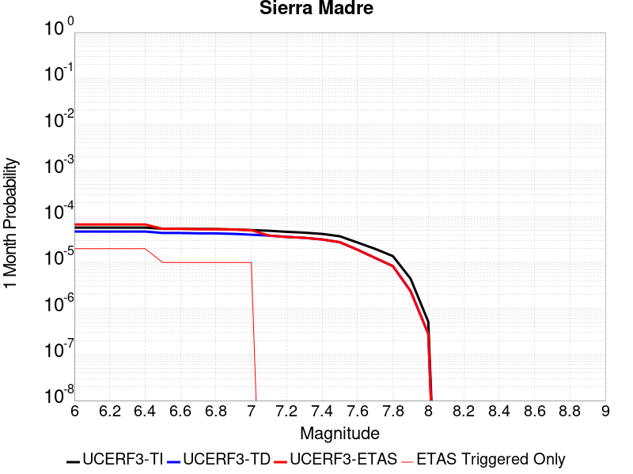 | 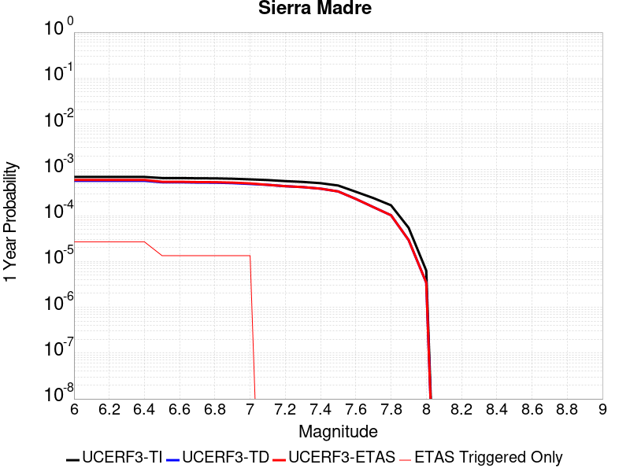 | 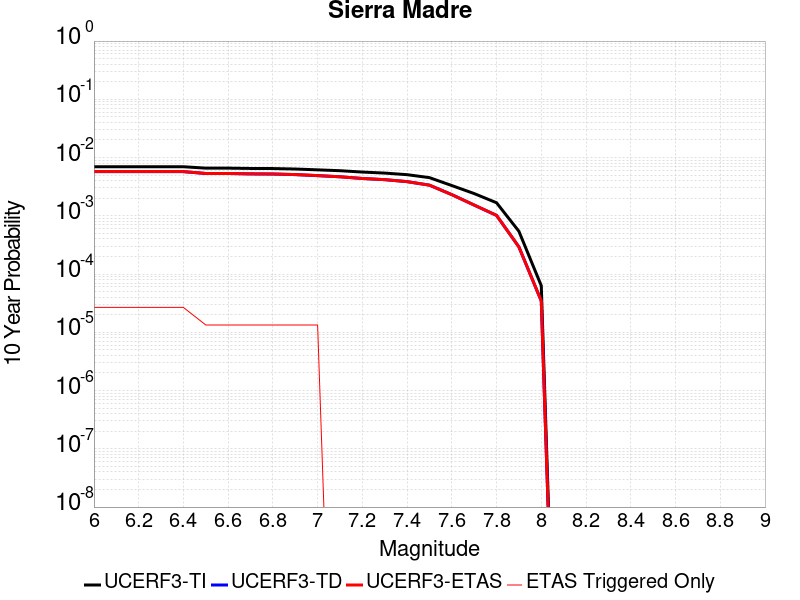 |

| Magnitude | 1 wk TI Prob | 1 wk TD Prob | 1 wk ETAS Prob | 1 wk ETAS/TD Gain | 1 wk ETAS Triggered Only | 1 mo TI Prob | 1 mo TD Prob | 1 mo ETAS Prob | 1 mo ETAS/TD Gain | 1 mo ETAS Triggered Only | 1 yr TI Prob | 1 yr TD Prob | 1 yr ETAS Prob | 1 yr ETAS/TD Gain | 1 yr ETAS Triggered Only | 10 yr TI Prob | 10 yr TD Prob | 10 yr ETAS Prob | 10 yr ETAS/TD Gain | 10 yr ETAS Triggered Only |
|-----|-----|-----|-----|-----|-----|-----|-----|-----|-----|-----|-----|-----|-----|-----|-----|-----|-----|-----|-----|-----|
| 6.0 | 1.3379373E-5 | 1.10007395E-5 | 1.10007395E-5 | 1.0 | 0.0 | 5.7338908E-5 | 4.7145186E-5 | 6.8016016E-5 | 1.4426928 | 2.0871816E-5 | 6.978776E-4 | 5.738429E-4 | 5.947028E-4 | 1.0363511 | 2.0871816E-5 | 0.0069569005 | 0.0057239756 | 0.0057447283 | 1.0036255 | 2.0871816E-5 |
| 6.1 | 1.3379373E-5 | 1.10007395E-5 | 1.10007395E-5 | 1.0 | 0.0 | 5.7338908E-5 | 4.7145186E-5 | 6.8016016E-5 | 1.4426928 | 2.0871816E-5 | 6.978776E-4 | 5.738429E-4 | 5.947028E-4 | 1.0363511 | 2.0871816E-5 | 0.0069569005 | 0.0057239756 | 0.0057447283 | 1.0036255 | 2.0871816E-5 |
| 6.2 | 1.3379373E-5 | 1.10007395E-5 | 1.10007395E-5 | 1.0 | 0.0 | 5.7338908E-5 | 4.7145186E-5 | 6.8016016E-5 | 1.4426928 | 2.0871816E-5 | 6.978776E-4 | 5.738429E-4 | 5.947028E-4 | 1.0363511 | 2.0871816E-5 | 0.0069569005 | 0.0057239756 | 0.0057447283 | 1.0036255 | 2.0871816E-5 |
| 6.3 | 1.3379373E-5 | 1.10007395E-5 | 1.10007395E-5 | 1.0 | 0.0 | 5.7338908E-5 | 4.7145186E-5 | 6.8016016E-5 | 1.4426928 | 2.0871816E-5 | 6.978776E-4 | 5.738429E-4 | 5.947028E-4 | 1.0363511 | 2.0871816E-5 | 0.0069569005 | 0.0057239756 | 0.0057447283 | 1.0036255 | 2.0871816E-5 |
| 6.4 | 1.3379373E-5 | 1.10007395E-5 | 1.10007395E-5 | 1.0 | 0.0 | 5.7338908E-5 | 4.7145186E-5 | 6.8016016E-5 | 1.4426928 | 2.0871816E-5 | 6.978776E-4 | 5.738429E-4 | 5.947028E-4 | 1.0363511 | 2.0871816E-5 | 0.0069569005 | 0.0057239756 | 0.0057447283 | 1.0036255 | 2.0871816E-5 |
| 6.5 | 1.26563245E-5 | 1.0230196E-5 | 1.0230196E-5 | 1.0 | 0.0 | 5.4240263E-5 | 4.3842967E-5 | 5.4278415E-5 | 1.2380188 | 1.0435908E-5 | 6.601751E-4 | 5.336584E-4 | 5.440888E-4 | 1.019545 | 1.0435908E-5 | 0.006582173 | 0.0053240913 | 0.0053344714 | 1.0019497 | 1.0435908E-5 |
| 6.6 | 1.26563245E-5 | 1.0230196E-5 | 1.0230196E-5 | 1.0 | 0.0 | 5.4240263E-5 | 4.3842967E-5 | 5.4278415E-5 | 1.2380188 | 1.0435908E-5 | 6.601751E-4 | 5.336584E-4 | 5.440888E-4 | 1.019545 | 1.0435908E-5 | 0.006582173 | 0.0053240913 | 0.0053344714 | 1.0019497 | 1.0435908E-5 |
| 6.7 | 1.2502474E-5 | 1.006634E-5 | 1.006634E-5 | 1.0 | 0.0 | 5.3580934E-5 | 4.314075E-5 | 5.357621E-5 | 1.2418933 | 1.0435908E-5 | 6.521526E-4 | 5.251131E-4 | 5.3554354E-4 | 1.0198632 | 1.0435908E-5 | 0.0065024206 | 0.0052390425 | 0.0052494234 | 1.0019815 | 1.0435908E-5 |
| 6.8 | 1.2454966E-5 | 1.0018625E-5 | 1.0018625E-5 | 1.0 | 0.0 | 5.3377335E-5 | 4.2936266E-5 | 5.3371725E-5 | 1.2430453 | 1.0435908E-5 | 6.4967526E-4 | 5.226247E-4 | 5.3305516E-4 | 1.0199578 | 1.0435908E-5 | 0.006477792 | 0.0052142753 | 0.005224657 | 1.001991 | 1.0435908E-5 |
| 6.9 | 1.2225574E-5 | 9.792602E-6 | 9.792602E-6 | 1.0 | 0.0 | 5.2394265E-5 | 4.1967625E-5 | 5.2403095E-5 | 1.2486552 | 1.0435908E-5 | 6.3771347E-4 | 5.108371E-4 | 5.212677E-4 | 1.0204186 | 1.0435908E-5 | 0.006358865 | 0.0050969445 | 0.0051073274 | 1.002037 | 1.0435908E-5 |
| 7.0 | 1.182946E-5 | 9.399144E-6 | 9.399144E-6 | 1.0 | 0.0 | 5.06967E-5 | 4.0281426E-5 | 5.0716913E-5 | 1.2590644 | 1.0435908E-5 | 6.1705755E-4 | 4.9031706E-4 | 5.007478E-4 | 1.0212736 | 1.0435908E-5 | 0.006153469 | 0.004892664 | 0.0049030487 | 1.0021225 | 1.0435908E-5 |
| 7.1 | 1.14369095E-5 | 8.986159E-6 | 8.986159E-6 | 1.0 | 0.0 | 4.9014405E-5 | 3.8511545E-5 | 3.8511545E-5 | 1.0 | 0.0 | 5.9658696E-4 | 4.687782E-4 | 4.687782E-4 | 1.0 | 0.0 | 0.005949879 | 0.004678199 | 0.004678199 | 1.0 | 0.0 |
| 7.2 | 1.0836419E-5 | 8.3995565E-6 | 8.3995565E-6 | 1.0 | 0.0 | 4.644097E-5 | 3.5997607E-5 | 3.5997607E-5 | 1.0 | 0.0 | 5.652721E-4 | 4.3818366E-4 | 4.3818366E-4 | 1.0 | 0.0 | 0.0056383642 | 0.004373494 | 0.004373494 | 1.0 | 0.0 |
| 7.3 | 1.0403439E-5 | 8.02082E-6 | 8.02082E-6 | 1.0 | 0.0 | 4.4585406E-5 | 3.4374494E-5 | 3.4374494E-5 | 1.0 | 0.0 | 5.426921E-4 | 4.1843E-4 | 4.1843E-4 | 1.0 | 0.0 | 0.005413687 | 0.004176717 | 0.004176717 | 1.0 | 0.0 |
| 7.4 | 9.768864E-6 | 7.414448E-6 | 7.414448E-6 | 1.0 | 0.0 | 4.186589E-5 | 3.1775824E-5 | 3.1775824E-5 | 1.0 | 0.0 | 5.09598E-4 | 3.868029E-4 | 3.868029E-4 | 1.0 | 0.0 | 0.0050843097 | 0.0038615882 | 0.0038615882 | 1.0 | 0.0 |
| 7.5 | 8.687089E-6 | 6.4501564E-6 | 6.4501564E-6 | 1.0 | 0.0 | 3.722985E-5 | 2.764324E-5 | 2.764324E-5 | 1.0 | 0.0 | 4.5317915E-4 | 3.3650533E-4 | 3.3650533E-4 | 1.0 | 0.0 | 0.004522561 | 0.0033602451 | 0.0033602451 | 1.0 | 0.0 |
| 7.6 | 6.3506063E-6 | 4.4303215E-6 | 4.4303215E-6 | 1.0 | 0.0 | 2.72166E-5 | 1.8986955E-5 | 1.8986955E-5 | 1.0 | 0.0 | 3.3131172E-4 | 2.3114192E-4 | 2.3114192E-4 | 1.0 | 0.0 | 0.003308182 | 0.0023092402 | 0.0023092402 | 1.0 | 0.0 |
| 7.7 | 4.62223E-6 | 2.932967E-6 | 2.932967E-6 | 1.0 | 0.0 | 1.9809406E-5 | 1.2569798E-5 | 1.2569798E-5 | 1.0 | 0.0 | 2.4115283E-4 | 1.5302657E-4 | 1.5302657E-4 | 1.0 | 0.0 | 0.0024089129 | 0.001529413 | 0.001529413 | 1.0 | 0.0 |
| 7.8 | 3.2145008E-6 | 1.9494332E-6 | 1.9494332E-6 | 1.0 | 0.0 | 1.3776359E-5 | 8.3546865E-6 | 8.3546865E-6 | 1.0 | 0.0 | 1.6771426E-4 | 1.0171358E-4 | 1.0171358E-4 | 1.0 | 0.0 | 0.0016758774 | 0.0010168145 | 0.0010168145 | 1.0 | 0.0 |
| 7.9 | 1.0391769E-6 | 5.6026335E-7 | 5.6026335E-7 | 1.0 | 0.0 | 4.4536077E-6 | 2.4011265E-6 | 2.4011265E-6 | 1.0 | 0.0 | 5.4221324E-5 | 2.9233326E-5 | 2.9233326E-5 | 1.0 | 0.0 | 5.4208096E-4 | 2.9229524E-4 | 2.9229524E-4 | 1.0 | 0.0 |
| 8.0 | 1.210983E-7 | 6.613821E-8 | 6.613821E-8 | 1.0 | 0.0 | 5.1899264E-7 | 2.8344945E-7 | 2.8344945E-7 | 1.0 | 0.0 | 6.3187167E-6 | 3.4509917E-6 | 3.4509917E-6 | 1.0 | 0.0 | 6.318537E-5 | 3.45094E-5 | 3.45094E-5 | 1.0 | 0.0 |

## Carlsbad
*[(top)](#table-of-contents)*

| 1 Week | 1 Month | 1 Year | 10 Year |
|-----|-----|-----|-----|
|  | 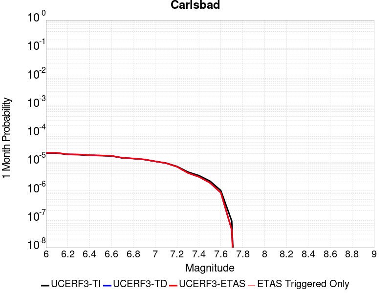 | 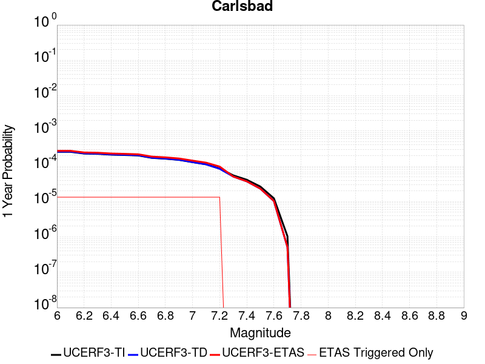 |  |

| Magnitude | 1 wk TI Prob | 1 wk TD Prob | 1 wk ETAS Prob | 1 wk ETAS/TD Gain | 1 wk ETAS Triggered Only | 1 mo TI Prob | 1 mo TD Prob | 1 mo ETAS Prob | 1 mo ETAS/TD Gain | 1 mo ETAS Triggered Only | 1 yr TI Prob | 1 yr TD Prob | 1 yr ETAS Prob | 1 yr ETAS/TD Gain | 1 yr ETAS Triggered Only | 10 yr TI Prob | 10 yr TD Prob | 10 yr ETAS Prob | 10 yr ETAS/TD Gain | 10 yr ETAS Triggered Only |
|-----|-----|-----|-----|-----|-----|-----|-----|-----|-----|-----|-----|-----|-----|-----|-----|-----|-----|-----|-----|-----|
| 6.0 | 4.9038536E-6 | 4.9872565E-6 | 4.9872565E-6 | 1.0 | 0.0 | 2.1016345E-5 | 2.1373784E-5 | 2.1373784E-5 | 1.0 | 0.0 | 2.5584397E-4 | 2.601952E-4 | 2.706284E-4 | 1.0400976 | 1.0435908E-5 | 0.002555496 | 0.0025989525 | 0.0026093614 | 1.004005 | 1.0435908E-5 |
| 6.1 | 4.9038536E-6 | 4.9872565E-6 | 4.9872565E-6 | 1.0 | 0.0 | 2.1016345E-5 | 2.1373784E-5 | 2.1373784E-5 | 1.0 | 0.0 | 2.5584397E-4 | 2.601952E-4 | 2.706284E-4 | 1.0400976 | 1.0435908E-5 | 0.002555496 | 0.0025989525 | 0.0026093614 | 1.004005 | 1.0435908E-5 |
| 6.2 | 4.3820614E-6 | 4.4547687E-6 | 4.4547687E-6 | 1.0 | 0.0 | 1.8780129E-5 | 1.9091729E-5 | 1.9091729E-5 | 1.0 | 0.0 | 2.2862408E-4 | 2.3241735E-4 | 2.4285083E-4 | 1.0448911 | 1.0435908E-5 | 0.00228389 | 0.0023217786 | 0.0023321903 | 1.0044843 | 1.0435908E-5 |
| 6.3 | 4.302872E-6 | 4.373006E-6 | 4.373006E-6 | 1.0 | 0.0 | 1.8440749E-5 | 1.8741322E-5 | 1.8741322E-5 | 1.0 | 0.0 | 2.24493E-4 | 2.2815206E-4 | 2.3858559E-4 | 1.0457306 | 1.0435908E-5 | 0.0022426634 | 0.0022792136 | 0.0022896256 | 1.0045683 | 1.0435908E-5 |
| 6.4 | 4.0835243E-6 | 4.1476546E-6 | 4.1476546E-6 | 1.0 | 0.0 | 1.75007E-5 | 1.7775543E-5 | 1.7775543E-5 | 1.0 | 0.0 | 2.1305021E-4 | 2.1639607E-4 | 2.2682972E-4 | 1.0482155 | 1.0435908E-5 | 0.0021284607 | 0.0021618877 | 0.002172301 | 1.0048168 | 1.0435908E-5 |
| 6.5 | 3.987806E-6 | 4.0488867E-6 | 4.0488867E-6 | 1.0 | 0.0 | 1.7090486E-5 | 1.7352257E-5 | 1.7352257E-5 | 1.0 | 0.0 | 2.080568E-4 | 2.1124359E-4 | 2.2167728E-4 | 1.0493919 | 1.0435908E-5 | 0.002078621 | 0.0021104617 | 0.0021208755 | 1.0049344 | 1.0435908E-5 |
| 6.6 | 3.8707576E-6 | 3.927488E-6 | 3.927488E-6 | 1.0 | 0.0 | 1.6588854E-5 | 1.6831984E-5 | 1.6831984E-5 | 1.0 | 0.0 | 2.0195059E-4 | 2.0491047E-4 | 2.1534423E-4 | 1.0509187 | 1.0435908E-5 | 0.0020176715 | 0.0020472489 | 0.0020576634 | 1.0050871 | 1.0435908E-5 |
| 6.7 | 3.3093434E-6 | 3.3423917E-6 | 3.3423917E-6 | 1.0 | 0.0 | 1.4182823E-5 | 1.4324457E-5 | 1.4324457E-5 | 1.0 | 0.0 | 1.7266218E-4 | 1.7438637E-4 | 1.8482046E-4 | 1.0598332 | 1.0435908E-5 | 0.001725281 | 0.0017425013 | 0.001752919 | 1.0059786 | 1.0435908E-5 |
| 6.8 | 3.136983E-6 | 3.1664536E-6 | 3.1664536E-6 | 1.0 | 0.0 | 1.3444143E-5 | 1.3570445E-5 | 1.3570445E-5 | 1.0 | 0.0 | 1.6367015E-4 | 1.6520769E-4 | 1.7564188E-4 | 1.063158 | 1.0435908E-5 | 0.0016354966 | 0.0016508545 | 0.0016612731 | 1.006311 | 1.0435908E-5 |
| 6.9 | 2.9056644E-6 | 2.9267585E-6 | 2.9267585E-6 | 1.0 | 0.0 | 1.2452788E-5 | 1.2543191E-5 | 1.2543191E-5 | 1.0 | 0.0 | 1.5160214E-4 | 1.5270269E-4 | 1.6313701E-4 | 1.0683309 | 1.0435908E-5 | 0.0015149876 | 0.001525983 | 0.001536403 | 1.0068284 | 1.0435908E-5 |
| 7.0 | 2.5071035E-6 | 2.5113977E-6 | 2.5113977E-6 | 1.0 | 0.0 | 1.0744685E-5 | 1.07630885E-5 | 1.07630885E-5 | 1.0 | 0.0 | 1.308087E-4 | 1.3103275E-4 | 1.4146729E-4 | 1.0796331 | 1.0435908E-5 | 0.0013073172 | 0.0013095582 | 0.0013199804 | 1.0079587 | 1.0435908E-5 |
| 7.1 | 2.1786877E-6 | 2.1678832E-6 | 2.1678832E-6 | 1.0 | 0.0 | 9.3372E-6 | 9.290896E-6 | 9.290896E-6 | 1.0 | 0.0 | 1.13674476E-4 | 1.1311081E-4 | 1.2354553E-4 | 1.0922523 | 1.0435908E-5 | 0.0011361635 | 0.0011305353 | 0.0011409593 | 1.0092205 | 1.0435908E-5 |
| 7.2 | 1.6628418E-6 | 1.6213872E-6 | 1.6213872E-6 | 1.0 | 0.0 | 7.1264453E-6 | 6.948784E-6 | 6.948784E-6 | 1.0 | 0.0 | 8.676102E-5 | 8.4598185E-5 | 9.503321E-5 | 1.1233481 | 1.0435908E-5 | 8.672715E-4 | 8.45662E-4 | 8.560891E-4 | 1.01233 | 1.0435908E-5 |
| 7.3 | 1.0595926E-6 | 9.816804E-7 | 9.816804E-7 | 1.0 | 0.0 | 4.541103E-6 | 4.2071947E-6 | 4.2071947E-6 | 1.0 | 0.0 | 5.5286528E-5 | 5.1221403E-5 | 5.1221403E-5 | 1.0 | 0.0 | 5.527277E-4 | 5.1209686E-4 | 5.1209686E-4 | 1.0 | 0.0 |
| 7.4 | 7.956623E-7 | 7.1737975E-7 | 7.1737975E-7 | 1.0 | 0.0 | 3.4099767E-6 | 3.074481E-6 | 3.074481E-6 | 1.0 | 0.0 | 4.1515676E-5 | 3.743117E-5 | 3.743117E-5 | 1.0 | 0.0 | 4.150792E-4 | 3.7424936E-4 | 3.7424936E-4 | 1.0 | 0.0 |
| 7.5 | 5.1043804E-7 | 4.4483627E-7 | 4.4483627E-7 | 1.0 | 0.0 | 2.1875896E-6 | 1.9064398E-6 | 1.9064398E-6 | 1.0 | 0.0 | 2.663358E-5 | 2.3210663E-5 | 2.3210663E-5 | 1.0 | 0.0 | 2.6630386E-4 | 2.3208297E-4 | 2.3208297E-4 | 1.0 | 0.0 |
| 7.6 | 2.3723294E-7 | 1.989569E-7 | 1.989569E-7 | 1.0 | 0.0 | 1.0167122E-6 | 8.5267214E-7 | 8.5267214E-7 | 1.0 | 0.0 | 1.2378401E-5 | 1.0381237E-5 | 1.0381237E-5 | 1.0 | 0.0 | 1.237771E-4 | 1.038078E-4 | 1.038078E-4 | 1.0 | 0.0 |
| 7.7 | 1.9992152E-8 | 9.8601785E-9 | 9.8601785E-9 | 1.0 | 0.0 | 8.568065E-8 | 4.225791E-8 | 4.225791E-8 | 1.0 | 0.0 | 1.0431614E-6 | 5.1449E-7 | 5.1449E-7 | 1.0 | 0.0 | 1.0431565E-5 | 5.1449E-6 | 5.1449E-6 | 1.0 | 0.0 |

## Keddie Ridge 2011 CFM
*[(top)](#table-of-contents)*

| 1 Week | 1 Month | 1 Year | 10 Year |
|-----|-----|-----|-----|
| 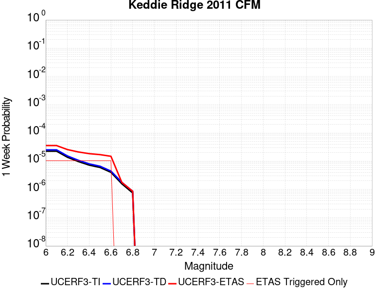 | 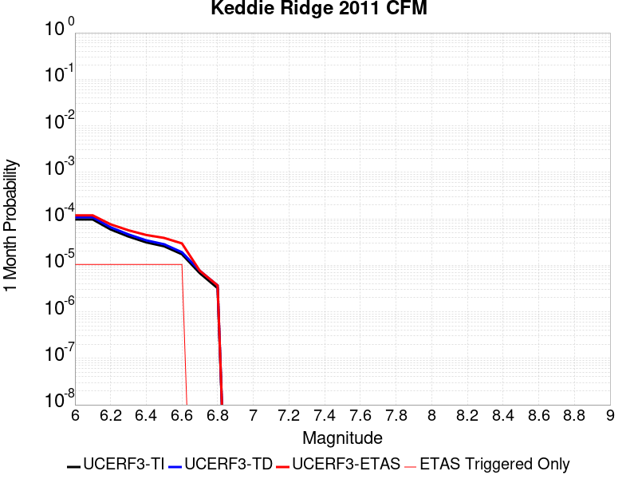 | 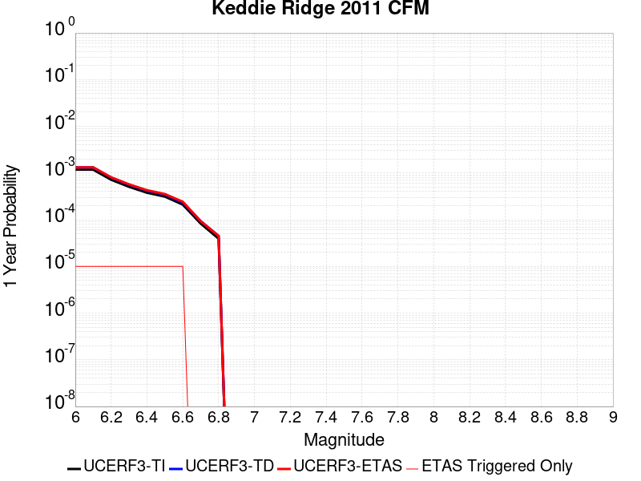 | 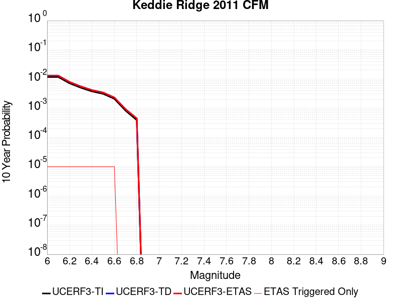 |

| Magnitude | 1 wk TI Prob | 1 wk TD Prob | 1 wk ETAS Prob | 1 wk ETAS/TD Gain | 1 wk ETAS Triggered Only | 1 mo TI Prob | 1 mo TD Prob | 1 mo ETAS Prob | 1 mo ETAS/TD Gain | 1 mo ETAS Triggered Only | 1 yr TI Prob | 1 yr TD Prob | 1 yr ETAS Prob | 1 yr ETAS/TD Gain | 1 yr ETAS Triggered Only | 10 yr TI Prob | 10 yr TD Prob | 10 yr ETAS Prob | 10 yr ETAS/TD Gain | 10 yr ETAS Triggered Only |
|-----|-----|-----|-----|-----|-----|-----|-----|-----|-----|-----|-----|-----|-----|-----|-----|-----|-----|-----|-----|-----|
| 6.0 | 2.2591947E-5 | 2.5189187E-5 | 3.562483E-5 | 1.4142907 | 1.0435908E-5 | 9.6819036E-5 | 1.07949636E-4 | 1.1838442E-4 | 1.0966635 | 1.0435908E-5 | 0.0011781343 | 0.0013135736 | 0.0013239958 | 1.0079342 | 1.0435908E-5 | 0.011719079 | 0.013066036 | 0.013076336 | 1.0007882 | 1.0435908E-5 |
| 6.1 | 2.2591947E-5 | 2.5189187E-5 | 3.562483E-5 | 1.4142907 | 1.0435908E-5 | 9.6819036E-5 | 1.07949636E-4 | 1.1838442E-4 | 1.0966635 | 1.0435908E-5 | 0.0011781343 | 0.0013135736 | 0.0013239958 | 1.0079342 | 1.0435908E-5 | 0.011719079 | 0.013066036 | 0.013076336 | 1.0007882 | 1.0435908E-5 |
| 6.2 | 1.3775145E-5 | 1.5322817E-5 | 2.5758567E-5 | 1.6810594 | 1.0435908E-5 | 5.9035E-5 | 6.566771E-5 | 7.610293E-5 | 1.1589096 | 1.0435908E-5 | 7.185141E-4 | 7.9923525E-4 | 8.096628E-4 | 1.013047 | 1.0435908E-5 | 0.0071619535 | 0.007966028 | 0.00797638 | 1.0012996 | 1.0435908E-5 |
| 6.3 | 9.705435E-6 | 1.0768351E-5 | 2.1204147E-5 | 1.9691173 | 1.0435908E-5 | 4.1594063E-5 | 4.614933E-5 | 5.6584755E-5 | 1.226123 | 1.0435908E-5 | 5.0629E-4 | 5.6173565E-4 | 5.7216565E-4 | 1.0185676 | 1.0435908E-5 | 0.005051381 | 0.0056043873 | 0.005614765 | 1.0018517 | 1.0435908E-5 |
| 6.4 | 7.2549733E-6 | 8.027269E-6 | 1.8463094E-5 | 2.3000467 | 1.0435908E-5 | 3.109237E-5 | 3.4402172E-5 | 4.483772E-5 | 1.3033398 | 1.0435908E-5 | 3.7848388E-4 | 4.187739E-4 | 4.2920545E-4 | 1.0249097 | 1.0435908E-5 | 0.003778399 | 0.0041806344 | 0.0041910266 | 1.0024859 | 1.0435908E-5 |
| 6.5 | 5.983293E-6 | 6.613024E-6 | 1.7048864E-5 | 2.5780735 | 1.0435908E-5 | 2.5642432E-5 | 2.8341263E-5 | 3.8776874E-5 | 1.3682127 | 1.0435908E-5 | 3.1215188E-4 | 3.4500696E-4 | 3.554393E-4 | 1.0302379 | 1.0435908E-5 | 0.0031171376 | 0.0034453757 | 0.0034557756 | 1.0030185 | 1.0435908E-5 |
| 6.6 | 4.0336154E-6 | 4.4578046E-6 | 1.4893666E-5 | 3.3410318 | 1.0435908E-5 | 1.728681E-5 | 1.9104758E-5 | 2.9540468E-5 | 1.546236 | 1.0435908E-5 | 2.1044657E-4 | 2.3257964E-4 | 2.4301311E-4 | 1.0448598 | 1.0435908E-5 | 0.002102474 | 0.0023237579 | 0.0023341693 | 1.0044805 | 1.0435908E-5 |
| 6.7 | 1.5832104E-6 | 1.7816087E-6 | 1.7816087E-6 | 1.0 | 0.0 | 6.7851697E-6 | 7.635445E-6 | 7.635445E-6 | 1.0 | 0.0 | 8.260631E-5 | 9.295785E-5 | 9.295785E-5 | 1.0 | 0.0 | 8.2575605E-4 | 9.2921633E-4 | 9.2921633E-4 | 1.0 | 0.0 |
| 6.8 | 7.5177275E-7 | 8.5902946E-7 | 8.5902946E-7 | 1.0 | 0.0 | 3.221879E-6 | 3.6815507E-6 | 3.6815507E-6 | 1.0 | 0.0 | 3.9225673E-5 | 4.4822125E-5 | 4.4822125E-5 | 1.0 | 0.0 | 3.921875E-4 | 4.481474E-4 | 4.481474E-4 | 1.0 | 0.0 |

## Maacama 2011 CFM
*[(top)](#table-of-contents)*

| 1 Week | 1 Month | 1 Year | 10 Year |
|-----|-----|-----|-----|
| 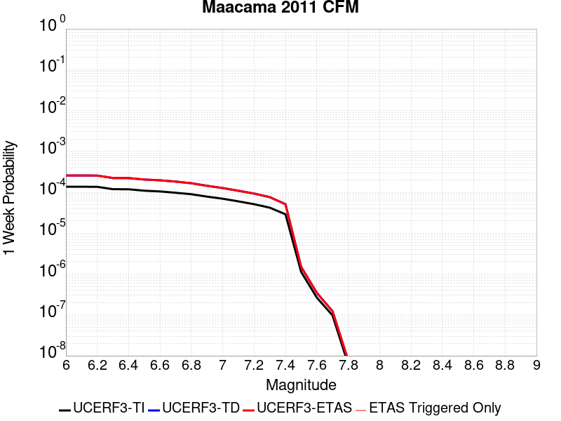 | 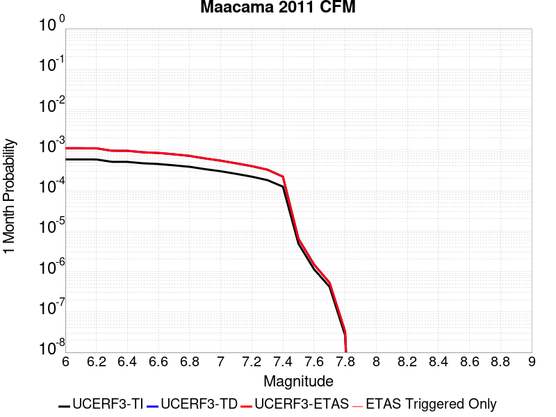 | 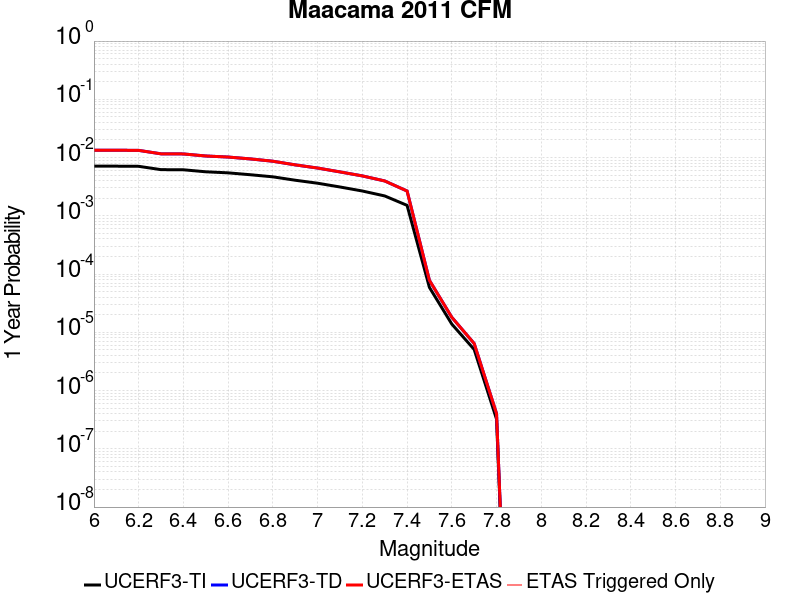 | 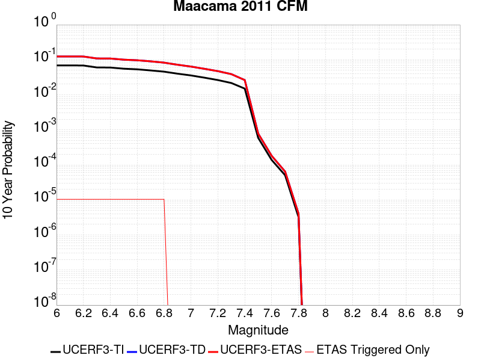 |

| Magnitude | 1 wk TI Prob | 1 wk TD Prob | 1 wk ETAS Prob | 1 wk ETAS/TD Gain | 1 wk ETAS Triggered Only | 1 mo TI Prob | 1 mo TD Prob | 1 mo ETAS Prob | 1 mo ETAS/TD Gain | 1 mo ETAS Triggered Only | 1 yr TI Prob | 1 yr TD Prob | 1 yr ETAS Prob | 1 yr ETAS/TD Gain | 1 yr ETAS Triggered Only | 10 yr TI Prob | 10 yr TD Prob | 10 yr ETAS Prob | 10 yr ETAS/TD Gain | 10 yr ETAS Triggered Only |
|-----|-----|-----|-----|-----|-----|-----|-----|-----|-----|-----|-----|-----|-----|-----|-----|-----|-----|-----|-----|-----|
| 6.0 | 1.368203E-4 | 2.5787868E-4 | 2.5787868E-4 | 1.0 | 0.0 | 5.862409E-4 | 0.0011047312 | 0.0011047312 | 1.0 | 0.0 | 0.0071141496 | 0.013350483 | 0.013350483 | 1.0 | 0.0 | 0.06890667 | 0.124189645 | 0.12419878 | 1.0000736 | 1.0435908E-5 |
| 6.1 | 1.368203E-4 | 2.5787868E-4 | 2.5787868E-4 | 1.0 | 0.0 | 5.862409E-4 | 0.0011047312 | 0.0011047312 | 1.0 | 0.0 | 0.0071141496 | 0.013350483 | 0.013350483 | 1.0 | 0.0 | 0.06890667 | 0.124189645 | 0.12419878 | 1.0000736 | 1.0435908E-5 |
| 6.2 | 1.360743E-4 | 2.566255E-4 | 2.566255E-4 | 1.0 | 0.0 | 5.8304524E-4 | 0.001099365 | 0.001099365 | 1.0 | 0.0 | 0.007075496 | 0.013286048 | 0.013286048 | 1.0 | 0.0 | 0.06854413 | 0.12362404 | 0.12363319 | 1.000074 | 1.0435908E-5 |
| 6.3 | 1.1917239E-4 | 2.235362E-4 | 2.235362E-4 | 1.0 | 0.0 | 5.1063887E-4 | 9.5765886E-4 | 9.5765886E-4 | 1.0 | 0.0 | 0.0061993203 | 0.011587509 | 0.011587509 | 1.0 | 0.0 | 0.060292065 | 0.10884413 | 0.10885344 | 1.0000855 | 1.0435908E-5 |
| 6.4 | 1.1859289E-4 | 2.2257185E-4 | 2.2257185E-4 | 1.0 | 0.0 | 5.0815626E-4 | 9.535289E-4 | 9.535289E-4 | 1.0 | 0.0 | 0.006169266 | 0.0115378285 | 0.0115378285 | 1.0 | 0.0 | 0.06000784 | 0.108401 | 0.10841031 | 1.0000858 | 1.0435908E-5 |
| 6.5 | 1.09512424E-4 | 2.0515872E-4 | 2.0515872E-4 | 1.0 | 0.0 | 4.6925453E-4 | 8.789523E-4 | 8.789523E-4 | 1.0 | 0.0 | 0.005698218 | 0.01063927 | 0.01063927 | 1.0 | 0.0 | 0.055543028 | 0.100493506 | 0.100502886 | 1.0000935 | 1.0435908E-5 |
| 6.6 | 1.0502928E-4 | 1.9674368E-4 | 1.9674368E-4 | 1.0 | 0.0 | 4.500478E-4 | 8.4291224E-4 | 8.4291224E-4 | 1.0 | 0.0 | 0.0054655746 | 0.01020536 | 0.01020536 | 1.0 | 0.0 | 0.053330887 | 0.096646085 | 0.09665552 | 1.0000975 | 1.0435908E-5 |
| 6.7 | 9.739358E-5 | 1.825636E-4 | 1.825636E-4 | 1.0 | 0.0 | 4.173343E-4 | 7.821781E-4 | 7.821781E-4 | 1.0 | 0.0 | 0.0050692135 | 0.009475501 | 0.009475501 | 1.0 | 0.0 | 0.049551267 | 0.090118766 | 0.090128265 | 1.0001054 | 1.0435908E-5 |
| 6.8 | 8.969524E-5 | 1.6657855E-4 | 1.6657855E-4 | 1.0 | 0.0 | 3.8435153E-4 | 7.1370887E-4 | 7.1370887E-4 | 1.0 | 0.0 | 0.0046694432 | 0.008649083 | 0.008649083 | 1.0 | 0.0 | 0.045725387 | 0.082651116 | 0.08266069 | 1.0001159 | 1.0435908E-5 |
| 6.9 | 7.838291E-5 | 1.4417822E-4 | 1.4417822E-4 | 1.0 | 0.0 | 3.358835E-4 | 6.177581E-4 | 6.177581E-4 | 1.0 | 0.0 | 0.0040817154 | 0.007491799 | 0.007491799 | 1.0 | 0.0 | 0.04007554 | 0.07205178 | 0.07205178 | 1.0 | 0.0 |
| 7.0 | 6.961957E-5 | 1.270709E-4 | 1.270709E-4 | 1.0 | 0.0 | 2.9833548E-4 | 5.4447335E-4 | 5.4447335E-4 | 1.0 | 0.0 | 0.0036261857 | 0.006606736 | 0.006606736 | 1.0 | 0.0 | 0.035675827 | 0.063870616 | 0.063870616 | 1.0 | 0.0 |
| 7.1 | 5.999398E-5 | 1.0904674E-4 | 1.0904674E-4 | 1.0 | 0.0 | 2.570917E-4 | 4.6726142E-4 | 4.6726142E-4 | 1.0 | 0.0 | 0.0031255994 | 0.0056728474 | 0.0056728474 | 1.0 | 0.0 | 0.030820016 | 0.055138282 | 0.055138282 | 1.0 | 0.0 |
| 7.2 | 5.116532E-5 | 9.3055336E-5 | 9.3055336E-5 | 1.0 | 0.0 | 2.1926152E-4 | 3.9875024E-4 | 3.9875024E-4 | 1.0 | 0.0 | 0.002666241 | 0.004843103 | 0.004843103 | 1.0 | 0.0 | 0.026344774 | 0.04730284 | 0.04730284 | 1.0 | 0.0 |
| 7.3 | 4.2087835E-5 | 7.617328E-5 | 7.617328E-5 | 1.0 | 0.0 | 1.8036396E-4 | 3.2641852E-4 | 3.2641852E-4 | 1.0 | 0.0 | 0.0021937196 | 0.0039661685 | 0.0039661685 | 1.0 | 0.0 | 0.0217219 | 0.038904376 | 0.038904376 | 1.0 | 0.0 |
| 7.4 | 2.8991652E-5 | 5.1167233E-5 | 5.1167233E-5 | 1.0 | 0.0 | 1.2424402E-4 | 2.1927188E-4 | 2.1927188E-4 | 1.0 | 0.0 | 0.0015116213 | 0.0026660617 | 0.0026660617 | 1.0 | 0.0 | 0.015013801 | 0.026331667 | 0.026331667 | 1.0 | 0.0 |
| 7.5 | 1.1292299E-6 | 1.4950161E-6 | 1.4950161E-6 | 1.0 | 0.0 | 4.8395473E-6 | 6.4072037E-6 | 6.4072037E-6 | 1.0 | 0.0 | 5.8919897E-5 | 7.800615E-5 | 7.800615E-5 | 1.0 | 0.0 | 5.890428E-4 | 7.8048074E-4 | 7.8048074E-4 | 1.0 | 0.0 |
| 7.6 | 2.6535366E-7 | 3.4720597E-7 | 3.4720597E-7 | 1.0 | 0.0 | 1.1372296E-6 | 1.4880247E-6 | 1.4880247E-6 | 1.0 | 0.0 | 1.3845682E-5 | 1.8116552E-5 | 1.8116552E-5 | 1.0 | 0.0 | 1.3844819E-4 | 1.816747E-4 | 1.816747E-4 | 1.0 | 0.0 |
| 7.7 | 9.727789E-8 | 1.2302169E-7 | 1.2302169E-7 | 1.0 | 0.0 | 4.1690518E-7 | 5.2723567E-7 | 5.2723567E-7 | 1.0 | 0.0 | 5.0758085E-6 | 6.419076E-6 | 6.419076E-6 | 1.0 | 0.0 | 5.0756928E-5 | 6.45712E-5 | 6.45712E-5 | 1.0 | 0.0 |
| 7.8 | 6.1939325E-9 | 7.711523E-9 | 7.711523E-9 | 1.0 | 0.0 | 2.6545425E-8 | 3.3049385E-8 | 3.3049385E-8 | 1.0 | 0.0 | 3.231905E-7 | 4.0237617E-7 | 4.0237617E-7 | 1.0 | 0.0 | 3.2319003E-6 | 4.0598557E-6 | 4.0598557E-6 | 1.0 | 0.0 |

## Hosgri
*[(top)](#table-of-contents)*

| 1 Week | 1 Month | 1 Year | 10 Year |
|-----|-----|-----|-----|
|  | 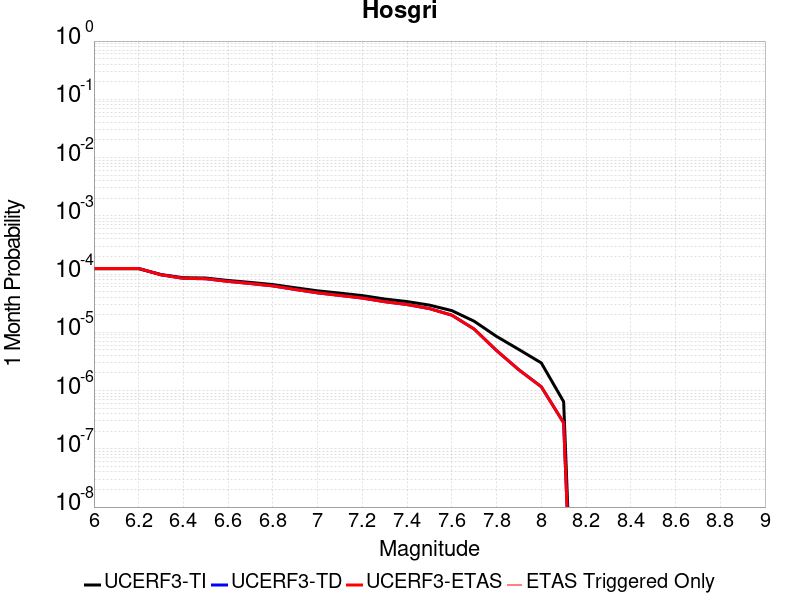 | 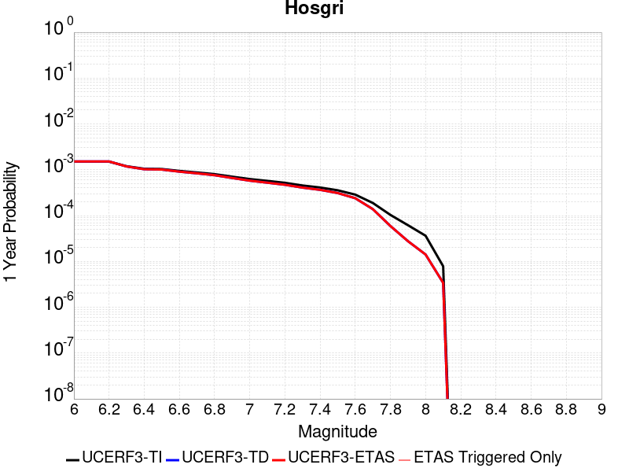 | 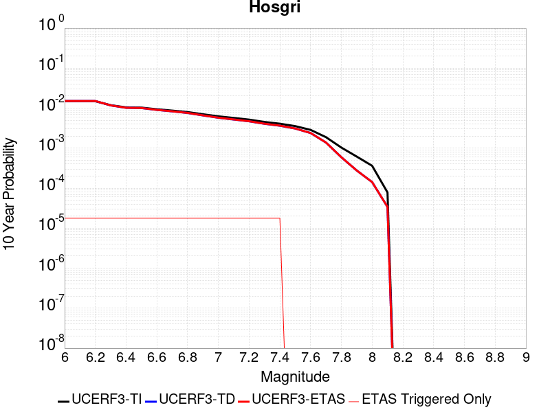 |

| Magnitude | 1 wk TI Prob | 1 wk TD Prob | 1 wk ETAS Prob | 1 wk ETAS/TD Gain | 1 wk ETAS Triggered Only | 1 mo TI Prob | 1 mo TD Prob | 1 mo ETAS Prob | 1 mo ETAS/TD Gain | 1 mo ETAS Triggered Only | 1 yr TI Prob | 1 yr TD Prob | 1 yr ETAS Prob | 1 yr ETAS/TD Gain | 1 yr ETAS Triggered Only | 10 yr TI Prob | 10 yr TD Prob | 10 yr ETAS Prob | 10 yr ETAS/TD Gain | 10 yr ETAS Triggered Only |
|-----|-----|-----|-----|-----|-----|-----|-----|-----|-----|-----|-----|-----|-----|-----|-----|-----|-----|-----|-----|-----|
| 6.0 | 2.883978E-5 | 2.9128416E-5 | 2.9128416E-5 | 1.0 | 0.0 | 1.235932E-4 | 1.2483024E-4 | 1.2483024E-4 | 1.0 | 0.0 | 0.0015037085 | 0.001518776 | 0.001518776 | 1.0 | 0.0 | 0.01493574 | 0.01508774 | 0.015098018 | 1.0006813 | 1.0435908E-5 |
| 6.1 | 2.883978E-5 | 2.9128416E-5 | 2.9128416E-5 | 1.0 | 0.0 | 1.235932E-4 | 1.2483024E-4 | 1.2483024E-4 | 1.0 | 0.0 | 0.0015037085 | 0.001518776 | 0.001518776 | 1.0 | 0.0 | 0.01493574 | 0.01508774 | 0.015098018 | 1.0006813 | 1.0435908E-5 |
| 6.2 | 2.883978E-5 | 2.9128416E-5 | 2.9128416E-5 | 1.0 | 0.0 | 1.235932E-4 | 1.2483024E-4 | 1.2483024E-4 | 1.0 | 0.0 | 0.0015037085 | 0.001518776 | 0.001518776 | 1.0 | 0.0 | 0.01493574 | 0.01508774 | 0.015098018 | 1.0006813 | 1.0435908E-5 |
| 6.3 | 2.2914428E-5 | 2.2641969E-5 | 2.2641969E-5 | 1.0 | 0.0 | 9.8200995E-5 | 9.703343E-5 | 9.703343E-5 | 1.0 | 0.0 | 0.0011949413 | 0.0011807467 | 0.0011807467 | 1.0 | 0.0 | 0.011885363 | 0.011746133 | 0.011756446 | 1.000878 | 1.0435908E-5 |
| 6.4 | 2.0195741E-5 | 1.969656E-5 | 1.969656E-5 | 1.0 | 0.0 | 8.65503E-5 | 8.4411105E-5 | 8.4411105E-5 | 1.0 | 0.0 | 0.0010532405 | 0.0010272227 | 0.0010272227 | 1.0 | 0.0 | 0.010482626 | 0.010225792 | 0.010236122 | 1.0010101 | 1.0435908E-5 |
| 6.5 | 1.9924333E-5 | 1.940898E-5 | 1.940898E-5 | 1.0 | 0.0 | 8.53872E-5 | 8.3178704E-5 | 8.3178704E-5 | 1.0 | 0.0 | 0.0010390934 | 0.0010122322 | 0.0010122322 | 1.0 | 0.0 | 0.010342481 | 0.010077253 | 0.010087584 | 1.0010252 | 1.0435908E-5 |
| 6.6 | 1.809694E-5 | 1.74583E-5 | 1.74583E-5 | 1.0 | 0.0 | 7.7556004E-5 | 7.4819145E-5 | 7.4819145E-5 | 1.0 | 0.0 | 9.438353E-4 | 9.105437E-4 | 9.105437E-4 | 1.0 | 0.0 | 0.009398366 | 0.009069073 | 0.009079414 | 1.0011402 | 1.0435908E-5 |
| 6.7 | 1.675989E-5 | 1.6042764E-5 | 1.6042764E-5 | 1.0 | 0.0 | 7.182612E-5 | 6.87529E-5 | 6.87529E-5 | 1.0 | 0.0 | 8.7413215E-4 | 8.3674624E-4 | 8.3674624E-4 | 1.0 | 0.0 | 0.008707017 | 0.0083368635 | 0.008347212 | 1.0012413 | 1.0435908E-5 |
| 6.8 | 1.5401129E-5 | 1.4614083E-5 | 1.4614083E-5 | 1.0 | 0.0 | 6.6003166E-5 | 6.2630286E-5 | 6.2630286E-5 | 1.0 | 0.0 | 8.032922E-4 | 7.622578E-4 | 7.622578E-4 | 1.0 | 0.0 | 0.008003947 | 0.007597296 | 0.007607653 | 1.0013632 | 1.0435908E-5 |
| 6.9 | 1.356559E-5 | 1.2689968E-5 | 1.2689968E-5 | 1.0 | 0.0 | 5.8136946E-5 | 5.4384444E-5 | 5.4384444E-5 | 1.0 | 0.0 | 7.0758746E-4 | 6.619299E-4 | 6.619299E-4 | 1.0 | 0.0 | 0.007053386 | 0.006600388 | 0.006610755 | 1.0015707 | 1.0435908E-5 |
| 7.0 | 1.2030819E-5 | 1.1095962E-5 | 1.1095962E-5 | 1.0 | 0.0 | 5.155963E-5 | 4.7553254E-5 | 4.7553254E-5 | 1.0 | 0.0 | 6.275577E-4 | 5.7880714E-4 | 5.7880714E-4 | 1.0 | 0.0 | 0.006257884 | 0.005773757 | 0.0057841325 | 1.0017971 | 1.0435908E-5 |
| 7.1 | 1.0972698E-5 | 1.0022179E-5 | 1.0022179E-5 | 1.0 | 0.0 | 4.7025E-5 | 4.2951488E-5 | 4.2951488E-5 | 1.0 | 0.0 | 5.72379E-4 | 5.22809E-4 | 5.22809E-4 | 1.0 | 0.0 | 0.0057090693 | 0.005216542 | 0.0052269236 | 1.0019901 | 1.0435908E-5 |
| 7.2 | 9.961926E-6 | 9.034746E-6 | 9.034746E-6 | 1.0 | 0.0 | 4.2693267E-5 | 3.8719765E-5 | 3.8719765E-5 | 1.0 | 0.0 | 5.1966653E-4 | 4.713112E-4 | 4.713112E-4 | 1.0 | 0.0 | 0.00518453 | 0.0047038626 | 0.004714249 | 1.0022081 | 1.0435908E-5 |
| 7.3 | 8.700929E-6 | 7.8281E-6 | 7.8281E-6 | 1.0 | 0.0 | 3.7289166E-5 | 3.354857E-5 | 3.354857E-5 | 1.0 | 0.0 | 4.53901E-4 | 4.0837732E-4 | 4.0837732E-4 | 1.0 | 0.0 | 0.00452975 | 0.004077008 | 0.0040874016 | 1.0025493 | 1.0435908E-5 |
| 7.4 | 7.866285E-6 | 6.998739E-6 | 6.998739E-6 | 1.0 | 0.0 | 3.3712215E-5 | 2.9994251E-5 | 2.9994251E-5 | 1.0 | 0.0 | 4.103689E-4 | 3.6511885E-4 | 3.6511885E-4 | 1.0 | 0.0 | 0.004096119 | 0.0036459267 | 0.0036563245 | 1.002852 | 1.0435908E-5 |
| 7.5 | 6.8381305E-6 | 5.9596955E-6 | 5.9596955E-6 | 1.0 | 0.0 | 2.9305946E-5 | 2.5541302E-5 | 2.5541302E-5 | 1.0 | 0.0 | 3.5674145E-4 | 3.10921E-4 | 3.10921E-4 | 1.0 | 0.0 | 0.0035616932 | 0.0031055948 | 0.0031055948 | 1.0 | 0.0 |
| 7.6 | 5.503376E-6 | 4.5952443E-6 | 4.5952443E-6 | 1.0 | 0.0 | 2.3585684E-5 | 1.9693754E-5 | 1.9693754E-5 | 1.0 | 0.0 | 2.8711787E-4 | 2.397451E-4 | 2.397451E-4 | 1.0 | 0.0 | 0.002867472 | 0.0023955975 | 0.0023955975 | 1.0 | 0.0 |
| 7.7 | 3.6144982E-6 | 2.6522112E-6 | 2.6522112E-6 | 1.0 | 0.0 | 1.5490614E-5 | 1.1366569E-5 | 1.1366569E-5 | 1.0 | 0.0 | 1.8858191E-4 | 1.383792E-4 | 1.383792E-4 | 1.0 | 0.0 | 0.0018842196 | 0.0013836613 | 0.0013836613 | 1.0 | 0.0 |
| 7.8 | 1.9853494E-6 | 1.1361129E-6 | 1.1361129E-6 | 1.0 | 0.0 | 8.508612E-6 | 4.8690463E-6 | 4.8690463E-6 | 1.0 | 0.0 | 1.0358743E-4 | 5.9279027E-5 | 5.9279027E-5 | 1.0 | 0.0 | 0.0010353916 | 5.9336185E-4 | 5.9336185E-4 | 1.0 | 0.0 |
| 7.9 | 1.1818757E-6 | 5.2951856E-7 | 5.2951856E-7 | 1.0 | 0.0 | 5.0651715E-6 | 2.2693632E-6 | 2.2693632E-6 | 1.0 | 0.0 | 6.1666724E-5 | 2.7629147E-5 | 2.7629147E-5 | 1.0 | 0.0 | 6.1649614E-4 | 2.7694515E-4 | 2.7694515E-4 | 1.0 | 0.0 |
| 8.0 | 6.962958E-7 | 2.7139782E-7 | 2.7139782E-7 | 1.0 | 0.0 | 2.9841215E-6 | 1.163133E-6 | 1.163133E-6 | 1.0 | 0.0 | 3.6331072E-5 | 1.4161053E-5 | 1.4161053E-5 | 1.0 | 0.0 | 3.6325134E-4 | 1.4217179E-4 | 1.4217179E-4 | 1.0 | 0.0 |
| 8.1 | 1.5033264E-7 | 6.527624E-8 | 6.527624E-8 | 1.0 | 0.0 | 6.442826E-7 | 2.7975528E-7 | 2.7975528E-7 | 1.0 | 0.0 | 7.844113E-6 | 3.4060151E-6 | 3.4060151E-6 | 1.0 | 0.0 | 7.843835E-5 | 3.407693E-5 | 3.407693E-5 | 1.0 | 0.0 |

## Pittville 2011 CFM
*[(top)](#table-of-contents)*

| 1 Week | 1 Month | 1 Year | 10 Year |
|-----|-----|-----|-----|
| 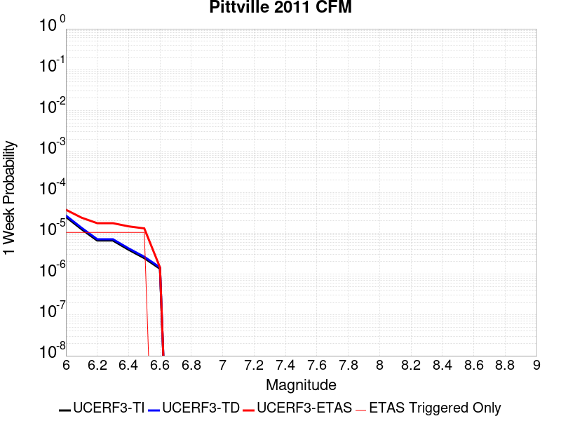 | 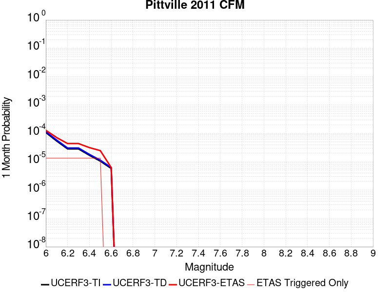 |  | 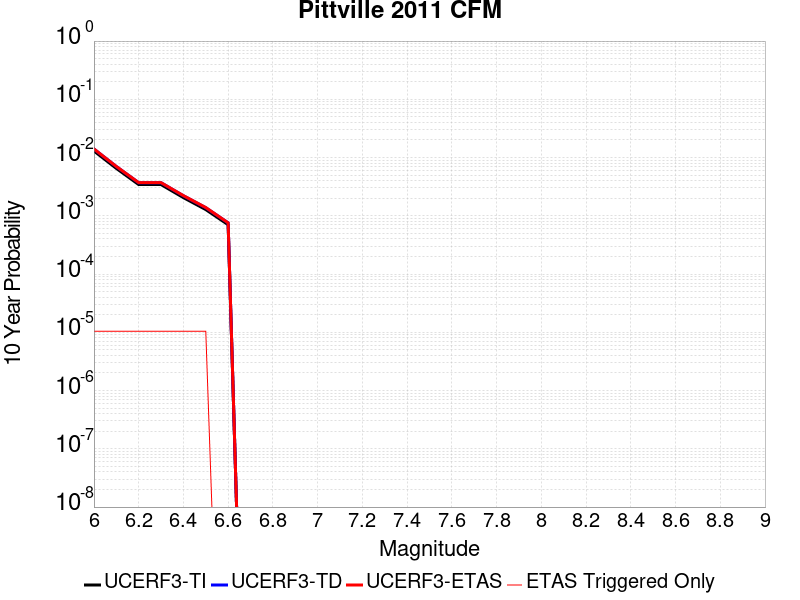 |

| Magnitude | 1 wk TI Prob | 1 wk TD Prob | 1 wk ETAS Prob | 1 wk ETAS/TD Gain | 1 wk ETAS Triggered Only | 1 mo TI Prob | 1 mo TD Prob | 1 mo ETAS Prob | 1 mo ETAS/TD Gain | 1 mo ETAS Triggered Only | 1 yr TI Prob | 1 yr TD Prob | 1 yr ETAS Prob | 1 yr ETAS/TD Gain | 1 yr ETAS Triggered Only | 10 yr TI Prob | 10 yr TD Prob | 10 yr ETAS Prob | 10 yr ETAS/TD Gain | 10 yr ETAS Triggered Only |
|-----|-----|-----|-----|-----|-----|-----|-----|-----|-----|-----|-----|-----|-----|-----|-----|-----|-----|-----|-----|-----|
| 6.0 | 2.5031832E-5 | 2.7056969E-5 | 3.7492595E-5 | 1.3856908 | 1.0435908E-5 | 1.0727487E-4 | 1.1595384E-4 | 1.2638854E-4 | 1.0899901 | 1.0435908E-5 | 0.001305289 | 0.0014109211 | 0.0014213423 | 1.0073861 | 1.0435908E-5 | 0.012976485 | 0.014029415 | 0.0140397055 | 1.0007334 | 1.0435908E-5 |
| 6.1 | 1.2540113E-5 | 1.3513067E-5 | 2.3948833E-5 | 1.7722723 | 1.0435908E-5 | 5.3742235E-5 | 5.7911984E-5 | 6.834728E-5 | 1.1801925 | 1.0435908E-5 | 6.541153E-4 | 7.048728E-4 | 7.153013E-4 | 1.014795 | 1.0435908E-5 | 0.0065219323 | 0.0070286044 | 0.0070389668 | 1.0014744 | 1.0435908E-5 |
| 6.2 | 6.603218E-6 | 7.107189E-6 | 1.7543023E-5 | 2.468349 | 1.0435908E-5 | 2.8299199E-5 | 3.0459063E-5 | 4.0894654E-5 | 1.3426104 | 1.0435908E-5 | 3.4448825E-4 | 3.7078248E-4 | 3.8121452E-4 | 1.0281352 | 1.0435908E-5 | 0.0034395473 | 0.0037022792 | 0.0037126765 | 1.0028083 | 1.0435908E-5 |
| 6.3 | 6.603218E-6 | 7.107189E-6 | 1.7543023E-5 | 2.468349 | 1.0435908E-5 | 2.8299199E-5 | 3.0459063E-5 | 4.0894654E-5 | 1.3426104 | 1.0435908E-5 | 3.4448825E-4 | 3.7078248E-4 | 3.8121452E-4 | 1.0281352 | 1.0435908E-5 | 0.0034395473 | 0.0037022792 | 0.0037126765 | 1.0028083 | 1.0435908E-5 |
| 6.4 | 3.9389015E-6 | 4.239175E-6 | 1.4675039E-5 | 3.4617677 | 1.0435908E-5 | 1.6880897E-5 | 1.8167784E-5 | 2.8603503E-5 | 1.5744079 | 1.0435908E-5 | 2.0550552E-4 | 2.2117342E-4 | 2.3160702E-4 | 1.0471739 | 1.0435908E-5 | 0.0020531558 | 0.002209838 | 0.0022202507 | 1.004712 | 1.0435908E-5 |
| 6.5 | 2.4533072E-6 | 2.6412686E-6 | 1.3077149E-5 | 4.9510865 | 1.0435908E-5 | 1.0514132E-5 | 1.1319685E-5 | 2.1755473E-5 | 1.9219153 | 1.0435908E-5 | 1.2800204E-4 | 1.3781038E-4 | 1.4824486E-4 | 1.0757161 | 1.0435908E-5 | 0.0012792832 | 0.0013774394 | 0.0013878609 | 1.0075659 | 1.0435908E-5 |
| 6.6 | 1.3482367E-6 | 1.452993E-6 | 1.452993E-6 | 1.0 | 0.0 | 5.778144E-6 | 6.2271047E-6 | 6.2271047E-6 | 1.0 | 0.0 | 7.0346636E-5 | 7.58135E-5 | 7.58135E-5 | 1.0 | 0.0 | 7.032437E-4 | 7.5798744E-4 | 7.5798744E-4 | 1.0 | 0.0 |

## Great Valley 06 (Midland) 2011 CFM alt1
*[(top)](#table-of-contents)*

| 1 Week | 1 Month | 1 Year | 10 Year |
|-----|-----|-----|-----|
|  |  |  | 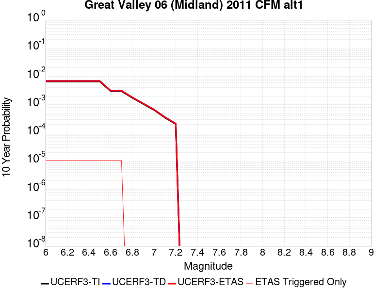 |

| Magnitude | 1 wk TI Prob | 1 wk TD Prob | 1 wk ETAS Prob | 1 wk ETAS/TD Gain | 1 wk ETAS Triggered Only | 1 mo TI Prob | 1 mo TD Prob | 1 mo ETAS Prob | 1 mo ETAS/TD Gain | 1 mo ETAS Triggered Only | 1 yr TI Prob | 1 yr TD Prob | 1 yr ETAS Prob | 1 yr ETAS/TD Gain | 1 yr ETAS Triggered Only | 10 yr TI Prob | 10 yr TD Prob | 10 yr ETAS Prob | 10 yr ETAS/TD Gain | 10 yr ETAS Triggered Only |
|-----|-----|-----|-----|-----|-----|-----|-----|-----|-----|-----|-----|-----|-----|-----|-----|-----|-----|-----|-----|-----|
| 6.0 | 1.2712525E-5 | 1.3210576E-5 | 1.3210576E-5 | 1.0 | 0.0 | 5.4481112E-5 | 5.6615667E-5 | 5.6615667E-5 | 1.0 | 0.0 | 6.6310563E-4 | 6.8910315E-4 | 6.8910315E-4 | 1.0 | 0.0 | 0.0066113044 | 0.006872179 | 0.006882543 | 1.0015081 | 1.0435908E-5 |
| 6.1 | 1.2712525E-5 | 1.3210576E-5 | 1.3210576E-5 | 1.0 | 0.0 | 5.4481112E-5 | 5.6615667E-5 | 5.6615667E-5 | 1.0 | 0.0 | 6.6310563E-4 | 6.8910315E-4 | 6.8910315E-4 | 1.0 | 0.0 | 0.0066113044 | 0.006872179 | 0.006882543 | 1.0015081 | 1.0435908E-5 |
| 6.2 | 1.2712525E-5 | 1.3210576E-5 | 1.3210576E-5 | 1.0 | 0.0 | 5.4481112E-5 | 5.6615667E-5 | 5.6615667E-5 | 1.0 | 0.0 | 6.6310563E-4 | 6.8910315E-4 | 6.8910315E-4 | 1.0 | 0.0 | 0.0066113044 | 0.006872179 | 0.006882543 | 1.0015081 | 1.0435908E-5 |
| 6.3 | 1.2712525E-5 | 1.3210576E-5 | 1.3210576E-5 | 1.0 | 0.0 | 5.4481112E-5 | 5.6615667E-5 | 5.6615667E-5 | 1.0 | 0.0 | 6.6310563E-4 | 6.8910315E-4 | 6.8910315E-4 | 1.0 | 0.0 | 0.0066113044 | 0.006872179 | 0.006882543 | 1.0015081 | 1.0435908E-5 |
| 6.4 | 1.2712525E-5 | 1.3210576E-5 | 1.3210576E-5 | 1.0 | 0.0 | 5.4481112E-5 | 5.6615667E-5 | 5.6615667E-5 | 1.0 | 0.0 | 6.6310563E-4 | 6.8910315E-4 | 6.8910315E-4 | 1.0 | 0.0 | 0.0066113044 | 0.006872179 | 0.006882543 | 1.0015081 | 1.0435908E-5 |
| 6.5 | 1.2712525E-5 | 1.3210576E-5 | 1.3210576E-5 | 1.0 | 0.0 | 5.4481112E-5 | 5.6615667E-5 | 5.6615667E-5 | 1.0 | 0.0 | 6.6310563E-4 | 6.8910315E-4 | 6.8910315E-4 | 1.0 | 0.0 | 0.0066113044 | 0.006872179 | 0.006882543 | 1.0015081 | 1.0435908E-5 |
| 6.6 | 5.7574384E-6 | 5.9706463E-6 | 5.9706463E-6 | 1.0 | 0.0 | 2.4674504E-5 | 2.5588255E-5 | 2.5588255E-5 | 1.0 | 0.0 | 3.0037065E-4 | 3.1149638E-4 | 3.1149638E-4 | 1.0 | 0.0 | 0.0029996498 | 0.0031109843 | 0.0031213877 | 1.003344 | 1.0435908E-5 |
| 6.7 | 5.7574384E-6 | 5.9706463E-6 | 5.9706463E-6 | 1.0 | 0.0 | 2.4674504E-5 | 2.5588255E-5 | 2.5588255E-5 | 1.0 | 0.0 | 3.0037065E-4 | 3.1149638E-4 | 3.1149638E-4 | 1.0 | 0.0 | 0.0029996498 | 0.0031109843 | 0.0031213877 | 1.003344 | 1.0435908E-5 |
| 6.8 | 3.3474828E-6 | 3.4693849E-6 | 3.4693849E-6 | 1.0 | 0.0 | 1.4346277E-5 | 1.4868716E-5 | 1.4868716E-5 | 1.0 | 0.0 | 1.7465191E-4 | 1.8101306E-4 | 1.8101306E-4 | 1.0 | 0.0 | 0.0017451472 | 0.0018088033 | 0.0018088033 | 1.0 | 0.0 |
| 6.9 | 2.035106E-6 | 2.1090357E-6 | 2.1090357E-6 | 1.0 | 0.0 | 8.721853E-6 | 9.038697E-6 | 9.038697E-6 | 1.0 | 0.0 | 1.0618339E-4 | 1.10041314E-4 | 1.10041314E-4 | 1.0 | 0.0 | 0.0010613267 | 0.0010999405 | 0.0010999405 | 1.0 | 0.0 |
| 7.0 | 1.2424716E-6 | 1.2878762E-6 | 1.2878762E-6 | 1.0 | 0.0 | 5.3248673E-6 | 5.51946E-6 | 5.51946E-6 | 1.0 | 0.0 | 6.482833E-5 | 6.7197805E-5 | 6.7197805E-5 | 1.0 | 0.0 | 6.480942E-4 | 6.718192E-4 | 6.718192E-4 | 1.0 | 0.0 |
| 7.1 | 6.6904556E-7 | 6.939035E-7 | 6.939035E-7 | 1.0 | 0.0 | 2.867335E-6 | 2.97387E-6 | 2.97387E-6 | 1.0 | 0.0 | 3.4909244E-5 | 3.6206526E-5 | 3.6206526E-5 | 1.0 | 0.0 | 3.490376E-4 | 3.6203177E-4 | 3.6203177E-4 | 1.0 | 0.0 |
| 7.2 | 3.948168E-7 | 4.095705E-7 | 4.095705E-7 | 1.0 | 0.0 | 1.6920709E-6 | 1.7553022E-6 | 1.7553022E-6 | 1.0 | 0.0 | 2.0600768E-5 | 2.1370803E-5 | 2.1370803E-5 | 1.0 | 0.0 | 2.0598859E-4 | 2.1370803E-4 | 2.1370803E-4 | 1.0 | 0.0 |

## Green Valley 2011 CFM
*[(top)](#table-of-contents)*

| 1 Week | 1 Month | 1 Year | 10 Year |
|-----|-----|-----|-----|
|  | 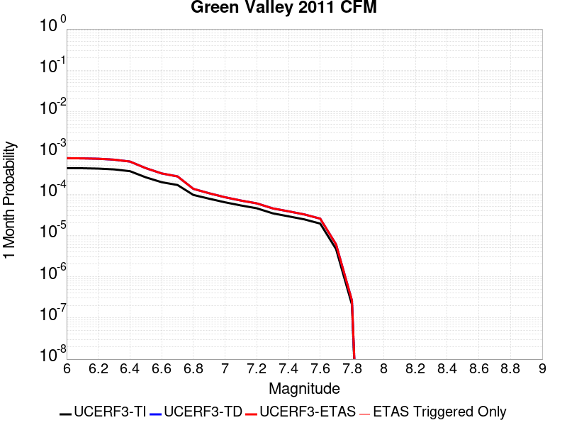 | 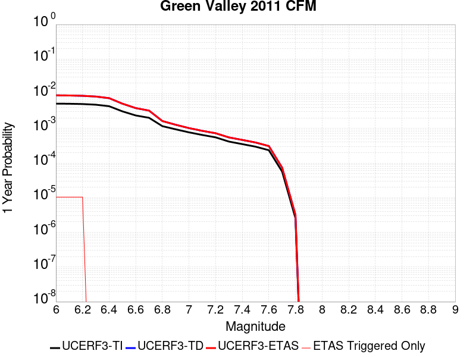 | 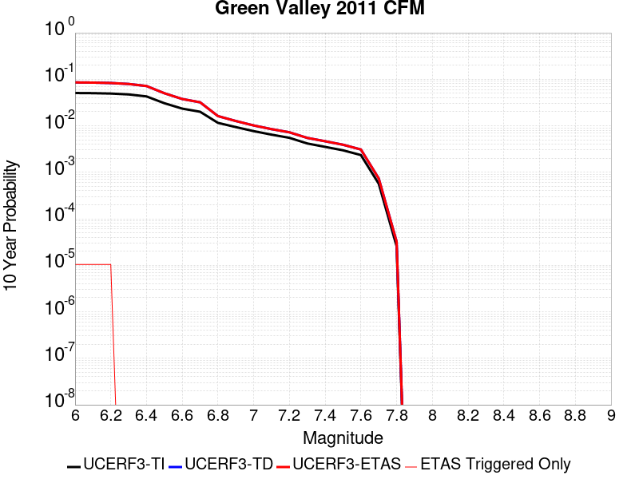 |

| Magnitude | 1 wk TI Prob | 1 wk TD Prob | 1 wk ETAS Prob | 1 wk ETAS/TD Gain | 1 wk ETAS Triggered Only | 1 mo TI Prob | 1 mo TD Prob | 1 mo ETAS Prob | 1 mo ETAS/TD Gain | 1 mo ETAS Triggered Only | 1 yr TI Prob | 1 yr TD Prob | 1 yr ETAS Prob | 1 yr ETAS/TD Gain | 1 yr ETAS Triggered Only | 10 yr TI Prob | 10 yr TD Prob | 10 yr ETAS Prob | 10 yr ETAS/TD Gain | 10 yr ETAS Triggered Only |
|-----|-----|-----|-----|-----|-----|-----|-----|-----|-----|-----|-----|-----|-----|-----|-----|-----|-----|-----|-----|-----|
| 6.0 | 9.9629346E-5 | 1.7305532E-4 | 1.7305532E-4 | 1.0 | 0.0 | 4.2691303E-4 | 7.4143766E-4 | 7.4143766E-4 | 1.0 | 0.0 | 0.0051852856 | 0.008986705 | 0.008997047 | 1.0011508 | 1.0435908E-5 | 0.050659515 | 0.085522056 | 0.0855316 | 1.0001116 | 1.0435908E-5 |
| 6.1 | 9.88615E-5 | 1.7152846E-4 | 1.7152846E-4 | 1.0 | 0.0 | 4.2362334E-4 | 7.348976E-4 | 7.348976E-4 | 1.0 | 0.0 | 0.0051454236 | 0.0089077335 | 0.008918077 | 1.0011611 | 1.0435908E-5 | 0.050279044 | 0.084809676 | 0.08481923 | 1.0001127 | 1.0435908E-5 |
| 6.2 | 9.696895E-5 | 1.6791887E-4 | 1.6791887E-4 | 1.0 | 0.0 | 4.15515E-4 | 7.194366E-4 | 7.194366E-4 | 1.0 | 0.0 | 0.0050471667 | 0.008721114 | 0.008731459 | 1.0011861 | 1.0435908E-5 | 0.04934063 | 0.0831186 | 0.08312818 | 1.0001152 | 1.0435908E-5 |
| 6.3 | 9.275224E-5 | 1.5971228E-4 | 1.5971228E-4 | 1.0 | 0.0 | 3.9744904E-4 | 6.842841E-4 | 6.842841E-4 | 1.0 | 0.0 | 0.0048282105 | 0.008296439 | 0.008296439 | 1.0 | 0.0 | 0.047246475 | 0.07925707 | 0.07925707 | 1.0 | 0.0 |
| 6.4 | 8.391499E-5 | 1.4367796E-4 | 1.4367796E-4 | 1.0 | 0.0 | 3.595861E-4 | 6.156248E-4 | 6.156248E-4 | 1.0 | 0.0 | 0.004369175 | 0.0074670846 | 0.0074670846 | 1.0 | 0.0 | 0.04284265 | 0.071630865 | 0.071630865 | 1.0 | 0.0 |
| 6.5 | 5.9519385E-5 | 9.9340905E-5 | 9.9340905E-5 | 1.0 | 0.0 | 2.5505814E-4 | 4.2568138E-4 | 4.2568138E-4 | 1.0 | 0.0 | 0.0031009112 | 0.005168295 | 0.005168295 | 1.0 | 0.0 | 0.030579966 | 0.050145864 | 0.050145864 | 1.0 | 0.0 |
| 6.6 | 4.5361558E-5 | 7.402609E-5 | 7.402609E-5 | 1.0 | 0.0 | 1.9439218E-4 | 3.1721895E-4 | 3.1721895E-4 | 1.0 | 0.0 | 0.0023641558 | 0.0038539418 | 0.0038539418 | 1.0 | 0.0 | 0.023391623 | 0.037665963 | 0.037665963 | 1.0 | 0.0 |
| 6.7 | 3.8808106E-5 | 6.2651976E-5 | 6.2651976E-5 | 1.0 | 0.0 | 1.6630985E-4 | 2.6848342E-4 | 2.6848342E-4 | 1.0 | 0.0 | 0.0020229418 | 0.0032626586 | 0.0032626586 | 1.0 | 0.0 | 0.020046256 | 0.032005914 | 0.032005914 | 1.0 | 0.0 |
| 6.8 | 2.2284667E-5 | 3.1285235E-5 | 3.1285235E-5 | 1.0 | 0.0 | 9.550222E-5 | 1.3407279E-4 | 1.3407279E-4 | 1.0 | 0.0 | 0.0011621192 | 0.0016311078 | 0.0016311078 | 1.0 | 0.0 | 0.011560607 | 0.016165998 | 0.016165998 | 1.0 | 0.0 |
| 6.9 | 1.8050168E-5 | 2.4448054E-5 | 2.4448054E-5 | 1.0 | 0.0 | 7.735557E-5 | 1.047732E-4 | 1.047732E-4 | 1.0 | 0.0 | 9.4139716E-4 | 0.0012748708 | 0.0012748708 | 1.0 | 0.0 | 0.009374191 | 0.012667833 | 0.012667833 | 1.0 | 0.0 |
| 7.0 | 1.4763166E-5 | 1.9582854E-5 | 1.9582854E-5 | 1.0 | 0.0 | 6.326917E-5 | 8.3923835E-5 | 8.3923835E-5 | 1.0 | 0.0 | 7.7002996E-4 | 0.0010212966 | 0.0010212966 | 1.0 | 0.0 | 0.007673672 | 0.010165343 | 0.010165343 | 1.0 | 0.0 |
| 7.1 | 1.2399713E-5 | 1.6303715E-5 | 1.6303715E-5 | 1.0 | 0.0 | 5.3140546E-5 | 6.98712E-5 | 6.98712E-5 | 1.0 | 0.0 | 6.467941E-4 | 8.503518E-4 | 8.503518E-4 | 1.0 | 0.0 | 0.006449148 | 0.008471259 | 0.008471259 | 1.0 | 0.0 |
| 7.2 | 1.0584195E-5 | 1.3921742E-5 | 1.3921742E-5 | 1.0 | 0.0 | 4.5360044E-5 | 5.9663253E-5 | 5.9663253E-5 | 1.0 | 0.0 | 5.521186E-4 | 7.261596E-4 | 7.261596E-4 | 1.0 | 0.0 | 0.0055074887 | 0.007238285 | 0.007238285 | 1.0 | 0.0 |
| 7.3 | 7.998173E-6 | 1.054402E-5 | 1.054402E-5 | 1.0 | 0.0 | 3.4277433E-5 | 4.518788E-5 | 4.518788E-5 | 1.0 | 0.0 | 4.1724785E-4 | 5.500247E-4 | 5.500247E-4 | 1.0 | 0.0 | 0.004164653 | 0.0054868995 | 0.0054868995 | 1.0 | 0.0 |
| 7.4 | 6.7571127E-6 | 8.932697E-6 | 8.932697E-6 | 1.0 | 0.0 | 2.8958733E-5 | 3.828243E-5 | 3.828243E-5 | 1.0 | 0.0 | 3.5251552E-4 | 4.6598984E-4 | 4.6598984E-4 | 1.0 | 0.0 | 0.0035195686 | 0.0046503306 | 0.0046503306 | 1.0 | 0.0 |
| 7.5 | 5.69878E-6 | 7.516314E-6 | 7.516314E-6 | 1.0 | 0.0 | 2.4423114E-5 | 3.221238E-5 | 3.221238E-5 | 1.0 | 0.0 | 2.9731085E-4 | 3.9211605E-4 | 3.9211605E-4 | 1.0 | 0.0 | 0.002969134 | 0.0039143935 | 0.0039143935 | 1.0 | 0.0 |
| 7.6 | 4.503664E-6 | 5.9356807E-6 | 5.9356807E-6 | 1.0 | 0.0 | 1.9301275E-5 | 2.5438389E-5 | 2.5438389E-5 | 1.0 | 0.0 | 2.3496768E-4 | 3.096692E-4 | 3.096692E-4 | 1.0 | 0.0 | 0.002347194 | 0.003092502 | 0.003092502 | 1.0 | 0.0 |
| 7.7 | 1.0873546E-6 | 1.4106979E-6 | 1.4106979E-6 | 1.0 | 0.0 | 4.6600826E-6 | 6.045834E-6 | 6.045834E-6 | 1.0 | 0.0 | 5.6735033E-5 | 7.360557E-5 | 7.360557E-5 | 1.0 | 0.0 | 5.672055E-4 | 7.35814E-4 | 7.35814E-4 | 1.0 | 0.0 |
| 7.8 | 4.9373917E-8 | 6.1777136E-8 | 6.1777136E-8 | 1.0 | 0.0 | 2.1160248E-7 | 2.6475914E-7 | 2.6475914E-7 | 1.0 | 0.0 | 2.5762572E-6 | 3.223439E-6 | 3.223439E-6 | 1.0 | 0.0 | 2.5762274E-5 | 3.2232296E-5 | 3.2232296E-5 | 1.0 | 0.0 |

## Compton
*[(top)](#table-of-contents)*

| 1 Week | 1 Month | 1 Year | 10 Year |
|-----|-----|-----|-----|
|  | 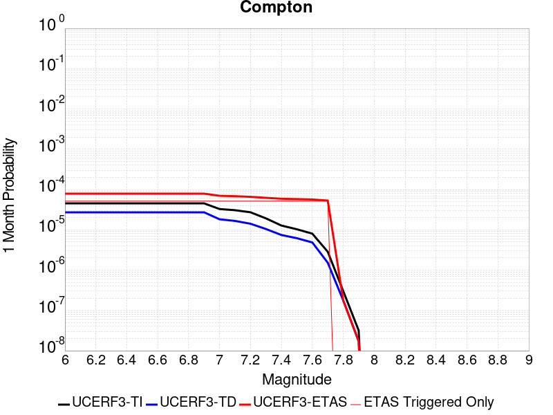 | 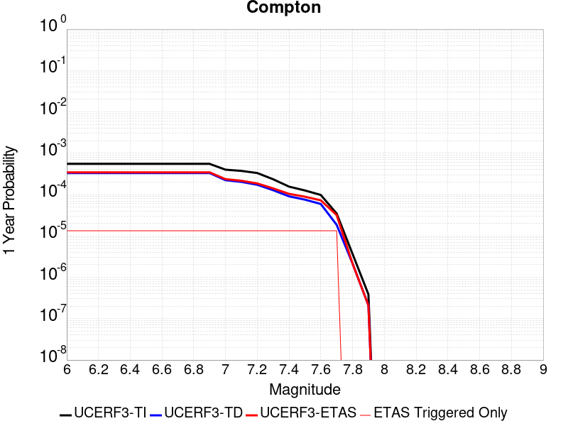 | 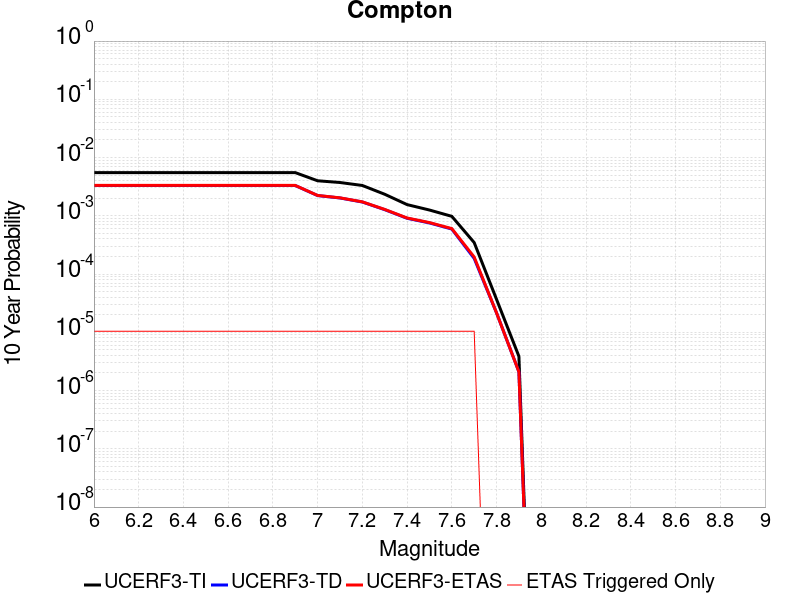 |

| Magnitude | 1 wk TI Prob | 1 wk TD Prob | 1 wk ETAS Prob | 1 wk ETAS/TD Gain | 1 wk ETAS Triggered Only | 1 mo TI Prob | 1 mo TD Prob | 1 mo ETAS Prob | 1 mo ETAS/TD Gain | 1 mo ETAS Triggered Only | 1 yr TI Prob | 1 yr TD Prob | 1 yr ETAS Prob | 1 yr ETAS/TD Gain | 1 yr ETAS Triggered Only | 10 yr TI Prob | 10 yr TD Prob | 10 yr ETAS Prob | 10 yr ETAS/TD Gain | 10 yr ETAS Triggered Only |
|-----|-----|-----|-----|-----|-----|-----|-----|-----|-----|-----|-----|-----|-----|-----|-----|-----|-----|-----|-----|-----|
| 6.0 | 1.06050875E-5 | 6.358671E-6 | 6.358671E-6 | 1.0 | 0.0 | 4.5449582E-5 | 2.7251177E-5 | 3.76868E-5 | 1.3829421 | 1.0435908E-5 | 5.5320817E-4 | 3.317354E-4 | 3.4216788E-4 | 1.0314481 | 1.0435908E-5 | 0.0055183303 | 0.0033126862 | 0.0033230875 | 1.0031399 | 1.0435908E-5 |
| 6.1 | 1.06050875E-5 | 6.358671E-6 | 6.358671E-6 | 1.0 | 0.0 | 4.5449582E-5 | 2.7251177E-5 | 3.76868E-5 | 1.3829421 | 1.0435908E-5 | 5.5320817E-4 | 3.317354E-4 | 3.4216788E-4 | 1.0314481 | 1.0435908E-5 | 0.0055183303 | 0.0033126862 | 0.0033230875 | 1.0031399 | 1.0435908E-5 |
| 6.2 | 1.06050875E-5 | 6.358671E-6 | 6.358671E-6 | 1.0 | 0.0 | 4.5449582E-5 | 2.7251177E-5 | 3.76868E-5 | 1.3829421 | 1.0435908E-5 | 5.5320817E-4 | 3.317354E-4 | 3.4216788E-4 | 1.0314481 | 1.0435908E-5 | 0.0055183303 | 0.0033126862 | 0.0033230875 | 1.0031399 | 1.0435908E-5 |
| 6.3 | 1.06050875E-5 | 6.358671E-6 | 6.358671E-6 | 1.0 | 0.0 | 4.5449582E-5 | 2.7251177E-5 | 3.76868E-5 | 1.3829421 | 1.0435908E-5 | 5.5320817E-4 | 3.317354E-4 | 3.4216788E-4 | 1.0314481 | 1.0435908E-5 | 0.0055183303 | 0.0033126862 | 0.0033230875 | 1.0031399 | 1.0435908E-5 |
| 6.4 | 1.06050875E-5 | 6.358671E-6 | 6.358671E-6 | 1.0 | 0.0 | 4.5449582E-5 | 2.7251177E-5 | 3.76868E-5 | 1.3829421 | 1.0435908E-5 | 5.5320817E-4 | 3.317354E-4 | 3.4216788E-4 | 1.0314481 | 1.0435908E-5 | 0.0055183303 | 0.0033126862 | 0.0033230875 | 1.0031399 | 1.0435908E-5 |
| 6.5 | 1.06050875E-5 | 6.358671E-6 | 6.358671E-6 | 1.0 | 0.0 | 4.5449582E-5 | 2.7251177E-5 | 3.76868E-5 | 1.3829421 | 1.0435908E-5 | 5.5320817E-4 | 3.317354E-4 | 3.4216788E-4 | 1.0314481 | 1.0435908E-5 | 0.0055183303 | 0.0033126862 | 0.0033230875 | 1.0031399 | 1.0435908E-5 |
| 6.6 | 1.06050875E-5 | 6.358671E-6 | 6.358671E-6 | 1.0 | 0.0 | 4.5449582E-5 | 2.7251177E-5 | 3.76868E-5 | 1.3829421 | 1.0435908E-5 | 5.5320817E-4 | 3.317354E-4 | 3.4216788E-4 | 1.0314481 | 1.0435908E-5 | 0.0055183303 | 0.0033126862 | 0.0033230875 | 1.0031399 | 1.0435908E-5 |
| 6.7 | 1.06050875E-5 | 6.358671E-6 | 6.358671E-6 | 1.0 | 0.0 | 4.5449582E-5 | 2.7251177E-5 | 3.76868E-5 | 1.3829421 | 1.0435908E-5 | 5.5320817E-4 | 3.317354E-4 | 3.4216788E-4 | 1.0314481 | 1.0435908E-5 | 0.0055183303 | 0.0033126862 | 0.0033230875 | 1.0031399 | 1.0435908E-5 |
| 6.8 | 1.06050875E-5 | 6.358671E-6 | 6.358671E-6 | 1.0 | 0.0 | 4.5449582E-5 | 2.7251177E-5 | 3.76868E-5 | 1.3829421 | 1.0435908E-5 | 5.5320817E-4 | 3.317354E-4 | 3.4216788E-4 | 1.0314481 | 1.0435908E-5 | 0.0055183303 | 0.0033126862 | 0.0033230875 | 1.0031399 | 1.0435908E-5 |
| 6.9 | 1.06050875E-5 | 6.358671E-6 | 6.358671E-6 | 1.0 | 0.0 | 4.5449582E-5 | 2.7251177E-5 | 3.76868E-5 | 1.3829421 | 1.0435908E-5 | 5.5320817E-4 | 3.317354E-4 | 3.4216788E-4 | 1.0314481 | 1.0435908E-5 | 0.0055183303 | 0.0033126862 | 0.0033230875 | 1.0031399 | 1.0435908E-5 |
| 7.0 | 7.672486E-6 | 4.2720512E-6 | 4.2720512E-6 | 1.0 | 0.0 | 3.288167E-5 | 1.8308665E-5 | 2.8744382E-5 | 1.5699879 | 1.0435908E-5 | 4.0026082E-4 | 2.2288582E-4 | 2.333194E-4 | 1.0468113 | 1.0435908E-5 | 0.0039954064 | 0.002226685 | 0.0022370976 | 1.0046763 | 1.0435908E-5 |
| 7.1 | 7.163992E-6 | 3.883762E-6 | 3.883762E-6 | 1.0 | 0.0 | 3.0702464E-5 | 1.6644592E-5 | 2.7080325E-5 | 1.6269745 | 1.0435908E-5 | 3.7373835E-4 | 2.0262963E-4 | 2.1306341E-4 | 1.051492 | 1.0435908E-5 | 0.0037311043 | 0.0020245055 | 0.0020349205 | 1.0051444 | 1.0435908E-5 |
| 7.2 | 6.3689185E-6 | 3.3102428E-6 | 3.3102428E-6 | 1.0 | 0.0 | 2.729508E-5 | 1.418668E-5 | 2.4622439E-5 | 1.7356027 | 1.0435908E-5 | 3.322669E-4 | 1.7270957E-4 | 1.8314367E-4 | 1.0604142 | 1.0435908E-5 | 0.0033177056 | 0.0017257951 | 0.001736213 | 1.0060365 | 1.0435908E-5 |
| 7.3 | 4.4987873E-6 | 2.4480942E-6 | 2.4480942E-6 | 1.0 | 0.0 | 1.9280375E-5 | 1.0491792E-5 | 2.092759E-5 | 1.9946631 | 1.0435908E-5 | 2.3471327E-4 | 1.2773038E-4 | 1.3816496E-4 | 1.0816922 | 1.0435908E-5 | 0.002344655 | 0.0012765999 | 0.0012870225 | 1.0081643 | 1.0435908E-5 |
| 7.4 | 2.987296E-6 | 1.7394335E-6 | 1.7394335E-6 | 1.0 | 0.0 | 1.2802635E-5 | 7.454694E-6 | 1.7890525E-5 | 2.3999004 | 1.0435908E-5 | 1.5586092E-4 | 9.0757174E-5 | 1.01192134E-4 | 1.1149766 | 1.0435908E-5 | 0.0015575165 | 9.072069E-4 | 9.1763336E-4 | 1.0114928 | 1.0435908E-5 |
| 7.5 | 2.4111696E-6 | 1.4472155E-6 | 1.4472155E-6 | 1.0 | 0.0 | 1.0333543E-5 | 6.2023378E-6 | 1.6638181E-5 | 2.6825662 | 1.0435908E-5 | 1.2580362E-4 | 7.551089E-5 | 8.594601E-5 | 1.1381936 | 1.0435908E-5 | 0.0012573242 | 7.54857E-4 | 7.6528505E-4 | 1.0138146 | 1.0435908E-5 |
| 7.6 | 1.8783096E-6 | 1.1360459E-6 | 1.1360459E-6 | 1.0 | 0.0 | 8.049874E-6 | 4.8687593E-6 | 1.5304617E-5 | 3.1434326 | 1.0435908E-5 | 9.8002805E-5 | 5.927557E-5 | 6.971086E-5 | 1.1760471 | 1.0435908E-5 | 9.795959E-4 | 5.926016E-4 | 6.030313E-4 | 1.0175999 | 1.0435908E-5 |
| 7.7 | 6.6646817E-7 | 3.560237E-7 | 3.560237E-7 | 1.0 | 0.0 | 2.856289E-6 | 1.525815E-6 | 1.1961707E-5 | 7.8395524 | 1.0435908E-5 | 3.4774763E-5 | 1.8576653E-5 | 2.9012368E-5 | 1.561765 | 1.0435908E-5 | 3.4769322E-4 | 1.8575235E-4 | 1.9618632E-4 | 1.0561714 | 1.0435908E-5 |
| 7.8 | 7.054689E-8 | 4.1342968E-8 | 4.1342968E-8 | 1.0 | 0.0 | 3.0234378E-7 | 1.7718413E-7 | 1.7718413E-7 | 1.0 | 0.0 | 3.6810293E-6 | 2.1572148E-6 | 2.1572148E-6 | 1.0 | 0.0 | 3.6809684E-5 | 2.1571948E-5 | 2.1571948E-5 | 1.0 | 0.0 |
| 7.9 | 7.420925E-9 | 4.0131285E-9 | 4.0131285E-9 | 1.0 | 0.0 | 3.1803964E-8 | 1.7199122E-8 | 1.7199122E-8 | 1.0 | 0.0 | 3.872132E-7 | 2.093993E-7 | 2.093993E-7 | 1.0 | 0.0 | 3.872125E-6 | 2.0939913E-6 | 2.0939913E-6 | 1.0 | 0.0 |

## Round Valley
*[(top)](#table-of-contents)*

| 1 Week | 1 Month | 1 Year | 10 Year |
|-----|-----|-----|-----|
|  |  | 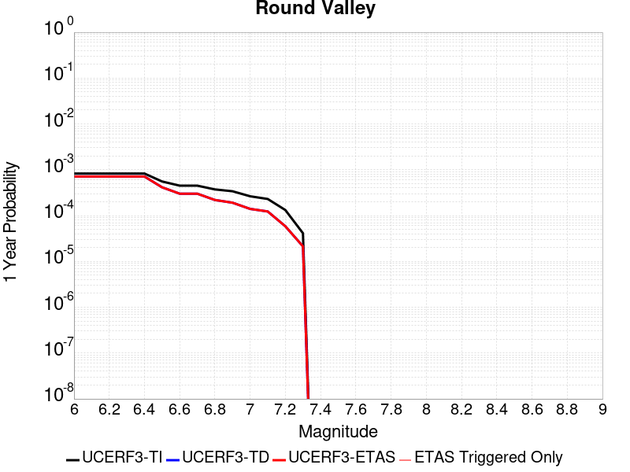 | 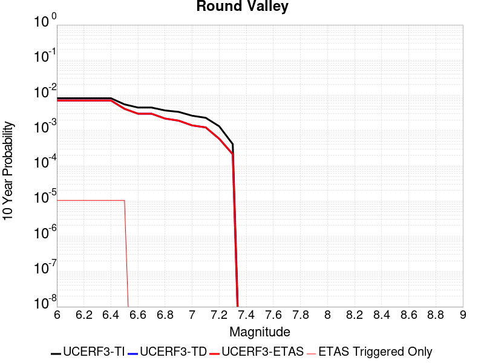 |

| Magnitude | 1 wk TI Prob | 1 wk TD Prob | 1 wk ETAS Prob | 1 wk ETAS/TD Gain | 1 wk ETAS Triggered Only | 1 mo TI Prob | 1 mo TD Prob | 1 mo ETAS Prob | 1 mo ETAS/TD Gain | 1 mo ETAS Triggered Only | 1 yr TI Prob | 1 yr TD Prob | 1 yr ETAS Prob | 1 yr ETAS/TD Gain | 1 yr ETAS Triggered Only | 10 yr TI Prob | 10 yr TD Prob | 10 yr ETAS Prob | 10 yr ETAS/TD Gain | 10 yr ETAS Triggered Only |
|-----|-----|-----|-----|-----|-----|-----|-----|-----|-----|-----|-----|-----|-----|-----|-----|-----|-----|-----|-----|-----|
| 6.0 | 1.588152E-5 | 1.3670716E-5 | 1.3670716E-5 | 1.0 | 0.0 | 6.806188E-5 | 5.8587688E-5 | 5.8587688E-5 | 1.0 | 0.0 | 8.283384E-4 | 7.13111E-4 | 7.13111E-4 | 1.0 | 0.0 | 0.008252576 | 0.0071121147 | 0.0071224766 | 1.0014569 | 1.0435908E-5 |
| 6.1 | 1.588152E-5 | 1.3670716E-5 | 1.3670716E-5 | 1.0 | 0.0 | 6.806188E-5 | 5.8587688E-5 | 5.8587688E-5 | 1.0 | 0.0 | 8.283384E-4 | 7.13111E-4 | 7.13111E-4 | 1.0 | 0.0 | 0.008252576 | 0.0071121147 | 0.0071224766 | 1.0014569 | 1.0435908E-5 |
| 6.2 | 1.588152E-5 | 1.3670716E-5 | 1.3670716E-5 | 1.0 | 0.0 | 6.806188E-5 | 5.8587688E-5 | 5.8587688E-5 | 1.0 | 0.0 | 8.283384E-4 | 7.13111E-4 | 7.13111E-4 | 1.0 | 0.0 | 0.008252576 | 0.0071121147 | 0.0071224766 | 1.0014569 | 1.0435908E-5 |
| 6.3 | 1.588152E-5 | 1.3670716E-5 | 1.3670716E-5 | 1.0 | 0.0 | 6.806188E-5 | 5.8587688E-5 | 5.8587688E-5 | 1.0 | 0.0 | 8.283384E-4 | 7.13111E-4 | 7.13111E-4 | 1.0 | 0.0 | 0.008252576 | 0.0071121147 | 0.0071224766 | 1.0014569 | 1.0435908E-5 |
| 6.4 | 1.588152E-5 | 1.3670716E-5 | 1.3670716E-5 | 1.0 | 0.0 | 6.806188E-5 | 5.8587688E-5 | 5.8587688E-5 | 1.0 | 0.0 | 8.283384E-4 | 7.13111E-4 | 7.13111E-4 | 1.0 | 0.0 | 0.008252576 | 0.0071121147 | 0.0071224766 | 1.0014569 | 1.0435908E-5 |
| 6.5 | 1.0646776E-5 | 7.953037E-6 | 7.953037E-6 | 1.0 | 0.0 | 4.5628243E-5 | 3.408405E-5 | 3.408405E-5 | 1.0 | 0.0 | 5.553823E-4 | 4.1490266E-4 | 4.1490266E-4 | 1.0 | 0.0 | 0.005539963 | 0.0041421093 | 0.004152502 | 1.002509 | 1.0435908E-5 |
| 6.6 | 8.632956E-6 | 5.768742E-6 | 5.768742E-6 | 1.0 | 0.0 | 3.6997862E-5 | 2.4722967E-5 | 2.4722967E-5 | 1.0 | 0.0 | 4.5035584E-4 | 3.009644E-4 | 3.009644E-4 | 1.0 | 0.0 | 0.0044944426 | 0.003005946 | 0.003005946 | 1.0 | 0.0 |
| 6.7 | 8.632956E-6 | 5.768742E-6 | 5.768742E-6 | 1.0 | 0.0 | 3.6997862E-5 | 2.4722967E-5 | 2.4722967E-5 | 1.0 | 0.0 | 4.5035584E-4 | 3.009644E-4 | 3.009644E-4 | 1.0 | 0.0 | 0.0044944426 | 0.003005946 | 0.003005946 | 1.0 | 0.0 |
| 6.8 | 7.143895E-6 | 4.2018346E-6 | 4.2018346E-6 | 1.0 | 0.0 | 3.0616335E-5 | 1.8007748E-5 | 1.8007748E-5 | 1.0 | 0.0 | 3.726901E-4 | 2.1922393E-4 | 2.1922393E-4 | 1.0 | 0.0 | 0.0037206567 | 0.0021902416 | 0.0021902416 | 1.0 | 0.0 |
| 6.9 | 6.5120694E-6 | 3.6644687E-6 | 3.6644687E-6 | 1.0 | 0.0 | 2.790857E-5 | 1.570478E-5 | 1.570478E-5 | 1.0 | 0.0 | 3.3973387E-4 | 1.9119044E-4 | 1.9119044E-4 | 1.0 | 0.0 | 0.0033921495 | 0.0019104085 | 0.0019104085 | 1.0 | 0.0 |
| 7.0 | 5.0614435E-6 | 2.6836676E-6 | 2.6836676E-6 | 1.0 | 0.0 | 2.169172E-5 | 1.1501388E-5 | 1.1501388E-5 | 1.0 | 0.0 | 2.6406467E-4 | 1.4002144E-4 | 1.4002144E-4 | 1.0 | 0.0 | 0.0026375111 | 0.0013994334 | 0.0013994334 | 1.0 | 0.0 |
| 7.1 | 4.41728E-6 | 2.3575074E-6 | 2.3575074E-6 | 1.0 | 0.0 | 1.8931061E-5 | 1.0103569E-5 | 1.0103569E-5 | 1.0 | 0.0 | 2.304613E-4 | 1.23005E-4 | 1.23005E-4 | 1.0 | 0.0 | 0.0023022245 | 0.0012294657 | 0.0012294657 | 1.0 | 0.0 |
| 7.2 | 2.535495E-6 | 1.1208391E-6 | 1.1208391E-6 | 1.0 | 0.0 | 1.0866362E-5 | 4.8035904E-6 | 4.8035904E-6 | 1.0 | 0.0 | 1.3228992E-4 | 5.8482667E-5 | 5.8482667E-5 | 1.0 | 0.0 | 0.0013221119 | 5.84724E-4 | 5.84724E-4 | 1.0 | 0.0 |
| 7.3 | 7.900015E-7 | 4.0889498E-7 | 4.0889498E-7 | 1.0 | 0.0 | 3.3857161E-6 | 1.752407E-6 | 1.752407E-6 | 1.0 | 0.0 | 4.1220315E-5 | 2.1335554E-5 | 2.1335554E-5 | 1.0 | 0.0 | 4.121267E-4 | 2.1335555E-4 | 2.1335555E-4 | 1.0 | 0.0 |

## North Frontal  (West)
*[(top)](#table-of-contents)*

| 1 Week | 1 Month | 1 Year | 10 Year |
|-----|-----|-----|-----|
|  |  | 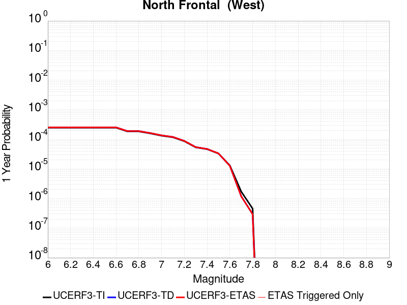 | 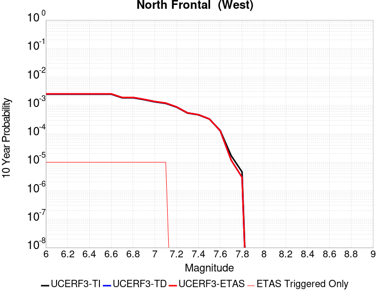 |

| Magnitude | 1 wk TI Prob | 1 wk TD Prob | 1 wk ETAS Prob | 1 wk ETAS/TD Gain | 1 wk ETAS Triggered Only | 1 mo TI Prob | 1 mo TD Prob | 1 mo ETAS Prob | 1 mo ETAS/TD Gain | 1 mo ETAS Triggered Only | 1 yr TI Prob | 1 yr TD Prob | 1 yr ETAS Prob | 1 yr ETAS/TD Gain | 1 yr ETAS Triggered Only | 10 yr TI Prob | 10 yr TD Prob | 10 yr ETAS Prob | 10 yr ETAS/TD Gain | 10 yr ETAS Triggered Only |
|-----|-----|-----|-----|-----|-----|-----|-----|-----|-----|-----|-----|-----|-----|-----|-----|-----|-----|-----|-----|-----|
| 6.0 | 4.7316266E-6 | 4.8526726E-6 | 4.8526726E-6 | 1.0 | 0.0 | 2.0278241E-5 | 2.0797012E-5 | 2.0797012E-5 | 1.0 | 0.0 | 2.4685962E-4 | 2.5317568E-4 | 2.5317568E-4 | 1.0 | 0.0 | 0.0024658558 | 0.0025290183 | 0.002539428 | 1.004116 | 1.0435908E-5 |
| 6.1 | 4.7316266E-6 | 4.8526726E-6 | 4.8526726E-6 | 1.0 | 0.0 | 2.0278241E-5 | 2.0797012E-5 | 2.0797012E-5 | 1.0 | 0.0 | 2.4685962E-4 | 2.5317568E-4 | 2.5317568E-4 | 1.0 | 0.0 | 0.0024658558 | 0.0025290183 | 0.002539428 | 1.004116 | 1.0435908E-5 |
| 6.2 | 4.7316266E-6 | 4.8526726E-6 | 4.8526726E-6 | 1.0 | 0.0 | 2.0278241E-5 | 2.0797012E-5 | 2.0797012E-5 | 1.0 | 0.0 | 2.4685962E-4 | 2.5317568E-4 | 2.5317568E-4 | 1.0 | 0.0 | 0.0024658558 | 0.0025290183 | 0.002539428 | 1.004116 | 1.0435908E-5 |
| 6.3 | 4.7316266E-6 | 4.8526726E-6 | 4.8526726E-6 | 1.0 | 0.0 | 2.0278241E-5 | 2.0797012E-5 | 2.0797012E-5 | 1.0 | 0.0 | 2.4685962E-4 | 2.5317568E-4 | 2.5317568E-4 | 1.0 | 0.0 | 0.0024658558 | 0.0025290183 | 0.002539428 | 1.004116 | 1.0435908E-5 |
| 6.4 | 4.7316266E-6 | 4.8526726E-6 | 4.8526726E-6 | 1.0 | 0.0 | 2.0278241E-5 | 2.0797012E-5 | 2.0797012E-5 | 1.0 | 0.0 | 2.4685962E-4 | 2.5317568E-4 | 2.5317568E-4 | 1.0 | 0.0 | 0.0024658558 | 0.0025290183 | 0.002539428 | 1.004116 | 1.0435908E-5 |
| 6.5 | 4.7316266E-6 | 4.8526726E-6 | 4.8526726E-6 | 1.0 | 0.0 | 2.0278241E-5 | 2.0797012E-5 | 2.0797012E-5 | 1.0 | 0.0 | 2.4685962E-4 | 2.5317568E-4 | 2.5317568E-4 | 1.0 | 0.0 | 0.0024658558 | 0.0025290183 | 0.002539428 | 1.004116 | 1.0435908E-5 |
| 6.6 | 4.7316266E-6 | 4.8526726E-6 | 4.8526726E-6 | 1.0 | 0.0 | 2.0278241E-5 | 2.0797012E-5 | 2.0797012E-5 | 1.0 | 0.0 | 2.4685962E-4 | 2.5317568E-4 | 2.5317568E-4 | 1.0 | 0.0 | 0.0024658558 | 0.0025290183 | 0.002539428 | 1.004116 | 1.0435908E-5 |
| 6.7 | 3.5382777E-6 | 3.6308859E-6 | 3.6308859E-6 | 1.0 | 0.0 | 1.516396E-5 | 1.5560852E-5 | 1.5560852E-5 | 1.0 | 0.0 | 1.8460557E-4 | 1.8943768E-4 | 1.8943768E-4 | 1.0 | 0.0 | 0.0018445229 | 0.0018928389 | 0.001903255 | 1.0055029 | 1.0435908E-5 |
| 6.8 | 3.5382777E-6 | 3.6308859E-6 | 3.6308859E-6 | 1.0 | 0.0 | 1.516396E-5 | 1.5560852E-5 | 1.5560852E-5 | 1.0 | 0.0 | 1.8460557E-4 | 1.8943768E-4 | 1.8943768E-4 | 1.0 | 0.0 | 0.0018445229 | 0.0018928389 | 0.001903255 | 1.0055029 | 1.0435908E-5 |
| 6.9 | 3.0428037E-6 | 3.1227605E-6 | 3.1227605E-6 | 1.0 | 0.0 | 1.30405215E-5 | 1.33831945E-5 | 1.33831945E-5 | 1.0 | 0.0 | 1.5875678E-4 | 1.6292889E-4 | 1.6292889E-4 | 1.0 | 0.0 | 0.0015864341 | 0.0016281615 | 0.0016385805 | 1.0063992 | 1.0435908E-5 |
| 7.0 | 2.538778E-6 | 2.6060904E-6 | 2.6060904E-6 | 1.0 | 0.0 | 1.0880432E-5 | 1.1168913E-5 | 1.1168913E-5 | 1.0 | 0.0 | 1.324612E-4 | 1.3597352E-4 | 1.3597352E-4 | 1.0 | 0.0 | 0.0013238228 | 0.0013589499 | 0.0013693717 | 1.007669 | 1.0435908E-5 |
| 7.1 | 2.2418935E-6 | 2.3012074E-6 | 2.3012074E-6 | 1.0 | 0.0 | 9.60808E-6 | 9.862282E-6 | 9.862282E-6 | 1.0 | 0.0 | 1.1697209E-4 | 1.2006712E-4 | 1.2006712E-4 | 1.0 | 0.0 | 0.0011691054 | 0.0012000664 | 0.0012104898 | 1.0086857 | 1.0435908E-5 |
| 7.2 | 1.6526745E-6 | 1.6924851E-6 | 1.6924851E-6 | 1.0 | 0.0 | 7.082872E-6 | 7.253489E-6 | 7.253489E-6 | 1.0 | 0.0 | 8.623055E-5 | 8.8307905E-5 | 8.8307905E-5 | 1.0 | 0.0 | 8.61971E-4 | 8.827532E-4 | 8.827532E-4 | 1.0 | 0.0 |
| 7.3 | 1.0246019E-6 | 1.0442261E-6 | 1.0442261E-6 | 1.0 | 0.0 | 4.391144E-6 | 4.4752474E-6 | 4.4752474E-6 | 1.0 | 0.0 | 5.3460866E-5 | 5.448489E-5 | 5.448489E-5 | 1.0 | 0.0 | 5.344801E-4 | 5.4472685E-4 | 5.4472685E-4 | 1.0 | 0.0 |
| 7.4 | 8.9045164E-7 | 9.0565584E-7 | 9.0565584E-7 | 1.0 | 0.0 | 3.8162157E-6 | 3.8813773E-6 | 3.8813773E-6 | 1.0 | 0.0 | 4.646144E-5 | 4.7254853E-5 | 4.7254853E-5 | 1.0 | 0.0 | 4.6451724E-4 | 4.7245892E-4 | 4.7245892E-4 | 1.0 | 0.0 |
| 7.5 | 6.3357E-7 | 6.4027006E-7 | 6.4027006E-7 | 1.0 | 0.0 | 2.7152971E-6 | 2.744012E-6 | 2.744012E-6 | 1.0 | 0.0 | 3.305824E-5 | 3.34079E-5 | 3.34079E-5 | 1.0 | 0.0 | 3.3053322E-4 | 3.3403534E-4 | 3.3403534E-4 | 1.0 | 0.0 |
| 7.6 | 2.5087024E-7 | 2.4361097E-7 | 2.4361097E-7 | 1.0 | 0.0 | 1.0751578E-6 | 1.0440467E-6 | 1.0440467E-6 | 1.0 | 0.0 | 1.3089967E-5 | 1.2711216E-5 | 1.2711216E-5 | 1.0 | 0.0 | 1.3089196E-4 | 1.2710695E-4 | 1.2710695E-4 | 1.0 | 0.0 |
| 7.7 | 3.282987E-8 | 2.2874195E-8 | 2.2874195E-8 | 1.0 | 0.0 | 1.4069944E-7 | 9.803227E-8 | 9.803227E-8 | 1.0 | 0.0 | 1.7130144E-6 | 1.1935423E-6 | 1.1935423E-6 | 1.0 | 0.0 | 1.7130013E-5 | 1.1935367E-5 | 1.1935367E-5 | 1.0 | 0.0 |
| 7.8 | 8.77499E-9 | 5.6815956E-9 | 5.6815956E-9 | 1.0 | 0.0 | 3.7607098E-8 | 2.4349696E-8 | 2.4349696E-8 | 1.0 | 0.0 | 4.578663E-7 | 2.9645753E-7 | 2.9645753E-7 | 1.0 | 0.0 | 4.5786537E-6 | 2.9645726E-6 | 2.9645726E-6 | 1.0 | 0.0 |

## Walker Spring 2011 CFM
*[(top)](#table-of-contents)*

| 1 Week | 1 Month | 1 Year | 10 Year |
|-----|-----|-----|-----|
| 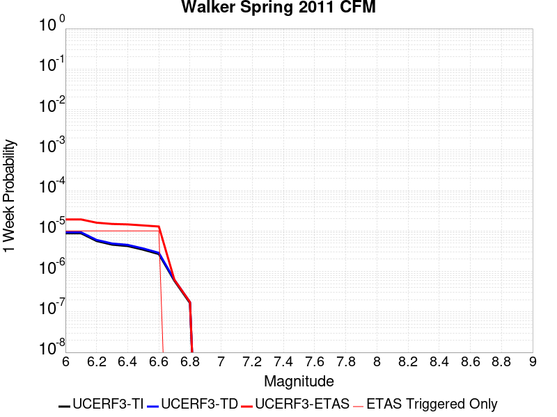 | 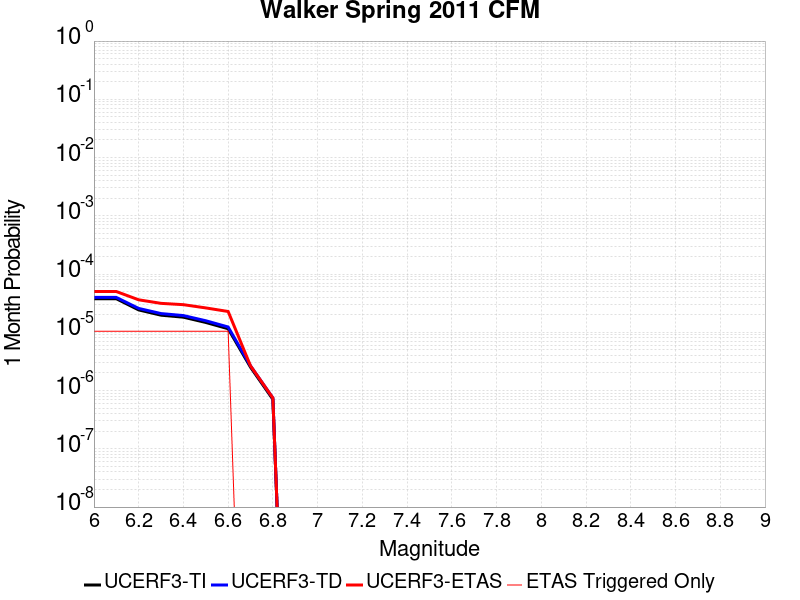 | 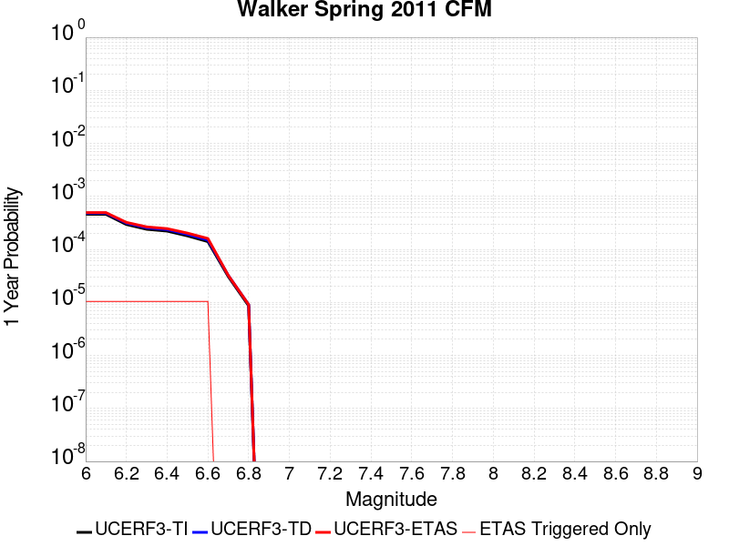 | 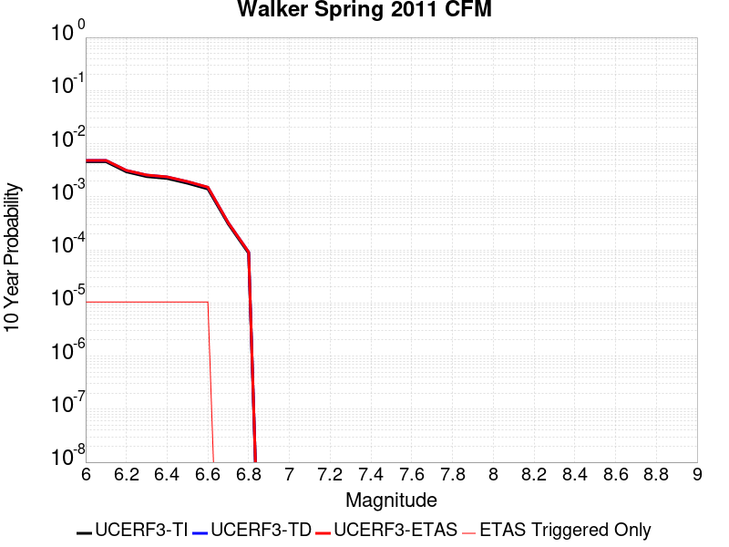 |

| Magnitude | 1 wk TI Prob | 1 wk TD Prob | 1 wk ETAS Prob | 1 wk ETAS/TD Gain | 1 wk ETAS Triggered Only | 1 mo TI Prob | 1 mo TD Prob | 1 mo ETAS Prob | 1 mo ETAS/TD Gain | 1 mo ETAS Triggered Only | 1 yr TI Prob | 1 yr TD Prob | 1 yr ETAS Prob | 1 yr ETAS/TD Gain | 1 yr ETAS Triggered Only | 10 yr TI Prob | 10 yr TD Prob | 10 yr ETAS Prob | 10 yr ETAS/TD Gain | 10 yr ETAS Triggered Only |
|-----|-----|-----|-----|-----|-----|-----|-----|-----|-----|-----|-----|-----|-----|-----|-----|-----|-----|-----|-----|-----|
| 6.0 | 8.791276E-6 | 9.264088E-6 | 1.9699899E-5 | 2.12648 | 1.0435908E-5 | 3.767635E-5 | 3.970269E-5 | 5.0138184E-5 | 1.262841 | 1.0435908E-5 | 4.58613E-4 | 4.832839E-4 | 4.9371476E-4 | 1.0215833 | 1.0435908E-5 | 0.004576677 | 0.0048234025 | 0.004833788 | 1.0021532 | 1.0435908E-5 |
| 6.1 | 8.791276E-6 | 9.264088E-6 | 1.9699899E-5 | 2.12648 | 1.0435908E-5 | 3.767635E-5 | 3.970269E-5 | 5.0138184E-5 | 1.262841 | 1.0435908E-5 | 4.58613E-4 | 4.832839E-4 | 4.9371476E-4 | 1.0215833 | 1.0435908E-5 | 0.004576677 | 0.0048234025 | 0.004833788 | 1.0021532 | 1.0435908E-5 |
| 6.2 | 5.654515E-6 | 5.99876E-6 | 1.6434606E-5 | 2.7396672 | 1.0435908E-5 | 2.4233412E-5 | 2.5708747E-5 | 3.6144385E-5 | 1.4059179 | 1.0435908E-5 | 2.9500184E-4 | 3.1296405E-4 | 3.233967E-4 | 1.033335 | 1.0435908E-5 | 0.0029461053 | 0.0031257276 | 0.003136131 | 1.0033283 | 1.0435908E-5 |
| 6.3 | 4.591685E-6 | 4.8947268E-6 | 1.5330583E-5 | 3.1320612 | 1.0435908E-5 | 1.96785E-5 | 2.0977257E-5 | 3.1412947E-5 | 1.4974763 | 1.0435908E-5 | 2.395594E-4 | 2.5537255E-4 | 2.6580578E-4 | 1.040855 | 1.0435908E-5 | 0.002393013 | 0.0025512208 | 0.00256163 | 1.0040802 | 1.0435908E-5 |
| 6.4 | 4.243283E-6 | 4.52266E-6 | 1.4958521E-5 | 3.3074605 | 1.0435908E-5 | 1.8185372E-5 | 1.938271E-5 | 2.9818415E-5 | 1.5384028 | 1.0435908E-5 | 2.2138441E-4 | 2.3596318E-4 | 2.463966E-4 | 1.0442164 | 1.0435908E-5 | 0.00221164 | 0.0023575418 | 0.002367953 | 1.0044162 | 1.0435908E-5 |
| 6.5 | 3.4445666E-6 | 3.6860924E-6 | 1.4121962E-5 | 3.831147 | 1.0435908E-5 | 1.4762345E-5 | 1.5797466E-5 | 2.6233209E-5 | 1.660596 | 1.0435908E-5 | 1.7971672E-4 | 1.923212E-4 | 2.027551E-4 | 1.0542525 | 1.0435908E-5 | 0.0017957145 | 0.0019219425 | 0.0019323583 | 1.0054195 | 1.0435908E-5 |
| 6.6 | 2.68766E-6 | 2.8794348E-6 | 1.3315313E-5 | 4.62428 | 1.0435908E-5 | 1.1518492E-5 | 1.2340398E-5 | 2.2776178E-5 | 1.8456599 | 1.0435908E-5 | 1.4022861E-4 | 1.502378E-4 | 1.6067213E-4 | 1.0694522 | 1.0435908E-5 | 0.0014014016 | 0.0015017362 | 0.0015121565 | 1.0069388 | 1.0435908E-5 |
| 6.7 | 5.880964E-7 | 6.1997474E-7 | 6.1997474E-7 | 1.0 | 0.0 | 2.5204106E-6 | 2.6570326E-6 | 2.6570326E-6 | 1.0 | 0.0 | 3.0685565E-5 | 3.2348988E-5 | 3.2348988E-5 | 1.0 | 0.0 | 3.068133E-4 | 3.2345214E-4 | 3.2345214E-4 | 1.0 | 0.0 |
| 6.8 | 1.6514163E-7 | 1.7409117E-7 | 1.7409117E-7 | 1.0 | 0.0 | 7.077497E-7 | 7.46105E-7 | 7.46105E-7 | 1.0 | 0.0 | 8.616818E-6 | 9.083828E-6 | 9.083828E-6 | 1.0 | 0.0 | 8.616484E-5 | 9.0838286E-5 | 9.0838286E-5 | 1.0 | 0.0 |

## San Gregorio (North) 2011 CFM
*[(top)](#table-of-contents)*

| 1 Week | 1 Month | 1 Year | 10 Year |
|-----|-----|-----|-----|
|  | 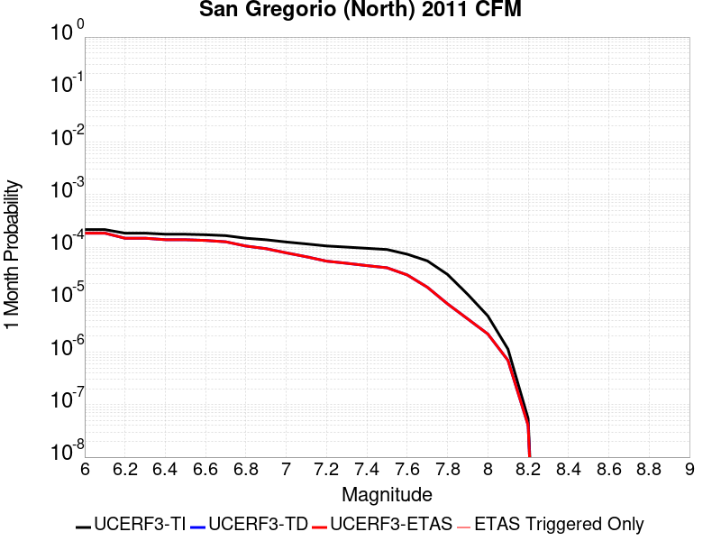 | 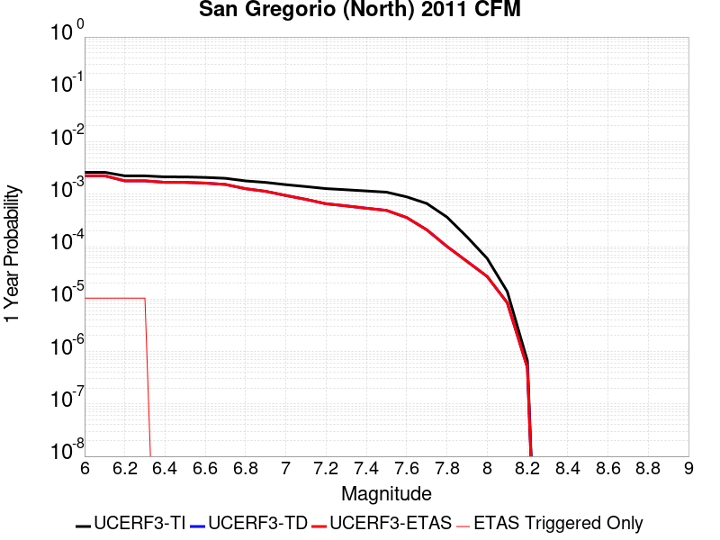 | 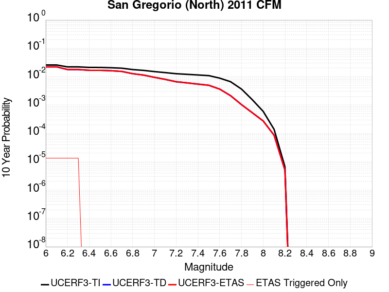 |

| Magnitude | 1 wk TI Prob | 1 wk TD Prob | 1 wk ETAS Prob | 1 wk ETAS/TD Gain | 1 wk ETAS Triggered Only | 1 mo TI Prob | 1 mo TD Prob | 1 mo ETAS Prob | 1 mo ETAS/TD Gain | 1 mo ETAS Triggered Only | 1 yr TI Prob | 1 yr TD Prob | 1 yr ETAS Prob | 1 yr ETAS/TD Gain | 1 yr ETAS Triggered Only | 10 yr TI Prob | 10 yr TD Prob | 10 yr ETAS Prob | 10 yr ETAS/TD Gain | 10 yr ETAS Triggered Only |
|-----|-----|-----|-----|-----|-----|-----|-----|-----|-----|-----|-----|-----|-----|-----|-----|-----|-----|-----|-----|-----|
| 6.0 | 5.0283932E-5 | 4.3057815E-5 | 4.3057815E-5 | 1.0 | 0.0 | 2.1548476E-4 | 1.8452053E-4 | 1.8452053E-4 | 1.0 | 0.0 | 0.0026203706 | 0.002244237 | 0.0022546495 | 1.0046396 | 1.0435908E-5 | 0.02589687 | 0.022293162 | 0.022303365 | 1.0004576 | 1.0435908E-5 |
| 6.1 | 5.0283932E-5 | 4.3057815E-5 | 4.3057815E-5 | 1.0 | 0.0 | 2.1548476E-4 | 1.8452053E-4 | 1.8452053E-4 | 1.0 | 0.0 | 0.0026203706 | 0.002244237 | 0.0022546495 | 1.0046396 | 1.0435908E-5 | 0.02589687 | 0.022293162 | 0.022303365 | 1.0004576 | 1.0435908E-5 |
| 6.2 | 4.2998647E-5 | 3.4441564E-5 | 3.4441564E-5 | 1.0 | 0.0 | 1.842669E-4 | 1.475984E-4 | 1.475984E-4 | 1.0 | 0.0 | 0.0022411412 | 0.00179554 | 0.0018059572 | 1.0058017 | 1.0435908E-5 | 0.022186736 | 0.017886506 | 0.017896755 | 1.000573 | 1.0435908E-5 |
| 6.3 | 4.2998647E-5 | 3.4441564E-5 | 3.4441564E-5 | 1.0 | 0.0 | 1.842669E-4 | 1.475984E-4 | 1.475984E-4 | 1.0 | 0.0 | 0.0022411412 | 0.00179554 | 0.0018059572 | 1.0058017 | 1.0435908E-5 | 0.022186736 | 0.017886506 | 0.017896755 | 1.000573 | 1.0435908E-5 |
| 6.4 | 4.1101295E-5 | 3.2326872E-5 | 3.2326872E-5 | 1.0 | 0.0 | 1.7613651E-4 | 1.3853642E-4 | 1.3853642E-4 | 1.0 | 0.0 | 0.0021423528 | 0.0016853869 | 0.0016853869 | 1.0 | 0.0 | 0.02121817 | 0.016801886 | 0.016801886 | 1.0 | 0.0 |
| 6.5 | 4.1032585E-5 | 3.2244905E-5 | 3.2244905E-5 | 1.0 | 0.0 | 1.7584208E-4 | 1.3818518E-4 | 1.3818518E-4 | 1.0 | 0.0 | 0.0021387753 | 0.0016811171 | 0.0016811171 | 1.0 | 0.0 | 0.021183075 | 0.016759839 | 0.016759839 | 1.0 | 0.0 |
| 6.6 | 4.011629E-5 | 3.1266558E-5 | 3.1266558E-5 | 1.0 | 0.0 | 1.7191563E-4 | 1.339927E-4 | 1.339927E-4 | 1.0 | 0.0 | 0.0020910634 | 0.0016301516 | 0.0016301516 | 1.0 | 0.0 | 0.020714961 | 0.01625741 | 0.01625741 | 1.0 | 0.0 |
| 6.7 | 3.8583938E-5 | 2.9453593E-5 | 2.9453593E-5 | 1.0 | 0.0 | 1.6534925E-4 | 1.2622366E-4 | 1.2622366E-4 | 1.0 | 0.0 | 0.0020112682 | 0.0015357039 | 0.0015357039 | 1.0 | 0.0 | 0.019931622 | 0.015325955 | 0.015325955 | 1.0 | 0.0 |
| 6.8 | 3.44341E-5 | 2.4450854E-5 | 2.4450854E-5 | 1.0 | 0.0 | 1.4756636E-4 | 1.0478523E-4 | 1.0478523E-4 | 1.0 | 0.0 | 0.0017951399 | 0.0012750238 | 0.0012750238 | 1.0 | 0.0 | 0.017807078 | 0.012751131 | 0.012751131 | 1.0 | 0.0 |
| 6.9 | 3.221199E-5 | 2.1778029E-5 | 2.1778029E-5 | 1.0 | 0.0 | 1.3804408E-4 | 9.333112E-5 | 9.333112E-5 | 1.0 | 0.0 | 0.0016793909 | 0.0011357224 | 0.0011357224 | 1.0 | 0.0 | 0.01666756 | 0.011372583 | 0.011372583 | 1.0 | 0.0 |
| 7.0 | 2.9186718E-5 | 1.8146875E-5 | 1.8146875E-5 | 1.0 | 0.0 | 1.2507994E-4 | 7.7770026E-5 | 7.7770026E-5 | 1.0 | 0.0 | 0.0015217843 | 9.464431E-4 | 9.464431E-4 | 1.0 | 0.0 | 0.015114053 | 0.009496798 | 0.009496798 | 1.0 | 0.0 |
| 7.1 | 2.6840138E-5 | 1.5284508E-5 | 1.5284508E-5 | 1.0 | 0.0 | 1.1502409E-4 | 6.55034E-5 | 6.55034E-5 | 1.0 | 0.0 | 0.0013995186 | 7.9721404E-4 | 7.9721404E-4 | 1.0 | 0.0 | 0.013907375 | 0.008015723 | 0.008015723 | 1.0 | 0.0 |
| 7.2 | 2.453002E-5 | 1.2606672E-5 | 1.2606672E-5 | 1.0 | 0.0 | 1.05124425E-4 | 5.4027478E-5 | 5.4027478E-5 | 1.0 | 0.0 | 0.0012791384 | 6.575866E-4 | 6.575866E-4 | 1.0 | 0.0 | 0.012718005 | 0.00662763 | 0.00662763 | 1.0 | 0.0 |
| 7.3 | 2.3330727E-5 | 1.1488677E-5 | 1.1488677E-5 | 1.0 | 0.0 | 9.9985E-5 | 4.923626E-5 | 4.923626E-5 | 1.0 | 0.0 | 0.0012166376 | 5.9928704E-4 | 5.9928704E-4 | 1.0 | 0.0 | 0.012099981 | 0.006046564 | 0.006046564 | 1.0 | 0.0 |
| 7.4 | 2.2136466E-5 | 1.0368981E-5 | 1.0368981E-5 | 1.0 | 0.0 | 9.486712E-5 | 4.4437733E-5 | 4.4437733E-5 | 1.0 | 0.0 | 0.0011543952 | 5.4089533E-4 | 5.4089533E-4 | 1.0 | 0.0 | 0.011484168 | 0.005464249 | 0.005464249 | 1.0 | 0.0 |
| 7.5 | 2.0994974E-5 | 9.427217E-6 | 9.427217E-6 | 1.0 | 0.0 | 8.997535E-5 | 4.0401734E-5 | 4.0401734E-5 | 1.0 | 0.0 | 0.0010948994 | 4.9178035E-4 | 4.9178035E-4 | 1.0 | 0.0 | 0.010895205 | 0.004973358 | 0.004973358 | 1.0 | 0.0 |
| 7.6 | 1.7091823E-5 | 6.893766E-6 | 6.893766E-6 | 1.0 | 0.0 | 7.3248615E-5 | 2.9544377E-5 | 2.9544377E-5 | 1.0 | 0.0 | 8.9143694E-4 | 3.596435E-4 | 3.596435E-4 | 1.0 | 0.0 | 0.008878695 | 0.0036482841 | 0.0036482841 | 1.0 | 0.0 |
| 7.7 | 1.2772179E-5 | 4.0208706E-6 | 4.0208706E-6 | 1.0 | 0.0 | 5.473676E-5 | 1.7232189E-5 | 1.7232189E-5 | 1.0 | 0.0 | 6.6621625E-4 | 2.0978172E-4 | 2.0978172E-4 | 1.0 | 0.0 | 0.006642225 | 0.002136922 | 0.002136922 | 1.0 | 0.0 |
| 7.8 | 7.041923E-6 | 1.940626E-6 | 1.940626E-6 | 1.0 | 0.0 | 3.017932E-5 | 8.316942E-6 | 8.316942E-6 | 1.0 | 0.0 | 3.6737128E-4 | 1.0125406E-4 | 1.0125406E-4 | 1.0 | 0.0 | 0.0036676454 | 0.0010379003 | 0.0010379003 | 1.0 | 0.0 |
| 7.9 | 2.946768E-6 | 1.0033551E-6 | 1.0033551E-6 | 1.0 | 0.0 | 1.2628945E-5 | 4.300086E-6 | 4.300086E-6 | 1.0 | 0.0 | 1.5374656E-4 | 5.235229E-5 | 5.235229E-5 | 1.0 | 0.0 | 0.0015364023 | 5.3400313E-4 | 5.3400313E-4 | 1.0 | 0.0 |
| 8.0 | 1.1433375E-6 | 5.18146E-7 | 5.18146E-7 | 1.0 | 0.0 | 4.9000087E-6 | 2.2206239E-6 | 2.2206239E-6 | 1.0 | 0.0 | 5.965597E-5 | 2.703576E-5 | 2.703576E-5 | 1.0 | 0.0 | 5.963996E-4 | 2.7398416E-4 | 2.7398416E-4 | 1.0 | 0.0 |
| 8.1 | 2.6675295E-7 | 1.62899E-7 | 1.62899E-7 | 1.0 | 0.0 | 1.1432264E-6 | 6.9813836E-7 | 6.9813836E-7 | 1.0 | 0.0 | 1.3918692E-5 | 8.499802E-6 | 8.499802E-6 | 1.0 | 0.0 | 1.391782E-4 | 8.63795E-5 | 8.63795E-5 | 1.0 | 0.0 |
| 8.2 | 1.2704569E-8 | 9.431393E-9 | 9.431393E-9 | 1.0 | 0.0 | 5.444815E-8 | 4.042026E-8 | 4.042026E-8 | 1.0 | 0.0 | 6.629061E-7 | 4.9211656E-7 | 4.9211656E-7 | 1.0 | 0.0 | 6.629041E-6 | 5.1121438E-6 | 5.1121438E-6 | 1.0 | 0.0 |

## Northridge Hills
*[(top)](#table-of-contents)*

| 1 Week | 1 Month | 1 Year | 10 Year |
|-----|-----|-----|-----|
| 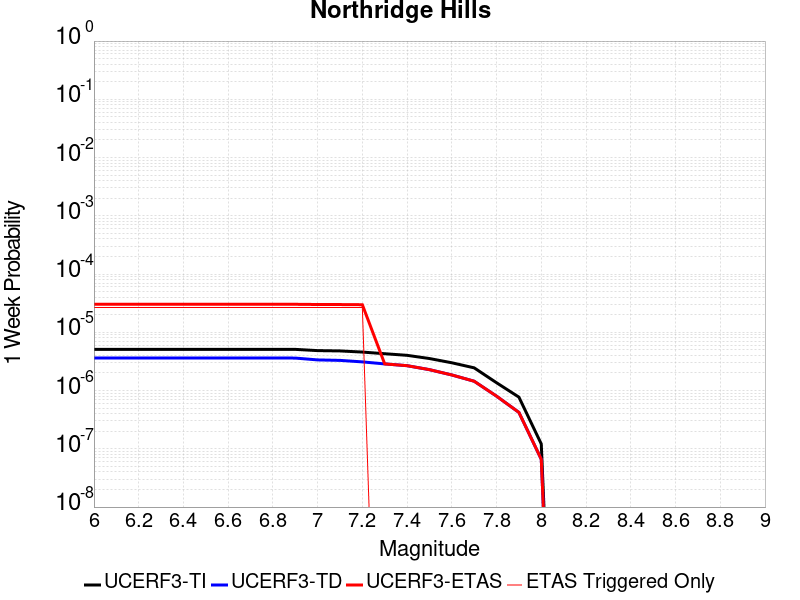 | 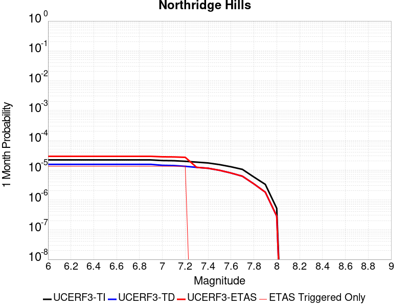 | 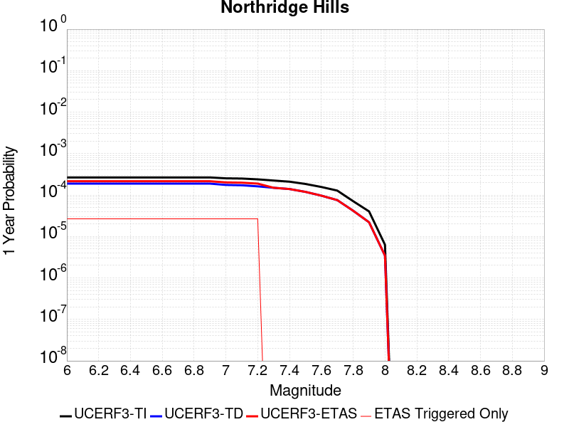 | 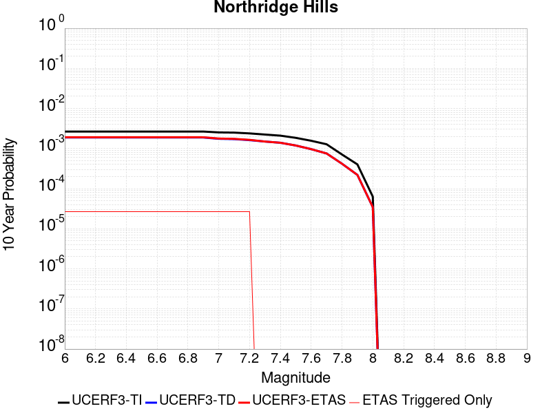 |

| Magnitude | 1 wk TI Prob | 1 wk TD Prob | 1 wk ETAS Prob | 1 wk ETAS/TD Gain | 1 wk ETAS Triggered Only | 1 mo TI Prob | 1 mo TD Prob | 1 mo ETAS Prob | 1 mo ETAS/TD Gain | 1 mo ETAS Triggered Only | 1 yr TI Prob | 1 yr TD Prob | 1 yr ETAS Prob | 1 yr ETAS/TD Gain | 1 yr ETAS Triggered Only | 10 yr TI Prob | 10 yr TD Prob | 10 yr ETAS Prob | 10 yr ETAS/TD Gain | 10 yr ETAS Triggered Only |
|-----|-----|-----|-----|-----|-----|-----|-----|-----|-----|-----|-----|-----|-----|-----|-----|-----|-----|-----|-----|-----|
| 6.0 | 5.095982E-6 | 3.6152098E-6 | 1.405108E-5 | 3.8866568 | 1.0435908E-5 | 2.183974E-5 | 1.5493664E-5 | 2.592941E-5 | 1.6735493 | 1.0435908E-5 | 2.658664E-4 | 1.8861916E-4 | 1.990531E-4 | 1.0553175 | 1.0435908E-5 | 0.0026554854 | 0.001884603 | 0.0018950193 | 1.005527 | 1.0435908E-5 |
| 6.1 | 5.095982E-6 | 3.6152098E-6 | 1.405108E-5 | 3.8866568 | 1.0435908E-5 | 2.183974E-5 | 1.5493664E-5 | 2.592941E-5 | 1.6735493 | 1.0435908E-5 | 2.658664E-4 | 1.8861916E-4 | 1.990531E-4 | 1.0553175 | 1.0435908E-5 | 0.0026554854 | 0.001884603 | 0.0018950193 | 1.005527 | 1.0435908E-5 |
| 6.2 | 5.095982E-6 | 3.6152098E-6 | 1.405108E-5 | 3.8866568 | 1.0435908E-5 | 2.183974E-5 | 1.5493664E-5 | 2.592941E-5 | 1.6735493 | 1.0435908E-5 | 2.658664E-4 | 1.8861916E-4 | 1.990531E-4 | 1.0553175 | 1.0435908E-5 | 0.0026554854 | 0.001884603 | 0.0018950193 | 1.005527 | 1.0435908E-5 |
| 6.3 | 5.095982E-6 | 3.6152098E-6 | 1.405108E-5 | 3.8866568 | 1.0435908E-5 | 2.183974E-5 | 1.5493664E-5 | 2.592941E-5 | 1.6735493 | 1.0435908E-5 | 2.658664E-4 | 1.8861916E-4 | 1.990531E-4 | 1.0553175 | 1.0435908E-5 | 0.0026554854 | 0.001884603 | 0.0018950193 | 1.005527 | 1.0435908E-5 |
| 6.4 | 5.095982E-6 | 3.6152098E-6 | 1.405108E-5 | 3.8866568 | 1.0435908E-5 | 2.183974E-5 | 1.5493664E-5 | 2.592941E-5 | 1.6735493 | 1.0435908E-5 | 2.658664E-4 | 1.8861916E-4 | 1.990531E-4 | 1.0553175 | 1.0435908E-5 | 0.0026554854 | 0.001884603 | 0.0018950193 | 1.005527 | 1.0435908E-5 |
| 6.5 | 5.095982E-6 | 3.6152098E-6 | 1.405108E-5 | 3.8866568 | 1.0435908E-5 | 2.183974E-5 | 1.5493664E-5 | 2.592941E-5 | 1.6735493 | 1.0435908E-5 | 2.658664E-4 | 1.8861916E-4 | 1.990531E-4 | 1.0553175 | 1.0435908E-5 | 0.0026554854 | 0.001884603 | 0.0018950193 | 1.005527 | 1.0435908E-5 |
| 6.6 | 5.095982E-6 | 3.6152098E-6 | 1.405108E-5 | 3.8866568 | 1.0435908E-5 | 2.183974E-5 | 1.5493664E-5 | 2.592941E-5 | 1.6735493 | 1.0435908E-5 | 2.658664E-4 | 1.8861916E-4 | 1.990531E-4 | 1.0553175 | 1.0435908E-5 | 0.0026554854 | 0.001884603 | 0.0018950193 | 1.005527 | 1.0435908E-5 |
| 6.7 | 5.095982E-6 | 3.6152098E-6 | 1.405108E-5 | 3.8866568 | 1.0435908E-5 | 2.183974E-5 | 1.5493664E-5 | 2.592941E-5 | 1.6735493 | 1.0435908E-5 | 2.658664E-4 | 1.8861916E-4 | 1.990531E-4 | 1.0553175 | 1.0435908E-5 | 0.0026554854 | 0.001884603 | 0.0018950193 | 1.005527 | 1.0435908E-5 |
| 6.8 | 5.095982E-6 | 3.6152098E-6 | 1.405108E-5 | 3.8866568 | 1.0435908E-5 | 2.183974E-5 | 1.5493664E-5 | 2.592941E-5 | 1.6735493 | 1.0435908E-5 | 2.658664E-4 | 1.8861916E-4 | 1.990531E-4 | 1.0553175 | 1.0435908E-5 | 0.0026554854 | 0.001884603 | 0.0018950193 | 1.005527 | 1.0435908E-5 |
| 6.9 | 5.0942654E-6 | 3.6134247E-6 | 1.4049295E-5 | 3.888083 | 1.0435908E-5 | 2.1832384E-5 | 1.5486015E-5 | 2.5921761E-5 | 1.673882 | 1.0435908E-5 | 2.6577685E-4 | 1.8852603E-4 | 1.9895997E-4 | 1.0553448 | 1.0435908E-5 | 0.002654592 | 0.0018836735 | 0.0018940896 | 1.0055298 | 1.0435908E-5 |
| 7.0 | 4.851143E-6 | 3.3587396E-6 | 1.3794613E-5 | 4.10708 | 1.0435908E-5 | 2.0790447E-5 | 1.4394519E-5 | 2.4830277E-5 | 1.7249813 | 1.0435908E-5 | 2.5309427E-4 | 1.7523921E-4 | 1.856733E-4 | 1.059542 | 1.0435908E-5 | 0.0025280623 | 0.0017510147 | 0.0017614324 | 1.0059495 | 1.0435908E-5 |
| 7.1 | 4.7910607E-6 | 3.2970208E-6 | 1.3732894E-5 | 4.165243 | 1.0435908E-5 | 2.0532956E-5 | 1.4130013E-5 | 2.4565774E-5 | 1.7385528 | 1.0435908E-5 | 2.4996005E-4 | 1.7201937E-4 | 1.8245348E-4 | 1.0606567 | 1.0435908E-5 | 0.0024967908 | 0.0017188663 | 0.0017292842 | 1.006061 | 1.0435908E-5 |
| 7.2 | 4.580079E-6 | 3.1067987E-6 | 1.3542674E-5 | 4.3590446 | 1.0435908E-5 | 1.9628762E-5 | 1.3314784E-5 | 2.3750554E-5 | 1.7837731 | 1.0435908E-5 | 2.3895396E-4 | 1.6209547E-4 | 1.7252968E-4 | 1.0643708 | 1.0435908E-5 | 0.0023869718 | 0.0016197758 | 0.0016301948 | 1.0064324 | 1.0435908E-5 |
| 7.3 | 4.290062E-6 | 2.8682275E-6 | 2.8682275E-6 | 1.0 | 0.0 | 1.838585E-5 | 1.2292346E-5 | 1.2292346E-5 | 1.0 | 0.0 | 2.2382473E-4 | 1.4964906E-4 | 1.4964906E-4 | 1.0 | 0.0 | 0.0022359942 | 0.0014954859 | 0.0014954859 | 1.0 | 0.0 |
| 7.4 | 4.0259683E-6 | 2.673904E-6 | 2.673904E-6 | 1.0 | 0.0 | 1.7254037E-5 | 1.1459538E-5 | 1.1459538E-5 | 1.0 | 0.0 | 2.1004764E-4 | 1.3951097E-4 | 1.3951097E-4 | 1.0 | 0.0 | 0.002098492 | 0.0013942367 | 0.0013942367 | 1.0 | 0.0 |
| 7.5 | 3.5477108E-6 | 2.285216E-6 | 2.285216E-6 | 1.0 | 0.0 | 1.5204386E-5 | 9.793746E-6 | 9.793746E-6 | 1.0 | 0.0 | 1.8509767E-4 | 1.1923235E-4 | 1.1923235E-4 | 1.0 | 0.0 | 0.0018494357 | 0.0011916853 | 0.0011916853 | 1.0 | 0.0 |
| 7.6 | 2.9990608E-6 | 1.8528339E-6 | 1.8528339E-6 | 1.0 | 0.0 | 1.2853055E-5 | 7.940693E-6 | 7.940693E-6 | 1.0 | 0.0 | 1.564747E-4 | 9.667365E-5 | 9.667365E-5 | 1.0 | 0.0 | 0.0015636457 | 9.663168E-4 | 9.663168E-4 | 1.0 | 0.0 |
| 7.7 | 2.4542855E-6 | 1.4461344E-6 | 1.4461344E-6 | 1.0 | 0.0 | 1.05183235E-5 | 6.197704E-6 | 6.197704E-6 | 1.0 | 0.0 | 1.2805307E-4 | 7.545444E-5 | 7.545444E-5 | 1.0 | 0.0 | 0.001279793 | 7.5428875E-4 | 7.5428875E-4 | 1.0 | 0.0 |
| 7.8 | 1.3623128E-6 | 8.016168E-7 | 8.016168E-7 | 1.0 | 0.0 | 5.8384703E-6 | 3.4354962E-6 | 3.4354962E-6 | 1.0 | 0.0 | 7.108106E-5 | 4.1826366E-5 | 4.1826366E-5 | 1.0 | 0.0 | 7.1058323E-4 | 4.1818514E-4 | 4.1818514E-4 | 1.0 | 0.0 |
| 7.9 | 7.716622E-7 | 4.218757E-7 | 4.218757E-7 | 1.0 | 0.0 | 3.3071194E-6 | 1.8080375E-6 | 1.8080375E-6 | 1.0 | 0.0 | 4.0263436E-5 | 2.2012635E-5 | 2.2012635E-5 | 1.0 | 0.0 | 4.0256142E-4 | 2.2010466E-4 | 2.2010466E-4 | 1.0 | 0.0 |
| 8.0 | 1.2117711E-7 | 6.6220565E-8 | 6.6220565E-8 | 1.0 | 0.0 | 5.1933034E-7 | 2.838024E-7 | 2.838024E-7 | 1.0 | 0.0 | 6.3228285E-6 | 3.4552888E-6 | 3.4552888E-6 | 1.0 | 0.0 | 6.3226486E-5 | 3.455237E-5 | 3.455237E-5 | 1.0 | 0.0 |

## Almanor 2011 CFM
*[(top)](#table-of-contents)*

| 1 Week | 1 Month | 1 Year | 10 Year |
|-----|-----|-----|-----|
| 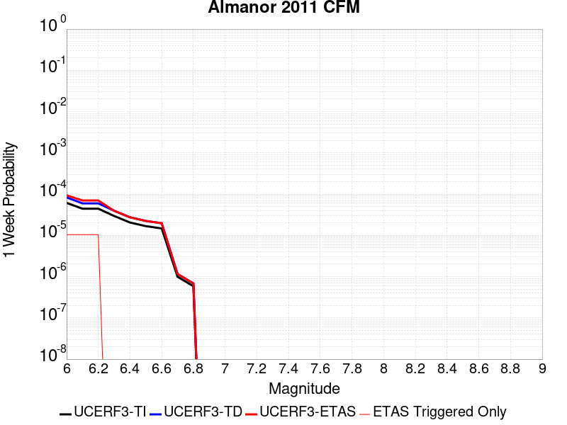 | 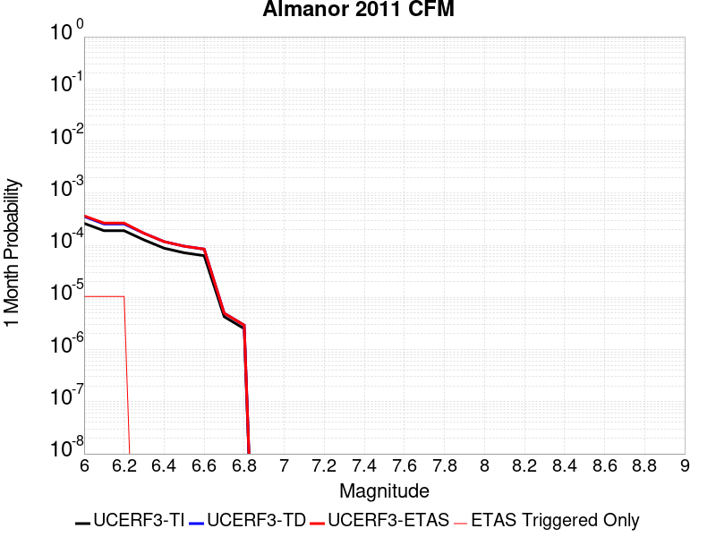 | 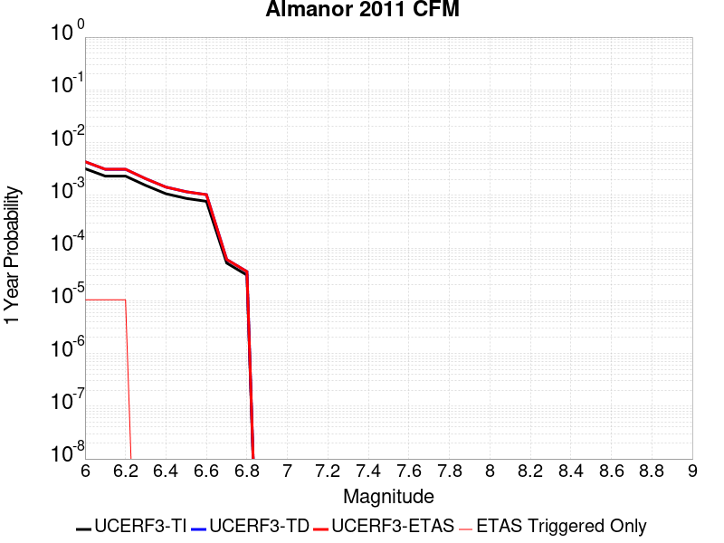 | 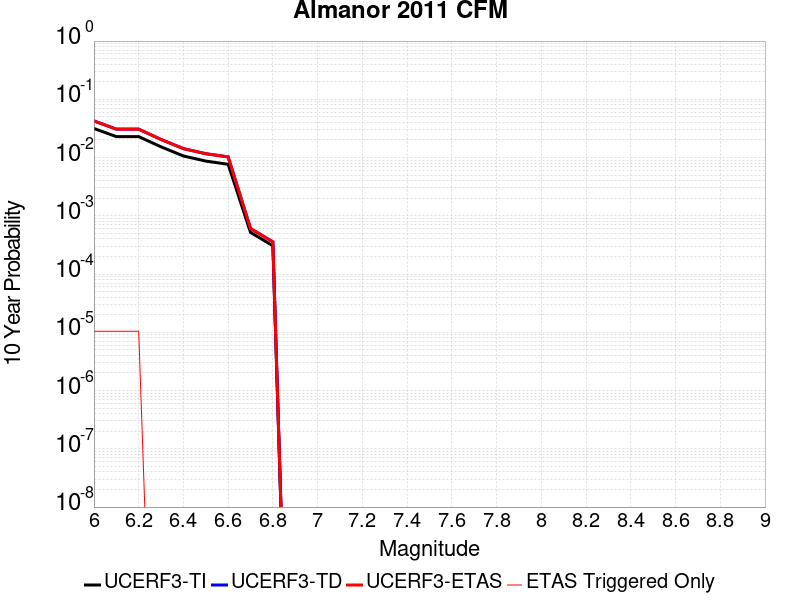 |

| Magnitude | 1 wk TI Prob | 1 wk TD Prob | 1 wk ETAS Prob | 1 wk ETAS/TD Gain | 1 wk ETAS Triggered Only | 1 mo TI Prob | 1 mo TD Prob | 1 mo ETAS Prob | 1 mo ETAS/TD Gain | 1 mo ETAS Triggered Only | 1 yr TI Prob | 1 yr TD Prob | 1 yr ETAS Prob | 1 yr ETAS/TD Gain | 1 yr ETAS Triggered Only | 10 yr TI Prob | 10 yr TD Prob | 10 yr ETAS Prob | 10 yr ETAS/TD Gain | 10 yr ETAS Triggered Only |
|-----|-----|-----|-----|-----|-----|-----|-----|-----|-----|-----|-----|-----|-----|-----|-----|-----|-----|-----|-----|-----|
| 6.0 | 6.1479834E-5 | 8.32787E-5 | 9.371374E-5 | 1.1253027 | 1.0435908E-5 | 2.6345838E-4 | 3.5686578E-4 | 3.6729797E-4 | 1.0292327 | 1.0435908E-5 | 0.0032028882 | 0.0043366123 | 0.004347003 | 1.002396 | 1.0435908E-5 | 0.031571172 | 0.04258577 | 0.042595763 | 1.0002346 | 1.0435908E-5 |
| 6.1 | 4.4387216E-5 | 5.9770442E-5 | 7.020573E-5 | 1.1745894 | 1.0435908E-5 | 1.9021705E-4 | 2.561381E-4 | 2.6657133E-4 | 1.0407329 | 1.0435908E-5 | 0.0023134327 | 0.003114426 | 0.0031248294 | 1.0033404 | 1.0435908E-5 | 0.022894967 | 0.030755036 | 0.03076515 | 1.0003289 | 1.0435908E-5 |
| 6.2 | 4.4387216E-5 | 5.9770442E-5 | 7.020573E-5 | 1.1745894 | 1.0435908E-5 | 1.9021705E-4 | 2.561381E-4 | 2.6657133E-4 | 1.0407329 | 1.0435908E-5 | 0.0023134327 | 0.003114426 | 0.0031248294 | 1.0033404 | 1.0435908E-5 | 0.022894967 | 0.030755036 | 0.03076515 | 1.0003289 | 1.0435908E-5 |
| 6.3 | 2.9523822E-5 | 3.954719E-5 | 3.954719E-5 | 1.0 | 0.0 | 1.2652454E-4 | 1.6947983E-4 | 1.6947983E-4 | 1.0 | 0.0 | 0.0015393476 | 0.0020618725 | 0.0020618725 | 1.0 | 0.0 | 0.015287281 | 0.020460794 | 0.020460794 | 1.0 | 0.0 |
| 6.4 | 2.0512744E-5 | 2.7431617E-5 | 2.7431617E-5 | 1.0 | 0.0 | 8.79088E-5 | 1.175612E-4 | 1.175612E-4 | 1.0 | 0.0 | 0.001069764 | 0.0014307408 | 0.0014307408 | 1.0 | 0.0 | 0.010646289 | 0.014244413 | 0.014244413 | 1.0 | 0.0 |
| 6.5 | 1.6750226E-5 | 2.23913E-5 | 2.23913E-5 | 1.0 | 0.0 | 7.178471E-5 | 9.596152E-5 | 9.596152E-5 | 1.0 | 0.0 | 8.7362836E-4 | 0.0011680633 | 0.0011680633 | 1.0 | 0.0 | 0.008702018 | 0.011649038 | 0.011649038 | 1.0 | 0.0 |
| 6.6 | 1.4745303E-5 | 1.9707952E-5 | 1.9707952E-5 | 1.0 | 0.0 | 6.319262E-5 | 8.446223E-5 | 8.446223E-5 | 1.0 | 0.0 | 7.690986E-4 | 0.0010281964 | 0.0010281964 | 1.0 | 0.0 | 0.0076644225 | 0.010264971 | 0.010264971 | 1.0 | 0.0 |
| 6.7 | 9.951145E-7 | 1.1616347E-6 | 1.1616347E-6 | 1.0 | 0.0 | 4.26477E-6 | 4.9784257E-6 | 4.9784257E-6 | 1.0 | 0.0 | 5.1922336E-5 | 6.0610826E-5 | 6.0610826E-5 | 1.0 | 0.0 | 5.1910203E-4 | 6.059602E-4 | 6.059602E-4 | 1.0 | 0.0 |
| 6.8 | 5.866312E-7 | 6.849384E-7 | 6.849384E-7 | 1.0 | 0.0 | 2.5141312E-6 | 2.9354478E-6 | 2.9354478E-6 | 1.0 | 0.0 | 3.0609117E-5 | 3.5738623E-5 | 3.5738623E-5 | 1.0 | 0.0 | 3.06049E-4 | 3.5734157E-4 | 3.5734157E-4 | 1.0 | 0.0 |

## Greenville (No) 2011 CFM
*[(top)](#table-of-contents)*

| 1 Week | 1 Month | 1 Year | 10 Year |
|-----|-----|-----|-----|
| 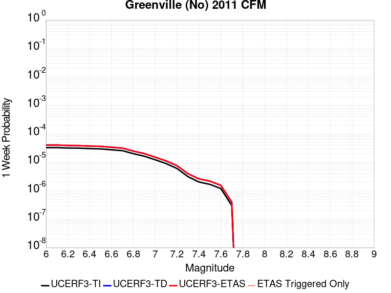 |  | 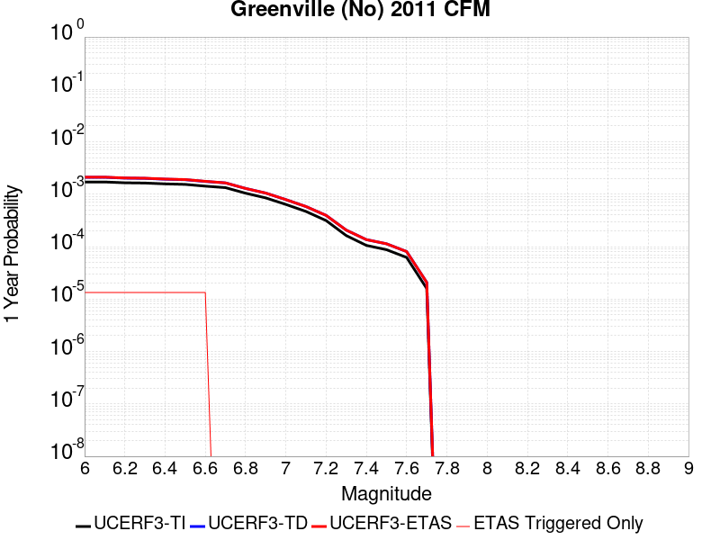 | 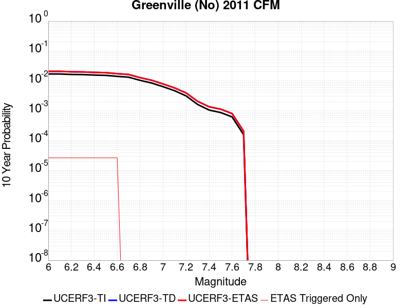 |

| Magnitude | 1 wk TI Prob | 1 wk TD Prob | 1 wk ETAS Prob | 1 wk ETAS/TD Gain | 1 wk ETAS Triggered Only | 1 mo TI Prob | 1 mo TD Prob | 1 mo ETAS Prob | 1 mo ETAS/TD Gain | 1 mo ETAS Triggered Only | 1 yr TI Prob | 1 yr TD Prob | 1 yr ETAS Prob | 1 yr ETAS/TD Gain | 1 yr ETAS Triggered Only | 10 yr TI Prob | 10 yr TD Prob | 10 yr ETAS Prob | 10 yr ETAS/TD Gain | 10 yr ETAS Triggered Only |
|-----|-----|-----|-----|-----|-----|-----|-----|-----|-----|-----|-----|-----|-----|-----|-----|-----|-----|-----|-----|-----|
| 6.0 | 3.286654E-5 | 4.036648E-5 | 4.036648E-5 | 1.0 | 0.0 | 1.4084899E-4 | 1.7298796E-4 | 1.7298796E-4 | 1.0 | 0.0 | 0.0017134876 | 0.002104132 | 0.002114546 | 1.0049493 | 1.0435908E-5 | 0.017003356 | 0.020846982 | 0.0208572 | 1.0004902 | 1.0435908E-5 |
| 6.1 | 3.286654E-5 | 4.036648E-5 | 4.036648E-5 | 1.0 | 0.0 | 1.4084899E-4 | 1.7298796E-4 | 1.7298796E-4 | 1.0 | 0.0 | 0.0017134876 | 0.002104132 | 0.002114546 | 1.0049493 | 1.0435908E-5 | 0.017003356 | 0.020846982 | 0.0208572 | 1.0004902 | 1.0435908E-5 |
| 6.2 | 3.1697953E-5 | 3.8929385E-5 | 3.8929385E-5 | 1.0 | 0.0 | 1.358413E-4 | 1.6682976E-4 | 1.6682976E-4 | 1.0 | 0.0 | 0.0016526132 | 0.002029298 | 0.0020397129 | 1.0051322 | 1.0435908E-5 | 0.01640377 | 0.020112377 | 0.020122603 | 1.0005084 | 1.0435908E-5 |
| 6.3 | 3.1363317E-5 | 3.851826E-5 | 3.851826E-5 | 1.0 | 0.0 | 1.344073E-4 | 1.6506804E-4 | 1.6506804E-4 | 1.0 | 0.0 | 0.0016351803 | 0.0020078886 | 0.0020183036 | 1.005187 | 1.0435908E-5 | 0.016232004 | 0.019902144 | 0.019912371 | 1.0005139 | 1.0435908E-5 |
| 6.4 | 3.0228604E-5 | 3.7125395E-5 | 3.7125395E-5 | 1.0 | 0.0 | 1.2954473E-4 | 1.5909935E-4 | 1.5909935E-4 | 1.0 | 0.0 | 0.0015760659 | 0.0019353506 | 0.0019457663 | 1.0053818 | 1.0435908E-5 | 0.015649348 | 0.019189484 | 0.01919972 | 1.0005333 | 1.0435908E-5 |
| 6.5 | 2.9537814E-5 | 3.6280853E-5 | 3.6280853E-5 | 1.0 | 0.0 | 1.2658449E-4 | 1.554803E-4 | 1.554803E-4 | 1.0 | 0.0 | 0.0015400766 | 0.0018913659 | 0.001901782 | 1.0055072 | 1.0435908E-5 | 0.01529447 | 0.018757146 | 0.018767387 | 1.000546 | 1.0435908E-5 |
| 6.6 | 2.7345395E-5 | 3.3590182E-5 | 3.3590182E-5 | 1.0 | 0.0 | 1.1718928E-4 | 1.4395016E-4 | 1.4395016E-4 | 1.0 | 0.0 | 0.0014258457 | 0.0017512152 | 0.0017616329 | 1.0059488 | 1.0435908E-5 | 0.014167317 | 0.01737797 | 0.017388225 | 1.0005901 | 1.0435908E-5 |
| 6.7 | 2.5615784E-5 | 3.1567088E-5 | 3.1567088E-5 | 1.0 | 0.0 | 1.09777306E-4 | 1.3528067E-4 | 1.3528067E-4 | 1.0 | 0.0 | 0.0013357193 | 0.0016458282 | 0.0016458282 | 1.0 | 0.0 | 0.013277191 | 0.016340064 | 0.016340064 | 1.0 | 0.0 |
| 6.8 | 2.0059057E-5 | 2.4712073E-5 | 2.4712073E-5 | 1.0 | 0.0 | 8.596455E-5 | 1.0590468E-4 | 1.0590468E-4 | 1.0 | 0.0 | 0.0010461159 | 0.001288643 | 0.001288643 | 1.0 | 0.0 | 0.0104120495 | 0.012813724 | 0.012813724 | 1.0 | 0.0 |
| 6.9 | 1.6321746E-5 | 2.018467E-5 | 2.018467E-5 | 1.0 | 0.0 | 6.9948466E-5 | 8.650293E-5 | 8.650293E-5 | 1.0 | 0.0 | 8.5128983E-4 | 0.0010526767 | 0.0010526767 | 1.0 | 0.0 | 0.008480361 | 0.010478431 | 0.010478431 | 1.0 | 0.0 |
| 7.0 | 1.22527645E-5 | 1.5135633E-5 | 1.5135633E-5 | 1.0 | 0.0 | 5.2510793E-5 | 6.486541E-5 | 6.486541E-5 | 1.0 | 0.0 | 6.3913135E-4 | 7.894544E-4 | 7.894544E-4 | 1.0 | 0.0 | 0.0063729626 | 0.007867137 | 0.007867137 | 1.0 | 0.0 |
| 7.1 | 8.996482E-6 | 1.1164954E-5 | 1.1164954E-5 | 1.0 | 0.0 | 3.8555783E-5 | 4.7848935E-5 | 4.7848935E-5 | 1.0 | 0.0 | 4.6931554E-4 | 5.824063E-4 | 5.824063E-4 | 1.0 | 0.0 | 0.004683256 | 0.0058090906 | 0.0058090906 | 1.0 | 0.0 |
| 7.2 | 6.0273087E-6 | 7.569474E-6 | 7.569474E-6 | 1.0 | 0.0 | 2.5831067E-5 | 3.2440203E-5 | 3.2440203E-5 | 1.0 | 0.0 | 3.1444785E-4 | 3.9488857E-4 | 3.9488857E-4 | 1.0 | 0.0 | 0.0031400328 | 0.003942066 | 0.003942066 | 1.0 | 0.0 |
| 7.3 | 3.1209995E-6 | 3.9663746E-6 | 3.9663746E-6 | 1.0 | 0.0 | 1.3375643E-5 | 1.699864E-5 | 1.699864E-5 | 1.0 | 0.0 | 1.6283628E-4 | 2.0693893E-4 | 2.0693893E-4 | 1.0 | 0.0 | 0.0016271701 | 0.0020675526 | 0.0020675526 | 1.0 | 0.0 |
| 7.4 | 2.0254208E-6 | 2.6096043E-6 | 2.6096043E-6 | 1.0 | 0.0 | 8.680347E-6 | 1.1183971E-5 | 1.1183971E-5 | 1.0 | 0.0 | 1.0567809E-4 | 1.361564E-4 | 1.361564E-4 | 1.0 | 0.0 | 0.0010562785 | 0.0013607866 | 0.0013607866 | 1.0 | 0.0 |
| 7.5 | 1.6763418E-6 | 2.173353E-6 | 2.173353E-6 | 1.0 | 0.0 | 7.184302E-6 | 9.314337E-6 | 9.314337E-6 | 1.0 | 0.0 | 8.746537E-5 | 1.1339621E-4 | 1.1339621E-4 | 1.0 | 0.0 | 8.743095E-4 | 0.0011334305 | 0.0011334305 | 1.0 | 0.0 |
| 7.6 | 1.1935462E-6 | 1.5458467E-6 | 1.5458467E-6 | 1.0 | 0.0 | 5.115188E-6 | 6.6250404E-6 | 6.6250404E-6 | 1.0 | 0.0 | 6.2275634E-5 | 8.065693E-5 | 8.065693E-5 | 1.0 | 0.0 | 6.2258187E-4 | 8.0630725E-4 | 8.0630725E-4 | 1.0 | 0.0 |
| 7.7 | 3.0464201E-7 | 3.9846822E-7 | 3.9846822E-7 | 1.0 | 0.0 | 1.3056081E-6 | 1.7077199E-6 | 1.7077199E-6 | 1.0 | 0.0 | 1.589566E-5 | 2.0791296E-5 | 2.0791296E-5 | 1.0 | 0.0 | 1.5894524E-4 | 2.0789822E-4 | 2.0789822E-4 | 1.0 | 0.0 |

## Breckenridge 2011
*[(top)](#table-of-contents)*

| 1 Week | 1 Month | 1 Year | 10 Year |
|-----|-----|-----|-----|
| 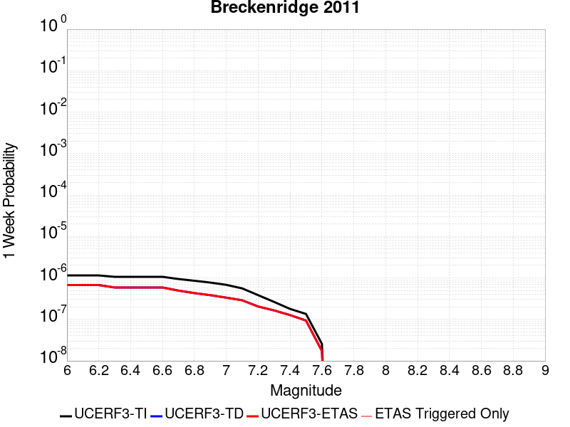 | 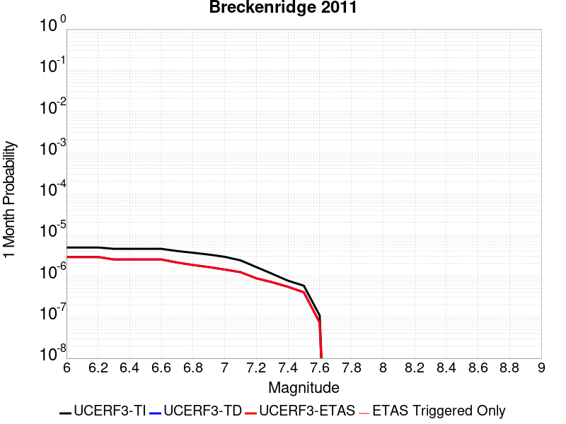 | 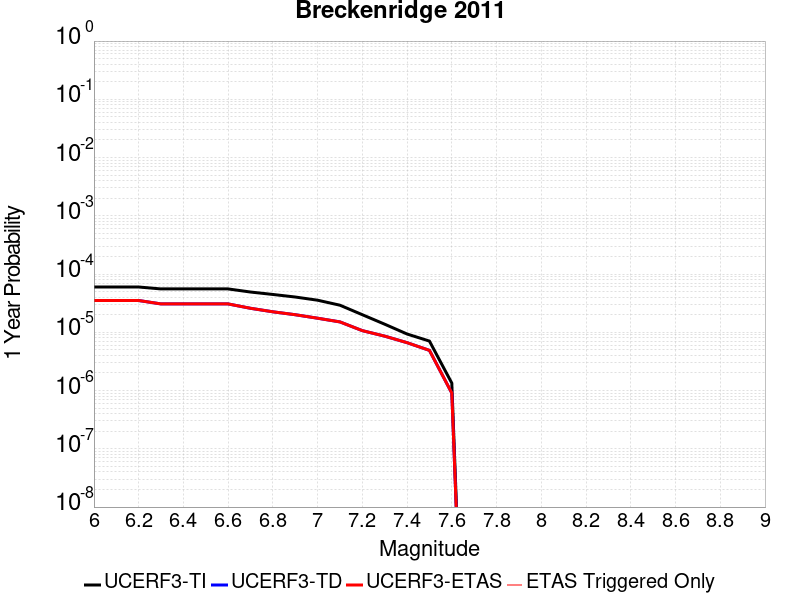 | 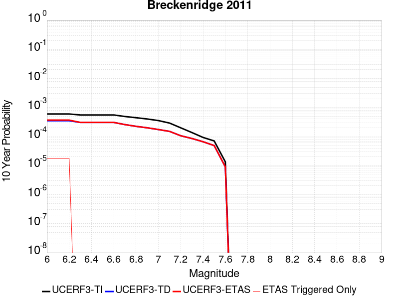 |

| Magnitude | 1 wk TI Prob | 1 wk TD Prob | 1 wk ETAS Prob | 1 wk ETAS/TD Gain | 1 wk ETAS Triggered Only | 1 mo TI Prob | 1 mo TD Prob | 1 mo ETAS Prob | 1 mo ETAS/TD Gain | 1 mo ETAS Triggered Only | 1 yr TI Prob | 1 yr TD Prob | 1 yr ETAS Prob | 1 yr ETAS/TD Gain | 1 yr ETAS Triggered Only | 10 yr TI Prob | 10 yr TD Prob | 10 yr ETAS Prob | 10 yr ETAS/TD Gain | 10 yr ETAS Triggered Only |
|-----|-----|-----|-----|-----|-----|-----|-----|-----|-----|-----|-----|-----|-----|-----|-----|-----|-----|-----|-----|-----|
| 6.0 | 1.1490393E-6 | 6.7380773E-7 | 6.7380773E-7 | 1.0 | 0.0 | 4.924445E-6 | 2.8877444E-6 | 2.8877444E-6 | 1.0 | 0.0 | 5.995347E-5 | 3.515774E-5 | 3.515774E-5 | 1.0 | 0.0 | 5.9937296E-4 | 3.5152383E-4 | 3.6195607E-4 | 1.0296772 | 1.0435908E-5 |
| 6.1 | 1.1490393E-6 | 6.7380773E-7 | 6.7380773E-7 | 1.0 | 0.0 | 4.924445E-6 | 2.8877444E-6 | 2.8877444E-6 | 1.0 | 0.0 | 5.995347E-5 | 3.515774E-5 | 3.515774E-5 | 1.0 | 0.0 | 5.9937296E-4 | 3.5152383E-4 | 3.6195607E-4 | 1.0296772 | 1.0435908E-5 |
| 6.2 | 1.1490393E-6 | 6.7380773E-7 | 6.7380773E-7 | 1.0 | 0.0 | 4.924445E-6 | 2.8877444E-6 | 2.8877444E-6 | 1.0 | 0.0 | 5.995347E-5 | 3.515774E-5 | 3.515774E-5 | 1.0 | 0.0 | 5.9937296E-4 | 3.5152383E-4 | 3.6195607E-4 | 1.0296772 | 1.0435908E-5 |
| 6.3 | 1.064617E-6 | 5.886475E-7 | 5.886475E-7 | 1.0 | 0.0 | 4.5626366E-6 | 2.5227728E-6 | 2.5227728E-6 | 1.0 | 0.0 | 5.5548684E-5 | 3.0714335E-5 | 3.0714335E-5 | 1.0 | 0.0 | 5.55348E-4 | 3.0710208E-4 | 3.0710208E-4 | 1.0 | 0.0 |
| 6.4 | 1.064617E-6 | 5.886475E-7 | 5.886475E-7 | 1.0 | 0.0 | 4.5626366E-6 | 2.5227728E-6 | 2.5227728E-6 | 1.0 | 0.0 | 5.5548684E-5 | 3.0714335E-5 | 3.0714335E-5 | 1.0 | 0.0 | 5.55348E-4 | 3.0710208E-4 | 3.0710208E-4 | 1.0 | 0.0 |
| 6.5 | 1.064617E-6 | 5.886475E-7 | 5.886475E-7 | 1.0 | 0.0 | 4.5626366E-6 | 2.5227728E-6 | 2.5227728E-6 | 1.0 | 0.0 | 5.5548684E-5 | 3.0714335E-5 | 3.0714335E-5 | 1.0 | 0.0 | 5.55348E-4 | 3.0710208E-4 | 3.0710208E-4 | 1.0 | 0.0 |
| 6.6 | 1.064617E-6 | 5.886475E-7 | 5.886475E-7 | 1.0 | 0.0 | 4.5626366E-6 | 2.5227728E-6 | 2.5227728E-6 | 1.0 | 0.0 | 5.5548684E-5 | 3.0714335E-5 | 3.0714335E-5 | 1.0 | 0.0 | 5.55348E-4 | 3.0710208E-4 | 3.0710208E-4 | 1.0 | 0.0 |
| 6.7 | 9.4219524E-7 | 4.954078E-7 | 4.954078E-7 | 1.0 | 0.0 | 4.037973E-6 | 2.1231745E-6 | 2.1231745E-6 | 1.0 | 0.0 | 4.916122E-5 | 2.5849351E-5 | 2.5849351E-5 | 1.0 | 0.0 | 4.9150345E-4 | 2.5846408E-4 | 2.5846408E-4 | 1.0 | 0.0 |
| 6.8 | 8.556422E-7 | 4.311975E-7 | 4.311975E-7 | 1.0 | 0.0 | 3.667033E-6 | 1.847988E-6 | 1.847988E-6 | 1.0 | 0.0 | 4.464521E-5 | 2.2499025E-5 | 2.2499025E-5 | 1.0 | 0.0 | 4.4636242E-4 | 2.2496787E-4 | 2.2496787E-4 | 1.0 | 0.0 |
| 6.9 | 7.7357794E-7 | 3.8420345E-7 | 3.8420345E-7 | 1.0 | 0.0 | 3.3153299E-6 | 1.6465851E-6 | 1.6465851E-6 | 1.0 | 0.0 | 4.0363393E-5 | 2.0046993E-5 | 2.0046993E-5 | 1.0 | 0.0 | 4.035606E-4 | 2.0045215E-4 | 2.0045215E-4 | 1.0 | 0.0 |
| 7.0 | 6.8172454E-7 | 3.3471417E-7 | 3.3471417E-7 | 1.0 | 0.0 | 2.9216735E-6 | 1.4344886E-6 | 1.4344886E-6 | 1.0 | 0.0 | 3.5570793E-5 | 1.7464761E-5 | 1.7464761E-5 | 1.0 | 0.0 | 3.55651E-4 | 1.746341E-4 | 1.746341E-4 | 1.0 | 0.0 |
| 7.1 | 5.5936397E-7 | 2.890966E-7 | 2.890966E-7 | 1.0 | 0.0 | 2.397272E-6 | 1.2389849E-6 | 1.2389849E-6 | 1.0 | 0.0 | 2.9186394E-5 | 1.5084538E-5 | 1.5084538E-5 | 1.0 | 0.0 | 2.9182562E-4 | 1.5083532E-4 | 1.5083532E-4 | 1.0 | 0.0 |
| 7.2 | 3.8420822E-7 | 2.0468339E-7 | 2.0468339E-7 | 1.0 | 0.0 | 1.6466057E-6 | 8.7721423E-7 | 8.7721423E-7 | 1.0 | 0.0 | 2.004724E-5 | 1.0680032E-5 | 1.0680032E-5 | 1.0 | 0.0 | 2.004543E-4 | 1.0679527E-4 | 1.0679527E-4 | 1.0 | 0.0 |
| 7.3 | 2.6405158E-7 | 1.647323E-7 | 1.647323E-7 | 1.0 | 0.0 | 1.1316491E-6 | 7.059954E-7 | 7.059954E-7 | 1.0 | 0.0 | 1.37777415E-5 | 8.595461E-6 | 8.595461E-6 | 1.0 | 0.0 | 1.3776887E-4 | 8.5951346E-5 | 8.5951346E-5 | 1.0 | 0.0 |
| 7.4 | 1.792114E-7 | 1.2725314E-7 | 1.2725314E-7 | 1.0 | 0.0 | 7.6804866E-7 | 5.4537054E-7 | 5.4537054E-7 | 1.0 | 0.0 | 9.3509525E-6 | 6.6398666E-6 | 6.6398666E-6 | 1.0 | 0.0 | 9.350559E-5 | 6.639673E-5 | 6.639673E-5 | 1.0 | 0.0 |
| 7.5 | 1.3548703E-7 | 9.3854034E-8 | 9.3854034E-8 | 1.0 | 0.0 | 5.8065854E-7 | 4.022315E-7 | 4.022315E-7 | 1.0 | 0.0 | 7.0694946E-6 | 4.897158E-6 | 4.897158E-6 | 1.0 | 0.0 | 7.0692695E-5 | 4.8970534E-5 | 4.8970534E-5 | 1.0 | 0.0 |
| 7.6 | 2.572245E-8 | 1.7352555E-8 | 1.7352555E-8 | 1.0 | 0.0 | 1.10239064E-7 | 7.436809E-8 | 7.436809E-8 | 1.0 | 0.0 | 1.3421597E-6 | 9.054312E-7 | 9.054312E-7 | 1.0 | 0.0 | 1.3421517E-5 | 9.05428E-6 | 9.05428E-6 | 1.0 | 0.0 |

## South Klamath Lake West
*[(top)](#table-of-contents)*

| 1 Week | 1 Month | 1 Year | 10 Year |
|-----|-----|-----|-----|
| 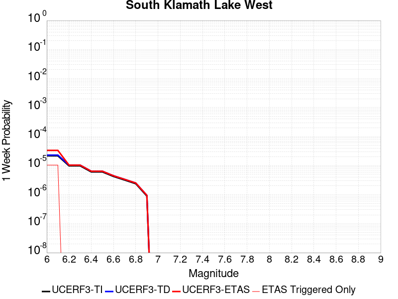 | 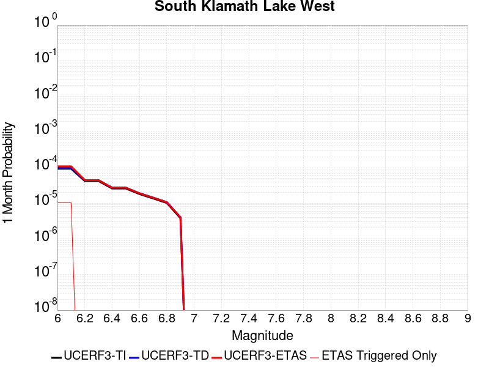 | 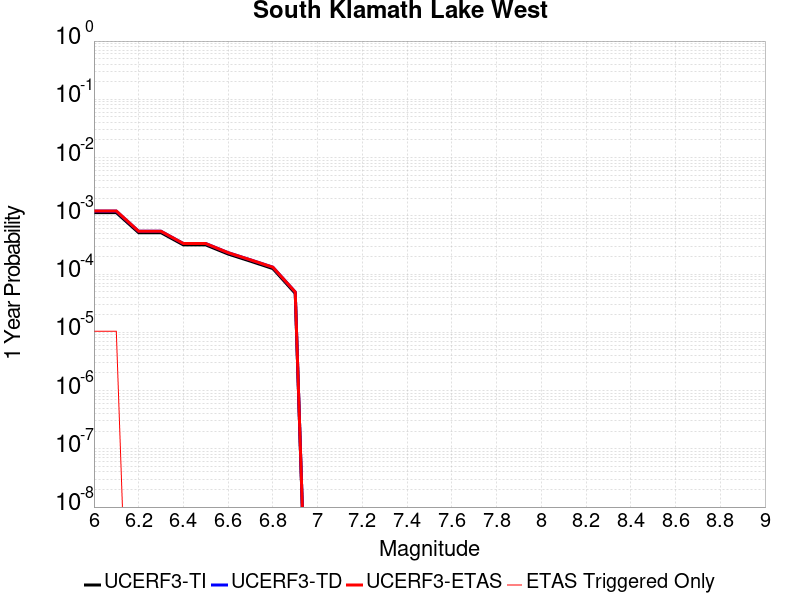 |  |

| Magnitude | 1 wk TI Prob | 1 wk TD Prob | 1 wk ETAS Prob | 1 wk ETAS/TD Gain | 1 wk ETAS Triggered Only | 1 mo TI Prob | 1 mo TD Prob | 1 mo ETAS Prob | 1 mo ETAS/TD Gain | 1 mo ETAS Triggered Only | 1 yr TI Prob | 1 yr TD Prob | 1 yr ETAS Prob | 1 yr ETAS/TD Gain | 1 yr ETAS Triggered Only | 10 yr TI Prob | 10 yr TD Prob | 10 yr ETAS Prob | 10 yr ETAS/TD Gain | 10 yr ETAS Triggered Only |
|-----|-----|-----|-----|-----|-----|-----|-----|-----|-----|-----|-----|-----|-----|-----|-----|-----|-----|-----|-----|-----|
| 6.0 | 2.174025E-5 | 2.3042025E-5 | 3.3477692E-5 | 1.4528972 | 1.0435908E-5 | 9.3169176E-5 | 9.874817E-5 | 1.0918305E-4 | 1.1056716 | 1.0435908E-5 | 0.0011337444 | 0.0012016617 | 0.001212085 | 1.0086741 | 1.0435908E-5 | 0.011279777 | 0.0119582405 | 0.011968551 | 1.0008622 | 1.0435908E-5 |
| 6.1 | 2.174025E-5 | 2.3042025E-5 | 3.3477692E-5 | 1.4528972 | 1.0435908E-5 | 9.3169176E-5 | 9.874817E-5 | 1.0918305E-4 | 1.1056716 | 1.0435908E-5 | 0.0011337444 | 0.0012016617 | 0.001212085 | 1.0086741 | 1.0435908E-5 | 0.011279777 | 0.0119582405 | 0.011968551 | 1.0008622 | 1.0435908E-5 |
| 6.2 | 9.834929E-6 | 1.0393841E-5 | 1.0393841E-5 | 1.0 | 0.0 | 4.2149015E-5 | 4.4544326E-5 | 4.4544326E-5 | 1.0 | 0.0 | 5.1304343E-4 | 5.422012E-4 | 5.422012E-4 | 1.0 | 0.0 | 0.0051186057 | 0.0054096854 | 0.0054096854 | 1.0 | 0.0 |
| 6.3 | 9.834929E-6 | 1.0393841E-5 | 1.0393841E-5 | 1.0 | 0.0 | 4.2149015E-5 | 4.4544326E-5 | 4.4544326E-5 | 1.0 | 0.0 | 5.1304343E-4 | 5.422012E-4 | 5.422012E-4 | 1.0 | 0.0 | 0.0051186057 | 0.0054096854 | 0.0054096854 | 1.0 | 0.0 |
| 6.4 | 6.066321E-6 | 6.40043E-6 | 6.40043E-6 | 1.0 | 0.0 | 2.5998259E-5 | 2.743014E-5 | 2.743014E-5 | 1.0 | 0.0 | 3.1648282E-4 | 3.3391351E-4 | 3.3391351E-4 | 1.0 | 0.0 | 0.0031603249 | 0.0033343881 | 0.0033343881 | 1.0 | 0.0 |
| 6.5 | 6.066321E-6 | 6.40043E-6 | 6.40043E-6 | 1.0 | 0.0 | 2.5998259E-5 | 2.743014E-5 | 2.743014E-5 | 1.0 | 0.0 | 3.1648282E-4 | 3.3391351E-4 | 3.3391351E-4 | 1.0 | 0.0 | 0.0031603249 | 0.0033343881 | 0.0033343881 | 1.0 | 0.0 |
| 6.6 | 4.2321803E-6 | 4.461291E-6 | 4.461291E-6 | 1.0 | 0.0 | 1.8137789E-5 | 1.9119685E-5 | 1.9119685E-5 | 1.0 | 0.0 | 2.208052E-4 | 2.3275832E-4 | 2.3275832E-4 | 1.0 | 0.0 | 0.0022058594 | 0.0023252473 | 0.0023252473 | 1.0 | 0.0 |
| 6.7 | 3.186646E-6 | 3.360305E-6 | 3.360305E-6 | 1.0 | 0.0 | 1.3656982E-5 | 1.4401232E-5 | 1.4401232E-5 | 1.0 | 0.0 | 1.6626107E-4 | 1.7532158E-4 | 1.7532158E-4 | 1.0 | 0.0 | 0.0016613674 | 0.0017518997 | 0.0017518997 | 1.0 | 0.0 |
| 6.8 | 2.380121E-6 | 2.510907E-6 | 2.510907E-6 | 1.0 | 0.0 | 1.0200479E-5 | 1.07609885E-5 | 1.07609885E-5 | 1.0 | 0.0 | 1.2418375E-4 | 1.3100762E-4 | 1.3100762E-4 | 1.0 | 0.0 | 0.0012411437 | 0.0013093497 | 0.0013093497 | 1.0 | 0.0 |
| 6.9 | 8.928287E-7 | 9.4302504E-7 | 9.4302504E-7 | 1.0 | 0.0 | 3.826403E-6 | 4.0415307E-6 | 4.0415307E-6 | 1.0 | 0.0 | 4.658546E-5 | 4.9204747E-5 | 4.9204747E-5 | 1.0 | 0.0 | 4.6575698E-4 | 4.9196015E-4 | 4.9196015E-4 | 1.0 | 0.0 |

## Hartley Springs 2011 CFM
*[(top)](#table-of-contents)*

| 1 Week | 1 Month | 1 Year | 10 Year |
|-----|-----|-----|-----|
| 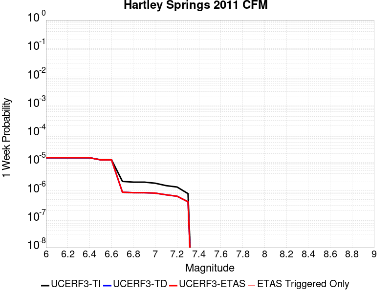 | 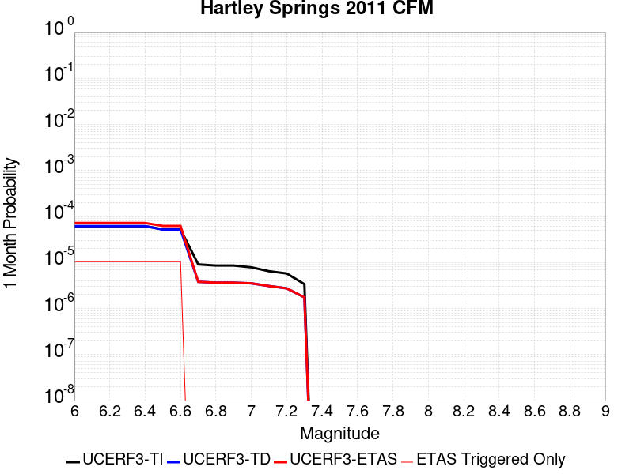 | 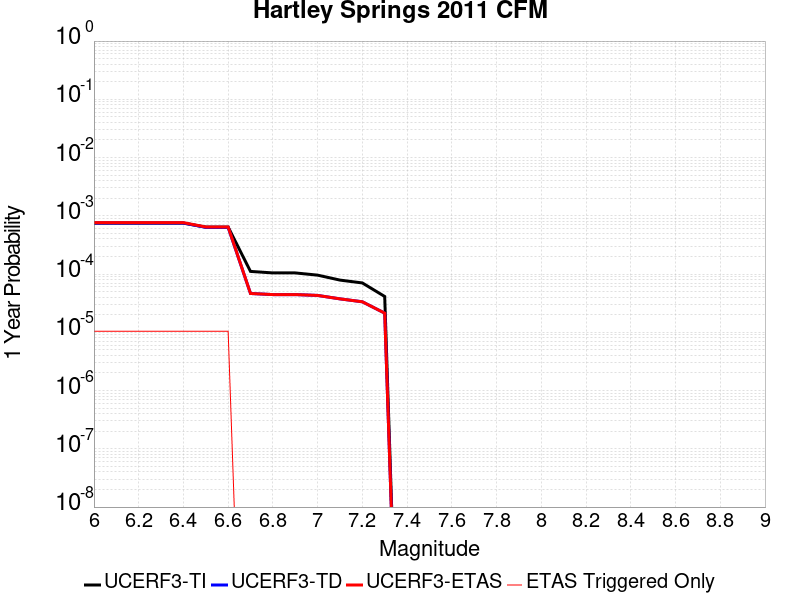 | 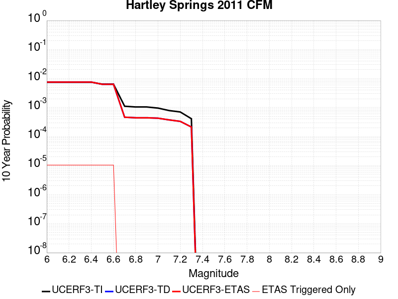 |

| Magnitude | 1 wk TI Prob | 1 wk TD Prob | 1 wk ETAS Prob | 1 wk ETAS/TD Gain | 1 wk ETAS Triggered Only | 1 mo TI Prob | 1 mo TD Prob | 1 mo ETAS Prob | 1 mo ETAS/TD Gain | 1 mo ETAS Triggered Only | 1 yr TI Prob | 1 yr TD Prob | 1 yr ETAS Prob | 1 yr ETAS/TD Gain | 1 yr ETAS Triggered Only | 10 yr TI Prob | 10 yr TD Prob | 10 yr ETAS Prob | 10 yr ETAS/TD Gain | 10 yr ETAS Triggered Only |
|-----|-----|-----|-----|-----|-----|-----|-----|-----|-----|-----|-----|-----|-----|-----|-----|-----|-----|-----|-----|-----|
| 6.0 | 1.4352418E-5 | 1.4434182E-5 | 1.4434182E-5 | 1.0 | 0.0 | 6.1508916E-5 | 6.1860235E-5 | 7.22955E-5 | 1.1686909 | 1.0435908E-5 | 7.486137E-4 | 7.5305253E-4 | 7.634806E-4 | 1.0138477 | 1.0435908E-5 | 0.007460968 | 0.0075211283 | 0.007531486 | 1.0013771 | 1.0435908E-5 |
| 6.1 | 1.4352418E-5 | 1.4434182E-5 | 1.4434182E-5 | 1.0 | 0.0 | 6.1508916E-5 | 6.1860235E-5 | 7.22955E-5 | 1.1686909 | 1.0435908E-5 | 7.486137E-4 | 7.5305253E-4 | 7.634806E-4 | 1.0138477 | 1.0435908E-5 | 0.007460968 | 0.0075211283 | 0.007531486 | 1.0013771 | 1.0435908E-5 |
| 6.2 | 1.4352418E-5 | 1.4434182E-5 | 1.4434182E-5 | 1.0 | 0.0 | 6.1508916E-5 | 6.1860235E-5 | 7.22955E-5 | 1.1686909 | 1.0435908E-5 | 7.486137E-4 | 7.5305253E-4 | 7.634806E-4 | 1.0138477 | 1.0435908E-5 | 0.007460968 | 0.0075211283 | 0.007531486 | 1.0013771 | 1.0435908E-5 |
| 6.3 | 1.4352418E-5 | 1.4434182E-5 | 1.4434182E-5 | 1.0 | 0.0 | 6.1508916E-5 | 6.1860235E-5 | 7.22955E-5 | 1.1686909 | 1.0435908E-5 | 7.486137E-4 | 7.5305253E-4 | 7.634806E-4 | 1.0138477 | 1.0435908E-5 | 0.007460968 | 0.0075211283 | 0.007531486 | 1.0013771 | 1.0435908E-5 |
| 6.4 | 1.4352418E-5 | 1.4434182E-5 | 1.4434182E-5 | 1.0 | 0.0 | 6.1508916E-5 | 6.1860235E-5 | 7.22955E-5 | 1.1686909 | 1.0435908E-5 | 7.486137E-4 | 7.5305253E-4 | 7.634806E-4 | 1.0138477 | 1.0435908E-5 | 0.007460968 | 0.0075211283 | 0.007531486 | 1.0013771 | 1.0435908E-5 |
| 6.5 | 1.2279858E-5 | 1.2133106E-5 | 1.2133106E-5 | 1.0 | 0.0 | 5.26269E-5 | 5.1998883E-5 | 6.243424E-5 | 1.2006844 | 1.0435908E-5 | 6.4054417E-4 | 6.3306064E-4 | 6.4348994E-4 | 1.0164744 | 1.0435908E-5 | 0.0063870098 | 0.006328085 | 0.006338455 | 1.0016387 | 1.0435908E-5 |
| 6.6 | 1.2279858E-5 | 1.2133106E-5 | 1.2133106E-5 | 1.0 | 0.0 | 5.26269E-5 | 5.1998883E-5 | 6.243424E-5 | 1.2006844 | 1.0435908E-5 | 6.4054417E-4 | 6.3306064E-4 | 6.4348994E-4 | 1.0164744 | 1.0435908E-5 | 0.0063870098 | 0.006328085 | 0.006338455 | 1.0016387 | 1.0435908E-5 |
| 6.7 | 2.1282601E-6 | 8.8948315E-7 | 8.8948315E-7 | 1.0 | 0.0 | 9.121083E-6 | 3.8120663E-6 | 3.8120663E-6 | 1.0 | 0.0 | 1.11043526E-4 | 4.641118E-5 | 4.641118E-5 | 1.0 | 0.0 | 0.0011098806 | 4.6404017E-4 | 4.6404017E-4 | 1.0 | 0.0 |
| 6.8 | 2.00516E-6 | 8.517597E-7 | 8.517597E-7 | 1.0 | 0.0 | 8.593515E-6 | 3.650395E-6 | 3.650395E-6 | 1.0 | 0.0 | 1.04621024E-4 | 4.444291E-5 | 4.444291E-5 | 1.0 | 0.0 | 0.0010457177 | 4.4436535E-4 | 4.4436535E-4 | 1.0 | 0.0 |
| 6.9 | 2.00516E-6 | 8.517597E-7 | 8.517597E-7 | 1.0 | 0.0 | 8.593515E-6 | 3.650395E-6 | 3.650395E-6 | 1.0 | 0.0 | 1.04621024E-4 | 4.444291E-5 | 4.444291E-5 | 1.0 | 0.0 | 0.0010457177 | 4.4436535E-4 | 4.4436535E-4 | 1.0 | 0.0 |
| 7.0 | 1.8366732E-6 | 8.237307E-7 | 8.237307E-7 | 1.0 | 0.0 | 7.871433E-6 | 3.5302712E-6 | 3.5302712E-6 | 1.0 | 0.0 | 9.583048E-5 | 4.298046E-5 | 4.298046E-5 | 1.0 | 0.0 | 9.5789164E-4 | 4.2974652E-4 | 4.2974652E-4 | 1.0 | 0.0 |
| 7.1 | 1.5097997E-6 | 7.1902616E-7 | 7.1902616E-7 | 1.0 | 0.0 | 6.470554E-6 | 3.0815384E-6 | 3.0815384E-6 | 1.0 | 0.0 | 7.877615E-5 | 3.7517326E-5 | 3.7517326E-5 | 1.0 | 0.0 | 7.874823E-4 | 3.7513362E-4 | 3.7513362E-4 | 1.0 | 0.0 |
| 7.2 | 1.3490993E-6 | 6.405254E-7 | 6.405254E-7 | 1.0 | 0.0 | 5.7818415E-6 | 2.7451074E-6 | 2.7451074E-6 | 1.0 | 0.0 | 7.0391645E-5 | 3.3421402E-5 | 3.3421402E-5 | 1.0 | 0.0 | 7.0369354E-4 | 3.341867E-4 | 3.341867E-4 | 1.0 | 0.0 |
| 7.3 | 7.900015E-7 | 4.0889498E-7 | 4.0889498E-7 | 1.0 | 0.0 | 3.3857161E-6 | 1.752407E-6 | 1.752407E-6 | 1.0 | 0.0 | 4.1220315E-5 | 2.1335554E-5 | 2.1335554E-5 | 1.0 | 0.0 | 4.121267E-4 | 2.1335555E-4 | 2.1335555E-4 | 1.0 | 0.0 |

## Sargent 2011 CFM
*[(top)](#table-of-contents)*

| 1 Week | 1 Month | 1 Year | 10 Year |
|-----|-----|-----|-----|
|  | 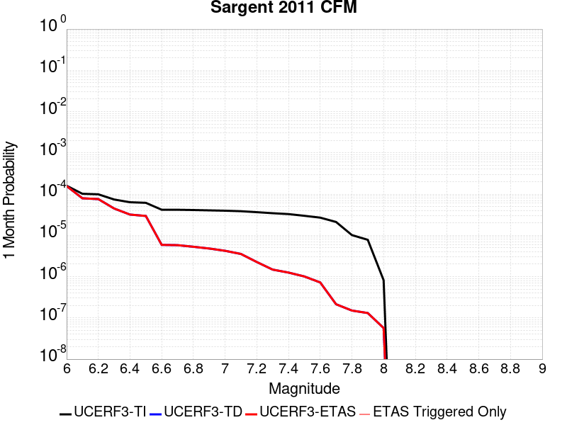 |  | 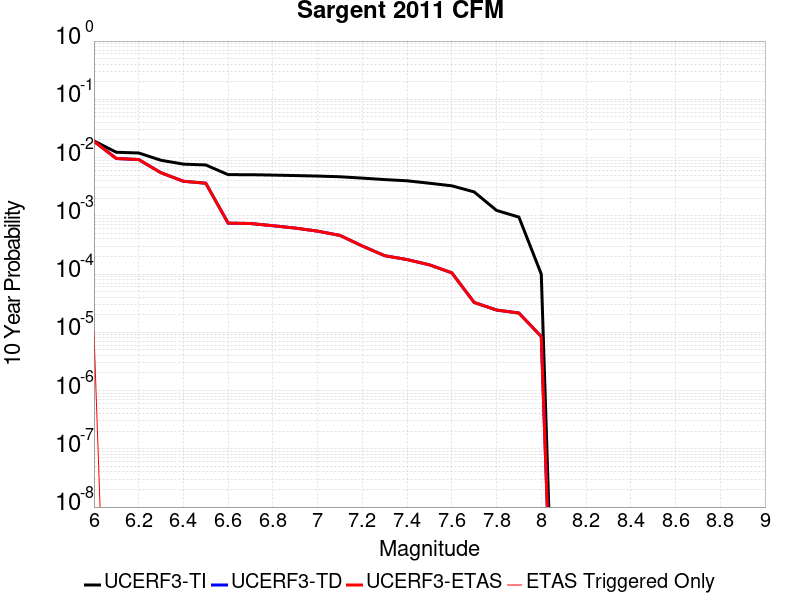 |

| Magnitude | 1 wk TI Prob | 1 wk TD Prob | 1 wk ETAS Prob | 1 wk ETAS/TD Gain | 1 wk ETAS Triggered Only | 1 mo TI Prob | 1 mo TD Prob | 1 mo ETAS Prob | 1 mo ETAS/TD Gain | 1 mo ETAS Triggered Only | 1 yr TI Prob | 1 yr TD Prob | 1 yr ETAS Prob | 1 yr ETAS/TD Gain | 1 yr ETAS Triggered Only | 10 yr TI Prob | 10 yr TD Prob | 10 yr ETAS Prob | 10 yr ETAS/TD Gain | 10 yr ETAS Triggered Only |
|-----|-----|-----|-----|-----|-----|-----|-----|-----|-----|-----|-----|-----|-----|-----|-----|-----|-----|-----|-----|-----|
| 6.0 | 3.7327867E-5 | 3.664913E-5 | 3.664913E-5 | 1.0 | 0.0 | 1.5996677E-4 | 1.5706103E-4 | 1.5706103E-4 | 1.0 | 0.0 | 0.0019458556 | 0.0019110236 | 0.0019110236 | 1.0 | 0.0 | 0.01928905 | 0.019018095 | 0.019028332 | 1.0005383 | 1.0435908E-5 |
| 6.1 | 2.3771476E-5 | 1.8479273E-5 | 1.8479273E-5 | 1.0 | 0.0 | 1.01873775E-4 | 7.919498E-5 | 7.919498E-5 | 1.0 | 0.0 | 0.0012396075 | 9.638493E-4 | 9.638493E-4 | 1.0 | 0.0 | 0.012327154 | 0.009636091 | 0.009636091 | 1.0 | 0.0 |
| 6.2 | 2.3112721E-5 | 1.7710632E-5 | 1.7710632E-5 | 1.0 | 0.0 | 9.9050754E-5 | 7.590099E-5 | 7.590099E-5 | 1.0 | 0.0 | 0.0012052758 | 9.237792E-4 | 9.237792E-4 | 1.0 | 0.0 | 0.011987597 | 0.009238743 | 0.009238743 | 1.0 | 0.0 |
| 6.3 | 1.728509E-5 | 1.0458927E-5 | 1.0458927E-5 | 1.0 | 0.0 | 7.407686E-5 | 4.482347E-5 | 4.482347E-5 | 1.0 | 0.0 | 9.015125E-4 | 5.456343E-4 | 5.456343E-4 | 1.0 | 0.0 | 0.008978641 | 0.0054791216 | 0.0054791216 | 1.0 | 0.0 |
| 6.4 | 1.48395575E-5 | 7.4559816E-6 | 7.4559816E-6 | 1.0 | 0.0 | 6.3596555E-5 | 3.195403E-5 | 3.195403E-5 | 1.0 | 0.0 | 7.7401294E-4 | 3.8900663E-4 | 3.8900663E-4 | 1.0 | 0.0 | 0.0077132257 | 0.003918666 | 0.003918666 | 1.0 | 0.0 |
| 6.5 | 1.4358964E-5 | 6.894759E-6 | 6.894759E-6 | 1.0 | 0.0 | 6.1536964E-5 | 2.9548846E-5 | 2.9548846E-5 | 1.0 | 0.0 | 7.48955E-4 | 3.5973339E-4 | 3.5973339E-4 | 1.0 | 0.0 | 0.0074643586 | 0.0036269152 | 0.0036269152 | 1.0 | 0.0 |
| 6.6 | 9.772591E-6 | 1.3736154E-6 | 1.3736154E-6 | 1.0 | 0.0 | 4.188186E-5 | 5.88691E-6 | 5.88691E-6 | 1.0 | 0.0 | 5.097923E-4 | 7.16708E-5 | 7.16708E-5 | 1.0 | 0.0 | 0.005086244 | 7.483097E-4 | 7.483097E-4 | 1.0 | 0.0 |
| 6.7 | 9.752745E-6 | 1.3523068E-6 | 1.3523068E-6 | 1.0 | 0.0 | 4.179681E-5 | 5.795587E-6 | 5.795587E-6 | 1.0 | 0.0 | 5.0875737E-4 | 7.055902E-5 | 7.055902E-5 | 1.0 | 0.0 | 0.005075942 | 7.371994E-4 | 7.371994E-4 | 1.0 | 0.0 |
| 6.8 | 9.608213E-6 | 1.2361709E-6 | 1.2361709E-6 | 1.0 | 0.0 | 4.1177405E-5 | 5.2978644E-6 | 5.2978644E-6 | 1.0 | 0.0 | 5.012196E-4 | 6.449961E-5 | 6.449961E-5 | 1.0 | 0.0 | 0.005000906 | 6.7634037E-4 | 6.7634037E-4 | 1.0 | 0.0 |
| 6.9 | 9.427164E-6 | 1.12094E-6 | 1.12094E-6 | 1.0 | 0.0 | 4.04015E-5 | 4.80402E-6 | 4.80402E-6 | 1.0 | 0.0 | 4.9177726E-4 | 5.8487396E-5 | 5.8487396E-5 | 1.0 | 0.0 | 0.004906904 | 6.1557174E-4 | 6.1557174E-4 | 1.0 | 0.0 |
| 7.0 | 9.247601E-6 | 9.873988E-7 | 9.873988E-7 | 1.0 | 0.0 | 3.9631974E-5 | 4.2317024E-6 | 4.2317024E-6 | 1.0 | 0.0 | 4.8241246E-4 | 5.1519775E-5 | 5.1519775E-5 | 1.0 | 0.0 | 0.0048136655 | 5.4542476E-4 | 5.4542476E-4 | 1.0 | 0.0 |
| 7.1 | 8.995454E-6 | 8.2711284E-7 | 8.2711284E-7 | 1.0 | 0.0 | 3.8551374E-5 | 3.5447645E-6 | 3.5447645E-6 | 1.0 | 0.0 | 4.6926187E-4 | 4.3156666E-5 | 4.3156666E-5 | 1.0 | 0.0 | 0.004682722 | 4.609069E-4 | 4.609069E-4 | 1.0 | 0.0 |
| 7.2 | 8.520861E-6 | 5.2766507E-7 | 5.2766507E-7 | 1.0 | 0.0 | 3.6517464E-5 | 2.2614197E-6 | 2.2614197E-6 | 1.0 | 0.0 | 4.445094E-4 | 2.7532446E-5 | 2.7532446E-5 | 1.0 | 0.0 | 0.004436213 | 3.0297207E-4 | 3.0297207E-4 | 1.0 | 0.0 |
| 7.3 | 8.043592E-6 | 3.456507E-7 | 3.456507E-7 | 1.0 | 0.0 | 3.4472083E-5 | 1.4813593E-6 | 1.4813593E-6 | 1.0 | 0.0 | 4.196168E-4 | 1.8035402E-5 | 1.8035402E-5 | 1.0 | 0.0 | 0.004188253 | 2.0669671E-4 | 2.0669671E-4 | 1.0 | 0.0 |
| 7.4 | 7.662316E-6 | 2.928958E-7 | 2.928958E-7 | 1.0 | 0.0 | 3.2838085E-5 | 1.2552671E-6 | 1.2552671E-6 | 1.0 | 0.0 | 3.9973034E-4 | 1.528277E-5 | 1.528277E-5 | 1.0 | 0.0 | 0.0039901207 | 1.7736501E-4 | 1.7736501E-4 | 1.0 | 0.0 |
| 7.5 | 6.961638E-6 | 2.3574503E-7 | 2.3574503E-7 | 1.0 | 0.0 | 2.9835252E-5 | 1.0103355E-6 | 1.0103355E-6 | 1.0 | 0.0 | 3.6318362E-4 | 1.2300766E-5 | 1.2300766E-5 | 1.0 | 0.0 | 0.0036259065 | 1.4409334E-4 | 1.4409334E-4 | 1.0 | 0.0 |
| 7.6 | 6.282332E-6 | 1.6892966E-7 | 1.6892966E-7 | 1.0 | 0.0 | 2.6924003E-5 | 7.2398404E-7 | 7.2398404E-7 | 1.0 | 0.0 | 3.2775043E-4 | 8.814471E-6 | 8.814471E-6 | 1.0 | 0.0 | 0.0032726745 | 1.05050465E-4 | 1.05050465E-4 | 1.0 | 0.0 |
| 7.7 | 4.934408E-6 | 5.001089E-8 | 5.001089E-8 | 1.0 | 0.0 | 2.114729E-5 | 2.1433237E-7 | 2.1433237E-7 | 1.0 | 0.0 | 2.5743784E-4 | 2.6094935E-6 | 2.6094935E-6 | 1.0 | 0.0 | 0.0025713982 | 3.2545366E-5 | 3.2545366E-5 | 1.0 | 0.0 |
| 7.8 | 2.373212E-6 | 3.5172643E-8 | 3.5172643E-8 | 1.0 | 0.0 | 1.0170869E-5 | 1.507399E-7 | 1.507399E-7 | 1.0 | 0.0 | 1.238233E-4 | 1.8352566E-6 | 1.8352566E-6 | 1.0 | 0.0 | 0.0012375432 | 2.4125171E-5 | 2.4125171E-5 | 1.0 | 0.0 |
| 7.9 | 1.8227792E-6 | 3.0619603E-8 | 3.0619603E-8 | 1.0 | 0.0 | 7.811887E-6 | 1.3122687E-7 | 1.3122687E-7 | 1.0 | 0.0 | 9.510558E-5 | 1.5976858E-6 | 1.5976858E-6 | 1.0 | 0.0 | 9.5064886E-4 | 2.1410624E-5 | 2.1410624E-5 | 1.0 | 0.0 |
| 8.0 | 1.9095137E-7 | 1.326461E-8 | 1.326461E-8 | 1.0 | 0.0 | 8.1836276E-7 | 5.684833E-8 | 5.684833E-8 | 1.0 | 0.0 | 9.963521E-6 | 6.921282E-7 | 6.921282E-7 | 1.0 | 0.0 | 9.963074E-5 | 8.463319E-6 | 8.463319E-6 | 1.0 | 0.0 |

## North Frontal  (East)
*[(top)](#table-of-contents)*

| 1 Week | 1 Month | 1 Year | 10 Year |
|-----|-----|-----|-----|
| 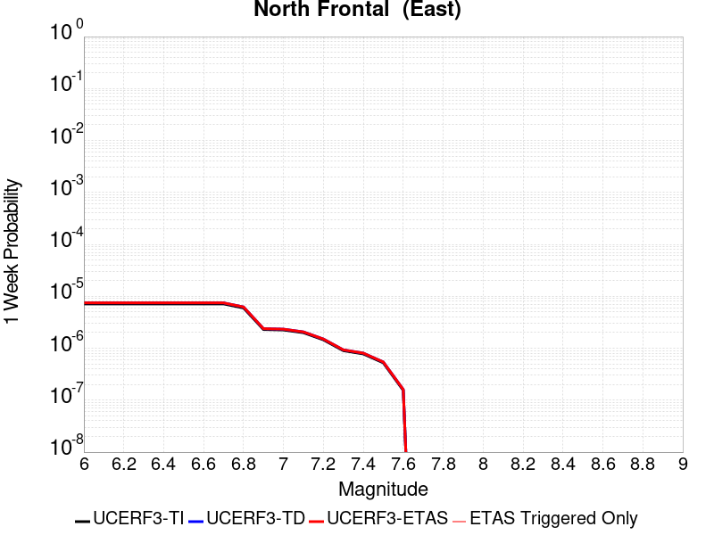 |  |  | 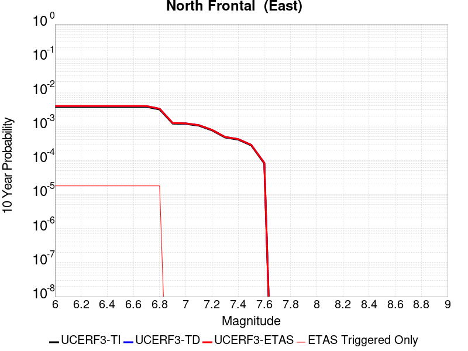 |

| Magnitude | 1 wk TI Prob | 1 wk TD Prob | 1 wk ETAS Prob | 1 wk ETAS/TD Gain | 1 wk ETAS Triggered Only | 1 mo TI Prob | 1 mo TD Prob | 1 mo ETAS Prob | 1 mo ETAS/TD Gain | 1 mo ETAS Triggered Only | 1 yr TI Prob | 1 yr TD Prob | 1 yr ETAS Prob | 1 yr ETAS/TD Gain | 1 yr ETAS Triggered Only | 10 yr TI Prob | 10 yr TD Prob | 10 yr ETAS Prob | 10 yr ETAS/TD Gain | 10 yr ETAS Triggered Only |
|-----|-----|-----|-----|-----|-----|-----|-----|-----|-----|-----|-----|-----|-----|-----|-----|-----|-----|-----|-----|-----|
| 6.0 | 7.135738E-6 | 7.4771765E-6 | 7.4771765E-6 | 1.0 | 0.0 | 3.0581377E-5 | 3.204476E-5 | 3.204476E-5 | 1.0 | 0.0 | 3.7226462E-4 | 3.9009505E-4 | 3.9009505E-4 | 1.0 | 0.0 | 0.0037164164 | 0.0038960609 | 0.003906456 | 1.0026681 | 1.0435908E-5 |
| 6.1 | 7.135738E-6 | 7.4771765E-6 | 7.4771765E-6 | 1.0 | 0.0 | 3.0581377E-5 | 3.204476E-5 | 3.204476E-5 | 1.0 | 0.0 | 3.7226462E-4 | 3.9009505E-4 | 3.9009505E-4 | 1.0 | 0.0 | 0.0037164164 | 0.0038960609 | 0.003906456 | 1.0026681 | 1.0435908E-5 |
| 6.2 | 7.135738E-6 | 7.4771765E-6 | 7.4771765E-6 | 1.0 | 0.0 | 3.0581377E-5 | 3.204476E-5 | 3.204476E-5 | 1.0 | 0.0 | 3.7226462E-4 | 3.9009505E-4 | 3.9009505E-4 | 1.0 | 0.0 | 0.0037164164 | 0.0038960609 | 0.003906456 | 1.0026681 | 1.0435908E-5 |
| 6.3 | 7.135738E-6 | 7.4771765E-6 | 7.4771765E-6 | 1.0 | 0.0 | 3.0581377E-5 | 3.204476E-5 | 3.204476E-5 | 1.0 | 0.0 | 3.7226462E-4 | 3.9009505E-4 | 3.9009505E-4 | 1.0 | 0.0 | 0.0037164164 | 0.0038960609 | 0.003906456 | 1.0026681 | 1.0435908E-5 |
| 6.4 | 7.135738E-6 | 7.4771765E-6 | 7.4771765E-6 | 1.0 | 0.0 | 3.0581377E-5 | 3.204476E-5 | 3.204476E-5 | 1.0 | 0.0 | 3.7226462E-4 | 3.9009505E-4 | 3.9009505E-4 | 1.0 | 0.0 | 0.0037164164 | 0.0038960609 | 0.003906456 | 1.0026681 | 1.0435908E-5 |
| 6.5 | 7.135738E-6 | 7.4771765E-6 | 7.4771765E-6 | 1.0 | 0.0 | 3.0581377E-5 | 3.204476E-5 | 3.204476E-5 | 1.0 | 0.0 | 3.7226462E-4 | 3.9009505E-4 | 3.9009505E-4 | 1.0 | 0.0 | 0.0037164164 | 0.0038960609 | 0.003906456 | 1.0026681 | 1.0435908E-5 |
| 6.6 | 7.135738E-6 | 7.4771765E-6 | 7.4771765E-6 | 1.0 | 0.0 | 3.0581377E-5 | 3.204476E-5 | 3.204476E-5 | 1.0 | 0.0 | 3.7226462E-4 | 3.9009505E-4 | 3.9009505E-4 | 1.0 | 0.0 | 0.0037164164 | 0.0038960609 | 0.003906456 | 1.0026681 | 1.0435908E-5 |
| 6.7 | 7.135738E-6 | 7.4771765E-6 | 7.4771765E-6 | 1.0 | 0.0 | 3.0581377E-5 | 3.204476E-5 | 3.204476E-5 | 1.0 | 0.0 | 3.7226462E-4 | 3.9009505E-4 | 3.9009505E-4 | 1.0 | 0.0 | 0.0037164164 | 0.0038960609 | 0.003906456 | 1.0026681 | 1.0435908E-5 |
| 6.8 | 5.959142E-6 | 6.236683E-6 | 6.236683E-6 | 1.0 | 0.0 | 2.553893E-5 | 2.6728469E-5 | 2.6728469E-5 | 1.0 | 0.0 | 3.108921E-4 | 3.253886E-4 | 3.253886E-4 | 1.0 | 0.0 | 0.0031045752 | 0.0032508948 | 0.0032612968 | 1.0031997 | 1.0435908E-5 |
| 6.9 | 2.2946929E-6 | 2.3824605E-6 | 2.3824605E-6 | 1.0 | 0.0 | 9.834361E-6 | 1.0210508E-5 | 1.0210508E-5 | 1.0 | 0.0 | 1.1972676E-4 | 1.2430632E-4 | 1.2430632E-4 | 1.0 | 0.0 | 0.0011966228 | 0.0012424142 | 0.0012424142 | 1.0 | 0.0 |
| 7.0 | 2.2468673E-6 | 2.3321538E-6 | 2.3321538E-6 | 1.0 | 0.0 | 9.629396E-6 | 9.994909E-6 | 9.994909E-6 | 1.0 | 0.0 | 1.1723159E-4 | 1.21681696E-4 | 1.21681696E-4 | 1.0 | 0.0 | 0.0011716976 | 0.0012161969 | 0.0012161969 | 1.0 | 0.0 |
| 7.1 | 1.9921076E-6 | 2.0646032E-6 | 2.0646032E-6 | 1.0 | 0.0 | 8.537577E-6 | 8.848272E-6 | 8.848272E-6 | 1.0 | 0.0 | 1.0394004E-4 | 1.0772282E-4 | 1.0772282E-4 | 1.0 | 0.0 | 0.0010389143 | 0.0010767487 | 0.0010767487 | 1.0 | 0.0 |
| 7.2 | 1.4524545E-6 | 1.5045148E-6 | 1.5045148E-6 | 1.0 | 0.0 | 6.2247905E-6 | 6.447906E-6 | 6.447906E-6 | 1.0 | 0.0 | 7.5784184E-5 | 7.850068E-5 | 7.850068E-5 | 1.0 | 0.0 | 7.575835E-4 | 7.8475394E-4 | 7.8475394E-4 | 1.0 | 0.0 |
| 7.3 | 8.9802575E-7 | 9.3087283E-7 | 9.3087283E-7 | 1.0 | 0.0 | 3.848676E-6 | 3.9894494E-6 | 3.9894494E-6 | 1.0 | 0.0 | 4.685662E-5 | 4.857058E-5 | 4.857058E-5 | 1.0 | 0.0 | 4.6846745E-4 | 4.8561094E-4 | 4.8561094E-4 | 1.0 | 0.0 |
| 7.4 | 7.776139E-7 | 8.0604747E-7 | 8.0604747E-7 | 1.0 | 0.0 | 3.3326266E-6 | 3.4544853E-6 | 3.4544853E-6 | 1.0 | 0.0 | 4.0573974E-5 | 4.2057654E-5 | 4.2057654E-5 | 1.0 | 0.0 | 4.0566566E-4 | 4.205077E-4 | 4.205077E-4 | 1.0 | 0.0 |
| 7.5 | 5.244417E-7 | 5.441219E-7 | 5.441219E-7 | 1.0 | 0.0 | 2.2476054E-6 | 2.3319494E-6 | 2.3319494E-6 | 1.0 | 0.0 | 2.7364253E-5 | 2.839118E-5 | 2.839118E-5 | 1.0 | 0.0 | 2.7360884E-4 | 2.8388205E-4 | 2.8388205E-4 | 1.0 | 0.0 |
| 7.6 | 1.5489647E-7 | 1.6089504E-7 | 1.6089504E-7 | 1.0 | 0.0 | 6.6384183E-7 | 6.895501E-7 | 6.895501E-7 | 1.0 | 0.0 | 8.082245E-6 | 8.395261E-6 | 8.395261E-6 | 1.0 | 0.0 | 8.08195E-5 | 8.395143E-5 | 8.395143E-5 | 1.0 | 0.0 |

## San Luis Range - Oceano 2011 CFM
*[(top)](#table-of-contents)*

| 1 Week | 1 Month | 1 Year | 10 Year |
|-----|-----|-----|-----|
|  |  |  | 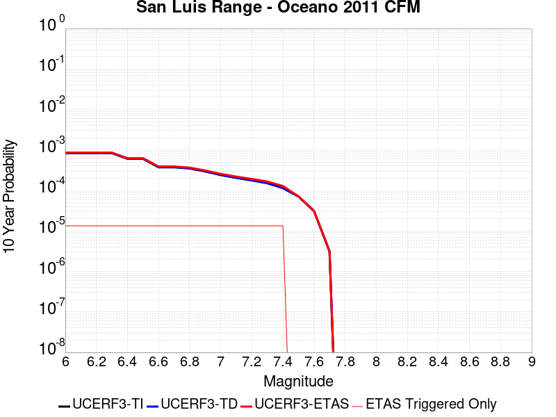 |

| Magnitude | 1 wk TI Prob | 1 wk TD Prob | 1 wk ETAS Prob | 1 wk ETAS/TD Gain | 1 wk ETAS Triggered Only | 1 mo TI Prob | 1 mo TD Prob | 1 mo ETAS Prob | 1 mo ETAS/TD Gain | 1 mo ETAS Triggered Only | 1 yr TI Prob | 1 yr TD Prob | 1 yr ETAS Prob | 1 yr ETAS/TD Gain | 1 yr ETAS Triggered Only | 10 yr TI Prob | 10 yr TD Prob | 10 yr ETAS Prob | 10 yr ETAS/TD Gain | 10 yr ETAS Triggered Only |
|-----|-----|-----|-----|-----|-----|-----|-----|-----|-----|-----|-----|-----|-----|-----|-----|-----|-----|-----|-----|-----|
| 6.0 | 1.6025788E-6 | 1.620119E-6 | 1.620119E-6 | 1.0 | 0.0 | 6.8681766E-6 | 6.943351E-6 | 6.943351E-6 | 1.0 | 0.0 | 8.361684E-5 | 8.453243E-5 | 8.453243E-5 | 1.0 | 0.0 | 8.3585386E-4 | 8.4504357E-4 | 8.5547066E-4 | 1.0123391 | 1.0435908E-5 |
| 6.1 | 1.6025788E-6 | 1.620119E-6 | 1.620119E-6 | 1.0 | 0.0 | 6.8681766E-6 | 6.943351E-6 | 6.943351E-6 | 1.0 | 0.0 | 8.361684E-5 | 8.453243E-5 | 8.453243E-5 | 1.0 | 0.0 | 8.3585386E-4 | 8.4504357E-4 | 8.5547066E-4 | 1.0123391 | 1.0435908E-5 |
| 6.2 | 1.6025788E-6 | 1.620119E-6 | 1.620119E-6 | 1.0 | 0.0 | 6.8681766E-6 | 6.943351E-6 | 6.943351E-6 | 1.0 | 0.0 | 8.361684E-5 | 8.453243E-5 | 8.453243E-5 | 1.0 | 0.0 | 8.3585386E-4 | 8.4504357E-4 | 8.5547066E-4 | 1.0123391 | 1.0435908E-5 |
| 6.3 | 1.6025788E-6 | 1.620119E-6 | 1.620119E-6 | 1.0 | 0.0 | 6.8681766E-6 | 6.943351E-6 | 6.943351E-6 | 1.0 | 0.0 | 8.361684E-5 | 8.453243E-5 | 8.453243E-5 | 1.0 | 0.0 | 8.3585386E-4 | 8.4504357E-4 | 8.5547066E-4 | 1.0123391 | 1.0435908E-5 |
| 6.4 | 1.1621186E-6 | 1.1749894E-6 | 1.1749894E-6 | 1.0 | 0.0 | 4.980499E-6 | 5.0356607E-6 | 5.0356607E-6 | 1.0 | 0.0 | 6.0635884E-5 | 6.130771E-5 | 6.130771E-5 | 1.0 | 0.0 | 6.0619344E-4 | 6.1293464E-4 | 6.233641E-4 | 1.0170157 | 1.0435908E-5 |
| 6.5 | 1.1621186E-6 | 1.1749894E-6 | 1.1749894E-6 | 1.0 | 0.0 | 4.980499E-6 | 5.0356607E-6 | 5.0356607E-6 | 1.0 | 0.0 | 6.0635884E-5 | 6.130771E-5 | 6.130771E-5 | 1.0 | 0.0 | 6.0619344E-4 | 6.1293464E-4 | 6.233641E-4 | 1.0170157 | 1.0435908E-5 |
| 6.6 | 7.164729E-7 | 7.2485784E-7 | 7.2485784E-7 | 1.0 | 0.0 | 3.0705946E-6 | 3.10653E-6 | 3.10653E-6 | 1.0 | 0.0 | 3.738385E-5 | 3.7821363E-5 | 3.7821363E-5 | 1.0 | 0.0 | 3.737756E-4 | 3.7815105E-4 | 3.88583E-4 | 1.0275868 | 1.0435908E-5 |
| 6.7 | 7.164729E-7 | 7.2485784E-7 | 7.2485784E-7 | 1.0 | 0.0 | 3.0705946E-6 | 3.10653E-6 | 3.10653E-6 | 1.0 | 0.0 | 3.738385E-5 | 3.7821363E-5 | 3.7821363E-5 | 1.0 | 0.0 | 3.737756E-4 | 3.7815105E-4 | 3.88583E-4 | 1.0275868 | 1.0435908E-5 |
| 6.8 | 6.700177E-7 | 6.7774397E-7 | 6.7774397E-7 | 1.0 | 0.0 | 2.8715012E-6 | 2.904614E-6 | 2.904614E-6 | 1.0 | 0.0 | 3.495997E-5 | 3.536312E-5 | 3.536312E-5 | 1.0 | 0.0 | 3.495447E-4 | 3.5357653E-4 | 3.6400874E-4 | 1.0295049 | 1.0435908E-5 |
| 6.9 | 5.657865E-7 | 5.7217864E-7 | 5.7217864E-7 | 1.0 | 0.0 | 2.424797E-6 | 2.452192E-6 | 2.452192E-6 | 1.0 | 0.0 | 2.9521503E-5 | 2.9855039E-5 | 2.9855039E-5 | 1.0 | 0.0 | 2.9517582E-4 | 2.9851135E-4 | 3.0894415E-4 | 1.0349494 | 1.0435908E-5 |
| 7.0 | 4.608413E-7 | 4.660169E-7 | 4.660169E-7 | 1.0 | 0.0 | 1.9750328E-6 | 1.9972138E-6 | 1.9972138E-6 | 1.0 | 0.0 | 2.4045758E-5 | 2.431581E-5 | 2.431581E-5 | 1.0 | 0.0 | 2.4043156E-4 | 2.4313178E-4 | 2.5356514E-4 | 1.0429124 | 1.0435908E-5 |
| 7.1 | 3.9177846E-7 | 3.9621602E-7 | 3.9621602E-7 | 1.0 | 0.0 | 1.6790494E-6 | 1.6980675E-6 | 1.6980675E-6 | 1.0 | 0.0 | 2.0442236E-5 | 2.0673779E-5 | 2.0673779E-5 | 1.0 | 0.0 | 2.0440355E-4 | 2.067187E-4 | 2.1715245E-4 | 1.0504732 | 1.0435908E-5 |
| 7.2 | 3.3974752E-7 | 3.436653E-7 | 3.436653E-7 | 1.0 | 0.0 | 1.45606E-6 | 1.4728505E-6 | 1.4728505E-6 | 1.0 | 0.0 | 1.7727387E-5 | 1.7931809E-5 | 1.7931809E-5 | 1.0 | 0.0 | 1.7725973E-4 | 1.7930372E-4 | 1.8973775E-4 | 1.058192 | 1.0435908E-5 |
| 7.3 | 2.8900928E-7 | 2.923402E-7 | 2.923402E-7 | 1.0 | 0.0 | 1.2386106E-6 | 1.2528859E-6 | 1.2528859E-6 | 1.0 | 0.0 | 1.5079979E-5 | 1.525378E-5 | 1.525378E-5 | 1.0 | 0.0 | 1.5078956E-4 | 1.5252741E-4 | 1.6296173E-4 | 1.0684094 | 1.0435908E-5 |
| 7.4 | 2.1881527E-7 | 2.2139594E-7 | 2.2139594E-7 | 1.0 | 0.0 | 9.3777936E-7 | 9.488394E-7 | 9.488394E-7 | 1.0 | 0.0 | 1.14174045E-5 | 1.1552059E-5 | 1.1552059E-5 | 1.0 | 0.0 | 1.1416818E-4 | 1.1551464E-4 | 1.2594934E-4 | 1.0903323 | 1.0435908E-5 |
| 7.5 | 1.356398E-7 | 1.3718639E-7 | 1.3718639E-7 | 1.0 | 0.0 | 5.813133E-7 | 5.8794154E-7 | 5.8794154E-7 | 1.0 | 0.0 | 7.0774663E-6 | 7.158165E-6 | 7.158165E-6 | 1.0 | 0.0 | 7.077241E-5 | 7.157937E-5 | 7.157937E-5 | 1.0 | 0.0 |
| 7.6 | 5.9269272E-8 | 6.001364E-8 | 6.001364E-8 | 1.0 | 0.0 | 2.5401116E-7 | 2.572013E-7 | 2.572013E-7 | 1.0 | 0.0 | 3.0925814E-6 | 3.1314214E-6 | 3.1314214E-6 | 1.0 | 0.0 | 3.0925385E-5 | 3.1313786E-5 | 3.1313786E-5 | 1.0 | 0.0 |
| 7.7 | 5.946232E-9 | 6.036928E-9 | 6.036928E-9 | 1.0 | 0.0 | 2.5483851E-8 | 2.5872547E-8 | 2.5872547E-8 | 1.0 | 0.0 | 3.1026585E-7 | 3.1499823E-7 | 3.1499823E-7 | 1.0 | 0.0 | 3.102654E-6 | 3.1499787E-6 | 3.1499787E-6 | 1.0 | 0.0 |

## Surprise Valley 2011 CFM
*[(top)](#table-of-contents)*

| 1 Week | 1 Month | 1 Year | 10 Year |
|-----|-----|-----|-----|
| 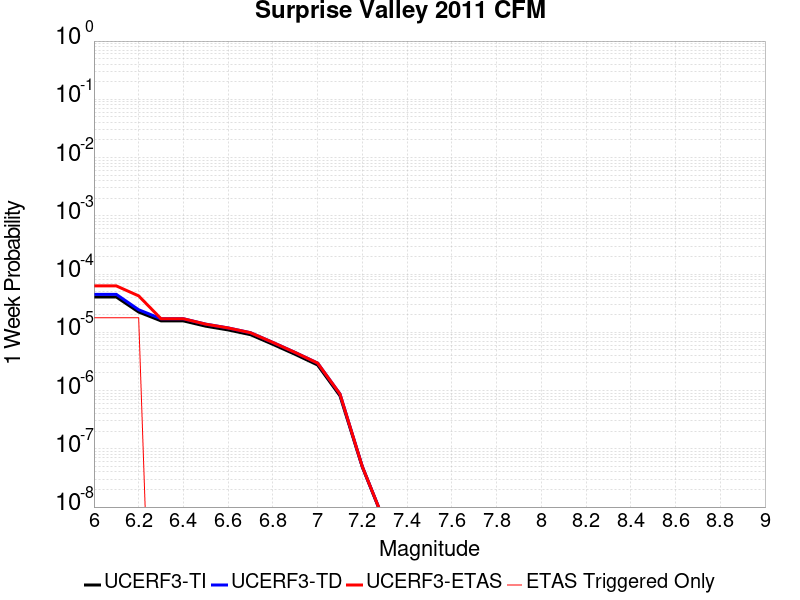 | 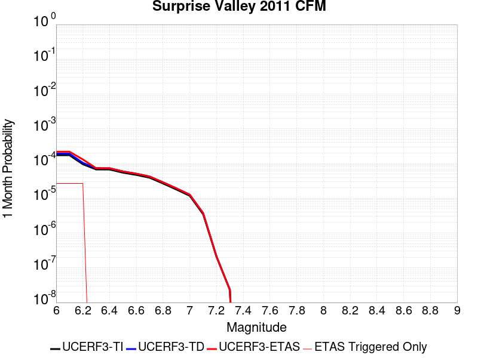 | 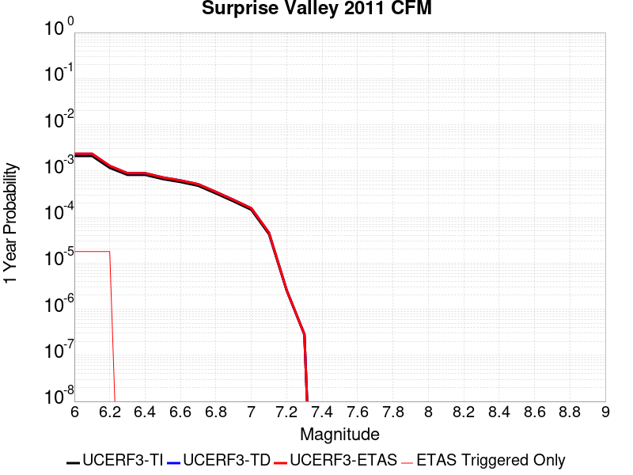 |  |

| Magnitude | 1 wk TI Prob | 1 wk TD Prob | 1 wk ETAS Prob | 1 wk ETAS/TD Gain | 1 wk ETAS Triggered Only | 1 mo TI Prob | 1 mo TD Prob | 1 mo ETAS Prob | 1 mo ETAS/TD Gain | 1 mo ETAS Triggered Only | 1 yr TI Prob | 1 yr TD Prob | 1 yr ETAS Prob | 1 yr ETAS/TD Gain | 1 yr ETAS Triggered Only | 10 yr TI Prob | 10 yr TD Prob | 10 yr ETAS Prob | 10 yr ETAS/TD Gain | 10 yr ETAS Triggered Only |
|-----|-----|-----|-----|-----|-----|-----|-----|-----|-----|-----|-----|-----|-----|-----|-----|-----|-----|-----|-----|-----|
| 6.0 | 4.0396248E-5 | 4.485131E-5 | 5.528675E-5 | 1.2326674 | 1.0435908E-5 | 1.7311527E-4 | 1.9220692E-4 | 2.0264082E-4 | 1.0542847 | 1.0435908E-5 | 0.002105641 | 0.0023378176 | 0.002348229 | 1.0044535 | 1.0435908E-5 | 0.020858008 | 0.023153966 | 0.02316416 | 1.0004402 | 1.0435908E-5 |
| 6.1 | 4.0396248E-5 | 4.485131E-5 | 5.528675E-5 | 1.2326674 | 1.0435908E-5 | 1.7311527E-4 | 1.9220692E-4 | 2.0264082E-4 | 1.0542847 | 1.0435908E-5 | 0.002105641 | 0.0023378176 | 0.002348229 | 1.0044535 | 1.0435908E-5 | 0.020858008 | 0.023153966 | 0.02316416 | 1.0004402 | 1.0435908E-5 |
| 6.2 | 2.2295266E-5 | 2.440125E-5 | 3.4836903E-5 | 1.4276688 | 1.0435908E-5 | 9.554764E-5 | 1.0457276E-4 | 1.15007584E-4 | 1.0997852 | 1.0435908E-5 | 0.0011626717 | 0.0012724606 | 0.0012828832 | 1.0081909 | 1.0435908E-5 | 0.011566074 | 0.012654981 | 0.012665285 | 1.0008142 | 1.0435908E-5 |
| 6.3 | 1.572643E-5 | 1.7096807E-5 | 1.7096807E-5 | 1.0 | 0.0 | 6.7397246E-5 | 7.327003E-5 | 7.327003E-5 | 1.0 | 0.0 | 8.202525E-4 | 8.91708E-4 | 8.91708E-4 | 1.0 | 0.0 | 0.008172315 | 0.008882407 | 0.008882407 | 1.0 | 0.0 |
| 6.4 | 1.5714395E-5 | 1.7084629E-5 | 1.7084629E-5 | 1.0 | 0.0 | 6.734567E-5 | 7.3217845E-5 | 7.3217845E-5 | 1.0 | 0.0 | 8.1962504E-4 | 8.9107314E-4 | 8.9107314E-4 | 1.0 | 0.0 | 0.008166086 | 0.008876109 | 0.008876109 | 1.0 | 0.0 |
| 6.5 | 1.2733495E-5 | 1.38016E-5 | 1.38016E-5 | 1.0 | 0.0 | 5.457098E-5 | 5.9148413E-5 | 5.9148413E-5 | 1.0 | 0.0 | 6.641992E-4 | 7.1990065E-4 | 7.1990065E-4 | 1.0 | 0.0 | 0.0066221743 | 0.0071763797 | 0.0071763797 | 1.0 | 0.0 |
| 6.6 | 1.0983784E-5 | 1.1886554E-5 | 1.1886554E-5 | 1.0 | 0.0 | 4.7072506E-5 | 5.094141E-5 | 5.094141E-5 | 1.0 | 0.0 | 5.7295704E-4 | 6.200405E-4 | 6.200405E-4 | 1.0 | 0.0 | 0.0057148207 | 0.0061836545 | 0.0061836545 | 1.0 | 0.0 |
| 6.7 | 9.104806E-6 | 9.839491E-6 | 9.839491E-6 | 1.0 | 0.0 | 3.902001E-5 | 4.2168587E-5 | 4.2168587E-5 | 1.0 | 0.0 | 4.7496508E-4 | 5.132855E-4 | 5.132855E-4 | 1.0 | 0.0 | 0.004739512 | 0.005121397 | 0.005121397 | 1.0 | 0.0 |
| 6.8 | 6.2162403E-6 | 6.7041337E-6 | 6.7041337E-6 | 1.0 | 0.0 | 2.6640759E-5 | 2.8731698E-5 | 2.8731698E-5 | 1.0 | 0.0 | 3.2430296E-4 | 3.497545E-4 | 3.497545E-4 | 1.0 | 0.0 | 0.003238301 | 0.0034922638 | 0.0034922638 | 1.0 | 0.0 |
| 6.9 | 4.1792696E-6 | 4.50323E-6 | 4.50323E-6 | 1.0 | 0.0 | 1.7911032E-5 | 1.9299423E-5 | 1.9299423E-5 | 1.0 | 0.0 | 2.1804498E-4 | 2.3494668E-4 | 2.3494668E-4 | 1.0 | 0.0 | 0.0021783116 | 0.0023471361 | 0.0023471361 | 1.0 | 0.0 |
| 7.0 | 2.7478413E-6 | 2.9622424E-6 | 2.9622424E-6 | 1.0 | 0.0 | 1.177641E-5 | 1.269527E-5 | 1.269527E-5 | 1.0 | 0.0 | 1.4336836E-4 | 1.545552E-4 | 1.545552E-4 | 1.0 | 0.0 | 0.001432759 | 0.0015445995 | 0.0015445995 | 1.0 | 0.0 |
| 7.1 | 8.128648E-7 | 8.724922E-7 | 8.724922E-7 | 1.0 | 0.0 | 3.4837017E-6 | 3.7392501E-6 | 3.7392501E-6 | 1.0 | 0.0 | 4.2413245E-5 | 4.552502E-5 | 4.552502E-5 | 1.0 | 0.0 | 4.2405148E-4 | 4.5521575E-4 | 4.5521575E-4 | 1.0 | 0.0 |
| 7.2 | 4.8641045E-8 | 4.9402068E-8 | 4.9402068E-8 | 1.0 | 0.0 | 2.084616E-7 | 2.1172312E-7 | 2.1172312E-7 | 1.0 | 0.0 | 2.538017E-6 | 2.577726E-6 | 2.577726E-6 | 1.0 | 0.0 | 2.537988E-5 | 2.5776973E-5 | 2.5776973E-5 | 1.0 | 0.0 |
| 7.3 | 5.3911844E-9 | 5.4758145E-9 | 5.4758145E-9 | 1.0 | 0.0 | 2.3105075E-8 | 2.3467775E-8 | 2.3467775E-8 | 1.0 | 0.0 | 2.8130427E-7 | 2.8572015E-7 | 2.8572015E-7 | 1.0 | 0.0 | 2.8130391E-6 | 2.8571992E-6 | 2.8571992E-6 | 1.0 | 0.0 |

## West Napa 2011 CFM
*[(top)](#table-of-contents)*

| 1 Week | 1 Month | 1 Year | 10 Year |
|-----|-----|-----|-----|
|  |  | 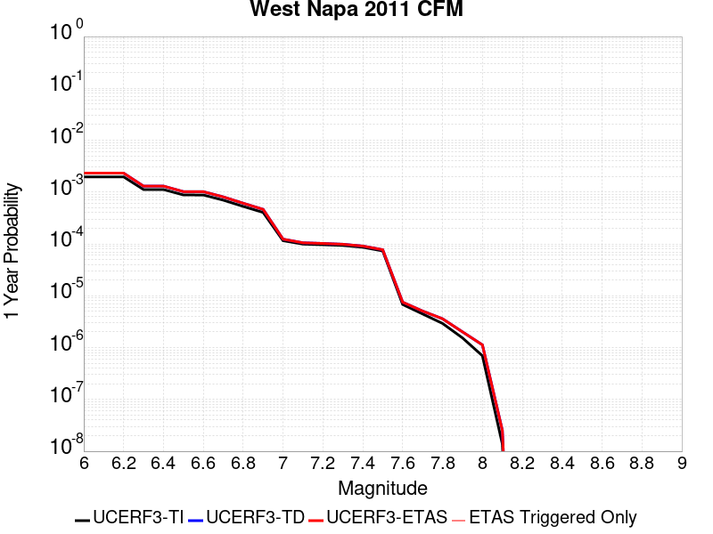 | 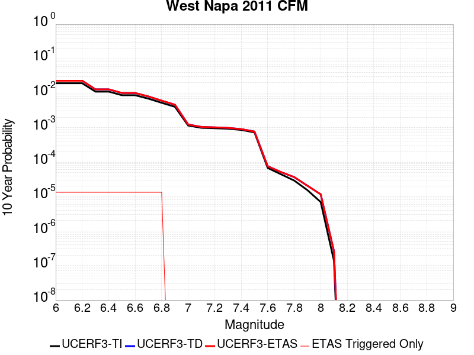 |

| Magnitude | 1 wk TI Prob | 1 wk TD Prob | 1 wk ETAS Prob | 1 wk ETAS/TD Gain | 1 wk ETAS Triggered Only | 1 mo TI Prob | 1 mo TD Prob | 1 mo ETAS Prob | 1 mo ETAS/TD Gain | 1 mo ETAS Triggered Only | 1 yr TI Prob | 1 yr TD Prob | 1 yr ETAS Prob | 1 yr ETAS/TD Gain | 1 yr ETAS Triggered Only | 10 yr TI Prob | 10 yr TD Prob | 10 yr ETAS Prob | 10 yr ETAS/TD Gain | 10 yr ETAS Triggered Only |
|-----|-----|-----|-----|-----|-----|-----|-----|-----|-----|-----|-----|-----|-----|-----|-----|-----|-----|-----|-----|-----|
| 6.0 | 3.773104E-5 | 4.452845E-5 | 4.452845E-5 | 1.0 | 0.0 | 1.6169442E-4 | 1.9082405E-4 | 1.9082405E-4 | 1.0 | 0.0 | 0.001966852 | 0.0023211248 | 0.0023211248 | 1.0 | 0.0 | 0.019495348 | 0.023002245 | 0.02301244 | 1.0004432 | 1.0435908E-5 |
| 6.1 | 3.773104E-5 | 4.452845E-5 | 4.452845E-5 | 1.0 | 0.0 | 1.6169442E-4 | 1.9082405E-4 | 1.9082405E-4 | 1.0 | 0.0 | 0.001966852 | 0.0023211248 | 0.0023211248 | 1.0 | 0.0 | 0.019495348 | 0.023002245 | 0.02301244 | 1.0004432 | 1.0435908E-5 |
| 6.2 | 3.773104E-5 | 4.452845E-5 | 4.452845E-5 | 1.0 | 0.0 | 1.6169442E-4 | 1.9082405E-4 | 1.9082405E-4 | 1.0 | 0.0 | 0.001966852 | 0.0023211248 | 0.0023211248 | 1.0 | 0.0 | 0.019495348 | 0.023002245 | 0.02301244 | 1.0004432 | 1.0435908E-5 |
| 6.3 | 2.147964E-5 | 2.4987039E-5 | 2.4987039E-5 | 1.0 | 0.0 | 9.2052345E-5 | 1.0708343E-4 | 1.0708343E-4 | 1.0 | 0.0 | 0.001120161 | 0.0013030528 | 0.0013030528 | 1.0 | 0.0 | 0.011145315 | 0.0129647385 | 0.012975039 | 1.0007945 | 1.0435908E-5 |
| 6.4 | 2.147964E-5 | 2.4987039E-5 | 2.4987039E-5 | 1.0 | 0.0 | 9.2052345E-5 | 1.0708343E-4 | 1.0708343E-4 | 1.0 | 0.0 | 0.001120161 | 0.0013030528 | 0.0013030528 | 1.0 | 0.0 | 0.011145315 | 0.0129647385 | 0.012975039 | 1.0007945 | 1.0435908E-5 |
| 6.5 | 1.688201E-5 | 1.9547346E-5 | 1.9547346E-5 | 1.0 | 0.0 | 7.234947E-5 | 8.377206E-5 | 8.377206E-5 | 1.0 | 0.0 | 8.804988E-4 | 0.0010195201 | 0.0010195201 | 1.0 | 0.0 | 0.008770182 | 0.010157098 | 0.010167428 | 1.001017 | 1.0435908E-5 |
| 6.6 | 1.6846381E-5 | 1.9507039E-5 | 1.9507039E-5 | 1.0 | 0.0 | 7.219678E-5 | 8.359933E-5 | 8.359933E-5 | 1.0 | 0.0 | 8.7864127E-4 | 0.001017419 | 0.001017419 | 1.0 | 0.0 | 0.008751754 | 0.010136279 | 0.0101466095 | 1.0010191 | 1.0435908E-5 |
| 6.7 | 1.3396501E-5 | 1.5467655E-5 | 1.5467655E-5 | 1.0 | 0.0 | 5.7412315E-5 | 6.628862E-5 | 6.628862E-5 | 1.0 | 0.0 | 6.9877075E-4 | 8.0682867E-4 | 8.0682867E-4 | 1.0 | 0.0 | 0.0069657755 | 0.008046719 | 0.008057071 | 1.0012865 | 1.0435908E-5 |
| 6.8 | 1.0139058E-5 | 1.1672149E-5 | 1.1672149E-5 | 1.0 | 0.0 | 4.3452383E-5 | 5.0022853E-5 | 5.0022853E-5 | 1.0 | 0.0 | 5.289043E-4 | 6.0891354E-4 | 6.0891354E-4 | 1.0 | 0.0 | 0.005276473 | 0.006079373 | 0.006089745 | 1.0017061 | 1.0435908E-5 |
| 6.9 | 7.761281E-6 | 8.890694E-6 | 8.890694E-6 | 1.0 | 0.0 | 3.326221E-5 | 3.8102706E-5 | 3.8102706E-5 | 1.0 | 0.0 | 4.0489217E-4 | 4.6385307E-4 | 4.6385307E-4 | 1.0 | 0.0 | 0.0040415525 | 0.004635363 | 0.004635363 | 1.0 | 0.0 |
| 7.0 | 2.2109202E-6 | 2.3666025E-6 | 2.3666025E-6 | 1.0 | 0.0 | 9.475338E-6 | 1.0142544E-5 | 1.0142544E-5 | 1.0 | 0.0 | 1.1535613E-4 | 1.2347854E-4 | 1.2347854E-4 | 1.0 | 0.0 | 0.0011529627 | 0.0012355851 | 0.0012355851 | 1.0 | 0.0 |
| 7.1 | 1.9008926E-6 | 2.0132914E-6 | 2.0132914E-6 | 1.0 | 0.0 | 8.146657E-6 | 8.6283635E-6 | 8.6283635E-6 | 1.0 | 0.0 | 9.918104E-5 | 1.05045285E-4 | 1.05045285E-4 | 1.0 | 0.0 | 9.913679E-4 | 0.001051437 | 0.001051437 | 1.0 | 0.0 |
| 7.2 | 1.8495944E-6 | 1.9560982E-6 | 1.9560982E-6 | 1.0 | 0.0 | 7.926808E-6 | 8.383251E-6 | 8.383251E-6 | 1.0 | 0.0 | 9.650462E-5 | 1.0206133E-4 | 1.0206133E-4 | 1.0 | 0.0 | 9.6462725E-4 | 0.0010216252 | 0.0010216252 | 1.0 | 0.0 |
| 7.3 | 1.7883189E-6 | 1.8880608E-6 | 1.8880608E-6 | 1.0 | 0.0 | 7.664201E-6 | 8.091664E-6 | 8.091664E-6 | 1.0 | 0.0 | 9.330765E-5 | 9.8511584E-5 | 9.8511584E-5 | 1.0 | 0.0 | 9.3268487E-4 | 9.861597E-4 | 9.861597E-4 | 1.0 | 0.0 |
| 7.4 | 1.6520572E-6 | 1.741484E-6 | 1.741484E-6 | 1.0 | 0.0 | 7.0802257E-6 | 7.463482E-6 | 7.463482E-6 | 1.0 | 0.0 | 8.6198335E-5 | 9.086413E-5 | 9.086413E-5 | 1.0 | 0.0 | 8.616491E-4 | 9.0974604E-4 | 9.0974604E-4 | 1.0 | 0.0 |
| 7.5 | 1.4040345E-6 | 1.4800074E-6 | 1.4800074E-6 | 1.0 | 0.0 | 6.0172765E-6 | 6.3428733E-6 | 6.3428733E-6 | 1.0 | 0.0 | 7.325788E-5 | 7.7221775E-5 | 7.7221775E-5 | 1.0 | 0.0 | 7.3233736E-4 | 7.7339396E-4 | 7.7339396E-4 | 1.0 | 0.0 |
| 7.6 | 1.3013842E-7 | 1.4415936E-7 | 1.4415936E-7 | 1.0 | 0.0 | 5.57736E-7 | 6.1782566E-7 | 6.1782566E-7 | 1.0 | 0.0 | 6.790414E-6 | 7.5220014E-6 | 7.5220014E-6 | 1.0 | 0.0 | 6.790207E-5 | 7.614869E-5 | 7.614869E-5 | 1.0 | 0.0 |
| 7.7 | 8.541512E-8 | 9.716316E-8 | 9.716316E-8 | 1.0 | 0.0 | 3.6606474E-7 | 4.1641349E-7 | 4.1641349E-7 | 1.0 | 0.0 | 4.456829E-6 | 5.0698222E-6 | 5.0698222E-6 | 1.0 | 0.0 | 4.4567398E-5 | 5.160297E-5 | 5.160297E-5 | 1.0 | 0.0 |
| 7.8 | 5.6074793E-8 | 6.89534E-8 | 6.89534E-8 | 1.0 | 0.0 | 2.403205E-7 | 2.9551452E-7 | 2.9551452E-7 | 1.0 | 0.0 | 2.9258983E-6 | 3.5978833E-6 | 3.5978833E-6 | 1.0 | 0.0 | 2.9258597E-5 | 3.681433E-5 | 3.681433E-5 | 1.0 | 0.0 |
| 7.9 | 2.9475839E-8 | 3.8566046E-8 | 3.8566046E-8 | 1.0 | 0.0 | 1.2632502E-7 | 1.6528305E-7 | 1.6528305E-7 | 1.0 | 0.0 | 1.538006E-6 | 2.0123193E-6 | 2.0123193E-6 | 1.0 | 0.0 | 1.5379954E-5 | 2.0665891E-5 | 2.0665891E-5 | 1.0 | 0.0 |
| 8.0 | 1.3337122E-8 | 2.163124E-8 | 2.163124E-8 | 1.0 | 0.0 | 5.7159088E-8 | 9.270532E-8 | 9.270532E-8 | 1.0 | 0.0 | 6.959117E-7 | 1.1286867E-6 | 1.1286867E-6 | 1.0 | 0.0 | 6.959095E-6 | 1.1645628E-5 | 1.1645628E-5 | 1.0 | 0.0 |
| 8.1 | 2.6589986E-10 | 4.8615456E-10 | 4.8615456E-10 | 1.0 | 0.0 | 1.1395708E-9 | 2.0835205E-9 | 2.0835205E-9 | 1.0 | 0.0 | 1.3874274E-8 | 2.536686E-8 | 2.536686E-8 | 1.0 | 0.0 | 1.3874273E-7 | 2.6035906E-7 | 2.6035906E-7 | 1.0 | 0.0 |

## San Jose
*[(top)](#table-of-contents)*

| 1 Week | 1 Month | 1 Year | 10 Year |
|-----|-----|-----|-----|
|  | 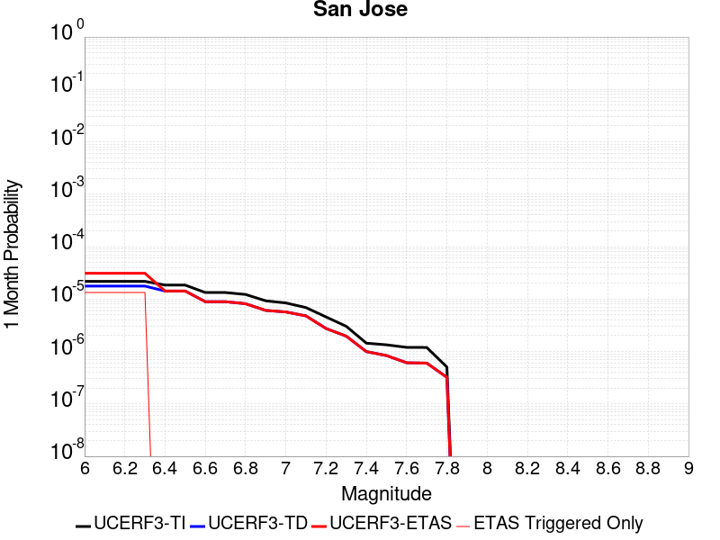 | 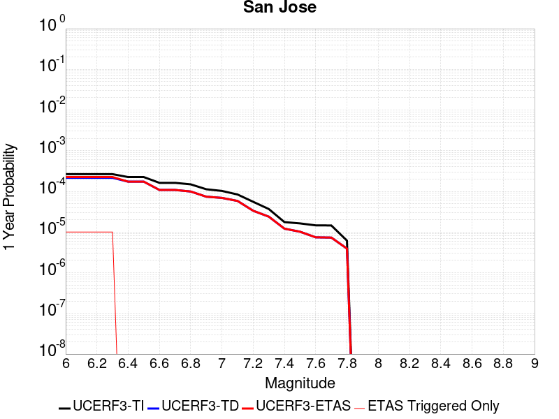 |  |

| Magnitude | 1 wk TI Prob | 1 wk TD Prob | 1 wk ETAS Prob | 1 wk ETAS/TD Gain | 1 wk ETAS Triggered Only | 1 mo TI Prob | 1 mo TD Prob | 1 mo ETAS Prob | 1 mo ETAS/TD Gain | 1 mo ETAS Triggered Only | 1 yr TI Prob | 1 yr TD Prob | 1 yr ETAS Prob | 1 yr ETAS/TD Gain | 1 yr ETAS Triggered Only | 10 yr TI Prob | 10 yr TD Prob | 10 yr ETAS Prob | 10 yr ETAS/TD Gain | 10 yr ETAS Triggered Only |
|-----|-----|-----|-----|-----|-----|-----|-----|-----|-----|-----|-----|-----|-----|-----|-----|-----|-----|-----|-----|-----|
| 6.0 | 5.0851277E-6 | 4.1256726E-6 | 4.1256726E-6 | 1.0 | 0.0 | 2.1793223E-5 | 1.768135E-5 | 2.8117072E-5 | 1.5902108 | 1.0435908E-5 | 2.653002E-4 | 2.152518E-4 | 2.2568546E-4 | 1.0484719 | 1.0435908E-5 | 0.0026498367 | 0.0021507242 | 0.0021611375 | 1.0048418 | 1.0435908E-5 |
| 6.1 | 5.0851277E-6 | 4.1256726E-6 | 4.1256726E-6 | 1.0 | 0.0 | 2.1793223E-5 | 1.768135E-5 | 2.8117072E-5 | 1.5902108 | 1.0435908E-5 | 2.653002E-4 | 2.152518E-4 | 2.2568546E-4 | 1.0484719 | 1.0435908E-5 | 0.0026498367 | 0.0021507242 | 0.0021611375 | 1.0048418 | 1.0435908E-5 |
| 6.2 | 5.0851277E-6 | 4.1256726E-6 | 4.1256726E-6 | 1.0 | 0.0 | 2.1793223E-5 | 1.768135E-5 | 2.8117072E-5 | 1.5902108 | 1.0435908E-5 | 2.653002E-4 | 2.152518E-4 | 2.2568546E-4 | 1.0484719 | 1.0435908E-5 | 0.0026498367 | 0.0021507242 | 0.0021611375 | 1.0048418 | 1.0435908E-5 |
| 6.3 | 5.0851277E-6 | 4.1256726E-6 | 4.1256726E-6 | 1.0 | 0.0 | 2.1793223E-5 | 1.768135E-5 | 2.8117072E-5 | 1.5902108 | 1.0435908E-5 | 2.653002E-4 | 2.152518E-4 | 2.2568546E-4 | 1.0484719 | 1.0435908E-5 | 0.0026498367 | 0.0021507242 | 0.0021611375 | 1.0048418 | 1.0435908E-5 |
| 6.4 | 4.3115124E-6 | 3.3237832E-6 | 3.3237832E-6 | 1.0 | 0.0 | 1.8477778E-5 | 1.424472E-5 | 1.424472E-5 | 1.0 | 0.0 | 2.2494372E-4 | 1.7341787E-4 | 1.7341787E-4 | 1.0 | 0.0 | 0.0022471617 | 0.0017330751 | 0.0017330751 | 1.0 | 0.0 |
| 6.5 | 4.3115124E-6 | 3.3237832E-6 | 3.3237832E-6 | 1.0 | 0.0 | 1.8477778E-5 | 1.424472E-5 | 1.424472E-5 | 1.0 | 0.0 | 2.2494372E-4 | 1.7341787E-4 | 1.7341787E-4 | 1.0 | 0.0 | 0.0022471617 | 0.0017330751 | 0.0017330751 | 1.0 | 0.0 |
| 6.6 | 3.110396E-6 | 2.0799866E-6 | 2.0799866E-6 | 1.0 | 0.0 | 1.33302E-5 | 8.9141995E-6 | 8.9141995E-6 | 1.0 | 0.0 | 1.622831E-4 | 1.0852526E-4 | 1.0852526E-4 | 1.0 | 0.0 | 0.0016216465 | 0.0010847825 | 0.0010847825 | 1.0 | 0.0 |
| 6.7 | 3.110396E-6 | 2.0799866E-6 | 2.0799866E-6 | 1.0 | 0.0 | 1.33302E-5 | 8.9141995E-6 | 8.9141995E-6 | 1.0 | 0.0 | 1.622831E-4 | 1.0852526E-4 | 1.0852526E-4 | 1.0 | 0.0 | 0.0016216465 | 0.0010847825 | 0.0010847825 | 1.0 | 0.0 |
| 6.8 | 2.856651E-6 | 1.902435E-6 | 1.902435E-6 | 1.0 | 0.0 | 1.2242733E-5 | 8.153269E-6 | 8.153269E-6 | 1.0 | 0.0 | 1.4904508E-4 | 9.926178E-5 | 9.926178E-5 | 1.0 | 0.0 | 0.0014894515 | 9.922314E-4 | 9.922314E-4 | 1.0 | 0.0 |
| 6.9 | 2.1618725E-6 | 1.4186642E-6 | 1.4186642E-6 | 1.0 | 0.0 | 9.265135E-6 | 6.0799757E-6 | 6.0799757E-6 | 1.0 | 0.0 | 1.12797185E-4 | 7.402128E-5 | 7.402128E-5 | 1.0 | 0.0 | 0.0011273995 | 7.4000744E-4 | 7.4000744E-4 | 1.0 | 0.0 |
| 7.0 | 1.9684312E-6 | 1.3256331E-6 | 1.3256331E-6 | 1.0 | 0.0 | 8.436106E-6 | 5.681273E-6 | 5.681273E-6 | 1.0 | 0.0 | 1.02704755E-4 | 6.9167385E-5 | 6.9167385E-5 | 1.0 | 0.0 | 0.001026573 | 6.914992E-4 | 6.914992E-4 | 1.0 | 0.0 |
| 7.1 | 1.6070337E-6 | 1.1155087E-6 | 1.1155087E-6 | 1.0 | 0.0 | 6.887269E-6 | 4.780743E-6 | 4.780743E-6 | 1.0 | 0.0 | 8.384928E-5 | 5.8204052E-5 | 5.8204052E-5 | 1.0 | 0.0 | 8.3817646E-4 | 5.819267E-4 | 5.819267E-4 | 1.0 | 0.0 |
| 7.2 | 1.0631658E-6 | 6.4037624E-7 | 6.4037624E-7 | 1.0 | 0.0 | 4.556417E-6 | 2.7444669E-6 | 2.7444669E-6 | 1.0 | 0.0 | 5.5472963E-5 | 3.3413387E-5 | 3.3413387E-5 | 1.0 | 0.0 | 5.545912E-4 | 3.3411747E-4 | 3.3411747E-4 | 1.0 | 0.0 |
| 7.3 | 7.060711E-7 | 4.5824706E-7 | 4.5824706E-7 | 1.0 | 0.0 | 3.0260155E-6 | 1.9639147E-6 | 1.9639147E-6 | 1.0 | 0.0 | 3.6841117E-5 | 2.3910407E-5 | 2.3910407E-5 | 1.0 | 0.0 | 3.6835007E-4 | 2.3911172E-4 | 2.3911172E-4 | 1.0 | 0.0 |
| 7.4 | 3.3677085E-7 | 2.3233133E-7 | 2.3233133E-7 | 1.0 | 0.0 | 1.4433028E-6 | 9.957054E-7 | 9.957054E-7 | 1.0 | 0.0 | 1.757207E-5 | 1.21226485E-5 | 1.21226485E-5 | 1.0 | 0.0 | 1.7570681E-4 | 1.2125263E-4 | 1.2125263E-4 | 1.0 | 0.0 |
| 7.5 | 3.129161E-7 | 1.9530925E-7 | 1.9530925E-7 | 1.0 | 0.0 | 1.3410682E-6 | 8.370394E-7 | 8.370394E-7 | 1.0 | 0.0 | 1.6327383E-5 | 1.0190909E-5 | 1.0190909E-5 | 1.0 | 0.0 | 1.6326184E-4 | 1.0193714E-4 | 1.0193714E-4 | 1.0 | 0.0 |
| 7.6 | 2.8008668E-7 | 1.4242323E-7 | 1.4242323E-7 | 1.0 | 0.0 | 1.2003709E-6 | 6.1038514E-7 | 6.1038514E-7 | 1.0 | 0.0 | 1.46144175E-5 | 7.4314153E-6 | 7.4314153E-6 | 1.0 | 0.0 | 1.4613457E-4 | 7.434427E-5 | 7.434427E-5 | 1.0 | 0.0 |
| 7.7 | 2.7852005E-7 | 1.4016913E-7 | 1.4016913E-7 | 1.0 | 0.0 | 1.1936568E-6 | 6.007248E-7 | 6.007248E-7 | 1.0 | 0.0 | 1.4532674E-5 | 7.3138012E-6 | 7.3138012E-6 | 1.0 | 0.0 | 1.4531724E-4 | 7.316821E-5 | 7.316821E-5 | 1.0 | 0.0 |
| 7.8 | 1.1810797E-7 | 7.5190094E-8 | 7.5190094E-8 | 1.0 | 0.0 | 5.0617695E-7 | 3.222432E-7 | 3.222432E-7 | 1.0 | 0.0 | 6.1626865E-6 | 3.9233046E-6 | 3.9233046E-6 | 1.0 | 0.0 | 6.162516E-5 | 3.9250725E-5 | 3.9250725E-5 | 1.0 | 0.0 |

## Great Valley 12
*[(top)](#table-of-contents)*

| 1 Week | 1 Month | 1 Year | 10 Year |
|-----|-----|-----|-----|
| 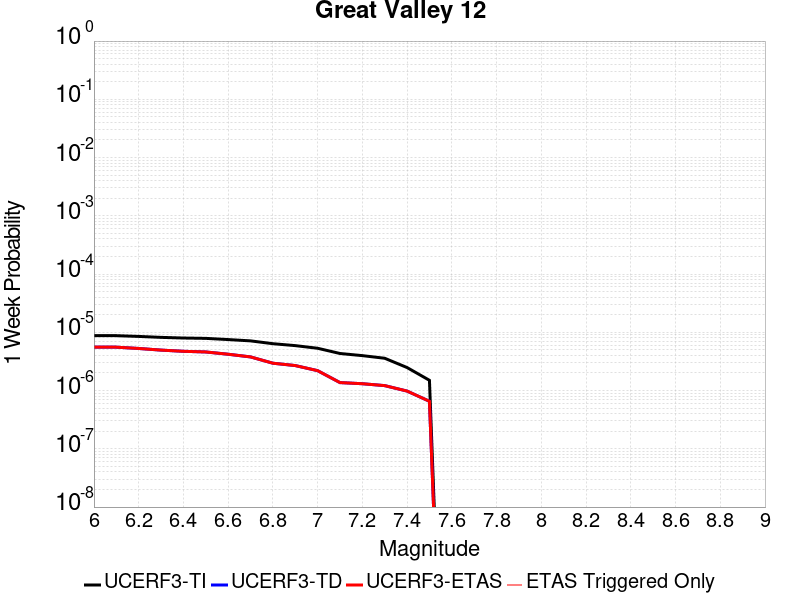 | 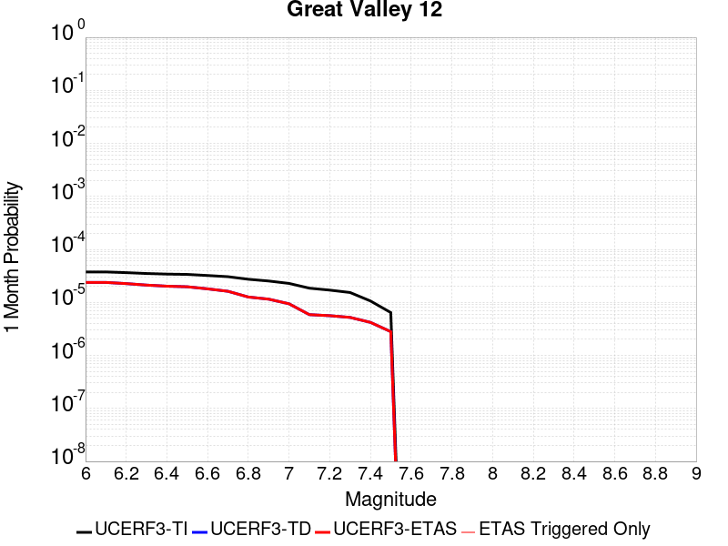 | 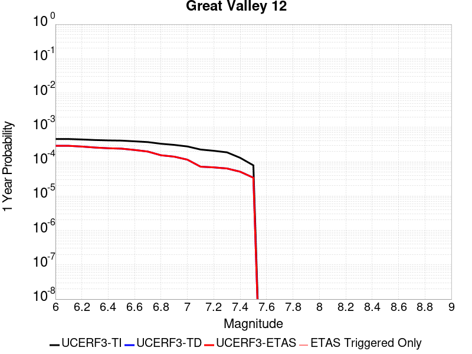 | 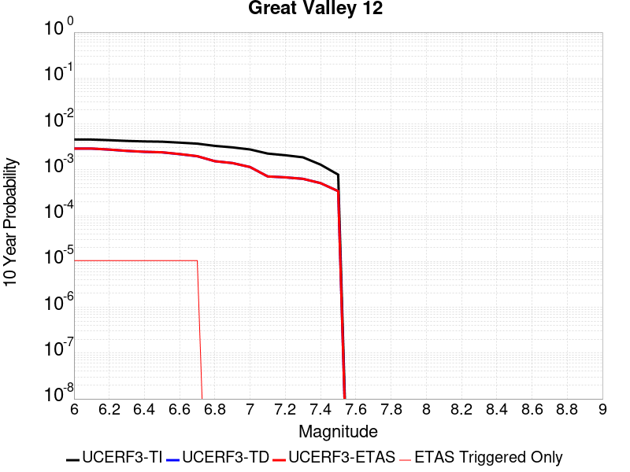 |

| Magnitude | 1 wk TI Prob | 1 wk TD Prob | 1 wk ETAS Prob | 1 wk ETAS/TD Gain | 1 wk ETAS Triggered Only | 1 mo TI Prob | 1 mo TD Prob | 1 mo ETAS Prob | 1 mo ETAS/TD Gain | 1 mo ETAS Triggered Only | 1 yr TI Prob | 1 yr TD Prob | 1 yr ETAS Prob | 1 yr ETAS/TD Gain | 1 yr ETAS Triggered Only | 10 yr TI Prob | 10 yr TD Prob | 10 yr ETAS Prob | 10 yr ETAS/TD Gain | 10 yr ETAS Triggered Only |
|-----|-----|-----|-----|-----|-----|-----|-----|-----|-----|-----|-----|-----|-----|-----|-----|-----|-----|-----|-----|-----|
| 6.0 | 8.757157E-6 | 5.5550595E-6 | 5.5550595E-6 | 1.0 | 0.0 | 3.7530135E-5 | 2.3807186E-5 | 2.3807186E-5 | 1.0 | 0.0 | 4.5683357E-4 | 2.8981516E-4 | 2.8981516E-4 | 1.0 | 0.0 | 0.004558956 | 0.002894493 | 0.0029048987 | 1.003595 | 1.0435908E-5 |
| 6.1 | 8.757157E-6 | 5.5550595E-6 | 5.5550595E-6 | 1.0 | 0.0 | 3.7530135E-5 | 2.3807186E-5 | 2.3807186E-5 | 1.0 | 0.0 | 4.5683357E-4 | 2.8981516E-4 | 2.8981516E-4 | 1.0 | 0.0 | 0.004558956 | 0.002894493 | 0.0029048987 | 1.003595 | 1.0435908E-5 |
| 6.2 | 8.499136E-6 | 5.2807277E-6 | 5.2807277E-6 | 1.0 | 0.0 | 3.642436E-5 | 2.26315E-5 | 2.26315E-5 | 1.0 | 0.0 | 4.4337637E-4 | 2.7550483E-4 | 2.7550483E-4 | 1.0 | 0.0 | 0.0044249278 | 0.0027517474 | 0.0027621544 | 1.003782 | 1.0435908E-5 |
| 6.3 | 8.186883E-6 | 4.948873E-6 | 4.948873E-6 | 1.0 | 0.0 | 3.508617E-5 | 2.120929E-5 | 2.120929E-5 | 1.0 | 0.0 | 4.270904E-4 | 2.581935E-4 | 2.581935E-4 | 1.0 | 0.0 | 0.004262705 | 0.002579036 | 0.0025894449 | 1.004036 | 1.0435908E-5 |
| 6.4 | 7.979878E-6 | 4.7208764E-6 | 4.7208764E-6 | 1.0 | 0.0 | 3.419903E-5 | 2.0232175E-5 | 2.0232175E-5 | 1.0 | 0.0 | 4.1629362E-4 | 2.4629984E-4 | 2.4629984E-4 | 1.0 | 0.0 | 0.0041551464 | 0.0024603626 | 0.002470773 | 1.0042312 | 1.0435908E-5 |
| 6.5 | 7.871003E-6 | 4.6008513E-6 | 4.6008513E-6 | 1.0 | 0.0 | 3.373243E-5 | 1.971779E-5 | 1.971779E-5 | 1.0 | 0.0 | 4.1061494E-4 | 2.4003859E-4 | 2.4003859E-4 | 1.0 | 0.0 | 0.0040985704 | 0.002397886 | 0.002408297 | 1.0043417 | 1.0435908E-5 |
| 6.6 | 7.508221E-6 | 4.2042357E-6 | 4.2042357E-6 | 1.0 | 0.0 | 3.2177693E-5 | 1.8018034E-5 | 1.8018034E-5 | 1.0 | 0.0 | 3.91693E-4 | 2.1934835E-4 | 2.1934835E-4 | 1.0 | 0.0 | 0.003910033 | 0.0021914048 | 0.0022018177 | 1.0047518 | 1.0435908E-5 |
| 6.7 | 7.1297914E-6 | 3.7819577E-6 | 3.7819577E-6 | 1.0 | 0.0 | 3.055589E-5 | 1.6208294E-5 | 1.6208294E-5 | 1.0 | 0.0 | 3.7195446E-4 | 1.973189E-4 | 1.973189E-4 | 1.0 | 0.0 | 0.0037133251 | 0.001971516 | 0.0019819313 | 1.0052829 | 1.0435908E-5 |
| 6.8 | 6.376581E-6 | 2.9485313E-6 | 2.9485313E-6 | 1.0 | 0.0 | 2.7327918E-5 | 1.2636502E-5 | 1.2636502E-5 | 1.0 | 0.0 | 3.326666E-4 | 1.5383872E-4 | 1.5383872E-4 | 1.0 | 0.0 | 0.0033216903 | 0.0015373388 | 0.0015373388 | 1.0 | 0.0 |
| 6.9 | 5.9095E-6 | 2.6865973E-6 | 2.6865973E-6 | 1.0 | 0.0 | 2.5326184E-5 | 1.1513938E-5 | 1.1513938E-5 | 1.0 | 0.0 | 3.0830267E-4 | 1.4017333E-4 | 1.4017333E-4 | 1.0 | 0.0 | 0.003078753 | 0.0014008647 | 0.0014008647 | 1.0 | 0.0 |
| 7.0 | 5.3239864E-6 | 2.1967287E-6 | 2.1967287E-6 | 1.0 | 0.0 | 2.2816885E-5 | 9.414519E-6 | 9.414519E-6 | 1.0 | 0.0 | 2.7776015E-4 | 1.14615876E-4 | 1.14615876E-4 | 1.0 | 0.0 | 0.0027741324 | 0.001145581 | 0.001145581 | 1.0 | 0.0 |
| 7.1 | 4.329147E-6 | 1.3708027E-6 | 1.3708027E-6 | 1.0 | 0.0 | 1.8553355E-5 | 5.8748556E-6 | 5.8748556E-6 | 1.0 | 0.0 | 2.2586368E-4 | 7.152411E-5 | 7.152411E-5 | 1.0 | 0.0 | 0.0022563424 | 7.150196E-4 | 7.150196E-4 | 1.0 | 0.0 |
| 7.2 | 3.978488E-6 | 1.3106319E-6 | 1.3106319E-6 | 1.0 | 0.0 | 1.7050552E-5 | 5.6169824E-6 | 5.6169824E-6 | 1.0 | 0.0 | 2.075707E-4 | 6.83847E-5 | 6.83847E-5 | 1.0 | 0.0 | 0.0020737692 | 6.8364514E-4 | 6.8364514E-4 | 1.0 | 0.0 |
| 7.3 | 3.586542E-6 | 1.2157802E-6 | 1.2157802E-6 | 1.0 | 0.0 | 1.5370804E-5 | 5.210477E-6 | 5.210477E-6 | 1.0 | 0.0 | 1.8712347E-4 | 6.343579E-5 | 6.343579E-5 | 1.0 | 0.0 | 0.0018696598 | 6.341854E-4 | 6.341854E-4 | 1.0 | 0.0 |
| 7.4 | 2.4837766E-6 | 9.800582E-7 | 9.800582E-7 | 1.0 | 0.0 | 1.0644713E-5 | 4.200243E-6 | 4.200243E-6 | 1.0 | 0.0 | 1.2959167E-4 | 5.1136827E-5 | 5.1136827E-5 | 1.0 | 0.0 | 0.0012951613 | 5.112572E-4 | 5.112572E-4 | 1.0 | 0.0 |
| 7.5 | 1.5002679E-6 | 6.546144E-7 | 6.546144E-7 | 1.0 | 0.0 | 6.4297037E-6 | 2.8054874E-6 | 2.8054874E-6 | 1.0 | 0.0 | 7.827883E-5 | 3.4156317E-5 | 3.4156317E-5 | 1.0 | 0.0 | 7.825126E-4 | 3.4151482E-4 | 3.4151482E-4 | 1.0 | 0.0 |

## Laguna Salada
*[(top)](#table-of-contents)*

| 1 Week | 1 Month | 1 Year | 10 Year |
|-----|-----|-----|-----|
|  |  |  | 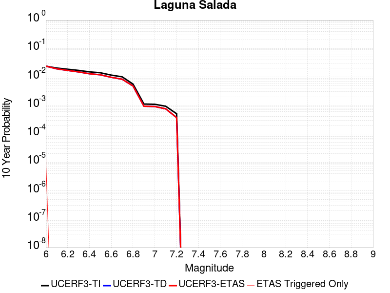 |

| Magnitude | 1 wk TI Prob | 1 wk TD Prob | 1 wk ETAS Prob | 1 wk ETAS/TD Gain | 1 wk ETAS Triggered Only | 1 mo TI Prob | 1 mo TD Prob | 1 mo ETAS Prob | 1 mo ETAS/TD Gain | 1 mo ETAS Triggered Only | 1 yr TI Prob | 1 yr TD Prob | 1 yr ETAS Prob | 1 yr ETAS/TD Gain | 1 yr ETAS Triggered Only | 10 yr TI Prob | 10 yr TD Prob | 10 yr ETAS Prob | 10 yr ETAS/TD Gain | 10 yr ETAS Triggered Only |
|-----|-----|-----|-----|-----|-----|-----|-----|-----|-----|-----|-----|-----|-----|-----|-----|-----|-----|-----|-----|-----|
| 6.0 | 4.6465593E-5 | 4.634639E-5 | 4.634639E-5 | 1.0 | 0.0 | 1.9912305E-4 | 1.9861311E-4 | 1.9861311E-4 | 1.0 | 0.0 | 0.0024216278 | 0.002415429 | 0.002415429 | 1.0 | 0.0 | 0.02395408 | 0.023975259 | 0.023985444 | 1.0004249 | 1.0435908E-5 |
| 6.1 | 3.982297E-5 | 3.7246125E-5 | 3.7246125E-5 | 1.0 | 0.0 | 1.706587E-4 | 1.5961716E-4 | 1.5961716E-4 | 1.0 | 0.0 | 0.0020757897 | 0.0019417295 | 0.0019417295 | 1.0 | 0.0 | 0.020565065 | 0.019331863 | 0.019331863 | 1.0 | 0.0 |
| 6.2 | 3.6067784E-5 | 3.2602693E-5 | 3.2602693E-5 | 1.0 | 0.0 | 1.5456705E-4 | 1.3971896E-4 | 1.3971896E-4 | 1.0 | 0.0 | 0.0018802295 | 0.0016998611 | 0.0016998611 | 1.0 | 0.0 | 0.018644003 | 0.016949628 | 0.016949628 | 1.0 | 0.0 |
| 6.3 | 3.2859112E-5 | 2.8849448E-5 | 2.8849448E-5 | 1.0 | 0.0 | 1.4081717E-4 | 1.2363521E-4 | 1.2363521E-4 | 1.0 | 0.0 | 0.0017131006 | 0.0015043203 | 0.0015043203 | 1.0 | 0.0 | 0.016999546 | 0.015018767 | 0.015018767 | 1.0 | 0.0 |
| 6.4 | 2.9132116E-5 | 2.4852965E-5 | 2.4852965E-5 | 1.0 | 0.0 | 1.2484594E-4 | 1.0650887E-4 | 1.0650887E-4 | 1.0 | 0.0 | 0.0015189396 | 0.001296065 | 0.001296065 | 1.0 | 0.0 | 0.015085992 | 0.012956262 | 0.012956262 | 1.0 | 0.0 |
| 6.5 | 2.7075037E-5 | 2.2825836E-5 | 2.2825836E-5 | 1.0 | 0.0 | 1.1603071E-4 | 9.7821845E-5 | 9.7821845E-5 | 1.0 | 0.0 | 0.0014117584 | 0.0011904186 | 0.0011904186 | 1.0 | 0.0 | 0.014028233 | 0.011907749 | 0.011907749 | 1.0 | 0.0 |
| 6.6 | 2.2367465E-5 | 1.8573526E-5 | 1.8573526E-5 | 1.0 | 0.0 | 9.5857045E-5 | 7.959886E-5 | 7.959886E-5 | 1.0 | 0.0 | 0.0011664346 | 9.6876756E-4 | 9.6876756E-4 | 1.0 | 0.0 | 0.011603311 | 0.009702191 | 0.009702191 | 1.0 | 0.0 |
| 6.7 | 1.9458053E-5 | 1.5914242E-5 | 1.5914242E-5 | 1.0 | 0.0 | 8.338899E-5 | 6.8202564E-5 | 6.8202564E-5 | 1.0 | 0.0 | 0.001014788 | 8.3013024E-4 | 8.3013024E-4 | 1.0 | 0.0 | 0.010101665 | 0.0083209425 | 0.0083209425 | 1.0 | 0.0 |
| 6.8 | 1.0767866E-5 | 9.18435E-6 | 9.18435E-6 | 1.0 | 0.0 | 4.614718E-5 | 3.9361294E-5 | 3.9361294E-5 | 1.0 | 0.0 | 5.6169706E-4 | 4.7918706E-4 | 4.7918706E-4 | 1.0 | 0.0 | 0.0056027942 | 0.0048096925 | 0.0048096925 | 1.0 | 0.0 |
| 6.9 | 2.1384765E-6 | 1.7913675E-6 | 1.7913675E-6 | 1.0 | 0.0 | 9.164866E-6 | 7.677269E-6 | 7.677269E-6 | 1.0 | 0.0 | 1.1157654E-4 | 9.346713E-5 | 9.346713E-5 | 1.0 | 0.0 | 0.0011152053 | 9.343165E-4 | 9.343165E-4 | 1.0 | 0.0 |
| 7.0 | 2.0952946E-6 | 1.7493046E-6 | 1.7493046E-6 | 1.0 | 0.0 | 8.979802E-6 | 7.4970003E-6 | 7.4970003E-6 | 1.0 | 0.0 | 1.0932361E-4 | 9.1272545E-5 | 9.1272545E-5 | 1.0 | 0.0 | 0.0010926984 | 9.123888E-4 | 9.123888E-4 | 1.0 | 0.0 |
| 7.1 | 1.7887576E-6 | 1.4500254E-6 | 1.4500254E-6 | 1.0 | 0.0 | 7.666081E-6 | 6.2143813E-6 | 6.2143813E-6 | 1.0 | 0.0 | 9.333054E-5 | 7.565777E-5 | 7.565777E-5 | 1.0 | 0.0 | 9.329135E-4 | 7.563506E-4 | 7.563506E-4 | 1.0 | 0.0 |
| 7.2 | 9.723109E-7 | 7.135619E-7 | 7.135619E-7 | 1.0 | 0.0 | 4.16704E-6 | 3.0581198E-6 | 3.0581198E-6 | 1.0 | 0.0 | 5.073253E-5 | 3.7232137E-5 | 3.7232137E-5 | 1.0 | 0.0 | 5.072095E-4 | 3.7227524E-4 | 3.7227524E-4 | 1.0 | 0.0 |

## San Gregorio (South) 2011 CFM
*[(top)](#table-of-contents)*

| 1 Week | 1 Month | 1 Year | 10 Year |
|-----|-----|-----|-----|
|  |  | 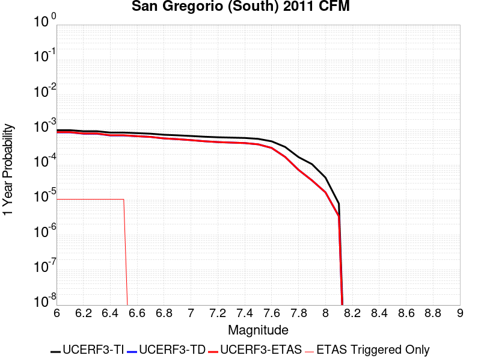 | 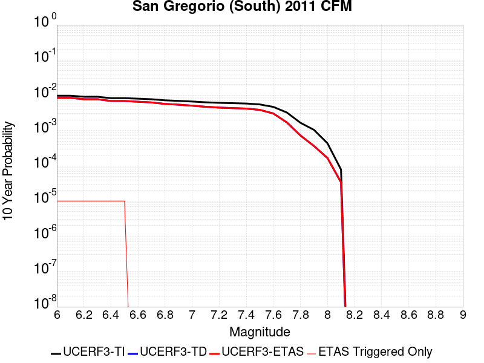 |

| Magnitude | 1 wk TI Prob | 1 wk TD Prob | 1 wk ETAS Prob | 1 wk ETAS/TD Gain | 1 wk ETAS Triggered Only | 1 mo TI Prob | 1 mo TD Prob | 1 mo ETAS Prob | 1 mo ETAS/TD Gain | 1 mo ETAS Triggered Only | 1 yr TI Prob | 1 yr TD Prob | 1 yr ETAS Prob | 1 yr ETAS/TD Gain | 1 yr ETAS Triggered Only | 10 yr TI Prob | 10 yr TD Prob | 10 yr ETAS Prob | 10 yr ETAS/TD Gain | 10 yr ETAS Triggered Only |
|-----|-----|-----|-----|-----|-----|-----|-----|-----|-----|-----|-----|-----|-----|-----|-----|-----|-----|-----|-----|-----|
| 6.0 | 1.8770423E-5 | 1.6279751E-5 | 1.6279751E-5 | 1.0 | 0.0 | 8.044219E-5 | 6.976852E-5 | 6.976852E-5 | 1.0 | 0.0 | 9.789435E-4 | 8.491044E-4 | 8.595315E-4 | 1.0122801 | 1.0435908E-5 | 0.009746423 | 0.008471312 | 0.008481659 | 1.0012214 | 1.0435908E-5 |
| 6.1 | 1.8770423E-5 | 1.6279751E-5 | 1.6279751E-5 | 1.0 | 0.0 | 8.044219E-5 | 6.976852E-5 | 6.976852E-5 | 1.0 | 0.0 | 9.789435E-4 | 8.491044E-4 | 8.595315E-4 | 1.0122801 | 1.0435908E-5 | 0.009746423 | 0.008471312 | 0.008481659 | 1.0012214 | 1.0435908E-5 |
| 6.2 | 1.7508692E-5 | 1.4899257E-5 | 1.4899257E-5 | 1.0 | 0.0 | 7.5035096E-5 | 6.3852414E-5 | 6.3852414E-5 | 1.0 | 0.0 | 9.1316935E-4 | 7.7712885E-4 | 7.8755664E-4 | 1.0134183 | 1.0435908E-5 | 0.00909426 | 0.00775674 | 0.0077670948 | 1.0013349 | 1.0435908E-5 |
| 6.3 | 1.7508692E-5 | 1.4899257E-5 | 1.4899257E-5 | 1.0 | 0.0 | 7.5035096E-5 | 6.3852414E-5 | 6.3852414E-5 | 1.0 | 0.0 | 9.1316935E-4 | 7.7712885E-4 | 7.8755664E-4 | 1.0134183 | 1.0435908E-5 | 0.00909426 | 0.00775674 | 0.0077670948 | 1.0013349 | 1.0435908E-5 |
| 6.4 | 1.6004591E-5 | 1.3249094E-5 | 1.3249094E-5 | 1.0 | 0.0 | 6.85893E-5 | 5.6780602E-5 | 5.6780602E-5 | 1.0 | 0.0 | 8.347548E-4 | 6.910856E-4 | 7.015143E-4 | 1.0150903 | 1.0435908E-5 | 0.008316261 | 0.006901791 | 0.0069121546 | 1.0015017 | 1.0435908E-5 |
| 6.5 | 1.6004591E-5 | 1.3249094E-5 | 1.3249094E-5 | 1.0 | 0.0 | 6.85893E-5 | 5.6780602E-5 | 5.6780602E-5 | 1.0 | 0.0 | 8.347548E-4 | 6.910856E-4 | 7.015143E-4 | 1.0150903 | 1.0435908E-5 | 0.008316261 | 0.006901791 | 0.0069121546 | 1.0015017 | 1.0435908E-5 |
| 6.6 | 1.5442201E-5 | 1.2633725E-5 | 1.2633725E-5 | 1.0 | 0.0 | 6.617918E-5 | 5.4143416E-5 | 5.4143416E-5 | 1.0 | 0.0 | 8.0543366E-4 | 6.5899757E-4 | 6.5899757E-4 | 1.0 | 0.0 | 0.008025207 | 0.006582842 | 0.006582842 | 1.0 | 0.0 |
| 6.7 | 1.489921E-5 | 1.2042234E-5 | 1.2042234E-5 | 1.0 | 0.0 | 6.3852196E-5 | 5.1608557E-5 | 5.1608557E-5 | 1.0 | 0.0 | 7.7712315E-4 | 6.2815374E-4 | 6.2815374E-4 | 1.0 | 0.0 | 0.0077441116 | 0.006276176 | 0.006276176 | 1.0 | 0.0 |
| 6.8 | 1.3876024E-5 | 1.0921184E-5 | 1.0921184E-5 | 1.0 | 0.0 | 5.9467322E-5 | 4.6804238E-5 | 4.6804238E-5 | 1.0 | 0.0 | 7.237741E-4 | 5.69693E-4 | 5.69693E-4 | 1.0 | 0.0 | 0.0072142133 | 0.0056946846 | 0.0056946846 | 1.0 | 0.0 |
| 6.9 | 1.33922495E-5 | 1.0392687E-5 | 1.0392687E-5 | 1.0 | 0.0 | 5.7394092E-5 | 4.4539327E-5 | 4.4539327E-5 | 1.0 | 0.0 | 6.9854903E-4 | 5.4213166E-4 | 5.4213166E-4 | 1.0 | 0.0 | 0.0069635725 | 0.005420442 | 0.005420442 | 1.0 | 0.0 |
| 7.0 | 1.2807324E-5 | 9.752649E-6 | 9.752649E-6 | 1.0 | 0.0 | 5.4887376E-5 | 4.1796397E-5 | 4.1796397E-5 | 1.0 | 0.0 | 6.680489E-4 | 5.087525E-4 | 5.087525E-4 | 1.0 | 0.0 | 0.006660442 | 0.0050882204 | 0.0050882204 | 1.0 | 0.0 |
| 7.1 | 1.2191438E-5 | 9.061537E-6 | 9.061537E-6 | 1.0 | 0.0 | 5.224797E-5 | 3.8834576E-5 | 3.8834576E-5 | 1.0 | 0.0 | 6.3593336E-4 | 4.727085E-4 | 4.727085E-4 | 1.0 | 0.0 | 0.0063411663 | 0.0047293645 | 0.0047293645 | 1.0 | 0.0 |
| 7.2 | 1.1769438E-5 | 8.581731E-6 | 8.581731E-6 | 1.0 | 0.0 | 5.0439474E-5 | 3.677833E-5 | 3.677833E-5 | 1.0 | 0.0 | 6.1392755E-4 | 4.4768423E-4 | 4.4768423E-4 | 1.0 | 0.0 | 0.0061223423 | 0.004480157 | 0.004480157 | 1.0 | 0.0 |
| 7.3 | 1.150374E-5 | 8.29716E-6 | 8.29716E-6 | 1.0 | 0.0 | 4.9300812E-5 | 3.5558773E-5 | 3.5558773E-5 | 1.0 | 0.0 | 6.0007203E-4 | 4.3284212E-4 | 4.3284212E-4 | 1.0 | 0.0 | 0.0059845424 | 0.0043323063 | 0.0043323063 | 1.0 | 0.0 |
| 7.4 | 1.12514E-5 | 8.042902E-6 | 8.042902E-6 | 1.0 | 0.0 | 4.8219394E-5 | 3.4469125E-5 | 3.4469125E-5 | 1.0 | 0.0 | 5.8691297E-4 | 4.1958084E-4 | 4.1958084E-4 | 1.0 | 0.0 | 0.005853653 | 0.0042001884 | 0.0042001884 | 1.0 | 0.0 |
| 7.5 | 1.059696E-5 | 7.3931915E-6 | 7.3931915E-6 | 1.0 | 0.0 | 4.5414752E-5 | 3.168472E-5 | 3.168472E-5 | 1.0 | 0.0 | 5.5278436E-4 | 3.8569325E-4 | 3.8569325E-4 | 1.0 | 0.0 | 0.0055141128 | 0.0038624762 | 0.0038624762 | 1.0 | 0.0 |
| 7.6 | 9.018592E-6 | 5.8369624E-6 | 5.8369624E-6 | 1.0 | 0.0 | 3.8650534E-5 | 2.5015313E-5 | 2.5015313E-5 | 1.0 | 0.0 | 4.7046866E-4 | 3.045189E-4 | 3.045189E-4 | 1.0 | 0.0 | 0.004694739 | 0.0030528754 | 0.0030528754 | 1.0 | 0.0 |
| 7.7 | 6.243489E-6 | 3.2395455E-6 | 3.2395455E-6 | 1.0 | 0.0 | 2.6757538E-5 | 1.3883692E-5 | 1.3883692E-5 | 1.0 | 0.0 | 3.257243E-4 | 1.6902086E-4 | 1.6902086E-4 | 1.0 | 0.0 | 0.003252473 | 0.001699108 | 0.001699108 | 1.0 | 0.0 |
| 7.8 | 3.1941963E-6 | 1.3809986E-6 | 1.3809986E-6 | 1.0 | 0.0 | 1.368934E-5 | 5.9185513E-6 | 5.9185513E-6 | 1.0 | 0.0 | 1.6665498E-4 | 7.2055984E-5 | 7.2055984E-5 | 1.0 | 0.0 | 0.0016653005 | 7.263174E-4 | 7.263174E-4 | 1.0 | 0.0 |
| 7.9 | 2.0098398E-6 | 6.9161155E-7 | 6.9161155E-7 | 1.0 | 0.0 | 8.6135715E-6 | 2.964046E-6 | 2.964046E-6 | 1.0 | 0.0 | 1.0486518E-4 | 3.608666E-5 | 3.608666E-5 | 1.0 | 0.0 | 0.0010481571 | 3.657225E-4 | 3.657225E-4 | 1.0 | 0.0 |
| 8.0 | 8.353119E-7 | 3.1623412E-7 | 3.1623412E-7 | 1.0 | 0.0 | 3.579903E-6 | 1.3552883E-6 | 1.3552883E-6 | 1.0 | 0.0 | 4.358445E-5 | 1.6500511E-5 | 1.6500511E-5 | 1.0 | 0.0 | 4.3575902E-4 | 1.6619264E-4 | 1.6619264E-4 | 1.0 | 0.0 |
| 8.1 | 1.5033264E-7 | 6.527624E-8 | 6.527624E-8 | 1.0 | 0.0 | 6.442826E-7 | 2.7975528E-7 | 2.7975528E-7 | 1.0 | 0.0 | 7.844113E-6 | 3.4060151E-6 | 3.4060151E-6 | 1.0 | 0.0 | 7.843835E-5 | 3.407693E-5 | 3.407693E-5 | 1.0 | 0.0 |

## San Gorgonio Pass
*[(top)](#table-of-contents)*

| 1 Week | 1 Month | 1 Year | 10 Year |
|-----|-----|-----|-----|
| 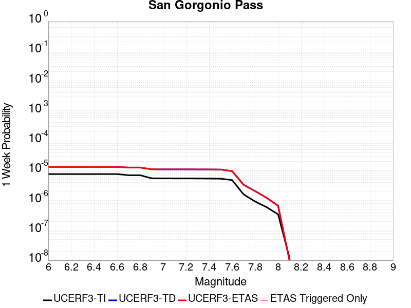 | 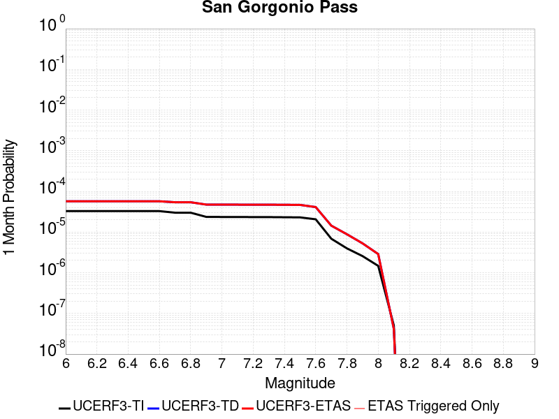 |  | 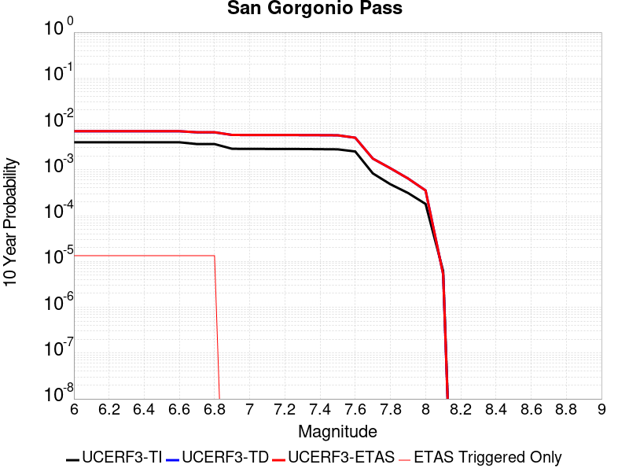 |

| Magnitude | 1 wk TI Prob | 1 wk TD Prob | 1 wk ETAS Prob | 1 wk ETAS/TD Gain | 1 wk ETAS Triggered Only | 1 mo TI Prob | 1 mo TD Prob | 1 mo ETAS Prob | 1 mo ETAS/TD Gain | 1 mo ETAS Triggered Only | 1 yr TI Prob | 1 yr TD Prob | 1 yr ETAS Prob | 1 yr ETAS/TD Gain | 1 yr ETAS Triggered Only | 10 yr TI Prob | 10 yr TD Prob | 10 yr ETAS Prob | 10 yr ETAS/TD Gain | 10 yr ETAS Triggered Only |
|-----|-----|-----|-----|-----|-----|-----|-----|-----|-----|-----|-----|-----|-----|-----|-----|-----|-----|-----|-----|-----|
| 6.0 | 7.644328E-6 | 1.3314231E-5 | 1.3314231E-5 | 1.0 | 0.0 | 3.2760996E-5 | 5.705979E-5 | 5.705979E-5 | 1.0 | 0.0 | 3.987921E-4 | 6.944901E-4 | 7.0491876E-4 | 1.0150163 | 1.0435908E-5 | 0.003980772 | 0.0069299806 | 0.0069403443 | 1.0014955 | 1.0435908E-5 |
| 6.1 | 7.644328E-6 | 1.3314231E-5 | 1.3314231E-5 | 1.0 | 0.0 | 3.2760996E-5 | 5.705979E-5 | 5.705979E-5 | 1.0 | 0.0 | 3.987921E-4 | 6.944901E-4 | 7.0491876E-4 | 1.0150163 | 1.0435908E-5 | 0.003980772 | 0.0069299806 | 0.0069403443 | 1.0014955 | 1.0435908E-5 |
| 6.2 | 7.644328E-6 | 1.3314231E-5 | 1.3314231E-5 | 1.0 | 0.0 | 3.2760996E-5 | 5.705979E-5 | 5.705979E-5 | 1.0 | 0.0 | 3.987921E-4 | 6.944901E-4 | 7.0491876E-4 | 1.0150163 | 1.0435908E-5 | 0.003980772 | 0.0069299806 | 0.0069403443 | 1.0014955 | 1.0435908E-5 |
| 6.3 | 7.644328E-6 | 1.3314231E-5 | 1.3314231E-5 | 1.0 | 0.0 | 3.2760996E-5 | 5.705979E-5 | 5.705979E-5 | 1.0 | 0.0 | 3.987921E-4 | 6.944901E-4 | 7.0491876E-4 | 1.0150163 | 1.0435908E-5 | 0.003980772 | 0.0069299806 | 0.0069403443 | 1.0014955 | 1.0435908E-5 |
| 6.4 | 7.644328E-6 | 1.3314231E-5 | 1.3314231E-5 | 1.0 | 0.0 | 3.2760996E-5 | 5.705979E-5 | 5.705979E-5 | 1.0 | 0.0 | 3.987921E-4 | 6.944901E-4 | 7.0491876E-4 | 1.0150163 | 1.0435908E-5 | 0.003980772 | 0.0069299806 | 0.0069403443 | 1.0014955 | 1.0435908E-5 |
| 6.5 | 7.644328E-6 | 1.3314231E-5 | 1.3314231E-5 | 1.0 | 0.0 | 3.2760996E-5 | 5.705979E-5 | 5.705979E-5 | 1.0 | 0.0 | 3.987921E-4 | 6.944901E-4 | 7.0491876E-4 | 1.0150163 | 1.0435908E-5 | 0.003980772 | 0.0069299806 | 0.0069403443 | 1.0014955 | 1.0435908E-5 |
| 6.6 | 7.644328E-6 | 1.3314231E-5 | 1.3314231E-5 | 1.0 | 0.0 | 3.2760996E-5 | 5.705979E-5 | 5.705979E-5 | 1.0 | 0.0 | 3.987921E-4 | 6.944901E-4 | 7.0491876E-4 | 1.0150163 | 1.0435908E-5 | 0.003980772 | 0.0069299806 | 0.0069403443 | 1.0014955 | 1.0435908E-5 |
| 6.7 | 6.987586E-6 | 1.2618505E-5 | 1.2618505E-5 | 1.0 | 0.0 | 2.9946454E-5 | 5.4078235E-5 | 5.4078235E-5 | 1.0 | 0.0 | 3.645371E-4 | 6.582117E-4 | 6.686408E-4 | 1.0158445 | 1.0435908E-5 | 0.0036393967 | 0.0065693567 | 0.006579724 | 1.0015781 | 1.0435908E-5 |
| 6.8 | 6.987586E-6 | 1.2618505E-5 | 1.2618505E-5 | 1.0 | 0.0 | 2.9946454E-5 | 5.4078235E-5 | 5.4078235E-5 | 1.0 | 0.0 | 3.645371E-4 | 6.582117E-4 | 6.686408E-4 | 1.0158445 | 1.0435908E-5 | 0.0036393967 | 0.0065693567 | 0.006579724 | 1.0015781 | 1.0435908E-5 |
| 6.9 | 5.504702E-6 | 1.1049368E-5 | 1.1049368E-5 | 1.0 | 0.0 | 2.3591367E-5 | 4.7353606E-5 | 4.7353606E-5 | 1.0 | 0.0 | 2.8718702E-4 | 5.7638274E-4 | 5.7638274E-4 | 1.0 | 0.0 | 0.0028681618 | 0.005755309 | 0.005755309 | 1.0 | 0.0 |
| 7.0 | 5.4825764E-6 | 1.102571E-5 | 1.102571E-5 | 1.0 | 0.0 | 2.3496545E-5 | 4.7252215E-5 | 4.7252215E-5 | 1.0 | 0.0 | 2.8603288E-4 | 5.751489E-4 | 5.751489E-4 | 1.0 | 0.0 | 0.00285665 | 0.005743035 | 0.005743035 | 1.0 | 0.0 |
| 7.1 | 5.4692787E-6 | 1.101142E-5 | 1.101142E-5 | 1.0 | 0.0 | 2.3439556E-5 | 4.7190973E-5 | 4.7190973E-5 | 1.0 | 0.0 | 2.8533922E-4 | 5.744037E-4 | 5.744037E-4 | 1.0 | 0.0 | 0.0028497311 | 0.0057356213 | 0.0057356213 | 1.0 | 0.0 |
| 7.2 | 5.453661E-6 | 1.0994446E-5 | 1.0994446E-5 | 1.0 | 0.0 | 2.3372622E-5 | 4.7118232E-5 | 4.7118232E-5 | 1.0 | 0.0 | 2.8452452E-4 | 5.7351857E-4 | 5.7351857E-4 | 1.0 | 0.0 | 0.002841605 | 0.0057268157 | 0.0057268157 | 1.0 | 0.0 |
| 7.3 | 5.4422303E-6 | 1.0981369E-5 | 1.0981369E-5 | 1.0 | 0.0 | 2.3323635E-5 | 4.706219E-5 | 4.706219E-5 | 1.0 | 0.0 | 2.8392827E-4 | 5.728366E-4 | 5.728366E-4 | 1.0 | 0.0 | 0.0028356577 | 0.005720031 | 0.005720031 | 1.0 | 0.0 |
| 7.4 | 5.398595E-6 | 1.0928734E-5 | 1.0928734E-5 | 1.0 | 0.0 | 2.313663E-5 | 4.683662E-5 | 4.683662E-5 | 1.0 | 0.0 | 2.8165206E-4 | 5.700917E-4 | 5.700917E-4 | 1.0 | 0.0 | 0.0028129534 | 0.005692723 | 0.005692723 | 1.0 | 0.0 |
| 7.5 | 5.3578788E-6 | 1.0855281E-5 | 1.0855281E-5 | 1.0 | 0.0 | 2.2962136E-5 | 4.6521833E-5 | 4.6521833E-5 | 1.0 | 0.0 | 2.7952815E-4 | 5.662612E-4 | 5.662612E-4 | 1.0 | 0.0 | 0.002791768 | 0.0056546377 | 0.0056546377 | 1.0 | 0.0 |
| 7.6 | 4.8091474E-6 | 9.60368E-6 | 9.60368E-6 | 1.0 | 0.0 | 2.0610469E-5 | 4.1158008E-5 | 4.1158008E-5 | 1.0 | 0.0 | 2.5090357E-4 | 5.0098833E-4 | 5.0098833E-4 | 1.0 | 0.0 | 0.0025062046 | 0.0050053033 | 0.0050053033 | 1.0 | 0.0 |
| 7.7 | 1.5991155E-6 | 3.352866E-6 | 3.352866E-6 | 1.0 | 0.0 | 6.853334E-6 | 1.4369349E-5 | 1.4369349E-5 | 1.0 | 0.0 | 8.343615E-5 | 1.7493303E-4 | 1.7493303E-4 | 1.0 | 0.0 | 8.340483E-4 | 0.0017534072 | 0.0017534072 | 1.0 | 0.0 |
| 7.8 | 9.258398E-7 | 2.0579948E-6 | 2.0579948E-6 | 1.0 | 0.0 | 3.967879E-6 | 8.819949E-6 | 8.819949E-6 | 1.0 | 0.0 | 4.8307855E-5 | 1.073776E-4 | 1.073776E-4 | 1.0 | 0.0 | 4.8297356E-4 | 0.001078687 | 0.001078687 | 1.0 | 0.0 |
| 7.9 | 5.975575E-7 | 1.2291794E-6 | 1.2291794E-6 | 1.0 | 0.0 | 2.5609581E-6 | 5.2679006E-6 | 5.2679006E-6 | 1.0 | 0.0 | 3.117922E-5 | 6.4134816E-5 | 6.4134816E-5 | 1.0 | 0.0 | 3.1174847E-4 | 6.463092E-4 | 6.463092E-4 | 1.0 | 0.0 |
| 8.0 | 3.4413725E-7 | 6.7148494E-7 | 6.7148494E-7 | 1.0 | 0.0 | 1.4748731E-6 | 2.8777895E-6 | 2.8777895E-6 | 1.0 | 0.0 | 1.7956432E-5 | 3.503653E-5 | 3.503653E-5 | 1.0 | 0.0 | 1.7954981E-4 | 3.5373896E-4 | 3.5373896E-4 | 1.0 | 0.0 |
| 8.1 | 1.1787731E-8 | 9.634385E-9 | 9.634385E-9 | 1.0 | 0.0 | 5.0518846E-8 | 4.129022E-8 | 4.129022E-8 | 1.0 | 0.0 | 6.1506677E-7 | 5.027083E-7 | 5.027083E-7 | 1.0 | 0.0 | 6.1506507E-6 | 5.2424944E-6 | 5.2424944E-6 | 1.0 | 0.0 |

## Greenville (So) 2011 CFM
*[(top)](#table-of-contents)*

| 1 Week | 1 Month | 1 Year | 10 Year |
|-----|-----|-----|-----|
|  | 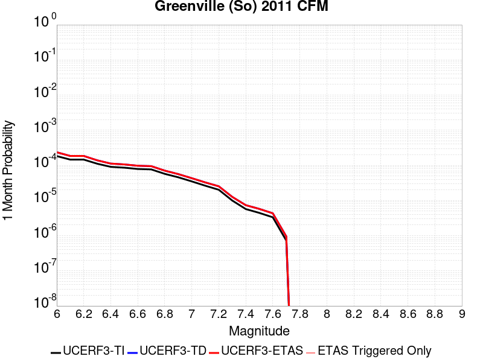 | 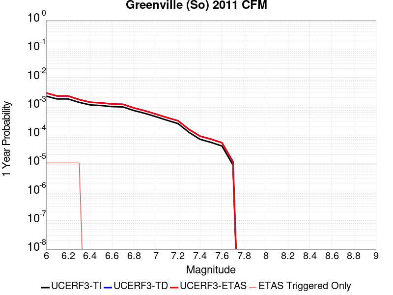 | 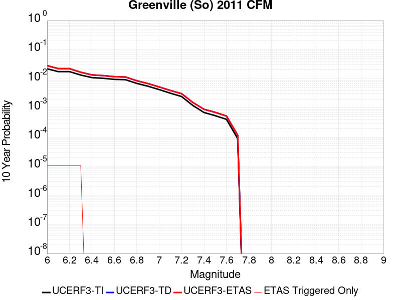 |

| Magnitude | 1 wk TI Prob | 1 wk TD Prob | 1 wk ETAS Prob | 1 wk ETAS/TD Gain | 1 wk ETAS Triggered Only | 1 mo TI Prob | 1 mo TD Prob | 1 mo ETAS Prob | 1 mo ETAS/TD Gain | 1 mo ETAS Triggered Only | 1 yr TI Prob | 1 yr TD Prob | 1 yr ETAS Prob | 1 yr ETAS/TD Gain | 1 yr ETAS Triggered Only | 10 yr TI Prob | 10 yr TD Prob | 10 yr ETAS Prob | 10 yr ETAS/TD Gain | 10 yr ETAS Triggered Only |
|-----|-----|-----|-----|-----|-----|-----|-----|-----|-----|-----|-----|-----|-----|-----|-----|-----|-----|-----|-----|-----|
| 6.0 | 4.279693E-5 | 5.5040087E-5 | 5.5040087E-5 | 1.0 | 0.0 | 1.8340252E-4 | 2.3586681E-4 | 2.3586681E-4 | 1.0 | 0.0 | 0.0022306389 | 0.0028682416 | 0.0028786475 | 1.003628 | 1.0435908E-5 | 0.022083808 | 0.028338138 | 0.028348278 | 1.0003579 | 1.0435908E-5 |
| 6.1 | 3.4037297E-5 | 4.3192387E-5 | 4.3192387E-5 | 1.0 | 0.0 | 1.4586597E-4 | 1.8509831E-4 | 1.8509831E-4 | 1.0 | 0.0 | 0.0017744715 | 0.0022514379 | 0.0022618503 | 1.0046247 | 1.0435908E-5 | 0.01760369 | 0.022302566 | 0.02231277 | 1.0004575 | 1.0435908E-5 |
| 6.2 | 3.4037297E-5 | 4.3192387E-5 | 4.3192387E-5 | 1.0 | 0.0 | 1.4586597E-4 | 1.8509831E-4 | 1.8509831E-4 | 1.0 | 0.0 | 0.0017744715 | 0.0022514379 | 0.0022618503 | 1.0046247 | 1.0435908E-5 | 0.01760369 | 0.022302566 | 0.02231277 | 1.0004575 | 1.0435908E-5 |
| 6.3 | 2.5956324E-5 | 3.2428903E-5 | 3.2428903E-5 | 1.0 | 0.0 | 1.11236644E-4 | 1.3897405E-4 | 1.3897405E-4 | 1.0 | 0.0 | 0.0013534647 | 0.0016907708 | 0.0017011891 | 1.0061618 | 1.0435908E-5 | 0.013452509 | 0.016785882 | 0.016796144 | 1.0006113 | 1.0435908E-5 |
| 6.4 | 2.1145053E-5 | 2.6197677E-5 | 2.6197677E-5 | 1.0 | 0.0 | 9.061851E-5 | 1.1227112E-4 | 1.1227112E-4 | 1.0 | 0.0 | 0.0011027219 | 0.0013660751 | 0.0013660751 | 1.0 | 0.0 | 0.01097266 | 0.01358018 | 0.01358018 | 1.0 | 0.0 |
| 6.5 | 2.0030959E-5 | 2.479578E-5 | 2.479578E-5 | 1.0 | 0.0 | 8.584414E-5 | 1.06263484E-4 | 1.06263484E-4 | 1.0 | 0.0 | 0.0010446513 | 0.0012930221 | 0.0012930221 | 1.0 | 0.0 | 0.010397541 | 0.012858339 | 0.012858339 | 1.0 | 0.0 |
| 6.6 | 1.8395405E-5 | 2.2754466E-5 | 2.2754466E-5 | 1.0 | 0.0 | 7.8835066E-5 | 9.751565E-5 | 9.751565E-5 | 1.0 | 0.0 | 9.5939427E-4 | 0.0011866348 | 0.0011866348 | 1.0 | 0.0 | 0.009552629 | 0.011806041 | 0.011806041 | 1.0 | 0.0 |
| 6.7 | 1.7883482E-5 | 2.212551E-5 | 2.212551E-5 | 1.0 | 0.0 | 7.664124E-5 | 9.482033E-5 | 9.482033E-5 | 1.0 | 0.0 | 9.3270757E-4 | 0.0011538545 | 0.0011538545 | 1.0 | 0.0 | 0.009288026 | 0.011481688 | 0.011481688 | 1.0 | 0.0 |
| 6.8 | 1.3373564E-5 | 1.6505966E-5 | 1.6505966E-5 | 1.0 | 0.0 | 5.7314013E-5 | 7.073802E-5 | 7.073802E-5 | 1.0 | 0.0 | 6.975747E-4 | 8.609098E-4 | 8.609098E-4 | 1.0 | 0.0 | 0.0069538904 | 0.008577357 | 0.008577357 | 1.0 | 0.0 |
| 6.9 | 1.06692905E-5 | 1.3152582E-5 | 1.3152582E-5 | 1.0 | 0.0 | 4.5724726E-5 | 5.6367055E-5 | 5.6367055E-5 | 1.0 | 0.0 | 5.5655633E-4 | 6.86064E-4 | 6.86064E-4 | 1.0 | 0.0 | 0.005551645 | 0.006840693 | 0.006840693 | 1.0 | 0.0 |
| 7.0 | 8.157512E-6 | 1.0062639E-5 | 1.0062639E-5 | 1.0 | 0.0 | 3.4960296E-5 | 4.3124903E-5 | 4.3124903E-5 | 1.0 | 0.0 | 4.2555845E-4 | 5.2492286E-4 | 5.2492286E-4 | 1.0 | 0.0 | 0.004247444 | 0.0052373074 | 0.0052373074 | 1.0 | 0.0 |
| 7.1 | 6.1467113E-6 | 7.6274314E-6 | 7.6274314E-6 | 1.0 | 0.0 | 2.6342783E-5 | 3.268859E-5 | 3.268859E-5 | 1.0 | 0.0 | 3.206762E-4 | 3.9791173E-4 | 3.9791173E-4 | 1.0 | 0.0 | 0.0032021382 | 0.0039721807 | 0.0039721807 | 1.0 | 0.0 |
| 7.2 | 4.713467E-6 | 5.9141557E-6 | 5.9141557E-6 | 1.0 | 0.0 | 2.0200418E-5 | 2.5346139E-5 | 2.5346139E-5 | 1.0 | 0.0 | 2.4591232E-4 | 3.0854615E-4 | 3.0854615E-4 | 1.0 | 0.0 | 0.0024564038 | 0.0030813308 | 0.0030813308 | 1.0 | 0.0 |
| 7.3 | 2.3266216E-6 | 2.954009E-6 | 2.954009E-6 | 1.0 | 0.0 | 9.971197E-6 | 1.2659978E-5 | 1.2659978E-5 | 1.0 | 0.0 | 1.2139256E-4 | 1.5412449E-4 | 1.5412449E-4 | 1.0 | 0.0 | 0.0012132627 | 0.0015402455 | 0.0015402455 | 1.0 | 0.0 |
| 7.4 | 1.3314E-6 | 1.7179472E-6 | 1.7179472E-6 | 1.0 | 0.0 | 5.7059874E-6 | 7.36261E-6 | 7.36261E-6 | 1.0 | 0.0 | 6.946818E-5 | 8.963614E-5 | 8.963614E-5 | 1.0 | 0.0 | 6.9446466E-4 | 8.9603866E-4 | 8.9603866E-4 | 1.0 | 0.0 |
| 7.5 | 1.0362941E-6 | 1.3468821E-6 | 1.3468821E-6 | 1.0 | 0.0 | 4.4412527E-6 | 5.772339E-6 | 5.772339E-6 | 1.0 | 0.0 | 5.407091E-5 | 7.027601E-5 | 7.027601E-5 | 1.0 | 0.0 | 5.405776E-4 | 7.025681E-4 | 7.025681E-4 | 1.0 | 0.0 |
| 7.6 | 7.764784E-7 | 1.0088593E-6 | 1.0088593E-6 | 1.0 | 0.0 | 3.3277602E-6 | 4.323676E-6 | 4.323676E-6 | 1.0 | 0.0 | 4.0514726E-5 | 5.263952E-5 | 5.263952E-5 | 1.0 | 0.0 | 4.050734E-4 | 5.262919E-4 | 5.262919E-4 | 1.0 | 0.0 |
| 7.7 | 1.6927763E-7 | 2.2139248E-7 | 2.2139248E-7 | 1.0 | 0.0 | 7.2547533E-7 | 9.4882455E-7 | 9.4882455E-7 | 1.0 | 0.0 | 8.832627E-6 | 1.15518815E-5 | 1.15518815E-5 | 1.0 | 0.0 | 8.8322755E-5 | 1.15515526E-4 | 1.15515526E-4 | 1.0 | 0.0 |

## Great Valley 04b Gordon Valley
*[(top)](#table-of-contents)*

| 1 Week | 1 Month | 1 Year | 10 Year |
|-----|-----|-----|-----|
| 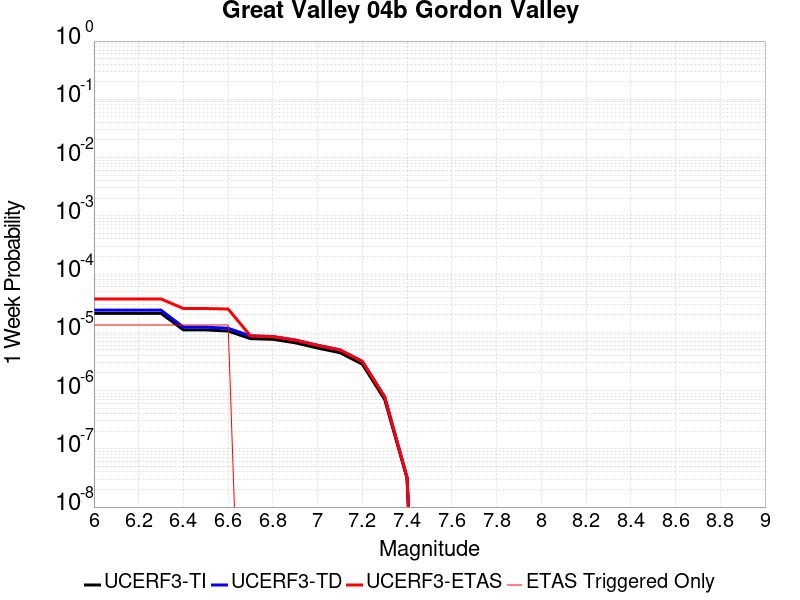 | 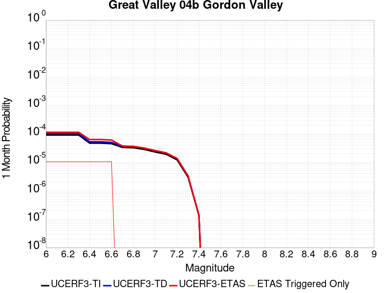 | 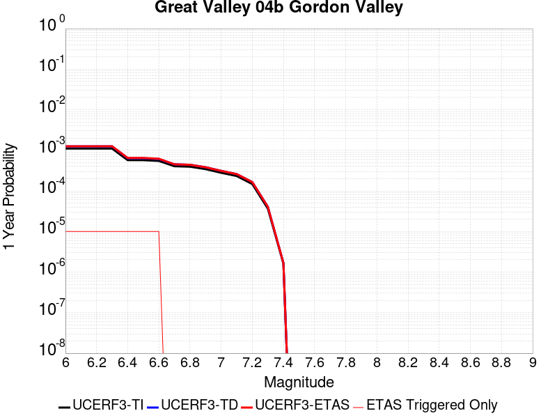 | 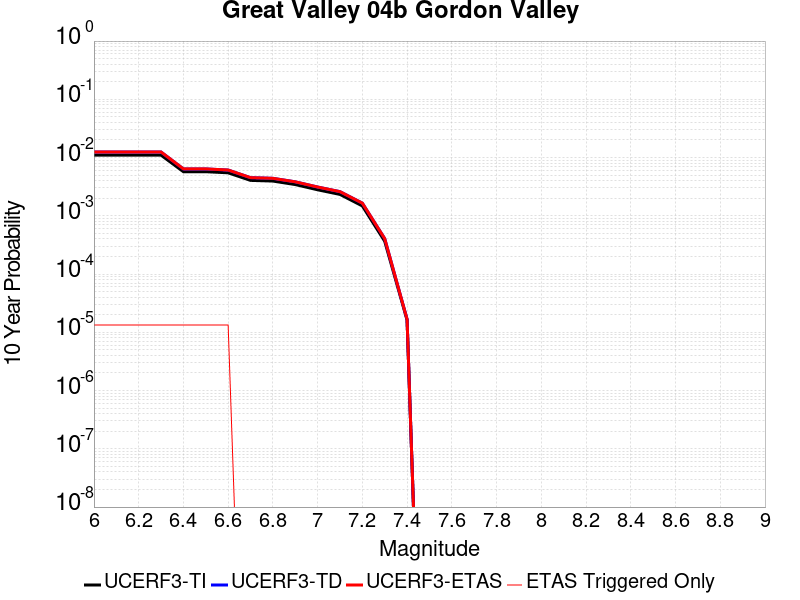 |

| Magnitude | 1 wk TI Prob | 1 wk TD Prob | 1 wk ETAS Prob | 1 wk ETAS/TD Gain | 1 wk ETAS Triggered Only | 1 mo TI Prob | 1 mo TD Prob | 1 mo ETAS Prob | 1 mo ETAS/TD Gain | 1 mo ETAS Triggered Only | 1 yr TI Prob | 1 yr TD Prob | 1 yr ETAS Prob | 1 yr ETAS/TD Gain | 1 yr ETAS Triggered Only | 10 yr TI Prob | 10 yr TD Prob | 10 yr ETAS Prob | 10 yr ETAS/TD Gain | 10 yr ETAS Triggered Only |
|-----|-----|-----|-----|-----|-----|-----|-----|-----|-----|-----|-----|-----|-----|-----|-----|-----|-----|-----|-----|-----|
| 6.0 | 2.1181217E-5 | 2.3981953E-5 | 3.441761E-5 | 1.4351463 | 1.0435908E-5 | 9.077348E-5 | 1.0277669E-4 | 1.1321152E-4 | 1.1015292 | 1.0435908E-5 | 0.0011046068 | 0.0012507546 | 0.0012611775 | 1.0083332 | 1.0435908E-5 | 0.010991322 | 0.012453599 | 0.012463905 | 1.0008276 | 1.0435908E-5 |
| 6.1 | 2.1181217E-5 | 2.3981953E-5 | 3.441761E-5 | 1.4351463 | 1.0435908E-5 | 9.077348E-5 | 1.0277669E-4 | 1.1321152E-4 | 1.1015292 | 1.0435908E-5 | 0.0011046068 | 0.0012507546 | 0.0012611775 | 1.0083332 | 1.0435908E-5 | 0.010991322 | 0.012453599 | 0.012463905 | 1.0008276 | 1.0435908E-5 |
| 6.2 | 2.1181217E-5 | 2.3981953E-5 | 3.441761E-5 | 1.4351463 | 1.0435908E-5 | 9.077348E-5 | 1.0277669E-4 | 1.1321152E-4 | 1.1015292 | 1.0435908E-5 | 0.0011046068 | 0.0012507546 | 0.0012611775 | 1.0083332 | 1.0435908E-5 | 0.010991322 | 0.012453599 | 0.012463905 | 1.0008276 | 1.0435908E-5 |
| 6.3 | 2.1181217E-5 | 2.3981953E-5 | 3.441761E-5 | 1.4351463 | 1.0435908E-5 | 9.077348E-5 | 1.0277669E-4 | 1.1321152E-4 | 1.1015292 | 1.0435908E-5 | 0.0011046068 | 0.0012507546 | 0.0012611775 | 1.0083332 | 1.0435908E-5 | 0.010991322 | 0.012453599 | 0.012463905 | 1.0008276 | 1.0435908E-5 |
| 6.4 | 1.0988268E-5 | 1.2254499E-5 | 2.2690278E-5 | 1.8515877 | 1.0435908E-5 | 4.7091726E-5 | 5.2518313E-5 | 6.295367E-5 | 1.1986995 | 1.0435908E-5 | 5.731909E-4 | 6.392388E-4 | 6.4966804E-4 | 1.0163151 | 1.0435908E-5 | 0.005717147 | 0.0063755875 | 0.006385957 | 1.0016264 | 1.0435908E-5 |
| 6.5 | 1.0988268E-5 | 1.2254499E-5 | 2.2690278E-5 | 1.8515877 | 1.0435908E-5 | 4.7091726E-5 | 5.2518313E-5 | 6.295367E-5 | 1.1986995 | 1.0435908E-5 | 5.731909E-4 | 6.392388E-4 | 6.4966804E-4 | 1.0163151 | 1.0435908E-5 | 0.005717147 | 0.0063755875 | 0.006385957 | 1.0016264 | 1.0435908E-5 |
| 6.6 | 1.0517822E-5 | 1.1724062E-5 | 2.2159848E-5 | 1.8901169 | 1.0435908E-5 | 4.5075605E-5 | 5.02451E-5 | 6.0680482E-5 | 1.2076895 | 1.0435908E-5 | 5.4865726E-4 | 6.11578E-4 | 6.2200753E-4 | 1.0170535 | 1.0435908E-5 | 0.0054730466 | 0.0061005033 | 0.0061108754 | 1.0017003 | 1.0435908E-5 |
| 6.7 | 7.789219E-6 | 8.6776445E-6 | 8.6776445E-6 | 1.0 | 0.0 | 3.3381937E-5 | 3.7189402E-5 | 3.7189402E-5 | 1.0 | 0.0 | 4.063493E-4 | 4.526921E-4 | 4.526921E-4 | 1.0 | 0.0 | 0.004056071 | 0.0045182165 | 0.0045182165 | 1.0 | 0.0 |
| 6.8 | 7.5850853E-6 | 8.452389E-6 | 8.452389E-6 | 1.0 | 0.0 | 3.2507105E-5 | 3.622405E-5 | 3.622405E-5 | 1.0 | 0.0 | 3.957021E-4 | 4.409437E-4 | 4.409437E-4 | 1.0 | 0.0 | 0.0039499826 | 0.0044012 | 0.0044012 | 1.0 | 0.0 |
| 6.9 | 6.604105E-6 | 7.3585493E-6 | 7.3585493E-6 | 1.0 | 0.0 | 2.8303E-5 | 3.153628E-5 | 3.153628E-5 | 1.0 | 0.0 | 3.4453452E-4 | 3.8389044E-4 | 3.8389044E-4 | 1.0 | 0.0 | 0.0034400085 | 0.0038326595 | 0.0038326595 | 1.0 | 0.0 |
| 7.0 | 5.3701115E-6 | 5.9884183E-6 | 5.9884183E-6 | 1.0 | 0.0 | 2.301456E-5 | 2.5664414E-5 | 2.5664414E-5 | 1.0 | 0.0 | 2.8016625E-4 | 3.1242234E-4 | 3.1242234E-4 | 1.0 | 0.0 | 0.0027981328 | 0.00312012 | 0.00312012 | 1.0 | 0.0 |
| 7.1 | 4.4685607E-6 | 4.986478E-6 | 4.986478E-6 | 1.0 | 0.0 | 1.9150835E-5 | 2.1370459E-5 | 2.1370459E-5 | 1.0 | 0.0 | 2.3313647E-4 | 2.6015675E-4 | 2.6015675E-4 | 1.0 | 0.0 | 0.0023289204 | 0.0025987667 | 0.0025987667 | 1.0 | 0.0 |
| 7.2 | 2.833378E-6 | 3.164419E-6 | 3.164419E-6 | 1.0 | 0.0 | 1.2142991E-5 | 1.3561736E-5 | 1.3561736E-5 | 1.0 | 0.0 | 1.4783088E-4 | 1.6510337E-4 | 1.6510337E-4 | 1.0 | 0.0 | 0.0014773258 | 0.0016499789 | 0.0016499789 | 1.0 | 0.0 |
| 7.3 | 7.0087293E-7 | 7.7728157E-7 | 7.7728157E-7 | 1.0 | 0.0 | 3.0037377E-6 | 3.3312049E-6 | 3.3312049E-6 | 1.0 | 0.0 | 3.656989E-5 | 4.0557123E-5 | 4.0557123E-5 | 1.0 | 0.0 | 3.6563876E-4 | 4.055422E-4 | 4.055422E-4 | 1.0 | 0.0 |
| 7.4 | 3.112171E-8 | 3.2068368E-8 | 3.2068368E-8 | 1.0 | 0.0 | 1.3337875E-7 | 1.3743585E-7 | 1.3743585E-7 | 1.0 | 0.0 | 1.6238852E-6 | 1.6732803E-6 | 1.6732803E-6 | 1.0 | 0.0 | 1.6238733E-5 | 1.6732685E-5 | 1.6732685E-5 | 1.0 | 0.0 |

## Swain Ravine - Spenceville
*[(top)](#table-of-contents)*

| 1 Week | 1 Month | 1 Year | 10 Year |
|-----|-----|-----|-----|
|  |  | 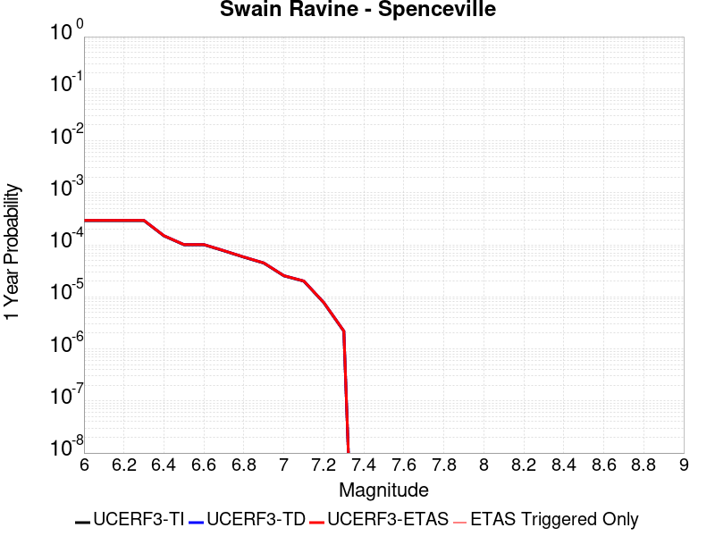 | 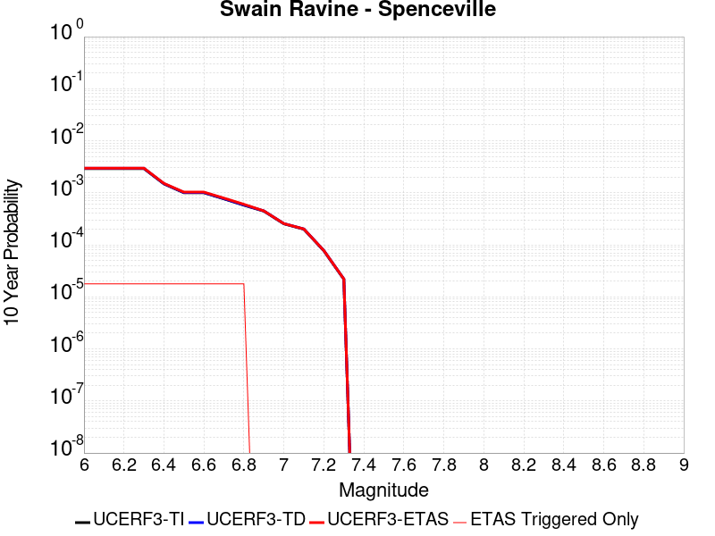 |

| Magnitude | 1 wk TI Prob | 1 wk TD Prob | 1 wk ETAS Prob | 1 wk ETAS/TD Gain | 1 wk ETAS Triggered Only | 1 mo TI Prob | 1 mo TD Prob | 1 mo ETAS Prob | 1 mo ETAS/TD Gain | 1 mo ETAS Triggered Only | 1 yr TI Prob | 1 yr TD Prob | 1 yr ETAS Prob | 1 yr ETAS/TD Gain | 1 yr ETAS Triggered Only | 10 yr TI Prob | 10 yr TD Prob | 10 yr ETAS Prob | 10 yr ETAS/TD Gain | 10 yr ETAS Triggered Only |
|-----|-----|-----|-----|-----|-----|-----|-----|-----|-----|-----|-----|-----|-----|-----|-----|-----|-----|-----|-----|-----|
| 6.0 | 5.596169E-6 | 5.663794E-6 | 5.663794E-6 | 1.0 | 0.0 | 2.398336E-5 | 2.4273193E-5 | 2.4273193E-5 | 1.0 | 0.0 | 2.9195828E-4 | 2.9548878E-4 | 2.9548878E-4 | 1.0 | 0.0 | 0.00291575 | 0.002951228 | 0.002961633 | 1.0035257 | 1.0435908E-5 |
| 6.1 | 5.596169E-6 | 5.663794E-6 | 5.663794E-6 | 1.0 | 0.0 | 2.398336E-5 | 2.4273193E-5 | 2.4273193E-5 | 1.0 | 0.0 | 2.9195828E-4 | 2.9548878E-4 | 2.9548878E-4 | 1.0 | 0.0 | 0.00291575 | 0.002951228 | 0.002961633 | 1.0035257 | 1.0435908E-5 |
| 6.2 | 5.596169E-6 | 5.663794E-6 | 5.663794E-6 | 1.0 | 0.0 | 2.398336E-5 | 2.4273193E-5 | 2.4273193E-5 | 1.0 | 0.0 | 2.9195828E-4 | 2.9548878E-4 | 2.9548878E-4 | 1.0 | 0.0 | 0.00291575 | 0.002951228 | 0.002961633 | 1.0035257 | 1.0435908E-5 |
| 6.3 | 5.596169E-6 | 5.663794E-6 | 5.663794E-6 | 1.0 | 0.0 | 2.398336E-5 | 2.4273193E-5 | 2.4273193E-5 | 1.0 | 0.0 | 2.9195828E-4 | 2.9548878E-4 | 2.9548878E-4 | 1.0 | 0.0 | 0.00291575 | 0.002951228 | 0.002961633 | 1.0035257 | 1.0435908E-5 |
| 6.4 | 2.8426775E-6 | 2.874144E-6 | 2.874144E-6 | 1.0 | 0.0 | 1.2182847E-5 | 1.2317704E-5 | 1.2317704E-5 | 1.0 | 0.0 | 1.4831607E-4 | 1.4995811E-4 | 1.4995811E-4 | 1.0 | 0.0 | 0.0014821711 | 0.0014986077 | 0.0015090279 | 1.0069534 | 1.0435908E-5 |
| 6.5 | 1.9210793E-6 | 1.9414147E-6 | 1.9414147E-6 | 1.0 | 0.0 | 8.233172E-6 | 8.320323E-6 | 8.320323E-6 | 1.0 | 0.0 | 1.0023425E-4 | 1.0129536E-4 | 1.0129536E-4 | 1.0 | 0.0 | 0.0010018905 | 0.0010125053 | 0.0010229306 | 1.0102966 | 1.0435908E-5 |
| 6.6 | 1.9210793E-6 | 1.9414147E-6 | 1.9414147E-6 | 1.0 | 0.0 | 8.233172E-6 | 8.320323E-6 | 8.320323E-6 | 1.0 | 0.0 | 1.0023425E-4 | 1.0129536E-4 | 1.0129536E-4 | 1.0 | 0.0 | 0.0010018905 | 0.0010125053 | 0.0010229306 | 1.0102966 | 1.0435908E-5 |
| 6.7 | 1.4667394E-6 | 1.4818934E-6 | 1.4818934E-6 | 1.0 | 0.0 | 6.286011E-6 | 6.3509565E-6 | 6.3509565E-6 | 1.0 | 0.0 | 7.65295E-5 | 7.732023E-5 | 7.732023E-5 | 1.0 | 0.0 | 7.6503144E-4 | 7.72941E-4 | 7.833688E-4 | 1.0134912 | 1.0435908E-5 |
| 6.8 | 1.1076943E-6 | 1.1189535E-6 | 1.1189535E-6 | 1.0 | 0.0 | 4.747252E-6 | 4.7955064E-6 | 4.7955064E-6 | 1.0 | 0.0 | 5.7796264E-5 | 5.838377E-5 | 5.838377E-5 | 1.0 | 0.0 | 5.778124E-4 | 5.836887E-4 | 5.9411855E-4 | 1.0178688 | 1.0435908E-5 |
| 6.9 | 8.514296E-7 | 8.600095E-7 | 8.600095E-7 | 1.0 | 0.0 | 3.648979E-6 | 3.6857498E-6 | 3.6857498E-6 | 1.0 | 0.0 | 4.442541E-5 | 4.4873108E-5 | 4.4873108E-5 | 1.0 | 0.0 | 4.441653E-4 | 4.4864335E-4 | 4.4864335E-4 | 1.0 | 0.0 |
| 7.0 | 4.8544706E-7 | 4.9033E-7 | 4.9033E-7 | 1.0 | 0.0 | 2.0804857E-6 | 2.1014127E-6 | 2.1014127E-6 | 1.0 | 0.0 | 2.532962E-5 | 2.5584413E-5 | 2.5584413E-5 | 1.0 | 0.0 | 2.5326732E-4 | 2.5581598E-4 | 2.5581598E-4 | 1.0 | 0.0 |
| 7.1 | 3.829186E-7 | 3.8678783E-7 | 3.8678783E-7 | 1.0 | 0.0 | 1.6410787E-6 | 1.6576612E-6 | 1.6576612E-6 | 1.0 | 0.0 | 1.997995E-5 | 2.0181848E-5 | 2.0181848E-5 | 1.0 | 0.0 | 1.9978154E-4 | 2.0180122E-4 | 2.0180122E-4 | 1.0 | 0.0 |
| 7.2 | 1.4726595E-7 | 1.4879437E-7 | 1.4879437E-7 | 1.0 | 0.0 | 6.3113964E-7 | 6.3769005E-7 | 6.3769005E-7 | 1.0 | 0.0 | 7.684098E-6 | 7.763854E-6 | 7.763854E-6 | 1.0 | 0.0 | 7.6838325E-5 | 7.763636E-5 | 7.763636E-5 | 1.0 | 0.0 |
| 7.3 | 4.1880604E-8 | 4.2324306E-8 | 4.2324306E-8 | 1.0 | 0.0 | 1.7948828E-7 | 1.8138988E-7 | 1.8138988E-7 | 1.0 | 0.0 | 2.1852677E-6 | 2.2084218E-6 | 2.2084218E-6 | 1.0 | 0.0 | 2.1852462E-5 | 2.2084218E-5 | 2.2084218E-5 | 1.0 | 0.0 |

## Hunting Creek - Berryessa 2011 CFM
*[(top)](#table-of-contents)*

| 1 Week | 1 Month | 1 Year | 10 Year |
|-----|-----|-----|-----|
| 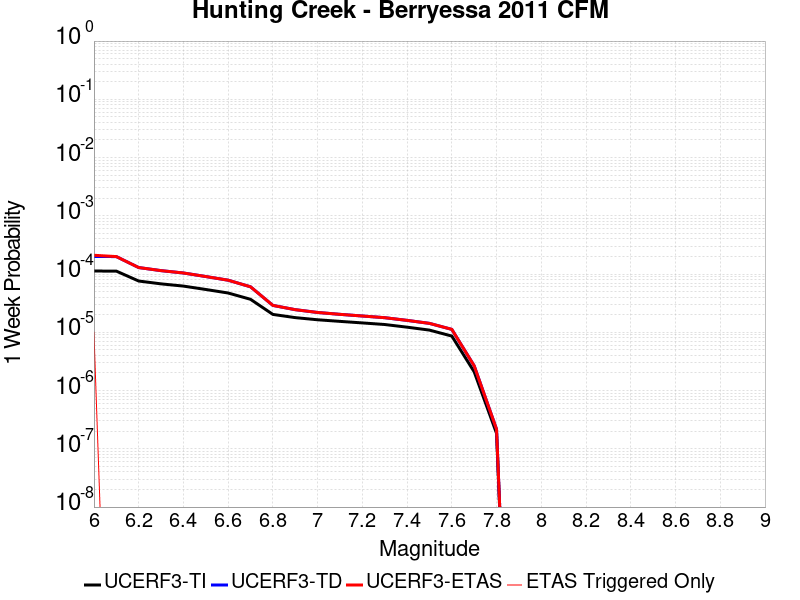 | 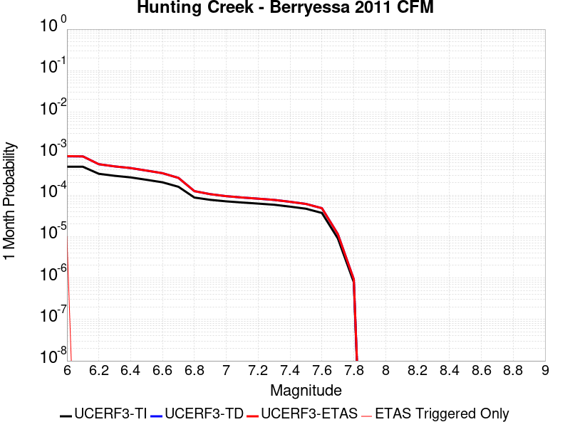 | 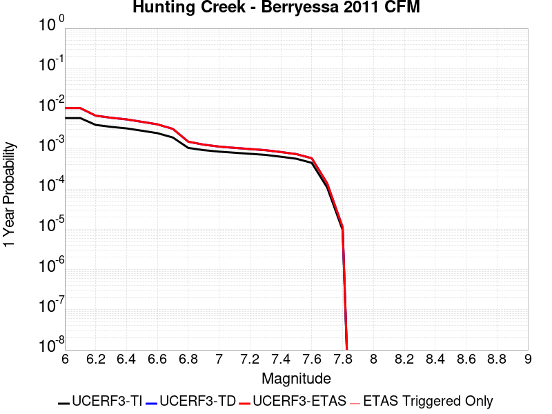 | 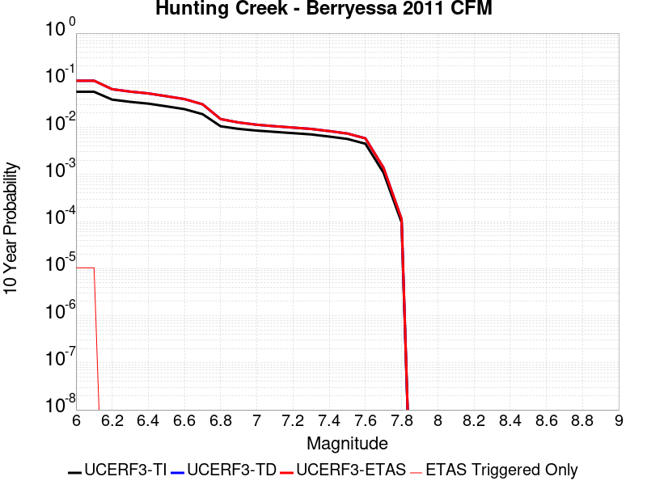 |

| Magnitude | 1 wk TI Prob | 1 wk TD Prob | 1 wk ETAS Prob | 1 wk ETAS/TD Gain | 1 wk ETAS Triggered Only | 1 mo TI Prob | 1 mo TD Prob | 1 mo ETAS Prob | 1 mo ETAS/TD Gain | 1 mo ETAS Triggered Only | 1 yr TI Prob | 1 yr TD Prob | 1 yr ETAS Prob | 1 yr ETAS/TD Gain | 1 yr ETAS Triggered Only | 10 yr TI Prob | 10 yr TD Prob | 10 yr ETAS Prob | 10 yr ETAS/TD Gain | 10 yr ETAS Triggered Only |
|-----|-----|-----|-----|-----|-----|-----|-----|-----|-----|-----|-----|-----|-----|-----|-----|-----|-----|-----|-----|-----|
| 6.0 | 1.1270982E-4 | 2.0012174E-4 | 2.0012174E-4 | 1.0 | 0.0 | 4.8295266E-4 | 8.5739547E-4 | 8.5739547E-4 | 1.0 | 0.0 | 0.0058641075 | 0.010386313 | 0.010386313 | 1.0 | 0.0 | 0.057117578 | 0.09803703 | 0.09804644 | 1.000096 | 1.0435908E-5 |
| 6.1 | 1.1239393E-4 | 1.9960315E-4 | 1.9960315E-4 | 1.0 | 0.0 | 4.8159933E-4 | 8.551744E-4 | 8.551744E-4 | 1.0 | 0.0 | 0.0058477195 | 0.010359551 | 0.010359551 | 1.0 | 0.0 | 0.056962132 | 0.09779551 | 0.09780492 | 1.0000963 | 1.0435908E-5 |
| 6.2 | 7.596265E-5 | 1.2940196E-4 | 1.2940196E-4 | 1.0 | 0.0 | 3.2551357E-4 | 5.5444165E-4 | 5.5444165E-4 | 1.0 | 0.0 | 0.0039559277 | 0.0067210156 | 0.0067210156 | 1.0 | 0.0 | 0.038862433 | 0.0645915 | 0.0645915 | 1.0 | 0.0 |
| 6.3 | 6.78794E-5 | 1.145119E-4 | 1.145119E-4 | 1.0 | 0.0 | 2.9087928E-4 | 4.906513E-4 | 4.906513E-4 | 1.0 | 0.0 | 0.003535705 | 0.005952679 | 0.005952679 | 1.0 | 0.0 | 0.034799766 | 0.057465393 | 0.057465393 | 1.0 | 0.0 |
| 6.4 | 6.2165134E-5 | 1.0436625E-4 | 1.0436625E-4 | 1.0 | 0.0 | 2.6639478E-4 | 4.4721062E-4 | 4.4721062E-4 | 1.0 | 0.0 | 0.0032385332 | 0.005427573 | 0.005427573 | 1.0 | 0.0 | 0.03191742 | 0.052550517 | 0.052550517 | 1.0 | 0.0 |
| 6.5 | 5.4368087E-5 | 9.071415E-5 | 9.071415E-5 | 1.0 | 0.0 | 2.3298527E-4 | 3.8872007E-4 | 3.8872007E-4 | 1.0 | 0.0 | 0.0028329059 | 0.0047198683 | 0.0047198683 | 1.0 | 0.0 | 0.027970633 | 0.045880128 | 0.045880128 | 1.0 | 0.0 |
| 6.6 | 4.729947E-5 | 7.847572E-5 | 7.847572E-5 | 1.0 | 0.0 | 2.0269625E-4 | 3.362842E-4 | 3.362842E-4 | 1.0 | 0.0 | 0.002465034 | 0.0040849647 | 0.0040849647 | 1.0 | 0.0 | 0.02437869 | 0.03985155 | 0.03985155 | 1.0 | 0.0 |
| 6.7 | 3.6875328E-5 | 6.0451803E-5 | 6.0451803E-5 | 1.0 | 0.0 | 1.5802756E-4 | 2.59056E-4 | 2.59056E-4 | 1.0 | 0.0 | 0.0019222875 | 0.0031482063 | 0.0031482063 | 1.0 | 0.0 | 0.019057442 | 0.03089237 | 0.03089237 | 1.0 | 0.0 |
| 6.8 | 2.0292036E-5 | 2.8976308E-5 | 2.8976308E-5 | 1.0 | 0.0 | 8.6962966E-5 | 1.2417832E-4 | 1.2417832E-4 | 1.0 | 0.0 | 0.0010582599 | 0.0015108072 | 0.0015108072 | 1.0 | 0.0 | 0.010532344 | 0.014978523 | 0.014978523 | 1.0 | 0.0 |
| 6.9 | 1.7871042E-5 | 2.4472254E-5 | 2.4472254E-5 | 1.0 | 0.0 | 7.658793E-5 | 1.048769E-4 | 1.048769E-4 | 1.0 | 0.0 | 9.320591E-4 | 0.0012761299 | 0.0012761299 | 1.0 | 0.0 | 0.009281595 | 0.012679775 | 0.012679775 | 1.0 | 0.0 |
| 7.0 | 1.6415532E-5 | 2.1906277E-5 | 2.1906277E-5 | 1.0 | 0.0 | 7.035038E-5 | 9.3880684E-5 | 9.3880684E-5 | 1.0 | 0.0 | 8.561793E-4 | 0.0011424015 | 0.0011424015 | 1.0 | 0.0 | 0.008528882 | 0.01136452 | 0.01136452 | 1.0 | 0.0 |
| 7.1 | 1.5409885E-5 | 2.0346342E-5 | 2.0346342E-5 | 1.0 | 0.0 | 6.6040695E-5 | 8.7195716E-5 | 8.7195716E-5 | 1.0 | 0.0 | 8.0374884E-4 | 0.0010610938 | 0.0010610938 | 1.0 | 0.0 | 0.00800848 | 0.010560595 | 0.010560595 | 1.0 | 0.0 |
| 7.2 | 1.4497423E-5 | 1.9054964E-5 | 1.9054964E-5 | 1.0 | 0.0 | 6.213033E-5 | 8.166159E-5 | 8.166159E-5 | 1.0 | 0.0 | 7.5617427E-4 | 9.937795E-4 | 9.937795E-4 | 1.0 | 0.0 | 0.0075360634 | 0.009893929 | 0.009893929 | 1.0 | 0.0 |
| 7.3 | 1.3615175E-5 | 1.7826127E-5 | 1.7826127E-5 | 1.0 | 0.0 | 5.8349444E-5 | 7.639547E-5 | 7.639547E-5 | 1.0 | 0.0 | 7.101729E-4 | 9.297209E-4 | 9.297209E-4 | 1.0 | 0.0 | 0.0070790765 | 0.009258823 | 0.009258823 | 1.0 | 0.0 |
| 7.4 | 1.2252825E-5 | 1.602625E-5 | 1.602625E-5 | 1.0 | 0.0 | 5.251105E-5 | 6.868213E-5 | 6.868213E-5 | 1.0 | 0.0 | 6.391345E-4 | 8.35887E-4 | 8.35887E-4 | 1.0 | 0.0 | 0.0063729943 | 0.008327872 | 0.008327872 | 1.0 | 0.0 |
| 7.5 | 1.0913301E-5 | 1.4241117E-5 | 1.4241117E-5 | 1.0 | 0.0 | 4.6770452E-5 | 6.1031948E-5 | 6.1031948E-5 | 1.0 | 0.0 | 5.6928146E-4 | 7.4281334E-4 | 7.4281334E-4 | 1.0 | 0.0 | 0.0056782532 | 0.0074036797 | 0.0074036797 | 1.0 | 0.0 |
| 7.6 | 8.623192E-6 | 1.12346415E-5 | 1.12346415E-5 | 1.0 | 0.0 | 3.6956015E-5 | 4.814759E-5 | 4.814759E-5 | 1.0 | 0.0 | 4.4984656E-4 | 5.8604183E-4 | 5.8604183E-4 | 1.0 | 0.0 | 0.00448937 | 0.0058452785 | 0.0058452785 | 1.0 | 0.0 |
| 7.7 | 2.0993634E-6 | 2.662584E-6 | 2.662584E-6 | 1.0 | 0.0 | 8.997241E-6 | 1.1411025E-5 | 1.1411025E-5 | 1.0 | 0.0 | 1.09535904E-4 | 1.3892044E-4 | 1.3892044E-4 | 1.0 | 0.0 | 0.0010948193 | 0.0013883426 | 0.0013883426 | 1.0 | 0.0 |
| 7.8 | 1.8428308E-7 | 2.167437E-7 | 2.167437E-7 | 1.0 | 0.0 | 7.897844E-7 | 9.289013E-7 | 9.289013E-7 | 1.0 | 0.0 | 9.615583E-6 | 1.1309318E-5 | 1.1309318E-5 | 1.0 | 0.0 | 9.615166E-5 | 1.13086026E-4 | 1.13086026E-4 | 1.0 | 0.0 |

## Eureka Peak
*[(top)](#table-of-contents)*

| 1 Week | 1 Month | 1 Year | 10 Year |
|-----|-----|-----|-----|
| 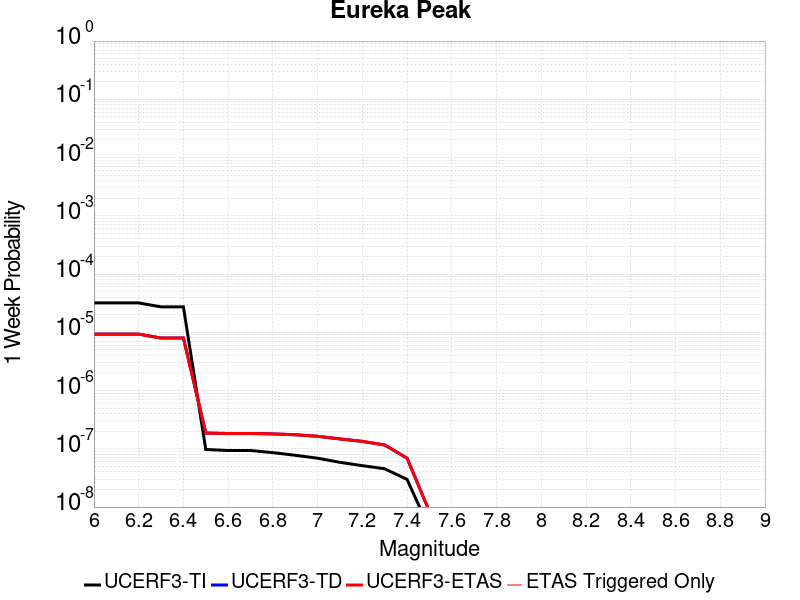 | 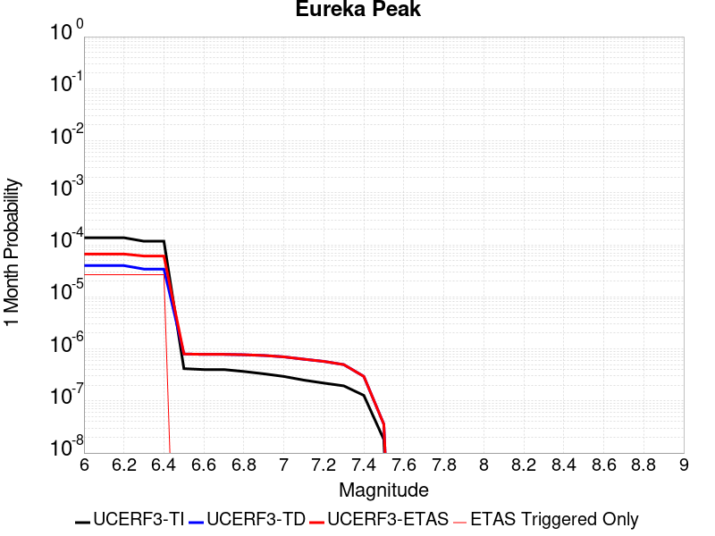 | 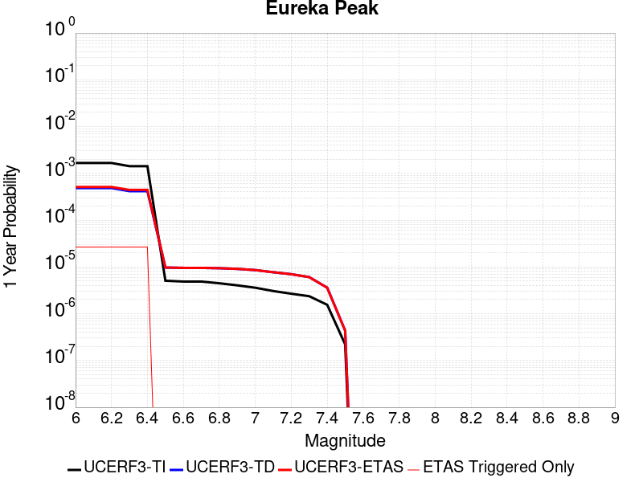 | 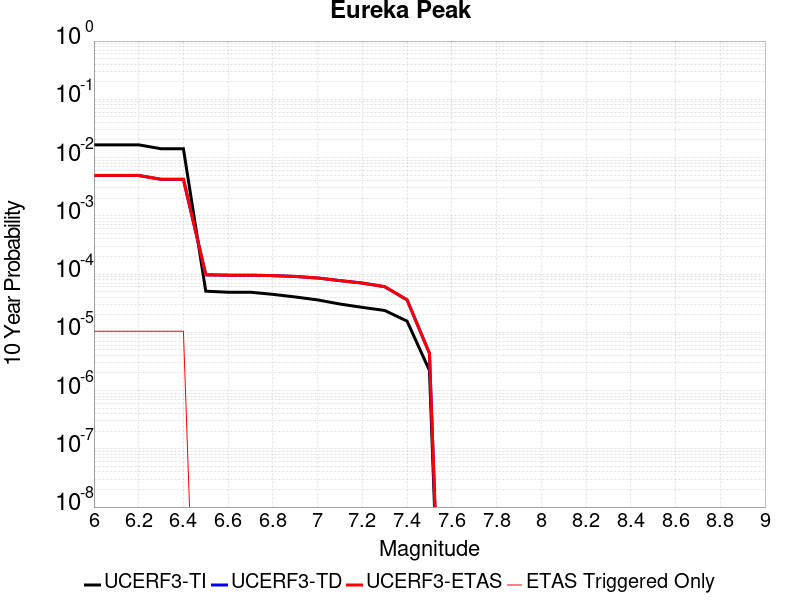 |

| Magnitude | 1 wk TI Prob | 1 wk TD Prob | 1 wk ETAS Prob | 1 wk ETAS/TD Gain | 1 wk ETAS Triggered Only | 1 mo TI Prob | 1 mo TD Prob | 1 mo ETAS Prob | 1 mo ETAS/TD Gain | 1 mo ETAS Triggered Only | 1 yr TI Prob | 1 yr TD Prob | 1 yr ETAS Prob | 1 yr ETAS/TD Gain | 1 yr ETAS Triggered Only | 10 yr TI Prob | 10 yr TD Prob | 10 yr ETAS Prob | 10 yr ETAS/TD Gain | 10 yr ETAS Triggered Only |
|-----|-----|-----|-----|-----|-----|-----|-----|-----|-----|-----|-----|-----|-----|-----|-----|-----|-----|-----|-----|-----|
| 6.0 | 3.1949054E-5 | 9.310571E-6 | 9.310571E-6 | 1.0 | 0.0 | 1.3691733E-4 | 3.990228E-5 | 5.033777E-5 | 1.2615262 | 1.0435908E-5 | 0.0016656938 | 4.8578004E-4 | 4.962109E-4 | 1.0214723 | 1.0435908E-5 | 0.016532637 | 0.0049248957 | 0.00493528 | 1.0021086 | 1.0435908E-5 |
| 6.1 | 3.1949054E-5 | 9.310571E-6 | 9.310571E-6 | 1.0 | 0.0 | 1.3691733E-4 | 3.990228E-5 | 5.033777E-5 | 1.2615262 | 1.0435908E-5 | 0.0016656938 | 4.8578004E-4 | 4.962109E-4 | 1.0214723 | 1.0435908E-5 | 0.016532637 | 0.0049248957 | 0.00493528 | 1.0021086 | 1.0435908E-5 |
| 6.2 | 3.1949054E-5 | 9.310571E-6 | 9.310571E-6 | 1.0 | 0.0 | 1.3691733E-4 | 3.990228E-5 | 5.033777E-5 | 1.2615262 | 1.0435908E-5 | 0.0016656938 | 4.8578004E-4 | 4.962109E-4 | 1.0214723 | 1.0435908E-5 | 0.016532637 | 0.0049248957 | 0.00493528 | 1.0021086 | 1.0435908E-5 |
| 6.3 | 2.7339745E-5 | 7.980718E-6 | 7.980718E-6 | 1.0 | 0.0 | 1.1716507E-4 | 3.4203054E-5 | 4.4638604E-5 | 1.3051058 | 1.0435908E-5 | 0.0014255513 | 4.164185E-4 | 4.2685008E-4 | 1.0250506 | 1.0435908E-5 | 0.0141644105 | 0.004228374 | 0.004238766 | 1.0024576 | 1.0435908E-5 |
| 6.4 | 2.7339745E-5 | 7.980718E-6 | 7.980718E-6 | 1.0 | 0.0 | 1.1716507E-4 | 3.4203054E-5 | 4.4638604E-5 | 1.3051058 | 1.0435908E-5 | 0.0014255513 | 4.164185E-4 | 4.2685008E-4 | 1.0250506 | 1.0435908E-5 | 0.0141644105 | 0.004228374 | 0.004238766 | 1.0024576 | 1.0435908E-5 |
| 6.5 | 9.738388E-8 | 1.8619214E-7 | 1.8619214E-7 | 1.0 | 0.0 | 4.1735944E-7 | 7.979661E-7 | 7.979661E-7 | 1.0 | 0.0 | 5.081339E-6 | 9.715194E-6 | 9.715194E-6 | 1.0 | 0.0 | 5.0812232E-5 | 9.714778E-5 | 9.714778E-5 | 1.0 | 0.0 |
| 6.6 | 9.3495956E-8 | 1.8328048E-7 | 1.8328048E-7 | 1.0 | 0.0 | 4.0069688E-7 | 7.8548754E-7 | 7.8548754E-7 | 1.0 | 0.0 | 4.8784736E-6 | 9.5632695E-6 | 9.5632695E-6 | 1.0 | 0.0 | 4.8783666E-5 | 9.562866E-5 | 9.562866E-5 | 1.0 | 0.0 |
| 6.7 | 9.3495956E-8 | 1.8328048E-7 | 1.8328048E-7 | 1.0 | 0.0 | 4.0069688E-7 | 7.8548754E-7 | 7.8548754E-7 | 1.0 | 0.0 | 4.8784736E-6 | 9.5632695E-6 | 9.5632695E-6 | 1.0 | 0.0 | 4.8783666E-5 | 9.562866E-5 | 9.562866E-5 | 1.0 | 0.0 |
| 6.8 | 8.591428E-8 | 1.8021015E-7 | 1.8021015E-7 | 1.0 | 0.0 | 3.68204E-7 | 7.72329E-7 | 7.72329E-7 | 1.0 | 0.0 | 4.4828744E-6 | 9.403066E-6 | 9.403066E-6 | 1.0 | 0.0 | 4.482784E-5 | 9.402676E-5 | 9.402676E-5 | 1.0 | 0.0 |
| 6.9 | 7.749723E-8 | 1.7439022E-7 | 1.7439022E-7 | 1.0 | 0.0 | 3.3213098E-7 | 7.473864E-7 | 7.473864E-7 | 1.0 | 0.0 | 4.043687E-6 | 9.099393E-6 | 9.099393E-6 | 1.0 | 0.0 | 4.0436134E-5 | 9.099028E-5 | 9.099028E-5 | 1.0 | 0.0 |
| 7.0 | 6.897872E-8 | 1.6415258E-7 | 1.6415258E-7 | 1.0 | 0.0 | 2.9562307E-7 | 7.035109E-7 | 7.035109E-7 | 1.0 | 0.0 | 3.5992048E-6 | 8.565212E-6 | 8.565212E-6 | 1.0 | 0.0 | 3.5991467E-5 | 8.564889E-5 | 8.564889E-5 | 1.0 | 0.0 |
| 7.1 | 5.859318E-8 | 1.4787166E-7 | 1.4787166E-7 | 1.0 | 0.0 | 2.5111362E-7 | 6.337355E-7 | 6.337355E-7 | 1.0 | 0.0 | 3.057304E-6 | 7.715704E-6 | 7.715704E-6 | 1.0 | 0.0 | 3.0572617E-5 | 7.715442E-5 | 7.715442E-5 | 1.0 | 0.0 |
| 7.2 | 5.1375338E-8 | 1.342105E-7 | 1.342105E-7 | 1.0 | 0.0 | 2.2018E-7 | 5.751877E-7 | 5.751877E-7 | 1.0 | 0.0 | 2.680688E-6 | 7.002888E-6 | 7.002888E-6 | 1.0 | 0.0 | 2.6806558E-5 | 7.0026734E-5 | 7.0026734E-5 | 1.0 | 0.0 |
| 7.3 | 4.5441396E-8 | 1.16363104E-7 | 1.16363104E-7 | 1.0 | 0.0 | 1.9474882E-7 | 4.986989E-7 | 4.986989E-7 | 1.0 | 0.0 | 2.3710643E-6 | 6.071643E-6 | 6.071643E-6 | 1.0 | 0.0 | 2.371039E-5 | 6.0714825E-5 | 6.0714825E-5 | 1.0 | 0.0 |
| 7.4 | 2.981918E-8 | 6.9113334E-8 | 6.9113334E-8 | 1.0 | 0.0 | 1.2779647E-7 | 2.9619997E-7 | 2.9619997E-7 | 1.0 | 0.0 | 1.5559209E-6 | 3.6062293E-6 | 3.6062293E-6 | 1.0 | 0.0 | 1.55591E-5 | 3.606175E-5 | 3.606175E-5 | 1.0 | 0.0 |
| 7.5 | 4.24214E-9 | 8.342421E-9 | 8.342421E-9 | 1.0 | 0.0 | 1.81806E-8 | 3.5753235E-8 | 3.5753235E-8 | 1.0 | 0.0 | 2.213488E-7 | 4.352956E-7 | 4.352956E-7 | 1.0 | 0.0 | 2.2134857E-6 | 4.352954E-6 | 4.352954E-6 | 1.0 | 0.0 |

## Rinconada 2011 CFM
*[(top)](#table-of-contents)*

| 1 Week | 1 Month | 1 Year | 10 Year |
|-----|-----|-----|-----|
|  |  | 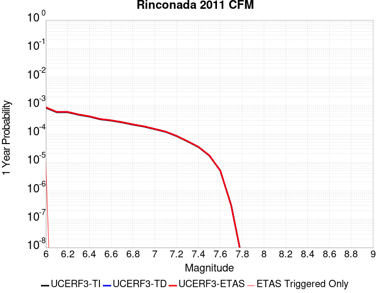 | 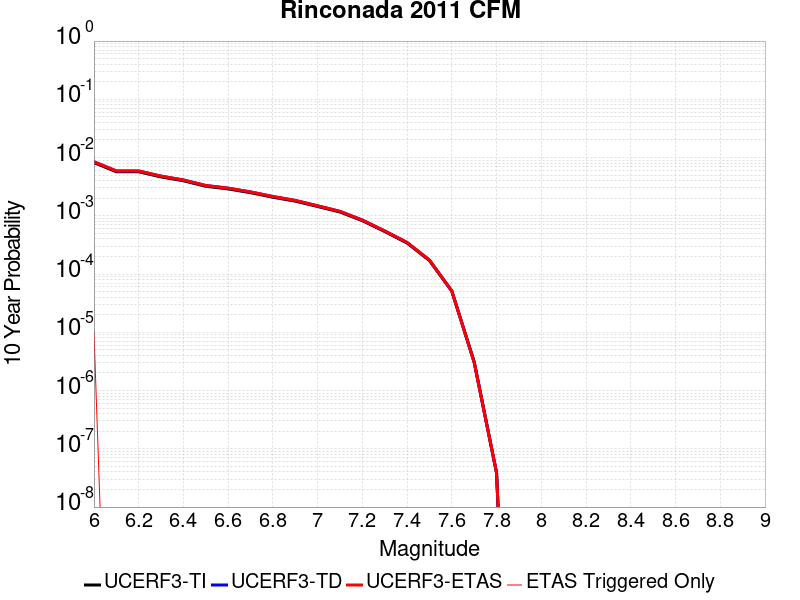 |

| Magnitude | 1 wk TI Prob | 1 wk TD Prob | 1 wk ETAS Prob | 1 wk ETAS/TD Gain | 1 wk ETAS Triggered Only | 1 mo TI Prob | 1 mo TD Prob | 1 mo ETAS Prob | 1 mo ETAS/TD Gain | 1 mo ETAS Triggered Only | 1 yr TI Prob | 1 yr TD Prob | 1 yr ETAS Prob | 1 yr ETAS/TD Gain | 1 yr ETAS Triggered Only | 10 yr TI Prob | 10 yr TD Prob | 10 yr ETAS Prob | 10 yr ETAS/TD Gain | 10 yr ETAS Triggered Only |
|-----|-----|-----|-----|-----|-----|-----|-----|-----|-----|-----|-----|-----|-----|-----|-----|-----|-----|-----|-----|-----|
| 6.0 | 1.5752368E-5 | 1.6274716E-5 | 1.6274716E-5 | 1.0 | 0.0 | 6.75084E-5 | 6.974694E-5 | 6.974694E-5 | 1.0 | 0.0 | 8.2160486E-4 | 8.488412E-4 | 8.592683E-4 | 1.0122839 | 1.0435908E-5 | 0.008185739 | 0.00845637 | 0.008466718 | 1.0012237 | 1.0435908E-5 |
| 6.1 | 1.0966133E-5 | 1.1323029E-5 | 1.1323029E-5 | 1.0 | 0.0 | 4.6996865E-5 | 4.852637E-5 | 4.852637E-5 | 1.0 | 0.0 | 5.720366E-4 | 5.906491E-4 | 5.906491E-4 | 1.0 | 0.0 | 0.0057056635 | 0.0058908886 | 0.0058908886 | 1.0 | 0.0 |
| 6.2 | 1.0966133E-5 | 1.1323029E-5 | 1.1323029E-5 | 1.0 | 0.0 | 4.6996865E-5 | 4.852637E-5 | 4.852637E-5 | 1.0 | 0.0 | 5.720366E-4 | 5.906491E-4 | 5.906491E-4 | 1.0 | 0.0 | 0.0057056635 | 0.0058908886 | 0.0058908886 | 1.0 | 0.0 |
| 6.3 | 8.926149E-6 | 9.212771E-6 | 9.212771E-6 | 1.0 | 0.0 | 3.8254362E-5 | 3.948271E-5 | 3.948271E-5 | 1.0 | 0.0 | 4.6564735E-4 | 4.805963E-4 | 4.805963E-4 | 1.0 | 0.0 | 0.0046467283 | 0.0047956146 | 0.0047956146 | 1.0 | 0.0 |
| 6.4 | 7.676955E-6 | 7.920191E-6 | 7.920191E-6 | 1.0 | 0.0 | 3.290082E-5 | 3.3943234E-5 | 3.3943234E-5 | 1.0 | 0.0 | 4.0049385E-4 | 4.1318068E-4 | 4.1318068E-4 | 1.0 | 0.0 | 0.0039977287 | 0.004124151 | 0.004124151 | 1.0 | 0.0 |
| 6.5 | 6.1671026E-6 | 6.3589546E-6 | 6.3589546E-6 | 1.0 | 0.0 | 2.6430173E-5 | 2.725238E-5 | 2.725238E-5 | 1.0 | 0.0 | 3.2173982E-4 | 3.317473E-4 | 3.317473E-4 | 1.0 | 0.0 | 0.003212744 | 0.0033125326 | 0.0033125326 | 1.0 | 0.0 |
| 6.6 | 5.553456E-6 | 5.7248126E-6 | 5.7248126E-6 | 1.0 | 0.0 | 2.3800309E-5 | 2.453468E-5 | 2.453468E-5 | 1.0 | 0.0 | 2.897302E-4 | 2.9866883E-4 | 2.9866883E-4 | 1.0 | 0.0 | 0.0028935277 | 0.002982683 | 0.002982683 | 1.0 | 0.0 |
| 6.7 | 4.787857E-6 | 4.9333094E-6 | 4.9333094E-6 | 1.0 | 0.0 | 2.0519226E-5 | 2.1142583E-5 | 2.1142583E-5 | 1.0 | 0.0 | 2.4979294E-4 | 2.573806E-4 | 2.573806E-4 | 1.0 | 0.0 | 0.0024951235 | 0.0025708308 | 0.0025708308 | 1.0 | 0.0 |
| 6.8 | 3.9955166E-6 | 4.1134763E-6 | 4.1134763E-6 | 1.0 | 0.0 | 1.7123532E-5 | 1.7629065E-5 | 1.7629065E-5 | 1.0 | 0.0 | 2.0845905E-4 | 2.1461274E-4 | 2.1461274E-4 | 1.0 | 0.0 | 0.002082636 | 0.0021440585 | 0.0021440585 | 1.0 | 0.0 |
| 6.9 | 3.4250072E-6 | 3.5224464E-6 | 3.5224464E-6 | 1.0 | 0.0 | 1.46785205E-5 | 1.5096111E-5 | 1.5096111E-5 | 1.0 | 0.0 | 1.7869633E-4 | 1.8377967E-4 | 1.8377967E-4 | 1.0 | 0.0 | 0.001785527 | 0.0018362794 | 0.0018362794 | 1.0 | 0.0 |
| 7.0 | 2.7712713E-6 | 2.8467E-6 | 2.8467E-6 | 1.0 | 0.0 | 1.1876823E-5 | 1.2200086E-5 | 1.2200086E-5 | 1.0 | 0.0 | 1.4459073E-4 | 1.4852593E-4 | 1.4852593E-4 | 1.0 | 0.0 | 0.0014449668 | 0.0014842682 | 0.0014842682 | 1.0 | 0.0 |
| 7.1 | 2.227358E-6 | 2.2856984E-6 | 2.2856984E-6 | 1.0 | 0.0 | 9.545785E-6 | 9.795814E-6 | 9.795814E-6 | 1.0 | 0.0 | 1.16213734E-4 | 1.19257515E-4 | 1.19257515E-4 | 1.0 | 0.0 | 0.0011615298 | 0.0011919362 | 0.0011919362 | 1.0 | 0.0 |
| 7.2 | 1.581796E-6 | 1.6209011E-6 | 1.6209011E-6 | 1.0 | 0.0 | 6.779108E-6 | 6.9467005E-6 | 6.9467005E-6 | 1.0 | 0.0 | 8.253252E-5 | 8.457281E-5 | 8.457281E-5 | 1.0 | 0.0 | 8.250187E-4 | 8.454067E-4 | 8.454067E-4 | 1.0 | 0.0 |
| 7.3 | 1.0306567E-6 | 1.0546477E-6 | 1.0546477E-6 | 1.0 | 0.0 | 4.4170924E-6 | 4.519911E-6 | 4.519911E-6 | 1.0 | 0.0 | 5.3776774E-5 | 5.5028526E-5 | 5.5028526E-5 | 1.0 | 0.0 | 5.376376E-4 | 5.5014924E-4 | 5.5014924E-4 | 1.0 | 0.0 |
| 7.4 | 6.535541E-7 | 6.682742E-7 | 6.682742E-7 | 1.0 | 0.0 | 2.800943E-6 | 2.864029E-6 | 2.864029E-6 | 1.0 | 0.0 | 3.4100947E-5 | 3.4868997E-5 | 3.4868997E-5 | 1.0 | 0.0 | 3.4095717E-4 | 3.4863537E-4 | 3.4863537E-4 | 1.0 | 0.0 |
| 7.5 | 3.2656962E-7 | 3.3316687E-7 | 3.3316687E-7 | 1.0 | 0.0 | 1.3995833E-6 | 1.4278572E-6 | 1.4278572E-6 | 1.0 | 0.0 | 1.7039794E-5 | 1.7384024E-5 | 1.7384024E-5 | 1.0 | 0.0 | 1.7038487E-4 | 1.7382667E-4 | 1.7382667E-4 | 1.0 | 0.0 |
| 7.6 | 9.754343E-8 | 9.82099E-8 | 9.82099E-8 | 1.0 | 0.0 | 4.180432E-7 | 4.208995E-7 | 4.208995E-7 | 1.0 | 0.0 | 5.089664E-6 | 5.1244397E-6 | 5.1244397E-6 | 1.0 | 0.0 | 5.0895473E-5 | 5.1243223E-5 | 5.1243223E-5 | 1.0 | 0.0 |
| 7.7 | 6.0001453E-9 | 5.8490435E-9 | 5.8490435E-9 | 1.0 | 0.0 | 2.5714908E-8 | 2.506733E-8 | 2.506733E-8 | 1.0 | 0.0 | 3.1307894E-7 | 3.051947E-7 | 3.051947E-7 | 1.0 | 0.0 | 3.1307852E-6 | 3.051943E-6 | 3.051943E-6 | 1.0 | 0.0 |
| 7.8 | 7.400003E-11 | 7.4654505E-11 | 7.4654505E-11 | 1.0 | 0.0 | 3.171432E-10 | 3.1994773E-10 | 3.1994773E-10 | 1.0 | 0.0 | 3.861218E-9 | 3.895363E-9 | 3.895363E-9 | 1.0 | 0.0 | 3.861218E-8 | 3.895363E-8 | 3.895363E-8 | 1.0 | 0.0 |

## Honey Lake 2011 CFM
*[(top)](#table-of-contents)*

| 1 Week | 1 Month | 1 Year | 10 Year |
|-----|-----|-----|-----|
|  |  |  | 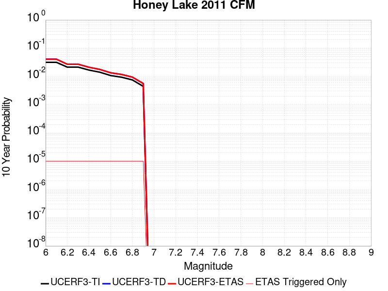 |

| Magnitude | 1 wk TI Prob | 1 wk TD Prob | 1 wk ETAS Prob | 1 wk ETAS/TD Gain | 1 wk ETAS Triggered Only | 1 mo TI Prob | 1 mo TD Prob | 1 mo ETAS Prob | 1 mo ETAS/TD Gain | 1 mo ETAS Triggered Only | 1 yr TI Prob | 1 yr TD Prob | 1 yr ETAS Prob | 1 yr ETAS/TD Gain | 1 yr ETAS Triggered Only | 10 yr TI Prob | 10 yr TD Prob | 10 yr ETAS Prob | 10 yr ETAS/TD Gain | 10 yr ETAS Triggered Only |
|-----|-----|-----|-----|-----|-----|-----|-----|-----|-----|-----|-----|-----|-----|-----|-----|-----|-----|-----|-----|-----|
| 6.0 | 6.155506E-5 | 7.954667E-5 | 7.954667E-5 | 1.0 | 0.0 | 2.6378073E-4 | 3.40873E-4 | 3.40873E-4 | 1.0 | 0.0 | 0.0032068014 | 0.0041427943 | 0.0041427943 | 1.0 | 0.0 | 0.03160919 | 0.040702924 | 0.040712934 | 1.0002459 | 1.0435908E-5 |
| 6.1 | 6.155506E-5 | 7.954667E-5 | 7.954667E-5 | 1.0 | 0.0 | 2.6378073E-4 | 3.40873E-4 | 3.40873E-4 | 1.0 | 0.0 | 0.0032068014 | 0.0041427943 | 0.0041427943 | 1.0 | 0.0 | 0.03160919 | 0.040702924 | 0.040712934 | 1.0002459 | 1.0435908E-5 |
| 6.2 | 4.1335024E-5 | 5.257629E-5 | 5.257629E-5 | 1.0 | 0.0 | 1.7713808E-4 | 2.253086E-4 | 2.253086E-4 | 1.0 | 0.0 | 0.0021545228 | 0.0027398595 | 0.0027398595 | 1.0 | 0.0 | 0.021337535 | 0.027076708 | 0.027086861 | 1.000375 | 1.0435908E-5 |
| 6.3 | 4.1335024E-5 | 5.257629E-5 | 5.257629E-5 | 1.0 | 0.0 | 1.7713808E-4 | 2.253086E-4 | 2.253086E-4 | 1.0 | 0.0 | 0.0021545228 | 0.0027398595 | 0.0027398595 | 1.0 | 0.0 | 0.021337535 | 0.027076708 | 0.027086861 | 1.000375 | 1.0435908E-5 |
| 6.4 | 3.2393702E-5 | 4.0887444E-5 | 4.0887444E-5 | 1.0 | 0.0 | 1.3882275E-4 | 1.7522085E-4 | 1.7522085E-4 | 1.0 | 0.0 | 0.0016888566 | 0.002131335 | 0.002131335 | 1.0 | 0.0 | 0.016760793 | 0.02111982 | 0.021130037 | 1.0004838 | 1.0435908E-5 |
| 6.5 | 2.7205504E-5 | 3.4211684E-5 | 3.4211684E-5 | 1.0 | 0.0 | 1.1658981E-4 | 1.4661385E-4 | 1.4661385E-4 | 1.0 | 0.0 | 0.0014185566 | 0.0017836588 | 0.0017836588 | 1.0 | 0.0 | 0.014095354 | 0.017702932 | 0.017713182 | 1.0005791 | 1.0435908E-5 |
| 6.6 | 2.069265E-5 | 2.5955307E-5 | 2.5955307E-5 | 1.0 | 0.0 | 8.867977E-5 | 1.1123277E-4 | 1.1123277E-4 | 1.0 | 0.0 | 0.0010791414 | 0.0013535038 | 0.0013535038 | 1.0 | 0.0 | 0.010739161 | 0.013461002 | 0.013471298 | 1.0007648 | 1.0435908E-5 |
| 6.7 | 1.8060919E-5 | 2.2656828E-5 | 2.2656828E-5 | 1.0 | 0.0 | 7.7401644E-5 | 9.709754E-5 | 9.709754E-5 | 1.0 | 0.0 | 9.419576E-4 | 0.0011816026 | 0.0011816026 | 1.0 | 0.0 | 0.009379748 | 0.011761238 | 0.011771551 | 1.0008769 | 1.0435908E-5 |
| 6.8 | 1.4474663E-5 | 1.818127E-5 | 1.818127E-5 | 1.0 | 0.0 | 6.203279E-5 | 7.791784E-5 | 7.791784E-5 | 1.0 | 0.0 | 7.5498753E-4 | 9.483136E-4 | 9.483136E-4 | 1.0 | 0.0 | 0.007524277 | 0.009450192 | 0.009460529 | 1.0010939 | 1.0435908E-5 |
| 6.9 | 8.564552E-6 | 1.0802308E-5 | 1.0802308E-5 | 1.0 | 0.0 | 3.6704707E-5 | 4.6295158E-5 | 4.6295158E-5 | 1.0 | 0.0 | 4.4678818E-4 | 5.635644E-4 | 5.635644E-4 | 1.0 | 0.0 | 0.0044589094 | 0.0056278477 | 0.005638225 | 1.0018439 | 1.0435908E-5 |

## San Gabriel
*[(top)](#table-of-contents)*

| 1 Week | 1 Month | 1 Year | 10 Year |
|-----|-----|-----|-----|
|  |  | 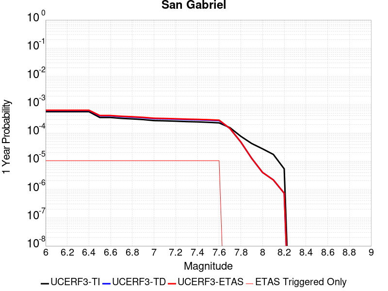 | 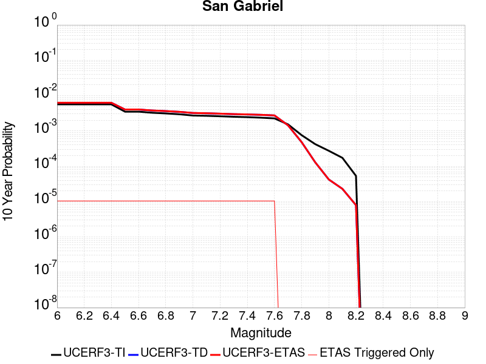 |

| Magnitude | 1 wk TI Prob | 1 wk TD Prob | 1 wk ETAS Prob | 1 wk ETAS/TD Gain | 1 wk ETAS Triggered Only | 1 mo TI Prob | 1 mo TD Prob | 1 mo ETAS Prob | 1 mo ETAS/TD Gain | 1 mo ETAS Triggered Only | 1 yr TI Prob | 1 yr TD Prob | 1 yr ETAS Prob | 1 yr ETAS/TD Gain | 1 yr ETAS Triggered Only | 10 yr TI Prob | 10 yr TD Prob | 10 yr ETAS Prob | 10 yr ETAS/TD Gain | 10 yr ETAS Triggered Only |
|-----|-----|-----|-----|-----|-----|-----|-----|-----|-----|-----|-----|-----|-----|-----|-----|-----|-----|-----|-----|-----|
| 6.0 | 1.083775E-5 | 1.19851875E-5 | 1.19851875E-5 | 1.0 | 0.0 | 4.6446676E-5 | 5.1364143E-5 | 6.179951E-5 | 1.2031646 | 1.0435908E-5 | 5.653415E-4 | 6.251903E-4 | 6.356197E-4 | 1.0166819 | 1.0435908E-5 | 0.0056390543 | 0.006246409 | 0.0062567797 | 1.0016602 | 1.0435908E-5 |
| 6.1 | 1.083775E-5 | 1.19851875E-5 | 1.19851875E-5 | 1.0 | 0.0 | 4.6446676E-5 | 5.1364143E-5 | 6.179951E-5 | 1.2031646 | 1.0435908E-5 | 5.653415E-4 | 6.251903E-4 | 6.356197E-4 | 1.0166819 | 1.0435908E-5 | 0.0056390543 | 0.006246409 | 0.0062567797 | 1.0016602 | 1.0435908E-5 |
| 6.2 | 1.083775E-5 | 1.19851875E-5 | 1.19851875E-5 | 1.0 | 0.0 | 4.6446676E-5 | 5.1364143E-5 | 6.179951E-5 | 1.2031646 | 1.0435908E-5 | 5.653415E-4 | 6.251903E-4 | 6.356197E-4 | 1.0166819 | 1.0435908E-5 | 0.0056390543 | 0.006246409 | 0.0062567797 | 1.0016602 | 1.0435908E-5 |
| 6.3 | 1.083775E-5 | 1.19851875E-5 | 1.19851875E-5 | 1.0 | 0.0 | 4.6446676E-5 | 5.1364143E-5 | 6.179951E-5 | 1.2031646 | 1.0435908E-5 | 5.653415E-4 | 6.251903E-4 | 6.356197E-4 | 1.0166819 | 1.0435908E-5 | 0.0056390543 | 0.006246409 | 0.0062567797 | 1.0016602 | 1.0435908E-5 |
| 6.4 | 1.083775E-5 | 1.19851875E-5 | 1.19851875E-5 | 1.0 | 0.0 | 4.6446676E-5 | 5.1364143E-5 | 6.179951E-5 | 1.2031646 | 1.0435908E-5 | 5.653415E-4 | 6.251903E-4 | 6.356197E-4 | 1.0166819 | 1.0435908E-5 | 0.0056390543 | 0.006246409 | 0.0062567797 | 1.0016602 | 1.0435908E-5 |
| 6.5 | 6.7317824E-6 | 7.716944E-6 | 7.716944E-6 | 1.0 | 0.0 | 2.8850178E-5 | 3.3072207E-5 | 4.350777E-5 | 1.3155388 | 1.0435908E-5 | 3.511943E-4 | 4.0258077E-4 | 4.130125E-4 | 1.025912 | 1.0435908E-5 | 0.003506398 | 0.0040296097 | 0.0040400033 | 1.0025793 | 1.0435908E-5 |
| 6.6 | 6.7317824E-6 | 7.716944E-6 | 7.716944E-6 | 1.0 | 0.0 | 2.8850178E-5 | 3.3072207E-5 | 4.350777E-5 | 1.3155388 | 1.0435908E-5 | 3.511943E-4 | 4.0258077E-4 | 4.130125E-4 | 1.025912 | 1.0435908E-5 | 0.003506398 | 0.0040296097 | 0.0040400033 | 1.0025793 | 1.0435908E-5 |
| 6.7 | 6.274881E-6 | 7.2458647E-6 | 7.2458647E-6 | 1.0 | 0.0 | 2.6892068E-5 | 3.1053343E-5 | 4.1488925E-5 | 1.3360535 | 1.0435908E-5 | 3.2736175E-4 | 3.780098E-4 | 3.8844178E-4 | 1.0275971 | 1.0435908E-5 | 0.0032687993 | 0.0037847564 | 0.0037951528 | 1.0027469 | 1.0435908E-5 |
| 6.8 | 5.996209E-6 | 6.958585E-6 | 6.958585E-6 | 1.0 | 0.0 | 2.5697784E-5 | 2.9822171E-5 | 4.0257768E-5 | 1.3499274 | 1.0435908E-5 | 3.128256E-4 | 3.6302538E-4 | 3.734575E-4 | 1.0287366 | 1.0435908E-5 | 0.003123856 | 0.0036354093 | 0.0036458073 | 1.0028602 | 1.0435908E-5 |
| 6.9 | 5.686331E-6 | 6.6236316E-6 | 6.6236316E-6 | 1.0 | 0.0 | 2.4369761E-5 | 2.8386688E-5 | 3.88223E-5 | 1.3676234 | 1.0435908E-5 | 2.9666146E-4 | 3.4555403E-4 | 3.5598633E-4 | 1.0301901 | 1.0435908E-5 | 0.0029626573 | 0.0034612515 | 0.003471651 | 1.0030047 | 1.0435908E-5 |
| 7.0 | 5.2329838E-6 | 6.147514E-6 | 6.147514E-6 | 1.0 | 0.0 | 2.242688E-5 | 2.6346226E-5 | 3.678186E-5 | 1.3960959 | 1.0435908E-5 | 2.7301308E-4 | 3.2071886E-4 | 3.3115142E-4 | 1.0325286 | 1.0435908E-5 | 0.002726779 | 0.0032136322 | 0.0032240346 | 1.003237 | 1.0435908E-5 |
| 7.1 | 5.135671E-6 | 6.03764E-6 | 6.03764E-6 | 1.0 | 0.0 | 2.2009834E-5 | 2.5875348E-5 | 3.6310987E-5 | 1.4033042 | 1.0435908E-5 | 2.6793676E-4 | 3.1498758E-4 | 3.254202E-4 | 1.0331208 | 1.0435908E-5 | 0.0026761394 | 0.0031564834 | 0.0031668863 | 1.0032958 | 1.0435908E-5 |
| 7.2 | 4.989062E-6 | 5.87102E-6 | 5.87102E-6 | 1.0 | 0.0 | 2.1381518E-5 | 2.5161276E-5 | 3.559692E-5 | 1.4147502 | 1.0435908E-5 | 2.6028889E-4 | 3.0629625E-4 | 3.1672895E-4 | 1.0340608 | 1.0435908E-5 | 0.0025998424 | 0.003069813 | 0.0030802167 | 1.0033891 | 1.0435908E-5 |
| 7.3 | 4.8219395E-6 | 5.702574E-6 | 5.702574E-6 | 1.0 | 0.0 | 2.0665291E-5 | 2.443938E-5 | 3.4875033E-5 | 1.4270016 | 1.0435908E-5 | 2.5157086E-4 | 2.9750957E-4 | 3.0794236E-4 | 1.0350671 | 1.0435908E-5 | 0.0025128627 | 0.0029821852 | 0.00299259 | 1.003489 | 1.0435908E-5 |
| 7.4 | 4.7118383E-6 | 5.5911332E-6 | 5.5911332E-6 | 1.0 | 0.0 | 2.0193436E-5 | 2.3961782E-5 | 3.439744E-5 | 1.4355125 | 1.0435908E-5 | 2.4582737E-4 | 2.916964E-4 | 3.0212928E-4 | 1.0357661 | 1.0435908E-5 | 0.002455556 | 0.0029242067 | 0.002934612 | 1.0035584 | 1.0435908E-5 |
| 7.5 | 4.5506545E-6 | 5.4365014E-6 | 5.4365014E-6 | 1.0 | 0.0 | 1.9502659E-5 | 2.3299088E-5 | 3.3734752E-5 | 1.4479002 | 1.0435908E-5 | 2.37419E-4 | 2.8363022E-4 | 2.9406315E-4 | 1.0367836 | 1.0435908E-5 | 0.002371655 | 0.002843753 | 0.002854159 | 1.0036594 | 1.0435908E-5 |
| 7.6 | 4.343636E-6 | 5.2293817E-6 | 5.2293817E-6 | 1.0 | 0.0 | 1.861545E-5 | 2.2411448E-5 | 3.284712E-5 | 1.4656403 | 1.0435908E-5 | 2.2661954E-4 | 2.7282597E-4 | 2.8325903E-4 | 1.0382407 | 1.0435908E-5 | 0.0022638857 | 0.0027359722 | 0.0027463797 | 1.0038038 | 1.0435908E-5 |
| 7.7 | 2.936235E-6 | 2.7440458E-6 | 2.7440458E-6 | 1.0 | 0.0 | 1.2583803E-5 | 1.1760143E-5 | 1.1760143E-5 | 1.0 | 0.0 | 1.5319703E-4 | 1.4317037E-4 | 1.4317037E-4 | 1.0 | 0.0 | 0.0015309147 | 0.0014380751 | 0.0014380751 | 1.0 | 0.0 |
| 7.8 | 1.4541639E-6 | 9.1237047E-7 | 9.1237047E-7 | 1.0 | 0.0 | 6.232116E-6 | 3.9101533E-6 | 3.9101533E-6 | 1.0 | 0.0 | 7.587337E-5 | 4.7605077E-5 | 4.7605077E-5 | 1.0 | 0.0 | 7.584747E-4 | 4.8085177E-4 | 4.8085177E-4 | 1.0 | 0.0 |
| 7.9 | 8.098958E-7 | 2.41753E-7 | 2.41753E-7 | 1.0 | 0.0 | 3.4709774E-6 | 1.0360839E-6 | 1.0360839E-6 | 1.0 | 0.0 | 4.225833E-5 | 1.2614248E-5 | 1.2614248E-5 | 1.0 | 0.0 | 4.2250296E-4 | 1.2921814E-4 | 1.2921814E-4 | 1.0 | 0.0 |
| 8.0 | 5.2473234E-7 | 7.6792055E-8 | 7.6792055E-8 | 1.0 | 0.0 | 2.248851E-6 | 3.2910876E-7 | 3.2910876E-7 | 1.0 | 0.0 | 2.7379416E-5 | 4.0068917E-6 | 4.0068917E-6 | 1.0 | 0.0 | 2.7376044E-4 | 4.21918E-5 | 4.21918E-5 | 1.0 | 0.0 |
| 8.1 | 3.3162388E-7 | 4.1496126E-8 | 4.1496126E-8 | 1.0 | 0.0 | 1.4212444E-6 | 1.7784053E-7 | 1.7784053E-7 | 1.0 | 0.0 | 1.7303513E-5 | 2.1652063E-6 | 2.1652063E-6 | 1.0 | 0.0 | 1.7302166E-4 | 2.2965523E-5 | 2.2965523E-5 | 1.0 | 0.0 |
| 8.2 | 1.0235345E-7 | 1.4043474E-8 | 1.4043474E-8 | 1.0 | 0.0 | 4.3865757E-7 | 6.0186316E-8 | 6.0186316E-8 | 1.0 | 0.0 | 5.340643E-6 | 7.327681E-7 | 7.327681E-7 | 1.0 | 0.0 | 5.3405143E-5 | 7.9273705E-6 | 7.9273705E-6 | 1.0 | 0.0 |

## Casmalia 2011 CFM
*[(top)](#table-of-contents)*

| 1 Week | 1 Month | 1 Year | 10 Year |
|-----|-----|-----|-----|
| 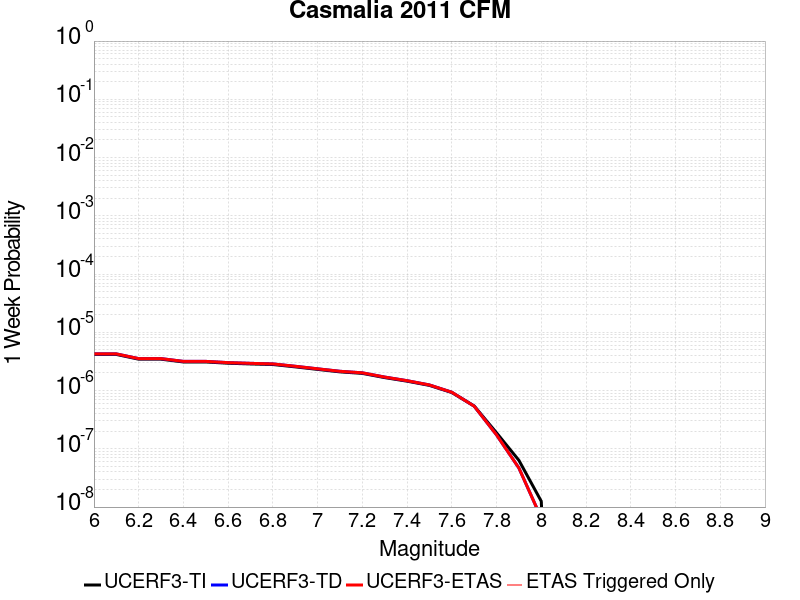 | 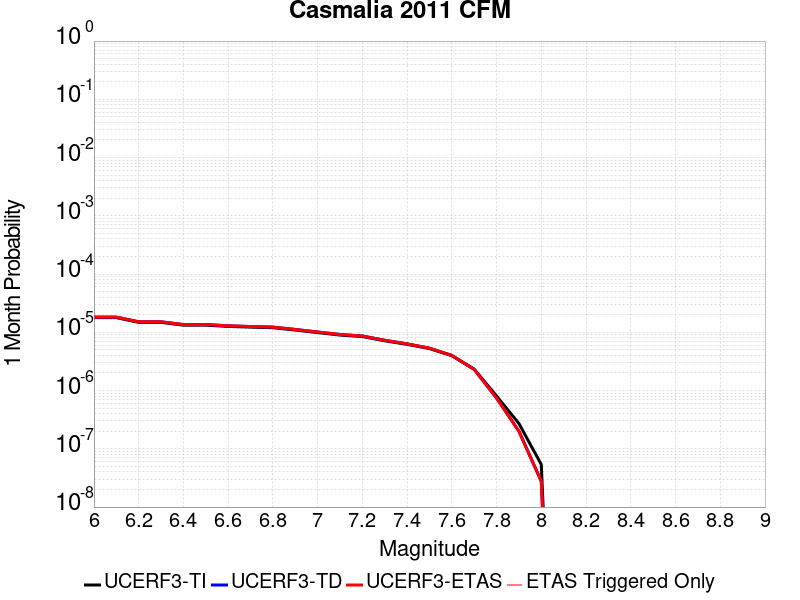 | 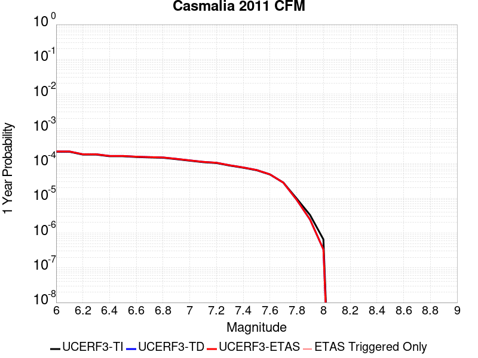 | 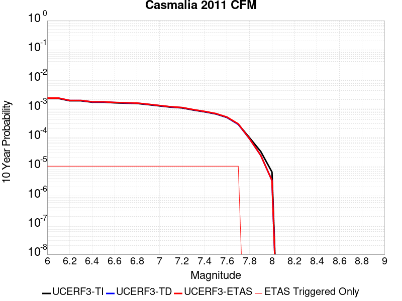 |

| Magnitude | 1 wk TI Prob | 1 wk TD Prob | 1 wk ETAS Prob | 1 wk ETAS/TD Gain | 1 wk ETAS Triggered Only | 1 mo TI Prob | 1 mo TD Prob | 1 mo ETAS Prob | 1 mo ETAS/TD Gain | 1 mo ETAS Triggered Only | 1 yr TI Prob | 1 yr TD Prob | 1 yr ETAS Prob | 1 yr ETAS/TD Gain | 1 yr ETAS Triggered Only | 10 yr TI Prob | 10 yr TD Prob | 10 yr ETAS Prob | 10 yr ETAS/TD Gain | 10 yr ETAS Triggered Only |
|-----|-----|-----|-----|-----|-----|-----|-----|-----|-----|-----|-----|-----|-----|-----|-----|-----|-----|-----|-----|-----|
| 6.0 | 4.1704893E-6 | 4.262483E-6 | 4.262483E-6 | 1.0 | 0.0 | 1.7873403E-5 | 1.8267656E-5 | 1.8267656E-5 | 1.0 | 0.0 | 2.1758694E-4 | 2.2238622E-4 | 2.2238622E-4 | 1.0 | 0.0 | 0.0021737402 | 0.0022216577 | 0.0022320705 | 1.004687 | 1.0435908E-5 |
| 6.1 | 4.1704893E-6 | 4.262483E-6 | 4.262483E-6 | 1.0 | 0.0 | 1.7873403E-5 | 1.8267656E-5 | 1.8267656E-5 | 1.0 | 0.0 | 2.1758694E-4 | 2.2238622E-4 | 2.2238622E-4 | 1.0 | 0.0 | 0.0021737402 | 0.0022216577 | 0.0022320705 | 1.004687 | 1.0435908E-5 |
| 6.2 | 3.457312E-6 | 3.5370217E-6 | 3.5370217E-6 | 1.0 | 0.0 | 1.4816967E-5 | 1.5158577E-5 | 1.5158577E-5 | 1.0 | 0.0 | 1.8038164E-4 | 1.8454014E-4 | 1.8454014E-4 | 1.0 | 0.0 | 0.001802353 | 0.0018438784 | 0.001854295 | 1.0056493 | 1.0435908E-5 |
| 6.3 | 3.457312E-6 | 3.5370217E-6 | 3.5370217E-6 | 1.0 | 0.0 | 1.4816967E-5 | 1.5158577E-5 | 1.5158577E-5 | 1.0 | 0.0 | 1.8038164E-4 | 1.8454014E-4 | 1.8454014E-4 | 1.0 | 0.0 | 0.001802353 | 0.0018438784 | 0.001854295 | 1.0056493 | 1.0435908E-5 |
| 6.4 | 3.0957337E-6 | 3.1692257E-6 | 3.1692257E-6 | 1.0 | 0.0 | 1.3267363E-5 | 1.3582326E-5 | 1.3582326E-5 | 1.0 | 0.0 | 1.6151817E-4 | 1.6535232E-4 | 1.6535232E-4 | 1.0 | 0.0 | 0.0016140083 | 0.0016522991 | 0.0016627177 | 1.0063056 | 1.0435908E-5 |
| 6.5 | 3.0957337E-6 | 3.1692257E-6 | 3.1692257E-6 | 1.0 | 0.0 | 1.3267363E-5 | 1.3582326E-5 | 1.3582326E-5 | 1.0 | 0.0 | 1.6151817E-4 | 1.6535232E-4 | 1.6535232E-4 | 1.0 | 0.0 | 0.0016140083 | 0.0016522991 | 0.0016627177 | 1.0063056 | 1.0435908E-5 |
| 6.6 | 2.9459152E-6 | 3.0165752E-6 | 3.0165752E-6 | 1.0 | 0.0 | 1.262529E-5 | 1.2928115E-5 | 1.2928115E-5 | 1.0 | 0.0 | 1.5370206E-4 | 1.5738848E-4 | 1.5738848E-4 | 1.0 | 0.0 | 0.0015359579 | 0.0015727758 | 0.0015831953 | 1.0066249 | 1.0435908E-5 |
| 6.7 | 2.8634809E-6 | 2.9324726E-6 | 2.9324726E-6 | 1.0 | 0.0 | 1.2272003E-5 | 1.256768E-5 | 1.256768E-5 | 1.0 | 0.0 | 1.4940138E-4 | 1.530008E-4 | 1.530008E-4 | 1.0 | 0.0 | 0.0014930099 | 0.0015289601 | 0.00153938 | 1.0068151 | 1.0435908E-5 |
| 6.8 | 2.7999822E-6 | 2.8675968E-6 | 2.8675968E-6 | 1.0 | 0.0 | 1.1999869E-5 | 1.2289643E-5 | 1.2289643E-5 | 1.0 | 0.0 | 1.460886E-4 | 1.4961617E-4 | 1.4961617E-4 | 1.0 | 0.0 | 0.001459926 | 0.0014951597 | 0.00150558 | 1.0069693 | 1.0435908E-5 |
| 6.9 | 2.551052E-6 | 2.6119649E-6 | 2.6119649E-6 | 1.0 | 0.0 | 1.0933034E-5 | 1.1194087E-5 | 1.1194087E-5 | 1.0 | 0.0 | 1.3310155E-4 | 1.3627953E-4 | 1.3627953E-4 | 1.0 | 0.0 | 0.0013302186 | 0.0013619636 | 0.0013723853 | 1.0076519 | 1.0435908E-5 |
| 7.0 | 2.3081875E-6 | 2.3624088E-6 | 2.3624088E-6 | 1.0 | 0.0 | 9.892195E-6 | 1.01245705E-5 | 1.01245705E-5 | 1.0 | 0.0 | 1.20430814E-4 | 1.232597E-4 | 1.232597E-4 | 1.0 | 0.0 | 0.0012036557 | 0.0012319161 | 0.0012423393 | 1.0084609 | 1.0435908E-5 |
| 7.1 | 2.093245E-6 | 2.1417243E-6 | 2.1417243E-6 | 1.0 | 0.0 | 8.971019E-6 | 9.178786E-6 | 9.178786E-6 | 1.0 | 0.0 | 1.09216686E-4 | 1.1174601E-4 | 1.1174601E-4 | 1.0 | 0.0 | 0.0010916302 | 0.0011169002 | 0.0011273245 | 1.0093333 | 1.0435908E-5 |
| 7.2 | 1.9714576E-6 | 2.0165091E-6 | 2.0165091E-6 | 1.0 | 0.0 | 8.449076E-6 | 8.642153E-6 | 8.642153E-6 | 1.0 | 0.0 | 1.0286264E-4 | 1.05213156E-4 | 1.05213156E-4 | 1.0 | 0.0 | 0.0010281504 | 0.0010516352 | 0.0010620602 | 1.0099131 | 1.0435908E-5 |
| 7.3 | 1.6689512E-6 | 1.7047131E-6 | 1.7047131E-6 | 1.0 | 0.0 | 7.1526288E-6 | 7.3058927E-6 | 7.3058927E-6 | 1.0 | 0.0 | 8.7079774E-5 | 8.894562E-5 | 8.894562E-5 | 1.0 | 0.0 | 8.7045657E-4 | 8.89101E-4 | 8.9952763E-4 | 1.0117272 | 1.0435908E-5 |
| 7.4 | 1.4490954E-6 | 1.4778908E-6 | 1.4778908E-6 | 1.0 | 0.0 | 6.210394E-6 | 6.333802E-6 | 6.333802E-6 | 1.0 | 0.0 | 7.560892E-5 | 7.711132E-5 | 7.711132E-5 | 1.0 | 0.0 | 7.55832E-4 | 7.7084627E-4 | 7.812741E-4 | 1.0135279 | 1.0435908E-5 |
| 7.5 | 1.226873E-6 | 1.2481701E-6 | 1.2481701E-6 | 1.0 | 0.0 | 5.2580162E-6 | 5.3492895E-6 | 5.3492895E-6 | 1.0 | 0.0 | 6.401447E-5 | 6.5125656E-5 | 6.5125656E-5 | 1.0 | 0.0 | 6.399603E-4 | 6.5106625E-4 | 6.614954E-4 | 1.0160185 | 1.0435908E-5 |
| 7.6 | 9.2561345E-7 | 9.361923E-7 | 9.361923E-7 | 1.0 | 0.0 | 3.966909E-6 | 4.012247E-6 | 4.012247E-6 | 1.0 | 0.0 | 4.8296046E-5 | 4.884801E-5 | 4.884801E-5 | 1.0 | 0.0 | 4.828555E-4 | 4.8837316E-4 | 4.98804E-4 | 1.0213583 | 1.0435908E-5 |
| 7.7 | 5.4367933E-7 | 5.392888E-7 | 5.392888E-7 | 1.0 | 0.0 | 2.3300522E-6 | 2.3112357E-6 | 2.3112357E-6 | 1.0 | 0.0 | 2.8368017E-5 | 2.8138933E-5 | 2.8138933E-5 | 1.0 | 0.0 | 2.8364395E-4 | 2.8135383E-4 | 2.917868E-4 | 1.0370814 | 1.0435908E-5 |
| 7.8 | 1.8825742E-7 | 1.7342276E-7 | 1.7342276E-7 | 1.0 | 0.0 | 8.068173E-7 | 7.4324015E-7 | 7.4324015E-7 | 1.0 | 0.0 | 9.822956E-6 | 9.048912E-6 | 9.048912E-6 | 1.0 | 0.0 | 9.822522E-5 | 9.048546E-5 | 9.048546E-5 | 1.0 | 0.0 |
| 7.9 | 6.342771E-8 | 4.6790706E-8 | 4.6790706E-8 | 1.0 | 0.0 | 2.7183304E-7 | 2.0053157E-7 | 2.0053157E-7 | 1.0 | 0.0 | 3.3095623E-6 | 2.4414692E-6 | 2.4414692E-6 | 1.0 | 0.0 | 3.309513E-5 | 2.4414428E-5 | 2.4414428E-5 | 1.0 | 0.0 |
| 8.0 | 1.2574819E-8 | 6.4733463E-9 | 6.4733463E-9 | 1.0 | 0.0 | 5.3892084E-8 | 2.7742912E-8 | 2.7742912E-8 | 1.0 | 0.0 | 6.561359E-7 | 3.377699E-7 | 3.377699E-7 | 1.0 | 0.0 | 6.56134E-6 | 3.377694E-6 | 3.377694E-6 | 1.0 | 0.0 |

## Cerro Prieto
*[(top)](#table-of-contents)*

| 1 Week | 1 Month | 1 Year | 10 Year |
|-----|-----|-----|-----|
| 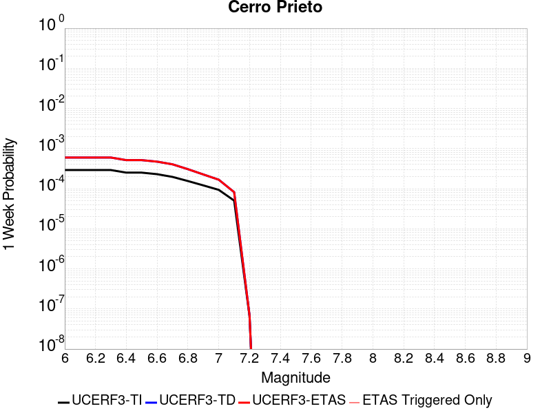 | 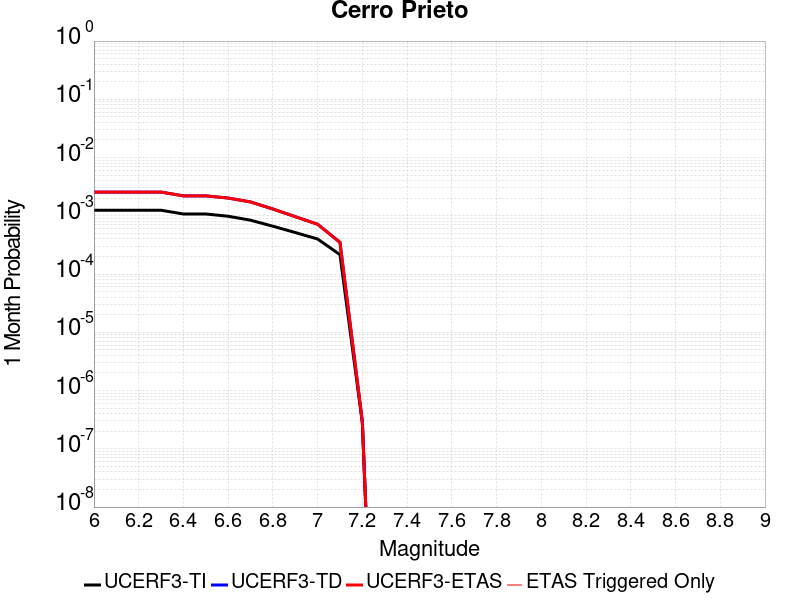 | 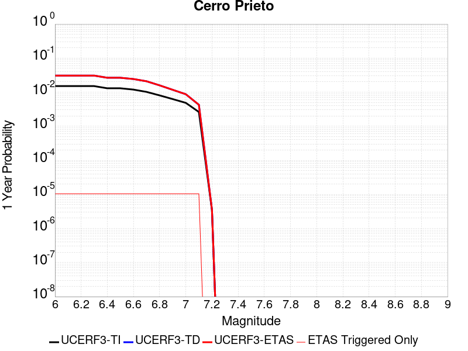 | 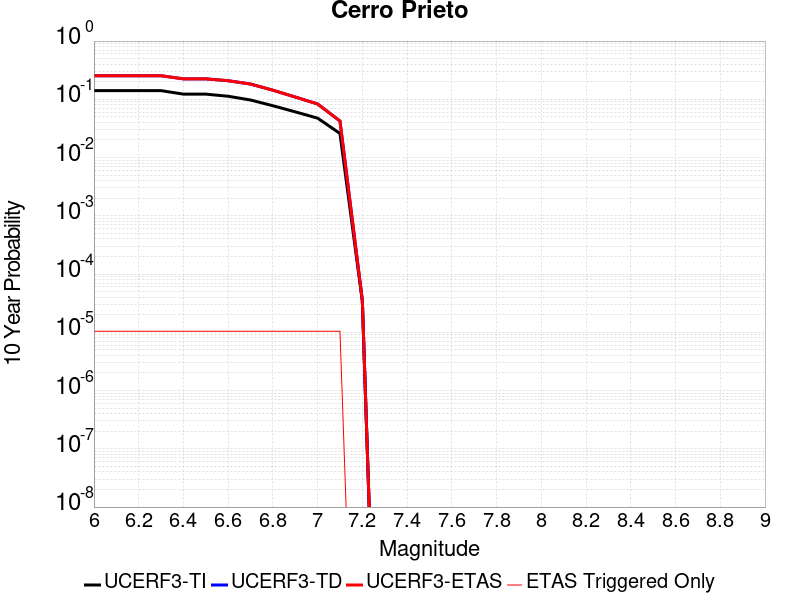 |

| Magnitude | 1 wk TI Prob | 1 wk TD Prob | 1 wk ETAS Prob | 1 wk ETAS/TD Gain | 1 wk ETAS Triggered Only | 1 mo TI Prob | 1 mo TD Prob | 1 mo ETAS Prob | 1 mo ETAS/TD Gain | 1 mo ETAS Triggered Only | 1 yr TI Prob | 1 yr TD Prob | 1 yr ETAS Prob | 1 yr ETAS/TD Gain | 1 yr ETAS Triggered Only | 10 yr TI Prob | 10 yr TD Prob | 10 yr ETAS Prob | 10 yr ETAS/TD Gain | 10 yr ETAS Triggered Only |
|-----|-----|-----|-----|-----|-----|-----|-----|-----|-----|-----|-----|-----|-----|-----|-----|-----|-----|-----|-----|-----|
| 6.0 | 2.9101528E-4 | 5.964804E-4 | 5.964804E-4 | 1.0 | 0.0 | 0.0012466122 | 0.002554082 | 0.002554082 | 1.0 | 0.0 | 0.015072231 | 0.03064807 | 0.030658185 | 1.0003301 | 1.0435908E-5 | 0.14089979 | 0.25397858 | 0.25398636 | 1.0000306 | 1.0435908E-5 |
| 6.1 | 2.9101528E-4 | 5.964804E-4 | 5.964804E-4 | 1.0 | 0.0 | 0.0012466122 | 0.002554082 | 0.002554082 | 1.0 | 0.0 | 0.015072231 | 0.03064807 | 0.030658185 | 1.0003301 | 1.0435908E-5 | 0.14089979 | 0.25397858 | 0.25398636 | 1.0000306 | 1.0435908E-5 |
| 6.2 | 2.9101528E-4 | 5.964804E-4 | 5.964804E-4 | 1.0 | 0.0 | 0.0012466122 | 0.002554082 | 0.002554082 | 1.0 | 0.0 | 0.015072231 | 0.03064807 | 0.030658185 | 1.0003301 | 1.0435908E-5 | 0.14089979 | 0.25397858 | 0.25398636 | 1.0000306 | 1.0435908E-5 |
| 6.3 | 2.9101528E-4 | 5.964804E-4 | 5.964804E-4 | 1.0 | 0.0 | 0.0012466122 | 0.002554082 | 0.002554082 | 1.0 | 0.0 | 0.015072231 | 0.03064807 | 0.030658185 | 1.0003301 | 1.0435908E-5 | 0.14089979 | 0.25397858 | 0.25398636 | 1.0000306 | 1.0435908E-5 |
| 6.4 | 2.508648E-4 | 5.1397446E-4 | 5.1397446E-4 | 1.0 | 0.0 | 0.0010746918 | 0.0022010866 | 0.0022010866 | 1.0 | 0.0 | 0.013006088 | 0.026471792 | 0.02648195 | 1.0003837 | 1.0435908E-5 | 0.12270685 | 0.22440416 | 0.22441225 | 1.0000361 | 1.0435908E-5 |
| 6.5 | 2.508648E-4 | 5.1397446E-4 | 5.1397446E-4 | 1.0 | 0.0 | 0.0010746918 | 0.0022010866 | 0.0022010866 | 1.0 | 0.0 | 0.013006088 | 0.026471792 | 0.02648195 | 1.0003837 | 1.0435908E-5 | 0.12270685 | 0.22440416 | 0.22441225 | 1.0000361 | 1.0435908E-5 |
| 6.6 | 2.294914E-4 | 4.7116808E-4 | 4.7116808E-4 | 1.0 | 0.0 | 9.831638E-4 | 0.0020179166 | 0.0020179166 | 1.0 | 0.0 | 0.011904482 | 0.02429866 | 0.024308844 | 1.000419 | 1.0435908E-5 | 0.11286586 | 0.20858558 | 0.20859383 | 1.0000396 | 1.0435908E-5 |
| 6.7 | 1.9621674E-4 | 4.0419117E-4 | 4.0419117E-4 | 1.0 | 0.0 | 8.4065786E-4 | 0.0017312564 | 0.0017312564 | 1.0 | 0.0 | 0.010187071 | 0.020884845 | 0.020895064 | 1.0004892 | 1.0435908E-5 | 0.09732539 | 0.18290249 | 0.18291101 | 1.0000466 | 1.0435908E-5 |
| 6.8 | 1.5476145E-4 | 3.056516E-4 | 3.056516E-4 | 1.0 | 0.0 | 6.6309475E-4 | 0.00130938 | 0.00130938 | 1.0 | 0.0 | 0.008043335 | 0.015836509 | 0.01584678 | 1.0006485 | 1.0435908E-5 | 0.07758363 | 0.14336355 | 0.14337249 | 1.0000623 | 1.0435908E-5 |
| 6.9 | 1.20509176E-4 | 2.2582515E-4 | 2.2582515E-4 | 1.0 | 0.0 | 5.1636563E-4 | 9.6752634E-4 | 9.6752634E-4 | 1.0 | 0.0 | 0.006268645 | 0.011726342 | 0.011736656 | 1.0008795 | 1.0435908E-5 | 0.060947374 | 0.109451205 | 0.109460495 | 1.0000849 | 1.0435908E-5 |
| 7.0 | 9.3269155E-5 | 1.6716642E-4 | 1.6716642E-4 | 1.0 | 0.0 | 3.9966372E-4 | 7.162739E-4 | 7.162739E-4 | 1.0 | 0.0 | 0.0048550544 | 0.008693418 | 0.008703764 | 1.00119 | 1.0435908E-5 | 0.04750344 | 0.08315912 | 0.083168685 | 1.000115 | 1.0435908E-5 |
| 7.1 | 5.029709E-5 | 8.1718936E-5 | 8.1718936E-5 | 1.0 | 0.0 | 2.1554115E-4 | 3.5019626E-4 | 3.5019626E-4 | 1.0 | 0.0 | 0.0026210553 | 0.0042587193 | 0.0042691105 | 1.0024401 | 1.0435908E-5 | 0.025903556 | 0.042365108 | 0.042375103 | 1.0002359 | 1.0435908E-5 |
| 7.2 | 6.5445185E-8 | 6.814903E-8 | 6.814903E-8 | 1.0 | 0.0 | 2.8047933E-7 | 2.9206726E-7 | 2.9206726E-7 | 1.0 | 0.0 | 3.4148304E-6 | 3.555919E-6 | 3.555919E-6 | 1.0 | 0.0 | 3.414778E-5 | 3.5559187E-5 | 3.5559187E-5 | 1.0 | 0.0 |

## Sierra Madre (San Fernando)
*[(top)](#table-of-contents)*

| 1 Week | 1 Month | 1 Year | 10 Year |
|-----|-----|-----|-----|
| 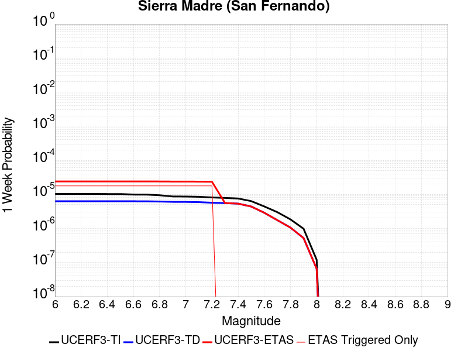 | 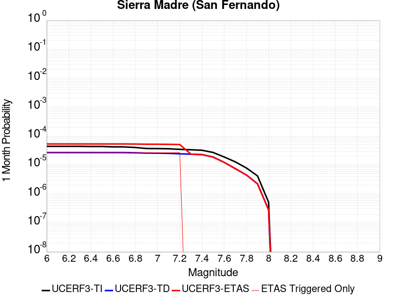 | 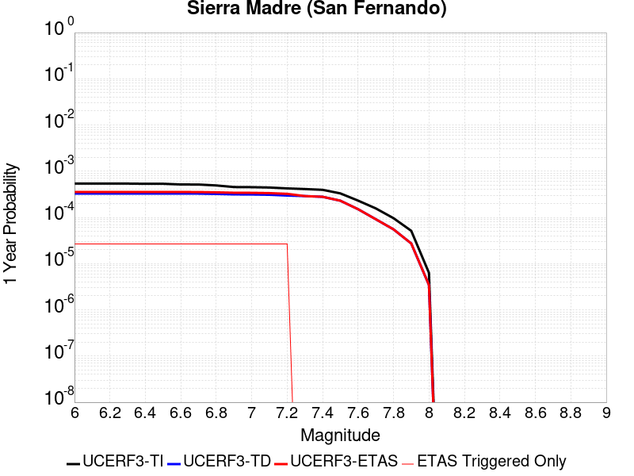 | 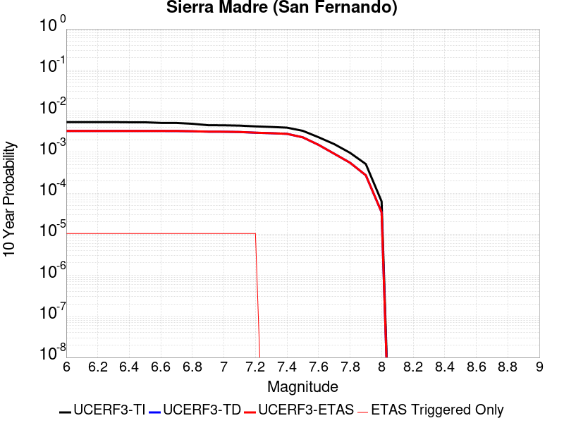 |

| Magnitude | 1 wk TI Prob | 1 wk TD Prob | 1 wk ETAS Prob | 1 wk ETAS/TD Gain | 1 wk ETAS Triggered Only | 1 mo TI Prob | 1 mo TD Prob | 1 mo ETAS Prob | 1 mo ETAS/TD Gain | 1 mo ETAS Triggered Only | 1 yr TI Prob | 1 yr TD Prob | 1 yr ETAS Prob | 1 yr ETAS/TD Gain | 1 yr ETAS Triggered Only | 10 yr TI Prob | 10 yr TD Prob | 10 yr ETAS Prob | 10 yr ETAS/TD Gain | 10 yr ETAS Triggered Only |
|-----|-----|-----|-----|-----|-----|-----|-----|-----|-----|-----|-----|-----|-----|-----|-----|-----|-----|-----|-----|-----|
| 6.0 | 1.0346413E-5 | 6.2872605E-6 | 1.6723103E-5 | 2.6598394 | 1.0435908E-5 | 4.4341014E-5 | 2.694513E-5 | 3.7380756E-5 | 1.3872918 | 1.0435908E-5 | 5.3971814E-4 | 3.280087E-4 | 3.3844117E-4 | 1.0318055 | 1.0435908E-5 | 0.0053840918 | 0.0032753581 | 0.0032857598 | 1.0031757 | 1.0435908E-5 |
| 6.1 | 1.0346413E-5 | 6.2872605E-6 | 1.6723103E-5 | 2.6598394 | 1.0435908E-5 | 4.4341014E-5 | 2.694513E-5 | 3.7380756E-5 | 1.3872918 | 1.0435908E-5 | 5.3971814E-4 | 3.280087E-4 | 3.3844117E-4 | 1.0318055 | 1.0435908E-5 | 0.0053840918 | 0.0032753581 | 0.0032857598 | 1.0031757 | 1.0435908E-5 |
| 6.2 | 1.0346413E-5 | 6.2872605E-6 | 1.6723103E-5 | 2.6598394 | 1.0435908E-5 | 4.4341014E-5 | 2.694513E-5 | 3.7380756E-5 | 1.3872918 | 1.0435908E-5 | 5.3971814E-4 | 3.280087E-4 | 3.3844117E-4 | 1.0318055 | 1.0435908E-5 | 0.0053840918 | 0.0032753581 | 0.0032857598 | 1.0031757 | 1.0435908E-5 |
| 6.3 | 1.0346413E-5 | 6.2872605E-6 | 1.6723103E-5 | 2.6598394 | 1.0435908E-5 | 4.4341014E-5 | 2.694513E-5 | 3.7380756E-5 | 1.3872918 | 1.0435908E-5 | 5.3971814E-4 | 3.280087E-4 | 3.3844117E-4 | 1.0318055 | 1.0435908E-5 | 0.0053840918 | 0.0032753581 | 0.0032857598 | 1.0031757 | 1.0435908E-5 |
| 6.4 | 1.0249558E-5 | 6.2872605E-6 | 1.6723103E-5 | 2.6598394 | 1.0435908E-5 | 4.392594E-5 | 2.694513E-5 | 3.7380756E-5 | 1.3872918 | 1.0435908E-5 | 5.3466705E-4 | 3.280087E-4 | 3.3844117E-4 | 1.0318055 | 1.0435908E-5 | 0.0053338245 | 0.0032753581 | 0.0032857598 | 1.0031757 | 1.0435908E-5 |
| 6.5 | 1.0249558E-5 | 6.2872605E-6 | 1.6723103E-5 | 2.6598394 | 1.0435908E-5 | 4.392594E-5 | 2.694513E-5 | 3.7380756E-5 | 1.3872918 | 1.0435908E-5 | 5.3466705E-4 | 3.280087E-4 | 3.3844117E-4 | 1.0318055 | 1.0435908E-5 | 0.0053338245 | 0.0032753581 | 0.0032857598 | 1.0031757 | 1.0435908E-5 |
| 6.6 | 9.9035515E-6 | 6.2872605E-6 | 1.6723103E-5 | 2.6598394 | 1.0435908E-5 | 4.2443102E-5 | 2.694513E-5 | 3.7380756E-5 | 1.3872918 | 1.0435908E-5 | 5.166222E-4 | 3.280087E-4 | 3.3844117E-4 | 1.0318055 | 1.0435908E-5 | 0.0051542283 | 0.0032753581 | 0.0032857598 | 1.0031757 | 1.0435908E-5 |
| 6.7 | 9.87217E-6 | 6.2746817E-6 | 1.6710525E-5 | 2.6631668 | 1.0435908E-5 | 4.2308613E-5 | 2.689122E-5 | 3.732685E-5 | 1.3880682 | 1.0435908E-5 | 5.149856E-4 | 3.2735255E-4 | 3.3778502E-4 | 1.0318693 | 1.0435908E-5 | 0.005137938 | 0.0032688158 | 0.0032792178 | 1.0031822 | 1.0435908E-5 |
| 6.8 | 9.4359175E-6 | 6.1786586E-6 | 1.6614502E-5 | 2.6890144 | 1.0435908E-5 | 4.043902E-5 | 2.6479704E-5 | 3.6915335E-5 | 1.3940992 | 1.0435908E-5 | 4.9223384E-4 | 3.2234378E-4 | 3.3277634E-4 | 1.0323646 | 1.0435908E-5 | 0.0049114493 | 0.0032188739 | 0.0032292763 | 1.0032316 | 1.0435908E-5 |
| 6.9 | 8.700447E-6 | 6.039922E-6 | 1.6475768E-5 | 2.727811 | 1.0435908E-5 | 3.72871E-5 | 2.5885129E-5 | 3.6320766E-5 | 1.4031519 | 1.0435908E-5 | 4.5387587E-4 | 3.1510694E-4 | 3.2553956E-4 | 1.0331082 | 1.0435908E-5 | 0.0045295 | 0.003146711 | 0.0031571141 | 1.003306 | 1.0435908E-5 |
| 7.0 | 8.648878E-6 | 6.0148373E-6 | 1.6450682E-5 | 2.735017 | 1.0435908E-5 | 3.7066096E-5 | 2.5777625E-5 | 3.6213263E-5 | 1.4048332 | 1.0435908E-5 | 4.5118626E-4 | 3.1379846E-4 | 3.242311E-4 | 1.0332463 | 1.0435908E-5 | 0.004502713 | 0.003133663 | 0.0031440663 | 1.0033199 | 1.0435908E-5 |
| 7.1 | 8.505786E-6 | 5.9244676E-6 | 1.6360314E-5 | 2.7614825 | 1.0435908E-5 | 3.645286E-5 | 2.5390334E-5 | 3.582598E-5 | 1.4110085 | 1.0435908E-5 | 4.437232E-4 | 3.0908454E-4 | 3.1951725E-4 | 1.0337535 | 1.0435908E-5 | 0.0044283825 | 0.0030866556 | 0.0030970594 | 1.0033705 | 1.0435908E-5 |
| 7.2 | 8.139752E-6 | 5.6987624E-6 | 1.613461E-5 | 2.831248 | 1.0435908E-5 | 3.4884186E-5 | 2.4423045E-5 | 3.48587E-5 | 1.4272871 | 1.0435908E-5 | 4.246322E-4 | 2.9731105E-4 | 3.0774387E-4 | 1.0350906 | 1.0435908E-5 | 0.004238217 | 0.0029692391 | 0.0029796439 | 1.0035043 | 1.0435908E-5 |
| 7.3 | 7.8816E-6 | 5.552077E-6 | 5.552077E-6 | 1.0 | 0.0 | 3.3777847E-5 | 2.3794404E-5 | 2.3794404E-5 | 1.0 | 0.0 | 4.111677E-4 | 2.896594E-4 | 2.896594E-4 | 1.0 | 0.0 | 0.004104078 | 0.0028929242 | 0.0028929242 | 1.0 | 0.0 |
| 7.4 | 7.5810603E-6 | 5.3563126E-6 | 5.3563126E-6 | 1.0 | 0.0 | 3.2489854E-5 | 2.2955428E-5 | 2.2955428E-5 | 1.0 | 0.0 | 3.9549218E-4 | 2.7944756E-4 | 2.7944756E-4 | 1.0 | 0.0 | 0.0039478904 | 0.0027910667 | 0.0027910667 | 1.0 | 0.0 |
| 7.5 | 6.349153E-6 | 4.407576E-6 | 4.407576E-6 | 1.0 | 0.0 | 2.7210372E-5 | 1.888948E-5 | 1.888948E-5 | 1.0 | 0.0 | 3.312359E-4 | 2.2995596E-4 | 2.2995596E-4 | 1.0 | 0.0 | 0.0033074263 | 0.0022972622 | 0.0022972622 | 1.0 | 0.0 |
| 7.6 | 4.430576E-6 | 2.8905868E-6 | 2.8905868E-6 | 1.0 | 0.0 | 1.8988047E-5 | 1.2388171E-5 | 1.2388171E-5 | 1.0 | 0.0 | 2.3115493E-4 | 1.5081577E-4 | 1.5081577E-4 | 1.0 | 0.0 | 0.0023091463 | 0.0015071568 | 0.0015071568 | 1.0 | 0.0 |
| 7.7 | 3.005066E-6 | 1.7510115E-6 | 1.7510115E-6 | 1.0 | 0.0 | 1.2878791E-5 | 7.504313E-6 | 7.504313E-6 | 1.0 | 0.0 | 1.56788E-4 | 9.1361195E-5 | 9.1361195E-5 | 1.0 | 0.0 | 0.0015667742 | 9.132375E-4 | 9.132375E-4 | 1.0 | 0.0 |
| 7.8 | 1.8459098E-6 | 1.0582091E-6 | 1.0582091E-6 | 1.0 | 0.0 | 7.911018E-6 | 4.535174E-6 | 4.535174E-6 | 1.0 | 0.0 | 9.631238E-5 | 5.5214347E-5 | 5.5214347E-5 | 1.0 | 0.0 | 9.627065E-4 | 5.5200676E-4 | 5.5200676E-4 | 1.0 | 0.0 |
| 7.9 | 9.839262E-7 | 5.23421E-7 | 5.23421E-7 | 1.0 | 0.0 | 4.2168194E-6 | 2.2432312E-6 | 2.2432312E-6 | 1.0 | 0.0 | 5.1338568E-5 | 2.7310998E-5 | 2.7310998E-5 | 1.0 | 0.0 | 5.132671E-4 | 2.730767E-4 | 2.730767E-4 | 1.0 | 0.0 |
| 8.0 | 1.210983E-7 | 6.613821E-8 | 6.613821E-8 | 1.0 | 0.0 | 5.1899264E-7 | 2.8344945E-7 | 2.8344945E-7 | 1.0 | 0.0 | 6.3187167E-6 | 3.4509917E-6 | 3.4509917E-6 | 1.0 | 0.0 | 6.318537E-5 | 3.45094E-5 | 3.45094E-5 | 1.0 | 0.0 |

## Superstition Hills
*[(top)](#table-of-contents)*

| 1 Week | 1 Month | 1 Year | 10 Year |
|-----|-----|-----|-----|
|  | 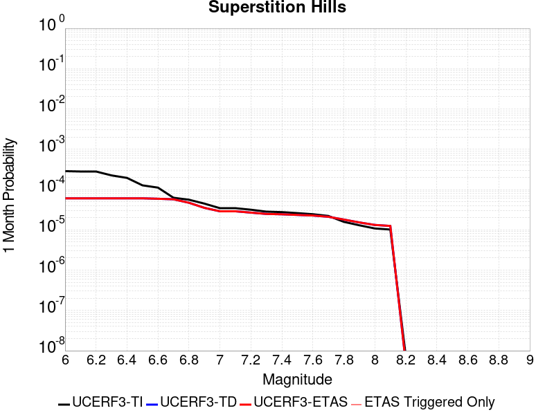 | 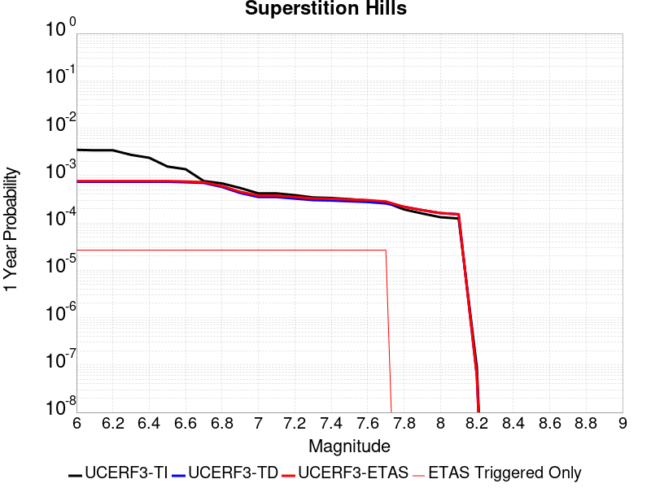 | 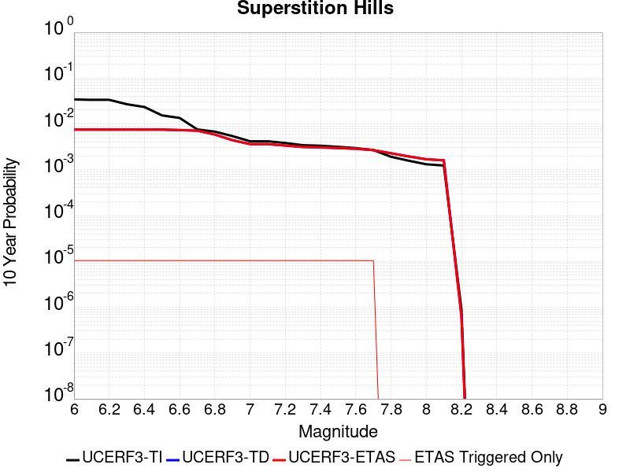 |

| Magnitude | 1 wk TI Prob | 1 wk TD Prob | 1 wk ETAS Prob | 1 wk ETAS/TD Gain | 1 wk ETAS Triggered Only | 1 mo TI Prob | 1 mo TD Prob | 1 mo ETAS Prob | 1 mo ETAS/TD Gain | 1 mo ETAS Triggered Only | 1 yr TI Prob | 1 yr TD Prob | 1 yr ETAS Prob | 1 yr ETAS/TD Gain | 1 yr ETAS Triggered Only | 10 yr TI Prob | 10 yr TD Prob | 10 yr ETAS Prob | 10 yr ETAS/TD Gain | 10 yr ETAS Triggered Only |
|-----|-----|-----|-----|-----|-----|-----|-----|-----|-----|-----|-----|-----|-----|-----|-----|-----|-----|-----|-----|-----|
| 6.0 | 6.6865185E-5 | 1.41376995E-5 | 1.41376995E-5 | 1.0 | 0.0 | 2.8653358E-4 | 6.0588824E-5 | 6.0588824E-5 | 1.0 | 0.0 | 0.0034829667 | 7.374355E-4 | 7.4786367E-4 | 1.0141412 | 1.0435908E-5 | 0.03428881 | 0.0075204074 | 0.007530765 | 1.0013772 | 1.0435908E-5 |
| 6.1 | 6.544851E-5 | 1.41376995E-5 | 1.41376995E-5 | 1.0 | 0.0 | 2.8046346E-4 | 6.0588824E-5 | 6.0588824E-5 | 1.0 | 0.0 | 0.0034092965 | 7.374355E-4 | 7.4786367E-4 | 1.0141412 | 1.0435908E-5 | 0.033574644 | 0.007520407 | 0.007530764 | 1.0013772 | 1.0435908E-5 |
| 6.2 | 6.544851E-5 | 1.41376995E-5 | 1.41376995E-5 | 1.0 | 0.0 | 2.8046346E-4 | 6.0588824E-5 | 6.0588824E-5 | 1.0 | 0.0 | 0.0034092965 | 7.374355E-4 | 7.4786367E-4 | 1.0141412 | 1.0435908E-5 | 0.033574644 | 0.007520407 | 0.007530764 | 1.0013772 | 1.0435908E-5 |
| 6.3 | 5.2402065E-5 | 1.4137698E-5 | 1.4137698E-5 | 1.0 | 0.0 | 2.2456095E-4 | 6.058882E-5 | 6.058882E-5 | 1.0 | 0.0 | 0.0027306017 | 7.374354E-4 | 7.478636E-4 | 1.0141412 | 1.0435908E-5 | 0.02697292 | 0.007520402 | 0.007530759 | 1.0013772 | 1.0435908E-5 |
| 6.4 | 4.542238E-5 | 1.4137698E-5 | 1.4137698E-5 | 1.0 | 0.0 | 1.9465282E-4 | 6.0588816E-5 | 6.0588816E-5 | 1.0 | 0.0 | 0.0023673223 | 7.3743536E-4 | 7.478636E-4 | 1.0141412 | 1.0435908E-5 | 0.023422617 | 0.0075203986 | 0.0075307563 | 1.0013772 | 1.0435908E-5 |
| 6.5 | 2.9672969E-5 | 1.4137696E-5 | 1.4137696E-5 | 1.0 | 0.0 | 1.2716366E-4 | 6.058881E-5 | 6.058881E-5 | 1.0 | 0.0 | 0.0015471181 | 7.374353E-4 | 7.478635E-4 | 1.0141412 | 1.0435908E-5 | 0.015363912 | 0.007520392 | 0.00753075 | 1.0013772 | 1.0435908E-5 |
| 6.6 | 2.6056105E-5 | 1.3803458E-5 | 1.3803458E-5 | 1.0 | 0.0 | 1.1166424E-4 | 5.9156428E-5 | 5.9156428E-5 | 1.0 | 0.0 | 0.0013586642 | 7.200076E-4 | 7.3043595E-4 | 1.0144837 | 1.0435908E-5 | 0.013503874 | 0.0073448285 | 0.007355188 | 1.0014104 | 1.0435908E-5 |
| 6.7 | 1.4611248E-5 | 1.3383359E-5 | 1.3383359E-5 | 1.0 | 0.0 | 6.261813E-5 | 5.7356083E-5 | 5.7356083E-5 | 1.0 | 0.0 | 7.6210906E-4 | 6.981025E-4 | 7.085311E-4 | 1.0149385 | 1.0435908E-5 | 0.0075950073 | 0.00712602 | 0.007136381 | 1.001454 | 1.0435908E-5 |
| 6.8 | 1.30607E-5 | 1.09787925E-5 | 1.09787925E-5 | 1.0 | 0.0 | 5.597323E-5 | 4.705117E-5 | 4.705117E-5 | 1.0 | 0.0 | 6.8126095E-4 | 5.7270617E-4 | 5.831361E-4 | 1.0182116 | 1.0435908E-5 | 0.006791762 | 0.00587438 | 0.0058847545 | 1.0017661 | 1.0435908E-5 |
| 6.9 | 1.0443096E-5 | 8.195349E-6 | 8.195349E-6 | 1.0 | 0.0 | 4.4755358E-5 | 3.5122466E-5 | 3.5122466E-5 | 1.0 | 0.0 | 5.447602E-4 | 4.2753448E-4 | 4.3796594E-4 | 1.024399 | 1.0435908E-5 | 0.005434267 | 0.0044094524 | 0.0044198423 | 1.0023563 | 1.0435908E-5 |
| 7.0 | 8.045912E-6 | 6.739692E-6 | 6.739692E-6 | 1.0 | 0.0 | 3.4482026E-5 | 2.888408E-5 | 2.888408E-5 | 1.0 | 0.0 | 4.197378E-4 | 3.5160795E-4 | 3.6204018E-4 | 1.0296701 | 1.0435908E-5 | 0.0041894587 | 0.0036334093 | 0.0036438073 | 1.0028617 | 1.0435908E-5 |
| 7.1 | 8.045912E-6 | 6.739692E-6 | 6.739692E-6 | 1.0 | 0.0 | 3.4482026E-5 | 2.888408E-5 | 2.888408E-5 | 1.0 | 0.0 | 4.197378E-4 | 3.5160795E-4 | 3.6204018E-4 | 1.0296701 | 1.0435908E-5 | 0.0041894587 | 0.0036334093 | 0.0036438073 | 1.0028617 | 1.0435908E-5 |
| 7.2 | 7.375506E-6 | 6.2466297E-6 | 6.2466297E-6 | 1.0 | 0.0 | 3.1608928E-5 | 2.6771E-5 | 2.6771E-5 | 1.0 | 0.0 | 3.8477074E-4 | 3.2588904E-4 | 3.3632154E-4 | 1.0320125 | 1.0435908E-5 | 0.003841052 | 0.003373887 | 0.0033842875 | 1.0030828 | 1.0435908E-5 |
| 7.3 | 6.6063913E-6 | 5.7990574E-6 | 5.7990574E-6 | 1.0 | 0.0 | 2.8312797E-5 | 2.485287E-5 | 2.485287E-5 | 1.0 | 0.0 | 3.446538E-4 | 3.025424E-4 | 3.1297514E-4 | 1.0344836 | 1.0435908E-5 | 0.0034411973 | 0.003138153 | 0.0031485565 | 1.0033151 | 1.0435908E-5 |
| 7.4 | 6.4313126E-6 | 5.680481E-6 | 5.680481E-6 | 1.0 | 0.0 | 2.7562477E-5 | 2.4344696E-5 | 2.4344696E-5 | 1.0 | 0.0 | 3.355215E-4 | 2.9635706E-4 | 3.0678988E-4 | 1.0352036 | 1.0435908E-5 | 0.0033501536 | 0.0030759154 | 0.0030863192 | 1.0033823 | 1.0435908E-5 |
| 7.5 | 6.0742927E-6 | 5.4763104E-6 | 5.4763104E-6 | 1.0 | 0.0 | 2.6032423E-5 | 2.3469694E-5 | 2.3469694E-5 | 1.0 | 0.0 | 3.1689866E-4 | 2.8570674E-4 | 2.9613965E-4 | 1.0365162 | 1.0435908E-5 | 0.0031644711 | 0.002967756 | 0.002978161 | 1.003506 | 1.0435908E-5 |
| 7.6 | 5.6987187E-6 | 5.294521E-6 | 5.294521E-6 | 1.0 | 0.0 | 2.4422852E-5 | 2.269061E-5 | 2.269061E-5 | 1.0 | 0.0 | 2.9730765E-4 | 2.7622381E-4 | 2.8665684E-4 | 1.0377702 | 1.0435908E-5 | 0.002969102 | 0.0028710118 | 0.0028814177 | 1.0036244 | 1.0435908E-5 |
| 7.7 | 5.1658035E-6 | 4.925535E-6 | 4.925535E-6 | 1.0 | 0.0 | 2.2138971E-5 | 2.1109268E-5 | 2.1109268E-5 | 1.0 | 0.0 | 2.6950863E-4 | 2.5697565E-4 | 2.6740888E-4 | 1.0406001 | 1.0435908E-5 | 0.00269182 | 0.0026760625 | 0.0026864705 | 1.0038893 | 1.0435908E-5 |
| 7.8 | 3.6864697E-6 | 4.1964995E-6 | 4.1964995E-6 | 1.0 | 0.0 | 1.579906E-5 | 1.7984876E-5 | 1.7984876E-5 | 1.0 | 0.0 | 1.9233658E-4 | 2.1894433E-4 | 2.1894433E-4 | 1.0 | 0.0 | 0.0019217018 | 0.0022892624 | 0.0022892624 | 1.0 | 0.0 |
| 7.9 | 3.0265903E-6 | 3.5637288E-6 | 3.5637288E-6 | 1.0 | 0.0 | 1.2971037E-5 | 1.5273037E-5 | 1.5273037E-5 | 1.0 | 0.0 | 1.5791094E-4 | 1.859338E-4 | 1.859338E-4 | 1.0 | 0.0 | 0.0015779877 | 0.0019534735 | 0.0019534735 | 1.0 | 0.0 |
| 8.0 | 2.5271493E-6 | 3.0867361E-6 | 3.0867361E-6 | 1.0 | 0.0 | 1.0830595E-5 | 1.3228804E-5 | 1.3228804E-5 | 1.0 | 0.0 | 1.3185451E-4 | 1.610492E-4 | 1.610492E-4 | 1.0 | 0.0 | 0.0013177631 | 0.0016973554 | 0.0016973554 | 1.0 | 0.0 |
| 8.1 | 2.3749135E-6 | 2.917377E-6 | 2.917377E-6 | 1.0 | 0.0 | 1.0178161E-5 | 1.25029865E-5 | 1.25029865E-5 | 1.0 | 0.0 | 1.2391206E-4 | 1.5221364E-4 | 1.5221364E-4 | 1.0 | 0.0 | 0.0012384299 | 0.001604949 | 0.001604949 | 1.0 | 0.0 |
| 8.2 | 1.7186406E-9 | 1.1440594E-9 | 1.1440594E-9 | 1.0 | 0.0 | 7.3656024E-9 | 4.9031117E-9 | 4.9031117E-9 | 1.0 | 0.0 | 8.9676206E-8 | 5.969538E-8 | 5.969538E-8 | 1.0 | 0.0 | 8.9676166E-7 | 6.389059E-7 | 6.389059E-7 | 1.0 | 0.0 |

## Hayward (No) 2011 CFM
*[(top)](#table-of-contents)*

| 1 Week | 1 Month | 1 Year | 10 Year |
|-----|-----|-----|-----|
| 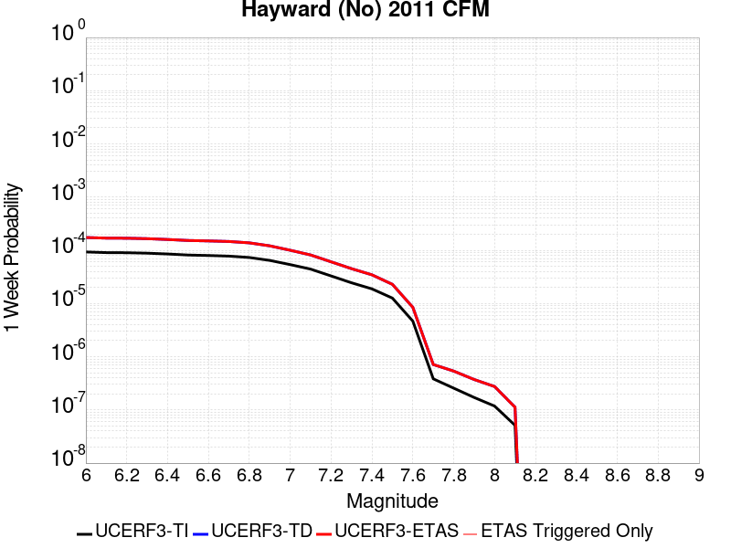 | 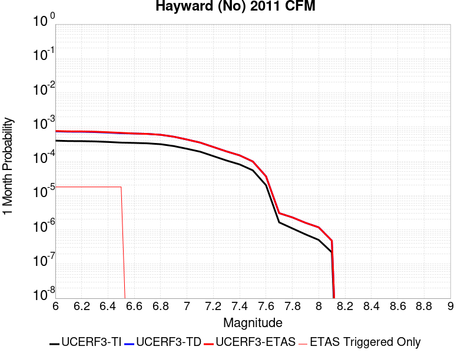 | 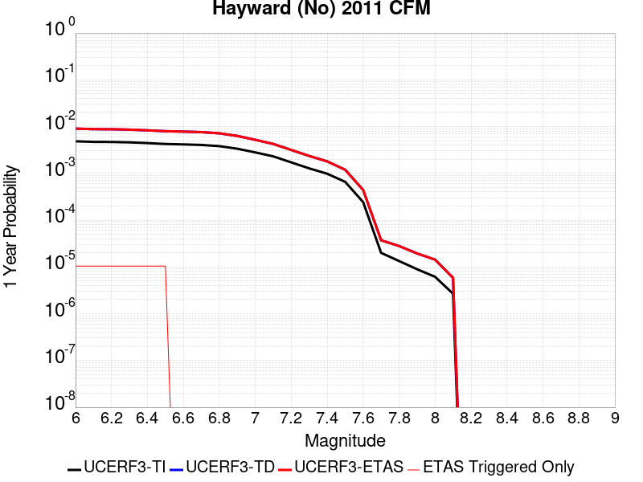 | 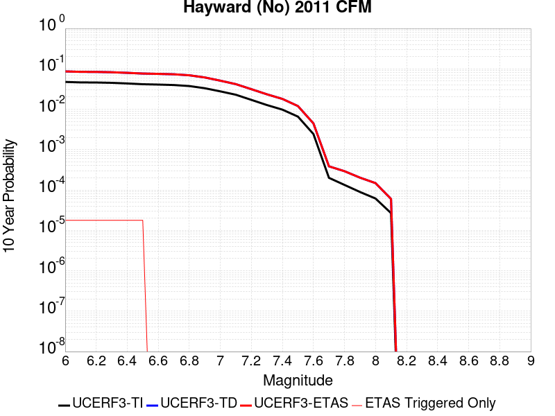 |

| Magnitude | 1 wk TI Prob | 1 wk TD Prob | 1 wk ETAS Prob | 1 wk ETAS/TD Gain | 1 wk ETAS Triggered Only | 1 mo TI Prob | 1 mo TD Prob | 1 mo ETAS Prob | 1 mo ETAS/TD Gain | 1 mo ETAS Triggered Only | 1 yr TI Prob | 1 yr TD Prob | 1 yr ETAS Prob | 1 yr ETAS/TD Gain | 1 yr ETAS Triggered Only | 10 yr TI Prob | 10 yr TD Prob | 10 yr ETAS Prob | 10 yr ETAS/TD Gain | 10 yr ETAS Triggered Only |
|-----|-----|-----|-----|-----|-----|-----|-----|-----|-----|-----|-----|-----|-----|-----|-----|-----|-----|-----|-----|-----|
| 6.0 | 9.3068506E-5 | 1.739599E-4 | 1.739599E-4 | 1.0 | 0.0 | 3.9880406E-4 | 7.453244E-4 | 7.5575255E-4 | 1.0139914 | 1.0435908E-5 | 0.0048446343 | 0.009036438 | 0.00904678 | 1.0011444 | 1.0435908E-5 | 0.047403704 | 0.08637534 | 0.08638487 | 1.0001104 | 1.0435908E-5 |
| 6.1 | 9.055486E-5 | 1.6947114E-4 | 1.6947114E-4 | 1.0 | 0.0 | 3.880345E-4 | 7.261021E-4 | 7.365304E-4 | 1.0143621 | 1.0435908E-5 | 0.0047140904 | 0.008804537 | 0.008814882 | 1.0011748 | 1.0435908E-5 | 0.046153355 | 0.08426854 | 0.08427809 | 1.0001134 | 1.0435908E-5 |
| 6.2 | 9.006742E-5 | 1.6867711E-4 | 1.6867711E-4 | 1.0 | 0.0 | 3.859461E-4 | 7.22701E-4 | 7.331294E-4 | 1.0144297 | 1.0435908E-5 | 0.0046887742 | 0.008763513 | 0.008773857 | 1.0011804 | 1.0435908E-5 | 0.0459107 | 0.083892785 | 0.083902344 | 1.000114 | 1.0435908E-5 |
| 6.3 | 8.8336754E-5 | 1.6547246E-4 | 1.6547246E-4 | 1.0 | 0.0 | 3.7853114E-4 | 7.089758E-4 | 7.194043E-4 | 1.0147092 | 1.0435908E-5 | 0.004598882 | 0.008597788 | 0.008608134 | 1.0012033 | 1.0435908E-5 | 0.04504866 | 0.08238599 | 0.08239557 | 1.0001162 | 1.0435908E-5 |
| 6.4 | 8.526157E-5 | 1.5974249E-4 | 1.5974249E-4 | 1.0 | 0.0 | 3.6535555E-4 | 6.8443175E-4 | 6.9486053E-4 | 1.0152371 | 1.0435908E-5 | 0.0044391346 | 0.008301278 | 0.008311627 | 1.0012467 | 1.0435908E-5 | 0.043514993 | 0.079682834 | 0.07969244 | 1.0001205 | 1.0435908E-5 |
| 6.5 | 8.152396E-5 | 1.530663E-4 | 1.530663E-4 | 1.0 | 0.0 | 3.493416E-4 | 6.558342E-4 | 6.662633E-4 | 1.0159019 | 1.0435908E-5 | 0.0042449418 | 0.007955698 | 0.007966051 | 1.0013013 | 1.0435908E-5 | 0.04164765 | 0.07651369 | 0.07652333 | 1.000126 | 1.0435908E-5 |
| 6.6 | 7.987405E-5 | 1.5010842E-4 | 1.5010842E-4 | 1.0 | 0.0 | 3.4227243E-4 | 6.4316386E-4 | 6.4316386E-4 | 1.0 | 0.0 | 0.0041592065 | 0.0078025614 | 0.0078025614 | 1.0 | 0.0 | 0.04082218 | 0.07510622 | 0.07510622 | 1.0 | 0.0 |
| 6.7 | 7.777665E-5 | 1.4650106E-4 | 1.4650106E-4 | 1.0 | 0.0 | 3.332859E-4 | 6.277113E-4 | 6.277113E-4 | 1.0 | 0.0 | 0.004050208 | 0.00761576 | 0.00761576 | 1.0 | 0.0 | 0.039771806 | 0.073382616 | 0.073382616 | 1.0 | 0.0 |
| 6.8 | 7.3284005E-5 | 1.3800753E-4 | 1.3800753E-4 | 1.0 | 0.0 | 3.140365E-4 | 5.913274E-4 | 5.913274E-4 | 1.0 | 0.0 | 0.0038166929 | 0.0071757827 | 0.0071757827 | 1.0 | 0.0 | 0.037518036 | 0.06929621 | 0.06929621 | 1.0 | 0.0 |
| 6.9 | 6.458263E-5 | 1.2131439E-4 | 1.2131439E-4 | 1.0 | 0.0 | 2.7675333E-4 | 5.198157E-4 | 5.198157E-4 | 1.0 | 0.0 | 0.0033642664 | 0.0063104923 | 0.0063104923 | 1.0 | 0.0 | 0.033137884 | 0.061225023 | 0.061225023 | 1.0 | 0.0 |
| 7.0 | 5.3853604E-5 | 1.00250414E-4 | 1.00250414E-4 | 1.0 | 0.0 | 2.3078074E-4 | 4.295742E-4 | 4.295742E-4 | 1.0 | 0.0 | 0.0028061352 | 0.0052175885 | 0.0052175885 | 1.0 | 0.0 | 0.027709642 | 0.0509578 | 0.0509578 | 1.0 | 0.0 |
| 7.1 | 4.4308683E-5 | 8.170626E-5 | 8.170626E-5 | 1.0 | 0.0 | 1.8988053E-4 | 3.501229E-4 | 3.501229E-4 | 1.0 | 0.0 | 0.0023093442 | 0.0042544557 | 0.0042544557 | 1.0 | 0.0 | 0.022854926 | 0.04182473 | 0.04182473 | 1.0 | 0.0 |
| 7.2 | 3.295973E-5 | 6.0771144E-5 | 6.0771144E-5 | 1.0 | 0.0 | 1.4124835E-4 | 2.604219E-4 | 2.604219E-4 | 1.0 | 0.0 | 0.0017183421 | 0.0031660495 | 0.0031660495 | 1.0 | 0.0 | 0.017051157 | 0.031369876 | 0.031369876 | 1.0 | 0.0 |
| 7.3 | 2.452256E-5 | 4.5180346E-5 | 4.5180346E-5 | 1.0 | 0.0 | 1.05092455E-4 | 1.9361576E-4 | 1.9361576E-4 | 1.0 | 0.0 | 0.0012787496 | 0.0023547374 | 0.0023547374 | 1.0 | 0.0 | 0.0127141625 | 0.02344111 | 0.02344111 | 1.0 | 0.0 |
| 7.4 | 1.8829967E-5 | 3.4602548E-5 | 3.4602548E-5 | 1.0 | 0.0 | 8.069736E-5 | 1.4828827E-4 | 1.4828827E-4 | 1.0 | 0.0 | 9.820475E-4 | 0.0018039243 | 0.0018039243 | 1.0 | 0.0 | 0.009777189 | 0.0180195 | 0.0180195 | 1.0 | 0.0 |
| 7.5 | 1.26374125E-5 | 2.2921116E-5 | 2.2921116E-5 | 1.0 | 0.0 | 5.4159216E-5 | 9.822969E-5 | 9.822969E-5 | 1.0 | 0.0 | 6.5918895E-4 | 0.0011952962 | 0.0011952962 | 1.0 | 0.0 | 0.00657237 | 0.011988836 | 0.011988836 | 1.0 | 0.0 |
| 7.6 | 4.666429E-6 | 8.4791645E-6 | 8.4791645E-6 | 1.0 | 0.0 | 1.9998828E-5 | 3.6338777E-5 | 3.6338777E-5 | 1.0 | 0.0 | 2.4345852E-4 | 4.4233602E-4 | 4.4233602E-4 | 1.0 | 0.0 | 0.0024319198 | 0.0044591012 | 0.0044591012 | 1.0 | 0.0 |
| 7.7 | 3.8399318E-7 | 7.133867E-7 | 7.133867E-7 | 1.0 | 0.0 | 1.6456839E-6 | 3.057368E-6 | 3.057368E-6 | 1.0 | 0.0 | 2.003602E-5 | 3.722282E-5 | 3.722282E-5 | 1.0 | 0.0 | 2.0034213E-4 | 3.8614936E-4 | 3.8614936E-4 | 1.0 | 0.0 |
| 7.8 | 2.5637698E-7 | 5.3662194E-7 | 5.3662194E-7 | 1.0 | 0.0 | 1.098758E-6 | 2.299806E-6 | 2.299806E-6 | 1.0 | 0.0 | 1.3377297E-5 | 2.7999782E-5 | 2.7999782E-5 | 1.0 | 0.0 | 1.3376492E-4 | 2.9244382E-4 | 2.9244382E-4 | 1.0 | 0.0 |
| 7.9 | 1.7141245E-7 | 3.7290573E-7 | 3.7290573E-7 | 1.0 | 0.0 | 7.3462456E-7 | 1.5981665E-6 | 1.5981665E-6 | 1.0 | 0.0 | 8.944017E-6 | 1.9457504E-5 | 1.9457504E-5 | 1.0 | 0.0 | 8.943657E-5 | 2.0245428E-4 | 2.0245428E-4 | 1.0 | 0.0 |
| 8.0 | 1.1808895E-7 | 2.7509762E-7 | 2.7509762E-7 | 1.0 | 0.0 | 5.060954E-7 | 1.1789892E-6 | 1.1789892E-6 | 1.0 | 0.0 | 6.161694E-6 | 1.43541E-5 | 1.43541E-5 | 1.0 | 0.0 | 6.161523E-5 | 1.4816441E-4 | 1.4816441E-4 | 1.0 | 0.0 |
| 8.1 | 5.138535E-8 | 1.1229867E-7 | 1.1229867E-7 | 1.0 | 0.0 | 2.2022292E-7 | 4.812799E-7 | 4.812799E-7 | 1.0 | 0.0 | 2.6812106E-6 | 5.8595674E-6 | 5.8595674E-6 | 1.0 | 0.0 | 2.6811784E-5 | 6.0158476E-5 | 6.0158476E-5 | 1.0 | 0.0 |

## Fitzhugh Creek
*[(top)](#table-of-contents)*

| 1 Week | 1 Month | 1 Year | 10 Year |
|-----|-----|-----|-----|
|  | 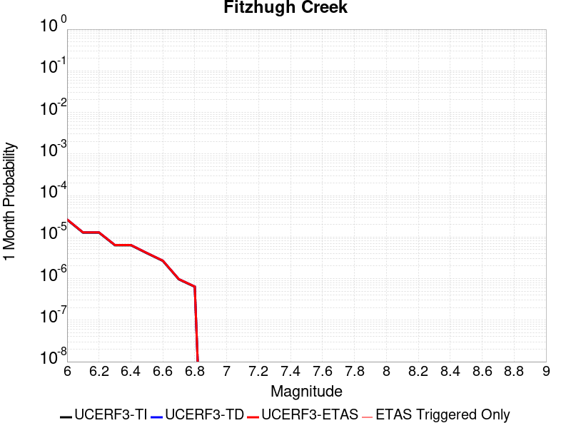 |  | 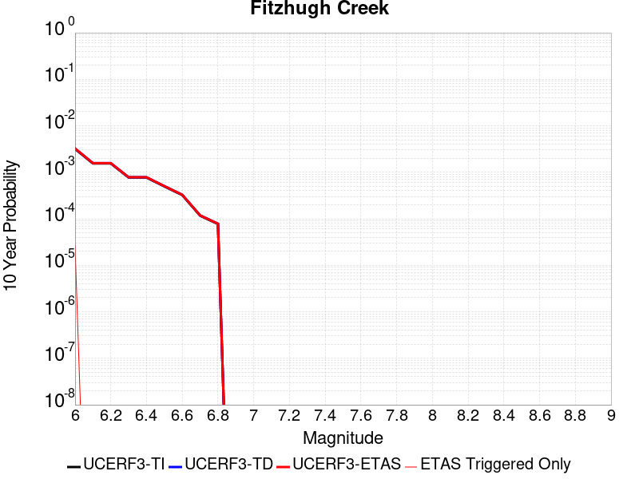 |

| Magnitude | 1 wk TI Prob | 1 wk TD Prob | 1 wk ETAS Prob | 1 wk ETAS/TD Gain | 1 wk ETAS Triggered Only | 1 mo TI Prob | 1 mo TD Prob | 1 mo ETAS Prob | 1 mo ETAS/TD Gain | 1 mo ETAS Triggered Only | 1 yr TI Prob | 1 yr TD Prob | 1 yr ETAS Prob | 1 yr ETAS/TD Gain | 1 yr ETAS Triggered Only | 10 yr TI Prob | 10 yr TD Prob | 10 yr ETAS Prob | 10 yr ETAS/TD Gain | 10 yr ETAS Triggered Only |
|-----|-----|-----|-----|-----|-----|-----|-----|-----|-----|-----|-----|-----|-----|-----|-----|-----|-----|-----|-----|-----|
| 6.0 | 6.1090436E-6 | 6.2101562E-6 | 6.2101562E-6 | 1.0 | 0.0 | 2.6181353E-5 | 2.6614709E-5 | 2.6614709E-5 | 1.0 | 0.0 | 3.1871133E-4 | 3.239904E-4 | 3.239904E-4 | 1.0 | 0.0 | 0.0031825465 | 0.0032356246 | 0.0032460268 | 1.0032148 | 1.0435908E-5 |
| 6.1 | 2.9741811E-6 | 3.021581E-6 | 3.021581E-6 | 1.0 | 0.0 | 1.2746428E-5 | 1.2949574E-5 | 1.2949574E-5 | 1.0 | 0.0 | 1.5517672E-4 | 1.576506E-4 | 1.576506E-4 | 1.0 | 0.0 | 0.001550684 | 0.0015754806 | 0.0015754806 | 1.0 | 0.0 |
| 6.2 | 2.9741811E-6 | 3.021581E-6 | 3.021581E-6 | 1.0 | 0.0 | 1.2746428E-5 | 1.2949574E-5 | 1.2949574E-5 | 1.0 | 0.0 | 1.5517672E-4 | 1.576506E-4 | 1.576506E-4 | 1.0 | 0.0 | 0.001550684 | 0.0015754806 | 0.0015754806 | 1.0 | 0.0 |
| 6.3 | 1.4781198E-6 | 1.5012708E-6 | 1.5012708E-6 | 1.0 | 0.0 | 6.3347834E-6 | 6.4340034E-6 | 6.4340034E-6 | 1.0 | 0.0 | 7.712326E-5 | 7.833137E-5 | 7.833137E-5 | 1.0 | 0.0 | 7.70965E-4 | 7.830576E-4 | 7.830576E-4 | 1.0 | 0.0 |
| 6.4 | 1.4781198E-6 | 1.5012708E-6 | 1.5012708E-6 | 1.0 | 0.0 | 6.3347834E-6 | 6.4340034E-6 | 6.4340034E-6 | 1.0 | 0.0 | 7.712326E-5 | 7.833137E-5 | 7.833137E-5 | 1.0 | 0.0 | 7.70965E-4 | 7.830576E-4 | 7.830576E-4 | 1.0 | 0.0 |
| 6.5 | 9.5176676E-7 | 9.66606E-7 | 9.66606E-7 | 1.0 | 0.0 | 4.078994E-6 | 4.142591E-6 | 4.142591E-6 | 1.0 | 0.0 | 4.9660623E-5 | 5.0434985E-5 | 5.0434985E-5 | 1.0 | 0.0 | 4.964952E-4 | 5.042458E-4 | 5.042458E-4 | 1.0 | 0.0 |
| 6.6 | 6.21145E-7 | 6.3085855E-7 | 6.3085855E-7 | 1.0 | 0.0 | 2.662047E-6 | 2.7036772E-6 | 2.7036772E-6 | 1.0 | 0.0 | 3.2409942E-5 | 3.291684E-5 | 3.291684E-5 | 1.0 | 0.0 | 3.2405215E-4 | 3.2912623E-4 | 3.2912623E-4 | 1.0 | 0.0 |
| 6.7 | 2.2377962E-7 | 2.2734636E-7 | 2.2734636E-7 | 1.0 | 0.0 | 9.590551E-7 | 9.743413E-7 | 9.743413E-7 | 1.0 | 0.0 | 1.1676434E-5 | 1.1862574E-5 | 1.1862574E-5 | 1.0 | 0.0 | 1.1675821E-4 | 1.1862254E-4 | 1.1862254E-4 | 1.0 | 0.0 |
| 6.8 | 1.4785022E-7 | 1.5021492E-7 | 1.5021492E-7 | 1.0 | 0.0 | 6.3364365E-7 | 6.4377826E-7 | 6.4377826E-7 | 1.0 | 0.0 | 7.714584E-6 | 7.838E-6 | 7.838E-6 | 1.0 | 0.0 | 7.714316E-5 | 7.838E-5 | 7.838E-5 | 1.0 | 0.0 |

## San Joaquin Hills
*[(top)](#table-of-contents)*

| 1 Week | 1 Month | 1 Year | 10 Year |
|-----|-----|-----|-----|
| 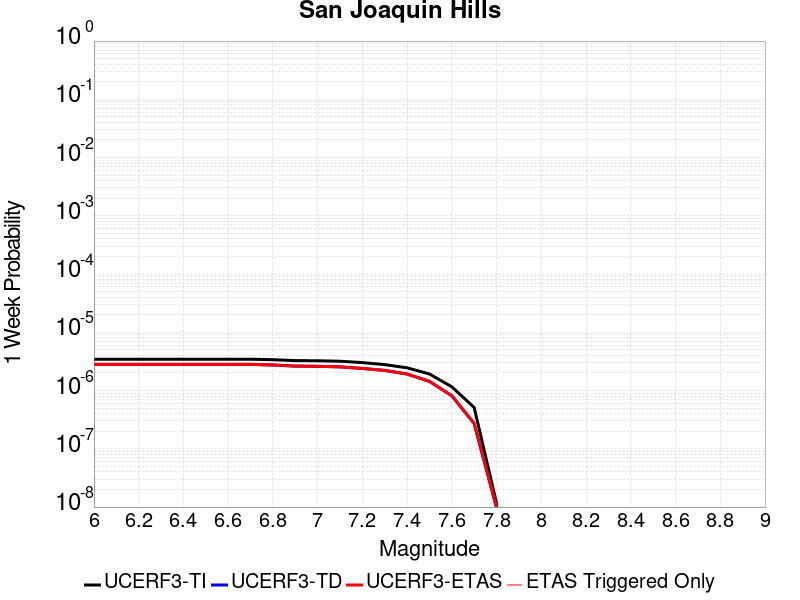 | 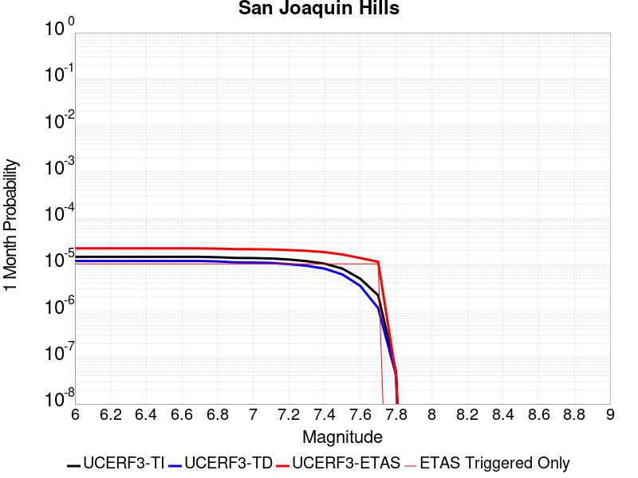 | 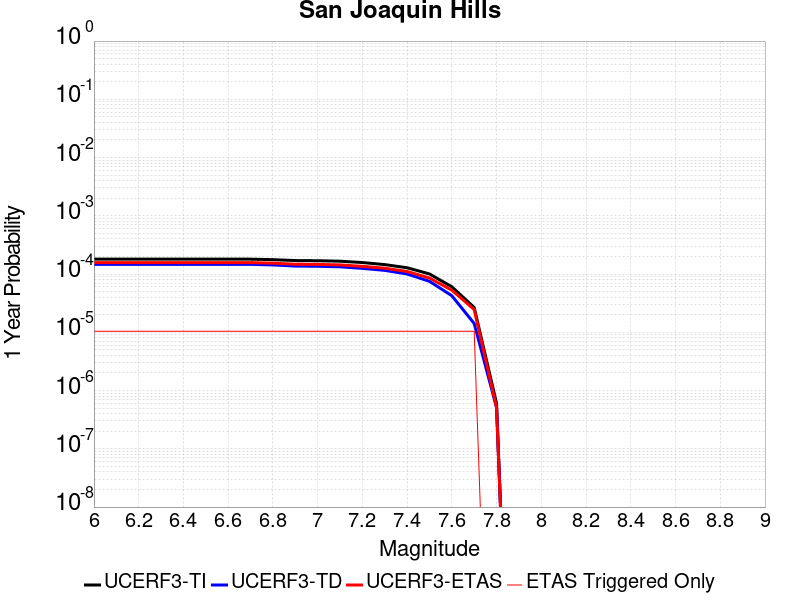 | 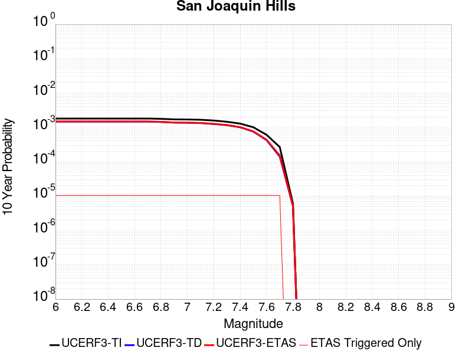 |

| Magnitude | 1 wk TI Prob | 1 wk TD Prob | 1 wk ETAS Prob | 1 wk ETAS/TD Gain | 1 wk ETAS Triggered Only | 1 mo TI Prob | 1 mo TD Prob | 1 mo ETAS Prob | 1 mo ETAS/TD Gain | 1 mo ETAS Triggered Only | 1 yr TI Prob | 1 yr TD Prob | 1 yr ETAS Prob | 1 yr ETAS/TD Gain | 1 yr ETAS Triggered Only | 10 yr TI Prob | 10 yr TD Prob | 10 yr ETAS Prob | 10 yr ETAS/TD Gain | 10 yr ETAS Triggered Only |
|-----|-----|-----|-----|-----|-----|-----|-----|-----|-----|-----|-----|-----|-----|-----|-----|-----|-----|-----|-----|-----|
| 6.0 | 3.4525704E-6 | 2.8139818E-6 | 2.8139818E-6 | 1.0 | 0.0 | 1.4796647E-5 | 1.2059867E-5 | 2.249565E-5 | 1.8653314 | 1.0435908E-5 | 1.8013427E-4 | 1.4681912E-4 | 1.572535E-4 | 1.0710696 | 1.0435908E-5 | 0.0017998833 | 0.0014672345 | 0.001477655 | 1.0071023 | 1.0435908E-5 |
| 6.1 | 3.4525704E-6 | 2.8139818E-6 | 2.8139818E-6 | 1.0 | 0.0 | 1.4796647E-5 | 1.2059867E-5 | 2.249565E-5 | 1.8653314 | 1.0435908E-5 | 1.8013427E-4 | 1.4681912E-4 | 1.572535E-4 | 1.0710696 | 1.0435908E-5 | 0.0017998833 | 0.0014672345 | 0.001477655 | 1.0071023 | 1.0435908E-5 |
| 6.2 | 3.4525704E-6 | 2.8139818E-6 | 2.8139818E-6 | 1.0 | 0.0 | 1.4796647E-5 | 1.2059867E-5 | 2.249565E-5 | 1.8653314 | 1.0435908E-5 | 1.8013427E-4 | 1.4681912E-4 | 1.572535E-4 | 1.0710696 | 1.0435908E-5 | 0.0017998833 | 0.0014672345 | 0.001477655 | 1.0071023 | 1.0435908E-5 |
| 6.3 | 3.4525704E-6 | 2.8139818E-6 | 2.8139818E-6 | 1.0 | 0.0 | 1.4796647E-5 | 1.2059867E-5 | 2.249565E-5 | 1.8653314 | 1.0435908E-5 | 1.8013427E-4 | 1.4681912E-4 | 1.572535E-4 | 1.0710696 | 1.0435908E-5 | 0.0017998833 | 0.0014672345 | 0.001477655 | 1.0071023 | 1.0435908E-5 |
| 6.4 | 3.4525704E-6 | 2.8139818E-6 | 2.8139818E-6 | 1.0 | 0.0 | 1.4796647E-5 | 1.2059867E-5 | 2.249565E-5 | 1.8653314 | 1.0435908E-5 | 1.8013427E-4 | 1.4681912E-4 | 1.572535E-4 | 1.0710696 | 1.0435908E-5 | 0.0017998833 | 0.0014672345 | 0.001477655 | 1.0071023 | 1.0435908E-5 |
| 6.5 | 3.4525704E-6 | 2.8139818E-6 | 2.8139818E-6 | 1.0 | 0.0 | 1.4796647E-5 | 1.2059867E-5 | 2.249565E-5 | 1.8653314 | 1.0435908E-5 | 1.8013427E-4 | 1.4681912E-4 | 1.572535E-4 | 1.0710696 | 1.0435908E-5 | 0.0017998833 | 0.0014672345 | 0.001477655 | 1.0071023 | 1.0435908E-5 |
| 6.6 | 3.4525704E-6 | 2.8139818E-6 | 2.8139818E-6 | 1.0 | 0.0 | 1.4796647E-5 | 1.2059867E-5 | 2.249565E-5 | 1.8653314 | 1.0435908E-5 | 1.8013427E-4 | 1.4681912E-4 | 1.572535E-4 | 1.0710696 | 1.0435908E-5 | 0.0017998833 | 0.0014672345 | 0.001477655 | 1.0071023 | 1.0435908E-5 |
| 6.7 | 3.4525704E-6 | 2.8139818E-6 | 2.8139818E-6 | 1.0 | 0.0 | 1.4796647E-5 | 1.2059867E-5 | 2.249565E-5 | 1.8653314 | 1.0435908E-5 | 1.8013427E-4 | 1.4681912E-4 | 1.572535E-4 | 1.0710696 | 1.0435908E-5 | 0.0017998833 | 0.0014672345 | 0.001477655 | 1.0071023 | 1.0435908E-5 |
| 6.8 | 3.388654E-6 | 2.7484202E-6 | 2.7484202E-6 | 1.0 | 0.0 | 1.4522722E-5 | 1.1778891E-5 | 2.2214675E-5 | 1.8859735 | 1.0435908E-5 | 1.767998E-4 | 1.4339869E-4 | 1.538331E-4 | 1.072765 | 1.0435908E-5 | 0.001766592 | 0.0014330745 | 0.0014434954 | 1.0072718 | 1.0435908E-5 |
| 6.9 | 3.2694352E-6 | 2.6283346E-6 | 2.6283346E-6 | 1.0 | 0.0 | 1.401179E-5 | 1.1264243E-5 | 2.1700032E-5 | 1.9264529 | 1.0435908E-5 | 1.7058018E-4 | 1.3713364E-4 | 1.4756812E-4 | 1.0760899 | 1.0435908E-5 | 0.0017044931 | 0.0013705015 | 0.0013809231 | 1.0076042 | 1.0435908E-5 |
| 7.0 | 3.246912E-6 | 2.6069915E-6 | 2.6069915E-6 | 1.0 | 0.0 | 1.39152635E-5 | 1.1172774E-5 | 2.1608565E-5 | 1.9340376 | 1.0435908E-5 | 1.6940516E-4 | 1.3602014E-4 | 1.4645464E-4 | 1.0767128 | 1.0435908E-5 | 0.0016927607 | 0.0013593802 | 0.0013698019 | 1.0076665 | 1.0435908E-5 |
| 7.1 | 3.1864927E-6 | 2.5523198E-6 | 2.5523198E-6 | 1.0 | 0.0 | 1.3656326E-5 | 1.0938467E-5 | 2.137426E-5 | 1.9540453 | 1.0435908E-5 | 1.6625308E-4 | 1.3316782E-4 | 1.4360233E-4 | 1.0783561 | 1.0435908E-5 | 0.0016612876 | 0.0013308912 | 0.0013413132 | 1.0078309 | 1.0435908E-5 |
| 7.2 | 3.0220644E-6 | 2.3991677E-6 | 2.3991677E-6 | 1.0 | 0.0 | 1.295164E-5 | 1.0282108E-5 | 2.0717907E-5 | 2.0149477 | 1.0435908E-5 | 1.576748E-4 | 1.2517757E-4 | 1.3561216E-4 | 1.0833584 | 1.0435908E-5 | 0.0015756298 | 0.0012510809 | 0.0012615038 | 1.0083311 | 1.0435908E-5 |
| 7.3 | 2.787619E-6 | 2.2173858E-6 | 2.2173858E-6 | 1.0 | 0.0 | 1.1946884E-5 | 9.503048E-6 | 1.9938856E-5 | 2.0981538 | 1.0435908E-5 | 1.454436E-4 | 1.1569356E-4 | 1.2612826E-4 | 1.0901926 | 1.0435908E-5 | 0.0014534845 | 0.0011563431 | 0.0011667671 | 1.0090145 | 1.0435908E-5 |
| 7.4 | 2.4593792E-6 | 1.9226306E-6 | 1.9226306E-6 | 1.0 | 0.0 | 1.0540153E-5 | 8.23982E-6 | 1.8675642E-5 | 2.2665107 | 1.0435908E-5 | 1.2831882E-4 | 1.0031529E-4 | 1.10750145E-4 | 1.1040206 | 1.0435908E-5 | 0.0012824474 | 0.0010027088 | 0.0010131343 | 1.0103973 | 1.0435908E-5 |
| 7.5 | 1.926764E-6 | 1.4383021E-6 | 1.4383021E-6 | 1.0 | 0.0 | 8.257534E-6 | 6.1641376E-6 | 1.659998E-5 | 2.6929932 | 1.0435908E-5 | 1.00530844E-4 | 7.504586E-5 | 8.5480984E-5 | 1.13905 | 1.0435908E-5 | 0.0010048538 | 7.502115E-4 | 7.6063955E-4 | 1.0139002 | 1.0435908E-5 |
| 7.6 | 1.1609359E-6 | 8.14558E-7 | 8.14558E-7 | 1.0 | 0.0 | 4.97543E-6 | 3.4909585E-6 | 1.39268295E-5 | 3.9894001 | 1.0435908E-5 | 6.0574173E-5 | 4.2501633E-5 | 5.29371E-5 | 1.2455308 | 1.0435908E-5 | 6.055767E-4 | 4.249394E-4 | 4.3537086E-4 | 1.0245482 | 1.0435908E-5 |
| 7.7 | 5.1168536E-7 | 2.7155914E-7 | 2.7155914E-7 | 1.0 | 0.0 | 2.1929354E-6 | 1.1638244E-6 | 1.159972E-5 | 9.966899 | 1.0435908E-5 | 2.669866E-5 | 1.41694845E-5 | 2.4605244E-5 | 1.7364954 | 1.0435908E-5 | 2.6695454E-4 | 1.4168715E-4 | 1.5212159E-4 | 1.0736442 | 1.0435908E-5 |
| 7.8 | 1.16056995E-8 | 9.782373E-9 | 9.782373E-9 | 1.0 | 0.0 | 4.9738713E-8 | 4.1924455E-8 | 4.1924455E-8 | 1.0 | 0.0 | 6.0556863E-7 | 5.1043025E-7 | 5.1043025E-7 | 1.0 | 0.0 | 6.05567E-6 | 5.1043025E-6 | 5.1043025E-6 | 1.0 | 0.0 |

## Elmore Ranch
*[(top)](#table-of-contents)*

| 1 Week | 1 Month | 1 Year | 10 Year |
|-----|-----|-----|-----|
| 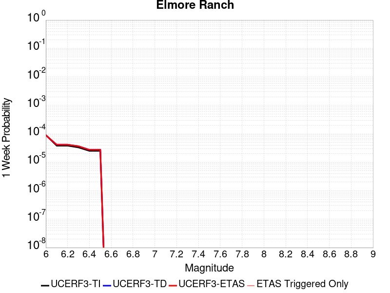 | 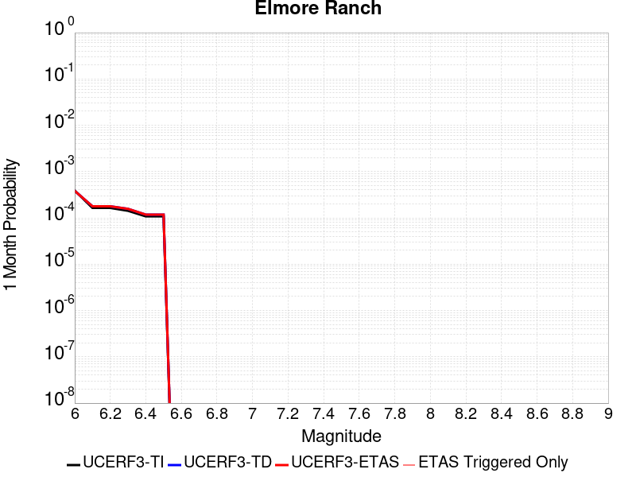 | 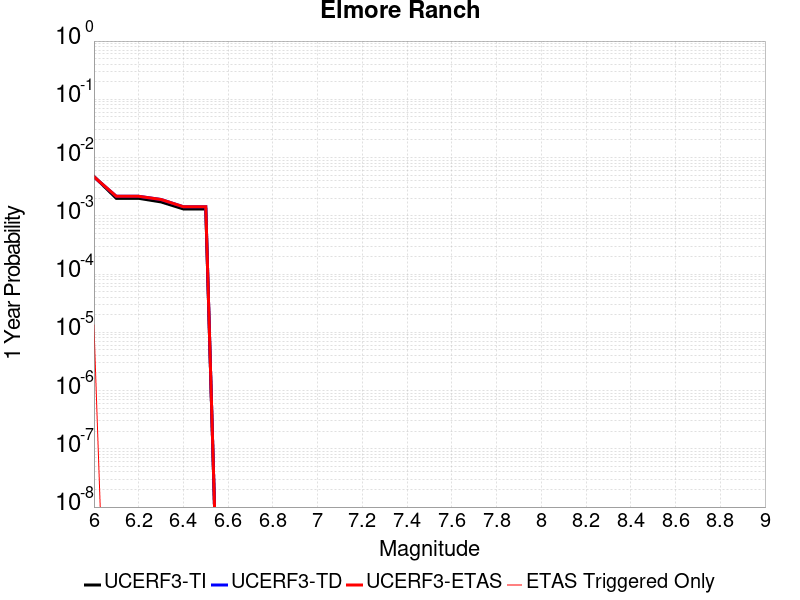 | 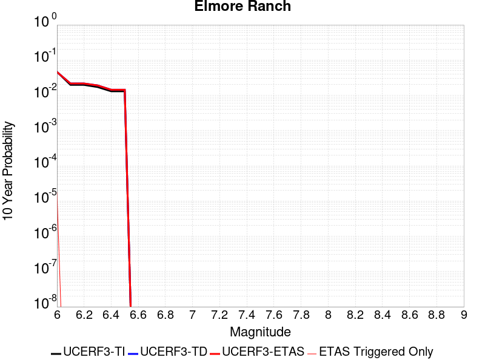 |

| Magnitude | 1 wk TI Prob | 1 wk TD Prob | 1 wk ETAS Prob | 1 wk ETAS/TD Gain | 1 wk ETAS Triggered Only | 1 mo TI Prob | 1 mo TD Prob | 1 mo ETAS Prob | 1 mo ETAS/TD Gain | 1 mo ETAS Triggered Only | 1 yr TI Prob | 1 yr TD Prob | 1 yr ETAS Prob | 1 yr ETAS/TD Gain | 1 yr ETAS Triggered Only | 10 yr TI Prob | 10 yr TD Prob | 10 yr ETAS Prob | 10 yr ETAS/TD Gain | 10 yr ETAS Triggered Only |
|-----|-----|-----|-----|-----|-----|-----|-----|-----|-----|-----|-----|-----|-----|-----|-----|-----|-----|-----|-----|-----|
| 6.0 | 9.102099E-5 | 8.952015E-5 | 8.952015E-5 | 1.0 | 0.0 | 3.9003167E-4 | 3.8361453E-4 | 3.8361453E-4 | 1.0 | 0.0 | 0.0047383 | 0.004662009 | 0.004672396 | 1.002228 | 1.0435908E-5 | 0.046385348 | 0.045870975 | 0.045880932 | 1.0002171 | 1.0435908E-5 |
| 6.1 | 3.8306698E-5 | 4.1498504E-5 | 4.1498504E-5 | 1.0 | 0.0 | 1.6416123E-4 | 1.7784268E-4 | 1.7784268E-4 | 1.0 | 0.0 | 0.0019968306 | 0.0021631396 | 0.0021631396 | 1.0 | 0.0 | 0.019789828 | 0.021628205 | 0.021628205 | 1.0 | 0.0 |
| 6.2 | 3.8306698E-5 | 4.1498504E-5 | 4.1498504E-5 | 1.0 | 0.0 | 1.6416123E-4 | 1.7784268E-4 | 1.7784268E-4 | 1.0 | 0.0 | 0.0019968306 | 0.0021631396 | 0.0021631396 | 1.0 | 0.0 | 0.019789828 | 0.021628205 | 0.021628205 | 1.0 | 0.0 |
| 6.3 | 3.3197924E-5 | 3.6554302E-5 | 3.6554302E-5 | 1.0 | 0.0 | 1.4226905E-4 | 1.5665586E-4 | 1.5665586E-4 | 1.0 | 0.0 | 0.0017307495 | 0.001905917 | 0.001905917 | 1.0 | 0.0 | 0.017173318 | 0.01908996 | 0.01908996 | 1.0 | 0.0 |
| 6.4 | 2.5148964E-5 | 2.7420487E-5 | 2.7420487E-5 | 1.0 | 0.0 | 1.0777682E-4 | 1.17514726E-4 | 1.17514726E-4 | 1.0 | 0.0 | 0.0013113929 | 0.0014304507 | 0.0014304507 | 1.0 | 0.0 | 0.01303681 | 0.014387194 | 0.014387194 | 1.0 | 0.0 |
| 6.5 | 2.5148964E-5 | 2.7420487E-5 | 2.7420487E-5 | 1.0 | 0.0 | 1.0777682E-4 | 1.17514726E-4 | 1.17514726E-4 | 1.0 | 0.0 | 0.0013113929 | 0.0014304507 | 0.0014304507 | 1.0 | 0.0 | 0.01303681 | 0.014387194 | 0.014387194 | 1.0 | 0.0 |

## Malibu Coast (Extension) alt 1
*[(top)](#table-of-contents)*

| 1 Week | 1 Month | 1 Year | 10 Year |
|-----|-----|-----|-----|
| 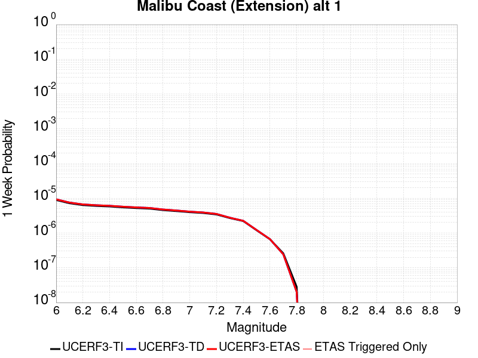 |  | 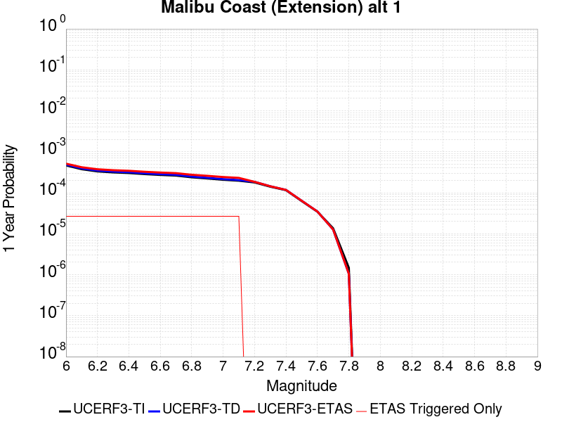 | 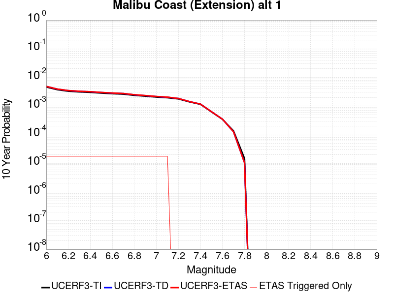 |

| Magnitude | 1 wk TI Prob | 1 wk TD Prob | 1 wk ETAS Prob | 1 wk ETAS/TD Gain | 1 wk ETAS Triggered Only | 1 mo TI Prob | 1 mo TD Prob | 1 mo ETAS Prob | 1 mo ETAS/TD Gain | 1 mo ETAS Triggered Only | 1 yr TI Prob | 1 yr TD Prob | 1 yr ETAS Prob | 1 yr ETAS/TD Gain | 1 yr ETAS Triggered Only | 10 yr TI Prob | 10 yr TD Prob | 10 yr ETAS Prob | 10 yr ETAS/TD Gain | 10 yr ETAS Triggered Only |
|-----|-----|-----|-----|-----|-----|-----|-----|-----|-----|-----|-----|-----|-----|-----|-----|-----|-----|-----|-----|-----|
| 6.0 | 8.930738E-6 | 9.329276E-6 | 9.329276E-6 | 1.0 | 0.0 | 3.827403E-5 | 3.998201E-5 | 3.998201E-5 | 1.0 | 0.0 | 4.6588664E-4 | 4.8667393E-4 | 4.971048E-4 | 1.0214329 | 1.0435908E-5 | 0.0046491115 | 0.004856264 | 0.0048666494 | 1.0021385 | 1.0435908E-5 |
| 6.1 | 7.199952E-6 | 7.5302964E-6 | 7.5302964E-6 | 1.0 | 0.0 | 3.0856572E-5 | 3.2272303E-5 | 3.2272303E-5 | 1.0 | 0.0 | 3.75614E-4 | 3.9284505E-4 | 4.0327688E-4 | 1.0265545 | 1.0435908E-5 | 0.0037497976 | 0.003921572 | 0.003931967 | 1.0026507 | 1.0435908E-5 |
| 6.2 | 6.3721413E-6 | 6.6667917E-6 | 6.6667917E-6 | 1.0 | 0.0 | 2.7308892E-5 | 2.8571652E-5 | 2.8571652E-5 | 1.0 | 0.0 | 3.3243504E-4 | 3.4780471E-4 | 3.5823698E-4 | 1.0299946 | 1.0435908E-5 | 0.0033193815 | 0.0034726437 | 0.0034830433 | 1.0029948 | 1.0435908E-5 |
| 6.3 | 6.016345E-6 | 6.295158E-6 | 6.295158E-6 | 1.0 | 0.0 | 2.578408E-5 | 2.6978973E-5 | 2.6978973E-5 | 1.0 | 0.0 | 3.1387596E-4 | 3.2841982E-4 | 3.388523E-4 | 1.0317657 | 1.0435908E-5 | 0.00313433 | 0.0032793807 | 0.0032897824 | 1.0031718 | 1.0435908E-5 |
| 6.4 | 5.8104883E-6 | 6.0795446E-6 | 6.0795446E-6 | 1.0 | 0.0 | 2.4901856E-5 | 2.6054933E-5 | 2.6054933E-5 | 1.0 | 0.0 | 3.031379E-4 | 3.1717293E-4 | 3.2760555E-4 | 1.0328925 | 1.0435908E-5 | 0.0030272473 | 0.0031672374 | 0.0031776403 | 1.0032846 | 1.0435908E-5 |
| 6.5 | 5.476925E-6 | 5.7275133E-6 | 5.7275133E-6 | 1.0 | 0.0 | 2.3472323E-5 | 2.4546256E-5 | 2.4546256E-5 | 1.0 | 0.0 | 2.8573806E-4 | 2.9880996E-4 | 3.0924275E-4 | 1.0349145 | 1.0435908E-5 | 0.0028537093 | 0.002984114 | 0.0029945187 | 1.0034868 | 1.0435908E-5 |
| 6.6 | 5.222387E-6 | 5.45858E-6 | 5.45858E-6 | 1.0 | 0.0 | 2.2381464E-5 | 2.3393704E-5 | 2.3393704E-5 | 1.0 | 0.0 | 2.7246025E-4 | 2.8478142E-4 | 2.9521435E-4 | 1.0366349 | 1.0435908E-5 | 0.0027212645 | 0.0028441956 | 0.0028546017 | 1.0036588 | 1.0435908E-5 |
| 6.7 | 5.0337076E-6 | 5.259103E-6 | 5.259103E-6 | 1.0 | 0.0 | 2.1572854E-5 | 2.253882E-5 | 2.253882E-5 | 1.0 | 0.0 | 2.6261783E-4 | 2.7437587E-4 | 2.8480892E-4 | 1.0380247 | 1.0435908E-5 | 0.002623077 | 0.002740401 | 0.0027508084 | 1.0037978 | 1.0435908E-5 |
| 6.8 | 4.5675624E-6 | 4.7587164E-6 | 4.7587164E-6 | 1.0 | 0.0 | 1.9575122E-5 | 2.039434E-5 | 2.039434E-5 | 1.0 | 0.0 | 2.3830103E-4 | 2.48273E-4 | 2.587063E-4 | 1.0420235 | 1.0435908E-5 | 0.0023804565 | 0.002479976 | 0.002490386 | 1.0041976 | 1.0435908E-5 |
| 6.9 | 4.2802412E-6 | 4.4520207E-6 | 4.4520207E-6 | 1.0 | 0.0 | 1.8343762E-5 | 1.907995E-5 | 1.907995E-5 | 1.0 | 0.0 | 2.2331243E-4 | 2.3227377E-4 | 2.4270726E-4 | 1.0449189 | 1.0435908E-5 | 0.0022308815 | 0.0023203269 | 0.0023307386 | 1.0044872 | 1.0435908E-5 |
| 7.0 | 3.9794063E-6 | 4.130099E-6 | 4.130099E-6 | 1.0 | 0.0 | 1.7054486E-5 | 1.7700306E-5 | 1.7700306E-5 | 1.0 | 0.0 | 2.0761859E-4 | 2.1548003E-4 | 2.259137E-4 | 1.0484205 | 1.0435908E-5 | 0.0020742472 | 0.0021527244 | 0.002163138 | 1.0048373 | 1.0435908E-5 |
| 7.1 | 3.7730424E-6 | 3.911217E-6 | 3.911217E-6 | 1.0 | 0.0 | 1.6170083E-5 | 1.6762251E-5 | 1.6762251E-5 | 1.0 | 0.0 | 1.9685295E-4 | 2.0406142E-4 | 2.144952E-4 | 1.0511305 | 1.0435908E-5 | 0.0019667868 | 0.0020387534 | 0.0020491679 | 1.0051084 | 1.0435908E-5 |
| 7.2 | 3.424985E-6 | 3.541337E-6 | 3.541337E-6 | 1.0 | 0.0 | 1.4678424E-5 | 1.5177071E-5 | 1.5177071E-5 | 1.0 | 0.0 | 1.7869516E-4 | 1.8476529E-4 | 1.8476529E-4 | 1.0 | 0.0 | 0.0017855153 | 0.0018461287 | 0.0018461287 | 1.0 | 0.0 |
| 7.3 | 2.6966375E-6 | 2.7596534E-6 | 2.7596534E-6 | 1.0 | 0.0 | 1.15569665E-5 | 1.1827032E-5 | 1.1827032E-5 | 1.0 | 0.0 | 1.4069698E-4 | 1.4398464E-4 | 1.4398464E-4 | 1.0 | 0.0 | 0.0014060794 | 0.0014389176 | 0.0014389176 | 1.0 | 0.0 |
| 7.4 | 2.215957E-6 | 2.249378E-6 | 2.249378E-6 | 1.0 | 0.0 | 9.496924E-6 | 9.640156E-6 | 9.640156E-6 | 1.0 | 0.0 | 1.1561892E-4 | 1.17362615E-4 | 1.17362615E-4 | 1.0 | 0.0 | 0.0011555878 | 0.0011730101 | 0.0011730101 | 1.0 | 0.0 |
| 7.5 | 1.2040218E-6 | 1.2219067E-6 | 1.2219067E-6 | 1.0 | 0.0 | 5.160083E-6 | 5.2367322E-6 | 5.2367322E-6 | 1.0 | 0.0 | 6.2822204E-5 | 6.375537E-5 | 6.375537E-5 | 1.0 | 0.0 | 6.280445E-4 | 6.3737266E-4 | 6.3737266E-4 | 1.0 | 0.0 |
| 7.6 | 6.6157446E-7 | 6.678975E-7 | 6.678975E-7 | 1.0 | 0.0 | 2.835316E-6 | 2.8624147E-6 | 2.8624147E-6 | 1.0 | 0.0 | 3.4519428E-5 | 3.484936E-5 | 3.484936E-5 | 1.0 | 0.0 | 3.4514067E-4 | 3.4844046E-4 | 3.4844046E-4 | 1.0 | 0.0 |
| 7.7 | 2.6012302E-7 | 2.4357593E-7 | 2.4357593E-7 | 1.0 | 0.0 | 1.1148124E-6 | 1.0438964E-6 | 1.0438964E-6 | 1.0 | 0.0 | 1.3572758E-5 | 1.2709375E-5 | 1.2709375E-5 | 1.0 | 0.0 | 1.3571928E-4 | 1.2708755E-4 | 1.2708755E-4 | 1.0 | 0.0 |
| 7.8 | 2.8323132E-8 | 2.0266649E-8 | 2.0266649E-8 | 1.0 | 0.0 | 1.2138484E-7 | 8.685707E-8 | 8.685707E-8 | 1.0 | 0.0 | 1.4778595E-6 | 1.0574844E-6 | 1.0574844E-6 | 1.0 | 0.0 | 1.4778497E-5 | 1.0574801E-5 | 1.0574801E-5 | 1.0 | 0.0 |

## Gillem - Big Crack 2011 CFM
*[(top)](#table-of-contents)*

| 1 Week | 1 Month | 1 Year | 10 Year |
|-----|-----|-----|-----|
|  |  |  | 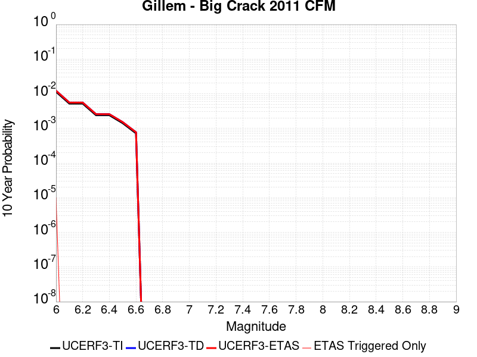 |

| Magnitude | 1 wk TI Prob | 1 wk TD Prob | 1 wk ETAS Prob | 1 wk ETAS/TD Gain | 1 wk ETAS Triggered Only | 1 mo TI Prob | 1 mo TD Prob | 1 mo ETAS Prob | 1 mo ETAS/TD Gain | 1 mo ETAS Triggered Only | 1 yr TI Prob | 1 yr TD Prob | 1 yr ETAS Prob | 1 yr ETAS/TD Gain | 1 yr ETAS Triggered Only | 10 yr TI Prob | 10 yr TD Prob | 10 yr ETAS Prob | 10 yr ETAS/TD Gain | 10 yr ETAS Triggered Only |
|-----|-----|-----|-----|-----|-----|-----|-----|-----|-----|-----|-----|-----|-----|-----|-----|-----|-----|-----|-----|-----|
| 6.0 | 2.196852E-5 | 2.3604485E-5 | 2.3604485E-5 | 1.0 | 0.0 | 9.4147406E-5 | 1.01158665E-4 | 1.01158665E-4 | 1.0 | 0.0 | 0.0011456419 | 0.0012309998 | 0.0012309998 | 1.0 | 0.0 | 0.011397537 | 0.012250669 | 0.012260977 | 1.0008414 | 1.0435908E-5 |
| 6.1 | 9.992795E-6 | 1.071189E-5 | 1.071189E-5 | 1.0 | 0.0 | 4.2825563E-5 | 4.5907396E-5 | 4.5907396E-5 | 1.0 | 0.0 | 5.2127644E-4 | 5.587975E-4 | 5.587975E-4 | 1.0 | 0.0 | 0.0052005537 | 0.0055757347 | 0.0055757347 | 1.0 | 0.0 |
| 6.2 | 9.992795E-6 | 1.071189E-5 | 1.071189E-5 | 1.0 | 0.0 | 4.2825563E-5 | 4.5907396E-5 | 4.5907396E-5 | 1.0 | 0.0 | 5.2127644E-4 | 5.587975E-4 | 5.587975E-4 | 1.0 | 0.0 | 0.0052005537 | 0.0055757347 | 0.0055757347 | 1.0 | 0.0 |
| 6.3 | 4.6127884E-6 | 4.942657E-6 | 4.942657E-6 | 1.0 | 0.0 | 1.9768944E-5 | 2.1182668E-5 | 2.1182668E-5 | 1.0 | 0.0 | 2.406603E-4 | 2.5787292E-4 | 2.5787292E-4 | 1.0 | 0.0 | 0.0024039985 | 0.0025761751 | 0.0025761751 | 1.0 | 0.0 |
| 6.4 | 4.6127884E-6 | 4.942657E-6 | 4.942657E-6 | 1.0 | 0.0 | 1.9768944E-5 | 2.1182668E-5 | 2.1182668E-5 | 1.0 | 0.0 | 2.406603E-4 | 2.5787292E-4 | 2.5787292E-4 | 1.0 | 0.0 | 0.0024039985 | 0.0025761751 | 0.0025761751 | 1.0 | 0.0 |
| 6.5 | 2.716712E-6 | 2.9111113E-6 | 2.9111113E-6 | 1.0 | 0.0 | 1.1643E-5 | 1.24761455E-5 | 1.24761455E-5 | 1.0 | 0.0 | 1.417443E-4 | 1.5188892E-4 | 1.5188892E-4 | 1.0 | 0.0 | 0.0014165393 | 0.001518089 | 0.001518089 | 1.0 | 0.0 |
| 6.6 | 1.3818255E-6 | 1.4820689E-6 | 1.4820689E-6 | 1.0 | 0.0 | 5.922096E-6 | 6.3517155E-6 | 6.3517155E-6 | 1.0 | 0.0 | 7.209913E-5 | 7.7330624E-5 | 7.7330624E-5 | 1.0 | 0.0 | 7.2075747E-4 | 7.7315804E-4 | 7.7315804E-4 | 1.0 | 0.0 |

## Sisar
*[(top)](#table-of-contents)*

| 1 Week | 1 Month | 1 Year | 10 Year |
|-----|-----|-----|-----|
|  | 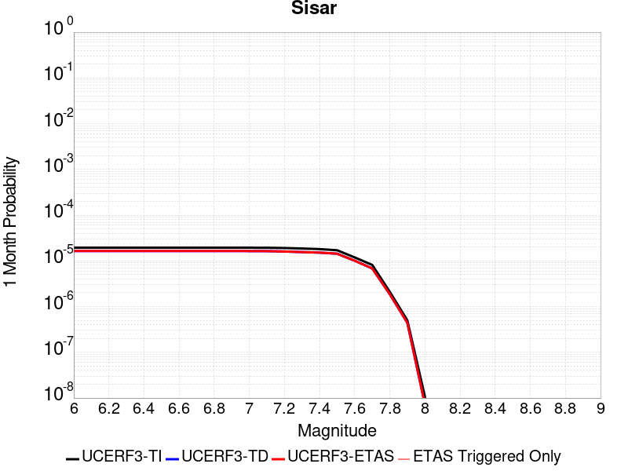 |  | 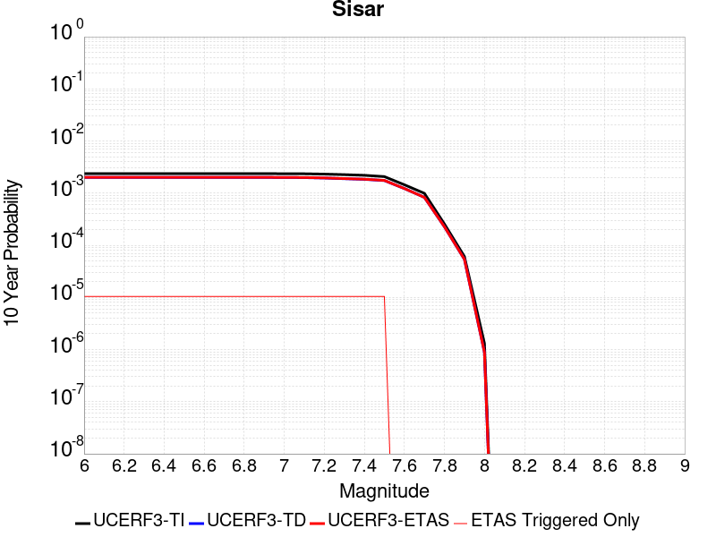 |

| Magnitude | 1 wk TI Prob | 1 wk TD Prob | 1 wk ETAS Prob | 1 wk ETAS/TD Gain | 1 wk ETAS Triggered Only | 1 mo TI Prob | 1 mo TD Prob | 1 mo ETAS Prob | 1 mo ETAS/TD Gain | 1 mo ETAS Triggered Only | 1 yr TI Prob | 1 yr TD Prob | 1 yr ETAS Prob | 1 yr ETAS/TD Gain | 1 yr ETAS Triggered Only | 10 yr TI Prob | 10 yr TD Prob | 10 yr ETAS Prob | 10 yr ETAS/TD Gain | 10 yr ETAS Triggered Only |
|-----|-----|-----|-----|-----|-----|-----|-----|-----|-----|-----|-----|-----|-----|-----|-----|-----|-----|-----|-----|-----|
| 6.0 | 4.544193E-6 | 3.839576E-6 | 3.839576E-6 | 1.0 | 0.0 | 1.9474966E-5 | 1.6455224E-5 | 1.6455224E-5 | 1.0 | 0.0 | 2.3708193E-4 | 2.0032428E-4 | 2.107581E-4 | 1.0520847 | 1.0435908E-5 | 0.0023682916 | 0.002001471 | 0.0020118859 | 1.0052037 | 1.0435908E-5 |
| 6.1 | 4.544193E-6 | 3.839576E-6 | 3.839576E-6 | 1.0 | 0.0 | 1.9474966E-5 | 1.6455224E-5 | 1.6455224E-5 | 1.0 | 0.0 | 2.3708193E-4 | 2.0032428E-4 | 2.107581E-4 | 1.0520847 | 1.0435908E-5 | 0.0023682916 | 0.002001471 | 0.0020118859 | 1.0052037 | 1.0435908E-5 |
| 6.2 | 4.544193E-6 | 3.839576E-6 | 3.839576E-6 | 1.0 | 0.0 | 1.9474966E-5 | 1.6455224E-5 | 1.6455224E-5 | 1.0 | 0.0 | 2.3708193E-4 | 2.0032428E-4 | 2.107581E-4 | 1.0520847 | 1.0435908E-5 | 0.0023682916 | 0.002001471 | 0.0020118859 | 1.0052037 | 1.0435908E-5 |
| 6.3 | 4.544193E-6 | 3.839576E-6 | 3.839576E-6 | 1.0 | 0.0 | 1.9474966E-5 | 1.6455224E-5 | 1.6455224E-5 | 1.0 | 0.0 | 2.3708193E-4 | 2.0032428E-4 | 2.107581E-4 | 1.0520847 | 1.0435908E-5 | 0.0023682916 | 0.002001471 | 0.0020118859 | 1.0052037 | 1.0435908E-5 |
| 6.4 | 4.544193E-6 | 3.839576E-6 | 3.839576E-6 | 1.0 | 0.0 | 1.9474966E-5 | 1.6455224E-5 | 1.6455224E-5 | 1.0 | 0.0 | 2.3708193E-4 | 2.0032428E-4 | 2.107581E-4 | 1.0520847 | 1.0435908E-5 | 0.0023682916 | 0.002001471 | 0.0020118859 | 1.0052037 | 1.0435908E-5 |
| 6.5 | 4.544193E-6 | 3.839576E-6 | 3.839576E-6 | 1.0 | 0.0 | 1.9474966E-5 | 1.6455224E-5 | 1.6455224E-5 | 1.0 | 0.0 | 2.3708193E-4 | 2.0032428E-4 | 2.107581E-4 | 1.0520847 | 1.0435908E-5 | 0.0023682916 | 0.002001471 | 0.0020118859 | 1.0052037 | 1.0435908E-5 |
| 6.6 | 4.544193E-6 | 3.839576E-6 | 3.839576E-6 | 1.0 | 0.0 | 1.9474966E-5 | 1.6455224E-5 | 1.6455224E-5 | 1.0 | 0.0 | 2.3708193E-4 | 2.0032428E-4 | 2.107581E-4 | 1.0520847 | 1.0435908E-5 | 0.0023682916 | 0.002001471 | 0.0020118859 | 1.0052037 | 1.0435908E-5 |
| 6.7 | 4.544193E-6 | 3.839576E-6 | 3.839576E-6 | 1.0 | 0.0 | 1.9474966E-5 | 1.6455224E-5 | 1.6455224E-5 | 1.0 | 0.0 | 2.3708193E-4 | 2.0032428E-4 | 2.107581E-4 | 1.0520847 | 1.0435908E-5 | 0.0023682916 | 0.002001471 | 0.0020118859 | 1.0052037 | 1.0435908E-5 |
| 6.8 | 4.544193E-6 | 3.839576E-6 | 3.839576E-6 | 1.0 | 0.0 | 1.9474966E-5 | 1.6455224E-5 | 1.6455224E-5 | 1.0 | 0.0 | 2.3708193E-4 | 2.0032428E-4 | 2.107581E-4 | 1.0520847 | 1.0435908E-5 | 0.0023682916 | 0.002001471 | 0.0020118859 | 1.0052037 | 1.0435908E-5 |
| 6.9 | 4.542225E-6 | 3.8375383E-6 | 3.8375383E-6 | 1.0 | 0.0 | 1.9466532E-5 | 1.6446491E-5 | 1.6446491E-5 | 1.0 | 0.0 | 2.3697925E-4 | 2.0021795E-4 | 2.1065178E-4 | 1.0521123 | 1.0435908E-5 | 0.002367267 | 0.0020004094 | 0.0020108244 | 1.0052065 | 1.0435908E-5 |
| 7.0 | 4.5278484E-6 | 3.822602E-6 | 3.822602E-6 | 1.0 | 0.0 | 1.940492E-5 | 1.638248E-5 | 1.638248E-5 | 1.0 | 0.0 | 2.3622929E-4 | 1.9943877E-4 | 2.098726E-4 | 1.052316 | 1.0435908E-5 | 0.0023597833 | 0.0019926317 | 0.0020030467 | 1.0052269 | 1.0435908E-5 |
| 7.1 | 4.5132488E-6 | 3.8073897E-6 | 3.8073897E-6 | 1.0 | 0.0 | 1.9342351E-5 | 1.6317284E-5 | 1.6317284E-5 | 1.0 | 0.0 | 2.3546767E-4 | 1.9864515E-4 | 2.09079E-4 | 1.052525 | 1.0435908E-5 | 0.0023521832 | 0.0019847096 | 0.0019951249 | 1.0052477 | 1.0435908E-5 |
| 7.2 | 4.448859E-6 | 3.7398502E-6 | 3.7398502E-6 | 1.0 | 0.0 | 1.9066398E-5 | 1.6027832E-5 | 1.6027832E-5 | 1.0 | 0.0 | 2.3210866E-4 | 1.9512173E-4 | 2.055556E-4 | 1.0534737 | 1.0435908E-5 | 0.0023186638 | 0.0019495375 | 0.0019599532 | 1.0053426 | 1.0435908E-5 |
| 7.3 | 4.3424366E-6 | 3.6336846E-6 | 3.6336846E-6 | 1.0 | 0.0 | 1.861031E-5 | 1.5572843E-5 | 1.5572843E-5 | 1.0 | 0.0 | 2.2655698E-4 | 1.895832E-4 | 2.0001712E-4 | 1.0550362 | 1.0435908E-5 | 0.0022632615 | 0.0018942481 | 0.0019046642 | 1.0054988 | 1.0435908E-5 |
| 7.4 | 4.218641E-6 | 3.5330384E-6 | 3.5330384E-6 | 1.0 | 0.0 | 1.8079765E-5 | 1.5141507E-5 | 1.5141507E-5 | 1.0 | 0.0 | 2.2009891E-4 | 1.8433259E-4 | 1.9476657E-4 | 1.0566041 | 1.0435908E-5 | 0.0021988105 | 0.0018418302 | 0.0018522469 | 1.0056556 | 1.0435908E-5 |
| 7.5 | 3.983779E-6 | 3.3478068E-6 | 3.3478068E-6 | 1.0 | 0.0 | 1.7073227E-5 | 1.4347666E-5 | 1.4347666E-5 | 1.0 | 0.0 | 2.0784672E-4 | 1.7466917E-4 | 1.8510326E-4 | 1.0597363 | 1.0435908E-5 | 0.0020765243 | 0.0017453518 | 0.0017557695 | 1.0059688 | 1.0435908E-5 |
| 7.6 | 2.777393E-6 | 2.35225E-6 | 2.35225E-6 | 1.0 | 0.0 | 1.1903058E-5 | 1.0081033E-5 | 1.0081033E-5 | 1.0 | 0.0 | 1.449101E-4 | 1.2272975E-4 | 1.2272975E-4 | 1.0 | 0.0 | 0.0014481564 | 0.0012266274 | 0.0012266274 | 1.0 | 0.0 |
| 7.7 | 1.9028433E-6 | 1.593867E-6 | 1.593867E-6 | 1.0 | 0.0 | 8.155017E-6 | 6.8308404E-6 | 6.8308404E-6 | 1.0 | 0.0 | 9.928281E-5 | 8.3162355E-5 | 8.3162355E-5 | 1.0 | 0.0 | 9.923846E-4 | 8.313171E-4 | 8.313171E-4 | 1.0 | 0.0 |
| 7.8 | 4.9095956E-7 | 4.3583708E-7 | 4.3583708E-7 | 1.0 | 0.0 | 2.1041105E-6 | 1.8678718E-6 | 1.8678718E-6 | 1.0 | 0.0 | 2.5617246E-5 | 2.2741104E-5 | 2.2741104E-5 | 1.0 | 0.0 | 2.5614293E-4 | 2.2738794E-4 | 2.2738794E-4 | 1.0 | 0.0 |
| 7.9 | 1.16657894E-7 | 1.0335569E-7 | 1.0335569E-7 | 1.0 | 0.0 | 4.999623E-7 | 4.4295288E-7 | 4.4295288E-7 | 1.0 | 0.0 | 6.087024E-6 | 5.3929384E-6 | 5.3929384E-6 | 1.0 | 0.0 | 6.0868573E-5 | 5.3928103E-5 | 5.3928103E-5 | 1.0 | 0.0 |
| 8.0 | 2.5100346E-9 | 1.7067566E-9 | 1.7067566E-9 | 1.0 | 0.0 | 1.0757291E-8 | 7.3146724E-9 | 7.3146724E-9 | 1.0 | 0.0 | 1.3097001E-7 | 8.905613E-8 | 8.905613E-8 | 1.0 | 0.0 | 1.3096993E-6 | 8.9056095E-7 | 8.9056095E-7 | 1.0 | 0.0 |

## Great Valley 08 (Quinto)
*[(top)](#table-of-contents)*

| 1 Week | 1 Month | 1 Year | 10 Year |
|-----|-----|-----|-----|
| 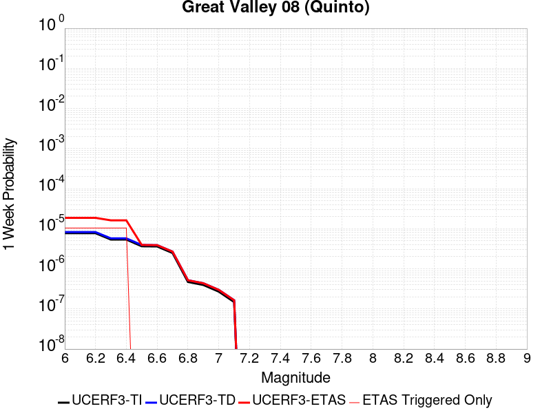 |  | 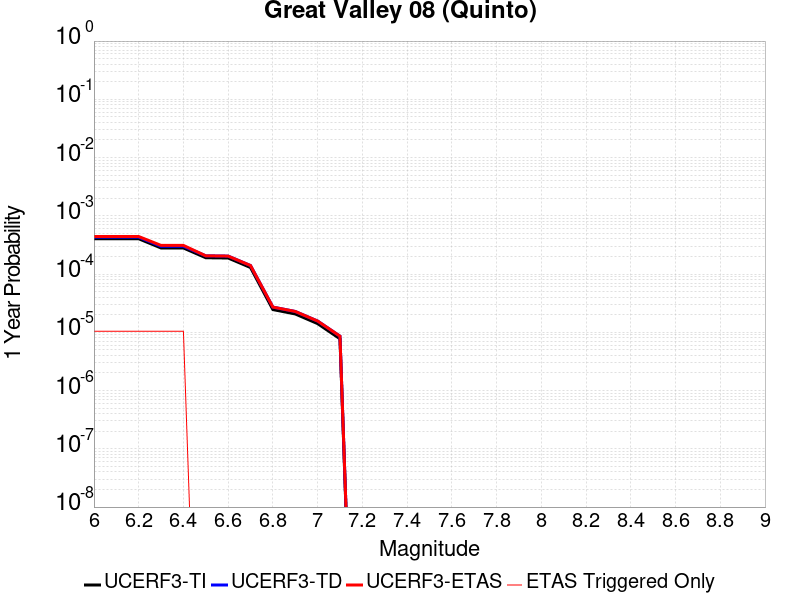 | 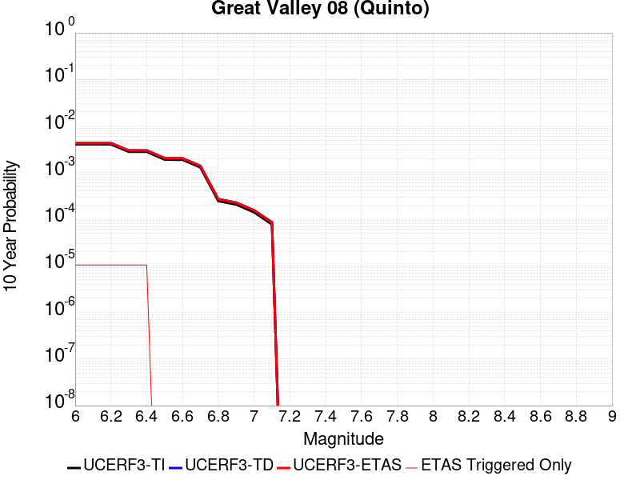 |

| Magnitude | 1 wk TI Prob | 1 wk TD Prob | 1 wk ETAS Prob | 1 wk ETAS/TD Gain | 1 wk ETAS Triggered Only | 1 mo TI Prob | 1 mo TD Prob | 1 mo ETAS Prob | 1 mo ETAS/TD Gain | 1 mo ETAS Triggered Only | 1 yr TI Prob | 1 yr TD Prob | 1 yr ETAS Prob | 1 yr ETAS/TD Gain | 1 yr ETAS Triggered Only | 10 yr TI Prob | 10 yr TD Prob | 10 yr ETAS Prob | 10 yr ETAS/TD Gain | 10 yr ETAS Triggered Only |
|-----|-----|-----|-----|-----|-----|-----|-----|-----|-----|-----|-----|-----|-----|-----|-----|-----|-----|-----|-----|-----|
| 6.0 | 7.737697E-6 | 8.253038E-6 | 1.868886E-5 | 2.2644825 | 1.0435908E-5 | 3.3161137E-5 | 3.536979E-5 | 4.580533E-5 | 1.295041 | 1.0435908E-5 | 4.0366207E-4 | 4.3056096E-4 | 4.409924E-4 | 1.0242275 | 1.0435908E-5 | 0.004029296 | 0.0042991205 | 0.0043095117 | 1.002417 | 1.0435908E-5 |
| 6.1 | 7.737697E-6 | 8.253038E-6 | 1.868886E-5 | 2.2644825 | 1.0435908E-5 | 3.3161137E-5 | 3.536979E-5 | 4.580533E-5 | 1.295041 | 1.0435908E-5 | 4.0366207E-4 | 4.3056096E-4 | 4.409924E-4 | 1.0242275 | 1.0435908E-5 | 0.004029296 | 0.0042991205 | 0.0043095117 | 1.002417 | 1.0435908E-5 |
| 6.2 | 7.737697E-6 | 8.253038E-6 | 1.868886E-5 | 2.2644825 | 1.0435908E-5 | 3.3161137E-5 | 3.536979E-5 | 4.580533E-5 | 1.295041 | 1.0435908E-5 | 4.0366207E-4 | 4.3056096E-4 | 4.409924E-4 | 1.0242275 | 1.0435908E-5 | 0.004029296 | 0.0042991205 | 0.0043095117 | 1.002417 | 1.0435908E-5 |
| 6.3 | 5.374012E-6 | 5.7505736E-6 | 1.618642E-5 | 2.814749 | 1.0435908E-5 | 2.3031276E-5 | 2.4645145E-5 | 3.5080797E-5 | 1.4234364 | 1.0435908E-5 | 2.803697E-4 | 3.0002446E-4 | 3.1045725E-4 | 1.0347731 | 1.0435908E-5 | 0.0028001624 | 0.0029972875 | 0.003007692 | 1.0034714 | 1.0435908E-5 |
| 6.4 | 5.374012E-6 | 5.7505736E-6 | 1.618642E-5 | 2.814749 | 1.0435908E-5 | 2.3031276E-5 | 2.4645145E-5 | 3.5080797E-5 | 1.4234364 | 1.0435908E-5 | 2.803697E-4 | 3.0002446E-4 | 3.1045725E-4 | 1.0347731 | 1.0435908E-5 | 0.0028001624 | 0.0029972875 | 0.003007692 | 1.0034714 | 1.0435908E-5 |
| 6.5 | 3.65427E-6 | 3.941324E-6 | 3.941324E-6 | 1.0 | 0.0 | 1.5661062E-5 | 1.689132E-5 | 1.689132E-5 | 1.0 | 0.0 | 1.9065675E-4 | 2.0563944E-4 | 2.0563944E-4 | 1.0 | 0.0 | 0.0019049325 | 0.0020551833 | 0.0020551833 | 1.0 | 0.0 |
| 6.6 | 3.6143538E-6 | 3.8985104E-6 | 3.8985104E-6 | 1.0 | 0.0 | 1.5489995E-5 | 1.6707834E-5 | 1.6707834E-5 | 1.0 | 0.0 | 1.8857437E-4 | 2.0340596E-4 | 2.0340596E-4 | 1.0 | 0.0 | 0.0018841444 | 0.0020328893 | 0.0020328893 | 1.0 | 0.0 |
| 6.7 | 2.4821015E-6 | 2.6857067E-6 | 2.6857067E-6 | 1.0 | 0.0 | 1.0637535E-5 | 1.1510153E-5 | 1.1510153E-5 | 1.0 | 0.0 | 1.2950429E-4 | 1.4013276E-4 | 1.4013276E-4 | 1.0 | 0.0 | 0.0012942884 | 0.0014009989 | 0.0014009989 | 1.0 | 0.0 |
| 6.8 | 4.7110538E-7 | 5.193021E-7 | 5.193021E-7 | 1.0 | 0.0 | 2.0190216E-6 | 2.2255786E-6 | 2.2255786E-6 | 1.0 | 0.0 | 2.458131E-5 | 2.70961E-5 | 2.70961E-5 | 1.0 | 0.0 | 2.457859E-4 | 2.7092977E-4 | 2.7092977E-4 | 1.0 | 0.0 |
| 6.9 | 3.958685E-7 | 4.3703452E-7 | 4.3703452E-7 | 1.0 | 0.0 | 1.6965782E-6 | 1.8730038E-6 | 1.8730038E-6 | 1.0 | 0.0 | 2.0655643E-5 | 2.28036E-5 | 2.28036E-5 | 1.0 | 0.0 | 2.0653724E-4 | 2.2801422E-4 | 2.2801422E-4 | 1.0 | 0.0 |
| 7.0 | 2.70294E-7 | 2.9920008E-7 | 2.9920008E-7 | 1.0 | 0.0 | 1.1584025E-6 | 1.2822856E-6 | 1.2822856E-6 | 1.0 | 0.0 | 1.4103458E-5 | 1.5611728E-5 | 1.5611728E-5 | 1.0 | 0.0 | 1.4102564E-4 | 1.5610759E-4 | 1.5610759E-4 | 1.0 | 0.0 |
| 7.1 | 1.4828602E-7 | 1.6469107E-7 | 1.6469107E-7 | 1.0 | 0.0 | 6.3551136E-7 | 7.058187E-7 | 7.058187E-7 | 1.0 | 0.0 | 7.737323E-6 | 8.593317E-6 | 8.593317E-6 | 1.0 | 0.0 | 7.737054E-5 | 8.593065E-5 | 8.593065E-5 | 1.0 | 0.0 |

## Holser alt 1
*[(top)](#table-of-contents)*

| 1 Week | 1 Month | 1 Year | 10 Year |
|-----|-----|-----|-----|
|  |  | 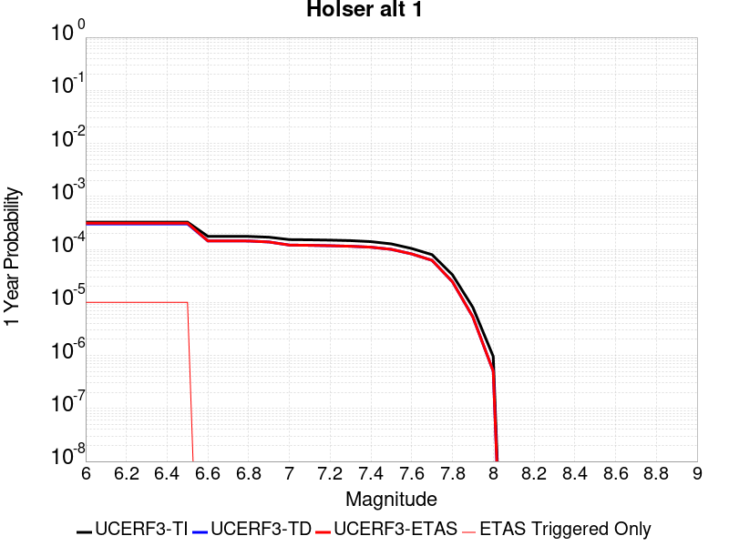 | 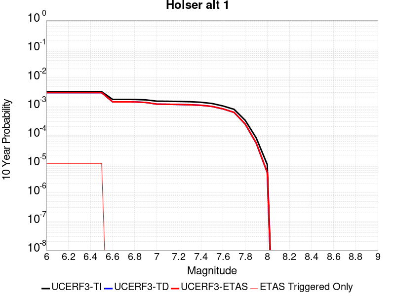 |

| Magnitude | 1 wk TI Prob | 1 wk TD Prob | 1 wk ETAS Prob | 1 wk ETAS/TD Gain | 1 wk ETAS Triggered Only | 1 mo TI Prob | 1 mo TD Prob | 1 mo ETAS Prob | 1 mo ETAS/TD Gain | 1 mo ETAS Triggered Only | 1 yr TI Prob | 1 yr TD Prob | 1 yr ETAS Prob | 1 yr ETAS/TD Gain | 1 yr ETAS Triggered Only | 10 yr TI Prob | 10 yr TD Prob | 10 yr ETAS Prob | 10 yr ETAS/TD Gain | 10 yr ETAS Triggered Only |
|-----|-----|-----|-----|-----|-----|-----|-----|-----|-----|-----|-----|-----|-----|-----|-----|-----|-----|-----|-----|-----|
| 6.0 | 6.2746653E-6 | 5.789965E-6 | 5.789965E-6 | 1.0 | 0.0 | 2.6891146E-5 | 2.4813964E-5 | 2.4813964E-5 | 1.0 | 0.0 | 3.273505E-4 | 3.020797E-4 | 3.1251242E-4 | 1.0345365 | 1.0435908E-5 | 0.0032686873 | 0.0030178234 | 0.003028228 | 1.0034477 | 1.0435908E-5 |
| 6.1 | 6.2746653E-6 | 5.789965E-6 | 5.789965E-6 | 1.0 | 0.0 | 2.6891146E-5 | 2.4813964E-5 | 2.4813964E-5 | 1.0 | 0.0 | 3.273505E-4 | 3.020797E-4 | 3.1251242E-4 | 1.0345365 | 1.0435908E-5 | 0.0032686873 | 0.0030178234 | 0.003028228 | 1.0034477 | 1.0435908E-5 |
| 6.2 | 6.2746653E-6 | 5.789965E-6 | 5.789965E-6 | 1.0 | 0.0 | 2.6891146E-5 | 2.4813964E-5 | 2.4813964E-5 | 1.0 | 0.0 | 3.273505E-4 | 3.020797E-4 | 3.1251242E-4 | 1.0345365 | 1.0435908E-5 | 0.0032686873 | 0.0030178234 | 0.003028228 | 1.0034477 | 1.0435908E-5 |
| 6.3 | 6.2746653E-6 | 5.789965E-6 | 5.789965E-6 | 1.0 | 0.0 | 2.6891146E-5 | 2.4813964E-5 | 2.4813964E-5 | 1.0 | 0.0 | 3.273505E-4 | 3.020797E-4 | 3.1251242E-4 | 1.0345365 | 1.0435908E-5 | 0.0032686873 | 0.0030178234 | 0.003028228 | 1.0034477 | 1.0435908E-5 |
| 6.4 | 6.2746653E-6 | 5.789965E-6 | 5.789965E-6 | 1.0 | 0.0 | 2.6891146E-5 | 2.4813964E-5 | 2.4813964E-5 | 1.0 | 0.0 | 3.273505E-4 | 3.020797E-4 | 3.1251242E-4 | 1.0345365 | 1.0435908E-5 | 0.0032686873 | 0.0030178234 | 0.003028228 | 1.0034477 | 1.0435908E-5 |
| 6.5 | 6.2746653E-6 | 5.789965E-6 | 5.789965E-6 | 1.0 | 0.0 | 2.6891146E-5 | 2.4813964E-5 | 2.4813964E-5 | 1.0 | 0.0 | 3.273505E-4 | 3.020797E-4 | 3.1251242E-4 | 1.0345365 | 1.0435908E-5 | 0.0032686873 | 0.0030178234 | 0.003028228 | 1.0034477 | 1.0435908E-5 |
| 6.6 | 3.375825E-6 | 2.7711897E-6 | 2.7711897E-6 | 1.0 | 0.0 | 1.4467741E-5 | 1.1876474E-5 | 1.1876474E-5 | 1.0 | 0.0 | 1.761305E-4 | 1.4458665E-4 | 1.4458665E-4 | 1.0 | 0.0 | 0.0017599097 | 0.0014449427 | 0.0014449427 | 1.0 | 0.0 |
| 6.7 | 3.375825E-6 | 2.7711897E-6 | 2.7711897E-6 | 1.0 | 0.0 | 1.4467741E-5 | 1.1876474E-5 | 1.1876474E-5 | 1.0 | 0.0 | 1.761305E-4 | 1.4458665E-4 | 1.4458665E-4 | 1.0 | 0.0 | 0.0017599097 | 0.0014449427 | 0.0014449427 | 1.0 | 0.0 |
| 6.8 | 3.366533E-6 | 2.7615893E-6 | 2.7615893E-6 | 1.0 | 0.0 | 1.4427919E-5 | 1.183533E-5 | 1.183533E-5 | 1.0 | 0.0 | 1.7564575E-4 | 1.4408577E-4 | 1.4408577E-4 | 1.0 | 0.0 | 0.0017550698 | 0.0014399405 | 0.0014399405 | 1.0 | 0.0 |
| 6.9 | 3.253174E-6 | 2.6438113E-6 | 2.6438113E-6 | 1.0 | 0.0 | 1.39421E-5 | 1.1330571E-5 | 1.1330571E-5 | 1.0 | 0.0 | 1.6973184E-4 | 1.3794114E-4 | 1.3794114E-4 | 1.0 | 0.0 | 0.0016960226 | 0.001378571 | 0.001378571 | 1.0 | 0.0 |
| 7.0 | 2.9336593E-6 | 2.311799E-6 | 2.311799E-6 | 1.0 | 0.0 | 1.2572766E-5 | 9.907673E-6 | 9.907673E-6 | 1.0 | 0.0 | 1.5306266E-4 | 1.2061927E-4 | 1.2061927E-4 | 1.0 | 0.0 | 0.0015295728 | 0.0012055405 | 0.0012055405 | 1.0 | 0.0 |
| 7.1 | 2.9087812E-6 | 2.2876513E-6 | 2.2876513E-6 | 1.0 | 0.0 | 1.2466146E-5 | 9.804184E-6 | 9.804184E-6 | 1.0 | 0.0 | 1.5176475E-4 | 1.19359414E-4 | 1.19359414E-4 | 1.0 | 0.0 | 0.0015166114 | 0.0011929555 | 0.0011929555 | 1.0 | 0.0 |
| 7.2 | 2.8674524E-6 | 2.2475429E-6 | 2.2475429E-6 | 1.0 | 0.0 | 1.2289024E-5 | 9.63229E-6 | 9.63229E-6 | 1.0 | 0.0 | 1.4960859E-4 | 1.1726685E-4 | 1.1726685E-4 | 1.0 | 0.0 | 0.0014950791 | 0.001172052 | 0.001172052 | 1.0 | 0.0 |
| 7.3 | 2.8057775E-6 | 2.1954324E-6 | 2.1954324E-6 | 1.0 | 0.0 | 1.2024705E-5 | 9.408962E-6 | 9.408962E-6 | 1.0 | 0.0 | 1.4639096E-4 | 1.14548115E-4 | 1.14548115E-4 | 1.0 | 0.0 | 0.0014629456 | 0.001144893 | 0.001144893 | 1.0 | 0.0 |
| 7.4 | 2.683666E-6 | 2.1092305E-6 | 2.1092305E-6 | 1.0 | 0.0 | 1.1501375E-5 | 9.039529E-6 | 9.039529E-6 | 1.0 | 0.0 | 1.4002025E-4 | 1.1005072E-4 | 1.1005072E-4 | 1.0 | 0.0 | 0.0013993206 | 0.0010999644 | 0.0010999644 | 1.0 | 0.0 |
| 7.5 | 2.434495E-6 | 1.9195363E-6 | 1.9195363E-6 | 1.0 | 0.0 | 1.0433508E-5 | 8.226558E-6 | 8.226558E-6 | 1.0 | 0.0 | 1.2702055E-4 | 1.0015376E-4 | 1.0015376E-4 | 1.0 | 0.0 | 0.0012694797 | 0.0010010883 | 0.0010010883 | 1.0 | 0.0 |
| 7.6 | 1.9914562E-6 | 1.5731459E-6 | 1.5731459E-6 | 1.0 | 0.0 | 8.534785E-6 | 6.742037E-6 | 6.742037E-6 | 1.0 | 0.0 | 1.03906044E-4 | 8.208122E-5 | 8.208122E-5 | 1.0 | 0.0 | 0.0010385747 | 8.205106E-4 | 8.205106E-4 | 1.0 | 0.0 |
| 7.7 | 1.5229501E-6 | 1.1896061E-6 | 1.1896061E-6 | 1.0 | 0.0 | 6.526913E-6 | 5.098302E-6 | 5.098302E-6 | 1.0 | 0.0 | 7.946226E-5 | 6.2070074E-5 | 6.2070074E-5 | 1.0 | 0.0 | 7.943385E-4 | 6.2052865E-4 | 6.2052865E-4 | 1.0 | 0.0 |
| 7.8 | 6.3489426E-7 | 4.687806E-7 | 4.687806E-7 | 1.0 | 0.0 | 2.7209726E-6 | 2.009058E-6 | 2.009058E-6 | 1.0 | 0.0 | 3.312734E-5 | 2.4460009E-5 | 2.4460009E-5 | 1.0 | 0.0 | 3.31224E-4 | 2.4457334E-4 | 2.4457334E-4 | 1.0 | 0.0 |
| 7.9 | 1.5459432E-7 | 1.0193758E-7 | 1.0193758E-7 | 1.0 | 0.0 | 6.6254694E-7 | 4.3687527E-7 | 4.3687527E-7 | 1.0 | 0.0 | 8.066479E-6 | 5.3189433E-6 | 5.3189433E-6 | 1.0 | 0.0 | 8.066186E-5 | 5.3188178E-5 | 5.3188178E-5 | 1.0 | 0.0 |
| 8.0 | 1.8307812E-8 | 9.690293E-9 | 9.690293E-9 | 1.0 | 0.0 | 7.846205E-8 | 4.152983E-8 | 4.152983E-8 | 1.0 | 0.0 | 9.55275E-7 | 5.0562556E-7 | 5.0562556E-7 | 1.0 | 0.0 | 9.552709E-6 | 5.0562444E-6 | 5.0562444E-6 | 1.0 | 0.0 |

## Clayton
*[(top)](#table-of-contents)*

| 1 Week | 1 Month | 1 Year | 10 Year |
|-----|-----|-----|-----|
| 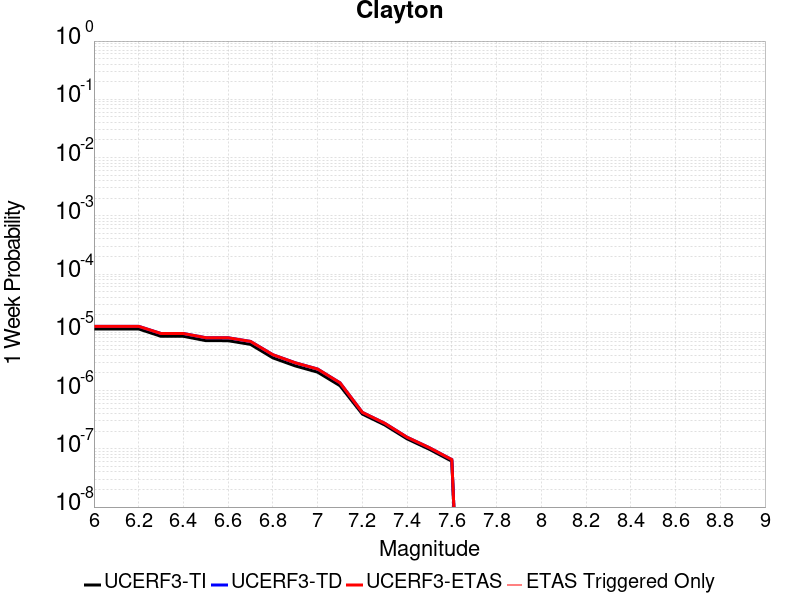 | 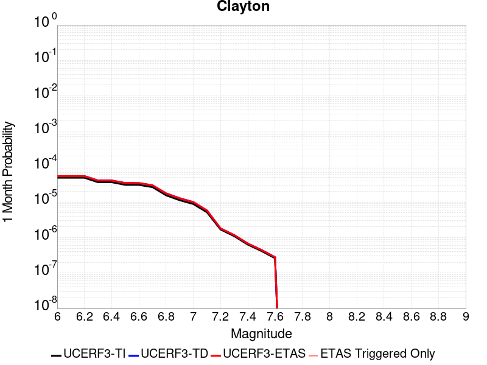 | 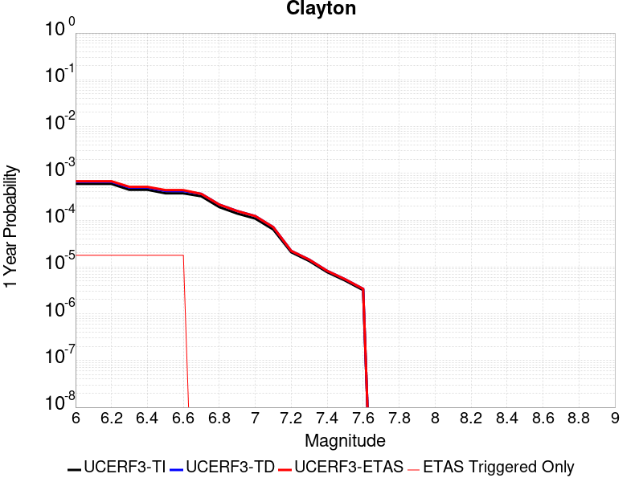 | 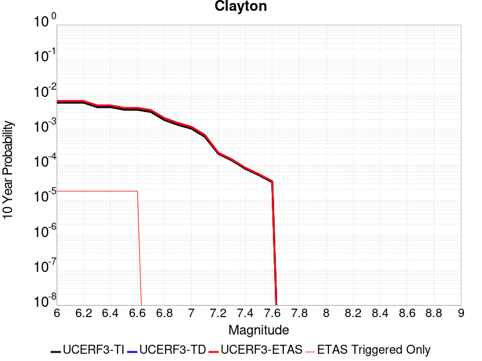 |

| Magnitude | 1 wk TI Prob | 1 wk TD Prob | 1 wk ETAS Prob | 1 wk ETAS/TD Gain | 1 wk ETAS Triggered Only | 1 mo TI Prob | 1 mo TD Prob | 1 mo ETAS Prob | 1 mo ETAS/TD Gain | 1 mo ETAS Triggered Only | 1 yr TI Prob | 1 yr TD Prob | 1 yr ETAS Prob | 1 yr ETAS/TD Gain | 1 yr ETAS Triggered Only | 10 yr TI Prob | 10 yr TD Prob | 10 yr ETAS Prob | 10 yr ETAS/TD Gain | 10 yr ETAS Triggered Only |
|-----|-----|-----|-----|-----|-----|-----|-----|-----|-----|-----|-----|-----|-----|-----|-----|-----|-----|-----|-----|-----|
| 6.0 | 1.1413061E-5 | 1.2667059E-5 | 1.2667059E-5 | 1.0 | 0.0 | 4.89122E-5 | 5.4286393E-5 | 5.4286393E-5 | 1.0 | 0.0 | 5.953433E-4 | 6.607586E-4 | 6.7118765E-4 | 1.0157834 | 1.0435908E-5 | 0.005937509 | 0.0065901424 | 0.0066005094 | 1.0015731 | 1.0435908E-5 |
| 6.1 | 1.1413061E-5 | 1.2667059E-5 | 1.2667059E-5 | 1.0 | 0.0 | 4.89122E-5 | 5.4286393E-5 | 5.4286393E-5 | 1.0 | 0.0 | 5.953433E-4 | 6.607586E-4 | 6.7118765E-4 | 1.0157834 | 1.0435908E-5 | 0.005937509 | 0.0065901424 | 0.0066005094 | 1.0015731 | 1.0435908E-5 |
| 6.2 | 1.1413061E-5 | 1.2667059E-5 | 1.2667059E-5 | 1.0 | 0.0 | 4.89122E-5 | 5.4286393E-5 | 5.4286393E-5 | 1.0 | 0.0 | 5.953433E-4 | 6.607586E-4 | 6.7118765E-4 | 1.0157834 | 1.0435908E-5 | 0.005937509 | 0.0065901424 | 0.0066005094 | 1.0015731 | 1.0435908E-5 |
| 6.3 | 8.538689E-6 | 9.532753E-6 | 9.532753E-6 | 1.0 | 0.0 | 3.659387E-5 | 4.0854076E-5 | 4.0854076E-5 | 1.0 | 0.0 | 4.4543925E-4 | 4.9729564E-4 | 5.0772633E-4 | 1.0209749 | 1.0435908E-5 | 0.0044454746 | 0.0049628937 | 0.004973278 | 1.0020924 | 1.0435908E-5 |
| 6.4 | 8.538689E-6 | 9.532753E-6 | 9.532753E-6 | 1.0 | 0.0 | 3.659387E-5 | 4.0854076E-5 | 4.0854076E-5 | 1.0 | 0.0 | 4.4543925E-4 | 4.9729564E-4 | 5.0772633E-4 | 1.0209749 | 1.0435908E-5 | 0.0044454746 | 0.0049628937 | 0.004973278 | 1.0020924 | 1.0435908E-5 |
| 6.5 | 7.197462E-6 | 8.080952E-6 | 8.080952E-6 | 1.0 | 0.0 | 3.08459E-5 | 3.4632238E-5 | 3.4632238E-5 | 1.0 | 0.0 | 3.7548412E-4 | 4.2157414E-4 | 4.3200565E-4 | 1.0247442 | 1.0435908E-5 | 0.003748503 | 0.004208556 | 0.004218948 | 1.0024693 | 1.0435908E-5 |
| 6.6 | 7.1760483E-6 | 8.056968E-6 | 8.056968E-6 | 1.0 | 0.0 | 3.075413E-5 | 3.4529454E-5 | 3.4529454E-5 | 1.0 | 0.0 | 3.743672E-4 | 4.203232E-4 | 4.3075474E-4 | 1.0248178 | 1.0435908E-5 | 0.0037373714 | 0.004196094 | 0.004206486 | 1.0024766 | 1.0435908E-5 |
| 6.7 | 6.202582E-6 | 6.9766934E-6 | 6.9766934E-6 | 1.0 | 0.0 | 2.6582224E-5 | 2.9899817E-5 | 2.9899817E-5 | 1.0 | 0.0 | 3.235905E-4 | 3.6397713E-4 | 3.6397713E-4 | 1.0 | 0.0 | 0.0032311971 | 0.0036345655 | 0.0036345655 | 1.0 | 0.0 |
| 6.8 | 3.6417277E-6 | 4.1212957E-6 | 4.1212957E-6 | 1.0 | 0.0 | 1.5607311E-5 | 1.766258E-5 | 1.766258E-5 | 1.0 | 0.0 | 1.9000245E-4 | 2.1502146E-4 | 2.1502146E-4 | 1.0 | 0.0 | 0.0018984007 | 0.0021482105 | 0.0021482105 | 1.0 | 0.0 |
| 6.9 | 2.6498485E-6 | 2.9995201E-6 | 2.9995201E-6 | 1.0 | 0.0 | 1.1356444E-5 | 1.2855025E-5 | 1.2855025E-5 | 1.0 | 0.0 | 1.3825593E-4 | 1.5649908E-4 | 1.5649908E-4 | 1.0 | 0.0 | 0.0013816995 | 0.0015639283 | 0.0015639283 | 1.0 | 0.0 |
| 7.0 | 2.070442E-6 | 2.3407233E-6 | 2.3407233E-6 | 1.0 | 0.0 | 8.873292E-6 | 1.0031635E-5 | 1.0031635E-5 | 1.0 | 0.0 | 1.0802698E-4 | 1.2212861E-4 | 1.2212861E-4 | 1.0 | 0.0 | 0.0010797448 | 0.0012206447 | 0.0012206447 | 1.0 | 0.0 |
| 7.1 | 1.2111691E-6 | 1.3588725E-6 | 1.3588725E-6 | 1.0 | 0.0 | 5.190714E-6 | 5.8237274E-6 | 5.8237274E-6 | 1.0 | 0.0 | 6.319511E-5 | 7.090174E-5 | 7.090174E-5 | 1.0 | 0.0 | 6.3177146E-4 | 7.0880755E-4 | 7.0880755E-4 | 1.0 | 0.0 |
| 7.2 | 3.9541607E-7 | 4.2227694E-7 | 4.2227694E-7 | 1.0 | 0.0 | 1.6946392E-6 | 1.8097571E-6 | 1.8097571E-6 | 1.0 | 0.0 | 2.0632036E-5 | 2.2033571E-5 | 2.2033571E-5 | 1.0 | 0.0 | 2.063012E-4 | 2.2031402E-4 | 2.2031402E-4 | 1.0 | 0.0 |
| 7.3 | 2.5685637E-7 | 2.745679E-7 | 2.745679E-7 | 1.0 | 0.0 | 1.1008126E-6 | 1.176719E-6 | 1.176719E-6 | 1.0 | 0.0 | 1.3402311E-5 | 1.4326461E-5 | 1.4326461E-5 | 1.0 | 0.0 | 1.3401502E-4 | 1.4325544E-4 | 1.4325544E-4 | 1.0 | 0.0 |
| 7.4 | 1.482299E-7 | 1.5807963E-7 | 1.5807963E-7 | 1.0 | 0.0 | 6.3527085E-7 | 6.7748397E-7 | 6.7748397E-7 | 1.0 | 0.0 | 7.734395E-6 | 8.248337E-6 | 8.248337E-6 | 1.0 | 0.0 | 7.734126E-5 | 8.248033E-5 | 8.248033E-5 | 1.0 | 0.0 |
| 7.5 | 9.7969505E-8 | 1.04382096E-7 | 1.04382096E-7 | 1.0 | 0.0 | 4.1986925E-7 | 4.4735177E-7 | 4.4735177E-7 | 1.0 | 0.0 | 5.111896E-6 | 5.446494E-6 | 5.446494E-6 | 1.0 | 0.0 | 5.1117782E-5 | 5.4463624E-5 | 5.4463624E-5 | 1.0 | 0.0 |
| 7.6 | 6.125415E-8 | 6.5231326E-8 | 6.5231326E-8 | 1.0 | 0.0 | 2.6251774E-7 | 2.7956278E-7 | 2.7956278E-7 | 1.0 | 0.0 | 3.196149E-6 | 3.4036718E-6 | 3.4036718E-6 | 1.0 | 0.0 | 3.196103E-5 | 3.403621E-5 | 3.403621E-5 | 1.0 | 0.0 |

## Earthquake Valley (No  Extension)
*[(top)](#table-of-contents)*

| 1 Week | 1 Month | 1 Year | 10 Year |
|-----|-----|-----|-----|
|  |  | 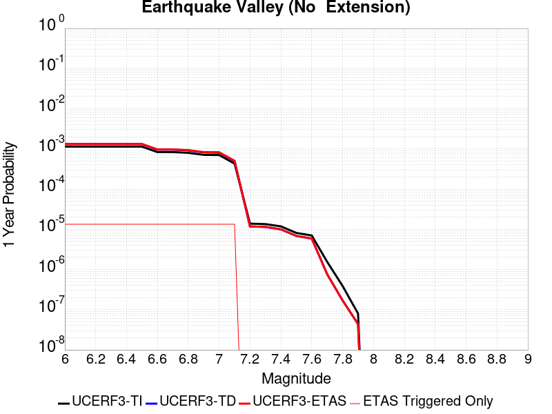 | 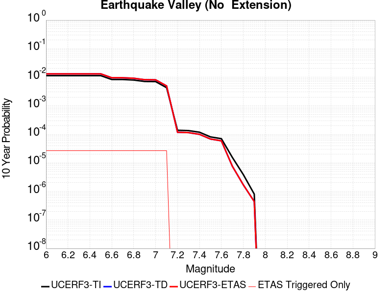 |

| Magnitude | 1 wk TI Prob | 1 wk TD Prob | 1 wk ETAS Prob | 1 wk ETAS/TD Gain | 1 wk ETAS Triggered Only | 1 mo TI Prob | 1 mo TD Prob | 1 mo ETAS Prob | 1 mo ETAS/TD Gain | 1 mo ETAS Triggered Only | 1 yr TI Prob | 1 yr TD Prob | 1 yr ETAS Prob | 1 yr ETAS/TD Gain | 1 yr ETAS Triggered Only | 10 yr TI Prob | 10 yr TD Prob | 10 yr ETAS Prob | 10 yr ETAS/TD Gain | 10 yr ETAS Triggered Only |
|-----|-----|-----|-----|-----|-----|-----|-----|-----|-----|-----|-----|-----|-----|-----|-----|-----|-----|-----|-----|-----|
| 6.0 | 2.1859703E-5 | 2.5198362E-5 | 2.5198362E-5 | 1.0 | 0.0 | 9.3681076E-5 | 1.07989326E-4 | 1.07989326E-4 | 1.0 | 0.0 | 0.0011399703 | 0.001314122 | 0.0013245442 | 1.0079309 | 1.0435908E-5 | 0.011341401 | 0.013077871 | 0.01308817 | 1.0007875 | 1.0435908E-5 |
| 6.1 | 2.1859703E-5 | 2.5198362E-5 | 2.5198362E-5 | 1.0 | 0.0 | 9.3681076E-5 | 1.07989326E-4 | 1.07989326E-4 | 1.0 | 0.0 | 0.0011399703 | 0.001314122 | 0.0013245442 | 1.0079309 | 1.0435908E-5 | 0.011341401 | 0.013077871 | 0.01308817 | 1.0007875 | 1.0435908E-5 |
| 6.2 | 2.1859703E-5 | 2.5198362E-5 | 2.5198362E-5 | 1.0 | 0.0 | 9.3681076E-5 | 1.07989326E-4 | 1.07989326E-4 | 1.0 | 0.0 | 0.0011399703 | 0.001314122 | 0.0013245442 | 1.0079309 | 1.0435908E-5 | 0.011341401 | 0.013077871 | 0.01308817 | 1.0007875 | 1.0435908E-5 |
| 6.3 | 2.1859703E-5 | 2.5198362E-5 | 2.5198362E-5 | 1.0 | 0.0 | 9.3681076E-5 | 1.07989326E-4 | 1.07989326E-4 | 1.0 | 0.0 | 0.0011399703 | 0.001314122 | 0.0013245442 | 1.0079309 | 1.0435908E-5 | 0.011341401 | 0.013077871 | 0.01308817 | 1.0007875 | 1.0435908E-5 |
| 6.4 | 2.1859703E-5 | 2.5198362E-5 | 2.5198362E-5 | 1.0 | 0.0 | 9.3681076E-5 | 1.07989326E-4 | 1.07989326E-4 | 1.0 | 0.0 | 0.0011399703 | 0.001314122 | 0.0013245442 | 1.0079309 | 1.0435908E-5 | 0.011341401 | 0.013077871 | 0.01308817 | 1.0007875 | 1.0435908E-5 |
| 6.5 | 2.1859703E-5 | 2.5198362E-5 | 2.5198362E-5 | 1.0 | 0.0 | 9.3681076E-5 | 1.07989326E-4 | 1.07989326E-4 | 1.0 | 0.0 | 0.0011399703 | 0.001314122 | 0.0013245442 | 1.0079309 | 1.0435908E-5 | 0.011341401 | 0.013077871 | 0.01308817 | 1.0007875 | 1.0435908E-5 |
| 6.6 | 1.597E-5 | 1.8356275E-5 | 1.8356275E-5 | 1.0 | 0.0 | 6.8441055E-5 | 7.866787E-5 | 7.866787E-5 | 1.0 | 0.0 | 8.329513E-4 | 9.574478E-4 | 9.678737E-4 | 1.0108893 | 1.0435908E-5 | 0.008298361 | 0.009541836 | 0.009552172 | 1.0010833 | 1.0435908E-5 |
| 6.7 | 1.597E-5 | 1.8356275E-5 | 1.8356275E-5 | 1.0 | 0.0 | 6.8441055E-5 | 7.866787E-5 | 7.866787E-5 | 1.0 | 0.0 | 8.329513E-4 | 9.574478E-4 | 9.678737E-4 | 1.0108893 | 1.0435908E-5 | 0.008298361 | 0.009541836 | 0.009552172 | 1.0010833 | 1.0435908E-5 |
| 6.8 | 1.5315149E-5 | 1.7602091E-5 | 1.7602091E-5 | 1.0 | 0.0 | 6.5634704E-5 | 7.543584E-5 | 7.543584E-5 | 1.0 | 0.0 | 7.988095E-4 | 9.181311E-4 | 9.285574E-4 | 1.011356 | 1.0435908E-5 | 0.007959441 | 0.009151919 | 0.009162259 | 1.0011299 | 1.0435908E-5 |
| 6.9 | 1.3634728E-5 | 1.5675821E-5 | 1.5675821E-5 | 1.0 | 0.0 | 5.8433237E-5 | 6.718082E-5 | 6.718082E-5 | 1.0 | 0.0 | 7.1119244E-4 | 8.177017E-4 | 8.2812906E-4 | 1.012752 | 1.0435908E-5 | 0.007089207 | 0.008155 | 0.008165351 | 1.0012692 | 1.0435908E-5 |
| 7.0 | 1.3496271E-5 | 1.5517853E-5 | 1.5517853E-5 | 1.0 | 0.0 | 5.783988E-5 | 6.650385E-5 | 6.650385E-5 | 1.0 | 0.0 | 7.03973E-4 | 8.094657E-4 | 8.1989315E-4 | 1.0128819 | 1.0435908E-5 | 0.007017471 | 0.0080732405 | 0.008083592 | 1.0012822 | 1.0435908E-5 |
| 7.1 | 8.242798E-6 | 9.4726E-6 | 9.4726E-6 | 1.0 | 0.0 | 3.53258E-5 | 4.0596606E-5 | 4.0596606E-5 | 1.0 | 0.0 | 4.300067E-4 | 4.9421866E-4 | 5.0464936E-4 | 1.0211055 | 1.0435908E-5 | 0.004291756 | 0.0049377717 | 0.0049481564 | 1.0021031 | 1.0435908E-5 |
| 7.2 | 2.6506527E-7 | 2.2560312E-7 | 2.2560312E-7 | 1.0 | 0.0 | 1.1359936E-6 | 9.668702E-7 | 9.668702E-7 | 1.0 | 0.0 | 1.3830633E-5 | 1.17715845E-5 | 1.17715845E-5 | 1.0 | 0.0 | 1.3829772E-4 | 1.1771003E-4 | 1.1771003E-4 | 1.0 | 0.0 |
| 7.3 | 2.5810488E-7 | 2.1955442E-7 | 2.1955442E-7 | 1.0 | 0.0 | 1.1061633E-6 | 9.409472E-7 | 9.409472E-7 | 1.0 | 0.0 | 1.3467455E-5 | 1.1455976E-5 | 1.1455976E-5 | 1.0 | 0.0 | 1.3466639E-4 | 1.1455427E-4 | 1.1455427E-4 | 1.0 | 0.0 |
| 7.4 | 2.2676066E-7 | 1.9110601E-7 | 1.9110601E-7 | 1.0 | 0.0 | 9.71831E-7 | 8.190255E-7 | 8.190255E-7 | 1.0 | 0.0 | 1.1831979E-5 | 9.9715935E-6 | 9.9715935E-6 | 1.0 | 0.0 | 1.1831349E-4 | 9.9711855E-5 | 9.9711855E-5 | 1.0 | 0.0 |
| 7.5 | 1.5553917E-7 | 1.3112096E-7 | 1.3112096E-7 | 1.0 | 0.0 | 6.6659624E-7 | 5.619469E-7 | 5.619469E-7 | 1.0 | 0.0 | 8.115779E-6 | 6.8416834E-6 | 6.8416834E-6 | 1.0 | 0.0 | 8.115482E-5 | 6.841495E-5 | 6.841495E-5 | 1.0 | 0.0 |
| 7.6 | 1.3448629E-7 | 1.1288419E-7 | 1.1288419E-7 | 1.0 | 0.0 | 5.7636964E-7 | 4.837893E-7 | 4.837893E-7 | 1.0 | 0.0 | 7.017278E-6 | 5.890121E-6 | 5.890121E-6 | 1.0 | 0.0 | 7.0170565E-5 | 5.889986E-5 | 5.889986E-5 | 1.0 | 0.0 |
| 7.7 | 2.9719402E-8 | 1.458206E-8 | 1.458206E-8 | 1.0 | 0.0 | 1.2736886E-7 | 6.249454E-8 | 6.249454E-8 | 1.0 | 0.0 | 1.5507147E-6 | 7.608708E-7 | 7.608708E-7 | 1.0 | 0.0 | 1.550704E-5 | 7.6086876E-6 | 7.6086876E-6 | 1.0 | 0.0 |
| 7.8 | 7.4390196E-9 | 3.2502152E-9 | 3.2502152E-9 | 1.0 | 0.0 | 3.1881513E-8 | 1.3929493E-8 | 1.3929493E-8 | 1.0 | 0.0 | 3.8815733E-7 | 1.6959156E-7 | 1.6959156E-7 | 1.0 | 0.0 | 3.8815665E-6 | 1.6959145E-6 | 1.6959145E-6 | 1.0 | 0.0 |
| 7.9 | 1.5373532E-9 | 8.440161E-10 | 8.440161E-10 | 1.0 | 0.0 | 6.5886567E-9 | 3.6172119E-9 | 3.6172119E-9 | 1.0 | 0.0 | 8.021689E-8 | 4.4039556E-8 | 4.4039556E-8 | 1.0 | 0.0 | 8.0216864E-7 | 4.4039552E-7 | 4.4039552E-7 | 1.0 | 0.0 |

## Great Valley 04a Trout Creek
*[(top)](#table-of-contents)*

| 1 Week | 1 Month | 1 Year | 10 Year |
|-----|-----|-----|-----|
| 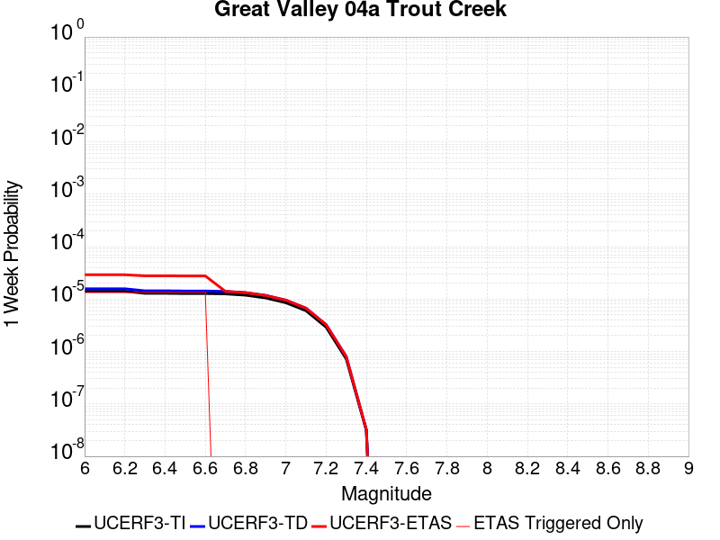 | 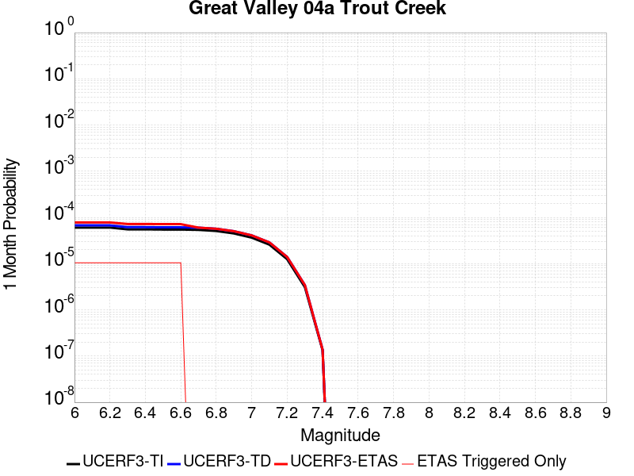 | 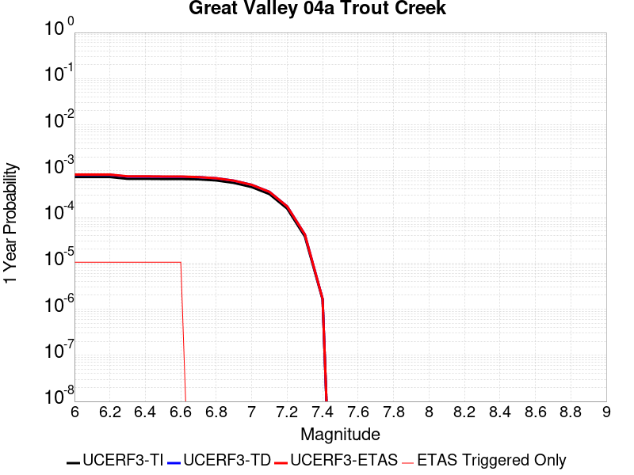 | 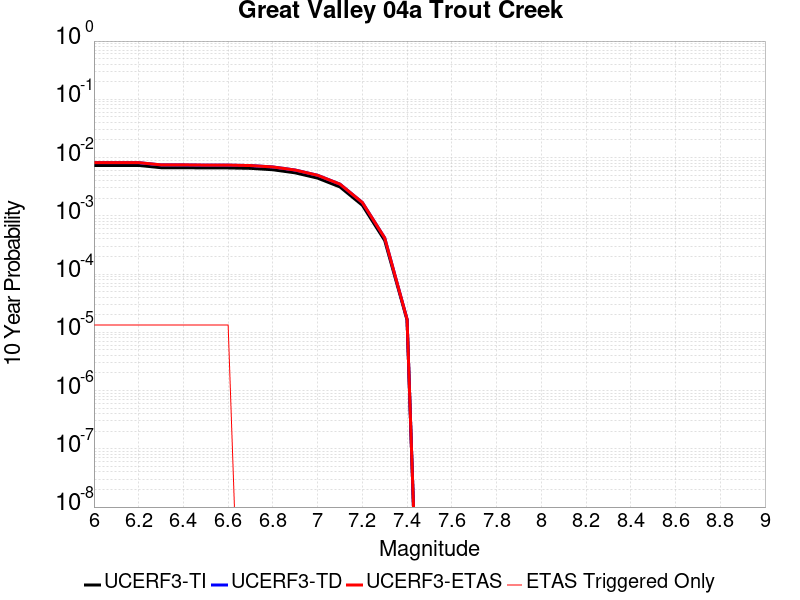 |

| Magnitude | 1 wk TI Prob | 1 wk TD Prob | 1 wk ETAS Prob | 1 wk ETAS/TD Gain | 1 wk ETAS Triggered Only | 1 mo TI Prob | 1 mo TD Prob | 1 mo ETAS Prob | 1 mo ETAS/TD Gain | 1 mo ETAS Triggered Only | 1 yr TI Prob | 1 yr TD Prob | 1 yr ETAS Prob | 1 yr ETAS/TD Gain | 1 yr ETAS Triggered Only | 10 yr TI Prob | 10 yr TD Prob | 10 yr ETAS Prob | 10 yr ETAS/TD Gain | 10 yr ETAS Triggered Only |
|-----|-----|-----|-----|-----|-----|-----|-----|-----|-----|-----|-----|-----|-----|-----|-----|-----|-----|-----|-----|-----|
| 6.0 | 1.4088538E-5 | 1.5719554E-5 | 2.6155298E-5 | 1.6638702 | 1.0435908E-5 | 6.037805E-5 | 6.7367844E-5 | 7.780305E-5 | 1.1548989 | 1.0435908E-5 | 7.3485484E-4 | 8.199074E-4 | 8.303347E-4 | 1.0127177 | 1.0435908E-5 | 0.007324295 | 0.008170108 | 0.008180459 | 1.0012668 | 1.0435908E-5 |
| 6.1 | 1.4088538E-5 | 1.5719554E-5 | 2.6155298E-5 | 1.6638702 | 1.0435908E-5 | 6.037805E-5 | 6.7367844E-5 | 7.780305E-5 | 1.1548989 | 1.0435908E-5 | 7.3485484E-4 | 8.199074E-4 | 8.303347E-4 | 1.0127177 | 1.0435908E-5 | 0.007324295 | 0.008170108 | 0.008180459 | 1.0012668 | 1.0435908E-5 |
| 6.2 | 1.4088538E-5 | 1.5719554E-5 | 2.6155298E-5 | 1.6638702 | 1.0435908E-5 | 6.037805E-5 | 6.7367844E-5 | 7.780305E-5 | 1.1548989 | 1.0435908E-5 | 7.3485484E-4 | 8.199074E-4 | 8.303347E-4 | 1.0127177 | 1.0435908E-5 | 0.007324295 | 0.008170108 | 0.008180459 | 1.0012668 | 1.0435908E-5 |
| 6.3 | 1.2882862E-5 | 1.4378603E-5 | 2.481436E-5 | 1.7257838 | 1.0435908E-5 | 5.5211098E-5 | 6.1621184E-5 | 7.205645E-5 | 1.1693454 | 1.0435908E-5 | 6.7198783E-4 | 7.4999005E-4 | 7.6041813E-4 | 1.0139043 | 1.0435908E-5 | 0.0066995937 | 0.0074756527 | 0.007486011 | 1.0013856 | 1.0435908E-5 |
| 6.4 | 1.2882862E-5 | 1.4378603E-5 | 2.481436E-5 | 1.7257838 | 1.0435908E-5 | 5.5211098E-5 | 6.1621184E-5 | 7.205645E-5 | 1.1693454 | 1.0435908E-5 | 6.7198783E-4 | 7.4999005E-4 | 7.6041813E-4 | 1.0139043 | 1.0435908E-5 | 0.0066995937 | 0.0074756527 | 0.007486011 | 1.0013856 | 1.0435908E-5 |
| 6.5 | 1.2762329E-5 | 1.424516E-5 | 2.468092E-5 | 1.7325828 | 1.0435908E-5 | 5.469455E-5 | 6.1049315E-5 | 7.148459E-5 | 1.1709318 | 1.0435908E-5 | 6.657027E-4 | 7.430323E-4 | 7.5346045E-4 | 1.0140346 | 1.0435908E-5 | 0.00663712 | 0.0074065393 | 0.0074168975 | 1.0013986 | 1.0435908E-5 |
| 6.6 | 1.2762329E-5 | 1.424516E-5 | 2.468092E-5 | 1.7325828 | 1.0435908E-5 | 5.469455E-5 | 6.1049315E-5 | 7.148459E-5 | 1.1709318 | 1.0435908E-5 | 6.657027E-4 | 7.430323E-4 | 7.5346045E-4 | 1.0140346 | 1.0435908E-5 | 0.00663712 | 0.0074065393 | 0.0074168975 | 1.0013986 | 1.0435908E-5 |
| 6.7 | 1.2557959E-5 | 1.4019395E-5 | 1.4019395E-5 | 1.0 | 0.0 | 5.3818712E-5 | 6.0081795E-5 | 6.0081795E-5 | 1.0 | 0.0 | 6.5504585E-4 | 7.312607E-4 | 7.312607E-4 | 1.0 | 0.0 | 0.006531183 | 0.007289598 | 0.007289598 | 1.0 | 0.0 |
| 6.8 | 1.1871544E-5 | 1.3258823E-5 | 1.3258823E-5 | 1.0 | 0.0 | 5.0877054E-5 | 5.6822348E-5 | 5.6822348E-5 | 1.0 | 0.0 | 6.1925204E-4 | 6.916025E-4 | 6.916025E-4 | 1.0 | 0.0 | 0.0061752927 | 0.0068955184 | 0.0068955184 | 1.0 | 0.0 |
| 6.9 | 1.0500373E-5 | 1.1731261E-5 | 1.1731261E-5 | 1.0 | 0.0 | 4.5000823E-5 | 5.0275914E-5 | 5.0275914E-5 | 1.0 | 0.0 | 5.4774724E-4 | 6.119459E-4 | 6.119459E-4 | 1.0 | 0.0 | 0.005463991 | 0.0061034737 | 0.0061034737 | 1.0 | 0.0 |
| 7.0 | 8.524332E-6 | 9.5334835E-6 | 9.5334835E-6 | 1.0 | 0.0 | 3.653234E-5 | 4.0857187E-5 | 4.0857187E-5 | 1.0 | 0.0 | 4.4469046E-4 | 4.9733004E-4 | 4.9733004E-4 | 1.0 | 0.0 | 0.0044380166 | 0.004962902 | 0.004962902 | 1.0 | 0.0 |
| 7.1 | 6.006849E-6 | 6.711559E-6 | 6.711559E-6 | 1.0 | 0.0 | 2.5743384E-5 | 2.876354E-5 | 2.876354E-5 | 1.0 | 0.0 | 3.1338062E-4 | 3.501454E-4 | 3.501454E-4 | 1.0 | 0.0 | 0.0031293905 | 0.0034964874 | 0.0034964874 | 1.0 | 0.0 |
| 7.2 | 2.9122193E-6 | 3.2465305E-6 | 3.2465305E-6 | 1.0 | 0.0 | 1.248088E-5 | 1.3913637E-5 | 1.3913637E-5 | 1.0 | 0.0 | 1.5194413E-4 | 1.6938712E-4 | 1.6938712E-4 | 1.0 | 0.0 | 0.0015184027 | 0.0016927521 | 0.0016927521 | 1.0 | 0.0 |
| 7.3 | 7.2194007E-7 | 7.988761E-7 | 7.988761E-7 | 1.0 | 0.0 | 3.0940253E-6 | 3.4237528E-6 | 3.4237528E-6 | 1.0 | 0.0 | 3.7669106E-5 | 4.1683852E-5 | 4.1683852E-5 | 1.0 | 0.0 | 3.766272E-4 | 4.168053E-4 | 4.168053E-4 | 1.0 | 0.0 |
| 7.4 | 3.112171E-8 | 3.2068368E-8 | 3.2068368E-8 | 1.0 | 0.0 | 1.3337875E-7 | 1.3743585E-7 | 1.3743585E-7 | 1.0 | 0.0 | 1.6238852E-6 | 1.6732803E-6 | 1.6732803E-6 | 1.0 | 0.0 | 1.6238733E-5 | 1.6732685E-5 | 1.6732685E-5 | 1.0 | 0.0 |

